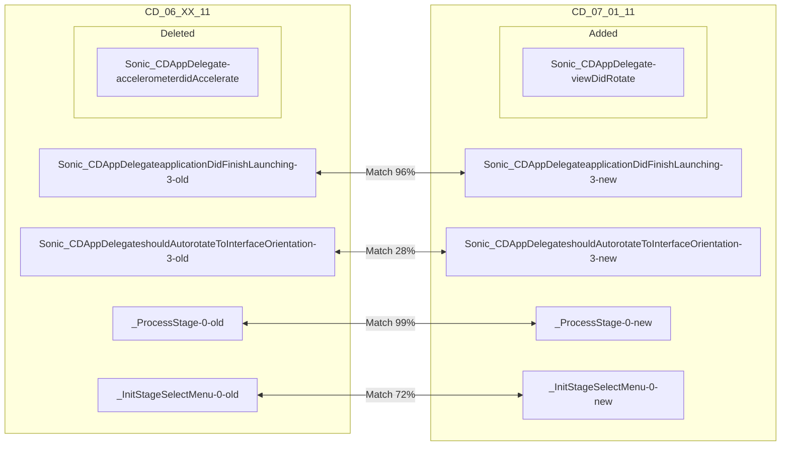
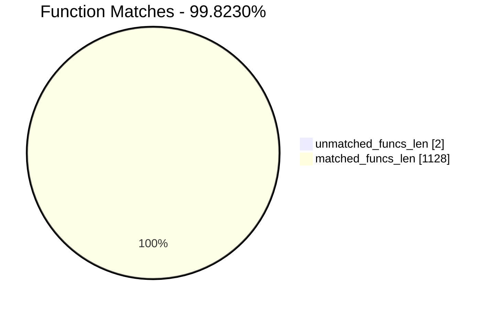
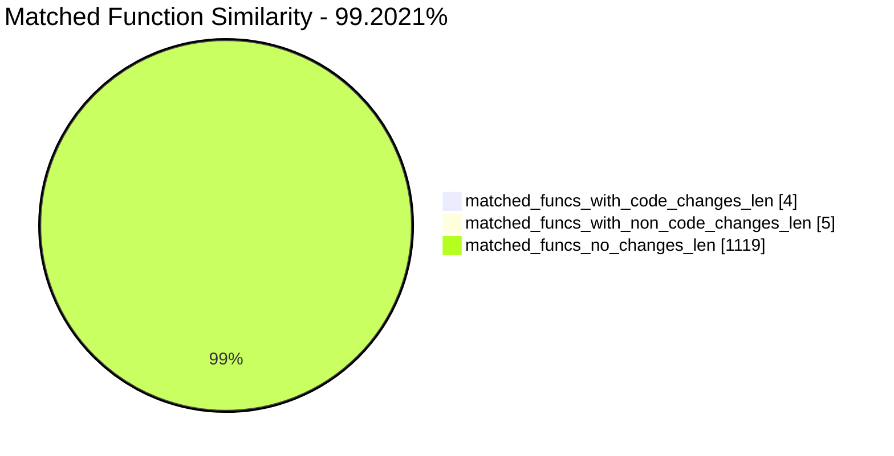
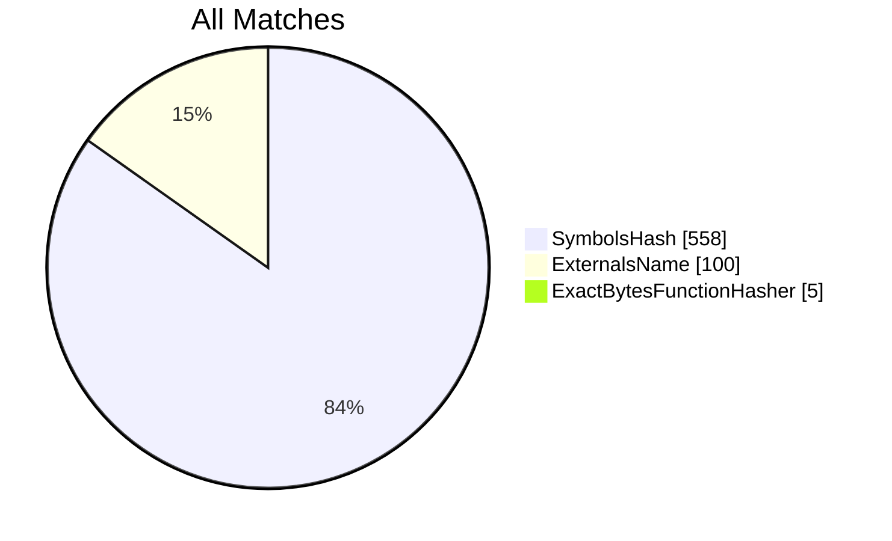
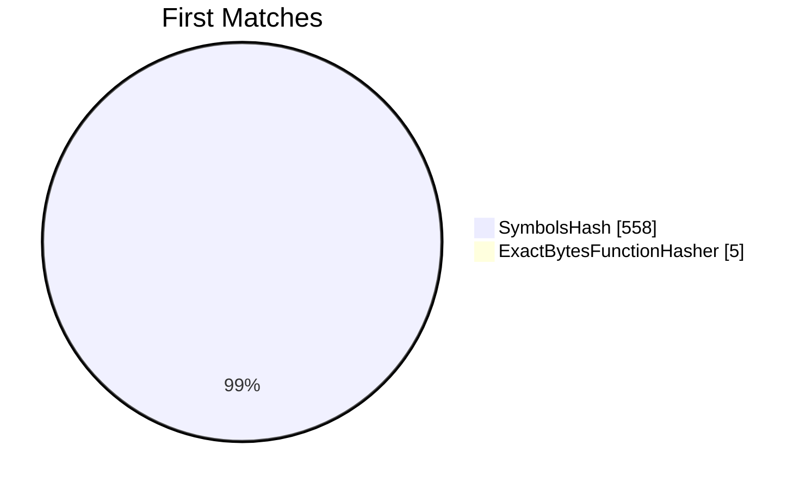
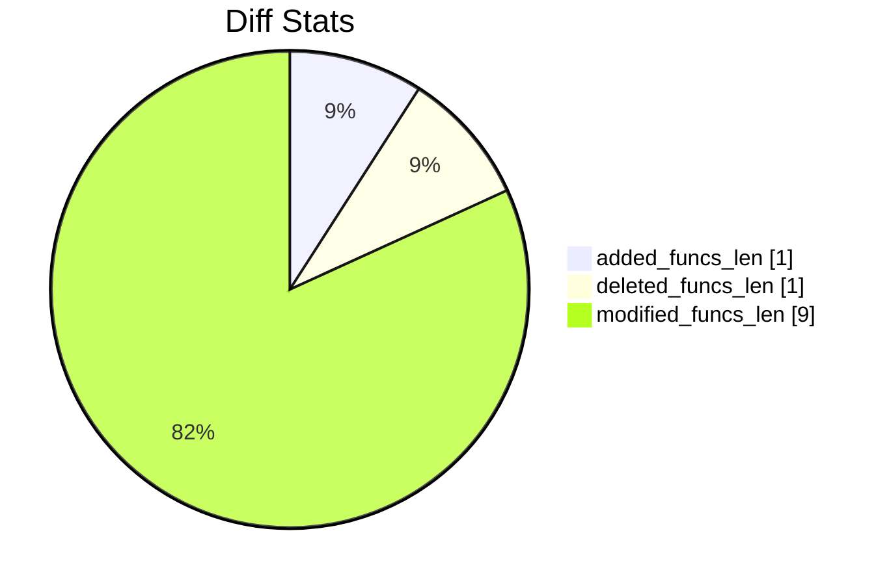
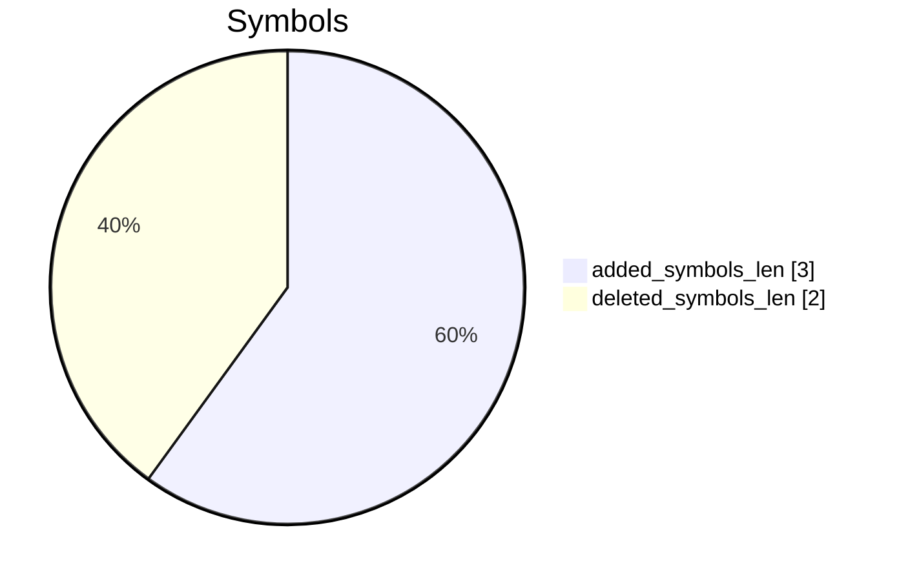
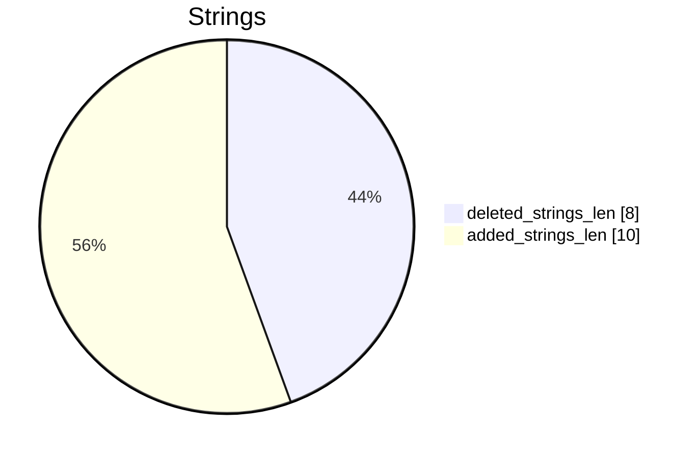

# CD_06_XX_11-CD_07_01_11 Diff

# TOC

* [Visual Chart Diff](#visual-chart-diff)
* [Metadata](#metadata)
	* [Ghidra Diff Engine](#ghidra-diff-engine)
		* [Command Line](#command-line)
	* [Binary Metadata Diff](#binary-metadata-diff)
	* [Program Options](#program-options)
	* [Diff Stats](#diff-stats)
	* [Strings](#strings)
* [Deleted](#deleted)
	* [Sonic_CDAppDelegate::accelerometer:didAccelerate:](#sonic_cdappdelegateaccelerometerdidaccelerate)
* [Added](#added)
	* [Sonic_CDAppDelegate::viewDidRotate:](#sonic_cdappdelegateviewdidrotate)
* [Modified](#modified)
	* [Sonic_CDAppDelegate::applicationDidFinishLaunching:](#sonic_cdappdelegateapplicationdidfinishlaunching)
	* [Sonic_CDAppDelegate::shouldAutorotateToInterfaceOrientation:](#sonic_cdappdelegateshouldautorotatetointerfaceorientation)
	* [_ProcessStage](#_processstage)
	* [_InitStageSelectMenu](#_initstageselectmenu)
* [Modified (No Code Changes)](#modified-no-code-changes)
	* [_LoadPalette](#_loadpalette)
	* [_ReleaseRenderDevice](#_releaserenderdevice)
	* [_ClearGraphicsData](#_cleargraphicsdata)

# Visual Chart Diff










# Metadata

## Ghidra Diff Engine

### Command Line

#### Captured Command Line


```
ghidriff --project-location ghidra_projects --project-name ghidriff --symbols-path symbols --threaded --log-level INFO --file-log-level INFO --log-path ghidriff.log --min-func-len 2 --gdt [] --bsim --max-ram-percent 60.0 --max-section-funcs 200 CD_06_XX_11 CD_07_01_11
```


#### Verbose Args


<details>

```
--old ['CD_06_XX_11'] --new [['CD_07_01_11']] --engine VersionTrackingDiff --output-path diffing_test --summary False --project-location ghidra_projects --project-name ghidriff --symbols-path symbols --threaded True --force-analysis False --force-diff False --no-symbols False --log-level INFO --file-log-level INFO --log-path ghidriff.log --va False --min-func-len 2 --use-calling-counts False --gdt [] --bsim True --bsim-full False --max-ram-percent 60.0 --print-flags False --jvm-args None --side-by-side False --max-section-funcs 200 --md-title None
```


</details>

## Binary Metadata Diff


```diff
--- CD_06_XX_11 Meta
+++ CD_07_01_11 Meta
@@ -1,42 +1,42 @@
-Program Name: CD_06_XX_11
+Program Name: CD_07_01_11
 Language ID: ARM:LE:32:v6 (1.107)
 Compiler ID: default
 Processor: ARM
 Endian: Little
 Address Size: 32
 Minimum Address: 00001000
-Maximum Address: 0127a003
-# of Bytes: 19365980
-# of Memory Blocks: 30
-# of Instructions: 48916
-# of Defined Data: 12179
+Maximum Address: 01279003
+# of Bytes: 19361892
+# of Memory Blocks: 29
+# of Instructions: 48904
+# of Defined Data: 12177
 # of Functions: 565
-# of Symbols: 3380
-# of Data Types: 122
+# of Symbols: 3378
+# of Data Types: 121
 # of Data Type Categories: 7
 Analyzed: true
 Created With Ghidra Version: 11.0.3
-Date Created: Thu Jan 09 18:32:41 CET 2025
+Date Created: Thu Jan 09 18:32:43 CET 2025
 Executable Format: Mac OS X Mach-O
-Executable Location: /home/user/CD_06_XX_11
-Executable MD5: a3c8da040bd002968dbb30c4a3f94b76
-Executable SHA256: de0448a1fdf79a2e9ac412bb4082e7139101bf88f02e4762f0667dd32979f63d
-FSRL: file:///home/user/CD_06_XX_11?MD5=a3c8da040bd002968dbb30c4a3f94b76
+Executable Location: /home/user/CD_07_01_11
+Executable MD5: 0f2d2bc3179f5ad50643be44c393955f
+Executable SHA256: dd5ae93a7db8d48f75088ef0edf5878aca20b18a7a4faa4c683dd6af2d205581
+FSRL: file:///home/user/CD_07_01_11?MD5=0f2d2bc3179f5ad50643be44c393955f
 Mach-O File Type: EXECUTE
 Mach-O File Type Description: Demand Paged Executable File
 Mach-O Flag 0: NOUNDEFS
 Mach-O Flag 1: DYLDLINK
 Mach-O Flag 2: TWOLEVEL
 Preferred Root Namespace Category: 
 Relocatable: false
 Required Library [    0]: /System/Library/Frameworks/AudioToolbox.framework/AudioToolbox
 Required Library [    1]: /System/Library/Frameworks/Foundation.framework/Foundation
 Required Library [    2]: /System/Library/Frameworks/UIKit.framework/UIKit
 Required Library [    3]: /System/Library/Frameworks/OpenGLES.framework/OpenGLES
 Required Library [    4]: /System/Library/Frameworks/QuartzCore.framework/QuartzCore
 Required Library [    5]: /System/Library/Frameworks/OpenAL.framework/OpenAL
 Required Library [    6]: /usr/lib/libgcc_s.1.dylib
 Required Library [    7]: /usr/lib/libSystem.B.dylib
 Required Library [    8]: /usr/lib/libobjc.A.dylib
 Required Library [    9]: /System/Library/Frameworks/CoreFoundation.framework/CoreFoundation
 Should Ask To Analyze: false

```


## Program Options


<details>
<summary>Ghidra CD_06_XX_11 Decompiler Options</summary>


|Decompiler Option|Value|
| :---: | :---: |
|Prototype Evaluation|__stdcall|

</details>


<details>
<summary>Ghidra CD_06_XX_11 Specification extensions Options</summary>


|Specification extensions Option|Value|
| :---: | :---: |
|FormatVersion|0|
|VersionCounter|0|

</details>


<details>
<summary>Ghidra CD_06_XX_11 Analyzers Options</summary>


|Analyzers Option|Value|
| :---: | :---: |
|ARM Aggressive Instruction Finder|false|
|ARM Constant Reference Analyzer|true|
|ARM Constant Reference Analyzer.Create Data from pointer|false|
|ARM Constant Reference Analyzer.Function parameter/return Pointer analysis|true|
|ARM Constant Reference Analyzer.Max Threads|2|
|ARM Constant Reference Analyzer.Min absolute reference|4|
|ARM Constant Reference Analyzer.Require pointer param data type|false|
|ARM Constant Reference Analyzer.Speculative reference max|256|
|ARM Constant Reference Analyzer.Speculative reference min|512|
|ARM Constant Reference Analyzer.Stored Value Pointer analysis|true|
|ARM Constant Reference Analyzer.Switch Table Recovery|false|
|ARM Constant Reference Analyzer.Trust values read from writable memory|true|
|ARM Symbol|true|
|ASCII Strings|true|
|ASCII Strings.Create Strings Containing Existing Strings|true|
|ASCII Strings.Create Strings Containing References|true|
|ASCII Strings.Force Model Reload|false|
|ASCII Strings.Minimum String Length|LEN_5|
|ASCII Strings.Model File|StringModel.sng|
|ASCII Strings.Require Null Termination for String|true|
|ASCII Strings.Search Only in Accessible Memory Blocks|true|
|ASCII Strings.String Start Alignment|ALIGN_1|
|ASCII Strings.String end alignment|4|
|Aggressive Instruction Finder|false|
|Aggressive Instruction Finder.Create Analysis Bookmarks|true|
|Apply Data Archives|true|
|Apply Data Archives.Archive Chooser|[Auto-Detect]|
|Apply Data Archives.Create Analysis Bookmarks|true|
|Apply Data Archives.GDT User File Archive Path|None|
|Apply Data Archives.User Project Archive Path|None|
|CFStrings|true|
|Call Convention ID|true|
|Call Convention ID.Analysis Decompiler Timeout (sec)|60|
|Call-Fixup Installer|true|
|Condense Filler Bytes|false|
|Condense Filler Bytes.Filler Value|Auto|
|Condense Filler Bytes.Minimum number of sequential bytes|1|
|Create Address Tables|true|
|Create Address Tables.Allow Offcut References|false|
|Create Address Tables.Auto Label Table|false|
|Create Address Tables.Create Analysis Bookmarks|true|
|Create Address Tables.Maxmimum Pointer Distance|16777215|
|Create Address Tables.Minimum Pointer Address|4132|
|Create Address Tables.Minimum Table Size|4|
|Create Address Tables.Pointer Alignment|1|
|Create Address Tables.Relocation Table Guide|true|
|Create Address Tables.Table Alignment|4|
|DWARF Line Number|false|
|Data Reference|true|
|Data Reference.Address Table Alignment|1|
|Data Reference.Address Table Minimum Size|4|
|Data Reference.Align End of Strings|false|
|Data Reference.Ascii String References|true|
|Data Reference.Create Address Tables|false|
|Data Reference.Minimum String Length|5|
|Data Reference.References to Pointers|false|
|Data Reference.Relocation Table Guide|true|
|Data Reference.Respect Execute Flag|true|
|Data Reference.Subroutine References|true|
|Data Reference.Switch Table References|false|
|Data Reference.Unicode String References|true|
|Decompiler Parameter ID|false|
|Decompiler Parameter ID.Analysis Clear Level|ANALYSIS|
|Decompiler Parameter ID.Analysis Decompiler Timeout (sec)|60|
|Decompiler Parameter ID.Commit Data Types|true|
|Decompiler Parameter ID.Commit Void Return Values|false|
|Decompiler Parameter ID.Prototype Evaluation|__stdcall|
|Decompiler Switch Analysis|true|
|Decompiler Switch Analysis.Analysis Decompiler Timeout (sec)|60|
|Demangler GNU|true|
|Demangler GNU.Apply Function Calling Conventions|true|
|Demangler GNU.Apply Function Signatures|true|
|Demangler GNU.Demangle Only Known Mangled Symbols|false|
|Demangler GNU.Demangler Format|AUTO|
|Demangler GNU.Use Deprecated Demangler|false|
|Disassemble Entry Points|true|
|Disassemble Entry Points.Respect Execute Flag|true|
|Embedded Media|true|
|Embedded Media.Create Analysis Bookmarks|true|
|External Entry References|true|
|External Symbol Resolver|true|
|Function Start Pre Search|true|
|Function Start Pre Search.Bookmark Functions|false|
|Function Start Pre Search.Search Data Blocks|false|
|Function Start Search|true|
|Function Start Search After Code|true|
|Function Start Search After Code.Bookmark Functions|false|
|Function Start Search After Code.Search Data Blocks|false|
|Function Start Search After Data|true|
|Function Start Search After Data.Bookmark Functions|false|
|Function Start Search After Data.Search Data Blocks|false|
|Function Start Search.Bookmark Functions|false|
|Function Start Search.Search Data Blocks|false|
|Mach-O Function Starts|true|
|Mach-O Function Starts.Bookmark failed functions|false|
|Mach-O Function Starts.Bookmark new functions|false|
|Mach-O Function Starts.Bookmark skipped functions|false|
|Mach-O Function Starts.Use PseudoDisassembler|true|
|Non-Returning Functions - Discovered|true|
|Non-Returning Functions - Discovered.Create Analysis Bookmarks|true|
|Non-Returning Functions - Discovered.Function Non-return Threshold|3|
|Non-Returning Functions - Discovered.Repair Flow Damage|true|
|Non-Returning Functions - Known|true|
|Non-Returning Functions - Known.Create Analysis Bookmarks|true|
|Objective-C 2 Class|true|
|Objective-C 2 Decompiler Message|true|
|Objective-C 2 Message|false|
|Reference|true|
|Reference.Address Table Alignment|1|
|Reference.Address Table Minimum Size|4|
|Reference.Align End of Strings|false|
|Reference.Ascii String References|true|
|Reference.Create Address Tables|false|
|Reference.Minimum String Length|5|
|Reference.References to Pointers|false|
|Reference.Relocation Table Guide|true|
|Reference.Respect Execute Flag|true|
|Reference.Subroutine References|true|
|Reference.Switch Table References|false|
|Reference.Unicode String References|true|
|Scalar Operand References|false|
|Scalar Operand References.Relocation Table Guide|true|
|Shared Return Calls|true|
|Shared Return Calls.Allow Conditional Jumps|false|
|Shared Return Calls.Assume Contiguous Functions Only|false|
|Stack|true|
|Stack.Create Local Variables|true|
|Stack.Create Param Variables|true|
|Stack.useNewFunctionStackAnalysis|true|
|Subroutine References|true|
|Subroutine References.Create Thunks Early|true|
|Variadic Function Signature Override|false|
|Variadic Function Signature Override.Create Analysis Bookmarks|false|

</details>


<details>
<summary>Ghidra CD_07_01_11 Decompiler Options</summary>


|Decompiler Option|Value|
| :---: | :---: |
|Prototype Evaluation|__stdcall|

</details>


<details>
<summary>Ghidra CD_07_01_11 Specification extensions Options</summary>


|Specification extensions Option|Value|
| :---: | :---: |
|FormatVersion|0|
|VersionCounter|0|

</details>


<details>
<summary>Ghidra CD_07_01_11 Analyzers Options</summary>


|Analyzers Option|Value|
| :---: | :---: |
|ARM Aggressive Instruction Finder|false|
|ARM Constant Reference Analyzer|true|
|ARM Constant Reference Analyzer.Create Data from pointer|false|
|ARM Constant Reference Analyzer.Function parameter/return Pointer analysis|true|
|ARM Constant Reference Analyzer.Max Threads|2|
|ARM Constant Reference Analyzer.Min absolute reference|4|
|ARM Constant Reference Analyzer.Require pointer param data type|false|
|ARM Constant Reference Analyzer.Speculative reference max|256|
|ARM Constant Reference Analyzer.Speculative reference min|512|
|ARM Constant Reference Analyzer.Stored Value Pointer analysis|true|
|ARM Constant Reference Analyzer.Switch Table Recovery|false|
|ARM Constant Reference Analyzer.Trust values read from writable memory|true|
|ARM Symbol|true|
|ASCII Strings|true|
|ASCII Strings.Create Strings Containing Existing Strings|true|
|ASCII Strings.Create Strings Containing References|true|
|ASCII Strings.Force Model Reload|false|
|ASCII Strings.Minimum String Length|LEN_5|
|ASCII Strings.Model File|StringModel.sng|
|ASCII Strings.Require Null Termination for String|true|
|ASCII Strings.Search Only in Accessible Memory Blocks|true|
|ASCII Strings.String Start Alignment|ALIGN_1|
|ASCII Strings.String end alignment|4|
|Aggressive Instruction Finder|false|
|Aggressive Instruction Finder.Create Analysis Bookmarks|true|
|Apply Data Archives|true|
|Apply Data Archives.Archive Chooser|[Auto-Detect]|
|Apply Data Archives.Create Analysis Bookmarks|true|
|Apply Data Archives.GDT User File Archive Path|None|
|Apply Data Archives.User Project Archive Path|None|
|CFStrings|true|
|Call Convention ID|true|
|Call Convention ID.Analysis Decompiler Timeout (sec)|60|
|Call-Fixup Installer|true|
|Condense Filler Bytes|false|
|Condense Filler Bytes.Filler Value|Auto|
|Condense Filler Bytes.Minimum number of sequential bytes|1|
|Create Address Tables|true|
|Create Address Tables.Allow Offcut References|false|
|Create Address Tables.Auto Label Table|false|
|Create Address Tables.Create Analysis Bookmarks|true|
|Create Address Tables.Maxmimum Pointer Distance|16777215|
|Create Address Tables.Minimum Pointer Address|4132|
|Create Address Tables.Minimum Table Size|4|
|Create Address Tables.Pointer Alignment|1|
|Create Address Tables.Relocation Table Guide|true|
|Create Address Tables.Table Alignment|4|
|DWARF Line Number|false|
|Data Reference|true|
|Data Reference.Address Table Alignment|1|
|Data Reference.Address Table Minimum Size|4|
|Data Reference.Align End of Strings|false|
|Data Reference.Ascii String References|true|
|Data Reference.Create Address Tables|false|
|Data Reference.Minimum String Length|5|
|Data Reference.References to Pointers|false|
|Data Reference.Relocation Table Guide|true|
|Data Reference.Respect Execute Flag|true|
|Data Reference.Subroutine References|true|
|Data Reference.Switch Table References|false|
|Data Reference.Unicode String References|true|
|Decompiler Parameter ID|false|
|Decompiler Parameter ID.Analysis Clear Level|ANALYSIS|
|Decompiler Parameter ID.Analysis Decompiler Timeout (sec)|60|
|Decompiler Parameter ID.Commit Data Types|true|
|Decompiler Parameter ID.Commit Void Return Values|false|
|Decompiler Parameter ID.Prototype Evaluation|__stdcall|
|Decompiler Switch Analysis|true|
|Decompiler Switch Analysis.Analysis Decompiler Timeout (sec)|60|
|Demangler GNU|true|
|Demangler GNU.Apply Function Calling Conventions|true|
|Demangler GNU.Apply Function Signatures|true|
|Demangler GNU.Demangle Only Known Mangled Symbols|false|
|Demangler GNU.Demangler Format|AUTO|
|Demangler GNU.Use Deprecated Demangler|false|
|Disassemble Entry Points|true|
|Disassemble Entry Points.Respect Execute Flag|true|
|Embedded Media|true|
|Embedded Media.Create Analysis Bookmarks|true|
|External Entry References|true|
|External Symbol Resolver|true|
|Function Start Pre Search|true|
|Function Start Pre Search.Bookmark Functions|false|
|Function Start Pre Search.Search Data Blocks|false|
|Function Start Search|true|
|Function Start Search After Code|true|
|Function Start Search After Code.Bookmark Functions|false|
|Function Start Search After Code.Search Data Blocks|false|
|Function Start Search After Data|true|
|Function Start Search After Data.Bookmark Functions|false|
|Function Start Search After Data.Search Data Blocks|false|
|Function Start Search.Bookmark Functions|false|
|Function Start Search.Search Data Blocks|false|
|Mach-O Function Starts|true|
|Mach-O Function Starts.Bookmark failed functions|false|
|Mach-O Function Starts.Bookmark new functions|false|
|Mach-O Function Starts.Bookmark skipped functions|false|
|Mach-O Function Starts.Use PseudoDisassembler|true|
|Non-Returning Functions - Discovered|true|
|Non-Returning Functions - Discovered.Create Analysis Bookmarks|true|
|Non-Returning Functions - Discovered.Function Non-return Threshold|3|
|Non-Returning Functions - Discovered.Repair Flow Damage|true|
|Non-Returning Functions - Known|true|
|Non-Returning Functions - Known.Create Analysis Bookmarks|true|
|Objective-C 2 Class|true|
|Objective-C 2 Decompiler Message|true|
|Objective-C 2 Message|false|
|Reference|true|
|Reference.Address Table Alignment|1|
|Reference.Address Table Minimum Size|4|
|Reference.Align End of Strings|false|
|Reference.Ascii String References|true|
|Reference.Create Address Tables|false|
|Reference.Minimum String Length|5|
|Reference.References to Pointers|false|
|Reference.Relocation Table Guide|true|
|Reference.Respect Execute Flag|true|
|Reference.Subroutine References|true|
|Reference.Switch Table References|false|
|Reference.Unicode String References|true|
|Scalar Operand References|false|
|Scalar Operand References.Relocation Table Guide|true|
|Shared Return Calls|true|
|Shared Return Calls.Allow Conditional Jumps|false|
|Shared Return Calls.Assume Contiguous Functions Only|false|
|Stack|true|
|Stack.Create Local Variables|true|
|Stack.Create Param Variables|true|
|Stack.useNewFunctionStackAnalysis|true|
|Subroutine References|true|
|Subroutine References.Create Thunks Early|true|
|Variadic Function Signature Override|false|
|Variadic Function Signature Override.Create Analysis Bookmarks|false|

</details>

## Diff Stats


|Stat|Value|
| :---: | :---: |
|added_funcs_len|1|
|deleted_funcs_len|1|
|modified_funcs_len|9|
|added_symbols_len|3|
|deleted_symbols_len|2|
|diff_time|4.7175233364105225|
|deleted_strings_len|8|
|added_strings_len|10|
|match_types|Counter({'SymbolsHash': 558, 'ExternalsName': 100, 'ExactBytesFunctionHasher': 5})|
|items_to_process|16|
|diff_types|Counter({'address': 9, 'refcount': 5, 'code': 4, 'length': 4, 'calling': 2})|
|unmatched_funcs_len|2|
|total_funcs_len|1130|
|matched_funcs_len|1128|
|matched_funcs_with_code_changes_len|4|
|matched_funcs_with_non_code_changes_len|5|
|matched_funcs_no_changes_len|1119|
|match_func_similarity_percent|99.2021%|
|func_match_overall_percent|99.8230%|
|first_matches|Counter({'SymbolsHash': 558, 'ExactBytesFunctionHasher': 5})|













## Strings




### Strings Diff


```diff
--- deleted strings
+++ added strings
@@ -1,8 +1,10 @@
-s_-[Sonic_CDAppDelegate_accelerome
-s_UIAccelerometerDelegate
-s__OBJC_CLASS_$_UIAccelerometer
-s_accelerometer:didAccelerate:
-s_setDelegate:
-s_setUpdateInterval:
-s_sharedAccelerometer
-s_x
+s_-[Sonic_CDAppDelegate_viewDidRot
+s__OBJC_CLASS_$_NSNotificationCent
+s__OBJC_CLASS_$_UIDevice
+s__UIDeviceOrientationDidChangeNot
+s_addObserver:selector:name:object
+s_beginGeneratingDeviceOrientation
+s_currentDevice
+s_defaultCenter
+s_orientation
+s_viewDidRotate:

```


### String References

#### Old


|String|Ref Count|Ref Func|
| :---: | :---: | :---: |
|s_x_00036baa|2|accelerometer:didAccelerate:|
|s_UIAccelerometerDelegate_000379ef|1||
|s__OBJC_CLASS_$_UIAccelerometer_012722b0|1||
|s_-[Sonic_CDAppDelegate_accelerome_01272b7b|1||
|s_sharedAccelerometer_00036bcc|2|applicationDidFinishLaunching:|
|s_setUpdateInterval:_00036bb9|2|applicationDidFinishLaunching:|
|s_accelerometer:didAccelerate:_00036afe|2||
|s_setDelegate:_00036bac|2|applicationDidFinishLaunching:|

#### New


|String|Ref Count|Ref Func|
| :---: | :---: | :---: |
|s_currentDevice_00035bea|3|applicationDidFinishLaunching:,viewDidRotate:|
|s_orientation_00035b80|2|viewDidRotate:|
|s__OBJC_CLASS_$_NSNotificationCent_012712ca|1||
|s_viewDidRotate:_00035b0a|3|applicationDidFinishLaunching:|
|s_defaultCenter_00035bae|2|applicationDidFinishLaunching:|
|s_addObserver:selector:name:object_00035b8c|2|applicationDidFinishLaunching:|
|s_-[Sonic_CDAppDelegate_viewDidRot_01271c1f|1||
|s__UIDeviceOrientationDidChangeNot_012713d7|2||
|s_beginGeneratingDeviceOrientation_00035bbc|2|applicationDidFinishLaunching:|
|s__OBJC_CLASS_$_UIDevice_0127134d|1||

# Deleted

## Sonic_CDAppDelegate::accelerometer:didAccelerate:

### Function Meta


|Key|CD_06_XX_11|
| :---: | :---: |
|name|accelerometer:didAccelerate:|
|fullname|Sonic_CDAppDelegate::accelerometer:didAccelerate:|
|refcount|1|
|length|172|
|called|_objc_msgSend|
|calling||
|paramcount|4|
|address|000030cc|
|sig|void __stdcall accelerometer:didAccelerate:(ID param_1, SEL param_2, ID param_3, ID param_4)|
|sym_type|Function|
|sym_source|IMPORTED|
|external|False|


```diff
--- Sonic_CDAppDelegate::accelerometer:didAccelerate:
+++ Sonic_CDAppDelegate::accelerometer:didAccelerate:
@@ -1,30 +0,0 @@
-
-/* Function Stack Size: 0x10 bytes */
-
-void Sonic_CDAppDelegate::accelerometer_didAccelerate_(ID param_1,SEL param_2,ID param_3,ID param_4)
-
-{
-  undefined4 uVar1;
-  undefined4 uVar2;
-  double dVar3;
-  float fVar4;
-  
-  dVar3 = (double)_objc_msgSend(param_4,"x");
-  fVar4 = (float)dVar3;
-  if (fVar4 == 0.5 || fVar4 < 0.5 != NAN(fVar4)) {
-    if (-0.5 <= fVar4) {
-      return;
-    }
-    *(undefined4 *)PTR__viewAngle_000431a8 = 0;
-    uVar1 = _objc_msgSend(&_OBJC_CLASS___UIApplication,"sharedApplication");
-    uVar2 = 3;
-  }
-  else {
-    *(undefined4 *)PTR__viewAngle_000431a8 = 0x43340000;
-    uVar1 = _objc_msgSend(&_OBJC_CLASS___UIApplication,"sharedApplication");
-    uVar2 = 4;
-  }
-  _objc_msgSend(uVar1,"setStatusBarOrientation:",uVar2);
-  return;
-}
-

```


# Added

## Sonic_CDAppDelegate::viewDidRotate:

### Function Meta


|Key|CD_07_01_11|
| :---: | :---: |
|name|viewDidRotate:|
|fullname|Sonic_CDAppDelegate::viewDidRotate:|
|refcount|1|
|length|164|
|called|_objc_msgSend|
|calling||
|paramcount|3|
|address|000020ec|
|sig|void __stdcall viewDidRotate:(ID param_1, SEL param_2, ID param_3)|
|sym_type|Function|
|sym_source|IMPORTED|
|external|False|


```diff
--- Sonic_CDAppDelegate::viewDidRotate:
+++ Sonic_CDAppDelegate::viewDidRotate:
@@ -0,0 +1,26 @@
+
+/* Function Stack Size: 0xc bytes */
+
+void Sonic_CDAppDelegate::viewDidRotate_(ID param_1,SEL param_2,ID param_3)
+
+{
+  undefined4 uVar1;
+  int iVar2;
+  
+  uVar1 = _objc_msgSend(&_OBJC_CLASS___UIDevice,"currentDevice");
+  iVar2 = _objc_msgSend(uVar1,"orientation");
+  if (iVar2 == 4) {
+    *(undefined4 *)PTR__viewAngle_000421a8 = 0x43340000;
+    uVar1 = _objc_msgSend(&_OBJC_CLASS___UIApplication,"sharedApplication");
+  }
+  else {
+    if (iVar2 != 3) {
+      return;
+    }
+    *(undefined4 *)PTR__viewAngle_000421a8 = 0;
+    uVar1 = _objc_msgSend(&_OBJC_CLASS___UIApplication,"sharedApplication");
+  }
+  _objc_msgSend(uVar1,"setStatusBarOrientation:",iVar2);
+  return;
+}
+

```


# Modified


*Modified functions contain code changes*
## Sonic_CDAppDelegate::applicationDidFinishLaunching:

### Match Info


|Key|CD_06_XX_11 - CD_07_01_11|
| :---: | :---: |
|diff_type|code,length,address|
|ratio|0.92|
|i_ratio|0.47|
|m_ratio|0.93|
|b_ratio|0.96|
|match_types|SymbolsHash|

### Function Meta Diff


|Key|CD_06_XX_11|CD_07_01_11|
| :---: | :---: | :---: |
|name|applicationDidFinishLaunching:|applicationDidFinishLaunching:|
|fullname|Sonic_CDAppDelegate::applicationDidFinishLaunching:|Sonic_CDAppDelegate::applicationDidFinishLaunching:|
|refcount|1|1|
|`length`|728|760|
|called|<details><summary>Expand for full list:<br>_AudioSessionInitialize<br>_AudioSessionSetProperty<br>_NSSearchPathForDirectoriesInDomains<br>_StartupRetroEngine<br>_free<br>_interruptionListenerCallback<br>_malloc<br>_objc_msgSend<br>_sleep<br>_strcmp<br>_sysctlbyname</summary></details>|<details><summary>Expand for full list:<br>_AudioSessionInitialize<br>_AudioSessionSetProperty<br>_NSSearchPathForDirectoriesInDomains<br>_StartupRetroEngine<br>_free<br>_interruptionListenerCallback<br>_malloc<br>_objc_msgSend<br>_sleep<br>_strcmp<br>_sysctlbyname</summary></details>|
|calling|||
|paramcount|3|3|
|`address`|000031a8|000021c0|
|sig|void __stdcall applicationDidFinishLaunching:(ID param_1, SEL param_2, ID param_3)|void __stdcall applicationDidFinishLaunching:(ID param_1, SEL param_2, ID param_3)|
|sym_type|Function|Function|
|sym_source|IMPORTED|IMPORTED|
|external|False|False|

### Sonic_CDAppDelegate::applicationDidFinishLaunching: Diff


```diff
--- Sonic_CDAppDelegate::applicationDidFinishLaunching:
+++ Sonic_CDAppDelegate::applicationDidFinishLaunching:
@@ -1,64 +1,66 @@
 
 /* Function Stack Size: 0xc bytes */
 
 void Sonic_CDAppDelegate::applicationDidFinishLaunching_(ID param_1,SEL param_2,ID param_3)
 
 {
   undefined4 uVar1;
   char *pcVar2;
   int iVar3;
   uint uVar4;
   undefined4 local_24;
   size_t local_20;
   
   _objc_msgSend(param_3,"setStatusBarHidden:",1);
   _objc_msgSend(*(undefined4 *)(param_1 + window),"setExclusiveTouch:",1);
   uVar1 = _NSSearchPathForDirectoriesInDomains(9,1,1);
   uVar1 = _objc_msgSend(uVar1,"objectAtIndex:",0);
   _objc_msgSend(uVar1,"getCString:maxLength:encoding:",DAT_0,0x3ff,1);
   uVar1 = _objc_msgSend(&_OBJC_CLASS___NSBundle,"mainBundle");
   uVar1 = _objc_msgSend(uVar1,"pathForResource:ofType:",&cf_Data,&cf_rsdk);
   _objc_msgSend(uVar1,"getCString:maxLength:encoding:",DAT_1,0x3ff,1);
   uVar1 = _objc_msgSend(&_OBJC_CLASS___NSBundle,"mainBundle");
   uVar1 = _objc_msgSend(uVar1,"infoDictionary");
   uVar1 = _objc_msgSend(uVar1,"objectForKey:",&cf_CFBundleVersion);
-  _objc_msgSend(uVar1,"getCString:maxLength:encoding:",PTR__gameVersion_000431ac,0x1f,1);
+  _objc_msgSend(uVar1,"getCString:maxLength:encoding:",PTR__gameVersion_000421ac,0x1f,1);
   _StartupRetroEngine();
   _sysctlbyname("hw.machine",(void *)0x0,&local_20,(void *)0x0,0);
   pcVar2 = (char *)_malloc(local_20);
   _sysctlbyname("hw.machine",pcVar2,&local_20,(void *)0x0,0);
   iVar3 = _strcmp(pcVar2,"iPhone1,1");
   if (iVar3 == 0) {
     _frameCount = 0;
     _objc_msgSend(*(undefined4 *)(param_1 + glView),"setAnimationInterval:",0x11111111,0x3f911111);
     goto LAB_2;
   }
   iVar3 = _strcmp(pcVar2,"iPhone1,2");
   if (iVar3 == 0) {
     uVar1 = *(undefined4 *)(param_1 + glView);
 LAB_3:
     _frameCount = 0;
     _objc_msgSend(uVar1,"setAnimationInterval:",0x47ae147b,0x3f947ae1);
     uVar4 = 1;
   }
   else {
     iVar3 = _strcmp(pcVar2,"iPod1,1");
     if (iVar3 == 0) {
       uVar1 = *(undefined4 *)(param_1 + glView);
       goto LAB_3;
     }
     _objc_msgSend(*(undefined4 *)(param_1 + glView),"setAnimationInterval:",0x11111111,0x3f811111);
     uVar4 = 2;
   }
   _sleep(uVar4);
 LAB_2:
-  uVar1 = _objc_msgSend(&_OBJC_CLASS___UIAccelerometer,"sharedAccelerometer");
-  _objc_msgSend(uVar1,"setUpdateInterval:",0,0x40000000);
-  _objc_msgSend(uVar1,"setDelegate:",param_1);
+  uVar1 = _objc_msgSend(&_OBJC_CLASS___UIDevice,"currentDevice");
+  _objc_msgSend(uVar1,"beginGeneratingDeviceOrientationNotifications");
+  uVar1 = _objc_msgSend(&_OBJC_CLASS___NSNotificationCenter,"defaultCenter");
+  _objc_msgSend(uVar1,"addObserver:selector:name:object:",param_1,"viewDidRotate:",
+                *(undefined4 *)PTR__UIDeviceOrientationDidChangeNotification_000421b0,0);
   _free(pcVar2);
   _AudioSessionInitialize(0,0,_interruptionListenerCallback,param_1);
   local_24 = 0x6d656469;
   _AudioSessionSetProperty(0x61636174,4,&local_24);
   return;
 }
 

```


## Sonic_CDAppDelegate::shouldAutorotateToInterfaceOrientation:

### Match Info


|Key|CD_06_XX_11 - CD_07_01_11|
| :---: | :---: |
|diff_type|code,length,address|
|ratio|0.75|
|i_ratio|0.29|
|m_ratio|0.29|
|b_ratio|0.29|
|match_types|SymbolsHash|

### Function Meta Diff


|Key|CD_06_XX_11|CD_07_01_11|
| :---: | :---: | :---: |
|name|shouldAutorotateToInterfaceOrientation:|shouldAutorotateToInterfaceOrientation:|
|fullname|Sonic_CDAppDelegate::shouldAutorotateToInterfaceOrientation:|Sonic_CDAppDelegate::shouldAutorotateToInterfaceOrientation:|
|refcount|1|1|
|`length`|8|20|
|called|||
|calling|||
|paramcount|3|3|
|`address`|0000309c|000020b0|
|sig|char __stdcall shouldAutorotateToInterfaceOrientation:(ID param_1, SEL param_2, int param_3)|char __stdcall shouldAutorotateToInterfaceOrientation:(ID param_1, SEL param_2, int param_3)|
|sym_type|Function|Function|
|sym_source|IMPORTED|IMPORTED|
|external|False|False|

### Sonic_CDAppDelegate::shouldAutorotateToInterfaceOrientation: Diff


```diff
--- Sonic_CDAppDelegate::shouldAutorotateToInterfaceOrientation:
+++ Sonic_CDAppDelegate::shouldAutorotateToInterfaceOrientation:
@@ -1,10 +1,10 @@
 
 /* Function Stack Size: 0xc bytes */
 
 char Sonic_CDAppDelegate::shouldAutorotateToInterfaceOrientation_
                (ID param_1,SEL param_2,int param_3)
 
 {
-  return '\x01';
+  return param_3 - 3 < 2;
 }
 

```


## _ProcessStage

### Match Info


|Key|CD_06_XX_11 - CD_07_01_11|
| :---: | :---: |
|diff_type|code,length,address|
|ratio|0.29|
|i_ratio|0.52|
|m_ratio|0.99|
|b_ratio|0.99|
|match_types|SymbolsHash|

### Function Meta Diff


|Key|CD_06_XX_11|CD_07_01_11|
| :---: | :---: | :---: |
|name|_ProcessStage|_ProcessStage|
|fullname|_ProcessStage|_ProcessStage|
|refcount|2|2|
|`length`|2752|2784|
|called|<details><summary>Expand for full list:<br>_CheckKeyDown<br>_CheckKeyPress<br>_DrawObjectList<br>_DrawRectangle<br>_DrawStageGfx<br>_LoadStageFiles<br>_PauseSound<br>_ProcessObjects<br>_ProcessPausedObjects<br>_ResetBackgroundSettings<br>_ResumeSound</summary>_SetActivePalette<br>_SetPlayerHLockedScreenPosition<br>_SetPlayerLockedScreenPosition<br>_SetPlayerScreenPosition<br>_SetPlayerScreenPositionCDStyle<br>_UpdateHardwareTextures</details>|<details><summary>Expand for full list:<br>_CheckKeyDown<br>_CheckKeyPress<br>_DrawObjectList<br>_DrawRectangle<br>_DrawStageGfx<br>_LoadStageFiles<br>_PauseSound<br>_ProcessObjects<br>_ProcessPausedObjects<br>_ResetBackgroundSettings<br>_ResumeSound</summary>_SetActivePalette<br>_SetPlayerHLockedScreenPosition<br>_SetPlayerLockedScreenPosition<br>_SetPlayerScreenPosition<br>_SetPlayerScreenPositionCDStyle<br>_UpdateHardwareTextures</details>|
|calling|_ProcessMainLoop|_ProcessMainLoop|
|paramcount|0|0|
|`address`|0002684c|00025808|
|sig|undefined _ProcessStage(void)|undefined _ProcessStage(void)|
|sym_type|Function|Function|
|sym_source|IMPORTED|IMPORTED|
|external|False|False|

### _ProcessStage Diff


```diff
--- _ProcessStage
+++ _ProcessStage
@@ -1,313 +1,318 @@
 
 void _ProcessStage(void)
 
 {
-  char cVar1;
-  byte bVar2;
-  short sVar3;
-  bool bVar4;
-  char *pcVar5;
-  byte *pbVar6;
-  undefined4 uVar7;
-  undefined *puVar8;
+  byte bVar1;
+  short sVar2;
+  char *pcVar3;
+  byte *pbVar4;
+  char cVar5;
+  undefined4 uVar6;
+  undefined *puVar7;
   int extraout_r1;
-  uint uVar9;
-  short *psVar10;
-  int iVar11;
-  undefined *puVar12;
-  int iVar13;
-  undefined8 uVar14;
+  uint uVar8;
+  short *psVar9;
+  int iVar10;
+  undefined *puVar11;
+  int iVar12;
+  undefined8 uVar13;
   
-  pcVar5 = DAT_0;
-  puVar12 = PTR__fadeMode_000433a0;
-  cVar1 = *DAT_0;
-  if (cVar1 == '\x01') {
-    if (*PTR__fadeMode_000433a0 != '\0') {
-      *PTR__fadeMode_000433a0 = *PTR__fadeMode_000433a0 + -1;
-    }
-    if (*PTR__paletteMode_0004338c != '\0') {
-      *PTR__paletteMode_0004338c = 0;
-      *(undefined **)PTR__tilePalette16_000433bc = PTR__tilePalette16_Data_00043388;
-      *(undefined4 *)PTR__texPaletteNum_00043380 = 0;
+  pcVar3 = DAT_0;
+  puVar11 = PTR__fadeMode_000423a0;
+  cVar5 = *DAT_0;
+  if (cVar5 == '\x01') {
+    if (*PTR__fadeMode_000423a0 != '\0') {
+      *PTR__fadeMode_000423a0 = *PTR__fadeMode_000423a0 + -1;
+    }
+    if (*PTR__paletteMode_0004238c != '\0') {
+      *PTR__paletteMode_0004238c = 0;
+      *(undefined **)PTR__tilePalette16_000423c0 = PTR__tilePalette16_Data_00042388;
+      *(undefined4 *)PTR__texPaletteNum_00042384 = 0;
     }
     *DAT_1 = 0xffffffff;
-    uVar7 = DAT_2;
+    uVar6 = DAT_2;
     *DAT_3 = 0xffffffff;
-    _CheckKeyDown(uVar7,0xff);
-    iVar11 = DAT_4;
-    uVar14 = _CheckKeyPress(DAT_4,0xff);
+    _CheckKeyDown(uVar6,0xff);
+    iVar10 = DAT_4;
+    uVar13 = _CheckKeyPress(DAT_4,0xff);
     if ((*DAT_5 == '\x01') &&
-       (uVar14 = CONCAT44((int)((ulonglong)uVar14 >> 0x20),(uint)*(byte *)(iVar11 + 7)),
-       *(byte *)(iVar11 + 7) == 1)) {
-      *pcVar5 = '\x02';
-      uVar14 = _PauseSound();
-    }
-    puVar12 = PTR__frameCounter_00043390;
-    uVar7 = (undefined4)uVar14;
+       (uVar13 = CONCAT44((int)((ulonglong)uVar13 >> 0x20),(uint)*(byte *)(iVar10 + 7)),
+       *(byte *)(iVar10 + 7) == 1)) {
+      *pcVar3 = '\x02';
+      uVar13 = _PauseSound();
+    }
+    puVar11 = PTR__frameCounter_00042390;
+    uVar6 = (undefined4)uVar13;
     if (*DAT_6 == '\x01') {
-      cVar1 = *PTR__frameCounter_00043390;
-      *PTR__frameCounter_00043390 = cVar1 + '\x01';
-      if ((char)(cVar1 + '\x01') == '<') {
-        uVar7 = 0;
-        *puVar12 = 0;
-        pbVar6 = DAT_7;
-        bVar2 = *DAT_7;
-        *DAT_7 = bVar2 + 1;
-        if (0x3b < (byte)(bVar2 + 1)) {
-          *pbVar6 = 0;
-          pbVar6 = DAT_8;
-          bVar2 = *DAT_8;
-          *DAT_8 = bVar2 + 1;
-          if (0x3b < (byte)(bVar2 + 1)) {
-            *pbVar6 = 0;
+      cVar5 = *PTR__frameCounter_00042390;
+      *PTR__frameCounter_00042390 = cVar5 + '\x01';
+      if ((char)(cVar5 + '\x01') == '<') {
+        uVar6 = 0;
+        *puVar11 = 0;
+        pbVar4 = DAT_7;
+        bVar1 = *DAT_7;
+        *DAT_7 = bVar1 + 1;
+        if (0x3b < (byte)(bVar1 + 1)) {
+          *pbVar4 = 0;
+          pbVar4 = DAT_8;
+          bVar1 = *DAT_8;
+          *DAT_8 = bVar1 + 1;
+          if (0x3b < (byte)(bVar1 + 1)) {
+            *pbVar4 = 0;
           }
         }
       }
-      uVar14 = CONCAT44((uint)(byte)*PTR__frameCounter_00043390 * 0x55555584,uVar7);
-      *DAT_9 = (char)(((uint)(byte)*PTR__frameCounter_00043390 * 100) / 0x3c);
-    }
-    _ProcessObjects((int)uVar14,(int)((ulonglong)uVar14 >> 0x20));
-    iVar11 = (int)*DAT_10;
-    if (iVar11 == -1 || iVar11 + 1 < 0 != SCARRY4(iVar11,1)) goto switchD_00026dac_caseD_5;
+      uVar13 = CONCAT44((uint)(byte)*PTR__frameCounter_00042390 * 0x55555584,uVar6);
+      *DAT_9 = (char)(((uint)(byte)*PTR__frameCounter_00042390 * 100) / 0x3c);
+    }
+    _ProcessObjects((int)uVar13,(int)((ulonglong)uVar13 >> 0x20));
+    iVar10 = (int)*DAT_10;
+    if (iVar10 == -1 || iVar10 + 1 < 0 != SCARRY4(iVar10,1)) goto switchD_00025d88_caseD_5;
     if (*DAT_11 != '\x01') {
-      _SetPlayerLockedScreenPosition(PTR__playerList_00043298 + iVar11 * 0x94);
-      goto switchD_00026dac_caseD_5;
+      _SetPlayerLockedScreenPosition(PTR__playerList_0004229c + iVar10 * 0x94);
+      goto switchD_00025d88_caseD_5;
     }
     switch(_cameraStyle) {
     case 0:
-      _SetPlayerScreenPosition(PTR__playerList_00043298 + iVar11 * 0x94);
-      goto switchD_00026dac_caseD_5;
+      _SetPlayerScreenPosition(PTR__playerList_0004229c + iVar10 * 0x94);
+      goto switchD_00025d88_caseD_5;
     case 1:
       break;
     case 2:
       break;
     case 3:
       break;
     case 4:
-      _SetPlayerHLockedScreenPosition(PTR__playerList_00043298 + iVar11 * 0x94);
+      _SetPlayerHLockedScreenPosition(PTR__playerList_0004229c + iVar10 * 0x94);
     default:
-      goto switchD_00026dac_caseD_5;
-    }
-    _SetPlayerScreenPositionCDStyle(PTR__playerList_00043298 + iVar11 * 0x94);
-switchD_00026dac_caseD_5:
+      goto switchD_00025d88_caseD_5;
+    }
+    _SetPlayerScreenPositionCDStyle(PTR__playerList_0004229c + iVar10 * 0x94);
+switchD_00025d88_caseD_5:
     _DrawStageGfx();
-    if (*PTR__fadeMode_000433a0 != '\0') {
-      _DrawRectangle(0,0,*(undefined4 *)PTR__SCREEN_XSIZE_000431d8,0xf0,*PTR__fadeR_000433a4,
-                     *PTR__fadeG_000433ac,*PTR__fadeB_000433b4,*PTR__fadeA_000433c0);
-    }
-    return;
-  }
-  if (cVar1 == '\0') {
-    *PTR__fadeMode_000433a0 = 0;
-    *PTR__paletteMode_0004338c = 0;
+    if (*PTR__fadeMode_000423a0 != '\0') {
+      _DrawRectangle(0,0,*(undefined4 *)PTR__SCREEN_XSIZE_000421dc,0xf0,*PTR__fadeR_000423a4,
+                     *PTR__fadeG_000423b0,*PTR__fadeB_000423bc,*PTR__fadeA_000423c4);
+    }
+    return;
+  }
+  if (cVar5 == '\0') {
+    *PTR__fadeMode_000423a0 = 0;
+    *PTR__paletteMode_0004238c = 0;
     _SetActivePalette(0,0,0x100);
     *DAT_11 = '\x01';
     *DAT_10 = -1;
     *DAT_12 = 0;
     _xScrollOffset = 0;
     _yScrollOffset = 0;
     _yScrollA = 0;
     _yScrollB = 0xf0;
     _xScrollA = 0;
     _xScrollB = 0x140;
     _xScrollMove = 0;
     _yScrollMove = 0;
     _screenShakeX = 0;
     _screenShakeY = 0;
-    *(undefined4 *)PTR__numVertices_0004325c = 0;
-    *(undefined4 *)PTR__numFaces_00043218 = 0;
-    puVar8 = PTR__playerList_00043298 + 0x128;
-    puVar12 = PTR__playerList_00043298;
+    *(undefined4 *)PTR__numVertices_00042260 = 0;
+    *(undefined4 *)PTR__numFaces_0004221c = 0;
+    puVar7 = PTR__playerList_0004229c + 0x128;
+    puVar11 = PTR__playerList_0004229c;
     do {
-      *(undefined4 *)(puVar12 + 4) = 0;
-      *(undefined4 *)(puVar12 + 8) = 0;
-      *(undefined4 *)(puVar12 + 0xc) = 0;
-      *(undefined4 *)(puVar12 + 0x10) = 0;
-      *(undefined4 *)(puVar12 + 0x20) = 0;
-      puVar12[0x7c] = 1;
-      puVar12[0x4f] = 0;
-      puVar12[0x4c] = 0;
-      puVar12[0x87] = 1;
-      *(undefined4 *)(puVar12 + 0x14) = 0;
-      puVar12[0x7d] = 1;
-      puVar12[0x7e] = 1;
-      *(undefined4 *)(puVar12 + 0x2c) = 0;
-      *(undefined4 *)(puVar12 + 0x30) = 0;
-      *(undefined4 *)(puVar12 + 0x34) = 0;
-      *(undefined4 *)(puVar12 + 0x38) = 0;
-      *(undefined4 *)(puVar12 + 0x3c) = 0;
-      *(undefined4 *)(puVar12 + 0x40) = 0;
-      *(undefined4 *)(puVar12 + 0x44) = 0;
-      *(undefined4 *)(puVar12 + 0x48) = 0;
-      puVar12 = puVar12 + 0x94;
-    } while (puVar12 != puVar8);
+      *(undefined4 *)(puVar11 + 4) = 0;
+      *(undefined4 *)(puVar11 + 8) = 0;
+      *(undefined4 *)(puVar11 + 0xc) = 0;
+      *(undefined4 *)(puVar11 + 0x10) = 0;
+      *(undefined4 *)(puVar11 + 0x20) = 0;
+      puVar11[0x7c] = 1;
+      puVar11[0x4f] = 0;
+      puVar11[0x4c] = 0;
+      puVar11[0x87] = 1;
+      *(undefined4 *)(puVar11 + 0x14) = 0;
+      puVar11[0x7d] = 1;
+      puVar11[0x7e] = 1;
+      *(undefined4 *)(puVar11 + 0x2c) = 0;
+      *(undefined4 *)(puVar11 + 0x30) = 0;
+      *(undefined4 *)(puVar11 + 0x34) = 0;
+      *(undefined4 *)(puVar11 + 0x38) = 0;
+      *(undefined4 *)(puVar11 + 0x3c) = 0;
+      *(undefined4 *)(puVar11 + 0x40) = 0;
+      *(undefined4 *)(puVar11 + 0x44) = 0;
+      *(undefined4 *)(puVar11 + 0x48) = 0;
+      puVar11 = puVar11 + 0x94;
+    } while (puVar11 != puVar7);
     *DAT_5 = '\0';
     *DAT_6 = '\0';
     *DAT_9 = 0;
     *DAT_7 = 0;
     *DAT_8 = 0;
     _ResetBackgroundSettings();
     _LoadStageFiles();
-    bVar4 = false;
-    iVar11 = 0;
+    puVar11 = PTR__texBufferMode_000423a8;
+    cVar5 = '\0';
+    iVar10 = 0;
     do {
-      iVar13 = iVar11 + DAT_13;
-      iVar11 = (int)&DAT_14 + iVar11;
-      if (*(char *)((int)&DAT_15 + iVar13) == '\x04') {
-        bVar4 = true;
-      }
-    } while (iVar11 != 0x168168);
-    uVar9 = 0;
-    while (uVar9 != (byte)section_000010d0.segname[DAT_16 + 0x20]) {
-      iVar11 = uVar9 + DAT_16;
-      uVar9 = uVar9 + 1;
-      if (*(char *)(iVar11 + 0x1000) == '\x01') {
-        bVar4 = true;
-      }
-    }
-    *PTR__texBufferMode_000433a8 = bVar4;
-    if (bVar4) {
-      iVar11 = 0;
-      psVar10 = (short *)(PTR__tileUVArray_00043394 + 4);
-      do {
-        iVar13 = iVar11 >> 2;
-        iVar11 = iVar11 + 4;
-        sVar3 = (short)(iVar13 / 0x1c);
-        psVar10[-2] = ((short)iVar13 + sVar3 * -0x1c) * 0x12 + 1;
-        psVar10[-1] = sVar3 * 0x12 + 1;
-        *psVar10 = psVar10[-2] + 0x10;
-        psVar10[1] = psVar10[-1] + 0x10;
-        puVar12 = PTR__tileUVArray_00043394;
-        psVar10 = psVar10 + 4;
-      } while (iVar11 != 0x1000);
-      *(undefined2 *)(PTR__tileUVArray_00043394 + 0x1ff8) = 0x1e7;
-      *(undefined2 *)(puVar12 + 0x1ffa) = 0x1e7;
-      *(undefined2 *)(puVar12 + 0x1ffc) = 0x1f7;
-      *(undefined2 *)(puVar12 + 0x1ffe) = 0x1f7;
+      iVar12 = iVar10 + DAT_13;
+      iVar10 = iVar10 + 0x28028;
+      if (*(char *)(iVar12 + 0x28024) == '\x04') {
+        cVar5 = '\x01';
+      }
+    } while (iVar10 != 0x168168);
+    uVar8 = 0;
+    while (uVar8 != (byte)section_000010d0.segname[DAT_14 + 0x20]) {
+      iVar10 = uVar8 + DAT_14;
+      uVar8 = uVar8 + 1;
+      if (*(char *)(iVar10 + 0x1000) == '\x01') {
+        cVar5 = '\x01';
+      }
+    }
+    *PTR__texBufferMode_000423a8 = cVar5;
+    if (PTR__tileGfx_000423b4[0x32002] == '\0') {
+      if (cVar5 != '\0') {
+        psVar9 = (short *)(PTR__tileUVArray_00042394 + 4);
+        iVar10 = 0;
+        do {
+          iVar12 = iVar10 >> 2;
+          iVar10 = iVar10 + 4;
+          sVar2 = (short)(iVar12 / 0x1c);
+          psVar9[-2] = ((short)iVar12 + sVar2 * -0x1c) * 0x12 + 1;
+          psVar9[-1] = sVar2 * 0x12 + 1;
+          *psVar9 = psVar9[-2] + 0x10;
+          psVar9[1] = psVar9[-1] + 0x10;
+          puVar11 = PTR__tileUVArray_00042394;
+          psVar9 = psVar9 + 4;
+        } while (iVar10 != 0x1000);
+        *(undefined2 *)(PTR__tileUVArray_00042394 + 0x1ff8) = 0x1e7;
+        *(undefined2 *)(puVar11 + 0x1ffa) = 0x1e7;
+        *(undefined2 *)(puVar11 + 0x1ffc) = 0x1f7;
+        *(undefined2 *)(puVar11 + 0x1ffe) = 0x1f7;
+        goto LAB_15;
+      }
     }
     else {
-      psVar10 = (short *)(PTR__tileUVArray_00043394 + 4);
-      iVar11 = 0;
-      do {
-        psVar10[-2] = (ushort)(iVar11 << 2) & 0x1f0;
-        iVar13 = iVar11 >> 7;
-        iVar11 = iVar11 + 4;
-        psVar10[-1] = (short)(iVar13 << 4);
-        *psVar10 = psVar10[-2] + 0x10;
-        psVar10[1] = psVar10[-1] + 0x10;
-        psVar10 = psVar10 + 4;
-      } while (iVar11 != 0x1000);
-    }
+      *puVar11 = 0;
+    }
+    iVar10 = 0;
+    psVar9 = (short *)(PTR__tileUVArray_00042394 + 4);
+    do {
+      psVar9[-2] = (ushort)(iVar10 << 2) & 0x1f0;
+      iVar12 = iVar10 >> 7;
+      iVar10 = iVar10 + 4;
+      psVar9[-1] = (short)(iVar12 << 4);
+      *psVar9 = psVar9[-2] + 0x10;
+      psVar9[1] = psVar9[-1] + 0x10;
+      psVar9 = psVar9 + 4;
+    } while (iVar10 != 0x1000);
+LAB_15:
     _UpdateHardwareTextures();
-    *(undefined2 *)PTR__gfxIndexSize_00043364 = 0;
-    *(undefined2 *)PTR__gfxVertexSize_00043354 = 0;
-    *(undefined2 *)PTR__gfxIndexSizeOpaque_00043370 = 0;
-    *(undefined2 *)PTR__gfxVertexSizeOpaque_00043378 = 0;
+    *(undefined2 *)PTR__gfxIndexSize_00042368 = 0;
+    *(undefined2 *)PTR__gfxVertexSize_00042358 = 0;
+    *(undefined2 *)PTR__gfxIndexSizeOpaque_00042374 = 0;
+    *(undefined2 *)PTR__gfxVertexSizeOpaque_0004237c = 0;
     *DAT_0 = '\x01';
     return;
   }
-  if (cVar1 != '\x02') {
-    return;
-  }
-  if (*PTR__fadeMode_000433a0 != '\0') {
-    *PTR__fadeMode_000433a0 = *PTR__fadeMode_000433a0 + -1;
-  }
-  puVar8 = PTR__paletteMode_0004338c;
-  if (*PTR__paletteMode_0004338c != '\0') {
-    *(undefined **)PTR__tilePalette16_000433bc = PTR__tilePalette16_Data_00043388;
-    *puVar8 = 0;
-    *(undefined4 *)PTR__texPaletteNum_00043380 = 0;
+  if (cVar5 != '\x02') {
+    return;
+  }
+  if (*PTR__fadeMode_000423a0 != '\0') {
+    *PTR__fadeMode_000423a0 = *PTR__fadeMode_000423a0 + -1;
+  }
+  puVar7 = PTR__paletteMode_0004238c;
+  if (*PTR__paletteMode_0004238c != '\0') {
+    *(undefined **)PTR__tilePalette16_000423c0 = PTR__tilePalette16_Data_00042388;
+    *puVar7 = 0;
+    *(undefined4 *)PTR__texPaletteNum_00042384 = 0;
   }
   *DAT_1 = 0xffffffff;
-  uVar7 = DAT_2;
+  uVar6 = DAT_2;
   *DAT_3 = 0xffffffff;
-  _CheckKeyDown(uVar7,0xff);
-  iVar11 = DAT_4;
+  _CheckKeyDown(uVar6,0xff);
+  iVar10 = DAT_4;
   _CheckKeyPress(DAT_4,0xff);
-  if (*(char *)(iVar11 + 6) != '\x01') {
-    *(undefined2 *)PTR__gfxIndexSize_00043364 = 0;
-    *(undefined2 *)PTR__gfxVertexSize_00043354 = 0;
-    *(undefined2 *)PTR__gfxIndexSizeOpaque_00043370 = 0;
-    *(undefined2 *)PTR__gfxVertexSizeOpaque_00043378 = 0;
+  if (*(char *)(iVar10 + 6) != '\x01') {
+    *(undefined2 *)PTR__gfxIndexSize_00042368 = 0;
+    *(undefined2 *)PTR__gfxVertexSize_00042358 = 0;
+    *(undefined2 *)PTR__gfxIndexSizeOpaque_00042374 = 0;
+    *(undefined2 *)PTR__gfxVertexSizeOpaque_0004237c = 0;
     _ProcessPausedObjects();
     _DrawObjectList(0);
     _DrawObjectList(1);
     _DrawObjectList(2);
     _DrawObjectList(3);
     _DrawObjectList(4);
     _DrawObjectList(5);
     _DrawObjectList(6);
-    goto LAB_17;
-  }
-  cVar1 = *puVar12;
-  *(undefined *)(iVar11 + 6) = 0;
-  if (cVar1 != '\0') {
-    *puVar12 = cVar1 + -1;
-  }
-  if (*puVar8 != '\0') {
-    *puVar8 = 0;
-    *(undefined **)PTR__tilePalette16_000433bc = PTR__tilePalette16_Data_00043388;
-  }
-  puVar12 = PTR__frameCounter_00043390;
-  iVar11 = extraout_r1;
+    goto LAB_16;
+  }
+  cVar5 = *puVar11;
+  *(undefined *)(iVar10 + 6) = 0;
+  if (cVar5 != '\0') {
+    *puVar11 = cVar5 + -1;
+  }
+  if (*puVar7 != '\0') {
+    *puVar7 = 0;
+    *(undefined **)PTR__tilePalette16_000423c0 = PTR__tilePalette16_Data_00042388;
+  }
+  puVar11 = PTR__frameCounter_00042390;
+  iVar10 = extraout_r1;
   if (*DAT_6 == '\x01') {
-    cVar1 = *PTR__frameCounter_00043390;
-    *PTR__frameCounter_00043390 = cVar1 + '\x01';
-    if ((char)(cVar1 + '\x01') == '<') {
-      *puVar12 = 0;
-      pbVar6 = DAT_7;
-      bVar2 = *DAT_7;
-      *DAT_7 = bVar2 + 1;
-      if (0x3b < (byte)(bVar2 + 1)) {
-        *pbVar6 = 0;
-        pbVar6 = DAT_8;
-        bVar2 = *DAT_8;
-        *DAT_8 = bVar2 + 1;
-        if (0x3b < (byte)(bVar2 + 1)) {
-          *pbVar6 = 0;
+    cVar5 = *PTR__frameCounter_00042390;
+    *PTR__frameCounter_00042390 = cVar5 + '\x01';
+    if ((char)(cVar5 + '\x01') == '<') {
+      *puVar11 = 0;
+      pbVar4 = DAT_7;
+      bVar1 = *DAT_7;
+      *DAT_7 = bVar1 + 1;
+      if (0x3b < (byte)(bVar1 + 1)) {
+        *pbVar4 = 0;
+        pbVar4 = DAT_8;
+        bVar1 = *DAT_8;
+        *DAT_8 = bVar1 + 1;
+        if (0x3b < (byte)(bVar1 + 1)) {
+          *pbVar4 = 0;
         }
       }
     }
-    iVar11 = (uint)(byte)*PTR__frameCounter_00043390 * 0x55555584;
-    *DAT_9 = (char)(((uint)(byte)*PTR__frameCounter_00043390 * 100) / 0x3c);
-  }
-  _ProcessObjects(0,iVar11);
-  iVar11 = (int)*DAT_10;
-  if (iVar11 == -1 || iVar11 + 1 < 0 != SCARRY4(iVar11,1)) goto switchD_000270ec_caseD_5;
+    iVar10 = (uint)(byte)*PTR__frameCounter_00042390 * 0x55555584;
+    *DAT_9 = (char)(((uint)(byte)*PTR__frameCounter_00042390 * 100) / 0x3c);
+  }
+  _ProcessObjects(0,iVar10);
+  iVar10 = (int)*DAT_10;
+  if (iVar10 == -1 || iVar10 + 1 < 0 != SCARRY4(iVar10,1)) goto switchD_000260c8_caseD_5;
   if (*DAT_11 != '\x01') {
-    _SetPlayerLockedScreenPosition(PTR__playerList_00043298 + iVar11 * 0x94);
-    goto switchD_000270ec_caseD_5;
+    _SetPlayerLockedScreenPosition(PTR__playerList_0004229c + iVar10 * 0x94);
+    goto switchD_000260c8_caseD_5;
   }
   switch(_cameraStyle) {
   case 0:
-    _SetPlayerScreenPosition(PTR__playerList_00043298 + iVar11 * 0x94);
+    _SetPlayerScreenPosition(PTR__playerList_0004229c + iVar10 * 0x94);
     break;
   case 1:
-    goto LAB_18;
+    goto LAB_17;
   case 2:
-    goto LAB_18;
+    goto LAB_17;
   case 3:
-LAB_18:
-    _SetPlayerScreenPositionCDStyle(PTR__playerList_00043298 + iVar11 * 0x94);
+LAB_17:
+    _SetPlayerScreenPositionCDStyle(PTR__playerList_0004229c + iVar10 * 0x94);
     break;
   case 4:
-    _SetPlayerHLockedScreenPosition(PTR__playerList_00043298 + iVar11 * 0x94);
-  }
-switchD_000270ec_caseD_5:
+    _SetPlayerHLockedScreenPosition(PTR__playerList_0004229c + iVar10 * 0x94);
+  }
+switchD_000260c8_caseD_5:
   _DrawStageGfx();
-  if (*PTR__fadeMode_000433a0 != '\0') {
-    _DrawRectangle(0,0,*(undefined4 *)PTR__SCREEN_XSIZE_000431d8,0xf0,*PTR__fadeR_000433a4,
-                   *PTR__fadeG_000433ac,*PTR__fadeB_000433b4,*PTR__fadeA_000433c0);
-  }
-LAB_17:
+  if (*PTR__fadeMode_000423a0 != '\0') {
+    _DrawRectangle(0,0,*(undefined4 *)PTR__SCREEN_XSIZE_000421dc,0xf0,*PTR__fadeR_000423a4,
+                   *PTR__fadeG_000423b0,*PTR__fadeB_000423bc,*PTR__fadeA_000423c4);
+  }
+LAB_16:
   if (*DAT_5 != '\x01') {
     return;
   }
   if (*(char *)(DAT_4 + 7) != '\x01') {
     return;
   }
   *DAT_0 = '\x01';
   _ResumeSound();
   return;
 }
 

```


## _InitStageSelectMenu

### Match Info


|Key|CD_06_XX_11 - CD_07_01_11|
| :---: | :---: |
|diff_type|code,length,address|
|ratio|0.25|
|i_ratio|0.23|
|m_ratio|0.86|
|b_ratio|0.72|
|match_types|SymbolsHash|

### Function Meta Diff


|Key|CD_06_XX_11|CD_07_01_11|
| :---: | :---: | :---: |
|name|_InitStageSelectMenu|_InitStageSelectMenu|
|fullname|_InitStageSelectMenu|_InitStageSelectMenu|
|refcount|2|2|
|`length`|516|400|
|called|_AddTextMenuEntry<br>_ClearAnimationData<br>_ClearGraphicsData<br>_LoadGIFFile<br>_LoadPalette<br>_ReleaseStageSFX<br>_SetupTextMenu<br>_StopAllSFX<br>_StopMusic<br>_UpdateHardwareTextures|_AddTextMenuEntry<br>_ClearAnimationData<br>_ClearGraphicsData<br>_LoadGIFFile<br>_LoadPalette<br>_ReleaseStageSFX<br>_SetupTextMenu<br>_StopAllSFX<br>_StopMusic<br>_UpdateHardwareTextures|
|calling|_ProcessMainLoop<br>_StartupRetroEngine|_ProcessMainLoop<br>_StartupRetroEngine|
|paramcount|0|0|
|`address`|00024bf4|00023c3c|
|sig|undefined _InitStageSelectMenu(void)|undefined _InitStageSelectMenu(void)|
|sym_type|Function|Function|
|sym_source|IMPORTED|IMPORTED|
|external|False|False|

### _InitStageSelectMenu Diff


```diff
--- _InitStageSelectMenu
+++ _InitStageSelectMenu
@@ -1,53 +1,42 @@
 
 void _InitStageSelectMenu(void)
 
 {
   int iVar1;
   
   _xScrollOffset = 0;
   _yScrollOffset = 0;
   _StopMusic();
   _StopAllSFX();
   _ReleaseStageSFX();
-  *PTR__fadeMode_000433a0 = 0;
-  *PTR__playerMenuNum_000432dc = 0;
-  if (*PTR__useRSDKFile_000433b8 == '\x01') {
-    *PTR__gameMode_00043204 = 0;
-    _ClearGraphicsData();
-    _ClearAnimationData();
-    _LoadPalette("MasterPalette.act",0,0,0,0x100);
-    *PTR__textMenuSurfaceNo_00043280 = 0;
-    _LoadGIFFile("Data/Game/SystemText.gif",0);
-    iVar1 = DAT_0;
-    *DAT_1 = 0;
-    _SetupTextMenu(iVar1,0);
-    _AddTextMenuEntry(iVar1,"RETRO ENGINE DEV MENU");
-    _AddTextMenuEntry(iVar1," ");
-    _AddTextMenuEntry(iVar1,"SONIC CD Version");
-    _AddTextMenuEntry(iVar1,PTR__gameVersion_000431ac);
-    _AddTextMenuEntry(iVar1," ");
-    _AddTextMenuEntry(iVar1," ");
-    _AddTextMenuEntry(iVar1," ");
-    _AddTextMenuEntry(iVar1,"PLAY GAME");
-    _AddTextMenuEntry(iVar1," ");
-    _AddTextMenuEntry(iVar1,"STAGE SELECT");
-    section_0000147c.sectname[iVar1 + 0xb] = '\x02';
-    section_0000147c.sectname[iVar1 + 0xc] = '\x02';
-    section_0000147c.sectname[iVar1 + 0xd] = '\0';
-    section_0000147c.sectname[iVar1 + 0xe] = '\a';
-    (&UNK_2)[iVar1] = 0;
-    (&DAT_3)[iVar1] = 0;
-    _UpdateHardwareTextures();
-  }
-  else {
-    _ClearGraphicsData();
-    _ClearAnimationData();
-    _LoadPalette("MasterPalette.act",0,0,0,0x100);
-    *PTR__activeStageList_00043244 = 0;
-    *DAT_1 = 0;
-    *PTR__gameMode_00043204 = 1;
-    *DAT_4 = 0;
-  }
+  *PTR__fadeMode_000423a0 = 0;
+  *PTR__playerMenuNum_000422e0 = 0;
+  *PTR__gameMode_00042208 = 0;
+  _ClearGraphicsData();
+  _ClearAnimationData();
+  _LoadPalette("MasterPalette.act",0,0,0,0x100);
+  *PTR__textMenuSurfaceNo_00042284 = 0;
+  _LoadGIFFile("Data/Game/SystemText.gif",0);
+  iVar1 = DAT_0;
+  *DAT_1 = 0;
+  _SetupTextMenu(iVar1,0);
+  _AddTextMenuEntry(iVar1,"RETRO ENGINE DEV MENU");
+  _AddTextMenuEntry(iVar1," ");
+  _AddTextMenuEntry(iVar1,"SONIC CD Version");
+  _AddTextMenuEntry(iVar1,PTR__gameVersion_000421ac);
+  _AddTextMenuEntry(iVar1," ");
+  _AddTextMenuEntry(iVar1," ");
+  _AddTextMenuEntry(iVar1," ");
+  _AddTextMenuEntry(iVar1,"PLAY GAME");
+  _AddTextMenuEntry(iVar1," ");
+  _AddTextMenuEntry(iVar1,"STAGE SELECT");
+  section_0000147c.sectname[iVar1 + 0xb] = '\x02';
+  section_0000147c.sectname[iVar1 + 0xc] = '\x02';
+  section_0000147c.sectname[iVar1 + 0xd] = '\0';
+  section_0000147c.sectname[iVar1 + 0xe] = '\a';
+  *(undefined *)((int)&DAT_2 + iVar1 + 1) = 0;
+  *(undefined *)((int)&DAT_2 + iVar1 + 2) = 0;
+  _UpdateHardwareTextures();
   return;
 }
 

```


# Modified (No Code Changes)


*Slightly modified functions have no code changes, rather differnces in:*
- refcount
- length
- called
- calling
- name
- fullname

## _LoadPalette

### Match Info


|Key|CD_06_XX_11 - CD_07_01_11|
| :---: | :---: |
|diff_type|refcount,address|
|ratio|1.0|
|i_ratio|0.82|
|m_ratio|1.0|
|b_ratio|1.0|
|match_types|SymbolsHash|

### Function Meta Diff


|Key|CD_06_XX_11|CD_07_01_11|
| :---: | :---: | :---: |
|name|_LoadPalette|_LoadPalette|
|fullname|_LoadPalette|_LoadPalette|
|`refcount`|5|4|
|length|472|472|
|called|_CloseFile<br>_FileRead<br>_LoadFile<br>_SetFilePosition<br>_StrAdd<br>_StrCopy|_CloseFile<br>_FileRead<br>_LoadFile<br>_SetFilePosition<br>_StrAdd<br>_StrCopy|
|calling|_InitErrorMessage<br>_InitStageSelectMenu<br>_LoadStageFiles<br>_ProcessScript|_InitErrorMessage<br>_InitStageSelectMenu<br>_LoadStageFiles<br>_ProcessScript|
|paramcount|5|5|
|`address`|0000ad78|00009dc0|
|sig|undefined _LoadPalette(undefined param_1, undefined param_2, undefined param_3, undefined param_4, undefined4 param_5)|undefined _LoadPalette(undefined param_1, undefined param_2, undefined param_3, undefined param_4, undefined4 param_5)|
|sym_type|Function|Function|
|sym_source|IMPORTED|IMPORTED|
|external|False|False|

## _ReleaseRenderDevice

### Match Info


|Key|CD_06_XX_11 - CD_07_01_11|
| :---: | :---: |
|diff_type|refcount,address,calling|
|ratio|1.0|
|i_ratio|0.7|
|m_ratio|1.0|
|b_ratio|1.0|
|match_types|SymbolsHash|

### Function Meta Diff


|Key|CD_06_XX_11|CD_07_01_11|
| :---: | :---: | :---: |
|name|_ReleaseRenderDevice|_ReleaseRenderDevice|
|fullname|_ReleaseRenderDevice|_ReleaseRenderDevice|
|`refcount`|1|2|
|length|92|92|
|called|_glDeleteTextures|_glDeleteTextures|
|`calling`|_ShutdownRetroEngine|_ReleaseAudioPlayback<br>_ShutdownRetroEngine|
|paramcount|0|0|
|`address`|000223b0|000213f8|
|sig|undefined _ReleaseRenderDevice(void)|undefined _ReleaseRenderDevice(void)|
|sym_type|Function|Function|
|sym_source|IMPORTED|IMPORTED|
|external|False|False|

### _ReleaseRenderDevice Calling Diff


```diff
--- _ReleaseRenderDevice calling
+++ _ReleaseRenderDevice calling
@@ -0,0 +1 @@
+_ReleaseAudioPlayback
```


## _ClearGraphicsData

### Match Info


|Key|CD_06_XX_11 - CD_07_01_11|
| :---: | :---: |
|diff_type|refcount,address|
|ratio|1.0|
|i_ratio|0.73|
|m_ratio|1.0|
|b_ratio|1.0|
|match_types|SymbolsHash|

### Function Meta Diff


|Key|CD_06_XX_11|CD_07_01_11|
| :---: | :---: | :---: |
|name|_ClearGraphicsData|_ClearGraphicsData|
|fullname|_ClearGraphicsData|_ClearGraphicsData|
|`refcount`|3|2|
|length|104|104|
|called|_StrCopy|_StrCopy|
|calling|_InitErrorMessage<br>_InitStageSelectMenu|_InitErrorMessage<br>_InitStageSelectMenu|
|paramcount|0|0|
|`address`|0000a564|000095ac|
|sig|undefined _ClearGraphicsData(void)|undefined _ClearGraphicsData(void)|
|sym_type|Function|Function|
|sym_source|IMPORTED|IMPORTED|
|external|False|False|


<sub>Generated with `ghidriff` version: 0.7.3 on 2025-01-09T18:36:11</sub>