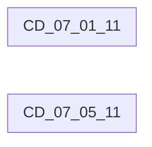
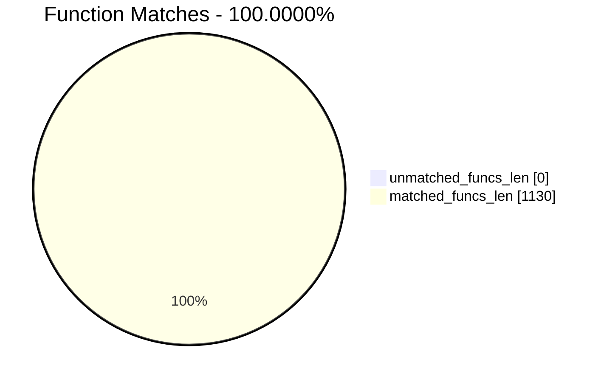
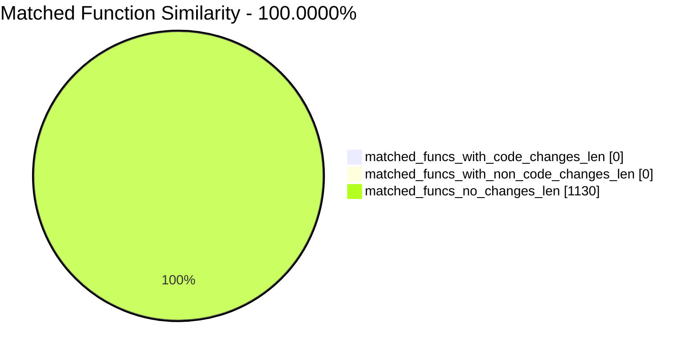
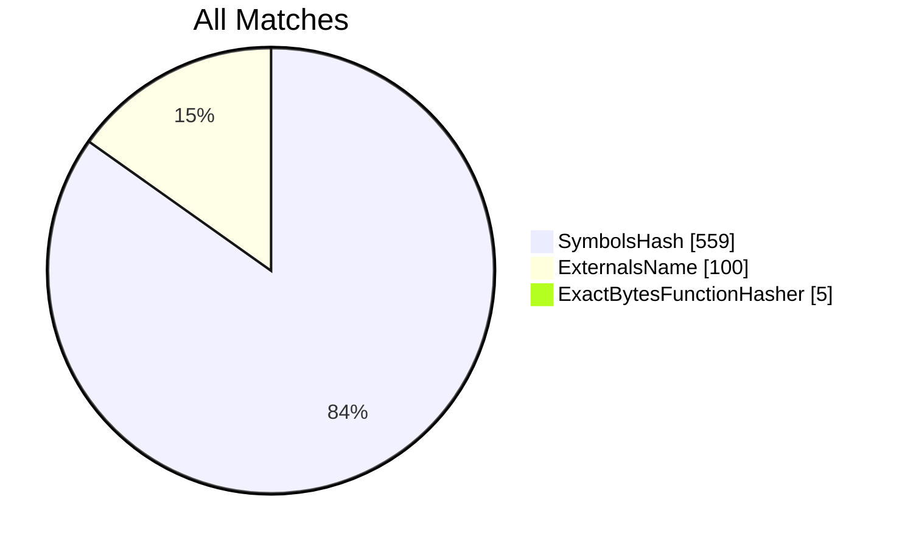
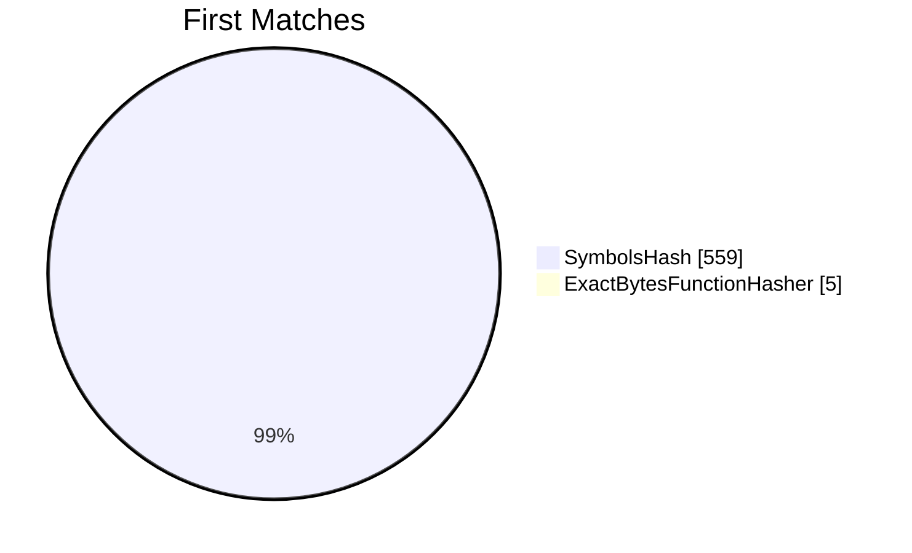
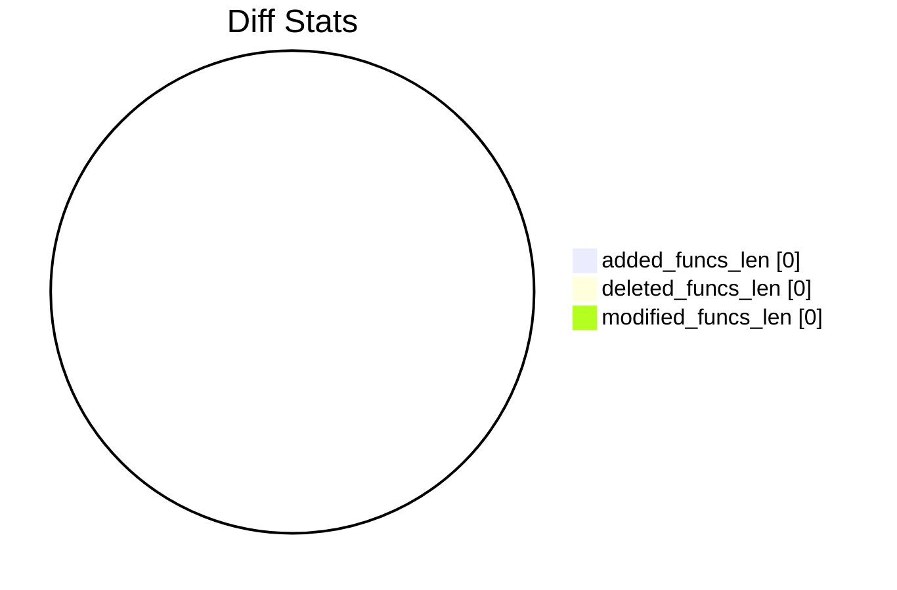

# CD_07_01_11-CD_07_05_11 Diff

# TOC

* [Visual Chart Diff](#visual-chart-diff)
* [Metadata](#metadata)
	* [Ghidra Diff Engine](#ghidra-diff-engine)
		* [Command Line](#command-line)
	* [Binary Metadata Diff](#binary-metadata-diff)
	* [Program Options](#program-options)
	* [Diff Stats](#diff-stats)
	* [Strings](#strings)
* [Deleted](#deleted)
* [Added](#added)
* [Modified](#modified)
* [Modified (No Code Changes)](#modified-no-code-changes)

# Visual Chart Diff










# Metadata

## Ghidra Diff Engine

### Command Line

#### Captured Command Line


```
ghidriff --project-location ghidra_projects --project-name ghidriff --symbols-path symbols --threaded --log-level INFO --file-log-level INFO --log-path ghidriff.log --min-func-len 2 --gdt [] --bsim --max-ram-percent 60.0 --max-section-funcs 200 CD_07_01_11 CD_07_05_11
```


#### Verbose Args


<details>

```
--old ['CD_07_01_11'] --new [['CD_07_05_11']] --engine VersionTrackingDiff --output-path CD_07_01_11-CD_07_05_11 --summary False --project-location ghidra_projects --project-name ghidriff --symbols-path symbols --threaded True --force-analysis False --force-diff False --no-symbols False --log-level INFO --file-log-level INFO --log-path ghidriff.log --va False --min-func-len 2 --use-calling-counts False --gdt [] --bsim True --bsim-full False --max-ram-percent 60.0 --print-flags False --jvm-args None --side-by-side False --max-section-funcs 200 --md-title None
```


</details>

## Binary Metadata Diff


```diff
--- CD_07_01_11 Meta
+++ CD_07_05_11 Meta
@@ -1,42 +1,42 @@
-Program Name: CD_07_01_11
+Program Name: CD_07_05_11
 Language ID: ARM:LE:32:v6 (1.107)
 Compiler ID: default
 Processor: ARM
 Endian: Little
 Address Size: 32
 Minimum Address: 00001000
 Maximum Address: 01279003
 # of Bytes: 19361892
 # of Memory Blocks: 29
 # of Instructions: 48904
 # of Defined Data: 12177
 # of Functions: 565
 # of Symbols: 3378
 # of Data Types: 121
 # of Data Type Categories: 7
 Analyzed: true
 Created With Ghidra Version: 11.0.3
-Date Created: Thu Jan 09 18:54:16 CET 2025
+Date Created: Thu Jan 09 18:54:18 CET 2025
 Executable Format: Mac OS X Mach-O
-Executable Location: /home/user/CD_07_01_11
-Executable MD5: 0f2d2bc3179f5ad50643be44c393955f
-Executable SHA256: dd5ae93a7db8d48f75088ef0edf5878aca20b18a7a4faa4c683dd6af2d205581
-FSRL: file:///home/user/CD_07_01_11?MD5=0f2d2bc3179f5ad50643be44c393955f
+Executable Location: /home/user/CD_07_05_11
+Executable MD5: 1e0b6fe242d6bd9422da71a0a600bdc0
+Executable SHA256: 16e70cfb57df2ec0ff3f2f71c6be4190ece4ed3e4f4ba0fb6af6154302801c7b
+FSRL: file:///home/user/CD_07_05_11?MD5=1e0b6fe242d6bd9422da71a0a600bdc0
 Mach-O File Type: EXECUTE
 Mach-O File Type Description: Demand Paged Executable File
 Mach-O Flag 0: NOUNDEFS
 Mach-O Flag 1: DYLDLINK
 Mach-O Flag 2: TWOLEVEL
 Preferred Root Namespace Category: 
 Relocatable: false
 Required Library [    0]: /System/Library/Frameworks/AudioToolbox.framework/AudioToolbox
 Required Library [    1]: /System/Library/Frameworks/Foundation.framework/Foundation
 Required Library [    2]: /System/Library/Frameworks/UIKit.framework/UIKit
 Required Library [    3]: /System/Library/Frameworks/OpenGLES.framework/OpenGLES
 Required Library [    4]: /System/Library/Frameworks/QuartzCore.framework/QuartzCore
 Required Library [    5]: /System/Library/Frameworks/OpenAL.framework/OpenAL
 Required Library [    6]: /usr/lib/libgcc_s.1.dylib
 Required Library [    7]: /usr/lib/libSystem.B.dylib
 Required Library [    8]: /usr/lib/libobjc.A.dylib
 Required Library [    9]: /System/Library/Frameworks/CoreFoundation.framework/CoreFoundation
 Should Ask To Analyze: false

```


## Program Options


<details>
<summary>Ghidra CD_07_01_11 Decompiler Options</summary>


|Decompiler Option|Value|
| :---: | :---: |
|Prototype Evaluation|__stdcall|

</details>


<details>
<summary>Ghidra CD_07_01_11 Specification extensions Options</summary>


|Specification extensions Option|Value|
| :---: | :---: |
|FormatVersion|0|
|VersionCounter|0|

</details>


<details>
<summary>Ghidra CD_07_01_11 Analyzers Options</summary>


|Analyzers Option|Value|
| :---: | :---: |
|ARM Aggressive Instruction Finder|false|
|ARM Constant Reference Analyzer|true|
|ARM Constant Reference Analyzer.Create Data from pointer|false|
|ARM Constant Reference Analyzer.Function parameter/return Pointer analysis|true|
|ARM Constant Reference Analyzer.Max Threads|2|
|ARM Constant Reference Analyzer.Min absolute reference|4|
|ARM Constant Reference Analyzer.Require pointer param data type|false|
|ARM Constant Reference Analyzer.Speculative reference max|256|
|ARM Constant Reference Analyzer.Speculative reference min|512|
|ARM Constant Reference Analyzer.Stored Value Pointer analysis|true|
|ARM Constant Reference Analyzer.Switch Table Recovery|false|
|ARM Constant Reference Analyzer.Trust values read from writable memory|true|
|ARM Symbol|true|
|ASCII Strings|true|
|ASCII Strings.Create Strings Containing Existing Strings|true|
|ASCII Strings.Create Strings Containing References|true|
|ASCII Strings.Force Model Reload|false|
|ASCII Strings.Minimum String Length|LEN_5|
|ASCII Strings.Model File|StringModel.sng|
|ASCII Strings.Require Null Termination for String|true|
|ASCII Strings.Search Only in Accessible Memory Blocks|true|
|ASCII Strings.String Start Alignment|ALIGN_1|
|ASCII Strings.String end alignment|4|
|Aggressive Instruction Finder|false|
|Aggressive Instruction Finder.Create Analysis Bookmarks|true|
|Apply Data Archives|true|
|Apply Data Archives.Archive Chooser|[Auto-Detect]|
|Apply Data Archives.Create Analysis Bookmarks|true|
|Apply Data Archives.GDT User File Archive Path|None|
|Apply Data Archives.User Project Archive Path|None|
|CFStrings|true|
|Call Convention ID|true|
|Call Convention ID.Analysis Decompiler Timeout (sec)|60|
|Call-Fixup Installer|true|
|Condense Filler Bytes|false|
|Condense Filler Bytes.Filler Value|Auto|
|Condense Filler Bytes.Minimum number of sequential bytes|1|
|Create Address Tables|true|
|Create Address Tables.Allow Offcut References|false|
|Create Address Tables.Auto Label Table|false|
|Create Address Tables.Create Analysis Bookmarks|true|
|Create Address Tables.Maxmimum Pointer Distance|16777215|
|Create Address Tables.Minimum Pointer Address|4132|
|Create Address Tables.Minimum Table Size|4|
|Create Address Tables.Pointer Alignment|1|
|Create Address Tables.Relocation Table Guide|true|
|Create Address Tables.Table Alignment|4|
|DWARF Line Number|false|
|Data Reference|true|
|Data Reference.Address Table Alignment|1|
|Data Reference.Address Table Minimum Size|4|
|Data Reference.Align End of Strings|false|
|Data Reference.Ascii String References|true|
|Data Reference.Create Address Tables|false|
|Data Reference.Minimum String Length|5|
|Data Reference.References to Pointers|false|
|Data Reference.Relocation Table Guide|true|
|Data Reference.Respect Execute Flag|true|
|Data Reference.Subroutine References|true|
|Data Reference.Switch Table References|false|
|Data Reference.Unicode String References|true|
|Decompiler Parameter ID|false|
|Decompiler Parameter ID.Analysis Clear Level|ANALYSIS|
|Decompiler Parameter ID.Analysis Decompiler Timeout (sec)|60|
|Decompiler Parameter ID.Commit Data Types|true|
|Decompiler Parameter ID.Commit Void Return Values|false|
|Decompiler Parameter ID.Prototype Evaluation|__stdcall|
|Decompiler Switch Analysis|true|
|Decompiler Switch Analysis.Analysis Decompiler Timeout (sec)|60|
|Demangler GNU|true|
|Demangler GNU.Apply Function Calling Conventions|true|
|Demangler GNU.Apply Function Signatures|true|
|Demangler GNU.Demangle Only Known Mangled Symbols|false|
|Demangler GNU.Demangler Format|AUTO|
|Demangler GNU.Use Deprecated Demangler|false|
|Disassemble Entry Points|true|
|Disassemble Entry Points.Respect Execute Flag|true|
|Embedded Media|true|
|Embedded Media.Create Analysis Bookmarks|true|
|External Entry References|true|
|External Symbol Resolver|true|
|Function Start Pre Search|true|
|Function Start Pre Search.Bookmark Functions|false|
|Function Start Pre Search.Search Data Blocks|false|
|Function Start Search|true|
|Function Start Search After Code|true|
|Function Start Search After Code.Bookmark Functions|false|
|Function Start Search After Code.Search Data Blocks|false|
|Function Start Search After Data|true|
|Function Start Search After Data.Bookmark Functions|false|
|Function Start Search After Data.Search Data Blocks|false|
|Function Start Search.Bookmark Functions|false|
|Function Start Search.Search Data Blocks|false|
|Mach-O Function Starts|true|
|Mach-O Function Starts.Bookmark failed functions|false|
|Mach-O Function Starts.Bookmark new functions|false|
|Mach-O Function Starts.Bookmark skipped functions|false|
|Mach-O Function Starts.Use PseudoDisassembler|true|
|Non-Returning Functions - Discovered|true|
|Non-Returning Functions - Discovered.Create Analysis Bookmarks|true|
|Non-Returning Functions - Discovered.Function Non-return Threshold|3|
|Non-Returning Functions - Discovered.Repair Flow Damage|true|
|Non-Returning Functions - Known|true|
|Non-Returning Functions - Known.Create Analysis Bookmarks|true|
|Objective-C 2 Class|true|
|Objective-C 2 Decompiler Message|true|
|Objective-C 2 Message|false|
|Reference|true|
|Reference.Address Table Alignment|1|
|Reference.Address Table Minimum Size|4|
|Reference.Align End of Strings|false|
|Reference.Ascii String References|true|
|Reference.Create Address Tables|false|
|Reference.Minimum String Length|5|
|Reference.References to Pointers|false|
|Reference.Relocation Table Guide|true|
|Reference.Respect Execute Flag|true|
|Reference.Subroutine References|true|
|Reference.Switch Table References|false|
|Reference.Unicode String References|true|
|Scalar Operand References|false|
|Scalar Operand References.Relocation Table Guide|true|
|Shared Return Calls|true|
|Shared Return Calls.Allow Conditional Jumps|false|
|Shared Return Calls.Assume Contiguous Functions Only|false|
|Stack|true|
|Stack.Create Local Variables|true|
|Stack.Create Param Variables|true|
|Stack.useNewFunctionStackAnalysis|true|
|Subroutine References|true|
|Subroutine References.Create Thunks Early|true|
|Variadic Function Signature Override|false|
|Variadic Function Signature Override.Create Analysis Bookmarks|false|

</details>


<details>
<summary>Ghidra CD_07_05_11 Decompiler Options</summary>


|Decompiler Option|Value|
| :---: | :---: |
|Prototype Evaluation|__stdcall|

</details>


<details>
<summary>Ghidra CD_07_05_11 Specification extensions Options</summary>


|Specification extensions Option|Value|
| :---: | :---: |
|FormatVersion|0|
|VersionCounter|0|

</details>


<details>
<summary>Ghidra CD_07_05_11 Analyzers Options</summary>


|Analyzers Option|Value|
| :---: | :---: |
|ARM Aggressive Instruction Finder|false|
|ARM Constant Reference Analyzer|true|
|ARM Constant Reference Analyzer.Create Data from pointer|false|
|ARM Constant Reference Analyzer.Function parameter/return Pointer analysis|true|
|ARM Constant Reference Analyzer.Max Threads|2|
|ARM Constant Reference Analyzer.Min absolute reference|4|
|ARM Constant Reference Analyzer.Require pointer param data type|false|
|ARM Constant Reference Analyzer.Speculative reference max|256|
|ARM Constant Reference Analyzer.Speculative reference min|512|
|ARM Constant Reference Analyzer.Stored Value Pointer analysis|true|
|ARM Constant Reference Analyzer.Switch Table Recovery|false|
|ARM Constant Reference Analyzer.Trust values read from writable memory|true|
|ARM Symbol|true|
|ASCII Strings|true|
|ASCII Strings.Create Strings Containing Existing Strings|true|
|ASCII Strings.Create Strings Containing References|true|
|ASCII Strings.Force Model Reload|false|
|ASCII Strings.Minimum String Length|LEN_5|
|ASCII Strings.Model File|StringModel.sng|
|ASCII Strings.Require Null Termination for String|true|
|ASCII Strings.Search Only in Accessible Memory Blocks|true|
|ASCII Strings.String Start Alignment|ALIGN_1|
|ASCII Strings.String end alignment|4|
|Aggressive Instruction Finder|false|
|Aggressive Instruction Finder.Create Analysis Bookmarks|true|
|Apply Data Archives|true|
|Apply Data Archives.Archive Chooser|[Auto-Detect]|
|Apply Data Archives.Create Analysis Bookmarks|true|
|Apply Data Archives.GDT User File Archive Path|None|
|Apply Data Archives.User Project Archive Path|None|
|CFStrings|true|
|Call Convention ID|true|
|Call Convention ID.Analysis Decompiler Timeout (sec)|60|
|Call-Fixup Installer|true|
|Condense Filler Bytes|false|
|Condense Filler Bytes.Filler Value|Auto|
|Condense Filler Bytes.Minimum number of sequential bytes|1|
|Create Address Tables|true|
|Create Address Tables.Allow Offcut References|false|
|Create Address Tables.Auto Label Table|false|
|Create Address Tables.Create Analysis Bookmarks|true|
|Create Address Tables.Maxmimum Pointer Distance|16777215|
|Create Address Tables.Minimum Pointer Address|4132|
|Create Address Tables.Minimum Table Size|4|
|Create Address Tables.Pointer Alignment|1|
|Create Address Tables.Relocation Table Guide|true|
|Create Address Tables.Table Alignment|4|
|DWARF Line Number|false|
|Data Reference|true|
|Data Reference.Address Table Alignment|1|
|Data Reference.Address Table Minimum Size|4|
|Data Reference.Align End of Strings|false|
|Data Reference.Ascii String References|true|
|Data Reference.Create Address Tables|false|
|Data Reference.Minimum String Length|5|
|Data Reference.References to Pointers|false|
|Data Reference.Relocation Table Guide|true|
|Data Reference.Respect Execute Flag|true|
|Data Reference.Subroutine References|true|
|Data Reference.Switch Table References|false|
|Data Reference.Unicode String References|true|
|Decompiler Parameter ID|false|
|Decompiler Parameter ID.Analysis Clear Level|ANALYSIS|
|Decompiler Parameter ID.Analysis Decompiler Timeout (sec)|60|
|Decompiler Parameter ID.Commit Data Types|true|
|Decompiler Parameter ID.Commit Void Return Values|false|
|Decompiler Parameter ID.Prototype Evaluation|__stdcall|
|Decompiler Switch Analysis|true|
|Decompiler Switch Analysis.Analysis Decompiler Timeout (sec)|60|
|Demangler GNU|true|
|Demangler GNU.Apply Function Calling Conventions|true|
|Demangler GNU.Apply Function Signatures|true|
|Demangler GNU.Demangle Only Known Mangled Symbols|false|
|Demangler GNU.Demangler Format|AUTO|
|Demangler GNU.Use Deprecated Demangler|false|
|Disassemble Entry Points|true|
|Disassemble Entry Points.Respect Execute Flag|true|
|Embedded Media|true|
|Embedded Media.Create Analysis Bookmarks|true|
|External Entry References|true|
|External Symbol Resolver|true|
|Function Start Pre Search|true|
|Function Start Pre Search.Bookmark Functions|false|
|Function Start Pre Search.Search Data Blocks|false|
|Function Start Search|true|
|Function Start Search After Code|true|
|Function Start Search After Code.Bookmark Functions|false|
|Function Start Search After Code.Search Data Blocks|false|
|Function Start Search After Data|true|
|Function Start Search After Data.Bookmark Functions|false|
|Function Start Search After Data.Search Data Blocks|false|
|Function Start Search.Bookmark Functions|false|
|Function Start Search.Search Data Blocks|false|
|Mach-O Function Starts|true|
|Mach-O Function Starts.Bookmark failed functions|false|
|Mach-O Function Starts.Bookmark new functions|false|
|Mach-O Function Starts.Bookmark skipped functions|false|
|Mach-O Function Starts.Use PseudoDisassembler|true|
|Non-Returning Functions - Discovered|true|
|Non-Returning Functions - Discovered.Create Analysis Bookmarks|true|
|Non-Returning Functions - Discovered.Function Non-return Threshold|3|
|Non-Returning Functions - Discovered.Repair Flow Damage|true|
|Non-Returning Functions - Known|true|
|Non-Returning Functions - Known.Create Analysis Bookmarks|true|
|Objective-C 2 Class|true|
|Objective-C 2 Decompiler Message|true|
|Objective-C 2 Message|false|
|Reference|true|
|Reference.Address Table Alignment|1|
|Reference.Address Table Minimum Size|4|
|Reference.Align End of Strings|false|
|Reference.Ascii String References|true|
|Reference.Create Address Tables|false|
|Reference.Minimum String Length|5|
|Reference.References to Pointers|false|
|Reference.Relocation Table Guide|true|
|Reference.Respect Execute Flag|true|
|Reference.Subroutine References|true|
|Reference.Switch Table References|false|
|Reference.Unicode String References|true|
|Scalar Operand References|false|
|Scalar Operand References.Relocation Table Guide|true|
|Shared Return Calls|true|
|Shared Return Calls.Allow Conditional Jumps|false|
|Shared Return Calls.Assume Contiguous Functions Only|false|
|Stack|true|
|Stack.Create Local Variables|true|
|Stack.Create Param Variables|true|
|Stack.useNewFunctionStackAnalysis|true|
|Subroutine References|true|
|Subroutine References.Create Thunks Early|true|
|Variadic Function Signature Override|false|
|Variadic Function Signature Override.Create Analysis Bookmarks|false|

</details>

## Diff Stats


|Stat|Value|
| :---: | :---: |
|added_funcs_len|0|
|deleted_funcs_len|0|
|modified_funcs_len|0|
|added_symbols_len|0|
|deleted_symbols_len|0|
|diff_time|2.8046648502349854|
|deleted_strings_len|0|
|added_strings_len|0|
|match_types|Counter({'SymbolsHash': 559, 'ExternalsName': 100, 'ExactBytesFunctionHasher': 5})|
|items_to_process|0|
|diff_types|Counter()|
|unmatched_funcs_len|0|
|total_funcs_len|1130|
|matched_funcs_len|1130|
|matched_funcs_with_code_changes_len|0|
|matched_funcs_with_non_code_changes_len|0|
|matched_funcs_no_changes_len|1130|
|match_func_similarity_percent|100.0000%|
|func_match_overall_percent|100.0000%|
|first_matches|Counter({'SymbolsHash': 559, 'ExactBytesFunctionHasher': 5})|











```mermaid
pie showData
    title Symbols
"added_symbols_len" : 0
"deleted_symbols_len" : 0
```

## Strings


*No string differences found*

# Deleted

# Added

# Modified


*Modified functions contain code changes*
# Modified (No Code Changes)


*Slightly modified functions have no code changes, rather differnces in:*
- refcount
- length
- called
- calling
- name
- fullname


<sub>Generated with `ghidriff` version: 0.7.3 on 2025-01-09T18:57:35</sub>