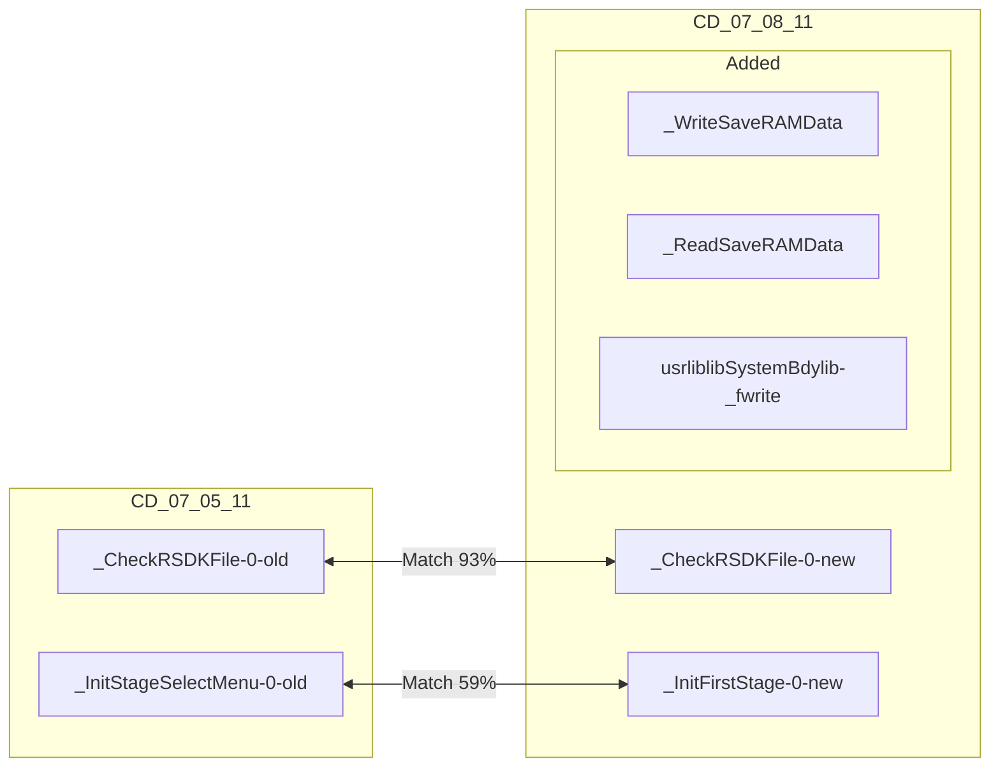
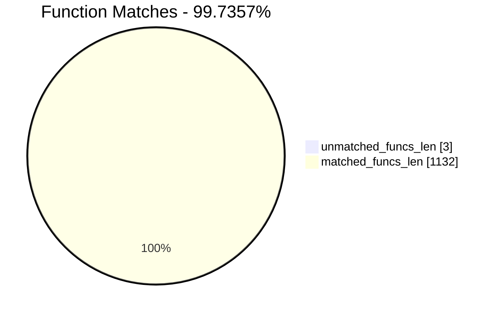
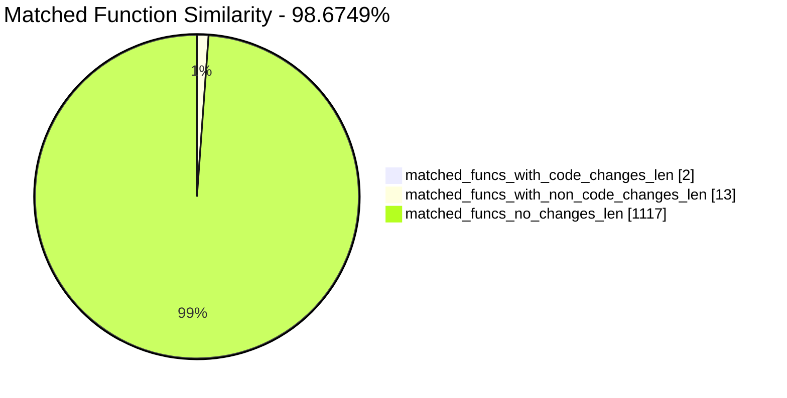
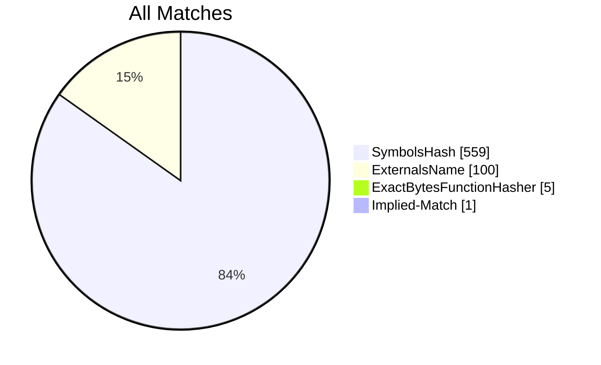
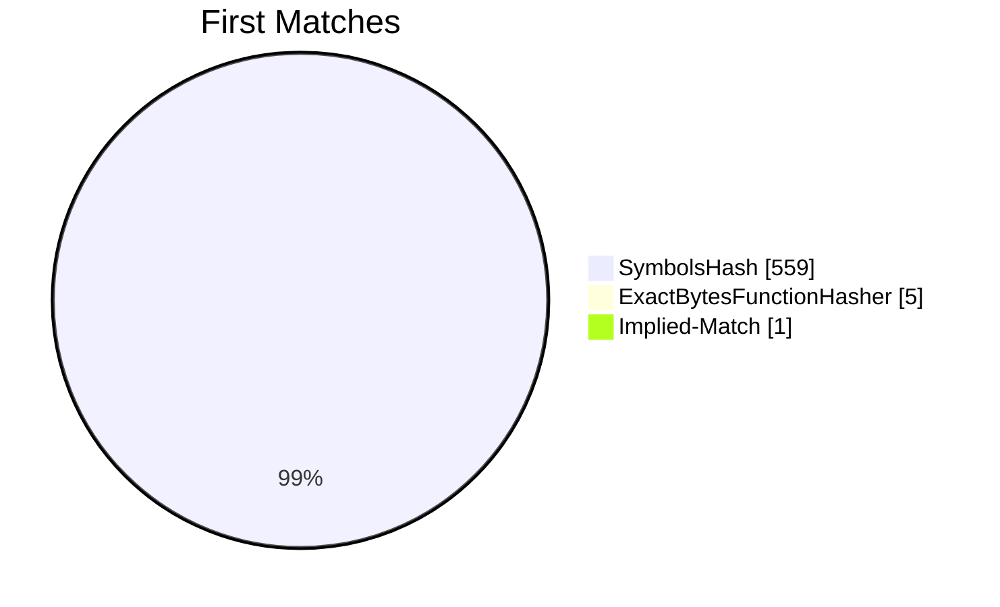
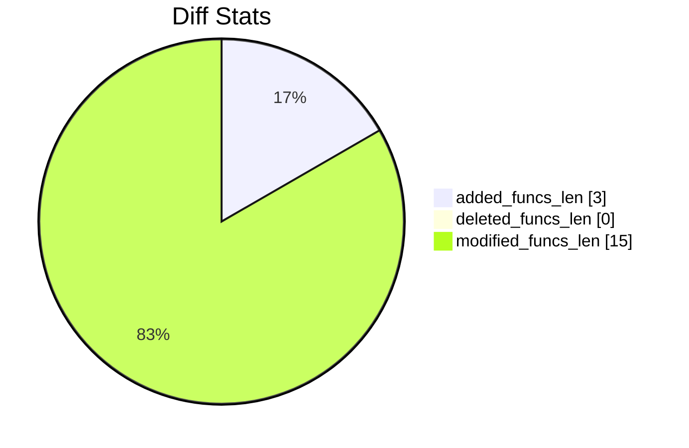
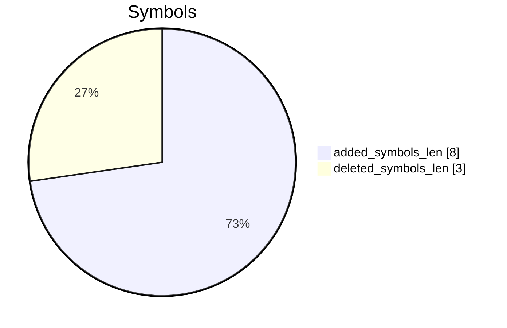
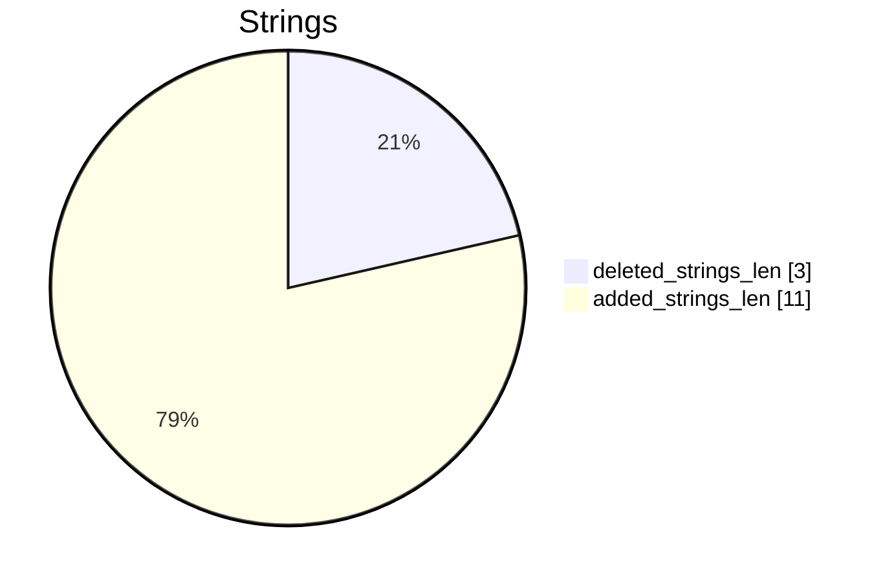

# CD_07_05_11-CD_07_08_11 Diff

# TOC

* [Visual Chart Diff](#visual-chart-diff)
* [Metadata](#metadata)
	* [Ghidra Diff Engine](#ghidra-diff-engine)
		* [Command Line](#command-line)
	* [Binary Metadata Diff](#binary-metadata-diff)
	* [Program Options](#program-options)
	* [Diff Stats](#diff-stats)
	* [Strings](#strings)
* [Deleted](#deleted)
* [Added](#added)
	* [_WriteSaveRAMData](#_writesaveramdata)
	* [_ReadSaveRAMData](#_readsaveramdata)
	* [/usr/lib/libSystem.B.dylib::_fwrite](#usrliblibsystembdylib_fwrite)
* [Modified](#modified)
	* [_CheckRSDKFile](#_checkrsdkfile)
	* [_InitStageSelectMenu](#_initstageselectmenu)
* [Modified (No Code Changes)](#modified-no-code-changes)
	* [_StopMusic](#_stopmusic)
	* [_StopAllSFX](#_stopallsfx)
	* [_ReleaseStageSFX](#_releasestagesfx)
	* [_StrAdd](#_stradd)
	* [_LoadPalette](#_loadpalette)
	* [_ReleaseRenderDevice](#_releaserenderdevice)
	* [_ClearGraphicsData](#_cleargraphicsdata)

# Visual Chart Diff










# Metadata

## Ghidra Diff Engine

### Command Line

#### Captured Command Line


```
ghidriff --project-location ghidra_projects --project-name ghidriff --symbols-path symbols --threaded --log-level INFO --file-log-level INFO --log-path ghidriff.log --min-func-len 2 --gdt [] --bsim --max-ram-percent 60.0 --max-section-funcs 200 CD_07_05_11 CD_07_08_11
```


#### Verbose Args


<details>

```
--old ['CD_07_05_11'] --new [['CD_07_08_11']] --engine VersionTrackingDiff --output-path CD_07_05_11-CD_07_08_11 --summary False --project-location ghidra_projects --project-name ghidriff --symbols-path symbols --threaded True --force-analysis False --force-diff False --no-symbols False --log-level INFO --file-log-level INFO --log-path ghidriff.log --va False --min-func-len 2 --use-calling-counts False --gdt [] --bsim True --bsim-full False --max-ram-percent 60.0 --print-flags False --jvm-args None --side-by-side False --max-section-funcs 200 --md-title None
```


</details>

## Binary Metadata Diff


```diff
--- CD_07_05_11 Meta
+++ CD_07_08_11 Meta
@@ -1,42 +1,42 @@
-Program Name: CD_07_05_11
+Program Name: CD_07_08_11
 Language ID: ARM:LE:32:v6 (1.107)
 Compiler ID: default
 Processor: ARM
 Endian: Little
 Address Size: 32
 Minimum Address: 00001000
-Maximum Address: 01279003
-# of Bytes: 19361892
-# of Memory Blocks: 29
-# of Instructions: 48904
-# of Defined Data: 12177
-# of Functions: 565
-# of Symbols: 3378
+Maximum Address: 01283003
+# of Bytes: 19402852
+# of Memory Blocks: 30
+# of Instructions: 49109
+# of Defined Data: 12280
+# of Functions: 570
+# of Symbols: 3399
 # of Data Types: 121
 # of Data Type Categories: 7
 Analyzed: true
 Created With Ghidra Version: 11.0.3
-Date Created: Thu Jan 09 18:57:41 CET 2025
+Date Created: Thu Jan 09 18:57:43 CET 2025
 Executable Format: Mac OS X Mach-O
-Executable Location: /home/user/CD_07_05_11
-Executable MD5: 1e0b6fe242d6bd9422da71a0a600bdc0
-Executable SHA256: 16e70cfb57df2ec0ff3f2f71c6be4190ece4ed3e4f4ba0fb6af6154302801c7b
-FSRL: file:///home/user/CD_07_05_11?MD5=1e0b6fe242d6bd9422da71a0a600bdc0
+Executable Location: /home/user/CD_07_08_11
+Executable MD5: 4a6311a80229fa0342922344c9869483
+Executable SHA256: 34501b07998b6e10d6cd41370d110625dfa84cdfd3547b05f7d9c14475eda3b1
+FSRL: file:///home/user/CD_07_08_11?MD5=4a6311a80229fa0342922344c9869483
 Mach-O File Type: EXECUTE
 Mach-O File Type Description: Demand Paged Executable File
 Mach-O Flag 0: NOUNDEFS
 Mach-O Flag 1: DYLDLINK
 Mach-O Flag 2: TWOLEVEL
 Preferred Root Namespace Category: 
 Relocatable: false
 Required Library [    0]: /System/Library/Frameworks/AudioToolbox.framework/AudioToolbox
 Required Library [    1]: /System/Library/Frameworks/Foundation.framework/Foundation
 Required Library [    2]: /System/Library/Frameworks/UIKit.framework/UIKit
 Required Library [    3]: /System/Library/Frameworks/OpenGLES.framework/OpenGLES
 Required Library [    4]: /System/Library/Frameworks/QuartzCore.framework/QuartzCore
 Required Library [    5]: /System/Library/Frameworks/OpenAL.framework/OpenAL
 Required Library [    6]: /usr/lib/libgcc_s.1.dylib
 Required Library [    7]: /usr/lib/libSystem.B.dylib
 Required Library [    8]: /usr/lib/libobjc.A.dylib
 Required Library [    9]: /System/Library/Frameworks/CoreFoundation.framework/CoreFoundation
 Should Ask To Analyze: false

```


## Program Options


<details>
<summary>Ghidra CD_07_05_11 Decompiler Options</summary>


|Decompiler Option|Value|
| :---: | :---: |
|Prototype Evaluation|__stdcall|

</details>


<details>
<summary>Ghidra CD_07_05_11 Specification extensions Options</summary>


|Specification extensions Option|Value|
| :---: | :---: |
|FormatVersion|0|
|VersionCounter|0|

</details>


<details>
<summary>Ghidra CD_07_05_11 Analyzers Options</summary>


|Analyzers Option|Value|
| :---: | :---: |
|ARM Aggressive Instruction Finder|false|
|ARM Constant Reference Analyzer|true|
|ARM Constant Reference Analyzer.Create Data from pointer|false|
|ARM Constant Reference Analyzer.Function parameter/return Pointer analysis|true|
|ARM Constant Reference Analyzer.Max Threads|2|
|ARM Constant Reference Analyzer.Min absolute reference|4|
|ARM Constant Reference Analyzer.Require pointer param data type|false|
|ARM Constant Reference Analyzer.Speculative reference max|256|
|ARM Constant Reference Analyzer.Speculative reference min|512|
|ARM Constant Reference Analyzer.Stored Value Pointer analysis|true|
|ARM Constant Reference Analyzer.Switch Table Recovery|false|
|ARM Constant Reference Analyzer.Trust values read from writable memory|true|
|ARM Symbol|true|
|ASCII Strings|true|
|ASCII Strings.Create Strings Containing Existing Strings|true|
|ASCII Strings.Create Strings Containing References|true|
|ASCII Strings.Force Model Reload|false|
|ASCII Strings.Minimum String Length|LEN_5|
|ASCII Strings.Model File|StringModel.sng|
|ASCII Strings.Require Null Termination for String|true|
|ASCII Strings.Search Only in Accessible Memory Blocks|true|
|ASCII Strings.String Start Alignment|ALIGN_1|
|ASCII Strings.String end alignment|4|
|Aggressive Instruction Finder|false|
|Aggressive Instruction Finder.Create Analysis Bookmarks|true|
|Apply Data Archives|true|
|Apply Data Archives.Archive Chooser|[Auto-Detect]|
|Apply Data Archives.Create Analysis Bookmarks|true|
|Apply Data Archives.GDT User File Archive Path|None|
|Apply Data Archives.User Project Archive Path|None|
|CFStrings|true|
|Call Convention ID|true|
|Call Convention ID.Analysis Decompiler Timeout (sec)|60|
|Call-Fixup Installer|true|
|Condense Filler Bytes|false|
|Condense Filler Bytes.Filler Value|Auto|
|Condense Filler Bytes.Minimum number of sequential bytes|1|
|Create Address Tables|true|
|Create Address Tables.Allow Offcut References|false|
|Create Address Tables.Auto Label Table|false|
|Create Address Tables.Create Analysis Bookmarks|true|
|Create Address Tables.Maxmimum Pointer Distance|16777215|
|Create Address Tables.Minimum Pointer Address|4132|
|Create Address Tables.Minimum Table Size|4|
|Create Address Tables.Pointer Alignment|1|
|Create Address Tables.Relocation Table Guide|true|
|Create Address Tables.Table Alignment|4|
|DWARF Line Number|false|
|Data Reference|true|
|Data Reference.Address Table Alignment|1|
|Data Reference.Address Table Minimum Size|4|
|Data Reference.Align End of Strings|false|
|Data Reference.Ascii String References|true|
|Data Reference.Create Address Tables|false|
|Data Reference.Minimum String Length|5|
|Data Reference.References to Pointers|false|
|Data Reference.Relocation Table Guide|true|
|Data Reference.Respect Execute Flag|true|
|Data Reference.Subroutine References|true|
|Data Reference.Switch Table References|false|
|Data Reference.Unicode String References|true|
|Decompiler Parameter ID|false|
|Decompiler Parameter ID.Analysis Clear Level|ANALYSIS|
|Decompiler Parameter ID.Analysis Decompiler Timeout (sec)|60|
|Decompiler Parameter ID.Commit Data Types|true|
|Decompiler Parameter ID.Commit Void Return Values|false|
|Decompiler Parameter ID.Prototype Evaluation|__stdcall|
|Decompiler Switch Analysis|true|
|Decompiler Switch Analysis.Analysis Decompiler Timeout (sec)|60|
|Demangler GNU|true|
|Demangler GNU.Apply Function Calling Conventions|true|
|Demangler GNU.Apply Function Signatures|true|
|Demangler GNU.Demangle Only Known Mangled Symbols|false|
|Demangler GNU.Demangler Format|AUTO|
|Demangler GNU.Use Deprecated Demangler|false|
|Disassemble Entry Points|true|
|Disassemble Entry Points.Respect Execute Flag|true|
|Embedded Media|true|
|Embedded Media.Create Analysis Bookmarks|true|
|External Entry References|true|
|External Symbol Resolver|true|
|Function Start Pre Search|true|
|Function Start Pre Search.Bookmark Functions|false|
|Function Start Pre Search.Search Data Blocks|false|
|Function Start Search|true|
|Function Start Search After Code|true|
|Function Start Search After Code.Bookmark Functions|false|
|Function Start Search After Code.Search Data Blocks|false|
|Function Start Search After Data|true|
|Function Start Search After Data.Bookmark Functions|false|
|Function Start Search After Data.Search Data Blocks|false|
|Function Start Search.Bookmark Functions|false|
|Function Start Search.Search Data Blocks|false|
|Mach-O Function Starts|true|
|Mach-O Function Starts.Bookmark failed functions|false|
|Mach-O Function Starts.Bookmark new functions|false|
|Mach-O Function Starts.Bookmark skipped functions|false|
|Mach-O Function Starts.Use PseudoDisassembler|true|
|Non-Returning Functions - Discovered|true|
|Non-Returning Functions - Discovered.Create Analysis Bookmarks|true|
|Non-Returning Functions - Discovered.Function Non-return Threshold|3|
|Non-Returning Functions - Discovered.Repair Flow Damage|true|
|Non-Returning Functions - Known|true|
|Non-Returning Functions - Known.Create Analysis Bookmarks|true|
|Objective-C 2 Class|true|
|Objective-C 2 Decompiler Message|true|
|Objective-C 2 Message|false|
|Reference|true|
|Reference.Address Table Alignment|1|
|Reference.Address Table Minimum Size|4|
|Reference.Align End of Strings|false|
|Reference.Ascii String References|true|
|Reference.Create Address Tables|false|
|Reference.Minimum String Length|5|
|Reference.References to Pointers|false|
|Reference.Relocation Table Guide|true|
|Reference.Respect Execute Flag|true|
|Reference.Subroutine References|true|
|Reference.Switch Table References|false|
|Reference.Unicode String References|true|
|Scalar Operand References|false|
|Scalar Operand References.Relocation Table Guide|true|
|Shared Return Calls|true|
|Shared Return Calls.Allow Conditional Jumps|false|
|Shared Return Calls.Assume Contiguous Functions Only|false|
|Stack|true|
|Stack.Create Local Variables|true|
|Stack.Create Param Variables|true|
|Stack.useNewFunctionStackAnalysis|true|
|Subroutine References|true|
|Subroutine References.Create Thunks Early|true|
|Variadic Function Signature Override|false|
|Variadic Function Signature Override.Create Analysis Bookmarks|false|

</details>


<details>
<summary>Ghidra CD_07_08_11 Decompiler Options</summary>


|Decompiler Option|Value|
| :---: | :---: |
|Prototype Evaluation|__stdcall|

</details>


<details>
<summary>Ghidra CD_07_08_11 Specification extensions Options</summary>


|Specification extensions Option|Value|
| :---: | :---: |
|FormatVersion|0|
|VersionCounter|0|

</details>


<details>
<summary>Ghidra CD_07_08_11 Analyzers Options</summary>


|Analyzers Option|Value|
| :---: | :---: |
|ARM Aggressive Instruction Finder|false|
|ARM Constant Reference Analyzer|true|
|ARM Constant Reference Analyzer.Create Data from pointer|false|
|ARM Constant Reference Analyzer.Function parameter/return Pointer analysis|true|
|ARM Constant Reference Analyzer.Max Threads|2|
|ARM Constant Reference Analyzer.Min absolute reference|4|
|ARM Constant Reference Analyzer.Require pointer param data type|false|
|ARM Constant Reference Analyzer.Speculative reference max|256|
|ARM Constant Reference Analyzer.Speculative reference min|512|
|ARM Constant Reference Analyzer.Stored Value Pointer analysis|true|
|ARM Constant Reference Analyzer.Switch Table Recovery|false|
|ARM Constant Reference Analyzer.Trust values read from writable memory|true|
|ARM Symbol|true|
|ASCII Strings|true|
|ASCII Strings.Create Strings Containing Existing Strings|true|
|ASCII Strings.Create Strings Containing References|true|
|ASCII Strings.Force Model Reload|false|
|ASCII Strings.Minimum String Length|LEN_5|
|ASCII Strings.Model File|StringModel.sng|
|ASCII Strings.Require Null Termination for String|true|
|ASCII Strings.Search Only in Accessible Memory Blocks|true|
|ASCII Strings.String Start Alignment|ALIGN_1|
|ASCII Strings.String end alignment|4|
|Aggressive Instruction Finder|false|
|Aggressive Instruction Finder.Create Analysis Bookmarks|true|
|Apply Data Archives|true|
|Apply Data Archives.Archive Chooser|[Auto-Detect]|
|Apply Data Archives.Create Analysis Bookmarks|true|
|Apply Data Archives.GDT User File Archive Path|None|
|Apply Data Archives.User Project Archive Path|None|
|CFStrings|true|
|Call Convention ID|true|
|Call Convention ID.Analysis Decompiler Timeout (sec)|60|
|Call-Fixup Installer|true|
|Condense Filler Bytes|false|
|Condense Filler Bytes.Filler Value|Auto|
|Condense Filler Bytes.Minimum number of sequential bytes|1|
|Create Address Tables|true|
|Create Address Tables.Allow Offcut References|false|
|Create Address Tables.Auto Label Table|false|
|Create Address Tables.Create Analysis Bookmarks|true|
|Create Address Tables.Maxmimum Pointer Distance|16777215|
|Create Address Tables.Minimum Pointer Address|4132|
|Create Address Tables.Minimum Table Size|4|
|Create Address Tables.Pointer Alignment|1|
|Create Address Tables.Relocation Table Guide|true|
|Create Address Tables.Table Alignment|4|
|DWARF Line Number|false|
|Data Reference|true|
|Data Reference.Address Table Alignment|1|
|Data Reference.Address Table Minimum Size|4|
|Data Reference.Align End of Strings|false|
|Data Reference.Ascii String References|true|
|Data Reference.Create Address Tables|false|
|Data Reference.Minimum String Length|5|
|Data Reference.References to Pointers|false|
|Data Reference.Relocation Table Guide|true|
|Data Reference.Respect Execute Flag|true|
|Data Reference.Subroutine References|true|
|Data Reference.Switch Table References|false|
|Data Reference.Unicode String References|true|
|Decompiler Parameter ID|false|
|Decompiler Parameter ID.Analysis Clear Level|ANALYSIS|
|Decompiler Parameter ID.Analysis Decompiler Timeout (sec)|60|
|Decompiler Parameter ID.Commit Data Types|true|
|Decompiler Parameter ID.Commit Void Return Values|false|
|Decompiler Parameter ID.Prototype Evaluation|__stdcall|
|Decompiler Switch Analysis|true|
|Decompiler Switch Analysis.Analysis Decompiler Timeout (sec)|60|
|Demangler GNU|true|
|Demangler GNU.Apply Function Calling Conventions|true|
|Demangler GNU.Apply Function Signatures|true|
|Demangler GNU.Demangle Only Known Mangled Symbols|false|
|Demangler GNU.Demangler Format|AUTO|
|Demangler GNU.Use Deprecated Demangler|false|
|Disassemble Entry Points|true|
|Disassemble Entry Points.Respect Execute Flag|true|
|Embedded Media|true|
|Embedded Media.Create Analysis Bookmarks|true|
|External Entry References|true|
|External Symbol Resolver|true|
|Function Start Pre Search|true|
|Function Start Pre Search.Bookmark Functions|false|
|Function Start Pre Search.Search Data Blocks|false|
|Function Start Search|true|
|Function Start Search After Code|true|
|Function Start Search After Code.Bookmark Functions|false|
|Function Start Search After Code.Search Data Blocks|false|
|Function Start Search After Data|true|
|Function Start Search After Data.Bookmark Functions|false|
|Function Start Search After Data.Search Data Blocks|false|
|Function Start Search.Bookmark Functions|false|
|Function Start Search.Search Data Blocks|false|
|Mach-O Function Starts|true|
|Mach-O Function Starts.Bookmark failed functions|false|
|Mach-O Function Starts.Bookmark new functions|false|
|Mach-O Function Starts.Bookmark skipped functions|false|
|Mach-O Function Starts.Use PseudoDisassembler|true|
|Non-Returning Functions - Discovered|true|
|Non-Returning Functions - Discovered.Create Analysis Bookmarks|true|
|Non-Returning Functions - Discovered.Function Non-return Threshold|3|
|Non-Returning Functions - Discovered.Repair Flow Damage|true|
|Non-Returning Functions - Known|true|
|Non-Returning Functions - Known.Create Analysis Bookmarks|true|
|Objective-C 2 Class|true|
|Objective-C 2 Decompiler Message|true|
|Objective-C 2 Message|false|
|Reference|true|
|Reference.Address Table Alignment|1|
|Reference.Address Table Minimum Size|4|
|Reference.Align End of Strings|false|
|Reference.Ascii String References|true|
|Reference.Create Address Tables|false|
|Reference.Minimum String Length|5|
|Reference.References to Pointers|false|
|Reference.Relocation Table Guide|true|
|Reference.Respect Execute Flag|true|
|Reference.Subroutine References|true|
|Reference.Switch Table References|false|
|Reference.Unicode String References|true|
|Scalar Operand References|false|
|Scalar Operand References.Relocation Table Guide|true|
|Shared Return Calls|true|
|Shared Return Calls.Allow Conditional Jumps|false|
|Shared Return Calls.Assume Contiguous Functions Only|false|
|Stack|true|
|Stack.Create Local Variables|true|
|Stack.Create Param Variables|true|
|Stack.useNewFunctionStackAnalysis|true|
|Subroutine References|true|
|Subroutine References.Create Thunks Early|true|
|Variadic Function Signature Override|false|
|Variadic Function Signature Override.Create Analysis Bookmarks|false|

</details>

## Diff Stats


|Stat|Value|
| :---: | :---: |
|added_funcs_len|3|
|deleted_funcs_len|0|
|modified_funcs_len|15|
|added_symbols_len|8|
|deleted_symbols_len|3|
|diff_time|143.1855092048645|
|deleted_strings_len|3|
|added_strings_len|11|
|match_types|Counter({'SymbolsHash': 559, 'ExternalsName': 100, 'ExactBytesFunctionHasher': 5, 'Implied Match': 1})|
|items_to_process|29|
|diff_types|Counter({'address': 15, 'refcount': 13, 'calling': 13, 'length': 3, 'called': 3, 'code': 2, 'name': 1, 'fullname': 1, 'sig': 1})|
|unmatched_funcs_len|3|
|total_funcs_len|1135|
|matched_funcs_len|1132|
|matched_funcs_with_code_changes_len|2|
|matched_funcs_with_non_code_changes_len|13|
|matched_funcs_no_changes_len|1117|
|match_func_similarity_percent|98.6749%|
|func_match_overall_percent|99.7357%|
|first_matches|Counter({'SymbolsHash': 559, 'ExactBytesFunctionHasher': 5, 'Implied Match': 1})|













## Strings




### Strings Diff


```diff
--- deleted strings
+++ added strings
@@ -1,3 +1,11 @@
-s__C.14.2921
-s__C.15.2922
-s__proc.4077
+s_SGame.bin
+s__C.14.2925
+s__C.15.2926
+s__InitFirstStage
+s__ReadSaveRAMData
+s__WriteSaveRAMData
+s__fwrite
+s__gameMessage
+s__proc.4081
+s__saveRAM
+s_wb

```


### String References

#### Old


|String|Ref Count|Ref Func|
| :---: | :---: | :---: |
|s__proc.4077_012747cc|1||
|s__C.14.2921_01272806|1||
|s__C.15.2922_012727fb|1||

#### New


|String|Ref Count|Ref Func|
| :---: | :---: | :---: |
|s__saveRAM_0127b855|1||
|s_SGame.bin_000374d0|1|_CheckRSDKFile|
|s__C.15.2926_0127b98c|1||
|s__proc.4081_0127d97a|1||
|s_wb_000374ac|1|_WriteSaveRAMData|
|s__gameMessage_0127bb00|1||
|s__ReadSaveRAMData_0127b640|1||
|s__InitFirstStage_0127d093|1||
|s__WriteSaveRAMData_0127b623|1||
|s__C.14.2925_0127b997|1||
|s__fwrite_0127a766|3||

# Deleted

# Added

## _WriteSaveRAMData

### Function Meta


|Key|CD_07_08_11|
| :---: | :---: |
|name|_WriteSaveRAMData|
|fullname|_WriteSaveRAMData|
|refcount|1|
|length|212|
|called|_fclose<br>_fopen<br>_fwrite|
|calling|_ProcessScript|
|paramcount|0|
|address|000047b4|
|sig|undefined _WriteSaveRAMData(void)|
|sym_type|Function|
|sym_source|IMPORTED|
|external|False|


```diff
--- _WriteSaveRAMData
+++ _WriteSaveRAMData
@@ -0,0 +1,34 @@
+
+undefined4 _WriteSaveRAMData(void)
+
+{
+  int iVar1;
+  FILE *pFVar2;
+  undefined4 uVar3;
+  int iVar4;
+  undefined local_15;
+  
+  pFVar2 = _fopen(PTR__iphoneDocDirectory_000431c8,"wb");
+  iVar1 = DAT_00043bf8;
+  if (pFVar2 == (FILE *)0x0) {
+    uVar3 = 0;
+  }
+  else {
+    iVar4 = 0;
+    do {
+      local_15 = (undefined)*(undefined4 *)(iVar4 + iVar1);
+      _fwrite(&local_15,1,1,pFVar2);
+      local_15 = (undefined)((uint)*(undefined4 *)(iVar4 + iVar1) >> 8);
+      _fwrite(&local_15,1,1,pFVar2);
+      local_15 = (undefined)((uint)*(undefined4 *)(iVar4 + iVar1) >> 0x10);
+      _fwrite(&local_15,1,1,pFVar2);
+      local_15 = (undefined)((uint)*(undefined4 *)(iVar4 + iVar1) >> 0x18);
+      iVar4 = iVar4 + 4;
+      _fwrite(&local_15,1,1,pFVar2);
+    } while (iVar4 != 0x8000);
+    _fclose(pFVar2);
+    uVar3 = 1;
+  }
+  return uVar3;
+}
+

```


## _ReadSaveRAMData

### Function Meta


|Key|CD_07_08_11|
| :---: | :---: |
|name|_ReadSaveRAMData|
|fullname|_ReadSaveRAMData|
|refcount|1|
|length|248|
|called|_fclose<br>_fopen<br>_fread|
|calling|_ProcessScript|
|paramcount|0|
|address|000048bc|
|sig|undefined _ReadSaveRAMData(void)|
|sym_type|Function|
|sym_source|IMPORTED|
|external|False|


```diff
--- _ReadSaveRAMData
+++ _ReadSaveRAMData
@@ -0,0 +1,34 @@
+
+undefined4 _ReadSaveRAMData(void)
+
+{
+  int iVar1;
+  FILE *pFVar2;
+  undefined4 uVar3;
+  int iVar4;
+  byte local_19;
+  
+  pFVar2 = _fopen(PTR__iphoneDocDirectory_000431c8,"rb");
+  if (pFVar2 == (FILE *)0x0) {
+    uVar3 = 0;
+  }
+  else {
+    iVar4 = 0;
+    do {
+      _fread(&local_19,1,1,pFVar2);
+      iVar1 = DAT_00043bf8;
+      *(uint *)(iVar4 + DAT_00043bf8) = (uint)local_19;
+      _fread(&local_19,1,1,pFVar2);
+      *(uint *)(iVar4 + iVar1) = (uint)local_19 * 0x100 + *(int *)(iVar4 + iVar1);
+      _fread(&local_19,1,1,pFVar2);
+      *(uint *)(iVar4 + iVar1) = (uint)local_19 * 0x10000 + *(int *)(iVar4 + iVar1);
+      _fread(&local_19,1,1,pFVar2);
+      *(uint *)(iVar4 + iVar1) = (uint)local_19 * 0x1000000 + *(int *)(iVar4 + iVar1);
+      iVar4 = iVar4 + 4;
+    } while (iVar4 != 0x8000);
+    _fclose(pFVar2);
+    uVar3 = 1;
+  }
+  return uVar3;
+}
+

```


## /usr/lib/libSystem.B.dylib::_fwrite

### Function Meta


|Key|CD_07_08_11|
| :---: | :---: |
|name|_fwrite|
|fullname|/usr/lib/libSystem.B.dylib::_fwrite|
|refcount|1|
|length|0|
|called||
|calling||
|paramcount|4|
|address|EXTERNAL:0000002b|
|sig|size_t _fwrite(void * param_1, size_t param_2, size_t param_3, FILE * param_4)|
|sym_type|Function|
|sym_source|IMPORTED|
|external|True|


*No code available for /usr/lib/libSystem.B.dylib::_fwrite*
# Modified


*Modified functions contain code changes*
## _CheckRSDKFile

### Match Info


|Key|CD_07_05_11 - CD_07_08_11|
| :---: | :---: |
|diff_type|code,length,address,called|
|ratio|0.9|
|i_ratio|0.57|
|m_ratio|0.91|
|b_ratio|0.93|
|match_types|SymbolsHash|

### Function Meta Diff


|Key|CD_07_05_11|CD_07_08_11|
| :---: | :---: | :---: |
|name|_CheckRSDKFile|_CheckRSDKFile|
|fullname|_CheckRSDKFile|_CheckRSDKFile|
|refcount|1|1|
|`length`|172|196|
|`called`|_CloseFile<br>_LoadFile<br>_StrCopy<br>_fclose<br>_fopen|_CloseFile<br>_LoadFile<br>_StrAdd<br>_StrCopy<br>_fclose<br>_fopen|
|calling|_StartupRetroEngine|_StartupRetroEngine|
|paramcount|0|0|
|`address`|00005608|00006438|
|sig|undefined _CheckRSDKFile(void)|undefined _CheckRSDKFile(void)|
|sym_type|Function|Function|
|sym_source|IMPORTED|IMPORTED|
|external|False|False|

### _CheckRSDKFile Called Diff


```diff
--- _CheckRSDKFile called
+++ _CheckRSDKFile called
@@ -2,0 +3 @@
+_StrAdd
```


### _CheckRSDKFile Diff


```diff
--- _CheckRSDKFile
+++ _CheckRSDKFile
@@ -1,36 +1,37 @@
 
 undefined4 _CheckRSDKFile(void)
 
 {
   undefined *puVar1;
   FILE **ppFVar2;
   FILE *pFVar3;
   int iVar4;
   undefined4 uVar5;
   undefined auStack_68 [84];
   
-  puVar1 = PTR__iphoneAppDirectory_000421c8;
-  pFVar3 = _fopen(PTR__iphoneAppDirectory_000421c8,"rb");
+  puVar1 = PTR__iphoneAppDirectory_000431cc;
+  pFVar3 = _fopen(PTR__iphoneAppDirectory_000431cc,"rb");
   ppFVar2 = DAT_0;
   *DAT_0 = pFVar3;
-  if (pFVar3 == (FILE *)0x0) {
+  _StrAdd(PTR__iphoneDocDirectory_000431c8,"SGame.bin");
+  if (*ppFVar2 == (FILE *)0x0) {
     *DAT_1 = 0;
     uVar5 = 0;
   }
   else {
     *DAT_1 = 1;
     _StrCopy(DAT_2,puVar1);
     _fclose(*ppFVar2);
     iVar4 = _LoadFile("Data/Scripts/ByteCode/GS000.bin",auStack_68);
     if (iVar4 == 1) {
       *DAT_3 = 1;
       _CloseFile(1);
       uVar5 = 1;
     }
     else {
       uVar5 = 1;
     }
   }
   return uVar5;
 }
 

```


## _InitStageSelectMenu

### Match Info


|Key|CD_07_05_11 - CD_07_08_11|
| :---: | :---: |
|diff_type|code,name,fullname,refcount,length,sig,address,calling,called|
|ratio|0.46|
|i_ratio|0.1|
|m_ratio|0.5|
|b_ratio|0.59|
|match_types|Implied Match|

### Function Meta Diff


|Key|CD_07_05_11|CD_07_08_11|
| :---: | :---: | :---: |
|`name`|_InitStageSelectMenu|_InitFirstStage|
|`fullname`|_InitStageSelectMenu|_InitFirstStage|
|`refcount`|2|1|
|`length`|400|172|
|`called`|_AddTextMenuEntry<br>_ClearAnimationData<br>_ClearGraphicsData<br>_LoadGIFFile<br>_LoadPalette<br>_ReleaseStageSFX<br>_SetupTextMenu<br>_StopAllSFX<br>_StopMusic<br>_UpdateHardwareTextures|_ClearAnimationData<br>_ClearGraphicsData<br>_LoadPalette<br>_ReleaseStageSFX<br>_StopAllSFX<br>_StopMusic|
|`calling`|_ProcessMainLoop<br>_StartupRetroEngine|_StartupRetroEngine|
|paramcount|0|0|
|`address`|00023c3c|00024a30|
|`sig`|undefined _InitStageSelectMenu(void)|undefined _InitFirstStage(void)|
|sym_type|Function|Function|
|sym_source|IMPORTED|IMPORTED|
|external|False|False|

### _InitStageSelectMenu Called Diff


```diff
--- _InitStageSelectMenu called
+++ _InitFirstStage called
@@ -1 +0,0 @@
-_AddTextMenuEntry
@@ -4 +2,0 @@
-_LoadGIFFile
@@ -7 +4,0 @@
-_SetupTextMenu
@@ -10 +6,0 @@
-_UpdateHardwareTextures
```


### _InitStageSelectMenu Calling Diff


```diff
--- _InitStageSelectMenu calling
+++ _InitFirstStage calling
@@ -1 +0,0 @@
-_ProcessMainLoop
```


### _InitStageSelectMenu Diff


```diff
--- _InitStageSelectMenu
+++ _InitFirstStage
@@ -1,42 +1,21 @@
 
-void _InitStageSelectMenu(void)
+void _InitFirstStage(void)
 
 {
-  int iVar1;
-  
   _xScrollOffset = 0;
   _yScrollOffset = 0;
   _StopMusic();
   _StopAllSFX();
   _ReleaseStageSFX();
-  *PTR__fadeMode_000423a0 = 0;
-  *PTR__playerMenuNum_000422e0 = 0;
-  *PTR__gameMode_00042208 = 0;
+  *PTR__fadeMode_000433b0 = 0;
+  *PTR__playerMenuNum_000432ec = 0;
   _ClearGraphicsData();
   _ClearAnimationData();
   _LoadPalette("MasterPalette.act",0,0,0,0x100);
-  *PTR__textMenuSurfaceNo_00042284 = 0;
-  _LoadGIFFile("Data/Game/SystemText.gif",0);
-  iVar1 = DAT_0;
+  *PTR__activeStageList_00043250 = 0;
+  *DAT_0 = 0;
+  *PTR__gameMode_00043210 = 1;
   *DAT_1 = 0;
-  _SetupTextMenu(iVar1,0);
-  _AddTextMenuEntry(iVar1,"RETRO ENGINE DEV MENU");
-  _AddTextMenuEntry(iVar1," ");
-  _AddTextMenuEntry(iVar1,"SONIC CD Version");
-  _AddTextMenuEntry(iVar1,PTR__gameVersion_000421ac);
-  _AddTextMenuEntry(iVar1," ");
-  _AddTextMenuEntry(iVar1," ");
-  _AddTextMenuEntry(iVar1," ");
-  _AddTextMenuEntry(iVar1,"PLAY GAME");
-  _AddTextMenuEntry(iVar1," ");
-  _AddTextMenuEntry(iVar1,"STAGE SELECT");
-  section_0000147c.sectname[iVar1 + 0xb] = '\x02';
-  section_0000147c.sectname[iVar1 + 0xc] = '\x02';
-  section_0000147c.sectname[iVar1 + 0xd] = '\0';
-  section_0000147c.sectname[iVar1 + 0xe] = '\a';
-  *(undefined *)((int)&DAT_2 + iVar1 + 1) = 0;
-  *(undefined *)((int)&DAT_2 + iVar1 + 2) = 0;
-  _UpdateHardwareTextures();
   return;
 }
 

```


# Modified (No Code Changes)


*Slightly modified functions have no code changes, rather differnces in:*
- refcount
- length
- called
- calling
- name
- fullname

## _StopMusic

### Match Info


|Key|CD_07_05_11 - CD_07_08_11|
| :---: | :---: |
|diff_type|refcount,address,calling|
|ratio|1.0|
|i_ratio|0.7|
|m_ratio|1.0|
|b_ratio|1.0|
|match_types|SymbolsHash|

### Function Meta Diff


|Key|CD_07_05_11|CD_07_08_11|
| :---: | :---: | :---: |
|name|_StopMusic|_StopMusic|
|fullname|_StopMusic|_StopMusic|
|`refcount`|3|4|
|length|40|40|
|called|_alSourceStop|_alSourceStop|
|`calling`|_InitErrorMessage<br>_InitStageSelectMenu<br>_ProcessScript|_InitErrorMessage<br>_InitFirstStage<br>_InitStageSelectMenu<br>_ProcessScript|
|paramcount|0|0|
|`address`|000271c0|000281a0|
|sig|undefined _StopMusic(void)|undefined _StopMusic(void)|
|sym_type|Function|Function|
|sym_source|IMPORTED|IMPORTED|
|external|False|False|

### _StopMusic Calling Diff


```diff
--- _StopMusic calling
+++ _StopMusic calling
@@ -1,0 +2 @@
+_InitFirstStage
```


## _StopAllSFX

### Match Info


|Key|CD_07_05_11 - CD_07_08_11|
| :---: | :---: |
|diff_type|refcount,address,calling|
|ratio|1.0|
|i_ratio|0.67|
|m_ratio|1.0|
|b_ratio|1.0|
|match_types|SymbolsHash|

### Function Meta Diff


|Key|CD_07_05_11|CD_07_08_11|
| :---: | :---: | :---: |
|name|_StopAllSFX|_StopAllSFX|
|fullname|_StopAllSFX|_StopAllSFX|
|`refcount`|4|5|
|length|96|96|
|called|_alSourceStop<br>_alSourcei|_alSourceStop<br>_alSourcei|
|`calling`|_InitErrorMessage<br>_InitStageSelectMenu<br>_LoadStageFiles<br>_ReleaseAudioPlayback|_InitErrorMessage<br>_InitFirstStage<br>_InitStageSelectMenu<br>_LoadStageFiles<br>_ReleaseAudioPlayback|
|paramcount|0|0|
|`address`|000271f0|000281d0|
|sig|undefined _StopAllSFX(void)|undefined _StopAllSFX(void)|
|sym_type|Function|Function|
|sym_source|IMPORTED|IMPORTED|
|external|False|False|

### _StopAllSFX Calling Diff


```diff
--- _StopAllSFX calling
+++ _StopAllSFX calling
@@ -1,0 +2 @@
+_InitFirstStage
```


## _ReleaseStageSFX

### Match Info


|Key|CD_07_05_11 - CD_07_08_11|
| :---: | :---: |
|diff_type|refcount,address,calling|
|ratio|1.0|
|i_ratio|0.62|
|m_ratio|1.0|
|b_ratio|1.0|
|match_types|SymbolsHash|

### Function Meta Diff


|Key|CD_07_05_11|CD_07_08_11|
| :---: | :---: | :---: |
|name|_ReleaseStageSFX|_ReleaseStageSFX|
|fullname|_ReleaseStageSFX|_ReleaseStageSFX|
|`refcount`|4|5|
|length|32|32|
|called|||
|`calling`|_InitErrorMessage<br>_InitStageSelectMenu<br>_LoadStageFiles<br>_ReleaseAudioPlayback|_InitErrorMessage<br>_InitFirstStage<br>_InitStageSelectMenu<br>_LoadStageFiles<br>_ReleaseAudioPlayback|
|paramcount|0|0|
|`address`|00026fe8|00027fc8|
|sig|undefined _ReleaseStageSFX(void)|undefined _ReleaseStageSFX(void)|
|sym_type|Function|Function|
|sym_source|IMPORTED|IMPORTED|
|external|False|False|

### _ReleaseStageSFX Calling Diff


```diff
--- _ReleaseStageSFX calling
+++ _ReleaseStageSFX calling
@@ -1,0 +2 @@
+_InitFirstStage
```


## _StrAdd

### Match Info


|Key|CD_07_05_11 - CD_07_08_11|
| :---: | :---: |
|diff_type|refcount,address,calling|
|ratio|1.0|
|i_ratio|0.79|
|m_ratio|1.0|
|b_ratio|1.0|
|match_types|SymbolsHash|

### Function Meta Diff


|Key|CD_07_05_11|CD_07_08_11|
| :---: | :---: | :---: |
|name|_StrAdd|_StrAdd|
|fullname|_StrAdd|_StrAdd|
|`refcount`|29|30|
|length|76|76|
|called|||
|`calling`|<details><summary>Expand for full list:<br>_AddAnimationFile<br>_AddGraphicsFile<br>_ConvertArithmeticSyntax<br>_ConvertIfWhileStatement<br>_ConvertSwitchStatement<br>_LoadActFile<br>_LoadFile<br>_LoadPalette<br>_LoadSfx<br>_LoadStageFile<br>_ParseScriptFile</summary>_SetMusicTrack</details>|<details><summary>Expand for full list:<br>_AddAnimationFile<br>_AddGraphicsFile<br>_CheckRSDKFile<br>_ConvertArithmeticSyntax<br>_ConvertIfWhileStatement<br>_ConvertSwitchStatement<br>_LoadActFile<br>_LoadFile<br>_LoadPalette<br>_LoadSfx<br>_LoadStageFile</summary>_ParseScriptFile<br>_SetMusicTrack</details>|
|paramcount|0|0|
|`address`|0000363c|00004288|
|sig|undefined _StrAdd(void)|undefined _StrAdd(void)|
|sym_type|Function|Function|
|sym_source|IMPORTED|IMPORTED|
|external|False|False|

### _StrAdd Calling Diff


```diff
--- _StrAdd calling
+++ _StrAdd calling
@@ -2,0 +3 @@
+_CheckRSDKFile
```


## _LoadPalette

### Match Info


|Key|CD_07_05_11 - CD_07_08_11|
| :---: | :---: |
|diff_type|refcount,address,calling|
|ratio|1.0|
|i_ratio|0.82|
|m_ratio|1.0|
|b_ratio|1.0|
|match_types|SymbolsHash|

### Function Meta Diff


|Key|CD_07_05_11|CD_07_08_11|
| :---: | :---: | :---: |
|name|_LoadPalette|_LoadPalette|
|fullname|_LoadPalette|_LoadPalette|
|`refcount`|4|5|
|length|472|472|
|called|_CloseFile<br>_FileRead<br>_LoadFile<br>_SetFilePosition<br>_StrAdd<br>_StrCopy|_CloseFile<br>_FileRead<br>_LoadFile<br>_SetFilePosition<br>_StrAdd<br>_StrCopy|
|`calling`|_InitErrorMessage<br>_InitStageSelectMenu<br>_LoadStageFiles<br>_ProcessScript|_InitErrorMessage<br>_InitFirstStage<br>_InitStageSelectMenu<br>_LoadStageFiles<br>_ProcessScript|
|paramcount|5|5|
|`address`|00009dc0|0000ac10|
|sig|undefined _LoadPalette(undefined param_1, undefined param_2, undefined param_3, undefined param_4, undefined4 param_5)|undefined _LoadPalette(undefined param_1, undefined param_2, undefined param_3, undefined param_4, undefined4 param_5)|
|sym_type|Function|Function|
|sym_source|IMPORTED|IMPORTED|
|external|False|False|

### _LoadPalette Calling Diff


```diff
--- _LoadPalette calling
+++ _LoadPalette calling
@@ -1,0 +2 @@
+_InitFirstStage
```


## _ReleaseRenderDevice

### Match Info


|Key|CD_07_05_11 - CD_07_08_11|
| :---: | :---: |
|diff_type|refcount,address,calling|
|ratio|1.0|
|i_ratio|0.7|
|m_ratio|1.0|
|b_ratio|1.0|
|match_types|SymbolsHash|

### Function Meta Diff


|Key|CD_07_05_11|CD_07_08_11|
| :---: | :---: | :---: |
|name|_ReleaseRenderDevice|_ReleaseRenderDevice|
|fullname|_ReleaseRenderDevice|_ReleaseRenderDevice|
|`refcount`|2|1|
|length|92|92|
|called|_glDeleteTextures|_glDeleteTextures|
|`calling`|_ReleaseAudioPlayback<br>_ShutdownRetroEngine|_ShutdownRetroEngine|
|paramcount|0|0|
|`address`|000213f8|00022308|
|sig|undefined _ReleaseRenderDevice(void)|undefined _ReleaseRenderDevice(void)|
|sym_type|Function|Function|
|sym_source|IMPORTED|IMPORTED|
|external|False|False|

### _ReleaseRenderDevice Calling Diff


```diff
--- _ReleaseRenderDevice calling
+++ _ReleaseRenderDevice calling
@@ -1 +0,0 @@
-_ReleaseAudioPlayback
```


## _ClearGraphicsData

### Match Info


|Key|CD_07_05_11 - CD_07_08_11|
| :---: | :---: |
|diff_type|refcount,address,calling|
|ratio|1.0|
|i_ratio|0.73|
|m_ratio|1.0|
|b_ratio|1.0|
|match_types|SymbolsHash|

### Function Meta Diff


|Key|CD_07_05_11|CD_07_08_11|
| :---: | :---: | :---: |
|name|_ClearGraphicsData|_ClearGraphicsData|
|fullname|_ClearGraphicsData|_ClearGraphicsData|
|`refcount`|2|3|
|length|104|104|
|called|_StrCopy|_StrCopy|
|`calling`|_InitErrorMessage<br>_InitStageSelectMenu|_InitErrorMessage<br>_InitFirstStage<br>_InitStageSelectMenu|
|paramcount|0|0|
|`address`|000095ac|0000a3fc|
|sig|undefined _ClearGraphicsData(void)|undefined _ClearGraphicsData(void)|
|sym_type|Function|Function|
|sym_source|IMPORTED|IMPORTED|
|external|False|False|

### _ClearGraphicsData Calling Diff


```diff
--- _ClearGraphicsData calling
+++ _ClearGraphicsData calling
@@ -1,0 +2 @@
+_InitFirstStage
```


<sub>Generated with `ghidriff` version: 0.7.3 on 2025-01-09T19:03:34</sub>