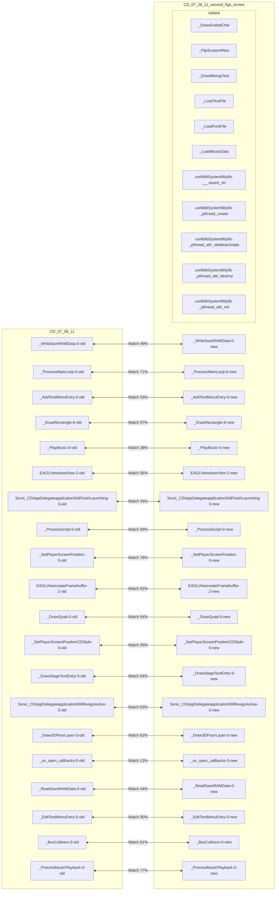
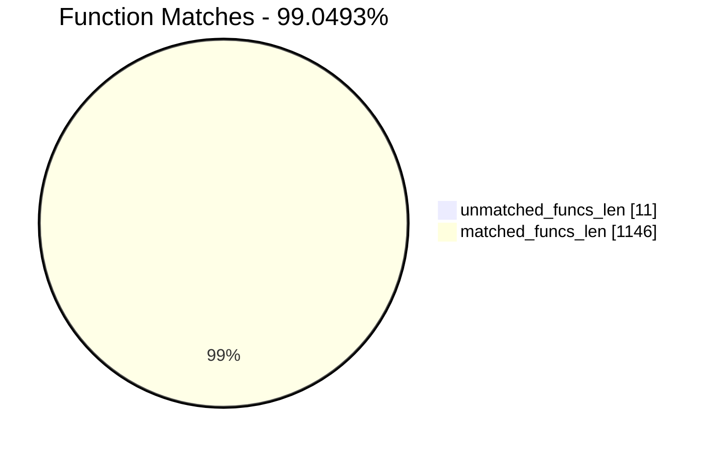
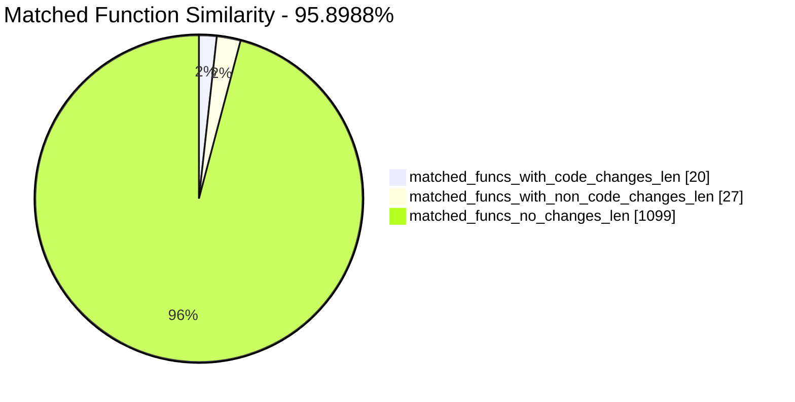
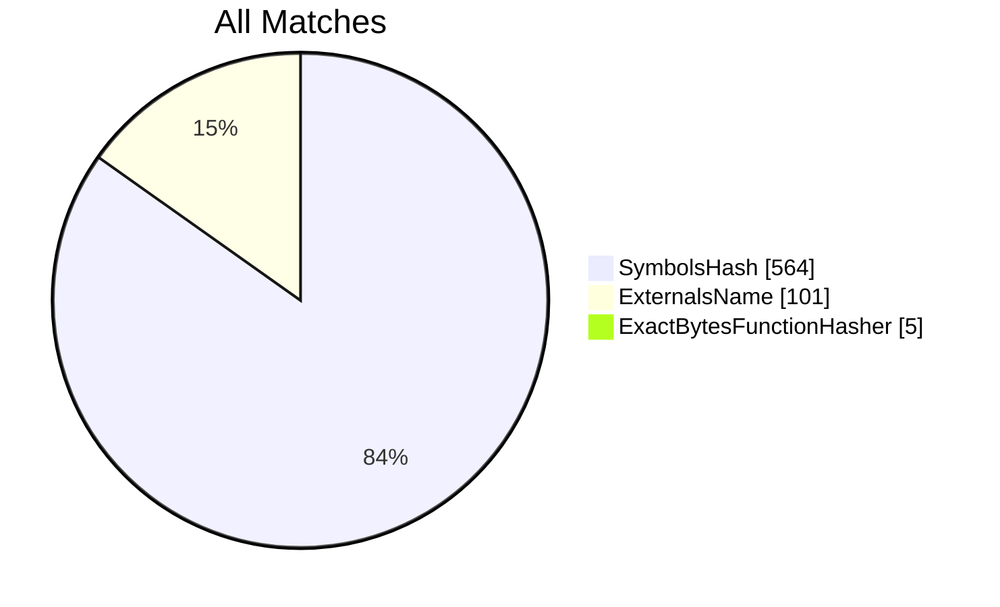
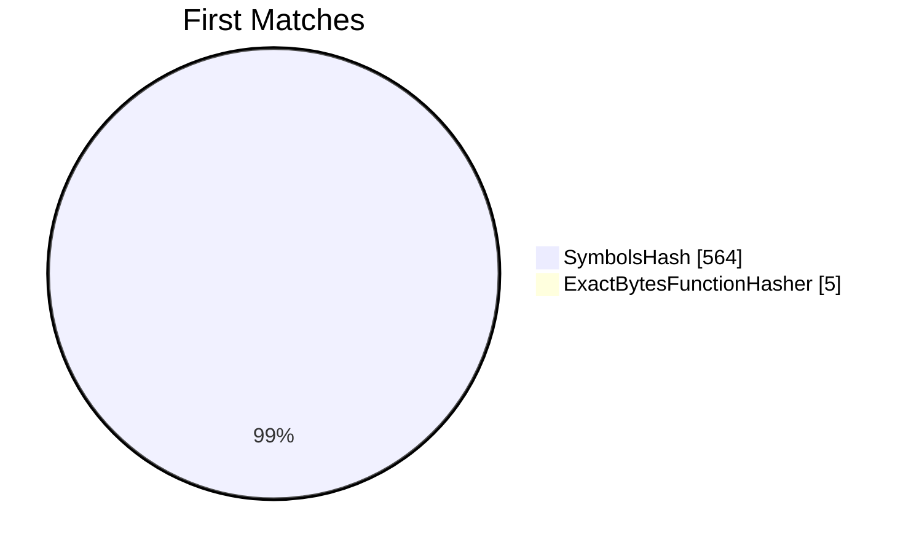
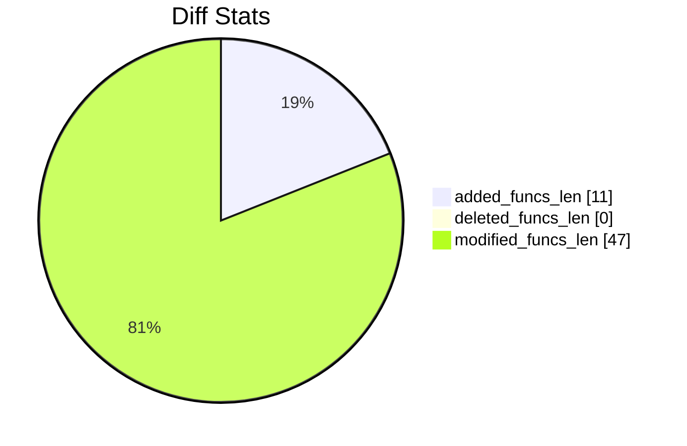
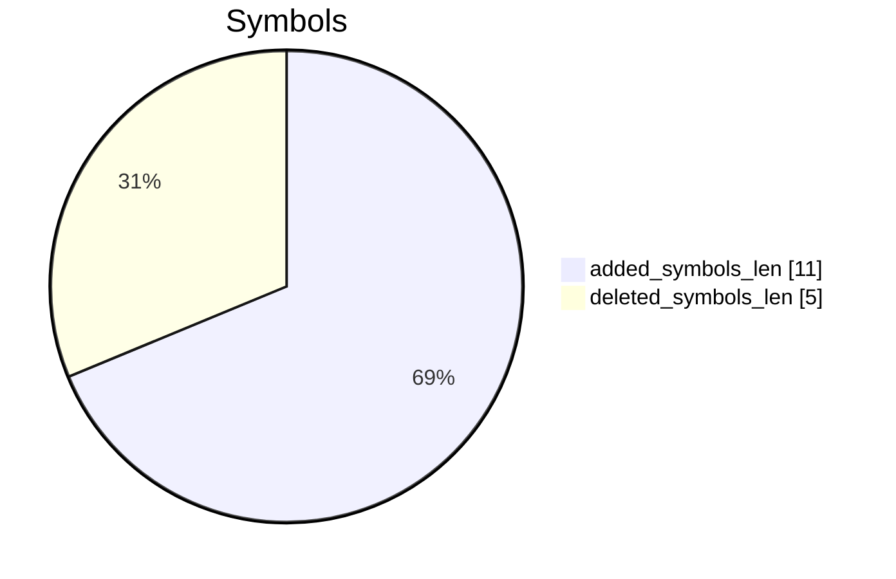
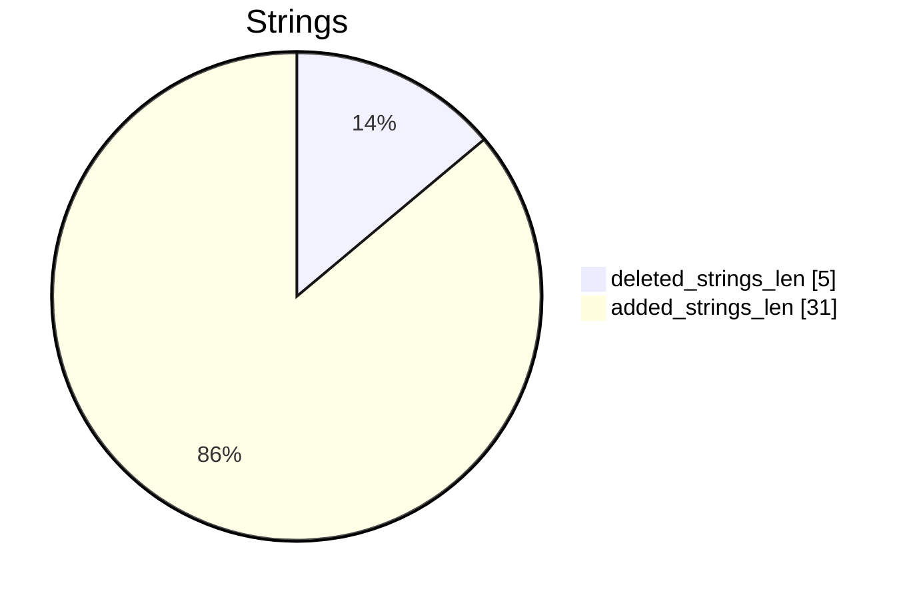

# CD_07_08_11-CD_07_26_11_second_figs_review Diff

# TOC

* [Visual Chart Diff](#visual-chart-diff)
* [Metadata](#metadata)
	* [Ghidra Diff Engine](#ghidra-diff-engine)
		* [Command Line](#command-line)
	* [Binary Metadata Diff](#binary-metadata-diff)
	* [Program Options](#program-options)
	* [Diff Stats](#diff-stats)
	* [Strings](#strings)
* [Deleted](#deleted)
* [Added](#added)
	* [_DrawScaledChar](#_drawscaledchar)
	* [_FlipScreenHRes](#_flipscreenhres)
	* [_DrawBitmapText](#_drawbitmaptext)
	* [_LoadTextFile](#_loadtextfile)
	* [_LoadFontFile](#_loadfontfile)
	* [_LoadMusicData](#_loadmusicdata)
	* [/usr/lib/libSystem.B.dylib::___assert_rtn](#usrliblibsystembdylib___assert_rtn)
	* [/usr/lib/libSystem.B.dylib::_pthread_create](#usrliblibsystembdylib_pthread_create)
	* [/usr/lib/libSystem.B.dylib::_pthread_attr_setdetachstate](#usrliblibsystembdylib_pthread_attr_setdetachstate)
	* [/usr/lib/libSystem.B.dylib::_pthread_attr_destroy](#usrliblibsystembdylib_pthread_attr_destroy)
	* [/usr/lib/libSystem.B.dylib::_pthread_attr_init](#usrliblibsystembdylib_pthread_attr_init)
* [Modified](#modified)
	* [_WriteSaveRAMData](#_writesaveramdata)
	* [_ProcessMainLoop](#_processmainloop)
	* [_AddTextMenuEntry](#_addtextmenuentry)
	* [_DrawRectangle](#_drawrectangle)
	* [_PlayMusic](#_playmusic)
	* [EAGLView::drawView](#eaglviewdrawview)
	* [Sonic_CDAppDelegate::applicationDidFinishLaunching:](#sonic_cdappdelegateapplicationdidfinishlaunching)
	* [_ProcessScript](#_processscript)
	* [_SetPlayerScreenPosition](#_setplayerscreenposition)
	* [EAGLView::createFramebuffer](#eaglviewcreateframebuffer)
	* [_DrawQuad](#_drawquad)
	* [_SetPlayerScreenPositionCDStyle](#_setplayerscreenpositioncdstyle)
	* [_DrawStageTextEntry](#_drawstagetextentry)
	* [Sonic_CDAppDelegate::applicationWillResignActive:](#sonic_cdappdelegateapplicationwillresignactive)
	* [_Draw3DFloorLayer](#_draw3dfloorlayer)
	* [_ov_open_callbacks](#_ov_open_callbacks)
	* [_ReadSaveRAMData](#_readsaveramdata)
	* [_EditTextMenuEntry](#_edittextmenuentry)
	* [_BoxCollision](#_boxcollision)
	* [_ProcessMusicPlayback](#_processmusicplayback)
* [Modified (No Code Changes)](#modified-no-code-changes)
	* [_CloseFile](#_closefile)
	* [_ResetCurrentStageFolder](#_resetcurrentstagefolder)
	* [_FileRead](#_fileread)
	* [_ReachedEndOfFile](#_reachedendoffile)

# Visual Chart Diff










# Metadata

## Ghidra Diff Engine

### Command Line

#### Captured Command Line


```
ghidriff --project-location ghidra_projects --project-name ghidriff --symbols-path symbols --threaded --log-level INFO --file-log-level INFO --log-path ghidriff.log --min-func-len 2 --gdt [] --bsim --max-ram-percent 60.0 --max-section-funcs 200 CD_07_08_11 CD_07_26_11_second_figs_review
```


#### Verbose Args


<details>

```
--old ['CD_07_08_11'] --new [['CD_07_26_11_second_figs_review']] --engine VersionTrackingDiff --output-path CD_07_08_11-CD_07_26_11_second_figs_review --summary False --project-location ghidra_projects --project-name ghidriff --symbols-path symbols --threaded True --force-analysis False --force-diff False --no-symbols False --log-level INFO --file-log-level INFO --log-path ghidriff.log --va False --min-func-len 2 --use-calling-counts False --gdt [] --bsim True --bsim-full False --max-ram-percent 60.0 --print-flags False --jvm-args None --side-by-side False --max-section-funcs 200 --md-title None
```


</details>

## Binary Metadata Diff


```diff
--- CD_07_08_11 Meta
+++ CD_07_26_11_second_figs_review Meta
@@ -1,42 +1,42 @@
-Program Name: CD_07_08_11
+Program Name: CD_07_26_11_second_figs_review
 Language ID: ARM:LE:32:v6 (1.107)
 Compiler ID: default
 Processor: ARM
 Endian: Little
 Address Size: 32
 Minimum Address: 00001000
-Maximum Address: 01283003
-# of Bytes: 19402852
+Maximum Address: 01289003
+# of Bytes: 19427432
 # of Memory Blocks: 30
-# of Instructions: 49109
-# of Defined Data: 12280
-# of Functions: 570
-# of Symbols: 3399
-# of Data Types: 121
-# of Data Type Categories: 7
+# of Instructions: 50652
+# of Defined Data: 12565
+# of Functions: 587
+# of Symbols: 3492
+# of Data Types: 137
+# of Data Type Categories: 10
 Analyzed: true
 Created With Ghidra Version: 11.0.3
-Date Created: Thu Jan 09 19:03:39 CET 2025
+Date Created: Thu Jan 09 19:03:40 CET 2025
 Executable Format: Mac OS X Mach-O
-Executable Location: /home/user/CD_07_08_11
-Executable MD5: 4a6311a80229fa0342922344c9869483
-Executable SHA256: 34501b07998b6e10d6cd41370d110625dfa84cdfd3547b05f7d9c14475eda3b1
-FSRL: file:///home/user/CD_07_08_11?MD5=4a6311a80229fa0342922344c9869483
+Executable Location: /home/user/CD_07_26_11_second_figs_review
+Executable MD5: b736abc974499ed95aaf594821b83478
+Executable SHA256: 5e6e35425a69c76202a54428de1de3e5ee9ca619f16fc1429c0d1d99d87daafb
+FSRL: file:///home/user/CD_07_26_11_second_figs_review?MD5=b736abc974499ed95aaf594821b83478
 Mach-O File Type: EXECUTE
 Mach-O File Type Description: Demand Paged Executable File
 Mach-O Flag 0: NOUNDEFS
 Mach-O Flag 1: DYLDLINK
 Mach-O Flag 2: TWOLEVEL
 Preferred Root Namespace Category: 
 Relocatable: false
 Required Library [    0]: /System/Library/Frameworks/AudioToolbox.framework/AudioToolbox
 Required Library [    1]: /System/Library/Frameworks/Foundation.framework/Foundation
 Required Library [    2]: /System/Library/Frameworks/UIKit.framework/UIKit
 Required Library [    3]: /System/Library/Frameworks/OpenGLES.framework/OpenGLES
 Required Library [    4]: /System/Library/Frameworks/QuartzCore.framework/QuartzCore
 Required Library [    5]: /System/Library/Frameworks/OpenAL.framework/OpenAL
 Required Library [    6]: /usr/lib/libgcc_s.1.dylib
 Required Library [    7]: /usr/lib/libSystem.B.dylib
 Required Library [    8]: /usr/lib/libobjc.A.dylib
 Required Library [    9]: /System/Library/Frameworks/CoreFoundation.framework/CoreFoundation
 Should Ask To Analyze: false

```


## Program Options


<details>
<summary>Ghidra CD_07_08_11 Decompiler Options</summary>


|Decompiler Option|Value|
| :---: | :---: |
|Prototype Evaluation|__stdcall|

</details>


<details>
<summary>Ghidra CD_07_08_11 Specification extensions Options</summary>


|Specification extensions Option|Value|
| :---: | :---: |
|FormatVersion|0|
|VersionCounter|0|

</details>


<details>
<summary>Ghidra CD_07_08_11 Analyzers Options</summary>


|Analyzers Option|Value|
| :---: | :---: |
|ARM Aggressive Instruction Finder|false|
|ARM Constant Reference Analyzer|true|
|ARM Constant Reference Analyzer.Create Data from pointer|false|
|ARM Constant Reference Analyzer.Function parameter/return Pointer analysis|true|
|ARM Constant Reference Analyzer.Max Threads|2|
|ARM Constant Reference Analyzer.Min absolute reference|4|
|ARM Constant Reference Analyzer.Require pointer param data type|false|
|ARM Constant Reference Analyzer.Speculative reference max|256|
|ARM Constant Reference Analyzer.Speculative reference min|512|
|ARM Constant Reference Analyzer.Stored Value Pointer analysis|true|
|ARM Constant Reference Analyzer.Switch Table Recovery|false|
|ARM Constant Reference Analyzer.Trust values read from writable memory|true|
|ARM Symbol|true|
|ASCII Strings|true|
|ASCII Strings.Create Strings Containing Existing Strings|true|
|ASCII Strings.Create Strings Containing References|true|
|ASCII Strings.Force Model Reload|false|
|ASCII Strings.Minimum String Length|LEN_5|
|ASCII Strings.Model File|StringModel.sng|
|ASCII Strings.Require Null Termination for String|true|
|ASCII Strings.Search Only in Accessible Memory Blocks|true|
|ASCII Strings.String Start Alignment|ALIGN_1|
|ASCII Strings.String end alignment|4|
|Aggressive Instruction Finder|false|
|Aggressive Instruction Finder.Create Analysis Bookmarks|true|
|Apply Data Archives|true|
|Apply Data Archives.Archive Chooser|[Auto-Detect]|
|Apply Data Archives.Create Analysis Bookmarks|true|
|Apply Data Archives.GDT User File Archive Path|None|
|Apply Data Archives.User Project Archive Path|None|
|CFStrings|true|
|Call Convention ID|true|
|Call Convention ID.Analysis Decompiler Timeout (sec)|60|
|Call-Fixup Installer|true|
|Condense Filler Bytes|false|
|Condense Filler Bytes.Filler Value|Auto|
|Condense Filler Bytes.Minimum number of sequential bytes|1|
|Create Address Tables|true|
|Create Address Tables.Allow Offcut References|false|
|Create Address Tables.Auto Label Table|false|
|Create Address Tables.Create Analysis Bookmarks|true|
|Create Address Tables.Maxmimum Pointer Distance|16777215|
|Create Address Tables.Minimum Pointer Address|4132|
|Create Address Tables.Minimum Table Size|4|
|Create Address Tables.Pointer Alignment|1|
|Create Address Tables.Relocation Table Guide|true|
|Create Address Tables.Table Alignment|4|
|DWARF Line Number|false|
|Data Reference|true|
|Data Reference.Address Table Alignment|1|
|Data Reference.Address Table Minimum Size|4|
|Data Reference.Align End of Strings|false|
|Data Reference.Ascii String References|true|
|Data Reference.Create Address Tables|false|
|Data Reference.Minimum String Length|5|
|Data Reference.References to Pointers|false|
|Data Reference.Relocation Table Guide|true|
|Data Reference.Respect Execute Flag|true|
|Data Reference.Subroutine References|true|
|Data Reference.Switch Table References|false|
|Data Reference.Unicode String References|true|
|Decompiler Parameter ID|false|
|Decompiler Parameter ID.Analysis Clear Level|ANALYSIS|
|Decompiler Parameter ID.Analysis Decompiler Timeout (sec)|60|
|Decompiler Parameter ID.Commit Data Types|true|
|Decompiler Parameter ID.Commit Void Return Values|false|
|Decompiler Parameter ID.Prototype Evaluation|__stdcall|
|Decompiler Switch Analysis|true|
|Decompiler Switch Analysis.Analysis Decompiler Timeout (sec)|60|
|Demangler GNU|true|
|Demangler GNU.Apply Function Calling Conventions|true|
|Demangler GNU.Apply Function Signatures|true|
|Demangler GNU.Demangle Only Known Mangled Symbols|false|
|Demangler GNU.Demangler Format|AUTO|
|Demangler GNU.Use Deprecated Demangler|false|
|Disassemble Entry Points|true|
|Disassemble Entry Points.Respect Execute Flag|true|
|Embedded Media|true|
|Embedded Media.Create Analysis Bookmarks|true|
|External Entry References|true|
|External Symbol Resolver|true|
|Function Start Pre Search|true|
|Function Start Pre Search.Bookmark Functions|false|
|Function Start Pre Search.Search Data Blocks|false|
|Function Start Search|true|
|Function Start Search After Code|true|
|Function Start Search After Code.Bookmark Functions|false|
|Function Start Search After Code.Search Data Blocks|false|
|Function Start Search After Data|true|
|Function Start Search After Data.Bookmark Functions|false|
|Function Start Search After Data.Search Data Blocks|false|
|Function Start Search.Bookmark Functions|false|
|Function Start Search.Search Data Blocks|false|
|Mach-O Function Starts|true|
|Mach-O Function Starts.Bookmark failed functions|false|
|Mach-O Function Starts.Bookmark new functions|false|
|Mach-O Function Starts.Bookmark skipped functions|false|
|Mach-O Function Starts.Use PseudoDisassembler|true|
|Non-Returning Functions - Discovered|true|
|Non-Returning Functions - Discovered.Create Analysis Bookmarks|true|
|Non-Returning Functions - Discovered.Function Non-return Threshold|3|
|Non-Returning Functions - Discovered.Repair Flow Damage|true|
|Non-Returning Functions - Known|true|
|Non-Returning Functions - Known.Create Analysis Bookmarks|true|
|Objective-C 2 Class|true|
|Objective-C 2 Decompiler Message|true|
|Objective-C 2 Message|false|
|Reference|true|
|Reference.Address Table Alignment|1|
|Reference.Address Table Minimum Size|4|
|Reference.Align End of Strings|false|
|Reference.Ascii String References|true|
|Reference.Create Address Tables|false|
|Reference.Minimum String Length|5|
|Reference.References to Pointers|false|
|Reference.Relocation Table Guide|true|
|Reference.Respect Execute Flag|true|
|Reference.Subroutine References|true|
|Reference.Switch Table References|false|
|Reference.Unicode String References|true|
|Scalar Operand References|false|
|Scalar Operand References.Relocation Table Guide|true|
|Shared Return Calls|true|
|Shared Return Calls.Allow Conditional Jumps|false|
|Shared Return Calls.Assume Contiguous Functions Only|false|
|Stack|true|
|Stack.Create Local Variables|true|
|Stack.Create Param Variables|true|
|Stack.useNewFunctionStackAnalysis|true|
|Subroutine References|true|
|Subroutine References.Create Thunks Early|true|
|Variadic Function Signature Override|false|
|Variadic Function Signature Override.Create Analysis Bookmarks|false|

</details>


<details>
<summary>Ghidra CD_07_26_11_second_figs_review Decompiler Options</summary>


|Decompiler Option|Value|
| :---: | :---: |
|Prototype Evaluation|__stdcall|

</details>


<details>
<summary>Ghidra CD_07_26_11_second_figs_review Specification extensions Options</summary>


|Specification extensions Option|Value|
| :---: | :---: |
|FormatVersion|0|
|VersionCounter|0|

</details>


<details>
<summary>Ghidra CD_07_26_11_second_figs_review Analyzers Options</summary>


|Analyzers Option|Value|
| :---: | :---: |
|ARM Aggressive Instruction Finder|false|
|ARM Constant Reference Analyzer|true|
|ARM Constant Reference Analyzer.Create Data from pointer|false|
|ARM Constant Reference Analyzer.Function parameter/return Pointer analysis|true|
|ARM Constant Reference Analyzer.Max Threads|2|
|ARM Constant Reference Analyzer.Min absolute reference|4|
|ARM Constant Reference Analyzer.Require pointer param data type|false|
|ARM Constant Reference Analyzer.Speculative reference max|256|
|ARM Constant Reference Analyzer.Speculative reference min|512|
|ARM Constant Reference Analyzer.Stored Value Pointer analysis|true|
|ARM Constant Reference Analyzer.Switch Table Recovery|false|
|ARM Constant Reference Analyzer.Trust values read from writable memory|true|
|ARM Symbol|true|
|ASCII Strings|true|
|ASCII Strings.Create Strings Containing Existing Strings|true|
|ASCII Strings.Create Strings Containing References|true|
|ASCII Strings.Force Model Reload|false|
|ASCII Strings.Minimum String Length|LEN_5|
|ASCII Strings.Model File|StringModel.sng|
|ASCII Strings.Require Null Termination for String|true|
|ASCII Strings.Search Only in Accessible Memory Blocks|true|
|ASCII Strings.String Start Alignment|ALIGN_1|
|ASCII Strings.String end alignment|4|
|Aggressive Instruction Finder|false|
|Aggressive Instruction Finder.Create Analysis Bookmarks|true|
|Apply Data Archives|true|
|Apply Data Archives.Archive Chooser|[Auto-Detect]|
|Apply Data Archives.Create Analysis Bookmarks|true|
|Apply Data Archives.GDT User File Archive Path|None|
|Apply Data Archives.User Project Archive Path|None|
|CFStrings|true|
|Call Convention ID|true|
|Call Convention ID.Analysis Decompiler Timeout (sec)|60|
|Call-Fixup Installer|true|
|Condense Filler Bytes|false|
|Condense Filler Bytes.Filler Value|Auto|
|Condense Filler Bytes.Minimum number of sequential bytes|1|
|Create Address Tables|true|
|Create Address Tables.Allow Offcut References|false|
|Create Address Tables.Auto Label Table|false|
|Create Address Tables.Create Analysis Bookmarks|true|
|Create Address Tables.Maxmimum Pointer Distance|16777215|
|Create Address Tables.Minimum Pointer Address|4132|
|Create Address Tables.Minimum Table Size|4|
|Create Address Tables.Pointer Alignment|1|
|Create Address Tables.Relocation Table Guide|true|
|Create Address Tables.Table Alignment|4|
|DWARF Line Number|false|
|Data Reference|true|
|Data Reference.Address Table Alignment|1|
|Data Reference.Address Table Minimum Size|4|
|Data Reference.Align End of Strings|false|
|Data Reference.Ascii String References|true|
|Data Reference.Create Address Tables|false|
|Data Reference.Minimum String Length|5|
|Data Reference.References to Pointers|false|
|Data Reference.Relocation Table Guide|true|
|Data Reference.Respect Execute Flag|true|
|Data Reference.Subroutine References|true|
|Data Reference.Switch Table References|false|
|Data Reference.Unicode String References|true|
|Decompiler Parameter ID|false|
|Decompiler Parameter ID.Analysis Clear Level|ANALYSIS|
|Decompiler Parameter ID.Analysis Decompiler Timeout (sec)|60|
|Decompiler Parameter ID.Commit Data Types|true|
|Decompiler Parameter ID.Commit Void Return Values|false|
|Decompiler Parameter ID.Prototype Evaluation|__stdcall|
|Decompiler Switch Analysis|true|
|Decompiler Switch Analysis.Analysis Decompiler Timeout (sec)|60|
|Demangler GNU|true|
|Demangler GNU.Apply Function Calling Conventions|true|
|Demangler GNU.Apply Function Signatures|true|
|Demangler GNU.Demangle Only Known Mangled Symbols|false|
|Demangler GNU.Demangler Format|AUTO|
|Demangler GNU.Use Deprecated Demangler|false|
|Disassemble Entry Points|true|
|Disassemble Entry Points.Respect Execute Flag|true|
|Embedded Media|true|
|Embedded Media.Create Analysis Bookmarks|true|
|External Entry References|true|
|External Symbol Resolver|true|
|Function Start Pre Search|true|
|Function Start Pre Search.Bookmark Functions|false|
|Function Start Pre Search.Search Data Blocks|false|
|Function Start Search|true|
|Function Start Search After Code|true|
|Function Start Search After Code.Bookmark Functions|false|
|Function Start Search After Code.Search Data Blocks|false|
|Function Start Search After Data|true|
|Function Start Search After Data.Bookmark Functions|false|
|Function Start Search After Data.Search Data Blocks|false|
|Function Start Search.Bookmark Functions|false|
|Function Start Search.Search Data Blocks|false|
|Mach-O Function Starts|true|
|Mach-O Function Starts.Bookmark failed functions|false|
|Mach-O Function Starts.Bookmark new functions|false|
|Mach-O Function Starts.Bookmark skipped functions|false|
|Mach-O Function Starts.Use PseudoDisassembler|true|
|Non-Returning Functions - Discovered|true|
|Non-Returning Functions - Discovered.Create Analysis Bookmarks|true|
|Non-Returning Functions - Discovered.Function Non-return Threshold|3|
|Non-Returning Functions - Discovered.Repair Flow Damage|true|
|Non-Returning Functions - Known|true|
|Non-Returning Functions - Known.Create Analysis Bookmarks|true|
|Objective-C 2 Class|true|
|Objective-C 2 Decompiler Message|true|
|Objective-C 2 Message|false|
|Reference|true|
|Reference.Address Table Alignment|1|
|Reference.Address Table Minimum Size|4|
|Reference.Align End of Strings|false|
|Reference.Ascii String References|true|
|Reference.Create Address Tables|false|
|Reference.Minimum String Length|5|
|Reference.References to Pointers|false|
|Reference.Relocation Table Guide|true|
|Reference.Respect Execute Flag|true|
|Reference.Subroutine References|true|
|Reference.Switch Table References|false|
|Reference.Unicode String References|true|
|Scalar Operand References|false|
|Scalar Operand References.Relocation Table Guide|true|
|Shared Return Calls|true|
|Shared Return Calls.Allow Conditional Jumps|false|
|Shared Return Calls.Assume Contiguous Functions Only|false|
|Stack|true|
|Stack.Create Local Variables|true|
|Stack.Create Param Variables|true|
|Stack.useNewFunctionStackAnalysis|true|
|Subroutine References|true|
|Subroutine References.Create Thunks Early|true|
|Variadic Function Signature Override|false|
|Variadic Function Signature Override.Create Analysis Bookmarks|false|

</details>

## Diff Stats


|Stat|Value|
| :---: | :---: |
|added_funcs_len|11|
|deleted_funcs_len|0|
|modified_funcs_len|47|
|added_symbols_len|11|
|deleted_symbols_len|5|
|diff_time|131.9766776561737|
|deleted_strings_len|5|
|added_strings_len|31|
|match_types|Counter({'SymbolsHash': 564, 'ExternalsName': 101, 'ExactBytesFunctionHasher': 5})|
|items_to_process|74|
|diff_types|Counter({'address': 47, 'refcount': 27, 'length': 21, 'calling': 20, 'code': 20, 'called': 5, 'sig': 1})|
|unmatched_funcs_len|11|
|total_funcs_len|1157|
|matched_funcs_len|1146|
|matched_funcs_with_code_changes_len|20|
|matched_funcs_with_non_code_changes_len|27|
|matched_funcs_no_changes_len|1099|
|match_func_similarity_percent|95.8988%|
|func_match_overall_percent|99.0493%|
|first_matches|Counter({'SymbolsHash': 564, 'ExactBytesFunctionHasher': 5})|













## Strings




### Strings Diff


```diff
--- deleted strings
+++ added strings
@@ -1,5 +1,31 @@
-s_SGame.bin
-s__C.14.2925
-s__C.15.2926
-s__previousTouchCount.30789
-s__proc.4081
+___func__.4648
+s
+s_!returnVal
+s_/SGame.bin
+s__C.14.2927
+s__C.15.2928
+s__DrawBitmapText
+s__DrawScaledChar
+s__FlipScreenHRes
+s__HQ3DFloorEnabled
+s__LoadFontFile
+s__LoadMusicData
+s__LoadTextFile
+s__OBJC_CLASS_$_NSLocale
+s____assert_rtn
+s____func__.4648
+s__fontCharacterList
+s__gameLanguage
+s__highResMode
+s__previousTouchCount.30819
+s__proc.4436
+s__pthread_attr_destroy
+s__pthread_attr_init
+s__pthread_attr_setdetachstate
+s__pthread_create
+s_en
+s_es
+s_fr
+s_it
+s_ja
+s_preferredLanguages

```


### String References

#### Old


|String|Ref Count|Ref Func|
| :---: | :---: | :---: |
|s__proc.4081_0127d97a|1||
|s__C.15.2926_0127b98c|1||
|s_SGame.bin_000374d0|1|_CheckRSDKFile|
|s__previousTouchCount.30789_0127b490|1||
|s__C.14.2925_0127b997|1||

#### New


|String|Ref Count|Ref Func|
| :---: | :---: | :---: |
|s__pthread_create_01280f3c|3||
|s____assert_rtn_01280941|3||
|s_fr_000382c0|1|applicationDidFinishLaunching:|
|s__fontCharacterList_01283a2e|1||
|s__highResMode_01283153|1||
|s__DrawBitmapText_01283a02|1||
|s_preferredLanguages_00037b33|2|applicationDidFinishLaunching:|
|s_!returnVal_000387ec|2|_PlayMusic|
|s__C.14.2927_01281dbc|1||
|s__C.15.2928_01281db1|1||
|s__pthread_attr_destroy_01280ef6|3||
|s____func__.4648_01283cc2|1||
|s__FlipScreenHRes_012830bd|1||
|s__HQ3DFloorEnabled_01281f4e|1||
|___func__.4648|2|_PlayMusic|
|s__LoadMusicData_01283be0|1||
|s__LoadFontFile_01283a20|1||
|s__proc.4436_01283e49|1||
|s__previousTouchCount.30819_012818b5|1||
|s_de_000382c8|1|applicationDidFinishLaunching:|
|s_ja_000382d0|1|applicationDidFinishLaunching:|
|s__DrawScaledChar_01282247|1||
|s__gameLanguage_01281f32|1||
|s_it_000382c4|1|applicationDidFinishLaunching:|
|s_/SGame.bin_00038420|1|_CheckRSDKFile|
|s__OBJC_CLASS_$_NSLocale_012807d1|1||
|s_en_000382bc|1|applicationDidFinishLaunching:|
|s__pthread_attr_init_01280f0c|3||
|s__pthread_attr_setdetachstate_01280f1f|3||
|s_es_000382cc|1|applicationDidFinishLaunching:|
|s__LoadTextFile_01283a12|1||

# Deleted

# Added

## _DrawScaledChar

### Function Meta


|Key|CD_07_26_11_second_figs_review|
| :---: | :---: |
|name|_DrawScaledChar|
|fullname|_DrawScaledChar|
|refcount|1|
|length|504|
|called||
|calling|_DrawBitmapText|
|paramcount|12|
|address|00007ff8|
|sig|undefined _DrawScaledChar(undefined param_1, undefined param_2, undefined param_3, undefined param_4, undefined4 param_5, undefined4 param_6, undefined4 param_7, undefined4 param_8, undefined4 param_9, undefined4 param_10, undefined4 param_11, undefined4 param_12)|
|sym_type|Function|
|sym_source|IMPORTED|
|external|False|


```diff
--- _DrawScaledChar
+++ _DrawScaledChar
@@ -0,0 +1,83 @@
+
+void _DrawScaledChar(undefined4 param_1,int param_2,short param_3,int param_4,int param_5,
+                    int param_6,int param_7,int param_8,int param_9,short param_10,short param_11,
+                    int param_12)
+
+{
+  undefined2 uVar1;
+  undefined2 uVar2;
+  undefined2 uVar3;
+  short sVar4;
+  int iVar5;
+  int iVar6;
+  int iVar7;
+  int iVar8;
+  uint uVar9;
+  uint uVar10;
+  
+  iVar6 = DAT_00044da0;
+  if (param_2 + 0x1fffU < 0x567e) {
+    iVar8 = param_12 * 0x54 + DAT_00044d80;
+    iVar7 = *(int *)(iVar8 + 0x48);
+    if (iVar7 != -1 && iVar7 + 1 < 0 == SCARRY4(iVar7,1)) {
+      uVar9 = (uint)_gfxVertexSize;
+      if (uVar9 < 0x1000) {
+        sVar4 = (short)param_2 - (short)(param_4 * param_6 * 4 >> 7);
+        iVar5 = uVar9 * 0xc + DAT_00044da0;
+        param_3 = param_3 - (short)(param_5 * param_7 * 4 >> 0xb);
+        *(short *)(iVar5 + 2) = param_3;
+        *(undefined *)(iVar5 + 8) = 0xff;
+        *(undefined *)(iVar5 + 9) = 0xff;
+        *(undefined *)(iVar5 + 10) = 0xff;
+        *(undefined *)(iVar5 + 0xb) = 0xff;
+        *(short *)(uVar9 * 0xc + iVar6) = sVar4;
+        param_10 = param_10 + (short)iVar7;
+        *(short *)(iVar5 + 4) = param_10;
+        param_11 = param_11 + (short)*(undefined4 *)(iVar8 + 0x4c);
+        *(short *)(iVar5 + 6) = param_11;
+        uVar9 = uVar9 + 1 & 0xffff;
+        iVar7 = uVar9 * 0xc;
+        iVar8 = iVar7 + iVar6;
+        *(short *)(iVar8 + 2) = param_3;
+        *(short *)(iVar7 + iVar6) = sVar4 + (short)(param_6 * 4 * param_8 >> 7);
+        *(undefined *)(iVar8 + 8) = 0xff;
+        *(undefined *)(iVar8 + 9) = 0xff;
+        *(undefined *)(iVar8 + 10) = 0xff;
+        *(undefined *)(iVar8 + 0xb) = 0xff;
+        *(short *)(iVar8 + 4) = (short)param_8 + param_10;
+        *(undefined2 *)(iVar8 + 6) = *(undefined2 *)(iVar8 + -6);
+        uVar10 = uVar9 + 1 & 0xffff;
+        iVar7 = uVar10 * 0xc;
+        iVar8 = iVar7 + iVar6;
+        *(short *)(iVar7 + iVar6) = sVar4;
+        *(undefined *)(iVar8 + 8) = 0xff;
+        *(undefined *)(iVar8 + 9) = 0xff;
+        *(undefined *)(iVar8 + 10) = 0xff;
+        *(undefined *)(iVar8 + 0xb) = 0xff;
+        *(short *)(iVar8 + 2) = param_3 + (short)(param_7 * 4 * param_9 >> 0xb);
+        *(undefined2 *)(iVar8 + 4) = *(undefined2 *)(iVar8 + -0x14);
+        *(short *)(iVar8 + 6) = (short)param_9 + param_11;
+        uVar10 = uVar10 + 1;
+        uVar9 = uVar10 & 0xffff;
+        iVar7 = (uVar9 - 2) * 0xc;
+        iVar8 = uVar9 * 0xc + iVar6;
+        uVar1 = *(undefined2 *)(iVar7 + iVar6 + 4);
+        *(undefined2 *)(uVar9 * 0xc + iVar6) = *(undefined2 *)(iVar7 + iVar6);
+        *(undefined *)(iVar8 + 8) = 0xff;
+        *(undefined *)(iVar8 + 9) = 0xff;
+        iVar6 = (uVar9 - 1) * 0xc + iVar6;
+        *(undefined *)(iVar8 + 10) = 0xff;
+        uVar2 = *(undefined2 *)(iVar6 + 2);
+        uVar3 = *(undefined2 *)(iVar6 + 6);
+        *(undefined *)(iVar8 + 0xb) = 0xff;
+        *(undefined2 *)(iVar8 + 2) = uVar2;
+        *(undefined2 *)(iVar8 + 6) = uVar3;
+        *(undefined2 *)(iVar8 + 4) = uVar1;
+        _gfxVertexSize = (short)uVar10 + 1;
+        _gfxIndexSize = _gfxIndexSize + 6;
+      }
+    }
+  }
+  return;
+}
+

```


## _FlipScreenHRes

### Function Meta


|Key|CD_07_26_11_second_figs_review|
| :---: | :---: |
|name|_FlipScreenHRes|
|fullname|_FlipScreenHRes|
|refcount|1|
|length|692|
|called|<details><summary>Expand for full list:<br>_glBindTexture<br>_glClear<br>_glColorPointer<br>_glDisable<br>_glDisableClientState<br>_glDrawElements<br>_glEnable<br>_glEnableClientState<br>_glLoadIdentity<br>_glOrthof<br>_glRotatef</summary>_glTexCoordPointer<br>_glTexParameterf<br>_glVertexPointer<br>_glViewport</details>|
|calling|_ProcessMainLoop|
|paramcount|0|
|address|00021d80|
|sig|undefined _FlipScreenHRes(void)|
|sym_type|Function|
|sym_source|IMPORTED|
|external|False|


```diff
--- _FlipScreenHRes
+++ _FlipScreenHRes
@@ -0,0 +1,56 @@
+
+void _FlipScreenHRes(void)
+
+{
+  undefined *puVar1;
+  undefined *puVar2;
+  undefined *puVar3;
+  undefined *puVar4;
+  undefined *puVar5;
+  
+  if (180.0 <= _viewAngle) {
+    if (180.0 <= _viewAnglePos) goto LAB_00021dfc;
+    _viewAnglePos = _viewAnglePos + 7.5;
+  }
+  else {
+    if (_viewAnglePos == 0.0 || _viewAnglePos < 0.0 != NAN(_viewAnglePos)) goto LAB_00021dfc;
+    _viewAnglePos = _viewAnglePos - 7.5;
+  }
+  _glClear(0x4000);
+LAB_00021dfc:
+  _glLoadIdentity();
+  _glRotatef(_viewAnglePos - 90.0,0,0,0x3f800000);
+  _glOrthof(0,*DAT_0004bac0,0x43700000,0,0xbf800000,0x3f800000);
+  _glViewport(0,0,(int)*DAT_0004babc,(int)*DAT_0004bab8);
+  _glBindTexture(0xde1,*(undefined4 *)(DAT_0004bad4 + *(int *)PTR__texPaletteNum_000443b0 * 4));
+  _glDisable(0xbe2);
+  _glTexParameterf(0xde1,0x2801,0x46180400);
+  _glTexParameterf(0xde1,&DAT_00002800,0x46180400);
+  _glEnableClientState(0x8076);
+  puVar3 = PTR__gfxPolyList_00044394;
+  _glVertexPointer(2,0x1402,0xc,PTR__gfxPolyList_00044394);
+  _glTexCoordPointer(2,0x1402,0xc,puVar3 + 4);
+  _glColorPointer(4,0x1401,0xc,puVar3 + 8);
+  puVar4 = PTR__gfxIndexSizeOpaque_000443a0;
+  puVar1 = PTR__gfxPolyListIndex_00044388;
+  _glDrawElements(4,*(undefined2 *)PTR__gfxIndexSizeOpaque_000443a0,0x1403,
+                  PTR__gfxPolyListIndex_00044388);
+  _glEnable(0xbe2);
+  puVar2 = PTR__gfxIndexSize_00044390;
+  *(short *)PTR__gfxIndexSize_00044390 = *(short *)PTR__gfxIndexSize_00044390 - *(short *)puVar4;
+  puVar5 = PTR__gfxVertexSizeOpaque_000443a8;
+  _glVertexPointer(2,0x1402,0xc,puVar3 + (uint)*(ushort *)PTR__gfxVertexSizeOpaque_000443a8 * 0xc);
+  _glTexCoordPointer(2,0x1402,0xc,puVar3 + (uint)*(ushort *)puVar5 * 0xc + 4);
+  _glColorPointer(4,0x1401,0xc,puVar3 + (uint)*(ushort *)puVar5 * 0xc + 8);
+  _glDrawElements(4,*(undefined2 *)puVar2,0x1403,puVar1);
+  _glTexParameterf(0xde1,0x2801,0x46180000);
+  _glTexParameterf(0xde1,&DAT_00002800,0x46180000);
+  _glDisableClientState(0x8076);
+  *(undefined2 *)puVar2 = 0;
+  puVar1 = PTR__gfxVertexSize_00044384;
+  *(undefined2 *)puVar4 = 0;
+  *(undefined2 *)puVar1 = 0;
+  *(undefined2 *)puVar5 = 0;
+  return;
+}
+

```


## _DrawBitmapText

### Function Meta


|Key|CD_07_26_11_second_figs_review|
| :---: | :---: |
|name|_DrawBitmapText|
|fullname|_DrawBitmapText|
|refcount|1|
|length|324|
|called|_DrawScaledChar|
|calling|_ProcessScript|
|paramcount|5|
|address|00027e98|
|sig|undefined _DrawBitmapText(undefined param_1, undefined param_2, undefined param_3, undefined param_4, undefined4 param_5)|
|sym_type|Function|
|sym_source|IMPORTED|
|external|False|


```diff
--- _DrawBitmapText
+++ _DrawBitmapText
@@ -0,0 +1,33 @@
+
+void _DrawBitmapText(int param_1,int param_2,int param_3,int param_4,int param_5)
+
+{
+  int iVar1;
+  int iVar2;
+  ushort *puVar3;
+  int iVar4;
+  int iVar5;
+  int *piVar6;
+  int local_24;
+  
+  param_3 = param_3 << 9;
+  piVar6 = (int *)(param_1 + 0x1000);
+  for (local_24 = 0; local_24 < (int)(uint)(byte)section_0000147c.sectname[param_1 + 8];
+      local_24 = local_24 + 1) {
+    iVar5 = param_2 << 9;
+    puVar3 = (ushort *)(param_1 + *piVar6 * 2);
+    for (iVar4 = piVar6[0x80]; iVar1 = DAT_0004bbd0, 0 < iVar4; iVar4 = iVar4 + -1) {
+      iVar2 = (uint)*puVar3 * 0x14 + DAT_0004bbd0;
+      _DrawScaledChar(0,iVar5 >> 5,param_3 >> 9,-(int)*(short *)(iVar2 + 0xc),
+                      -(int)*(short *)(iVar2 + 0xe),param_4,param_4,(int)*(short *)(iVar2 + 8),
+                      (int)*(short *)(iVar2 + 10),(int)*(short *)(iVar2 + 4),
+                      (int)*(short *)(iVar2 + 6),(int)*DAT_0004bbcc);
+      iVar5 = *(short *)((uint)*puVar3 * 0x14 + iVar1 + 0x10) * param_4 + iVar5;
+      puVar3 = puVar3 + 1;
+    }
+    piVar6 = piVar6 + 1;
+    param_3 = param_3 + param_4 * param_5;
+  }
+  return;
+}
+

```


## _LoadTextFile

### Function Meta


|Key|CD_07_26_11_second_figs_review|
| :---: | :---: |
|name|_LoadTextFile|
|fullname|_LoadTextFile|
|refcount|1|
|length|804|
|called|_CloseFile<br>_FileRead<br>_LoadFile<br>_ReachedEndOfFile|
|calling|_ProcessScript|
|paramcount|0|
|address|00027fe8|
|sig|undefined _LoadTextFile(void)|
|sym_type|Function|
|sym_source|IMPORTED|
|external|False|


```diff
--- _LoadTextFile
+++ _LoadTextFile
@@ -0,0 +1,134 @@
+
+void _LoadTextFile(int param_1,undefined4 param_2)
+
+{
+  int iVar1;
+  uint uVar2;
+  undefined4 uVar3;
+  undefined2 uVar4;
+  short sVar5;
+  int iVar6;
+  byte bVar7;
+  char *pcVar8;
+  undefined auStack_74 [87];
+  byte local_1d;
+  
+  iVar1 = _LoadFile(param_2,auStack_74);
+  if (iVar1 == 1) {
+    *(undefined4 *)(param_1 + 0x1000) = 0;
+    pcVar8 = section_0000147c.sectname + param_1 + 4;
+    *(undefined4 *)pcVar8 = 0;
+    section_0000147c.sectname[param_1 + 8] = '\0';
+    *(undefined4 *)(section_000011e0.segname + param_1 + 0x10) = 0;
+    _FileRead(&local_1d,1);
+    uVar2 = (uint)local_1d;
+    if (uVar2 == 0xff) {
+      _FileRead(&local_1d,1);
+      do {
+        _FileRead(&local_1d,1);
+        uVar2 = (uint)local_1d;
+        _FileRead(&local_1d,1);
+        uVar2 = uVar2 + (uint)local_1d * 0x100 & 0xffff;
+        if ((uVar2 == 10) || (uVar2 == 0xd)) {
+          bVar7 = section_0000147c.sectname[param_1 + 8] + 1;
+          section_0000147c.sectname[param_1 + 8] = bVar7;
+          if ((bVar7 & 0x80) == 0) {
+            iVar1 = (uint)bVar7 * 4 + param_1;
+            *(undefined4 *)(iVar1 + 0x1000) = *(undefined4 *)pcVar8;
+            *(undefined4 *)(section_000011e0.segname + iVar1 + 0x10) = 0;
+          }
+        }
+        else {
+          iVar1 = 0;
+          iVar6 = 0;
+          do {
+            if (*(uint *)(iVar6 + DAT_0004bbd0) == uVar2) {
+              uVar4 = (undefined2)iVar1;
+              goto LAB_0002810c;
+            }
+            iVar1 = iVar1 + 1;
+            iVar6 = iVar6 + 0x14;
+          } while (iVar1 != 0x400);
+          uVar4 = 0;
+LAB_0002810c:
+          iVar1 = *(int *)pcVar8;
+          *(undefined2 *)(iVar1 * 2 + param_1) = uVar4;
+          *(int *)pcVar8 = iVar1 + 1;
+          *(int *)(section_000011e0.segname +
+                  (uint)(byte)section_0000147c.sectname[param_1 + 8] * 4 + param_1 + 0x10) =
+               *(int *)(section_000011e0.segname +
+                       (uint)(byte)section_0000147c.sectname[param_1 + 8] * 4 + param_1 + 0x10) + 1;
+        }
+        iVar1 = _ReachedEndOfFile();
+      } while ((*(int *)pcVar8 < 0x7ff) && (iVar1 == 0));
+    }
+    else {
+      if ((uVar2 == 10) || (uVar2 == 0xd)) {
+        uVar3 = *(undefined4 *)pcVar8;
+        bVar7 = section_0000147c.sectname[param_1 + 8] + 1;
+        section_0000147c.sectname[param_1 + 8] = bVar7;
+        iVar1 = (uint)bVar7 * 4 + param_1;
+        *(undefined4 *)(iVar1 + 0x1000) = uVar3;
+        *(undefined4 *)(section_000011e0.segname + iVar1 + 0x10) = 0;
+      }
+      else {
+        iVar6 = 0;
+        iVar1 = 0;
+        do {
+          sVar5 = (short)iVar6;
+          if (*(uint *)(iVar1 + DAT_0004bbd0) == uVar2) goto LAB_000281d4;
+          iVar6 = iVar6 + 1;
+          iVar1 = iVar1 + 0x14;
+        } while (iVar6 != 0x400);
+        sVar5 = sVar5 + -0x3ff;
+LAB_000281d4:
+        iVar1 = *(int *)pcVar8;
+        *(short *)(iVar1 * 2 + param_1) = sVar5;
+        *(int *)pcVar8 = iVar1 + 1;
+        *(int *)(section_000011e0.segname +
+                (uint)(byte)section_0000147c.sectname[param_1 + 8] * 4 + param_1 + 0x10) =
+             *(int *)(section_000011e0.segname +
+                     (uint)(byte)section_0000147c.sectname[param_1 + 8] * 4 + param_1 + 0x10) + 1;
+      }
+      do {
+        _FileRead(&local_1d,1);
+        uVar2 = (uint)local_1d;
+        if ((uVar2 == 10) || (uVar2 == 0xd)) {
+          bVar7 = section_0000147c.sectname[param_1 + 8] + 1;
+          section_0000147c.sectname[param_1 + 8] = bVar7;
+          if ((bVar7 & 0x80) == 0) {
+            iVar1 = (uint)bVar7 * 4 + param_1;
+            *(undefined4 *)(iVar1 + 0x1000) = *(undefined4 *)pcVar8;
+            *(undefined4 *)(section_000011e0.segname + iVar1 + 0x10) = 0;
+          }
+        }
+        else {
+          iVar1 = 0;
+          iVar6 = 0;
+          do {
+            if (*(uint *)(iVar6 + DAT_0004bbd0) == uVar2) {
+              uVar4 = (undefined2)iVar1;
+              goto LAB_0002829c;
+            }
+            iVar1 = iVar1 + 1;
+            iVar6 = iVar6 + 0x14;
+          } while (iVar1 != 0x400);
+          uVar4 = 0;
+LAB_0002829c:
+          iVar1 = *(int *)pcVar8;
+          *(undefined2 *)(iVar1 * 2 + param_1) = uVar4;
+          *(int *)pcVar8 = iVar1 + 1;
+          *(int *)(section_000011e0.segname +
+                  (uint)(byte)section_0000147c.sectname[param_1 + 8] * 4 + param_1 + 0x10) =
+               *(int *)(section_000011e0.segname +
+                       (uint)(byte)section_0000147c.sectname[param_1 + 8] * 4 + param_1 + 0x10) + 1;
+        }
+        iVar1 = _ReachedEndOfFile();
+      } while ((*(int *)pcVar8 < 0x7ff) && (iVar1 == 0));
+    }
+    section_0000147c.sectname[param_1 + 8] = section_0000147c.sectname[param_1 + 8] + '\x01';
+    _CloseFile();
+  }
+  return;
+}
+

```


## _LoadFontFile

### Function Meta


|Key|CD_07_26_11_second_figs_review|
| :---: | :---: |
|name|_LoadFontFile|
|fullname|_LoadFontFile|
|refcount|1|
|length|636|
|called|_CloseFile<br>_FileRead<br>_LoadFile<br>_ReachedEndOfFile|
|calling|_ProcessScript|
|paramcount|0|
|address|00028320|
|sig|undefined _LoadFontFile(void)|
|sym_type|Function|
|sym_source|IMPORTED|
|external|False|


```diff
--- _LoadFontFile
+++ _LoadFontFile
@@ -0,0 +1,79 @@
+
+void _LoadFontFile(undefined4 param_1)
+
+{
+  int iVar1;
+  ushort uVar2;
+  ushort *puVar3;
+  undefined auStack_64 [87];
+  byte local_d;
+  
+  iVar1 = _LoadFile(param_1,auStack_64);
+  if (iVar1 == 1) {
+    puVar3 = (ushort *)(DAT_0004bbd0 + 0x10);
+    while (iVar1 = _ReachedEndOfFile(), iVar1 == 0) {
+      _FileRead(&local_d,1);
+      *(uint *)(puVar3 + -8) = (uint)local_d;
+      _FileRead(&local_d,1);
+      *(uint *)(puVar3 + -8) = *(int *)(puVar3 + -8) + (uint)local_d * 0x100;
+      _FileRead(&local_d,1);
+      *(uint *)(puVar3 + -8) = *(int *)(puVar3 + -8) + (uint)local_d * 0x10000;
+      _FileRead(&local_d,1);
+      *(uint *)(puVar3 + -8) = *(int *)(puVar3 + -8) + (uint)local_d * 0x1000000;
+      _FileRead(&local_d,1);
+      puVar3[-6] = (ushort)local_d;
+      _FileRead(&local_d,1);
+      puVar3[-6] = puVar3[-6] + (ushort)local_d * 0x100;
+      _FileRead(&local_d,1);
+      puVar3[-5] = (ushort)local_d;
+      _FileRead(&local_d,1);
+      puVar3[-5] = puVar3[-5] + (ushort)local_d * 0x100;
+      _FileRead(&local_d,1);
+      puVar3[-4] = (ushort)local_d;
+      _FileRead(&local_d,1);
+      puVar3[-4] = puVar3[-4] + (ushort)local_d * 0x100;
+      _FileRead(&local_d,1);
+      puVar3[-3] = (ushort)local_d;
+      _FileRead(&local_d,1);
+      puVar3[-3] = puVar3[-3] + (ushort)local_d * 0x100;
+      _FileRead(&local_d,1);
+      puVar3[-2] = (ushort)local_d;
+      _FileRead(&local_d,1);
+      uVar2 = (ushort)local_d;
+      if (uVar2 < 0x81) {
+        uVar2 = puVar3[-2] + uVar2 * 0x100;
+      }
+      else {
+        uVar2 = puVar3[-2] + (uVar2 - 0x80) * 0x100 + 0x8000;
+      }
+      puVar3[-2] = uVar2;
+      _FileRead(&local_d,1);
+      puVar3[-1] = (ushort)local_d;
+      _FileRead(&local_d,1);
+      if (local_d < 0x81) {
+        uVar2 = puVar3[-1] + (ushort)local_d * 0x100;
+      }
+      else {
+        uVar2 = puVar3[-2] + 0x8000;
+      }
+      puVar3[-1] = uVar2;
+      _FileRead(&local_d,1);
+      *puVar3 = (ushort)local_d;
+      _FileRead(&local_d,1);
+      uVar2 = (ushort)local_d;
+      if (uVar2 < 0x81) {
+        uVar2 = *puVar3 + uVar2 * 0x100;
+      }
+      else {
+        uVar2 = *puVar3 + (uVar2 - 0x80) * 0x100 + 0x8000;
+      }
+      *puVar3 = uVar2;
+      _FileRead(&local_d,1);
+      _FileRead(&local_d,1);
+      puVar3 = puVar3 + 10;
+    }
+    _CloseFile();
+  }
+  return;
+}
+

```


## _LoadMusicData

### Function Meta


|Key|CD_07_26_11_second_figs_review|
| :---: | :---: |
|name|_LoadMusicData|
|fullname|_LoadMusicData|
|refcount|1|
|length|368|
|called|_CloseFile<br>_FileRead<br>_LoadFile<br>_ov_clear<br>_ov_open_callbacks|
|calling|_PlayMusic|
|paramcount|0|
|address|00028ba0|
|sig|undefined _LoadMusicData(void)|
|sym_type|Function|
|sym_source|IMPORTED|
|external|False|


```diff
--- _LoadMusicData
+++ _LoadMusicData
@@ -0,0 +1,43 @@
+
+undefined4 _LoadMusicData(void)
+
+{
+  undefined4 *puVar1;
+  int iVar2;
+  int *piVar3;
+  undefined auStack_68 [64];
+  int local_28;
+  
+  iVar2 = DAT_0004bc50;
+  piVar3 = (int *)(DAT_0004bc50 + 0x200000);
+  if (0 < *piVar3) {
+    _ov_clear(DAT_0004bc64);
+  }
+  _LoadFile(*DAT_0004bc48 * 0x48 + DAT_0004bc5c,auStack_68);
+  *(undefined4 *)(&DAT_00200004 + iVar2) = 0;
+  *piVar3 = local_28;
+  if (0x200000 < local_28) {
+    *piVar3 = 0x200000;
+  }
+  _FileRead(iVar2,*piVar3);
+  _CloseFile();
+  if ((0 < *piVar3) &&
+     (iVar2 = _ov_open_callbacks(iVar2,DAT_0004bc64,0,0,*DAT_0004bc74,DAT_0004bc74[1],
+                                 DAT_0004bc74[2],DAT_0004bc74[3]), iVar2 != 0)) {
+    _musicStatus = 0;
+    return 0;
+  }
+  if (_musicStatus == 3) {
+    *DAT_0004bc60 = 100;
+    puVar1 = DAT_0004bc70;
+    DAT_0004bc70[2] = 0;
+    puVar1[1] = 1;
+    iVar2 = *DAT_0004bc48 * 0x48 + DAT_0004bc5c;
+    *puVar1 = *(undefined4 *)(iVar2 + 0x44);
+    puVar1[1] = *(undefined4 *)(DAT_0004bc50 + 0x200000);
+    *(undefined *)(puVar1 + 4) = *(undefined *)(iVar2 + 0x40);
+    _musicStatus = 4;
+  }
+  return 0;
+}
+

```


## /usr/lib/libSystem.B.dylib::___assert_rtn

### Function Meta


|Key|CD_07_26_11_second_figs_review|
| :---: | :---: |
|name|___assert_rtn|
|fullname|/usr/lib/libSystem.B.dylib::___assert_rtn|
|refcount|1|
|length|0|
|called||
|calling||
|paramcount|4|
|address|EXTERNAL:00000007|
|sig|noreturn void ___assert_rtn(char * param_1, char * param_2, int param_3, char * param_4)|
|sym_type|Function|
|sym_source|IMPORTED|
|external|True|


*No code available for /usr/lib/libSystem.B.dylib::___assert_rtn*
## /usr/lib/libSystem.B.dylib::_pthread_create

### Function Meta


|Key|CD_07_26_11_second_figs_review|
| :---: | :---: |
|name|_pthread_create|
|fullname|/usr/lib/libSystem.B.dylib::_pthread_create|
|refcount|1|
|length|0|
|called||
|calling||
|paramcount|4|
|address|EXTERNAL:00000061|
|sig|int _pthread_create(pthread_t * param_1, pthread_attr_t * param_2, void * * param_3, void * param_4)|
|sym_type|Function|
|sym_source|IMPORTED|
|external|True|


*No code available for /usr/lib/libSystem.B.dylib::_pthread_create*
## /usr/lib/libSystem.B.dylib::_pthread_attr_setdetachstate

### Function Meta


|Key|CD_07_26_11_second_figs_review|
| :---: | :---: |
|name|_pthread_attr_setdetachstate|
|fullname|/usr/lib/libSystem.B.dylib::_pthread_attr_setdetachstate|
|refcount|1|
|length|0|
|called||
|calling||
|paramcount|2|
|address|EXTERNAL:00000060|
|sig|int _pthread_attr_setdetachstate(pthread_attr_t * param_1, int param_2)|
|sym_type|Function|
|sym_source|IMPORTED|
|external|True|


*No code available for /usr/lib/libSystem.B.dylib::_pthread_attr_setdetachstate*
## /usr/lib/libSystem.B.dylib::_pthread_attr_destroy

### Function Meta


|Key|CD_07_26_11_second_figs_review|
| :---: | :---: |
|name|_pthread_attr_destroy|
|fullname|/usr/lib/libSystem.B.dylib::_pthread_attr_destroy|
|refcount|1|
|length|0|
|called||
|calling||
|paramcount|1|
|address|EXTERNAL:0000005e|
|sig|int _pthread_attr_destroy(pthread_attr_t * param_1)|
|sym_type|Function|
|sym_source|IMPORTED|
|external|True|


*No code available for /usr/lib/libSystem.B.dylib::_pthread_attr_destroy*
## /usr/lib/libSystem.B.dylib::_pthread_attr_init

### Function Meta


|Key|CD_07_26_11_second_figs_review|
| :---: | :---: |
|name|_pthread_attr_init|
|fullname|/usr/lib/libSystem.B.dylib::_pthread_attr_init|
|refcount|1|
|length|0|
|called||
|calling||
|paramcount|1|
|address|EXTERNAL:0000005f|
|sig|int _pthread_attr_init(pthread_attr_t * param_1)|
|sym_type|Function|
|sym_source|IMPORTED|
|external|True|


*No code available for /usr/lib/libSystem.B.dylib::_pthread_attr_init*
# Modified


*Modified functions contain code changes*
## _WriteSaveRAMData

### Match Info


|Key|CD_07_08_11 - CD_07_26_11_second_figs_review|
| :---: | :---: |
|diff_type|code,length,address|
|ratio|0.23|
|i_ratio|0.08|
|m_ratio|0.49|
|b_ratio|0.49|
|match_types|SymbolsHash|

### Function Meta Diff


|Key|CD_07_08_11|CD_07_26_11_second_figs_review|
| :---: | :---: | :---: |
|name|_WriteSaveRAMData|_WriteSaveRAMData|
|fullname|_WriteSaveRAMData|_WriteSaveRAMData|
|refcount|1|1|
|`length`|212|80|
|called|_fclose<br>_fopen<br>_fwrite|_fclose<br>_fopen<br>_fwrite|
|calling|_ProcessScript|_ProcessScript|
|paramcount|0|0|
|`address`|000047b4|00003eb8|
|sig|undefined _WriteSaveRAMData(void)|undefined _WriteSaveRAMData(void)|
|sym_type|Function|Function|
|sym_source|IMPORTED|IMPORTED|
|external|False|False|

### _WriteSaveRAMData Diff


```diff
--- _WriteSaveRAMData
+++ _WriteSaveRAMData
@@ -1,34 +1,15 @@
 
 undefined4 _WriteSaveRAMData(void)
 
 {
-  int iVar1;
-  FILE *pFVar2;
-  undefined4 uVar3;
-  int iVar4;
-  undefined local_15;
+  FILE *pFVar1;
   
-  pFVar2 = _fopen(PTR__iphoneDocDirectory_000431c8,"wb");
-  iVar1 = DAT_0;
-  if (pFVar2 == (FILE *)0x0) {
-    uVar3 = 0;
+  pFVar1 = _fopen(PTR__iphoneDocDirectory_000441ec,"wb");
+  if (pFVar1 != (FILE *)0x0) {
+    _fwrite(DAT_0,4,0x2000,pFVar1);
+    _fclose(pFVar1);
+    return 1;
   }
-  else {
-    iVar4 = 0;
-    do {
-      local_15 = (undefined)*(undefined4 *)(iVar4 + iVar1);
-      _fwrite(&local_15,1,1,pFVar2);
-      local_15 = (undefined)((uint)*(undefined4 *)(iVar4 + iVar1) >> 8);
-      _fwrite(&local_15,1,1,pFVar2);
-      local_15 = (undefined)((uint)*(undefined4 *)(iVar4 + iVar1) >> 0x10);
-      _fwrite(&local_15,1,1,pFVar2);
-      local_15 = (undefined)((uint)*(undefined4 *)(iVar4 + iVar1) >> 0x18);
-      iVar4 = iVar4 + 4;
-      _fwrite(&local_15,1,1,pFVar2);
-    } while (iVar4 != 0x8000);
-    _fclose(pFVar2);
-    uVar3 = 1;
-  }
-  return uVar3;
+  return 0;
 }
 

```


## _ProcessMainLoop

### Match Info


|Key|CD_07_08_11 - CD_07_26_11_second_figs_review|
| :---: | :---: |
|diff_type|code,refcount,length,address,called|
|ratio|0.62|
|i_ratio|0.32|
|m_ratio|0.67|
|b_ratio|0.71|
|match_types|SymbolsHash|

### Function Meta Diff


|Key|CD_07_08_11|CD_07_26_11_second_figs_review|
| :---: | :---: | :---: |
|name|_ProcessMainLoop|_ProcessMainLoop|
|fullname|_ProcessMainLoop|_ProcessMainLoop|
|`refcount`|1|2|
|`length`|192|312|
|`called`|_FlipScreen<br>_InitErrorMessage<br>_InitStageSelectMenu<br>_LoadGameConfig<br>_ProcessMusicPlayback<br>_ProcessStage<br>_ProcessStageSelectMenu<br>_ResetCurrentStageFolder|_FlipScreen<br>_FlipScreenHRes<br>_InitErrorMessage<br>_InitStageSelectMenu<br>_LoadGameConfig<br>_ProcessMusicPlayback<br>_ProcessStage<br>_ProcessStageSelectMenu<br>_ResetCurrentStageFolder|
|calling|EAGLView::drawView|EAGLView::drawView|
|paramcount|0|0|
|`address`|0000b138|0000a95c|
|sig|undefined _ProcessMainLoop(void)|undefined _ProcessMainLoop(void)|
|sym_type|Function|Function|
|sym_source|IMPORTED|IMPORTED|
|external|False|False|

### _ProcessMainLoop Called Diff


```diff
--- _ProcessMainLoop called
+++ _ProcessMainLoop called
@@ -1,0 +2 @@
+_FlipScreenHRes
```


### _ProcessMainLoop Diff


```diff
--- _ProcessMainLoop
+++ _ProcessMainLoop
@@ -1,41 +1,59 @@
 
 void _ProcessMainLoop(void)
 
 {
   undefined *puVar1;
   int iVar2;
   
-  puVar1 = PTR__frameCount_0004320c;
-  switch(*PTR__gameMode_00043210) {
+  puVar1 = PTR__frameCount_00044230;
+  switch(*PTR__gameMode_00044234) {
   case 0:
     _ProcessStageSelectMenu();
     goto LAB_0;
   case 1:
-    if (*(int *)PTR__frameCount_0004320c != -1) {
+    if (*(int *)PTR__frameCount_00044230 == -1) {
+      _ProcessMusicPlayback();
+LAB_1:
+      _ProcessStage();
+    }
+    else {
       _ProcessMusicPlayback();
       _ProcessStage();
       iVar2 = *(int *)puVar1;
       *(int *)puVar1 = iVar2 + 1;
-      if (iVar2 + 1 < *(int *)PTR__frameSkip_00043214) goto LAB_0;
-      *(undefined4 *)puVar1 = 0;
+      if (*(int *)PTR__frameSkip_00044238 <= iVar2 + 1) {
+        *(undefined4 *)puVar1 = 0;
+        goto LAB_1;
+      }
     }
-    _ProcessMusicPlayback();
-    _ProcessStage();
+    *(undefined4 *)PTR__gameMessage_000441d0 = 0;
+    if (*(int *)PTR__highResMode_000441e0 != 0) {
+      _FlipScreenHRes();
+      return;
+    }
 LAB_0:
     _FlipScreen();
     return;
   case 2:
     _LoadGameConfig("Data/Game/GameConfig.bin");
     _InitStageSelectMenu();
-    _ResetCurrentStageFolder();
-    return;
+    goto LAB_2;
   case 3:
     break;
   case 4:
     _LoadGameConfig("Data/Game/GameConfig.bin");
     _InitErrorMessage();
+LAB_2:
     _ResetCurrentStageFolder();
+    return;
+  case 5:
+    *PTR__gameMode_00044234 = 1;
+    *(undefined4 *)PTR__highResMode_000441e0 = 1;
+    return;
+  case 6:
+    *PTR__gameMode_00044234 = 1;
+    *(undefined4 *)PTR__highResMode_000441e0 = 0;
   }
   return;
 }
 

```


## _AddTextMenuEntry

### Match Info


|Key|CD_07_08_11 - CD_07_26_11_second_figs_review|
| :---: | :---: |
|diff_type|code,length,address|
|ratio|0.68|
|i_ratio|0.52|
|m_ratio|0.9|
|b_ratio|0.93|
|match_types|SymbolsHash|

### Function Meta Diff


|Key|CD_07_08_11|CD_07_26_11_second_figs_review|
| :---: | :---: | :---: |
|name|_AddTextMenuEntry|_AddTextMenuEntry|
|fullname|_AddTextMenuEntry|_AddTextMenuEntry|
|refcount|49|49|
|`length`|140|152|
|called|||
|calling|_ConvertFunctionText<br>_InitStageSelectMenu<br>_LoadConfigListText<br>_ParseScriptFile<br>_ProcessScript<br>_ProcessStageSelectMenu|_ConvertFunctionText<br>_InitStageSelectMenu<br>_LoadConfigListText<br>_ParseScriptFile<br>_ProcessScript<br>_ProcessStageSelectMenu|
|paramcount|0|0|
|`address`|000274ac|0002739c|
|sig|undefined _AddTextMenuEntry(void)|undefined _AddTextMenuEntry(void)|
|sym_type|Function|Function|
|sym_source|IMPORTED|IMPORTED|
|external|False|False|

### _AddTextMenuEntry Diff


```diff
--- _AddTextMenuEntry
+++ _AddTextMenuEntry
@@ -1,25 +1,25 @@
 
 void _AddTextMenuEntry(int param_1,int param_2)
 
 {
   int iVar1;
   int iVar2;
   char *pcVar3;
   
   pcVar3 = section_0000147c.sectname + param_1 + 4;
-  iVar2 = (uint)(byte)section_0000147c.sectname[param_1 + 8] * 4 + param_1;
-  *(undefined4 *)(iVar2 + 0x1000) = *(undefined4 *)pcVar3;
-  *(undefined4 *)(section_000011e0.segname + iVar2 + 0x10) = 0;
-  for (iVar2 = 0; *(char *)(iVar2 + param_2) != '\0'; iVar2 = iVar2 + 1) {
-    iVar1 = *(int *)pcVar3;
-    *(char *)(param_1 + iVar1) = *(char *)(iVar2 + param_2);
-    *(int *)pcVar3 = iVar1 + 1;
+  iVar1 = (uint)(byte)section_0000147c.sectname[param_1 + 8] * 4 + param_1;
+  *(undefined4 *)(iVar1 + 0x1000) = *(undefined4 *)pcVar3;
+  *(undefined4 *)(section_000011e0.segname + iVar1 + 0x10) = 0;
+  for (iVar1 = 0; *(char *)(iVar1 + param_2) != '\0'; iVar1 = iVar1 + 1) {
+    iVar2 = *(int *)pcVar3;
+    *(short *)(iVar2 * 2 + param_1) = (short)*(char *)(iVar1 + param_2);
+    *(int *)pcVar3 = iVar2 + 1;
     *(int *)(section_000011e0.segname +
             (uint)(byte)section_0000147c.sectname[param_1 + 8] * 4 + param_1 + 0x10) =
          *(int *)(section_000011e0.segname +
                  (uint)(byte)section_0000147c.sectname[param_1 + 8] * 4 + param_1 + 0x10) + 1;
   }
   section_0000147c.sectname[param_1 + 8] = section_0000147c.sectname[param_1 + 8] + '\x01';
   return;
 }
 

```


## _DrawRectangle

### Match Info


|Key|CD_07_08_11 - CD_07_26_11_second_figs_review|
| :---: | :---: |
|diff_type|code,length,sig,address|
|ratio|0.24|
|i_ratio|0.93|
|m_ratio|0.96|
|b_ratio|0.97|
|match_types|SymbolsHash|

### Function Meta Diff


|Key|CD_07_08_11|CD_07_26_11_second_figs_review|
| :---: | :---: | :---: |
|name|_DrawRectangle|_DrawRectangle|
|fullname|_DrawRectangle|_DrawRectangle|
|refcount|3|3|
|`length`|344|356|
|called|||
|calling|_ProcessScript<br>_ProcessStage|_ProcessScript<br>_ProcessStage|
|paramcount|8|8|
|`address`|00008688|00007c60|
|`sig`|undefined _DrawRectangle(undefined param_1, undefined param_2, undefined param_3, undefined param_4, undefined1 param_5, undefined1 param_6, undefined1 param_7, undefined1 param_8)|undefined _DrawRectangle(undefined param_1, undefined param_2, undefined param_3, undefined param_4, undefined1 param_5, undefined1 param_6, undefined1 param_7, undefined4 param_8)|
|sym_type|Function|Function|
|sym_source|IMPORTED|IMPORTED|
|external|False|False|

### _DrawRectangle Diff


```diff
--- _DrawRectangle
+++ _DrawRectangle
@@ -1,61 +1,70 @@
 
 void _DrawRectangle(int param_1,short param_2,short param_3,short param_4,undefined param_5,
-                   undefined param_6,undefined param_7,undefined param_8)
+                   undefined param_6,undefined param_7,int param_8)
 
 {
   undefined2 uVar1;
   int iVar2;
   int iVar3;
-  uint uVar4;
-  int iVar5;
+  undefined uVar4;
+  int unaff_r5;
+  uint uVar5;
+  int iVar6;
   
   iVar3 = DAT_0;
   iVar2 = (uint)_gfxVertexSize * 0xc;
-  iVar5 = iVar2 + DAT_0;
+  iVar6 = iVar2 + DAT_0;
   uVar1 = (undefined2)(param_1 << 4);
   *(undefined2 *)(iVar2 + DAT_0) = uVar1;
-  *(short *)(iVar5 + 2) = param_2;
-  *(undefined *)(iVar5 + 8) = param_5;
-  *(undefined *)(iVar5 + 9) = param_6;
-  *(undefined *)(iVar5 + 10) = param_7;
-  *(undefined2 *)(iVar5 + 4) = 0;
-  *(undefined2 *)(iVar5 + 6) = 0;
-  *(undefined *)(iVar5 + 0xb) = param_8;
-  uVar4 = _gfxVertexSize + 1 & 0xffff;
-  iVar2 = uVar4 * 0xc;
-  iVar5 = iVar2 + iVar3;
+  *(short *)(iVar6 + 2) = param_2;
+  *(undefined *)(iVar6 + 8) = param_5;
+  *(undefined *)(iVar6 + 9) = param_6;
+  *(undefined *)(iVar6 + 10) = param_7;
+  if (param_8 < 0xff) {
+    unaff_r5 = param_8;
+  }
+  uVar4 = (undefined)unaff_r5;
+  if (0xfe < param_8) {
+    uVar4 = 0xff;
+  }
+  *(undefined2 *)(iVar6 + 4) = 0;
+  *(undefined2 *)(iVar6 + 6) = 0;
+  *(undefined *)(iVar6 + 0xb) = uVar4;
+  uVar5 = _gfxVertexSize + 1 & 0xffff;
+  iVar2 = uVar5 * 0xc;
+  iVar6 = iVar2 + iVar3;
   *(short *)(iVar2 + iVar3) = (param_3 + (short)param_1) * 0x10;
-  *(short *)(iVar5 + 2) = param_2;
-  *(undefined2 *)(iVar5 + 4) = 0;
-  *(undefined2 *)(iVar5 + 6) = *(undefined2 *)(iVar5 + -6);
-  *(undefined *)(iVar5 + 8) = param_5;
-  *(undefined *)(iVar5 + 9) = param_6;
-  *(undefined *)(iVar5 + 10) = param_7;
-  *(undefined *)(iVar5 + 0xb) = param_8;
-  uVar4 = uVar4 + 1 & 0xffff;
-  iVar2 = uVar4 * 0xc;
-  iVar5 = iVar2 + iVar3;
+  *(short *)(iVar6 + 2) = param_2;
+  *(undefined2 *)(iVar6 + 4) = 0;
+  *(undefined2 *)(iVar6 + 6) = *(undefined2 *)(iVar6 + -6);
+  *(undefined *)(iVar6 + 8) = param_5;
+  *(undefined *)(iVar6 + 9) = param_6;
+  *(undefined *)(iVar6 + 10) = param_7;
+  *(undefined *)(iVar6 + 0xb) = uVar4;
+  uVar5 = uVar5 + 1 & 0xffff;
+  iVar2 = uVar5 * 0xc;
+  iVar6 = iVar2 + iVar3;
   *(undefined2 *)(iVar2 + iVar3) = uVar1;
-  *(short *)(iVar5 + 2) = param_4 + param_2;
-  *(undefined2 *)(iVar5 + 4) = 0;
-  *(undefined2 *)(iVar5 + 6) = 0;
-  uVar4 = uVar4 + 1;
-  *(undefined *)(iVar5 + 8) = param_5;
-  *(undefined *)(iVar5 + 9) = param_6;
-  *(undefined *)(iVar5 + 10) = param_7;
-  *(undefined *)(iVar5 + 0xb) = param_8;
-  iVar2 = (uVar4 & 0xffff) * 0xc;
-  iVar5 = iVar2 + iVar3;
-  *(undefined2 *)(iVar2 + iVar3) = *(undefined2 *)(iVar5 + -0x18);
-  *(undefined *)(iVar5 + 8) = param_5;
-  *(undefined *)(iVar5 + 9) = param_6;
-  *(undefined2 *)(iVar5 + 2) = *(undefined2 *)(iVar5 + -10);
-  *(undefined *)(iVar5 + 10) = param_7;
-  *(undefined *)(iVar5 + 0xb) = param_8;
-  *(undefined2 *)(iVar5 + 4) = 0;
-  *(undefined2 *)(iVar5 + 6) = 0;
-  _gfxVertexSize = (short)uVar4 + 1;
+  *(short *)(iVar6 + 2) = param_4 + param_2;
+  *(undefined2 *)(iVar6 + 4) = 0;
+  *(undefined2 *)(iVar6 + 6) = 0;
+  uVar5 = uVar5 + 1;
+  *(undefined *)(iVar6 + 8) = param_5;
+  *(undefined *)(iVar6 + 9) = param_6;
+  *(undefined *)(iVar6 + 10) = param_7;
+  *(undefined *)(iVar6 + 0xb) = uVar4;
+  iVar2 = (uVar5 & 0xffff) * 0xc;
+  iVar6 = iVar2 + iVar3;
+  *(undefined2 *)(iVar2 + iVar3) = *(undefined2 *)(iVar6 + -0x18);
+  *(undefined *)(iVar6 + 8) = param_5;
+  *(undefined *)(iVar6 + 9) = param_6;
+  *(undefined2 *)(iVar6 + 2) = *(undefined2 *)(iVar6 + -10);
+  *(undefined *)(iVar6 + 10) = param_7;
+  *(undefined *)(iVar6 + 0xb) = uVar4;
+  *(undefined2 *)(iVar6 + 4) = 0;
+  *(undefined2 *)(iVar6 + 6) = 0;
+  _gfxVertexSize = (short)uVar5 + 1;
   _gfxIndexSize = _gfxIndexSize + 6;
   return;
 }
 

```


## _PlayMusic

### Match Info


|Key|CD_07_08_11 - CD_07_26_11_second_figs_review|
| :---: | :---: |
|diff_type|code,length,address,called|
|ratio|0.24|
|i_ratio|0.14|
|m_ratio|0.48|
|b_ratio|0.38|
|match_types|SymbolsHash|

### Function Meta Diff


|Key|CD_07_08_11|CD_07_26_11_second_figs_review|
| :---: | :---: | :---: |
|name|_PlayMusic|_PlayMusic|
|fullname|_PlayMusic|_PlayMusic|
|refcount|1|1|
|`length`|688|372|
|`called`|<details><summary>Expand for full list:<br>_CloseFile<br>_FileRead<br>_LoadFile<br>_ProcessMusicStream<br>_alSourcePlay<br>_alSourceStop<br>_alSourcef<br>_alSourcefv<br>_alSourcei<br>_ov_clear<br>_ov_open_callbacks</summary></details>|_LoadMusicData<br>___assert_rtn<br>_alSourceStop<br>_ov_clear<br>_pthread_attr_destroy<br>_pthread_attr_init<br>_pthread_attr_setdetachstate<br>_pthread_create|
|calling|_ProcessScript|_ProcessScript|
|paramcount|0|0|
|`address`|000291f4|000299a8|
|sig|undefined _PlayMusic(void)|undefined _PlayMusic(void)|
|sym_type|Function|Function|
|sym_source|IMPORTED|IMPORTED|
|external|False|False|

### _PlayMusic Called Diff


```diff
--- _PlayMusic called
+++ _PlayMusic called
@@ -1,5 +1,2 @@
-_CloseFile
-_FileRead
-_LoadFile
-_ProcessMusicStream
-_alSourcePlay
+_LoadMusicData
+___assert_rtn
@@ -7,3 +3,0 @@
-_alSourcef
-_alSourcefv
-_alSourcei
@@ -11 +5,4 @@
-_ov_open_callbacks
+_pthread_attr_destroy
+_pthread_attr_init
+_pthread_attr_setdetachstate
+_pthread_create
```


### _PlayMusic Diff


```diff
--- _PlayMusic
+++ _PlayMusic
@@ -1,97 +1,50 @@
 
 void _PlayMusic(int param_1)
 
 {
-  undefined4 *puVar1;
-  int iVar2;
-  int iVar3;
-  undefined4 uVar4;
-  int iVar5;
-  int *piVar6;
-  undefined auStack_74 [64];
-  int local_34;
+  int iVar1;
+  int *piVar2;
+  pthread_t p_Stack_14;
   
-  iVar2 = DAT_0;
-  iVar5 = param_1 * 0x48 + DAT_1;
+  iVar1 = DAT_0;
   if ((*(char *)(param_1 * 0x48 + DAT_1) == '\0') || (_musicEnabled != '\x01')) {
-    piVar6 = (int *)(DAT_0 + 0x200000);
-    if (0 < *piVar6) {
+    piVar2 = (int *)(DAT_0 + 0x200000);
+    if (0 < *piVar2) {
       _ov_clear(DAT_2);
     }
-    *piVar6 = 0;
-    *(undefined4 *)(&DAT_3 + iVar2) = 0;
+    *piVar2 = 0;
+    *(undefined4 *)(&DAT_3 + iVar1) = 0;
     _musicStatus = 0;
   }
-  else {
+  else if (_musicStatus != 3) {
     _musicStatus = 0;
     _alSourceStop(*DAT_4);
-    iVar2 = DAT_0;
-    piVar6 = (int *)(DAT_0 + 0x200000);
-    if (0 < *piVar6) {
-      _ov_clear(DAT_2);
-    }
-    _LoadFile(iVar5,auStack_74);
-    *(undefined4 *)(&DAT_3 + iVar2) = 0;
-    *piVar6 = local_34;
-    if (0x200000 < local_34) {
-      *piVar6 = 0x200000;
-    }
-    _FileRead(iVar2,*piVar6);
-    _CloseFile();
-    iVar3 = *piVar6;
-    if (iVar3 < 1) {
-      *DAT_5 = param_1;
-      *DAT_6 = 100;
-      puVar1 = DAT_7;
-      DAT_7[1] = 1;
-      puVar1[2] = 0;
-      uVar4 = *(undefined4 *)(iVar5 + 0x44);
-      puVar1[1] = iVar3;
-      *puVar1 = uVar4;
-      *(undefined *)(puVar1 + 4) = *(undefined *)(iVar5 + 0x40);
-      if (_musicStatus != 1) {
-        return;
+    _musicStatus = 3;
+    *DAT_5 = param_1;
+    iVar1 = _pthread_attr_init((pthread_attr_t *)&stack0xffffffc4);
+    if (iVar1 == 0) {
+      iVar1 = _pthread_attr_setdetachstate((pthread_attr_t *)&stack0xffffffc4,2);
+      if (iVar1 == 0) {
+        _pthread_create(&p_Stack_14,(pthread_attr_t *)&stack0xffffffc4,(void **)_LoadMusicData,
+                        (void *)0x0);
+        iVar1 = _pthread_attr_destroy((pthread_attr_t *)&stack0xffffffc4);
+        if (iVar1 == 0) {
+          return;
+        }
+        iVar1 = 0x274;
+      }
+      else {
+        iVar1 = 0x26e;
       }
     }
     else {
-      iVar2 = _ov_open_callbacks(iVar2,DAT_2,0,0,*DAT_0004aba4,DAT_0004aba4[1],
-                                 DAT_8[2],DAT_8[3]);
-      if (iVar2 != 0) {
-        iVar2 = *piVar6;
-        _musicStatus = 0;
-        *DAT_5 = param_1;
-        *DAT_6 = 100;
-        puVar1 = DAT_7;
-        DAT_7[1] = 1;
-        puVar1[2] = 0;
-        uVar4 = *(undefined4 *)(iVar5 + 0x44);
-        puVar1[1] = iVar2;
-        *puVar1 = uVar4;
-        *(undefined *)(puVar1 + 4) = *(undefined *)(iVar5 + 0x40);
-        return;
-      }
-      iVar2 = *piVar6;
-      *DAT_5 = param_1;
-      _musicStatus = 1;
-      *DAT_6 = 100;
-      puVar1 = DAT_7;
-      DAT_7[1] = 1;
-      puVar1[2] = 0;
-      uVar4 = *(undefined4 *)(iVar5 + 0x44);
-      puVar1[1] = iVar2;
-      *puVar1 = uVar4;
-      *(undefined *)(puVar1 + 4) = *(undefined *)(iVar5 + 0x40);
+      iVar1 = 0x26b;
     }
-    *DAT_9 = 0;
-    _ProcessMusicStream();
-    _ProcessMusicStream();
-    puVar1 = DAT_4;
-    _alSourcei(*DAT_4,0x1009,*DAT_0004ab88);
-    _alSourcefv(*puVar1,0x1004,&_SourcePos);
-    _alSourcei(*puVar1,0x1007,1);
-    _alSourcePlay(*puVar1);
-    _alSourcef(*puVar1,0x100a,0x3f800000);
+                    /* WARNING: Subroutine does not return */
+    ___assert_rtn("PlayMusic",
+                  "/Users/Ethan/Projects/sonic_cd/SCD_iOS_src/Engine Code/AudioPlayback.c",iVar1,
+                  "!returnVal");
   }
   return;
 }
 

```


## EAGLView::drawView

### Match Info


|Key|CD_07_08_11 - CD_07_26_11_second_figs_review|
| :---: | :---: |
|diff_type|code,length,address|
|ratio|0.47|
|i_ratio|0.24|
|m_ratio|0.73|
|b_ratio|0.57|
|match_types|SymbolsHash|

### Function Meta Diff


|Key|CD_07_08_11|CD_07_26_11_second_figs_review|
| :---: | :---: | :---: |
|name|drawView|drawView|
|fullname|EAGLView::drawView|EAGLView::drawView|
|refcount|2|2|
|`length`|172|220|
|called|_ProcessMainLoop<br>_RenderFromTexture<br>_glBindFramebufferOES<br>_glBindRenderbufferOES<br>_glBindTexture<br>_objc_msgSend|_ProcessMainLoop<br>_RenderFromTexture<br>_glBindFramebufferOES<br>_glBindRenderbufferOES<br>_glBindTexture<br>_objc_msgSend|
|calling|EAGLView::layoutSubviews|EAGLView::layoutSubviews|
|paramcount|2|2|
|`address`|00003c30|000032c8|
|sig|void __stdcall drawView(ID param_1, SEL param_2)|void __stdcall drawView(ID param_1, SEL param_2)|
|sym_type|Function|Function|
|sym_source|IMPORTED|IMPORTED|
|external|False|False|

### EAGLView::drawView Diff


```diff
--- EAGLView::drawView
+++ EAGLView::drawView
@@ -1,17 +1,23 @@
 
 /* Function Stack Size: 0x8 bytes */
 
 void EAGLView::drawView(ID param_1,SEL param_2)
 
 {
   _objc_msgSend(&_OBJC_CLASS___EAGLContext,"setCurrentContext:",*(undefined4 *)(param_1 + context));
-  _glBindFramebufferOES(0x8d40,*(undefined4 *)(param_1 + framebuffer320));
-  _ProcessMainLoop();
-  _glBindFramebufferOES(0x8d40,*(undefined4 *)(param_1 + viewFramebuffer));
-  _glBindTexture(0xde1,*(undefined4 *)(param_1 + renderbuffer320));
-  _RenderFromTexture();
+  if (*(int *)PTR__highResMode_000441e0 == 0) {
+    _glBindFramebufferOES(0x8d40,*(undefined4 *)(param_1 + framebuffer320));
+    _ProcessMainLoop();
+    _glBindFramebufferOES(0x8d40,*(undefined4 *)(param_1 + viewFramebuffer));
+    _glBindTexture(0xde1,*(undefined4 *)(param_1 + renderbuffer320));
+    _RenderFromTexture();
+  }
+  else {
+    _glBindFramebufferOES(0x8d40,*(undefined4 *)(param_1 + viewFramebuffer));
+    _ProcessMainLoop();
+  }
   _glBindRenderbufferOES(0x8d41,*(undefined4 *)(param_1 + viewRenderbuffer));
   _objc_msgSend(*(undefined4 *)(param_1 + context),"presentRenderbuffer:",0x8d41);
   return;
 }
 

```


## Sonic_CDAppDelegate::applicationDidFinishLaunching:

### Match Info


|Key|CD_07_08_11 - CD_07_26_11_second_figs_review|
| :---: | :---: |
|diff_type|code,length,address|
|ratio|0.19|
|i_ratio|0.25|
|m_ratio|0.33|
|b_ratio|0.45|
|match_types|SymbolsHash|

### Function Meta Diff


|Key|CD_07_08_11|CD_07_26_11_second_figs_review|
| :---: | :---: | :---: |
|name|applicationDidFinishLaunching:|applicationDidFinishLaunching:|
|fullname|Sonic_CDAppDelegate::applicationDidFinishLaunching:|Sonic_CDAppDelegate::applicationDidFinishLaunching:|
|refcount|1|1|
|`length`|760|1084|
|called|<details><summary>Expand for full list:<br>_AudioSessionInitialize<br>_AudioSessionSetProperty<br>_NSSearchPathForDirectoriesInDomains<br>_StartupRetroEngine<br>_free<br>_interruptionListenerCallback<br>_malloc<br>_objc_msgSend<br>_sleep<br>_strcmp<br>_sysctlbyname</summary></details>|<details><summary>Expand for full list:<br>_AudioSessionInitialize<br>_AudioSessionSetProperty<br>_NSSearchPathForDirectoriesInDomains<br>_StartupRetroEngine<br>_free<br>_interruptionListenerCallback<br>_malloc<br>_objc_msgSend<br>_sleep<br>_strcmp<br>_sysctlbyname</summary></details>|
|calling|||
|paramcount|3|3|
|`address`|00002e0c|00002310|
|sig|void __stdcall applicationDidFinishLaunching:(ID param_1, SEL param_2, ID param_3)|void __stdcall applicationDidFinishLaunching:(ID param_1, SEL param_2, ID param_3)|
|sym_type|Function|Function|
|sym_source|IMPORTED|IMPORTED|
|external|False|False|

### Sonic_CDAppDelegate::applicationDidFinishLaunching: Diff


```diff
--- Sonic_CDAppDelegate::applicationDidFinishLaunching:
+++ Sonic_CDAppDelegate::applicationDidFinishLaunching:
@@ -1,66 +1,112 @@
 
 /* Function Stack Size: 0xc bytes */
 
 void Sonic_CDAppDelegate::applicationDidFinishLaunching_(ID param_1,SEL param_2,ID param_3)
 
 {
-  undefined4 uVar1;
-  char *pcVar2;
+  undefined *puVar1;
+  undefined4 uVar2;
   int iVar3;
-  uint uVar4;
-  undefined4 local_24;
-  size_t local_20;
+  char *pcVar4;
+  uint uVar5;
+  undefined uVar6;
+  undefined4 local_28;
+  size_t local_24;
   
   _objc_msgSend(param_3,"setStatusBarHidden:",1);
   _objc_msgSend(*(undefined4 *)(param_1 + window),"setExclusiveTouch:",1);
-  uVar1 = _NSSearchPathForDirectoriesInDomains(9,1,1);
-  uVar1 = _objc_msgSend(uVar1,"objectAtIndex:",0);
-  _objc_msgSend(uVar1,"getCString:maxLength:encoding:",DAT_0,0x3ff,1);
-  uVar1 = _objc_msgSend(&_OBJC_CLASS___NSBundle,"mainBundle");
-  uVar1 = _objc_msgSend(uVar1,"pathForResource:ofType:",&cf_Data,&cf_rsdk);
-  _objc_msgSend(uVar1,"getCString:maxLength:encoding:",DAT_1,0x3ff,1);
-  uVar1 = _objc_msgSend(&_OBJC_CLASS___NSBundle,"mainBundle");
-  uVar1 = _objc_msgSend(uVar1,"infoDictionary");
-  uVar1 = _objc_msgSend(uVar1,"objectForKey:",&cf_CFBundleVersion);
-  _objc_msgSend(uVar1,"getCString:maxLength:encoding:",PTR__gameVersion_000431b0,0x1f,1);
-  _StartupRetroEngine();
-  _sysctlbyname("hw.machine",(void *)0x0,&local_20,(void *)0x0,0);
-  pcVar2 = (char *)_malloc(local_20);
-  _sysctlbyname("hw.machine",pcVar2,&local_20,(void *)0x0,0);
-  iVar3 = _strcmp(pcVar2,"iPhone1,1");
+  uVar2 = _NSSearchPathForDirectoriesInDomains(9,1,1);
+  uVar2 = _objc_msgSend(uVar2,"objectAtIndex:",0);
+  _objc_msgSend(uVar2,"getCString:maxLength:encoding:",DAT_0,0x3ff,1);
+  uVar2 = _objc_msgSend(&_OBJC_CLASS___NSBundle,"mainBundle");
+  uVar2 = _objc_msgSend(uVar2,"pathForResource:ofType:",&cf_Data,&cf_rsdk);
+  _objc_msgSend(uVar2,"getCString:maxLength:encoding:",DAT_1,0x3ff,1);
+  uVar2 = _objc_msgSend(&_OBJC_CLASS___NSLocale,"preferredLanguages");
+  uVar2 = _objc_msgSend(uVar2,"objectAtIndex:",0);
+  puVar1 = PTR__gameVersion_000441c8;
+  _objc_msgSend(uVar2,"getCString:maxLength:encoding:",PTR__gameVersion_000441c8,0x1f,1);
+  iVar3 = _strcmp(puVar1,"en");
   if (iVar3 == 0) {
-    _frameCount = 0;
-    _objc_msgSend(*(undefined4 *)(param_1 + glView),"setAnimationInterval:",0x11111111,0x3f911111);
-    goto LAB_2;
-  }
-  iVar3 = _strcmp(pcVar2,"iPhone1,2");
-  if (iVar3 == 0) {
-    uVar1 = *(undefined4 *)(param_1 + glView);
-LAB_3:
-    _frameCount = 0;
-    _objc_msgSend(uVar1,"setAnimationInterval:",0x47ae147b,0x3f947ae1);
-    uVar4 = 1;
+    *PTR__gameLanguage_000441c4 = 0;
   }
   else {
-    iVar3 = _strcmp(pcVar2,"iPod1,1");
+    iVar3 = _strcmp(puVar1,"fr");
     if (iVar3 == 0) {
-      uVar1 = *(undefined4 *)(param_1 + glView);
-      goto LAB_3;
+      *PTR__gameLanguage_000441c4 = 1;
     }
-    _objc_msgSend(*(undefined4 *)(param_1 + glView),"setAnimationInterval:",0x11111111,0x3f811111);
-    uVar4 = 2;
+    else {
+      iVar3 = _strcmp(puVar1,"it");
+      if (iVar3 == 0) {
+        uVar6 = 2;
+      }
+      else {
+        iVar3 = _strcmp(puVar1,"de");
+        if (iVar3 == 0) {
+          uVar6 = 3;
+        }
+        else {
+          iVar3 = _strcmp(puVar1,"es");
+          if (iVar3 == 0) {
+            uVar6 = 4;
+          }
+          else {
+            iVar3 = _strcmp(puVar1,"ja");
+            if (iVar3 == 0) {
+              uVar6 = 5;
+            }
+            else {
+              uVar6 = 0;
+            }
+          }
+        }
+      }
+      *PTR__gameLanguage_000441c4 = uVar6;
+    }
   }
-  _sleep(uVar4);
+  uVar2 = _objc_msgSend(&_OBJC_CLASS___NSBundle,"mainBundle");
+  uVar2 = _objc_msgSend(uVar2,"infoDictionary");
+  uVar2 = _objc_msgSend(uVar2,"objectForKey:",&cf_CFBundleVersion);
+  _objc_msgSend(uVar2,"getCString:maxLength:encoding:",PTR__gameVersion_000441c8,0x1f,1);
+  _StartupRetroEngine();
+  _sysctlbyname("hw.machine",(void *)0x0,&local_24,(void *)0x0,0);
+  pcVar4 = (char *)_malloc(local_24);
+  _sysctlbyname("hw.machine",pcVar4,&local_24,(void *)0x0,0);
+  iVar3 = _strcmp(pcVar4,"iPhone1,1");
+  if (iVar3 == 0) {
+    uVar2 = *(undefined4 *)(param_1 + glView);
 LAB_2:
-  uVar1 = _objc_msgSend(&_OBJC_CLASS___UIDevice,"currentDevice");
-  _objc_msgSend(uVar1,"beginGeneratingDeviceOrientationNotifications");
-  uVar1 = _objc_msgSend(&_OBJC_CLASS___NSNotificationCenter,"defaultCenter");
-  _objc_msgSend(uVar1,"addObserver:selector:name:object:",param_1,"viewDidRotate:",
-                *(undefined4 *)PTR__UIDeviceOrientationDidChangeNotification_000431b4,0);
-  _free(pcVar2);
+    _frameCount = 0;
+    _objc_msgSend(uVar2,"setAnimationInterval:",0x47ae147b,0x3f947ae1);
+  }
+  else {
+    iVar3 = _strcmp(pcVar4,"iPhone1,2");
+    if (iVar3 == 0) {
+      _frameCount = 0;
+      _objc_msgSend(*(undefined4 *)(param_1 + glView),"setAnimationInterval:",0x47ae147b,0x3f947ae1)
+      ;
+      uVar5 = 1;
+    }
+    else {
+      iVar3 = _strcmp(pcVar4,"iPod1,1");
+      if (iVar3 == 0) {
+        uVar2 = *(undefined4 *)(param_1 + glView);
+        goto LAB_2;
+      }
+      _objc_msgSend(*(undefined4 *)(param_1 + glView),"setAnimationInterval:",0x11111111,0x3f811111)
+      ;
+      uVar5 = 2;
+    }
+    _sleep(uVar5);
+  }
+  uVar2 = _objc_msgSend(&_OBJC_CLASS___UIDevice,"currentDevice");
+  _objc_msgSend(uVar2,"beginGeneratingDeviceOrientationNotifications");
+  uVar2 = _objc_msgSend(&_OBJC_CLASS___NSNotificationCenter,"defaultCenter");
+  _objc_msgSend(uVar2,"addObserver:selector:name:object:",param_1,"viewDidRotate:",
+                *(undefined4 *)PTR__UIDeviceOrientationDidChangeNotification_000441cc,0);
+  _free(pcVar4);
   _AudioSessionInitialize(0,0,_interruptionListenerCallback,param_1);
-  local_24 = 0x6d656469;
-  _AudioSessionSetProperty(0x61636174,4,&local_24);
+  local_28 = 0x6d656469;
+  _AudioSessionSetProperty(0x61636174,4,&local_28);
   return;
 }
 

```


## _ProcessScript

### Match Info


|Key|CD_07_08_11 - CD_07_26_11_second_figs_review|
| :---: | :---: |
|diff_type|code,length,address,called|
|ratio|0.8|
|i_ratio|0.54|
|m_ratio|0.99|
|b_ratio|0.99|
|match_types|SymbolsHash|

### Function Meta Diff


|Key|CD_07_08_11|CD_07_26_11_second_figs_review|
| :---: | :---: | :---: |
|name|_ProcessScript|_ProcessScript|
|fullname|_ProcessScript|_ProcessScript|
|refcount|6|6|
|`length`|41524|41952|
|`called`|<details><summary>Expand for full list:<br>_AddAnimationFile<br>_AddGraphicsFile<br>_AddTextMenuEntry<br>_ArcTanLookup<br>_BasicCollision<br>_BoxCollision<br>_ClearScreen<br>_Copy16x16Tile<br>_CopyPalette<br>_Draw3DScene<br>_DrawAdditiveBlendedSprite</summary>_DrawAlphaBlendedSprite<br>_DrawBlendedSprite<br>_DrawObjectAnimation<br>_DrawRectangle<br>_DrawRotatedSprite<br>_DrawRotoZoomSprite<br>_DrawScaledSprite<br>_DrawScaledTintMask<br>_DrawSprite<br>_DrawSpriteFlipped<br>_DrawSubtractiveBlendedSprite<br>_DrawTextMenu<br>_DrawTintRectangle<br>_EditTextMenuEntry<br>_LoadPalette<br>_MatrixMultiply<br>_MatrixRotateX<br>_MatrixRotateXYZ<br>_MatrixRotateY<br>_MatrixRotateZ<br>_MatrixScaleXYZ<br>_MatrixTranslateXYZ<br>_ObjectFloorCollision<br>_ObjectFloorGrip<br>_ObjectLWallCollision<br>_ObjectLWallGrip<br>_ObjectRWallCollision<br>_ObjectRWallGrip<br>_ObjectRoofCollision<br>_ObjectRoofGrip<br>_PauseSound<br>_PlatformCollision<br>_PlayMusic<br>_PlaySfx<br>_ProcessObjectAnimation<br>_ProcessPlayerControl<br>_ProcessPlayerTileCollisions<br>_ReadSaveRAMData<br>_RemoveGraphicsFile<br>_ResumeSound<br>_RotatePalette<br>_SetActivePalette<br>_SetFade<br>_SetIdentityMatrix<br>_SetLayerDeformation<br>_SetLimitedFade<br>_SetMusicTrack<br>_SetMusicVolume<br>_SetSfxAttributes<br>_SetupTextMenu<br>_Sort3DDrawList<br>_StopMusic<br>_StopSfx<br>_StringComp<br>_TransformVertexBuffer<br>_TransformVertices<br>_UpdateVideoFrame<br>_WriteSaveRAMData<br>___divsi3<br>___modsi3<br>_rand</details>|<details><summary>Expand for full list:<br>_AddAnimationFile<br>_AddGraphicsFile<br>_AddTextMenuEntry<br>_ArcTanLookup<br>_BasicCollision<br>_BoxCollision<br>_ClearScreen<br>_Copy16x16Tile<br>_CopyPalette<br>_Draw3DScene<br>_DrawAdditiveBlendedSprite</summary>_DrawAlphaBlendedSprite<br>_DrawBitmapText<br>_DrawBlendedSprite<br>_DrawObjectAnimation<br>_DrawRectangle<br>_DrawRotatedSprite<br>_DrawRotoZoomSprite<br>_DrawScaledSprite<br>_DrawScaledTintMask<br>_DrawSprite<br>_DrawSpriteFlipped<br>_DrawSubtractiveBlendedSprite<br>_DrawTextMenu<br>_DrawTintRectangle<br>_EditTextMenuEntry<br>_LoadFontFile<br>_LoadPalette<br>_LoadTextFile<br>_MatrixMultiply<br>_MatrixRotateX<br>_MatrixRotateXYZ<br>_MatrixRotateY<br>_MatrixRotateZ<br>_MatrixScaleXYZ<br>_MatrixTranslateXYZ<br>_ObjectFloorCollision<br>_ObjectFloorGrip<br>_ObjectLWallCollision<br>_ObjectLWallGrip<br>_ObjectRWallCollision<br>_ObjectRWallGrip<br>_ObjectRoofCollision<br>_ObjectRoofGrip<br>_PauseSound<br>_PlatformCollision<br>_PlayMusic<br>_PlaySfx<br>_ProcessObjectAnimation<br>_ProcessPlayerControl<br>_ProcessPlayerTileCollisions<br>_ReadSaveRAMData<br>_RemoveGraphicsFile<br>_ResumeSound<br>_RotatePalette<br>_SetActivePalette<br>_SetFade<br>_SetIdentityMatrix<br>_SetLayerDeformation<br>_SetLimitedFade<br>_SetMusicTrack<br>_SetMusicVolume<br>_SetSfxAttributes<br>_SetupTextMenu<br>_Sort3DDrawList<br>_StopMusic<br>_StopSfx<br>_StringComp<br>_TransformVertexBuffer<br>_TransformVertices<br>_UpdateVideoFrame<br>_WriteSaveRAMData<br>___divsi3<br>___modsi3<br>_rand</details>|
|calling|_DrawObjectList<br>_ProcessObjects<br>_ProcessPausedObjects<br>_ProcessStartupScripts|_DrawObjectList<br>_ProcessObjects<br>_ProcessPausedObjects<br>_ProcessStartupScripts|
|paramcount|0|0|
|`address`|0000dfcc|0000d8a8|
|sig|undefined _ProcessScript(void)|undefined _ProcessScript(void)|
|sym_type|Function|Function|
|sym_source|IMPORTED|IMPORTED|
|external|False|False|

### _ProcessScript Called Diff


```diff
--- _ProcessScript called
+++ _ProcessScript called
@@ -12,0 +13 @@
+_DrawBitmapText
@@ -25,0 +27 @@
+_LoadFontFile
@@ -26,0 +29 @@
+_LoadTextFile
```


### _ProcessScript Diff


```diff
--- _ProcessScript
+++ _ProcessScript
@@ -1,3602 +1,3630 @@
 
 void _ProcessScript(int *param_1,int param_2,char param_3)
 
 {
   uint *puVar1;
   byte bVar2;
   char cVar3;
   uint *puVar4;
   undefined *puVar5;
   int iVar6;
   int iVar7;
   byte *pbVar8;
   int iVar9;
   undefined uVar10;
   int iVar11;
   int *piVar12;
   uint uVar13;
   uint uVar14;
   undefined *puVar15;
   uint *puVar16;
   int iVar17;
   undefined *puVar18;
   int iVar19;
   int iVar20;
   undefined4 uVar21;
   uint unaff_r8;
   int iVar22;
   int iVar23;
   uint uVar24;
   uint uVar25;
   int local_2c;
   int *local_28;
   
   _jumpTableStackPos = 0;
   _functionStackPos = 0;
   local_2c = param_2;
   local_28 = param_1;
   do {
     iVar11 = *param_1;
     iVar20 = 0;
     iVar19 = 0;
     iVar23 = (int)(char)(&_scriptOpcodeSizes)[iVar11];
     param_1 = param_1 + 1;
-    for (iVar22 = 0; iVar9 = DAT_0, puVar16 = DAT_0004a994, pbVar8 = DAT_0004a990,
-        iVar7 = DAT_1, iVar6 = DAT_0004a960, iVar17 = DAT_0004a95c,
-        puVar5 = PTR__gKeyDown_000432d4, puVar18 = PTR__playerList_000432a4,
-        puVar15 = PTR__gameMenu_00043230, iVar22 < iVar23; iVar22 = iVar22 + 1) {
+    for (iVar22 = 0; iVar9 = DAT_0, puVar16 = DAT_0004ba58, pbVar8 = DAT_0004ba54,
+        iVar7 = DAT_1, iVar6 = DAT_0004ba24, iVar17 = DAT_0004ba20,
+        puVar5 = PTR__gKeyDown_000442f8, puVar18 = PTR__playerList_000442c8,
+        puVar15 = PTR__gameMenu_00044254, iVar22 < iVar23; iVar22 = iVar22 + 1) {
       iVar17 = *param_1;
       if (iVar17 == 2) {
         piVar12 = param_1 + 1;
         iVar20 = iVar20 + 2;
         param_1 = param_1 + 2;
         *(int *)(iVar19 + (int)DAT_2) = *piVar12;
         goto LAB_3;
       }
       if (iVar17 == 3) {
         uVar13 = param_1[1];
         param_1 = param_1 + 1;
         iVar20 = iVar20 + 1;
         unaff_r8 = 0;
         DAT_2[0x16] = uVar13;
         *(undefined *)(iVar6 + uVar13) = 0;
         for (iVar17 = 0; iVar17 < (int)puVar16[0x16]; iVar17 = iVar17 + 1) {
           switch(unaff_r8) {
           case 0:
             param_1 = param_1 + 1;
             iVar20 = iVar20 + 1;
             *(char *)(iVar17 + DAT_4) = (char)((uint)*param_1 >> 0x18);
             unaff_r8 = 1;
             break;
           case 1:
             *(undefined *)(iVar17 + DAT_4) = *(undefined *)((int)param_1 + 2);
             unaff_r8 = 2;
             break;
           case 2:
             *(char *)(iVar17 + DAT_4) = (char)((ushort)*(undefined2 *)param_1 >> 8);
             unaff_r8 = 3;
             break;
           case 3:
             *(char *)(iVar17 + DAT_4) = (char)*param_1;
             unaff_r8 = 0;
           }
         }
         if (unaff_r8 == 0) {
           param_1 = param_1 + 2;
           iVar20 = iVar20 + 2;
         }
         else {
           param_1 = param_1 + 1;
           iVar20 = iVar20 + 1;
         }
         goto LAB_3;
       }
       if (iVar17 != 1) goto LAB_3;
       piVar12 = param_1 + 1;
       iVar17 = iVar20 + 1;
       switch(param_1[1]) {
       case 0:
         unaff_r8 = *DAT_5;
-        goto switchD_0000e060_caseD_4;
+        goto switchD_0000d93c_caseD_4;
       case 1:
         if (param_1[2] == 1) {
           unaff_r8 = DAT_2[param_1[3] + 0x12];
         }
         else {
           unaff_r8 = param_1[3];
         }
         break;
       case 2:
         if (param_1[2] == 1) {
           uVar13 = DAT_2[param_1[3] + 0x12];
         }
         else {
           uVar13 = param_1[3];
         }
         unaff_r8 = uVar13 + *DAT_5;
         break;
       case 3:
         if (param_1[2] == 1) {
-          unaff_r8 = *DAT_5 - DAT_0004a994[param_1[3] + 0x12];
+          unaff_r8 = *DAT_5 - DAT_0004ba58[param_1[3] + 0x12];
         }
         else {
           unaff_r8 = *DAT_5 - param_1[3];
         }
         break;
       default:
-        goto switchD_0000e060_caseD_4;
+        goto switchD_0000d93c_caseD_4;
       }
       piVar12 = param_1 + 3;
       iVar17 = iVar20 + 3;
-switchD_0000e060_caseD_4:
+switchD_0000d93c_caseD_4:
       switch(piVar12[1]) {
       case 0:
         *(uint *)(iVar19 + (int)DAT_2) = DAT_2[10];
         break;
       case 1:
         *(uint *)(iVar19 + (int)DAT_2) = DAT_2[0xb];
         break;
       case 2:
         *(uint *)(iVar19 + (int)DAT_2) = DAT_2[0xc];
         break;
       case 3:
         *(uint *)(iVar19 + (int)DAT_2) = DAT_2[0xd];
         break;
       case 4:
         *(uint *)(iVar19 + (int)DAT_2) = DAT_2[0xe];
         break;
       case 5:
         *(uint *)(iVar19 + (int)DAT_2) = DAT_2[0xf];
         break;
       case 6:
         *(uint *)(iVar19 + (int)DAT_2) = DAT_2[0x10];
         break;
       case 7:
         *(uint *)(iVar19 + (int)DAT_2) = DAT_2[0x11];
         break;
       case 8:
         *(uint *)(iVar19 + (int)DAT_2) = DAT_2[0x15];
         break;
       case 9:
         *(uint *)(iVar19 + (int)DAT_2) = DAT_2[0x12];
         break;
       case 10:
         *(uint *)(iVar19 + (int)DAT_2) = DAT_2[0x13];
         break;
       case 0xb:
-        *(undefined4 *)(iVar19 + (int)DAT_2) = *(undefined4 *)(DAT_0004a9a8 + unaff_r8 * 4);
+        *(undefined4 *)(iVar19 + (int)DAT_2) = *(undefined4 *)(DAT_0004ba70 + unaff_r8 * 4);
         break;
       case 0xc:
         *(uint *)(iVar19 + (int)DAT_2) = unaff_r8;
         break;
       case 0xd:
         *(uint *)(iVar19 + (int)DAT_2) =
              (uint)*(byte *)(unaff_r8 * 0x44 + DAT_6 + 0x38);
         break;
       case 0xe:
         *(uint *)(iVar19 + (int)DAT_2) =
              (uint)*(byte *)(unaff_r8 * 0x44 + DAT_6 + 0x39);
         break;
       case 0xf:
         *(undefined4 *)(iVar19 + (int)DAT_2) =
              *(undefined4 *)(unaff_r8 * 0x44 + DAT_6);
         break;
       case 0x10:
         *(undefined4 *)(iVar19 + (int)DAT_2) =
              *(undefined4 *)(unaff_r8 * 0x44 + DAT_6 + 4);
         break;
       case 0x11:
-        *(int *)(iVar19 + (int)DAT_2) = *(int *)(unaff_r8 * 0x44 + DAT_0004a95c) >> 0x10;
+        *(int *)(iVar19 + (int)DAT_2) = *(int *)(unaff_r8 * 0x44 + DAT_0004ba20) >> 0x10;
         break;
       case 0x12:
-        *(int *)(iVar19 + (int)DAT_2) = *(int *)(unaff_r8 * 0x44 + DAT_0004a95c + 4) >> 0x10;
+        *(int *)(iVar19 + (int)DAT_2) = *(int *)(unaff_r8 * 0x44 + DAT_0004ba20 + 4) >> 0x10;
         break;
       case 0x13:
         *(uint *)(iVar19 + (int)DAT_2) =
              (uint)*(byte *)(unaff_r8 * 0x44 + DAT_6 + 0x3a);
         break;
       case 0x14:
         *(undefined4 *)(iVar19 + (int)DAT_2) =
              *(undefined4 *)(unaff_r8 * 0x44 + DAT_6 + 0x2c);
         break;
       case 0x15:
         *(undefined4 *)(iVar19 + (int)DAT_2) =
              *(undefined4 *)(unaff_r8 * 0x44 + DAT_6 + 0x28);
         break;
       case 0x16:
         *(uint *)(iVar19 + (int)DAT_2) =
              (uint)*(byte *)(unaff_r8 * 0x44 + DAT_6 + 0x3b);
         break;
       case 0x17:
         *(uint *)(iVar19 + (int)DAT_2) =
              (uint)*(byte *)(unaff_r8 * 0x44 + DAT_6 + 0x3c);
         break;
       case 0x18:
         *(uint *)(iVar19 + (int)DAT_2) =
              (uint)*(byte *)(unaff_r8 * 0x44 + DAT_6 + 0x3d);
         break;
       case 0x19:
         *(uint *)(iVar19 + (int)DAT_2) =
              (uint)*(byte *)(unaff_r8 * 0x44 + DAT_6 + 0x3e);
         break;
       case 0x1a:
         *(uint *)(iVar19 + (int)DAT_2) =
              (uint)*(byte *)(unaff_r8 * 0x44 + DAT_6 + 0x3f);
         break;
       case 0x1b:
         *(uint *)(iVar19 + (int)DAT_2) =
              (uint)*(byte *)(unaff_r8 * 0x44 + DAT_6 + 0x42);
         break;
       case 0x1c:
         *(uint *)(iVar19 + (int)DAT_2) =
              (uint)*(byte *)(unaff_r8 * 0x44 + DAT_6 + 0x40);
         break;
       case 0x1d:
         *(uint *)(iVar19 + (int)DAT_2) =
              (uint)*(byte *)(unaff_r8 * 0x44 + DAT_6 + 0x41);
         break;
       case 0x1e:
         *(undefined4 *)(iVar19 + (int)DAT_2) =
              *(undefined4 *)(unaff_r8 * 0x44 + DAT_6 + 0x34);
         break;
       case 0x1f:
         *(undefined4 *)(iVar19 + (int)DAT_2) =
              *(undefined4 *)(unaff_r8 * 0x44 + DAT_6 + 0x30);
         break;
       case 0x20:
         *(undefined4 *)(iVar19 + (int)DAT_2) =
              *(undefined4 *)(unaff_r8 * 0x44 + DAT_6 + 8);
         break;
       case 0x21:
         *(undefined4 *)(iVar19 + (int)DAT_2) =
              *(undefined4 *)(unaff_r8 * 0x44 + DAT_6 + 0xc);
         break;
       case 0x22:
         *(undefined4 *)(iVar19 + (int)DAT_2) =
              *(undefined4 *)(unaff_r8 * 0x44 + DAT_6 + 0x10);
         break;
       case 0x23:
         *(undefined4 *)(iVar19 + (int)DAT_2) =
              *(undefined4 *)(unaff_r8 * 0x44 + DAT_6 + 0x14);
         break;
       case 0x24:
         *(undefined4 *)(iVar19 + (int)DAT_2) =
              *(undefined4 *)(unaff_r8 * 0x44 + DAT_6 + 0x18);
         break;
       case 0x25:
         *(undefined4 *)(iVar19 + (int)DAT_2) =
              *(undefined4 *)(unaff_r8 * 0x44 + DAT_6 + 0x1c);
         break;
       case 0x26:
         *(undefined4 *)(iVar19 + (int)DAT_2) =
              *(undefined4 *)(unaff_r8 * 0x44 + DAT_6 + 0x20);
         break;
       case 0x27:
         *(undefined4 *)(iVar19 + (int)DAT_2) =
              *(undefined4 *)(unaff_r8 * 0x44 + DAT_6 + 0x24);
         break;
       case 0x28:
-        iVar20 = *DAT_5 * 0x44 + DAT_0004a95c;
-        uVar13 = *(int *)(*DAT_5 * 0x44 + DAT_0004a95c) >> 0x10;
+        iVar20 = *DAT_5 * 0x44 + DAT_0004ba20;
+        uVar13 = *(int *)(*DAT_5 * 0x44 + DAT_0004ba20) >> 0x10;
         DAT_2[0x16] = uVar13;
-        if ((*(int *)PTR__xScrollOffset_000432f8 - *(int *)PTR__OBJECT_BORDER_X1_000431f4 <
+        if ((*(int *)PTR__xScrollOffset_0004431c - *(int *)PTR__OBJECT_BORDER_X1_00044218 <
              (int)uVar13) &&
            ((int)uVar13 <
-            *(int *)PTR__xScrollOffset_000432f8 + *(int *)PTR__OBJECT_BORDER_X2_000431f8)) {
+            *(int *)PTR__xScrollOffset_0004431c + *(int *)PTR__OBJECT_BORDER_X2_0004421c)) {
           uVar13 = *(int *)(iVar20 + 4) >> 0x10;
           puVar16[0x16] = uVar13;
-          if ((*(int *)PTR__yScrollOffset_00043228 + -0x100 < (int)uVar13) &&
-             ((int)uVar13 < *(int *)PTR__yScrollOffset_00043228 + 0x1f0)) {
+          if ((*(int *)PTR__yScrollOffset_0004424c + -0x100 < (int)uVar13) &&
+             ((int)uVar13 < *(int *)PTR__yScrollOffset_0004424c + 0x1f0)) {
             *(undefined4 *)(iVar19 + (int)puVar16) = 0;
           }
           else {
             *(undefined4 *)(iVar19 + (int)DAT_2) = 1;
           }
         }
         else {
           *(undefined4 *)(iVar19 + (int)DAT_2) = 1;
         }
         break;
       case 0x29:
         *(uint *)(iVar19 + (int)DAT_2) =
-             (uint)*(byte *)(*(int *)(PTR__playerList_000432a4 + (uint)*DAT_7 * 0x94 + 0x90)
+             (uint)*(byte *)(*(int *)(PTR__playerList_000442c8 + (uint)*DAT_7 * 0x94 + 0x90)
                             + 0x3a);
         break;
       case 0x2a:
         *(int *)(iVar19 + (int)DAT_2) =
-             (int)(char)PTR__playerList_000432a4[(uint)*DAT_7 * 0x94 + 0x50];
+             (int)(char)PTR__playerList_000442c8[(uint)*DAT_7 * 0x94 + 0x50];
         break;
       case 0x2b:
         *(uint *)(iVar19 + (int)DAT_2) =
-             (uint)(byte)PTR__playerList_000432a4[(uint)*DAT_7 * 0x94 + 0x51];
+             (uint)(byte)PTR__playerList_000442c8[(uint)*DAT_7 * 0x94 + 0x51];
         break;
       case 0x2c:
         *(uint *)(iVar19 + (int)DAT_2) =
-             (uint)(byte)PTR__playerList_000432a4[(uint)*DAT_7 * 0x94 + 0x4c];
+             (uint)(byte)PTR__playerList_000442c8[(uint)*DAT_7 * 0x94 + 0x4c];
         break;
       case 0x2d:
         *(uint *)(iVar19 + (int)DAT_2) =
-             (uint)(byte)PTR__playerList_000432a4[(uint)*DAT_7 * 0x94 + 0x4f];
+             (uint)(byte)PTR__playerList_000442c8[(uint)*DAT_7 * 0x94 + 0x4f];
         break;
       case 0x2e:
         *(undefined4 *)(iVar19 + (int)DAT_2) =
-             *(undefined4 *)(PTR__playerList_000432a4 + (uint)*DAT_7 * 0x94 + 4);
+             *(undefined4 *)(PTR__playerList_000442c8 + (uint)*DAT_7 * 0x94 + 4);
         break;
       case 0x2f:
         *(undefined4 *)(iVar19 + (int)DAT_2) =
-             *(undefined4 *)(PTR__playerList_000432a4 + (uint)*DAT_7 * 0x94 + 8);
+             *(undefined4 *)(PTR__playerList_000442c8 + (uint)*DAT_7 * 0x94 + 8);
         break;
       case 0x30:
         *(int *)(iVar19 + (int)DAT_2) =
-             *(int *)(PTR__playerList_000432a4 + (uint)*DAT_7 * 0x94 + 4) >> 0x10;
+             *(int *)(PTR__playerList_000442c8 + (uint)*DAT_7 * 0x94 + 4) >> 0x10;
         break;
       case 0x31:
         *(int *)(iVar19 + (int)DAT_2) =
-             *(int *)(PTR__playerList_000432a4 + (uint)*DAT_7 * 0x94 + 8) >> 0x10;
+             *(int *)(PTR__playerList_000442c8 + (uint)*DAT_7 * 0x94 + 8) >> 0x10;
         break;
       case 0x32:
         *(undefined4 *)(iVar19 + (int)DAT_2) =
-             *(undefined4 *)(PTR__playerList_000432a4 + (uint)*DAT_7 * 0x94 + 0x18);
+             *(undefined4 *)(PTR__playerList_000442c8 + (uint)*DAT_7 * 0x94 + 0x18);
         break;
       case 0x33:
         *(undefined4 *)(iVar19 + (int)DAT_2) =
-             *(undefined4 *)(PTR__playerList_000432a4 + (uint)*DAT_7 * 0x94 + 0x1c);
+             *(undefined4 *)(PTR__playerList_000442c8 + (uint)*DAT_7 * 0x94 + 0x1c);
         break;
       case 0x34:
         *(undefined4 *)(iVar19 + (int)DAT_2) =
-             *(undefined4 *)(PTR__playerList_000432a4 + (uint)*DAT_7 * 0x94 + 0x14);
+             *(undefined4 *)(PTR__playerList_000442c8 + (uint)*DAT_7 * 0x94 + 0x14);
         break;
       case 0x35:
         *(undefined4 *)(iVar19 + (int)DAT_2) =
-             *(undefined4 *)(PTR__playerList_000432a4 + (uint)*DAT_7 * 0x94 + 0xc);
+             *(undefined4 *)(PTR__playerList_000442c8 + (uint)*DAT_7 * 0x94 + 0xc);
         break;
       case 0x36:
         *(undefined4 *)(iVar19 + (int)DAT_2) =
-             *(undefined4 *)(PTR__playerList_000432a4 + (uint)*DAT_7 * 0x94 + 0x10);
+             *(undefined4 *)(PTR__playerList_000442c8 + (uint)*DAT_7 * 0x94 + 0x10);
         break;
       case 0x37:
         *(uint *)(iVar19 + (int)DAT_2) =
-             (uint)(byte)PTR__playerList_000432a4[(uint)*DAT_7 * 0x94 + 0x87];
+             (uint)(byte)PTR__playerList_000442c8[(uint)*DAT_7 * 0x94 + 0x87];
         break;
       case 0x38:
         *(undefined4 *)(iVar19 + (int)DAT_2) =
-             *(undefined4 *)(PTR__playerList_000432a4 + (uint)*DAT_7 * 0x94 + 0x20);
+             *(undefined4 *)(PTR__playerList_000442c8 + (uint)*DAT_7 * 0x94 + 0x20);
         break;
       case 0x39:
         *(uint *)(iVar19 + (int)DAT_2) =
-             (uint)(byte)PTR__playerList_000432a4[(uint)*DAT_7 * 0x94 + 0x4d];
+             (uint)(byte)PTR__playerList_000442c8[(uint)*DAT_7 * 0x94 + 0x4d];
         break;
       case 0x3a:
         *(uint *)(iVar19 + (int)DAT_2) =
-             (uint)(byte)PTR__playerList_000432a4[(uint)*DAT_7 * 0x94 + 0x4e];
+             (uint)(byte)PTR__playerList_000442c8[(uint)*DAT_7 * 0x94 + 0x4e];
         break;
       case 0x3b:
         *(uint *)(iVar19 + (int)DAT_2) =
-             (uint)(byte)PTR__playerList_000432a4[(uint)*DAT_7 * 0x94 + 0x86];
+             (uint)(byte)PTR__playerList_000442c8[(uint)*DAT_7 * 0x94 + 0x86];
         break;
       case 0x3c:
         *(uint *)(iVar19 + (int)DAT_2) =
-             (uint)(byte)PTR__playerList_000432a4[(uint)*DAT_7 * 0x94 + 0x81];
+             (uint)(byte)PTR__playerList_000442c8[(uint)*DAT_7 * 0x94 + 0x81];
         break;
       case 0x3d:
         *(uint *)(iVar19 + (int)DAT_2) =
-             (uint)(byte)PTR__playerList_000432a4[(uint)*DAT_7 * 0x94 + 0x82];
+             (uint)(byte)PTR__playerList_000442c8[(uint)*DAT_7 * 0x94 + 0x82];
         break;
       case 0x3e:
         *(uint *)(iVar19 + (int)DAT_2) =
-             (uint)(byte)PTR__playerList_000432a4[(uint)*DAT_7 * 0x94 + 0x7f];
+             (uint)(byte)PTR__playerList_000442c8[(uint)*DAT_7 * 0x94 + 0x7f];
         break;
       case 0x3f:
         *(uint *)(iVar19 + (int)DAT_2) =
-             (uint)(byte)PTR__playerList_000432a4[(uint)*DAT_7 * 0x94 + 0x80];
+             (uint)(byte)PTR__playerList_000442c8[(uint)*DAT_7 * 0x94 + 0x80];
         break;
       case 0x40:
         *(uint *)(iVar19 + (int)DAT_2) =
-             (uint)(byte)PTR__playerList_000432a4[(uint)*DAT_7 * 0x94 + 0x83];
+             (uint)(byte)PTR__playerList_000442c8[(uint)*DAT_7 * 0x94 + 0x83];
         break;
       case 0x41:
         *(uint *)(iVar19 + (int)DAT_2) =
-             (uint)(byte)PTR__playerList_000432a4[(uint)*DAT_7 * 0x94 + 0x84];
+             (uint)(byte)PTR__playerList_000442c8[(uint)*DAT_7 * 0x94 + 0x84];
         break;
       case 0x42:
         *(uint *)(iVar19 + (int)DAT_2) =
-             (uint)(byte)PTR__playerList_000432a4[(uint)*DAT_7 * 0x94 + 0x85];
+             (uint)(byte)PTR__playerList_000442c8[(uint)*DAT_7 * 0x94 + 0x85];
         break;
       case 0x43:
         *(undefined4 *)(iVar19 + (int)DAT_2) =
-             *(undefined4 *)(PTR__playerList_000432a4 + (uint)*DAT_7 * 0x94 + 0x28);
+             *(undefined4 *)(PTR__playerList_000442c8 + (uint)*DAT_7 * 0x94 + 0x28);
         break;
       case 0x44:
         *(uint *)(iVar19 + (int)DAT_2) =
-             (uint)(byte)PTR__playerList_000432a4[(uint)*DAT_7 * 0x94 + 0x88];
+             (uint)(byte)PTR__playerList_000442c8[(uint)*DAT_7 * 0x94 + 0x88];
         break;
       case 0x45:
         *(undefined4 *)(iVar19 + (int)DAT_2) =
-             *(undefined4 *)(PTR__playerList_000432a4 + (uint)*DAT_7 * 0x94 + 0x54);
+             *(undefined4 *)(PTR__playerList_000442c8 + (uint)*DAT_7 * 0x94 + 0x54);
         break;
       case 0x46:
         *(undefined4 *)(iVar19 + (int)DAT_2) =
-             *(undefined4 *)(PTR__playerList_000432a4 + (uint)*DAT_7 * 0x94 + 0x58);
+             *(undefined4 *)(PTR__playerList_000442c8 + (uint)*DAT_7 * 0x94 + 0x58);
         break;
       case 0x47:
         *(undefined4 *)(iVar19 + (int)DAT_2) =
-             *(undefined4 *)(PTR__playerList_000432a4 + (uint)*DAT_7 * 0x94 + 0x5c);
+             *(undefined4 *)(PTR__playerList_000442c8 + (uint)*DAT_7 * 0x94 + 0x5c);
         break;
       case 0x48:
         *(undefined4 *)(iVar19 + (int)DAT_2) =
-             *(undefined4 *)(PTR__playerList_000432a4 + (uint)*DAT_7 * 0x94 + 0x60);
+             *(undefined4 *)(PTR__playerList_000442c8 + (uint)*DAT_7 * 0x94 + 0x60);
         break;
       case 0x49:
         *(undefined4 *)(iVar19 + (int)DAT_2) =
-             *(undefined4 *)(PTR__playerList_000432a4 + (uint)*DAT_7 * 0x94 + 100);
+             *(undefined4 *)(PTR__playerList_000442c8 + (uint)*DAT_7 * 0x94 + 100);
         break;
       case 0x4a:
         *(undefined4 *)(iVar19 + (int)DAT_2) =
-             *(undefined4 *)(PTR__playerList_000432a4 + (uint)*DAT_7 * 0x94 + 0x68);
+             *(undefined4 *)(PTR__playerList_000442c8 + (uint)*DAT_7 * 0x94 + 0x68);
         break;
       case 0x4b:
         *(undefined4 *)(iVar19 + (int)DAT_2) =
-             *(undefined4 *)(PTR__playerList_000432a4 + (uint)*DAT_7 * 0x94 + 0x6c);
+             *(undefined4 *)(PTR__playerList_000442c8 + (uint)*DAT_7 * 0x94 + 0x6c);
         break;
       case 0x4c:
         *(undefined4 *)(iVar19 + (int)DAT_2) =
-             *(undefined4 *)(PTR__playerList_000432a4 + (uint)*DAT_7 * 0x94 + 0x70);
+             *(undefined4 *)(PTR__playerList_000442c8 + (uint)*DAT_7 * 0x94 + 0x70);
         break;
       case 0x4d:
         *(undefined4 *)(iVar19 + (int)DAT_2) =
-             *(undefined4 *)(PTR__playerList_000432a4 + (uint)*DAT_7 * 0x94 + 0x74);
+             *(undefined4 *)(PTR__playerList_000442c8 + (uint)*DAT_7 * 0x94 + 0x74);
         break;
       case 0x4e:
         *(undefined4 *)(iVar19 + (int)DAT_2) =
-             *(undefined4 *)(PTR__playerList_000432a4 + (uint)*DAT_7 * 0x94 + 0x78);
+             *(undefined4 *)(PTR__playerList_000442c8 + (uint)*DAT_7 * 0x94 + 0x78);
         break;
       case 0x4f:
         *(undefined4 *)(iVar19 + (int)DAT_2) =
-             *(undefined4 *)(PTR__playerList_000432a4 + (uint)*DAT_7 * 0x94);
+             *(undefined4 *)(PTR__playerList_000442c8 + (uint)*DAT_7 * 0x94);
         break;
       case 0x50:
         *(int *)(iVar19 + (int)DAT_2) =
-             (int)*(char *)(*(int *)(*(int *)(PTR__playerList_000432a4 +
+             (int)*(char *)(*(int *)(*(int *)(PTR__playerList_000442c8 +
                                              (uint)*DAT_7 * 0x94 + 0x8c) + 0x28) +
-                           (uint)*(byte *)((uint)*(byte *)(*(int *)(PTR__playerList_000432a4 +
+                           (uint)*(byte *)((uint)*(byte *)(*(int *)(PTR__playerList_000442c8 +
                                                                    (uint)*DAT_7 * 0x94 + 0x90
                                                                    ) + 0x42) * 0x1c +
                                            *(int *)((uint)*(byte *)(*(int *)(
-                                                  PTR__playerList_000432a4 +
+                                                  PTR__playerList_000442c8 +
                                                   (uint)*DAT_7 * 0x94 + 0x90) + 0x40) * 0x18
-                                                  + *(int *)(*(int *)(PTR__playerList_000432a4 +
+                                                  + *(int *)(*(int *)(PTR__playerList_000442c8 +
                                                                      (uint)*DAT_7 * 0x94 +
                                                                      0x8c) + 0x24) + 0x14) + 0x19) *
                            0x20);
         break;
       case 0x51:
         *(int *)(iVar19 + (int)DAT_2) =
-             (int)*(char *)((uint)*(byte *)((uint)*(byte *)(*(int *)(PTR__playerList_000432a4 +
+             (int)*(char *)((uint)*(byte *)((uint)*(byte *)(*(int *)(PTR__playerList_000442c8 +
                                                                     (uint)*DAT_7 * 0x94 +
                                                                     0x90) + 0x42) * 0x1c +
                                             *(int *)((uint)*(byte *)(*(int *)(
-                                                  PTR__playerList_000432a4 +
+                                                  PTR__playerList_000442c8 +
                                                   (uint)*DAT_7 * 0x94 + 0x90) + 0x40) * 0x18
-                                                  + *(int *)(*(int *)(PTR__playerList_000432a4 +
+                                                  + *(int *)(*(int *)(PTR__playerList_000442c8 +
                                                                      (uint)*DAT_7 * 0x94 +
                                                                      0x8c) + 0x24) + 0x14) + 0x19) *
-                            0x20 + *(int *)(*(int *)(PTR__playerList_000432a4 +
+                            0x20 + *(int *)(*(int *)(PTR__playerList_000442c8 +
                                                     (uint)*DAT_7 * 0x94 + 0x8c) + 0x28) + 8);
         break;
       case 0x52:
         *(int *)(iVar19 + (int)DAT_2) =
-             (int)*(char *)((uint)*(byte *)((uint)*(byte *)(*(int *)(PTR__playerList_000432a4 +
+             (int)*(char *)((uint)*(byte *)((uint)*(byte *)(*(int *)(PTR__playerList_000442c8 +
                                                                     (uint)*DAT_7 * 0x94 +
                                                                     0x90) + 0x42) * 0x1c +
                                             *(int *)((uint)*(byte *)(*(int *)(
-                                                  PTR__playerList_000432a4 +
+                                                  PTR__playerList_000442c8 +
                                                   (uint)*DAT_7 * 0x94 + 0x90) + 0x40) * 0x18
-                                                  + *(int *)(*(int *)(PTR__playerList_000432a4 +
+                                                  + *(int *)(*(int *)(PTR__playerList_000442c8 +
                                                                      (uint)*DAT_7 * 0x94 +
                                                                      0x8c) + 0x24) + 0x14) + 0x19) *
-                            0x20 + *(int *)(*(int *)(PTR__playerList_000432a4 +
+                            0x20 + *(int *)(*(int *)(PTR__playerList_000442c8 +
                                                     (uint)*DAT_7 * 0x94 + 0x8c) + 0x28) +
                            0x10);
         break;
       case 0x53:
         *(int *)(iVar19 + (int)DAT_2) =
-             (int)*(char *)((uint)*(byte *)((uint)*(byte *)(*(int *)(PTR__playerList_000432a4 +
+             (int)*(char *)((uint)*(byte *)((uint)*(byte *)(*(int *)(PTR__playerList_000442c8 +
                                                                     (uint)*DAT_7 * 0x94 +
                                                                     0x90) + 0x42) * 0x1c +
                                             *(int *)((uint)*(byte *)(*(int *)(
-                                                  PTR__playerList_000432a4 +
+                                                  PTR__playerList_000442c8 +
                                                   (uint)*DAT_7 * 0x94 + 0x90) + 0x40) * 0x18
-                                                  + *(int *)(*(int *)(PTR__playerList_000432a4 +
+                                                  + *(int *)(*(int *)(PTR__playerList_000442c8 +
                                                                      (uint)*DAT_7 * 0x94 +
                                                                      0x8c) + 0x24) + 0x14) + 0x19) *
-                            0x20 + *(int *)(*(int *)(PTR__playerList_000432a4 +
+                            0x20 + *(int *)(*(int *)(PTR__playerList_000442c8 +
                                                     (uint)*DAT_7 * 0x94 + 0x8c) + 0x28) +
                            0x18);
         break;
       case 0x54:
         *(uint *)(iVar19 + (int)DAT_2) =
-             (uint)(byte)PTR__playerList_000432a4[(uint)*DAT_7 * 0x94 + unaff_r8 + 0x89];
+             (uint)(byte)PTR__playerList_000442c8[(uint)*DAT_7 * 0x94 + unaff_r8 + 0x89];
         break;
       case 0x55:
         *(undefined4 *)(iVar19 + (int)DAT_2) =
-             *(undefined4 *)(PTR__playerList_000432a4 + (uint)*DAT_7 * 0x94 + 0x24);
+             *(undefined4 *)(PTR__playerList_000442c8 + (uint)*DAT_7 * 0x94 + 0x24);
         break;
       case 0x56:
         *(uint *)(iVar19 + (int)DAT_2) =
-             (uint)(byte)PTR__playerList_000432a4[(uint)*DAT_7 * 0x94 + 0x7d];
+             (uint)(byte)PTR__playerList_000442c8[(uint)*DAT_7 * 0x94 + 0x7d];
         break;
       case 0x57:
         *(uint *)(iVar19 + (int)DAT_2) =
-             (uint)(byte)PTR__playerList_000432a4[(uint)*DAT_7 * 0x94 + 0x7e];
+             (uint)(byte)PTR__playerList_000442c8[(uint)*DAT_7 * 0x94 + 0x7e];
         break;
       case 0x58:
         *(uint *)(iVar19 + (int)DAT_2) =
-             (uint)(byte)PTR__playerList_000432a4[(uint)*DAT_7 * 0x94 + 0x7c];
+             (uint)(byte)PTR__playerList_000442c8[(uint)*DAT_7 * 0x94 + 0x7c];
         break;
       case 0x59:
         *(undefined4 *)(iVar19 + (int)DAT_2) =
              *(undefined4 *)
-              (*(int *)(PTR__playerList_000432a4 + (uint)*DAT_7 * 0x94 + 0x90) + 0x2c);
+              (*(int *)(PTR__playerList_000442c8 + (uint)*DAT_7 * 0x94 + 0x90) + 0x2c);
         break;
       case 0x5a:
         *(undefined4 *)(iVar19 + (int)DAT_2) =
              *(undefined4 *)
-              (*(int *)(PTR__playerList_000432a4 + (uint)*DAT_7 * 0x94 + 0x90) + 0x28);
+              (*(int *)(PTR__playerList_000442c8 + (uint)*DAT_7 * 0x94 + 0x90) + 0x28);
         break;
       case 0x5b:
         *(uint *)(iVar19 + (int)DAT_2) =
-             (uint)*(byte *)(*(int *)(PTR__playerList_000432a4 + (uint)*DAT_7 * 0x94 + 0x90)
+             (uint)*(byte *)(*(int *)(PTR__playerList_000442c8 + (uint)*DAT_7 * 0x94 + 0x90)
                             + 0x3b);
         break;
       case 0x5c:
         *(uint *)(iVar19 + (int)DAT_2) =
-             (uint)*(byte *)(*(int *)(PTR__playerList_000432a4 + (uint)*DAT_7 * 0x94 + 0x90)
+             (uint)*(byte *)(*(int *)(PTR__playerList_000442c8 + (uint)*DAT_7 * 0x94 + 0x90)
                             + 0x3c);
         break;
       case 0x5d:
         *(uint *)(iVar19 + (int)DAT_2) =
-             (uint)*(byte *)(*(int *)(PTR__playerList_000432a4 + (uint)*DAT_7 * 0x94 + 0x90)
+             (uint)*(byte *)(*(int *)(PTR__playerList_000442c8 + (uint)*DAT_7 * 0x94 + 0x90)
                             + 0x3d);
         break;
       case 0x5e:
         *(uint *)(iVar19 + (int)DAT_2) =
-             (uint)*(byte *)(*(int *)(PTR__playerList_000432a4 + (uint)*DAT_7 * 0x94 + 0x90)
+             (uint)*(byte *)(*(int *)(PTR__playerList_000442c8 + (uint)*DAT_7 * 0x94 + 0x90)
                             + 0x3e);
         break;
       case 0x5f:
         *(uint *)(iVar19 + (int)DAT_2) =
-             (uint)*(byte *)(*(int *)(PTR__playerList_000432a4 + (uint)*DAT_7 * 0x94 + 0x90)
+             (uint)*(byte *)(*(int *)(PTR__playerList_000442c8 + (uint)*DAT_7 * 0x94 + 0x90)
                             + 0x3f);
         break;
       case 0x60:
         *(uint *)(iVar19 + (int)DAT_2) =
-             (uint)*(byte *)(*(int *)(PTR__playerList_000432a4 + (uint)*DAT_7 * 0x94 + 0x90)
+             (uint)*(byte *)(*(int *)(PTR__playerList_000442c8 + (uint)*DAT_7 * 0x94 + 0x90)
                             + 0x42);
         break;
       case 0x61:
         *(uint *)(iVar19 + (int)DAT_2) =
-             (uint)*(byte *)(*(int *)(PTR__playerList_000432a4 + (uint)*DAT_7 * 0x94 + 0x90)
+             (uint)*(byte *)(*(int *)(PTR__playerList_000442c8 + (uint)*DAT_7 * 0x94 + 0x90)
                             + 0x40);
         break;
       case 0x62:
         *(uint *)(iVar19 + (int)DAT_2) =
-             (uint)*(byte *)(*(int *)(PTR__playerList_000432a4 + (uint)*DAT_7 * 0x94 + 0x90)
+             (uint)*(byte *)(*(int *)(PTR__playerList_000442c8 + (uint)*DAT_7 * 0x94 + 0x90)
                             + 0x41);
         break;
       case 99:
         *(undefined4 *)(iVar19 + (int)DAT_2) =
              *(undefined4 *)
-              (*(int *)(PTR__playerList_000432a4 + (uint)*DAT_7 * 0x94 + 0x90) + 0x34);
+              (*(int *)(PTR__playerList_000442c8 + (uint)*DAT_7 * 0x94 + 0x90) + 0x34);
         break;
       case 100:
         *(undefined4 *)(iVar19 + (int)DAT_2) =
              *(undefined4 *)
-              (*(int *)(PTR__playerList_000432a4 + (uint)*DAT_7 * 0x94 + 0x90) + 0x30);
+              (*(int *)(PTR__playerList_000442c8 + (uint)*DAT_7 * 0x94 + 0x90) + 0x30);
         break;
       case 0x65:
         *(undefined4 *)(iVar19 + (int)DAT_2) =
              *(undefined4 *)
-              (*(int *)(PTR__playerList_000432a4 + (uint)*DAT_7 * 0x94 + 0x90) + 8);
+              (*(int *)(PTR__playerList_000442c8 + (uint)*DAT_7 * 0x94 + 0x90) + 8);
         break;
       case 0x66:
         *(undefined4 *)(iVar19 + (int)DAT_2) =
              *(undefined4 *)
-              (*(int *)(PTR__playerList_000432a4 + (uint)*DAT_7 * 0x94 + 0x90) + 0xc);
+              (*(int *)(PTR__playerList_000442c8 + (uint)*DAT_7 * 0x94 + 0x90) + 0xc);
         break;
       case 0x67:
         *(undefined4 *)(iVar19 + (int)DAT_2) =
              *(undefined4 *)
-              (*(int *)(PTR__playerList_000432a4 + (uint)*DAT_7 * 0x94 + 0x90) + 0x10);
+              (*(int *)(PTR__playerList_000442c8 + (uint)*DAT_7 * 0x94 + 0x90) + 0x10);
         break;
       case 0x68:
         *(undefined4 *)(iVar19 + (int)DAT_2) =
              *(undefined4 *)
-              (*(int *)(PTR__playerList_000432a4 + (uint)*DAT_7 * 0x94 + 0x90) + 0x14);
+              (*(int *)(PTR__playerList_000442c8 + (uint)*DAT_7 * 0x94 + 0x90) + 0x14);
         break;
       case 0x69:
         *(undefined4 *)(iVar19 + (int)DAT_2) =
              *(undefined4 *)
-              (*(int *)(PTR__playerList_000432a4 + (uint)*DAT_7 * 0x94 + 0x90) + 0x18);
+              (*(int *)(PTR__playerList_000442c8 + (uint)*DAT_7 * 0x94 + 0x90) + 0x18);
         break;
       case 0x6a:
         *(undefined4 *)(iVar19 + (int)DAT_2) =
              *(undefined4 *)
-              (*(int *)(PTR__playerList_000432a4 + (uint)*DAT_7 * 0x94 + 0x90) + 0x1c);
+              (*(int *)(PTR__playerList_000442c8 + (uint)*DAT_7 * 0x94 + 0x90) + 0x1c);
         break;
       case 0x6b:
         *(undefined4 *)(iVar19 + (int)DAT_2) =
              *(undefined4 *)
-              (*(int *)(PTR__playerList_000432a4 + (uint)*DAT_7 * 0x94 + 0x90) + 0x20);
+              (*(int *)(PTR__playerList_000442c8 + (uint)*DAT_7 * 0x94 + 0x90) + 0x20);
         break;
       case 0x6c:
         *(undefined4 *)(iVar19 + (int)DAT_2) =
              *(undefined4 *)
-              (*(int *)(PTR__playerList_000432a4 + (uint)*DAT_7 * 0x94 + 0x90) + 0x24);
+              (*(int *)(PTR__playerList_000442c8 + (uint)*DAT_7 * 0x94 + 0x90) + 0x24);
         break;
       case 0x6d:
         *(undefined4 *)(iVar19 + (int)DAT_2) =
-             *(undefined4 *)(PTR__playerList_000432a4 + (uint)*DAT_7 * 0x94 + 0x2c);
+             *(undefined4 *)(PTR__playerList_000442c8 + (uint)*DAT_7 * 0x94 + 0x2c);
         break;
       case 0x6e:
         *(undefined4 *)(iVar19 + (int)DAT_2) =
-             *(undefined4 *)(PTR__playerList_000432a4 + (uint)*DAT_7 * 0x94 + 0x30);
+             *(undefined4 *)(PTR__playerList_000442c8 + (uint)*DAT_7 * 0x94 + 0x30);
         break;
       case 0x6f:
         *(undefined4 *)(iVar19 + (int)DAT_2) =
-             *(undefined4 *)(PTR__playerList_000432a4 + (uint)*DAT_7 * 0x94 + 0x34);
+             *(undefined4 *)(PTR__playerList_000442c8 + (uint)*DAT_7 * 0x94 + 0x34);
         break;
       case 0x70:
         *(undefined4 *)(iVar19 + (int)DAT_2) =
-             *(undefined4 *)(PTR__playerList_000432a4 + (uint)*DAT_7 * 0x94 + 0x38);
+             *(undefined4 *)(PTR__playerList_000442c8 + (uint)*DAT_7 * 0x94 + 0x38);
         break;
       case 0x71:
         *(undefined4 *)(iVar19 + (int)DAT_2) =
-             *(undefined4 *)(PTR__playerList_000432a4 + (uint)*DAT_7 * 0x94 + 0x3c);
+             *(undefined4 *)(PTR__playerList_000442c8 + (uint)*DAT_7 * 0x94 + 0x3c);
         break;
       case 0x72:
         *(undefined4 *)(iVar19 + (int)DAT_2) =
-             *(undefined4 *)(PTR__playerList_000432a4 + (uint)*DAT_7 * 0x94 + 0x40);
+             *(undefined4 *)(PTR__playerList_000442c8 + (uint)*DAT_7 * 0x94 + 0x40);
         break;
       case 0x73:
         *(undefined4 *)(iVar19 + (int)DAT_2) =
-             *(undefined4 *)(PTR__playerList_000432a4 + (uint)*DAT_7 * 0x94 + 0x44);
+             *(undefined4 *)(PTR__playerList_000442c8 + (uint)*DAT_7 * 0x94 + 0x44);
         break;
       case 0x74:
         *(undefined4 *)(iVar19 + (int)DAT_2) =
-             *(undefined4 *)(PTR__playerList_000432a4 + (uint)*DAT_7 * 0x94 + 0x48);
+             *(undefined4 *)(PTR__playerList_000442c8 + (uint)*DAT_7 * 0x94 + 0x48);
         break;
       case 0x75:
         bVar2 = *DAT_7;
-        uVar13 = **(int **)(PTR__playerList_000432a4 + (uint)bVar2 * 0x94 + 0x90) >> 0x10;
+        uVar13 = **(int **)(PTR__playerList_000442c8 + (uint)bVar2 * 0x94 + 0x90) >> 0x10;
         DAT_2[0x16] = uVar13;
-        if ((*(int *)PTR__xScrollOffset_000432f8 - *(int *)PTR__OBJECT_BORDER_X1_000431f4 <
+        if ((*(int *)PTR__xScrollOffset_0004431c - *(int *)PTR__OBJECT_BORDER_X1_00044218 <
              (int)uVar13) &&
            ((int)uVar13 <
-            *(int *)PTR__xScrollOffset_000432f8 + *(int *)PTR__OBJECT_BORDER_X2_000431f8)) {
+            *(int *)PTR__xScrollOffset_0004431c + *(int *)PTR__OBJECT_BORDER_X2_0004421c)) {
           uVar13 = *(int *)(*(int *)(puVar18 + (uint)bVar2 * 0x94 + 0x90) + 4) >> 0x10;
           puVar16[0x16] = uVar13;
-          if ((*(int *)PTR__yScrollOffset_00043228 + -0x100 < (int)uVar13) &&
-             ((int)uVar13 < *(int *)PTR__yScrollOffset_00043228 + 0x1f0)) {
+          if ((*(int *)PTR__yScrollOffset_0004424c + -0x100 < (int)uVar13) &&
+             ((int)uVar13 < *(int *)PTR__yScrollOffset_0004424c + 0x1f0)) {
             *(undefined4 *)(iVar19 + (int)puVar16) = 0;
           }
           else {
             *(undefined4 *)(iVar19 + (int)DAT_2) = 1;
           }
         }
         else {
           *(undefined4 *)(iVar19 + (int)DAT_2) = 1;
         }
         break;
       case 0x76:
-        *(uint *)(iVar19 + (int)DAT_2) = (uint)(byte)*PTR__stageMode_00043338;
+        *(uint *)(iVar19 + (int)DAT_2) = (uint)(byte)*PTR__stageMode_00044358;
         break;
       case 0x77:
-        *(uint *)(iVar19 + (int)DAT_2) = (uint)(byte)*PTR__activeStageList_00043250;
+        *(uint *)(iVar19 + (int)DAT_2) = (uint)(byte)*PTR__activeStageList_00044274;
         break;
       case 0x78:
-        *(undefined4 *)(iVar19 + (int)DAT_2) = *(undefined4 *)PTR__stageListPosition_00043318
+        *(undefined4 *)(iVar19 + (int)DAT_2) = *(undefined4 *)PTR__stageListPosition_00044338
         ;
         break;
       case 0x79:
-        *(uint *)(iVar19 + (int)DAT_2) = (uint)(byte)*PTR__timeEnabled_0004322c;
+        *(uint *)(iVar19 + (int)DAT_2) = (uint)(byte)*PTR__timeEnabled_00044250;
         break;
       case 0x7a:
-        *(uint *)(iVar19 + (int)DAT_2) = (uint)(byte)*PTR__milliSeconds_000432e4;
+        *(uint *)(iVar19 + (int)DAT_2) = (uint)(byte)*PTR__milliSeconds_00044308;
         break;
       case 0x7b:
-        *(uint *)(iVar19 + (int)DAT_2) = (uint)(byte)*PTR__seconds_00043310;
+        *(uint *)(iVar19 + (int)DAT_2) = (uint)(byte)*PTR__seconds_00044330;
         break;
       case 0x7c:
-        *(uint *)(iVar19 + (int)DAT_2) = (uint)(byte)*PTR__minutes_0004327c;
+        *(uint *)(iVar19 + (int)DAT_2) = (uint)(byte)*PTR__minutes_000442a0;
         break;
       case 0x7d:
-        *(undefined4 *)(iVar19 + (int)DAT_2) = *(undefined4 *)PTR__actNumber_00043340;
+        *(undefined4 *)(iVar19 + (int)DAT_2) = *(undefined4 *)PTR__actNumber_00044360;
         break;
       case 0x7e:
-        *(uint *)(iVar19 + (int)DAT_2) = (uint)(byte)*PTR__pauseEnabled_00043280;
+        *(uint *)(iVar19 + (int)DAT_2) = (uint)(byte)*PTR__pauseEnabled_000442a4;
         break;
       case 0x7f:
-        switch(*PTR__activeStageList_00043250) {
+        switch(*PTR__activeStageList_00044274) {
         case 0:
-          *(uint *)(iVar19 + (int)DAT_2) = (uint)(byte)*PTR__noPresentationStages_000432dc;
+          *(uint *)(iVar19 + (int)DAT_2) = (uint)(byte)*PTR__noPresentationStages_00044300;
           break;
         case 1:
-          *(uint *)(iVar19 + (int)DAT_2) = (uint)(byte)*PTR__noZoneStages_000432a0;
+          *(uint *)(iVar19 + (int)DAT_2) = (uint)(byte)*PTR__noZoneStages_000442c4;
           break;
         case 2:
-          *(uint *)(iVar19 + (int)DAT_2) = (uint)(byte)*PTR__noBonusStages_00043258;
+          *(uint *)(iVar19 + (int)DAT_2) = (uint)(byte)*PTR__noBonusStages_0004427c;
           break;
         case 3:
-          *(uint *)(iVar19 + (int)DAT_2) = (uint)(byte)*PTR__noSpecialStages_000432bc;
+          *(uint *)(iVar19 + (int)DAT_2) = (uint)(byte)*PTR__noSpecialStages_000442e0;
         }
         break;
       case 0x80:
-        *(undefined4 *)(iVar19 + (int)DAT_2) = *(undefined4 *)PTR__newXBoundary1_00043278;
+        *(undefined4 *)(iVar19 + (int)DAT_2) = *(undefined4 *)PTR__newXBoundary1_0004429c;
         break;
       case 0x81:
-        *(undefined4 *)(iVar19 + (int)DAT_2) = *(undefined4 *)PTR__newXBoundary2_00043244;
+        *(undefined4 *)(iVar19 + (int)DAT_2) = *(undefined4 *)PTR__newXBoundary2_00044268;
         break;
       case 0x82:
-        *(undefined4 *)(iVar19 + (int)DAT_2) = *(undefined4 *)PTR__newYBoundary1_00043290;
+        *(undefined4 *)(iVar19 + (int)DAT_2) = *(undefined4 *)PTR__newYBoundary1_000442b4;
         break;
       case 0x83:
-        *(undefined4 *)(iVar19 + (int)DAT_2) = *(undefined4 *)PTR__newYBoundary2_0004325c;
+        *(undefined4 *)(iVar19 + (int)DAT_2) = *(undefined4 *)PTR__newYBoundary2_00044280;
         break;
       case 0x84:
-        *(undefined4 *)(iVar19 + (int)DAT_2) = *(undefined4 *)PTR__xBoundary1_0004326c;
+        *(undefined4 *)(iVar19 + (int)DAT_2) = *(undefined4 *)PTR__xBoundary1_00044290;
         break;
       case 0x85:
-        *(undefined4 *)(iVar19 + (int)DAT_2) = *(undefined4 *)PTR__xBoundary2_000432c8;
+        *(undefined4 *)(iVar19 + (int)DAT_2) = *(undefined4 *)PTR__xBoundary2_000442ec;
         break;
       case 0x86:
-        *(undefined4 *)(iVar19 + (int)DAT_2) = *(undefined4 *)PTR__yBoundary1_00043288;
+        *(undefined4 *)(iVar19 + (int)DAT_2) = *(undefined4 *)PTR__yBoundary1_000442ac;
         break;
       case 0x87:
-        *(undefined4 *)(iVar19 + (int)DAT_2) = *(undefined4 *)PTR__yBoundary2_000432e8;
+        *(undefined4 *)(iVar19 + (int)DAT_2) = *(undefined4 *)PTR__yBoundary2_0004430c;
         break;
       case 0x88:
         *(undefined4 *)(iVar19 + (int)DAT_2) =
-             *(undefined4 *)(PTR__bgDeformationData0_000432c0 + unaff_r8 * 4);
+             *(undefined4 *)(PTR__bgDeformationData0_000442e4 + unaff_r8 * 4);
         break;
       case 0x89:
         *(undefined4 *)(iVar19 + (int)DAT_2) =
-             *(undefined4 *)(PTR__bgDeformationData1_00043298 + unaff_r8 * 4);
+             *(undefined4 *)(PTR__bgDeformationData1_000442bc + unaff_r8 * 4);
         break;
       case 0x8a:
         *(undefined4 *)(iVar19 + (int)DAT_2) =
-             *(undefined4 *)(PTR__bgDeformationData2_00043274 + unaff_r8 * 4);
+             *(undefined4 *)(PTR__bgDeformationData2_00044298 + unaff_r8 * 4);
         break;
       case 0x8b:
         *(undefined4 *)(iVar19 + (int)DAT_2) =
-             *(undefined4 *)(PTR__bgDeformationData3_00043240 + unaff_r8 * 4);
+             *(undefined4 *)(PTR__bgDeformationData3_00044264 + unaff_r8 * 4);
         break;
       case 0x8c:
-        *(undefined4 *)(iVar19 + (int)DAT_2) = *(undefined4 *)PTR__waterLevel_0004332c;
+        *(undefined4 *)(iVar19 + (int)DAT_2) = *(undefined4 *)PTR__waterLevel_0004434c;
         break;
       case 0x8d:
-        *(uint *)(iVar19 + (int)DAT_2) = (uint)(byte)PTR__activeTileLayers_0004331c[unaff_r8]
+        *(uint *)(iVar19 + (int)DAT_2) = (uint)(byte)PTR__activeTileLayers_0004433c[unaff_r8]
         ;
         break;
       case 0x8e:
-        *(uint *)(iVar19 + (int)DAT_2) = (uint)(byte)*PTR__tLayerMidPoint_00043314;
+        *(uint *)(iVar19 + (int)DAT_2) = (uint)(byte)*PTR__tLayerMidPoint_00044334;
         break;
       case 0x8f:
-        *(uint *)(iVar19 + (int)DAT_2) = (uint)(byte)*PTR__playerMenuNum_000432ec;
+        *(uint *)(iVar19 + (int)DAT_2) = (uint)(byte)*PTR__playerMenuNum_00044310;
         break;
       case 0x90:
-        *(uint *)(iVar19 + (int)DAT_2) = (uint)*DAT_0004a990;
+        *(uint *)(iVar19 + (int)DAT_2) = (uint)*DAT_0004ba54;
         break;
       case 0x91:
-        *(uint *)(iVar19 + (int)DAT_2) = (uint)(byte)*PTR__cameraEnabled_00043234;
+        *(uint *)(iVar19 + (int)DAT_2) = (uint)(byte)*PTR__cameraEnabled_00044258;
         break;
       case 0x92:
-        *(int *)(iVar19 + (int)DAT_2) = (int)(char)*PTR__cameraTarget_0004321c;
+        *(int *)(iVar19 + (int)DAT_2) = (int)(char)*PTR__cameraTarget_00044240;
         break;
       case 0x93:
-        *(uint *)(iVar19 + (int)DAT_2) = (uint)(byte)*PTR__cameraStyle_000432b0;
+        *(uint *)(iVar19 + (int)DAT_2) = (uint)(byte)*PTR__cameraStyle_000442d4;
         break;
       case 0x94:
         *(undefined4 *)(iVar19 + (int)DAT_2) =
              *(undefined4 *)((int)&section_00001268 + unaff_r8 * 0x1284 + DAT_8 + 0x18);
         break;
       case 0x95:
-        *(undefined4 *)(iVar19 + (int)DAT_2) = *(undefined4 *)PTR__SCREEN_CENTER_000431e8;
+        *(undefined4 *)(iVar19 + (int)DAT_2) = *(undefined4 *)PTR__SCREEN_CENTER_0004420c;
         break;
       case 0x96:
         *(undefined4 *)(iVar19 + (int)DAT_2) = 0x78;
         break;
       case 0x97:
-        *(undefined4 *)(iVar19 + (int)DAT_2) = *(undefined4 *)PTR__SCREEN_XSIZE_000431e4;
+        *(undefined4 *)(iVar19 + (int)DAT_2) = *(undefined4 *)PTR__SCREEN_XSIZE_00044208;
         break;
       case 0x98:
         *(undefined4 *)(iVar19 + (int)DAT_2) = 0xf0;
         break;
       case 0x99:
-        *(undefined4 *)(iVar19 + (int)DAT_2) = *(undefined4 *)PTR__xScrollOffset_000432f8;
+        *(undefined4 *)(iVar19 + (int)DAT_2) = *(undefined4 *)PTR__xScrollOffset_0004431c;
         break;
       case 0x9a:
-        *(undefined4 *)(iVar19 + (int)DAT_2) = *(undefined4 *)PTR__yScrollOffset_00043228;
+        *(undefined4 *)(iVar19 + (int)DAT_2) = *(undefined4 *)PTR__yScrollOffset_0004424c;
         break;
       case 0x9b:
-        *(undefined4 *)(iVar19 + (int)DAT_2) = *(undefined4 *)PTR__screenShakeX_00043218;
+        *(undefined4 *)(iVar19 + (int)DAT_2) = *(undefined4 *)PTR__screenShakeX_0004423c;
         break;
       case 0x9c:
-        *(undefined4 *)(iVar19 + (int)DAT_2) = *(undefined4 *)PTR__screenShakeY_00043304;
+        *(undefined4 *)(iVar19 + (int)DAT_2) = *(undefined4 *)PTR__screenShakeY_00044328;
         break;
       case 0x9d:
-        *(undefined4 *)(iVar19 + (int)DAT_2) = *(undefined4 *)PTR__cameraAdjustY_0004333c;
+        *(undefined4 *)(iVar19 + (int)DAT_2) = *(undefined4 *)PTR__cameraAdjustY_0004435c;
         break;
       case 0x9e:
-        *(uint *)(iVar19 + (int)DAT_2) = (uint)(byte)PTR__gKeyDown_000432d4[unaff_r8 + 8];
+        *(uint *)(iVar19 + (int)DAT_2) = (uint)(byte)PTR__gKeyDown_000442f8[unaff_r8 + 8];
         break;
       case 0x9f:
         *(undefined4 *)(iVar19 + (int)DAT_2) =
-             *(undefined4 *)(PTR__gKeyDown_000432d4 + unaff_r8 * 4 + 0x10);
+             *(undefined4 *)(PTR__gKeyDown_000442f8 + unaff_r8 * 4 + 0x10);
         break;
       case 0xa0:
         *(undefined4 *)(iVar19 + (int)DAT_2) =
-             *(undefined4 *)(PTR__gKeyDown_000432d4 + unaff_r8 * 4 + 0x30);
+             *(undefined4 *)(PTR__gKeyDown_000442f8 + unaff_r8 * 4 + 0x30);
         break;
       case 0xa1:
-        *(undefined4 *)(iVar19 + (int)DAT_2) = *(undefined4 *)PTR__musicVolume_00043220;
+        *(undefined4 *)(iVar19 + (int)DAT_2) = *(undefined4 *)PTR__musicVolume_00044244;
         break;
       case 0xa2:
-        *(undefined4 *)(iVar19 + (int)DAT_2) = *(undefined4 *)PTR__currentMusicTrack_00043348
+        *(undefined4 *)(iVar19 + (int)DAT_2) = *(undefined4 *)PTR__currentMusicTrack_00044368
         ;
         break;
       case 0xa3:
-        *(uint *)(iVar19 + (int)DAT_2) = (uint)(byte)*PTR__gKeyDown_000432d4;
+        *(uint *)(iVar19 + (int)DAT_2) = (uint)(byte)*PTR__gKeyDown_000442f8;
         break;
       case 0xa4:
-        *(uint *)(iVar19 + (int)DAT_2) = (uint)(byte)PTR__gKeyDown_000432d4[1];
+        *(uint *)(iVar19 + (int)DAT_2) = (uint)(byte)PTR__gKeyDown_000442f8[1];
         break;
       case 0xa5:
-        *(uint *)(iVar19 + (int)DAT_2) = (uint)(byte)PTR__gKeyDown_000432d4[2];
+        *(uint *)(iVar19 + (int)DAT_2) = (uint)(byte)PTR__gKeyDown_000442f8[2];
         break;
       case 0xa6:
-        *(uint *)(iVar19 + (int)DAT_2) = (uint)(byte)PTR__gKeyDown_000432d4[3];
+        *(uint *)(iVar19 + (int)DAT_2) = (uint)(byte)PTR__gKeyDown_000442f8[3];
         break;
       case 0xa7:
-        *(uint *)(iVar19 + (int)DAT_2) = (uint)(byte)PTR__gKeyDown_000432d4[4];
+        *(uint *)(iVar19 + (int)DAT_2) = (uint)(byte)PTR__gKeyDown_000442f8[4];
         break;
       case 0xa8:
-        *(uint *)(iVar19 + (int)DAT_2) = (uint)(byte)PTR__gKeyDown_000432d4[5];
+        *(uint *)(iVar19 + (int)DAT_2) = (uint)(byte)PTR__gKeyDown_000442f8[5];
         break;
       case 0xa9:
-        *(uint *)(iVar19 + (int)DAT_2) = (uint)(byte)PTR__gKeyDown_000432d4[6];
+        *(uint *)(iVar19 + (int)DAT_2) = (uint)(byte)PTR__gKeyDown_000442f8[6];
         break;
       case 0xaa:
-        *(uint *)(iVar19 + (int)DAT_2) = (uint)(byte)PTR__gKeyDown_000432d4[7];
+        *(uint *)(iVar19 + (int)DAT_2) = (uint)(byte)PTR__gKeyDown_000442f8[7];
         break;
       case 0xab:
-        *(uint *)(iVar19 + (int)DAT_2) = (uint)(byte)*PTR__gKeyPress_000432ac;
+        *(uint *)(iVar19 + (int)DAT_2) = (uint)(byte)*PTR__gKeyPress_000442d0;
         break;
       case 0xac:
-        *(uint *)(iVar19 + (int)DAT_2) = (uint)(byte)PTR__gKeyPress_000432ac[1];
+        *(uint *)(iVar19 + (int)DAT_2) = (uint)(byte)PTR__gKeyPress_000442d0[1];
         break;
       case 0xad:
-        *(uint *)(iVar19 + (int)DAT_2) = (uint)(byte)PTR__gKeyPress_000432ac[2];
+        *(uint *)(iVar19 + (int)DAT_2) = (uint)(byte)PTR__gKeyPress_000442d0[2];
         break;
       case 0xae:
-        *(uint *)(iVar19 + (int)DAT_2) = (uint)(byte)PTR__gKeyPress_000432ac[3];
+        *(uint *)(iVar19 + (int)DAT_2) = (uint)(byte)PTR__gKeyPress_000442d0[3];
         break;
       case 0xaf:
-        *(uint *)(iVar19 + (int)DAT_2) = (uint)(byte)PTR__gKeyPress_000432ac[4];
+        *(uint *)(iVar19 + (int)DAT_2) = (uint)(byte)PTR__gKeyPress_000442d0[4];
         break;
       case 0xb0:
-        *(uint *)(iVar19 + (int)DAT_2) = (uint)(byte)PTR__gKeyPress_000432ac[5];
+        *(uint *)(iVar19 + (int)DAT_2) = (uint)(byte)PTR__gKeyPress_000442d0[5];
         break;
       case 0xb1:
-        *(uint *)(iVar19 + (int)DAT_2) = (uint)(byte)PTR__gKeyPress_000432ac[6];
+        *(uint *)(iVar19 + (int)DAT_2) = (uint)(byte)PTR__gKeyPress_000442d0[6];
         break;
       case 0xb2:
-        *(uint *)(iVar19 + (int)DAT_2) = (uint)(byte)PTR__gKeyPress_000432ac[7];
+        *(uint *)(iVar19 + (int)DAT_2) = (uint)(byte)PTR__gKeyPress_000442d0[7];
         break;
       case 0xb3:
-        *(int *)(iVar19 + (int)DAT_2) = (int)(char)PTR__gameMenu_00043230[0x1489];
+        *(int *)(iVar19 + (int)DAT_2) = (int)(char)PTR__gameMenu_00044254[0x1489];
         break;
       case 0xb4:
-        *(int *)(iVar19 + (int)DAT_2) = (int)(char)PTR__gameMenu_00043230[0x2915];
+        *(int *)(iVar19 + (int)DAT_2) = (int)(char)PTR__gameMenu_00044254[0x2915];
         break;
       case 0xb5:
         *(uint *)(iVar19 + (int)DAT_2) =
-             (uint)(byte)PTR__stageLayouts_000432f4[unaff_r8 * 0x28028 + 0x28025];
+             (uint)(byte)PTR__stageLayouts_00044318[unaff_r8 * 0x28028 + 0x28025];
         break;
       case 0xb6:
         *(uint *)(iVar19 + (int)DAT_2) =
-             (uint)(byte)PTR__stageLayouts_000432f4[unaff_r8 * 0x28028 + 0x28026];
+             (uint)(byte)PTR__stageLayouts_00044318[unaff_r8 * 0x28028 + 0x28026];
         break;
       case 0xb7:
         *(uint *)(iVar19 + (int)DAT_2) =
-             (uint)(byte)PTR__stageLayouts_000432f4[unaff_r8 * 0x28028 + 0x28024];
+             (uint)(byte)PTR__stageLayouts_00044318[unaff_r8 * 0x28028 + 0x28024];
         break;
       case 0xb8:
         *(undefined4 *)(iVar19 + (int)DAT_2) =
-             *(undefined4 *)(PTR__stageLayouts_000432f4 + unaff_r8 * 0x28028 + 0x2800c);
+             *(undefined4 *)(PTR__stageLayouts_00044318 + unaff_r8 * 0x28028 + 0x2800c);
         break;
       case 0xb9:
         *(undefined4 *)(iVar19 + (int)DAT_2) =
-             *(undefined4 *)(PTR__stageLayouts_000432f4 + unaff_r8 * 0x28028 + 0x28010);
+             *(undefined4 *)(PTR__stageLayouts_00044318 + unaff_r8 * 0x28028 + 0x28010);
         break;
       case 0xba:
         *(undefined4 *)(iVar19 + (int)DAT_2) =
-             *(undefined4 *)(PTR__stageLayouts_000432f4 + unaff_r8 * 0x28028 + 0x28014);
+             *(undefined4 *)(PTR__stageLayouts_00044318 + unaff_r8 * 0x28028 + 0x28014);
         break;
       case 0xbb:
         *(undefined4 *)(iVar19 + (int)DAT_2) =
-             *(undefined4 *)(PTR__stageLayouts_000432f4 + unaff_r8 * 0x28028 + 0x28018);
+             *(undefined4 *)(PTR__stageLayouts_00044318 + unaff_r8 * 0x28028 + 0x28018);
         break;
       case 0xbc:
         *(undefined4 *)(iVar19 + (int)DAT_2) =
-             *(undefined4 *)(PTR__stageLayouts_000432f4 + unaff_r8 * 0x28028 + 0x28000);
+             *(undefined4 *)(PTR__stageLayouts_00044318 + unaff_r8 * 0x28028 + 0x28000);
         break;
       case 0xbd:
         *(undefined4 *)(iVar19 + (int)DAT_2) =
-             *(undefined4 *)(PTR__stageLayouts_000432f4 + unaff_r8 * 0x28028 + 0x28004);
+             *(undefined4 *)(PTR__stageLayouts_00044318 + unaff_r8 * 0x28028 + 0x28004);
         break;
       case 0xbe:
         *(undefined4 *)(iVar19 + (int)DAT_2) =
-             *(undefined4 *)(PTR__stageLayouts_000432f4 + unaff_r8 * 0x28028 + 0x28008);
+             *(undefined4 *)(PTR__stageLayouts_00044318 + unaff_r8 * 0x28028 + 0x28008);
         break;
       case 0xbf:
         *(undefined4 *)(iVar19 + (int)DAT_2) =
-             *(undefined4 *)(PTR__stageLayouts_000432f4 + unaff_r8 * 0x28028 + 0x2801c);
+             *(undefined4 *)(PTR__stageLayouts_00044318 + unaff_r8 * 0x28028 + 0x2801c);
         break;
       case 0xc0:
         *(undefined4 *)(iVar19 + (int)DAT_2) =
-             *(undefined4 *)(PTR__stageLayouts_000432f4 + unaff_r8 * 0x28028 + 0x28020);
+             *(undefined4 *)(PTR__stageLayouts_00044318 + unaff_r8 * 0x28028 + 0x28020);
         break;
       case 0xc1:
         *(undefined4 *)(iVar19 + (int)DAT_2) =
-             *(undefined4 *)(PTR__hParallax_000432b8 + unaff_r8 * 4);
+             *(undefined4 *)(PTR__hParallax_000442dc + unaff_r8 * 4);
         break;
       case 0xc2:
         *(undefined4 *)(iVar19 + (int)DAT_2) =
-             *(undefined4 *)(PTR__hParallax_000432b8 + unaff_r8 * 4 + 0x400);
+             *(undefined4 *)(PTR__hParallax_000442dc + unaff_r8 * 4 + 0x400);
         break;
       case 0xc3:
         *(undefined4 *)(iVar19 + (int)DAT_2) =
-             *(undefined4 *)(PTR__hParallax_000432b8 + unaff_r8 * 4 + 0x800);
+             *(undefined4 *)(PTR__hParallax_000442dc + unaff_r8 * 4 + 0x800);
         break;
       case 0xc4:
         *(undefined4 *)(iVar19 + (int)DAT_2) =
-             *(undefined4 *)(PTR__vParallax_00043324 + unaff_r8 * 4);
+             *(undefined4 *)(PTR__vParallax_00044344 + unaff_r8 * 4);
         break;
       case 0xc5:
         *(undefined4 *)(iVar19 + (int)DAT_2) =
-             *(undefined4 *)(PTR__vParallax_00043324 + unaff_r8 * 4 + 0x400);
+             *(undefined4 *)(PTR__vParallax_00044344 + unaff_r8 * 4 + 0x400);
         break;
       case 0xc6:
         *(undefined4 *)(iVar19 + (int)DAT_2) =
-             *(undefined4 *)(PTR__vParallax_00043324 + unaff_r8 * 4 + 0x800);
+             *(undefined4 *)(PTR__vParallax_00044344 + unaff_r8 * 4 + 0x800);
         break;
       case 199:
-        *(undefined4 *)(iVar19 + (int)DAT_2) = *(undefined4 *)PTR__numVertices_00043268;
+        *(undefined4 *)(iVar19 + (int)DAT_2) = *(undefined4 *)PTR__numVertices_0004428c;
         break;
       case 200:
-        *(undefined4 *)(iVar19 + (int)DAT_2) = *(undefined4 *)PTR__numFaces_00043224;
+        *(undefined4 *)(iVar19 + (int)DAT_2) = *(undefined4 *)PTR__numFaces_00044248;
         break;
       case 0xc9:
         *(undefined4 *)(iVar19 + (int)DAT_2) =
-             *(undefined4 *)(PTR__vertexBuffer_00043238 + unaff_r8 * 0x14);
+             *(undefined4 *)(PTR__vertexBuffer_0004425c + unaff_r8 * 0x14);
         break;
       case 0xca:
         *(undefined4 *)(iVar19 + (int)DAT_2) =
-             *(undefined4 *)(PTR__vertexBuffer_00043238 + unaff_r8 * 0x14 + 4);
+             *(undefined4 *)(PTR__vertexBuffer_0004425c + unaff_r8 * 0x14 + 4);
         break;
       case 0xcb:
         *(undefined4 *)(iVar19 + (int)DAT_2) =
-             *(undefined4 *)(PTR__vertexBuffer_00043238 + unaff_r8 * 0x14 + 8);
+             *(undefined4 *)(PTR__vertexBuffer_0004425c + unaff_r8 * 0x14 + 8);
         break;
       case 0xcc:
         *(undefined4 *)(iVar19 + (int)DAT_2) =
-             *(undefined4 *)(PTR__vertexBuffer_00043238 + unaff_r8 * 0x14 + 0xc);
+             *(undefined4 *)(PTR__vertexBuffer_0004425c + unaff_r8 * 0x14 + 0xc);
         break;
       case 0xcd:
         *(undefined4 *)(iVar19 + (int)DAT_2) =
-             *(undefined4 *)(PTR__vertexBuffer_00043238 + unaff_r8 * 0x14 + 0x10);
+             *(undefined4 *)(PTR__vertexBuffer_0004425c + unaff_r8 * 0x14 + 0x10);
         break;
       case 0xce:
         *(undefined4 *)(iVar19 + (int)DAT_2) =
-             *(undefined4 *)(PTR__indexBuffer_00043330 + unaff_r8 * 0x18);
+             *(undefined4 *)(PTR__indexBuffer_00044350 + unaff_r8 * 0x18);
         break;
       case 0xcf:
         *(undefined4 *)(iVar19 + (int)DAT_2) =
-             *(undefined4 *)(PTR__indexBuffer_00043330 + unaff_r8 * 0x18 + 4);
+             *(undefined4 *)(PTR__indexBuffer_00044350 + unaff_r8 * 0x18 + 4);
         break;
       case 0xd0:
         *(undefined4 *)(iVar19 + (int)DAT_2) =
-             *(undefined4 *)(PTR__indexBuffer_00043330 + unaff_r8 * 0x18 + 8);
+             *(undefined4 *)(PTR__indexBuffer_00044350 + unaff_r8 * 0x18 + 8);
         break;
       case 0xd1:
         *(undefined4 *)(iVar19 + (int)DAT_2) =
-             *(undefined4 *)(PTR__indexBuffer_00043330 + unaff_r8 * 0x18 + 0xc);
+             *(undefined4 *)(PTR__indexBuffer_00044350 + unaff_r8 * 0x18 + 0xc);
         break;
       case 0xd2:
         *(uint *)(iVar19 + (int)DAT_2) =
-             (uint)(byte)PTR__indexBuffer_00043330[unaff_r8 * 0x18 + 0x14];
+             (uint)(byte)PTR__indexBuffer_00044350[unaff_r8 * 0x18 + 0x14];
         break;
       case 0xd3:
         *(undefined4 *)(iVar19 + (int)DAT_2) =
-             *(undefined4 *)(PTR__indexBuffer_00043330 + unaff_r8 * 0x18 + 0x10);
+             *(undefined4 *)(PTR__indexBuffer_00044350 + unaff_r8 * 0x18 + 0x10);
         break;
       case 0xd4:
-        *(undefined4 *)(iVar19 + (int)DAT_2) = *(undefined4 *)PTR__projectionX_000432a8;
+        *(undefined4 *)(iVar19 + (int)DAT_2) = *(undefined4 *)PTR__projectionX_000442cc;
         break;
       case 0xd5:
-        *(undefined4 *)(iVar19 + (int)DAT_2) = *(undefined4 *)PTR__projectionY_000432d8;
+        *(undefined4 *)(iVar19 + (int)DAT_2) = *(undefined4 *)PTR__projectionY_000442fc;
         break;
       case 0xd6:
-        *(uint *)(iVar19 + (int)DAT_2) = (uint)(byte)*PTR__gameMode_00043210;
+        *(uint *)(iVar19 + (int)DAT_2) = (uint)(byte)*PTR__gameMode_00044234;
         break;
       case 0xd7:
-        *(uint *)(iVar19 + (int)DAT_2) = (uint)(byte)*PTR__debugMode_0004323c;
+        *(uint *)(iVar19 + (int)DAT_2) = (uint)(byte)*PTR__debugMode_00044260;
         break;
       case 0xd8:
-        *(undefined4 *)(iVar19 + (int)DAT_2) = *(undefined4 *)PTR__gameMessage_00043308;
+        *(undefined4 *)(iVar19 + (int)DAT_2) = *(undefined4 *)PTR__gameMessage_000441d0;
         break;
       case 0xd9:
         *(undefined4 *)(iVar19 + (int)DAT_2) =
-             *(undefined4 *)(PTR__saveRAM_000432b4 + unaff_r8 * 4);
+             *(undefined4 *)(PTR__saveRAM_000442d8 + unaff_r8 * 4);
+        break;
+      case 0xda:
+        *(uint *)(iVar19 + (int)DAT_2) = (uint)(byte)*PTR__gameLanguage_000441c4;
+        break;
+      case 0xdb:
+        *(uint *)(iVar19 + (int)DAT_2) =
+             (uint)*(byte *)((uint)*(byte *)(*DAT_5 * 0x44 + DAT_0004ba20 + 0x38) * 0x30 +
+                             DAT_9 + 4);
       }
       param_1 = piVar12 + 2;
       iVar20 = iVar17 + 2;
 LAB_3:
       iVar19 = iVar19 + 4;
     }
     switch(iVar11) {
     case 0:
       iVar11 = 1;
-      goto LAB_9;
+      goto LAB_10;
     case 1:
       uVar13 = DAT_2[1];
-      goto LAB_10;
+      goto LAB_11;
     case 2:
       uVar13 = DAT_2[1] + *DAT_2;
-      goto LAB_11;
+      goto LAB_12;
     case 3:
       uVar13 = *DAT_2 - DAT_2[1];
-      goto LAB_11;
+      goto LAB_12;
     case 4:
       uVar13 = *DAT_2 + 1;
-      goto LAB_11;
+      goto LAB_12;
     case 5:
       uVar13 = *DAT_2 - 1;
-      goto LAB_11;
+      goto LAB_12;
     case 6:
       uVar13 = *DAT_2 * DAT_2[1];
-      goto LAB_11;
+      goto LAB_12;
     case 7:
       uVar13 = ___divsi3(*DAT_2,DAT_2[1]);
-      goto LAB_12;
+      goto LAB_13;
     case 8:
       uVar13 = (int)*DAT_2 >> (DAT_2[1] & 0xff);
-      goto LAB_11;
+      goto LAB_12;
     case 9:
       uVar13 = *DAT_2 << (DAT_2[1] & 0xff);
-      goto LAB_11;
+      goto LAB_12;
     case 10:
       uVar14 = DAT_2[1];
       uVar13 = *DAT_2;
-LAB_13:
+LAB_14:
       uVar13 = uVar13 & uVar14;
-      goto LAB_11;
+      goto LAB_12;
     case 0xb:
       uVar13 = DAT_2[1] | *DAT_2;
-      goto LAB_11;
+      goto LAB_12;
     case 0xc:
       uVar13 = DAT_2[1] ^ *DAT_2;
-      goto LAB_11;
+      goto LAB_12;
     case 0xd:
       uVar13 = *DAT_2;
-      goto LAB_14;
+      goto LAB_15;
     case 0xe:
       uVar13 = -*DAT_2;
-      goto LAB_11;
+      goto LAB_12;
     case 0xf:
       if (*DAT_2 == DAT_2[1]) {
         DAT_2[0x15] = 1;
       }
       else {
         DAT_2[0x15] = 0;
       }
       break;
     case 0x10:
       if ((int)DAT_2[1] < (int)*DAT_2) {
         DAT_2[0x15] = 1;
       }
       else {
         DAT_2[0x15] = 0;
       }
       break;
     case 0x11:
       if ((int)*DAT_2 < (int)DAT_2[1]) {
         DAT_2[0x15] = 1;
       }
       else {
         DAT_2[0x15] = 0;
       }
       break;
     case 0x12:
       if (*DAT_2 == DAT_2[1]) {
         DAT_2[0x15] = 0;
       }
       else {
         DAT_2[0x15] = 1;
       }
       break;
     case 0x13:
       if (DAT_2[1] == DAT_2[2]) {
         _jumpTableStackPos = _jumpTableStackPos + 1;
-        *(uint *)(DAT_15 + _jumpTableStackPos * 4) = *DAT_0004a994;
+        *(uint *)(DAT_16 + _jumpTableStackPos * 4) = *DAT_0004ba58;
       }
       else {
         param_1 = local_28 + *(int *)(local_2c + *DAT_2 * 4);
         _jumpTableStackPos = _jumpTableStackPos + 1;
-        *(uint *)(DAT_15 + _jumpTableStackPos * 4) = *DAT_0004a994;
+        *(uint *)(DAT_16 + _jumpTableStackPos * 4) = *DAT_0004ba58;
       }
       break;
     case 0x14:
       if ((int)DAT_2[2] < (int)DAT_2[1]) {
         _jumpTableStackPos = _jumpTableStackPos + 1;
-        *(uint *)(DAT_15 + _jumpTableStackPos * 4) = *DAT_0004a994;
+        *(uint *)(DAT_16 + _jumpTableStackPos * 4) = *DAT_0004ba58;
       }
       else {
         param_1 = local_28 + *(int *)(local_2c + *DAT_2 * 4);
         _jumpTableStackPos = _jumpTableStackPos + 1;
-        *(uint *)(DAT_15 + _jumpTableStackPos * 4) = *DAT_0004a994;
+        *(uint *)(DAT_16 + _jumpTableStackPos * 4) = *DAT_0004ba58;
       }
       break;
     case 0x15:
       if ((int)DAT_2[1] < (int)DAT_2[2]) {
         param_1 = local_28 + *(int *)(local_2c + *DAT_2 * 4);
         _jumpTableStackPos = _jumpTableStackPos + 1;
-        *(uint *)(DAT_15 + _jumpTableStackPos * 4) = *DAT_0004a994;
+        *(uint *)(DAT_16 + _jumpTableStackPos * 4) = *DAT_0004ba58;
       }
       else {
         _jumpTableStackPos = _jumpTableStackPos + 1;
-        *(uint *)(DAT_15 + _jumpTableStackPos * 4) = *DAT_0004a994;
+        *(uint *)(DAT_16 + _jumpTableStackPos * 4) = *DAT_0004ba58;
       }
       break;
     case 0x16:
       if ((int)DAT_2[1] < (int)DAT_2[2]) {
         _jumpTableStackPos = _jumpTableStackPos + 1;
-        *(uint *)(DAT_15 + _jumpTableStackPos * 4) = *DAT_0004a994;
+        *(uint *)(DAT_16 + _jumpTableStackPos * 4) = *DAT_0004ba58;
       }
       else {
         param_1 = local_28 + *(int *)(local_2c + *DAT_2 * 4);
         _jumpTableStackPos = _jumpTableStackPos + 1;
-        *(uint *)(DAT_15 + _jumpTableStackPos * 4) = *DAT_0004a994;
+        *(uint *)(DAT_16 + _jumpTableStackPos * 4) = *DAT_0004ba58;
       }
       break;
     case 0x17:
       if ((int)DAT_2[2] < (int)DAT_2[1]) {
         param_1 = local_28 + *(int *)(local_2c + *DAT_2 * 4);
         _jumpTableStackPos = _jumpTableStackPos + 1;
-        *(uint *)(DAT_15 + _jumpTableStackPos * 4) = *DAT_0004a994;
+        *(uint *)(DAT_16 + _jumpTableStackPos * 4) = *DAT_0004ba58;
       }
       else {
         _jumpTableStackPos = _jumpTableStackPos + 1;
-        *(uint *)(DAT_15 + _jumpTableStackPos * 4) = *DAT_0004a994;
+        *(uint *)(DAT_16 + _jumpTableStackPos * 4) = *DAT_0004ba58;
       }
       break;
     case 0x18:
       if (DAT_2[1] == DAT_2[2]) {
         param_1 = local_28 + *(int *)(local_2c + *DAT_2 * 4);
         _jumpTableStackPos = _jumpTableStackPos + 1;
-        *(uint *)(DAT_15 + _jumpTableStackPos * 4) = *DAT_0004a994;
+        *(uint *)(DAT_16 + _jumpTableStackPos * 4) = *DAT_0004ba58;
       }
       else {
         _jumpTableStackPos = _jumpTableStackPos + 1;
-        *(uint *)(DAT_15 + _jumpTableStackPos * 4) = *DAT_0004a994;
+        *(uint *)(DAT_16 + _jumpTableStackPos * 4) = *DAT_0004ba58;
       }
       break;
     case 0x19:
       param_1 = local_28 +
-                *(int *)(*(int *)(DAT_15 + _jumpTableStackPos * 4) * 4 + local_2c + 4);
+                *(int *)(*(int *)(DAT_16 + _jumpTableStackPos * 4) * 4 + local_2c + 4);
       _jumpTableStackPos = _jumpTableStackPos + -1;
       break;
     case 0x1a:
       _jumpTableStackPos = _jumpTableStackPos + -1;
       break;
     case 0x1b:
       if (DAT_2[1] == DAT_2[2]) {
         _jumpTableStackPos = _jumpTableStackPos + 1;
-        *(uint *)(DAT_15 + _jumpTableStackPos * 4) = *DAT_0004a994;
+        *(uint *)(DAT_16 + _jumpTableStackPos * 4) = *DAT_0004ba58;
       }
       else {
         param_1 = local_28 + *(int *)(*DAT_2 * 4 + local_2c + 4);
       }
       break;
     case 0x1c:
       if ((int)DAT_2[2] < (int)DAT_2[1]) {
         _jumpTableStackPos = _jumpTableStackPos + 1;
-        *(uint *)(DAT_15 + _jumpTableStackPos * 4) = *DAT_0004a994;
+        *(uint *)(DAT_16 + _jumpTableStackPos * 4) = *DAT_0004ba58;
       }
       else {
         param_1 = local_28 + *(int *)(*DAT_2 * 4 + local_2c + 4);
       }
       break;
     case 0x1d:
       if ((int)DAT_2[1] < (int)DAT_2[2]) {
         param_1 = local_28 + *(int *)(*DAT_2 * 4 + local_2c + 4);
       }
       else {
         _jumpTableStackPos = _jumpTableStackPos + 1;
-        *(uint *)(DAT_15 + _jumpTableStackPos * 4) = *DAT_0004a994;
+        *(uint *)(DAT_16 + _jumpTableStackPos * 4) = *DAT_0004ba58;
       }
       break;
     case 0x1e:
       if ((int)DAT_2[1] < (int)DAT_2[2]) {
         _jumpTableStackPos = _jumpTableStackPos + 1;
-        *(uint *)(DAT_15 + _jumpTableStackPos * 4) = *DAT_0004a994;
+        *(uint *)(DAT_16 + _jumpTableStackPos * 4) = *DAT_0004ba58;
       }
       else {
         param_1 = local_28 + *(int *)(*DAT_2 * 4 + local_2c + 4);
       }
       break;
     case 0x1f:
       if ((int)DAT_2[2] < (int)DAT_2[1]) {
         param_1 = local_28 + *(int *)(*DAT_2 * 4 + local_2c + 4);
       }
       else {
         _jumpTableStackPos = _jumpTableStackPos + 1;
-        *(uint *)(DAT_15 + _jumpTableStackPos * 4) = *DAT_0004a994;
+        *(uint *)(DAT_16 + _jumpTableStackPos * 4) = *DAT_0004ba58;
       }
       break;
     case 0x20:
       if (DAT_2[1] == DAT_2[2]) {
         param_1 = local_28 + *(int *)(*DAT_2 * 4 + local_2c + 4);
       }
       else {
         _jumpTableStackPos = _jumpTableStackPos + 1;
-        *(uint *)(DAT_15 + _jumpTableStackPos * 4) = *DAT_0004a994;
+        *(uint *)(DAT_16 + _jumpTableStackPos * 4) = *DAT_0004ba58;
       }
       break;
     case 0x21:
-      param_1 = local_28 + *(int *)(local_2c + *(int *)(DAT_15 + _jumpTableStackPos * 4) * 4);
+      param_1 = local_28 + *(int *)(local_2c + *(int *)(DAT_16 + _jumpTableStackPos * 4) * 4);
       _jumpTableStackPos = _jumpTableStackPos + -1;
       break;
     case 0x22:
       _jumpTableStackPos = _jumpTableStackPos + 1;
       uVar13 = *DAT_2;
-      *(uint *)(DAT_15 + _jumpTableStackPos * 4) = uVar13;
+      *(uint *)(DAT_16 + _jumpTableStackPos * 4) = uVar13;
       uVar14 = puVar16[1];
       iVar23 = *(int *)(local_2c + uVar13 * 4);
       if (((int)uVar14 < iVar23) || (*(int *)(uVar13 * 4 + local_2c + 4) < (int)uVar14)) {
         param_1 = local_28 + *(int *)(uVar13 * 4 + local_2c + 8);
       }
       else {
-        param_1 = local_28 + *(int *)(local_2c + ((uVar14 + uVar13 + 4) - iVar23) * 4);
+        param_1 = local_28 + *(int *)(local_2c + ((uVar13 + uVar14 + 4) - iVar23) * 4);
       }
       break;
     case 0x23:
       param_1 = local_28 +
-                *(int *)(*(int *)(DAT_15 + _jumpTableStackPos * 4) * 4 + local_2c + 0xc);
+                *(int *)(*(int *)(DAT_16 + _jumpTableStackPos * 4) * 4 + local_2c + 0xc);
       _jumpTableStackPos = _jumpTableStackPos + -1;
       break;
     case 0x24:
       _jumpTableStackPos = _jumpTableStackPos + -1;
       break;
     case 0x25:
       uVar13 = _rand();
-LAB_14:
+LAB_15:
       puVar16 = DAT_2;
       uVar13 = ___modsi3(uVar13,DAT_2[1]);
-      goto LAB_12;
+      goto LAB_13;
     case 0x26:
       uVar13 = DAT_2[1];
       DAT_2[0x16] = uVar13;
       if ((int)uVar13 < 0) {
         puVar16[0x16] = 0x200 - uVar13;
       }
       uVar13 = puVar16[0x16] & 0x1ff;
       puVar16[0x16] = uVar13;
-      puVar15 = PTR__SinValue512_000431f0;
-      goto LAB_16;
+      puVar15 = PTR__SinValue512_00044214;
+      goto LAB_17;
     case 0x27:
       uVar13 = DAT_2[1];
       DAT_2[0x16] = uVar13;
       if ((int)uVar13 < 0) {
         puVar16[0x16] = 0x200 - uVar13;
       }
       uVar13 = puVar16[0x16] & 0x1ff;
       puVar16[0x16] = uVar13;
-      puVar15 = PTR__CosValue512_000431ec;
-      goto LAB_16;
+      puVar15 = PTR__CosValue512_00044210;
+      goto LAB_17;
     case 0x28:
       uVar13 = DAT_2[1];
       DAT_2[0x16] = uVar13;
       if ((int)uVar13 < 0) {
         puVar16[0x16] = 0x100 - uVar13;
       }
-      puVar15 = PTR__SinValue256_000432c4;
+      puVar15 = PTR__SinValue256_000442e8;
       uVar13 = (uint)*(byte *)(puVar16 + 0x16);
       puVar16[0x16] = uVar13;
-      goto LAB_16;
+      goto LAB_17;
     case 0x29:
       uVar13 = DAT_2[1];
       DAT_2[0x16] = uVar13;
       if ((int)uVar13 < 0) {
         puVar16[0x16] = 0x100 - uVar13;
       }
-      puVar15 = PTR__CosValue256_00043300;
+      puVar15 = PTR__CosValue256_00044324;
       uVar13 = (uint)*(byte *)(puVar16 + 0x16);
       puVar16[0x16] = uVar13;
-LAB_16:
+LAB_17:
       uVar13 = *(uint *)(puVar15 + uVar13 * 4);
-LAB_17:
+LAB_18:
       *puVar16 = uVar13;
-      goto switchD_000119b4_caseD_7d;
+      goto switchD_00011318_caseD_80;
     case 0x2a:
       uVar14 = DAT_2[1];
       uVar13 = DAT_2[3];
       DAT_2[0x16] = uVar14;
       if ((int)uVar14 < 0) {
         puVar16[0x16] = 0x200 - uVar14;
       }
       uVar14 = puVar16[0x16] & 0x1ff;
       puVar16[0x16] = uVar14;
       iVar11 = uVar13 - puVar16[4];
-      puVar15 = PTR__SinValue512_000431f0;
-      goto LAB_18;
+      puVar15 = PTR__SinValue512_00044214;
+      goto LAB_19;
     case 0x2b:
       uVar14 = DAT_2[1];
       uVar13 = DAT_2[3];
       DAT_2[0x16] = uVar14;
       if ((int)uVar14 < 0) {
         puVar16[0x16] = 0x200 - uVar14;
       }
       uVar14 = puVar16[0x16] & 0x1ff;
       puVar16[0x16] = uVar14;
       iVar11 = uVar13 - puVar16[4];
-      puVar15 = PTR__CosValue512_000431ec;
-LAB_18:
+      puVar15 = PTR__CosValue512_00044210;
+LAB_19:
       uVar13 = iVar11 + (*(int *)(puVar15 + uVar14 * 4) >> (puVar16[2] & 0xff));
-      goto LAB_11;
+      goto LAB_12;
     case 0x2c:
       uVar13 = _ArcTanLookup(DAT_2[1],DAT_2[2]);
-LAB_12:
+LAB_13:
       *puVar16 = uVar13;
-      goto switchD_000119b4_caseD_7d;
+      goto switchD_00011318_caseD_80;
     case 0x2d:
       uVar13 = (int)(DAT_2[2] * (0x100 - DAT_2[3]) + DAT_2[1] * DAT_2[3]
                     ) >> 8;
-      goto LAB_11;
+      goto LAB_12;
     case 0x2e:
       uVar13 = DAT_2[6];
       *DAT_2 =
            ((int)(DAT_2[2] * uVar13) >> 8) + ((int)(DAT_2[3] * (0x100 - uVar13)) >> 8)
       ;
       puVar16[1] = ((int)(puVar16[4] * uVar13) >> 8) + ((int)(puVar16[5] * (0x100 - uVar13)) >> 8);
-      goto switchD_000119b4_caseD_7d;
+      goto switchD_00011318_caseD_80;
     case 0x2f:
-      bVar2 = *(byte *)(*DAT_5 * 0x44 + DAT_0004a95c + 0x38);
+      bVar2 = *(byte *)(*DAT_5 * 0x44 + DAT_0004ba20 + 0x38);
       uVar10 = _AddGraphicsFile(DAT_4);
-      *(undefined *)((uint)bVar2 * 0x30 + DAT_19 + 4) = uVar10;
+      *(undefined *)((uint)bVar2 * 0x30 + DAT_9 + 4) = uVar10;
       break;
     case 0x30:
       _RemoveGraphicsFile(DAT_4,0xffffffff);
       break;
     case 0x31:
-      iVar19 = *DAT_5 * 0x44 + DAT_0004a95c;
-      iVar23 = (uint)*(byte *)(iVar19 + 0x38) * 0x30 + DAT_19;
+      iVar19 = *DAT_5 * 0x44 + DAT_0004ba20;
+      iVar23 = (uint)*(byte *)(iVar19 + 0x38) * 0x30 + DAT_9;
       iVar11 = *(int *)(iVar23 + 0x28);
       iVar20 = *DAT_2 * 0x1c + iVar11;
-      _DrawSprite(((*(int *)(*DAT_5 * 0x44 + DAT_0004a95c) >> 0x10) -
-                  *(int *)PTR__xScrollOffset_000432f8) + *(int *)(iVar20 + 0x10),
-                  ((*(int *)(iVar19 + 4) >> 0x10) - *(int *)PTR__yScrollOffset_00043228) +
+      _DrawSprite(((*(int *)(*DAT_5 * 0x44 + DAT_0004ba20) >> 0x10) -
+                  *(int *)PTR__xScrollOffset_0004431c) + *(int *)(iVar20 + 0x10),
+                  ((*(int *)(iVar19 + 4) >> 0x10) - *(int *)PTR__yScrollOffset_0004424c) +
                   *(int *)(iVar20 + 0x14),*(undefined4 *)(iVar20 + 8),*(undefined4 *)(iVar20 + 0xc),
                   *(undefined4 *)(*DAT_2 * 0x1c + iVar11),*(undefined4 *)(iVar20 + 4),
                   *(undefined *)(iVar23 + 4));
       break;
     case 0x32:
-      iVar23 = (uint)*(byte *)(*DAT_5 * 0x44 + DAT_0004a95c + 0x38) * 0x30 + DAT_0004a97c;
+      iVar23 = (uint)*(byte *)(*DAT_5 * 0x44 + DAT_0004ba20 + 0x38) * 0x30 + DAT_0004ba40;
       iVar11 = *(int *)(iVar23 + 0x28);
       iVar19 = *DAT_2 * 0x1c + iVar11;
-      _DrawSprite((((int)DAT_2[1] >> 0x10) - *(int *)PTR__xScrollOffset_000432f8) +
+      _DrawSprite((((int)DAT_2[1] >> 0x10) - *(int *)PTR__xScrollOffset_0004431c) +
                   *(int *)(iVar19 + 0x10),
-                  (((int)DAT_2[2] >> 0x10) - *(int *)PTR__yScrollOffset_00043228) +
+                  (((int)DAT_2[2] >> 0x10) - *(int *)PTR__yScrollOffset_0004424c) +
                   *(int *)(iVar19 + 0x14),*(undefined4 *)(iVar19 + 8),*(undefined4 *)(iVar19 + 0xc),
                   *(undefined4 *)(*DAT_2 * 0x1c + iVar11),*(undefined4 *)(iVar19 + 4),
                   *(undefined *)(iVar23 + 4));
       break;
     case 0x33:
-      iVar23 = (uint)*(byte *)(*DAT_5 * 0x44 + DAT_0004a95c + 0x38) * 0x30 + DAT_0004a97c;
+      iVar23 = (uint)*(byte *)(*DAT_5 * 0x44 + DAT_0004ba20 + 0x38) * 0x30 + DAT_0004ba40;
       iVar11 = *(int *)(iVar23 + 0x28);
       iVar19 = *DAT_2 * 0x1c + iVar11;
       _DrawSprite(*(int *)(iVar19 + 0x10) + DAT_2[1],
                   *(int *)(iVar19 + 0x14) + DAT_2[2],*(undefined4 *)(iVar19 + 8),
                   *(undefined4 *)(iVar19 + 0xc),*(undefined4 *)(*DAT_2 * 0x1c + iVar11),
                   *(undefined4 *)(iVar19 + 4),*(undefined *)(iVar23 + 4));
       break;
     case 0x34:
       _DrawTintRectangle(*DAT_2,DAT_2[1],DAT_2[2],DAT_2[3]);
       break;
     case 0x35:
       puVar1 = DAT_2 + 6;
       DAT_2[7] = 10;
       if (*puVar1 == 0) {
         if (puVar16[3] == 0) {
           puVar16[8] = 10;
           puVar16 = DAT_2;
         }
         else {
           puVar16[8] = puVar16[3] * 10;
           puVar16 = DAT_2;
         }
         while (0 < (int)puVar16[4]) {
           uVar13 = puVar16[7];
           if ((int)uVar13 <= (int)puVar16[8]) {
             uVar14 = puVar16[3];
             iVar23 = ___divsi3(uVar14,uVar13);
             iVar23 = ___divsi3(uVar14 - uVar13 * iVar23,(int)uVar13 / 10);
             puVar16[0x16] = iVar23 + *puVar16;
-            iVar11 = (uint)*(byte *)(*DAT_5 * 0x44 + DAT_0004a95c + 0x38) * 0x30 +
-                     DAT_19;
+            iVar11 = (uint)*(byte *)(*DAT_5 * 0x44 + DAT_0004ba20 + 0x38) * 0x30 +
+                     DAT_9;
             iVar19 = *(int *)(iVar11 + 0x28);
             iVar23 = (iVar23 + *puVar16) * 0x1c;
             iVar20 = iVar23 + iVar19;
             _DrawSprite(*(int *)(iVar20 + 0x10) + puVar16[1],*(int *)(iVar20 + 0x14) + puVar16[2],
                         *(undefined4 *)(iVar20 + 8),*(undefined4 *)(iVar20 + 0xc),
                         *(undefined4 *)(iVar23 + iVar19),*(undefined4 *)(iVar20 + 4),
                         *(undefined *)(iVar11 + 4));
           }
           puVar16[1] = puVar16[1] - puVar16[5];
           puVar16[7] = puVar16[7] * 10;
           puVar16[4] = puVar16[4] - 1;
         }
       }
       else {
         while (0 < (int)puVar16[4]) {
           uVar13 = puVar16[7];
           uVar14 = puVar16[3];
           iVar23 = ___divsi3(uVar14,uVar13);
           iVar23 = ___divsi3(uVar14 - uVar13 * iVar23,(int)uVar13 / 10,uVar13 * 0x66666667);
           puVar16[0x16] = iVar23 + *puVar16;
-          iVar11 = (uint)*(byte *)(*DAT_5 * 0x44 + DAT_0004a95c + 0x38) * 0x30 + DAT_0004a97c
+          iVar11 = (uint)*(byte *)(*DAT_5 * 0x44 + DAT_0004ba20 + 0x38) * 0x30 + DAT_0004ba40
           ;
           iVar19 = *(int *)(iVar11 + 0x28);
           iVar23 = (iVar23 + *puVar16) * 0x1c;
           iVar20 = iVar23 + iVar19;
           _DrawSprite(*(int *)(iVar20 + 0x10) + puVar16[1],*(int *)(iVar20 + 0x14) + puVar16[2],
                       *(undefined4 *)(iVar20 + 8),*(undefined4 *)(iVar20 + 0xc),
                       *(undefined4 *)(iVar23 + iVar19),*(undefined4 *)(iVar20 + 4),
                       *(undefined *)(iVar11 + 4));
           puVar16[1] = puVar16[1] - puVar16[5];
           puVar16[7] = puVar16[7] * 10;
           puVar16[4] = puVar16[4] - 1;
         }
       }
       break;
     case 0x36:
       if (DAT_2[3] == 1) {
         puVar1 = DAT_2 + 4;
         uVar13 = 0;
         DAT_2[0x16] = 0;
         puVar4 = DAT_2;
-        puVar15 = PTR__titleCardText_00043344;
-        if ((*puVar1 == 1) && (*PTR__titleCardText_00043344 != '\0')) {
-          uVar14 = (uint)(char)*PTR__titleCardText_00043344;
+        puVar15 = PTR__titleCardText_00044364;
+        if ((*puVar1 == 1) && (*PTR__titleCardText_00044364 != '\0')) {
+          uVar14 = (uint)(char)*PTR__titleCardText_00044364;
           puVar16[7] = uVar14;
           if (uVar14 == 0x20) {
             puVar16[7] = 0;
 LAB_20:
             uVar13 = DAT_2[7];
             if (uVar13 != 0xffffffff && (int)(uVar13 + 1) < 0 == SCARRY4(uVar13,1))
             goto LAB_21;
             DAT_2[1] = DAT_2[5] + DAT_2[1] + DAT_2[6];
           }
           else {
             if (uVar14 != 0x2d) {
               if (uVar14 - 0x30 < 10) {
                 puVar16[7] = uVar14 - 0x16;
               }
               if (puVar16[7] - 0x3a < 0x2c) {
                 puVar16[7] = puVar16[7] - 0x41;
               }
               goto LAB_20;
             }
             puVar16[7] = 0;
 LAB_21:
             puVar1 = DAT_2;
             uVar14 = *DAT_2;
             DAT_2[7] = uVar13 + uVar14;
-            iVar19 = DAT_19;
+            iVar19 = DAT_9;
             iVar11 = DAT_6;
             puVar16 = DAT_5;
-            iVar20 = (uint)*(byte *)(*DAT_5 * 0x44 + DAT_0004a95c + 0x38) * 0x30 +
-                     DAT_19;
+            iVar20 = (uint)*(byte *)(*DAT_5 * 0x44 + DAT_0004ba20 + 0x38) * 0x30 +
+                     DAT_9;
             iVar22 = *(int *)(iVar20 + 0x28);
             iVar23 = (uVar13 + uVar14) * 0x1c;
             iVar17 = iVar23 + iVar22;
             _DrawSprite(*(int *)(iVar17 + 0x10) + puVar1[1],*(int *)(iVar17 + 0x14) + puVar1[2],
                         *(undefined4 *)(iVar17 + 8),*(undefined4 *)(iVar17 + 0xc),
                         *(undefined4 *)(iVar23 + iVar22),*(undefined4 *)(iVar17 + 4),
                         *(undefined *)(iVar20 + 4));
             puVar1[1] = *(int *)(puVar1[7] * 0x1c +
                                  *(int *)((uint)*(byte *)(*puVar16 * 0x44 + iVar11 + 0x38) * 0x30 +
                                           iVar19 + 0x28) + 8) + puVar1[1] + puVar1[6];
           }
           puVar16 = DAT_2;
           *DAT_2 = *DAT_2 + 0x1a;
           puVar16[0x16] = puVar16[0x16] + 1;
           puVar4 = DAT_2;
-          puVar15 = PTR__titleCardText_00043344;
+          puVar15 = PTR__titleCardText_00044364;
         }
         while (uVar13 = (uint)(char)puVar15[puVar4[0x16]], uVar13 != 0 && uVar13 != 0x2d) {
           puVar4[7] = uVar13;
           if (uVar13 == 0x20) {
             uVar13 = 0;
 LAB_22:
             puVar4[7] = uVar13;
 LAB_23:
             uVar13 = DAT_2[7];
             if (uVar13 != 0xffffffff && (int)(uVar13 + 1) < 0 == SCARRY4(uVar13,1))
             goto LAB_24;
             DAT_2[1] = DAT_2[5] + DAT_2[1] + DAT_2[6];
           }
           else {
             if (uVar13 != 0x2d) {
               if (uVar13 - 0x30 < 10) {
                 puVar4[7] = uVar13 - 0x16;
               }
               if (puVar4[7] - 0x3a < 0x2c) {
                 uVar13 = puVar4[7] - 0x41;
                 goto LAB_22;
               }
               goto LAB_23;
             }
             uVar13 = 0;
             puVar4[7] = 0;
 LAB_24:
             puVar1 = DAT_2;
             uVar14 = *DAT_2;
             DAT_2[7] = uVar13 + uVar14;
-            iVar19 = DAT_19;
+            iVar19 = DAT_9;
             iVar11 = DAT_6;
             puVar16 = DAT_5;
-            iVar20 = (uint)*(byte *)(*DAT_5 * 0x44 + DAT_0004a95c + 0x38) * 0x30 +
-                     DAT_19;
+            iVar20 = (uint)*(byte *)(*DAT_5 * 0x44 + DAT_0004ba20 + 0x38) * 0x30 +
+                     DAT_9;
             iVar22 = *(int *)(iVar20 + 0x28);
             iVar23 = (uVar13 + uVar14) * 0x1c;
             iVar17 = iVar23 + iVar22;
             _DrawSprite(*(int *)(iVar17 + 0x10) + puVar1[1],*(int *)(iVar17 + 0x14) + puVar1[2],
                         *(undefined4 *)(iVar17 + 8),*(undefined4 *)(iVar17 + 0xc),
                         *(undefined4 *)(iVar23 + iVar22),*(undefined4 *)(iVar17 + 4),
                         *(undefined *)(iVar20 + 4));
             puVar1[1] = *(int *)(puVar1[7] * 0x1c +
                                  *(int *)((uint)*(byte *)(*puVar16 * 0x44 + iVar11 + 0x38) * 0x30 +
                                           iVar19 + 0x28) + 8) + puVar1[1] + puVar1[6];
           }
           DAT_2[0x16] = DAT_2[0x16] + 1;
         }
       }
       else {
         if (DAT_2[3] != 2) break;
-        cVar3 = *PTR__titleCardWord2_000432fc;
+        cVar3 = *PTR__titleCardWord2_00044320;
         puVar1 = DAT_2 + 4;
         DAT_2[0x16] = (int)cVar3;
         puVar4 = DAT_2;
-        puVar15 = PTR__titleCardText_00043344;
-        if ((*puVar1 == 1) && (PTR__titleCardText_00043344[cVar3] != '\0')) {
-          uVar13 = (uint)(char)PTR__titleCardText_00043344[cVar3];
+        puVar15 = PTR__titleCardText_00044364;
+        if ((*puVar1 == 1) && (PTR__titleCardText_00044364[cVar3] != '\0')) {
+          uVar13 = (uint)(char)PTR__titleCardText_00044364[cVar3];
           puVar16[7] = uVar13;
           if (uVar13 == 0x20) {
             uVar13 = 0;
 LAB_25:
             puVar16[7] = uVar13;
 LAB_26:
             uVar13 = DAT_2[7];
             if (uVar13 != 0xffffffff && (int)(uVar13 + 1) < 0 == SCARRY4(uVar13,1))
             goto LAB_27;
             DAT_2[1] = DAT_2[5] + DAT_2[1] + DAT_2[6];
           }
           else {
             if (uVar13 != 0x2d) {
               if (uVar13 - 0x30 < 10) {
                 puVar16[7] = uVar13 - 0x16;
               }
               if (puVar16[7] - 0x3a < 0x2c) {
                 uVar13 = puVar16[7] - 0x41;
                 goto LAB_25;
               }
               goto LAB_26;
             }
             uVar13 = 0;
             puVar16[7] = 0;
 LAB_27:
             puVar1 = DAT_2;
             uVar14 = *DAT_2;
             DAT_2[7] = uVar13 + uVar14;
-            iVar19 = DAT_19;
+            iVar19 = DAT_9;
             iVar11 = DAT_6;
             puVar16 = DAT_5;
-            iVar20 = (uint)*(byte *)(*DAT_5 * 0x44 + DAT_0004a95c + 0x38) * 0x30 +
-                     DAT_19;
+            iVar20 = (uint)*(byte *)(*DAT_5 * 0x44 + DAT_0004ba20 + 0x38) * 0x30 +
+                     DAT_9;
             iVar22 = *(int *)(iVar20 + 0x28);
             iVar23 = (uVar13 + uVar14) * 0x1c;
             iVar17 = iVar23 + iVar22;
             _DrawSprite(*(int *)(iVar17 + 0x10) + puVar1[1],*(int *)(iVar17 + 0x14) + puVar1[2],
                         *(undefined4 *)(iVar17 + 8),*(undefined4 *)(iVar17 + 0xc),
                         *(undefined4 *)(iVar23 + iVar22),*(undefined4 *)(iVar17 + 4),
                         *(undefined *)(iVar20 + 4));
             puVar1[1] = *(int *)(puVar1[7] * 0x1c +
                                  *(int *)((uint)*(byte *)(*puVar16 * 0x44 + iVar11 + 0x38) * 0x30 +
                                           iVar19 + 0x28) + 8) + puVar1[1] + puVar1[6];
           }
           puVar16 = DAT_2;
           *DAT_2 = *DAT_2 + 0x1a;
           puVar16[0x16] = puVar16[0x16] + 1;
           puVar4 = DAT_2;
-          puVar15 = PTR__titleCardText_00043344;
+          puVar15 = PTR__titleCardText_00044364;
         }
         while (puVar15[puVar4[0x16]] != '\0') {
           uVar13 = (uint)(char)puVar15[puVar4[0x16]];
           puVar4[7] = uVar13;
           if (uVar13 == 0x20) {
             uVar13 = 0;
 LAB_28:
             puVar4[7] = uVar13;
 LAB_29:
             uVar13 = DAT_2[7];
             if (uVar13 != 0xffffffff && (int)(uVar13 + 1) < 0 == SCARRY4(uVar13,1))
             goto LAB_30;
             DAT_2[1] = DAT_2[5] + DAT_2[1] + DAT_2[6];
           }
           else {
             if (uVar13 != 0x2d) {
               if (uVar13 - 0x30 < 10) {
                 puVar4[7] = uVar13 - 0x16;
               }
               if (puVar4[7] - 0x3a < 0x2c) {
                 uVar13 = puVar4[7] - 0x41;
                 goto LAB_28;
               }
               goto LAB_29;
             }
             uVar13 = 0;
             puVar4[7] = 0;
 LAB_30:
             puVar1 = DAT_2;
             uVar14 = *DAT_2;
             DAT_2[7] = uVar13 + uVar14;
-            iVar19 = DAT_19;
+            iVar19 = DAT_9;
             iVar11 = DAT_6;
             puVar16 = DAT_5;
-            iVar20 = (uint)*(byte *)(*DAT_5 * 0x44 + DAT_0004a95c + 0x38) * 0x30 +
-                     DAT_19;
+            iVar20 = (uint)*(byte *)(*DAT_5 * 0x44 + DAT_0004ba20 + 0x38) * 0x30 +
+                     DAT_9;
             iVar22 = *(int *)(iVar20 + 0x28);
             iVar23 = (uVar13 + uVar14) * 0x1c;
             iVar17 = iVar23 + iVar22;
             _DrawSprite(*(int *)(iVar17 + 0x10) + puVar1[1],*(int *)(iVar17 + 0x14) + puVar1[2],
                         *(undefined4 *)(iVar17 + 8),*(undefined4 *)(iVar17 + 0xc),
                         *(undefined4 *)(iVar23 + iVar22),*(undefined4 *)(iVar17 + 4),
                         *(undefined *)(iVar20 + 4));
             puVar1[1] = *(int *)(puVar1[7] * 0x1c +
                                  *(int *)((uint)*(byte *)(*puVar16 * 0x44 + iVar11 + 0x38) * 0x30 +
                                           iVar19 + 0x28) + 8) + puVar1[1] + puVar1[6];
           }
           DAT_2[0x16] = DAT_2[0x16] + 1;
         }
       }
       break;
     case 0x37:
-      *PTR__textMenuSurfaceNo_0004328c =
+      *PTR__textMenuSurfaceNo_000442b0 =
            *(undefined *)
-            ((uint)*(byte *)(*DAT_5 * 0x44 + DAT_0004a95c + 0x38) * 0x30 + DAT_0004a97c + 4);
+            ((uint)*(byte *)(*DAT_5 * 0x44 + DAT_0004ba20 + 0x38) * 0x30 + DAT_0004ba40 + 4);
       _DrawTextMenu(puVar15 + *DAT_2 * 0x148c,DAT_2[1],DAT_2[2]);
       break;
     case 0x38:
       if ((param_3 == '\x03') && (_scriptFramesNo < 0x1000)) {
-        *(uint *)(_scriptFramesNo * 0x1c + DAT_1 + 0x10) = *DAT_0004a994;
+        *(uint *)(_scriptFramesNo * 0x1c + DAT_1 + 0x10) = *DAT_0004ba58;
         *(uint *)(_scriptFramesNo * 0x1c + iVar7 + 0x14) = puVar16[1];
         *(uint *)(_scriptFramesNo * 0x1c + iVar7 + 8) = puVar16[2];
         *(uint *)(_scriptFramesNo * 0x1c + iVar7 + 0xc) = puVar16[3];
         *(uint *)(_scriptFramesNo * 0x1c + iVar7) = puVar16[4];
         *(uint *)(_scriptFramesNo * 0x1c + iVar7 + 4) = puVar16[5];
         _scriptFramesNo = _scriptFramesNo + 1;
       }
       break;
     case 0x39:
       break;
     case 0x3a:
-      _LoadPalette(DAT_4,DAT_0004a994[1],DAT_0004a994[2],DAT_0004a994[3],DAT_0004a994[4]);
+      _LoadPalette(DAT_4,DAT_0004ba58[1],DAT_0004ba58[2],DAT_0004ba58[3],DAT_0004ba58[4]);
       break;
     case 0x3b:
       _RotatePalette(*(undefined *)DAT_2,*(undefined *)(DAT_2 + 1),
                      *(undefined *)(DAT_2 + 2));
       break;
     case 0x3c:
       _SetFade(*(undefined *)DAT_2,*(undefined *)(DAT_2 + 1),
                *(undefined *)(DAT_2 + 2),*(undefined2 *)(DAT_2 + 3));
       break;
     case 0x3d:
       _SetActivePalette(*(undefined *)DAT_2,DAT_2[1],DAT_2[2]);
       break;
     case 0x3e:
       _SetLimitedFade(*(undefined *)DAT_2,*(undefined *)(DAT_2 + 1),
                       *(undefined *)(DAT_2 + 2),*(undefined *)(DAT_2 + 3),
                       *(undefined2 *)(DAT_2 + 4),DAT_2[5],DAT_2[6]);
-      goto switchD_000119b4_caseD_7d;
+      goto switchD_00011318_caseD_80;
     case 0x3f:
       _CopyPalette(*(undefined *)DAT_2,*(undefined *)(DAT_2 + 1));
       break;
     case 0x40:
       _ClearScreen(*(undefined *)DAT_2);
       break;
     case 0x41:
       switch(DAT_2[1]) {
       case 0:
-        iVar23 = *DAT_5 * 0x44 + DAT_0004a95c;
-        iVar19 = (uint)*(byte *)(iVar23 + 0x38) * 0x30 + DAT_19;
+        iVar23 = *DAT_5 * 0x44 + DAT_0004ba20;
+        iVar19 = (uint)*(byte *)(iVar23 + 0x38) * 0x30 + DAT_9;
         iVar11 = *(int *)(iVar19 + 0x28);
         iVar20 = *DAT_2 * 0x1c + iVar11;
         _DrawScaledSprite(*(undefined *)(iVar23 + 0x3d),
-                          ((int)DAT_2[2] >> 0x10) - *(int *)PTR__xScrollOffset_000432f8,
-                          ((int)DAT_2[3] >> 0x10) - *(int *)PTR__yScrollOffset_00043228,
+                          ((int)DAT_2[2] >> 0x10) - *(int *)PTR__xScrollOffset_0004431c,
+                          ((int)DAT_2[3] >> 0x10) - *(int *)PTR__yScrollOffset_0004424c,
                           -*(int *)(iVar20 + 0x10),-*(int *)(iVar20 + 0x14),
                           *(undefined4 *)(iVar23 + 0x28),*(undefined4 *)(iVar23 + 0x28),
                           *(undefined4 *)(iVar20 + 8),*(undefined4 *)(iVar20 + 0xc),
                           *(undefined4 *)(*DAT_2 * 0x1c + iVar11),*(undefined4 *)(iVar20 + 4)
                           ,*(undefined *)(iVar19 + 4));
         break;
       case 1:
-        iVar23 = *DAT_5 * 0x44 + DAT_0004a95c;
-        iVar19 = (uint)*(byte *)(iVar23 + 0x38) * 0x30 + DAT_19;
+        iVar23 = *DAT_5 * 0x44 + DAT_0004ba20;
+        iVar19 = (uint)*(byte *)(iVar23 + 0x38) * 0x30 + DAT_9;
         iVar11 = *(int *)(iVar19 + 0x28);
         iVar20 = *DAT_2 * 0x1c + iVar11;
         _DrawRotatedSprite(*(undefined *)(iVar23 + 0x3d),
-                           ((int)DAT_2[2] >> 0x10) - *(int *)PTR__xScrollOffset_000432f8,
-                           ((int)DAT_2[3] >> 0x10) - *(int *)PTR__yScrollOffset_00043228,
+                           ((int)DAT_2[2] >> 0x10) - *(int *)PTR__xScrollOffset_0004431c,
+                           ((int)DAT_2[3] >> 0x10) - *(int *)PTR__yScrollOffset_0004424c,
                            -*(int *)(iVar20 + 0x10),-*(int *)(iVar20 + 0x14),
                            *(undefined4 *)(*DAT_2 * 0x1c + iVar11),
                            *(undefined4 *)(iVar20 + 4),*(undefined4 *)(iVar20 + 8),
                            *(undefined4 *)(iVar20 + 0xc),*(undefined4 *)(iVar23 + 0x2c),
                            *(undefined *)(iVar19 + 4));
         break;
       case 2:
-        iVar23 = *DAT_5 * 0x44 + DAT_0004a95c;
-        iVar11 = (uint)*(byte *)(iVar23 + 0x38) * 0x30 + DAT_19;
+        iVar23 = *DAT_5 * 0x44 + DAT_0004ba20;
+        iVar11 = (uint)*(byte *)(iVar23 + 0x38) * 0x30 + DAT_9;
         iVar19 = *(int *)(iVar11 + 0x28);
         iVar20 = *DAT_2 * 0x1c + iVar19;
         _DrawRotoZoomSprite(*(undefined *)(iVar23 + 0x3d),
-                            ((int)DAT_2[2] >> 0x10) - *(int *)PTR__xScrollOffset_000432f8,
-                            ((int)DAT_2[3] >> 0x10) - *(int *)PTR__yScrollOffset_00043228,
+                            ((int)DAT_2[2] >> 0x10) - *(int *)PTR__xScrollOffset_0004431c,
+                            ((int)DAT_2[3] >> 0x10) - *(int *)PTR__yScrollOffset_0004424c,
                             -*(int *)(iVar20 + 0x10),-*(int *)(iVar20 + 0x14),
                             *(undefined4 *)(*DAT_2 * 0x1c + iVar19),
                             *(undefined4 *)(iVar20 + 4),*(undefined4 *)(iVar20 + 8),
                             *(undefined4 *)(iVar20 + 0xc),*(undefined4 *)(iVar23 + 0x2c),
                             *(undefined4 *)(iVar23 + 0x28),*(undefined *)(iVar11 + 4));
         break;
       case 3:
         uVar13 = *DAT_5;
         switch(*(undefined *)(uVar13 * 0x44 + DAT_6 + 0x3e)) {
         case 0:
-          iVar23 = (uint)*(byte *)(uVar13 * 0x44 + DAT_6 + 0x38) * 0x30 + DAT_0004a97c;
+          iVar23 = (uint)*(byte *)(uVar13 * 0x44 + DAT_6 + 0x38) * 0x30 + DAT_0004ba40;
           iVar11 = *(int *)(iVar23 + 0x28);
           iVar19 = *DAT_2 * 0x1c + iVar11;
-          _DrawSprite((((int)DAT_2[2] >> 0x10) - *(int *)PTR__xScrollOffset_000432f8) +
+          _DrawSprite((((int)DAT_2[2] >> 0x10) - *(int *)PTR__xScrollOffset_0004431c) +
                       *(int *)(iVar19 + 0x10),
-                      (((int)DAT_2[3] >> 0x10) - *(int *)PTR__yScrollOffset_00043228) +
+                      (((int)DAT_2[3] >> 0x10) - *(int *)PTR__yScrollOffset_0004424c) +
                       *(int *)(iVar19 + 0x14),*(undefined4 *)(iVar19 + 8),
                       *(undefined4 *)(iVar19 + 0xc),*(undefined4 *)(*DAT_2 * 0x1c + iVar11),
                       *(undefined4 *)(iVar19 + 4),*(undefined *)(iVar23 + 4));
           break;
         case 1:
-          iVar23 = (uint)*(byte *)(uVar13 * 0x44 + DAT_6 + 0x38) * 0x30 + DAT_0004a97c;
+          iVar23 = (uint)*(byte *)(uVar13 * 0x44 + DAT_6 + 0x38) * 0x30 + DAT_0004ba40;
           iVar11 = *(int *)(iVar23 + 0x28);
           iVar19 = *DAT_2 * 0x1c + iVar11;
-          _DrawBlendedSprite((((int)DAT_2[2] >> 0x10) - *(int *)PTR__xScrollOffset_000432f8)
+          _DrawBlendedSprite((((int)DAT_2[2] >> 0x10) - *(int *)PTR__xScrollOffset_0004431c)
                              + *(int *)(iVar19 + 0x10),
-                             (((int)DAT_2[3] >> 0x10) - *(int *)PTR__yScrollOffset_00043228)
+                             (((int)DAT_2[3] >> 0x10) - *(int *)PTR__yScrollOffset_0004424c)
                              + *(int *)(iVar19 + 0x14),*(undefined4 *)(iVar19 + 8),
                              *(undefined4 *)(iVar19 + 0xc),
                              *(undefined4 *)(*DAT_2 * 0x1c + iVar11),
                              *(undefined4 *)(iVar19 + 4),*(undefined *)(iVar23 + 4));
           break;
         case 2:
           iVar11 = uVar13 * 0x44 + DAT_6;
-          iVar23 = (uint)*(byte *)(iVar11 + 0x38) * 0x30 + DAT_19;
+          iVar23 = (uint)*(byte *)(iVar11 + 0x38) * 0x30 + DAT_9;
           iVar19 = *(int *)(iVar23 + 0x28);
           iVar20 = *DAT_2 * 0x1c + iVar19;
           _DrawAlphaBlendedSprite
-                    ((((int)DAT_2[2] >> 0x10) - *(int *)PTR__xScrollOffset_000432f8) +
+                    ((((int)DAT_2[2] >> 0x10) - *(int *)PTR__xScrollOffset_0004431c) +
                      *(int *)(iVar20 + 0x10),
-                     (((int)DAT_2[3] >> 0x10) - *(int *)PTR__yScrollOffset_00043228) +
+                     (((int)DAT_2[3] >> 0x10) - *(int *)PTR__yScrollOffset_0004424c) +
                      *(int *)(iVar20 + 0x14),*(undefined4 *)(iVar20 + 8),
                      *(undefined4 *)(iVar20 + 0xc),*(undefined4 *)(*DAT_2 * 0x1c + iVar19),
                      *(undefined4 *)(iVar20 + 4),*(undefined *)(iVar11 + 0x3f),
                      *(undefined *)(iVar23 + 4));
           break;
         case 3:
           iVar11 = uVar13 * 0x44 + DAT_6;
-          iVar23 = (uint)*(byte *)(iVar11 + 0x38) * 0x30 + DAT_19;
+          iVar23 = (uint)*(byte *)(iVar11 + 0x38) * 0x30 + DAT_9;
           iVar19 = *(int *)(iVar23 + 0x28);
           iVar20 = *DAT_2 * 0x1c + iVar19;
           _DrawAdditiveBlendedSprite
-                    ((((int)DAT_2[2] >> 0x10) - *(int *)PTR__xScrollOffset_000432f8) +
+                    ((((int)DAT_2[2] >> 0x10) - *(int *)PTR__xScrollOffset_0004431c) +
                      *(int *)(iVar20 + 0x10),
-                     (((int)DAT_2[3] >> 0x10) - *(int *)PTR__yScrollOffset_00043228) +
+                     (((int)DAT_2[3] >> 0x10) - *(int *)PTR__yScrollOffset_0004424c) +
                      *(int *)(iVar20 + 0x14),*(undefined4 *)(iVar20 + 8),
                      *(undefined4 *)(iVar20 + 0xc),*(undefined4 *)(*DAT_2 * 0x1c + iVar19),
                      *(undefined4 *)(iVar20 + 4),*(undefined *)(iVar11 + 0x3f),
                      *(undefined *)(iVar23 + 4));
           break;
         case 4:
           iVar11 = uVar13 * 0x44 + DAT_6;
-          iVar23 = (uint)*(byte *)(iVar11 + 0x38) * 0x30 + DAT_19;
+          iVar23 = (uint)*(byte *)(iVar11 + 0x38) * 0x30 + DAT_9;
           iVar19 = *(int *)(iVar23 + 0x28);
           iVar20 = *DAT_2 * 0x1c + iVar19;
           _DrawSubtractiveBlendedSprite
-                    ((((int)DAT_2[2] >> 0x10) - *(int *)PTR__xScrollOffset_000432f8) +
+                    ((((int)DAT_2[2] >> 0x10) - *(int *)PTR__xScrollOffset_0004431c) +
                      *(int *)(iVar20 + 0x10),
-                     (((int)DAT_2[3] >> 0x10) - *(int *)PTR__yScrollOffset_00043228) +
+                     (((int)DAT_2[3] >> 0x10) - *(int *)PTR__yScrollOffset_0004424c) +
                      *(int *)(iVar20 + 0x14),*(undefined4 *)(iVar20 + 8),
                      *(undefined4 *)(iVar20 + 0xc),*(undefined4 *)(*DAT_2 * 0x1c + iVar19),
                      *(undefined4 *)(iVar20 + 4),*(undefined *)(iVar11 + 0x3f),
                      *(undefined *)(iVar23 + 4));
         }
         break;
       case 4:
-        iVar23 = *DAT_5 * 0x44 + DAT_0004a95c;
+        iVar23 = *DAT_5 * 0x44 + DAT_0004ba20;
         if (*(char *)(iVar23 + 0x3e) == '\x02') {
-          iVar19 = (uint)*(byte *)(iVar23 + 0x38) * 0x30 + DAT_19;
+          iVar19 = (uint)*(byte *)(iVar23 + 0x38) * 0x30 + DAT_9;
           iVar11 = *(int *)(iVar19 + 0x28);
           iVar20 = *DAT_2 * 0x1c + iVar11;
           _DrawScaledTintMask(*(undefined *)(iVar23 + 0x3d),
-                              ((int)DAT_2[2] >> 0x10) - *(int *)PTR__xScrollOffset_000432f8,
-                              ((int)DAT_2[3] >> 0x10) - *(int *)PTR__yScrollOffset_00043228,
+                              ((int)DAT_2[2] >> 0x10) - *(int *)PTR__xScrollOffset_0004431c,
+                              ((int)DAT_2[3] >> 0x10) - *(int *)PTR__yScrollOffset_0004424c,
                               -*(int *)(iVar20 + 0x10),-*(int *)(iVar20 + 0x14),
                               *(undefined4 *)(iVar23 + 0x28),*(undefined4 *)(iVar23 + 0x28),
                               *(undefined4 *)(iVar20 + 8),*(undefined4 *)(iVar20 + 0xc),
                               *(undefined4 *)(*DAT_2 * 0x1c + iVar11),
                               *(undefined4 *)(iVar20 + 4),*(undefined *)(iVar19 + 4));
         }
         else {
-          iVar19 = (uint)*(byte *)(iVar23 + 0x38) * 0x30 + DAT_19;
+          iVar19 = (uint)*(byte *)(iVar23 + 0x38) * 0x30 + DAT_9;
           iVar11 = *(int *)(iVar19 + 0x28);
           iVar20 = *DAT_2 * 0x1c + iVar11;
           _DrawScaledSprite(*(undefined *)(iVar23 + 0x3d),
-                            ((int)DAT_2[2] >> 0x10) - *(int *)PTR__xScrollOffset_000432f8,
-                            ((int)DAT_2[3] >> 0x10) - *(int *)PTR__yScrollOffset_00043228,
+                            ((int)DAT_2[2] >> 0x10) - *(int *)PTR__xScrollOffset_0004431c,
+                            ((int)DAT_2[3] >> 0x10) - *(int *)PTR__yScrollOffset_0004424c,
                             -*(int *)(iVar20 + 0x10),-*(int *)(iVar20 + 0x14),
                             *(undefined4 *)(iVar23 + 0x28),*(undefined4 *)(iVar23 + 0x28),
                             *(undefined4 *)(iVar20 + 8),*(undefined4 *)(iVar20 + 0xc),
                             *(undefined4 *)(*DAT_2 * 0x1c + iVar11),
                             *(undefined4 *)(iVar20 + 4),*(undefined *)(iVar19 + 4));
         }
         break;
       case 5:
         uVar13 = *DAT_5;
         uVar10 = *(undefined *)(uVar13 * 0x44 + DAT_6 + 0x3d);
         switch(uVar10) {
         case 0:
-          iVar23 = (uint)*(byte *)(uVar13 * 0x44 + DAT_6 + 0x38) * 0x30 + DAT_0004a97c;
+          iVar23 = (uint)*(byte *)(uVar13 * 0x44 + DAT_6 + 0x38) * 0x30 + DAT_0004ba40;
           iVar11 = *(int *)(iVar23 + 0x28);
           iVar19 = *DAT_2 * 0x1c + iVar11;
-          _DrawSpriteFlipped((((int)DAT_2[2] >> 0x10) - *(int *)PTR__xScrollOffset_000432f8)
+          _DrawSpriteFlipped((((int)DAT_2[2] >> 0x10) - *(int *)PTR__xScrollOffset_0004431c)
                              + *(int *)(iVar19 + 0x10),
-                             (((int)DAT_2[3] >> 0x10) - *(int *)PTR__yScrollOffset_00043228)
+                             (((int)DAT_2[3] >> 0x10) - *(int *)PTR__yScrollOffset_0004424c)
                              + *(int *)(iVar19 + 0x14),*(undefined4 *)(iVar19 + 8),
                              *(undefined4 *)(iVar19 + 0xc),
                              *(undefined4 *)(*DAT_2 * 0x1c + iVar11),
                              *(undefined4 *)(iVar19 + 4),uVar10,*(undefined *)(iVar23 + 4));
           break;
         case 1:
-          iVar23 = (uint)*(byte *)(uVar13 * 0x44 + DAT_6 + 0x38) * 0x30 + DAT_0004a97c;
+          iVar23 = (uint)*(byte *)(uVar13 * 0x44 + DAT_6 + 0x38) * 0x30 + DAT_0004ba40;
           iVar11 = *(int *)(iVar23 + 0x28);
           iVar19 = *DAT_2 * 0x1c + iVar11;
-          _DrawSpriteFlipped(((((int)DAT_2[2] >> 0x10) - *(int *)PTR__xScrollOffset_000432f8)
+          _DrawSpriteFlipped(((((int)DAT_2[2] >> 0x10) - *(int *)PTR__xScrollOffset_0004431c)
                              - *(int *)(iVar19 + 8)) - *(int *)(iVar19 + 0x10),
-                             (((int)DAT_2[3] >> 0x10) - *(int *)PTR__yScrollOffset_00043228)
+                             (((int)DAT_2[3] >> 0x10) - *(int *)PTR__yScrollOffset_0004424c)
                              + *(int *)(iVar19 + 0x14),*(int *)(iVar19 + 8),
                              *(undefined4 *)(iVar19 + 0xc),
                              *(undefined4 *)(*DAT_2 * 0x1c + iVar11),
                              *(undefined4 *)(iVar19 + 4),uVar10,*(undefined *)(iVar23 + 4));
           break;
         case 2:
-          iVar23 = (uint)*(byte *)(uVar13 * 0x44 + DAT_6 + 0x38) * 0x30 + DAT_0004a97c;
+          iVar23 = (uint)*(byte *)(uVar13 * 0x44 + DAT_6 + 0x38) * 0x30 + DAT_0004ba40;
           iVar11 = *(int *)(iVar23 + 0x28);
           iVar19 = *DAT_2 * 0x1c + iVar11;
-          _DrawSpriteFlipped((((int)DAT_2[2] >> 0x10) - *(int *)PTR__xScrollOffset_000432f8)
+          _DrawSpriteFlipped((((int)DAT_2[2] >> 0x10) - *(int *)PTR__xScrollOffset_0004431c)
                              + *(int *)(iVar19 + 0x10),
-                             ((((int)DAT_2[3] >> 0x10) - *(int *)PTR__yScrollOffset_00043228)
+                             ((((int)DAT_2[3] >> 0x10) - *(int *)PTR__yScrollOffset_0004424c)
                              - *(int *)(iVar19 + 0xc)) - *(int *)(iVar19 + 0x14),
                              *(undefined4 *)(iVar19 + 8),*(int *)(iVar19 + 0xc),
                              *(undefined4 *)(*DAT_2 * 0x1c + iVar11),
                              *(undefined4 *)(iVar19 + 4),uVar10,*(undefined *)(iVar23 + 4));
           break;
         case 3:
-          iVar23 = (uint)*(byte *)(uVar13 * 0x44 + DAT_6 + 0x38) * 0x30 + DAT_0004a97c;
+          iVar23 = (uint)*(byte *)(uVar13 * 0x44 + DAT_6 + 0x38) * 0x30 + DAT_0004ba40;
           iVar11 = *DAT_2 * 0x1c + *(int *)(iVar23 + 0x28);
-          _DrawSpriteFlipped(((((int)DAT_2[2] >> 0x10) - *(int *)PTR__xScrollOffset_000432f8)
+          _DrawSpriteFlipped(((((int)DAT_2[2] >> 0x10) - *(int *)PTR__xScrollOffset_0004431c)
                              - *(int *)(iVar11 + 8)) - *(int *)(iVar11 + 0x10),
-                             ((((int)DAT_2[3] >> 0x10) - *(int *)PTR__yScrollOffset_00043228)
+                             ((((int)DAT_2[3] >> 0x10) - *(int *)PTR__yScrollOffset_0004424c)
                              - *(int *)(iVar11 + 0xc)) - *(int *)(iVar11 + 0x14),
                              *(int *)(iVar11 + 8),*(int *)(iVar11 + 0xc),
                              *(undefined4 *)(*DAT_2 * 0x1c + *(int *)(iVar23 + 0x28)),
                              *(undefined4 *)(iVar11 + 4),uVar10,*(undefined *)(iVar23 + 4));
         }
       }
       break;
     case 0x42:
       switch(DAT_2[1]) {
       case 0:
-        iVar23 = *DAT_5 * 0x44 + DAT_0004a95c;
-        iVar11 = (uint)*(byte *)(iVar23 + 0x38) * 0x30 + DAT_19;
+        iVar23 = *DAT_5 * 0x44 + DAT_0004ba20;
+        iVar11 = (uint)*(byte *)(iVar23 + 0x38) * 0x30 + DAT_9;
         iVar19 = *(int *)(iVar11 + 0x28);
         iVar20 = *DAT_2 * 0x1c + iVar19;
         _DrawScaledSprite(*(undefined *)(iVar23 + 0x3d),DAT_2[2],DAT_2[3],
                           -*(int *)(iVar20 + 0x10),-*(int *)(iVar20 + 0x14),
                           *(undefined4 *)(iVar23 + 0x28),*(undefined4 *)(iVar23 + 0x28),
                           *(undefined4 *)(iVar20 + 8),*(undefined4 *)(iVar20 + 0xc),
                           *(undefined4 *)(*DAT_2 * 0x1c + iVar19),*(undefined4 *)(iVar20 + 4)
                           ,*(undefined *)(iVar11 + 4));
         break;
       case 1:
-        iVar11 = *DAT_5 * 0x44 + DAT_0004a95c;
-        iVar19 = (uint)*(byte *)(iVar11 + 0x38) * 0x30 + DAT_19;
+        iVar11 = *DAT_5 * 0x44 + DAT_0004ba20;
+        iVar19 = (uint)*(byte *)(iVar11 + 0x38) * 0x30 + DAT_9;
         iVar23 = *(int *)(iVar19 + 0x28);
         iVar20 = *DAT_2 * 0x1c + iVar23;
         _DrawRotatedSprite(*(undefined *)(iVar11 + 0x3d),DAT_2[2],DAT_2[3],
                            -*(int *)(iVar20 + 0x10),-*(int *)(iVar20 + 0x14),
                            *(undefined4 *)(*DAT_2 * 0x1c + iVar23),
                            *(undefined4 *)(iVar20 + 4),*(undefined4 *)(iVar20 + 8),
                            *(undefined4 *)(iVar20 + 0xc),*(undefined4 *)(iVar11 + 0x2c),
                            *(undefined *)(iVar19 + 4));
         break;
       case 2:
-        iVar23 = *DAT_5 * 0x44 + DAT_0004a95c;
-        iVar19 = (uint)*(byte *)(iVar23 + 0x38) * 0x30 + DAT_19;
+        iVar23 = *DAT_5 * 0x44 + DAT_0004ba20;
+        iVar19 = (uint)*(byte *)(iVar23 + 0x38) * 0x30 + DAT_9;
         iVar11 = *(int *)(iVar19 + 0x28);
         iVar20 = *DAT_2 * 0x1c + iVar11;
         _DrawRotoZoomSprite(*(undefined *)(iVar23 + 0x3d),DAT_2[2],DAT_2[3],
                             -*(int *)(iVar20 + 0x10),-*(int *)(iVar20 + 0x14),
                             *(undefined4 *)(*DAT_2 * 0x1c + iVar11),
                             *(undefined4 *)(iVar20 + 4),*(undefined4 *)(iVar20 + 8),
                             *(undefined4 *)(iVar20 + 0xc),*(undefined4 *)(iVar23 + 0x2c),
                             *(undefined4 *)(iVar23 + 0x28),*(undefined *)(iVar19 + 4));
         break;
       case 3:
         uVar13 = *DAT_5;
         switch(*(undefined *)(uVar13 * 0x44 + DAT_6 + 0x3e)) {
         case 0:
-          iVar23 = (uint)*(byte *)(uVar13 * 0x44 + DAT_6 + 0x38) * 0x30 + DAT_0004a97c;
+          iVar23 = (uint)*(byte *)(uVar13 * 0x44 + DAT_6 + 0x38) * 0x30 + DAT_0004ba40;
           iVar11 = *(int *)(iVar23 + 0x28);
           iVar19 = *DAT_2 * 0x1c + iVar11;
           _DrawSprite(*(int *)(iVar19 + 0x10) + DAT_2[2],
                       *(int *)(iVar19 + 0x14) + DAT_2[3],*(undefined4 *)(iVar19 + 8),
                       *(undefined4 *)(iVar19 + 0xc),*(undefined4 *)(*DAT_2 * 0x1c + iVar11),
                       *(undefined4 *)(iVar19 + 4),*(undefined *)(iVar23 + 4));
           break;
         case 1:
-          iVar23 = (uint)*(byte *)(uVar13 * 0x44 + DAT_6 + 0x38) * 0x30 + DAT_0004a97c;
+          iVar23 = (uint)*(byte *)(uVar13 * 0x44 + DAT_6 + 0x38) * 0x30 + DAT_0004ba40;
           iVar11 = *(int *)(iVar23 + 0x28);
           iVar19 = *DAT_2 * 0x1c + iVar11;
           _DrawBlendedSprite(*(int *)(iVar19 + 0x10) + DAT_2[2],
                              *(int *)(iVar19 + 0x14) + DAT_2[3],*(undefined4 *)(iVar19 + 8),
                              *(undefined4 *)(iVar19 + 0xc),
                              *(undefined4 *)(*DAT_2 * 0x1c + iVar11),
                              *(undefined4 *)(iVar19 + 4),*(undefined *)(iVar23 + 4));
           break;
         case 2:
           iVar23 = uVar13 * 0x44 + DAT_6;
-          iVar19 = (uint)*(byte *)(iVar23 + 0x38) * 0x30 + DAT_19;
+          iVar19 = (uint)*(byte *)(iVar23 + 0x38) * 0x30 + DAT_9;
           iVar11 = *(int *)(iVar19 + 0x28);
           iVar20 = *DAT_2 * 0x1c + iVar11;
           _DrawAlphaBlendedSprite
                     (*(int *)(iVar20 + 0x10) + DAT_2[2],
                      *(int *)(iVar20 + 0x14) + DAT_2[3],*(undefined4 *)(iVar20 + 8),
                      *(undefined4 *)(iVar20 + 0xc),*(undefined4 *)(*DAT_2 * 0x1c + iVar11),
                      *(undefined4 *)(iVar20 + 4),*(undefined *)(iVar23 + 0x3f),
                      *(undefined *)(iVar19 + 4));
           break;
         case 3:
           iVar23 = uVar13 * 0x44 + DAT_6;
-          iVar19 = (uint)*(byte *)(iVar23 + 0x38) * 0x30 + DAT_19;
+          iVar19 = (uint)*(byte *)(iVar23 + 0x38) * 0x30 + DAT_9;
           iVar11 = *(int *)(iVar19 + 0x28);
           iVar20 = *DAT_2 * 0x1c + iVar11;
           _DrawAdditiveBlendedSprite
                     (*(int *)(iVar20 + 0x10) + DAT_2[2],
                      *(int *)(iVar20 + 0x14) + DAT_2[3],*(undefined4 *)(iVar20 + 8),
                      *(undefined4 *)(iVar20 + 0xc),*(undefined4 *)(*DAT_2 * 0x1c + iVar11),
                      *(undefined4 *)(iVar20 + 4),*(undefined *)(iVar23 + 0x3f),
                      *(undefined *)(iVar19 + 4));
           break;
         case 4:
           iVar23 = uVar13 * 0x44 + DAT_6;
-          iVar19 = (uint)*(byte *)(iVar23 + 0x38) * 0x30 + DAT_19;
+          iVar19 = (uint)*(byte *)(iVar23 + 0x38) * 0x30 + DAT_9;
           iVar11 = *(int *)(iVar19 + 0x28);
           iVar20 = *DAT_2 * 0x1c + iVar11;
           _DrawSubtractiveBlendedSprite
                     (*(int *)(iVar20 + 0x10) + DAT_2[2],
                      *(int *)(iVar20 + 0x14) + DAT_2[3],*(undefined4 *)(iVar20 + 8),
                      *(undefined4 *)(iVar20 + 0xc),*(undefined4 *)(*DAT_2 * 0x1c + iVar11),
                      *(undefined4 *)(iVar20 + 4),*(undefined *)(iVar23 + 0x3f),
                      *(undefined *)(iVar19 + 4));
         }
         break;
       case 4:
-        iVar23 = *DAT_5 * 0x44 + DAT_0004a95c;
+        iVar23 = *DAT_5 * 0x44 + DAT_0004ba20;
         if (*(char *)(iVar23 + 0x3e) == '\x02') {
-          iVar11 = (uint)*(byte *)(iVar23 + 0x38) * 0x30 + DAT_19;
+          iVar11 = (uint)*(byte *)(iVar23 + 0x38) * 0x30 + DAT_9;
           iVar19 = *(int *)(iVar11 + 0x28);
           iVar20 = *DAT_2 * 0x1c + iVar19;
           _DrawScaledTintMask(*(undefined *)(iVar23 + 0x3d),DAT_2[2],DAT_2[3],
                               -*(int *)(iVar20 + 0x10),-*(int *)(iVar20 + 0x14),
                               *(undefined4 *)(iVar23 + 0x28),*(undefined4 *)(iVar23 + 0x28),
                               *(undefined4 *)(iVar20 + 8),*(undefined4 *)(iVar20 + 0xc),
                               *(undefined4 *)(*DAT_2 * 0x1c + iVar19),
                               *(undefined4 *)(iVar20 + 4),*(undefined *)(iVar11 + 4));
         }
         else {
-          iVar11 = (uint)*(byte *)(iVar23 + 0x38) * 0x30 + DAT_19;
+          iVar11 = (uint)*(byte *)(iVar23 + 0x38) * 0x30 + DAT_9;
           iVar19 = *(int *)(iVar11 + 0x28);
           iVar20 = *DAT_2 * 0x1c + iVar19;
           _DrawScaledSprite(*(undefined *)(iVar23 + 0x3d),DAT_2[2],DAT_2[3],
                             -*(int *)(iVar20 + 0x10),-*(int *)(iVar20 + 0x14),
                             *(undefined4 *)(iVar23 + 0x28),*(undefined4 *)(iVar23 + 0x28),
                             *(undefined4 *)(iVar20 + 8),*(undefined4 *)(iVar20 + 0xc),
                             *(undefined4 *)(*DAT_2 * 0x1c + iVar19),
                             *(undefined4 *)(iVar20 + 4),*(undefined *)(iVar11 + 4));
         }
         break;
       case 5:
         uVar13 = *DAT_5;
         uVar10 = *(undefined *)(uVar13 * 0x44 + DAT_6 + 0x3d);
         switch(uVar10) {
         case 0:
-          iVar11 = (uint)*(byte *)(uVar13 * 0x44 + DAT_6 + 0x38) * 0x30 + DAT_0004a97c;
+          iVar11 = (uint)*(byte *)(uVar13 * 0x44 + DAT_6 + 0x38) * 0x30 + DAT_0004ba40;
           iVar23 = *(int *)(iVar11 + 0x28);
           iVar19 = *DAT_2 * 0x1c + iVar23;
           _DrawSpriteFlipped(*(int *)(iVar19 + 0x10) + DAT_2[2],
                              *(int *)(iVar19 + 0x14) + DAT_2[3],*(undefined4 *)(iVar19 + 8),
                              *(undefined4 *)(iVar19 + 0xc),
                              *(undefined4 *)(*DAT_2 * 0x1c + iVar23),
                              *(undefined4 *)(iVar19 + 4),uVar10,*(undefined *)(iVar11 + 4));
           break;
         case 1:
-          iVar23 = (uint)*(byte *)(uVar13 * 0x44 + DAT_6 + 0x38) * 0x30 + DAT_0004a97c;
+          iVar23 = (uint)*(byte *)(uVar13 * 0x44 + DAT_6 + 0x38) * 0x30 + DAT_0004ba40;
           iVar11 = *(int *)(iVar23 + 0x28);
           iVar19 = *DAT_2 * 0x1c + iVar11;
           _DrawSpriteFlipped((DAT_2[2] - *(int *)(iVar19 + 8)) - *(int *)(iVar19 + 0x10),
                              *(int *)(iVar19 + 0x14) + DAT_2[3],*(int *)(iVar19 + 8),
                              *(undefined4 *)(iVar19 + 0xc),
                              *(undefined4 *)(*DAT_2 * 0x1c + iVar11),
                              *(undefined4 *)(iVar19 + 4),uVar10,*(undefined *)(iVar23 + 4));
           break;
         case 2:
-          iVar23 = (uint)*(byte *)(uVar13 * 0x44 + DAT_6 + 0x38) * 0x30 + DAT_0004a97c;
+          iVar23 = (uint)*(byte *)(uVar13 * 0x44 + DAT_6 + 0x38) * 0x30 + DAT_0004ba40;
           iVar11 = *(int *)(iVar23 + 0x28);
           iVar19 = *DAT_2 * 0x1c + iVar11;
           _DrawSpriteFlipped(*(int *)(iVar19 + 0x10) + DAT_2[2],
                              (DAT_2[3] - *(int *)(iVar19 + 0xc)) - *(int *)(iVar19 + 0x14),
                              *(undefined4 *)(iVar19 + 8),*(int *)(iVar19 + 0xc),
                              *(undefined4 *)(*DAT_2 * 0x1c + iVar11),
                              *(undefined4 *)(iVar19 + 4),uVar10,*(undefined *)(iVar23 + 4));
           break;
         case 3:
-          iVar11 = (uint)*(byte *)(uVar13 * 0x44 + DAT_6 + 0x38) * 0x30 + DAT_0004a97c;
+          iVar11 = (uint)*(byte *)(uVar13 * 0x44 + DAT_6 + 0x38) * 0x30 + DAT_0004ba40;
           iVar23 = *(int *)(iVar11 + 0x28);
           iVar19 = *DAT_2 * 0x1c + iVar23;
           _DrawSpriteFlipped((DAT_2[2] - *(int *)(iVar19 + 8)) - *(int *)(iVar19 + 0x10),
                              (DAT_2[3] - *(int *)(iVar19 + 0xc)) - *(int *)(iVar19 + 0x14),
                              *(int *)(iVar19 + 8),*(int *)(iVar19 + 0xc),
                              *(undefined4 *)(*DAT_2 * 0x1c + iVar23),
                              *(undefined4 *)(iVar19 + 4),uVar10,*(undefined *)(iVar11 + 4));
         }
       }
       break;
     case 0x43:
-      bVar2 = *(byte *)(*DAT_5 * 0x44 + DAT_0004a95c + 0x38);
+      bVar2 = *(byte *)(*DAT_5 * 0x44 + DAT_0004ba20 + 0x38);
       uVar21 = _AddAnimationFile(DAT_4);
-      *(undefined4 *)((uint)bVar2 * 0x30 + DAT_19 + 0x2c) = uVar21;
+      *(undefined4 *)((uint)bVar2 * 0x30 + DAT_9 + 0x2c) = uVar21;
       break;
     case 0x44:
-      _SetupTextMenu(PTR__gameMenu_00043230 + *DAT_2 * 0x148c,DAT_2[1]);
+      _SetupTextMenu(PTR__gameMenu_00044254 + *DAT_2 * 0x148c,DAT_2[1]);
       puVar15[*puVar16 * 0x148c + 0x1488] = (char)puVar16[2];
       puVar15[*puVar16 * 0x148c + 0x1487] = (char)puVar16[3];
       break;
     case 0x45:
-      PTR__gameMenu_00043230
-      [(uint)(byte)PTR__gameMenu_00043230[*DAT_2 * 0x148c + 0x1484] + *DAT_2 * 0x148c
+      PTR__gameMenu_00044254
+      [(uint)(byte)PTR__gameMenu_00044254[*DAT_2 * 0x148c + 0x1484] + *DAT_2 * 0x148c
        + 0x1400] = (char)DAT_2[2];
       _AddTextMenuEntry(puVar15 + *puVar16 * 0x148c,DAT_4);
       break;
     case 0x46:
-      _EditTextMenuEntry(PTR__gameMenu_00043230 + *DAT_2 * 0x148c,DAT_0004a960,
+      _EditTextMenuEntry(PTR__gameMenu_00044254 + *DAT_2 * 0x148c,DAT_0004ba24,
                          DAT_2[2]);
       puVar15[puVar16[2] + *puVar16 * 0x148c + 0x1400] = (char)puVar16[3];
       break;
     case 0x47:
-      *PTR__stageMode_00043338 = 0;
+      *PTR__stageMode_00044358 = 0;
       break;
     case 0x48:
       _DrawRectangle(*DAT_2,DAT_2[1],DAT_2[2],DAT_2[3],DAT_2[4],
                      DAT_2[5],DAT_2[6],DAT_2[7]);
       break;
     case 0x49:
-      *(char *)(*DAT_2 * 0x44 + DAT_0004a95c + 0x38) = (char)DAT_2[1];
+      *(char *)(*DAT_2 * 0x44 + DAT_0004ba20 + 0x38) = (char)DAT_2[1];
       *(char *)(*puVar16 * 0x44 + iVar17 + 0x39) = (char)puVar16[2];
       uVar13 = *puVar16;
       *(uint *)(uVar13 * 0x44 + iVar17) = puVar16[3];
       *(uint *)(uVar13 * 0x44 + iVar17 + 4) = puVar16[4];
       *(undefined *)(*puVar16 * 0x44 + iVar17 + 0x3d) = 0;
       *(undefined *)(*puVar16 * 0x44 + iVar17 + 0x42) = 0;
       *(undefined *)(*puVar16 * 0x44 + iVar17 + 0x3b) = 0;
       *(undefined4 *)(*puVar16 * 0x44 + iVar17 + 0x2c) = 0;
       *(undefined *)(*puVar16 * 0x44 + iVar17 + 0x3a) = 0;
       *(undefined *)(*puVar16 * 0x44 + iVar17 + 0x3c) = 3;
       *(undefined4 *)(*puVar16 * 0x44 + iVar17 + 0x28) = 0x200;
       *(undefined *)(*puVar16 * 0x44 + iVar17 + 0x3e) = 0;
       *(undefined4 *)(*puVar16 * 0x44 + iVar17 + 8) = 0;
       *(undefined4 *)(*puVar16 * 0x44 + iVar17 + 0xc) = 0;
       *(undefined4 *)(*puVar16 * 0x44 + iVar17 + 0x10) = 0;
       *(undefined4 *)(*puVar16 * 0x44 + iVar17 + 0x14) = 0;
       *(undefined4 *)(*puVar16 * 0x44 + iVar17 + 0x18) = 0;
       *(undefined4 *)(*puVar16 * 0x44 + iVar17 + 0x1c) = 0;
       *(undefined4 *)(*puVar16 * 0x44 + iVar17 + 0x20) = 0;
       *(undefined4 *)(*puVar16 * 0x44 + iVar17 + 0x24) = 0;
       break;
     case 0x4a:
       uVar13 = *DAT_2;
       if (uVar13 == 1) {
-        iVar23 = *(int *)(*DAT_5 * 0x44 + DAT_0004a95c);
-        iVar11 = *(int *)(*DAT_5 * 0x44 + DAT_0004a95c + 4);
+        iVar23 = *(int *)(*DAT_5 * 0x44 + DAT_0004ba20);
+        iVar11 = *(int *)(*DAT_5 * 0x44 + DAT_0004ba20 + 4);
         _BoxCollision(DAT_2[1] * 0x10000 + iVar23,DAT_2[2] * 0x10000 + iVar11,
                       DAT_2[3] * 0x10000 + iVar23,DAT_2[4] * 0x10000 + iVar11);
       }
       else if (uVar13 == 2) {
-        iVar23 = *(int *)(*DAT_5 * 0x44 + DAT_0004a95c);
-        iVar11 = *(int *)(*DAT_5 * 0x44 + DAT_0004a95c + 4);
+        iVar23 = *(int *)(*DAT_5 * 0x44 + DAT_0004ba20);
+        iVar11 = *(int *)(*DAT_5 * 0x44 + DAT_0004ba20 + 4);
         _PlatformCollision(DAT_2[1] * 0x10000 + iVar23,DAT_2[2] * 0x10000 + iVar11,
                            DAT_2[3] * 0x10000 + iVar23,DAT_2[4] * 0x10000 + iVar11);
       }
       else if (uVar13 == 0) {
-        iVar23 = *DAT_5 * 0x44 + DAT_0004a95c;
+        iVar23 = *DAT_5 * 0x44 + DAT_0004ba20;
         uVar24 = DAT_2[4];
-        uVar13 = *(int *)(*DAT_5 * 0x44 + DAT_0004a95c) >> 0x10;
+        uVar13 = *(int *)(*DAT_5 * 0x44 + DAT_0004ba20) >> 0x10;
         DAT_2[5] = uVar13;
         uVar14 = *(int *)(iVar23 + 4) >> 0x10;
         puVar16[6] = uVar14;
         _BasicCollision(uVar13 + puVar16[1],uVar14 + puVar16[2],uVar13 + puVar16[3],uVar14 + uVar24)
         ;
       }
       break;
     case 0x4b:
       uVar13 = DAT_2[0x14];
       if ((*(char *)(uVar13 * 0x44 + DAT_6 + 0x38) != '\0') &&
          (DAT_2[0x14] = uVar13 + 1, uVar13 + 1 == 0x4a0)) {
         puVar16[0x14] = uVar13 - 0x7f;
       }
       puVar16 = DAT_2;
       iVar23 = DAT_6;
-      *(char *)(DAT_2[0x14] * 0x44 + DAT_0004a95c + 0x38) = (char)*DAT_2;
+      *(char *)(DAT_2[0x14] * 0x44 + DAT_0004ba20 + 0x38) = (char)*DAT_2;
       *(char *)(puVar16[0x14] * 0x44 + iVar23 + 0x39) = (char)puVar16[1];
       uVar13 = puVar16[0x14];
       *(uint *)(uVar13 * 0x44 + iVar23) = puVar16[2];
       *(uint *)(uVar13 * 0x44 + iVar23 + 4) = puVar16[3];
       *(undefined *)(puVar16[0x14] * 0x44 + iVar23 + 0x3d) = 0;
       *(undefined *)(puVar16[0x14] * 0x44 + iVar23 + 0x42) = 0;
       *(undefined *)(puVar16[0x14] * 0x44 + iVar23 + 0x3b) = 1;
       *(undefined4 *)(puVar16[0x14] * 0x44 + iVar23 + 0x2c) = 0;
       *(undefined *)(puVar16[0x14] * 0x44 + iVar23 + 0x3a) = 0;
       *(undefined *)(puVar16[0x14] * 0x44 + iVar23 + 0x3c) = 3;
       *(undefined4 *)(puVar16[0x14] * 0x44 + iVar23 + 0x28) = 0x200;
       *(undefined *)(puVar16[0x14] * 0x44 + iVar23 + 0x3e) = 0;
       *(undefined *)(puVar16[0x14] * 0x44 + iVar23 + 0x3f) = 0;
       *(undefined *)(puVar16[0x14] * 0x44 + iVar23 + 0x40) = 0;
       *(undefined *)(puVar16[0x14] * 0x44 + iVar23 + 0x41) = 0;
       *(undefined4 *)(puVar16[0x14] * 0x44 + iVar23 + 0x34) = 0;
       *(undefined4 *)(puVar16[0x14] * 0x44 + iVar23 + 0x30) = 0;
       *(undefined4 *)(puVar16[0x14] * 0x44 + iVar23 + 8) = 0;
       *(undefined4 *)(puVar16[0x14] * 0x44 + iVar23 + 0xc) = 0;
       *(undefined4 *)(puVar16[0x14] * 0x44 + iVar23 + 0x10) = 0;
       *(undefined4 *)(puVar16[0x14] * 0x44 + iVar23 + 0x14) = 0;
       *(undefined4 *)(puVar16[0x14] * 0x44 + iVar23 + 0x18) = 0;
       *(undefined4 *)(puVar16[0x14] * 0x44 + iVar23 + 0x1c) = 0;
       *(undefined4 *)(puVar16[0x14] * 0x44 + iVar23 + 0x20) = 0;
       *(undefined4 *)(puVar16[0x14] * 0x44 + iVar23 + 0x24) = 0;
       break;
     case 0x4c:
-      *(undefined4 *)(PTR__playerList_000432a4 + *DAT_2 * 0x94 + 0x8c) =
+      *(undefined4 *)(PTR__playerList_000442c8 + *DAT_2 * 0x94 + 0x8c) =
            *(undefined4 *)
-            ((uint)*(byte *)(DAT_2[1] * 0x44 + DAT_0004a95c + 0x38) * 0x30 + DAT_0004a97c +
+            ((uint)*(byte *)(DAT_2[1] * 0x44 + DAT_0004ba20 + 0x38) * 0x30 + DAT_0004ba40 +
             0x2c);
       *(uint *)(puVar18 + *puVar16 * 0x94 + 0x90) = puVar16[1] * 0x44 + iVar17;
       *(uint *)(puVar18 + *puVar16 * 0x94) = puVar16[1];
       break;
     case 0x4d:
       bVar2 = *DAT_7;
-      if (PTR__playerList_000432a4[(uint)bVar2 * 0x94 + 0x7d] == '\x01') {
+      if (PTR__playerList_000442c8[(uint)bVar2 * 0x94 + 0x7d] == '\x01') {
         _ProcessPlayerTileCollisions();
       }
       else {
-        *(int *)(PTR__playerList_000432a4 + (uint)bVar2 * 0x94 + 4) =
-             *(int *)(PTR__playerList_000432a4 + (uint)bVar2 * 0x94 + 0xc) +
-             *(int *)(PTR__playerList_000432a4 + (uint)bVar2 * 0x94 + 4);
+        *(int *)(PTR__playerList_000442c8 + (uint)bVar2 * 0x94 + 4) =
+             *(int *)(PTR__playerList_000442c8 + (uint)bVar2 * 0x94 + 0xc) +
+             *(int *)(PTR__playerList_000442c8 + (uint)bVar2 * 0x94 + 4);
         bVar2 = *pbVar8;
         *(int *)(puVar18 + (uint)bVar2 * 0x94 + 8) =
              *(int *)(puVar18 + (uint)bVar2 * 0x94 + 0x10) +
              *(int *)(puVar18 + (uint)bVar2 * 0x94 + 8);
       }
       break;
     case 0x4e:
-      _ProcessPlayerControl(PTR__playerList_000432a4 + (uint)*DAT_7 * 0x94);
+      _ProcessPlayerControl(PTR__playerList_000442c8 + (uint)*DAT_7 * 0x94);
       break;
     case 0x4f:
       _ProcessObjectAnimation
                 (*(undefined4 *)
-                  (*(int *)((uint)*(byte *)(*DAT_5 * 0x44 + DAT_0004a95c + 0x38) * 0x30 +
-                            DAT_19 + 0x2c) + 0x24));
+                  (*(int *)((uint)*(byte *)(*DAT_5 * 0x44 + DAT_0004ba20 + 0x38) * 0x30 +
+                            DAT_9 + 0x2c) + 0x24));
       break;
     case 0x50:
-      iVar23 = *DAT_5 * 0x44 + DAT_0004a95c;
+      iVar23 = *DAT_5 * 0x44 + DAT_0004ba20;
       _DrawObjectAnimation
                 (*(undefined4 *)
-                  (*(int *)((uint)*(byte *)(iVar23 + 0x38) * 0x30 + DAT_19 + 0x2c) + 0x24),
-                 iVar23,(*(int *)(*DAT_5 * 0x44 + DAT_0004a95c) >> 0x10) -
-                        *(int *)PTR__xScrollOffset_000432f8,
-                 (*(int *)(iVar23 + 4) >> 0x10) - *(int *)PTR__yScrollOffset_00043228);
+                  (*(int *)((uint)*(byte *)(iVar23 + 0x38) * 0x30 + DAT_9 + 0x2c) + 0x24),
+                 iVar23,(*(int *)(*DAT_5 * 0x44 + DAT_0004ba20) >> 0x10) -
+                        *(int *)PTR__xScrollOffset_0004431c,
+                 (*(int *)(iVar23 + 4) >> 0x10) - *(int *)PTR__yScrollOffset_0004424c);
       break;
     case 0x51:
       uVar13 = (uint)*DAT_7;
-      if (PTR__playerList_000432a4[uVar13 * 0x94 + 0x7c] == '\x01') {
-        if ((byte)*PTR__cameraEnabled_00043234 == uVar13) {
-          iVar23 = *DAT_5 * 0x44 + DAT_0004a95c;
+      if (PTR__playerList_000442c8[uVar13 * 0x94 + 0x7c] == '\x01') {
+        if ((byte)*PTR__cameraEnabled_00044258 == uVar13) {
+          iVar23 = *DAT_5 * 0x44 + DAT_0004ba20;
           _DrawObjectAnimation
                     (*(undefined4 *)
-                      (*(int *)((uint)*(byte *)(iVar23 + 0x38) * 0x30 + DAT_19 + 0x2c) + 0x24)
-                     ,iVar23,*(undefined4 *)(PTR__playerList_000432a4 + uVar13 * 0x94 + 0x18),
-                     *(undefined4 *)(PTR__playerList_000432a4 + uVar13 * 0x94 + 0x1c));
+                      (*(int *)((uint)*(byte *)(iVar23 + 0x38) * 0x30 + DAT_9 + 0x2c) + 0x24)
+                     ,iVar23,*(undefined4 *)(PTR__playerList_000442c8 + uVar13 * 0x94 + 0x18),
+                     *(undefined4 *)(PTR__playerList_000442c8 + uVar13 * 0x94 + 0x1c));
         }
         else {
-          iVar23 = *DAT_5 * 0x44 + DAT_0004a95c;
+          iVar23 = *DAT_5 * 0x44 + DAT_0004ba20;
           _DrawObjectAnimation
                     (*(undefined4 *)
-                      (*(int *)((uint)*(byte *)(iVar23 + 0x38) * 0x30 + DAT_19 + 0x2c) + 0x24)
-                     ,iVar23,(*(int *)(PTR__playerList_000432a4 + uVar13 * 0x94 + 4) >> 0x10) -
-                             *(int *)PTR__xScrollOffset_000432f8,
-                     (*(int *)(PTR__playerList_000432a4 + uVar13 * 0x94 + 8) >> 0x10) -
-                     *(int *)PTR__yScrollOffset_00043228);
+                      (*(int *)((uint)*(byte *)(iVar23 + 0x38) * 0x30 + DAT_9 + 0x2c) + 0x24)
+                     ,iVar23,(*(int *)(PTR__playerList_000442c8 + uVar13 * 0x94 + 4) >> 0x10) -
+                             *(int *)PTR__xScrollOffset_0004431c,
+                     (*(int *)(PTR__playerList_000442c8 + uVar13 * 0x94 + 8) >> 0x10) -
+                     *(int *)PTR__yScrollOffset_0004424c);
         }
       }
       break;
     case 0x52:
       if ((int)DAT_2[2] < 2) {
-        _SetMusicTrack(DAT_4,DAT_0004a994[1],DAT_0004a994[2] & 0xff,0);
+        _SetMusicTrack(DAT_4,DAT_0004ba58[1],DAT_0004ba58[2] & 0xff,0);
       }
       else {
-        _SetMusicTrack(DAT_4,DAT_0004a994[1],1);
+        _SetMusicTrack(DAT_4,DAT_0004ba58[1],1);
       }
       break;
     case 0x53:
       _PlayMusic(*DAT_2);
       break;
     case 0x54:
       _StopMusic();
       break;
     case 0x55:
       _PlaySfx(*DAT_2,*(undefined *)(DAT_2 + 1));
       break;
     case 0x56:
       _StopSfx(*DAT_2);
       break;
     case 0x57:
       _SetSfxAttributes(*DAT_2,DAT_2[1],DAT_2[2]);
       break;
     case 0x58:
       switch(*DAT_2) {
       case 0:
         _ObjectFloorCollision(DAT_2[1],DAT_2[2],DAT_2[3]);
         break;
       case 1:
         _ObjectLWallCollision(DAT_2[1],DAT_2[2],DAT_2[3]);
         break;
       case 2:
         _ObjectRWallCollision(DAT_2[1],DAT_2[2],DAT_2[3]);
         break;
       case 3:
         _ObjectRoofCollision(DAT_2[1],DAT_2[2],DAT_2[3]);
       }
       break;
     case 0x59:
       switch(*DAT_2) {
       case 0:
         _ObjectFloorGrip(DAT_2[1],DAT_2[2],DAT_2[3]);
         break;
       case 1:
         _ObjectLWallGrip(DAT_2[1],DAT_2[2],DAT_2[3]);
         break;
       case 2:
         _ObjectRWallGrip(DAT_2[1],DAT_2[2],DAT_2[3]);
         break;
       case 3:
         _ObjectRoofGrip(DAT_2[1],DAT_2[2],DAT_2[3]);
       }
       break;
     case 0x5a:
       _PauseSound();
-      bVar2 = *(byte *)(*DAT_5 * 0x44 + DAT_0004a95c + 0x38);
+      bVar2 = *(byte *)(*DAT_5 * 0x44 + DAT_0004ba20 + 0x38);
       uVar10 = _AddGraphicsFile(DAT_4);
-      *(undefined *)((uint)bVar2 * 0x30 + DAT_19 + 4) = uVar10;
+      *(undefined *)((uint)bVar2 * 0x30 + DAT_9 + 4) = uVar10;
       _ResumeSound();
       break;
     case 0x5b:
       _UpdateVideoFrame();
       break;
     case 0x5c:
-      _PlaySfx(*(int *)PTR__numGlobalSFX_00043334 + *DAT_2,*(undefined *)(DAT_2 + 1));
+      _PlaySfx(*(int *)PTR__numGlobalSFX_00044354 + *DAT_2,*(undefined *)(DAT_2 + 1));
       break;
     case 0x5d:
-      _StopSfx(*(int *)PTR__numGlobalSFX_00043334 + *DAT_2);
+      _StopSfx(*(int *)PTR__numGlobalSFX_00044354 + *DAT_2);
       break;
     case 0x5e:
       uVar13 = ~*DAT_2;
-      goto LAB_11;
+      goto LAB_12;
     case 0x5f:
       _TransformVertexBuffer();
       _Sort3DDrawList();
       _Draw3DScene(*(undefined *)
-                    ((uint)*(byte *)(*DAT_5 * 0x44 + DAT_0004a95c + 0x38) * 0x30 +
-                     DAT_19 + 4));
+                    ((uint)*(byte *)(*DAT_5 * 0x44 + DAT_0004ba20 + 0x38) * 0x30 +
+                     DAT_9 + 4));
       break;
     case 0x60:
       uVar13 = *DAT_2;
       if (uVar13 == 1) {
-        _SetIdentityMatrix(PTR__matView_0004329c);
+        _SetIdentityMatrix(PTR__matView_000442c0);
       }
       else if (uVar13 == 2) {
-        _SetIdentityMatrix(PTR__matTemp_000432f0);
+        _SetIdentityMatrix(PTR__matTemp_00044314);
       }
       else if (uVar13 == 0) {
-        _SetIdentityMatrix(PTR__matWorld_00043284);
+        _SetIdentityMatrix(PTR__matWorld_000442a8);
       }
       break;
     case 0x61:
       uVar13 = *DAT_2;
       if (uVar13 == 1) {
         uVar13 = DAT_2[1];
         if (uVar13 == 1) {
-          _MatrixMultiply(PTR__matView_0004329c,PTR__matView_0004329c);
+          _MatrixMultiply(PTR__matView_000442c0,PTR__matView_000442c0);
         }
         else if (uVar13 == 2) {
-          _MatrixMultiply(PTR__matView_0004329c,PTR__matTemp_000432f0);
+          _MatrixMultiply(PTR__matView_000442c0,PTR__matTemp_00044314);
         }
         else if (uVar13 == 0) {
-          _MatrixMultiply(PTR__matView_0004329c,PTR__matWorld_00043284);
+          _MatrixMultiply(PTR__matView_000442c0,PTR__matWorld_000442a8);
         }
       }
       else if (uVar13 == 2) {
         uVar13 = DAT_2[1];
         if (uVar13 == 1) {
-          _MatrixMultiply(PTR__matTemp_000432f0,PTR__matView_0004329c);
+          _MatrixMultiply(PTR__matTemp_00044314,PTR__matView_000442c0);
         }
         else if (uVar13 == 2) {
-          _MatrixMultiply(PTR__matTemp_000432f0,PTR__matTemp_000432f0);
+          _MatrixMultiply(PTR__matTemp_00044314,PTR__matTemp_00044314);
         }
         else if (uVar13 == 0) {
-          _MatrixMultiply(PTR__matTemp_000432f0,PTR__matWorld_00043284);
+          _MatrixMultiply(PTR__matTemp_00044314,PTR__matWorld_000442a8);
         }
       }
       else if (uVar13 == 0) {
         uVar13 = DAT_2[1];
         if (uVar13 == 1) {
-          _MatrixMultiply(PTR__matWorld_00043284,PTR__matView_0004329c);
+          _MatrixMultiply(PTR__matWorld_000442a8,PTR__matView_000442c0);
         }
         else if (uVar13 == 2) {
-          _MatrixMultiply(PTR__matWorld_00043284,PTR__matTemp_000432f0);
+          _MatrixMultiply(PTR__matWorld_000442a8,PTR__matTemp_00044314);
         }
         else if (uVar13 == 0) {
-          _MatrixMultiply(PTR__matWorld_00043284,PTR__matWorld_00043284);
+          _MatrixMultiply(PTR__matWorld_000442a8,PTR__matWorld_000442a8);
         }
       }
       break;
     case 0x62:
       uVar13 = *DAT_2;
       if (uVar13 == 1) {
-        _MatrixTranslateXYZ(PTR__matView_0004329c,DAT_2[1],DAT_2[2],DAT_2[3]);
+        _MatrixTranslateXYZ(PTR__matView_000442c0,DAT_2[1],DAT_2[2],DAT_2[3]);
       }
       else if (uVar13 == 2) {
-        _MatrixTranslateXYZ(PTR__matTemp_000432f0,DAT_2[1],DAT_2[2],DAT_2[3]);
+        _MatrixTranslateXYZ(PTR__matTemp_00044314,DAT_2[1],DAT_2[2],DAT_2[3]);
       }
       else if (uVar13 == 0) {
-        _MatrixTranslateXYZ(PTR__matWorld_00043284,DAT_2[1],DAT_2[2],DAT_2[3]);
+        _MatrixTranslateXYZ(PTR__matWorld_000442a8,DAT_2[1],DAT_2[2],DAT_2[3]);
       }
       break;
     case 99:
       uVar13 = *DAT_2;
       if (uVar13 == 1) {
-        _MatrixScaleXYZ(PTR__matView_0004329c,DAT_2[1],DAT_2[2],DAT_2[3]);
+        _MatrixScaleXYZ(PTR__matView_000442c0,DAT_2[1],DAT_2[2],DAT_2[3]);
       }
       else if (uVar13 == 2) {
-        _MatrixScaleXYZ(PTR__matTemp_000432f0,DAT_2[1],DAT_2[2],DAT_2[3]);
+        _MatrixScaleXYZ(PTR__matTemp_00044314,DAT_2[1],DAT_2[2],DAT_2[3]);
       }
       else if (uVar13 == 0) {
-        _MatrixScaleXYZ(PTR__matWorld_00043284,DAT_2[1],DAT_2[2],DAT_2[3]);
+        _MatrixScaleXYZ(PTR__matWorld_000442a8,DAT_2[1],DAT_2[2],DAT_2[3]);
       }
       break;
     case 100:
       uVar13 = *DAT_2;
       if (uVar13 == 1) {
-        _MatrixRotateX(PTR__matView_0004329c,DAT_2[1]);
+        _MatrixRotateX(PTR__matView_000442c0,DAT_2[1]);
       }
       else if (uVar13 == 2) {
-        _MatrixRotateX(PTR__matTemp_000432f0,DAT_2[1]);
+        _MatrixRotateX(PTR__matTemp_00044314,DAT_2[1]);
       }
       else if (uVar13 == 0) {
-        _MatrixRotateX(PTR__matWorld_00043284,DAT_2[1]);
+        _MatrixRotateX(PTR__matWorld_000442a8,DAT_2[1]);
       }
       break;
     case 0x65:
       uVar13 = *DAT_2;
       if (uVar13 == 1) {
-        _MatrixRotateY(PTR__matView_0004329c,DAT_2[1]);
+        _MatrixRotateY(PTR__matView_000442c0,DAT_2[1]);
       }
       else if (uVar13 == 2) {
-        _MatrixRotateY(PTR__matTemp_000432f0,DAT_2[1]);
+        _MatrixRotateY(PTR__matTemp_00044314,DAT_2[1]);
       }
       else if (uVar13 == 0) {
-        _MatrixRotateY(PTR__matWorld_00043284,DAT_2[1]);
+        _MatrixRotateY(PTR__matWorld_000442a8,DAT_2[1]);
       }
       break;
     case 0x66:
       uVar13 = *DAT_2;
       if (uVar13 == 1) {
-        _MatrixRotateZ(PTR__matView_0004329c,DAT_2[1]);
+        _MatrixRotateZ(PTR__matView_000442c0,DAT_2[1]);
       }
       else if (uVar13 == 2) {
-        _MatrixRotateZ(PTR__matTemp_000432f0,DAT_2[1]);
+        _MatrixRotateZ(PTR__matTemp_00044314,DAT_2[1]);
       }
       else if (uVar13 == 0) {
-        _MatrixRotateZ(PTR__matWorld_00043284,DAT_2[1]);
+        _MatrixRotateZ(PTR__matWorld_000442a8,DAT_2[1]);
       }
       break;
     case 0x67:
       uVar13 = *DAT_2;
       if (uVar13 == 1) {
-        _MatrixRotateXYZ(PTR__matView_0004329c,DAT_2[1],DAT_2[2],DAT_2[3]);
+        _MatrixRotateXYZ(PTR__matView_000442c0,DAT_2[1],DAT_2[2],DAT_2[3]);
       }
       else if (uVar13 == 2) {
-        _MatrixRotateXYZ(PTR__matTemp_000432f0,DAT_2[1],DAT_2[2],DAT_2[3]);
+        _MatrixRotateXYZ(PTR__matTemp_00044314,DAT_2[1],DAT_2[2],DAT_2[3]);
       }
       else if (uVar13 == 0) {
-        _MatrixRotateXYZ(PTR__matWorld_00043284,DAT_2[1],DAT_2[2],DAT_2[3]);
+        _MatrixRotateXYZ(PTR__matWorld_000442a8,DAT_2[1],DAT_2[2],DAT_2[3]);
       }
       break;
     case 0x68:
       uVar13 = *DAT_2;
       if (uVar13 == 1) {
-        _TransformVertices(PTR__matView_0004329c,DAT_2[1],DAT_2[2]);
+        _TransformVertices(PTR__matView_000442c0,DAT_2[1],DAT_2[2]);
       }
       else if (uVar13 == 2) {
-        _TransformVertices(PTR__matTemp_000432f0,DAT_2[1],DAT_2[2]);
+        _TransformVertices(PTR__matTemp_00044314,DAT_2[1],DAT_2[2]);
       }
       else if (uVar13 == 0) {
-        _TransformVertices(PTR__matWorld_00043284,DAT_2[1],DAT_2[2]);
+        _TransformVertices(PTR__matWorld_000442a8,DAT_2[1],DAT_2[2]);
       }
       break;
     case 0x69:
       *(int **)(DAT_0 + _functionStackPos * 4) = param_1;
       *(int *)(iVar9 + (_functionStackPos + 1) * 4) = local_2c;
       *(int **)(iVar9 + (_functionStackPos + 2) * 4) = local_28;
       _functionStackPos = _functionStackPos + 3;
-      param_1 = *(int **)(DAT_31 + *DAT_0004a994 * 8);
-      local_2c = *(int *)(*DAT_2 * 8 + DAT_0004a980 + 4);
+      param_1 = *(int **)(DAT_31 + *DAT_0004ba58 * 8);
+      local_2c = *(int *)(*DAT_2 * 8 + DAT_0004ba44 + 4);
       local_28 = param_1;
       break;
     case 0x6a:
       local_28 = *(int **)(DAT_0 + (_functionStackPos + -1) * 4);
       iVar23 = _functionStackPos + -2;
       _functionStackPos = _functionStackPos + -3;
       local_2c = *(int *)(DAT_0 + iVar23 * 4);
       param_1 = *(int **)(DAT_0 + _functionStackPos * 4);
       break;
     case 0x6b:
       _SetLayerDeformation
                 (*DAT_2,DAT_2[1],DAT_2[2],DAT_2[3],DAT_2[4],
                  DAT_2[5]);
       break;
     case 0x6c:
-      uVar21 = *(undefined4 *)(PTR__gKeyDown_000432d4 + 0x50);
+      uVar21 = *(undefined4 *)(PTR__gKeyDown_000442f8 + 0x50);
       DAT_2[0x15] = 0xffffffff;
       iVar19 = (int)(char)((char)uVar21 + -1);
       piVar12 = (int *)(puVar5 + iVar19 * 4 + 0x10);
       for (iVar11 = 0; iVar23 = (int)(char)((char)iVar11 + (char)uVar21), 0 < iVar23;
           iVar11 = iVar11 + -1) {
-        if ((((PTR__gKeyDown_000432d4[iVar11 + iVar19 + 8] == '\x01') &&
+        if ((((PTR__gKeyDown_000442f8[iVar11 + iVar19 + 8] == '\x01') &&
              ((int)*DAT_2 < *piVar12)) && (*piVar12 < (int)DAT_2[2])) &&
            (((int)DAT_2[1] < piVar12[8] && (piVar12[8] < (int)DAT_2[3])))) {
           DAT_2[0x15] = iVar11 + iVar19;
         }
         piVar12 = piVar12 + -1;
       }
       iVar11 = 0;
       goto LAB_32;
     case 0x6d:
       uVar13 = (uint)*(ushort *)
-                      (PTR__stageLayouts_000432f4 +
+                      (PTR__stageLayouts_00044318 +
                       (DAT_2[1] * 0x14014 + DAT_2[2] + DAT_2[3] * 0x100) * 2);
-      goto LAB_17;
+      goto LAB_18;
     case 0x6e:
       *(undefined2 *)
-       (PTR__stageLayouts_000432f4 +
+       (PTR__stageLayouts_00044318 +
        (DAT_2[1] * 0x14014 + DAT_2[2] + DAT_2[3] * 0x100) * 2) =
            *(undefined2 *)DAT_2;
-      goto switchD_000119b4_caseD_7d;
+      goto switchD_00011318_caseD_80;
     case 0x6f:
       uVar13 = (int)(DAT_2[1] & 1 << (DAT_2[2] & 0xff)) >> (DAT_2[2] & 0xff);
-      goto LAB_11;
+      goto LAB_12;
     case 0x70:
       if ((int)DAT_2[2] < 1) {
         uVar14 = *DAT_2;
         uVar13 = ~(1 << (DAT_2[1] & 0xff));
-        goto LAB_13;
+        goto LAB_14;
       }
       uVar13 = *DAT_2 | 1 << (DAT_2[1] & 0xff);
-LAB_11:
+LAB_12:
       *puVar16 = uVar13;
-switchD_000119b4_caseD_7d:
+switchD_00011318_caseD_80:
       iVar11 = 0;
-LAB_9:
+LAB_10:
       if (0 < iVar23) {
         param_1 = param_1 + -iVar20;
       }
       goto LAB_32;
     case 0x71:
       _PauseSound();
       break;
     case 0x72:
       _ResumeSound();
       break;
     case 0x73:
-      *(undefined4 *)((int)&section_00001268 + *DAT_2 * 0x1284 + DAT_0004a978 + 0x18) = 0;
+      *(undefined4 *)((int)&section_00001268 + *DAT_2 * 0x1284 + DAT_0004ba3c + 0x18) = 0;
       break;
     case 0x74:
-      piVar12 = (int *)((int)&section_00001268 + *DAT_2 * 0x1284 + DAT_0004a978 + 0x18);
+      piVar12 = (int *)((int)&section_00001268 + *DAT_2 * 0x1284 + DAT_0004ba3c + 0x18);
       iVar23 = *piVar12;
-      *(uint *)(DAT_8 + (*DAT_0004a994 * 0x4a1 + iVar23) * 4) = DAT_0004a994[1];
+      *(uint *)(DAT_8 + (*DAT_0004ba58 * 0x4a1 + iVar23) * 4) = DAT_0004ba58[1];
       *piVar12 = iVar23 + 1;
       break;
     case 0x75:
-      *DAT_2 = *(uint *)(DAT_0004a978 + (DAT_2[1] * 0x4a1 + DAT_2[2]) * 4);
-      goto switchD_000119b4_caseD_7d;
+      *DAT_2 = *(uint *)(DAT_0004ba3c + (DAT_2[1] * 0x4a1 + DAT_2[2]) * 4);
+      goto switchD_00011318_caseD_80;
     case 0x76:
-      *(uint *)(DAT_8 + (DAT_0004a994[1] * 0x4a1 + DAT_0004a994[2]) * 4) = *DAT_0004a994;
+      *(uint *)(DAT_8 + (DAT_0004ba58[1] * 0x4a1 + DAT_0004ba58[2]) * 4) = *DAT_0004ba58;
       break;
     case 0x77:
       uVar24 = DAT_2[2];
       uVar25 = DAT_2[1];
       uVar13 = (int)uVar24 >> 7;
       uVar14 = (int)uVar25 >> 7;
       DAT_2[5] = uVar13;
       puVar16[4] = uVar14;
       uVar13 = (uVar24 >> 1 & 0x38) + ((uVar25 & 0x7f) >> 4) +
-               (uint)*(ushort *)(PTR__stageLayouts_000432f4 + (uVar13 * 0x100 + uVar14) * 2) * 0x40;
+               (uint)*(ushort *)(PTR__stageLayouts_00044318 + (uVar13 * 0x100 + uVar14) * 2) * 0x40;
       puVar16[6] = uVar13;
       switch(puVar16[3]) {
       case 0:
-        uVar13 = (uint)*(ushort *)(PTR__tile128x128_00043320 + uVar13 * 2 + 0x20000);
+        uVar13 = (uint)*(ushort *)(PTR__tile128x128_00044340 + uVar13 * 2 + 0x20000);
         break;
       case 1:
-        uVar13 = (uint)(byte)PTR__tile128x128_00043320[uVar13 + 0x30000];
+        uVar13 = (uint)(byte)PTR__tile128x128_00044340[uVar13 + 0x30000];
         break;
       case 2:
-        uVar13 = (uint)(byte)PTR__tile128x128_00043320[uVar13 + 0x38000];
+        uVar13 = (uint)(byte)PTR__tile128x128_00044340[uVar13 + 0x38000];
         break;
       case 3:
-        uVar13 = (uint)(byte)PTR__tile128x128_00043320[uVar13 + 0x40000];
+        uVar13 = (uint)(byte)PTR__tile128x128_00044340[uVar13 + 0x40000];
         break;
       case 4:
-        uVar13 = (uint)(byte)PTR__tile128x128_00043320[uVar13 + 0x48000];
+        uVar13 = (uint)(byte)PTR__tile128x128_00044340[uVar13 + 0x48000];
         break;
       case 5:
-        uVar13 = (uint)(byte)PTR__tileCollisions_0004330c
-                             [*(ushort *)(PTR__tile128x128_00043320 + uVar13 * 2 + 0x20000) +
+        uVar13 = (uint)(byte)PTR__tileCollisions_0004432c
+                             [*(ushort *)(PTR__tile128x128_00044340 + uVar13 * 2 + 0x20000) +
                               0x11000];
         break;
       case 6:
-        uVar13 = *(uint *)(PTR__tileCollisions_0004330c +
-                          (uint)*(ushort *)(PTR__tile128x128_00043320 + uVar13 * 2 + 0x20000) * 4 +
+        uVar13 = *(uint *)(PTR__tileCollisions_0004432c +
+                          (uint)*(ushort *)(PTR__tile128x128_00044340 + uVar13 * 2 + 0x20000) * 4 +
                           0x10000);
         break;
       case 7:
-        uVar13 = (uint)(byte)PTR__tileCollisions_0004330c
-                             [*(ushort *)(PTR__tile128x128_00043320 + uVar13 * 2 + 0x20000) +
+        uVar13 = (uint)(byte)PTR__tileCollisions_0004432c
+                             [*(ushort *)(PTR__tile128x128_00044340 + uVar13 * 2 + 0x20000) +
                               0x22400];
         break;
       case 8:
-        uVar13 = *(uint *)(PTR__tileCollisions_0004330c +
-                          (uint)*(ushort *)(PTR__tile128x128_00043320 + uVar13 * 2 + 0x20000) * 4 +
+        uVar13 = *(uint *)(PTR__tileCollisions_0004432c +
+                          (uint)*(ushort *)(PTR__tile128x128_00044340 + uVar13 * 2 + 0x20000) * 4 +
                           0x21400);
         break;
       default:
-        goto switchD_000119b4_caseD_7d;
-      }
-LAB_10:
+        goto switchD_00011318_caseD_80;
+      }
+LAB_11:
       *DAT_2 = uVar13;
-      goto switchD_000119b4_caseD_7d;
+      goto switchD_00011318_caseD_80;
     case 0x78:
       _Copy16x16Tile(*DAT_2,DAT_2[1]);
       break;
     case 0x79:
       uVar24 = DAT_2[2];
       uVar25 = DAT_2[1];
       uVar13 = (int)uVar24 >> 7;
       uVar14 = (int)uVar25 >> 7;
       DAT_2[5] = uVar13;
       puVar16[4] = uVar14;
       uVar13 = (uVar24 >> 1 & 0x38) + ((uVar25 & 0x7f) >> 4) +
-               (uint)*(ushort *)(PTR__stageLayouts_000432f4 + (uVar13 * 0x100 + uVar14) * 2) * 0x40;
+               (uint)*(ushort *)(PTR__stageLayouts_00044318 + (uVar13 * 0x100 + uVar14) * 2) * 0x40;
       puVar16[6] = uVar13;
       puVar1 = DAT_2;
-      puVar15 = PTR__tile128x128_00043320;
+      puVar15 = PTR__tile128x128_00044340;
       switch(puVar16[3]) {
       case 0:
-        *(undefined2 *)(PTR__tile128x128_00043320 + uVar13 * 2 + 0x20000) =
+        *(undefined2 *)(PTR__tile128x128_00044340 + uVar13 * 2 + 0x20000) =
              *(undefined2 *)DAT_2;
         *(uint *)(puVar15 + puVar1[6] * 4) =
              (uint)*(ushort *)(puVar15 + puVar1[6] * 2 + 0x20000) << 8;
-        goto switchD_000119b4_caseD_7d;
+        goto switchD_00011318_caseD_80;
       case 1:
-        puVar15 = PTR__tile128x128_00043320 + uVar13 + 0x30000;
+        puVar15 = PTR__tile128x128_00044340 + uVar13 + 0x30000;
         break;
       case 2:
-        puVar15 = PTR__tile128x128_00043320 + uVar13 + 0x38000;
+        puVar15 = PTR__tile128x128_00044340 + uVar13 + 0x38000;
         break;
       case 3:
-        puVar15 = PTR__tile128x128_00043320 + uVar13 + 0x40000;
+        puVar15 = PTR__tile128x128_00044340 + uVar13 + 0x40000;
         break;
       case 4:
-        puVar15 = PTR__tile128x128_00043320 + uVar13 + 0x48000;
+        puVar15 = PTR__tile128x128_00044340 + uVar13 + 0x48000;
         break;
       case 5:
-        puVar15 = PTR__tileCollisions_0004330c +
-                  *(ushort *)(PTR__tile128x128_00043320 + uVar13 * 2 + 0x20000) + 0x11000;
+        puVar15 = PTR__tileCollisions_0004432c +
+                  *(ushort *)(PTR__tile128x128_00044340 + uVar13 * 2 + 0x20000) + 0x11000;
         break;
       case 6:
-        puVar16 = (uint *)(PTR__tileCollisions_0004330c +
-                          (uint)*(ushort *)(PTR__tile128x128_00043320 + uVar13 * 2 + 0x20000) * 4 +
+        puVar16 = (uint *)(PTR__tileCollisions_0004432c +
+                          (uint)*(ushort *)(PTR__tile128x128_00044340 + uVar13 * 2 + 0x20000) * 4 +
                           0x10000);
         uVar13 = *DAT_2;
-        goto LAB_11;
+        goto LAB_12;
       default:
-        goto switchD_000119b4_caseD_7d;
+        goto switchD_00011318_caseD_80;
       }
       *puVar15 = (char)*DAT_2;
-      goto switchD_000119b4_caseD_7d;
+      goto switchD_00011318_caseD_80;
     case 0x7a:
       *DAT_2 = 0xffffffff;
       puVar16[0x16] = 0;
 LAB_33:
       pbVar8 = DAT_7;
-      puVar15 = PTR__playerList_000432a4;
+      puVar15 = PTR__playerList_000442c8;
       if (*puVar16 == 0xffffffff) {
         iVar11 = _StringComp(DAT_4,
                              puVar16[0x16] * 0x18 +
-                             *(int *)(*(int *)(PTR__playerList_000432a4 +
+                             *(int *)(*(int *)(PTR__playerList_000442c8 +
                                               (uint)*DAT_7 * 0x94 + 0x8c) + 0x24));
-        if (iVar11 != 1) goto code_r0x00016864;
+        if (iVar11 != 1) goto code_r0x000161f8;
         uVar13 = puVar16[0x16];
         goto LAB_34;
       }
-      goto switchD_000119b4_caseD_7d;
+      goto switchD_00011318_caseD_80;
     case 0x7b:
       uVar13 = _ReadSaveRAMData();
       DAT_2[0x15] = uVar13;
       break;
     case 0x7c:
       uVar13 = _WriteSaveRAMData();
       DAT_2[0x15] = uVar13;
       break;
+    case 0x7d:
+      _LoadFontFile(DAT_4);
+      break;
+    case 0x7e:
+      _LoadTextFile(PTR__gameMenu_00044254 + *DAT_2 * 0x148c,DAT_0004ba24);
+      break;
+    case 0x7f:
+      *PTR__textMenuSurfaceNo_000442b0 =
+           *(undefined *)
+            ((uint)*(byte *)(*DAT_5 * 0x44 + DAT_0004ba20 + 0x38) * 0x30 + DAT_0004ba40 + 4);
+      _DrawBitmapText(PTR__gameMenu_00044254 + *DAT_2 * 0x148c,DAT_2[1],
+                      DAT_2[2],DAT_2[3],DAT_2[4]);
+      break;
     default:
-      goto switchD_000119b4_caseD_7d;
+      goto switchD_00011318_caseD_80;
     }
     iVar11 = 0;
     iVar23 = iVar11;
 LAB_32:
     iVar19 = 0;
-    for (iVar20 = 0; puVar15 = PTR__stageLayouts_000432f4, iVar20 < iVar23; iVar20 = iVar20 + 1) {
+    for (iVar20 = 0; puVar15 = PTR__stageLayouts_00044318, iVar20 < iVar23; iVar20 = iVar20 + 1) {
       iVar22 = *param_1;
       if (iVar22 == 2) {
         param_1 = param_1 + 2;
       }
       else if (iVar22 == 3) {
         uVar13 = param_1[1];
         unaff_r8 = 0;
         param_1 = param_1 + 1;
         DAT_2[0x16] = uVar13;
         for (iVar22 = 0; iVar22 < (int)uVar13; iVar22 = iVar22 + 1) {
           switch(unaff_r8) {
           case 0:
             param_1 = param_1 + 1;
             unaff_r8 = 1;
             break;
           case 1:
             unaff_r8 = 2;
             break;
           case 2:
             unaff_r8 = 3;
             break;
           case 3:
             unaff_r8 = 0;
           }
         }
         if (unaff_r8 == 0) {
           param_1 = param_1 + 2;
         }
         else {
           param_1 = param_1 + 1;
         }
       }
       else if (iVar22 == 1) {
         piVar12 = param_1 + 1;
         switch(param_1[1]) {
         case 0:
           unaff_r8 = *DAT_5;
           break;
         case 1:
           if (param_1[2] == 1) {
             piVar12 = param_1 + 3;
             unaff_r8 = DAT_2[param_1[3] + 0x12];
           }
           else {
             piVar12 = param_1 + 3;
             unaff_r8 = param_1[3];
           }
           break;
         case 2:
           if (param_1[2] == 1) {
             uVar13 = DAT_2[param_1[3] + 0x12];
           }
           else {
             uVar13 = param_1[3];
           }
           piVar12 = param_1 + 3;
           unaff_r8 = uVar13 + *DAT_5;
           break;
         case 3:
           if (param_1[2] == 1) {
             piVar12 = param_1 + 3;
-            unaff_r8 = *DAT_5 - DAT_0004a994[param_1[3] + 0x12];
+            unaff_r8 = *DAT_5 - DAT_0004ba58[param_1[3] + 0x12];
           }
           else {
             piVar12 = param_1 + 3;
             unaff_r8 = *DAT_5 - param_1[3];
           }
         }
         switch(piVar12[1]) {
         case 0:
           DAT_2[10] = *(uint *)(iVar19 + (int)DAT_2);
           break;
         case 1:
           DAT_2[0xb] = *(uint *)(iVar19 + (int)DAT_2);
           break;
         case 2:
           DAT_2[0xc] = *(uint *)(iVar19 + (int)DAT_2);
           break;
         case 3:
           DAT_2[0xd] = *(uint *)(iVar19 + (int)DAT_2);
           break;
         case 4:
           DAT_2[0xe] = *(uint *)(iVar19 + (int)DAT_2);
           break;
         case 5:
           DAT_2[0xf] = *(uint *)(iVar19 + (int)DAT_2);
           break;
         case 6:
           DAT_2[0x10] = *(uint *)(iVar19 + (int)DAT_2);
           break;
         case 7:
           DAT_2[0x11] = *(uint *)(iVar19 + (int)DAT_2);
           break;
         case 8:
           DAT_2[0x15] = *(uint *)(iVar19 + (int)DAT_2);
           break;
         case 9:
           DAT_2[0x12] = *(uint *)(iVar19 + (int)DAT_2);
           break;
         case 10:
           DAT_2[0x13] = *(uint *)(iVar19 + (int)DAT_2);
           break;
         case 0xb:
-          *(undefined4 *)(DAT_35 + unaff_r8 * 4) = *(undefined4 *)(iVar19 + (int)DAT_0004a994)
+          *(undefined4 *)(DAT_35 + unaff_r8 * 4) = *(undefined4 *)(iVar19 + (int)DAT_0004ba58)
           ;
           break;
         case 0xc:
           break;
         case 0xd:
           *(char *)(unaff_r8 * 0x44 + DAT_6 + 0x38) =
                (char)*(undefined4 *)(iVar19 + (int)DAT_2);
           break;
         case 0xe:
           *(char *)(unaff_r8 * 0x44 + DAT_6 + 0x39) =
                (char)*(undefined4 *)(iVar19 + (int)DAT_2);
           break;
         case 0xf:
           *(undefined4 *)(unaff_r8 * 0x44 + DAT_6) =
                *(undefined4 *)(iVar19 + (int)DAT_2);
           break;
         case 0x10:
           *(undefined4 *)(unaff_r8 * 0x44 + DAT_6 + 4) =
                *(undefined4 *)(iVar19 + (int)DAT_2);
           break;
         case 0x11:
-          *(int *)(unaff_r8 * 0x44 + DAT_6) = *(int *)(iVar19 + (int)DAT_0004a994) << 0x10;
+          *(int *)(unaff_r8 * 0x44 + DAT_6) = *(int *)(iVar19 + (int)DAT_0004ba58) << 0x10;
           break;
         case 0x12:
           *(int *)(unaff_r8 * 0x44 + DAT_6 + 4) =
                *(int *)(iVar19 + (int)DAT_2) << 0x10;
           break;
         case 0x13:
           *(char *)(unaff_r8 * 0x44 + DAT_6 + 0x3a) =
                (char)*(undefined4 *)(iVar19 + (int)DAT_2);
           break;
         case 0x14:
           *(undefined4 *)(unaff_r8 * 0x44 + DAT_6 + 0x2c) =
                *(undefined4 *)(iVar19 + (int)DAT_2);
           break;
         case 0x15:
           *(undefined4 *)(unaff_r8 * 0x44 + DAT_6 + 0x28) =
                *(undefined4 *)(iVar19 + (int)DAT_2);
           break;
         case 0x16:
           *(char *)(unaff_r8 * 0x44 + DAT_6 + 0x3b) =
                (char)*(undefined4 *)(iVar19 + (int)DAT_2);
           break;
         case 0x17:
           *(char *)(unaff_r8 * 0x44 + DAT_6 + 0x3c) =
                (char)*(undefined4 *)(iVar19 + (int)DAT_2);
           break;
         case 0x18:
           *(char *)(unaff_r8 * 0x44 + DAT_6 + 0x3d) =
                (char)*(undefined4 *)(iVar19 + (int)DAT_2);
           break;
         case 0x19:
           *(char *)(unaff_r8 * 0x44 + DAT_6 + 0x3e) =
                (char)*(undefined4 *)(iVar19 + (int)DAT_2);
           break;
         case 0x1a:
           *(char *)(unaff_r8 * 0x44 + DAT_6 + 0x3f) =
                (char)*(undefined4 *)(iVar19 + (int)DAT_2);
           break;
         case 0x1b:
           *(char *)(unaff_r8 * 0x44 + DAT_6 + 0x42) =
                (char)*(undefined4 *)(iVar19 + (int)DAT_2);
           break;
         case 0x1c:
           *(char *)(unaff_r8 * 0x44 + DAT_6 + 0x40) =
                (char)*(undefined4 *)(iVar19 + (int)DAT_2);
           break;
         case 0x1d:
           *(char *)(unaff_r8 * 0x44 + DAT_6 + 0x41) =
                (char)*(undefined4 *)(iVar19 + (int)DAT_2);
           break;
         case 0x1e:
           *(undefined4 *)(unaff_r8 * 0x44 + DAT_6 + 0x34) =
                *(undefined4 *)(iVar19 + (int)DAT_2);
           break;
         case 0x1f:
           *(undefined4 *)(unaff_r8 * 0x44 + DAT_6 + 0x30) =
                *(undefined4 *)(iVar19 + (int)DAT_2);
           break;
         case 0x20:
           *(undefined4 *)(unaff_r8 * 0x44 + DAT_6 + 8) =
                *(undefined4 *)(iVar19 + (int)DAT_2);
           break;
         case 0x21:
           *(undefined4 *)(unaff_r8 * 0x44 + DAT_6 + 0xc) =
                *(undefined4 *)(iVar19 + (int)DAT_2);
           break;
         case 0x22:
           *(undefined4 *)(unaff_r8 * 0x44 + DAT_6 + 0x10) =
                *(undefined4 *)(iVar19 + (int)DAT_2);
           break;
         case 0x23:
           *(undefined4 *)(unaff_r8 * 0x44 + DAT_6 + 0x14) =
                *(undefined4 *)(iVar19 + (int)DAT_2);
           break;
         case 0x24:
           *(undefined4 *)(unaff_r8 * 0x44 + DAT_6 + 0x18) =
                *(undefined4 *)(iVar19 + (int)DAT_2);
           break;
         case 0x25:
           *(undefined4 *)(unaff_r8 * 0x44 + DAT_6 + 0x1c) =
                *(undefined4 *)(iVar19 + (int)DAT_2);
           break;
         case 0x26:
           *(undefined4 *)(unaff_r8 * 0x44 + DAT_6 + 0x20) =
                *(undefined4 *)(iVar19 + (int)DAT_2);
           break;
         case 0x27:
           *(undefined4 *)(unaff_r8 * 0x44 + DAT_6 + 0x24) =
                *(undefined4 *)(iVar19 + (int)DAT_2);
           break;
         case 0x28:
           break;
         case 0x29:
-          *(char *)(*(int *)(PTR__playerList_000432a4 + (uint)*DAT_7 * 0x94 + 0x90) + 0x3a) =
+          *(char *)(*(int *)(PTR__playerList_000442c8 + (uint)*DAT_7 * 0x94 + 0x90) + 0x3a) =
                (char)*(undefined4 *)(iVar19 + (int)DAT_2);
           break;
         case 0x2a:
-          PTR__playerList_000432a4[(uint)*DAT_7 * 0x94 + 0x50] =
+          PTR__playerList_000442c8[(uint)*DAT_7 * 0x94 + 0x50] =
                (char)*(undefined4 *)(iVar19 + (int)DAT_2);
           break;
         case 0x2b:
-          PTR__playerList_000432a4[(uint)*DAT_7 * 0x94 + 0x51] =
+          PTR__playerList_000442c8[(uint)*DAT_7 * 0x94 + 0x51] =
                (char)*(undefined4 *)(iVar19 + (int)DAT_2);
           break;
         case 0x2c:
-          PTR__playerList_000432a4[(uint)*DAT_7 * 0x94 + 0x4c] =
+          PTR__playerList_000442c8[(uint)*DAT_7 * 0x94 + 0x4c] =
                (char)*(undefined4 *)(iVar19 + (int)DAT_2);
           break;
         case 0x2d:
-          PTR__playerList_000432a4[(uint)*DAT_7 * 0x94 + 0x4f] =
+          PTR__playerList_000442c8[(uint)*DAT_7 * 0x94 + 0x4f] =
                (char)*(undefined4 *)(iVar19 + (int)DAT_2);
           break;
         case 0x2e:
-          *(undefined4 *)(PTR__playerList_000432a4 + (uint)*DAT_7 * 0x94 + 4) =
+          *(undefined4 *)(PTR__playerList_000442c8 + (uint)*DAT_7 * 0x94 + 4) =
                *(undefined4 *)(iVar19 + (int)DAT_2);
           break;
         case 0x2f:
-          *(undefined4 *)(PTR__playerList_000432a4 + (uint)*DAT_7 * 0x94 + 8) =
+          *(undefined4 *)(PTR__playerList_000442c8 + (uint)*DAT_7 * 0x94 + 8) =
                *(undefined4 *)(iVar19 + (int)DAT_2);
           break;
         case 0x30:
-          *(int *)(PTR__playerList_000432a4 + (uint)*DAT_7 * 0x94 + 4) =
+          *(int *)(PTR__playerList_000442c8 + (uint)*DAT_7 * 0x94 + 4) =
                *(int *)(iVar19 + (int)DAT_2) << 0x10;
           break;
         case 0x31:
-          *(int *)(PTR__playerList_000432a4 + (uint)*DAT_7 * 0x94 + 8) =
+          *(int *)(PTR__playerList_000442c8 + (uint)*DAT_7 * 0x94 + 8) =
                *(int *)(iVar19 + (int)DAT_2) << 0x10;
           break;
         case 0x32:
-          *(undefined4 *)(PTR__playerList_000432a4 + (uint)*DAT_7 * 0x94 + 0x18) =
+          *(undefined4 *)(PTR__playerList_000442c8 + (uint)*DAT_7 * 0x94 + 0x18) =
                *(undefined4 *)(iVar19 + (int)DAT_2);
           break;
         case 0x33:
-          *(undefined4 *)(PTR__playerList_000432a4 + (uint)*DAT_7 * 0x94 + 0x1c) =
+          *(undefined4 *)(PTR__playerList_000442c8 + (uint)*DAT_7 * 0x94 + 0x1c) =
                *(undefined4 *)(iVar19 + (int)DAT_2);
           break;
         case 0x34:
-          *(undefined4 *)(PTR__playerList_000432a4 + (uint)*DAT_7 * 0x94 + 0x14) =
+          *(undefined4 *)(PTR__playerList_000442c8 + (uint)*DAT_7 * 0x94 + 0x14) =
                *(undefined4 *)(iVar19 + (int)DAT_2);
           break;
         case 0x35:
-          *(undefined4 *)(PTR__playerList_000432a4 + (uint)*DAT_7 * 0x94 + 0xc) =
+          *(undefined4 *)(PTR__playerList_000442c8 + (uint)*DAT_7 * 0x94 + 0xc) =
                *(undefined4 *)(iVar19 + (int)DAT_2);
           break;
         case 0x36:
-          *(undefined4 *)(PTR__playerList_000432a4 + (uint)*DAT_7 * 0x94 + 0x10) =
+          *(undefined4 *)(PTR__playerList_000442c8 + (uint)*DAT_7 * 0x94 + 0x10) =
                *(undefined4 *)(iVar19 + (int)DAT_2);
           break;
         case 0x37:
-          PTR__playerList_000432a4[(uint)*DAT_7 * 0x94 + 0x87] =
+          PTR__playerList_000442c8[(uint)*DAT_7 * 0x94 + 0x87] =
                (char)*(undefined4 *)(iVar19 + (int)DAT_2);
           break;
         case 0x38:
-          *(undefined4 *)(PTR__playerList_000432a4 + (uint)*DAT_7 * 0x94 + 0x20) =
+          *(undefined4 *)(PTR__playerList_000442c8 + (uint)*DAT_7 * 0x94 + 0x20) =
                *(undefined4 *)(iVar19 + (int)DAT_2);
           break;
         case 0x39:
-          PTR__playerList_000432a4[(uint)*DAT_7 * 0x94 + 0x4d] =
+          PTR__playerList_000442c8[(uint)*DAT_7 * 0x94 + 0x4d] =
                (char)*(undefined4 *)(iVar19 + (int)DAT_2);
           break;
         case 0x3a:
-          PTR__playerList_000432a4[(uint)*DAT_7 * 0x94 + 0x4e] =
+          PTR__playerList_000442c8[(uint)*DAT_7 * 0x94 + 0x4e] =
                (char)*(undefined4 *)(iVar19 + (int)DAT_2);
           break;
         case 0x3b:
-          PTR__playerList_000432a4[(uint)*DAT_7 * 0x94 + 0x86] =
+          PTR__playerList_000442c8[(uint)*DAT_7 * 0x94 + 0x86] =
                (char)*(undefined4 *)(iVar19 + (int)DAT_2);
           break;
         case 0x3c:
-          PTR__playerList_000432a4[(uint)*DAT_7 * 0x94 + 0x81] =
+          PTR__playerList_000442c8[(uint)*DAT_7 * 0x94 + 0x81] =
                (char)*(undefined4 *)(iVar19 + (int)DAT_2);
           break;
         case 0x3d:
-          PTR__playerList_000432a4[(uint)*DAT_7 * 0x94 + 0x82] =
+          PTR__playerList_000442c8[(uint)*DAT_7 * 0x94 + 0x82] =
                (char)*(undefined4 *)(iVar19 + (int)DAT_2);
           break;
         case 0x3e:
-          PTR__playerList_000432a4[(uint)*DAT_7 * 0x94 + 0x7f] =
+          PTR__playerList_000442c8[(uint)*DAT_7 * 0x94 + 0x7f] =
                (char)*(undefined4 *)(iVar19 + (int)DAT_2);
           break;
         case 0x3f:
-          PTR__playerList_000432a4[(uint)*DAT_7 * 0x94 + 0x80] =
+          PTR__playerList_000442c8[(uint)*DAT_7 * 0x94 + 0x80] =
                (char)*(undefined4 *)(iVar19 + (int)DAT_2);
           break;
         case 0x40:
-          PTR__playerList_000432a4[(uint)*DAT_7 * 0x94 + 0x83] =
+          PTR__playerList_000442c8[(uint)*DAT_7 * 0x94 + 0x83] =
                (char)*(undefined4 *)(iVar19 + (int)DAT_2);
           break;
         case 0x41:
-          PTR__playerList_000432a4[(uint)*DAT_7 * 0x94 + 0x84] =
+          PTR__playerList_000442c8[(uint)*DAT_7 * 0x94 + 0x84] =
                (char)*(undefined4 *)(iVar19 + (int)DAT_2);
           break;
         case 0x42:
-          PTR__playerList_000432a4[(uint)*DAT_7 * 0x94 + 0x85] =
+          PTR__playerList_000442c8[(uint)*DAT_7 * 0x94 + 0x85] =
                (char)*(undefined4 *)(iVar19 + (int)DAT_2);
           break;
         case 0x43:
-          *(undefined4 *)(PTR__playerList_000432a4 + (uint)*DAT_7 * 0x94 + 0x28) =
+          *(undefined4 *)(PTR__playerList_000442c8 + (uint)*DAT_7 * 0x94 + 0x28) =
                *(undefined4 *)(iVar19 + (int)DAT_2);
           break;
         case 0x44:
-          PTR__playerList_000432a4[(uint)*DAT_7 * 0x94 + 0x88] =
+          PTR__playerList_000442c8[(uint)*DAT_7 * 0x94 + 0x88] =
                (char)*(undefined4 *)(iVar19 + (int)DAT_2);
           break;
         case 0x45:
-          *(undefined4 *)(PTR__playerList_000432a4 + (uint)*DAT_7 * 0x94 + 0x54) =
+          *(undefined4 *)(PTR__playerList_000442c8 + (uint)*DAT_7 * 0x94 + 0x54) =
                *(undefined4 *)(iVar19 + (int)DAT_2);
           break;
         case 0x46:
-          *(undefined4 *)(PTR__playerList_000432a4 + (uint)*DAT_7 * 0x94 + 0x58) =
+          *(undefined4 *)(PTR__playerList_000442c8 + (uint)*DAT_7 * 0x94 + 0x58) =
                *(undefined4 *)(iVar19 + (int)DAT_2);
           break;
         case 0x47:
-          *(undefined4 *)(PTR__playerList_000432a4 + (uint)*DAT_7 * 0x94 + 0x5c) =
+          *(undefined4 *)(PTR__playerList_000442c8 + (uint)*DAT_7 * 0x94 + 0x5c) =
                *(undefined4 *)(iVar19 + (int)DAT_2);
           break;
         case 0x48:
-          *(undefined4 *)(PTR__playerList_000432a4 + (uint)*DAT_7 * 0x94 + 0x60) =
+          *(undefined4 *)(PTR__playerList_000442c8 + (uint)*DAT_7 * 0x94 + 0x60) =
                *(undefined4 *)(iVar19 + (int)DAT_2);
           break;
         case 0x49:
-          *(undefined4 *)(PTR__playerList_000432a4 + (uint)*DAT_7 * 0x94 + 100) =
+          *(undefined4 *)(PTR__playerList_000442c8 + (uint)*DAT_7 * 0x94 + 100) =
                *(undefined4 *)(iVar19 + (int)DAT_2);
           break;
         case 0x4a:
-          *(undefined4 *)(PTR__playerList_000432a4 + (uint)*DAT_7 * 0x94 + 0x68) =
+          *(undefined4 *)(PTR__playerList_000442c8 + (uint)*DAT_7 * 0x94 + 0x68) =
                *(undefined4 *)(iVar19 + (int)DAT_2);
           break;
         case 0x4b:
-          *(undefined4 *)(PTR__playerList_000432a4 + (uint)*DAT_7 * 0x94 + 0x6c) =
+          *(undefined4 *)(PTR__playerList_000442c8 + (uint)*DAT_7 * 0x94 + 0x6c) =
                *(undefined4 *)(iVar19 + (int)DAT_2);
           break;
         case 0x4c:
-          *(undefined4 *)(PTR__playerList_000432a4 + (uint)*DAT_7 * 0x94 + 0x70) =
+          *(undefined4 *)(PTR__playerList_000442c8 + (uint)*DAT_7 * 0x94 + 0x70) =
                *(undefined4 *)(iVar19 + (int)DAT_2);
           break;
         case 0x4d:
-          *(undefined4 *)(PTR__playerList_000432a4 + (uint)*DAT_7 * 0x94 + 0x74) =
+          *(undefined4 *)(PTR__playerList_000442c8 + (uint)*DAT_7 * 0x94 + 0x74) =
                *(undefined4 *)(iVar19 + (int)DAT_2);
           break;
         case 0x4e:
-          *(undefined4 *)(PTR__playerList_000432a4 + (uint)*DAT_7 * 0x94 + 0x78) =
+          *(undefined4 *)(PTR__playerList_000442c8 + (uint)*DAT_7 * 0x94 + 0x78) =
                *(undefined4 *)(iVar19 + (int)DAT_2);
           break;
         case 0x4f:
           break;
         case 0x50:
           break;
         case 0x51:
           break;
         case 0x52:
           break;
         case 0x53:
           break;
         case 0x54:
-          PTR__playerList_000432a4[(uint)*DAT_7 * 0x94 + unaff_r8 + 0x89] =
+          PTR__playerList_000442c8[(uint)*DAT_7 * 0x94 + unaff_r8 + 0x89] =
                (char)*(undefined4 *)(iVar19 + (int)DAT_2);
           break;
         case 0x55:
-          *(undefined4 *)(PTR__playerList_000432a4 + (uint)*DAT_7 * 0x94 + 0x24) =
+          *(undefined4 *)(PTR__playerList_000442c8 + (uint)*DAT_7 * 0x94 + 0x24) =
                *(undefined4 *)(iVar19 + (int)DAT_2);
           break;
         case 0x56:
-          PTR__playerList_000432a4[(uint)*DAT_7 * 0x94 + 0x7d] =
+          PTR__playerList_000442c8[(uint)*DAT_7 * 0x94 + 0x7d] =
                (char)*(undefined4 *)(iVar19 + (int)DAT_2);
           break;
         case 0x57:
-          PTR__playerList_000432a4[(uint)*DAT_7 * 0x94 + 0x7e] =
+          PTR__playerList_000442c8[(uint)*DAT_7 * 0x94 + 0x7e] =
                (char)*(undefined4 *)(iVar19 + (int)DAT_2);
           break;
         case 0x58:
-          PTR__playerList_000432a4[(uint)*DAT_7 * 0x94 + 0x7c] =
+          PTR__playerList_000442c8[(uint)*DAT_7 * 0x94 + 0x7c] =
                (char)*(undefined4 *)(iVar19 + (int)DAT_2);
           break;
         case 0x59:
           *(undefined4 *)
-           (*(int *)(PTR__playerList_000432a4 + (uint)*DAT_7 * 0x94 + 0x90) + 0x2c) =
+           (*(int *)(PTR__playerList_000442c8 + (uint)*DAT_7 * 0x94 + 0x90) + 0x2c) =
                *(undefined4 *)(iVar19 + (int)DAT_2);
           break;
         case 0x5a:
           *(undefined4 *)
-           (*(int *)(PTR__playerList_000432a4 + (uint)*DAT_7 * 0x94 + 0x90) + 0x28) =
+           (*(int *)(PTR__playerList_000442c8 + (uint)*DAT_7 * 0x94 + 0x90) + 0x28) =
                *(undefined4 *)(iVar19 + (int)DAT_2);
           break;
         case 0x5b:
-          *(char *)(*(int *)(PTR__playerList_000432a4 + (uint)*DAT_7 * 0x94 + 0x90) + 0x3b) =
+          *(char *)(*(int *)(PTR__playerList_000442c8 + (uint)*DAT_7 * 0x94 + 0x90) + 0x3b) =
                (char)*(undefined4 *)(iVar19 + (int)DAT_2);
           break;
         case 0x5c:
-          *(char *)(*(int *)(PTR__playerList_000432a4 + (uint)*DAT_7 * 0x94 + 0x90) + 0x3c) =
+          *(char *)(*(int *)(PTR__playerList_000442c8 + (uint)*DAT_7 * 0x94 + 0x90) + 0x3c) =
                (char)*(undefined4 *)(iVar19 + (int)DAT_2);
           break;
         case 0x5d:
-          *(char *)(*(int *)(PTR__playerList_000432a4 + (uint)*DAT_7 * 0x94 + 0x90) + 0x3d) =
+          *(char *)(*(int *)(PTR__playerList_000442c8 + (uint)*DAT_7 * 0x94 + 0x90) + 0x3d) =
                (char)*(undefined4 *)(iVar19 + (int)DAT_2);
           break;
         case 0x5e:
-          *(char *)(*(int *)(PTR__playerList_000432a4 + (uint)*DAT_7 * 0x94 + 0x90) + 0x3e) =
+          *(char *)(*(int *)(PTR__playerList_000442c8 + (uint)*DAT_7 * 0x94 + 0x90) + 0x3e) =
                (char)*(undefined4 *)(iVar19 + (int)DAT_2);
           break;
         case 0x5f:
-          *(char *)(*(int *)(PTR__playerList_000432a4 + (uint)*DAT_7 * 0x94 + 0x90) + 0x3f) =
+          *(char *)(*(int *)(PTR__playerList_000442c8 + (uint)*DAT_7 * 0x94 + 0x90) + 0x3f) =
                (char)*(undefined4 *)(iVar19 + (int)DAT_2);
           break;
         case 0x60:
-          *(char *)(*(int *)(PTR__playerList_000432a4 + (uint)*DAT_7 * 0x94 + 0x90) + 0x42) =
+          *(char *)(*(int *)(PTR__playerList_000442c8 + (uint)*DAT_7 * 0x94 + 0x90) + 0x42) =
                (char)*(undefined4 *)(iVar19 + (int)DAT_2);
           break;
         case 0x61:
-          *(char *)(*(int *)(PTR__playerList_000432a4 + (uint)*DAT_7 * 0x94 + 0x90) + 0x40) =
+          *(char *)(*(int *)(PTR__playerList_000442c8 + (uint)*DAT_7 * 0x94 + 0x90) + 0x40) =
                (char)*(undefined4 *)(iVar19 + (int)DAT_2);
           break;
         case 0x62:
-          *(char *)(*(int *)(PTR__playerList_000432a4 + (uint)*DAT_7 * 0x94 + 0x90) + 0x41) =
+          *(char *)(*(int *)(PTR__playerList_000442c8 + (uint)*DAT_7 * 0x94 + 0x90) + 0x41) =
                (char)*(undefined4 *)(iVar19 + (int)DAT_2);
           break;
         case 99:
           *(undefined4 *)
-           (*(int *)(PTR__playerList_000432a4 + (uint)*DAT_7 * 0x94 + 0x90) + 0x34) =
+           (*(int *)(PTR__playerList_000442c8 + (uint)*DAT_7 * 0x94 + 0x90) + 0x34) =
                *(undefined4 *)(iVar19 + (int)DAT_2);
           break;
         case 100:
           *(undefined4 *)
-           (*(int *)(PTR__playerList_000432a4 + (uint)*DAT_7 * 0x94 + 0x90) + 0x30) =
+           (*(int *)(PTR__playerList_000442c8 + (uint)*DAT_7 * 0x94 + 0x90) + 0x30) =
                *(undefined4 *)(iVar19 + (int)DAT_2);
           break;
         case 0x65:
           *(undefined4 *)
-           (*(int *)(PTR__playerList_000432a4 + (uint)*DAT_7 * 0x94 + 0x90) + 8) =
+           (*(int *)(PTR__playerList_000442c8 + (uint)*DAT_7 * 0x94 + 0x90) + 8) =
                *(undefined4 *)(iVar19 + (int)DAT_2);
           break;
         case 0x66:
           *(undefined4 *)
-           (*(int *)(PTR__playerList_000432a4 + (uint)*DAT_7 * 0x94 + 0x90) + 0xc) =
+           (*(int *)(PTR__playerList_000442c8 + (uint)*DAT_7 * 0x94 + 0x90) + 0xc) =
                *(undefined4 *)(iVar19 + (int)DAT_2);
           break;
         case 0x67:
           *(undefined4 *)
-           (*(int *)(PTR__playerList_000432a4 + (uint)*DAT_7 * 0x94 + 0x90) + 0x10) =
+           (*(int *)(PTR__playerList_000442c8 + (uint)*DAT_7 * 0x94 + 0x90) + 0x10) =
                *(undefined4 *)(iVar19 + (int)DAT_2);
           break;
         case 0x68:
           *(undefined4 *)
-           (*(int *)(PTR__playerList_000432a4 + (uint)*DAT_7 * 0x94 + 0x90) + 0x14) =
+           (*(int *)(PTR__playerList_000442c8 + (uint)*DAT_7 * 0x94 + 0x90) + 0x14) =
                *(undefined4 *)(iVar19 + (int)DAT_2);
           break;
         case 0x69:
           *(undefined4 *)
-           (*(int *)(PTR__playerList_000432a4 + (uint)*DAT_7 * 0x94 + 0x90) + 0x18) =
+           (*(int *)(PTR__playerList_000442c8 + (uint)*DAT_7 * 0x94 + 0x90) + 0x18) =
                *(undefined4 *)(iVar19 + (int)DAT_2);
           break;
         case 0x6a:
           *(undefined4 *)
-           (*(int *)(PTR__playerList_000432a4 + (uint)*DAT_7 * 0x94 + 0x90) + 0x1c) =
+           (*(int *)(PTR__playerList_000442c8 + (uint)*DAT_7 * 0x94 + 0x90) + 0x1c) =
                *(undefined4 *)(iVar19 + (int)DAT_2);
           break;
         case 0x6b:
           *(undefined4 *)
-           (*(int *)(PTR__playerList_000432a4 + (uint)*DAT_7 * 0x94 + 0x90) + 0x20) =
+           (*(int *)(PTR__playerList_000442c8 + (uint)*DAT_7 * 0x94 + 0x90) + 0x20) =
                *(undefined4 *)(iVar19 + (int)DAT_2);
           break;
         case 0x6c:
           *(undefined4 *)
-           (*(int *)(PTR__playerList_000432a4 + (uint)*DAT_7 * 0x94 + 0x90) + 0x24) =
+           (*(int *)(PTR__playerList_000442c8 + (uint)*DAT_7 * 0x94 + 0x90) + 0x24) =
                *(undefined4 *)(iVar19 + (int)DAT_2);
           break;
         case 0x6d:
-          *(undefined4 *)(PTR__playerList_000432a4 + (uint)*DAT_7 * 0x94 + 0x2c) =
+          *(undefined4 *)(PTR__playerList_000442c8 + (uint)*DAT_7 * 0x94 + 0x2c) =
                *(undefined4 *)(iVar19 + (int)DAT_2);
           break;
         case 0x6e:
-          *(undefined4 *)(PTR__playerList_000432a4 + (uint)*DAT_7 * 0x94 + 0x30) =
+          *(undefined4 *)(PTR__playerList_000442c8 + (uint)*DAT_7 * 0x94 + 0x30) =
                *(undefined4 *)(iVar19 + (int)DAT_2);
           break;
         case 0x6f:
-          *(undefined4 *)(PTR__playerList_000432a4 + (uint)*DAT_7 * 0x94 + 0x34) =
+          *(undefined4 *)(PTR__playerList_000442c8 + (uint)*DAT_7 * 0x94 + 0x34) =
                *(undefined4 *)(iVar19 + (int)DAT_2);
           break;
         case 0x70:
-          *(undefined4 *)(PTR__playerList_000432a4 + (uint)*DAT_7 * 0x94 + 0x38) =
+          *(undefined4 *)(PTR__playerList_000442c8 + (uint)*DAT_7 * 0x94 + 0x38) =
                *(undefined4 *)(iVar19 + (int)DAT_2);
           break;
         case 0x71:
-          *(undefined4 *)(PTR__playerList_000432a4 + (uint)*DAT_7 * 0x94 + 0x3c) =
+          *(undefined4 *)(PTR__playerList_000442c8 + (uint)*DAT_7 * 0x94 + 0x3c) =
                *(undefined4 *)(iVar19 + (int)DAT_2);
           break;
         case 0x72:
-          *(undefined4 *)(PTR__playerList_000432a4 + (uint)*DAT_7 * 0x94 + 0x40) =
+          *(undefined4 *)(PTR__playerList_000442c8 + (uint)*DAT_7 * 0x94 + 0x40) =
                *(undefined4 *)(iVar19 + (int)DAT_2);
           break;
         case 0x73:
-          *(undefined4 *)(PTR__playerList_000432a4 + (uint)*DAT_7 * 0x94 + 0x44) =
+          *(undefined4 *)(PTR__playerList_000442c8 + (uint)*DAT_7 * 0x94 + 0x44) =
                *(undefined4 *)(iVar19 + (int)DAT_2);
           break;
         case 0x74:
-          *(undefined4 *)(PTR__playerList_000432a4 + (uint)*DAT_7 * 0x94 + 0x48) =
+          *(undefined4 *)(PTR__playerList_000442c8 + (uint)*DAT_7 * 0x94 + 0x48) =
                *(undefined4 *)(iVar19 + (int)DAT_2);
           break;
         case 0x75:
           break;
         case 0x76:
-          *PTR__stageMode_00043338 = (char)*(undefined4 *)(iVar19 + (int)DAT_2);
+          *PTR__stageMode_00044358 = (char)*(undefined4 *)(iVar19 + (int)DAT_2);
           break;
         case 0x77:
-          *PTR__activeStageList_00043250 = (char)*(undefined4 *)(iVar19 + (int)DAT_2);
+          *PTR__activeStageList_00044274 = (char)*(undefined4 *)(iVar19 + (int)DAT_2);
           break;
         case 0x78:
-          *(undefined4 *)PTR__stageListPosition_00043318 =
+          *(undefined4 *)PTR__stageListPosition_00044338 =
                *(undefined4 *)(iVar19 + (int)DAT_2);
           break;
         case 0x79:
-          *PTR__timeEnabled_0004322c = (char)*(undefined4 *)(iVar19 + (int)DAT_2);
+          *PTR__timeEnabled_00044250 = (char)*(undefined4 *)(iVar19 + (int)DAT_2);
           break;
         case 0x7a:
-          *PTR__milliSeconds_000432e4 = (char)*(undefined4 *)(iVar19 + (int)DAT_2);
+          *PTR__milliSeconds_00044308 = (char)*(undefined4 *)(iVar19 + (int)DAT_2);
           break;
         case 0x7b:
-          *PTR__seconds_00043310 = (char)*(undefined4 *)(iVar19 + (int)DAT_2);
+          *PTR__seconds_00044330 = (char)*(undefined4 *)(iVar19 + (int)DAT_2);
           break;
         case 0x7c:
-          *PTR__minutes_0004327c = (char)*(undefined4 *)(iVar19 + (int)DAT_2);
+          *PTR__minutes_000442a0 = (char)*(undefined4 *)(iVar19 + (int)DAT_2);
           break;
         case 0x7d:
-          *(undefined4 *)PTR__actNumber_00043340 = *(undefined4 *)(iVar19 + (int)DAT_2);
+          *(undefined4 *)PTR__actNumber_00044360 = *(undefined4 *)(iVar19 + (int)DAT_2);
           break;
         case 0x7e:
-          *PTR__pauseEnabled_00043280 = (char)*(undefined4 *)(iVar19 + (int)DAT_2);
+          *PTR__pauseEnabled_000442a4 = (char)*(undefined4 *)(iVar19 + (int)DAT_2);
           break;
         case 0x7f:
           break;
         case 0x80:
-          *(undefined4 *)PTR__newXBoundary1_00043278 = *(undefined4 *)(iVar19 + (int)DAT_2);
+          *(undefined4 *)PTR__newXBoundary1_0004429c = *(undefined4 *)(iVar19 + (int)DAT_2);
           break;
         case 0x81:
-          *(undefined4 *)PTR__newXBoundary2_00043244 = *(undefined4 *)(iVar19 + (int)DAT_2);
+          *(undefined4 *)PTR__newXBoundary2_00044268 = *(undefined4 *)(iVar19 + (int)DAT_2);
           break;
         case 0x82:
-          *(undefined4 *)PTR__newYBoundary1_00043290 = *(undefined4 *)(iVar19 + (int)DAT_2);
+          *(undefined4 *)PTR__newYBoundary1_000442b4 = *(undefined4 *)(iVar19 + (int)DAT_2);
           break;
         case 0x83:
-          *(undefined4 *)PTR__newYBoundary2_0004325c = *(undefined4 *)(iVar19 + (int)DAT_2);
+          *(undefined4 *)PTR__newYBoundary2_00044280 = *(undefined4 *)(iVar19 + (int)DAT_2);
           break;
         case 0x84:
           iVar22 = *(int *)(iVar19 + (int)DAT_2);
-          if (iVar22 != *(int *)PTR__xBoundary1_0004326c) {
-            *(int *)PTR__xBoundary1_0004326c = iVar22;
-            *(int *)PTR__newXBoundary1_00043278 = iVar22;
+          if (iVar22 != *(int *)PTR__xBoundary1_00044290) {
+            *(int *)PTR__xBoundary1_00044290 = iVar22;
+            *(int *)PTR__newXBoundary1_0004429c = iVar22;
           }
           break;
         case 0x85:
           iVar22 = *(int *)(iVar19 + (int)DAT_2);
-          if (iVar22 != *(int *)PTR__xBoundary2_000432c8) {
-            *(int *)PTR__xBoundary2_000432c8 = iVar22;
-            *(int *)PTR__newXBoundary2_00043244 = iVar22;
+          if (iVar22 != *(int *)PTR__xBoundary2_000442ec) {
+            *(int *)PTR__xBoundary2_000442ec = iVar22;
+            *(int *)PTR__newXBoundary2_00044268 = iVar22;
           }
           break;
         case 0x86:
           iVar22 = *(int *)(iVar19 + (int)DAT_2);
-          if (iVar22 != *(int *)PTR__yBoundary1_00043288) {
-            *(int *)PTR__yBoundary1_00043288 = iVar22;
-            *(int *)PTR__newYBoundary1_00043290 = iVar22;
+          if (iVar22 != *(int *)PTR__yBoundary1_000442ac) {
+            *(int *)PTR__yBoundary1_000442ac = iVar22;
+            *(int *)PTR__newYBoundary1_000442b4 = iVar22;
           }
           break;
         case 0x87:
           iVar22 = *(int *)(iVar19 + (int)DAT_2);
-          if (iVar22 != *(int *)PTR__yBoundary2_000432e8) {
-            *(int *)PTR__yBoundary2_000432e8 = iVar22;
-            *(int *)PTR__newYBoundary2_0004325c = iVar22;
+          if (iVar22 != *(int *)PTR__yBoundary2_0004430c) {
+            *(int *)PTR__yBoundary2_0004430c = iVar22;
+            *(int *)PTR__newYBoundary2_00044280 = iVar22;
           }
           break;
         case 0x88:
-          *(undefined4 *)(PTR__bgDeformationData0_000432c0 + unaff_r8 * 4) =
+          *(undefined4 *)(PTR__bgDeformationData0_000442e4 + unaff_r8 * 4) =
                *(undefined4 *)(iVar19 + (int)DAT_2);
           break;
         case 0x89:
-          *(undefined4 *)(PTR__bgDeformationData1_00043298 + unaff_r8 * 4) =
+          *(undefined4 *)(PTR__bgDeformationData1_000442bc + unaff_r8 * 4) =
                *(undefined4 *)(iVar19 + (int)DAT_2);
           break;
         case 0x8a:
-          *(undefined4 *)(PTR__bgDeformationData2_00043274 + unaff_r8 * 4) =
+          *(undefined4 *)(PTR__bgDeformationData2_00044298 + unaff_r8 * 4) =
                *(undefined4 *)(iVar19 + (int)DAT_2);
           break;
         case 0x8b:
-          *(undefined4 *)(PTR__bgDeformationData3_00043240 + unaff_r8 * 4) =
+          *(undefined4 *)(PTR__bgDeformationData3_00044264 + unaff_r8 * 4) =
                *(undefined4 *)(iVar19 + (int)DAT_2);
           break;
         case 0x8c:
-          *(undefined4 *)PTR__waterLevel_0004332c = *(undefined4 *)(iVar19 + (int)DAT_2);
+          *(undefined4 *)PTR__waterLevel_0004434c = *(undefined4 *)(iVar19 + (int)DAT_2);
           break;
         case 0x8d:
-          PTR__activeTileLayers_0004331c[unaff_r8] =
+          PTR__activeTileLayers_0004433c[unaff_r8] =
                (char)*(undefined4 *)(iVar19 + (int)DAT_2);
           break;
         case 0x8e:
-          *PTR__tLayerMidPoint_00043314 = (char)*(undefined4 *)(iVar19 + (int)DAT_2);
+          *PTR__tLayerMidPoint_00044334 = (char)*(undefined4 *)(iVar19 + (int)DAT_2);
           break;
         case 0x8f:
-          *PTR__playerMenuNum_000432ec = (char)*(undefined4 *)(iVar19 + (int)DAT_2);
+          *PTR__playerMenuNum_00044310 = (char)*(undefined4 *)(iVar19 + (int)DAT_2);
           break;
         case 0x90:
-          *DAT_7 = (byte)*(undefined4 *)(iVar19 + (int)DAT_0004a994);
+          *DAT_7 = (byte)*(undefined4 *)(iVar19 + (int)DAT_0004ba58);
           break;
         case 0x91:
-          *PTR__cameraEnabled_00043234 = (char)*(undefined4 *)(iVar19 + (int)DAT_2);
+          *PTR__cameraEnabled_00044258 = (char)*(undefined4 *)(iVar19 + (int)DAT_2);
           break;
         case 0x92:
-          *PTR__cameraTarget_0004321c = (char)*(undefined4 *)(iVar19 + (int)DAT_2);
+          *PTR__cameraTarget_00044240 = (char)*(undefined4 *)(iVar19 + (int)DAT_2);
           break;
         case 0x93:
-          *PTR__cameraStyle_000432b0 = (char)*(undefined4 *)(iVar19 + (int)DAT_2);
+          *PTR__cameraStyle_000442d4 = (char)*(undefined4 *)(iVar19 + (int)DAT_2);
           break;
         case 0x94:
           *(undefined4 *)((int)&section_00001268 + unaff_r8 * 0x1284 + DAT_8 + 0x18) =
                *(undefined4 *)(iVar19 + (int)DAT_2);
           break;
         case 0x95:
           break;
         case 0x96:
           break;
         case 0x97:
           break;
         case 0x98:
           break;
         case 0x99:
           iVar22 = *(int *)(iVar19 + (int)DAT_2);
-          *(int *)PTR__xScrollOffset_000432f8 = iVar22;
-          *(int *)PTR__xScrollA_00043328 = iVar22;
-          *(int *)PTR__xScrollB_00043270 = *(int *)PTR__SCREEN_XSIZE_000431e4 + iVar22;
+          *(int *)PTR__xScrollOffset_0004431c = iVar22;
+          *(int *)PTR__xScrollA_00044348 = iVar22;
+          *(int *)PTR__xScrollB_00044294 = *(int *)PTR__SCREEN_XSIZE_00044208 + iVar22;
           break;
         case 0x9a:
           iVar22 = *(int *)(iVar19 + (int)DAT_2);
-          *(int *)PTR__yScrollOffset_00043228 = iVar22;
-          *(int *)PTR__yScrollA_00043294 = iVar22;
-          *(int *)PTR__yScrollB_000432d0 = iVar22 + 0xf0;
+          *(int *)PTR__yScrollOffset_0004424c = iVar22;
+          *(int *)PTR__yScrollA_000442b8 = iVar22;
+          *(int *)PTR__yScrollB_000442f4 = iVar22 + 0xf0;
           break;
         case 0x9b:
-          *(undefined4 *)PTR__screenShakeX_00043218 = *(undefined4 *)(iVar19 + (int)DAT_2);
+          *(undefined4 *)PTR__screenShakeX_0004423c = *(undefined4 *)(iVar19 + (int)DAT_2);
           break;
         case 0x9c:
-          *(undefined4 *)PTR__screenShakeY_00043304 = *(undefined4 *)(iVar19 + (int)DAT_2);
+          *(undefined4 *)PTR__screenShakeY_00044328 = *(undefined4 *)(iVar19 + (int)DAT_2);
           break;
         case 0x9d:
-          *(undefined4 *)PTR__cameraAdjustY_0004333c = *(undefined4 *)(iVar19 + (int)DAT_2);
+          *(undefined4 *)PTR__cameraAdjustY_0004435c = *(undefined4 *)(iVar19 + (int)DAT_2);
           break;
         case 0x9e:
           break;
         case 0x9f:
           break;
         case 0xa0:
           break;
         case 0xa1:
           _SetMusicVolume(*(undefined4 *)(iVar19 + (int)DAT_2));
           break;
         case 0xa2:
           break;
         case 0xa3:
-          *PTR__gKeyDown_000432d4 = (char)*(undefined4 *)(iVar19 + (int)DAT_2);
+          *PTR__gKeyDown_000442f8 = (char)*(undefined4 *)(iVar19 + (int)DAT_2);
           break;
         case 0xa4:
-          PTR__gKeyDown_000432d4[1] = (char)*(undefined4 *)(iVar19 + (int)DAT_2);
+          PTR__gKeyDown_000442f8[1] = (char)*(undefined4 *)(iVar19 + (int)DAT_2);
           break;
         case 0xa5:
-          PTR__gKeyDown_000432d4[2] = (char)*(undefined4 *)(iVar19 + (int)DAT_2);
+          PTR__gKeyDown_000442f8[2] = (char)*(undefined4 *)(iVar19 + (int)DAT_2);
           break;
         case 0xa6:
-          PTR__gKeyDown_000432d4[3] = (char)*(undefined4 *)(iVar19 + (int)DAT_2);
+          PTR__gKeyDown_000442f8[3] = (char)*(undefined4 *)(iVar19 + (int)DAT_2);
           break;
         case 0xa7:
-          PTR__gKeyDown_000432d4[4] = (char)*(undefined4 *)(iVar19 + (int)DAT_2);
+          PTR__gKeyDown_000442f8[4] = (char)*(undefined4 *)(iVar19 + (int)DAT_2);
           break;
         case 0xa8:
-          PTR__gKeyDown_000432d4[5] = (char)*(undefined4 *)(iVar19 + (int)DAT_2);
+          PTR__gKeyDown_000442f8[5] = (char)*(undefined4 *)(iVar19 + (int)DAT_2);
           break;
         case 0xa9:
-          PTR__gKeyDown_000432d4[6] = (char)*(undefined4 *)(iVar19 + (int)DAT_2);
+          PTR__gKeyDown_000442f8[6] = (char)*(undefined4 *)(iVar19 + (int)DAT_2);
           break;
         case 0xaa:
-          PTR__gKeyDown_000432d4[7] = (char)*(undefined4 *)(iVar19 + (int)DAT_2);
+          PTR__gKeyDown_000442f8[7] = (char)*(undefined4 *)(iVar19 + (int)DAT_2);
           break;
         case 0xab:
-          *PTR__gKeyPress_000432ac = (char)*(undefined4 *)(iVar19 + (int)DAT_2);
+          *PTR__gKeyPress_000442d0 = (char)*(undefined4 *)(iVar19 + (int)DAT_2);
           break;
         case 0xac:
-          PTR__gKeyPress_000432ac[1] = (char)*(undefined4 *)(iVar19 + (int)DAT_2);
+          PTR__gKeyPress_000442d0[1] = (char)*(undefined4 *)(iVar19 + (int)DAT_2);
           break;
         case 0xad:
-          PTR__gKeyPress_000432ac[2] = (char)*(undefined4 *)(iVar19 + (int)DAT_2);
+          PTR__gKeyPress_000442d0[2] = (char)*(undefined4 *)(iVar19 + (int)DAT_2);
           break;
         case 0xae:
-          PTR__gKeyPress_000432ac[3] = (char)*(undefined4 *)(iVar19 + (int)DAT_2);
+          PTR__gKeyPress_000442d0[3] = (char)*(undefined4 *)(iVar19 + (int)DAT_2);
           break;
         case 0xaf:
-          PTR__gKeyPress_000432ac[4] = (char)*(undefined4 *)(iVar19 + (int)DAT_2);
+          PTR__gKeyPress_000442d0[4] = (char)*(undefined4 *)(iVar19 + (int)DAT_2);
           break;
         case 0xb0:
-          PTR__gKeyPress_000432ac[5] = (char)*(undefined4 *)(iVar19 + (int)DAT_2);
+          PTR__gKeyPress_000442d0[5] = (char)*(undefined4 *)(iVar19 + (int)DAT_2);
           break;
         case 0xb1:
-          PTR__gKeyPress_000432ac[6] = (char)*(undefined4 *)(iVar19 + (int)DAT_2);
+          PTR__gKeyPress_000442d0[6] = (char)*(undefined4 *)(iVar19 + (int)DAT_2);
           break;
         case 0xb2:
-          PTR__gKeyPress_000432ac[7] = (char)*(undefined4 *)(iVar19 + (int)DAT_2);
+          PTR__gKeyPress_000442d0[7] = (char)*(undefined4 *)(iVar19 + (int)DAT_2);
           break;
         case 0xb3:
-          PTR__gameMenu_00043230[0x1489] = (char)*(undefined4 *)(iVar19 + (int)DAT_2);
+          PTR__gameMenu_00044254[0x1489] = (char)*(undefined4 *)(iVar19 + (int)DAT_2);
           break;
         case 0xb4:
-          PTR__gameMenu_00043230[0x2915] = (char)*(undefined4 *)(iVar19 + (int)DAT_2);
+          PTR__gameMenu_00044254[0x2915] = (char)*(undefined4 *)(iVar19 + (int)DAT_2);
           break;
         case 0xb5:
-          PTR__stageLayouts_000432f4[unaff_r8 * 0x28028 + 0x28025] =
+          PTR__stageLayouts_00044318[unaff_r8 * 0x28028 + 0x28025] =
                (char)*(undefined4 *)(iVar19 + (int)DAT_2);
           break;
         case 0xb6:
-          PTR__stageLayouts_000432f4[unaff_r8 * 0x28028 + 0x28026] =
+          PTR__stageLayouts_00044318[unaff_r8 * 0x28028 + 0x28026] =
                (char)*(undefined4 *)(iVar19 + (int)DAT_2);
           break;
         case 0xb7:
-          PTR__stageLayouts_000432f4[unaff_r8 * 0x28028 + 0x28024] =
+          PTR__stageLayouts_00044318[unaff_r8 * 0x28028 + 0x28024] =
                (char)*(undefined4 *)(iVar19 + (int)DAT_2);
           break;
         case 0xb8:
           iVar22 = *(int *)(iVar19 + (int)DAT_2);
-          puVar18 = PTR__stageLayouts_000432f4;
+          puVar18 = PTR__stageLayouts_00044318;
           if (iVar22 < 0) {
             puVar18 = (undefined *)(iVar22 + 0x200);
           }
-          *(int *)(PTR__stageLayouts_000432f4 + unaff_r8 * 0x28028 + 0x2800c) = iVar22;
+          *(int *)(PTR__stageLayouts_00044318 + unaff_r8 * 0x28028 + 0x2800c) = iVar22;
           if (iVar22 < 0) {
             *(undefined **)(puVar15 + unaff_r8 * 0x28028 + 0x2800c) = puVar18;
           }
           *(uint *)(puVar15 + unaff_r8 * 0x28028 + 0x2800c) =
                *(uint *)(puVar15 + unaff_r8 * 0x28028 + 0x2800c) & 0x1ff;
           break;
         case 0xb9:
-          *(undefined4 *)(PTR__stageLayouts_000432f4 + unaff_r8 * 0x28028 + 0x28010) =
+          *(undefined4 *)(PTR__stageLayouts_00044318 + unaff_r8 * 0x28028 + 0x28010) =
                *(undefined4 *)(iVar19 + (int)DAT_2);
           break;
         case 0xba:
-          *(undefined4 *)(PTR__stageLayouts_000432f4 + unaff_r8 * 0x28028 + 0x28014) =
+          *(undefined4 *)(PTR__stageLayouts_00044318 + unaff_r8 * 0x28028 + 0x28014) =
                *(undefined4 *)(iVar19 + (int)DAT_2);
           break;
         case 0xbb:
-          *(undefined4 *)(PTR__stageLayouts_000432f4 + unaff_r8 * 0x28028 + 0x28018) =
+          *(undefined4 *)(PTR__stageLayouts_00044318 + unaff_r8 * 0x28028 + 0x28018) =
                *(undefined4 *)(iVar19 + (int)DAT_2);
           break;
         case 0xbc:
-          *(undefined4 *)(PTR__stageLayouts_000432f4 + unaff_r8 * 0x28028 + 0x28000) =
+          *(undefined4 *)(PTR__stageLayouts_00044318 + unaff_r8 * 0x28028 + 0x28000) =
                *(undefined4 *)(iVar19 + (int)DAT_2);
           break;
         case 0xbd:
-          *(undefined4 *)(PTR__stageLayouts_000432f4 + unaff_r8 * 0x28028 + 0x28004) =
+          *(undefined4 *)(PTR__stageLayouts_00044318 + unaff_r8 * 0x28028 + 0x28004) =
                *(undefined4 *)(iVar19 + (int)DAT_2);
           break;
         case 0xbe:
-          *(undefined4 *)(PTR__stageLayouts_000432f4 + unaff_r8 * 0x28028 + 0x28008) =
+          *(undefined4 *)(PTR__stageLayouts_00044318 + unaff_r8 * 0x28028 + 0x28008) =
                *(undefined4 *)(iVar19 + (int)DAT_2);
           break;
         case 0xbf:
-          *(uint *)(PTR__stageLayouts_000432f4 + unaff_r8 * 0x28028 + 0x2801c) =
+          *(uint *)(PTR__stageLayouts_00044318 + unaff_r8 * 0x28028 + 0x2801c) =
                (uint)*(byte *)(iVar19 + (int)DAT_2);
           break;
         case 0xc0:
-          *(uint *)(PTR__stageLayouts_000432f4 + unaff_r8 * 0x28028 + 0x28020) =
+          *(uint *)(PTR__stageLayouts_00044318 + unaff_r8 * 0x28028 + 0x28020) =
                (uint)*(byte *)(iVar19 + (int)DAT_2);
           break;
         case 0xc1:
-          *(undefined4 *)(PTR__hParallax_000432b8 + unaff_r8 * 4) =
+          *(undefined4 *)(PTR__hParallax_000442dc + unaff_r8 * 4) =
                *(undefined4 *)(iVar19 + (int)DAT_2);
           break;
         case 0xc2:
-          *(undefined4 *)(PTR__hParallax_000432b8 + unaff_r8 * 4 + 0x400) =
+          *(undefined4 *)(PTR__hParallax_000442dc + unaff_r8 * 4 + 0x400) =
                *(undefined4 *)(iVar19 + (int)DAT_2);
           break;
         case 0xc3:
-          *(undefined4 *)(PTR__hParallax_000432b8 + unaff_r8 * 4 + 0x800) =
+          *(undefined4 *)(PTR__hParallax_000442dc + unaff_r8 * 4 + 0x800) =
                *(undefined4 *)(iVar19 + (int)DAT_2);
           break;
         case 0xc4:
-          *(undefined4 *)(PTR__vParallax_00043324 + unaff_r8 * 4) =
+          *(undefined4 *)(PTR__vParallax_00044344 + unaff_r8 * 4) =
                *(undefined4 *)(iVar19 + (int)DAT_2);
           break;
         case 0xc5:
-          *(undefined4 *)(PTR__vParallax_00043324 + unaff_r8 * 4 + 0x400) =
+          *(undefined4 *)(PTR__vParallax_00044344 + unaff_r8 * 4 + 0x400) =
                *(undefined4 *)(iVar19 + (int)DAT_2);
           break;
         case 0xc6:
-          *(undefined4 *)(PTR__vParallax_00043324 + unaff_r8 * 4 + 0x800) =
+          *(undefined4 *)(PTR__vParallax_00044344 + unaff_r8 * 4 + 0x800) =
                *(undefined4 *)(iVar19 + (int)DAT_2);
           break;
         case 199:
-          *(undefined4 *)PTR__numVertices_00043268 = *(undefined4 *)(iVar19 + (int)DAT_2);
+          *(undefined4 *)PTR__numVertices_0004428c = *(undefined4 *)(iVar19 + (int)DAT_2);
           break;
         case 200:
-          *(undefined4 *)PTR__numFaces_00043224 = *(undefined4 *)(iVar19 + (int)DAT_2);
+          *(undefined4 *)PTR__numFaces_00044248 = *(undefined4 *)(iVar19 + (int)DAT_2);
           break;
         case 0xc9:
-          *(undefined4 *)(PTR__vertexBuffer_00043238 + unaff_r8 * 0x14) =
+          *(undefined4 *)(PTR__vertexBuffer_0004425c + unaff_r8 * 0x14) =
                *(undefined4 *)(iVar19 + (int)DAT_2);
           break;
         case 0xca:
-          *(undefined4 *)(PTR__vertexBuffer_00043238 + unaff_r8 * 0x14 + 4) =
+          *(undefined4 *)(PTR__vertexBuffer_0004425c + unaff_r8 * 0x14 + 4) =
                *(undefined4 *)(iVar19 + (int)DAT_2);
           break;
         case 0xcb:
-          *(undefined4 *)(PTR__vertexBuffer_00043238 + unaff_r8 * 0x14 + 8) =
+          *(undefined4 *)(PTR__vertexBuffer_0004425c + unaff_r8 * 0x14 + 8) =
                *(undefined4 *)(iVar19 + (int)DAT_2);
           break;
         case 0xcc:
-          *(undefined4 *)(PTR__vertexBuffer_00043238 + unaff_r8 * 0x14 + 0xc) =
+          *(undefined4 *)(PTR__vertexBuffer_0004425c + unaff_r8 * 0x14 + 0xc) =
                *(undefined4 *)(iVar19 + (int)DAT_2);
           break;
         case 0xcd:
-          *(undefined4 *)(PTR__vertexBuffer_00043238 + unaff_r8 * 0x14 + 0x10) =
+          *(undefined4 *)(PTR__vertexBuffer_0004425c + unaff_r8 * 0x14 + 0x10) =
                *(undefined4 *)(iVar19 + (int)DAT_2);
           break;
         case 0xce:
-          *(undefined4 *)(PTR__indexBuffer_00043330 + unaff_r8 * 0x18) =
+          *(undefined4 *)(PTR__indexBuffer_00044350 + unaff_r8 * 0x18) =
                *(undefined4 *)(iVar19 + (int)DAT_2);
           break;
         case 0xcf:
-          *(undefined4 *)(PTR__indexBuffer_00043330 + unaff_r8 * 0x18 + 4) =
+          *(undefined4 *)(PTR__indexBuffer_00044350 + unaff_r8 * 0x18 + 4) =
                *(undefined4 *)(iVar19 + (int)DAT_2);
           break;
         case 0xd0:
-          *(undefined4 *)(PTR__indexBuffer_00043330 + unaff_r8 * 0x18 + 8) =
+          *(undefined4 *)(PTR__indexBuffer_00044350 + unaff_r8 * 0x18 + 8) =
                *(undefined4 *)(iVar19 + (int)DAT_2);
           break;
         case 0xd1:
-          *(undefined4 *)(PTR__indexBuffer_00043330 + unaff_r8 * 0x18 + 0xc) =
+          *(undefined4 *)(PTR__indexBuffer_00044350 + unaff_r8 * 0x18 + 0xc) =
                *(undefined4 *)(iVar19 + (int)DAT_2);
           break;
         case 0xd2:
-          PTR__indexBuffer_00043330[unaff_r8 * 0x18 + 0x14] =
+          PTR__indexBuffer_00044350[unaff_r8 * 0x18 + 0x14] =
                (char)*(undefined4 *)(iVar19 + (int)DAT_2);
           break;
         case 0xd3:
-          *(undefined4 *)(PTR__indexBuffer_00043330 + unaff_r8 * 0x18 + 0x10) =
+          *(undefined4 *)(PTR__indexBuffer_00044350 + unaff_r8 * 0x18 + 0x10) =
                *(undefined4 *)(iVar19 + (int)DAT_2);
           break;
         case 0xd4:
-          *(undefined4 *)PTR__projectionX_000432a8 = *(undefined4 *)(iVar19 + (int)DAT_2);
+          *(undefined4 *)PTR__projectionX_000442cc = *(undefined4 *)(iVar19 + (int)DAT_2);
           break;
         case 0xd5:
-          *(undefined4 *)PTR__projectionY_000432d8 = *(undefined4 *)(iVar19 + (int)DAT_2);
+          *(undefined4 *)PTR__projectionY_000442fc = *(undefined4 *)(iVar19 + (int)DAT_2);
           break;
         case 0xd6:
-          *PTR__gameMode_00043210 = (char)*(undefined4 *)(iVar19 + (int)DAT_2);
+          *PTR__gameMode_00044234 = (char)*(undefined4 *)(iVar19 + (int)DAT_2);
           break;
         case 0xd7:
-          *PTR__debugMode_0004323c = (char)*(undefined4 *)(iVar19 + (int)DAT_2);
+          *PTR__debugMode_00044260 = (char)*(undefined4 *)(iVar19 + (int)DAT_2);
           break;
         case 0xd8:
           break;
         case 0xd9:
-          *(undefined4 *)(PTR__saveRAM_000432b4 + unaff_r8 * 4) =
-               *(undefined4 *)(iVar19 + (int)DAT_2);
+          *(undefined4 *)(PTR__saveRAM_000442d8 + unaff_r8 * 4) =
+               *(undefined4 *)(iVar19 + (int)DAT_2);
+          break;
+        case 0xda:
+          *PTR__gameLanguage_000441c4 = (char)*(undefined4 *)(iVar19 + (int)DAT_2);
+          break;
+        case 0xdb:
+          *(char *)((uint)*(byte *)(*DAT_5 * 0x44 + DAT_0004ba20 + 0x38) * 0x30 +
+                    DAT_9 + 4) = (char)*(undefined4 *)(iVar19 + (int)DAT_0004ba58);
         }
         param_1 = piVar12 + 2;
       }
       iVar19 = iVar19 + 4;
     }
     if (iVar11 != 0) {
       return;
     }
   } while( true );
-code_r0x00016864:
+code_r0x000161f8:
   uVar13 = puVar16[0x16];
   puVar16[0x16] = uVar13 + 1;
   if (uVar13 + 1 == *(uint *)(*(int *)(puVar15 + (uint)*pbVar8 * 0x94 + 0x8c) + 0x20)) {
     uVar13 = 0;
 LAB_34:
     *puVar16 = uVar13;
   }
   goto LAB_33;
 }
 

```


## _SetPlayerScreenPosition

### Match Info


|Key|CD_07_08_11 - CD_07_26_11_second_figs_review|
| :---: | :---: |
|diff_type|code,length,address|
|ratio|0.11|
|i_ratio|0.48|
|m_ratio|0.63|
|b_ratio|0.76|
|match_types|SymbolsHash|

### Function Meta Diff


|Key|CD_07_08_11|CD_07_26_11_second_figs_review|
| :---: | :---: | :---: |
|name|_SetPlayerScreenPosition|_SetPlayerScreenPosition|
|fullname|_SetPlayerScreenPosition|_SetPlayerScreenPosition|
|refcount|2|2|
|`length`|1532|1684|
|called|||
|calling|_ProcessStage|_ProcessStage|
|paramcount|0|0|
|`address`|0001d040|0001cb28|
|sig|undefined _SetPlayerScreenPosition(void)|undefined _SetPlayerScreenPosition(void)|
|sym_type|Function|Function|
|sym_source|IMPORTED|IMPORTED|
|external|False|False|

### _SetPlayerScreenPosition Diff


```diff
--- _SetPlayerScreenPosition
+++ _SetPlayerScreenPosition
@@ -1,259 +1,277 @@
 
 void _SetPlayerScreenPosition(int param_1)
 
 {
   undefined *puVar1;
-  int iVar2;
-  int iVar3;
-  uint uVar4;
+  undefined *puVar2;
+  undefined *puVar3;
+  int iVar4;
   int iVar5;
-  int iVar6;
-  undefined4 uVar7;
-  int iVar8;
+  uint uVar6;
+  int iVar7;
+  undefined4 uVar8;
   uint uVar9;
   int iVar10;
   int iVar11;
   
-  iVar8 = *(int *)(param_1 + 8);
-  iVar10 = *(int *)(param_1 + 4) >> 0x10;
-  iVar2 = *(int *)PTR__newYBoundary1_00043290;
-  iVar5 = *(int *)PTR__yBoundary1_00043288;
-  if (iVar5 < iVar2) {
-    if (*(int *)PTR__yScrollOffset_00043228 < iVar2) {
-      *(int *)PTR__yBoundary1_00043288 = *(int *)PTR__yScrollOffset_00043228;
-    }
-    else {
-      *(int *)PTR__yBoundary1_00043288 = iVar2;
-    }
-  }
-  else if (iVar2 < iVar5) {
-    if (iVar5 < *(int *)PTR__yScrollOffset_00043228) {
-      *(int *)PTR__yBoundary1_00043288 = iVar2;
-    }
-    else {
-      *(int *)PTR__yBoundary1_00043288 = iVar5 + -1;
-    }
-  }
-  iVar2 = *(int *)PTR__newYBoundary2_0004325c;
-  iVar5 = *(int *)PTR__yBoundary2_000432e8;
-  if (iVar2 < iVar5) {
-    iVar6 = *(int *)PTR__yScrollOffset_00043228 + 0xf0;
-    if ((iVar6 < iVar5) && (iVar2 < iVar6)) {
-      *(int *)PTR__yBoundary2_000432e8 = iVar6;
-    }
-    else {
-      *(int *)PTR__yBoundary2_000432e8 = iVar5 + -1;
-    }
-  }
-  iVar5 = *(int *)PTR__yBoundary2_000432e8;
-  if (iVar5 < iVar2) {
-    if (*(int *)PTR__yScrollOffset_00043228 + 0xf0 < iVar5) {
-      *(int *)PTR__yBoundary2_000432e8 = iVar2;
-    }
-    else {
-      *(int *)PTR__yBoundary2_000432e8 = iVar5 + 1;
-    }
-  }
-  iVar2 = *(int *)PTR__newXBoundary1_00043278;
-  iVar5 = *(int *)PTR__xBoundary1_0004326c;
-  if (iVar5 < iVar2) {
-    if (*(int *)PTR__xScrollOffset_000432f8 < iVar2) {
-      *(int *)PTR__xBoundary1_0004326c = *(int *)PTR__xScrollOffset_000432f8;
-    }
-    else {
-      *(int *)PTR__xBoundary1_0004326c = iVar2;
-    }
-  }
-  else if (iVar2 < iVar5) {
-    if (iVar5 < *(int *)PTR__xScrollOffset_000432f8) {
-      *(int *)PTR__xBoundary1_0004326c = iVar2;
-    }
-    else {
-      *(int *)PTR__xBoundary1_0004326c = iVar5 + -1;
-    }
-  }
-  iVar2 = *(int *)PTR__newXBoundary2_00043244;
-  if (iVar2 < *(int *)PTR__xBoundary2_000432c8) {
-    if (*(int *)PTR__xBoundary2_000432c8 <=
-        *(int *)PTR__SCREEN_XSIZE_000431e4 + *(int *)PTR__xScrollOffset_000432f8) {
-      *(int *)PTR__xBoundary2_000432c8 =
-           *(int *)PTR__SCREEN_XSIZE_000431e4 + *(int *)PTR__xScrollOffset_000432f8;
+  puVar1 = PTR__yBoundary1_000442ac;
+  iVar10 = *(int *)(param_1 + 8);
+  iVar11 = *(int *)(param_1 + 4) >> 0x10;
+  iVar4 = *(int *)PTR__newYBoundary1_000442b4;
+  if (*(int *)PTR__yBoundary1_000442ac < iVar4) {
+    if (*(int *)PTR__yScrollOffset_0004424c < iVar4) {
+      *(int *)PTR__yBoundary1_000442ac = *(int *)PTR__yScrollOffset_0004424c;
+    }
+    else {
+      *(int *)PTR__yBoundary1_000442ac = iVar4;
+    }
+  }
+  iVar7 = *(int *)puVar1;
+  if (iVar4 < iVar7) {
+    if (iVar7 < *(int *)PTR__yScrollOffset_0004424c) {
+      *(int *)puVar1 = iVar4;
+    }
+    else {
+      *(int *)puVar1 = iVar7 + -1;
+    }
+  }
+  iVar4 = *(int *)PTR__yBoundary2_0004430c;
+  if (*(int *)PTR__newYBoundary2_00044280 < iVar4) {
+    iVar7 = *(int *)PTR__yScrollOffset_0004424c + 0xf0;
+    if ((iVar7 < iVar4) && (*(int *)PTR__newYBoundary2_00044280 < iVar7)) {
+      *(int *)PTR__yBoundary2_0004430c = iVar7;
+    }
+    else {
+      *(int *)PTR__yBoundary2_0004430c = iVar4 + -1;
+    }
+  }
+  iVar4 = *(int *)PTR__yBoundary2_0004430c;
+  if (iVar4 < *(int *)PTR__newYBoundary2_00044280) {
+    if (*(int *)PTR__yScrollOffset_0004424c + 0xf0 < iVar4) {
+      *(int *)PTR__yBoundary2_0004430c = *(int *)PTR__newYBoundary2_00044280;
+    }
+    else {
+      *(int *)PTR__yBoundary2_0004430c = iVar4 + 1;
+    }
+  }
+  puVar1 = PTR__xBoundary1_00044290;
+  iVar4 = *(int *)PTR__newXBoundary1_0004429c;
+  if (*(int *)PTR__xBoundary1_00044290 < iVar4) {
+    if (*(int *)PTR__xScrollOffset_0004431c < iVar4) {
+      *(int *)PTR__xBoundary1_00044290 = *(int *)PTR__xScrollOffset_0004431c;
+    }
+    else {
+      *(int *)PTR__xBoundary1_00044290 = iVar4;
+    }
+  }
+  iVar7 = *(int *)puVar1;
+  if (iVar4 < iVar7) {
+    if (iVar7 < *(int *)PTR__xScrollOffset_0004431c) {
+      *(int *)puVar1 = iVar4;
+    }
+    else {
+      *(int *)puVar1 = iVar7 + -1;
+      if (*(int *)(param_1 + 0xc) < 0) {
+        iVar7 = iVar7 + -1 + (*(int *)(param_1 + 0xc) >> 0x10);
+        if (iVar4 < iVar7) {
+          *(int *)puVar1 = iVar7;
+        }
+        else {
+          *(int *)puVar1 = iVar4;
+        }
+      }
+    }
+  }
+  puVar1 = PTR__xBoundary2_000442ec;
+  iVar4 = *(int *)PTR__newXBoundary2_00044268;
+  if (iVar4 < *(int *)PTR__xBoundary2_000442ec) {
+    iVar7 = *(int *)PTR__SCREEN_XSIZE_00044208 + *(int *)PTR__xScrollOffset_0004431c;
+    if (*(int *)PTR__SCREEN_XSIZE_00044208 + *(int *)PTR__xScrollOffset_0004431c <
+        *(int *)PTR__xBoundary2_000442ec) {
+      iVar7 = iVar4;
+    }
+    *(int *)PTR__xBoundary2_000442ec = iVar7;
+  }
+  iVar7 = *(int *)puVar1;
+  if (iVar7 < iVar4) {
+    if (*(int *)PTR__SCREEN_XSIZE_00044208 + *(int *)PTR__xScrollOffset_0004431c < iVar7) {
+      *(int *)puVar1 = iVar4;
+    }
+    else {
+      *(int *)puVar1 = iVar7 + 1;
+      if (0 < *(int *)(param_1 + 0xc)) {
+        iVar7 = iVar7 + 1 + (*(int *)(param_1 + 0xc) >> 0x10);
+        if (iVar7 < iVar4) {
+          *(int *)puVar1 = iVar7;
+        }
+        else {
+          *(int *)puVar1 = iVar4;
+        }
+      }
+    }
+  }
+  iVar4 = *(int *)PTR__xScrollA_00044348;
+  iVar7 = *(int *)PTR__xScrollB_00044294;
+  iVar5 = (iVar11 - *(int *)PTR__SCREEN_CENTER_0004420c) - iVar4;
+  if (iVar5 + 0x18U < 0x31) {
+    if (iVar4 + *(int *)PTR__SCREEN_SCROLL_RIGHT_00044224 < iVar11) {
+      iVar4 = (iVar11 + iVar4) - (iVar4 + *(int *)PTR__SCREEN_SCROLL_RIGHT_00044224);
+      iVar7 = iVar4 + *(int *)PTR__SCREEN_XSIZE_00044208;
+    }
+    if (iVar11 < iVar4 + *(int *)PTR__SCREEN_SCROLL_LEFT_00044220) {
+      iVar4 = iVar4 - ((iVar4 + *(int *)PTR__SCREEN_SCROLL_LEFT_00044220) - iVar11);
       goto LAB_0;
     }
+  }
+  else {
+    if (iVar5 < 1) {
+      iVar4 = iVar4 + -0x10;
+    }
+    else {
+      iVar4 = iVar4 + 0x10;
+    }
+LAB_0:
+    iVar7 = iVar4 + *(int *)PTR__SCREEN_XSIZE_00044208;
+  }
+  iVar5 = *(int *)PTR__xBoundary1_00044290;
+  if (iVar4 < iVar5) {
+    iVar7 = iVar5 + *(int *)PTR__SCREEN_XSIZE_00044208;
+    iVar4 = iVar5;
+  }
+  iVar5 = *(int *)PTR__xBoundary2_000442ec;
+  if (iVar5 < iVar7) {
+    iVar4 = iVar5 - *(int *)PTR__SCREEN_XSIZE_00044208;
+    iVar7 = iVar5;
+  }
+  *(int *)PTR__xScrollA_00044348 = iVar4;
+  *(int *)PTR__xScrollB_00044294 = iVar7;
+  puVar3 = PTR__xScrollOffset_0004431c;
+  puVar2 = PTR__screenShakeX_0004423c;
+  puVar1 = PTR__SCREEN_CENTER_0004420c;
+  iVar5 = *(int *)PTR__SCREEN_CENTER_0004420c;
+  if (iVar4 + iVar5 < iVar11) {
+    iVar4 = *(int *)PTR__screenShakeX_0004423c;
+    *(int *)PTR__xScrollOffset_0004431c = (iVar11 - iVar5) + iVar4;
+    *(int *)(param_1 + 0x18) = iVar5 - iVar4;
+    iVar4 = iVar7 - *(int *)puVar1;
+    if (iVar4 < iVar11) {
+      *(int *)(param_1 + 0x18) = (*(int *)puVar1 + *(int *)puVar2 + iVar11) - iVar4;
+      *(int *)puVar3 = (iVar7 - *(int *)PTR__SCREEN_XSIZE_00044208) - *(int *)puVar2;
+    }
+  }
+  else {
+    *(int *)(param_1 + 0x18) = (iVar11 + *(int *)PTR__screenShakeX_0004423c) - iVar4;
+    *(int *)PTR__xScrollOffset_0004431c = iVar4 - *(int *)puVar2;
+  }
+  puVar1 = PTR__yScrollMove_00044378;
+  iVar11 = *(int *)PTR__yScrollA_000442b8;
+  iVar4 = *(int *)PTR__yScrollB_000442f4;
+  iVar10 = *(int *)PTR__cameraAdjustY_0004435c + (iVar10 >> 0x10);
+  uVar9 = (iVar10 - (iVar11 + 0x68)) + *(int *)(param_1 + 0x28);
+  if (*(char *)(param_1 + 0x86) == '\x01') {
+    iVar7 = 0x20;
 LAB_1:
-    *(int *)PTR__xBoundary2_000432c8 = iVar2;
-  }
-  else {
-LAB_0:
-    iVar5 = *(int *)PTR__xBoundary2_000432c8;
-    if (iVar5 < iVar2) {
-      if (*(int *)PTR__SCREEN_XSIZE_000431e4 + *(int *)PTR__xScrollOffset_000432f8 < iVar5)
+    *(int *)PTR__yScrollMove_00044378 = iVar7;
+  }
+  else if (*(int *)PTR__yScrollMove_00044378 == 0x20) {
+    uVar6 = (0x68 - *(int *)(param_1 + 0x1c)) - *(int *)(param_1 + 0x28) & 0xfffffffe;
+    *(uint *)PTR__yScrollMove_00044378 = uVar6;
+    if ((int)uVar6 < 0x21) {
+      if ((int)(uVar6 + 0x20) < 0 == SCARRY4(uVar6,0x20)) goto LAB_2;
+      uVar8 = 0xffffffe6;
+    }
+    else {
+      uVar8 = 0x1a;
+    }
+    *(undefined4 *)puVar1 = uVar8;
+  }
+  else {
+LAB_2:
+    iVar7 = *(int *)PTR__yScrollMove_00044378;
+    if (0 < iVar7) {
+      iVar7 = iVar7 + -6;
+      *(int *)PTR__yScrollMove_00044378 = iVar7;
+    }
+    if (iVar7 < 0) {
+      iVar7 = iVar7 + 6;
       goto LAB_1;
-      *(int *)PTR__xBoundary2_000432c8 = iVar5 + 1;
-    }
-  }
-  iVar2 = *(int *)PTR__xScrollA_00043328;
-  iVar5 = *(int *)PTR__xScrollB_00043270;
-  iVar11 = *(int *)PTR__SCREEN_CENTER_000431e8;
-  iVar6 = (iVar10 - iVar11) - iVar2;
-  if (iVar6 + 0x18U < 0x31) {
-    if (iVar2 + *(int *)PTR__SCREEN_SCROLL_RIGHT_00043200 < iVar10) {
-      iVar2 = (iVar10 + iVar2) - (iVar2 + *(int *)PTR__SCREEN_SCROLL_RIGHT_00043200);
-      iVar5 = iVar2 + *(int *)PTR__SCREEN_XSIZE_000431e4;
-    }
-    if (iVar10 < iVar2 + *(int *)PTR__SCREEN_SCROLL_LEFT_000431fc) {
-      iVar2 = iVar2 - ((iVar2 + *(int *)PTR__SCREEN_SCROLL_LEFT_000431fc) - iVar10);
-      goto LAB_2;
-    }
-  }
-  else {
-    if (iVar6 < 1) {
-      iVar2 = iVar2 + -0x10;
-    }
-    else {
-      iVar2 = iVar2 + 0x10;
-    }
-LAB_2:
-    iVar5 = iVar2 + *(int *)PTR__SCREEN_XSIZE_000431e4;
-  }
-  iVar6 = *(int *)PTR__xBoundary1_0004326c;
-  if (iVar2 < iVar6) {
-    iVar5 = iVar6 + *(int *)PTR__SCREEN_XSIZE_000431e4;
-    iVar2 = iVar6;
-  }
-  iVar6 = *(int *)PTR__xBoundary2_000432c8;
-  if (iVar6 < iVar5) {
-    iVar2 = iVar6 - *(int *)PTR__SCREEN_XSIZE_000431e4;
-    iVar5 = iVar6;
-  }
-  *(int *)PTR__xScrollA_00043328 = iVar2;
-  *(int *)PTR__xScrollB_00043270 = iVar5;
-  puVar1 = PTR__xScrollOffset_000432f8;
-  if (iVar2 + iVar11 < iVar10) {
-    iVar2 = *(int *)PTR__screenShakeX_00043218;
-    *(int *)PTR__xScrollOffset_000432f8 = (iVar10 - iVar11) + iVar2;
-    *(int *)(param_1 + 0x18) = iVar11 - iVar2;
-    if (iVar5 - iVar11 < iVar10) {
-      *(int *)(param_1 + 0x18) = (iVar2 + iVar11 + iVar10) - (iVar5 - iVar11);
-      *(int *)puVar1 = (iVar5 - *(int *)PTR__SCREEN_XSIZE_000431e4) - iVar2;
-    }
-  }
-  else {
-    iVar5 = *(int *)PTR__screenShakeX_00043218;
-    *(int *)(param_1 + 0x18) = (iVar10 + iVar5) - iVar2;
-    *(int *)PTR__xScrollOffset_000432f8 = iVar2 - iVar5;
-  }
-  puVar1 = PTR__yScrollMove_00043358;
-  iVar6 = *(int *)(param_1 + 0x28);
-  iVar10 = *(int *)PTR__yScrollA_00043294;
-  iVar2 = *(int *)PTR__yScrollB_000432d0;
-  iVar11 = *(int *)PTR__cameraAdjustY_0004333c;
-  iVar5 = iVar11 + (iVar8 >> 0x10);
-  iVar8 = iVar5 + iVar6;
-  uVar9 = iVar8 - (iVar10 + 0x68);
-  if (*(char *)(param_1 + 0x86) == '\x01') {
-    iVar3 = 0x20;
+    }
+  }
+  uVar6 = *(uint *)PTR__yScrollMove_00044378;
+  if ((int)((uVar9 ^ (int)uVar9 >> 0x1f) - ((int)uVar9 >> 0x1f)) <
+      (int)(((uVar6 ^ (int)uVar6 >> 0x1f) - ((int)uVar6 >> 0x1f)) + 0x11)) {
+    if (uVar6 == 0x20) {
+      iVar7 = iVar11 + 0x88;
+      iVar5 = iVar10 + *(int *)(param_1 + 0x28);
+      if (iVar7 < iVar5) {
+        iVar11 = iVar11 + (iVar5 - iVar7);
+      }
+      if (iVar7 < iVar5) {
+        iVar4 = iVar11 + 0xf0;
+      }
+      if (iVar11 + 0x48 <= iVar5) goto LAB_3;
+      iVar11 = iVar11 - ((iVar11 + 0x48) - iVar5);
+    }
+    else {
+      iVar11 = uVar6 + *(int *)(param_1 + 0x28) + -0x68 + iVar10;
+    }
+  }
+  else if ((int)uVar9 < 1) {
+    iVar11 = iVar11 + -0x10;
+  }
+  else {
+    iVar11 = iVar11 + 0x10;
+  }
+  iVar4 = iVar11 + 0xf0;
 LAB_3:
-    *(int *)PTR__yScrollMove_00043358 = iVar3;
-  }
-  else if (*(int *)PTR__yScrollMove_00043358 == 0x20) {
-    uVar4 = (0x68 - *(int *)(param_1 + 0x1c)) - iVar6 & 0xfffffffe;
-    *(uint *)PTR__yScrollMove_00043358 = uVar4;
-    if ((int)uVar4 < 0x21) {
-      if ((int)(uVar4 + 0x20) < 0 == SCARRY4(uVar4,0x20)) goto LAB_4;
-      uVar7 = 0xffffffe6;
-    }
-    else {
-      uVar7 = 0x1a;
-    }
-    *(undefined4 *)puVar1 = uVar7;
-  }
-  else {
-LAB_4:
-    iVar3 = *(int *)PTR__yScrollMove_00043358;
-    if (0 < iVar3) {
-      iVar3 = iVar3 + -6;
-      *(int *)PTR__yScrollMove_00043358 = iVar3;
-    }
-    if (iVar3 < 0) {
-      iVar3 = iVar3 + 6;
-      goto LAB_3;
-    }
-  }
-  uVar4 = *(uint *)PTR__yScrollMove_00043358;
-  if ((int)((uVar9 ^ (int)uVar9 >> 0x1f) - ((int)uVar9 >> 0x1f)) <
-      (int)(((uVar4 ^ (int)uVar4 >> 0x1f) - ((int)uVar4 >> 0x1f)) + 0x11)) {
-    if (uVar4 == 0x20) {
-      iVar3 = iVar10 + 0x88;
-      if (iVar3 < iVar8) {
-        iVar10 = iVar10 + (iVar8 - iVar3);
-      }
-      if (iVar3 < iVar8) {
-        iVar2 = iVar10 + 0xf0;
-      }
-      if (iVar10 + 0x48 <= iVar8) goto LAB_5;
-      iVar10 = iVar10 - ((iVar10 + 0x48) - iVar8);
-    }
-    else {
-      iVar10 = iVar6 + uVar4 + -0x68 + iVar5;
-    }
-  }
-  else if ((int)uVar9 < 1) {
-    iVar10 = iVar10 + -0x10;
-  }
-  else {
-    iVar10 = iVar10 + 0x10;
-  }
-  iVar2 = iVar10 + 0xf0;
-LAB_5:
-  iVar3 = *(int *)PTR__yBoundary1_00043288;
-  if (iVar10 < iVar3) {
-    iVar2 = iVar3 + 0xf0;
-    iVar10 = iVar3;
-  }
-  iVar3 = *(int *)PTR__yBoundary2_000432e8;
-  if (iVar3 < iVar2) {
-    iVar10 = iVar3 + -0xf0;
-    iVar2 = iVar3;
-  }
-  *(int *)PTR__yScrollA_00043294 = iVar10;
-  *(int *)PTR__yScrollB_000432d0 = iVar2;
-  puVar1 = PTR__yScrollOffset_00043228;
-  if (iVar10 + 0x68 < iVar8) {
-    iVar10 = *(int *)PTR__screenShakeY_00043304;
-    *(int *)PTR__yScrollOffset_00043228 = iVar6 + iVar10 + -0x68 + iVar5;
-    *(int *)(param_1 + 0x1c) = (0x68 - iVar6) - iVar10;
-    if (iVar2 + -0x88 < iVar5 + *(int *)(param_1 + 0x28)) {
-      *(int *)(param_1 + 0x1c) = (iVar10 + 0x68 + iVar5) - (iVar2 + -0x88);
-      *(int *)puVar1 = (iVar2 + -0xf0) - iVar10;
-    }
-  }
-  else {
-    iVar2 = *(int *)PTR__screenShakeY_00043304;
-    *(int *)(param_1 + 0x1c) = (iVar5 - iVar10) - iVar2;
-    *(int *)PTR__yScrollOffset_00043228 = iVar10 + iVar2;
-  }
-  *(int *)(param_1 + 0x1c) = *(int *)(param_1 + 0x1c) - iVar11;
-  uVar9 = *(uint *)PTR__screenShakeX_00043218;
+  iVar7 = *(int *)PTR__yBoundary1_000442ac;
+  if (iVar11 < iVar7) {
+    iVar4 = iVar7 + 0xf0;
+    iVar11 = iVar7;
+  }
+  iVar7 = *(int *)PTR__yBoundary2_0004430c;
+  if (iVar7 < iVar4) {
+    iVar11 = iVar7 + -0xf0;
+    iVar4 = iVar7;
+  }
+  *(int *)PTR__yScrollA_000442b8 = iVar11;
+  *(int *)PTR__yScrollB_000442f4 = iVar4;
+  puVar2 = PTR__screenShakeY_00044328;
+  puVar1 = PTR__yScrollOffset_0004424c;
+  if (iVar11 + 0x68 < iVar10 + *(int *)(param_1 + 0x28)) {
+    iVar11 = *(int *)PTR__screenShakeY_00044328;
+    *(int *)PTR__yScrollOffset_0004424c = *(int *)(param_1 + 0x28) + iVar11 + -0x68 + iVar10;
+    *(int *)(param_1 + 0x1c) = (0x68 - *(int *)(param_1 + 0x28)) - iVar11;
+    if (iVar4 + -0x88 < iVar10 + *(int *)(param_1 + 0x28)) {
+      *(int *)(param_1 + 0x1c) = (*(int *)puVar2 + 0x68 + iVar10) - (iVar4 + -0x88);
+      *(int *)puVar1 = (iVar4 + -0xf0) - *(int *)puVar2;
+    }
+  }
+  else {
+    *(int *)(param_1 + 0x1c) = (iVar10 - iVar11) - *(int *)PTR__screenShakeY_00044328;
+    *(int *)PTR__yScrollOffset_0004424c = iVar11 + *(int *)puVar2;
+  }
+  *(int *)(param_1 + 0x1c) = *(int *)(param_1 + 0x1c) - *(int *)PTR__cameraAdjustY_0004435c;
+  uVar9 = *(uint *)PTR__screenShakeX_0004423c;
   if (uVar9 != 0) {
     if ((int)uVar9 < 1) {
       uVar9 = ~uVar9;
     }
     else {
       uVar9 = -uVar9;
     }
-    *(uint *)PTR__screenShakeX_00043218 = uVar9;
-  }
-  uVar9 = *(uint *)PTR__screenShakeY_00043304;
+    *(uint *)PTR__screenShakeX_0004423c = uVar9;
+  }
+  uVar9 = *(uint *)PTR__screenShakeY_00044328;
   if (uVar9 != 0) {
     if ((int)uVar9 < 1) {
       uVar9 = ~uVar9;
     }
     else {
       uVar9 = -uVar9;
     }
-    *(uint *)PTR__screenShakeY_00043304 = uVar9;
+    *(uint *)PTR__screenShakeY_00044328 = uVar9;
   }
   return;
 }
 

```


## EAGLView::createFramebuffer

### Match Info


|Key|CD_07_08_11 - CD_07_26_11_second_figs_review|
| :---: | :---: |
|diff_type|code,length,address|
|ratio|0.79|
|i_ratio|0.46|
|m_ratio|0.9|
|b_ratio|0.92|
|match_types|SymbolsHash|

### Function Meta Diff


|Key|CD_07_08_11|CD_07_26_11_second_figs_review|
| :---: | :---: | :---: |
|name|createFramebuffer|createFramebuffer|
|fullname|EAGLView::createFramebuffer|EAGLView::createFramebuffer|
|refcount|2|2|
|`length`|588|620|
|called|<details><summary>Expand for full list:<br>_NSLog<br>_glBindFramebufferOES<br>_glBindRenderbufferOES<br>_glBindTexture<br>_glCheckFramebufferStatusOES<br>_glFramebufferRenderbufferOES<br>_glFramebufferTexture2DOES<br>_glGenFramebuffersOES<br>_glGenRenderbuffersOES<br>_glGenTextures<br>_glGetRenderbufferParameterivOES</summary>_glTexImage2D<br>_glTexParameterf<br>_glTexParameteri<br>_objc_msgSend</details>|<details><summary>Expand for full list:<br>_NSLog<br>_glBindFramebufferOES<br>_glBindRenderbufferOES<br>_glBindTexture<br>_glCheckFramebufferStatusOES<br>_glFramebufferRenderbufferOES<br>_glFramebufferTexture2DOES<br>_glGenFramebuffersOES<br>_glGenRenderbuffersOES<br>_glGenTextures<br>_glGetRenderbufferParameterivOES</summary>_glTexImage2D<br>_glTexParameterf<br>_glTexParameteri<br>_objc_msgSend</details>|
|calling|EAGLView::layoutSubviews|EAGLView::layoutSubviews|
|paramcount|2|2|
|`address`|00003d04|000033e0|
|sig|char __stdcall createFramebuffer(ID param_1, SEL param_2)|char __stdcall createFramebuffer(ID param_1, SEL param_2)|
|sym_type|Function|Function|
|sym_source|IMPORTED|IMPORTED|
|external|False|False|

### EAGLView::createFramebuffer Diff


```diff
--- EAGLView::createFramebuffer
+++ EAGLView::createFramebuffer
@@ -1,51 +1,50 @@
 
 /* Function Stack Size: 0x8 bytes */
 
 char EAGLView::createFramebuffer(ID param_1,SEL param_2)
 
 {
   char cVar1;
   undefined4 uVar2;
   int iVar3;
   undefined4 uVar4;
   
   _glGenFramebuffersOES(1,param_1 + viewFramebuffer);
   _glGenRenderbuffersOES(1,param_1 + viewRenderbuffer);
   _glBindFramebufferOES(0x8d40,*(undefined4 *)(param_1 + viewFramebuffer));
   _glBindRenderbufferOES(0x8d41,*(undefined4 *)(param_1 + viewRenderbuffer));
   uVar4 = *(undefined4 *)(param_1 + context);
   uVar2 = _objc_msgSend(param_1,"layer");
   _objc_msgSend(uVar4,"renderbufferStorage:fromDrawable:",0x8d41,uVar2);
   _glFramebufferRenderbufferOES(0x8d40,0x8ce0,0x8d41,*(undefined4 *)(param_1 + viewRenderbuffer));
   _glGetRenderbufferParameterivOES(0x8d41,0x8d42,param_1 + backingWidth);
   _glGetRenderbufferParameterivOES(0x8d41,0x8d43,param_1 + backingHeight);
   iVar3 = _glCheckFramebufferStatusOES(0x8d40);
   if (iVar3 == 0x8cd5) {
     _glGenFramebuffersOES(1,param_1 + framebuffer320);
     _glBindFramebufferOES(0x8d40,*(undefined4 *)(param_1 + framebuffer320));
     _glGenTextures(1,param_1 + renderbuffer320);
     _glBindTexture(0xde1,*(undefined4 *)(param_1 + renderbuffer320));
-    if (*DAT_0 == '\x01') {
-      uVar4 = 0x400;
-      uVar2 = 0x200;
+    cVar1 = *DAT_0;
+    if (cVar1 != '\x01') {
+      _glTexImage2D(0xde1,0,0x1907,0x100,0x200,0,0x1907,0x8363,0);
     }
     else {
-      uVar4 = 0x200;
-      uVar2 = 0x100;
+      _glTexImage2D(0xde1,0,0x1907,0x200,0x400,0,0x1907,0x8363,0);
     }
-    _glTexImage2D(0xde1,0,0x1907,uVar2,uVar4,0,0x1907,0x8363,0);
-    _glTexParameterf(0xde1,&DAT_1,0x47012f00);
-    _glTexParameterf(0xde1,&DAT_2,0x47012f00);
-    _glTexParameteri(0xde1,&DAT_3,&DAT_00002601);
-    _glTexParameteri(0xde1,&DAT_4,&DAT_00002601);
+    *PTR__HQ3DFloorEnabled_000441dc = cVar1 == '\x01';
+    _glTexParameterf(0xde1,0x2802,0x47012f00);
+    _glTexParameterf(0xde1,0x2803,0x47012f00);
+    _glTexParameteri(0xde1,&DAT_1,0x2601);
+    _glTexParameteri(0xde1,0x2801,0x2601);
     _glFramebufferTexture2DOES(0x8d40,0x8ce0,0xde1,*(undefined4 *)(param_1 + renderbuffer320),0);
     cVar1 = '\x01';
   }
   else {
     uVar2 = _glCheckFramebufferStatusOES(0x8d40);
     _NSLog(&cf_failedtomakecompleteframebufferobject_x,uVar2);
     cVar1 = '\0';
   }
   return cVar1;
 }
 

```


## _DrawQuad

### Match Info


|Key|CD_07_08_11 - CD_07_26_11_second_figs_review|
| :---: | :---: |
|diff_type|code,length,address|
|ratio|0.38|
|i_ratio|0.84|
|m_ratio|0.92|
|b_ratio|0.94|
|match_types|SymbolsHash|

### Function Meta Diff


|Key|CD_07_08_11|CD_07_26_11_second_figs_review|
| :---: | :---: | :---: |
|name|_DrawQuad|_DrawQuad|
|fullname|_DrawQuad|_DrawQuad|
|refcount|1|1|
|`length`|436|480|
|called|||
|calling|_Draw3DScene|_Draw3DScene|
|paramcount|0|0|
|`address`|000091e8|000089d8|
|sig|undefined _DrawQuad(void)|undefined _DrawQuad(void)|
|sym_type|Function|Function|
|sym_source|IMPORTED|IMPORTED|
|external|False|False|

### _DrawQuad Diff


```diff
--- _DrawQuad
+++ _DrawQuad
@@ -1,66 +1,73 @@
 
 void _DrawQuad(int *param_1,uint param_2)
 
 {
   undefined uVar1;
   undefined2 uVar2;
   int iVar3;
   int iVar4;
   int iVar5;
   uint uVar6;
   uint uVar7;
   
-  iVar4 = DAT_0;
-  iVar3 = (uint)_gfxVertexSize * 0xc;
-  iVar5 = iVar3 + DAT_0;
-  *(short *)(iVar3 + DAT_0) = (short)(*param_1 << 4);
+  uVar7 = (uint)_gfxVertexSize;
+  iVar4 = uVar7 * 0xc + DAT_0;
+  *(short *)(uVar7 * 0xc + DAT_0) = (short)(*param_1 << 4);
   uVar2 = *(undefined2 *)(param_1 + 1);
-  *(char *)(iVar5 + 10) = (char)param_2;
-  *(undefined2 *)(iVar5 + 2) = uVar2;
-  *(char *)(iVar5 + 8) = (char)(param_2 >> 0x10);
-  *(char *)(iVar5 + 9) = (char)(param_2 >> 8);
-  *(char *)(iVar5 + 0xb) = (char)((int)(param_2 & 0x7f000000) >> 0x17);
+  *(char *)(iVar4 + 10) = (char)param_2;
+  *(undefined2 *)(iVar4 + 2) = uVar2;
+  *(char *)(iVar4 + 8) = (char)(param_2 >> 0x10);
+  *(char *)(iVar4 + 9) = (char)(param_2 >> 8);
+  uVar6 = (int)(param_2 & 0x7f000000) >> 0x17;
+  if (0xfd < uVar6) {
+    *(undefined *)(iVar4 + 0xb) = 0xff;
+  }
+  iVar3 = DAT_0;
+  iVar5 = uVar7 * 0xc + DAT_0;
+  if (uVar6 < 0xfe) {
+    *(char *)(iVar4 + 0xb) = (char)uVar6;
+  }
   *(undefined2 *)(iVar5 + 4) = 2;
   *(undefined2 *)(iVar5 + 6) = 2;
-  uVar6 = _gfxVertexSize + 1 & 0xffff;
-  iVar5 = uVar6 * 0xc + iVar4;
-  *(short *)(uVar6 * 0xc + iVar4) = (short)(param_1[4] << 4);
+  uVar6 = uVar7 + 1 & 0xffff;
+  iVar5 = uVar6 * 0xc + iVar3;
+  *(short *)(uVar6 * 0xc + iVar3) = (short)(param_1[4] << 4);
   *(undefined2 *)(iVar5 + 2) = *(undefined2 *)(param_1 + 5);
-  iVar3 = (uVar6 - 1) * 0xc + iVar4;
+  iVar4 = (uVar6 - 1) * 0xc + iVar3;
+  *(undefined *)(iVar5 + 8) = *(undefined *)(iVar4 + 8);
+  *(undefined *)(iVar5 + 9) = *(undefined *)(iVar4 + 9);
+  uVar1 = *(undefined *)(iVar4 + 0xb);
+  *(undefined *)(iVar5 + 10) = *(undefined *)(iVar4 + 10);
+  *(undefined *)(iVar5 + 0xb) = uVar1;
+  *(undefined2 *)(iVar5 + 4) = 2;
+  *(undefined2 *)(iVar5 + 6) = 2;
+  uVar6 = uVar6 + 1 & 0xffff;
+  iVar5 = uVar6 * 0xc + iVar3;
+  *(short *)(uVar6 * 0xc + iVar3) = (short)(param_1[8] << 4);
+  *(undefined2 *)(iVar5 + 2) = *(undefined2 *)(param_1 + 9);
+  iVar4 = (uVar6 - 1) * 0xc + iVar3;
+  *(undefined *)(iVar5 + 8) = *(undefined *)(iVar4 + 8);
+  *(undefined *)(iVar5 + 9) = *(undefined *)(iVar4 + 9);
+  uVar1 = *(undefined *)(iVar4 + 0xb);
+  *(undefined *)(iVar5 + 10) = *(undefined *)(iVar4 + 10);
+  *(undefined *)(iVar5 + 0xb) = uVar1;
+  *(undefined2 *)(iVar5 + 4) = 2;
+  *(undefined2 *)(iVar5 + 6) = 2;
+  uVar7 = uVar6 + 1 & 0xffff;
+  iVar4 = uVar7 * 0xc;
+  iVar5 = iVar4 + iVar3;
+  *(short *)(iVar4 + iVar3) = (short)(param_1[0xc] << 4);
+  iVar3 = (uVar7 - 1) * 0xc + iVar3;
+  *(undefined2 *)(iVar5 + 2) = *(undefined2 *)(param_1 + 0xd);
   *(undefined *)(iVar5 + 8) = *(undefined *)(iVar3 + 8);
   *(undefined *)(iVar5 + 9) = *(undefined *)(iVar3 + 9);
   uVar1 = *(undefined *)(iVar3 + 0xb);
   *(undefined *)(iVar5 + 10) = *(undefined *)(iVar3 + 10);
-  *(undefined *)(iVar5 + 0xb) = uVar1;
-  *(undefined2 *)(iVar5 + 4) = 2;
-  *(undefined2 *)(iVar5 + 6) = 2;
-  uVar6 = uVar6 + 1 & 0xffff;
-  iVar5 = uVar6 * 0xc + iVar4;
-  *(short *)(uVar6 * 0xc + iVar4) = (short)(param_1[8] << 4);
-  *(undefined2 *)(iVar5 + 2) = *(undefined2 *)(param_1 + 9);
-  iVar3 = (uVar6 - 1) * 0xc + iVar4;
-  *(undefined *)(iVar5 + 8) = *(undefined *)(iVar3 + 8);
-  *(undefined *)(iVar5 + 9) = *(undefined *)(iVar3 + 9);
-  uVar1 = *(undefined *)(iVar3 + 0xb);
-  *(undefined *)(iVar5 + 10) = *(undefined *)(iVar3 + 10);
-  *(undefined *)(iVar5 + 0xb) = uVar1;
-  *(undefined2 *)(iVar5 + 4) = 2;
-  *(undefined2 *)(iVar5 + 6) = 2;
-  uVar7 = uVar6 + 1 & 0xffff;
-  iVar3 = uVar7 * 0xc;
-  iVar5 = iVar3 + iVar4;
-  *(short *)(iVar3 + iVar4) = (short)(param_1[0xc] << 4);
-  iVar4 = (uVar7 - 1) * 0xc + iVar4;
-  *(undefined2 *)(iVar5 + 2) = *(undefined2 *)(param_1 + 0xd);
-  *(undefined *)(iVar5 + 8) = *(undefined *)(iVar4 + 8);
-  *(undefined *)(iVar5 + 9) = *(undefined *)(iVar4 + 9);
-  uVar1 = *(undefined *)(iVar4 + 0xb);
-  *(undefined *)(iVar5 + 10) = *(undefined *)(iVar4 + 10);
   *(undefined *)(iVar5 + 0xb) = uVar1;
   *(undefined2 *)(iVar5 + 4) = 2;
   *(undefined2 *)(iVar5 + 6) = 2;
   _gfxVertexSize = (short)(uVar6 + 1) + 1;
   _gfxIndexSize = _gfxIndexSize + 6;
   return;
 }
 

```


## _SetPlayerScreenPositionCDStyle

### Match Info


|Key|CD_07_08_11 - CD_07_26_11_second_figs_review|
| :---: | :---: |
|diff_type|code,length,address|
|ratio|0.6|
|i_ratio|0.68|
|m_ratio|0.98|
|b_ratio|0.95|
|match_types|SymbolsHash|

### Function Meta Diff


|Key|CD_07_08_11|CD_07_26_11_second_figs_review|
| :---: | :---: | :---: |
|name|_SetPlayerScreenPositionCDStyle|_SetPlayerScreenPositionCDStyle|
|fullname|_SetPlayerScreenPositionCDStyle|_SetPlayerScreenPositionCDStyle|
|refcount|2|2|
|`length`|1776|1840|
|called|||
|calling|_ProcessStage|_ProcessStage|
|paramcount|0|0|
|`address`|0001d724|0001d2ac|
|sig|undefined _SetPlayerScreenPositionCDStyle(void)|undefined _SetPlayerScreenPositionCDStyle(void)|
|sym_type|Function|Function|
|sym_source|IMPORTED|IMPORTED|
|external|False|False|

### _SetPlayerScreenPositionCDStyle Diff


```diff
--- _SetPlayerScreenPositionCDStyle
+++ _SetPlayerScreenPositionCDStyle
@@ -1,288 +1,306 @@
 
 void _SetPlayerScreenPositionCDStyle(int param_1)
 
 {
   char cVar1;
   undefined *puVar2;
   undefined *puVar3;
   undefined *puVar4;
   undefined *puVar5;
   undefined *puVar6;
   int iVar7;
   int *piVar8;
   int iVar9;
   uint uVar10;
   int iVar11;
   undefined4 uVar12;
   uint uVar13;
   int iVar14;
   int iVar15;
   bool bVar16;
   bool bVar17;
   
-  puVar2 = PTR__yBoundary1_00043288;
+  puVar2 = PTR__yBoundary1_000442ac;
   iVar14 = *(int *)(param_1 + 8);
   iVar9 = *(int *)(param_1 + 4) >> 0x10;
-  iVar7 = *(int *)PTR__newYBoundary1_00043290;
-  if (*(int *)PTR__yBoundary1_00043288 < iVar7) {
-    if (*(int *)PTR__yScrollOffset_00043228 < iVar7) {
-      *(int *)PTR__yBoundary1_00043288 = *(int *)PTR__yScrollOffset_00043228;
-    }
-    else {
-      *(int *)PTR__yBoundary1_00043288 = iVar7;
+  iVar7 = *(int *)PTR__newYBoundary1_000442b4;
+  if (*(int *)PTR__yBoundary1_000442ac < iVar7) {
+    if (*(int *)PTR__yScrollOffset_0004424c < iVar7) {
+      *(int *)PTR__yBoundary1_000442ac = *(int *)PTR__yScrollOffset_0004424c;
+    }
+    else {
+      *(int *)PTR__yBoundary1_000442ac = iVar7;
     }
   }
   iVar11 = *(int *)puVar2;
   if (iVar7 < iVar11) {
-    if (iVar11 < *(int *)PTR__yScrollOffset_00043228) {
+    if (iVar11 < *(int *)PTR__yScrollOffset_0004424c) {
       *(int *)puVar2 = iVar7;
     }
     else {
       *(int *)puVar2 = iVar11 + -1;
     }
   }
-  iVar7 = *(int *)PTR__yBoundary2_000432e8;
-  if (*(int *)PTR__newYBoundary2_0004325c < iVar7) {
-    iVar11 = *(int *)PTR__yScrollOffset_00043228 + 0xf0;
-    if ((iVar11 < iVar7) && (*(int *)PTR__newYBoundary2_0004325c < iVar11)) {
-      *(int *)PTR__yBoundary2_000432e8 = iVar11;
-    }
-    else {
-      *(int *)PTR__yBoundary2_000432e8 = iVar7 + -1;
-    }
-  }
-  iVar7 = *(int *)PTR__yBoundary2_000432e8;
-  if (iVar7 < *(int *)PTR__newYBoundary2_0004325c) {
-    if (*(int *)PTR__yScrollOffset_00043228 + 0xf0 < iVar7) {
-      *(int *)PTR__yBoundary2_000432e8 = *(int *)PTR__newYBoundary2_0004325c;
-    }
-    else {
-      *(int *)PTR__yBoundary2_000432e8 = iVar7 + 1;
-    }
-  }
-  puVar2 = PTR__xBoundary1_0004326c;
-  iVar7 = *(int *)PTR__newXBoundary1_00043278;
-  if (*(int *)PTR__xBoundary1_0004326c < iVar7) {
-    if (*(int *)PTR__xScrollOffset_000432f8 < iVar7) {
-      *(int *)PTR__xBoundary1_0004326c = *(int *)PTR__xScrollOffset_000432f8;
-    }
-    else {
-      *(int *)PTR__xBoundary1_0004326c = iVar7;
+  iVar7 = *(int *)PTR__yBoundary2_0004430c;
+  if (*(int *)PTR__newYBoundary2_00044280 < iVar7) {
+    iVar11 = *(int *)PTR__yScrollOffset_0004424c + 0xf0;
+    if ((iVar11 < iVar7) && (*(int *)PTR__newYBoundary2_00044280 < iVar11)) {
+      *(int *)PTR__yBoundary2_0004430c = iVar11;
+    }
+    else {
+      *(int *)PTR__yBoundary2_0004430c = iVar7 + -1;
+    }
+  }
+  iVar7 = *(int *)PTR__yBoundary2_0004430c;
+  if (iVar7 < *(int *)PTR__newYBoundary2_00044280) {
+    if (*(int *)PTR__yScrollOffset_0004424c + 0xf0 < iVar7) {
+      *(int *)PTR__yBoundary2_0004430c = *(int *)PTR__newYBoundary2_00044280;
+    }
+    else {
+      *(int *)PTR__yBoundary2_0004430c = iVar7 + 1;
+    }
+  }
+  puVar2 = PTR__xBoundary1_00044290;
+  iVar7 = *(int *)PTR__newXBoundary1_0004429c;
+  if (*(int *)PTR__xBoundary1_00044290 < iVar7) {
+    if (*(int *)PTR__xScrollOffset_0004431c < iVar7) {
+      *(int *)PTR__xBoundary1_00044290 = *(int *)PTR__xScrollOffset_0004431c;
+    }
+    else {
+      *(int *)PTR__xBoundary1_00044290 = iVar7;
     }
   }
   iVar11 = *(int *)puVar2;
   if (iVar7 < iVar11) {
-    if (iVar11 < *(int *)PTR__xScrollOffset_000432f8) {
+    if (iVar11 < *(int *)PTR__xScrollOffset_0004431c) {
       *(int *)puVar2 = iVar7;
     }
     else {
       *(int *)puVar2 = iVar11 + -1;
-    }
-  }
-  puVar2 = PTR__xBoundary2_000432c8;
-  iVar7 = *(int *)PTR__newXBoundary2_00043244;
-  if (iVar7 < *(int *)PTR__xBoundary2_000432c8) {
-    iVar11 = *(int *)PTR__SCREEN_XSIZE_000431e4 + *(int *)PTR__xScrollOffset_000432f8;
-    if (*(int *)PTR__SCREEN_XSIZE_000431e4 + *(int *)PTR__xScrollOffset_000432f8 <
-        *(int *)PTR__xBoundary2_000432c8) {
+      if (*(int *)(param_1 + 0xc) < 0) {
+        iVar11 = iVar11 + -1 + (*(int *)(param_1 + 0xc) >> 0x10);
+        if (iVar7 < iVar11) {
+          *(int *)puVar2 = iVar11;
+        }
+        else {
+          *(int *)puVar2 = iVar7;
+        }
+      }
+    }
+  }
+  puVar2 = PTR__xBoundary2_000442ec;
+  iVar7 = *(int *)PTR__newXBoundary2_00044268;
+  if (iVar7 < *(int *)PTR__xBoundary2_000442ec) {
+    iVar11 = *(int *)PTR__SCREEN_XSIZE_00044208 + *(int *)PTR__xScrollOffset_0004431c;
+    if (*(int *)PTR__SCREEN_XSIZE_00044208 + *(int *)PTR__xScrollOffset_0004431c <
+        *(int *)PTR__xBoundary2_000442ec) {
       iVar11 = iVar7;
     }
-    *(int *)PTR__xBoundary2_000432c8 = iVar11;
+    *(int *)PTR__xBoundary2_000442ec = iVar11;
   }
   iVar11 = *(int *)puVar2;
   if (iVar11 < iVar7) {
-    if (*(int *)PTR__SCREEN_XSIZE_000431e4 + *(int *)PTR__xScrollOffset_000432f8 < iVar11) {
+    if (*(int *)PTR__SCREEN_XSIZE_00044208 + *(int *)PTR__xScrollOffset_0004431c < iVar11) {
       *(int *)puVar2 = iVar7;
     }
     else {
       *(int *)puVar2 = iVar11 + 1;
+      if (0 < *(int *)(param_1 + 0xc)) {
+        iVar11 = iVar11 + 1 + (*(int *)(param_1 + 0xc) >> 0x10);
+        if (iVar11 < iVar7) {
+          *(int *)puVar2 = iVar11;
+        }
+        else {
+          *(int *)puVar2 = iVar7;
+        }
+      }
     }
   }
   if (*(char *)(param_1 + 0x87) == '\0') {
     if (*(char *)(*(int *)(param_1 + 0x90) + 0x3d) == '\0') {
       bVar16 = 0x5f5c2 < *(int *)(param_1 + 0x14);
-      bVar17 = bVar16 || *PTR__cameraStyle_000432b0 == '\x02';
-      if (bVar16 || *PTR__cameraStyle_000432b0 == '\x02') {
-        *PTR__cameraShift_00043354 = 1;
+      bVar17 = bVar16 || *PTR__cameraStyle_000442d4 == '\x02';
+      if (bVar16 || *PTR__cameraStyle_000442d4 == '\x02') {
+        *PTR__cameraShift_00044374 = 1;
         goto LAB_0;
       }
 LAB_1:
-      *PTR__cameraShift_00043354 = bVar17;
+      *PTR__cameraShift_00044374 = bVar17;
 LAB_2:
-      piVar8 = (int *)PTR__xScrollMove_0004334c;
-      if (*(int *)PTR__xScrollMove_0004334c < 0) {
-        *(int *)PTR__xScrollMove_0004334c = *(int *)PTR__xScrollMove_0004334c + 2;
+      piVar8 = (int *)PTR__xScrollMove_0004436c;
+      if (*(int *)PTR__xScrollMove_0004436c < 0) {
+        *(int *)PTR__xScrollMove_0004436c = *(int *)PTR__xScrollMove_0004436c + 2;
       }
       iVar7 = *piVar8;
       bVar16 = iVar7 == 0;
       bVar17 = false;
       iVar11 = iVar7;
 LAB_3:
       if (bVar16 || iVar11 < 0 != bVar17) goto LAB_4;
       iVar7 = iVar7 + -2;
     }
     else {
       bVar16 = *(int *)(param_1 + 0x14) < -0x5f5c2;
-      bVar17 = bVar16 || *PTR__cameraStyle_000432b0 == '\x03';
-      if (!bVar16 && *PTR__cameraStyle_000432b0 != '\x03') goto LAB_1;
-      *PTR__cameraShift_00043354 = 2;
+      bVar17 = bVar16 || *PTR__cameraStyle_000442d4 == '\x03';
+      if (!bVar16 && *PTR__cameraStyle_000442d4 != '\x03') goto LAB_1;
+      *PTR__cameraShift_00044374 = 2;
 LAB_5:
-      if (0x3f < *(int *)PTR__xScrollMove_0004334c) goto LAB_4;
-      iVar7 = *(int *)PTR__xScrollMove_0004334c + 2;
-      piVar8 = (int *)PTR__xScrollMove_0004334c;
+      if (0x3f < *(int *)PTR__xScrollMove_0004436c) goto LAB_4;
+      iVar7 = *(int *)PTR__xScrollMove_0004436c + 2;
+      piVar8 = (int *)PTR__xScrollMove_0004436c;
     }
     *piVar8 = iVar7;
   }
   else {
-    cVar1 = *PTR__cameraShift_00043354;
+    cVar1 = *PTR__cameraShift_00044374;
     if (cVar1 == '\x01') {
 LAB_0:
-      iVar7 = *(int *)PTR__xScrollMove_0004334c;
+      iVar7 = *(int *)PTR__xScrollMove_0004436c;
       bVar17 = SCARRY4(iVar7,0x40);
       bVar16 = iVar7 == -0x40;
-      piVar8 = (int *)PTR__xScrollMove_0004334c;
+      piVar8 = (int *)PTR__xScrollMove_0004436c;
       iVar11 = iVar7 + 0x40;
       goto LAB_3;
     }
     if (cVar1 == '\0') goto LAB_2;
     if (cVar1 == '\x02') goto LAB_5;
   }
 LAB_4:
-  puVar6 = PTR__xScrollMove_0004334c;
-  puVar5 = PTR__xScrollOffset_000432f8;
-  puVar4 = PTR__xBoundary1_0004326c;
-  puVar3 = PTR__screenShakeX_00043218;
-  puVar2 = PTR__SCREEN_CENTER_000431e8;
-  iVar7 = *(int *)PTR__SCREEN_CENTER_000431e8;
-  iVar11 = *(int *)PTR__xScrollMove_0004334c;
-  if (iVar7 + *(int *)PTR__xBoundary1_0004326c + iVar11 < iVar9) {
-    iVar15 = *(int *)PTR__screenShakeX_00043218;
-    *(int *)PTR__xScrollOffset_000432f8 = ((iVar9 - iVar11) + iVar15) - iVar7;
+  puVar6 = PTR__xScrollMove_0004436c;
+  puVar5 = PTR__xScrollOffset_0004431c;
+  puVar4 = PTR__xBoundary1_00044290;
+  puVar3 = PTR__screenShakeX_0004423c;
+  puVar2 = PTR__SCREEN_CENTER_0004420c;
+  iVar7 = *(int *)PTR__SCREEN_CENTER_0004420c;
+  iVar11 = *(int *)PTR__xScrollMove_0004436c;
+  if (iVar7 + *(int *)PTR__xBoundary1_00044290 + iVar11 < iVar9) {
+    iVar15 = *(int *)PTR__screenShakeX_0004423c;
+    *(int *)PTR__xScrollOffset_0004431c = ((iVar9 - iVar11) + iVar15) - iVar7;
     *(int *)(param_1 + 0x18) = (iVar11 + iVar7) - iVar15;
-    puVar4 = PTR__xBoundary2_000432c8;
-    iVar7 = *(int *)PTR__xBoundary2_000432c8 - *(int *)puVar2;
+    puVar4 = PTR__xBoundary2_000442ec;
+    iVar7 = *(int *)PTR__xBoundary2_000442ec - *(int *)puVar2;
     if (iVar7 < iVar9 - *(int *)puVar6) {
       *(int *)(param_1 + 0x18) = (*(int *)puVar2 + *(int *)puVar3 + iVar9) - iVar7;
-      *(int *)puVar5 = (*(int *)puVar4 - *(int *)PTR__SCREEN_XSIZE_000431e4) - *(int *)puVar3;
+      *(int *)puVar5 = (*(int *)puVar4 - *(int *)PTR__SCREEN_XSIZE_00044208) - *(int *)puVar3;
     }
   }
   else {
     *(int *)(param_1 + 0x18) =
-         (iVar9 - *(int *)PTR__xBoundary1_0004326c) + *(int *)PTR__screenShakeX_00043218;
-    *(int *)PTR__xScrollOffset_000432f8 = *(int *)puVar4 - *(int *)puVar3;
-  }
-  iVar9 = *(int *)PTR__xScrollOffset_000432f8;
-  *(int *)PTR__xScrollA_00043328 = iVar9;
-  *(int *)PTR__xScrollB_00043270 = *(int *)PTR__SCREEN_XSIZE_000431e4 + iVar9;
-  puVar2 = PTR__yScrollMove_00043358;
-  iVar9 = *(int *)PTR__yScrollA_00043294;
-  iVar7 = *(int *)PTR__yScrollB_000432d0;
-  iVar14 = *(int *)PTR__cameraAdjustY_0004333c + (iVar14 >> 0x10);
+         (iVar9 - *(int *)PTR__xBoundary1_00044290) + *(int *)PTR__screenShakeX_0004423c;
+    *(int *)PTR__xScrollOffset_0004431c = *(int *)puVar4 - *(int *)puVar3;
+  }
+  iVar9 = *(int *)PTR__xScrollOffset_0004431c;
+  *(int *)PTR__xScrollA_00044348 = iVar9;
+  *(int *)PTR__xScrollB_00044294 = *(int *)PTR__SCREEN_XSIZE_00044208 + iVar9;
+  puVar2 = PTR__yScrollMove_00044378;
+  iVar9 = *(int *)PTR__yScrollA_000442b8;
+  iVar7 = *(int *)PTR__yScrollB_000442f4;
+  iVar14 = *(int *)PTR__cameraAdjustY_0004435c + (iVar14 >> 0x10);
   uVar13 = (iVar14 - (iVar9 + 0x68)) + *(int *)(param_1 + 0x28);
   if (*(char *)(param_1 + 0x86) == '\x01') {
     iVar11 = 0x20;
 LAB_6:
-    *(int *)PTR__yScrollMove_00043358 = iVar11;
-  }
-  else if (*(int *)PTR__yScrollMove_00043358 == 0x20) {
+    *(int *)PTR__yScrollMove_00044378 = iVar11;
+  }
+  else if (*(int *)PTR__yScrollMove_00044378 == 0x20) {
     uVar10 = (0x68 - *(int *)(param_1 + 0x1c)) - *(int *)(param_1 + 0x28) & 0xfffffffe;
-    *(uint *)PTR__yScrollMove_00043358 = uVar10;
+    *(uint *)PTR__yScrollMove_00044378 = uVar10;
     if ((int)uVar10 < 0x21) {
       if ((int)(uVar10 + 0x20) < 0 == SCARRY4(uVar10,0x20)) goto LAB_7;
       uVar12 = 0xffffffe6;
     }
     else {
       uVar12 = 0x1a;
     }
     *(undefined4 *)puVar2 = uVar12;
   }
   else {
 LAB_7:
-    iVar11 = *(int *)PTR__yScrollMove_00043358;
+    iVar11 = *(int *)PTR__yScrollMove_00044378;
     if (0 < iVar11) {
       iVar11 = iVar11 + -6;
-      *(int *)PTR__yScrollMove_00043358 = iVar11;
+      *(int *)PTR__yScrollMove_00044378 = iVar11;
     }
     if (iVar11 < 0) {
       iVar11 = iVar11 + 6;
       goto LAB_6;
     }
   }
-  uVar10 = *(uint *)PTR__yScrollMove_00043358;
+  uVar10 = *(uint *)PTR__yScrollMove_00044378;
   if ((int)((uVar13 ^ (int)uVar13 >> 0x1f) - ((int)uVar13 >> 0x1f)) <
       (int)(((uVar10 ^ (int)uVar10 >> 0x1f) - ((int)uVar10 >> 0x1f)) + 0x11)) {
     if (uVar10 == 0x20) {
       iVar11 = iVar9 + 0x88;
       iVar15 = iVar14 + *(int *)(param_1 + 0x28);
       if (iVar11 < iVar15) {
         iVar9 = iVar9 + (iVar15 - iVar11);
       }
       if (iVar11 < iVar15) {
         iVar7 = iVar9 + 0xf0;
       }
       if (iVar9 + 0x48 <= iVar15) goto LAB_8;
       iVar9 = iVar9 - ((iVar9 + 0x48) - iVar15);
     }
     else {
       iVar9 = uVar10 + *(int *)(param_1 + 0x28) + -0x68 + iVar14;
     }
   }
   else if ((int)uVar13 < 1) {
     iVar9 = iVar9 + -0x10;
   }
   else {
     iVar9 = iVar9 + 0x10;
   }
   iVar7 = iVar9 + 0xf0;
 LAB_8:
-  iVar11 = *(int *)PTR__yBoundary1_00043288;
+  iVar11 = *(int *)PTR__yBoundary1_000442ac;
   if (iVar9 < iVar11) {
     iVar7 = iVar11 + 0xf0;
     iVar9 = iVar11;
   }
-  iVar11 = *(int *)PTR__yBoundary2_000432e8;
+  iVar11 = *(int *)PTR__yBoundary2_0004430c;
   if (iVar11 < iVar7) {
     iVar9 = iVar11 + -0xf0;
     iVar7 = iVar11;
   }
-  *(int *)PTR__yScrollA_00043294 = iVar9;
-  *(int *)PTR__yScrollB_000432d0 = iVar7;
-  puVar3 = PTR__screenShakeY_00043304;
-  puVar2 = PTR__yScrollOffset_00043228;
+  *(int *)PTR__yScrollA_000442b8 = iVar9;
+  *(int *)PTR__yScrollB_000442f4 = iVar7;
+  puVar3 = PTR__screenShakeY_00044328;
+  puVar2 = PTR__yScrollOffset_0004424c;
   if (iVar9 + 0x68 < iVar14 + *(int *)(param_1 + 0x28)) {
-    iVar9 = *(int *)PTR__screenShakeY_00043304;
-    *(int *)PTR__yScrollOffset_00043228 = *(int *)(param_1 + 0x28) + iVar9 + -0x68 + iVar14;
+    iVar9 = *(int *)PTR__screenShakeY_00044328;
+    *(int *)PTR__yScrollOffset_0004424c = *(int *)(param_1 + 0x28) + iVar9 + -0x68 + iVar14;
     *(int *)(param_1 + 0x1c) = (0x68 - *(int *)(param_1 + 0x28)) - iVar9;
     if (iVar7 + -0x88 < iVar14 + *(int *)(param_1 + 0x28)) {
       *(int *)(param_1 + 0x1c) = (*(int *)puVar3 + 0x68 + iVar14) - (iVar7 + -0x88);
       *(int *)puVar2 = (iVar7 + -0xf0) - *(int *)puVar3;
     }
   }
   else {
-    *(int *)(param_1 + 0x1c) = (iVar14 - iVar9) - *(int *)PTR__screenShakeY_00043304;
-    *(int *)PTR__yScrollOffset_00043228 = iVar9 + *(int *)puVar3;
-  }
-  *(int *)(param_1 + 0x1c) = *(int *)(param_1 + 0x1c) - *(int *)PTR__cameraAdjustY_0004333c;
-  uVar13 = *(uint *)PTR__screenShakeX_00043218;
+    *(int *)(param_1 + 0x1c) = (iVar14 - iVar9) - *(int *)PTR__screenShakeY_00044328;
+    *(int *)PTR__yScrollOffset_0004424c = iVar9 + *(int *)puVar3;
+  }
+  *(int *)(param_1 + 0x1c) = *(int *)(param_1 + 0x1c) - *(int *)PTR__cameraAdjustY_0004435c;
+  uVar13 = *(uint *)PTR__screenShakeX_0004423c;
   if (uVar13 != 0) {
     if ((int)uVar13 < 1) {
       uVar13 = ~uVar13;
     }
     else {
       uVar13 = -uVar13;
     }
-    *(uint *)PTR__screenShakeX_00043218 = uVar13;
-  }
-  uVar13 = *(uint *)PTR__screenShakeY_00043304;
+    *(uint *)PTR__screenShakeX_0004423c = uVar13;
+  }
+  uVar13 = *(uint *)PTR__screenShakeY_00044328;
   if (uVar13 != 0) {
     if ((int)uVar13 < 1) {
       uVar13 = ~uVar13;
     }
     else {
       uVar13 = -uVar13;
     }
-    *(uint *)PTR__screenShakeY_00043304 = uVar13;
+    *(uint *)PTR__screenShakeY_00044328 = uVar13;
   }
   return;
 }
 

```


## _DrawStageTextEntry

### Match Info


|Key|CD_07_08_11 - CD_07_26_11_second_figs_review|
| :---: | :---: |
|diff_type|code,length,address|
|ratio|0.62|
|i_ratio|0.74|
|m_ratio|0.94|
|b_ratio|0.94|
|match_types|SymbolsHash|

### Function Meta Diff


|Key|CD_07_08_11|CD_07_26_11_second_figs_review|
| :---: | :---: | :---: |
|name|_DrawStageTextEntry|_DrawStageTextEntry|
|fullname|_DrawStageTextEntry|_DrawStageTextEntry|
|refcount|3|3|
|`length`|228|224|
|called|_DrawSprite|_DrawSprite|
|calling|_DrawTextMenu|_DrawTextMenu|
|paramcount|5|5|
|`address`|00027974|0002787c|
|sig|undefined _DrawStageTextEntry(undefined param_1, undefined param_2, undefined param_3, undefined param_4, undefined4 param_5)|undefined _DrawStageTextEntry(undefined param_1, undefined param_2, undefined param_3, undefined param_4, undefined4 param_5)|
|sym_type|Function|Function|
|sym_source|IMPORTED|IMPORTED|
|external|False|False|

### _DrawStageTextEntry Diff


```diff
--- _DrawStageTextEntry
+++ _DrawStageTextEntry
@@ -1,27 +1,27 @@
 
 void _DrawStageTextEntry(int param_1,int param_2,int param_3,undefined4 param_4,int param_5)
 
 {
-  byte bVar1;
+  ushort uVar1;
   int iVar2;
   int iVar3;
-  byte *pbVar4;
+  ushort *puVar4;
   int iVar5;
   
   iVar2 = param_2 * 4 + param_1;
-  pbVar4 = (byte *)(param_1 + *(int *)(iVar2 + 0x1000));
+  puVar4 = (ushort *)(param_1 + *(int *)(iVar2 + 0x1000) * 2);
   for (iVar5 = 0; iVar5 < *(int *)(section_000011e0.segname + iVar2 + 0x10); iVar5 = iVar5 + 1) {
     if (*(int *)(section_000011e0.segname + iVar2 + 0x10) + -1 == iVar5) {
-      bVar1 = *pbVar4;
-      iVar3 = ((int)(char)bVar1 >> 4) << 3;
+      uVar1 = *puVar4;
+      iVar3 = (uint)(uVar1 >> 4) << 3;
     }
     else {
-      bVar1 = *pbVar4;
-      iVar3 = param_5 + ((int)(char)bVar1 >> 4) * 8;
+      uVar1 = *puVar4;
+      iVar3 = param_5 + (uint)(uVar1 >> 4) * 8;
     }
-    _DrawSprite(iVar5 * 8 + param_3,param_4,8,8,(bVar1 & 0xf) << 3,iVar3,(int)*DAT_0);
-    pbVar4 = pbVar4 + 1;
+    _DrawSprite(iVar5 * 8 + param_3,param_4,8,8,(uVar1 & 0xf) << 3,iVar3,(int)*DAT_0);
+    puVar4 = puVar4 + 1;
   }
   return;
 }
 

```


## Sonic_CDAppDelegate::applicationWillResignActive:

### Match Info


|Key|CD_07_08_11 - CD_07_26_11_second_figs_review|
| :---: | :---: |
|diff_type|code,length,address|
|ratio|0.92|
|i_ratio|0.5|
|m_ratio|0.83|
|b_ratio|0.83|
|match_types|SymbolsHash|

### Function Meta Diff


|Key|CD_07_08_11|CD_07_26_11_second_figs_review|
| :---: | :---: | :---: |
|name|applicationWillResignActive:|applicationWillResignActive:|
|fullname|Sonic_CDAppDelegate::applicationWillResignActive:|Sonic_CDAppDelegate::applicationWillResignActive:|
|refcount|1|1|
|`length`|40|56|
|called|_PauseSoundiOS<br>_objc_msgSend|_PauseSoundiOS<br>_objc_msgSend|
|calling|||
|paramcount|3|3|
|`address`|000031f4|00002878|
|sig|void __stdcall applicationWillResignActive:(ID param_1, SEL param_2, ID param_3)|void __stdcall applicationWillResignActive:(ID param_1, SEL param_2, ID param_3)|
|sym_type|Function|Function|
|sym_source|IMPORTED|IMPORTED|
|external|False|False|

### Sonic_CDAppDelegate::applicationWillResignActive: Diff


```diff
--- Sonic_CDAppDelegate::applicationWillResignActive:
+++ Sonic_CDAppDelegate::applicationWillResignActive:
@@ -1,11 +1,12 @@
 
 /* Function Stack Size: 0xc bytes */
 
 void Sonic_CDAppDelegate::applicationWillResignActive_(ID param_1,SEL param_2,ID param_3)
 
 {
   _objc_msgSend(*(undefined4 *)(param_1 + glView),"stopAnimation");
   _PauseSoundiOS();
+  *(undefined4 *)PTR__gameMessage_000441d0 = 2;
   return;
 }
 

```


## _Draw3DFloorLayer

### Match Info


|Key|CD_07_08_11 - CD_07_26_11_second_figs_review|
| :---: | :---: |
|diff_type|code,length,address|
|ratio|0.05|
|i_ratio|0.47|
|m_ratio|0.58|
|b_ratio|0.62|
|match_types|SymbolsHash|

### Function Meta Diff


|Key|CD_07_08_11|CD_07_26_11_second_figs_review|
| :---: | :---: | :---: |
|name|_Draw3DFloorLayer|_Draw3DFloorLayer|
|fullname|_Draw3DFloorLayer|_Draw3DFloorLayer|
|refcount|4|4|
|`length`|2596|4608|
|called|||
|calling|_DrawStageGfx|_DrawStageGfx|
|paramcount|0|0|
|`address`|0002a534|0002ac38|
|sig|undefined _Draw3DFloorLayer(void)|undefined _Draw3DFloorLayer(void)|
|sym_type|Function|Function|
|sym_source|IMPORTED|IMPORTED|
|external|False|False|

### _Draw3DFloorLayer Diff


```diff
--- _Draw3DFloorLayer
+++ _Draw3DFloorLayer
@@ -1,390 +1,694 @@
 
 void _Draw3DFloorLayer(uint param_1)
 
 {
   byte bVar1;
-  byte bVar2;
-  ushort uVar3;
+  ushort uVar2;
+  undefined2 uVar3;
   undefined2 uVar4;
-  undefined2 uVar5;
+  short sVar5;
   short sVar6;
   short sVar7;
   int iVar8;
   undefined *puVar9;
   undefined *puVar10;
   undefined *puVar11;
-  int iVar12;
+  undefined *puVar12;
   int iVar13;
   uint uVar14;
-  int iVar15;
-  uint uVar16;
-  int iVar17;
-  int iVar18;
-  uint uVar19;
-  int iVar20;
-  uint uVar21;
-  undefined2 *puVar22;
-  bool bVar23;
+  uint uVar15;
+  int iVar16;
+  uint uVar17;
+  uint uVar18;
+  int iVar19;
+  uint uVar20;
+  undefined2 *puVar21;
+  bool bVar22;
   uint in_fpscr;
   undefined4 in_cr6;
   undefined4 in_cr7;
-  undefined4 uVar24;
-  int local_28;
+  undefined4 uVar23;
+  int local_30;
+  int local_24;
   
-  puVar10 = PTR__indexSize3D_0004336c;
-  puVar9 = PTR__stageLayouts_000432f4;
-  uVar16 = (uint)(byte)PTR__activeTileLayers_0004331c[param_1 & 0xff];
-  bVar1 = PTR__stageLayouts_000432f4[uVar16 * 0x28028 + 0x28025];
-  bVar2 = PTR__stageLayouts_000432f4[uVar16 * 0x28028 + 0x28026];
-  *(undefined2 *)PTR__indexSize3D_0004336c = 0;
-  puVar11 = PTR__polyList3D_00043380;
-  *(undefined2 *)(PTR__polyList3D_00043380 + 6) = 0x200;
-  *(undefined2 *)(puVar11 + 0xe) = 0x1000;
-  *(undefined2 *)puVar11 = 0;
-  *(undefined2 *)(puVar11 + 2) = 0;
-  *(undefined2 *)(puVar11 + 4) = 0;
-  *(undefined2 *)(puVar11 + 8) = 0;
-  *(undefined2 *)(puVar11 + 0x10) = 0;
-  *(undefined2 *)(puVar11 + 0x12) = 0;
-  *(undefined2 *)(puVar11 + 0x14) = 0x400;
-  *(undefined2 *)(puVar11 + 0x16) = 0;
-  *(undefined2 *)(puVar11 + 0x1c) = 0;
-  *(undefined2 *)(puVar11 + 0x1e) = 0;
-  puVar11[10] = 0xff;
-  puVar11[0xb] = 0xff;
-  puVar11[0xc] = 0xff;
-  puVar11[0xd] = 0xff;
-  puVar11[0x18] = 0xff;
-  puVar11[0x19] = 0xff;
-  puVar11[0x1a] = 0xff;
-  puVar11[0x1b] = 0xff;
-  *(undefined2 *)(puVar11 + 0x20) = 0x1000;
-  *(undefined2 *)(puVar11 + 0x22) = 0x200;
-  *(undefined2 *)(puVar11 + 0x24) = 0x200;
-  *(undefined2 *)(puVar11 + 0x2a) = 0x1000;
-  *(undefined2 *)(puVar11 + 0x2c) = 0;
-  *(undefined2 *)(puVar11 + 0x2e) = 0x1000;
-  puVar11[0x26] = 0xff;
-  puVar11[0x27] = 0xff;
-  puVar11[0x28] = 0xff;
-  puVar11[0x29] = 0xff;
-  *(undefined2 *)(puVar11 + 0x32) = 0x200;
-  puVar11[0x34] = 0xff;
-  puVar11[0x35] = 0xff;
-  puVar11[0x36] = 0xff;
-  puVar11[0x37] = 0xff;
-  *(undefined2 *)(puVar11 + 0x30) = 0x400;
-  *(undefined2 *)PTR__vertexSize3D_000433d8 = 4;
-  *(undefined2 *)puVar10 = 6;
-  iVar17 = *(int *)(puVar9 + uVar16 * 0x28028 + 0x28010);
-  iVar18 = *(int *)(puVar9 + uVar16 * 0x28028 + 0x2800c);
-  iVar15 = *(int *)(PTR__SinValue512_000431f0 + iVar18 * 4);
-  iVar12 = *(int *)(puVar9 + uVar16 * 0x28028 + 0x28018);
-  local_28 = 0x13;
-  uVar21 = (iVar12 >> 0x10) + -0xa0 + *(int *)(PTR__CosValue512_000431ec + iVar18 * 4) / 3 &
-           0xfffffff0;
-  while( true ) {
-    iVar20 = 0x13;
-    uVar14 = (iVar17 >> 0x10) + -0xa0 + iVar15 / 3 & 0xfffffff0;
-    do {
-      puVar10 = PTR__vertexSize3D_000433d8;
-      puVar9 = PTR__polyList3D_00043380;
-      uVar19 = ~uVar14 >> 0x1f;
-      if ((int)(uVar14 + (uint)bVar1 * -0x80) < 0 == SBORROW4(uVar14,(uint)bVar1 * 0x80)) {
-        uVar19 = 0;
-      }
-      if (uVar19 != 0) {
-        uVar19 = ~uVar21 >> 0x1f;
-        if ((int)((uint)bVar2 << 7) <= (int)uVar21) {
-          uVar19 = 0;
+  puVar12 = PTR__vertexSize3D_000443f8;
+  puVar9 = PTR__stageLayouts_00044318;
+  uVar17 = (uint)(byte)PTR__activeTileLayers_0004433c[param_1 & 0xff];
+  uVar15 = (uint)(byte)PTR__stageLayouts_00044318[uVar17 * 0x28028 + 0x28025];
+  bVar1 = PTR__stageLayouts_00044318[uVar17 * 0x28028 + 0x28026];
+  *(undefined2 *)PTR__vertexSize3D_000443f8 = 0;
+  puVar11 = PTR__indexSize3D_000443b4;
+  *(undefined2 *)PTR__indexSize3D_000443b4 = 0;
+  puVar10 = PTR__polyList3D_00044398;
+  *(undefined2 *)PTR__polyList3D_00044398 = 0;
+  *(undefined2 *)(puVar10 + 2) = 0;
+  *(undefined2 *)(puVar10 + 4) = 0;
+  *(undefined2 *)(puVar10 + 6) = 0x200;
+  *(undefined2 *)(puVar10 + 8) = 0;
+  *(undefined2 *)(puVar10 + 0xe) = 0x1000;
+  puVar10[10] = 0xff;
+  puVar10[0xb] = 0xff;
+  puVar10[0xc] = 0xff;
+  puVar10[0xd] = 0xff;
+  *(undefined2 *)(puVar10 + 0x10) = 0;
+  *(undefined2 *)(puVar10 + 0x12) = 0;
+  *(undefined2 *)(puVar10 + 0x14) = 0x400;
+  *(undefined2 *)(puVar10 + 0x16) = 0;
+  puVar10[0x18] = 0xff;
+  puVar10[0x19] = 0xff;
+  puVar10[0x1a] = 0xff;
+  puVar10[0x1b] = 0xff;
+  *(undefined2 *)(puVar10 + 0x1c) = 0;
+  *(undefined2 *)(puVar10 + 0x1e) = 0;
+  *(undefined2 *)(puVar10 + 0x20) = 0x1000;
+  *(undefined2 *)(puVar10 + 0x22) = 0x200;
+  *(undefined2 *)(puVar10 + 0x24) = 0x200;
+  *(undefined2 *)(puVar10 + 0x2a) = 0x1000;
+  *(undefined2 *)(puVar10 + 0x2c) = 0;
+  *(undefined2 *)(puVar10 + 0x2e) = 0x1000;
+  puVar10[0x26] = 0xff;
+  puVar10[0x27] = 0xff;
+  puVar10[0x28] = 0xff;
+  puVar10[0x29] = 0xff;
+  puVar10[0x34] = 0xff;
+  puVar10[0x35] = 0xff;
+  puVar10[0x36] = 0xff;
+  puVar10[0x37] = 0xff;
+  *(undefined2 *)(puVar10 + 0x30) = 0x400;
+  *(undefined2 *)(puVar10 + 0x32) = 0x200;
+  *(undefined2 *)puVar11 = 6;
+  *(undefined2 *)puVar12 = 4;
+  if (*PTR__HQ3DFloorEnabled_000441dc == '\0') {
+    sVar5 = *(short *)(puVar9 + uVar17 * 0x28028 + 0x28012);
+    iVar16 = *(int *)(PTR__SinValue512_00044214 + *(int *)(puVar9 + uVar17 * 0x28028 + 0x2800c) * 4)
+    ;
+    uVar20 = *(short *)(puVar9 + uVar17 * 0x28028 + 0x2801a) + -0xa0 +
+             *(int *)(PTR__CosValue512_00044210 + *(int *)(puVar9 + uVar17 * 0x28028 + 0x2800c) * 4)
+             / 3 & 0xfffffff0;
+    local_30 = 0x13;
+    while( true ) {
+      iVar19 = 0x13;
+      uVar14 = sVar5 + -0xa0 + iVar16 / 3 & 0xfffffff0;
+      do {
+        puVar10 = PTR__vertexSize3D_000443f8;
+        puVar9 = PTR__polyList3D_00044398;
+        uVar18 = ~uVar14 >> 0x1f;
+        if ((int)(uVar14 + uVar15 * -0x80) < 0 == SBORROW4(uVar14,uVar15 * 0x80)) {
+          uVar18 = 0;
         }
-        if (uVar19 != 0) {
-          iVar13 = (uVar21 >> 1 & 0x38) + ((uVar14 & 0x7f) >> 4) +
-                   (uint)*(ushort *)
-                          (PTR__stageLayouts_000432f4 +
-                          (uVar16 * 0x14014 + ((int)uVar14 >> 7) + ((int)uVar21 >> 7) * 0x100) * 2)
-                   * 0x40;
-          if (0 < *(int *)(PTR__tile128x128_00043320 + iVar13 * 4)) {
-            puVar22 = (undefined2 *)
-                      (PTR__tileUVArray_000433a4 +
-                      *(int *)(PTR__tile128x128_00043320 + iVar13 * 4) * 2);
-            if ((byte)PTR__tile128x128_00043320[iVar13 + 0x30000] < 4) {
-              sVar7 = (short)uVar14;
-              sVar6 = (short)uVar21;
-              switch(PTR__tile128x128_00043320[iVar13 + 0x30000]) {
-              case 0:
-                uVar3 = *(ushort *)PTR__vertexSize3D_000433d8;
-                iVar13 = (uint)uVar3 * 0xe;
-                *(short *)(PTR__polyList3D_00043380 + iVar13) = sVar7;
-                *(undefined2 *)(puVar9 + iVar13 + 2) = 0;
-                *(short *)(puVar9 + iVar13 + 4) = sVar6;
-                *(undefined2 *)(puVar9 + iVar13 + 6) = *puVar22;
-                *(undefined2 *)(puVar9 + iVar13 + 8) = puVar22[1];
-                puVar9[iVar13 + 10] = 0xff;
-                puVar9[iVar13 + 0xb] = 0xff;
-                puVar9[iVar13 + 0xc] = 0xff;
-                puVar9[iVar13 + 0xd] = 0xff;
-                uVar19 = uVar3 + 1;
-                *(short *)puVar10 = (short)uVar19;
-                uVar19 = uVar19 & 0xffff;
-                iVar13 = uVar19 * 0xe;
-                *(short *)(puVar9 + iVar13) = sVar7 + 0x10;
-                *(undefined2 *)(puVar9 + iVar13 + 2) = 0;
-                uVar4 = *(undefined2 *)(puVar9 + (uVar19 - 1) * 0xe + 8);
-                *(undefined2 *)(puVar9 + iVar13 + 4) =
-                     *(undefined2 *)(puVar9 + (uVar19 - 1) * 0xe + 4);
-                uVar5 = puVar22[2];
-                *(undefined2 *)(puVar9 + iVar13 + 8) = uVar4;
-                puVar9[iVar13 + 10] = 0xff;
-                *(undefined2 *)(puVar9 + iVar13 + 6) = uVar5;
-                puVar9[iVar13 + 0xb] = 0xff;
-                puVar9[iVar13 + 0xc] = 0xff;
-                puVar9[iVar13 + 0xd] = 0xff;
-                *(short *)puVar10 = (short)(uVar19 + 1);
-                uVar19 = uVar19 + 1 & 0xffff;
-                iVar13 = uVar19 * 0xe;
-                iVar8 = (uVar19 - 2) * 0xe;
-                uVar4 = *(undefined2 *)(puVar9 + iVar8 + 6);
-                *(undefined2 *)(puVar9 + iVar13) = *(undefined2 *)(puVar9 + iVar8);
-                *(undefined2 *)(puVar9 + iVar13 + 2) = 0;
-                *(short *)(puVar9 + iVar13 + 4) = sVar6 + 0x10;
-                *(undefined2 *)(puVar9 + iVar13 + 6) = uVar4;
-                uVar4 = puVar22[3];
-                puVar9[iVar13 + 10] = 0xff;
-                puVar9[iVar13 + 0xb] = 0xff;
-                *(undefined2 *)(puVar9 + iVar13 + 8) = uVar4;
-                puVar9[iVar13 + 0xc] = 0xff;
-                puVar9[iVar13 + 0xd] = 0xff;
-                sVar7 = (short)(uVar19 + 1);
-                *(short *)puVar10 = sVar7;
-                uVar19 = uVar19 + 1 & 0xffff;
-                iVar13 = uVar19 * 0xe;
-                iVar8 = (uVar19 - 2) * 0xe;
-                *(undefined2 *)(puVar9 + iVar13) = *(undefined2 *)(puVar9 + iVar8);
-                *(undefined2 *)(puVar9 + iVar13 + 2) = 0;
-                *(undefined2 *)(puVar9 + iVar13 + 6) = *(undefined2 *)(puVar9 + iVar8 + 6);
-                uVar4 = *(undefined2 *)(puVar9 + (uVar19 - 1) * 0xe + 4);
-                uVar5 = *(undefined2 *)(puVar9 + (uVar19 - 1) * 0xe + 8);
-                puVar9[iVar13 + 10] = 0xff;
-                *(undefined2 *)(puVar9 + iVar13 + 4) = uVar4;
-                *(undefined2 *)(puVar9 + iVar13 + 8) = uVar5;
-                puVar9[iVar13 + 0xb] = 0xff;
-                puVar9[iVar13 + 0xc] = 0xff;
-                puVar9[iVar13 + 0xd] = 0xff;
-                *(short *)puVar10 = sVar7 + 1;
-                break;
-              case 1:
-                uVar3 = *(ushort *)PTR__vertexSize3D_000433d8;
-                iVar13 = (uint)uVar3 * 0xe;
-                *(short *)(PTR__polyList3D_00043380 + iVar13) = sVar7 + 0x10;
-                *(short *)(puVar9 + iVar13 + 4) = sVar6;
-                *(undefined2 *)(puVar9 + iVar13 + 2) = 0;
-                *(undefined2 *)(puVar9 + iVar13 + 6) = *puVar22;
-                *(undefined2 *)(puVar9 + iVar13 + 8) = puVar22[1];
-                puVar9[iVar13 + 10] = 0xff;
-                puVar9[iVar13 + 0xb] = 0xff;
-                puVar9[iVar13 + 0xc] = 0xff;
-                puVar9[iVar13 + 0xd] = 0xff;
-                uVar19 = uVar3 + 1;
-                *(short *)puVar10 = (short)uVar19;
-                uVar19 = uVar19 & 0xffff;
-                iVar13 = uVar19 * 0xe;
-                *(short *)(puVar9 + iVar13) = sVar7;
-                *(undefined2 *)(puVar9 + iVar13 + 2) = 0;
-                uVar4 = *(undefined2 *)(puVar9 + (uVar19 - 1) * 0xe + 8);
-                *(undefined2 *)(puVar9 + iVar13 + 4) =
-                     *(undefined2 *)(puVar9 + (uVar19 - 1) * 0xe + 4);
-                uVar5 = puVar22[2];
-                *(undefined2 *)(puVar9 + iVar13 + 8) = uVar4;
-                puVar9[iVar13 + 10] = 0xff;
-                *(undefined2 *)(puVar9 + iVar13 + 6) = uVar5;
-                puVar9[iVar13 + 0xb] = 0xff;
-                puVar9[iVar13 + 0xc] = 0xff;
-                puVar9[iVar13 + 0xd] = 0xff;
-                *(short *)puVar10 = (short)(uVar19 + 1);
-                uVar19 = uVar19 + 1 & 0xffff;
-                iVar13 = uVar19 * 0xe;
-                iVar8 = (uVar19 - 2) * 0xe;
-                uVar4 = *(undefined2 *)(puVar9 + iVar8 + 6);
-                *(undefined2 *)(puVar9 + iVar13) = *(undefined2 *)(puVar9 + iVar8);
-                *(undefined2 *)(puVar9 + iVar13 + 2) = 0;
-                *(short *)(puVar9 + iVar13 + 4) = sVar6 + 0x10;
-                *(undefined2 *)(puVar9 + iVar13 + 6) = uVar4;
-                uVar4 = puVar22[3];
-                puVar9[iVar13 + 10] = 0xff;
-                puVar9[iVar13 + 0xb] = 0xff;
-                *(undefined2 *)(puVar9 + iVar13 + 8) = uVar4;
-                puVar9[iVar13 + 0xc] = 0xff;
-                puVar9[iVar13 + 0xd] = 0xff;
-                sVar7 = (short)(uVar19 + 1);
-                *(short *)puVar10 = sVar7;
-                uVar19 = uVar19 + 1 & 0xffff;
-                iVar13 = uVar19 * 0xe;
-                iVar8 = (uVar19 - 2) * 0xe;
-                uVar4 = *(undefined2 *)(puVar9 + iVar8 + 6);
-                *(undefined2 *)(puVar9 + iVar13) = *(undefined2 *)(puVar9 + iVar8);
-                *(undefined2 *)(puVar9 + iVar13 + 2) = 0;
-                *(undefined2 *)(puVar9 + iVar13 + 6) = uVar4;
-                puVar9[iVar13 + 10] = 0xff;
-                puVar9[iVar13 + 0xb] = 0xff;
-                uVar4 = *(undefined2 *)(puVar9 + (uVar19 - 1) * 0xe + 4);
-                uVar5 = *(undefined2 *)(puVar9 + (uVar19 - 1) * 0xe + 8);
-                puVar9[iVar13 + 0xc] = 0xff;
-                *(undefined2 *)(puVar9 + iVar13 + 4) = uVar4;
-                *(undefined2 *)(puVar9 + iVar13 + 8) = uVar5;
-                puVar9[iVar13 + 0xd] = 0xff;
-                *(short *)puVar10 = sVar7 + 1;
-                break;
-              case 2:
-                uVar3 = *(ushort *)PTR__vertexSize3D_000433d8;
-                iVar13 = (uint)uVar3 * 0xe;
-                *(short *)(PTR__polyList3D_00043380 + iVar13) = sVar7;
-                *(undefined2 *)(puVar9 + iVar13 + 2) = 0;
-                *(short *)(puVar9 + iVar13 + 4) = sVar6 + 0x10;
-                *(undefined2 *)(puVar9 + iVar13 + 6) = *puVar22;
-                *(undefined2 *)(puVar9 + iVar13 + 8) = puVar22[1];
-                puVar9[iVar13 + 10] = 0xff;
-                puVar9[iVar13 + 0xb] = 0xff;
-                puVar9[iVar13 + 0xc] = 0xff;
-                puVar9[iVar13 + 0xd] = 0xff;
-                uVar19 = uVar3 + 1;
-                *(short *)puVar10 = (short)uVar19;
-                uVar19 = uVar19 & 0xffff;
-                iVar13 = uVar19 * 0xe;
-                *(short *)(puVar9 + iVar13) = sVar7 + 0x10;
-                *(undefined2 *)(puVar9 + iVar13 + 2) = 0;
-                uVar4 = *(undefined2 *)(puVar9 + (uVar19 - 1) * 0xe + 8);
-                *(undefined2 *)(puVar9 + iVar13 + 4) =
-                     *(undefined2 *)(puVar9 + (uVar19 - 1) * 0xe + 4);
-                uVar5 = puVar22[2];
-                *(undefined2 *)(puVar9 + iVar13 + 8) = uVar4;
-                puVar9[iVar13 + 10] = 0xff;
-                *(undefined2 *)(puVar9 + iVar13 + 6) = uVar5;
-                puVar9[iVar13 + 0xb] = 0xff;
-                puVar9[iVar13 + 0xc] = 0xff;
-                puVar9[iVar13 + 0xd] = 0xff;
-                *(short *)puVar10 = (short)(uVar19 + 1);
-                uVar19 = uVar19 + 1 & 0xffff;
-                iVar13 = uVar19 * 0xe;
-                iVar8 = (uVar19 - 2) * 0xe;
-                uVar4 = *(undefined2 *)(puVar9 + iVar8 + 6);
-                *(undefined2 *)(puVar9 + iVar13) = *(undefined2 *)(puVar9 + iVar8);
-                *(undefined2 *)(puVar9 + iVar13 + 2) = 0;
-                *(short *)(puVar9 + iVar13 + 4) = sVar6;
-                *(undefined2 *)(puVar9 + iVar13 + 6) = uVar4;
-                uVar4 = puVar22[3];
-                puVar9[iVar13 + 10] = 0xff;
-                puVar9[iVar13 + 0xb] = 0xff;
-                *(undefined2 *)(puVar9 + iVar13 + 8) = uVar4;
-                puVar9[iVar13 + 0xc] = 0xff;
-                puVar9[iVar13 + 0xd] = 0xff;
-                sVar7 = (short)(uVar19 + 1);
-                *(short *)puVar10 = sVar7;
-                uVar19 = uVar19 + 1 & 0xffff;
-                iVar13 = uVar19 * 0xe;
-                iVar8 = (uVar19 - 2) * 0xe;
-                *(undefined2 *)(puVar9 + iVar13) = *(undefined2 *)(puVar9 + iVar8);
-                *(undefined2 *)(puVar9 + iVar13 + 2) = 0;
-                *(undefined2 *)(puVar9 + iVar13 + 6) = *(undefined2 *)(puVar9 + iVar8 + 6);
-                uVar4 = *(undefined2 *)(puVar9 + (uVar19 - 1) * 0xe + 4);
-                uVar5 = *(undefined2 *)(puVar9 + (uVar19 - 1) * 0xe + 8);
-                puVar9[iVar13 + 10] = 0xff;
-                *(undefined2 *)(puVar9 + iVar13 + 4) = uVar4;
-                *(undefined2 *)(puVar9 + iVar13 + 8) = uVar5;
-                puVar9[iVar13 + 0xb] = 0xff;
-                puVar9[iVar13 + 0xc] = 0xff;
-                puVar9[iVar13 + 0xd] = 0xff;
-                *(short *)puVar10 = sVar7 + 1;
-                break;
-              case 3:
-                uVar3 = *(ushort *)PTR__vertexSize3D_000433d8;
-                iVar13 = (uint)uVar3 * 0xe;
-                *(short *)(PTR__polyList3D_00043380 + iVar13) = sVar7 + 0x10;
-                *(undefined2 *)(puVar9 + iVar13 + 2) = 0;
-                *(short *)(puVar9 + iVar13 + 4) = sVar6 + 0x10;
-                *(undefined2 *)(puVar9 + iVar13 + 6) = *puVar22;
-                *(undefined2 *)(puVar9 + iVar13 + 8) = puVar22[1];
-                puVar9[iVar13 + 10] = 0xff;
-                puVar9[iVar13 + 0xb] = 0xff;
-                puVar9[iVar13 + 0xc] = 0xff;
-                puVar9[iVar13 + 0xd] = 0xff;
-                uVar19 = uVar3 + 1;
-                *(short *)puVar10 = (short)uVar19;
-                uVar19 = uVar19 & 0xffff;
-                iVar13 = uVar19 * 0xe;
-                *(short *)(puVar9 + iVar13) = sVar7;
-                *(undefined2 *)(puVar9 + iVar13 + 2) = 0;
-                uVar4 = *(undefined2 *)(puVar9 + (uVar19 - 1) * 0xe + 8);
-                *(undefined2 *)(puVar9 + iVar13 + 4) =
-                     *(undefined2 *)(puVar9 + (uVar19 - 1) * 0xe + 4);
-                uVar5 = puVar22[2];
-                *(undefined2 *)(puVar9 + iVar13 + 8) = uVar4;
-                puVar9[iVar13 + 10] = 0xff;
-                *(undefined2 *)(puVar9 + iVar13 + 6) = uVar5;
-                puVar9[iVar13 + 0xb] = 0xff;
-                puVar9[iVar13 + 0xc] = 0xff;
-                puVar9[iVar13 + 0xd] = 0xff;
-                *(short *)puVar10 = (short)(uVar19 + 1);
-                uVar19 = uVar19 + 1 & 0xffff;
-                iVar13 = uVar19 * 0xe;
-                iVar8 = (uVar19 - 2) * 0xe;
-                uVar4 = *(undefined2 *)(puVar9 + iVar8 + 6);
-                *(undefined2 *)(puVar9 + iVar13) = *(undefined2 *)(puVar9 + iVar8);
-                *(undefined2 *)(puVar9 + iVar13 + 2) = 0;
-                *(short *)(puVar9 + iVar13 + 4) = sVar6;
-                *(undefined2 *)(puVar9 + iVar13 + 6) = uVar4;
-                uVar4 = puVar22[3];
-                puVar9[iVar13 + 10] = 0xff;
-                puVar9[iVar13 + 0xb] = 0xff;
-                *(undefined2 *)(puVar9 + iVar13 + 8) = uVar4;
-                puVar9[iVar13 + 0xc] = 0xff;
-                puVar9[iVar13 + 0xd] = 0xff;
-                sVar7 = (short)(uVar19 + 1);
-                *(short *)puVar10 = sVar7;
-                uVar19 = uVar19 + 1 & 0xffff;
-                iVar13 = uVar19 * 0xe;
-                iVar8 = (uVar19 - 2) * 0xe;
-                *(undefined2 *)(puVar9 + iVar13) = *(undefined2 *)(puVar9 + iVar8);
-                *(undefined2 *)(puVar9 + iVar13 + 2) = 0;
-                *(undefined2 *)(puVar9 + iVar13 + 6) = *(undefined2 *)(puVar9 + iVar8 + 6);
-                uVar4 = *(undefined2 *)(puVar9 + (uVar19 - 1) * 0xe + 4);
-                uVar5 = *(undefined2 *)(puVar9 + (uVar19 - 1) * 0xe + 8);
-                puVar9[iVar13 + 10] = 0xff;
-                *(undefined2 *)(puVar9 + iVar13 + 4) = uVar4;
-                *(undefined2 *)(puVar9 + iVar13 + 8) = uVar5;
-                puVar9[iVar13 + 0xb] = 0xff;
-                puVar9[iVar13 + 0xc] = 0xff;
-                puVar9[iVar13 + 0xd] = 0xff;
-                *(short *)puVar10 = sVar7 + 1;
+        if (uVar18 != 0) {
+          uVar18 = ~uVar20 >> 0x1f;
+          if ((int)((uint)bVar1 << 7) <= (int)uVar20) {
+            uVar18 = 0;
+          }
+          if (uVar18 != 0) {
+            iVar13 = (uVar20 >> 1 & 0x38) + ((uVar14 & 0x7f) >> 4) +
+                     (uint)*(ushort *)
+                            (PTR__stageLayouts_00044318 +
+                            (uVar17 * 0x14014 + ((int)uVar14 >> 7) + ((int)uVar20 >> 7) * 0x100) * 2
+                            ) * 0x40;
+            if (0 < *(int *)(PTR__tile128x128_00044340 + iVar13 * 4)) {
+              puVar21 = (undefined2 *)
+                        (PTR__tileUVArray_000443c4 +
+                        *(int *)(PTR__tile128x128_00044340 + iVar13 * 4) * 2);
+              if ((byte)PTR__tile128x128_00044340[iVar13 + 0x30000] < 4) {
+                sVar7 = (short)uVar14;
+                sVar6 = (short)uVar20;
+                switch(PTR__tile128x128_00044340[iVar13 + 0x30000]) {
+                case 0:
+                  uVar2 = *(ushort *)PTR__vertexSize3D_000443f8;
+                  iVar13 = (uint)uVar2 * 0xe;
+                  *(short *)(PTR__polyList3D_00044398 + iVar13) = sVar7;
+                  *(short *)(puVar9 + iVar13 + 4) = sVar6;
+                  *(undefined2 *)(puVar9 + iVar13 + 2) = 0;
+                  *(undefined2 *)(puVar9 + iVar13 + 6) = *puVar21;
+                  *(undefined2 *)(puVar9 + iVar13 + 8) = puVar21[1];
+                  puVar9[iVar13 + 10] = 0xff;
+                  puVar9[iVar13 + 0xb] = 0xff;
+                  puVar9[iVar13 + 0xc] = 0xff;
+                  puVar9[iVar13 + 0xd] = 0xff;
+                  uVar18 = uVar2 + 1;
+                  *(short *)puVar10 = (short)uVar18;
+                  uVar18 = uVar18 & 0xffff;
+                  iVar13 = uVar18 * 0xe;
+                  *(short *)(puVar9 + iVar13) = sVar7 + 0x10;
+                  *(undefined2 *)(puVar9 + iVar13 + 2) = 0;
+                  uVar3 = *(undefined2 *)(puVar9 + (uVar18 - 1) * 0xe + 8);
+                  *(undefined2 *)(puVar9 + iVar13 + 4) =
+                       *(undefined2 *)(puVar9 + (uVar18 - 1) * 0xe + 4);
+                  uVar4 = puVar21[2];
+                  *(undefined2 *)(puVar9 + iVar13 + 8) = uVar3;
+                  puVar9[iVar13 + 10] = 0xff;
+                  *(undefined2 *)(puVar9 + iVar13 + 6) = uVar4;
+                  puVar9[iVar13 + 0xb] = 0xff;
+                  puVar9[iVar13 + 0xc] = 0xff;
+                  puVar9[iVar13 + 0xd] = 0xff;
+                  *(short *)puVar10 = (short)(uVar18 + 1);
+                  uVar18 = uVar18 + 1 & 0xffff;
+                  iVar13 = uVar18 * 0xe;
+                  iVar8 = (uVar18 - 2) * 0xe;
+                  uVar3 = *(undefined2 *)(puVar9 + iVar8 + 6);
+                  *(undefined2 *)(puVar9 + iVar13) = *(undefined2 *)(puVar9 + iVar8);
+                  *(undefined2 *)(puVar9 + iVar13 + 2) = 0;
+                  *(short *)(puVar9 + iVar13 + 4) = sVar6 + 0x10;
+                  *(undefined2 *)(puVar9 + iVar13 + 6) = uVar3;
+                  uVar3 = puVar21[3];
+                  puVar9[iVar13 + 10] = 0xff;
+                  puVar9[iVar13 + 0xb] = 0xff;
+                  *(undefined2 *)(puVar9 + iVar13 + 8) = uVar3;
+                  puVar9[iVar13 + 0xc] = 0xff;
+                  puVar9[iVar13 + 0xd] = 0xff;
+                  sVar7 = (short)(uVar18 + 1);
+                  *(short *)puVar10 = sVar7;
+                  uVar18 = uVar18 + 1 & 0xffff;
+                  iVar13 = uVar18 * 0xe;
+                  iVar8 = (uVar18 - 2) * 0xe;
+                  *(undefined2 *)(puVar9 + iVar13) = *(undefined2 *)(puVar9 + iVar8);
+                  *(undefined2 *)(puVar9 + iVar13 + 2) = 0;
+                  *(undefined2 *)(puVar9 + iVar13 + 6) = *(undefined2 *)(puVar9 + iVar8 + 6);
+                  uVar3 = *(undefined2 *)(puVar9 + (uVar18 - 1) * 0xe + 4);
+                  uVar4 = *(undefined2 *)(puVar9 + (uVar18 - 1) * 0xe + 8);
+                  puVar9[iVar13 + 10] = 0xff;
+                  *(undefined2 *)(puVar9 + iVar13 + 4) = uVar3;
+                  *(undefined2 *)(puVar9 + iVar13 + 8) = uVar4;
+                  puVar9[iVar13 + 0xb] = 0xff;
+                  puVar9[iVar13 + 0xc] = 0xff;
+                  puVar9[iVar13 + 0xd] = 0xff;
+                  *(short *)puVar10 = sVar7 + 1;
+                  break;
+                case 1:
+                  uVar2 = *(ushort *)PTR__vertexSize3D_000443f8;
+                  iVar13 = (uint)uVar2 * 0xe;
+                  *(short *)(PTR__polyList3D_00044398 + iVar13) = sVar7 + 0x10;
+                  *(undefined2 *)(puVar9 + iVar13 + 2) = 0;
+                  *(short *)(puVar9 + iVar13 + 4) = sVar6;
+                  *(undefined2 *)(puVar9 + iVar13 + 6) = *puVar21;
+                  *(undefined2 *)(puVar9 + iVar13 + 8) = puVar21[1];
+                  puVar9[iVar13 + 10] = 0xff;
+                  puVar9[iVar13 + 0xb] = 0xff;
+                  puVar9[iVar13 + 0xc] = 0xff;
+                  puVar9[iVar13 + 0xd] = 0xff;
+                  uVar18 = uVar2 + 1;
+                  *(short *)puVar10 = (short)uVar18;
+                  uVar18 = uVar18 & 0xffff;
+                  iVar13 = uVar18 * 0xe;
+                  *(short *)(puVar9 + iVar13) = sVar7;
+                  *(undefined2 *)(puVar9 + iVar13 + 2) = 0;
+                  uVar3 = *(undefined2 *)(puVar9 + (uVar18 - 1) * 0xe + 8);
+                  *(undefined2 *)(puVar9 + iVar13 + 4) =
+                       *(undefined2 *)(puVar9 + (uVar18 - 1) * 0xe + 4);
+                  uVar4 = puVar21[2];
+                  *(undefined2 *)(puVar9 + iVar13 + 8) = uVar3;
+                  puVar9[iVar13 + 10] = 0xff;
+                  *(undefined2 *)(puVar9 + iVar13 + 6) = uVar4;
+                  puVar9[iVar13 + 0xb] = 0xff;
+                  puVar9[iVar13 + 0xc] = 0xff;
+                  puVar9[iVar13 + 0xd] = 0xff;
+                  *(short *)puVar10 = (short)(uVar18 + 1);
+                  uVar18 = uVar18 + 1 & 0xffff;
+                  iVar13 = uVar18 * 0xe;
+                  iVar8 = (uVar18 - 2) * 0xe;
+                  uVar3 = *(undefined2 *)(puVar9 + iVar8 + 6);
+                  *(undefined2 *)(puVar9 + iVar13) = *(undefined2 *)(puVar9 + iVar8);
+                  *(undefined2 *)(puVar9 + iVar13 + 2) = 0;
+                  *(short *)(puVar9 + iVar13 + 4) = sVar6 + 0x10;
+                  *(undefined2 *)(puVar9 + iVar13 + 6) = uVar3;
+                  uVar3 = puVar21[3];
+                  puVar9[iVar13 + 10] = 0xff;
+                  puVar9[iVar13 + 0xb] = 0xff;
+                  *(undefined2 *)(puVar9 + iVar13 + 8) = uVar3;
+                  puVar9[iVar13 + 0xc] = 0xff;
+                  puVar9[iVar13 + 0xd] = 0xff;
+                  sVar7 = (short)(uVar18 + 1);
+                  *(short *)puVar10 = sVar7;
+                  uVar18 = uVar18 + 1 & 0xffff;
+                  iVar13 = uVar18 * 0xe;
+                  iVar8 = (uVar18 - 2) * 0xe;
+                  *(undefined2 *)(puVar9 + iVar13) = *(undefined2 *)(puVar9 + iVar8);
+                  *(undefined2 *)(puVar9 + iVar13 + 2) = 0;
+                  *(undefined2 *)(puVar9 + iVar13 + 6) = *(undefined2 *)(puVar9 + iVar8 + 6);
+                  uVar3 = *(undefined2 *)(puVar9 + (uVar18 - 1) * 0xe + 4);
+                  uVar4 = *(undefined2 *)(puVar9 + (uVar18 - 1) * 0xe + 8);
+                  puVar9[iVar13 + 10] = 0xff;
+                  *(undefined2 *)(puVar9 + iVar13 + 4) = uVar3;
+                  *(undefined2 *)(puVar9 + iVar13 + 8) = uVar4;
+                  puVar9[iVar13 + 0xb] = 0xff;
+                  puVar9[iVar13 + 0xc] = 0xff;
+                  puVar9[iVar13 + 0xd] = 0xff;
+                  *(short *)puVar10 = sVar7 + 1;
+                  break;
+                case 2:
+                  uVar2 = *(ushort *)PTR__vertexSize3D_000443f8;
+                  iVar13 = (uint)uVar2 * 0xe;
+                  *(short *)(PTR__polyList3D_00044398 + iVar13) = sVar7;
+                  *(undefined2 *)(puVar9 + iVar13 + 2) = 0;
+                  *(short *)(puVar9 + iVar13 + 4) = sVar6 + 0x10;
+                  *(undefined2 *)(puVar9 + iVar13 + 6) = *puVar21;
+                  *(undefined2 *)(puVar9 + iVar13 + 8) = puVar21[1];
+                  puVar9[iVar13 + 10] = 0xff;
+                  puVar9[iVar13 + 0xb] = 0xff;
+                  puVar9[iVar13 + 0xc] = 0xff;
+                  puVar9[iVar13 + 0xd] = 0xff;
+                  uVar18 = uVar2 + 1;
+                  *(short *)puVar10 = (short)uVar18;
+                  uVar18 = uVar18 & 0xffff;
+                  iVar13 = uVar18 * 0xe;
+                  *(short *)(puVar9 + iVar13) = sVar7 + 0x10;
+                  *(undefined2 *)(puVar9 + iVar13 + 2) = 0;
+                  uVar3 = *(undefined2 *)(puVar9 + (uVar18 - 1) * 0xe + 8);
+                  *(undefined2 *)(puVar9 + iVar13 + 4) =
+                       *(undefined2 *)(puVar9 + (uVar18 - 1) * 0xe + 4);
+                  uVar4 = puVar21[2];
+                  *(undefined2 *)(puVar9 + iVar13 + 8) = uVar3;
+                  puVar9[iVar13 + 10] = 0xff;
+                  *(undefined2 *)(puVar9 + iVar13 + 6) = uVar4;
+                  puVar9[iVar13 + 0xb] = 0xff;
+                  puVar9[iVar13 + 0xc] = 0xff;
+                  puVar9[iVar13 + 0xd] = 0xff;
+                  *(short *)puVar10 = (short)(uVar18 + 1);
+                  uVar18 = uVar18 + 1 & 0xffff;
+                  iVar13 = uVar18 * 0xe;
+                  iVar8 = (uVar18 - 2) * 0xe;
+                  uVar3 = *(undefined2 *)(puVar9 + iVar8 + 6);
+                  *(undefined2 *)(puVar9 + iVar13) = *(undefined2 *)(puVar9 + iVar8);
+                  *(undefined2 *)(puVar9 + iVar13 + 2) = 0;
+                  *(short *)(puVar9 + iVar13 + 4) = sVar6;
+                  *(undefined2 *)(puVar9 + iVar13 + 6) = uVar3;
+                  uVar3 = puVar21[3];
+                  puVar9[iVar13 + 10] = 0xff;
+                  puVar9[iVar13 + 0xb] = 0xff;
+                  *(undefined2 *)(puVar9 + iVar13 + 8) = uVar3;
+                  puVar9[iVar13 + 0xc] = 0xff;
+                  puVar9[iVar13 + 0xd] = 0xff;
+                  sVar7 = (short)(uVar18 + 1);
+                  *(short *)puVar10 = sVar7;
+                  uVar18 = uVar18 + 1 & 0xffff;
+                  iVar13 = uVar18 * 0xe;
+                  iVar8 = (uVar18 - 2) * 0xe;
+                  *(undefined2 *)(puVar9 + iVar13) = *(undefined2 *)(puVar9 + iVar8);
+                  *(undefined2 *)(puVar9 + iVar13 + 2) = 0;
+                  *(undefined2 *)(puVar9 + iVar13 + 6) = *(undefined2 *)(puVar9 + iVar8 + 6);
+                  uVar3 = *(undefined2 *)(puVar9 + (uVar18 - 1) * 0xe + 4);
+                  uVar4 = *(undefined2 *)(puVar9 + (uVar18 - 1) * 0xe + 8);
+                  puVar9[iVar13 + 10] = 0xff;
+                  *(undefined2 *)(puVar9 + iVar13 + 4) = uVar3;
+                  *(undefined2 *)(puVar9 + iVar13 + 8) = uVar4;
+                  puVar9[iVar13 + 0xb] = 0xff;
+                  puVar9[iVar13 + 0xc] = 0xff;
+                  puVar9[iVar13 + 0xd] = 0xff;
+                  *(short *)puVar10 = sVar7 + 1;
+                  break;
+                case 3:
+                  uVar2 = *(ushort *)PTR__vertexSize3D_000443f8;
+                  iVar13 = (uint)uVar2 * 0xe;
+                  *(short *)(PTR__polyList3D_00044398 + iVar13) = sVar7 + 0x10;
+                  *(undefined2 *)(puVar9 + iVar13 + 2) = 0;
+                  *(short *)(puVar9 + iVar13 + 4) = sVar6 + 0x10;
+                  *(undefined2 *)(puVar9 + iVar13 + 6) = *puVar21;
+                  *(undefined2 *)(puVar9 + iVar13 + 8) = puVar21[1];
+                  puVar9[iVar13 + 10] = 0xff;
+                  puVar9[iVar13 + 0xb] = 0xff;
+                  puVar9[iVar13 + 0xc] = 0xff;
+                  puVar9[iVar13 + 0xd] = 0xff;
+                  uVar18 = uVar2 + 1;
+                  *(short *)puVar10 = (short)uVar18;
+                  uVar18 = uVar18 & 0xffff;
+                  iVar13 = uVar18 * 0xe;
+                  *(short *)(puVar9 + iVar13) = sVar7;
+                  *(undefined2 *)(puVar9 + iVar13 + 2) = 0;
+                  uVar3 = *(undefined2 *)(puVar9 + (uVar18 - 1) * 0xe + 8);
+                  *(undefined2 *)(puVar9 + iVar13 + 4) =
+                       *(undefined2 *)(puVar9 + (uVar18 - 1) * 0xe + 4);
+                  uVar4 = puVar21[2];
+                  *(undefined2 *)(puVar9 + iVar13 + 8) = uVar3;
+                  puVar9[iVar13 + 10] = 0xff;
+                  *(undefined2 *)(puVar9 + iVar13 + 6) = uVar4;
+                  puVar9[iVar13 + 0xb] = 0xff;
+                  puVar9[iVar13 + 0xc] = 0xff;
+                  puVar9[iVar13 + 0xd] = 0xff;
+                  *(short *)puVar10 = (short)(uVar18 + 1);
+                  uVar18 = uVar18 + 1 & 0xffff;
+                  iVar13 = uVar18 * 0xe;
+                  iVar8 = (uVar18 - 2) * 0xe;
+                  uVar3 = *(undefined2 *)(puVar9 + iVar8 + 6);
+                  *(undefined2 *)(puVar9 + iVar13) = *(undefined2 *)(puVar9 + iVar8);
+                  *(undefined2 *)(puVar9 + iVar13 + 2) = 0;
+                  *(short *)(puVar9 + iVar13 + 4) = sVar6;
+                  *(undefined2 *)(puVar9 + iVar13 + 6) = uVar3;
+                  uVar3 = puVar21[3];
+                  puVar9[iVar13 + 10] = 0xff;
+                  puVar9[iVar13 + 0xb] = 0xff;
+                  *(undefined2 *)(puVar9 + iVar13 + 8) = uVar3;
+                  puVar9[iVar13 + 0xc] = 0xff;
+                  puVar9[iVar13 + 0xd] = 0xff;
+                  sVar7 = (short)(uVar18 + 1);
+                  *(short *)puVar10 = sVar7;
+                  uVar18 = uVar18 + 1 & 0xffff;
+                  iVar13 = uVar18 * 0xe;
+                  iVar8 = (uVar18 - 2) * 0xe;
+                  *(undefined2 *)(puVar9 + iVar13) = *(undefined2 *)(puVar9 + iVar8);
+                  *(undefined2 *)(puVar9 + iVar13 + 2) = 0;
+                  *(undefined2 *)(puVar9 + iVar13 + 6) = *(undefined2 *)(puVar9 + iVar8 + 6);
+                  uVar3 = *(undefined2 *)(puVar9 + (uVar18 - 1) * 0xe + 4);
+                  uVar4 = *(undefined2 *)(puVar9 + (uVar18 - 1) * 0xe + 8);
+                  puVar9[iVar13 + 10] = 0xff;
+                  *(undefined2 *)(puVar9 + iVar13 + 4) = uVar3;
+                  *(undefined2 *)(puVar9 + iVar13 + 8) = uVar4;
+                  puVar9[iVar13 + 0xb] = 0xff;
+                  puVar9[iVar13 + 0xc] = 0xff;
+                  puVar9[iVar13 + 0xd] = 0xff;
+                  *(short *)puVar10 = sVar7 + 1;
+                }
+                *(short *)PTR__indexSize3D_000443b4 = *(short *)PTR__indexSize3D_000443b4 + 6;
               }
-              *(short *)PTR__indexSize3D_0004336c = *(short *)PTR__indexSize3D_0004336c + 6;
             }
           }
         }
-      }
-      uVar14 = uVar14 + 0x10;
-      bVar23 = iVar20 != 0;
-      iVar20 = iVar20 + -1;
-    } while (bVar23);
-    local_28 = local_28 + -1;
-    if (local_28 == -1) break;
-    uVar21 = uVar21 + 0x10;
+        uVar14 = uVar14 + 0x10;
+        bVar22 = iVar19 != 0;
+        iVar19 = iVar19 + -1;
+      } while (bVar22);
+      local_30 = local_30 + -1;
+      if (local_30 == -1) break;
+      uVar20 = uVar20 + 0x10;
+    }
   }
-  uVar24 = VectorSignedToFloat(iVar17 >> 8,(byte)(in_fpscr >> 0x15) & 3);
+  else {
+    sVar5 = *(short *)(puVar9 + uVar17 * 0x28028 + 0x28012);
+    iVar16 = *(int *)(PTR__SinValue512_00044214 + *(int *)(puVar9 + uVar17 * 0x28028 + 0x2800c) * 4)
+    ;
+    local_24 = 0x27;
+    uVar20 = *(short *)(puVar9 + uVar17 * 0x28028 + 0x2801a) + -0x140 +
+             (*(int *)(PTR__CosValue512_00044210 + *(int *)(puVar9 + uVar17 * 0x28028 + 0x2800c) * 4
+                      ) >> 1) & 0xfffffff0;
+    while( true ) {
+      iVar19 = 0x27;
+      uVar14 = sVar5 + -0x140 + (iVar16 >> 1) & 0xfffffff0;
+      do {
+        puVar10 = PTR__vertexSize3D_000443f8;
+        puVar9 = PTR__polyList3D_00044398;
+        uVar18 = ~uVar14 >> 0x1f;
+        if ((int)(uVar14 + uVar15 * -0x80) < 0 == SBORROW4(uVar14,uVar15 * 0x80)) {
+          uVar18 = 0;
+        }
+        if (uVar18 != 0) {
+          uVar18 = ~uVar20 >> 0x1f;
+          if ((int)((uint)bVar1 << 7) <= (int)uVar20) {
+            uVar18 = 0;
+          }
+          if (uVar18 != 0) {
+            iVar13 = (uVar20 >> 1 & 0x38) + ((uVar14 & 0x7f) >> 4) +
+                     (uint)*(ushort *)
+                            (PTR__stageLayouts_00044318 +
+                            (uVar17 * 0x14014 + ((int)uVar14 >> 7) + ((int)uVar20 >> 7) * 0x100) * 2
+                            ) * 0x40;
+            if (0 < *(int *)(PTR__tile128x128_00044340 + iVar13 * 4)) {
+              puVar21 = (undefined2 *)
+                        (PTR__tileUVArray_000443c4 +
+                        *(int *)(PTR__tile128x128_00044340 + iVar13 * 4) * 2);
+              if ((byte)PTR__tile128x128_00044340[iVar13 + 0x30000] < 4) {
+                sVar7 = (short)uVar14;
+                sVar6 = (short)uVar20;
+                switch(PTR__tile128x128_00044340[iVar13 + 0x30000]) {
+                case 0:
+                  uVar2 = *(ushort *)PTR__vertexSize3D_000443f8;
+                  iVar13 = (uint)uVar2 * 0xe;
+                  *(short *)(PTR__polyList3D_00044398 + iVar13) = sVar7;
+                  *(undefined2 *)(puVar9 + iVar13 + 2) = 0;
+                  *(short *)(puVar9 + iVar13 + 4) = sVar6;
+                  *(undefined2 *)(puVar9 + iVar13 + 6) = *puVar21;
+                  *(undefined2 *)(puVar9 + iVar13 + 8) = puVar21[1];
+                  puVar9[iVar13 + 10] = 0xff;
+                  puVar9[iVar13 + 0xb] = 0xff;
+                  puVar9[iVar13 + 0xc] = 0xff;
+                  puVar9[iVar13 + 0xd] = 0xff;
+                  uVar18 = uVar2 + 1;
+                  *(short *)puVar10 = (short)uVar18;
+                  uVar18 = uVar18 & 0xffff;
+                  iVar13 = uVar18 * 0xe;
+                  *(short *)(puVar9 + iVar13) = sVar7 + 0x10;
+                  *(undefined2 *)(puVar9 + iVar13 + 2) = 0;
+                  uVar3 = *(undefined2 *)(puVar9 + (uVar18 - 1) * 0xe + 8);
+                  *(undefined2 *)(puVar9 + iVar13 + 4) =
+                       *(undefined2 *)(puVar9 + (uVar18 - 1) * 0xe + 4);
+                  uVar4 = puVar21[2];
+                  *(undefined2 *)(puVar9 + iVar13 + 8) = uVar3;
+                  puVar9[iVar13 + 10] = 0xff;
+                  *(undefined2 *)(puVar9 + iVar13 + 6) = uVar4;
+                  puVar9[iVar13 + 0xb] = 0xff;
+                  puVar9[iVar13 + 0xc] = 0xff;
+                  puVar9[iVar13 + 0xd] = 0xff;
+                  *(short *)puVar10 = (short)(uVar18 + 1);
+                  uVar18 = uVar18 + 1 & 0xffff;
+                  iVar13 = uVar18 * 0xe;
+                  iVar8 = (uVar18 - 2) * 0xe;
+                  uVar3 = *(undefined2 *)(puVar9 + iVar8 + 6);
+                  *(undefined2 *)(puVar9 + iVar13) = *(undefined2 *)(puVar9 + iVar8);
+                  *(undefined2 *)(puVar9 + iVar13 + 2) = 0;
+                  *(short *)(puVar9 + iVar13 + 4) = sVar6 + 0x10;
+                  *(undefined2 *)(puVar9 + iVar13 + 6) = uVar3;
+                  uVar3 = puVar21[3];
+                  puVar9[iVar13 + 10] = 0xff;
+                  puVar9[iVar13 + 0xb] = 0xff;
+                  *(undefined2 *)(puVar9 + iVar13 + 8) = uVar3;
+                  puVar9[iVar13 + 0xc] = 0xff;
+                  puVar9[iVar13 + 0xd] = 0xff;
+                  sVar7 = (short)(uVar18 + 1);
+                  *(short *)puVar10 = sVar7;
+                  uVar18 = uVar18 + 1 & 0xffff;
+                  iVar13 = uVar18 * 0xe;
+                  iVar8 = (uVar18 - 2) * 0xe;
+                  uVar3 = *(undefined2 *)(puVar9 + iVar8 + 6);
+                  *(undefined2 *)(puVar9 + iVar13) = *(undefined2 *)(puVar9 + iVar8);
+                  *(undefined2 *)(puVar9 + iVar13 + 2) = 0;
+                  *(undefined2 *)(puVar9 + iVar13 + 6) = uVar3;
+                  puVar9[iVar13 + 10] = 0xff;
+                  puVar9[iVar13 + 0xb] = 0xff;
+                  uVar3 = *(undefined2 *)(puVar9 + (uVar18 - 1) * 0xe + 4);
+                  uVar4 = *(undefined2 *)(puVar9 + (uVar18 - 1) * 0xe + 8);
+                  puVar9[iVar13 + 0xc] = 0xff;
+                  *(undefined2 *)(puVar9 + iVar13 + 4) = uVar3;
+                  *(undefined2 *)(puVar9 + iVar13 + 8) = uVar4;
+                  puVar9[iVar13 + 0xd] = 0xff;
+                  *(short *)puVar10 = sVar7 + 1;
+                  break;
+                case 1:
+                  uVar2 = *(ushort *)PTR__vertexSize3D_000443f8;
+                  iVar13 = (uint)uVar2 * 0xe;
+                  *(short *)(PTR__polyList3D_00044398 + iVar13) = sVar7 + 0x10;
+                  *(short *)(puVar9 + iVar13 + 4) = sVar6;
+                  *(undefined2 *)(puVar9 + iVar13 + 2) = 0;
+                  *(undefined2 *)(puVar9 + iVar13 + 6) = *puVar21;
+                  *(undefined2 *)(puVar9 + iVar13 + 8) = puVar21[1];
+                  puVar9[iVar13 + 10] = 0xff;
+                  puVar9[iVar13 + 0xb] = 0xff;
+                  puVar9[iVar13 + 0xc] = 0xff;
+                  puVar9[iVar13 + 0xd] = 0xff;
+                  uVar18 = uVar2 + 1;
+                  *(short *)puVar10 = (short)uVar18;
+                  uVar18 = uVar18 & 0xffff;
+                  iVar13 = uVar18 * 0xe;
+                  *(short *)(puVar9 + iVar13) = sVar7;
+                  *(undefined2 *)(puVar9 + iVar13 + 2) = 0;
+                  uVar3 = *(undefined2 *)(puVar9 + (uVar18 - 1) * 0xe + 8);
+                  *(undefined2 *)(puVar9 + iVar13 + 4) =
+                       *(undefined2 *)(puVar9 + (uVar18 - 1) * 0xe + 4);
+                  uVar4 = puVar21[2];
+                  *(undefined2 *)(puVar9 + iVar13 + 8) = uVar3;
+                  puVar9[iVar13 + 10] = 0xff;
+                  *(undefined2 *)(puVar9 + iVar13 + 6) = uVar4;
+                  puVar9[iVar13 + 0xb] = 0xff;
+                  puVar9[iVar13 + 0xc] = 0xff;
+                  puVar9[iVar13 + 0xd] = 0xff;
+                  *(short *)puVar10 = (short)(uVar18 + 1);
+                  uVar18 = uVar18 + 1 & 0xffff;
+                  iVar13 = uVar18 * 0xe;
+                  iVar8 = (uVar18 - 2) * 0xe;
+                  uVar3 = *(undefined2 *)(puVar9 + iVar8 + 6);
+                  *(undefined2 *)(puVar9 + iVar13) = *(undefined2 *)(puVar9 + iVar8);
+                  *(undefined2 *)(puVar9 + iVar13 + 2) = 0;
+                  *(short *)(puVar9 + iVar13 + 4) = sVar6 + 0x10;
+                  *(undefined2 *)(puVar9 + iVar13 + 6) = uVar3;
+                  uVar3 = puVar21[3];
+                  puVar9[iVar13 + 10] = 0xff;
+                  puVar9[iVar13 + 0xb] = 0xff;
+                  *(undefined2 *)(puVar9 + iVar13 + 8) = uVar3;
+                  puVar9[iVar13 + 0xc] = 0xff;
+                  puVar9[iVar13 + 0xd] = 0xff;
+                  sVar7 = (short)(uVar18 + 1);
+                  *(short *)puVar10 = sVar7;
+                  uVar18 = uVar18 + 1 & 0xffff;
+                  iVar13 = uVar18 * 0xe;
+                  iVar8 = (uVar18 - 2) * 0xe;
+                  uVar3 = *(undefined2 *)(puVar9 + iVar8 + 6);
+                  *(undefined2 *)(puVar9 + iVar13) = *(undefined2 *)(puVar9 + iVar8);
+                  *(undefined2 *)(puVar9 + iVar13 + 2) = 0;
+                  *(undefined2 *)(puVar9 + iVar13 + 6) = uVar3;
+                  puVar9[iVar13 + 10] = 0xff;
+                  puVar9[iVar13 + 0xb] = 0xff;
+                  uVar3 = *(undefined2 *)(puVar9 + (uVar18 - 1) * 0xe + 4);
+                  uVar4 = *(undefined2 *)(puVar9 + (uVar18 - 1) * 0xe + 8);
+                  puVar9[iVar13 + 0xc] = 0xff;
+                  *(undefined2 *)(puVar9 + iVar13 + 4) = uVar3;
+                  *(undefined2 *)(puVar9 + iVar13 + 8) = uVar4;
+                  puVar9[iVar13 + 0xd] = 0xff;
+                  *(short *)puVar10 = sVar7 + 1;
+                  break;
+                case 2:
+                  uVar2 = *(ushort *)PTR__vertexSize3D_000443f8;
+                  iVar13 = (uint)uVar2 * 0xe;
+                  *(short *)(PTR__polyList3D_00044398 + iVar13) = sVar7;
+                  *(undefined2 *)(puVar9 + iVar13 + 2) = 0;
+                  *(short *)(puVar9 + iVar13 + 4) = sVar6 + 0x10;
+                  *(undefined2 *)(puVar9 + iVar13 + 6) = *puVar21;
+                  *(undefined2 *)(puVar9 + iVar13 + 8) = puVar21[1];
+                  puVar9[iVar13 + 10] = 0xff;
+                  puVar9[iVar13 + 0xb] = 0xff;
+                  puVar9[iVar13 + 0xc] = 0xff;
+                  puVar9[iVar13 + 0xd] = 0xff;
+                  uVar18 = uVar2 + 1;
+                  *(short *)puVar10 = (short)uVar18;
+                  uVar18 = uVar18 & 0xffff;
+                  iVar13 = uVar18 * 0xe;
+                  *(short *)(puVar9 + iVar13) = sVar7 + 0x10;
+                  *(undefined2 *)(puVar9 + iVar13 + 2) = 0;
+                  uVar3 = *(undefined2 *)(puVar9 + (uVar18 - 1) * 0xe + 8);
+                  *(undefined2 *)(puVar9 + iVar13 + 4) =
+                       *(undefined2 *)(puVar9 + (uVar18 - 1) * 0xe + 4);
+                  uVar4 = puVar21[2];
+                  *(undefined2 *)(puVar9 + iVar13 + 8) = uVar3;
+                  puVar9[iVar13 + 10] = 0xff;
+                  *(undefined2 *)(puVar9 + iVar13 + 6) = uVar4;
+                  puVar9[iVar13 + 0xb] = 0xff;
+                  puVar9[iVar13 + 0xc] = 0xff;
+                  puVar9[iVar13 + 0xd] = 0xff;
+                  *(short *)puVar10 = (short)(uVar18 + 1);
+                  uVar18 = uVar18 + 1 & 0xffff;
+                  iVar13 = uVar18 * 0xe;
+                  iVar8 = (uVar18 - 2) * 0xe;
+                  uVar3 = *(undefined2 *)(puVar9 + iVar8 + 6);
+                  *(undefined2 *)(puVar9 + iVar13) = *(undefined2 *)(puVar9 + iVar8);
+                  *(undefined2 *)(puVar9 + iVar13 + 2) = 0;
+                  *(short *)(puVar9 + iVar13 + 4) = sVar6;
+                  *(undefined2 *)(puVar9 + iVar13 + 6) = uVar3;
+                  uVar3 = puVar21[3];
+                  puVar9[iVar13 + 10] = 0xff;
+                  puVar9[iVar13 + 0xb] = 0xff;
+                  *(undefined2 *)(puVar9 + iVar13 + 8) = uVar3;
+                  puVar9[iVar13 + 0xc] = 0xff;
+                  puVar9[iVar13 + 0xd] = 0xff;
+                  sVar7 = (short)(uVar18 + 1);
+                  *(short *)puVar10 = sVar7;
+                  uVar18 = uVar18 + 1 & 0xffff;
+                  iVar13 = uVar18 * 0xe;
+                  iVar8 = (uVar18 - 2) * 0xe;
+                  *(undefined2 *)(puVar9 + iVar13) = *(undefined2 *)(puVar9 + iVar8);
+                  *(undefined2 *)(puVar9 + iVar13 + 2) = 0;
+                  *(undefined2 *)(puVar9 + iVar13 + 6) = *(undefined2 *)(puVar9 + iVar8 + 6);
+                  uVar3 = *(undefined2 *)(puVar9 + (uVar18 - 1) * 0xe + 4);
+                  uVar4 = *(undefined2 *)(puVar9 + (uVar18 - 1) * 0xe + 8);
+                  puVar9[iVar13 + 10] = 0xff;
+                  *(undefined2 *)(puVar9 + iVar13 + 4) = uVar3;
+                  *(undefined2 *)(puVar9 + iVar13 + 8) = uVar4;
+                  puVar9[iVar13 + 0xb] = 0xff;
+                  puVar9[iVar13 + 0xc] = 0xff;
+                  puVar9[iVar13 + 0xd] = 0xff;
+                  *(short *)puVar10 = sVar7 + 1;
+                  break;
+                case 3:
+                  uVar2 = *(ushort *)PTR__vertexSize3D_000443f8;
+                  iVar13 = (uint)uVar2 * 0xe;
+                  *(short *)(PTR__polyList3D_00044398 + iVar13) = sVar7 + 0x10;
+                  *(undefined2 *)(puVar9 + iVar13 + 2) = 0;
+                  *(short *)(puVar9 + iVar13 + 4) = sVar6 + 0x10;
+                  *(undefined2 *)(puVar9 + iVar13 + 6) = *puVar21;
+                  *(undefined2 *)(puVar9 + iVar13 + 8) = puVar21[1];
+                  puVar9[iVar13 + 10] = 0xff;
+                  puVar9[iVar13 + 0xb] = 0xff;
+                  puVar9[iVar13 + 0xc] = 0xff;
+                  puVar9[iVar13 + 0xd] = 0xff;
+                  uVar18 = uVar2 + 1;
+                  *(short *)puVar10 = (short)uVar18;
+                  uVar18 = uVar18 & 0xffff;
+                  iVar13 = uVar18 * 0xe;
+                  *(short *)(puVar9 + iVar13) = sVar7;
+                  *(undefined2 *)(puVar9 + iVar13 + 2) = 0;
+                  uVar3 = *(undefined2 *)(puVar9 + (uVar18 - 1) * 0xe + 8);
+                  *(undefined2 *)(puVar9 + iVar13 + 4) =
+                       *(undefined2 *)(puVar9 + (uVar18 - 1) * 0xe + 4);
+                  uVar4 = puVar21[2];
+                  *(undefined2 *)(puVar9 + iVar13 + 8) = uVar3;
+                  puVar9[iVar13 + 10] = 0xff;
+                  *(undefined2 *)(puVar9 + iVar13 + 6) = uVar4;
+                  puVar9[iVar13 + 0xb] = 0xff;
+                  puVar9[iVar13 + 0xc] = 0xff;
+                  puVar9[iVar13 + 0xd] = 0xff;
+                  *(short *)puVar10 = (short)(uVar18 + 1);
+                  uVar18 = uVar18 + 1 & 0xffff;
+                  iVar13 = uVar18 * 0xe;
+                  iVar8 = (uVar18 - 2) * 0xe;
+                  uVar3 = *(undefined2 *)(puVar9 + iVar8 + 6);
+                  *(undefined2 *)(puVar9 + iVar13) = *(undefined2 *)(puVar9 + iVar8);
+                  *(undefined2 *)(puVar9 + iVar13 + 2) = 0;
+                  *(short *)(puVar9 + iVar13 + 4) = sVar6;
+                  *(undefined2 *)(puVar9 + iVar13 + 6) = uVar3;
+                  uVar3 = puVar21[3];
+                  puVar9[iVar13 + 10] = 0xff;
+                  puVar9[iVar13 + 0xb] = 0xff;
+                  *(undefined2 *)(puVar9 + iVar13 + 8) = uVar3;
+                  puVar9[iVar13 + 0xc] = 0xff;
+                  puVar9[iVar13 + 0xd] = 0xff;
+                  sVar7 = (short)(uVar18 + 1);
+                  *(short *)puVar10 = sVar7;
+                  uVar18 = uVar18 + 1 & 0xffff;
+                  iVar13 = uVar18 * 0xe;
+                  iVar8 = (uVar18 - 2) * 0xe;
+                  *(undefined2 *)(puVar9 + iVar13) = *(undefined2 *)(puVar9 + iVar8);
+                  *(undefined2 *)(puVar9 + iVar13 + 2) = 0;
+                  *(undefined2 *)(puVar9 + iVar13 + 6) = *(undefined2 *)(puVar9 + iVar8 + 6);
+                  uVar3 = *(undefined2 *)(puVar9 + (uVar18 - 1) * 0xe + 4);
+                  uVar4 = *(undefined2 *)(puVar9 + (uVar18 - 1) * 0xe + 8);
+                  puVar9[iVar13 + 10] = 0xff;
+                  *(undefined2 *)(puVar9 + iVar13 + 4) = uVar3;
+                  *(undefined2 *)(puVar9 + iVar13 + 8) = uVar4;
+                  puVar9[iVar13 + 0xb] = 0xff;
+                  puVar9[iVar13 + 0xc] = 0xff;
+                  puVar9[iVar13 + 0xd] = 0xff;
+                  *(short *)puVar10 = sVar7 + 1;
+                }
+                *(short *)PTR__indexSize3D_000443b4 = *(short *)PTR__indexSize3D_000443b4 + 6;
+              }
+            }
+          }
+        }
+        uVar14 = uVar14 + 0x10;
+        bVar22 = iVar19 != 0;
+        iVar19 = iVar19 + -1;
+      } while (bVar22);
+      local_24 = local_24 + -1;
+      if (local_24 == -1) break;
+      uVar20 = uVar20 + 0x10;
+    }
+  }
+  puVar9 = PTR__stageLayouts_00044318;
+  uVar23 = VectorSignedToFloat(*(int *)(PTR__stageLayouts_00044318 + uVar17 * 0x28028 + 0x28010) >>
+                               8,(byte)(in_fpscr >> 0x15) & 3);
   coprocessor_function(10,6,5,in_cr7,in_cr7,in_cr6);
-  *(undefined4 *)PTR__floor3DXPos_00043360 = uVar24;
-  uVar24 = VectorSignedToFloat(*(int *)(PTR__stageLayouts_000432f4 + uVar16 * 0x28028 + 0x28014) >>
-                               8,(byte)(in_fpscr >> 0x15) & 3);
+  *(undefined4 *)PTR__floor3DXPos_000443a4 = uVar23;
+  uVar23 = VectorSignedToFloat(*(int *)(puVar9 + uVar17 * 0x28028 + 0x28014) >> 8,
+                               (byte)(in_fpscr >> 0x15) & 3);
   coprocessor_function(10,6,4,in_cr7,in_cr7,in_cr7);
-  *(undefined4 *)PTR__floor3DYPos_00043390 = uVar24;
-  uVar24 = VectorSignedToFloat(iVar12 >> 8,(byte)(in_fpscr >> 0x15) & 3);
+  *(undefined4 *)PTR__floor3DYPos_000443ac = uVar23;
+  uVar23 = VectorSignedToFloat(*(int *)(puVar9 + uVar17 * 0x28028 + 0x28018) >> 8,
+                               (byte)(in_fpscr >> 0x15) & 3);
   coprocessor_function(10,6,5,in_cr7,in_cr7,in_cr6);
-  *(undefined4 *)PTR__floor3DZPos_00043374 = uVar24;
-  uVar24 = VectorSignedToFloat(iVar18,(byte)(in_fpscr >> 0x15) & 3);
+  *(undefined4 *)PTR__floor3DZPos_0004438c = uVar23;
+  uVar23 = VectorSignedToFloat(*(undefined4 *)(puVar9 + uVar17 * 0x28028 + 0x2800c),
+                               (byte)(in_fpscr >> 0x15) & 3);
   coprocessor_function(10,6,4,in_cr7,in_cr7,in_cr7);
   coprocessor_function(10,6,4,in_cr7,in_cr7,in_cr7);
-  *(undefined4 *)PTR__floor3DAngle_00043388 = uVar24;
-  *PTR__render3DEnabled_00043364 = 1;
+  *(undefined4 *)PTR__floor3DAngle_0004439c = uVar23;
+  *PTR__render3DEnabled_00044380 = 1;
   return;
 }
 

```


## _ov_open_callbacks

### Match Info


|Key|CD_07_08_11 - CD_07_26_11_second_figs_review|
| :---: | :---: |
|diff_type|code,length,address,calling,called|
|ratio|0.05|
|i_ratio|0.11|
|m_ratio|0.13|
|b_ratio|0.13|
|match_types|SymbolsHash|

### Function Meta Diff


|Key|CD_07_08_11|CD_07_26_11_second_figs_review|
| :---: | :---: | :---: |
|name|_ov_open_callbacks|_ov_open_callbacks|
|fullname|_ov_open_callbacks|_ov_open_callbacks|
|refcount|1|1|
|`length`|1372|92|
|`called`|<details><summary>Expand for full list:<br>__bisect_forward_serialno<br>__fetch_headers<br>__get_next_page<br>__get_prev_page<br>__ov_open1<br>__seek_helper<br>_malloc<br>_ogg_packet_release<br>_ogg_page_granulepos<br>_ogg_page_release<br>_ogg_page_serialno</summary>_ogg_stream_packetout<br>_ogg_stream_pagein<br>_ogg_stream_reset_serialno<br>_ov_clear<br>_ov_raw_seek<br>_realloc<br>_vorbis_comment_clear<br>_vorbis_info_clear<br>_vorbis_packet_blocksize</details>|__ov_open1<br>__ov_open2|
|`calling`|_PlayMusic|_LoadMusicData|
|paramcount|5|5|
|`address`|00036790|000376b8|
|sig|undefined _ov_open_callbacks(undefined param_1, undefined param_2, undefined param_3, undefined param_4, undefined4 param_5)|undefined _ov_open_callbacks(undefined param_1, undefined param_2, undefined param_3, undefined param_4, undefined4 param_5)|
|sym_type|Function|Function|
|sym_source|IMPORTED|IMPORTED|
|external|False|False|

### _ov_open_callbacks Called Diff


```diff
--- _ov_open_callbacks called
+++ _ov_open_callbacks called
@@ -1,4 +0,0 @@
-__bisect_forward_serialno
-__fetch_headers
-__get_next_page
-__get_prev_page
@@ -6,15 +2 @@
-__seek_helper
-_malloc
-_ogg_packet_release
-_ogg_page_granulepos
-_ogg_page_release
-_ogg_page_serialno
-_ogg_stream_packetout
-_ogg_stream_pagein
-_ogg_stream_reset_serialno
-_ov_clear
-_ov_raw_seek
-_realloc
-_vorbis_comment_clear
-_vorbis_info_clear
-_vorbis_packet_blocksize
+__ov_open2
```


### _ov_open_callbacks Calling Diff


```diff
--- _ov_open_callbacks calling
+++ _ov_open_callbacks calling
@@ -1 +1 @@
-_PlayMusic
+_LoadMusicData
```


### _ov_open_callbacks Diff


```diff
--- _ov_open_callbacks
+++ _ov_open_callbacks
@@ -1,208 +1,15 @@
 
-int _ov_open_callbacks(undefined4 param_1,undefined4 *param_2,undefined4 param_3,undefined4 param_4)
+void _ov_open_callbacks(undefined4 param_1,undefined4 param_2,undefined4 param_3,undefined4 param_4,
+                       undefined4 param_5,undefined4 param_6,undefined4 param_7,undefined4 param_8)
 
 {
-  uint uVar1;
-  int iVar2;
-  void *pvVar3;
-  int iVar4;
-  undefined4 uVar5;
-  int extraout_r1;
-  undefined4 uVar6;
-  undefined4 uVar7;
-  undefined4 *puVar8;
-  undefined4 uVar9;
-  int *piVar10;
-  int iVar11;
-  uint uVar12;
-  uint uVar13;
-  bool bVar14;
-  longlong lVar15;
-  longlong lVar16;
-  undefined8 uVar17;
-  int local_80;
-  int local_70;
-  int local_68;
-  int local_64;
-  undefined4 local_60;
-  undefined4 uStack_5c;
-  undefined4 uStack_58;
-  undefined4 uStack_54;
-  undefined4 local_50;
-  undefined4 uStack_4c;
-  undefined4 uStack_48;
-  undefined4 uStack_44;
-  undefined4 local_40;
-  undefined4 uStack_3c;
-  undefined4 uStack_38;
-  undefined4 uStack_34;
-  undefined4 local_30;
-  undefined4 uStack_2c;
-  undefined4 uStack_28;
-  undefined4 uStack_24;
+  int iVar1;
   
-  iVar4 = __ov_open1(param_1,param_2,param_3,param_4);
-  if (iVar4 != 0) {
-    return iVar4;
+  iVar1 = __ov_open1(param_1,param_2,param_3,param_4,param_5,param_6,param_7,param_8);
+  if (iVar1 == 0) {
+    __ov_open2(param_2);
+    return;
   }
-  if ((int)param_2[0x10] < 2) {
-    param_2[0x10] = 2;
-  }
-  if (param_2[1] == 0) {
-    return 0;
-  }
-  uVar5 = param_2[2];
-  uVar6 = param_2[3];
-  iVar11 = param_2[0x11];
-  local_30 = 0;
-  uStack_2c = 0;
-  uStack_28 = 0;
-  uStack_24 = 0;
-  (*(code *)param_2[0x42])(*param_2,0,0,2);
-  iVar4 = (*(code *)param_2[0x44])(*param_2);
-  param_2[4] = iVar4;
-  param_2[5] = iVar4 >> 0x1f;
-  param_2[2] = iVar4;
-  param_2[3] = iVar4 >> 0x1f;
-  lVar15 = __get_prev_page(param_2,&local_30);
-  iVar4 = (int)lVar15;
-  if (lVar15 < 0) {
-LAB_0:
-    if (iVar4 == 0) {
-      return 0;
-    }
-  }
-  else {
-    iVar2 = _ogg_page_serialno(&local_30);
-    _ogg_page_release(&local_30);
-    if (iVar11 == iVar2) {
-      iVar4 = __bisect_forward_serialno
-                        (param_2,0,0,iVar4,(int)((ulonglong)lVar15 >> 0x20),lVar15 + 1,iVar11,0);
-      if (iVar4 == 0) goto LAB_1;
-    }
-    else {
-      iVar4 = __bisect_forward_serialno(param_2,0,0,0,0,lVar15 + 1,iVar11,0);
-      if (-1 < iVar4) {
-LAB_1:
-        local_40 = 0;
-        uStack_3c = 0;
-        uStack_38 = 0;
-        uStack_34 = 0;
-        pvVar3 = _realloc((void *)param_2[0xc],param_2[7] << 5);
-        param_2[0xc] = pvVar3;
-        pvVar3 = _realloc((void *)param_2[0xd],param_2[7] << 4);
-        param_2[0xd] = pvVar3;
-        pvVar3 = _malloc(param_2[7] << 3);
-        param_2[9] = pvVar3;
-        pvVar3 = _malloc(param_2[7] << 4);
-        local_70 = 0;
-        local_68 = 0;
-        local_64 = 0;
-        param_2[0xb] = pvVar3;
-        for (; local_70 < (int)param_2[7]; local_70 = local_70 + 1) {
-          if (local_70 == 0) {
-            puVar8 = (undefined4 *)param_2[9];
-            *puVar8 = uVar5;
-            puVar8[1] = uVar6;
-            __seek_helper(param_2,uVar5,uVar6);
-            local_80 = local_70;
-          }
-          else {
-            local_80 = local_70 * 8;
-            __seek_helper(param_2,*(undefined4 *)(param_2[8] + local_80),
-                          ((undefined4 *)(param_2[8] + local_80))[1]);
-            iVar4 = __fetch_headers(param_2,local_68 + param_2[0xc],local_64 + param_2[0xd],0,0);
-            if (iVar4 < 0) {
-              iVar4 = param_2[9];
-              uVar7 = 0xffffffff;
-              uVar9 = 0xffffffff;
-            }
-            else {
-              iVar4 = param_2[9];
-              uVar7 = param_2[2];
-              uVar9 = param_2[3];
-            }
-            *(undefined4 *)(iVar4 + local_80) = uVar7;
-            ((undefined4 *)(iVar4 + local_80))[1] = uVar9;
-          }
-          if ((*(int *)(param_2[9] + local_80) != -1) || (*(int *)(param_2[9] + local_80 + 4) != -1)
-             ) {
-            _ogg_stream_reset_serialno(param_2[0x17],*(undefined4 *)(param_2[10] + local_70 * 4));
-            uVar12 = 0;
-            uVar13 = 0;
-            iVar4 = -1;
-            do {
-              local_60 = 0;
-              uStack_5c = 0;
-              uStack_58 = 0;
-              uStack_54 = 0;
-              local_50 = 0;
-              uStack_4c = 0;
-              uStack_48 = 0;
-              uStack_44 = 0;
-              __get_next_page(param_2,&local_40,0xffffffff,0xffffffff);
-              if ((extraout_r1 < 0) ||
-                 (iVar11 = _ogg_page_serialno(&local_40),
-                 iVar11 != *(int *)(param_2[10] + local_70 * 4))) goto LAB_2;
-              lVar15 = _ogg_page_granulepos(&local_40);
-              _ogg_stream_pagein(param_2[0x17],&local_40);
-              iVar11 = iVar4;
-              while (iVar4 = iVar11, iVar2 = _ogg_stream_packetout(param_2[0x17],&local_60),
-                    iVar2 != 0) {
-                iVar11 = iVar4;
-                if ((0 < iVar2) &&
-                   (iVar11 = _vorbis_packet_blocksize(local_68 + param_2[0xc],&local_60),
-                   iVar4 != -1)) {
-                  uVar1 = iVar11 + iVar4 >> 2;
-                  bVar14 = CARRY4(uVar12,uVar1);
-                  uVar12 = uVar12 + uVar1;
-                  uVar13 = uVar13 + (iVar11 + iVar4 >> 0x1f) + (uint)bVar14;
-                }
-              }
-              _ogg_packet_release(&local_60);
-            } while (lVar15 == -1);
-            bVar14 = (uint)lVar15 < uVar12;
-            uVar12 = (uint)lVar15 - uVar12;
-            uVar13 = (int)((ulonglong)lVar15 >> 0x20) - (uVar13 + bVar14);
-LAB_2:
-            iVar4 = param_2[0xb];
-            if ((int)uVar13 < 0) {
-              uVar12 = 0;
-              uVar13 = 0;
-            }
-            *(uint *)(iVar4 + local_64) = uVar12;
-            ((uint *)(iVar4 + local_64))[1] = uVar13;
-          }
-          __seek_helper(param_2,*(undefined4 *)(local_80 + param_2[8] + 8),
-                        *(undefined4 *)(local_80 + param_2[8] + 0xc));
-          while (lVar15 = __get_prev_page(param_2,&local_40), -1 < lVar15) {
-            lVar16 = _ogg_page_granulepos(&local_40);
-            if (lVar16 != -1) {
-              piVar10 = (int *)(param_2[0xb] + 8 + local_64);
-              uVar17 = _ogg_page_granulepos(&local_40);
-              uVar12 = *(uint *)(param_2[0xb] + local_64);
-              uVar13 = ((uint *)(param_2[0xb] + local_64))[1];
-              *piVar10 = (uint)uVar17 - uVar12;
-              piVar10[1] = (int)((ulonglong)uVar17 >> 0x20) - (uVar13 + ((uint)uVar17 < uVar12));
-              goto LAB_3;
-            }
-            *(longlong *)(param_2 + 2) = lVar15;
-          }
-          _vorbis_info_clear(local_68 + param_2[0xc]);
-          _vorbis_comment_clear(local_64 + param_2[0xd]);
-LAB_3:
-          local_68 = local_68 + 0x20;
-          local_64 = local_64 + 0x10;
-        }
-        _ogg_page_release(&local_40);
-        iVar4 = _ov_raw_seek(param_2,0,0);
-        goto LAB_0;
-      }
-    }
-    iVar4 = -0x80;
-  }
-  *param_2 = 0;
-  _ov_clear(param_2);
-  return iVar4;
+  return;
 }
 

```


## _ReadSaveRAMData

### Match Info


|Key|CD_07_08_11 - CD_07_26_11_second_figs_review|
| :---: | :---: |
|diff_type|code,length,address|
|ratio|0.23|
|i_ratio|0.07|
|m_ratio|0.44|
|b_ratio|0.44|
|match_types|SymbolsHash|

### Function Meta Diff


|Key|CD_07_08_11|CD_07_26_11_second_figs_review|
| :---: | :---: | :---: |
|name|_ReadSaveRAMData|_ReadSaveRAMData|
|fullname|_ReadSaveRAMData|_ReadSaveRAMData|
|refcount|1|1|
|`length`|248|80|
|called|_fclose<br>_fopen<br>_fread|_fclose<br>_fopen<br>_fread|
|calling|_ProcessScript|_ProcessScript|
|paramcount|0|0|
|`address`|000048bc|00003f3c|
|sig|undefined _ReadSaveRAMData(void)|undefined _ReadSaveRAMData(void)|
|sym_type|Function|Function|
|sym_source|IMPORTED|IMPORTED|
|external|False|False|

### _ReadSaveRAMData Diff


```diff
--- _ReadSaveRAMData
+++ _ReadSaveRAMData
@@ -1,34 +1,15 @@
 
 undefined4 _ReadSaveRAMData(void)
 
 {
-  int iVar1;
-  FILE *pFVar2;
-  undefined4 uVar3;
-  int iVar4;
-  byte local_19;
+  FILE *pFVar1;
   
-  pFVar2 = _fopen(PTR__iphoneDocDirectory_000431c8,"rb");
-  if (pFVar2 == (FILE *)0x0) {
-    uVar3 = 0;
+  pFVar1 = _fopen(PTR__iphoneDocDirectory_000441ec,"rb");
+  if (pFVar1 != (FILE *)0x0) {
+    _fread(DAT_0,4,0x2000,pFVar1);
+    _fclose(pFVar1);
+    return 1;
   }
-  else {
-    iVar4 = 0;
-    do {
-      _fread(&local_19,1,1,pFVar2);
-      iVar1 = DAT_0;
-      *(uint *)(iVar4 + DAT_0) = (uint)local_19;
-      _fread(&local_19,1,1,pFVar2);
-      *(uint *)(iVar4 + iVar1) = (uint)local_19 * 0x100 + *(int *)(iVar4 + iVar1);
-      _fread(&local_19,1,1,pFVar2);
-      *(uint *)(iVar4 + iVar1) = (uint)local_19 * 0x10000 + *(int *)(iVar4 + iVar1);
-      _fread(&local_19,1,1,pFVar2);
-      *(uint *)(iVar4 + iVar1) = (uint)local_19 * 0x1000000 + *(int *)(iVar4 + iVar1);
-      iVar4 = iVar4 + 4;
-    } while (iVar4 != 0x8000);
-    _fclose(pFVar2);
-    uVar3 = 1;
-  }
-  return uVar3;
+  return 0;
 }
 

```


## _EditTextMenuEntry

### Match Info


|Key|CD_07_08_11 - CD_07_26_11_second_figs_review|
| :---: | :---: |
|diff_type|code,length,address|
|ratio|0.48|
|i_ratio|0.69|
|m_ratio|0.86|
|b_ratio|0.9|
|match_types|SymbolsHash|

### Function Meta Diff


|Key|CD_07_08_11|CD_07_26_11_second_figs_review|
| :---: | :---: | :---: |
|name|_EditTextMenuEntry|_EditTextMenuEntry|
|fullname|_EditTextMenuEntry|_EditTextMenuEntry|
|refcount|1|1|
|`length`|92|104|
|called|||
|calling|_ProcessScript|_ProcessScript|
|paramcount|0|0|
|`address`|0002753c|00027438|
|sig|undefined _EditTextMenuEntry(void)|undefined _EditTextMenuEntry(void)|
|sym_type|Function|Function|
|sym_source|IMPORTED|IMPORTED|
|external|False|False|

### _EditTextMenuEntry Diff


```diff
--- _EditTextMenuEntry
+++ _EditTextMenuEntry
@@ -1,25 +1,27 @@
 
 void _EditTextMenuEntry(int param_1,int param_2,int param_3)
 
 {
-  int iVar1;
+  char *pcVar1;
   int iVar2;
   int iVar3;
-  char *pcVar4;
+  int iVar4;
+  short *psVar5;
   
-  iVar2 = param_3 * 4 + param_1;
-  iVar1 = 0;
-  iVar3 = *(int *)(iVar2 + 0x1000);
-  *(undefined4 *)(section_000011e0.segname + iVar2 + 0x10) = 0;
-  pcVar4 = (char *)(param_1 + iVar3);
+  iVar3 = param_3 * 4 + param_1;
+  iVar2 = 0;
+  iVar4 = *(int *)(iVar3 + 0x1000);
+  *(undefined4 *)(section_000011e0.segname + iVar3 + 0x10) = 0;
+  psVar5 = (short *)(param_1 + iVar4 * 2);
   while( true ) {
-    if (*(char *)(iVar1 + param_2) == '\0') break;
-    *pcVar4 = *(char *)(iVar1 + param_2);
-    iVar1 = iVar1 + 1;
+    pcVar1 = (char *)(iVar2 + param_2);
+    if (*pcVar1 == '\0') break;
+    iVar2 = iVar2 + 1;
+    *psVar5 = (short)*pcVar1;
     *(int *)(section_000011e0.segname + param_3 * 4 + param_1 + 0x10) =
          *(int *)(section_000011e0.segname + param_3 * 4 + param_1 + 0x10) + 1;
-    pcVar4 = pcVar4 + 1;
+    psVar5 = psVar5 + 1;
   }
   return;
 }
 

```


## _BoxCollision

### Match Info


|Key|CD_07_08_11 - CD_07_26_11_second_figs_review|
| :---: | :---: |
|diff_type|code,length,address|
|ratio|0.19|
|i_ratio|0.52|
|m_ratio|0.42|
|b_ratio|0.81|
|match_types|SymbolsHash|

### Function Meta Diff


|Key|CD_07_08_11|CD_07_26_11_second_figs_review|
| :---: | :---: | :---: |
|name|_BoxCollision|_BoxCollision|
|fullname|_BoxCollision|_BoxCollision|
|refcount|1|1|
|`length`|2428|2452|
|called|||
|calling|_ProcessScript|_ProcessScript|
|paramcount|0|0|
|`address`|0000b5bc|0000ae70|
|sig|undefined _BoxCollision(void)|undefined _BoxCollision(void)|
|sym_type|Function|Function|
|sym_source|IMPORTED|IMPORTED|
|external|False|False|

### _BoxCollision Diff


```diff
--- _BoxCollision
+++ _BoxCollision
@@ -1,308 +1,328 @@
 
 void _BoxCollision(int param_1,int param_2,int param_3,int param_4)
 
 {
-  char cVar1;
-  bool bVar2;
-  int iVar3;
-  undefined *puVar4;
-  undefined4 uVar5;
-  uint uVar6;
+  bool bVar1;
+  undefined *puVar2;
+  undefined4 uVar3;
+  uint uVar4;
+  int iVar5;
+  int *piVar6;
   int iVar7;
   int iVar8;
-  int *piVar9;
+  int iVar9;
   int iVar10;
   int iVar11;
-  int iVar12;
-  undefined *puVar13;
-  int iVar14;
+  undefined *puVar12;
+  int iVar13;
+  bool bVar14;
   bool bVar15;
   bool bVar16;
   int local_80 [3];
   char local_74 [4];
   int local_70;
   int local_6c;
   char local_64;
   int local_60;
   int local_5c;
   char local_54;
   int aiStack_50 [12];
   
-  puVar4 = PTR__playerList_000432a4 + (uint)*DAT_0 * 0x94;
-  iVar3 = (uint)*(byte *)((uint)*(byte *)(*(int *)(puVar4 + 0x90) + 0x42) * 0x1c +
-                          *(int *)((uint)*(byte *)(*(int *)(puVar4 + 0x90) + 0x40) * 0x18 +
-                                   *(int *)(*(int *)(puVar4 + 0x8c) + 0x24) + 0x14) + 0x19) * 0x20;
-  iVar10 = *(int *)(*(int *)(puVar4 + 0x8c) + 0x28);
-  iVar8 = iVar3 + iVar10;
-  iVar10 = (int)*(char *)(iVar3 + iVar10);
-  *(int *)PTR__collisionLeft_000432cc = iVar10;
-  *(int *)PTR__collisionTop_00043248 = (int)*(char *)(iVar8 + 8);
-  iVar7 = (int)*(char *)(iVar8 + 0x10);
-  *(int *)PTR__collisionRight_00043260 = iVar7;
-  cVar1 = *(char *)(iVar8 + 0x18);
-  *(int *)PTR__collisionBottom_000432e0 = (int)cVar1;
+  puVar2 = PTR__playerList_000442c8 + (uint)*DAT_0 * 0x94;
+  iVar11 = (uint)*(byte *)((uint)*(byte *)(*(int *)(puVar2 + 0x90) + 0x42) * 0x1c +
+                           *(int *)((uint)*(byte *)(*(int *)(puVar2 + 0x90) + 0x40) * 0x18 +
+                                    *(int *)(*(int *)(puVar2 + 0x8c) + 0x24) + 0x14) + 0x19) * 0x20;
+  iVar7 = *(int *)(*(int *)(puVar2 + 0x8c) + 0x28);
+  iVar5 = iVar11 + iVar7;
+  *(int *)PTR__collisionLeft_000442f0 = (int)*(char *)(iVar11 + iVar7);
+  *(int *)PTR__collisionTop_0004426c = (int)*(char *)(iVar5 + 8);
+  *(int *)PTR__collisionRight_00044284 = (int)*(char *)(iVar5 + 0x10);
+  *(int *)PTR__collisionBottom_00044304 = (int)*(char *)(iVar5 + 0x18);
+  iVar11 = 0;
   *(undefined4 *)(DAT_1 + 0x54) = 0;
-  iVar8 = *(int *)(puVar4 + 0x10);
-  uVar6 = *(uint *)(puVar4 + 0xc);
-  iVar3 = iVar8 >> 1;
-  if (iVar3 < 0) {
-    iVar3 = -iVar3;
+  switch(puVar2[0x4c]) {
+  case 0:
+    break;
+  case 1:
+    goto LAB_2;
+  case 2:
+    break;
+  case 3:
+LAB_2:
+    uVar4 = *(uint *)(puVar2 + 0xc);
+    goto LAB_3;
+  default:
+    goto switchD_0000af50_caseD_4;
   }
-  if (iVar3 < (int)((uVar6 ^ (int)uVar6 >> 0x1f) - ((int)uVar6 >> 0x1f))) {
-    bVar2 = false;
-    local_70 = *(int *)(puVar4 + 4);
-    iVar11 = iVar7 * 0x10000 + local_70;
-    local_80[1] = *(int *)(puVar4 + 8);
-    iVar3 = local_80[1] + -0x20000;
-    iVar10 = local_80[1] + 0x80000;
-    if (uVar6 != 0xffffffff && (int)(uVar6 + 1) < 0 == SCARRY4(uVar6,1)) {
-      if ((param_1 < iVar11) && (iVar11 < param_3)) {
-        bVar16 = SBORROW4(iVar10,param_2);
-        iVar12 = iVar10 - param_2;
-        bVar15 = iVar10 == param_2;
-        if (param_2 < iVar10) {
-          bVar16 = SBORROW4(param_4,iVar3);
-          iVar12 = param_4 - iVar3;
-          bVar15 = param_4 == iVar3;
-        }
-        if (!bVar15 && iVar12 < 0 == bVar16) {
-          bVar2 = true;
-        }
-      }
-      if (((((param_1 < iVar11) && (iVar11 < param_3)) && (param_2 < iVar10)) && (iVar3 < param_4))
-         || (bVar2)) {
-        *(undefined4 *)(puVar4 + 0xc) = 0;
-        *(undefined4 *)(puVar4 + 0x14) = 0;
-        *(int *)(puVar4 + 4) = param_1 + iVar7 * -0x10000;
-        if (*(char *)(*(int *)(puVar4 + 0x90) + 0x3d) == '\0') {
-          puVar4[0x4e] = 2;
-        }
-        uVar5 = 2;
-        iVar3 = DAT_1;
-        goto LAB_2;
-      }
-    }
-    bVar2 = false;
-    iVar11 = *(int *)PTR__collisionLeft_000432cc;
-    iVar12 = iVar11 * 0x10000 + local_70;
-    if ((int)uVar6 < 1) {
-      if ((param_1 < iVar12) && (iVar12 < param_3)) {
-        bVar16 = SBORROW4(iVar10,param_2);
-        iVar14 = iVar10 - param_2;
-        bVar15 = iVar10 == param_2;
-        if (param_2 < iVar10) {
-          bVar16 = SBORROW4(param_4,iVar3);
-          iVar14 = param_4 - iVar3;
-          bVar15 = param_4 == iVar3;
-        }
-        if (!bVar15 && iVar14 < 0 == bVar16) {
-          bVar2 = true;
-        }
-      }
-      if ((((param_1 < iVar12) && (iVar12 < param_3)) && ((param_2 < iVar10 && (iVar3 < param_4))))
-         || (bVar2)) {
-        *(int *)(puVar4 + 4) = param_3 + iVar11 * -0x10000;
-        *(undefined4 *)(puVar4 + 0xc) = 0;
-        *(undefined4 *)(puVar4 + 0x14) = 0;
-        if (*(char *)(*(int *)(puVar4 + 0x90) + 0x3d) == '\x01') {
-          puVar4[0x4e] = 2;
-        }
-        uVar5 = 3;
-        iVar3 = DAT_1;
-        goto LAB_2;
+  uVar4 = *(uint *)(puVar2 + 0xc);
+  if (uVar4 == 0) {
+    uVar4 = *(uint *)(puVar2 + 0x14);
+  }
+LAB_3:
+  iVar11 = (uVar4 ^ (int)uVar4 >> 0x1f) - ((int)uVar4 >> 0x1f);
+switchD_0000af50_caseD_4:
+  uVar4 = *(uint *)(puVar2 + 0x10);
+  if ((int)((uVar4 ^ (int)uVar4 >> 0x1f) - ((int)uVar4 >> 0x1f)) < iVar11) {
+    bVar1 = false;
+    local_70 = *(int *)(puVar2 + 4);
+    iVar8 = *(int *)PTR__collisionRight_00044284;
+    iVar9 = iVar8 * 0x10000 + local_70;
+    local_80[1] = *(int *)(puVar2 + 8);
+    iVar11 = local_80[1] + -0x20000;
+    iVar7 = local_80[1] + 0x80000;
+    iVar5 = *(int *)(puVar2 + 0xc);
+    if (iVar5 != -1 && iVar5 + 1 < 0 == SCARRY4(iVar5,1)) {
+      if (param_1 < iVar9) {
+        bVar16 = SBORROW4(param_3,iVar9);
+        iVar10 = param_3 - iVar9;
+        bVar15 = param_3 == iVar9;
+        if (iVar9 < param_3) {
+          bVar16 = SBORROW4(iVar7,param_2);
+          iVar10 = iVar7 - param_2;
+          bVar15 = iVar7 == param_2;
+        }
+        bVar14 = iVar10 < 0;
+        if (!bVar15 && bVar14 == bVar16) {
+          bVar16 = SBORROW4(param_4,iVar11);
+          bVar14 = param_4 - iVar11 < 0;
+          bVar15 = param_4 == iVar11;
+        }
+        if (!bVar15 && bVar14 == bVar16) {
+          bVar1 = true;
+        }
+      }
+      if ((((param_1 < iVar9) && (iVar9 < param_3)) && ((param_2 < iVar7 && (iVar11 < param_4)))) ||
+         (bVar1)) {
+        *(undefined4 *)(puVar2 + 0xc) = 0;
+        *(undefined4 *)(puVar2 + 0x14) = 0;
+        *(int *)(puVar2 + 4) = param_1 + iVar8 * -0x10000;
+        if (*(char *)(*(int *)(puVar2 + 0x90) + 0x3d) == '\0') {
+          puVar2[0x4e] = 2;
+        }
+        uVar3 = 2;
+        goto LAB_4;
+      }
+    }
+    bVar1 = false;
+    iVar9 = *(int *)PTR__collisionLeft_000442f0;
+    iVar10 = iVar9 * 0x10000 + local_70;
+    if (iVar5 < 1) {
+      if (param_1 < iVar10) {
+        bVar16 = SBORROW4(param_3,iVar10);
+        iVar5 = param_3 - iVar10;
+        bVar15 = param_3 == iVar10;
+        if (iVar10 < param_3) {
+          bVar16 = SBORROW4(iVar7,param_2);
+          iVar5 = iVar7 - param_2;
+          bVar15 = iVar7 == param_2;
+        }
+        bVar14 = iVar5 < 0;
+        if (!bVar15 && bVar14 == bVar16) {
+          bVar16 = SBORROW4(param_4,iVar11);
+          bVar14 = param_4 - iVar11 < 0;
+          bVar15 = param_4 == iVar11;
+        }
+        if (!bVar15 && bVar14 == bVar16) {
+          bVar1 = true;
+        }
+      }
+      if (((((param_1 < iVar10) && (iVar10 < param_3)) && (param_2 < iVar7)) && (iVar11 < param_4))
+         || (bVar1)) {
+        *(int *)(puVar2 + 4) = param_3 + iVar9 * -0x10000;
+        *(undefined4 *)(puVar2 + 0xc) = 0;
+        *(undefined4 *)(puVar2 + 0x14) = 0;
+        if (*(char *)(*(int *)(puVar2 + 0x90) + 0x3d) == '\x01') {
+          puVar2[0x4e] = 2;
+        }
+        uVar3 = 3;
+        goto LAB_4;
       }
     }
     local_74[0] = '\0';
     local_64 = '\0';
     local_54 = '\0';
-    local_80[0] = (iVar11 + 2) * 0x10000 + local_70;
-    local_60 = (iVar7 + -2) * 0x10000 + local_70;
-    local_80[1] = *(int *)PTR__collisionBottom_000432e0 * 0x10000 + local_80[1];
+    local_80[0] = (iVar9 + 2) * 0x10000 + local_70;
+    local_60 = (iVar8 + -2) * 0x10000 + local_70;
+    local_80[1] = *(int *)PTR__collisionBottom_00044304 * 0x10000 + local_80[1];
     local_6c = local_80[1];
     local_5c = local_80[1];
-    if (iVar8 != -1 && iVar8 + 1 < 0 == SCARRY4(iVar8,1)) {
-      piVar9 = local_80;
-      puVar13 = puVar4;
+    if (uVar4 != 0xffffffff && (int)(uVar4 + 1) < 0 == SCARRY4(uVar4,1)) {
+      piVar6 = local_80;
+      puVar12 = puVar2;
       do {
-        if (((param_1 < *piVar9) && (*piVar9 < param_3)) && (param_2 <= piVar9[1])) {
-          iVar10 = piVar9[1] - *(int *)(puVar4 + 0x10);
-          if (iVar10 < param_2 + 0x40000) {
-            iVar3 = 1;
-          }
-          if (iVar10 < param_2 + 0x40000) {
-            *(char *)(piVar9 + 3) = (char)iVar3;
-            puVar13[0x89] = (char)iVar3;
-          }
-        }
-        piVar9 = piVar9 + 4;
-        puVar13 = puVar13 + 1;
-      } while (piVar9 != aiStack_50);
-    }
-    iVar3 = DAT_1;
+        if (((param_1 < *piVar6) && (*piVar6 < param_3)) && (iVar11 = piVar6[1], param_2 <= iVar11))
+        {
+          iVar5 = param_4;
+          if (iVar11 < param_4) {
+            iVar5 = 1;
+          }
+          if (iVar11 < param_4) {
+            *(char *)(piVar6 + 3) = (char)iVar5;
+            puVar12[0x89] = (char)iVar5;
+          }
+        }
+        piVar6 = piVar6 + 4;
+        puVar12 = puVar12 + 1;
+      } while (piVar6 != aiStack_50);
+    }
     if (local_54 == '\x01' || (local_64 == '\x01' || local_74[0] == '\x01')) {
-      if ((puVar4[0x87] == '\0') && (puVar4[0x4c] == '\x03' || puVar4[0x4c] == '\x01')) {
-        *(undefined4 *)(puVar4 + 0xc) = 0;
-        *(undefined4 *)(puVar4 + 0x14) = 0;
-      }
-      iVar3 = *(int *)PTR__collisionBottom_000432e0;
-      puVar4[0x87] = 0;
-      *(int *)(puVar4 + 8) = param_2 + iVar3 * -0x10000;
-      *(undefined4 *)(puVar4 + 0x10) = 0;
-      *(undefined4 *)(puVar4 + 0x20) = 0;
-      *(undefined4 *)(*(int *)(puVar4 + 0x90) + 0x2c) = 0;
-      puVar4[0x51] = 0;
-      uVar5 = 1;
-      iVar3 = DAT_1;
+      if ((puVar2[0x87] == '\0') && (puVar2[0x4c] == '\x03' || puVar2[0x4c] == '\x01')) {
+        *(undefined4 *)(puVar2 + 0xc) = 0;
+        *(undefined4 *)(puVar2 + 0x14) = 0;
+      }
+      iVar11 = *(int *)PTR__collisionBottom_00044304;
+      puVar2[0x87] = 0;
+      *(int *)(puVar2 + 8) = param_2 + iVar11 * -0x10000;
+      *(undefined4 *)(puVar2 + 0x10) = 0;
+      *(undefined4 *)(puVar2 + 0x20) = 0;
+      *(undefined4 *)(*(int *)(puVar2 + 0x90) + 0x2c) = 0;
+      puVar2[0x51] = 0;
+      uVar3 = 1;
     }
     else {
-      bVar2 = false;
-      iVar10 = (*(int *)PTR__collisionLeft_000432cc + 2) * 0x10000 + *(int *)(puVar4 + 4);
-      iVar7 = (*(int *)PTR__collisionRight_00043260 + -2) * 0x10000 + *(int *)(puVar4 + 4);
-      iVar8 = *(int *)PTR__collisionTop_00043248 * 0x10000 + *(int *)(puVar4 + 8);
-      if (((param_1 < iVar10) && (iVar10 < param_3)) &&
-         ((iVar8 <= param_4 &&
-          (param_4 - (param_4 - param_2 >> 1) < iVar8 - *(int *)(puVar4 + 0x10))))) {
-        bVar2 = true;
-      }
-      if (((iVar7 <= param_1) || (param_3 <= iVar7)) ||
-         ((param_4 < iVar8 ||
-          (iVar10 = *(int *)(puVar4 + 0x10), iVar8 - iVar10 <= param_4 - (param_4 - param_2 >> 1))))
-         ) {
-        if (!bVar2) {
+      bVar1 = false;
+      iVar7 = (*(int *)PTR__collisionLeft_000442f0 + 2) * 0x10000 + *(int *)(puVar2 + 4);
+      iVar11 = (*(int *)PTR__collisionRight_00044284 + -2) * 0x10000 + *(int *)(puVar2 + 4);
+      iVar5 = *(int *)PTR__collisionTop_0004426c * 0x10000 + *(int *)(puVar2 + 8);
+      if (((param_1 < iVar7) && (iVar7 < param_3)) &&
+         ((iVar5 <= param_4 &&
+          (param_4 - (param_4 - param_2 >> 1) < iVar5 - *(int *)(puVar2 + 0x10))))) {
+        bVar1 = true;
+      }
+      if ((((iVar11 <= param_1) || (param_3 <= iVar11)) || (param_4 < iVar5)) ||
+         (iVar11 = *(int *)(puVar2 + 0x10), iVar5 - iVar11 <= param_4 - (param_4 - param_2 >> 1))) {
+        if (!bVar1) {
           return;
         }
-        iVar10 = *(int *)(puVar4 + 0x10);
-      }
-      if (puVar4[0x87] == '\x01') {
-        *(int *)(puVar4 + 8) = param_4 + *(int *)PTR__collisionTop_00043248 * -0x10000;
-      }
-      if (iVar10 < 1) {
-        *(undefined4 *)(puVar4 + 0x10) = 0;
-      }
-      uVar5 = 4;
+        iVar11 = *(int *)(puVar2 + 0x10);
+      }
+      if (puVar2[0x87] == '\x01') {
+        *(int *)(puVar2 + 8) = param_4 + *(int *)PTR__collisionTop_0004426c * -0x10000;
+      }
+      if (iVar11 < 1) {
+        *(undefined4 *)(puVar2 + 0x10) = 0;
+      }
+      uVar3 = 4;
     }
   }
   else {
     local_74[0] = '\0';
     local_64 = '\0';
     local_54 = '\0';
-    local_70 = *(int *)(puVar4 + 4);
-    local_80[0] = (iVar10 + 2) * 0x10000 + local_70;
-    local_60 = (iVar7 + -2) * 0x10000 + local_70;
-    local_80[1] = cVar1 * 0x10000 + *(int *)(puVar4 + 8);
+    local_70 = *(int *)(puVar2 + 4);
+    local_80[0] = (*(int *)PTR__collisionLeft_000442f0 + 2) * 0x10000 + local_70;
+    local_60 = (*(int *)PTR__collisionRight_00044284 + -2) * 0x10000 + local_70;
+    local_80[1] = *(int *)PTR__collisionBottom_00044304 * 0x10000 + *(int *)(puVar2 + 8);
     local_6c = local_80[1];
     local_5c = local_80[1];
-    if (iVar8 != -1 && iVar8 + 1 < 0 == SCARRY4(iVar8,1)) {
-      piVar9 = local_80;
-      puVar13 = puVar4;
+    if (uVar4 != 0xffffffff && (int)(uVar4 + 1) < 0 == SCARRY4(uVar4,1)) {
+      piVar6 = local_80;
+      puVar12 = puVar2;
       do {
-        if (((param_1 < *piVar9) && (*piVar9 < param_3)) && (param_2 <= piVar9[1])) {
-          iVar3 = piVar9[1] - *(int *)(puVar4 + 0x10);
-          if (iVar3 < param_2 + 0x40000) {
-            iVar10 = 1;
-          }
-          if (iVar3 < param_2 + 0x40000) {
-            *(char *)(piVar9 + 3) = (char)iVar10;
-            puVar13[0x89] = (char)iVar10;
-          }
-        }
-        piVar9 = piVar9 + 4;
-        puVar13 = puVar13 + 1;
-      } while (piVar9 != aiStack_50);
+        if (((param_1 < *piVar6) && (*piVar6 < param_3)) && (iVar11 = piVar6[1], param_2 <= iVar11))
+        {
+          iVar5 = iVar11;
+          if (iVar11 < param_4) {
+            iVar5 = 1;
+          }
+          if (iVar11 < param_4) {
+            *(char *)(piVar6 + 3) = (char)iVar5;
+            puVar12[0x89] = (char)iVar5;
+          }
+        }
+        piVar6 = piVar6 + 4;
+        puVar12 = puVar12 + 1;
+      } while (piVar6 != aiStack_50);
     }
     if (local_54 == '\x01' || (local_64 == '\x01' || local_74[0] == '\x01')) {
-      if ((puVar4[0x87] == '\0') && (puVar4[0x4c] == '\x03' || puVar4[0x4c] == '\x01')) {
-        *(undefined4 *)(puVar4 + 0xc) = 0;
-        *(undefined4 *)(puVar4 + 0x14) = 0;
-      }
-      *(int *)(puVar4 + 8) = param_2 + *(int *)PTR__collisionBottom_000432e0 * -0x10000;
-      puVar4[0x87] = 0;
-      *(undefined4 *)(puVar4 + 0x10) = 0;
-      *(undefined4 *)(puVar4 + 0x20) = 0;
-      *(undefined4 *)(*(int *)(puVar4 + 0x90) + 0x2c) = 0;
-      puVar4[0x51] = 0;
-      uVar5 = 1;
-      iVar3 = DAT_1;
+      if ((puVar2[0x87] == '\0') && (puVar2[0x4c] == '\x03' || puVar2[0x4c] == '\x01')) {
+        *(undefined4 *)(puVar2 + 0xc) = 0;
+        *(undefined4 *)(puVar2 + 0x14) = 0;
+      }
+      iVar11 = *(int *)PTR__collisionBottom_00044304;
+      puVar2[0x87] = 0;
+      *(int *)(puVar2 + 8) = param_2 + iVar11 * -0x10000;
+      *(undefined4 *)(puVar2 + 0x10) = 0;
+      *(undefined4 *)(puVar2 + 0x20) = 0;
+      *(undefined4 *)(*(int *)(puVar2 + 0x90) + 0x2c) = 0;
+      puVar2[0x51] = 0;
+      uVar3 = 1;
     }
     else {
-      bVar2 = false;
-      iVar3 = *(int *)(puVar4 + 4);
-      iVar8 = *(int *)PTR__collisionLeft_000432cc;
-      iVar14 = (iVar8 + 2) * 0x10000 + iVar3;
-      iVar7 = *(int *)PTR__collisionRight_00043260;
-      iVar11 = (iVar7 + -2) * 0x10000 + iVar3;
-      iVar10 = *(int *)(puVar4 + 8);
-      iVar12 = *(int *)PTR__collisionTop_00043248 * 0x10000 + iVar10;
-      if (((param_1 < iVar14) && (iVar14 < param_3)) &&
-         ((iVar12 <= param_4 &&
-          (param_4 - (param_4 - param_2 >> 1) < iVar12 - *(int *)(puVar4 + 0x10))))) {
-        bVar2 = true;
-      }
-      if ((((iVar11 <= param_1) || (param_3 <= iVar11)) || (param_4 < iVar12)) ||
-         (iVar11 = *(int *)(puVar4 + 0x10), iVar12 - iVar11 <= param_4 - (param_4 - param_2 >> 1)))
-      {
-        if (!bVar2) {
-          bVar2 = false;
-          iVar12 = iVar10 + -0x20000;
-          iVar14 = iVar7 * 0x10000 + iVar3;
-          iVar10 = iVar10 + 0x80000;
-          iVar11 = *(int *)(puVar4 + 0xc);
-          if (iVar11 != -1 && iVar11 + 1 < 0 == SCARRY4(iVar11,1)) {
+      bVar1 = false;
+      iVar11 = *(int *)(puVar2 + 4);
+      iVar8 = *(int *)PTR__collisionLeft_000442f0;
+      iVar13 = (iVar8 + 2) * 0x10000 + iVar11;
+      iVar7 = *(int *)PTR__collisionRight_00044284;
+      iVar9 = (iVar7 + -2) * 0x10000 + iVar11;
+      iVar5 = *(int *)(puVar2 + 8);
+      iVar10 = *(int *)PTR__collisionTop_0004426c * 0x10000 + iVar5;
+      if (((param_1 < iVar13) && (iVar13 < param_3)) &&
+         ((iVar10 <= param_4 &&
+          (param_4 - (param_4 - param_2 >> 1) < iVar10 - *(int *)(puVar2 + 0x10))))) {
+        bVar1 = true;
+      }
+      if ((((iVar9 <= param_1) || (param_3 <= iVar9)) || (param_4 < iVar10)) ||
+         (iVar9 = *(int *)(puVar2 + 0x10), iVar10 - iVar9 <= param_4 - (param_4 - param_2 >> 1))) {
+        if (!bVar1) {
+          bVar1 = false;
+          iVar10 = iVar5 + -0x20000;
+          iVar13 = iVar7 * 0x10000 + iVar11;
+          iVar5 = iVar5 + 0x80000;
+          iVar9 = *(int *)(puVar2 + 0xc);
+          if (iVar9 != -1 && iVar9 + 1 < 0 == SCARRY4(iVar9,1)) {
             bVar15 = false;
-            if (((param_1 < iVar14) && (bVar15 = bVar2, iVar14 < param_3)) &&
-               ((param_2 < iVar10 && (iVar12 < param_4)))) {
+            if (((param_1 < iVar13) && (bVar15 = bVar1, iVar13 < param_3)) &&
+               ((param_2 < iVar5 && (iVar10 < param_4)))) {
               bVar15 = true;
             }
-            if ((((param_1 < iVar14) && (iVar14 < param_3)) &&
-                ((param_2 < iVar10 && (iVar12 < param_4)))) || (bVar15)) {
-              *(undefined4 *)(puVar4 + 0xc) = 0;
-              *(undefined4 *)(puVar4 + 0x14) = 0;
-              *(int *)(puVar4 + 4) = param_1 + iVar7 * -0x10000;
-              if (*(char *)(*(int *)(puVar4 + 0x90) + 0x3d) == '\0') {
-                puVar4[0x4e] = 2;
+            if ((((param_1 < iVar13) && (iVar13 < param_3)) &&
+                ((param_2 < iVar5 && (iVar10 < param_4)))) || (bVar15)) {
+              *(undefined4 *)(puVar2 + 0xc) = 0;
+              *(undefined4 *)(puVar2 + 0x14) = 0;
+              *(int *)(puVar2 + 4) = param_1 + iVar7 * -0x10000;
+              if (*(char *)(*(int *)(puVar2 + 0x90) + 0x3d) == '\0') {
+                puVar2[0x4e] = 2;
               }
-              uVar5 = 2;
-              iVar3 = DAT_1;
-              goto LAB_2;
+              uVar3 = 2;
+              goto LAB_4;
             }
           }
-          if (0 < iVar11) {
+          if (0 < iVar9) {
             return;
           }
-          iVar3 = iVar8 * 0x10000 + iVar3;
-          bVar2 = false;
-          if ((((param_1 < iVar3) && (iVar3 < param_3)) && (param_2 < iVar10)) && (iVar12 < param_4)
-             ) {
-            bVar2 = true;
-          }
-          if ((((iVar3 <= param_1) || (param_3 <= iVar3)) ||
-              ((iVar10 <= param_2 || (param_4 <= iVar12)))) && (!bVar2)) {
+          iVar11 = iVar8 * 0x10000 + iVar11;
+          bVar1 = false;
+          if ((((param_1 < iVar11) && (iVar11 < param_3)) && (param_2 < iVar5)) &&
+             (iVar10 < param_4)) {
+            bVar1 = true;
+          }
+          if ((((iVar11 <= param_1) || (param_3 <= iVar11)) ||
+              ((iVar5 <= param_2 || (param_4 <= iVar10)))) && (!bVar1)) {
             return;
           }
-          *(int *)(puVar4 + 4) = param_3 + iVar8 * -0x10000;
-          *(undefined4 *)(puVar4 + 0xc) = 0;
-          *(undefined4 *)(puVar4 + 0x14) = 0;
-          if (*(char *)(*(int *)(puVar4 + 0x90) + 0x3d) == '\x01') {
-            puVar4[0x4e] = 2;
-          }
-          uVar5 = 3;
-          iVar3 = DAT_1;
-          goto LAB_2;
-        }
-        iVar11 = *(int *)(puVar4 + 0x10);
-      }
-      if (puVar4[0x87] == '\x01') {
-        *(int *)(puVar4 + 8) = param_4 + *(int *)PTR__collisionTop_00043248 * -0x10000;
-      }
-      if (iVar11 < 1) {
-        *(undefined4 *)(puVar4 + 0x10) = 0;
-      }
-      uVar5 = 4;
-      iVar3 = DAT_1;
+          *(int *)(puVar2 + 4) = param_3 + iVar8 * -0x10000;
+          *(undefined4 *)(puVar2 + 0xc) = 0;
+          *(undefined4 *)(puVar2 + 0x14) = 0;
+          if (*(char *)(*(int *)(puVar2 + 0x90) + 0x3d) == '\x01') {
+            puVar2[0x4e] = 2;
+          }
+          uVar3 = 3;
+          goto LAB_4;
+        }
+        iVar9 = *(int *)(puVar2 + 0x10);
+      }
+      if (puVar2[0x87] == '\x01') {
+        *(int *)(puVar2 + 8) = param_4 + *(int *)PTR__collisionTop_0004426c * -0x10000;
+      }
+      if (iVar9 < 1) {
+        *(undefined4 *)(puVar2 + 0x10) = 0;
+      }
+      uVar3 = 4;
     }
   }
-LAB_2:
-  *(undefined4 *)(iVar3 + 0x54) = uVar5;
+LAB_4:
+  *(undefined4 *)(DAT_1 + 0x54) = uVar3;
   return;
 }
 

```


## _ProcessMusicPlayback

### Match Info


|Key|CD_07_08_11 - CD_07_26_11_second_figs_review|
| :---: | :---: |
|diff_type|code,length,address,called|
|ratio|0.57|
|i_ratio|0.41|
|m_ratio|0.77|
|b_ratio|0.77|
|match_types|SymbolsHash|

### Function Meta Diff


|Key|CD_07_08_11|CD_07_26_11_second_figs_review|
| :---: | :---: | :---: |
|name|_ProcessMusicPlayback|_ProcessMusicPlayback|
|fullname|_ProcessMusicPlayback|_ProcessMusicPlayback|
|refcount|2|2|
|`length`|236|376|
|`called`|_ProcessMusicStream<br>_alGetSourcei<br>_alSourceStop|_ProcessMusicStream<br>_alGetSourcei<br>_alSourcePlay<br>_alSourceStop<br>_alSourcef<br>_alSourcefv<br>_alSourcei|
|calling|_ProcessMainLoop|_ProcessMainLoop|
|paramcount|0|0|
|`address`|00029518|00029b70|
|sig|undefined _ProcessMusicPlayback(void)|undefined _ProcessMusicPlayback(void)|
|sym_type|Function|Function|
|sym_source|IMPORTED|IMPORTED|
|external|False|False|

### _ProcessMusicPlayback Called Diff


```diff
--- _ProcessMusicPlayback called
+++ _ProcessMusicPlayback called
@@ -2,0 +3 @@
+_alSourcePlay
@@ -3,0 +5,3 @@
+_alSourcef
+_alSourcefv
+_alSourcei
```


### _ProcessMusicPlayback Diff


```diff
--- _ProcessMusicPlayback
+++ _ProcessMusicPlayback
@@ -1,42 +1,56 @@
 
 void _ProcessMusicPlayback(void)
 
 {
-  int iVar1;
+  undefined4 *puVar1;
   int iVar2;
-  int local_c;
+  int iVar3;
+  int local_14;
   
   if (_musicStatus != 1) {
+    if (_musicStatus != 4) {
+      return;
+    }
+    *DAT_0 = 0;
+    _ProcessMusicStream();
+    _ProcessMusicStream();
+    puVar1 = DAT_1;
+    _alSourcei(*DAT_1,0x1009,*DAT_0004bc58);
+    _alSourcefv(*puVar1,0x1004,&_SourcePos);
+    _alSourcei(*puVar1,0x1007,1);
+    _alSourcePlay(*puVar1);
+    _alSourcef(*puVar1,0x100a,0x3f800000);
+    _musicStatus = 1;
     return;
   }
-  _alGetSourcei(*DAT_0,0x1026,&local_c);
-  iVar1 = *DAT_1;
-  if (iVar1 < local_c) {
-    iVar1 = iVar1 + 0x6000;
+  _alGetSourcei(*DAT_1,0x1026,&local_14);
+  iVar2 = *DAT_0;
+  if (iVar2 < local_14) {
+    iVar2 = iVar2 + 0x6000;
   }
-  iVar1 = iVar1 - local_c;
-  iVar2 = iVar1 + 0x1fff;
-  if (-1 < iVar1) {
-    iVar2 = iVar1;
+  iVar2 = iVar2 - local_14;
+  iVar3 = iVar2 + 0x1fff;
+  if (-1 < iVar2) {
+    iVar3 = iVar2;
   }
-  if (iVar2 >> 0xd == 0) {
+  if (iVar3 >> 0xd == 0) {
     if (*(int *)(DAT_2 + 8) != *(int *)(DAT_2 + 4)) {
       _ProcessMusicStream();
       goto LAB_3;
     }
   }
   else {
-    if (iVar2 >> 0xd != 1) {
+    if (iVar3 >> 0xd != 1) {
       return;
     }
     if (*(int *)(DAT_2 + 8) != *(int *)(DAT_2 + 4)) {
 LAB_3:
       _ProcessMusicStream();
       return;
     }
   }
   _musicStatus = 0;
-  _alSourceStop(*DAT_0);
+  _alSourceStop(*DAT_1);
   return;
 }
 

```


# Modified (No Code Changes)


*Slightly modified functions have no code changes, rather differnces in:*
- refcount
- length
- called
- calling
- name
- fullname

## _CloseFile

### Match Info


|Key|CD_07_08_11 - CD_07_26_11_second_figs_review|
| :---: | :---: |
|diff_type|refcount,address,calling|
|ratio|1.0|
|i_ratio|0.78|
|m_ratio|1.0|
|b_ratio|1.0|
|match_types|SymbolsHash|

### Function Meta Diff


|Key|CD_07_08_11|CD_07_26_11_second_figs_review|
| :---: | :---: | :---: |
|name|_CloseFile|_CloseFile|
|fullname|_CloseFile|_CloseFile|
|`refcount`|28|30|
|length|36|36|
|called|_fclose|_fclose|
|`calling`|<details><summary>Expand for full list:<br>_CheckRSDKFile<br>_InitAudioPlayback<br>_Load128x128Mappings<br>_LoadActLayout<br>_LoadAnimationFile<br>_LoadBMPFile<br>_LoadByteCodeFile<br>_LoadConfigListText<br>_LoadGFXFile<br>_LoadGIFFile<br>_LoadGameConfig</summary>_LoadPalette<br>_LoadSfx<br>_LoadStageBackground<br>_LoadStageCollisions<br>_LoadStageFiles<br>_LoadStageGIFFile<br>_ParseScriptFile<br>_PlayMusic<br>_UpdateVideoFrame</details>|<details><summary>Expand for full list:<br>_CheckRSDKFile<br>_InitAudioPlayback<br>_Load128x128Mappings<br>_LoadActLayout<br>_LoadAnimationFile<br>_LoadBMPFile<br>_LoadByteCodeFile<br>_LoadConfigListText<br>_LoadFontFile<br>_LoadGFXFile<br>_LoadGIFFile</summary>_LoadGameConfig<br>_LoadMusicData<br>_LoadPalette<br>_LoadSfx<br>_LoadStageBackground<br>_LoadStageCollisions<br>_LoadStageFiles<br>_LoadStageGIFFile<br>_LoadTextFile<br>_ParseScriptFile<br>_UpdateVideoFrame</details>|
|paramcount|0|0|
|`address`|00004894|00003f14|
|sig|undefined _CloseFile(void)|undefined _CloseFile(void)|
|sym_type|Function|Function|
|sym_source|IMPORTED|IMPORTED|
|external|False|False|

### _CloseFile Calling Diff


```diff
--- _CloseFile calling
+++ _CloseFile calling
@@ -8,0 +9 @@
+_LoadFontFile
@@ -11,0 +13 @@
+_LoadMusicData
@@ -17,0 +20 @@
+_LoadTextFile
@@ -19 +21,0 @@
-_PlayMusic
```


## _ResetCurrentStageFolder

### Match Info


|Key|CD_07_08_11 - CD_07_26_11_second_figs_review|
| :---: | :---: |
|diff_type|refcount,address|
|ratio|1.0|
|i_ratio|0.4|
|m_ratio|1.0|
|b_ratio|1.0|
|match_types|SymbolsHash|

### Function Meta Diff


|Key|CD_07_08_11|CD_07_26_11_second_figs_review|
| :---: | :---: | :---: |
|name|_ResetCurrentStageFolder|_ResetCurrentStageFolder|
|fullname|_ResetCurrentStageFolder|_ResetCurrentStageFolder|
|`refcount`|2|1|
|length|20|20|
|called|_StrCopy|_StrCopy|
|calling|_ProcessMainLoop|_ProcessMainLoop|
|paramcount|0|0|
|`address`|000045d4|00003cd8|
|sig|undefined _ResetCurrentStageFolder(void)|undefined _ResetCurrentStageFolder(void)|
|sym_type|Function|Function|
|sym_source|IMPORTED|IMPORTED|
|external|False|False|

## _FileRead

### Match Info


|Key|CD_07_08_11 - CD_07_26_11_second_figs_review|
| :---: | :---: |
|diff_type|refcount,address,calling|
|ratio|1.0|
|i_ratio|0.76|
|m_ratio|1.0|
|b_ratio|1.0|
|match_types|SymbolsHash|

### Function Meta Diff


|Key|CD_07_08_11|CD_07_26_11_second_figs_review|
| :---: | :---: | :---: |
|name|_FileRead|_FileRead|
|fullname|_FileRead|_FileRead|
|`refcount`|397|422|
|length|612|612|
|called|_FillFileBuffer|_FillFileBuffer|
|`calling`|<details><summary>Expand for full list:<br>_InitAudioPlayback<br>_InitGifDecoder<br>_Load128x128Mappings<br>_LoadActLayout<br>_LoadAnimationFile<br>_LoadBMPFile<br>_LoadByteCodeFile<br>_LoadConfigListText<br>_LoadGFXFile<br>_LoadGIFFile<br>_LoadGameConfig</summary>_LoadPalette<br>_LoadRSVFile<br>_LoadSfx<br>_LoadStageBackground<br>_LoadStageCollisions<br>_LoadStageFiles<br>_LoadStageGIFFile<br>_ParseScriptFile<br>_ParseVirtualFileSystem<br>_PlayMusic<br>_ReadGifCode<br>_UpdateVideoFrame</details>|<details><summary>Expand for full list:<br>_InitAudioPlayback<br>_InitGifDecoder<br>_Load128x128Mappings<br>_LoadActLayout<br>_LoadAnimationFile<br>_LoadBMPFile<br>_LoadByteCodeFile<br>_LoadConfigListText<br>_LoadFontFile<br>_LoadGFXFile<br>_LoadGIFFile</summary>_LoadGameConfig<br>_LoadMusicData<br>_LoadPalette<br>_LoadRSVFile<br>_LoadSfx<br>_LoadStageBackground<br>_LoadStageCollisions<br>_LoadStageFiles<br>_LoadStageGIFFile<br>_LoadTextFile<br>_ParseScriptFile<br>_ParseVirtualFileSystem<br>_ReadGifCode<br>_UpdateVideoFrame</details>|
|paramcount|0|0|
|`address`|00004a74|0000404c|
|sig|undefined _FileRead(void)|undefined _FileRead(void)|
|sym_type|Function|Function|
|sym_source|IMPORTED|IMPORTED|
|external|False|False|

### _FileRead Calling Diff


```diff
--- _FileRead calling
+++ _FileRead calling
@@ -8,0 +9 @@
+_LoadFontFile
@@ -11,0 +13 @@
+_LoadMusicData
@@ -18,0 +21 @@
+_LoadTextFile
@@ -21 +23,0 @@
-_PlayMusic
```


## _ReachedEndOfFile

### Match Info


|Key|CD_07_08_11 - CD_07_26_11_second_figs_review|
| :---: | :---: |
|diff_type|refcount,address,calling|
|ratio|1.0|
|i_ratio|0.69|
|m_ratio|1.0|
|b_ratio|1.0|
|match_types|SymbolsHash|

### Function Meta Diff


|Key|CD_07_08_11|CD_07_26_11_second_figs_review|
| :---: | :---: | :---: |
|name|_ReachedEndOfFile|_ReachedEndOfFile|
|fullname|_ReachedEndOfFile|_ReachedEndOfFile|
|`refcount`|1|4|
|length|144|144|
|called|||
|`calling`|_ParseScriptFile|_LoadFontFile<br>_LoadTextFile<br>_ParseScriptFile|
|paramcount|0|0|
|`address`|000046fc|00003e00|
|sig|undefined _ReachedEndOfFile(void)|undefined _ReachedEndOfFile(void)|
|sym_type|Function|Function|
|sym_source|IMPORTED|IMPORTED|
|external|False|False|

### _ReachedEndOfFile Calling Diff


```diff
--- _ReachedEndOfFile calling
+++ _ReachedEndOfFile calling
@@ -0,0 +1,2 @@
+_LoadFontFile
+_LoadTextFile
```


<sub>Generated with `ghidriff` version: 0.7.3 on 2025-01-09T19:09:11</sub>