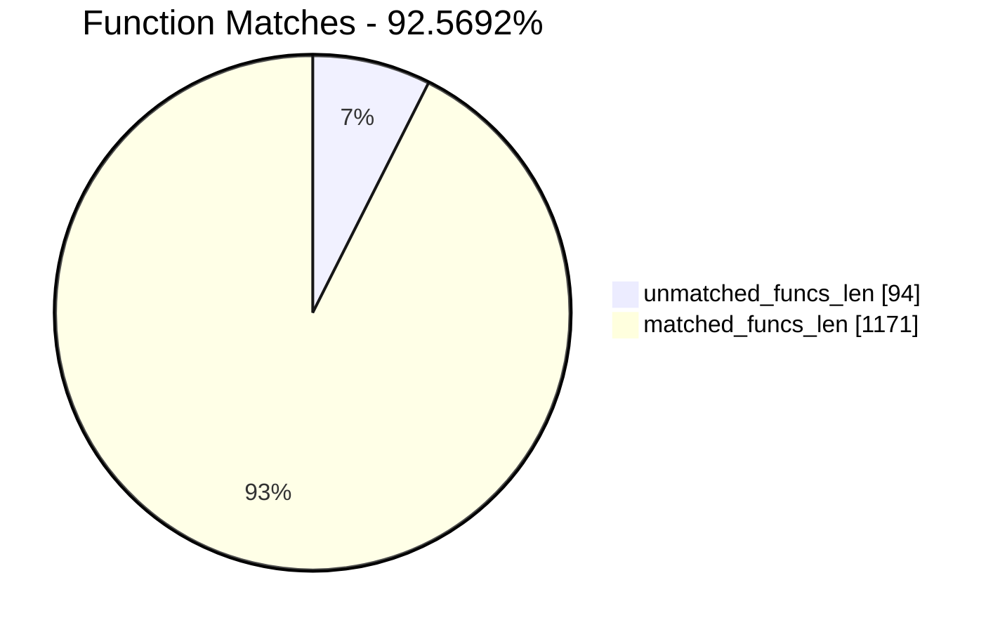
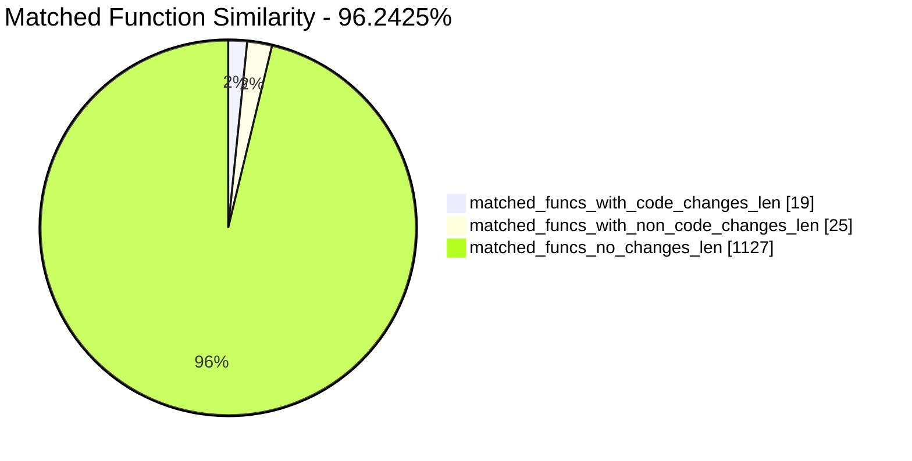
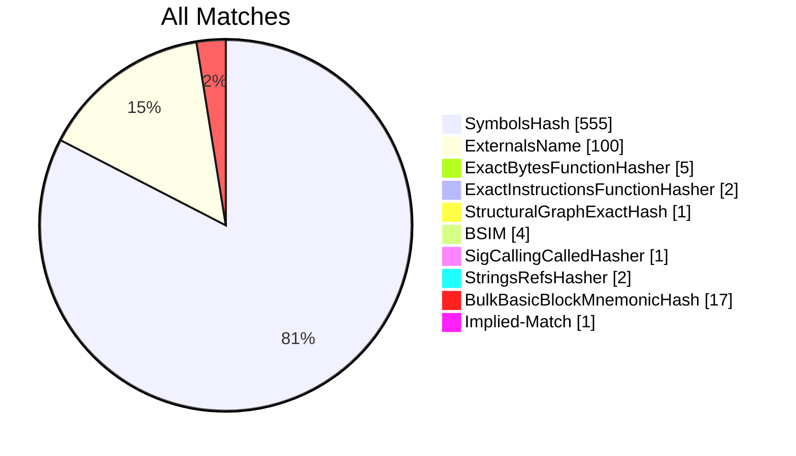
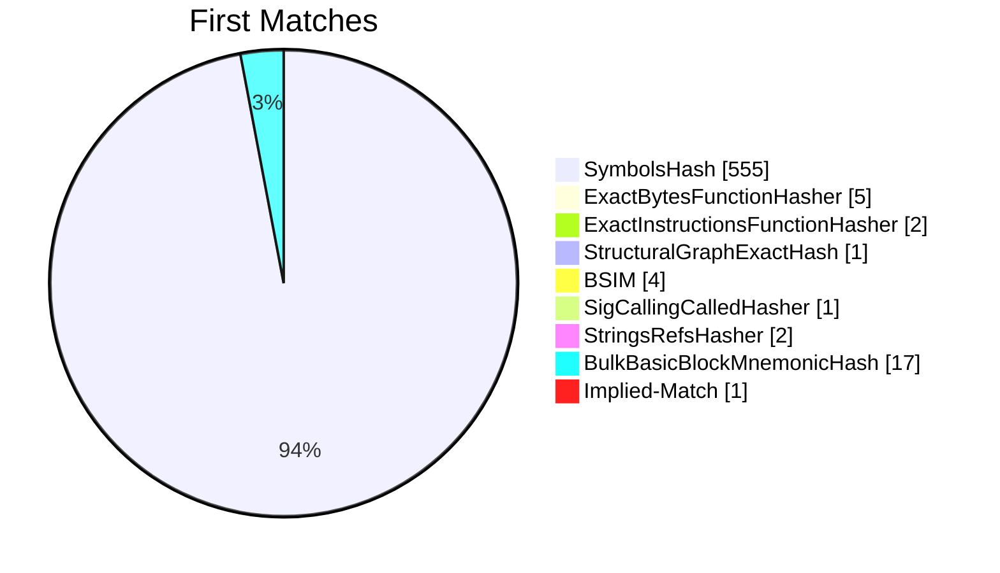
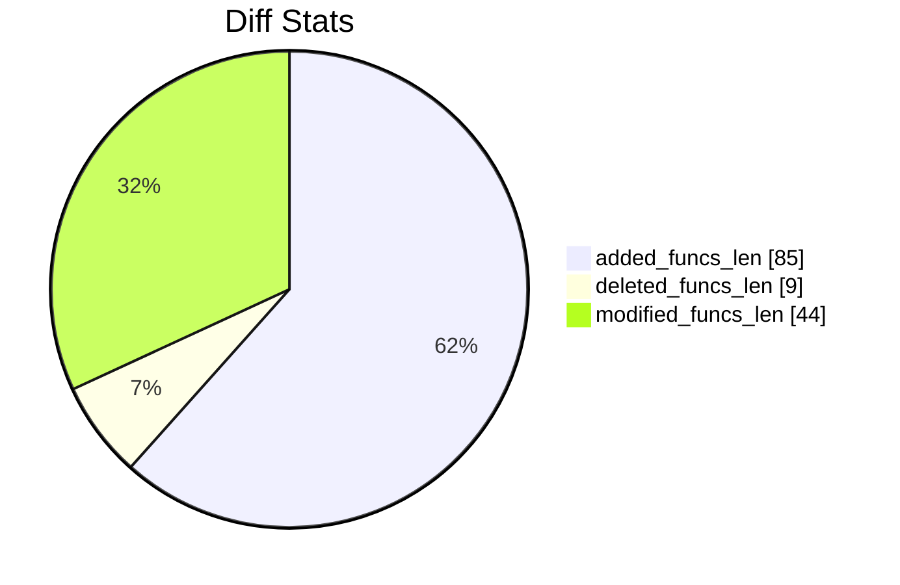
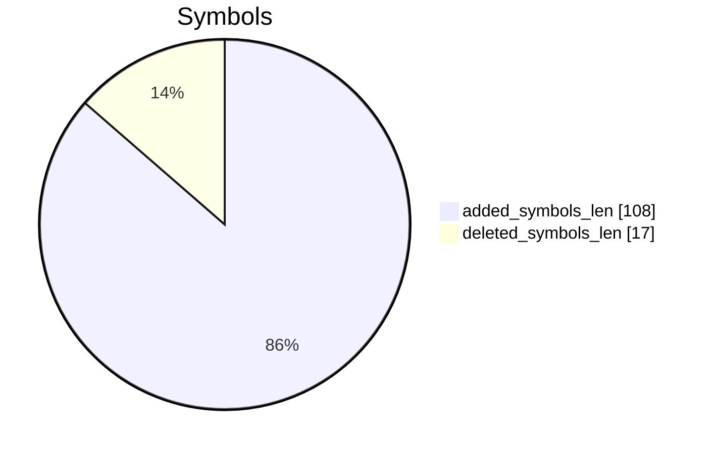
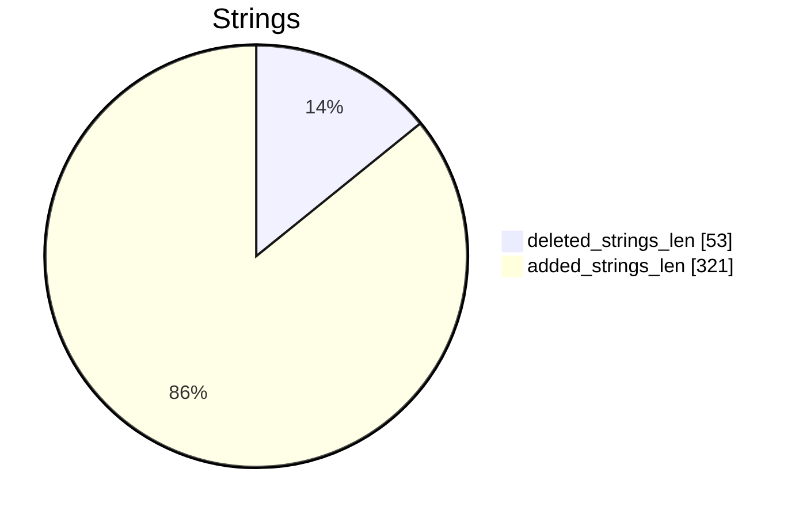

# CD_07_26_11_second_figs_review-CD_08_22_11_third_figs_review Diff

# TOC

* [Visual Chart Diff](#visual-chart-diff)
* [Metadata](#metadata)
	* [Ghidra Diff Engine](#ghidra-diff-engine)
		* [Command Line](#command-line)
	* [Binary Metadata Diff](#binary-metadata-diff)
	* [Program Options](#program-options)
	* [Diff Stats](#diff-stats)
	* [Strings](#strings)
* [Deleted](#deleted)
	* [Sonic_CDAppDelegate::shouldAutorotateToInterfaceOrientation:](#sonic_cdappdelegateshouldautorotatetointerfaceorientation)
	* [Sonic_CDAppDelegate::viewDidRotate:](#sonic_cdappdelegateviewdidrotate)
	* [EAGLView::startAnimation](#eaglviewstartanimation)
	* [/System/Library/Frameworks/OpenGLES.framework/OpenGLES::_glFramebufferRenderbufferOES](#systemlibraryframeworksopenglesframeworkopengles_glframebufferrenderbufferoes)
	* [/System/Library/Frameworks/OpenGLES.framework/OpenGLES::_glGenRenderbuffersOES](#systemlibraryframeworksopenglesframeworkopengles_glgenrenderbuffersoes)
	* [/System/Library/Frameworks/OpenGLES.framework/OpenGLES::_glGetRenderbufferParameterivOES](#systemlibraryframeworksopenglesframeworkopengles_glgetrenderbufferparameterivoes)
	* [/System/Library/Frameworks/OpenGLES.framework/OpenGLES::_glDeleteRenderbuffersOES](#systemlibraryframeworksopenglesframeworkopengles_gldeleterenderbuffersoes)
	* [/System/Library/Frameworks/OpenGLES.framework/OpenGLES::_glCheckFramebufferStatusOES](#systemlibraryframeworksopenglesframeworkopengles_glcheckframebufferstatusoes)
	* [/System/Library/Frameworks/OpenGLES.framework/OpenGLES::_glBindRenderbufferOES](#systemlibraryframeworksopenglesframeworkopengles_glbindrenderbufferoes)
* [Added](#added)
	* [EAGLView::setFramebuffer](#eaglviewsetframebuffer)
	* [EAGLView::deleteFramebuffer](#eaglviewdeleteframebuffer)
	* [Sonic_CDViewController::setAnimationTimer:](#sonic_cdviewcontrollersetanimationtimer)
	* [Sonic_CDViewController::setDisplayLink:](#sonic_cdviewcontrollersetdisplaylink)
	* [Sonic_CDViewController::isAnimating](#sonic_cdviewcontrollerisanimating)
	* [_OnlineSetLeaderboard](#_onlinesetleaderboard)
	* [_OnlineSetAchievement](#_onlinesetachievement)
	* [Sonic_CDViewController::shouldAutorotateToInterfaceOrientation:](#sonic_cdviewcontrollershouldautorotatetointerfaceorientation)
	* [Sonic_CDViewController::stopAnimation](#sonic_cdviewcontrollerstopanimation)
	* [Sonic_CDViewController::startAnimation](#sonic_cdviewcontrollerstartanimation)
	* [___-[Sonic_CDViewController_viewDidLoad]_block_invoke_1](#___-sonic_cdviewcontroller_viewdidload_block_invoke_1)
	* [Sonic_CDViewController::awakeFromNib](#sonic_cdviewcontrollerawakefromnib)
	* [_PlayVideoFile](#_playvideofile)
	* [Sonic_CDViewController::PauseView](#sonic_cdviewcontrollerpauseview)
	* [Sonic_CDViewController::playbackFinishedCallback:](#sonic_cdviewcontrollerplaybackfinishedcallback)
	* [Sonic_CDViewController::achievementViewControllerDidFinish:](#sonic_cdviewcontrollerachievementviewcontrollerdidfinish)
	* [Sonic_CDViewController::leaderboardViewControllerDidFinish:](#sonic_cdviewcontrollerleaderboardviewcontrollerdidfinish)
	* [Sonic_CDViewController::ResumeView](#sonic_cdviewcontrollerresumeview)
	* [Sonic_CDViewController::viewDidUnload](#sonic_cdviewcontrollerviewdidunload)
	* [Sonic_CDViewController::viewDidLoad](#sonic_cdviewcontrollerviewdidload)
	* [Sonic_CDViewController::viewWillDisappear:](#sonic_cdviewcontrollerviewwilldisappear)
	* [Sonic_CDViewController::viewWillAppear:](#sonic_cdviewcontrollerviewwillappear)
	* [Sonic_CDViewController::didReceiveMemoryWarning](#sonic_cdviewcontrollerdidreceivememorywarning)
	* [Sonic_CDViewController::dealloc](#sonic_cdviewcontrollerdealloc)
	* [___copy_helper_block_1](#___copy_helper_block_1)
	* [Sonic_CDViewController::drawFrame](#sonic_cdviewcontrollerdrawframe)
	* [Sonic_CDViewController::setAnimationInterval:](#sonic_cdviewcontrollersetanimationinterval)
	* [_OnlineLoadLeaderboardsMenu](#_onlineloadleaderboardsmenu)
	* [_OnlineLoadAchievementsMenu](#_onlineloadachievementsmenu)
	* [GameCenterManager::setDelegate:](#gamecentermanagersetdelegate)
	* [GameCenterManager::init](#gamecentermanagerinit)
	* [GameCenterManager::mapPlayerIDtoPlayer:](#gamecentermanagermapplayeridtoplayer)
	* [GameCenterManager::resetAchievements](#gamecentermanagerresetachievements)
	* [___-[GameCenterManager_resetAchievements]_block_invoke_1](#___-gamecentermanager_resetachievements_block_invoke_1)
	* [___-[GameCenterManager_submitAchievement:percentComplete:]_block_invoke_2](#___-gamecentermanager_submitachievementpercentcomplete_block_invoke_2)
	* [GameCenterManager::submitAchievement:percentComplete:](#gamecentermanagersubmitachievementpercentcomplete)
	* [GameCenterManager::reportScore:forCategory:](#gamecentermanagerreportscoreforcategory)
	* [___-[GameCenterManager_reportScore:forCategory:]_block_invoke_1](#___-gamecentermanager_reportscoreforcategory_block_invoke_1)
	* [GameCenterManager::reloadHighScoresForCategory:](#gamecentermanagerreloadhighscoresforcategory)
	* [___-[GameCenterManager_reloadHighScoresForCategory:]_block_invoke_1](#___-gamecentermanager_reloadhighscoresforcategory_block_invoke_1)
	* [GameCenterManager::authenticateLocalUser](#gamecentermanagerauthenticatelocaluser)
	* [___-[GameCenterManager_authenticateLocalUser]_block_invoke_1](#___-gamecentermanager_authenticatelocaluser_block_invoke_1)
	* [___-[GameCenterManager_callDelegateOnMainThread:withArg:error:]_block_invoke_1](#___-gamecentermanager_calldelegateonmainthreadwithargerror_block_invoke_1)
	* [GameCenterManager::dealloc](#gamecentermanagerdealloc)
	* [GameCenterManager::callDelegate:withArg:error:](#gamecentermanagercalldelegatewithargerror)
	* [GameCenterManager::callDelegateOnMainThread:withArg:error:](#gamecentermanagercalldelegateonmainthreadwithargerror)
	* [___destroy_helper_block_8](#___destroy_helper_block_8)
	* [___destroy_helper_block_7](#___destroy_helper_block_7)
	* [___destroy_helper_block_6](#___destroy_helper_block_6)
	* [___destroy_helper_block_5](#___destroy_helper_block_5)
	* [___destroy_helper_block_4](#___destroy_helper_block_4)
	* [___destroy_helper_block_3](#___destroy_helper_block_3)
	* [___destroy_helper_block_2](#___destroy_helper_block_2)
	* [___destroy_helper_block_1](#___destroy_helper_block_1)
	* [___copy_helper_block_8](#___copy_helper_block_8)
	* [___copy_helper_block_7](#___copy_helper_block_7)
	* [___copy_helper_block_6](#___copy_helper_block_6)
	* [___copy_helper_block_5](#___copy_helper_block_5)
	* [___copy_helper_block_4](#___copy_helper_block_4)
	* [___copy_helper_block_3](#___copy_helper_block_3)
	* [___copy_helper_block_2](#___copy_helper_block_2)
	* [___copy_helper_block_1](#___copy_helper_block_1)
	* [___-[GameCenterManager_mapPlayerIDtoPlayer:]_block_invoke_1](#___-gamecentermanager_mapplayeridtoplayer_block_invoke_1)
	* [___-[GameCenterManager_submitAchievement:percentComplete:]_block_invoke_1](#___-gamecentermanager_submitachievementpercentcomplete_block_invoke_1)
	* [GameCenterManager::setEarnedAchievementCache:](#gamecentermanagersetearnedachievementcache)
	* [-[GKAchievementViewController(LandscapeOnly)_shouldAutorotateToInterfaceOrientation:]](#-gkachievementviewcontrollerlandscapeonly_shouldautorotatetointerfaceorientation)
	* [-[GKAchievementViewController(LandscapeOnly)_viewWillDisappear:]](#-gkachievementviewcontrollerlandscapeonly_viewwilldisappear)
	* [-[GKLeaderboardViewController(LandscapeOnly)_shouldAutorotateToInterfaceOrientation:]](#-gkleaderboardviewcontrollerlandscapeonly_shouldautorotatetointerfaceorientation)
	* [-[GKLeaderboardViewController(LandscapeOnly)_viewWillDisappear:]](#-gkleaderboardviewcontrollerlandscapeonly_viewwilldisappear)
	* [-[MPMoviePlayerViewController(LandscapeOnly)_viewWillDisappear:]](#-mpmovieplayerviewcontrollerlandscapeonly_viewwilldisappear)
	* [/usr/lib/libSystem.B.dylib::_dispatch_async](#usrliblibsystembdylib_dispatch_async)
	* [/System/Library/Frameworks/OpenGLES.framework/OpenGLES::_glGenRenderbuffers](#systemlibraryframeworksopenglesframeworkopengles_glgenrenderbuffers)
	* [/System/Library/Frameworks/OpenGLES.framework/OpenGLES::_glCheckFramebufferStatus](#systemlibraryframeworksopenglesframeworkopengles_glcheckframebufferstatus)
	* [/System/Library/Frameworks/OpenGLES.framework/OpenGLES::_glFramebufferRenderbuffer](#systemlibraryframeworksopenglesframeworkopengles_glframebufferrenderbuffer)
	* [/System/Library/Frameworks/OpenGLES.framework/OpenGLES::_glDeleteRenderbuffers](#systemlibraryframeworksopenglesframeworkopengles_gldeleterenderbuffers)
	* [/System/Library/Frameworks/OpenGLES.framework/OpenGLES::_glBindFramebuffer](#systemlibraryframeworksopenglesframeworkopengles_glbindframebuffer)
	* [/System/Library/Frameworks/OpenGLES.framework/OpenGLES::_glGetRenderbufferParameteriv](#systemlibraryframeworksopenglesframeworkopengles_glgetrenderbufferparameteriv)
	* [/System/Library/Frameworks/OpenGLES.framework/OpenGLES::_glDeleteFramebuffers](#systemlibraryframeworksopenglesframeworkopengles_gldeleteframebuffers)
	* [/usr/lib/libSystem.B.dylib::__Block_object_dispose](#usrliblibsystembdylib__block_object_dispose)
	* [/System/Library/Frameworks/Foundation.framework/Foundation::_NSClassFromString](#systemlibraryframeworksfoundationframeworkfoundation_nsclassfromstring)
	* [/System/Library/Frameworks/OpenGLES.framework/OpenGLES::_glBindRenderbuffer](#systemlibraryframeworksopenglesframeworkopengles_glbindrenderbuffer)
	* [/System/Library/Frameworks/OpenGLES.framework/OpenGLES::_glGenFramebuffers](#systemlibraryframeworksopenglesframeworkopengles_glgenframebuffers)
	* [/usr/lib/libobjc.A.dylib::_objc_getProperty](#usrliblibobjcadylib_objc_getproperty)
	* [/usr/lib/libSystem.B.dylib::__Block_object_assign](#usrliblibsystembdylib__block_object_assign)
	* [/System/Library/Frameworks/CoreGraphics.framework/CoreGraphics::_CGAffineTransformMakeRotation](#systemlibraryframeworkscoregraphicsframeworkcoregraphics_cgaffinetransformmakerotation)
* [Modified](#modified)
	* [_SetPathGripSensors](#_setpathgripsensors)
	* [Sonic_CDAppDelegate::applicationDidBecomeActive:](#sonic_cdappdelegateapplicationdidbecomeactive)
	* [_DrawRotoZoomSprite](#_drawrotozoomsprite)
	* [EAGLView::dealloc](#eaglviewdealloc)
	* [EAGLView::layoutSubviews](#eaglviewlayoutsubviews)
	* [_ProcessScript](#_processscript)
	* [Sonic_CDAppDelegate::applicationWillTerminate:](#sonic_cdappdelegateapplicationwillterminate)
	* [EAGLView::setContext:](#eaglviewsetcontext)
	* [EAGLView::createFramebuffer](#eaglviewcreateframebuffer)
	* [EAGLView::initWithCoder:](#eaglviewinitwithcoder)
	* [_DrawStageGfx](#_drawstagegfx)
	* [Sonic_CDAppDelegate::applicationWillResignActive:](#sonic_cdappdelegateapplicationwillresignactive)
	* [_ProcessPlayerTileCollisions](#_processplayertilecollisions)
	* [_BoxCollision](#_boxcollision)
	* [EAGLView::destroyFramebuffer](#eaglviewdestroyframebuffer)
	* [Sonic_CDAppDelegate::applicationDidFinishLaunching:](#sonic_cdappdelegateapplicationdidfinishlaunching)
	* [_Draw3DCloudLayer](#_draw3dcloudlayer)
	* [EAGLView::setAnimationInterval:](#eaglviewsetanimationinterval)
	* [EAGLView::drawView](#eaglviewdrawview)
* [Modified (No Code Changes)](#modified-no-code-changes)
	* [_PauseSoundiOS](#_pausesoundios)
	* [_ResumeSoundiOS](#_resumesoundios)
	* [_AddGraphicsFile](#_addgraphicsfile)
	* [_ResumeSound](#_resumesound)
	* [_PauseSound](#_pausesound)

# Visual Chart Diff

```mermaid

flowchart LR

_SetPathGripSensors-0-old<--Match 82%-->_SetPathGripSensors-0-new
Sonic_CDAppDelegateapplicationDidBecomeActive-3-old<--Match 57%-->Sonic_CDAppDelegateapplicationDidBecomeActive-3-new
_DrawRotoZoomSprite-12-old<--Match 46%-->_DrawRotoZoomSprite-12-new
EAGLViewdealloc-2-old<--Match 57%-->EAGLViewdealloc-2-new
EAGLViewlayoutSubviews-2-old<--Match 40%-->EAGLViewlayoutSubviews-2-new
_ProcessScript-0-old<--Match 99%-->_ProcessScript-0-new
Sonic_CDAppDelegateapplicationWillTerminate-3-old<--Match 53%-->Sonic_CDAppDelegateapplicationWillTerminate-3-new
EAGLViewsetContext-3-old<--Match 37%-->EAGLViewsetContext-3-new
EAGLViewcreateFramebuffer-2-old<--Match 56%-->EAGLViewcreateFramebuffer-2-new
EAGLViewinitWithCoder-3-old<--Match 64%-->EAGLViewinitWithCoder-3-new
_DrawStageGfx-0-old<--Match 97%-->_DrawStageGfx-0-new
Sonic_CDAppDelegateapplicationWillResignActive-3-old<--Match 63%-->Sonic_CDAppDelegateapplicationWillResignActive-3-new
_ProcessPlayerTileCollisions-0-old<--Match 85%-->_ProcessPlayerTileCollisions-0-new
_BoxCollision-0-old<--Match 85%-->_BoxCollision-0-new
EAGLViewdestroyFramebuffer-2-old<--Match 74%-->GameCenterManagerisGameCenterAvailable-2-new
Sonic_CDAppDelegateapplicationDidFinishLaunching-3-old<--Match 32%-->Sonic_CDAppDelegateapplicationdidFinishLaunchingWithOptions-3-new
_Draw3DCloudLayer-0-old<--Match 22%-->_ClearTouches-0-new
EAGLViewsetAnimationInterval-4-old<--Match 78%-->Sonic_CDViewControllersetAnimationFrameInterval-4-new
EAGLViewdrawView-2-old<--Match 57%-->EAGLViewpresentFramebuffer-2-new

subgraph CD_08_22_11_third_figs_review
    _SetPathGripSensors-0-new
Sonic_CDAppDelegateapplicationDidBecomeActive-3-new
_DrawRotoZoomSprite-12-new
EAGLViewdealloc-2-new
EAGLViewlayoutSubviews-2-new
_ProcessScript-0-new
Sonic_CDAppDelegateapplicationWillTerminate-3-new
EAGLViewsetContext-3-new
EAGLViewcreateFramebuffer-2-new
EAGLViewinitWithCoder-3-new
_DrawStageGfx-0-new
Sonic_CDAppDelegateapplicationWillResignActive-3-new
_ProcessPlayerTileCollisions-0-new
_BoxCollision-0-new
GameCenterManagerisGameCenterAvailable-2-new
Sonic_CDAppDelegateapplicationdidFinishLaunchingWithOptions-3-new
_ClearTouches-0-new
Sonic_CDViewControllersetAnimationFrameInterval-4-new
EAGLViewpresentFramebuffer-2-new
    subgraph Added
direction LR
EAGLView-setFramebuffer
    EAGLView-deleteFramebuffer
    Sonic_CDViewController-setAnimationTimer
    Sonic_CDViewController-setDisplayLink
    Sonic_CDViewController-isAnimating
    _OnlineSetLeaderboard
    _OnlineSetAchievement
    Sonic_CDViewController-shouldAutorotateToInterfaceOrientation
    Sonic_CDViewController-stopAnimation
    Sonic_CDViewController-startAnimation
    ___-Sonic_CDViewController_viewDidLoad_block_invoke_1
    Sonic_CDViewController-awakeFromNib
    _PlayVideoFile
    Sonic_CDViewController-PauseView
    Sonic_CDViewController-playbackFinishedCallback
    Sonic_CDViewController-achievementViewControllerDidFinish
    Sonic_CDViewController-leaderboardViewControllerDidFinish
    Sonic_CDViewController-ResumeView
    Sonic_CDViewController-viewDidUnload
    Sonic_CDViewController-viewDidLoad
    Sonic_CDViewController-viewWillDisappear
    Sonic_CDViewController-viewWillAppear
    Sonic_CDViewController-didReceiveMemoryWarning
    Sonic_CDViewController-dealloc
    ___copy_helper_block_1
    Sonic_CDViewController-drawFrame
    Sonic_CDViewController-setAnimationInterval
    60_more_added_funcs_omitted
end
end

subgraph CD_07_26_11_second_figs_review
    _SetPathGripSensors-0-old
Sonic_CDAppDelegateapplicationDidBecomeActive-3-old
_DrawRotoZoomSprite-12-old
EAGLViewdealloc-2-old
EAGLViewlayoutSubviews-2-old
_ProcessScript-0-old
Sonic_CDAppDelegateapplicationWillTerminate-3-old
EAGLViewsetContext-3-old
EAGLViewcreateFramebuffer-2-old
EAGLViewinitWithCoder-3-old
_DrawStageGfx-0-old
Sonic_CDAppDelegateapplicationWillResignActive-3-old
_ProcessPlayerTileCollisions-0-old
_BoxCollision-0-old
EAGLViewdestroyFramebuffer-2-old
Sonic_CDAppDelegateapplicationDidFinishLaunching-3-old
_Draw3DCloudLayer-0-old
EAGLViewsetAnimationInterval-4-old
EAGLViewdrawView-2-old
    subgraph Deleted
direction LR
Sonic_CDAppDelegate-shouldAutorotateToInterfaceOrientation
    Sonic_CDAppDelegate-viewDidRotate
    EAGLView-startAnimation
    SystemLibraryFrameworksOpenGLESframeworkOpenGLES-_glFramebufferRenderbufferOES
    SystemLibraryFrameworksOpenGLESframeworkOpenGLES-_glGenRenderbuffersOES
    SystemLibraryFrameworksOpenGLESframeworkOpenGLES-_glGetRenderbufferParameterivOES
    SystemLibraryFrameworksOpenGLESframeworkOpenGLES-_glDeleteRenderbuffersOES
    SystemLibraryFrameworksOpenGLESframeworkOpenGLES-_glCheckFramebufferStatusOES
    SystemLibraryFrameworksOpenGLESframeworkOpenGLES-_glBindRenderbufferOES
end
end

```










# Metadata

## Ghidra Diff Engine

### Command Line

#### Captured Command Line


```
ghidriff --project-location ghidra_projects --project-name ghidriff --symbols-path symbols --threaded --log-level INFO --file-log-level INFO --log-path ghidriff.log --min-func-len 2 --gdt [] --bsim --max-ram-percent 60.0 --max-section-funcs 200 CD_07_26_11_second_figs_review CD_08_22_11_third_figs_review
```


#### Verbose Args


<details>

```
--old ['CD_07_26_11_second_figs_review'] --new [['CD_08_22_11_third_figs_review']] --engine VersionTrackingDiff --output-path CD_07_26_11_second_figs_review-CD_08_22_11_third_figs_review --summary False --project-location ghidra_projects --project-name ghidriff --symbols-path symbols --threaded True --force-analysis False --force-diff False --no-symbols False --log-level INFO --file-log-level INFO --log-path ghidriff.log --va False --min-func-len 2 --use-calling-counts False --gdt [] --bsim True --bsim-full False --max-ram-percent 60.0 --print-flags False --jvm-args None --side-by-side False --max-section-funcs 200 --md-title None
```


</details>

## Binary Metadata Diff


```diff
--- CD_07_26_11_second_figs_review Meta
+++ CD_08_22_11_third_figs_review Meta
@@ -1,42 +1,45 @@
-Program Name: CD_07_26_11_second_figs_review
+Program Name: CD_08_22_11_third_figs_review
 Language ID: ARM:LE:32:v6 (1.107)
 Compiler ID: default
 Processor: ARM
 Endian: Little
 Address Size: 32
 Minimum Address: 00001000
-Maximum Address: 01289003
-# of Bytes: 19427432
-# of Memory Blocks: 30
-# of Instructions: 50652
-# of Defined Data: 12565
-# of Functions: 587
-# of Symbols: 3492
-# of Data Types: 137
+Maximum Address: 01293003
+# of Bytes: 19468472
+# of Memory Blocks: 31
+# of Instructions: 53638
+# of Defined Data: 14451
+# of Functions: 678
+# of Symbols: 4088
+# of Data Types: 146
 # of Data Type Categories: 10
 Analyzed: true
 Created With Ghidra Version: 11.0.3
-Date Created: Thu Jan 09 19:09:16 CET 2025
+Date Created: Thu Jan 09 19:09:17 CET 2025
 Executable Format: Mac OS X Mach-O
-Executable Location: /home/user/CD_07_26_11_second_figs_review
-Executable MD5: b736abc974499ed95aaf594821b83478
-Executable SHA256: 5e6e35425a69c76202a54428de1de3e5ee9ca619f16fc1429c0d1d99d87daafb
-FSRL: file:///home/user/CD_07_26_11_second_figs_review?MD5=b736abc974499ed95aaf594821b83478
+Executable Location: /home/user/CD_08_22_11_third_figs_review
+Executable MD5: 30139c2b1ea714723405b4fff21ec8d8
+Executable SHA256: e1b4092ef4631577a9a529c0608e2fa281d7b878efaf8e5474981dc325c40a41
+FSRL: file:///home/user/CD_08_22_11_third_figs_review?MD5=30139c2b1ea714723405b4fff21ec8d8
 Mach-O File Type: EXECUTE
 Mach-O File Type Description: Demand Paged Executable File
 Mach-O Flag 0: NOUNDEFS
 Mach-O Flag 1: DYLDLINK
 Mach-O Flag 2: TWOLEVEL
 Preferred Root Namespace Category: 
 Relocatable: false
-Required Library [    0]: /System/Library/Frameworks/AudioToolbox.framework/AudioToolbox
-Required Library [    1]: /System/Library/Frameworks/Foundation.framework/Foundation
-Required Library [    2]: /System/Library/Frameworks/UIKit.framework/UIKit
-Required Library [    3]: /System/Library/Frameworks/OpenGLES.framework/OpenGLES
-Required Library [    4]: /System/Library/Frameworks/QuartzCore.framework/QuartzCore
-Required Library [    5]: /System/Library/Frameworks/OpenAL.framework/OpenAL
-Required Library [    6]: /usr/lib/libgcc_s.1.dylib
-Required Library [    7]: /usr/lib/libSystem.B.dylib
-Required Library [    8]: /usr/lib/libobjc.A.dylib
-Required Library [    9]: /System/Library/Frameworks/CoreFoundation.framework/CoreFoundation
+Required Library [    0]: /System/Library/Frameworks/MediaPlayer.framework/MediaPlayer
+Required Library [    1]: /System/Library/Frameworks/CoreGraphics.framework/CoreGraphics
+Required Library [    2]: /System/Library/Frameworks/GameKit.framework/GameKit
+Required Library [    3]: /System/Library/Frameworks/AudioToolbox.framework/AudioToolbox
+Required Library [    4]: /System/Library/Frameworks/Foundation.framework/Foundation
+Required Library [    5]: /System/Library/Frameworks/UIKit.framework/UIKit
+Required Library [    6]: /System/Library/Frameworks/OpenGLES.framework/OpenGLES
+Required Library [    7]: /System/Library/Frameworks/QuartzCore.framework/QuartzCore
+Required Library [    8]: /System/Library/Frameworks/OpenAL.framework/OpenAL
+Required Library [    9]: /usr/lib/libgcc_s.1.dylib
+Required Library [   10]: /usr/lib/libSystem.B.dylib
+Required Library [   11]: /usr/lib/libobjc.A.dylib
+Required Library [   12]: /System/Library/Frameworks/CoreFoundation.framework/CoreFoundation
 Should Ask To Analyze: false

```


## Program Options


<details>
<summary>Ghidra CD_07_26_11_second_figs_review Decompiler Options</summary>


|Decompiler Option|Value|
| :---: | :---: |
|Prototype Evaluation|__stdcall|

</details>


<details>
<summary>Ghidra CD_07_26_11_second_figs_review Specification extensions Options</summary>


|Specification extensions Option|Value|
| :---: | :---: |
|FormatVersion|0|
|VersionCounter|0|

</details>


<details>
<summary>Ghidra CD_07_26_11_second_figs_review Analyzers Options</summary>


|Analyzers Option|Value|
| :---: | :---: |
|ARM Aggressive Instruction Finder|false|
|ARM Constant Reference Analyzer|true|
|ARM Constant Reference Analyzer.Create Data from pointer|false|
|ARM Constant Reference Analyzer.Function parameter/return Pointer analysis|true|
|ARM Constant Reference Analyzer.Max Threads|2|
|ARM Constant Reference Analyzer.Min absolute reference|4|
|ARM Constant Reference Analyzer.Require pointer param data type|false|
|ARM Constant Reference Analyzer.Speculative reference max|256|
|ARM Constant Reference Analyzer.Speculative reference min|512|
|ARM Constant Reference Analyzer.Stored Value Pointer analysis|true|
|ARM Constant Reference Analyzer.Switch Table Recovery|false|
|ARM Constant Reference Analyzer.Trust values read from writable memory|true|
|ARM Symbol|true|
|ASCII Strings|true|
|ASCII Strings.Create Strings Containing Existing Strings|true|
|ASCII Strings.Create Strings Containing References|true|
|ASCII Strings.Force Model Reload|false|
|ASCII Strings.Minimum String Length|LEN_5|
|ASCII Strings.Model File|StringModel.sng|
|ASCII Strings.Require Null Termination for String|true|
|ASCII Strings.Search Only in Accessible Memory Blocks|true|
|ASCII Strings.String Start Alignment|ALIGN_1|
|ASCII Strings.String end alignment|4|
|Aggressive Instruction Finder|false|
|Aggressive Instruction Finder.Create Analysis Bookmarks|true|
|Apply Data Archives|true|
|Apply Data Archives.Archive Chooser|[Auto-Detect]|
|Apply Data Archives.Create Analysis Bookmarks|true|
|Apply Data Archives.GDT User File Archive Path|None|
|Apply Data Archives.User Project Archive Path|None|
|CFStrings|true|
|Call Convention ID|true|
|Call Convention ID.Analysis Decompiler Timeout (sec)|60|
|Call-Fixup Installer|true|
|Condense Filler Bytes|false|
|Condense Filler Bytes.Filler Value|Auto|
|Condense Filler Bytes.Minimum number of sequential bytes|1|
|Create Address Tables|true|
|Create Address Tables.Allow Offcut References|false|
|Create Address Tables.Auto Label Table|false|
|Create Address Tables.Create Analysis Bookmarks|true|
|Create Address Tables.Maxmimum Pointer Distance|16777215|
|Create Address Tables.Minimum Pointer Address|4132|
|Create Address Tables.Minimum Table Size|4|
|Create Address Tables.Pointer Alignment|1|
|Create Address Tables.Relocation Table Guide|true|
|Create Address Tables.Table Alignment|4|
|DWARF Line Number|false|
|Data Reference|true|
|Data Reference.Address Table Alignment|1|
|Data Reference.Address Table Minimum Size|4|
|Data Reference.Align End of Strings|false|
|Data Reference.Ascii String References|true|
|Data Reference.Create Address Tables|false|
|Data Reference.Minimum String Length|5|
|Data Reference.References to Pointers|false|
|Data Reference.Relocation Table Guide|true|
|Data Reference.Respect Execute Flag|true|
|Data Reference.Subroutine References|true|
|Data Reference.Switch Table References|false|
|Data Reference.Unicode String References|true|
|Decompiler Parameter ID|false|
|Decompiler Parameter ID.Analysis Clear Level|ANALYSIS|
|Decompiler Parameter ID.Analysis Decompiler Timeout (sec)|60|
|Decompiler Parameter ID.Commit Data Types|true|
|Decompiler Parameter ID.Commit Void Return Values|false|
|Decompiler Parameter ID.Prototype Evaluation|__stdcall|
|Decompiler Switch Analysis|true|
|Decompiler Switch Analysis.Analysis Decompiler Timeout (sec)|60|
|Demangler GNU|true|
|Demangler GNU.Apply Function Calling Conventions|true|
|Demangler GNU.Apply Function Signatures|true|
|Demangler GNU.Demangle Only Known Mangled Symbols|false|
|Demangler GNU.Demangler Format|AUTO|
|Demangler GNU.Use Deprecated Demangler|false|
|Disassemble Entry Points|true|
|Disassemble Entry Points.Respect Execute Flag|true|
|Embedded Media|true|
|Embedded Media.Create Analysis Bookmarks|true|
|External Entry References|true|
|External Symbol Resolver|true|
|Function Start Pre Search|true|
|Function Start Pre Search.Bookmark Functions|false|
|Function Start Pre Search.Search Data Blocks|false|
|Function Start Search|true|
|Function Start Search After Code|true|
|Function Start Search After Code.Bookmark Functions|false|
|Function Start Search After Code.Search Data Blocks|false|
|Function Start Search After Data|true|
|Function Start Search After Data.Bookmark Functions|false|
|Function Start Search After Data.Search Data Blocks|false|
|Function Start Search.Bookmark Functions|false|
|Function Start Search.Search Data Blocks|false|
|Mach-O Function Starts|true|
|Mach-O Function Starts.Bookmark failed functions|false|
|Mach-O Function Starts.Bookmark new functions|false|
|Mach-O Function Starts.Bookmark skipped functions|false|
|Mach-O Function Starts.Use PseudoDisassembler|true|
|Non-Returning Functions - Discovered|true|
|Non-Returning Functions - Discovered.Create Analysis Bookmarks|true|
|Non-Returning Functions - Discovered.Function Non-return Threshold|3|
|Non-Returning Functions - Discovered.Repair Flow Damage|true|
|Non-Returning Functions - Known|true|
|Non-Returning Functions - Known.Create Analysis Bookmarks|true|
|Objective-C 2 Class|true|
|Objective-C 2 Decompiler Message|true|
|Objective-C 2 Message|false|
|Reference|true|
|Reference.Address Table Alignment|1|
|Reference.Address Table Minimum Size|4|
|Reference.Align End of Strings|false|
|Reference.Ascii String References|true|
|Reference.Create Address Tables|false|
|Reference.Minimum String Length|5|
|Reference.References to Pointers|false|
|Reference.Relocation Table Guide|true|
|Reference.Respect Execute Flag|true|
|Reference.Subroutine References|true|
|Reference.Switch Table References|false|
|Reference.Unicode String References|true|
|Scalar Operand References|false|
|Scalar Operand References.Relocation Table Guide|true|
|Shared Return Calls|true|
|Shared Return Calls.Allow Conditional Jumps|false|
|Shared Return Calls.Assume Contiguous Functions Only|false|
|Stack|true|
|Stack.Create Local Variables|true|
|Stack.Create Param Variables|true|
|Stack.useNewFunctionStackAnalysis|true|
|Subroutine References|true|
|Subroutine References.Create Thunks Early|true|
|Variadic Function Signature Override|false|
|Variadic Function Signature Override.Create Analysis Bookmarks|false|

</details>


<details>
<summary>Ghidra CD_08_22_11_third_figs_review Decompiler Options</summary>


|Decompiler Option|Value|
| :---: | :---: |
|Prototype Evaluation|__stdcall|

</details>


<details>
<summary>Ghidra CD_08_22_11_third_figs_review Specification extensions Options</summary>


|Specification extensions Option|Value|
| :---: | :---: |
|FormatVersion|0|
|VersionCounter|0|

</details>


<details>
<summary>Ghidra CD_08_22_11_third_figs_review Analyzers Options</summary>


|Analyzers Option|Value|
| :---: | :---: |
|ARM Aggressive Instruction Finder|false|
|ARM Constant Reference Analyzer|true|
|ARM Constant Reference Analyzer.Create Data from pointer|false|
|ARM Constant Reference Analyzer.Function parameter/return Pointer analysis|true|
|ARM Constant Reference Analyzer.Max Threads|2|
|ARM Constant Reference Analyzer.Min absolute reference|4|
|ARM Constant Reference Analyzer.Require pointer param data type|false|
|ARM Constant Reference Analyzer.Speculative reference max|256|
|ARM Constant Reference Analyzer.Speculative reference min|512|
|ARM Constant Reference Analyzer.Stored Value Pointer analysis|true|
|ARM Constant Reference Analyzer.Switch Table Recovery|false|
|ARM Constant Reference Analyzer.Trust values read from writable memory|true|
|ARM Symbol|true|
|ASCII Strings|true|
|ASCII Strings.Create Strings Containing Existing Strings|true|
|ASCII Strings.Create Strings Containing References|true|
|ASCII Strings.Force Model Reload|false|
|ASCII Strings.Minimum String Length|LEN_5|
|ASCII Strings.Model File|StringModel.sng|
|ASCII Strings.Require Null Termination for String|true|
|ASCII Strings.Search Only in Accessible Memory Blocks|true|
|ASCII Strings.String Start Alignment|ALIGN_1|
|ASCII Strings.String end alignment|4|
|Aggressive Instruction Finder|false|
|Aggressive Instruction Finder.Create Analysis Bookmarks|true|
|Apply Data Archives|true|
|Apply Data Archives.Archive Chooser|[Auto-Detect]|
|Apply Data Archives.Create Analysis Bookmarks|true|
|Apply Data Archives.GDT User File Archive Path|None|
|Apply Data Archives.User Project Archive Path|None|
|CFStrings|true|
|Call Convention ID|true|
|Call Convention ID.Analysis Decompiler Timeout (sec)|60|
|Call-Fixup Installer|true|
|Condense Filler Bytes|false|
|Condense Filler Bytes.Filler Value|Auto|
|Condense Filler Bytes.Minimum number of sequential bytes|1|
|Create Address Tables|true|
|Create Address Tables.Allow Offcut References|false|
|Create Address Tables.Auto Label Table|false|
|Create Address Tables.Create Analysis Bookmarks|true|
|Create Address Tables.Maxmimum Pointer Distance|16777215|
|Create Address Tables.Minimum Pointer Address|4132|
|Create Address Tables.Minimum Table Size|4|
|Create Address Tables.Pointer Alignment|1|
|Create Address Tables.Relocation Table Guide|true|
|Create Address Tables.Table Alignment|4|
|DWARF Line Number|false|
|Data Reference|true|
|Data Reference.Address Table Alignment|1|
|Data Reference.Address Table Minimum Size|4|
|Data Reference.Align End of Strings|false|
|Data Reference.Ascii String References|true|
|Data Reference.Create Address Tables|false|
|Data Reference.Minimum String Length|5|
|Data Reference.References to Pointers|false|
|Data Reference.Relocation Table Guide|true|
|Data Reference.Respect Execute Flag|true|
|Data Reference.Subroutine References|true|
|Data Reference.Switch Table References|false|
|Data Reference.Unicode String References|true|
|Decompiler Parameter ID|false|
|Decompiler Parameter ID.Analysis Clear Level|ANALYSIS|
|Decompiler Parameter ID.Analysis Decompiler Timeout (sec)|60|
|Decompiler Parameter ID.Commit Data Types|true|
|Decompiler Parameter ID.Commit Void Return Values|false|
|Decompiler Parameter ID.Prototype Evaluation|__stdcall|
|Decompiler Switch Analysis|true|
|Decompiler Switch Analysis.Analysis Decompiler Timeout (sec)|60|
|Demangler GNU|true|
|Demangler GNU.Apply Function Calling Conventions|true|
|Demangler GNU.Apply Function Signatures|true|
|Demangler GNU.Demangle Only Known Mangled Symbols|false|
|Demangler GNU.Demangler Format|AUTO|
|Demangler GNU.Use Deprecated Demangler|false|
|Disassemble Entry Points|true|
|Disassemble Entry Points.Respect Execute Flag|true|
|Embedded Media|true|
|Embedded Media.Create Analysis Bookmarks|true|
|External Entry References|true|
|External Symbol Resolver|true|
|Function Start Pre Search|true|
|Function Start Pre Search.Bookmark Functions|false|
|Function Start Pre Search.Search Data Blocks|false|
|Function Start Search|true|
|Function Start Search After Code|true|
|Function Start Search After Code.Bookmark Functions|false|
|Function Start Search After Code.Search Data Blocks|false|
|Function Start Search After Data|true|
|Function Start Search After Data.Bookmark Functions|false|
|Function Start Search After Data.Search Data Blocks|false|
|Function Start Search.Bookmark Functions|false|
|Function Start Search.Search Data Blocks|false|
|Mach-O Function Starts|true|
|Mach-O Function Starts.Bookmark failed functions|false|
|Mach-O Function Starts.Bookmark new functions|false|
|Mach-O Function Starts.Bookmark skipped functions|false|
|Mach-O Function Starts.Use PseudoDisassembler|true|
|Non-Returning Functions - Discovered|true|
|Non-Returning Functions - Discovered.Create Analysis Bookmarks|true|
|Non-Returning Functions - Discovered.Function Non-return Threshold|3|
|Non-Returning Functions - Discovered.Repair Flow Damage|true|
|Non-Returning Functions - Known|true|
|Non-Returning Functions - Known.Create Analysis Bookmarks|true|
|Objective-C 2 Class|true|
|Objective-C 2 Decompiler Message|true|
|Objective-C 2 Message|false|
|Reference|true|
|Reference.Address Table Alignment|1|
|Reference.Address Table Minimum Size|4|
|Reference.Align End of Strings|false|
|Reference.Ascii String References|true|
|Reference.Create Address Tables|false|
|Reference.Minimum String Length|5|
|Reference.References to Pointers|false|
|Reference.Relocation Table Guide|true|
|Reference.Respect Execute Flag|true|
|Reference.Subroutine References|true|
|Reference.Switch Table References|false|
|Reference.Unicode String References|true|
|Scalar Operand References|false|
|Scalar Operand References.Relocation Table Guide|true|
|Shared Return Calls|true|
|Shared Return Calls.Allow Conditional Jumps|false|
|Shared Return Calls.Assume Contiguous Functions Only|false|
|Stack|true|
|Stack.Create Local Variables|true|
|Stack.Create Param Variables|true|
|Stack.useNewFunctionStackAnalysis|true|
|Subroutine References|true|
|Subroutine References.Create Thunks Early|true|
|Variadic Function Signature Override|false|
|Variadic Function Signature Override.Create Analysis Bookmarks|false|

</details>

## Diff Stats


|Stat|Value|
| :---: | :---: |
|added_funcs_len|85|
|deleted_funcs_len|9|
|modified_funcs_len|44|
|added_symbols_len|108|
|deleted_symbols_len|17|
|diff_time|111.61916208267212|
|deleted_strings_len|53|
|added_strings_len|321|
|match_types|Counter({'SymbolsHash': 555, 'ExternalsName': 100, 'BulkBasicBlockMnemonicHash': 17, 'ExactBytesFunctionHasher': 5, 'BSIM': 4, 'ExactInstructionsFunctionHasher': 2, 'StringsRefsHasher': 2, 'StructuralGraphExactHash': 1, 'SigCallingCalledHasher': 1, 'Implied Match': 1})|
|items_to_process|263|
|diff_types|Counter({'address': 44, 'refcount': 28, 'calling': 23, 'code': 19, 'length': 19, 'called': 14, 'sig': 11, 'name': 10, 'fullname': 10, 'parent': 6})|
|unmatched_funcs_len|94|
|total_funcs_len|1265|
|matched_funcs_len|1171|
|matched_funcs_with_code_changes_len|19|
|matched_funcs_with_non_code_changes_len|25|
|matched_funcs_no_changes_len|1127|
|match_func_similarity_percent|96.2425%|
|func_match_overall_percent|92.5692%|
|first_matches|Counter({'SymbolsHash': 555, 'BulkBasicBlockMnemonicHash': 17, 'ExactBytesFunctionHasher': 5, 'BSIM': 4, 'ExactInstructionsFunctionHasher': 2, 'StringsRefsHasher': 2, 'StructuralGraphExactHash': 1, 'SigCallingCalledHasher': 1, 'Implied Match': 1})|













## Strings




### Strings Diff


```diff
--- deleted strings
+++ added strings
@@ -1,53 +1,321 @@
-___func__.4648
-s_-[EAGLView_animationInterval]
-s_-[EAGLView_animationTimer]
-s_-[EAGLView_destroyFramebuffer]
-s_-[EAGLView_drawView]
-s_-[EAGLView_setAnimationInterval:
-s_-[EAGLView_setAnimationTimer:]
-s_-[EAGLView_startAnimation]
-s_-[EAGLView_stopAnimation]
-s_-[Sonic_CDAppDelegate_glView]
-s_-[Sonic_CDAppDelegate_setGlView:
-s_-[Sonic_CDAppDelegate_shouldAuto
-s_-[Sonic_CDAppDelegate_viewDidRot
-s_@"EAGLView"
-s_T@"EAGLView",&,N,VglView
-s_T@"UIWindow",&,N,Vwindow
-s__C.14.2927
-s__C.15.2928
-s__Draw3DCloudLayer
-s__OBJC_IVAR_$_EAGLView.animationI
-s__OBJC_IVAR_$_EAGLView.animationT
-s__OBJC_IVAR_$_EAGLView.backingHei
-s__OBJC_IVAR_$_EAGLView.backingWid
-s__OBJC_IVAR_$_EAGLView.depthRende
-s__OBJC_IVAR_$_EAGLView.renderbuff
-s__OBJC_IVAR_$_EAGLView.viewFrameb
-s__OBJC_IVAR_$_EAGLView.viewRender
-s__UIDeviceOrientationDidChangeNot
-s____func__.4648
-s__frameCount
-s__frameSkip
-s__glBindRenderbufferOES
-s__glCheckFramebufferStatusOES
-s__glDeleteRenderbuffersOES
-s__glFramebufferRenderbufferOES
-s__glGenRenderbuffersOES
-s__glGetRenderbufferParameterivOES
-s__previousTouchCount.30819
-s__proc.4436
-s_backingHeight
-s_backingWidth
-s_beginGeneratingDeviceOrientation
-s_depthRenderbuffer
-s_destroyFramebuffer
-s_drawView
-s_failed_to_make_complete_framebuf
-s_framebuffer320
-s_glView
-s_renderbuffer320
-s_setGlView:
-s_viewDidRotate:
-s_viewFramebuffer
-s_viewRenderbuffer
+___func__.29242
+___func__.4651
+s
+s_+[GameCenterManager_isGameCenter
+s_-[EAGLView_deleteFramebuffer]
+s_-[EAGLView_presentFramebuffer]
+s_-[EAGLView_setFramebuffer]
+s_-[GKAchievementViewController(La
+s_-[GKLeaderboardViewController(La
+s_-[GameCenterManager_authenticate
+s_-[GameCenterManager_callDelegate
+s_-[GameCenterManager_dealloc]
+s_-[GameCenterManager_delegate]
+s_-[GameCenterManager_earnedAchiev
+s_-[GameCenterManager_init]
+s_-[GameCenterManager_mapPlayerIDt
+s_-[GameCenterManager_reloadHighSc
+s_-[GameCenterManager_reportScore:
+s_-[GameCenterManager_resetAchieve
+s_-[GameCenterManager_setDelegate:
+s_-[GameCenterManager_setEarnedAch
+s_-[GameCenterManager_submitAchiev
+s_-[MPMoviePlayerViewController(La
+s_-[Sonic_CDAppDelegate_setViewCon
+s_-[Sonic_CDAppDelegate_viewContro
+s_-[Sonic_CDViewController_PauseVi
+s_-[Sonic_CDViewController_ResumeV
+s_-[Sonic_CDViewController_achieve
+s_-[Sonic_CDViewController_animati
+s_-[Sonic_CDViewController_awakeFr
+s_-[Sonic_CDViewController_context
+s_-[Sonic_CDViewController_dealloc
+s_-[Sonic_CDViewController_didRece
+s_-[Sonic_CDViewController_display
+s_-[Sonic_CDViewController_drawFra
+s_-[Sonic_CDViewController_gameCen
+s_-[Sonic_CDViewController_isAnima
+s_-[Sonic_CDViewController_leaderb
+s_-[Sonic_CDViewController_playbac
+s_-[Sonic_CDViewController_setAnim
+s_-[Sonic_CDViewController_setCont
+s_-[Sonic_CDViewController_setDisp
+s_-[Sonic_CDViewController_setGame
+s_-[Sonic_CDViewController_shouldA
+s_-[Sonic_CDViewController_startAn
+s_-[Sonic_CDViewController_stopAni
+s_-[Sonic_CDViewController_viewDid
+s_-[Sonic_CDViewController_viewWil
+s_4.1
+s_@"<GameCenterManagerDelegate><NS
+s_@"CADisplayLink"
+s_@"GameCenterManager"
+s_@"NSMutableDictionary"
+s_@"Sonic_CDViewController"
+s_Achievement
+s_Achievement
+s_Achievement
+s_Achievement
+s_Achievement
+s_Achievement
+s_Achievement
+s_Achievement
+s_Achievement
+s_Achievement
+s_Achievement
+s_Achievement
+s_Failed_to_create_ES_context
+s_Failed_to_make_complete_framebuf
+s_Failed_to_set_ES_context_current
+s_GKAchievementViewControllerDeleg
+s_GKLeaderboardViewControllerDeleg
+s_GKLocalPlayer
+s_GameCenterManager
+s_GameCenterManagerDelegate
+s_LB_CCZ1
+s_LB_CCZ2
+s_LB_CCZ3
+s_LB_MMZ1
+s_LB_MMZ2
+s_LB_MMZ3
+s_LB_PPZ1
+s_LB_PPZ2
+s_LB_PPZ3
+s_LB_QQZ1
+s_LB_QQZ2
+s_LB_QQZ3
+s_LB_SCORE
+s_LB_SSZ1
+s_LB_SSZ2
+s_LB_SSZ3
+s_LB_TTZ1
+s_LB_TTZ2
+s_LB_TTZ3
+s_LB_WWZ1
+s_LB_WWZ2
+s_LB_WWZ3
+s_Missed_Method
+s_PauseView
+s_ResumeView
+s_Sonic_CDViewController
+s_T@"<GameCenterManagerDelegate>",
+s_T@"CADisplayLink",N,VdisplayLink
+s_T@"GameCenterManager",&,N,VgameC
+s_T@"NSMutableDictionary",&,Vearne
+s_T@"Sonic_CDViewController",&,N,V
+s_T@"UIWindow",&,N,V_window
+s_Tc,R,N,GisAnimating,Vanimating
+s_Ti,N
+s_UIActionSheetDelegate
+s_[NSThread_isMainThread]
+s__C.14.2930
+s__C.15.2931
+s__CGAffineTransformMakeRotation
+s__ClearTouches
+s__MPMoviePlayerPlaybackDidFinishN
+s__NSClassFromString
+s__NSDefaultRunLoopMode
+s__OBJC_CLASS_$_GKAchievement
+s__OBJC_CLASS_$_GKAchievementViewC
+s__OBJC_CLASS_$_GKLeaderboard
+s__OBJC_CLASS_$_GKLeaderboardViewC
+s__OBJC_CLASS_$_GKLocalPlayer
+s__OBJC_CLASS_$_GKPlayer
+s__OBJC_CLASS_$_GKScore
+s__OBJC_CLASS_$_GameCenterManager
+s__OBJC_CLASS_$_MPMoviePlayerViewC
+s__OBJC_CLASS_$_NSArray
+s__OBJC_CLASS_$_NSMutableDictionar
+s__OBJC_CLASS_$_NSRunLoop
+s__OBJC_CLASS_$_NSString
+s__OBJC_CLASS_$_NSThread
+s__OBJC_CLASS_$_NSURL
+s__OBJC_CLASS_$_Sonic_CDViewContro
+s__OBJC_CLASS_$_UIViewController
+s__OBJC_IVAR_$_EAGLView.colorRende
+s__OBJC_IVAR_$_EAGLView.defaultFra
+s__OBJC_IVAR_$_GameCenterManager.d
+s__OBJC_IVAR_$_GameCenterManager.e
+s__OBJC_IVAR_$_Sonic_CDViewControl
+s__OBJC_METACLASS_$_GameCenterMana
+s__OBJC_METACLASS_$_Sonic_CDViewCo
+s__OBJC_METACLASS_$_UIViewControll
+s__OnlineLoadAchievementsMenu
+s__OnlineLoadLeaderboardsMenu
+s__OnlineSetAchievement
+s__OnlineSetLeaderboard
+s__PlayVideoFile
+s__UIWindowDidResignKeyNotificatio
+s___Block_object_assign
+s___Block_object_dispose
+s___NSConcreteStackBlock
+s____-[GameCenterManager_authentic
+s____-[GameCenterManager_callDeleg
+s____-[GameCenterManager_mapPlayer
+s____-[GameCenterManager_reloadHig
+s____-[GameCenterManager_reportSco
+s____-[GameCenterManager_resetAchi
+s____-[GameCenterManager_submitAch
+s____-[Sonic_CDViewController_view
+s____block_descriptor_tmp_1.130
+s____block_descriptor_tmp_1.78
+s____block_descriptor_tmp_2.89
+s____block_descriptor_tmp_3.102
+s____block_descriptor_tmp_4.123
+s____block_descriptor_tmp_5.144
+s____block_descriptor_tmp_6.146
+s____block_descriptor_tmp_7.201
+s____block_descriptor_tmp_8.217
+s____copy_helper_block
+s____copy_helper_block
+s____copy_helper_block
+s____copy_helper_block
+s____copy_helper_block
+s____copy_helper_block
+s____copy_helper_block
+s____copy_helper_block
+s____destroy_helper_block
+s____destroy_helper_block
+s____destroy_helper_block
+s____destroy_helper_block
+s____destroy_helper_block
+s____destroy_helper_block
+s____destroy_helper_block
+s____destroy_helper_block
+s____func__.29242
+s____func__.4651
+s___dispatch_main_q
+s__deviPad
+s__dispatch_async
+s__frameSkipSetting
+s__frameSkipTimer
+s__gameCenterAuthenticated
+s__gameCenterOpen
+s__gameOnlineActive
+s__glBindFramebuffer
+s__glBindRenderbuffer
+s__glCheckFramebufferStatus
+s__glDeleteFramebuffers
+s__glDeleteRenderbuffers
+s__glFramebufferRenderbuffer
+s__glGenFramebuffers
+s__glGenRenderbuffers
+s__glGetRenderbufferParameteriv
+s__moviePlaying
+s__objc_getProperty
+s__previousTouchCount.31257
+s__proc.4439
+s__ptrViewController
+s__viewController
+s__window
+s_achievementResetResult:
+s_achievementSubmitted:error:
+s_achievementViewControllerDidFini
+s_actionSheet:clickedButtonAtIndex
+s_actionSheet:didDismissWithButton
+s_actionSheet:willDismissWithButto
+s_actionSheetCancel:
+s_addSubview:
+s_addToRunLoop:forMode:
+s_animating
+s_animationFrameInterval
+s_arrayWithObject:
+s_authenticateLocalUser
+s_authenticateWithCompletionHandle
+s_awakeFromNib
+s_callDelegate:withArg:error:
+s_callDelegateOnMainThread:withArg
+s_colorRenderbuffer
+s_compare:options:
+s_count
+s_currentRunLoop
+s_defaultFramebuffer
+s_delegate
+s_deleteFramebuffer
+s_dictionaryWithCapacity:
+s_didPresentActionSheet:
+s_didReceiveMemoryWarning
+s_dismissModalViewControllerAnimat
+s_displayLink
+s_displayLinkWithTarget:selector:
+s_drawFrame
+s_earnedAchievementCache
+s_fileURLWithPath:
+s_framebuffer240
+s_framebufferHeight
+s_framebufferWidth
+s_gameCenterManager
+s_i8@0:4
+s_identifier
+s_initWithCategory:
+s_initWithContentURL:
+s_initWithIdentifier:
+s_isAnimating
+s_isAuthenticated
+s_isEqualToString:
+s_isGameCenterAvailable
+s_isMainThread
+s_leaderboardViewControllerDidFini
+s_loadAchievementsWithCompletionHa
+s_loadPlayersForIdentifiers:withCo
+s_loadScoresWithCompletionHandler:
+s_localPlayer
+s_mapPlayerIDtoPlayer:
+s_mappedPlayerIDToPlayer:error:
+s_moviePlayer
+s_mp4
+s_percentComplete
+s_play
+s_playbackFinishedCallback:
+s_playerID
+s_prepareToPlay
+s_presentFramebuffer
+s_presentModalViewController:anima
+s_processGameCenterAuth:
+s_reloadHighScoresForCategory:
+s_reloadScoresComplete:error:
+s_removeObserver:
+s_renderbuffer240
+s_reportAchievementWithCompletionH
+s_reportScore:forCategory:
+s_reportScoreWithCompletionHandler
+s_resetAchievements
+s_resetAchievementsWithCompletionH
+s_scoreReported:
+s_setAchievementDelegate:
+s_setAnimationFrameInterval:
+s_setCategory:
+s_setControlStyle:
+s_setDelegate:
+s_setDisplayLink:
+s_setEarnedAchievementCache:
+s_setFrameInterval:
+s_setFramebuffer
+s_setGameCenterManager:
+s_setLeaderboardDelegate:
+s_setObject:forKey:
+s_setPercentComplete:
+s_setRange:
+s_setRootViewController:
+s_setScalingMode:
+s_setStatusBarOrientation:animated
+s_setTimeScope:
+s_setTransform:
+s_setValue:
+s_setViewController:
+s_stringWithUTF8String:
+s_submitAchievement:percentComplet
+s_systemVersion
+s_userInterfaceIdiom
+s_v12@0:4c8
+s_v12@0:4i8
+s_v20@0:4:8@12@16
+s_v20@0:4@8d12
+s_v20@0:4q8@16
+s_view
+s_viewController
+s_viewDidLoad
+s_viewDidUnload
+s_viewWillAppear:
+s_viewWillDisappear:
+s_willPresentActionSheet:

```


### String References

#### Old


|String|Ref Count|Ref Func|
| :---: | :---: | :---: |
|s_renderbuffer320_00037fdb|1||
|s_-[EAGLView_setAnimationTimer:]_012815b1|1||
|s_-[EAGLView_setAnimationInterval:_0128158f|1||
|s_T@"EAGLView",&,N,VglView_00038317|1||
|s_-[Sonic_CDAppDelegate_setGlView:_012812de|1||
|s_destroyFramebuffer_000380c5|3|layoutSubviews|
|s_-[EAGLView_animationInterval]_012816c9|1||
|s__C.14.2927_01281dbc|1||
|s__UIDeviceOrientationDidChangeNot_012808f5|2||
|s_depthRenderbuffer_00037feb|1||
|s_-[EAGLView_drawView]_01281652|1||
|s_failed_to_make_complete_framebuf_00038350|1||
|s_framebuffer320_00037fcc|1||
|s_backingWidth_00037f88|1||
|s__glGenRenderbuffersOES_01280cae|3||
|s_viewRenderbuffer_00037fab|1||
|s_T@"UIWindow",&,N,Vwindow_00038337|1||
|s____func__.4648_01283cc2|1||
|s_-[EAGLView_startAnimation]_012815ea|1||
|s__OBJC_IVAR_$_EAGLView.backingHei_01281740|1||
|s_backingHeight_00037f95|1||
|s__Draw3DCloudLayer_01283f5e|1||
|s__OBJC_IVAR_$_EAGLView.viewRender_01281764|1||
|s__OBJC_IVAR_$_EAGLView.backingWid_0128171d|1||
|s__OBJC_IVAR_$_EAGLView.animationI_01281849|1||
|s__glFramebufferRenderbufferOES_01280c5f|3||
|s__previousTouchCount.30819_012818b5|1||
|s__frameCount_012813b6|1||
|s__frameSkip_012813c2|1||
|s__glBindRenderbufferOES_01280b53|3||
|s__glGetRenderbufferParameterivOES_01280cd4|3||
|s__glCheckFramebufferStatusOES_01280b86|3||
|s_-[EAGLView_destroyFramebuffer]_01281685|1||
|s__C.15.2928_01281db1|1||
|s_viewDidRotate:_00037a12|3|applicationDidFinishLaunching:|
|s__glDeleteRenderbuffersOES_01280be3|3||
|s_-[EAGLView_animationTimer]_012814b8|1||
|s__OBJC_IVAR_$_EAGLView.renderbuff_012817d6|1||
|s_glView_00038310|1||
|s_viewFramebuffer_00037fbc|1||
|s_drawView_000380f9|4|startAnimation,layoutSubviews|
|s__proc.4436_01283e49|1||
|s_setGlView:_00037984|1||
|s_beginGeneratingDeviceOrientation_00037ac4|2|applicationDidFinishLaunching:|
|s_@"EAGLView"_0003882b|1||
|s__OBJC_IVAR_$_EAGLView.animationT_01281824|1||
|___func__.4648|2|_PlayMusic|
|s__OBJC_IVAR_$_EAGLView.depthRende_012817fc|1||
|s_-[EAGLView_stopAnimation]_012815d0|1||
|s__OBJC_IVAR_$_EAGLView.viewFrameb_0128178b|1||
|s_-[Sonic_CDAppDelegate_glView]_0128116d|1||
|s_-[Sonic_CDAppDelegate_viewDidRot_012811a9|1||
|s_-[Sonic_CDAppDelegate_shouldAuto_0128112e|1||

#### New


|String|Ref Count|Ref Func|
| :---: | :---: | :---: |
|s_LB_MMZ1_0003d2cc|1||
|s_actionSheet:clickedButtonAtIndex_0003ca12|1||
|s_-[Sonic_CDViewController_awakeFr_0128e899|1||
|s_LB_CCZ1_0003d254|1||
|s_reportScore:forCategory:_0003c6d9|7|_OnlineSetLeaderboard|
|s_-[GameCenterManager_setDelegate:_0128ef74|1||
|s_Achievement_1_0003d2e4|1||
|s_-[Sonic_CDViewController_leaderb_0128e965|1||
|s_viewController_0003cd54|1||
|s__deviPad_0128a135|1||
|s_LB_SSZ3_0003d2c4|1||
|s_-[GKAchievementViewController(La_0128f8f1|1||
|s_fileURLWithPath:_0003c634|2|_PlayVideoFile|
|s_LB_TTZ1_0003d26c|1||
|s__OBJC_METACLASS_$_Sonic_CDViewCo_0128edcb|1||
|s_framebufferHeight_0003c176|1||
|s__OBJC_IVAR_$_GameCenterManager.d_0128f644|1||
|s___NSConcreteStackBlock_01289668|2||
|s_-[GameCenterManager_delegate]_0128ef56|1||
|s_setScalingMode:_0003c604|2|_PlayVideoFile|
|s__glCheckFramebufferStatus_01289918|3||
|s_Achievement_2_0003d2f4|1||
|s_arrayWithObject:_0003cb30|2|mapPlayerIDtoPlayer:|
|s____destroy_helper_block_6_0128f39d|1||
|s__OBJC_CLASS_$_GKAchievementViewC_012892ec|1||
|s_achievementResetResult:_0003c922|3|___-[GameCenterManager_resetAchievements]_block_invoke_1|
|s_ResumeView_0003c5be|3|___-[Sonic_CDViewController_viewDidLoad]_block_invoke_1|
|s__OBJC_CLASS_$_NSRunLoop_012894c1|1||
|s_setRootViewController:_0003bcda|2|application:didFinishLaunchingWithOptions:|
|s_@"GameCenterManager"_0003d789|1||
|s____-[GameCenterManager_mapPlayer_0128f4f1|1||
|s__NSClassFromString_01289247|3||
|s_isGameCenterAvailable_0003c892|3|viewDidLoad|
|s____copy_helper_block_6_0128f467|1||
|s_initWithCategory:_0003cc57|2|reportScore:forCategory:|
|s_Achievement_12_0003d394|1||
|s__OBJC_IVAR_$_EAGLView.colorRende_0128a45d|1||
|s_framebuffer240_0003c3e0|1||
|s_earnedAchievementCache_0003d5a9|1||
|s_Achievement_7_0003d344|1||
|s_T@"Sonic_CDViewController",&,N,V_0003cd63|1||
|s_-[Sonic_CDAppDelegate_viewContro_01289eec|1||
|s_defaultFramebuffer_0003c188|1||
|s_Achievement_8_0003d354|1||
|s__OBJC_CLASS_$_GameCenterManager_0128f690|1||
|s_mappedPlayerIDToPlayer:error:_0003c904|3|___-[GameCenterManager_mapPlayerIDtoPlayer:]_block_invoke_1|
|s____destroy_helper_block_7_0128f383|1||
|s____block_descriptor_tmp_4.123_0128f708|1||
|s_identifier_0003cb69|3|___-[GameCenterManager_submitAchievement:percentComplete:]_block_invoke_1,submitAchievement:percentComplete:|
|s__MPMoviePlayerPlaybackDidFinishN_0128921b|2||
|s__OBJC_CLASS_$_NSURL_0128951d|1||
|s_setLeaderboardDelegate:_0003c65b|2|_OnlineLoadLeaderboardsMenu|
|s_LB_CCZ2_0003d25c|1||
|s_-[EAGLView_setFramebuffer]_0128a34a|1||
|s_T@"UIWindow",&,N,V_window_0003cd9a|1||
|s_initWithIdentifier:_0003cbac|2|submitAchievement:percentComplete:|
|s_reportScoreWithCompletionHandler_0003cc2b|2|reportScore:forCategory:|
|s_reloadScoresComplete:error:_0003c956|3|___-[GameCenterManager_reloadHighScoresForCategory:]_block_invoke_1|
|s_LB_PPZ3_0003d24c|1||
|s_Achievement_9_0003d364|1||
|s_Missed_Method_0003d550|1||
|s_LB_WWZ3_0003d2ac|1||
|s_viewDidLoad_0003c577|3|viewDidLoad|
|s_deleteFramebuffer_0003c26e|5|layoutSubviews,dealloc,setContext:|
|s____block_descriptor_tmp_3.102_0128f6ea|1||
|s____block_descriptor_tmp_1.130_0128ee50|1||
|s_-[Sonic_CDViewController_drawFra_0128eaf2|1||
|s_-[GameCenterManager_init]_0128ef96|1||
|s____block_descriptor_tmp_8.217_0128f780|1||
|s__frameSkipTimer_0128ab92|1||
|s_Failed_to_set_ES_context_current_0003d3c0|1||
|s_-[GameCenterManager_dealloc]_0128f2de|1||
|s__frameSkipSetting_0128aba2|1||
|s____func__.29242_0128f5fe|1||
|s_LB_SCORE_0003d230|1||
|s__glBindRenderbuffer_012898e8|3||
|s__OBJC_CLASS_$_NSThread_012894f0|1||
|s_LB_TTZ3_0003d27c|1||
|s____-[GameCenterManager_resetAchi_0128f001|1||
|s_Ti,N_0003d3ff|1||
|s_-[MPMoviePlayerViewController(La_0128fc19|1||
|___func__.4651|2|_PlayMusic|
|s__glBindFramebuffer_012898bf|3||
|s__OBJC_CLASS_$_GKScore_0128938f|1||
|s____-[GameCenterManager_reportSco_0128f0ea|1||
|s__OBJC_IVAR_$_EAGLView.defaultFra_0128a434|1||
|s__OBJC_CLASS_$_GKAchievement_012892d0|1||
|s_actionSheet:willDismissWithButto_0003c9a8|1||
|s_viewDidUnload_0003c569|3|viewDidUnload|
|s_userInterfaceIdiom_0003bd36|3|application:didFinishLaunchingWithOptions:|
|s_-[GameCenterManager_resetAchieve_0128efda|1||
|s_renderbuffer240_0003c3ef|1||
|s__OBJC_METACLASS_$_UIViewControll_012895e3|1||
|s_setDelegate:_0003c885|3|viewDidLoad|
|s_GKLeaderboardViewControllerDeleg_0003d8ab|1||
|s_isEqualToString:_0003cb1f|2|___-[GameCenterManager_mapPlayerIDtoPlayer:]_block_invoke_1|
|s_awakeFromNib_0003c5d3|1||
|s__OBJC_CLASS_$_UIViewController_01289590|1||
|s_mp4_0003d3e4|1||
|s____-[GameCenterManager_reloadHig_0128f1e3|1||
|s_+[GameCenterManager_isGameCenter_0128f5d3|1||
|s____copy_helper_block_2_0128f4c3|1||
|s__viewController_0003bbcf|1||
|s_systemVersion_0003cca5|2|isGameCenterAvailable|
|s_setPercentComplete:_0003cbc0|3|submitAchievement:percentComplete:|
|s_-[Sonic_CDViewController_animati_0128eb46|1||
|s_Achievement_4_0003d314|1||
|s_-[GameCenterManager_earnedAchiev_0128f577|1||
|s____copy_helper_block_1_0128f4da|1||
|s____destroy_helper_block_8_0128f369|1||
|s____destroy_helper_block_4_0128f3d1|1||
|s_@"NSMutableDictionary"_0003d7d4|1||
|s_resetAchievementsWithCompletionH_0003cb41|2|resetAchievements|
|s____block_descriptor_tmp_7.201_0128f762|1||
|s__previousTouchCount.31257_0128a4e7|1||
|s_LB_SSZ2_0003d2bc|1||
|s__gameCenterOpen_0128ee19|1||
|s_setFramebuffer_0003c25f|5|awakeFromNib,drawFrame|
|s_loadPlayersForIdentifiers:withCo_0003caee|2|mapPlayerIDtoPlayer:|
|s_-[Sonic_CDViewController_playbac_0128e8f3|1||
|s_isAnimating_0003c45f|1||
|s__OnlineLoadAchievementsMenu_0128ebe4|1||
|s____copy_helper_block_7_0128f450|1||
|s_playbackFinishedCallback:_0003c4ba|3|_PlayVideoFile|
|s____copy_helper_block_3_0128f4ac|1||
|s____block_descriptor_tmp_1.78_0128f6b0|1||
|s_resetAchievements_0003ca84|1||
|s_didReceiveMemoryWarning_0003c5a6|3|didReceiveMemoryWarning|
|s_-[GameCenterManager_setEarnedAch_0128f5a3|1||
|s__C.15.2931_0128a9e3|1||
|s_-[Sonic_CDViewController_display_0128e6d5|1||
|s_4.1_0003d570|1||
|s_Tc,R,N,GisAnimating,Vanimating_0003d4d0|1||
|s__glFramebufferRenderbuffer_01289a01|3||
|s_LB_QQZ1_0003d284|1||
|s_GameCenterManager_0003d909|2||
|s_isAuthenticated_0003c807|3|authenticateLocalUser,viewDidLoad|
|s_Achievement_10_0003d374|1||
|s_localPlayer_0003c879|5|authenticateLocalUser,viewDidLoad|
|s_compare:options:_0003cc94|2|isGameCenterAvailable|
|s___Block_object_dispose_01289651|3||
|s_GKLocalPlayer_0003d560|1||
|s____copy_helper_block_5_0128f47e|1||
|s_animating_0003d4c6|1||
|s__objc_getProperty_01289c5a|3||
|s_presentModalViewController:anima_0003c69c|4|_OnlineLoadAchievementsMenu,_OnlineLoadLeaderboardsMenu,_PlayVideoFile|
|s_authenticateLocalUser_0003cab3|1||
|s_-[GameCenterManager_reportScore:_0128f0bc|1||
|s_GKAchievementViewControllerDeleg_0003d8cf|1||
|s_-[Sonic_CDViewController_setAnim_0128eb16|1||
|s_T@"CADisplayLink",N,VdisplayLink_0003d4a4|1||
|s_loadAchievementsWithCompletionHa_0003cbd4|2|submitAchievement:percentComplete:|
|s____destroy_helper_block_2_0128f405|1||
|s_play_0003c5e0|2|_PlayVideoFile|
|s_count_0003cc25|2|___-[GameCenterManager_submitAchievement:percentComplete:]_block_invoke_1|
|s__OBJC_METACLASS_$_GameCenterMana_0128f66c|1||
|s_[NSThread_isMainThread]_0003d538|1|callDelegate:withArg:error:|
|s__glGetRenderbufferParameteriv_01289a83|3||
|s_LB_QQZ3_0003d294|1||
|s__OBJC_CLASS_$_GKPlayer_01289378|1||
|s__PlayVideoFile_0128e8c0|1||
|s__gameCenterAuthenticated_0128ee29|1||
|s_v20@0:4q8@16_0003d821|1||
|s_framebufferWidth_0003c165|1||
|s____-[GameCenterManager_submitAch_0128f52d|1||
|s__OBJC_CLASS_$_Sonic_CDViewContro_0128edf4|1||
|s_colorRenderbuffer_0003c19b|1||
|s_LB_CCZ3_0003d264|1||
|s_authenticateWithCompletionHandle_0003c817|3|authenticateLocalUser,viewDidLoad|
|s_actionSheetCancel:_0003c9ff|1||
|s__glDeleteFramebuffers_01289959|3||
|s__OnlineSetLeaderboard_0128e76d|1||
|s_prepareToPlay_0003c5e5|2|_PlayVideoFile|
|s_achievementViewControllerDidFini_0003c4fc|2||
|s____block_descriptor_tmp_6.146_0128f744|1||
|s____destroy_helper_block_1_0128f41f|1||
|s_setTransform:_0003c68e|5|-[GKLeaderboardViewController(LandscapeOnly)_shouldAutorotateToInterfaceOrientation:],_OnlineLoadAchievementsMenu,-[GKAchievementViewController(LandscapeOnly)_shouldAutorotateToInterfaceOrientation:],_OnlineLoadLeaderboardsMenu|
|s_LB_TTZ2_0003d274|1||
|s_-[GameCenterManager_reloadHighSc_0128f12a|1||
|s__OBJC_CLASS_$_GKLocalPlayer_0128935c|1||
|s__ptrViewController_0128ee6e|1||
|s_LB_WWZ1_0003d29c|1||
|s_-[Sonic_CDViewController_isAnima_0128e747|1||
|s_v12@0:4i8_0003d7b9|1||
|s_viewWillDisappear:_0003c583|9|viewWillDisappear:,-[GKAchievementViewController(LandscapeOnly)_viewWillDisappear:],-[GKLeaderboardViewController(LandscapeOnly)_viewWillDisappear:],-[MPMoviePlayerViewController(LandscapeOnly)_viewWillDisappear:]|
|s____destroy_helper_block_3_0128f3eb|1||
|s_v20@0:4:8@12@16_0003d82e|2||
|s_leaderboardViewControllerDidFini_0003c520|2||
|s__OBJC_CLASS_$_NSArray_012893cf|1||
|s_UIActionSheetDelegate_0003d8f3|1||
|s__proc.4439_0128cabd|1||
|s_addSubview:_0003bcc9|2|application:didFinishLaunchingWithOptions:|
|s_LB_QQZ2_0003d28c|1||
|s_@"<GameCenterManagerDelegate><NS_0003d7eb|1||
|s_T@"<GameCenterManagerDelegate>",_0003d57d|1||
|s_dismissModalViewControllerAnimat_0003c740|3|achievementViewControllerDidFinish:,leaderboardViewControllerDidFinish:|
|s_actionSheet:didDismissWithButton_0003c981|1||
|s_v12@0:4c8_0003d7ca|5||
|s_@"Sonic_CDViewController"_0003d631|1||
|s__C.14.2930_0128a9ee|1||
|s__glGenRenderbuffers_01289a60|3||
|s__glDeleteRenderbuffers_01289988|3||
|s__OBJC_IVAR_$_Sonic_CDViewControl_0128ed95|1||
|s____-[GameCenterManager_authentic_0128f252|1||
|s_reportAchievementWithCompletionH_0003cb84|2|submitAchievement:percentComplete:|
|s_presentFramebuffer_0003c24c|3|drawFrame|
|s_GameCenterManagerDelegate_0003d891|1||
|s_-[Sonic_CDViewController_context_0128e725|1||
|s_dictionaryWithCapacity:_0003cc0d|2|___-[GameCenterManager_submitAchievement:percentComplete:]_block_invoke_1|
|s_setAchievementDelegate:_0003c6c1|2|_OnlineLoadAchievementsMenu|
|s_willPresentActionSheet:_0003c9e7|1||
|s_Failed_to_make_complete_framebuf_0003cdb4|1||
|s_Achievement_6_0003d334|1||
|s____copy_helper_block_8_0128f439|1||
|s_-[Sonic_CDViewController_viewDid_0128e9f0|1||
|s_setObject:forKey:_0003cbfb|3|___-[GameCenterManager_submitAchievement:percentComplete:]_block_invoke_1,submitAchievement:percentComplete:|
|s_displayLinkWithTarget:selector:_0003c7e7|2|startAnimation|
|s__OBJC_CLASS_$_NSMutableDictionar_0128944e|1||
|s_Achievement_3_0003d304|1||
|s_-[Sonic_CDViewController_didRece_0128ea6d|1||
|s____destroy_helper_block_5_0128f3b7|1||
|s_mapPlayerIDtoPlayer:_0003ca6f|1||
|s_-[Sonic_CDViewController_startAn_0128e803|1||
|s_-[Sonic_CDViewController_gameCen_0128e6a9|1||
|s_delegate_0003d574|1||
|s_-[GameCenterManager_authenticate_0128f227|1||
|s_v20@0:4@8d12_0003d814|1||
|s_@"CADisplayLink"_0003d76b|1||
|s_setViewController:_0003bbf1|1||
|s_-[EAGLView_deleteFramebuffer]_0128a3a2|1||
|s_-[Sonic_CDViewController_viewWil_0128ea43|1||
|s_setGameCenterManager:_0003c47b|4|viewDidUnload,viewDidLoad|
|s__OnlineSetAchievement_0128e783|1||
|s_stringWithUTF8String:_0003c645|2|_PlayVideoFile|
|s_setDisplayLink:_0003c46b|5|awakeFromNib,stopAnimation,startAnimation|
|s_LB_PPZ2_0003d244|1||
|s_-[Sonic_CDViewController_setDisp_0128e6fb|1||
|s_animationFrameInterval_0003d3e8|1||
|s__gameOnlineActive_0128ab72|1||
|s_drawFrame_0003c544|4|startAnimation|
|s_-[Sonic_CDAppDelegate_setViewCon_0128a04b|1||
|s_LB_MMZ3_0003d2dc|1||
|s____func__.4651_0128c936|1||
|s___Block_object_assign_0128963b|3||
|s__ClearTouches_0128b2ed|1||
|s_i8@0:4_0003d7c3|1||
|s__OBJC_CLASS_$_GKLeaderboardViewC_01289332|1||
|s__dispatch_async_01289877|3||
|s_LB_PPZ1_0003d23c|1||
|s_-[GKLeaderboardViewController(La_0128fa85|1||
|s_currentRunLoop_0003c7c6|2|startAnimation|
|s_displayLink_0003d498|1||
|s____copy_helper_block_4_0128f495|1||
|s_setFrameInterval:_0003c7d5|2|startAnimation|
|s_setTimeScope:_0003c673|3|reloadHighScoresForCategory:,_OnlineLoadLeaderboardsMenu|
|s____block_descriptor_tmp_2.89_0128f6cd|1||
|s_-[Sonic_CDViewController_dealloc_0128ea9f|1||
|s_-[EAGLView_presentFramebuffer]_0128a365|1||
|s_playerID_0003cae5|2|___-[GameCenterManager_mapPlayerIDtoPlayer:]_block_invoke_1|
|s_-[Sonic_CDViewController_ResumeV_0128e9a3|1||
|s_setStatusBarOrientation:animated_0003ccc0|7|-[GKAchievementViewController(LandscapeOnly)_viewWillDisappear:],-[GKLeaderboardViewController(LandscapeOnly)_viewWillDisappear:],-[MPMoviePlayerViewController(LandscapeOnly)_viewWillDisappear:]|
|s_-[GameCenterManager_submitAchiev_0128f084|1||
|s____block_descriptor_tmp_5.144_0128f726|1||
|s_initWithContentURL:_0003c620|2|_PlayVideoFile|
|s_scoreReported:_0003c972|3|___-[GameCenterManager_reportScore:forCategory:]_block_invoke_1|
|s_setCategory:_0003c681|3|reloadHighScoresForCategory:,_OnlineLoadLeaderboardsMenu|
|___func__.29242|1|callDelegate:withArg:error:|
|s__UIWindowDidResignKeyNotificatio_01289619|2||
|s_achievementSubmitted:error:_0003c93a|4|___-[GameCenterManager_submitAchievement:percentComplete:]_block_invoke_1,___-[GameCenterManager_submitAchievement:percentComplete:]_block_invoke_2|
|s_setControlStyle:_0003c5f3|2|_PlayVideoFile|
|s_view_0003bcd5|13|awakeFromNib,drawFrame,_OnlineLoadLeaderboardsMenu,application:didFinishLaunchingWithOptions:,-[GKAchievementViewController(LandscapeOnly)_shouldAutorotateToInterfaceOrientation:],-[GKLeaderboardViewController(LandscapeOnly)_shouldAutorotateToInterfaceOrientation:],_OnlineLoadAchievementsMenu|
|s_LB_MMZ2_0003d2d4|1||
|s_-[Sonic_CDViewController_setGame_0128eb98|1||
|s_-[GameCenterManager_mapPlayerIDt_0128efb0|1||
|s_-[Sonic_CDViewController_stopAni_0128e7db|1||
|s__CGAffineTransformMakeRotation_012891fc|3||
|s_callDelegateOnMainThread:withArg_0003c83a|10|___-[GameCenterManager_reportScore:forCategory:]_block_invoke_1,___-[GameCenterManager_authenticateLocalUser]_block_invoke_1,___-[Sonic_CDViewController_viewDidLoad]_block_invoke_1,___-[GameCenterManager_reloadHighScoresForCategory:]_block_invoke_1,___-[GameCenterManager_submitAchievement:percentComplete:]_block_invoke_2,___-[GameCenterManager_submitAchievement:percentComplete:]_block_invoke_1,___-[GameCenterManager_mapPlayerIDtoPlayer:]_block_invoke_1,___-[GameCenterManager_resetAchievements]_block_invoke_1|
|s__glGenFramebuffers_01289a37|3||
|s_reloadHighScoresForCategory:_0003ca96|1||
|s__window_0003bbc7|1||
|s__OBJC_CLASS_$_MPMoviePlayerViewC_012893a5|1||
|s_-[Sonic_CDViewController_achieve_0128e927|1||
|s_Sonic_CDViewController_0003d87a|2||
|s_setEarnedAchievementCache:_0003ca54|5|resetAchievements,___-[GameCenterManager_submitAchievement:percentComplete:]_block_invoke_1,dealloc|
|s_addToRunLoop:forMode:_0003c7b0|2|startAnimation|
|s_gameCenterManager_0003d459|1||
|s_removeObserver:_0003c8b7|2|dealloc|
|s__OBJC_CLASS_$_GKLeaderboard_01289316|1||
|s_callDelegate:withArg:error:_0003cac9|3|___-[GameCenterManager_callDelegateOnMainThread:withArg:error:]_block_invoke_1|
|s_processGameCenterAuth:_0003c862|4|___-[GameCenterManager_authenticateLocalUser]_block_invoke_1,___-[Sonic_CDViewController_viewDidLoad]_block_invoke_1|
|s__OBJC_IVAR_$_GameCenterManager.e_0128f60e|1||
|s____-[Sonic_CDViewController_view_0128e861|1||
|s_viewWillAppear:_0003c596|3|viewWillAppear:|
|s_-[Sonic_CDViewController_PauseVi_0128e8cf|1||
|s__moviePlaying_0128ee42|1||
|s___dispatch_main_q_012896e1|2||
|s_setValue:_0003cc4d|2|reportScore:forCategory:|
|s__OnlineLoadLeaderboardsMenu_0128ebc8|1||
|s_T@"NSMutableDictionary",&,Vearne_0003d5c0|1||
|s_c_0003d769|1||
|s_-[GameCenterManager_callDelegate_0128f32c|1||
|s_moviePlayer_0003c614|3|_PlayVideoFile|
|s_Failed_to_create_ES_context_0003d3a4|1||
|s____-[GameCenterManager_callDeleg_0128f28f|1||
|s_setRange:_0003cc8a|2|reloadHighScoresForCategory:|
|s_submitAchievement:percentComplet_0003c6f2|7|___-[GameCenterManager_submitAchievement:percentComplete:]_block_invoke_1,_OnlineSetAchievement|
|s_setAnimationFrameInterval:_0003c54e|1||
|s__NSDefaultRunLoopMode_0128925a|2||
|s_T@"GameCenterManager",&,N,VgameC_0003d46b|1||
|s__OBJC_CLASS_$_NSString_012894d9|1||
|s_LB_SSZ1_0003d2b4|1||
|s_PauseView_0003c5c9|3|awakeFromNib|
|s_Achievement_11_0003d384|1||
|s_percentComplete_0003cb74|3|submitAchievement:percentComplete:|
|s_didPresentActionSheet:_0003c9d0|1||
|s_-[Sonic_CDViewController_setCont_0128eb72|1||
|s_Achievement_5_0003d324|1||
|s_loadScoresWithCompletionHandler:_0003cc69|2|reloadHighScoresForCategory:|
|s_isMainThread_0003ccb3|2|callDelegate:withArg:error:|
|s_-[Sonic_CDViewController_shouldA_0128e799|1||
|s_LB_WWZ2_0003d2a4|1||

# Deleted

## Sonic_CDAppDelegate::shouldAutorotateToInterfaceOrientation:

### Function Meta


|Key|CD_07_26_11_second_figs_review|
| :---: | :---: |
|name|shouldAutorotateToInterfaceOrientation:|
|fullname|Sonic_CDAppDelegate::shouldAutorotateToInterfaceOrientation:|
|refcount|1|
|length|20|
|called||
|calling||
|paramcount|3|
|address|00002200|
|sig|char __stdcall shouldAutorotateToInterfaceOrientation:(ID param_1, SEL param_2, int param_3)|
|sym_type|Function|
|sym_source|IMPORTED|
|external|False|


```diff
--- Sonic_CDAppDelegate::shouldAutorotateToInterfaceOrientation:
+++ Sonic_CDAppDelegate::shouldAutorotateToInterfaceOrientation:
@@ -1,10 +0,0 @@
-
-/* Function Stack Size: 0xc bytes */
-
-char Sonic_CDAppDelegate::shouldAutorotateToInterfaceOrientation_
-               (ID param_1,SEL param_2,int param_3)
-
-{
-  return param_3 - 3 < 2;
-}
-

```


## Sonic_CDAppDelegate::viewDidRotate:

### Function Meta


|Key|CD_07_26_11_second_figs_review|
| :---: | :---: |
|name|viewDidRotate:|
|fullname|Sonic_CDAppDelegate::viewDidRotate:|
|refcount|1|
|length|164|
|called|_objc_msgSend|
|calling||
|paramcount|3|
|address|0000223c|
|sig|void __stdcall viewDidRotate:(ID param_1, SEL param_2, ID param_3)|
|sym_type|Function|
|sym_source|IMPORTED|
|external|False|


```diff
--- Sonic_CDAppDelegate::viewDidRotate:
+++ Sonic_CDAppDelegate::viewDidRotate:
@@ -1,26 +0,0 @@
-
-/* Function Stack Size: 0xc bytes */
-
-void Sonic_CDAppDelegate::viewDidRotate_(ID param_1,SEL param_2,ID param_3)
-
-{
-  undefined4 uVar1;
-  int iVar2;
-  
-  uVar1 = _objc_msgSend(&_OBJC_CLASS___UIDevice,"currentDevice");
-  iVar2 = _objc_msgSend(uVar1,"orientation");
-  if (iVar2 == 4) {
-    *(undefined4 *)PTR__viewAngle_000441c0 = 0x43340000;
-    uVar1 = _objc_msgSend(&_OBJC_CLASS___UIApplication,"sharedApplication");
-  }
-  else {
-    if (iVar2 != 3) {
-      return;
-    }
-    *(undefined4 *)PTR__viewAngle_000441c0 = 0;
-    uVar1 = _objc_msgSend(&_OBJC_CLASS___UIApplication,"sharedApplication");
-  }
-  _objc_msgSend(uVar1,"setStatusBarOrientation:",iVar2);
-  return;
-}
-

```


## EAGLView::startAnimation

### Function Meta


|Key|CD_07_26_11_second_figs_review|
| :---: | :---: |
|name|startAnimation|
|fullname|EAGLView::startAnimation|
|refcount|1|
|length|112|
|called|EAGLView::setAnimationTimer:<br>_objc_msgSend|
|calling||
|paramcount|2|
|address|00002cc0|
|sig|void __stdcall startAnimation(ID param_1, SEL param_2)|
|sym_type|Function|
|sym_source|IMPORTED|
|external|False|


```diff
--- EAGLView::startAnimation
+++ EAGLView::startAnimation
@@ -1,16 +0,0 @@
-
-/* Function Stack Size: 0x8 bytes */
-
-void EAGLView::startAnimation(ID param_1,SEL param_2)
-
-{
-  ID IVar1;
-  
-  IVar1 = _objc_msgSend(&_OBJC_CLASS___NSTimer,
-                        "scheduledTimerWithTimeInterval:target:selector:userInfo:repeats:",
-                        *(undefined4 *)(param_1 + animationInterval),
-                        ((undefined4 *)(param_1 + animationInterval))[1],param_1,"drawView",0,1);
-  setAnimationTimer_(param_1,(SEL)"setAnimationTimer:",IVar1);
-  return;
-}
-

```


## /System/Library/Frameworks/OpenGLES.framework/OpenGLES::_glFramebufferRenderbufferOES

### Function Meta


|Key|CD_07_26_11_second_figs_review|
| :---: | :---: |
|name|_glFramebufferRenderbufferOES|
|fullname|/System/Library/Frameworks/OpenGLES.framework/OpenGLES::_glFramebufferRenderbufferOES|
|refcount|1|
|length|0|
|called||
|calling||
|paramcount|0|
|address|EXTERNAL:0000003d|
|sig|undefined _glFramebufferRenderbufferOES(void)|
|sym_type|Function|
|sym_source|IMPORTED|
|external|True|


*No code available for /System/Library/Frameworks/OpenGLES.framework/OpenGLES::_glFramebufferRenderbufferOES*
## /System/Library/Frameworks/OpenGLES.framework/OpenGLES::_glGenRenderbuffersOES

### Function Meta


|Key|CD_07_26_11_second_figs_review|
| :---: | :---: |
|name|_glGenRenderbuffersOES|
|fullname|/System/Library/Frameworks/OpenGLES.framework/OpenGLES::_glGenRenderbuffersOES|
|refcount|1|
|length|0|
|called||
|calling||
|paramcount|0|
|address|EXTERNAL:00000040|
|sig|undefined _glGenRenderbuffersOES(void)|
|sym_type|Function|
|sym_source|IMPORTED|
|external|True|


*No code available for /System/Library/Frameworks/OpenGLES.framework/OpenGLES::_glGenRenderbuffersOES*
## /System/Library/Frameworks/OpenGLES.framework/OpenGLES::_glGetRenderbufferParameterivOES

### Function Meta


|Key|CD_07_26_11_second_figs_review|
| :---: | :---: |
|name|_glGetRenderbufferParameterivOES|
|fullname|/System/Library/Frameworks/OpenGLES.framework/OpenGLES::_glGetRenderbufferParameterivOES|
|refcount|1|
|length|0|
|called||
|calling||
|paramcount|0|
|address|EXTERNAL:00000042|
|sig|undefined _glGetRenderbufferParameterivOES(void)|
|sym_type|Function|
|sym_source|IMPORTED|
|external|True|


*No code available for /System/Library/Frameworks/OpenGLES.framework/OpenGLES::_glGetRenderbufferParameterivOES*
## /System/Library/Frameworks/OpenGLES.framework/OpenGLES::_glDeleteRenderbuffersOES

### Function Meta


|Key|CD_07_26_11_second_figs_review|
| :---: | :---: |
|name|_glDeleteRenderbuffersOES|
|fullname|/System/Library/Frameworks/OpenGLES.framework/OpenGLES::_glDeleteRenderbuffersOES|
|refcount|1|
|length|0|
|called||
|calling||
|paramcount|0|
|address|EXTERNAL:00000036|
|sig|undefined _glDeleteRenderbuffersOES(void)|
|sym_type|Function|
|sym_source|IMPORTED|
|external|True|


*No code available for /System/Library/Frameworks/OpenGLES.framework/OpenGLES::_glDeleteRenderbuffersOES*
## /System/Library/Frameworks/OpenGLES.framework/OpenGLES::_glCheckFramebufferStatusOES

### Function Meta


|Key|CD_07_26_11_second_figs_review|
| :---: | :---: |
|name|_glCheckFramebufferStatusOES|
|fullname|/System/Library/Frameworks/OpenGLES.framework/OpenGLES::_glCheckFramebufferStatusOES|
|refcount|1|
|length|0|
|called||
|calling||
|paramcount|0|
|address|EXTERNAL:00000031|
|sig|undefined _glCheckFramebufferStatusOES(void)|
|sym_type|Function|
|sym_source|IMPORTED|
|external|True|


*No code available for /System/Library/Frameworks/OpenGLES.framework/OpenGLES::_glCheckFramebufferStatusOES*
## /System/Library/Frameworks/OpenGLES.framework/OpenGLES::_glBindRenderbufferOES

### Function Meta


|Key|CD_07_26_11_second_figs_review|
| :---: | :---: |
|name|_glBindRenderbufferOES|
|fullname|/System/Library/Frameworks/OpenGLES.framework/OpenGLES::_glBindRenderbufferOES|
|refcount|1|
|length|0|
|called||
|calling||
|paramcount|0|
|address|EXTERNAL:0000002e|
|sig|undefined _glBindRenderbufferOES(void)|
|sym_type|Function|
|sym_source|IMPORTED|
|external|True|


*No code available for /System/Library/Frameworks/OpenGLES.framework/OpenGLES::_glBindRenderbufferOES*
# Added

## EAGLView::setFramebuffer

### Function Meta


|Key|CD_08_22_11_third_figs_review|
| :---: | :---: |
|name|setFramebuffer|
|fullname|EAGLView::setFramebuffer|
|refcount|1|
|length|112|
|called|EAGLView::createFramebuffer<br>_glBindFramebuffer<br>_objc_msgSend|
|calling||
|paramcount|2|
|address|00003c68|
|sig|void __stdcall setFramebuffer(ID param_1, SEL param_2)|
|sym_type|Function|
|sym_source|IMPORTED|
|external|False|


```diff
--- EAGLView::setFramebuffer
+++ EAGLView::setFramebuffer
@@ -0,0 +1,17 @@
+
+/* Function Stack Size: 0x8 bytes */
+
+void EAGLView::setFramebuffer(ID param_1,SEL param_2)
+
+{
+  if (*(int *)(param_1 + context) == 0) {
+    return;
+  }
+  _objc_msgSend(&_OBJC_CLASS___EAGLContext,"setCurrentContext:");
+  if (*(int *)(param_1 + defaultFramebuffer) == 0) {
+    createFramebuffer(param_1,(SEL)"createFramebuffer");
+  }
+  _glBindFramebuffer(0x8d40,*(undefined4 *)(param_1 + defaultFramebuffer));
+  return;
+}
+

```


## EAGLView::deleteFramebuffer

### Function Meta


|Key|CD_08_22_11_third_figs_review|
| :---: | :---: |
|name|deleteFramebuffer|
|fullname|EAGLView::deleteFramebuffer|
|refcount|4|
|length|152|
|called|_glDeleteFramebuffers<br>_glDeleteRenderbuffers<br>_objc_msgSend|
|calling|EAGLView::dealloc<br>EAGLView::layoutSubviews<br>EAGLView::setContext:|
|paramcount|2|
|address|00003f08|
|sig|void __stdcall deleteFramebuffer(ID param_1, SEL param_2)|
|sym_type|Function|
|sym_source|IMPORTED|
|external|False|


```diff
--- EAGLView::deleteFramebuffer
+++ EAGLView::deleteFramebuffer
@@ -0,0 +1,22 @@
+
+/* Function Stack Size: 0x8 bytes */
+
+void EAGLView::deleteFramebuffer(ID param_1,SEL param_2)
+
+{
+  if (*(int *)(param_1 + context) == 0) {
+    return;
+  }
+  _objc_msgSend(&_OBJC_CLASS___EAGLContext,"setCurrentContext:");
+  if (*(int *)(param_1 + defaultFramebuffer) != 0) {
+    _glDeleteFramebuffers(1,param_1 + defaultFramebuffer);
+    *(undefined4 *)(param_1 + defaultFramebuffer) = 0;
+  }
+  if (*(int *)(param_1 + colorRenderbuffer) == 0) {
+    return;
+  }
+  _glDeleteRenderbuffers(1,param_1 + colorRenderbuffer);
+  *(undefined4 *)(param_1 + colorRenderbuffer) = 0;
+  return;
+}
+

```


## Sonic_CDViewController::setAnimationTimer:

### Function Meta


|Key|CD_08_22_11_third_figs_review|
| :---: | :---: |
|name|setAnimationTimer:|
|fullname|Sonic_CDViewController::setAnimationTimer:|
|refcount|1|
|length|16|
|called||
|calling||
|paramcount|3|
|address|0003873c|
|sig|void __stdcall setAnimationTimer:(ID param_1, SEL param_2, ID param_3)|
|sym_type|Function|
|sym_source|IMPORTED|
|external|False|


```diff
--- Sonic_CDViewController::setAnimationTimer:
+++ Sonic_CDViewController::setAnimationTimer:
@@ -0,0 +1,10 @@
+
+/* Function Stack Size: 0xc bytes */
+
+void Sonic_CDViewController::setAnimationTimer_(ID param_1,SEL param_2,ID param_3)
+
+{
+  *(ID *)(param_1 + animationTimer) = param_3;
+  return;
+}
+

```


## Sonic_CDViewController::setDisplayLink:

### Function Meta


|Key|CD_08_22_11_third_figs_review|
| :---: | :---: |
|name|setDisplayLink:|
|fullname|Sonic_CDViewController::setDisplayLink:|
|refcount|4|
|length|16|
|called||
|calling|Sonic_CDViewController::awakeFromNib<br>Sonic_CDViewController::startAnimation<br>Sonic_CDViewController::stopAnimation|
|paramcount|3|
|address|00038778|
|sig|void __stdcall setDisplayLink:(ID param_1, SEL param_2, ID param_3)|
|sym_type|Function|
|sym_source|IMPORTED|
|external|False|


```diff
--- Sonic_CDViewController::setDisplayLink:
+++ Sonic_CDViewController::setDisplayLink:
@@ -0,0 +1,10 @@
+
+/* Function Stack Size: 0xc bytes */
+
+void Sonic_CDViewController::setDisplayLink_(ID param_1,SEL param_2,ID param_3)
+
+{
+  *(ID *)(param_1 + displayLink) = param_3;
+  return;
+}
+

```


## Sonic_CDViewController::isAnimating

### Function Meta


|Key|CD_08_22_11_third_figs_review|
| :---: | :---: |
|name|isAnimating|
|fullname|Sonic_CDViewController::isAnimating|
|refcount|1|
|length|16|
|called||
|calling||
|paramcount|2|
|address|000387a0|
|sig|char __stdcall isAnimating(ID param_1, SEL param_2)|
|sym_type|Function|
|sym_source|IMPORTED|
|external|False|


```diff
--- Sonic_CDViewController::isAnimating
+++ Sonic_CDViewController::isAnimating
@@ -0,0 +1,9 @@
+
+/* Function Stack Size: 0x8 bytes */
+
+char Sonic_CDViewController::isAnimating(ID param_1,SEL param_2)
+
+{
+  return *(char *)(param_1 + animating);
+}
+

```


## _OnlineSetLeaderboard

### Function Meta


|Key|CD_08_22_11_third_figs_review|
| :---: | :---: |
|name|_OnlineSetLeaderboard|
|fullname|_OnlineSetLeaderboard|
|refcount|1|
|length|1144|
|called|_objc_msgSend|
|calling|_ProcessScript|
|paramcount|0|
|address|000387b4|
|sig|undefined _OnlineSetLeaderboard(void)|
|sym_type|Function|
|sym_source|IMPORTED|
|external|False|


```diff
--- _OnlineSetLeaderboard
+++ _OnlineSetLeaderboard
@@ -0,0 +1,106 @@
+
+void _OnlineSetLeaderboard(undefined4 param_1,int param_2)
+
+{
+  undefined4 uVar1;
+  cfstringStruct *pcVar2;
+  
+  if ((*PTR__gameOnlineActive_000492bc == '\x01') && (_gameCenterAuthenticated == '\x01')) {
+    switch(param_1) {
+    case 0:
+      uVar1 = _objc_msgSend(*DAT_000517d0,"gameCenterManager");
+      pcVar2 = &cf_LB_SCORE;
+      break;
+    case 1:
+      uVar1 = _objc_msgSend(*DAT_000517d0,"gameCenterManager");
+      pcVar2 = &cf_LB_PPZ1;
+      break;
+    case 2:
+      uVar1 = _objc_msgSend(*DAT_000517d0,"gameCenterManager");
+      pcVar2 = &cf_LB_PPZ2;
+      break;
+    case 3:
+      uVar1 = _objc_msgSend(*DAT_000517d0,"gameCenterManager");
+      pcVar2 = &cf_LB_PPZ3;
+      break;
+    case 4:
+      uVar1 = _objc_msgSend(*DAT_000517d0,"gameCenterManager");
+      pcVar2 = &cf_LB_CCZ1;
+      break;
+    case 5:
+      uVar1 = _objc_msgSend(*DAT_000517d0,"gameCenterManager");
+      pcVar2 = &cf_LB_CCZ2;
+      break;
+    case 6:
+      uVar1 = _objc_msgSend(*DAT_000517d0,"gameCenterManager");
+      pcVar2 = &cf_LB_CCZ3;
+      break;
+    case 7:
+      uVar1 = _objc_msgSend(*DAT_000517d0,"gameCenterManager");
+      pcVar2 = &cf_LB_TTZ1;
+      break;
+    case 8:
+      uVar1 = _objc_msgSend(*DAT_000517d0,"gameCenterManager");
+      pcVar2 = &cf_LB_TTZ2;
+      break;
+    case 9:
+      uVar1 = _objc_msgSend(*DAT_000517d0,"gameCenterManager");
+      pcVar2 = &cf_LB_TTZ3;
+      break;
+    case 10:
+      uVar1 = _objc_msgSend(*DAT_000517d0,"gameCenterManager");
+      pcVar2 = &cf_LB_QQZ1;
+      break;
+    case 0xb:
+      uVar1 = _objc_msgSend(*DAT_000517d0,"gameCenterManager");
+      pcVar2 = &cf_LB_QQZ2;
+      break;
+    case 0xc:
+      uVar1 = _objc_msgSend(*DAT_000517d0,"gameCenterManager");
+      pcVar2 = &cf_LB_QQZ3;
+      break;
+    case 0xd:
+      uVar1 = _objc_msgSend(*DAT_000517d0,"gameCenterManager");
+      pcVar2 = &cf_LB_WWZ1;
+      break;
+    case 0xe:
+      uVar1 = _objc_msgSend(*DAT_000517d0,"gameCenterManager");
+      pcVar2 = &cf_LB_WWZ2;
+      break;
+    case 0xf:
+      uVar1 = _objc_msgSend(*DAT_000517d0,"gameCenterManager");
+      pcVar2 = &cf_LB_WWZ3;
+      break;
+    case 0x10:
+      uVar1 = _objc_msgSend(*DAT_000517d0,"gameCenterManager");
+      pcVar2 = &cf_LB_SSZ1;
+      break;
+    case 0x11:
+      uVar1 = _objc_msgSend(*DAT_000517d0,"gameCenterManager");
+      pcVar2 = &cf_LB_SSZ2;
+      break;
+    case 0x12:
+      uVar1 = _objc_msgSend(*DAT_000517d0,"gameCenterManager");
+      pcVar2 = &cf_LB_SSZ3;
+      break;
+    case 0x13:
+      uVar1 = _objc_msgSend(*DAT_000517d0,"gameCenterManager");
+      pcVar2 = &cf_LB_MMZ1;
+      break;
+    case 0x14:
+      uVar1 = _objc_msgSend(*DAT_000517d0,"gameCenterManager");
+      pcVar2 = &cf_LB_MMZ2;
+      break;
+    case 0x15:
+      uVar1 = _objc_msgSend(*DAT_000517d0,"gameCenterManager");
+      pcVar2 = &cf_LB_MMZ3;
+      break;
+    default:
+      goto switchD_000387f0_caseD_16;
+    }
+    _objc_msgSend(uVar1,"reportScore:forCategory:",param_2,param_2 >> 0x1f,pcVar2);
+  }
+switchD_000387f0_caseD_16:
+  return;
+}
+

```


## _OnlineSetAchievement

### Function Meta


|Key|CD_08_22_11_third_figs_review|
| :---: | :---: |
|name|_OnlineSetAchievement|
|fullname|_OnlineSetAchievement|
|refcount|1|
|length|844|
|called|_objc_msgSend|
|calling|_ProcessScript|
|paramcount|0|
|address|00038d94|
|sig|undefined _OnlineSetAchievement(void)|
|sym_type|Function|
|sym_source|IMPORTED|
|external|False|


```diff
--- _OnlineSetAchievement
+++ _OnlineSetAchievement
@@ -0,0 +1,106 @@
+
+void _OnlineSetAchievement(undefined4 param_1,undefined4 param_2)
+
+{
+  undefined4 uVar1;
+  cfstringStruct *pcVar2;
+  undefined4 uVar3;
+  undefined4 uVar4;
+  uint in_fpscr;
+  undefined8 uVar5;
+  
+  if ((*PTR__gameOnlineActive_000492bc == '\x01') && (_gameCenterAuthenticated == '\x01')) {
+    switch(param_1) {
+    case 0:
+      uVar1 = _objc_msgSend(*DAT_000517d0,"gameCenterManager");
+      uVar5 = VectorSignedToFloat(param_2,(byte)(in_fpscr >> 0x15) & 3);
+      pcVar2 = &cf_Achievement_1;
+      uVar4 = (undefined4)((ulonglong)uVar5 >> 0x20);
+      uVar3 = (undefined4)uVar5;
+      break;
+    case 1:
+      uVar1 = _objc_msgSend(*DAT_000517d0,"gameCenterManager");
+      uVar5 = VectorSignedToFloat(param_2,(byte)(in_fpscr >> 0x15) & 3);
+      pcVar2 = &cf_Achievement_2;
+      uVar4 = (undefined4)((ulonglong)uVar5 >> 0x20);
+      uVar3 = (undefined4)uVar5;
+      break;
+    case 2:
+      uVar1 = _objc_msgSend(*DAT_000517d0,"gameCenterManager");
+      uVar5 = VectorSignedToFloat(param_2,(byte)(in_fpscr >> 0x15) & 3);
+      pcVar2 = &cf_Achievement_3;
+      uVar4 = (undefined4)((ulonglong)uVar5 >> 0x20);
+      uVar3 = (undefined4)uVar5;
+      break;
+    case 3:
+      uVar1 = _objc_msgSend(*DAT_000517d0,"gameCenterManager");
+      uVar5 = VectorSignedToFloat(param_2,(byte)(in_fpscr >> 0x15) & 3);
+      pcVar2 = &cf_Achievement_4;
+      uVar4 = (undefined4)((ulonglong)uVar5 >> 0x20);
+      uVar3 = (undefined4)uVar5;
+      break;
+    case 4:
+      uVar1 = _objc_msgSend(*DAT_000517d0,"gameCenterManager");
+      uVar5 = VectorSignedToFloat(param_2,(byte)(in_fpscr >> 0x15) & 3);
+      pcVar2 = &cf_Achievement_5;
+      uVar4 = (undefined4)((ulonglong)uVar5 >> 0x20);
+      uVar3 = (undefined4)uVar5;
+      break;
+    case 5:
+      uVar1 = _objc_msgSend(*DAT_000517d0,"gameCenterManager");
+      uVar5 = VectorSignedToFloat(param_2,(byte)(in_fpscr >> 0x15) & 3);
+      pcVar2 = &cf_Achievement_6;
+      uVar4 = (undefined4)((ulonglong)uVar5 >> 0x20);
+      uVar3 = (undefined4)uVar5;
+      break;
+    case 6:
+      uVar1 = _objc_msgSend(*DAT_000517d0,"gameCenterManager");
+      uVar5 = VectorSignedToFloat(param_2,(byte)(in_fpscr >> 0x15) & 3);
+      pcVar2 = &cf_Achievement_7;
+      uVar4 = (undefined4)((ulonglong)uVar5 >> 0x20);
+      uVar3 = (undefined4)uVar5;
+      break;
+    case 7:
+      uVar1 = _objc_msgSend(*DAT_000517d0,"gameCenterManager");
+      uVar5 = VectorSignedToFloat(param_2,(byte)(in_fpscr >> 0x15) & 3);
+      pcVar2 = &cf_Achievement_8;
+      uVar4 = (undefined4)((ulonglong)uVar5 >> 0x20);
+      uVar3 = (undefined4)uVar5;
+      break;
+    case 8:
+      uVar1 = _objc_msgSend(*DAT_000517d0,"gameCenterManager");
+      uVar5 = VectorSignedToFloat(param_2,(byte)(in_fpscr >> 0x15) & 3);
+      pcVar2 = &cf_Achievement_9;
+      uVar4 = (undefined4)((ulonglong)uVar5 >> 0x20);
+      uVar3 = (undefined4)uVar5;
+      break;
+    case 9:
+      uVar1 = _objc_msgSend(*DAT_000517d0,"gameCenterManager");
+      uVar5 = VectorSignedToFloat(param_2,(byte)(in_fpscr >> 0x15) & 3);
+      pcVar2 = &cf_Achievement_10;
+      uVar4 = (undefined4)((ulonglong)uVar5 >> 0x20);
+      uVar3 = (undefined4)uVar5;
+      break;
+    case 10:
+      uVar1 = _objc_msgSend(*DAT_000517d0,"gameCenterManager");
+      uVar5 = VectorSignedToFloat(param_2,(byte)(in_fpscr >> 0x15) & 3);
+      pcVar2 = &cf_Achievement_11;
+      uVar4 = (undefined4)((ulonglong)uVar5 >> 0x20);
+      uVar3 = (undefined4)uVar5;
+      break;
+    case 0xb:
+      uVar1 = _objc_msgSend(*DAT_000517d0,"gameCenterManager");
+      uVar5 = VectorSignedToFloat(param_2,(byte)(in_fpscr >> 0x15) & 3);
+      pcVar2 = &cf_Achievement_12;
+      uVar4 = (undefined4)((ulonglong)uVar5 >> 0x20);
+      uVar3 = (undefined4)uVar5;
+      break;
+    default:
+      goto switchD_00038dd0_caseD_c;
+    }
+    _objc_msgSend(uVar1,"submitAchievement:percentComplete:",pcVar2,uVar3,uVar4);
+  }
+switchD_00038dd0_caseD_c:
+  return;
+}
+

```


## Sonic_CDViewController::shouldAutorotateToInterfaceOrientation:

### Function Meta


|Key|CD_08_22_11_third_figs_review|
| :---: | :---: |
|name|shouldAutorotateToInterfaceOrientation:|
|fullname|Sonic_CDViewController::shouldAutorotateToInterfaceOrientation:|
|refcount|1|
|length|144|
|called|_objc_msgSend|
|calling||
|paramcount|3|
|address|000391a8|
|sig|char __stdcall shouldAutorotateToInterfaceOrientation:(ID param_1, SEL param_2, int param_3)|
|sym_type|Function|
|sym_source|IMPORTED|
|external|False|


```diff
--- Sonic_CDViewController::shouldAutorotateToInterfaceOrientation:
+++ Sonic_CDViewController::shouldAutorotateToInterfaceOrientation:
@@ -0,0 +1,23 @@
+
+/* Function Stack Size: 0xc bytes */
+
+char Sonic_CDViewController::shouldAutorotateToInterfaceOrientation_
+               (ID param_1,SEL param_2,int param_3)
+
+{
+  undefined4 uVar1;
+  
+  if (param_3 == 4) {
+    *(undefined4 *)PTR__viewAngle_0004924c = 0x43340000;
+    uVar1 = _objc_msgSend(&_OBJC_CLASS___UIApplication,"sharedApplication");
+  }
+  else {
+    if (param_3 != 3) goto LAB_00039228;
+    *(undefined4 *)PTR__viewAngle_0004924c = 0;
+    uVar1 = _objc_msgSend(&_OBJC_CLASS___UIApplication,"sharedApplication");
+  }
+  _objc_msgSend(uVar1,"setStatusBarOrientation:",param_3);
+LAB_00039228:
+  return param_3 == 1;
+}
+

```


## Sonic_CDViewController::stopAnimation

### Function Meta


|Key|CD_08_22_11_third_figs_review|
| :---: | :---: |
|name|stopAnimation|
|fullname|Sonic_CDViewController::stopAnimation|
|refcount|4|
|length|136|
|called|Sonic_CDViewController::setDisplayLink:<br>_objc_msgSend|
|calling|Sonic_CDViewController::PauseView<br>Sonic_CDViewController::setAnimationFrameInterval:<br>Sonic_CDViewController::viewWillDisappear:|
|paramcount|2|
|address|0003925c|
|sig|void __stdcall stopAnimation(ID param_1, SEL param_2)|
|sym_type|Function|
|sym_source|IMPORTED|
|external|False|


```diff
--- Sonic_CDViewController::stopAnimation
+++ Sonic_CDViewController::stopAnimation
@@ -0,0 +1,26 @@
+
+/* Function Stack Size: 0x8 bytes */
+
+void Sonic_CDViewController::stopAnimation(ID param_1,SEL param_2)
+
+{
+  undefined4 uVar1;
+  char *pcVar2;
+  
+  if (*(char *)(param_1 + animating) == '\0') {
+    return;
+  }
+  if (*(double *)PTR__kCFCoreFoundationVersionNumber_000491e8 < 550.3200000000001 ==
+      NAN(*(double *)PTR__kCFCoreFoundationVersionNumber_000491e8)) {
+    uVar1 = _objc_msgSend(param_1,"displayLink");
+    _objc_msgSend(uVar1,"invalidate");
+    pcVar2 = "setDisplayLink:";
+  }
+  else {
+    pcVar2 = "setAnimationTimer:";
+  }
+  setDisplayLink_(param_1,(SEL)pcVar2,0);
+  *(undefined *)(param_1 + animating) = 0;
+  return;
+}
+

```


## Sonic_CDViewController::startAnimation

### Function Meta


|Key|CD_08_22_11_third_figs_review|
| :---: | :---: |
|name|startAnimation|
|fullname|Sonic_CDViewController::startAnimation|
|refcount|7|
|length|384|
|called|Sonic_CDViewController::setAnimationInterval:<br>Sonic_CDViewController::setDisplayLink:<br>_objc_msgSend|
|calling|Sonic_CDViewController::ResumeView<br>Sonic_CDViewController::achievementViewControllerDidFinish:<br>Sonic_CDViewController::leaderboardViewControllerDidFinish:<br>Sonic_CDViewController::playbackFinishedCallback:<br>Sonic_CDViewController::setAnimationFrameInterval:<br>Sonic_CDViewController::viewWillAppear:|
|paramcount|2|
|address|00039308|
|sig|void __stdcall startAnimation(ID param_1, SEL param_2)|
|sym_type|Function|
|sym_source|IMPORTED|
|external|False|


```diff
--- Sonic_CDViewController::startAnimation
+++ Sonic_CDViewController::startAnimation
@@ -0,0 +1,47 @@
+
+/* Function Stack Size: 0x8 bytes */
+
+void Sonic_CDViewController::startAnimation(ID param_1,SEL param_2)
+
+{
+  undefined4 uVar1;
+  ID IVar2;
+  char *pcVar3;
+  SEL SVar4;
+  undefined4 in_stack_ffffffdc;
+  undefined4 in_stack_ffffffe0;
+  
+  if (*(char *)(param_1 + animating) == '\0') {
+    if (*(double *)PTR__kCFCoreFoundationVersionNumber_000491e8 < 550.3200000000001 ==
+        NAN(*(double *)PTR__kCFCoreFoundationVersionNumber_000491e8)) {
+      uVar1 = _objc_msgSend(&_OBJC_CLASS___UIScreen,"mainScreen");
+      IVar2 = _objc_msgSend(uVar1,"displayLinkWithTarget:selector:",param_1,"drawFrame");
+      _objc_msgSend(IVar2,"setFrameInterval:",*(undefined4 *)(param_1 + animationFrameInterval));
+      uVar1 = _objc_msgSend(&_OBJC_CLASS___NSRunLoop,"currentRunLoop");
+      _objc_msgSend(IVar2,"addToRunLoop:forMode:",uVar1,
+                    *(undefined4 *)PTR__NSDefaultRunLoopMode_00049454);
+      pcVar3 = "setDisplayLink:";
+    }
+    else {
+      if (*(int *)PTR__frameSkipTimer_000491f4 == 0) {
+        SVar4 = 0x16c16c17;
+      }
+      else {
+        SVar4 = 0x11111111;
+      }
+      setAnimationInterval_
+                ((Sonic_CDViewController *)param_1,(ID)"setAnimationInterval:",SVar4,
+                 (double)CONCAT44(in_stack_ffffffe0,in_stack_ffffffdc));
+      IVar2 = _objc_msgSend(&_OBJC_CLASS___NSTimer,
+                            "scheduledTimerWithTimeInterval:target:selector:userInfo:repeats:",
+                            *(undefined4 *)(param_1 + animationInterval),
+                            ((undefined4 *)(param_1 + animationInterval))[1],param_1,"drawFrame",0,1
+                           );
+      pcVar3 = "setAnimationTimer:";
+    }
+    setDisplayLink_(param_1,(SEL)pcVar3,IVar2);
+    *(undefined *)(param_1 + animating) = 1;
+  }
+  return;
+}
+

```


## ___-[Sonic_CDViewController_viewDidLoad]_block_invoke_1

### Function Meta


|Key|CD_08_22_11_third_figs_review|
| :---: | :---: |
|name|___-[Sonic_CDViewController_viewDidLoad]_block_invoke_1|
|fullname|___-[Sonic_CDViewController_viewDidLoad]_block_invoke_1|
|refcount|1|
|length|116|
|called|_objc_msgSend|
|calling|Sonic_CDViewController::viewDidLoad|
|paramcount|0|
|address|0003955c|
|sig|undefined ___-[Sonic_CDViewController_viewDidLoad]_block_invoke_1(void)|
|sym_type|Function|
|sym_source|IMPORTED|
|external|False|


```diff
--- ___-[Sonic_CDViewController_viewDidLoad]_block_invoke_1
+++ ___-[Sonic_CDViewController_viewDidLoad]_block_invoke_1
@@ -0,0 +1,16 @@
+
+void _____Sonic_CDViewController_viewDidLoad__block_invoke_1(int param_1,undefined4 param_2)
+
+{
+  undefined4 uVar1;
+  undefined4 uVar2;
+  
+  uVar2 = *(undefined4 *)(param_1 + 0x14);
+  *PTR__gameOnlineActive_000492bc = 1;
+  uVar1 = _objc_msgSend(uVar2,"gameCenterManager");
+  _objc_msgSend(uVar1,"callDelegateOnMainThread:withArg:error:","processGameCenterAuth:",0,param_2);
+  _objc_msgSend(uVar2,"ResumeView");
+  _gameCenterAuthenticated = 1;
+  return;
+}
+

```


## Sonic_CDViewController::awakeFromNib

### Function Meta


|Key|CD_08_22_11_third_figs_review|
| :---: | :---: |
|name|awakeFromNib|
|fullname|Sonic_CDViewController::awakeFromNib|
|refcount|1|
|length|676|
|called|<details><summary>Expand for full list:<br>Sonic_CDViewController::setContext:<br>Sonic_CDViewController::setDisplayLink:<br>_NSLog<br>_glBindFramebufferOES<br>_glBindTexture<br>_glClear<br>_glFramebufferTexture2DOES<br>_glGenFramebuffersOES<br>_glGenTextures<br>_glTexImage2D<br>_glTexParameterf</summary>_glTexParameteri<br>_objc_msgSend</details>|
|calling||
|paramcount|2|
|address|000395e8|
|sig|void __stdcall awakeFromNib(ID param_1, SEL param_2)|
|sym_type|Function|
|sym_source|IMPORTED|
|external|False|


```diff
--- Sonic_CDViewController::awakeFromNib
+++ Sonic_CDViewController::awakeFromNib
@@ -0,0 +1,59 @@
+
+/* Function Stack Size: 0x8 bytes */
+
+void Sonic_CDViewController::awakeFromNib(ID param_1,SEL param_2)
+
+{
+  char cVar1;
+  undefined4 uVar2;
+  ID IVar3;
+  cfstringStruct *pcVar4;
+  
+  uVar2 = _objc_msgSend(&_OBJC_CLASS___EAGLContext,"alloc");
+  IVar3 = _objc_msgSend(uVar2,"initWithAPI:",1);
+  if (IVar3 == 0) {
+    pcVar4 = &cf_FailedtocreateEScontext;
+  }
+  else {
+    cVar1 = _objc_msgSend(&_OBJC_CLASS___EAGLContext,"setCurrentContext:",IVar3);
+    if (cVar1 != '\0') goto LAB_0003965c;
+    pcVar4 = &cf_FailedtosetEScontextcurrent;
+  }
+  _NSLog(pcVar4);
+LAB_0003965c:
+  setContext_(param_1,(SEL)"setContext:",IVar3);
+  _objc_msgSend(IVar3,"release");
+  IVar3 = _objc_msgSend(param_1,"view");
+  setContext_(IVar3,(SEL)"setContext:",*(ID *)(param_1 + context));
+  uVar2 = _objc_msgSend(param_1,"view");
+  _objc_msgSend(uVar2,"setFramebuffer");
+  _glClear(0x4000);
+  _glGenFramebuffersOES(1,param_1 + framebuffer240);
+  _glBindFramebufferOES(0x8d40,*(undefined4 *)(param_1 + framebuffer240));
+  _glGenTextures(1,param_1 + renderbuffer240);
+  _glBindTexture(0xde1,*(undefined4 *)(param_1 + renderbuffer240));
+  cVar1 = *PTR__useRetinaDisplay_00049450;
+  if (cVar1 != '\x01') {
+    _glTexImage2D(0xde1,0,"/Library/Frameworks/CoreGraphics.framework/CoreGraphics",0x100,0x200,0,
+                  "/Library/Frameworks/CoreGraphics.framework/CoreGraphics",0x8363,0);
+  }
+  else {
+    _glTexImage2D(0xde1,0,"/Library/Frameworks/CoreGraphics.framework/CoreGraphics",0x200,0x400,0,
+                  "/Library/Frameworks/CoreGraphics.framework/CoreGraphics",0x8363,0);
+  }
+  *PTR__HQ3DFloorEnabled_00049420 = cVar1 == '\x01';
+  _glTexParameterf(0xde1,&DAT_00002802,0x47012f00);
+  _glTexParameterf(0xde1,&DAT_00002803,0x47012f00);
+  _glTexParameteri(0xde1,&DAT_00002800,&DAT_00002601);
+  _glTexParameteri(0xde1,&DAT_00002801,&DAT_00002601);
+  _glFramebufferTexture2DOES(0x8d40,0x8ce0,0xde1,*(undefined4 *)(param_1 + renderbuffer240),0);
+  *(undefined *)(param_1 + animating) = 0;
+  *(undefined4 *)(param_1 + animationFrameInterval) = 1;
+  setDisplayLink_(param_1,(SEL)"setDisplayLink:",0);
+  *DAT_000517d0 = param_1;
+  uVar2 = _objc_msgSend(&_OBJC_CLASS___NSNotificationCenter,"defaultCenter");
+  _objc_msgSend(uVar2,"addObserver:selector:name:object:",param_1,"PauseView",
+                *(undefined4 *)PTR__UIWindowDidResignKeyNotification_00049448,0);
+  return;
+}
+

```


## _PlayVideoFile

### Function Meta


|Key|CD_08_22_11_third_figs_review|
| :---: | :---: |
|name|_PlayVideoFile|
|fullname|_PlayVideoFile|
|refcount|1|
|length|440|
|called|_PauseSoundiOS<br>_objc_msgSend|
|calling|_ProcessScript|
|paramcount|0|
|address|0003991c|
|sig|undefined _PlayVideoFile(void)|
|sym_type|Function|
|sym_source|IMPORTED|
|external|False|


```diff
--- _PlayVideoFile
+++ _PlayVideoFile
@@ -0,0 +1,32 @@
+
+void _PlayVideoFile(undefined4 param_1)
+
+{
+  undefined4 *puVar1;
+  undefined4 uVar2;
+  undefined4 uVar3;
+  
+  puVar1 = DAT_000517d0;
+  _objc_msgSend(*DAT_000517d0,"stopAnimation");
+  _PauseSoundiOS();
+  uVar2 = _objc_msgSend(&_OBJC_CLASS___NSBundle,"mainBundle");
+  uVar3 = _objc_msgSend(&_OBJC_CLASS___NSString,"stringWithUTF8String:",param_1);
+  uVar2 = _objc_msgSend(uVar2,"pathForResource:ofType:",uVar3,&cf_mp4);
+  uVar3 = _objc_msgSend(&_OBJC_CLASS___MPMoviePlayerViewController,"alloc");
+  uVar2 = _objc_msgSend(&_OBJC_CLASS___NSURL,"fileURLWithPath:",uVar2);
+  uVar2 = _objc_msgSend(uVar3,"initWithContentURL:",uVar2);
+  uVar2 = _objc_msgSend(uVar2,"autorelease");
+  uVar3 = _objc_msgSend(&_OBJC_CLASS___NSNotificationCenter,"defaultCenter");
+  _objc_msgSend(uVar3,"addObserver:selector:name:object:",*puVar1,"playbackFinishedCallback:",
+                *(undefined4 *)PTR__MPMoviePlayerPlaybackDidFinishNotification_00049440,0);
+  _objc_msgSend(*puVar1,"presentModalViewController:animated:",uVar2,0);
+  uVar3 = _objc_msgSend(uVar2,"moviePlayer");
+  _objc_msgSend(uVar3,"setScalingMode:",2);
+  _objc_msgSend(uVar3,"setControlStyle:",0);
+  _objc_msgSend(uVar3,"prepareToPlay");
+  uVar2 = _objc_msgSend(uVar2,"moviePlayer");
+  _objc_msgSend(uVar2,"play");
+  _moviePlaying = 1;
+  return;
+}
+

```


## Sonic_CDViewController::PauseView

### Function Meta


|Key|CD_08_22_11_third_figs_review|
| :---: | :---: |
|name|PauseView|
|fullname|Sonic_CDViewController::PauseView|
|refcount|1|
|length|28|
|called|Sonic_CDViewController::stopAnimation<br>_PauseSoundiOS<br>_objc_msgSend|
|calling||
|paramcount|2|
|address|00039b3c|
|sig|void __stdcall PauseView(ID param_1, SEL param_2)|
|sym_type|Function|
|sym_source|IMPORTED|
|external|False|


```diff
--- Sonic_CDViewController::PauseView
+++ Sonic_CDViewController::PauseView
@@ -0,0 +1,11 @@
+
+/* Function Stack Size: 0x8 bytes */
+
+void Sonic_CDViewController::PauseView(ID param_1,SEL param_2)
+
+{
+  stopAnimation(param_1,(SEL)"stopAnimation");
+  _PauseSoundiOS();
+  return;
+}
+

```


## Sonic_CDViewController::playbackFinishedCallback:

### Function Meta


|Key|CD_08_22_11_third_figs_review|
| :---: | :---: |
|name|playbackFinishedCallback:|
|fullname|Sonic_CDViewController::playbackFinishedCallback:|
|refcount|1|
|length|44|
|called|Sonic_CDViewController::startAnimation<br>_ResumeSoundiOS<br>_objc_msgSend|
|calling||
|paramcount|3|
|address|00039b5c|
|sig|void __stdcall playbackFinishedCallback:(ID param_1, SEL param_2, ID param_3)|
|sym_type|Function|
|sym_source|IMPORTED|
|external|False|


```diff
--- Sonic_CDViewController::playbackFinishedCallback:
+++ Sonic_CDViewController::playbackFinishedCallback:
@@ -0,0 +1,12 @@
+
+/* Function Stack Size: 0xc bytes */
+
+void Sonic_CDViewController::playbackFinishedCallback_(ID param_1,SEL param_2,ID param_3)
+
+{
+  _moviePlaying = 0;
+  startAnimation(param_1,(SEL)"startAnimation");
+  _ResumeSoundiOS();
+  return;
+}
+

```


## Sonic_CDViewController::achievementViewControllerDidFinish:

### Function Meta


|Key|CD_08_22_11_third_figs_review|
| :---: | :---: |
|name|achievementViewControllerDidFinish:|
|fullname|Sonic_CDViewController::achievementViewControllerDidFinish:|
|refcount|1|
|length|92|
|called|Sonic_CDViewController::startAnimation<br>_ClearTouches<br>_ResumeSoundiOS<br>_objc_msgSend|
|calling||
|paramcount|3|
|address|00039b90|
|sig|void __stdcall achievementViewControllerDidFinish:(ID param_1, SEL param_2, ID param_3)|
|sym_type|Function|
|sym_source|IMPORTED|
|external|False|


```diff
--- Sonic_CDViewController::achievementViewControllerDidFinish:
+++ Sonic_CDViewController::achievementViewControllerDidFinish:
@@ -0,0 +1,15 @@
+
+/* Function Stack Size: 0xc bytes */
+
+void Sonic_CDViewController::achievementViewControllerDidFinish_(ID param_1,SEL param_2,ID param_3)
+
+{
+  _objc_msgSend(param_1,"dismissModalViewControllerAnimated:",1);
+  _objc_msgSend(param_3,"release");
+  startAnimation(param_1,(SEL)"startAnimation");
+  _ResumeSoundiOS();
+  _ClearTouches();
+  _gameCenterOpen = 0;
+  return;
+}
+

```


## Sonic_CDViewController::leaderboardViewControllerDidFinish:

### Function Meta


|Key|CD_08_22_11_third_figs_review|
| :---: | :---: |
|name|leaderboardViewControllerDidFinish:|
|fullname|Sonic_CDViewController::leaderboardViewControllerDidFinish:|
|refcount|1|
|length|92|
|called|Sonic_CDViewController::startAnimation<br>_ClearTouches<br>_ResumeSoundiOS<br>_objc_msgSend|
|calling||
|paramcount|3|
|address|00039bfc|
|sig|void __stdcall leaderboardViewControllerDidFinish:(ID param_1, SEL param_2, ID param_3)|
|sym_type|Function|
|sym_source|IMPORTED|
|external|False|


```diff
--- Sonic_CDViewController::leaderboardViewControllerDidFinish:
+++ Sonic_CDViewController::leaderboardViewControllerDidFinish:
@@ -0,0 +1,15 @@
+
+/* Function Stack Size: 0xc bytes */
+
+void Sonic_CDViewController::leaderboardViewControllerDidFinish_(ID param_1,SEL param_2,ID param_3)
+
+{
+  _objc_msgSend(param_1,"dismissModalViewControllerAnimated:",1);
+  _objc_msgSend(param_3,"release");
+  startAnimation(param_1,(SEL)"startAnimation");
+  _ResumeSoundiOS();
+  _ClearTouches();
+  _gameCenterOpen = 0;
+  return;
+}
+

```


## Sonic_CDViewController::ResumeView

### Function Meta


|Key|CD_08_22_11_third_figs_review|
| :---: | :---: |
|name|ResumeView|
|fullname|Sonic_CDViewController::ResumeView|
|refcount|1|
|length|52|
|called|Sonic_CDViewController::startAnimation<br>_ClearTouches<br>_ResumeSoundiOS<br>_objc_msgSend|
|calling||
|paramcount|2|
|address|00039c68|
|sig|void __stdcall ResumeView(ID param_1, SEL param_2)|
|sym_type|Function|
|sym_source|IMPORTED|
|external|False|


```diff
--- Sonic_CDViewController::ResumeView
+++ Sonic_CDViewController::ResumeView
@@ -0,0 +1,15 @@
+
+/* Function Stack Size: 0x8 bytes */
+
+void Sonic_CDViewController::ResumeView(ID param_1,SEL param_2)
+
+{
+  if (_moviePlaying != '\0') {
+    return;
+  }
+  startAnimation(param_1,(SEL)"startAnimation");
+  _ResumeSoundiOS();
+  _ClearTouches();
+  return;
+}
+

```


## Sonic_CDViewController::viewDidUnload

### Function Meta


|Key|CD_08_22_11_third_figs_review|
| :---: | :---: |
|name|viewDidUnload|
|fullname|Sonic_CDViewController::viewDidUnload|
|refcount|1|
|length|160|
|called|Sonic_CDViewController::setContext:<br>Sonic_CDViewController::setGameCenterManager:<br>_objc_msgSend<br>_objc_msgSendSuper2|
|calling||
|paramcount|2|
|address|00039ca4|
|sig|void __stdcall viewDidUnload(ID param_1, SEL param_2)|
|sym_type|Function|
|sym_source|IMPORTED|
|external|False|


```diff
--- Sonic_CDViewController::viewDidUnload
+++ Sonic_CDViewController::viewDidUnload
@@ -0,0 +1,22 @@
+
+/* Function Stack Size: 0x8 bytes */
+
+void Sonic_CDViewController::viewDidUnload(ID param_1,SEL param_2)
+
+{
+  int iVar1;
+  ID local_18;
+  class_t *local_14;
+  
+  local_14 = &objc::class_t::Sonic_CDViewController;
+  local_18 = param_1;
+  _objc_msgSendSuper2(&local_18,"viewDidUnload");
+  setGameCenterManager_(param_1,(SEL)"setGameCenterManager:",0);
+  iVar1 = _objc_msgSend(&_OBJC_CLASS___EAGLContext,"currentContext");
+  if (iVar1 == *(int *)(param_1 + context)) {
+    _objc_msgSend(&_OBJC_CLASS___EAGLContext,"setCurrentContext:",0);
+  }
+  setContext_(param_1,(SEL)"setContext:",0);
+  return;
+}
+

```


## Sonic_CDViewController::viewDidLoad

### Function Meta


|Key|CD_08_22_11_third_figs_review|
| :---: | :---: |
|name|viewDidLoad|
|fullname|Sonic_CDViewController::viewDidLoad|
|refcount|1|
|length|332|
|called|Sonic_CDViewController::setGameCenterManager:<br>___-[Sonic_CDViewController_viewDidLoad]_block_invoke_1<br>_objc_msgSend<br>_objc_msgSendSuper2|
|calling||
|paramcount|2|
|address|00039d64|
|sig|void __stdcall viewDidLoad(ID param_1, SEL param_2)|
|sym_type|Function|
|sym_source|IMPORTED|
|external|False|


```diff
--- Sonic_CDViewController::viewDidLoad
+++ Sonic_CDViewController::viewDidLoad
@@ -0,0 +1,48 @@
+
+/* Function Stack Size: 0x8 bytes */
+
+void Sonic_CDViewController::viewDidLoad(ID param_1,SEL param_2)
+
+{
+  char cVar1;
+  undefined4 uVar2;
+  ID IVar3;
+  undefined *local_34;
+  undefined4 local_30;
+  uint local_2c;
+  code *local_28;
+  undefined *local_24;
+  ID local_20;
+  ID local_1c;
+  class_t *local_18;
+  
+  local_18 = &objc::class_t::Sonic_CDViewController;
+  local_1c = param_1;
+  _objc_msgSendSuper2(&local_1c,"viewDidLoad");
+  cVar1 = _objc_msgSend(&objc::class_t::GameCenterManager,"isGameCenterAvailable");
+  if (cVar1 == '\0') {
+    *PTR__gameOnlineActive_000492bc = 0;
+  }
+  else {
+    uVar2 = _objc_msgSend(&objc::class_t::GameCenterManager,"alloc");
+    uVar2 = _objc_msgSend(uVar2,"init");
+    IVar3 = _objc_msgSend(uVar2,"autorelease");
+    setGameCenterManager_(param_1,(SEL)"setGameCenterManager:",IVar3);
+    uVar2 = _objc_msgSend(param_1,"gameCenterManager");
+    _objc_msgSend(uVar2,"setDelegate:",param_1);
+    uVar2 = _objc_msgSend(&_OBJC_CLASS___GKLocalPlayer,"localPlayer");
+    local_2c = _objc_msgSend(uVar2,"isAuthenticated");
+    local_2c = local_2c & 0xff;
+    if (local_2c == 0) {
+      local_34 = PTR___NSConcreteStackBlock_00049444;
+      local_30 = 0x2000000;
+      local_28 = _____Sonic_CDViewController_viewDidLoad__block_invoke_1;
+      local_24 = &___block_descriptor_tmp_1_130;
+      local_20 = param_1;
+      uVar2 = _objc_msgSend(&_OBJC_CLASS___GKLocalPlayer,"localPlayer");
+      _objc_msgSend(uVar2,"authenticateWithCompletionHandler:",&local_34);
+    }
+  }
+  return;
+}
+

```


## Sonic_CDViewController::viewWillDisappear:

### Function Meta


|Key|CD_08_22_11_third_figs_review|
| :---: | :---: |
|name|viewWillDisappear:|
|fullname|Sonic_CDViewController::viewWillDisappear:|
|refcount|1|
|length|80|
|called|Sonic_CDViewController::stopAnimation<br>_PauseSoundiOS<br>_objc_msgSend<br>_objc_msgSendSuper2|
|calling||
|paramcount|3|
|address|00039ef8|
|sig|void __stdcall viewWillDisappear:(ID param_1, SEL param_2, char param_3)|
|sym_type|Function|
|sym_source|IMPORTED|
|external|False|


```diff
--- Sonic_CDViewController::viewWillDisappear:
+++ Sonic_CDViewController::viewWillDisappear:
@@ -0,0 +1,17 @@
+
+/* Function Stack Size: 0xc bytes */
+
+void Sonic_CDViewController::viewWillDisappear_(ID param_1,SEL param_2,char param_3)
+
+{
+  ID local_18;
+  class_t *local_14;
+  
+  stopAnimation(param_1,(SEL)"stopAnimation");
+  _PauseSoundiOS();
+  local_14 = &objc::class_t::Sonic_CDViewController;
+  local_18 = param_1;
+  _objc_msgSendSuper2(&local_18,"viewWillDisappear:",(int)param_3);
+  return;
+}
+

```


## Sonic_CDViewController::viewWillAppear:

### Function Meta


|Key|CD_08_22_11_third_figs_review|
| :---: | :---: |
|name|viewWillAppear:|
|fullname|Sonic_CDViewController::viewWillAppear:|
|refcount|1|
|length|104|
|called|Sonic_CDViewController::startAnimation<br>_ClearTouches<br>_ResumeSoundiOS<br>_objc_msgSend<br>_objc_msgSendSuper2|
|calling||
|paramcount|3|
|address|00039f54|
|sig|void __stdcall viewWillAppear:(ID param_1, SEL param_2, char param_3)|
|sym_type|Function|
|sym_source|IMPORTED|
|external|False|


```diff
--- Sonic_CDViewController::viewWillAppear:
+++ Sonic_CDViewController::viewWillAppear:
@@ -0,0 +1,20 @@
+
+/* Function Stack Size: 0xc bytes */
+
+void Sonic_CDViewController::viewWillAppear_(ID param_1,SEL param_2,char param_3)
+
+{
+  ID local_18;
+  class_t *local_14;
+  
+  if (_moviePlaying == '\0') {
+    startAnimation(param_1,(SEL)"startAnimation");
+    _ResumeSoundiOS();
+    _ClearTouches();
+  }
+  local_14 = &objc::class_t::Sonic_CDViewController;
+  local_18 = param_1;
+  _objc_msgSendSuper2(&local_18,"viewWillAppear:",(int)param_3);
+  return;
+}
+

```


## Sonic_CDViewController::didReceiveMemoryWarning

### Function Meta


|Key|CD_08_22_11_third_figs_review|
| :---: | :---: |
|name|didReceiveMemoryWarning|
|fullname|Sonic_CDViewController::didReceiveMemoryWarning|
|refcount|1|
|length|52|
|called|_objc_msgSendSuper2|
|calling||
|paramcount|2|
|address|00039fcc|
|sig|void __stdcall didReceiveMemoryWarning(ID param_1, SEL param_2)|
|sym_type|Function|
|sym_source|IMPORTED|
|external|False|


```diff
--- Sonic_CDViewController::didReceiveMemoryWarning
+++ Sonic_CDViewController::didReceiveMemoryWarning
@@ -0,0 +1,15 @@
+
+/* Function Stack Size: 0x8 bytes */
+
+void Sonic_CDViewController::didReceiveMemoryWarning(ID param_1,SEL param_2)
+
+{
+  ID local_10;
+  class_t *local_c;
+  
+  local_c = &objc::class_t::Sonic_CDViewController;
+  local_10 = param_1;
+  _objc_msgSendSuper2(&local_10,"didReceiveMemoryWarning");
+  return;
+}
+

```


## Sonic_CDViewController::dealloc

### Function Meta


|Key|CD_08_22_11_third_figs_review|
| :---: | :---: |
|name|dealloc|
|fullname|Sonic_CDViewController::dealloc|
|refcount|1|
|length|220|
|called|_glDeleteFramebuffersOES<br>_glDeleteTextures<br>_objc_msgSend<br>_objc_msgSendSuper2|
|calling||
|paramcount|2|
|address|0003a008|
|sig|void __stdcall dealloc(ID param_1, SEL param_2)|
|sym_type|Function|
|sym_source|IMPORTED|
|external|False|


```diff
--- Sonic_CDViewController::dealloc
+++ Sonic_CDViewController::dealloc
@@ -0,0 +1,26 @@
+
+/* Function Stack Size: 0x8 bytes */
+
+void Sonic_CDViewController::dealloc(ID param_1,SEL param_2)
+
+{
+  undefined4 uVar1;
+  int iVar2;
+  ID local_1c;
+  class_t *local_18;
+  
+  uVar1 = _objc_msgSend(&_OBJC_CLASS___NSNotificationCenter,"defaultCenter");
+  _objc_msgSend(uVar1,"removeObserver:",param_1);
+  _glDeleteFramebuffersOES(1,param_1 + framebuffer240);
+  _glDeleteTextures(1,param_1 + renderbuffer240);
+  iVar2 = _objc_msgSend(&_OBJC_CLASS___EAGLContext,"currentContext");
+  if (iVar2 == *(int *)(param_1 + context)) {
+    _objc_msgSend(&_OBJC_CLASS___EAGLContext,"setCurrentContext:",0);
+  }
+  _objc_msgSend(*(undefined4 *)(param_1 + context),"release");
+  local_18 = &objc::class_t::Sonic_CDViewController;
+  local_1c = param_1;
+  _objc_msgSendSuper2(&local_1c,"dealloc");
+  return;
+}
+

```


## ___copy_helper_block_1

### Function Meta


|Key|CD_08_22_11_third_figs_review|
| :---: | :---: |
|name|___copy_helper_block_1|
|fullname|___copy_helper_block_1|
|refcount|0|
|length|28|
|called|__Block_object_assign|
|calling||
|paramcount|0|
|address|0003a12c|
|sig|undefined ___copy_helper_block_1(void)|
|sym_type|Function|
|sym_source|IMPORTED|
|external|False|


```diff
--- ___copy_helper_block_1
+++ ___copy_helper_block_1
@@ -0,0 +1,8 @@
+
+void ___copy_helper_block_1(int param_1,int param_2)
+
+{
+  __Block_object_assign((void *)(param_1 + 0x14),*(void **)(param_2 + 0x14),3);
+  return;
+}
+

```


## Sonic_CDViewController::drawFrame

### Function Meta


|Key|CD_08_22_11_third_figs_review|
| :---: | :---: |
|name|drawFrame|
|fullname|Sonic_CDViewController::drawFrame|
|refcount|1|
|length|172|
|called|_ProcessMainLoop<br>_RenderFromTexture<br>_glBindFramebufferOES<br>_glBindTexture<br>_objc_msgSend|
|calling||
|paramcount|2|
|address|0003a148|
|sig|void __stdcall drawFrame(ID param_1, SEL param_2)|
|sym_type|Function|
|sym_source|IMPORTED|
|external|False|


```diff
--- Sonic_CDViewController::drawFrame
+++ Sonic_CDViewController::drawFrame
@@ -0,0 +1,26 @@
+
+/* Function Stack Size: 0x8 bytes */
+
+void Sonic_CDViewController::drawFrame(ID param_1,SEL param_2)
+
+{
+  undefined4 uVar1;
+  
+  if (*(int *)PTR__highResMode_0004925c == 0) {
+    _glBindFramebufferOES(0x8d40,*(undefined4 *)(param_1 + framebuffer240));
+    _ProcessMainLoop();
+    uVar1 = _objc_msgSend(param_1,"view");
+    _objc_msgSend(uVar1,"setFramebuffer");
+    _glBindTexture(0xde1,*(undefined4 *)(param_1 + renderbuffer240));
+    _RenderFromTexture();
+  }
+  else {
+    uVar1 = _objc_msgSend(param_1,"view");
+    _objc_msgSend(uVar1,"setFramebuffer");
+    _ProcessMainLoop();
+  }
+  uVar1 = _objc_msgSend(param_1,"view");
+  _objc_msgSend(uVar1,"presentFramebuffer");
+  return;
+}
+

```


## Sonic_CDViewController::setAnimationInterval:

### Function Meta


|Key|CD_08_22_11_third_figs_review|
| :---: | :---: |
|name|setAnimationInterval:|
|fullname|Sonic_CDViewController::setAnimationInterval:|
|refcount|2|
|length|60|
|called|_objc_copyStruct|
|calling|Sonic_CDViewController::startAnimation|
|paramcount|4|
|address|0003a220|
|sig|void __thiscall setAnimationInterval:(Sonic_CDViewController * this, ID param_1, SEL param_2, double param_3)|
|sym_type|Function|
|sym_source|IMPORTED|
|external|False|


```diff
--- Sonic_CDViewController::setAnimationInterval:
+++ Sonic_CDViewController::setAnimationInterval:
@@ -0,0 +1,15 @@
+
+/* Function Stack Size: 0x10 bytes */
+
+void __thiscall
+Sonic_CDViewController::setAnimationInterval_
+          (Sonic_CDViewController *this,ID param_1,SEL param_2,double param_3)
+
+{
+  SEL aSStack_10 [2];
+  
+  aSStack_10[0] = param_2;
+  _objc_copyStruct(this + animationInterval,aSStack_10,8,1,0);
+  return;
+}
+

```


## _OnlineLoadLeaderboardsMenu

### Function Meta


|Key|CD_08_22_11_third_figs_review|
| :---: | :---: |
|name|_OnlineLoadLeaderboardsMenu|
|fullname|_OnlineLoadLeaderboardsMenu|
|refcount|1|
|length|312|
|called|_CGAffineTransformMakeRotation<br>_PauseSoundiOS<br>_objc_msgSend|
|calling|_ProcessScript|
|paramcount|0|
|address|0003a308|
|sig|undefined _OnlineLoadLeaderboardsMenu(void)|
|sym_type|Function|
|sym_source|IMPORTED|
|external|False|


```diff
--- _OnlineLoadLeaderboardsMenu
+++ _OnlineLoadLeaderboardsMenu
@@ -0,0 +1,41 @@
+
+void _OnlineLoadLeaderboardsMenu(void)
+
+{
+  char cVar1;
+  undefined4 *puVar2;
+  undefined4 uVar3;
+  int iVar4;
+  undefined4 local_2c;
+  undefined4 uStack_28;
+  undefined4 local_24;
+  undefined4 uStack_20;
+  undefined4 uStack_1c;
+  undefined4 uStack_18;
+  
+  puVar2 = DAT_000517d0;
+  cVar1 = _gameCenterAuthenticated;
+  if (*PTR__gameOnlineActive_000492bc == '\x01') {
+    if (_gameCenterAuthenticated == '\x01') {
+      _objc_msgSend(*DAT_000517d0,"stopAnimation");
+      _PauseSoundiOS();
+      _gameCenterOpen = cVar1;
+      uVar3 = _objc_msgSend(&_OBJC_CLASS___GKLeaderboardViewController,"alloc");
+      iVar4 = _objc_msgSend(uVar3,"init");
+      if (iVar4 != 0) {
+        _objc_msgSend(iVar4,"setCategory:",0);
+        _objc_msgSend(iVar4,"setTimeScope:",1);
+        _objc_msgSend(iVar4,"setLeaderboardDelegate:",*puVar2);
+        _objc_msgSend(*puVar2,"presentModalViewController:animated:",iVar4,1);
+        if (*PTR__deviPad_0004944c == '\x01') {
+          _CGAffineTransformMakeRotation(&local_2c,0x3fc90fdb);
+          uVar3 = _objc_msgSend(iVar4,"view");
+          _objc_msgSend(uVar3,"setTransform:",local_2c,uStack_28,local_24,uStack_20,uStack_1c,
+                        uStack_18);
+        }
+      }
+    }
+  }
+  return;
+}
+

```


## _OnlineLoadAchievementsMenu

### Function Meta


|Key|CD_08_22_11_third_figs_review|
| :---: | :---: |
|name|_OnlineLoadAchievementsMenu|
|fullname|_OnlineLoadAchievementsMenu|
|refcount|1|
|length|272|
|called|_CGAffineTransformMakeRotation<br>_PauseSoundiOS<br>_objc_msgSend|
|calling|_ProcessScript|
|paramcount|0|
|address|0003a480|
|sig|undefined _OnlineLoadAchievementsMenu(void)|
|sym_type|Function|
|sym_source|IMPORTED|
|external|False|


```diff
--- _OnlineLoadAchievementsMenu
+++ _OnlineLoadAchievementsMenu
@@ -0,0 +1,39 @@
+
+void _OnlineLoadAchievementsMenu(void)
+
+{
+  char cVar1;
+  undefined4 *puVar2;
+  undefined4 uVar3;
+  int iVar4;
+  undefined4 local_2c;
+  undefined4 uStack_28;
+  undefined4 local_24;
+  undefined4 uStack_20;
+  undefined4 uStack_1c;
+  undefined4 uStack_18;
+  
+  puVar2 = DAT_000517d0;
+  cVar1 = _gameCenterAuthenticated;
+  if (*PTR__gameOnlineActive_000492bc == '\x01') {
+    if (_gameCenterAuthenticated == '\x01') {
+      _objc_msgSend(*DAT_000517d0,"stopAnimation");
+      _PauseSoundiOS();
+      _gameCenterOpen = cVar1;
+      uVar3 = _objc_msgSend(&_OBJC_CLASS___GKAchievementViewController,"alloc");
+      iVar4 = _objc_msgSend(uVar3,"init");
+      if (iVar4 != 0) {
+        _objc_msgSend(iVar4,"setAchievementDelegate:",*puVar2);
+        _objc_msgSend(*puVar2,"presentModalViewController:animated:",iVar4,1);
+        if (*PTR__deviPad_0004944c == '\x01') {
+          _CGAffineTransformMakeRotation(&local_2c,0x3fc90fdb);
+          uVar3 = _objc_msgSend(iVar4,"view");
+          _objc_msgSend(uVar3,"setTransform:",local_2c,uStack_28,local_24,uStack_20,uStack_1c,
+                        uStack_18);
+        }
+      }
+    }
+  }
+  return;
+}
+

```


## GameCenterManager::setDelegate:

### Function Meta


|Key|CD_08_22_11_third_figs_review|
| :---: | :---: |
|name|setDelegate:|
|fullname|GameCenterManager::setDelegate:|
|refcount|1|
|length|16|
|called||
|calling||
|paramcount|3|
|address|0003a5dc|
|sig|void __stdcall setDelegate:(ID param_1, SEL param_2, ID param_3)|
|sym_type|Function|
|sym_source|IMPORTED|
|external|False|


```diff
--- GameCenterManager::setDelegate:
+++ GameCenterManager::setDelegate:
@@ -0,0 +1,10 @@
+
+/* Function Stack Size: 0xc bytes */
+
+void GameCenterManager::setDelegate_(ID param_1,SEL param_2,ID param_3)
+
+{
+  *(ID *)(param_1 + delegate) = param_3;
+  return;
+}
+

```


## GameCenterManager::init

### Function Meta


|Key|CD_08_22_11_third_figs_review|
| :---: | :---: |
|name|init|
|fullname|GameCenterManager::init|
|refcount|1|
|length|76|
|called|_objc_msgSendSuper2|
|calling||
|paramcount|2|
|address|0003a5f0|
|sig|ID __stdcall init(ID param_1, SEL param_2)|
|sym_type|Function|
|sym_source|IMPORTED|
|external|False|


```diff
--- GameCenterManager::init
+++ GameCenterManager::init
@@ -0,0 +1,19 @@
+
+/* Function Stack Size: 0x8 bytes */
+
+ID GameCenterManager::init(ID param_1,SEL param_2)
+
+{
+  ID IVar1;
+  ID local_10;
+  class_t *local_c;
+  
+  local_c = &objc::class_t::GameCenterManager;
+  local_10 = param_1;
+  IVar1 = _objc_msgSendSuper2(&local_10,"init");
+  if (IVar1 != 0) {
+    *(undefined4 *)(IVar1 + earnedAchievementCache) = 0;
+  }
+  return IVar1;
+}
+

```


## GameCenterManager::mapPlayerIDtoPlayer:

### Function Meta


|Key|CD_08_22_11_third_figs_review|
| :---: | :---: |
|name|mapPlayerIDtoPlayer:|
|fullname|GameCenterManager::mapPlayerIDtoPlayer:|
|refcount|1|
|length|136|
|called|___-[GameCenterManager_mapPlayerIDtoPlayer:]_block_invoke_1<br>_objc_msgSend|
|calling||
|paramcount|3|
|address|0003a648|
|sig|void __stdcall mapPlayerIDtoPlayer:(ID param_1, SEL param_2, ID param_3)|
|sym_type|Function|
|sym_source|IMPORTED|
|external|False|


```diff
--- GameCenterManager::mapPlayerIDtoPlayer:
+++ GameCenterManager::mapPlayerIDtoPlayer:
@@ -0,0 +1,28 @@
+
+/* Function Stack Size: 0xc bytes */
+
+void GameCenterManager::mapPlayerIDtoPlayer_(ID param_1,SEL param_2,ID param_3)
+
+{
+  undefined4 uVar1;
+  undefined *local_2c;
+  undefined4 local_28;
+  undefined4 local_24;
+  code *local_20;
+  undefined *local_1c;
+  ID local_18;
+  ID local_14;
+  
+  local_2c = PTR___NSConcreteStackBlock_00049444;
+  local_28 = 0x2000000;
+  local_24 = 0;
+  local_20 = _____GameCenterManager_mapPlayerIDtoPlayer___block_invoke_1;
+  local_1c = &___block_descriptor_tmp_8_217;
+  local_18 = param_1;
+  local_14 = param_3;
+  uVar1 = _objc_msgSend(&_OBJC_CLASS___NSArray,"arrayWithObject:");
+  _objc_msgSend(&_OBJC_CLASS___GKPlayer,"loadPlayersForIdentifiers:withCompletionHandler:",uVar1,
+                &local_2c);
+  return;
+}
+

```


## GameCenterManager::resetAchievements

### Function Meta


|Key|CD_08_22_11_third_figs_review|
| :---: | :---: |
|name|resetAchievements|
|fullname|GameCenterManager::resetAchievements|
|refcount|1|
|length|120|
|called|GameCenterManager::setEarnedAchievementCache:<br>___-[GameCenterManager_resetAchievements]_block_invoke_1<br>_objc_msgSend|
|calling||
|paramcount|2|
|address|0003a6ec|
|sig|void __stdcall resetAchievements(ID param_1, SEL param_2)|
|sym_type|Function|
|sym_source|IMPORTED|
|external|False|


```diff
--- GameCenterManager::resetAchievements
+++ GameCenterManager::resetAchievements
@@ -0,0 +1,24 @@
+
+/* Function Stack Size: 0x8 bytes */
+
+void GameCenterManager::resetAchievements(ID param_1,SEL param_2)
+
+{
+  undefined *local_24;
+  undefined4 local_20;
+  undefined4 local_1c;
+  code *local_18;
+  undefined *local_14;
+  ID local_10;
+  
+  setEarnedAchievementCache_(param_1,(SEL)"setEarnedAchievementCache:",0);
+  local_24 = PTR___NSConcreteStackBlock_00049444;
+  local_20 = 0x2000000;
+  local_1c = 0;
+  local_18 = _____GameCenterManager_resetAchievements__block_invoke_1;
+  local_14 = &___block_descriptor_tmp_7_201;
+  local_10 = param_1;
+  _objc_msgSend(&_OBJC_CLASS___GKAchievement,"resetAchievementsWithCompletionHandler:",&local_24);
+  return;
+}
+

```


## ___-[GameCenterManager_resetAchievements]_block_invoke_1

### Function Meta


|Key|CD_08_22_11_third_figs_review|
| :---: | :---: |
|name|___-[GameCenterManager_resetAchievements]_block_invoke_1|
|fullname|___-[GameCenterManager_resetAchievements]_block_invoke_1|
|refcount|1|
|length|56|
|called|_objc_msgSend|
|calling|GameCenterManager::resetAchievements|
|paramcount|0|
|address|0003a77c|
|sig|undefined ___-[GameCenterManager_resetAchievements]_block_invoke_1(void)|
|sym_type|Function|
|sym_source|IMPORTED|
|external|False|


```diff
--- ___-[GameCenterManager_resetAchievements]_block_invoke_1
+++ ___-[GameCenterManager_resetAchievements]_block_invoke_1
@@ -0,0 +1,9 @@
+
+void _____GameCenterManager_resetAchievements__block_invoke_1(int param_1,undefined4 param_2)
+
+{
+  _objc_msgSend(*(undefined4 *)(param_1 + 0x14),"callDelegateOnMainThread:withArg:error:",
+                "achievementResetResult:",0,param_2);
+  return;
+}
+

```


## ___-[GameCenterManager_submitAchievement:percentComplete:]_block_invoke_2

### Function Meta


|Key|CD_08_22_11_third_figs_review|
| :---: | :---: |
|name|___-[GameCenterManager_submitAchievement:percentComplete:]_block_invoke_2|
|fullname|___-[GameCenterManager_submitAchievement:percentComplete:]_block_invoke_2|
|refcount|1|
|length|60|
|called|_objc_msgSend|
|calling|GameCenterManager::submitAchievement:percentComplete:|
|paramcount|0|
|address|0003a7bc|
|sig|undefined ___-[GameCenterManager_submitAchievement:percentComplete:]_block_invoke_2(void)|
|sym_type|Function|
|sym_source|IMPORTED|
|external|False|


```diff
--- ___-[GameCenterManager_submitAchievement:percentComplete:]_block_invoke_2
+++ ___-[GameCenterManager_submitAchievement:percentComplete:]_block_invoke_2
@@ -0,0 +1,10 @@
+
+void _____GameCenterManager_submitAchievement_percentComplete___block_invoke_2
+               (int param_1,undefined4 param_2)
+
+{
+  _objc_msgSend(*(undefined4 *)(param_1 + 0x18),"callDelegateOnMainThread:withArg:error:",
+                "achievementSubmitted:error:",*(undefined4 *)(param_1 + 0x14),param_2);
+  return;
+}
+

```


## GameCenterManager::submitAchievement:percentComplete:

### Function Meta


|Key|CD_08_22_11_third_figs_review|
| :---: | :---: |
|name|submitAchievement:percentComplete:|
|fullname|GameCenterManager::submitAchievement:percentComplete:|
|refcount|1|
|length|524|
|called|___-[GameCenterManager_submitAchievement:percentComplete:]_block_invoke_1<br>___-[GameCenterManager_submitAchievement:percentComplete:]_block_invoke_2<br>_objc_msgSend|
|calling||
|paramcount|5|
|address|0003a800|
|sig|void __thiscall submitAchievement:percentComplete:(GameCenterManager * this, ID param_1, SEL param_2, ID param_3, double param_4)|
|sym_type|Function|
|sym_source|IMPORTED|
|external|False|


```diff
--- GameCenterManager::submitAchievement:percentComplete:
+++ GameCenterManager::submitAchievement:percentComplete:
@@ -0,0 +1,85 @@
+
+/* WARNING: Restarted to delay deadcode elimination for space: stack */
+/* Function Stack Size: 0x14 bytes */
+
+void __thiscall
+GameCenterManager::submitAchievement_percentComplete_
+          (GameCenterManager *this,ID param_1,SEL param_2,ID param_3,double param_4)
+
+{
+  int iVar1;
+  undefined *puVar2;
+  undefined4 uVar3;
+  undefined4 uVar4;
+  char *pcVar5;
+  undefined **ppuVar6;
+  double dVar7;
+  double dVar8;
+  undefined *local_64;
+  undefined4 local_60;
+  undefined4 local_5c;
+  code *local_58;
+  undefined *local_54;
+  double local_50;
+  SEL local_48;
+  GameCenterManager *local_44;
+  undefined *local_40;
+  undefined4 local_3c;
+  undefined4 local_38;
+  code *local_34;
+  undefined *local_30;
+  undefined *local_2c;
+  GameCenterManager *local_28;
+  
+  ppuVar6 = &local_64;
+  dVar8 = (double)CONCAT44(param_4._0_4_,param_3);
+  iVar1 = _objc_msgSend(this,"earnedAchievementCache");
+  if (iVar1 == 0) {
+    local_64 = PTR___NSConcreteStackBlock_00049444;
+    local_60 = 0x2000000;
+    pcVar5 = "loadAchievementsWithCompletionHandler:";
+    local_58 = _____GameCenterManager_submitAchievement_percentComplete___block_invoke_1;
+    puVar2 = &_OBJC_CLASS___GKAchievement;
+    local_54 = &___block_descriptor_tmp_5_144;
+    local_5c = 0;
+    local_50 = dVar8;
+    local_48 = param_2;
+    local_44 = this;
+  }
+  else {
+    uVar3 = _objc_msgSend(this,"earnedAchievementCache");
+    puVar2 = (undefined *)_objc_msgSend(uVar3,"objectForKey:",param_2);
+    if (puVar2 == (undefined *)0x0) {
+      uVar3 = _objc_msgSend(&_OBJC_CLASS___GKAchievement,"alloc");
+      uVar3 = _objc_msgSend(uVar3,"initWithIdentifier:",param_2);
+      puVar2 = (undefined *)_objc_msgSend(uVar3,"autorelease");
+      _objc_msgSend(puVar2,"setPercentComplete:",SUB84(dVar8,0),(int)((ulonglong)dVar8 >> 0x20));
+      uVar3 = _objc_msgSend(this,"earnedAchievementCache");
+      uVar4 = _objc_msgSend(puVar2,"identifier");
+      _objc_msgSend(uVar3,"setObject:forKey:",puVar2,uVar4);
+    }
+    else {
+      dVar7 = (double)_objc_msgSend(puVar2,"percentComplete");
+      if ((dVar7 < 100.0 == NAN(dVar7)) ||
+         (dVar7 = (double)_objc_msgSend(puVar2,"percentComplete"), dVar8 <= dVar7)) {
+        puVar2 = (undefined *)0x0;
+      }
+      _objc_msgSend(puVar2,"setPercentComplete:",SUB84(dVar8,0),(int)((ulonglong)dVar8 >> 0x20));
+    }
+    if (puVar2 == (undefined *)0x0) {
+      return;
+    }
+    local_40 = PTR___NSConcreteStackBlock_00049444;
+    local_3c = 0x2000000;
+    local_38 = 0;
+    pcVar5 = "reportAchievementWithCompletionHandler:";
+    ppuVar6 = &local_40;
+    local_34 = _____GameCenterManager_submitAchievement_percentComplete___block_invoke_2;
+    local_30 = &___block_descriptor_tmp_6_146;
+    local_2c = puVar2;
+    local_28 = this;
+  }
+  _objc_msgSend(puVar2,pcVar5,ppuVar6);
+  return;
+}
+

```


## GameCenterManager::reportScore:forCategory:

### Function Meta


|Key|CD_08_22_11_third_figs_review|
| :---: | :---: |
|name|reportScore:forCategory:|
|fullname|GameCenterManager::reportScore:forCategory:|
|refcount|1|
|length|188|
|called|___-[GameCenterManager_reportScore:forCategory:]_block_invoke_1<br>_objc_msgSend|
|calling||
|paramcount|5|
|address|0003aa64|
|sig|void __thiscall reportScore:forCategory:(GameCenterManager * this, ID param_1, SEL param_2, long long param_3, ID param_4)|
|sym_type|Function|
|sym_source|IMPORTED|
|external|False|


```diff
--- GameCenterManager::reportScore:forCategory:
+++ GameCenterManager::reportScore:forCategory:
@@ -0,0 +1,30 @@
+
+/* Function Stack Size: 0x14 bytes */
+
+void __thiscall
+GameCenterManager::reportScore_forCategory_
+          (GameCenterManager *this,ID param_1,SEL param_2,long_long param_3,ID param_4)
+
+{
+  undefined4 uVar1;
+  undefined *local_30;
+  undefined4 local_2c;
+  undefined4 local_28;
+  code *local_24;
+  undefined *local_20;
+  GameCenterManager *local_1c;
+  
+  uVar1 = _objc_msgSend(&_OBJC_CLASS___GKScore,"alloc");
+  uVar1 = _objc_msgSend(uVar1,"initWithCategory:",(undefined4)param_3);
+  uVar1 = _objc_msgSend(uVar1,"autorelease");
+  _objc_msgSend(uVar1,"setValue:",param_2,param_4);
+  local_30 = PTR___NSConcreteStackBlock_00049444;
+  local_2c = 0x2000000;
+  local_28 = 0;
+  local_24 = _____GameCenterManager_reportScore_forCategory___block_invoke_1;
+  local_20 = &___block_descriptor_tmp_4_123;
+  local_1c = this;
+  _objc_msgSend(uVar1,"reportScoreWithCompletionHandler:",&local_30);
+  return;
+}
+

```


## ___-[GameCenterManager_reportScore:forCategory:]_block_invoke_1

### Function Meta


|Key|CD_08_22_11_third_figs_review|
| :---: | :---: |
|name|___-[GameCenterManager_reportScore:forCategory:]_block_invoke_1|
|fullname|___-[GameCenterManager_reportScore:forCategory:]_block_invoke_1|
|refcount|1|
|length|56|
|called|_objc_msgSend|
|calling|GameCenterManager::reportScore:forCategory:|
|paramcount|0|
|address|0003ab44|
|sig|undefined ___-[GameCenterManager_reportScore:forCategory:]_block_invoke_1(void)|
|sym_type|Function|
|sym_source|IMPORTED|
|external|False|


```diff
--- ___-[GameCenterManager_reportScore:forCategory:]_block_invoke_1
+++ ___-[GameCenterManager_reportScore:forCategory:]_block_invoke_1
@@ -0,0 +1,9 @@
+
+void _____GameCenterManager_reportScore_forCategory___block_invoke_1(int param_1,undefined4 param_2)
+
+{
+  _objc_msgSend(*(undefined4 *)(param_1 + 0x14),"callDelegateOnMainThread:withArg:error:",
+                "scoreReported:",0,param_2);
+  return;
+}
+

```


## GameCenterManager::reloadHighScoresForCategory:

### Function Meta


|Key|CD_08_22_11_third_figs_review|
| :---: | :---: |
|name|reloadHighScoresForCategory:|
|fullname|GameCenterManager::reloadHighScoresForCategory:|
|refcount|1|
|length|232|
|called|___-[GameCenterManager_reloadHighScoresForCategory:]_block_invoke_1<br>_objc_msgSend|
|calling||
|paramcount|3|
|address|0003ab84|
|sig|void __stdcall reloadHighScoresForCategory:(ID param_1, SEL param_2, ID param_3)|
|sym_type|Function|
|sym_source|IMPORTED|
|external|False|


```diff
--- GameCenterManager::reloadHighScoresForCategory:
+++ GameCenterManager::reloadHighScoresForCategory:
@@ -0,0 +1,32 @@
+
+/* Function Stack Size: 0xc bytes */
+
+void GameCenterManager::reloadHighScoresForCategory_(ID param_1,SEL param_2,ID param_3)
+
+{
+  undefined4 uVar1;
+  undefined *local_34;
+  undefined4 local_30;
+  undefined4 local_2c;
+  code *local_28;
+  undefined *local_24;
+  undefined4 local_20;
+  ID local_1c;
+  
+  uVar1 = _objc_msgSend(&_OBJC_CLASS___GKLeaderboard,"alloc");
+  uVar1 = _objc_msgSend(uVar1,"init");
+  uVar1 = _objc_msgSend(uVar1,"autorelease");
+  _objc_msgSend(uVar1,"setCategory:",param_3);
+  _objc_msgSend(uVar1,"setTimeScope:",2);
+  _objc_msgSend(uVar1,"setRange:",1,1);
+  local_34 = PTR___NSConcreteStackBlock_00049444;
+  local_30 = 0x2000000;
+  local_2c = 0;
+  local_28 = _____GameCenterManager_reloadHighScoresForCategory___block_invoke_1;
+  local_24 = &___block_descriptor_tmp_3_102;
+  local_20 = uVar1;
+  local_1c = param_1;
+  _objc_msgSend(uVar1,"loadScoresWithCompletionHandler:",&local_34);
+  return;
+}
+

```


## ___-[GameCenterManager_reloadHighScoresForCategory:]_block_invoke_1

### Function Meta


|Key|CD_08_22_11_third_figs_review|
| :---: | :---: |
|name|___-[GameCenterManager_reloadHighScoresForCategory:]_block_invoke_1|
|fullname|___-[GameCenterManager_reloadHighScoresForCategory:]_block_invoke_1|
|refcount|1|
|length|60|
|called|_objc_msgSend|
|calling|GameCenterManager::reloadHighScoresForCategory:|
|paramcount|0|
|address|0003ac98|
|sig|undefined ___-[GameCenterManager_reloadHighScoresForCategory:]_block_invoke_1(void)|
|sym_type|Function|
|sym_source|IMPORTED|
|external|False|


```diff
--- ___-[GameCenterManager_reloadHighScoresForCategory:]_block_invoke_1
+++ ___-[GameCenterManager_reloadHighScoresForCategory:]_block_invoke_1
@@ -0,0 +1,10 @@
+
+void _____GameCenterManager_reloadHighScoresForCategory___block_invoke_1
+               (int param_1,undefined4 param_2,undefined4 param_3)
+
+{
+  _objc_msgSend(*(undefined4 *)(param_1 + 0x18),"callDelegateOnMainThread:withArg:error:",
+                "reloadScoresComplete:error:",*(undefined4 *)(param_1 + 0x14),param_3);
+  return;
+}
+

```


## GameCenterManager::authenticateLocalUser

### Function Meta


|Key|CD_08_22_11_third_figs_review|
| :---: | :---: |
|name|authenticateLocalUser|
|fullname|GameCenterManager::authenticateLocalUser|
|refcount|1|
|length|156|
|called|___-[GameCenterManager_authenticateLocalUser]_block_invoke_1<br>_objc_msgSend|
|calling||
|paramcount|2|
|address|0003acdc|
|sig|void __stdcall authenticateLocalUser(ID param_1, SEL param_2)|
|sym_type|Function|
|sym_source|IMPORTED|
|external|False|


```diff
--- GameCenterManager::authenticateLocalUser
+++ GameCenterManager::authenticateLocalUser
@@ -0,0 +1,29 @@
+
+/* Function Stack Size: 0x8 bytes */
+
+void GameCenterManager::authenticateLocalUser(ID param_1,SEL param_2)
+
+{
+  undefined4 uVar1;
+  undefined *local_2c;
+  undefined4 local_28;
+  uint local_24;
+  code *local_20;
+  undefined *local_1c;
+  ID local_18;
+  
+  uVar1 = _objc_msgSend(&_OBJC_CLASS___GKLocalPlayer,"localPlayer");
+  local_24 = _objc_msgSend(uVar1,"isAuthenticated");
+  local_24 = local_24 & 0xff;
+  if (local_24 == 0) {
+    local_2c = PTR___NSConcreteStackBlock_00049444;
+    local_28 = 0x2000000;
+    local_20 = _____GameCenterManager_authenticateLocalUser__block_invoke_1;
+    local_1c = &___block_descriptor_tmp_2_89;
+    local_18 = param_1;
+    uVar1 = _objc_msgSend(&_OBJC_CLASS___GKLocalPlayer,"localPlayer");
+    _objc_msgSend(uVar1,"authenticateWithCompletionHandler:",&local_2c);
+  }
+  return;
+}
+

```


## ___-[GameCenterManager_authenticateLocalUser]_block_invoke_1

### Function Meta


|Key|CD_08_22_11_third_figs_review|
| :---: | :---: |
|name|___-[GameCenterManager_authenticateLocalUser]_block_invoke_1|
|fullname|___-[GameCenterManager_authenticateLocalUser]_block_invoke_1|
|refcount|1|
|length|56|
|called|_objc_msgSend|
|calling|GameCenterManager::authenticateLocalUser|
|paramcount|0|
|address|0003ad94|
|sig|undefined ___-[GameCenterManager_authenticateLocalUser]_block_invoke_1(void)|
|sym_type|Function|
|sym_source|IMPORTED|
|external|False|


```diff
--- ___-[GameCenterManager_authenticateLocalUser]_block_invoke_1
+++ ___-[GameCenterManager_authenticateLocalUser]_block_invoke_1
@@ -0,0 +1,9 @@
+
+void _____GameCenterManager_authenticateLocalUser__block_invoke_1(int param_1,undefined4 param_2)
+
+{
+  _objc_msgSend(*(undefined4 *)(param_1 + 0x14),"callDelegateOnMainThread:withArg:error:",
+                "processGameCenterAuth:",0,param_2);
+  return;
+}
+

```


## ___-[GameCenterManager_callDelegateOnMainThread:withArg:error:]_block_invoke_1

### Function Meta


|Key|CD_08_22_11_third_figs_review|
| :---: | :---: |
|name|___-[GameCenterManager_callDelegateOnMainThread:withArg:error:]_block_invoke_1|
|fullname|___-[GameCenterManager_callDelegateOnMainThread:withArg:error:]_block_invoke_1|
|refcount|1|
|length|56|
|called|_objc_msgSend|
|calling|GameCenterManager::callDelegateOnMainThread:withArg:error:|
|paramcount|0|
|address|0003add4|
|sig|undefined ___-[GameCenterManager_callDelegateOnMainThread:withArg:error:]_block_invoke_1(void)|
|sym_type|Function|
|sym_source|IMPORTED|
|external|False|


```diff
--- ___-[GameCenterManager_callDelegateOnMainThread:withArg:error:]_block_invoke_1
+++ ___-[GameCenterManager_callDelegateOnMainThread:withArg:error:]_block_invoke_1
@@ -0,0 +1,10 @@
+
+void _____GameCenterManager_callDelegateOnMainThread_withArg_error___block_invoke_1(int param_1)
+
+{
+  _objc_msgSend(*(undefined4 *)(param_1 + 0x20),"callDelegate:withArg:error:",
+                *(undefined4 *)(param_1 + 0x1c),*(undefined4 *)(param_1 + 0x18),
+                *(undefined4 *)(param_1 + 0x14));
+  return;
+}
+

```


## GameCenterManager::dealloc

### Function Meta


|Key|CD_08_22_11_third_figs_review|
| :---: | :---: |
|name|dealloc|
|fullname|GameCenterManager::dealloc|
|refcount|1|
|length|72|
|called|GameCenterManager::setEarnedAchievementCache:<br>_objc_msgSend<br>_objc_msgSendSuper2|
|calling||
|paramcount|2|
|address|0003ae10|
|sig|void __stdcall dealloc(ID param_1, SEL param_2)|
|sym_type|Function|
|sym_source|IMPORTED|
|external|False|


```diff
--- GameCenterManager::dealloc
+++ GameCenterManager::dealloc
@@ -0,0 +1,16 @@
+
+/* Function Stack Size: 0x8 bytes */
+
+void GameCenterManager::dealloc(ID param_1,SEL param_2)
+
+{
+  ID local_14;
+  class_t *local_10;
+  
+  setEarnedAchievementCache_(param_1,(SEL)"setEarnedAchievementCache:",0);
+  local_10 = &objc::class_t::GameCenterManager;
+  local_14 = param_1;
+  _objc_msgSendSuper2(&local_14,"dealloc");
+  return;
+}
+

```


## GameCenterManager::callDelegate:withArg:error:

### Function Meta


|Key|CD_08_22_11_third_figs_review|
| :---: | :---: |
|name|callDelegate:withArg:error:|
|fullname|GameCenterManager::callDelegate:withArg:error:|
|refcount|1|
|length|232|
|called|_NSLog<br>___assert_rtn<br>_objc_msgSend|
|calling||
|paramcount|5|
|address|0003ae64|
|sig|void __stdcall callDelegate:withArg:error:(ID param_1, SEL param_2, SEL param_3, ID param_4, ID param_5)|
|sym_type|Function|
|sym_source|IMPORTED|
|external|False|


```diff
--- GameCenterManager::callDelegate:withArg:error:
+++ GameCenterManager::callDelegate:withArg:error:
@@ -0,0 +1,31 @@
+
+/* Function Stack Size: 0x14 bytes */
+
+void GameCenterManager::callDelegate_withArg_error_
+               (ID param_1,SEL param_2,SEL param_3,ID param_4,ID param_5)
+
+{
+  char cVar1;
+  
+  cVar1 = _objc_msgSend(&_OBJC_CLASS___NSThread,"isMainThread");
+  if (cVar1 == '\0') {
+                    /* WARNING: Subroutine does not return */
+    ___assert_rtn("-[GameCenterManager callDelegate:withArg:error:]",
+                  "/Users/Ethan/Projects/sonic_cd/SCD_iOS_src/Classes/GameCenterManager.m",0x60,
+                  "[NSThread isMainThread]");
+  }
+  cVar1 = _objc_msgSend(*(undefined4 *)(param_1 + delegate),"respondsToSelector:",param_3);
+  if (cVar1 == '\0') {
+    _NSLog(&cf_MissedMethod);
+  }
+  else if (param_4 == 0) {
+    _objc_msgSend(*(undefined4 *)(param_1 + delegate),"performSelector:withObject:",param_3,param_5)
+    ;
+  }
+  else {
+    _objc_msgSend(*(undefined4 *)(param_1 + delegate),"performSelector:withObject:withObject:",
+                  param_3,param_4,param_5);
+  }
+  return;
+}
+

```


## GameCenterManager::callDelegateOnMainThread:withArg:error:

### Function Meta


|Key|CD_08_22_11_third_figs_review|
| :---: | :---: |
|name|callDelegateOnMainThread:withArg:error:|
|fullname|GameCenterManager::callDelegateOnMainThread:withArg:error:|
|refcount|1|
|length|108|
|called|___-[GameCenterManager_callDelegateOnMainThread:withArg:error:]_block_invoke_1<br>_dispatch_async|
|calling||
|paramcount|5|
|address|0003af74|
|sig|void __stdcall callDelegateOnMainThread:withArg:error:(ID param_1, SEL param_2, SEL param_3, ID param_4, ID param_5)|
|sym_type|Function|
|sym_source|IMPORTED|
|external|False|


```diff
--- GameCenterManager::callDelegateOnMainThread:withArg:error:
+++ GameCenterManager::callDelegateOnMainThread:withArg:error:
@@ -0,0 +1,30 @@
+
+/* Function Stack Size: 0x14 bytes */
+
+void GameCenterManager::callDelegateOnMainThread_withArg_error_
+               (ID param_1,SEL param_2,SEL param_3,ID param_4,ID param_5)
+
+{
+  undefined *local_2c;
+  undefined4 local_28;
+  undefined4 local_24;
+  code *local_20;
+  undefined *local_1c;
+  ID local_18;
+  ID local_14;
+  SEL local_10;
+  ID local_c;
+  
+  local_2c = PTR___NSConcreteStackBlock_00049444;
+  local_28 = 0x2000000;
+  local_24 = 0;
+  local_20 = _____GameCenterManager_callDelegateOnMainThread_withArg_error___block_invoke_1;
+  local_1c = &___block_descriptor_tmp_1_78;
+  local_18 = param_5;
+  local_14 = param_4;
+  local_10 = param_3;
+  local_c = param_1;
+  _dispatch_async(PTR___dispatch_main_q_00049458,&local_2c);
+  return;
+}
+

```


## ___destroy_helper_block_8

### Function Meta


|Key|CD_08_22_11_third_figs_review|
| :---: | :---: |
|name|___destroy_helper_block_8|
|fullname|___destroy_helper_block_8|
|refcount|0|
|length|40|
|called|__Block_object_dispose|
|calling||
|paramcount|0|
|address|0003aff0|
|sig|undefined ___destroy_helper_block_8(void)|
|sym_type|Function|
|sym_source|IMPORTED|
|external|False|


```diff
--- ___destroy_helper_block_8
+++ ___destroy_helper_block_8
@@ -0,0 +1,9 @@
+
+void ___destroy_helper_block_8(int param_1)
+
+{
+  __Block_object_dispose(*(void **)(param_1 + 0x14),3);
+  __Block_object_dispose(*(void **)(param_1 + 0x18),3);
+  return;
+}
+

```


## ___destroy_helper_block_7

### Function Meta


|Key|CD_08_22_11_third_figs_review|
| :---: | :---: |
|name|___destroy_helper_block_7|
|fullname|___destroy_helper_block_7|
|refcount|0|
|length|24|
|called|__Block_object_dispose|
|calling||
|paramcount|0|
|address|0003b018|
|sig|undefined ___destroy_helper_block_7(void)|
|sym_type|Function|
|sym_source|IMPORTED|
|external|False|


```diff
--- ___destroy_helper_block_7
+++ ___destroy_helper_block_7
@@ -0,0 +1,8 @@
+
+void ___destroy_helper_block_7(int param_1)
+
+{
+  __Block_object_dispose(*(void **)(param_1 + 0x14),3);
+  return;
+}
+

```


## ___destroy_helper_block_6

### Function Meta


|Key|CD_08_22_11_third_figs_review|
| :---: | :---: |
|name|___destroy_helper_block_6|
|fullname|___destroy_helper_block_6|
|refcount|0|
|length|40|
|called|__Block_object_dispose|
|calling||
|paramcount|0|
|address|0003b030|
|sig|undefined ___destroy_helper_block_6(void)|
|sym_type|Function|
|sym_source|IMPORTED|
|external|False|


```diff
--- ___destroy_helper_block_6
+++ ___destroy_helper_block_6
@@ -0,0 +1,9 @@
+
+void ___destroy_helper_block_6(int param_1)
+
+{
+  __Block_object_dispose(*(void **)(param_1 + 0x14),3);
+  __Block_object_dispose(*(void **)(param_1 + 0x18),3);
+  return;
+}
+

```


## ___destroy_helper_block_5

### Function Meta


|Key|CD_08_22_11_third_figs_review|
| :---: | :---: |
|name|___destroy_helper_block_5|
|fullname|___destroy_helper_block_5|
|refcount|0|
|length|40|
|called|__Block_object_dispose|
|calling||
|paramcount|0|
|address|0003b058|
|sig|undefined ___destroy_helper_block_5(void)|
|sym_type|Function|
|sym_source|IMPORTED|
|external|False|


```diff
--- ___destroy_helper_block_5
+++ ___destroy_helper_block_5
@@ -0,0 +1,9 @@
+
+void ___destroy_helper_block_5(int param_1)
+
+{
+  __Block_object_dispose(*(void **)(param_1 + 0x1c),3);
+  __Block_object_dispose(*(void **)(param_1 + 0x20),3);
+  return;
+}
+

```


## ___destroy_helper_block_4

### Function Meta


|Key|CD_08_22_11_third_figs_review|
| :---: | :---: |
|name|___destroy_helper_block_4|
|fullname|___destroy_helper_block_4|
|refcount|0|
|length|24|
|called|__Block_object_dispose|
|calling||
|paramcount|0|
|address|0003b080|
|sig|undefined ___destroy_helper_block_4(void)|
|sym_type|Function|
|sym_source|IMPORTED|
|external|False|


```diff
--- ___destroy_helper_block_4
+++ ___destroy_helper_block_4
@@ -0,0 +1,8 @@
+
+void ___destroy_helper_block_4(int param_1)
+
+{
+  __Block_object_dispose(*(void **)(param_1 + 0x14),3);
+  return;
+}
+

```


## ___destroy_helper_block_3

### Function Meta


|Key|CD_08_22_11_third_figs_review|
| :---: | :---: |
|name|___destroy_helper_block_3|
|fullname|___destroy_helper_block_3|
|refcount|0|
|length|40|
|called|__Block_object_dispose|
|calling||
|paramcount|0|
|address|0003b098|
|sig|undefined ___destroy_helper_block_3(void)|
|sym_type|Function|
|sym_source|IMPORTED|
|external|False|


```diff
--- ___destroy_helper_block_3
+++ ___destroy_helper_block_3
@@ -0,0 +1,9 @@
+
+void ___destroy_helper_block_3(int param_1)
+
+{
+  __Block_object_dispose(*(void **)(param_1 + 0x14),3);
+  __Block_object_dispose(*(void **)(param_1 + 0x18),3);
+  return;
+}
+

```


## ___destroy_helper_block_2

### Function Meta


|Key|CD_08_22_11_third_figs_review|
| :---: | :---: |
|name|___destroy_helper_block_2|
|fullname|___destroy_helper_block_2|
|refcount|0|
|length|24|
|called|__Block_object_dispose|
|calling||
|paramcount|0|
|address|0003b0c0|
|sig|undefined ___destroy_helper_block_2(void)|
|sym_type|Function|
|sym_source|IMPORTED|
|external|False|


```diff
--- ___destroy_helper_block_2
+++ ___destroy_helper_block_2
@@ -0,0 +1,8 @@
+
+void ___destroy_helper_block_2(int param_1)
+
+{
+  __Block_object_dispose(*(void **)(param_1 + 0x14),3);
+  return;
+}
+

```


## ___destroy_helper_block_1

### Function Meta


|Key|CD_08_22_11_third_figs_review|
| :---: | :---: |
|name|___destroy_helper_block_1|
|fullname|___destroy_helper_block_1|
|refcount|0|
|length|52|
|called|__Block_object_dispose|
|calling||
|paramcount|0|
|address|0003b0d8|
|sig|undefined ___destroy_helper_block_1(void)|
|sym_type|Function|
|sym_source|IMPORTED|
|external|False|


```diff
--- ___destroy_helper_block_1
+++ ___destroy_helper_block_1
@@ -0,0 +1,10 @@
+
+void ___destroy_helper_block_1(int param_1)
+
+{
+  __Block_object_dispose(*(void **)(param_1 + 0x14),3);
+  __Block_object_dispose(*(void **)(param_1 + 0x18),3);
+  __Block_object_dispose(*(void **)(param_1 + 0x20),3);
+  return;
+}
+

```


## ___copy_helper_block_8

### Function Meta


|Key|CD_08_22_11_third_figs_review|
| :---: | :---: |
|name|___copy_helper_block_8|
|fullname|___copy_helper_block_8|
|refcount|0|
|length|52|
|called|__Block_object_assign|
|calling||
|paramcount|0|
|address|0003b10c|
|sig|undefined ___copy_helper_block_8(void)|
|sym_type|Function|
|sym_source|IMPORTED|
|external|False|


```diff
--- ___copy_helper_block_8
+++ ___copy_helper_block_8
@@ -0,0 +1,9 @@
+
+void ___copy_helper_block_8(int param_1,int param_2)
+
+{
+  __Block_object_assign((void *)(param_1 + 0x14),*(void **)(param_2 + 0x14),3);
+  __Block_object_assign((void *)(param_1 + 0x18),*(void **)(param_2 + 0x18),3);
+  return;
+}
+

```


## ___copy_helper_block_7

### Function Meta


|Key|CD_08_22_11_third_figs_review|
| :---: | :---: |
|name|___copy_helper_block_7|
|fullname|___copy_helper_block_7|
|refcount|0|
|length|28|
|called|__Block_object_assign|
|calling||
|paramcount|0|
|address|0003b140|
|sig|undefined ___copy_helper_block_7(void)|
|sym_type|Function|
|sym_source|IMPORTED|
|external|False|


```diff
--- ___copy_helper_block_7
+++ ___copy_helper_block_7
@@ -0,0 +1,8 @@
+
+void ___copy_helper_block_7(int param_1,int param_2)
+
+{
+  __Block_object_assign((void *)(param_1 + 0x14),*(void **)(param_2 + 0x14),3);
+  return;
+}
+

```


## ___copy_helper_block_6

### Function Meta


|Key|CD_08_22_11_third_figs_review|
| :---: | :---: |
|name|___copy_helper_block_6|
|fullname|___copy_helper_block_6|
|refcount|0|
|length|52|
|called|__Block_object_assign|
|calling||
|paramcount|0|
|address|0003b15c|
|sig|undefined ___copy_helper_block_6(void)|
|sym_type|Function|
|sym_source|IMPORTED|
|external|False|


```diff
--- ___copy_helper_block_6
+++ ___copy_helper_block_6
@@ -0,0 +1,9 @@
+
+void ___copy_helper_block_6(int param_1,int param_2)
+
+{
+  __Block_object_assign((void *)(param_1 + 0x14),*(void **)(param_2 + 0x14),3);
+  __Block_object_assign((void *)(param_1 + 0x18),*(void **)(param_2 + 0x18),3);
+  return;
+}
+

```


## ___copy_helper_block_5

### Function Meta


|Key|CD_08_22_11_third_figs_review|
| :---: | :---: |
|name|___copy_helper_block_5|
|fullname|___copy_helper_block_5|
|refcount|0|
|length|52|
|called|__Block_object_assign|
|calling||
|paramcount|0|
|address|0003b190|
|sig|undefined ___copy_helper_block_5(void)|
|sym_type|Function|
|sym_source|IMPORTED|
|external|False|


```diff
--- ___copy_helper_block_5
+++ ___copy_helper_block_5
@@ -0,0 +1,9 @@
+
+void ___copy_helper_block_5(int param_1,int param_2)
+
+{
+  __Block_object_assign((void *)(param_1 + 0x1c),*(void **)(param_2 + 0x1c),3);
+  __Block_object_assign((void *)(param_1 + 0x20),*(void **)(param_2 + 0x20),3);
+  return;
+}
+

```


## ___copy_helper_block_4

### Function Meta


|Key|CD_08_22_11_third_figs_review|
| :---: | :---: |
|name|___copy_helper_block_4|
|fullname|___copy_helper_block_4|
|refcount|0|
|length|28|
|called|__Block_object_assign|
|calling||
|paramcount|0|
|address|0003b1c4|
|sig|undefined ___copy_helper_block_4(void)|
|sym_type|Function|
|sym_source|IMPORTED|
|external|False|


```diff
--- ___copy_helper_block_4
+++ ___copy_helper_block_4
@@ -0,0 +1,8 @@
+
+void ___copy_helper_block_4(int param_1,int param_2)
+
+{
+  __Block_object_assign((void *)(param_1 + 0x14),*(void **)(param_2 + 0x14),3);
+  return;
+}
+

```


## ___copy_helper_block_3

### Function Meta


|Key|CD_08_22_11_third_figs_review|
| :---: | :---: |
|name|___copy_helper_block_3|
|fullname|___copy_helper_block_3|
|refcount|0|
|length|52|
|called|__Block_object_assign|
|calling||
|paramcount|0|
|address|0003b1e0|
|sig|undefined ___copy_helper_block_3(void)|
|sym_type|Function|
|sym_source|IMPORTED|
|external|False|


```diff
--- ___copy_helper_block_3
+++ ___copy_helper_block_3
@@ -0,0 +1,9 @@
+
+void ___copy_helper_block_3(int param_1,int param_2)
+
+{
+  __Block_object_assign((void *)(param_1 + 0x14),*(void **)(param_2 + 0x14),3);
+  __Block_object_assign((void *)(param_1 + 0x18),*(void **)(param_2 + 0x18),3);
+  return;
+}
+

```


## ___copy_helper_block_2

### Function Meta


|Key|CD_08_22_11_third_figs_review|
| :---: | :---: |
|name|___copy_helper_block_2|
|fullname|___copy_helper_block_2|
|refcount|0|
|length|28|
|called|__Block_object_assign|
|calling||
|paramcount|0|
|address|0003b214|
|sig|undefined ___copy_helper_block_2(void)|
|sym_type|Function|
|sym_source|IMPORTED|
|external|False|


```diff
--- ___copy_helper_block_2
+++ ___copy_helper_block_2
@@ -0,0 +1,8 @@
+
+void ___copy_helper_block_2(int param_1,int param_2)
+
+{
+  __Block_object_assign((void *)(param_1 + 0x14),*(void **)(param_2 + 0x14),3);
+  return;
+}
+

```


## ___copy_helper_block_1

### Function Meta


|Key|CD_08_22_11_third_figs_review|
| :---: | :---: |
|name|___copy_helper_block_1|
|fullname|___copy_helper_block_1|
|refcount|0|
|length|68|
|called|__Block_object_assign|
|calling||
|paramcount|0|
|address|0003b230|
|sig|undefined ___copy_helper_block_1(void)|
|sym_type|Function|
|sym_source|IMPORTED|
|external|False|


```diff
--- ___copy_helper_block_1
+++ ___copy_helper_block_1
@@ -0,0 +1,10 @@
+
+void ___copy_helper_block_1(int param_1,int param_2)
+
+{
+  __Block_object_assign((void *)(param_1 + 0x14),*(void **)(param_2 + 0x14),3);
+  __Block_object_assign((void *)(param_1 + 0x18),*(void **)(param_2 + 0x18),3);
+  __Block_object_assign((void *)(param_1 + 0x20),*(void **)(param_2 + 0x20),3);
+  return;
+}
+

```


## ___-[GameCenterManager_mapPlayerIDtoPlayer:]_block_invoke_1

### Function Meta


|Key|CD_08_22_11_third_figs_review|
| :---: | :---: |
|name|___-[GameCenterManager_mapPlayerIDtoPlayer:]_block_invoke_1|
|fullname|___-[GameCenterManager_mapPlayerIDtoPlayer:]_block_invoke_1|
|refcount|1|
|length|332|
|called|_objc_enumerationMutation<br>_objc_msgSend|
|calling|GameCenterManager::mapPlayerIDtoPlayer:|
|paramcount|0|
|address|0003b274|
|sig|undefined ___-[GameCenterManager_mapPlayerIDtoPlayer:]_block_invoke_1(void)|
|sym_type|Function|
|sym_source|IMPORTED|
|external|False|


```diff
--- ___-[GameCenterManager_mapPlayerIDtoPlayer:]_block_invoke_1
+++ ___-[GameCenterManager_mapPlayerIDtoPlayer:]_block_invoke_1
@@ -0,0 +1,56 @@
+
+void _____GameCenterManager_mapPlayerIDtoPlayer___block_invoke_1
+               (int param_1,undefined4 param_2,undefined4 param_3)
+
+{
+  char cVar1;
+  undefined4 uVar2;
+  uint uVar3;
+  undefined4 uVar4;
+  undefined4 uVar5;
+  uint uVar6;
+  int iVar7;
+  undefined auStack_80 [64];
+  undefined4 local_40;
+  int local_3c;
+  int *local_38;
+  undefined4 local_34;
+  undefined4 local_30;
+  undefined4 local_2c;
+  undefined4 local_28;
+  undefined4 local_24;
+  
+  uVar5 = *(undefined4 *)(param_1 + 0x18);
+  uVar2 = *(undefined4 *)(param_1 + 0x14);
+  local_40 = 0;
+  local_3c = 0;
+  local_38 = (int *)0x0;
+  local_34 = 0;
+  local_30 = 0;
+  local_2c = 0;
+  local_28 = 0;
+  local_24 = 0;
+  uVar3 = _objc_msgSend(param_2,"countByEnumeratingWithState:objects:count:",&local_40,auStack_80,
+                        0x10,param_3);
+  if (uVar3 != 0) {
+    iVar7 = *local_38;
+    do {
+      uVar6 = 0;
+      do {
+        if (*local_38 != iVar7) {
+          _objc_enumerationMutation(param_2);
+        }
+        uVar4 = _objc_msgSend(*(undefined4 *)(local_3c + uVar6 * 4),"playerID");
+        cVar1 = _objc_msgSend(uVar4,"isEqualToString:",uVar5);
+        if (cVar1 != '\0') goto LAB_0003b394;
+        uVar6 = uVar6 + 1;
+      } while (uVar6 < uVar3);
+      uVar3 = _objc_msgSend(param_2,"countByEnumeratingWithState:objects:count:",&local_40,
+                            auStack_80,0x10);
+    } while (uVar3 != 0);
+  }
+LAB_0003b394:
+  _objc_msgSend(uVar2,"callDelegateOnMainThread:withArg:error:","mappedPlayerIDToPlayer:error:");
+  return;
+}
+

```


## ___-[GameCenterManager_submitAchievement:percentComplete:]_block_invoke_1

### Function Meta


|Key|CD_08_22_11_third_figs_review|
| :---: | :---: |
|name|___-[GameCenterManager_submitAchievement:percentComplete:]_block_invoke_1|
|fullname|___-[GameCenterManager_submitAchievement:percentComplete:]_block_invoke_1|
|refcount|1|
|length|448|
|called|_objc_enumerationMutation<br>_objc_msgSend|
|calling|GameCenterManager::submitAchievement:percentComplete:|
|paramcount|0|
|address|0003b3d4|
|sig|undefined ___-[GameCenterManager_submitAchievement:percentComplete:]_block_invoke_1(void)|
|sym_type|Function|
|sym_source|IMPORTED|
|external|False|


```diff
--- ___-[GameCenterManager_submitAchievement:percentComplete:]_block_invoke_1
+++ ___-[GameCenterManager_submitAchievement:percentComplete:]_block_invoke_1
@@ -0,0 +1,73 @@
+
+void _____GameCenterManager_submitAchievement_percentComplete___block_invoke_1
+               (int param_1,undefined4 param_2,int *param_3)
+
+{
+  undefined4 uVar1;
+  uint uVar2;
+  undefined4 uVar3;
+  undefined4 uVar4;
+  char *pcVar5;
+  char *pcVar6;
+  undefined4 uVar7;
+  int iVar8;
+  int *piVar9;
+  int iVar10;
+  uint uVar11;
+  undefined auStack_80 [64];
+  int *local_40;
+  int *local_3c;
+  int *local_38;
+  int *local_34;
+  int *local_30;
+  int *local_2c;
+  int *local_28;
+  int *local_24;
+  
+  pcVar6 = *(char **)(param_1 + 0x1c);
+  uVar4 = *(undefined4 *)(param_1 + 0x20);
+  uVar7 = *(undefined4 *)(param_1 + 0x14);
+  piVar9 = *(int **)(param_1 + 0x18);
+  if (param_3 == (int *)0x0) {
+    uVar1 = _objc_msgSend(param_2,"count");
+    uVar1 = _objc_msgSend(&_OBJC_CLASS___NSMutableDictionary,"dictionaryWithCapacity:",uVar1);
+    local_40 = param_3;
+    local_3c = param_3;
+    local_38 = param_3;
+    local_34 = param_3;
+    local_30 = param_3;
+    local_2c = param_3;
+    local_28 = param_3;
+    local_24 = param_3;
+    uVar2 = _objc_msgSend(uVar1,"countByEnumeratingWithState:objects:count:",&local_40,auStack_80,
+                          0x10);
+    if (uVar2 != 0) {
+      iVar10 = *local_38;
+      do {
+        uVar11 = 0;
+        do {
+          if (*local_38 != iVar10) {
+            _objc_enumerationMutation(uVar1);
+          }
+          iVar8 = local_3c[uVar11];
+          uVar11 = uVar11 + 1;
+          uVar3 = _objc_msgSend(iVar8,"identifier");
+          _objc_msgSend(uVar1,"setObject:forKey:",iVar8,uVar3);
+        } while (uVar11 < uVar2);
+        uVar2 = _objc_msgSend(uVar1,"countByEnumeratingWithState:objects:count:",&local_40,
+                              auStack_80,0x10);
+      } while (uVar2 != 0);
+    }
+    _objc_msgSend(uVar4,"setEarnedAchievementCache:",uVar1);
+    pcVar5 = "submitAchievement:percentComplete:";
+    param_3 = piVar9;
+  }
+  else {
+    pcVar5 = "callDelegateOnMainThread:withArg:error:";
+    pcVar6 = "achievementSubmitted:error:";
+    uVar7 = 0;
+  }
+  _objc_msgSend(uVar4,pcVar5,pcVar6,uVar7,param_3);
+  return;
+}
+

```


## GameCenterManager::setEarnedAchievementCache:

### Function Meta


|Key|CD_08_22_11_third_figs_review|
| :---: | :---: |
|name|setEarnedAchievementCache:|
|fullname|GameCenterManager::setEarnedAchievementCache:|
|refcount|3|
|length|52|
|called|_objc_setProperty|
|calling|GameCenterManager::dealloc<br>GameCenterManager::resetAchievements|
|paramcount|3|
|address|0003b5dc|
|sig|void __stdcall setEarnedAchievementCache:(ID param_1, SEL param_2, ID param_3)|
|sym_type|Function|
|sym_source|IMPORTED|
|external|False|


```diff
--- GameCenterManager::setEarnedAchievementCache:
+++ GameCenterManager::setEarnedAchievementCache:
@@ -0,0 +1,10 @@
+
+/* Function Stack Size: 0xc bytes */
+
+void GameCenterManager::setEarnedAchievementCache_(ID param_1,SEL param_2,ID param_3)
+
+{
+  _objc_setProperty(param_1,param_2,earnedAchievementCache,param_3,1,0);
+  return;
+}
+

```


## -[GKAchievementViewController(LandscapeOnly)_shouldAutorotateToInterfaceOrientation:]

### Function Meta


|Key|CD_08_22_11_third_figs_review|
| :---: | :---: |
|name|-[GKAchievementViewController(LandscapeOnly)_shouldAutorotateToInterfaceOrientation:]|
|fullname|-[GKAchievementViewController(LandscapeOnly)_shouldAutorotateToInterfaceOrientation:]|
|refcount|1|
|length|204|
|called|_CGAffineTransformMakeRotation<br>_objc_msgSend|
|calling||
|paramcount|0|
|address|0003b694|
|sig|undefined -[GKAchievementViewController(LandscapeOnly)_shouldAutorotateToInterfaceOrientation:](void)|
|sym_type|Function|
|sym_source|IMPORTED|
|external|False|


```diff
--- -[GKAchievementViewController(LandscapeOnly)_shouldAutorotateToInterfaceOrientation:]
+++ -[GKAchievementViewController(LandscapeOnly)_shouldAutorotateToInterfaceOrientation:]
@@ -0,0 +1,33 @@
+
+bool __GKAchievementViewController_LandscapeOnly__shouldAutorotateToInterfaceOrientation__
+               (undefined4 param_1,undefined4 param_2,int param_3)
+
+{
+  undefined4 uVar1;
+  undefined4 *puVar2;
+  undefined4 *puVar3;
+  undefined4 auStack_44 [2];
+  undefined4 auStack_3c [4];
+  undefined4 local_2c [2];
+  undefined4 local_24 [4];
+  
+  if (*PTR__deviPad_0004944c == '\x01') {
+    if (param_3 == 4) {
+      _CGAffineTransformMakeRotation(local_2c,0xbfc90fdb);
+      puVar3 = local_2c;
+      uVar1 = _objc_msgSend(param_1,"view");
+      puVar2 = local_24;
+    }
+    else {
+      if (param_3 != 3) goto LAB_0003b748;
+      _CGAffineTransformMakeRotation(auStack_44,0x3fc90fdb);
+      puVar3 = auStack_44;
+      uVar1 = _objc_msgSend(param_1,"view");
+      puVar2 = auStack_3c;
+    }
+    _objc_msgSend(uVar1,"setTransform:",*puVar3,puVar3[1],*puVar2,puVar2[1],puVar2[2],puVar2[3]);
+  }
+LAB_0003b748:
+  return param_3 - 3U < 2;
+}
+

```


## -[GKAchievementViewController(LandscapeOnly)_viewWillDisappear:]

### Function Meta


|Key|CD_08_22_11_third_figs_review|
| :---: | :---: |
|name|-[GKAchievementViewController(LandscapeOnly)_viewWillDisappear:]|
|fullname|-[GKAchievementViewController(LandscapeOnly)_viewWillDisappear:]|
|refcount|1|
|length|220|
|called|_objc_msgSend<br>_objc_msgSendSuper2|
|calling||
|paramcount|0|
|address|0003b77c|
|sig|undefined -[GKAchievementViewController(LandscapeOnly)_viewWillDisappear:](void)|
|sym_type|Function|
|sym_source|IMPORTED|
|external|False|


```diff
--- -[GKAchievementViewController(LandscapeOnly)_viewWillDisappear:]
+++ -[GKAchievementViewController(LandscapeOnly)_viewWillDisappear:]
@@ -0,0 +1,32 @@
+
+void __GKAchievementViewController_LandscapeOnly__viewWillDisappear__
+               (undefined4 param_1,undefined4 param_2,char param_3)
+
+{
+  undefined4 uVar1;
+  int iVar2;
+  undefined4 local_14;
+  undefined *local_10;
+  
+  local_10 = &_OBJC_CLASS___GKAchievementViewController;
+  local_14 = param_1;
+  _objc_msgSendSuper2(&local_14,"viewWillDisappear:",(int)param_3);
+  uVar1 = _objc_msgSend(&_OBJC_CLASS___UIDevice,"currentDevice");
+  iVar2 = _objc_msgSend(uVar1,"orientation");
+  if (iVar2 == 4) {
+    uVar1 = _objc_msgSend(&_OBJC_CLASS___UIApplication,"sharedApplication");
+    _objc_msgSend(uVar1,"setStatusBarOrientation:animated:",4,0);
+    uVar1 = 0x43340000;
+  }
+  else {
+    if (iVar2 != 3) {
+      return;
+    }
+    uVar1 = _objc_msgSend(&_OBJC_CLASS___UIApplication,"sharedApplication");
+    _objc_msgSend(uVar1,"setStatusBarOrientation:animated:",3,0);
+    uVar1 = 0;
+  }
+  *(undefined4 *)PTR__viewAnglePos_0004945c = uVar1;
+  return;
+}
+

```


## -[GKLeaderboardViewController(LandscapeOnly)_shouldAutorotateToInterfaceOrientation:]

### Function Meta


|Key|CD_08_22_11_third_figs_review|
| :---: | :---: |
|name|-[GKLeaderboardViewController(LandscapeOnly)_shouldAutorotateToInterfaceOrientation:]|
|fullname|-[GKLeaderboardViewController(LandscapeOnly)_shouldAutorotateToInterfaceOrientation:]|
|refcount|1|
|length|204|
|called|_CGAffineTransformMakeRotation<br>_objc_msgSend|
|calling||
|paramcount|0|
|address|0003b890|
|sig|undefined -[GKLeaderboardViewController(LandscapeOnly)_shouldAutorotateToInterfaceOrientation:](void)|
|sym_type|Function|
|sym_source|IMPORTED|
|external|False|


```diff
--- -[GKLeaderboardViewController(LandscapeOnly)_shouldAutorotateToInterfaceOrientation:]
+++ -[GKLeaderboardViewController(LandscapeOnly)_shouldAutorotateToInterfaceOrientation:]
@@ -0,0 +1,33 @@
+
+bool __GKLeaderboardViewController_LandscapeOnly__shouldAutorotateToInterfaceOrientation__
+               (undefined4 param_1,undefined4 param_2,int param_3)
+
+{
+  undefined4 uVar1;
+  undefined4 *puVar2;
+  undefined4 *puVar3;
+  undefined4 auStack_44 [2];
+  undefined4 auStack_3c [4];
+  undefined4 local_2c [2];
+  undefined4 local_24 [4];
+  
+  if (*PTR__deviPad_0004944c == '\x01') {
+    if (param_3 == 4) {
+      _CGAffineTransformMakeRotation(local_2c,0xbfc90fdb);
+      puVar3 = local_2c;
+      uVar1 = _objc_msgSend(param_1,"view");
+      puVar2 = local_24;
+    }
+    else {
+      if (param_3 != 3) goto LAB_0003b944;
+      _CGAffineTransformMakeRotation(auStack_44,0x3fc90fdb);
+      puVar3 = auStack_44;
+      uVar1 = _objc_msgSend(param_1,"view");
+      puVar2 = auStack_3c;
+    }
+    _objc_msgSend(uVar1,"setTransform:",*puVar3,puVar3[1],*puVar2,puVar2[1],puVar2[2],puVar2[3]);
+  }
+LAB_0003b944:
+  return param_3 - 3U < 2;
+}
+

```


## -[GKLeaderboardViewController(LandscapeOnly)_viewWillDisappear:]

### Function Meta


|Key|CD_08_22_11_third_figs_review|
| :---: | :---: |
|name|-[GKLeaderboardViewController(LandscapeOnly)_viewWillDisappear:]|
|fullname|-[GKLeaderboardViewController(LandscapeOnly)_viewWillDisappear:]|
|refcount|1|
|length|220|
|called|_objc_msgSend<br>_objc_msgSendSuper2|
|calling||
|paramcount|0|
|address|0003b978|
|sig|undefined -[GKLeaderboardViewController(LandscapeOnly)_viewWillDisappear:](void)|
|sym_type|Function|
|sym_source|IMPORTED|
|external|False|


```diff
--- -[GKLeaderboardViewController(LandscapeOnly)_viewWillDisappear:]
+++ -[GKLeaderboardViewController(LandscapeOnly)_viewWillDisappear:]
@@ -0,0 +1,32 @@
+
+void __GKLeaderboardViewController_LandscapeOnly__viewWillDisappear__
+               (undefined4 param_1,undefined4 param_2,char param_3)
+
+{
+  undefined4 uVar1;
+  int iVar2;
+  undefined4 local_14;
+  undefined *local_10;
+  
+  local_10 = &_OBJC_CLASS___GKLeaderboardViewController;
+  local_14 = param_1;
+  _objc_msgSendSuper2(&local_14,"viewWillDisappear:",(int)param_3);
+  uVar1 = _objc_msgSend(&_OBJC_CLASS___UIDevice,"currentDevice");
+  iVar2 = _objc_msgSend(uVar1,"orientation");
+  if (iVar2 == 4) {
+    uVar1 = _objc_msgSend(&_OBJC_CLASS___UIApplication,"sharedApplication");
+    _objc_msgSend(uVar1,"setStatusBarOrientation:animated:",4,0);
+    uVar1 = 0x43340000;
+  }
+  else {
+    if (iVar2 != 3) {
+      return;
+    }
+    uVar1 = _objc_msgSend(&_OBJC_CLASS___UIApplication,"sharedApplication");
+    _objc_msgSend(uVar1,"setStatusBarOrientation:animated:",3,0);
+    uVar1 = 0;
+  }
+  *(undefined4 *)PTR__viewAnglePos_0004945c = uVar1;
+  return;
+}
+

```


## -[MPMoviePlayerViewController(LandscapeOnly)_viewWillDisappear:]

### Function Meta


|Key|CD_08_22_11_third_figs_review|
| :---: | :---: |
|name|-[MPMoviePlayerViewController(LandscapeOnly)_viewWillDisappear:]|
|fullname|-[MPMoviePlayerViewController(LandscapeOnly)_viewWillDisappear:]|
|refcount|1|
|length|220|
|called|_objc_msgSend<br>_objc_msgSendSuper2|
|calling||
|paramcount|0|
|address|0003baa0|
|sig|undefined -[MPMoviePlayerViewController(LandscapeOnly)_viewWillDisappear:](void)|
|sym_type|Function|
|sym_source|IMPORTED|
|external|False|


```diff
--- -[MPMoviePlayerViewController(LandscapeOnly)_viewWillDisappear:]
+++ -[MPMoviePlayerViewController(LandscapeOnly)_viewWillDisappear:]
@@ -0,0 +1,32 @@
+
+void __MPMoviePlayerViewController_LandscapeOnly__viewWillDisappear__
+               (undefined4 param_1,undefined4 param_2,char param_3)
+
+{
+  undefined4 uVar1;
+  int iVar2;
+  undefined4 local_14;
+  undefined *local_10;
+  
+  local_10 = &_OBJC_CLASS___MPMoviePlayerViewController;
+  local_14 = param_1;
+  _objc_msgSendSuper2(&local_14,"viewWillDisappear:",(int)param_3);
+  uVar1 = _objc_msgSend(&_OBJC_CLASS___UIDevice,"currentDevice");
+  iVar2 = _objc_msgSend(uVar1,"orientation");
+  if (iVar2 == 4) {
+    uVar1 = _objc_msgSend(&_OBJC_CLASS___UIApplication,"sharedApplication");
+    _objc_msgSend(uVar1,"setStatusBarOrientation:animated:",4,0);
+    uVar1 = 0x43340000;
+  }
+  else {
+    if (iVar2 != 3) {
+      return;
+    }
+    uVar1 = _objc_msgSend(&_OBJC_CLASS___UIApplication,"sharedApplication");
+    _objc_msgSend(uVar1,"setStatusBarOrientation:animated:",3,0);
+    uVar1 = 0;
+  }
+  *(undefined4 *)PTR__viewAnglePos_0004945c = uVar1;
+  return;
+}
+

```


## /usr/lib/libSystem.B.dylib::_dispatch_async

### Function Meta


|Key|CD_08_22_11_third_figs_review|
| :---: | :---: |
|name|_dispatch_async|
|fullname|/usr/lib/libSystem.B.dylib::_dispatch_async|
|refcount|1|
|length|0|
|called||
|calling||
|paramcount|0|
|address|EXTERNAL:00000029|
|sig|undefined _dispatch_async(void)|
|sym_type|Function|
|sym_source|IMPORTED|
|external|True|


*No code available for /usr/lib/libSystem.B.dylib::_dispatch_async*
## /System/Library/Frameworks/OpenGLES.framework/OpenGLES::_glGenRenderbuffers

### Function Meta


|Key|CD_08_22_11_third_figs_review|
| :---: | :---: |
|name|_glGenRenderbuffers|
|fullname|/System/Library/Frameworks/OpenGLES.framework/OpenGLES::_glGenRenderbuffers|
|refcount|1|
|length|0|
|called||
|calling||
|paramcount|0|
|address|EXTERNAL:00000048|
|sig|undefined _glGenRenderbuffers(void)|
|sym_type|Function|
|sym_source|IMPORTED|
|external|True|


*No code available for /System/Library/Frameworks/OpenGLES.framework/OpenGLES::_glGenRenderbuffers*
## /System/Library/Frameworks/OpenGLES.framework/OpenGLES::_glCheckFramebufferStatus

### Function Meta


|Key|CD_08_22_11_third_figs_review|
| :---: | :---: |
|name|_glCheckFramebufferStatus|
|fullname|/System/Library/Frameworks/OpenGLES.framework/OpenGLES::_glCheckFramebufferStatus|
|refcount|1|
|length|0|
|called||
|calling||
|paramcount|0|
|address|EXTERNAL:00000037|
|sig|undefined _glCheckFramebufferStatus(void)|
|sym_type|Function|
|sym_source|IMPORTED|
|external|True|


*No code available for /System/Library/Frameworks/OpenGLES.framework/OpenGLES::_glCheckFramebufferStatus*
## /System/Library/Frameworks/OpenGLES.framework/OpenGLES::_glFramebufferRenderbuffer

### Function Meta


|Key|CD_08_22_11_third_figs_review|
| :---: | :---: |
|name|_glFramebufferRenderbuffer|
|fullname|/System/Library/Frameworks/OpenGLES.framework/OpenGLES::_glFramebufferRenderbuffer|
|refcount|1|
|length|0|
|called||
|calling||
|paramcount|0|
|address|EXTERNAL:00000044|
|sig|undefined _glFramebufferRenderbuffer(void)|
|sym_type|Function|
|sym_source|IMPORTED|
|external|True|


*No code available for /System/Library/Frameworks/OpenGLES.framework/OpenGLES::_glFramebufferRenderbuffer*
## /System/Library/Frameworks/OpenGLES.framework/OpenGLES::_glDeleteRenderbuffers

### Function Meta


|Key|CD_08_22_11_third_figs_review|
| :---: | :---: |
|name|_glDeleteRenderbuffers|
|fullname|/System/Library/Frameworks/OpenGLES.framework/OpenGLES::_glDeleteRenderbuffers|
|refcount|1|
|length|0|
|called||
|calling||
|paramcount|0|
|address|EXTERNAL:0000003d|
|sig|undefined _glDeleteRenderbuffers(void)|
|sym_type|Function|
|sym_source|IMPORTED|
|external|True|


*No code available for /System/Library/Frameworks/OpenGLES.framework/OpenGLES::_glDeleteRenderbuffers*
## /System/Library/Frameworks/OpenGLES.framework/OpenGLES::_glBindFramebuffer

### Function Meta


|Key|CD_08_22_11_third_figs_review|
| :---: | :---: |
|name|_glBindFramebuffer|
|fullname|/System/Library/Frameworks/OpenGLES.framework/OpenGLES::_glBindFramebuffer|
|refcount|1|
|length|0|
|called||
|calling||
|paramcount|0|
|address|EXTERNAL:00000032|
|sig|undefined _glBindFramebuffer(void)|
|sym_type|Function|
|sym_source|IMPORTED|
|external|True|


*No code available for /System/Library/Frameworks/OpenGLES.framework/OpenGLES::_glBindFramebuffer*
## /System/Library/Frameworks/OpenGLES.framework/OpenGLES::_glGetRenderbufferParameteriv

### Function Meta


|Key|CD_08_22_11_third_figs_review|
| :---: | :---: |
|name|_glGetRenderbufferParameteriv|
|fullname|/System/Library/Frameworks/OpenGLES.framework/OpenGLES::_glGetRenderbufferParameteriv|
|refcount|1|
|length|0|
|called||
|calling||
|paramcount|0|
|address|EXTERNAL:0000004a|
|sig|undefined _glGetRenderbufferParameteriv(void)|
|sym_type|Function|
|sym_source|IMPORTED|
|external|True|


*No code available for /System/Library/Frameworks/OpenGLES.framework/OpenGLES::_glGetRenderbufferParameteriv*
## /System/Library/Frameworks/OpenGLES.framework/OpenGLES::_glDeleteFramebuffers

### Function Meta


|Key|CD_08_22_11_third_figs_review|
| :---: | :---: |
|name|_glDeleteFramebuffers|
|fullname|/System/Library/Frameworks/OpenGLES.framework/OpenGLES::_glDeleteFramebuffers|
|refcount|1|
|length|0|
|called||
|calling||
|paramcount|0|
|address|EXTERNAL:0000003b|
|sig|undefined _glDeleteFramebuffers(void)|
|sym_type|Function|
|sym_source|IMPORTED|
|external|True|


*No code available for /System/Library/Frameworks/OpenGLES.framework/OpenGLES::_glDeleteFramebuffers*
## /usr/lib/libSystem.B.dylib::__Block_object_dispose

### Function Meta


|Key|CD_08_22_11_third_figs_review|
| :---: | :---: |
|name|__Block_object_dispose|
|fullname|/usr/lib/libSystem.B.dylib::__Block_object_dispose|
|refcount|1|
|length|0|
|called||
|calling||
|paramcount|2|
|address|EXTERNAL:0000000a|
|sig|void __Block_object_dispose(void * param_1, int param_2)|
|sym_type|Function|
|sym_source|IMPORTED|
|external|True|


*No code available for /usr/lib/libSystem.B.dylib::__Block_object_dispose*
## /System/Library/Frameworks/Foundation.framework/Foundation::_NSClassFromString

### Function Meta


|Key|CD_08_22_11_third_figs_review|
| :---: | :---: |
|name|_NSClassFromString|
|fullname|/System/Library/Frameworks/Foundation.framework/Foundation::_NSClassFromString|
|refcount|1|
|length|0|
|called||
|calling||
|paramcount|0|
|address|EXTERNAL:00000005|
|sig|undefined _NSClassFromString(void)|
|sym_type|Function|
|sym_source|IMPORTED|
|external|True|


*No code available for /System/Library/Frameworks/Foundation.framework/Foundation::_NSClassFromString*
## /System/Library/Frameworks/OpenGLES.framework/OpenGLES::_glBindRenderbuffer

### Function Meta


|Key|CD_08_22_11_third_figs_review|
| :---: | :---: |
|name|_glBindRenderbuffer|
|fullname|/System/Library/Frameworks/OpenGLES.framework/OpenGLES::_glBindRenderbuffer|
|refcount|1|
|length|0|
|called||
|calling||
|paramcount|0|
|address|EXTERNAL:00000034|
|sig|undefined _glBindRenderbuffer(void)|
|sym_type|Function|
|sym_source|IMPORTED|
|external|True|


*No code available for /System/Library/Frameworks/OpenGLES.framework/OpenGLES::_glBindRenderbuffer*
## /System/Library/Frameworks/OpenGLES.framework/OpenGLES::_glGenFramebuffers

### Function Meta


|Key|CD_08_22_11_third_figs_review|
| :---: | :---: |
|name|_glGenFramebuffers|
|fullname|/System/Library/Frameworks/OpenGLES.framework/OpenGLES::_glGenFramebuffers|
|refcount|1|
|length|0|
|called||
|calling||
|paramcount|0|
|address|EXTERNAL:00000046|
|sig|undefined _glGenFramebuffers(void)|
|sym_type|Function|
|sym_source|IMPORTED|
|external|True|


*No code available for /System/Library/Frameworks/OpenGLES.framework/OpenGLES::_glGenFramebuffers*
## /usr/lib/libobjc.A.dylib::_objc_getProperty

### Function Meta


|Key|CD_08_22_11_third_figs_review|
| :---: | :---: |
|name|_objc_getProperty|
|fullname|/usr/lib/libobjc.A.dylib::_objc_getProperty|
|refcount|1|
|length|0|
|called||
|calling||
|paramcount|0|
|address|EXTERNAL:00000062|
|sig|undefined _objc_getProperty(void)|
|sym_type|Function|
|sym_source|IMPORTED|
|external|True|


*No code available for /usr/lib/libobjc.A.dylib::_objc_getProperty*
## /usr/lib/libSystem.B.dylib::__Block_object_assign

### Function Meta


|Key|CD_08_22_11_third_figs_review|
| :---: | :---: |
|name|__Block_object_assign|
|fullname|/usr/lib/libSystem.B.dylib::__Block_object_assign|
|refcount|1|
|length|0|
|called||
|calling||
|paramcount|3|
|address|EXTERNAL:00000009|
|sig|void __Block_object_assign(void * param_1, void * param_2, int param_3)|
|sym_type|Function|
|sym_source|IMPORTED|
|external|True|


*No code available for /usr/lib/libSystem.B.dylib::__Block_object_assign*
## /System/Library/Frameworks/CoreGraphics.framework/CoreGraphics::_CGAffineTransformMakeRotation

### Function Meta


|Key|CD_08_22_11_third_figs_review|
| :---: | :---: |
|name|_CGAffineTransformMakeRotation|
|fullname|/System/Library/Frameworks/CoreGraphics.framework/CoreGraphics::_CGAffineTransformMakeRotation|
|refcount|1|
|length|0|
|called||
|calling||
|paramcount|0|
|address|EXTERNAL:00000004|
|sig|undefined _CGAffineTransformMakeRotation(void)|
|sym_type|Function|
|sym_source|IMPORTED|
|external|True|


*No code available for /System/Library/Frameworks/CoreGraphics.framework/CoreGraphics::_CGAffineTransformMakeRotation*
# Modified


*Modified functions contain code changes*
## _SetPathGripSensors

### Match Info


|Key|CD_07_26_11_second_figs_review - CD_08_22_11_third_figs_review|
| :---: | :---: |
|diff_type|code,length,address|
|ratio|0.93|
|i_ratio|0.86|
|m_ratio|0.98|
|b_ratio|0.82|
|match_types|SymbolsHash|

### Function Meta Diff


|Key|CD_07_26_11_second_figs_review|CD_08_22_11_third_figs_review|
| :---: | :---: | :---: |
|name|_SetPathGripSensors|_SetPathGripSensors|
|fullname|_SetPathGripSensors|_SetPathGripSensors|
|refcount|2|2|
|`length`|840|844|
|called|||
|calling|_ProcessPlayerTileCollisions|_ProcessPlayerTileCollisions|
|paramcount|0|0|
|`address`|0001e48c|0001efa4|
|sig|undefined _SetPathGripSensors(void)|undefined _SetPathGripSensors(void)|
|sym_type|Function|Function|
|sym_source|IMPORTED|IMPORTED|
|external|False|False|

### _SetPathGripSensors Diff


```diff
--- _SetPathGripSensors
+++ _SetPathGripSensors
@@ -1,120 +1,122 @@
 
 void _SetPathGripSensors(int param_1,int *param_2)
 
 {
   char cVar1;
   int *piVar2;
   int iVar3;
   int iVar4;
   int *piVar5;
   char *pcVar6;
   
   piVar5 = DAT_0;
   pcVar6 = (char *)((uint)*(byte *)((uint)*(byte *)(*(int *)(param_1 + 0x90) + 0x42) * 0x1c +
                                     *(int *)((uint)*(byte *)(*(int *)(param_1 + 0x90) + 0x40) * 0x18
                                              + *(int *)(*(int *)(param_1 + 0x8c) + 0x24) + 0x14) +
                                    0x19) * 0x20 + *(int *)(*(int *)(param_1 + 0x8c) + 0x28));
   switch(*(undefined *)(param_1 + 0x4c)) {
   case 0:
     *DAT_0 = (int)*pcVar6;
     *DAT_1 = (int)pcVar6[8];
     piVar2 = DAT_2;
     *DAT_2 = (int)pcVar6[0x10];
     cVar1 = pcVar6[0x18];
     *DAT_3 = (int)cVar1;
     iVar4 = cVar1 * 0x10000 + param_2[0x11];
     param_2[1] = iVar4;
     param_2[5] = iVar4;
     param_2[9] = iVar4;
     param_2[0xd] = param_2[0x11] + 0x40000;
     cVar1 = pcVar6[1];
     iVar4 = param_2[0x10];
     param_2[4] = iVar4;
     *param_2 = (cVar1 + -1) * 0x10000 + iVar4;
     param_2[8] = pcVar6[0x11] * 0x10000 + iVar4;
     if (0 < *(int *)(param_1 + 0x14)) {
-      iVar3 = *piVar2 + 1;
-      goto LAB_4;
+      iVar3 = *piVar2;
+LAB_4:
+      iVar3 = iVar3 + 1;
+      goto LAB_5;
     }
     break;
   case 1:
     *DAT_0 = (int)pcVar6[2];
     piVar5 = DAT_1;
     *DAT_1 = (int)pcVar6[10];
     cVar1 = pcVar6[0x12];
     *DAT_2 = (int)cVar1;
     piVar2 = DAT_3;
     *DAT_3 = (int)pcVar6[0x1a];
     iVar4 = cVar1 * 0x10000 + param_2[0x10];
     *param_2 = iVar4;
     param_2[4] = iVar4;
     param_2[8] = iVar4;
     param_2[0xc] = param_2[0x10] + 0x40000;
     cVar1 = pcVar6[0xb];
     iVar4 = param_2[0x11];
     param_2[5] = iVar4;
     param_2[1] = (cVar1 + -1) * 0x10000 + iVar4;
     param_2[9] = pcVar6[0x1b] * 0x10000 + iVar4;
     if (*(int *)(param_1 + 0x14) < 1) {
       iVar4 = *piVar2 + -1;
-      goto LAB_5;
+      goto LAB_6;
     }
-    goto LAB_6;
+    goto LAB_7;
   case 2:
     *DAT_0 = (int)pcVar6[4];
     cVar1 = pcVar6[0xc];
     *DAT_1 = (int)cVar1;
     piVar2 = DAT_2;
     *DAT_2 = (int)pcVar6[0x14];
     *DAT_3 = (int)pcVar6[0x1c];
     iVar4 = (cVar1 + -1) * 0x10000 + param_2[0x11];
     param_2[1] = iVar4;
     param_2[5] = iVar4;
     param_2[9] = iVar4;
     param_2[0xd] = param_2[0x11] + -0x40000;
     cVar1 = pcVar6[5];
     iVar4 = param_2[0x10];
     param_2[4] = iVar4;
     *param_2 = (cVar1 + -1) * 0x10000 + iVar4;
     param_2[8] = pcVar6[0x15] * 0x10000 + iVar4;
     if (*(int *)(param_1 + 0x14) < 0) {
       iVar3 = *piVar2;
       goto LAB_4;
     }
     break;
   case 3:
     cVar1 = pcVar6[6];
     *DAT_0 = (int)cVar1;
     piVar2 = DAT_1;
     *DAT_1 = (int)pcVar6[0xe];
     *DAT_2 = (int)pcVar6[0x16];
     piVar5 = DAT_3;
     *DAT_3 = (int)pcVar6[0x1e];
     iVar4 = (cVar1 + -1) * 0x10000 + param_2[0x10];
     *param_2 = iVar4;
     param_2[4] = iVar4;
     param_2[8] = iVar4;
     param_2[0xc] = param_2[0x10] + -0x40000;
     cVar1 = pcVar6[0xf];
     iVar4 = param_2[0x11];
     param_2[5] = iVar4;
     param_2[1] = (cVar1 + -1) * 0x10000 + iVar4;
     param_2[9] = pcVar6[0x1f] * 0x10000 + iVar4;
     if (*(int *)(param_1 + 0x14) < 1) {
       param_2[0xd] = (*piVar2 + -1) * 0x10000 + param_2[0x11];
       return;
     }
+LAB_7:
+    iVar4 = *piVar5;
 LAB_6:
-    iVar4 = *piVar5;
-LAB_5:
     param_2[0xd] = iVar4 * 0x10000 + param_2[0x11];
     return;
   default:
     return;
   }
   iVar3 = *piVar5 + -1;
-LAB_4:
+LAB_5:
   param_2[0xc] = iVar3 * 0x10000 + iVar4;
   return;
 }
 

```


## Sonic_CDAppDelegate::applicationDidBecomeActive:

### Match Info


|Key|CD_07_26_11_second_figs_review - CD_08_22_11_third_figs_review|
| :---: | :---: |
|diff_type|code,length,address,called|
|ratio|0.43|
|i_ratio|0.19|
|m_ratio|0.58|
|b_ratio|0.58|
|match_types|SymbolsHash|

### Function Meta Diff


|Key|CD_07_26_11_second_figs_review|CD_08_22_11_third_figs_review|
| :---: | :---: | :---: |
|name|applicationDidBecomeActive:|applicationDidBecomeActive:|
|fullname|Sonic_CDAppDelegate::applicationDidBecomeActive:|Sonic_CDAppDelegate::applicationDidBecomeActive:|
|refcount|1|1|
|`length`|124|84|
|`called`|_ResumeSoundiOS<br>_objc_msgSend|Sonic_CDAppDelegate::viewController<br>_ClearTouches<br>_ResumeSoundiOS<br>_objc_msgSend|
|calling|||
|paramcount|3|3|
|`address`|000028bc|0000348c|
|sig|void __stdcall applicationDidBecomeActive:(ID param_1, SEL param_2, ID param_3)|void __stdcall applicationDidBecomeActive:(ID param_1, SEL param_2, ID param_3)|
|sym_type|Function|Function|
|sym_source|IMPORTED|IMPORTED|
|external|False|False|

### Sonic_CDAppDelegate::applicationDidBecomeActive: Called Diff


```diff
--- Sonic_CDAppDelegate::applicationDidBecomeActive: called
+++ Sonic_CDAppDelegate::applicationDidBecomeActive: called
@@ -0,0 +1,2 @@
+Sonic_CDAppDelegate::viewController
+_ClearTouches
```


### Sonic_CDAppDelegate::applicationDidBecomeActive: Diff


```diff
--- Sonic_CDAppDelegate::applicationDidBecomeActive:
+++ Sonic_CDAppDelegate::applicationDidBecomeActive:
@@ -1,26 +1,21 @@
 
 /* Function Stack Size: 0xc bytes */
 
 void Sonic_CDAppDelegate::applicationDidBecomeActive_(ID param_1,SEL param_2,ID param_3)
 
 {
-  undefined4 uVar1;
-  undefined4 uVar2;
-  undefined4 uVar3;
+  ID IVar1;
   
-  if (_frameCount < 0) {
-    uVar2 = 0x11111111;
-    uVar1 = *(undefined4 *)(param_1 + glView);
-    uVar3 = 0x3f811111;
+  if (*PTR__moviePlaying_000491ec != '\0') {
+    return;
   }
-  else {
-    uVar2 = 0x47ae147b;
-    uVar1 = *(undefined4 *)(param_1 + glView);
-    uVar3 = 0x3f947ae1;
+  if (*PTR__gameCenterOpen_00049200 != '\0') {
+    return;
   }
-  _objc_msgSend(uVar1,"setAnimationInterval:",uVar2,uVar3);
+  IVar1 = viewController(param_1,(SEL)"viewController");
+  _objc_msgSend(IVar1,"startAnimation");
   _ResumeSoundiOS();
-  _objc_msgSend(*(undefined4 *)(param_1 + glView),"startAnimation");
+  _ClearTouches();
   return;
 }
 

```


## _DrawRotoZoomSprite

### Match Info


|Key|CD_07_26_11_second_figs_review - CD_08_22_11_third_figs_review|
| :---: | :---: |
|diff_type|code,length,address|
|ratio|0.22|
|i_ratio|0.18|
|m_ratio|0.39|
|b_ratio|0.46|
|match_types|SymbolsHash|

### Function Meta Diff


|Key|CD_07_26_11_second_figs_review|CD_08_22_11_third_figs_review|
| :---: | :---: | :---: |
|name|_DrawRotoZoomSprite|_DrawRotoZoomSprite|
|fullname|_DrawRotoZoomSprite|_DrawRotoZoomSprite|
|refcount|2|2|
|`length`|724|1232|
|called|||
|calling|_ProcessScript|_ProcessScript|
|paramcount|12|12|
|`address`|000086e8|00008ee0|
|sig|undefined _DrawRotoZoomSprite(undefined param_1, undefined param_2, undefined param_3, undefined param_4, undefined4 param_5, undefined4 param_6, undefined4 param_7, undefined4 param_8, undefined4 param_9, undefined4 param_10, undefined4 param_11, undefined4 param_12)|undefined _DrawRotoZoomSprite(undefined param_1, undefined param_2, undefined param_3, undefined param_4, undefined4 param_5, undefined4 param_6, undefined4 param_7, undefined4 param_8, undefined4 param_9, undefined4 param_10, undefined4 param_11, undefined4 param_12)|
|sym_type|Function|Function|
|sym_source|IMPORTED|IMPORTED|
|external|False|False|

### _DrawRotoZoomSprite Diff


```diff
--- _DrawRotoZoomSprite
+++ _DrawRotoZoomSprite
@@ -1,95 +1,153 @@
 
-void _DrawRotoZoomSprite(undefined4 param_1,int param_2,short param_3,int param_4,int param_5,
+void _DrawRotoZoomSprite(char param_1,int param_2,short param_3,int param_4,int param_5,
                         short param_6,short param_7,int param_8,int param_9,uint param_10,
                         int param_11,int param_12)
 
 {
   undefined2 uVar1;
   undefined2 uVar2;
   short sVar3;
   int iVar4;
   int iVar5;
   int iVar6;
   int iVar7;
-  uint uVar8;
+  int iVar8;
   int iVar9;
   int iVar10;
   int iVar11;
   int iVar12;
   int iVar13;
-  int iVar14;
+  uint uVar14;
+  int iVar15;
   
   iVar4 = DAT_0;
   param_10 = param_10 & 0x1ff;
   if (param_10 != 0) {
     param_10 = 0x200 - param_10;
   }
-  iVar12 = param_12 * 0x54 + DAT_1;
-  iVar10 = *(int *)(iVar12 + 0x48);
-  if (((iVar10 != -1 && iVar10 + 1 < 0 == SCARRY4(iVar10,1)) &&
-      (uVar8 = (uint)_gfxVertexSize,
-      (param_2 != -0x200 && param_2 + 0x200 < 0 == SCARRY4(param_2,0x200)) && uVar8 < 0x1000)) &&
+  iVar8 = param_12 * 0x54 + DAT_1;
+  iVar9 = *(int *)(iVar8 + 0x48);
+  if (((iVar9 != -1 && iVar9 + 1 < 0 == SCARRY4(iVar9,1)) &&
+      (uVar14 = (uint)_gfxVertexSize,
+      (param_2 != -0x200 && param_2 + 0x200 < 0 == SCARRY4(param_2,0x200)) && uVar14 < 0x1000)) &&
      (param_2 < 0x368)) {
-    iVar7 = param_11 * *(int *)(PTR__SinValue512_00044214 + param_10 * 4) >> 9;
-    iVar9 = param_11 * *(int *)(PTR__CosValue512_00044210 + param_10 * 4) >> 9;
-    iVar5 = -param_5 * iVar7;
-    iVar13 = -param_4 * iVar9;
-    iVar11 = -param_5 * iVar9;
+    iVar6 = param_11 * *(int *)(PTR__SinValue512_00049238 + param_10 * 4) >> 9;
+    iVar7 = param_11 * *(int *)(PTR__CosValue512_00049234 + param_10 * 4) >> 9;
     sVar3 = (short)param_2;
-    *(short *)(uVar8 * 0xc + DAT_0) = (sVar3 + (short)(iVar5 + iVar13 >> 9)) * 0x10;
-    iVar6 = uVar8 * 0xc + iVar4;
-    iVar14 = -param_4 * iVar7;
-    *(short *)(iVar6 + 2) = param_3 + (short)(iVar11 - iVar14 >> 9);
-    *(undefined *)(iVar6 + 8) = 0xff;
-    *(undefined *)(iVar6 + 9) = 0xff;
-    *(undefined *)(iVar6 + 10) = 0xff;
-    *(undefined *)(iVar6 + 0xb) = 0xff;
-    param_6 = param_6 + (short)iVar10;
-    *(short *)(iVar6 + 4) = param_6;
-    param_7 = param_7 + (short)*(undefined4 *)(iVar12 + 0x4c);
-    *(short *)(iVar6 + 6) = param_7;
-    uVar8 = uVar8 + 1 & 0xffff;
-    iVar12 = (param_8 - param_4) * iVar9;
-    iVar10 = uVar8 * 0xc;
-    *(short *)(iVar10 + iVar4) = (sVar3 + (short)(iVar12 + iVar5 >> 9)) * 0x10;
-    iVar10 = iVar10 + iVar4;
-    iVar6 = (param_8 - param_4) * iVar7;
-    *(short *)(iVar10 + 2) = param_3 + (short)(iVar11 - iVar6 >> 9);
-    *(undefined *)(iVar10 + 8) = 0xff;
-    *(undefined *)(iVar10 + 9) = 0xff;
-    *(undefined *)(iVar10 + 10) = 0xff;
-    *(undefined *)(iVar10 + 0xb) = 0xff;
-    *(short *)(iVar10 + 4) = (short)param_8 + param_6;
-    *(undefined2 *)(iVar10 + 6) = *(undefined2 *)(iVar10 + -6);
-    uVar8 = uVar8 + 1 & 0xffff;
-    iVar7 = (param_9 - param_5) * iVar7;
-    iVar10 = uVar8 * 0xc;
-    iVar5 = iVar10 + iVar4;
-    *(short *)(iVar10 + iVar4) = (sVar3 + (short)(iVar7 + iVar13 >> 9)) * 0x10;
-    iVar9 = (param_9 - param_5) * iVar9;
-    *(undefined *)(iVar5 + 8) = 0xff;
-    *(short *)(iVar5 + 2) = param_3 + (short)(iVar9 - iVar14 >> 9);
-    *(undefined *)(iVar5 + 9) = 0xff;
-    *(undefined *)(iVar5 + 10) = 0xff;
-    *(undefined *)(iVar5 + 0xb) = 0xff;
-    *(undefined2 *)(iVar5 + 4) = *(undefined2 *)(iVar5 + -0x14);
-    *(short *)(iVar5 + 6) = (short)param_9 + param_7;
-    uVar8 = uVar8 + 1;
-    iVar10 = (uVar8 & 0xffff) * 0xc;
-    iVar5 = iVar10 + iVar4;
-    uVar1 = *(undefined2 *)(iVar5 + -0x14);
-    uVar2 = *(undefined2 *)(iVar5 + -6);
-    *(short *)(iVar10 + iVar4) = (sVar3 + (short)(iVar7 + iVar12 >> 9)) * 0x10;
-    *(short *)(iVar5 + 2) = param_3 + (short)(iVar9 - iVar6 >> 9);
-    *(undefined *)(iVar5 + 8) = 0xff;
-    *(undefined *)(iVar5 + 9) = 0xff;
-    *(undefined *)(iVar5 + 10) = 0xff;
-    *(undefined *)(iVar5 + 0xb) = 0xff;
-    *(undefined2 *)(iVar5 + 4) = uVar1;
-    *(undefined2 *)(iVar5 + 6) = uVar2;
-    _gfxVertexSize = (short)uVar8 + 1;
+    if (param_1 == '\0') {
+      iVar12 = -param_4 * iVar7;
+      iVar13 = -param_5 * iVar6;
+      *(short *)(uVar14 * 0xc + DAT_0) = (sVar3 + (short)(iVar13 + iVar12 >> 9)) * 0x10;
+      iVar5 = uVar14 * 0xc + iVar4;
+      iVar10 = -param_4 * iVar6;
+      iVar11 = -param_5 * iVar7;
+      *(undefined *)(iVar5 + 8) = 0xff;
+      *(undefined *)(iVar5 + 9) = 0xff;
+      *(short *)(iVar5 + 2) = param_3 + (short)(iVar11 - iVar10 >> 9);
+      *(undefined *)(iVar5 + 10) = 0xff;
+      *(undefined *)(iVar5 + 0xb) = 0xff;
+      param_6 = param_6 + (short)iVar9;
+      *(short *)(iVar5 + 4) = param_6;
+      param_7 = param_7 + (short)*(undefined4 *)(iVar8 + 0x4c);
+      *(short *)(iVar5 + 6) = param_7;
+      iVar15 = (param_8 - param_4) * iVar7;
+      uVar14 = uVar14 + 1 & 0xffff;
+      iVar8 = uVar14 * 0xc;
+      *(short *)(iVar8 + iVar4) = (sVar3 + (short)(iVar15 + iVar13 >> 9)) * 0x10;
+      iVar8 = iVar8 + iVar4;
+      iVar5 = (param_8 - param_4) * iVar6;
+      *(undefined *)(iVar8 + 8) = 0xff;
+      *(undefined *)(iVar8 + 9) = 0xff;
+      *(short *)(iVar8 + 2) = param_3 + (short)(iVar11 - iVar5 >> 9);
+      *(undefined *)(iVar8 + 10) = 0xff;
+      *(undefined *)(iVar8 + 0xb) = 0xff;
+      *(short *)(iVar8 + 4) = (short)param_8 + param_6;
+      *(undefined2 *)(iVar8 + 6) = *(undefined2 *)(iVar8 + -6);
+      uVar14 = uVar14 + 1 & 0xffff;
+      iVar6 = (param_9 - param_5) * iVar6;
+      iVar8 = uVar14 * 0xc;
+      iVar9 = iVar8 + iVar4;
+      *(short *)(iVar8 + iVar4) = (sVar3 + (short)(iVar6 + iVar12 >> 9)) * 0x10;
+      iVar7 = (param_9 - param_5) * iVar7;
+      *(undefined *)(iVar9 + 8) = 0xff;
+      *(short *)(iVar9 + 2) = param_3 + (short)(iVar7 - iVar10 >> 9);
+      *(undefined *)(iVar9 + 9) = 0xff;
+      *(undefined *)(iVar9 + 10) = 0xff;
+      *(undefined *)(iVar9 + 0xb) = 0xff;
+      *(undefined2 *)(iVar9 + 4) = *(undefined2 *)(iVar9 + -0x14);
+      *(short *)(iVar9 + 6) = (short)param_9 + param_7;
+      uVar14 = uVar14 + 1;
+      iVar8 = (uVar14 & 0xffff) * 0xc;
+      iVar9 = iVar8 + iVar4;
+      uVar1 = *(undefined2 *)(iVar9 + -6);
+      uVar2 = *(undefined2 *)(iVar9 + -0x14);
+      *(short *)(iVar9 + 2) = param_3 + (short)(iVar7 - iVar5 >> 9);
+      *(short *)(iVar8 + iVar4) = (sVar3 + (short)(iVar6 + iVar15 >> 9)) * 0x10;
+      *(undefined *)(iVar9 + 8) = 0xff;
+      *(undefined *)(iVar9 + 9) = 0xff;
+      *(undefined *)(iVar9 + 10) = 0xff;
+      *(undefined *)(iVar9 + 0xb) = 0xff;
+      *(undefined2 *)(iVar9 + 4) = uVar2;
+      *(undefined2 *)(iVar9 + 6) = uVar1;
+      sVar3 = (short)uVar14;
+    }
+    else {
+      iVar5 = -param_5 * iVar6;
+      iVar11 = -param_5 * iVar7;
+      *(short *)(uVar14 * 0xc + DAT_0) =
+           (sVar3 + (short)(iVar5 + param_4 * iVar7 >> 9)) * 0x10;
+      iVar10 = uVar14 * 0xc + iVar4;
+      *(undefined *)(iVar10 + 8) = 0xff;
+      *(undefined *)(iVar10 + 9) = 0xff;
+      *(undefined *)(iVar10 + 10) = 0xff;
+      *(short *)(iVar10 + 2) = param_3 + (short)(iVar11 - param_4 * iVar6 >> 9);
+      *(undefined *)(iVar10 + 0xb) = 0xff;
+      param_6 = param_6 + (short)iVar9;
+      *(short *)(iVar10 + 4) = param_6;
+      param_7 = param_7 + (short)*(undefined4 *)(iVar8 + 0x4c);
+      *(short *)(iVar10 + 6) = param_7;
+      iVar12 = (param_4 - param_8) * iVar7;
+      uVar14 = uVar14 + 1 & 0xffff;
+      iVar8 = uVar14 * 0xc;
+      *(short *)(iVar8 + iVar4) = (sVar3 + (short)(iVar12 + iVar5 >> 9)) * 0x10;
+      iVar8 = iVar8 + iVar4;
+      iVar10 = (param_4 - param_8) * iVar6;
+      *(undefined *)(iVar8 + 8) = 0xff;
+      *(undefined *)(iVar8 + 9) = 0xff;
+      *(undefined *)(iVar8 + 10) = 0xff;
+      *(short *)(iVar8 + 2) = param_3 + (short)(iVar11 - iVar10 >> 9);
+      *(undefined *)(iVar8 + 0xb) = 0xff;
+      *(short *)(iVar8 + 4) = (short)param_8 + param_6;
+      *(undefined2 *)(iVar8 + 6) = *(undefined2 *)(iVar8 + -6);
+      uVar14 = uVar14 + 1 & 0xffff;
+      iVar5 = (param_9 - param_5) * iVar6;
+      iVar8 = uVar14 * 0xc;
+      iVar9 = iVar8 + iVar4;
+      *(short *)(iVar8 + iVar4) = (sVar3 + (short)(iVar5 + param_4 * iVar7 >> 9)) * 0x10;
+      iVar7 = (param_9 - param_5) * iVar7;
+      *(undefined *)(iVar9 + 8) = 0xff;
+      *(short *)(iVar9 + 2) = param_3 + (short)(iVar7 - param_4 * iVar6 >> 9);
+      *(undefined *)(iVar9 + 9) = 0xff;
+      *(undefined *)(iVar9 + 10) = 0xff;
+      *(undefined *)(iVar9 + 0xb) = 0xff;
+      *(undefined2 *)(iVar9 + 4) = *(undefined2 *)(iVar9 + -0x14);
+      *(short *)(iVar9 + 6) = (short)param_9 + param_7;
+      uVar14 = uVar14 + 1;
+      iVar8 = (uVar14 & 0xffff) * 0xc;
+      iVar9 = iVar8 + iVar4;
+      *(short *)(iVar8 + iVar4) = (sVar3 + (short)(iVar5 + iVar12 >> 9)) * 0x10;
+      *(short *)(iVar9 + 2) = param_3 + (short)(iVar7 - iVar10 >> 9);
+      *(undefined *)(iVar9 + 8) = 0xff;
+      *(undefined *)(iVar9 + 9) = 0xff;
+      *(undefined *)(iVar9 + 10) = 0xff;
+      *(undefined *)(iVar9 + 0xb) = 0xff;
+      *(undefined2 *)(iVar9 + 4) = *(undefined2 *)(iVar9 + -0x14);
+      *(undefined2 *)(iVar9 + 6) = *(undefined2 *)(iVar9 + -6);
+      sVar3 = (short)uVar14;
+    }
+    _gfxVertexSize = sVar3 + 1;
     _gfxIndexSize = _gfxIndexSize + 6;
   }
   return;
 }
 

```


## EAGLView::dealloc

### Match Info


|Key|CD_07_26_11_second_figs_review - CD_08_22_11_third_figs_review|
| :---: | :---: |
|diff_type|code,length,address,called|
|ratio|0.41|
|i_ratio|0.23|
|m_ratio|0.74|
|b_ratio|0.58|
|match_types|SymbolsHash|

### Function Meta Diff


|Key|CD_07_26_11_second_figs_review|CD_08_22_11_third_figs_review|
| :---: | :---: | :---: |
|name|dealloc|dealloc|
|fullname|EAGLView::dealloc|EAGLView::dealloc|
|refcount|1|1|
|`length`|156|92|
|`called`|EAGLView::stopAnimation<br>_objc_msgSend<br>_objc_msgSendSuper2|EAGLView::deleteFramebuffer<br>_objc_msgSend<br>_objc_msgSendSuper2|
|calling|||
|paramcount|2|2|
|`address`|00002b44|0000376c|
|sig|void __stdcall dealloc(ID param_1, SEL param_2)|void __stdcall dealloc(ID param_1, SEL param_2)|
|sym_type|Function|Function|
|sym_source|IMPORTED|IMPORTED|
|external|False|False|

### EAGLView::dealloc Called Diff


```diff
--- EAGLView::dealloc called
+++ EAGLView::dealloc called
@@ -1 +1 @@
-EAGLView::stopAnimation
+EAGLView::deleteFramebuffer
```


### EAGLView::dealloc Diff


```diff
--- EAGLView::dealloc
+++ EAGLView::dealloc
@@ -1,22 +1,17 @@
 
 /* Function Stack Size: 0x8 bytes */
 
 void EAGLView::dealloc(ID param_1,SEL param_2)
 
 {
-  int iVar1;
-  ID local_1c;
-  class_t *local_18;
+  ID local_14;
+  class_t *local_10;
   
-  stopAnimation(param_1,(SEL)"stopAnimation");
-  iVar1 = _objc_msgSend(&_OBJC_CLASS___EAGLContext,"currentContext");
-  if (iVar1 == *(int *)(param_1 + context)) {
-    _objc_msgSend(&_OBJC_CLASS___EAGLContext,"setCurrentContext:",0);
-  }
+  deleteFramebuffer(param_1,(SEL)"deleteFramebuffer");
   _objc_msgSend(*(undefined4 *)(param_1 + context),"release");
-  local_18 = &objc::class_t::EAGLView;
-  local_1c = param_1;
-  _objc_msgSendSuper2(&local_1c,"dealloc");
+  local_10 = &objc::class_t::EAGLView;
+  local_14 = param_1;
+  _objc_msgSendSuper2(&local_14,"dealloc");
   return;
 }
 

```


## EAGLView::layoutSubviews

### Match Info


|Key|CD_07_26_11_second_figs_review - CD_08_22_11_third_figs_review|
| :---: | :---: |
|diff_type|code,length,address,called|
|ratio|0.62|
|i_ratio|0.07|
|m_ratio|0.4|
|b_ratio|0.4|
|match_types|SymbolsHash|

### Function Meta Diff


|Key|CD_07_26_11_second_figs_review|CD_08_22_11_third_figs_review|
| :---: | :---: | :---: |
|name|layoutSubviews|layoutSubviews|
|fullname|EAGLView::layoutSubviews|EAGLView::layoutSubviews|
|refcount|1|1|
|`length`|96|24|
|`called`|EAGLView::createFramebuffer<br>EAGLView::destroyFramebuffer<br>EAGLView::drawView<br>_objc_msgSend|EAGLView::deleteFramebuffer<br>_objc_msgSend|
|calling|||
|paramcount|2|2|
|`address`|00002d44|000036bc|
|sig|void __stdcall layoutSubviews(ID param_1, SEL param_2)|void __stdcall layoutSubviews(ID param_1, SEL param_2)|
|sym_type|Function|Function|
|sym_source|IMPORTED|IMPORTED|
|external|False|False|

### EAGLView::layoutSubviews Called Diff


```diff
--- EAGLView::layoutSubviews called
+++ EAGLView::layoutSubviews called
@@ -1,3 +1 @@
-EAGLView::createFramebuffer
-EAGLView::destroyFramebuffer
-EAGLView::drawView
+EAGLView::deleteFramebuffer
```


### EAGLView::layoutSubviews Diff


```diff
--- EAGLView::layoutSubviews
+++ EAGLView::layoutSubviews
@@ -1,13 +1,10 @@
 
 /* Function Stack Size: 0x8 bytes */
 
 void EAGLView::layoutSubviews(ID param_1,SEL param_2)
 
 {
-  _objc_msgSend(&_OBJC_CLASS___EAGLContext,"setCurrentContext:",*(undefined4 *)(param_1 + context));
-  destroyFramebuffer(param_1,(SEL)"destroyFramebuffer");
-  createFramebuffer(param_1,(SEL)"createFramebuffer");
-  drawView(param_1,(SEL)"drawView");
+  deleteFramebuffer(param_1,(SEL)"deleteFramebuffer");
   return;
 }
 

```


## _ProcessScript

### Match Info


|Key|CD_07_26_11_second_figs_review - CD_08_22_11_third_figs_review|
| :---: | :---: |
|diff_type|code,length,address,called|
|ratio|0.58|
|i_ratio|0.54|
|m_ratio|1.0|
|b_ratio|0.99|
|match_types|SymbolsHash|

### Function Meta Diff


|Key|CD_07_26_11_second_figs_review|CD_08_22_11_third_figs_review|
| :---: | :---: | :---: |
|name|_ProcessScript|_ProcessScript|
|fullname|_ProcessScript|_ProcessScript|
|refcount|6|6|
|`length`|41952|42144|
|`called`|<details><summary>Expand for full list:<br>_AddAnimationFile<br>_AddGraphicsFile<br>_AddTextMenuEntry<br>_ArcTanLookup<br>_BasicCollision<br>_BoxCollision<br>_ClearScreen<br>_Copy16x16Tile<br>_CopyPalette<br>_Draw3DScene<br>_DrawAdditiveBlendedSprite</summary>_DrawAlphaBlendedSprite<br>_DrawBitmapText<br>_DrawBlendedSprite<br>_DrawObjectAnimation<br>_DrawRectangle<br>_DrawRotatedSprite<br>_DrawRotoZoomSprite<br>_DrawScaledSprite<br>_DrawScaledTintMask<br>_DrawSprite<br>_DrawSpriteFlipped<br>_DrawSubtractiveBlendedSprite<br>_DrawTextMenu<br>_DrawTintRectangle<br>_EditTextMenuEntry<br>_LoadFontFile<br>_LoadPalette<br>_LoadTextFile<br>_MatrixMultiply<br>_MatrixRotateX<br>_MatrixRotateXYZ<br>_MatrixRotateY<br>_MatrixRotateZ<br>_MatrixScaleXYZ<br>_MatrixTranslateXYZ<br>_ObjectFloorCollision<br>_ObjectFloorGrip<br>_ObjectLWallCollision<br>_ObjectLWallGrip<br>_ObjectRWallCollision<br>_ObjectRWallGrip<br>_ObjectRoofCollision<br>_ObjectRoofGrip<br>_PauseSound<br>_PlatformCollision<br>_PlayMusic<br>_PlaySfx<br>_ProcessObjectAnimation<br>_ProcessPlayerControl<br>_ProcessPlayerTileCollisions<br>_ReadSaveRAMData<br>_RemoveGraphicsFile<br>_ResumeSound<br>_RotatePalette<br>_SetActivePalette<br>_SetFade<br>_SetIdentityMatrix<br>_SetLayerDeformation<br>_SetLimitedFade<br>_SetMusicTrack<br>_SetMusicVolume<br>_SetSfxAttributes<br>_SetupTextMenu<br>_Sort3DDrawList<br>_StopMusic<br>_StopSfx<br>_StringComp<br>_TransformVertexBuffer<br>_TransformVertices<br>_UpdateVideoFrame<br>_WriteSaveRAMData<br>___divsi3<br>___modsi3<br>_rand</details>|<details><summary>Expand for full list:<br>_AddAnimationFile<br>_AddGraphicsFile<br>_AddTextMenuEntry<br>_ArcTanLookup<br>_BasicCollision<br>_BoxCollision<br>_ClearScreen<br>_Copy16x16Tile<br>_CopyPalette<br>_Draw3DScene<br>_DrawAdditiveBlendedSprite</summary>_DrawAlphaBlendedSprite<br>_DrawBitmapText<br>_DrawBlendedSprite<br>_DrawObjectAnimation<br>_DrawRectangle<br>_DrawRotatedSprite<br>_DrawRotoZoomSprite<br>_DrawScaledSprite<br>_DrawScaledTintMask<br>_DrawSprite<br>_DrawSpriteFlipped<br>_DrawSubtractiveBlendedSprite<br>_DrawTextMenu<br>_DrawTintRectangle<br>_EditTextMenuEntry<br>_LoadFontFile<br>_LoadPalette<br>_LoadTextFile<br>_MatrixMultiply<br>_MatrixRotateX<br>_MatrixRotateXYZ<br>_MatrixRotateY<br>_MatrixRotateZ<br>_MatrixScaleXYZ<br>_MatrixTranslateXYZ<br>_ObjectFloorCollision<br>_ObjectFloorGrip<br>_ObjectLWallCollision<br>_ObjectLWallGrip<br>_ObjectRWallCollision<br>_ObjectRWallGrip<br>_ObjectRoofCollision<br>_ObjectRoofGrip<br>_OnlineLoadAchievementsMenu<br>_OnlineLoadLeaderboardsMenu<br>_OnlineSetAchievement<br>_OnlineSetLeaderboard<br>_PauseSound<br>_PlatformCollision<br>_PlayMusic<br>_PlaySfx<br>_PlayVideoFile<br>_ProcessObjectAnimation<br>_ProcessPlayerControl<br>_ProcessPlayerTileCollisions<br>_ReadSaveRAMData<br>_RemoveGraphicsFile<br>_ResumeSound<br>_RotatePalette<br>_SetActivePalette<br>_SetFade<br>_SetIdentityMatrix<br>_SetLayerDeformation<br>_SetLimitedFade<br>_SetMusicTrack<br>_SetMusicVolume<br>_SetSfxAttributes<br>_SetupTextMenu<br>_Sort3DDrawList<br>_StopMusic<br>_StopSfx<br>_StringComp<br>_TransformVertexBuffer<br>_TransformVertices<br>_UpdateVideoFrame<br>_WriteSaveRAMData<br>___divsi3<br>___modsi3<br>_rand</details>|
|calling|_DrawObjectList<br>_ProcessObjects<br>_ProcessPausedObjects<br>_ProcessStartupScripts|_DrawObjectList<br>_ProcessObjects<br>_ProcessPausedObjects<br>_ProcessStartupScripts|
|paramcount|0|0|
|`address`|0000d8a8|0000e2dc|
|sig|undefined _ProcessScript(void)|undefined _ProcessScript(void)|
|sym_type|Function|Function|
|sym_source|IMPORTED|IMPORTED|
|external|False|False|

### _ProcessScript Called Diff


```diff
--- _ProcessScript called
+++ _ProcessScript called
@@ -44,0 +45,4 @@
+_OnlineLoadAchievementsMenu
+_OnlineLoadLeaderboardsMenu
+_OnlineSetAchievement
+_OnlineSetLeaderboard
@@ -48,0 +53 @@
+_PlayVideoFile
```


### _ProcessScript Diff


```diff
--- _ProcessScript
+++ _ProcessScript
@@ -1,3630 +1,3658 @@
 
 void _ProcessScript(int *param_1,int param_2,char param_3)
 
 {
   uint *puVar1;
   byte bVar2;
   char cVar3;
   uint *puVar4;
   undefined *puVar5;
   int iVar6;
-  int iVar7;
-  byte *pbVar8;
+  byte *pbVar7;
+  int iVar8;
   int iVar9;
   undefined uVar10;
   int iVar11;
   int *piVar12;
   uint uVar13;
   uint uVar14;
   undefined *puVar15;
   uint *puVar16;
   int iVar17;
   undefined *puVar18;
   int iVar19;
   int iVar20;
   undefined4 uVar21;
   uint unaff_r8;
   int iVar22;
   int iVar23;
   uint uVar24;
   uint uVar25;
   int local_2c;
   int *local_28;
   
   _jumpTableStackPos = 0;
   _functionStackPos = 0;
   local_2c = param_2;
   local_28 = param_1;
   do {
     iVar11 = *param_1;
     iVar20 = 0;
     iVar19 = 0;
     iVar23 = (int)(char)(&_scriptOpcodeSizes)[iVar11];
     param_1 = param_1 + 1;
-    for (iVar22 = 0; iVar9 = DAT_0, puVar16 = DAT_0004ba58, pbVar8 = DAT_0004ba54,
-        iVar7 = DAT_1, iVar6 = DAT_0004ba24, iVar17 = DAT_0004ba20,
-        puVar5 = PTR__gKeyDown_000442f8, puVar18 = PTR__playerList_000442c8,
-        puVar15 = PTR__gameMenu_00044254, iVar22 < iVar23; iVar22 = iVar22 + 1) {
+    for (iVar22 = 0; iVar9 = DAT_0, iVar8 = DAT_000514f0, pbVar7 = DAT_000514e0,
+        puVar16 = DAT_1, iVar6 = DAT_000514c4, iVar17 = DAT_000514c0,
+        puVar5 = PTR__playerList_00049374, puVar18 = PTR__gKeyDown_00049350,
+        puVar15 = PTR__gameMenu_000492a0, iVar22 < iVar23; iVar22 = iVar22 + 1) {
       iVar17 = *param_1;
       if (iVar17 == 2) {
         piVar12 = param_1 + 1;
         iVar20 = iVar20 + 2;
         param_1 = param_1 + 2;
-        *(int *)(iVar19 + (int)DAT_2) = *piVar12;
-        goto LAB_3;
+        *(int *)(iVar19 + (int)DAT_1) = *piVar12;
+        goto LAB_2;
       }
       if (iVar17 == 3) {
         uVar13 = param_1[1];
         param_1 = param_1 + 1;
         iVar20 = iVar20 + 1;
         unaff_r8 = 0;
-        DAT_2[0x16] = uVar13;
-        *(undefined *)(iVar6 + uVar13) = 0;
+        DAT_1[0x16] = uVar13;
+        *(undefined *)(iVar9 + uVar13) = 0;
         for (iVar17 = 0; iVar17 < (int)puVar16[0x16]; iVar17 = iVar17 + 1) {
           switch(unaff_r8) {
           case 0:
             param_1 = param_1 + 1;
             iVar20 = iVar20 + 1;
-            *(char *)(iVar17 + DAT_4) = (char)((uint)*param_1 >> 0x18);
+            *(char *)(iVar17 + DAT_0) = (char)((uint)*param_1 >> 0x18);
             unaff_r8 = 1;
             break;
           case 1:
-            *(undefined *)(iVar17 + DAT_4) = *(undefined *)((int)param_1 + 2);
+            *(undefined *)(iVar17 + DAT_0) = *(undefined *)((int)param_1 + 2);
             unaff_r8 = 2;
             break;
           case 2:
-            *(char *)(iVar17 + DAT_4) = (char)((ushort)*(undefined2 *)param_1 >> 8);
+            *(char *)(iVar17 + DAT_0) = (char)((ushort)*(undefined2 *)param_1 >> 8);
             unaff_r8 = 3;
             break;
           case 3:
-            *(char *)(iVar17 + DAT_4) = (char)*param_1;
+            *(char *)(iVar17 + DAT_0) = (char)*param_1;
             unaff_r8 = 0;
           }
         }
         if (unaff_r8 == 0) {
           param_1 = param_1 + 2;
           iVar20 = iVar20 + 2;
         }
         else {
           param_1 = param_1 + 1;
           iVar20 = iVar20 + 1;
         }
-        goto LAB_3;
-      }
-      if (iVar17 != 1) goto LAB_3;
+        goto LAB_2;
+      }
+      if (iVar17 != 1) goto LAB_2;
       piVar12 = param_1 + 1;
       iVar17 = iVar20 + 1;
       switch(param_1[1]) {
       case 0:
-        unaff_r8 = *DAT_5;
-        goto switchD_0000d93c_caseD_4;
+        unaff_r8 = *DAT_3;
+        goto switchD_0000e370_caseD_4;
       case 1:
         if (param_1[2] == 1) {
-          unaff_r8 = DAT_2[param_1[3] + 0x12];
+          unaff_r8 = DAT_1[param_1[3] + 0x12];
         }
         else {
           unaff_r8 = param_1[3];
         }
         break;
       case 2:
         if (param_1[2] == 1) {
-          uVar13 = DAT_2[param_1[3] + 0x12];
+          uVar13 = DAT_1[param_1[3] + 0x12];
         }
         else {
           uVar13 = param_1[3];
         }
-        unaff_r8 = uVar13 + *DAT_5;
+        unaff_r8 = uVar13 + *DAT_3;
         break;
       case 3:
         if (param_1[2] == 1) {
-          unaff_r8 = *DAT_5 - DAT_0004ba58[param_1[3] + 0x12];
+          unaff_r8 = *DAT_3 - DAT_000514dc[param_1[3] + 0x12];
         }
         else {
-          unaff_r8 = *DAT_5 - param_1[3];
+          unaff_r8 = *DAT_3 - param_1[3];
         }
         break;
       default:
-        goto switchD_0000d93c_caseD_4;
+        goto switchD_0000e370_caseD_4;
       }
       piVar12 = param_1 + 3;
       iVar17 = iVar20 + 3;
-switchD_0000d93c_caseD_4:
+switchD_0000e370_caseD_4:
       switch(piVar12[1]) {
       case 0:
-        *(uint *)(iVar19 + (int)DAT_2) = DAT_2[10];
+        *(uint *)(iVar19 + (int)DAT_1) = DAT_1[10];
         break;
       case 1:
-        *(uint *)(iVar19 + (int)DAT_2) = DAT_2[0xb];
+        *(uint *)(iVar19 + (int)DAT_1) = DAT_1[0xb];
         break;
       case 2:
-        *(uint *)(iVar19 + (int)DAT_2) = DAT_2[0xc];
+        *(uint *)(iVar19 + (int)DAT_1) = DAT_1[0xc];
         break;
       case 3:
-        *(uint *)(iVar19 + (int)DAT_2) = DAT_2[0xd];
+        *(uint *)(iVar19 + (int)DAT_1) = DAT_1[0xd];
         break;
       case 4:
-        *(uint *)(iVar19 + (int)DAT_2) = DAT_2[0xe];
+        *(uint *)(iVar19 + (int)DAT_1) = DAT_1[0xe];
         break;
       case 5:
-        *(uint *)(iVar19 + (int)DAT_2) = DAT_2[0xf];
+        *(uint *)(iVar19 + (int)DAT_1) = DAT_1[0xf];
         break;
       case 6:
-        *(uint *)(iVar19 + (int)DAT_2) = DAT_2[0x10];
+        *(uint *)(iVar19 + (int)DAT_1) = DAT_1[0x10];
         break;
       case 7:
-        *(uint *)(iVar19 + (int)DAT_2) = DAT_2[0x11];
+        *(uint *)(iVar19 + (int)DAT_1) = DAT_1[0x11];
         break;
       case 8:
-        *(uint *)(iVar19 + (int)DAT_2) = DAT_2[0x15];
+        *(uint *)(iVar19 + (int)DAT_1) = DAT_1[0x15];
         break;
       case 9:
-        *(uint *)(iVar19 + (int)DAT_2) = DAT_2[0x12];
+        *(uint *)(iVar19 + (int)DAT_1) = DAT_1[0x12];
         break;
       case 10:
-        *(uint *)(iVar19 + (int)DAT_2) = DAT_2[0x13];
+        *(uint *)(iVar19 + (int)DAT_1) = DAT_1[0x13];
         break;
       case 0xb:
-        *(undefined4 *)(iVar19 + (int)DAT_2) = *(undefined4 *)(DAT_0004ba70 + unaff_r8 * 4);
+        *(undefined4 *)(iVar19 + (int)DAT_1) = *(undefined4 *)(DAT_000514d4 + unaff_r8 * 4);
         break;
       case 0xc:
-        *(uint *)(iVar19 + (int)DAT_2) = unaff_r8;
+        *(uint *)(iVar19 + (int)DAT_1) = unaff_r8;
         break;
       case 0xd:
-        *(uint *)(iVar19 + (int)DAT_2) =
-             (uint)*(byte *)(unaff_r8 * 0x44 + DAT_6 + 0x38);
+        *(uint *)(iVar19 + (int)DAT_1) =
+             (uint)*(byte *)(unaff_r8 * 0x44 + DAT_4 + 0x38);
         break;
       case 0xe:
-        *(uint *)(iVar19 + (int)DAT_2) =
-             (uint)*(byte *)(unaff_r8 * 0x44 + DAT_6 + 0x39);
+        *(uint *)(iVar19 + (int)DAT_1) =
+             (uint)*(byte *)(unaff_r8 * 0x44 + DAT_4 + 0x39);
         break;
       case 0xf:
-        *(undefined4 *)(iVar19 + (int)DAT_2) =
-             *(undefined4 *)(unaff_r8 * 0x44 + DAT_6);
+        *(undefined4 *)(iVar19 + (int)DAT_1) =
+             *(undefined4 *)(unaff_r8 * 0x44 + DAT_4);
         break;
       case 0x10:
-        *(undefined4 *)(iVar19 + (int)DAT_2) =
-             *(undefined4 *)(unaff_r8 * 0x44 + DAT_6 + 4);
+        *(undefined4 *)(iVar19 + (int)DAT_1) =
+             *(undefined4 *)(unaff_r8 * 0x44 + DAT_4 + 4);
         break;
       case 0x11:
-        *(int *)(iVar19 + (int)DAT_2) = *(int *)(unaff_r8 * 0x44 + DAT_0004ba20) >> 0x10;
+        *(int *)(iVar19 + (int)DAT_1) = *(int *)(unaff_r8 * 0x44 + DAT_000514f0) >> 0x10;
         break;
       case 0x12:
-        *(int *)(iVar19 + (int)DAT_2) = *(int *)(unaff_r8 * 0x44 + DAT_0004ba20 + 4) >> 0x10;
+        *(int *)(iVar19 + (int)DAT_1) = *(int *)(unaff_r8 * 0x44 + DAT_000514f0 + 4) >> 0x10;
         break;
       case 0x13:
-        *(uint *)(iVar19 + (int)DAT_2) =
-             (uint)*(byte *)(unaff_r8 * 0x44 + DAT_6 + 0x3a);
+        *(uint *)(iVar19 + (int)DAT_1) =
+             (uint)*(byte *)(unaff_r8 * 0x44 + DAT_4 + 0x3a);
         break;
       case 0x14:
-        *(undefined4 *)(iVar19 + (int)DAT_2) =
-             *(undefined4 *)(unaff_r8 * 0x44 + DAT_6 + 0x2c);
+        *(undefined4 *)(iVar19 + (int)DAT_1) =
+             *(undefined4 *)(unaff_r8 * 0x44 + DAT_4 + 0x2c);
         break;
       case 0x15:
-        *(undefined4 *)(iVar19 + (int)DAT_2) =
-             *(undefined4 *)(unaff_r8 * 0x44 + DAT_6 + 0x28);
+        *(undefined4 *)(iVar19 + (int)DAT_1) =
+             *(undefined4 *)(unaff_r8 * 0x44 + DAT_4 + 0x28);
         break;
       case 0x16:
-        *(uint *)(iVar19 + (int)DAT_2) =
-             (uint)*(byte *)(unaff_r8 * 0x44 + DAT_6 + 0x3b);
+        *(uint *)(iVar19 + (int)DAT_1) =
+             (uint)*(byte *)(unaff_r8 * 0x44 + DAT_4 + 0x3b);
         break;
       case 0x17:
-        *(uint *)(iVar19 + (int)DAT_2) =
-             (uint)*(byte *)(unaff_r8 * 0x44 + DAT_6 + 0x3c);
+        *(uint *)(iVar19 + (int)DAT_1) =
+             (uint)*(byte *)(unaff_r8 * 0x44 + DAT_4 + 0x3c);
         break;
       case 0x18:
-        *(uint *)(iVar19 + (int)DAT_2) =
-             (uint)*(byte *)(unaff_r8 * 0x44 + DAT_6 + 0x3d);
+        *(uint *)(iVar19 + (int)DAT_1) =
+             (uint)*(byte *)(unaff_r8 * 0x44 + DAT_4 + 0x3d);
         break;
       case 0x19:
-        *(uint *)(iVar19 + (int)DAT_2) =
-             (uint)*(byte *)(unaff_r8 * 0x44 + DAT_6 + 0x3e);
+        *(uint *)(iVar19 + (int)DAT_1) =
+             (uint)*(byte *)(unaff_r8 * 0x44 + DAT_4 + 0x3e);
         break;
       case 0x1a:
-        *(uint *)(iVar19 + (int)DAT_2) =
-             (uint)*(byte *)(unaff_r8 * 0x44 + DAT_6 + 0x3f);
+        *(uint *)(iVar19 + (int)DAT_1) =
+             (uint)*(byte *)(unaff_r8 * 0x44 + DAT_4 + 0x3f);
         break;
       case 0x1b:
-        *(uint *)(iVar19 + (int)DAT_2) =
-             (uint)*(byte *)(unaff_r8 * 0x44 + DAT_6 + 0x42);
+        *(uint *)(iVar19 + (int)DAT_1) =
+             (uint)*(byte *)(unaff_r8 * 0x44 + DAT_4 + 0x42);
         break;
       case 0x1c:
-        *(uint *)(iVar19 + (int)DAT_2) =
-             (uint)*(byte *)(unaff_r8 * 0x44 + DAT_6 + 0x40);
+        *(uint *)(iVar19 + (int)DAT_1) =
+             (uint)*(byte *)(unaff_r8 * 0x44 + DAT_4 + 0x40);
         break;
       case 0x1d:
-        *(uint *)(iVar19 + (int)DAT_2) =
-             (uint)*(byte *)(unaff_r8 * 0x44 + DAT_6 + 0x41);
+        *(uint *)(iVar19 + (int)DAT_1) =
+             (uint)*(byte *)(unaff_r8 * 0x44 + DAT_4 + 0x41);
         break;
       case 0x1e:
-        *(undefined4 *)(iVar19 + (int)DAT_2) =
-             *(undefined4 *)(unaff_r8 * 0x44 + DAT_6 + 0x34);
+        *(undefined4 *)(iVar19 + (int)DAT_1) =
+             *(undefined4 *)(unaff_r8 * 0x44 + DAT_4 + 0x34);
         break;
       case 0x1f:
-        *(undefined4 *)(iVar19 + (int)DAT_2) =
-             *(undefined4 *)(unaff_r8 * 0x44 + DAT_6 + 0x30);
+        *(undefined4 *)(iVar19 + (int)DAT_1) =
+             *(undefined4 *)(unaff_r8 * 0x44 + DAT_4 + 0x30);
         break;
       case 0x20:
-        *(undefined4 *)(iVar19 + (int)DAT_2) =
-             *(undefined4 *)(unaff_r8 * 0x44 + DAT_6 + 8);
+        *(undefined4 *)(iVar19 + (int)DAT_1) =
+             *(undefined4 *)(unaff_r8 * 0x44 + DAT_4 + 8);
         break;
       case 0x21:
-        *(undefined4 *)(iVar19 + (int)DAT_2) =
-             *(undefined4 *)(unaff_r8 * 0x44 + DAT_6 + 0xc);
+        *(undefined4 *)(iVar19 + (int)DAT_1) =
+             *(undefined4 *)(unaff_r8 * 0x44 + DAT_4 + 0xc);
         break;
       case 0x22:
-        *(undefined4 *)(iVar19 + (int)DAT_2) =
-             *(undefined4 *)(unaff_r8 * 0x44 + DAT_6 + 0x10);
+        *(undefined4 *)(iVar19 + (int)DAT_1) =
+             *(undefined4 *)(unaff_r8 * 0x44 + DAT_4 + 0x10);
         break;
       case 0x23:
-        *(undefined4 *)(iVar19 + (int)DAT_2) =
-             *(undefined4 *)(unaff_r8 * 0x44 + DAT_6 + 0x14);
+        *(undefined4 *)(iVar19 + (int)DAT_1) =
+             *(undefined4 *)(unaff_r8 * 0x44 + DAT_4 + 0x14);
         break;
       case 0x24:
-        *(undefined4 *)(iVar19 + (int)DAT_2) =
-             *(undefined4 *)(unaff_r8 * 0x44 + DAT_6 + 0x18);
+        *(undefined4 *)(iVar19 + (int)DAT_1) =
+             *(undefined4 *)(unaff_r8 * 0x44 + DAT_4 + 0x18);
         break;
       case 0x25:
-        *(undefined4 *)(iVar19 + (int)DAT_2) =
-             *(undefined4 *)(unaff_r8 * 0x44 + DAT_6 + 0x1c);
+        *(undefined4 *)(iVar19 + (int)DAT_1) =
+             *(undefined4 *)(unaff_r8 * 0x44 + DAT_4 + 0x1c);
         break;
       case 0x26:
-        *(undefined4 *)(iVar19 + (int)DAT_2) =
-             *(undefined4 *)(unaff_r8 * 0x44 + DAT_6 + 0x20);
+        *(undefined4 *)(iVar19 + (int)DAT_1) =
+             *(undefined4 *)(unaff_r8 * 0x44 + DAT_4 + 0x20);
         break;
       case 0x27:
-        *(undefined4 *)(iVar19 + (int)DAT_2) =
-             *(undefined4 *)(unaff_r8 * 0x44 + DAT_6 + 0x24);
+        *(undefined4 *)(iVar19 + (int)DAT_1) =
+             *(undefined4 *)(unaff_r8 * 0x44 + DAT_4 + 0x24);
         break;
       case 0x28:
-        iVar20 = *DAT_5 * 0x44 + DAT_0004ba20;
-        uVar13 = *(int *)(*DAT_5 * 0x44 + DAT_0004ba20) >> 0x10;
-        DAT_2[0x16] = uVar13;
-        if ((*(int *)PTR__xScrollOffset_0004431c - *(int *)PTR__OBJECT_BORDER_X1_00044218 <
+        iVar20 = *DAT_3 * 0x44 + DAT_000514f0;
+        uVar13 = *(int *)(*DAT_3 * 0x44 + DAT_000514f0) >> 0x10;
+        DAT_1[0x16] = uVar13;
+        if ((*(int *)PTR__xScrollOffset_00049334 - *(int *)PTR__OBJECT_BORDER_X1_0004923c <
              (int)uVar13) &&
            ((int)uVar13 <
-            *(int *)PTR__xScrollOffset_0004431c + *(int *)PTR__OBJECT_BORDER_X2_0004421c)) {
+            *(int *)PTR__xScrollOffset_00049334 + *(int *)PTR__OBJECT_BORDER_X2_00049240)) {
           uVar13 = *(int *)(iVar20 + 4) >> 0x10;
           puVar16[0x16] = uVar13;
-          if ((*(int *)PTR__yScrollOffset_0004424c + -0x100 < (int)uVar13) &&
-             ((int)uVar13 < *(int *)PTR__yScrollOffset_0004424c + 0x1f0)) {
+          if ((*(int *)PTR__yScrollOffset_0004938c + -0x100 < (int)uVar13) &&
+             ((int)uVar13 < *(int *)PTR__yScrollOffset_0004938c + 0x1f0)) {
             *(undefined4 *)(iVar19 + (int)puVar16) = 0;
           }
           else {
-            *(undefined4 *)(iVar19 + (int)DAT_2) = 1;
+            *(undefined4 *)(iVar19 + (int)DAT_1) = 1;
           }
         }
         else {
-          *(undefined4 *)(iVar19 + (int)DAT_2) = 1;
+          *(undefined4 *)(iVar19 + (int)DAT_1) = 1;
         }
         break;
       case 0x29:
-        *(uint *)(iVar19 + (int)DAT_2) =
-             (uint)*(byte *)(*(int *)(PTR__playerList_000442c8 + (uint)*DAT_7 * 0x94 + 0x90)
+        *(uint *)(iVar19 + (int)DAT_1) =
+             (uint)*(byte *)(*(int *)(PTR__playerList_00049374 + (uint)*DAT_5 * 0x94 + 0x90)
                             + 0x3a);
         break;
       case 0x2a:
-        *(int *)(iVar19 + (int)DAT_2) =
-             (int)(char)PTR__playerList_000442c8[(uint)*DAT_7 * 0x94 + 0x50];
+        *(int *)(iVar19 + (int)DAT_1) =
+             (int)(char)PTR__playerList_00049374[(uint)*DAT_5 * 0x94 + 0x50];
         break;
       case 0x2b:
-        *(uint *)(iVar19 + (int)DAT_2) =
-             (uint)(byte)PTR__playerList_000442c8[(uint)*DAT_7 * 0x94 + 0x51];
+        *(uint *)(iVar19 + (int)DAT_1) =
+             (uint)(byte)PTR__playerList_00049374[(uint)*DAT_5 * 0x94 + 0x51];
         break;
       case 0x2c:
-        *(uint *)(iVar19 + (int)DAT_2) =
-             (uint)(byte)PTR__playerList_000442c8[(uint)*DAT_7 * 0x94 + 0x4c];
+        *(uint *)(iVar19 + (int)DAT_1) =
+             (uint)(byte)PTR__playerList_00049374[(uint)*DAT_5 * 0x94 + 0x4c];
         break;
       case 0x2d:
-        *(uint *)(iVar19 + (int)DAT_2) =
-             (uint)(byte)PTR__playerList_000442c8[(uint)*DAT_7 * 0x94 + 0x4f];
+        *(uint *)(iVar19 + (int)DAT_1) =
+             (uint)(byte)PTR__playerList_00049374[(uint)*DAT_5 * 0x94 + 0x4f];
         break;
       case 0x2e:
-        *(undefined4 *)(iVar19 + (int)DAT_2) =
-             *(undefined4 *)(PTR__playerList_000442c8 + (uint)*DAT_7 * 0x94 + 4);
+        *(undefined4 *)(iVar19 + (int)DAT_1) =
+             *(undefined4 *)(PTR__playerList_00049374 + (uint)*DAT_5 * 0x94 + 4);
         break;
       case 0x2f:
-        *(undefined4 *)(iVar19 + (int)DAT_2) =
-             *(undefined4 *)(PTR__playerList_000442c8 + (uint)*DAT_7 * 0x94 + 8);
+        *(undefined4 *)(iVar19 + (int)DAT_1) =
+             *(undefined4 *)(PTR__playerList_00049374 + (uint)*DAT_5 * 0x94 + 8);
         break;
       case 0x30:
-        *(int *)(iVar19 + (int)DAT_2) =
-             *(int *)(PTR__playerList_000442c8 + (uint)*DAT_7 * 0x94 + 4) >> 0x10;
+        *(int *)(iVar19 + (int)DAT_1) =
+             *(int *)(PTR__playerList_00049374 + (uint)*DAT_5 * 0x94 + 4) >> 0x10;
         break;
       case 0x31:
-        *(int *)(iVar19 + (int)DAT_2) =
-             *(int *)(PTR__playerList_000442c8 + (uint)*DAT_7 * 0x94 + 8) >> 0x10;
+        *(int *)(iVar19 + (int)DAT_1) =
+             *(int *)(PTR__playerList_00049374 + (uint)*DAT_5 * 0x94 + 8) >> 0x10;
         break;
       case 0x32:
-        *(undefined4 *)(iVar19 + (int)DAT_2) =
-             *(undefined4 *)(PTR__playerList_000442c8 + (uint)*DAT_7 * 0x94 + 0x18);
+        *(undefined4 *)(iVar19 + (int)DAT_1) =
+             *(undefined4 *)(PTR__playerList_00049374 + (uint)*DAT_5 * 0x94 + 0x18);
         break;
       case 0x33:
-        *(undefined4 *)(iVar19 + (int)DAT_2) =
-             *(undefined4 *)(PTR__playerList_000442c8 + (uint)*DAT_7 * 0x94 + 0x1c);
+        *(undefined4 *)(iVar19 + (int)DAT_1) =
+             *(undefined4 *)(PTR__playerList_00049374 + (uint)*DAT_5 * 0x94 + 0x1c);
         break;
       case 0x34:
-        *(undefined4 *)(iVar19 + (int)DAT_2) =
-             *(undefined4 *)(PTR__playerList_000442c8 + (uint)*DAT_7 * 0x94 + 0x14);
+        *(undefined4 *)(iVar19 + (int)DAT_1) =
+             *(undefined4 *)(PTR__playerList_00049374 + (uint)*DAT_5 * 0x94 + 0x14);
         break;
       case 0x35:
-        *(undefined4 *)(iVar19 + (int)DAT_2) =
-             *(undefined4 *)(PTR__playerList_000442c8 + (uint)*DAT_7 * 0x94 + 0xc);
+        *(undefined4 *)(iVar19 + (int)DAT_1) =
+             *(undefined4 *)(PTR__playerList_00049374 + (uint)*DAT_5 * 0x94 + 0xc);
         break;
       case 0x36:
-        *(undefined4 *)(iVar19 + (int)DAT_2) =
-             *(undefined4 *)(PTR__playerList_000442c8 + (uint)*DAT_7 * 0x94 + 0x10);
+        *(undefined4 *)(iVar19 + (int)DAT_1) =
+             *(undefined4 *)(PTR__playerList_00049374 + (uint)*DAT_5 * 0x94 + 0x10);
         break;
       case 0x37:
-        *(uint *)(iVar19 + (int)DAT_2) =
-             (uint)(byte)PTR__playerList_000442c8[(uint)*DAT_7 * 0x94 + 0x87];
+        *(uint *)(iVar19 + (int)DAT_1) =
+             (uint)(byte)PTR__playerList_00049374[(uint)*DAT_5 * 0x94 + 0x87];
         break;
       case 0x38:
-        *(undefined4 *)(iVar19 + (int)DAT_2) =
-             *(undefined4 *)(PTR__playerList_000442c8 + (uint)*DAT_7 * 0x94 + 0x20);
+        *(undefined4 *)(iVar19 + (int)DAT_1) =
+             *(undefined4 *)(PTR__playerList_00049374 + (uint)*DAT_5 * 0x94 + 0x20);
         break;
       case 0x39:
-        *(uint *)(iVar19 + (int)DAT_2) =
-             (uint)(byte)PTR__playerList_000442c8[(uint)*DAT_7 * 0x94 + 0x4d];
+        *(uint *)(iVar19 + (int)DAT_1) =
+             (uint)(byte)PTR__playerList_00049374[(uint)*DAT_5 * 0x94 + 0x4d];
         break;
       case 0x3a:
-        *(uint *)(iVar19 + (int)DAT_2) =
-             (uint)(byte)PTR__playerList_000442c8[(uint)*DAT_7 * 0x94 + 0x4e];
+        *(uint *)(iVar19 + (int)DAT_1) =
+             (uint)(byte)PTR__playerList_00049374[(uint)*DAT_5 * 0x94 + 0x4e];
         break;
       case 0x3b:
-        *(uint *)(iVar19 + (int)DAT_2) =
-             (uint)(byte)PTR__playerList_000442c8[(uint)*DAT_7 * 0x94 + 0x86];
+        *(uint *)(iVar19 + (int)DAT_1) =
+             (uint)(byte)PTR__playerList_00049374[(uint)*DAT_5 * 0x94 + 0x86];
         break;
       case 0x3c:
-        *(uint *)(iVar19 + (int)DAT_2) =
-             (uint)(byte)PTR__playerList_000442c8[(uint)*DAT_7 * 0x94 + 0x81];
+        *(uint *)(iVar19 + (int)DAT_1) =
+             (uint)(byte)PTR__playerList_00049374[(uint)*DAT_5 * 0x94 + 0x81];
         break;
       case 0x3d:
-        *(uint *)(iVar19 + (int)DAT_2) =
-             (uint)(byte)PTR__playerList_000442c8[(uint)*DAT_7 * 0x94 + 0x82];
+        *(uint *)(iVar19 + (int)DAT_1) =
+             (uint)(byte)PTR__playerList_00049374[(uint)*DAT_5 * 0x94 + 0x82];
         break;
       case 0x3e:
-        *(uint *)(iVar19 + (int)DAT_2) =
-             (uint)(byte)PTR__playerList_000442c8[(uint)*DAT_7 * 0x94 + 0x7f];
+        *(uint *)(iVar19 + (int)DAT_1) =
+             (uint)(byte)PTR__playerList_00049374[(uint)*DAT_5 * 0x94 + 0x7f];
         break;
       case 0x3f:
-        *(uint *)(iVar19 + (int)DAT_2) =
-             (uint)(byte)PTR__playerList_000442c8[(uint)*DAT_7 * 0x94 + 0x80];
+        *(uint *)(iVar19 + (int)DAT_1) =
+             (uint)(byte)PTR__playerList_00049374[(uint)*DAT_5 * 0x94 + 0x80];
         break;
       case 0x40:
-        *(uint *)(iVar19 + (int)DAT_2) =
-             (uint)(byte)PTR__playerList_000442c8[(uint)*DAT_7 * 0x94 + 0x83];
+        *(uint *)(iVar19 + (int)DAT_1) =
+             (uint)(byte)PTR__playerList_00049374[(uint)*DAT_5 * 0x94 + 0x83];
         break;
       case 0x41:
-        *(uint *)(iVar19 + (int)DAT_2) =
-             (uint)(byte)PTR__playerList_000442c8[(uint)*DAT_7 * 0x94 + 0x84];
+        *(uint *)(iVar19 + (int)DAT_1) =
+             (uint)(byte)PTR__playerList_00049374[(uint)*DAT_5 * 0x94 + 0x84];
         break;
       case 0x42:
-        *(uint *)(iVar19 + (int)DAT_2) =
-             (uint)(byte)PTR__playerList_000442c8[(uint)*DAT_7 * 0x94 + 0x85];
+        *(uint *)(iVar19 + (int)DAT_1) =
+             (uint)(byte)PTR__playerList_00049374[(uint)*DAT_5 * 0x94 + 0x85];
         break;
       case 0x43:
-        *(undefined4 *)(iVar19 + (int)DAT_2) =
-             *(undefined4 *)(PTR__playerList_000442c8 + (uint)*DAT_7 * 0x94 + 0x28);
+        *(undefined4 *)(iVar19 + (int)DAT_1) =
+             *(undefined4 *)(PTR__playerList_00049374 + (uint)*DAT_5 * 0x94 + 0x28);
         break;
       case 0x44:
-        *(uint *)(iVar19 + (int)DAT_2) =
-             (uint)(byte)PTR__playerList_000442c8[(uint)*DAT_7 * 0x94 + 0x88];
+        *(uint *)(iVar19 + (int)DAT_1) =
+             (uint)(byte)PTR__playerList_00049374[(uint)*DAT_5 * 0x94 + 0x88];
         break;
       case 0x45:
-        *(undefined4 *)(iVar19 + (int)DAT_2) =
-             *(undefined4 *)(PTR__playerList_000442c8 + (uint)*DAT_7 * 0x94 + 0x54);
+        *(undefined4 *)(iVar19 + (int)DAT_1) =
+             *(undefined4 *)(PTR__playerList_00049374 + (uint)*DAT_5 * 0x94 + 0x54);
         break;
       case 0x46:
-        *(undefined4 *)(iVar19 + (int)DAT_2) =
-             *(undefined4 *)(PTR__playerList_000442c8 + (uint)*DAT_7 * 0x94 + 0x58);
+        *(undefined4 *)(iVar19 + (int)DAT_1) =
+             *(undefined4 *)(PTR__playerList_00049374 + (uint)*DAT_5 * 0x94 + 0x58);
         break;
       case 0x47:
-        *(undefined4 *)(iVar19 + (int)DAT_2) =
-             *(undefined4 *)(PTR__playerList_000442c8 + (uint)*DAT_7 * 0x94 + 0x5c);
+        *(undefined4 *)(iVar19 + (int)DAT_1) =
+             *(undefined4 *)(PTR__playerList_00049374 + (uint)*DAT_5 * 0x94 + 0x5c);
         break;
       case 0x48:
-        *(undefined4 *)(iVar19 + (int)DAT_2) =
-             *(undefined4 *)(PTR__playerList_000442c8 + (uint)*DAT_7 * 0x94 + 0x60);
+        *(undefined4 *)(iVar19 + (int)DAT_1) =
+             *(undefined4 *)(PTR__playerList_00049374 + (uint)*DAT_5 * 0x94 + 0x60);
         break;
       case 0x49:
-        *(undefined4 *)(iVar19 + (int)DAT_2) =
-             *(undefined4 *)(PTR__playerList_000442c8 + (uint)*DAT_7 * 0x94 + 100);
+        *(undefined4 *)(iVar19 + (int)DAT_1) =
+             *(undefined4 *)(PTR__playerList_00049374 + (uint)*DAT_5 * 0x94 + 100);
         break;
       case 0x4a:
-        *(undefined4 *)(iVar19 + (int)DAT_2) =
-             *(undefined4 *)(PTR__playerList_000442c8 + (uint)*DAT_7 * 0x94 + 0x68);
+        *(undefined4 *)(iVar19 + (int)DAT_1) =
+             *(undefined4 *)(PTR__playerList_00049374 + (uint)*DAT_5 * 0x94 + 0x68);
         break;
       case 0x4b:
-        *(undefined4 *)(iVar19 + (int)DAT_2) =
-             *(undefined4 *)(PTR__playerList_000442c8 + (uint)*DAT_7 * 0x94 + 0x6c);
+        *(undefined4 *)(iVar19 + (int)DAT_1) =
+             *(undefined4 *)(PTR__playerList_00049374 + (uint)*DAT_5 * 0x94 + 0x6c);
         break;
       case 0x4c:
-        *(undefined4 *)(iVar19 + (int)DAT_2) =
-             *(undefined4 *)(PTR__playerList_000442c8 + (uint)*DAT_7 * 0x94 + 0x70);
+        *(undefined4 *)(iVar19 + (int)DAT_1) =
+             *(undefined4 *)(PTR__playerList_00049374 + (uint)*DAT_5 * 0x94 + 0x70);
         break;
       case 0x4d:
-        *(undefined4 *)(iVar19 + (int)DAT_2) =
-             *(undefined4 *)(PTR__playerList_000442c8 + (uint)*DAT_7 * 0x94 + 0x74);
+        *(undefined4 *)(iVar19 + (int)DAT_1) =
+             *(undefined4 *)(PTR__playerList_00049374 + (uint)*DAT_5 * 0x94 + 0x74);
         break;
       case 0x4e:
-        *(undefined4 *)(iVar19 + (int)DAT_2) =
-             *(undefined4 *)(PTR__playerList_000442c8 + (uint)*DAT_7 * 0x94 + 0x78);
+        *(undefined4 *)(iVar19 + (int)DAT_1) =
+             *(undefined4 *)(PTR__playerList_00049374 + (uint)*DAT_5 * 0x94 + 0x78);
         break;
       case 0x4f:
-        *(undefined4 *)(iVar19 + (int)DAT_2) =
-             *(undefined4 *)(PTR__playerList_000442c8 + (uint)*DAT_7 * 0x94);
+        *(undefined4 *)(iVar19 + (int)DAT_1) =
+             *(undefined4 *)(PTR__playerList_00049374 + (uint)*DAT_5 * 0x94);
         break;
       case 0x50:
-        *(int *)(iVar19 + (int)DAT_2) =
-             (int)*(char *)(*(int *)(*(int *)(PTR__playerList_000442c8 +
-                                             (uint)*DAT_7 * 0x94 + 0x8c) + 0x28) +
-                           (uint)*(byte *)((uint)*(byte *)(*(int *)(PTR__playerList_000442c8 +
-                                                                   (uint)*DAT_7 * 0x94 + 0x90
+        *(int *)(iVar19 + (int)DAT_1) =
+             (int)*(char *)(*(int *)(*(int *)(PTR__playerList_00049374 +
+                                             (uint)*DAT_5 * 0x94 + 0x8c) + 0x28) +
+                           (uint)*(byte *)((uint)*(byte *)(*(int *)(PTR__playerList_00049374 +
+                                                                   (uint)*DAT_5 * 0x94 + 0x90
                                                                    ) + 0x42) * 0x1c +
                                            *(int *)((uint)*(byte *)(*(int *)(
-                                                  PTR__playerList_000442c8 +
-                                                  (uint)*DAT_7 * 0x94 + 0x90) + 0x40) * 0x18
-                                                  + *(int *)(*(int *)(PTR__playerList_000442c8 +
-                                                                     (uint)*DAT_7 * 0x94 +
+                                                  PTR__playerList_00049374 +
+                                                  (uint)*DAT_5 * 0x94 + 0x90) + 0x40) * 0x18
+                                                  + *(int *)(*(int *)(PTR__playerList_00049374 +
+                                                                     (uint)*DAT_5 * 0x94 +
                                                                      0x8c) + 0x24) + 0x14) + 0x19) *
                            0x20);
         break;
       case 0x51:
-        *(int *)(iVar19 + (int)DAT_2) =
-             (int)*(char *)((uint)*(byte *)((uint)*(byte *)(*(int *)(PTR__playerList_000442c8 +
-                                                                    (uint)*DAT_7 * 0x94 +
+        *(int *)(iVar19 + (int)DAT_1) =
+             (int)*(char *)((uint)*(byte *)((uint)*(byte *)(*(int *)(PTR__playerList_00049374 +
+                                                                    (uint)*DAT_5 * 0x94 +
                                                                     0x90) + 0x42) * 0x1c +
                                             *(int *)((uint)*(byte *)(*(int *)(
-                                                  PTR__playerList_000442c8 +
-                                                  (uint)*DAT_7 * 0x94 + 0x90) + 0x40) * 0x18
-                                                  + *(int *)(*(int *)(PTR__playerList_000442c8 +
-                                                                     (uint)*DAT_7 * 0x94 +
+                                                  PTR__playerList_00049374 +
+                                                  (uint)*DAT_5 * 0x94 + 0x90) + 0x40) * 0x18
+                                                  + *(int *)(*(int *)(PTR__playerList_00049374 +
+                                                                     (uint)*DAT_5 * 0x94 +
                                                                      0x8c) + 0x24) + 0x14) + 0x19) *
-                            0x20 + *(int *)(*(int *)(PTR__playerList_000442c8 +
-                                                    (uint)*DAT_7 * 0x94 + 0x8c) + 0x28) + 8);
+                            0x20 + *(int *)(*(int *)(PTR__playerList_00049374 +
+                                                    (uint)*DAT_5 * 0x94 + 0x8c) + 0x28) + 8);
         break;
       case 0x52:
-        *(int *)(iVar19 + (int)DAT_2) =
-             (int)*(char *)((uint)*(byte *)((uint)*(byte *)(*(int *)(PTR__playerList_000442c8 +
-                                                                    (uint)*DAT_7 * 0x94 +
+        *(int *)(iVar19 + (int)DAT_1) =
+             (int)*(char *)((uint)*(byte *)((uint)*(byte *)(*(int *)(PTR__playerList_00049374 +
+                                                                    (uint)*DAT_5 * 0x94 +
                                                                     0x90) + 0x42) * 0x1c +
                                             *(int *)((uint)*(byte *)(*(int *)(
-                                                  PTR__playerList_000442c8 +
-                                                  (uint)*DAT_7 * 0x94 + 0x90) + 0x40) * 0x18
-                                                  + *(int *)(*(int *)(PTR__playerList_000442c8 +
-                                                                     (uint)*DAT_7 * 0x94 +
+                                                  PTR__playerList_00049374 +
+                                                  (uint)*DAT_5 * 0x94 + 0x90) + 0x40) * 0x18
+                                                  + *(int *)(*(int *)(PTR__playerList_00049374 +
+                                                                     (uint)*DAT_5 * 0x94 +
                                                                      0x8c) + 0x24) + 0x14) + 0x19) *
-                            0x20 + *(int *)(*(int *)(PTR__playerList_000442c8 +
-                                                    (uint)*DAT_7 * 0x94 + 0x8c) + 0x28) +
+                            0x20 + *(int *)(*(int *)(PTR__playerList_00049374 +
+                                                    (uint)*DAT_5 * 0x94 + 0x8c) + 0x28) +
                            0x10);
         break;
       case 0x53:
-        *(int *)(iVar19 + (int)DAT_2) =
-             (int)*(char *)((uint)*(byte *)((uint)*(byte *)(*(int *)(PTR__playerList_000442c8 +
-                                                                    (uint)*DAT_7 * 0x94 +
+        *(int *)(iVar19 + (int)DAT_1) =
+             (int)*(char *)((uint)*(byte *)((uint)*(byte *)(*(int *)(PTR__playerList_00049374 +
+                                                                    (uint)*DAT_5 * 0x94 +
                                                                     0x90) + 0x42) * 0x1c +
                                             *(int *)((uint)*(byte *)(*(int *)(
-                                                  PTR__playerList_000442c8 +
-                                                  (uint)*DAT_7 * 0x94 + 0x90) + 0x40) * 0x18
-                                                  + *(int *)(*(int *)(PTR__playerList_000442c8 +
-                                                                     (uint)*DAT_7 * 0x94 +
+                                                  PTR__playerList_00049374 +
+                                                  (uint)*DAT_5 * 0x94 + 0x90) + 0x40) * 0x18
+                                                  + *(int *)(*(int *)(PTR__playerList_00049374 +
+                                                                     (uint)*DAT_5 * 0x94 +
                                                                      0x8c) + 0x24) + 0x14) + 0x19) *
-                            0x20 + *(int *)(*(int *)(PTR__playerList_000442c8 +
-                                                    (uint)*DAT_7 * 0x94 + 0x8c) + 0x28) +
+                            0x20 + *(int *)(*(int *)(PTR__playerList_00049374 +
+                                                    (uint)*DAT_5 * 0x94 + 0x8c) + 0x28) +
                            0x18);
         break;
       case 0x54:
-        *(uint *)(iVar19 + (int)DAT_2) =
-             (uint)(byte)PTR__playerList_000442c8[(uint)*DAT_7 * 0x94 + unaff_r8 + 0x89];
+        *(uint *)(iVar19 + (int)DAT_1) =
+             (uint)(byte)PTR__playerList_00049374[(uint)*DAT_5 * 0x94 + unaff_r8 + 0x89];
         break;
       case 0x55:
-        *(undefined4 *)(iVar19 + (int)DAT_2) =
-             *(undefined4 *)(PTR__playerList_000442c8 + (uint)*DAT_7 * 0x94 + 0x24);
+        *(undefined4 *)(iVar19 + (int)DAT_1) =
+             *(undefined4 *)(PTR__playerList_00049374 + (uint)*DAT_5 * 0x94 + 0x24);
         break;
       case 0x56:
-        *(uint *)(iVar19 + (int)DAT_2) =
-             (uint)(byte)PTR__playerList_000442c8[(uint)*DAT_7 * 0x94 + 0x7d];
+        *(uint *)(iVar19 + (int)DAT_1) =
+             (uint)(byte)PTR__playerList_00049374[(uint)*DAT_5 * 0x94 + 0x7d];
         break;
       case 0x57:
-        *(uint *)(iVar19 + (int)DAT_2) =
-             (uint)(byte)PTR__playerList_000442c8[(uint)*DAT_7 * 0x94 + 0x7e];
+        *(uint *)(iVar19 + (int)DAT_1) =
+             (uint)(byte)PTR__playerList_00049374[(uint)*DAT_5 * 0x94 + 0x7e];
         break;
       case 0x58:
-        *(uint *)(iVar19 + (int)DAT_2) =
-             (uint)(byte)PTR__playerList_000442c8[(uint)*DAT_7 * 0x94 + 0x7c];
+        *(uint *)(iVar19 + (int)DAT_1) =
+             (uint)(byte)PTR__playerList_00049374[(uint)*DAT_5 * 0x94 + 0x7c];
         break;
       case 0x59:
-        *(undefined4 *)(iVar19 + (int)DAT_2) =
+        *(undefined4 *)(iVar19 + (int)DAT_1) =
              *(undefined4 *)
-              (*(int *)(PTR__playerList_000442c8 + (uint)*DAT_7 * 0x94 + 0x90) + 0x2c);
+              (*(int *)(PTR__playerList_00049374 + (uint)*DAT_5 * 0x94 + 0x90) + 0x2c);
         break;
       case 0x5a:
-        *(undefined4 *)(iVar19 + (int)DAT_2) =
+        *(undefined4 *)(iVar19 + (int)DAT_1) =
              *(undefined4 *)
-              (*(int *)(PTR__playerList_000442c8 + (uint)*DAT_7 * 0x94 + 0x90) + 0x28);
+              (*(int *)(PTR__playerList_00049374 + (uint)*DAT_5 * 0x94 + 0x90) + 0x28);
         break;
       case 0x5b:
-        *(uint *)(iVar19 + (int)DAT_2) =
-             (uint)*(byte *)(*(int *)(PTR__playerList_000442c8 + (uint)*DAT_7 * 0x94 + 0x90)
+        *(uint *)(iVar19 + (int)DAT_1) =
+             (uint)*(byte *)(*(int *)(PTR__playerList_00049374 + (uint)*DAT_5 * 0x94 + 0x90)
                             + 0x3b);
         break;
       case 0x5c:
-        *(uint *)(iVar19 + (int)DAT_2) =
-             (uint)*(byte *)(*(int *)(PTR__playerList_000442c8 + (uint)*DAT_7 * 0x94 + 0x90)
+        *(uint *)(iVar19 + (int)DAT_1) =
+             (uint)*(byte *)(*(int *)(PTR__playerList_00049374 + (uint)*DAT_5 * 0x94 + 0x90)
                             + 0x3c);
         break;
       case 0x5d:
-        *(uint *)(iVar19 + (int)DAT_2) =
-             (uint)*(byte *)(*(int *)(PTR__playerList_000442c8 + (uint)*DAT_7 * 0x94 + 0x90)
+        *(uint *)(iVar19 + (int)DAT_1) =
+             (uint)*(byte *)(*(int *)(PTR__playerList_00049374 + (uint)*DAT_5 * 0x94 + 0x90)
                             + 0x3d);
         break;
       case 0x5e:
-        *(uint *)(iVar19 + (int)DAT_2) =
-             (uint)*(byte *)(*(int *)(PTR__playerList_000442c8 + (uint)*DAT_7 * 0x94 + 0x90)
+        *(uint *)(iVar19 + (int)DAT_1) =
+             (uint)*(byte *)(*(int *)(PTR__playerList_00049374 + (uint)*DAT_5 * 0x94 + 0x90)
                             + 0x3e);
         break;
       case 0x5f:
-        *(uint *)(iVar19 + (int)DAT_2) =
-             (uint)*(byte *)(*(int *)(PTR__playerList_000442c8 + (uint)*DAT_7 * 0x94 + 0x90)
+        *(uint *)(iVar19 + (int)DAT_1) =
+             (uint)*(byte *)(*(int *)(PTR__playerList_00049374 + (uint)*DAT_5 * 0x94 + 0x90)
                             + 0x3f);
         break;
       case 0x60:
-        *(uint *)(iVar19 + (int)DAT_2) =
-             (uint)*(byte *)(*(int *)(PTR__playerList_000442c8 + (uint)*DAT_7 * 0x94 + 0x90)
+        *(uint *)(iVar19 + (int)DAT_1) =
+             (uint)*(byte *)(*(int *)(PTR__playerList_00049374 + (uint)*DAT_5 * 0x94 + 0x90)
                             + 0x42);
         break;
       case 0x61:
-        *(uint *)(iVar19 + (int)DAT_2) =
-             (uint)*(byte *)(*(int *)(PTR__playerList_000442c8 + (uint)*DAT_7 * 0x94 + 0x90)
+        *(uint *)(iVar19 + (int)DAT_1) =
+             (uint)*(byte *)(*(int *)(PTR__playerList_00049374 + (uint)*DAT_5 * 0x94 + 0x90)
                             + 0x40);
         break;
       case 0x62:
-        *(uint *)(iVar19 + (int)DAT_2) =
-             (uint)*(byte *)(*(int *)(PTR__playerList_000442c8 + (uint)*DAT_7 * 0x94 + 0x90)
+        *(uint *)(iVar19 + (int)DAT_1) =
+             (uint)*(byte *)(*(int *)(PTR__playerList_00049374 + (uint)*DAT_5 * 0x94 + 0x90)
                             + 0x41);
         break;
       case 99:
-        *(undefined4 *)(iVar19 + (int)DAT_2) =
+        *(undefined4 *)(iVar19 + (int)DAT_1) =
              *(undefined4 *)
-              (*(int *)(PTR__playerList_000442c8 + (uint)*DAT_7 * 0x94 + 0x90) + 0x34);
+              (*(int *)(PTR__playerList_00049374 + (uint)*DAT_5 * 0x94 + 0x90) + 0x34);
         break;
       case 100:
-        *(undefined4 *)(iVar19 + (int)DAT_2) =
+        *(undefined4 *)(iVar19 + (int)DAT_1) =
              *(undefined4 *)
-              (*(int *)(PTR__playerList_000442c8 + (uint)*DAT_7 * 0x94 + 0x90) + 0x30);
+              (*(int *)(PTR__playerList_00049374 + (uint)*DAT_5 * 0x94 + 0x90) + 0x30);
         break;
       case 0x65:
-        *(undefined4 *)(iVar19 + (int)DAT_2) =
+        *(undefined4 *)(iVar19 + (int)DAT_1) =
              *(undefined4 *)
-              (*(int *)(PTR__playerList_000442c8 + (uint)*DAT_7 * 0x94 + 0x90) + 8);
+              (*(int *)(PTR__playerList_00049374 + (uint)*DAT_5 * 0x94 + 0x90) + 8);
         break;
       case 0x66:
-        *(undefined4 *)(iVar19 + (int)DAT_2) =
+        *(undefined4 *)(iVar19 + (int)DAT_1) =
              *(undefined4 *)
-              (*(int *)(PTR__playerList_000442c8 + (uint)*DAT_7 * 0x94 + 0x90) + 0xc);
+              (*(int *)(PTR__playerList_00049374 + (uint)*DAT_5 * 0x94 + 0x90) + 0xc);
         break;
       case 0x67:
-        *(undefined4 *)(iVar19 + (int)DAT_2) =
+        *(undefined4 *)(iVar19 + (int)DAT_1) =
              *(undefined4 *)
-              (*(int *)(PTR__playerList_000442c8 + (uint)*DAT_7 * 0x94 + 0x90) + 0x10);
+              (*(int *)(PTR__playerList_00049374 + (uint)*DAT_5 * 0x94 + 0x90) + 0x10);
         break;
       case 0x68:
-        *(undefined4 *)(iVar19 + (int)DAT_2) =
+        *(undefined4 *)(iVar19 + (int)DAT_1) =
              *(undefined4 *)
-              (*(int *)(PTR__playerList_000442c8 + (uint)*DAT_7 * 0x94 + 0x90) + 0x14);
+              (*(int *)(PTR__playerList_00049374 + (uint)*DAT_5 * 0x94 + 0x90) + 0x14);
         break;
       case 0x69:
-        *(undefined4 *)(iVar19 + (int)DAT_2) =
+        *(undefined4 *)(iVar19 + (int)DAT_1) =
              *(undefined4 *)
-              (*(int *)(PTR__playerList_000442c8 + (uint)*DAT_7 * 0x94 + 0x90) + 0x18);
+              (*(int *)(PTR__playerList_00049374 + (uint)*DAT_5 * 0x94 + 0x90) + 0x18);
         break;
       case 0x6a:
-        *(undefined4 *)(iVar19 + (int)DAT_2) =
+        *(undefined4 *)(iVar19 + (int)DAT_1) =
              *(undefined4 *)
-              (*(int *)(PTR__playerList_000442c8 + (uint)*DAT_7 * 0x94 + 0x90) + 0x1c);
+              (*(int *)(PTR__playerList_00049374 + (uint)*DAT_5 * 0x94 + 0x90) + 0x1c);
         break;
       case 0x6b:
-        *(undefined4 *)(iVar19 + (int)DAT_2) =
+        *(undefined4 *)(iVar19 + (int)DAT_1) =
              *(undefined4 *)
-              (*(int *)(PTR__playerList_000442c8 + (uint)*DAT_7 * 0x94 + 0x90) + 0x20);
+              (*(int *)(PTR__playerList_00049374 + (uint)*DAT_5 * 0x94 + 0x90) + 0x20);
         break;
       case 0x6c:
-        *(undefined4 *)(iVar19 + (int)DAT_2) =
+        *(undefined4 *)(iVar19 + (int)DAT_1) =
              *(undefined4 *)
-              (*(int *)(PTR__playerList_000442c8 + (uint)*DAT_7 * 0x94 + 0x90) + 0x24);
+              (*(int *)(PTR__playerList_00049374 + (uint)*DAT_5 * 0x94 + 0x90) + 0x24);
         break;
       case 0x6d:
-        *(undefined4 *)(iVar19 + (int)DAT_2) =
-             *(undefined4 *)(PTR__playerList_000442c8 + (uint)*DAT_7 * 0x94 + 0x2c);
+        *(undefined4 *)(iVar19 + (int)DAT_1) =
+             *(undefined4 *)(PTR__playerList_00049374 + (uint)*DAT_5 * 0x94 + 0x2c);
         break;
       case 0x6e:
-        *(undefined4 *)(iVar19 + (int)DAT_2) =
-             *(undefined4 *)(PTR__playerList_000442c8 + (uint)*DAT_7 * 0x94 + 0x30);
+        *(undefined4 *)(iVar19 + (int)DAT_1) =
+             *(undefined4 *)(PTR__playerList_00049374 + (uint)*DAT_5 * 0x94 + 0x30);
         break;
       case 0x6f:
-        *(undefined4 *)(iVar19 + (int)DAT_2) =
-             *(undefined4 *)(PTR__playerList_000442c8 + (uint)*DAT_7 * 0x94 + 0x34);
+        *(undefined4 *)(iVar19 + (int)DAT_1) =
+             *(undefined4 *)(PTR__playerList_00049374 + (uint)*DAT_5 * 0x94 + 0x34);
         break;
       case 0x70:
-        *(undefined4 *)(iVar19 + (int)DAT_2) =
-             *(undefined4 *)(PTR__playerList_000442c8 + (uint)*DAT_7 * 0x94 + 0x38);
+        *(undefined4 *)(iVar19 + (int)DAT_1) =
+             *(undefined4 *)(PTR__playerList_00049374 + (uint)*DAT_5 * 0x94 + 0x38);
         break;
       case 0x71:
-        *(undefined4 *)(iVar19 + (int)DAT_2) =
-             *(undefined4 *)(PTR__playerList_000442c8 + (uint)*DAT_7 * 0x94 + 0x3c);
+        *(undefined4 *)(iVar19 + (int)DAT_1) =
+             *(undefined4 *)(PTR__playerList_00049374 + (uint)*DAT_5 * 0x94 + 0x3c);
         break;
       case 0x72:
-        *(undefined4 *)(iVar19 + (int)DAT_2) =
-             *(undefined4 *)(PTR__playerList_000442c8 + (uint)*DAT_7 * 0x94 + 0x40);
+        *(undefined4 *)(iVar19 + (int)DAT_1) =
+             *(undefined4 *)(PTR__playerList_00049374 + (uint)*DAT_5 * 0x94 + 0x40);
         break;
       case 0x73:
-        *(undefined4 *)(iVar19 + (int)DAT_2) =
-             *(undefined4 *)(PTR__playerList_000442c8 + (uint)*DAT_7 * 0x94 + 0x44);
+        *(undefined4 *)(iVar19 + (int)DAT_1) =
+             *(undefined4 *)(PTR__playerList_00049374 + (uint)*DAT_5 * 0x94 + 0x44);
         break;
       case 0x74:
-        *(undefined4 *)(iVar19 + (int)DAT_2) =
-             *(undefined4 *)(PTR__playerList_000442c8 + (uint)*DAT_7 * 0x94 + 0x48);
+        *(undefined4 *)(iVar19 + (int)DAT_1) =
+             *(undefined4 *)(PTR__playerList_00049374 + (uint)*DAT_5 * 0x94 + 0x48);
         break;
       case 0x75:
-        bVar2 = *DAT_7;
-        uVar13 = **(int **)(PTR__playerList_000442c8 + (uint)bVar2 * 0x94 + 0x90) >> 0x10;
-        DAT_2[0x16] = uVar13;
-        if ((*(int *)PTR__xScrollOffset_0004431c - *(int *)PTR__OBJECT_BORDER_X1_00044218 <
+        bVar2 = *DAT_5;
+        uVar13 = **(int **)(PTR__playerList_00049374 + (uint)bVar2 * 0x94 + 0x90) >> 0x10;
+        DAT_1[0x16] = uVar13;
+        if ((*(int *)PTR__xScrollOffset_00049334 - *(int *)PTR__OBJECT_BORDER_X1_0004923c <
              (int)uVar13) &&
            ((int)uVar13 <
-            *(int *)PTR__xScrollOffset_0004431c + *(int *)PTR__OBJECT_BORDER_X2_0004421c)) {
-          uVar13 = *(int *)(*(int *)(puVar18 + (uint)bVar2 * 0x94 + 0x90) + 4) >> 0x10;
+            *(int *)PTR__xScrollOffset_00049334 + *(int *)PTR__OBJECT_BORDER_X2_00049240)) {
+          uVar13 = *(int *)(*(int *)(puVar5 + (uint)bVar2 * 0x94 + 0x90) + 4) >> 0x10;
           puVar16[0x16] = uVar13;
-          if ((*(int *)PTR__yScrollOffset_0004424c + -0x100 < (int)uVar13) &&
-             ((int)uVar13 < *(int *)PTR__yScrollOffset_0004424c + 0x1f0)) {
+          if ((*(int *)PTR__yScrollOffset_0004938c + -0x100 < (int)uVar13) &&
+             ((int)uVar13 < *(int *)PTR__yScrollOffset_0004938c + 0x1f0)) {
             *(undefined4 *)(iVar19 + (int)puVar16) = 0;
           }
           else {
-            *(undefined4 *)(iVar19 + (int)DAT_2) = 1;
+            *(undefined4 *)(iVar19 + (int)DAT_1) = 1;
           }
         }
         else {
-          *(undefined4 *)(iVar19 + (int)DAT_2) = 1;
+          *(undefined4 *)(iVar19 + (int)DAT_1) = 1;
         }
         break;
       case 0x76:
-        *(uint *)(iVar19 + (int)DAT_2) = (uint)(byte)*PTR__stageMode_00044358;
+        *(uint *)(iVar19 + (int)DAT_1) = (uint)(byte)*PTR__stageMode_0004931c;
         break;
       case 0x77:
-        *(uint *)(iVar19 + (int)DAT_2) = (uint)(byte)*PTR__activeStageList_00044274;
+        *(uint *)(iVar19 + (int)DAT_1) = (uint)(byte)*PTR__activeStageList_00049330;
         break;
       case 0x78:
-        *(undefined4 *)(iVar19 + (int)DAT_2) = *(undefined4 *)PTR__stageListPosition_00044338
+        *(undefined4 *)(iVar19 + (int)DAT_1) = *(undefined4 *)PTR__stageListPosition_000492e0
         ;
         break;
       case 0x79:
-        *(uint *)(iVar19 + (int)DAT_2) = (uint)(byte)*PTR__timeEnabled_00044250;
+        *(uint *)(iVar19 + (int)DAT_1) = (uint)(byte)*PTR__timeEnabled_000492d0;
         break;
       case 0x7a:
-        *(uint *)(iVar19 + (int)DAT_2) = (uint)(byte)*PTR__milliSeconds_00044308;
+        *(uint *)(iVar19 + (int)DAT_1) = (uint)(byte)*PTR__milliSeconds_00049260;
         break;
       case 0x7b:
-        *(uint *)(iVar19 + (int)DAT_2) = (uint)(byte)*PTR__seconds_00044330;
+        *(uint *)(iVar19 + (int)DAT_1) = (uint)(byte)*PTR__seconds_000492b0;
         break;
       case 0x7c:
-        *(uint *)(iVar19 + (int)DAT_2) = (uint)(byte)*PTR__minutes_000442a0;
+        *(uint *)(iVar19 + (int)DAT_1) = (uint)(byte)*PTR__minutes_00049390;
         break;
       case 0x7d:
-        *(undefined4 *)(iVar19 + (int)DAT_2) = *(undefined4 *)PTR__actNumber_00044360;
+        *(undefined4 *)(iVar19 + (int)DAT_1) = *(undefined4 *)PTR__actNumber_0004936c;
         break;
       case 0x7e:
-        *(uint *)(iVar19 + (int)DAT_2) = (uint)(byte)*PTR__pauseEnabled_000442a4;
+        *(uint *)(iVar19 + (int)DAT_1) = (uint)(byte)*PTR__pauseEnabled_0004934c;
         break;
       case 0x7f:
-        switch(*PTR__activeStageList_00044274) {
+        switch(*PTR__activeStageList_00049330) {
         case 0:
-          *(uint *)(iVar19 + (int)DAT_2) = (uint)(byte)*PTR__noPresentationStages_00044300;
+          *(uint *)(iVar19 + (int)DAT_1) = (uint)(byte)*PTR__noPresentationStages_00049308;
           break;
         case 1:
-          *(uint *)(iVar19 + (int)DAT_2) = (uint)(byte)*PTR__noZoneStages_000442c4;
+          *(uint *)(iVar19 + (int)DAT_1) = (uint)(byte)*PTR__noZoneStages_00049320;
           break;
         case 2:
-          *(uint *)(iVar19 + (int)DAT_2) = (uint)(byte)*PTR__noBonusStages_0004427c;
+          *(uint *)(iVar19 + (int)DAT_1) = (uint)(byte)*PTR__noBonusStages_00049344;
           break;
         case 3:
-          *(uint *)(iVar19 + (int)DAT_2) = (uint)(byte)*PTR__noSpecialStages_000442e0;
+          *(uint *)(iVar19 + (int)DAT_1) = (uint)(byte)*PTR__noSpecialStages_0004935c;
         }
         break;
       case 0x80:
-        *(undefined4 *)(iVar19 + (int)DAT_2) = *(undefined4 *)PTR__newXBoundary1_0004429c;
+        *(undefined4 *)(iVar19 + (int)DAT_1) = *(undefined4 *)PTR__newXBoundary1_000492c4;
         break;
       case 0x81:
-        *(undefined4 *)(iVar19 + (int)DAT_2) = *(undefined4 *)PTR__newXBoundary2_00044268;
+        *(undefined4 *)(iVar19 + (int)DAT_1) = *(undefined4 *)PTR__newXBoundary2_00049294;
         break;
       case 0x82:
-        *(undefined4 *)(iVar19 + (int)DAT_2) = *(undefined4 *)PTR__newYBoundary1_000442b4;
+        *(undefined4 *)(iVar19 + (int)DAT_1) = *(undefined4 *)PTR__newYBoundary1_00049300;
         break;
       case 0x83:
-        *(undefined4 *)(iVar19 + (int)DAT_2) = *(undefined4 *)PTR__newYBoundary2_00044280;
+        *(undefined4 *)(iVar19 + (int)DAT_1) = *(undefined4 *)PTR__newYBoundary2_000492d8;
         break;
       case 0x84:
-        *(undefined4 *)(iVar19 + (int)DAT_2) = *(undefined4 *)PTR__xBoundary1_00044290;
+        *(undefined4 *)(iVar19 + (int)DAT_1) = *(undefined4 *)PTR__xBoundary1_000492ec;
         break;
       case 0x85:
-        *(undefined4 *)(iVar19 + (int)DAT_2) = *(undefined4 *)PTR__xBoundary2_000442ec;
+        *(undefined4 *)(iVar19 + (int)DAT_1) = *(undefined4 *)PTR__xBoundary2_00049310;
         break;
       case 0x86:
-        *(undefined4 *)(iVar19 + (int)DAT_2) = *(undefined4 *)PTR__yBoundary1_000442ac;
+        *(undefined4 *)(iVar19 + (int)DAT_1) = *(undefined4 *)PTR__yBoundary1_000492b4;
         break;
       case 0x87:
-        *(undefined4 *)(iVar19 + (int)DAT_2) = *(undefined4 *)PTR__yBoundary2_0004430c;
+        *(undefined4 *)(iVar19 + (int)DAT_1) = *(undefined4 *)PTR__yBoundary2_00049364;
         break;
       case 0x88:
-        *(undefined4 *)(iVar19 + (int)DAT_2) =
-             *(undefined4 *)(PTR__bgDeformationData0_000442e4 + unaff_r8 * 4);
+        *(undefined4 *)(iVar19 + (int)DAT_1) =
+             *(undefined4 *)(PTR__bgDeformationData0_000492c8 + unaff_r8 * 4);
         break;
       case 0x89:
-        *(undefined4 *)(iVar19 + (int)DAT_2) =
-             *(undefined4 *)(PTR__bgDeformationData1_000442bc + unaff_r8 * 4);
+        *(undefined4 *)(iVar19 + (int)DAT_1) =
+             *(undefined4 *)(PTR__bgDeformationData1_00049298 + unaff_r8 * 4);
         break;
       case 0x8a:
-        *(undefined4 *)(iVar19 + (int)DAT_2) =
-             *(undefined4 *)(PTR__bgDeformationData2_00044298 + unaff_r8 * 4);
+        *(undefined4 *)(iVar19 + (int)DAT_1) =
+             *(undefined4 *)(PTR__bgDeformationData2_00049264 + unaff_r8 * 4);
         break;
       case 0x8b:
-        *(undefined4 *)(iVar19 + (int)DAT_2) =
-             *(undefined4 *)(PTR__bgDeformationData3_00044264 + unaff_r8 * 4);
+        *(undefined4 *)(iVar19 + (int)DAT_1) =
+             *(undefined4 *)(PTR__bgDeformationData3_00049370 + unaff_r8 * 4);
         break;
       case 0x8c:
-        *(undefined4 *)(iVar19 + (int)DAT_2) = *(undefined4 *)PTR__waterLevel_0004434c;
+        *(undefined4 *)(iVar19 + (int)DAT_1) = *(undefined4 *)PTR__waterLevel_00049368;
         break;
       case 0x8d:
-        *(uint *)(iVar19 + (int)DAT_2) = (uint)(byte)PTR__activeTileLayers_0004433c[unaff_r8]
+        *(uint *)(iVar19 + (int)DAT_1) = (uint)(byte)PTR__activeTileLayers_00049290[unaff_r8]
         ;
         break;
       case 0x8e:
-        *(uint *)(iVar19 + (int)DAT_2) = (uint)(byte)*PTR__tLayerMidPoint_00044334;
+        *(uint *)(iVar19 + (int)DAT_1) = (uint)(byte)*PTR__tLayerMidPoint_0004932c;
         break;
       case 0x8f:
-        *(uint *)(iVar19 + (int)DAT_2) = (uint)(byte)*PTR__playerMenuNum_00044310;
+        *(uint *)(iVar19 + (int)DAT_1) = (uint)(byte)*PTR__playerMenuNum_00049340;
         break;
       case 0x90:
-        *(uint *)(iVar19 + (int)DAT_2) = (uint)*DAT_0004ba54;
+        *(uint *)(iVar19 + (int)DAT_1) = (uint)*DAT_000514e0;
         break;
       case 0x91:
-        *(uint *)(iVar19 + (int)DAT_2) = (uint)(byte)*PTR__cameraEnabled_00044258;
+        *(uint *)(iVar19 + (int)DAT_1) = (uint)(byte)*PTR__cameraEnabled_00049268;
         break;
       case 0x92:
-        *(int *)(iVar19 + (int)DAT_2) = (int)(char)*PTR__cameraTarget_00044240;
+        *(int *)(iVar19 + (int)DAT_1) = (int)(char)*PTR__cameraTarget_000492f0;
         break;
       case 0x93:
-        *(uint *)(iVar19 + (int)DAT_2) = (uint)(byte)*PTR__cameraStyle_000442d4;
+        *(uint *)(iVar19 + (int)DAT_1) = (uint)(byte)*PTR__cameraStyle_00049358;
         break;
       case 0x94:
-        *(undefined4 *)(iVar19 + (int)DAT_2) =
-             *(undefined4 *)((int)&section_00001268 + unaff_r8 * 0x1284 + DAT_8 + 0x18);
+        *(undefined4 *)(iVar19 + (int)DAT_1) =
+             *(undefined4 *)((int)&section_00001268 + unaff_r8 * 0x1284 + DAT_6 + 0x18);
         break;
       case 0x95:
-        *(undefined4 *)(iVar19 + (int)DAT_2) = *(undefined4 *)PTR__SCREEN_CENTER_0004420c;
+        *(undefined4 *)(iVar19 + (int)DAT_1) = *(undefined4 *)PTR__SCREEN_CENTER_00049230;
         break;
       case 0x96:
-        *(undefined4 *)(iVar19 + (int)DAT_2) = 0x78;
+        *(undefined4 *)(iVar19 + (int)DAT_1) = 0x78;
         break;
       case 0x97:
-        *(undefined4 *)(iVar19 + (int)DAT_2) = *(undefined4 *)PTR__SCREEN_XSIZE_00044208;
+        *(undefined4 *)(iVar19 + (int)DAT_1) = *(undefined4 *)PTR__SCREEN_XSIZE_0004922c;
         break;
       case 0x98:
-        *(undefined4 *)(iVar19 + (int)DAT_2) = 0xf0;
+        *(undefined4 *)(iVar19 + (int)DAT_1) = 0xf0;
         break;
       case 0x99:
-        *(undefined4 *)(iVar19 + (int)DAT_2) = *(undefined4 *)PTR__xScrollOffset_0004431c;
+        *(undefined4 *)(iVar19 + (int)DAT_1) = *(undefined4 *)PTR__xScrollOffset_00049334;
         break;
       case 0x9a:
-        *(undefined4 *)(iVar19 + (int)DAT_2) = *(undefined4 *)PTR__yScrollOffset_0004424c;
+        *(undefined4 *)(iVar19 + (int)DAT_1) = *(undefined4 *)PTR__yScrollOffset_0004938c;
         break;
       case 0x9b:
-        *(undefined4 *)(iVar19 + (int)DAT_2) = *(undefined4 *)PTR__screenShakeX_0004423c;
+        *(undefined4 *)(iVar19 + (int)DAT_1) = *(undefined4 *)PTR__screenShakeX_00049380;
         break;
       case 0x9c:
-        *(undefined4 *)(iVar19 + (int)DAT_2) = *(undefined4 *)PTR__screenShakeY_00044328;
+        *(undefined4 *)(iVar19 + (int)DAT_1) = *(undefined4 *)PTR__screenShakeY_00049354;
         break;
       case 0x9d:
-        *(undefined4 *)(iVar19 + (int)DAT_2) = *(undefined4 *)PTR__cameraAdjustY_0004435c;
+        *(undefined4 *)(iVar19 + (int)DAT_1) = *(undefined4 *)PTR__cameraAdjustY_000492f4;
         break;
       case 0x9e:
-        *(uint *)(iVar19 + (int)DAT_2) = (uint)(byte)PTR__gKeyDown_000442f8[unaff_r8 + 8];
+        *(uint *)(iVar19 + (int)DAT_1) = (uint)(byte)PTR__gKeyDown_00049350[unaff_r8 + 8];
         break;
       case 0x9f:
-        *(undefined4 *)(iVar19 + (int)DAT_2) =
-             *(undefined4 *)(PTR__gKeyDown_000442f8 + unaff_r8 * 4 + 0x10);
+        *(undefined4 *)(iVar19 + (int)DAT_1) =
+             *(undefined4 *)(PTR__gKeyDown_00049350 + unaff_r8 * 4 + 0x10);
         break;
       case 0xa0:
-        *(undefined4 *)(iVar19 + (int)DAT_2) =
-             *(undefined4 *)(PTR__gKeyDown_000442f8 + unaff_r8 * 4 + 0x30);
+        *(undefined4 *)(iVar19 + (int)DAT_1) =
+             *(undefined4 *)(PTR__gKeyDown_00049350 + unaff_r8 * 4 + 0x30);
         break;
       case 0xa1:
-        *(undefined4 *)(iVar19 + (int)DAT_2) = *(undefined4 *)PTR__musicVolume_00044244;
+        *(undefined4 *)(iVar19 + (int)DAT_1) = *(undefined4 *)PTR__musicVolume_00049388;
         break;
       case 0xa2:
-        *(undefined4 *)(iVar19 + (int)DAT_2) = *(undefined4 *)PTR__currentMusicTrack_00044368
+        *(undefined4 *)(iVar19 + (int)DAT_1) = *(undefined4 *)PTR__currentMusicTrack_00049384
         ;
         break;
       case 0xa3:
-        *(uint *)(iVar19 + (int)DAT_2) = (uint)(byte)*PTR__gKeyDown_000442f8;
+        *(uint *)(iVar19 + (int)DAT_1) = (uint)(byte)*PTR__gKeyDown_00049350;
         break;
       case 0xa4:
-        *(uint *)(iVar19 + (int)DAT_2) = (uint)(byte)PTR__gKeyDown_000442f8[1];
+        *(uint *)(iVar19 + (int)DAT_1) = (uint)(byte)PTR__gKeyDown_00049350[1];
         break;
       case 0xa5:
-        *(uint *)(iVar19 + (int)DAT_2) = (uint)(byte)PTR__gKeyDown_000442f8[2];
+        *(uint *)(iVar19 + (int)DAT_1) = (uint)(byte)PTR__gKeyDown_00049350[2];
         break;
       case 0xa6:
-        *(uint *)(iVar19 + (int)DAT_2) = (uint)(byte)PTR__gKeyDown_000442f8[3];
+        *(uint *)(iVar19 + (int)DAT_1) = (uint)(byte)PTR__gKeyDown_00049350[3];
         break;
       case 0xa7:
-        *(uint *)(iVar19 + (int)DAT_2) = (uint)(byte)PTR__gKeyDown_000442f8[4];
+        *(uint *)(iVar19 + (int)DAT_1) = (uint)(byte)PTR__gKeyDown_00049350[4];
         break;
       case 0xa8:
-        *(uint *)(iVar19 + (int)DAT_2) = (uint)(byte)PTR__gKeyDown_000442f8[5];
+        *(uint *)(iVar19 + (int)DAT_1) = (uint)(byte)PTR__gKeyDown_00049350[5];
         break;
       case 0xa9:
-        *(uint *)(iVar19 + (int)DAT_2) = (uint)(byte)PTR__gKeyDown_000442f8[6];
+        *(uint *)(iVar19 + (int)DAT_1) = (uint)(byte)PTR__gKeyDown_00049350[6];
         break;
       case 0xaa:
-        *(uint *)(iVar19 + (int)DAT_2) = (uint)(byte)PTR__gKeyDown_000442f8[7];
+        *(uint *)(iVar19 + (int)DAT_1) = (uint)(byte)PTR__gKeyDown_00049350[7];
         break;
       case 0xab:
-        *(uint *)(iVar19 + (int)DAT_2) = (uint)(byte)*PTR__gKeyPress_000442d0;
+        *(uint *)(iVar19 + (int)DAT_1) = (uint)(byte)*PTR__gKeyPress_000492d4;
         break;
       case 0xac:
-        *(uint *)(iVar19 + (int)DAT_2) = (uint)(byte)PTR__gKeyPress_000442d0[1];
+        *(uint *)(iVar19 + (int)DAT_1) = (uint)(byte)PTR__gKeyPress_000492d4[1];
         break;
       case 0xad:
-        *(uint *)(iVar19 + (int)DAT_2) = (uint)(byte)PTR__gKeyPress_000442d0[2];
+        *(uint *)(iVar19 + (int)DAT_1) = (uint)(byte)PTR__gKeyPress_000492d4[2];
         break;
       case 0xae:
-        *(uint *)(iVar19 + (int)DAT_2) = (uint)(byte)PTR__gKeyPress_000442d0[3];
+        *(uint *)(iVar19 + (int)DAT_1) = (uint)(byte)PTR__gKeyPress_000492d4[3];
         break;
       case 0xaf:
-        *(uint *)(iVar19 + (int)DAT_2) = (uint)(byte)PTR__gKeyPress_000442d0[4];
+        *(uint *)(iVar19 + (int)DAT_1) = (uint)(byte)PTR__gKeyPress_000492d4[4];
         break;
       case 0xb0:
-        *(uint *)(iVar19 + (int)DAT_2) = (uint)(byte)PTR__gKeyPress_000442d0[5];
+        *(uint *)(iVar19 + (int)DAT_1) = (uint)(byte)PTR__gKeyPress_000492d4[5];
         break;
       case 0xb1:
-        *(uint *)(iVar19 + (int)DAT_2) = (uint)(byte)PTR__gKeyPress_000442d0[6];
+        *(uint *)(iVar19 + (int)DAT_1) = (uint)(byte)PTR__gKeyPress_000492d4[6];
         break;
       case 0xb2:
-        *(uint *)(iVar19 + (int)DAT_2) = (uint)(byte)PTR__gKeyPress_000442d0[7];
+        *(uint *)(iVar19 + (int)DAT_1) = (uint)(byte)PTR__gKeyPress_000492d4[7];
         break;
       case 0xb3:
-        *(int *)(iVar19 + (int)DAT_2) = (int)(char)PTR__gameMenu_00044254[0x1489];
+        *(int *)(iVar19 + (int)DAT_1) = (int)(char)PTR__gameMenu_000492a0[0x1489];
         break;
       case 0xb4:
-        *(int *)(iVar19 + (int)DAT_2) = (int)(char)PTR__gameMenu_00044254[0x2915];
+        *(int *)(iVar19 + (int)DAT_1) = (int)(char)PTR__gameMenu_000492a0[0x2915];
         break;
       case 0xb5:
-        *(uint *)(iVar19 + (int)DAT_2) =
-             (uint)(byte)PTR__stageLayouts_00044318[unaff_r8 * 0x28028 + 0x28025];
+        *(uint *)(iVar19 + (int)DAT_1) =
+             (uint)(byte)PTR__stageLayouts_00049314[unaff_r8 * 0x28028 + 0x28025];
         break;
       case 0xb6:
-        *(uint *)(iVar19 + (int)DAT_2) =
-             (uint)(byte)PTR__stageLayouts_00044318[unaff_r8 * 0x28028 + 0x28026];
+        *(uint *)(iVar19 + (int)DAT_1) =
+             (uint)(byte)PTR__stageLayouts_00049314[unaff_r8 * 0x28028 + 0x28026];
         break;
       case 0xb7:
-        *(uint *)(iVar19 + (int)DAT_2) =
-             (uint)(byte)PTR__stageLayouts_00044318[unaff_r8 * 0x28028 + 0x28024];
+        *(uint *)(iVar19 + (int)DAT_1) =
+             (uint)(byte)PTR__stageLayouts_00049314[unaff_r8 * 0x28028 + 0x28024];
         break;
       case 0xb8:
-        *(undefined4 *)(iVar19 + (int)DAT_2) =
-             *(undefined4 *)(PTR__stageLayouts_00044318 + unaff_r8 * 0x28028 + 0x2800c);
+        *(undefined4 *)(iVar19 + (int)DAT_1) =
+             *(undefined4 *)(PTR__stageLayouts_00049314 + unaff_r8 * 0x28028 + 0x2800c);
         break;
       case 0xb9:
-        *(undefined4 *)(iVar19 + (int)DAT_2) =
-             *(undefined4 *)(PTR__stageLayouts_00044318 + unaff_r8 * 0x28028 + 0x28010);
+        *(undefined4 *)(iVar19 + (int)DAT_1) =
+             *(undefined4 *)(PTR__stageLayouts_00049314 + unaff_r8 * 0x28028 + 0x28010);
         break;
       case 0xba:
-        *(undefined4 *)(iVar19 + (int)DAT_2) =
-             *(undefined4 *)(PTR__stageLayouts_00044318 + unaff_r8 * 0x28028 + 0x28014);
+        *(undefined4 *)(iVar19 + (int)DAT_1) =
+             *(undefined4 *)(PTR__stageLayouts_00049314 + unaff_r8 * 0x28028 + 0x28014);
         break;
       case 0xbb:
-        *(undefined4 *)(iVar19 + (int)DAT_2) =
-             *(undefined4 *)(PTR__stageLayouts_00044318 + unaff_r8 * 0x28028 + 0x28018);
+        *(undefined4 *)(iVar19 + (int)DAT_1) =
+             *(undefined4 *)(PTR__stageLayouts_00049314 + unaff_r8 * 0x28028 + 0x28018);
         break;
       case 0xbc:
-        *(undefined4 *)(iVar19 + (int)DAT_2) =
-             *(undefined4 *)(PTR__stageLayouts_00044318 + unaff_r8 * 0x28028 + 0x28000);
+        *(undefined4 *)(iVar19 + (int)DAT_1) =
+             *(undefined4 *)(PTR__stageLayouts_00049314 + unaff_r8 * 0x28028 + 0x28000);
         break;
       case 0xbd:
-        *(undefined4 *)(iVar19 + (int)DAT_2) =
-             *(undefined4 *)(PTR__stageLayouts_00044318 + unaff_r8 * 0x28028 + 0x28004);
+        *(undefined4 *)(iVar19 + (int)DAT_1) =
+             *(undefined4 *)(PTR__stageLayouts_00049314 + unaff_r8 * 0x28028 + 0x28004);
         break;
       case 0xbe:
-        *(undefined4 *)(iVar19 + (int)DAT_2) =
-             *(undefined4 *)(PTR__stageLayouts_00044318 + unaff_r8 * 0x28028 + 0x28008);
+        *(undefined4 *)(iVar19 + (int)DAT_1) =
+             *(undefined4 *)(PTR__stageLayouts_00049314 + unaff_r8 * 0x28028 + 0x28008);
         break;
       case 0xbf:
-        *(undefined4 *)(iVar19 + (int)DAT_2) =
-             *(undefined4 *)(PTR__stageLayouts_00044318 + unaff_r8 * 0x28028 + 0x2801c);
+        *(undefined4 *)(iVar19 + (int)DAT_1) =
+             *(undefined4 *)(PTR__stageLayouts_00049314 + unaff_r8 * 0x28028 + 0x2801c);
         break;
       case 0xc0:
-        *(undefined4 *)(iVar19 + (int)DAT_2) =
-             *(undefined4 *)(PTR__stageLayouts_00044318 + unaff_r8 * 0x28028 + 0x28020);
+        *(undefined4 *)(iVar19 + (int)DAT_1) =
+             *(undefined4 *)(PTR__stageLayouts_00049314 + unaff_r8 * 0x28028 + 0x28020);
         break;
       case 0xc1:
-        *(undefined4 *)(iVar19 + (int)DAT_2) =
-             *(undefined4 *)(PTR__hParallax_000442dc + unaff_r8 * 4);
+        *(undefined4 *)(iVar19 + (int)DAT_1) =
+             *(undefined4 *)(PTR__hParallax_000492a4 + unaff_r8 * 4);
         break;
       case 0xc2:
-        *(undefined4 *)(iVar19 + (int)DAT_2) =
-             *(undefined4 *)(PTR__hParallax_000442dc + unaff_r8 * 4 + 0x400);
+        *(undefined4 *)(iVar19 + (int)DAT_1) =
+             *(undefined4 *)(PTR__hParallax_000492a4 + unaff_r8 * 4 + 0x400);
         break;
       case 0xc3:
-        *(undefined4 *)(iVar19 + (int)DAT_2) =
-             *(undefined4 *)(PTR__hParallax_000442dc + unaff_r8 * 4 + 0x800);
+        *(undefined4 *)(iVar19 + (int)DAT_1) =
+             *(undefined4 *)(PTR__hParallax_000492a4 + unaff_r8 * 4 + 0x800);
         break;
       case 0xc4:
-        *(undefined4 *)(iVar19 + (int)DAT_2) =
-             *(undefined4 *)(PTR__vParallax_00044344 + unaff_r8 * 4);
+        *(undefined4 *)(iVar19 + (int)DAT_1) =
+             *(undefined4 *)(PTR__vParallax_00049318 + unaff_r8 * 4);
         break;
       case 0xc5:
-        *(undefined4 *)(iVar19 + (int)DAT_2) =
-             *(undefined4 *)(PTR__vParallax_00044344 + unaff_r8 * 4 + 0x400);
+        *(undefined4 *)(iVar19 + (int)DAT_1) =
+             *(undefined4 *)(PTR__vParallax_00049318 + unaff_r8 * 4 + 0x400);
         break;
       case 0xc6:
-        *(undefined4 *)(iVar19 + (int)DAT_2) =
-             *(undefined4 *)(PTR__vParallax_00044344 + unaff_r8 * 4 + 0x800);
+        *(undefined4 *)(iVar19 + (int)DAT_1) =
+             *(undefined4 *)(PTR__vParallax_00049318 + unaff_r8 * 4 + 0x800);
         break;
       case 199:
-        *(undefined4 *)(iVar19 + (int)DAT_2) = *(undefined4 *)PTR__numVertices_0004428c;
+        *(undefined4 *)(iVar19 + (int)DAT_1) = *(undefined4 *)PTR__numVertices_0004927c;
         break;
       case 200:
-        *(undefined4 *)(iVar19 + (int)DAT_2) = *(undefined4 *)PTR__numFaces_00044248;
+        *(undefined4 *)(iVar19 + (int)DAT_1) = *(undefined4 *)PTR__numFaces_00049338;
         break;
       case 0xc9:
-        *(undefined4 *)(iVar19 + (int)DAT_2) =
-             *(undefined4 *)(PTR__vertexBuffer_0004425c + unaff_r8 * 0x14);
+        *(undefined4 *)(iVar19 + (int)DAT_1) =
+             *(undefined4 *)(PTR__vertexBuffer_00049324 + unaff_r8 * 0x14);
         break;
       case 0xca:
-        *(undefined4 *)(iVar19 + (int)DAT_2) =
-             *(undefined4 *)(PTR__vertexBuffer_0004425c + unaff_r8 * 0x14 + 4);
+        *(undefined4 *)(iVar19 + (int)DAT_1) =
+             *(undefined4 *)(PTR__vertexBuffer_00049324 + unaff_r8 * 0x14 + 4);
         break;
       case 0xcb:
-        *(undefined4 *)(iVar19 + (int)DAT_2) =
-             *(undefined4 *)(PTR__vertexBuffer_0004425c + unaff_r8 * 0x14 + 8);
+        *(undefined4 *)(iVar19 + (int)DAT_1) =
+             *(undefined4 *)(PTR__vertexBuffer_00049324 + unaff_r8 * 0x14 + 8);
         break;
       case 0xcc:
-        *(undefined4 *)(iVar19 + (int)DAT_2) =
-             *(undefined4 *)(PTR__vertexBuffer_0004425c + unaff_r8 * 0x14 + 0xc);
+        *(undefined4 *)(iVar19 + (int)DAT_1) =
+             *(undefined4 *)(PTR__vertexBuffer_00049324 + unaff_r8 * 0x14 + 0xc);
         break;
       case 0xcd:
-        *(undefined4 *)(iVar19 + (int)DAT_2) =
-             *(undefined4 *)(PTR__vertexBuffer_0004425c + unaff_r8 * 0x14 + 0x10);
+        *(undefined4 *)(iVar19 + (int)DAT_1) =
+             *(undefined4 *)(PTR__vertexBuffer_00049324 + unaff_r8 * 0x14 + 0x10);
         break;
       case 0xce:
-        *(undefined4 *)(iVar19 + (int)DAT_2) =
-             *(undefined4 *)(PTR__indexBuffer_00044350 + unaff_r8 * 0x18);
+        *(undefined4 *)(iVar19 + (int)DAT_1) =
+             *(undefined4 *)(PTR__indexBuffer_000492e4 + unaff_r8 * 0x18);
         break;
       case 0xcf:
-        *(undefined4 *)(iVar19 + (int)DAT_2) =
-             *(undefined4 *)(PTR__indexBuffer_00044350 + unaff_r8 * 0x18 + 4);
+        *(undefined4 *)(iVar19 + (int)DAT_1) =
+             *(undefined4 *)(PTR__indexBuffer_000492e4 + unaff_r8 * 0x18 + 4);
         break;
       case 0xd0:
-        *(undefined4 *)(iVar19 + (int)DAT_2) =
-             *(undefined4 *)(PTR__indexBuffer_00044350 + unaff_r8 * 0x18 + 8);
+        *(undefined4 *)(iVar19 + (int)DAT_1) =
+             *(undefined4 *)(PTR__indexBuffer_000492e4 + unaff_r8 * 0x18 + 8);
         break;
       case 0xd1:
-        *(undefined4 *)(iVar19 + (int)DAT_2) =
-             *(undefined4 *)(PTR__indexBuffer_00044350 + unaff_r8 * 0x18 + 0xc);
+        *(undefined4 *)(iVar19 + (int)DAT_1) =
+             *(undefined4 *)(PTR__indexBuffer_000492e4 + unaff_r8 * 0x18 + 0xc);
         break;
       case 0xd2:
-        *(uint *)(iVar19 + (int)DAT_2) =
-             (uint)(byte)PTR__indexBuffer_00044350[unaff_r8 * 0x18 + 0x14];
+        *(uint *)(iVar19 + (int)DAT_1) =
+             (uint)(byte)PTR__indexBuffer_000492e4[unaff_r8 * 0x18 + 0x14];
         break;
       case 0xd3:
-        *(undefined4 *)(iVar19 + (int)DAT_2) =
-             *(undefined4 *)(PTR__indexBuffer_00044350 + unaff_r8 * 0x18 + 0x10);
+        *(undefined4 *)(iVar19 + (int)DAT_1) =
+             *(undefined4 *)(PTR__indexBuffer_000492e4 + unaff_r8 * 0x18 + 0x10);
         break;
       case 0xd4:
-        *(undefined4 *)(iVar19 + (int)DAT_2) = *(undefined4 *)PTR__projectionX_000442cc;
+        *(undefined4 *)(iVar19 + (int)DAT_1) = *(undefined4 *)PTR__projectionX_0004926c;
         break;
       case 0xd5:
-        *(undefined4 *)(iVar19 + (int)DAT_2) = *(undefined4 *)PTR__projectionY_000442fc;
+        *(undefined4 *)(iVar19 + (int)DAT_1) = *(undefined4 *)PTR__projectionY_0004928c;
         break;
       case 0xd6:
-        *(uint *)(iVar19 + (int)DAT_2) = (uint)(byte)*PTR__gameMode_00044234;
+        *(uint *)(iVar19 + (int)DAT_1) = (uint)(byte)*PTR__gameMode_00049258;
         break;
       case 0xd7:
-        *(uint *)(iVar19 + (int)DAT_2) = (uint)(byte)*PTR__debugMode_00044260;
+        *(uint *)(iVar19 + (int)DAT_1) = (uint)(byte)*PTR__debugMode_00049278;
         break;
       case 0xd8:
-        *(undefined4 *)(iVar19 + (int)DAT_2) = *(undefined4 *)PTR__gameMessage_000441d0;
+        *(undefined4 *)(iVar19 + (int)DAT_1) = *(undefined4 *)PTR__gameMessage_000491fc;
         break;
       case 0xd9:
-        *(undefined4 *)(iVar19 + (int)DAT_2) =
-             *(undefined4 *)(PTR__saveRAM_000442d8 + unaff_r8 * 4);
+        *(undefined4 *)(iVar19 + (int)DAT_1) =
+             *(undefined4 *)(PTR__saveRAM_000492b8 + unaff_r8 * 4);
         break;
       case 0xda:
-        *(uint *)(iVar19 + (int)DAT_2) = (uint)(byte)*PTR__gameLanguage_000441c4;
+        *(uint *)(iVar19 + (int)DAT_1) = (uint)(byte)*PTR__gameLanguage_000491e4;
         break;
       case 0xdb:
-        *(uint *)(iVar19 + (int)DAT_2) =
-             (uint)*(byte *)((uint)*(byte *)(*DAT_5 * 0x44 + DAT_0004ba20 + 0x38) * 0x30 +
-                             DAT_9 + 4);
+        *(uint *)(iVar19 + (int)DAT_1) =
+             (uint)*(byte *)((uint)*(byte *)(*DAT_3 * 0x44 + DAT_000514f0 + 0x38) * 0x30 +
+                             DAT_7 + 4);
+        break;
+      case 0xdc:
+        *(uint *)(iVar19 + (int)DAT_1) = (uint)(byte)*PTR__gameOnlineActive_000492bc;
+        break;
+      case 0xdd:
+        *(undefined4 *)(iVar19 + (int)DAT_1) = *(undefined4 *)PTR__frameSkipTimer_000491f4;
+        break;
+      case 0xde:
+        *(undefined4 *)(iVar19 + (int)DAT_1) = *(undefined4 *)PTR__frameSkipSetting_000491f8;
       }
       param_1 = piVar12 + 2;
       iVar20 = iVar17 + 2;
-LAB_3:
+LAB_2:
       iVar19 = iVar19 + 4;
     }
     switch(iVar11) {
     case 0:
       iVar11 = 1;
+      goto LAB_8;
+    case 1:
+      uVar13 = DAT_1[1];
+      goto LAB_9;
+    case 2:
+      uVar13 = DAT_1[1] + *DAT_1;
       goto LAB_10;
-    case 1:
-      uVar13 = DAT_2[1];
+    case 3:
+      uVar13 = *DAT_1 - DAT_1[1];
+      goto LAB_10;
+    case 4:
+      uVar13 = *DAT_1 + 1;
+      goto LAB_10;
+    case 5:
+      uVar13 = *DAT_1 - 1;
+      goto LAB_10;
+    case 6:
+      uVar13 = *DAT_1 * DAT_1[1];
+      goto LAB_10;
+    case 7:
+      uVar13 = ___divsi3(*DAT_1,DAT_1[1]);
       goto LAB_11;
-    case 2:
-      uVar13 = DAT_2[1] + *DAT_2;
-      goto LAB_12;
-    case 3:
-      uVar13 = *DAT_2 - DAT_2[1];
-      goto LAB_12;
-    case 4:
-      uVar13 = *DAT_2 + 1;
-      goto LAB_12;
-    case 5:
-      uVar13 = *DAT_2 - 1;
-      goto LAB_12;
-    case 6:
-      uVar13 = *DAT_2 * DAT_2[1];
-      goto LAB_12;
-    case 7:
-      uVar13 = ___divsi3(*DAT_2,DAT_2[1]);
+    case 8:
+      uVar13 = (int)*DAT_1 >> (DAT_1[1] & 0xff);
+      goto LAB_10;
+    case 9:
+      uVar13 = *DAT_1 << (DAT_1[1] & 0xff);
+      goto LAB_10;
+    case 10:
+      uVar14 = DAT_1[1];
+      uVar13 = *DAT_1;
+LAB_12:
+      uVar13 = uVar13 & uVar14;
+      goto LAB_10;
+    case 0xb:
+      uVar13 = DAT_1[1] | *DAT_1;
+      goto LAB_10;
+    case 0xc:
+      uVar13 = DAT_1[1] ^ *DAT_1;
+      goto LAB_10;
+    case 0xd:
+      uVar13 = *DAT_1;
       goto LAB_13;
-    case 8:
-      uVar13 = (int)*DAT_2 >> (DAT_2[1] & 0xff);
-      goto LAB_12;
-    case 9:
-      uVar13 = *DAT_2 << (DAT_2[1] & 0xff);
-      goto LAB_12;
-    case 10:
-      uVar14 = DAT_2[1];
-      uVar13 = *DAT_2;
-LAB_14:
-      uVar13 = uVar13 & uVar14;
-      goto LAB_12;
-    case 0xb:
-      uVar13 = DAT_2[1] | *DAT_2;
-      goto LAB_12;
-    case 0xc:
-      uVar13 = DAT_2[1] ^ *DAT_2;
-      goto LAB_12;
-    case 0xd:
-      uVar13 = *DAT_2;
-      goto LAB_15;
     case 0xe:
-      uVar13 = -*DAT_2;
-      goto LAB_12;
+      uVar13 = -*DAT_1;
+      goto LAB_10;
     case 0xf:
-      if (*DAT_2 == DAT_2[1]) {
-        DAT_2[0x15] = 1;
+      if (*DAT_1 == DAT_1[1]) {
+        DAT_1[0x15] = 1;
       }
       else {
-        DAT_2[0x15] = 0;
+        DAT_1[0x15] = 0;
       }
       break;
     case 0x10:
-      if ((int)DAT_2[1] < (int)*DAT_2) {
-        DAT_2[0x15] = 1;
+      if ((int)DAT_1[1] < (int)*DAT_1) {
+        DAT_1[0x15] = 1;
       }
       else {
-        DAT_2[0x15] = 0;
+        DAT_1[0x15] = 0;
       }
       break;
     case 0x11:
-      if ((int)*DAT_2 < (int)DAT_2[1]) {
-        DAT_2[0x15] = 1;
+      if ((int)*DAT_1 < (int)DAT_1[1]) {
+        DAT_1[0x15] = 1;
       }
       else {
-        DAT_2[0x15] = 0;
+        DAT_1[0x15] = 0;
       }
       break;
     case 0x12:
-      if (*DAT_2 == DAT_2[1]) {
-        DAT_2[0x15] = 0;
+      if (*DAT_1 == DAT_1[1]) {
+        DAT_1[0x15] = 0;
       }
       else {
-        DAT_2[0x15] = 1;
+        DAT_1[0x15] = 1;
       }
       break;
     case 0x13:
-      if (DAT_2[1] == DAT_2[2]) {
+      if (DAT_1[1] == DAT_1[2]) {
         _jumpTableStackPos = _jumpTableStackPos + 1;
-        *(uint *)(DAT_16 + _jumpTableStackPos * 4) = *DAT_0004ba58;
+        *(uint *)(DAT_14 + _jumpTableStackPos * 4) = *DAT_000514dc;
       }
       else {
-        param_1 = local_28 + *(int *)(local_2c + *DAT_2 * 4);
+        param_1 = local_28 + *(int *)(local_2c + *DAT_1 * 4);
         _jumpTableStackPos = _jumpTableStackPos + 1;
-        *(uint *)(DAT_16 + _jumpTableStackPos * 4) = *DAT_0004ba58;
+        *(uint *)(DAT_14 + _jumpTableStackPos * 4) = *DAT_000514dc;
       }
       break;
     case 0x14:
-      if ((int)DAT_2[2] < (int)DAT_2[1]) {
+      if ((int)DAT_1[2] < (int)DAT_1[1]) {
         _jumpTableStackPos = _jumpTableStackPos + 1;
-        *(uint *)(DAT_16 + _jumpTableStackPos * 4) = *DAT_0004ba58;
+        *(uint *)(DAT_14 + _jumpTableStackPos * 4) = *DAT_000514dc;
       }
       else {
-        param_1 = local_28 + *(int *)(local_2c + *DAT_2 * 4);
+        param_1 = local_28 + *(int *)(local_2c + *DAT_1 * 4);
         _jumpTableStackPos = _jumpTableStackPos + 1;
-        *(uint *)(DAT_16 + _jumpTableStackPos * 4) = *DAT_0004ba58;
+        *(uint *)(DAT_14 + _jumpTableStackPos * 4) = *DAT_000514dc;
       }
       break;
     case 0x15:
-      if ((int)DAT_2[1] < (int)DAT_2[2]) {
-        param_1 = local_28 + *(int *)(local_2c + *DAT_2 * 4);
+      if ((int)DAT_1[1] < (int)DAT_1[2]) {
+        param_1 = local_28 + *(int *)(local_2c + *DAT_1 * 4);
         _jumpTableStackPos = _jumpTableStackPos + 1;
-        *(uint *)(DAT_16 + _jumpTableStackPos * 4) = *DAT_0004ba58;
+        *(uint *)(DAT_14 + _jumpTableStackPos * 4) = *DAT_000514dc;
       }
       else {
         _jumpTableStackPos = _jumpTableStackPos + 1;
-        *(uint *)(DAT_16 + _jumpTableStackPos * 4) = *DAT_0004ba58;
+        *(uint *)(DAT_14 + _jumpTableStackPos * 4) = *DAT_000514dc;
       }
       break;
     case 0x16:
-      if ((int)DAT_2[1] < (int)DAT_2[2]) {
+      if ((int)DAT_1[1] < (int)DAT_1[2]) {
         _jumpTableStackPos = _jumpTableStackPos + 1;
-        *(uint *)(DAT_16 + _jumpTableStackPos * 4) = *DAT_0004ba58;
+        *(uint *)(DAT_14 + _jumpTableStackPos * 4) = *DAT_000514dc;
       }
       else {
-        param_1 = local_28 + *(int *)(local_2c + *DAT_2 * 4);
+        param_1 = local_28 + *(int *)(local_2c + *DAT_1 * 4);
         _jumpTableStackPos = _jumpTableStackPos + 1;
-        *(uint *)(DAT_16 + _jumpTableStackPos * 4) = *DAT_0004ba58;
+        *(uint *)(DAT_14 + _jumpTableStackPos * 4) = *DAT_000514dc;
       }
       break;
     case 0x17:
-      if ((int)DAT_2[2] < (int)DAT_2[1]) {
-        param_1 = local_28 + *(int *)(local_2c + *DAT_2 * 4);
+      if ((int)DAT_1[2] < (int)DAT_1[1]) {
+        param_1 = local_28 + *(int *)(local_2c + *DAT_1 * 4);
         _jumpTableStackPos = _jumpTableStackPos + 1;
-        *(uint *)(DAT_16 + _jumpTableStackPos * 4) = *DAT_0004ba58;
+        *(uint *)(DAT_14 + _jumpTableStackPos * 4) = *DAT_000514dc;
       }
       else {
         _jumpTableStackPos = _jumpTableStackPos + 1;
-        *(uint *)(DAT_16 + _jumpTableStackPos * 4) = *DAT_0004ba58;
+        *(uint *)(DAT_14 + _jumpTableStackPos * 4) = *DAT_000514dc;
       }
       break;
     case 0x18:
-      if (DAT_2[1] == DAT_2[2]) {
-        param_1 = local_28 + *(int *)(local_2c + *DAT_2 * 4);
+      if (DAT_1[1] == DAT_1[2]) {
+        param_1 = local_28 + *(int *)(local_2c + *DAT_1 * 4);
         _jumpTableStackPos = _jumpTableStackPos + 1;
-        *(uint *)(DAT_16 + _jumpTableStackPos * 4) = *DAT_0004ba58;
+        *(uint *)(DAT_14 + _jumpTableStackPos * 4) = *DAT_000514dc;
       }
       else {
         _jumpTableStackPos = _jumpTableStackPos + 1;
-        *(uint *)(DAT_16 + _jumpTableStackPos * 4) = *DAT_0004ba58;
+        *(uint *)(DAT_14 + _jumpTableStackPos * 4) = *DAT_000514dc;
       }
       break;
     case 0x19:
       param_1 = local_28 +
-                *(int *)(*(int *)(DAT_16 + _jumpTableStackPos * 4) * 4 + local_2c + 4);
+                *(int *)(*(int *)(DAT_14 + _jumpTableStackPos * 4) * 4 + local_2c + 4);
       _jumpTableStackPos = _jumpTableStackPos + -1;
       break;
     case 0x1a:
       _jumpTableStackPos = _jumpTableStackPos + -1;
       break;
     case 0x1b:
-      if (DAT_2[1] == DAT_2[2]) {
+      if (DAT_1[1] == DAT_1[2]) {
         _jumpTableStackPos = _jumpTableStackPos + 1;
-        *(uint *)(DAT_16 + _jumpTableStackPos * 4) = *DAT_0004ba58;
+        *(uint *)(DAT_14 + _jumpTableStackPos * 4) = *DAT_000514dc;
       }
       else {
-        param_1 = local_28 + *(int *)(*DAT_2 * 4 + local_2c + 4);
+        param_1 = local_28 + *(int *)(*DAT_1 * 4 + local_2c + 4);
       }
       break;
     case 0x1c:
-      if ((int)DAT_2[2] < (int)DAT_2[1]) {
+      if ((int)DAT_1[2] < (int)DAT_1[1]) {
         _jumpTableStackPos = _jumpTableStackPos + 1;
-        *(uint *)(DAT_16 + _jumpTableStackPos * 4) = *DAT_0004ba58;
+        *(uint *)(DAT_14 + _jumpTableStackPos * 4) = *DAT_000514dc;
       }
       else {
-        param_1 = local_28 + *(int *)(*DAT_2 * 4 + local_2c + 4);
+        param_1 = local_28 + *(int *)(*DAT_1 * 4 + local_2c + 4);
       }
       break;
     case 0x1d:
-      if ((int)DAT_2[1] < (int)DAT_2[2]) {
-        param_1 = local_28 + *(int *)(*DAT_2 * 4 + local_2c + 4);
+      if ((int)DAT_1[1] < (int)DAT_1[2]) {
+        param_1 = local_28 + *(int *)(*DAT_1 * 4 + local_2c + 4);
       }
       else {
         _jumpTableStackPos = _jumpTableStackPos + 1;
-        *(uint *)(DAT_16 + _jumpTableStackPos * 4) = *DAT_0004ba58;
+        *(uint *)(DAT_14 + _jumpTableStackPos * 4) = *DAT_000514dc;
       }
       break;
     case 0x1e:
-      if ((int)DAT_2[1] < (int)DAT_2[2]) {
+      if ((int)DAT_1[1] < (int)DAT_1[2]) {
         _jumpTableStackPos = _jumpTableStackPos + 1;
-        *(uint *)(DAT_16 + _jumpTableStackPos * 4) = *DAT_0004ba58;
+        *(uint *)(DAT_14 + _jumpTableStackPos * 4) = *DAT_000514dc;
       }
       else {
-        param_1 = local_28 + *(int *)(*DAT_2 * 4 + local_2c + 4);
+        param_1 = local_28 + *(int *)(*DAT_1 * 4 + local_2c + 4);
       }
       break;
     case 0x1f:
-      if ((int)DAT_2[2] < (int)DAT_2[1]) {
-        param_1 = local_28 + *(int *)(*DAT_2 * 4 + local_2c + 4);
+      if ((int)DAT_1[2] < (int)DAT_1[1]) {
+        param_1 = local_28 + *(int *)(*DAT_1 * 4 + local_2c + 4);
       }
       else {
         _jumpTableStackPos = _jumpTableStackPos + 1;
-        *(uint *)(DAT_16 + _jumpTableStackPos * 4) = *DAT_0004ba58;
+        *(uint *)(DAT_14 + _jumpTableStackPos * 4) = *DAT_000514dc;
       }
       break;
     case 0x20:
-      if (DAT_2[1] == DAT_2[2]) {
-        param_1 = local_28 + *(int *)(*DAT_2 * 4 + local_2c + 4);
+      if (DAT_1[1] == DAT_1[2]) {
+        param_1 = local_28 + *(int *)(*DAT_1 * 4 + local_2c + 4);
       }
       else {
         _jumpTableStackPos = _jumpTableStackPos + 1;
-        *(uint *)(DAT_16 + _jumpTableStackPos * 4) = *DAT_0004ba58;
+        *(uint *)(DAT_14 + _jumpTableStackPos * 4) = *DAT_000514dc;
       }
       break;
     case 0x21:
-      param_1 = local_28 + *(int *)(local_2c + *(int *)(DAT_16 + _jumpTableStackPos * 4) * 4);
+      param_1 = local_28 + *(int *)(local_2c + *(int *)(DAT_14 + _jumpTableStackPos * 4) * 4);
       _jumpTableStackPos = _jumpTableStackPos + -1;
       break;
     case 0x22:
       _jumpTableStackPos = _jumpTableStackPos + 1;
-      uVar13 = *DAT_2;
-      *(uint *)(DAT_16 + _jumpTableStackPos * 4) = uVar13;
+      uVar13 = *DAT_1;
+      *(uint *)(DAT_14 + _jumpTableStackPos * 4) = uVar13;
       uVar14 = puVar16[1];
       iVar23 = *(int *)(local_2c + uVar13 * 4);
       if (((int)uVar14 < iVar23) || (*(int *)(uVar13 * 4 + local_2c + 4) < (int)uVar14)) {
         param_1 = local_28 + *(int *)(uVar13 * 4 + local_2c + 8);
       }
       else {
-        param_1 = local_28 + *(int *)(local_2c + ((uVar13 + uVar14 + 4) - iVar23) * 4);
+        param_1 = local_28 + *(int *)(local_2c + ((uVar14 + uVar13 + 4) - iVar23) * 4);
       }
       break;
     case 0x23:
       param_1 = local_28 +
-                *(int *)(*(int *)(DAT_16 + _jumpTableStackPos * 4) * 4 + local_2c + 0xc);
+                *(int *)(*(int *)(DAT_14 + _jumpTableStackPos * 4) * 4 + local_2c + 0xc);
       _jumpTableStackPos = _jumpTableStackPos + -1;
       break;
     case 0x24:
       _jumpTableStackPos = _jumpTableStackPos + -1;
       break;
     case 0x25:
       uVar13 = _rand();
-LAB_15:
-      puVar16 = DAT_2;
-      uVar13 = ___modsi3(uVar13,DAT_2[1]);
-      goto LAB_13;
+LAB_13:
+      puVar16 = DAT_1;
+      uVar13 = ___modsi3(uVar13,DAT_1[1]);
+      goto LAB_11;
     case 0x26:
-      uVar13 = DAT_2[1];
-      DAT_2[0x16] = uVar13;
+      uVar13 = DAT_1[1];
+      DAT_1[0x16] = uVar13;
       if ((int)uVar13 < 0) {
         puVar16[0x16] = 0x200 - uVar13;
       }
       uVar13 = puVar16[0x16] & 0x1ff;
       puVar16[0x16] = uVar13;
-      puVar15 = PTR__SinValue512_00044214;
-      goto LAB_17;
+      puVar15 = PTR__SinValue512_00049238;
+      goto LAB_15;
     case 0x27:
-      uVar13 = DAT_2[1];
-      DAT_2[0x16] = uVar13;
+      uVar13 = DAT_1[1];
+      DAT_1[0x16] = uVar13;
       if ((int)uVar13 < 0) {
         puVar16[0x16] = 0x200 - uVar13;
       }
       uVar13 = puVar16[0x16] & 0x1ff;
       puVar16[0x16] = uVar13;
-      puVar15 = PTR__CosValue512_00044210;
-      goto LAB_17;
+      puVar15 = PTR__CosValue512_00049234;
+      goto LAB_15;
     case 0x28:
-      uVar13 = DAT_2[1];
-      DAT_2[0x16] = uVar13;
+      uVar13 = DAT_1[1];
+      DAT_1[0x16] = uVar13;
       if ((int)uVar13 < 0) {
         puVar16[0x16] = 0x100 - uVar13;
       }
-      puVar15 = PTR__SinValue256_000442e8;
+      puVar15 = PTR__SinValue256_000492f8;
       uVar13 = (uint)*(byte *)(puVar16 + 0x16);
       puVar16[0x16] = uVar13;
-      goto LAB_17;
+      goto LAB_15;
     case 0x29:
-      uVar13 = DAT_2[1];
-      DAT_2[0x16] = uVar13;
+      uVar13 = DAT_1[1];
+      DAT_1[0x16] = uVar13;
       if ((int)uVar13 < 0) {
         puVar16[0x16] = 0x100 - uVar13;
       }
-      puVar15 = PTR__CosValue256_00044324;
+      puVar15 = PTR__CosValue256_00049360;
       uVar13 = (uint)*(byte *)(puVar16 + 0x16);
       puVar16[0x16] = uVar13;
-LAB_17:
+LAB_15:
       uVar13 = *(uint *)(puVar15 + uVar13 * 4);
-LAB_18:
+LAB_16:
       *puVar16 = uVar13;
-      goto switchD_00011318_caseD_80;
+      goto switchD_00011dc0_caseD_83;
     case 0x2a:
-      uVar14 = DAT_2[1];
-      uVar13 = DAT_2[3];
-      DAT_2[0x16] = uVar14;
+      uVar14 = DAT_1[1];
+      uVar13 = DAT_1[3];
+      DAT_1[0x16] = uVar14;
       if ((int)uVar14 < 0) {
         puVar16[0x16] = 0x200 - uVar14;
       }
       uVar14 = puVar16[0x16] & 0x1ff;
       puVar16[0x16] = uVar14;
       iVar11 = uVar13 - puVar16[4];
-      puVar15 = PTR__SinValue512_00044214;
-      goto LAB_19;
+      puVar15 = PTR__SinValue512_00049238;
+      goto LAB_17;
     case 0x2b:
-      uVar14 = DAT_2[1];
-      uVar13 = DAT_2[3];
-      DAT_2[0x16] = uVar14;
+      uVar14 = DAT_1[1];
+      uVar13 = DAT_1[3];
+      DAT_1[0x16] = uVar14;
       if ((int)uVar14 < 0) {
         puVar16[0x16] = 0x200 - uVar14;
       }
       uVar14 = puVar16[0x16] & 0x1ff;
       puVar16[0x16] = uVar14;
       iVar11 = uVar13 - puVar16[4];
-      puVar15 = PTR__CosValue512_00044210;
-LAB_19:
+      puVar15 = PTR__CosValue512_00049234;
+LAB_17:
       uVar13 = iVar11 + (*(int *)(puVar15 + uVar14 * 4) >> (puVar16[2] & 0xff));
-      goto LAB_12;
+      goto LAB_10;
     case 0x2c:
-      uVar13 = _ArcTanLookup(DAT_2[1],DAT_2[2]);
-LAB_13:
+      uVar13 = _ArcTanLookup(DAT_1[1],DAT_1[2]);
+LAB_11:
       *puVar16 = uVar13;
-      goto switchD_00011318_caseD_80;
+      goto switchD_00011dc0_caseD_83;
     case 0x2d:
-      uVar13 = (int)(DAT_2[2] * (0x100 - DAT_2[3]) + DAT_2[1] * DAT_2[3]
+      uVar13 = (int)(DAT_1[2] * (0x100 - DAT_1[3]) + DAT_1[1] * DAT_1[3]
                     ) >> 8;
-      goto LAB_12;
+      goto LAB_10;
     case 0x2e:
-      uVar13 = DAT_2[6];
-      *DAT_2 =
-           ((int)(DAT_2[2] * uVar13) >> 8) + ((int)(DAT_2[3] * (0x100 - uVar13)) >> 8)
+      uVar13 = DAT_1[6];
+      *DAT_1 =
+           ((int)(DAT_1[2] * uVar13) >> 8) + ((int)(DAT_1[3] * (0x100 - uVar13)) >> 8)
       ;
       puVar16[1] = ((int)(puVar16[4] * uVar13) >> 8) + ((int)(puVar16[5] * (0x100 - uVar13)) >> 8);
-      goto switchD_00011318_caseD_80;
+      goto switchD_00011dc0_caseD_83;
     case 0x2f:
-      bVar2 = *(byte *)(*DAT_5 * 0x44 + DAT_0004ba20 + 0x38);
-      uVar10 = _AddGraphicsFile(DAT_4);
-      *(undefined *)((uint)bVar2 * 0x30 + DAT_9 + 4) = uVar10;
+      bVar2 = *(byte *)(*DAT_3 * 0x44 + DAT_000514f0 + 0x38);
+      uVar10 = _AddGraphicsFile(DAT_0);
+      *(undefined *)((uint)bVar2 * 0x30 + DAT_7 + 4) = uVar10;
       break;
     case 0x30:
-      _RemoveGraphicsFile(DAT_4,0xffffffff);
+      _RemoveGraphicsFile(DAT_0,0xffffffff);
       break;
     case 0x31:
-      iVar19 = *DAT_5 * 0x44 + DAT_0004ba20;
-      iVar23 = (uint)*(byte *)(iVar19 + 0x38) * 0x30 + DAT_9;
+      iVar19 = *DAT_3 * 0x44 + DAT_000514f0;
+      iVar23 = (uint)*(byte *)(iVar19 + 0x38) * 0x30 + DAT_7;
       iVar11 = *(int *)(iVar23 + 0x28);
-      iVar20 = *DAT_2 * 0x1c + iVar11;
-      _DrawSprite(((*(int *)(*DAT_5 * 0x44 + DAT_0004ba20) >> 0x10) -
-                  *(int *)PTR__xScrollOffset_0004431c) + *(int *)(iVar20 + 0x10),
-                  ((*(int *)(iVar19 + 4) >> 0x10) - *(int *)PTR__yScrollOffset_0004424c) +
+      iVar20 = *DAT_1 * 0x1c + iVar11;
+      _DrawSprite(((*(int *)(*DAT_3 * 0x44 + DAT_000514f0) >> 0x10) -
+                  *(int *)PTR__xScrollOffset_00049334) + *(int *)(iVar20 + 0x10),
+                  ((*(int *)(iVar19 + 4) >> 0x10) - *(int *)PTR__yScrollOffset_0004938c) +
                   *(int *)(iVar20 + 0x14),*(undefined4 *)(iVar20 + 8),*(undefined4 *)(iVar20 + 0xc),
-                  *(undefined4 *)(*DAT_2 * 0x1c + iVar11),*(undefined4 *)(iVar20 + 4),
+                  *(undefined4 *)(*DAT_1 * 0x1c + iVar11),*(undefined4 *)(iVar20 + 4),
                   *(undefined *)(iVar23 + 4));
       break;
     case 0x32:
-      iVar23 = (uint)*(byte *)(*DAT_5 * 0x44 + DAT_0004ba20 + 0x38) * 0x30 + DAT_0004ba40;
+      iVar23 = (uint)*(byte *)(*DAT_3 * 0x44 + DAT_000514f0 + 0x38) * 0x30 + DAT_000514f8;
       iVar11 = *(int *)(iVar23 + 0x28);
-      iVar19 = *DAT_2 * 0x1c + iVar11;
-      _DrawSprite((((int)DAT_2[1] >> 0x10) - *(int *)PTR__xScrollOffset_0004431c) +
+      iVar19 = *DAT_1 * 0x1c + iVar11;
+      _DrawSprite((((int)DAT_1[1] >> 0x10) - *(int *)PTR__xScrollOffset_00049334) +
                   *(int *)(iVar19 + 0x10),
-                  (((int)DAT_2[2] >> 0x10) - *(int *)PTR__yScrollOffset_0004424c) +
+                  (((int)DAT_1[2] >> 0x10) - *(int *)PTR__yScrollOffset_0004938c) +
                   *(int *)(iVar19 + 0x14),*(undefined4 *)(iVar19 + 8),*(undefined4 *)(iVar19 + 0xc),
-                  *(undefined4 *)(*DAT_2 * 0x1c + iVar11),*(undefined4 *)(iVar19 + 4),
+                  *(undefined4 *)(*DAT_1 * 0x1c + iVar11),*(undefined4 *)(iVar19 + 4),
                   *(undefined *)(iVar23 + 4));
       break;
     case 0x33:
-      iVar23 = (uint)*(byte *)(*DAT_5 * 0x44 + DAT_0004ba20 + 0x38) * 0x30 + DAT_0004ba40;
+      iVar23 = (uint)*(byte *)(*DAT_3 * 0x44 + DAT_000514f0 + 0x38) * 0x30 + DAT_000514f8;
       iVar11 = *(int *)(iVar23 + 0x28);
-      iVar19 = *DAT_2 * 0x1c + iVar11;
-      _DrawSprite(*(int *)(iVar19 + 0x10) + DAT_2[1],
-                  *(int *)(iVar19 + 0x14) + DAT_2[2],*(undefined4 *)(iVar19 + 8),
-                  *(undefined4 *)(iVar19 + 0xc),*(undefined4 *)(*DAT_2 * 0x1c + iVar11),
+      iVar19 = *DAT_1 * 0x1c + iVar11;
+      _DrawSprite(*(int *)(iVar19 + 0x10) + DAT_1[1],
+                  *(int *)(iVar19 + 0x14) + DAT_1[2],*(undefined4 *)(iVar19 + 8),
+                  *(undefined4 *)(iVar19 + 0xc),*(undefined4 *)(*DAT_1 * 0x1c + iVar11),
                   *(undefined4 *)(iVar19 + 4),*(undefined *)(iVar23 + 4));
       break;
     case 0x34:
-      _DrawTintRectangle(*DAT_2,DAT_2[1],DAT_2[2],DAT_2[3]);
+      _DrawTintRectangle(*DAT_1,DAT_1[1],DAT_1[2],DAT_1[3]);
       break;
     case 0x35:
-      puVar1 = DAT_2 + 6;
-      DAT_2[7] = 10;
+      puVar1 = DAT_1 + 6;
+      DAT_1[7] = 10;
       if (*puVar1 == 0) {
         if (puVar16[3] == 0) {
           puVar16[8] = 10;
-          puVar16 = DAT_2;
+          puVar16 = DAT_1;
         }
         else {
           puVar16[8] = puVar16[3] * 10;
-          puVar16 = DAT_2;
+          puVar16 = DAT_1;
         }
         while (0 < (int)puVar16[4]) {
           uVar13 = puVar16[7];
           if ((int)uVar13 <= (int)puVar16[8]) {
             uVar14 = puVar16[3];
             iVar23 = ___divsi3(uVar14,uVar13);
             iVar23 = ___divsi3(uVar14 - uVar13 * iVar23,(int)uVar13 / 10);
             puVar16[0x16] = iVar23 + *puVar16;
-            iVar11 = (uint)*(byte *)(*DAT_5 * 0x44 + DAT_0004ba20 + 0x38) * 0x30 +
-                     DAT_9;
+            iVar11 = (uint)*(byte *)(*DAT_3 * 0x44 + DAT_000514f0 + 0x38) * 0x30 +
+                     DAT_7;
             iVar19 = *(int *)(iVar11 + 0x28);
             iVar23 = (iVar23 + *puVar16) * 0x1c;
             iVar20 = iVar23 + iVar19;
             _DrawSprite(*(int *)(iVar20 + 0x10) + puVar16[1],*(int *)(iVar20 + 0x14) + puVar16[2],
                         *(undefined4 *)(iVar20 + 8),*(undefined4 *)(iVar20 + 0xc),
                         *(undefined4 *)(iVar23 + iVar19),*(undefined4 *)(iVar20 + 4),
                         *(undefined *)(iVar11 + 4));
           }
           puVar16[1] = puVar16[1] - puVar16[5];
           puVar16[7] = puVar16[7] * 10;
           puVar16[4] = puVar16[4] - 1;
         }
       }
       else {
         while (0 < (int)puVar16[4]) {
           uVar13 = puVar16[7];
           uVar14 = puVar16[3];
           iVar23 = ___divsi3(uVar14,uVar13);
           iVar23 = ___divsi3(uVar14 - uVar13 * iVar23,(int)uVar13 / 10,uVar13 * 0x66666667);
           puVar16[0x16] = iVar23 + *puVar16;
-          iVar11 = (uint)*(byte *)(*DAT_5 * 0x44 + DAT_0004ba20 + 0x38) * 0x30 + DAT_0004ba40
+          iVar11 = (uint)*(byte *)(*DAT_3 * 0x44 + DAT_000514f0 + 0x38) * 0x30 + DAT_000514f8
           ;
           iVar19 = *(int *)(iVar11 + 0x28);
           iVar23 = (iVar23 + *puVar16) * 0x1c;
           iVar20 = iVar23 + iVar19;
           _DrawSprite(*(int *)(iVar20 + 0x10) + puVar16[1],*(int *)(iVar20 + 0x14) + puVar16[2],
                       *(undefined4 *)(iVar20 + 8),*(undefined4 *)(iVar20 + 0xc),
                       *(undefined4 *)(iVar23 + iVar19),*(undefined4 *)(iVar20 + 4),
                       *(undefined *)(iVar11 + 4));
           puVar16[1] = puVar16[1] - puVar16[5];
           puVar16[7] = puVar16[7] * 10;
           puVar16[4] = puVar16[4] - 1;
         }
       }
       break;
     case 0x36:
-      if (DAT_2[3] == 1) {
-        puVar1 = DAT_2 + 4;
+      if (DAT_1[3] == 1) {
+        puVar1 = DAT_1 + 4;
         uVar13 = 0;
-        DAT_2[0x16] = 0;
-        puVar4 = DAT_2;
-        puVar15 = PTR__titleCardText_00044364;
-        if ((*puVar1 == 1) && (*PTR__titleCardText_00044364 != '\0')) {
-          uVar14 = (uint)(char)*PTR__titleCardText_00044364;
+        DAT_1[0x16] = 0;
+        puVar4 = DAT_1;
+        puVar15 = PTR__titleCardText_0004930c;
+        if ((*puVar1 == 1) && (*PTR__titleCardText_0004930c != '\0')) {
+          uVar14 = (uint)(char)*PTR__titleCardText_0004930c;
           puVar16[7] = uVar14;
           if (uVar14 == 0x20) {
             puVar16[7] = 0;
-LAB_20:
-            uVar13 = DAT_2[7];
+LAB_18:
+            uVar13 = DAT_1[7];
             if (uVar13 != 0xffffffff && (int)(uVar13 + 1) < 0 == SCARRY4(uVar13,1))
-            goto LAB_21;
-            DAT_2[1] = DAT_2[5] + DAT_2[1] + DAT_2[6];
+            goto LAB_19;
+            DAT_1[1] = DAT_1[5] + DAT_1[1] + DAT_1[6];
           }
           else {
             if (uVar14 != 0x2d) {
               if (uVar14 - 0x30 < 10) {
                 puVar16[7] = uVar14 - 0x16;
               }
               if (puVar16[7] - 0x3a < 0x2c) {
                 puVar16[7] = puVar16[7] - 0x41;
               }
-              goto LAB_20;
+              goto LAB_18;
             }
             puVar16[7] = 0;
-LAB_21:
-            puVar1 = DAT_2;
-            uVar14 = *DAT_2;
-            DAT_2[7] = uVar13 + uVar14;
-            iVar19 = DAT_9;
-            iVar11 = DAT_6;
-            puVar16 = DAT_5;
-            iVar20 = (uint)*(byte *)(*DAT_5 * 0x44 + DAT_0004ba20 + 0x38) * 0x30 +
-                     DAT_9;
+LAB_19:
+            puVar1 = DAT_1;
+            uVar14 = *DAT_1;
+            DAT_1[7] = uVar13 + uVar14;
+            iVar19 = DAT_7;
+            iVar11 = DAT_4;
+            puVar16 = DAT_3;
+            iVar20 = (uint)*(byte *)(*DAT_3 * 0x44 + DAT_000514f0 + 0x38) * 0x30 +
+                     DAT_7;
             iVar22 = *(int *)(iVar20 + 0x28);
             iVar23 = (uVar13 + uVar14) * 0x1c;
             iVar17 = iVar23 + iVar22;
             _DrawSprite(*(int *)(iVar17 + 0x10) + puVar1[1],*(int *)(iVar17 + 0x14) + puVar1[2],
                         *(undefined4 *)(iVar17 + 8),*(undefined4 *)(iVar17 + 0xc),
                         *(undefined4 *)(iVar23 + iVar22),*(undefined4 *)(iVar17 + 4),
                         *(undefined *)(iVar20 + 4));
             puVar1[1] = *(int *)(puVar1[7] * 0x1c +
                                  *(int *)((uint)*(byte *)(*puVar16 * 0x44 + iVar11 + 0x38) * 0x30 +
                                           iVar19 + 0x28) + 8) + puVar1[1] + puVar1[6];
           }
-          puVar16 = DAT_2;
-          *DAT_2 = *DAT_2 + 0x1a;
+          puVar16 = DAT_1;
+          *DAT_1 = *DAT_1 + 0x1a;
           puVar16[0x16] = puVar16[0x16] + 1;
-          puVar4 = DAT_2;
-          puVar15 = PTR__titleCardText_00044364;
+          puVar4 = DAT_1;
+          puVar15 = PTR__titleCardText_0004930c;
         }
         while (uVar13 = (uint)(char)puVar15[puVar4[0x16]], uVar13 != 0 && uVar13 != 0x2d) {
           puVar4[7] = uVar13;
           if (uVar13 == 0x20) {
             uVar13 = 0;
-LAB_22:
+LAB_20:
             puVar4[7] = uVar13;
-LAB_23:
-            uVar13 = DAT_2[7];
+LAB_21:
+            uVar13 = DAT_1[7];
             if (uVar13 != 0xffffffff && (int)(uVar13 + 1) < 0 == SCARRY4(uVar13,1))
-            goto LAB_24;
-            DAT_2[1] = DAT_2[5] + DAT_2[1] + DAT_2[6];
+            goto LAB_22;
+            DAT_1[1] = DAT_1[5] + DAT_1[1] + DAT_1[6];
           }
           else {
             if (uVar13 != 0x2d) {
               if (uVar13 - 0x30 < 10) {
                 puVar4[7] = uVar13 - 0x16;
               }
               if (puVar4[7] - 0x3a < 0x2c) {
                 uVar13 = puVar4[7] - 0x41;
-                goto LAB_22;
+                goto LAB_20;
               }
-              goto LAB_23;
+              goto LAB_21;
             }
             uVar13 = 0;
             puVar4[7] = 0;
-LAB_24:
-            puVar1 = DAT_2;
-            uVar14 = *DAT_2;
-            DAT_2[7] = uVar13 + uVar14;
-            iVar19 = DAT_9;
-            iVar11 = DAT_6;
-            puVar16 = DAT_5;
-            iVar20 = (uint)*(byte *)(*DAT_5 * 0x44 + DAT_0004ba20 + 0x38) * 0x30 +
-                     DAT_9;
+LAB_22:
+            puVar1 = DAT_1;
+            uVar14 = *DAT_1;
+            DAT_1[7] = uVar13 + uVar14;
+            iVar19 = DAT_7;
+            iVar11 = DAT_4;
+            puVar16 = DAT_3;
+            iVar20 = (uint)*(byte *)(*DAT_3 * 0x44 + DAT_000514f0 + 0x38) * 0x30 +
+                     DAT_7;
             iVar22 = *(int *)(iVar20 + 0x28);
             iVar23 = (uVar13 + uVar14) * 0x1c;
             iVar17 = iVar23 + iVar22;
             _DrawSprite(*(int *)(iVar17 + 0x10) + puVar1[1],*(int *)(iVar17 + 0x14) + puVar1[2],
                         *(undefined4 *)(iVar17 + 8),*(undefined4 *)(iVar17 + 0xc),
                         *(undefined4 *)(iVar23 + iVar22),*(undefined4 *)(iVar17 + 4),
                         *(undefined *)(iVar20 + 4));
             puVar1[1] = *(int *)(puVar1[7] * 0x1c +
                                  *(int *)((uint)*(byte *)(*puVar16 * 0x44 + iVar11 + 0x38) * 0x30 +
                                           iVar19 + 0x28) + 8) + puVar1[1] + puVar1[6];
           }
-          DAT_2[0x16] = DAT_2[0x16] + 1;
+          DAT_1[0x16] = DAT_1[0x16] + 1;
         }
       }
       else {
-        if (DAT_2[3] != 2) break;
-        cVar3 = *PTR__titleCardWord2_00044320;
-        puVar1 = DAT_2 + 4;
-        DAT_2[0x16] = (int)cVar3;
-        puVar4 = DAT_2;
-        puVar15 = PTR__titleCardText_00044364;
-        if ((*puVar1 == 1) && (PTR__titleCardText_00044364[cVar3] != '\0')) {
-          uVar13 = (uint)(char)PTR__titleCardText_00044364[cVar3];
+        if (DAT_1[3] != 2) break;
+        cVar3 = *PTR__titleCardWord2_00049304;
+        puVar1 = DAT_1 + 4;
+        DAT_1[0x16] = (int)cVar3;
+        puVar4 = DAT_1;
+        puVar15 = PTR__titleCardText_0004930c;
+        if ((*puVar1 == 1) && (PTR__titleCardText_0004930c[cVar3] != '\0')) {
+          uVar13 = (uint)(char)PTR__titleCardText_0004930c[cVar3];
           puVar16[7] = uVar13;
           if (uVar13 == 0x20) {
             uVar13 = 0;
-LAB_25:
+LAB_23:
             puVar16[7] = uVar13;
-LAB_26:
-            uVar13 = DAT_2[7];
+LAB_24:
+            uVar13 = DAT_1[7];
             if (uVar13 != 0xffffffff && (int)(uVar13 + 1) < 0 == SCARRY4(uVar13,1))
-            goto LAB_27;
-            DAT_2[1] = DAT_2[5] + DAT_2[1] + DAT_2[6];
+            goto LAB_25;
+            DAT_1[1] = DAT_1[5] + DAT_1[1] + DAT_1[6];
           }
           else {
             if (uVar13 != 0x2d) {
               if (uVar13 - 0x30 < 10) {
                 puVar16[7] = uVar13 - 0x16;
               }
               if (puVar16[7] - 0x3a < 0x2c) {
                 uVar13 = puVar16[7] - 0x41;
-                goto LAB_25;
+                goto LAB_23;
               }
-              goto LAB_26;
+              goto LAB_24;
             }
             uVar13 = 0;
             puVar16[7] = 0;
-LAB_27:
-            puVar1 = DAT_2;
-            uVar14 = *DAT_2;
-            DAT_2[7] = uVar13 + uVar14;
-            iVar19 = DAT_9;
-            iVar11 = DAT_6;
-            puVar16 = DAT_5;
-            iVar20 = (uint)*(byte *)(*DAT_5 * 0x44 + DAT_0004ba20 + 0x38) * 0x30 +
-                     DAT_9;
+LAB_25:
+            puVar1 = DAT_1;
+            uVar14 = *DAT_1;
+            DAT_1[7] = uVar13 + uVar14;
+            iVar19 = DAT_7;
+            iVar11 = DAT_4;
+            puVar16 = DAT_3;
+            iVar20 = (uint)*(byte *)(*DAT_3 * 0x44 + DAT_000514f0 + 0x38) * 0x30 +
+                     DAT_7;
             iVar22 = *(int *)(iVar20 + 0x28);
             iVar23 = (uVar13 + uVar14) * 0x1c;
             iVar17 = iVar23 + iVar22;
             _DrawSprite(*(int *)(iVar17 + 0x10) + puVar1[1],*(int *)(iVar17 + 0x14) + puVar1[2],
                         *(undefined4 *)(iVar17 + 8),*(undefined4 *)(iVar17 + 0xc),
                         *(undefined4 *)(iVar23 + iVar22),*(undefined4 *)(iVar17 + 4),
                         *(undefined *)(iVar20 + 4));
             puVar1[1] = *(int *)(puVar1[7] * 0x1c +
                                  *(int *)((uint)*(byte *)(*puVar16 * 0x44 + iVar11 + 0x38) * 0x30 +
                                           iVar19 + 0x28) + 8) + puVar1[1] + puVar1[6];
           }
-          puVar16 = DAT_2;
-          *DAT_2 = *DAT_2 + 0x1a;
+          puVar16 = DAT_1;
+          *DAT_1 = *DAT_1 + 0x1a;
           puVar16[0x16] = puVar16[0x16] + 1;
-          puVar4 = DAT_2;
-          puVar15 = PTR__titleCardText_00044364;
+          puVar4 = DAT_1;
+          puVar15 = PTR__titleCardText_0004930c;
         }
         while (puVar15[puVar4[0x16]] != '\0') {
           uVar13 = (uint)(char)puVar15[puVar4[0x16]];
           puVar4[7] = uVar13;
           if (uVar13 == 0x20) {
             uVar13 = 0;
-LAB_28:
+LAB_26:
             puVar4[7] = uVar13;
-LAB_29:
-            uVar13 = DAT_2[7];
+LAB_27:
+            uVar13 = DAT_1[7];
             if (uVar13 != 0xffffffff && (int)(uVar13 + 1) < 0 == SCARRY4(uVar13,1))
-            goto LAB_30;
-            DAT_2[1] = DAT_2[5] + DAT_2[1] + DAT_2[6];
+            goto LAB_28;
+            DAT_1[1] = DAT_1[5] + DAT_1[1] + DAT_1[6];
           }
           else {
             if (uVar13 != 0x2d) {
               if (uVar13 - 0x30 < 10) {
                 puVar4[7] = uVar13 - 0x16;
               }
               if (puVar4[7] - 0x3a < 0x2c) {
                 uVar13 = puVar4[7] - 0x41;
-                goto LAB_28;
+                goto LAB_26;
               }
-              goto LAB_29;
+              goto LAB_27;
             }
             uVar13 = 0;
             puVar4[7] = 0;
-LAB_30:
-            puVar1 = DAT_2;
-            uVar14 = *DAT_2;
-            DAT_2[7] = uVar13 + uVar14;
-            iVar19 = DAT_9;
-            iVar11 = DAT_6;
-            puVar16 = DAT_5;
-            iVar20 = (uint)*(byte *)(*DAT_5 * 0x44 + DAT_0004ba20 + 0x38) * 0x30 +
-                     DAT_9;
+LAB_28:
+            puVar1 = DAT_1;
+            uVar14 = *DAT_1;
+            DAT_1[7] = uVar13 + uVar14;
+            iVar19 = DAT_7;
+            iVar11 = DAT_4;
+            puVar16 = DAT_3;
+            iVar20 = (uint)*(byte *)(*DAT_3 * 0x44 + DAT_000514f0 + 0x38) * 0x30 +
+                     DAT_7;
             iVar22 = *(int *)(iVar20 + 0x28);
             iVar23 = (uVar13 + uVar14) * 0x1c;
             iVar17 = iVar23 + iVar22;
             _DrawSprite(*(int *)(iVar17 + 0x10) + puVar1[1],*(int *)(iVar17 + 0x14) + puVar1[2],
                         *(undefined4 *)(iVar17 + 8),*(undefined4 *)(iVar17 + 0xc),
                         *(undefined4 *)(iVar23 + iVar22),*(undefined4 *)(iVar17 + 4),
                         *(undefined *)(iVar20 + 4));
             puVar1[1] = *(int *)(puVar1[7] * 0x1c +
                                  *(int *)((uint)*(byte *)(*puVar16 * 0x44 + iVar11 + 0x38) * 0x30 +
                                           iVar19 + 0x28) + 8) + puVar1[1] + puVar1[6];
           }
-          DAT_2[0x16] = DAT_2[0x16] + 1;
+          DAT_1[0x16] = DAT_1[0x16] + 1;
         }
       }
       break;
     case 0x37:
-      *PTR__textMenuSurfaceNo_000442b0 =
+      *PTR__textMenuSurfaceNo_00049288 =
            *(undefined *)
-            ((uint)*(byte *)(*DAT_5 * 0x44 + DAT_0004ba20 + 0x38) * 0x30 + DAT_0004ba40 + 4);
-      _DrawTextMenu(puVar15 + *DAT_2 * 0x148c,DAT_2[1],DAT_2[2]);
+            ((uint)*(byte *)(*DAT_3 * 0x44 + DAT_000514f0 + 0x38) * 0x30 + DAT_000514f8 + 4);
+      _DrawTextMenu(puVar15 + *DAT_1 * 0x148c,DAT_1[1],DAT_1[2]);
       break;
     case 0x38:
       if ((param_3 == '\x03') && (_scriptFramesNo < 0x1000)) {
-        *(uint *)(_scriptFramesNo * 0x1c + DAT_1 + 0x10) = *DAT_0004ba58;
-        *(uint *)(_scriptFramesNo * 0x1c + iVar7 + 0x14) = puVar16[1];
-        *(uint *)(_scriptFramesNo * 0x1c + iVar7 + 8) = puVar16[2];
-        *(uint *)(_scriptFramesNo * 0x1c + iVar7 + 0xc) = puVar16[3];
-        *(uint *)(_scriptFramesNo * 0x1c + iVar7) = puVar16[4];
-        *(uint *)(_scriptFramesNo * 0x1c + iVar7 + 4) = puVar16[5];
+        *(uint *)(_scriptFramesNo * 0x1c + DAT_29 + 0x10) = *DAT_000514dc;
+        *(uint *)(_scriptFramesNo * 0x1c + iVar6 + 0x14) = puVar16[1];
+        *(uint *)(_scriptFramesNo * 0x1c + iVar6 + 8) = puVar16[2];
+        *(uint *)(_scriptFramesNo * 0x1c + iVar6 + 0xc) = puVar16[3];
+        *(uint *)(_scriptFramesNo * 0x1c + iVar6) = puVar16[4];
+        *(uint *)(_scriptFramesNo * 0x1c + iVar6 + 4) = puVar16[5];
         _scriptFramesNo = _scriptFramesNo + 1;
       }
       break;
     case 0x39:
       break;
     case 0x3a:
-      _LoadPalette(DAT_4,DAT_0004ba58[1],DAT_0004ba58[2],DAT_0004ba58[3],DAT_0004ba58[4]);
+      _LoadPalette(DAT_0,DAT_000514dc[1],DAT_000514dc[2],DAT_000514dc[3],DAT_000514dc[4]);
       break;
     case 0x3b:
-      _RotatePalette(*(undefined *)DAT_2,*(undefined *)(DAT_2 + 1),
-                     *(undefined *)(DAT_2 + 2));
+      _RotatePalette(*(undefined *)DAT_1,*(undefined *)(DAT_1 + 1),
+                     *(undefined *)(DAT_1 + 2));
       break;
     case 0x3c:
-      _SetFade(*(undefined *)DAT_2,*(undefined *)(DAT_2 + 1),
-               *(undefined *)(DAT_2 + 2),*(undefined2 *)(DAT_2 + 3));
+      _SetFade(*(undefined *)DAT_1,*(undefined *)(DAT_1 + 1),
+               *(undefined *)(DAT_1 + 2),*(undefined2 *)(DAT_1 + 3));
       break;
     case 0x3d:
-      _SetActivePalette(*(undefined *)DAT_2,DAT_2[1],DAT_2[2]);
+      _SetActivePalette(*(undefined *)DAT_1,DAT_1[1],DAT_1[2]);
       break;
     case 0x3e:
-      _SetLimitedFade(*(undefined *)DAT_2,*(undefined *)(DAT_2 + 1),
-                      *(undefined *)(DAT_2 + 2),*(undefined *)(DAT_2 + 3),
-                      *(undefined2 *)(DAT_2 + 4),DAT_2[5],DAT_2[6]);
-      goto switchD_00011318_caseD_80;
+      _SetLimitedFade(*(undefined *)DAT_1,*(undefined *)(DAT_1 + 1),
+                      *(undefined *)(DAT_1 + 2),*(undefined *)(DAT_1 + 3),
+                      *(undefined2 *)(DAT_1 + 4),DAT_1[5],DAT_1[6]);
+      goto switchD_00011dc0_caseD_83;
     case 0x3f:
-      _CopyPalette(*(undefined *)DAT_2,*(undefined *)(DAT_2 + 1));
+      _CopyPalette(*(undefined *)DAT_1,*(undefined *)(DAT_1 + 1));
       break;
     case 0x40:
-      _ClearScreen(*(undefined *)DAT_2);
+      _ClearScreen(*(undefined *)DAT_1);
       break;
     case 0x41:
-      switch(DAT_2[1]) {
+      switch(DAT_1[1]) {
       case 0:
-        iVar23 = *DAT_5 * 0x44 + DAT_0004ba20;
-        iVar19 = (uint)*(byte *)(iVar23 + 0x38) * 0x30 + DAT_9;
+        iVar23 = *DAT_3 * 0x44 + DAT_000514f0;
+        iVar19 = (uint)*(byte *)(iVar23 + 0x38) * 0x30 + DAT_7;
         iVar11 = *(int *)(iVar19 + 0x28);
-        iVar20 = *DAT_2 * 0x1c + iVar11;
+        iVar20 = *DAT_1 * 0x1c + iVar11;
         _DrawScaledSprite(*(undefined *)(iVar23 + 0x3d),
-                          ((int)DAT_2[2] >> 0x10) - *(int *)PTR__xScrollOffset_0004431c,
-                          ((int)DAT_2[3] >> 0x10) - *(int *)PTR__yScrollOffset_0004424c,
+                          ((int)DAT_1[2] >> 0x10) - *(int *)PTR__xScrollOffset_00049334,
+                          ((int)DAT_1[3] >> 0x10) - *(int *)PTR__yScrollOffset_0004938c,
                           -*(int *)(iVar20 + 0x10),-*(int *)(iVar20 + 0x14),
                           *(undefined4 *)(iVar23 + 0x28),*(undefined4 *)(iVar23 + 0x28),
                           *(undefined4 *)(iVar20 + 8),*(undefined4 *)(iVar20 + 0xc),
-                          *(undefined4 *)(*DAT_2 * 0x1c + iVar11),*(undefined4 *)(iVar20 + 4)
+                          *(undefined4 *)(*DAT_1 * 0x1c + iVar11),*(undefined4 *)(iVar20 + 4)
                           ,*(undefined *)(iVar19 + 4));
         break;
       case 1:
-        iVar23 = *DAT_5 * 0x44 + DAT_0004ba20;
-        iVar19 = (uint)*(byte *)(iVar23 + 0x38) * 0x30 + DAT_9;
+        iVar23 = *DAT_3 * 0x44 + DAT_000514f0;
+        iVar19 = (uint)*(byte *)(iVar23 + 0x38) * 0x30 + DAT_7;
         iVar11 = *(int *)(iVar19 + 0x28);
-        iVar20 = *DAT_2 * 0x1c + iVar11;
+        iVar20 = *DAT_1 * 0x1c + iVar11;
         _DrawRotatedSprite(*(undefined *)(iVar23 + 0x3d),
-                           ((int)DAT_2[2] >> 0x10) - *(int *)PTR__xScrollOffset_0004431c,
-                           ((int)DAT_2[3] >> 0x10) - *(int *)PTR__yScrollOffset_0004424c,
+                           ((int)DAT_1[2] >> 0x10) - *(int *)PTR__xScrollOffset_00049334,
+                           ((int)DAT_1[3] >> 0x10) - *(int *)PTR__yScrollOffset_0004938c,
                            -*(int *)(iVar20 + 0x10),-*(int *)(iVar20 + 0x14),
-                           *(undefined4 *)(*DAT_2 * 0x1c + iVar11),
+                           *(undefined4 *)(*DAT_1 * 0x1c + iVar11),
                            *(undefined4 *)(iVar20 + 4),*(undefined4 *)(iVar20 + 8),
                            *(undefined4 *)(iVar20 + 0xc),*(undefined4 *)(iVar23 + 0x2c),
                            *(undefined *)(iVar19 + 4));
         break;
       case 2:
-        iVar23 = *DAT_5 * 0x44 + DAT_0004ba20;
-        iVar11 = (uint)*(byte *)(iVar23 + 0x38) * 0x30 + DAT_9;
+        iVar23 = *DAT_3 * 0x44 + DAT_000514f0;
+        iVar11 = (uint)*(byte *)(iVar23 + 0x38) * 0x30 + DAT_7;
         iVar19 = *(int *)(iVar11 + 0x28);
-        iVar20 = *DAT_2 * 0x1c + iVar19;
+        iVar20 = *DAT_1 * 0x1c + iVar19;
         _DrawRotoZoomSprite(*(undefined *)(iVar23 + 0x3d),
-                            ((int)DAT_2[2] >> 0x10) - *(int *)PTR__xScrollOffset_0004431c,
-                            ((int)DAT_2[3] >> 0x10) - *(int *)PTR__yScrollOffset_0004424c,
+                            ((int)DAT_1[2] >> 0x10) - *(int *)PTR__xScrollOffset_00049334,
+                            ((int)DAT_1[3] >> 0x10) - *(int *)PTR__yScrollOffset_0004938c,
                             -*(int *)(iVar20 + 0x10),-*(int *)(iVar20 + 0x14),
-                            *(undefined4 *)(*DAT_2 * 0x1c + iVar19),
+                            *(undefined4 *)(*DAT_1 * 0x1c + iVar19),
                             *(undefined4 *)(iVar20 + 4),*(undefined4 *)(iVar20 + 8),
                             *(undefined4 *)(iVar20 + 0xc),*(undefined4 *)(iVar23 + 0x2c),
                             *(undefined4 *)(iVar23 + 0x28),*(undefined *)(iVar11 + 4));
         break;
       case 3:
-        uVar13 = *DAT_5;
-        switch(*(undefined *)(uVar13 * 0x44 + DAT_6 + 0x3e)) {
+        uVar13 = *DAT_3;
+        switch(*(undefined *)(uVar13 * 0x44 + DAT_4 + 0x3e)) {
         case 0:
-          iVar23 = (uint)*(byte *)(uVar13 * 0x44 + DAT_6 + 0x38) * 0x30 + DAT_0004ba40;
+          iVar23 = (uint)*(byte *)(uVar13 * 0x44 + DAT_4 + 0x38) * 0x30 + DAT_000514f8;
           iVar11 = *(int *)(iVar23 + 0x28);
-          iVar19 = *DAT_2 * 0x1c + iVar11;
-          _DrawSprite((((int)DAT_2[2] >> 0x10) - *(int *)PTR__xScrollOffset_0004431c) +
+          iVar19 = *DAT_1 * 0x1c + iVar11;
+          _DrawSprite((((int)DAT_1[2] >> 0x10) - *(int *)PTR__xScrollOffset_00049334) +
                       *(int *)(iVar19 + 0x10),
-                      (((int)DAT_2[3] >> 0x10) - *(int *)PTR__yScrollOffset_0004424c) +
+                      (((int)DAT_1[3] >> 0x10) - *(int *)PTR__yScrollOffset_0004938c) +
                       *(int *)(iVar19 + 0x14),*(undefined4 *)(iVar19 + 8),
-                      *(undefined4 *)(iVar19 + 0xc),*(undefined4 *)(*DAT_2 * 0x1c + iVar11),
+                      *(undefined4 *)(iVar19 + 0xc),*(undefined4 *)(*DAT_1 * 0x1c + iVar11),
                       *(undefined4 *)(iVar19 + 4),*(undefined *)(iVar23 + 4));
           break;
         case 1:
-          iVar23 = (uint)*(byte *)(uVar13 * 0x44 + DAT_6 + 0x38) * 0x30 + DAT_0004ba40;
+          iVar23 = (uint)*(byte *)(uVar13 * 0x44 + DAT_4 + 0x38) * 0x30 + DAT_000514f8;
           iVar11 = *(int *)(iVar23 + 0x28);
-          iVar19 = *DAT_2 * 0x1c + iVar11;
-          _DrawBlendedSprite((((int)DAT_2[2] >> 0x10) - *(int *)PTR__xScrollOffset_0004431c)
+          iVar19 = *DAT_1 * 0x1c + iVar11;
+          _DrawBlendedSprite((((int)DAT_1[2] >> 0x10) - *(int *)PTR__xScrollOffset_00049334)
                              + *(int *)(iVar19 + 0x10),
-                             (((int)DAT_2[3] >> 0x10) - *(int *)PTR__yScrollOffset_0004424c)
+                             (((int)DAT_1[3] >> 0x10) - *(int *)PTR__yScrollOffset_0004938c)
                              + *(int *)(iVar19 + 0x14),*(undefined4 *)(iVar19 + 8),
                              *(undefined4 *)(iVar19 + 0xc),
-                             *(undefined4 *)(*DAT_2 * 0x1c + iVar11),
+                             *(undefined4 *)(*DAT_1 * 0x1c + iVar11),
                              *(undefined4 *)(iVar19 + 4),*(undefined *)(iVar23 + 4));
           break;
         case 2:
-          iVar11 = uVar13 * 0x44 + DAT_6;
-          iVar23 = (uint)*(byte *)(iVar11 + 0x38) * 0x30 + DAT_9;
+          iVar11 = uVar13 * 0x44 + DAT_4;
+          iVar23 = (uint)*(byte *)(iVar11 + 0x38) * 0x30 + DAT_7;
           iVar19 = *(int *)(iVar23 + 0x28);
-          iVar20 = *DAT_2 * 0x1c + iVar19;
+          iVar20 = *DAT_1 * 0x1c + iVar19;
           _DrawAlphaBlendedSprite
-                    ((((int)DAT_2[2] >> 0x10) - *(int *)PTR__xScrollOffset_0004431c) +
+                    ((((int)DAT_1[2] >> 0x10) - *(int *)PTR__xScrollOffset_00049334) +
                      *(int *)(iVar20 + 0x10),
-                     (((int)DAT_2[3] >> 0x10) - *(int *)PTR__yScrollOffset_0004424c) +
+                     (((int)DAT_1[3] >> 0x10) - *(int *)PTR__yScrollOffset_0004938c) +
                      *(int *)(iVar20 + 0x14),*(undefined4 *)(iVar20 + 8),
-                     *(undefined4 *)(iVar20 + 0xc),*(undefined4 *)(*DAT_2 * 0x1c + iVar19),
+                     *(undefined4 *)(iVar20 + 0xc),*(undefined4 *)(*DAT_1 * 0x1c + iVar19),
                      *(undefined4 *)(iVar20 + 4),*(undefined *)(iVar11 + 0x3f),
                      *(undefined *)(iVar23 + 4));
           break;
         case 3:
-          iVar11 = uVar13 * 0x44 + DAT_6;
-          iVar23 = (uint)*(byte *)(iVar11 + 0x38) * 0x30 + DAT_9;
+          iVar11 = uVar13 * 0x44 + DAT_4;
+          iVar23 = (uint)*(byte *)(iVar11 + 0x38) * 0x30 + DAT_7;
           iVar19 = *(int *)(iVar23 + 0x28);
-          iVar20 = *DAT_2 * 0x1c + iVar19;
+          iVar20 = *DAT_1 * 0x1c + iVar19;
           _DrawAdditiveBlendedSprite
-                    ((((int)DAT_2[2] >> 0x10) - *(int *)PTR__xScrollOffset_0004431c) +
+                    ((((int)DAT_1[2] >> 0x10) - *(int *)PTR__xScrollOffset_00049334) +
                      *(int *)(iVar20 + 0x10),
-                     (((int)DAT_2[3] >> 0x10) - *(int *)PTR__yScrollOffset_0004424c) +
+                     (((int)DAT_1[3] >> 0x10) - *(int *)PTR__yScrollOffset_0004938c) +
                      *(int *)(iVar20 + 0x14),*(undefined4 *)(iVar20 + 8),
-                     *(undefined4 *)(iVar20 + 0xc),*(undefined4 *)(*DAT_2 * 0x1c + iVar19),
+                     *(undefined4 *)(iVar20 + 0xc),*(undefined4 *)(*DAT_1 * 0x1c + iVar19),
                      *(undefined4 *)(iVar20 + 4),*(undefined *)(iVar11 + 0x3f),
                      *(undefined *)(iVar23 + 4));
           break;
         case 4:
-          iVar11 = uVar13 * 0x44 + DAT_6;
-          iVar23 = (uint)*(byte *)(iVar11 + 0x38) * 0x30 + DAT_9;
+          iVar11 = uVar13 * 0x44 + DAT_4;
+          iVar23 = (uint)*(byte *)(iVar11 + 0x38) * 0x30 + DAT_7;
           iVar19 = *(int *)(iVar23 + 0x28);
-          iVar20 = *DAT_2 * 0x1c + iVar19;
+          iVar20 = *DAT_1 * 0x1c + iVar19;
           _DrawSubtractiveBlendedSprite
-                    ((((int)DAT_2[2] >> 0x10) - *(int *)PTR__xScrollOffset_0004431c) +
+                    ((((int)DAT_1[2] >> 0x10) - *(int *)PTR__xScrollOffset_00049334) +
                      *(int *)(iVar20 + 0x10),
-                     (((int)DAT_2[3] >> 0x10) - *(int *)PTR__yScrollOffset_0004424c) +
+                     (((int)DAT_1[3] >> 0x10) - *(int *)PTR__yScrollOffset_0004938c) +
                      *(int *)(iVar20 + 0x14),*(undefined4 *)(iVar20 + 8),
-                     *(undefined4 *)(iVar20 + 0xc),*(undefined4 *)(*DAT_2 * 0x1c + iVar19),
+                     *(undefined4 *)(iVar20 + 0xc),*(undefined4 *)(*DAT_1 * 0x1c + iVar19),
                      *(undefined4 *)(iVar20 + 4),*(undefined *)(iVar11 + 0x3f),
                      *(undefined *)(iVar23 + 4));
         }
         break;
       case 4:
-        iVar23 = *DAT_5 * 0x44 + DAT_0004ba20;
+        iVar23 = *DAT_3 * 0x44 + DAT_000514f0;
         if (*(char *)(iVar23 + 0x3e) == '\x02') {
-          iVar19 = (uint)*(byte *)(iVar23 + 0x38) * 0x30 + DAT_9;
+          iVar19 = (uint)*(byte *)(iVar23 + 0x38) * 0x30 + DAT_7;
           iVar11 = *(int *)(iVar19 + 0x28);
-          iVar20 = *DAT_2 * 0x1c + iVar11;
+          iVar20 = *DAT_1 * 0x1c + iVar11;
           _DrawScaledTintMask(*(undefined *)(iVar23 + 0x3d),
-                              ((int)DAT_2[2] >> 0x10) - *(int *)PTR__xScrollOffset_0004431c,
-                              ((int)DAT_2[3] >> 0x10) - *(int *)PTR__yScrollOffset_0004424c,
+                              ((int)DAT_1[2] >> 0x10) - *(int *)PTR__xScrollOffset_00049334,
+                              ((int)DAT_1[3] >> 0x10) - *(int *)PTR__yScrollOffset_0004938c,
                               -*(int *)(iVar20 + 0x10),-*(int *)(iVar20 + 0x14),
                               *(undefined4 *)(iVar23 + 0x28),*(undefined4 *)(iVar23 + 0x28),
                               *(undefined4 *)(iVar20 + 8),*(undefined4 *)(iVar20 + 0xc),
-                              *(undefined4 *)(*DAT_2 * 0x1c + iVar11),
+                              *(undefined4 *)(*DAT_1 * 0x1c + iVar11),
                               *(undefined4 *)(iVar20 + 4),*(undefined *)(iVar19 + 4));
         }
         else {
-          iVar19 = (uint)*(byte *)(iVar23 + 0x38) * 0x30 + DAT_9;
+          iVar19 = (uint)*(byte *)(iVar23 + 0x38) * 0x30 + DAT_7;
           iVar11 = *(int *)(iVar19 + 0x28);
-          iVar20 = *DAT_2 * 0x1c + iVar11;
+          iVar20 = *DAT_1 * 0x1c + iVar11;
           _DrawScaledSprite(*(undefined *)(iVar23 + 0x3d),
-                            ((int)DAT_2[2] >> 0x10) - *(int *)PTR__xScrollOffset_0004431c,
-                            ((int)DAT_2[3] >> 0x10) - *(int *)PTR__yScrollOffset_0004424c,
+                            ((int)DAT_1[2] >> 0x10) - *(int *)PTR__xScrollOffset_00049334,
+                            ((int)DAT_1[3] >> 0x10) - *(int *)PTR__yScrollOffset_0004938c,
                             -*(int *)(iVar20 + 0x10),-*(int *)(iVar20 + 0x14),
                             *(undefined4 *)(iVar23 + 0x28),*(undefined4 *)(iVar23 + 0x28),
                             *(undefined4 *)(iVar20 + 8),*(undefined4 *)(iVar20 + 0xc),
-                            *(undefined4 *)(*DAT_2 * 0x1c + iVar11),
+                            *(undefined4 *)(*DAT_1 * 0x1c + iVar11),
                             *(undefined4 *)(iVar20 + 4),*(undefined *)(iVar19 + 4));
         }
         break;
       case 5:
-        uVar13 = *DAT_5;
-        uVar10 = *(undefined *)(uVar13 * 0x44 + DAT_6 + 0x3d);
+        uVar13 = *DAT_3;
+        uVar10 = *(undefined *)(uVar13 * 0x44 + DAT_4 + 0x3d);
         switch(uVar10) {
         case 0:
-          iVar23 = (uint)*(byte *)(uVar13 * 0x44 + DAT_6 + 0x38) * 0x30 + DAT_0004ba40;
+          iVar23 = (uint)*(byte *)(uVar13 * 0x44 + DAT_4 + 0x38) * 0x30 + DAT_000514f8;
           iVar11 = *(int *)(iVar23 + 0x28);
-          iVar19 = *DAT_2 * 0x1c + iVar11;
-          _DrawSpriteFlipped((((int)DAT_2[2] >> 0x10) - *(int *)PTR__xScrollOffset_0004431c)
+          iVar19 = *DAT_1 * 0x1c + iVar11;
+          _DrawSpriteFlipped((((int)DAT_1[2] >> 0x10) - *(int *)PTR__xScrollOffset_00049334)
                              + *(int *)(iVar19 + 0x10),
-                             (((int)DAT_2[3] >> 0x10) - *(int *)PTR__yScrollOffset_0004424c)
+                             (((int)DAT_1[3] >> 0x10) - *(int *)PTR__yScrollOffset_0004938c)
                              + *(int *)(iVar19 + 0x14),*(undefined4 *)(iVar19 + 8),
                              *(undefined4 *)(iVar19 + 0xc),
-                             *(undefined4 *)(*DAT_2 * 0x1c + iVar11),
+                             *(undefined4 *)(*DAT_1 * 0x1c + iVar11),
                              *(undefined4 *)(iVar19 + 4),uVar10,*(undefined *)(iVar23 + 4));
           break;
         case 1:
-          iVar23 = (uint)*(byte *)(uVar13 * 0x44 + DAT_6 + 0x38) * 0x30 + DAT_0004ba40;
+          iVar23 = (uint)*(byte *)(uVar13 * 0x44 + DAT_4 + 0x38) * 0x30 + DAT_000514f8;
           iVar11 = *(int *)(iVar23 + 0x28);
-          iVar19 = *DAT_2 * 0x1c + iVar11;
-          _DrawSpriteFlipped(((((int)DAT_2[2] >> 0x10) - *(int *)PTR__xScrollOffset_0004431c)
+          iVar19 = *DAT_1 * 0x1c + iVar11;
+          _DrawSpriteFlipped(((((int)DAT_1[2] >> 0x10) - *(int *)PTR__xScrollOffset_00049334)
                              - *(int *)(iVar19 + 8)) - *(int *)(iVar19 + 0x10),
-                             (((int)DAT_2[3] >> 0x10) - *(int *)PTR__yScrollOffset_0004424c)
+                             (((int)DAT_1[3] >> 0x10) - *(int *)PTR__yScrollOffset_0004938c)
                              + *(int *)(iVar19 + 0x14),*(int *)(iVar19 + 8),
                              *(undefined4 *)(iVar19 + 0xc),
-                             *(undefined4 *)(*DAT_2 * 0x1c + iVar11),
+                             *(undefined4 *)(*DAT_1 * 0x1c + iVar11),
                              *(undefined4 *)(iVar19 + 4),uVar10,*(undefined *)(iVar23 + 4));
           break;
         case 2:
-          iVar23 = (uint)*(byte *)(uVar13 * 0x44 + DAT_6 + 0x38) * 0x30 + DAT_0004ba40;
+          iVar23 = (uint)*(byte *)(uVar13 * 0x44 + DAT_4 + 0x38) * 0x30 + DAT_000514f8;
           iVar11 = *(int *)(iVar23 + 0x28);
-          iVar19 = *DAT_2 * 0x1c + iVar11;
-          _DrawSpriteFlipped((((int)DAT_2[2] >> 0x10) - *(int *)PTR__xScrollOffset_0004431c)
+          iVar19 = *DAT_1 * 0x1c + iVar11;
+          _DrawSpriteFlipped((((int)DAT_1[2] >> 0x10) - *(int *)PTR__xScrollOffset_00049334)
                              + *(int *)(iVar19 + 0x10),
-                             ((((int)DAT_2[3] >> 0x10) - *(int *)PTR__yScrollOffset_0004424c)
+                             ((((int)DAT_1[3] >> 0x10) - *(int *)PTR__yScrollOffset_0004938c)
                              - *(int *)(iVar19 + 0xc)) - *(int *)(iVar19 + 0x14),
                              *(undefined4 *)(iVar19 + 8),*(int *)(iVar19 + 0xc),
-                             *(undefined4 *)(*DAT_2 * 0x1c + iVar11),
+                             *(undefined4 *)(*DAT_1 * 0x1c + iVar11),
                              *(undefined4 *)(iVar19 + 4),uVar10,*(undefined *)(iVar23 + 4));
           break;
         case 3:
-          iVar23 = (uint)*(byte *)(uVar13 * 0x44 + DAT_6 + 0x38) * 0x30 + DAT_0004ba40;
-          iVar11 = *DAT_2 * 0x1c + *(int *)(iVar23 + 0x28);
-          _DrawSpriteFlipped(((((int)DAT_2[2] >> 0x10) - *(int *)PTR__xScrollOffset_0004431c)
+          iVar23 = (uint)*(byte *)(uVar13 * 0x44 + DAT_4 + 0x38) * 0x30 + DAT_000514f8;
+          iVar11 = *DAT_1 * 0x1c + *(int *)(iVar23 + 0x28);
+          _DrawSpriteFlipped(((((int)DAT_1[2] >> 0x10) - *(int *)PTR__xScrollOffset_00049334)
                              - *(int *)(iVar11 + 8)) - *(int *)(iVar11 + 0x10),
-                             ((((int)DAT_2[3] >> 0x10) - *(int *)PTR__yScrollOffset_0004424c)
+                             ((((int)DAT_1[3] >> 0x10) - *(int *)PTR__yScrollOffset_0004938c)
                              - *(int *)(iVar11 + 0xc)) - *(int *)(iVar11 + 0x14),
                              *(int *)(iVar11 + 8),*(int *)(iVar11 + 0xc),
-                             *(undefined4 *)(*DAT_2 * 0x1c + *(int *)(iVar23 + 0x28)),
+                             *(undefined4 *)(*DAT_1 * 0x1c + *(int *)(iVar23 + 0x28)),
                              *(undefined4 *)(iVar11 + 4),uVar10,*(undefined *)(iVar23 + 4));
         }
       }
       break;
     case 0x42:
-      switch(DAT_2[1]) {
+      switch(DAT_1[1]) {
       case 0:
-        iVar23 = *DAT_5 * 0x44 + DAT_0004ba20;
-        iVar11 = (uint)*(byte *)(iVar23 + 0x38) * 0x30 + DAT_9;
+        iVar23 = *DAT_3 * 0x44 + DAT_000514f0;
+        iVar11 = (uint)*(byte *)(iVar23 + 0x38) * 0x30 + DAT_7;
         iVar19 = *(int *)(iVar11 + 0x28);
-        iVar20 = *DAT_2 * 0x1c + iVar19;
-        _DrawScaledSprite(*(undefined *)(iVar23 + 0x3d),DAT_2[2],DAT_2[3],
+        iVar20 = *DAT_1 * 0x1c + iVar19;
+        _DrawScaledSprite(*(undefined *)(iVar23 + 0x3d),DAT_1[2],DAT_1[3],
                           -*(int *)(iVar20 + 0x10),-*(int *)(iVar20 + 0x14),
                           *(undefined4 *)(iVar23 + 0x28),*(undefined4 *)(iVar23 + 0x28),
                           *(undefined4 *)(iVar20 + 8),*(undefined4 *)(iVar20 + 0xc),
-                          *(undefined4 *)(*DAT_2 * 0x1c + iVar19),*(undefined4 *)(iVar20 + 4)
+                          *(undefined4 *)(*DAT_1 * 0x1c + iVar19),*(undefined4 *)(iVar20 + 4)
                           ,*(undefined *)(iVar11 + 4));
         break;
       case 1:
-        iVar11 = *DAT_5 * 0x44 + DAT_0004ba20;
-        iVar19 = (uint)*(byte *)(iVar11 + 0x38) * 0x30 + DAT_9;
+        iVar11 = *DAT_3 * 0x44 + DAT_000514f0;
+        iVar19 = (uint)*(byte *)(iVar11 + 0x38) * 0x30 + DAT_7;
         iVar23 = *(int *)(iVar19 + 0x28);
-        iVar20 = *DAT_2 * 0x1c + iVar23;
-        _DrawRotatedSprite(*(undefined *)(iVar11 + 0x3d),DAT_2[2],DAT_2[3],
+        iVar20 = *DAT_1 * 0x1c + iVar23;
+        _DrawRotatedSprite(*(undefined *)(iVar11 + 0x3d),DAT_1[2],DAT_1[3],
                            -*(int *)(iVar20 + 0x10),-*(int *)(iVar20 + 0x14),
-                           *(undefined4 *)(*DAT_2 * 0x1c + iVar23),
+                           *(undefined4 *)(*DAT_1 * 0x1c + iVar23),
                            *(undefined4 *)(iVar20 + 4),*(undefined4 *)(iVar20 + 8),
                            *(undefined4 *)(iVar20 + 0xc),*(undefined4 *)(iVar11 + 0x2c),
                            *(undefined *)(iVar19 + 4));
         break;
       case 2:
-        iVar23 = *DAT_5 * 0x44 + DAT_0004ba20;
-        iVar19 = (uint)*(byte *)(iVar23 + 0x38) * 0x30 + DAT_9;
+        iVar23 = *DAT_3 * 0x44 + DAT_000514f0;
+        iVar19 = (uint)*(byte *)(iVar23 + 0x38) * 0x30 + DAT_7;
         iVar11 = *(int *)(iVar19 + 0x28);
-        iVar20 = *DAT_2 * 0x1c + iVar11;
-        _DrawRotoZoomSprite(*(undefined *)(iVar23 + 0x3d),DAT_2[2],DAT_2[3],
+        iVar20 = *DAT_1 * 0x1c + iVar11;
+        _DrawRotoZoomSprite(*(undefined *)(iVar23 + 0x3d),DAT_1[2],DAT_1[3],
                             -*(int *)(iVar20 + 0x10),-*(int *)(iVar20 + 0x14),
-                            *(undefined4 *)(*DAT_2 * 0x1c + iVar11),
+                            *(undefined4 *)(*DAT_1 * 0x1c + iVar11),
                             *(undefined4 *)(iVar20 + 4),*(undefined4 *)(iVar20 + 8),
                             *(undefined4 *)(iVar20 + 0xc),*(undefined4 *)(iVar23 + 0x2c),
                             *(undefined4 *)(iVar23 + 0x28),*(undefined *)(iVar19 + 4));
         break;
       case 3:
-        uVar13 = *DAT_5;
-        switch(*(undefined *)(uVar13 * 0x44 + DAT_6 + 0x3e)) {
+        uVar13 = *DAT_3;
+        switch(*(undefined *)(uVar13 * 0x44 + DAT_4 + 0x3e)) {
         case 0:
-          iVar23 = (uint)*(byte *)(uVar13 * 0x44 + DAT_6 + 0x38) * 0x30 + DAT_0004ba40;
+          iVar23 = (uint)*(byte *)(uVar13 * 0x44 + DAT_4 + 0x38) * 0x30 + DAT_000514f8;
           iVar11 = *(int *)(iVar23 + 0x28);
-          iVar19 = *DAT_2 * 0x1c + iVar11;
-          _DrawSprite(*(int *)(iVar19 + 0x10) + DAT_2[2],
-                      *(int *)(iVar19 + 0x14) + DAT_2[3],*(undefined4 *)(iVar19 + 8),
-                      *(undefined4 *)(iVar19 + 0xc),*(undefined4 *)(*DAT_2 * 0x1c + iVar11),
+          iVar19 = *DAT_1 * 0x1c + iVar11;
+          _DrawSprite(*(int *)(iVar19 + 0x10) + DAT_1[2],
+                      *(int *)(iVar19 + 0x14) + DAT_1[3],*(undefined4 *)(iVar19 + 8),
+                      *(undefined4 *)(iVar19 + 0xc),*(undefined4 *)(*DAT_1 * 0x1c + iVar11),
                       *(undefined4 *)(iVar19 + 4),*(undefined *)(iVar23 + 4));
           break;
         case 1:
-          iVar23 = (uint)*(byte *)(uVar13 * 0x44 + DAT_6 + 0x38) * 0x30 + DAT_0004ba40;
+          iVar23 = (uint)*(byte *)(uVar13 * 0x44 + DAT_4 + 0x38) * 0x30 + DAT_000514f8;
           iVar11 = *(int *)(iVar23 + 0x28);
-          iVar19 = *DAT_2 * 0x1c + iVar11;
-          _DrawBlendedSprite(*(int *)(iVar19 + 0x10) + DAT_2[2],
-                             *(int *)(iVar19 + 0x14) + DAT_2[3],*(undefined4 *)(iVar19 + 8),
+          iVar19 = *DAT_1 * 0x1c + iVar11;
+          _DrawBlendedSprite(*(int *)(iVar19 + 0x10) + DAT_1[2],
+                             *(int *)(iVar19 + 0x14) + DAT_1[3],*(undefined4 *)(iVar19 + 8),
                              *(undefined4 *)(iVar19 + 0xc),
-                             *(undefined4 *)(*DAT_2 * 0x1c + iVar11),
+                             *(undefined4 *)(*DAT_1 * 0x1c + iVar11),
                              *(undefined4 *)(iVar19 + 4),*(undefined *)(iVar23 + 4));
           break;
         case 2:
-          iVar23 = uVar13 * 0x44 + DAT_6;
-          iVar19 = (uint)*(byte *)(iVar23 + 0x38) * 0x30 + DAT_9;
+          iVar23 = uVar13 * 0x44 + DAT_4;
+          iVar19 = (uint)*(byte *)(iVar23 + 0x38) * 0x30 + DAT_7;
           iVar11 = *(int *)(iVar19 + 0x28);
-          iVar20 = *DAT_2 * 0x1c + iVar11;
+          iVar20 = *DAT_1 * 0x1c + iVar11;
           _DrawAlphaBlendedSprite
-                    (*(int *)(iVar20 + 0x10) + DAT_2[2],
-                     *(int *)(iVar20 + 0x14) + DAT_2[3],*(undefined4 *)(iVar20 + 8),
-                     *(undefined4 *)(iVar20 + 0xc),*(undefined4 *)(*DAT_2 * 0x1c + iVar11),
+                    (*(int *)(iVar20 + 0x10) + DAT_1[2],
+                     *(int *)(iVar20 + 0x14) + DAT_1[3],*(undefined4 *)(iVar20 + 8),
+                     *(undefined4 *)(iVar20 + 0xc),*(undefined4 *)(*DAT_1 * 0x1c + iVar11),
                      *(undefined4 *)(iVar20 + 4),*(undefined *)(iVar23 + 0x3f),
                      *(undefined *)(iVar19 + 4));
           break;
         case 3:
-          iVar23 = uVar13 * 0x44 + DAT_6;
-          iVar19 = (uint)*(byte *)(iVar23 + 0x38) * 0x30 + DAT_9;
+          iVar23 = uVar13 * 0x44 + DAT_4;
+          iVar19 = (uint)*(byte *)(iVar23 + 0x38) * 0x30 + DAT_7;
           iVar11 = *(int *)(iVar19 + 0x28);
-          iVar20 = *DAT_2 * 0x1c + iVar11;
+          iVar20 = *DAT_1 * 0x1c + iVar11;
           _DrawAdditiveBlendedSprite
-                    (*(int *)(iVar20 + 0x10) + DAT_2[2],
-                     *(int *)(iVar20 + 0x14) + DAT_2[3],*(undefined4 *)(iVar20 + 8),
-                     *(undefined4 *)(iVar20 + 0xc),*(undefined4 *)(*DAT_2 * 0x1c + iVar11),
+                    (*(int *)(iVar20 + 0x10) + DAT_1[2],
+                     *(int *)(iVar20 + 0x14) + DAT_1[3],*(undefined4 *)(iVar20 + 8),
+                     *(undefined4 *)(iVar20 + 0xc),*(undefined4 *)(*DAT_1 * 0x1c + iVar11),
                      *(undefined4 *)(iVar20 + 4),*(undefined *)(iVar23 + 0x3f),
                      *(undefined *)(iVar19 + 4));
           break;
         case 4:
-          iVar23 = uVar13 * 0x44 + DAT_6;
-          iVar19 = (uint)*(byte *)(iVar23 + 0x38) * 0x30 + DAT_9;
+          iVar23 = uVar13 * 0x44 + DAT_4;
+          iVar19 = (uint)*(byte *)(iVar23 + 0x38) * 0x30 + DAT_7;
           iVar11 = *(int *)(iVar19 + 0x28);
-          iVar20 = *DAT_2 * 0x1c + iVar11;
+          iVar20 = *DAT_1 * 0x1c + iVar11;
           _DrawSubtractiveBlendedSprite
-                    (*(int *)(iVar20 + 0x10) + DAT_2[2],
-                     *(int *)(iVar20 + 0x14) + DAT_2[3],*(undefined4 *)(iVar20 + 8),
-                     *(undefined4 *)(iVar20 + 0xc),*(undefined4 *)(*DAT_2 * 0x1c + iVar11),
+                    (*(int *)(iVar20 + 0x10) + DAT_1[2],
+                     *(int *)(iVar20 + 0x14) + DAT_1[3],*(undefined4 *)(iVar20 + 8),
+                     *(undefined4 *)(iVar20 + 0xc),*(undefined4 *)(*DAT_1 * 0x1c + iVar11),
                      *(undefined4 *)(iVar20 + 4),*(undefined *)(iVar23 + 0x3f),
                      *(undefined *)(iVar19 + 4));
         }
         break;
       case 4:
-        iVar23 = *DAT_5 * 0x44 + DAT_0004ba20;
+        iVar23 = *DAT_3 * 0x44 + DAT_000514f0;
         if (*(char *)(iVar23 + 0x3e) == '\x02') {
-          iVar11 = (uint)*(byte *)(iVar23 + 0x38) * 0x30 + DAT_9;
+          iVar11 = (uint)*(byte *)(iVar23 + 0x38) * 0x30 + DAT_7;
           iVar19 = *(int *)(iVar11 + 0x28);
-          iVar20 = *DAT_2 * 0x1c + iVar19;
-          _DrawScaledTintMask(*(undefined *)(iVar23 + 0x3d),DAT_2[2],DAT_2[3],
+          iVar20 = *DAT_1 * 0x1c + iVar19;
+          _DrawScaledTintMask(*(undefined *)(iVar23 + 0x3d),DAT_1[2],DAT_1[3],
                               -*(int *)(iVar20 + 0x10),-*(int *)(iVar20 + 0x14),
                               *(undefined4 *)(iVar23 + 0x28),*(undefined4 *)(iVar23 + 0x28),
                               *(undefined4 *)(iVar20 + 8),*(undefined4 *)(iVar20 + 0xc),
-                              *(undefined4 *)(*DAT_2 * 0x1c + iVar19),
+                              *(undefined4 *)(*DAT_1 * 0x1c + iVar19),
                               *(undefined4 *)(iVar20 + 4),*(undefined *)(iVar11 + 4));
         }
         else {
-          iVar11 = (uint)*(byte *)(iVar23 + 0x38) * 0x30 + DAT_9;
+          iVar11 = (uint)*(byte *)(iVar23 + 0x38) * 0x30 + DAT_7;
           iVar19 = *(int *)(iVar11 + 0x28);
-          iVar20 = *DAT_2 * 0x1c + iVar19;
-          _DrawScaledSprite(*(undefined *)(iVar23 + 0x3d),DAT_2[2],DAT_2[3],
+          iVar20 = *DAT_1 * 0x1c + iVar19;
+          _DrawScaledSprite(*(undefined *)(iVar23 + 0x3d),DAT_1[2],DAT_1[3],
                             -*(int *)(iVar20 + 0x10),-*(int *)(iVar20 + 0x14),
                             *(undefined4 *)(iVar23 + 0x28),*(undefined4 *)(iVar23 + 0x28),
                             *(undefined4 *)(iVar20 + 8),*(undefined4 *)(iVar20 + 0xc),
-                            *(undefined4 *)(*DAT_2 * 0x1c + iVar19),
+                            *(undefined4 *)(*DAT_1 * 0x1c + iVar19),
                             *(undefined4 *)(iVar20 + 4),*(undefined *)(iVar11 + 4));
         }
         break;
       case 5:
-        uVar13 = *DAT_5;
-        uVar10 = *(undefined *)(uVar13 * 0x44 + DAT_6 + 0x3d);
+        uVar13 = *DAT_3;
+        uVar10 = *(undefined *)(uVar13 * 0x44 + DAT_4 + 0x3d);
         switch(uVar10) {
         case 0:
-          iVar11 = (uint)*(byte *)(uVar13 * 0x44 + DAT_6 + 0x38) * 0x30 + DAT_0004ba40;
+          iVar11 = (uint)*(byte *)(uVar13 * 0x44 + DAT_4 + 0x38) * 0x30 + DAT_000514f8;
           iVar23 = *(int *)(iVar11 + 0x28);
-          iVar19 = *DAT_2 * 0x1c + iVar23;
-          _DrawSpriteFlipped(*(int *)(iVar19 + 0x10) + DAT_2[2],
-                             *(int *)(iVar19 + 0x14) + DAT_2[3],*(undefined4 *)(iVar19 + 8),
+          iVar19 = *DAT_1 * 0x1c + iVar23;
+          _DrawSpriteFlipped(*(int *)(iVar19 + 0x10) + DAT_1[2],
+                             *(int *)(iVar19 + 0x14) + DAT_1[3],*(undefined4 *)(iVar19 + 8),
                              *(undefined4 *)(iVar19 + 0xc),
-                             *(undefined4 *)(*DAT_2 * 0x1c + iVar23),
+                             *(undefined4 *)(*DAT_1 * 0x1c + iVar23),
                              *(undefined4 *)(iVar19 + 4),uVar10,*(undefined *)(iVar11 + 4));
           break;
         case 1:
-          iVar23 = (uint)*(byte *)(uVar13 * 0x44 + DAT_6 + 0x38) * 0x30 + DAT_0004ba40;
+          iVar23 = (uint)*(byte *)(uVar13 * 0x44 + DAT_4 + 0x38) * 0x30 + DAT_000514f8;
           iVar11 = *(int *)(iVar23 + 0x28);
-          iVar19 = *DAT_2 * 0x1c + iVar11;
-          _DrawSpriteFlipped((DAT_2[2] - *(int *)(iVar19 + 8)) - *(int *)(iVar19 + 0x10),
-                             *(int *)(iVar19 + 0x14) + DAT_2[3],*(int *)(iVar19 + 8),
+          iVar19 = *DAT_1 * 0x1c + iVar11;
+          _DrawSpriteFlipped((DAT_1[2] - *(int *)(iVar19 + 8)) - *(int *)(iVar19 + 0x10),
+                             *(int *)(iVar19 + 0x14) + DAT_1[3],*(int *)(iVar19 + 8),
                              *(undefined4 *)(iVar19 + 0xc),
-                             *(undefined4 *)(*DAT_2 * 0x1c + iVar11),
+                             *(undefined4 *)(*DAT_1 * 0x1c + iVar11),
                              *(undefined4 *)(iVar19 + 4),uVar10,*(undefined *)(iVar23 + 4));
           break;
         case 2:
-          iVar23 = (uint)*(byte *)(uVar13 * 0x44 + DAT_6 + 0x38) * 0x30 + DAT_0004ba40;
+          iVar23 = (uint)*(byte *)(uVar13 * 0x44 + DAT_4 + 0x38) * 0x30 + DAT_000514f8;
           iVar11 = *(int *)(iVar23 + 0x28);
-          iVar19 = *DAT_2 * 0x1c + iVar11;
-          _DrawSpriteFlipped(*(int *)(iVar19 + 0x10) + DAT_2[2],
-                             (DAT_2[3] - *(int *)(iVar19 + 0xc)) - *(int *)(iVar19 + 0x14),
+          iVar19 = *DAT_1 * 0x1c + iVar11;
+          _DrawSpriteFlipped(*(int *)(iVar19 + 0x10) + DAT_1[2],
+                             (DAT_1[3] - *(int *)(iVar19 + 0xc)) - *(int *)(iVar19 + 0x14),
                              *(undefined4 *)(iVar19 + 8),*(int *)(iVar19 + 0xc),
-                             *(undefined4 *)(*DAT_2 * 0x1c + iVar11),
+                             *(undefined4 *)(*DAT_1 * 0x1c + iVar11),
                              *(undefined4 *)(iVar19 + 4),uVar10,*(undefined *)(iVar23 + 4));
           break;
         case 3:
-          iVar11 = (uint)*(byte *)(uVar13 * 0x44 + DAT_6 + 0x38) * 0x30 + DAT_0004ba40;
+          iVar11 = (uint)*(byte *)(uVar13 * 0x44 + DAT_4 + 0x38) * 0x30 + DAT_000514f8;
           iVar23 = *(int *)(iVar11 + 0x28);
-          iVar19 = *DAT_2 * 0x1c + iVar23;
-          _DrawSpriteFlipped((DAT_2[2] - *(int *)(iVar19 + 8)) - *(int *)(iVar19 + 0x10),
-                             (DAT_2[3] - *(int *)(iVar19 + 0xc)) - *(int *)(iVar19 + 0x14),
+          iVar19 = *DAT_1 * 0x1c + iVar23;
+          _DrawSpriteFlipped((DAT_1[2] - *(int *)(iVar19 + 8)) - *(int *)(iVar19 + 0x10),
+                             (DAT_1[3] - *(int *)(iVar19 + 0xc)) - *(int *)(iVar19 + 0x14),
                              *(int *)(iVar19 + 8),*(int *)(iVar19 + 0xc),
-                             *(undefined4 *)(*DAT_2 * 0x1c + iVar23),
+                             *(undefined4 *)(*DAT_1 * 0x1c + iVar23),
                              *(undefined4 *)(iVar19 + 4),uVar10,*(undefined *)(iVar11 + 4));
         }
       }
       break;
     case 0x43:
-      bVar2 = *(byte *)(*DAT_5 * 0x44 + DAT_0004ba20 + 0x38);
-      uVar21 = _AddAnimationFile(DAT_4);
-      *(undefined4 *)((uint)bVar2 * 0x30 + DAT_9 + 0x2c) = uVar21;
+      bVar2 = *(byte *)(*DAT_3 * 0x44 + DAT_000514f0 + 0x38);
+      uVar21 = _AddAnimationFile(DAT_0);
+      *(undefined4 *)((uint)bVar2 * 0x30 + DAT_7 + 0x2c) = uVar21;
       break;
     case 0x44:
-      _SetupTextMenu(PTR__gameMenu_00044254 + *DAT_2 * 0x148c,DAT_2[1]);
+      _SetupTextMenu(PTR__gameMenu_000492a0 + *DAT_1 * 0x148c,DAT_1[1]);
       puVar15[*puVar16 * 0x148c + 0x1488] = (char)puVar16[2];
       puVar15[*puVar16 * 0x148c + 0x1487] = (char)puVar16[3];
       break;
     case 0x45:
-      PTR__gameMenu_00044254
-      [(uint)(byte)PTR__gameMenu_00044254[*DAT_2 * 0x148c + 0x1484] + *DAT_2 * 0x148c
-       + 0x1400] = (char)DAT_2[2];
-      _AddTextMenuEntry(puVar15 + *puVar16 * 0x148c,DAT_4);
+      PTR__gameMenu_000492a0
+      [(uint)(byte)PTR__gameMenu_000492a0[*DAT_1 * 0x148c + 0x1484] + *DAT_1 * 0x148c
+       + 0x1400] = (char)DAT_1[2];
+      _AddTextMenuEntry(puVar15 + *puVar16 * 0x148c,DAT_0);
       break;
     case 0x46:
-      _EditTextMenuEntry(PTR__gameMenu_00044254 + *DAT_2 * 0x148c,DAT_0004ba24,
-                         DAT_2[2]);
+      _EditTextMenuEntry(PTR__gameMenu_000492a0 + *DAT_1 * 0x148c,DAT_000514fc,
+                         DAT_1[2]);
       puVar15[puVar16[2] + *puVar16 * 0x148c + 0x1400] = (char)puVar16[3];
       break;
     case 0x47:
-      *PTR__stageMode_00044358 = 0;
+      *PTR__stageMode_0004931c = 0;
       break;
     case 0x48:
-      _DrawRectangle(*DAT_2,DAT_2[1],DAT_2[2],DAT_2[3],DAT_2[4],
-                     DAT_2[5],DAT_2[6],DAT_2[7]);
+      _DrawRectangle(*DAT_1,DAT_1[1],DAT_1[2],DAT_1[3],DAT_1[4],
+                     DAT_1[5],DAT_1[6],DAT_1[7]);
       break;
     case 0x49:
-      *(char *)(*DAT_2 * 0x44 + DAT_0004ba20 + 0x38) = (char)DAT_2[1];
-      *(char *)(*puVar16 * 0x44 + iVar17 + 0x39) = (char)puVar16[2];
+      *(char *)(*DAT_1 * 0x44 + DAT_000514f0 + 0x38) = (char)DAT_1[1];
+      *(char *)(*puVar16 * 0x44 + iVar8 + 0x39) = (char)puVar16[2];
       uVar13 = *puVar16;
-      *(uint *)(uVar13 * 0x44 + iVar17) = puVar16[3];
-      *(uint *)(uVar13 * 0x44 + iVar17 + 4) = puVar16[4];
-      *(undefined *)(*puVar16 * 0x44 + iVar17 + 0x3d) = 0;
-      *(undefined *)(*puVar16 * 0x44 + iVar17 + 0x42) = 0;
-      *(undefined *)(*puVar16 * 0x44 + iVar17 + 0x3b) = 0;
-      *(undefined4 *)(*puVar16 * 0x44 + iVar17 + 0x2c) = 0;
-      *(undefined *)(*puVar16 * 0x44 + iVar17 + 0x3a) = 0;
-      *(undefined *)(*puVar16 * 0x44 + iVar17 + 0x3c) = 3;
-      *(undefined4 *)(*puVar16 * 0x44 + iVar17 + 0x28) = 0x200;
-      *(undefined *)(*puVar16 * 0x44 + iVar17 + 0x3e) = 0;
-      *(undefined4 *)(*puVar16 * 0x44 + iVar17 + 8) = 0;
-      *(undefined4 *)(*puVar16 * 0x44 + iVar17 + 0xc) = 0;
-      *(undefined4 *)(*puVar16 * 0x44 + iVar17 + 0x10) = 0;
-      *(undefined4 *)(*puVar16 * 0x44 + iVar17 + 0x14) = 0;
-      *(undefined4 *)(*puVar16 * 0x44 + iVar17 + 0x18) = 0;
-      *(undefined4 *)(*puVar16 * 0x44 + iVar17 + 0x1c) = 0;
-      *(undefined4 *)(*puVar16 * 0x44 + iVar17 + 0x20) = 0;
-      *(undefined4 *)(*puVar16 * 0x44 + iVar17 + 0x24) = 0;
+      *(uint *)(uVar13 * 0x44 + iVar8) = puVar16[3];
+      *(uint *)(uVar13 * 0x44 + iVar8 + 4) = puVar16[4];
+      *(undefined *)(*puVar16 * 0x44 + iVar8 + 0x3d) = 0;
+      *(undefined *)(*puVar16 * 0x44 + iVar8 + 0x42) = 0;
+      *(undefined *)(*puVar16 * 0x44 + iVar8 + 0x3b) = 0;
+      *(undefined4 *)(*puVar16 * 0x44 + iVar8 + 0x2c) = 0;
+      *(undefined *)(*puVar16 * 0x44 + iVar8 + 0x3a) = 0;
+      *(undefined *)(*puVar16 * 0x44 + iVar8 + 0x3c) = 3;
+      *(undefined4 *)(*puVar16 * 0x44 + iVar8 + 0x28) = 0x200;
+      *(undefined *)(*puVar16 * 0x44 + iVar8 + 0x3e) = 0;
+      *(undefined4 *)(*puVar16 * 0x44 + iVar8 + 8) = 0;
+      *(undefined4 *)(*puVar16 * 0x44 + iVar8 + 0xc) = 0;
+      *(undefined4 *)(*puVar16 * 0x44 + iVar8 + 0x10) = 0;
+      *(undefined4 *)(*puVar16 * 0x44 + iVar8 + 0x14) = 0;
+      *(undefined4 *)(*puVar16 * 0x44 + iVar8 + 0x18) = 0;
+      *(undefined4 *)(*puVar16 * 0x44 + iVar8 + 0x1c) = 0;
+      *(undefined4 *)(*puVar16 * 0x44 + iVar8 + 0x20) = 0;
+      *(undefined4 *)(*puVar16 * 0x44 + iVar8 + 0x24) = 0;
       break;
     case 0x4a:
-      uVar13 = *DAT_2;
+      uVar13 = *DAT_1;
       if (uVar13 == 1) {
-        iVar23 = *(int *)(*DAT_5 * 0x44 + DAT_0004ba20);
-        iVar11 = *(int *)(*DAT_5 * 0x44 + DAT_0004ba20 + 4);
-        _BoxCollision(DAT_2[1] * 0x10000 + iVar23,DAT_2[2] * 0x10000 + iVar11,
-                      DAT_2[3] * 0x10000 + iVar23,DAT_2[4] * 0x10000 + iVar11);
+        iVar23 = *(int *)(*DAT_3 * 0x44 + DAT_000514f0);
+        iVar11 = *(int *)(*DAT_3 * 0x44 + DAT_000514f0 + 4);
+        _BoxCollision(DAT_1[1] * 0x10000 + iVar23,DAT_1[2] * 0x10000 + iVar11,
+                      DAT_1[3] * 0x10000 + iVar23,DAT_1[4] * 0x10000 + iVar11);
       }
       else if (uVar13 == 2) {
-        iVar23 = *(int *)(*DAT_5 * 0x44 + DAT_0004ba20);
-        iVar11 = *(int *)(*DAT_5 * 0x44 + DAT_0004ba20 + 4);
-        _PlatformCollision(DAT_2[1] * 0x10000 + iVar23,DAT_2[2] * 0x10000 + iVar11,
-                           DAT_2[3] * 0x10000 + iVar23,DAT_2[4] * 0x10000 + iVar11);
+        iVar23 = *(int *)(*DAT_3 * 0x44 + DAT_000514f0);
+        iVar11 = *(int *)(*DAT_3 * 0x44 + DAT_000514f0 + 4);
+        _PlatformCollision(DAT_1[1] * 0x10000 + iVar23,DAT_1[2] * 0x10000 + iVar11,
+                           DAT_1[3] * 0x10000 + iVar23,DAT_1[4] * 0x10000 + iVar11);
       }
       else if (uVar13 == 0) {
-        iVar23 = *DAT_5 * 0x44 + DAT_0004ba20;
-        uVar24 = DAT_2[4];
-        uVar13 = *(int *)(*DAT_5 * 0x44 + DAT_0004ba20) >> 0x10;
-        DAT_2[5] = uVar13;
+        iVar23 = *DAT_3 * 0x44 + DAT_000514f0;
+        uVar24 = DAT_1[4];
+        uVar13 = *(int *)(*DAT_3 * 0x44 + DAT_000514f0) >> 0x10;
+        DAT_1[5] = uVar13;
         uVar14 = *(int *)(iVar23 + 4) >> 0x10;
         puVar16[6] = uVar14;
         _BasicCollision(uVar13 + puVar16[1],uVar14 + puVar16[2],uVar13 + puVar16[3],uVar14 + uVar24)
         ;
       }
       break;
     case 0x4b:
-      uVar13 = DAT_2[0x14];
-      if ((*(char *)(uVar13 * 0x44 + DAT_6 + 0x38) != '\0') &&
-         (DAT_2[0x14] = uVar13 + 1, uVar13 + 1 == 0x4a0)) {
+      uVar13 = DAT_1[0x14];
+      if ((*(char *)(uVar13 * 0x44 + DAT_4 + 0x38) != '\0') &&
+         (DAT_1[0x14] = uVar13 + 1, uVar13 + 1 == 0x4a0)) {
         puVar16[0x14] = uVar13 - 0x7f;
       }
-      puVar16 = DAT_2;
-      iVar23 = DAT_6;
-      *(char *)(DAT_2[0x14] * 0x44 + DAT_0004ba20 + 0x38) = (char)*DAT_2;
+      iVar23 = DAT_4;
+      puVar16 = DAT_1;
+      *(char *)(DAT_1[0x14] * 0x44 + DAT_000514f0 + 0x38) = (char)*DAT_1;
       *(char *)(puVar16[0x14] * 0x44 + iVar23 + 0x39) = (char)puVar16[1];
       uVar13 = puVar16[0x14];
       *(uint *)(uVar13 * 0x44 + iVar23) = puVar16[2];
       *(uint *)(uVar13 * 0x44 + iVar23 + 4) = puVar16[3];
       *(undefined *)(puVar16[0x14] * 0x44 + iVar23 + 0x3d) = 0;
       *(undefined *)(puVar16[0x14] * 0x44 + iVar23 + 0x42) = 0;
       *(undefined *)(puVar16[0x14] * 0x44 + iVar23 + 0x3b) = 1;
       *(undefined4 *)(puVar16[0x14] * 0x44 + iVar23 + 0x2c) = 0;
       *(undefined *)(puVar16[0x14] * 0x44 + iVar23 + 0x3a) = 0;
       *(undefined *)(puVar16[0x14] * 0x44 + iVar23 + 0x3c) = 3;
       *(undefined4 *)(puVar16[0x14] * 0x44 + iVar23 + 0x28) = 0x200;
       *(undefined *)(puVar16[0x14] * 0x44 + iVar23 + 0x3e) = 0;
       *(undefined *)(puVar16[0x14] * 0x44 + iVar23 + 0x3f) = 0;
       *(undefined *)(puVar16[0x14] * 0x44 + iVar23 + 0x40) = 0;
       *(undefined *)(puVar16[0x14] * 0x44 + iVar23 + 0x41) = 0;
       *(undefined4 *)(puVar16[0x14] * 0x44 + iVar23 + 0x34) = 0;
       *(undefined4 *)(puVar16[0x14] * 0x44 + iVar23 + 0x30) = 0;
       *(undefined4 *)(puVar16[0x14] * 0x44 + iVar23 + 8) = 0;
       *(undefined4 *)(puVar16[0x14] * 0x44 + iVar23 + 0xc) = 0;
       *(undefined4 *)(puVar16[0x14] * 0x44 + iVar23 + 0x10) = 0;
       *(undefined4 *)(puVar16[0x14] * 0x44 + iVar23 + 0x14) = 0;
       *(undefined4 *)(puVar16[0x14] * 0x44 + iVar23 + 0x18) = 0;
       *(undefined4 *)(puVar16[0x14] * 0x44 + iVar23 + 0x1c) = 0;
       *(undefined4 *)(puVar16[0x14] * 0x44 + iVar23 + 0x20) = 0;
       *(undefined4 *)(puVar16[0x14] * 0x44 + iVar23 + 0x24) = 0;
       break;
     case 0x4c:
-      *(undefined4 *)(PTR__playerList_000442c8 + *DAT_2 * 0x94 + 0x8c) =
+      *(undefined4 *)(PTR__playerList_00049374 + *DAT_1 * 0x94 + 0x8c) =
            *(undefined4 *)
-            ((uint)*(byte *)(DAT_2[1] * 0x44 + DAT_0004ba20 + 0x38) * 0x30 + DAT_0004ba40 +
+            ((uint)*(byte *)(DAT_1[1] * 0x44 + DAT_000514f0 + 0x38) * 0x30 + DAT_000514f8 +
             0x2c);
-      *(uint *)(puVar18 + *puVar16 * 0x94 + 0x90) = puVar16[1] * 0x44 + iVar17;
-      *(uint *)(puVar18 + *puVar16 * 0x94) = puVar16[1];
+      *(uint *)(puVar5 + *puVar16 * 0x94 + 0x90) = puVar16[1] * 0x44 + iVar8;
+      *(uint *)(puVar5 + *puVar16 * 0x94) = puVar16[1];
       break;
     case 0x4d:
-      bVar2 = *DAT_7;
-      if (PTR__playerList_000442c8[(uint)bVar2 * 0x94 + 0x7d] == '\x01') {
+      bVar2 = *DAT_5;
+      if (PTR__playerList_00049374[(uint)bVar2 * 0x94 + 0x7d] == '\x01') {
         _ProcessPlayerTileCollisions();
       }
       else {
-        *(int *)(PTR__playerList_000442c8 + (uint)bVar2 * 0x94 + 4) =
-             *(int *)(PTR__playerList_000442c8 + (uint)bVar2 * 0x94 + 0xc) +
-             *(int *)(PTR__playerList_000442c8 + (uint)bVar2 * 0x94 + 4);
-        bVar2 = *pbVar8;
-        *(int *)(puVar18 + (uint)bVar2 * 0x94 + 8) =
-             *(int *)(puVar18 + (uint)bVar2 * 0x94 + 0x10) +
-             *(int *)(puVar18 + (uint)bVar2 * 0x94 + 8);
+        *(int *)(PTR__playerList_00049374 + (uint)bVar2 * 0x94 + 4) =
+             *(int *)(PTR__playerList_00049374 + (uint)bVar2 * 0x94 + 0xc) +
+             *(int *)(PTR__playerList_00049374 + (uint)bVar2 * 0x94 + 4);
+        bVar2 = *pbVar7;
+        *(int *)(puVar5 + (uint)bVar2 * 0x94 + 8) =
+             *(int *)(puVar5 + (uint)bVar2 * 0x94 + 0x10) +
+             *(int *)(puVar5 + (uint)bVar2 * 0x94 + 8);
       }
       break;
     case 0x4e:
-      _ProcessPlayerControl(PTR__playerList_000442c8 + (uint)*DAT_7 * 0x94);
+      _ProcessPlayerControl(PTR__playerList_00049374 + (uint)*DAT_5 * 0x94);
       break;
     case 0x4f:
       _ProcessObjectAnimation
                 (*(undefined4 *)
-                  (*(int *)((uint)*(byte *)(*DAT_5 * 0x44 + DAT_0004ba20 + 0x38) * 0x30 +
-                            DAT_9 + 0x2c) + 0x24));
+                  (*(int *)((uint)*(byte *)(*DAT_3 * 0x44 + DAT_000514f0 + 0x38) * 0x30 +
+                            DAT_7 + 0x2c) + 0x24));
       break;
     case 0x50:
-      iVar23 = *DAT_5 * 0x44 + DAT_0004ba20;
+      iVar23 = *DAT_3 * 0x44 + DAT_000514f0;
       _DrawObjectAnimation
                 (*(undefined4 *)
-                  (*(int *)((uint)*(byte *)(iVar23 + 0x38) * 0x30 + DAT_9 + 0x2c) + 0x24),
-                 iVar23,(*(int *)(*DAT_5 * 0x44 + DAT_0004ba20) >> 0x10) -
-                        *(int *)PTR__xScrollOffset_0004431c,
-                 (*(int *)(iVar23 + 4) >> 0x10) - *(int *)PTR__yScrollOffset_0004424c);
+                  (*(int *)((uint)*(byte *)(iVar23 + 0x38) * 0x30 + DAT_7 + 0x2c) + 0x24),
+                 iVar23,(*(int *)(*DAT_3 * 0x44 + DAT_000514f0) >> 0x10) -
+                        *(int *)PTR__xScrollOffset_00049334,
+                 (*(int *)(iVar23 + 4) >> 0x10) - *(int *)PTR__yScrollOffset_0004938c);
       break;
     case 0x51:
-      uVar13 = (uint)*DAT_7;
-      if (PTR__playerList_000442c8[uVar13 * 0x94 + 0x7c] == '\x01') {
-        if ((byte)*PTR__cameraEnabled_00044258 == uVar13) {
-          iVar23 = *DAT_5 * 0x44 + DAT_0004ba20;
+      uVar13 = (uint)*DAT_5;
+      if (PTR__playerList_00049374[uVar13 * 0x94 + 0x7c] == '\x01') {
+        if ((byte)*PTR__cameraEnabled_00049268 == uVar13) {
+          iVar23 = *DAT_3 * 0x44 + DAT_000514f0;
           _DrawObjectAnimation
                     (*(undefined4 *)
-                      (*(int *)((uint)*(byte *)(iVar23 + 0x38) * 0x30 + DAT_9 + 0x2c) + 0x24)
-                     ,iVar23,*(undefined4 *)(PTR__playerList_000442c8 + uVar13 * 0x94 + 0x18),
-                     *(undefined4 *)(PTR__playerList_000442c8 + uVar13 * 0x94 + 0x1c));
+                      (*(int *)((uint)*(byte *)(iVar23 + 0x38) * 0x30 + DAT_7 + 0x2c) + 0x24)
+                     ,iVar23,*(undefined4 *)(PTR__playerList_00049374 + uVar13 * 0x94 + 0x18),
+                     *(undefined4 *)(PTR__playerList_00049374 + uVar13 * 0x94 + 0x1c));
         }
         else {
-          iVar23 = *DAT_5 * 0x44 + DAT_0004ba20;
+          iVar23 = *DAT_3 * 0x44 + DAT_000514f0;
           _DrawObjectAnimation
                     (*(undefined4 *)
-                      (*(int *)((uint)*(byte *)(iVar23 + 0x38) * 0x30 + DAT_9 + 0x2c) + 0x24)
-                     ,iVar23,(*(int *)(PTR__playerList_000442c8 + uVar13 * 0x94 + 4) >> 0x10) -
-                             *(int *)PTR__xScrollOffset_0004431c,
-                     (*(int *)(PTR__playerList_000442c8 + uVar13 * 0x94 + 8) >> 0x10) -
-                     *(int *)PTR__yScrollOffset_0004424c);
+                      (*(int *)((uint)*(byte *)(iVar23 + 0x38) * 0x30 + DAT_7 + 0x2c) + 0x24)
+                     ,iVar23,(*(int *)(PTR__playerList_00049374 + uVar13 * 0x94 + 4) >> 0x10) -
+                             *(int *)PTR__xScrollOffset_00049334,
+                     (*(int *)(PTR__playerList_00049374 + uVar13 * 0x94 + 8) >> 0x10) -
+                     *(int *)PTR__yScrollOffset_0004938c);
         }
       }
       break;
     case 0x52:
-      if ((int)DAT_2[2] < 2) {
-        _SetMusicTrack(DAT_4,DAT_0004ba58[1],DAT_0004ba58[2] & 0xff,0);
+      if ((int)DAT_1[2] < 2) {
+        _SetMusicTrack(DAT_0,DAT_000514dc[1],DAT_000514dc[2] & 0xff,0);
       }
       else {
-        _SetMusicTrack(DAT_4,DAT_0004ba58[1],1);
+        _SetMusicTrack(DAT_0,DAT_000514dc[1],1);
       }
       break;
     case 0x53:
-      _PlayMusic(*DAT_2);
+      _PlayMusic(*DAT_1);
       break;
     case 0x54:
       _StopMusic();
       break;
     case 0x55:
-      _PlaySfx(*DAT_2,*(undefined *)(DAT_2 + 1));
+      _PlaySfx(*DAT_1,*(undefined *)(DAT_1 + 1));
       break;
     case 0x56:
-      _StopSfx(*DAT_2);
+      _StopSfx(*DAT_1);
       break;
     case 0x57:
-      _SetSfxAttributes(*DAT_2,DAT_2[1],DAT_2[2]);
+      _SetSfxAttributes(*DAT_1,DAT_1[1],DAT_1[2]);
       break;
     case 0x58:
-      switch(*DAT_2) {
+      switch(*DAT_1) {
       case 0:
-        _ObjectFloorCollision(DAT_2[1],DAT_2[2],DAT_2[3]);
+        _ObjectFloorCollision(DAT_1[1],DAT_1[2],DAT_1[3]);
         break;
       case 1:
-        _ObjectLWallCollision(DAT_2[1],DAT_2[2],DAT_2[3]);
+        _ObjectLWallCollision(DAT_1[1],DAT_1[2],DAT_1[3]);
         break;
       case 2:
-        _ObjectRWallCollision(DAT_2[1],DAT_2[2],DAT_2[3]);
+        _ObjectRWallCollision(DAT_1[1],DAT_1[2],DAT_1[3]);
         break;
       case 3:
-        _ObjectRoofCollision(DAT_2[1],DAT_2[2],DAT_2[3]);
+        _ObjectRoofCollision(DAT_1[1],DAT_1[2],DAT_1[3]);
       }
       break;
     case 0x59:
-      switch(*DAT_2) {
+      switch(*DAT_1) {
       case 0:
-        _ObjectFloorGrip(DAT_2[1],DAT_2[2],DAT_2[3]);
+        _ObjectFloorGrip(DAT_1[1],DAT_1[2],DAT_1[3]);
         break;
       case 1:
-        _ObjectLWallGrip(DAT_2[1],DAT_2[2],DAT_2[3]);
+        _ObjectLWallGrip(DAT_1[1],DAT_1[2],DAT_1[3]);
         break;
       case 2:
-        _ObjectRWallGrip(DAT_2[1],DAT_2[2],DAT_2[3]);
+        _ObjectRWallGrip(DAT_1[1],DAT_1[2],DAT_1[3]);
         break;
       case 3:
-        _ObjectRoofGrip(DAT_2[1],DAT_2[2],DAT_2[3]);
+        _ObjectRoofGrip(DAT_1[1],DAT_1[2],DAT_1[3]);
       }
       break;
     case 0x5a:
-      _PauseSound();
-      bVar2 = *(byte *)(*DAT_5 * 0x44 + DAT_0004ba20 + 0x38);
-      uVar10 = _AddGraphicsFile(DAT_4);
-      *(undefined *)((uint)bVar2 * 0x30 + DAT_9 + 4) = uVar10;
-      _ResumeSound();
+      _PlayVideoFile(DAT_0);
       break;
     case 0x5b:
       _UpdateVideoFrame();
       break;
     case 0x5c:
-      _PlaySfx(*(int *)PTR__numGlobalSFX_00044354 + *DAT_2,*(undefined *)(DAT_2 + 1));
+      _PlaySfx(*(int *)PTR__numGlobalSFX_000492dc + *DAT_1,*(undefined *)(DAT_1 + 1));
       break;
     case 0x5d:
-      _StopSfx(*(int *)PTR__numGlobalSFX_00044354 + *DAT_2);
+      _StopSfx(*(int *)PTR__numGlobalSFX_000492dc + *DAT_1);
       break;
     case 0x5e:
-      uVar13 = ~*DAT_2;
-      goto LAB_12;
+      uVar13 = ~*DAT_1;
+      goto LAB_10;
     case 0x5f:
       _TransformVertexBuffer();
       _Sort3DDrawList();
       _Draw3DScene(*(undefined *)
-                    ((uint)*(byte *)(*DAT_5 * 0x44 + DAT_0004ba20 + 0x38) * 0x30 +
-                     DAT_9 + 4));
+                    ((uint)*(byte *)(*DAT_3 * 0x44 + DAT_000514f0 + 0x38) * 0x30 +
+                     DAT_7 + 4));
       break;
     case 0x60:
-      uVar13 = *DAT_2;
+      uVar13 = *DAT_1;
       if (uVar13 == 1) {
-        _SetIdentityMatrix(PTR__matView_000442c0);
+        _SetIdentityMatrix(PTR__matView_00049274);
       }
       else if (uVar13 == 2) {
-        _SetIdentityMatrix(PTR__matTemp_00044314);
+        _SetIdentityMatrix(PTR__matTemp_000492a8);
       }
       else if (uVar13 == 0) {
-        _SetIdentityMatrix(PTR__matWorld_000442a8);
+        _SetIdentityMatrix(PTR__matWorld_000492ac);
       }
       break;
     case 0x61:
-      uVar13 = *DAT_2;
+      uVar13 = *DAT_1;
       if (uVar13 == 1) {
-        uVar13 = DAT_2[1];
+        uVar13 = DAT_1[1];
         if (uVar13 == 1) {
-          _MatrixMultiply(PTR__matView_000442c0,PTR__matView_000442c0);
+          _MatrixMultiply(PTR__matView_00049274,PTR__matView_00049274);
         }
         else if (uVar13 == 2) {
-          _MatrixMultiply(PTR__matView_000442c0,PTR__matTemp_00044314);
+          _MatrixMultiply(PTR__matView_00049274,PTR__matTemp_000492a8);
         }
         else if (uVar13 == 0) {
-          _MatrixMultiply(PTR__matView_000442c0,PTR__matWorld_000442a8);
+          _MatrixMultiply(PTR__matView_00049274,PTR__matWorld_000492ac);
         }
       }
       else if (uVar13 == 2) {
-        uVar13 = DAT_2[1];
+        uVar13 = DAT_1[1];
         if (uVar13 == 1) {
-          _MatrixMultiply(PTR__matTemp_00044314,PTR__matView_000442c0);
+          _MatrixMultiply(PTR__matTemp_000492a8,PTR__matView_00049274);
         }
         else if (uVar13 == 2) {
-          _MatrixMultiply(PTR__matTemp_00044314,PTR__matTemp_00044314);
+          _MatrixMultiply(PTR__matTemp_000492a8,PTR__matTemp_000492a8);
         }
         else if (uVar13 == 0) {
-          _MatrixMultiply(PTR__matTemp_00044314,PTR__matWorld_000442a8);
+          _MatrixMultiply(PTR__matTemp_000492a8,PTR__matWorld_000492ac);
         }
       }
       else if (uVar13 == 0) {
-        uVar13 = DAT_2[1];
+        uVar13 = DAT_1[1];
         if (uVar13 == 1) {
-          _MatrixMultiply(PTR__matWorld_000442a8,PTR__matView_000442c0);
+          _MatrixMultiply(PTR__matWorld_000492ac,PTR__matView_00049274);
         }
         else if (uVar13 == 2) {
-          _MatrixMultiply(PTR__matWorld_000442a8,PTR__matTemp_00044314);
+          _MatrixMultiply(PTR__matWorld_000492ac,PTR__matTemp_000492a8);
         }
         else if (uVar13 == 0) {
-          _MatrixMultiply(PTR__matWorld_000442a8,PTR__matWorld_000442a8);
+          _MatrixMultiply(PTR__matWorld_000492ac,PTR__matWorld_000492ac);
         }
       }
       break;
     case 0x62:
-      uVar13 = *DAT_2;
+      uVar13 = *DAT_1;
       if (uVar13 == 1) {
-        _MatrixTranslateXYZ(PTR__matView_000442c0,DAT_2[1],DAT_2[2],DAT_2[3]);
+        _MatrixTranslateXYZ(PTR__matView_00049274,DAT_1[1],DAT_1[2],DAT_1[3]);
       }
       else if (uVar13 == 2) {
-        _MatrixTranslateXYZ(PTR__matTemp_00044314,DAT_2[1],DAT_2[2],DAT_2[3]);
+        _MatrixTranslateXYZ(PTR__matTemp_000492a8,DAT_1[1],DAT_1[2],DAT_1[3]);
       }
       else if (uVar13 == 0) {
-        _MatrixTranslateXYZ(PTR__matWorld_000442a8,DAT_2[1],DAT_2[2],DAT_2[3]);
+        _MatrixTranslateXYZ(PTR__matWorld_000492ac,DAT_1[1],DAT_1[2],DAT_1[3]);
       }
       break;
     case 99:
-      uVar13 = *DAT_2;
+      uVar13 = *DAT_1;
       if (uVar13 == 1) {
-        _MatrixScaleXYZ(PTR__matView_000442c0,DAT_2[1],DAT_2[2],DAT_2[3]);
+        _MatrixScaleXYZ(PTR__matView_00049274,DAT_1[1],DAT_1[2],DAT_1[3]);
       }
       else if (uVar13 == 2) {
-        _MatrixScaleXYZ(PTR__matTemp_00044314,DAT_2[1],DAT_2[2],DAT_2[3]);
+        _MatrixScaleXYZ(PTR__matTemp_000492a8,DAT_1[1],DAT_1[2],DAT_1[3]);
       }
       else if (uVar13 == 0) {
-        _MatrixScaleXYZ(PTR__matWorld_000442a8,DAT_2[1],DAT_2[2],DAT_2[3]);
+        _MatrixScaleXYZ(PTR__matWorld_000492ac,DAT_1[1],DAT_1[2],DAT_1[3]);
       }
       break;
     case 100:
-      uVar13 = *DAT_2;
+      uVar13 = *DAT_1;
       if (uVar13 == 1) {
-        _MatrixRotateX(PTR__matView_000442c0,DAT_2[1]);
+        _MatrixRotateX(PTR__matView_00049274,DAT_1[1]);
       }
       else if (uVar13 == 2) {
-        _MatrixRotateX(PTR__matTemp_00044314,DAT_2[1]);
+        _MatrixRotateX(PTR__matTemp_000492a8,DAT_1[1]);
       }
       else if (uVar13 == 0) {
-        _MatrixRotateX(PTR__matWorld_000442a8,DAT_2[1]);
+        _MatrixRotateX(PTR__matWorld_000492ac,DAT_1[1]);
       }
       break;
     case 0x65:
-      uVar13 = *DAT_2;
+      uVar13 = *DAT_1;
       if (uVar13 == 1) {
-        _MatrixRotateY(PTR__matView_000442c0,DAT_2[1]);
+        _MatrixRotateY(PTR__matView_00049274,DAT_1[1]);
       }
       else if (uVar13 == 2) {
-        _MatrixRotateY(PTR__matTemp_00044314,DAT_2[1]);
+        _MatrixRotateY(PTR__matTemp_000492a8,DAT_1[1]);
       }
       else if (uVar13 == 0) {
-        _MatrixRotateY(PTR__matWorld_000442a8,DAT_2[1]);
+        _MatrixRotateY(PTR__matWorld_000492ac,DAT_1[1]);
       }
       break;
     case 0x66:
-      uVar13 = *DAT_2;
+      uVar13 = *DAT_1;
       if (uVar13 == 1) {
-        _MatrixRotateZ(PTR__matView_000442c0,DAT_2[1]);
+        _MatrixRotateZ(PTR__matView_00049274,DAT_1[1]);
       }
       else if (uVar13 == 2) {
-        _MatrixRotateZ(PTR__matTemp_00044314,DAT_2[1]);
+        _MatrixRotateZ(PTR__matTemp_000492a8,DAT_1[1]);
       }
       else if (uVar13 == 0) {
-        _MatrixRotateZ(PTR__matWorld_000442a8,DAT_2[1]);
+        _MatrixRotateZ(PTR__matWorld_000492ac,DAT_1[1]);
       }
       break;
     case 0x67:
-      uVar13 = *DAT_2;
+      uVar13 = *DAT_1;
       if (uVar13 == 1) {
-        _MatrixRotateXYZ(PTR__matView_000442c0,DAT_2[1],DAT_2[2],DAT_2[3]);
+        _MatrixRotateXYZ(PTR__matView_00049274,DAT_1[1],DAT_1[2],DAT_1[3]);
       }
       else if (uVar13 == 2) {
-        _MatrixRotateXYZ(PTR__matTemp_00044314,DAT_2[1],DAT_2[2],DAT_2[3]);
+        _MatrixRotateXYZ(PTR__matTemp_000492a8,DAT_1[1],DAT_1[2],DAT_1[3]);
       }
       else if (uVar13 == 0) {
-        _MatrixRotateXYZ(PTR__matWorld_000442a8,DAT_2[1],DAT_2[2],DAT_2[3]);
+        _MatrixRotateXYZ(PTR__matWorld_000492ac,DAT_1[1],DAT_1[2],DAT_1[3]);
       }
       break;
     case 0x68:
-      uVar13 = *DAT_2;
+      uVar13 = *DAT_1;
       if (uVar13 == 1) {
-        _TransformVertices(PTR__matView_000442c0,DAT_2[1],DAT_2[2]);
+        _TransformVertices(PTR__matView_00049274,DAT_1[1],DAT_1[2]);
       }
       else if (uVar13 == 2) {
-        _TransformVertices(PTR__matTemp_00044314,DAT_2[1],DAT_2[2]);
+        _TransformVertices(PTR__matTemp_000492a8,DAT_1[1],DAT_1[2]);
       }
       else if (uVar13 == 0) {
-        _TransformVertices(PTR__matWorld_000442a8,DAT_2[1],DAT_2[2]);
+        _TransformVertices(PTR__matWorld_000492ac,DAT_1[1],DAT_1[2]);
       }
       break;
     case 0x69:
-      *(int **)(DAT_0 + _functionStackPos * 4) = param_1;
-      *(int *)(iVar9 + (_functionStackPos + 1) * 4) = local_2c;
-      *(int **)(iVar9 + (_functionStackPos + 2) * 4) = local_28;
+      *(int **)(DAT_30 + _functionStackPos * 4) = param_1;
+      *(int *)(iVar17 + (_functionStackPos + 1) * 4) = local_2c;
+      *(int **)(iVar17 + (_functionStackPos + 2) * 4) = local_28;
       _functionStackPos = _functionStackPos + 3;
-      param_1 = *(int **)(DAT_31 + *DAT_0004ba58 * 8);
-      local_2c = *(int *)(*DAT_2 * 8 + DAT_0004ba44 + 4);
+      param_1 = *(int **)(DAT_31 + *DAT_000514dc * 8);
+      local_2c = *(int *)(*DAT_1 * 8 + DAT_000514b8 + 4);
       local_28 = param_1;
       break;
     case 0x6a:
-      local_28 = *(int **)(DAT_0 + (_functionStackPos + -1) * 4);
+      local_28 = *(int **)(DAT_30 + (_functionStackPos + -1) * 4);
       iVar23 = _functionStackPos + -2;
       _functionStackPos = _functionStackPos + -3;
-      local_2c = *(int *)(DAT_0 + iVar23 * 4);
-      param_1 = *(int **)(DAT_0 + _functionStackPos * 4);
+      local_2c = *(int *)(DAT_30 + iVar23 * 4);
+      param_1 = *(int **)(DAT_30 + _functionStackPos * 4);
       break;
     case 0x6b:
       _SetLayerDeformation
-                (*DAT_2,DAT_2[1],DAT_2[2],DAT_2[3],DAT_2[4],
-                 DAT_2[5]);
+                (*DAT_1,DAT_1[1],DAT_1[2],DAT_1[3],DAT_1[4],
+                 DAT_1[5]);
       break;
     case 0x6c:
-      uVar21 = *(undefined4 *)(PTR__gKeyDown_000442f8 + 0x50);
-      DAT_2[0x15] = 0xffffffff;
+      uVar21 = *(undefined4 *)(PTR__gKeyDown_00049350 + 0x50);
+      DAT_1[0x15] = 0xffffffff;
       iVar19 = (int)(char)((char)uVar21 + -1);
-      piVar12 = (int *)(puVar5 + iVar19 * 4 + 0x10);
+      piVar12 = (int *)(puVar18 + iVar19 * 4 + 0x10);
       for (iVar11 = 0; iVar23 = (int)(char)((char)iVar11 + (char)uVar21), 0 < iVar23;
           iVar11 = iVar11 + -1) {
-        if ((((PTR__gKeyDown_000442f8[iVar11 + iVar19 + 8] == '\x01') &&
-             ((int)*DAT_2 < *piVar12)) && (*piVar12 < (int)DAT_2[2])) &&
-           (((int)DAT_2[1] < piVar12[8] && (piVar12[8] < (int)DAT_2[3])))) {
-          DAT_2[0x15] = iVar11 + iVar19;
+        if ((((PTR__gKeyDown_00049350[iVar11 + iVar19 + 8] == '\x01') &&
+             ((int)*DAT_1 < *piVar12)) && (*piVar12 < (int)DAT_1[2])) &&
+           (((int)DAT_1[1] < piVar12[8] && (piVar12[8] < (int)DAT_1[3])))) {
+          DAT_1[0x15] = iVar11 + iVar19;
         }
         piVar12 = piVar12 + -1;
       }
       iVar11 = 0;
       goto LAB_32;
     case 0x6d:
       uVar13 = (uint)*(ushort *)
-                      (PTR__stageLayouts_00044318 +
-                      (DAT_2[1] * 0x14014 + DAT_2[2] + DAT_2[3] * 0x100) * 2);
-      goto LAB_18;
+                      (PTR__stageLayouts_00049314 +
+                      (DAT_1[1] * 0x14014 + DAT_1[2] + DAT_1[3] * 0x100) * 2);
+      goto LAB_16;
     case 0x6e:
       *(undefined2 *)
-       (PTR__stageLayouts_00044318 +
-       (DAT_2[1] * 0x14014 + DAT_2[2] + DAT_2[3] * 0x100) * 2) =
-           *(undefined2 *)DAT_2;
-      goto switchD_00011318_caseD_80;
+       (PTR__stageLayouts_00049314 +
+       (DAT_1[1] * 0x14014 + DAT_1[2] + DAT_1[3] * 0x100) * 2) =
+           *(undefined2 *)DAT_1;
+      goto switchD_00011dc0_caseD_83;
     case 0x6f:
-      uVar13 = (int)(DAT_2[1] & 1 << (DAT_2[2] & 0xff)) >> (DAT_2[2] & 0xff);
-      goto LAB_12;
+      uVar13 = (int)(DAT_1[1] & 1 << (DAT_1[2] & 0xff)) >> (DAT_1[2] & 0xff);
+      goto LAB_10;
     case 0x70:
-      if ((int)DAT_2[2] < 1) {
-        uVar14 = *DAT_2;
-        uVar13 = ~(1 << (DAT_2[1] & 0xff));
-        goto LAB_14;
-      }
-      uVar13 = *DAT_2 | 1 << (DAT_2[1] & 0xff);
-LAB_12:
+      if ((int)DAT_1[2] < 1) {
+        uVar14 = *DAT_1;
+        uVar13 = ~(1 << (DAT_1[1] & 0xff));
+        goto LAB_12;
+      }
+      uVar13 = *DAT_1 | 1 << (DAT_1[1] & 0xff);
+LAB_10:
       *puVar16 = uVar13;
-switchD_00011318_caseD_80:
+switchD_00011dc0_caseD_83:
       iVar11 = 0;
-LAB_10:
+LAB_8:
       if (0 < iVar23) {
         param_1 = param_1 + -iVar20;
       }
       goto LAB_32;
     case 0x71:
       _PauseSound();
       break;
     case 0x72:
       _ResumeSound();
       break;
     case 0x73:
-      *(undefined4 *)((int)&section_00001268 + *DAT_2 * 0x1284 + DAT_0004ba3c + 0x18) = 0;
+      *(undefined4 *)((int)&section_00001268 + *DAT_1 * 0x1284 + DAT_000514b0 + 0x18) = 0;
       break;
     case 0x74:
-      piVar12 = (int *)((int)&section_00001268 + *DAT_2 * 0x1284 + DAT_0004ba3c + 0x18);
+      piVar12 = (int *)((int)&section_00001268 + *DAT_1 * 0x1284 + DAT_000514b0 + 0x18);
       iVar23 = *piVar12;
-      *(uint *)(DAT_8 + (*DAT_0004ba58 * 0x4a1 + iVar23) * 4) = DAT_0004ba58[1];
+      *(uint *)(DAT_6 + (*DAT_000514dc * 0x4a1 + iVar23) * 4) = DAT_000514dc[1];
       *piVar12 = iVar23 + 1;
       break;
     case 0x75:
-      *DAT_2 = *(uint *)(DAT_0004ba3c + (DAT_2[1] * 0x4a1 + DAT_2[2]) * 4);
-      goto switchD_00011318_caseD_80;
+      *DAT_1 = *(uint *)(DAT_000514b0 + (DAT_1[1] * 0x4a1 + DAT_1[2]) * 4);
+      goto switchD_00011dc0_caseD_83;
     case 0x76:
-      *(uint *)(DAT_8 + (DAT_0004ba58[1] * 0x4a1 + DAT_0004ba58[2]) * 4) = *DAT_0004ba58;
+      *(uint *)(DAT_6 + (DAT_000514dc[1] * 0x4a1 + DAT_000514dc[2]) * 4) = *DAT_000514dc;
       break;
     case 0x77:
-      uVar24 = DAT_2[2];
-      uVar25 = DAT_2[1];
+      uVar24 = DAT_1[2];
+      uVar25 = DAT_1[1];
       uVar13 = (int)uVar24 >> 7;
       uVar14 = (int)uVar25 >> 7;
-      DAT_2[5] = uVar13;
+      DAT_1[5] = uVar13;
       puVar16[4] = uVar14;
       uVar13 = (uVar24 >> 1 & 0x38) + ((uVar25 & 0x7f) >> 4) +
-               (uint)*(ushort *)(PTR__stageLayouts_00044318 + (uVar13 * 0x100 + uVar14) * 2) * 0x40;
+               (uint)*(ushort *)(PTR__stageLayouts_00049314 + (uVar13 * 0x100 + uVar14) * 2) * 0x40;
       puVar16[6] = uVar13;
       switch(puVar16[3]) {
       case 0:
-        uVar13 = (uint)*(ushort *)(PTR__tile128x128_00044340 + uVar13 * 2 + 0x20000);
+        uVar13 = (uint)*(ushort *)(PTR__tile128x128_00049328 + uVar13 * 2 + 0x20000);
         break;
       case 1:
-        uVar13 = (uint)(byte)PTR__tile128x128_00044340[uVar13 + 0x30000];
+        uVar13 = (uint)(byte)PTR__tile128x128_00049328[uVar13 + 0x30000];
         break;
       case 2:
-        uVar13 = (uint)(byte)PTR__tile128x128_00044340[uVar13 + 0x38000];
+        uVar13 = (uint)(byte)PTR__tile128x128_00049328[uVar13 + 0x38000];
         break;
       case 3:
-        uVar13 = (uint)(byte)PTR__tile128x128_00044340[uVar13 + 0x40000];
+        uVar13 = (uint)(byte)PTR__tile128x128_00049328[uVar13 + 0x40000];
         break;
       case 4:
-        uVar13 = (uint)(byte)PTR__tile128x128_00044340[uVar13 + 0x48000];
+        uVar13 = (uint)(byte)PTR__tile128x128_00049328[uVar13 + 0x48000];
         break;
       case 5:
-        uVar13 = (uint)(byte)PTR__tileCollisions_0004432c
-                             [*(ushort *)(PTR__tile128x128_00044340 + uVar13 * 2 + 0x20000) +
+        uVar13 = (uint)(byte)PTR__tileCollisions_00049284
+                             [*(ushort *)(PTR__tile128x128_00049328 + uVar13 * 2 + 0x20000) +
                               0x11000];
         break;
       case 6:
-        uVar13 = *(uint *)(PTR__tileCollisions_0004432c +
-                          (uint)*(ushort *)(PTR__tile128x128_00044340 + uVar13 * 2 + 0x20000) * 4 +
+        uVar13 = *(uint *)(PTR__tileCollisions_00049284 +
+                          (uint)*(ushort *)(PTR__tile128x128_00049328 + uVar13 * 2 + 0x20000) * 4 +
                           0x10000);
         break;
       case 7:
-        uVar13 = (uint)(byte)PTR__tileCollisions_0004432c
-                             [*(ushort *)(PTR__tile128x128_00044340 + uVar13 * 2 + 0x20000) +
+        uVar13 = (uint)(byte)PTR__tileCollisions_00049284
+                             [*(ushort *)(PTR__tile128x128_00049328 + uVar13 * 2 + 0x20000) +
                               0x22400];
         break;
       case 8:
-        uVar13 = *(uint *)(PTR__tileCollisions_0004432c +
-                          (uint)*(ushort *)(PTR__tile128x128_00044340 + uVar13 * 2 + 0x20000) * 4 +
+        uVar13 = *(uint *)(PTR__tileCollisions_00049284 +
+                          (uint)*(ushort *)(PTR__tile128x128_00049328 + uVar13 * 2 + 0x20000) * 4 +
                           0x21400);
         break;
       default:
-        goto switchD_00011318_caseD_80;
-      }
-LAB_11:
-      *DAT_2 = uVar13;
-      goto switchD_00011318_caseD_80;
+        goto switchD_00011dc0_caseD_83;
+      }
+LAB_9:
+      *DAT_1 = uVar13;
+      goto switchD_00011dc0_caseD_83;
     case 0x78:
-      _Copy16x16Tile(*DAT_2,DAT_2[1]);
+      _Copy16x16Tile(*DAT_1,DAT_1[1]);
       break;
     case 0x79:
-      uVar24 = DAT_2[2];
-      uVar25 = DAT_2[1];
+      uVar24 = DAT_1[2];
+      uVar25 = DAT_1[1];
       uVar13 = (int)uVar24 >> 7;
       uVar14 = (int)uVar25 >> 7;
-      DAT_2[5] = uVar13;
+      DAT_1[5] = uVar13;
       puVar16[4] = uVar14;
       uVar13 = (uVar24 >> 1 & 0x38) + ((uVar25 & 0x7f) >> 4) +
-               (uint)*(ushort *)(PTR__stageLayouts_00044318 + (uVar13 * 0x100 + uVar14) * 2) * 0x40;
+               (uint)*(ushort *)(PTR__stageLayouts_00049314 + (uVar13 * 0x100 + uVar14) * 2) * 0x40;
       puVar16[6] = uVar13;
-      puVar1 = DAT_2;
-      puVar15 = PTR__tile128x128_00044340;
+      puVar1 = DAT_1;
+      puVar15 = PTR__tile128x128_00049328;
       switch(puVar16[3]) {
       case 0:
-        *(undefined2 *)(PTR__tile128x128_00044340 + uVar13 * 2 + 0x20000) =
-             *(undefined2 *)DAT_2;
+        *(undefined2 *)(PTR__tile128x128_00049328 + uVar13 * 2 + 0x20000) =
+             *(undefined2 *)DAT_1;
         *(uint *)(puVar15 + puVar1[6] * 4) =
              (uint)*(ushort *)(puVar15 + puVar1[6] * 2 + 0x20000) << 8;
-        goto switchD_00011318_caseD_80;
+        goto switchD_00011dc0_caseD_83;
       case 1:
-        puVar15 = PTR__tile128x128_00044340 + uVar13 + 0x30000;
+        puVar15 = PTR__tile128x128_00049328 + uVar13 + 0x30000;
         break;
       case 2:
-        puVar15 = PTR__tile128x128_00044340 + uVar13 + 0x38000;
+        puVar15 = PTR__tile128x128_00049328 + uVar13 + 0x38000;
         break;
       case 3:
-        puVar15 = PTR__tile128x128_00044340 + uVar13 + 0x40000;
+        puVar15 = PTR__tile128x128_00049328 + uVar13 + 0x40000;
         break;
       case 4:
-        puVar15 = PTR__tile128x128_00044340 + uVar13 + 0x48000;
+        puVar15 = PTR__tile128x128_00049328 + uVar13 + 0x48000;
         break;
       case 5:
-        puVar15 = PTR__tileCollisions_0004432c +
-                  *(ushort *)(PTR__tile128x128_00044340 + uVar13 * 2 + 0x20000) + 0x11000;
+        puVar15 = PTR__tileCollisions_00049284 +
+                  *(ushort *)(PTR__tile128x128_00049328 + uVar13 * 2 + 0x20000) + 0x11000;
         break;
       case 6:
-        puVar16 = (uint *)(PTR__tileCollisions_0004432c +
-                          (uint)*(ushort *)(PTR__tile128x128_00044340 + uVar13 * 2 + 0x20000) * 4 +
+        puVar16 = (uint *)(PTR__tileCollisions_00049284 +
+                          (uint)*(ushort *)(PTR__tile128x128_00049328 + uVar13 * 2 + 0x20000) * 4 +
                           0x10000);
-        uVar13 = *DAT_2;
-        goto LAB_12;
+        uVar13 = *DAT_1;
+        goto LAB_10;
       default:
-        goto switchD_00011318_caseD_80;
-      }
-      *puVar15 = (char)*DAT_2;
-      goto switchD_00011318_caseD_80;
+        goto switchD_00011dc0_caseD_83;
+      }
+      *puVar15 = (char)*DAT_1;
+      goto switchD_00011dc0_caseD_83;
     case 0x7a:
-      *DAT_2 = 0xffffffff;
+      *DAT_1 = 0xffffffff;
       puVar16[0x16] = 0;
 LAB_33:
-      pbVar8 = DAT_7;
-      puVar15 = PTR__playerList_000442c8;
+      pbVar7 = DAT_5;
+      puVar15 = PTR__playerList_00049374;
       if (*puVar16 == 0xffffffff) {
-        iVar11 = _StringComp(DAT_4,
+        iVar11 = _StringComp(DAT_0,
                              puVar16[0x16] * 0x18 +
-                             *(int *)(*(int *)(PTR__playerList_000442c8 +
-                                              (uint)*DAT_7 * 0x94 + 0x8c) + 0x24));
-        if (iVar11 != 1) goto code_r0x000161f8;
+                             *(int *)(*(int *)(PTR__playerList_00049374 +
+                                              (uint)*DAT_5 * 0x94 + 0x8c) + 0x24));
+        if (iVar11 != 1) goto code_r0x00016c64;
         uVar13 = puVar16[0x16];
         goto LAB_34;
       }
-      goto switchD_00011318_caseD_80;
+      goto switchD_00011dc0_caseD_83;
     case 0x7b:
       uVar13 = _ReadSaveRAMData();
-      DAT_2[0x15] = uVar13;
+      DAT_1[0x15] = uVar13;
       break;
     case 0x7c:
       uVar13 = _WriteSaveRAMData();
-      DAT_2[0x15] = uVar13;
+      DAT_1[0x15] = uVar13;
       break;
     case 0x7d:
-      _LoadFontFile(DAT_4);
+      _LoadFontFile(DAT_0);
       break;
     case 0x7e:
-      _LoadTextFile(PTR__gameMenu_00044254 + *DAT_2 * 0x148c,DAT_0004ba24);
+      _LoadTextFile(PTR__gameMenu_000492a0 + *DAT_1 * 0x148c,DAT_000514fc);
       break;
     case 0x7f:
-      *PTR__textMenuSurfaceNo_000442b0 =
+      *PTR__textMenuSurfaceNo_00049288 =
            *(undefined *)
-            ((uint)*(byte *)(*DAT_5 * 0x44 + DAT_0004ba20 + 0x38) * 0x30 + DAT_0004ba40 + 4);
-      _DrawBitmapText(PTR__gameMenu_00044254 + *DAT_2 * 0x148c,DAT_2[1],
-                      DAT_2[2],DAT_2[3],DAT_2[4]);
+            ((uint)*(byte *)(*DAT_3 * 0x44 + DAT_000514f0 + 0x38) * 0x30 + DAT_000514f8 + 4);
+      _DrawBitmapText(PTR__gameMenu_000492a0 + *DAT_1 * 0x148c,DAT_1[1],
+                      DAT_1[2],DAT_1[3],DAT_1[4]);
+      break;
+    case 0x80:
+      _OnlineSetAchievement(*DAT_1,DAT_1[1]);
+      break;
+    case 0x81:
+      _OnlineSetLeaderboard(*DAT_1,DAT_1[1]);
+      break;
+    case 0x82:
+      if (*DAT_1 == 0) {
+        _OnlineLoadAchievementsMenu();
+      }
+      else if (*DAT_1 == 1) {
+        _OnlineLoadLeaderboardsMenu();
+      }
       break;
     default:
-      goto switchD_00011318_caseD_80;
+      goto switchD_00011dc0_caseD_83;
     }
     iVar11 = 0;
     iVar23 = iVar11;
 LAB_32:
     iVar19 = 0;
-    for (iVar20 = 0; puVar15 = PTR__stageLayouts_00044318, iVar20 < iVar23; iVar20 = iVar20 + 1) {
+    for (iVar20 = 0; puVar15 = PTR__stageLayouts_00049314, iVar20 < iVar23; iVar20 = iVar20 + 1) {
       iVar22 = *param_1;
       if (iVar22 == 2) {
         param_1 = param_1 + 2;
       }
       else if (iVar22 == 3) {
         uVar13 = param_1[1];
         unaff_r8 = 0;
         param_1 = param_1 + 1;
-        DAT_2[0x16] = uVar13;
+        DAT_1[0x16] = uVar13;
         for (iVar22 = 0; iVar22 < (int)uVar13; iVar22 = iVar22 + 1) {
           switch(unaff_r8) {
           case 0:
             param_1 = param_1 + 1;
             unaff_r8 = 1;
             break;
           case 1:
             unaff_r8 = 2;
             break;
           case 2:
             unaff_r8 = 3;
             break;
           case 3:
             unaff_r8 = 0;
           }
         }
         if (unaff_r8 == 0) {
           param_1 = param_1 + 2;
         }
         else {
           param_1 = param_1 + 1;
         }
       }
       else if (iVar22 == 1) {
         piVar12 = param_1 + 1;
         switch(param_1[1]) {
         case 0:
-          unaff_r8 = *DAT_5;
+          unaff_r8 = *DAT_3;
           break;
         case 1:
           if (param_1[2] == 1) {
             piVar12 = param_1 + 3;
-            unaff_r8 = DAT_2[param_1[3] + 0x12];
+            unaff_r8 = DAT_1[param_1[3] + 0x12];
           }
           else {
             piVar12 = param_1 + 3;
             unaff_r8 = param_1[3];
           }
           break;
         case 2:
           if (param_1[2] == 1) {
-            uVar13 = DAT_2[param_1[3] + 0x12];
+            uVar13 = DAT_1[param_1[3] + 0x12];
           }
           else {
             uVar13 = param_1[3];
           }
           piVar12 = param_1 + 3;
-          unaff_r8 = uVar13 + *DAT_5;
+          unaff_r8 = uVar13 + *DAT_3;
           break;
         case 3:
           if (param_1[2] == 1) {
             piVar12 = param_1 + 3;
-            unaff_r8 = *DAT_5 - DAT_0004ba58[param_1[3] + 0x12];
+            unaff_r8 = *DAT_3 - DAT_000514dc[param_1[3] + 0x12];
           }
           else {
             piVar12 = param_1 + 3;
-            unaff_r8 = *DAT_5 - param_1[3];
+            unaff_r8 = *DAT_3 - param_1[3];
           }
         }
         switch(piVar12[1]) {
         case 0:
-          DAT_2[10] = *(uint *)(iVar19 + (int)DAT_2);
+          DAT_1[10] = *(uint *)(iVar19 + (int)DAT_1);
           break;
         case 1:
-          DAT_2[0xb] = *(uint *)(iVar19 + (int)DAT_2);
+          DAT_1[0xb] = *(uint *)(iVar19 + (int)DAT_1);
           break;
         case 2:
-          DAT_2[0xc] = *(uint *)(iVar19 + (int)DAT_2);
+          DAT_1[0xc] = *(uint *)(iVar19 + (int)DAT_1);
           break;
         case 3:
-          DAT_2[0xd] = *(uint *)(iVar19 + (int)DAT_2);
+          DAT_1[0xd] = *(uint *)(iVar19 + (int)DAT_1);
           break;
         case 4:
-          DAT_2[0xe] = *(uint *)(iVar19 + (int)DAT_2);
+          DAT_1[0xe] = *(uint *)(iVar19 + (int)DAT_1);
           break;
         case 5:
-          DAT_2[0xf] = *(uint *)(iVar19 + (int)DAT_2);
+          DAT_1[0xf] = *(uint *)(iVar19 + (int)DAT_1);
           break;
         case 6:
-          DAT_2[0x10] = *(uint *)(iVar19 + (int)DAT_2);
+          DAT_1[0x10] = *(uint *)(iVar19 + (int)DAT_1);
           break;
         case 7:
-          DAT_2[0x11] = *(uint *)(iVar19 + (int)DAT_2);
+          DAT_1[0x11] = *(uint *)(iVar19 + (int)DAT_1);
           break;
         case 8:
-          DAT_2[0x15] = *(uint *)(iVar19 + (int)DAT_2);
+          DAT_1[0x15] = *(uint *)(iVar19 + (int)DAT_1);
           break;
         case 9:
-          DAT_2[0x12] = *(uint *)(iVar19 + (int)DAT_2);
+          DAT_1[0x12] = *(uint *)(iVar19 + (int)DAT_1);
           break;
         case 10:
-          DAT_2[0x13] = *(uint *)(iVar19 + (int)DAT_2);
+          DAT_1[0x13] = *(uint *)(iVar19 + (int)DAT_1);
           break;
         case 0xb:
-          *(undefined4 *)(DAT_35 + unaff_r8 * 4) = *(undefined4 *)(iVar19 + (int)DAT_0004ba58)
+          *(undefined4 *)(DAT_35 + unaff_r8 * 4) = *(undefined4 *)(iVar19 + (int)DAT_000514dc)
           ;
           break;
         case 0xc:
           break;
         case 0xd:
-          *(char *)(unaff_r8 * 0x44 + DAT_6 + 0x38) =
-               (char)*(undefined4 *)(iVar19 + (int)DAT_2);
+          *(char *)(unaff_r8 * 0x44 + DAT_4 + 0x38) =
+               (char)*(undefined4 *)(iVar19 + (int)DAT_1);
           break;
         case 0xe:
-          *(char *)(unaff_r8 * 0x44 + DAT_6 + 0x39) =
-               (char)*(undefined4 *)(iVar19 + (int)DAT_2);
+          *(char *)(unaff_r8 * 0x44 + DAT_4 + 0x39) =
+               (char)*(undefined4 *)(iVar19 + (int)DAT_1);
           break;
         case 0xf:
-          *(undefined4 *)(unaff_r8 * 0x44 + DAT_6) =
-               *(undefined4 *)(iVar19 + (int)DAT_2);
+          *(undefined4 *)(unaff_r8 * 0x44 + DAT_4) =
+               *(undefined4 *)(iVar19 + (int)DAT_1);
           break;
         case 0x10:
-          *(undefined4 *)(unaff_r8 * 0x44 + DAT_6 + 4) =
-               *(undefined4 *)(iVar19 + (int)DAT_2);
+          *(undefined4 *)(unaff_r8 * 0x44 + DAT_4 + 4) =
+               *(undefined4 *)(iVar19 + (int)DAT_1);
           break;
         case 0x11:
-          *(int *)(unaff_r8 * 0x44 + DAT_6) = *(int *)(iVar19 + (int)DAT_0004ba58) << 0x10;
+          *(int *)(unaff_r8 * 0x44 + DAT_4) = *(int *)(iVar19 + (int)DAT_000514dc) << 0x10;
           break;
         case 0x12:
-          *(int *)(unaff_r8 * 0x44 + DAT_6 + 4) =
-               *(int *)(iVar19 + (int)DAT_2) << 0x10;
+          *(int *)(unaff_r8 * 0x44 + DAT_4 + 4) =
+               *(int *)(iVar19 + (int)DAT_1) << 0x10;
           break;
         case 0x13:
-          *(char *)(unaff_r8 * 0x44 + DAT_6 + 0x3a) =
-               (char)*(undefined4 *)(iVar19 + (int)DAT_2);
+          *(char *)(unaff_r8 * 0x44 + DAT_4 + 0x3a) =
+               (char)*(undefined4 *)(iVar19 + (int)DAT_1);
           break;
         case 0x14:
-          *(undefined4 *)(unaff_r8 * 0x44 + DAT_6 + 0x2c) =
-               *(undefined4 *)(iVar19 + (int)DAT_2);
+          *(undefined4 *)(unaff_r8 * 0x44 + DAT_4 + 0x2c) =
+               *(undefined4 *)(iVar19 + (int)DAT_1);
           break;
         case 0x15:
-          *(undefined4 *)(unaff_r8 * 0x44 + DAT_6 + 0x28) =
-               *(undefined4 *)(iVar19 + (int)DAT_2);
+          *(undefined4 *)(unaff_r8 * 0x44 + DAT_4 + 0x28) =
+               *(undefined4 *)(iVar19 + (int)DAT_1);
           break;
         case 0x16:
-          *(char *)(unaff_r8 * 0x44 + DAT_6 + 0x3b) =
-               (char)*(undefined4 *)(iVar19 + (int)DAT_2);
+          *(char *)(unaff_r8 * 0x44 + DAT_4 + 0x3b) =
+               (char)*(undefined4 *)(iVar19 + (int)DAT_1);
           break;
         case 0x17:
-          *(char *)(unaff_r8 * 0x44 + DAT_6 + 0x3c) =
-               (char)*(undefined4 *)(iVar19 + (int)DAT_2);
+          *(char *)(unaff_r8 * 0x44 + DAT_4 + 0x3c) =
+               (char)*(undefined4 *)(iVar19 + (int)DAT_1);
           break;
         case 0x18:
-          *(char *)(unaff_r8 * 0x44 + DAT_6 + 0x3d) =
-               (char)*(undefined4 *)(iVar19 + (int)DAT_2);
+          *(char *)(unaff_r8 * 0x44 + DAT_4 + 0x3d) =
+               (char)*(undefined4 *)(iVar19 + (int)DAT_1);
           break;
         case 0x19:
-          *(char *)(unaff_r8 * 0x44 + DAT_6 + 0x3e) =
-               (char)*(undefined4 *)(iVar19 + (int)DAT_2);
+          *(char *)(unaff_r8 * 0x44 + DAT_4 + 0x3e) =
+               (char)*(undefined4 *)(iVar19 + (int)DAT_1);
           break;
         case 0x1a:
-          *(char *)(unaff_r8 * 0x44 + DAT_6 + 0x3f) =
-               (char)*(undefined4 *)(iVar19 + (int)DAT_2);
+          *(char *)(unaff_r8 * 0x44 + DAT_4 + 0x3f) =
+               (char)*(undefined4 *)(iVar19 + (int)DAT_1);
           break;
         case 0x1b:
-          *(char *)(unaff_r8 * 0x44 + DAT_6 + 0x42) =
-               (char)*(undefined4 *)(iVar19 + (int)DAT_2);
+          *(char *)(unaff_r8 * 0x44 + DAT_4 + 0x42) =
+               (char)*(undefined4 *)(iVar19 + (int)DAT_1);
           break;
         case 0x1c:
-          *(char *)(unaff_r8 * 0x44 + DAT_6 + 0x40) =
-               (char)*(undefined4 *)(iVar19 + (int)DAT_2);
+          *(char *)(unaff_r8 * 0x44 + DAT_4 + 0x40) =
+               (char)*(undefined4 *)(iVar19 + (int)DAT_1);
           break;
         case 0x1d:
-          *(char *)(unaff_r8 * 0x44 + DAT_6 + 0x41) =
-               (char)*(undefined4 *)(iVar19 + (int)DAT_2);
+          *(char *)(unaff_r8 * 0x44 + DAT_4 + 0x41) =
+               (char)*(undefined4 *)(iVar19 + (int)DAT_1);
           break;
         case 0x1e:
-          *(undefined4 *)(unaff_r8 * 0x44 + DAT_6 + 0x34) =
-               *(undefined4 *)(iVar19 + (int)DAT_2);
+          *(undefined4 *)(unaff_r8 * 0x44 + DAT_4 + 0x34) =
+               *(undefined4 *)(iVar19 + (int)DAT_1);
           break;
         case 0x1f:
-          *(undefined4 *)(unaff_r8 * 0x44 + DAT_6 + 0x30) =
-               *(undefined4 *)(iVar19 + (int)DAT_2);
+          *(undefined4 *)(unaff_r8 * 0x44 + DAT_4 + 0x30) =
+               *(undefined4 *)(iVar19 + (int)DAT_1);
           break;
         case 0x20:
-          *(undefined4 *)(unaff_r8 * 0x44 + DAT_6 + 8) =
-               *(undefined4 *)(iVar19 + (int)DAT_2);
+          *(undefined4 *)(unaff_r8 * 0x44 + DAT_4 + 8) =
+               *(undefined4 *)(iVar19 + (int)DAT_1);
           break;
         case 0x21:
-          *(undefined4 *)(unaff_r8 * 0x44 + DAT_6 + 0xc) =
-               *(undefined4 *)(iVar19 + (int)DAT_2);
+          *(undefined4 *)(unaff_r8 * 0x44 + DAT_4 + 0xc) =
+               *(undefined4 *)(iVar19 + (int)DAT_1);
           break;
         case 0x22:
-          *(undefined4 *)(unaff_r8 * 0x44 + DAT_6 + 0x10) =
-               *(undefined4 *)(iVar19 + (int)DAT_2);
+          *(undefined4 *)(unaff_r8 * 0x44 + DAT_4 + 0x10) =
+               *(undefined4 *)(iVar19 + (int)DAT_1);
           break;
         case 0x23:
-          *(undefined4 *)(unaff_r8 * 0x44 + DAT_6 + 0x14) =
-               *(undefined4 *)(iVar19 + (int)DAT_2);
+          *(undefined4 *)(unaff_r8 * 0x44 + DAT_4 + 0x14) =
+               *(undefined4 *)(iVar19 + (int)DAT_1);
           break;
         case 0x24:
-          *(undefined4 *)(unaff_r8 * 0x44 + DAT_6 + 0x18) =
-               *(undefined4 *)(iVar19 + (int)DAT_2);
+          *(undefined4 *)(unaff_r8 * 0x44 + DAT_4 + 0x18) =
+               *(undefined4 *)(iVar19 + (int)DAT_1);
           break;
         case 0x25:
-          *(undefined4 *)(unaff_r8 * 0x44 + DAT_6 + 0x1c) =
-               *(undefined4 *)(iVar19 + (int)DAT_2);
+          *(undefined4 *)(unaff_r8 * 0x44 + DAT_4 + 0x1c) =
+               *(undefined4 *)(iVar19 + (int)DAT_1);
           break;
         case 0x26:
-          *(undefined4 *)(unaff_r8 * 0x44 + DAT_6 + 0x20) =
-               *(undefined4 *)(iVar19 + (int)DAT_2);
+          *(undefined4 *)(unaff_r8 * 0x44 + DAT_4 + 0x20) =
+               *(undefined4 *)(iVar19 + (int)DAT_1);
           break;
         case 0x27:
-          *(undefined4 *)(unaff_r8 * 0x44 + DAT_6 + 0x24) =
-               *(undefined4 *)(iVar19 + (int)DAT_2);
+          *(undefined4 *)(unaff_r8 * 0x44 + DAT_4 + 0x24) =
+               *(undefined4 *)(iVar19 + (int)DAT_1);
           break;
         case 0x28:
           break;
         case 0x29:
-          *(char *)(*(int *)(PTR__playerList_000442c8 + (uint)*DAT_7 * 0x94 + 0x90) + 0x3a) =
-               (char)*(undefined4 *)(iVar19 + (int)DAT_2);
+          *(char *)(*(int *)(PTR__playerList_00049374 + (uint)*DAT_5 * 0x94 + 0x90) + 0x3a) =
+               (char)*(undefined4 *)(iVar19 + (int)DAT_1);
           break;
         case 0x2a:
-          PTR__playerList_000442c8[(uint)*DAT_7 * 0x94 + 0x50] =
-               (char)*(undefined4 *)(iVar19 + (int)DAT_2);
+          PTR__playerList_00049374[(uint)*DAT_5 * 0x94 + 0x50] =
+               (char)*(undefined4 *)(iVar19 + (int)DAT_1);
           break;
         case 0x2b:
-          PTR__playerList_000442c8[(uint)*DAT_7 * 0x94 + 0x51] =
-               (char)*(undefined4 *)(iVar19 + (int)DAT_2);
+          PTR__playerList_00049374[(uint)*DAT_5 * 0x94 + 0x51] =
+               (char)*(undefined4 *)(iVar19 + (int)DAT_1);
           break;
         case 0x2c:
-          PTR__playerList_000442c8[(uint)*DAT_7 * 0x94 + 0x4c] =
-               (char)*(undefined4 *)(iVar19 + (int)DAT_2);
+          PTR__playerList_00049374[(uint)*DAT_5 * 0x94 + 0x4c] =
+               (char)*(undefined4 *)(iVar19 + (int)DAT_1);
           break;
         case 0x2d:
-          PTR__playerList_000442c8[(uint)*DAT_7 * 0x94 + 0x4f] =
-               (char)*(undefined4 *)(iVar19 + (int)DAT_2);
+          PTR__playerList_00049374[(uint)*DAT_5 * 0x94 + 0x4f] =
+               (char)*(undefined4 *)(iVar19 + (int)DAT_1);
           break;
         case 0x2e:
-          *(undefined4 *)(PTR__playerList_000442c8 + (uint)*DAT_7 * 0x94 + 4) =
-               *(undefined4 *)(iVar19 + (int)DAT_2);
+          *(undefined4 *)(PTR__playerList_00049374 + (uint)*DAT_5 * 0x94 + 4) =
+               *(undefined4 *)(iVar19 + (int)DAT_1);
           break;
         case 0x2f:
-          *(undefined4 *)(PTR__playerList_000442c8 + (uint)*DAT_7 * 0x94 + 8) =
-               *(undefined4 *)(iVar19 + (int)DAT_2);
+          *(undefined4 *)(PTR__playerList_00049374 + (uint)*DAT_5 * 0x94 + 8) =
+               *(undefined4 *)(iVar19 + (int)DAT_1);
           break;
         case 0x30:
-          *(int *)(PTR__playerList_000442c8 + (uint)*DAT_7 * 0x94 + 4) =
-               *(int *)(iVar19 + (int)DAT_2) << 0x10;
+          *(int *)(PTR__playerList_00049374 + (uint)*DAT_5 * 0x94 + 4) =
+               *(int *)(iVar19 + (int)DAT_1) << 0x10;
           break;
         case 0x31:
-          *(int *)(PTR__playerList_000442c8 + (uint)*DAT_7 * 0x94 + 8) =
-               *(int *)(iVar19 + (int)DAT_2) << 0x10;
+          *(int *)(PTR__playerList_00049374 + (uint)*DAT_5 * 0x94 + 8) =
+               *(int *)(iVar19 + (int)DAT_1) << 0x10;
           break;
         case 0x32:
-          *(undefined4 *)(PTR__playerList_000442c8 + (uint)*DAT_7 * 0x94 + 0x18) =
-               *(undefined4 *)(iVar19 + (int)DAT_2);
+          *(undefined4 *)(PTR__playerList_00049374 + (uint)*DAT_5 * 0x94 + 0x18) =
+               *(undefined4 *)(iVar19 + (int)DAT_1);
           break;
         case 0x33:
-          *(undefined4 *)(PTR__playerList_000442c8 + (uint)*DAT_7 * 0x94 + 0x1c) =
-               *(undefined4 *)(iVar19 + (int)DAT_2);
+          *(undefined4 *)(PTR__playerList_00049374 + (uint)*DAT_5 * 0x94 + 0x1c) =
+               *(undefined4 *)(iVar19 + (int)DAT_1);
           break;
         case 0x34:
-          *(undefined4 *)(PTR__playerList_000442c8 + (uint)*DAT_7 * 0x94 + 0x14) =
-               *(undefined4 *)(iVar19 + (int)DAT_2);
+          *(undefined4 *)(PTR__playerList_00049374 + (uint)*DAT_5 * 0x94 + 0x14) =
+               *(undefined4 *)(iVar19 + (int)DAT_1);
           break;
         case 0x35:
-          *(undefined4 *)(PTR__playerList_000442c8 + (uint)*DAT_7 * 0x94 + 0xc) =
-               *(undefined4 *)(iVar19 + (int)DAT_2);
+          *(undefined4 *)(PTR__playerList_00049374 + (uint)*DAT_5 * 0x94 + 0xc) =
+               *(undefined4 *)(iVar19 + (int)DAT_1);
           break;
         case 0x36:
-          *(undefined4 *)(PTR__playerList_000442c8 + (uint)*DAT_7 * 0x94 + 0x10) =
-               *(undefined4 *)(iVar19 + (int)DAT_2);
+          *(undefined4 *)(PTR__playerList_00049374 + (uint)*DAT_5 * 0x94 + 0x10) =
+               *(undefined4 *)(iVar19 + (int)DAT_1);
           break;
         case 0x37:
-          PTR__playerList_000442c8[(uint)*DAT_7 * 0x94 + 0x87] =
-               (char)*(undefined4 *)(iVar19 + (int)DAT_2);
+          PTR__playerList_00049374[(uint)*DAT_5 * 0x94 + 0x87] =
+               (char)*(undefined4 *)(iVar19 + (int)DAT_1);
           break;
         case 0x38:
-          *(undefined4 *)(PTR__playerList_000442c8 + (uint)*DAT_7 * 0x94 + 0x20) =
-               *(undefined4 *)(iVar19 + (int)DAT_2);
+          *(undefined4 *)(PTR__playerList_00049374 + (uint)*DAT_5 * 0x94 + 0x20) =
+               *(undefined4 *)(iVar19 + (int)DAT_1);
           break;
         case 0x39:
-          PTR__playerList_000442c8[(uint)*DAT_7 * 0x94 + 0x4d] =
-               (char)*(undefined4 *)(iVar19 + (int)DAT_2);
+          PTR__playerList_00049374[(uint)*DAT_5 * 0x94 + 0x4d] =
+               (char)*(undefined4 *)(iVar19 + (int)DAT_1);
           break;
         case 0x3a:
-          PTR__playerList_000442c8[(uint)*DAT_7 * 0x94 + 0x4e] =
-               (char)*(undefined4 *)(iVar19 + (int)DAT_2);
+          PTR__playerList_00049374[(uint)*DAT_5 * 0x94 + 0x4e] =
+               (char)*(undefined4 *)(iVar19 + (int)DAT_1);
           break;
         case 0x3b:
-          PTR__playerList_000442c8[(uint)*DAT_7 * 0x94 + 0x86] =
-               (char)*(undefined4 *)(iVar19 + (int)DAT_2);
+          PTR__playerList_00049374[(uint)*DAT_5 * 0x94 + 0x86] =
+               (char)*(undefined4 *)(iVar19 + (int)DAT_1);
           break;
         case 0x3c:
-          PTR__playerList_000442c8[(uint)*DAT_7 * 0x94 + 0x81] =
-               (char)*(undefined4 *)(iVar19 + (int)DAT_2);
+          PTR__playerList_00049374[(uint)*DAT_5 * 0x94 + 0x81] =
+               (char)*(undefined4 *)(iVar19 + (int)DAT_1);
           break;
         case 0x3d:
-          PTR__playerList_000442c8[(uint)*DAT_7 * 0x94 + 0x82] =
-               (char)*(undefined4 *)(iVar19 + (int)DAT_2);
+          PTR__playerList_00049374[(uint)*DAT_5 * 0x94 + 0x82] =
+               (char)*(undefined4 *)(iVar19 + (int)DAT_1);
           break;
         case 0x3e:
-          PTR__playerList_000442c8[(uint)*DAT_7 * 0x94 + 0x7f] =
-               (char)*(undefined4 *)(iVar19 + (int)DAT_2);
+          PTR__playerList_00049374[(uint)*DAT_5 * 0x94 + 0x7f] =
+               (char)*(undefined4 *)(iVar19 + (int)DAT_1);
           break;
         case 0x3f:
-          PTR__playerList_000442c8[(uint)*DAT_7 * 0x94 + 0x80] =
-               (char)*(undefined4 *)(iVar19 + (int)DAT_2);
+          PTR__playerList_00049374[(uint)*DAT_5 * 0x94 + 0x80] =
+               (char)*(undefined4 *)(iVar19 + (int)DAT_1);
           break;
         case 0x40:
-          PTR__playerList_000442c8[(uint)*DAT_7 * 0x94 + 0x83] =
-               (char)*(undefined4 *)(iVar19 + (int)DAT_2);
+          PTR__playerList_00049374[(uint)*DAT_5 * 0x94 + 0x83] =
+               (char)*(undefined4 *)(iVar19 + (int)DAT_1);
           break;
         case 0x41:
-          PTR__playerList_000442c8[(uint)*DAT_7 * 0x94 + 0x84] =
-               (char)*(undefined4 *)(iVar19 + (int)DAT_2);
+          PTR__playerList_00049374[(uint)*DAT_5 * 0x94 + 0x84] =
+               (char)*(undefined4 *)(iVar19 + (int)DAT_1);
           break;
         case 0x42:
-          PTR__playerList_000442c8[(uint)*DAT_7 * 0x94 + 0x85] =
-               (char)*(undefined4 *)(iVar19 + (int)DAT_2);
+          PTR__playerList_00049374[(uint)*DAT_5 * 0x94 + 0x85] =
+               (char)*(undefined4 *)(iVar19 + (int)DAT_1);
           break;
         case 0x43:
-          *(undefined4 *)(PTR__playerList_000442c8 + (uint)*DAT_7 * 0x94 + 0x28) =
-               *(undefined4 *)(iVar19 + (int)DAT_2);
+          *(undefined4 *)(PTR__playerList_00049374 + (uint)*DAT_5 * 0x94 + 0x28) =
+               *(undefined4 *)(iVar19 + (int)DAT_1);
           break;
         case 0x44:
-          PTR__playerList_000442c8[(uint)*DAT_7 * 0x94 + 0x88] =
-               (char)*(undefined4 *)(iVar19 + (int)DAT_2);
+          PTR__playerList_00049374[(uint)*DAT_5 * 0x94 + 0x88] =
+               (char)*(undefined4 *)(iVar19 + (int)DAT_1);
           break;
         case 0x45:
-          *(undefined4 *)(PTR__playerList_000442c8 + (uint)*DAT_7 * 0x94 + 0x54) =
-               *(undefined4 *)(iVar19 + (int)DAT_2);
+          *(undefined4 *)(PTR__playerList_00049374 + (uint)*DAT_5 * 0x94 + 0x54) =
+               *(undefined4 *)(iVar19 + (int)DAT_1);
           break;
         case 0x46:
-          *(undefined4 *)(PTR__playerList_000442c8 + (uint)*DAT_7 * 0x94 + 0x58) =
-               *(undefined4 *)(iVar19 + (int)DAT_2);
+          *(undefined4 *)(PTR__playerList_00049374 + (uint)*DAT_5 * 0x94 + 0x58) =
+               *(undefined4 *)(iVar19 + (int)DAT_1);
           break;
         case 0x47:
-          *(undefined4 *)(PTR__playerList_000442c8 + (uint)*DAT_7 * 0x94 + 0x5c) =
-               *(undefined4 *)(iVar19 + (int)DAT_2);
+          *(undefined4 *)(PTR__playerList_00049374 + (uint)*DAT_5 * 0x94 + 0x5c) =
+               *(undefined4 *)(iVar19 + (int)DAT_1);
           break;
         case 0x48:
-          *(undefined4 *)(PTR__playerList_000442c8 + (uint)*DAT_7 * 0x94 + 0x60) =
-               *(undefined4 *)(iVar19 + (int)DAT_2);
+          *(undefined4 *)(PTR__playerList_00049374 + (uint)*DAT_5 * 0x94 + 0x60) =
+               *(undefined4 *)(iVar19 + (int)DAT_1);
           break;
         case 0x49:
-          *(undefined4 *)(PTR__playerList_000442c8 + (uint)*DAT_7 * 0x94 + 100) =
-               *(undefined4 *)(iVar19 + (int)DAT_2);
+          *(undefined4 *)(PTR__playerList_00049374 + (uint)*DAT_5 * 0x94 + 100) =
+               *(undefined4 *)(iVar19 + (int)DAT_1);
           break;
         case 0x4a:
-          *(undefined4 *)(PTR__playerList_000442c8 + (uint)*DAT_7 * 0x94 + 0x68) =
-               *(undefined4 *)(iVar19 + (int)DAT_2);
+          *(undefined4 *)(PTR__playerList_00049374 + (uint)*DAT_5 * 0x94 + 0x68) =
+               *(undefined4 *)(iVar19 + (int)DAT_1);
           break;
         case 0x4b:
-          *(undefined4 *)(PTR__playerList_000442c8 + (uint)*DAT_7 * 0x94 + 0x6c) =
-               *(undefined4 *)(iVar19 + (int)DAT_2);
+          *(undefined4 *)(PTR__playerList_00049374 + (uint)*DAT_5 * 0x94 + 0x6c) =
+               *(undefined4 *)(iVar19 + (int)DAT_1);
           break;
         case 0x4c:
-          *(undefined4 *)(PTR__playerList_000442c8 + (uint)*DAT_7 * 0x94 + 0x70) =
-               *(undefined4 *)(iVar19 + (int)DAT_2);
+          *(undefined4 *)(PTR__playerList_00049374 + (uint)*DAT_5 * 0x94 + 0x70) =
+               *(undefined4 *)(iVar19 + (int)DAT_1);
           break;
         case 0x4d:
-          *(undefined4 *)(PTR__playerList_000442c8 + (uint)*DAT_7 * 0x94 + 0x74) =
-               *(undefined4 *)(iVar19 + (int)DAT_2);
+          *(undefined4 *)(PTR__playerList_00049374 + (uint)*DAT_5 * 0x94 + 0x74) =
+               *(undefined4 *)(iVar19 + (int)DAT_1);
           break;
         case 0x4e:
-          *(undefined4 *)(PTR__playerList_000442c8 + (uint)*DAT_7 * 0x94 + 0x78) =
-               *(undefined4 *)(iVar19 + (int)DAT_2);
+          *(undefined4 *)(PTR__playerList_00049374 + (uint)*DAT_5 * 0x94 + 0x78) =
+               *(undefined4 *)(iVar19 + (int)DAT_1);
           break;
         case 0x4f:
           break;
         case 0x50:
           break;
         case 0x51:
           break;
         case 0x52:
           break;
         case 0x53:
           break;
         case 0x54:
-          PTR__playerList_000442c8[(uint)*DAT_7 * 0x94 + unaff_r8 + 0x89] =
-               (char)*(undefined4 *)(iVar19 + (int)DAT_2);
+          PTR__playerList_00049374[(uint)*DAT_5 * 0x94 + unaff_r8 + 0x89] =
+               (char)*(undefined4 *)(iVar19 + (int)DAT_1);
           break;
         case 0x55:
-          *(undefined4 *)(PTR__playerList_000442c8 + (uint)*DAT_7 * 0x94 + 0x24) =
-               *(undefined4 *)(iVar19 + (int)DAT_2);
+          *(undefined4 *)(PTR__playerList_00049374 + (uint)*DAT_5 * 0x94 + 0x24) =
+               *(undefined4 *)(iVar19 + (int)DAT_1);
           break;
         case 0x56:
-          PTR__playerList_000442c8[(uint)*DAT_7 * 0x94 + 0x7d] =
-               (char)*(undefined4 *)(iVar19 + (int)DAT_2);
+          PTR__playerList_00049374[(uint)*DAT_5 * 0x94 + 0x7d] =
+               (char)*(undefined4 *)(iVar19 + (int)DAT_1);
           break;
         case 0x57:
-          PTR__playerList_000442c8[(uint)*DAT_7 * 0x94 + 0x7e] =
-               (char)*(undefined4 *)(iVar19 + (int)DAT_2);
+          PTR__playerList_00049374[(uint)*DAT_5 * 0x94 + 0x7e] =
+               (char)*(undefined4 *)(iVar19 + (int)DAT_1);
           break;
         case 0x58:
-          PTR__playerList_000442c8[(uint)*DAT_7 * 0x94 + 0x7c] =
-               (char)*(undefined4 *)(iVar19 + (int)DAT_2);
+          PTR__playerList_00049374[(uint)*DAT_5 * 0x94 + 0x7c] =
+               (char)*(undefined4 *)(iVar19 + (int)DAT_1);
           break;
         case 0x59:
           *(undefined4 *)
-           (*(int *)(PTR__playerList_000442c8 + (uint)*DAT_7 * 0x94 + 0x90) + 0x2c) =
-               *(undefined4 *)(iVar19 + (int)DAT_2);
+           (*(int *)(PTR__playerList_00049374 + (uint)*DAT_5 * 0x94 + 0x90) + 0x2c) =
+               *(undefined4 *)(iVar19 + (int)DAT_1);
           break;
         case 0x5a:
           *(undefined4 *)
-           (*(int *)(PTR__playerList_000442c8 + (uint)*DAT_7 * 0x94 + 0x90) + 0x28) =
-               *(undefined4 *)(iVar19 + (int)DAT_2);
+           (*(int *)(PTR__playerList_00049374 + (uint)*DAT_5 * 0x94 + 0x90) + 0x28) =
+               *(undefined4 *)(iVar19 + (int)DAT_1);
           break;
         case 0x5b:
-          *(char *)(*(int *)(PTR__playerList_000442c8 + (uint)*DAT_7 * 0x94 + 0x90) + 0x3b) =
-               (char)*(undefined4 *)(iVar19 + (int)DAT_2);
+          *(char *)(*(int *)(PTR__playerList_00049374 + (uint)*DAT_5 * 0x94 + 0x90) + 0x3b) =
+               (char)*(undefined4 *)(iVar19 + (int)DAT_1);
           break;
         case 0x5c:
-          *(char *)(*(int *)(PTR__playerList_000442c8 + (uint)*DAT_7 * 0x94 + 0x90) + 0x3c) =
-               (char)*(undefined4 *)(iVar19 + (int)DAT_2);
+          *(char *)(*(int *)(PTR__playerList_00049374 + (uint)*DAT_5 * 0x94 + 0x90) + 0x3c) =
+               (char)*(undefined4 *)(iVar19 + (int)DAT_1);
           break;
         case 0x5d:
-          *(char *)(*(int *)(PTR__playerList_000442c8 + (uint)*DAT_7 * 0x94 + 0x90) + 0x3d) =
-               (char)*(undefined4 *)(iVar19 + (int)DAT_2);
+          *(char *)(*(int *)(PTR__playerList_00049374 + (uint)*DAT_5 * 0x94 + 0x90) + 0x3d) =
+               (char)*(undefined4 *)(iVar19 + (int)DAT_1);
           break;
         case 0x5e:
-          *(char *)(*(int *)(PTR__playerList_000442c8 + (uint)*DAT_7 * 0x94 + 0x90) + 0x3e) =
-               (char)*(undefined4 *)(iVar19 + (int)DAT_2);
+          *(char *)(*(int *)(PTR__playerList_00049374 + (uint)*DAT_5 * 0x94 + 0x90) + 0x3e) =
+               (char)*(undefined4 *)(iVar19 + (int)DAT_1);
           break;
         case 0x5f:
-          *(char *)(*(int *)(PTR__playerList_000442c8 + (uint)*DAT_7 * 0x94 + 0x90) + 0x3f) =
-               (char)*(undefined4 *)(iVar19 + (int)DAT_2);
+          *(char *)(*(int *)(PTR__playerList_00049374 + (uint)*DAT_5 * 0x94 + 0x90) + 0x3f) =
+               (char)*(undefined4 *)(iVar19 + (int)DAT_1);
           break;
         case 0x60:
-          *(char *)(*(int *)(PTR__playerList_000442c8 + (uint)*DAT_7 * 0x94 + 0x90) + 0x42) =
-               (char)*(undefined4 *)(iVar19 + (int)DAT_2);
+          *(char *)(*(int *)(PTR__playerList_00049374 + (uint)*DAT_5 * 0x94 + 0x90) + 0x42) =
+               (char)*(undefined4 *)(iVar19 + (int)DAT_1);
           break;
         case 0x61:
-          *(char *)(*(int *)(PTR__playerList_000442c8 + (uint)*DAT_7 * 0x94 + 0x90) + 0x40) =
-               (char)*(undefined4 *)(iVar19 + (int)DAT_2);
+          *(char *)(*(int *)(PTR__playerList_00049374 + (uint)*DAT_5 * 0x94 + 0x90) + 0x40) =
+               (char)*(undefined4 *)(iVar19 + (int)DAT_1);
           break;
         case 0x62:
-          *(char *)(*(int *)(PTR__playerList_000442c8 + (uint)*DAT_7 * 0x94 + 0x90) + 0x41) =
-               (char)*(undefined4 *)(iVar19 + (int)DAT_2);
+          *(char *)(*(int *)(PTR__playerList_00049374 + (uint)*DAT_5 * 0x94 + 0x90) + 0x41) =
+               (char)*(undefined4 *)(iVar19 + (int)DAT_1);
           break;
         case 99:
           *(undefined4 *)
-           (*(int *)(PTR__playerList_000442c8 + (uint)*DAT_7 * 0x94 + 0x90) + 0x34) =
-               *(undefined4 *)(iVar19 + (int)DAT_2);
+           (*(int *)(PTR__playerList_00049374 + (uint)*DAT_5 * 0x94 + 0x90) + 0x34) =
+               *(undefined4 *)(iVar19 + (int)DAT_1);
           break;
         case 100:
           *(undefined4 *)
-           (*(int *)(PTR__playerList_000442c8 + (uint)*DAT_7 * 0x94 + 0x90) + 0x30) =
-               *(undefined4 *)(iVar19 + (int)DAT_2);
+           (*(int *)(PTR__playerList_00049374 + (uint)*DAT_5 * 0x94 + 0x90) + 0x30) =
+               *(undefined4 *)(iVar19 + (int)DAT_1);
           break;
         case 0x65:
           *(undefined4 *)
-           (*(int *)(PTR__playerList_000442c8 + (uint)*DAT_7 * 0x94 + 0x90) + 8) =
-               *(undefined4 *)(iVar19 + (int)DAT_2);
+           (*(int *)(PTR__playerList_00049374 + (uint)*DAT_5 * 0x94 + 0x90) + 8) =
+               *(undefined4 *)(iVar19 + (int)DAT_1);
           break;
         case 0x66:
           *(undefined4 *)
-           (*(int *)(PTR__playerList_000442c8 + (uint)*DAT_7 * 0x94 + 0x90) + 0xc) =
-               *(undefined4 *)(iVar19 + (int)DAT_2);
+           (*(int *)(PTR__playerList_00049374 + (uint)*DAT_5 * 0x94 + 0x90) + 0xc) =
+               *(undefined4 *)(iVar19 + (int)DAT_1);
           break;
         case 0x67:
           *(undefined4 *)
-           (*(int *)(PTR__playerList_000442c8 + (uint)*DAT_7 * 0x94 + 0x90) + 0x10) =
-               *(undefined4 *)(iVar19 + (int)DAT_2);
+           (*(int *)(PTR__playerList_00049374 + (uint)*DAT_5 * 0x94 + 0x90) + 0x10) =
+               *(undefined4 *)(iVar19 + (int)DAT_1);
           break;
         case 0x68:
           *(undefined4 *)
-           (*(int *)(PTR__playerList_000442c8 + (uint)*DAT_7 * 0x94 + 0x90) + 0x14) =
-               *(undefined4 *)(iVar19 + (int)DAT_2);
+           (*(int *)(PTR__playerList_00049374 + (uint)*DAT_5 * 0x94 + 0x90) + 0x14) =
+               *(undefined4 *)(iVar19 + (int)DAT_1);
           break;
         case 0x69:
           *(undefined4 *)
-           (*(int *)(PTR__playerList_000442c8 + (uint)*DAT_7 * 0x94 + 0x90) + 0x18) =
-               *(undefined4 *)(iVar19 + (int)DAT_2);
+           (*(int *)(PTR__playerList_00049374 + (uint)*DAT_5 * 0x94 + 0x90) + 0x18) =
+               *(undefined4 *)(iVar19 + (int)DAT_1);
           break;
         case 0x6a:
           *(undefined4 *)
-           (*(int *)(PTR__playerList_000442c8 + (uint)*DAT_7 * 0x94 + 0x90) + 0x1c) =
-               *(undefined4 *)(iVar19 + (int)DAT_2);
+           (*(int *)(PTR__playerList_00049374 + (uint)*DAT_5 * 0x94 + 0x90) + 0x1c) =
+               *(undefined4 *)(iVar19 + (int)DAT_1);
           break;
         case 0x6b:
           *(undefined4 *)
-           (*(int *)(PTR__playerList_000442c8 + (uint)*DAT_7 * 0x94 + 0x90) + 0x20) =
-               *(undefined4 *)(iVar19 + (int)DAT_2);
+           (*(int *)(PTR__playerList_00049374 + (uint)*DAT_5 * 0x94 + 0x90) + 0x20) =
+               *(undefined4 *)(iVar19 + (int)DAT_1);
           break;
         case 0x6c:
           *(undefined4 *)
-           (*(int *)(PTR__playerList_000442c8 + (uint)*DAT_7 * 0x94 + 0x90) + 0x24) =
-               *(undefined4 *)(iVar19 + (int)DAT_2);
+           (*(int *)(PTR__playerList_00049374 + (uint)*DAT_5 * 0x94 + 0x90) + 0x24) =
+               *(undefined4 *)(iVar19 + (int)DAT_1);
           break;
         case 0x6d:
-          *(undefined4 *)(PTR__playerList_000442c8 + (uint)*DAT_7 * 0x94 + 0x2c) =
-               *(undefined4 *)(iVar19 + (int)DAT_2);
+          *(undefined4 *)(PTR__playerList_00049374 + (uint)*DAT_5 * 0x94 + 0x2c) =
+               *(undefined4 *)(iVar19 + (int)DAT_1);
           break;
         case 0x6e:
-          *(undefined4 *)(PTR__playerList_000442c8 + (uint)*DAT_7 * 0x94 + 0x30) =
-               *(undefined4 *)(iVar19 + (int)DAT_2);
+          *(undefined4 *)(PTR__playerList_00049374 + (uint)*DAT_5 * 0x94 + 0x30) =
+               *(undefined4 *)(iVar19 + (int)DAT_1);
           break;
         case 0x6f:
-          *(undefined4 *)(PTR__playerList_000442c8 + (uint)*DAT_7 * 0x94 + 0x34) =
-               *(undefined4 *)(iVar19 + (int)DAT_2);
+          *(undefined4 *)(PTR__playerList_00049374 + (uint)*DAT_5 * 0x94 + 0x34) =
+               *(undefined4 *)(iVar19 + (int)DAT_1);
           break;
         case 0x70:
-          *(undefined4 *)(PTR__playerList_000442c8 + (uint)*DAT_7 * 0x94 + 0x38) =
-               *(undefined4 *)(iVar19 + (int)DAT_2);
+          *(undefined4 *)(PTR__playerList_00049374 + (uint)*DAT_5 * 0x94 + 0x38) =
+               *(undefined4 *)(iVar19 + (int)DAT_1);
           break;
         case 0x71:
-          *(undefined4 *)(PTR__playerList_000442c8 + (uint)*DAT_7 * 0x94 + 0x3c) =
-               *(undefined4 *)(iVar19 + (int)DAT_2);
+          *(undefined4 *)(PTR__playerList_00049374 + (uint)*DAT_5 * 0x94 + 0x3c) =
+               *(undefined4 *)(iVar19 + (int)DAT_1);
           break;
         case 0x72:
-          *(undefined4 *)(PTR__playerList_000442c8 + (uint)*DAT_7 * 0x94 + 0x40) =
-               *(undefined4 *)(iVar19 + (int)DAT_2);
+          *(undefined4 *)(PTR__playerList_00049374 + (uint)*DAT_5 * 0x94 + 0x40) =
+               *(undefined4 *)(iVar19 + (int)DAT_1);
           break;
         case 0x73:
-          *(undefined4 *)(PTR__playerList_000442c8 + (uint)*DAT_7 * 0x94 + 0x44) =
-               *(undefined4 *)(iVar19 + (int)DAT_2);
+          *(undefined4 *)(PTR__playerList_00049374 + (uint)*DAT_5 * 0x94 + 0x44) =
+               *(undefined4 *)(iVar19 + (int)DAT_1);
           break;
         case 0x74:
-          *(undefined4 *)(PTR__playerList_000442c8 + (uint)*DAT_7 * 0x94 + 0x48) =
-               *(undefined4 *)(iVar19 + (int)DAT_2);
+          *(undefined4 *)(PTR__playerList_00049374 + (uint)*DAT_5 * 0x94 + 0x48) =
+               *(undefined4 *)(iVar19 + (int)DAT_1);
           break;
         case 0x75:
           break;
         case 0x76:
-          *PTR__stageMode_00044358 = (char)*(undefined4 *)(iVar19 + (int)DAT_2);
+          *PTR__stageMode_0004931c = (char)*(undefined4 *)(iVar19 + (int)DAT_1);
           break;
         case 0x77:
-          *PTR__activeStageList_00044274 = (char)*(undefined4 *)(iVar19 + (int)DAT_2);
+          *PTR__activeStageList_00049330 = (char)*(undefined4 *)(iVar19 + (int)DAT_1);
           break;
         case 0x78:
-          *(undefined4 *)PTR__stageListPosition_00044338 =
-               *(undefined4 *)(iVar19 + (int)DAT_2);
+          *(undefined4 *)PTR__stageListPosition_000492e0 =
+               *(undefined4 *)(iVar19 + (int)DAT_1);
           break;
         case 0x79:
-          *PTR__timeEnabled_00044250 = (char)*(undefined4 *)(iVar19 + (int)DAT_2);
+          *PTR__timeEnabled_000492d0 = (char)*(undefined4 *)(iVar19 + (int)DAT_1);
           break;
         case 0x7a:
-          *PTR__milliSeconds_00044308 = (char)*(undefined4 *)(iVar19 + (int)DAT_2);
+          *PTR__milliSeconds_00049260 = (char)*(undefined4 *)(iVar19 + (int)DAT_1);
           break;
         case 0x7b:
-          *PTR__seconds_00044330 = (char)*(undefined4 *)(iVar19 + (int)DAT_2);
+          *PTR__seconds_000492b0 = (char)*(undefined4 *)(iVar19 + (int)DAT_1);
           break;
         case 0x7c:
-          *PTR__minutes_000442a0 = (char)*(undefined4 *)(iVar19 + (int)DAT_2);
+          *PTR__minutes_00049390 = (char)*(undefined4 *)(iVar19 + (int)DAT_1);
           break;
         case 0x7d:
-          *(undefined4 *)PTR__actNumber_00044360 = *(undefined4 *)(iVar19 + (int)DAT_2);
+          *(undefined4 *)PTR__actNumber_0004936c = *(undefined4 *)(iVar19 + (int)DAT_1);
           break;
         case 0x7e:
-          *PTR__pauseEnabled_000442a4 = (char)*(undefined4 *)(iVar19 + (int)DAT_2);
+          *PTR__pauseEnabled_0004934c = (char)*(undefined4 *)(iVar19 + (int)DAT_1);
           break;
         case 0x7f:
           break;
         case 0x80:
-          *(undefined4 *)PTR__newXBoundary1_0004429c = *(undefined4 *)(iVar19 + (int)DAT_2);
+          *(undefined4 *)PTR__newXBoundary1_000492c4 = *(undefined4 *)(iVar19 + (int)DAT_1);
           break;
         case 0x81:
-          *(undefined4 *)PTR__newXBoundary2_00044268 = *(undefined4 *)(iVar19 + (int)DAT_2);
+          *(undefined4 *)PTR__newXBoundary2_00049294 = *(undefined4 *)(iVar19 + (int)DAT_1);
           break;
         case 0x82:
-          *(undefined4 *)PTR__newYBoundary1_000442b4 = *(undefined4 *)(iVar19 + (int)DAT_2);
+          *(undefined4 *)PTR__newYBoundary1_00049300 = *(undefined4 *)(iVar19 + (int)DAT_1);
           break;
         case 0x83:
-          *(undefined4 *)PTR__newYBoundary2_00044280 = *(undefined4 *)(iVar19 + (int)DAT_2);
+          *(undefined4 *)PTR__newYBoundary2_000492d8 = *(undefined4 *)(iVar19 + (int)DAT_1);
           break;
         case 0x84:
-          iVar22 = *(int *)(iVar19 + (int)DAT_2);
-          if (iVar22 != *(int *)PTR__xBoundary1_00044290) {
-            *(int *)PTR__xBoundary1_00044290 = iVar22;
-            *(int *)PTR__newXBoundary1_0004429c = iVar22;
+          iVar22 = *(int *)(iVar19 + (int)DAT_1);
+          if (iVar22 != *(int *)PTR__xBoundary1_000492ec) {
+            *(int *)PTR__xBoundary1_000492ec = iVar22;
+            *(int *)PTR__newXBoundary1_000492c4 = iVar22;
           }
           break;
         case 0x85:
-          iVar22 = *(int *)(iVar19 + (int)DAT_2);
-          if (iVar22 != *(int *)PTR__xBoundary2_000442ec) {
-            *(int *)PTR__xBoundary2_000442ec = iVar22;
-            *(int *)PTR__newXBoundary2_00044268 = iVar22;
+          iVar22 = *(int *)(iVar19 + (int)DAT_1);
+          if (iVar22 != *(int *)PTR__xBoundary2_00049310) {
+            *(int *)PTR__xBoundary2_00049310 = iVar22;
+            *(int *)PTR__newXBoundary2_00049294 = iVar22;
           }
           break;
         case 0x86:
-          iVar22 = *(int *)(iVar19 + (int)DAT_2);
-          if (iVar22 != *(int *)PTR__yBoundary1_000442ac) {
-            *(int *)PTR__yBoundary1_000442ac = iVar22;
-            *(int *)PTR__newYBoundary1_000442b4 = iVar22;
+          iVar22 = *(int *)(iVar19 + (int)DAT_1);
+          if (iVar22 != *(int *)PTR__yBoundary1_000492b4) {
+            *(int *)PTR__yBoundary1_000492b4 = iVar22;
+            *(int *)PTR__newYBoundary1_00049300 = iVar22;
           }
           break;
         case 0x87:
-          iVar22 = *(int *)(iVar19 + (int)DAT_2);
-          if (iVar22 != *(int *)PTR__yBoundary2_0004430c) {
-            *(int *)PTR__yBoundary2_0004430c = iVar22;
-            *(int *)PTR__newYBoundary2_00044280 = iVar22;
+          iVar22 = *(int *)(iVar19 + (int)DAT_1);
+          if (iVar22 != *(int *)PTR__yBoundary2_00049364) {
+            *(int *)PTR__yBoundary2_00049364 = iVar22;
+            *(int *)PTR__newYBoundary2_000492d8 = iVar22;
           }
           break;
         case 0x88:
-          *(undefined4 *)(PTR__bgDeformationData0_000442e4 + unaff_r8 * 4) =
-               *(undefined4 *)(iVar19 + (int)DAT_2);
+          *(undefined4 *)(PTR__bgDeformationData0_000492c8 + unaff_r8 * 4) =
+               *(undefined4 *)(iVar19 + (int)DAT_1);
           break;
         case 0x89:
-          *(undefined4 *)(PTR__bgDeformationData1_000442bc + unaff_r8 * 4) =
-               *(undefined4 *)(iVar19 + (int)DAT_2);
+          *(undefined4 *)(PTR__bgDeformationData1_00049298 + unaff_r8 * 4) =
+               *(undefined4 *)(iVar19 + (int)DAT_1);
           break;
         case 0x8a:
-          *(undefined4 *)(PTR__bgDeformationData2_00044298 + unaff_r8 * 4) =
-               *(undefined4 *)(iVar19 + (int)DAT_2);
+          *(undefined4 *)(PTR__bgDeformationData2_00049264 + unaff_r8 * 4) =
+               *(undefined4 *)(iVar19 + (int)DAT_1);
           break;
         case 0x8b:
-          *(undefined4 *)(PTR__bgDeformationData3_00044264 + unaff_r8 * 4) =
-               *(undefined4 *)(iVar19 + (int)DAT_2);
+          *(undefined4 *)(PTR__bgDeformationData3_00049370 + unaff_r8 * 4) =
+               *(undefined4 *)(iVar19 + (int)DAT_1);
           break;
         case 0x8c:
-          *(undefined4 *)PTR__waterLevel_0004434c = *(undefined4 *)(iVar19 + (int)DAT_2);
+          *(undefined4 *)PTR__waterLevel_00049368 = *(undefined4 *)(iVar19 + (int)DAT_1);
           break;
         case 0x8d:
-          PTR__activeTileLayers_0004433c[unaff_r8] =
-               (char)*(undefined4 *)(iVar19 + (int)DAT_2);
+          PTR__activeTileLayers_00049290[unaff_r8] =
+               (char)*(undefined4 *)(iVar19 + (int)DAT_1);
           break;
         case 0x8e:
-          *PTR__tLayerMidPoint_00044334 = (char)*(undefined4 *)(iVar19 + (int)DAT_2);
+          *PTR__tLayerMidPoint_0004932c = (char)*(undefined4 *)(iVar19 + (int)DAT_1);
           break;
         case 0x8f:
-          *PTR__playerMenuNum_00044310 = (char)*(undefined4 *)(iVar19 + (int)DAT_2);
+          *PTR__playerMenuNum_00049340 = (char)*(undefined4 *)(iVar19 + (int)DAT_1);
           break;
         case 0x90:
-          *DAT_7 = (byte)*(undefined4 *)(iVar19 + (int)DAT_0004ba58);
+          *DAT_5 = (byte)*(undefined4 *)(iVar19 + (int)DAT_000514dc);
           break;
         case 0x91:
-          *PTR__cameraEnabled_00044258 = (char)*(undefined4 *)(iVar19 + (int)DAT_2);
+          *PTR__cameraEnabled_00049268 = (char)*(undefined4 *)(iVar19 + (int)DAT_1);
           break;
         case 0x92:
-          *PTR__cameraTarget_00044240 = (char)*(undefined4 *)(iVar19 + (int)DAT_2);
+          *PTR__cameraTarget_000492f0 = (char)*(undefined4 *)(iVar19 + (int)DAT_1);
           break;
         case 0x93:
-          *PTR__cameraStyle_000442d4 = (char)*(undefined4 *)(iVar19 + (int)DAT_2);
+          *PTR__cameraStyle_00049358 = (char)*(undefined4 *)(iVar19 + (int)DAT_1);
           break;
         case 0x94:
-          *(undefined4 *)((int)&section_00001268 + unaff_r8 * 0x1284 + DAT_8 + 0x18) =
-               *(undefined4 *)(iVar19 + (int)DAT_2);
+          *(undefined4 *)((int)&section_00001268 + unaff_r8 * 0x1284 + DAT_6 + 0x18) =
+               *(undefined4 *)(iVar19 + (int)DAT_1);
           break;
         case 0x95:
           break;
         case 0x96:
           break;
         case 0x97:
           break;
         case 0x98:
           break;
         case 0x99:
-          iVar22 = *(int *)(iVar19 + (int)DAT_2);
-          *(int *)PTR__xScrollOffset_0004431c = iVar22;
-          *(int *)PTR__xScrollA_00044348 = iVar22;
-          *(int *)PTR__xScrollB_00044294 = *(int *)PTR__SCREEN_XSIZE_00044208 + iVar22;
+          iVar22 = *(int *)(iVar19 + (int)DAT_1);
+          *(int *)PTR__xScrollOffset_00049334 = iVar22;
+          *(int *)PTR__xScrollA_0004937c = iVar22;
+          *(int *)PTR__xScrollB_00049348 = *(int *)PTR__SCREEN_XSIZE_0004922c + iVar22;
           break;
         case 0x9a:
-          iVar22 = *(int *)(iVar19 + (int)DAT_2);
-          *(int *)PTR__yScrollOffset_0004424c = iVar22;
-          *(int *)PTR__yScrollA_000442b8 = iVar22;
-          *(int *)PTR__yScrollB_000442f4 = iVar22 + 0xf0;
+          iVar22 = *(int *)(iVar19 + (int)DAT_1);
+          *(int *)PTR__yScrollOffset_0004938c = iVar22;
+          *(int *)PTR__yScrollA_000492cc = iVar22;
+          *(int *)PTR__yScrollB_0004929c = iVar22 + 0xf0;
           break;
         case 0x9b:
-          *(undefined4 *)PTR__screenShakeX_0004423c = *(undefined4 *)(iVar19 + (int)DAT_2);
+          *(undefined4 *)PTR__screenShakeX_00049380 = *(undefined4 *)(iVar19 + (int)DAT_1);
           break;
         case 0x9c:
-          *(undefined4 *)PTR__screenShakeY_00044328 = *(undefined4 *)(iVar19 + (int)DAT_2);
+          *(undefined4 *)PTR__screenShakeY_00049354 = *(undefined4 *)(iVar19 + (int)DAT_1);
           break;
         case 0x9d:
-          *(undefined4 *)PTR__cameraAdjustY_0004435c = *(undefined4 *)(iVar19 + (int)DAT_2);
+          *(undefined4 *)PTR__cameraAdjustY_000492f4 = *(undefined4 *)(iVar19 + (int)DAT_1);
           break;
         case 0x9e:
           break;
         case 0x9f:
           break;
         case 0xa0:
           break;
         case 0xa1:
-          _SetMusicVolume(*(undefined4 *)(iVar19 + (int)DAT_2));
+          _SetMusicVolume(*(undefined4 *)(iVar19 + (int)DAT_1));
           break;
         case 0xa2:
           break;
         case 0xa3:
-          *PTR__gKeyDown_000442f8 = (char)*(undefined4 *)(iVar19 + (int)DAT_2);
+          *PTR__gKeyDown_00049350 = (char)*(undefined4 *)(iVar19 + (int)DAT_1);
           break;
         case 0xa4:
-          PTR__gKeyDown_000442f8[1] = (char)*(undefined4 *)(iVar19 + (int)DAT_2);
+          PTR__gKeyDown_00049350[1] = (char)*(undefined4 *)(iVar19 + (int)DAT_1);
           break;
         case 0xa5:
-          PTR__gKeyDown_000442f8[2] = (char)*(undefined4 *)(iVar19 + (int)DAT_2);
+          PTR__gKeyDown_00049350[2] = (char)*(undefined4 *)(iVar19 + (int)DAT_1);
           break;
         case 0xa6:
-          PTR__gKeyDown_000442f8[3] = (char)*(undefined4 *)(iVar19 + (int)DAT_2);
+          PTR__gKeyDown_00049350[3] = (char)*(undefined4 *)(iVar19 + (int)DAT_1);
           break;
         case 0xa7:
-          PTR__gKeyDown_000442f8[4] = (char)*(undefined4 *)(iVar19 + (int)DAT_2);
+          PTR__gKeyDown_00049350[4] = (char)*(undefined4 *)(iVar19 + (int)DAT_1);
           break;
         case 0xa8:
-          PTR__gKeyDown_000442f8[5] = (char)*(undefined4 *)(iVar19 + (int)DAT_2);
+          PTR__gKeyDown_00049350[5] = (char)*(undefined4 *)(iVar19 + (int)DAT_1);
           break;
         case 0xa9:
-          PTR__gKeyDown_000442f8[6] = (char)*(undefined4 *)(iVar19 + (int)DAT_2);
+          PTR__gKeyDown_00049350[6] = (char)*(undefined4 *)(iVar19 + (int)DAT_1);
           break;
         case 0xaa:
-          PTR__gKeyDown_000442f8[7] = (char)*(undefined4 *)(iVar19 + (int)DAT_2);
+          PTR__gKeyDown_00049350[7] = (char)*(undefined4 *)(iVar19 + (int)DAT_1);
           break;
         case 0xab:
-          *PTR__gKeyPress_000442d0 = (char)*(undefined4 *)(iVar19 + (int)DAT_2);
+          *PTR__gKeyPress_000492d4 = (char)*(undefined4 *)(iVar19 + (int)DAT_1);
           break;
         case 0xac:
-          PTR__gKeyPress_000442d0[1] = (char)*(undefined4 *)(iVar19 + (int)DAT_2);
+          PTR__gKeyPress_000492d4[1] = (char)*(undefined4 *)(iVar19 + (int)DAT_1);
           break;
         case 0xad:
-          PTR__gKeyPress_000442d0[2] = (char)*(undefined4 *)(iVar19 + (int)DAT_2);
+          PTR__gKeyPress_000492d4[2] = (char)*(undefined4 *)(iVar19 + (int)DAT_1);
           break;
         case 0xae:
-          PTR__gKeyPress_000442d0[3] = (char)*(undefined4 *)(iVar19 + (int)DAT_2);
+          PTR__gKeyPress_000492d4[3] = (char)*(undefined4 *)(iVar19 + (int)DAT_1);
           break;
         case 0xaf:
-          PTR__gKeyPress_000442d0[4] = (char)*(undefined4 *)(iVar19 + (int)DAT_2);
+          PTR__gKeyPress_000492d4[4] = (char)*(undefined4 *)(iVar19 + (int)DAT_1);
           break;
         case 0xb0:
-          PTR__gKeyPress_000442d0[5] = (char)*(undefined4 *)(iVar19 + (int)DAT_2);
+          PTR__gKeyPress_000492d4[5] = (char)*(undefined4 *)(iVar19 + (int)DAT_1);
           break;
         case 0xb1:
-          PTR__gKeyPress_000442d0[6] = (char)*(undefined4 *)(iVar19 + (int)DAT_2);
+          PTR__gKeyPress_000492d4[6] = (char)*(undefined4 *)(iVar19 + (int)DAT_1);
           break;
         case 0xb2:
-          PTR__gKeyPress_000442d0[7] = (char)*(undefined4 *)(iVar19 + (int)DAT_2);
+          PTR__gKeyPress_000492d4[7] = (char)*(undefined4 *)(iVar19 + (int)DAT_1);
           break;
         case 0xb3:
-          PTR__gameMenu_00044254[0x1489] = (char)*(undefined4 *)(iVar19 + (int)DAT_2);
+          PTR__gameMenu_000492a0[0x1489] = (char)*(undefined4 *)(iVar19 + (int)DAT_1);
           break;
         case 0xb4:
-          PTR__gameMenu_00044254[0x2915] = (char)*(undefined4 *)(iVar19 + (int)DAT_2);
+          PTR__gameMenu_000492a0[0x2915] = (char)*(undefined4 *)(iVar19 + (int)DAT_1);
           break;
         case 0xb5:
-          PTR__stageLayouts_00044318[unaff_r8 * 0x28028 + 0x28025] =
-               (char)*(undefined4 *)(iVar19 + (int)DAT_2);
+          PTR__stageLayouts_00049314[unaff_r8 * 0x28028 + 0x28025] =
+               (char)*(undefined4 *)(iVar19 + (int)DAT_1);
           break;
         case 0xb6:
-          PTR__stageLayouts_00044318[unaff_r8 * 0x28028 + 0x28026] =
-               (char)*(undefined4 *)(iVar19 + (int)DAT_2);
+          PTR__stageLayouts_00049314[unaff_r8 * 0x28028 + 0x28026] =
+               (char)*(undefined4 *)(iVar19 + (int)DAT_1);
           break;
         case 0xb7:
-          PTR__stageLayouts_00044318[unaff_r8 * 0x28028 + 0x28024] =
-               (char)*(undefined4 *)(iVar19 + (int)DAT_2);
+          PTR__stageLayouts_00049314[unaff_r8 * 0x28028 + 0x28024] =
+               (char)*(undefined4 *)(iVar19 + (int)DAT_1);
           break;
         case 0xb8:
-          iVar22 = *(int *)(iVar19 + (int)DAT_2);
-          puVar18 = PTR__stageLayouts_00044318;
+          iVar22 = *(int *)(iVar19 + (int)DAT_1);
+          puVar18 = PTR__stageLayouts_00049314;
           if (iVar22 < 0) {
             puVar18 = (undefined *)(iVar22 + 0x200);
           }
-          *(int *)(PTR__stageLayouts_00044318 + unaff_r8 * 0x28028 + 0x2800c) = iVar22;
+          *(int *)(PTR__stageLayouts_00049314 + unaff_r8 * 0x28028 + 0x2800c) = iVar22;
           if (iVar22 < 0) {
             *(undefined **)(puVar15 + unaff_r8 * 0x28028 + 0x2800c) = puVar18;
           }
           *(uint *)(puVar15 + unaff_r8 * 0x28028 + 0x2800c) =
                *(uint *)(puVar15 + unaff_r8 * 0x28028 + 0x2800c) & 0x1ff;
           break;
         case 0xb9:
-          *(undefined4 *)(PTR__stageLayouts_00044318 + unaff_r8 * 0x28028 + 0x28010) =
-               *(undefined4 *)(iVar19 + (int)DAT_2);
+          *(undefined4 *)(PTR__stageLayouts_00049314 + unaff_r8 * 0x28028 + 0x28010) =
+               *(undefined4 *)(iVar19 + (int)DAT_1);
           break;
         case 0xba:
-          *(undefined4 *)(PTR__stageLayouts_00044318 + unaff_r8 * 0x28028 + 0x28014) =
-               *(undefined4 *)(iVar19 + (int)DAT_2);
+          *(undefined4 *)(PTR__stageLayouts_00049314 + unaff_r8 * 0x28028 + 0x28014) =
+               *(undefined4 *)(iVar19 + (int)DAT_1);
           break;
         case 0xbb:
-          *(undefined4 *)(PTR__stageLayouts_00044318 + unaff_r8 * 0x28028 + 0x28018) =
-               *(undefined4 *)(iVar19 + (int)DAT_2);
+          *(undefined4 *)(PTR__stageLayouts_00049314 + unaff_r8 * 0x28028 + 0x28018) =
+               *(undefined4 *)(iVar19 + (int)DAT_1);
           break;
         case 0xbc:
-          *(undefined4 *)(PTR__stageLayouts_00044318 + unaff_r8 * 0x28028 + 0x28000) =
-               *(undefined4 *)(iVar19 + (int)DAT_2);
+          *(undefined4 *)(PTR__stageLayouts_00049314 + unaff_r8 * 0x28028 + 0x28000) =
+               *(undefined4 *)(iVar19 + (int)DAT_1);
           break;
         case 0xbd:
-          *(undefined4 *)(PTR__stageLayouts_00044318 + unaff_r8 * 0x28028 + 0x28004) =
-               *(undefined4 *)(iVar19 + (int)DAT_2);
+          *(undefined4 *)(PTR__stageLayouts_00049314 + unaff_r8 * 0x28028 + 0x28004) =
+               *(undefined4 *)(iVar19 + (int)DAT_1);
           break;
         case 0xbe:
-          *(undefined4 *)(PTR__stageLayouts_00044318 + unaff_r8 * 0x28028 + 0x28008) =
-               *(undefined4 *)(iVar19 + (int)DAT_2);
+          *(undefined4 *)(PTR__stageLayouts_00049314 + unaff_r8 * 0x28028 + 0x28008) =
+               *(undefined4 *)(iVar19 + (int)DAT_1);
           break;
         case 0xbf:
-          *(uint *)(PTR__stageLayouts_00044318 + unaff_r8 * 0x28028 + 0x2801c) =
-               (uint)*(byte *)(iVar19 + (int)DAT_2);
+          *(uint *)(PTR__stageLayouts_00049314 + unaff_r8 * 0x28028 + 0x2801c) =
+               (uint)*(byte *)(iVar19 + (int)DAT_1);
           break;
         case 0xc0:
-          *(uint *)(PTR__stageLayouts_00044318 + unaff_r8 * 0x28028 + 0x28020) =
-               (uint)*(byte *)(iVar19 + (int)DAT_2);
+          *(uint *)(PTR__stageLayouts_00049314 + unaff_r8 * 0x28028 + 0x28020) =
+               (uint)*(byte *)(iVar19 + (int)DAT_1);
           break;
         case 0xc1:
-          *(undefined4 *)(PTR__hParallax_000442dc + unaff_r8 * 4) =
-               *(undefined4 *)(iVar19 + (int)DAT_2);
+          *(undefined4 *)(PTR__hParallax_000492a4 + unaff_r8 * 4) =
+               *(undefined4 *)(iVar19 + (int)DAT_1);
           break;
         case 0xc2:
-          *(undefined4 *)(PTR__hParallax_000442dc + unaff_r8 * 4 + 0x400) =
-               *(undefined4 *)(iVar19 + (int)DAT_2);
+          *(undefined4 *)(PTR__hParallax_000492a4 + unaff_r8 * 4 + 0x400) =
+               *(undefined4 *)(iVar19 + (int)DAT_1);
           break;
         case 0xc3:
-          *(undefined4 *)(PTR__hParallax_000442dc + unaff_r8 * 4 + 0x800) =
-               *(undefined4 *)(iVar19 + (int)DAT_2);
+          *(undefined4 *)(PTR__hParallax_000492a4 + unaff_r8 * 4 + 0x800) =
+               *(undefined4 *)(iVar19 + (int)DAT_1);
           break;
         case 0xc4:
-          *(undefined4 *)(PTR__vParallax_00044344 + unaff_r8 * 4) =
-               *(undefined4 *)(iVar19 + (int)DAT_2);
+          *(undefined4 *)(PTR__vParallax_00049318 + unaff_r8 * 4) =
+               *(undefined4 *)(iVar19 + (int)DAT_1);
           break;
         case 0xc5:
-          *(undefined4 *)(PTR__vParallax_00044344 + unaff_r8 * 4 + 0x400) =
-               *(undefined4 *)(iVar19 + (int)DAT_2);
+          *(undefined4 *)(PTR__vParallax_00049318 + unaff_r8 * 4 + 0x400) =
+               *(undefined4 *)(iVar19 + (int)DAT_1);
           break;
         case 0xc6:
-          *(undefined4 *)(PTR__vParallax_00044344 + unaff_r8 * 4 + 0x800) =
-               *(undefined4 *)(iVar19 + (int)DAT_2);
+          *(undefined4 *)(PTR__vParallax_00049318 + unaff_r8 * 4 + 0x800) =
+               *(undefined4 *)(iVar19 + (int)DAT_1);
           break;
         case 199:
-          *(undefined4 *)PTR__numVertices_0004428c = *(undefined4 *)(iVar19 + (int)DAT_2);
+          *(undefined4 *)PTR__numVertices_0004927c = *(undefined4 *)(iVar19 + (int)DAT_1);
           break;
         case 200:
-          *(undefined4 *)PTR__numFaces_00044248 = *(undefined4 *)(iVar19 + (int)DAT_2);
+          *(undefined4 *)PTR__numFaces_00049338 = *(undefined4 *)(iVar19 + (int)DAT_1);
           break;
         case 0xc9:
-          *(undefined4 *)(PTR__vertexBuffer_0004425c + unaff_r8 * 0x14) =
-               *(undefined4 *)(iVar19 + (int)DAT_2);
+          *(undefined4 *)(PTR__vertexBuffer_00049324 + unaff_r8 * 0x14) =
+               *(undefined4 *)(iVar19 + (int)DAT_1);
           break;
         case 0xca:
-          *(undefined4 *)(PTR__vertexBuffer_0004425c + unaff_r8 * 0x14 + 4) =
-               *(undefined4 *)(iVar19 + (int)DAT_2);
+          *(undefined4 *)(PTR__vertexBuffer_00049324 + unaff_r8 * 0x14 + 4) =
+               *(undefined4 *)(iVar19 + (int)DAT_1);
           break;
         case 0xcb:
-          *(undefined4 *)(PTR__vertexBuffer_0004425c + unaff_r8 * 0x14 + 8) =
-               *(undefined4 *)(iVar19 + (int)DAT_2);
+          *(undefined4 *)(PTR__vertexBuffer_00049324 + unaff_r8 * 0x14 + 8) =
+               *(undefined4 *)(iVar19 + (int)DAT_1);
           break;
         case 0xcc:
-          *(undefined4 *)(PTR__vertexBuffer_0004425c + unaff_r8 * 0x14 + 0xc) =
-               *(undefined4 *)(iVar19 + (int)DAT_2);
+          *(undefined4 *)(PTR__vertexBuffer_00049324 + unaff_r8 * 0x14 + 0xc) =
+               *(undefined4 *)(iVar19 + (int)DAT_1);
           break;
         case 0xcd:
-          *(undefined4 *)(PTR__vertexBuffer_0004425c + unaff_r8 * 0x14 + 0x10) =
-               *(undefined4 *)(iVar19 + (int)DAT_2);
+          *(undefined4 *)(PTR__vertexBuffer_00049324 + unaff_r8 * 0x14 + 0x10) =
+               *(undefined4 *)(iVar19 + (int)DAT_1);
           break;
         case 0xce:
-          *(undefined4 *)(PTR__indexBuffer_00044350 + unaff_r8 * 0x18) =
-               *(undefined4 *)(iVar19 + (int)DAT_2);
+          *(undefined4 *)(PTR__indexBuffer_000492e4 + unaff_r8 * 0x18) =
+               *(undefined4 *)(iVar19 + (int)DAT_1);
           break;
         case 0xcf:
-          *(undefined4 *)(PTR__indexBuffer_00044350 + unaff_r8 * 0x18 + 4) =
-               *(undefined4 *)(iVar19 + (int)DAT_2);
+          *(undefined4 *)(PTR__indexBuffer_000492e4 + unaff_r8 * 0x18 + 4) =
+               *(undefined4 *)(iVar19 + (int)DAT_1);
           break;
         case 0xd0:
-          *(undefined4 *)(PTR__indexBuffer_00044350 + unaff_r8 * 0x18 + 8) =
-               *(undefined4 *)(iVar19 + (int)DAT_2);
+          *(undefined4 *)(PTR__indexBuffer_000492e4 + unaff_r8 * 0x18 + 8) =
+               *(undefined4 *)(iVar19 + (int)DAT_1);
           break;
         case 0xd1:
-          *(undefined4 *)(PTR__indexBuffer_00044350 + unaff_r8 * 0x18 + 0xc) =
-               *(undefined4 *)(iVar19 + (int)DAT_2);
+          *(undefined4 *)(PTR__indexBuffer_000492e4 + unaff_r8 * 0x18 + 0xc) =
+               *(undefined4 *)(iVar19 + (int)DAT_1);
           break;
         case 0xd2:
-          PTR__indexBuffer_00044350[unaff_r8 * 0x18 + 0x14] =
-               (char)*(undefined4 *)(iVar19 + (int)DAT_2);
+          PTR__indexBuffer_000492e4[unaff_r8 * 0x18 + 0x14] =
+               (char)*(undefined4 *)(iVar19 + (int)DAT_1);
           break;
         case 0xd3:
-          *(undefined4 *)(PTR__indexBuffer_00044350 + unaff_r8 * 0x18 + 0x10) =
-               *(undefined4 *)(iVar19 + (int)DAT_2);
+          *(undefined4 *)(PTR__indexBuffer_000492e4 + unaff_r8 * 0x18 + 0x10) =
+               *(undefined4 *)(iVar19 + (int)DAT_1);
           break;
         case 0xd4:
-          *(undefined4 *)PTR__projectionX_000442cc = *(undefined4 *)(iVar19 + (int)DAT_2);
+          *(undefined4 *)PTR__projectionX_0004926c = *(undefined4 *)(iVar19 + (int)DAT_1);
           break;
         case 0xd5:
-          *(undefined4 *)PTR__projectionY_000442fc = *(undefined4 *)(iVar19 + (int)DAT_2);
+          *(undefined4 *)PTR__projectionY_0004928c = *(undefined4 *)(iVar19 + (int)DAT_1);
           break;
         case 0xd6:
-          *PTR__gameMode_00044234 = (char)*(undefined4 *)(iVar19 + (int)DAT_2);
+          *PTR__gameMode_00049258 = (char)*(undefined4 *)(iVar19 + (int)DAT_1);
           break;
         case 0xd7:
-          *PTR__debugMode_00044260 = (char)*(undefined4 *)(iVar19 + (int)DAT_2);
+          *PTR__debugMode_00049278 = (char)*(undefined4 *)(iVar19 + (int)DAT_1);
           break;
         case 0xd8:
           break;
         case 0xd9:
-          *(undefined4 *)(PTR__saveRAM_000442d8 + unaff_r8 * 4) =
-               *(undefined4 *)(iVar19 + (int)DAT_2);
+          *(undefined4 *)(PTR__saveRAM_000492b8 + unaff_r8 * 4) =
+               *(undefined4 *)(iVar19 + (int)DAT_1);
           break;
         case 0xda:
-          *PTR__gameLanguage_000441c4 = (char)*(undefined4 *)(iVar19 + (int)DAT_2);
+          *PTR__gameLanguage_000491e4 = (char)*(undefined4 *)(iVar19 + (int)DAT_1);
           break;
         case 0xdb:
-          *(char *)((uint)*(byte *)(*DAT_5 * 0x44 + DAT_0004ba20 + 0x38) * 0x30 +
-                    DAT_9 + 4) = (char)*(undefined4 *)(iVar19 + (int)DAT_0004ba58);
+          *(char *)((uint)*(byte *)(*DAT_3 * 0x44 + DAT_000514f0 + 0x38) * 0x30 +
+                    DAT_7 + 4) = (char)*(undefined4 *)(iVar19 + (int)DAT_000514dc);
+          break;
+        case 0xdc:
+          break;
+        case 0xdd:
+          *(undefined4 *)PTR__frameSkipTimer_000491f4 = *(undefined4 *)(iVar19 + (int)DAT_1);
+          break;
+        case 0xde:
+          *(undefined4 *)PTR__frameSkipSetting_000491f8 =
+               *(undefined4 *)(iVar19 + (int)DAT_1);
         }
         param_1 = piVar12 + 2;
       }
       iVar19 = iVar19 + 4;
     }
     if (iVar11 != 0) {
       return;
     }
   } while( true );
-code_r0x000161f8:
+code_r0x00016c64:
   uVar13 = puVar16[0x16];
   puVar16[0x16] = uVar13 + 1;
-  if (uVar13 + 1 == *(uint *)(*(int *)(puVar15 + (uint)*pbVar8 * 0x94 + 0x8c) + 0x20)) {
+  if (uVar13 + 1 == *(uint *)(*(int *)(puVar15 + (uint)*pbVar7 * 0x94 + 0x8c) + 0x20)) {
     uVar13 = 0;
 LAB_34:
     *puVar16 = uVar13;
   }
   goto LAB_33;
 }
 

```


## Sonic_CDAppDelegate::applicationWillTerminate:

### Match Info


|Key|CD_07_26_11_second_figs_review - CD_08_22_11_third_figs_review|
| :---: | :---: |
|diff_type|code,length,address,called|
|ratio|0.45|
|i_ratio|0.29|
|m_ratio|0.59|
|b_ratio|0.53|
|match_types|SymbolsHash|

### Function Meta Diff


|Key|CD_07_26_11_second_figs_review|CD_08_22_11_third_figs_review|
| :---: | :---: | :---: |
|name|applicationWillTerminate:|applicationWillTerminate:|
|fullname|Sonic_CDAppDelegate::applicationWillTerminate:|Sonic_CDAppDelegate::applicationWillTerminate:|
|refcount|1|1|
|`length`|40|96|
|`called`|_PauseSoundiOS<br>_objc_msgSend|Sonic_CDAppDelegate::viewController<br>_PauseSoundiOS<br>_objc_msgSend|
|calling|||
|paramcount|3|3|
|`address`|00002848|000033a4|
|sig|void __stdcall applicationWillTerminate:(ID param_1, SEL param_2, ID param_3)|void __stdcall applicationWillTerminate:(ID param_1, SEL param_2, ID param_3)|
|sym_type|Function|Function|
|sym_source|IMPORTED|IMPORTED|
|external|False|False|

### Sonic_CDAppDelegate::applicationWillTerminate: Called Diff


```diff
--- Sonic_CDAppDelegate::applicationWillTerminate: called
+++ Sonic_CDAppDelegate::applicationWillTerminate: called
@@ -0,0 +1 @@
+Sonic_CDAppDelegate::viewController
```


### Sonic_CDAppDelegate::applicationWillTerminate: Diff


```diff
--- Sonic_CDAppDelegate::applicationWillTerminate:
+++ Sonic_CDAppDelegate::applicationWillTerminate:
@@ -1,11 +1,21 @@
 
 /* Function Stack Size: 0xc bytes */
 
 void Sonic_CDAppDelegate::applicationWillTerminate_(ID param_1,SEL param_2,ID param_3)
 
 {
-  _objc_msgSend(*(undefined4 *)(param_1 + glView),"stopAnimation");
+  ID IVar1;
+  
+  if (*PTR__moviePlaying_000491ec != '\0') {
+    return;
+  }
+  if (*PTR__gameCenterOpen_00049200 != '\0') {
+    return;
+  }
+  IVar1 = viewController(param_1,(SEL)"viewController");
+  _objc_msgSend(IVar1,"stopAnimation");
   _PauseSoundiOS();
+  *(undefined4 *)PTR__gameMessage_000491fc = 2;
   return;
 }
 

```


## EAGLView::setContext:

### Match Info


|Key|CD_07_26_11_second_figs_review - CD_08_22_11_third_figs_review|
| :---: | :---: |
|diff_type|code,length,address,called|
|ratio|0.38|
|i_ratio|0.0|
|m_ratio|0.42|
|b_ratio|0.37|
|match_types|SymbolsHash|

### Function Meta Diff


|Key|CD_07_26_11_second_figs_review|CD_08_22_11_third_figs_review|
| :---: | :---: | :---: |
|name|setContext:|setContext:|
|fullname|EAGLView::setContext:|EAGLView::setContext:|
|refcount|1|1|
|`length`|48|124|
|`called`|_objc_setProperty|EAGLView::deleteFramebuffer<br>_objc_msgSend|
|calling|||
|paramcount|3|3|
|`address`|00003934|000036d8|
|sig|void __stdcall setContext:(ID param_1, SEL param_2, ID param_3)|void __stdcall setContext:(ID param_1, SEL param_2, ID param_3)|
|sym_type|Function|Function|
|sym_source|IMPORTED|IMPORTED|
|external|False|False|

### EAGLView::setContext: Called Diff


```diff
--- EAGLView::setContext: called
+++ EAGLView::setContext: called
@@ -1 +1,2 @@
-_objc_setProperty
+EAGLView::deleteFramebuffer
+_objc_msgSend
```


### EAGLView::setContext: Diff


```diff
--- EAGLView::setContext:
+++ EAGLView::setContext:
@@ -1,10 +1,21 @@
 
 /* Function Stack Size: 0xc bytes */
 
 void EAGLView::setContext_(ID param_1,SEL param_2,ID param_3)
 
 {
-  _objc_setProperty(param_1,param_2,context,param_3,0,0);
+  int iVar1;
+  undefined4 uVar2;
+  
+  if (*(ID *)(param_1 + context) == param_3) {
+    return;
+  }
+  deleteFramebuffer(param_1,(SEL)"deleteFramebuffer");
+  _objc_msgSend(*(undefined4 *)(param_1 + context),"release");
+  iVar1 = context;
+  uVar2 = _objc_msgSend(param_3,"retain");
+  *(undefined4 *)(param_1 + iVar1) = uVar2;
+  _objc_msgSend(&_OBJC_CLASS___EAGLContext,"setCurrentContext:",0);
   return;
 }
 

```


## EAGLView::createFramebuffer

### Match Info


|Key|CD_07_26_11_second_figs_review - CD_08_22_11_third_figs_review|
| :---: | :---: |
|diff_type|code,length,sig,address,calling,called|
|ratio|0.16|
|i_ratio|0.14|
|m_ratio|0.47|
|b_ratio|0.56|
|match_types|SymbolsHash|

### Function Meta Diff


|Key|CD_07_26_11_second_figs_review|CD_08_22_11_third_figs_review|
| :---: | :---: | :---: |
|name|createFramebuffer|createFramebuffer|
|fullname|EAGLView::createFramebuffer|EAGLView::createFramebuffer|
|refcount|2|2|
|`length`|620|336|
|`called`|<details><summary>Expand for full list:<br>_NSLog<br>_glBindFramebufferOES<br>_glBindRenderbufferOES<br>_glBindTexture<br>_glCheckFramebufferStatusOES<br>_glFramebufferRenderbufferOES<br>_glFramebufferTexture2DOES<br>_glGenFramebuffersOES<br>_glGenRenderbuffersOES<br>_glGenTextures<br>_glGetRenderbufferParameterivOES</summary>_glTexImage2D<br>_glTexParameterf<br>_glTexParameteri<br>_objc_msgSend</details>|_NSLog<br>_glBindFramebuffer<br>_glBindRenderbuffer<br>_glCheckFramebufferStatus<br>_glFramebufferRenderbuffer<br>_glGenFramebuffers<br>_glGenRenderbuffers<br>_glGetRenderbufferParameteriv<br>_objc_msgSend|
|`calling`|EAGLView::layoutSubviews|EAGLView::setFramebuffer|
|paramcount|2|2|
|`address`|000033e0|00003d78|
|`sig`|char __stdcall createFramebuffer(ID param_1, SEL param_2)|void __stdcall createFramebuffer(ID param_1, SEL param_2)|
|sym_type|Function|Function|
|sym_source|IMPORTED|IMPORTED|
|external|False|False|

### EAGLView::createFramebuffer Called Diff


```diff
--- EAGLView::createFramebuffer called
+++ EAGLView::createFramebuffer called
@@ -2,13 +2,7 @@
-_glBindFramebufferOES
-_glBindRenderbufferOES
-_glBindTexture
-_glCheckFramebufferStatusOES
-_glFramebufferRenderbufferOES
-_glFramebufferTexture2DOES
-_glGenFramebuffersOES
-_glGenRenderbuffersOES
-_glGenTextures
-_glGetRenderbufferParameterivOES
-_glTexImage2D
-_glTexParameterf
-_glTexParameteri
+_glBindFramebuffer
+_glBindRenderbuffer
+_glCheckFramebufferStatus
+_glFramebufferRenderbuffer
+_glGenFramebuffers
+_glGenRenderbuffers
+_glGetRenderbufferParameteriv
```


### EAGLView::createFramebuffer Calling Diff


```diff
--- EAGLView::createFramebuffer calling
+++ EAGLView::createFramebuffer calling
@@ -1 +1 @@
-EAGLView::layoutSubviews
+EAGLView::setFramebuffer
```


### EAGLView::createFramebuffer Diff


```diff
--- EAGLView::createFramebuffer
+++ EAGLView::createFramebuffer
@@ -1,50 +1,33 @@
 
 /* Function Stack Size: 0x8 bytes */
 
-char EAGLView::createFramebuffer(ID param_1,SEL param_2)
+void EAGLView::createFramebuffer(ID param_1,SEL param_2)
 
 {
-  char cVar1;
-  undefined4 uVar2;
-  int iVar3;
-  undefined4 uVar4;
+  undefined4 uVar1;
+  int iVar2;
+  undefined4 uVar3;
   
-  _glGenFramebuffersOES(1,param_1 + viewFramebuffer);
-  _glGenRenderbuffersOES(1,param_1 + viewRenderbuffer);
-  _glBindFramebufferOES(0x8d40,*(undefined4 *)(param_1 + viewFramebuffer));
-  _glBindRenderbufferOES(0x8d41,*(undefined4 *)(param_1 + viewRenderbuffer));
-  uVar4 = *(undefined4 *)(param_1 + context);
-  uVar2 = _objc_msgSend(param_1,"layer");
-  _objc_msgSend(uVar4,"renderbufferStorage:fromDrawable:",0x8d41,uVar2);
-  _glFramebufferRenderbufferOES(0x8d40,0x8ce0,0x8d41,*(undefined4 *)(param_1 + viewRenderbuffer));
-  _glGetRenderbufferParameterivOES(0x8d41,0x8d42,param_1 + backingWidth);
-  _glGetRenderbufferParameterivOES(0x8d41,0x8d43,param_1 + backingHeight);
-  iVar3 = _glCheckFramebufferStatusOES(0x8d40);
-  if (iVar3 == 0x8cd5) {
-    _glGenFramebuffersOES(1,param_1 + framebuffer320);
-    _glBindFramebufferOES(0x8d40,*(undefined4 *)(param_1 + framebuffer320));
-    _glGenTextures(1,param_1 + renderbuffer320);
-    _glBindTexture(0xde1,*(undefined4 *)(param_1 + renderbuffer320));
-    cVar1 = *DAT_0;
-    if (cVar1 != '\x01') {
-      _glTexImage2D(0xde1,0,0x1907,0x100,0x200,0,0x1907,0x8363,0);
+  if (*(int *)(param_1 + context) != 0) {
+    if (*(int *)(param_1 + defaultFramebuffer) == 0) {
+      _objc_msgSend(&_OBJC_CLASS___EAGLContext,"setCurrentContext:");
+      _glGenFramebuffers(1,param_1 + defaultFramebuffer);
+      _glBindFramebuffer(0x8d40,*(undefined4 *)(param_1 + defaultFramebuffer));
+      _glGenRenderbuffers(1,param_1 + colorRenderbuffer);
+      _glBindRenderbuffer(0x8d41,*(undefined4 *)(param_1 + colorRenderbuffer));
+      uVar3 = *(undefined4 *)(param_1 + context);
+      uVar1 = _objc_msgSend(param_1,"layer");
+      _objc_msgSend(uVar3,"renderbufferStorage:fromDrawable:",0x8d41,uVar1);
+      _glGetRenderbufferParameteriv(0x8d41,0x8d42,param_1 + framebufferWidth);
+      _glGetRenderbufferParameteriv(0x8d41,0x8d43,param_1 + framebufferHeight);
+      _glFramebufferRenderbuffer(0x8d40,0x8ce0,0x8d41,*(undefined4 *)(param_1 + colorRenderbuffer));
+      iVar2 = _glCheckFramebufferStatus(0x8d40);
+      if (iVar2 != 0x8cd5) {
+        uVar1 = _glCheckFramebufferStatus(0x8d40);
+        _NSLog(&cf_Failedtomakecompleteframebufferobject_x,uVar1);
+      }
     }
-    else {
-      _glTexImage2D(0xde1,0,0x1907,0x200,0x400,0,0x1907,0x8363,0);
-    }
-    *PTR__HQ3DFloorEnabled_000441dc = cVar1 == '\x01';
-    _glTexParameterf(0xde1,0x2802,0x47012f00);
-    _glTexParameterf(0xde1,0x2803,0x47012f00);
-    _glTexParameteri(0xde1,&DAT_1,0x2601);
-    _glTexParameteri(0xde1,0x2801,0x2601);
-    _glFramebufferTexture2DOES(0x8d40,0x8ce0,0xde1,*(undefined4 *)(param_1 + renderbuffer320),0);
-    cVar1 = '\x01';
   }
-  else {
-    uVar2 = _glCheckFramebufferStatusOES(0x8d40);
-    _NSLog(&cf_failedtomakecompleteframebufferobject_x,uVar2);
-    cVar1 = '\0';
-  }
-  return cVar1;
+  return;
 }
 

```


## EAGLView::initWithCoder:

### Match Info


|Key|CD_07_26_11_second_figs_review - CD_08_22_11_third_figs_review|
| :---: | :---: |
|diff_type|code,length,address|
|ratio|0.2|
|i_ratio|0.09|
|m_ratio|0.6|
|b_ratio|0.64|
|match_types|SymbolsHash|

### Function Meta Diff


|Key|CD_07_26_11_second_figs_review|CD_08_22_11_third_figs_review|
| :---: | :---: | :---: |
|name|initWithCoder:|initWithCoder:|
|fullname|EAGLView::initWithCoder:|EAGLView::initWithCoder:|
|refcount|1|1|
|`length`|1056|964|
|called|_SetDisplaySizes<br>_objc_msgSend<br>_objc_msgSendSuper2<br>_objc_msgSend_stret|_SetDisplaySizes<br>_objc_msgSend<br>_objc_msgSendSuper2<br>_objc_msgSend_stret|
|calling|||
|paramcount|3|3|
|`address`|00002de4|00003804|
|sig|ID __stdcall initWithCoder:(ID param_1, SEL param_2, ID param_3)|ID __stdcall initWithCoder:(ID param_1, SEL param_2, ID param_3)|
|sym_type|Function|Function|
|sym_source|IMPORTED|IMPORTED|
|external|False|False|

### EAGLView::initWithCoder: Diff


```diff
--- EAGLView::initWithCoder:
+++ EAGLView::initWithCoder:
@@ -1,132 +1,121 @@
 
 /* Function Stack Size: 0xc bytes */
 
 ID EAGLView::initWithCoder_(ID param_1,SEL param_2,ID param_3)
 
 {
-  int iVar1;
-  char cVar2;
-  ID IVar3;
+  char cVar1;
+  ID IVar2;
+  undefined4 uVar3;
   undefined4 uVar4;
-  undefined4 uVar5;
-  float fVar6;
-  undefined4 *puVar7;
-  undefined4 uVar8;
-  undefined4 uVar9;
-  undefined4 uVar10;
-  undefined auStack_d0 [8];
-  undefined4 local_c8;
-  undefined auStack_c0 [12];
-  undefined4 local_b4;
-  undefined auStack_b0 [8];
-  undefined4 local_a8;
-  undefined auStack_a0 [12];
-  undefined4 local_94;
-  undefined auStack_90 [12];
-  float local_84;
-  undefined auStack_80 [8];
-  undefined4 local_78;
-  undefined auStack_70 [12];
-  undefined4 local_64;
-  undefined auStack_60 [8];
-  undefined4 local_58;
-  undefined auStack_50 [12];
-  undefined4 local_44;
-  undefined auStack_40 [12];
-  float local_34;
-  ID local_30;
-  class_t *local_2c;
+  float fVar5;
+  undefined4 uVar6;
+  undefined4 uVar7;
+  undefined auStack_ec [8];
+  float local_e4;
+  undefined auStack_dc [12];
+  float local_d0;
+  undefined auStack_cc [8];
+  float local_c4;
+  undefined auStack_bc [12];
+  float local_b0;
+  undefined auStack_ac [12];
+  float local_a0;
+  undefined auStack_9c [8];
+  float local_94;
+  undefined auStack_8c [12];
+  float local_80;
+  undefined auStack_7c [8];
+  float local_74;
+  undefined auStack_6c [12];
+  float local_60;
+  undefined auStack_5c [12];
+  float local_50;
+  undefined auStack_4c [8];
+  float local_44;
+  undefined auStack_3c [12];
+  float local_30;
+  ID local_2c;
+  class_t *local_28;
   
-  local_2c = &objc::class_t::EAGLView;
-  local_30 = param_1;
-  IVar3 = _objc_msgSendSuper2(&local_30,"initWithCoder:");
-  if (IVar3 == 0) {
+  local_28 = &objc::class_t::EAGLView;
+  local_2c = param_1;
+  IVar2 = _objc_msgSendSuper2(&local_2c,"initWithCoder:");
+  if (IVar2 == 0) {
     return 0;
   }
-  uVar4 = _objc_msgSend(IVar3,"layer");
-  _objc_msgSend(IVar3,"setMultipleTouchEnabled:",1);
-  if (*(double *)PTR__kCFCoreFoundationVersionNumber_000441d4 < 550.3200000000001 ==
-      NAN(*(double *)PTR__kCFCoreFoundationVersionNumber_000441d4)) {
-    uVar5 = _objc_msgSend(&_OBJC_CLASS___UIScreen,"mainScreen");
-    cVar2 = _objc_msgSend(uVar5,"respondsToSelector:","scale");
-    if (cVar2 == '\x01') {
-      uVar5 = _objc_msgSend(&_OBJC_CLASS___UIScreen,"mainScreen");
-      fVar6 = (float)_objc_msgSend(uVar5,"scale");
-      if (fVar6 == 2.0) {
+  uVar3 = _objc_msgSend(IVar2,"layer");
+  _objc_msgSend(IVar2,"setMultipleTouchEnabled:",1);
+  _objc_msgSend(uVar3,"setOpaque:",1);
+  uVar4 = _objc_msgSend(&_OBJC_CLASS___NSNumber,"numberWithBool:",0);
+  uVar4 = _objc_msgSend(&_OBJC_CLASS___NSDictionary,"dictionaryWithObjectsAndKeys:",uVar4,
+                        *(undefined4 *)PTR__kEAGLDrawablePropertyRetainedBacking_00049204,
+                        *(undefined4 *)PTR__kEAGLColorFormatRGB565_00049208,
+                        *(undefined4 *)PTR__kEAGLDrawablePropertyColorFormat_0004920c,0);
+  _objc_msgSend(uVar3,"setDrawableProperties:",uVar4);
+  if (*(double *)PTR__kCFCoreFoundationVersionNumber_000491e8 < 550.3200000000001 ==
+      NAN(*(double *)PTR__kCFCoreFoundationVersionNumber_000491e8)) {
+    uVar3 = _objc_msgSend(&_OBJC_CLASS___UIScreen,"mainScreen");
+    cVar1 = _objc_msgSend(uVar3,"respondsToSelector:","scale");
+    if (cVar1 == '\x01') {
+      uVar3 = _objc_msgSend(&_OBJC_CLASS___UIScreen,"mainScreen");
+      fVar5 = (float)_objc_msgSend(uVar3,"scale");
+      if (fVar5 == 2.0) {
         *DAT_0 = 1;
-        _objc_msgSend(IVar3,"setContentScaleFactor:",0x40000000);
-        local_44 = 0x44700000;
-        local_58 = 0x44200000;
-        uVar9 = 0x40800000;
-        uVar8 = 0x44340000;
-        uVar10 = 0x43f40000;
-        uVar5 = 0x43f00000;
+        _objc_msgSend(IVar2,"setContentScaleFactor:",0x40000000);
+        _objc_msgSend_stret(auStack_3c,IVar2,"frame");
+        local_60 = local_30 + local_30;
+        _objc_msgSend_stret(auStack_4c,IVar2,"frame");
+        uVar4 = 0x44340000;
+        local_74 = local_44 + local_44;
+        uVar6 = 0x40800000;
+        uVar7 = 0x43f40000;
+        uVar3 = 0x43f00000;
         goto LAB_1;
       }
     }
-    _objc_msgSend(IVar3,"setContentScaleFactor:",0x3f800000);
-    _objc_msgSend_stret(auStack_40,IVar3,"frame");
-    uVar5 = 0x43f00000;
-    if (local_34 == 480.0 || local_34 < 480.0 != NAN(local_34)) {
+    _objc_msgSend(IVar2,"setContentScaleFactor:",0x3f800000);
+    _objc_msgSend_stret(auStack_5c,IVar2,"frame");
+    uVar3 = 0x43f00000;
+    if (local_50 == 480.0 || local_50 < 480.0 != NAN(local_50)) {
       *DAT_0 = 0;
-      _objc_msgSend_stret(auStack_70,IVar3,"frame");
-      _objc_msgSend_stret(auStack_80,IVar3,"frame");
+      _objc_msgSend_stret(auStack_8c,IVar2,"frame");
+      _objc_msgSend_stret(auStack_9c,IVar2,"frame");
 LAB_2:
-      uVar10 = 0x43740000;
-      uVar9 = 0x40000000;
-      uVar8 = 0x43b40000;
-      uVar5 = 0x43700000;
-      local_44 = local_64;
-      local_58 = local_78;
+      uVar7 = 0x43740000;
+      uVar6 = 0x40000000;
+      uVar4 = 0x43b40000;
+      uVar3 = 0x43700000;
+      local_60 = local_80;
+      local_74 = local_94;
       goto LAB_1;
     }
     *DAT_0 = 1;
-    _objc_msgSend_stret(auStack_50,IVar3,"frame");
-    _objc_msgSend_stret(auStack_60,IVar3,"frame");
+    _objc_msgSend_stret(auStack_6c,IVar2,"frame");
+    _objc_msgSend_stret(auStack_7c,IVar2,"frame");
   }
   else {
-    _objc_msgSend_stret(auStack_90,IVar3,"frame");
-    uVar5 = 0x43f00000;
-    if (local_84 == 480.0 || local_84 < 480.0 != NAN(local_84)) {
+    _objc_msgSend_stret(auStack_ac,IVar2,"frame");
+    uVar3 = 0x43f00000;
+    if (local_a0 == 480.0 || local_a0 < 480.0 != NAN(local_a0)) {
       *DAT_0 = 0;
-      _objc_msgSend_stret(auStack_c0,IVar3,"frame");
-      _objc_msgSend_stret(auStack_d0,IVar3,"frame");
-      local_64 = local_b4;
-      local_78 = local_c8;
+      _objc_msgSend_stret(auStack_dc,IVar2,"frame");
+      _objc_msgSend_stret(auStack_ec,IVar2,"frame");
+      local_80 = local_d0;
+      local_94 = local_e4;
       goto LAB_2;
     }
     *DAT_0 = 1;
-    _objc_msgSend_stret(auStack_a0,IVar3,"frame");
-    _objc_msgSend_stret(auStack_b0,IVar3,"frame");
-    local_44 = local_94;
-    local_58 = local_a8;
+    _objc_msgSend_stret(auStack_bc,IVar2,"frame");
+    _objc_msgSend_stret(auStack_cc,IVar2,"frame");
+    local_60 = local_b0;
+    local_74 = local_c4;
   }
-  uVar10 = 0x43f40000;
-  uVar9 = 0x40800000;
-  uVar8 = 0x44200000;
+  uVar7 = 0x43f40000;
+  uVar6 = 0x40800000;
+  uVar4 = 0x44200000;
 LAB_1:
-  _SetDisplaySizes(local_44,local_58,uVar8,uVar5,uVar9,uVar10);
-  _objc_msgSend(uVar4,"setOpaque:",1);
-  uVar5 = _objc_msgSend(&_OBJC_CLASS___NSNumber,"numberWithBool:",0);
-  uVar5 = _objc_msgSend(&_OBJC_CLASS___NSDictionary,"dictionaryWithObjectsAndKeys:",uVar5,
-                        *(undefined4 *)PTR__kEAGLDrawablePropertyRetainedBacking_000441d8,
-                        *(undefined4 *)PTR__kEAGLColorFormatRGB565_000441e4,
-                        *(undefined4 *)PTR__kEAGLDrawablePropertyColorFormat_000441e8,0);
-  _objc_msgSend(uVar4,"setDrawableProperties:",uVar5);
-  iVar1 = context;
-  uVar4 = _objc_msgSend(&_OBJC_CLASS___EAGLContext,"alloc");
-  uVar4 = _objc_msgSend(uVar4,"initWithAPI:",1);
-  *(undefined4 *)(IVar3 + iVar1) = uVar4;
-  if ((*(int *)(IVar3 + context) == 0) ||
-     (cVar2 = _objc_msgSend(&_OBJC_CLASS___EAGLContext,"setCurrentContext:"), cVar2 == '\0')) {
-    _objc_msgSend(IVar3,"release");
-    IVar3 = 0;
-  }
-  else {
-    puVar7 = (undefined4 *)(IVar3 + animationInterval);
-    *puVar7 = 0x11111111;
-    puVar7[1] = 0x3f911111;
-  }
-  return IVar3;
+  _SetDisplaySizes(local_60,local_74,uVar4,uVar3,uVar6,uVar7);
+  return IVar2;
 }
 

```


## _DrawStageGfx

### Match Info


|Key|CD_07_26_11_second_figs_review - CD_08_22_11_third_figs_review|
| :---: | :---: |
|diff_type|code,length,address,called|
|ratio|0.27|
|i_ratio|0.56|
|m_ratio|0.97|
|b_ratio|0.97|
|match_types|SymbolsHash|

### Function Meta Diff


|Key|CD_07_26_11_second_figs_review|CD_08_22_11_third_figs_review|
| :---: | :---: | :---: |
|name|_DrawStageGfx|_DrawStageGfx|
|fullname|_DrawStageGfx|_DrawStageGfx|
|refcount|2|2|
|`length`|752|704|
|`called`|_Draw3DCloudLayer<br>_Draw3DFloorLayer<br>_DrawHLineScrollLayer<br>_DrawObjectList<br>_DrawVLineScrollLayer|_Draw3DFloorLayer<br>_DrawHLineScrollLayer<br>_DrawObjectList<br>_DrawVLineScrollLayer|
|calling|_ProcessStage|_ProcessStage|
|paramcount|0|0|
|`address`|00024ce4|00025ad4|
|sig|undefined _DrawStageGfx(void)|undefined _DrawStageGfx(void)|
|sym_type|Function|Function|
|sym_source|IMPORTED|IMPORTED|
|external|False|False|

### _DrawStageGfx Called Diff


```diff
--- _DrawStageGfx called
+++ _DrawStageGfx called
@@ -1 +0,0 @@
-_Draw3DCloudLayer
```


### _DrawStageGfx Diff


```diff
--- _DrawStageGfx
+++ _DrawStageGfx
@@ -1,94 +1,96 @@
 
 void _DrawStageGfx(void)
 
 {
   undefined *puVar1;
   int iVar2;
   undefined4 uVar3;
   
-  *(undefined2 *)PTR__gfxVertexSize_00044384 = 0;
-  *(undefined2 *)PTR__gfxIndexSize_00044390 = 0;
-  puVar1 = PTR__waterDrawPos_000443cc;
+  *(undefined2 *)PTR__gfxVertexSize_000493ac = 0;
+  *(undefined2 *)PTR__gfxIndexSize_000493b8 = 0;
+  puVar1 = PTR__waterDrawPos_000493f4;
   iVar2 = *DAT_0 - _yScrollOffset;
-  *(int *)PTR__waterDrawPos_000443cc = iVar2;
+  *(int *)PTR__waterDrawPos_000493f4 = iVar2;
   if (iVar2 + 0x10 < 0 == SCARRY4(iVar2,0x10)) {
-    if (iVar2 < 0xf0) goto LAB_1;
-    uVar3 = 0x100;
+    if (0xef < iVar2) {
+      uVar3 = 0x100;
+      goto LAB_1;
+    }
   }
   else {
     uVar3 = 0xfffffff0;
+LAB_1:
+    *(undefined4 *)puVar1 = uVar3;
   }
-  *(undefined4 *)puVar1 = uVar3;
-LAB_1:
   _DrawObjectList(0);
-  if (*DAT_2 < 9) {
-    switch(*(undefined *)((uint)*DAT_2 * 0x28028 + DAT_0004bba0 + 0x28024)) {
-    case 1:
-      _DrawHLineScrollLayer(0);
-      break;
-    case 2:
-      _DrawVLineScrollLayer(0);
-      break;
-    case 3:
-      _Draw3DCloudLayer(0);
-      break;
-    case 4:
-      _Draw3DFloorLayer(0);
-    }
+  if (8 < *DAT_2) goto switchD_00025b84_caseD_4;
+  switch(*(undefined *)((int)&DAT_3 + (uint)*DAT_0005164c * 0x28028 + DAT_0005162c)) {
+  case 1:
+    _DrawHLineScrollLayer(0);
+    break;
+  case 2:
+    _DrawVLineScrollLayer(0);
+    break;
+  case 3:
+    goto LAB_4;
+  case 4:
+LAB_4:
+    _Draw3DFloorLayer(0);
   }
-  *(undefined2 *)PTR__gfxIndexSizeOpaque_000443a0 = *(undefined2 *)PTR__gfxIndexSize_00044390;
-  *(undefined2 *)PTR__gfxVertexSizeOpaque_000443a8 = *(undefined2 *)PTR__gfxVertexSize_00044384;
+switchD_00025b84_caseD_4:
+  *(undefined2 *)PTR__gfxIndexSizeOpaque_000493c8 = *(undefined2 *)PTR__gfxIndexSize_000493b8;
+  *(undefined2 *)PTR__gfxVertexSizeOpaque_000493d0 = *(undefined2 *)PTR__gfxVertexSize_000493ac;
   _DrawObjectList(1);
-  if (DAT_2[1] < 9) {
-    switch(*(undefined *)((uint)DAT_2[1] * 0x28028 + DAT_0004bba0 + 0x28024)) {
-    case 1:
-      _DrawHLineScrollLayer(1);
-      break;
-    case 2:
-      _DrawVLineScrollLayer(1);
-      break;
-    case 3:
-      _Draw3DCloudLayer(1);
-      break;
-    case 4:
-      _Draw3DFloorLayer(1);
-    }
+  if (8 < DAT_2[1]) goto switchD_00025c38_caseD_4;
+  switch(*(undefined *)((int)&DAT_3 + (uint)DAT_0005164c[1] * 0x28028 + DAT_0005162c)) {
+  case 1:
+    _DrawHLineScrollLayer(1);
+    break;
+  case 2:
+    _DrawVLineScrollLayer(1);
+    break;
+  case 3:
+    goto LAB_5;
+  case 4:
+LAB_5:
+    _Draw3DFloorLayer(1);
   }
+switchD_00025c38_caseD_4:
   _DrawObjectList(2);
-  if (DAT_2[2] < 9) {
-    switch(*(undefined *)((uint)DAT_2[2] * 0x28028 + DAT_0004bba0 + 0x28024)) {
-    case 1:
-      _DrawHLineScrollLayer(2);
-      break;
-    case 2:
-      _DrawVLineScrollLayer(2);
-      break;
-    case 3:
-      _Draw3DCloudLayer(2);
-      break;
-    case 4:
-      _Draw3DFloorLayer(2);
-    }
+  if (8 < DAT_2[2]) goto switchD_00025cbc_caseD_4;
+  switch(*(undefined *)((int)&DAT_3 + (uint)DAT_0005164c[2] * 0x28028 + DAT_0005162c)) {
+  case 1:
+    _DrawHLineScrollLayer(2);
+    break;
+  case 2:
+    _DrawVLineScrollLayer(2);
+    break;
+  case 3:
+    goto LAB_6;
+  case 4:
+LAB_6:
+    _Draw3DFloorLayer(2);
   }
+switchD_00025cbc_caseD_4:
   _DrawObjectList(3);
   _DrawObjectList(4);
-  if (DAT_2[3] < 9) {
-    switch(*(undefined *)((uint)DAT_2[3] * 0x28028 + DAT_0004bba0 + 0x28024)) {
-    case 1:
-      _DrawHLineScrollLayer(3);
-      break;
-    case 2:
-      _DrawVLineScrollLayer(3);
-      break;
-    case 3:
-      _Draw3DCloudLayer(3);
-      break;
-    case 4:
-      _Draw3DFloorLayer(3);
-    }
+  if (8 < DAT_2[3]) goto switchD_00025d48_caseD_4;
+  switch(*(undefined *)((int)&DAT_3 + (uint)DAT_0005164c[3] * 0x28028 + DAT_0005162c)) {
+  case 1:
+    _DrawHLineScrollLayer(3);
+    break;
+  case 2:
+    _DrawVLineScrollLayer(3);
+    break;
+  case 3:
+    goto LAB_7;
+  case 4:
+LAB_7:
+    _Draw3DFloorLayer(3);
   }
+switchD_00025d48_caseD_4:
   _DrawObjectList(5);
   _DrawObjectList(6);
   return;
 }
 

```


## Sonic_CDAppDelegate::applicationWillResignActive:

### Match Info


|Key|CD_07_26_11_second_figs_review - CD_08_22_11_third_figs_review|
| :---: | :---: |
|diff_type|code,length,address,called|
|ratio|0.43|
|i_ratio|0.42|
|m_ratio|0.74|
|b_ratio|0.63|
|match_types|SymbolsHash|

### Function Meta Diff


|Key|CD_07_26_11_second_figs_review|CD_08_22_11_third_figs_review|
| :---: | :---: | :---: |
|name|applicationWillResignActive:|applicationWillResignActive:|
|fullname|Sonic_CDAppDelegate::applicationWillResignActive:|Sonic_CDAppDelegate::applicationWillResignActive:|
|refcount|1|1|
|`length`|56|96|
|`called`|_PauseSoundiOS<br>_objc_msgSend|Sonic_CDAppDelegate::viewController<br>_PauseSoundiOS<br>_objc_msgSend|
|calling|||
|paramcount|3|3|
|`address`|00002878|00003418|
|sig|void __stdcall applicationWillResignActive:(ID param_1, SEL param_2, ID param_3)|void __stdcall applicationWillResignActive:(ID param_1, SEL param_2, ID param_3)|
|sym_type|Function|Function|
|sym_source|IMPORTED|IMPORTED|
|external|False|False|

### Sonic_CDAppDelegate::applicationWillResignActive: Called Diff


```diff
--- Sonic_CDAppDelegate::applicationWillResignActive: called
+++ Sonic_CDAppDelegate::applicationWillResignActive: called
@@ -0,0 +1 @@
+Sonic_CDAppDelegate::viewController
```


### Sonic_CDAppDelegate::applicationWillResignActive: Diff


```diff
--- Sonic_CDAppDelegate::applicationWillResignActive:
+++ Sonic_CDAppDelegate::applicationWillResignActive:
@@ -1,12 +1,21 @@
 
 /* Function Stack Size: 0xc bytes */
 
 void Sonic_CDAppDelegate::applicationWillResignActive_(ID param_1,SEL param_2,ID param_3)
 
 {
-  _objc_msgSend(*(undefined4 *)(param_1 + glView),"stopAnimation");
+  ID IVar1;
+  
+  if (*PTR__moviePlaying_000491ec != '\0') {
+    return;
+  }
+  if (*PTR__gameCenterOpen_00049200 != '\0') {
+    return;
+  }
+  IVar1 = viewController(param_1,(SEL)"viewController");
+  _objc_msgSend(IVar1,"stopAnimation");
   _PauseSoundiOS();
-  *(undefined4 *)PTR__gameMessage_000441d0 = 2;
+  *(undefined4 *)PTR__gameMessage_000491fc = 2;
   return;
 }
 

```


## _ProcessPlayerTileCollisions

### Match Info


|Key|CD_07_26_11_second_figs_review - CD_08_22_11_third_figs_review|
| :---: | :---: |
|diff_type|code,length,address|
|ratio|0.65|
|i_ratio|0.72|
|m_ratio|0.89|
|b_ratio|0.85|
|match_types|SymbolsHash|

### Function Meta Diff


|Key|CD_07_26_11_second_figs_review|CD_08_22_11_third_figs_review|
| :---: | :---: | :---: |
|name|_ProcessPlayerTileCollisions|_ProcessPlayerTileCollisions|
|fullname|_ProcessPlayerTileCollisions|_ProcessPlayerTileCollisions|
|refcount|1|1|
|`length`|5484|6176|
|called|<details><summary>Expand for full list:<br>_ArcTanLookup<br>_FindFloorPosition<br>_FindLWallPosition<br>_FindRWallPosition<br>_FindRoofPosition<br>_FloorCollision<br>_LWallCollision<br>_RWallCollision<br>_RoofCollision<br>_SetPathGripSensors<br>___divsi3</summary></details>|<details><summary>Expand for full list:<br>_ArcTanLookup<br>_FindFloorPosition<br>_FindLWallPosition<br>_FindRWallPosition<br>_FindRoofPosition<br>_FloorCollision<br>_LWallCollision<br>_RWallCollision<br>_RoofCollision<br>_SetPathGripSensors<br>___divsi3</summary></details>|
|calling|_ProcessScript|_ProcessScript|
|paramcount|0|0|
|`address`|00021bc8|000229b8|
|sig|undefined _ProcessPlayerTileCollisions(void)|undefined _ProcessPlayerTileCollisions(void)|
|sym_type|Function|Function|
|sym_source|IMPORTED|IMPORTED|
|external|False|False|

### _ProcessPlayerTileCollisions Diff


```diff
--- _ProcessPlayerTileCollisions
+++ _ProcessPlayerTileCollisions
@@ -1,892 +1,1001 @@
-
-/* WARNING: Type propagation algorithm not settling */
 
 uint _ProcessPlayerTileCollisions(int param_1)
 
 {
   int iVar1;
-  char cVar2;
-  undefined *puVar3;
-  int *piVar4;
-  int iVar5;
-  uint *puVar6;
+  undefined *puVar2;
+  int *piVar3;
+  int iVar4;
+  uint *puVar5;
+  char cVar6;
   int iVar7;
   undefined uVar8;
   undefined4 uVar9;
   int iVar10;
   uint *puVar11;
   int unaff_r4;
   uint uVar12;
   uint uVar13;
   int iVar14;
   uint uVar15;
   bool bVar16;
   bool bVar17;
   uint local_90;
   uint local_8c;
   uint local_88;
   uint local_84;
   uint local_80 [2];
   uint *local_78;
   uint local_74;
   uint local_70 [3];
   char local_64;
   uint local_60;
   int local_5c;
   uint local_58;
   char local_54;
   uint local_50;
   int local_4c;
   uint local_48;
   char local_44;
   uint local_40;
-  int local_3c;
+  uint local_3c;
   uint local_38;
   char local_34;
   uint local_30;
   int local_2c;
   uint local_28;
   char local_24;
   
   *(undefined *)(param_1 + 0x89) = 0;
-  puVar3 = PTR__scriptEng_00044370;
+  puVar2 = PTR__scriptEng_00049398;
   *(undefined *)(param_1 + 0x8a) = 0;
   *(undefined *)(param_1 + 0x8b) = 0;
-  *(undefined4 *)(puVar3 + 0x54) = 0;
+  *(undefined4 *)(puVar2 + 0x54) = 0;
   if (*(char *)(param_1 + 0x87) == '\x01') {
     iVar7 = (uint)*(byte *)((uint)*(byte *)(*(int *)(param_1 + 0x90) + 0x42) * 0x1c +
                             *(int *)((uint)*(byte *)(*(int *)(param_1 + 0x90) + 0x40) * 0x18 +
                                      *(int *)(*(int *)(param_1 + 0x8c) + 0x24) + 0x14) + 0x19) *
             0x20;
     iVar10 = *(int *)(*(int *)(param_1 + 0x8c) + 0x28);
-    iVar5 = iVar7 + iVar10;
+    iVar4 = iVar7 + iVar10;
     *DAT_0 = (int)*(char *)(iVar7 + iVar10);
-    *DAT_1 = (int)*(char *)(iVar5 + 8);
-    cVar2 = *(char *)(iVar5 + 0x10);
-    *DAT_2 = (int)cVar2;
-    *DAT_3 = (int)*(char *)(iVar5 + 0x18);
+    *DAT_1 = (int)*(char *)(iVar4 + 8);
+    cVar6 = *(char *)(iVar4 + 0x10);
+    *DAT_2 = (int)cVar6;
+    *DAT_3 = (int)*(char *)(iVar4 + 0x18);
     uVar13 = *(uint *)(param_1 + 0xc);
     if ((int)uVar13 < 0) {
       iVar7 = *(int *)(param_1 + 4);
-      local_3c = *(int *)(param_1 + 8);
+      iVar10 = *(int *)(param_1 + 8);
       local_90 = 0;
 LAB_4:
-      local_70[1] = local_3c + 0x10000;
+      local_70[1] = iVar10 + 0x10000;
       local_64 = '\0';
       local_70[0] = (*DAT_0 + -1) * 0x10000 + iVar7;
       local_8c = 1;
     }
     else {
       iVar7 = *(int *)(param_1 + 4);
-      local_3c = *(int *)(param_1 + 8);
-      local_80[1] = local_3c + 0x10000;
-      local_80[0] = cVar2 * 0x10000 + iVar7;
+      iVar10 = *(int *)(param_1 + 8);
+      local_80[1] = iVar10 + 0x10000;
+      local_80[0] = cVar6 * 0x10000 + iVar7;
       local_90 = local_80[0];
       if (0 < (int)uVar13) {
         local_90 = 1;
       }
       local_74 = local_74 & 0xffffff00;
       if ((int)uVar13 < 1) {
         local_90 = 1;
         goto LAB_4;
       }
       local_8c = 0;
     }
     uVar15 = *(uint *)(param_1 + 0x10);
-    local_60 = *(char *)(iVar5 + 1) * 0x10000 + iVar7;
+    local_60 = *(char *)(iVar4 + 1) * 0x10000 + iVar7;
     local_54 = '\0';
     local_44 = '\0';
-    local_50 = *(char *)(iVar5 + 0x11) * 0x10000 + iVar7;
+    local_50 = *(char *)(iVar4 + 0x11) * 0x10000 + iVar7;
     local_34 = '\0';
     local_24 = '\0';
     if (-1 < (int)uVar15) {
-      local_5c = *DAT_3 * 0x10000 + local_3c;
+      local_5c = *DAT_3 * 0x10000 + iVar10;
       local_4c = local_5c;
     }
     local_84 = (uint)(-1 < (int)uVar15);
-    iVar5 = (uVar13 ^ (int)uVar13 >> 0x1f) - ((int)uVar13 >> 0x1f);
-    local_3c = (*DAT_1 + -1) * 0x10000 + local_3c;
+    iVar4 = (uVar13 ^ (int)uVar13 >> 0x1f) - ((int)uVar13 >> 0x1f);
+    local_3c = (*DAT_1 + -1) * 0x10000 + iVar10;
     iVar7 = (uVar15 ^ (int)uVar15 >> 0x1f) - ((int)uVar15 >> 0x1f);
-    if (iVar7 < iVar5) {
-      iVar7 = iVar5;
+    if (iVar7 < iVar4) {
+      iVar7 = iVar4;
     }
     iVar7 = iVar7 >> 0x13;
     uVar12 = iVar7 + 1;
     local_40 = local_60;
     local_30 = local_50;
     local_2c = local_3c;
-    iVar5 = ___divsi3(uVar13,uVar12);
+    iVar4 = ___divsi3(uVar13,uVar12);
     iVar10 = ___divsi3(uVar15,uVar12);
     local_88 = 1;
-    iVar14 = uVar13 - iVar5 * iVar7;
+    iVar14 = uVar13 - iVar4 * iVar7;
     iVar7 = iVar10 * iVar7;
     do {
       if ((int)uVar12 < 1) goto LAB_5;
       if (uVar12 == 1) {
         iVar10 = uVar15 - iVar7;
-        iVar5 = iVar14;
+        iVar4 = iVar14;
       }
       uVar12 = uVar12 - 1;
       if (local_90 == 1) {
-        local_80[0] = local_80[0] + 0x10000 + iVar5;
+        local_80[0] = local_80[0] + 0x10000 + iVar4;
         local_80[1] = local_80[1] + iVar10;
         _LWallCollision(param_1,local_80);
         if ((local_74 & 0xff) == 1) {
           local_90 = 2;
         }
         else {
           local_90 = 1;
         }
       }
       if (local_8c == 1) {
-        local_70[0] = (local_70[0] - 0x10000) + iVar5;
+        local_70[0] = (local_70[0] - 0x10000) + iVar4;
         local_70[1] = local_70[1] + iVar10;
         _RWallCollision(param_1,local_70);
         if (local_64 == '\x01') {
           local_8c = 2;
         }
         else {
           local_8c = 1;
         }
       }
       if (local_90 == 2) {
         iVar14 = 0;
         *(undefined4 *)(param_1 + 0xc) = 0;
-        piVar4 = DAT_2;
+        piVar3 = DAT_2;
         *(undefined4 *)(param_1 + 0x14) = 0;
-        iVar5 = 0;
-        iVar1 = (local_80[0] - *piVar4) * 0x10000;
+        iVar4 = 0;
+        iVar1 = (local_80[0] - *piVar3) * 0x10000;
         *(int *)(param_1 + 4) = iVar1;
         local_60 = (*DAT_0 + 1) * 0x10000 + iVar1;
         local_90 = 3;
-        local_50 = (*piVar4 + -2) * 0x10000 + iVar1;
+        local_50 = (*piVar3 + -2) * 0x10000 + iVar1;
         local_40 = local_60;
         local_30 = local_50;
       }
       if (local_8c == 2) {
         *(undefined4 *)(param_1 + 0xc) = 0;
         *(undefined4 *)(param_1 + 0x14) = 0;
-        piVar4 = DAT_0;
-        iVar5 = 0;
+        piVar3 = DAT_0;
+        iVar4 = 0;
         iVar14 = 0;
         iVar1 = ((local_70[0] + 1) - *DAT_0) * 0x10000;
         *(int *)(param_1 + 4) = iVar1;
-        local_60 = iVar1 + (*piVar4 + 1) * 0x10000;
+        local_60 = iVar1 + (*piVar3 + 1) * 0x10000;
         local_50 = (*DAT_2 + -2) * 0x10000 + iVar1;
         local_8c = 3;
         local_40 = local_60;
         local_30 = local_50;
       }
       if (local_84 == 1) {
         if (local_54 == '\0') {
-          local_60 = local_60 + iVar5;
+          local_60 = local_60 + iVar4;
           local_5c = local_5c + iVar10;
           _FloorCollision(param_1,&local_60);
         }
         if (local_44 == '\0') {
-          local_50 = local_50 + iVar5;
+          local_50 = local_50 + iVar4;
           local_4c = local_4c + iVar10;
           _FloorCollision(param_1,&local_50);
         }
         if (local_44 == '\x01' || local_54 == '\x01') {
           uVar12 = 0;
           local_84 = 2;
         }
         else {
           local_84 = 1;
         }
       }
       if (local_34 == '\0') {
-        local_40 = local_40 + iVar5;
+        local_40 = local_40 + iVar4;
         local_3c = local_3c + iVar10;
         _RoofCollision(param_1,&local_40);
       }
       if (local_24 == '\0') {
-        local_30 = local_30 + iVar5;
+        local_30 = local_30 + iVar4;
         local_2c = local_2c + iVar10;
         _RoofCollision(param_1,&local_30);
       }
     } while (local_24 != '\x01' && local_34 != '\x01');
     uVar12 = 0;
     local_88 = 2;
 LAB_5:
     if (local_90 < 2) {
       local_90 = local_8c;
     }
     if (local_90 < 2) {
       *(int *)(param_1 + 4) = *(int *)(param_1 + 4) + *(int *)(param_1 + 0xc);
     }
     uVar13 = local_88;
     if (local_88 < 2) {
       uVar13 = local_84;
     }
     if (uVar13 < 2) {
       *(int *)(param_1 + 8) = *(int *)(param_1 + 8) + *(int *)(param_1 + 0x10);
       return local_84;
     }
     if (local_84 == 2) {
       *(undefined *)(param_1 + 0x87) = 0;
       if (local_54 == '\x01') {
         if (local_44 == '\x01') {
           if (local_4c <= local_5c) {
             iVar7 = *DAT_3;
             goto LAB_6;
           }
           iVar7 = *DAT_3;
         }
         else {
           iVar7 = *DAT_3;
         }
         *(int *)(param_1 + 8) = (local_5c - iVar7) * 0x10000;
 LAB_7:
         *(uint *)(param_1 + 0x20) = local_58;
       }
       else if (local_44 == '\x01') {
         iVar7 = *DAT_3;
 LAB_6:
         *(int *)(param_1 + 8) = (local_4c - iVar7) * 0x10000;
         local_58 = local_48;
         goto LAB_7;
       }
       iVar7 = *(int *)(param_1 + 0x20);
       if ((iVar7 - 0xa1U < 0x3f) && (*(char *)(param_1 + 0x4c) != '\x01')) {
         *(undefined *)(param_1 + 0x4c) = 1;
         *(int *)(param_1 + 4) = *(int *)(param_1 + 4) + -0x40000;
       }
       if ((iVar7 - 0x21U < 0x3f) && (*(char *)(param_1 + 0x4c) != '\x03')) {
         *(undefined *)(param_1 + 0x4c) = 3;
         *(int *)(param_1 + 4) = *(int *)(param_1 + 4) + 0x40000;
       }
       if (0xc0 < iVar7 - 0x20U) {
         *(undefined *)(param_1 + 0x51) = 0;
       }
       *(int *)(*(int *)(param_1 + 0x90) + 0x2c) = iVar7 << 1;
       if (*(char *)(param_1 + 0x82) == '\x01') {
         iVar7 = *(int *)(param_1 + 0x20);
         if (iVar7 < 0x80) {
           if (iVar7 < 0x10) {
 LAB_8:
             uVar13 = *(uint *)(param_1 + 0xc);
           }
           else if (iVar7 < 0x20) {
-            iVar5 = *(int *)(param_1 + 0x10);
+            iVar4 = *(int *)(param_1 + 0x10);
             uVar13 = *(uint *)(param_1 + 0xc);
-            iVar7 = iVar5 >> 1;
+            iVar7 = iVar4 >> 1;
             local_84 = (uVar13 ^ (int)uVar13 >> 0x1f) - ((int)uVar13 >> 0x1f);
             if (iVar7 < 0) {
               iVar7 = -iVar7;
             }
             if ((int)local_84 <= iVar7) {
-              local_84 = iVar5 * 0x2aaaaaab;
-              uVar13 = iVar5 / 0xc + iVar5 >> 1;
+              local_84 = iVar4 * 0x2aaaaaab;
+              uVar13 = iVar4 / 0xc + iVar4 >> 1;
             }
           }
           else {
             uVar13 = *(uint *)(param_1 + 0xc);
             uVar15 = *(uint *)(param_1 + 0x10);
             local_84 = (uVar13 ^ (int)uVar13 >> 0x1f) - ((int)uVar13 >> 0x1f);
             if ((int)local_84 <= (int)((uVar15 ^ (int)uVar15 >> 0x1f) - ((int)uVar15 >> 0x1f))) {
               local_84 = uVar15 * 0x2aaaaaab;
               uVar13 = (int)uVar15 / 0xc + uVar15;
             }
           }
         }
         else {
           if (0xf0 < iVar7) goto LAB_8;
           if (iVar7 < 0xe1) {
             uVar13 = *(uint *)(param_1 + 0xc);
             uVar15 = *(uint *)(param_1 + 0x10);
             local_84 = (uVar13 ^ (int)uVar13 >> 0x1f) - ((int)uVar13 >> 0x1f);
             if ((int)local_84 <= (int)((uVar15 ^ (int)uVar15 >> 0x1f) - ((int)uVar15 >> 0x1f))) {
               local_84 = uVar15 * 0x2aaaaaab;
               uVar13 = -uVar15 - (int)uVar15 / 0xc;
             }
           }
           else {
-            iVar5 = *(int *)(param_1 + 0x10);
+            iVar4 = *(int *)(param_1 + 0x10);
             uVar13 = *(uint *)(param_1 + 0xc);
-            iVar7 = iVar5 >> 1;
+            iVar7 = iVar4 >> 1;
             local_84 = (uVar13 ^ (int)uVar13 >> 0x1f) - ((int)uVar13 >> 0x1f);
             if (iVar7 < 0) {
               iVar7 = -iVar7;
             }
             if ((int)local_84 <= iVar7) {
-              local_84 = iVar5 * 0x2aaaaaab;
-              uVar13 = -(iVar5 / 0xc + iVar5 >> 1);
+              local_84 = iVar4 * 0x2aaaaaab;
+              uVar13 = -(iVar4 / 0xc + iVar4 >> 1);
             }
           }
         }
       }
       else {
         iVar7 = *(int *)(param_1 + 0x20);
         if (iVar7 < 0x80) {
           if (iVar7 < 0x10) goto LAB_8;
           if (iVar7 < 0x20) {
             uVar13 = *(uint *)(param_1 + 0xc);
             local_84 = *(int *)(param_1 + 0x10) >> 1;
           }
           else {
             uVar13 = *(uint *)(param_1 + 0xc);
             local_84 = *(uint *)(param_1 + 0x10);
           }
           if ((int)((uVar13 ^ (int)uVar13 >> 0x1f) - ((int)uVar13 >> 0x1f)) <=
               (int)((local_84 ^ (int)local_84 >> 0x1f) - ((int)local_84 >> 0x1f))) {
             uVar13 = local_84;
           }
         }
         else {
           if (0xf0 < iVar7) goto LAB_8;
           if (iVar7 < 0xe1) {
             uVar13 = *(uint *)(param_1 + 0xc);
             local_84 = *(uint *)(param_1 + 0x10);
           }
           else {
             uVar13 = *(uint *)(param_1 + 0xc);
             local_84 = *(int *)(param_1 + 0x10) >> 1;
           }
           if ((int)((uVar13 ^ (int)uVar13 >> 0x1f) - ((int)uVar13 >> 0x1f)) <=
               (int)((local_84 ^ (int)local_84 >> 0x1f) - ((int)local_84 >> 0x1f))) {
             uVar13 = -local_84;
           }
         }
       }
       if ((int)(uVar13 + 0x180000) < 0 == SCARRY4(uVar13,0x180000)) {
         if (0x17ffff < (int)uVar13) {
           uVar13 = 0x180000;
         }
       }
       else {
         uVar13 = 0xffe80000;
       }
       *(uint *)(param_1 + 0x14) = uVar13;
-      puVar3 = PTR__scriptEng_00044370;
+      puVar2 = PTR__scriptEng_00049398;
       *(undefined4 *)(param_1 + 0x10) = 0;
-      *(undefined4 *)(puVar3 + 0x54) = 1;
+      *(undefined4 *)(puVar2 + 0x54) = 1;
     }
     if (local_88 != 2) {
       return local_84;
     }
     if (local_34 == '\x01') {
-      if ((local_24 != '\x01') || (local_2c < local_3c)) {
-        *(int *)(param_1 + 8) = ((local_3c + 1) - *DAT_1) * 0x10000;
+      if ((local_24 != '\x01') || (local_2c < (int)local_3c)) {
+        *(uint *)(param_1 + 8) = ((local_3c + 1) - *DAT_1) * 0x10000;
         uVar12 = local_38;
         goto LAB_9;
       }
     }
     else if (local_24 != '\x01') goto LAB_9;
     *(int *)(param_1 + 8) = ((local_2c + 1) - *DAT_1) * 0x10000;
     uVar12 = local_28;
 LAB_9:
     uVar13 = _ArcTanLookup(*(undefined4 *)(param_1 + 0xc),*(undefined4 *)(param_1 + 0x10));
     uVar12 = uVar12 & 0xff;
     if ((0xa0 < (int)uVar13 && uVar12 - 0x41 < 0x21) && ((int)uVar13 < 0xc2)) {
       *(undefined *)(param_1 + 0x87) = 0;
       *(uint *)(param_1 + 0x20) = uVar12;
       *(uint *)(*(int *)(param_1 + 0x90) + 0x2c) = uVar12 << 1;
       *(undefined *)(param_1 + 0x4c) = 3;
       *(int *)(param_1 + 4) = *(int *)(param_1 + 4) + 0x40000;
       *(int *)(param_1 + 8) = *(int *)(param_1 + 8) + -0x20000;
       if (*(int *)(param_1 + 0x20) < 0x61) {
         *(undefined4 *)(param_1 + 0x14) = *(undefined4 *)(param_1 + 0x10);
       }
       else {
         *(int *)(param_1 + 0x14) = *(int *)(param_1 + 0x10) >> 1;
       }
     }
     if (((int)uVar13 < 0xbf || 0x20 < uVar12 - 0x9f) || (0xdf < (int)uVar13)) {
       iVar7 = *(int *)(param_1 + 0x10);
     }
     else {
       *(undefined *)(param_1 + 0x87) = 0;
       *(uint *)(param_1 + 0x20) = uVar12;
       *(uint *)(*(int *)(param_1 + 0x90) + 0x2c) = uVar12 << 1;
       *(undefined *)(param_1 + 0x4c) = 1;
       *(int *)(param_1 + 4) = *(int *)(param_1 + 4) + -0x40000;
       *(int *)(param_1 + 8) = *(int *)(param_1 + 8) + -0x20000;
       if (*(int *)(param_1 + 0x20) < 0xa0) {
         iVar7 = *(int *)(param_1 + 0x10);
-        iVar5 = -iVar7 >> 1;
+        iVar4 = -iVar7 >> 1;
       }
       else {
         iVar7 = *(int *)(param_1 + 0x10);
-        iVar5 = -iVar7;
-      }
-      *(int *)(param_1 + 0x14) = iVar5;
+        iVar4 = -iVar7;
+      }
+      *(int *)(param_1 + 0x14) = iVar4;
     }
     if (iVar7 < 0) {
       *(undefined4 *)(param_1 + 0x10) = 0;
     }
-    *(undefined4 *)(PTR__scriptEng_00044370 + 0x54) = 2;
+    *(undefined4 *)(PTR__scriptEng_00049398 + 0x54) = 2;
     return uVar13;
   }
   local_30 = *(uint *)(param_1 + 4);
   local_2c = *(int *)(param_1 + 8);
   local_34 = '\0';
   local_70[2] = *(uint *)(param_1 + 0x20);
   local_58 = local_70[2];
   local_48 = local_70[2];
-  uVar15 = _SetPathGripSensors(param_1,local_70);
-  uVar13 = *(uint *)(param_1 + 0x14);
-  if ((int)uVar13 < 0) {
-    uVar13 = -uVar13;
+  uVar12 = _SetPathGripSensors(param_1,local_70);
+  uVar15 = *(uint *)(param_1 + 0x14);
+  uVar13 = 0x3ffff;
+  if ((int)uVar15 < 0) {
+    uVar15 = -uVar15;
   }
-  iVar7 = (int)uVar13 >> 0x12;
-  local_74 = uVar13 & 0x3ffff;
-  while (iVar7 != -1 && iVar7 + 1 < 0 == SCARRY4(iVar7,1)) {
+  iVar7 = (int)uVar15 >> 0x12;
+  local_74 = uVar15 & 0x3ffff;
+  while (cVar6 = (char)uVar13, iVar7 != -1 && iVar7 + 1 < 0 == SCARRY4(iVar7,1)) {
     if (iVar7 == 0) {
-      iVar5 = (int)(*(int *)(PTR__CosValue256_00044324 + *(int *)(param_1 + 0x20) * 4) * local_74)
+      iVar4 = (int)(*(int *)(PTR__CosValue256_00049360 + *(int *)(param_1 + 0x20) * 4) * local_74)
               >> 8;
-      iVar10 = (int)(*(int *)(PTR__SinValue256_000442e8 + *(int *)(param_1 + 0x20) * 4) * local_74)
+      iVar10 = (int)(*(int *)(PTR__SinValue256_000492f8 + *(int *)(param_1 + 0x20) * 4) * local_74)
                >> 8;
     }
     else {
-      iVar5 = *(int *)(PTR__CosValue256_00044324 + *(int *)(param_1 + 0x20) * 4) << 10;
-      iVar10 = *(int *)(PTR__SinValue256_000442e8 + *(int *)(param_1 + 0x20) * 4) << 10;
-    }
-    iVar14 = *(int *)(param_1 + 0x14);
+      iVar4 = *(int *)(PTR__CosValue256_00049360 + *(int *)(param_1 + 0x20) * 4) << 10;
+      iVar10 = *(int *)(PTR__SinValue256_000492f8 + *(int *)(param_1 + 0x20) * 4) << 10;
+    }
+    uVar13 = *(uint *)(param_1 + 0x14);
     local_64 = '\0';
     local_54 = '\0';
     local_44 = '\0';
-    if (iVar14 < 0) {
-      iVar5 = -iVar5;
-    }
-    local_30 = local_30 + iVar5;
-    if (iVar14 < 0) {
+    if ((int)uVar13 < 0) {
+      iVar4 = -iVar4;
+    }
+    local_30 = local_30 + iVar4;
+    if ((int)uVar13 < 0) {
       iVar10 = -iVar10;
     }
     iVar7 = iVar7 + -1;
     local_2c = local_2c + iVar10;
     switch(*(undefined *)(param_1 + 0x4c)) {
     case 0:
-      local_40 = local_40 + iVar5;
+      local_40 = local_40 + iVar4;
       local_3c = local_3c + iVar10;
-      if (0 < iVar14) {
+      if (0 < (int)uVar13) {
         _LWallCollision(param_1,&local_40);
-        iVar14 = *(int *)(param_1 + 0x14);
-      }
-      if (iVar14 < 0) {
+        uVar13 = *(uint *)(param_1 + 0x14);
+      }
+      if ((int)uVar13 < 0) {
         _RWallCollision(param_1,&local_40);
       }
       if (local_34 == '\x01') {
-        iVar5 = 0;
+        iVar4 = 0;
         iVar7 = -1;
       }
       local_78 = local_70;
-      puVar6 = local_70;
+      puVar5 = local_70;
       do {
-        uVar13 = puVar6[1];
-        puVar6[1] = iVar10 + uVar13;
-        *puVar6 = *puVar6 + iVar5;
-        puVar11 = puVar6 + 4;
-        _FindFloorPosition(param_1,puVar6,(int)(iVar10 + uVar13) >> 0x10);
-        puVar6 = puVar11;
+        uVar13 = puVar5[1];
+        puVar5[1] = iVar10 + uVar13;
+        *puVar5 = *puVar5 + iVar4;
+        puVar11 = puVar5 + 4;
+        _FindFloorPosition(param_1,puVar5,(int)(iVar10 + uVar13) >> 0x10);
+        puVar5 = puVar11;
       } while (puVar11 != &local_40);
       unaff_r4 = -1;
-      iVar5 = 0;
-      puVar6 = local_78;
+      iVar4 = 0;
+      puVar5 = local_78;
       do {
         if (unaff_r4 == -1 || unaff_r4 + 1 < 0 != SCARRY4(unaff_r4,1)) {
-          if (*(char *)(puVar6 + 3) == '\x01') goto LAB_10;
-        }
-        else if ((*(char *)(puVar6 + 3) == '\x01') &&
-                (((iVar10 = iVar5, (int)puVar6[1] < (int)local_70[unaff_r4 * 4 + 1] ||
-                  (iVar10 = unaff_r4, puVar6[1] == local_70[unaff_r4 * 4 + 1])) &&
-                 (unaff_r4 = iVar10, 0xf0 < puVar6[2] - 8)))) {
+          if (*(char *)(puVar5 + 3) == '\x01') goto LAB_10;
+        }
+        else if ((*(char *)(puVar5 + 3) == '\x01') &&
+                (((iVar10 = iVar4, (int)puVar5[1] < (int)local_70[unaff_r4 * 4 + 1] ||
+                  (iVar10 = unaff_r4, puVar5[1] == local_70[unaff_r4 * 4 + 1])) &&
+                 (unaff_r4 = iVar10, 0xf0 < puVar5[2] - 8)))) {
 LAB_10:
-          unaff_r4 = iVar5;
-        }
-        iVar5 = iVar5 + 1;
-        puVar6 = puVar6 + 4;
-      } while (iVar5 != 3);
+          unaff_r4 = iVar4;
+        }
+        iVar4 = iVar4 + 1;
+        puVar5 = puVar5 + 4;
+      } while (iVar4 != 3);
       if (unaff_r4 == -1 || unaff_r4 + 1 < 0 != SCARRY4(unaff_r4,1)) {
         iVar7 = -1;
       }
       else {
         local_70[2] = local_70[unaff_r4 * 4 + 2];
         local_70[1] = local_70[unaff_r4 * 4 + 1] * 0x10000;
-        local_3c = local_70[1] + -0x40000;
+        local_3c = local_70[1] - 0x40000;
         local_30 = local_60;
         local_2c = local_70[1] + *DAT_3 * -0x10000;
         local_5c = local_70[1];
         local_58 = local_70[2];
         local_4c = local_70[1];
         local_48 = local_70[2];
         local_38 = local_70[2];
       }
       uVar15 = local_70[2] - 0x81;
       uVar13 = uVar15;
       if (uVar15 < 0x5d) {
         uVar13 = 1;
       }
       if (uVar15 < 0x5d) {
         *(char *)(param_1 + 0x4c) = (char)uVar13;
       }
-      uVar15 = 3;
+      uVar12 = 3;
       if (local_70[2] - 0x23 < 0x5d) {
 LAB_11:
         uVar8 = 3;
 LAB_12:
+        uVar12 = 3;
         *(undefined *)(param_1 + 0x4c) = uVar8;
       }
       break;
     case 1:
+      local_40 = local_40 + iVar4;
+      local_3c = local_3c + iVar10;
+      if (0 < (int)uVar13) {
+        _RoofCollision(param_1,&local_40);
+        uVar13 = *(uint *)(param_1 + 0x14);
+      }
+      if ((int)uVar13 < 0) {
+        _FloorCollision(param_1,&local_40);
+      }
+      if (local_34 == '\x01') {
+        iVar10 = 0;
+        iVar7 = -1;
+      }
       local_78 = local_70;
-      puVar6 = local_70;
+      puVar5 = local_70;
       do {
-        *puVar6 = *puVar6 + iVar5;
-        puVar6[1] = puVar6[1] + iVar10;
-        puVar11 = puVar6 + 4;
-        _FindLWallPosition(param_1,puVar6);
-        puVar6 = puVar11;
+        uVar13 = *puVar5;
+        *puVar5 = uVar13 + iVar4;
+        puVar5[1] = puVar5[1] + iVar10;
+        uVar13 = (int)(uVar13 + iVar4) >> 0x10;
+        puVar11 = puVar5 + 4;
+        _FindLWallPosition(param_1,puVar5);
+        puVar5 = puVar11;
       } while (puVar11 != &local_40);
       unaff_r4 = -1;
-      iVar5 = 0;
-      puVar6 = local_78;
+      iVar4 = 0;
+      puVar5 = local_78;
       do {
         if (((unaff_r4 == -1 || unaff_r4 + 1 < 0 != SCARRY4(unaff_r4,1)) ||
-            ((int)*puVar6 < (int)local_70[unaff_r4 * 4])) && (*(char *)(puVar6 + 3) == '\x01')) {
-          unaff_r4 = iVar5;
-        }
-        iVar5 = iVar5 + 1;
-        puVar6 = puVar6 + 4;
-      } while (iVar5 != 3);
+            (uVar13 = *puVar5, (int)uVar13 < (int)local_70[unaff_r4 * 4])) &&
+           (*(char *)(puVar5 + 3) == '\x01')) {
+          unaff_r4 = iVar4;
+        }
+        iVar4 = iVar4 + 1;
+        puVar5 = puVar5 + 4;
+      } while (iVar4 != 3);
       if (unaff_r4 == -1 || unaff_r4 + 1 < 0 != SCARRY4(unaff_r4,1)) {
         iVar7 = -1;
       }
       else {
         local_70[2] = local_70[unaff_r4 * 4 + 2];
-        local_70[0] = local_70[unaff_r4 * 4] * 0x10000;
+        uVar13 = local_70[unaff_r4 * 4] * 0x10000;
         local_2c = local_5c;
-        local_30 = local_70[0] + *DAT_2 * -0x10000;
-        local_60 = local_70[0];
+        local_30 = uVar13 + *DAT_2 * -0x10000;
+        local_70[0] = uVar13;
+        local_60 = uVar13;
         local_58 = local_70[2];
-        local_50 = local_70[0];
+        local_50 = uVar13;
         local_48 = local_70[2];
       }
       if (0xe2 < (int)local_70[2]) {
+        uVar13 = 0;
         *(undefined *)(param_1 + 0x4c) = 0;
       }
-      uVar15 = 3;
+      uVar12 = 3;
       if ((int)local_70[2] < 0x9e) {
 LAB_13:
-        uVar15 = 3;
         uVar8 = 2;
         goto LAB_12;
       }
       break;
     case 2:
+      local_40 = local_40 + iVar4;
+      local_3c = local_3c + iVar10;
+      if (0 < (int)uVar13) {
+        _RWallCollision(param_1,&local_40);
+        uVar13 = *(uint *)(param_1 + 0x14);
+      }
+      if ((int)uVar13 < 0) {
+        _LWallCollision(param_1,&local_40);
+      }
+      if (local_34 == '\x01') {
+        iVar4 = 0;
+        iVar7 = -1;
+      }
       local_78 = local_70;
-      puVar6 = local_70;
+      puVar5 = local_70;
       do {
-        uVar13 = puVar6[1];
-        puVar6[1] = iVar10 + uVar13;
-        *puVar6 = *puVar6 + iVar5;
-        puVar11 = puVar6 + 4;
-        _FindRoofPosition(param_1,puVar6,(int)(iVar10 + uVar13) >> 0x10);
-        puVar6 = puVar11;
+        uVar13 = puVar5[1];
+        puVar5[1] = iVar10 + uVar13;
+        *puVar5 = *puVar5 + iVar4;
+        uVar13 = (int)(iVar10 + uVar13) >> 0x10;
+        puVar11 = puVar5 + 4;
+        _FindRoofPosition(param_1,puVar5);
+        puVar5 = puVar11;
       } while (puVar11 != &local_40);
       unaff_r4 = -1;
-      iVar10 = 0;
-      puVar6 = local_78;
+      iVar4 = 0;
+      puVar5 = local_78;
       do {
         if (((unaff_r4 == -1 || unaff_r4 + 1 < 0 != SCARRY4(unaff_r4,1)) ||
-            ((int)local_70[unaff_r4 * 4 + 1] < (int)puVar6[1])) && (*(char *)(puVar6 + 3) == '\x01')
-           ) {
-          unaff_r4 = iVar10;
-        }
-        iVar10 = iVar10 + 1;
-        puVar6 = puVar6 + 4;
-      } while (iVar10 != 3);
+            (uVar13 = puVar5[1], (int)local_70[unaff_r4 * 4 + 1] < (int)uVar13)) &&
+           (*(char *)(puVar5 + 3) == '\x01')) {
+          unaff_r4 = iVar4;
+        }
+        iVar4 = iVar4 + 1;
+        puVar5 = puVar5 + 4;
+      } while (iVar4 != 3);
       if (unaff_r4 == -1 || unaff_r4 + 1 < 0 != SCARRY4(unaff_r4,1)) {
         iVar7 = -1;
       }
       else {
         local_70[2] = local_70[unaff_r4 * 4 + 2];
         local_70[1] = local_70[unaff_r4 * 4 + 1] * 0x10000;
-        local_3c = local_70[1] + 0x40000;
+        uVar13 = local_70[1] + 0x40000;
         local_30 = local_60;
         local_2c = local_70[1] + (*DAT_1 + -1) * -0x10000;
         local_5c = local_70[1];
         local_58 = local_70[2];
         local_4c = local_70[1];
         local_48 = local_70[2];
+        local_3c = uVar13;
         local_38 = local_70[2];
       }
-      iVar10 = *(int *)(param_1 + 0x14);
-      local_40 = local_40 + iVar5;
-      uVar15 = 3;
-      if (0 < iVar10) {
-        uVar15 = _RWallCollision(param_1,&local_40);
-        iVar10 = *(int *)(param_1 + 0x14);
-      }
-      if (iVar10 < 0) {
-        uVar15 = _LWallCollision(param_1,&local_40);
-      }
       if (0xa2 < (int)local_70[2]) {
+        uVar13 = 1;
         *(undefined *)(param_1 + 0x4c) = 1;
       }
+      uVar12 = 3;
       if ((int)local_70[2] < 0x5e) goto LAB_11;
       break;
     case 3:
+      local_40 = local_40 + iVar4;
+      local_3c = local_3c + iVar10;
+      if (0 < (int)uVar13) {
+        _FloorCollision(param_1,&local_40);
+        uVar13 = *(uint *)(param_1 + 0x14);
+      }
+      if ((int)uVar13 < 0) {
+        _RoofCollision(param_1,&local_40);
+      }
+      if (local_34 == '\x01') {
+        iVar10 = 0;
+        iVar7 = -1;
+      }
       local_78 = local_70;
-      puVar6 = local_70;
+      puVar5 = local_70;
       do {
-        *puVar6 = *puVar6 + iVar5;
-        puVar6[1] = puVar6[1] + iVar10;
-        puVar11 = puVar6 + 4;
-        _FindRWallPosition(param_1,puVar6);
-        puVar6 = puVar11;
+        uVar13 = *puVar5;
+        *puVar5 = uVar13 + iVar4;
+        puVar5[1] = puVar5[1] + iVar10;
+        uVar13 = (int)(uVar13 + iVar4) >> 0x10;
+        puVar11 = puVar5 + 4;
+        _FindRWallPosition(param_1,puVar5);
+        puVar5 = puVar11;
       } while (puVar11 != &local_40);
       unaff_r4 = -1;
-      iVar5 = 0;
-      puVar6 = local_78;
+      iVar4 = 0;
+      puVar5 = local_78;
       do {
         if (((unaff_r4 == -1 || unaff_r4 + 1 < 0 != SCARRY4(unaff_r4,1)) ||
-            ((int)local_70[unaff_r4 * 4] < (int)*puVar6)) && (*(char *)(puVar6 + 3) == '\x01')) {
-          unaff_r4 = iVar5;
-        }
-        iVar5 = iVar5 + 1;
-        puVar6 = puVar6 + 4;
-      } while (iVar5 != 3);
+            (uVar13 = *puVar5, (int)local_70[unaff_r4 * 4] < (int)uVar13)) &&
+           (*(char *)(puVar5 + 3) == '\x01')) {
+          unaff_r4 = iVar4;
+        }
+        iVar4 = iVar4 + 1;
+        puVar5 = puVar5 + 4;
+      } while (iVar4 != 3);
       if (unaff_r4 == -1 || unaff_r4 + 1 < 0 != SCARRY4(unaff_r4,1)) {
         iVar7 = -1;
       }
       else {
         local_70[2] = local_70[unaff_r4 * 4 + 2];
-        local_70[0] = local_70[unaff_r4 * 4] * 0x10000;
+        uVar13 = local_70[unaff_r4 * 4] * 0x10000;
         local_2c = local_5c;
-        local_30 = local_70[0] + (*DAT_0 + -1) * -0x10000;
-        local_60 = local_70[0];
+        local_30 = uVar13 + (*DAT_0 + -1) * -0x10000;
+        local_70[0] = uVar13;
+        local_60 = uVar13;
         local_58 = local_70[2];
-        local_50 = local_70[0];
+        local_50 = uVar13;
         local_48 = local_70[2];
       }
       if ((int)local_70[2] < 0x1e) {
+        uVar13 = 0;
         *(undefined *)(param_1 + 0x4c) = 0;
       }
-      uVar15 = 3;
+      uVar12 = 3;
       if (0x62 < (int)local_70[2]) goto LAB_13;
     }
+    cVar6 = (char)uVar13;
     if (unaff_r4 != -1 && unaff_r4 + 1 < 0 == SCARRY4(unaff_r4,1)) {
       *(uint *)(param_1 + 0x20) = local_70[2];
     }
     if (local_34 == '\x01') break;
-    uVar15 = _SetPathGripSensors(param_1,local_70);
+    uVar12 = _SetPathGripSensors(param_1,local_70);
   }
   switch(*(undefined *)(param_1 + 0x4c)) {
   case 0:
     bVar16 = local_64 == '\0';
-    cVar2 = local_64;
+    cVar6 = local_64;
     if (bVar16) {
-      cVar2 = local_54;
-    }
-    bVar17 = bVar16 && cVar2 == '\0';
-    if (bVar16 && cVar2 == '\0') {
+      cVar6 = local_54;
+    }
+    bVar17 = bVar16 && cVar6 == '\0';
+    if (bVar16 && cVar6 == '\0') {
       bVar17 = local_44 == '\0';
-      cVar2 = local_44;
+      cVar6 = local_44;
     }
     if (bVar17) {
-      *(char *)(param_1 + 0x4c) = cVar2;
+      *(char *)(param_1 + 0x4c) = cVar6;
       *(undefined *)(param_1 + 0x87) = 1;
       *(int *)(param_1 + 0xc) =
            *(int *)(param_1 + 0x14) *
-           *(int *)(PTR__CosValue256_00044324 + *(int *)(param_1 + 0x20) * 4) >> 8;
+           *(int *)(PTR__CosValue256_00049360 + *(int *)(param_1 + 0x20) * 4) >> 8;
       iVar7 = *(int *)(param_1 + 0x14) *
-              *(int *)(PTR__SinValue256_000442e8 + *(int *)(param_1 + 0x20) * 4) >> 8;
+              *(int *)(PTR__SinValue256_000492f8 + *(int *)(param_1 + 0x20) * 4) >> 8;
       *(int *)(param_1 + 0x10) = iVar7;
       if (iVar7 + 0x100000 < 0 == SCARRY4(iVar7,0x100000)) {
         if (0x100000 < iVar7) {
           uVar9 = 0x100000;
           goto LAB_14;
         }
       }
       else {
         uVar9 = 0xfff00000;
 LAB_14:
         *(undefined4 *)(param_1 + 0x10) = uVar9;
       }
       iVar7 = *(int *)(param_1 + 0xc);
       *(int *)(param_1 + 0x14) = iVar7;
       *(undefined4 *)(param_1 + 0x20) = 0;
       if (local_34 == '\x01') {
         if (0 < iVar7) {
           *(uint *)(param_1 + 4) = (local_40 - *DAT_2) * 0x10000;
         }
         if (*(int *)(param_1 + 0x14) < 0) {
           *(uint *)(param_1 + 4) = ((local_40 + 1) - *DAT_0) * 0x10000;
         }
         *(undefined4 *)(param_1 + 0x14) = 0;
         if ((*(char *)(param_1 + 0x80) == '\x01' || *(char *)(param_1 + 0x7f) == '\x01') &&
            (*(byte *)(param_1 + 0x4e) < 2)) {
           *(byte *)(param_1 + 0x4e) = *(byte *)(param_1 + 0x4e) + 1;
         }
       }
       else {
         *(undefined *)(param_1 + 0x4e) = 0;
         *(int *)(param_1 + 4) = *(int *)(param_1 + 4) + iVar7;
       }
       local_2c = *(int *)(param_1 + 8) + *(int *)(param_1 + 0x10);
     }
     else {
       *(uint *)(param_1 + 0x20) = local_70[2];
       *(uint *)(*(int *)(param_1 + 0x90) + 0x2c) = local_70[2] << 1;
       *(char *)(param_1 + 0x89) = local_64;
       *(char *)(param_1 + 0x8a) = local_54;
       *(char *)(param_1 + 0x8b) = local_44;
-      if (local_34 != '\x01') {
+      if (local_34 == '\x01') {
+        if (0 < *(int *)(param_1 + 0x14)) {
+          *(uint *)(param_1 + 4) = (local_40 - *DAT_2) * 0x10000;
+        }
+        if (*(int *)(param_1 + 0x14) < 0) {
+          *(uint *)(param_1 + 4) = ((local_40 + 1) - *DAT_0) * 0x10000;
+        }
+        *(undefined4 *)(param_1 + 0x14) = 0;
+        if ((*(char *)(param_1 + 0x80) == '\x01' || *(char *)(param_1 + 0x7f) == '\x01') &&
+           (*(byte *)(param_1 + 0x4e) < 2)) {
+          *(byte *)(param_1 + 0x4e) = *(byte *)(param_1 + 0x4e) + 1;
+        }
+      }
+      else {
         *(undefined *)(param_1 + 0x4e) = 0;
-        break;
-      }
-      if (0 < *(int *)(param_1 + 0x14)) {
-        *(uint *)(param_1 + 4) = (local_40 - *DAT_2) * 0x10000;
-      }
-      if (*(int *)(param_1 + 0x14) < 0) {
-        *(uint *)(param_1 + 4) = ((local_40 + 1) - *DAT_0) * 0x10000;
-      }
-      *(undefined4 *)(param_1 + 0x14) = 0;
-      if ((*(char *)(param_1 + 0x80) == '\x01' || *(char *)(param_1 + 0x7f) == '\x01') &&
-         (*(byte *)(param_1 + 0x4e) < 2)) {
-        *(byte *)(param_1 + 0x4e) = *(byte *)(param_1 + 0x4e) + 1;
-      }
-    }
-    goto LAB_15;
+LAB_15:
+        *(uint *)(param_1 + 4) = local_30;
+      }
+    }
+    break;
   case 1:
-    bVar16 = local_64 == '\0';
-    if (bVar16) {
-      local_64 = local_54;
-    }
-    bVar17 = bVar16 && local_64 == '\0';
-    if (bVar16 && local_64 == '\0') {
-      bVar17 = local_44 == '\0';
-      local_64 = local_44;
-    }
-    if (!bVar17) {
-      if ((*(int *)(param_1 + 0x14) + 0x27fffU < 0x4ffff) && (*(char *)(param_1 + 0x51) == '\0')) {
-        *(undefined *)(param_1 + 0x87) = 1;
-        *(undefined4 *)(param_1 + 0x20) = 0;
-        *(undefined *)(param_1 + 0x4c) = 0;
-        *(undefined4 *)(param_1 + 0x14) = *(undefined4 *)(param_1 + 0xc);
-LAB_16:
-        *(undefined *)(param_1 + 0x51) = 0x1e;
-        break;
-      }
-      goto LAB_17;
-    }
-    *(char *)(param_1 + 0x4c) = local_64;
-    *(undefined *)(param_1 + 0x87) = 1;
-    iVar5 = *(int *)(param_1 + 0x20);
-    iVar7 = *(int *)(param_1 + 0x14);
-    *(int *)(param_1 + 0xc) = iVar7 * *(int *)(PTR__CosValue256_00044324 + iVar5 * 4) >> 8;
-LAB_18:
-    iVar7 = iVar7 * *(int *)(PTR__SinValue256_000442e8 + iVar5 * 4) >> 8;
-    *(int *)(param_1 + 0x10) = iVar7;
-    if (iVar7 + 0x100000 < 0 == SCARRY4(iVar7,0x100000)) {
-      if (0x100000 < iVar7) {
-        uVar9 = 0x100000;
-        goto LAB_19;
-      }
-    }
-    else {
-      uVar9 = 0xfff00000;
-LAB_19:
-      *(undefined4 *)(param_1 + 0x10) = uVar9;
-    }
-    *(undefined4 *)(param_1 + 0x20) = 0;
-    *(undefined4 *)(param_1 + 0x14) = *(undefined4 *)(param_1 + 0xc);
-    break;
-  case 2:
     bVar16 = local_64 == '\0';
     if (bVar16) {
       local_64 = local_54;
     }
     bVar17 = bVar16 && local_64 == '\0';
     if (bVar16 && local_64 == '\0') {
       bVar17 = local_44 == '\0';
       local_64 = local_44;
     }
     if (bVar17) {
       *(char *)(param_1 + 0x4c) = local_64;
       *(undefined *)(param_1 + 0x87) = 1;
       *(int *)(param_1 + 0xc) =
            *(int *)(param_1 + 0x14) *
-           *(int *)(PTR__CosValue256_00044324 + *(int *)(param_1 + 0x20) * 4) >> 8;
+           *(int *)(PTR__CosValue256_00049360 + *(int *)(param_1 + 0x20) * 4) >> 8;
       iVar7 = *(int *)(param_1 + 0x14) *
-              *(int *)(PTR__SinValue256_000442e8 + *(int *)(param_1 + 0x20) * 4) >> 8;
+              *(int *)(PTR__SinValue256_000492f8 + *(int *)(param_1 + 0x20) * 4) >> 8;
       *(int *)(param_1 + 0x10) = iVar7;
       if (iVar7 + 0x100000 < 0 == SCARRY4(iVar7,0x100000)) {
         if (0x100000 < iVar7) {
           uVar9 = 0x100000;
-          goto LAB_20;
+          goto LAB_16;
         }
       }
       else {
         uVar9 = 0xfff00000;
-LAB_20:
+LAB_16:
         *(undefined4 *)(param_1 + 0x10) = uVar9;
       }
       *(undefined4 *)(param_1 + 0x20) = 0;
+      *(undefined4 *)(param_1 + 0x14) = *(undefined4 *)(param_1 + 0xc);
+    }
+    else if ((s_Player_Pushing_0004fff3 + 0xb < (char *)(*(int *)(param_1 + 0x14) + 0x27fff)) ||
+            (*(char *)(param_1 + 0x51) != '\0')) {
+      *(uint *)(param_1 + 0x20) = local_70[2];
+      *(uint *)(*(int *)(param_1 + 0x90) + 0x2c) = local_70[2] << 1;
     }
     else {
-      if (0x4fffe < *(int *)(param_1 + 0x14) + 0x27fffU) {
-        *(uint *)(param_1 + 0x20) = local_70[2];
-        *(uint *)(*(int *)(param_1 + 0x90) + 0x2c) = local_70[2] << 1;
-        goto LAB_21;
-      }
       *(undefined *)(param_1 + 0x87) = 1;
       *(undefined4 *)(param_1 + 0x20) = 0;
       *(undefined *)(param_1 + 0x4c) = 0;
-    }
-    *(undefined4 *)(param_1 + 0x14) = *(undefined4 *)(param_1 + 0xc);
+      *(undefined4 *)(param_1 + 0x14) = *(undefined4 *)(param_1 + 0xc);
+      *(undefined *)(param_1 + 0x51) = 0x1e;
+    }
+    if (local_34 == '\x01') {
+      if (0 < *(int *)(param_1 + 0x14)) {
+        *(uint *)(param_1 + 8) = (local_3c - *DAT_1) * 0x10000;
+      }
+      if (*(int *)(param_1 + 0x14) < 0) {
+        *(uint *)(param_1 + 8) = (local_3c - *DAT_3) * 0x10000;
+      }
+      *(undefined4 *)(param_1 + 0x14) = 0;
+    }
+    else {
+LAB_17:
+      *(int *)(param_1 + 8) = local_2c;
+    }
+    goto LAB_18;
+  case 2:
+    bVar16 = local_64 == '\0';
+    if (bVar16) {
+      local_64 = local_54;
+    }
+    bVar17 = bVar16 && local_64 == '\0';
+    if (bVar16 && local_64 == '\0') {
+      bVar17 = local_44 == '\0';
+      cVar6 = local_44;
+    }
+    if (bVar17) {
+      *(char *)(param_1 + 0x87) = local_64 + '\x01';
+      *(char *)(param_1 + 0x4c) = cVar6;
+      uVar12 = *(uint *)(param_1 + 0x14);
+      *(int *)(param_1 + 0xc) =
+           (int)(uVar12 * *(int *)(PTR__CosValue256_00049360 + *(int *)(param_1 + 0x20) * 4)) >> 8;
+      iVar7 = *(int *)(PTR__SinValue256_000492f8 + *(int *)(param_1 + 0x20) * 4);
+      *(char *)(param_1 + 0x89) = cVar6;
+      *(char *)(param_1 + 0x8a) = cVar6;
+      *(char *)(param_1 + 0x8b) = cVar6;
+      iVar7 = (int)(uVar12 * iVar7) >> 8;
+      *(int *)(param_1 + 0x10) = iVar7;
+      if (iVar7 + 0x100000 < 0 == SCARRY4(iVar7,0x100000)) {
+        if (0x100000 < iVar7) {
+          uVar9 = 0x100000;
+          goto LAB_19;
+        }
+      }
+      else {
+        uVar9 = 0xfff00000;
+LAB_19:
+        *(undefined4 *)(param_1 + 0x10) = uVar9;
+      }
+      iVar7 = *(int *)(param_1 + 0xc);
+      *(undefined4 *)(param_1 + 0x20) = 0;
+      *(int *)(param_1 + 0x14) = iVar7;
+      if (local_34 != '\x01') {
+LAB_20:
+        local_30 = *(int *)(param_1 + 4) + iVar7;
+        goto LAB_15;
+      }
+      if (0 < iVar7) {
+        *(uint *)(param_1 + 4) = (local_40 - *DAT_2) * 0x10000;
+      }
+      if (*(int *)(param_1 + 0x14) < 0) {
 LAB_21:
-    *(int *)(param_1 + 8) = local_2c;
-    if (local_34 == '\x01') {
+        *(uint *)(param_1 + 4) = ((local_40 + 1) - *DAT_0) * 0x10000;
+      }
+    }
+    else {
+      if ((char *)(*(int *)(param_1 + 0x14) + 0x27fff) < s_Player_Pushing_0004fff3 + 0xc) {
+        *(undefined *)(param_1 + 0x87) = 1;
+        iVar7 = *(int *)(param_1 + 0xc);
+        *(undefined4 *)(param_1 + 0x20) = 0;
+        *(undefined *)(param_1 + 0x4c) = 0;
+        *(int *)(param_1 + 0x14) = iVar7;
+        *(undefined *)(param_1 + 0x89) = 0;
+        *(undefined *)(param_1 + 0x8a) = 0;
+        *(undefined *)(param_1 + 0x8b) = 0;
+        if (local_34 == '\x01') {
+          if (0 < iVar7) {
+            *(uint *)(param_1 + 4) = (local_40 - *DAT_2) * 0x10000;
+          }
+          if (-1 < *(int *)(param_1 + 0x14)) goto LAB_22;
+          goto LAB_21;
+        }
+        goto LAB_20;
+      }
+      *(uint *)(param_1 + 0x20) = local_70[2];
+      *(uint *)(*(int *)(param_1 + 0x90) + 0x2c) = local_70[2] << 1;
+      if (local_34 != '\x01') goto LAB_15;
       if (*(int *)(param_1 + 0x14) < 0) {
         *(uint *)(param_1 + 4) = (local_40 - *DAT_2) * 0x10000;
       }
       if (0 < *(int *)(param_1 + 0x14)) {
         *(uint *)(param_1 + 4) = ((local_40 + 1) - *DAT_0) * 0x10000;
       }
-      *(undefined4 *)(param_1 + 0x14) = 0;
-      return uVar15;
-    }
-    *(uint *)(param_1 + 4) = local_30;
-    return uVar15;
+    }
+LAB_22:
+    *(undefined4 *)(param_1 + 0x14) = 0;
+    break;
   case 3:
     bVar16 = local_64 == '\0';
     if (bVar16) {
       local_64 = local_54;
     }
     bVar17 = bVar16 && local_64 == '\0';
     if (bVar16 && local_64 == '\0') {
       bVar17 = local_44 == '\0';
       local_64 = local_44;
     }
     if (bVar17) {
       *(char *)(param_1 + 0x4c) = local_64;
       *(undefined *)(param_1 + 0x87) = 1;
-      iVar5 = *(int *)(param_1 + 0x20);
-      iVar7 = *(int *)(param_1 + 0x14);
-      *(int *)(param_1 + 0xc) = iVar7 * *(int *)(PTR__CosValue256_00044324 + iVar5 * 4) >> 8;
-      goto LAB_18;
-    }
-    if ((*(int *)(param_1 + 0x14) + 0x27fffU < 0x4ffff) && (*(char *)(param_1 + 0x51) == '\0')) {
+      *(int *)(param_1 + 0xc) =
+           *(int *)(param_1 + 0x14) *
+           *(int *)(PTR__CosValue256_00049360 + *(int *)(param_1 + 0x20) * 4) >> 8;
+      iVar7 = *(int *)(param_1 + 0x14) *
+              *(int *)(PTR__SinValue256_000492f8 + *(int *)(param_1 + 0x20) * 4) >> 8;
+      *(int *)(param_1 + 0x10) = iVar7;
+      if (iVar7 + 0x100000 < 0 == SCARRY4(iVar7,0x100000)) {
+        if (0x100000 < iVar7) {
+          uVar9 = 0x100000;
+          goto LAB_23;
+        }
+      }
+      else {
+        uVar9 = 0xfff00000;
+LAB_23:
+        *(undefined4 *)(param_1 + 0x10) = uVar9;
+      }
+      *(undefined4 *)(param_1 + 0x20) = 0;
+      *(undefined4 *)(param_1 + 0x14) = *(undefined4 *)(param_1 + 0xc);
+    }
+    else if ((s_Player_Pushing_0004fff3 + 0xb < (char *)(*(int *)(param_1 + 0x14) + 0x27fff)) ||
+            (*(char *)(param_1 + 0x51) != '\0')) {
+      *(uint *)(param_1 + 0x20) = local_70[2];
+      *(uint *)(*(int *)(param_1 + 0x90) + 0x2c) = local_70[2] << 1;
+    }
+    else {
+      *(undefined *)(param_1 + 0x87) = 1;
       *(undefined4 *)(param_1 + 0x20) = 0;
       *(undefined *)(param_1 + 0x4c) = 0;
-      *(undefined *)(param_1 + 0x87) = 1;
       *(undefined4 *)(param_1 + 0x14) = *(undefined4 *)(param_1 + 0xc);
-      goto LAB_16;
-    }
-LAB_17:
-    *(uint *)(param_1 + 0x20) = local_70[2];
-    *(uint *)(*(int *)(param_1 + 0x90) + 0x2c) = local_70[2] << 1;
-    break;
+      *(undefined *)(param_1 + 0x51) = 0x1e;
+    }
+    if (local_34 != '\x01') goto LAB_17;
+    if (0 < *(int *)(param_1 + 0x14)) {
+      *(uint *)(param_1 + 8) = (local_3c - *DAT_3) * 0x10000;
+    }
+    if (*(int *)(param_1 + 0x14) < 0) {
+      *(uint *)(param_1 + 8) = ((local_3c + 1) - *DAT_1) * 0x10000;
+    }
+    *(undefined4 *)(param_1 + 0x14) = 0;
+LAB_18:
+    *(uint *)(param_1 + 4) = local_30;
   default:
-    goto switchD_00020c08_caseD_4;
+    goto switchD_000217e4_caseD_4;
   }
-  *(uint *)(param_1 + 4) = local_30;
-LAB_15:
   *(int *)(param_1 + 8) = local_2c;
-switchD_00020c08_caseD_4:
-  return uVar15;
+switchD_000217e4_caseD_4:
+  return uVar12;
 }
 

```


## _BoxCollision

### Match Info


|Key|CD_07_26_11_second_figs_review - CD_08_22_11_third_figs_review|
| :---: | :---: |
|diff_type|code,length,address|
|ratio|0.24|
|i_ratio|0.22|
|m_ratio|0.54|
|b_ratio|0.85|
|match_types|SymbolsHash|

### Function Meta Diff


|Key|CD_07_26_11_second_figs_review|CD_08_22_11_third_figs_review|
| :---: | :---: | :---: |
|name|_BoxCollision|_BoxCollision|
|fullname|_BoxCollision|_BoxCollision|
|refcount|1|1|
|`length`|2452|2472|
|called|||
|calling|_ProcessScript|_ProcessScript|
|paramcount|0|0|
|`address`|0000ae70|0000b890|
|sig|undefined _BoxCollision(void)|undefined _BoxCollision(void)|
|sym_type|Function|Function|
|sym_source|IMPORTED|IMPORTED|
|external|False|False|

### _BoxCollision Diff


```diff
--- _BoxCollision
+++ _BoxCollision
@@ -1,328 +1,328 @@
 
 void _BoxCollision(int param_1,int param_2,int param_3,int param_4)
 
 {
-  bool bVar1;
-  undefined *puVar2;
-  undefined4 uVar3;
-  uint uVar4;
-  int iVar5;
-  int *piVar6;
-  int iVar7;
+  int iVar1;
+  bool bVar2;
+  undefined *puVar3;
+  undefined4 uVar4;
+  uint uVar5;
+  int iVar6;
+  int *piVar7;
   int iVar8;
   int iVar9;
   int iVar10;
   int iVar11;
-  undefined *puVar12;
-  int iVar13;
-  bool bVar14;
+  int iVar12;
+  undefined *puVar13;
+  int iVar14;
   bool bVar15;
   bool bVar16;
   int local_80 [3];
   char local_74 [4];
   int local_70;
   int local_6c;
   char local_64;
   int local_60;
   int local_5c;
   char local_54;
   int aiStack_50 [12];
   
-  puVar2 = PTR__playerList_000442c8 + (uint)*DAT_0 * 0x94;
-  iVar11 = (uint)*(byte *)((uint)*(byte *)(*(int *)(puVar2 + 0x90) + 0x42) * 0x1c +
-                           *(int *)((uint)*(byte *)(*(int *)(puVar2 + 0x90) + 0x40) * 0x18 +
-                                    *(int *)(*(int *)(puVar2 + 0x8c) + 0x24) + 0x14) + 0x19) * 0x20;
-  iVar7 = *(int *)(*(int *)(puVar2 + 0x8c) + 0x28);
-  iVar5 = iVar11 + iVar7;
-  *(int *)PTR__collisionLeft_000442f0 = (int)*(char *)(iVar11 + iVar7);
-  *(int *)PTR__collisionTop_0004426c = (int)*(char *)(iVar5 + 8);
-  *(int *)PTR__collisionRight_00044284 = (int)*(char *)(iVar5 + 0x10);
-  *(int *)PTR__collisionBottom_00044304 = (int)*(char *)(iVar5 + 0x18);
-  iVar11 = 0;
+  puVar3 = PTR__playerList_00049374 + (uint)*DAT_0 * 0x94;
+  iVar12 = (uint)*(byte *)((uint)*(byte *)(*(int *)(puVar3 + 0x90) + 0x42) * 0x1c +
+                           *(int *)((uint)*(byte *)(*(int *)(puVar3 + 0x90) + 0x40) * 0x18 +
+                                    *(int *)(*(int *)(puVar3 + 0x8c) + 0x24) + 0x14) + 0x19) * 0x20;
+  iVar8 = *(int *)(*(int *)(puVar3 + 0x8c) + 0x28);
+  iVar6 = iVar12 + iVar8;
+  *(int *)PTR__collisionLeft_00049378 = (int)*(char *)(iVar12 + iVar8);
+  *(int *)PTR__collisionTop_00049280 = (int)*(char *)(iVar6 + 8);
+  *(int *)PTR__collisionRight_000492e8 = (int)*(char *)(iVar6 + 0x10);
+  *(int *)PTR__collisionBottom_0004933c = (int)*(char *)(iVar6 + 0x18);
+  iVar12 = 0;
   *(undefined4 *)(DAT_1 + 0x54) = 0;
-  switch(puVar2[0x4c]) {
+  switch(puVar3[0x4c]) {
   case 0:
     break;
   case 1:
     goto LAB_2;
   case 2:
     break;
   case 3:
 LAB_2:
-    uVar4 = *(uint *)(puVar2 + 0xc);
+    uVar5 = *(uint *)(puVar3 + 0xc);
     goto LAB_3;
   default:
-    goto switchD_0000af50_caseD_4;
+    goto switchD_0000b970_caseD_4;
   }
-  uVar4 = *(uint *)(puVar2 + 0xc);
-  if (uVar4 == 0) {
-    uVar4 = *(uint *)(puVar2 + 0x14);
+  uVar5 = *(uint *)(puVar3 + 0xc);
+  if (uVar5 == 0) {
+    uVar5 = *(uint *)(puVar3 + 0x14);
   }
 LAB_3:
-  iVar11 = (uVar4 ^ (int)uVar4 >> 0x1f) - ((int)uVar4 >> 0x1f);
-switchD_0000af50_caseD_4:
-  uVar4 = *(uint *)(puVar2 + 0x10);
-  if ((int)((uVar4 ^ (int)uVar4 >> 0x1f) - ((int)uVar4 >> 0x1f)) < iVar11) {
-    bVar1 = false;
-    local_70 = *(int *)(puVar2 + 4);
-    iVar8 = *(int *)PTR__collisionRight_00044284;
-    iVar9 = iVar8 * 0x10000 + local_70;
-    local_80[1] = *(int *)(puVar2 + 8);
-    iVar11 = local_80[1] + -0x20000;
-    iVar7 = local_80[1] + 0x80000;
-    iVar5 = *(int *)(puVar2 + 0xc);
-    if (iVar5 != -1 && iVar5 + 1 < 0 == SCARRY4(iVar5,1)) {
-      if (param_1 < iVar9) {
-        bVar16 = SBORROW4(param_3,iVar9);
-        iVar10 = param_3 - iVar9;
-        bVar15 = param_3 == iVar9;
-        if (iVar9 < param_3) {
-          bVar16 = SBORROW4(iVar7,param_2);
-          iVar10 = iVar7 - param_2;
-          bVar15 = iVar7 == param_2;
-        }
-        bVar14 = iVar10 < 0;
-        if (!bVar15 && bVar14 == bVar16) {
-          bVar16 = SBORROW4(param_4,iVar11);
-          bVar14 = param_4 - iVar11 < 0;
-          bVar15 = param_4 == iVar11;
-        }
-        if (!bVar15 && bVar14 == bVar16) {
-          bVar1 = true;
-        }
-      }
-      if ((((param_1 < iVar9) && (iVar9 < param_3)) && ((param_2 < iVar7 && (iVar11 < param_4)))) ||
-         (bVar1)) {
-        *(undefined4 *)(puVar2 + 0xc) = 0;
-        *(undefined4 *)(puVar2 + 0x14) = 0;
-        *(int *)(puVar2 + 4) = param_1 + iVar8 * -0x10000;
-        if (*(char *)(*(int *)(puVar2 + 0x90) + 0x3d) == '\0') {
-          puVar2[0x4e] = 2;
-        }
-        uVar3 = 2;
+  iVar12 = (uVar5 ^ (int)uVar5 >> 0x1f) - ((int)uVar5 >> 0x1f);
+switchD_0000b970_caseD_4:
+  uVar5 = *(uint *)(puVar3 + 0x10);
+  if ((int)((uVar5 ^ (int)uVar5 >> 0x1f) - ((int)uVar5 >> 0x1f)) < iVar12) {
+    bVar2 = false;
+    local_70 = *(int *)(puVar3 + 4);
+    iVar9 = *(int *)PTR__collisionRight_000492e8;
+    iVar10 = iVar9 * 0x10000 + local_70;
+    local_80[1] = *(int *)(puVar3 + 8);
+    iVar12 = local_80[1] + -0x20000;
+    iVar8 = local_80[1] + 0x80000;
+    iVar6 = *(int *)(puVar3 + 0xc);
+    if (iVar6 != -1 && iVar6 + 1 < 0 == SCARRY4(iVar6,1)) {
+      if ((param_1 < iVar10) && (iVar10 < param_3)) {
+        bVar16 = SBORROW4(iVar8,param_2);
+        iVar11 = iVar8 - param_2;
+        bVar15 = iVar8 == param_2;
+        if (param_2 < iVar8) {
+          bVar16 = SBORROW4(param_4,iVar12);
+          iVar11 = param_4 - iVar12;
+          bVar15 = param_4 == iVar12;
+        }
+        if (!bVar15 && iVar11 < 0 == bVar16) {
+          bVar2 = true;
+        }
+      }
+      if (((((param_1 < iVar10) && (iVar10 < param_3)) && (param_2 < iVar8)) && (iVar12 < param_4))
+         || (bVar2)) {
+        *(undefined4 *)(puVar3 + 0xc) = 0;
+        *(undefined4 *)(puVar3 + 0x14) = 0;
+        *(int *)(puVar3 + 4) = param_1 + iVar9 * -0x10000;
+        if (*(char *)(*(int *)(puVar3 + 0x90) + 0x3d) == '\0') {
+          puVar3[0x4e] = 2;
+        }
+        uVar4 = 2;
         goto LAB_4;
       }
     }
-    bVar1 = false;
-    iVar9 = *(int *)PTR__collisionLeft_000442f0;
-    iVar10 = iVar9 * 0x10000 + local_70;
-    if (iVar5 < 1) {
-      if (param_1 < iVar10) {
-        bVar16 = SBORROW4(param_3,iVar10);
-        iVar5 = param_3 - iVar10;
-        bVar15 = param_3 == iVar10;
-        if (iVar10 < param_3) {
-          bVar16 = SBORROW4(iVar7,param_2);
-          iVar5 = iVar7 - param_2;
-          bVar15 = iVar7 == param_2;
-        }
-        bVar14 = iVar5 < 0;
-        if (!bVar15 && bVar14 == bVar16) {
-          bVar16 = SBORROW4(param_4,iVar11);
-          bVar14 = param_4 - iVar11 < 0;
-          bVar15 = param_4 == iVar11;
-        }
-        if (!bVar15 && bVar14 == bVar16) {
-          bVar1 = true;
-        }
-      }
-      if (((((param_1 < iVar10) && (iVar10 < param_3)) && (param_2 < iVar7)) && (iVar11 < param_4))
-         || (bVar1)) {
-        *(int *)(puVar2 + 4) = param_3 + iVar9 * -0x10000;
-        *(undefined4 *)(puVar2 + 0xc) = 0;
-        *(undefined4 *)(puVar2 + 0x14) = 0;
-        if (*(char *)(*(int *)(puVar2 + 0x90) + 0x3d) == '\x01') {
-          puVar2[0x4e] = 2;
-        }
-        uVar3 = 3;
+    bVar2 = false;
+    iVar10 = *(int *)PTR__collisionLeft_00049378;
+    iVar11 = iVar10 * 0x10000 + local_70;
+    if (iVar6 < 1) {
+      if ((param_1 < iVar11) && (iVar11 < param_3)) {
+        bVar16 = SBORROW4(iVar8,param_2);
+        iVar6 = iVar8 - param_2;
+        bVar15 = iVar8 == param_2;
+        if (param_2 < iVar8) {
+          bVar16 = SBORROW4(param_4,iVar12);
+          iVar6 = param_4 - iVar12;
+          bVar15 = param_4 == iVar12;
+        }
+        if (!bVar15 && iVar6 < 0 == bVar16) {
+          bVar2 = true;
+        }
+      }
+      if ((((param_1 < iVar11) && (iVar11 < param_3)) && ((param_2 < iVar8 && (iVar12 < param_4))))
+         || (bVar2)) {
+        *(int *)(puVar3 + 4) = param_3 + iVar10 * -0x10000;
+        *(undefined4 *)(puVar3 + 0xc) = 0;
+        *(undefined4 *)(puVar3 + 0x14) = 0;
+        if (*(char *)(*(int *)(puVar3 + 0x90) + 0x3d) == '\x01') {
+          puVar3[0x4e] = 2;
+        }
+        uVar4 = 3;
         goto LAB_4;
       }
     }
     local_74[0] = '\0';
     local_64 = '\0';
     local_54 = '\0';
-    local_80[0] = (iVar9 + 2) * 0x10000 + local_70;
-    local_60 = (iVar8 + -2) * 0x10000 + local_70;
-    local_80[1] = *(int *)PTR__collisionBottom_00044304 * 0x10000 + local_80[1];
+    local_80[0] = (iVar10 + 2) * 0x10000 + local_70;
+    local_60 = (iVar9 + -2) * 0x10000 + local_70;
+    local_80[1] = *(int *)PTR__collisionBottom_0004933c * 0x10000 + local_80[1];
     local_6c = local_80[1];
     local_5c = local_80[1];
-    if (uVar4 != 0xffffffff && (int)(uVar4 + 1) < 0 == SCARRY4(uVar4,1)) {
-      piVar6 = local_80;
-      puVar12 = puVar2;
+    if (uVar5 != 0xffffffff && (int)(uVar5 + 1) < 0 == SCARRY4(uVar5,1)) {
+      piVar7 = local_80;
+      puVar13 = puVar3;
       do {
-        if (((param_1 < *piVar6) && (*piVar6 < param_3)) && (iVar11 = piVar6[1], param_2 <= iVar11))
-        {
-          iVar5 = param_4;
-          if (iVar11 < param_4) {
-            iVar5 = 1;
-          }
-          if (iVar11 < param_4) {
-            *(char *)(piVar6 + 3) = (char)iVar5;
-            puVar12[0x89] = (char)iVar5;
-          }
-        }
-        piVar6 = piVar6 + 4;
-        puVar12 = puVar12 + 1;
-      } while (piVar6 != aiStack_50);
+        if (((param_1 < *piVar7) && (*piVar7 < param_3)) && (param_2 <= piVar7[1])) {
+          iVar6 = *(int *)(puVar3 + 8) - *(int *)(puVar3 + 0x10);
+          iVar12 = iVar6;
+          if (iVar6 < param_2) {
+            iVar12 = 1;
+          }
+          if (iVar6 < param_2) {
+            *(char *)(piVar7 + 3) = (char)iVar12;
+            puVar13[0x89] = (char)iVar12;
+          }
+        }
+        piVar7 = piVar7 + 4;
+        puVar13 = puVar13 + 1;
+      } while (piVar7 != aiStack_50);
     }
     if (local_54 == '\x01' || (local_64 == '\x01' || local_74[0] == '\x01')) {
-      if ((puVar2[0x87] == '\0') && (puVar2[0x4c] == '\x03' || puVar2[0x4c] == '\x01')) {
-        *(undefined4 *)(puVar2 + 0xc) = 0;
-        *(undefined4 *)(puVar2 + 0x14) = 0;
-      }
-      iVar11 = *(int *)PTR__collisionBottom_00044304;
-      puVar2[0x87] = 0;
-      *(int *)(puVar2 + 8) = param_2 + iVar11 * -0x10000;
-      *(undefined4 *)(puVar2 + 0x10) = 0;
-      *(undefined4 *)(puVar2 + 0x20) = 0;
-      *(undefined4 *)(*(int *)(puVar2 + 0x90) + 0x2c) = 0;
-      puVar2[0x51] = 0;
-      uVar3 = 1;
+      if ((puVar3[0x87] == '\0') && (puVar3[0x4c] == '\x03' || puVar3[0x4c] == '\x01')) {
+        *(undefined4 *)(puVar3 + 0xc) = 0;
+        *(undefined4 *)(puVar3 + 0x14) = 0;
+      }
+      iVar12 = *(int *)PTR__collisionBottom_0004933c;
+      puVar3[0x87] = 0;
+      *(undefined4 *)(puVar3 + 0x10) = 0;
+      *(undefined4 *)(puVar3 + 0x20) = 0;
+      *(int *)(puVar3 + 8) = param_2 + iVar12 * -0x10000;
+      *(undefined4 *)(*(int *)(puVar3 + 0x90) + 0x2c) = 0;
+      puVar3[0x51] = 0;
+      uVar4 = 1;
     }
     else {
-      bVar1 = false;
-      iVar7 = (*(int *)PTR__collisionLeft_000442f0 + 2) * 0x10000 + *(int *)(puVar2 + 4);
-      iVar11 = (*(int *)PTR__collisionRight_00044284 + -2) * 0x10000 + *(int *)(puVar2 + 4);
-      iVar5 = *(int *)PTR__collisionTop_0004426c * 0x10000 + *(int *)(puVar2 + 8);
-      if (((param_1 < iVar7) && (iVar7 < param_3)) &&
-         ((iVar5 <= param_4 &&
-          (param_4 - (param_4 - param_2 >> 1) < iVar5 - *(int *)(puVar2 + 0x10))))) {
-        bVar1 = true;
-      }
-      if ((((iVar11 <= param_1) || (param_3 <= iVar11)) || (param_4 < iVar5)) ||
-         (iVar11 = *(int *)(puVar2 + 0x10), iVar5 - iVar11 <= param_4 - (param_4 - param_2 >> 1))) {
-        if (!bVar1) {
+      bVar2 = false;
+      iVar8 = (*(int *)PTR__collisionLeft_00049378 + 2) * 0x10000 + *(int *)(puVar3 + 4);
+      iVar12 = (*(int *)PTR__collisionRight_000492e8 + -2) * 0x10000 + *(int *)(puVar3 + 4);
+      iVar9 = *(int *)(puVar3 + 8);
+      iVar6 = *(int *)PTR__collisionTop_00049280 * 0x10000 + iVar9;
+      if (((param_1 < iVar8) && (iVar8 < param_3)) &&
+         ((iVar6 <= param_4 && (param_4 < iVar9 - *(int *)(puVar3 + 0x10))))) {
+        bVar2 = true;
+      }
+      if (((iVar12 <= param_1) || (param_3 <= iVar12)) ||
+         ((param_4 < iVar6 || (iVar12 = *(int *)(puVar3 + 0x10), iVar9 - iVar12 <= param_4)))) {
+        if (!bVar2) {
           return;
         }
-        iVar11 = *(int *)(puVar2 + 0x10);
-      }
-      if (puVar2[0x87] == '\x01') {
-        *(int *)(puVar2 + 8) = param_4 + *(int *)PTR__collisionTop_0004426c * -0x10000;
-      }
-      if (iVar11 < 1) {
-        *(undefined4 *)(puVar2 + 0x10) = 0;
-      }
-      uVar3 = 4;
+        iVar12 = *(int *)(puVar3 + 0x10);
+      }
+      if (puVar3[0x87] == '\x01') {
+        *(int *)(puVar3 + 8) = param_4 + *(int *)PTR__collisionTop_00049280 * -0x10000;
+      }
+      if (iVar12 < 1) {
+        *(undefined4 *)(puVar3 + 0x10) = 0;
+      }
+      uVar4 = 4;
     }
   }
   else {
     local_74[0] = '\0';
     local_64 = '\0';
     local_54 = '\0';
-    local_70 = *(int *)(puVar2 + 4);
-    local_80[0] = (*(int *)PTR__collisionLeft_000442f0 + 2) * 0x10000 + local_70;
-    local_60 = (*(int *)PTR__collisionRight_00044284 + -2) * 0x10000 + local_70;
-    local_80[1] = *(int *)PTR__collisionBottom_00044304 * 0x10000 + *(int *)(puVar2 + 8);
+    local_70 = *(int *)(puVar3 + 4);
+    local_80[0] = (*(int *)PTR__collisionLeft_00049378 + 2) * 0x10000 + local_70;
+    local_60 = (*(int *)PTR__collisionRight_000492e8 + -2) * 0x10000 + local_70;
+    local_80[1] = *(int *)PTR__collisionBottom_0004933c * 0x10000 + *(int *)(puVar3 + 8);
     local_6c = local_80[1];
     local_5c = local_80[1];
-    if (uVar4 != 0xffffffff && (int)(uVar4 + 1) < 0 == SCARRY4(uVar4,1)) {
-      piVar6 = local_80;
-      puVar12 = puVar2;
+    if (uVar5 != 0xffffffff && (int)(uVar5 + 1) < 0 == SCARRY4(uVar5,1)) {
+      piVar7 = local_80;
+      puVar13 = puVar3;
       do {
-        if (((param_1 < *piVar6) && (*piVar6 < param_3)) && (iVar11 = piVar6[1], param_2 <= iVar11))
-        {
-          iVar5 = iVar11;
-          if (iVar11 < param_4) {
-            iVar5 = 1;
-          }
-          if (iVar11 < param_4) {
-            *(char *)(piVar6 + 3) = (char)iVar5;
-            puVar12[0x89] = (char)iVar5;
-          }
-        }
-        piVar6 = piVar6 + 4;
-        puVar12 = puVar12 + 1;
-      } while (piVar6 != aiStack_50);
+        if (((param_1 < *piVar7) && (*piVar7 < param_3)) && (param_2 <= piVar7[1])) {
+          iVar6 = *(int *)(puVar3 + 8) - *(int *)(puVar3 + 0x10);
+          iVar12 = iVar6;
+          if (iVar6 < param_2) {
+            iVar12 = 1;
+          }
+          if (iVar6 < param_2) {
+            *(char *)(piVar7 + 3) = (char)iVar12;
+            puVar13[0x89] = (char)iVar12;
+          }
+        }
+        piVar7 = piVar7 + 4;
+        puVar13 = puVar13 + 1;
+      } while (piVar7 != aiStack_50);
     }
     if (local_54 == '\x01' || (local_64 == '\x01' || local_74[0] == '\x01')) {
-      if ((puVar2[0x87] == '\0') && (puVar2[0x4c] == '\x03' || puVar2[0x4c] == '\x01')) {
-        *(undefined4 *)(puVar2 + 0xc) = 0;
-        *(undefined4 *)(puVar2 + 0x14) = 0;
-      }
-      iVar11 = *(int *)PTR__collisionBottom_00044304;
-      puVar2[0x87] = 0;
-      *(int *)(puVar2 + 8) = param_2 + iVar11 * -0x10000;
-      *(undefined4 *)(puVar2 + 0x10) = 0;
-      *(undefined4 *)(puVar2 + 0x20) = 0;
-      *(undefined4 *)(*(int *)(puVar2 + 0x90) + 0x2c) = 0;
-      puVar2[0x51] = 0;
-      uVar3 = 1;
+      if ((puVar3[0x87] == '\0') && (puVar3[0x4c] == '\x03' || puVar3[0x4c] == '\x01')) {
+        *(undefined4 *)(puVar3 + 0xc) = 0;
+        *(undefined4 *)(puVar3 + 0x14) = 0;
+      }
+      iVar12 = *(int *)PTR__collisionBottom_0004933c;
+      puVar3[0x87] = 0;
+      *(undefined4 *)(puVar3 + 0x10) = 0;
+      *(undefined4 *)(puVar3 + 0x20) = 0;
+      *(int *)(puVar3 + 8) = param_2 + iVar12 * -0x10000;
+      *(undefined4 *)(*(int *)(puVar3 + 0x90) + 0x2c) = 0;
+      puVar3[0x51] = 0;
+      uVar4 = 1;
     }
     else {
-      bVar1 = false;
-      iVar11 = *(int *)(puVar2 + 4);
-      iVar8 = *(int *)PTR__collisionLeft_000442f0;
-      iVar13 = (iVar8 + 2) * 0x10000 + iVar11;
-      iVar7 = *(int *)PTR__collisionRight_00044284;
-      iVar9 = (iVar7 + -2) * 0x10000 + iVar11;
-      iVar5 = *(int *)(puVar2 + 8);
-      iVar10 = *(int *)PTR__collisionTop_0004426c * 0x10000 + iVar5;
-      if (((param_1 < iVar13) && (iVar13 < param_3)) &&
-         ((iVar10 <= param_4 &&
-          (param_4 - (param_4 - param_2 >> 1) < iVar10 - *(int *)(puVar2 + 0x10))))) {
-        bVar1 = true;
-      }
-      if ((((iVar9 <= param_1) || (param_3 <= iVar9)) || (param_4 < iVar10)) ||
-         (iVar9 = *(int *)(puVar2 + 0x10), iVar10 - iVar9 <= param_4 - (param_4 - param_2 >> 1))) {
-        if (!bVar1) {
-          bVar1 = false;
-          iVar10 = iVar5 + -0x20000;
-          iVar13 = iVar7 * 0x10000 + iVar11;
-          iVar5 = iVar5 + 0x80000;
-          iVar9 = *(int *)(puVar2 + 0xc);
-          if (iVar9 != -1 && iVar9 + 1 < 0 == SCARRY4(iVar9,1)) {
-            bVar15 = false;
-            if (((param_1 < iVar13) && (bVar15 = bVar1, iVar13 < param_3)) &&
-               ((param_2 < iVar5 && (iVar10 < param_4)))) {
-              bVar15 = true;
+      bVar2 = false;
+      iVar8 = *(int *)(puVar3 + 4);
+      iVar9 = *(int *)PTR__collisionLeft_00049378;
+      iVar14 = (iVar9 + 2) * 0x10000 + iVar8;
+      iVar12 = *(int *)PTR__collisionRight_000492e8;
+      iVar10 = (iVar12 + -2) * 0x10000 + iVar8;
+      iVar6 = *(int *)(puVar3 + 8);
+      iVar11 = *(int *)PTR__collisionTop_00049280 * 0x10000 + iVar6;
+      if (((param_1 < iVar14) && (iVar14 < param_3)) &&
+         ((iVar11 <= param_4 && (param_4 < iVar6 - *(int *)(puVar3 + 0x10))))) {
+        bVar2 = true;
+      }
+      if (((iVar10 <= param_1) || (param_3 <= iVar10)) ||
+         ((param_4 < iVar11 || (iVar10 = *(int *)(puVar3 + 0x10), iVar6 - iVar10 <= param_4)))) {
+        if (!bVar2) {
+          bVar2 = false;
+          iVar11 = iVar6 + -0x20000;
+          iVar14 = iVar12 * 0x10000 + iVar8;
+          iVar6 = iVar6 + 0x80000;
+          iVar10 = *(int *)(puVar3 + 0xc);
+          if (iVar10 != -1 && iVar10 + 1 < 0 == SCARRY4(iVar10,1)) {
+            if ((param_1 < iVar14) && (iVar14 < param_3)) {
+              bVar15 = SBORROW4(param_2,iVar6);
+              iVar1 = param_2 - iVar6;
+              if (param_2 < iVar6) {
+                bVar15 = SBORROW4(iVar11,param_4);
+                iVar1 = iVar11 - param_4;
+              }
+              if (iVar1 < 0 != bVar15) {
+                bVar2 = true;
+              }
             }
-            if ((((param_1 < iVar13) && (iVar13 < param_3)) &&
-                ((param_2 < iVar5 && (iVar10 < param_4)))) || (bVar15)) {
-              *(undefined4 *)(puVar2 + 0xc) = 0;
-              *(undefined4 *)(puVar2 + 0x14) = 0;
-              *(int *)(puVar2 + 4) = param_1 + iVar7 * -0x10000;
-              if (*(char *)(*(int *)(puVar2 + 0x90) + 0x3d) == '\0') {
-                puVar2[0x4e] = 2;
+            if (((((param_1 < iVar14) && (iVar14 < param_3)) && (param_2 < iVar6)) &&
+                (iVar11 < param_4)) || (bVar2)) {
+              *(undefined4 *)(puVar3 + 0xc) = 0;
+              *(undefined4 *)(puVar3 + 0x14) = 0;
+              *(int *)(puVar3 + 4) = param_1 + iVar12 * -0x10000;
+              if (*(char *)(*(int *)(puVar3 + 0x90) + 0x3d) == '\0') {
+                puVar3[0x4e] = 2;
               }
-              uVar3 = 2;
+              uVar4 = 2;
               goto LAB_4;
             }
           }
-          if (0 < iVar9) {
+          if (0 < iVar10) {
             return;
           }
-          iVar11 = iVar8 * 0x10000 + iVar11;
-          bVar1 = false;
-          if ((((param_1 < iVar11) && (iVar11 < param_3)) && (param_2 < iVar5)) &&
-             (iVar10 < param_4)) {
-            bVar1 = true;
-          }
-          if ((((iVar11 <= param_1) || (param_3 <= iVar11)) ||
-              ((iVar5 <= param_2 || (param_4 <= iVar10)))) && (!bVar1)) {
+          iVar8 = iVar9 * 0x10000 + iVar8;
+          bVar2 = false;
+          if (param_1 < iVar8) {
+            bVar15 = SBORROW4(iVar8,param_3);
+            iVar12 = iVar8 - param_3;
+            if (iVar8 < param_3) {
+              bVar15 = SBORROW4(param_2,iVar6);
+              iVar12 = param_2 - iVar6;
+            }
+            if ((iVar12 < 0 != bVar15) && (iVar11 < param_4)) {
+              bVar2 = true;
+            }
+          }
+          if ((((iVar8 <= param_1) || (param_3 <= iVar8)) ||
+              ((iVar6 <= param_2 || (param_4 <= iVar11)))) && (!bVar2)) {
             return;
           }
-          *(int *)(puVar2 + 4) = param_3 + iVar8 * -0x10000;
-          *(undefined4 *)(puVar2 + 0xc) = 0;
-          *(undefined4 *)(puVar2 + 0x14) = 0;
-          if (*(char *)(*(int *)(puVar2 + 0x90) + 0x3d) == '\x01') {
-            puVar2[0x4e] = 2;
-          }
-          uVar3 = 3;
+          *(int *)(puVar3 + 4) = param_3 + iVar9 * -0x10000;
+          *(undefined4 *)(puVar3 + 0xc) = 0;
+          *(undefined4 *)(puVar3 + 0x14) = 0;
+          if (*(char *)(*(int *)(puVar3 + 0x90) + 0x3d) == '\x01') {
+            puVar3[0x4e] = 2;
+          }
+          uVar4 = 3;
           goto LAB_4;
         }
-        iVar9 = *(int *)(puVar2 + 0x10);
-      }
-      if (puVar2[0x87] == '\x01') {
-        *(int *)(puVar2 + 8) = param_4 + *(int *)PTR__collisionTop_0004426c * -0x10000;
-      }
-      if (iVar9 < 1) {
-        *(undefined4 *)(puVar2 + 0x10) = 0;
-      }
-      uVar3 = 4;
+        iVar10 = *(int *)(puVar3 + 0x10);
+      }
+      if (puVar3[0x87] == '\x01') {
+        *(int *)(puVar3 + 8) = param_4 + *(int *)PTR__collisionTop_00049280 * -0x10000;
+      }
+      if (iVar10 < 1) {
+        *(undefined4 *)(puVar3 + 0x10) = 0;
+      }
+      uVar4 = 4;
     }
   }
 LAB_4:
-  *(undefined4 *)(DAT_1 + 0x54) = uVar3;
+  *(undefined4 *)(DAT_1 + 0x54) = uVar4;
   return;
 }
 

```


## EAGLView::destroyFramebuffer

### Match Info


|Key|CD_07_26_11_second_figs_review - CD_08_22_11_third_figs_review|
| :---: | :---: |
|diff_type|code,name,fullname,refcount,length,sig,address,calling,called,parent|
|ratio|0.19|
|i_ratio|0.11|
|m_ratio|0.42|
|b_ratio|0.74|
|match_types|StructuralGraphExactHash|

### Function Meta Diff


|Key|CD_07_26_11_second_figs_review|CD_08_22_11_third_figs_review|
| :---: | :---: | :---: |
|`name`|destroyFramebuffer|isGameCenterAvailable|
|`fullname`|EAGLView::destroyFramebuffer|GameCenterManager::isGameCenterAvailable|
|`refcount`|2|1|
|`length`|124|104|
|`called`|_glDeleteFramebuffersOES<br>_glDeleteRenderbuffersOES<br>_glDeleteTextures|_NSClassFromString<br>_objc_msgSend|
|`calling`|EAGLView::layoutSubviews||
|paramcount|2|2|
|`address`|000036bc|0003b614|
|`sig`|void __stdcall destroyFramebuffer(ID param_1, SEL param_2)|char __stdcall isGameCenterAvailable(ID param_1, SEL param_2)|
|sym_type|Function|Function|
|sym_source|IMPORTED|IMPORTED|
|external|False|False|

### EAGLView::destroyFramebuffer Called Diff


```diff
--- EAGLView::destroyFramebuffer called
+++ GameCenterManager::isGameCenterAvailable called
@@ -1,3 +1,2 @@
-_glDeleteFramebuffersOES
-_glDeleteRenderbuffersOES
-_glDeleteTextures
+_NSClassFromString
+_objc_msgSend
```


### EAGLView::destroyFramebuffer Calling Diff


```diff
--- EAGLView::destroyFramebuffer calling
+++ GameCenterManager::isGameCenterAvailable calling
@@ -1 +0,0 @@
-EAGLView::layoutSubviews
```


### EAGLView::destroyFramebuffer Diff


```diff
--- EAGLView::destroyFramebuffer
+++ GameCenterManager::isGameCenterAvailable
@@ -1,15 +1,27 @@
 
 /* Function Stack Size: 0x8 bytes */
 
-void EAGLView::destroyFramebuffer(ID param_1,SEL param_2)
+char GameCenterManager::isGameCenterAvailable(ID param_1,SEL param_2)
 
 {
-  _glDeleteFramebuffersOES(1,param_1 + framebuffer320);
-  _glDeleteTextures(1,param_1 + renderbuffer320);
-  _glDeleteFramebuffersOES(1,param_1 + viewFramebuffer);
-  *(undefined4 *)(param_1 + viewFramebuffer) = 0;
-  _glDeleteRenderbuffersOES(1,param_1 + viewRenderbuffer);
-  *(undefined4 *)(param_1 + viewRenderbuffer) = 0;
-  return;
+  bool bVar1;
+  char cVar2;
+  int iVar3;
+  undefined4 uVar4;
+  int iVar5;
+  
+  iVar3 = _NSClassFromString(&cf_GKLocalPlayer);
+  uVar4 = _objc_msgSend(&_OBJC_CLASS___UIDevice,"currentDevice");
+  uVar4 = _objc_msgSend(uVar4,"systemVersion");
+  iVar5 = _objc_msgSend(uVar4,"compare:options:",&cf_4_1,0x40);
+  bVar1 = iVar5 != -1;
+  if (iVar3 == 0 || !bVar1) {
+    iVar5 = 0;
+  }
+  cVar2 = (char)iVar5;
+  if (iVar3 != 0 && bVar1) {
+    cVar2 = '\x01';
+  }
+  return cVar2;
 }
 

```


## Sonic_CDAppDelegate::applicationDidFinishLaunching:

### Match Info


|Key|CD_07_26_11_second_figs_review - CD_08_22_11_third_figs_review|
| :---: | :---: |
|diff_type|code,name,fullname,length,sig,address,called|
|ratio|0.31|
|i_ratio|0.18|
|m_ratio|0.02|
|b_ratio|0.32|
|match_types|BSIM|

### Function Meta Diff


|Key|CD_07_26_11_second_figs_review|CD_08_22_11_third_figs_review|
| :---: | :---: | :---: |
|`name`|applicationDidFinishLaunching:|application:didFinishLaunchingWithOptions:|
|`fullname`|Sonic_CDAppDelegate::applicationDidFinishLaunching:|Sonic_CDAppDelegate::application:didFinishLaunchingWithOptions:|
|refcount|1|1|
|`length`|1084|1188|
|`called`|<details><summary>Expand for full list:<br>_AudioSessionInitialize<br>_AudioSessionSetProperty<br>_NSSearchPathForDirectoriesInDomains<br>_StartupRetroEngine<br>_free<br>_interruptionListenerCallback<br>_malloc<br>_objc_msgSend<br>_sleep<br>_strcmp<br>_sysctlbyname</summary></details>|<details><summary>Expand for full list:<br>Sonic_CDAppDelegate::viewController<br>Sonic_CDAppDelegate::window<br>_AudioSessionInitialize<br>_AudioSessionSetProperty<br>_NSSearchPathForDirectoriesInDomains<br>_StartupRetroEngine<br>_free<br>_interruptionListenerCallback<br>_malloc<br>_objc_msgSend<br>_sleep</summary>_strcmp<br>_sysctlbyname</details>|
|calling|||
|paramcount|3|4|
|`address`|00002310|00002e0c|
|`sig`|void __stdcall applicationDidFinishLaunching:(ID param_1, SEL param_2, ID param_3)|char __stdcall application:didFinishLaunchingWithOptions:(ID param_1, SEL param_2, ID param_3, ID param_4)|
|sym_type|Function|Function|
|sym_source|IMPORTED|IMPORTED|
|external|False|False|

### Sonic_CDAppDelegate::applicationDidFinishLaunching: Called Diff


```diff
--- Sonic_CDAppDelegate::applicationDidFinishLaunching: called
+++ Sonic_CDAppDelegate::application:didFinishLaunchingWithOptions: called
@@ -0,0 +1,2 @@
+Sonic_CDAppDelegate::viewController
+Sonic_CDAppDelegate::window
```


### Sonic_CDAppDelegate::applicationDidFinishLaunching: Diff


```diff
--- Sonic_CDAppDelegate::applicationDidFinishLaunching:
+++ Sonic_CDAppDelegate::application:didFinishLaunchingWithOptions:
@@ -1,112 +1,129 @@
 
-/* Function Stack Size: 0xc bytes */
+/* Function Stack Size: 0x10 bytes */
 
-void Sonic_CDAppDelegate::applicationDidFinishLaunching_(ID param_1,SEL param_2,ID param_3)
+char Sonic_CDAppDelegate::application_didFinishLaunchingWithOptions_
+               (ID param_1,SEL param_2,ID param_3,ID param_4)
 
 {
   undefined *puVar1;
-  undefined4 uVar2;
-  int iVar3;
-  char *pcVar4;
-  uint uVar5;
-  undefined uVar6;
+  char cVar2;
+  undefined4 uVar3;
+  int iVar4;
+  char *pcVar5;
+  ID IVar6;
+  ID IVar7;
+  undefined uVar8;
   undefined4 local_28;
   size_t local_24;
   
-  _objc_msgSend(param_3,"setStatusBarHidden:",1);
-  _objc_msgSend(*(undefined4 *)(param_1 + window),"setExclusiveTouch:",1);
-  uVar2 = _NSSearchPathForDirectoriesInDomains(9,1,1);
-  uVar2 = _objc_msgSend(uVar2,"objectAtIndex:",0);
-  _objc_msgSend(uVar2,"getCString:maxLength:encoding:",DAT_0,0x3ff,1);
-  uVar2 = _objc_msgSend(&_OBJC_CLASS___NSBundle,"mainBundle");
-  uVar2 = _objc_msgSend(uVar2,"pathForResource:ofType:",&cf_Data,&cf_rsdk);
-  _objc_msgSend(uVar2,"getCString:maxLength:encoding:",DAT_1,0x3ff,1);
-  uVar2 = _objc_msgSend(&_OBJC_CLASS___NSLocale,"preferredLanguages");
-  uVar2 = _objc_msgSend(uVar2,"objectAtIndex:",0);
-  puVar1 = PTR__gameVersion_000441c8;
-  _objc_msgSend(uVar2,"getCString:maxLength:encoding:",PTR__gameVersion_000441c8,0x1f,1);
-  iVar3 = _strcmp(puVar1,"en");
-  if (iVar3 == 0) {
-    *PTR__gameLanguage_000441c4 = 0;
+  uVar3 = _NSSearchPathForDirectoriesInDomains(9,1,1);
+  uVar3 = _objc_msgSend(uVar3,"objectAtIndex:",0);
+  _objc_msgSend(uVar3,"getCString:maxLength:encoding:",DAT_0,0x3ff,1);
+  uVar3 = _objc_msgSend(&_OBJC_CLASS___NSBundle,"mainBundle");
+  uVar3 = _objc_msgSend(uVar3,"pathForResource:ofType:",&cf_Data,&cf_rsdk);
+  _objc_msgSend(uVar3,"getCString:maxLength:encoding:",DAT_1,0x3ff,1);
+  uVar3 = _objc_msgSend(&_OBJC_CLASS___NSLocale,"preferredLanguages");
+  uVar3 = _objc_msgSend(uVar3,"objectAtIndex:",0);
+  puVar1 = PTR__gameVersion_000491f0;
+  _objc_msgSend(uVar3,"getCString:maxLength:encoding:",PTR__gameVersion_000491f0,0x1f,1);
+  iVar4 = _strcmp(puVar1,"en");
+  if (iVar4 == 0) {
+    *PTR__gameLanguage_000491e4 = 0;
   }
   else {
-    iVar3 = _strcmp(puVar1,"fr");
-    if (iVar3 == 0) {
-      *PTR__gameLanguage_000441c4 = 1;
+    iVar4 = _strcmp(puVar1,"fr");
+    if (iVar4 == 0) {
+      *PTR__gameLanguage_000491e4 = 1;
     }
     else {
-      iVar3 = _strcmp(puVar1,"it");
-      if (iVar3 == 0) {
-        uVar6 = 2;
+      iVar4 = _strcmp(puVar1,"it");
+      if (iVar4 == 0) {
+        uVar8 = 2;
       }
       else {
-        iVar3 = _strcmp(puVar1,"de");
-        if (iVar3 == 0) {
-          uVar6 = 3;
+        iVar4 = _strcmp(puVar1,"de");
+        if (iVar4 == 0) {
+          uVar8 = 3;
         }
         else {
-          iVar3 = _strcmp(puVar1,"es");
-          if (iVar3 == 0) {
-            uVar6 = 4;
+          iVar4 = _strcmp(puVar1,"es");
+          if (iVar4 == 0) {
+            uVar8 = 4;
           }
           else {
-            iVar3 = _strcmp(puVar1,"ja");
-            if (iVar3 == 0) {
-              uVar6 = 5;
+            iVar4 = _strcmp(puVar1,"ja");
+            if (iVar4 == 0) {
+              uVar8 = 5;
             }
             else {
-              uVar6 = 0;
+              uVar8 = 0;
             }
           }
         }
       }
-      *PTR__gameLanguage_000441c4 = uVar6;
+      *PTR__gameLanguage_000491e4 = uVar8;
     }
   }
-  uVar2 = _objc_msgSend(&_OBJC_CLASS___NSBundle,"mainBundle");
-  uVar2 = _objc_msgSend(uVar2,"infoDictionary");
-  uVar2 = _objc_msgSend(uVar2,"objectForKey:",&cf_CFBundleVersion);
-  _objc_msgSend(uVar2,"getCString:maxLength:encoding:",PTR__gameVersion_000441c8,0x1f,1);
-  _StartupRetroEngine();
-  _sysctlbyname("hw.machine",(void *)0x0,&local_24,(void *)0x0,0);
-  pcVar4 = (char *)_malloc(local_24);
-  _sysctlbyname("hw.machine",pcVar4,&local_24,(void *)0x0,0);
-  iVar3 = _strcmp(pcVar4,"iPhone1,1");
-  if (iVar3 == 0) {
-    uVar2 = *(undefined4 *)(param_1 + glView);
+  uVar3 = _objc_msgSend(&_OBJC_CLASS___UIDevice,"currentDevice");
+  cVar2 = _objc_msgSend(uVar3,"respondsToSelector:","userInterfaceIdiom");
+  if (cVar2 == '\0') {
 LAB_2:
-    _frameCount = 0;
-    _objc_msgSend(uVar2,"setAnimationInterval:",0x47ae147b,0x3f947ae1);
+    iVar4 = 0;
   }
   else {
-    iVar3 = _strcmp(pcVar4,"iPhone1,2");
-    if (iVar3 == 0) {
-      _frameCount = 0;
-      _objc_msgSend(*(undefined4 *)(param_1 + glView),"setAnimationInterval:",0x47ae147b,0x3f947ae1)
-      ;
-      uVar5 = 1;
+    uVar3 = _objc_msgSend(&_OBJC_CLASS___UIDevice,"currentDevice");
+    iVar4 = _objc_msgSend(uVar3,"userInterfaceIdiom");
+    if (iVar4 != 1) goto LAB_2;
+  }
+  _deviPad = (undefined)iVar4;
+  uVar3 = _objc_msgSend(&_OBJC_CLASS___NSBundle,"mainBundle");
+  uVar3 = _objc_msgSend(uVar3,"infoDictionary");
+  uVar3 = _objc_msgSend(uVar3,"objectForKey:",&cf_CFBundleVersion);
+  _objc_msgSend(uVar3,"getCString:maxLength:encoding:",PTR__gameVersion_000491f0,0x1f,1);
+  _sysctlbyname("hw.machine",(void *)0x0,&local_24,(void *)0x0,0);
+  pcVar5 = (char *)_malloc(local_24);
+  _sysctlbyname("hw.machine",pcVar5,&local_24,(void *)0x0,0);
+  iVar4 = _strcmp(pcVar5,"iPhone1,1");
+  if (iVar4 == 0) {
+    *(undefined4 *)PTR__frameSkipTimer_000491f4 = 0;
+  }
+  else {
+    iVar4 = _strcmp(pcVar5,"iPhone1,2");
+    if (iVar4 == 0) {
+      *(undefined4 *)PTR__frameSkipTimer_000491f4 = 0;
     }
     else {
-      iVar3 = _strcmp(pcVar4,"iPod1,1");
-      if (iVar3 == 0) {
-        uVar2 = *(undefined4 *)(param_1 + glView);
-        goto LAB_2;
+      iVar4 = _strcmp(pcVar5,"iPod1,1");
+      if (iVar4 != 0) {
+        _sleep(1);
+        goto LAB_3;
       }
-      _objc_msgSend(*(undefined4 *)(param_1 + glView),"setAnimationInterval:",0x11111111,0x3f811111)
-      ;
-      uVar5 = 2;
+      *(undefined4 *)PTR__frameSkipTimer_000491f4 = 0;
     }
-    _sleep(uVar5);
   }
-  uVar2 = _objc_msgSend(&_OBJC_CLASS___UIDevice,"currentDevice");
-  _objc_msgSend(uVar2,"beginGeneratingDeviceOrientationNotifications");
-  uVar2 = _objc_msgSend(&_OBJC_CLASS___NSNotificationCenter,"defaultCenter");
-  _objc_msgSend(uVar2,"addObserver:selector:name:object:",param_1,"viewDidRotate:",
-                *(undefined4 *)PTR__UIDeviceOrientationDidChangeNotification_000441cc,0);
-  _free(pcVar4);
+  *(undefined4 *)PTR__frameSkipSetting_000491f8 = 3;
+LAB_3:
+  _free(pcVar5);
   _AudioSessionInitialize(0,0,_interruptionListenerCallback,param_1);
   local_28 = 0x6d656469;
   _AudioSessionSetProperty(0x61636174,4,&local_28);
-  return;
+  _objc_msgSend(param_3,"setStatusBarHidden:",1);
+  if (*(double *)PTR__kCFCoreFoundationVersionNumber_000491e8 < 550.3200000000001 ==
+      NAN(*(double *)PTR__kCFCoreFoundationVersionNumber_000491e8)) {
+    IVar6 = viewController(param_1,(SEL)"viewController");
+    IVar7 = window(param_1,(SEL)"window");
+    pcVar5 = "setRootViewController:";
+  }
+  else {
+    IVar7 = window(param_1,(SEL)"window");
+    pcVar5 = "addSubview:";
+    IVar6 = viewController(param_1,(SEL)"viewController");
+    IVar6 = _objc_msgSend(IVar6,"view");
+  }
+  _objc_msgSend(IVar7,pcVar5,IVar6);
+  IVar6 = window(param_1,(SEL)"window");
+  _objc_msgSend(IVar6,"setExclusiveTouch:",1);
+  _StartupRetroEngine();
+  return '\x01';
 }
 

```


## _Draw3DCloudLayer

### Match Info


|Key|CD_07_26_11_second_figs_review - CD_08_22_11_third_figs_review|
| :---: | :---: |
|diff_type|code,name,fullname,refcount,length,sig,address,calling|
|ratio|0.53|
|i_ratio|0.22|
|m_ratio|0.22|
|b_ratio|0.22|
|match_types|SigCallingCalledHasher|

### Function Meta Diff


|Key|CD_07_26_11_second_figs_review|CD_08_22_11_third_figs_review|
| :---: | :---: | :---: |
|`name`|_Draw3DCloudLayer|_ClearTouches|
|`fullname`|_Draw3DCloudLayer|_ClearTouches|
|`refcount`|4|5|
|`length`|4|32|
|called|||
|`calling`|_DrawStageGfx|Sonic_CDAppDelegate::applicationDidBecomeActive:<br>Sonic_CDViewController::ResumeView<br>Sonic_CDViewController::achievementViewControllerDidFinish:<br>Sonic_CDViewController::leaderboardViewControllerDidFinish:<br>Sonic_CDViewController::viewWillAppear:|
|paramcount|0|0|
|`address`|0002ac34|0000b174|
|`sig`|undefined _Draw3DCloudLayer(void)|undefined _ClearTouches(void)|
|sym_type|Function|Function|
|sym_source|IMPORTED|IMPORTED|
|external|False|False|

### _Draw3DCloudLayer Calling Diff


```diff
--- _Draw3DCloudLayer calling
+++ _ClearTouches calling
@@ -1 +1,5 @@
-_DrawStageGfx
+Sonic_CDAppDelegate::applicationDidBecomeActive:
+Sonic_CDViewController::ResumeView
+Sonic_CDViewController::achievementViewControllerDidFinish:
+Sonic_CDViewController::leaderboardViewControllerDidFinish:
+Sonic_CDViewController::viewWillAppear:
```


### _Draw3DCloudLayer Diff


```diff
--- _Draw3DCloudLayer
+++ _ClearTouches
@@ -1,7 +1,14 @@
 
-void _Draw3DCloudLayer(void)
+void _ClearTouches(void)
 
 {
+  int iVar1;
+  
+  iVar1 = DAT_0;
+  *(undefined *)(DAT_0 + 8) = 0;
+  *(undefined *)(iVar1 + 9) = 0;
+  *(undefined *)(iVar1 + 10) = 0;
+  *(undefined *)(iVar1 + 0xb) = 0;
   return;
 }
 

```


## EAGLView::setAnimationInterval:

### Match Info


|Key|CD_07_26_11_second_figs_review - CD_08_22_11_third_figs_review|
| :---: | :---: |
|diff_type|code,name,fullname,length,sig,address,called,parent|
|ratio|0.43|
|i_ratio|0.49|
|m_ratio|0.78|
|b_ratio|0.78|
|match_types|StringsRefsHasher|

### Function Meta Diff


|Key|CD_07_26_11_second_figs_review|CD_08_22_11_third_figs_review|
| :---: | :---: | :---: |
|`name`|setAnimationInterval:|setAnimationFrameInterval:|
|`fullname`|EAGLView::setAnimationInterval:|Sonic_CDViewController::setAnimationFrameInterval:|
|refcount|1|1|
|`length`|80|84|
|`called`|_objc_msgSend|Sonic_CDViewController::startAnimation<br>Sonic_CDViewController::stopAnimation<br>_objc_msgSend|
|calling|||
|paramcount|4|3|
|`address`|00002c00|000394f8|
|`sig`|void __thiscall setAnimationInterval:(EAGLView * this, ID param_1, SEL param_2, double param_3)|void __stdcall setAnimationFrameInterval:(ID param_1, SEL param_2, int param_3)|
|sym_type|Function|Function|
|sym_source|IMPORTED|IMPORTED|
|external|False|False|

### EAGLView::setAnimationInterval: Called Diff


```diff
--- EAGLView::setAnimationInterval: called
+++ Sonic_CDViewController::setAnimationFrameInterval: called
@@ -0,0 +1,2 @@
+Sonic_CDViewController::startAnimation
+Sonic_CDViewController::stopAnimation
```


### EAGLView::setAnimationInterval: Diff


```diff
--- EAGLView::setAnimationInterval:
+++ Sonic_CDViewController::setAnimationFrameInterval:
@@ -1,21 +1,18 @@
 
-/* Function Stack Size: 0x10 bytes */
+/* Function Stack Size: 0xc bytes */
 
-void __thiscall
-EAGLView::setAnimationInterval_(EAGLView *this,ID param_1,SEL param_2,double param_3)
+void Sonic_CDViewController::setAnimationFrameInterval_(ID param_1,SEL param_2,int param_3)
 
 {
-  SEL *pSVar1;
-  SEL in_r3;
-  
-  pSVar1 = (SEL *)(this + animationInterval);
-  *pSVar1 = param_2;
-  pSVar1[1] = in_r3;
-  if (*(int *)(this + animationTimer) == 0) {
+  if ((int)param_3 < 1) {
     return;
   }
-  _objc_msgSend(this,"stopAnimation");
-  _objc_msgSend(this,"startAnimation");
+  *(int *)(param_1 + animationFrameInterval) = param_3;
+  if (*(char *)(param_1 + animating) == '\0') {
+    return;
+  }
+  stopAnimation(param_1,(SEL)"stopAnimation");
+  startAnimation(param_1,(SEL)"startAnimation");
   return;
 }
 

```


## EAGLView::drawView

### Match Info


|Key|CD_07_26_11_second_figs_review - CD_08_22_11_third_figs_review|
| :---: | :---: |
|diff_type|code,name,fullname,refcount,length,sig,address,calling,called|
|ratio|0.26|
|i_ratio|0.12|
|m_ratio|0.51|
|b_ratio|0.58|
|match_types|StringsRefsHasher|

### Function Meta Diff


|Key|CD_07_26_11_second_figs_review|CD_08_22_11_third_figs_review|
| :---: | :---: | :---: |
|`name`|drawView|presentFramebuffer|
|`fullname`|EAGLView::drawView|EAGLView::presentFramebuffer|
|`refcount`|2|1|
|`length`|220|112|
|`called`|_ProcessMainLoop<br>_RenderFromTexture<br>_glBindFramebufferOES<br>_glBindRenderbufferOES<br>_glBindTexture<br>_objc_msgSend|_glBindRenderbuffer<br>_objc_msgSend|
|`calling`|EAGLView::layoutSubviews||
|paramcount|2|2|
|`address`|000032c8|00003cf0|
|`sig`|void __stdcall drawView(ID param_1, SEL param_2)|char __stdcall presentFramebuffer(ID param_1, SEL param_2)|
|sym_type|Function|Function|
|sym_source|IMPORTED|IMPORTED|
|external|False|False|

### EAGLView::drawView Called Diff


```diff
--- EAGLView::drawView called
+++ EAGLView::presentFramebuffer called
@@ -1,5 +1 @@
-_ProcessMainLoop
-_RenderFromTexture
-_glBindFramebufferOES
-_glBindRenderbufferOES
-_glBindTexture
+_glBindRenderbuffer
```


### EAGLView::drawView Calling Diff


```diff
--- EAGLView::drawView calling
+++ EAGLView::presentFramebuffer calling
@@ -1 +0,0 @@
-EAGLView::layoutSubviews
```


### EAGLView::drawView Diff


```diff
--- EAGLView::drawView
+++ EAGLView::presentFramebuffer
@@ -1,23 +1,18 @@
 
 /* Function Stack Size: 0x8 bytes */
 
-void EAGLView::drawView(ID param_1,SEL param_2)
+char EAGLView::presentFramebuffer(ID param_1,SEL param_2)
 
 {
-  _objc_msgSend(&_OBJC_CLASS___EAGLContext,"setCurrentContext:",*(undefined4 *)(param_1 + context));
-  if (*(int *)PTR__highResMode_000441e0 == 0) {
-    _glBindFramebufferOES(0x8d40,*(undefined4 *)(param_1 + framebuffer320));
-    _ProcessMainLoop();
-    _glBindFramebufferOES(0x8d40,*(undefined4 *)(param_1 + viewFramebuffer));
-    _glBindTexture(0xde1,*(undefined4 *)(param_1 + renderbuffer320));
-    _RenderFromTexture();
+  uint uVar1;
+  
+  uVar1 = *(uint *)(param_1 + context);
+  if (uVar1 != 0) {
+    _objc_msgSend(&_OBJC_CLASS___EAGLContext,"setCurrentContext:");
+    _glBindRenderbuffer(0x8d41,*(undefined4 *)(param_1 + colorRenderbuffer));
+    uVar1 = _objc_msgSend(*(undefined4 *)(param_1 + context),"presentRenderbuffer:",0x8d41);
+    uVar1 = uVar1 & 0xff;
   }
-  else {
-    _glBindFramebufferOES(0x8d40,*(undefined4 *)(param_1 + viewFramebuffer));
-    _ProcessMainLoop();
-  }
-  _glBindRenderbufferOES(0x8d41,*(undefined4 *)(param_1 + viewRenderbuffer));
-  _objc_msgSend(*(undefined4 *)(param_1 + context),"presentRenderbuffer:",0x8d41);
-  return;
+  return (char)uVar1;
 }
 

```


# Modified (No Code Changes)


*Slightly modified functions have no code changes, rather differnces in:*
- refcount
- length
- called
- calling
- name
- fullname

## _PauseSoundiOS

### Match Info


|Key|CD_07_26_11_second_figs_review - CD_08_22_11_third_figs_review|
| :---: | :---: |
|diff_type|refcount,address,calling|
|ratio|1.0|
|i_ratio|0.73|
|m_ratio|1.0|
|b_ratio|1.0|
|match_types|SymbolsHash|

### Function Meta Diff


|Key|CD_07_26_11_second_figs_review|CD_08_22_11_third_figs_review|
| :---: | :---: | :---: |
|name|_PauseSoundiOS|_PauseSoundiOS|
|fullname|_PauseSoundiOS|_PauseSoundiOS|
|`refcount`|2|7|
|length|44|44|
|called|_alSourcePause|_alSourcePause|
|`calling`|Sonic_CDAppDelegate::applicationWillResignActive:<br>Sonic_CDAppDelegate::applicationWillTerminate:|Sonic_CDAppDelegate::applicationWillResignActive:<br>Sonic_CDAppDelegate::applicationWillTerminate:<br>Sonic_CDViewController::PauseView<br>Sonic_CDViewController::viewWillDisappear:<br>_OnlineLoadAchievementsMenu<br>_OnlineLoadLeaderboardsMenu<br>_PlayVideoFile|
|paramcount|0|0|
|`address`|00028dac|00029b6c|
|sig|undefined _PauseSoundiOS(void)|undefined _PauseSoundiOS(void)|
|sym_type|Function|Function|
|sym_source|IMPORTED|IMPORTED|
|external|False|False|

### _PauseSoundiOS Calling Diff


```diff
--- _PauseSoundiOS calling
+++ _PauseSoundiOS calling
@@ -2,0 +3,5 @@
+Sonic_CDViewController::PauseView
+Sonic_CDViewController::viewWillDisappear:
+_OnlineLoadAchievementsMenu
+_OnlineLoadLeaderboardsMenu
+_PlayVideoFile
```


## _ResumeSoundiOS

### Match Info


|Key|CD_07_26_11_second_figs_review - CD_08_22_11_third_figs_review|
| :---: | :---: |
|diff_type|refcount,address,calling|
|ratio|1.0|
|i_ratio|0.73|
|m_ratio|1.0|
|b_ratio|1.0|
|match_types|SymbolsHash|

### Function Meta Diff


|Key|CD_07_26_11_second_figs_review|CD_08_22_11_third_figs_review|
| :---: | :---: | :---: |
|name|_ResumeSoundiOS|_ResumeSoundiOS|
|fullname|_ResumeSoundiOS|_ResumeSoundiOS|
|`refcount`|1|6|
|length|44|44|
|called|_alSourcePlay|_alSourcePlay|
|`calling`|Sonic_CDAppDelegate::applicationDidBecomeActive:|Sonic_CDAppDelegate::applicationDidBecomeActive:<br>Sonic_CDViewController::ResumeView<br>Sonic_CDViewController::achievementViewControllerDidFinish:<br>Sonic_CDViewController::leaderboardViewControllerDidFinish:<br>Sonic_CDViewController::playbackFinishedCallback:<br>Sonic_CDViewController::viewWillAppear:|
|paramcount|0|0|
|`address`|00028ac8|00029888|
|sig|undefined _ResumeSoundiOS(void)|undefined _ResumeSoundiOS(void)|
|sym_type|Function|Function|
|sym_source|IMPORTED|IMPORTED|
|external|False|False|

### _ResumeSoundiOS Calling Diff


```diff
--- _ResumeSoundiOS calling
+++ _ResumeSoundiOS calling
@@ -1,0 +2,5 @@
+Sonic_CDViewController::ResumeView
+Sonic_CDViewController::achievementViewControllerDidFinish:
+Sonic_CDViewController::leaderboardViewControllerDidFinish:
+Sonic_CDViewController::playbackFinishedCallback:
+Sonic_CDViewController::viewWillAppear:
```


## _AddGraphicsFile

### Match Info


|Key|CD_07_26_11_second_figs_review - CD_08_22_11_third_figs_review|
| :---: | :---: |
|diff_type|refcount,address|
|ratio|1.0|
|i_ratio|0.54|
|m_ratio|1.0|
|b_ratio|1.0|
|match_types|SymbolsHash|

### Function Meta Diff


|Key|CD_07_26_11_second_figs_review|CD_08_22_11_third_figs_review|
| :---: | :---: | :---: |
|name|_AddGraphicsFile|_AddGraphicsFile|
|fullname|_AddGraphicsFile|_AddGraphicsFile|
|`refcount`|3|2|
|length|336|336|
|called|_LoadBMPFile<br>_LoadGFXFile<br>_LoadGIFFile<br>_LoadRSVFile<br>_StrAdd<br>_StrCopy<br>_StringComp<br>_StringLength|_LoadBMPFile<br>_LoadGFXFile<br>_LoadGIFFile<br>_LoadRSVFile<br>_StrAdd<br>_StrCopy<br>_StringComp<br>_StringLength|
|calling|_LoadAnimationFile<br>_ProcessScript|_LoadAnimationFile<br>_ProcessScript|
|paramcount|0|0|
|`address`|0000a2dc|0000acd8|
|sig|undefined _AddGraphicsFile(void)|undefined _AddGraphicsFile(void)|
|sym_type|Function|Function|
|sym_source|IMPORTED|IMPORTED|
|external|False|False|

## _ResumeSound

### Match Info


|Key|CD_07_26_11_second_figs_review - CD_08_22_11_third_figs_review|
| :---: | :---: |
|diff_type|refcount,address|
|ratio|1.0|
|i_ratio|0.79|
|m_ratio|1.0|
|b_ratio|1.0|
|match_types|SymbolsHash|

### Function Meta Diff


|Key|CD_07_26_11_second_figs_review|CD_08_22_11_third_figs_review|
| :---: | :---: | :---: |
|name|_ResumeSound|_ResumeSound|
|fullname|_ResumeSound|_ResumeSound|
|`refcount`|3|2|
|length|56|56|
|called|_alSourcePlay|_alSourcePlay|
|calling|_ProcessScript<br>_ProcessStage|_ProcessScript<br>_ProcessStage|
|paramcount|0|0|
|`address`|00028afc|000298bc|
|sig|undefined _ResumeSound(void)|undefined _ResumeSound(void)|
|sym_type|Function|Function|
|sym_source|IMPORTED|IMPORTED|
|external|False|False|

## _PauseSound

### Match Info


|Key|CD_07_26_11_second_figs_review - CD_08_22_11_third_figs_review|
| :---: | :---: |
|diff_type|refcount,address|
|ratio|1.0|
|i_ratio|0.79|
|m_ratio|1.0|
|b_ratio|1.0|
|match_types|SymbolsHash|

### Function Meta Diff


|Key|CD_07_26_11_second_figs_review|CD_08_22_11_third_figs_review|
| :---: | :---: | :---: |
|name|_PauseSound|_PauseSound|
|fullname|_PauseSound|_PauseSound|
|`refcount`|3|2|
|length|56|56|
|called|_alSourcePause|_alSourcePause|
|calling|_ProcessScript<br>_ProcessStage|_ProcessScript<br>_ProcessStage|
|paramcount|0|0|
|`address`|00028de0|00029ba0|
|sig|undefined _PauseSound(void)|undefined _PauseSound(void)|
|sym_type|Function|Function|
|sym_source|IMPORTED|IMPORTED|
|external|False|False|


<sub>Generated with `ghidriff` version: 0.7.3 on 2025-01-09T19:14:29</sub>