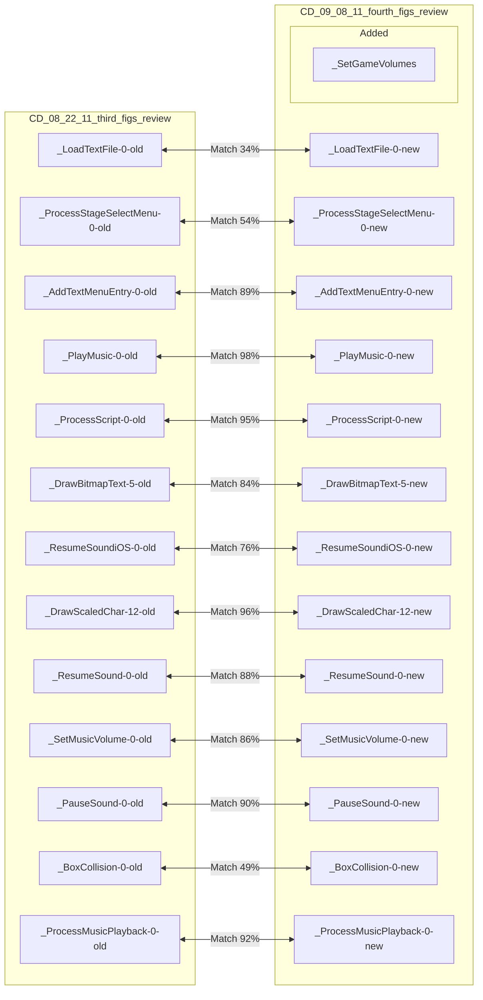
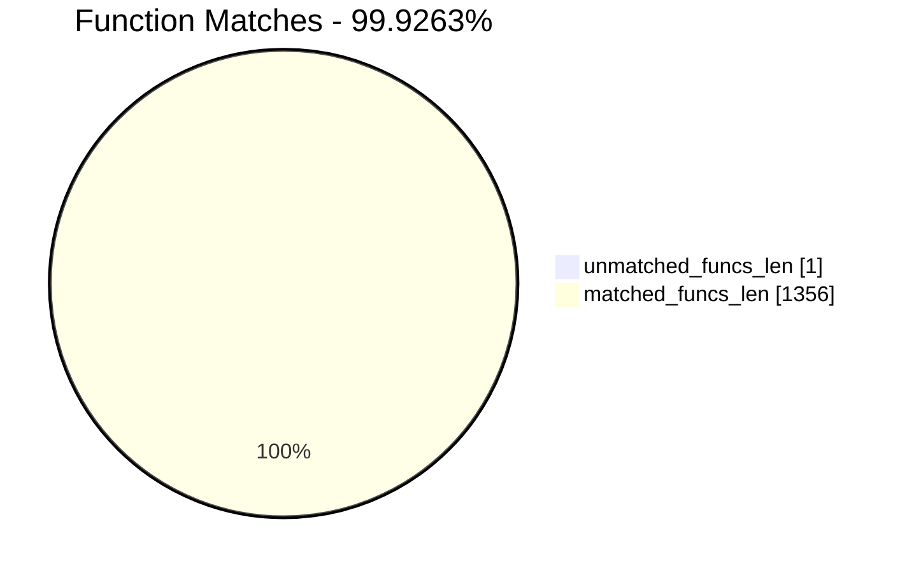
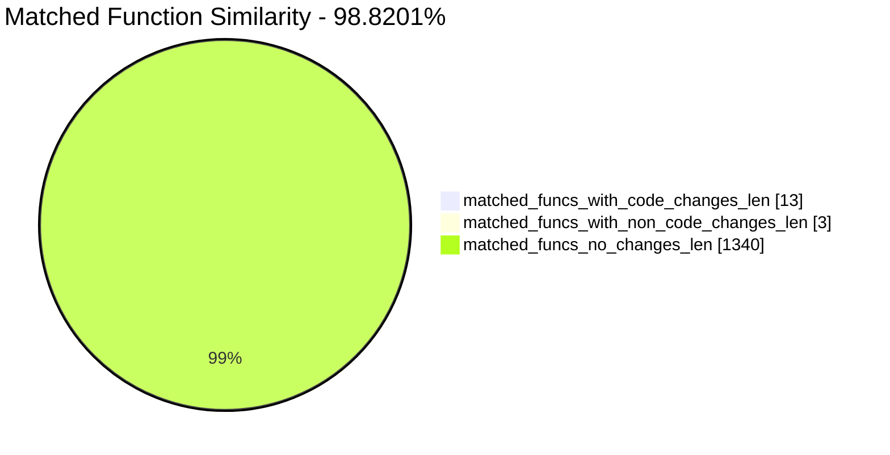
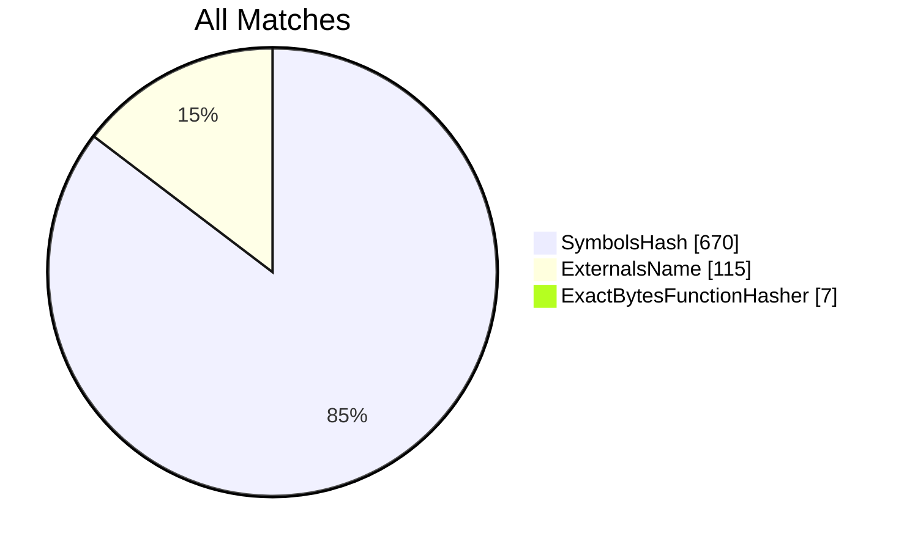
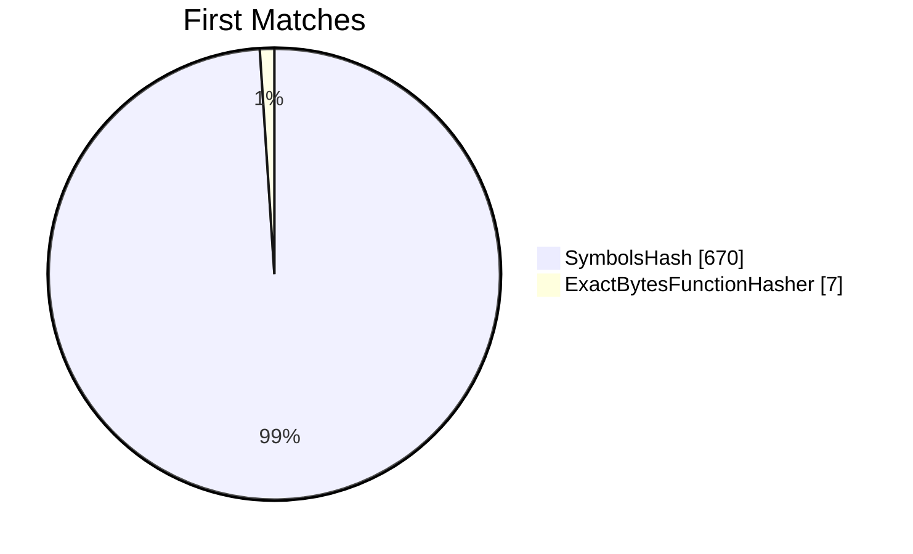
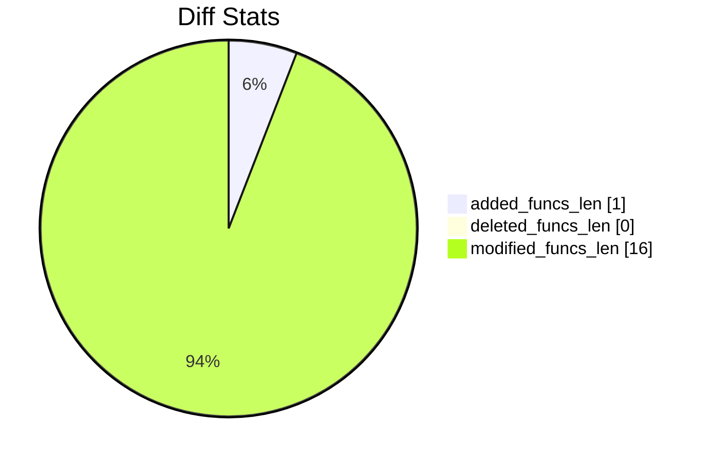
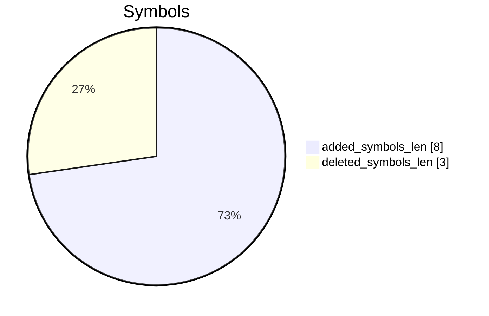
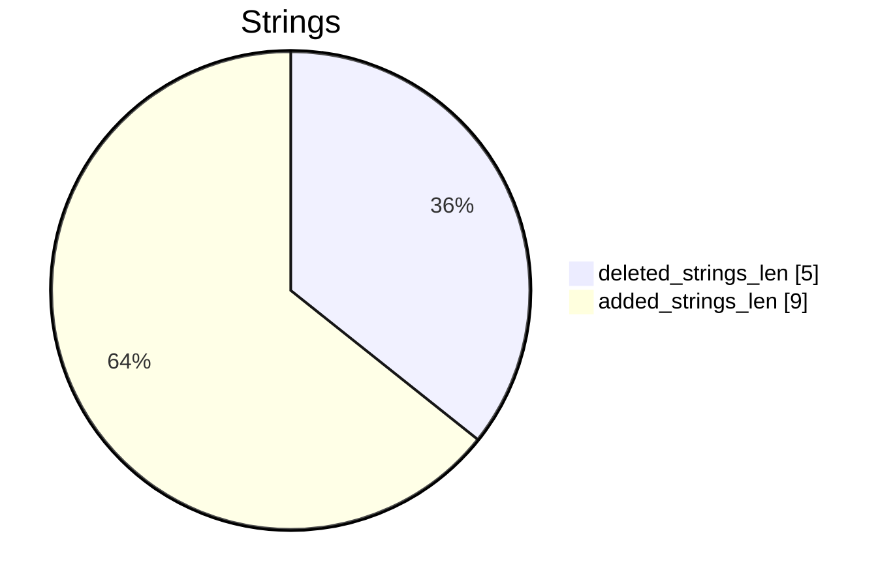

# CD_08_22_11_third_figs_review-CD_09_08_11_fourth_figs_review Diff

# TOC

* [Visual Chart Diff](#visual-chart-diff)
* [Metadata](#metadata)
	* [Ghidra Diff Engine](#ghidra-diff-engine)
		* [Command Line](#command-line)
	* [Binary Metadata Diff](#binary-metadata-diff)
	* [Program Options](#program-options)
	* [Diff Stats](#diff-stats)
	* [Strings](#strings)
* [Deleted](#deleted)
* [Added](#added)
	* [_SetGameVolumes](#_setgamevolumes)
* [Modified](#modified)
	* [_LoadTextFile](#_loadtextfile)
	* [_ProcessStageSelectMenu](#_processstageselectmenu)
	* [_AddTextMenuEntry](#_addtextmenuentry)
	* [_PlayMusic](#_playmusic)
	* [_ProcessScript](#_processscript)
	* [_DrawBitmapText](#_drawbitmaptext)
	* [_ResumeSoundiOS](#_resumesoundios)
	* [_DrawScaledChar](#_drawscaledchar)
	* [_ResumeSound](#_resumesound)
	* [_SetMusicVolume](#_setmusicvolume)
	* [_PauseSound](#_pausesound)
	* [_BoxCollision](#_boxcollision)
	* [_ProcessMusicPlayback](#_processmusicplayback)
* [Modified (No Code Changes)](#modified-no-code-changes)
	* [_alSourcef](#_alsourcef)
	* [_Sort3DDrawList](#_sort3ddrawlist)

# Visual Chart Diff










# Metadata

## Ghidra Diff Engine

### Command Line

#### Captured Command Line


```
ghidriff --project-location ghidra_projects --project-name ghidriff --symbols-path symbols --threaded --log-level INFO --file-log-level INFO --log-path ghidriff.log --min-func-len 2 --gdt [] --bsim --max-ram-percent 60.0 --max-section-funcs 200 CD_08_22_11_third_figs_review CD_09_08_11_fourth_figs_review
```


#### Verbose Args


<details>

```
--old ['CD_08_22_11_third_figs_review'] --new [['CD_09_08_11_fourth_figs_review']] --engine VersionTrackingDiff --output-path CD_08_22_11_third_figs_review-CD_09_08_11_fourth_figs_review --summary False --project-location ghidra_projects --project-name ghidriff --symbols-path symbols --threaded True --force-analysis False --force-diff False --no-symbols False --log-level INFO --file-log-level INFO --log-path ghidriff.log --va False --min-func-len 2 --use-calling-counts False --gdt [] --bsim True --bsim-full False --max-ram-percent 60.0 --print-flags False --jvm-args None --side-by-side False --max-section-funcs 200 --md-title None
```


</details>

## Binary Metadata Diff


```diff
--- CD_08_22_11_third_figs_review Meta
+++ CD_09_08_11_fourth_figs_review Meta
@@ -1,45 +1,45 @@
-Program Name: CD_08_22_11_third_figs_review
+Program Name: CD_09_08_11_fourth_figs_review
 Language ID: ARM:LE:32:v6 (1.107)
 Compiler ID: default
 Processor: ARM
 Endian: Little
 Address Size: 32
 Minimum Address: 00001000
-Maximum Address: 01293003
-# of Bytes: 19468472
+Maximum Address: 0129d003
+# of Bytes: 19509432
 # of Memory Blocks: 31
-# of Instructions: 53638
-# of Defined Data: 14451
-# of Functions: 678
-# of Symbols: 4088
+# of Instructions: 53865
+# of Defined Data: 14517
+# of Functions: 679
+# of Symbols: 4100
 # of Data Types: 146
 # of Data Type Categories: 10
 Analyzed: true
 Created With Ghidra Version: 11.0.3
-Date Created: Thu Jan 09 19:14:34 CET 2025
+Date Created: Thu Jan 09 19:14:35 CET 2025
 Executable Format: Mac OS X Mach-O
-Executable Location: /home/user/CD_08_22_11_third_figs_review
-Executable MD5: 30139c2b1ea714723405b4fff21ec8d8
-Executable SHA256: e1b4092ef4631577a9a529c0608e2fa281d7b878efaf8e5474981dc325c40a41
-FSRL: file:///home/user/CD_08_22_11_third_figs_review?MD5=30139c2b1ea714723405b4fff21ec8d8
+Executable Location: /home/user/CD_09_08_11_fourth_figs_review
+Executable MD5: bf0ec560dfac5aed1d1bd783f4a0467c
+Executable SHA256: c9f87551bd747072ab96a8cfae277cbda342c6d1111eeef8bae345a6970d8782
+FSRL: file:///home/user/CD_09_08_11_fourth_figs_review?MD5=bf0ec560dfac5aed1d1bd783f4a0467c
 Mach-O File Type: EXECUTE
 Mach-O File Type Description: Demand Paged Executable File
 Mach-O Flag 0: NOUNDEFS
 Mach-O Flag 1: DYLDLINK
 Mach-O Flag 2: TWOLEVEL
 Preferred Root Namespace Category: 
 Relocatable: false
 Required Library [    0]: /System/Library/Frameworks/MediaPlayer.framework/MediaPlayer
 Required Library [    1]: /System/Library/Frameworks/CoreGraphics.framework/CoreGraphics
 Required Library [    2]: /System/Library/Frameworks/GameKit.framework/GameKit
 Required Library [    3]: /System/Library/Frameworks/AudioToolbox.framework/AudioToolbox
 Required Library [    4]: /System/Library/Frameworks/Foundation.framework/Foundation
 Required Library [    5]: /System/Library/Frameworks/UIKit.framework/UIKit
 Required Library [    6]: /System/Library/Frameworks/OpenGLES.framework/OpenGLES
 Required Library [    7]: /System/Library/Frameworks/QuartzCore.framework/QuartzCore
 Required Library [    8]: /System/Library/Frameworks/OpenAL.framework/OpenAL
 Required Library [    9]: /usr/lib/libgcc_s.1.dylib
 Required Library [   10]: /usr/lib/libSystem.B.dylib
 Required Library [   11]: /usr/lib/libobjc.A.dylib
 Required Library [   12]: /System/Library/Frameworks/CoreFoundation.framework/CoreFoundation
 Should Ask To Analyze: false

```


## Program Options


<details>
<summary>Ghidra CD_08_22_11_third_figs_review Decompiler Options</summary>


|Decompiler Option|Value|
| :---: | :---: |
|Prototype Evaluation|__stdcall|

</details>


<details>
<summary>Ghidra CD_08_22_11_third_figs_review Specification extensions Options</summary>


|Specification extensions Option|Value|
| :---: | :---: |
|FormatVersion|0|
|VersionCounter|0|

</details>


<details>
<summary>Ghidra CD_08_22_11_third_figs_review Analyzers Options</summary>


|Analyzers Option|Value|
| :---: | :---: |
|ARM Aggressive Instruction Finder|false|
|ARM Constant Reference Analyzer|true|
|ARM Constant Reference Analyzer.Create Data from pointer|false|
|ARM Constant Reference Analyzer.Function parameter/return Pointer analysis|true|
|ARM Constant Reference Analyzer.Max Threads|2|
|ARM Constant Reference Analyzer.Min absolute reference|4|
|ARM Constant Reference Analyzer.Require pointer param data type|false|
|ARM Constant Reference Analyzer.Speculative reference max|256|
|ARM Constant Reference Analyzer.Speculative reference min|512|
|ARM Constant Reference Analyzer.Stored Value Pointer analysis|true|
|ARM Constant Reference Analyzer.Switch Table Recovery|false|
|ARM Constant Reference Analyzer.Trust values read from writable memory|true|
|ARM Symbol|true|
|ASCII Strings|true|
|ASCII Strings.Create Strings Containing Existing Strings|true|
|ASCII Strings.Create Strings Containing References|true|
|ASCII Strings.Force Model Reload|false|
|ASCII Strings.Minimum String Length|LEN_5|
|ASCII Strings.Model File|StringModel.sng|
|ASCII Strings.Require Null Termination for String|true|
|ASCII Strings.Search Only in Accessible Memory Blocks|true|
|ASCII Strings.String Start Alignment|ALIGN_1|
|ASCII Strings.String end alignment|4|
|Aggressive Instruction Finder|false|
|Aggressive Instruction Finder.Create Analysis Bookmarks|true|
|Apply Data Archives|true|
|Apply Data Archives.Archive Chooser|[Auto-Detect]|
|Apply Data Archives.Create Analysis Bookmarks|true|
|Apply Data Archives.GDT User File Archive Path|None|
|Apply Data Archives.User Project Archive Path|None|
|CFStrings|true|
|Call Convention ID|true|
|Call Convention ID.Analysis Decompiler Timeout (sec)|60|
|Call-Fixup Installer|true|
|Condense Filler Bytes|false|
|Condense Filler Bytes.Filler Value|Auto|
|Condense Filler Bytes.Minimum number of sequential bytes|1|
|Create Address Tables|true|
|Create Address Tables.Allow Offcut References|false|
|Create Address Tables.Auto Label Table|false|
|Create Address Tables.Create Analysis Bookmarks|true|
|Create Address Tables.Maxmimum Pointer Distance|16777215|
|Create Address Tables.Minimum Pointer Address|4132|
|Create Address Tables.Minimum Table Size|4|
|Create Address Tables.Pointer Alignment|1|
|Create Address Tables.Relocation Table Guide|true|
|Create Address Tables.Table Alignment|4|
|DWARF Line Number|false|
|Data Reference|true|
|Data Reference.Address Table Alignment|1|
|Data Reference.Address Table Minimum Size|4|
|Data Reference.Align End of Strings|false|
|Data Reference.Ascii String References|true|
|Data Reference.Create Address Tables|false|
|Data Reference.Minimum String Length|5|
|Data Reference.References to Pointers|false|
|Data Reference.Relocation Table Guide|true|
|Data Reference.Respect Execute Flag|true|
|Data Reference.Subroutine References|true|
|Data Reference.Switch Table References|false|
|Data Reference.Unicode String References|true|
|Decompiler Parameter ID|false|
|Decompiler Parameter ID.Analysis Clear Level|ANALYSIS|
|Decompiler Parameter ID.Analysis Decompiler Timeout (sec)|60|
|Decompiler Parameter ID.Commit Data Types|true|
|Decompiler Parameter ID.Commit Void Return Values|false|
|Decompiler Parameter ID.Prototype Evaluation|__stdcall|
|Decompiler Switch Analysis|true|
|Decompiler Switch Analysis.Analysis Decompiler Timeout (sec)|60|
|Demangler GNU|true|
|Demangler GNU.Apply Function Calling Conventions|true|
|Demangler GNU.Apply Function Signatures|true|
|Demangler GNU.Demangle Only Known Mangled Symbols|false|
|Demangler GNU.Demangler Format|AUTO|
|Demangler GNU.Use Deprecated Demangler|false|
|Disassemble Entry Points|true|
|Disassemble Entry Points.Respect Execute Flag|true|
|Embedded Media|true|
|Embedded Media.Create Analysis Bookmarks|true|
|External Entry References|true|
|External Symbol Resolver|true|
|Function Start Pre Search|true|
|Function Start Pre Search.Bookmark Functions|false|
|Function Start Pre Search.Search Data Blocks|false|
|Function Start Search|true|
|Function Start Search After Code|true|
|Function Start Search After Code.Bookmark Functions|false|
|Function Start Search After Code.Search Data Blocks|false|
|Function Start Search After Data|true|
|Function Start Search After Data.Bookmark Functions|false|
|Function Start Search After Data.Search Data Blocks|false|
|Function Start Search.Bookmark Functions|false|
|Function Start Search.Search Data Blocks|false|
|Mach-O Function Starts|true|
|Mach-O Function Starts.Bookmark failed functions|false|
|Mach-O Function Starts.Bookmark new functions|false|
|Mach-O Function Starts.Bookmark skipped functions|false|
|Mach-O Function Starts.Use PseudoDisassembler|true|
|Non-Returning Functions - Discovered|true|
|Non-Returning Functions - Discovered.Create Analysis Bookmarks|true|
|Non-Returning Functions - Discovered.Function Non-return Threshold|3|
|Non-Returning Functions - Discovered.Repair Flow Damage|true|
|Non-Returning Functions - Known|true|
|Non-Returning Functions - Known.Create Analysis Bookmarks|true|
|Objective-C 2 Class|true|
|Objective-C 2 Decompiler Message|true|
|Objective-C 2 Message|false|
|Reference|true|
|Reference.Address Table Alignment|1|
|Reference.Address Table Minimum Size|4|
|Reference.Align End of Strings|false|
|Reference.Ascii String References|true|
|Reference.Create Address Tables|false|
|Reference.Minimum String Length|5|
|Reference.References to Pointers|false|
|Reference.Relocation Table Guide|true|
|Reference.Respect Execute Flag|true|
|Reference.Subroutine References|true|
|Reference.Switch Table References|false|
|Reference.Unicode String References|true|
|Scalar Operand References|false|
|Scalar Operand References.Relocation Table Guide|true|
|Shared Return Calls|true|
|Shared Return Calls.Allow Conditional Jumps|false|
|Shared Return Calls.Assume Contiguous Functions Only|false|
|Stack|true|
|Stack.Create Local Variables|true|
|Stack.Create Param Variables|true|
|Stack.useNewFunctionStackAnalysis|true|
|Subroutine References|true|
|Subroutine References.Create Thunks Early|true|
|Variadic Function Signature Override|false|
|Variadic Function Signature Override.Create Analysis Bookmarks|false|

</details>


<details>
<summary>Ghidra CD_09_08_11_fourth_figs_review Decompiler Options</summary>


|Decompiler Option|Value|
| :---: | :---: |
|Prototype Evaluation|__stdcall|

</details>


<details>
<summary>Ghidra CD_09_08_11_fourth_figs_review Specification extensions Options</summary>


|Specification extensions Option|Value|
| :---: | :---: |
|FormatVersion|0|
|VersionCounter|0|

</details>


<details>
<summary>Ghidra CD_09_08_11_fourth_figs_review Analyzers Options</summary>


|Analyzers Option|Value|
| :---: | :---: |
|ARM Aggressive Instruction Finder|false|
|ARM Constant Reference Analyzer|true|
|ARM Constant Reference Analyzer.Create Data from pointer|false|
|ARM Constant Reference Analyzer.Function parameter/return Pointer analysis|true|
|ARM Constant Reference Analyzer.Max Threads|2|
|ARM Constant Reference Analyzer.Min absolute reference|4|
|ARM Constant Reference Analyzer.Require pointer param data type|false|
|ARM Constant Reference Analyzer.Speculative reference max|256|
|ARM Constant Reference Analyzer.Speculative reference min|512|
|ARM Constant Reference Analyzer.Stored Value Pointer analysis|true|
|ARM Constant Reference Analyzer.Switch Table Recovery|false|
|ARM Constant Reference Analyzer.Trust values read from writable memory|true|
|ARM Symbol|true|
|ASCII Strings|true|
|ASCII Strings.Create Strings Containing Existing Strings|true|
|ASCII Strings.Create Strings Containing References|true|
|ASCII Strings.Force Model Reload|false|
|ASCII Strings.Minimum String Length|LEN_5|
|ASCII Strings.Model File|StringModel.sng|
|ASCII Strings.Require Null Termination for String|true|
|ASCII Strings.Search Only in Accessible Memory Blocks|true|
|ASCII Strings.String Start Alignment|ALIGN_1|
|ASCII Strings.String end alignment|4|
|Aggressive Instruction Finder|false|
|Aggressive Instruction Finder.Create Analysis Bookmarks|true|
|Apply Data Archives|true|
|Apply Data Archives.Archive Chooser|[Auto-Detect]|
|Apply Data Archives.Create Analysis Bookmarks|true|
|Apply Data Archives.GDT User File Archive Path|None|
|Apply Data Archives.User Project Archive Path|None|
|CFStrings|true|
|Call Convention ID|true|
|Call Convention ID.Analysis Decompiler Timeout (sec)|60|
|Call-Fixup Installer|true|
|Condense Filler Bytes|false|
|Condense Filler Bytes.Filler Value|Auto|
|Condense Filler Bytes.Minimum number of sequential bytes|1|
|Create Address Tables|true|
|Create Address Tables.Allow Offcut References|false|
|Create Address Tables.Auto Label Table|false|
|Create Address Tables.Create Analysis Bookmarks|true|
|Create Address Tables.Maxmimum Pointer Distance|16777215|
|Create Address Tables.Minimum Pointer Address|4132|
|Create Address Tables.Minimum Table Size|4|
|Create Address Tables.Pointer Alignment|1|
|Create Address Tables.Relocation Table Guide|true|
|Create Address Tables.Table Alignment|4|
|DWARF Line Number|false|
|Data Reference|true|
|Data Reference.Address Table Alignment|1|
|Data Reference.Address Table Minimum Size|4|
|Data Reference.Align End of Strings|false|
|Data Reference.Ascii String References|true|
|Data Reference.Create Address Tables|false|
|Data Reference.Minimum String Length|5|
|Data Reference.References to Pointers|false|
|Data Reference.Relocation Table Guide|true|
|Data Reference.Respect Execute Flag|true|
|Data Reference.Subroutine References|true|
|Data Reference.Switch Table References|false|
|Data Reference.Unicode String References|true|
|Decompiler Parameter ID|false|
|Decompiler Parameter ID.Analysis Clear Level|ANALYSIS|
|Decompiler Parameter ID.Analysis Decompiler Timeout (sec)|60|
|Decompiler Parameter ID.Commit Data Types|true|
|Decompiler Parameter ID.Commit Void Return Values|false|
|Decompiler Parameter ID.Prototype Evaluation|__stdcall|
|Decompiler Switch Analysis|true|
|Decompiler Switch Analysis.Analysis Decompiler Timeout (sec)|60|
|Demangler GNU|true|
|Demangler GNU.Apply Function Calling Conventions|true|
|Demangler GNU.Apply Function Signatures|true|
|Demangler GNU.Demangle Only Known Mangled Symbols|false|
|Demangler GNU.Demangler Format|AUTO|
|Demangler GNU.Use Deprecated Demangler|false|
|Disassemble Entry Points|true|
|Disassemble Entry Points.Respect Execute Flag|true|
|Embedded Media|true|
|Embedded Media.Create Analysis Bookmarks|true|
|External Entry References|true|
|External Symbol Resolver|true|
|Function Start Pre Search|true|
|Function Start Pre Search.Bookmark Functions|false|
|Function Start Pre Search.Search Data Blocks|false|
|Function Start Search|true|
|Function Start Search After Code|true|
|Function Start Search After Code.Bookmark Functions|false|
|Function Start Search After Code.Search Data Blocks|false|
|Function Start Search After Data|true|
|Function Start Search After Data.Bookmark Functions|false|
|Function Start Search After Data.Search Data Blocks|false|
|Function Start Search.Bookmark Functions|false|
|Function Start Search.Search Data Blocks|false|
|Mach-O Function Starts|true|
|Mach-O Function Starts.Bookmark failed functions|false|
|Mach-O Function Starts.Bookmark new functions|false|
|Mach-O Function Starts.Bookmark skipped functions|false|
|Mach-O Function Starts.Use PseudoDisassembler|true|
|Non-Returning Functions - Discovered|true|
|Non-Returning Functions - Discovered.Create Analysis Bookmarks|true|
|Non-Returning Functions - Discovered.Function Non-return Threshold|3|
|Non-Returning Functions - Discovered.Repair Flow Damage|true|
|Non-Returning Functions - Known|true|
|Non-Returning Functions - Known.Create Analysis Bookmarks|true|
|Objective-C 2 Class|true|
|Objective-C 2 Decompiler Message|true|
|Objective-C 2 Message|false|
|Reference|true|
|Reference.Address Table Alignment|1|
|Reference.Address Table Minimum Size|4|
|Reference.Align End of Strings|false|
|Reference.Ascii String References|true|
|Reference.Create Address Tables|false|
|Reference.Minimum String Length|5|
|Reference.References to Pointers|false|
|Reference.Relocation Table Guide|true|
|Reference.Respect Execute Flag|true|
|Reference.Subroutine References|true|
|Reference.Switch Table References|false|
|Reference.Unicode String References|true|
|Scalar Operand References|false|
|Scalar Operand References.Relocation Table Guide|true|
|Shared Return Calls|true|
|Shared Return Calls.Allow Conditional Jumps|false|
|Shared Return Calls.Assume Contiguous Functions Only|false|
|Stack|true|
|Stack.Create Local Variables|true|
|Stack.Create Param Variables|true|
|Stack.useNewFunctionStackAnalysis|true|
|Subroutine References|true|
|Subroutine References.Create Thunks Early|true|
|Variadic Function Signature Override|false|
|Variadic Function Signature Override.Create Analysis Bookmarks|false|

</details>

## Diff Stats


|Stat|Value|
| :---: | :---: |
|added_funcs_len|1|
|deleted_funcs_len|0|
|modified_funcs_len|16|
|added_symbols_len|8|
|deleted_symbols_len|3|
|diff_time|106.3083667755127|
|deleted_strings_len|5|
|added_strings_len|9|
|match_types|Counter({'SymbolsHash': 670, 'ExternalsName': 115, 'ExactBytesFunctionHasher': 7})|
|items_to_process|28|
|diff_types|Counter({'address': 15, 'code': 13, 'length': 13, 'refcount': 4, 'calling': 2, 'called': 2, 'sig': 1})|
|unmatched_funcs_len|1|
|total_funcs_len|1357|
|matched_funcs_len|1356|
|matched_funcs_with_code_changes_len|13|
|matched_funcs_with_non_code_changes_len|3|
|matched_funcs_no_changes_len|1340|
|match_func_similarity_percent|98.8201%|
|func_match_overall_percent|99.9263%|
|first_matches|Counter({'SymbolsHash': 670, 'ExactBytesFunctionHasher': 7})|













## Strings




### Strings Diff


```diff
--- deleted strings
+++ added strings
@@ -1,5 +1,9 @@
-___func__.4651
-s__C.14.2930
-s__C.15.2931
-s____func__.4651
-s__proc.4439
+___func__.4682
+s__C.14.2932
+s__C.15.2933
+s__SetGameVolumes
+s____func__.4682
+s__gameBGMVolume
+s__gameSFXVolume
+s__pauseWait
+s__proc.4445

```


### String References

#### Old


|String|Ref Count|Ref Func|
| :---: | :---: | :---: |
|s__C.15.2931_0128a9e3|1||
|___func__.4651|2|_PlayMusic|
|s__proc.4439_0128cabd|1||
|s____func__.4651_0128c936|1||
|s__C.14.2930_0128a9ee|1||

#### New


|String|Ref Count|Ref Func|
| :---: | :---: | :---: |
|s__C.15.2933_01294aa8|1||
|s__gameSFXVolume_01294c79|1||
|s__gameBGMVolume_01294c88|1||
|s__SetGameVolumes_01296946|1||
|s__C.14.2932_01294ab3|1||
|___func__.4682|2|_PlayMusic|
|s____func__.4682_01296a29|1||
|s__pauseWait_01296ae4|1||
|s__proc.4445_01296bbb|1||

# Deleted

# Added

## _SetGameVolumes

### Function Meta


|Key|CD_09_08_11_fourth_figs_review|
| :---: | :---: |
|name|_SetGameVolumes|
|fullname|_SetGameVolumes|
|refcount|3|
|length|144|
|called|_alSourcef|
|calling|_ProcessScript<br>_ResumeSoundiOS|
|paramcount|0|
|address|00029a1c|
|sig|undefined _SetGameVolumes(void)|
|sym_type|Function|
|sym_source|IMPORTED|
|external|False|


```diff
--- _SetGameVolumes
+++ _SetGameVolumes
@@ -0,0 +1,23 @@
+
+void _SetGameVolumes(undefined4 param_1,undefined4 param_2)
+
+{
+  undefined4 *puVar1;
+  uint in_fpscr;
+  undefined4 in_cr7;
+  undefined4 in_cr8;
+  undefined4 uVar2;
+  
+  uVar2 = 0x3c23d70a;
+  VectorSignedToFloat(param_1,(byte)(in_fpscr >> 0x15) & 3);
+  coprocessor_function(10,2,4,in_cr7,in_cr7,in_cr8);
+  _alSourcef(*DAT_00051778,0x100a,param_1);
+  puVar1 = DAT_00051760;
+  VectorSignedToFloat(param_2,(byte)(in_fpscr >> 0x15) & 3);
+  coprocessor_function(10,2,4,in_cr8,in_cr7,in_cr8);
+  _alSourcef(*DAT_00051760,0x100a,uVar2);
+  _alSourcef(puVar1[1],0x100a,uVar2);
+  _alSourcef(puVar1[2],0x100a,uVar2);
+  return;
+}
+

```


# Modified


*Modified functions contain code changes*
## _LoadTextFile

### Match Info


|Key|CD_08_22_11_third_figs_review - CD_09_08_11_fourth_figs_review|
| :---: | :---: |
|diff_type|code,refcount,length,address|
|ratio|0.1|
|i_ratio|0.39|
|m_ratio|0.3|
|b_ratio|0.34|
|match_types|SymbolsHash|

### Function Meta Diff


|Key|CD_08_22_11_third_figs_review|CD_09_08_11_fourth_figs_review|
| :---: | :---: | :---: |
|name|_LoadTextFile|_LoadTextFile|
|fullname|_LoadTextFile|_LoadTextFile|
|`refcount`|1|2|
|`length`|804|832|
|called|_CloseFile<br>_FileRead<br>_LoadFile<br>_ReachedEndOfFile|_CloseFile<br>_FileRead<br>_LoadFile<br>_ReachedEndOfFile|
|calling|_ProcessScript|_ProcessScript|
|paramcount|0|0|
|`address`|00028da8|00028c40|
|sig|undefined _LoadTextFile(void)|undefined _LoadTextFile(void)|
|sym_type|Function|Function|
|sym_source|IMPORTED|IMPORTED|
|external|False|False|

### _LoadTextFile Diff


```diff
--- _LoadTextFile
+++ _LoadTextFile
@@ -1,134 +1,140 @@
 
-void _LoadTextFile(int param_1,undefined4 param_2)
+void _LoadTextFile(int param_1,undefined4 param_2,char param_3)
 
 {
   int iVar1;
   uint uVar2;
-  undefined4 uVar3;
-  undefined2 uVar4;
-  short sVar5;
-  int iVar6;
-  byte bVar7;
-  char *pcVar8;
-  undefined auStack_74 [87];
-  byte local_1d;
+  int *piVar3;
+  ushort uVar4;
+  uint uVar5;
+  int *piVar6;
+  undefined auStack_78 [87];
+  byte local_21;
   
-  iVar1 = _LoadFile(param_2,auStack_74);
-  if (iVar1 == 1) {
-    *(undefined4 *)(param_1 + 0x1000) = 0;
-    pcVar8 = section_0000147c.sectname + param_1 + 4;
-    *(undefined4 *)pcVar8 = 0;
-    section_0000147c.sectname[param_1 + 8] = '\0';
-    *(undefined4 *)(section_000011e0.segname + param_1 + 0x10) = 0;
-    _FileRead(&local_1d,1);
-    uVar2 = (uint)local_1d;
-    if (uVar2 == 0xff) {
-      _FileRead(&local_1d,1);
-      do {
-        _FileRead(&local_1d,1);
-        uVar2 = (uint)local_1d;
-        _FileRead(&local_1d,1);
-        uVar2 = uVar2 + (uint)local_1d * 0x100 & 0xffff;
-        if ((uVar2 == 10) || (uVar2 == 0xd)) {
-          bVar7 = section_0000147c.sectname[param_1 + 8] + 1;
-          section_0000147c.sectname[param_1 + 8] = bVar7;
-          if ((bVar7 & 0x80) == 0) {
-            iVar1 = (uint)bVar7 * 4 + param_1;
-            *(undefined4 *)(iVar1 + 0x1000) = *(undefined4 *)pcVar8;
-            *(undefined4 *)(section_000011e0.segname + iVar1 + 0x10) = 0;
-          }
+  iVar1 = _LoadFile(param_2,auStack_78);
+  if (iVar1 != 1) {
+    return;
+  }
+  *(undefined4 *)(param_1 + 0x5000) = 0;
+  piVar6 = (int *)(param_1 + 0x6200);
+  *(undefined4 *)(param_1 + 0x5800) = 0;
+  *piVar6 = 0;
+  *(undefined2 *)(param_1 + 0x620c) = 0;
+  _FileRead(&local_21,1);
+  uVar5 = (uint)local_21;
+  if (uVar5 != 0xff) {
+    if (uVar5 != 10) {
+      if (uVar5 == 0xd) {
+        uVar4 = *(short *)(param_1 + 0x620c) + 1;
+        *(ushort *)(param_1 + 0x620c) = uVar4;
+        iVar1 = (uint)uVar4 * 4 + param_1;
+        *(int *)(iVar1 + 0x5000) = *piVar6;
+        *(undefined4 *)(iVar1 + 0x5800) = 0;
+      }
+      else {
+        if (param_3 == '\x01') {
+          uVar2 = 0;
+          iVar1 = 0;
+          do {
+            if (*(uint *)(iVar1 + DAT_0) == uVar5) {
+              uVar5 = uVar2 & 0xffff;
+              goto LAB_1;
+            }
+            uVar2 = uVar2 + 1;
+            iVar1 = iVar1 + 0x14;
+          } while (uVar2 != 0x400);
+          uVar5 = 0;
+        }
+LAB_1:
+        iVar1 = *piVar6;
+        *(short *)(iVar1 * 2 + param_1) = (short)uVar5;
+        *piVar6 = iVar1 + 1;
+        piVar3 = (int *)((uint)*(ushort *)(param_1 + 0x620c) * 4 + param_1 + 0x5800);
+        *piVar3 = *piVar3 + 1;
+      }
+    }
+    do {
+      _FileRead(&local_21,1);
+      uVar5 = (uint)local_21;
+      if (uVar5 != 10) {
+        if (uVar5 == 0xd) {
+          uVar4 = *(short *)(param_1 + 0x620c) + 1;
+          *(ushort *)(param_1 + 0x620c) = uVar4;
+          if (0x1ff < uVar4) goto LAB_2;
+          iVar1 = (uint)uVar4 * 4 + param_1;
+          *(int *)(iVar1 + 0x5000) = *piVar6;
+          *(undefined4 *)(iVar1 + 0x5800) = 0;
         }
         else {
-          iVar1 = 0;
-          iVar6 = 0;
-          do {
-            if (*(uint *)(iVar6 + DAT_0) == uVar2) {
-              uVar4 = (undefined2)iVar1;
-              goto LAB_1;
-            }
-            iVar1 = iVar1 + 1;
-            iVar6 = iVar6 + 0x14;
-          } while (iVar1 != 0x400);
-          uVar4 = 0;
-LAB_1:
-          iVar1 = *(int *)pcVar8;
-          *(undefined2 *)(iVar1 * 2 + param_1) = uVar4;
-          *(int *)pcVar8 = iVar1 + 1;
-          *(int *)(section_000011e0.segname +
-                  (uint)(byte)section_0000147c.sectname[param_1 + 8] * 4 + param_1 + 0x10) =
-               *(int *)(section_000011e0.segname +
-                       (uint)(byte)section_0000147c.sectname[param_1 + 8] * 4 + param_1 + 0x10) + 1;
+          if (param_3 == '\x01') {
+            uVar2 = 0;
+            iVar1 = 0;
+            do {
+              if (*(uint *)(iVar1 + DAT_0) == uVar5) {
+                uVar5 = uVar2 & 0xffff;
+                goto LAB_3;
+              }
+              uVar2 = uVar2 + 1;
+              iVar1 = iVar1 + 0x14;
+            } while (uVar2 != 0x400);
+            uVar5 = 0;
+          }
+LAB_3:
+          iVar1 = *piVar6;
+          *(short *)(iVar1 * 2 + param_1) = (short)uVar5;
+          *piVar6 = iVar1 + 1;
+          piVar3 = (int *)((uint)*(ushort *)(param_1 + 0x620c) * 4 + param_1 + 0x5800);
+          *piVar3 = *piVar3 + 1;
         }
-        iVar1 = _ReachedEndOfFile();
-      } while ((*(int *)pcVar8 < 0x7ff) && (iVar1 == 0));
-    }
-    else {
-      if ((uVar2 == 10) || (uVar2 == 0xd)) {
-        uVar3 = *(undefined4 *)pcVar8;
-        bVar7 = section_0000147c.sectname[param_1 + 8] + 1;
-        section_0000147c.sectname[param_1 + 8] = bVar7;
-        iVar1 = (uint)bVar7 * 4 + param_1;
-        *(undefined4 *)(iVar1 + 0x1000) = uVar3;
-        *(undefined4 *)(section_000011e0.segname + iVar1 + 0x10) = 0;
+      }
+      iVar1 = _ReachedEndOfFile();
+      if ((0x27ff < *piVar6) || (iVar1 != 0)) goto LAB_2;
+    } while( true );
+  }
+  _FileRead(&local_21,1);
+  do {
+    _FileRead(&local_21,1);
+    uVar5 = (uint)local_21;
+    _FileRead(&local_21,1);
+    uVar5 = uVar5 + (uint)local_21 * 0x100 & 0xffff;
+    if (uVar5 != 10) {
+      if (uVar5 == 0xd) {
+        uVar4 = *(short *)(param_1 + 0x620c) + 1;
+        *(ushort *)(param_1 + 0x620c) = uVar4;
+        if (0x1ff < uVar4) {
+LAB_2:
+          *(short *)(param_1 + 0x620c) = *(short *)(param_1 + 0x620c) + 1;
+          _CloseFile();
+          return;
+        }
+        iVar1 = (uint)uVar4 * 4 + param_1;
+        *(int *)(iVar1 + 0x5000) = *piVar6;
+        *(undefined4 *)(iVar1 + 0x5800) = 0;
       }
       else {
-        iVar6 = 0;
-        iVar1 = 0;
-        do {
-          sVar5 = (short)iVar6;
-          if (*(uint *)(iVar1 + DAT_0) == uVar2) goto LAB_00028f94;
-          iVar6 = iVar6 + 1;
-          iVar1 = iVar1 + 0x14;
-        } while (iVar6 != 0x400);
-        sVar5 = sVar5 + -0x3ff;
-LAB_2:
-        iVar1 = *(int *)pcVar8;
-        *(short *)(iVar1 * 2 + param_1) = sVar5;
-        *(int *)pcVar8 = iVar1 + 1;
-        *(int *)(section_000011e0.segname +
-                (uint)(byte)section_0000147c.sectname[param_1 + 8] * 4 + param_1 + 0x10) =
-             *(int *)(section_000011e0.segname +
-                     (uint)(byte)section_0000147c.sectname[param_1 + 8] * 4 + param_1 + 0x10) + 1;
+        if (param_3 == '\x01') {
+          uVar2 = 0;
+          iVar1 = 0;
+          do {
+            if (*(uint *)(iVar1 + DAT_0) == uVar5) {
+              uVar5 = uVar2 & 0xffff;
+              goto LAB_4;
+            }
+            uVar2 = uVar2 + 1;
+            iVar1 = iVar1 + 0x14;
+          } while (uVar2 != 0x400);
+          uVar5 = 0;
+        }
+LAB_4:
+        iVar1 = *piVar6;
+        *(short *)(iVar1 * 2 + param_1) = (short)uVar5;
+        *piVar6 = iVar1 + 1;
+        piVar3 = (int *)((uint)*(ushort *)(param_1 + 0x620c) * 4 + param_1 + 0x5800);
+        *piVar3 = *piVar3 + 1;
       }
-      do {
-        _FileRead(&local_1d,1);
-        uVar2 = (uint)local_1d;
-        if ((uVar2 == 10) || (uVar2 == 0xd)) {
-          bVar7 = section_0000147c.sectname[param_1 + 8] + 1;
-          section_0000147c.sectname[param_1 + 8] = bVar7;
-          if ((bVar7 & 0x80) == 0) {
-            iVar1 = (uint)bVar7 * 4 + param_1;
-            *(undefined4 *)(iVar1 + 0x1000) = *(undefined4 *)pcVar8;
-            *(undefined4 *)(section_000011e0.segname + iVar1 + 0x10) = 0;
-          }
-        }
-        else {
-          iVar1 = 0;
-          iVar6 = 0;
-          do {
-            if (*(uint *)(iVar6 + DAT_0) == uVar2) {
-              uVar4 = (undefined2)iVar1;
-              goto LAB_3;
-            }
-            iVar1 = iVar1 + 1;
-            iVar6 = iVar6 + 0x14;
-          } while (iVar1 != 0x400);
-          uVar4 = 0;
-LAB_3:
-          iVar1 = *(int *)pcVar8;
-          *(undefined2 *)(iVar1 * 2 + param_1) = uVar4;
-          *(int *)pcVar8 = iVar1 + 1;
-          *(int *)(section_000011e0.segname +
-                  (uint)(byte)section_0000147c.sectname[param_1 + 8] * 4 + param_1 + 0x10) =
-               *(int *)(section_000011e0.segname +
-                       (uint)(byte)section_0000147c.sectname[param_1 + 8] * 4 + param_1 + 0x10) + 1;
-        }
-        iVar1 = _ReachedEndOfFile();
-      } while ((*(int *)pcVar8 < 0x7ff) && (iVar1 == 0));
     }
-    section_0000147c.sectname[param_1 + 8] = section_0000147c.sectname[param_1 + 8] + '\x01';
-    _CloseFile();
-  }
-  return;
+    iVar1 = _ReachedEndOfFile();
+    if ((0x27ff < *piVar6) || (iVar1 != 0)) goto LAB_2;
+  } while( true );
 }
 

```


## _ProcessStageSelectMenu

### Match Info


|Key|CD_08_22_11_third_figs_review - CD_09_08_11_fourth_figs_review|
| :---: | :---: |
|diff_type|code,length,address|
|ratio|0.28|
|i_ratio|0.49|
|m_ratio|0.52|
|b_ratio|0.54|
|match_types|SymbolsHash|

### Function Meta Diff


|Key|CD_08_22_11_third_figs_review|CD_09_08_11_fourth_figs_review|
| :---: | :---: | :---: |
|name|_ProcessStageSelectMenu|_ProcessStageSelectMenu|
|fullname|_ProcessStageSelectMenu|_ProcessStageSelectMenu|
|refcount|1|1|
|`length`|2696|2688|
|called|_AddTextMenuEntry<br>_ClearScreen<br>_DrawSprite<br>_DrawTextMenu<br>_LoadConfigListText<br>_MenuKeyDown<br>_SetupTextMenu|_AddTextMenuEntry<br>_ClearScreen<br>_DrawSprite<br>_DrawTextMenu<br>_LoadConfigListText<br>_MenuKeyDown<br>_SetupTextMenu|
|calling|_ProcessMainLoop|_ProcessMainLoop|
|paramcount|0|0|
|`address`|00024b0c|00024988|
|sig|undefined _ProcessStageSelectMenu(void)|undefined _ProcessStageSelectMenu(void)|
|sym_type|Function|Function|
|sym_source|IMPORTED|IMPORTED|
|external|False|False|

### _ProcessStageSelectMenu Diff


```diff
--- _ProcessStageSelectMenu
+++ _ProcessStageSelectMenu
@@ -1,316 +1,318 @@
 
 void _ProcessStageSelectMenu(void)
 
 {
-  byte *pbVar1;
-  undefined *puVar2;
-  char *pcVar3;
+  ushort *puVar1;
+  ushort uVar2;
+  undefined *puVar3;
   char *pcVar4;
-  undefined uVar5;
-  byte bVar6;
-  char cVar7;
-  int iVar8;
+  char *pcVar5;
+  undefined uVar6;
+  byte bVar7;
+  short sVar8;
+  undefined4 uVar9;
+  char cVar10;
+  int iVar11;
+  int iVar12;
   
-  *(undefined2 *)PTR__gfxVertexSize_000493ac = 0;
-  *(undefined2 *)PTR__gfxIndexSize_000493b8 = 0;
+  *(undefined2 *)PTR__gfxVertexSize_000493b4 = 0;
+  *(undefined2 *)PTR__gfxIndexSize_000493c0 = 0;
   _ClearScreen(0xf0);
-  pcVar4 = DAT_0;
+  pcVar5 = DAT_0;
   _MenuKeyDown(DAT_0,0x83);
   _DrawSprite(0x20,0x42,0x10,0x10,0x4e,0xf0,0);
   _DrawSprite(0x20,0xb2,0x10,0x10,0x5f,0xf0,0);
   _DrawSprite(*(int *)PTR__SCREEN_XSIZE_0004922c + -0x20,0xd0,0x10,0x10,0x70,0xf0,0);
-  pcVar3 = DAT_1;
-  iVar8 = *(int *)(pcVar4 + 0x50);
+  pcVar4 = DAT_1;
+  iVar11 = *(int *)(pcVar5 + 0x50);
   DAT_1[7] = '\0';
-  *pcVar3 = '\0';
-  pcVar3[1] = '\0';
-  if (iVar8 < 1) {
-    pcVar4[7] = '\0';
-    *pcVar4 = '\0';
-    pcVar4[1] = '\0';
+  *pcVar4 = '\0';
+  pcVar4[1] = '\0';
+  if (iVar11 < 1) {
+    pcVar5[7] = '\0';
+    *pcVar5 = '\0';
+    pcVar5[1] = '\0';
   }
   else {
-    iVar8 = *(int *)(pcVar4 + 0x10);
-    if (iVar8 < 0x78) {
-      if (*(int *)(pcVar4 + 0x30) < 0x78) {
-        if (*pcVar4 == '\0') {
-          *pcVar3 = '\x01';
+    iVar11 = *(int *)(pcVar5 + 0x10);
+    if (iVar11 < 0x78) {
+      if (*(int *)(pcVar5 + 0x30) < 0x78) {
+        if (*pcVar5 == '\0') {
+          *pcVar4 = '\x01';
         }
-        *pcVar4 = '\x01';
+        *pcVar5 = '\x01';
       }
       else {
-        if (pcVar4[1] == '\0') {
-          pcVar3[1] = '\x01';
+        if (pcVar5[1] == '\0') {
+          pcVar4[1] = '\x01';
         }
-        pcVar4[1] = '\x01';
-      }
-    }
-    pcVar3 = DAT_0;
-    if (200 < iVar8) {
+        pcVar5[1] = '\x01';
+      }
+    }
+    pcVar4 = DAT_0;
+    if (200 < iVar11) {
       if (DAT_0[7] == '\0') {
         DAT_1[7] = '\x01';
       }
-      pcVar3[7] = '\x01';
+      pcVar4[7] = '\x01';
     }
   }
-  pcVar3 = DAT_1;
-  iVar8 = DAT_2;
+  pcVar4 = DAT_1;
+  iVar11 = DAT_2;
   switch(*DAT_3) {
   case 0:
     if (DAT_1[1] == '\x01') {
-      section_0000147c.sectname[DAT_2 + 0xe] =
-           section_0000147c.sectname[DAT_2 + 0xe] + '\x02';
-    }
-    if (*pcVar3 == '\x01') {
-      section_0000147c.sectname[DAT_2 + 0xe] =
-           section_0000147c.sectname[DAT_2 + 0xe] + -2;
-    }
-    if (section_0000147c.sectname[DAT_2 + 0xe] < '\n') {
-      if (section_0000147c.sectname[DAT_2 + 0xe] < '\a') {
-        cVar7 = '\t';
+      *(int *)(DAT_2 + 0x6208) = *(int *)(DAT_2 + 0x6208) + 2;
+    }
+    if (*pcVar4 == '\x01') {
+      *(int *)(DAT_2 + 0x6208) = *(int *)(DAT_2 + 0x6208) + -2;
+    }
+    if (*(int *)(DAT_2 + 0x6208) < 10) {
+      if (*(int *)(DAT_2 + 0x6208) < 7) {
+        uVar9 = 9;
         goto LAB_4;
       }
     }
     else {
-      cVar7 = '\a';
+      uVar9 = 7;
 LAB_4:
-      section_0000147c.sectname[DAT_2 + 0xe] = cVar7;
-    }
-    iVar8 = DAT_2;
+      *(undefined4 *)(DAT_2 + 0x6208) = uVar9;
+    }
+    iVar11 = DAT_2;
     _DrawTextMenu(DAT_2,*(undefined4 *)PTR__SCREEN_CENTER_00049230,0x48);
     if (DAT_1[7] != '\x01') break;
-    if (section_0000147c.sectname[iVar8 + 0xe] != '\a') {
-      _SetupTextMenu(iVar8,0);
-      _AddTextMenuEntry(iVar8,"CHOOSE A PLAYER");
-      _SetupTextMenu(iVar8 + 0x148c,0);
-      _LoadConfigListText(iVar8 + 0x148c,0);
-      (&UNK_5)[iVar8] = 0;
-      (&UNK_6)[iVar8] = 1;
-      (&UNK_7)[iVar8] = 0;
+    if (*(int *)(iVar11 + 0x6208) != 7) {
+      _SetupTextMenu(iVar11,0);
+      _AddTextMenuEntry(iVar11,"CHOOSE A PLAYER");
+      _SetupTextMenu(iVar11 + 0x6218,0);
+      _LoadConfigListText(iVar11 + 0x6218,0);
+      *(undefined *)((int)&DAT_5 + iVar11 + 2) = 0;
+      *(undefined *)((int)&DAT_5 + iVar11 + 3) = 1;
+      *(undefined4 *)((int)&DAT_6 + iVar11) = 0;
       *DAT_3 = 1;
       break;
     }
-    iVar8 = 0;
+    uVar9 = 0;
     *DAT_3 = 0;
     *PTR__gameMode_00049258 = 1;
-    *PTR__activeStageList_00049330 = 0;
-    goto LAB_8;
+    *PTR__activeStageList_0004933c = 0;
+    goto LAB_7;
   case 1:
     if (DAT_1[1] == '\x01') {
-      (&UNK_7)[DAT_000515e0] = (&UNK_7)[DAT_000515e0] + '\x01';
-    }
-    if (*pcVar3 == '\x01') {
-      (&UNK_7)[DAT_000515e0] = (&UNK_7)[DAT_000515e0] + -1;
-    }
-    if ((int)(char)(&UNK_7)[DAT_000515e0] == (uint)(byte)(&UNK_00002910)[DAT_000515e0]) {
-      cVar7 = '\0';
+      *(int *)((int)&DAT_6 + DAT_00051674) = *(int *)((int)&DAT_6 + DAT_00051674) + 1;
+    }
+    if (*pcVar4 == '\x01') {
+      *(int *)((int)&DAT_6 + DAT_00051674) = *(int *)((int)&DAT_6 + DAT_00051674) + -1
+      ;
+    }
+    if (*(uint *)((int)&DAT_6 + DAT_00051674) ==
+        (uint)*(ushort *)((int)&DAT_8 + DAT_00051674)) {
+      iVar11 = 0;
 LAB_9:
-      (&UNK_7)[DAT_000515e0] = cVar7;
-    }
-    else if ((char)(&UNK_7)[DAT_000515e0] < 0) {
-      cVar7 = (&UNK_10)[DAT_000515e0] - 1;
+      *(int *)((int)&DAT_6 + DAT_00051674) = iVar11;
+    }
+    else if ((int)*(uint *)((int)&DAT_6 + DAT_00051674) < 0) {
+      iVar11 = *(ushort *)((int)&DAT_8 + DAT_00051674) - 1;
       goto LAB_9;
     }
-    iVar8 = DAT_2;
-    puVar2 = PTR__SCREEN_CENTER_00049230;
+    iVar11 = DAT_2;
+    puVar3 = PTR__SCREEN_CENTER_00049230;
     _DrawTextMenu(DAT_2,*(int *)PTR__SCREEN_CENTER_00049230 + -4,0x48);
-    _DrawTextMenu(iVar8 + 0x148c,*(int *)puVar2 + -0x28,0x60);
+    _DrawTextMenu(iVar11 + 0x6218,*(int *)puVar3 + -0x28,0x60);
     if (DAT_1[7] == '\x01') {
-      *PTR__playerMenuNum_00049340 = (&UNK_7)[iVar8];
-      _SetupTextMenu(iVar8,0);
-      _AddTextMenuEntry(iVar8,"SELECT A STAGE LIST");
-      _AddTextMenuEntry(iVar8," ");
-      _AddTextMenuEntry(iVar8," ");
-      _AddTextMenuEntry(iVar8,"   PRESENTATION");
-      _AddTextMenuEntry(iVar8," ");
-      _AddTextMenuEntry(iVar8,"   REGULAR");
-      _AddTextMenuEntry(iVar8," ");
-      _AddTextMenuEntry(iVar8,"   SPECIAL");
-      _AddTextMenuEntry(iVar8," ");
-      _AddTextMenuEntry(iVar8,"   BONUS");
-      section_0000147c.sectname[iVar8 + 0xb] = '\0';
-      section_0000147c.sectname[iVar8 + 0xe] = '\x03';
+      *PTR__playerMenuNum_00049348 = (char)*(undefined4 *)((int)&DAT_6 + iVar11);
+      _SetupTextMenu(iVar11,0);
+      _AddTextMenuEntry(iVar11,"SELECT A STAGE LIST");
+      _AddTextMenuEntry(iVar11," ");
+      _AddTextMenuEntry(iVar11," ");
+      _AddTextMenuEntry(iVar11,"   PRESENTATION");
+      _AddTextMenuEntry(iVar11," ");
+      _AddTextMenuEntry(iVar11,"   REGULAR");
+      _AddTextMenuEntry(iVar11," ");
+      _AddTextMenuEntry(iVar11,"   SPECIAL");
+      _AddTextMenuEntry(iVar11," ");
+      _AddTextMenuEntry(iVar11,"   BONUS");
+      *(undefined *)(iVar11 + 0x6212) = 0;
+      *(undefined4 *)(iVar11 + 0x6208) = 3;
       *DAT_3 = 2;
     }
     break;
   case 2:
     if (DAT_1[1] == '\x01') {
-      section_0000147c.sectname[DAT_2 + 0xe] =
-           section_0000147c.sectname[DAT_2 + 0xe] + '\x02';
-    }
-    if (*pcVar3 == '\x01') {
-      section_0000147c.sectname[DAT_2 + 0xe] =
-           section_0000147c.sectname[DAT_2 + 0xe] + -2;
-    }
-    if (section_0000147c.sectname[DAT_2 + 0xe] < '\n') {
-      if (section_0000147c.sectname[DAT_2 + 0xe] < '\x03') {
-        cVar7 = '\t';
-        goto LAB_11;
+      *(int *)(DAT_2 + 0x6208) = *(int *)(DAT_2 + 0x6208) + 2;
+    }
+    if (*pcVar4 == '\x01') {
+      *(int *)(DAT_2 + 0x6208) = *(int *)(DAT_2 + 0x6208) + -2;
+    }
+    if (*(int *)(DAT_2 + 0x6208) < 10) {
+      if (*(int *)(DAT_2 + 0x6208) < 3) {
+        uVar9 = 9;
+        goto LAB_10;
       }
     }
     else {
-      cVar7 = '\x03';
-LAB_11:
-      section_0000147c.sectname[DAT_2 + 0xe] = cVar7;
-    }
-    iVar8 = DAT_2;
+      uVar9 = 3;
+LAB_10:
+      *(undefined4 *)(DAT_2 + 0x6208) = uVar9;
+    }
+    iVar11 = DAT_2;
     _DrawTextMenu(DAT_2,*(int *)PTR__SCREEN_CENTER_00049230 + -0x50,0x48);
-    switch(section_0000147c.sectname[iVar8 + 0xe]) {
-    case '\x03':
-      uVar5 = 0;
-      bVar6 = *PTR__noPresentationStages_00049308;
-      if (bVar6 != 0) {
-        bVar6 = 1;
-      }
-      break;
-    case '\x04':
-      goto switchD_00024c84_caseD_5;
-    case '\x05':
-      uVar5 = 1;
-      bVar6 = *PTR__noZoneStages_00049320;
-      if (bVar6 != 0) {
-        bVar6 = 1;
-      }
-      break;
-    case '\x06':
-      goto switchD_00024c84_caseD_5;
-    case '\a':
-      uVar5 = 3;
-      bVar6 = *PTR__noSpecialStages_0004935c;
-      if (bVar6 != 0) {
-        bVar6 = 1;
-      }
-      break;
-    case '\b':
-      goto switchD_00024c84_caseD_5;
-    case '\t':
-      uVar5 = 2;
-      bVar6 = *PTR__noBonusStages_00049344;
-      if (bVar6 != 0) {
-        bVar6 = 1;
+    switch(*(undefined4 *)(iVar11 + 0x6208)) {
+    case 3:
+      uVar6 = 0;
+      bVar7 = *PTR__noPresentationStages_00049310;
+      if (bVar7 != 0) {
+        bVar7 = 1;
+      }
+      break;
+    case 4:
+      goto switchD_00024b00_caseD_5;
+    case 5:
+      uVar6 = 1;
+      bVar7 = *PTR__noZoneStages_0004932c;
+      if (bVar7 != 0) {
+        bVar7 = 1;
+      }
+      break;
+    case 6:
+      goto switchD_00024b00_caseD_5;
+    case 7:
+      uVar6 = 3;
+      bVar7 = *PTR__noSpecialStages_00049364;
+      if (bVar7 != 0) {
+        bVar7 = 1;
+      }
+      break;
+    case 8:
+      goto switchD_00024b00_caseD_5;
+    case 9:
+      uVar6 = 2;
+      bVar7 = *PTR__noBonusStages_0004934c;
+      if (bVar7 != 0) {
+        bVar7 = 1;
       }
       break;
     default:
-      goto switchD_00024c84_caseD_5;
-    }
-    *PTR__activeStageList_00049330 = uVar5;
-    iVar8 = DAT_2;
+      goto switchD_00024b00_caseD_5;
+    }
+    *PTR__activeStageList_0004933c = uVar6;
+    iVar11 = DAT_2;
     if (DAT_1[7] == '\x01') {
-      bVar6 = bVar6 & 1;
+      bVar7 = bVar7 & 1;
     }
     else {
-      bVar6 = 0;
-    }
-    if (bVar6 != 0) {
+      bVar7 = 0;
+    }
+    if (bVar7 != 0) {
       _SetupTextMenu(DAT_2,0);
-      _AddTextMenuEntry(iVar8,"SELECT A STAGE");
-      _SetupTextMenu(iVar8 + 0x148c,0);
-      _LoadConfigListText(iVar8 + 0x148c,
-                          (int)(char)((char)(section_0000147c.sectname[iVar8 + 0xe] + -3 >> 1) +
-                                     '\x01'));
-      (&UNK_5)[iVar8] = 1;
-      (&UNK_6)[iVar8] = 3;
-      (&UNK_7)[iVar8] = 0;
-      if (0x12 < (byte)(&UNK_10)[iVar8]) {
-        (&UNK_12)[iVar8] = 0x12;
-      }
-      section_0000147c.sectname[iVar8 + 0xb] = '\x02';
-      section_0000147c.sectname[iVar8 + 0xc] = '\x01';
-      (&UNK_13)[iVar8] = 0;
+      _AddTextMenuEntry(iVar11,"SELECT A STAGE");
+      _SetupTextMenu(iVar11 + 0x6218,0);
+      _LoadConfigListText(iVar11 + 0x6218,
+                          (int)(char)((char)(*(int *)(iVar11 + 0x6208) + -3 >> 1) + '\x01'));
+      *(undefined *)((int)&DAT_5 + iVar11 + 2) = 1;
+      *(undefined *)((int)&DAT_5 + iVar11 + 3) = 3;
+      *(undefined4 *)((int)&DAT_6 + iVar11) = 0;
+      if (0x12 < *(ushort *)((int)&DAT_8 + iVar11)) {
+        *(undefined2 *)((int)&DAT_8 + iVar11 + 2) = 0x12;
+      }
+      *(undefined *)(iVar11 + 0x6212) = 2;
+      *(undefined *)(iVar11 + 0x6213) = 1;
+      *(undefined *)((int)&DAT_11 + iVar11) = 0;
       *DAT_3 = 3;
     }
     break;
   case 3:
     if (DAT_0[1] == '\x01') {
-      cVar7 = (&UNK_13)[DAT_000515e0];
-      (&UNK_13)[DAT_000515e0] = cVar7 + '\x01';
-      if ((char)(cVar7 + '\x01') < '\x05') goto LAB_14;
-      (&UNK_13)[iVar8] = 0;
+      cVar10 = *(char *)((int)&DAT_11 + DAT_00051674) + '\x01';
+      *(char *)((int)&DAT_11 + DAT_00051674) = cVar10;
+      if (cVar10 < '\x05') goto LAB_12;
+      *(undefined *)((int)&DAT_11 + iVar11) = 0;
       DAT_1[1] = '\x01';
-LAB_15:
-      iVar8 = DAT_2;
-      cVar7 = (&UNK_7)[DAT_000515e0];
-      pbVar1 = &DAT_16 + DAT_000515e0;
-      (&UNK_7)[DAT_000515e0] = cVar7 + '\x01';
-      if ((int)(uint)(byte)(&UNK_12)[iVar8] <=
-          (int)((int)(char)(cVar7 + '\x01') - (uint)*pbVar1)) {
-        (&DAT_16)[iVar8] = *pbVar1 + 1;
+LAB_13:
+      iVar11 = DAT_2;
+      puVar1 = (ushort *)((int)&DAT_5 + DAT_00051674);
+      iVar12 = *(int *)((int)&DAT_6 + DAT_00051674) + 1;
+      *(int *)((int)&DAT_6 + DAT_00051674) = iVar12;
+      if ((int)(uint)*(ushort *)((int)&DAT_8 + iVar11 + 2) <= (int)(iVar12 - (uint)*puVar1))
+      {
+        *(ushort *)((int)&DAT_5 + iVar11) = *puVar1 + 1;
       }
     }
     else {
       if (*DAT_0 == '\x01') {
-        cVar7 = (&UNK_13)[DAT_000515e0] + -1;
-        (&UNK_13)[DAT_000515e0] = cVar7;
-        if (cVar7 + 4 < 0 != SCARRY4((int)cVar7,4)) {
-          (&UNK_13)[iVar8] = 0;
+        cVar10 = *(char *)((int)&DAT_11 + DAT_00051674) + -1;
+        *(char *)((int)&DAT_11 + DAT_00051674) = cVar10;
+        if (cVar10 + 4 < 0 != SCARRY4((int)cVar10,4)) {
+          *(undefined *)((int)&DAT_11 + iVar11) = 0;
           *DAT_1 = '\x01';
         }
       }
       else {
-        (&UNK_13)[DAT_000515e0] = 0;
-      }
+        *(undefined *)((int)&DAT_11 + DAT_00051674) = 0;
+      }
+LAB_12:
+      if (DAT_1[1] == '\x01') goto LAB_00025130;
+    }
+    iVar11 = DAT_2;
+    if (*DAT_1 == '\x01') {
+      iVar12 = *(int *)((int)&DAT_6 + DAT_00051674) + -1;
+      *(int *)((int)&DAT_6 + DAT_00051674) = iVar12;
+      uVar2 = *(ushort *)((int)&DAT_5 + iVar11);
+      if ((int)(iVar12 - (uint)uVar2) < 0) {
+        *(ushort *)((int)&DAT_5 + iVar11) = uVar2 - 1;
+      }
+    }
+    iVar11 = DAT_2;
+    uVar2 = *(ushort *)((int)&DAT_8 + DAT_00051674);
+    if (*(uint *)((int)&DAT_6 + DAT_00051674) == (uint)uVar2) {
+      sVar8 = 0;
+      *(undefined4 *)((int)&DAT_6 + DAT_00051674) = 0;
 LAB_14:
-      if (DAT_1[1] == '\x01') goto LAB_000252b4;
-    }
-    iVar8 = DAT_2;
-    if (*DAT_1 == '\x01') {
-      cVar7 = (&UNK_7)[DAT_000515e0];
-      (&UNK_7)[DAT_000515e0] = cVar7 + -1;
-      if ((int)((int)(char)(cVar7 + -1) - (uint)(byte)(&DAT_16)[iVar8]) < 0) {
-        (&DAT_16)[iVar8] = (&DAT_16)[iVar8] - 1;
-      }
-    }
-    iVar8 = DAT_2;
-    bVar6 = (&UNK_10)[DAT_000515e0];
-    if ((int)(char)(&UNK_7)[DAT_000515e0] == (uint)bVar6) {
-      cVar7 = '\0';
-      (&UNK_7)[DAT_000515e0] = 0;
-LAB_17:
-      (&DAT_16)[iVar8] = cVar7;
-    }
-    else if ((char)(&UNK_7)[DAT_000515e0] < 0) {
-      (&UNK_7)[DAT_000515e0] = bVar6 - 1;
-      cVar7 = bVar6 - (&UNK_12)[iVar8];
-      goto LAB_17;
-    }
-    iVar8 = DAT_2;
-    puVar2 = PTR__SCREEN_CENTER_00049230;
+      *(short *)((int)&DAT_5 + iVar11) = sVar8;
+    }
+    else if ((int)*(uint *)((int)&DAT_6 + DAT_00051674) < 0) {
+      *(uint *)((int)&DAT_6 + DAT_00051674) = uVar2 - 1;
+      sVar8 = uVar2 - *(short *)((int)&DAT_8 + iVar11 + 2);
+      goto LAB_14;
+    }
+    iVar11 = DAT_2;
+    puVar3 = PTR__SCREEN_CENTER_00049230;
     _DrawTextMenu(DAT_2,*(int *)PTR__SCREEN_CENTER_00049230 + -4,0x28);
-    _DrawTextMenu(iVar8 + 0x148c,*(int *)puVar2 + 100,0x40);
+    _DrawTextMenu(iVar11 + 0x6218,*(int *)puVar3 + 100,0x40);
     if (DAT_1[7] != '\x01') break;
     _debugMode = 1 < *(int *)(DAT_0 + 0x50);
     *DAT_3 = 0;
     *PTR__gameMode_00049258 = 1;
-    iVar8 = (int)(char)(&UNK_7)[DAT_000515e0];
-LAB_8:
-    *DAT_18 = iVar8;
+    uVar9 = *(undefined4 *)((int)&DAT_6 + DAT_00051674);
+LAB_7:
+    *DAT_15 = uVar9;
     break;
   case 4:
     _DrawTextMenu(DAT_2,*(undefined4 *)PTR__SCREEN_CENTER_00049230,0x48);
     if (DAT_1[7] == '\x01') {
       *DAT_3 = 0;
-      _SetupTextMenu(iVar8,0);
-      _AddTextMenuEntry(iVar8,"RETRO ENGINE DEV MENU");
-      _AddTextMenuEntry(iVar8," ");
-      _AddTextMenuEntry(iVar8," ");
-      _AddTextMenuEntry(iVar8," ");
-      _AddTextMenuEntry(iVar8," ");
-      _AddTextMenuEntry(iVar8," ");
-      _AddTextMenuEntry(iVar8," ");
-      _AddTextMenuEntry(iVar8,"PLAY GAME");
-      _AddTextMenuEntry(iVar8," ");
-      _AddTextMenuEntry(iVar8,"STAGE SELECT");
-      section_0000147c.sectname[iVar8 + 0xb] = '\x02';
-      section_0000147c.sectname[iVar8 + 0xc] = '\x02';
-      section_0000147c.sectname[iVar8 + 0xd] = '\0';
-      section_0000147c.sectname[iVar8 + 0xe] = '\a';
-      (&UNK_12)[iVar8] = 0;
-      (&DAT_16)[iVar8] = 0;
+      _SetupTextMenu(iVar11,0);
+      _AddTextMenuEntry(iVar11,"RETRO ENGINE DEV MENU");
+      _AddTextMenuEntry(iVar11," ");
+      _AddTextMenuEntry(iVar11," ");
+      _AddTextMenuEntry(iVar11," ");
+      _AddTextMenuEntry(iVar11," ");
+      _AddTextMenuEntry(iVar11," ");
+      _AddTextMenuEntry(iVar11," ");
+      _AddTextMenuEntry(iVar11,"PLAY GAME");
+      _AddTextMenuEntry(iVar11," ");
+      _AddTextMenuEntry(iVar11,"STAGE SELECT");
+      *(undefined *)(iVar11 + 0x6212) = 2;
+      *(undefined *)(iVar11 + 0x6213) = 2;
+      *(undefined4 *)(iVar11 + 0x6204) = 0;
+      *(undefined4 *)(iVar11 + 0x6208) = 7;
+      *(undefined2 *)((int)&DAT_8 + iVar11 + 2) = 0;
+      *(undefined2 *)((int)&DAT_5 + iVar11) = 0;
     }
   }
-switchD_00024c84_caseD_5:
-  *(undefined2 *)PTR__gfxIndexSizeOpaque_000493c8 = *(undefined2 *)PTR__gfxIndexSize_000493b8;
-  *(undefined2 *)PTR__gfxVertexSizeOpaque_000493d0 = *(undefined2 *)PTR__gfxVertexSize_000493ac;
+switchD_00024b00_caseD_5:
+  *(undefined2 *)PTR__gfxIndexSizeOpaque_000493d0 = *(undefined2 *)PTR__gfxIndexSize_000493c0;
+  *(undefined2 *)PTR__gfxVertexSizeOpaque_000493d8 = *(undefined2 *)PTR__gfxVertexSize_000493b4;
   return;
 }
 

```


## _AddTextMenuEntry

### Match Info


|Key|CD_08_22_11_third_figs_review - CD_09_08_11_fourth_figs_review|
| :---: | :---: |
|diff_type|code,refcount,address|
|ratio|0.33|
|i_ratio|0.66|
|m_ratio|0.89|
|b_ratio|0.89|
|match_types|SymbolsHash|

### Function Meta Diff


|Key|CD_08_22_11_third_figs_review|CD_09_08_11_fourth_figs_review|
| :---: | :---: | :---: |
|name|_AddTextMenuEntry|_AddTextMenuEntry|
|fullname|_AddTextMenuEntry|_AddTextMenuEntry|
|`refcount`|49|50|
|length|152|152|
|called|||
|calling|_ConvertFunctionText<br>_InitStageSelectMenu<br>_LoadConfigListText<br>_ParseScriptFile<br>_ProcessScript<br>_ProcessStageSelectMenu|_ConvertFunctionText<br>_InitStageSelectMenu<br>_LoadConfigListText<br>_ParseScriptFile<br>_ProcessScript<br>_ProcessStageSelectMenu|
|paramcount|0|0|
|`address`|0002815c|00027fd0|
|sig|undefined _AddTextMenuEntry(void)|undefined _AddTextMenuEntry(void)|
|sym_type|Function|Function|
|sym_source|IMPORTED|IMPORTED|
|external|False|False|

### _AddTextMenuEntry Diff


```diff
--- _AddTextMenuEntry
+++ _AddTextMenuEntry
@@ -1,25 +1,24 @@
 
 void _AddTextMenuEntry(int param_1,int param_2)
 
 {
-  int iVar1;
+  int *piVar1;
   int iVar2;
-  char *pcVar3;
+  int iVar3;
+  int *piVar4;
   
-  pcVar3 = section_0000147c.sectname + param_1 + 4;
-  iVar1 = (uint)(byte)section_0000147c.sectname[param_1 + 8] * 4 + param_1;
-  *(undefined4 *)(iVar1 + 0x1000) = *(undefined4 *)pcVar3;
-  *(undefined4 *)(section_000011e0.segname + iVar1 + 0x10) = 0;
-  for (iVar1 = 0; *(char *)(iVar1 + param_2) != '\0'; iVar1 = iVar1 + 1) {
-    iVar2 = *(int *)pcVar3;
-    *(short *)(iVar2 * 2 + param_1) = (short)*(char *)(iVar1 + param_2);
-    *(int *)pcVar3 = iVar2 + 1;
-    *(int *)(section_000011e0.segname +
-            (uint)(byte)section_0000147c.sectname[param_1 + 8] * 4 + param_1 + 0x10) =
-         *(int *)(section_000011e0.segname +
-                 (uint)(byte)section_0000147c.sectname[param_1 + 8] * 4 + param_1 + 0x10) + 1;
+  piVar4 = (int *)(param_1 + 0x6200);
+  iVar2 = (uint)*(ushort *)(param_1 + 0x620c) * 4 + param_1;
+  *(int *)(iVar2 + 0x5000) = *piVar4;
+  *(undefined4 *)(iVar2 + 0x5800) = 0;
+  for (iVar2 = 0; *(char *)(iVar2 + param_2) != '\0'; iVar2 = iVar2 + 1) {
+    iVar3 = *piVar4;
+    *(short *)(iVar3 * 2 + param_1) = (short)*(char *)(iVar2 + param_2);
+    *piVar4 = iVar3 + 1;
+    piVar1 = (int *)((uint)*(ushort *)(param_1 + 0x620c) * 4 + param_1 + 0x5800);
+    *piVar1 = *piVar1 + 1;
   }
-  section_0000147c.sectname[param_1 + 8] = section_0000147c.sectname[param_1 + 8] + '\x01';
+  *(short *)(param_1 + 0x620c) = *(short *)(param_1 + 0x620c) + 1;
   return;
 }
 

```


## _PlayMusic

### Match Info


|Key|CD_08_22_11_third_figs_review - CD_09_08_11_fourth_figs_review|
| :---: | :---: |
|diff_type|code,length,address|
|ratio|0.82|
|i_ratio|0.57|
|m_ratio|0.97|
|b_ratio|0.98|
|match_types|SymbolsHash|

### Function Meta Diff


|Key|CD_08_22_11_third_figs_review|CD_09_08_11_fourth_figs_review|
| :---: | :---: | :---: |
|name|_PlayMusic|_PlayMusic|
|fullname|_PlayMusic|_PlayMusic|
|refcount|1|1|
|`length`|372|384|
|called|_LoadMusicData<br>___assert_rtn<br>_alSourceStop<br>_ov_clear<br>_pthread_attr_destroy<br>_pthread_attr_init<br>_pthread_attr_setdetachstate<br>_pthread_create|_LoadMusicData<br>___assert_rtn<br>_alSourceStop<br>_ov_clear<br>_pthread_attr_destroy<br>_pthread_attr_init<br>_pthread_attr_setdetachstate<br>_pthread_create|
|calling|_ProcessScript|_ProcessScript|
|paramcount|0|0|
|`address`|0002a768|0002a720|
|sig|undefined _PlayMusic(void)|undefined _PlayMusic(void)|
|sym_type|Function|Function|
|sym_source|IMPORTED|IMPORTED|
|external|False|False|

### _PlayMusic Diff


```diff
--- _PlayMusic
+++ _PlayMusic
@@ -1,50 +1,51 @@
 
 void _PlayMusic(int param_1)
 
 {
   int iVar1;
   int *piVar2;
-  pthread_t p_Stack_14;
+  pthread_t p_Stack_18;
   
   iVar1 = DAT_0;
   if ((*(char *)(param_1 * 0x48 + DAT_1) == '\0') || (_musicEnabled != '\x01')) {
     piVar2 = (int *)(DAT_0 + 0x200000);
     if (0 < *piVar2) {
       _ov_clear(DAT_2);
     }
     *piVar2 = 0;
     *(undefined4 *)(&DAT_3 + iVar1) = 0;
     _musicStatus = 0;
   }
   else if (_musicStatus != 3) {
     _musicStatus = 0;
     _alSourceStop(*DAT_4);
+    _pauseWait = 0;
     _musicStatus = 3;
     *DAT_5 = param_1;
-    iVar1 = _pthread_attr_init((pthread_attr_t *)&stack0xffffffc4);
+    iVar1 = _pthread_attr_init((pthread_attr_t *)&stack0xffffffc0);
     if (iVar1 == 0) {
-      iVar1 = _pthread_attr_setdetachstate((pthread_attr_t *)&stack0xffffffc4,2);
+      iVar1 = _pthread_attr_setdetachstate((pthread_attr_t *)&stack0xffffffc0,2);
       if (iVar1 == 0) {
-        _pthread_create(&p_Stack_14,(pthread_attr_t *)&stack0xffffffc4,(void **)_LoadMusicData,
+        _pthread_create(&p_Stack_18,(pthread_attr_t *)&stack0xffffffc0,(void **)_LoadMusicData,
                         (void *)0x0);
-        iVar1 = _pthread_attr_destroy((pthread_attr_t *)&stack0xffffffc4);
+        iVar1 = _pthread_attr_destroy((pthread_attr_t *)&stack0xffffffc0);
         if (iVar1 == 0) {
           return;
         }
-        iVar1 = 0x274;
+        iVar1 = 0x288;
       }
       else {
-        iVar1 = 0x26e;
+        iVar1 = 0x282;
       }
     }
     else {
-      iVar1 = 0x26b;
+      iVar1 = 0x27f;
     }
                     /* WARNING: Subroutine does not return */
     ___assert_rtn("PlayMusic",
                   "/Users/Ethan/Projects/sonic_cd/SCD_iOS_src/Engine Code/AudioPlayback.c",iVar1,
                   "!returnVal");
   }
   return;
 }
 

```


## _ProcessScript

### Match Info


|Key|CD_08_22_11_third_figs_review - CD_09_08_11_fourth_figs_review|
| :---: | :---: |
|diff_type|code,length,address,called|
|ratio|0.61|
|i_ratio|0.52|
|m_ratio|0.95|
|b_ratio|0.95|
|match_types|SymbolsHash|

### Function Meta Diff


|Key|CD_08_22_11_third_figs_review|CD_09_08_11_fourth_figs_review|
| :---: | :---: | :---: |
|name|_ProcessScript|_ProcessScript|
|fullname|_ProcessScript|_ProcessScript|
|refcount|6|6|
|`length`|42144|42648|
|`called`|<details><summary>Expand for full list:<br>_AddAnimationFile<br>_AddGraphicsFile<br>_AddTextMenuEntry<br>_ArcTanLookup<br>_BasicCollision<br>_BoxCollision<br>_ClearScreen<br>_Copy16x16Tile<br>_CopyPalette<br>_Draw3DScene<br>_DrawAdditiveBlendedSprite</summary>_DrawAlphaBlendedSprite<br>_DrawBitmapText<br>_DrawBlendedSprite<br>_DrawObjectAnimation<br>_DrawRectangle<br>_DrawRotatedSprite<br>_DrawRotoZoomSprite<br>_DrawScaledSprite<br>_DrawScaledTintMask<br>_DrawSprite<br>_DrawSpriteFlipped<br>_DrawSubtractiveBlendedSprite<br>_DrawTextMenu<br>_DrawTintRectangle<br>_EditTextMenuEntry<br>_LoadFontFile<br>_LoadPalette<br>_LoadTextFile<br>_MatrixMultiply<br>_MatrixRotateX<br>_MatrixRotateXYZ<br>_MatrixRotateY<br>_MatrixRotateZ<br>_MatrixScaleXYZ<br>_MatrixTranslateXYZ<br>_ObjectFloorCollision<br>_ObjectFloorGrip<br>_ObjectLWallCollision<br>_ObjectLWallGrip<br>_ObjectRWallCollision<br>_ObjectRWallGrip<br>_ObjectRoofCollision<br>_ObjectRoofGrip<br>_OnlineLoadAchievementsMenu<br>_OnlineLoadLeaderboardsMenu<br>_OnlineSetAchievement<br>_OnlineSetLeaderboard<br>_PauseSound<br>_PlatformCollision<br>_PlayMusic<br>_PlaySfx<br>_PlayVideoFile<br>_ProcessObjectAnimation<br>_ProcessPlayerControl<br>_ProcessPlayerTileCollisions<br>_ReadSaveRAMData<br>_RemoveGraphicsFile<br>_ResumeSound<br>_RotatePalette<br>_SetActivePalette<br>_SetFade<br>_SetIdentityMatrix<br>_SetLayerDeformation<br>_SetLimitedFade<br>_SetMusicTrack<br>_SetMusicVolume<br>_SetSfxAttributes<br>_SetupTextMenu<br>_Sort3DDrawList<br>_StopMusic<br>_StopSfx<br>_StringComp<br>_TransformVertexBuffer<br>_TransformVertices<br>_UpdateVideoFrame<br>_WriteSaveRAMData<br>___divsi3<br>___modsi3<br>_rand</details>|<details><summary>Expand for full list:<br>_AddAnimationFile<br>_AddGraphicsFile<br>_AddTextMenuEntry<br>_ArcTanLookup<br>_BasicCollision<br>_BoxCollision<br>_ClearScreen<br>_Copy16x16Tile<br>_CopyPalette<br>_Draw3DScene<br>_DrawAdditiveBlendedSprite</summary>_DrawAlphaBlendedSprite<br>_DrawBitmapText<br>_DrawBlendedSprite<br>_DrawObjectAnimation<br>_DrawRectangle<br>_DrawRotatedSprite<br>_DrawRotoZoomSprite<br>_DrawScaledSprite<br>_DrawScaledTintMask<br>_DrawSprite<br>_DrawSpriteFlipped<br>_DrawSubtractiveBlendedSprite<br>_DrawTextMenu<br>_DrawTintRectangle<br>_EditTextMenuEntry<br>_LoadFontFile<br>_LoadPalette<br>_LoadTextFile<br>_MatrixMultiply<br>_MatrixRotateX<br>_MatrixRotateXYZ<br>_MatrixRotateY<br>_MatrixRotateZ<br>_MatrixScaleXYZ<br>_MatrixTranslateXYZ<br>_ObjectFloorCollision<br>_ObjectFloorGrip<br>_ObjectLWallCollision<br>_ObjectLWallGrip<br>_ObjectRWallCollision<br>_ObjectRWallGrip<br>_ObjectRoofCollision<br>_ObjectRoofGrip<br>_OnlineLoadAchievementsMenu<br>_OnlineLoadLeaderboardsMenu<br>_OnlineSetAchievement<br>_OnlineSetLeaderboard<br>_PauseSound<br>_PlatformCollision<br>_PlayMusic<br>_PlaySfx<br>_PlayVideoFile<br>_ProcessObjectAnimation<br>_ProcessPlayerControl<br>_ProcessPlayerTileCollisions<br>_ReadSaveRAMData<br>_RemoveGraphicsFile<br>_ResumeSound<br>_RotatePalette<br>_SetActivePalette<br>_SetFade<br>_SetGameVolumes<br>_SetIdentityMatrix<br>_SetLayerDeformation<br>_SetLimitedFade<br>_SetMusicTrack<br>_SetMusicVolume<br>_SetSfxAttributes<br>_SetupTextMenu<br>_Sort3DDrawList<br>_StopMusic<br>_StopSfx<br>_StringComp<br>_TransformVertexBuffer<br>_TransformVertices<br>_UpdateVideoFrame<br>_WriteSaveRAMData<br>___divsi3<br>___modsi3<br>_rand</details>|
|calling|_DrawObjectList<br>_ProcessObjects<br>_ProcessPausedObjects<br>_ProcessStartupScripts|_DrawObjectList<br>_ProcessObjects<br>_ProcessPausedObjects<br>_ProcessStartupScripts|
|paramcount|0|0|
|`address`|0000e2dc|0000df0c|
|sig|undefined _ProcessScript(void)|undefined _ProcessScript(void)|
|sym_type|Function|Function|
|sym_source|IMPORTED|IMPORTED|
|external|False|False|

### _ProcessScript Called Diff


```diff
--- _ProcessScript called
+++ _ProcessScript called
@@ -62,0 +63 @@
+_SetGameVolumes
```


### _ProcessScript Diff


```diff
--- _ProcessScript
+++ _ProcessScript
@@ -1,3658 +1,3715 @@
 
 void _ProcessScript(int *param_1,int param_2,char param_3)
 
 {
   uint *puVar1;
   byte bVar2;
   char cVar3;
   uint *puVar4;
   undefined *puVar5;
   int iVar6;
   byte *pbVar7;
   int iVar8;
   int iVar9;
   undefined uVar10;
   int iVar11;
   int *piVar12;
   uint uVar13;
   uint uVar14;
-  undefined *puVar15;
-  uint *puVar16;
-  int iVar17;
-  undefined *puVar18;
-  int iVar19;
+  undefined4 uVar15;
+  undefined *puVar16;
+  uint *puVar17;
+  int iVar18;
+  undefined *puVar19;
   int iVar20;
-  undefined4 uVar21;
+  int iVar21;
+  undefined4 uVar22;
   uint unaff_r8;
-  int iVar22;
   int iVar23;
-  uint uVar24;
+  int iVar24;
   uint uVar25;
+  uint uVar26;
   int local_2c;
   int *local_28;
   
   _jumpTableStackPos = 0;
   _functionStackPos = 0;
   local_2c = param_2;
   local_28 = param_1;
   do {
     iVar11 = *param_1;
+    iVar21 = 0;
     iVar20 = 0;
-    iVar19 = 0;
-    iVar23 = (int)(char)(&_scriptOpcodeSizes)[iVar11];
+    iVar24 = (int)(char)(&_scriptOpcodeSizes)[iVar11];
     param_1 = param_1 + 1;
-    for (iVar22 = 0; iVar9 = DAT_0, iVar8 = DAT_000514f0, pbVar7 = DAT_000514e0,
-        puVar16 = DAT_1, iVar6 = DAT_000514c4, iVar17 = DAT_000514c0,
-        puVar5 = PTR__playerList_00049374, puVar18 = PTR__gKeyDown_00049350,
-        puVar15 = PTR__gameMenu_000492a0, iVar22 < iVar23; iVar22 = iVar22 + 1) {
-      iVar17 = *param_1;
-      if (iVar17 == 2) {
+    for (iVar23 = 0; iVar9 = DAT_0, iVar8 = DAT_00051580, pbVar7 = DAT_00051570,
+        puVar17 = DAT_1, iVar6 = DAT_00051558, iVar18 = DAT_00051554,
+        puVar5 = PTR__playerList_0004937c, puVar19 = PTR__gKeyDown_00049358,
+        puVar16 = PTR__gameMenu_000492a0, iVar23 < iVar24; iVar23 = iVar23 + 1) {
+      iVar18 = *param_1;
+      if (iVar18 == 2) {
         piVar12 = param_1 + 1;
-        iVar20 = iVar20 + 2;
+        iVar21 = iVar21 + 2;
         param_1 = param_1 + 2;
-        *(int *)(iVar19 + (int)DAT_1) = *piVar12;
+        *(int *)(iVar20 + (int)DAT_1) = *piVar12;
         goto LAB_2;
       }
-      if (iVar17 == 3) {
+      if (iVar18 == 3) {
         uVar13 = param_1[1];
         param_1 = param_1 + 1;
-        iVar20 = iVar20 + 1;
+        iVar21 = iVar21 + 1;
         unaff_r8 = 0;
         DAT_1[0x16] = uVar13;
         *(undefined *)(iVar9 + uVar13) = 0;
-        for (iVar17 = 0; iVar17 < (int)puVar16[0x16]; iVar17 = iVar17 + 1) {
+        for (iVar18 = 0; iVar18 < (int)puVar17[0x16]; iVar18 = iVar18 + 1) {
           switch(unaff_r8) {
           case 0:
             param_1 = param_1 + 1;
-            iVar20 = iVar20 + 1;
-            *(char *)(iVar17 + DAT_0) = (char)((uint)*param_1 >> 0x18);
+            iVar21 = iVar21 + 1;
+            *(char *)(iVar18 + DAT_0) = (char)((uint)*param_1 >> 0x18);
             unaff_r8 = 1;
             break;
           case 1:
-            *(undefined *)(iVar17 + DAT_0) = *(undefined *)((int)param_1 + 2);
+            *(undefined *)(iVar18 + DAT_0) = *(undefined *)((int)param_1 + 2);
             unaff_r8 = 2;
             break;
           case 2:
-            *(char *)(iVar17 + DAT_0) = (char)((ushort)*(undefined2 *)param_1 >> 8);
+            *(char *)(iVar18 + DAT_0) = (char)((ushort)*(undefined2 *)param_1 >> 8);
             unaff_r8 = 3;
             break;
           case 3:
-            *(char *)(iVar17 + DAT_0) = (char)*param_1;
+            *(char *)(iVar18 + DAT_0) = (char)*param_1;
             unaff_r8 = 0;
           }
         }
         if (unaff_r8 == 0) {
           param_1 = param_1 + 2;
-          iVar20 = iVar20 + 2;
+          iVar21 = iVar21 + 2;
         }
         else {
           param_1 = param_1 + 1;
-          iVar20 = iVar20 + 1;
+          iVar21 = iVar21 + 1;
         }
         goto LAB_2;
       }
-      if (iVar17 != 1) goto LAB_2;
+      if (iVar18 != 1) goto LAB_2;
       piVar12 = param_1 + 1;
-      iVar17 = iVar20 + 1;
+      iVar18 = iVar21 + 1;
       switch(param_1[1]) {
       case 0:
         unaff_r8 = *DAT_3;
-        goto switchD_0000e370_caseD_4;
+        goto switchD_0000dfa0_caseD_4;
       case 1:
         if (param_1[2] == 1) {
           unaff_r8 = DAT_1[param_1[3] + 0x12];
         }
         else {
           unaff_r8 = param_1[3];
         }
         break;
       case 2:
         if (param_1[2] == 1) {
           uVar13 = DAT_1[param_1[3] + 0x12];
         }
         else {
           uVar13 = param_1[3];
         }
         unaff_r8 = uVar13 + *DAT_3;
         break;
       case 3:
         if (param_1[2] == 1) {
-          unaff_r8 = *DAT_3 - DAT_000514dc[param_1[3] + 0x12];
+          unaff_r8 = *DAT_3 - DAT_0005156c[param_1[3] + 0x12];
         }
         else {
           unaff_r8 = *DAT_3 - param_1[3];
         }
         break;
       default:
-        goto switchD_0000e370_caseD_4;
+        goto switchD_0000dfa0_caseD_4;
       }
       piVar12 = param_1 + 3;
-      iVar17 = iVar20 + 3;
-switchD_0000e370_caseD_4:
+      iVar18 = iVar21 + 3;
+switchD_0000dfa0_caseD_4:
       switch(piVar12[1]) {
       case 0:
-        *(uint *)(iVar19 + (int)DAT_1) = DAT_1[10];
+        *(uint *)(iVar20 + (int)DAT_1) = DAT_1[10];
         break;
       case 1:
-        *(uint *)(iVar19 + (int)DAT_1) = DAT_1[0xb];
+        *(uint *)(iVar20 + (int)DAT_1) = DAT_1[0xb];
         break;
       case 2:
-        *(uint *)(iVar19 + (int)DAT_1) = DAT_1[0xc];
+        *(uint *)(iVar20 + (int)DAT_1) = DAT_1[0xc];
         break;
       case 3:
-        *(uint *)(iVar19 + (int)DAT_1) = DAT_1[0xd];
+        *(uint *)(iVar20 + (int)DAT_1) = DAT_1[0xd];
         break;
       case 4:
-        *(uint *)(iVar19 + (int)DAT_1) = DAT_1[0xe];
+        *(uint *)(iVar20 + (int)DAT_1) = DAT_1[0xe];
         break;
       case 5:
-        *(uint *)(iVar19 + (int)DAT_1) = DAT_1[0xf];
+        *(uint *)(iVar20 + (int)DAT_1) = DAT_1[0xf];
         break;
       case 6:
-        *(uint *)(iVar19 + (int)DAT_1) = DAT_1[0x10];
+        *(uint *)(iVar20 + (int)DAT_1) = DAT_1[0x10];
         break;
       case 7:
-        *(uint *)(iVar19 + (int)DAT_1) = DAT_1[0x11];
+        *(uint *)(iVar20 + (int)DAT_1) = DAT_1[0x11];
         break;
       case 8:
-        *(uint *)(iVar19 + (int)DAT_1) = DAT_1[0x15];
+        *(uint *)(iVar20 + (int)DAT_1) = DAT_1[0x15];
         break;
       case 9:
-        *(uint *)(iVar19 + (int)DAT_1) = DAT_1[0x12];
+        *(uint *)(iVar20 + (int)DAT_1) = DAT_1[0x12];
         break;
       case 10:
-        *(uint *)(iVar19 + (int)DAT_1) = DAT_1[0x13];
+        *(uint *)(iVar20 + (int)DAT_1) = DAT_1[0x13];
         break;
       case 0xb:
-        *(undefined4 *)(iVar19 + (int)DAT_1) = *(undefined4 *)(DAT_000514d4 + unaff_r8 * 4);
+        *(undefined4 *)(iVar20 + (int)DAT_1) = *(undefined4 *)(DAT_00051564 + unaff_r8 * 4);
         break;
       case 0xc:
-        *(uint *)(iVar19 + (int)DAT_1) = unaff_r8;
+        *(uint *)(iVar20 + (int)DAT_1) = unaff_r8;
         break;
       case 0xd:
-        *(uint *)(iVar19 + (int)DAT_1) =
+        *(uint *)(iVar20 + (int)DAT_1) =
              (uint)*(byte *)(unaff_r8 * 0x44 + DAT_4 + 0x38);
         break;
       case 0xe:
-        *(uint *)(iVar19 + (int)DAT_1) =
+        *(uint *)(iVar20 + (int)DAT_1) =
              (uint)*(byte *)(unaff_r8 * 0x44 + DAT_4 + 0x39);
         break;
       case 0xf:
-        *(undefined4 *)(iVar19 + (int)DAT_1) =
+        *(undefined4 *)(iVar20 + (int)DAT_1) =
              *(undefined4 *)(unaff_r8 * 0x44 + DAT_4);
         break;
       case 0x10:
-        *(undefined4 *)(iVar19 + (int)DAT_1) =
+        *(undefined4 *)(iVar20 + (int)DAT_1) =
              *(undefined4 *)(unaff_r8 * 0x44 + DAT_4 + 4);
         break;
       case 0x11:
-        *(int *)(iVar19 + (int)DAT_1) = *(int *)(unaff_r8 * 0x44 + DAT_000514f0) >> 0x10;
+        *(int *)(iVar20 + (int)DAT_1) = *(int *)(unaff_r8 * 0x44 + DAT_00051580) >> 0x10;
         break;
       case 0x12:
-        *(int *)(iVar19 + (int)DAT_1) = *(int *)(unaff_r8 * 0x44 + DAT_000514f0 + 4) >> 0x10;
+        *(int *)(iVar20 + (int)DAT_1) = *(int *)(unaff_r8 * 0x44 + DAT_00051580 + 4) >> 0x10;
         break;
       case 0x13:
-        *(uint *)(iVar19 + (int)DAT_1) =
+        *(uint *)(iVar20 + (int)DAT_1) =
              (uint)*(byte *)(unaff_r8 * 0x44 + DAT_4 + 0x3a);
         break;
       case 0x14:
-        *(undefined4 *)(iVar19 + (int)DAT_1) =
+        *(undefined4 *)(iVar20 + (int)DAT_1) =
              *(undefined4 *)(unaff_r8 * 0x44 + DAT_4 + 0x2c);
         break;
       case 0x15:
-        *(undefined4 *)(iVar19 + (int)DAT_1) =
+        *(undefined4 *)(iVar20 + (int)DAT_1) =
              *(undefined4 *)(unaff_r8 * 0x44 + DAT_4 + 0x28);
         break;
       case 0x16:
-        *(uint *)(iVar19 + (int)DAT_1) =
+        *(uint *)(iVar20 + (int)DAT_1) =
              (uint)*(byte *)(unaff_r8 * 0x44 + DAT_4 + 0x3b);
         break;
       case 0x17:
-        *(uint *)(iVar19 + (int)DAT_1) =
+        *(uint *)(iVar20 + (int)DAT_1) =
              (uint)*(byte *)(unaff_r8 * 0x44 + DAT_4 + 0x3c);
         break;
       case 0x18:
-        *(uint *)(iVar19 + (int)DAT_1) =
+        *(uint *)(iVar20 + (int)DAT_1) =
              (uint)*(byte *)(unaff_r8 * 0x44 + DAT_4 + 0x3d);
         break;
       case 0x19:
-        *(uint *)(iVar19 + (int)DAT_1) =
+        *(uint *)(iVar20 + (int)DAT_1) =
              (uint)*(byte *)(unaff_r8 * 0x44 + DAT_4 + 0x3e);
         break;
       case 0x1a:
-        *(uint *)(iVar19 + (int)DAT_1) =
+        *(uint *)(iVar20 + (int)DAT_1) =
              (uint)*(byte *)(unaff_r8 * 0x44 + DAT_4 + 0x3f);
         break;
       case 0x1b:
-        *(uint *)(iVar19 + (int)DAT_1) =
+        *(uint *)(iVar20 + (int)DAT_1) =
              (uint)*(byte *)(unaff_r8 * 0x44 + DAT_4 + 0x42);
         break;
       case 0x1c:
-        *(uint *)(iVar19 + (int)DAT_1) =
+        *(uint *)(iVar20 + (int)DAT_1) =
              (uint)*(byte *)(unaff_r8 * 0x44 + DAT_4 + 0x40);
         break;
       case 0x1d:
-        *(uint *)(iVar19 + (int)DAT_1) =
+        *(uint *)(iVar20 + (int)DAT_1) =
              (uint)*(byte *)(unaff_r8 * 0x44 + DAT_4 + 0x41);
         break;
       case 0x1e:
-        *(undefined4 *)(iVar19 + (int)DAT_1) =
+        *(undefined4 *)(iVar20 + (int)DAT_1) =
              *(undefined4 *)(unaff_r8 * 0x44 + DAT_4 + 0x34);
         break;
       case 0x1f:
-        *(undefined4 *)(iVar19 + (int)DAT_1) =
+        *(undefined4 *)(iVar20 + (int)DAT_1) =
              *(undefined4 *)(unaff_r8 * 0x44 + DAT_4 + 0x30);
         break;
       case 0x20:
-        *(undefined4 *)(iVar19 + (int)DAT_1) =
+        *(undefined4 *)(iVar20 + (int)DAT_1) =
              *(undefined4 *)(unaff_r8 * 0x44 + DAT_4 + 8);
         break;
       case 0x21:
-        *(undefined4 *)(iVar19 + (int)DAT_1) =
+        *(undefined4 *)(iVar20 + (int)DAT_1) =
              *(undefined4 *)(unaff_r8 * 0x44 + DAT_4 + 0xc);
         break;
       case 0x22:
-        *(undefined4 *)(iVar19 + (int)DAT_1) =
+        *(undefined4 *)(iVar20 + (int)DAT_1) =
              *(undefined4 *)(unaff_r8 * 0x44 + DAT_4 + 0x10);
         break;
       case 0x23:
-        *(undefined4 *)(iVar19 + (int)DAT_1) =
+        *(undefined4 *)(iVar20 + (int)DAT_1) =
              *(undefined4 *)(unaff_r8 * 0x44 + DAT_4 + 0x14);
         break;
       case 0x24:
-        *(undefined4 *)(iVar19 + (int)DAT_1) =
+        *(undefined4 *)(iVar20 + (int)DAT_1) =
              *(undefined4 *)(unaff_r8 * 0x44 + DAT_4 + 0x18);
         break;
       case 0x25:
-        *(undefined4 *)(iVar19 + (int)DAT_1) =
+        *(undefined4 *)(iVar20 + (int)DAT_1) =
              *(undefined4 *)(unaff_r8 * 0x44 + DAT_4 + 0x1c);
         break;
       case 0x26:
-        *(undefined4 *)(iVar19 + (int)DAT_1) =
+        *(undefined4 *)(iVar20 + (int)DAT_1) =
              *(undefined4 *)(unaff_r8 * 0x44 + DAT_4 + 0x20);
         break;
       case 0x27:
-        *(undefined4 *)(iVar19 + (int)DAT_1) =
+        *(undefined4 *)(iVar20 + (int)DAT_1) =
              *(undefined4 *)(unaff_r8 * 0x44 + DAT_4 + 0x24);
         break;
       case 0x28:
-        iVar20 = *DAT_3 * 0x44 + DAT_000514f0;
-        uVar13 = *(int *)(*DAT_3 * 0x44 + DAT_000514f0) >> 0x10;
+        iVar21 = *DAT_3 * 0x44 + DAT_00051580;
+        uVar13 = *(int *)(*DAT_3 * 0x44 + DAT_00051580) >> 0x10;
         DAT_1[0x16] = uVar13;
-        if ((*(int *)PTR__xScrollOffset_00049334 - *(int *)PTR__OBJECT_BORDER_X1_0004923c <
+        if ((*(int *)PTR__xScrollOffset_00049340 - *(int *)PTR__OBJECT_BORDER_X1_0004923c <
              (int)uVar13) &&
            ((int)uVar13 <
-            *(int *)PTR__xScrollOffset_00049334 + *(int *)PTR__OBJECT_BORDER_X2_00049240)) {
-          uVar13 = *(int *)(iVar20 + 4) >> 0x10;
-          puVar16[0x16] = uVar13;
-          if ((*(int *)PTR__yScrollOffset_0004938c + -0x100 < (int)uVar13) &&
-             ((int)uVar13 < *(int *)PTR__yScrollOffset_0004938c + 0x1f0)) {
-            *(undefined4 *)(iVar19 + (int)puVar16) = 0;
+            *(int *)PTR__xScrollOffset_00049340 + *(int *)PTR__OBJECT_BORDER_X2_00049240)) {
+          uVar13 = *(int *)(iVar21 + 4) >> 0x10;
+          puVar17[0x16] = uVar13;
+          if ((*(int *)PTR__yScrollOffset_00049394 + -0x100 < (int)uVar13) &&
+             ((int)uVar13 < *(int *)PTR__yScrollOffset_00049394 + 0x1f0)) {
+            *(undefined4 *)(iVar20 + (int)puVar17) = 0;
           }
           else {
-            *(undefined4 *)(iVar19 + (int)DAT_1) = 1;
+            *(undefined4 *)(iVar20 + (int)DAT_1) = 1;
           }
         }
         else {
-          *(undefined4 *)(iVar19 + (int)DAT_1) = 1;
+          *(undefined4 *)(iVar20 + (int)DAT_1) = 1;
         }
         break;
       case 0x29:
-        *(uint *)(iVar19 + (int)DAT_1) =
-             (uint)*(byte *)(*(int *)(PTR__playerList_00049374 + (uint)*DAT_5 * 0x94 + 0x90)
+        *(uint *)(iVar20 + (int)DAT_1) =
+             (uint)*(byte *)(*(int *)(PTR__playerList_0004937c + (uint)*DAT_5 * 0x94 + 0x90)
                             + 0x3a);
         break;
       case 0x2a:
-        *(int *)(iVar19 + (int)DAT_1) =
-             (int)(char)PTR__playerList_00049374[(uint)*DAT_5 * 0x94 + 0x50];
+        *(int *)(iVar20 + (int)DAT_1) =
+             (int)(char)PTR__playerList_0004937c[(uint)*DAT_5 * 0x94 + 0x50];
         break;
       case 0x2b:
-        *(uint *)(iVar19 + (int)DAT_1) =
-             (uint)(byte)PTR__playerList_00049374[(uint)*DAT_5 * 0x94 + 0x51];
+        *(uint *)(iVar20 + (int)DAT_1) =
+             (uint)(byte)PTR__playerList_0004937c[(uint)*DAT_5 * 0x94 + 0x51];
         break;
       case 0x2c:
-        *(uint *)(iVar19 + (int)DAT_1) =
-             (uint)(byte)PTR__playerList_00049374[(uint)*DAT_5 * 0x94 + 0x4c];
+        *(uint *)(iVar20 + (int)DAT_1) =
+             (uint)(byte)PTR__playerList_0004937c[(uint)*DAT_5 * 0x94 + 0x4c];
         break;
       case 0x2d:
-        *(uint *)(iVar19 + (int)DAT_1) =
-             (uint)(byte)PTR__playerList_00049374[(uint)*DAT_5 * 0x94 + 0x4f];
+        *(uint *)(iVar20 + (int)DAT_1) =
+             (uint)(byte)PTR__playerList_0004937c[(uint)*DAT_5 * 0x94 + 0x4f];
         break;
       case 0x2e:
-        *(undefined4 *)(iVar19 + (int)DAT_1) =
-             *(undefined4 *)(PTR__playerList_00049374 + (uint)*DAT_5 * 0x94 + 4);
+        *(undefined4 *)(iVar20 + (int)DAT_1) =
+             *(undefined4 *)(PTR__playerList_0004937c + (uint)*DAT_5 * 0x94 + 4);
         break;
       case 0x2f:
-        *(undefined4 *)(iVar19 + (int)DAT_1) =
-             *(undefined4 *)(PTR__playerList_00049374 + (uint)*DAT_5 * 0x94 + 8);
+        *(undefined4 *)(iVar20 + (int)DAT_1) =
+             *(undefined4 *)(PTR__playerList_0004937c + (uint)*DAT_5 * 0x94 + 8);
         break;
       case 0x30:
-        *(int *)(iVar19 + (int)DAT_1) =
-             *(int *)(PTR__playerList_00049374 + (uint)*DAT_5 * 0x94 + 4) >> 0x10;
+        *(int *)(iVar20 + (int)DAT_1) =
+             *(int *)(PTR__playerList_0004937c + (uint)*DAT_5 * 0x94 + 4) >> 0x10;
         break;
       case 0x31:
-        *(int *)(iVar19 + (int)DAT_1) =
-             *(int *)(PTR__playerList_00049374 + (uint)*DAT_5 * 0x94 + 8) >> 0x10;
+        *(int *)(iVar20 + (int)DAT_1) =
+             *(int *)(PTR__playerList_0004937c + (uint)*DAT_5 * 0x94 + 8) >> 0x10;
         break;
       case 0x32:
-        *(undefined4 *)(iVar19 + (int)DAT_1) =
-             *(undefined4 *)(PTR__playerList_00049374 + (uint)*DAT_5 * 0x94 + 0x18);
+        *(undefined4 *)(iVar20 + (int)DAT_1) =
+             *(undefined4 *)(PTR__playerList_0004937c + (uint)*DAT_5 * 0x94 + 0x18);
         break;
       case 0x33:
-        *(undefined4 *)(iVar19 + (int)DAT_1) =
-             *(undefined4 *)(PTR__playerList_00049374 + (uint)*DAT_5 * 0x94 + 0x1c);
+        *(undefined4 *)(iVar20 + (int)DAT_1) =
+             *(undefined4 *)(PTR__playerList_0004937c + (uint)*DAT_5 * 0x94 + 0x1c);
         break;
       case 0x34:
-        *(undefined4 *)(iVar19 + (int)DAT_1) =
-             *(undefined4 *)(PTR__playerList_00049374 + (uint)*DAT_5 * 0x94 + 0x14);
+        *(undefined4 *)(iVar20 + (int)DAT_1) =
+             *(undefined4 *)(PTR__playerList_0004937c + (uint)*DAT_5 * 0x94 + 0x14);
         break;
       case 0x35:
-        *(undefined4 *)(iVar19 + (int)DAT_1) =
-             *(undefined4 *)(PTR__playerList_00049374 + (uint)*DAT_5 * 0x94 + 0xc);
+        *(undefined4 *)(iVar20 + (int)DAT_1) =
+             *(undefined4 *)(PTR__playerList_0004937c + (uint)*DAT_5 * 0x94 + 0xc);
         break;
       case 0x36:
-        *(undefined4 *)(iVar19 + (int)DAT_1) =
-             *(undefined4 *)(PTR__playerList_00049374 + (uint)*DAT_5 * 0x94 + 0x10);
+        *(undefined4 *)(iVar20 + (int)DAT_1) =
+             *(undefined4 *)(PTR__playerList_0004937c + (uint)*DAT_5 * 0x94 + 0x10);
         break;
       case 0x37:
-        *(uint *)(iVar19 + (int)DAT_1) =
-             (uint)(byte)PTR__playerList_00049374[(uint)*DAT_5 * 0x94 + 0x87];
+        *(uint *)(iVar20 + (int)DAT_1) =
+             (uint)(byte)PTR__playerList_0004937c[(uint)*DAT_5 * 0x94 + 0x87];
         break;
       case 0x38:
-        *(undefined4 *)(iVar19 + (int)DAT_1) =
-             *(undefined4 *)(PTR__playerList_00049374 + (uint)*DAT_5 * 0x94 + 0x20);
+        *(undefined4 *)(iVar20 + (int)DAT_1) =
+             *(undefined4 *)(PTR__playerList_0004937c + (uint)*DAT_5 * 0x94 + 0x20);
         break;
       case 0x39:
-        *(uint *)(iVar19 + (int)DAT_1) =
-             (uint)(byte)PTR__playerList_00049374[(uint)*DAT_5 * 0x94 + 0x4d];
+        *(uint *)(iVar20 + (int)DAT_1) =
+             (uint)(byte)PTR__playerList_0004937c[(uint)*DAT_5 * 0x94 + 0x4d];
         break;
       case 0x3a:
-        *(uint *)(iVar19 + (int)DAT_1) =
-             (uint)(byte)PTR__playerList_00049374[(uint)*DAT_5 * 0x94 + 0x4e];
+        *(uint *)(iVar20 + (int)DAT_1) =
+             (uint)(byte)PTR__playerList_0004937c[(uint)*DAT_5 * 0x94 + 0x4e];
         break;
       case 0x3b:
-        *(uint *)(iVar19 + (int)DAT_1) =
-             (uint)(byte)PTR__playerList_00049374[(uint)*DAT_5 * 0x94 + 0x86];
+        *(uint *)(iVar20 + (int)DAT_1) =
+             (uint)(byte)PTR__playerList_0004937c[(uint)*DAT_5 * 0x94 + 0x86];
         break;
       case 0x3c:
-        *(uint *)(iVar19 + (int)DAT_1) =
-             (uint)(byte)PTR__playerList_00049374[(uint)*DAT_5 * 0x94 + 0x81];
+        *(uint *)(iVar20 + (int)DAT_1) =
+             (uint)(byte)PTR__playerList_0004937c[(uint)*DAT_5 * 0x94 + 0x81];
         break;
       case 0x3d:
-        *(uint *)(iVar19 + (int)DAT_1) =
-             (uint)(byte)PTR__playerList_00049374[(uint)*DAT_5 * 0x94 + 0x82];
+        *(uint *)(iVar20 + (int)DAT_1) =
+             (uint)(byte)PTR__playerList_0004937c[(uint)*DAT_5 * 0x94 + 0x82];
         break;
       case 0x3e:
-        *(uint *)(iVar19 + (int)DAT_1) =
-             (uint)(byte)PTR__playerList_00049374[(uint)*DAT_5 * 0x94 + 0x7f];
+        *(uint *)(iVar20 + (int)DAT_1) =
+             (uint)(byte)PTR__playerList_0004937c[(uint)*DAT_5 * 0x94 + 0x7f];
         break;
       case 0x3f:
-        *(uint *)(iVar19 + (int)DAT_1) =
-             (uint)(byte)PTR__playerList_00049374[(uint)*DAT_5 * 0x94 + 0x80];
+        *(uint *)(iVar20 + (int)DAT_1) =
+             (uint)(byte)PTR__playerList_0004937c[(uint)*DAT_5 * 0x94 + 0x80];
         break;
       case 0x40:
-        *(uint *)(iVar19 + (int)DAT_1) =
-             (uint)(byte)PTR__playerList_00049374[(uint)*DAT_5 * 0x94 + 0x83];
+        *(uint *)(iVar20 + (int)DAT_1) =
+             (uint)(byte)PTR__playerList_0004937c[(uint)*DAT_5 * 0x94 + 0x83];
         break;
       case 0x41:
-        *(uint *)(iVar19 + (int)DAT_1) =
-             (uint)(byte)PTR__playerList_00049374[(uint)*DAT_5 * 0x94 + 0x84];
+        *(uint *)(iVar20 + (int)DAT_1) =
+             (uint)(byte)PTR__playerList_0004937c[(uint)*DAT_5 * 0x94 + 0x84];
         break;
       case 0x42:
-        *(uint *)(iVar19 + (int)DAT_1) =
-             (uint)(byte)PTR__playerList_00049374[(uint)*DAT_5 * 0x94 + 0x85];
+        *(uint *)(iVar20 + (int)DAT_1) =
+             (uint)(byte)PTR__playerList_0004937c[(uint)*DAT_5 * 0x94 + 0x85];
         break;
       case 0x43:
-        *(undefined4 *)(iVar19 + (int)DAT_1) =
-             *(undefined4 *)(PTR__playerList_00049374 + (uint)*DAT_5 * 0x94 + 0x28);
+        *(undefined4 *)(iVar20 + (int)DAT_1) =
+             *(undefined4 *)(PTR__playerList_0004937c + (uint)*DAT_5 * 0x94 + 0x28);
         break;
       case 0x44:
-        *(uint *)(iVar19 + (int)DAT_1) =
-             (uint)(byte)PTR__playerList_00049374[(uint)*DAT_5 * 0x94 + 0x88];
+        *(uint *)(iVar20 + (int)DAT_1) =
+             (uint)(byte)PTR__playerList_0004937c[(uint)*DAT_5 * 0x94 + 0x88];
         break;
       case 0x45:
-        *(undefined4 *)(iVar19 + (int)DAT_1) =
-             *(undefined4 *)(PTR__playerList_00049374 + (uint)*DAT_5 * 0x94 + 0x54);
+        *(undefined4 *)(iVar20 + (int)DAT_1) =
+             *(undefined4 *)(PTR__playerList_0004937c + (uint)*DAT_5 * 0x94 + 0x54);
         break;
       case 0x46:
-        *(undefined4 *)(iVar19 + (int)DAT_1) =
-             *(undefined4 *)(PTR__playerList_00049374 + (uint)*DAT_5 * 0x94 + 0x58);
+        *(undefined4 *)(iVar20 + (int)DAT_1) =
+             *(undefined4 *)(PTR__playerList_0004937c + (uint)*DAT_5 * 0x94 + 0x58);
         break;
       case 0x47:
-        *(undefined4 *)(iVar19 + (int)DAT_1) =
-             *(undefined4 *)(PTR__playerList_00049374 + (uint)*DAT_5 * 0x94 + 0x5c);
+        *(undefined4 *)(iVar20 + (int)DAT_1) =
+             *(undefined4 *)(PTR__playerList_0004937c + (uint)*DAT_5 * 0x94 + 0x5c);
         break;
       case 0x48:
-        *(undefined4 *)(iVar19 + (int)DAT_1) =
-             *(undefined4 *)(PTR__playerList_00049374 + (uint)*DAT_5 * 0x94 + 0x60);
+        *(undefined4 *)(iVar20 + (int)DAT_1) =
+             *(undefined4 *)(PTR__playerList_0004937c + (uint)*DAT_5 * 0x94 + 0x60);
         break;
       case 0x49:
-        *(undefined4 *)(iVar19 + (int)DAT_1) =
-             *(undefined4 *)(PTR__playerList_00049374 + (uint)*DAT_5 * 0x94 + 100);
+        *(undefined4 *)(iVar20 + (int)DAT_1) =
+             *(undefined4 *)(PTR__playerList_0004937c + (uint)*DAT_5 * 0x94 + 100);
         break;
       case 0x4a:
-        *(undefined4 *)(iVar19 + (int)DAT_1) =
-             *(undefined4 *)(PTR__playerList_00049374 + (uint)*DAT_5 * 0x94 + 0x68);
+        *(undefined4 *)(iVar20 + (int)DAT_1) =
+             *(undefined4 *)(PTR__playerList_0004937c + (uint)*DAT_5 * 0x94 + 0x68);
         break;
       case 0x4b:
-        *(undefined4 *)(iVar19 + (int)DAT_1) =
-             *(undefined4 *)(PTR__playerList_00049374 + (uint)*DAT_5 * 0x94 + 0x6c);
+        *(undefined4 *)(iVar20 + (int)DAT_1) =
+             *(undefined4 *)(PTR__playerList_0004937c + (uint)*DAT_5 * 0x94 + 0x6c);
         break;
       case 0x4c:
-        *(undefined4 *)(iVar19 + (int)DAT_1) =
-             *(undefined4 *)(PTR__playerList_00049374 + (uint)*DAT_5 * 0x94 + 0x70);
+        *(undefined4 *)(iVar20 + (int)DAT_1) =
+             *(undefined4 *)(PTR__playerList_0004937c + (uint)*DAT_5 * 0x94 + 0x70);
         break;
       case 0x4d:
-        *(undefined4 *)(iVar19 + (int)DAT_1) =
-             *(undefined4 *)(PTR__playerList_00049374 + (uint)*DAT_5 * 0x94 + 0x74);
+        *(undefined4 *)(iVar20 + (int)DAT_1) =
+             *(undefined4 *)(PTR__playerList_0004937c + (uint)*DAT_5 * 0x94 + 0x74);
         break;
       case 0x4e:
-        *(undefined4 *)(iVar19 + (int)DAT_1) =
-             *(undefined4 *)(PTR__playerList_00049374 + (uint)*DAT_5 * 0x94 + 0x78);
+        *(undefined4 *)(iVar20 + (int)DAT_1) =
+             *(undefined4 *)(PTR__playerList_0004937c + (uint)*DAT_5 * 0x94 + 0x78);
         break;
       case 0x4f:
-        *(undefined4 *)(iVar19 + (int)DAT_1) =
-             *(undefined4 *)(PTR__playerList_00049374 + (uint)*DAT_5 * 0x94);
+        *(undefined4 *)(iVar20 + (int)DAT_1) =
+             *(undefined4 *)(PTR__playerList_0004937c + (uint)*DAT_5 * 0x94);
         break;
       case 0x50:
-        *(int *)(iVar19 + (int)DAT_1) =
-             (int)*(char *)(*(int *)(*(int *)(PTR__playerList_00049374 +
+        *(int *)(iVar20 + (int)DAT_1) =
+             (int)*(char *)(*(int *)(*(int *)(PTR__playerList_0004937c +
                                              (uint)*DAT_5 * 0x94 + 0x8c) + 0x28) +
-                           (uint)*(byte *)((uint)*(byte *)(*(int *)(PTR__playerList_00049374 +
+                           (uint)*(byte *)((uint)*(byte *)(*(int *)(PTR__playerList_0004937c +
                                                                    (uint)*DAT_5 * 0x94 + 0x90
                                                                    ) + 0x42) * 0x1c +
                                            *(int *)((uint)*(byte *)(*(int *)(
-                                                  PTR__playerList_00049374 +
+                                                  PTR__playerList_0004937c +
                                                   (uint)*DAT_5 * 0x94 + 0x90) + 0x40) * 0x18
-                                                  + *(int *)(*(int *)(PTR__playerList_00049374 +
+                                                  + *(int *)(*(int *)(PTR__playerList_0004937c +
                                                                      (uint)*DAT_5 * 0x94 +
                                                                      0x8c) + 0x24) + 0x14) + 0x19) *
                            0x20);
         break;
       case 0x51:
-        *(int *)(iVar19 + (int)DAT_1) =
-             (int)*(char *)((uint)*(byte *)((uint)*(byte *)(*(int *)(PTR__playerList_00049374 +
+        *(int *)(iVar20 + (int)DAT_1) =
+             (int)*(char *)((uint)*(byte *)((uint)*(byte *)(*(int *)(PTR__playerList_0004937c +
                                                                     (uint)*DAT_5 * 0x94 +
                                                                     0x90) + 0x42) * 0x1c +
                                             *(int *)((uint)*(byte *)(*(int *)(
-                                                  PTR__playerList_00049374 +
+                                                  PTR__playerList_0004937c +
                                                   (uint)*DAT_5 * 0x94 + 0x90) + 0x40) * 0x18
-                                                  + *(int *)(*(int *)(PTR__playerList_00049374 +
+                                                  + *(int *)(*(int *)(PTR__playerList_0004937c +
                                                                      (uint)*DAT_5 * 0x94 +
                                                                      0x8c) + 0x24) + 0x14) + 0x19) *
-                            0x20 + *(int *)(*(int *)(PTR__playerList_00049374 +
+                            0x20 + *(int *)(*(int *)(PTR__playerList_0004937c +
                                                     (uint)*DAT_5 * 0x94 + 0x8c) + 0x28) + 8);
         break;
       case 0x52:
-        *(int *)(iVar19 + (int)DAT_1) =
-             (int)*(char *)((uint)*(byte *)((uint)*(byte *)(*(int *)(PTR__playerList_00049374 +
+        *(int *)(iVar20 + (int)DAT_1) =
+             (int)*(char *)((uint)*(byte *)((uint)*(byte *)(*(int *)(PTR__playerList_0004937c +
                                                                     (uint)*DAT_5 * 0x94 +
                                                                     0x90) + 0x42) * 0x1c +
                                             *(int *)((uint)*(byte *)(*(int *)(
-                                                  PTR__playerList_00049374 +
+                                                  PTR__playerList_0004937c +
                                                   (uint)*DAT_5 * 0x94 + 0x90) + 0x40) * 0x18
-                                                  + *(int *)(*(int *)(PTR__playerList_00049374 +
+                                                  + *(int *)(*(int *)(PTR__playerList_0004937c +
                                                                      (uint)*DAT_5 * 0x94 +
                                                                      0x8c) + 0x24) + 0x14) + 0x19) *
-                            0x20 + *(int *)(*(int *)(PTR__playerList_00049374 +
+                            0x20 + *(int *)(*(int *)(PTR__playerList_0004937c +
                                                     (uint)*DAT_5 * 0x94 + 0x8c) + 0x28) +
                            0x10);
         break;
       case 0x53:
-        *(int *)(iVar19 + (int)DAT_1) =
-             (int)*(char *)((uint)*(byte *)((uint)*(byte *)(*(int *)(PTR__playerList_00049374 +
+        *(int *)(iVar20 + (int)DAT_1) =
+             (int)*(char *)((uint)*(byte *)((uint)*(byte *)(*(int *)(PTR__playerList_0004937c +
                                                                     (uint)*DAT_5 * 0x94 +
                                                                     0x90) + 0x42) * 0x1c +
                                             *(int *)((uint)*(byte *)(*(int *)(
-                                                  PTR__playerList_00049374 +
+                                                  PTR__playerList_0004937c +
                                                   (uint)*DAT_5 * 0x94 + 0x90) + 0x40) * 0x18
-                                                  + *(int *)(*(int *)(PTR__playerList_00049374 +
+                                                  + *(int *)(*(int *)(PTR__playerList_0004937c +
                                                                      (uint)*DAT_5 * 0x94 +
                                                                      0x8c) + 0x24) + 0x14) + 0x19) *
-                            0x20 + *(int *)(*(int *)(PTR__playerList_00049374 +
+                            0x20 + *(int *)(*(int *)(PTR__playerList_0004937c +
                                                     (uint)*DAT_5 * 0x94 + 0x8c) + 0x28) +
                            0x18);
         break;
       case 0x54:
-        *(uint *)(iVar19 + (int)DAT_1) =
-             (uint)(byte)PTR__playerList_00049374[(uint)*DAT_5 * 0x94 + unaff_r8 + 0x89];
+        *(uint *)(iVar20 + (int)DAT_1) =
+             (uint)(byte)PTR__playerList_0004937c[(uint)*DAT_5 * 0x94 + unaff_r8 + 0x89];
         break;
       case 0x55:
-        *(undefined4 *)(iVar19 + (int)DAT_1) =
-             *(undefined4 *)(PTR__playerList_00049374 + (uint)*DAT_5 * 0x94 + 0x24);
+        *(undefined4 *)(iVar20 + (int)DAT_1) =
+             *(undefined4 *)(PTR__playerList_0004937c + (uint)*DAT_5 * 0x94 + 0x24);
         break;
       case 0x56:
-        *(uint *)(iVar19 + (int)DAT_1) =
-             (uint)(byte)PTR__playerList_00049374[(uint)*DAT_5 * 0x94 + 0x7d];
+        *(uint *)(iVar20 + (int)DAT_1) =
+             (uint)(byte)PTR__playerList_0004937c[(uint)*DAT_5 * 0x94 + 0x7d];
         break;
       case 0x57:
-        *(uint *)(iVar19 + (int)DAT_1) =
-             (uint)(byte)PTR__playerList_00049374[(uint)*DAT_5 * 0x94 + 0x7e];
+        *(uint *)(iVar20 + (int)DAT_1) =
+             (uint)(byte)PTR__playerList_0004937c[(uint)*DAT_5 * 0x94 + 0x7e];
         break;
       case 0x58:
-        *(uint *)(iVar19 + (int)DAT_1) =
-             (uint)(byte)PTR__playerList_00049374[(uint)*DAT_5 * 0x94 + 0x7c];
+        *(uint *)(iVar20 + (int)DAT_1) =
+             (uint)(byte)PTR__playerList_0004937c[(uint)*DAT_5 * 0x94 + 0x7c];
         break;
       case 0x59:
-        *(undefined4 *)(iVar19 + (int)DAT_1) =
+        *(undefined4 *)(iVar20 + (int)DAT_1) =
              *(undefined4 *)
-              (*(int *)(PTR__playerList_00049374 + (uint)*DAT_5 * 0x94 + 0x90) + 0x2c);
+              (*(int *)(PTR__playerList_0004937c + (uint)*DAT_5 * 0x94 + 0x90) + 0x2c);
         break;
       case 0x5a:
-        *(undefined4 *)(iVar19 + (int)DAT_1) =
+        *(undefined4 *)(iVar20 + (int)DAT_1) =
              *(undefined4 *)
-              (*(int *)(PTR__playerList_00049374 + (uint)*DAT_5 * 0x94 + 0x90) + 0x28);
+              (*(int *)(PTR__playerList_0004937c + (uint)*DAT_5 * 0x94 + 0x90) + 0x28);
         break;
       case 0x5b:
-        *(uint *)(iVar19 + (int)DAT_1) =
-             (uint)*(byte *)(*(int *)(PTR__playerList_00049374 + (uint)*DAT_5 * 0x94 + 0x90)
+        *(uint *)(iVar20 + (int)DAT_1) =
+             (uint)*(byte *)(*(int *)(PTR__playerList_0004937c + (uint)*DAT_5 * 0x94 + 0x90)
                             + 0x3b);
         break;
       case 0x5c:
-        *(uint *)(iVar19 + (int)DAT_1) =
-             (uint)*(byte *)(*(int *)(PTR__playerList_00049374 + (uint)*DAT_5 * 0x94 + 0x90)
+        *(uint *)(iVar20 + (int)DAT_1) =
+             (uint)*(byte *)(*(int *)(PTR__playerList_0004937c + (uint)*DAT_5 * 0x94 + 0x90)
                             + 0x3c);
         break;
       case 0x5d:
-        *(uint *)(iVar19 + (int)DAT_1) =
-             (uint)*(byte *)(*(int *)(PTR__playerList_00049374 + (uint)*DAT_5 * 0x94 + 0x90)
+        *(uint *)(iVar20 + (int)DAT_1) =
+             (uint)*(byte *)(*(int *)(PTR__playerList_0004937c + (uint)*DAT_5 * 0x94 + 0x90)
                             + 0x3d);
         break;
       case 0x5e:
-        *(uint *)(iVar19 + (int)DAT_1) =
-             (uint)*(byte *)(*(int *)(PTR__playerList_00049374 + (uint)*DAT_5 * 0x94 + 0x90)
+        *(uint *)(iVar20 + (int)DAT_1) =
+             (uint)*(byte *)(*(int *)(PTR__playerList_0004937c + (uint)*DAT_5 * 0x94 + 0x90)
                             + 0x3e);
         break;
       case 0x5f:
-        *(uint *)(iVar19 + (int)DAT_1) =
-             (uint)*(byte *)(*(int *)(PTR__playerList_00049374 + (uint)*DAT_5 * 0x94 + 0x90)
+        *(uint *)(iVar20 + (int)DAT_1) =
+             (uint)*(byte *)(*(int *)(PTR__playerList_0004937c + (uint)*DAT_5 * 0x94 + 0x90)
                             + 0x3f);
         break;
       case 0x60:
-        *(uint *)(iVar19 + (int)DAT_1) =
-             (uint)*(byte *)(*(int *)(PTR__playerList_00049374 + (uint)*DAT_5 * 0x94 + 0x90)
+        *(uint *)(iVar20 + (int)DAT_1) =
+             (uint)*(byte *)(*(int *)(PTR__playerList_0004937c + (uint)*DAT_5 * 0x94 + 0x90)
                             + 0x42);
         break;
       case 0x61:
-        *(uint *)(iVar19 + (int)DAT_1) =
-             (uint)*(byte *)(*(int *)(PTR__playerList_00049374 + (uint)*DAT_5 * 0x94 + 0x90)
+        *(uint *)(iVar20 + (int)DAT_1) =
+             (uint)*(byte *)(*(int *)(PTR__playerList_0004937c + (uint)*DAT_5 * 0x94 + 0x90)
                             + 0x40);
         break;
       case 0x62:
-        *(uint *)(iVar19 + (int)DAT_1) =
-             (uint)*(byte *)(*(int *)(PTR__playerList_00049374 + (uint)*DAT_5 * 0x94 + 0x90)
+        *(uint *)(iVar20 + (int)DAT_1) =
+             (uint)*(byte *)(*(int *)(PTR__playerList_0004937c + (uint)*DAT_5 * 0x94 + 0x90)
                             + 0x41);
         break;
       case 99:
-        *(undefined4 *)(iVar19 + (int)DAT_1) =
+        *(undefined4 *)(iVar20 + (int)DAT_1) =
              *(undefined4 *)
-              (*(int *)(PTR__playerList_00049374 + (uint)*DAT_5 * 0x94 + 0x90) + 0x34);
+              (*(int *)(PTR__playerList_0004937c + (uint)*DAT_5 * 0x94 + 0x90) + 0x34);
         break;
       case 100:
-        *(undefined4 *)(iVar19 + (int)DAT_1) =
+        *(undefined4 *)(iVar20 + (int)DAT_1) =
              *(undefined4 *)
-              (*(int *)(PTR__playerList_00049374 + (uint)*DAT_5 * 0x94 + 0x90) + 0x30);
+              (*(int *)(PTR__playerList_0004937c + (uint)*DAT_5 * 0x94 + 0x90) + 0x30);
         break;
       case 0x65:
-        *(undefined4 *)(iVar19 + (int)DAT_1) =
+        *(undefined4 *)(iVar20 + (int)DAT_1) =
              *(undefined4 *)
-              (*(int *)(PTR__playerList_00049374 + (uint)*DAT_5 * 0x94 + 0x90) + 8);
+              (*(int *)(PTR__playerList_0004937c + (uint)*DAT_5 * 0x94 + 0x90) + 8);
         break;
       case 0x66:
-        *(undefined4 *)(iVar19 + (int)DAT_1) =
+        *(undefined4 *)(iVar20 + (int)DAT_1) =
              *(undefined4 *)
-              (*(int *)(PTR__playerList_00049374 + (uint)*DAT_5 * 0x94 + 0x90) + 0xc);
+              (*(int *)(PTR__playerList_0004937c + (uint)*DAT_5 * 0x94 + 0x90) + 0xc);
         break;
       case 0x67:
-        *(undefined4 *)(iVar19 + (int)DAT_1) =
+        *(undefined4 *)(iVar20 + (int)DAT_1) =
              *(undefined4 *)
-              (*(int *)(PTR__playerList_00049374 + (uint)*DAT_5 * 0x94 + 0x90) + 0x10);
+              (*(int *)(PTR__playerList_0004937c + (uint)*DAT_5 * 0x94 + 0x90) + 0x10);
         break;
       case 0x68:
-        *(undefined4 *)(iVar19 + (int)DAT_1) =
+        *(undefined4 *)(iVar20 + (int)DAT_1) =
              *(undefined4 *)
-              (*(int *)(PTR__playerList_00049374 + (uint)*DAT_5 * 0x94 + 0x90) + 0x14);
+              (*(int *)(PTR__playerList_0004937c + (uint)*DAT_5 * 0x94 + 0x90) + 0x14);
         break;
       case 0x69:
-        *(undefined4 *)(iVar19 + (int)DAT_1) =
+        *(undefined4 *)(iVar20 + (int)DAT_1) =
              *(undefined4 *)
-              (*(int *)(PTR__playerList_00049374 + (uint)*DAT_5 * 0x94 + 0x90) + 0x18);
+              (*(int *)(PTR__playerList_0004937c + (uint)*DAT_5 * 0x94 + 0x90) + 0x18);
         break;
       case 0x6a:
-        *(undefined4 *)(iVar19 + (int)DAT_1) =
+        *(undefined4 *)(iVar20 + (int)DAT_1) =
              *(undefined4 *)
-              (*(int *)(PTR__playerList_00049374 + (uint)*DAT_5 * 0x94 + 0x90) + 0x1c);
+              (*(int *)(PTR__playerList_0004937c + (uint)*DAT_5 * 0x94 + 0x90) + 0x1c);
         break;
       case 0x6b:
-        *(undefined4 *)(iVar19 + (int)DAT_1) =
+        *(undefined4 *)(iVar20 + (int)DAT_1) =
              *(undefined4 *)
-              (*(int *)(PTR__playerList_00049374 + (uint)*DAT_5 * 0x94 + 0x90) + 0x20);
+              (*(int *)(PTR__playerList_0004937c + (uint)*DAT_5 * 0x94 + 0x90) + 0x20);
         break;
       case 0x6c:
-        *(undefined4 *)(iVar19 + (int)DAT_1) =
+        *(undefined4 *)(iVar20 + (int)DAT_1) =
              *(undefined4 *)
-              (*(int *)(PTR__playerList_00049374 + (uint)*DAT_5 * 0x94 + 0x90) + 0x24);
+              (*(int *)(PTR__playerList_0004937c + (uint)*DAT_5 * 0x94 + 0x90) + 0x24);
         break;
       case 0x6d:
-        *(undefined4 *)(iVar19 + (int)DAT_1) =
-             *(undefined4 *)(PTR__playerList_00049374 + (uint)*DAT_5 * 0x94 + 0x2c);
+        *(undefined4 *)(iVar20 + (int)DAT_1) =
+             *(undefined4 *)(PTR__playerList_0004937c + (uint)*DAT_5 * 0x94 + 0x2c);
         break;
       case 0x6e:
-        *(undefined4 *)(iVar19 + (int)DAT_1) =
-             *(undefined4 *)(PTR__playerList_00049374 + (uint)*DAT_5 * 0x94 + 0x30);
+        *(undefined4 *)(iVar20 + (int)DAT_1) =
+             *(undefined4 *)(PTR__playerList_0004937c + (uint)*DAT_5 * 0x94 + 0x30);
         break;
       case 0x6f:
-        *(undefined4 *)(iVar19 + (int)DAT_1) =
-             *(undefined4 *)(PTR__playerList_00049374 + (uint)*DAT_5 * 0x94 + 0x34);
+        *(undefined4 *)(iVar20 + (int)DAT_1) =
+             *(undefined4 *)(PTR__playerList_0004937c + (uint)*DAT_5 * 0x94 + 0x34);
         break;
       case 0x70:
-        *(undefined4 *)(iVar19 + (int)DAT_1) =
-             *(undefined4 *)(PTR__playerList_00049374 + (uint)*DAT_5 * 0x94 + 0x38);
+        *(undefined4 *)(iVar20 + (int)DAT_1) =
+             *(undefined4 *)(PTR__playerList_0004937c + (uint)*DAT_5 * 0x94 + 0x38);
         break;
       case 0x71:
-        *(undefined4 *)(iVar19 + (int)DAT_1) =
-             *(undefined4 *)(PTR__playerList_00049374 + (uint)*DAT_5 * 0x94 + 0x3c);
+        *(undefined4 *)(iVar20 + (int)DAT_1) =
+             *(undefined4 *)(PTR__playerList_0004937c + (uint)*DAT_5 * 0x94 + 0x3c);
         break;
       case 0x72:
-        *(undefined4 *)(iVar19 + (int)DAT_1) =
-             *(undefined4 *)(PTR__playerList_00049374 + (uint)*DAT_5 * 0x94 + 0x40);
+        *(undefined4 *)(iVar20 + (int)DAT_1) =
+             *(undefined4 *)(PTR__playerList_0004937c + (uint)*DAT_5 * 0x94 + 0x40);
         break;
       case 0x73:
-        *(undefined4 *)(iVar19 + (int)DAT_1) =
-             *(undefined4 *)(PTR__playerList_00049374 + (uint)*DAT_5 * 0x94 + 0x44);
+        *(undefined4 *)(iVar20 + (int)DAT_1) =
+             *(undefined4 *)(PTR__playerList_0004937c + (uint)*DAT_5 * 0x94 + 0x44);
         break;
       case 0x74:
-        *(undefined4 *)(iVar19 + (int)DAT_1) =
-             *(undefined4 *)(PTR__playerList_00049374 + (uint)*DAT_5 * 0x94 + 0x48);
+        *(undefined4 *)(iVar20 + (int)DAT_1) =
+             *(undefined4 *)(PTR__playerList_0004937c + (uint)*DAT_5 * 0x94 + 0x48);
         break;
       case 0x75:
         bVar2 = *DAT_5;
-        uVar13 = **(int **)(PTR__playerList_00049374 + (uint)bVar2 * 0x94 + 0x90) >> 0x10;
+        uVar13 = **(int **)(PTR__playerList_0004937c + (uint)bVar2 * 0x94 + 0x90) >> 0x10;
         DAT_1[0x16] = uVar13;
-        if ((*(int *)PTR__xScrollOffset_00049334 - *(int *)PTR__OBJECT_BORDER_X1_0004923c <
+        if ((*(int *)PTR__xScrollOffset_00049340 - *(int *)PTR__OBJECT_BORDER_X1_0004923c <
              (int)uVar13) &&
            ((int)uVar13 <
-            *(int *)PTR__xScrollOffset_00049334 + *(int *)PTR__OBJECT_BORDER_X2_00049240)) {
+            *(int *)PTR__xScrollOffset_00049340 + *(int *)PTR__OBJECT_BORDER_X2_00049240)) {
           uVar13 = *(int *)(*(int *)(puVar5 + (uint)bVar2 * 0x94 + 0x90) + 4) >> 0x10;
-          puVar16[0x16] = uVar13;
-          if ((*(int *)PTR__yScrollOffset_0004938c + -0x100 < (int)uVar13) &&
-             ((int)uVar13 < *(int *)PTR__yScrollOffset_0004938c + 0x1f0)) {
-            *(undefined4 *)(iVar19 + (int)puVar16) = 0;
+          puVar17[0x16] = uVar13;
+          if ((*(int *)PTR__yScrollOffset_00049394 + -0x100 < (int)uVar13) &&
+             ((int)uVar13 < *(int *)PTR__yScrollOffset_00049394 + 0x1f0)) {
+            *(undefined4 *)(iVar20 + (int)puVar17) = 0;
           }
           else {
-            *(undefined4 *)(iVar19 + (int)DAT_1) = 1;
+            *(undefined4 *)(iVar20 + (int)DAT_1) = 1;
           }
         }
         else {
-          *(undefined4 *)(iVar19 + (int)DAT_1) = 1;
+          *(undefined4 *)(iVar20 + (int)DAT_1) = 1;
         }
         break;
       case 0x76:
-        *(uint *)(iVar19 + (int)DAT_1) = (uint)(byte)*PTR__stageMode_0004931c;
+        *(uint *)(iVar20 + (int)DAT_1) = (uint)(byte)*PTR__stageMode_00049328;
         break;
       case 0x77:
-        *(uint *)(iVar19 + (int)DAT_1) = (uint)(byte)*PTR__activeStageList_00049330;
+        *(uint *)(iVar20 + (int)DAT_1) = (uint)(byte)*PTR__activeStageList_0004933c;
         break;
       case 0x78:
-        *(undefined4 *)(iVar19 + (int)DAT_1) = *(undefined4 *)PTR__stageListPosition_000492e0
+        *(undefined4 *)(iVar20 + (int)DAT_1) = *(undefined4 *)PTR__stageListPosition_000492e4
         ;
         break;
       case 0x79:
-        *(uint *)(iVar19 + (int)DAT_1) = (uint)(byte)*PTR__timeEnabled_000492d0;
+        *(uint *)(iVar20 + (int)DAT_1) = (uint)(byte)*PTR__timeEnabled_000492d4;
         break;
       case 0x7a:
-        *(uint *)(iVar19 + (int)DAT_1) = (uint)(byte)*PTR__milliSeconds_00049260;
+        *(uint *)(iVar20 + (int)DAT_1) = (uint)(byte)*PTR__milliSeconds_00049260;
         break;
       case 0x7b:
-        *(uint *)(iVar19 + (int)DAT_1) = (uint)(byte)*PTR__seconds_000492b0;
+        *(uint *)(iVar20 + (int)DAT_1) = (uint)(byte)*PTR__seconds_000492b0;
         break;
       case 0x7c:
-        *(uint *)(iVar19 + (int)DAT_1) = (uint)(byte)*PTR__minutes_00049390;
+        *(uint *)(iVar20 + (int)DAT_1) = (uint)(byte)*PTR__minutes_00049398;
         break;
       case 0x7d:
-        *(undefined4 *)(iVar19 + (int)DAT_1) = *(undefined4 *)PTR__actNumber_0004936c;
+        *(undefined4 *)(iVar20 + (int)DAT_1) = *(undefined4 *)PTR__actNumber_00049374;
         break;
       case 0x7e:
-        *(uint *)(iVar19 + (int)DAT_1) = (uint)(byte)*PTR__pauseEnabled_0004934c;
+        *(uint *)(iVar20 + (int)DAT_1) = (uint)(byte)*PTR__pauseEnabled_00049354;
         break;
       case 0x7f:
-        switch(*PTR__activeStageList_00049330) {
+        switch(*PTR__activeStageList_0004933c) {
         case 0:
-          *(uint *)(iVar19 + (int)DAT_1) = (uint)(byte)*PTR__noPresentationStages_00049308;
+          *(uint *)(iVar20 + (int)DAT_1) = (uint)(byte)*PTR__noPresentationStages_00049310;
           break;
         case 1:
-          *(uint *)(iVar19 + (int)DAT_1) = (uint)(byte)*PTR__noZoneStages_00049320;
+          *(uint *)(iVar20 + (int)DAT_1) = (uint)(byte)*PTR__noZoneStages_0004932c;
           break;
         case 2:
-          *(uint *)(iVar19 + (int)DAT_1) = (uint)(byte)*PTR__noBonusStages_00049344;
+          *(uint *)(iVar20 + (int)DAT_1) = (uint)(byte)*PTR__noBonusStages_0004934c;
           break;
         case 3:
-          *(uint *)(iVar19 + (int)DAT_1) = (uint)(byte)*PTR__noSpecialStages_0004935c;
+          *(uint *)(iVar20 + (int)DAT_1) = (uint)(byte)*PTR__noSpecialStages_00049364;
         }
         break;
       case 0x80:
-        *(undefined4 *)(iVar19 + (int)DAT_1) = *(undefined4 *)PTR__newXBoundary1_000492c4;
+        *(undefined4 *)(iVar20 + (int)DAT_1) = *(undefined4 *)PTR__newXBoundary1_000492c4;
         break;
       case 0x81:
-        *(undefined4 *)(iVar19 + (int)DAT_1) = *(undefined4 *)PTR__newXBoundary2_00049294;
+        *(undefined4 *)(iVar20 + (int)DAT_1) = *(undefined4 *)PTR__newXBoundary2_00049294;
         break;
       case 0x82:
-        *(undefined4 *)(iVar19 + (int)DAT_1) = *(undefined4 *)PTR__newYBoundary1_00049300;
+        *(undefined4 *)(iVar20 + (int)DAT_1) = *(undefined4 *)PTR__newYBoundary1_00049308;
         break;
       case 0x83:
-        *(undefined4 *)(iVar19 + (int)DAT_1) = *(undefined4 *)PTR__newYBoundary2_000492d8;
+        *(undefined4 *)(iVar20 + (int)DAT_1) = *(undefined4 *)PTR__newYBoundary2_000492dc;
         break;
       case 0x84:
-        *(undefined4 *)(iVar19 + (int)DAT_1) = *(undefined4 *)PTR__xBoundary1_000492ec;
+        *(undefined4 *)(iVar20 + (int)DAT_1) = *(undefined4 *)PTR__xBoundary1_000492f4;
         break;
       case 0x85:
-        *(undefined4 *)(iVar19 + (int)DAT_1) = *(undefined4 *)PTR__xBoundary2_00049310;
+        *(undefined4 *)(iVar20 + (int)DAT_1) = *(undefined4 *)PTR__xBoundary2_00049318;
         break;
       case 0x86:
-        *(undefined4 *)(iVar19 + (int)DAT_1) = *(undefined4 *)PTR__yBoundary1_000492b4;
+        *(undefined4 *)(iVar20 + (int)DAT_1) = *(undefined4 *)PTR__yBoundary1_000492b4;
         break;
       case 0x87:
-        *(undefined4 *)(iVar19 + (int)DAT_1) = *(undefined4 *)PTR__yBoundary2_00049364;
+        *(undefined4 *)(iVar20 + (int)DAT_1) = *(undefined4 *)PTR__yBoundary2_0004936c;
         break;
       case 0x88:
-        *(undefined4 *)(iVar19 + (int)DAT_1) =
+        *(undefined4 *)(iVar20 + (int)DAT_1) =
              *(undefined4 *)(PTR__bgDeformationData0_000492c8 + unaff_r8 * 4);
         break;
       case 0x89:
-        *(undefined4 *)(iVar19 + (int)DAT_1) =
+        *(undefined4 *)(iVar20 + (int)DAT_1) =
              *(undefined4 *)(PTR__bgDeformationData1_00049298 + unaff_r8 * 4);
         break;
       case 0x8a:
-        *(undefined4 *)(iVar19 + (int)DAT_1) =
+        *(undefined4 *)(iVar20 + (int)DAT_1) =
              *(undefined4 *)(PTR__bgDeformationData2_00049264 + unaff_r8 * 4);
         break;
       case 0x8b:
-        *(undefined4 *)(iVar19 + (int)DAT_1) =
-             *(undefined4 *)(PTR__bgDeformationData3_00049370 + unaff_r8 * 4);
+        *(undefined4 *)(iVar20 + (int)DAT_1) =
+             *(undefined4 *)(PTR__bgDeformationData3_00049378 + unaff_r8 * 4);
         break;
       case 0x8c:
-        *(undefined4 *)(iVar19 + (int)DAT_1) = *(undefined4 *)PTR__waterLevel_00049368;
+        *(undefined4 *)(iVar20 + (int)DAT_1) = *(undefined4 *)PTR__waterLevel_00049370;
         break;
       case 0x8d:
-        *(uint *)(iVar19 + (int)DAT_1) = (uint)(byte)PTR__activeTileLayers_00049290[unaff_r8]
+        *(uint *)(iVar20 + (int)DAT_1) = (uint)(byte)PTR__activeTileLayers_00049290[unaff_r8]
         ;
         break;
       case 0x8e:
-        *(uint *)(iVar19 + (int)DAT_1) = (uint)(byte)*PTR__tLayerMidPoint_0004932c;
+        *(uint *)(iVar20 + (int)DAT_1) = (uint)(byte)*PTR__tLayerMidPoint_00049338;
         break;
       case 0x8f:
-        *(uint *)(iVar19 + (int)DAT_1) = (uint)(byte)*PTR__playerMenuNum_00049340;
+        *(uint *)(iVar20 + (int)DAT_1) = (uint)(byte)*PTR__playerMenuNum_00049348;
         break;
       case 0x90:
-        *(uint *)(iVar19 + (int)DAT_1) = (uint)*DAT_000514e0;
+        *(uint *)(iVar20 + (int)DAT_1) = (uint)*DAT_00051570;
         break;
       case 0x91:
-        *(uint *)(iVar19 + (int)DAT_1) = (uint)(byte)*PTR__cameraEnabled_00049268;
+        *(uint *)(iVar20 + (int)DAT_1) = (uint)(byte)*PTR__cameraEnabled_00049268;
         break;
       case 0x92:
-        *(int *)(iVar19 + (int)DAT_1) = (int)(char)*PTR__cameraTarget_000492f0;
+        *(int *)(iVar20 + (int)DAT_1) = (int)(char)*PTR__cameraTarget_000492f8;
         break;
       case 0x93:
-        *(uint *)(iVar19 + (int)DAT_1) = (uint)(byte)*PTR__cameraStyle_00049358;
+        *(uint *)(iVar20 + (int)DAT_1) = (uint)(byte)*PTR__cameraStyle_00049360;
         break;
       case 0x94:
-        *(undefined4 *)(iVar19 + (int)DAT_1) =
+        *(undefined4 *)(iVar20 + (int)DAT_1) =
              *(undefined4 *)((int)&section_00001268 + unaff_r8 * 0x1284 + DAT_6 + 0x18);
         break;
       case 0x95:
-        *(undefined4 *)(iVar19 + (int)DAT_1) = *(undefined4 *)PTR__SCREEN_CENTER_00049230;
+        *(undefined4 *)(iVar20 + (int)DAT_1) = *(undefined4 *)PTR__SCREEN_CENTER_00049230;
         break;
       case 0x96:
-        *(undefined4 *)(iVar19 + (int)DAT_1) = 0x78;
+        *(undefined4 *)(iVar20 + (int)DAT_1) = 0x78;
         break;
       case 0x97:
-        *(undefined4 *)(iVar19 + (int)DAT_1) = *(undefined4 *)PTR__SCREEN_XSIZE_0004922c;
+        *(undefined4 *)(iVar20 + (int)DAT_1) = *(undefined4 *)PTR__SCREEN_XSIZE_0004922c;
         break;
       case 0x98:
-        *(undefined4 *)(iVar19 + (int)DAT_1) = 0xf0;
+        *(undefined4 *)(iVar20 + (int)DAT_1) = 0xf0;
         break;
       case 0x99:
-        *(undefined4 *)(iVar19 + (int)DAT_1) = *(undefined4 *)PTR__xScrollOffset_00049334;
+        *(undefined4 *)(iVar20 + (int)DAT_1) = *(undefined4 *)PTR__xScrollOffset_00049340;
         break;
       case 0x9a:
-        *(undefined4 *)(iVar19 + (int)DAT_1) = *(undefined4 *)PTR__yScrollOffset_0004938c;
+        *(undefined4 *)(iVar20 + (int)DAT_1) = *(undefined4 *)PTR__yScrollOffset_00049394;
         break;
       case 0x9b:
-        *(undefined4 *)(iVar19 + (int)DAT_1) = *(undefined4 *)PTR__screenShakeX_00049380;
+        *(undefined4 *)(iVar20 + (int)DAT_1) = *(undefined4 *)PTR__screenShakeX_00049388;
         break;
       case 0x9c:
-        *(undefined4 *)(iVar19 + (int)DAT_1) = *(undefined4 *)PTR__screenShakeY_00049354;
+        *(undefined4 *)(iVar20 + (int)DAT_1) = *(undefined4 *)PTR__screenShakeY_0004935c;
         break;
       case 0x9d:
-        *(undefined4 *)(iVar19 + (int)DAT_1) = *(undefined4 *)PTR__cameraAdjustY_000492f4;
+        *(undefined4 *)(iVar20 + (int)DAT_1) = *(undefined4 *)PTR__cameraAdjustY_000492fc;
         break;
       case 0x9e:
-        *(uint *)(iVar19 + (int)DAT_1) = (uint)(byte)PTR__gKeyDown_00049350[unaff_r8 + 8];
+        *(uint *)(iVar20 + (int)DAT_1) = (uint)(byte)PTR__gKeyDown_00049358[unaff_r8 + 8];
         break;
       case 0x9f:
-        *(undefined4 *)(iVar19 + (int)DAT_1) =
-             *(undefined4 *)(PTR__gKeyDown_00049350 + unaff_r8 * 4 + 0x10);
+        *(undefined4 *)(iVar20 + (int)DAT_1) =
+             *(undefined4 *)(PTR__gKeyDown_00049358 + unaff_r8 * 4 + 0x10);
         break;
       case 0xa0:
-        *(undefined4 *)(iVar19 + (int)DAT_1) =
-             *(undefined4 *)(PTR__gKeyDown_00049350 + unaff_r8 * 4 + 0x30);
+        *(undefined4 *)(iVar20 + (int)DAT_1) =
+             *(undefined4 *)(PTR__gKeyDown_00049358 + unaff_r8 * 4 + 0x30);
         break;
       case 0xa1:
-        *(undefined4 *)(iVar19 + (int)DAT_1) = *(undefined4 *)PTR__musicVolume_00049388;
+        *(undefined4 *)(iVar20 + (int)DAT_1) = *(undefined4 *)PTR__musicVolume_00049390;
         break;
       case 0xa2:
-        *(undefined4 *)(iVar19 + (int)DAT_1) = *(undefined4 *)PTR__currentMusicTrack_00049384
+        *(undefined4 *)(iVar20 + (int)DAT_1) = *(undefined4 *)PTR__currentMusicTrack_0004938c
         ;
         break;
       case 0xa3:
-        *(uint *)(iVar19 + (int)DAT_1) = (uint)(byte)*PTR__gKeyDown_00049350;
+        *(uint *)(iVar20 + (int)DAT_1) = (uint)(byte)*PTR__gKeyDown_00049358;
         break;
       case 0xa4:
-        *(uint *)(iVar19 + (int)DAT_1) = (uint)(byte)PTR__gKeyDown_00049350[1];
+        *(uint *)(iVar20 + (int)DAT_1) = (uint)(byte)PTR__gKeyDown_00049358[1];
         break;
       case 0xa5:
-        *(uint *)(iVar19 + (int)DAT_1) = (uint)(byte)PTR__gKeyDown_00049350[2];
+        *(uint *)(iVar20 + (int)DAT_1) = (uint)(byte)PTR__gKeyDown_00049358[2];
         break;
       case 0xa6:
-        *(uint *)(iVar19 + (int)DAT_1) = (uint)(byte)PTR__gKeyDown_00049350[3];
+        *(uint *)(iVar20 + (int)DAT_1) = (uint)(byte)PTR__gKeyDown_00049358[3];
         break;
       case 0xa7:
-        *(uint *)(iVar19 + (int)DAT_1) = (uint)(byte)PTR__gKeyDown_00049350[4];
+        *(uint *)(iVar20 + (int)DAT_1) = (uint)(byte)PTR__gKeyDown_00049358[4];
         break;
       case 0xa8:
-        *(uint *)(iVar19 + (int)DAT_1) = (uint)(byte)PTR__gKeyDown_00049350[5];
+        *(uint *)(iVar20 + (int)DAT_1) = (uint)(byte)PTR__gKeyDown_00049358[5];
         break;
       case 0xa9:
-        *(uint *)(iVar19 + (int)DAT_1) = (uint)(byte)PTR__gKeyDown_00049350[6];
+        *(uint *)(iVar20 + (int)DAT_1) = (uint)(byte)PTR__gKeyDown_00049358[6];
         break;
       case 0xaa:
-        *(uint *)(iVar19 + (int)DAT_1) = (uint)(byte)PTR__gKeyDown_00049350[7];
+        *(uint *)(iVar20 + (int)DAT_1) = (uint)(byte)PTR__gKeyDown_00049358[7];
         break;
       case 0xab:
-        *(uint *)(iVar19 + (int)DAT_1) = (uint)(byte)*PTR__gKeyPress_000492d4;
+        *(uint *)(iVar20 + (int)DAT_1) = (uint)(byte)*PTR__gKeyPress_000492d8;
         break;
       case 0xac:
-        *(uint *)(iVar19 + (int)DAT_1) = (uint)(byte)PTR__gKeyPress_000492d4[1];
+        *(uint *)(iVar20 + (int)DAT_1) = (uint)(byte)PTR__gKeyPress_000492d8[1];
         break;
       case 0xad:
-        *(uint *)(iVar19 + (int)DAT_1) = (uint)(byte)PTR__gKeyPress_000492d4[2];
+        *(uint *)(iVar20 + (int)DAT_1) = (uint)(byte)PTR__gKeyPress_000492d8[2];
         break;
       case 0xae:
-        *(uint *)(iVar19 + (int)DAT_1) = (uint)(byte)PTR__gKeyPress_000492d4[3];
+        *(uint *)(iVar20 + (int)DAT_1) = (uint)(byte)PTR__gKeyPress_000492d8[3];
         break;
       case 0xaf:
-        *(uint *)(iVar19 + (int)DAT_1) = (uint)(byte)PTR__gKeyPress_000492d4[4];
+        *(uint *)(iVar20 + (int)DAT_1) = (uint)(byte)PTR__gKeyPress_000492d8[4];
         break;
       case 0xb0:
-        *(uint *)(iVar19 + (int)DAT_1) = (uint)(byte)PTR__gKeyPress_000492d4[5];
+        *(uint *)(iVar20 + (int)DAT_1) = (uint)(byte)PTR__gKeyPress_000492d8[5];
         break;
       case 0xb1:
-        *(uint *)(iVar19 + (int)DAT_1) = (uint)(byte)PTR__gKeyPress_000492d4[6];
+        *(uint *)(iVar20 + (int)DAT_1) = (uint)(byte)PTR__gKeyPress_000492d8[6];
         break;
       case 0xb2:
-        *(uint *)(iVar19 + (int)DAT_1) = (uint)(byte)PTR__gKeyPress_000492d4[7];
+        *(uint *)(iVar20 + (int)DAT_1) = (uint)(byte)PTR__gKeyPress_000492d8[7];
         break;
       case 0xb3:
-        *(int *)(iVar19 + (int)DAT_1) = (int)(char)PTR__gameMenu_000492a0[0x1489];
+        *(undefined4 *)(iVar20 + (int)DAT_1) =
+             *(undefined4 *)(PTR__gameMenu_000492a0 + 0x6204);
         break;
       case 0xb4:
-        *(int *)(iVar19 + (int)DAT_1) = (int)(char)PTR__gameMenu_000492a0[0x2915];
+        *(undefined4 *)(iVar20 + (int)DAT_1) =
+             *(undefined4 *)(PTR__gameMenu_000492a0 + 0xc41c);
         break;
       case 0xb5:
-        *(uint *)(iVar19 + (int)DAT_1) =
-             (uint)(byte)PTR__stageLayouts_00049314[unaff_r8 * 0x28028 + 0x28025];
+        *(uint *)(iVar20 + (int)DAT_1) =
+             (uint)(byte)PTR__stageLayouts_0004931c[unaff_r8 * 0x28028 + 0x28025];
         break;
       case 0xb6:
-        *(uint *)(iVar19 + (int)DAT_1) =
-             (uint)(byte)PTR__stageLayouts_00049314[unaff_r8 * 0x28028 + 0x28026];
+        *(uint *)(iVar20 + (int)DAT_1) =
+             (uint)(byte)PTR__stageLayouts_0004931c[unaff_r8 * 0x28028 + 0x28026];
         break;
       case 0xb7:
-        *(uint *)(iVar19 + (int)DAT_1) =
-             (uint)(byte)PTR__stageLayouts_00049314[unaff_r8 * 0x28028 + 0x28024];
+        *(uint *)(iVar20 + (int)DAT_1) =
+             (uint)(byte)PTR__stageLayouts_0004931c[unaff_r8 * 0x28028 + 0x28024];
         break;
       case 0xb8:
-        *(undefined4 *)(iVar19 + (int)DAT_1) =
-             *(undefined4 *)(PTR__stageLayouts_00049314 + unaff_r8 * 0x28028 + 0x2800c);
+        *(undefined4 *)(iVar20 + (int)DAT_1) =
+             *(undefined4 *)(PTR__stageLayouts_0004931c + unaff_r8 * 0x28028 + 0x2800c);
         break;
       case 0xb9:
-        *(undefined4 *)(iVar19 + (int)DAT_1) =
-             *(undefined4 *)(PTR__stageLayouts_00049314 + unaff_r8 * 0x28028 + 0x28010);
+        *(undefined4 *)(iVar20 + (int)DAT_1) =
+             *(undefined4 *)(PTR__stageLayouts_0004931c + unaff_r8 * 0x28028 + 0x28010);
         break;
       case 0xba:
-        *(undefined4 *)(iVar19 + (int)DAT_1) =
-             *(undefined4 *)(PTR__stageLayouts_00049314 + unaff_r8 * 0x28028 + 0x28014);
+        *(undefined4 *)(iVar20 + (int)DAT_1) =
+             *(undefined4 *)(PTR__stageLayouts_0004931c + unaff_r8 * 0x28028 + 0x28014);
         break;
       case 0xbb:
-        *(undefined4 *)(iVar19 + (int)DAT_1) =
-             *(undefined4 *)(PTR__stageLayouts_00049314 + unaff_r8 * 0x28028 + 0x28018);
+        *(undefined4 *)(iVar20 + (int)DAT_1) =
+             *(undefined4 *)(PTR__stageLayouts_0004931c + unaff_r8 * 0x28028 + 0x28018);
         break;
       case 0xbc:
-        *(undefined4 *)(iVar19 + (int)DAT_1) =
-             *(undefined4 *)(PTR__stageLayouts_00049314 + unaff_r8 * 0x28028 + 0x28000);
+        *(undefined4 *)(iVar20 + (int)DAT_1) =
+             *(undefined4 *)(PTR__stageLayouts_0004931c + unaff_r8 * 0x28028 + 0x28000);
         break;
       case 0xbd:
-        *(undefined4 *)(iVar19 + (int)DAT_1) =
-             *(undefined4 *)(PTR__stageLayouts_00049314 + unaff_r8 * 0x28028 + 0x28004);
+        *(undefined4 *)(iVar20 + (int)DAT_1) =
+             *(undefined4 *)(PTR__stageLayouts_0004931c + unaff_r8 * 0x28028 + 0x28004);
         break;
       case 0xbe:
-        *(undefined4 *)(iVar19 + (int)DAT_1) =
-             *(undefined4 *)(PTR__stageLayouts_00049314 + unaff_r8 * 0x28028 + 0x28008);
+        *(undefined4 *)(iVar20 + (int)DAT_1) =
+             *(undefined4 *)(PTR__stageLayouts_0004931c + unaff_r8 * 0x28028 + 0x28008);
         break;
       case 0xbf:
-        *(undefined4 *)(iVar19 + (int)DAT_1) =
-             *(undefined4 *)(PTR__stageLayouts_00049314 + unaff_r8 * 0x28028 + 0x2801c);
+        *(undefined4 *)(iVar20 + (int)DAT_1) =
+             *(undefined4 *)(PTR__stageLayouts_0004931c + unaff_r8 * 0x28028 + 0x2801c);
         break;
       case 0xc0:
-        *(undefined4 *)(iVar19 + (int)DAT_1) =
-             *(undefined4 *)(PTR__stageLayouts_00049314 + unaff_r8 * 0x28028 + 0x28020);
+        *(undefined4 *)(iVar20 + (int)DAT_1) =
+             *(undefined4 *)(PTR__stageLayouts_0004931c + unaff_r8 * 0x28028 + 0x28020);
         break;
       case 0xc1:
-        *(undefined4 *)(iVar19 + (int)DAT_1) =
+        *(undefined4 *)(iVar20 + (int)DAT_1) =
              *(undefined4 *)(PTR__hParallax_000492a4 + unaff_r8 * 4);
         break;
       case 0xc2:
-        *(undefined4 *)(iVar19 + (int)DAT_1) =
+        *(undefined4 *)(iVar20 + (int)DAT_1) =
              *(undefined4 *)(PTR__hParallax_000492a4 + unaff_r8 * 4 + 0x400);
         break;
       case 0xc3:
-        *(undefined4 *)(iVar19 + (int)DAT_1) =
+        *(undefined4 *)(iVar20 + (int)DAT_1) =
              *(undefined4 *)(PTR__hParallax_000492a4 + unaff_r8 * 4 + 0x800);
         break;
       case 0xc4:
-        *(undefined4 *)(iVar19 + (int)DAT_1) =
-             *(undefined4 *)(PTR__vParallax_00049318 + unaff_r8 * 4);
+        *(undefined4 *)(iVar20 + (int)DAT_1) =
+             *(undefined4 *)(PTR__vParallax_00049324 + unaff_r8 * 4);
         break;
       case 0xc5:
-        *(undefined4 *)(iVar19 + (int)DAT_1) =
-             *(undefined4 *)(PTR__vParallax_00049318 + unaff_r8 * 4 + 0x400);
+        *(undefined4 *)(iVar20 + (int)DAT_1) =
+             *(undefined4 *)(PTR__vParallax_00049324 + unaff_r8 * 4 + 0x400);
         break;
       case 0xc6:
-        *(undefined4 *)(iVar19 + (int)DAT_1) =
-             *(undefined4 *)(PTR__vParallax_00049318 + unaff_r8 * 4 + 0x800);
+        *(undefined4 *)(iVar20 + (int)DAT_1) =
+             *(undefined4 *)(PTR__vParallax_00049324 + unaff_r8 * 4 + 0x800);
         break;
       case 199:
-        *(undefined4 *)(iVar19 + (int)DAT_1) = *(undefined4 *)PTR__numVertices_0004927c;
+        *(undefined4 *)(iVar20 + (int)DAT_1) = *(undefined4 *)PTR__numVertices_0004927c;
         break;
       case 200:
-        *(undefined4 *)(iVar19 + (int)DAT_1) = *(undefined4 *)PTR__numFaces_00049338;
+        *(undefined4 *)(iVar20 + (int)DAT_1) = *(undefined4 *)PTR__numFaces_00049344;
         break;
       case 0xc9:
-        *(undefined4 *)(iVar19 + (int)DAT_1) =
-             *(undefined4 *)(PTR__vertexBuffer_00049324 + unaff_r8 * 0x14);
+        *(undefined4 *)(iVar20 + (int)DAT_1) =
+             *(undefined4 *)(PTR__vertexBuffer_00049330 + unaff_r8 * 0x14);
         break;
       case 0xca:
-        *(undefined4 *)(iVar19 + (int)DAT_1) =
-             *(undefined4 *)(PTR__vertexBuffer_00049324 + unaff_r8 * 0x14 + 4);
+        *(undefined4 *)(iVar20 + (int)DAT_1) =
+             *(undefined4 *)(PTR__vertexBuffer_00049330 + unaff_r8 * 0x14 + 4);
         break;
       case 0xcb:
-        *(undefined4 *)(iVar19 + (int)DAT_1) =
-             *(undefined4 *)(PTR__vertexBuffer_00049324 + unaff_r8 * 0x14 + 8);
+        *(undefined4 *)(iVar20 + (int)DAT_1) =
+             *(undefined4 *)(PTR__vertexBuffer_00049330 + unaff_r8 * 0x14 + 8);
         break;
       case 0xcc:
-        *(undefined4 *)(iVar19 + (int)DAT_1) =
-             *(undefined4 *)(PTR__vertexBuffer_00049324 + unaff_r8 * 0x14 + 0xc);
+        *(undefined4 *)(iVar20 + (int)DAT_1) =
+             *(undefined4 *)(PTR__vertexBuffer_00049330 + unaff_r8 * 0x14 + 0xc);
         break;
       case 0xcd:
-        *(undefined4 *)(iVar19 + (int)DAT_1) =
-             *(undefined4 *)(PTR__vertexBuffer_00049324 + unaff_r8 * 0x14 + 0x10);
+        *(undefined4 *)(iVar20 + (int)DAT_1) =
+             *(undefined4 *)(PTR__vertexBuffer_00049330 + unaff_r8 * 0x14 + 0x10);
         break;
       case 0xce:
-        *(undefined4 *)(iVar19 + (int)DAT_1) =
-             *(undefined4 *)(PTR__indexBuffer_000492e4 + unaff_r8 * 0x18);
+        *(undefined4 *)(iVar20 + (int)DAT_1) =
+             *(undefined4 *)(PTR__indexBuffer_000492e8 + unaff_r8 * 0x18);
         break;
       case 0xcf:
-        *(undefined4 *)(iVar19 + (int)DAT_1) =
-             *(undefined4 *)(PTR__indexBuffer_000492e4 + unaff_r8 * 0x18 + 4);
+        *(undefined4 *)(iVar20 + (int)DAT_1) =
+             *(undefined4 *)(PTR__indexBuffer_000492e8 + unaff_r8 * 0x18 + 4);
         break;
       case 0xd0:
-        *(undefined4 *)(iVar19 + (int)DAT_1) =
-             *(undefined4 *)(PTR__indexBuffer_000492e4 + unaff_r8 * 0x18 + 8);
+        *(undefined4 *)(iVar20 + (int)DAT_1) =
+             *(undefined4 *)(PTR__indexBuffer_000492e8 + unaff_r8 * 0x18 + 8);
         break;
       case 0xd1:
-        *(undefined4 *)(iVar19 + (int)DAT_1) =
-             *(undefined4 *)(PTR__indexBuffer_000492e4 + unaff_r8 * 0x18 + 0xc);
+        *(undefined4 *)(iVar20 + (int)DAT_1) =
+             *(undefined4 *)(PTR__indexBuffer_000492e8 + unaff_r8 * 0x18 + 0xc);
         break;
       case 0xd2:
-        *(uint *)(iVar19 + (int)DAT_1) =
-             (uint)(byte)PTR__indexBuffer_000492e4[unaff_r8 * 0x18 + 0x14];
+        *(uint *)(iVar20 + (int)DAT_1) =
+             (uint)(byte)PTR__indexBuffer_000492e8[unaff_r8 * 0x18 + 0x14];
         break;
       case 0xd3:
-        *(undefined4 *)(iVar19 + (int)DAT_1) =
-             *(undefined4 *)(PTR__indexBuffer_000492e4 + unaff_r8 * 0x18 + 0x10);
+        *(undefined4 *)(iVar20 + (int)DAT_1) =
+             *(undefined4 *)(PTR__indexBuffer_000492e8 + unaff_r8 * 0x18 + 0x10);
         break;
       case 0xd4:
-        *(undefined4 *)(iVar19 + (int)DAT_1) = *(undefined4 *)PTR__projectionX_0004926c;
+        *(undefined4 *)(iVar20 + (int)DAT_1) = *(undefined4 *)PTR__projectionX_0004926c;
         break;
       case 0xd5:
-        *(undefined4 *)(iVar19 + (int)DAT_1) = *(undefined4 *)PTR__projectionY_0004928c;
+        *(undefined4 *)(iVar20 + (int)DAT_1) = *(undefined4 *)PTR__projectionY_0004928c;
         break;
       case 0xd6:
-        *(uint *)(iVar19 + (int)DAT_1) = (uint)(byte)*PTR__gameMode_00049258;
+        *(uint *)(iVar20 + (int)DAT_1) = (uint)(byte)*PTR__gameMode_00049258;
         break;
       case 0xd7:
-        *(uint *)(iVar19 + (int)DAT_1) = (uint)(byte)*PTR__debugMode_00049278;
+        *(uint *)(iVar20 + (int)DAT_1) = (uint)(byte)*PTR__debugMode_00049278;
         break;
       case 0xd8:
-        *(undefined4 *)(iVar19 + (int)DAT_1) = *(undefined4 *)PTR__gameMessage_000491fc;
+        *(undefined4 *)(iVar20 + (int)DAT_1) = *(undefined4 *)PTR__gameMessage_000491fc;
         break;
       case 0xd9:
-        *(undefined4 *)(iVar19 + (int)DAT_1) =
+        *(undefined4 *)(iVar20 + (int)DAT_1) =
              *(undefined4 *)(PTR__saveRAM_000492b8 + unaff_r8 * 4);
         break;
       case 0xda:
-        *(uint *)(iVar19 + (int)DAT_1) = (uint)(byte)*PTR__gameLanguage_000491e4;
+        *(uint *)(iVar20 + (int)DAT_1) = (uint)(byte)*PTR__gameLanguage_000491e4;
         break;
       case 0xdb:
-        *(uint *)(iVar19 + (int)DAT_1) =
-             (uint)*(byte *)((uint)*(byte *)(*DAT_3 * 0x44 + DAT_000514f0 + 0x38) * 0x30 +
+        *(uint *)(iVar20 + (int)DAT_1) =
+             (uint)*(byte *)((uint)*(byte *)(*DAT_3 * 0x44 + DAT_00051580 + 0x38) * 0x30 +
                              DAT_7 + 4);
         break;
       case 0xdc:
-        *(uint *)(iVar19 + (int)DAT_1) = (uint)(byte)*PTR__gameOnlineActive_000492bc;
+        *(uint *)(iVar20 + (int)DAT_1) = (uint)(byte)*PTR__gameOnlineActive_000492bc;
         break;
       case 0xdd:
-        *(undefined4 *)(iVar19 + (int)DAT_1) = *(undefined4 *)PTR__frameSkipTimer_000491f4;
+        *(undefined4 *)(iVar20 + (int)DAT_1) = *(undefined4 *)PTR__frameSkipTimer_000491f4;
         break;
       case 0xde:
-        *(undefined4 *)(iVar19 + (int)DAT_1) = *(undefined4 *)PTR__frameSkipSetting_000491f8;
+        *(undefined4 *)(iVar20 + (int)DAT_1) = *(undefined4 *)PTR__frameSkipSetting_000491f8;
+        break;
+      case 0xdf:
+        *(undefined4 *)(iVar20 + (int)DAT_1) = *(undefined4 *)PTR__gameSFXVolume_000492f0;
+        break;
+      case 0xe0:
+        *(undefined4 *)(iVar20 + (int)DAT_1) = *(undefined4 *)PTR__gameBGMVolume_00049320;
       }
       param_1 = piVar12 + 2;
-      iVar20 = iVar17 + 2;
+      iVar21 = iVar18 + 2;
 LAB_2:
-      iVar19 = iVar19 + 4;
+      iVar20 = iVar20 + 4;
     }
     switch(iVar11) {
     case 0:
       iVar11 = 1;
       goto LAB_8;
     case 1:
       uVar13 = DAT_1[1];
       goto LAB_9;
     case 2:
       uVar13 = DAT_1[1] + *DAT_1;
       goto LAB_10;
     case 3:
       uVar13 = *DAT_1 - DAT_1[1];
       goto LAB_10;
     case 4:
       uVar13 = *DAT_1 + 1;
       goto LAB_10;
     case 5:
       uVar13 = *DAT_1 - 1;
       goto LAB_10;
     case 6:
       uVar13 = *DAT_1 * DAT_1[1];
       goto LAB_10;
     case 7:
       uVar13 = ___divsi3(*DAT_1,DAT_1[1]);
       goto LAB_11;
     case 8:
       uVar13 = (int)*DAT_1 >> (DAT_1[1] & 0xff);
       goto LAB_10;
     case 9:
       uVar13 = *DAT_1 << (DAT_1[1] & 0xff);
       goto LAB_10;
     case 10:
       uVar14 = DAT_1[1];
       uVar13 = *DAT_1;
 LAB_12:
       uVar13 = uVar13 & uVar14;
       goto LAB_10;
     case 0xb:
       uVar13 = DAT_1[1] | *DAT_1;
       goto LAB_10;
     case 0xc:
       uVar13 = DAT_1[1] ^ *DAT_1;
       goto LAB_10;
     case 0xd:
       uVar13 = *DAT_1;
       goto LAB_13;
     case 0xe:
       uVar13 = -*DAT_1;
       goto LAB_10;
     case 0xf:
       if (*DAT_1 == DAT_1[1]) {
         DAT_1[0x15] = 1;
       }
       else {
         DAT_1[0x15] = 0;
       }
       break;
     case 0x10:
       if ((int)DAT_1[1] < (int)*DAT_1) {
         DAT_1[0x15] = 1;
       }
       else {
         DAT_1[0x15] = 0;
       }
       break;
     case 0x11:
       if ((int)*DAT_1 < (int)DAT_1[1]) {
         DAT_1[0x15] = 1;
       }
       else {
         DAT_1[0x15] = 0;
       }
       break;
     case 0x12:
       if (*DAT_1 == DAT_1[1]) {
         DAT_1[0x15] = 0;
       }
       else {
         DAT_1[0x15] = 1;
       }
       break;
     case 0x13:
       if (DAT_1[1] == DAT_1[2]) {
         _jumpTableStackPos = _jumpTableStackPos + 1;
-        *(uint *)(DAT_14 + _jumpTableStackPos * 4) = *DAT_000514dc;
+        *(uint *)(DAT_14 + _jumpTableStackPos * 4) = *DAT_0005156c;
       }
       else {
         param_1 = local_28 + *(int *)(local_2c + *DAT_1 * 4);
         _jumpTableStackPos = _jumpTableStackPos + 1;
-        *(uint *)(DAT_14 + _jumpTableStackPos * 4) = *DAT_000514dc;
+        *(uint *)(DAT_14 + _jumpTableStackPos * 4) = *DAT_0005156c;
       }
       break;
     case 0x14:
       if ((int)DAT_1[2] < (int)DAT_1[1]) {
         _jumpTableStackPos = _jumpTableStackPos + 1;
-        *(uint *)(DAT_14 + _jumpTableStackPos * 4) = *DAT_000514dc;
+        *(uint *)(DAT_14 + _jumpTableStackPos * 4) = *DAT_0005156c;
       }
       else {
         param_1 = local_28 + *(int *)(local_2c + *DAT_1 * 4);
         _jumpTableStackPos = _jumpTableStackPos + 1;
-        *(uint *)(DAT_14 + _jumpTableStackPos * 4) = *DAT_000514dc;
+        *(uint *)(DAT_14 + _jumpTableStackPos * 4) = *DAT_0005156c;
       }
       break;
     case 0x15:
       if ((int)DAT_1[1] < (int)DAT_1[2]) {
         param_1 = local_28 + *(int *)(local_2c + *DAT_1 * 4);
         _jumpTableStackPos = _jumpTableStackPos + 1;
-        *(uint *)(DAT_14 + _jumpTableStackPos * 4) = *DAT_000514dc;
+        *(uint *)(DAT_14 + _jumpTableStackPos * 4) = *DAT_0005156c;
       }
       else {
         _jumpTableStackPos = _jumpTableStackPos + 1;
-        *(uint *)(DAT_14 + _jumpTableStackPos * 4) = *DAT_000514dc;
+        *(uint *)(DAT_14 + _jumpTableStackPos * 4) = *DAT_0005156c;
       }
       break;
     case 0x16:
       if ((int)DAT_1[1] < (int)DAT_1[2]) {
         _jumpTableStackPos = _jumpTableStackPos + 1;
-        *(uint *)(DAT_14 + _jumpTableStackPos * 4) = *DAT_000514dc;
+        *(uint *)(DAT_14 + _jumpTableStackPos * 4) = *DAT_0005156c;
       }
       else {
         param_1 = local_28 + *(int *)(local_2c + *DAT_1 * 4);
         _jumpTableStackPos = _jumpTableStackPos + 1;
-        *(uint *)(DAT_14 + _jumpTableStackPos * 4) = *DAT_000514dc;
+        *(uint *)(DAT_14 + _jumpTableStackPos * 4) = *DAT_0005156c;
       }
       break;
     case 0x17:
       if ((int)DAT_1[2] < (int)DAT_1[1]) {
         param_1 = local_28 + *(int *)(local_2c + *DAT_1 * 4);
         _jumpTableStackPos = _jumpTableStackPos + 1;
-        *(uint *)(DAT_14 + _jumpTableStackPos * 4) = *DAT_000514dc;
+        *(uint *)(DAT_14 + _jumpTableStackPos * 4) = *DAT_0005156c;
       }
       else {
         _jumpTableStackPos = _jumpTableStackPos + 1;
-        *(uint *)(DAT_14 + _jumpTableStackPos * 4) = *DAT_000514dc;
+        *(uint *)(DAT_14 + _jumpTableStackPos * 4) = *DAT_0005156c;
       }
       break;
     case 0x18:
       if (DAT_1[1] == DAT_1[2]) {
         param_1 = local_28 + *(int *)(local_2c + *DAT_1 * 4);
         _jumpTableStackPos = _jumpTableStackPos + 1;
-        *(uint *)(DAT_14 + _jumpTableStackPos * 4) = *DAT_000514dc;
+        *(uint *)(DAT_14 + _jumpTableStackPos * 4) = *DAT_0005156c;
       }
       else {
         _jumpTableStackPos = _jumpTableStackPos + 1;
-        *(uint *)(DAT_14 + _jumpTableStackPos * 4) = *DAT_000514dc;
+        *(uint *)(DAT_14 + _jumpTableStackPos * 4) = *DAT_0005156c;
       }
       break;
     case 0x19:
       param_1 = local_28 +
                 *(int *)(*(int *)(DAT_14 + _jumpTableStackPos * 4) * 4 + local_2c + 4);
       _jumpTableStackPos = _jumpTableStackPos + -1;
       break;
     case 0x1a:
       _jumpTableStackPos = _jumpTableStackPos + -1;
       break;
     case 0x1b:
       if (DAT_1[1] == DAT_1[2]) {
         _jumpTableStackPos = _jumpTableStackPos + 1;
-        *(uint *)(DAT_14 + _jumpTableStackPos * 4) = *DAT_000514dc;
+        *(uint *)(DAT_14 + _jumpTableStackPos * 4) = *DAT_0005156c;
       }
       else {
         param_1 = local_28 + *(int *)(*DAT_1 * 4 + local_2c + 4);
       }
       break;
     case 0x1c:
       if ((int)DAT_1[2] < (int)DAT_1[1]) {
         _jumpTableStackPos = _jumpTableStackPos + 1;
-        *(uint *)(DAT_14 + _jumpTableStackPos * 4) = *DAT_000514dc;
+        *(uint *)(DAT_14 + _jumpTableStackPos * 4) = *DAT_0005156c;
       }
       else {
         param_1 = local_28 + *(int *)(*DAT_1 * 4 + local_2c + 4);
       }
       break;
     case 0x1d:
       if ((int)DAT_1[1] < (int)DAT_1[2]) {
         param_1 = local_28 + *(int *)(*DAT_1 * 4 + local_2c + 4);
       }
       else {
         _jumpTableStackPos = _jumpTableStackPos + 1;
-        *(uint *)(DAT_14 + _jumpTableStackPos * 4) = *DAT_000514dc;
+        *(uint *)(DAT_14 + _jumpTableStackPos * 4) = *DAT_0005156c;
       }
       break;
     case 0x1e:
       if ((int)DAT_1[1] < (int)DAT_1[2]) {
         _jumpTableStackPos = _jumpTableStackPos + 1;
-        *(uint *)(DAT_14 + _jumpTableStackPos * 4) = *DAT_000514dc;
+        *(uint *)(DAT_14 + _jumpTableStackPos * 4) = *DAT_0005156c;
       }
       else {
         param_1 = local_28 + *(int *)(*DAT_1 * 4 + local_2c + 4);
       }
       break;
     case 0x1f:
       if ((int)DAT_1[2] < (int)DAT_1[1]) {
         param_1 = local_28 + *(int *)(*DAT_1 * 4 + local_2c + 4);
       }
       else {
         _jumpTableStackPos = _jumpTableStackPos + 1;
-        *(uint *)(DAT_14 + _jumpTableStackPos * 4) = *DAT_000514dc;
+        *(uint *)(DAT_14 + _jumpTableStackPos * 4) = *DAT_0005156c;
       }
       break;
     case 0x20:
       if (DAT_1[1] == DAT_1[2]) {
         param_1 = local_28 + *(int *)(*DAT_1 * 4 + local_2c + 4);
       }
       else {
         _jumpTableStackPos = _jumpTableStackPos + 1;
-        *(uint *)(DAT_14 + _jumpTableStackPos * 4) = *DAT_000514dc;
+        *(uint *)(DAT_14 + _jumpTableStackPos * 4) = *DAT_0005156c;
       }
       break;
     case 0x21:
       param_1 = local_28 + *(int *)(local_2c + *(int *)(DAT_14 + _jumpTableStackPos * 4) * 4);
       _jumpTableStackPos = _jumpTableStackPos + -1;
       break;
     case 0x22:
       _jumpTableStackPos = _jumpTableStackPos + 1;
       uVar13 = *DAT_1;
       *(uint *)(DAT_14 + _jumpTableStackPos * 4) = uVar13;
-      uVar14 = puVar16[1];
-      iVar23 = *(int *)(local_2c + uVar13 * 4);
-      if (((int)uVar14 < iVar23) || (*(int *)(uVar13 * 4 + local_2c + 4) < (int)uVar14)) {
+      uVar14 = puVar17[1];
+      iVar24 = *(int *)(local_2c + uVar13 * 4);
+      if (((int)uVar14 < iVar24) || (*(int *)(uVar13 * 4 + local_2c + 4) < (int)uVar14)) {
         param_1 = local_28 + *(int *)(uVar13 * 4 + local_2c + 8);
       }
       else {
-        param_1 = local_28 + *(int *)(local_2c + ((uVar14 + uVar13 + 4) - iVar23) * 4);
+        param_1 = local_28 + *(int *)(local_2c + ((uVar14 + uVar13 + 4) - iVar24) * 4);
       }
       break;
     case 0x23:
       param_1 = local_28 +
                 *(int *)(*(int *)(DAT_14 + _jumpTableStackPos * 4) * 4 + local_2c + 0xc);
       _jumpTableStackPos = _jumpTableStackPos + -1;
       break;
     case 0x24:
       _jumpTableStackPos = _jumpTableStackPos + -1;
       break;
     case 0x25:
       uVar13 = _rand();
 LAB_13:
-      puVar16 = DAT_1;
+      puVar17 = DAT_1;
       uVar13 = ___modsi3(uVar13,DAT_1[1]);
       goto LAB_11;
     case 0x26:
       uVar13 = DAT_1[1];
       DAT_1[0x16] = uVar13;
       if ((int)uVar13 < 0) {
-        puVar16[0x16] = 0x200 - uVar13;
-      }
-      uVar13 = puVar16[0x16] & 0x1ff;
-      puVar16[0x16] = uVar13;
-      puVar15 = PTR__SinValue512_00049238;
+        puVar17[0x16] = 0x200 - uVar13;
+      }
+      uVar13 = puVar17[0x16] & 0x1ff;
+      puVar17[0x16] = uVar13;
+      puVar16 = PTR__SinValue512_00049238;
       goto LAB_15;
     case 0x27:
       uVar13 = DAT_1[1];
       DAT_1[0x16] = uVar13;
       if ((int)uVar13 < 0) {
-        puVar16[0x16] = 0x200 - uVar13;
-      }
-      uVar13 = puVar16[0x16] & 0x1ff;
-      puVar16[0x16] = uVar13;
-      puVar15 = PTR__CosValue512_00049234;
+        puVar17[0x16] = 0x200 - uVar13;
+      }
+      uVar13 = puVar17[0x16] & 0x1ff;
+      puVar17[0x16] = uVar13;
+      puVar16 = PTR__CosValue512_00049234;
       goto LAB_15;
     case 0x28:
       uVar13 = DAT_1[1];
       DAT_1[0x16] = uVar13;
       if ((int)uVar13 < 0) {
-        puVar16[0x16] = 0x100 - uVar13;
-      }
-      puVar15 = PTR__SinValue256_000492f8;
-      uVar13 = (uint)*(byte *)(puVar16 + 0x16);
-      puVar16[0x16] = uVar13;
+        puVar17[0x16] = 0x100 - uVar13;
+      }
+      puVar16 = PTR__SinValue256_00049300;
+      uVar13 = (uint)*(byte *)(puVar17 + 0x16);
+      puVar17[0x16] = uVar13;
       goto LAB_15;
     case 0x29:
       uVar13 = DAT_1[1];
       DAT_1[0x16] = uVar13;
       if ((int)uVar13 < 0) {
-        puVar16[0x16] = 0x100 - uVar13;
-      }
-      puVar15 = PTR__CosValue256_00049360;
-      uVar13 = (uint)*(byte *)(puVar16 + 0x16);
-      puVar16[0x16] = uVar13;
+        puVar17[0x16] = 0x100 - uVar13;
+      }
+      puVar16 = PTR__CosValue256_00049368;
+      uVar13 = (uint)*(byte *)(puVar17 + 0x16);
+      puVar17[0x16] = uVar13;
 LAB_15:
-      uVar13 = *(uint *)(puVar15 + uVar13 * 4);
+      uVar13 = *(uint *)(puVar16 + uVar13 * 4);
 LAB_16:
-      *puVar16 = uVar13;
-      goto switchD_00011dc0_caseD_83;
+      *puVar17 = uVar13;
+      goto switchD_00011a3c_caseD_85;
     case 0x2a:
       uVar14 = DAT_1[1];
       uVar13 = DAT_1[3];
       DAT_1[0x16] = uVar14;
       if ((int)uVar14 < 0) {
-        puVar16[0x16] = 0x200 - uVar14;
-      }
-      uVar14 = puVar16[0x16] & 0x1ff;
-      puVar16[0x16] = uVar14;
-      iVar11 = uVar13 - puVar16[4];
-      puVar15 = PTR__SinValue512_00049238;
+        puVar17[0x16] = 0x200 - uVar14;
+      }
+      uVar14 = puVar17[0x16] & 0x1ff;
+      puVar17[0x16] = uVar14;
+      iVar11 = uVar13 - puVar17[4];
+      puVar16 = PTR__SinValue512_00049238;
       goto LAB_17;
     case 0x2b:
       uVar14 = DAT_1[1];
       uVar13 = DAT_1[3];
       DAT_1[0x16] = uVar14;
       if ((int)uVar14 < 0) {
-        puVar16[0x16] = 0x200 - uVar14;
-      }
-      uVar14 = puVar16[0x16] & 0x1ff;
-      puVar16[0x16] = uVar14;
-      iVar11 = uVar13 - puVar16[4];
-      puVar15 = PTR__CosValue512_00049234;
+        puVar17[0x16] = 0x200 - uVar14;
+      }
+      uVar14 = puVar17[0x16] & 0x1ff;
+      puVar17[0x16] = uVar14;
+      iVar11 = uVar13 - puVar17[4];
+      puVar16 = PTR__CosValue512_00049234;
 LAB_17:
-      uVar13 = iVar11 + (*(int *)(puVar15 + uVar14 * 4) >> (puVar16[2] & 0xff));
+      uVar13 = iVar11 + (*(int *)(puVar16 + uVar14 * 4) >> (puVar17[2] & 0xff));
       goto LAB_10;
     case 0x2c:
       uVar13 = _ArcTanLookup(DAT_1[1],DAT_1[2]);
 LAB_11:
-      *puVar16 = uVar13;
-      goto switchD_00011dc0_caseD_83;
+      *puVar17 = uVar13;
+      goto switchD_00011a3c_caseD_85;
     case 0x2d:
       uVar13 = (int)(DAT_1[2] * (0x100 - DAT_1[3]) + DAT_1[1] * DAT_1[3]
                     ) >> 8;
       goto LAB_10;
     case 0x2e:
       uVar13 = DAT_1[6];
       *DAT_1 =
            ((int)(DAT_1[2] * uVar13) >> 8) + ((int)(DAT_1[3] * (0x100 - uVar13)) >> 8)
       ;
-      puVar16[1] = ((int)(puVar16[4] * uVar13) >> 8) + ((int)(puVar16[5] * (0x100 - uVar13)) >> 8);
-      goto switchD_00011dc0_caseD_83;
+      puVar17[1] = ((int)(puVar17[4] * uVar13) >> 8) + ((int)(puVar17[5] * (0x100 - uVar13)) >> 8);
+      goto switchD_00011a3c_caseD_85;
     case 0x2f:
-      bVar2 = *(byte *)(*DAT_3 * 0x44 + DAT_000514f0 + 0x38);
+      bVar2 = *(byte *)(*DAT_3 * 0x44 + DAT_00051580 + 0x38);
       uVar10 = _AddGraphicsFile(DAT_0);
       *(undefined *)((uint)bVar2 * 0x30 + DAT_7 + 4) = uVar10;
       break;
     case 0x30:
       _RemoveGraphicsFile(DAT_0,0xffffffff);
       break;
     case 0x31:
-      iVar19 = *DAT_3 * 0x44 + DAT_000514f0;
-      iVar23 = (uint)*(byte *)(iVar19 + 0x38) * 0x30 + DAT_7;
-      iVar11 = *(int *)(iVar23 + 0x28);
+      iVar20 = *DAT_3 * 0x44 + DAT_00051580;
+      iVar24 = (uint)*(byte *)(iVar20 + 0x38) * 0x30 + DAT_7;
+      iVar11 = *(int *)(iVar24 + 0x28);
+      iVar21 = *DAT_1 * 0x1c + iVar11;
+      _DrawSprite(((*(int *)(*DAT_3 * 0x44 + DAT_00051580) >> 0x10) -
+                  *(int *)PTR__xScrollOffset_00049340) + *(int *)(iVar21 + 0x10),
+                  ((*(int *)(iVar20 + 4) >> 0x10) - *(int *)PTR__yScrollOffset_00049394) +
+                  *(int *)(iVar21 + 0x14),*(undefined4 *)(iVar21 + 8),*(undefined4 *)(iVar21 + 0xc),
+                  *(undefined4 *)(*DAT_1 * 0x1c + iVar11),*(undefined4 *)(iVar21 + 4),
+                  *(undefined *)(iVar24 + 4));
+      break;
+    case 0x32:
+      iVar24 = (uint)*(byte *)(*DAT_3 * 0x44 + DAT_00051580 + 0x38) * 0x30 + DAT_00051588;
+      iVar11 = *(int *)(iVar24 + 0x28);
       iVar20 = *DAT_1 * 0x1c + iVar11;
-      _DrawSprite(((*(int *)(*DAT_3 * 0x44 + DAT_000514f0) >> 0x10) -
-                  *(int *)PTR__xScrollOffset_00049334) + *(int *)(iVar20 + 0x10),
-                  ((*(int *)(iVar19 + 4) >> 0x10) - *(int *)PTR__yScrollOffset_0004938c) +
+      _DrawSprite((((int)DAT_1[1] >> 0x10) - *(int *)PTR__xScrollOffset_00049340) +
+                  *(int *)(iVar20 + 0x10),
+                  (((int)DAT_1[2] >> 0x10) - *(int *)PTR__yScrollOffset_00049394) +
                   *(int *)(iVar20 + 0x14),*(undefined4 *)(iVar20 + 8),*(undefined4 *)(iVar20 + 0xc),
                   *(undefined4 *)(*DAT_1 * 0x1c + iVar11),*(undefined4 *)(iVar20 + 4),
-                  *(undefined *)(iVar23 + 4));
-      break;
-    case 0x32:
-      iVar23 = (uint)*(byte *)(*DAT_3 * 0x44 + DAT_000514f0 + 0x38) * 0x30 + DAT_000514f8;
-      iVar11 = *(int *)(iVar23 + 0x28);
-      iVar19 = *DAT_1 * 0x1c + iVar11;
-      _DrawSprite((((int)DAT_1[1] >> 0x10) - *(int *)PTR__xScrollOffset_00049334) +
-                  *(int *)(iVar19 + 0x10),
-                  (((int)DAT_1[2] >> 0x10) - *(int *)PTR__yScrollOffset_0004938c) +
-                  *(int *)(iVar19 + 0x14),*(undefined4 *)(iVar19 + 8),*(undefined4 *)(iVar19 + 0xc),
-                  *(undefined4 *)(*DAT_1 * 0x1c + iVar11),*(undefined4 *)(iVar19 + 4),
-                  *(undefined *)(iVar23 + 4));
+                  *(undefined *)(iVar24 + 4));
       break;
     case 0x33:
-      iVar23 = (uint)*(byte *)(*DAT_3 * 0x44 + DAT_000514f0 + 0x38) * 0x30 + DAT_000514f8;
-      iVar11 = *(int *)(iVar23 + 0x28);
-      iVar19 = *DAT_1 * 0x1c + iVar11;
-      _DrawSprite(*(int *)(iVar19 + 0x10) + DAT_1[1],
-                  *(int *)(iVar19 + 0x14) + DAT_1[2],*(undefined4 *)(iVar19 + 8),
-                  *(undefined4 *)(iVar19 + 0xc),*(undefined4 *)(*DAT_1 * 0x1c + iVar11),
-                  *(undefined4 *)(iVar19 + 4),*(undefined *)(iVar23 + 4));
+      iVar24 = (uint)*(byte *)(*DAT_3 * 0x44 + DAT_00051580 + 0x38) * 0x30 + DAT_00051588;
+      iVar11 = *(int *)(iVar24 + 0x28);
+      iVar20 = *DAT_1 * 0x1c + iVar11;
+      _DrawSprite(*(int *)(iVar20 + 0x10) + DAT_1[1],
+                  *(int *)(iVar20 + 0x14) + DAT_1[2],*(undefined4 *)(iVar20 + 8),
+                  *(undefined4 *)(iVar20 + 0xc),*(undefined4 *)(*DAT_1 * 0x1c + iVar11),
+                  *(undefined4 *)(iVar20 + 4),*(undefined *)(iVar24 + 4));
       break;
     case 0x34:
       _DrawTintRectangle(*DAT_1,DAT_1[1],DAT_1[2],DAT_1[3]);
       break;
     case 0x35:
       puVar1 = DAT_1 + 6;
       DAT_1[7] = 10;
       if (*puVar1 == 0) {
-        if (puVar16[3] == 0) {
-          puVar16[8] = 10;
-          puVar16 = DAT_1;
+        if (puVar17[3] == 0) {
+          puVar17[8] = 10;
+          puVar17 = DAT_1;
         }
         else {
-          puVar16[8] = puVar16[3] * 10;
-          puVar16 = DAT_1;
-        }
-        while (0 < (int)puVar16[4]) {
-          uVar13 = puVar16[7];
-          if ((int)uVar13 <= (int)puVar16[8]) {
-            uVar14 = puVar16[3];
-            iVar23 = ___divsi3(uVar14,uVar13);
-            iVar23 = ___divsi3(uVar14 - uVar13 * iVar23,(int)uVar13 / 10);
-            puVar16[0x16] = iVar23 + *puVar16;
-            iVar11 = (uint)*(byte *)(*DAT_3 * 0x44 + DAT_000514f0 + 0x38) * 0x30 +
+          puVar17[8] = puVar17[3] * 10;
+          puVar17 = DAT_1;
+        }
+        while (0 < (int)puVar17[4]) {
+          uVar13 = puVar17[7];
+          if ((int)uVar13 <= (int)puVar17[8]) {
+            uVar14 = puVar17[3];
+            iVar24 = ___divsi3(uVar14,uVar13);
+            iVar24 = ___divsi3(uVar14 - uVar13 * iVar24,(int)uVar13 / 10);
+            puVar17[0x16] = iVar24 + *puVar17;
+            iVar11 = (uint)*(byte *)(*DAT_3 * 0x44 + DAT_00051580 + 0x38) * 0x30 +
                      DAT_7;
-            iVar19 = *(int *)(iVar11 + 0x28);
-            iVar23 = (iVar23 + *puVar16) * 0x1c;
-            iVar20 = iVar23 + iVar19;
-            _DrawSprite(*(int *)(iVar20 + 0x10) + puVar16[1],*(int *)(iVar20 + 0x14) + puVar16[2],
-                        *(undefined4 *)(iVar20 + 8),*(undefined4 *)(iVar20 + 0xc),
-                        *(undefined4 *)(iVar23 + iVar19),*(undefined4 *)(iVar20 + 4),
+            iVar20 = *(int *)(iVar11 + 0x28);
+            iVar24 = (iVar24 + *puVar17) * 0x1c;
+            iVar21 = iVar24 + iVar20;
+            _DrawSprite(*(int *)(iVar21 + 0x10) + puVar17[1],*(int *)(iVar21 + 0x14) + puVar17[2],
+                        *(undefined4 *)(iVar21 + 8),*(undefined4 *)(iVar21 + 0xc),
+                        *(undefined4 *)(iVar24 + iVar20),*(undefined4 *)(iVar21 + 4),
                         *(undefined *)(iVar11 + 4));
           }
-          puVar16[1] = puVar16[1] - puVar16[5];
-          puVar16[7] = puVar16[7] * 10;
-          puVar16[4] = puVar16[4] - 1;
+          puVar17[1] = puVar17[1] - puVar17[5];
+          puVar17[7] = puVar17[7] * 10;
+          puVar17[4] = puVar17[4] - 1;
         }
       }
       else {
-        while (0 < (int)puVar16[4]) {
-          uVar13 = puVar16[7];
-          uVar14 = puVar16[3];
-          iVar23 = ___divsi3(uVar14,uVar13);
-          iVar23 = ___divsi3(uVar14 - uVar13 * iVar23,(int)uVar13 / 10,uVar13 * 0x66666667);
-          puVar16[0x16] = iVar23 + *puVar16;
-          iVar11 = (uint)*(byte *)(*DAT_3 * 0x44 + DAT_000514f0 + 0x38) * 0x30 + DAT_000514f8
+        while (0 < (int)puVar17[4]) {
+          uVar13 = puVar17[7];
+          uVar14 = puVar17[3];
+          iVar24 = ___divsi3(uVar14,uVar13);
+          iVar24 = ___divsi3(uVar14 - uVar13 * iVar24,(int)uVar13 / 10,uVar13 * 0x66666667);
+          puVar17[0x16] = iVar24 + *puVar17;
+          iVar11 = (uint)*(byte *)(*DAT_3 * 0x44 + DAT_00051580 + 0x38) * 0x30 + DAT_00051588
           ;
-          iVar19 = *(int *)(iVar11 + 0x28);
-          iVar23 = (iVar23 + *puVar16) * 0x1c;
-          iVar20 = iVar23 + iVar19;
-          _DrawSprite(*(int *)(iVar20 + 0x10) + puVar16[1],*(int *)(iVar20 + 0x14) + puVar16[2],
-                      *(undefined4 *)(iVar20 + 8),*(undefined4 *)(iVar20 + 0xc),
-                      *(undefined4 *)(iVar23 + iVar19),*(undefined4 *)(iVar20 + 4),
+          iVar20 = *(int *)(iVar11 + 0x28);
+          iVar24 = (iVar24 + *puVar17) * 0x1c;
+          iVar21 = iVar24 + iVar20;
+          _DrawSprite(*(int *)(iVar21 + 0x10) + puVar17[1],*(int *)(iVar21 + 0x14) + puVar17[2],
+                      *(undefined4 *)(iVar21 + 8),*(undefined4 *)(iVar21 + 0xc),
+                      *(undefined4 *)(iVar24 + iVar20),*(undefined4 *)(iVar21 + 4),
                       *(undefined *)(iVar11 + 4));
-          puVar16[1] = puVar16[1] - puVar16[5];
-          puVar16[7] = puVar16[7] * 10;
-          puVar16[4] = puVar16[4] - 1;
+          puVar17[1] = puVar17[1] - puVar17[5];
+          puVar17[7] = puVar17[7] * 10;
+          puVar17[4] = puVar17[4] - 1;
         }
       }
       break;
     case 0x36:
       if (DAT_1[3] == 1) {
         puVar1 = DAT_1 + 4;
         uVar13 = 0;
         DAT_1[0x16] = 0;
         puVar4 = DAT_1;
-        puVar15 = PTR__titleCardText_0004930c;
-        if ((*puVar1 == 1) && (*PTR__titleCardText_0004930c != '\0')) {
-          uVar14 = (uint)(char)*PTR__titleCardText_0004930c;
-          puVar16[7] = uVar14;
+        puVar16 = PTR__titleCardText_00049314;
+        if ((*puVar1 == 1) && (*PTR__titleCardText_00049314 != '\0')) {
+          uVar14 = (uint)(char)*PTR__titleCardText_00049314;
+          puVar17[7] = uVar14;
           if (uVar14 == 0x20) {
-            puVar16[7] = 0;
+            puVar17[7] = 0;
 LAB_18:
             uVar13 = DAT_1[7];
             if (uVar13 != 0xffffffff && (int)(uVar13 + 1) < 0 == SCARRY4(uVar13,1))
             goto LAB_19;
             DAT_1[1] = DAT_1[5] + DAT_1[1] + DAT_1[6];
           }
           else {
             if (uVar14 != 0x2d) {
               if (uVar14 - 0x30 < 10) {
-                puVar16[7] = uVar14 - 0x16;
+                puVar17[7] = uVar14 - 0x16;
               }
-              if (puVar16[7] - 0x3a < 0x2c) {
-                puVar16[7] = puVar16[7] - 0x41;
+              if (puVar17[7] - 0x3a < 0x2c) {
+                puVar17[7] = puVar17[7] - 0x41;
               }
               goto LAB_18;
             }
-            puVar16[7] = 0;
+            puVar17[7] = 0;
 LAB_19:
             puVar1 = DAT_1;
             uVar14 = *DAT_1;
             DAT_1[7] = uVar13 + uVar14;
-            iVar19 = DAT_7;
+            iVar20 = DAT_7;
             iVar11 = DAT_4;
-            puVar16 = DAT_3;
-            iVar20 = (uint)*(byte *)(*DAT_3 * 0x44 + DAT_000514f0 + 0x38) * 0x30 +
+            puVar17 = DAT_3;
+            iVar21 = (uint)*(byte *)(*DAT_3 * 0x44 + DAT_00051580 + 0x38) * 0x30 +
                      DAT_7;
-            iVar22 = *(int *)(iVar20 + 0x28);
-            iVar23 = (uVar13 + uVar14) * 0x1c;
-            iVar17 = iVar23 + iVar22;
-            _DrawSprite(*(int *)(iVar17 + 0x10) + puVar1[1],*(int *)(iVar17 + 0x14) + puVar1[2],
-                        *(undefined4 *)(iVar17 + 8),*(undefined4 *)(iVar17 + 0xc),
-                        *(undefined4 *)(iVar23 + iVar22),*(undefined4 *)(iVar17 + 4),
-                        *(undefined *)(iVar20 + 4));
+            iVar23 = *(int *)(iVar21 + 0x28);
+            iVar24 = (uVar13 + uVar14) * 0x1c;
+            iVar18 = iVar24 + iVar23;
+            _DrawSprite(*(int *)(iVar18 + 0x10) + puVar1[1],*(int *)(iVar18 + 0x14) + puVar1[2],
+                        *(undefined4 *)(iVar18 + 8),*(undefined4 *)(iVar18 + 0xc),
+                        *(undefined4 *)(iVar24 + iVar23),*(undefined4 *)(iVar18 + 4),
+                        *(undefined *)(iVar21 + 4));
             puVar1[1] = *(int *)(puVar1[7] * 0x1c +
-                                 *(int *)((uint)*(byte *)(*puVar16 * 0x44 + iVar11 + 0x38) * 0x30 +
-                                          iVar19 + 0x28) + 8) + puVar1[1] + puVar1[6];
+                                 *(int *)((uint)*(byte *)(*puVar17 * 0x44 + iVar11 + 0x38) * 0x30 +
+                                          iVar20 + 0x28) + 8) + puVar1[1] + puVar1[6];
           }
-          puVar16 = DAT_1;
+          puVar17 = DAT_1;
           *DAT_1 = *DAT_1 + 0x1a;
-          puVar16[0x16] = puVar16[0x16] + 1;
+          puVar17[0x16] = puVar17[0x16] + 1;
           puVar4 = DAT_1;
-          puVar15 = PTR__titleCardText_0004930c;
-        }
-        while (uVar13 = (uint)(char)puVar15[puVar4[0x16]], uVar13 != 0 && uVar13 != 0x2d) {
+          puVar16 = PTR__titleCardText_00049314;
+        }
+        while (uVar13 = (uint)(char)puVar16[puVar4[0x16]], uVar13 != 0 && uVar13 != 0x2d) {
           puVar4[7] = uVar13;
           if (uVar13 == 0x20) {
             uVar13 = 0;
 LAB_20:
             puVar4[7] = uVar13;
 LAB_21:
             uVar13 = DAT_1[7];
             if (uVar13 != 0xffffffff && (int)(uVar13 + 1) < 0 == SCARRY4(uVar13,1))
             goto LAB_22;
             DAT_1[1] = DAT_1[5] + DAT_1[1] + DAT_1[6];
           }
           else {
             if (uVar13 != 0x2d) {
               if (uVar13 - 0x30 < 10) {
                 puVar4[7] = uVar13 - 0x16;
               }
               if (puVar4[7] - 0x3a < 0x2c) {
                 uVar13 = puVar4[7] - 0x41;
                 goto LAB_20;
               }
               goto LAB_21;
             }
             uVar13 = 0;
             puVar4[7] = 0;
 LAB_22:
             puVar1 = DAT_1;
             uVar14 = *DAT_1;
             DAT_1[7] = uVar13 + uVar14;
-            iVar19 = DAT_7;
+            iVar20 = DAT_7;
             iVar11 = DAT_4;
-            puVar16 = DAT_3;
-            iVar20 = (uint)*(byte *)(*DAT_3 * 0x44 + DAT_000514f0 + 0x38) * 0x30 +
+            puVar17 = DAT_3;
+            iVar21 = (uint)*(byte *)(*DAT_3 * 0x44 + DAT_00051580 + 0x38) * 0x30 +
                      DAT_7;
-            iVar22 = *(int *)(iVar20 + 0x28);
-            iVar23 = (uVar13 + uVar14) * 0x1c;
-            iVar17 = iVar23 + iVar22;
-            _DrawSprite(*(int *)(iVar17 + 0x10) + puVar1[1],*(int *)(iVar17 + 0x14) + puVar1[2],
-                        *(undefined4 *)(iVar17 + 8),*(undefined4 *)(iVar17 + 0xc),
-                        *(undefined4 *)(iVar23 + iVar22),*(undefined4 *)(iVar17 + 4),
-                        *(undefined *)(iVar20 + 4));
+            iVar23 = *(int *)(iVar21 + 0x28);
+            iVar24 = (uVar13 + uVar14) * 0x1c;
+            iVar18 = iVar24 + iVar23;
+            _DrawSprite(*(int *)(iVar18 + 0x10) + puVar1[1],*(int *)(iVar18 + 0x14) + puVar1[2],
+                        *(undefined4 *)(iVar18 + 8),*(undefined4 *)(iVar18 + 0xc),
+                        *(undefined4 *)(iVar24 + iVar23),*(undefined4 *)(iVar18 + 4),
+                        *(undefined *)(iVar21 + 4));
             puVar1[1] = *(int *)(puVar1[7] * 0x1c +
-                                 *(int *)((uint)*(byte *)(*puVar16 * 0x44 + iVar11 + 0x38) * 0x30 +
-                                          iVar19 + 0x28) + 8) + puVar1[1] + puVar1[6];
+                                 *(int *)((uint)*(byte *)(*puVar17 * 0x44 + iVar11 + 0x38) * 0x30 +
+                                          iVar20 + 0x28) + 8) + puVar1[1] + puVar1[6];
           }
           DAT_1[0x16] = DAT_1[0x16] + 1;
         }
       }
       else {
         if (DAT_1[3] != 2) break;
-        cVar3 = *PTR__titleCardWord2_00049304;
+        cVar3 = *PTR__titleCardWord2_0004930c;
         puVar1 = DAT_1 + 4;
         DAT_1[0x16] = (int)cVar3;
         puVar4 = DAT_1;
-        puVar15 = PTR__titleCardText_0004930c;
-        if ((*puVar1 == 1) && (PTR__titleCardText_0004930c[cVar3] != '\0')) {
-          uVar13 = (uint)(char)PTR__titleCardText_0004930c[cVar3];
-          puVar16[7] = uVar13;
+        puVar16 = PTR__titleCardText_00049314;
+        if ((*puVar1 == 1) && (PTR__titleCardText_00049314[cVar3] != '\0')) {
+          uVar13 = (uint)(char)PTR__titleCardText_00049314[cVar3];
+          puVar17[7] = uVar13;
           if (uVar13 == 0x20) {
             uVar13 = 0;
 LAB_23:
-            puVar16[7] = uVar13;
+            puVar17[7] = uVar13;
 LAB_24:
             uVar13 = DAT_1[7];
             if (uVar13 != 0xffffffff && (int)(uVar13 + 1) < 0 == SCARRY4(uVar13,1))
             goto LAB_25;
             DAT_1[1] = DAT_1[5] + DAT_1[1] + DAT_1[6];
           }
           else {
             if (uVar13 != 0x2d) {
               if (uVar13 - 0x30 < 10) {
-                puVar16[7] = uVar13 - 0x16;
+                puVar17[7] = uVar13 - 0x16;
               }
-              if (puVar16[7] - 0x3a < 0x2c) {
-                uVar13 = puVar16[7] - 0x41;
+              if (puVar17[7] - 0x3a < 0x2c) {
+                uVar13 = puVar17[7] - 0x41;
                 goto LAB_23;
               }
               goto LAB_24;
             }
             uVar13 = 0;
-            puVar16[7] = 0;
+            puVar17[7] = 0;
 LAB_25:
             puVar1 = DAT_1;
             uVar14 = *DAT_1;
             DAT_1[7] = uVar13 + uVar14;
-            iVar19 = DAT_7;
+            iVar20 = DAT_7;
             iVar11 = DAT_4;
-            puVar16 = DAT_3;
-            iVar20 = (uint)*(byte *)(*DAT_3 * 0x44 + DAT_000514f0 + 0x38) * 0x30 +
+            puVar17 = DAT_3;
+            iVar21 = (uint)*(byte *)(*DAT_3 * 0x44 + DAT_00051580 + 0x38) * 0x30 +
                      DAT_7;
-            iVar22 = *(int *)(iVar20 + 0x28);
-            iVar23 = (uVar13 + uVar14) * 0x1c;
-            iVar17 = iVar23 + iVar22;
-            _DrawSprite(*(int *)(iVar17 + 0x10) + puVar1[1],*(int *)(iVar17 + 0x14) + puVar1[2],
-                        *(undefined4 *)(iVar17 + 8),*(undefined4 *)(iVar17 + 0xc),
-                        *(undefined4 *)(iVar23 + iVar22),*(undefined4 *)(iVar17 + 4),
-                        *(undefined *)(iVar20 + 4));
+            iVar23 = *(int *)(iVar21 + 0x28);
+            iVar24 = (uVar13 + uVar14) * 0x1c;
+            iVar18 = iVar24 + iVar23;
+            _DrawSprite(*(int *)(iVar18 + 0x10) + puVar1[1],*(int *)(iVar18 + 0x14) + puVar1[2],
+                        *(undefined4 *)(iVar18 + 8),*(undefined4 *)(iVar18 + 0xc),
+                        *(undefined4 *)(iVar24 + iVar23),*(undefined4 *)(iVar18 + 4),
+                        *(undefined *)(iVar21 + 4));
             puVar1[1] = *(int *)(puVar1[7] * 0x1c +
-                                 *(int *)((uint)*(byte *)(*puVar16 * 0x44 + iVar11 + 0x38) * 0x30 +
-                                          iVar19 + 0x28) + 8) + puVar1[1] + puVar1[6];
+                                 *(int *)((uint)*(byte *)(*puVar17 * 0x44 + iVar11 + 0x38) * 0x30 +
+                                          iVar20 + 0x28) + 8) + puVar1[1] + puVar1[6];
           }
-          puVar16 = DAT_1;
+          puVar17 = DAT_1;
           *DAT_1 = *DAT_1 + 0x1a;
-          puVar16[0x16] = puVar16[0x16] + 1;
+          puVar17[0x16] = puVar17[0x16] + 1;
           puVar4 = DAT_1;
-          puVar15 = PTR__titleCardText_0004930c;
-        }
-        while (puVar15[puVar4[0x16]] != '\0') {
-          uVar13 = (uint)(char)puVar15[puVar4[0x16]];
+          puVar16 = PTR__titleCardText_00049314;
+        }
+        while (puVar16[puVar4[0x16]] != '\0') {
+          uVar13 = (uint)(char)puVar16[puVar4[0x16]];
           puVar4[7] = uVar13;
           if (uVar13 == 0x20) {
             uVar13 = 0;
 LAB_26:
             puVar4[7] = uVar13;
 LAB_27:
             uVar13 = DAT_1[7];
             if (uVar13 != 0xffffffff && (int)(uVar13 + 1) < 0 == SCARRY4(uVar13,1))
             goto LAB_28;
             DAT_1[1] = DAT_1[5] + DAT_1[1] + DAT_1[6];
           }
           else {
             if (uVar13 != 0x2d) {
               if (uVar13 - 0x30 < 10) {
                 puVar4[7] = uVar13 - 0x16;
               }
               if (puVar4[7] - 0x3a < 0x2c) {
                 uVar13 = puVar4[7] - 0x41;
                 goto LAB_26;
               }
               goto LAB_27;
             }
             uVar13 = 0;
             puVar4[7] = 0;
 LAB_28:
             puVar1 = DAT_1;
             uVar14 = *DAT_1;
             DAT_1[7] = uVar13 + uVar14;
-            iVar19 = DAT_7;
+            iVar20 = DAT_7;
             iVar11 = DAT_4;
-            puVar16 = DAT_3;
-            iVar20 = (uint)*(byte *)(*DAT_3 * 0x44 + DAT_000514f0 + 0x38) * 0x30 +
+            puVar17 = DAT_3;
+            iVar21 = (uint)*(byte *)(*DAT_3 * 0x44 + DAT_00051580 + 0x38) * 0x30 +
                      DAT_7;
-            iVar22 = *(int *)(iVar20 + 0x28);
-            iVar23 = (uVar13 + uVar14) * 0x1c;
-            iVar17 = iVar23 + iVar22;
-            _DrawSprite(*(int *)(iVar17 + 0x10) + puVar1[1],*(int *)(iVar17 + 0x14) + puVar1[2],
-                        *(undefined4 *)(iVar17 + 8),*(undefined4 *)(iVar17 + 0xc),
-                        *(undefined4 *)(iVar23 + iVar22),*(undefined4 *)(iVar17 + 4),
-                        *(undefined *)(iVar20 + 4));
+            iVar23 = *(int *)(iVar21 + 0x28);
+            iVar24 = (uVar13 + uVar14) * 0x1c;
+            iVar18 = iVar24 + iVar23;
+            _DrawSprite(*(int *)(iVar18 + 0x10) + puVar1[1],*(int *)(iVar18 + 0x14) + puVar1[2],
+                        *(undefined4 *)(iVar18 + 8),*(undefined4 *)(iVar18 + 0xc),
+                        *(undefined4 *)(iVar24 + iVar23),*(undefined4 *)(iVar18 + 4),
+                        *(undefined *)(iVar21 + 4));
             puVar1[1] = *(int *)(puVar1[7] * 0x1c +
-                                 *(int *)((uint)*(byte *)(*puVar16 * 0x44 + iVar11 + 0x38) * 0x30 +
-                                          iVar19 + 0x28) + 8) + puVar1[1] + puVar1[6];
+                                 *(int *)((uint)*(byte *)(*puVar17 * 0x44 + iVar11 + 0x38) * 0x30 +
+                                          iVar20 + 0x28) + 8) + puVar1[1] + puVar1[6];
           }
           DAT_1[0x16] = DAT_1[0x16] + 1;
         }
       }
       break;
     case 0x37:
       *PTR__textMenuSurfaceNo_00049288 =
            *(undefined *)
-            ((uint)*(byte *)(*DAT_3 * 0x44 + DAT_000514f0 + 0x38) * 0x30 + DAT_000514f8 + 4);
-      _DrawTextMenu(puVar15 + *DAT_1 * 0x148c,DAT_1[1],DAT_1[2]);
+            ((uint)*(byte *)(*DAT_3 * 0x44 + DAT_00051580 + 0x38) * 0x30 + DAT_00051588 + 4);
+      _DrawTextMenu(puVar16 + *DAT_1 * 0x6218,DAT_1[1],DAT_1[2]);
       break;
     case 0x38:
       if ((param_3 == '\x03') && (_scriptFramesNo < 0x1000)) {
-        *(uint *)(_scriptFramesNo * 0x1c + DAT_29 + 0x10) = *DAT_000514dc;
-        *(uint *)(_scriptFramesNo * 0x1c + iVar6 + 0x14) = puVar16[1];
-        *(uint *)(_scriptFramesNo * 0x1c + iVar6 + 8) = puVar16[2];
-        *(uint *)(_scriptFramesNo * 0x1c + iVar6 + 0xc) = puVar16[3];
-        *(uint *)(_scriptFramesNo * 0x1c + iVar6) = puVar16[4];
-        *(uint *)(_scriptFramesNo * 0x1c + iVar6 + 4) = puVar16[5];
+        *(uint *)(_scriptFramesNo * 0x1c + DAT_29 + 0x10) = *DAT_0005156c;
+        *(uint *)(_scriptFramesNo * 0x1c + iVar6 + 0x14) = puVar17[1];
+        *(uint *)(_scriptFramesNo * 0x1c + iVar6 + 8) = puVar17[2];
+        *(uint *)(_scriptFramesNo * 0x1c + iVar6 + 0xc) = puVar17[3];
+        *(uint *)(_scriptFramesNo * 0x1c + iVar6) = puVar17[4];
+        *(uint *)(_scriptFramesNo * 0x1c + iVar6 + 4) = puVar17[5];
         _scriptFramesNo = _scriptFramesNo + 1;
       }
       break;
     case 0x39:
       break;
     case 0x3a:
-      _LoadPalette(DAT_0,DAT_000514dc[1],DAT_000514dc[2],DAT_000514dc[3],DAT_000514dc[4]);
+      _LoadPalette(DAT_0,DAT_0005156c[1],DAT_0005156c[2],DAT_0005156c[3],DAT_0005156c[4]);
       break;
     case 0x3b:
       _RotatePalette(*(undefined *)DAT_1,*(undefined *)(DAT_1 + 1),
                      *(undefined *)(DAT_1 + 2));
       break;
     case 0x3c:
       _SetFade(*(undefined *)DAT_1,*(undefined *)(DAT_1 + 1),
                *(undefined *)(DAT_1 + 2),*(undefined2 *)(DAT_1 + 3));
       break;
     case 0x3d:
       _SetActivePalette(*(undefined *)DAT_1,DAT_1[1],DAT_1[2]);
       break;
     case 0x3e:
       _SetLimitedFade(*(undefined *)DAT_1,*(undefined *)(DAT_1 + 1),
                       *(undefined *)(DAT_1 + 2),*(undefined *)(DAT_1 + 3),
                       *(undefined2 *)(DAT_1 + 4),DAT_1[5],DAT_1[6]);
-      goto switchD_00011dc0_caseD_83;
+      goto switchD_00011a3c_caseD_85;
     case 0x3f:
       _CopyPalette(*(undefined *)DAT_1,*(undefined *)(DAT_1 + 1));
       break;
     case 0x40:
       _ClearScreen(*(undefined *)DAT_1);
       break;
     case 0x41:
       switch(DAT_1[1]) {
       case 0:
-        iVar23 = *DAT_3 * 0x44 + DAT_000514f0;
-        iVar19 = (uint)*(byte *)(iVar23 + 0x38) * 0x30 + DAT_7;
-        iVar11 = *(int *)(iVar19 + 0x28);
-        iVar20 = *DAT_1 * 0x1c + iVar11;
-        _DrawScaledSprite(*(undefined *)(iVar23 + 0x3d),
-                          ((int)DAT_1[2] >> 0x10) - *(int *)PTR__xScrollOffset_00049334,
-                          ((int)DAT_1[3] >> 0x10) - *(int *)PTR__yScrollOffset_0004938c,
-                          -*(int *)(iVar20 + 0x10),-*(int *)(iVar20 + 0x14),
-                          *(undefined4 *)(iVar23 + 0x28),*(undefined4 *)(iVar23 + 0x28),
-                          *(undefined4 *)(iVar20 + 8),*(undefined4 *)(iVar20 + 0xc),
-                          *(undefined4 *)(*DAT_1 * 0x1c + iVar11),*(undefined4 *)(iVar20 + 4)
-                          ,*(undefined *)(iVar19 + 4));
+        iVar24 = *DAT_3 * 0x44 + DAT_00051580;
+        iVar20 = (uint)*(byte *)(iVar24 + 0x38) * 0x30 + DAT_7;
+        iVar11 = *(int *)(iVar20 + 0x28);
+        iVar21 = *DAT_1 * 0x1c + iVar11;
+        _DrawScaledSprite(*(undefined *)(iVar24 + 0x3d),
+                          ((int)DAT_1[2] >> 0x10) - *(int *)PTR__xScrollOffset_00049340,
+                          ((int)DAT_1[3] >> 0x10) - *(int *)PTR__yScrollOffset_00049394,
+                          -*(int *)(iVar21 + 0x10),-*(int *)(iVar21 + 0x14),
+                          *(undefined4 *)(iVar24 + 0x28),*(undefined4 *)(iVar24 + 0x28),
+                          *(undefined4 *)(iVar21 + 8),*(undefined4 *)(iVar21 + 0xc),
+                          *(undefined4 *)(*DAT_1 * 0x1c + iVar11),*(undefined4 *)(iVar21 + 4)
+                          ,*(undefined *)(iVar20 + 4));
         break;
       case 1:
-        iVar23 = *DAT_3 * 0x44 + DAT_000514f0;
-        iVar19 = (uint)*(byte *)(iVar23 + 0x38) * 0x30 + DAT_7;
-        iVar11 = *(int *)(iVar19 + 0x28);
-        iVar20 = *DAT_1 * 0x1c + iVar11;
-        _DrawRotatedSprite(*(undefined *)(iVar23 + 0x3d),
-                           ((int)DAT_1[2] >> 0x10) - *(int *)PTR__xScrollOffset_00049334,
-                           ((int)DAT_1[3] >> 0x10) - *(int *)PTR__yScrollOffset_0004938c,
-                           -*(int *)(iVar20 + 0x10),-*(int *)(iVar20 + 0x14),
+        iVar24 = *DAT_3 * 0x44 + DAT_00051580;
+        iVar20 = (uint)*(byte *)(iVar24 + 0x38) * 0x30 + DAT_7;
+        iVar11 = *(int *)(iVar20 + 0x28);
+        iVar21 = *DAT_1 * 0x1c + iVar11;
+        _DrawRotatedSprite(*(undefined *)(iVar24 + 0x3d),
+                           ((int)DAT_1[2] >> 0x10) - *(int *)PTR__xScrollOffset_00049340,
+                           ((int)DAT_1[3] >> 0x10) - *(int *)PTR__yScrollOffset_00049394,
+                           -*(int *)(iVar21 + 0x10),-*(int *)(iVar21 + 0x14),
                            *(undefined4 *)(*DAT_1 * 0x1c + iVar11),
-                           *(undefined4 *)(iVar20 + 4),*(undefined4 *)(iVar20 + 8),
-                           *(undefined4 *)(iVar20 + 0xc),*(undefined4 *)(iVar23 + 0x2c),
-                           *(undefined *)(iVar19 + 4));
+                           *(undefined4 *)(iVar21 + 4),*(undefined4 *)(iVar21 + 8),
+                           *(undefined4 *)(iVar21 + 0xc),*(undefined4 *)(iVar24 + 0x2c),
+                           *(undefined *)(iVar20 + 4));
         break;
       case 2:
-        iVar23 = *DAT_3 * 0x44 + DAT_000514f0;
-        iVar11 = (uint)*(byte *)(iVar23 + 0x38) * 0x30 + DAT_7;
-        iVar19 = *(int *)(iVar11 + 0x28);
-        iVar20 = *DAT_1 * 0x1c + iVar19;
-        _DrawRotoZoomSprite(*(undefined *)(iVar23 + 0x3d),
-                            ((int)DAT_1[2] >> 0x10) - *(int *)PTR__xScrollOffset_00049334,
-                            ((int)DAT_1[3] >> 0x10) - *(int *)PTR__yScrollOffset_0004938c,
-                            -*(int *)(iVar20 + 0x10),-*(int *)(iVar20 + 0x14),
-                            *(undefined4 *)(*DAT_1 * 0x1c + iVar19),
-                            *(undefined4 *)(iVar20 + 4),*(undefined4 *)(iVar20 + 8),
-                            *(undefined4 *)(iVar20 + 0xc),*(undefined4 *)(iVar23 + 0x2c),
-                            *(undefined4 *)(iVar23 + 0x28),*(undefined *)(iVar11 + 4));
+        iVar24 = *DAT_3 * 0x44 + DAT_00051580;
+        iVar11 = (uint)*(byte *)(iVar24 + 0x38) * 0x30 + DAT_7;
+        iVar20 = *(int *)(iVar11 + 0x28);
+        iVar21 = *DAT_1 * 0x1c + iVar20;
+        _DrawRotoZoomSprite(*(undefined *)(iVar24 + 0x3d),
+                            ((int)DAT_1[2] >> 0x10) - *(int *)PTR__xScrollOffset_00049340,
+                            ((int)DAT_1[3] >> 0x10) - *(int *)PTR__yScrollOffset_00049394,
+                            -*(int *)(iVar21 + 0x10),-*(int *)(iVar21 + 0x14),
+                            *(undefined4 *)(*DAT_1 * 0x1c + iVar20),
+                            *(undefined4 *)(iVar21 + 4),*(undefined4 *)(iVar21 + 8),
+                            *(undefined4 *)(iVar21 + 0xc),*(undefined4 *)(iVar24 + 0x2c),
+                            *(undefined4 *)(iVar24 + 0x28),*(undefined *)(iVar11 + 4));
         break;
       case 3:
         uVar13 = *DAT_3;
         switch(*(undefined *)(uVar13 * 0x44 + DAT_4 + 0x3e)) {
         case 0:
-          iVar23 = (uint)*(byte *)(uVar13 * 0x44 + DAT_4 + 0x38) * 0x30 + DAT_000514f8;
-          iVar11 = *(int *)(iVar23 + 0x28);
-          iVar19 = *DAT_1 * 0x1c + iVar11;
-          _DrawSprite((((int)DAT_1[2] >> 0x10) - *(int *)PTR__xScrollOffset_00049334) +
-                      *(int *)(iVar19 + 0x10),
-                      (((int)DAT_1[3] >> 0x10) - *(int *)PTR__yScrollOffset_0004938c) +
-                      *(int *)(iVar19 + 0x14),*(undefined4 *)(iVar19 + 8),
-                      *(undefined4 *)(iVar19 + 0xc),*(undefined4 *)(*DAT_1 * 0x1c + iVar11),
-                      *(undefined4 *)(iVar19 + 4),*(undefined *)(iVar23 + 4));
+          iVar24 = (uint)*(byte *)(uVar13 * 0x44 + DAT_4 + 0x38) * 0x30 + DAT_00051588;
+          iVar11 = *(int *)(iVar24 + 0x28);
+          iVar20 = *DAT_1 * 0x1c + iVar11;
+          _DrawSprite((((int)DAT_1[2] >> 0x10) - *(int *)PTR__xScrollOffset_00049340) +
+                      *(int *)(iVar20 + 0x10),
+                      (((int)DAT_1[3] >> 0x10) - *(int *)PTR__yScrollOffset_00049394) +
+                      *(int *)(iVar20 + 0x14),*(undefined4 *)(iVar20 + 8),
+                      *(undefined4 *)(iVar20 + 0xc),*(undefined4 *)(*DAT_1 * 0x1c + iVar11),
+                      *(undefined4 *)(iVar20 + 4),*(undefined *)(iVar24 + 4));
           break;
         case 1:
-          iVar23 = (uint)*(byte *)(uVar13 * 0x44 + DAT_4 + 0x38) * 0x30 + DAT_000514f8;
-          iVar11 = *(int *)(iVar23 + 0x28);
-          iVar19 = *DAT_1 * 0x1c + iVar11;
-          _DrawBlendedSprite((((int)DAT_1[2] >> 0x10) - *(int *)PTR__xScrollOffset_00049334)
-                             + *(int *)(iVar19 + 0x10),
-                             (((int)DAT_1[3] >> 0x10) - *(int *)PTR__yScrollOffset_0004938c)
-                             + *(int *)(iVar19 + 0x14),*(undefined4 *)(iVar19 + 8),
-                             *(undefined4 *)(iVar19 + 0xc),
+          iVar24 = (uint)*(byte *)(uVar13 * 0x44 + DAT_4 + 0x38) * 0x30 + DAT_00051588;
+          iVar11 = *(int *)(iVar24 + 0x28);
+          iVar20 = *DAT_1 * 0x1c + iVar11;
+          _DrawBlendedSprite((((int)DAT_1[2] >> 0x10) - *(int *)PTR__xScrollOffset_00049340)
+                             + *(int *)(iVar20 + 0x10),
+                             (((int)DAT_1[3] >> 0x10) - *(int *)PTR__yScrollOffset_00049394)
+                             + *(int *)(iVar20 + 0x14),*(undefined4 *)(iVar20 + 8),
+                             *(undefined4 *)(iVar20 + 0xc),
                              *(undefined4 *)(*DAT_1 * 0x1c + iVar11),
-                             *(undefined4 *)(iVar19 + 4),*(undefined *)(iVar23 + 4));
+                             *(undefined4 *)(iVar20 + 4),*(undefined *)(iVar24 + 4));
           break;
         case 2:
           iVar11 = uVar13 * 0x44 + DAT_4;
-          iVar23 = (uint)*(byte *)(iVar11 + 0x38) * 0x30 + DAT_7;
-          iVar19 = *(int *)(iVar23 + 0x28);
-          iVar20 = *DAT_1 * 0x1c + iVar19;
+          iVar24 = (uint)*(byte *)(iVar11 + 0x38) * 0x30 + DAT_7;
+          iVar20 = *(int *)(iVar24 + 0x28);
+          iVar21 = *DAT_1 * 0x1c + iVar20;
           _DrawAlphaBlendedSprite
-                    ((((int)DAT_1[2] >> 0x10) - *(int *)PTR__xScrollOffset_00049334) +
-                     *(int *)(iVar20 + 0x10),
-                     (((int)DAT_1[3] >> 0x10) - *(int *)PTR__yScrollOffset_0004938c) +
-                     *(int *)(iVar20 + 0x14),*(undefined4 *)(iVar20 + 8),
-                     *(undefined4 *)(iVar20 + 0xc),*(undefined4 *)(*DAT_1 * 0x1c + iVar19),
-                     *(undefined4 *)(iVar20 + 4),*(undefined *)(iVar11 + 0x3f),
-                     *(undefined *)(iVar23 + 4));
+                    ((((int)DAT_1[2] >> 0x10) - *(int *)PTR__xScrollOffset_00049340) +
+                     *(int *)(iVar21 + 0x10),
+                     (((int)DAT_1[3] >> 0x10) - *(int *)PTR__yScrollOffset_00049394) +
+                     *(int *)(iVar21 + 0x14),*(undefined4 *)(iVar21 + 8),
+                     *(undefined4 *)(iVar21 + 0xc),*(undefined4 *)(*DAT_1 * 0x1c + iVar20),
+                     *(undefined4 *)(iVar21 + 4),*(undefined *)(iVar11 + 0x3f),
+                     *(undefined *)(iVar24 + 4));
           break;
         case 3:
           iVar11 = uVar13 * 0x44 + DAT_4;
-          iVar23 = (uint)*(byte *)(iVar11 + 0x38) * 0x30 + DAT_7;
-          iVar19 = *(int *)(iVar23 + 0x28);
-          iVar20 = *DAT_1 * 0x1c + iVar19;
+          iVar24 = (uint)*(byte *)(iVar11 + 0x38) * 0x30 + DAT_7;
+          iVar20 = *(int *)(iVar24 + 0x28);
+          iVar21 = *DAT_1 * 0x1c + iVar20;
           _DrawAdditiveBlendedSprite
-                    ((((int)DAT_1[2] >> 0x10) - *(int *)PTR__xScrollOffset_00049334) +
-                     *(int *)(iVar20 + 0x10),
-                     (((int)DAT_1[3] >> 0x10) - *(int *)PTR__yScrollOffset_0004938c) +
-                     *(int *)(iVar20 + 0x14),*(undefined4 *)(iVar20 + 8),
-                     *(undefined4 *)(iVar20 + 0xc),*(undefined4 *)(*DAT_1 * 0x1c + iVar19),
-                     *(undefined4 *)(iVar20 + 4),*(undefined *)(iVar11 + 0x3f),
-                     *(undefined *)(iVar23 + 4));
+                    ((((int)DAT_1[2] >> 0x10) - *(int *)PTR__xScrollOffset_00049340) +
+                     *(int *)(iVar21 + 0x10),
+                     (((int)DAT_1[3] >> 0x10) - *(int *)PTR__yScrollOffset_00049394) +
+                     *(int *)(iVar21 + 0x14),*(undefined4 *)(iVar21 + 8),
+                     *(undefined4 *)(iVar21 + 0xc),*(undefined4 *)(*DAT_1 * 0x1c + iVar20),
+                     *(undefined4 *)(iVar21 + 4),*(undefined *)(iVar11 + 0x3f),
+                     *(undefined *)(iVar24 + 4));
           break;
         case 4:
           iVar11 = uVar13 * 0x44 + DAT_4;
-          iVar23 = (uint)*(byte *)(iVar11 + 0x38) * 0x30 + DAT_7;
-          iVar19 = *(int *)(iVar23 + 0x28);
-          iVar20 = *DAT_1 * 0x1c + iVar19;
+          iVar24 = (uint)*(byte *)(iVar11 + 0x38) * 0x30 + DAT_7;
+          iVar20 = *(int *)(iVar24 + 0x28);
+          iVar21 = *DAT_1 * 0x1c + iVar20;
           _DrawSubtractiveBlendedSprite
-                    ((((int)DAT_1[2] >> 0x10) - *(int *)PTR__xScrollOffset_00049334) +
-                     *(int *)(iVar20 + 0x10),
-                     (((int)DAT_1[3] >> 0x10) - *(int *)PTR__yScrollOffset_0004938c) +
-                     *(int *)(iVar20 + 0x14),*(undefined4 *)(iVar20 + 8),
-                     *(undefined4 *)(iVar20 + 0xc),*(undefined4 *)(*DAT_1 * 0x1c + iVar19),
-                     *(undefined4 *)(iVar20 + 4),*(undefined *)(iVar11 + 0x3f),
-                     *(undefined *)(iVar23 + 4));
+                    ((((int)DAT_1[2] >> 0x10) - *(int *)PTR__xScrollOffset_00049340) +
+                     *(int *)(iVar21 + 0x10),
+                     (((int)DAT_1[3] >> 0x10) - *(int *)PTR__yScrollOffset_00049394) +
+                     *(int *)(iVar21 + 0x14),*(undefined4 *)(iVar21 + 8),
+                     *(undefined4 *)(iVar21 + 0xc),*(undefined4 *)(*DAT_1 * 0x1c + iVar20),
+                     *(undefined4 *)(iVar21 + 4),*(undefined *)(iVar11 + 0x3f),
+                     *(undefined *)(iVar24 + 4));
         }
         break;
       case 4:
-        iVar23 = *DAT_3 * 0x44 + DAT_000514f0;
-        if (*(char *)(iVar23 + 0x3e) == '\x02') {
-          iVar19 = (uint)*(byte *)(iVar23 + 0x38) * 0x30 + DAT_7;
-          iVar11 = *(int *)(iVar19 + 0x28);
-          iVar20 = *DAT_1 * 0x1c + iVar11;
-          _DrawScaledTintMask(*(undefined *)(iVar23 + 0x3d),
-                              ((int)DAT_1[2] >> 0x10) - *(int *)PTR__xScrollOffset_00049334,
-                              ((int)DAT_1[3] >> 0x10) - *(int *)PTR__yScrollOffset_0004938c,
-                              -*(int *)(iVar20 + 0x10),-*(int *)(iVar20 + 0x14),
-                              *(undefined4 *)(iVar23 + 0x28),*(undefined4 *)(iVar23 + 0x28),
-                              *(undefined4 *)(iVar20 + 8),*(undefined4 *)(iVar20 + 0xc),
+        iVar24 = *DAT_3 * 0x44 + DAT_00051580;
+        if (*(char *)(iVar24 + 0x3e) == '\x02') {
+          iVar20 = (uint)*(byte *)(iVar24 + 0x38) * 0x30 + DAT_7;
+          iVar11 = *(int *)(iVar20 + 0x28);
+          iVar21 = *DAT_1 * 0x1c + iVar11;
+          _DrawScaledTintMask(*(undefined *)(iVar24 + 0x3d),
+                              ((int)DAT_1[2] >> 0x10) - *(int *)PTR__xScrollOffset_00049340,
+                              ((int)DAT_1[3] >> 0x10) - *(int *)PTR__yScrollOffset_00049394,
+                              -*(int *)(iVar21 + 0x10),-*(int *)(iVar21 + 0x14),
+                              *(undefined4 *)(iVar24 + 0x28),*(undefined4 *)(iVar24 + 0x28),
+                              *(undefined4 *)(iVar21 + 8),*(undefined4 *)(iVar21 + 0xc),
                               *(undefined4 *)(*DAT_1 * 0x1c + iVar11),
-                              *(undefined4 *)(iVar20 + 4),*(undefined *)(iVar19 + 4));
+                              *(undefined4 *)(iVar21 + 4),*(undefined *)(iVar20 + 4));
         }
         else {
-          iVar19 = (uint)*(byte *)(iVar23 + 0x38) * 0x30 + DAT_7;
-          iVar11 = *(int *)(iVar19 + 0x28);
-          iVar20 = *DAT_1 * 0x1c + iVar11;
-          _DrawScaledSprite(*(undefined *)(iVar23 + 0x3d),
-                            ((int)DAT_1[2] >> 0x10) - *(int *)PTR__xScrollOffset_00049334,
-                            ((int)DAT_1[3] >> 0x10) - *(int *)PTR__yScrollOffset_0004938c,
-                            -*(int *)(iVar20 + 0x10),-*(int *)(iVar20 + 0x14),
-                            *(undefined4 *)(iVar23 + 0x28),*(undefined4 *)(iVar23 + 0x28),
-                            *(undefined4 *)(iVar20 + 8),*(undefined4 *)(iVar20 + 0xc),
+          iVar20 = (uint)*(byte *)(iVar24 + 0x38) * 0x30 + DAT_7;
+          iVar11 = *(int *)(iVar20 + 0x28);
+          iVar21 = *DAT_1 * 0x1c + iVar11;
+          _DrawScaledSprite(*(undefined *)(iVar24 + 0x3d),
+                            ((int)DAT_1[2] >> 0x10) - *(int *)PTR__xScrollOffset_00049340,
+                            ((int)DAT_1[3] >> 0x10) - *(int *)PTR__yScrollOffset_00049394,
+                            -*(int *)(iVar21 + 0x10),-*(int *)(iVar21 + 0x14),
+                            *(undefined4 *)(iVar24 + 0x28),*(undefined4 *)(iVar24 + 0x28),
+                            *(undefined4 *)(iVar21 + 8),*(undefined4 *)(iVar21 + 0xc),
                             *(undefined4 *)(*DAT_1 * 0x1c + iVar11),
-                            *(undefined4 *)(iVar20 + 4),*(undefined *)(iVar19 + 4));
+                            *(undefined4 *)(iVar21 + 4),*(undefined *)(iVar20 + 4));
         }
         break;
       case 5:
         uVar13 = *DAT_3;
         uVar10 = *(undefined *)(uVar13 * 0x44 + DAT_4 + 0x3d);
         switch(uVar10) {
         case 0:
-          iVar23 = (uint)*(byte *)(uVar13 * 0x44 + DAT_4 + 0x38) * 0x30 + DAT_000514f8;
-          iVar11 = *(int *)(iVar23 + 0x28);
-          iVar19 = *DAT_1 * 0x1c + iVar11;
-          _DrawSpriteFlipped((((int)DAT_1[2] >> 0x10) - *(int *)PTR__xScrollOffset_00049334)
-                             + *(int *)(iVar19 + 0x10),
-                             (((int)DAT_1[3] >> 0x10) - *(int *)PTR__yScrollOffset_0004938c)
-                             + *(int *)(iVar19 + 0x14),*(undefined4 *)(iVar19 + 8),
-                             *(undefined4 *)(iVar19 + 0xc),
+          iVar24 = (uint)*(byte *)(uVar13 * 0x44 + DAT_4 + 0x38) * 0x30 + DAT_00051588;
+          iVar11 = *(int *)(iVar24 + 0x28);
+          iVar20 = *DAT_1 * 0x1c + iVar11;
+          _DrawSpriteFlipped((((int)DAT_1[2] >> 0x10) - *(int *)PTR__xScrollOffset_00049340)
+                             + *(int *)(iVar20 + 0x10),
+                             (((int)DAT_1[3] >> 0x10) - *(int *)PTR__yScrollOffset_00049394)
+                             + *(int *)(iVar20 + 0x14),*(undefined4 *)(iVar20 + 8),
+                             *(undefined4 *)(iVar20 + 0xc),
                              *(undefined4 *)(*DAT_1 * 0x1c + iVar11),
-                             *(undefined4 *)(iVar19 + 4),uVar10,*(undefined *)(iVar23 + 4));
+                             *(undefined4 *)(iVar20 + 4),uVar10,*(undefined *)(iVar24 + 4));
           break;
         case 1:
-          iVar23 = (uint)*(byte *)(uVar13 * 0x44 + DAT_4 + 0x38) * 0x30 + DAT_000514f8;
-          iVar11 = *(int *)(iVar23 + 0x28);
-          iVar19 = *DAT_1 * 0x1c + iVar11;
-          _DrawSpriteFlipped(((((int)DAT_1[2] >> 0x10) - *(int *)PTR__xScrollOffset_00049334)
-                             - *(int *)(iVar19 + 8)) - *(int *)(iVar19 + 0x10),
-                             (((int)DAT_1[3] >> 0x10) - *(int *)PTR__yScrollOffset_0004938c)
-                             + *(int *)(iVar19 + 0x14),*(int *)(iVar19 + 8),
-                             *(undefined4 *)(iVar19 + 0xc),
+          iVar24 = (uint)*(byte *)(uVar13 * 0x44 + DAT_4 + 0x38) * 0x30 + DAT_00051588;
+          iVar11 = *(int *)(iVar24 + 0x28);
+          iVar20 = *DAT_1 * 0x1c + iVar11;
+          _DrawSpriteFlipped(((((int)DAT_1[2] >> 0x10) - *(int *)PTR__xScrollOffset_00049340)
+                             - *(int *)(iVar20 + 8)) - *(int *)(iVar20 + 0x10),
+                             (((int)DAT_1[3] >> 0x10) - *(int *)PTR__yScrollOffset_00049394)
+                             + *(int *)(iVar20 + 0x14),*(int *)(iVar20 + 8),
+                             *(undefined4 *)(iVar20 + 0xc),
                              *(undefined4 *)(*DAT_1 * 0x1c + iVar11),
-                             *(undefined4 *)(iVar19 + 4),uVar10,*(undefined *)(iVar23 + 4));
+                             *(undefined4 *)(iVar20 + 4),uVar10,*(undefined *)(iVar24 + 4));
           break;
         case 2:
-          iVar23 = (uint)*(byte *)(uVar13 * 0x44 + DAT_4 + 0x38) * 0x30 + DAT_000514f8;
-          iVar11 = *(int *)(iVar23 + 0x28);
-          iVar19 = *DAT_1 * 0x1c + iVar11;
-          _DrawSpriteFlipped((((int)DAT_1[2] >> 0x10) - *(int *)PTR__xScrollOffset_00049334)
-                             + *(int *)(iVar19 + 0x10),
-                             ((((int)DAT_1[3] >> 0x10) - *(int *)PTR__yScrollOffset_0004938c)
-                             - *(int *)(iVar19 + 0xc)) - *(int *)(iVar19 + 0x14),
-                             *(undefined4 *)(iVar19 + 8),*(int *)(iVar19 + 0xc),
+          iVar24 = (uint)*(byte *)(uVar13 * 0x44 + DAT_4 + 0x38) * 0x30 + DAT_00051588;
+          iVar11 = *(int *)(iVar24 + 0x28);
+          iVar20 = *DAT_1 * 0x1c + iVar11;
+          _DrawSpriteFlipped((((int)DAT_1[2] >> 0x10) - *(int *)PTR__xScrollOffset_00049340)
+                             + *(int *)(iVar20 + 0x10),
+                             ((((int)DAT_1[3] >> 0x10) - *(int *)PTR__yScrollOffset_00049394)
+                             - *(int *)(iVar20 + 0xc)) - *(int *)(iVar20 + 0x14),
+                             *(undefined4 *)(iVar20 + 8),*(int *)(iVar20 + 0xc),
                              *(undefined4 *)(*DAT_1 * 0x1c + iVar11),
-                             *(undefined4 *)(iVar19 + 4),uVar10,*(undefined *)(iVar23 + 4));
+                             *(undefined4 *)(iVar20 + 4),uVar10,*(undefined *)(iVar24 + 4));
           break;
         case 3:
-          iVar23 = (uint)*(byte *)(uVar13 * 0x44 + DAT_4 + 0x38) * 0x30 + DAT_000514f8;
-          iVar11 = *DAT_1 * 0x1c + *(int *)(iVar23 + 0x28);
-          _DrawSpriteFlipped(((((int)DAT_1[2] >> 0x10) - *(int *)PTR__xScrollOffset_00049334)
+          iVar24 = (uint)*(byte *)(uVar13 * 0x44 + DAT_4 + 0x38) * 0x30 + DAT_00051588;
+          iVar11 = *DAT_1 * 0x1c + *(int *)(iVar24 + 0x28);
+          _DrawSpriteFlipped(((((int)DAT_1[2] >> 0x10) - *(int *)PTR__xScrollOffset_00049340)
                              - *(int *)(iVar11 + 8)) - *(int *)(iVar11 + 0x10),
-                             ((((int)DAT_1[3] >> 0x10) - *(int *)PTR__yScrollOffset_0004938c)
+                             ((((int)DAT_1[3] >> 0x10) - *(int *)PTR__yScrollOffset_00049394)
                              - *(int *)(iVar11 + 0xc)) - *(int *)(iVar11 + 0x14),
                              *(int *)(iVar11 + 8),*(int *)(iVar11 + 0xc),
-                             *(undefined4 *)(*DAT_1 * 0x1c + *(int *)(iVar23 + 0x28)),
-                             *(undefined4 *)(iVar11 + 4),uVar10,*(undefined *)(iVar23 + 4));
+                             *(undefined4 *)(*DAT_1 * 0x1c + *(int *)(iVar24 + 0x28)),
+                             *(undefined4 *)(iVar11 + 4),uVar10,*(undefined *)(iVar24 + 4));
         }
       }
       break;
     case 0x42:
       switch(DAT_1[1]) {
       case 0:
-        iVar23 = *DAT_3 * 0x44 + DAT_000514f0;
-        iVar11 = (uint)*(byte *)(iVar23 + 0x38) * 0x30 + DAT_7;
-        iVar19 = *(int *)(iVar11 + 0x28);
-        iVar20 = *DAT_1 * 0x1c + iVar19;
-        _DrawScaledSprite(*(undefined *)(iVar23 + 0x3d),DAT_1[2],DAT_1[3],
-                          -*(int *)(iVar20 + 0x10),-*(int *)(iVar20 + 0x14),
-                          *(undefined4 *)(iVar23 + 0x28),*(undefined4 *)(iVar23 + 0x28),
-                          *(undefined4 *)(iVar20 + 8),*(undefined4 *)(iVar20 + 0xc),
-                          *(undefined4 *)(*DAT_1 * 0x1c + iVar19),*(undefined4 *)(iVar20 + 4)
+        iVar24 = *DAT_3 * 0x44 + DAT_00051580;
+        iVar11 = (uint)*(byte *)(iVar24 + 0x38) * 0x30 + DAT_7;
+        iVar20 = *(int *)(iVar11 + 0x28);
+        iVar21 = *DAT_1 * 0x1c + iVar20;
+        _DrawScaledSprite(*(undefined *)(iVar24 + 0x3d),DAT_1[2],DAT_1[3],
+                          -*(int *)(iVar21 + 0x10),-*(int *)(iVar21 + 0x14),
+                          *(undefined4 *)(iVar24 + 0x28),*(undefined4 *)(iVar24 + 0x28),
+                          *(undefined4 *)(iVar21 + 8),*(undefined4 *)(iVar21 + 0xc),
+                          *(undefined4 *)(*DAT_1 * 0x1c + iVar20),*(undefined4 *)(iVar21 + 4)
                           ,*(undefined *)(iVar11 + 4));
         break;
       case 1:
-        iVar11 = *DAT_3 * 0x44 + DAT_000514f0;
-        iVar19 = (uint)*(byte *)(iVar11 + 0x38) * 0x30 + DAT_7;
-        iVar23 = *(int *)(iVar19 + 0x28);
-        iVar20 = *DAT_1 * 0x1c + iVar23;
+        iVar11 = *DAT_3 * 0x44 + DAT_00051580;
+        iVar20 = (uint)*(byte *)(iVar11 + 0x38) * 0x30 + DAT_7;
+        iVar24 = *(int *)(iVar20 + 0x28);
+        iVar21 = *DAT_1 * 0x1c + iVar24;
         _DrawRotatedSprite(*(undefined *)(iVar11 + 0x3d),DAT_1[2],DAT_1[3],
-                           -*(int *)(iVar20 + 0x10),-*(int *)(iVar20 + 0x14),
-                           *(undefined4 *)(*DAT_1 * 0x1c + iVar23),
-                           *(undefined4 *)(iVar20 + 4),*(undefined4 *)(iVar20 + 8),
-                           *(undefined4 *)(iVar20 + 0xc),*(undefined4 *)(iVar11 + 0x2c),
-                           *(undefined *)(iVar19 + 4));
+                           -*(int *)(iVar21 + 0x10),-*(int *)(iVar21 + 0x14),
+                           *(undefined4 *)(*DAT_1 * 0x1c + iVar24),
+                           *(undefined4 *)(iVar21 + 4),*(undefined4 *)(iVar21 + 8),
+                           *(undefined4 *)(iVar21 + 0xc),*(undefined4 *)(iVar11 + 0x2c),
+                           *(undefined *)(iVar20 + 4));
         break;
       case 2:
-        iVar23 = *DAT_3 * 0x44 + DAT_000514f0;
-        iVar19 = (uint)*(byte *)(iVar23 + 0x38) * 0x30 + DAT_7;
-        iVar11 = *(int *)(iVar19 + 0x28);
-        iVar20 = *DAT_1 * 0x1c + iVar11;
-        _DrawRotoZoomSprite(*(undefined *)(iVar23 + 0x3d),DAT_1[2],DAT_1[3],
-                            -*(int *)(iVar20 + 0x10),-*(int *)(iVar20 + 0x14),
+        iVar24 = *DAT_3 * 0x44 + DAT_00051580;
+        iVar20 = (uint)*(byte *)(iVar24 + 0x38) * 0x30 + DAT_7;
+        iVar11 = *(int *)(iVar20 + 0x28);
+        iVar21 = *DAT_1 * 0x1c + iVar11;
+        _DrawRotoZoomSprite(*(undefined *)(iVar24 + 0x3d),DAT_1[2],DAT_1[3],
+                            -*(int *)(iVar21 + 0x10),-*(int *)(iVar21 + 0x14),
                             *(undefined4 *)(*DAT_1 * 0x1c + iVar11),
-                            *(undefined4 *)(iVar20 + 4),*(undefined4 *)(iVar20 + 8),
-                            *(undefined4 *)(iVar20 + 0xc),*(undefined4 *)(iVar23 + 0x2c),
-                            *(undefined4 *)(iVar23 + 0x28),*(undefined *)(iVar19 + 4));
+                            *(undefined4 *)(iVar21 + 4),*(undefined4 *)(iVar21 + 8),
+                            *(undefined4 *)(iVar21 + 0xc),*(undefined4 *)(iVar24 + 0x2c),
+                            *(undefined4 *)(iVar24 + 0x28),*(undefined *)(iVar20 + 4));
         break;
       case 3:
         uVar13 = *DAT_3;
         switch(*(undefined *)(uVar13 * 0x44 + DAT_4 + 0x3e)) {
         case 0:
-          iVar23 = (uint)*(byte *)(uVar13 * 0x44 + DAT_4 + 0x38) * 0x30 + DAT_000514f8;
-          iVar11 = *(int *)(iVar23 + 0x28);
-          iVar19 = *DAT_1 * 0x1c + iVar11;
-          _DrawSprite(*(int *)(iVar19 + 0x10) + DAT_1[2],
-                      *(int *)(iVar19 + 0x14) + DAT_1[3],*(undefined4 *)(iVar19 + 8),
-                      *(undefined4 *)(iVar19 + 0xc),*(undefined4 *)(*DAT_1 * 0x1c + iVar11),
-                      *(undefined4 *)(iVar19 + 4),*(undefined *)(iVar23 + 4));
+          iVar24 = (uint)*(byte *)(uVar13 * 0x44 + DAT_4 + 0x38) * 0x30 + DAT_00051588;
+          iVar11 = *(int *)(iVar24 + 0x28);
+          iVar20 = *DAT_1 * 0x1c + iVar11;
+          _DrawSprite(*(int *)(iVar20 + 0x10) + DAT_1[2],
+                      *(int *)(iVar20 + 0x14) + DAT_1[3],*(undefined4 *)(iVar20 + 8),
+                      *(undefined4 *)(iVar20 + 0xc),*(undefined4 *)(*DAT_1 * 0x1c + iVar11),
+                      *(undefined4 *)(iVar20 + 4),*(undefined *)(iVar24 + 4));
           break;
         case 1:
-          iVar23 = (uint)*(byte *)(uVar13 * 0x44 + DAT_4 + 0x38) * 0x30 + DAT_000514f8;
-          iVar11 = *(int *)(iVar23 + 0x28);
-          iVar19 = *DAT_1 * 0x1c + iVar11;
-          _DrawBlendedSprite(*(int *)(iVar19 + 0x10) + DAT_1[2],
-                             *(int *)(iVar19 + 0x14) + DAT_1[3],*(undefined4 *)(iVar19 + 8),
-                             *(undefined4 *)(iVar19 + 0xc),
+          iVar24 = (uint)*(byte *)(uVar13 * 0x44 + DAT_4 + 0x38) * 0x30 + DAT_00051588;
+          iVar11 = *(int *)(iVar24 + 0x28);
+          iVar20 = *DAT_1 * 0x1c + iVar11;
+          _DrawBlendedSprite(*(int *)(iVar20 + 0x10) + DAT_1[2],
+                             *(int *)(iVar20 + 0x14) + DAT_1[3],*(undefined4 *)(iVar20 + 8),
+                             *(undefined4 *)(iVar20 + 0xc),
                              *(undefined4 *)(*DAT_1 * 0x1c + iVar11),
-                             *(undefined4 *)(iVar19 + 4),*(undefined *)(iVar23 + 4));
+                             *(undefined4 *)(iVar20 + 4),*(undefined *)(iVar24 + 4));
           break;
         case 2:
-          iVar23 = uVar13 * 0x44 + DAT_4;
-          iVar19 = (uint)*(byte *)(iVar23 + 0x38) * 0x30 + DAT_7;
-          iVar11 = *(int *)(iVar19 + 0x28);
-          iVar20 = *DAT_1 * 0x1c + iVar11;
+          iVar24 = uVar13 * 0x44 + DAT_4;
+          iVar20 = (uint)*(byte *)(iVar24 + 0x38) * 0x30 + DAT_7;
+          iVar11 = *(int *)(iVar20 + 0x28);
+          iVar21 = *DAT_1 * 0x1c + iVar11;
           _DrawAlphaBlendedSprite
-                    (*(int *)(iVar20 + 0x10) + DAT_1[2],
-                     *(int *)(iVar20 + 0x14) + DAT_1[3],*(undefined4 *)(iVar20 + 8),
-                     *(undefined4 *)(iVar20 + 0xc),*(undefined4 *)(*DAT_1 * 0x1c + iVar11),
-                     *(undefined4 *)(iVar20 + 4),*(undefined *)(iVar23 + 0x3f),
-                     *(undefined *)(iVar19 + 4));
+                    (*(int *)(iVar21 + 0x10) + DAT_1[2],
+                     *(int *)(iVar21 + 0x14) + DAT_1[3],*(undefined4 *)(iVar21 + 8),
+                     *(undefined4 *)(iVar21 + 0xc),*(undefined4 *)(*DAT_1 * 0x1c + iVar11),
+                     *(undefined4 *)(iVar21 + 4),*(undefined *)(iVar24 + 0x3f),
+                     *(undefined *)(iVar20 + 4));
           break;
         case 3:
-          iVar23 = uVar13 * 0x44 + DAT_4;
-          iVar19 = (uint)*(byte *)(iVar23 + 0x38) * 0x30 + DAT_7;
-          iVar11 = *(int *)(iVar19 + 0x28);
-          iVar20 = *DAT_1 * 0x1c + iVar11;
+          iVar24 = uVar13 * 0x44 + DAT_4;
+          iVar20 = (uint)*(byte *)(iVar24 + 0x38) * 0x30 + DAT_7;
+          iVar11 = *(int *)(iVar20 + 0x28);
+          iVar21 = *DAT_1 * 0x1c + iVar11;
           _DrawAdditiveBlendedSprite
-                    (*(int *)(iVar20 + 0x10) + DAT_1[2],
-                     *(int *)(iVar20 + 0x14) + DAT_1[3],*(undefined4 *)(iVar20 + 8),
-                     *(undefined4 *)(iVar20 + 0xc),*(undefined4 *)(*DAT_1 * 0x1c + iVar11),
-                     *(undefined4 *)(iVar20 + 4),*(undefined *)(iVar23 + 0x3f),
-                     *(undefined *)(iVar19 + 4));
+                    (*(int *)(iVar21 + 0x10) + DAT_1[2],
+                     *(int *)(iVar21 + 0x14) + DAT_1[3],*(undefined4 *)(iVar21 + 8),
+                     *(undefined4 *)(iVar21 + 0xc),*(undefined4 *)(*DAT_1 * 0x1c + iVar11),
+                     *(undefined4 *)(iVar21 + 4),*(undefined *)(iVar24 + 0x3f),
+                     *(undefined *)(iVar20 + 4));
           break;
         case 4:
-          iVar23 = uVar13 * 0x44 + DAT_4;
-          iVar19 = (uint)*(byte *)(iVar23 + 0x38) * 0x30 + DAT_7;
-          iVar11 = *(int *)(iVar19 + 0x28);
-          iVar20 = *DAT_1 * 0x1c + iVar11;
+          iVar24 = uVar13 * 0x44 + DAT_4;
+          iVar20 = (uint)*(byte *)(iVar24 + 0x38) * 0x30 + DAT_7;
+          iVar11 = *(int *)(iVar20 + 0x28);
+          iVar21 = *DAT_1 * 0x1c + iVar11;
           _DrawSubtractiveBlendedSprite
-                    (*(int *)(iVar20 + 0x10) + DAT_1[2],
-                     *(int *)(iVar20 + 0x14) + DAT_1[3],*(undefined4 *)(iVar20 + 8),
-                     *(undefined4 *)(iVar20 + 0xc),*(undefined4 *)(*DAT_1 * 0x1c + iVar11),
-                     *(undefined4 *)(iVar20 + 4),*(undefined *)(iVar23 + 0x3f),
-                     *(undefined *)(iVar19 + 4));
+                    (*(int *)(iVar21 + 0x10) + DAT_1[2],
+                     *(int *)(iVar21 + 0x14) + DAT_1[3],*(undefined4 *)(iVar21 + 8),
+                     *(undefined4 *)(iVar21 + 0xc),*(undefined4 *)(*DAT_1 * 0x1c + iVar11),
+                     *(undefined4 *)(iVar21 + 4),*(undefined *)(iVar24 + 0x3f),
+                     *(undefined *)(iVar20 + 4));
         }
         break;
       case 4:
-        iVar23 = *DAT_3 * 0x44 + DAT_000514f0;
-        if (*(char *)(iVar23 + 0x3e) == '\x02') {
-          iVar11 = (uint)*(byte *)(iVar23 + 0x38) * 0x30 + DAT_7;
-          iVar19 = *(int *)(iVar11 + 0x28);
-          iVar20 = *DAT_1 * 0x1c + iVar19;
-          _DrawScaledTintMask(*(undefined *)(iVar23 + 0x3d),DAT_1[2],DAT_1[3],
-                              -*(int *)(iVar20 + 0x10),-*(int *)(iVar20 + 0x14),
-                              *(undefined4 *)(iVar23 + 0x28),*(undefined4 *)(iVar23 + 0x28),
-                              *(undefined4 *)(iVar20 + 8),*(undefined4 *)(iVar20 + 0xc),
-                              *(undefined4 *)(*DAT_1 * 0x1c + iVar19),
-                              *(undefined4 *)(iVar20 + 4),*(undefined *)(iVar11 + 4));
+        iVar24 = *DAT_3 * 0x44 + DAT_00051580;
+        if (*(char *)(iVar24 + 0x3e) == '\x02') {
+          iVar11 = (uint)*(byte *)(iVar24 + 0x38) * 0x30 + DAT_7;
+          iVar20 = *(int *)(iVar11 + 0x28);
+          iVar21 = *DAT_1 * 0x1c + iVar20;
+          _DrawScaledTintMask(*(undefined *)(iVar24 + 0x3d),DAT_1[2],DAT_1[3],
+                              -*(int *)(iVar21 + 0x10),-*(int *)(iVar21 + 0x14),
+                              *(undefined4 *)(iVar24 + 0x28),*(undefined4 *)(iVar24 + 0x28),
+                              *(undefined4 *)(iVar21 + 8),*(undefined4 *)(iVar21 + 0xc),
+                              *(undefined4 *)(*DAT_1 * 0x1c + iVar20),
+                              *(undefined4 *)(iVar21 + 4),*(undefined *)(iVar11 + 4));
         }
         else {
-          iVar11 = (uint)*(byte *)(iVar23 + 0x38) * 0x30 + DAT_7;
-          iVar19 = *(int *)(iVar11 + 0x28);
-          iVar20 = *DAT_1 * 0x1c + iVar19;
-          _DrawScaledSprite(*(undefined *)(iVar23 + 0x3d),DAT_1[2],DAT_1[3],
-                            -*(int *)(iVar20 + 0x10),-*(int *)(iVar20 + 0x14),
-                            *(undefined4 *)(iVar23 + 0x28),*(undefined4 *)(iVar23 + 0x28),
-                            *(undefined4 *)(iVar20 + 8),*(undefined4 *)(iVar20 + 0xc),
-                            *(undefined4 *)(*DAT_1 * 0x1c + iVar19),
-                            *(undefined4 *)(iVar20 + 4),*(undefined *)(iVar11 + 4));
+          iVar11 = (uint)*(byte *)(iVar24 + 0x38) * 0x30 + DAT_7;
+          iVar20 = *(int *)(iVar11 + 0x28);
+          iVar21 = *DAT_1 * 0x1c + iVar20;
+          _DrawScaledSprite(*(undefined *)(iVar24 + 0x3d),DAT_1[2],DAT_1[3],
+                            -*(int *)(iVar21 + 0x10),-*(int *)(iVar21 + 0x14),
+                            *(undefined4 *)(iVar24 + 0x28),*(undefined4 *)(iVar24 + 0x28),
+                            *(undefined4 *)(iVar21 + 8),*(undefined4 *)(iVar21 + 0xc),
+                            *(undefined4 *)(*DAT_1 * 0x1c + iVar20),
+                            *(undefined4 *)(iVar21 + 4),*(undefined *)(iVar11 + 4));
         }
         break;
       case 5:
         uVar13 = *DAT_3;
         uVar10 = *(undefined *)(uVar13 * 0x44 + DAT_4 + 0x3d);
         switch(uVar10) {
         case 0:
-          iVar11 = (uint)*(byte *)(uVar13 * 0x44 + DAT_4 + 0x38) * 0x30 + DAT_000514f8;
-          iVar23 = *(int *)(iVar11 + 0x28);
-          iVar19 = *DAT_1 * 0x1c + iVar23;
-          _DrawSpriteFlipped(*(int *)(iVar19 + 0x10) + DAT_1[2],
-                             *(int *)(iVar19 + 0x14) + DAT_1[3],*(undefined4 *)(iVar19 + 8),
-                             *(undefined4 *)(iVar19 + 0xc),
-                             *(undefined4 *)(*DAT_1 * 0x1c + iVar23),
-                             *(undefined4 *)(iVar19 + 4),uVar10,*(undefined *)(iVar11 + 4));
+          iVar11 = (uint)*(byte *)(uVar13 * 0x44 + DAT_4 + 0x38) * 0x30 + DAT_00051588;
+          iVar24 = *(int *)(iVar11 + 0x28);
+          iVar20 = *DAT_1 * 0x1c + iVar24;
+          _DrawSpriteFlipped(*(int *)(iVar20 + 0x10) + DAT_1[2],
+                             *(int *)(iVar20 + 0x14) + DAT_1[3],*(undefined4 *)(iVar20 + 8),
+                             *(undefined4 *)(iVar20 + 0xc),
+                             *(undefined4 *)(*DAT_1 * 0x1c + iVar24),
+                             *(undefined4 *)(iVar20 + 4),uVar10,*(undefined *)(iVar11 + 4));
           break;
         case 1:
-          iVar23 = (uint)*(byte *)(uVar13 * 0x44 + DAT_4 + 0x38) * 0x30 + DAT_000514f8;
-          iVar11 = *(int *)(iVar23 + 0x28);
-          iVar19 = *DAT_1 * 0x1c + iVar11;
-          _DrawSpriteFlipped((DAT_1[2] - *(int *)(iVar19 + 8)) - *(int *)(iVar19 + 0x10),
-                             *(int *)(iVar19 + 0x14) + DAT_1[3],*(int *)(iVar19 + 8),
-                             *(undefined4 *)(iVar19 + 0xc),
+          iVar24 = (uint)*(byte *)(uVar13 * 0x44 + DAT_4 + 0x38) * 0x30 + DAT_00051588;
+          iVar11 = *(int *)(iVar24 + 0x28);
+          iVar20 = *DAT_1 * 0x1c + iVar11;
+          _DrawSpriteFlipped((DAT_1[2] - *(int *)(iVar20 + 8)) - *(int *)(iVar20 + 0x10),
+                             *(int *)(iVar20 + 0x14) + DAT_1[3],*(int *)(iVar20 + 8),
+                             *(undefined4 *)(iVar20 + 0xc),
                              *(undefined4 *)(*DAT_1 * 0x1c + iVar11),
-                             *(undefined4 *)(iVar19 + 4),uVar10,*(undefined *)(iVar23 + 4));
+                             *(undefined4 *)(iVar20 + 4),uVar10,*(undefined *)(iVar24 + 4));
           break;
         case 2:
-          iVar23 = (uint)*(byte *)(uVar13 * 0x44 + DAT_4 + 0x38) * 0x30 + DAT_000514f8;
-          iVar11 = *(int *)(iVar23 + 0x28);
-          iVar19 = *DAT_1 * 0x1c + iVar11;
-          _DrawSpriteFlipped(*(int *)(iVar19 + 0x10) + DAT_1[2],
-                             (DAT_1[3] - *(int *)(iVar19 + 0xc)) - *(int *)(iVar19 + 0x14),
-                             *(undefined4 *)(iVar19 + 8),*(int *)(iVar19 + 0xc),
+          iVar24 = (uint)*(byte *)(uVar13 * 0x44 + DAT_4 + 0x38) * 0x30 + DAT_00051588;
+          iVar11 = *(int *)(iVar24 + 0x28);
+          iVar20 = *DAT_1 * 0x1c + iVar11;
+          _DrawSpriteFlipped(*(int *)(iVar20 + 0x10) + DAT_1[2],
+                             (DAT_1[3] - *(int *)(iVar20 + 0xc)) - *(int *)(iVar20 + 0x14),
+                             *(undefined4 *)(iVar20 + 8),*(int *)(iVar20 + 0xc),
                              *(undefined4 *)(*DAT_1 * 0x1c + iVar11),
-                             *(undefined4 *)(iVar19 + 4),uVar10,*(undefined *)(iVar23 + 4));
+                             *(undefined4 *)(iVar20 + 4),uVar10,*(undefined *)(iVar24 + 4));
           break;
         case 3:
-          iVar11 = (uint)*(byte *)(uVar13 * 0x44 + DAT_4 + 0x38) * 0x30 + DAT_000514f8;
-          iVar23 = *(int *)(iVar11 + 0x28);
-          iVar19 = *DAT_1 * 0x1c + iVar23;
-          _DrawSpriteFlipped((DAT_1[2] - *(int *)(iVar19 + 8)) - *(int *)(iVar19 + 0x10),
-                             (DAT_1[3] - *(int *)(iVar19 + 0xc)) - *(int *)(iVar19 + 0x14),
-                             *(int *)(iVar19 + 8),*(int *)(iVar19 + 0xc),
-                             *(undefined4 *)(*DAT_1 * 0x1c + iVar23),
-                             *(undefined4 *)(iVar19 + 4),uVar10,*(undefined *)(iVar11 + 4));
+          iVar11 = (uint)*(byte *)(uVar13 * 0x44 + DAT_4 + 0x38) * 0x30 + DAT_00051588;
+          iVar24 = *(int *)(iVar11 + 0x28);
+          iVar20 = *DAT_1 * 0x1c + iVar24;
+          _DrawSpriteFlipped((DAT_1[2] - *(int *)(iVar20 + 8)) - *(int *)(iVar20 + 0x10),
+                             (DAT_1[3] - *(int *)(iVar20 + 0xc)) - *(int *)(iVar20 + 0x14),
+                             *(int *)(iVar20 + 8),*(int *)(iVar20 + 0xc),
+                             *(undefined4 *)(*DAT_1 * 0x1c + iVar24),
+                             *(undefined4 *)(iVar20 + 4),uVar10,*(undefined *)(iVar11 + 4));
         }
       }
       break;
     case 0x43:
-      bVar2 = *(byte *)(*DAT_3 * 0x44 + DAT_000514f0 + 0x38);
-      uVar21 = _AddAnimationFile(DAT_0);
-      *(undefined4 *)((uint)bVar2 * 0x30 + DAT_7 + 0x2c) = uVar21;
+      bVar2 = *(byte *)(*DAT_3 * 0x44 + DAT_00051580 + 0x38);
+      uVar22 = _AddAnimationFile(DAT_0);
+      *(undefined4 *)((uint)bVar2 * 0x30 + DAT_7 + 0x2c) = uVar22;
       break;
     case 0x44:
-      _SetupTextMenu(PTR__gameMenu_000492a0 + *DAT_1 * 0x148c,DAT_1[1]);
-      puVar15[*puVar16 * 0x148c + 0x1488] = (char)puVar16[2];
-      puVar15[*puVar16 * 0x148c + 0x1487] = (char)puVar16[3];
+      _SetupTextMenu(PTR__gameMenu_000492a0 + *DAT_1 * 0x6218,DAT_1[1]);
+      puVar16[*puVar17 * 0x6218 + 0x6213] = (char)puVar17[2];
+      puVar16[*puVar17 * 0x6218 + 0x6212] = (char)puVar17[3];
       break;
     case 0x45:
       PTR__gameMenu_000492a0
-      [(uint)(byte)PTR__gameMenu_000492a0[*DAT_1 * 0x148c + 0x1484] + *DAT_1 * 0x148c
-       + 0x1400] = (char)DAT_1[2];
-      _AddTextMenuEntry(puVar15 + *puVar16 * 0x148c,DAT_0);
+      [(uint)*(ushort *)(PTR__gameMenu_000492a0 + *DAT_1 * 0x6218 + 0x620c) +
+       *DAT_1 * 0x6218 + 0x6000] = (char)DAT_1[2];
+      _AddTextMenuEntry(puVar16 + *puVar17 * 0x6218,DAT_0);
       break;
     case 0x46:
-      _EditTextMenuEntry(PTR__gameMenu_000492a0 + *DAT_1 * 0x148c,DAT_000514fc,
+      _EditTextMenuEntry(PTR__gameMenu_000492a0 + *DAT_1 * 0x6218,DAT_0005158c,
                          DAT_1[2]);
-      puVar15[puVar16[2] + *puVar16 * 0x148c + 0x1400] = (char)puVar16[3];
+      puVar16[puVar17[2] + *puVar17 * 0x6218 + 0x6000] = (char)puVar17[3];
       break;
     case 0x47:
-      *PTR__stageMode_0004931c = 0;
+      *PTR__stageMode_00049328 = 0;
       break;
     case 0x48:
       _DrawRectangle(*DAT_1,DAT_1[1],DAT_1[2],DAT_1[3],DAT_1[4],
                      DAT_1[5],DAT_1[6],DAT_1[7]);
       break;
     case 0x49:
-      *(char *)(*DAT_1 * 0x44 + DAT_000514f0 + 0x38) = (char)DAT_1[1];
-      *(char *)(*puVar16 * 0x44 + iVar8 + 0x39) = (char)puVar16[2];
-      uVar13 = *puVar16;
-      *(uint *)(uVar13 * 0x44 + iVar8) = puVar16[3];
-      *(uint *)(uVar13 * 0x44 + iVar8 + 4) = puVar16[4];
-      *(undefined *)(*puVar16 * 0x44 + iVar8 + 0x3d) = 0;
-      *(undefined *)(*puVar16 * 0x44 + iVar8 + 0x42) = 0;
-      *(undefined *)(*puVar16 * 0x44 + iVar8 + 0x3b) = 0;
-      *(undefined4 *)(*puVar16 * 0x44 + iVar8 + 0x2c) = 0;
-      *(undefined *)(*puVar16 * 0x44 + iVar8 + 0x3a) = 0;
-      *(undefined *)(*puVar16 * 0x44 + iVar8 + 0x3c) = 3;
-      *(undefined4 *)(*puVar16 * 0x44 + iVar8 + 0x28) = 0x200;
-      *(undefined *)(*puVar16 * 0x44 + iVar8 + 0x3e) = 0;
-      *(undefined4 *)(*puVar16 * 0x44 + iVar8 + 8) = 0;
-      *(undefined4 *)(*puVar16 * 0x44 + iVar8 + 0xc) = 0;
-      *(undefined4 *)(*puVar16 * 0x44 + iVar8 + 0x10) = 0;
-      *(undefined4 *)(*puVar16 * 0x44 + iVar8 + 0x14) = 0;
-      *(undefined4 *)(*puVar16 * 0x44 + iVar8 + 0x18) = 0;
-      *(undefined4 *)(*puVar16 * 0x44 + iVar8 + 0x1c) = 0;
-      *(undefined4 *)(*puVar16 * 0x44 + iVar8 + 0x20) = 0;
-      *(undefined4 *)(*puVar16 * 0x44 + iVar8 + 0x24) = 0;
+      *(char *)(*DAT_1 * 0x44 + DAT_00051580 + 0x38) = (char)DAT_1[1];
+      *(char *)(*puVar17 * 0x44 + iVar8 + 0x39) = (char)puVar17[2];
+      uVar13 = *puVar17;
+      *(uint *)(uVar13 * 0x44 + iVar8) = puVar17[3];
+      *(uint *)(uVar13 * 0x44 + iVar8 + 4) = puVar17[4];
+      *(undefined *)(*puVar17 * 0x44 + iVar8 + 0x3d) = 0;
+      *(undefined *)(*puVar17 * 0x44 + iVar8 + 0x42) = 0;
+      *(undefined *)(*puVar17 * 0x44 + iVar8 + 0x3b) = 0;
+      *(undefined4 *)(*puVar17 * 0x44 + iVar8 + 0x2c) = 0;
+      *(undefined *)(*puVar17 * 0x44 + iVar8 + 0x3a) = 0;
+      *(undefined *)(*puVar17 * 0x44 + iVar8 + 0x3c) = 3;
+      *(undefined4 *)(*puVar17 * 0x44 + iVar8 + 0x28) = 0x200;
+      *(undefined *)(*puVar17 * 0x44 + iVar8 + 0x3e) = 0;
+      *(undefined4 *)(*puVar17 * 0x44 + iVar8 + 8) = 0;
+      *(undefined4 *)(*puVar17 * 0x44 + iVar8 + 0xc) = 0;
+      *(undefined4 *)(*puVar17 * 0x44 + iVar8 + 0x10) = 0;
+      *(undefined4 *)(*puVar17 * 0x44 + iVar8 + 0x14) = 0;
+      *(undefined4 *)(*puVar17 * 0x44 + iVar8 + 0x18) = 0;
+      *(undefined4 *)(*puVar17 * 0x44 + iVar8 + 0x1c) = 0;
+      *(undefined4 *)(*puVar17 * 0x44 + iVar8 + 0x20) = 0;
+      *(undefined4 *)(*puVar17 * 0x44 + iVar8 + 0x24) = 0;
       break;
     case 0x4a:
       uVar13 = *DAT_1;
       if (uVar13 == 1) {
-        iVar23 = *(int *)(*DAT_3 * 0x44 + DAT_000514f0);
-        iVar11 = *(int *)(*DAT_3 * 0x44 + DAT_000514f0 + 4);
-        _BoxCollision(DAT_1[1] * 0x10000 + iVar23,DAT_1[2] * 0x10000 + iVar11,
-                      DAT_1[3] * 0x10000 + iVar23,DAT_1[4] * 0x10000 + iVar11);
+        iVar24 = *(int *)(*DAT_3 * 0x44 + DAT_00051580);
+        iVar11 = *(int *)(*DAT_3 * 0x44 + DAT_00051580 + 4);
+        _BoxCollision(DAT_1[1] * 0x10000 + iVar24,DAT_1[2] * 0x10000 + iVar11,
+                      DAT_1[3] * 0x10000 + iVar24,DAT_1[4] * 0x10000 + iVar11);
       }
       else if (uVar13 == 2) {
-        iVar23 = *(int *)(*DAT_3 * 0x44 + DAT_000514f0);
-        iVar11 = *(int *)(*DAT_3 * 0x44 + DAT_000514f0 + 4);
-        _PlatformCollision(DAT_1[1] * 0x10000 + iVar23,DAT_1[2] * 0x10000 + iVar11,
-                           DAT_1[3] * 0x10000 + iVar23,DAT_1[4] * 0x10000 + iVar11);
+        iVar24 = *(int *)(*DAT_3 * 0x44 + DAT_00051580);
+        iVar11 = *(int *)(*DAT_3 * 0x44 + DAT_00051580 + 4);
+        _PlatformCollision(DAT_1[1] * 0x10000 + iVar24,DAT_1[2] * 0x10000 + iVar11,
+                           DAT_1[3] * 0x10000 + iVar24,DAT_1[4] * 0x10000 + iVar11);
       }
       else if (uVar13 == 0) {
-        iVar23 = *DAT_3 * 0x44 + DAT_000514f0;
-        uVar24 = DAT_1[4];
-        uVar13 = *(int *)(*DAT_3 * 0x44 + DAT_000514f0) >> 0x10;
+        iVar24 = *DAT_3 * 0x44 + DAT_00051580;
+        uVar25 = DAT_1[4];
+        uVar13 = *(int *)(*DAT_3 * 0x44 + DAT_00051580) >> 0x10;
         DAT_1[5] = uVar13;
-        uVar14 = *(int *)(iVar23 + 4) >> 0x10;
-        puVar16[6] = uVar14;
-        _BasicCollision(uVar13 + puVar16[1],uVar14 + puVar16[2],uVar13 + puVar16[3],uVar14 + uVar24)
+        uVar14 = *(int *)(iVar24 + 4) >> 0x10;
+        puVar17[6] = uVar14;
+        _BasicCollision(uVar13 + puVar17[1],uVar14 + puVar17[2],uVar13 + puVar17[3],uVar14 + uVar25)
         ;
       }
       break;
     case 0x4b:
       uVar13 = DAT_1[0x14];
       if ((*(char *)(uVar13 * 0x44 + DAT_4 + 0x38) != '\0') &&
          (DAT_1[0x14] = uVar13 + 1, uVar13 + 1 == 0x4a0)) {
-        puVar16[0x14] = uVar13 - 0x7f;
-      }
-      iVar23 = DAT_4;
-      puVar16 = DAT_1;
-      *(char *)(DAT_1[0x14] * 0x44 + DAT_000514f0 + 0x38) = (char)*DAT_1;
-      *(char *)(puVar16[0x14] * 0x44 + iVar23 + 0x39) = (char)puVar16[1];
-      uVar13 = puVar16[0x14];
-      *(uint *)(uVar13 * 0x44 + iVar23) = puVar16[2];
-      *(uint *)(uVar13 * 0x44 + iVar23 + 4) = puVar16[3];
-      *(undefined *)(puVar16[0x14] * 0x44 + iVar23 + 0x3d) = 0;
-      *(undefined *)(puVar16[0x14] * 0x44 + iVar23 + 0x42) = 0;
-      *(undefined *)(puVar16[0x14] * 0x44 + iVar23 + 0x3b) = 1;
-      *(undefined4 *)(puVar16[0x14] * 0x44 + iVar23 + 0x2c) = 0;
-      *(undefined *)(puVar16[0x14] * 0x44 + iVar23 + 0x3a) = 0;
-      *(undefined *)(puVar16[0x14] * 0x44 + iVar23 + 0x3c) = 3;
-      *(undefined4 *)(puVar16[0x14] * 0x44 + iVar23 + 0x28) = 0x200;
-      *(undefined *)(puVar16[0x14] * 0x44 + iVar23 + 0x3e) = 0;
-      *(undefined *)(puVar16[0x14] * 0x44 + iVar23 + 0x3f) = 0;
-      *(undefined *)(puVar16[0x14] * 0x44 + iVar23 + 0x40) = 0;
-      *(undefined *)(puVar16[0x14] * 0x44 + iVar23 + 0x41) = 0;
-      *(undefined4 *)(puVar16[0x14] * 0x44 + iVar23 + 0x34) = 0;
-      *(undefined4 *)(puVar16[0x14] * 0x44 + iVar23 + 0x30) = 0;
-      *(undefined4 *)(puVar16[0x14] * 0x44 + iVar23 + 8) = 0;
-      *(undefined4 *)(puVar16[0x14] * 0x44 + iVar23 + 0xc) = 0;
-      *(undefined4 *)(puVar16[0x14] * 0x44 + iVar23 + 0x10) = 0;
-      *(undefined4 *)(puVar16[0x14] * 0x44 + iVar23 + 0x14) = 0;
-      *(undefined4 *)(puVar16[0x14] * 0x44 + iVar23 + 0x18) = 0;
-      *(undefined4 *)(puVar16[0x14] * 0x44 + iVar23 + 0x1c) = 0;
-      *(undefined4 *)(puVar16[0x14] * 0x44 + iVar23 + 0x20) = 0;
-      *(undefined4 *)(puVar16[0x14] * 0x44 + iVar23 + 0x24) = 0;
+        puVar17[0x14] = uVar13 - 0x7f;
+      }
+      iVar24 = DAT_4;
+      puVar17 = DAT_1;
+      *(char *)(DAT_1[0x14] * 0x44 + DAT_00051580 + 0x38) = (char)*DAT_1;
+      *(char *)(puVar17[0x14] * 0x44 + iVar24 + 0x39) = (char)puVar17[1];
+      uVar13 = puVar17[0x14];
+      *(uint *)(uVar13 * 0x44 + iVar24) = puVar17[2];
+      *(uint *)(uVar13 * 0x44 + iVar24 + 4) = puVar17[3];
+      *(undefined *)(puVar17[0x14] * 0x44 + iVar24 + 0x3d) = 0;
+      *(undefined *)(puVar17[0x14] * 0x44 + iVar24 + 0x42) = 0;
+      *(undefined *)(puVar17[0x14] * 0x44 + iVar24 + 0x3b) = 1;
+      *(undefined4 *)(puVar17[0x14] * 0x44 + iVar24 + 0x2c) = 0;
+      *(undefined *)(puVar17[0x14] * 0x44 + iVar24 + 0x3a) = 0;
+      *(undefined *)(puVar17[0x14] * 0x44 + iVar24 + 0x3c) = 3;
+      *(undefined4 *)(puVar17[0x14] * 0x44 + iVar24 + 0x28) = 0x200;
+      *(undefined *)(puVar17[0x14] * 0x44 + iVar24 + 0x3e) = 0;
+      *(undefined *)(puVar17[0x14] * 0x44 + iVar24 + 0x3f) = 0;
+      *(undefined *)(puVar17[0x14] * 0x44 + iVar24 + 0x40) = 0;
+      *(undefined *)(puVar17[0x14] * 0x44 + iVar24 + 0x41) = 0;
+      *(undefined4 *)(puVar17[0x14] * 0x44 + iVar24 + 0x34) = 0;
+      *(undefined4 *)(puVar17[0x14] * 0x44 + iVar24 + 0x30) = 0;
+      *(undefined4 *)(puVar17[0x14] * 0x44 + iVar24 + 8) = 0;
+      *(undefined4 *)(puVar17[0x14] * 0x44 + iVar24 + 0xc) = 0;
+      *(undefined4 *)(puVar17[0x14] * 0x44 + iVar24 + 0x10) = 0;
+      *(undefined4 *)(puVar17[0x14] * 0x44 + iVar24 + 0x14) = 0;
+      *(undefined4 *)(puVar17[0x14] * 0x44 + iVar24 + 0x18) = 0;
+      *(undefined4 *)(puVar17[0x14] * 0x44 + iVar24 + 0x1c) = 0;
+      *(undefined4 *)(puVar17[0x14] * 0x44 + iVar24 + 0x20) = 0;
+      *(undefined4 *)(puVar17[0x14] * 0x44 + iVar24 + 0x24) = 0;
       break;
     case 0x4c:
-      *(undefined4 *)(PTR__playerList_00049374 + *DAT_1 * 0x94 + 0x8c) =
+      *(undefined4 *)(PTR__playerList_0004937c + *DAT_1 * 0x94 + 0x8c) =
            *(undefined4 *)
-            ((uint)*(byte *)(DAT_1[1] * 0x44 + DAT_000514f0 + 0x38) * 0x30 + DAT_000514f8 +
+            ((uint)*(byte *)(DAT_1[1] * 0x44 + DAT_00051580 + 0x38) * 0x30 + DAT_00051588 +
             0x2c);
-      *(uint *)(puVar5 + *puVar16 * 0x94 + 0x90) = puVar16[1] * 0x44 + iVar8;
-      *(uint *)(puVar5 + *puVar16 * 0x94) = puVar16[1];
+      *(uint *)(puVar5 + *puVar17 * 0x94 + 0x90) = puVar17[1] * 0x44 + iVar8;
+      *(uint *)(puVar5 + *puVar17 * 0x94) = puVar17[1];
       break;
     case 0x4d:
       bVar2 = *DAT_5;
-      if (PTR__playerList_00049374[(uint)bVar2 * 0x94 + 0x7d] == '\x01') {
+      if (PTR__playerList_0004937c[(uint)bVar2 * 0x94 + 0x7d] == '\x01') {
         _ProcessPlayerTileCollisions();
       }
       else {
-        *(int *)(PTR__playerList_00049374 + (uint)bVar2 * 0x94 + 4) =
-             *(int *)(PTR__playerList_00049374 + (uint)bVar2 * 0x94 + 0xc) +
-             *(int *)(PTR__playerList_00049374 + (uint)bVar2 * 0x94 + 4);
+        *(int *)(PTR__playerList_0004937c + (uint)bVar2 * 0x94 + 4) =
+             *(int *)(PTR__playerList_0004937c + (uint)bVar2 * 0x94 + 0xc) +
+             *(int *)(PTR__playerList_0004937c + (uint)bVar2 * 0x94 + 4);
         bVar2 = *pbVar7;
         *(int *)(puVar5 + (uint)bVar2 * 0x94 + 8) =
              *(int *)(puVar5 + (uint)bVar2 * 0x94 + 0x10) +
              *(int *)(puVar5 + (uint)bVar2 * 0x94 + 8);
       }
       break;
     case 0x4e:
-      _ProcessPlayerControl(PTR__playerList_00049374 + (uint)*DAT_5 * 0x94);
+      _ProcessPlayerControl(PTR__playerList_0004937c + (uint)*DAT_5 * 0x94);
       break;
     case 0x4f:
       _ProcessObjectAnimation
                 (*(undefined4 *)
-                  (*(int *)((uint)*(byte *)(*DAT_3 * 0x44 + DAT_000514f0 + 0x38) * 0x30 +
+                  (*(int *)((uint)*(byte *)(*DAT_3 * 0x44 + DAT_00051580 + 0x38) * 0x30 +
                             DAT_7 + 0x2c) + 0x24));
       break;
     case 0x50:
-      iVar23 = *DAT_3 * 0x44 + DAT_000514f0;
+      iVar24 = *DAT_3 * 0x44 + DAT_00051580;
       _DrawObjectAnimation
                 (*(undefined4 *)
-                  (*(int *)((uint)*(byte *)(iVar23 + 0x38) * 0x30 + DAT_7 + 0x2c) + 0x24),
-                 iVar23,(*(int *)(*DAT_3 * 0x44 + DAT_000514f0) >> 0x10) -
-                        *(int *)PTR__xScrollOffset_00049334,
-                 (*(int *)(iVar23 + 4) >> 0x10) - *(int *)PTR__yScrollOffset_0004938c);
+                  (*(int *)((uint)*(byte *)(iVar24 + 0x38) * 0x30 + DAT_7 + 0x2c) + 0x24),
+                 iVar24,(*(int *)(*DAT_3 * 0x44 + DAT_00051580) >> 0x10) -
+                        *(int *)PTR__xScrollOffset_00049340,
+                 (*(int *)(iVar24 + 4) >> 0x10) - *(int *)PTR__yScrollOffset_00049394);
       break;
     case 0x51:
       uVar13 = (uint)*DAT_5;
-      if (PTR__playerList_00049374[uVar13 * 0x94 + 0x7c] == '\x01') {
+      if (PTR__playerList_0004937c[uVar13 * 0x94 + 0x7c] == '\x01') {
         if ((byte)*PTR__cameraEnabled_00049268 == uVar13) {
-          iVar23 = *DAT_3 * 0x44 + DAT_000514f0;
+          iVar24 = *DAT_3 * 0x44 + DAT_00051580;
           _DrawObjectAnimation
                     (*(undefined4 *)
-                      (*(int *)((uint)*(byte *)(iVar23 + 0x38) * 0x30 + DAT_7 + 0x2c) + 0x24)
-                     ,iVar23,*(undefined4 *)(PTR__playerList_00049374 + uVar13 * 0x94 + 0x18),
-                     *(undefined4 *)(PTR__playerList_00049374 + uVar13 * 0x94 + 0x1c));
+                      (*(int *)((uint)*(byte *)(iVar24 + 0x38) * 0x30 + DAT_7 + 0x2c) + 0x24)
+                     ,iVar24,*(undefined4 *)(PTR__playerList_0004937c + uVar13 * 0x94 + 0x18),
+                     *(undefined4 *)(PTR__playerList_0004937c + uVar13 * 0x94 + 0x1c));
         }
         else {
-          iVar23 = *DAT_3 * 0x44 + DAT_000514f0;
+          iVar24 = *DAT_3 * 0x44 + DAT_00051580;
           _DrawObjectAnimation
                     (*(undefined4 *)
-                      (*(int *)((uint)*(byte *)(iVar23 + 0x38) * 0x30 + DAT_7 + 0x2c) + 0x24)
-                     ,iVar23,(*(int *)(PTR__playerList_00049374 + uVar13 * 0x94 + 4) >> 0x10) -
-                             *(int *)PTR__xScrollOffset_00049334,
-                     (*(int *)(PTR__playerList_00049374 + uVar13 * 0x94 + 8) >> 0x10) -
-                     *(int *)PTR__yScrollOffset_0004938c);
+                      (*(int *)((uint)*(byte *)(iVar24 + 0x38) * 0x30 + DAT_7 + 0x2c) + 0x24)
+                     ,iVar24,(*(int *)(PTR__playerList_0004937c + uVar13 * 0x94 + 4) >> 0x10) -
+                             *(int *)PTR__xScrollOffset_00049340,
+                     (*(int *)(PTR__playerList_0004937c + uVar13 * 0x94 + 8) >> 0x10) -
+                     *(int *)PTR__yScrollOffset_00049394);
         }
       }
       break;
     case 0x52:
       if ((int)DAT_1[2] < 2) {
-        _SetMusicTrack(DAT_0,DAT_000514dc[1],DAT_000514dc[2] & 0xff,0);
+        _SetMusicTrack(DAT_0,DAT_0005156c[1],DAT_0005156c[2] & 0xff,0);
       }
       else {
-        _SetMusicTrack(DAT_0,DAT_000514dc[1],1);
+        _SetMusicTrack(DAT_0,DAT_0005156c[1],1);
       }
       break;
     case 0x53:
       _PlayMusic(*DAT_1);
       break;
     case 0x54:
       _StopMusic();
       break;
     case 0x55:
       _PlaySfx(*DAT_1,*(undefined *)(DAT_1 + 1));
       break;
     case 0x56:
       _StopSfx(*DAT_1);
       break;
     case 0x57:
       _SetSfxAttributes(*DAT_1,DAT_1[1],DAT_1[2]);
       break;
     case 0x58:
       switch(*DAT_1) {
       case 0:
         _ObjectFloorCollision(DAT_1[1],DAT_1[2],DAT_1[3]);
         break;
       case 1:
         _ObjectLWallCollision(DAT_1[1],DAT_1[2],DAT_1[3]);
         break;
       case 2:
         _ObjectRWallCollision(DAT_1[1],DAT_1[2],DAT_1[3]);
         break;
       case 3:
         _ObjectRoofCollision(DAT_1[1],DAT_1[2],DAT_1[3]);
       }
       break;
     case 0x59:
       switch(*DAT_1) {
       case 0:
         _ObjectFloorGrip(DAT_1[1],DAT_1[2],DAT_1[3]);
         break;
       case 1:
         _ObjectLWallGrip(DAT_1[1],DAT_1[2],DAT_1[3]);
         break;
       case 2:
         _ObjectRWallGrip(DAT_1[1],DAT_1[2],DAT_1[3]);
         break;
       case 3:
         _ObjectRoofGrip(DAT_1[1],DAT_1[2],DAT_1[3]);
       }
       break;
     case 0x5a:
       _PlayVideoFile(DAT_0);
       break;
     case 0x5b:
       _UpdateVideoFrame();
       break;
     case 0x5c:
-      _PlaySfx(*(int *)PTR__numGlobalSFX_000492dc + *DAT_1,*(undefined *)(DAT_1 + 1));
+      _PlaySfx(*(int *)PTR__numGlobalSFX_000492e0 + *DAT_1,*(undefined *)(DAT_1 + 1));
       break;
     case 0x5d:
-      _StopSfx(*(int *)PTR__numGlobalSFX_000492dc + *DAT_1);
+      _StopSfx(*(int *)PTR__numGlobalSFX_000492e0 + *DAT_1);
       break;
     case 0x5e:
       uVar13 = ~*DAT_1;
       goto LAB_10;
     case 0x5f:
       _TransformVertexBuffer();
       _Sort3DDrawList();
       _Draw3DScene(*(undefined *)
-                    ((uint)*(byte *)(*DAT_3 * 0x44 + DAT_000514f0 + 0x38) * 0x30 +
+                    ((uint)*(byte *)(*DAT_3 * 0x44 + DAT_00051580 + 0x38) * 0x30 +
                      DAT_7 + 4));
       break;
     case 0x60:
       uVar13 = *DAT_1;
       if (uVar13 == 1) {
         _SetIdentityMatrix(PTR__matView_00049274);
       }
       else if (uVar13 == 2) {
         _SetIdentityMatrix(PTR__matTemp_000492a8);
       }
       else if (uVar13 == 0) {
         _SetIdentityMatrix(PTR__matWorld_000492ac);
       }
       break;
     case 0x61:
       uVar13 = *DAT_1;
       if (uVar13 == 1) {
         uVar13 = DAT_1[1];
         if (uVar13 == 1) {
           _MatrixMultiply(PTR__matView_00049274,PTR__matView_00049274);
         }
         else if (uVar13 == 2) {
           _MatrixMultiply(PTR__matView_00049274,PTR__matTemp_000492a8);
         }
         else if (uVar13 == 0) {
           _MatrixMultiply(PTR__matView_00049274,PTR__matWorld_000492ac);
         }
       }
       else if (uVar13 == 2) {
         uVar13 = DAT_1[1];
         if (uVar13 == 1) {
           _MatrixMultiply(PTR__matTemp_000492a8,PTR__matView_00049274);
         }
         else if (uVar13 == 2) {
           _MatrixMultiply(PTR__matTemp_000492a8,PTR__matTemp_000492a8);
         }
         else if (uVar13 == 0) {
           _MatrixMultiply(PTR__matTemp_000492a8,PTR__matWorld_000492ac);
         }
       }
       else if (uVar13 == 0) {
         uVar13 = DAT_1[1];
         if (uVar13 == 1) {
           _MatrixMultiply(PTR__matWorld_000492ac,PTR__matView_00049274);
         }
         else if (uVar13 == 2) {
           _MatrixMultiply(PTR__matWorld_000492ac,PTR__matTemp_000492a8);
         }
         else if (uVar13 == 0) {
           _MatrixMultiply(PTR__matWorld_000492ac,PTR__matWorld_000492ac);
         }
       }
       break;
     case 0x62:
       uVar13 = *DAT_1;
       if (uVar13 == 1) {
         _MatrixTranslateXYZ(PTR__matView_00049274,DAT_1[1],DAT_1[2],DAT_1[3]);
       }
       else if (uVar13 == 2) {
         _MatrixTranslateXYZ(PTR__matTemp_000492a8,DAT_1[1],DAT_1[2],DAT_1[3]);
       }
       else if (uVar13 == 0) {
         _MatrixTranslateXYZ(PTR__matWorld_000492ac,DAT_1[1],DAT_1[2],DAT_1[3]);
       }
       break;
     case 99:
       uVar13 = *DAT_1;
       if (uVar13 == 1) {
         _MatrixScaleXYZ(PTR__matView_00049274,DAT_1[1],DAT_1[2],DAT_1[3]);
       }
       else if (uVar13 == 2) {
         _MatrixScaleXYZ(PTR__matTemp_000492a8,DAT_1[1],DAT_1[2],DAT_1[3]);
       }
       else if (uVar13 == 0) {
         _MatrixScaleXYZ(PTR__matWorld_000492ac,DAT_1[1],DAT_1[2],DAT_1[3]);
       }
       break;
     case 100:
       uVar13 = *DAT_1;
       if (uVar13 == 1) {
         _MatrixRotateX(PTR__matView_00049274,DAT_1[1]);
       }
       else if (uVar13 == 2) {
         _MatrixRotateX(PTR__matTemp_000492a8,DAT_1[1]);
       }
       else if (uVar13 == 0) {
         _MatrixRotateX(PTR__matWorld_000492ac,DAT_1[1]);
       }
       break;
     case 0x65:
       uVar13 = *DAT_1;
       if (uVar13 == 1) {
         _MatrixRotateY(PTR__matView_00049274,DAT_1[1]);
       }
       else if (uVar13 == 2) {
         _MatrixRotateY(PTR__matTemp_000492a8,DAT_1[1]);
       }
       else if (uVar13 == 0) {
         _MatrixRotateY(PTR__matWorld_000492ac,DAT_1[1]);
       }
       break;
     case 0x66:
       uVar13 = *DAT_1;
       if (uVar13 == 1) {
         _MatrixRotateZ(PTR__matView_00049274,DAT_1[1]);
       }
       else if (uVar13 == 2) {
         _MatrixRotateZ(PTR__matTemp_000492a8,DAT_1[1]);
       }
       else if (uVar13 == 0) {
         _MatrixRotateZ(PTR__matWorld_000492ac,DAT_1[1]);
       }
       break;
     case 0x67:
       uVar13 = *DAT_1;
       if (uVar13 == 1) {
         _MatrixRotateXYZ(PTR__matView_00049274,DAT_1[1],DAT_1[2],DAT_1[3]);
       }
       else if (uVar13 == 2) {
         _MatrixRotateXYZ(PTR__matTemp_000492a8,DAT_1[1],DAT_1[2],DAT_1[3]);
       }
       else if (uVar13 == 0) {
         _MatrixRotateXYZ(PTR__matWorld_000492ac,DAT_1[1],DAT_1[2],DAT_1[3]);
       }
       break;
     case 0x68:
       uVar13 = *DAT_1;
       if (uVar13 == 1) {
         _TransformVertices(PTR__matView_00049274,DAT_1[1],DAT_1[2]);
       }
       else if (uVar13 == 2) {
         _TransformVertices(PTR__matTemp_000492a8,DAT_1[1],DAT_1[2]);
       }
       else if (uVar13 == 0) {
         _TransformVertices(PTR__matWorld_000492ac,DAT_1[1],DAT_1[2]);
       }
       break;
     case 0x69:
       *(int **)(DAT_30 + _functionStackPos * 4) = param_1;
-      *(int *)(iVar17 + (_functionStackPos + 1) * 4) = local_2c;
-      *(int **)(iVar17 + (_functionStackPos + 2) * 4) = local_28;
+      *(int *)(iVar18 + (_functionStackPos + 1) * 4) = local_2c;
+      *(int **)(iVar18 + (_functionStackPos + 2) * 4) = local_28;
       _functionStackPos = _functionStackPos + 3;
-      param_1 = *(int **)(DAT_31 + *DAT_000514dc * 8);
-      local_2c = *(int *)(*DAT_1 * 8 + DAT_000514b8 + 4);
+      param_1 = *(int **)(DAT_31 + *DAT_0005156c * 8);
+      local_2c = *(int *)(*DAT_1 * 8 + DAT_0005154c + 4);
       local_28 = param_1;
       break;
     case 0x6a:
       local_28 = *(int **)(DAT_30 + (_functionStackPos + -1) * 4);
-      iVar23 = _functionStackPos + -2;
+      iVar24 = _functionStackPos + -2;
       _functionStackPos = _functionStackPos + -3;
-      local_2c = *(int *)(DAT_30 + iVar23 * 4);
+      local_2c = *(int *)(DAT_30 + iVar24 * 4);
       param_1 = *(int **)(DAT_30 + _functionStackPos * 4);
       break;
     case 0x6b:
       _SetLayerDeformation
                 (*DAT_1,DAT_1[1],DAT_1[2],DAT_1[3],DAT_1[4],
                  DAT_1[5]);
       break;
     case 0x6c:
-      uVar21 = *(undefined4 *)(PTR__gKeyDown_00049350 + 0x50);
+      uVar22 = *(undefined4 *)(PTR__gKeyDown_00049358 + 0x50);
       DAT_1[0x15] = 0xffffffff;
-      iVar19 = (int)(char)((char)uVar21 + -1);
-      piVar12 = (int *)(puVar18 + iVar19 * 4 + 0x10);
-      for (iVar11 = 0; iVar23 = (int)(char)((char)iVar11 + (char)uVar21), 0 < iVar23;
+      iVar20 = (int)(char)((char)uVar22 + -1);
+      piVar12 = (int *)(puVar19 + iVar20 * 4 + 0x10);
+      for (iVar11 = 0; iVar24 = (int)(char)((char)iVar11 + (char)uVar22), 0 < iVar24;
           iVar11 = iVar11 + -1) {
-        if ((((PTR__gKeyDown_00049350[iVar11 + iVar19 + 8] == '\x01') &&
+        if ((((PTR__gKeyDown_00049358[iVar11 + iVar20 + 8] == '\x01') &&
              ((int)*DAT_1 < *piVar12)) && (*piVar12 < (int)DAT_1[2])) &&
            (((int)DAT_1[1] < piVar12[8] && (piVar12[8] < (int)DAT_1[3])))) {
-          DAT_1[0x15] = iVar11 + iVar19;
+          DAT_1[0x15] = iVar11 + iVar20;
         }
         piVar12 = piVar12 + -1;
       }
       iVar11 = 0;
       goto LAB_32;
     case 0x6d:
       uVar13 = (uint)*(ushort *)
-                      (PTR__stageLayouts_00049314 +
+                      (PTR__stageLayouts_0004931c +
                       (DAT_1[1] * 0x14014 + DAT_1[2] + DAT_1[3] * 0x100) * 2);
       goto LAB_16;
     case 0x6e:
       *(undefined2 *)
-       (PTR__stageLayouts_00049314 +
+       (PTR__stageLayouts_0004931c +
        (DAT_1[1] * 0x14014 + DAT_1[2] + DAT_1[3] * 0x100) * 2) =
            *(undefined2 *)DAT_1;
-      goto switchD_00011dc0_caseD_83;
+      goto switchD_00011a3c_caseD_85;
     case 0x6f:
       uVar13 = (int)(DAT_1[1] & 1 << (DAT_1[2] & 0xff)) >> (DAT_1[2] & 0xff);
       goto LAB_10;
     case 0x70:
       if ((int)DAT_1[2] < 1) {
         uVar14 = *DAT_1;
         uVar13 = ~(1 << (DAT_1[1] & 0xff));
         goto LAB_12;
       }
       uVar13 = *DAT_1 | 1 << (DAT_1[1] & 0xff);
 LAB_10:
-      *puVar16 = uVar13;
-switchD_00011dc0_caseD_83:
+      *puVar17 = uVar13;
+switchD_00011a3c_caseD_85:
       iVar11 = 0;
 LAB_8:
-      if (0 < iVar23) {
-        param_1 = param_1 + -iVar20;
+      if (0 < iVar24) {
+        param_1 = param_1 + -iVar21;
       }
       goto LAB_32;
     case 0x71:
       _PauseSound();
       break;
     case 0x72:
       _ResumeSound();
       break;
     case 0x73:
-      *(undefined4 *)((int)&section_00001268 + *DAT_1 * 0x1284 + DAT_000514b0 + 0x18) = 0;
+      *(undefined4 *)((int)&section_00001268 + *DAT_1 * 0x1284 + DAT_00051544 + 0x18) = 0;
       break;
     case 0x74:
-      piVar12 = (int *)((int)&section_00001268 + *DAT_1 * 0x1284 + DAT_000514b0 + 0x18);
-      iVar23 = *piVar12;
-      *(uint *)(DAT_6 + (*DAT_000514dc * 0x4a1 + iVar23) * 4) = DAT_000514dc[1];
-      *piVar12 = iVar23 + 1;
+      piVar12 = (int *)((int)&section_00001268 + *DAT_1 * 0x1284 + DAT_00051544 + 0x18);
+      iVar24 = *piVar12;
+      *(uint *)(DAT_6 + (*DAT_0005156c * 0x4a1 + iVar24) * 4) = DAT_0005156c[1];
+      *piVar12 = iVar24 + 1;
       break;
     case 0x75:
-      *DAT_1 = *(uint *)(DAT_000514b0 + (DAT_1[1] * 0x4a1 + DAT_1[2]) * 4);
-      goto switchD_00011dc0_caseD_83;
+      uVar13 = *(uint *)(DAT_6 + (DAT_0005156c[1] * 0x4a1 + DAT_0005156c[2]) * 4);
+      goto LAB_33;
     case 0x76:
-      *(uint *)(DAT_6 + (DAT_000514dc[1] * 0x4a1 + DAT_000514dc[2]) * 4) = *DAT_000514dc;
+      *(uint *)(DAT_6 + (DAT_0005156c[1] * 0x4a1 + DAT_0005156c[2]) * 4) = *DAT_0005156c;
       break;
     case 0x77:
-      uVar24 = DAT_1[2];
-      uVar25 = DAT_1[1];
-      uVar13 = (int)uVar24 >> 7;
-      uVar14 = (int)uVar25 >> 7;
+      uVar25 = DAT_1[2];
+      uVar26 = DAT_1[1];
+      uVar13 = (int)uVar25 >> 7;
+      uVar14 = (int)uVar26 >> 7;
       DAT_1[5] = uVar13;
-      puVar16[4] = uVar14;
-      uVar13 = (uVar24 >> 1 & 0x38) + ((uVar25 & 0x7f) >> 4) +
-               (uint)*(ushort *)(PTR__stageLayouts_00049314 + (uVar13 * 0x100 + uVar14) * 2) * 0x40;
-      puVar16[6] = uVar13;
-      switch(puVar16[3]) {
+      puVar17[4] = uVar14;
+      uVar13 = (uVar25 >> 1 & 0x38) + ((uVar26 & 0x7f) >> 4) +
+               (uint)*(ushort *)(PTR__stageLayouts_0004931c + (uVar13 * 0x100 + uVar14) * 2) * 0x40;
+      puVar17[6] = uVar13;
+      switch(puVar17[3]) {
       case 0:
-        uVar13 = (uint)*(ushort *)(PTR__tile128x128_00049328 + uVar13 * 2 + 0x20000);
+        uVar13 = (uint)*(ushort *)(PTR__tile128x128_00049334 + uVar13 * 2 + 0x20000);
         break;
       case 1:
-        uVar13 = (uint)(byte)PTR__tile128x128_00049328[uVar13 + 0x30000];
+        uVar13 = (uint)(byte)PTR__tile128x128_00049334[uVar13 + 0x30000];
         break;
       case 2:
-        uVar13 = (uint)(byte)PTR__tile128x128_00049328[uVar13 + 0x38000];
+        uVar13 = (uint)(byte)PTR__tile128x128_00049334[uVar13 + 0x38000];
         break;
       case 3:
-        uVar13 = (uint)(byte)PTR__tile128x128_00049328[uVar13 + 0x40000];
+        uVar13 = (uint)(byte)PTR__tile128x128_00049334[uVar13 + 0x40000];
         break;
       case 4:
-        uVar13 = (uint)(byte)PTR__tile128x128_00049328[uVar13 + 0x48000];
+        uVar13 = (uint)(byte)PTR__tile128x128_00049334[uVar13 + 0x48000];
         break;
       case 5:
         uVar13 = (uint)(byte)PTR__tileCollisions_00049284
-                             [*(ushort *)(PTR__tile128x128_00049328 + uVar13 * 2 + 0x20000) +
+                             [*(ushort *)(PTR__tile128x128_00049334 + uVar13 * 2 + 0x20000) +
                               0x11000];
         break;
       case 6:
         uVar13 = *(uint *)(PTR__tileCollisions_00049284 +
-                          (uint)*(ushort *)(PTR__tile128x128_00049328 + uVar13 * 2 + 0x20000) * 4 +
+                          (uint)*(ushort *)(PTR__tile128x128_00049334 + uVar13 * 2 + 0x20000) * 4 +
                           0x10000);
         break;
       case 7:
         uVar13 = (uint)(byte)PTR__tileCollisions_00049284
-                             [*(ushort *)(PTR__tile128x128_00049328 + uVar13 * 2 + 0x20000) +
+                             [*(ushort *)(PTR__tile128x128_00049334 + uVar13 * 2 + 0x20000) +
                               0x22400];
         break;
       case 8:
         uVar13 = *(uint *)(PTR__tileCollisions_00049284 +
-                          (uint)*(ushort *)(PTR__tile128x128_00049328 + uVar13 * 2 + 0x20000) * 4 +
+                          (uint)*(ushort *)(PTR__tile128x128_00049334 + uVar13 * 2 + 0x20000) * 4 +
                           0x21400);
         break;
       default:
-        goto switchD_00011dc0_caseD_83;
+        goto switchD_00011a3c_caseD_85;
       }
 LAB_9:
       *DAT_1 = uVar13;
-      goto switchD_00011dc0_caseD_83;
+      goto switchD_00011a3c_caseD_85;
     case 0x78:
       _Copy16x16Tile(*DAT_1,DAT_1[1]);
       break;
     case 0x79:
-      uVar24 = DAT_1[2];
-      uVar25 = DAT_1[1];
-      uVar13 = (int)uVar24 >> 7;
-      uVar14 = (int)uVar25 >> 7;
+      uVar25 = DAT_1[2];
+      uVar26 = DAT_1[1];
+      uVar13 = (int)uVar25 >> 7;
+      uVar14 = (int)uVar26 >> 7;
       DAT_1[5] = uVar13;
-      puVar16[4] = uVar14;
-      uVar13 = (uVar24 >> 1 & 0x38) + ((uVar25 & 0x7f) >> 4) +
-               (uint)*(ushort *)(PTR__stageLayouts_00049314 + (uVar13 * 0x100 + uVar14) * 2) * 0x40;
-      puVar16[6] = uVar13;
+      puVar17[4] = uVar14;
+      uVar13 = (uVar25 >> 1 & 0x38) + ((uVar26 & 0x7f) >> 4) +
+               (uint)*(ushort *)(PTR__stageLayouts_0004931c + (uVar13 * 0x100 + uVar14) * 2) * 0x40;
+      puVar17[6] = uVar13;
       puVar1 = DAT_1;
-      puVar15 = PTR__tile128x128_00049328;
-      switch(puVar16[3]) {
+      puVar16 = PTR__tile128x128_00049334;
+      switch(puVar17[3]) {
       case 0:
-        *(undefined2 *)(PTR__tile128x128_00049328 + uVar13 * 2 + 0x20000) =
+        *(undefined2 *)(PTR__tile128x128_00049334 + uVar13 * 2 + 0x20000) =
              *(undefined2 *)DAT_1;
-        *(uint *)(puVar15 + puVar1[6] * 4) =
-             (uint)*(ushort *)(puVar15 + puVar1[6] * 2 + 0x20000) << 8;
-        goto switchD_00011dc0_caseD_83;
+        *(uint *)(puVar16 + puVar1[6] * 4) =
+             (uint)*(ushort *)(puVar16 + puVar1[6] * 2 + 0x20000) << 8;
+        goto switchD_00011a3c_caseD_85;
       case 1:
-        puVar15 = PTR__tile128x128_00049328 + uVar13 + 0x30000;
+        puVar16 = PTR__tile128x128_00049334 + uVar13 + 0x30000;
         break;
       case 2:
-        puVar15 = PTR__tile128x128_00049328 + uVar13 + 0x38000;
+        puVar16 = PTR__tile128x128_00049334 + uVar13 + 0x38000;
         break;
       case 3:
-        puVar15 = PTR__tile128x128_00049328 + uVar13 + 0x40000;
+        puVar16 = PTR__tile128x128_00049334 + uVar13 + 0x40000;
         break;
       case 4:
-        puVar15 = PTR__tile128x128_00049328 + uVar13 + 0x48000;
+        puVar16 = PTR__tile128x128_00049334 + uVar13 + 0x48000;
         break;
       case 5:
-        puVar15 = PTR__tileCollisions_00049284 +
-                  *(ushort *)(PTR__tile128x128_00049328 + uVar13 * 2 + 0x20000) + 0x11000;
+        puVar16 = PTR__tileCollisions_00049284 +
+                  *(ushort *)(PTR__tile128x128_00049334 + uVar13 * 2 + 0x20000) + 0x11000;
         break;
       case 6:
-        puVar16 = (uint *)(PTR__tileCollisions_00049284 +
-                          (uint)*(ushort *)(PTR__tile128x128_00049328 + uVar13 * 2 + 0x20000) * 4 +
+        puVar17 = (uint *)(PTR__tileCollisions_00049284 +
+                          (uint)*(ushort *)(PTR__tile128x128_00049334 + uVar13 * 2 + 0x20000) * 4 +
                           0x10000);
         uVar13 = *DAT_1;
         goto LAB_10;
       default:
-        goto switchD_00011dc0_caseD_83;
-      }
-      *puVar15 = (char)*DAT_1;
-      goto switchD_00011dc0_caseD_83;
+        goto switchD_00011a3c_caseD_85;
+      }
+      *puVar16 = (char)*DAT_1;
+      goto switchD_00011a3c_caseD_85;
     case 0x7a:
       *DAT_1 = 0xffffffff;
-      puVar16[0x16] = 0;
-LAB_33:
+      puVar17[0x16] = 0;
+LAB_34:
       pbVar7 = DAT_5;
-      puVar15 = PTR__playerList_00049374;
-      if (*puVar16 == 0xffffffff) {
+      puVar16 = PTR__playerList_0004937c;
+      if (*puVar17 == 0xffffffff) {
         iVar11 = _StringComp(DAT_0,
-                             puVar16[0x16] * 0x18 +
-                             *(int *)(*(int *)(PTR__playerList_00049374 +
+                             puVar17[0x16] * 0x18 +
+                             *(int *)(*(int *)(PTR__playerList_0004937c +
                                               (uint)*DAT_5 * 0x94 + 0x8c) + 0x24));
-        if (iVar11 != 1) goto code_r0x00016c64;
-        uVar13 = puVar16[0x16];
-        goto LAB_34;
-      }
-      goto switchD_00011dc0_caseD_83;
+        if (iVar11 != 1) goto code_r0x00016918;
+        uVar13 = puVar17[0x16];
+        goto LAB_35;
+      }
+      goto switchD_00011a3c_caseD_85;
     case 0x7b:
       uVar13 = _ReadSaveRAMData();
       DAT_1[0x15] = uVar13;
       break;
     case 0x7c:
       uVar13 = _WriteSaveRAMData();
       DAT_1[0x15] = uVar13;
       break;
     case 0x7d:
       _LoadFontFile(DAT_0);
       break;
     case 0x7e:
-      _LoadTextFile(PTR__gameMenu_000492a0 + *DAT_1 * 0x148c,DAT_000514fc);
+      if (DAT_1[2] == 0) {
+        _LoadTextFile(PTR__gameMenu_000492a0 + *DAT_1 * 0x6218,DAT_0005158c);
+      }
+      else {
+        _LoadTextFile(PTR__gameMenu_000492a0 + *DAT_1 * 0x6218,DAT_0005158c,1);
+      }
       break;
     case 0x7f:
       *PTR__textMenuSurfaceNo_00049288 =
            *(undefined *)
-            ((uint)*(byte *)(*DAT_3 * 0x44 + DAT_000514f0 + 0x38) * 0x30 + DAT_000514f8 + 4);
-      _DrawBitmapText(PTR__gameMenu_000492a0 + *DAT_1 * 0x148c,DAT_1[1],
-                      DAT_1[2],DAT_1[3],DAT_1[4]);
+            ((uint)*(byte *)(*DAT_3 * 0x44 + DAT_00051580 + 0x38) * 0x30 + DAT_00051588 + 4);
+      _DrawBitmapText(PTR__gameMenu_000492a0 + *DAT_1 * 0x6218,DAT_1[1],
+                      DAT_1[2],DAT_1[3],DAT_1[4],DAT_1[5],
+                      DAT_1[6]);
       break;
     case 0x80:
+      uVar13 = DAT_1[2];
+      if (uVar13 == 1) {
+        uVar13 = *(uint *)(PTR__gameMenu_000492a0 +
+                          (DAT_1[1] * 0x1886 + DAT_1[3]) * 4 + 0x5800);
+      }
+      else {
+        if (uVar13 != 2) {
+          if (uVar13 != 0) goto switchD_00011a3c_caseD_85;
+          *DAT_1 =
+               (uint)*(ushort *)
+                      (PTR__gameMenu_000492a0 +
+                      (DAT_1[1] * 0x310c + DAT_1[4] +
+                      *(int *)(PTR__gameMenu_000492a0 +
+                              (DAT_1[1] * 0x1886 + DAT_1[3]) * 4 + 0x5000)) * 2);
+          iVar11 = 0;
+          goto LAB_8;
+        }
+        uVar13 = (uint)*(ushort *)(PTR__gameMenu_000492a0 + DAT_1[1] * 0x6218 + 0x620c);
+      }
+LAB_33:
+      *DAT_1 = uVar13;
+      goto switchD_00011a3c_caseD_85;
+    case 0x81:
+      PTR__gameMenu_000492a0
+      [(uint)*(ushort *)(PTR__gameMenu_000492a0 + *DAT_1 * 0x6218 + 0x620c) +
+       *DAT_1 * 0x6218 + 0x6000] = (char)DAT_1[1];
+      _AddTextMenuEntry(puVar16 + *puVar17 * 0x6218,PTR__gameVersion_000491f0);
+      break;
+    case 0x82:
       _OnlineSetAchievement(*DAT_1,DAT_1[1]);
       break;
-    case 0x81:
+    case 0x83:
       _OnlineSetLeaderboard(*DAT_1,DAT_1[1]);
       break;
-    case 0x82:
+    case 0x84:
       if (*DAT_1 == 0) {
         _OnlineLoadAchievementsMenu();
       }
       else if (*DAT_1 == 1) {
         _OnlineLoadLeaderboardsMenu();
       }
       break;
     default:
-      goto switchD_00011dc0_caseD_83;
+      goto switchD_00011a3c_caseD_85;
     }
     iVar11 = 0;
-    iVar23 = iVar11;
+    iVar24 = iVar11;
 LAB_32:
-    iVar19 = 0;
-    for (iVar20 = 0; puVar15 = PTR__stageLayouts_00049314, iVar20 < iVar23; iVar20 = iVar20 + 1) {
-      iVar22 = *param_1;
-      if (iVar22 == 2) {
+    iVar20 = 0;
+    for (iVar21 = 0; puVar16 = PTR__stageLayouts_0004931c, iVar21 < iVar24; iVar21 = iVar21 + 1) {
+      iVar23 = *param_1;
+      if (iVar23 == 2) {
         param_1 = param_1 + 2;
       }
-      else if (iVar22 == 3) {
+      else if (iVar23 == 3) {
         uVar13 = param_1[1];
         unaff_r8 = 0;
         param_1 = param_1 + 1;
         DAT_1[0x16] = uVar13;
-        for (iVar22 = 0; iVar22 < (int)uVar13; iVar22 = iVar22 + 1) {
+        for (iVar23 = 0; iVar23 < (int)uVar13; iVar23 = iVar23 + 1) {
           switch(unaff_r8) {
           case 0:
             param_1 = param_1 + 1;
             unaff_r8 = 1;
             break;
           case 1:
             unaff_r8 = 2;
             break;
           case 2:
             unaff_r8 = 3;
             break;
           case 3:
             unaff_r8 = 0;
           }
         }
         if (unaff_r8 == 0) {
           param_1 = param_1 + 2;
         }
         else {
           param_1 = param_1 + 1;
         }
       }
-      else if (iVar22 == 1) {
+      else if (iVar23 == 1) {
         piVar12 = param_1 + 1;
         switch(param_1[1]) {
         case 0:
           unaff_r8 = *DAT_3;
           break;
         case 1:
           if (param_1[2] == 1) {
             piVar12 = param_1 + 3;
             unaff_r8 = DAT_1[param_1[3] + 0x12];
           }
           else {
             piVar12 = param_1 + 3;
             unaff_r8 = param_1[3];
           }
           break;
         case 2:
           if (param_1[2] == 1) {
             uVar13 = DAT_1[param_1[3] + 0x12];
           }
           else {
             uVar13 = param_1[3];
           }
           piVar12 = param_1 + 3;
           unaff_r8 = uVar13 + *DAT_3;
           break;
         case 3:
           if (param_1[2] == 1) {
             piVar12 = param_1 + 3;
-            unaff_r8 = *DAT_3 - DAT_000514dc[param_1[3] + 0x12];
+            unaff_r8 = *DAT_3 - DAT_0005156c[param_1[3] + 0x12];
           }
           else {
             piVar12 = param_1 + 3;
             unaff_r8 = *DAT_3 - param_1[3];
           }
         }
         switch(piVar12[1]) {
         case 0:
-          DAT_1[10] = *(uint *)(iVar19 + (int)DAT_1);
+          DAT_1[10] = *(uint *)(iVar20 + (int)DAT_1);
           break;
         case 1:
-          DAT_1[0xb] = *(uint *)(iVar19 + (int)DAT_1);
+          DAT_1[0xb] = *(uint *)(iVar20 + (int)DAT_1);
           break;
         case 2:
-          DAT_1[0xc] = *(uint *)(iVar19 + (int)DAT_1);
+          DAT_1[0xc] = *(uint *)(iVar20 + (int)DAT_1);
           break;
         case 3:
-          DAT_1[0xd] = *(uint *)(iVar19 + (int)DAT_1);
+          DAT_1[0xd] = *(uint *)(iVar20 + (int)DAT_1);
           break;
         case 4:
-          DAT_1[0xe] = *(uint *)(iVar19 + (int)DAT_1);
+          DAT_1[0xe] = *(uint *)(iVar20 + (int)DAT_1);
           break;
         case 5:
-          DAT_1[0xf] = *(uint *)(iVar19 + (int)DAT_1);
+          DAT_1[0xf] = *(uint *)(iVar20 + (int)DAT_1);
           break;
         case 6:
-          DAT_1[0x10] = *(uint *)(iVar19 + (int)DAT_1);
+          DAT_1[0x10] = *(uint *)(iVar20 + (int)DAT_1);
           break;
         case 7:
-          DAT_1[0x11] = *(uint *)(iVar19 + (int)DAT_1);
+          DAT_1[0x11] = *(uint *)(iVar20 + (int)DAT_1);
           break;
         case 8:
-          DAT_1[0x15] = *(uint *)(iVar19 + (int)DAT_1);
+          DAT_1[0x15] = *(uint *)(iVar20 + (int)DAT_1);
           break;
         case 9:
-          DAT_1[0x12] = *(uint *)(iVar19 + (int)DAT_1);
+          DAT_1[0x12] = *(uint *)(iVar20 + (int)DAT_1);
           break;
         case 10:
-          DAT_1[0x13] = *(uint *)(iVar19 + (int)DAT_1);
+          DAT_1[0x13] = *(uint *)(iVar20 + (int)DAT_1);
           break;
         case 0xb:
-          *(undefined4 *)(DAT_35 + unaff_r8 * 4) = *(undefined4 *)(iVar19 + (int)DAT_000514dc)
+          *(undefined4 *)(DAT_36 + unaff_r8 * 4) = *(undefined4 *)(iVar20 + (int)DAT_0005156c)
           ;
           break;
         case 0xc:
           break;
         case 0xd:
           *(char *)(unaff_r8 * 0x44 + DAT_4 + 0x38) =
-               (char)*(undefined4 *)(iVar19 + (int)DAT_1);
+               (char)*(undefined4 *)(iVar20 + (int)DAT_1);
           break;
         case 0xe:
           *(char *)(unaff_r8 * 0x44 + DAT_4 + 0x39) =
-               (char)*(undefined4 *)(iVar19 + (int)DAT_1);
+               (char)*(undefined4 *)(iVar20 + (int)DAT_1);
           break;
         case 0xf:
           *(undefined4 *)(unaff_r8 * 0x44 + DAT_4) =
-               *(undefined4 *)(iVar19 + (int)DAT_1);
+               *(undefined4 *)(iVar20 + (int)DAT_1);
           break;
         case 0x10:
           *(undefined4 *)(unaff_r8 * 0x44 + DAT_4 + 4) =
-               *(undefined4 *)(iVar19 + (int)DAT_1);
+               *(undefined4 *)(iVar20 + (int)DAT_1);
           break;
         case 0x11:
-          *(int *)(unaff_r8 * 0x44 + DAT_4) = *(int *)(iVar19 + (int)DAT_000514dc) << 0x10;
+          *(int *)(unaff_r8 * 0x44 + DAT_4) = *(int *)(iVar20 + (int)DAT_0005156c) << 0x10;
           break;
         case 0x12:
           *(int *)(unaff_r8 * 0x44 + DAT_4 + 4) =
-               *(int *)(iVar19 + (int)DAT_1) << 0x10;
+               *(int *)(iVar20 + (int)DAT_1) << 0x10;
           break;
         case 0x13:
           *(char *)(unaff_r8 * 0x44 + DAT_4 + 0x3a) =
-               (char)*(undefined4 *)(iVar19 + (int)DAT_1);
+               (char)*(undefined4 *)(iVar20 + (int)DAT_1);
           break;
         case 0x14:
           *(undefined4 *)(unaff_r8 * 0x44 + DAT_4 + 0x2c) =
-               *(undefined4 *)(iVar19 + (int)DAT_1);
+               *(undefined4 *)(iVar20 + (int)DAT_1);
           break;
         case 0x15:
           *(undefined4 *)(unaff_r8 * 0x44 + DAT_4 + 0x28) =
-               *(undefined4 *)(iVar19 + (int)DAT_1);
+               *(undefined4 *)(iVar20 + (int)DAT_1);
           break;
         case 0x16:
           *(char *)(unaff_r8 * 0x44 + DAT_4 + 0x3b) =
-               (char)*(undefined4 *)(iVar19 + (int)DAT_1);
+               (char)*(undefined4 *)(iVar20 + (int)DAT_1);
           break;
         case 0x17:
           *(char *)(unaff_r8 * 0x44 + DAT_4 + 0x3c) =
-               (char)*(undefined4 *)(iVar19 + (int)DAT_1);
+               (char)*(undefined4 *)(iVar20 + (int)DAT_1);
           break;
         case 0x18:
           *(char *)(unaff_r8 * 0x44 + DAT_4 + 0x3d) =
-               (char)*(undefined4 *)(iVar19 + (int)DAT_1);
+               (char)*(undefined4 *)(iVar20 + (int)DAT_1);
           break;
         case 0x19:
           *(char *)(unaff_r8 * 0x44 + DAT_4 + 0x3e) =
-               (char)*(undefined4 *)(iVar19 + (int)DAT_1);
+               (char)*(undefined4 *)(iVar20 + (int)DAT_1);
           break;
         case 0x1a:
           *(char *)(unaff_r8 * 0x44 + DAT_4 + 0x3f) =
-               (char)*(undefined4 *)(iVar19 + (int)DAT_1);
+               (char)*(undefined4 *)(iVar20 + (int)DAT_1);
           break;
         case 0x1b:
           *(char *)(unaff_r8 * 0x44 + DAT_4 + 0x42) =
-               (char)*(undefined4 *)(iVar19 + (int)DAT_1);
+               (char)*(undefined4 *)(iVar20 + (int)DAT_1);
           break;
         case 0x1c:
           *(char *)(unaff_r8 * 0x44 + DAT_4 + 0x40) =
-               (char)*(undefined4 *)(iVar19 + (int)DAT_1);
+               (char)*(undefined4 *)(iVar20 + (int)DAT_1);
           break;
         case 0x1d:
           *(char *)(unaff_r8 * 0x44 + DAT_4 + 0x41) =
-               (char)*(undefined4 *)(iVar19 + (int)DAT_1);
+               (char)*(undefined4 *)(iVar20 + (int)DAT_1);
           break;
         case 0x1e:
           *(undefined4 *)(unaff_r8 * 0x44 + DAT_4 + 0x34) =
-               *(undefined4 *)(iVar19 + (int)DAT_1);
+               *(undefined4 *)(iVar20 + (int)DAT_1);
           break;
         case 0x1f:
           *(undefined4 *)(unaff_r8 * 0x44 + DAT_4 + 0x30) =
-               *(undefined4 *)(iVar19 + (int)DAT_1);
+               *(undefined4 *)(iVar20 + (int)DAT_1);
           break;
         case 0x20:
           *(undefined4 *)(unaff_r8 * 0x44 + DAT_4 + 8) =
-               *(undefined4 *)(iVar19 + (int)DAT_1);
+               *(undefined4 *)(iVar20 + (int)DAT_1);
           break;
         case 0x21:
           *(undefined4 *)(unaff_r8 * 0x44 + DAT_4 + 0xc) =
-               *(undefined4 *)(iVar19 + (int)DAT_1);
+               *(undefined4 *)(iVar20 + (int)DAT_1);
           break;
         case 0x22:
           *(undefined4 *)(unaff_r8 * 0x44 + DAT_4 + 0x10) =
-               *(undefined4 *)(iVar19 + (int)DAT_1);
+               *(undefined4 *)(iVar20 + (int)DAT_1);
           break;
         case 0x23:
           *(undefined4 *)(unaff_r8 * 0x44 + DAT_4 + 0x14) =
-               *(undefined4 *)(iVar19 + (int)DAT_1);
+               *(undefined4 *)(iVar20 + (int)DAT_1);
           break;
         case 0x24:
           *(undefined4 *)(unaff_r8 * 0x44 + DAT_4 + 0x18) =
-               *(undefined4 *)(iVar19 + (int)DAT_1);
+               *(undefined4 *)(iVar20 + (int)DAT_1);
           break;
         case 0x25:
           *(undefined4 *)(unaff_r8 * 0x44 + DAT_4 + 0x1c) =
-               *(undefined4 *)(iVar19 + (int)DAT_1);
+               *(undefined4 *)(iVar20 + (int)DAT_1);
           break;
         case 0x26:
           *(undefined4 *)(unaff_r8 * 0x44 + DAT_4 + 0x20) =
-               *(undefined4 *)(iVar19 + (int)DAT_1);
+               *(undefined4 *)(iVar20 + (int)DAT_1);
           break;
         case 0x27:
           *(undefined4 *)(unaff_r8 * 0x44 + DAT_4 + 0x24) =
-               *(undefined4 *)(iVar19 + (int)DAT_1);
+               *(undefined4 *)(iVar20 + (int)DAT_1);
           break;
         case 0x28:
           break;
         case 0x29:
-          *(char *)(*(int *)(PTR__playerList_00049374 + (uint)*DAT_5 * 0x94 + 0x90) + 0x3a) =
-               (char)*(undefined4 *)(iVar19 + (int)DAT_1);
+          *(char *)(*(int *)(PTR__playerList_0004937c + (uint)*DAT_5 * 0x94 + 0x90) + 0x3a) =
+               (char)*(undefined4 *)(iVar20 + (int)DAT_1);
           break;
         case 0x2a:
-          PTR__playerList_00049374[(uint)*DAT_5 * 0x94 + 0x50] =
-               (char)*(undefined4 *)(iVar19 + (int)DAT_1);
+          PTR__playerList_0004937c[(uint)*DAT_5 * 0x94 + 0x50] =
+               (char)*(undefined4 *)(iVar20 + (int)DAT_1);
           break;
         case 0x2b:
-          PTR__playerList_00049374[(uint)*DAT_5 * 0x94 + 0x51] =
-               (char)*(undefined4 *)(iVar19 + (int)DAT_1);
+          PTR__playerList_0004937c[(uint)*DAT_5 * 0x94 + 0x51] =
+               (char)*(undefined4 *)(iVar20 + (int)DAT_1);
           break;
         case 0x2c:
-          PTR__playerList_00049374[(uint)*DAT_5 * 0x94 + 0x4c] =
-               (char)*(undefined4 *)(iVar19 + (int)DAT_1);
+          PTR__playerList_0004937c[(uint)*DAT_5 * 0x94 + 0x4c] =
+               (char)*(undefined4 *)(iVar20 + (int)DAT_1);
           break;
         case 0x2d:
-          PTR__playerList_00049374[(uint)*DAT_5 * 0x94 + 0x4f] =
-               (char)*(undefined4 *)(iVar19 + (int)DAT_1);
+          PTR__playerList_0004937c[(uint)*DAT_5 * 0x94 + 0x4f] =
+               (char)*(undefined4 *)(iVar20 + (int)DAT_1);
           break;
         case 0x2e:
-          *(undefined4 *)(PTR__playerList_00049374 + (uint)*DAT_5 * 0x94 + 4) =
-               *(undefined4 *)(iVar19 + (int)DAT_1);
+          *(undefined4 *)(PTR__playerList_0004937c + (uint)*DAT_5 * 0x94 + 4) =
+               *(undefined4 *)(iVar20 + (int)DAT_1);
           break;
         case 0x2f:
-          *(undefined4 *)(PTR__playerList_00049374 + (uint)*DAT_5 * 0x94 + 8) =
-               *(undefined4 *)(iVar19 + (int)DAT_1);
+          *(undefined4 *)(PTR__playerList_0004937c + (uint)*DAT_5 * 0x94 + 8) =
+               *(undefined4 *)(iVar20 + (int)DAT_1);
           break;
         case 0x30:
-          *(int *)(PTR__playerList_00049374 + (uint)*DAT_5 * 0x94 + 4) =
-               *(int *)(iVar19 + (int)DAT_1) << 0x10;
+          *(int *)(PTR__playerList_0004937c + (uint)*DAT_5 * 0x94 + 4) =
+               *(int *)(iVar20 + (int)DAT_1) << 0x10;
           break;
         case 0x31:
-          *(int *)(PTR__playerList_00049374 + (uint)*DAT_5 * 0x94 + 8) =
-               *(int *)(iVar19 + (int)DAT_1) << 0x10;
+          *(int *)(PTR__playerList_0004937c + (uint)*DAT_5 * 0x94 + 8) =
+               *(int *)(iVar20 + (int)DAT_1) << 0x10;
           break;
         case 0x32:
-          *(undefined4 *)(PTR__playerList_00049374 + (uint)*DAT_5 * 0x94 + 0x18) =
-               *(undefined4 *)(iVar19 + (int)DAT_1);
+          *(undefined4 *)(PTR__playerList_0004937c + (uint)*DAT_5 * 0x94 + 0x18) =
+               *(undefined4 *)(iVar20 + (int)DAT_1);
           break;
         case 0x33:
-          *(undefined4 *)(PTR__playerList_00049374 + (uint)*DAT_5 * 0x94 + 0x1c) =
-               *(undefined4 *)(iVar19 + (int)DAT_1);
+          *(undefined4 *)(PTR__playerList_0004937c + (uint)*DAT_5 * 0x94 + 0x1c) =
+               *(undefined4 *)(iVar20 + (int)DAT_1);
           break;
         case 0x34:
-          *(undefined4 *)(PTR__playerList_00049374 + (uint)*DAT_5 * 0x94 + 0x14) =
-               *(undefined4 *)(iVar19 + (int)DAT_1);
+          *(undefined4 *)(PTR__playerList_0004937c + (uint)*DAT_5 * 0x94 + 0x14) =
+               *(undefined4 *)(iVar20 + (int)DAT_1);
           break;
         case 0x35:
-          *(undefined4 *)(PTR__playerList_00049374 + (uint)*DAT_5 * 0x94 + 0xc) =
-               *(undefined4 *)(iVar19 + (int)DAT_1);
+          *(undefined4 *)(PTR__playerList_0004937c + (uint)*DAT_5 * 0x94 + 0xc) =
+               *(undefined4 *)(iVar20 + (int)DAT_1);
           break;
         case 0x36:
-          *(undefined4 *)(PTR__playerList_00049374 + (uint)*DAT_5 * 0x94 + 0x10) =
-               *(undefined4 *)(iVar19 + (int)DAT_1);
+          *(undefined4 *)(PTR__playerList_0004937c + (uint)*DAT_5 * 0x94 + 0x10) =
+               *(undefined4 *)(iVar20 + (int)DAT_1);
           break;
         case 0x37:
-          PTR__playerList_00049374[(uint)*DAT_5 * 0x94 + 0x87] =
-               (char)*(undefined4 *)(iVar19 + (int)DAT_1);
+          PTR__playerList_0004937c[(uint)*DAT_5 * 0x94 + 0x87] =
+               (char)*(undefined4 *)(iVar20 + (int)DAT_1);
           break;
         case 0x38:
-          *(undefined4 *)(PTR__playerList_00049374 + (uint)*DAT_5 * 0x94 + 0x20) =
-               *(undefined4 *)(iVar19 + (int)DAT_1);
+          *(undefined4 *)(PTR__playerList_0004937c + (uint)*DAT_5 * 0x94 + 0x20) =
+               *(undefined4 *)(iVar20 + (int)DAT_1);
           break;
         case 0x39:
-          PTR__playerList_00049374[(uint)*DAT_5 * 0x94 + 0x4d] =
-               (char)*(undefined4 *)(iVar19 + (int)DAT_1);
+          PTR__playerList_0004937c[(uint)*DAT_5 * 0x94 + 0x4d] =
+               (char)*(undefined4 *)(iVar20 + (int)DAT_1);
           break;
         case 0x3a:
-          PTR__playerList_00049374[(uint)*DAT_5 * 0x94 + 0x4e] =
-               (char)*(undefined4 *)(iVar19 + (int)DAT_1);
+          PTR__playerList_0004937c[(uint)*DAT_5 * 0x94 + 0x4e] =
+               (char)*(undefined4 *)(iVar20 + (int)DAT_1);
           break;
         case 0x3b:
-          PTR__playerList_00049374[(uint)*DAT_5 * 0x94 + 0x86] =
-               (char)*(undefined4 *)(iVar19 + (int)DAT_1);
+          PTR__playerList_0004937c[(uint)*DAT_5 * 0x94 + 0x86] =
+               (char)*(undefined4 *)(iVar20 + (int)DAT_1);
           break;
         case 0x3c:
-          PTR__playerList_00049374[(uint)*DAT_5 * 0x94 + 0x81] =
-               (char)*(undefined4 *)(iVar19 + (int)DAT_1);
+          PTR__playerList_0004937c[(uint)*DAT_5 * 0x94 + 0x81] =
+               (char)*(undefined4 *)(iVar20 + (int)DAT_1);
           break;
         case 0x3d:
-          PTR__playerList_00049374[(uint)*DAT_5 * 0x94 + 0x82] =
-               (char)*(undefined4 *)(iVar19 + (int)DAT_1);
+          PTR__playerList_0004937c[(uint)*DAT_5 * 0x94 + 0x82] =
+               (char)*(undefined4 *)(iVar20 + (int)DAT_1);
           break;
         case 0x3e:
-          PTR__playerList_00049374[(uint)*DAT_5 * 0x94 + 0x7f] =
-               (char)*(undefined4 *)(iVar19 + (int)DAT_1);
+          PTR__playerList_0004937c[(uint)*DAT_5 * 0x94 + 0x7f] =
+               (char)*(undefined4 *)(iVar20 + (int)DAT_1);
           break;
         case 0x3f:
-          PTR__playerList_00049374[(uint)*DAT_5 * 0x94 + 0x80] =
-               (char)*(undefined4 *)(iVar19 + (int)DAT_1);
+          PTR__playerList_0004937c[(uint)*DAT_5 * 0x94 + 0x80] =
+               (char)*(undefined4 *)(iVar20 + (int)DAT_1);
           break;
         case 0x40:
-          PTR__playerList_00049374[(uint)*DAT_5 * 0x94 + 0x83] =
-               (char)*(undefined4 *)(iVar19 + (int)DAT_1);
+          PTR__playerList_0004937c[(uint)*DAT_5 * 0x94 + 0x83] =
+               (char)*(undefined4 *)(iVar20 + (int)DAT_1);
           break;
         case 0x41:
-          PTR__playerList_00049374[(uint)*DAT_5 * 0x94 + 0x84] =
-               (char)*(undefined4 *)(iVar19 + (int)DAT_1);
+          PTR__playerList_0004937c[(uint)*DAT_5 * 0x94 + 0x84] =
+               (char)*(undefined4 *)(iVar20 + (int)DAT_1);
           break;
         case 0x42:
-          PTR__playerList_00049374[(uint)*DAT_5 * 0x94 + 0x85] =
-               (char)*(undefined4 *)(iVar19 + (int)DAT_1);
+          PTR__playerList_0004937c[(uint)*DAT_5 * 0x94 + 0x85] =
+               (char)*(undefined4 *)(iVar20 + (int)DAT_1);
           break;
         case 0x43:
-          *(undefined4 *)(PTR__playerList_00049374 + (uint)*DAT_5 * 0x94 + 0x28) =
-               *(undefined4 *)(iVar19 + (int)DAT_1);
+          *(undefined4 *)(PTR__playerList_0004937c + (uint)*DAT_5 * 0x94 + 0x28) =
+               *(undefined4 *)(iVar20 + (int)DAT_1);
           break;
         case 0x44:
-          PTR__playerList_00049374[(uint)*DAT_5 * 0x94 + 0x88] =
-               (char)*(undefined4 *)(iVar19 + (int)DAT_1);
+          PTR__playerList_0004937c[(uint)*DAT_5 * 0x94 + 0x88] =
+               (char)*(undefined4 *)(iVar20 + (int)DAT_1);
           break;
         case 0x45:
-          *(undefined4 *)(PTR__playerList_00049374 + (uint)*DAT_5 * 0x94 + 0x54) =
-               *(undefined4 *)(iVar19 + (int)DAT_1);
+          *(undefined4 *)(PTR__playerList_0004937c + (uint)*DAT_5 * 0x94 + 0x54) =
+               *(undefined4 *)(iVar20 + (int)DAT_1);
           break;
         case 0x46:
-          *(undefined4 *)(PTR__playerList_00049374 + (uint)*DAT_5 * 0x94 + 0x58) =
-               *(undefined4 *)(iVar19 + (int)DAT_1);
+          *(undefined4 *)(PTR__playerList_0004937c + (uint)*DAT_5 * 0x94 + 0x58) =
+               *(undefined4 *)(iVar20 + (int)DAT_1);
           break;
         case 0x47:
-          *(undefined4 *)(PTR__playerList_00049374 + (uint)*DAT_5 * 0x94 + 0x5c) =
-               *(undefined4 *)(iVar19 + (int)DAT_1);
+          *(undefined4 *)(PTR__playerList_0004937c + (uint)*DAT_5 * 0x94 + 0x5c) =
+               *(undefined4 *)(iVar20 + (int)DAT_1);
           break;
         case 0x48:
-          *(undefined4 *)(PTR__playerList_00049374 + (uint)*DAT_5 * 0x94 + 0x60) =
-               *(undefined4 *)(iVar19 + (int)DAT_1);
+          *(undefined4 *)(PTR__playerList_0004937c + (uint)*DAT_5 * 0x94 + 0x60) =
+               *(undefined4 *)(iVar20 + (int)DAT_1);
           break;
         case 0x49:
-          *(undefined4 *)(PTR__playerList_00049374 + (uint)*DAT_5 * 0x94 + 100) =
-               *(undefined4 *)(iVar19 + (int)DAT_1);
+          *(undefined4 *)(PTR__playerList_0004937c + (uint)*DAT_5 * 0x94 + 100) =
+               *(undefined4 *)(iVar20 + (int)DAT_1);
           break;
         case 0x4a:
-          *(undefined4 *)(PTR__playerList_00049374 + (uint)*DAT_5 * 0x94 + 0x68) =
-               *(undefined4 *)(iVar19 + (int)DAT_1);
+          *(undefined4 *)(PTR__playerList_0004937c + (uint)*DAT_5 * 0x94 + 0x68) =
+               *(undefined4 *)(iVar20 + (int)DAT_1);
           break;
         case 0x4b:
-          *(undefined4 *)(PTR__playerList_00049374 + (uint)*DAT_5 * 0x94 + 0x6c) =
-               *(undefined4 *)(iVar19 + (int)DAT_1);
+          *(undefined4 *)(PTR__playerList_0004937c + (uint)*DAT_5 * 0x94 + 0x6c) =
+               *(undefined4 *)(iVar20 + (int)DAT_1);
           break;
         case 0x4c:
-          *(undefined4 *)(PTR__playerList_00049374 + (uint)*DAT_5 * 0x94 + 0x70) =
-               *(undefined4 *)(iVar19 + (int)DAT_1);
+          *(undefined4 *)(PTR__playerList_0004937c + (uint)*DAT_5 * 0x94 + 0x70) =
+               *(undefined4 *)(iVar20 + (int)DAT_1);
           break;
         case 0x4d:
-          *(undefined4 *)(PTR__playerList_00049374 + (uint)*DAT_5 * 0x94 + 0x74) =
-               *(undefined4 *)(iVar19 + (int)DAT_1);
+          *(undefined4 *)(PTR__playerList_0004937c + (uint)*DAT_5 * 0x94 + 0x74) =
+               *(undefined4 *)(iVar20 + (int)DAT_1);
           break;
         case 0x4e:
-          *(undefined4 *)(PTR__playerList_00049374 + (uint)*DAT_5 * 0x94 + 0x78) =
-               *(undefined4 *)(iVar19 + (int)DAT_1);
+          *(undefined4 *)(PTR__playerList_0004937c + (uint)*DAT_5 * 0x94 + 0x78) =
+               *(undefined4 *)(iVar20 + (int)DAT_1);
           break;
         case 0x4f:
           break;
         case 0x50:
           break;
         case 0x51:
           break;
         case 0x52:
           break;
         case 0x53:
           break;
         case 0x54:
-          PTR__playerList_00049374[(uint)*DAT_5 * 0x94 + unaff_r8 + 0x89] =
-               (char)*(undefined4 *)(iVar19 + (int)DAT_1);
+          PTR__playerList_0004937c[(uint)*DAT_5 * 0x94 + unaff_r8 + 0x89] =
+               (char)*(undefined4 *)(iVar20 + (int)DAT_1);
           break;
         case 0x55:
-          *(undefined4 *)(PTR__playerList_00049374 + (uint)*DAT_5 * 0x94 + 0x24) =
-               *(undefined4 *)(iVar19 + (int)DAT_1);
+          *(undefined4 *)(PTR__playerList_0004937c + (uint)*DAT_5 * 0x94 + 0x24) =
+               *(undefined4 *)(iVar20 + (int)DAT_1);
           break;
         case 0x56:
-          PTR__playerList_00049374[(uint)*DAT_5 * 0x94 + 0x7d] =
-               (char)*(undefined4 *)(iVar19 + (int)DAT_1);
+          PTR__playerList_0004937c[(uint)*DAT_5 * 0x94 + 0x7d] =
+               (char)*(undefined4 *)(iVar20 + (int)DAT_1);
           break;
         case 0x57:
-          PTR__playerList_00049374[(uint)*DAT_5 * 0x94 + 0x7e] =
-               (char)*(undefined4 *)(iVar19 + (int)DAT_1);
+          PTR__playerList_0004937c[(uint)*DAT_5 * 0x94 + 0x7e] =
+               (char)*(undefined4 *)(iVar20 + (int)DAT_1);
           break;
         case 0x58:
-          PTR__playerList_00049374[(uint)*DAT_5 * 0x94 + 0x7c] =
-               (char)*(undefined4 *)(iVar19 + (int)DAT_1);
+          PTR__playerList_0004937c[(uint)*DAT_5 * 0x94 + 0x7c] =
+               (char)*(undefined4 *)(iVar20 + (int)DAT_1);
           break;
         case 0x59:
           *(undefined4 *)
-           (*(int *)(PTR__playerList_00049374 + (uint)*DAT_5 * 0x94 + 0x90) + 0x2c) =
-               *(undefined4 *)(iVar19 + (int)DAT_1);
+           (*(int *)(PTR__playerList_0004937c + (uint)*DAT_5 * 0x94 + 0x90) + 0x2c) =
+               *(undefined4 *)(iVar20 + (int)DAT_1);
           break;
         case 0x5a:
           *(undefined4 *)
-           (*(int *)(PTR__playerList_00049374 + (uint)*DAT_5 * 0x94 + 0x90) + 0x28) =
-               *(undefined4 *)(iVar19 + (int)DAT_1);
+           (*(int *)(PTR__playerList_0004937c + (uint)*DAT_5 * 0x94 + 0x90) + 0x28) =
+               *(undefined4 *)(iVar20 + (int)DAT_1);
           break;
         case 0x5b:
-          *(char *)(*(int *)(PTR__playerList_00049374 + (uint)*DAT_5 * 0x94 + 0x90) + 0x3b) =
-               (char)*(undefined4 *)(iVar19 + (int)DAT_1);
+          *(char *)(*(int *)(PTR__playerList_0004937c + (uint)*DAT_5 * 0x94 + 0x90) + 0x3b) =
+               (char)*(undefined4 *)(iVar20 + (int)DAT_1);
           break;
         case 0x5c:
-          *(char *)(*(int *)(PTR__playerList_00049374 + (uint)*DAT_5 * 0x94 + 0x90) + 0x3c) =
-               (char)*(undefined4 *)(iVar19 + (int)DAT_1);
+          *(char *)(*(int *)(PTR__playerList_0004937c + (uint)*DAT_5 * 0x94 + 0x90) + 0x3c) =
+               (char)*(undefined4 *)(iVar20 + (int)DAT_1);
           break;
         case 0x5d:
-          *(char *)(*(int *)(PTR__playerList_00049374 + (uint)*DAT_5 * 0x94 + 0x90) + 0x3d) =
-               (char)*(undefined4 *)(iVar19 + (int)DAT_1);
+          *(char *)(*(int *)(PTR__playerList_0004937c + (uint)*DAT_5 * 0x94 + 0x90) + 0x3d) =
+               (char)*(undefined4 *)(iVar20 + (int)DAT_1);
           break;
         case 0x5e:
-          *(char *)(*(int *)(PTR__playerList_00049374 + (uint)*DAT_5 * 0x94 + 0x90) + 0x3e) =
-               (char)*(undefined4 *)(iVar19 + (int)DAT_1);
+          *(char *)(*(int *)(PTR__playerList_0004937c + (uint)*DAT_5 * 0x94 + 0x90) + 0x3e) =
+               (char)*(undefined4 *)(iVar20 + (int)DAT_1);
           break;
         case 0x5f:
-          *(char *)(*(int *)(PTR__playerList_00049374 + (uint)*DAT_5 * 0x94 + 0x90) + 0x3f) =
-               (char)*(undefined4 *)(iVar19 + (int)DAT_1);
+          *(char *)(*(int *)(PTR__playerList_0004937c + (uint)*DAT_5 * 0x94 + 0x90) + 0x3f) =
+               (char)*(undefined4 *)(iVar20 + (int)DAT_1);
           break;
         case 0x60:
-          *(char *)(*(int *)(PTR__playerList_00049374 + (uint)*DAT_5 * 0x94 + 0x90) + 0x42) =
-               (char)*(undefined4 *)(iVar19 + (int)DAT_1);
+          *(char *)(*(int *)(PTR__playerList_0004937c + (uint)*DAT_5 * 0x94 + 0x90) + 0x42) =
+               (char)*(undefined4 *)(iVar20 + (int)DAT_1);
           break;
         case 0x61:
-          *(char *)(*(int *)(PTR__playerList_00049374 + (uint)*DAT_5 * 0x94 + 0x90) + 0x40) =
-               (char)*(undefined4 *)(iVar19 + (int)DAT_1);
+          *(char *)(*(int *)(PTR__playerList_0004937c + (uint)*DAT_5 * 0x94 + 0x90) + 0x40) =
+               (char)*(undefined4 *)(iVar20 + (int)DAT_1);
           break;
         case 0x62:
-          *(char *)(*(int *)(PTR__playerList_00049374 + (uint)*DAT_5 * 0x94 + 0x90) + 0x41) =
-               (char)*(undefined4 *)(iVar19 + (int)DAT_1);
+          *(char *)(*(int *)(PTR__playerList_0004937c + (uint)*DAT_5 * 0x94 + 0x90) + 0x41) =
+               (char)*(undefined4 *)(iVar20 + (int)DAT_1);
           break;
         case 99:
           *(undefined4 *)
-           (*(int *)(PTR__playerList_00049374 + (uint)*DAT_5 * 0x94 + 0x90) + 0x34) =
-               *(undefined4 *)(iVar19 + (int)DAT_1);
+           (*(int *)(PTR__playerList_0004937c + (uint)*DAT_5 * 0x94 + 0x90) + 0x34) =
+               *(undefined4 *)(iVar20 + (int)DAT_1);
           break;
         case 100:
           *(undefined4 *)
-           (*(int *)(PTR__playerList_00049374 + (uint)*DAT_5 * 0x94 + 0x90) + 0x30) =
-               *(undefined4 *)(iVar19 + (int)DAT_1);
+           (*(int *)(PTR__playerList_0004937c + (uint)*DAT_5 * 0x94 + 0x90) + 0x30) =
+               *(undefined4 *)(iVar20 + (int)DAT_1);
           break;
         case 0x65:
           *(undefined4 *)
-           (*(int *)(PTR__playerList_00049374 + (uint)*DAT_5 * 0x94 + 0x90) + 8) =
-               *(undefined4 *)(iVar19 + (int)DAT_1);
+           (*(int *)(PTR__playerList_0004937c + (uint)*DAT_5 * 0x94 + 0x90) + 8) =
+               *(undefined4 *)(iVar20 + (int)DAT_1);
           break;
         case 0x66:
           *(undefined4 *)
-           (*(int *)(PTR__playerList_00049374 + (uint)*DAT_5 * 0x94 + 0x90) + 0xc) =
-               *(undefined4 *)(iVar19 + (int)DAT_1);
+           (*(int *)(PTR__playerList_0004937c + (uint)*DAT_5 * 0x94 + 0x90) + 0xc) =
+               *(undefined4 *)(iVar20 + (int)DAT_1);
           break;
         case 0x67:
           *(undefined4 *)
-           (*(int *)(PTR__playerList_00049374 + (uint)*DAT_5 * 0x94 + 0x90) + 0x10) =
-               *(undefined4 *)(iVar19 + (int)DAT_1);
+           (*(int *)(PTR__playerList_0004937c + (uint)*DAT_5 * 0x94 + 0x90) + 0x10) =
+               *(undefined4 *)(iVar20 + (int)DAT_1);
           break;
         case 0x68:
           *(undefined4 *)
-           (*(int *)(PTR__playerList_00049374 + (uint)*DAT_5 * 0x94 + 0x90) + 0x14) =
-               *(undefined4 *)(iVar19 + (int)DAT_1);
+           (*(int *)(PTR__playerList_0004937c + (uint)*DAT_5 * 0x94 + 0x90) + 0x14) =
+               *(undefined4 *)(iVar20 + (int)DAT_1);
           break;
         case 0x69:
           *(undefined4 *)
-           (*(int *)(PTR__playerList_00049374 + (uint)*DAT_5 * 0x94 + 0x90) + 0x18) =
-               *(undefined4 *)(iVar19 + (int)DAT_1);
+           (*(int *)(PTR__playerList_0004937c + (uint)*DAT_5 * 0x94 + 0x90) + 0x18) =
+               *(undefined4 *)(iVar20 + (int)DAT_1);
           break;
         case 0x6a:
           *(undefined4 *)
-           (*(int *)(PTR__playerList_00049374 + (uint)*DAT_5 * 0x94 + 0x90) + 0x1c) =
-               *(undefined4 *)(iVar19 + (int)DAT_1);
+           (*(int *)(PTR__playerList_0004937c + (uint)*DAT_5 * 0x94 + 0x90) + 0x1c) =
+               *(undefined4 *)(iVar20 + (int)DAT_1);
           break;
         case 0x6b:
           *(undefined4 *)
-           (*(int *)(PTR__playerList_00049374 + (uint)*DAT_5 * 0x94 + 0x90) + 0x20) =
-               *(undefined4 *)(iVar19 + (int)DAT_1);
+           (*(int *)(PTR__playerList_0004937c + (uint)*DAT_5 * 0x94 + 0x90) + 0x20) =
+               *(undefined4 *)(iVar20 + (int)DAT_1);
           break;
         case 0x6c:
           *(undefined4 *)
-           (*(int *)(PTR__playerList_00049374 + (uint)*DAT_5 * 0x94 + 0x90) + 0x24) =
-               *(undefined4 *)(iVar19 + (int)DAT_1);
+           (*(int *)(PTR__playerList_0004937c + (uint)*DAT_5 * 0x94 + 0x90) + 0x24) =
+               *(undefined4 *)(iVar20 + (int)DAT_1);
           break;
         case 0x6d:
-          *(undefined4 *)(PTR__playerList_00049374 + (uint)*DAT_5 * 0x94 + 0x2c) =
-               *(undefined4 *)(iVar19 + (int)DAT_1);
+          *(undefined4 *)(PTR__playerList_0004937c + (uint)*DAT_5 * 0x94 + 0x2c) =
+               *(undefined4 *)(iVar20 + (int)DAT_1);
           break;
         case 0x6e:
-          *(undefined4 *)(PTR__playerList_00049374 + (uint)*DAT_5 * 0x94 + 0x30) =
-               *(undefined4 *)(iVar19 + (int)DAT_1);
+          *(undefined4 *)(PTR__playerList_0004937c + (uint)*DAT_5 * 0x94 + 0x30) =
+               *(undefined4 *)(iVar20 + (int)DAT_1);
           break;
         case 0x6f:
-          *(undefined4 *)(PTR__playerList_00049374 + (uint)*DAT_5 * 0x94 + 0x34) =
-               *(undefined4 *)(iVar19 + (int)DAT_1);
+          *(undefined4 *)(PTR__playerList_0004937c + (uint)*DAT_5 * 0x94 + 0x34) =
+               *(undefined4 *)(iVar20 + (int)DAT_1);
           break;
         case 0x70:
-          *(undefined4 *)(PTR__playerList_00049374 + (uint)*DAT_5 * 0x94 + 0x38) =
-               *(undefined4 *)(iVar19 + (int)DAT_1);
+          *(undefined4 *)(PTR__playerList_0004937c + (uint)*DAT_5 * 0x94 + 0x38) =
+               *(undefined4 *)(iVar20 + (int)DAT_1);
           break;
         case 0x71:
-          *(undefined4 *)(PTR__playerList_00049374 + (uint)*DAT_5 * 0x94 + 0x3c) =
-               *(undefined4 *)(iVar19 + (int)DAT_1);
+          *(undefined4 *)(PTR__playerList_0004937c + (uint)*DAT_5 * 0x94 + 0x3c) =
+               *(undefined4 *)(iVar20 + (int)DAT_1);
           break;
         case 0x72:
-          *(undefined4 *)(PTR__playerList_00049374 + (uint)*DAT_5 * 0x94 + 0x40) =
-               *(undefined4 *)(iVar19 + (int)DAT_1);
+          *(undefined4 *)(PTR__playerList_0004937c + (uint)*DAT_5 * 0x94 + 0x40) =
+               *(undefined4 *)(iVar20 + (int)DAT_1);
           break;
         case 0x73:
-          *(undefined4 *)(PTR__playerList_00049374 + (uint)*DAT_5 * 0x94 + 0x44) =
-               *(undefined4 *)(iVar19 + (int)DAT_1);
+          *(undefined4 *)(PTR__playerList_0004937c + (uint)*DAT_5 * 0x94 + 0x44) =
+               *(undefined4 *)(iVar20 + (int)DAT_1);
           break;
         case 0x74:
-          *(undefined4 *)(PTR__playerList_00049374 + (uint)*DAT_5 * 0x94 + 0x48) =
-               *(undefined4 *)(iVar19 + (int)DAT_1);
+          *(undefined4 *)(PTR__playerList_0004937c + (uint)*DAT_5 * 0x94 + 0x48) =
+               *(undefined4 *)(iVar20 + (int)DAT_1);
           break;
         case 0x75:
           break;
         case 0x76:
-          *PTR__stageMode_0004931c = (char)*(undefined4 *)(iVar19 + (int)DAT_1);
+          *PTR__stageMode_00049328 = (char)*(undefined4 *)(iVar20 + (int)DAT_1);
           break;
         case 0x77:
-          *PTR__activeStageList_00049330 = (char)*(undefined4 *)(iVar19 + (int)DAT_1);
+          *PTR__activeStageList_0004933c = (char)*(undefined4 *)(iVar20 + (int)DAT_1);
           break;
         case 0x78:
-          *(undefined4 *)PTR__stageListPosition_000492e0 =
-               *(undefined4 *)(iVar19 + (int)DAT_1);
+          *(undefined4 *)PTR__stageListPosition_000492e4 =
+               *(undefined4 *)(iVar20 + (int)DAT_1);
           break;
         case 0x79:
-          *PTR__timeEnabled_000492d0 = (char)*(undefined4 *)(iVar19 + (int)DAT_1);
+          *PTR__timeEnabled_000492d4 = (char)*(undefined4 *)(iVar20 + (int)DAT_1);
           break;
         case 0x7a:
-          *PTR__milliSeconds_00049260 = (char)*(undefined4 *)(iVar19 + (int)DAT_1);
+          *PTR__milliSeconds_00049260 = (char)*(undefined4 *)(iVar20 + (int)DAT_1);
           break;
         case 0x7b:
-          *PTR__seconds_000492b0 = (char)*(undefined4 *)(iVar19 + (int)DAT_1);
+          *PTR__seconds_000492b0 = (char)*(undefined4 *)(iVar20 + (int)DAT_1);
           break;
         case 0x7c:
-          *PTR__minutes_00049390 = (char)*(undefined4 *)(iVar19 + (int)DAT_1);
+          *PTR__minutes_00049398 = (char)*(undefined4 *)(iVar20 + (int)DAT_1);
           break;
         case 0x7d:
-          *(undefined4 *)PTR__actNumber_0004936c = *(undefined4 *)(iVar19 + (int)DAT_1);
+          *(undefined4 *)PTR__actNumber_00049374 = *(undefined4 *)(iVar20 + (int)DAT_1);
           break;
         case 0x7e:
-          *PTR__pauseEnabled_0004934c = (char)*(undefined4 *)(iVar19 + (int)DAT_1);
+          *PTR__pauseEnabled_00049354 = (char)*(undefined4 *)(iVar20 + (int)DAT_1);
           break;
         case 0x7f:
           break;
         case 0x80:
-          *(undefined4 *)PTR__newXBoundary1_000492c4 = *(undefined4 *)(iVar19 + (int)DAT_1);
+          *(undefined4 *)PTR__newXBoundary1_000492c4 = *(undefined4 *)(iVar20 + (int)DAT_1);
           break;
         case 0x81:
-          *(undefined4 *)PTR__newXBoundary2_00049294 = *(undefined4 *)(iVar19 + (int)DAT_1);
+          *(undefined4 *)PTR__newXBoundary2_00049294 = *(undefined4 *)(iVar20 + (int)DAT_1);
           break;
         case 0x82:
-          *(undefined4 *)PTR__newYBoundary1_00049300 = *(undefined4 *)(iVar19 + (int)DAT_1);
+          *(undefined4 *)PTR__newYBoundary1_00049308 = *(undefined4 *)(iVar20 + (int)DAT_1);
           break;
         case 0x83:
-          *(undefined4 *)PTR__newYBoundary2_000492d8 = *(undefined4 *)(iVar19 + (int)DAT_1);
+          *(undefined4 *)PTR__newYBoundary2_000492dc = *(undefined4 *)(iVar20 + (int)DAT_1);
           break;
         case 0x84:
-          iVar22 = *(int *)(iVar19 + (int)DAT_1);
-          if (iVar22 != *(int *)PTR__xBoundary1_000492ec) {
-            *(int *)PTR__xBoundary1_000492ec = iVar22;
-            *(int *)PTR__newXBoundary1_000492c4 = iVar22;
+          iVar23 = *(int *)(iVar20 + (int)DAT_1);
+          if (iVar23 != *(int *)PTR__xBoundary1_000492f4) {
+            *(int *)PTR__xBoundary1_000492f4 = iVar23;
+            *(int *)PTR__newXBoundary1_000492c4 = iVar23;
           }
           break;
         case 0x85:
-          iVar22 = *(int *)(iVar19 + (int)DAT_1);
-          if (iVar22 != *(int *)PTR__xBoundary2_00049310) {
-            *(int *)PTR__xBoundary2_00049310 = iVar22;
-            *(int *)PTR__newXBoundary2_00049294 = iVar22;
+          iVar23 = *(int *)(iVar20 + (int)DAT_1);
+          if (iVar23 != *(int *)PTR__xBoundary2_00049318) {
+            *(int *)PTR__xBoundary2_00049318 = iVar23;
+            *(int *)PTR__newXBoundary2_00049294 = iVar23;
           }
           break;
         case 0x86:
-          iVar22 = *(int *)(iVar19 + (int)DAT_1);
-          if (iVar22 != *(int *)PTR__yBoundary1_000492b4) {
-            *(int *)PTR__yBoundary1_000492b4 = iVar22;
-            *(int *)PTR__newYBoundary1_00049300 = iVar22;
+          iVar23 = *(int *)(iVar20 + (int)DAT_1);
+          if (iVar23 != *(int *)PTR__yBoundary1_000492b4) {
+            *(int *)PTR__yBoundary1_000492b4 = iVar23;
+            *(int *)PTR__newYBoundary1_00049308 = iVar23;
           }
           break;
         case 0x87:
-          iVar22 = *(int *)(iVar19 + (int)DAT_1);
-          if (iVar22 != *(int *)PTR__yBoundary2_00049364) {
-            *(int *)PTR__yBoundary2_00049364 = iVar22;
-            *(int *)PTR__newYBoundary2_000492d8 = iVar22;
+          iVar23 = *(int *)(iVar20 + (int)DAT_1);
+          if (iVar23 != *(int *)PTR__yBoundary2_0004936c) {
+            *(int *)PTR__yBoundary2_0004936c = iVar23;
+            *(int *)PTR__newYBoundary2_000492dc = iVar23;
           }
           break;
         case 0x88:
           *(undefined4 *)(PTR__bgDeformationData0_000492c8 + unaff_r8 * 4) =
-               *(undefined4 *)(iVar19 + (int)DAT_1);
+               *(undefined4 *)(iVar20 + (int)DAT_1);
           break;
         case 0x89:
           *(undefined4 *)(PTR__bgDeformationData1_00049298 + unaff_r8 * 4) =
-               *(undefined4 *)(iVar19 + (int)DAT_1);
+               *(undefined4 *)(iVar20 + (int)DAT_1);
           break;
         case 0x8a:
           *(undefined4 *)(PTR__bgDeformationData2_00049264 + unaff_r8 * 4) =
-               *(undefined4 *)(iVar19 + (int)DAT_1);
+               *(undefined4 *)(iVar20 + (int)DAT_1);
           break;
         case 0x8b:
-          *(undefined4 *)(PTR__bgDeformationData3_00049370 + unaff_r8 * 4) =
-               *(undefined4 *)(iVar19 + (int)DAT_1);
+          *(undefined4 *)(PTR__bgDeformationData3_00049378 + unaff_r8 * 4) =
+               *(undefined4 *)(iVar20 + (int)DAT_1);
           break;
         case 0x8c:
-          *(undefined4 *)PTR__waterLevel_00049368 = *(undefined4 *)(iVar19 + (int)DAT_1);
+          *(undefined4 *)PTR__waterLevel_00049370 = *(undefined4 *)(iVar20 + (int)DAT_1);
           break;
         case 0x8d:
           PTR__activeTileLayers_00049290[unaff_r8] =
-               (char)*(undefined4 *)(iVar19 + (int)DAT_1);
+               (char)*(undefined4 *)(iVar20 + (int)DAT_1);
           break;
         case 0x8e:
-          *PTR__tLayerMidPoint_0004932c = (char)*(undefined4 *)(iVar19 + (int)DAT_1);
+          *PTR__tLayerMidPoint_00049338 = (char)*(undefined4 *)(iVar20 + (int)DAT_1);
           break;
         case 0x8f:
-          *PTR__playerMenuNum_00049340 = (char)*(undefined4 *)(iVar19 + (int)DAT_1);
+          *PTR__playerMenuNum_00049348 = (char)*(undefined4 *)(iVar20 + (int)DAT_1);
           break;
         case 0x90:
-          *DAT_5 = (byte)*(undefined4 *)(iVar19 + (int)DAT_000514dc);
+          *DAT_5 = (byte)*(undefined4 *)(iVar20 + (int)DAT_0005156c);
           break;
         case 0x91:
-          *PTR__cameraEnabled_00049268 = (char)*(undefined4 *)(iVar19 + (int)DAT_1);
+          *PTR__cameraEnabled_00049268 = (char)*(undefined4 *)(iVar20 + (int)DAT_1);
           break;
         case 0x92:
-          *PTR__cameraTarget_000492f0 = (char)*(undefined4 *)(iVar19 + (int)DAT_1);
+          *PTR__cameraTarget_000492f8 = (char)*(undefined4 *)(iVar20 + (int)DAT_1);
           break;
         case 0x93:
-          *PTR__cameraStyle_00049358 = (char)*(undefined4 *)(iVar19 + (int)DAT_1);
+          *PTR__cameraStyle_00049360 = (char)*(undefined4 *)(iVar20 + (int)DAT_1);
           break;
         case 0x94:
           *(undefined4 *)((int)&section_00001268 + unaff_r8 * 0x1284 + DAT_6 + 0x18) =
-               *(undefined4 *)(iVar19 + (int)DAT_1);
+               *(undefined4 *)(iVar20 + (int)DAT_1);
           break;
         case 0x95:
           break;
         case 0x96:
           break;
         case 0x97:
           break;
         case 0x98:
           break;
         case 0x99:
-          iVar22 = *(int *)(iVar19 + (int)DAT_1);
-          *(int *)PTR__xScrollOffset_00049334 = iVar22;
-          *(int *)PTR__xScrollA_0004937c = iVar22;
-          *(int *)PTR__xScrollB_00049348 = *(int *)PTR__SCREEN_XSIZE_0004922c + iVar22;
+          iVar23 = *(int *)(iVar20 + (int)DAT_1);
+          *(int *)PTR__xScrollOffset_00049340 = iVar23;
+          *(int *)PTR__xScrollA_00049384 = iVar23;
+          *(int *)PTR__xScrollB_00049350 = *(int *)PTR__SCREEN_XSIZE_0004922c + iVar23;
           break;
         case 0x9a:
-          iVar22 = *(int *)(iVar19 + (int)DAT_1);
-          *(int *)PTR__yScrollOffset_0004938c = iVar22;
-          *(int *)PTR__yScrollA_000492cc = iVar22;
-          *(int *)PTR__yScrollB_0004929c = iVar22 + 0xf0;
+          iVar23 = *(int *)(iVar20 + (int)DAT_1);
+          *(int *)PTR__yScrollOffset_00049394 = iVar23;
+          *(int *)PTR__yScrollA_000492cc = iVar23;
+          *(int *)PTR__yScrollB_0004929c = iVar23 + 0xf0;
           break;
         case 0x9b:
-          *(undefined4 *)PTR__screenShakeX_00049380 = *(undefined4 *)(iVar19 + (int)DAT_1);
+          *(undefined4 *)PTR__screenShakeX_00049388 = *(undefined4 *)(iVar20 + (int)DAT_1);
           break;
         case 0x9c:
-          *(undefined4 *)PTR__screenShakeY_00049354 = *(undefined4 *)(iVar19 + (int)DAT_1);
+          *(undefined4 *)PTR__screenShakeY_0004935c = *(undefined4 *)(iVar20 + (int)DAT_1);
           break;
         case 0x9d:
-          *(undefined4 *)PTR__cameraAdjustY_000492f4 = *(undefined4 *)(iVar19 + (int)DAT_1);
+          *(undefined4 *)PTR__cameraAdjustY_000492fc = *(undefined4 *)(iVar20 + (int)DAT_1);
           break;
         case 0x9e:
           break;
         case 0x9f:
           break;
         case 0xa0:
           break;
         case 0xa1:
-          _SetMusicVolume(*(undefined4 *)(iVar19 + (int)DAT_1));
+          _SetMusicVolume(*(undefined4 *)(iVar20 + (int)DAT_1));
           break;
         case 0xa2:
           break;
         case 0xa3:
-          *PTR__gKeyDown_00049350 = (char)*(undefined4 *)(iVar19 + (int)DAT_1);
+          *PTR__gKeyDown_00049358 = (char)*(undefined4 *)(iVar20 + (int)DAT_1);
           break;
         case 0xa4:
-          PTR__gKeyDown_00049350[1] = (char)*(undefined4 *)(iVar19 + (int)DAT_1);
+          PTR__gKeyDown_00049358[1] = (char)*(undefined4 *)(iVar20 + (int)DAT_1);
           break;
         case 0xa5:
-          PTR__gKeyDown_00049350[2] = (char)*(undefined4 *)(iVar19 + (int)DAT_1);
+          PTR__gKeyDown_00049358[2] = (char)*(undefined4 *)(iVar20 + (int)DAT_1);
           break;
         case 0xa6:
-          PTR__gKeyDown_00049350[3] = (char)*(undefined4 *)(iVar19 + (int)DAT_1);
+          PTR__gKeyDown_00049358[3] = (char)*(undefined4 *)(iVar20 + (int)DAT_1);
           break;
         case 0xa7:
-          PTR__gKeyDown_00049350[4] = (char)*(undefined4 *)(iVar19 + (int)DAT_1);
+          PTR__gKeyDown_00049358[4] = (char)*(undefined4 *)(iVar20 + (int)DAT_1);
           break;
         case 0xa8:
-          PTR__gKeyDown_00049350[5] = (char)*(undefined4 *)(iVar19 + (int)DAT_1);
+          PTR__gKeyDown_00049358[5] = (char)*(undefined4 *)(iVar20 + (int)DAT_1);
           break;
         case 0xa9:
-          PTR__gKeyDown_00049350[6] = (char)*(undefined4 *)(iVar19 + (int)DAT_1);
+          PTR__gKeyDown_00049358[6] = (char)*(undefined4 *)(iVar20 + (int)DAT_1);
           break;
         case 0xaa:
-          PTR__gKeyDown_00049350[7] = (char)*(undefined4 *)(iVar19 + (int)DAT_1);
+          PTR__gKeyDown_00049358[7] = (char)*(undefined4 *)(iVar20 + (int)DAT_1);
           break;
         case 0xab:
-          *PTR__gKeyPress_000492d4 = (char)*(undefined4 *)(iVar19 + (int)DAT_1);
+          *PTR__gKeyPress_000492d8 = (char)*(undefined4 *)(iVar20 + (int)DAT_1);
           break;
         case 0xac:
-          PTR__gKeyPress_000492d4[1] = (char)*(undefined4 *)(iVar19 + (int)DAT_1);
+          PTR__gKeyPress_000492d8[1] = (char)*(undefined4 *)(iVar20 + (int)DAT_1);
           break;
         case 0xad:
-          PTR__gKeyPress_000492d4[2] = (char)*(undefined4 *)(iVar19 + (int)DAT_1);
+          PTR__gKeyPress_000492d8[2] = (char)*(undefined4 *)(iVar20 + (int)DAT_1);
           break;
         case 0xae:
-          PTR__gKeyPress_000492d4[3] = (char)*(undefined4 *)(iVar19 + (int)DAT_1);
+          PTR__gKeyPress_000492d8[3] = (char)*(undefined4 *)(iVar20 + (int)DAT_1);
           break;
         case 0xaf:
-          PTR__gKeyPress_000492d4[4] = (char)*(undefined4 *)(iVar19 + (int)DAT_1);
+          PTR__gKeyPress_000492d8[4] = (char)*(undefined4 *)(iVar20 + (int)DAT_1);
           break;
         case 0xb0:
-          PTR__gKeyPress_000492d4[5] = (char)*(undefined4 *)(iVar19 + (int)DAT_1);
+          PTR__gKeyPress_000492d8[5] = (char)*(undefined4 *)(iVar20 + (int)DAT_1);
           break;
         case 0xb1:
-          PTR__gKeyPress_000492d4[6] = (char)*(undefined4 *)(iVar19 + (int)DAT_1);
+          PTR__gKeyPress_000492d8[6] = (char)*(undefined4 *)(iVar20 + (int)DAT_1);
           break;
         case 0xb2:
-          PTR__gKeyPress_000492d4[7] = (char)*(undefined4 *)(iVar19 + (int)DAT_1);
+          PTR__gKeyPress_000492d8[7] = (char)*(undefined4 *)(iVar20 + (int)DAT_1);
           break;
         case 0xb3:
-          PTR__gameMenu_000492a0[0x1489] = (char)*(undefined4 *)(iVar19 + (int)DAT_1);
+          *(undefined4 *)(PTR__gameMenu_000492a0 + 0x6204) =
+               *(undefined4 *)(iVar20 + (int)DAT_1);
           break;
         case 0xb4:
-          PTR__gameMenu_000492a0[0x2915] = (char)*(undefined4 *)(iVar19 + (int)DAT_1);
+          *(undefined4 *)(PTR__gameMenu_000492a0 + 0xc41c) =
+               *(undefined4 *)(iVar20 + (int)DAT_1);
           break;
         case 0xb5:
-          PTR__stageLayouts_00049314[unaff_r8 * 0x28028 + 0x28025] =
-               (char)*(undefined4 *)(iVar19 + (int)DAT_1);
+          PTR__stageLayouts_0004931c[unaff_r8 * 0x28028 + 0x28025] =
+               (char)*(undefined4 *)(iVar20 + (int)DAT_1);
           break;
         case 0xb6:
-          PTR__stageLayouts_00049314[unaff_r8 * 0x28028 + 0x28026] =
-               (char)*(undefined4 *)(iVar19 + (int)DAT_1);
+          PTR__stageLayouts_0004931c[unaff_r8 * 0x28028 + 0x28026] =
+               (char)*(undefined4 *)(iVar20 + (int)DAT_1);
           break;
         case 0xb7:
-          PTR__stageLayouts_00049314[unaff_r8 * 0x28028 + 0x28024] =
-               (char)*(undefined4 *)(iVar19 + (int)DAT_1);
+          PTR__stageLayouts_0004931c[unaff_r8 * 0x28028 + 0x28024] =
+               (char)*(undefined4 *)(iVar20 + (int)DAT_1);
           break;
         case 0xb8:
-          iVar22 = *(int *)(iVar19 + (int)DAT_1);
-          puVar18 = PTR__stageLayouts_00049314;
-          if (iVar22 < 0) {
-            puVar18 = (undefined *)(iVar22 + 0x200);
+          iVar23 = *(int *)(iVar20 + (int)DAT_1);
+          puVar19 = PTR__stageLayouts_0004931c;
+          if (iVar23 < 0) {
+            puVar19 = (undefined *)(iVar23 + 0x200);
           }
-          *(int *)(PTR__stageLayouts_00049314 + unaff_r8 * 0x28028 + 0x2800c) = iVar22;
-          if (iVar22 < 0) {
-            *(undefined **)(puVar15 + unaff_r8 * 0x28028 + 0x2800c) = puVar18;
+          *(int *)(PTR__stageLayouts_0004931c + unaff_r8 * 0x28028 + 0x2800c) = iVar23;
+          if (iVar23 < 0) {
+            *(undefined **)(puVar16 + unaff_r8 * 0x28028 + 0x2800c) = puVar19;
           }
-          *(uint *)(puVar15 + unaff_r8 * 0x28028 + 0x2800c) =
-               *(uint *)(puVar15 + unaff_r8 * 0x28028 + 0x2800c) & 0x1ff;
+          *(uint *)(puVar16 + unaff_r8 * 0x28028 + 0x2800c) =
+               *(uint *)(puVar16 + unaff_r8 * 0x28028 + 0x2800c) & 0x1ff;
           break;
         case 0xb9:
-          *(undefined4 *)(PTR__stageLayouts_00049314 + unaff_r8 * 0x28028 + 0x28010) =
-               *(undefined4 *)(iVar19 + (int)DAT_1);
+          *(undefined4 *)(PTR__stageLayouts_0004931c + unaff_r8 * 0x28028 + 0x28010) =
+               *(undefined4 *)(iVar20 + (int)DAT_1);
           break;
         case 0xba:
-          *(undefined4 *)(PTR__stageLayouts_00049314 + unaff_r8 * 0x28028 + 0x28014) =
-               *(undefined4 *)(iVar19 + (int)DAT_1);
+          *(undefined4 *)(PTR__stageLayouts_0004931c + unaff_r8 * 0x28028 + 0x28014) =
+               *(undefined4 *)(iVar20 + (int)DAT_1);
           break;
         case 0xbb:
-          *(undefined4 *)(PTR__stageLayouts_00049314 + unaff_r8 * 0x28028 + 0x28018) =
-               *(undefined4 *)(iVar19 + (int)DAT_1);
+          *(undefined4 *)(PTR__stageLayouts_0004931c + unaff_r8 * 0x28028 + 0x28018) =
+               *(undefined4 *)(iVar20 + (int)DAT_1);
           break;
         case 0xbc:
-          *(undefined4 *)(PTR__stageLayouts_00049314 + unaff_r8 * 0x28028 + 0x28000) =
-               *(undefined4 *)(iVar19 + (int)DAT_1);
+          *(undefined4 *)(PTR__stageLayouts_0004931c + unaff_r8 * 0x28028 + 0x28000) =
+               *(undefined4 *)(iVar20 + (int)DAT_1);
           break;
         case 0xbd:
-          *(undefined4 *)(PTR__stageLayouts_00049314 + unaff_r8 * 0x28028 + 0x28004) =
-               *(undefined4 *)(iVar19 + (int)DAT_1);
+          *(undefined4 *)(PTR__stageLayouts_0004931c + unaff_r8 * 0x28028 + 0x28004) =
+               *(undefined4 *)(iVar20 + (int)DAT_1);
           break;
         case 0xbe:
-          *(undefined4 *)(PTR__stageLayouts_00049314 + unaff_r8 * 0x28028 + 0x28008) =
-               *(undefined4 *)(iVar19 + (int)DAT_1);
+          *(undefined4 *)(PTR__stageLayouts_0004931c + unaff_r8 * 0x28028 + 0x28008) =
+               *(undefined4 *)(iVar20 + (int)DAT_1);
           break;
         case 0xbf:
-          *(uint *)(PTR__stageLayouts_00049314 + unaff_r8 * 0x28028 + 0x2801c) =
-               (uint)*(byte *)(iVar19 + (int)DAT_1);
+          *(uint *)(PTR__stageLayouts_0004931c + unaff_r8 * 0x28028 + 0x2801c) =
+               (uint)*(byte *)(iVar20 + (int)DAT_1);
           break;
         case 0xc0:
-          *(uint *)(PTR__stageLayouts_00049314 + unaff_r8 * 0x28028 + 0x28020) =
-               (uint)*(byte *)(iVar19 + (int)DAT_1);
+          *(uint *)(PTR__stageLayouts_0004931c + unaff_r8 * 0x28028 + 0x28020) =
+               (uint)*(byte *)(iVar20 + (int)DAT_1);
           break;
         case 0xc1:
           *(undefined4 *)(PTR__hParallax_000492a4 + unaff_r8 * 4) =
-               *(undefined4 *)(iVar19 + (int)DAT_1);
+               *(undefined4 *)(iVar20 + (int)DAT_1);
           break;
         case 0xc2:
           *(undefined4 *)(PTR__hParallax_000492a4 + unaff_r8 * 4 + 0x400) =
-               *(undefined4 *)(iVar19 + (int)DAT_1);
+               *(undefined4 *)(iVar20 + (int)DAT_1);
           break;
         case 0xc3:
           *(undefined4 *)(PTR__hParallax_000492a4 + unaff_r8 * 4 + 0x800) =
-               *(undefined4 *)(iVar19 + (int)DAT_1);
+               *(undefined4 *)(iVar20 + (int)DAT_1);
           break;
         case 0xc4:
-          *(undefined4 *)(PTR__vParallax_00049318 + unaff_r8 * 4) =
-               *(undefined4 *)(iVar19 + (int)DAT_1);
+          *(undefined4 *)(PTR__vParallax_00049324 + unaff_r8 * 4) =
+               *(undefined4 *)(iVar20 + (int)DAT_1);
           break;
         case 0xc5:
-          *(undefined4 *)(PTR__vParallax_00049318 + unaff_r8 * 4 + 0x400) =
-               *(undefined4 *)(iVar19 + (int)DAT_1);
+          *(undefined4 *)(PTR__vParallax_00049324 + unaff_r8 * 4 + 0x400) =
+               *(undefined4 *)(iVar20 + (int)DAT_1);
           break;
         case 0xc6:
-          *(undefined4 *)(PTR__vParallax_00049318 + unaff_r8 * 4 + 0x800) =
-               *(undefined4 *)(iVar19 + (int)DAT_1);
+          *(undefined4 *)(PTR__vParallax_00049324 + unaff_r8 * 4 + 0x800) =
+               *(undefined4 *)(iVar20 + (int)DAT_1);
           break;
         case 199:
-          *(undefined4 *)PTR__numVertices_0004927c = *(undefined4 *)(iVar19 + (int)DAT_1);
+          *(undefined4 *)PTR__numVertices_0004927c = *(undefined4 *)(iVar20 + (int)DAT_1);
           break;
         case 200:
-          *(undefined4 *)PTR__numFaces_00049338 = *(undefined4 *)(iVar19 + (int)DAT_1);
+          *(undefined4 *)PTR__numFaces_00049344 = *(undefined4 *)(iVar20 + (int)DAT_1);
           break;
         case 0xc9:
-          *(undefined4 *)(PTR__vertexBuffer_00049324 + unaff_r8 * 0x14) =
-               *(undefined4 *)(iVar19 + (int)DAT_1);
+          *(undefined4 *)(PTR__vertexBuffer_00049330 + unaff_r8 * 0x14) =
+               *(undefined4 *)(iVar20 + (int)DAT_1);
           break;
         case 0xca:
-          *(undefined4 *)(PTR__vertexBuffer_00049324 + unaff_r8 * 0x14 + 4) =
-               *(undefined4 *)(iVar19 + (int)DAT_1);
+          *(undefined4 *)(PTR__vertexBuffer_00049330 + unaff_r8 * 0x14 + 4) =
+               *(undefined4 *)(iVar20 + (int)DAT_1);
           break;
         case 0xcb:
-          *(undefined4 *)(PTR__vertexBuffer_00049324 + unaff_r8 * 0x14 + 8) =
-               *(undefined4 *)(iVar19 + (int)DAT_1);
+          *(undefined4 *)(PTR__vertexBuffer_00049330 + unaff_r8 * 0x14 + 8) =
+               *(undefined4 *)(iVar20 + (int)DAT_1);
           break;
         case 0xcc:
-          *(undefined4 *)(PTR__vertexBuffer_00049324 + unaff_r8 * 0x14 + 0xc) =
-               *(undefined4 *)(iVar19 + (int)DAT_1);
+          *(undefined4 *)(PTR__vertexBuffer_00049330 + unaff_r8 * 0x14 + 0xc) =
+               *(undefined4 *)(iVar20 + (int)DAT_1);
           break;
         case 0xcd:
-          *(undefined4 *)(PTR__vertexBuffer_00049324 + unaff_r8 * 0x14 + 0x10) =
-               *(undefined4 *)(iVar19 + (int)DAT_1);
+          *(undefined4 *)(PTR__vertexBuffer_00049330 + unaff_r8 * 0x14 + 0x10) =
+               *(undefined4 *)(iVar20 + (int)DAT_1);
           break;
         case 0xce:
-          *(undefined4 *)(PTR__indexBuffer_000492e4 + unaff_r8 * 0x18) =
-               *(undefined4 *)(iVar19 + (int)DAT_1);
+          *(undefined4 *)(PTR__indexBuffer_000492e8 + unaff_r8 * 0x18) =
+               *(undefined4 *)(iVar20 + (int)DAT_1);
           break;
         case 0xcf:
-          *(undefined4 *)(PTR__indexBuffer_000492e4 + unaff_r8 * 0x18 + 4) =
-               *(undefined4 *)(iVar19 + (int)DAT_1);
+          *(undefined4 *)(PTR__indexBuffer_000492e8 + unaff_r8 * 0x18 + 4) =
+               *(undefined4 *)(iVar20 + (int)DAT_1);
           break;
         case 0xd0:
-          *(undefined4 *)(PTR__indexBuffer_000492e4 + unaff_r8 * 0x18 + 8) =
-               *(undefined4 *)(iVar19 + (int)DAT_1);
+          *(undefined4 *)(PTR__indexBuffer_000492e8 + unaff_r8 * 0x18 + 8) =
+               *(undefined4 *)(iVar20 + (int)DAT_1);
           break;
         case 0xd1:
-          *(undefined4 *)(PTR__indexBuffer_000492e4 + unaff_r8 * 0x18 + 0xc) =
-               *(undefined4 *)(iVar19 + (int)DAT_1);
+          *(undefined4 *)(PTR__indexBuffer_000492e8 + unaff_r8 * 0x18 + 0xc) =
+               *(undefined4 *)(iVar20 + (int)DAT_1);
           break;
         case 0xd2:
-          PTR__indexBuffer_000492e4[unaff_r8 * 0x18 + 0x14] =
-               (char)*(undefined4 *)(iVar19 + (int)DAT_1);
+          PTR__indexBuffer_000492e8[unaff_r8 * 0x18 + 0x14] =
+               (char)*(undefined4 *)(iVar20 + (int)DAT_1);
           break;
         case 0xd3:
-          *(undefined4 *)(PTR__indexBuffer_000492e4 + unaff_r8 * 0x18 + 0x10) =
-               *(undefined4 *)(iVar19 + (int)DAT_1);
+          *(undefined4 *)(PTR__indexBuffer_000492e8 + unaff_r8 * 0x18 + 0x10) =
+               *(undefined4 *)(iVar20 + (int)DAT_1);
           break;
         case 0xd4:
-          *(undefined4 *)PTR__projectionX_0004926c = *(undefined4 *)(iVar19 + (int)DAT_1);
+          *(undefined4 *)PTR__projectionX_0004926c = *(undefined4 *)(iVar20 + (int)DAT_1);
           break;
         case 0xd5:
-          *(undefined4 *)PTR__projectionY_0004928c = *(undefined4 *)(iVar19 + (int)DAT_1);
+          *(undefined4 *)PTR__projectionY_0004928c = *(undefined4 *)(iVar20 + (int)DAT_1);
           break;
         case 0xd6:
-          *PTR__gameMode_00049258 = (char)*(undefined4 *)(iVar19 + (int)DAT_1);
+          *PTR__gameMode_00049258 = (char)*(undefined4 *)(iVar20 + (int)DAT_1);
           break;
         case 0xd7:
-          *PTR__debugMode_00049278 = (char)*(undefined4 *)(iVar19 + (int)DAT_1);
+          *PTR__debugMode_00049278 = (char)*(undefined4 *)(iVar20 + (int)DAT_1);
           break;
         case 0xd8:
           break;
         case 0xd9:
           *(undefined4 *)(PTR__saveRAM_000492b8 + unaff_r8 * 4) =
-               *(undefined4 *)(iVar19 + (int)DAT_1);
+               *(undefined4 *)(iVar20 + (int)DAT_1);
           break;
         case 0xda:
-          *PTR__gameLanguage_000491e4 = (char)*(undefined4 *)(iVar19 + (int)DAT_1);
+          *PTR__gameLanguage_000491e4 = (char)*(undefined4 *)(iVar20 + (int)DAT_1);
           break;
         case 0xdb:
-          *(char *)((uint)*(byte *)(*DAT_3 * 0x44 + DAT_000514f0 + 0x38) * 0x30 +
-                    DAT_7 + 4) = (char)*(undefined4 *)(iVar19 + (int)DAT_000514dc);
+          *(char *)((uint)*(byte *)(*DAT_3 * 0x44 + DAT_00051580 + 0x38) * 0x30 +
+                    DAT_7 + 4) = (char)*(undefined4 *)(iVar20 + (int)DAT_0005156c);
           break;
         case 0xdc:
           break;
         case 0xdd:
-          *(undefined4 *)PTR__frameSkipTimer_000491f4 = *(undefined4 *)(iVar19 + (int)DAT_1);
+          *(undefined4 *)PTR__frameSkipTimer_000491f4 = *(undefined4 *)(iVar20 + (int)DAT_1);
           break;
         case 0xde:
           *(undefined4 *)PTR__frameSkipSetting_000491f8 =
-               *(undefined4 *)(iVar19 + (int)DAT_1);
+               *(undefined4 *)(iVar20 + (int)DAT_1);
+          break;
+        case 0xdf:
+          uVar22 = *(undefined4 *)PTR__gameBGMVolume_00049320;
+          *(undefined4 *)PTR__gameSFXVolume_000492f0 = *(undefined4 *)(iVar20 + (int)DAT_1);
+          _SetGameVolumes(uVar22);
+          break;
+        case 0xe0:
+          uVar22 = *(undefined4 *)(iVar20 + (int)DAT_1);
+          uVar15 = *(undefined4 *)PTR__gameSFXVolume_000492f0;
+          *(undefined4 *)PTR__gameBGMVolume_00049320 = uVar22;
+          _SetGameVolumes(uVar22,uVar15);
         }
         param_1 = piVar12 + 2;
       }
-      iVar19 = iVar19 + 4;
+      iVar20 = iVar20 + 4;
     }
     if (iVar11 != 0) {
       return;
     }
   } while( true );
-code_r0x00016c64:
-  uVar13 = puVar16[0x16];
-  puVar16[0x16] = uVar13 + 1;
-  if (uVar13 + 1 == *(uint *)(*(int *)(puVar15 + (uint)*pbVar7 * 0x94 + 0x8c) + 0x20)) {
+code_r0x00016918:
+  uVar13 = puVar17[0x16];
+  puVar17[0x16] = uVar13 + 1;
+  if (uVar13 + 1 == *(uint *)(*(int *)(puVar16 + (uint)*pbVar7 * 0x94 + 0x8c) + 0x20)) {
     uVar13 = 0;
-LAB_34:
-    *puVar16 = uVar13;
+LAB_35:
+    *puVar17 = uVar13;
   }
-  goto LAB_33;
+  goto LAB_34;
 }
 

```


## _DrawBitmapText

### Match Info


|Key|CD_08_22_11_third_figs_review - CD_09_08_11_fourth_figs_review|
| :---: | :---: |
|diff_type|code,length,sig,address|
|ratio|0.54|
|i_ratio|0.6|
|m_ratio|0.8|
|b_ratio|0.84|
|match_types|SymbolsHash|

### Function Meta Diff


|Key|CD_08_22_11_third_figs_review|CD_09_08_11_fourth_figs_review|
| :---: | :---: | :---: |
|name|_DrawBitmapText|_DrawBitmapText|
|fullname|_DrawBitmapText|_DrawBitmapText|
|refcount|1|1|
|`length`|324|360|
|called|_DrawScaledChar|_DrawScaledChar|
|calling|_ProcessScript|_ProcessScript|
|paramcount|5|7|
|`address`|00028c58|00028acc|
|`sig`|undefined _DrawBitmapText(undefined param_1, undefined param_2, undefined param_3, undefined param_4, undefined4 param_5)|undefined _DrawBitmapText(undefined param_1, undefined param_2, undefined param_3, undefined param_4, undefined4 param_5, undefined4 param_6, undefined4 param_7)|
|sym_type|Function|Function|
|sym_source|IMPORTED|IMPORTED|
|external|False|False|

### _DrawBitmapText Diff


```diff
--- _DrawBitmapText
+++ _DrawBitmapText
@@ -1,33 +1,44 @@
 
-void _DrawBitmapText(int param_1,int param_2,int param_3,int param_4,int param_5)
+void _DrawBitmapText(int param_1,int param_2,int param_3,int param_4,int param_5,int param_6,
+                    uint param_7)
 
 {
   int iVar1;
   int iVar2;
-  ushort *puVar3;
-  int iVar4;
+  int iVar3;
+  ushort *puVar4;
   int iVar5;
   int *piVar6;
-  int local_24;
   
+  iVar3 = param_4;
+  iVar5 = param_2;
+  if ((int)param_7 < 0) {
+    iVar3 = 0x620c;
+    iVar5 = param_1;
+  }
   param_3 = param_3 << 9;
-  piVar6 = (int *)(param_1 + 0x1000);
-  for (local_24 = 0; local_24 < (int)(uint)(byte)section_0000147c.sectname[param_1 + 8];
-      local_24 = local_24 + 1) {
+  if ((int)param_7 < 0) {
+    param_7 = (uint)*(ushort *)(iVar5 + iVar3);
+  }
+  if ((int)(uint)*(ushort *)(param_1 + 0x620c) < (int)(param_7 + param_6)) {
+    param_7 = (uint)*(ushort *)(param_1 + 0x620c) - param_6;
+  }
+  piVar6 = (int *)(param_1 + param_6 * 4 + 0x5000);
+  for (; 0 < (int)param_7; param_7 = param_7 - 1) {
     iVar5 = param_2 << 9;
-    puVar3 = (ushort *)(param_1 + *piVar6 * 2);
-    for (iVar4 = piVar6[0x80]; iVar1 = DAT_0, 0 < iVar4; iVar4 = iVar4 + -1) {
-      iVar2 = (uint)*puVar3 * 0x14 + DAT_0;
+    puVar4 = (ushort *)(param_1 + *piVar6 * 2);
+    for (iVar3 = piVar6[0x200]; iVar1 = DAT_0, 0 < iVar3; iVar3 = iVar3 + -1) {
+      iVar2 = (uint)*puVar4 * 0x14 + DAT_0;
       _DrawScaledChar(0,iVar5 >> 5,param_3 >> 9,-(int)*(short *)(iVar2 + 0xc),
                       -(int)*(short *)(iVar2 + 0xe),param_4,param_4,(int)*(short *)(iVar2 + 8),
                       (int)*(short *)(iVar2 + 10),(int)*(short *)(iVar2 + 4),
                       (int)*(short *)(iVar2 + 6),(int)*DAT_1);
-      iVar5 = *(short *)((uint)*puVar3 * 0x14 + iVar1 + 0x10) * param_4 + iVar5;
-      puVar3 = puVar3 + 1;
+      iVar5 = *(short *)((uint)*puVar4 * 0x14 + iVar1 + 0x10) * param_4 + iVar5;
+      puVar4 = puVar4 + 1;
     }
     piVar6 = piVar6 + 1;
     param_3 = param_3 + param_4 * param_5;
   }
   return;
 }
 

```


## _ResumeSoundiOS

### Match Info


|Key|CD_08_22_11_third_figs_review - CD_09_08_11_fourth_figs_review|
| :---: | :---: |
|diff_type|code,length,address,called|
|ratio|0.89|
|i_ratio|0.55|
|m_ratio|0.76|
|b_ratio|0.76|
|match_types|SymbolsHash|

### Function Meta Diff


|Key|CD_08_22_11_third_figs_review|CD_09_08_11_fourth_figs_review|
| :---: | :---: | :---: |
|name|_ResumeSoundiOS|_ResumeSoundiOS|
|fullname|_ResumeSoundiOS|_ResumeSoundiOS|
|refcount|6|6|
|`length`|44|72|
|`called`|_alSourcePlay|_SetGameVolumes<br>_alSourcePlay|
|calling|Sonic_CDAppDelegate::applicationDidBecomeActive:<br>Sonic_CDViewController::ResumeView<br>Sonic_CDViewController::achievementViewControllerDidFinish:<br>Sonic_CDViewController::leaderboardViewControllerDidFinish:<br>Sonic_CDViewController::playbackFinishedCallback:<br>Sonic_CDViewController::viewWillAppear:|Sonic_CDAppDelegate::applicationDidBecomeActive:<br>Sonic_CDViewController::ResumeView<br>Sonic_CDViewController::achievementViewControllerDidFinish:<br>Sonic_CDViewController::leaderboardViewControllerDidFinish:<br>Sonic_CDViewController::playbackFinishedCallback:<br>Sonic_CDViewController::viewWillAppear:|
|paramcount|0|0|
|`address`|00029888|00029abc|
|sig|undefined _ResumeSoundiOS(void)|undefined _ResumeSoundiOS(void)|
|sym_type|Function|Function|
|sym_source|IMPORTED|IMPORTED|
|external|False|False|

### _ResumeSoundiOS Called Diff


```diff
--- _ResumeSoundiOS called
+++ _ResumeSoundiOS called
@@ -0,0 +1 @@
+_SetGameVolumes
```


### _ResumeSoundiOS Diff


```diff
--- _ResumeSoundiOS
+++ _ResumeSoundiOS
@@ -1,11 +1,13 @@
 
 void _ResumeSoundiOS(void)
 
 {
   if (_musicStatus != 1) {
     return;
   }
   _alSourcePlay(*DAT_0);
+  _SetGameVolumes(*(undefined4 *)PTR__gameBGMVolume_00049320,
+                  *(undefined4 *)PTR__gameSFXVolume_000492f0);
   return;
 }
 

```


## _DrawScaledChar

### Match Info


|Key|CD_08_22_11_third_figs_review - CD_09_08_11_fourth_figs_review|
| :---: | :---: |
|diff_type|code,length,address|
|ratio|0.17|
|i_ratio|0.7|
|m_ratio|0.91|
|b_ratio|0.96|
|match_types|SymbolsHash|

### Function Meta Diff


|Key|CD_08_22_11_third_figs_review|CD_09_08_11_fourth_figs_review|
| :---: | :---: | :---: |
|name|_DrawScaledChar|_DrawScaledChar|
|fullname|_DrawScaledChar|_DrawScaledChar|
|refcount|1|1|
|`length`|504|532|
|called|||
|calling|_DrawBitmapText|_DrawBitmapText|
|paramcount|12|12|
|`address`|000087f0|000083e0|
|sig|undefined _DrawScaledChar(undefined param_1, undefined param_2, undefined param_3, undefined param_4, undefined4 param_5, undefined4 param_6, undefined4 param_7, undefined4 param_8, undefined4 param_9, undefined4 param_10, undefined4 param_11, undefined4 param_12)|undefined _DrawScaledChar(undefined param_1, undefined param_2, undefined param_3, undefined param_4, undefined4 param_5, undefined4 param_6, undefined4 param_7, undefined4 param_8, undefined4 param_9, undefined4 param_10, undefined4 param_11, undefined4 param_12)|
|sym_type|Function|Function|
|sym_source|IMPORTED|IMPORTED|
|external|False|False|

### _DrawScaledChar Diff


```diff
--- _DrawScaledChar
+++ _DrawScaledChar
@@ -1,83 +1,82 @@
 
-void _DrawScaledChar(undefined4 param_1,int param_2,short param_3,int param_4,int param_5,
-                    int param_6,int param_7,int param_8,int param_9,short param_10,short param_11,
-                    int param_12)
+void _DrawScaledChar(undefined4 param_1,int param_2,int param_3,int param_4,int param_5,int param_6,
+                    int param_7,int param_8,int param_9,short param_10,short param_11,int param_12)
 
 {
   undefined2 uVar1;
   undefined2 uVar2;
   undefined2 uVar3;
   short sVar4;
-  int iVar5;
+  short sVar5;
   int iVar6;
   int iVar7;
-  int iVar8;
-  uint uVar9;
-  uint uVar10;
+  uint uVar8;
+  int iVar9;
+  int iVar10;
+  uint uVar11;
   
-  iVar6 = DAT_0;
-  if (param_2 + 0x1fffU < 0x567e) {
-    iVar8 = param_12 * 0x54 + DAT_1;
-    iVar7 = *(int *)(iVar8 + 0x48);
-    if (iVar7 != -1 && iVar7 + 1 < 0 == SCARRY4(iVar7,1)) {
-      uVar9 = (uint)_gfxVertexSize;
-      if (uVar9 < 0x1000) {
-        sVar4 = (short)param_2 - (short)(param_4 * param_6 * 4 >> 7);
-        iVar5 = uVar9 * 0xc + DAT_0;
-        param_3 = param_3 - (short)(param_5 * param_7 * 4 >> 0xb);
-        *(short *)(iVar5 + 2) = param_3;
-        *(undefined *)(iVar5 + 8) = 0xff;
-        *(undefined *)(iVar5 + 9) = 0xff;
-        *(undefined *)(iVar5 + 10) = 0xff;
-        *(undefined *)(iVar5 + 0xb) = 0xff;
-        *(short *)(uVar9 * 0xc + iVar6) = sVar4;
-        param_10 = param_10 + (short)iVar7;
-        *(short *)(iVar5 + 4) = param_10;
-        param_11 = param_11 + (short)*(undefined4 *)(iVar8 + 0x4c);
-        *(short *)(iVar5 + 6) = param_11;
-        uVar9 = uVar9 + 1 & 0xffff;
-        iVar7 = uVar9 * 0xc;
-        iVar8 = iVar7 + iVar6;
-        *(short *)(iVar8 + 2) = param_3;
-        *(short *)(iVar7 + iVar6) = sVar4 + (short)(param_6 * 4 * param_8 >> 7);
-        *(undefined *)(iVar8 + 8) = 0xff;
-        *(undefined *)(iVar8 + 9) = 0xff;
-        *(undefined *)(iVar8 + 10) = 0xff;
-        *(undefined *)(iVar8 + 0xb) = 0xff;
-        *(short *)(iVar8 + 4) = (short)param_8 + param_10;
-        *(undefined2 *)(iVar8 + 6) = *(undefined2 *)(iVar8 + -6);
-        uVar10 = uVar9 + 1 & 0xffff;
-        iVar7 = uVar10 * 0xc;
-        iVar8 = iVar7 + iVar6;
-        *(short *)(iVar7 + iVar6) = sVar4;
-        *(undefined *)(iVar8 + 8) = 0xff;
-        *(undefined *)(iVar8 + 9) = 0xff;
-        *(undefined *)(iVar8 + 10) = 0xff;
-        *(undefined *)(iVar8 + 0xb) = 0xff;
-        *(short *)(iVar8 + 2) = param_3 + (short)(param_7 * 4 * param_9 >> 0xb);
-        *(undefined2 *)(iVar8 + 4) = *(undefined2 *)(iVar8 + -0x14);
-        *(short *)(iVar8 + 6) = (short)param_9 + param_11;
-        uVar10 = uVar10 + 1;
-        uVar9 = uVar10 & 0xffff;
-        iVar7 = (uVar9 - 2) * 0xc;
-        iVar8 = uVar9 * 0xc + iVar6;
-        uVar1 = *(undefined2 *)(iVar7 + iVar6 + 4);
-        *(undefined2 *)(uVar9 * 0xc + iVar6) = *(undefined2 *)(iVar7 + iVar6);
-        *(undefined *)(iVar8 + 8) = 0xff;
-        *(undefined *)(iVar8 + 9) = 0xff;
-        iVar6 = (uVar9 - 1) * 0xc + iVar6;
-        *(undefined *)(iVar8 + 10) = 0xff;
-        uVar2 = *(undefined2 *)(iVar6 + 2);
-        uVar3 = *(undefined2 *)(iVar6 + 6);
-        *(undefined *)(iVar8 + 0xb) = 0xff;
-        *(undefined2 *)(iVar8 + 2) = uVar2;
-        *(undefined2 *)(iVar8 + 6) = uVar3;
-        *(undefined2 *)(iVar8 + 4) = uVar1;
-        _gfxVertexSize = (short)uVar10 + 1;
-        _gfxIndexSize = _gfxIndexSize + 6;
-      }
+  iVar7 = DAT_0;
+  if ((param_3 + 0x3f < 0 == SCARRY4(param_3,0x3f) && param_2 + 0x1fffU < 0x567e) &&
+     (param_3 < 0x130)) {
+    iVar10 = param_12 * 0x54 + DAT_1;
+    iVar9 = *(int *)(iVar10 + 0x48);
+    if ((iVar9 != -1 && iVar9 + 1 < 0 == SCARRY4(iVar9,1)) &&
+       (uVar8 = (uint)_gfxVertexSize, uVar8 < 0x1000)) {
+      sVar4 = (short)param_2 - (short)(param_4 * param_6 * 4 >> 7);
+      sVar5 = (short)param_3 - (short)(param_5 * param_7 * 4 >> 0xb);
+      iVar6 = uVar8 * 0xc + DAT_0;
+      *(short *)(uVar8 * 0xc + DAT_0) = sVar4;
+      *(short *)(iVar6 + 2) = sVar5;
+      *(undefined *)(iVar6 + 8) = 0xff;
+      *(undefined *)(iVar6 + 9) = 0xff;
+      *(undefined *)(iVar6 + 10) = 0xff;
+      *(undefined *)(iVar6 + 0xb) = 0xff;
+      param_10 = param_10 + (short)iVar9;
+      *(short *)(iVar6 + 4) = param_10;
+      param_11 = param_11 + (short)*(undefined4 *)(iVar10 + 0x4c);
+      *(short *)(iVar6 + 6) = param_11;
+      uVar8 = uVar8 + 1 & 0xffff;
+      iVar9 = uVar8 * 0xc;
+      iVar10 = iVar9 + iVar7;
+      *(short *)(iVar10 + 2) = sVar5;
+      *(short *)(iVar9 + iVar7) = sVar4 + (short)(param_6 * 4 * param_8 >> 7);
+      *(undefined *)(iVar10 + 8) = 0xff;
+      *(undefined *)(iVar10 + 9) = 0xff;
+      *(undefined *)(iVar10 + 10) = 0xff;
+      *(undefined *)(iVar10 + 0xb) = 0xff;
+      *(short *)(iVar10 + 4) = (short)param_8 + param_10;
+      *(undefined2 *)(iVar10 + 6) = *(undefined2 *)(iVar10 + -6);
+      uVar11 = uVar8 + 1 & 0xffff;
+      iVar9 = uVar11 * 0xc;
+      iVar10 = iVar9 + iVar7;
+      *(short *)(iVar9 + iVar7) = sVar4;
+      *(undefined *)(iVar10 + 8) = 0xff;
+      *(undefined *)(iVar10 + 9) = 0xff;
+      *(undefined *)(iVar10 + 10) = 0xff;
+      *(undefined *)(iVar10 + 0xb) = 0xff;
+      *(short *)(iVar10 + 2) = sVar5 + (short)(param_7 * 4 * param_9 >> 0xb);
+      *(undefined2 *)(iVar10 + 4) = *(undefined2 *)(iVar10 + -0x14);
+      *(short *)(iVar10 + 6) = (short)param_9 + param_11;
+      uVar11 = uVar11 + 1;
+      uVar8 = uVar11 & 0xffff;
+      iVar9 = (uVar8 - 2) * 0xc;
+      iVar10 = uVar8 * 0xc + iVar7;
+      uVar1 = *(undefined2 *)(iVar9 + iVar7 + 4);
+      *(undefined2 *)(uVar8 * 0xc + iVar7) = *(undefined2 *)(iVar9 + iVar7);
+      *(undefined *)(iVar10 + 8) = 0xff;
+      *(undefined *)(iVar10 + 9) = 0xff;
+      iVar7 = (uVar8 - 1) * 0xc + iVar7;
+      *(undefined *)(iVar10 + 10) = 0xff;
+      uVar2 = *(undefined2 *)(iVar7 + 2);
+      uVar3 = *(undefined2 *)(iVar7 + 6);
+      *(undefined *)(iVar10 + 0xb) = 0xff;
+      *(undefined2 *)(iVar10 + 2) = uVar2;
+      *(undefined2 *)(iVar10 + 6) = uVar3;
+      *(undefined2 *)(iVar10 + 4) = uVar1;
+      _gfxVertexSize = (short)uVar11 + 1;
+      _gfxIndexSize = _gfxIndexSize + 6;
     }
   }
   return;
 }
 

```


## _ResumeSound

### Match Info


|Key|CD_08_22_11_third_figs_review - CD_09_08_11_fourth_figs_review|
| :---: | :---: |
|diff_type|code,length,address|
|ratio|0.95|
|i_ratio|0.75|
|m_ratio|0.81|
|b_ratio|0.88|
|match_types|SymbolsHash|

### Function Meta Diff


|Key|CD_08_22_11_third_figs_review|CD_09_08_11_fourth_figs_review|
| :---: | :---: | :---: |
|name|_ResumeSound|_ResumeSound|
|fullname|_ResumeSound|_ResumeSound|
|refcount|2|2|
|`length`|56|72|
|called|_alSourcePlay|_alSourcePlay|
|calling|_ProcessScript<br>_ProcessStage|_ProcessScript<br>_ProcessStage|
|paramcount|0|0|
|`address`|000298bc|00029738|
|sig|undefined _ResumeSound(void)|undefined _ResumeSound(void)|
|sym_type|Function|Function|
|sym_source|IMPORTED|IMPORTED|
|external|False|False|

### _ResumeSound Diff


```diff
--- _ResumeSound
+++ _ResumeSound
@@ -1,12 +1,13 @@
 
 void _ResumeSound(void)
 
 {
   if (_musicStatus != 2) {
     return;
   }
   _musicStatus = 1;
+  _pauseWait = 0;
   _alSourcePlay(*DAT_0);
   return;
 }
 

```


## _SetMusicVolume

### Match Info


|Key|CD_08_22_11_third_figs_review - CD_09_08_11_fourth_figs_review|
| :---: | :---: |
|diff_type|code,length,address|
|ratio|0.77|
|i_ratio|0.49|
|m_ratio|0.69|
|b_ratio|0.86|
|match_types|SymbolsHash|

### Function Meta Diff


|Key|CD_08_22_11_third_figs_review|CD_09_08_11_fourth_figs_review|
| :---: | :---: | :---: |
|name|_SetMusicVolume|_SetMusicVolume|
|fullname|_SetMusicVolume|_SetMusicVolume|
|refcount|1|1|
|`length`|84|112|
|called|_alSourcef|_alSourcef|
|calling|_ProcessScript|_ProcessScript|
|paramcount|0|0|
|`address`|00029b08|00029998|
|sig|undefined _SetMusicVolume(void)|undefined _SetMusicVolume(void)|
|sym_type|Function|Function|
|sym_source|IMPORTED|IMPORTED|
|external|False|False|

### _SetMusicVolume Diff


```diff
--- _SetMusicVolume
+++ _SetMusicVolume
@@ -1,21 +1,24 @@
 
 void _SetMusicVolume(int param_1)
 
 {
   uint in_fpscr;
   undefined4 in_cr6;
   undefined4 in_cr7;
   
   if (param_1 < 0) {
     param_1 = 0;
   }
   else if (99 < param_1) {
     param_1 = 100;
   }
+  *DAT_0 = param_1;
+  VectorSignedToFloat(*(undefined4 *)PTR__gameBGMVolume_00049320,(byte)(in_fpscr >> 0x15) & 3);
+  coprocessor_function(10,6,4,in_cr6,in_cr7,in_cr7);
   VectorSignedToFloat(param_1,(byte)(in_fpscr >> 0x15) & 3);
-  *DAT_0 = param_1;
-  coprocessor_function(10,6,1,in_cr6,in_cr7,in_cr7);
-  _alSourcef(*DAT_1,0x100a,param_1);
+  coprocessor_function(10,6,4,in_cr7,in_cr7,in_cr7);
+  coprocessor_function(10,2,5,in_cr7,in_cr6,in_cr7);
+  _alSourcef(*DAT_1,0x100a,0x3c23d70a,*(undefined4 *)PTR__gameBGMVolume_00049320);
   return;
 }
 

```


## _PauseSound

### Match Info


|Key|CD_08_22_11_third_figs_review - CD_09_08_11_fourth_figs_review|
| :---: | :---: |
|diff_type|code,length,address|
|ratio|0.95|
|i_ratio|0.65|
|m_ratio|0.84|
|b_ratio|0.9|
|match_types|SymbolsHash|

### Function Meta Diff


|Key|CD_08_22_11_third_figs_review|CD_09_08_11_fourth_figs_review|
| :---: | :---: | :---: |
|name|_PauseSound|_PauseSound|
|fullname|_PauseSound|_PauseSound|
|refcount|2|2|
|`length`|56|68|
|called|_alSourcePause|_alSourcePause|
|calling|_ProcessScript<br>_ProcessStage|_ProcessScript<br>_ProcessStage|
|paramcount|0|0|
|`address`|00029ba0|00029b48|
|sig|undefined _PauseSound(void)|undefined _PauseSound(void)|
|sym_type|Function|Function|
|sym_source|IMPORTED|IMPORTED|
|external|False|False|

### _PauseSound Diff


```diff
--- _PauseSound
+++ _PauseSound
@@ -1,12 +1,13 @@
 
 void _PauseSound(void)
 
 {
   if (_musicStatus != 1) {
     return;
   }
   _musicStatus = 2;
+  _pauseWait = 1;
   _alSourcePause(*DAT_0);
   return;
 }
 

```


## _BoxCollision

### Match Info


|Key|CD_08_22_11_third_figs_review - CD_09_08_11_fourth_figs_review|
| :---: | :---: |
|diff_type|code,length,address|
|ratio|0.35|
|i_ratio|0.28|
|m_ratio|0.34|
|b_ratio|0.49|
|match_types|SymbolsHash|

### Function Meta Diff


|Key|CD_08_22_11_third_figs_review|CD_09_08_11_fourth_figs_review|
| :---: | :---: | :---: |
|name|_BoxCollision|_BoxCollision|
|fullname|_BoxCollision|_BoxCollision|
|refcount|1|1|
|`length`|2472|2500|
|called|||
|calling|_ProcessScript|_ProcessScript|
|paramcount|0|0|
|`address`|0000b890|0000b4a4|
|sig|undefined _BoxCollision(void)|undefined _BoxCollision(void)|
|sym_type|Function|Function|
|sym_source|IMPORTED|IMPORTED|
|external|False|False|

### _BoxCollision Diff


```diff
--- _BoxCollision
+++ _BoxCollision
@@ -1,328 +1,354 @@
 
 void _BoxCollision(int param_1,int param_2,int param_3,int param_4)
 
 {
-  int iVar1;
+  char cVar1;
   bool bVar2;
   undefined *puVar3;
   undefined4 uVar4;
   uint uVar5;
   int iVar6;
   int *piVar7;
   int iVar8;
   int iVar9;
   int iVar10;
   int iVar11;
   int iVar12;
-  undefined *puVar13;
+  int iVar13;
   int iVar14;
-  bool bVar15;
+  undefined *puVar15;
   bool bVar16;
+  bool bVar17;
+  bool bVar18;
   int local_80 [3];
   char local_74 [4];
   int local_70;
   int local_6c;
   char local_64;
   int local_60;
   int local_5c;
   char local_54;
   int aiStack_50 [12];
   
-  puVar3 = PTR__playerList_00049374 + (uint)*DAT_0 * 0x94;
-  iVar12 = (uint)*(byte *)((uint)*(byte *)(*(int *)(puVar3 + 0x90) + 0x42) * 0x1c +
+  puVar3 = PTR__playerList_0004937c + (uint)*DAT_0 * 0x94;
+  iVar14 = (uint)*(byte *)((uint)*(byte *)(*(int *)(puVar3 + 0x90) + 0x42) * 0x1c +
                            *(int *)((uint)*(byte *)(*(int *)(puVar3 + 0x90) + 0x40) * 0x18 +
                                     *(int *)(*(int *)(puVar3 + 0x8c) + 0x24) + 0x14) + 0x19) * 0x20;
   iVar8 = *(int *)(*(int *)(puVar3 + 0x8c) + 0x28);
-  iVar6 = iVar12 + iVar8;
-  *(int *)PTR__collisionLeft_00049378 = (int)*(char *)(iVar12 + iVar8);
+  iVar6 = iVar14 + iVar8;
+  *(int *)PTR__collisionLeft_00049380 = (int)*(char *)(iVar14 + iVar8);
   *(int *)PTR__collisionTop_00049280 = (int)*(char *)(iVar6 + 8);
-  *(int *)PTR__collisionRight_000492e8 = (int)*(char *)(iVar6 + 0x10);
-  *(int *)PTR__collisionBottom_0004933c = (int)*(char *)(iVar6 + 0x18);
-  iVar12 = 0;
+  *(int *)PTR__collisionRight_000492ec = (int)*(char *)(iVar6 + 0x10);
+  *(int *)PTR__collisionBottom_000492d0 = (int)*(char *)(iVar6 + 0x18);
+  iVar14 = 0;
   *(undefined4 *)(DAT_1 + 0x54) = 0;
   switch(puVar3[0x4c]) {
   case 0:
     break;
   case 1:
     goto LAB_2;
   case 2:
     break;
   case 3:
 LAB_2:
     uVar5 = *(uint *)(puVar3 + 0xc);
     goto LAB_3;
   default:
-    goto switchD_0000b970_caseD_4;
+    goto switchD_0000b584_caseD_4;
   }
   uVar5 = *(uint *)(puVar3 + 0xc);
   if (uVar5 == 0) {
     uVar5 = *(uint *)(puVar3 + 0x14);
   }
 LAB_3:
-  iVar12 = (uVar5 ^ (int)uVar5 >> 0x1f) - ((int)uVar5 >> 0x1f);
-switchD_0000b970_caseD_4:
+  iVar14 = (uVar5 ^ (int)uVar5 >> 0x1f) - ((int)uVar5 >> 0x1f);
+switchD_0000b584_caseD_4:
   uVar5 = *(uint *)(puVar3 + 0x10);
-  if ((int)((uVar5 ^ (int)uVar5 >> 0x1f) - ((int)uVar5 >> 0x1f)) < iVar12) {
+  if ((int)((uVar5 ^ (int)uVar5 >> 0x1f) - ((int)uVar5 >> 0x1f)) < iVar14) {
     bVar2 = false;
     local_70 = *(int *)(puVar3 + 4);
-    iVar9 = *(int *)PTR__collisionRight_000492e8;
-    iVar10 = iVar9 * 0x10000 + local_70;
+    iVar8 = *(int *)PTR__collisionRight_000492ec;
+    iVar9 = iVar8 * 0x10000 + local_70;
     local_80[1] = *(int *)(puVar3 + 8);
-    iVar12 = local_80[1] + -0x20000;
-    iVar8 = local_80[1] + 0x80000;
-    iVar6 = *(int *)(puVar3 + 0xc);
-    if (iVar6 != -1 && iVar6 + 1 < 0 == SCARRY4(iVar6,1)) {
-      if ((param_1 < iVar10) && (iVar10 < param_3)) {
-        bVar16 = SBORROW4(iVar8,param_2);
-        iVar11 = iVar8 - param_2;
-        bVar15 = iVar8 == param_2;
-        if (param_2 < iVar8) {
-          bVar16 = SBORROW4(param_4,iVar12);
-          iVar11 = param_4 - iVar12;
-          bVar15 = param_4 == iVar12;
-        }
-        if (!bVar15 && iVar11 < 0 == bVar16) {
-          bVar2 = true;
-        }
-      }
-      if (((((param_1 < iVar10) && (iVar10 < param_3)) && (param_2 < iVar8)) && (iVar12 < param_4))
-         || (bVar2)) {
-        *(undefined4 *)(puVar3 + 0xc) = 0;
-        *(undefined4 *)(puVar3 + 0x14) = 0;
-        *(int *)(puVar3 + 4) = param_1 + iVar9 * -0x10000;
-        if (*(char *)(*(int *)(puVar3 + 0x90) + 0x3d) == '\0') {
-          puVar3[0x4e] = 2;
-        }
-        uVar4 = 2;
-        goto LAB_4;
-      }
-    }
-    bVar2 = false;
-    iVar10 = *(int *)PTR__collisionLeft_00049378;
-    iVar11 = iVar10 * 0x10000 + local_70;
-    if (iVar6 < 1) {
-      if ((param_1 < iVar11) && (iVar11 < param_3)) {
-        bVar16 = SBORROW4(iVar8,param_2);
-        iVar6 = iVar8 - param_2;
-        bVar15 = iVar8 == param_2;
-        if (param_2 < iVar8) {
-          bVar16 = SBORROW4(param_4,iVar12);
-          iVar6 = param_4 - iVar12;
-          bVar15 = param_4 == iVar12;
-        }
-        if (!bVar15 && iVar6 < 0 == bVar16) {
-          bVar2 = true;
-        }
-      }
-      if ((((param_1 < iVar11) && (iVar11 < param_3)) && ((param_2 < iVar8 && (iVar12 < param_4))))
-         || (bVar2)) {
-        *(int *)(puVar3 + 4) = param_3 + iVar10 * -0x10000;
-        *(undefined4 *)(puVar3 + 0xc) = 0;
-        *(undefined4 *)(puVar3 + 0x14) = 0;
-        if (*(char *)(*(int *)(puVar3 + 0x90) + 0x3d) == '\x01') {
-          puVar3[0x4e] = 2;
+    iVar14 = local_80[1] + -0x20000;
+    iVar6 = local_80[1] + 0x80000;
+    if (param_1 <= iVar9) {
+      iVar10 = local_70 - *(int *)(puVar3 + 0xc);
+      bVar18 = SBORROW4(param_1,iVar10);
+      iVar11 = param_1 - iVar10;
+      bVar17 = param_1 == iVar10;
+      if (iVar10 < param_1) {
+        bVar18 = SBORROW4(iVar6,param_2);
+        iVar11 = iVar6 - param_2;
+        bVar17 = iVar6 == param_2;
+      }
+      bVar16 = iVar11 < 0;
+      if (!bVar17 && bVar16 == bVar18) {
+        bVar18 = SBORROW4(param_4,iVar14);
+        bVar16 = param_4 - iVar14 < 0;
+        bVar17 = param_4 == iVar14;
+      }
+      if (!bVar17 && bVar16 == bVar18) {
+        bVar2 = true;
+      }
+    }
+    if ((((iVar9 < param_1) || (iVar9 = *(int *)(puVar3 + 0xc), param_1 <= local_70 - iVar9)) ||
+        (iVar6 <= param_2)) || (param_4 <= iVar14)) {
+      if (!bVar2) {
+        bVar2 = false;
+        iVar9 = *(int *)PTR__collisionLeft_00049380;
+        iVar11 = iVar9 * 0x10000 + local_70;
+        if (iVar11 <= param_3) {
+          iVar12 = local_70 - *(int *)(puVar3 + 0xc);
+          bVar18 = SBORROW4(iVar12,param_3);
+          iVar10 = iVar12 - param_3;
+          bVar17 = iVar12 == param_3;
+          if (param_3 < iVar12) {
+            bVar18 = SBORROW4(iVar6,param_2);
+            iVar10 = iVar6 - param_2;
+            bVar17 = iVar6 == param_2;
+          }
+          if ((!bVar17 && iVar10 < 0 == bVar18) && (iVar14 < param_4)) {
+            bVar2 = true;
+          }
+        }
+        if (((param_3 < iVar11) || (iVar11 = *(int *)(puVar3 + 0xc), local_70 - iVar11 <= param_3))
+           || ((iVar6 <= param_2 || (param_4 <= iVar14)))) {
+          if (!bVar2) {
+            local_74[0] = '\0';
+            local_64 = '\0';
+            local_54 = '\0';
+            local_80[0] = (iVar9 + 2) * 0x10000 + local_70;
+            local_60 = (iVar8 + -2) * 0x10000 + local_70;
+            local_80[1] = *(int *)PTR__collisionBottom_000492d0 * 0x10000 + local_80[1];
+            local_6c = local_80[1];
+            local_5c = local_80[1];
+            if (uVar5 != 0xffffffff && (int)(uVar5 + 1) < 0 == SCARRY4(uVar5,1)) {
+              piVar7 = local_80;
+              puVar15 = puVar3;
+              do {
+                if (((param_1 < *piVar7) && (*piVar7 < param_3)) && (param_2 <= piVar7[1])) {
+                  iVar14 = *(int *)(puVar3 + 8);
+                  iVar6 = iVar14 - *(int *)(puVar3 + 0x10);
+                  if (iVar6 < param_2) {
+                    iVar14 = 1;
+                  }
+                  if (iVar6 < param_2) {
+                    *(char *)(piVar7 + 3) = (char)iVar14;
+                    puVar15[0x89] = (char)iVar14;
+                  }
+                }
+                piVar7 = piVar7 + 4;
+                puVar15 = puVar15 + 1;
+              } while (piVar7 != aiStack_50);
+            }
+            if (local_54 == '\x01' || (local_64 == '\x01' || local_74[0] == '\x01')) {
+              if ((puVar3[0x87] == '\0') && (puVar3[0x4c] == '\x03' || puVar3[0x4c] == '\x01')) {
+                *(undefined4 *)(puVar3 + 0xc) = 0;
+                *(undefined4 *)(puVar3 + 0x14) = 0;
+              }
+              iVar14 = *(int *)PTR__collisionBottom_000492d0;
+              puVar3[0x87] = 0;
+              *(int *)(puVar3 + 8) = param_2 + iVar14 * -0x10000;
+              *(undefined4 *)(puVar3 + 0x10) = 0;
+              *(undefined4 *)(puVar3 + 0x20) = 0;
+              *(undefined4 *)(*(int *)(puVar3 + 0x90) + 0x2c) = 0;
+              puVar3[0x51] = 0;
+              uVar4 = 1;
+            }
+            else {
+              bVar2 = false;
+              iVar8 = (*(int *)PTR__collisionLeft_00049380 + 2) * 0x10000 + *(int *)(puVar3 + 4);
+              iVar14 = (*(int *)PTR__collisionRight_000492ec + -2) * 0x10000 + *(int *)(puVar3 + 4);
+              iVar9 = *(int *)(puVar3 + 8);
+              iVar6 = *(int *)PTR__collisionTop_00049280 * 0x10000 + iVar9;
+              if (((param_1 < iVar8) && (iVar8 < param_3)) &&
+                 ((iVar6 <= param_4 && (param_4 < iVar9 - *(int *)(puVar3 + 0x10))))) {
+                bVar2 = true;
+              }
+              if (((iVar14 <= param_1) || (param_3 <= iVar14)) ||
+                 ((param_4 < iVar6 || (iVar14 = *(int *)(puVar3 + 0x10), iVar9 - iVar14 <= param_4))
+                 )) {
+                if (!bVar2) {
+                  return;
+                }
+                iVar14 = *(int *)(puVar3 + 0x10);
+              }
+              if (puVar3[0x87] == '\x01') {
+                *(int *)(puVar3 + 8) = param_4 + *(int *)PTR__collisionTop_00049280 * -0x10000;
+              }
+              if (iVar14 < 1) {
+                *(undefined4 *)(puVar3 + 0x10) = 0;
+              }
+              uVar4 = 4;
+            }
+            goto LAB_4;
+          }
+          iVar11 = *(int *)(puVar3 + 0xc);
+        }
+        *(int *)(puVar3 + 4) = param_3 + iVar9 * -0x10000;
+        if (iVar11 < 0) {
+          cVar1 = *(char *)(*(int *)(puVar3 + 0x90) + 0x3d);
+          *(undefined4 *)(puVar3 + 0xc) = 0;
+          *(undefined4 *)(puVar3 + 0x14) = 0;
+          if (cVar1 == '\x01') {
+            puVar3[0x4e] = 2;
+          }
         }
         uVar4 = 3;
         goto LAB_4;
       }
-    }
-    local_74[0] = '\0';
-    local_64 = '\0';
-    local_54 = '\0';
-    local_80[0] = (iVar10 + 2) * 0x10000 + local_70;
-    local_60 = (iVar9 + -2) * 0x10000 + local_70;
-    local_80[1] = *(int *)PTR__collisionBottom_0004933c * 0x10000 + local_80[1];
-    local_6c = local_80[1];
-    local_5c = local_80[1];
-    if (uVar5 != 0xffffffff && (int)(uVar5 + 1) < 0 == SCARRY4(uVar5,1)) {
-      piVar7 = local_80;
-      puVar13 = puVar3;
-      do {
-        if (((param_1 < *piVar7) && (*piVar7 < param_3)) && (param_2 <= piVar7[1])) {
-          iVar6 = *(int *)(puVar3 + 8) - *(int *)(puVar3 + 0x10);
-          iVar12 = iVar6;
-          if (iVar6 < param_2) {
-            iVar12 = 1;
-          }
-          if (iVar6 < param_2) {
-            *(char *)(piVar7 + 3) = (char)iVar12;
-            puVar13[0x89] = (char)iVar12;
-          }
-        }
-        piVar7 = piVar7 + 4;
-        puVar13 = puVar13 + 1;
-      } while (piVar7 != aiStack_50);
-    }
-    if (local_54 == '\x01' || (local_64 == '\x01' || local_74[0] == '\x01')) {
-      if ((puVar3[0x87] == '\0') && (puVar3[0x4c] == '\x03' || puVar3[0x4c] == '\x01')) {
-        *(undefined4 *)(puVar3 + 0xc) = 0;
-        *(undefined4 *)(puVar3 + 0x14) = 0;
-      }
-      iVar12 = *(int *)PTR__collisionBottom_0004933c;
-      puVar3[0x87] = 0;
-      *(undefined4 *)(puVar3 + 0x10) = 0;
-      *(undefined4 *)(puVar3 + 0x20) = 0;
-      *(int *)(puVar3 + 8) = param_2 + iVar12 * -0x10000;
-      *(undefined4 *)(*(int *)(puVar3 + 0x90) + 0x2c) = 0;
-      puVar3[0x51] = 0;
-      uVar4 = 1;
-    }
-    else {
-      bVar2 = false;
-      iVar8 = (*(int *)PTR__collisionLeft_00049378 + 2) * 0x10000 + *(int *)(puVar3 + 4);
-      iVar12 = (*(int *)PTR__collisionRight_000492e8 + -2) * 0x10000 + *(int *)(puVar3 + 4);
-      iVar9 = *(int *)(puVar3 + 8);
-      iVar6 = *(int *)PTR__collisionTop_00049280 * 0x10000 + iVar9;
-      if (((param_1 < iVar8) && (iVar8 < param_3)) &&
-         ((iVar6 <= param_4 && (param_4 < iVar9 - *(int *)(puVar3 + 0x10))))) {
-        bVar2 = true;
-      }
-      if (((iVar12 <= param_1) || (param_3 <= iVar12)) ||
-         ((param_4 < iVar6 || (iVar12 = *(int *)(puVar3 + 0x10), iVar9 - iVar12 <= param_4)))) {
-        if (!bVar2) {
-          return;
-        }
-        iVar12 = *(int *)(puVar3 + 0x10);
-      }
-      if (puVar3[0x87] == '\x01') {
-        *(int *)(puVar3 + 8) = param_4 + *(int *)PTR__collisionTop_00049280 * -0x10000;
-      }
-      if (iVar12 < 1) {
-        *(undefined4 *)(puVar3 + 0x10) = 0;
-      }
-      uVar4 = 4;
-    }
+      iVar9 = *(int *)(puVar3 + 0xc);
+    }
+    *(int *)(puVar3 + 4) = param_1 + iVar8 * -0x10000;
+    if (0 < iVar9) {
+      cVar1 = *(char *)(*(int *)(puVar3 + 0x90) + 0x3d);
+      *(undefined4 *)(puVar3 + 0xc) = 0;
+      *(undefined4 *)(puVar3 + 0x14) = 0;
+      if (cVar1 == '\0') {
+        puVar3[0x4e] = 2;
+      }
+    }
+    uVar4 = 2;
   }
   else {
     local_74[0] = '\0';
     local_64 = '\0';
     local_54 = '\0';
     local_70 = *(int *)(puVar3 + 4);
-    local_80[0] = (*(int *)PTR__collisionLeft_00049378 + 2) * 0x10000 + local_70;
-    local_60 = (*(int *)PTR__collisionRight_000492e8 + -2) * 0x10000 + local_70;
-    local_80[1] = *(int *)PTR__collisionBottom_0004933c * 0x10000 + *(int *)(puVar3 + 8);
+    local_80[0] = (*(int *)PTR__collisionLeft_00049380 + 2) * 0x10000 + local_70;
+    local_60 = (*(int *)PTR__collisionRight_000492ec + -2) * 0x10000 + local_70;
+    local_80[1] = *(int *)PTR__collisionBottom_000492d0 * 0x10000 + *(int *)(puVar3 + 8);
     local_6c = local_80[1];
     local_5c = local_80[1];
     if (uVar5 != 0xffffffff && (int)(uVar5 + 1) < 0 == SCARRY4(uVar5,1)) {
       piVar7 = local_80;
-      puVar13 = puVar3;
+      puVar15 = puVar3;
       do {
         if (((param_1 < *piVar7) && (*piVar7 < param_3)) && (param_2 <= piVar7[1])) {
           iVar6 = *(int *)(puVar3 + 8) - *(int *)(puVar3 + 0x10);
-          iVar12 = iVar6;
+          iVar14 = iVar6;
           if (iVar6 < param_2) {
-            iVar12 = 1;
+            iVar14 = 1;
           }
           if (iVar6 < param_2) {
-            *(char *)(piVar7 + 3) = (char)iVar12;
-            puVar13[0x89] = (char)iVar12;
+            *(char *)(piVar7 + 3) = (char)iVar14;
+            puVar15[0x89] = (char)iVar14;
           }
         }
         piVar7 = piVar7 + 4;
-        puVar13 = puVar13 + 1;
+        puVar15 = puVar15 + 1;
       } while (piVar7 != aiStack_50);
     }
     if (local_54 == '\x01' || (local_64 == '\x01' || local_74[0] == '\x01')) {
       if ((puVar3[0x87] == '\0') && (puVar3[0x4c] == '\x03' || puVar3[0x4c] == '\x01')) {
         *(undefined4 *)(puVar3 + 0xc) = 0;
         *(undefined4 *)(puVar3 + 0x14) = 0;
       }
-      iVar12 = *(int *)PTR__collisionBottom_0004933c;
+      iVar14 = *(int *)PTR__collisionBottom_000492d0;
       puVar3[0x87] = 0;
+      *(int *)(puVar3 + 8) = param_2 + iVar14 * -0x10000;
       *(undefined4 *)(puVar3 + 0x10) = 0;
       *(undefined4 *)(puVar3 + 0x20) = 0;
-      *(int *)(puVar3 + 8) = param_2 + iVar12 * -0x10000;
       *(undefined4 *)(*(int *)(puVar3 + 0x90) + 0x2c) = 0;
       puVar3[0x51] = 0;
       uVar4 = 1;
     }
     else {
       bVar2 = false;
       iVar8 = *(int *)(puVar3 + 4);
-      iVar9 = *(int *)PTR__collisionLeft_00049378;
-      iVar14 = (iVar9 + 2) * 0x10000 + iVar8;
-      iVar12 = *(int *)PTR__collisionRight_000492e8;
-      iVar10 = (iVar12 + -2) * 0x10000 + iVar8;
+      iVar9 = *(int *)PTR__collisionLeft_00049380;
+      iVar12 = (iVar9 + 2) * 0x10000 + iVar8;
+      iVar14 = *(int *)PTR__collisionRight_000492ec;
+      iVar11 = (iVar14 + -2) * 0x10000 + iVar8;
       iVar6 = *(int *)(puVar3 + 8);
-      iVar11 = *(int *)PTR__collisionTop_00049280 * 0x10000 + iVar6;
-      if (((param_1 < iVar14) && (iVar14 < param_3)) &&
-         ((iVar11 <= param_4 && (param_4 < iVar6 - *(int *)(puVar3 + 0x10))))) {
+      iVar10 = *(int *)PTR__collisionTop_00049280 * 0x10000 + iVar6;
+      if (((param_1 < iVar12) && (iVar12 < param_3)) &&
+         ((iVar10 <= param_4 && (param_4 < iVar6 - *(int *)(puVar3 + 0x10))))) {
         bVar2 = true;
       }
-      if (((iVar10 <= param_1) || (param_3 <= iVar10)) ||
-         ((param_4 < iVar11 || (iVar10 = *(int *)(puVar3 + 0x10), iVar6 - iVar10 <= param_4)))) {
+      if (((iVar11 <= param_1) || (param_3 <= iVar11)) ||
+         ((param_4 < iVar10 || (iVar11 = *(int *)(puVar3 + 0x10), iVar6 - iVar11 <= param_4)))) {
         if (!bVar2) {
           bVar2 = false;
+          iVar10 = iVar14 * 0x10000 + iVar8;
           iVar11 = iVar6 + -0x20000;
-          iVar14 = iVar12 * 0x10000 + iVar8;
           iVar6 = iVar6 + 0x80000;
-          iVar10 = *(int *)(puVar3 + 0xc);
-          if (iVar10 != -1 && iVar10 + 1 < 0 == SCARRY4(iVar10,1)) {
-            if ((param_1 < iVar14) && (iVar14 < param_3)) {
-              bVar15 = SBORROW4(param_2,iVar6);
-              iVar1 = param_2 - iVar6;
-              if (param_2 < iVar6) {
-                bVar15 = SBORROW4(iVar11,param_4);
-                iVar1 = iVar11 - param_4;
-              }
-              if (iVar1 < 0 != bVar15) {
-                bVar2 = true;
-              }
-            }
-            if (((((param_1 < iVar14) && (iVar14 < param_3)) && (param_2 < iVar6)) &&
-                (iVar11 < param_4)) || (bVar2)) {
-              *(undefined4 *)(puVar3 + 0xc) = 0;
-              *(undefined4 *)(puVar3 + 0x14) = 0;
-              *(int *)(puVar3 + 4) = param_1 + iVar12 * -0x10000;
-              if (*(char *)(*(int *)(puVar3 + 0x90) + 0x3d) == '\0') {
-                puVar3[0x4e] = 2;
-              }
-              uVar4 = 2;
+          if (param_1 <= iVar10) {
+            iVar13 = iVar8 - *(int *)(puVar3 + 0xc);
+            bVar17 = SBORROW4(iVar13,param_1);
+            iVar12 = iVar13 - param_1;
+            if (iVar13 < param_1) {
+              bVar17 = SBORROW4(param_2,iVar6);
+              iVar12 = param_2 - iVar6;
+            }
+            if ((iVar12 < 0 != bVar17) && (iVar11 < param_4)) {
+              bVar2 = true;
+            }
+          }
+          if ((((iVar10 < param_1) || (iVar10 = *(int *)(puVar3 + 0xc), param_1 <= iVar8 - iVar10))
+              || (iVar6 <= param_2)) || (param_4 <= iVar11)) {
+            if (!bVar2) {
+              bVar2 = false;
+              iVar14 = iVar9 * 0x10000 + iVar8;
+              if (iVar14 <= param_3) {
+                iVar12 = iVar8 - *(int *)(puVar3 + 0xc);
+                bVar17 = SBORROW4(param_3,iVar12);
+                iVar10 = param_3 - iVar12;
+                if (param_3 < iVar12) {
+                  bVar17 = SBORROW4(param_2,iVar6);
+                  iVar10 = param_2 - iVar6;
+                }
+                if ((iVar10 < 0 != bVar17) && (iVar11 < param_4)) {
+                  bVar2 = true;
+                }
+              }
+              if (((param_3 < iVar14) ||
+                  (iVar14 = *(int *)(puVar3 + 0xc), iVar8 - iVar14 <= param_3)) ||
+                 ((iVar6 <= param_2 || (param_4 <= iVar11)))) {
+                if (!bVar2) {
+                  return;
+                }
+                iVar14 = *(int *)(puVar3 + 0xc);
+              }
+              *(int *)(puVar3 + 4) = param_3 + iVar9 * -0x10000;
+              if (iVar14 < 0) {
+                if (*(char *)(*(int *)(puVar3 + 0x90) + 0x3d) == '\x01') {
+                  puVar3[0x4e] = 2;
+                }
+                *(undefined4 *)(puVar3 + 0xc) = 0;
+                *(undefined4 *)(puVar3 + 0x14) = 0;
+              }
+              uVar4 = 3;
               goto LAB_4;
             }
-          }
+            iVar10 = *(int *)(puVar3 + 0xc);
+          }
+          *(int *)(puVar3 + 4) = param_1 + iVar14 * -0x10000;
           if (0 < iVar10) {
-            return;
-          }
-          iVar8 = iVar9 * 0x10000 + iVar8;
-          bVar2 = false;
-          if (param_1 < iVar8) {
-            bVar15 = SBORROW4(iVar8,param_3);
-            iVar12 = iVar8 - param_3;
-            if (iVar8 < param_3) {
-              bVar15 = SBORROW4(param_2,iVar6);
-              iVar12 = param_2 - iVar6;
-            }
-            if ((iVar12 < 0 != bVar15) && (iVar11 < param_4)) {
-              bVar2 = true;
-            }
-          }
-          if ((((iVar8 <= param_1) || (param_3 <= iVar8)) ||
-              ((iVar6 <= param_2 || (param_4 <= iVar11)))) && (!bVar2)) {
-            return;
-          }
-          *(int *)(puVar3 + 4) = param_3 + iVar9 * -0x10000;
-          *(undefined4 *)(puVar3 + 0xc) = 0;
-          *(undefined4 *)(puVar3 + 0x14) = 0;
-          if (*(char *)(*(int *)(puVar3 + 0x90) + 0x3d) == '\x01') {
-            puVar3[0x4e] = 2;
-          }
-          uVar4 = 3;
+            cVar1 = *(char *)(*(int *)(puVar3 + 0x90) + 0x3d);
+            *(undefined4 *)(puVar3 + 0xc) = 0;
+            *(undefined4 *)(puVar3 + 0x14) = 0;
+            if (cVar1 == '\0') {
+              puVar3[0x4e] = 2;
+            }
+          }
+          uVar4 = 2;
           goto LAB_4;
         }
-        iVar10 = *(int *)(puVar3 + 0x10);
+        iVar11 = *(int *)(puVar3 + 0x10);
       }
       if (puVar3[0x87] == '\x01') {
         *(int *)(puVar3 + 8) = param_4 + *(int *)PTR__collisionTop_00049280 * -0x10000;
       }
-      if (iVar10 < 1) {
+      if (iVar11 < 1) {
         *(undefined4 *)(puVar3 + 0x10) = 0;
       }
       uVar4 = 4;
     }
   }
 LAB_4:
   *(undefined4 *)(DAT_1 + 0x54) = uVar4;
   return;
 }
 

```


## _ProcessMusicPlayback

### Match Info


|Key|CD_08_22_11_third_figs_review - CD_09_08_11_fourth_figs_review|
| :---: | :---: |
|diff_type|code,length,address|
|ratio|0.89|
|i_ratio|0.6|
|m_ratio|0.92|
|b_ratio|0.92|
|match_types|SymbolsHash|

### Function Meta Diff


|Key|CD_08_22_11_third_figs_review|CD_09_08_11_fourth_figs_review|
| :---: | :---: | :---: |
|name|_ProcessMusicPlayback|_ProcessMusicPlayback|
|fullname|_ProcessMusicPlayback|_ProcessMusicPlayback|
|refcount|2|2|
|`length`|376|420|
|called|_ProcessMusicStream<br>_alGetSourcei<br>_alSourcePlay<br>_alSourceStop<br>_alSourcef<br>_alSourcefv<br>_alSourcei|_ProcessMusicStream<br>_alGetSourcei<br>_alSourcePlay<br>_alSourceStop<br>_alSourcef<br>_alSourcefv<br>_alSourcei|
|calling|_ProcessMainLoop|_ProcessMainLoop|
|paramcount|0|0|
|`address`|0002a930|0002a8f8|
|sig|undefined _ProcessMusicPlayback(void)|undefined _ProcessMusicPlayback(void)|
|sym_type|Function|Function|
|sym_source|IMPORTED|IMPORTED|
|external|False|False|

### _ProcessMusicPlayback Diff


```diff
--- _ProcessMusicPlayback
+++ _ProcessMusicPlayback
@@ -1,56 +1,64 @@
 
 void _ProcessMusicPlayback(void)
 
 {
   undefined4 *puVar1;
   int iVar2;
   int iVar3;
+  uint in_fpscr;
+  undefined4 in_cr6;
+  undefined4 in_cr7;
   int local_14;
   
   if (_musicStatus != 1) {
     if (_musicStatus != 4) {
       return;
     }
+    if (_pauseWait != '\0') {
+      return;
+    }
     *DAT_0 = 0;
     _ProcessMusicStream();
     _ProcessMusicStream();
     puVar1 = DAT_1;
-    _alSourcei(*DAT_1,0x1009,*DAT_000516e4);
+    _alSourcei(*DAT_1,0x1009,*DAT_0005177c);
     _alSourcefv(*puVar1,0x1004,&_SourcePos);
     _alSourcei(*puVar1,0x1007,1);
     _alSourcePlay(*puVar1);
-    _alSourcef(*puVar1,0x100a,0x3f800000);
+    VectorSignedToFloat(*(undefined4 *)PTR__gameBGMVolume_00049320,(byte)(in_fpscr >> 0x15) & 3);
+    coprocessor_function(10,6,1,in_cr6,in_cr7,in_cr7);
+    _alSourcef(*puVar1,0x100a,*(undefined4 *)PTR__gameBGMVolume_00049320);
     _musicStatus = 1;
     return;
   }
   _alGetSourcei(*DAT_1,0x1026,&local_14);
   iVar2 = *DAT_0;
   if (iVar2 < local_14) {
     iVar2 = iVar2 + 0x6000;
   }
   iVar2 = iVar2 - local_14;
   iVar3 = iVar2 + 0x1fff;
   if (-1 < iVar2) {
     iVar3 = iVar2;
   }
   if (iVar3 >> 0xd == 0) {
     if (*(int *)(DAT_2 + 8) != *(int *)(DAT_2 + 4)) {
       _ProcessMusicStream();
       goto LAB_3;
     }
   }
   else {
     if (iVar3 >> 0xd != 1) {
       return;
     }
     if (*(int *)(DAT_2 + 8) != *(int *)(DAT_2 + 4)) {
 LAB_3:
       _ProcessMusicStream();
       return;
     }
   }
   _musicStatus = 0;
   _alSourceStop(*DAT_1);
   return;
 }
 

```


# Modified (No Code Changes)


*Slightly modified functions have no code changes, rather differnces in:*
- refcount
- length
- called
- calling
- name
- fullname

## _alSourcef

### Match Info


|Key|CD_08_22_11_third_figs_review - CD_09_08_11_fourth_figs_review|
| :---: | :---: |
|diff_type|refcount,calling|
|ratio|1.0|
|i_ratio|1.0|
|m_ratio|1.0|
|b_ratio|1.0|
|match_types|SymbolsHash|

### Function Meta Diff


|Key|CD_08_22_11_third_figs_review|CD_09_08_11_fourth_figs_review|
| :---: | :---: | :---: |
|name|_alSourcef|_alSourcef|
|fullname|_alSourcef|_alSourcef|
|`refcount`|8|12|
|length|4|4|
|called|_alSourcef|_alSourcef|
|`calling`|_InitAudioPlayback<br>_ProcessMusicPlayback<br>_SetMusicVolume<br>_alSourcef|_InitAudioPlayback<br>_ProcessMusicPlayback<br>_SetGameVolumes<br>_SetMusicVolume<br>_alSourcef|
|paramcount|0|0|
|address|00048ea0|00048ea0|
|sig|undefined _alSourcef(void)|undefined _alSourcef(void)|
|sym_type|Function|Function|
|sym_source|IMPORTED|IMPORTED|
|external|False|False|

### _alSourcef Calling Diff


```diff
--- _alSourcef calling
+++ _alSourcef calling
@@ -2,0 +3 @@
+_SetGameVolumes
```


## _Sort3DDrawList

### Match Info


|Key|CD_08_22_11_third_figs_review - CD_09_08_11_fourth_figs_review|
| :---: | :---: |
|diff_type|refcount,address,calling|
|ratio|1.0|
|i_ratio|0.84|
|m_ratio|1.0|
|b_ratio|1.0|
|match_types|SymbolsHash|

### Function Meta Diff


|Key|CD_08_22_11_third_figs_review|CD_09_08_11_fourth_figs_review|
| :---: | :---: | :---: |
|name|_Sort3DDrawList|_Sort3DDrawList|
|fullname|_Sort3DDrawList|_Sort3DDrawList|
|`refcount`|1|2|
|length|292|292|
|called|||
|`calling`|_ProcessScript|_AddAnimationFile<br>_ProcessScript|
|paramcount|0|0|
|`address`|00024128|00023fa4|
|sig|undefined _Sort3DDrawList(void)|undefined _Sort3DDrawList(void)|
|sym_type|Function|Function|
|sym_source|IMPORTED|IMPORTED|
|external|False|False|

### _Sort3DDrawList Calling Diff


```diff
--- _Sort3DDrawList calling
+++ _Sort3DDrawList calling
@@ -0,0 +1 @@
+_AddAnimationFile
```


<sub>Generated with `ghidriff` version: 0.7.3 on 2025-01-09T19:19:41</sub>