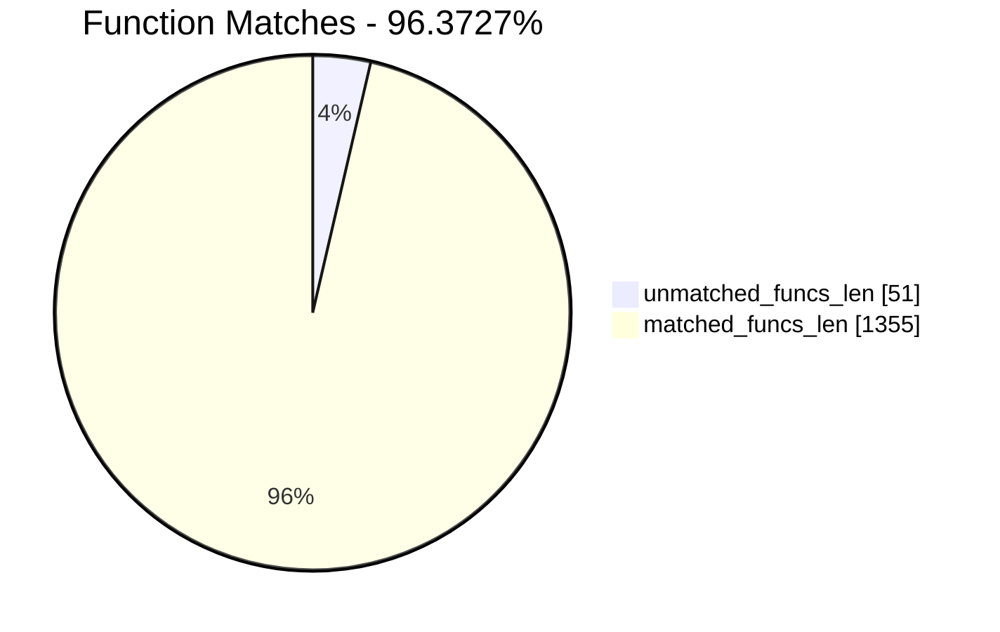
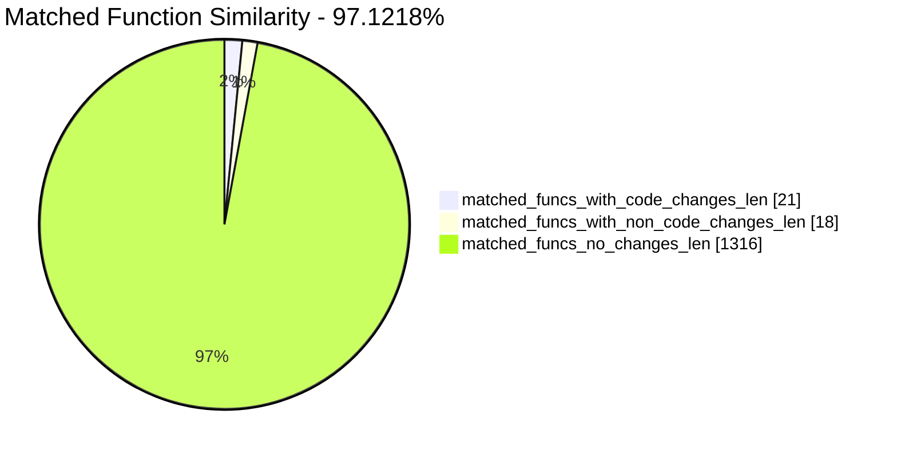
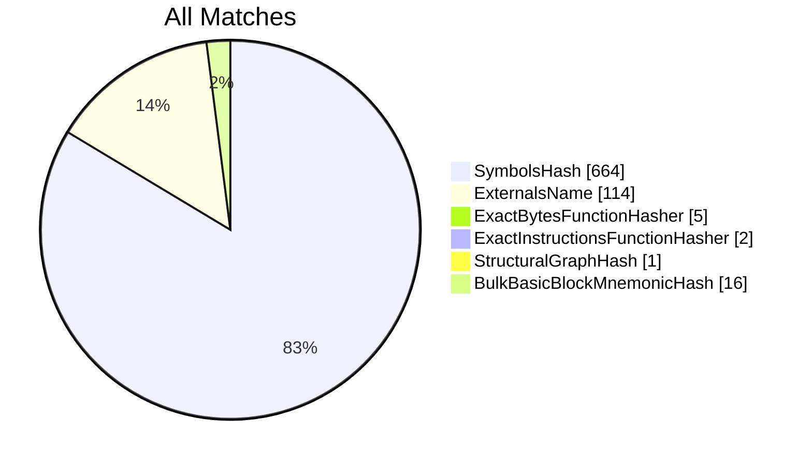
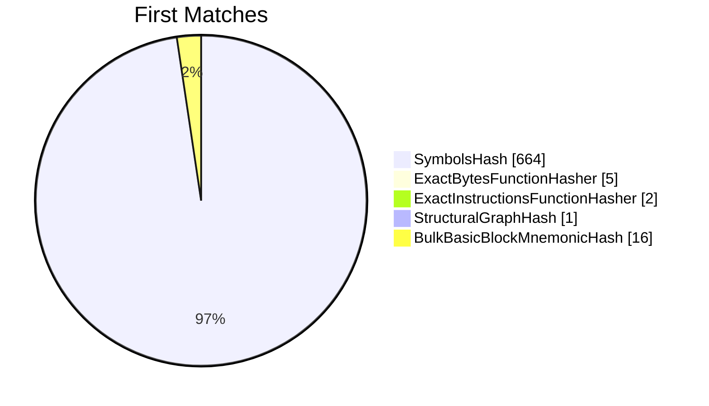
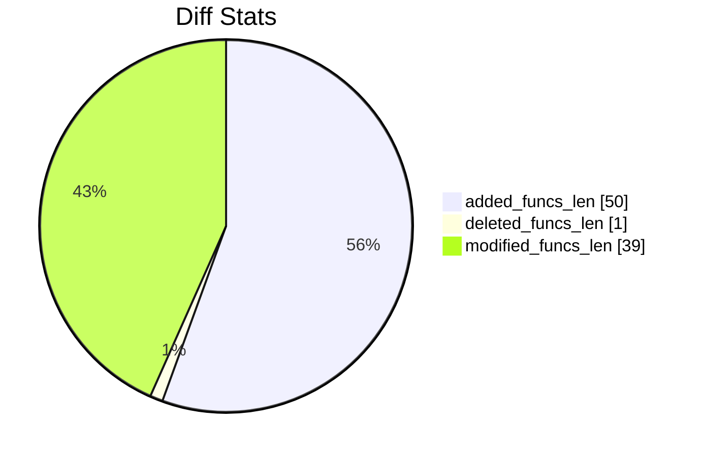
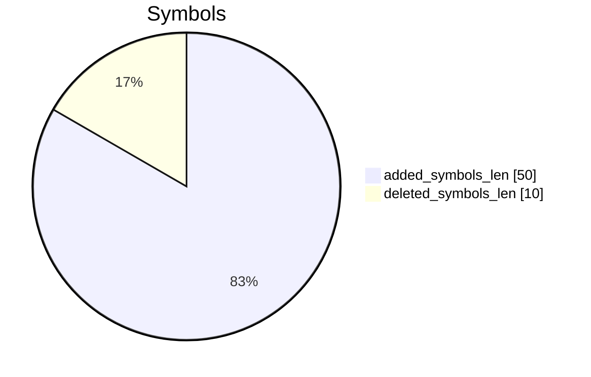
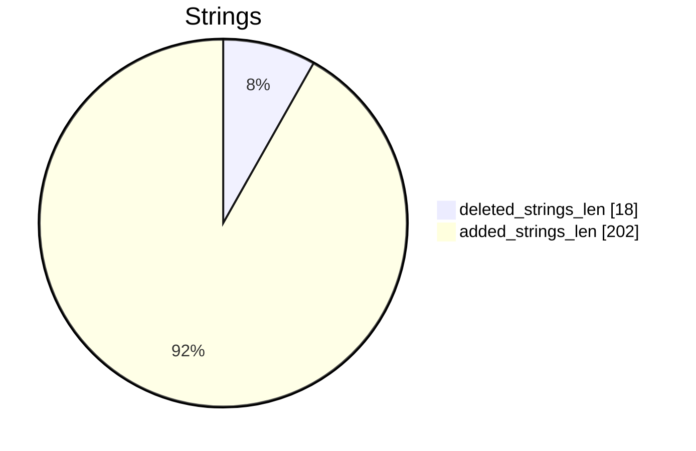

# CD_09_08_11_fourth_figs_review-CD_09_20_11_fifth_figs_review Diff

# TOC

* [Visual Chart Diff](#visual-chart-diff)
* [Metadata](#metadata)
	* [Ghidra Diff Engine](#ghidra-diff-engine)
		* [Command Line](#command-line)
	* [Binary Metadata Diff](#binary-metadata-diff)
	* [Program Options](#program-options)
	* [Diff Stats](#diff-stats)
	* [Strings](#strings)
* [Deleted](#deleted)
	* [/usr/lib/libSystem.B.dylib::_sleep](#usrliblibsystembdylib_sleep)
* [Added](#added)
	* [_FinishVideoPlayback](#_finishvideoplayback)
	* [_ResumeVideoPlayback](#_resumevideoplayback)
	* [_PauseVideoPlayback](#_pausevideoplayback)
	* [Sonic_CDViewController::videoWindowTouched:](#sonic_cdviewcontrollervideowindowtouched)
	* [GameCenterManager::loadAchievementDescriptions](#gamecentermanagerloadachievementdescriptions)
	* [GameCenterManager::preloadAchievements](#gamecentermanagerpreloadachievements)
	* [___destroy_helper_block_10](#___destroy_helper_block_10)
	* [___destroy_helper_block_9](#___destroy_helper_block_9)
	* [___copy_helper_block_10](#___copy_helper_block_10)
	* [___copy_helper_block_9](#___copy_helper_block_9)
	* [___-[GameCenterManager_loadAchievementDescriptions]_block_invoke_1](#___-gamecentermanager_loadachievementdescriptions_block_invoke_1)
	* [___-[GameCenterManager_preloadAchievements]_block_invoke_1](#___-gamecentermanager_preloadachievements_block_invoke_1)
	* [GameCenterManager::achievementDescriptions](#gamecentermanagerachievementdescriptions)
	* [GameCenterManager::setAchievementDescriptions:](#gamecentermanagersetachievementdescriptions)
	* [-[MPMoviePlayerViewController(LandscapeOnly)_moviePlayerLoadStateChanged:]](#-mpmovieplayerviewcontrollerlandscapeonly_movieplayerloadstatechanged)
	* [-[MPMoviePlayerViewController(LandscapeOnly)_didRotateFromInterfaceOrientation:]](#-mpmovieplayerviewcontrollerlandscapeonly_didrotatefrominterfaceorientation)
	* [GKNotificationView::titleLabel](#gknotificationviewtitlelabel)
	* [GKNotificationView::icon](#gknotificationviewicon)
	* [GKNotificationView::descLabel](#gknotificationviewdesclabel)
	* [GKNotificationView::queueDelegate](#gknotificationviewqueuedelegate)
	* [GKNotificationView::background](#gknotificationviewbackground)
	* [GKNotificationView::achievement](#gknotificationviewachievement)
	* [objc::Categories::GKNotificationView_private_::delegateCallback:withObject:](#objccategoriesgknotificationview_private_delegatecallbackwithobject)
	* [objc::Categories::GKNotificationView_private_::NotificationOutFinished:finished:context:](#objccategoriesgknotificationview_private_notificationoutfinishedfinishedcontext)
	* [objc::Categories::GKNotificationView_private_::NotificationInFinished:finished:context:](#objccategoriesgknotificationview_private_notificationinfinishedfinishedcontext)
	* [GKNotificationView::MoveNotificationOut](#gknotificationviewmovenotificationout)
	* [GKNotificationView::MoveNotificationIn](#gknotificationviewmovenotificationin)
	* [GKNotificationView::EndFrame](#gknotificationviewendframe)
	* [GKNotificationView::InitAchievementDescription:](#gknotificationviewinitachievementdescription)
	* [GKNotificationView::dealloc](#gknotificationviewdealloc)
	* [GKNotificationView::initWithFrame:](#gknotificationviewinitwithframe)
	* [GKNotificationView::setAchievement:](#gknotificationviewsetachievement)
	* [GKNotificationView::setBackground:](#gknotificationviewsetbackground)
	* [GKNotificationView::setQueueDelegate:](#gknotificationviewsetqueuedelegate)
	* [GKNotificationView::setDescLabel:](#gknotificationviewsetdesclabel)
	* [GKNotificationView::setIcon:](#gknotificationviewseticon)
	* [GKNotificationView::setTitleLabel:](#gknotificationviewsettitlelabel)
	* [objc::Categories::GKNotificationView_private_::TitleTextFrameRect:](#objccategoriesgknotificationview_private_titletextframerect)
	* [GKNotificationView::StartFrame](#gknotificationviewstartframe)
	* [GKNotificationView::DefaultSize](#gknotificationviewdefaultsize)
	* [GKNotificationView::SetNotificationIcon:](#gknotificationviewsetnotificationicon)
	* [objc::Categories::GKNotificationView_private_::DescriptionTextFrameRect:](#objccategoriesgknotificationview_private_descriptiontextframerect)
	* [GKNotificationQueue::image](#gknotificationqueueimage)
	* [GKNotificationQueue::didHideAchievementNotification:](#gknotificationqueuedidhideachievementnotification)
	* [GKNotificationQueue::AddAchievementNotification:](#gknotificationqueueaddachievementnotification)
	* [GKNotificationQueue::defaultQueue](#gknotificationqueuedefaultqueue)
	* [objc::Categories::GKNotificationQueue_private_::DisplayNotification:](#objccategoriesgknotificationqueue_private_displaynotification)
	* [GKNotificationQueue::dealloc](#gknotificationqueuedealloc)
	* [GKNotificationQueue::init](#gknotificationqueueinit)
	* [GKNotificationQueue::setImage:](#gknotificationqueuesetimage)
* [Modified](#modified)
	* [Sonic_CDViewController::viewDidLoad](#sonic_cdviewcontrollerviewdidload)
	* [___copy_helper_block_8](#___copy_helper_block_8)
	* [Sonic_CDViewController::viewWillAppear:](#sonic_cdviewcontrollerviewwillappear)
	* [GameCenterManager::dealloc](#gamecentermanagerdealloc)
	* [Sonic_CDAppDelegate::applicationDidBecomeActive:](#sonic_cdappdelegateapplicationdidbecomeactive)
	* [Sonic_CDViewController::viewWillDisappear:](#sonic_cdviewcontrollerviewwilldisappear)
	* [Sonic_CDViewController::ResumeView](#sonic_cdviewcontrollerresumeview)
	* [_PlayVideoFile](#_playvideofile)
	* [_PauseSoundiOS](#_pausesoundios)
	* [___-[Sonic_CDViewController_viewDidLoad]_block_invoke_1](#___-sonic_cdviewcontroller_viewdidload_block_invoke_1)
	* [GameCenterManager::init](#gamecentermanagerinit)
	* [Sonic_CDViewController::playbackFinishedCallback:](#sonic_cdviewcontrollerplaybackfinishedcallback)
	* [GameCenterManager::submitAchievement:percentComplete:](#gamecentermanagersubmitachievementpercentcomplete)
	* [_OnlineLoadLeaderboardsMenu](#_onlineloadleaderboardsmenu)
	* [Sonic_CDAppDelegate::application:didFinishLaunchingWithOptions:](#sonic_cdappdelegateapplicationdidfinishlaunchingwithoptions)
	* [Sonic_CDViewController::PauseView](#sonic_cdviewcontrollerpauseview)
	* [Sonic_CDAppDelegate::applicationWillResignActive:](#sonic_cdappdelegateapplicationwillresignactive)
	* [-[MPMoviePlayerViewController(LandscapeOnly)_viewWillDisappear:]](#-mpmovieplayerviewcontrollerlandscapeonly_viewwilldisappear)
	* [_DrawScaledChar](#_drawscaledchar)
	* [___destroy_helper_block_8](#___destroy_helper_block_8)
	* [_OnlineLoadAchievementsMenu](#_onlineloadachievementsmenu)
* [Modified (No Code Changes)](#modified-no-code-changes)
	* [_Sort3DDrawList](#_sort3ddrawlist)
	* [_ClearTouches](#_cleartouches)
	* [_ResumeOpenAL](#_resumeopenal)
	* [_SuspendOpenAL](#_suspendopenal)
	* [_StopAllSFX](#_stopallsfx)

# Visual Chart Diff

```mermaid

flowchart LR

Sonic_CDViewControllerviewDidLoad-2-old<--Match 87%-->Sonic_CDViewControllerviewDidLoad-2-new
___copy_helper_block_8-0-old<--Match 70%-->___copy_helper_block_8-0-new
Sonic_CDViewControllerviewWillAppear-3-old<--Match 55%-->Sonic_CDViewControllerviewWillAppear-3-new
GameCenterManagerdealloc-2-old<--Match 88%-->GameCenterManagerdealloc-2-new
Sonic_CDAppDelegateapplicationDidBecomeActive-3-old<--Match 83%-->Sonic_CDAppDelegateapplicationDidBecomeActive-3-new
Sonic_CDViewControllerviewWillDisappear-3-old<--Match 82%-->Sonic_CDViewControllerviewWillDisappear-3-new
Sonic_CDViewControllerResumeView-2-old<--Match 84%-->Sonic_CDViewControllerResumeView-2-new
_PlayVideoFile-0-old<--Match 3%-->_PlayVideoFile-0-new
_PauseSoundiOS-0-old<--Match 78%-->_PauseSoundiOS-0-new
___-Sonic_CDViewController_viewDidLoad_block_invoke_1-0-old<--Match 79%-->___-Sonic_CDViewController_viewDidLoad_block_invoke_1-0-new
GameCenterManagerinit-2-old<--Match 93%-->GameCenterManagerinit-2-new
Sonic_CDViewControllerplaybackFinishedCallback-3-old<--Match 25%-->Sonic_CDViewControllerplaybackFinishedCallback-3-new
GameCenterManagersubmitAchievementpercentComplete-5-old<--Match 93%-->GameCenterManagersubmitAchievementpercentComplete-5-new
_OnlineLoadLeaderboardsMenu-0-old<--Match 83%-->_OnlineLoadLeaderboardsMenu-0-new
Sonic_CDAppDelegateapplicationdidFinishLaunchingWithOptions-4-old<--Match 75%-->Sonic_CDAppDelegateapplicationdidFinishLaunchingWithOptions-4-new
Sonic_CDViewControllerPauseView-2-old<--Match 50%-->Sonic_CDViewControllerPauseView-2-new
Sonic_CDAppDelegateapplicationWillResignActive-3-old<--Match 88%-->Sonic_CDAppDelegateapplicationWillResignActive-3-new
-MPMoviePlayerViewControllerLandscapeOnly_viewWillDisappear-0-old<--Match 92%-->-MPMoviePlayerViewControllerLandscapeOnly_viewWillDisappear-0-new
_DrawScaledChar-12-old<--Match 99%-->_DrawScaledChar-12-new
___destroy_helper_block_8-0-old<--Match 75%-->___destroy_helper_block_8-0-new
_OnlineLoadAchievementsMenu-0-old<--Match 81%-->_OnlineLoadAchievementsMenu-0-new

subgraph CD_09_20_11_fifth_figs_review
    Sonic_CDViewControllerviewDidLoad-2-new
___copy_helper_block_8-0-new
Sonic_CDViewControllerviewWillAppear-3-new
GameCenterManagerdealloc-2-new
Sonic_CDAppDelegateapplicationDidBecomeActive-3-new
Sonic_CDViewControllerviewWillDisappear-3-new
Sonic_CDViewControllerResumeView-2-new
_PlayVideoFile-0-new
_PauseSoundiOS-0-new
___-Sonic_CDViewController_viewDidLoad_block_invoke_1-0-new
GameCenterManagerinit-2-new
Sonic_CDViewControllerplaybackFinishedCallback-3-new
GameCenterManagersubmitAchievementpercentComplete-5-new
_OnlineLoadLeaderboardsMenu-0-new
Sonic_CDAppDelegateapplicationdidFinishLaunchingWithOptions-4-new
Sonic_CDViewControllerPauseView-2-new
Sonic_CDAppDelegateapplicationWillResignActive-3-new
-MPMoviePlayerViewControllerLandscapeOnly_viewWillDisappear-0-new
_DrawScaledChar-12-new
___destroy_helper_block_8-0-new
_OnlineLoadAchievementsMenu-0-new
    subgraph Added
direction LR
_FinishVideoPlayback
    _ResumeVideoPlayback
    _PauseVideoPlayback
    Sonic_CDViewController-videoWindowTouched
    GameCenterManager-loadAchievementDescriptions
    GameCenterManager-preloadAchievements
    ___destroy_helper_block_10
    ___destroy_helper_block_9
    ___copy_helper_block_10
    ___copy_helper_block_9
    ___-GameCenterManager_loadAchievementDescriptions_block_invoke_1
    ___-GameCenterManager_preloadAchievements_block_invoke_1
    GameCenterManager-achievementDescriptions
    GameCenterManager-setAchievementDescriptions
    -MPMoviePlayerViewControllerLandscapeOnly_moviePlayerLoadStateChanged
    -MPMoviePlayerViewControllerLandscapeOnly_didRotateFromInterfaceOrientation
    GKNotificationView-titleLabel
    GKNotificationView-icon
    GKNotificationView-descLabel
    GKNotificationView-queueDelegate
    GKNotificationView-background
    GKNotificationView-achievement
    objc-Categories-GKNotificationView_private_-delegateCallbackwithObject
    objc-Categories-GKNotificationView_private_-NotificationOutFinishedfinishedcontext
    objc-Categories-GKNotificationView_private_-NotificationInFinishedfinishedcontext
    GKNotificationView-MoveNotificationOut
    GKNotificationView-MoveNotificationIn
    25_more_added_funcs_omitted
end
end

subgraph CD_09_08_11_fourth_figs_review
    Sonic_CDViewControllerviewDidLoad-2-old
___copy_helper_block_8-0-old
Sonic_CDViewControllerviewWillAppear-3-old
GameCenterManagerdealloc-2-old
Sonic_CDAppDelegateapplicationDidBecomeActive-3-old
Sonic_CDViewControllerviewWillDisappear-3-old
Sonic_CDViewControllerResumeView-2-old
_PlayVideoFile-0-old
_PauseSoundiOS-0-old
___-Sonic_CDViewController_viewDidLoad_block_invoke_1-0-old
GameCenterManagerinit-2-old
Sonic_CDViewControllerplaybackFinishedCallback-3-old
GameCenterManagersubmitAchievementpercentComplete-5-old
_OnlineLoadLeaderboardsMenu-0-old
Sonic_CDAppDelegateapplicationdidFinishLaunchingWithOptions-4-old
Sonic_CDViewControllerPauseView-2-old
Sonic_CDAppDelegateapplicationWillResignActive-3-old
-MPMoviePlayerViewControllerLandscapeOnly_viewWillDisappear-0-old
_DrawScaledChar-12-old
___destroy_helper_block_8-0-old
_OnlineLoadAchievementsMenu-0-old
    subgraph Deleted
direction LR
usrliblibSystemBdylib-_sleep
end
end

```










# Metadata

## Ghidra Diff Engine

### Command Line

#### Captured Command Line


```
ghidriff --project-location ghidra_projects --project-name ghidriff --symbols-path symbols --threaded --log-level INFO --file-log-level INFO --log-path ghidriff.log --min-func-len 2 --gdt [] --bsim --max-ram-percent 60.0 --max-section-funcs 200 CD_09_08_11_fourth_figs_review CD_09_20_11_fifth_figs_review
```


#### Verbose Args


<details>

```
--old ['CD_09_08_11_fourth_figs_review'] --new [['CD_09_20_11_fifth_figs_review']] --engine VersionTrackingDiff --output-path CD_09_08_11_fourth_figs_review-CD_09_20_11_fifth_figs_review --summary False --project-location ghidra_projects --project-name ghidriff --symbols-path symbols --threaded True --force-analysis False --force-diff False --no-symbols False --log-level INFO --file-log-level INFO --log-path ghidriff.log --va False --min-func-len 2 --use-calling-counts False --gdt [] --bsim True --bsim-full False --max-ram-percent 60.0 --print-flags False --jvm-args None --side-by-side False --max-section-funcs 200 --md-title None
```


</details>

## Binary Metadata Diff


```diff
--- CD_09_08_11_fourth_figs_review Meta
+++ CD_09_20_11_fifth_figs_review Meta
@@ -1,45 +1,45 @@
-Program Name: CD_09_08_11_fourth_figs_review
+Program Name: CD_09_20_11_fifth_figs_review
 Language ID: ARM:LE:32:v6 (1.107)
 Compiler ID: default
 Processor: ARM
 Endian: Little
 Address Size: 32
 Minimum Address: 00001000
-Maximum Address: 0129d003
-# of Bytes: 19509432
+Maximum Address: 012a4003
+# of Bytes: 19538144
 # of Memory Blocks: 31
-# of Instructions: 53865
-# of Defined Data: 14517
-# of Functions: 679
-# of Symbols: 4100
-# of Data Types: 146
+# of Instructions: 55956
+# of Defined Data: 15690
+# of Functions: 727
+# of Symbols: 4511
+# of Data Types: 156
 # of Data Type Categories: 10
 Analyzed: true
 Created With Ghidra Version: 11.0.3
-Date Created: Thu Jan 09 19:19:46 CET 2025
+Date Created: Thu Jan 09 19:19:48 CET 2025
 Executable Format: Mac OS X Mach-O
-Executable Location: /home/user/CD_09_08_11_fourth_figs_review
-Executable MD5: bf0ec560dfac5aed1d1bd783f4a0467c
-Executable SHA256: c9f87551bd747072ab96a8cfae277cbda342c6d1111eeef8bae345a6970d8782
-FSRL: file:///home/user/CD_09_08_11_fourth_figs_review?MD5=bf0ec560dfac5aed1d1bd783f4a0467c
+Executable Location: /home/user/CD_09_20_11_fifth_figs_review
+Executable MD5: 4ec3c2889258076da03ed1e4e7630227
+Executable SHA256: 0386699a0218e6d632f562aa9d4b411d98624c35fe6e9f5d69093ad1273cf102
+FSRL: file:///home/user/CD_09_20_11_fifth_figs_review?MD5=4ec3c2889258076da03ed1e4e7630227
 Mach-O File Type: EXECUTE
 Mach-O File Type Description: Demand Paged Executable File
 Mach-O Flag 0: NOUNDEFS
 Mach-O Flag 1: DYLDLINK
 Mach-O Flag 2: TWOLEVEL
 Preferred Root Namespace Category: 
 Relocatable: false
 Required Library [    0]: /System/Library/Frameworks/MediaPlayer.framework/MediaPlayer
 Required Library [    1]: /System/Library/Frameworks/CoreGraphics.framework/CoreGraphics
 Required Library [    2]: /System/Library/Frameworks/GameKit.framework/GameKit
 Required Library [    3]: /System/Library/Frameworks/AudioToolbox.framework/AudioToolbox
 Required Library [    4]: /System/Library/Frameworks/Foundation.framework/Foundation
 Required Library [    5]: /System/Library/Frameworks/UIKit.framework/UIKit
 Required Library [    6]: /System/Library/Frameworks/OpenGLES.framework/OpenGLES
 Required Library [    7]: /System/Library/Frameworks/QuartzCore.framework/QuartzCore
 Required Library [    8]: /System/Library/Frameworks/OpenAL.framework/OpenAL
 Required Library [    9]: /usr/lib/libgcc_s.1.dylib
 Required Library [   10]: /usr/lib/libSystem.B.dylib
 Required Library [   11]: /usr/lib/libobjc.A.dylib
 Required Library [   12]: /System/Library/Frameworks/CoreFoundation.framework/CoreFoundation
 Should Ask To Analyze: false

```


## Program Options


<details>
<summary>Ghidra CD_09_08_11_fourth_figs_review Decompiler Options</summary>


|Decompiler Option|Value|
| :---: | :---: |
|Prototype Evaluation|__stdcall|

</details>


<details>
<summary>Ghidra CD_09_08_11_fourth_figs_review Specification extensions Options</summary>


|Specification extensions Option|Value|
| :---: | :---: |
|FormatVersion|0|
|VersionCounter|0|

</details>


<details>
<summary>Ghidra CD_09_08_11_fourth_figs_review Analyzers Options</summary>


|Analyzers Option|Value|
| :---: | :---: |
|ARM Aggressive Instruction Finder|false|
|ARM Constant Reference Analyzer|true|
|ARM Constant Reference Analyzer.Create Data from pointer|false|
|ARM Constant Reference Analyzer.Function parameter/return Pointer analysis|true|
|ARM Constant Reference Analyzer.Max Threads|2|
|ARM Constant Reference Analyzer.Min absolute reference|4|
|ARM Constant Reference Analyzer.Require pointer param data type|false|
|ARM Constant Reference Analyzer.Speculative reference max|256|
|ARM Constant Reference Analyzer.Speculative reference min|512|
|ARM Constant Reference Analyzer.Stored Value Pointer analysis|true|
|ARM Constant Reference Analyzer.Switch Table Recovery|false|
|ARM Constant Reference Analyzer.Trust values read from writable memory|true|
|ARM Symbol|true|
|ASCII Strings|true|
|ASCII Strings.Create Strings Containing Existing Strings|true|
|ASCII Strings.Create Strings Containing References|true|
|ASCII Strings.Force Model Reload|false|
|ASCII Strings.Minimum String Length|LEN_5|
|ASCII Strings.Model File|StringModel.sng|
|ASCII Strings.Require Null Termination for String|true|
|ASCII Strings.Search Only in Accessible Memory Blocks|true|
|ASCII Strings.String Start Alignment|ALIGN_1|
|ASCII Strings.String end alignment|4|
|Aggressive Instruction Finder|false|
|Aggressive Instruction Finder.Create Analysis Bookmarks|true|
|Apply Data Archives|true|
|Apply Data Archives.Archive Chooser|[Auto-Detect]|
|Apply Data Archives.Create Analysis Bookmarks|true|
|Apply Data Archives.GDT User File Archive Path|None|
|Apply Data Archives.User Project Archive Path|None|
|CFStrings|true|
|Call Convention ID|true|
|Call Convention ID.Analysis Decompiler Timeout (sec)|60|
|Call-Fixup Installer|true|
|Condense Filler Bytes|false|
|Condense Filler Bytes.Filler Value|Auto|
|Condense Filler Bytes.Minimum number of sequential bytes|1|
|Create Address Tables|true|
|Create Address Tables.Allow Offcut References|false|
|Create Address Tables.Auto Label Table|false|
|Create Address Tables.Create Analysis Bookmarks|true|
|Create Address Tables.Maxmimum Pointer Distance|16777215|
|Create Address Tables.Minimum Pointer Address|4132|
|Create Address Tables.Minimum Table Size|4|
|Create Address Tables.Pointer Alignment|1|
|Create Address Tables.Relocation Table Guide|true|
|Create Address Tables.Table Alignment|4|
|DWARF Line Number|false|
|Data Reference|true|
|Data Reference.Address Table Alignment|1|
|Data Reference.Address Table Minimum Size|4|
|Data Reference.Align End of Strings|false|
|Data Reference.Ascii String References|true|
|Data Reference.Create Address Tables|false|
|Data Reference.Minimum String Length|5|
|Data Reference.References to Pointers|false|
|Data Reference.Relocation Table Guide|true|
|Data Reference.Respect Execute Flag|true|
|Data Reference.Subroutine References|true|
|Data Reference.Switch Table References|false|
|Data Reference.Unicode String References|true|
|Decompiler Parameter ID|false|
|Decompiler Parameter ID.Analysis Clear Level|ANALYSIS|
|Decompiler Parameter ID.Analysis Decompiler Timeout (sec)|60|
|Decompiler Parameter ID.Commit Data Types|true|
|Decompiler Parameter ID.Commit Void Return Values|false|
|Decompiler Parameter ID.Prototype Evaluation|__stdcall|
|Decompiler Switch Analysis|true|
|Decompiler Switch Analysis.Analysis Decompiler Timeout (sec)|60|
|Demangler GNU|true|
|Demangler GNU.Apply Function Calling Conventions|true|
|Demangler GNU.Apply Function Signatures|true|
|Demangler GNU.Demangle Only Known Mangled Symbols|false|
|Demangler GNU.Demangler Format|AUTO|
|Demangler GNU.Use Deprecated Demangler|false|
|Disassemble Entry Points|true|
|Disassemble Entry Points.Respect Execute Flag|true|
|Embedded Media|true|
|Embedded Media.Create Analysis Bookmarks|true|
|External Entry References|true|
|External Symbol Resolver|true|
|Function Start Pre Search|true|
|Function Start Pre Search.Bookmark Functions|false|
|Function Start Pre Search.Search Data Blocks|false|
|Function Start Search|true|
|Function Start Search After Code|true|
|Function Start Search After Code.Bookmark Functions|false|
|Function Start Search After Code.Search Data Blocks|false|
|Function Start Search After Data|true|
|Function Start Search After Data.Bookmark Functions|false|
|Function Start Search After Data.Search Data Blocks|false|
|Function Start Search.Bookmark Functions|false|
|Function Start Search.Search Data Blocks|false|
|Mach-O Function Starts|true|
|Mach-O Function Starts.Bookmark failed functions|false|
|Mach-O Function Starts.Bookmark new functions|false|
|Mach-O Function Starts.Bookmark skipped functions|false|
|Mach-O Function Starts.Use PseudoDisassembler|true|
|Non-Returning Functions - Discovered|true|
|Non-Returning Functions - Discovered.Create Analysis Bookmarks|true|
|Non-Returning Functions - Discovered.Function Non-return Threshold|3|
|Non-Returning Functions - Discovered.Repair Flow Damage|true|
|Non-Returning Functions - Known|true|
|Non-Returning Functions - Known.Create Analysis Bookmarks|true|
|Objective-C 2 Class|true|
|Objective-C 2 Decompiler Message|true|
|Objective-C 2 Message|false|
|Reference|true|
|Reference.Address Table Alignment|1|
|Reference.Address Table Minimum Size|4|
|Reference.Align End of Strings|false|
|Reference.Ascii String References|true|
|Reference.Create Address Tables|false|
|Reference.Minimum String Length|5|
|Reference.References to Pointers|false|
|Reference.Relocation Table Guide|true|
|Reference.Respect Execute Flag|true|
|Reference.Subroutine References|true|
|Reference.Switch Table References|false|
|Reference.Unicode String References|true|
|Scalar Operand References|false|
|Scalar Operand References.Relocation Table Guide|true|
|Shared Return Calls|true|
|Shared Return Calls.Allow Conditional Jumps|false|
|Shared Return Calls.Assume Contiguous Functions Only|false|
|Stack|true|
|Stack.Create Local Variables|true|
|Stack.Create Param Variables|true|
|Stack.useNewFunctionStackAnalysis|true|
|Subroutine References|true|
|Subroutine References.Create Thunks Early|true|
|Variadic Function Signature Override|false|
|Variadic Function Signature Override.Create Analysis Bookmarks|false|

</details>


<details>
<summary>Ghidra CD_09_20_11_fifth_figs_review Decompiler Options</summary>


|Decompiler Option|Value|
| :---: | :---: |
|Prototype Evaluation|__stdcall|

</details>


<details>
<summary>Ghidra CD_09_20_11_fifth_figs_review Specification extensions Options</summary>


|Specification extensions Option|Value|
| :---: | :---: |
|FormatVersion|0|
|VersionCounter|0|

</details>


<details>
<summary>Ghidra CD_09_20_11_fifth_figs_review Analyzers Options</summary>


|Analyzers Option|Value|
| :---: | :---: |
|ARM Aggressive Instruction Finder|false|
|ARM Constant Reference Analyzer|true|
|ARM Constant Reference Analyzer.Create Data from pointer|false|
|ARM Constant Reference Analyzer.Function parameter/return Pointer analysis|true|
|ARM Constant Reference Analyzer.Max Threads|2|
|ARM Constant Reference Analyzer.Min absolute reference|4|
|ARM Constant Reference Analyzer.Require pointer param data type|false|
|ARM Constant Reference Analyzer.Speculative reference max|256|
|ARM Constant Reference Analyzer.Speculative reference min|512|
|ARM Constant Reference Analyzer.Stored Value Pointer analysis|true|
|ARM Constant Reference Analyzer.Switch Table Recovery|false|
|ARM Constant Reference Analyzer.Trust values read from writable memory|true|
|ARM Symbol|true|
|ASCII Strings|true|
|ASCII Strings.Create Strings Containing Existing Strings|true|
|ASCII Strings.Create Strings Containing References|true|
|ASCII Strings.Force Model Reload|false|
|ASCII Strings.Minimum String Length|LEN_5|
|ASCII Strings.Model File|StringModel.sng|
|ASCII Strings.Require Null Termination for String|true|
|ASCII Strings.Search Only in Accessible Memory Blocks|true|
|ASCII Strings.String Start Alignment|ALIGN_1|
|ASCII Strings.String end alignment|4|
|Aggressive Instruction Finder|false|
|Aggressive Instruction Finder.Create Analysis Bookmarks|true|
|Apply Data Archives|true|
|Apply Data Archives.Archive Chooser|[Auto-Detect]|
|Apply Data Archives.Create Analysis Bookmarks|true|
|Apply Data Archives.GDT User File Archive Path|None|
|Apply Data Archives.User Project Archive Path|None|
|CFStrings|true|
|Call Convention ID|true|
|Call Convention ID.Analysis Decompiler Timeout (sec)|60|
|Call-Fixup Installer|true|
|Condense Filler Bytes|false|
|Condense Filler Bytes.Filler Value|Auto|
|Condense Filler Bytes.Minimum number of sequential bytes|1|
|Create Address Tables|true|
|Create Address Tables.Allow Offcut References|false|
|Create Address Tables.Auto Label Table|false|
|Create Address Tables.Create Analysis Bookmarks|true|
|Create Address Tables.Maxmimum Pointer Distance|16777215|
|Create Address Tables.Minimum Pointer Address|4132|
|Create Address Tables.Minimum Table Size|4|
|Create Address Tables.Pointer Alignment|1|
|Create Address Tables.Relocation Table Guide|true|
|Create Address Tables.Table Alignment|4|
|DWARF Line Number|false|
|Data Reference|true|
|Data Reference.Address Table Alignment|1|
|Data Reference.Address Table Minimum Size|4|
|Data Reference.Align End of Strings|false|
|Data Reference.Ascii String References|true|
|Data Reference.Create Address Tables|false|
|Data Reference.Minimum String Length|5|
|Data Reference.References to Pointers|false|
|Data Reference.Relocation Table Guide|true|
|Data Reference.Respect Execute Flag|true|
|Data Reference.Subroutine References|true|
|Data Reference.Switch Table References|false|
|Data Reference.Unicode String References|true|
|Decompiler Parameter ID|false|
|Decompiler Parameter ID.Analysis Clear Level|ANALYSIS|
|Decompiler Parameter ID.Analysis Decompiler Timeout (sec)|60|
|Decompiler Parameter ID.Commit Data Types|true|
|Decompiler Parameter ID.Commit Void Return Values|false|
|Decompiler Parameter ID.Prototype Evaluation|__stdcall|
|Decompiler Switch Analysis|true|
|Decompiler Switch Analysis.Analysis Decompiler Timeout (sec)|60|
|Demangler GNU|true|
|Demangler GNU.Apply Function Calling Conventions|true|
|Demangler GNU.Apply Function Signatures|true|
|Demangler GNU.Demangle Only Known Mangled Symbols|false|
|Demangler GNU.Demangler Format|AUTO|
|Demangler GNU.Use Deprecated Demangler|false|
|Disassemble Entry Points|true|
|Disassemble Entry Points.Respect Execute Flag|true|
|Embedded Media|true|
|Embedded Media.Create Analysis Bookmarks|true|
|External Entry References|true|
|External Symbol Resolver|true|
|Function Start Pre Search|true|
|Function Start Pre Search.Bookmark Functions|false|
|Function Start Pre Search.Search Data Blocks|false|
|Function Start Search|true|
|Function Start Search After Code|true|
|Function Start Search After Code.Bookmark Functions|false|
|Function Start Search After Code.Search Data Blocks|false|
|Function Start Search After Data|true|
|Function Start Search After Data.Bookmark Functions|false|
|Function Start Search After Data.Search Data Blocks|false|
|Function Start Search.Bookmark Functions|false|
|Function Start Search.Search Data Blocks|false|
|Mach-O Function Starts|true|
|Mach-O Function Starts.Bookmark failed functions|false|
|Mach-O Function Starts.Bookmark new functions|false|
|Mach-O Function Starts.Bookmark skipped functions|false|
|Mach-O Function Starts.Use PseudoDisassembler|true|
|Non-Returning Functions - Discovered|true|
|Non-Returning Functions - Discovered.Create Analysis Bookmarks|true|
|Non-Returning Functions - Discovered.Function Non-return Threshold|3|
|Non-Returning Functions - Discovered.Repair Flow Damage|true|
|Non-Returning Functions - Known|true|
|Non-Returning Functions - Known.Create Analysis Bookmarks|true|
|Objective-C 2 Class|true|
|Objective-C 2 Decompiler Message|true|
|Objective-C 2 Message|false|
|Reference|true|
|Reference.Address Table Alignment|1|
|Reference.Address Table Minimum Size|4|
|Reference.Align End of Strings|false|
|Reference.Ascii String References|true|
|Reference.Create Address Tables|false|
|Reference.Minimum String Length|5|
|Reference.References to Pointers|false|
|Reference.Relocation Table Guide|true|
|Reference.Respect Execute Flag|true|
|Reference.Subroutine References|true|
|Reference.Switch Table References|false|
|Reference.Unicode String References|true|
|Scalar Operand References|false|
|Scalar Operand References.Relocation Table Guide|true|
|Shared Return Calls|true|
|Shared Return Calls.Allow Conditional Jumps|false|
|Shared Return Calls.Assume Contiguous Functions Only|false|
|Stack|true|
|Stack.Create Local Variables|true|
|Stack.Create Param Variables|true|
|Stack.useNewFunctionStackAnalysis|true|
|Subroutine References|true|
|Subroutine References.Create Thunks Early|true|
|Variadic Function Signature Override|false|
|Variadic Function Signature Override.Create Analysis Bookmarks|false|

</details>

## Diff Stats


|Stat|Value|
| :---: | :---: |
|added_funcs_len|50|
|deleted_funcs_len|1|
|modified_funcs_len|39|
|added_symbols_len|50|
|deleted_symbols_len|10|
|diff_time|5.642145395278931|
|deleted_strings_len|18|
|added_strings_len|202|
|match_types|Counter({'SymbolsHash': 664, 'ExternalsName': 114, 'BulkBasicBlockMnemonicHash': 16, 'ExactBytesFunctionHasher': 5, 'ExactInstructionsFunctionHasher': 2, 'StructuralGraphHash': 1})|
|items_to_process|150|
|diff_types|Counter({'address': 39, 'code': 21, 'length': 21, 'refcount': 19, 'calling': 19, 'called': 9})|
|unmatched_funcs_len|51|
|total_funcs_len|1406|
|matched_funcs_len|1355|
|matched_funcs_with_code_changes_len|21|
|matched_funcs_with_non_code_changes_len|18|
|matched_funcs_no_changes_len|1316|
|match_func_similarity_percent|97.1218%|
|func_match_overall_percent|96.3727%|
|first_matches|Counter({'SymbolsHash': 664, 'BulkBasicBlockMnemonicHash': 16, 'ExactBytesFunctionHasher': 5, 'ExactInstructionsFunctionHasher': 2, 'StructuralGraphHash': 1})|













## Strings




### Strings Diff


```diff
--- deleted strings
+++ added strings
@@ -1,18 +1,202 @@
-___func__.29242
-s_-[EAGLView_handleTouches:withEve
-s_-[EAGLView_touchesBegan:withEven
-s_-[EAGLView_touchesCancelled:with
-s_-[EAGLView_touchesEnded:withEven
-s_-[EAGLView_touchesMoved:withEven
-s____block_descriptor_tmp_1.130
-s____block_descriptor_tmp_1.78
-s____block_descriptor_tmp_2.89
-s____block_descriptor_tmp_3.102
-s____block_descriptor_tmp_4.123
-s____block_descriptor_tmp_5.144
-s____block_descriptor_tmp_6.146
-s____block_descriptor_tmp_7.201
-s____block_descriptor_tmp_8.217
-s____func__.29242
-s__previousTouchCount.31257
-s__sleep
+___func__.29369
+s
+s_+[GKNotificationQueue_defaultQue
+s_-[GKNotificationQueue(private)_D
+s_-[GKNotificationQueue_AddAchieve
+s_-[GKNotificationQueue_dealloc]
+s_-[GKNotificationQueue_didHideAch
+s_-[GKNotificationQueue_image]
+s_-[GKNotificationQueue_init]
+s_-[GKNotificationQueue_setImage:]
+s_-[GKNotificationView(private)
+s_-[GKNotificationView(private)_De
+s_-[GKNotificationView(private)_No
+s_-[GKNotificationView(private)_Ti
+s_-[GKNotificationView_DefaultSize
+s_-[GKNotificationView_EndFrame]
+s_-[GKNotificationView_InitAchieve
+s_-[GKNotificationView_MoveNotific
+s_-[GKNotificationView_SetNotifica
+s_-[GKNotificationView_StartFrame]
+s_-[GKNotificationView_achievement
+s_-[GKNotificationView_background]
+s_-[GKNotificationView_dealloc]
+s_-[GKNotificationView_descLabel]
+s_-[GKNotificationView_icon]
+s_-[GKNotificationView_initWithFra
+s_-[GKNotificationView_queueDelega
+s_-[GKNotificationView_setAchievem
+s_-[GKNotificationView_setBackgrou
+s_-[GKNotificationView_setDescLabe
+s_-[GKNotificationView_setIcon:]
+s_-[GKNotificationView_setQueueDel
+s_-[GKNotificationView_setTitleLab
+s_-[GKNotificationView_titleLabel]
+s_-[GameCenterManager_achievementD
+s_-[GameCenterManager_loadAchievem
+s_-[GameCenterManager_preloadAchie
+s_-[GameCenterManager_setAchieveme
+s_-[Sonic_CDViewController_handleT
+s_-[Sonic_CDViewController_touches
+s_-[Sonic_CDViewController_videoWi
+s_@"<GKNotificationQueueDelegate>"
+s_@"GKAchievementDescription"
+s_@"NSMutableArray"
+s_@"UIImage"
+s_@"UIImageView"
+s_@"UILabel"
+s_@"UIView"
+s_@24@0:4{CGRect={CGPoint=ff}{CGSi
+s_Achievement_Unlocked
+s_AddAchievementNotification:
+s_Arial
+s_Arial-Bold
+s_DefaultSize
+s_DescriptionTextFrameRect:
+s_DisplayNotification:
+s_EndFrame
+s_Error_getting_achievement_descri
+s_GKNotificationQueue
+s_GKNotificationQueueDelegate
+s_GKNotificationView
+s_InitAchievementDescription:
+s_MoveNotificationIn
+s_MoveNotificationOut
+s_NotificationInFinished:finished:
+s_NotificationOutFinished:finished
+s_SetNotificationIcon:
+s_StartFrame
+s_T@"<GKNotificationQueueDelegate>
+s_T@"GKAchievementDescription",&,N
+s_T@"NSMutableDictionary",&,Vachie
+s_T@"UIImage",&,N,V_image
+s_T@"UIImageView",&,N,V_background
+s_T@"UIImageView",&,N,V_icon
+s_T@"UILabel",&,N,V_descLabel
+s_T@"UILabel",&,N,V_titleLabel
+s_TitleTextFrameRect:
+s__FinishVideoPlayback
+s__MPMoviePlayerLoadStateDidChange
+s__OBJC_CLASS_$_GKAchievementDescr
+s__OBJC_CLASS_$_GKNotificationQueu
+s__OBJC_CLASS_$_GKNotificationView
+s__OBJC_CLASS_$_MPMoviePlayerContr
+s__OBJC_CLASS_$_NSMutableArray
+s__OBJC_CLASS_$_UIColor
+s__OBJC_CLASS_$_UIControl
+s__OBJC_CLASS_$_UIFont
+s__OBJC_CLASS_$_UIImage
+s__OBJC_CLASS_$_UIImageView
+s__OBJC_CLASS_$_UILabel
+s__OBJC_IVAR_$_GKNotificationQueue
+s__OBJC_IVAR_$_GKNotificationView.
+s__OBJC_IVAR_$_GameCenterManager.a
+s__OBJC_METACLASS_$_GKNotification
+s__PauseVideoPlayback
+s__ResumeVideoPlayback
+s____-[GameCenterManager_loadAchie
+s____-[GameCenterManager_preloadAc
+s____block_descriptor_tmp_1.128
+s____block_descriptor_tmp_1.81
+s____block_descriptor_tmp_10.283
+s____block_descriptor_tmp_2.92
+s____block_descriptor_tmp_3.105
+s____block_descriptor_tmp_4.126
+s____block_descriptor_tmp_5.147
+s____block_descriptor_tmp_6.149
+s____block_descriptor_tmp_7.210
+s____block_descriptor_tmp_8.226
+s____block_descriptor_tmp_9.256
+s____copy_helper_block
+s____copy_helper_block
+s____destroy_helper_block
+s____destroy_helper_block
+s____func__.29369
+s__achievement
+s__background
+s__barWidthRatio
+s__defaultQueue
+s__descLabel
+s__icon
+s__image
+s__mpPlayer
+s__mpViewController
+s__previousTouchCount.33061
+s__queue
+s__queueDelegate
+s__titleLabel
+s__topView
+s_achievement
+s_achievementDescriptions
+s_addObject:
+s_addTarget:action:forControlEvent
+s_background
+s_beginAnimations:context:
+s_clearColor
+s_commitAnimations
+s_defaultQueue
+s_delegateCallback:withObject:
+s_descLabel
+s_didHideAchievementNotification:
+s_didRotateFromInterfaceOrientatio
+s_didShowAchievementNotification:
+s_fontWithName:size:
+s_icon
+s_image
+s_imageNamed:
+s_initWithCapacity:
+s_initWithFrame:
+s_keyWindow
+s_loadAchievementDescriptions
+s_loadAchievementDescriptionsWithC
+s_loadState
+s_localizedStringForKey:value:tabl
+s_moviePlayerLoadStateChanged:
+s_notify-bg.png
+s_notify-icon.png
+s_pause
+s_performSelector:withObject:after
+s_preloadAchievements
+s_private
+s_queueDelegate
+s_removeFromSuperview
+s_removeObjectAtIndex:
+s_removeObserver:name:object:
+s_setAchievement:
+s_setAchievementDescriptions:
+s_setAdjustsFontSizeToFitWidth:
+s_setAnimationBeginsFromCurrentSta
+s_setAnimationDelegate:
+s_setAnimationDidStopSelector:
+s_setAnimationDuration:
+s_setAutoresizingMask:
+s_setBackground:
+s_setBackgroundColor:
+s_setContentMode:
+s_setDescLabel:
+s_setFont:
+s_setFrame:
+s_setIcon:
+s_setImage:
+s_setMinimumFontSize:
+s_setMovieControlMode:
+s_setOrientation:animated:
+s_setQueueDelegate:
+s_setText:
+s_setTextAlignment:
+s_setTextColor:
+s_setTitleLabel:
+s_setUseApplicationAudioSession:
+s_statusBarFrame
+s_stop
+s_stretchableImageWithLeftCapWidth
+s_title
+s_titleLabel
+s_v16@0:4:8@12
+s_v20@0:4@8@12^v16
+s_videoWindowTouched:
+s_whiteColor
+s_willHideAchievementNotification:
+s_willShowAchievementNotification:
+s_windows
+s_{CGRect={CGPoint=ff}{CGSize=ff}}

```


### String References

#### Old


|String|Ref Count|Ref Func|
| :---: | :---: | :---: |
|s__previousTouchCount.31257_012945ac|1||
|s____block_descriptor_tmp_6.146_01299842|1||
|s__sleep_01293deb|3||
|___func__.29242|1|callDelegate:withArg:error:|
|s____block_descriptor_tmp_1.130_01298f4e|1||
|s_-[EAGLView_touchesMoved:withEven_01294302|1||
|s_-[EAGLView_touchesBegan:withEven_01294372|1||
|s____func__.29242_012996fc|1||
|s_-[EAGLView_touchesEnded:withEven_0129434e|1||
|s____block_descriptor_tmp_5.144_01299824|1||
|s____block_descriptor_tmp_4.123_01299806|1||
|s_-[EAGLView_touchesCancelled:with_01294326|1||
|s____block_descriptor_tmp_7.201_01299860|1||
|s_-[EAGLView_handleTouches:withEve_01294485|1||
|s____block_descriptor_tmp_1.78_012997ae|1||
|s____block_descriptor_tmp_3.102_012997e8|1||
|s____block_descriptor_tmp_2.89_012997cb|1||
|s____block_descriptor_tmp_8.217_0129987e|1||

#### New


|String|Ref Count|Ref Func|
| :---: | :---: | :---: |
|s__OBJC_CLASS_$_GKNotificationView_012a047b|1||
|s_setBackground:_0003f50f|3|initWithFrame:|
|s_@24@0:4{CGRect={CGPoint=ff}{CGSi_0004076e|1||
|s_setFont:_0003f805|4|initWithFrame:|
|s_titleLabel_0004038e|1||
|s__background_0003f4c9|1||
|s_MoveNotificationIn_0003f59d|3|DisplayNotification:|
|s_moviePlayerLoadStateChanged:_0003ec07|3|_PlayVideoFile|
|s_-[GKNotificationQueue_image]_012a0575|1||
|s__OBJC_CLASS_$_UILabel_01299297|1||
|s_-[Sonic_CDViewController_handleT_0129e8b3|1||
|s__OBJC_CLASS_$_GKAchievementDescr_01298f42|1||
|s_pause_0003eb84|2|_PauseVideoPlayback|
|s_v20@0:4@8@12^v16_000407cd|2||
|s_-[GKNotificationView_achievement_0129ff0b|1||
|s____copy_helper_block_10_0129f311|1||
|s_@"UILabel"_0004071a|2||
|s____block_descriptor_tmp_5.147_0129f740|1||
|s_setContentMode:_0003f791|2|SetNotificationIcon:|
|s_-[GKNotificationView_setQueueDel_012a012c|1||
|s_T@"NSMutableDictionary",&,Vachie_000402a1|1||
|s____-[GameCenterManager_preloadAc_0129f477|1||
|s__OBJC_IVAR_$_GKNotificationView._012a0427|1||
|s_T@"GKAchievementDescription",&,N_00040478|1||
|s_-[Sonic_CDViewController_touches_0129e589|1||
|s_willHideAchievementNotification:_0003f69f|3|MoveNotificationOut|
|s_-[GKNotificationView_StartFrame]_012a027b|1||
|s__ResumeVideoPlayback_0129e42a|1||
|s_@"NSMutableArray"_000407e8|1||
|s____block_descriptor_tmp_2.92_0129f6e7|1||
|s_setBackgroundColor:_0003f83a|4|initWithFrame:|
|s__FinishVideoPlayback_0129e415|1||
|s_DisplayNotification:_0003f95d|4|AddAchievementNotification:,didHideAchievementNotification:|
|s_-[GKNotificationView_background]_0129feea|1||
|s_statusBarFrame_0003f778|3|EndFrame|
|s_fontWithName:size:_0003f80e|4|initWithFrame:|
|s_setAnimationDuration:_0003f728|3|MoveNotificationOut,MoveNotificationIn|
|s_setAnimationDelegate:_0003f712|3|MoveNotificationOut,MoveNotificationIn|
|s____func__.29369_0129f5e1|1||
|s_willShowAchievementNotification:_0003f757|3|MoveNotificationIn|
|s_setAutoresizingMask:_0003f875|2|initWithFrame:|
|s__titleLabel_0003f4b2|1||
|s____block_descriptor_tmp_8.226_0129f79a|1||
|s_-[Sonic_CDViewController_videoWi_0129e47f|1||
|s____copy_helper_block_9_0129f329|1||
|s_NotificationOutFinished:finished_0003f64c|3|MoveNotificationOut|
|s_T@"UILabel",&,N,V_titleLabel_00040399|1||
|s__topView_0003f940|1||
|s_-[GKNotificationView_initWithFra_012a00bc|1||
|s_-[GKNotificationView_setTitleLab_012a0197|1||
|s__OBJC_CLASS_$_UIImage_01299267|1||
|s__image_0003f950|1||
|___func__.29369|1|callDelegate:withArg:error:|
|s_-[GameCenterManager_setAchieveme_0129f585|1||
|s_addTarget:action:forControlEvent_0003eb8a|2|_PlayVideoFile|
|s_setTextColor:_0003f821|4|initWithFrame:|
|s_-[GKNotificationView(private)_De_012a02e9|1||
|s____block_descriptor_tmp_4.126_0129f722|1||
|s_imageNamed:_0003f8b9|3|init,initWithFrame:|
|s____destroy_helper_block_9_0129f227|1||
|s_T@"UIImageView",&,N,V_background_0004044b|1||
|s_T@"UIImage",&,N,V_image_000404be|1||
|s_InitAchievementDescription:_0003f5e5|3|AddAchievementNotification:|
|s_icon_000403b6|1||
|s_setMovieControlMode:_0003ebf2|2|_PlayVideoFile|
|s_-[GKNotificationView_DefaultSize_012a029c|1||
|s_initWithFrame:_0003ebad|10|InitAchievementDescription:,_PlayVideoFile,initWithFrame:,SetNotificationIcon:|
|s_-[GKNotificationView_setIcon:]_012a0178|1||
|s_setText:_0003f7d9|4|initWithFrame:|
|s_videoWindowTouched:_0003e9cd|3|_PlayVideoFile|
|s_-[GKNotificationQueue_init]_012a0674|1||
|s_setAdjustsFontSizeToFitWidth:_0003f7bb|2|initWithFrame:|
|s__MPMoviePlayerLoadStateDidChange_01298e44|2||
|s_setQueueDelegate:_0003f529|4|AddAchievementNotification:,dealloc|
|s_notify-bg.png_00040354|1||
|s_image_000404b8|1||
|s_didHideAchievementNotification:_0003f8d9|4|NotificationOutFinished:finished:context:|
|s____block_descriptor_tmp_10.283_0129f7d6|1||
|s_loadState_0003f495|2|-[MPMoviePlayerViewController(LandscapeOnly)_moviePlayerLoadStateChanged:]|
|s_-[GKNotificationView_queueDelega_0129fec6|1||
|s____block_descriptor_tmp_7.210_0129f77c|1||
|s_f_00040725|1||
|s_setDescLabel:_0003f549|3|initWithFrame:|
|s_-[GKNotificationView_MoveNotific_012a0024|1||
|s_achievement_0004046c|1||
|s_loadAchievementDescriptions_0003ef58|3|___-[Sonic_CDViewController_viewDidLoad]_block_invoke_1|
|s_EndFrame_0003f5b0|3|MoveNotificationIn|
|s_delegateCallback:withObject:_0003f62f|6|MoveNotificationOut,MoveNotificationIn,NotificationInFinished:finished:context:,NotificationOutFinished:finished:context:|
|s__barWidthRatio_0003f4d5|1||
|s_TitleTextFrameRect:_0003f61b|5|SetNotificationIcon:,initWithFrame:|
|s_T@"UILabel",&,N,V_descLabel_000403e0|1||
|s_setTextAlignment:_0003f859|4|initWithFrame:|
|s_SetNotificationIcon:_0003f5d0|4|DisplayNotification:|
|s__mpPlayer_0129ec81|1||
|s_clearColor_0003f84e|4|initWithFrame:|
|s__queue_0003f949|1||
|s__PauseVideoPlayback_0129e43f|1||
|s____block_descriptor_tmp_3.105_0129f704|1||
|s_setIcon:_0003f561|4|dealloc,SetNotificationIcon:|
|s_didShowAchievementNotification:_0003f920|3|NotificationInFinished:finished:context:|
|s__queueDelegate_0003f4e4|1||
|s__OBJC_CLASS_$_UIControl_01299223|1||
|s_MoveNotificationOut_0003f589|3|NotificationInFinished:finished:context:|
|s____block_descriptor_tmp_1.128_0129ec63|1||
|s_-[GKNotificationQueue_didHideAch_012a0592|1||
|s_setAchievementDescriptions:_0003f182|3|dealloc|
|s_private_00040903|2||
|s_-[GKNotificationView(private)_Ti_012a01bc|1||
|s_setAchievement:_0003f4f3|3|InitAchievementDescription:|
|s__OBJC_METACLASS_$_GKNotification_012a072b|1||
|s_T@"UIImageView",&,N,V_icon_000403bb|1||
|s__OBJC_CLASS_$_UIColor_0129920d|1||
|s_-[GameCenterManager_preloadAchie_0129ee54|1||
|s__previousTouchCount.33061_0129ecb0|1||
|s_-[GKNotificationQueue_AddAchieve_012a05c9|1||
|s_-[GameCenterManager_loadAchievem_0129ee23|1||
|s_-[GKNotificationView_icon]_0129fe8b|1||
|s_-[GKNotificationView_setDescLabe_012a0154|1||
|s_removeObjectAtIndex:_0003f972|2|didHideAchievementNotification:|
|s_setUseApplicationAudioSession:_0003ec32|2|_PlayVideoFile|
|s_loadAchievementDescriptionsWithC_0003f270|2|loadAchievementDescriptions|
|s__defaultQueue_012a0773|1||
|s_-[GKNotificationQueue_dealloc]_012a0655|1||
|s__OBJC_IVAR_$_GKNotificationQueue_012a0703|1||
|s_setFrame:_0003f787|7|MoveNotificationOut,MoveNotificationIn,SetNotificationIcon:|
|s_setAnimationDidStopSelector:_0003f6d1|3|MoveNotificationOut,MoveNotificationIn|
|s_-[GKNotificationView_InitAchieve_012a006c|1||
|s_GKNotificationQueue_0004090b|2||
|s_GKNotificationView_000408f0|2||
|s_didRotateFromInterfaceOrientatio_0003f472|1||
|s_DescriptionTextFrameRect:_0003f601|5|SetNotificationIcon:,initWithFrame:|
|s__OBJC_CLASS_$_UIFont_01299252|1||
|s_descLabel_000403d6|1||
|s_removeObserver:name:object:_0003ed78|5|-[MPMoviePlayerViewController(LandscapeOnly)_moviePlayerLoadStateChanged:],playbackFinishedCallback:,_PauseVideoPlayback|
|s_@"UIImage"_000407fa|1||
|s__icon_0003f4ac|1||
|s_addObject:_0003f987|2|AddAchievementNotification:|
|s_-[GKNotificationView_setBackgrou_012a0107|1||
|s_-[GKNotificationView_EndFrame]_012a004d|1||
|s____destroy_helper_block_10_0129f20c|1||
|s_@"<GKNotificationQueueDelegate>"_00040727|1||
|s____block_descriptor_tmp_1.81_0129f6ca|1||
|s_queueDelegate_000403fc|1||
|s_NotificationInFinished:finished:_0003f676|3|MoveNotificationIn|
|s____block_descriptor_tmp_6.149_0129f75e|1||
|s__OBJC_CLASS_$_MPMoviePlayerContr_01299022|1||
|s_-[GKNotificationView_dealloc]_012a009e|1||
|s_windows_0003ebcc|3|_PlayVideoFile,StartFrame|
|s_Arial_00040388|1||
|s_whiteColor_0003f82f|4|initWithFrame:|
|s_preloadAchievements_0003ef44|3|___-[Sonic_CDViewController_viewDidLoad]_block_invoke_1|
|s__OBJC_CLASS_$_GKNotificationQueu_012a0751|1||
|s_Arial-Bold_00040364|1||
|s_setTitleLabel:_0003f56f|3|initWithFrame:|
|s__OBJC_IVAR_$_GameCenterManager.a_0129f5f1|1||
|s_beginAnimations:context:_0003f73e|3|MoveNotificationOut,MoveNotificationIn|
|s_defaultQueue_0003f329|3|submitAchievement:percentComplete:|
|s_DefaultSize_0003f5c4|3|InitAchievementDescription:|
|s__mpViewController_0129ec8b|1||
|s_T@"<GKNotificationQueueDelegate>_0004040a|1||
|s_StartFrame_0003f5b9|5|EndFrame,MoveNotificationOut,MoveNotificationIn|
|s_background_00040440|1||
|s_setMinimumFontSize:_0003f7a7|2|initWithFrame:|
|s_localizedStringForKey:value:tabl_0003f7e2|4|initWithFrame:|
|s_@"UIImageView"_0004070b|2||
|s_-[GKNotificationView_setAchievem_012a00e1|1||
|s_-[GKNotificationQueue(private)_D_012a0620|1||
|s_-[GKNotificationView(private)_No_0129ffb2|1||
|s_notify-icon.png_000404a8|1||
|s_-[GKNotificationView_descLabel]_0129fea6|1||
|s_stop_0003ed73|3|_FinishVideoPlayback,videoWindowTouched:|
|s_-[GKNotificationView_SetNotifica_012a02be|1||
|s_@"UIView"_000407de|1||
|s_achievementDescriptions_00040289|1||
|s____block_descriptor_tmp_9.256_0129f7b8|1||
|s_GKNotificationQueueDelegate_0004091f|1||
|s_performSelector:withObject:after_0003f8f9|2|NotificationInFinished:finished:context:|
|s_{CGRect={CGPoint=ff}{CGSize=ff}}_00040797|2||
|s_setAnimationBeginsFromCurrentSta_0003f6ee|3|MoveNotificationOut,MoveNotificationIn|
|s_setImage:_0003f86b|5|SetNotificationIcon:,init,initWithFrame:|
|s_Achievement_Unlocked_00040370|1||
|s_-[GKNotificationQueue_setImage:]_012a0690|1||
|s_stretchableImageWithLeftCapWidth_0003f88a|2|initWithFrame:|
|s_-[GameCenterManager_achievementD_0129f528|1||
|s_-[GKNotificationView(private)_de_0129ff2d|1||
|s_-[GKNotificationView_titleLabel]_0129fe6a|1||
|s_commitAnimations_0003f6c0|3|MoveNotificationOut,MoveNotificationIn|
|s__OBJC_CLASS_$_NSMutableArray_012990f1|1||
|s_AddAchievementNotification:_0003f30d|3|submitAchievement:percentComplete:|
|s__achievement_0003f49f|1||
|s____-[GameCenterManager_loadAchie_0129f434|1||
|s_title_0003f7a1|2|initWithFrame:|
|s_@"GKAchievementDescription"_000406ef|1||
|s_keyWindow_0003ebbc|3|_PlayVideoFile,init|
|s__descLabel_0003f4be|1||
|s_setOrientation:animated:_0003ebd9|3|_PlayVideoFile|
|s_Error_getting_achievement_descri_00040214|1||
|s__OBJC_CLASS_$_UIImageView_0129927d|1||
|s_+[GKNotificationQueue_defaultQue_012a05fc|1||
|s_v16@0:4:8@12_000407c0|1||
|s_initWithCapacity:_0003f992|2|init|
|s_removeFromSuperview_0003f8c5|3|SetNotificationIcon:,NotificationOutFinished:finished:context:|

# Deleted

## /usr/lib/libSystem.B.dylib::_sleep

### Function Meta


|Key|CD_09_08_11_fourth_figs_review|
| :---: | :---: |
|name|_sleep|
|fullname|/usr/lib/libSystem.B.dylib::_sleep|
|refcount|1|
|length|0|
|called||
|calling||
|paramcount|1|
|address|EXTERNAL:0000006f|
|sig|uint _sleep(uint param_1)|
|sym_type|Function|
|sym_source|IMPORTED|
|external|True|


*No code available for /usr/lib/libSystem.B.dylib::_sleep*
# Added

## _FinishVideoPlayback

### Function Meta


|Key|CD_09_20_11_fifth_figs_review|
| :---: | :---: |
|name|_FinishVideoPlayback|
|fullname|_FinishVideoPlayback|
|refcount|1|
|length|36|
|called|_objc_msgSend|
|calling||
|paramcount|0|
|address|00038504|
|sig|undefined _FinishVideoPlayback(void)|
|sym_type|Function|
|sym_source|IMPORTED|
|external|False|


```diff
--- _FinishVideoPlayback
+++ _FinishVideoPlayback
@@ -0,0 +1,8 @@
+
+void _FinishVideoPlayback(void)
+
+{
+  _objc_msgSend(*DAT_00054f58,"stop");
+  return;
+}
+

```


## _ResumeVideoPlayback

### Function Meta


|Key|CD_09_20_11_fifth_figs_review|
| :---: | :---: |
|name|_ResumeVideoPlayback|
|fullname|_ResumeVideoPlayback|
|refcount|1|
|length|236|
|called|_objc_msgSend|
|calling|Sonic_CDAppDelegate::applicationDidBecomeActive:|
|paramcount|0|
|address|00038530|
|sig|undefined _ResumeVideoPlayback(void)|
|sym_type|Function|
|sym_source|IMPORTED|
|external|False|


```diff
--- _ResumeVideoPlayback
+++ _ResumeVideoPlayback
@@ -0,0 +1,27 @@
+
+void _ResumeVideoPlayback(void)
+
+{
+  undefined4 *puVar1;
+  undefined4 *puVar2;
+  undefined4 uVar3;
+  
+  if (*(double *)PTR__kCFCoreFoundationVersionNumber_0004c1e4 < 478.61 ==
+      NAN(*(double *)PTR__kCFCoreFoundationVersionNumber_0004c1e4)) {
+    uVar3 = _objc_msgSend(&_OBJC_CLASS___NSNotificationCenter,"defaultCenter");
+    puVar2 = DAT_00054f54;
+    _objc_msgSend(uVar3,"addObserver:selector:name:object:",*DAT_00054f54,
+                  "playbackFinishedCallback:",
+                  *(undefined4 *)PTR__MPMoviePlayerPlaybackDidFinishNotification_0004c444,0);
+    puVar1 = DAT_00054f50;
+    _objc_msgSend(*puVar2,"presentModalViewController:animated:",*DAT_00054f50,0);
+    uVar3 = _objc_msgSend(*puVar1,"moviePlayer");
+    puVar1 = DAT_00054f58;
+    *DAT_00054f58 = uVar3;
+    _objc_msgSend(uVar3,"setScalingMode:",2);
+    _objc_msgSend(*puVar1,"setControlStyle:",0);
+    _objc_msgSend(*puVar1,"play");
+  }
+  return;
+}
+

```


## _PauseVideoPlayback

### Function Meta


|Key|CD_09_20_11_fifth_figs_review|
| :---: | :---: |
|name|_PauseVideoPlayback|
|fullname|_PauseVideoPlayback|
|refcount|1|
|length|164|
|called|_objc_msgSend|
|calling|Sonic_CDAppDelegate::applicationWillResignActive:|
|paramcount|0|
|address|0003865c|
|sig|undefined _PauseVideoPlayback(void)|
|sym_type|Function|
|sym_source|IMPORTED|
|external|False|


```diff
--- _PauseVideoPlayback
+++ _PauseVideoPlayback
@@ -0,0 +1,17 @@
+
+void _PauseVideoPlayback(void)
+
+{
+  undefined4 uVar1;
+  
+  if (*(double *)PTR__kCFCoreFoundationVersionNumber_0004c1e4 < 478.61 ==
+      NAN(*(double *)PTR__kCFCoreFoundationVersionNumber_0004c1e4)) {
+    uVar1 = _objc_msgSend(&_OBJC_CLASS___NSNotificationCenter,"defaultCenter");
+    _objc_msgSend(uVar1,"removeObserver:name:object:",*DAT_00054f54,
+                  *(undefined4 *)PTR__MPMoviePlayerPlaybackDidFinishNotification_0004c444,0);
+    _objc_msgSend(*DAT_00054f58,"pause");
+    _objc_msgSend(*DAT_00054f50,"dismissModalViewControllerAnimated:",0);
+  }
+  return;
+}
+

```


## Sonic_CDViewController::videoWindowTouched:

### Function Meta


|Key|CD_09_20_11_fifth_figs_review|
| :---: | :---: |
|name|videoWindowTouched:|
|fullname|Sonic_CDViewController::videoWindowTouched:|
|refcount|1|
|length|36|
|called|_objc_msgSend|
|calling||
|paramcount|3|
|address|00039124|
|sig|void __stdcall videoWindowTouched:(ID param_1, SEL param_2, ID param_3)|
|sym_type|Function|
|sym_source|IMPORTED|
|external|False|


```diff
--- Sonic_CDViewController::videoWindowTouched:
+++ Sonic_CDViewController::videoWindowTouched:
@@ -0,0 +1,10 @@
+
+/* Function Stack Size: 0xc bytes */
+
+void Sonic_CDViewController::videoWindowTouched_(ID param_1,SEL param_2,ID param_3)
+
+{
+  _objc_msgSend(*DAT_00054f58,"stop");
+  return;
+}
+

```


## GameCenterManager::loadAchievementDescriptions

### Function Meta


|Key|CD_09_20_11_fifth_figs_review|
| :---: | :---: |
|name|loadAchievementDescriptions|
|fullname|GameCenterManager::loadAchievementDescriptions|
|refcount|1|
|length|148|
|called|___-[GameCenterManager_loadAchievementDescriptions]_block_invoke_1<br>_objc_msgSend|
|calling||
|paramcount|2|
|address|0003ae1c|
|sig|void __stdcall loadAchievementDescriptions(ID param_1, SEL param_2)|
|sym_type|Function|
|sym_source|IMPORTED|
|external|False|


```diff
--- GameCenterManager::loadAchievementDescriptions
+++ GameCenterManager::loadAchievementDescriptions
@@ -0,0 +1,30 @@
+
+/* Function Stack Size: 0x8 bytes */
+
+void GameCenterManager::loadAchievementDescriptions(ID param_1,SEL param_2)
+
+{
+  int iVar1;
+  undefined4 uVar2;
+  undefined *local_28;
+  undefined4 local_24;
+  undefined4 local_20;
+  code *local_1c;
+  undefined *local_18;
+  ID local_14;
+  
+  iVar1 = achievementDescriptions;
+  uVar2 = _objc_msgSend(&_OBJC_CLASS___NSMutableDictionary,"alloc");
+  uVar2 = _objc_msgSend(uVar2,"init");
+  local_28 = PTR___NSConcreteStackBlock_0004c448;
+  local_24 = 0x2000000;
+  local_20 = 0;
+  local_1c = _____GameCenterManager_loadAchievementDescriptions__block_invoke_1;
+  local_18 = &___block_descriptor_tmp_9_256;
+  *(undefined4 *)(param_1 + iVar1) = uVar2;
+  local_14 = param_1;
+  _objc_msgSend(&_OBJC_CLASS___GKAchievementDescription,
+                "loadAchievementDescriptionsWithCompletionHandler:",&local_28);
+  return;
+}
+

```


## GameCenterManager::preloadAchievements

### Function Meta


|Key|CD_09_20_11_fifth_figs_review|
| :---: | :---: |
|name|preloadAchievements|
|fullname|GameCenterManager::preloadAchievements|
|refcount|1|
|length|120|
|called|___-[GameCenterManager_preloadAchievements]_block_invoke_1<br>_objc_msgSend|
|calling||
|paramcount|2|
|address|0003aed4|
|sig|void __stdcall preloadAchievements(ID param_1, SEL param_2)|
|sym_type|Function|
|sym_source|IMPORTED|
|external|False|


```diff
--- GameCenterManager::preloadAchievements
+++ GameCenterManager::preloadAchievements
@@ -0,0 +1,25 @@
+
+/* Function Stack Size: 0x8 bytes */
+
+void GameCenterManager::preloadAchievements(ID param_1,SEL param_2)
+
+{
+  undefined *local_24;
+  undefined4 local_20;
+  int local_1c;
+  code *local_18;
+  undefined *local_14;
+  ID local_10;
+  
+  local_1c = _objc_msgSend(param_1,"earnedAchievementCache");
+  if (local_1c == 0) {
+    local_24 = PTR___NSConcreteStackBlock_0004c448;
+    local_20 = 0x2000000;
+    local_18 = _____GameCenterManager_preloadAchievements__block_invoke_1;
+    local_14 = &___block_descriptor_tmp_8_226;
+    local_10 = param_1;
+    _objc_msgSend(&_OBJC_CLASS___GKAchievement,"loadAchievementsWithCompletionHandler:",&local_24);
+  }
+  return;
+}
+

```


## ___destroy_helper_block_10

### Function Meta


|Key|CD_09_20_11_fifth_figs_review|
| :---: | :---: |
|name|___destroy_helper_block_10|
|fullname|___destroy_helper_block_10|
|refcount|0|
|length|40|
|called|__Block_object_dispose|
|calling||
|paramcount|0|
|address|0003b8d0|
|sig|undefined ___destroy_helper_block_10(void)|
|sym_type|Function|
|sym_source|IMPORTED|
|external|False|


```diff
--- ___destroy_helper_block_10
+++ ___destroy_helper_block_10
@@ -0,0 +1,9 @@
+
+void ___destroy_helper_block_10(int param_1)
+
+{
+  __Block_object_dispose(*(void **)(param_1 + 0x14),3);
+  __Block_object_dispose(*(void **)(param_1 + 0x18),3);
+  return;
+}
+

```


## ___destroy_helper_block_9

### Function Meta


|Key|CD_09_20_11_fifth_figs_review|
| :---: | :---: |
|name|___destroy_helper_block_9|
|fullname|___destroy_helper_block_9|
|refcount|0|
|length|24|
|called|__Block_object_dispose|
|calling||
|paramcount|0|
|address|0003b8f8|
|sig|undefined ___destroy_helper_block_9(void)|
|sym_type|Function|
|sym_source|IMPORTED|
|external|False|


```diff
--- ___destroy_helper_block_9
+++ ___destroy_helper_block_9
@@ -0,0 +1,8 @@
+
+void ___destroy_helper_block_9(int param_1)
+
+{
+  __Block_object_dispose(*(void **)(param_1 + 0x14),3);
+  return;
+}
+

```


## ___copy_helper_block_10

### Function Meta


|Key|CD_09_20_11_fifth_figs_review|
| :---: | :---: |
|name|___copy_helper_block_10|
|fullname|___copy_helper_block_10|
|refcount|0|
|length|52|
|called|__Block_object_assign|
|calling||
|paramcount|0|
|address|0003ba1c|
|sig|undefined ___copy_helper_block_10(void)|
|sym_type|Function|
|sym_source|IMPORTED|
|external|False|


```diff
--- ___copy_helper_block_10
+++ ___copy_helper_block_10
@@ -0,0 +1,9 @@
+
+void ___copy_helper_block_10(int param_1,int param_2)
+
+{
+  __Block_object_assign((void *)(param_1 + 0x14),*(void **)(param_2 + 0x14),3);
+  __Block_object_assign((void *)(param_1 + 0x18),*(void **)(param_2 + 0x18),3);
+  return;
+}
+

```


## ___copy_helper_block_9

### Function Meta


|Key|CD_09_20_11_fifth_figs_review|
| :---: | :---: |
|name|___copy_helper_block_9|
|fullname|___copy_helper_block_9|
|refcount|0|
|length|28|
|called|__Block_object_assign|
|calling||
|paramcount|0|
|address|0003ba50|
|sig|undefined ___copy_helper_block_9(void)|
|sym_type|Function|
|sym_source|IMPORTED|
|external|False|


```diff
--- ___copy_helper_block_9
+++ ___copy_helper_block_9
@@ -0,0 +1,8 @@
+
+void ___copy_helper_block_9(int param_1,int param_2)
+
+{
+  __Block_object_assign((void *)(param_1 + 0x14),*(void **)(param_2 + 0x14),3);
+  return;
+}
+

```


## ___-[GameCenterManager_loadAchievementDescriptions]_block_invoke_1

### Function Meta


|Key|CD_09_20_11_fifth_figs_review|
| :---: | :---: |
|name|___-[GameCenterManager_loadAchievementDescriptions]_block_invoke_1|
|fullname|___-[GameCenterManager_loadAchievementDescriptions]_block_invoke_1|
|refcount|1|
|length|328|
|called|_NSLog<br>_objc_enumerationMutation<br>_objc_msgSend|
|calling|GameCenterManager::loadAchievementDescriptions|
|paramcount|0|
|address|0003bd1c|
|sig|undefined ___-[GameCenterManager_loadAchievementDescriptions]_block_invoke_1(void)|
|sym_type|Function|
|sym_source|IMPORTED|
|external|False|


```diff
--- ___-[GameCenterManager_loadAchievementDescriptions]_block_invoke_1
+++ ___-[GameCenterManager_loadAchievementDescriptions]_block_invoke_1
@@ -0,0 +1,57 @@
+
+void _____GameCenterManager_loadAchievementDescriptions__block_invoke_1
+               (int param_1,undefined4 param_2,int param_3)
+
+{
+  int iVar1;
+  uint uVar2;
+  undefined4 uVar3;
+  int iVar4;
+  undefined4 uVar5;
+  undefined4 uVar6;
+  uint uVar7;
+  undefined auStack_80 [64];
+  undefined4 local_40;
+  int local_3c;
+  int *local_38;
+  undefined4 local_34;
+  undefined4 local_30;
+  undefined4 local_2c;
+  undefined4 local_28;
+  undefined4 local_24;
+  
+  iVar1 = *(int *)(param_1 + 0x14);
+  if (param_3 != 0) {
+    _NSLog(&cf_Errorgettingachievementdescriptions___);
+  }
+  local_40 = 0;
+  local_3c = 0;
+  local_38 = (int *)0x0;
+  local_34 = 0;
+  local_30 = 0;
+  local_2c = 0;
+  local_28 = 0;
+  local_24 = 0;
+  uVar2 = _objc_msgSend(param_2,"countByEnumeratingWithState:objects:count:",&local_40,auStack_80,
+                        0x10);
+  if (uVar2 != 0) {
+    iVar4 = *local_38;
+    do {
+      uVar7 = 0;
+      do {
+        if (*local_38 != iVar4) {
+          _objc_enumerationMutation(param_2);
+        }
+        uVar6 = *(undefined4 *)(iVar1 + GameCenterManager::achievementDescriptions);
+        uVar5 = *(undefined4 *)(local_3c + uVar7 * 4);
+        uVar7 = uVar7 + 1;
+        uVar3 = _objc_msgSend(uVar5,"identifier");
+        _objc_msgSend(uVar6,"setObject:forKey:",uVar5,uVar3);
+      } while (uVar7 < uVar2);
+      uVar2 = _objc_msgSend(param_2,"countByEnumeratingWithState:objects:count:",&local_40,
+                            auStack_80,0x10);
+    } while (uVar2 != 0);
+  }
+  return;
+}
+

```


## ___-[GameCenterManager_preloadAchievements]_block_invoke_1

### Function Meta


|Key|CD_09_20_11_fifth_figs_review|
| :---: | :---: |
|name|___-[GameCenterManager_preloadAchievements]_block_invoke_1|
|fullname|___-[GameCenterManager_preloadAchievements]_block_invoke_1|
|refcount|1|
|length|360|
|called|_objc_enumerationMutation<br>_objc_msgSend|
|calling|GameCenterManager::preloadAchievements|
|paramcount|0|
|address|0003be78|
|sig|undefined ___-[GameCenterManager_preloadAchievements]_block_invoke_1(void)|
|sym_type|Function|
|sym_source|IMPORTED|
|external|False|


```diff
--- ___-[GameCenterManager_preloadAchievements]_block_invoke_1
+++ ___-[GameCenterManager_preloadAchievements]_block_invoke_1
@@ -0,0 +1,58 @@
+
+void _____GameCenterManager_preloadAchievements__block_invoke_1
+               (int param_1,undefined4 param_2,int *param_3)
+
+{
+  undefined4 uVar1;
+  undefined4 uVar2;
+  uint uVar3;
+  undefined4 uVar4;
+  int iVar5;
+  int iVar6;
+  uint uVar7;
+  undefined auStack_80 [64];
+  int *local_40;
+  int *local_3c;
+  int *local_38;
+  int *local_34;
+  int *local_30;
+  int *local_2c;
+  int *local_28;
+  int *local_24;
+  
+  uVar1 = *(undefined4 *)(param_1 + 0x14);
+  if (param_3 == (int *)0x0) {
+    uVar2 = _objc_msgSend(param_2,"count");
+    uVar2 = _objc_msgSend(&_OBJC_CLASS___NSMutableDictionary,"dictionaryWithCapacity:",uVar2);
+    local_40 = param_3;
+    local_3c = param_3;
+    local_38 = param_3;
+    local_34 = param_3;
+    local_30 = param_3;
+    local_2c = param_3;
+    local_28 = param_3;
+    local_24 = param_3;
+    uVar3 = _objc_msgSend(uVar2,"countByEnumeratingWithState:objects:count:",&local_40,auStack_80,
+                          0x10);
+    if (uVar3 != 0) {
+      iVar5 = *local_38;
+      do {
+        uVar7 = 0;
+        do {
+          if (*local_38 != iVar5) {
+            _objc_enumerationMutation(uVar2);
+          }
+          iVar6 = local_3c[uVar7];
+          uVar7 = uVar7 + 1;
+          uVar4 = _objc_msgSend(iVar6,"identifier");
+          _objc_msgSend(uVar2,"setObject:forKey:",iVar6,uVar4);
+        } while (uVar7 < uVar3);
+        uVar3 = _objc_msgSend(uVar2,"countByEnumeratingWithState:objects:count:",&local_40,
+                              auStack_80,0x10);
+      } while (uVar3 != 0);
+    }
+    _objc_msgSend(uVar1,"setEarnedAchievementCache:",uVar2);
+  }
+  return;
+}
+

```


## GameCenterManager::achievementDescriptions

### Function Meta


|Key|CD_09_20_11_fifth_figs_review|
| :---: | :---: |
|name|achievementDescriptions|
|fullname|GameCenterManager::achievementDescriptions|
|refcount|1|
|length|28|
|called|_objc_getProperty|
|calling||
|paramcount|2|
|address|0003c204|
|sig|ID __stdcall achievementDescriptions(ID param_1, SEL param_2)|
|sym_type|Function|
|sym_source|IMPORTED|
|external|False|


```diff
--- GameCenterManager::achievementDescriptions
+++ GameCenterManager::achievementDescriptions
@@ -0,0 +1,12 @@
+
+/* Function Stack Size: 0x8 bytes */
+
+ID GameCenterManager::achievementDescriptions(ID param_1,SEL param_2)
+
+{
+  ID IVar1;
+  
+  IVar1 = _objc_getProperty(param_1,param_2,achievementDescriptions,1);
+  return IVar1;
+}
+

```


## GameCenterManager::setAchievementDescriptions:

### Function Meta


|Key|CD_09_20_11_fifth_figs_review|
| :---: | :---: |
|name|setAchievementDescriptions:|
|fullname|GameCenterManager::setAchievementDescriptions:|
|refcount|2|
|length|52|
|called|_objc_setProperty|
|calling|GameCenterManager::dealloc|
|paramcount|3|
|address|0003c25c|
|sig|void __stdcall setAchievementDescriptions:(ID param_1, SEL param_2, ID param_3)|
|sym_type|Function|
|sym_source|IMPORTED|
|external|False|


```diff
--- GameCenterManager::setAchievementDescriptions:
+++ GameCenterManager::setAchievementDescriptions:
@@ -0,0 +1,10 @@
+
+/* Function Stack Size: 0xc bytes */
+
+void GameCenterManager::setAchievementDescriptions_(ID param_1,SEL param_2,ID param_3)
+
+{
+  _objc_setProperty(param_1,param_2,achievementDescriptions,param_3,1,0);
+  return;
+}
+

```


## -[MPMoviePlayerViewController(LandscapeOnly)_moviePlayerLoadStateChanged:]

### Function Meta


|Key|CD_09_20_11_fifth_figs_review|
| :---: | :---: |
|name|-[MPMoviePlayerViewController(LandscapeOnly)_moviePlayerLoadStateChanged:]|
|fullname|-[MPMoviePlayerViewController(LandscapeOnly)_moviePlayerLoadStateChanged:]|
|refcount|1|
|length|140|
|called|_objc_msgSend|
|calling||
|paramcount|0|
|address|0003c720|
|sig|undefined -[MPMoviePlayerViewController(LandscapeOnly)_moviePlayerLoadStateChanged:](void)|
|sym_type|Function|
|sym_source|IMPORTED|
|external|False|


```diff
--- -[MPMoviePlayerViewController(LandscapeOnly)_moviePlayerLoadStateChanged:]
+++ -[MPMoviePlayerViewController(LandscapeOnly)_moviePlayerLoadStateChanged:]
@@ -0,0 +1,19 @@
+
+void __MPMoviePlayerViewController_LandscapeOnly__moviePlayerLoadStateChanged__(undefined4 param_1)
+
+{
+  undefined4 uVar1;
+  int iVar2;
+  
+  uVar1 = _objc_msgSend(param_1,"moviePlayer");
+  iVar2 = _objc_msgSend(uVar1,"loadState");
+  if (iVar2 != 0) {
+    uVar1 = _objc_msgSend(&_OBJC_CLASS___NSNotificationCenter,"defaultCenter");
+    _objc_msgSend(uVar1,"removeObserver:name:object:",param_1,
+                  *(undefined4 *)PTR__MPMoviePlayerLoadStateDidChangeNotification_0004c45c,0);
+    uVar1 = _objc_msgSend(param_1,"moviePlayer");
+    _objc_msgSend(uVar1,"play");
+  }
+  return;
+}
+

```


## -[MPMoviePlayerViewController(LandscapeOnly)_didRotateFromInterfaceOrientation:]

### Function Meta


|Key|CD_09_20_11_fifth_figs_review|
| :---: | :---: |
|name|-[MPMoviePlayerViewController(LandscapeOnly)_didRotateFromInterfaceOrientation:]|
|fullname|-[MPMoviePlayerViewController(LandscapeOnly)_didRotateFromInterfaceOrientation:]|
|refcount|1|
|length|40|
|called|_objc_msgSend|
|calling||
|paramcount|0|
|address|0003c7c8|
|sig|undefined -[MPMoviePlayerViewController(LandscapeOnly)_didRotateFromInterfaceOrientation:](void)|
|sym_type|Function|
|sym_source|IMPORTED|
|external|False|


```diff
--- -[MPMoviePlayerViewController(LandscapeOnly)_didRotateFromInterfaceOrientation:]
+++ -[MPMoviePlayerViewController(LandscapeOnly)_didRotateFromInterfaceOrientation:]
@@ -0,0 +1,12 @@
+
+void __MPMoviePlayerViewController_LandscapeOnly__didRotateFromInterfaceOrientation__
+               (undefined4 param_1)
+
+{
+  undefined4 uVar1;
+  
+  uVar1 = _objc_msgSend(param_1,"moviePlayer");
+  _objc_msgSend(uVar1,"setScalingMode:",2);
+  return;
+}
+

```


## GKNotificationView::titleLabel

### Function Meta


|Key|CD_09_20_11_fifth_figs_review|
| :---: | :---: |
|name|titleLabel|
|fullname|GKNotificationView::titleLabel|
|refcount|3|
|length|16|
|called||
|calling|GKNotificationView::SetNotificationIcon:|
|paramcount|2|
|address|0003c94c|
|sig|ID __stdcall titleLabel(ID param_1, SEL param_2)|
|sym_type|Function|
|sym_source|IMPORTED|
|external|False|


```diff
--- GKNotificationView::titleLabel
+++ GKNotificationView::titleLabel
@@ -0,0 +1,9 @@
+
+/* Function Stack Size: 0x8 bytes */
+
+ID GKNotificationView::titleLabel(ID param_1,SEL param_2)
+
+{
+  return *(ID *)(param_1 + _titleLabel);
+}
+

```


## GKNotificationView::icon

### Function Meta


|Key|CD_09_20_11_fifth_figs_review|
| :---: | :---: |
|name|icon|
|fullname|GKNotificationView::icon|
|refcount|6|
|length|16|
|called||
|calling|GKNotificationView::SetNotificationIcon:|
|paramcount|2|
|address|0003c960|
|sig|ID __stdcall icon(ID param_1, SEL param_2)|
|sym_type|Function|
|sym_source|IMPORTED|
|external|False|


```diff
--- GKNotificationView::icon
+++ GKNotificationView::icon
@@ -0,0 +1,9 @@
+
+/* Function Stack Size: 0x8 bytes */
+
+ID GKNotificationView::icon(ID param_1,SEL param_2)
+
+{
+  return *(ID *)(param_1 + _icon);
+}
+

```


## GKNotificationView::descLabel

### Function Meta


|Key|CD_09_20_11_fifth_figs_review|
| :---: | :---: |
|name|descLabel|
|fullname|GKNotificationView::descLabel|
|refcount|3|
|length|16|
|called||
|calling|GKNotificationView::SetNotificationIcon:|
|paramcount|2|
|address|0003c974|
|sig|ID __stdcall descLabel(ID param_1, SEL param_2)|
|sym_type|Function|
|sym_source|IMPORTED|
|external|False|


```diff
--- GKNotificationView::descLabel
+++ GKNotificationView::descLabel
@@ -0,0 +1,9 @@
+
+/* Function Stack Size: 0x8 bytes */
+
+ID GKNotificationView::descLabel(ID param_1,SEL param_2)
+
+{
+  return *(ID *)(param_1 + _descLabel);
+}
+

```


## GKNotificationView::queueDelegate

### Function Meta


|Key|CD_09_20_11_fifth_figs_review|
| :---: | :---: |
|name|queueDelegate|
|fullname|GKNotificationView::queueDelegate|
|refcount|1|
|length|16|
|called||
|calling||
|paramcount|2|
|address|0003c988|
|sig|ID __stdcall queueDelegate(ID param_1, SEL param_2)|
|sym_type|Function|
|sym_source|IMPORTED|
|external|False|


```diff
--- GKNotificationView::queueDelegate
+++ GKNotificationView::queueDelegate
@@ -0,0 +1,9 @@
+
+/* Function Stack Size: 0x8 bytes */
+
+ID GKNotificationView::queueDelegate(ID param_1,SEL param_2)
+
+{
+  return *(ID *)(param_1 + _queueDelegate);
+}
+

```


## GKNotificationView::background

### Function Meta


|Key|CD_09_20_11_fifth_figs_review|
| :---: | :---: |
|name|background|
|fullname|GKNotificationView::background|
|refcount|1|
|length|16|
|called||
|calling||
|paramcount|2|
|address|0003c99c|
|sig|ID __stdcall background(ID param_1, SEL param_2)|
|sym_type|Function|
|sym_source|IMPORTED|
|external|False|


```diff
--- GKNotificationView::background
+++ GKNotificationView::background
@@ -0,0 +1,9 @@
+
+/* Function Stack Size: 0x8 bytes */
+
+ID GKNotificationView::background(ID param_1,SEL param_2)
+
+{
+  return *(ID *)(param_1 + _background);
+}
+

```


## GKNotificationView::achievement

### Function Meta


|Key|CD_09_20_11_fifth_figs_review|
| :---: | :---: |
|name|achievement|
|fullname|GKNotificationView::achievement|
|refcount|1|
|length|16|
|called||
|calling||
|paramcount|2|
|address|0003c9b0|
|sig|ID __stdcall achievement(ID param_1, SEL param_2)|
|sym_type|Function|
|sym_source|IMPORTED|
|external|False|


```diff
--- GKNotificationView::achievement
+++ GKNotificationView::achievement
@@ -0,0 +1,9 @@
+
+/* Function Stack Size: 0x8 bytes */
+
+ID GKNotificationView::achievement(ID param_1,SEL param_2)
+
+{
+  return *(ID *)(param_1 + _achievement);
+}
+

```


## objc::Categories::GKNotificationView_private_::delegateCallback:withObject:

### Function Meta


|Key|CD_09_20_11_fifth_figs_review|
| :---: | :---: |
|name|delegateCallback:withObject:|
|fullname|objc::Categories::GKNotificationView_private_::delegateCallback:withObject:|
|refcount|1|
|length|124|
|called|_objc_msgSend|
|calling||
|paramcount|4|
|address|0003c9c4|
|sig|void __stdcall delegateCallback:withObject:(ID param_1, SEL param_2, SEL param_3, ID param_4)|
|sym_type|Function|
|sym_source|IMPORTED|
|external|False|


```diff
--- objc::Categories::GKNotificationView_private_::delegateCallback:withObject:
+++ objc::Categories::GKNotificationView_private_::delegateCallback:withObject:
@@ -0,0 +1,23 @@
+
+/* Function Stack Size: 0x10 bytes */
+
+void objc::Categories::GKNotificationView_private_::delegateCallback_withObject_
+               (ID param_1,SEL param_2,SEL param_3,ID param_4)
+
+{
+  char cVar1;
+  int iVar2;
+  undefined4 uVar3;
+  
+  iVar2 = _objc_msgSend(param_1,"queueDelegate");
+  if (iVar2 != 0) {
+    uVar3 = _objc_msgSend(param_1,"queueDelegate");
+    cVar1 = _objc_msgSend(uVar3,"respondsToSelector:",param_3);
+    if (cVar1 != '\0') {
+      uVar3 = _objc_msgSend(param_1,"queueDelegate");
+      _objc_msgSend(uVar3,"performSelector:withObject:",param_3,param_4);
+    }
+  }
+  return;
+}
+

```


## objc::Categories::GKNotificationView_private_::NotificationOutFinished:finished:context:

### Function Meta


|Key|CD_09_20_11_fifth_figs_review|
| :---: | :---: |
|name|NotificationOutFinished:finished:context:|
|fullname|objc::Categories::GKNotificationView_private_::NotificationOutFinished:finished:context:|
|refcount|1|
|length|56|
|called|_objc_msgSend|
|calling||
|paramcount|5|
|address|0003ca4c|
|sig|void __stdcall NotificationOutFinished:finished:context:(ID param_1, SEL param_2, ID param_3, ID param_4, void * param_5)|
|sym_type|Function|
|sym_source|IMPORTED|
|external|False|


```diff
--- objc::Categories::GKNotificationView_private_::NotificationOutFinished:finished:context:
+++ objc::Categories::GKNotificationView_private_::NotificationOutFinished:finished:context:
@@ -0,0 +1,12 @@
+
+/* Function Stack Size: 0x14 bytes */
+
+void objc::Categories::GKNotificationView_private_::NotificationOutFinished_finished_context_
+               (ID param_1,SEL param_2,ID param_3,ID param_4,void *param_5)
+
+{
+  _objc_msgSend(param_1,"delegateCallback:withObject:","didHideAchievementNotification:",param_1);
+  _objc_msgSend(param_1,"removeFromSuperview");
+  return;
+}
+

```


## objc::Categories::GKNotificationView_private_::NotificationInFinished:finished:context:

### Function Meta


|Key|CD_09_20_11_fifth_figs_review|
| :---: | :---: |
|name|NotificationInFinished:finished:context:|
|fullname|objc::Categories::GKNotificationView_private_::NotificationInFinished:finished:context:|
|refcount|1|
|length|88|
|called|_objc_msgSend|
|calling||
|paramcount|5|
|address|0003ca90|
|sig|void __stdcall NotificationInFinished:finished:context:(ID param_1, SEL param_2, ID param_3, ID param_4, void * param_5)|
|sym_type|Function|
|sym_source|IMPORTED|
|external|False|


```diff
--- objc::Categories::GKNotificationView_private_::NotificationInFinished:finished:context:
+++ objc::Categories::GKNotificationView_private_::NotificationInFinished:finished:context:
@@ -0,0 +1,13 @@
+
+/* Function Stack Size: 0x14 bytes */
+
+void objc::Categories::GKNotificationView_private_::NotificationInFinished_finished_context_
+               (ID param_1,SEL param_2,ID param_3,ID param_4,void *param_5)
+
+{
+  _objc_msgSend(param_1,"delegateCallback:withObject:","didShowAchievementNotification:",param_1);
+  _objc_msgSend(param_1,"performSelector:withObject:afterDelay:","MoveNotificationOut",0,0,
+                0x40040000);
+  return;
+}
+

```


## GKNotificationView::MoveNotificationOut

### Function Meta


|Key|CD_09_20_11_fifth_figs_review|
| :---: | :---: |
|name|MoveNotificationOut|
|fullname|GKNotificationView::MoveNotificationOut|
|refcount|1|
|length|244|
|called|GKNotificationView::StartFrame<br>_objc_msgSend<br>_objc_msgSend_stret|
|calling||
|paramcount|2|
|address|0003cafc|
|sig|void __stdcall MoveNotificationOut(ID param_1, SEL param_2)|
|sym_type|Function|
|sym_source|IMPORTED|
|external|False|


```diff
--- GKNotificationView::MoveNotificationOut
+++ GKNotificationView::MoveNotificationOut
@@ -0,0 +1,22 @@
+
+/* Function Stack Size: 0x8 bytes */
+
+void GKNotificationView::MoveNotificationOut(ID param_1,SEL param_2)
+
+{
+  CGRect local_24;
+  
+  _objc_msgSend(param_1,"delegateCallback:withObject:","willHideAchievementNotification:",param_1);
+  _objc_msgSend(&_OBJC_CLASS___UIView,"beginAnimations:context:",0,0);
+  _objc_msgSend(&_OBJC_CLASS___UIView,"setAnimationDuration:",0x40000000,0x3fe33333);
+  _objc_msgSend(&_OBJC_CLASS___UIView,"setAnimationDelegate:",param_1);
+  _objc_msgSend(&_OBJC_CLASS___UIView,"setAnimationBeginsFromCurrentState:",1);
+  _objc_msgSend(&_OBJC_CLASS___UIView,"setAnimationDidStopSelector:",
+                "NotificationOutFinished:finished:context:");
+  StartFrame(&local_24,param_1,(SEL)"StartFrame");
+  _objc_msgSend(param_1,"setFrame:",local_24.field0_0x0.field0_0x0,local_24.field0_0x0.field1_0x4,
+                local_24.field1_0x8.field0_0x0,local_24.field1_0x8.field1_0x4);
+  _objc_msgSend(&_OBJC_CLASS___UIView,"commitAnimations");
+  return;
+}
+

```


## GKNotificationView::MoveNotificationIn

### Function Meta


|Key|CD_09_20_11_fifth_figs_review|
| :---: | :---: |
|name|MoveNotificationIn|
|fullname|GKNotificationView::MoveNotificationIn|
|refcount|1|
|length|308|
|called|GKNotificationView::EndFrame<br>GKNotificationView::StartFrame<br>_objc_msgSend<br>_objc_msgSend_stret|
|calling||
|paramcount|2|
|address|0003cc24|
|sig|void __stdcall MoveNotificationIn(ID param_1, SEL param_2)|
|sym_type|Function|
|sym_source|IMPORTED|
|external|False|


```diff
--- GKNotificationView::MoveNotificationIn
+++ GKNotificationView::MoveNotificationIn
@@ -0,0 +1,26 @@
+
+/* Function Stack Size: 0x8 bytes */
+
+void GKNotificationView::MoveNotificationIn(ID param_1,SEL param_2)
+
+{
+  CGRect local_38;
+  CGRect local_28;
+  
+  StartFrame(&local_28,param_1,(SEL)"StartFrame");
+  _objc_msgSend(param_1,"setFrame:",local_28.field0_0x0.field0_0x0,local_28.field0_0x0.field1_0x4,
+                local_28.field1_0x8.field0_0x0,local_28.field1_0x8.field1_0x4);
+  _objc_msgSend(param_1,"delegateCallback:withObject:","willShowAchievementNotification:",param_1);
+  _objc_msgSend(&_OBJC_CLASS___UIView,"beginAnimations:context:",0,0);
+  _objc_msgSend(&_OBJC_CLASS___UIView,"setAnimationDuration:",0x40000000,0x3fe33333);
+  _objc_msgSend(&_OBJC_CLASS___UIView,"setAnimationDelegate:",param_1);
+  _objc_msgSend(&_OBJC_CLASS___UIView,"setAnimationBeginsFromCurrentState:",1);
+  _objc_msgSend(&_OBJC_CLASS___UIView,"setAnimationDidStopSelector:",
+                "NotificationInFinished:finished:context:");
+  EndFrame(&local_38,param_1,(SEL)"EndFrame");
+  _objc_msgSend(param_1,"setFrame:",local_38.field0_0x0.field0_0x0,local_38.field0_0x0.field1_0x4,
+                local_38.field1_0x8.field0_0x0,local_38.field1_0x8.field1_0x4);
+  _objc_msgSend(&_OBJC_CLASS___UIView,"commitAnimations");
+  return;
+}
+

```


## GKNotificationView::EndFrame

### Function Meta


|Key|CD_09_20_11_fifth_figs_review|
| :---: | :---: |
|name|EndFrame|
|fullname|GKNotificationView::EndFrame|
|refcount|2|
|length|208|
|called|GKNotificationView::StartFrame<br>_objc_msgSend<br>_objc_msgSend_stret|
|calling|GKNotificationView::MoveNotificationIn|
|paramcount|3|
|address|0003cd90|
|sig|CGRect __stdcall EndFrame(CGRect * __return_storage_ptr__, ID param_1, SEL param_2)|
|sym_type|Function|
|sym_source|IMPORTED|
|external|False|


```diff
--- GKNotificationView::EndFrame
+++ GKNotificationView::EndFrame
@@ -0,0 +1,31 @@
+
+/* Function Stack Size: 0x8 bytes */
+
+CGRect * GKNotificationView::EndFrame(CGRect *__return_storage_ptr__,ID param_1,SEL param_2)
+
+{
+  undefined4 uVar1;
+  float fVar2;
+  float fVar3;
+  undefined auStack_44 [8];
+  float local_3c;
+  undefined auStack_34 [8];
+  float local_2c;
+  
+  StartFrame(__return_storage_ptr__,param_1,(SEL)"StartFrame");
+  fVar3 = (__return_storage_ptr__->field0_0x0).field0_0x0;
+  fVar2 = *(float *)PTR__viewAngle_0004c248;
+  if (fVar2 == 0.0 || fVar2 < 0.0 != NAN(fVar2)) {
+    uVar1 = _objc_msgSend(&_OBJC_CLASS___UIApplication,"sharedApplication");
+    _objc_msgSend_stret(auStack_44,uVar1,"statusBarFrame");
+    fVar3 = fVar3 - (local_3c + 59.0 + 48.0);
+  }
+  else {
+    uVar1 = _objc_msgSend(&_OBJC_CLASS___UIApplication,"sharedApplication");
+    _objc_msgSend_stret(auStack_34,uVar1,"statusBarFrame");
+    fVar3 = local_2c + 59.0 + fVar3;
+  }
+  (__return_storage_ptr__->field0_0x0).field0_0x0 = fVar3;
+  return __return_storage_ptr__;
+}
+

```


## GKNotificationView::InitAchievementDescription:

### Function Meta


|Key|CD_09_20_11_fifth_figs_review|
| :---: | :---: |
|name|InitAchievementDescription:|
|fullname|GKNotificationView::InitAchievementDescription:|
|refcount|1|
|length|108|
|called|GKNotificationView::DefaultSize<br>GKNotificationView::initWithFrame:<br>GKNotificationView::setAchievement:<br>_objc_msgSend<br>_objc_msgSend_stret|
|calling||
|paramcount|3|
|address|0003ce88|
|sig|ID __stdcall InitAchievementDescription:(ID param_1, SEL param_2, ID param_3)|
|sym_type|Function|
|sym_source|IMPORTED|
|external|False|


```diff
--- GKNotificationView::InitAchievementDescription:
+++ GKNotificationView::InitAchievementDescription:
@@ -0,0 +1,21 @@
+
+/* Function Stack Size: 0xc bytes */
+
+ID GKNotificationView::InitAchievementDescription_(ID param_1,SEL param_2,ID param_3)
+
+{
+  CGRect CVar1;
+  ID IVar2;
+  CGSize in_stack_ffffffdc;
+  float local_1c;
+  float fStack_18;
+  
+  DefaultSize((CGRect *)&stack0xffffffdc,param_1,(SEL)"DefaultSize");
+  setAchievement_(param_1,(SEL)"setAchievement:",param_3);
+  CVar1.field0_0x0.field1_0x4 = fStack_18;
+  CVar1.field0_0x0.field0_0x0 = local_1c;
+  CVar1.field1_0x8 = in_stack_ffffffdc;
+  IVar2 = initWithFrame_(param_1,(SEL)"initWithFrame:",CVar1);
+  return IVar2;
+}
+

```


## GKNotificationView::dealloc

### Function Meta


|Key|CD_09_20_11_fifth_figs_review|
| :---: | :---: |
|name|dealloc|
|fullname|GKNotificationView::dealloc|
|refcount|1|
|length|200|
|called|GKNotificationView::setIcon:<br>GKNotificationView::setQueueDelegate:<br>_objc_msgSend<br>_objc_msgSendSuper2|
|calling||
|paramcount|2|
|address|0003cf00|
|sig|void __stdcall dealloc(ID param_1, SEL param_2)|
|sym_type|Function|
|sym_source|IMPORTED|
|external|False|


```diff
--- GKNotificationView::dealloc
+++ GKNotificationView::dealloc
@@ -0,0 +1,22 @@
+
+/* Function Stack Size: 0x8 bytes */
+
+void GKNotificationView::dealloc(ID param_1,SEL param_2)
+
+{
+  ID local_18;
+  class_t *local_14;
+  
+  setQueueDelegate_(param_1,(SEL)"setQueueDelegate:",0);
+  setIcon_(param_1,(SEL)"setIcon:",0);
+  _objc_msgSend(*(undefined4 *)(param_1 + _achievement),"release");
+  _objc_msgSend(*(undefined4 *)(param_1 + _background),"release");
+  _objc_msgSend(*(undefined4 *)(param_1 + _descLabel),"release");
+  _objc_msgSend(*(undefined4 *)(param_1 + _icon),"release");
+  _objc_msgSend(*(undefined4 *)(param_1 + _titleLabel),"release");
+  local_14 = &objc::class_t::GKNotificationView;
+  local_18 = param_1;
+  _objc_msgSendSuper2(&local_18,"dealloc");
+  return;
+}
+

```


## GKNotificationView::initWithFrame:

### Function Meta


|Key|CD_09_20_11_fifth_figs_review|
| :---: | :---: |
|name|initWithFrame:|
|fullname|GKNotificationView::initWithFrame:|
|refcount|2|
|length|1384|
|called|_CGAffineTransformMakeRotation<br>_objc_msgSend<br>_objc_msgSendSuper2<br>_objc_msgSend_stret|
|calling|GKNotificationView::InitAchievementDescription:|
|paramcount|3|
|address|0003cff0|
|sig|ID __stdcall initWithFrame:(ID param_1, SEL param_2, CGRect param_3)|
|sym_type|Function|
|sym_source|IMPORTED|
|external|False|


```diff
--- GKNotificationView::initWithFrame:
+++ GKNotificationView::initWithFrame:
@@ -0,0 +1,112 @@
+
+/* Function Stack Size: 0x18 bytes */
+
+ID GKNotificationView::initWithFrame_(ID param_1,SEL param_2,CGRect param_3)
+
+{
+  ID IVar1;
+  undefined4 uVar2;
+  undefined4 uVar3;
+  undefined4 *puVar4;
+  undefined4 in_r2;
+  undefined4 in_r3;
+  undefined4 *puVar5;
+  float fVar6;
+  undefined4 auStack_80 [2];
+  undefined4 auStack_78 [4];
+  undefined4 local_68 [2];
+  undefined4 local_60 [4];
+  undefined4 local_50;
+  undefined4 uStack_4c;
+  undefined4 local_48;
+  undefined4 uStack_44;
+  undefined4 local_40;
+  undefined4 uStack_3c;
+  undefined4 local_38;
+  undefined4 uStack_34;
+  ID local_30;
+  class_t *local_2c;
+  
+  local_2c = &objc::class_t::GKNotificationView;
+  local_30 = param_1;
+  IVar1 = _objc_msgSendSuper2(&local_30,"initWithFrame:",in_r2,in_r3,param_3.field0_0x0.field0_0x0,
+                              param_3.field0_0x0.field1_0x4);
+  if (IVar1 != 0) {
+    uVar2 = _objc_msgSend(&_OBJC_CLASS___UIImage,"imageNamed:",&cf_notify_bg_png);
+    uVar2 = _objc_msgSend(uVar2,"stretchableImageWithLeftCapWidth:topCapHeight:",8,0);
+    uVar3 = _objc_msgSend(&_OBJC_CLASS___UIImageView);
+    uVar3 = _objc_msgSend(uVar3,"initWithFrame:",in_r2,in_r3,param_3.field0_0x0.field0_0x0,
+                          param_3.field0_0x0.field1_0x4);
+    _objc_msgSend(uVar3,"setAutoresizingMask:",2);
+    _objc_msgSend(uVar3,"setImage:",uVar2);
+    _objc_msgSend(IVar1,"setBackground:",uVar3);
+    _objc_msgSend(IVar1,"setOpaque:",0);
+    _objc_msgSend(uVar3);
+    uVar2 = _objc_msgSend(IVar1,"background");
+    _objc_msgSend(IVar1,"addSubview:",uVar2);
+    if (*PTR__deviPad_0004c450 == '\x01') {
+      uVar2 = 0x3f000000;
+    }
+    else {
+      uVar2 = 0x3f400000;
+    }
+    *(undefined4 *)(IVar1 + _barWidthRatio) = uVar2;
+    fVar6 = *(float *)PTR__viewAngle_0004c248;
+    if (fVar6 == 0.0 || fVar6 < 0.0 != NAN(fVar6)) {
+      _CGAffineTransformMakeRotation(auStack_80,0x3fc90fdb);
+      puVar5 = auStack_80;
+      puVar4 = auStack_78;
+    }
+    else {
+      _CGAffineTransformMakeRotation(local_68,0xbfc90fdb);
+      puVar5 = local_68;
+      puVar4 = local_60;
+    }
+    _objc_msgSend(IVar1,"setTransform:",*puVar5,puVar5[1],*puVar4,puVar4[1],puVar4[2],puVar4[3]);
+    _objc_msgSend_stret(&local_40,IVar1,"TitleTextFrameRect:",0);
+    _objc_msgSend_stret(&local_50,IVar1,"DescriptionTextFrameRect:",0);
+    uVar2 = _objc_msgSend(&_OBJC_CLASS___UILabel,"alloc");
+    uVar2 = _objc_msgSend(uVar2,"initWithFrame:",local_40,uStack_3c,local_38,uStack_34);
+    _objc_msgSend(uVar2,"setTextAlignment:",1);
+    uVar3 = _objc_msgSend(&_OBJC_CLASS___UIColor);
+    _objc_msgSend(uVar2,"setBackgroundColor:",uVar3);
+    uVar3 = _objc_msgSend(&_OBJC_CLASS___UIColor);
+    _objc_msgSend(uVar2,"setTextColor:",uVar3);
+    uVar3 = _objc_msgSend(&_OBJC_CLASS___UIFont,"fontWithName:size:",&cf_Arial_Bold,0x41700000);
+    _objc_msgSend(uVar2,"setFont:",uVar3);
+    uVar3 = _objc_msgSend();
+    uVar3 = _objc_msgSend(uVar3,"localizedStringForKey:value:table:",&cf_AchievementUnlocked,&cf___,
+                          0);
+    _objc_msgSend(uVar2,"setText:",uVar3);
+    _objc_msgSend(IVar1,"setTitleLabel:",uVar2);
+    _objc_msgSend(uVar2,"release");
+    uVar2 = _objc_msgSend(&_OBJC_CLASS___UILabel,"alloc");
+    uVar2 = _objc_msgSend(uVar2,"initWithFrame:",local_50,uStack_4c,local_48,uStack_44);
+    _objc_msgSend(uVar2,"setTextAlignment:",1);
+    _objc_msgSend(uVar2,"setAdjustsFontSizeToFitWidth:",1);
+    _objc_msgSend(uVar2,"setMinimumFontSize:",0x41200000);
+    uVar3 = _objc_msgSend(&_OBJC_CLASS___UIColor,"clearColor");
+    _objc_msgSend(uVar2,"setBackgroundColor:",uVar3);
+    uVar3 = _objc_msgSend(&_OBJC_CLASS___UIColor,"whiteColor");
+    _objc_msgSend(uVar2,"setTextColor:",uVar3);
+    uVar3 = _objc_msgSend(&_OBJC_CLASS___UIFont,"fontWithName:size:",&cf_Arial,0x41400000);
+    _objc_msgSend(uVar2,"setFont:",uVar3);
+    _objc_msgSend(IVar1,"setDescLabel:",uVar2);
+    _objc_msgSend(uVar2,"release");
+    uVar2 = _objc_msgSend(&_OBJC_CLASS___NSBundle,"mainBundle");
+    uVar2 = _objc_msgSend(uVar2,"localizedStringForKey:value:table:",&cf_AchievementUnlocked,&cf___,
+                          0);
+    uVar3 = _objc_msgSend(IVar1,"titleLabel");
+    _objc_msgSend(uVar3,"setText:",uVar2);
+    uVar2 = _objc_msgSend(IVar1,"achievement");
+    uVar2 = _objc_msgSend(uVar2,"title");
+    uVar3 = _objc_msgSend(IVar1,"descLabel");
+    _objc_msgSend(uVar3,"setText:",uVar2);
+    uVar2 = _objc_msgSend(IVar1,"titleLabel");
+    _objc_msgSend(IVar1,"addSubview:",uVar2);
+    uVar2 = _objc_msgSend(IVar1,"descLabel");
+    _objc_msgSend(IVar1,"addSubview:",uVar2);
+  }
+  return IVar1;
+}
+

```


## GKNotificationView::setAchievement:

### Function Meta


|Key|CD_09_20_11_fifth_figs_review|
| :---: | :---: |
|name|setAchievement:|
|fullname|GKNotificationView::setAchievement:|
|refcount|2|
|length|48|
|called|_objc_setProperty|
|calling|GKNotificationView::InitAchievementDescription:|
|paramcount|3|
|address|0003d630|
|sig|void __stdcall setAchievement:(ID param_1, SEL param_2, ID param_3)|
|sym_type|Function|
|sym_source|IMPORTED|
|external|False|


```diff
--- GKNotificationView::setAchievement:
+++ GKNotificationView::setAchievement:
@@ -0,0 +1,10 @@
+
+/* Function Stack Size: 0xc bytes */
+
+void GKNotificationView::setAchievement_(ID param_1,SEL param_2,ID param_3)
+
+{
+  _objc_setProperty(param_1,param_2,_achievement,param_3,0,0);
+  return;
+}
+

```


## GKNotificationView::setBackground:

### Function Meta


|Key|CD_09_20_11_fifth_figs_review|
| :---: | :---: |
|name|setBackground:|
|fullname|GKNotificationView::setBackground:|
|refcount|1|
|length|48|
|called|_objc_setProperty|
|calling||
|paramcount|3|
|address|0003d664|
|sig|void __stdcall setBackground:(ID param_1, SEL param_2, ID param_3)|
|sym_type|Function|
|sym_source|IMPORTED|
|external|False|


```diff
--- GKNotificationView::setBackground:
+++ GKNotificationView::setBackground:
@@ -0,0 +1,10 @@
+
+/* Function Stack Size: 0xc bytes */
+
+void GKNotificationView::setBackground_(ID param_1,SEL param_2,ID param_3)
+
+{
+  _objc_setProperty(param_1,param_2,_background,param_3,0,0);
+  return;
+}
+

```


## GKNotificationView::setQueueDelegate:

### Function Meta


|Key|CD_09_20_11_fifth_figs_review|
| :---: | :---: |
|name|setQueueDelegate:|
|fullname|GKNotificationView::setQueueDelegate:|
|refcount|2|
|length|48|
|called|_objc_setProperty|
|calling|GKNotificationView::dealloc|
|paramcount|3|
|address|0003d698|
|sig|void __stdcall setQueueDelegate:(ID param_1, SEL param_2, ID param_3)|
|sym_type|Function|
|sym_source|IMPORTED|
|external|False|


```diff
--- GKNotificationView::setQueueDelegate:
+++ GKNotificationView::setQueueDelegate:
@@ -0,0 +1,10 @@
+
+/* Function Stack Size: 0xc bytes */
+
+void GKNotificationView::setQueueDelegate_(ID param_1,SEL param_2,ID param_3)
+
+{
+  _objc_setProperty(param_1,param_2,_queueDelegate,param_3,0,0);
+  return;
+}
+

```


## GKNotificationView::setDescLabel:

### Function Meta


|Key|CD_09_20_11_fifth_figs_review|
| :---: | :---: |
|name|setDescLabel:|
|fullname|GKNotificationView::setDescLabel:|
|refcount|1|
|length|48|
|called|_objc_setProperty|
|calling||
|paramcount|3|
|address|0003d6cc|
|sig|void __stdcall setDescLabel:(ID param_1, SEL param_2, ID param_3)|
|sym_type|Function|
|sym_source|IMPORTED|
|external|False|


```diff
--- GKNotificationView::setDescLabel:
+++ GKNotificationView::setDescLabel:
@@ -0,0 +1,10 @@
+
+/* Function Stack Size: 0xc bytes */
+
+void GKNotificationView::setDescLabel_(ID param_1,SEL param_2,ID param_3)
+
+{
+  _objc_setProperty(param_1,param_2,_descLabel,param_3,0,0);
+  return;
+}
+

```


## GKNotificationView::setIcon:

### Function Meta


|Key|CD_09_20_11_fifth_figs_review|
| :---: | :---: |
|name|setIcon:|
|fullname|GKNotificationView::setIcon:|
|refcount|3|
|length|48|
|called|_objc_setProperty|
|calling|GKNotificationView::SetNotificationIcon:<br>GKNotificationView::dealloc|
|paramcount|3|
|address|0003d700|
|sig|void __stdcall setIcon:(ID param_1, SEL param_2, ID param_3)|
|sym_type|Function|
|sym_source|IMPORTED|
|external|False|


```diff
--- GKNotificationView::setIcon:
+++ GKNotificationView::setIcon:
@@ -0,0 +1,10 @@
+
+/* Function Stack Size: 0xc bytes */
+
+void GKNotificationView::setIcon_(ID param_1,SEL param_2,ID param_3)
+
+{
+  _objc_setProperty(param_1,param_2,_icon,param_3,0,0);
+  return;
+}
+

```


## GKNotificationView::setTitleLabel:

### Function Meta


|Key|CD_09_20_11_fifth_figs_review|
| :---: | :---: |
|name|setTitleLabel:|
|fullname|GKNotificationView::setTitleLabel:|
|refcount|1|
|length|48|
|called|_objc_setProperty|
|calling||
|paramcount|3|
|address|0003d734|
|sig|void __stdcall setTitleLabel:(ID param_1, SEL param_2, ID param_3)|
|sym_type|Function|
|sym_source|IMPORTED|
|external|False|


```diff
--- GKNotificationView::setTitleLabel:
+++ GKNotificationView::setTitleLabel:
@@ -0,0 +1,10 @@
+
+/* Function Stack Size: 0xc bytes */
+
+void GKNotificationView::setTitleLabel_(ID param_1,SEL param_2,ID param_3)
+
+{
+  _objc_setProperty(param_1,param_2,_titleLabel,param_3,0,0);
+  return;
+}
+

```


## objc::Categories::GKNotificationView_private_::TitleTextFrameRect:

### Function Meta


|Key|CD_09_20_11_fifth_figs_review|
| :---: | :---: |
|name|TitleTextFrameRect:|
|fullname|objc::Categories::GKNotificationView_private_::TitleTextFrameRect:|
|refcount|1|
|length|168|
|called||
|calling||
|paramcount|4|
|address|0003d768|
|sig|CGRect __stdcall TitleTextFrameRect:(CGRect * __return_storage_ptr__, ID param_1, SEL param_2, char param_3)|
|sym_type|Function|
|sym_source|IMPORTED|
|external|False|


```diff
--- objc::Categories::GKNotificationView_private_::TitleTextFrameRect:
+++ objc::Categories::GKNotificationView_private_::TitleTextFrameRect:
@@ -0,0 +1,31 @@
+
+/* Function Stack Size: 0xc bytes */
+
+CGRect * objc::Categories::GKNotificationView_private_::TitleTextFrameRect_
+                   (CGRect *__return_storage_ptr__,ID param_1,SEL param_2,char param_3)
+
+{
+  uint in_fpscr;
+  float fVar1;
+  float fVar2;
+  
+  if (param_3 == '\x01') {
+    fVar1 = (float)VectorSignedToFloat(*(undefined4 *)PTR__touchWidth_0004c250,
+                                       (byte)(in_fpscr >> 0x15) & 3);
+    fVar2 = *(float *)(param_1 + GKNotificationView::_barWidthRatio);
+    (__return_storage_ptr__->field1_0x8).field1_0x4 = 22.0;
+    (__return_storage_ptr__->field0_0x0).field1_0x4 = 5.0;
+    (__return_storage_ptr__->field0_0x0).field0_0x0 = 42.0;
+    (__return_storage_ptr__->field1_0x8).field0_0x0 = fVar1 * fVar2 - 90.0;
+    return __return_storage_ptr__;
+  }
+  fVar1 = (float)VectorSignedToFloat(*(undefined4 *)PTR__touchWidth_0004c250,
+                                     (byte)(in_fpscr >> 0x15) & 3);
+  fVar2 = *(float *)(param_1 + GKNotificationView::_barWidthRatio);
+  (__return_storage_ptr__->field1_0x8).field1_0x4 = 22.0;
+  (__return_storage_ptr__->field0_0x0).field1_0x4 = 5.0;
+  (__return_storage_ptr__->field0_0x0).field0_0x0 = 10.0;
+  (__return_storage_ptr__->field1_0x8).field0_0x0 = fVar1 * fVar2 - 20.0;
+  return __return_storage_ptr__;
+}
+

```


## GKNotificationView::StartFrame

### Function Meta


|Key|CD_09_20_11_fifth_figs_review|
| :---: | :---: |
|name|StartFrame|
|fullname|GKNotificationView::StartFrame|
|refcount|4|
|length|268|
|called|_objc_msgSend<br>_objc_msgSend_stret|
|calling|GKNotificationView::EndFrame<br>GKNotificationView::MoveNotificationIn<br>GKNotificationView::MoveNotificationOut|
|paramcount|3|
|address|0003d838|
|sig|CGRect __stdcall StartFrame(CGRect * __return_storage_ptr__, ID param_1, SEL param_2)|
|sym_type|Function|
|sym_source|IMPORTED|
|external|False|


```diff
--- GKNotificationView::StartFrame
+++ GKNotificationView::StartFrame
@@ -0,0 +1,42 @@
+
+/* Function Stack Size: 0x8 bytes */
+
+CGRect * GKNotificationView::StartFrame(CGRect *__return_storage_ptr__,ID param_1,SEL param_2)
+
+{
+  undefined4 uVar1;
+  undefined4 in_cr6;
+  undefined4 in_cr7;
+  float fVar2;
+  float fVar3;
+  undefined auStack_20 [8];
+  float local_18;
+  
+  uVar1 = _objc_msgSend(&_OBJC_CLASS___UIApplication,"sharedApplication");
+  uVar1 = _objc_msgSend(uVar1,"windows");
+  uVar1 = _objc_msgSend(uVar1,"objectAtIndex:",0);
+  _objc_msgSend_stret(auStack_20,uVar1,"frame");
+  fVar3 = *(float *)PTR__viewAngle_0004c248;
+  if (fVar3 == 0.0 || fVar3 < 0.0 != NAN(fVar3)) {
+    fVar3 = *(float *)(param_1 + _barWidthRatio);
+    (__return_storage_ptr__->field1_0x8).field0_0x0 = 48.0;
+    coprocessor_function(10,6,4,in_cr7,in_cr6,in_cr7);
+    (__return_storage_ptr__->field0_0x0).field0_0x0 = local_18 + 48.0 + 1.0;
+    (__return_storage_ptr__->field1_0x8).field1_0x4 = local_18 + 48.0;
+    coprocessor_function(10,6,5,in_cr7,in_cr6,in_cr7);
+    coprocessor_function(10,6,4,in_cr7,in_cr7,in_cr7);
+    (__return_storage_ptr__->field0_0x0).field1_0x4 = 1.0 - fVar3;
+  }
+  else {
+    fVar2 = *(float *)(param_1 + _barWidthRatio);
+    (__return_storage_ptr__->field1_0x8).field0_0x0 = 48.0;
+    coprocessor_function(10,6,1,in_cr7,in_cr7,in_cr6);
+    (__return_storage_ptr__->field0_0x0).field0_0x0 = -49.0;
+    (__return_storage_ptr__->field1_0x8).field1_0x4 = fVar3;
+    coprocessor_function(10,6,5,in_cr7,in_cr7,in_cr6);
+    coprocessor_function(10,6,4,in_cr7,in_cr7,in_cr7);
+    (__return_storage_ptr__->field0_0x0).field1_0x4 = 1.0 - fVar2;
+  }
+  return __return_storage_ptr__;
+}
+

```


## GKNotificationView::DefaultSize

### Function Meta


|Key|CD_09_20_11_fifth_figs_review|
| :---: | :---: |
|name|DefaultSize|
|fullname|GKNotificationView::DefaultSize|
|refcount|2|
|length|68|
|called||
|calling|GKNotificationView::InitAchievementDescription:|
|paramcount|3|
|address|0003d978|
|sig|CGRect __stdcall DefaultSize(CGRect * __return_storage_ptr__, ID param_1, SEL param_2)|
|sym_type|Function|
|sym_source|IMPORTED|
|external|False|


```diff
--- GKNotificationView::DefaultSize
+++ GKNotificationView::DefaultSize
@@ -0,0 +1,20 @@
+
+/* Function Stack Size: 0x8 bytes */
+
+CGRect * GKNotificationView::DefaultSize(CGRect *__return_storage_ptr__,ID param_1,SEL param_2)
+
+{
+  uint in_fpscr;
+  undefined4 in_cr7;
+  float fVar1;
+  
+  VectorSignedToFloat(*(undefined4 *)PTR__touchWidth_0004c250,(byte)(in_fpscr >> 0x15) & 3);
+  fVar1 = *(float *)(param_1 + _barWidthRatio);
+  (__return_storage_ptr__->field1_0x8).field1_0x4 = 48.0;
+  coprocessor_function(10,6,1,in_cr7,in_cr7,in_cr7);
+  (__return_storage_ptr__->field0_0x0).field1_0x4 = 0.0;
+  (__return_storage_ptr__->field0_0x0).field0_0x0 = 0.0;
+  (__return_storage_ptr__->field1_0x8).field0_0x0 = fVar1;
+  return __return_storage_ptr__;
+}
+

```


## GKNotificationView::SetNotificationIcon:

### Function Meta


|Key|CD_09_20_11_fifth_figs_review|
| :---: | :---: |
|name|SetNotificationIcon:|
|fullname|GKNotificationView::SetNotificationIcon:|
|refcount|1|
|length|636|
|called|GKNotificationView::descLabel<br>GKNotificationView::icon<br>GKNotificationView::setIcon:<br>GKNotificationView::titleLabel<br>_objc_msgSend<br>_objc_msgSend_stret|
|calling||
|paramcount|3|
|address|0003d9c8|
|sig|void __stdcall SetNotificationIcon:(ID param_1, SEL param_2, ID param_3)|
|sym_type|Function|
|sym_source|IMPORTED|
|external|False|


```diff
--- GKNotificationView::SetNotificationIcon:
+++ GKNotificationView::SetNotificationIcon:
@@ -0,0 +1,64 @@
+
+/* Function Stack Size: 0xc bytes */
+
+void GKNotificationView::SetNotificationIcon_(ID param_1,SEL param_2,ID param_3)
+
+{
+  ID IVar1;
+  undefined4 uVar2;
+  undefined4 local_58;
+  undefined4 uStack_54;
+  undefined4 local_50;
+  undefined4 uStack_4c;
+  undefined4 local_48;
+  undefined4 uStack_44;
+  undefined4 local_40;
+  undefined4 uStack_3c;
+  undefined4 local_38;
+  undefined4 uStack_34;
+  undefined4 local_30;
+  undefined4 uStack_2c;
+  undefined4 local_28;
+  undefined4 uStack_24;
+  undefined4 local_20;
+  undefined4 uStack_1c;
+  
+  if (param_3 == 0) {
+    IVar1 = icon(param_1,(SEL)"icon");
+    if (IVar1 != 0) {
+      IVar1 = icon(param_1,(SEL)"icon");
+      _objc_msgSend(IVar1,"removeFromSuperview");
+    }
+    _objc_msgSend_stret(&local_48,param_1,"TitleTextFrameRect:",0);
+    IVar1 = titleLabel(param_1,(SEL)"titleLabel");
+    _objc_msgSend(IVar1,"setFrame:",local_48,uStack_44,local_40,uStack_3c);
+    _objc_msgSend_stret(&local_58,param_1,"DescriptionTextFrameRect:",0);
+    IVar1 = descLabel(param_1,(SEL)"descLabel");
+    local_38 = local_58;
+    uStack_34 = uStack_54;
+    local_30 = local_50;
+    uStack_2c = uStack_4c;
+  }
+  else {
+    IVar1 = icon(param_1,(SEL)"icon");
+    if (IVar1 == 0) {
+      uVar2 = _objc_msgSend(&_OBJC_CLASS___UIImageView,"alloc");
+      IVar1 = _objc_msgSend(uVar2,"initWithFrame:",0x40e00000,0x40c00000,0x42000000,0x42000000);
+      _objc_msgSend(IVar1,"setContentMode:",1);
+      setIcon_(param_1,(SEL)"setIcon:",IVar1);
+      _objc_msgSend(IVar1,"release");
+      IVar1 = icon(param_1,(SEL)"icon");
+      _objc_msgSend(param_1,"addSubview:",IVar1);
+    }
+    IVar1 = icon(param_1,(SEL)"icon");
+    _objc_msgSend(IVar1,"setImage:",param_3);
+    _objc_msgSend_stret(&local_28,param_1,"TitleTextFrameRect:",1);
+    IVar1 = titleLabel(param_1,(SEL)"titleLabel");
+    _objc_msgSend(IVar1,"setFrame:",local_28,uStack_24,local_20,uStack_1c);
+    _objc_msgSend_stret(&local_38,param_1,"DescriptionTextFrameRect:",1);
+    IVar1 = descLabel(param_1,(SEL)"descLabel");
+  }
+  _objc_msgSend(IVar1,"setFrame:",local_38,uStack_34,local_30,uStack_2c);
+  return;
+}
+

```


## objc::Categories::GKNotificationView_private_::DescriptionTextFrameRect:

### Function Meta


|Key|CD_09_20_11_fifth_figs_review|
| :---: | :---: |
|name|DescriptionTextFrameRect:|
|fullname|objc::Categories::GKNotificationView_private_::DescriptionTextFrameRect:|
|refcount|1|
|length|168|
|called||
|calling||
|paramcount|4|
|address|0003dca0|
|sig|CGRect __stdcall DescriptionTextFrameRect:(CGRect * __return_storage_ptr__, ID param_1, SEL param_2, char param_3)|
|sym_type|Function|
|sym_source|IMPORTED|
|external|False|


```diff
--- objc::Categories::GKNotificationView_private_::DescriptionTextFrameRect:
+++ objc::Categories::GKNotificationView_private_::DescriptionTextFrameRect:
@@ -0,0 +1,31 @@
+
+/* Function Stack Size: 0xc bytes */
+
+CGRect * objc::Categories::GKNotificationView_private_::DescriptionTextFrameRect_
+                   (CGRect *__return_storage_ptr__,ID param_1,SEL param_2,char param_3)
+
+{
+  uint in_fpscr;
+  float fVar1;
+  float fVar2;
+  
+  if (param_3 == '\x01') {
+    fVar1 = (float)VectorSignedToFloat(*(undefined4 *)PTR__touchWidth_0004c250,
+                                       (byte)(in_fpscr >> 0x15) & 3);
+    fVar2 = *(float *)(param_1 + GKNotificationView::_barWidthRatio);
+    (__return_storage_ptr__->field1_0x8).field1_0x4 = 22.0;
+    (__return_storage_ptr__->field0_0x0).field1_0x4 = 20.0;
+    (__return_storage_ptr__->field0_0x0).field0_0x0 = 42.0;
+    (__return_storage_ptr__->field1_0x8).field0_0x0 = fVar1 * fVar2 - 90.0;
+    return __return_storage_ptr__;
+  }
+  fVar1 = (float)VectorSignedToFloat(*(undefined4 *)PTR__touchWidth_0004c250,
+                                     (byte)(in_fpscr >> 0x15) & 3);
+  fVar2 = *(float *)(param_1 + GKNotificationView::_barWidthRatio);
+  (__return_storage_ptr__->field0_0x0).field1_0x4 = 20.0;
+  (__return_storage_ptr__->field1_0x8).field1_0x4 = 22.0;
+  (__return_storage_ptr__->field0_0x0).field0_0x0 = 10.0;
+  (__return_storage_ptr__->field1_0x8).field0_0x0 = fVar1 * fVar2 - 20.0;
+  return __return_storage_ptr__;
+}
+

```


## GKNotificationQueue::image

### Function Meta


|Key|CD_09_20_11_fifth_figs_review|
| :---: | :---: |
|name|image|
|fullname|GKNotificationQueue::image|
|refcount|1|
|length|16|
|called||
|calling||
|paramcount|2|
|address|0003dd70|
|sig|ID __stdcall image(ID param_1, SEL param_2)|
|sym_type|Function|
|sym_source|IMPORTED|
|external|False|


```diff
--- GKNotificationQueue::image
+++ GKNotificationQueue::image
@@ -0,0 +1,9 @@
+
+/* Function Stack Size: 0x8 bytes */
+
+ID GKNotificationQueue::image(ID param_1,SEL param_2)
+
+{
+  return *(ID *)(param_1 + _image);
+}
+

```


## GKNotificationQueue::didHideAchievementNotification:

### Function Meta


|Key|CD_09_20_11_fifth_figs_review|
| :---: | :---: |
|name|didHideAchievementNotification:|
|fullname|GKNotificationQueue::didHideAchievementNotification:|
|refcount|1|
|length|124|
|called|_objc_msgSend|
|calling||
|paramcount|3|
|address|0003dd84|
|sig|void __stdcall didHideAchievementNotification:(ID param_1, SEL param_2, ID param_3)|
|sym_type|Function|
|sym_source|IMPORTED|
|external|False|


```diff
--- GKNotificationQueue::didHideAchievementNotification:
+++ GKNotificationQueue::didHideAchievementNotification:
@@ -0,0 +1,19 @@
+
+/* Function Stack Size: 0xc bytes */
+
+void GKNotificationQueue::didHideAchievementNotification_(ID param_1,SEL param_2,ID param_3)
+
+{
+  int iVar1;
+  undefined4 uVar2;
+  
+  _objc_msgSend(*(undefined4 *)(param_1 + _queue),"removeObjectAtIndex:",0);
+  iVar1 = _objc_msgSend(*(undefined4 *)(param_1 + _queue),"count");
+  if (iVar1 == 0) {
+    return;
+  }
+  uVar2 = _objc_msgSend(*(undefined4 *)(param_1 + _queue),"objectAtIndex:",0);
+  _objc_msgSend(param_1,"DisplayNotification:",uVar2);
+  return;
+}
+

```


## GKNotificationQueue::AddAchievementNotification:

### Function Meta


|Key|CD_09_20_11_fifth_figs_review|
| :---: | :---: |
|name|AddAchievementNotification:|
|fullname|GKNotificationQueue::AddAchievementNotification:|
|refcount|1|
|length|168|
|called|_objc_msgSend|
|calling||
|paramcount|3|
|address|0003de14|
|sig|void __stdcall AddAchievementNotification:(ID param_1, SEL param_2, ID param_3)|
|sym_type|Function|
|sym_source|IMPORTED|
|external|False|


```diff
--- GKNotificationQueue::AddAchievementNotification:
+++ GKNotificationQueue::AddAchievementNotification:
@@ -0,0 +1,22 @@
+
+/* Function Stack Size: 0xc bytes */
+
+void GKNotificationQueue::AddAchievementNotification_(ID param_1,SEL param_2,ID param_3)
+
+{
+  undefined4 uVar1;
+  int iVar2;
+  
+  uVar1 = _objc_msgSend(&objc::class_t::GKNotificationView,"alloc");
+  uVar1 = _objc_msgSend(uVar1,"InitAchievementDescription:",param_3);
+  uVar1 = _objc_msgSend(uVar1,"autorelease");
+  _objc_msgSend(uVar1,"setQueueDelegate:",param_1);
+  _objc_msgSend(*(undefined4 *)(param_1 + _queue),"addObject:",uVar1);
+  iVar2 = _objc_msgSend(*(undefined4 *)(param_1 + _queue),"count");
+  if (iVar2 != 1) {
+    return;
+  }
+  _objc_msgSend(param_1,"DisplayNotification:",uVar1);
+  return;
+}
+

```


## GKNotificationQueue::defaultQueue

### Function Meta


|Key|CD_09_20_11_fifth_figs_review|
| :---: | :---: |
|name|defaultQueue|
|fullname|GKNotificationQueue::defaultQueue|
|refcount|1|
|length|68|
|called|GKNotificationQueue::init<br>_objc_msgSend|
|calling||
|paramcount|2|
|address|0003dee0|
|sig|ID __stdcall defaultQueue(ID param_1, SEL param_2)|
|sym_type|Function|
|sym_source|IMPORTED|
|external|False|


```diff
--- GKNotificationQueue::defaultQueue
+++ GKNotificationQueue::defaultQueue
@@ -0,0 +1,15 @@
+
+/* Function Stack Size: 0x8 bytes */
+
+ID GKNotificationQueue::defaultQueue(ID param_1,SEL param_2)
+
+{
+  ID IVar1;
+  
+  if (_defaultQueue == 0) {
+    IVar1 = _objc_msgSend(param_1,"alloc");
+    _defaultQueue = init(IVar1,(SEL)"init");
+  }
+  return _defaultQueue;
+}
+

```


## objc::Categories::GKNotificationQueue_private_::DisplayNotification:

### Function Meta


|Key|CD_09_20_11_fifth_figs_review|
| :---: | :---: |
|name|DisplayNotification:|
|fullname|objc::Categories::GKNotificationQueue_private_::DisplayNotification:|
|refcount|1|
|length|148|
|called|_objc_msgSend|
|calling||
|paramcount|3|
|address|0003df30|
|sig|void __stdcall DisplayNotification:(ID param_1, SEL param_2, ID param_3)|
|sym_type|Function|
|sym_source|IMPORTED|
|external|False|


```diff
--- objc::Categories::GKNotificationQueue_private_::DisplayNotification:
+++ objc::Categories::GKNotificationQueue_private_::DisplayNotification:
@@ -0,0 +1,23 @@
+
+/* Function Stack Size: 0xc bytes */
+
+void objc::Categories::GKNotificationQueue_private_::DisplayNotification_
+               (ID param_1,SEL param_2,ID param_3)
+
+{
+  int iVar1;
+  undefined4 uVar2;
+  
+  iVar1 = _objc_msgSend(param_1,"image");
+  if (iVar1 == 0) {
+    uVar2 = 0;
+  }
+  else {
+    uVar2 = _objc_msgSend(param_1,"image");
+  }
+  _objc_msgSend(param_3,"SetNotificationIcon:",uVar2);
+  _objc_msgSend(*(undefined4 *)(param_1 + GKNotificationQueue::_topView),"addSubview:",param_3);
+  _objc_msgSend(param_3,"MoveNotificationIn");
+  return;
+}
+

```


## GKNotificationQueue::dealloc

### Function Meta


|Key|CD_09_20_11_fifth_figs_review|
| :---: | :---: |
|name|dealloc|
|fullname|GKNotificationQueue::dealloc|
|refcount|1|
|length|104|
|called|_objc_msgSend<br>_objc_msgSendSuper2|
|calling||
|paramcount|2|
|address|0003dfdc|
|sig|void __stdcall dealloc(ID param_1, SEL param_2)|
|sym_type|Function|
|sym_source|IMPORTED|
|external|False|


```diff
--- GKNotificationQueue::dealloc
+++ GKNotificationQueue::dealloc
@@ -0,0 +1,17 @@
+
+/* Function Stack Size: 0x8 bytes */
+
+void GKNotificationQueue::dealloc(ID param_1,SEL param_2)
+
+{
+  ID local_18;
+  class_t *local_14;
+  
+  _objc_msgSend(*(undefined4 *)(param_1 + _queue),"release");
+  _objc_msgSend(*(undefined4 *)(param_1 + _image),"release");
+  local_14 = &objc::class_t::GKNotificationQueue;
+  local_18 = param_1;
+  _objc_msgSendSuper2(&local_18,"dealloc");
+  return;
+}
+

```


## GKNotificationQueue::init

### Function Meta


|Key|CD_09_20_11_fifth_figs_review|
| :---: | :---: |
|name|init|
|fullname|GKNotificationQueue::init|
|refcount|2|
|length|204|
|called|_objc_msgSend<br>_objc_msgSendSuper2|
|calling|GKNotificationQueue::defaultQueue|
|paramcount|2|
|address|0003e058|
|sig|ID __stdcall init(ID param_1, SEL param_2)|
|sym_type|Function|
|sym_source|IMPORTED|
|external|False|


```diff
--- GKNotificationQueue::init
+++ GKNotificationQueue::init
@@ -0,0 +1,30 @@
+
+/* Function Stack Size: 0x8 bytes */
+
+ID GKNotificationQueue::init(ID param_1,SEL param_2)
+
+{
+  int iVar1;
+  ID IVar2;
+  undefined4 uVar3;
+  ID local_18;
+  class_t *local_14;
+  
+  local_14 = &objc::class_t::GKNotificationQueue;
+  local_18 = param_1;
+  IVar2 = _objc_msgSendSuper2(&local_18,"init");
+  iVar1 = _topView;
+  if (IVar2 != 0) {
+    uVar3 = _objc_msgSend(&_OBJC_CLASS___UIApplication,"sharedApplication");
+    uVar3 = _objc_msgSend(uVar3,"keyWindow");
+    *(undefined4 *)(IVar2 + iVar1) = uVar3;
+    iVar1 = _queue;
+    uVar3 = _objc_msgSend(&_OBJC_CLASS___NSMutableArray,"alloc");
+    uVar3 = _objc_msgSend(uVar3,"initWithCapacity:",0);
+    *(undefined4 *)(IVar2 + iVar1) = uVar3;
+    uVar3 = _objc_msgSend(&_OBJC_CLASS___UIImage,"imageNamed:",&cf_notify_icon_png);
+    _objc_msgSend(IVar2,"setImage:",uVar3);
+  }
+  return IVar2;
+}
+

```


## GKNotificationQueue::setImage:

### Function Meta


|Key|CD_09_20_11_fifth_figs_review|
| :---: | :---: |
|name|setImage:|
|fullname|GKNotificationQueue::setImage:|
|refcount|1|
|length|48|
|called|_objc_setProperty|
|calling||
|paramcount|3|
|address|0003e15c|
|sig|void __stdcall setImage:(ID param_1, SEL param_2, ID param_3)|
|sym_type|Function|
|sym_source|IMPORTED|
|external|False|


```diff
--- GKNotificationQueue::setImage:
+++ GKNotificationQueue::setImage:
@@ -0,0 +1,10 @@
+
+/* Function Stack Size: 0xc bytes */
+
+void GKNotificationQueue::setImage_(ID param_1,SEL param_2,ID param_3)
+
+{
+  _objc_setProperty(param_1,param_2,_image,param_3,0,0);
+  return;
+}
+

```


# Modified


*Modified functions contain code changes*
## Sonic_CDViewController::viewDidLoad

### Match Info


|Key|CD_09_08_11_fourth_figs_review - CD_09_20_11_fifth_figs_review|
| :---: | :---: |
|diff_type|code,length,address|
|ratio|0.48|
|i_ratio|0.55|
|m_ratio|0.92|
|b_ratio|0.87|
|match_types|SymbolsHash|

### Function Meta Diff


|Key|CD_09_08_11_fourth_figs_review|CD_09_20_11_fifth_figs_review|
| :---: | :---: | :---: |
|name|viewDidLoad|viewDidLoad|
|fullname|Sonic_CDViewController::viewDidLoad|Sonic_CDViewController::viewDidLoad|
|refcount|1|1|
|`length`|332|380|
|called|Sonic_CDViewController::setGameCenterManager:<br>___-[Sonic_CDViewController_viewDidLoad]_block_invoke_1<br>_objc_msgSend<br>_objc_msgSendSuper2|Sonic_CDViewController::setGameCenterManager:<br>___-[Sonic_CDViewController_viewDidLoad]_block_invoke_1<br>_objc_msgSend<br>_objc_msgSendSuper2|
|calling|||
|paramcount|2|2|
|`address`|00039d64|00039bb4|
|sig|void __stdcall viewDidLoad(ID param_1, SEL param_2)|void __stdcall viewDidLoad(ID param_1, SEL param_2)|
|sym_type|Function|Function|
|sym_source|IMPORTED|IMPORTED|
|external|False|False|

### Sonic_CDViewController::viewDidLoad Diff


```diff
--- Sonic_CDViewController::viewDidLoad
+++ Sonic_CDViewController::viewDidLoad
@@ -1,48 +1,54 @@
 
 /* Function Stack Size: 0x8 bytes */
 
 void Sonic_CDViewController::viewDidLoad(ID param_1,SEL param_2)
 
 {
   char cVar1;
   undefined4 uVar2;
   ID IVar3;
   undefined *local_34;
   undefined4 local_30;
   uint local_2c;
   code *local_28;
   undefined *local_24;
   ID local_20;
   ID local_1c;
   class_t *local_18;
   
   local_18 = &objc::class_t::Sonic_CDViewController;
   local_1c = param_1;
   _objc_msgSendSuper2(&local_1c,"viewDidLoad");
-  cVar1 = _objc_msgSend(&objc::class_t::GameCenterManager,"isGameCenterAvailable");
-  if (cVar1 == '\0') {
-    *PTR__gameOnlineActive_000492bc = 0;
+  if (*(double *)PTR__kCFCoreFoundationVersionNumber_0004c1e4 < 550.38 ==
+      NAN(*(double *)PTR__kCFCoreFoundationVersionNumber_0004c1e4)) {
+    cVar1 = _objc_msgSend(&objc::class_t::GameCenterManager,"isGameCenterAvailable");
+    if (cVar1 == '\0') {
+      *PTR__gameOnlineActive_0004c2b8 = 0;
+    }
+    else {
+      uVar2 = _objc_msgSend(&objc::class_t::GameCenterManager,"alloc");
+      uVar2 = _objc_msgSend(uVar2,"init");
+      IVar3 = _objc_msgSend(uVar2,"autorelease");
+      setGameCenterManager_(param_1,(SEL)"setGameCenterManager:",IVar3);
+      uVar2 = _objc_msgSend(param_1,"gameCenterManager");
+      _objc_msgSend(uVar2,"setDelegate:",param_1);
+      uVar2 = _objc_msgSend(&_OBJC_CLASS___GKLocalPlayer,"localPlayer");
+      local_2c = _objc_msgSend(uVar2,"isAuthenticated");
+      local_2c = local_2c & 0xff;
+      if (local_2c == 0) {
+        local_34 = PTR___NSConcreteStackBlock_0004c448;
+        local_30 = 0x2000000;
+        local_28 = _____Sonic_CDViewController_viewDidLoad__block_invoke_1;
+        local_24 = &___block_descriptor_tmp_1_128;
+        local_20 = param_1;
+        uVar2 = _objc_msgSend(&_OBJC_CLASS___GKLocalPlayer,"localPlayer");
+        _objc_msgSend(uVar2,"authenticateWithCompletionHandler:",&local_34);
+      }
+    }
   }
   else {
-    uVar2 = _objc_msgSend(&objc::class_t::GameCenterManager,"alloc");
-    uVar2 = _objc_msgSend(uVar2,"init");
-    IVar3 = _objc_msgSend(uVar2,"autorelease");
-    setGameCenterManager_(param_1,(SEL)"setGameCenterManager:",IVar3);
-    uVar2 = _objc_msgSend(param_1,"gameCenterManager");
-    _objc_msgSend(uVar2,"setDelegate:",param_1);
-    uVar2 = _objc_msgSend(&_OBJC_CLASS___GKLocalPlayer,"localPlayer");
-    local_2c = _objc_msgSend(uVar2,"isAuthenticated");
-    local_2c = local_2c & 0xff;
-    if (local_2c == 0) {
-      local_34 = PTR___NSConcreteStackBlock_0004944c;
-      local_30 = 0x2000000;
-      local_28 = _____Sonic_CDViewController_viewDidLoad__block_invoke_1;
-      local_24 = &___block_descriptor_tmp_1_130;
-      local_20 = param_1;
-      uVar2 = _objc_msgSend(&_OBJC_CLASS___GKLocalPlayer,"localPlayer");
-      _objc_msgSend(uVar2,"authenticateWithCompletionHandler:",&local_34);
-    }
+    *PTR__gameOnlineActive_0004c2b8 = 0;
   }
   return;
 }
 

```


## ___copy_helper_block_8

### Match Info


|Key|CD_09_08_11_fourth_figs_review - CD_09_20_11_fifth_figs_review|
| :---: | :---: |
|diff_type|code,length,address|
|ratio|0.91|
|i_ratio|0.1|
|m_ratio|0.7|
|b_ratio|0.7|
|match_types|SymbolsHash|

### Function Meta Diff


|Key|CD_09_08_11_fourth_figs_review|CD_09_20_11_fifth_figs_review|
| :---: | :---: | :---: |
|name|___copy_helper_block_8|___copy_helper_block_8|
|fullname|___copy_helper_block_8|___copy_helper_block_8|
|refcount|0|0|
|`length`|52|28|
|called|__Block_object_assign|__Block_object_assign|
|calling|||
|paramcount|0|0|
|`address`|0003b10c|0003ba6c|
|sig|undefined ___copy_helper_block_8(void)|undefined ___copy_helper_block_8(void)|
|sym_type|Function|Function|
|sym_source|IMPORTED|IMPORTED|
|external|False|False|

### ___copy_helper_block_8 Diff


```diff
--- ___copy_helper_block_8
+++ ___copy_helper_block_8
@@ -1,9 +1,8 @@
 
 void ___copy_helper_block_8(int param_1,int param_2)
 
 {
   __Block_object_assign((void *)(param_1 + 0x14),*(void **)(param_2 + 0x14),3);
-  __Block_object_assign((void *)(param_1 + 0x18),*(void **)(param_2 + 0x18),3);
   return;
 }
 

```


## Sonic_CDViewController::viewWillAppear:

### Match Info


|Key|CD_09_08_11_fourth_figs_review - CD_09_20_11_fifth_figs_review|
| :---: | :---: |
|diff_type|code,length,address,called|
|ratio|0.4|
|i_ratio|0.15|
|m_ratio|0.6|
|b_ratio|0.55|
|match_types|SymbolsHash|

### Function Meta Diff


|Key|CD_09_08_11_fourth_figs_review|CD_09_20_11_fifth_figs_review|
| :---: | :---: | :---: |
|name|viewWillAppear:|viewWillAppear:|
|fullname|Sonic_CDViewController::viewWillAppear:|Sonic_CDViewController::viewWillAppear:|
|refcount|1|1|
|`length`|104|56|
|`called`|Sonic_CDViewController::startAnimation<br>_ClearTouches<br>_ResumeSoundiOS<br>_objc_msgSend<br>_objc_msgSendSuper2|_objc_msgSendSuper2|
|calling|||
|paramcount|3|3|
|`address`|00039f54|00039dc8|
|sig|void __stdcall viewWillAppear:(ID param_1, SEL param_2, char param_3)|void __stdcall viewWillAppear:(ID param_1, SEL param_2, char param_3)|
|sym_type|Function|Function|
|sym_source|IMPORTED|IMPORTED|
|external|False|False|

### Sonic_CDViewController::viewWillAppear: Called Diff


```diff
--- Sonic_CDViewController::viewWillAppear: called
+++ Sonic_CDViewController::viewWillAppear: called
@@ -1,4 +0,0 @@
-Sonic_CDViewController::startAnimation
-_ClearTouches
-_ResumeSoundiOS
-_objc_msgSend
```


### Sonic_CDViewController::viewWillAppear: Diff


```diff
--- Sonic_CDViewController::viewWillAppear:
+++ Sonic_CDViewController::viewWillAppear:
@@ -1,20 +1,15 @@
 
 /* Function Stack Size: 0xc bytes */
 
 void Sonic_CDViewController::viewWillAppear_(ID param_1,SEL param_2,char param_3)
 
 {
-  ID local_18;
-  class_t *local_14;
+  ID local_10;
+  class_t *local_c;
   
-  if (_moviePlaying == '\0') {
-    startAnimation(param_1,(SEL)"startAnimation");
-    _ResumeSoundiOS();
-    _ClearTouches();
-  }
-  local_14 = &objc::class_t::Sonic_CDViewController;
-  local_18 = param_1;
-  _objc_msgSendSuper2(&local_18,"viewWillAppear:",(int)param_3);
+  local_c = &objc::class_t::Sonic_CDViewController;
+  local_10 = param_1;
+  _objc_msgSendSuper2(&local_10,"viewWillAppear:",(int)param_3);
   return;
 }
 

```


## GameCenterManager::dealloc

### Match Info


|Key|CD_09_08_11_fourth_figs_review - CD_09_20_11_fifth_figs_review|
| :---: | :---: |
|diff_type|code,length,address,called|
|ratio|0.96|
|i_ratio|0.63|
|m_ratio|0.88|
|b_ratio|0.88|
|match_types|SymbolsHash|

### Function Meta Diff


|Key|CD_09_08_11_fourth_figs_review|CD_09_20_11_fifth_figs_review|
| :---: | :---: | :---: |
|name|dealloc|dealloc|
|fullname|GameCenterManager::dealloc|GameCenterManager::dealloc|
|refcount|1|1|
|`length`|72|92|
|`called`|GameCenterManager::setEarnedAchievementCache:<br>_objc_msgSend<br>_objc_msgSendSuper2|GameCenterManager::setAchievementDescriptions:<br>GameCenterManager::setEarnedAchievementCache:<br>_objc_msgSend<br>_objc_msgSendSuper2|
|calling|||
|paramcount|2|2|
|`address`|0003ae10|0003b6d8|
|sig|void __stdcall dealloc(ID param_1, SEL param_2)|void __stdcall dealloc(ID param_1, SEL param_2)|
|sym_type|Function|Function|
|sym_source|IMPORTED|IMPORTED|
|external|False|False|

### GameCenterManager::dealloc Called Diff


```diff
--- GameCenterManager::dealloc called
+++ GameCenterManager::dealloc called
@@ -0,0 +1 @@
+GameCenterManager::setAchievementDescriptions:
```


### GameCenterManager::dealloc Diff


```diff
--- GameCenterManager::dealloc
+++ GameCenterManager::dealloc
@@ -1,16 +1,17 @@
 
 /* Function Stack Size: 0x8 bytes */
 
 void GameCenterManager::dealloc(ID param_1,SEL param_2)
 
 {
   ID local_14;
   class_t *local_10;
   
   setEarnedAchievementCache_(param_1,(SEL)"setEarnedAchievementCache:",0);
+  setAchievementDescriptions_(param_1,(SEL)"setAchievementDescriptions:",0);
   local_10 = &objc::class_t::GameCenterManager;
   local_14 = param_1;
   _objc_msgSendSuper2(&local_14,"dealloc");
   return;
 }
 

```


## Sonic_CDAppDelegate::applicationDidBecomeActive:

### Match Info


|Key|CD_09_08_11_fourth_figs_review - CD_09_20_11_fifth_figs_review|
| :---: | :---: |
|diff_type|code,length,address,called|
|ratio|0.67|
|i_ratio|0.33|
|m_ratio|0.62|
|b_ratio|0.83|
|match_types|SymbolsHash|

### Function Meta Diff


|Key|CD_09_08_11_fourth_figs_review|CD_09_20_11_fifth_figs_review|
| :---: | :---: | :---: |
|name|applicationDidBecomeActive:|applicationDidBecomeActive:|
|fullname|Sonic_CDAppDelegate::applicationDidBecomeActive:|Sonic_CDAppDelegate::applicationDidBecomeActive:|
|refcount|1|1|
|`length`|84|108|
|`called`|Sonic_CDAppDelegate::viewController<br>_ClearTouches<br>_ResumeSoundiOS<br>_objc_msgSend|Sonic_CDAppDelegate::viewController<br>_ClearTouches<br>_ResumeSoundiOS<br>_ResumeVideoPlayback<br>_objc_msgSend|
|calling|||
|paramcount|3|3|
|`address`|0000307c|00002fd0|
|sig|void __stdcall applicationDidBecomeActive:(ID param_1, SEL param_2, ID param_3)|void __stdcall applicationDidBecomeActive:(ID param_1, SEL param_2, ID param_3)|
|sym_type|Function|Function|
|sym_source|IMPORTED|IMPORTED|
|external|False|False|

### Sonic_CDAppDelegate::applicationDidBecomeActive: Called Diff


```diff
--- Sonic_CDAppDelegate::applicationDidBecomeActive: called
+++ Sonic_CDAppDelegate::applicationDidBecomeActive: called
@@ -3,0 +4 @@
+_ResumeVideoPlayback
```


### Sonic_CDAppDelegate::applicationDidBecomeActive: Diff


```diff
--- Sonic_CDAppDelegate::applicationDidBecomeActive:
+++ Sonic_CDAppDelegate::applicationDidBecomeActive:
@@ -1,21 +1,25 @@
 
 /* Function Stack Size: 0xc bytes */
 
 void Sonic_CDAppDelegate::applicationDidBecomeActive_(ID param_1,SEL param_2,ID param_3)
 
 {
   ID IVar1;
   
-  if (*PTR__moviePlaying_000491ec != '\0') {
+  if (*PTR__moviePlaying_0004c1e8 != '\0') {
+    if (*PTR__moviePlaying_0004c1e8 != '\x01') {
+      return;
+    }
+    _ResumeVideoPlayback();
     return;
   }
-  if (*PTR__gameCenterOpen_00049200 != '\0') {
+  if (*PTR__gameCenterOpen_0004c1fc != '\0') {
     return;
   }
+  _ResumeSoundiOS();
+  _ClearTouches();
   IVar1 = viewController(param_1,(SEL)"viewController");
   _objc_msgSend(IVar1,"startAnimation");
-  _ResumeSoundiOS();
-  _ClearTouches();
   return;
 }
 

```


## Sonic_CDViewController::viewWillDisappear:

### Match Info


|Key|CD_09_08_11_fourth_figs_review - CD_09_20_11_fifth_figs_review|
| :---: | :---: |
|diff_type|code,length,address,called|
|ratio|0.45|
|i_ratio|0.18|
|m_ratio|0.71|
|b_ratio|0.82|
|match_types|SymbolsHash|

### Function Meta Diff


|Key|CD_09_08_11_fourth_figs_review|CD_09_20_11_fifth_figs_review|
| :---: | :---: | :---: |
|name|viewWillDisappear:|viewWillDisappear:|
|fullname|Sonic_CDViewController::viewWillDisappear:|Sonic_CDViewController::viewWillDisappear:|
|refcount|1|1|
|`length`|80|56|
|`called`|Sonic_CDViewController::stopAnimation<br>_PauseSoundiOS<br>_objc_msgSend<br>_objc_msgSendSuper2|_objc_msgSendSuper2|
|calling|||
|paramcount|3|3|
|`address`|00039ef8|00039d88|
|sig|void __stdcall viewWillDisappear:(ID param_1, SEL param_2, char param_3)|void __stdcall viewWillDisappear:(ID param_1, SEL param_2, char param_3)|
|sym_type|Function|Function|
|sym_source|IMPORTED|IMPORTED|
|external|False|False|

### Sonic_CDViewController::viewWillDisappear: Called Diff


```diff
--- Sonic_CDViewController::viewWillDisappear: called
+++ Sonic_CDViewController::viewWillDisappear: called
@@ -1,3 +0,0 @@
-Sonic_CDViewController::stopAnimation
-_PauseSoundiOS
-_objc_msgSend
```


### Sonic_CDViewController::viewWillDisappear: Diff


```diff
--- Sonic_CDViewController::viewWillDisappear:
+++ Sonic_CDViewController::viewWillDisappear:
@@ -1,17 +1,15 @@
 
 /* Function Stack Size: 0xc bytes */
 
 void Sonic_CDViewController::viewWillDisappear_(ID param_1,SEL param_2,char param_3)
 
 {
-  ID local_18;
-  class_t *local_14;
+  ID local_10;
+  class_t *local_c;
   
-  stopAnimation(param_1,(SEL)"stopAnimation");
-  _PauseSoundiOS();
-  local_14 = &objc::class_t::Sonic_CDViewController;
-  local_18 = param_1;
-  _objc_msgSendSuper2(&local_18,"viewWillDisappear:",(int)param_3);
+  local_c = &objc::class_t::Sonic_CDViewController;
+  local_10 = param_1;
+  _objc_msgSendSuper2(&local_10,"viewWillDisappear:",(int)param_3);
   return;
 }
 

```


## Sonic_CDViewController::ResumeView

### Match Info


|Key|CD_09_08_11_fourth_figs_review - CD_09_20_11_fifth_figs_review|
| :---: | :---: |
|diff_type|code,length,address|
|ratio|0.87|
|i_ratio|0.52|
|m_ratio|0.84|
|b_ratio|0.84|
|match_types|SymbolsHash|

### Function Meta Diff


|Key|CD_09_08_11_fourth_figs_review|CD_09_20_11_fifth_figs_review|
| :---: | :---: | :---: |
|name|ResumeView|ResumeView|
|fullname|Sonic_CDViewController::ResumeView|Sonic_CDViewController::ResumeView|
|refcount|1|1|
|`length`|52|72|
|called|Sonic_CDViewController::startAnimation<br>_ClearTouches<br>_ResumeSoundiOS<br>_objc_msgSend|Sonic_CDViewController::startAnimation<br>_ClearTouches<br>_ResumeSoundiOS<br>_objc_msgSend|
|calling|||
|paramcount|2|2|
|`address`|00039c68|00039aa0|
|sig|void __stdcall ResumeView(ID param_1, SEL param_2)|void __stdcall ResumeView(ID param_1, SEL param_2)|
|sym_type|Function|Function|
|sym_source|IMPORTED|IMPORTED|
|external|False|False|

### Sonic_CDViewController::ResumeView Diff


```diff
--- Sonic_CDViewController::ResumeView
+++ Sonic_CDViewController::ResumeView
@@ -1,15 +1,18 @@
 
 /* Function Stack Size: 0x8 bytes */
 
 void Sonic_CDViewController::ResumeView(ID param_1,SEL param_2)
 
 {
   if (_moviePlaying != '\0') {
     return;
   }
+  if (_gameCenterOpen != '\0') {
+    return;
+  }
   startAnimation(param_1,(SEL)"startAnimation");
   _ResumeSoundiOS();
   _ClearTouches();
   return;
 }
 

```


## _PlayVideoFile

### Match Info


|Key|CD_09_08_11_fourth_figs_review - CD_09_20_11_fifth_figs_review|
| :---: | :---: |
|diff_type|code,length,address,called|
|ratio|0.17|
|i_ratio|0.16|
|m_ratio|0.06|
|b_ratio|0.03|
|match_types|SymbolsHash|

### Function Meta Diff


|Key|CD_09_08_11_fourth_figs_review|CD_09_20_11_fifth_figs_review|
| :---: | :---: | :---: |
|name|_PlayVideoFile|_PlayVideoFile|
|fullname|_PlayVideoFile|_PlayVideoFile|
|refcount|1|1|
|`length`|440|1068|
|`called`|_PauseSoundiOS<br>_objc_msgSend|_PauseSoundiOS<br>_SuspendOpenAL<br>_objc_msgSend<br>_objc_msgSend_stret|
|calling|_ProcessScript|_ProcessScript|
|paramcount|0|0|
|`address`|0003991c|0003a448|
|sig|undefined _PlayVideoFile(void)|undefined _PlayVideoFile(void)|
|sym_type|Function|Function|
|sym_source|IMPORTED|IMPORTED|
|external|False|False|

### _PlayVideoFile Called Diff


```diff
--- _PlayVideoFile called
+++ _PlayVideoFile called
@@ -1,0 +2 @@
+_SuspendOpenAL
@@ -2,0 +4 @@
+_objc_msgSend_stret
```


### _PlayVideoFile Diff


```diff
--- _PlayVideoFile
+++ _PlayVideoFile
@@ -1,32 +1,89 @@
 
 void _PlayVideoFile(undefined4 param_1)
 
 {
   undefined4 *puVar1;
-  undefined4 uVar2;
+  undefined4 *puVar2;
   undefined4 uVar3;
+  undefined4 uVar4;
+  uint uVar5;
+  undefined4 uVar6;
+  float fVar7;
+  undefined4 uVar8;
+  undefined4 local_30;
+  undefined4 uStack_2c;
+  undefined4 local_28;
+  undefined4 uStack_24;
   
-  puVar1 = DAT_0;
+  uVar3 = _objc_msgSend(&_OBJC_CLASS___NSBundle,"mainBundle");
+  uVar4 = _objc_msgSend(&_OBJC_CLASS___NSString,"stringWithUTF8String:",param_1);
+  uVar3 = _objc_msgSend(uVar3,"pathForResource:ofType:",uVar4,&cf_mp4);
+  puVar2 = DAT_0;
   _objc_msgSend(*DAT_0,"stopAnimation");
   _PauseSoundiOS();
-  uVar2 = _objc_msgSend(&_OBJC_CLASS___NSBundle,"mainBundle");
-  uVar3 = _objc_msgSend(&_OBJC_CLASS___NSString,"stringWithUTF8String:",param_1);
-  uVar2 = _objc_msgSend(uVar2,"pathForResource:ofType:",uVar3,&cf_mp4);
-  uVar3 = _objc_msgSend(&_OBJC_CLASS___MPMoviePlayerViewController,"alloc");
-  uVar2 = _objc_msgSend(&_OBJC_CLASS___NSURL,"fileURLWithPath:",uVar2);
-  uVar2 = _objc_msgSend(uVar3,"initWithContentURL:",uVar2);
-  uVar2 = _objc_msgSend(uVar2,"autorelease");
-  uVar3 = _objc_msgSend(&_OBJC_CLASS___NSNotificationCenter,"defaultCenter");
-  _objc_msgSend(uVar3,"addObserver:selector:name:object:",*puVar1,"playbackFinishedCallback:",
-                *(undefined4 *)PTR__MPMoviePlayerPlaybackDidFinishNotification_00049448,0);
-  _objc_msgSend(*puVar1,"presentModalViewController:animated:",uVar2,0);
-  uVar3 = _objc_msgSend(uVar2,"moviePlayer");
-  _objc_msgSend(uVar3,"setScalingMode:",2);
-  _objc_msgSend(uVar3,"setControlStyle:",0);
-  _objc_msgSend(uVar3,"prepareToPlay");
-  uVar2 = _objc_msgSend(uVar2,"moviePlayer");
-  _objc_msgSend(uVar2,"play");
+  _SuspendOpenAL();
+  if (*(double *)PTR__kCFCoreFoundationVersionNumber_0004c1e4 < 478.61 ==
+      NAN(*(double *)PTR__kCFCoreFoundationVersionNumber_0004c1e4)) {
+    uVar4 = _objc_msgSend(&_OBJC_CLASS___MPMoviePlayerViewController,"alloc");
+    uVar3 = _objc_msgSend(&_OBJC_CLASS___NSURL,"fileURLWithPath:",uVar3);
+    uVar3 = _objc_msgSend(uVar4,"initWithContentURL:",uVar3);
+    puVar1 = DAT_1;
+    *DAT_1 = uVar3;
+    uVar3 = _objc_msgSend(&_OBJC_CLASS___NSNotificationCenter,"defaultCenter");
+    _objc_msgSend(uVar3,"addObserver:selector:name:object:",*puVar2,"playbackFinishedCallback:",
+                  *(undefined4 *)PTR__MPMoviePlayerPlaybackDidFinishNotification_0004c444,0);
+    _objc_msgSend(*puVar2,"presentModalViewController:animated:",*puVar1,0);
+    uVar3 = _objc_msgSend(*puVar1,"moviePlayer");
+    puVar2 = DAT_2;
+    *DAT_2 = uVar3;
+    _objc_msgSend(uVar3,"setScalingMode:",2);
+    _objc_msgSend(*puVar2,"setControlStyle:",0);
+    _objc_msgSend(*puVar2,"setUseApplicationAudioSession:",1);
+    _objc_msgSend(*puVar2,"prepareToPlay");
+    uVar3 = _objc_msgSend(&_OBJC_CLASS___NSNotificationCenter,"defaultCenter");
+    _objc_msgSend(uVar3,"addObserver:selector:name:object:",*puVar1,"moviePlayerLoadStateChanged:",
+                  *(undefined4 *)PTR__MPMoviePlayerLoadStateDidChangeNotification_0004c45c,0);
+  }
+  else {
+    uVar4 = _objc_msgSend(&_OBJC_CLASS___MPMoviePlayerController,"alloc");
+    uVar3 = _objc_msgSend(&_OBJC_CLASS___NSURL,"fileURLWithPath:",uVar3);
+    uVar3 = _objc_msgSend(uVar4,"initWithContentURL:",uVar3);
+    puVar1 = DAT_2;
+    *DAT_2 = uVar3;
+    uVar3 = _objc_msgSend(&_OBJC_CLASS___NSNotificationCenter,"defaultCenter");
+    uVar4 = *(undefined4 *)PTR__MPMoviePlayerPlaybackDidFinishNotification_0004c444;
+    uVar8 = 0;
+    _objc_msgSend(uVar3,"addObserver:selector:name:object:",*puVar2,"playbackFinishedCallback:",
+                  uVar4,0);
+    _objc_msgSend(*puVar1,"setScalingMode:",2);
+    _objc_msgSend(*puVar1,"setMovieControlMode:",2);
+    fVar7 = *(float *)PTR__viewAngle_0004c248;
+    if (fVar7 == 0.0 || fVar7 < 0.0 != NAN(fVar7)) {
+      uVar3 = *puVar1;
+      uVar6 = 3;
+    }
+    else {
+      uVar3 = *puVar1;
+      uVar6 = 4;
+    }
+    _objc_msgSend(uVar3,"setOrientation:animated:",uVar6,0,uVar4,uVar8);
+    _objc_msgSend(*DAT_2,"play");
+    uVar3 = _objc_msgSend(&_OBJC_CLASS___UIApplication,"sharedApplication");
+    uVar3 = _objc_msgSend(uVar3,"windows");
+    uVar5 = _objc_msgSend(uVar3,"count");
+    if (1 < uVar5) {
+      uVar3 = _objc_msgSend(&_OBJC_CLASS___UIApplication,"sharedApplication");
+      uVar3 = _objc_msgSend(uVar3,"keyWindow");
+      uVar4 = _objc_msgSend(&_OBJC_CLASS___UIControl,"alloc");
+      _objc_msgSend_stret(&local_30,uVar3,"frame");
+      uVar4 = _objc_msgSend(uVar4,"initWithFrame:",local_30,uStack_2c,local_28,uStack_24);
+      uVar4 = _objc_msgSend(uVar4,"autorelease");
+      _objc_msgSend(uVar4,"addTarget:action:forControlEvents:",*DAT_0,"videoWindowTouched:",1
+                   );
+      _objc_msgSend(uVar3,"addSubview:",uVar4);
+    }
+  }
   _moviePlaying = 1;
   return;
 }
 

```


## _PauseSoundiOS

### Match Info


|Key|CD_09_08_11_fourth_figs_review - CD_09_20_11_fifth_figs_review|
| :---: | :---: |
|diff_type|code,refcount,length,address,calling,called|
|ratio|0.62|
|i_ratio|0.52|
|m_ratio|0.87|
|b_ratio|0.78|
|match_types|SymbolsHash|

### Function Meta Diff


|Key|CD_09_08_11_fourth_figs_review|CD_09_20_11_fifth_figs_review|
| :---: | :---: | :---: |
|name|_PauseSoundiOS|_PauseSoundiOS|
|fullname|_PauseSoundiOS|_PauseSoundiOS|
|`refcount`|7|6|
|`length`|44|48|
|`called`|_alSourcePause|_StopAllSFX<br>_alSourcePause|
|`calling`|Sonic_CDAppDelegate::applicationWillResignActive:<br>Sonic_CDAppDelegate::applicationWillTerminate:<br>Sonic_CDViewController::PauseView<br>Sonic_CDViewController::viewWillDisappear:<br>_OnlineLoadAchievementsMenu<br>_OnlineLoadLeaderboardsMenu<br>_PlayVideoFile|Sonic_CDAppDelegate::applicationWillResignActive:<br>Sonic_CDAppDelegate::applicationWillTerminate:<br>Sonic_CDViewController::PauseView<br>_OnlineLoadAchievementsMenu<br>_OnlineLoadLeaderboardsMenu<br>_PlayVideoFile|
|paramcount|0|0|
|`address`|00029b14|00029860|
|sig|undefined _PauseSoundiOS(void)|undefined _PauseSoundiOS(void)|
|sym_type|Function|Function|
|sym_source|IMPORTED|IMPORTED|
|external|False|False|

### _PauseSoundiOS Called Diff


```diff
--- _PauseSoundiOS called
+++ _PauseSoundiOS called
@@ -0,0 +1 @@
+_StopAllSFX
```


### _PauseSoundiOS Calling Diff


```diff
--- _PauseSoundiOS calling
+++ _PauseSoundiOS calling
@@ -4 +3,0 @@
-Sonic_CDViewController::viewWillDisappear:
```


### _PauseSoundiOS Diff


```diff
--- _PauseSoundiOS
+++ _PauseSoundiOS
@@ -1,11 +1,11 @@
 
 void _PauseSoundiOS(void)
 
 {
-  if (_musicStatus != 1) {
-    return;
+  if (_musicStatus == 1) {
+    _alSourcePause(*DAT_0);
   }
-  _alSourcePause(*DAT_0);
+  _StopAllSFX();
   return;
 }
 

```


## ___-[Sonic_CDViewController_viewDidLoad]_block_invoke_1

### Match Info


|Key|CD_09_08_11_fourth_figs_review - CD_09_20_11_fifth_figs_review|
| :---: | :---: |
|diff_type|code,length,address|
|ratio|0.8|
|i_ratio|0.3|
|m_ratio|0.74|
|b_ratio|0.79|
|match_types|SymbolsHash|

### Function Meta Diff


|Key|CD_09_08_11_fourth_figs_review|CD_09_20_11_fifth_figs_review|
| :---: | :---: | :---: |
|name|___-[Sonic_CDViewController_viewDidLoad]_block_invoke_1|___-[Sonic_CDViewController_viewDidLoad]_block_invoke_1|
|fullname|___-[Sonic_CDViewController_viewDidLoad]_block_invoke_1|___-[Sonic_CDViewController_viewDidLoad]_block_invoke_1|
|refcount|1|1|
|`length`|116|176|
|called|_objc_msgSend|_objc_msgSend|
|calling|Sonic_CDViewController::viewDidLoad|Sonic_CDViewController::viewDidLoad|
|paramcount|0|0|
|`address`|0003955c|00039574|
|sig|undefined ___-[Sonic_CDViewController_viewDidLoad]_block_invoke_1(void)|undefined ___-[Sonic_CDViewController_viewDidLoad]_block_invoke_1(void)|
|sym_type|Function|Function|
|sym_source|IMPORTED|IMPORTED|
|external|False|False|

### ___-[Sonic_CDViewController_viewDidLoad]_block_invoke_1 Diff


```diff
--- ___-[Sonic_CDViewController_viewDidLoad]_block_invoke_1
+++ ___-[Sonic_CDViewController_viewDidLoad]_block_invoke_1
@@ -1,16 +1,20 @@
 
 void _____Sonic_CDViewController_viewDidLoad__block_invoke_1(int param_1,undefined4 param_2)
 
 {
   undefined4 uVar1;
   undefined4 uVar2;
   
   uVar2 = *(undefined4 *)(param_1 + 0x14);
-  *PTR__gameOnlineActive_000492bc = 1;
+  *PTR__gameOnlineActive_0004c2b8 = 1;
+  uVar1 = _objc_msgSend(uVar2,"gameCenterManager");
+  _objc_msgSend(uVar1,"loadAchievementDescriptions");
+  uVar1 = _objc_msgSend(uVar2,"gameCenterManager");
+  _objc_msgSend(uVar1,"preloadAchievements");
   uVar1 = _objc_msgSend(uVar2,"gameCenterManager");
   _objc_msgSend(uVar1,"callDelegateOnMainThread:withArg:error:","processGameCenterAuth:",0,param_2);
   _objc_msgSend(uVar2,"ResumeView");
   _gameCenterAuthenticated = 1;
   return;
 }
 

```


## GameCenterManager::init

### Match Info


|Key|CD_09_08_11_fourth_figs_review - CD_09_20_11_fifth_figs_review|
| :---: | :---: |
|diff_type|code,length,address|
|ratio|0.97|
|i_ratio|0.49|
|m_ratio|0.88|
|b_ratio|0.93|
|match_types|SymbolsHash|

### Function Meta Diff


|Key|CD_09_08_11_fourth_figs_review|CD_09_20_11_fifth_figs_review|
| :---: | :---: | :---: |
|name|init|init|
|fullname|GameCenterManager::init|GameCenterManager::init|
|refcount|1|1|
|`length`|76|88|
|called|_objc_msgSendSuper2|_objc_msgSendSuper2|
|calling|||
|paramcount|2|2|
|`address`|0003a5f0|0003ad10|
|sig|ID __stdcall init(ID param_1, SEL param_2)|ID __stdcall init(ID param_1, SEL param_2)|
|sym_type|Function|Function|
|sym_source|IMPORTED|IMPORTED|
|external|False|False|

### GameCenterManager::init Diff


```diff
--- GameCenterManager::init
+++ GameCenterManager::init
@@ -1,19 +1,20 @@
 
 /* Function Stack Size: 0x8 bytes */
 
 ID GameCenterManager::init(ID param_1,SEL param_2)
 
 {
   ID IVar1;
   ID local_10;
   class_t *local_c;
   
   local_c = &objc::class_t::GameCenterManager;
   local_10 = param_1;
   IVar1 = _objc_msgSendSuper2(&local_10,"init");
   if (IVar1 != 0) {
     *(undefined4 *)(IVar1 + earnedAchievementCache) = 0;
+    *(undefined4 *)(IVar1 + achievementDescriptions) = 0;
   }
   return IVar1;
 }
 

```


## Sonic_CDViewController::playbackFinishedCallback:

### Match Info


|Key|CD_09_08_11_fourth_figs_review - CD_09_20_11_fifth_figs_review|
| :---: | :---: |
|diff_type|code,length,address,called|
|ratio|0.35|
|i_ratio|0.1|
|m_ratio|0.25|
|b_ratio|0.25|
|match_types|SymbolsHash|

### Function Meta Diff


|Key|CD_09_08_11_fourth_figs_review|CD_09_20_11_fifth_figs_review|
| :---: | :---: | :---: |
|name|playbackFinishedCallback:|playbackFinishedCallback:|
|fullname|Sonic_CDViewController::playbackFinishedCallback:|Sonic_CDViewController::playbackFinishedCallback:|
|refcount|1|1|
|`length`|44|272|
|`called`|Sonic_CDViewController::startAnimation<br>_ResumeSoundiOS<br>_objc_msgSend|Sonic_CDViewController::startAnimation<br>_ResumeOpenAL<br>_ResumeSoundiOS<br>_objc_msgSend|
|calling|||
|paramcount|3|3|
|`address`|00039b5c|0003a208|
|sig|void __stdcall playbackFinishedCallback:(ID param_1, SEL param_2, ID param_3)|void __stdcall playbackFinishedCallback:(ID param_1, SEL param_2, ID param_3)|
|sym_type|Function|Function|
|sym_source|IMPORTED|IMPORTED|
|external|False|False|

### Sonic_CDViewController::playbackFinishedCallback: Called Diff


```diff
--- Sonic_CDViewController::playbackFinishedCallback: called
+++ Sonic_CDViewController::playbackFinishedCallback: called
@@ -1,0 +2 @@
+_ResumeOpenAL
```


### Sonic_CDViewController::playbackFinishedCallback: Diff


```diff
--- Sonic_CDViewController::playbackFinishedCallback:
+++ Sonic_CDViewController::playbackFinishedCallback:
@@ -1,12 +1,32 @@
 
 /* Function Stack Size: 0xc bytes */
 
 void Sonic_CDViewController::playbackFinishedCallback_(ID param_1,SEL param_2,ID param_3)
 
 {
+  undefined4 *puVar1;
+  undefined4 uVar2;
+  
+  if (*(double *)PTR__kCFCoreFoundationVersionNumber_0004c1e4 < 478.61 ==
+      NAN(*(double *)PTR__kCFCoreFoundationVersionNumber_0004c1e4)) {
+    uVar2 = _objc_msgSend(&_OBJC_CLASS___NSNotificationCenter,"defaultCenter");
+    _objc_msgSend(uVar2,"removeObserver:name:object:",param_1,
+                  *(undefined4 *)PTR__MPMoviePlayerPlaybackDidFinishNotification_0004c444,0);
+    puVar1 = DAT_0;
+    _objc_msgSend(*DAT_0,"dismissModalViewControllerAnimated:",0);
+    uVar2 = *puVar1;
+  }
+  else {
+    uVar2 = _objc_msgSend(&_OBJC_CLASS___NSNotificationCenter,"defaultCenter");
+    _objc_msgSend(uVar2,"removeObserver:name:object:",param_1,
+                  *(undefined4 *)PTR__MPMoviePlayerPlaybackDidFinishNotification_0004c444,0);
+    uVar2 = *DAT_1;
+  }
+  _objc_msgSend(uVar2,"release");
+  _ResumeOpenAL();
+  _ResumeSoundiOS();
   _moviePlaying = 0;
   startAnimation(param_1,(SEL)"startAnimation");
-  _ResumeSoundiOS();
   return;
 }
 

```


## GameCenterManager::submitAchievement:percentComplete:

### Match Info


|Key|CD_09_08_11_fourth_figs_review - CD_09_20_11_fifth_figs_review|
| :---: | :---: |
|diff_type|code,length,address|
|ratio|0.57|
|i_ratio|0.53|
|m_ratio|0.93|
|b_ratio|0.93|
|match_types|SymbolsHash|

### Function Meta Diff


|Key|CD_09_08_11_fourth_figs_review|CD_09_20_11_fifth_figs_review|
| :---: | :---: | :---: |
|name|submitAchievement:percentComplete:|submitAchievement:percentComplete:|
|fullname|GameCenterManager::submitAchievement:percentComplete:|GameCenterManager::submitAchievement:percentComplete:|
|refcount|1|1|
|`length`|524|588|
|called|___-[GameCenterManager_submitAchievement:percentComplete:]_block_invoke_1<br>___-[GameCenterManager_submitAchievement:percentComplete:]_block_invoke_2<br>_objc_msgSend|___-[GameCenterManager_submitAchievement:percentComplete:]_block_invoke_1<br>___-[GameCenterManager_submitAchievement:percentComplete:]_block_invoke_2<br>_objc_msgSend|
|calling|||
|paramcount|5|5|
|`address`|0003a800|0003b078|
|sig|void __thiscall submitAchievement:percentComplete:(GameCenterManager * this, ID param_1, SEL param_2, ID param_3, double param_4)|void __thiscall submitAchievement:percentComplete:(GameCenterManager * this, ID param_1, SEL param_2, ID param_3, double param_4)|
|sym_type|Function|Function|
|sym_source|IMPORTED|IMPORTED|
|external|False|False|

### GameCenterManager::submitAchievement:percentComplete: Diff


```diff
--- GameCenterManager::submitAchievement:percentComplete:
+++ GameCenterManager::submitAchievement:percentComplete:
@@ -1,85 +1,88 @@
 
 /* WARNING: Restarted to delay deadcode elimination for space: stack */
 /* Function Stack Size: 0x14 bytes */
 
 void __thiscall
 GameCenterManager::submitAchievement_percentComplete_
           (GameCenterManager *this,ID param_1,SEL param_2,ID param_3,double param_4)
 
 {
   int iVar1;
   undefined *puVar2;
   undefined4 uVar3;
   undefined4 uVar4;
   char *pcVar5;
   undefined **ppuVar6;
   double dVar7;
   double dVar8;
-  undefined *local_64;
-  undefined4 local_60;
-  undefined4 local_5c;
-  code *local_58;
-  undefined *local_54;
-  double local_50;
-  SEL local_48;
-  GameCenterManager *local_44;
-  undefined *local_40;
-  undefined4 local_3c;
-  undefined4 local_38;
-  code *local_34;
-  undefined *local_30;
-  undefined *local_2c;
-  GameCenterManager *local_28;
+  undefined *local_6c;
+  undefined4 local_68;
+  undefined4 local_64;
+  code *local_60;
+  undefined *local_5c;
+  double local_58;
+  SEL local_50;
+  GameCenterManager *local_4c;
+  undefined *local_48;
+  undefined4 local_44;
+  undefined4 local_40;
+  code *local_3c;
+  undefined *local_38;
+  undefined *local_34;
+  GameCenterManager *local_30;
   
-  ppuVar6 = &local_64;
+  ppuVar6 = &local_6c;
   dVar8 = (double)CONCAT44(param_4._0_4_,param_3);
   iVar1 = _objc_msgSend(this,"earnedAchievementCache");
   if (iVar1 == 0) {
-    local_64 = PTR___NSConcreteStackBlock_0004944c;
-    local_60 = 0x2000000;
+    local_6c = PTR___NSConcreteStackBlock_0004c448;
+    local_68 = 0x2000000;
     pcVar5 = "loadAchievementsWithCompletionHandler:";
-    local_58 = _____GameCenterManager_submitAchievement_percentComplete___block_invoke_1;
+    local_60 = _____GameCenterManager_submitAchievement_percentComplete___block_invoke_1;
     puVar2 = &_OBJC_CLASS___GKAchievement;
-    local_54 = &___block_descriptor_tmp_5_144;
-    local_5c = 0;
-    local_50 = dVar8;
-    local_48 = param_2;
-    local_44 = this;
+    local_5c = &___block_descriptor_tmp_5_147;
+    local_64 = 0;
+    local_58 = dVar8;
+    local_50 = param_2;
+    local_4c = this;
   }
   else {
     uVar3 = _objc_msgSend(this,"earnedAchievementCache");
     puVar2 = (undefined *)_objc_msgSend(uVar3,"objectForKey:",param_2);
     if (puVar2 == (undefined *)0x0) {
       uVar3 = _objc_msgSend(&_OBJC_CLASS___GKAchievement,"alloc");
       uVar3 = _objc_msgSend(uVar3,"initWithIdentifier:",param_2);
       puVar2 = (undefined *)_objc_msgSend(uVar3,"autorelease");
       _objc_msgSend(puVar2,"setPercentComplete:",SUB84(dVar8,0),(int)((ulonglong)dVar8 >> 0x20));
       uVar3 = _objc_msgSend(this,"earnedAchievementCache");
       uVar4 = _objc_msgSend(puVar2,"identifier");
       _objc_msgSend(uVar3,"setObject:forKey:",puVar2,uVar4);
     }
     else {
       dVar7 = (double)_objc_msgSend(puVar2,"percentComplete");
       if ((dVar7 < 100.0 == NAN(dVar7)) ||
          (dVar7 = (double)_objc_msgSend(puVar2,"percentComplete"), dVar8 <= dVar7)) {
         puVar2 = (undefined *)0x0;
       }
       _objc_msgSend(puVar2,"setPercentComplete:",SUB84(dVar8,0),(int)((ulonglong)dVar8 >> 0x20));
     }
     if (puVar2 == (undefined *)0x0) {
       return;
     }
-    local_40 = PTR___NSConcreteStackBlock_0004944c;
-    local_3c = 0x2000000;
-    local_38 = 0;
+    uVar3 = _objc_msgSend(*(undefined4 *)(this + achievementDescriptions),"objectForKey:",param_2);
+    uVar4 = _objc_msgSend(&objc::class_t::GKNotificationQueue,"defaultQueue");
+    _objc_msgSend(uVar4,"AddAchievementNotification:",uVar3);
+    local_48 = PTR___NSConcreteStackBlock_0004c448;
+    local_44 = 0x2000000;
+    local_40 = 0;
     pcVar5 = "reportAchievementWithCompletionHandler:";
-    ppuVar6 = &local_40;
-    local_34 = _____GameCenterManager_submitAchievement_percentComplete___block_invoke_2;
-    local_30 = &___block_descriptor_tmp_6_146;
-    local_2c = puVar2;
-    local_28 = this;
+    ppuVar6 = &local_48;
+    local_3c = _____GameCenterManager_submitAchievement_percentComplete___block_invoke_2;
+    local_38 = &___block_descriptor_tmp_6_149;
+    local_34 = puVar2;
+    local_30 = this;
   }
   _objc_msgSend(puVar2,pcVar5,ppuVar6);
   return;
 }
 

```


## _OnlineLoadLeaderboardsMenu

### Match Info


|Key|CD_09_08_11_fourth_figs_review - CD_09_20_11_fifth_figs_review|
| :---: | :---: |
|diff_type|code,length,address|
|ratio|0.34|
|i_ratio|0.53|
|m_ratio|0.89|
|b_ratio|0.83|
|match_types|SymbolsHash|

### Function Meta Diff


|Key|CD_09_08_11_fourth_figs_review|CD_09_20_11_fifth_figs_review|
| :---: | :---: | :---: |
|name|_OnlineLoadLeaderboardsMenu|_OnlineLoadLeaderboardsMenu|
|fullname|_OnlineLoadLeaderboardsMenu|_OnlineLoadLeaderboardsMenu|
|refcount|1|1|
|`length`|312|388|
|called|_CGAffineTransformMakeRotation<br>_PauseSoundiOS<br>_objc_msgSend|_CGAffineTransformMakeRotation<br>_PauseSoundiOS<br>_objc_msgSend|
|calling|_ProcessScript|_ProcessScript|
|paramcount|0|0|
|`address`|0003a308|0003a970|
|sig|undefined _OnlineLoadLeaderboardsMenu(void)|undefined _OnlineLoadLeaderboardsMenu(void)|
|sym_type|Function|Function|
|sym_source|IMPORTED|IMPORTED|
|external|False|False|

### _OnlineLoadLeaderboardsMenu Diff


```diff
--- _OnlineLoadLeaderboardsMenu
+++ _OnlineLoadLeaderboardsMenu
@@ -1,41 +1,52 @@
 
 void _OnlineLoadLeaderboardsMenu(void)
 
 {
   char cVar1;
-  undefined4 *puVar2;
-  undefined4 uVar3;
-  int iVar4;
-  undefined4 local_2c;
-  undefined4 uStack_28;
-  undefined4 local_24;
-  undefined4 uStack_20;
-  undefined4 uStack_1c;
-  undefined4 uStack_18;
+  undefined4 uVar2;
+  int iVar3;
+  undefined4 *puVar4;
+  undefined4 *puVar5;
+  float fVar6;
+  undefined4 auStack_44 [2];
+  undefined4 auStack_3c [4];
+  undefined4 local_2c [2];
+  undefined4 local_24 [4];
   
-  puVar2 = DAT_0;
+  puVar4 = DAT_0;
   cVar1 = _gameCenterAuthenticated;
-  if (*PTR__gameOnlineActive_000492bc == '\x01') {
+  if (*PTR__gameOnlineActive_0004c2b8 == '\x01') {
     if (_gameCenterAuthenticated == '\x01') {
       _objc_msgSend(*DAT_0,"stopAnimation");
       _PauseSoundiOS();
       _gameCenterOpen = cVar1;
-      uVar3 = _objc_msgSend(&_OBJC_CLASS___GKLeaderboardViewController,"alloc");
-      iVar4 = _objc_msgSend(uVar3,"init");
-      if (iVar4 != 0) {
-        _objc_msgSend(iVar4,"setCategory:",0);
-        _objc_msgSend(iVar4,"setTimeScope:",1);
-        _objc_msgSend(iVar4,"setLeaderboardDelegate:",*puVar2);
-        _objc_msgSend(*puVar2,"presentModalViewController:animated:",iVar4,1);
-        if (*PTR__deviPad_00049454 == '\x01') {
-          _CGAffineTransformMakeRotation(&local_2c,0x3fc90fdb);
-          uVar3 = _objc_msgSend(iVar4,"view");
-          _objc_msgSend(uVar3,"setTransform:",local_2c,uStack_28,local_24,uStack_20,uStack_1c,
-                        uStack_18);
+      uVar2 = _objc_msgSend(&_OBJC_CLASS___GKLeaderboardViewController,"alloc");
+      iVar3 = _objc_msgSend(uVar2,"init");
+      if (iVar3 != 0) {
+        _objc_msgSend(iVar3,"setCategory:",0);
+        _objc_msgSend(iVar3,"setTimeScope:",1);
+        _objc_msgSend(iVar3,"setLeaderboardDelegate:",*puVar4);
+        _objc_msgSend(*puVar4,"presentModalViewController:animated:",iVar3,1);
+        if (*PTR__deviPad_0004c450 == '\x01') {
+          fVar6 = *(float *)PTR__viewAngle_0004c248;
+          if (fVar6 == 0.0 || fVar6 < 0.0 != NAN(fVar6)) {
+            _CGAffineTransformMakeRotation(auStack_44,0x3fc90fdb);
+            puVar5 = auStack_44;
+            uVar2 = _objc_msgSend(iVar3,"view");
+            puVar4 = auStack_3c;
+          }
+          else {
+            _CGAffineTransformMakeRotation(local_2c,0xbfc90fdb);
+            puVar5 = local_2c;
+            uVar2 = _objc_msgSend(iVar3,"view");
+            puVar4 = local_24;
+          }
+          _objc_msgSend(uVar2,"setTransform:",*puVar5,puVar5[1],*puVar4,puVar4[1],puVar4[2],
+                        puVar4[3]);
         }
       }
     }
   }
   return;
 }
 

```


## Sonic_CDAppDelegate::application:didFinishLaunchingWithOptions:

### Match Info


|Key|CD_09_08_11_fourth_figs_review - CD_09_20_11_fifth_figs_review|
| :---: | :---: |
|diff_type|code,length,address,called|
|ratio|0.87|
|i_ratio|0.41|
|m_ratio|0.76|
|b_ratio|0.75|
|match_types|SymbolsHash|

### Function Meta Diff


|Key|CD_09_08_11_fourth_figs_review|CD_09_20_11_fifth_figs_review|
| :---: | :---: | :---: |
|name|application:didFinishLaunchingWithOptions:|application:didFinishLaunchingWithOptions:|
|fullname|Sonic_CDAppDelegate::application:didFinishLaunchingWithOptions:|Sonic_CDAppDelegate::application:didFinishLaunchingWithOptions:|
|refcount|1|1|
|`length`|1188|1176|
|`called`|<details><summary>Expand for full list:<br>Sonic_CDAppDelegate::viewController<br>Sonic_CDAppDelegate::window<br>_AudioSessionInitialize<br>_AudioSessionSetProperty<br>_NSSearchPathForDirectoriesInDomains<br>_StartupRetroEngine<br>_free<br>_interruptionListenerCallback<br>_malloc<br>_objc_msgSend<br>_sleep</summary>_strcmp<br>_sysctlbyname</details>|<details><summary>Expand for full list:<br>Sonic_CDAppDelegate::viewController<br>Sonic_CDAppDelegate::window<br>_AudioSessionInitialize<br>_AudioSessionSetProperty<br>_NSSearchPathForDirectoriesInDomains<br>_StartupRetroEngine<br>_free<br>_interruptionListenerCallback<br>_malloc<br>_objc_msgSend<br>_strcmp</summary>_sysctlbyname</details>|
|calling|||
|paramcount|4|4|
|`address`|000029fc|0000294c|
|sig|char __stdcall application:didFinishLaunchingWithOptions:(ID param_1, SEL param_2, ID param_3, ID param_4)|char __stdcall application:didFinishLaunchingWithOptions:(ID param_1, SEL param_2, ID param_3, ID param_4)|
|sym_type|Function|Function|
|sym_source|IMPORTED|IMPORTED|
|external|False|False|

### Sonic_CDAppDelegate::application:didFinishLaunchingWithOptions: Called Diff


```diff
--- Sonic_CDAppDelegate::application:didFinishLaunchingWithOptions: called
+++ Sonic_CDAppDelegate::application:didFinishLaunchingWithOptions: called
@@ -11 +10,0 @@
-_sleep
```


### Sonic_CDAppDelegate::application:didFinishLaunchingWithOptions: Diff


```diff
--- Sonic_CDAppDelegate::application:didFinishLaunchingWithOptions:
+++ Sonic_CDAppDelegate::application:didFinishLaunchingWithOptions:
@@ -1,129 +1,126 @@
 
 /* Function Stack Size: 0x10 bytes */
 
 char Sonic_CDAppDelegate::application_didFinishLaunchingWithOptions_
                (ID param_1,SEL param_2,ID param_3,ID param_4)
 
 {
   undefined *puVar1;
   char cVar2;
   undefined4 uVar3;
   int iVar4;
   char *pcVar5;
   ID IVar6;
   ID IVar7;
   undefined uVar8;
   undefined4 local_28;
   size_t local_24;
   
   uVar3 = _NSSearchPathForDirectoriesInDomains(9,1,1);
   uVar3 = _objc_msgSend(uVar3,"objectAtIndex:",0);
   _objc_msgSend(uVar3,"getCString:maxLength:encoding:",DAT_0,0x3ff,1);
   uVar3 = _objc_msgSend(&_OBJC_CLASS___NSBundle,"mainBundle");
   uVar3 = _objc_msgSend(uVar3,"pathForResource:ofType:",&cf_Data,&cf_rsdk);
   _objc_msgSend(uVar3,"getCString:maxLength:encoding:",DAT_1,0x3ff,1);
   uVar3 = _objc_msgSend(&_OBJC_CLASS___NSLocale,"preferredLanguages");
   uVar3 = _objc_msgSend(uVar3,"objectAtIndex:",0);
-  puVar1 = PTR__gameVersion_000491f0;
-  _objc_msgSend(uVar3,"getCString:maxLength:encoding:",PTR__gameVersion_000491f0,0x1f,1);
+  puVar1 = PTR__gameVersion_0004c1ec;
+  _objc_msgSend(uVar3,"getCString:maxLength:encoding:",PTR__gameVersion_0004c1ec,0x1f,1);
   iVar4 = _strcmp(puVar1,"en");
   if (iVar4 == 0) {
-    *PTR__gameLanguage_000491e4 = 0;
+    *PTR__gameLanguage_0004c1e0 = 0;
   }
   else {
     iVar4 = _strcmp(puVar1,"fr");
     if (iVar4 == 0) {
-      *PTR__gameLanguage_000491e4 = 1;
+      *PTR__gameLanguage_0004c1e0 = 1;
     }
     else {
       iVar4 = _strcmp(puVar1,"it");
       if (iVar4 == 0) {
         uVar8 = 2;
       }
       else {
         iVar4 = _strcmp(puVar1,"de");
         if (iVar4 == 0) {
           uVar8 = 3;
         }
         else {
           iVar4 = _strcmp(puVar1,"es");
           if (iVar4 == 0) {
             uVar8 = 4;
           }
           else {
             iVar4 = _strcmp(puVar1,"ja");
             if (iVar4 == 0) {
               uVar8 = 5;
             }
             else {
               uVar8 = 0;
             }
           }
         }
       }
-      *PTR__gameLanguage_000491e4 = uVar8;
+      *PTR__gameLanguage_0004c1e0 = uVar8;
     }
   }
   uVar3 = _objc_msgSend(&_OBJC_CLASS___UIDevice,"currentDevice");
   cVar2 = _objc_msgSend(uVar3,"respondsToSelector:","userInterfaceIdiom");
   if (cVar2 == '\0') {
 LAB_2:
     iVar4 = 0;
   }
   else {
     uVar3 = _objc_msgSend(&_OBJC_CLASS___UIDevice,"currentDevice");
     iVar4 = _objc_msgSend(uVar3,"userInterfaceIdiom");
     if (iVar4 != 1) goto LAB_2;
   }
   _deviPad = (undefined)iVar4;
   uVar3 = _objc_msgSend(&_OBJC_CLASS___NSBundle,"mainBundle");
   uVar3 = _objc_msgSend(uVar3,"infoDictionary");
   uVar3 = _objc_msgSend(uVar3,"objectForKey:",&cf_CFBundleVersion);
-  _objc_msgSend(uVar3,"getCString:maxLength:encoding:",PTR__gameVersion_000491f0,0x1f,1);
+  _objc_msgSend(uVar3,"getCString:maxLength:encoding:",PTR__gameVersion_0004c1ec,0x1f,1);
   _sysctlbyname("hw.machine",(void *)0x0,&local_24,(void *)0x0,0);
   pcVar5 = (char *)_malloc(local_24);
   _sysctlbyname("hw.machine",pcVar5,&local_24,(void *)0x0,0);
   iVar4 = _strcmp(pcVar5,"iPhone1,1");
   if (iVar4 == 0) {
-    *(undefined4 *)PTR__frameSkipTimer_000491f4 = 0;
+    *(undefined4 *)PTR__frameSkipTimer_0004c1f0 = 0;
   }
   else {
     iVar4 = _strcmp(pcVar5,"iPhone1,2");
     if (iVar4 == 0) {
-      *(undefined4 *)PTR__frameSkipTimer_000491f4 = 0;
+      *(undefined4 *)PTR__frameSkipTimer_0004c1f0 = 0;
     }
     else {
       iVar4 = _strcmp(pcVar5,"iPod1,1");
-      if (iVar4 != 0) {
-        _sleep(1);
-        goto LAB_3;
-      }
-      *(undefined4 *)PTR__frameSkipTimer_000491f4 = 0;
+      if (iVar4 != 0) goto LAB_3;
+      *(undefined4 *)PTR__frameSkipTimer_0004c1f0 = 0;
     }
   }
-  *(undefined4 *)PTR__frameSkipSetting_000491f8 = 3;
+  *(undefined4 *)PTR__frameSkipSetting_0004c1f4 = 4;
 LAB_3:
   _free(pcVar5);
   _AudioSessionInitialize(0,0,_interruptionListenerCallback,param_1);
-  local_28 = 0x6d656469;
+  local_28 = 0x736f6c6f;
   _AudioSessionSetProperty(0x61636174,4,&local_28);
   _objc_msgSend(param_3,"setStatusBarHidden:",1);
-  if (*(double *)PTR__kCFCoreFoundationVersionNumber_000491e8 < 550.3200000000001 ==
-      NAN(*(double *)PTR__kCFCoreFoundationVersionNumber_000491e8)) {
+  if (*(double *)PTR__kCFCoreFoundationVersionNumber_0004c1e4 < 550.3200000000001 ==
+      NAN(*(double *)PTR__kCFCoreFoundationVersionNumber_0004c1e4)) {
     IVar6 = viewController(param_1,(SEL)"viewController");
     IVar7 = window(param_1,(SEL)"window");
     pcVar5 = "setRootViewController:";
   }
   else {
     IVar7 = window(param_1,(SEL)"window");
     pcVar5 = "addSubview:";
     IVar6 = viewController(param_1,(SEL)"viewController");
     IVar6 = _objc_msgSend(IVar6,"view");
   }
   _objc_msgSend(IVar7,pcVar5,IVar6);
   IVar6 = window(param_1,(SEL)"window");
   _objc_msgSend(IVar6,"setExclusiveTouch:",1);
   _StartupRetroEngine();
   return '\x01';
 }
 

```


## Sonic_CDViewController::PauseView

### Match Info


|Key|CD_09_08_11_fourth_figs_review - CD_09_20_11_fifth_figs_review|
| :---: | :---: |
|diff_type|code,length,address|
|ratio|0.67|
|i_ratio|0.33|
|m_ratio|0.58|
|b_ratio|0.5|
|match_types|SymbolsHash|

### Function Meta Diff


|Key|CD_09_08_11_fourth_figs_review|CD_09_20_11_fifth_figs_review|
| :---: | :---: | :---: |
|name|PauseView|PauseView|
|fullname|Sonic_CDViewController::PauseView|Sonic_CDViewController::PauseView|
|refcount|1|1|
|`length`|28|68|
|called|Sonic_CDViewController::stopAnimation<br>_PauseSoundiOS<br>_objc_msgSend|Sonic_CDViewController::stopAnimation<br>_PauseSoundiOS<br>_objc_msgSend|
|calling|||
|paramcount|2|2|
|`address`|00039b3c|00039978|
|sig|void __stdcall PauseView(ID param_1, SEL param_2)|void __stdcall PauseView(ID param_1, SEL param_2)|
|sym_type|Function|Function|
|sym_source|IMPORTED|IMPORTED|
|external|False|False|

### Sonic_CDViewController::PauseView Diff


```diff
--- Sonic_CDViewController::PauseView
+++ Sonic_CDViewController::PauseView
@@ -1,11 +1,17 @@
 
 /* Function Stack Size: 0x8 bytes */
 
 void Sonic_CDViewController::PauseView(ID param_1,SEL param_2)
 
 {
+  if (_moviePlaying != '\0') {
+    return;
+  }
+  if (_gameCenterOpen != '\0') {
+    return;
+  }
   stopAnimation(param_1,(SEL)"stopAnimation");
   _PauseSoundiOS();
   return;
 }
 

```


## Sonic_CDAppDelegate::applicationWillResignActive:

### Match Info


|Key|CD_09_08_11_fourth_figs_review - CD_09_20_11_fifth_figs_review|
| :---: | :---: |
|diff_type|code,length,address,called|
|ratio|0.72|
|i_ratio|0.46|
|m_ratio|0.88|
|b_ratio|0.88|
|match_types|SymbolsHash|

### Function Meta Diff


|Key|CD_09_08_11_fourth_figs_review|CD_09_20_11_fifth_figs_review|
| :---: | :---: | :---: |
|name|applicationWillResignActive:|applicationWillResignActive:|
|fullname|Sonic_CDAppDelegate::applicationWillResignActive:|Sonic_CDAppDelegate::applicationWillResignActive:|
|refcount|1|1|
|`length`|96|112|
|`called`|Sonic_CDAppDelegate::viewController<br>_PauseSoundiOS<br>_objc_msgSend|Sonic_CDAppDelegate::viewController<br>_PauseSoundiOS<br>_PauseVideoPlayback<br>_objc_msgSend|
|calling|||
|paramcount|3|3|
|`address`|00003008|00002f4c|
|sig|void __stdcall applicationWillResignActive:(ID param_1, SEL param_2, ID param_3)|void __stdcall applicationWillResignActive:(ID param_1, SEL param_2, ID param_3)|
|sym_type|Function|Function|
|sym_source|IMPORTED|IMPORTED|
|external|False|False|

### Sonic_CDAppDelegate::applicationWillResignActive: Called Diff


```diff
--- Sonic_CDAppDelegate::applicationWillResignActive: called
+++ Sonic_CDAppDelegate::applicationWillResignActive: called
@@ -2,0 +3 @@
+_PauseVideoPlayback
```


### Sonic_CDAppDelegate::applicationWillResignActive: Diff


```diff
--- Sonic_CDAppDelegate::applicationWillResignActive:
+++ Sonic_CDAppDelegate::applicationWillResignActive:
@@ -1,21 +1,25 @@
 
 /* Function Stack Size: 0xc bytes */
 
 void Sonic_CDAppDelegate::applicationWillResignActive_(ID param_1,SEL param_2,ID param_3)
 
 {
   ID IVar1;
   
-  if (*PTR__moviePlaying_000491ec != '\0') {
+  if (*PTR__moviePlaying_0004c1e8 != '\0') {
+    if (*PTR__moviePlaying_0004c1e8 != '\x01') {
+      return;
+    }
+    _PauseVideoPlayback();
     return;
   }
-  if (*PTR__gameCenterOpen_00049200 != '\0') {
+  if (*PTR__gameCenterOpen_0004c1fc != '\0') {
     return;
   }
   IVar1 = viewController(param_1,(SEL)"viewController");
   _objc_msgSend(IVar1,"stopAnimation");
   _PauseSoundiOS();
-  *(undefined4 *)PTR__gameMessage_000491fc = 2;
+  *(undefined4 *)PTR__gameMessage_0004c1f8 = 2;
   return;
 }
 

```


## -[MPMoviePlayerViewController(LandscapeOnly)_viewWillDisappear:]

### Match Info


|Key|CD_09_08_11_fourth_figs_review - CD_09_20_11_fifth_figs_review|
| :---: | :---: |
|diff_type|code,length,address|
|ratio|0.59|
|i_ratio|0.45|
|m_ratio|0.92|
|b_ratio|0.92|
|match_types|SymbolsHash|

### Function Meta Diff


|Key|CD_09_08_11_fourth_figs_review|CD_09_20_11_fifth_figs_review|
| :---: | :---: | :---: |
|name|-[MPMoviePlayerViewController(LandscapeOnly)_viewWillDisappear:]|-[MPMoviePlayerViewController(LandscapeOnly)_viewWillDisappear:]|
|fullname|-[MPMoviePlayerViewController(LandscapeOnly)_viewWillDisappear:]|-[MPMoviePlayerViewController(LandscapeOnly)_viewWillDisappear:]|
|refcount|1|1|
|`length`|220|260|
|called|_objc_msgSend<br>_objc_msgSendSuper2|_objc_msgSend<br>_objc_msgSendSuper2|
|calling|||
|paramcount|0|0|
|`address`|0003baa0|0003c7f8|
|sig|undefined -[MPMoviePlayerViewController(LandscapeOnly)_viewWillDisappear:](void)|undefined -[MPMoviePlayerViewController(LandscapeOnly)_viewWillDisappear:](void)|
|sym_type|Function|Function|
|sym_source|IMPORTED|IMPORTED|
|external|False|False|

### -[MPMoviePlayerViewController(LandscapeOnly)_viewWillDisappear:] Diff


```diff
--- -[MPMoviePlayerViewController(LandscapeOnly)_viewWillDisappear:]
+++ -[MPMoviePlayerViewController(LandscapeOnly)_viewWillDisappear:]
@@ -1,32 +1,30 @@
 
 void __MPMoviePlayerViewController_LandscapeOnly__viewWillDisappear__
                (undefined4 param_1,undefined4 param_2,char param_3)
 
 {
   undefined4 uVar1;
   int iVar2;
-  undefined4 local_14;
-  undefined *local_10;
+  undefined4 local_18;
+  undefined *local_14;
   
-  local_10 = &_OBJC_CLASS___MPMoviePlayerViewController;
-  local_14 = param_1;
-  _objc_msgSendSuper2(&local_14,"viewWillDisappear:",(int)param_3);
+  local_14 = &_OBJC_CLASS___MPMoviePlayerViewController;
+  local_18 = param_1;
+  _objc_msgSendSuper2(&local_18,"viewWillDisappear:",(int)param_3);
   uVar1 = _objc_msgSend(&_OBJC_CLASS___UIDevice,"currentDevice");
   iVar2 = _objc_msgSend(uVar1,"orientation");
   if (iVar2 == 4) {
     uVar1 = _objc_msgSend(&_OBJC_CLASS___UIApplication,"sharedApplication");
     _objc_msgSend(uVar1,"setStatusBarOrientation:animated:",4,0);
-    uVar1 = 0x43340000;
+    *(undefined4 *)PTR__viewAnglePos_0004c464 = 0x43340000;
+    uVar1 = _objc_msgSend(param_1,"moviePlayer");
+    _objc_msgSend(uVar1,"setScalingMode:",2);
   }
-  else {
-    if (iVar2 != 3) {
-      return;
-    }
+  else if (iVar2 == 3) {
     uVar1 = _objc_msgSend(&_OBJC_CLASS___UIApplication,"sharedApplication");
     _objc_msgSend(uVar1,"setStatusBarOrientation:animated:",3,0);
-    uVar1 = 0;
+    *(undefined4 *)PTR__viewAnglePos_0004c464 = 0;
   }
-  *(undefined4 *)PTR__viewAnglePos_00049464 = uVar1;
   return;
 }
 

```


## _DrawScaledChar

### Match Info


|Key|CD_09_08_11_fourth_figs_review - CD_09_20_11_fifth_figs_review|
| :---: | :---: |
|diff_type|code,length,address|
|ratio|0.89|
|i_ratio|0.69|
|m_ratio|0.88|
|b_ratio|0.99|
|match_types|SymbolsHash|

### Function Meta Diff


|Key|CD_09_08_11_fourth_figs_review|CD_09_20_11_fifth_figs_review|
| :---: | :---: | :---: |
|name|_DrawScaledChar|_DrawScaledChar|
|fullname|_DrawScaledChar|_DrawScaledChar|
|refcount|1|1|
|`length`|532|528|
|called|||
|calling|_DrawBitmapText|_DrawBitmapText|
|paramcount|12|12|
|`address`|000083e0|00008130|
|sig|undefined _DrawScaledChar(undefined param_1, undefined param_2, undefined param_3, undefined param_4, undefined4 param_5, undefined4 param_6, undefined4 param_7, undefined4 param_8, undefined4 param_9, undefined4 param_10, undefined4 param_11, undefined4 param_12)|undefined _DrawScaledChar(undefined param_1, undefined param_2, undefined param_3, undefined param_4, undefined4 param_5, undefined4 param_6, undefined4 param_7, undefined4 param_8, undefined4 param_9, undefined4 param_10, undefined4 param_11, undefined4 param_12)|
|sym_type|Function|Function|
|sym_source|IMPORTED|IMPORTED|
|external|False|False|

### _DrawScaledChar Diff


```diff
--- _DrawScaledChar
+++ _DrawScaledChar
@@ -1,82 +1,83 @@
 
 void _DrawScaledChar(undefined4 param_1,int param_2,int param_3,int param_4,int param_5,int param_6,
                     int param_7,int param_8,int param_9,short param_10,short param_11,int param_12)
 
 {
   undefined2 uVar1;
   undefined2 uVar2;
   undefined2 uVar3;
   short sVar4;
   short sVar5;
   int iVar6;
   int iVar7;
   uint uVar8;
   int iVar9;
   int iVar10;
   uint uVar11;
   
   iVar7 = DAT_0;
   if ((param_3 + 0x3f < 0 == SCARRY4(param_3,0x3f) && param_2 + 0x1fffU < 0x567e) &&
      (param_3 < 0x130)) {
     iVar10 = param_12 * 0x54 + DAT_1;
     iVar9 = *(int *)(iVar10 + 0x48);
     if ((iVar9 != -1 && iVar9 + 1 < 0 == SCARRY4(iVar9,1)) &&
        (uVar8 = (uint)_gfxVertexSize, uVar8 < 0x1000)) {
-      sVar4 = (short)param_2 - (short)(param_4 * param_6 * 4 >> 7);
-      sVar5 = (short)param_3 - (short)(param_5 * param_7 * 4 >> 0xb);
+      sVar4 = (short)param_2 - (short)(param_4 * param_6 >> 5);
       iVar6 = uVar8 * 0xc + DAT_0;
-      *(short *)(uVar8 * 0xc + DAT_0) = sVar4;
+      sVar5 = (short)param_3 - (short)(param_5 * param_7 >> 9);
       *(short *)(iVar6 + 2) = sVar5;
       *(undefined *)(iVar6 + 8) = 0xff;
       *(undefined *)(iVar6 + 9) = 0xff;
       *(undefined *)(iVar6 + 10) = 0xff;
+      *(short *)(uVar8 * 0xc + iVar7) = sVar4;
       *(undefined *)(iVar6 + 0xb) = 0xff;
       param_10 = param_10 + (short)iVar9;
       *(short *)(iVar6 + 4) = param_10;
       param_11 = param_11 + (short)*(undefined4 *)(iVar10 + 0x4c);
       *(short *)(iVar6 + 6) = param_11;
       uVar8 = uVar8 + 1 & 0xffff;
       iVar9 = uVar8 * 0xc;
       iVar10 = iVar9 + iVar7;
+      uVar1 = *(undefined2 *)(iVar10 + -6);
+      *(short *)(iVar9 + iVar7) = sVar4 + (short)(param_6 * param_8 >> 5);
       *(short *)(iVar10 + 2) = sVar5;
-      *(short *)(iVar9 + iVar7) = sVar4 + (short)(param_6 * 4 * param_8 >> 7);
       *(undefined *)(iVar10 + 8) = 0xff;
       *(undefined *)(iVar10 + 9) = 0xff;
       *(undefined *)(iVar10 + 10) = 0xff;
+      *(short *)(iVar10 + 4) = (short)param_8 + param_10;
       *(undefined *)(iVar10 + 0xb) = 0xff;
-      *(short *)(iVar10 + 4) = (short)param_8 + param_10;
-      *(undefined2 *)(iVar10 + 6) = *(undefined2 *)(iVar10 + -6);
+      *(undefined2 *)(iVar10 + 6) = uVar1;
       uVar11 = uVar8 + 1 & 0xffff;
       iVar9 = uVar11 * 0xc;
       iVar10 = iVar9 + iVar7;
       *(short *)(iVar9 + iVar7) = sVar4;
       *(undefined *)(iVar10 + 8) = 0xff;
       *(undefined *)(iVar10 + 9) = 0xff;
       *(undefined *)(iVar10 + 10) = 0xff;
+      *(short *)(iVar10 + 2) = sVar5 + (short)(param_7 * param_9 >> 9);
       *(undefined *)(iVar10 + 0xb) = 0xff;
-      *(short *)(iVar10 + 2) = sVar5 + (short)(param_7 * 4 * param_9 >> 0xb);
-      *(undefined2 *)(iVar10 + 4) = *(undefined2 *)(iVar10 + -0x14);
       *(short *)(iVar10 + 6) = (short)param_9 + param_11;
       uVar11 = uVar11 + 1;
+      *(undefined2 *)(iVar10 + 4) = *(undefined2 *)(iVar10 + -0x14);
       uVar8 = uVar11 & 0xffff;
       iVar9 = (uVar8 - 2) * 0xc;
       iVar10 = uVar8 * 0xc + iVar7;
       uVar1 = *(undefined2 *)(iVar9 + iVar7 + 4);
       *(undefined2 *)(uVar8 * 0xc + iVar7) = *(undefined2 *)(iVar9 + iVar7);
       *(undefined *)(iVar10 + 8) = 0xff;
       *(undefined *)(iVar10 + 9) = 0xff;
       iVar7 = (uVar8 - 1) * 0xc + iVar7;
       *(undefined *)(iVar10 + 10) = 0xff;
       uVar2 = *(undefined2 *)(iVar7 + 2);
       uVar3 = *(undefined2 *)(iVar7 + 6);
       *(undefined *)(iVar10 + 0xb) = 0xff;
       *(undefined2 *)(iVar10 + 2) = uVar2;
       *(undefined2 *)(iVar10 + 6) = uVar3;
       *(undefined2 *)(iVar10 + 4) = uVar1;
       _gfxVertexSize = (short)uVar11 + 1;
       _gfxIndexSize = _gfxIndexSize + 6;
     }
   }
   return;
 }
 

```


## ___destroy_helper_block_8

### Match Info


|Key|CD_09_08_11_fourth_figs_review - CD_09_20_11_fifth_figs_review|
| :---: | :---: |
|diff_type|code,length,address|
|ratio|0.91|
|i_ratio|0.25|
|m_ratio|0.75|
|b_ratio|0.75|
|match_types|SymbolsHash|

### Function Meta Diff


|Key|CD_09_08_11_fourth_figs_review|CD_09_20_11_fifth_figs_review|
| :---: | :---: | :---: |
|name|___destroy_helper_block_8|___destroy_helper_block_8|
|fullname|___destroy_helper_block_8|___destroy_helper_block_8|
|refcount|0|0|
|`length`|40|24|
|called|__Block_object_dispose|__Block_object_dispose|
|calling|||
|paramcount|0|0|
|`address`|0003aff0|0003b910|
|sig|undefined ___destroy_helper_block_8(void)|undefined ___destroy_helper_block_8(void)|
|sym_type|Function|Function|
|sym_source|IMPORTED|IMPORTED|
|external|False|False|

### ___destroy_helper_block_8 Diff


```diff
--- ___destroy_helper_block_8
+++ ___destroy_helper_block_8
@@ -1,9 +1,8 @@
 
 void ___destroy_helper_block_8(int param_1)
 
 {
   __Block_object_dispose(*(void **)(param_1 + 0x14),3);
-  __Block_object_dispose(*(void **)(param_1 + 0x18),3);
   return;
 }
 

```


## _OnlineLoadAchievementsMenu

### Match Info


|Key|CD_09_08_11_fourth_figs_review - CD_09_20_11_fifth_figs_review|
| :---: | :---: |
|diff_type|code,length,address|
|ratio|0.36|
|i_ratio|0.52|
|m_ratio|0.88|
|b_ratio|0.81|
|match_types|SymbolsHash|

### Function Meta Diff


|Key|CD_09_08_11_fourth_figs_review|CD_09_20_11_fifth_figs_review|
| :---: | :---: | :---: |
|name|_OnlineLoadAchievementsMenu|_OnlineLoadAchievementsMenu|
|fullname|_OnlineLoadAchievementsMenu|_OnlineLoadAchievementsMenu|
|refcount|1|1|
|`length`|272|348|
|called|_CGAffineTransformMakeRotation<br>_PauseSoundiOS<br>_objc_msgSend|_CGAffineTransformMakeRotation<br>_PauseSoundiOS<br>_objc_msgSend|
|calling|_ProcessScript|_ProcessScript|
|paramcount|0|0|
|`address`|0003a480|0003ab44|
|sig|undefined _OnlineLoadAchievementsMenu(void)|undefined _OnlineLoadAchievementsMenu(void)|
|sym_type|Function|Function|
|sym_source|IMPORTED|IMPORTED|
|external|False|False|

### _OnlineLoadAchievementsMenu Diff


```diff
--- _OnlineLoadAchievementsMenu
+++ _OnlineLoadAchievementsMenu
@@ -1,39 +1,50 @@
 
 void _OnlineLoadAchievementsMenu(void)
 
 {
   char cVar1;
-  undefined4 *puVar2;
-  undefined4 uVar3;
-  int iVar4;
-  undefined4 local_2c;
-  undefined4 uStack_28;
-  undefined4 local_24;
-  undefined4 uStack_20;
-  undefined4 uStack_1c;
-  undefined4 uStack_18;
+  undefined4 uVar2;
+  int iVar3;
+  undefined4 *puVar4;
+  undefined4 *puVar5;
+  float fVar6;
+  undefined4 auStack_44 [2];
+  undefined4 auStack_3c [4];
+  undefined4 local_2c [2];
+  undefined4 local_24 [4];
   
-  puVar2 = DAT_0;
+  puVar4 = DAT_0;
   cVar1 = _gameCenterAuthenticated;
-  if (*PTR__gameOnlineActive_000492bc == '\x01') {
+  if (*PTR__gameOnlineActive_0004c2b8 == '\x01') {
     if (_gameCenterAuthenticated == '\x01') {
       _objc_msgSend(*DAT_0,"stopAnimation");
       _PauseSoundiOS();
       _gameCenterOpen = cVar1;
-      uVar3 = _objc_msgSend(&_OBJC_CLASS___GKAchievementViewController,"alloc");
-      iVar4 = _objc_msgSend(uVar3,"init");
-      if (iVar4 != 0) {
-        _objc_msgSend(iVar4,"setAchievementDelegate:",*puVar2);
-        _objc_msgSend(*puVar2,"presentModalViewController:animated:",iVar4,1);
-        if (*PTR__deviPad_00049454 == '\x01') {
-          _CGAffineTransformMakeRotation(&local_2c,0x3fc90fdb);
-          uVar3 = _objc_msgSend(iVar4,"view");
-          _objc_msgSend(uVar3,"setTransform:",local_2c,uStack_28,local_24,uStack_20,uStack_1c,
-                        uStack_18);
+      uVar2 = _objc_msgSend(&_OBJC_CLASS___GKAchievementViewController,"alloc");
+      iVar3 = _objc_msgSend(uVar2,"init");
+      if (iVar3 != 0) {
+        _objc_msgSend(iVar3,"setAchievementDelegate:",*puVar4);
+        _objc_msgSend(*puVar4,"presentModalViewController:animated:",iVar3,1);
+        if (*PTR__deviPad_0004c450 == '\x01') {
+          fVar6 = *(float *)PTR__viewAngle_0004c248;
+          if (fVar6 == 0.0 || fVar6 < 0.0 != NAN(fVar6)) {
+            _CGAffineTransformMakeRotation(auStack_44,0x3fc90fdb);
+            puVar5 = auStack_44;
+            uVar2 = _objc_msgSend(iVar3,"view");
+            puVar4 = auStack_3c;
+          }
+          else {
+            _CGAffineTransformMakeRotation(local_2c,0xbfc90fdb);
+            puVar5 = local_2c;
+            uVar2 = _objc_msgSend(iVar3,"view");
+            puVar4 = local_24;
+          }
+          _objc_msgSend(uVar2,"setTransform:",*puVar5,puVar5[1],*puVar4,puVar4[1],puVar4[2],
+                        puVar4[3]);
         }
       }
     }
   }
   return;
 }
 

```


# Modified (No Code Changes)


*Slightly modified functions have no code changes, rather differnces in:*
- refcount
- length
- called
- calling
- name
- fullname

## _Sort3DDrawList

### Match Info


|Key|CD_09_08_11_fourth_figs_review - CD_09_20_11_fifth_figs_review|
| :---: | :---: |
|diff_type|refcount,address,calling|
|ratio|1.0|
|i_ratio|0.84|
|m_ratio|1.0|
|b_ratio|1.0|
|match_types|SymbolsHash|

### Function Meta Diff


|Key|CD_09_08_11_fourth_figs_review|CD_09_20_11_fifth_figs_review|
| :---: | :---: | :---: |
|name|_Sort3DDrawList|_Sort3DDrawList|
|fullname|_Sort3DDrawList|_Sort3DDrawList|
|`refcount`|2|1|
|length|292|292|
|called|||
|`calling`|_AddAnimationFile<br>_ProcessScript|_ProcessScript|
|paramcount|0|0|
|`address`|00023fa4|00023cf0|
|sig|undefined _Sort3DDrawList(void)|undefined _Sort3DDrawList(void)|
|sym_type|Function|Function|
|sym_source|IMPORTED|IMPORTED|
|external|False|False|

### _Sort3DDrawList Calling Diff


```diff
--- _Sort3DDrawList calling
+++ _Sort3DDrawList calling
@@ -1 +0,0 @@
-_AddAnimationFile
```


## _ClearTouches

### Match Info


|Key|CD_09_08_11_fourth_figs_review - CD_09_20_11_fifth_figs_review|
| :---: | :---: |
|diff_type|refcount,address,calling|
|ratio|1.0|
|i_ratio|0.88|
|m_ratio|1.0|
|b_ratio|1.0|
|match_types|SymbolsHash|

### Function Meta Diff


|Key|CD_09_08_11_fourth_figs_review|CD_09_20_11_fifth_figs_review|
| :---: | :---: | :---: |
|name|_ClearTouches|_ClearTouches|
|fullname|_ClearTouches|_ClearTouches|
|`refcount`|5|4|
|length|32|32|
|called|||
|`calling`|Sonic_CDAppDelegate::applicationDidBecomeActive:<br>Sonic_CDViewController::ResumeView<br>Sonic_CDViewController::achievementViewControllerDidFinish:<br>Sonic_CDViewController::leaderboardViewControllerDidFinish:<br>Sonic_CDViewController::viewWillAppear:|Sonic_CDAppDelegate::applicationDidBecomeActive:<br>Sonic_CDViewController::ResumeView<br>Sonic_CDViewController::achievementViewControllerDidFinish:<br>Sonic_CDViewController::leaderboardViewControllerDidFinish:|
|paramcount|0|0|
|`address`|0000ad88|0000aad4|
|sig|undefined _ClearTouches(void)|undefined _ClearTouches(void)|
|sym_type|Function|Function|
|sym_source|IMPORTED|IMPORTED|
|external|False|False|

### _ClearTouches Calling Diff


```diff
--- _ClearTouches calling
+++ _ClearTouches calling
@@ -5 +4,0 @@
-Sonic_CDViewController::viewWillAppear:
```


## _ResumeOpenAL

### Match Info


|Key|CD_09_08_11_fourth_figs_review - CD_09_20_11_fifth_figs_review|
| :---: | :---: |
|diff_type|refcount,address,calling|
|ratio|1.0|
|i_ratio|0.67|
|m_ratio|1.0|
|b_ratio|1.0|
|match_types|SymbolsHash|

### Function Meta Diff


|Key|CD_09_08_11_fourth_figs_review|CD_09_20_11_fifth_figs_review|
| :---: | :---: | :---: |
|name|_ResumeOpenAL|_ResumeOpenAL|
|fullname|_ResumeOpenAL|_ResumeOpenAL|
|`refcount`|1|2|
|length|36|36|
|called|_alcMakeContextCurrent<br>_alcProcessContext|_alcMakeContextCurrent<br>_alcProcessContext|
|`calling`|_interruptionListenerCallback|Sonic_CDViewController::playbackFinishedCallback:<br>_interruptionListenerCallback|
|paramcount|0|0|
|`address`|0002a084|00029dd4|
|sig|undefined _ResumeOpenAL(void)|undefined _ResumeOpenAL(void)|
|sym_type|Function|Function|
|sym_source|IMPORTED|IMPORTED|
|external|False|False|

### _ResumeOpenAL Calling Diff


```diff
--- _ResumeOpenAL calling
+++ _ResumeOpenAL calling
@@ -0,0 +1 @@
+Sonic_CDViewController::playbackFinishedCallback:
```


## _SuspendOpenAL

### Match Info


|Key|CD_09_08_11_fourth_figs_review - CD_09_20_11_fifth_figs_review|
| :---: | :---: |
|diff_type|refcount,address,calling|
|ratio|1.0|
|i_ratio|0.62|
|m_ratio|1.0|
|b_ratio|1.0|
|match_types|SymbolsHash|

### Function Meta Diff


|Key|CD_09_08_11_fourth_figs_review|CD_09_20_11_fifth_figs_review|
| :---: | :---: | :---: |
|name|_SuspendOpenAL|_SuspendOpenAL|
|fullname|_SuspendOpenAL|_SuspendOpenAL|
|`refcount`|1|2|
|length|32|32|
|called|_alcMakeContextCurrent<br>_alcSuspendContext|_alcMakeContextCurrent<br>_alcSuspendContext|
|`calling`|_interruptionListenerCallback|_PlayVideoFile<br>_interruptionListenerCallback|
|paramcount|0|0|
|`address`|0002a0ac|00029dfc|
|sig|undefined _SuspendOpenAL(void)|undefined _SuspendOpenAL(void)|
|sym_type|Function|Function|
|sym_source|IMPORTED|IMPORTED|
|external|False|False|

### _SuspendOpenAL Calling Diff


```diff
--- _SuspendOpenAL calling
+++ _SuspendOpenAL calling
@@ -0,0 +1 @@
+_PlayVideoFile
```


## _StopAllSFX

### Match Info


|Key|CD_09_08_11_fourth_figs_review - CD_09_20_11_fifth_figs_review|
| :---: | :---: |
|diff_type|refcount,address,calling|
|ratio|1.0|
|i_ratio|0.67|
|m_ratio|1.0|
|b_ratio|1.0|
|match_types|SymbolsHash|

### Function Meta Diff


|Key|CD_09_08_11_fourth_figs_review|CD_09_20_11_fifth_figs_review|
| :---: | :---: | :---: |
|name|_StopAllSFX|_StopAllSFX|
|fullname|_StopAllSFX|_StopAllSFX|
|`refcount`|5|6|
|length|96|96|
|called|_alSourceStop<br>_alSourcei|_alSourceStop<br>_alSourcei|
|`calling`|_InitErrorMessage<br>_InitFirstStage<br>_InitStageSelectMenu<br>_LoadStageFiles<br>_ReleaseAudioPlayback|_InitErrorMessage<br>_InitFirstStage<br>_InitStageSelectMenu<br>_LoadStageFiles<br>_PauseSoundiOS<br>_ReleaseAudioPlayback|
|paramcount|0|0|
|`address`|0002944c|00029198|
|sig|undefined _StopAllSFX(void)|undefined _StopAllSFX(void)|
|sym_type|Function|Function|
|sym_source|IMPORTED|IMPORTED|
|external|False|False|

### _StopAllSFX Calling Diff


```diff
--- _StopAllSFX calling
+++ _StopAllSFX calling
@@ -4,0 +5 @@
+_PauseSoundiOS
```


<sub>Generated with `ghidriff` version: 0.7.3 on 2025-01-09T19:23:18</sub>