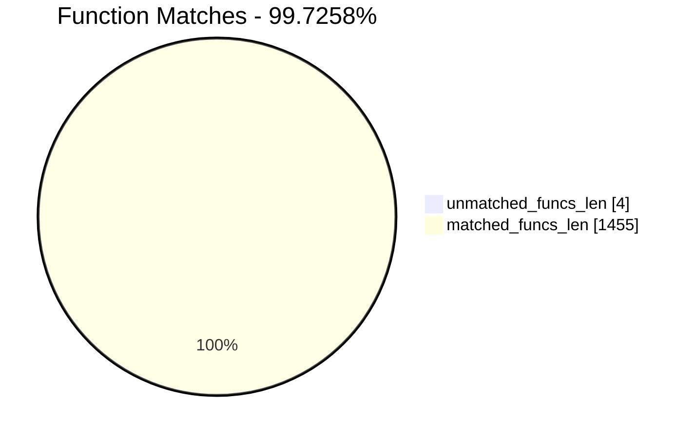
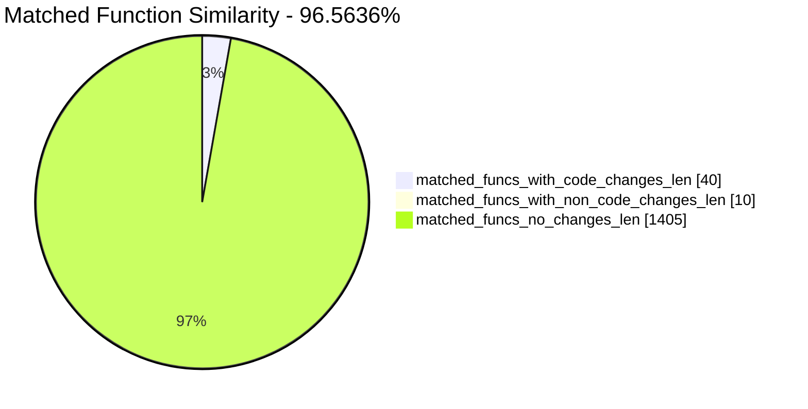
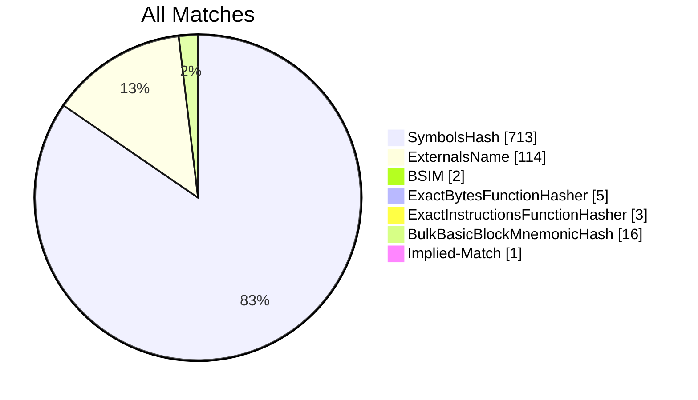
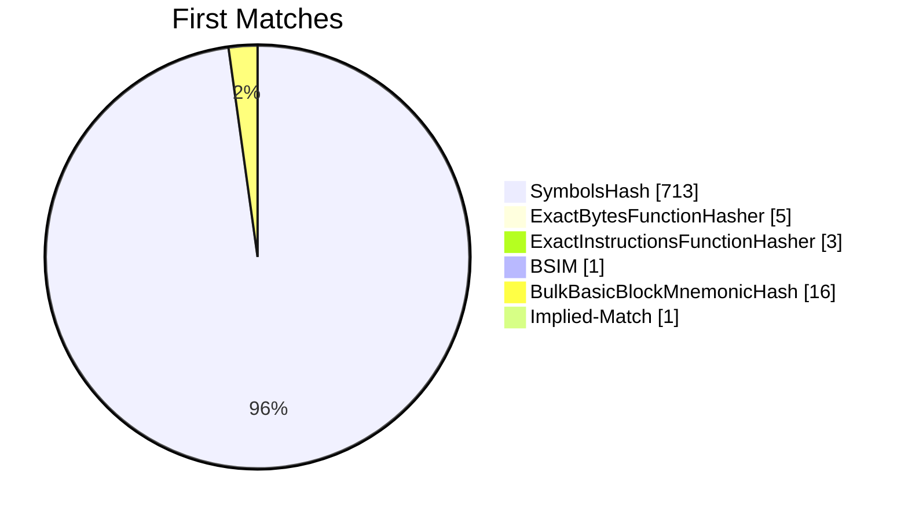
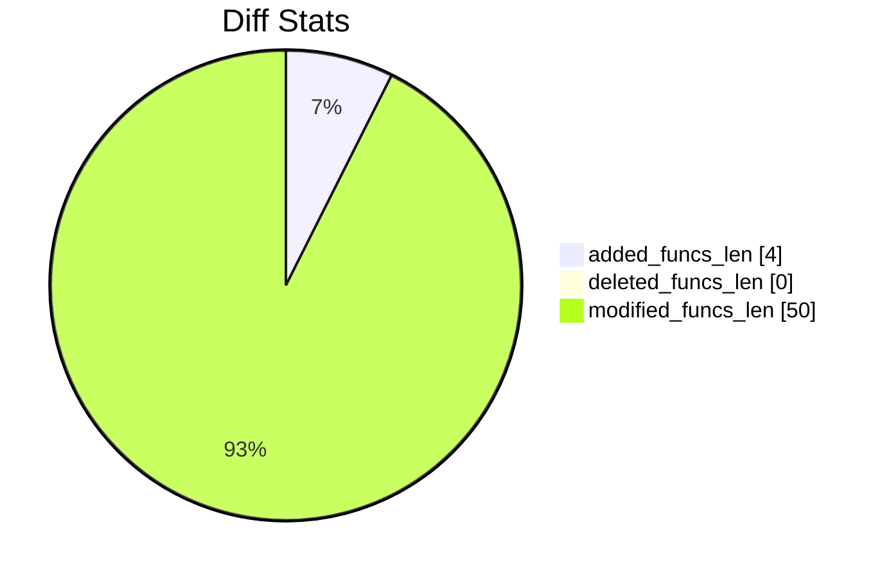
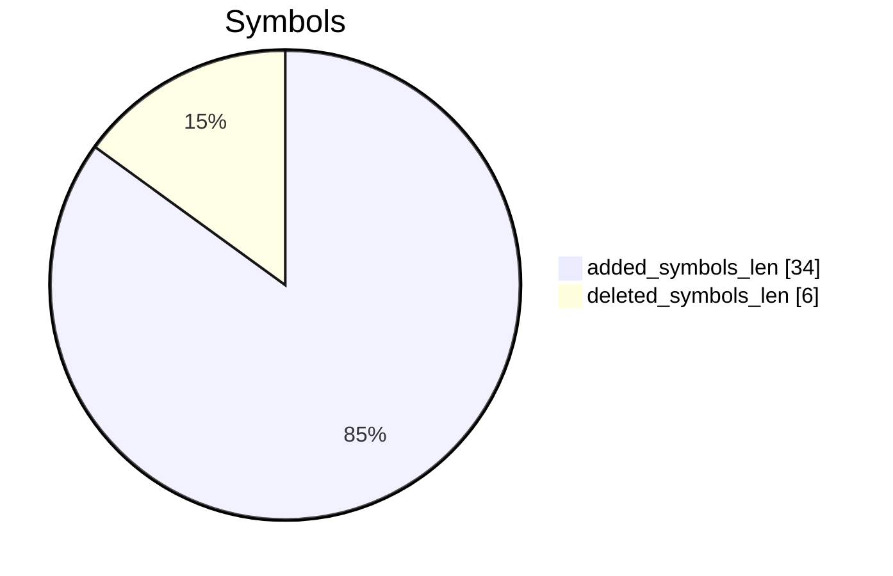
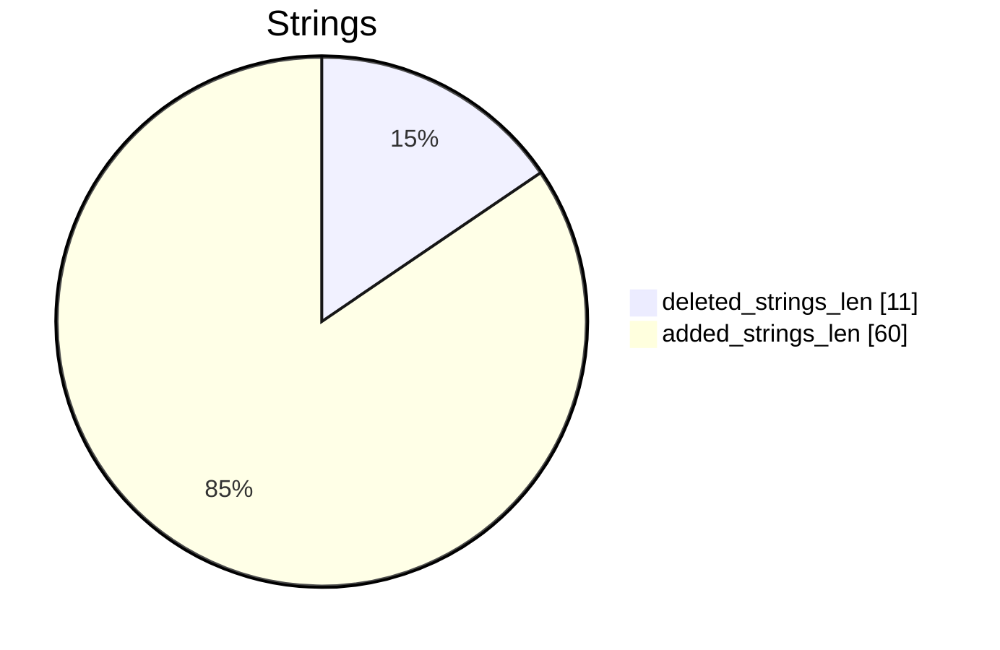

# CD_09_20_11_fifth_figs_review-CD_10_11_11_sixth_figs_review Diff

# TOC

* [Visual Chart Diff](#visual-chart-diff)
* [Metadata](#metadata)
	* [Ghidra Diff Engine](#ghidra-diff-engine)
		* [Command Line](#command-line)
	* [Binary Metadata Diff](#binary-metadata-diff)
	* [Program Options](#program-options)
	* [Diff Stats](#diff-stats)
	* [Strings](#strings)
* [Deleted](#deleted)
* [Added](#added)
	* [_ExitGameConfirmation](#_exitgameconfirmation)
	* [_RestartGameConfirmation](#_restartgameconfirmation)
	* [Sonic_CDViewController::authenticationChanged](#sonic_cdviewcontrollerauthenticationchanged)
	* [Sonic_CDViewController::alertView:didDismissWithButtonIndex:](#sonic_cdviewcontrolleralertviewdiddismisswithbuttonindex)
* [Modified](#modified)
	* [Sonic_CDViewController::viewDidLoad](#sonic_cdviewcontrollerviewdidload)
	* [_StopMusic](#_stopmusic)
	* [Sonic_CDViewController::drawFrame](#sonic_cdviewcontrollerdrawframe)
	* [_DrawSubtractiveBlendedSprite](#_drawsubtractiveblendedsprite)
	* [_DrawRectangle](#_drawrectangle)
	* [_DrawTexturedQuad](#_drawtexturedquad)
	* [_OnlineLoadLeaderboardsMenu](#_onlineloadleaderboardsmenu)
	* [Sonic_CDAppDelegate::application:didFinishLaunchingWithOptions:](#sonic_cdappdelegateapplicationdidfinishlaunchingwithoptions)
	* [GKNotificationView::initWithFrame:](#gknotificationviewinitwithframe)
	* [Sonic_CDViewController::PauseView](#sonic_cdviewcontrollerpauseview)
	* [_ProcessMusicStream](#_processmusicstream)
	* [_DrawRotatedSprite](#_drawrotatedsprite)
	* [_SetGameVolumes](#_setgamevolumes)
	* [_DrawQuad](#_drawquad)
	* [Sonic_CDAppDelegate::applicationDidBecomeActive:](#sonic_cdappdelegateapplicationdidbecomeactive)
	* [Sonic_CDAppDelegate::applicationWillTerminate:](#sonic_cdappdelegateapplicationwillterminate)
	* [_LoadMusicData](#_loadmusicdata)
	* [_DrawBlendedSprite](#_drawblendedsprite)
	* [_OnlineSetAchievement](#_onlinesetachievement)
	* [_DrawAdditiveBlendedSprite](#_drawadditiveblendedsprite)
	* [_DrawRotoZoomSprite](#_drawrotozoomsprite)
	* [_UpdateTextureBufferWithSortedSprites](#_updatetexturebufferwithsortedsprites)
	* [Sonic_CDViewController::ResumeView](#sonic_cdviewcontrollerresumeview)
	* [_ParseScriptFile](#_parsescriptfile)
	* [_PauseSoundiOS](#_pausesoundios)
	* [___-[Sonic_CDViewController_viewDidLoad]_block_invoke_1](#___-sonic_cdviewcontroller_viewdidload_block_invoke_1)
	* [_ReleaseAudioPlayback](#_releaseaudioplayback)
	* [_DrawSprite](#_drawsprite)
	* [_ProcessStage](#_processstage)
	* [_DrawAlphaBlendedSprite](#_drawalphablendedsprite)
	* [_OnlineSetLeaderboard](#_onlinesetleaderboard)
	* [Sonic_CDAppDelegate::applicationWillResignActive:](#sonic_cdappdelegateapplicationwillresignactive)
	* [_DrawScaledSprite](#_drawscaledsprite)
	* [_DrawScaledChar](#_drawscaledchar)
	* [Sonic_CDViewController::startAnimation](#sonic_cdviewcontrollerstartanimation)
	* [_DrawSpriteFlipped](#_drawspriteflipped)
	* [_ProcessMusicPlayback](#_processmusicplayback)
	* [_OnlineLoadAchievementsMenu](#_onlineloadachievementsmenu)
	* [_DrawHLineScrollLayer](#_drawhlinescrolllayer)
	* [_PlayVideoFile](#_playvideofile)
* [Modified (No Code Changes)](#modified-no-code-changes)
	* [_StopAllSFX](#_stopallsfx)
	* [_ClearTouches](#_cleartouches)
	* [_FindStringToken](#_findstringtoken)
	* [_AddGraphicsFile](#_addgraphicsfile)
	* [_ResumeSound](#_resumesound)
	* [_PauseSound](#_pausesound)

# Visual Chart Diff

```mermaid

flowchart LR

Sonic_CDViewControllerviewDidLoad-2-old<--Match 87%-->Sonic_CDViewControllerviewDidLoad-2-new
_StopMusic-0-old<--Match 67%-->_StopMusic-0-new
Sonic_CDViewControllerdrawFrame-2-old<--Match 92%-->Sonic_CDViewControllerdrawFrame-2-new
_DrawSubtractiveBlendedSprite-8-old<--Match 95%-->_DrawSubtractiveBlendedSprite-8-new
_DrawRectangle-8-old<--Match 84%-->_DrawRectangle-8-new
_DrawTexturedQuad-0-old<--Match 91%-->_DrawTexturedQuad-0-new
_OnlineLoadLeaderboardsMenu-0-old<--Match 71%-->_OnlineLoadLeaderboardsMenu-0-new
Sonic_CDAppDelegateapplicationdidFinishLaunchingWithOptions-4-old<--Match 89%-->Sonic_CDAppDelegateapplicationdidFinishLaunchingWithOptions-4-new
GKNotificationViewinitWithFrame-3-old<--Match 44%-->GKNotificationViewinitWithFrame-3-new
Sonic_CDViewControllerPauseView-2-old<--Match 87%-->Sonic_CDViewControllerPauseView-2-new
_ProcessMusicStream-0-old<--Match 97%-->_ProcessMusicStream-0-new
_DrawRotatedSprite-11-old<--Match 78%-->_DrawRotatedSprite-11-new
_SetGameVolumes-0-old<--Match 91%-->_SetGameVolumes-0-new
_DrawQuad-0-old<--Match 93%-->_DrawQuad-0-new
Sonic_CDAppDelegateapplicationDidBecomeActive-3-old<--Match 64%-->Sonic_CDAppDelegateapplicationDidBecomeActive-3-new
Sonic_CDAppDelegateapplicationWillTerminate-3-old<--Match 62%-->Sonic_CDAppDelegateapplicationWillTerminate-3-new
_LoadMusicData-0-old<--Match 96%-->_LoadMusicData-0-new
_DrawBlendedSprite-7-old<--Match 95%-->_DrawBlendedSprite-7-new
_OnlineSetAchievement-0-old<--Match 98%-->_OnlineSetAchievement-0-new
_DrawAdditiveBlendedSprite-8-old<--Match 95%-->_DrawAdditiveBlendedSprite-8-new
_DrawRotoZoomSprite-12-old<--Match 78%-->_DrawRotoZoomSprite-12-new
_UpdateTextureBufferWithSortedSprites-0-old<--Match 62%-->_UpdateTextureBufferWithSortedSprites-0-new
Sonic_CDViewControllerResumeView-2-old<--Match 88%-->Sonic_CDViewControllerResumeView-2-new
_ParseScriptFile-0-old<--Match 85%-->_ParseScriptFile-0-new
_PauseSoundiOS-0-old<--Match 69%-->_PauseSoundiOS-0-new
___-Sonic_CDViewController_viewDidLoad_block_invoke_1-0-old<--Match 65%-->___-Sonic_CDViewController_viewDidLoad_block_invoke_1-0-new
CD_09_20_11_fifth_figs_review<--15ommited-->CD_10_11_11_sixth_figs_review

subgraph CD_10_11_11_sixth_figs_review
    Sonic_CDViewControllerviewDidLoad-2-new
_StopMusic-0-new
Sonic_CDViewControllerdrawFrame-2-new
_DrawSubtractiveBlendedSprite-8-new
_DrawRectangle-8-new
_DrawTexturedQuad-0-new
_OnlineLoadLeaderboardsMenu-0-new
Sonic_CDAppDelegateapplicationdidFinishLaunchingWithOptions-4-new
GKNotificationViewinitWithFrame-3-new
Sonic_CDViewControllerPauseView-2-new
_ProcessMusicStream-0-new
_DrawRotatedSprite-11-new
_SetGameVolumes-0-new
_DrawQuad-0-new
Sonic_CDAppDelegateapplicationDidBecomeActive-3-new
Sonic_CDAppDelegateapplicationWillTerminate-3-new
_LoadMusicData-0-new
_DrawBlendedSprite-7-new
_OnlineSetAchievement-0-new
_DrawAdditiveBlendedSprite-8-new
_DrawRotoZoomSprite-12-new
_UpdateTextureBufferWithSortedSprites-0-new
Sonic_CDViewControllerResumeView-2-new
_ParseScriptFile-0-new
_PauseSoundiOS-0-new
___-Sonic_CDViewController_viewDidLoad_block_invoke_1-0-new
    subgraph Added
direction LR
_ExitGameConfirmation
    _RestartGameConfirmation
    Sonic_CDViewController-authenticationChanged
    Sonic_CDViewController-alertViewdidDismissWithButtonIndex
end
end

subgraph CD_09_20_11_fifth_figs_review
    Sonic_CDViewControllerviewDidLoad-2-old
_StopMusic-0-old
Sonic_CDViewControllerdrawFrame-2-old
_DrawSubtractiveBlendedSprite-8-old
_DrawRectangle-8-old
_DrawTexturedQuad-0-old
_OnlineLoadLeaderboardsMenu-0-old
Sonic_CDAppDelegateapplicationdidFinishLaunchingWithOptions-4-old
GKNotificationViewinitWithFrame-3-old
Sonic_CDViewControllerPauseView-2-old
_ProcessMusicStream-0-old
_DrawRotatedSprite-11-old
_SetGameVolumes-0-old
_DrawQuad-0-old
Sonic_CDAppDelegateapplicationDidBecomeActive-3-old
Sonic_CDAppDelegateapplicationWillTerminate-3-old
_LoadMusicData-0-old
_DrawBlendedSprite-7-old
_OnlineSetAchievement-0-old
_DrawAdditiveBlendedSprite-8-old
_DrawRotoZoomSprite-12-old
_UpdateTextureBufferWithSortedSprites-0-old
Sonic_CDViewControllerResumeView-2-old
_ParseScriptFile-0-old
_PauseSoundiOS-0-old
___-Sonic_CDViewController_viewDidLoad_block_invoke_1-0-old
    
end

```










# Metadata

## Ghidra Diff Engine

### Command Line

#### Captured Command Line


```
ghidriff --project-location ghidra_projects --project-name ghidriff --symbols-path symbols --threaded --log-level INFO --file-log-level INFO --log-path ghidriff.log --min-func-len 2 --gdt [] --bsim --max-ram-percent 60.0 --max-section-funcs 200 CD_09_20_11_fifth_figs_review CD_10_11_11_sixth_figs_review
```


#### Verbose Args


<details>

```
--old ['CD_09_20_11_fifth_figs_review'] --new [['CD_10_11_11_sixth_figs_review']] --engine VersionTrackingDiff --output-path CD_09_20_11_fifth_figs_review-CD_10_11_11_sixth_figs_review --summary False --project-location ghidra_projects --project-name ghidriff --symbols-path symbols --threaded True --force-analysis False --force-diff False --no-symbols False --log-level INFO --file-log-level INFO --log-path ghidriff.log --va False --min-func-len 2 --use-calling-counts False --gdt [] --bsim True --bsim-full False --max-ram-percent 60.0 --print-flags False --jvm-args None --side-by-side False --max-section-funcs 200 --md-title None
```


</details>

## Binary Metadata Diff


```diff
--- CD_09_20_11_fifth_figs_review Meta
+++ CD_10_11_11_sixth_figs_review Meta
@@ -1,45 +1,45 @@
-Program Name: CD_09_20_11_fifth_figs_review
+Program Name: CD_10_11_11_sixth_figs_review
 Language ID: ARM:LE:32:v6 (1.107)
 Compiler ID: default
 Processor: ARM
 Endian: Little
 Address Size: 32
 Minimum Address: 00001000
-Maximum Address: 012a4003
-# of Bytes: 19538144
-# of Memory Blocks: 31
-# of Instructions: 55956
-# of Defined Data: 15690
-# of Functions: 727
-# of Symbols: 4511
-# of Data Types: 156
+Maximum Address: 012d4003
+# of Bytes: 19734756
+# of Memory Blocks: 32
+# of Instructions: 59074
+# of Defined Data: 16139
+# of Functions: 732
+# of Symbols: 4615
+# of Data Types: 157
 # of Data Type Categories: 10
 Analyzed: true
 Created With Ghidra Version: 11.0.3
-Date Created: Thu Jan 09 19:23:24 CET 2025
+Date Created: Thu Jan 09 19:23:25 CET 2025
 Executable Format: Mac OS X Mach-O
-Executable Location: /home/user/CD_09_20_11_fifth_figs_review
-Executable MD5: 4ec3c2889258076da03ed1e4e7630227
-Executable SHA256: 0386699a0218e6d632f562aa9d4b411d98624c35fe6e9f5d69093ad1273cf102
-FSRL: file:///home/user/CD_09_20_11_fifth_figs_review?MD5=4ec3c2889258076da03ed1e4e7630227
+Executable Location: /home/user/CD_10_11_11_sixth_figs_review
+Executable MD5: 07a034aded8eca7a1bbbc87c26a6eab1
+Executable SHA256: d7cbf4f0650e7d749321804b494ecc039748999100628929d1805ae743b89372
+FSRL: file:///home/user/CD_10_11_11_sixth_figs_review?MD5=07a034aded8eca7a1bbbc87c26a6eab1
 Mach-O File Type: EXECUTE
 Mach-O File Type Description: Demand Paged Executable File
 Mach-O Flag 0: NOUNDEFS
 Mach-O Flag 1: DYLDLINK
 Mach-O Flag 2: TWOLEVEL
 Preferred Root Namespace Category: 
 Relocatable: false
 Required Library [    0]: /System/Library/Frameworks/MediaPlayer.framework/MediaPlayer
 Required Library [    1]: /System/Library/Frameworks/CoreGraphics.framework/CoreGraphics
 Required Library [    2]: /System/Library/Frameworks/GameKit.framework/GameKit
 Required Library [    3]: /System/Library/Frameworks/AudioToolbox.framework/AudioToolbox
 Required Library [    4]: /System/Library/Frameworks/Foundation.framework/Foundation
 Required Library [    5]: /System/Library/Frameworks/UIKit.framework/UIKit
 Required Library [    6]: /System/Library/Frameworks/OpenGLES.framework/OpenGLES
 Required Library [    7]: /System/Library/Frameworks/QuartzCore.framework/QuartzCore
 Required Library [    8]: /System/Library/Frameworks/OpenAL.framework/OpenAL
 Required Library [    9]: /usr/lib/libgcc_s.1.dylib
 Required Library [   10]: /usr/lib/libSystem.B.dylib
 Required Library [   11]: /usr/lib/libobjc.A.dylib
 Required Library [   12]: /System/Library/Frameworks/CoreFoundation.framework/CoreFoundation
 Should Ask To Analyze: false

```


## Program Options


<details>
<summary>Ghidra CD_09_20_11_fifth_figs_review Decompiler Options</summary>


|Decompiler Option|Value|
| :---: | :---: |
|Prototype Evaluation|__stdcall|

</details>


<details>
<summary>Ghidra CD_09_20_11_fifth_figs_review Specification extensions Options</summary>


|Specification extensions Option|Value|
| :---: | :---: |
|FormatVersion|0|
|VersionCounter|0|

</details>


<details>
<summary>Ghidra CD_09_20_11_fifth_figs_review Analyzers Options</summary>


|Analyzers Option|Value|
| :---: | :---: |
|ARM Aggressive Instruction Finder|false|
|ARM Constant Reference Analyzer|true|
|ARM Constant Reference Analyzer.Create Data from pointer|false|
|ARM Constant Reference Analyzer.Function parameter/return Pointer analysis|true|
|ARM Constant Reference Analyzer.Max Threads|2|
|ARM Constant Reference Analyzer.Min absolute reference|4|
|ARM Constant Reference Analyzer.Require pointer param data type|false|
|ARM Constant Reference Analyzer.Speculative reference max|256|
|ARM Constant Reference Analyzer.Speculative reference min|512|
|ARM Constant Reference Analyzer.Stored Value Pointer analysis|true|
|ARM Constant Reference Analyzer.Switch Table Recovery|false|
|ARM Constant Reference Analyzer.Trust values read from writable memory|true|
|ARM Symbol|true|
|ASCII Strings|true|
|ASCII Strings.Create Strings Containing Existing Strings|true|
|ASCII Strings.Create Strings Containing References|true|
|ASCII Strings.Force Model Reload|false|
|ASCII Strings.Minimum String Length|LEN_5|
|ASCII Strings.Model File|StringModel.sng|
|ASCII Strings.Require Null Termination for String|true|
|ASCII Strings.Search Only in Accessible Memory Blocks|true|
|ASCII Strings.String Start Alignment|ALIGN_1|
|ASCII Strings.String end alignment|4|
|Aggressive Instruction Finder|false|
|Aggressive Instruction Finder.Create Analysis Bookmarks|true|
|Apply Data Archives|true|
|Apply Data Archives.Archive Chooser|[Auto-Detect]|
|Apply Data Archives.Create Analysis Bookmarks|true|
|Apply Data Archives.GDT User File Archive Path|None|
|Apply Data Archives.User Project Archive Path|None|
|CFStrings|true|
|Call Convention ID|true|
|Call Convention ID.Analysis Decompiler Timeout (sec)|60|
|Call-Fixup Installer|true|
|Condense Filler Bytes|false|
|Condense Filler Bytes.Filler Value|Auto|
|Condense Filler Bytes.Minimum number of sequential bytes|1|
|Create Address Tables|true|
|Create Address Tables.Allow Offcut References|false|
|Create Address Tables.Auto Label Table|false|
|Create Address Tables.Create Analysis Bookmarks|true|
|Create Address Tables.Maxmimum Pointer Distance|16777215|
|Create Address Tables.Minimum Pointer Address|4132|
|Create Address Tables.Minimum Table Size|4|
|Create Address Tables.Pointer Alignment|1|
|Create Address Tables.Relocation Table Guide|true|
|Create Address Tables.Table Alignment|4|
|DWARF Line Number|false|
|Data Reference|true|
|Data Reference.Address Table Alignment|1|
|Data Reference.Address Table Minimum Size|4|
|Data Reference.Align End of Strings|false|
|Data Reference.Ascii String References|true|
|Data Reference.Create Address Tables|false|
|Data Reference.Minimum String Length|5|
|Data Reference.References to Pointers|false|
|Data Reference.Relocation Table Guide|true|
|Data Reference.Respect Execute Flag|true|
|Data Reference.Subroutine References|true|
|Data Reference.Switch Table References|false|
|Data Reference.Unicode String References|true|
|Decompiler Parameter ID|false|
|Decompiler Parameter ID.Analysis Clear Level|ANALYSIS|
|Decompiler Parameter ID.Analysis Decompiler Timeout (sec)|60|
|Decompiler Parameter ID.Commit Data Types|true|
|Decompiler Parameter ID.Commit Void Return Values|false|
|Decompiler Parameter ID.Prototype Evaluation|__stdcall|
|Decompiler Switch Analysis|true|
|Decompiler Switch Analysis.Analysis Decompiler Timeout (sec)|60|
|Demangler GNU|true|
|Demangler GNU.Apply Function Calling Conventions|true|
|Demangler GNU.Apply Function Signatures|true|
|Demangler GNU.Demangle Only Known Mangled Symbols|false|
|Demangler GNU.Demangler Format|AUTO|
|Demangler GNU.Use Deprecated Demangler|false|
|Disassemble Entry Points|true|
|Disassemble Entry Points.Respect Execute Flag|true|
|Embedded Media|true|
|Embedded Media.Create Analysis Bookmarks|true|
|External Entry References|true|
|External Symbol Resolver|true|
|Function Start Pre Search|true|
|Function Start Pre Search.Bookmark Functions|false|
|Function Start Pre Search.Search Data Blocks|false|
|Function Start Search|true|
|Function Start Search After Code|true|
|Function Start Search After Code.Bookmark Functions|false|
|Function Start Search After Code.Search Data Blocks|false|
|Function Start Search After Data|true|
|Function Start Search After Data.Bookmark Functions|false|
|Function Start Search After Data.Search Data Blocks|false|
|Function Start Search.Bookmark Functions|false|
|Function Start Search.Search Data Blocks|false|
|Mach-O Function Starts|true|
|Mach-O Function Starts.Bookmark failed functions|false|
|Mach-O Function Starts.Bookmark new functions|false|
|Mach-O Function Starts.Bookmark skipped functions|false|
|Mach-O Function Starts.Use PseudoDisassembler|true|
|Non-Returning Functions - Discovered|true|
|Non-Returning Functions - Discovered.Create Analysis Bookmarks|true|
|Non-Returning Functions - Discovered.Function Non-return Threshold|3|
|Non-Returning Functions - Discovered.Repair Flow Damage|true|
|Non-Returning Functions - Known|true|
|Non-Returning Functions - Known.Create Analysis Bookmarks|true|
|Objective-C 2 Class|true|
|Objective-C 2 Decompiler Message|true|
|Objective-C 2 Message|false|
|Reference|true|
|Reference.Address Table Alignment|1|
|Reference.Address Table Minimum Size|4|
|Reference.Align End of Strings|false|
|Reference.Ascii String References|true|
|Reference.Create Address Tables|false|
|Reference.Minimum String Length|5|
|Reference.References to Pointers|false|
|Reference.Relocation Table Guide|true|
|Reference.Respect Execute Flag|true|
|Reference.Subroutine References|true|
|Reference.Switch Table References|false|
|Reference.Unicode String References|true|
|Scalar Operand References|false|
|Scalar Operand References.Relocation Table Guide|true|
|Shared Return Calls|true|
|Shared Return Calls.Allow Conditional Jumps|false|
|Shared Return Calls.Assume Contiguous Functions Only|false|
|Stack|true|
|Stack.Create Local Variables|true|
|Stack.Create Param Variables|true|
|Stack.useNewFunctionStackAnalysis|true|
|Subroutine References|true|
|Subroutine References.Create Thunks Early|true|
|Variadic Function Signature Override|false|
|Variadic Function Signature Override.Create Analysis Bookmarks|false|

</details>


<details>
<summary>Ghidra CD_10_11_11_sixth_figs_review Decompiler Options</summary>


|Decompiler Option|Value|
| :---: | :---: |
|Prototype Evaluation|__stdcall|

</details>


<details>
<summary>Ghidra CD_10_11_11_sixth_figs_review Specification extensions Options</summary>


|Specification extensions Option|Value|
| :---: | :---: |
|FormatVersion|0|
|VersionCounter|0|

</details>


<details>
<summary>Ghidra CD_10_11_11_sixth_figs_review Analyzers Options</summary>


|Analyzers Option|Value|
| :---: | :---: |
|ARM Aggressive Instruction Finder|false|
|ARM Constant Reference Analyzer|true|
|ARM Constant Reference Analyzer.Create Data from pointer|false|
|ARM Constant Reference Analyzer.Function parameter/return Pointer analysis|true|
|ARM Constant Reference Analyzer.Max Threads|2|
|ARM Constant Reference Analyzer.Min absolute reference|4|
|ARM Constant Reference Analyzer.Require pointer param data type|false|
|ARM Constant Reference Analyzer.Speculative reference max|256|
|ARM Constant Reference Analyzer.Speculative reference min|512|
|ARM Constant Reference Analyzer.Stored Value Pointer analysis|true|
|ARM Constant Reference Analyzer.Switch Table Recovery|false|
|ARM Constant Reference Analyzer.Trust values read from writable memory|true|
|ARM Symbol|true|
|ASCII Strings|true|
|ASCII Strings.Create Strings Containing Existing Strings|true|
|ASCII Strings.Create Strings Containing References|true|
|ASCII Strings.Force Model Reload|false|
|ASCII Strings.Minimum String Length|LEN_5|
|ASCII Strings.Model File|StringModel.sng|
|ASCII Strings.Require Null Termination for String|true|
|ASCII Strings.Search Only in Accessible Memory Blocks|true|
|ASCII Strings.String Start Alignment|ALIGN_1|
|ASCII Strings.String end alignment|4|
|Aggressive Instruction Finder|false|
|Aggressive Instruction Finder.Create Analysis Bookmarks|true|
|Apply Data Archives|true|
|Apply Data Archives.Archive Chooser|[Auto-Detect]|
|Apply Data Archives.Create Analysis Bookmarks|true|
|Apply Data Archives.GDT User File Archive Path|None|
|Apply Data Archives.User Project Archive Path|None|
|CFStrings|true|
|Call Convention ID|true|
|Call Convention ID.Analysis Decompiler Timeout (sec)|60|
|Call-Fixup Installer|true|
|Condense Filler Bytes|false|
|Condense Filler Bytes.Filler Value|Auto|
|Condense Filler Bytes.Minimum number of sequential bytes|1|
|Create Address Tables|true|
|Create Address Tables.Allow Offcut References|false|
|Create Address Tables.Auto Label Table|false|
|Create Address Tables.Create Analysis Bookmarks|true|
|Create Address Tables.Maxmimum Pointer Distance|16777215|
|Create Address Tables.Minimum Pointer Address|4132|
|Create Address Tables.Minimum Table Size|4|
|Create Address Tables.Pointer Alignment|1|
|Create Address Tables.Relocation Table Guide|true|
|Create Address Tables.Table Alignment|4|
|DWARF Line Number|false|
|Data Reference|true|
|Data Reference.Address Table Alignment|1|
|Data Reference.Address Table Minimum Size|4|
|Data Reference.Align End of Strings|false|
|Data Reference.Ascii String References|true|
|Data Reference.Create Address Tables|false|
|Data Reference.Minimum String Length|5|
|Data Reference.References to Pointers|false|
|Data Reference.Relocation Table Guide|true|
|Data Reference.Respect Execute Flag|true|
|Data Reference.Subroutine References|true|
|Data Reference.Switch Table References|false|
|Data Reference.Unicode String References|true|
|Decompiler Parameter ID|false|
|Decompiler Parameter ID.Analysis Clear Level|ANALYSIS|
|Decompiler Parameter ID.Analysis Decompiler Timeout (sec)|60|
|Decompiler Parameter ID.Commit Data Types|true|
|Decompiler Parameter ID.Commit Void Return Values|false|
|Decompiler Parameter ID.Prototype Evaluation|__stdcall|
|Decompiler Switch Analysis|true|
|Decompiler Switch Analysis.Analysis Decompiler Timeout (sec)|60|
|Demangler GNU|true|
|Demangler GNU.Apply Function Calling Conventions|true|
|Demangler GNU.Apply Function Signatures|true|
|Demangler GNU.Demangle Only Known Mangled Symbols|false|
|Demangler GNU.Demangler Format|AUTO|
|Demangler GNU.Use Deprecated Demangler|false|
|Disassemble Entry Points|true|
|Disassemble Entry Points.Respect Execute Flag|true|
|Embedded Media|true|
|Embedded Media.Create Analysis Bookmarks|true|
|External Entry References|true|
|External Symbol Resolver|true|
|Function Start Pre Search|true|
|Function Start Pre Search.Bookmark Functions|false|
|Function Start Pre Search.Search Data Blocks|false|
|Function Start Search|true|
|Function Start Search After Code|true|
|Function Start Search After Code.Bookmark Functions|false|
|Function Start Search After Code.Search Data Blocks|false|
|Function Start Search After Data|true|
|Function Start Search After Data.Bookmark Functions|false|
|Function Start Search After Data.Search Data Blocks|false|
|Function Start Search.Bookmark Functions|false|
|Function Start Search.Search Data Blocks|false|
|Mach-O Function Starts|true|
|Mach-O Function Starts.Bookmark failed functions|false|
|Mach-O Function Starts.Bookmark new functions|false|
|Mach-O Function Starts.Bookmark skipped functions|false|
|Mach-O Function Starts.Use PseudoDisassembler|true|
|Non-Returning Functions - Discovered|true|
|Non-Returning Functions - Discovered.Create Analysis Bookmarks|true|
|Non-Returning Functions - Discovered.Function Non-return Threshold|3|
|Non-Returning Functions - Discovered.Repair Flow Damage|true|
|Non-Returning Functions - Known|true|
|Non-Returning Functions - Known.Create Analysis Bookmarks|true|
|Objective-C 2 Class|true|
|Objective-C 2 Decompiler Message|true|
|Objective-C 2 Message|false|
|Reference|true|
|Reference.Address Table Alignment|1|
|Reference.Address Table Minimum Size|4|
|Reference.Align End of Strings|false|
|Reference.Ascii String References|true|
|Reference.Create Address Tables|false|
|Reference.Minimum String Length|5|
|Reference.References to Pointers|false|
|Reference.Relocation Table Guide|true|
|Reference.Respect Execute Flag|true|
|Reference.Subroutine References|true|
|Reference.Switch Table References|false|
|Reference.Unicode String References|true|
|Scalar Operand References|false|
|Scalar Operand References.Relocation Table Guide|true|
|Shared Return Calls|true|
|Shared Return Calls.Allow Conditional Jumps|false|
|Shared Return Calls.Assume Contiguous Functions Only|false|
|Stack|true|
|Stack.Create Local Variables|true|
|Stack.Create Param Variables|true|
|Stack.useNewFunctionStackAnalysis|true|
|Subroutine References|true|
|Subroutine References.Create Thunks Early|true|
|Variadic Function Signature Override|false|
|Variadic Function Signature Override.Create Analysis Bookmarks|false|

</details>

## Diff Stats


|Stat|Value|
| :---: | :---: |
|added_funcs_len|4|
|deleted_funcs_len|0|
|modified_funcs_len|50|
|added_symbols_len|34|
|deleted_symbols_len|6|
|diff_time|134.6839804649353|
|deleted_strings_len|11|
|added_strings_len|60|
|match_types|Counter({'SymbolsHash': 713, 'ExternalsName': 114, 'BulkBasicBlockMnemonicHash': 16, 'ExactBytesFunctionHasher': 5, 'ExactInstructionsFunctionHasher': 3, 'BSIM': 2, 'Implied Match': 1})|
|items_to_process|94|
|diff_types|Counter({'address': 50, 'code': 40, 'length': 40, 'refcount': 13, 'calling': 10, 'called': 10, 'sig': 4, 'name': 2, 'fullname': 2})|
|unmatched_funcs_len|4|
|total_funcs_len|1459|
|matched_funcs_len|1455|
|matched_funcs_with_code_changes_len|40|
|matched_funcs_with_non_code_changes_len|10|
|matched_funcs_no_changes_len|1405|
|match_func_similarity_percent|96.5636%|
|func_match_overall_percent|99.7258%|
|first_matches|Counter({'SymbolsHash': 713, 'BulkBasicBlockMnemonicHash': 16, 'ExactBytesFunctionHasher': 5, 'ExactInstructionsFunctionHasher': 3, 'BSIM': 1, 'Implied Match': 1})|













## Strings




### Strings Diff


```diff
--- deleted strings
+++ added strings
@@ -1,11 +1,60 @@
-___func__.4682
-s_-[Sonic_CDViewController_handleT
-s_-[Sonic_CDViewController_touches
-s__C.14.2932
-s__C.15.2933
-s__DrawHLineScrollLayer
-s____block_descriptor_tmp_1.128
-s____func__.4682
-s__gameCenterAuthenticated
-s__previousTouchCount.33061
-s__proc.4445
+___func__.4689
+s_-[EAGLView_handleTouches:withEve
+s_-[EAGLView_touchesBegan:withEven
+s_-[EAGLView_touchesCancelled:with
+s_-[EAGLView_touchesEnded:withEven
+s_-[EAGLView_touchesMoved:withEven
+s_-[Sonic_CDViewController_alertVi
+s_-[Sonic_CDViewController_authent
+s_.rsv
+s_Are_you_sure_you_want_to_quit?
+s_Are_you_sure_you_want_to_restart
+s_Erfolg_Freigeschaltet
+s_Game_Center
+s_Logro_Desbloqueado
+s_M
+s_Nein
+s_No
+s_Non
+s_OK
+s_Obiettivo_Sbloccato
+s_Oui
+s_S
+s_Sei_sicuro_di_voler_abbandonare_l
+s_Sei_sicuro_di_voler_ricominciare
+s_UIAlertViewDelegate
+s_Veux-tu_vraiment_quitter_la_part
+s_Veux-tu_vraiment_recommencer_la_p
+s_Ya
+s_Yes
+s_You_are_not_currently_logged_in.
+s__C.14.2934
+s__C.15.2935
+s__DrawHLineScrollLayer8
+s__ExitGameConfirmation
+s__OBJC_CLASS_$_UIAlertView
+s__RestartGameConfirmation
+s__RetroEngineCallback
+s____block_descriptor_tmp_1.130
+s____func__.4689
+s__alertVisible
+s__gamePlatformID
+s__gameTrialMode
+s__localPlayer
+s__previousTouchCount.31257
+s__proc.4447
+s_addButtonWithTitle:
+s_alertView:clickedButtonAtIndex:
+s_alertView:didDismissWithButtonIn
+s_alertView:willDismissWithButtonI
+s_alertViewCancel:
+s_authenticationChanged
+s_beginIgnoringInteractionEvents
+s_didPresentAlertView:
+s_endIgnoringInteractionEvents
+s_initWithTitle:message:delegate:c
+s_setModalTransitionStyle:
+s_setTag:
+s_show
+s_tag
+s_willPresentAlertView:

```


### String References

#### Old


|String|Ref Count|Ref Func|
| :---: | :---: | :---: |
|s__C.15.2933_0129a652|1||
|s____block_descriptor_tmp_1.128_0129ec63|1||
|s__proc.4445_0129c765|1||
|s____func__.4682_0129c5d3|1||
|s_-[Sonic_CDViewController_touches_0129e589|1||
|s__DrawHLineScrollLayer_0129c84e|1||
|s__previousTouchCount.33061_0129ecb0|1||
|s__gameCenterAuthenticated_0129ec3c|1||
|s__C.14.2932_0129a65d|1||
|___func__.4682|2|_PlayMusic|
|s_-[Sonic_CDViewController_handleT_0129e8b3|1||

#### New


|String|Ref Count|Ref Func|
| :---: | :---: | :---: |
|s_Are_you_sure_you_want_to_quit?_00043bdc|1||
|s_Logro_Desbloqueado_00044214|1||
|s_UIAlertViewDelegate_00044752|1||
|s_M_0004f812|1||
|___func__.4689|2|_PlayMusic|
|s__localPlayer_012cef8d|1||
|s_-[EAGLView_touchesCancelled:with_012ca228|1||
|s_Ya_00043c5c|1||
|s_initWithTitle:message:delegate:c_0004297a|13|_RestartGameConfirmation,_OnlineLoadLeaderboardsMenu,_OnlineLoadAchievementsMenu,_ExitGameConfirmation|
|s_Veux-tu_vraiment_quitter_la_part_00043c04|1||
|s__ExitGameConfirmation_012ce78d|1||
|s_tag_00042a5e|2|alertView:didDismissWithButtonIndex:|
|s_authenticationChanged_0004267c|1||
|s__C.15.2935_012ca9aa|1||
|s_Oui_00043c28|1||
|s_-[EAGLView_touchesBegan:withEven_012ca274|1||
|s__gamePlatformID_012caba8|1||
|s_Are_you_sure_you_want_to_restart_00043c68|1||
|s_didPresentAlertView:_00042d33|1||
|s_Sei_sicuro_di_voler_abbandonare_l_00043c30|1||
|s_setModalTransitionStyle:_000429f1|3|_OnlineLoadLeaderboardsMenu,_OnlineLoadAchievementsMenu|
|s__previousTouchCount.31257_012ca4ae|1||
|s__gameTrialMode_012cab99|1||
|s_No_00043c00|1||
|s__OBJC_CLASS_$_UIAlertView_012c945c|1||
|s____block_descriptor_tmp_1.130_012cef6f|1||
|s_beginIgnoringInteractionEvents_00041e39|3|applicationWillResignActive:,applicationWillTerminate:|
|s____func__.4689_012cc94a|1||
|s_-[EAGLView_handleTouches:withEve_012ca387|1||
|s_Game_Center_00043e9c|1||
|s_addButtonWithTitle:_000427f9|6|_RestartGameConfirmation,_ExitGameConfirmation|
|s_-[Sonic_CDViewController_authent_012ce826|1||
|s_Nein_00043c60|1||
|s_Sei_sicuro_di_voler_ricominciare_00043cb4|1||
|s__RestartGameConfirmation_012ce7a3|1||
|s_OK_00043ecc|1||
|s_-[EAGLView_touchesMoved:withEven_012ca204|1||
|s__proc.4447_012ccadc|1||
|s_willPresentAlertView:_00042d48|1||
|s_Veux-tu_vraiment_recommencer_la_p_00043c8c|1||
|s_S_0004f8a4|1||
|s_Yes_00043bfc|1||
|s__RetroEngineCallback_012d0b55|1||
|s_Obiettivo_Sbloccato_000441e8|1||
|s_-[Sonic_CDViewController_alertVi_012ce856|1||
|s_setTag:_000427f1|3|_RestartGameConfirmation,_ExitGameConfirmation|
|s__C.14.2934_012ca9b5|1||
|s_Erfolg_Freigeschaltet_000441fc|1||
|s__alertVisible_012cef61|1||
|s_alertView:didDismissWithButtonIn_00042692|2||
|s_-[EAGLView_touchesEnded:withEven_012ca250|1||
|s__DrawHLineScrollLayer8_012ccbc5|1||
|s_Non_00043c2c|1||
|s_endIgnoringInteractionEvents_00041e0d|2|applicationDidBecomeActive:|
|s_show_00042975|5|_RestartGameConfirmation,_OnlineLoadLeaderboardsMenu,_OnlineLoadAchievementsMenu,_ExitGameConfirmation|
|s_alertView:willDismissWithButtonI_00042d0d|1||
|s_You_are_not_currently_logged_in._00043ea8|1||
|s_alertView:clickedButtonAtIndex:_00042d6f|1||
|s_.rsv_00043860|1|_ProcessScript|
|s_alertViewCancel:_00042d5e|1||

# Deleted

# Added

## _ExitGameConfirmation

### Function Meta


|Key|CD_10_11_11_sixth_figs_review|
| :---: | :---: |
|name|_ExitGameConfirmation|
|fullname|_ExitGameConfirmation|
|refcount|1|
|length|856|
|called|_objc_msgSend|
|calling|_RetroEngineCallback|
|paramcount|0|
|address|0003b4c8|
|sig|undefined _ExitGameConfirmation(void)|
|sym_type|Function|
|sym_source|IMPORTED|
|external|False|


```diff
--- _ExitGameConfirmation
+++ _ExitGameConfirmation
@@ -0,0 +1,77 @@
+
+void _ExitGameConfirmation(void)
+
+{
+  undefined4 uVar1;
+  cfstringStruct *pcVar2;
+  undefined4 uVar3;
+  undefined4 unaff_r4;
+  float fVar4;
+  
+  _alertVisible = 1;
+  _objc_msgSend(*DAT_000591e4,"stopAnimation");
+  switch(*PTR__gameLanguage_000501e0) {
+  case 0:
+    goto LAB_0003b52c;
+  case 1:
+    uVar1 = _objc_msgSend(&_OBJC_CLASS___UIAlertView,"alloc");
+    uVar1 = _objc_msgSend(uVar1,
+                          "initWithTitle:message:delegate:cancelButtonTitle:otherButtonTitles:",
+                          &cf___,&cf_Veux_tuvraimentquitterlapartie_,*DAT_000591e4,&cf_Oui,0);
+    unaff_r4 = _objc_msgSend(uVar1,"autorelease");
+    pcVar2 = &cf_Non;
+    break;
+  case 2:
+    uVar1 = _objc_msgSend(&_OBJC_CLASS___UIAlertView,"alloc");
+    uVar1 = _objc_msgSend(uVar1,
+                          "initWithTitle:message:delegate:cancelButtonTitle:otherButtonTitles:",
+                          &cf___,&cf_Seisicurodivolerabbandonarelapartita_,*DAT_000591e4,&cf_S,0);
+    unaff_r4 = _objc_msgSend(uVar1,"autorelease");
+    pcVar2 = &cf_No;
+    break;
+  case 3:
+    uVar1 = _objc_msgSend(&_OBJC_CLASS___UIAlertView,"alloc");
+    uVar1 = _objc_msgSend(uVar1,
+                          "initWithTitle:message:delegate:cancelButtonTitle:otherButtonTitles:",
+                          &cf___,&cf_M,*DAT_000591e4,&cf_Ya,0);
+    unaff_r4 = _objc_msgSend(uVar1,"autorelease");
+    pcVar2 = &cf_Nein;
+    break;
+  case 4:
+    uVar1 = _objc_msgSend(&_OBJC_CLASS___UIAlertView,"alloc");
+    uVar1 = _objc_msgSend(uVar1,
+                          "initWithTitle:message:delegate:cancelButtonTitle:otherButtonTitles:",
+                          &cf___,&cf__,*DAT_000591e4,&cf_S,0);
+    unaff_r4 = _objc_msgSend(uVar1,"autorelease");
+    pcVar2 = &cf_No;
+    break;
+  case 5:
+LAB_0003b52c:
+    uVar1 = _objc_msgSend(&_OBJC_CLASS___UIAlertView,"alloc");
+    uVar1 = _objc_msgSend(uVar1,
+                          "initWithTitle:message:delegate:cancelButtonTitle:otherButtonTitles:",
+                          &cf___,&cf_Areyousureyouwanttoquit_,*DAT_000591e4,&cf_Yes,0);
+    unaff_r4 = _objc_msgSend(uVar1,"autorelease");
+    pcVar2 = &cf_No;
+    break;
+  default:
+    goto switchD_0003b50c_caseD_6;
+  }
+  _objc_msgSend(unaff_r4,"addButtonWithTitle:",pcVar2);
+switchD_0003b50c_caseD_6:
+  fVar4 = *(float *)PTR__viewAngle_00050250;
+  if (fVar4 == 0.0 || fVar4 < 0.0 != NAN(fVar4)) {
+    uVar1 = _objc_msgSend(&_OBJC_CLASS___UIApplication,"sharedApplication");
+    uVar3 = 3;
+  }
+  else {
+    uVar1 = _objc_msgSend(&_OBJC_CLASS___UIApplication,"sharedApplication");
+    uVar3 = 4;
+  }
+  _objc_msgSend(uVar1,"setStatusBarOrientation:",uVar3);
+  *PTR__gameMode_0005025c = 7;
+  _objc_msgSend(unaff_r4,"setTag:",2);
+  _objc_msgSend(unaff_r4,"show");
+  return;
+}
+

```


## _RestartGameConfirmation

### Function Meta


|Key|CD_10_11_11_sixth_figs_review|
| :---: | :---: |
|name|_RestartGameConfirmation|
|fullname|_RestartGameConfirmation|
|refcount|1|
|length|856|
|called|_objc_msgSend|
|calling|_RetroEngineCallback|
|paramcount|0|
|address|0003b920|
|sig|undefined _RestartGameConfirmation(void)|
|sym_type|Function|
|sym_source|IMPORTED|
|external|False|


```diff
--- _RestartGameConfirmation
+++ _RestartGameConfirmation
@@ -0,0 +1,77 @@
+
+void _RestartGameConfirmation(void)
+
+{
+  undefined4 uVar1;
+  cfstringStruct *pcVar2;
+  undefined4 uVar3;
+  undefined4 unaff_r4;
+  float fVar4;
+  
+  _alertVisible = 1;
+  _objc_msgSend(*DAT_000591e4,"stopAnimation");
+  switch(*PTR__gameLanguage_000501e0) {
+  case 0:
+    goto LAB_0003b984;
+  case 1:
+    uVar1 = _objc_msgSend(&_OBJC_CLASS___UIAlertView,"alloc");
+    uVar1 = _objc_msgSend(uVar1,
+                          "initWithTitle:message:delegate:cancelButtonTitle:otherButtonTitles:",
+                          &cf___,&cf_Veux_tuvraimentrecommencerlapartie_,*DAT_000591e4,&cf_Oui,0);
+    unaff_r4 = _objc_msgSend(uVar1,"autorelease");
+    pcVar2 = &cf_Non;
+    break;
+  case 2:
+    uVar1 = _objc_msgSend(&_OBJC_CLASS___UIAlertView,"alloc");
+    uVar1 = _objc_msgSend(uVar1,
+                          "initWithTitle:message:delegate:cancelButtonTitle:otherButtonTitles:",
+                          &cf___,&cf_Seisicurodivolerricominciarelapartita_,*DAT_000591e4,&cf_S,0);
+    unaff_r4 = _objc_msgSend(uVar1,"autorelease");
+    pcVar2 = &cf_No;
+    break;
+  case 3:
+    uVar1 = _objc_msgSend(&_OBJC_CLASS___UIAlertView,"alloc");
+    uVar1 = _objc_msgSend(uVar1,
+                          "initWithTitle:message:delegate:cancelButtonTitle:otherButtonTitles:",
+                          &cf___,&cf_M,*DAT_000591e4,&cf_Ya,0);
+    unaff_r4 = _objc_msgSend(uVar1,"autorelease");
+    pcVar2 = &cf_Nein;
+    break;
+  case 4:
+    uVar1 = _objc_msgSend(&_OBJC_CLASS___UIAlertView,"alloc");
+    uVar1 = _objc_msgSend(uVar1,
+                          "initWithTitle:message:delegate:cancelButtonTitle:otherButtonTitles:",
+                          &cf___,&cf__,*DAT_000591e4,&cf_S,0);
+    unaff_r4 = _objc_msgSend(uVar1,"autorelease");
+    pcVar2 = &cf_No;
+    break;
+  case 5:
+LAB_0003b984:
+    uVar1 = _objc_msgSend(&_OBJC_CLASS___UIAlertView,"alloc");
+    uVar1 = _objc_msgSend(uVar1,
+                          "initWithTitle:message:delegate:cancelButtonTitle:otherButtonTitles:",
+                          &cf___,&cf_Areyousureyouwanttorestart_,*DAT_000591e4,&cf_Yes,0);
+    unaff_r4 = _objc_msgSend(uVar1,"autorelease");
+    pcVar2 = &cf_No;
+    break;
+  default:
+    goto switchD_0003b964_caseD_6;
+  }
+  _objc_msgSend(unaff_r4,"addButtonWithTitle:",pcVar2);
+switchD_0003b964_caseD_6:
+  fVar4 = *(float *)PTR__viewAngle_00050250;
+  if (fVar4 == 0.0 || fVar4 < 0.0 != NAN(fVar4)) {
+    uVar1 = _objc_msgSend(&_OBJC_CLASS___UIApplication,"sharedApplication");
+    uVar3 = 3;
+  }
+  else {
+    uVar1 = _objc_msgSend(&_OBJC_CLASS___UIApplication,"sharedApplication");
+    uVar3 = 4;
+  }
+  _objc_msgSend(uVar1,"setStatusBarOrientation:",uVar3);
+  *PTR__gameMode_0005025c = 7;
+  _objc_msgSend(unaff_r4,"setTag:",2);
+  _objc_msgSend(unaff_r4,"show");
+  return;
+}
+

```


## Sonic_CDViewController::authenticationChanged

### Function Meta


|Key|CD_10_11_11_sixth_figs_review|
| :---: | :---: |
|name|authenticationChanged|
|fullname|Sonic_CDViewController::authenticationChanged|
|refcount|1|
|length|80|
|called|_objc_msgSend|
|calling||
|paramcount|2|
|address|0003c9c8|
|sig|void __stdcall authenticationChanged(ID param_1, SEL param_2)|
|sym_type|Function|
|sym_source|IMPORTED|
|external|False|


```diff
--- Sonic_CDViewController::authenticationChanged
+++ Sonic_CDViewController::authenticationChanged
@@ -0,0 +1,17 @@
+
+/* Function Stack Size: 0x8 bytes */
+
+void Sonic_CDViewController::authenticationChanged(ID param_1,SEL param_2)
+
+{
+  char cVar1;
+  
+  cVar1 = _objc_msgSend(*DAT_000591ec,"isAuthenticated");
+  if (cVar1 == '\x01') {
+    *PTR__gameOnlineActive_000501f0 = 1;
+    return;
+  }
+  *PTR__gameOnlineActive_000501f0 = 0;
+  return;
+}
+

```


## Sonic_CDViewController::alertView:didDismissWithButtonIndex:

### Function Meta


|Key|CD_10_11_11_sixth_figs_review|
| :---: | :---: |
|name|alertView:didDismissWithButtonIndex:|
|fullname|Sonic_CDViewController::alertView:didDismissWithButtonIndex:|
|refcount|1|
|length|132|
|called|Sonic_CDViewController::startAnimation<br>_objc_msgSend|
|calling||
|paramcount|4|
|address|0003ca28|
|sig|void __stdcall alertView:didDismissWithButtonIndex:(ID param_1, SEL param_2, ID param_3, int param_4)|
|sym_type|Function|
|sym_source|IMPORTED|
|external|False|


```diff
--- Sonic_CDViewController::alertView:didDismissWithButtonIndex:
+++ Sonic_CDViewController::alertView:didDismissWithButtonIndex:
@@ -0,0 +1,26 @@
+
+/* Function Stack Size: 0x10 bytes */
+
+void Sonic_CDViewController::alertView_didDismissWithButtonIndex_
+               (ID param_1,SEL param_2,ID param_3,int param_4)
+
+{
+  int iVar1;
+  undefined4 uVar2;
+  
+  iVar1 = _objc_msgSend(param_3,"tag");
+  if (iVar1 == 2) {
+    if (param_4 == 0) {
+      uVar2 = 3;
+    }
+    else {
+      uVar2 = 4;
+    }
+    *(undefined4 *)PTR__gameMessage_000501fc = uVar2;
+  }
+  startAnimation(param_1,(SEL)"startAnimation");
+  _alertVisible = 0;
+  *PTR__gameMode_0005025c = 1;
+  return;
+}
+

```


# Modified


*Modified functions contain code changes*
## Sonic_CDViewController::viewDidLoad

### Match Info


|Key|CD_09_20_11_fifth_figs_review - CD_10_11_11_sixth_figs_review|
| :---: | :---: |
|diff_type|code,length,address|
|ratio|0.26|
|i_ratio|0.42|
|m_ratio|0.86|
|b_ratio|0.87|
|match_types|SymbolsHash|

### Function Meta Diff


|Key|CD_09_20_11_fifth_figs_review|CD_10_11_11_sixth_figs_review|
| :---: | :---: | :---: |
|name|viewDidLoad|viewDidLoad|
|fullname|Sonic_CDViewController::viewDidLoad|Sonic_CDViewController::viewDidLoad|
|refcount|1|1|
|`length`|380|352|
|called|Sonic_CDViewController::setGameCenterManager:<br>___-[Sonic_CDViewController_viewDidLoad]_block_invoke_1<br>_objc_msgSend<br>_objc_msgSendSuper2|Sonic_CDViewController::setGameCenterManager:<br>___-[Sonic_CDViewController_viewDidLoad]_block_invoke_1<br>_objc_msgSend<br>_objc_msgSendSuper2|
|calling|||
|paramcount|2|2|
|`address`|00039bb4|0003d53c|
|sig|void __stdcall viewDidLoad(ID param_1, SEL param_2)|void __stdcall viewDidLoad(ID param_1, SEL param_2)|
|sym_type|Function|Function|
|sym_source|IMPORTED|IMPORTED|
|external|False|False|

### Sonic_CDViewController::viewDidLoad Diff


```diff
--- Sonic_CDViewController::viewDidLoad
+++ Sonic_CDViewController::viewDidLoad
@@ -1,54 +1,47 @@
 
 /* Function Stack Size: 0x8 bytes */
 
 void Sonic_CDViewController::viewDidLoad(ID param_1,SEL param_2)
 
 {
   char cVar1;
   undefined4 uVar2;
   ID IVar3;
-  undefined *local_34;
-  undefined4 local_30;
-  uint local_2c;
-  code *local_28;
-  undefined *local_24;
-  ID local_20;
+  undefined *local_30;
+  undefined4 local_2c;
+  undefined4 local_28;
+  code *local_24;
+  undefined *local_20;
   ID local_1c;
-  class_t *local_18;
+  ID local_18;
+  class_t *local_14;
   
-  local_18 = &objc::class_t::Sonic_CDViewController;
-  local_1c = param_1;
-  _objc_msgSendSuper2(&local_1c,"viewDidLoad");
-  if (*(double *)PTR__kCFCoreFoundationVersionNumber_0004c1e4 < 550.38 ==
-      NAN(*(double *)PTR__kCFCoreFoundationVersionNumber_0004c1e4)) {
-    cVar1 = _objc_msgSend(&objc::class_t::GameCenterManager,"isGameCenterAvailable");
-    if (cVar1 == '\0') {
-      *PTR__gameOnlineActive_0004c2b8 = 0;
-    }
-    else {
-      uVar2 = _objc_msgSend(&objc::class_t::GameCenterManager,"alloc");
-      uVar2 = _objc_msgSend(uVar2,"init");
-      IVar3 = _objc_msgSend(uVar2,"autorelease");
-      setGameCenterManager_(param_1,(SEL)"setGameCenterManager:",IVar3);
-      uVar2 = _objc_msgSend(param_1,"gameCenterManager");
-      _objc_msgSend(uVar2,"setDelegate:",param_1);
-      uVar2 = _objc_msgSend(&_OBJC_CLASS___GKLocalPlayer,"localPlayer");
-      local_2c = _objc_msgSend(uVar2,"isAuthenticated");
-      local_2c = local_2c & 0xff;
-      if (local_2c == 0) {
-        local_34 = PTR___NSConcreteStackBlock_0004c448;
-        local_30 = 0x2000000;
-        local_28 = _____Sonic_CDViewController_viewDidLoad__block_invoke_1;
-        local_24 = &___block_descriptor_tmp_1_128;
-        local_20 = param_1;
-        uVar2 = _objc_msgSend(&_OBJC_CLASS___GKLocalPlayer,"localPlayer");
-        _objc_msgSend(uVar2,"authenticateWithCompletionHandler:",&local_34);
-      }
-    }
+  local_14 = &objc::class_t::Sonic_CDViewController;
+  local_18 = param_1;
+  _objc_msgSendSuper2(&local_18,"viewDidLoad");
+  if ((*(double *)PTR__kCFCoreFoundationVersionNumber_000501e4 < 550.38 ==
+       NAN(*(double *)PTR__kCFCoreFoundationVersionNumber_000501e4)) &&
+     (cVar1 = _objc_msgSend(&objc::class_t::GameCenterManager,"isGameCenterAvailable"),
+     cVar1 == '\x01')) {
+    uVar2 = _objc_msgSend(&objc::class_t::GameCenterManager,"alloc");
+    uVar2 = _objc_msgSend(uVar2,"init");
+    IVar3 = _objc_msgSend(uVar2,"autorelease");
+    setGameCenterManager_(param_1,(SEL)"setGameCenterManager:",IVar3);
+    uVar2 = _objc_msgSend(param_1,"gameCenterManager");
+    _objc_msgSend(uVar2,"setDelegate:",param_1);
+    uVar2 = _objc_msgSend(&_OBJC_CLASS___GKLocalPlayer,"localPlayer");
+    *DAT_0 = uVar2;
+    local_30 = PTR___NSConcreteStackBlock_00050464;
+    local_2c = 0x2000000;
+    local_28 = 0;
+    local_24 = _____Sonic_CDViewController_viewDidLoad__block_invoke_1;
+    local_20 = &___block_descriptor_tmp_1_130;
+    local_1c = param_1;
+    _objc_msgSend(uVar2,"authenticateWithCompletionHandler:",&local_30);
   }
   else {
-    *PTR__gameOnlineActive_0004c2b8 = 0;
+    *PTR__gameOnlineActive_000501f0 = 0;
   }
   return;
 }
 

```


## _StopMusic

### Match Info


|Key|CD_09_20_11_fifth_figs_review - CD_10_11_11_sixth_figs_review|
| :---: | :---: |
|diff_type|code,refcount,length,address,calling|
|ratio|0.8|
|i_ratio|0.5|
|m_ratio|0.75|
|b_ratio|0.67|
|match_types|SymbolsHash|

### Function Meta Diff


|Key|CD_09_20_11_fifth_figs_review|CD_10_11_11_sixth_figs_review|
| :---: | :---: | :---: |
|name|_StopMusic|_StopMusic|
|fullname|_StopMusic|_StopMusic|
|`refcount`|4|8|
|`length`|40|56|
|called|_alSourceStop|_alSourceStop|
|`calling`|_InitErrorMessage<br>_InitFirstStage<br>_InitStageSelectMenu<br>_ProcessScript|_InitErrorMessage<br>_InitFirstStage<br>_InitStageSelectMenu<br>_PlayMusic<br>_ProcessMusicPlayback<br>_ProcessScript<br>_ProcessStage<br>_ReleaseAudioPlayback|
|paramcount|0|0|
|`address`|00029168|00029f3c|
|sig|undefined _StopMusic(void)|undefined _StopMusic(void)|
|sym_type|Function|Function|
|sym_source|IMPORTED|IMPORTED|
|external|False|False|

### _StopMusic Calling Diff


```diff
--- _StopMusic calling
+++ _StopMusic calling
@@ -3,0 +4,2 @@
+_PlayMusic
+_ProcessMusicPlayback
@@ -4,0 +7,2 @@
+_ProcessStage
+_ReleaseAudioPlayback
```


### _StopMusic Diff


```diff
--- _StopMusic
+++ _StopMusic
@@ -1,9 +1,12 @@
 
 void _StopMusic(void)
 
 {
+  if (_musicStatus == 0) {
+    return;
+  }
   _musicStatus = 0;
   _alSourceStop(*DAT_0);
   return;
 }
 

```


## Sonic_CDViewController::drawFrame

### Match Info


|Key|CD_09_20_11_fifth_figs_review - CD_10_11_11_sixth_figs_review|
| :---: | :---: |
|diff_type|code,length,address|
|ratio|0.41|
|i_ratio|0.42|
|m_ratio|0.95|
|b_ratio|0.92|
|match_types|SymbolsHash|

### Function Meta Diff


|Key|CD_09_20_11_fifth_figs_review|CD_10_11_11_sixth_figs_review|
| :---: | :---: | :---: |
|name|drawFrame|drawFrame|
|fullname|Sonic_CDViewController::drawFrame|Sonic_CDViewController::drawFrame|
|refcount|1|1|
|`length`|172|192|
|called|_ProcessMainLoop<br>_RenderFromTexture<br>_glBindFramebufferOES<br>_glBindTexture<br>_objc_msgSend|_ProcessMainLoop<br>_RenderFromTexture<br>_glBindFramebufferOES<br>_glBindTexture<br>_objc_msgSend|
|calling|||
|paramcount|2|2|
|`address`|00039f84|0003d8f0|
|sig|void __stdcall drawFrame(ID param_1, SEL param_2)|void __stdcall drawFrame(ID param_1, SEL param_2)|
|sym_type|Function|Function|
|sym_source|IMPORTED|IMPORTED|
|external|False|False|

### Sonic_CDViewController::drawFrame Diff


```diff
--- Sonic_CDViewController::drawFrame
+++ Sonic_CDViewController::drawFrame
@@ -1,26 +1,28 @@
 
 /* Function Stack Size: 0x8 bytes */
 
 void Sonic_CDViewController::drawFrame(ID param_1,SEL param_2)
 
 {
   undefined4 uVar1;
   
-  if (*(int *)PTR__highResMode_0004c258 == 0) {
-    _glBindFramebufferOES(0x8d40,*(undefined4 *)(param_1 + framebuffer240));
-    _ProcessMainLoop();
-    uVar1 = _objc_msgSend(param_1,"view");
-    _objc_msgSend(uVar1,"setFramebuffer");
-    _glBindTexture(0xde1,*(undefined4 *)(param_1 + renderbuffer240));
-    _RenderFromTexture();
-  }
-  else {
-    uVar1 = _objc_msgSend(param_1,"view");
-    _objc_msgSend(uVar1,"setFramebuffer");
-    _ProcessMainLoop();
+  if (_moviePlaying == '\0') {
+    if (*(int *)PTR__highResMode_00050260 == 0) {
+      _glBindFramebufferOES(0x8d40,*(undefined4 *)(param_1 + framebuffer240));
+      _ProcessMainLoop();
+      uVar1 = _objc_msgSend(param_1,"view");
+      _objc_msgSend(uVar1,"setFramebuffer");
+      _glBindTexture(0xde1,*(undefined4 *)(param_1 + renderbuffer240));
+      _RenderFromTexture();
+    }
+    else {
+      uVar1 = _objc_msgSend(param_1,"view");
+      _objc_msgSend(uVar1,"setFramebuffer");
+      _ProcessMainLoop();
+    }
   }
   uVar1 = _objc_msgSend(param_1,"view");
   _objc_msgSend(uVar1,"presentFramebuffer");
   return;
 }
 

```


## _DrawSubtractiveBlendedSprite

### Match Info


|Key|CD_09_20_11_fifth_figs_review - CD_10_11_11_sixth_figs_review|
| :---: | :---: |
|diff_type|code,length,address|
|ratio|0.79|
|i_ratio|0.66|
|m_ratio|0.9|
|b_ratio|0.95|
|match_types|SymbolsHash|

### Function Meta Diff


|Key|CD_09_20_11_fifth_figs_review|CD_10_11_11_sixth_figs_review|
| :---: | :---: | :---: |
|name|_DrawSubtractiveBlendedSprite|_DrawSubtractiveBlendedSprite|
|fullname|_DrawSubtractiveBlendedSprite|_DrawSubtractiveBlendedSprite|
|refcount|2|2|
|`length`|492|532|
|called|||
|calling|_ProcessScript|_ProcessScript|
|paramcount|8|8|
|`address`|00007b9c|000086b0|
|sig|undefined _DrawSubtractiveBlendedSprite(undefined param_1, undefined param_2, undefined param_3, undefined param_4, undefined4 param_5, undefined4 param_6, undefined4 param_7, undefined4 param_8)|undefined _DrawSubtractiveBlendedSprite(undefined param_1, undefined param_2, undefined param_3, undefined param_4, undefined4 param_5, undefined4 param_6, undefined4 param_7, undefined4 param_8)|
|sym_type|Function|Function|
|sym_source|IMPORTED|IMPORTED|
|external|False|False|

### _DrawSubtractiveBlendedSprite Diff


```diff
--- _DrawSubtractiveBlendedSprite
+++ _DrawSubtractiveBlendedSprite
@@ -1,77 +1,79 @@
 
 void _DrawSubtractiveBlendedSprite
-               (int param_1,short param_2,short param_3,short param_4,short param_5,short param_6,
+               (int param_1,int param_2,short param_3,short param_4,short param_5,short param_6,
                undefined param_7,int param_8)
 
 {
   undefined2 uVar1;
   undefined2 uVar2;
   int iVar3;
   int iVar4;
   int iVar5;
   uint uVar6;
   int iVar7;
   uint uVar8;
   
   iVar4 = DAT_0;
   iVar3 = param_8 * 0x54 + DAT_1;
   iVar5 = *(int *)(iVar3 + 0x48);
-  if (((iVar5 != -1 && iVar5 + 1 < 0 == SCARRY4(iVar5,1)) &&
-      (uVar6 = (uint)_gfxVertexSize,
-      (param_1 != -0x200 && param_1 + 0x200 < 0 == SCARRY4(param_1,0x200)) && uVar6 < 0x1000)) &&
-     (param_1 < 0x368)) {
+  if ((((iVar5 != -1 && iVar5 + 1 < 0 == SCARRY4(iVar5,1)) &&
+       (uVar6 = (uint)_gfxVertexSize,
+       (param_1 != -0x200 && param_1 + 0x200 < 0 == SCARRY4(param_1,0x200)) && uVar6 < 0x2000)) &&
+      ((param_2 != -0x200 && param_2 + 0x200 < 0 == SCARRY4(param_2,0x200)) && param_1 < 0x368)) &&
+     (param_2 < 0x2f0)) {
     iVar7 = uVar6 * 0xc + DAT_0;
-    uVar2 = (undefined2)(param_1 << 4);
-    *(undefined2 *)(uVar6 * 0xc + DAT_0) = uVar2;
-    *(short *)(iVar7 + 2) = param_2;
+    uVar1 = (undefined2)(param_1 << 4);
+    *(undefined2 *)(uVar6 * 0xc + DAT_0) = uVar1;
+    uVar2 = (undefined2)(param_2 << 4);
+    *(undefined2 *)(iVar7 + 2) = uVar2;
     *(undefined *)(iVar7 + 8) = 0xff;
     *(undefined *)(iVar7 + 9) = 0xff;
     *(undefined *)(iVar7 + 10) = 0xff;
     *(undefined *)(iVar7 + 0xb) = param_7;
     param_5 = param_5 + (short)iVar5;
     *(short *)(iVar7 + 4) = param_5;
     param_6 = param_6 + (short)*(undefined4 *)(iVar3 + 0x4c);
     *(short *)(iVar7 + 6) = param_6;
     uVar6 = uVar6 + 1 & 0xffff;
     iVar3 = uVar6 * 0xc;
     iVar5 = iVar3 + iVar4;
     *(short *)(iVar3 + iVar4) = (param_3 + (short)param_1) * 0x10;
-    *(short *)(iVar5 + 2) = param_2;
+    *(undefined2 *)(iVar5 + 2) = uVar2;
     *(undefined *)(iVar5 + 8) = 0xff;
     *(undefined *)(iVar5 + 9) = 0xff;
     *(undefined *)(iVar5 + 10) = 0xff;
     *(short *)(iVar5 + 4) = param_3 + param_5;
     *(undefined *)(iVar5 + 0xb) = param_7;
     *(undefined2 *)(iVar5 + 6) = *(undefined2 *)(iVar5 + -6);
     uVar8 = uVar6 + 1 & 0xffff;
     iVar3 = uVar8 * 0xc;
     iVar5 = iVar3 + iVar4;
-    *(undefined2 *)(iVar3 + iVar4) = uVar2;
+    *(undefined2 *)(iVar3 + iVar4) = uVar1;
     *(undefined *)(iVar5 + 8) = 0xff;
     *(undefined *)(iVar5 + 9) = 0xff;
     *(undefined *)(iVar5 + 10) = 0xff;
-    *(short *)(iVar5 + 2) = param_4 + param_2;
+    *(short *)(iVar5 + 2) = (param_4 + (short)param_2) * 0x10;
     *(undefined *)(iVar5 + 0xb) = param_7;
     *(undefined2 *)(iVar5 + 4) = *(undefined2 *)(iVar5 + -0x14);
     *(short *)(iVar5 + 6) = param_4 + param_6;
     uVar8 = uVar8 + 1;
     uVar6 = uVar8 & 0xffff;
     iVar3 = (uVar6 - 2) * 0xc;
     iVar5 = uVar6 * 0xc + iVar4;
-    uVar2 = *(undefined2 *)(iVar3 + iVar4 + 4);
+    uVar1 = *(undefined2 *)(iVar3 + iVar4 + 4);
     *(undefined2 *)(uVar6 * 0xc + iVar4) = *(undefined2 *)(iVar3 + iVar4);
     *(undefined *)(iVar5 + 8) = 0xff;
     *(undefined *)(iVar5 + 9) = 0xff;
     iVar4 = (uVar6 - 1) * 0xc + iVar4;
     *(undefined *)(iVar5 + 10) = 0xff;
-    uVar1 = *(undefined2 *)(iVar4 + 6);
+    uVar2 = *(undefined2 *)(iVar4 + 6);
     *(undefined2 *)(iVar5 + 2) = *(undefined2 *)(iVar4 + 2);
-    *(undefined2 *)(iVar5 + 6) = uVar1;
+    *(undefined2 *)(iVar5 + 6) = uVar2;
     *(undefined *)(iVar5 + 0xb) = param_7;
-    *(undefined2 *)(iVar5 + 4) = uVar2;
+    *(undefined2 *)(iVar5 + 4) = uVar1;
     _gfxVertexSize = (short)uVar8 + 1;
     _gfxIndexSize = _gfxIndexSize + 6;
   }
   return;
 }
 

```


## _DrawRectangle

### Match Info


|Key|CD_09_20_11_fifth_figs_review - CD_10_11_11_sixth_figs_review|
| :---: | :---: |
|diff_type|code,length,sig,address|
|ratio|0.12|
|i_ratio|0.42|
|m_ratio|0.59|
|b_ratio|0.84|
|match_types|SymbolsHash|

### Function Meta Diff


|Key|CD_09_20_11_fifth_figs_review|CD_10_11_11_sixth_figs_review|
| :---: | :---: | :---: |
|name|_DrawRectangle|_DrawRectangle|
|fullname|_DrawRectangle|_DrawRectangle|
|refcount|3|3|
|`length`|356|376|
|called|||
|calling|_ProcessScript<br>_ProcessStage|_ProcessScript<br>_ProcessStage|
|paramcount|8|8|
|`address`|00007d98|000088d4|
|`sig`|undefined _DrawRectangle(undefined param_1, undefined param_2, undefined param_3, undefined param_4, undefined1 param_5, undefined1 param_6, undefined1 param_7, undefined4 param_8)|undefined _DrawRectangle(undefined param_1, undefined param_2, undefined param_3, undefined param_4, undefined4 param_5, undefined4 param_6, undefined4 param_7, undefined4 param_8)|
|sym_type|Function|Function|
|sym_source|IMPORTED|IMPORTED|
|external|False|False|

### _DrawRectangle Diff


```diff
--- _DrawRectangle
+++ _DrawRectangle
@@ -1,70 +1,71 @@
 
-void _DrawRectangle(int param_1,short param_2,short param_3,short param_4,undefined param_5,
+void _DrawRectangle(int param_1,int param_2,short param_3,short param_4,undefined param_5,
                    undefined param_6,undefined param_7,int param_8)
 
 {
-  undefined2 uVar1;
-  int iVar2;
-  int iVar3;
-  undefined uVar4;
-  int unaff_r5;
+  undefined uVar1;
+  undefined2 uVar2;
+  undefined2 uVar3;
+  int iVar4;
   uint uVar5;
   int iVar6;
+  int iVar7;
   
-  iVar3 = DAT_0;
-  iVar2 = (uint)_gfxVertexSize * 0xc;
-  iVar6 = iVar2 + DAT_0;
-  uVar1 = (undefined2)(param_1 << 4);
-  *(undefined2 *)(iVar2 + DAT_0) = uVar1;
-  *(short *)(iVar6 + 2) = param_2;
-  *(undefined *)(iVar6 + 8) = param_5;
-  *(undefined *)(iVar6 + 9) = param_6;
-  *(undefined *)(iVar6 + 10) = param_7;
-  if (param_8 < 0xff) {
-    unaff_r5 = param_8;
+  iVar4 = DAT_0;
+  uVar5 = (uint)_gfxVertexSize;
+  if (uVar5 < 0x2000) {
+    iVar6 = uVar5 * 0xc + DAT_0;
+    uVar2 = (undefined2)(param_1 << 4);
+    *(undefined2 *)(uVar5 * 0xc + DAT_0) = uVar2;
+    *(undefined *)(iVar6 + 8) = param_5;
+    *(undefined *)(iVar6 + 9) = param_6;
+    *(undefined *)(iVar6 + 10) = param_7;
+    uVar3 = (undefined2)(param_2 << 4);
+    *(undefined2 *)(iVar6 + 2) = uVar3;
+    *(undefined2 *)(iVar6 + 4) = 0;
+    if (0xfe < param_8) {
+      param_8 = 0xff;
+    }
+    *(undefined2 *)(iVar6 + 6) = 0;
+    uVar1 = (undefined)param_8;
+    *(undefined *)(iVar6 + 0xb) = uVar1;
+    uVar5 = uVar5 + 1 & 0xffff;
+    iVar6 = uVar5 * 0xc;
+    iVar7 = iVar6 + iVar4;
+    *(short *)(iVar6 + iVar4) = (param_3 + (short)param_1) * 0x10;
+    *(undefined2 *)(iVar7 + 2) = uVar3;
+    *(undefined2 *)(iVar7 + 6) = *(undefined2 *)(iVar7 + -6);
+    *(undefined2 *)(iVar7 + 4) = 0;
+    *(undefined *)(iVar7 + 8) = param_5;
+    *(undefined *)(iVar7 + 9) = param_6;
+    *(undefined *)(iVar7 + 10) = param_7;
+    *(undefined *)(iVar7 + 0xb) = uVar1;
+    uVar5 = uVar5 + 1 & 0xffff;
+    iVar6 = uVar5 * 0xc;
+    iVar7 = iVar6 + iVar4;
+    *(undefined2 *)(iVar6 + iVar4) = uVar2;
+    *(undefined2 *)(iVar7 + 4) = 0;
+    uVar5 = uVar5 + 1;
+    *(short *)(iVar7 + 2) = (param_4 + (short)param_2) * 0x10;
+    *(undefined2 *)(iVar7 + 6) = 0;
+    *(undefined *)(iVar7 + 8) = param_5;
+    *(undefined *)(iVar7 + 9) = param_6;
+    *(undefined *)(iVar7 + 10) = param_7;
+    *(undefined *)(iVar7 + 0xb) = uVar1;
+    iVar6 = (uVar5 & 0xffff) * 0xc;
+    iVar7 = iVar6 + iVar4;
+    uVar2 = *(undefined2 *)(iVar7 + -10);
+    *(undefined2 *)(iVar6 + iVar4) = *(undefined2 *)(iVar7 + -0x18);
+    *(undefined2 *)(iVar7 + 2) = uVar2;
+    *(undefined2 *)(iVar7 + 4) = 0;
+    *(undefined2 *)(iVar7 + 6) = 0;
+    *(undefined *)(iVar7 + 8) = param_5;
+    *(undefined *)(iVar7 + 9) = param_6;
+    *(undefined *)(iVar7 + 10) = param_7;
+    *(undefined *)(iVar7 + 0xb) = uVar1;
+    _gfxVertexSize = (short)uVar5 + 1;
+    _gfxIndexSize = _gfxIndexSize + 6;
   }
-  uVar4 = (undefined)unaff_r5;
-  if (0xfe < param_8) {
-    uVar4 = 0xff;
-  }
-  *(undefined2 *)(iVar6 + 4) = 0;
-  *(undefined2 *)(iVar6 + 6) = 0;
-  *(undefined *)(iVar6 + 0xb) = uVar4;
-  uVar5 = _gfxVertexSize + 1 & 0xffff;
-  iVar2 = uVar5 * 0xc;
-  iVar6 = iVar2 + iVar3;
-  *(short *)(iVar2 + iVar3) = (param_3 + (short)param_1) * 0x10;
-  *(short *)(iVar6 + 2) = param_2;
-  *(undefined2 *)(iVar6 + 4) = 0;
-  *(undefined2 *)(iVar6 + 6) = *(undefined2 *)(iVar6 + -6);
-  *(undefined *)(iVar6 + 8) = param_5;
-  *(undefined *)(iVar6 + 9) = param_6;
-  *(undefined *)(iVar6 + 10) = param_7;
-  *(undefined *)(iVar6 + 0xb) = uVar4;
-  uVar5 = uVar5 + 1 & 0xffff;
-  iVar2 = uVar5 * 0xc;
-  iVar6 = iVar2 + iVar3;
-  *(undefined2 *)(iVar2 + iVar3) = uVar1;
-  *(short *)(iVar6 + 2) = param_4 + param_2;
-  *(undefined2 *)(iVar6 + 4) = 0;
-  *(undefined2 *)(iVar6 + 6) = 0;
-  uVar5 = uVar5 + 1;
-  *(undefined *)(iVar6 + 8) = param_5;
-  *(undefined *)(iVar6 + 9) = param_6;
-  *(undefined *)(iVar6 + 10) = param_7;
-  *(undefined *)(iVar6 + 0xb) = uVar4;
-  iVar2 = (uVar5 & 0xffff) * 0xc;
-  iVar6 = iVar2 + iVar3;
-  *(undefined2 *)(iVar2 + iVar3) = *(undefined2 *)(iVar6 + -0x18);
-  *(undefined *)(iVar6 + 8) = param_5;
-  *(undefined *)(iVar6 + 9) = param_6;
-  *(undefined2 *)(iVar6 + 2) = *(undefined2 *)(iVar6 + -10);
-  *(undefined *)(iVar6 + 10) = param_7;
-  *(undefined *)(iVar6 + 0xb) = uVar4;
-  *(undefined2 *)(iVar6 + 4) = 0;
-  *(undefined2 *)(iVar6 + 6) = 0;
-  _gfxVertexSize = (short)uVar5 + 1;
-  _gfxIndexSize = _gfxIndexSize + 6;
   return;
 }
 

```


## _DrawTexturedQuad

### Match Info


|Key|CD_09_20_11_fifth_figs_review - CD_10_11_11_sixth_figs_review|
| :---: | :---: |
|diff_type|code,length,address|
|ratio|0.12|
|i_ratio|0.66|
|m_ratio|0.82|
|b_ratio|0.91|
|match_types|SymbolsHash|

### Function Meta Diff


|Key|CD_09_20_11_fifth_figs_review|CD_10_11_11_sixth_figs_review|
| :---: | :---: | :---: |
|name|_DrawTexturedQuad|_DrawTexturedQuad|
|fullname|_DrawTexturedQuad|_DrawTexturedQuad|
|refcount|1|1|
|`length`|420|436|
|called|||
|calling|_Draw3DScene|_Draw3DScene|
|paramcount|0|0|
|`address`|00008f20|00009af8|
|sig|undefined _DrawTexturedQuad(void)|undefined _DrawTexturedQuad(void)|
|sym_type|Function|Function|
|sym_source|IMPORTED|IMPORTED|
|external|False|False|

### _DrawTexturedQuad Diff


```diff
--- _DrawTexturedQuad
+++ _DrawTexturedQuad
@@ -1,67 +1,70 @@
 
 void _DrawTexturedQuad(int *param_1,int param_2)
 
 {
-  undefined2 uVar1;
+  short sVar1;
   short sVar2;
-  short sVar3;
+  int iVar3;
   int iVar4;
-  int iVar5;
-  uint uVar6;
-  int iVar7;
+  uint uVar5;
+  int iVar6;
   
-  iVar4 = DAT_0;
-  iVar5 = (uint)_gfxVertexSize * 0xc;
-  iVar7 = iVar5 + DAT_0;
-  *(short *)(iVar5 + DAT_0) = (short)(*param_1 << 4);
-  uVar1 = *(undefined2 *)(param_1 + 1);
-  *(undefined *)(iVar7 + 8) = 0xff;
-  *(undefined2 *)(iVar7 + 2) = uVar1;
-  *(undefined *)(iVar7 + 9) = 0xff;
-  *(undefined *)(iVar7 + 10) = 0xff;
-  iVar5 = param_2 * 0x54 + DAT_1;
-  *(undefined *)(iVar7 + 0xb) = 0xff;
-  sVar2 = *(short *)(iVar5 + 0x48);
-  *(short *)(iVar7 + 4) = sVar2 + (short)param_1[2];
-  sVar3 = *(short *)(iVar5 + 0x4c);
-  *(short *)(iVar7 + 6) = sVar3 + (short)param_1[3];
-  uVar6 = _gfxVertexSize + 1 & 0xffff;
-  iVar5 = uVar6 * 0xc;
-  iVar7 = iVar5 + iVar4;
-  *(short *)(iVar5 + iVar4) = (short)(param_1[4] << 4);
-  uVar1 = *(undefined2 *)(param_1 + 5);
-  *(undefined *)(iVar7 + 8) = 0xff;
-  *(undefined *)(iVar7 + 9) = 0xff;
-  *(undefined2 *)(iVar7 + 2) = uVar1;
-  *(undefined *)(iVar7 + 10) = 0xff;
-  *(undefined *)(iVar7 + 0xb) = 0xff;
-  *(short *)(iVar7 + 4) = sVar2 + (short)param_1[6];
-  *(short *)(iVar7 + 6) = sVar3 + (short)param_1[7];
-  uVar6 = uVar6 + 1 & 0xffff;
-  iVar5 = uVar6 * 0xc;
-  iVar7 = iVar5 + iVar4;
-  *(short *)(iVar5 + iVar4) = (short)(param_1[8] << 4);
-  *(undefined2 *)(iVar7 + 2) = *(undefined2 *)(param_1 + 9);
-  *(undefined *)(iVar7 + 8) = 0xff;
-  *(undefined *)(iVar7 + 9) = 0xff;
-  *(undefined *)(iVar7 + 10) = 0xff;
-  *(undefined *)(iVar7 + 0xb) = 0xff;
-  *(short *)(iVar7 + 4) = sVar2 + (short)param_1[10];
-  *(short *)(iVar7 + 6) = sVar3 + (short)param_1[0xb];
-  uVar6 = uVar6 + 1;
-  iVar5 = (uVar6 & 0xffff) * 0xc;
-  iVar7 = iVar5 + iVar4;
-  *(short *)(iVar5 + iVar4) = (short)(param_1[0xc] << 4);
-  uVar1 = *(undefined2 *)(param_1 + 0xd);
-  *(undefined *)(iVar7 + 8) = 0xff;
-  *(undefined *)(iVar7 + 9) = 0xff;
-  *(undefined2 *)(iVar7 + 2) = uVar1;
-  *(undefined *)(iVar7 + 10) = 0xff;
-  *(undefined *)(iVar7 + 0xb) = 0xff;
-  *(short *)(iVar7 + 4) = sVar2 + (short)param_1[0xe];
-  *(short *)(iVar7 + 6) = sVar3 + (short)param_1[0xf];
-  _gfxVertexSize = (short)uVar6 + 1;
+  iVar3 = DAT_0;
+  uVar5 = (uint)_gfxVertexSize;
+  if (0x1fff < uVar5) {
+    return;
+  }
+  iVar6 = uVar5 * 0xc + DAT_0;
+  *(short *)(uVar5 * 0xc + DAT_0) = (short)(*param_1 << 4);
+  iVar4 = param_1[1];
+  *(undefined *)(iVar6 + 8) = 0xff;
+  *(undefined *)(iVar6 + 9) = 0xff;
+  *(undefined *)(iVar6 + 10) = 0xff;
+  *(short *)(iVar6 + 2) = (short)(iVar4 << 4);
+  *(undefined *)(iVar6 + 0xb) = 0xff;
+  iVar4 = param_2 * 0x54 + DAT_1;
+  sVar1 = *(short *)(iVar4 + 0x48);
+  *(short *)(iVar6 + 4) = sVar1 + (short)param_1[2];
+  sVar2 = *(short *)(iVar4 + 0x4c);
+  *(short *)(iVar6 + 6) = sVar2 + (short)param_1[3];
+  uVar5 = uVar5 + 1 & 0xffff;
+  iVar4 = uVar5 * 0xc;
+  iVar6 = iVar4 + iVar3;
+  *(short *)(iVar4 + iVar3) = (short)(param_1[4] << 4);
+  iVar4 = param_1[5];
+  *(undefined *)(iVar6 + 8) = 0xff;
+  *(undefined *)(iVar6 + 9) = 0xff;
+  *(undefined *)(iVar6 + 10) = 0xff;
+  *(short *)(iVar6 + 2) = (short)(iVar4 << 4);
+  *(undefined *)(iVar6 + 0xb) = 0xff;
+  *(short *)(iVar6 + 4) = sVar1 + (short)param_1[6];
+  *(short *)(iVar6 + 6) = sVar2 + (short)param_1[7];
+  uVar5 = uVar5 + 1 & 0xffff;
+  iVar4 = uVar5 * 0xc;
+  iVar6 = iVar4 + iVar3;
+  *(short *)(iVar4 + iVar3) = (short)(param_1[8] << 4);
+  iVar4 = param_1[9];
+  *(undefined *)(iVar6 + 8) = 0xff;
+  *(short *)(iVar6 + 2) = (short)(iVar4 << 4);
+  *(undefined *)(iVar6 + 9) = 0xff;
+  *(undefined *)(iVar6 + 10) = 0xff;
+  *(undefined *)(iVar6 + 0xb) = 0xff;
+  *(short *)(iVar6 + 4) = sVar1 + (short)param_1[10];
+  *(short *)(iVar6 + 6) = sVar2 + (short)param_1[0xb];
+  uVar5 = uVar5 + 1;
+  iVar4 = (uVar5 & 0xffff) * 0xc;
+  iVar6 = iVar4 + iVar3;
+  *(short *)(iVar4 + iVar3) = (short)(param_1[0xc] << 4);
+  iVar3 = param_1[0xd];
+  *(undefined *)(iVar6 + 8) = 0xff;
+  *(undefined *)(iVar6 + 9) = 0xff;
+  *(undefined *)(iVar6 + 10) = 0xff;
+  *(short *)(iVar6 + 2) = (short)(iVar3 << 4);
+  *(undefined *)(iVar6 + 0xb) = 0xff;
+  *(short *)(iVar6 + 4) = sVar1 + (short)param_1[0xe];
+  *(short *)(iVar6 + 6) = sVar2 + (short)param_1[0xf];
+  _gfxVertexSize = (short)uVar5 + 1;
   _gfxIndexSize = _gfxIndexSize + 6;
   return;
 }
 

```


## _OnlineLoadLeaderboardsMenu

### Match Info


|Key|CD_09_20_11_fifth_figs_review - CD_10_11_11_sixth_figs_review|
| :---: | :---: |
|diff_type|code,length,address|
|ratio|0.25|
|i_ratio|0.42|
|m_ratio|0.71|
|b_ratio|0.71|
|match_types|SymbolsHash|

### Function Meta Diff


|Key|CD_09_20_11_fifth_figs_review|CD_10_11_11_sixth_figs_review|
| :---: | :---: | :---: |
|name|_OnlineLoadLeaderboardsMenu|_OnlineLoadLeaderboardsMenu|
|fullname|_OnlineLoadLeaderboardsMenu|_OnlineLoadLeaderboardsMenu|
|refcount|1|1|
|`length`|388|684|
|called|_CGAffineTransformMakeRotation<br>_PauseSoundiOS<br>_objc_msgSend|_CGAffineTransformMakeRotation<br>_PauseSoundiOS<br>_objc_msgSend|
|calling|_ProcessScript|_ProcessScript|
|paramcount|0|0|
|`address`|0003a970|0003e148|
|sig|undefined _OnlineLoadLeaderboardsMenu(void)|undefined _OnlineLoadLeaderboardsMenu(void)|
|sym_type|Function|Function|
|sym_source|IMPORTED|IMPORTED|
|external|False|False|

### _OnlineLoadLeaderboardsMenu Diff


```diff
--- _OnlineLoadLeaderboardsMenu
+++ _OnlineLoadLeaderboardsMenu
@@ -1,52 +1,75 @@
 
 void _OnlineLoadLeaderboardsMenu(void)
 
 {
   char cVar1;
   undefined4 uVar2;
   int iVar3;
   undefined4 *puVar4;
-  undefined4 *puVar5;
-  float fVar6;
+  undefined4 uVar5;
+  undefined4 uVar6;
+  undefined4 *puVar7;
+  float fVar8;
   undefined4 auStack_44 [2];
   undefined4 auStack_3c [4];
   undefined4 local_2c [2];
   undefined4 local_24 [4];
   
-  puVar4 = DAT_0;
-  cVar1 = _gameCenterAuthenticated;
-  if (*PTR__gameOnlineActive_0004c2b8 == '\x01') {
-    if (_gameCenterAuthenticated == '\x01') {
-      _objc_msgSend(*DAT_0,"stopAnimation");
-      _PauseSoundiOS();
-      _gameCenterOpen = cVar1;
-      uVar2 = _objc_msgSend(&_OBJC_CLASS___GKLeaderboardViewController,"alloc");
-      iVar3 = _objc_msgSend(uVar2,"init");
-      if (iVar3 != 0) {
-        _objc_msgSend(iVar3,"setCategory:",0);
-        _objc_msgSend(iVar3,"setTimeScope:",1);
-        _objc_msgSend(iVar3,"setLeaderboardDelegate:",*puVar4);
-        _objc_msgSend(*puVar4,"presentModalViewController:animated:",iVar3,1);
-        if (*PTR__deviPad_0004c450 == '\x01') {
-          fVar6 = *(float *)PTR__viewAngle_0004c248;
-          if (fVar6 == 0.0 || fVar6 < 0.0 != NAN(fVar6)) {
-            _CGAffineTransformMakeRotation(auStack_44,0x3fc90fdb);
-            puVar5 = auStack_44;
-            uVar2 = _objc_msgSend(iVar3,"view");
-            puVar4 = auStack_3c;
-          }
-          else {
-            _CGAffineTransformMakeRotation(local_2c,0xbfc90fdb);
-            puVar5 = local_2c;
-            uVar2 = _objc_msgSend(iVar3,"view");
-            puVar4 = local_24;
-          }
-          _objc_msgSend(uVar2,"setTransform:",*puVar5,puVar5[1],*puVar4,puVar4[1],puVar4[2],
-                        puVar4[3]);
-        }
-      }
+  if ((*PTR__gameOnlineActive_000501f0 != '\x01') ||
+     (cVar1 = _objc_msgSend(*DAT_0,"isAuthenticated"), puVar4 = DAT_000591e4, cVar1 != '\x01'
+     )) {
+    puVar4 = DAT_1;
+    _alertVisible = 1;
+    _objc_msgSend(*DAT_1,"stopAnimation");
+    uVar2 = _objc_msgSend(&_OBJC_CLASS___UIAlertView,"alloc");
+    uVar2 = _objc_msgSend(uVar2,
+                          "initWithTitle:message:delegate:cancelButtonTitle:otherButtonTitles:",
+                          &cf_GameCenter,&cf_Youarenotcurrentlyloggedin_,*puVar4,&cf_OK,0);
+    uVar2 = _objc_msgSend(uVar2,"autorelease");
+    fVar8 = *(float *)PTR__viewAngle_00050250;
+    if (fVar8 == 0.0 || fVar8 < 0.0 != NAN(fVar8)) {
+      uVar5 = _objc_msgSend(&_OBJC_CLASS___UIApplication,"sharedApplication");
+      uVar6 = 3;
     }
+    else {
+      uVar5 = _objc_msgSend(&_OBJC_CLASS___UIApplication,"sharedApplication");
+      uVar6 = 4;
+    }
+    _objc_msgSend(uVar5,"setStatusBarOrientation:",uVar6);
+    *PTR__gameMode_0005025c = 7;
+    _objc_msgSend(uVar2,"show");
+    return;
   }
+  _objc_msgSend(*DAT_1,"stopAnimation");
+  _PauseSoundiOS();
+  _gameCenterOpen = cVar1;
+  uVar2 = _objc_msgSend(&_OBJC_CLASS___GKLeaderboardViewController,"alloc");
+  iVar3 = _objc_msgSend(uVar2,"init");
+  if (iVar3 == 0) {
+    return;
+  }
+  _objc_msgSend(iVar3,"setCategory:",0);
+  _objc_msgSend(iVar3,"setTimeScope:",1);
+  _objc_msgSend(iVar3,"setLeaderboardDelegate:",*puVar4);
+  _objc_msgSend(iVar3,"setModalTransitionStyle:",1);
+  _objc_msgSend(*puVar4,"presentModalViewController:animated:",iVar3,1);
+  if (*PTR__deviPad_00050468 != '\x01') {
+    return;
+  }
+  fVar8 = *(float *)PTR__viewAngle_00050250;
+  if (fVar8 == 0.0 || fVar8 < 0.0 != NAN(fVar8)) {
+    _CGAffineTransformMakeRotation(auStack_44,0x3fc90fdb);
+    puVar7 = auStack_44;
+    uVar2 = _objc_msgSend(iVar3,"view");
+    puVar4 = auStack_3c;
+  }
+  else {
+    _CGAffineTransformMakeRotation(local_2c,0xbfc90fdb);
+    puVar7 = local_2c;
+    uVar2 = _objc_msgSend(iVar3,"view");
+    puVar4 = local_24;
+  }
+  _objc_msgSend(uVar2,"setTransform:",*puVar7,puVar7[1],*puVar4,puVar4[1],puVar4[2],puVar4[3]);
   return;
 }
 

```


## Sonic_CDAppDelegate::application:didFinishLaunchingWithOptions:

### Match Info


|Key|CD_09_20_11_fifth_figs_review - CD_10_11_11_sixth_figs_review|
| :---: | :---: |
|diff_type|code,length,address|
|ratio|0.89|
|i_ratio|0.44|
|m_ratio|0.89|
|b_ratio|0.89|
|match_types|SymbolsHash|

### Function Meta Diff


|Key|CD_09_20_11_fifth_figs_review|CD_10_11_11_sixth_figs_review|
| :---: | :---: | :---: |
|name|application:didFinishLaunchingWithOptions:|application:didFinishLaunchingWithOptions:|
|fullname|Sonic_CDAppDelegate::application:didFinishLaunchingWithOptions:|Sonic_CDAppDelegate::application:didFinishLaunchingWithOptions:|
|refcount|1|1|
|`length`|1176|1212|
|called|<details><summary>Expand for full list:<br>Sonic_CDAppDelegate::viewController<br>Sonic_CDAppDelegate::window<br>_AudioSessionInitialize<br>_AudioSessionSetProperty<br>_NSSearchPathForDirectoriesInDomains<br>_StartupRetroEngine<br>_free<br>_interruptionListenerCallback<br>_malloc<br>_objc_msgSend<br>_strcmp</summary>_sysctlbyname</details>|<details><summary>Expand for full list:<br>Sonic_CDAppDelegate::viewController<br>Sonic_CDAppDelegate::window<br>_AudioSessionInitialize<br>_AudioSessionSetProperty<br>_NSSearchPathForDirectoriesInDomains<br>_StartupRetroEngine<br>_free<br>_interruptionListenerCallback<br>_malloc<br>_objc_msgSend<br>_strcmp</summary>_sysctlbyname</details>|
|calling|||
|paramcount|4|4|
|`address`|0000294c|00003044|
|sig|char __stdcall application:didFinishLaunchingWithOptions:(ID param_1, SEL param_2, ID param_3, ID param_4)|char __stdcall application:didFinishLaunchingWithOptions:(ID param_1, SEL param_2, ID param_3, ID param_4)|
|sym_type|Function|Function|
|sym_source|IMPORTED|IMPORTED|
|external|False|False|

### Sonic_CDAppDelegate::application:didFinishLaunchingWithOptions: Diff


```diff
--- Sonic_CDAppDelegate::application:didFinishLaunchingWithOptions:
+++ Sonic_CDAppDelegate::application:didFinishLaunchingWithOptions:
@@ -1,126 +1,129 @@
 
 /* Function Stack Size: 0x10 bytes */
 
 char Sonic_CDAppDelegate::application_didFinishLaunchingWithOptions_
                (ID param_1,SEL param_2,ID param_3,ID param_4)
 
 {
   undefined *puVar1;
   char cVar2;
   undefined4 uVar3;
   int iVar4;
   char *pcVar5;
   ID IVar6;
   ID IVar7;
   undefined uVar8;
   undefined4 local_28;
   size_t local_24;
   
   uVar3 = _NSSearchPathForDirectoriesInDomains(9,1,1);
   uVar3 = _objc_msgSend(uVar3,"objectAtIndex:",0);
   _objc_msgSend(uVar3,"getCString:maxLength:encoding:",DAT_0,0x3ff,1);
   uVar3 = _objc_msgSend(&_OBJC_CLASS___NSBundle,"mainBundle");
   uVar3 = _objc_msgSend(uVar3,"pathForResource:ofType:",&cf_Data,&cf_rsdk);
   _objc_msgSend(uVar3,"getCString:maxLength:encoding:",DAT_1,0x3ff,1);
   uVar3 = _objc_msgSend(&_OBJC_CLASS___NSLocale,"preferredLanguages");
   uVar3 = _objc_msgSend(uVar3,"objectAtIndex:",0);
-  puVar1 = PTR__gameVersion_0004c1ec;
-  _objc_msgSend(uVar3,"getCString:maxLength:encoding:",PTR__gameVersion_0004c1ec,0x1f,1);
+  puVar1 = PTR__gameVersion_000501ec;
+  _objc_msgSend(uVar3,"getCString:maxLength:encoding:",PTR__gameVersion_000501ec,0x1f,1);
   iVar4 = _strcmp(puVar1,"en");
   if (iVar4 == 0) {
-    *PTR__gameLanguage_0004c1e0 = 0;
+    *PTR__gameLanguage_000501e0 = 0;
   }
   else {
     iVar4 = _strcmp(puVar1,"fr");
     if (iVar4 == 0) {
-      *PTR__gameLanguage_0004c1e0 = 1;
+      *PTR__gameLanguage_000501e0 = 1;
     }
     else {
       iVar4 = _strcmp(puVar1,"it");
       if (iVar4 == 0) {
         uVar8 = 2;
       }
       else {
         iVar4 = _strcmp(puVar1,"de");
         if (iVar4 == 0) {
           uVar8 = 3;
         }
         else {
           iVar4 = _strcmp(puVar1,"es");
           if (iVar4 == 0) {
             uVar8 = 4;
           }
           else {
             iVar4 = _strcmp(puVar1,"ja");
             if (iVar4 == 0) {
               uVar8 = 5;
             }
             else {
               uVar8 = 0;
             }
           }
         }
       }
-      *PTR__gameLanguage_0004c1e0 = uVar8;
+      *PTR__gameLanguage_000501e0 = uVar8;
     }
   }
   uVar3 = _objc_msgSend(&_OBJC_CLASS___UIDevice,"currentDevice");
   cVar2 = _objc_msgSend(uVar3,"respondsToSelector:","userInterfaceIdiom");
   if (cVar2 == '\0') {
 LAB_2:
     iVar4 = 0;
   }
   else {
     uVar3 = _objc_msgSend(&_OBJC_CLASS___UIDevice,"currentDevice");
     iVar4 = _objc_msgSend(uVar3,"userInterfaceIdiom");
     if (iVar4 != 1) goto LAB_2;
   }
   _deviPad = (undefined)iVar4;
   uVar3 = _objc_msgSend(&_OBJC_CLASS___NSBundle,"mainBundle");
   uVar3 = _objc_msgSend(uVar3,"infoDictionary");
   uVar3 = _objc_msgSend(uVar3,"objectForKey:",&cf_CFBundleVersion);
-  _objc_msgSend(uVar3,"getCString:maxLength:encoding:",PTR__gameVersion_0004c1ec,0x1f,1);
+  _objc_msgSend(uVar3,"getCString:maxLength:encoding:",PTR__gameVersion_000501ec,0x1f,1);
   _sysctlbyname("hw.machine",(void *)0x0,&local_24,(void *)0x0,0);
   pcVar5 = (char *)_malloc(local_24);
   _sysctlbyname("hw.machine",pcVar5,&local_24,(void *)0x0,0);
   iVar4 = _strcmp(pcVar5,"iPhone1,1");
   if (iVar4 == 0) {
-    *(undefined4 *)PTR__frameSkipTimer_0004c1f0 = 0;
+    *(undefined4 *)PTR__frameSkipTimer_000501f4 = 0;
+    *(undefined4 *)PTR__frameSkipSetting_000501f8 = 2;
   }
   else {
     iVar4 = _strcmp(pcVar5,"iPhone1,2");
     if (iVar4 == 0) {
-      *(undefined4 *)PTR__frameSkipTimer_0004c1f0 = 0;
+      *(undefined4 *)PTR__frameSkipTimer_000501f4 = 0;
+      *(undefined4 *)PTR__frameSkipSetting_000501f8 = 2;
     }
     else {
       iVar4 = _strcmp(pcVar5,"iPod1,1");
       if (iVar4 != 0) goto LAB_3;
-      *(undefined4 *)PTR__frameSkipTimer_0004c1f0 = 0;
+      *(undefined4 *)PTR__frameSkipTimer_000501f4 = 0;
+      *(undefined4 *)PTR__frameSkipSetting_000501f8 = 2;
     }
   }
-  *(undefined4 *)PTR__frameSkipSetting_0004c1f4 = 4;
+  *PTR__gameOnlineActive_000501f0 = 0;
 LAB_3:
   _free(pcVar5);
   _AudioSessionInitialize(0,0,_interruptionListenerCallback,param_1);
   local_28 = 0x736f6c6f;
   _AudioSessionSetProperty(0x61636174,4,&local_28);
   _objc_msgSend(param_3,"setStatusBarHidden:",1);
-  if (*(double *)PTR__kCFCoreFoundationVersionNumber_0004c1e4 < 550.3200000000001 ==
-      NAN(*(double *)PTR__kCFCoreFoundationVersionNumber_0004c1e4)) {
+  if (*(double *)PTR__kCFCoreFoundationVersionNumber_000501e4 < 550.3200000000001 ==
+      NAN(*(double *)PTR__kCFCoreFoundationVersionNumber_000501e4)) {
     IVar6 = viewController(param_1,(SEL)"viewController");
     IVar7 = window(param_1,(SEL)"window");
     pcVar5 = "setRootViewController:";
   }
   else {
     IVar7 = window(param_1,(SEL)"window");
     pcVar5 = "addSubview:";
     IVar6 = viewController(param_1,(SEL)"viewController");
     IVar6 = _objc_msgSend(IVar6,"view");
   }
   _objc_msgSend(IVar7,pcVar5,IVar6);
   IVar6 = window(param_1,(SEL)"window");
   _objc_msgSend(IVar6,"setExclusiveTouch:",1);
   _StartupRetroEngine();
   return '\x01';
 }
 

```


## GKNotificationView::initWithFrame:

### Match Info


|Key|CD_09_20_11_fifth_figs_review - CD_10_11_11_sixth_figs_review|
| :---: | :---: |
|diff_type|code,length,address|
|ratio|0.26|
|i_ratio|0.3|
|m_ratio|0.33|
|b_ratio|0.44|
|match_types|SymbolsHash|

### Function Meta Diff


|Key|CD_09_20_11_fifth_figs_review|CD_10_11_11_sixth_figs_review|
| :---: | :---: | :---: |
|name|initWithFrame:|initWithFrame:|
|fullname|GKNotificationView::initWithFrame:|GKNotificationView::initWithFrame:|
|refcount|2|2|
|`length`|1384|1500|
|called|_CGAffineTransformMakeRotation<br>_objc_msgSend<br>_objc_msgSendSuper2<br>_objc_msgSend_stret|_CGAffineTransformMakeRotation<br>_objc_msgSend<br>_objc_msgSendSuper2<br>_objc_msgSend_stret|
|calling|GKNotificationView::InitAchievementDescription:|GKNotificationView::InitAchievementDescription:|
|paramcount|3|3|
|`address`|0003cff0|00040ac0|
|sig|ID __stdcall initWithFrame:(ID param_1, SEL param_2, CGRect param_3)|ID __stdcall initWithFrame:(ID param_1, SEL param_2, CGRect param_3)|
|sym_type|Function|Function|
|sym_source|IMPORTED|IMPORTED|
|external|False|False|

### GKNotificationView::initWithFrame: Diff


```diff
--- GKNotificationView::initWithFrame:
+++ GKNotificationView::initWithFrame:
@@ -1,112 +1,138 @@
 
 /* Function Stack Size: 0x18 bytes */
 
 ID GKNotificationView::initWithFrame_(ID param_1,SEL param_2,CGRect param_3)
 
 {
   ID IVar1;
   undefined4 uVar2;
   undefined4 uVar3;
   undefined4 *puVar4;
   undefined4 in_r2;
+  cfstringStruct *pcVar5;
   undefined4 in_r3;
-  undefined4 *puVar5;
-  float fVar6;
+  undefined4 *puVar6;
+  float fVar7;
   undefined4 auStack_80 [2];
   undefined4 auStack_78 [4];
   undefined4 local_68 [2];
   undefined4 local_60 [4];
   undefined4 local_50;
   undefined4 uStack_4c;
   undefined4 local_48;
   undefined4 uStack_44;
   undefined4 local_40;
   undefined4 uStack_3c;
   undefined4 local_38;
   undefined4 uStack_34;
   ID local_30;
   class_t *local_2c;
   
   local_2c = &objc::class_t::GKNotificationView;
   local_30 = param_1;
   IVar1 = _objc_msgSendSuper2(&local_30,"initWithFrame:",in_r2,in_r3,param_3.field0_0x0.field0_0x0,
                               param_3.field0_0x0.field1_0x4);
-  if (IVar1 != 0) {
-    uVar2 = _objc_msgSend(&_OBJC_CLASS___UIImage,"imageNamed:",&cf_notify_bg_png);
-    uVar2 = _objc_msgSend(uVar2,"stretchableImageWithLeftCapWidth:topCapHeight:",8,0);
-    uVar3 = _objc_msgSend(&_OBJC_CLASS___UIImageView);
-    uVar3 = _objc_msgSend(uVar3,"initWithFrame:",in_r2,in_r3,param_3.field0_0x0.field0_0x0,
-                          param_3.field0_0x0.field1_0x4);
-    _objc_msgSend(uVar3,"setAutoresizingMask:",2);
-    _objc_msgSend(uVar3,"setImage:",uVar2);
-    _objc_msgSend(IVar1,"setBackground:",uVar3);
-    _objc_msgSend(IVar1,"setOpaque:",0);
-    _objc_msgSend(uVar3);
-    uVar2 = _objc_msgSend(IVar1,"background");
-    _objc_msgSend(IVar1,"addSubview:",uVar2);
-    if (*PTR__deviPad_0004c450 == '\x01') {
-      uVar2 = 0x3f000000;
-    }
-    else {
-      uVar2 = 0x3f400000;
-    }
-    *(undefined4 *)(IVar1 + _barWidthRatio) = uVar2;
-    fVar6 = *(float *)PTR__viewAngle_0004c248;
-    if (fVar6 == 0.0 || fVar6 < 0.0 != NAN(fVar6)) {
-      _CGAffineTransformMakeRotation(auStack_80,0x3fc90fdb);
-      puVar5 = auStack_80;
-      puVar4 = auStack_78;
-    }
-    else {
-      _CGAffineTransformMakeRotation(local_68,0xbfc90fdb);
-      puVar5 = local_68;
-      puVar4 = local_60;
-    }
-    _objc_msgSend(IVar1,"setTransform:",*puVar5,puVar5[1],*puVar4,puVar4[1],puVar4[2],puVar4[3]);
-    _objc_msgSend_stret(&local_40,IVar1,"TitleTextFrameRect:",0);
-    _objc_msgSend_stret(&local_50,IVar1,"DescriptionTextFrameRect:",0);
-    uVar2 = _objc_msgSend(&_OBJC_CLASS___UILabel,"alloc");
-    uVar2 = _objc_msgSend(uVar2,"initWithFrame:",local_40,uStack_3c,local_38,uStack_34);
-    _objc_msgSend(uVar2,"setTextAlignment:",1);
-    uVar3 = _objc_msgSend(&_OBJC_CLASS___UIColor);
-    _objc_msgSend(uVar2,"setBackgroundColor:",uVar3);
-    uVar3 = _objc_msgSend(&_OBJC_CLASS___UIColor);
-    _objc_msgSend(uVar2,"setTextColor:",uVar3);
-    uVar3 = _objc_msgSend(&_OBJC_CLASS___UIFont,"fontWithName:size:",&cf_Arial_Bold,0x41700000);
-    _objc_msgSend(uVar2,"setFont:",uVar3);
-    uVar3 = _objc_msgSend();
-    uVar3 = _objc_msgSend(uVar3,"localizedStringForKey:value:table:",&cf_AchievementUnlocked,&cf___,
-                          0);
-    _objc_msgSend(uVar2,"setText:",uVar3);
-    _objc_msgSend(IVar1,"setTitleLabel:",uVar2);
-    _objc_msgSend(uVar2,"release");
-    uVar2 = _objc_msgSend(&_OBJC_CLASS___UILabel,"alloc");
-    uVar2 = _objc_msgSend(uVar2,"initWithFrame:",local_50,uStack_4c,local_48,uStack_44);
-    _objc_msgSend(uVar2,"setTextAlignment:",1);
-    _objc_msgSend(uVar2,"setAdjustsFontSizeToFitWidth:",1);
-    _objc_msgSend(uVar2,"setMinimumFontSize:",0x41200000);
-    uVar3 = _objc_msgSend(&_OBJC_CLASS___UIColor,"clearColor");
-    _objc_msgSend(uVar2,"setBackgroundColor:",uVar3);
-    uVar3 = _objc_msgSend(&_OBJC_CLASS___UIColor,"whiteColor");
-    _objc_msgSend(uVar2,"setTextColor:",uVar3);
-    uVar3 = _objc_msgSend(&_OBJC_CLASS___UIFont,"fontWithName:size:",&cf_Arial,0x41400000);
-    _objc_msgSend(uVar2,"setFont:",uVar3);
-    _objc_msgSend(IVar1,"setDescLabel:",uVar2);
-    _objc_msgSend(uVar2,"release");
-    uVar2 = _objc_msgSend(&_OBJC_CLASS___NSBundle,"mainBundle");
-    uVar2 = _objc_msgSend(uVar2,"localizedStringForKey:value:table:",&cf_AchievementUnlocked,&cf___,
-                          0);
-    uVar3 = _objc_msgSend(IVar1,"titleLabel");
-    _objc_msgSend(uVar3,"setText:",uVar2);
-    uVar2 = _objc_msgSend(IVar1,"achievement");
-    uVar2 = _objc_msgSend(uVar2,"title");
-    uVar3 = _objc_msgSend(IVar1,"descLabel");
-    _objc_msgSend(uVar3,"setText:",uVar2);
+  if (IVar1 == 0) {
+    return 0;
+  }
+  uVar2 = _objc_msgSend(&_OBJC_CLASS___UIImage,"imageNamed:",&cf_notify_bg_png);
+  uVar2 = _objc_msgSend(uVar2,"stretchableImageWithLeftCapWidth:topCapHeight:",8,0);
+  uVar3 = _objc_msgSend(&_OBJC_CLASS___UIImageView,"alloc");
+  uVar3 = _objc_msgSend(uVar3,"initWithFrame:",in_r2,in_r3,param_3.field0_0x0.field0_0x0,
+                        param_3.field0_0x0.field1_0x4);
+  _objc_msgSend(uVar3,"setAutoresizingMask:",2);
+  _objc_msgSend(uVar3,"setImage:",uVar2);
+  _objc_msgSend(IVar1,"setBackground:",uVar3);
+  _objc_msgSend(IVar1,"setOpaque:",0);
+  _objc_msgSend(uVar3);
+  uVar2 = _objc_msgSend(IVar1,"background");
+  _objc_msgSend(IVar1,"addSubview:",uVar2);
+  if (*PTR__deviPad_00050468 == '\x01') {
+    uVar2 = 0x3f000000;
+  }
+  else {
+    uVar2 = 0x3f400000;
+  }
+  *(undefined4 *)(IVar1 + _barWidthRatio) = uVar2;
+  fVar7 = *(float *)PTR__viewAngle_00050250;
+  if (fVar7 == 0.0 || fVar7 < 0.0 != NAN(fVar7)) {
+    _CGAffineTransformMakeRotation(auStack_80,0x3fc90fdb);
+    puVar6 = auStack_80;
+    puVar4 = auStack_78;
+  }
+  else {
+    _CGAffineTransformMakeRotation(local_68,0xbfc90fdb);
+    puVar6 = local_68;
+    puVar4 = local_60;
+  }
+  _objc_msgSend(IVar1,"setTransform:",*puVar6,puVar6[1],*puVar4,puVar4[1],puVar4[2],puVar4[3]);
+  _objc_msgSend_stret(&local_40,IVar1,"TitleTextFrameRect:",0);
+  _objc_msgSend_stret(&local_50,IVar1,"DescriptionTextFrameRect:",0);
+  uVar2 = _objc_msgSend(&_OBJC_CLASS___UILabel,"alloc");
+  uVar2 = _objc_msgSend(uVar2,"initWithFrame:",local_40,uStack_3c,local_38,uStack_34);
+  _objc_msgSend(uVar2,"setTextAlignment:",1);
+  uVar3 = _objc_msgSend(&_OBJC_CLASS___UIColor);
+  _objc_msgSend(uVar2,"setBackgroundColor:",uVar3);
+  uVar3 = _objc_msgSend(&_OBJC_CLASS___UIColor);
+  _objc_msgSend(uVar2,"setTextColor:",uVar3);
+  uVar3 = _objc_msgSend(&_OBJC_CLASS___UIFont,"fontWithName:size:",&cf_Arial_Bold,0x41700000);
+  _objc_msgSend(uVar2,"setFont:",uVar3);
+  uVar3 = _objc_msgSend(&_OBJC_CLASS___NSBundle,"mainBundle");
+  pcVar5 = &cf_AchievementUnlocked;
+  uVar3 = _objc_msgSend(uVar3,"localizedStringForKey:value:table:",&cf_AchievementUnlocked,&cf___,0)
+  ;
+  _objc_msgSend(uVar2,"setText:",uVar3);
+  _objc_msgSend(IVar1,"setTitleLabel:",uVar2);
+  _objc_msgSend(uVar2,"release");
+  uVar2 = _objc_msgSend(&_OBJC_CLASS___UILabel,"alloc");
+  uVar2 = _objc_msgSend(uVar2,"initWithFrame:",local_50,uStack_4c,local_48,uStack_44);
+  _objc_msgSend(uVar2,"setTextAlignment:",1);
+  _objc_msgSend(uVar2,"setAdjustsFontSizeToFitWidth:",1);
+  _objc_msgSend(uVar2,"setMinimumFontSize:",0x41200000);
+  uVar3 = _objc_msgSend(&_OBJC_CLASS___UIColor,"clearColor");
+  _objc_msgSend(uVar2,"setBackgroundColor:",uVar3);
+  uVar3 = _objc_msgSend(&_OBJC_CLASS___UIColor,"whiteColor");
+  _objc_msgSend(uVar2,"setTextColor:",uVar3);
+  uVar3 = _objc_msgSend(&_OBJC_CLASS___UIFont,"fontWithName:size:",&cf_Arial,0x41400000);
+  _objc_msgSend(uVar2,"setFont:",uVar3);
+  _objc_msgSend(IVar1,"setDescLabel:",uVar2);
+  _objc_msgSend(uVar2,"release");
+  switch(*PTR__gameLanguage_000501e0) {
+  case 0:
+    goto LAB_0;
+  case 1:
     uVar2 = _objc_msgSend(IVar1,"titleLabel");
-    _objc_msgSend(IVar1,"addSubview:",uVar2);
-    uVar2 = _objc_msgSend(IVar1,"descLabel");
-    _objc_msgSend(IVar1,"addSubview:",uVar2);
+    pcVar5 = &cf_S;
+    break;
+  case 2:
+    uVar2 = _objc_msgSend(IVar1,"titleLabel");
+    pcVar5 = &cf_ObiettivoSbloccato;
+    break;
+  case 3:
+    uVar2 = _objc_msgSend(IVar1,"titleLabel");
+    pcVar5 = &cf_ErfolgFreigeschaltet;
+    break;
+  case 4:
+    uVar2 = _objc_msgSend(IVar1,"titleLabel");
+    pcVar5 = &cf_LogroDesbloqueado;
+    break;
+  case 5:
+LAB_0:
+    uVar2 = _objc_msgSend(IVar1,"titleLabel");
+    break;
+  default:
+    goto switchD_00040f4c_caseD_6;
   }
+  _objc_msgSend(uVar2,"setText:",pcVar5);
+switchD_00040f4c_caseD_6:
+  uVar2 = _objc_msgSend(IVar1,"achievement");
+  uVar2 = _objc_msgSend(uVar2,"title");
+  uVar3 = _objc_msgSend(IVar1,"descLabel");
+  _objc_msgSend(uVar3,"setText:",uVar2);
+  uVar2 = _objc_msgSend(IVar1,"titleLabel");
+  _objc_msgSend(IVar1,"addSubview:",uVar2);
+  uVar2 = _objc_msgSend(IVar1,"descLabel");
+  _objc_msgSend(IVar1,"addSubview:",uVar2);
   return IVar1;
 }
 

```


## Sonic_CDViewController::PauseView

### Match Info


|Key|CD_09_20_11_fifth_figs_review - CD_10_11_11_sixth_figs_review|
| :---: | :---: |
|diff_type|code,length,address|
|ratio|0.89|
|i_ratio|0.62|
|m_ratio|0.87|
|b_ratio|0.87|
|match_types|SymbolsHash|

### Function Meta Diff


|Key|CD_09_20_11_fifth_figs_review|CD_10_11_11_sixth_figs_review|
| :---: | :---: | :---: |
|name|PauseView|PauseView|
|fullname|Sonic_CDViewController::PauseView|Sonic_CDViewController::PauseView|
|refcount|1|1|
|`length`|68|88|
|called|Sonic_CDViewController::stopAnimation<br>_PauseSoundiOS<br>_objc_msgSend|Sonic_CDViewController::stopAnimation<br>_PauseSoundiOS<br>_objc_msgSend|
|calling|||
|paramcount|2|2|
|`address`|00039978|0003d2d0|
|sig|void __stdcall PauseView(ID param_1, SEL param_2)|void __stdcall PauseView(ID param_1, SEL param_2)|
|sym_type|Function|Function|
|sym_source|IMPORTED|IMPORTED|
|external|False|False|

### Sonic_CDViewController::PauseView Diff


```diff
--- Sonic_CDViewController::PauseView
+++ Sonic_CDViewController::PauseView
@@ -1,17 +1,20 @@
 
 /* Function Stack Size: 0x8 bytes */
 
 void Sonic_CDViewController::PauseView(ID param_1,SEL param_2)
 
 {
   if (_moviePlaying != '\0') {
     return;
   }
   if (_gameCenterOpen != '\0') {
     return;
   }
+  if (_alertVisible != '\0') {
+    return;
+  }
   stopAnimation(param_1,(SEL)"stopAnimation");
   _PauseSoundiOS();
   return;
 }
 

```


## _ProcessMusicStream

### Match Info


|Key|CD_09_20_11_fifth_figs_review - CD_10_11_11_sixth_figs_review|
| :---: | :---: |
|diff_type|code,refcount,length,address,calling|
|ratio|0.96|
|i_ratio|0.7|
|m_ratio|0.95|
|b_ratio|0.97|
|match_types|SymbolsHash|

### Function Meta Diff


|Key|CD_09_20_11_fifth_figs_review|CD_10_11_11_sixth_figs_review|
| :---: | :---: | :---: |
|name|_ProcessMusicStream|_ProcessMusicStream|
|fullname|_ProcessMusicStream|_ProcessMusicStream|
|`refcount`|4|6|
|`length`|344|340|
|called|_ov_pcm_seek<br>_ov_read|_ov_pcm_seek<br>_ov_read|
|`calling`|_ProcessMusicPlayback|_LoadMusicData<br>_ProcessMusicPlayback|
|paramcount|0|0|
|`address`|000298e8|0002a724|
|sig|undefined _ProcessMusicStream(void)|undefined _ProcessMusicStream(void)|
|sym_type|Function|Function|
|sym_source|IMPORTED|IMPORTED|
|external|False|False|

### _ProcessMusicStream Calling Diff


```diff
--- _ProcessMusicStream calling
+++ _ProcessMusicStream calling
@@ -0,0 +1 @@
+_LoadMusicData
```


### _ProcessMusicStream Diff


```diff
--- _ProcessMusicStream
+++ _ProcessMusicStream
@@ -1,55 +1,55 @@
 
 void _ProcessMusicStream(void)
 
 {
   int *piVar1;
   undefined4 uVar2;
   undefined4 *puVar3;
   int iVar4;
   undefined *puVar5;
   int iVar6;
   undefined auStack_1c [4];
   
   uVar2 = DAT_0;
   iVar6 = 0;
-  puVar5 = (undefined *)(*DAT_1 + DAT_00054e74);
+  puVar5 = (undefined *)(*DAT_1 + DAT_00059100);
   do {
     iVar4 = _ov_read(uVar2,puVar5,0x2000 - iVar6,auStack_1c);
     puVar3 = DAT_2;
     if (iVar4 < 1) {
       if (*(char *)(DAT_2 + 4) != '\x01') {
         DAT_2[1] = DAT_2[2];
         piVar1 = DAT_1;
         do {
           *puVar5 = 0;
           iVar6 = iVar6 + 1;
           *piVar1 = *piVar1 + 1;
           puVar5 = puVar5 + 1;
         } while (iVar6 < 0x2000);
 LAB_3:
-        *DAT_1 = *DAT_1 % 0x6000;
+        *DAT_1 = *DAT_1 % 0x8000;
         return;
       }
       iVar4 = _ov_pcm_seek(uVar2,*DAT_2,0);
       if (iVar4 != 0) {
         puVar3[1] = puVar3[2];
         piVar1 = DAT_1;
         do {
           *puVar5 = 0;
           iVar6 = iVar6 + 1;
           *piVar1 = *piVar1 + 1;
           puVar5 = puVar5 + 1;
         } while (iVar6 < 0x2000);
         goto LAB_3;
       }
     }
     else {
       iVar6 = iVar6 + iVar4;
       puVar5 = puVar5 + iVar4;
       DAT_2[2] = iVar4 + DAT_2[2];
       *DAT_1 = iVar4 + *DAT_1;
     }
     if (0x1fff < iVar6) goto LAB_3;
   } while( true );
 }
 

```


## _DrawRotatedSprite

### Match Info


|Key|CD_09_20_11_fifth_figs_review - CD_10_11_11_sixth_figs_review|
| :---: | :---: |
|diff_type|code,length,address|
|ratio|0.14|
|i_ratio|0.21|
|m_ratio|0.37|
|b_ratio|0.78|
|match_types|SymbolsHash|

### Function Meta Diff


|Key|CD_09_20_11_fifth_figs_review|CD_10_11_11_sixth_figs_review|
| :---: | :---: | :---: |
|name|_DrawRotatedSprite|_DrawRotatedSprite|
|fullname|_DrawRotatedSprite|_DrawRotatedSprite|
|refcount|3|3|
|`length`|1216|1236|
|called|||
|calling|_DrawObjectAnimation<br>_ProcessScript|_DrawObjectAnimation<br>_ProcessScript|
|paramcount|11|11|
|`address`|00008354|00008ee4|
|sig|undefined _DrawRotatedSprite(undefined param_1, undefined param_2, undefined param_3, undefined param_4, undefined4 param_5, undefined4 param_6, undefined4 param_7, undefined4 param_8, undefined4 param_9, undefined4 param_10, undefined4 param_11)|undefined _DrawRotatedSprite(undefined param_1, undefined param_2, undefined param_3, undefined param_4, undefined4 param_5, undefined4 param_6, undefined4 param_7, undefined4 param_8, undefined4 param_9, undefined4 param_10, undefined4 param_11)|
|sym_type|Function|Function|
|sym_source|IMPORTED|IMPORTED|
|external|False|False|

### _DrawRotatedSprite Diff


```diff
--- _DrawRotatedSprite
+++ _DrawRotatedSprite
@@ -1,152 +1,152 @@
 
-void _DrawRotatedSprite(char param_1,int param_2,short param_3,int param_4,int param_5,short param_6
-                       ,short param_7,int param_8,int param_9,uint param_10,int param_11)
+void _DrawRotatedSprite(char param_1,int param_2,int param_3,int param_4,int param_5,short param_6,
+                       short param_7,int param_8,int param_9,uint param_10,int param_11)
 
 {
-  undefined2 uVar1;
-  undefined2 uVar2;
-  short sVar3;
+  short sVar1;
+  short sVar2;
+  int iVar3;
   int iVar4;
   int iVar5;
   int iVar6;
   int iVar7;
   int iVar8;
   int iVar9;
   int iVar10;
   int iVar11;
   int iVar12;
-  int iVar13;
-  uint uVar14;
-  int iVar15;
+  uint uVar13;
   
-  iVar4 = DAT_0;
+  iVar3 = DAT_0;
   param_10 = param_10 & 0x1ff;
   if (param_10 != 0) {
     param_10 = 0x200 - param_10;
   }
-  iVar6 = *(int *)(PTR__SinValue512_0004c234 + param_10 * 4);
-  iVar9 = *(int *)(PTR__CosValue512_0004c230 + param_10 * 4);
+  iVar8 = *(int *)(PTR__SinValue512_0005023c + param_10 * 4);
+  iVar9 = *(int *)(PTR__CosValue512_00050238 + param_10 * 4);
   iVar7 = param_11 * 0x54 + DAT_1;
-  iVar8 = *(int *)(iVar7 + 0x48);
-  if (((iVar8 != -1 && iVar8 + 1 < 0 == SCARRY4(iVar8,1)) &&
-      (uVar14 = (uint)_gfxVertexSize,
-      (param_2 != -0x200 && param_2 + 0x200 < 0 == SCARRY4(param_2,0x200)) && uVar14 < 0x1000)) &&
-     (param_2 < 0x368)) {
-    sVar3 = (short)param_2;
-    if (param_1 == '\0') {
-      iVar12 = -param_4 * iVar9;
-      iVar13 = -param_5 * iVar6;
-      *(short *)(uVar14 * 0xc + DAT_0) = (sVar3 + (short)(iVar13 + iVar12 >> 9)) * 0x10;
-      iVar5 = uVar14 * 0xc + iVar4;
-      iVar10 = -param_4 * iVar6;
-      iVar11 = -param_5 * iVar9;
-      *(undefined *)(iVar5 + 8) = 0xff;
-      *(undefined *)(iVar5 + 9) = 0xff;
-      *(short *)(iVar5 + 2) = param_3 + (short)(iVar11 - iVar10 >> 9);
-      *(undefined *)(iVar5 + 10) = 0xff;
-      *(undefined *)(iVar5 + 0xb) = 0xff;
-      param_6 = param_6 + (short)iVar8;
-      *(short *)(iVar5 + 4) = param_6;
-      param_7 = param_7 + (short)*(undefined4 *)(iVar7 + 0x4c);
-      *(short *)(iVar5 + 6) = param_7;
-      iVar15 = (param_8 - param_4) * iVar9;
-      uVar14 = uVar14 + 1 & 0xffff;
-      iVar7 = uVar14 * 0xc;
-      *(short *)(iVar7 + iVar4) = (sVar3 + (short)(iVar15 + iVar13 >> 9)) * 0x10;
-      iVar7 = iVar7 + iVar4;
-      iVar5 = (param_8 - param_4) * iVar6;
-      *(undefined *)(iVar7 + 8) = 0xff;
-      *(undefined *)(iVar7 + 9) = 0xff;
-      *(short *)(iVar7 + 2) = param_3 + (short)(iVar11 - iVar5 >> 9);
-      *(undefined *)(iVar7 + 10) = 0xff;
-      *(undefined *)(iVar7 + 0xb) = 0xff;
-      *(short *)(iVar7 + 4) = (short)param_8 + param_6;
-      *(undefined2 *)(iVar7 + 6) = *(undefined2 *)(iVar7 + -6);
-      uVar14 = uVar14 + 1 & 0xffff;
-      iVar6 = (param_9 - param_5) * iVar6;
-      iVar7 = uVar14 * 0xc;
-      iVar9 = (param_9 - param_5) * iVar9;
-      *(short *)(iVar7 + iVar4) = (sVar3 + (short)(iVar6 + iVar12 >> 9)) * 0x10;
-      iVar7 = iVar7 + iVar4;
-      *(undefined *)(iVar7 + 8) = 0xff;
-      *(short *)(iVar7 + 2) = param_3 + (short)(iVar9 - iVar10 >> 9);
-      *(undefined *)(iVar7 + 9) = 0xff;
-      *(undefined *)(iVar7 + 10) = 0xff;
-      *(undefined2 *)(iVar7 + 4) = *(undefined2 *)(iVar7 + -0x14);
-      *(undefined *)(iVar7 + 0xb) = 0xff;
-      *(short *)(iVar7 + 6) = (short)param_9 + param_7;
-      uVar14 = uVar14 + 1;
-      iVar7 = (uVar14 & 0xffff) * 0xc;
-      iVar8 = iVar7 + iVar4;
-      uVar1 = *(undefined2 *)(iVar8 + -6);
-      uVar2 = *(undefined2 *)(iVar8 + -0x14);
-      *(short *)(iVar8 + 2) = param_3 + (short)(iVar9 - iVar5 >> 9);
-      *(short *)(iVar7 + iVar4) = (sVar3 + (short)(iVar6 + iVar15 >> 9)) * 0x10;
-      *(undefined *)(iVar8 + 8) = 0xff;
-      *(undefined *)(iVar8 + 9) = 0xff;
-      *(undefined *)(iVar8 + 10) = 0xff;
-      *(undefined *)(iVar8 + 0xb) = 0xff;
-      *(undefined2 *)(iVar8 + 4) = uVar2;
-      *(undefined2 *)(iVar8 + 6) = uVar1;
-      sVar3 = (short)uVar14;
+  iVar6 = *(int *)(iVar7 + 0x48);
+  if (iVar6 != -1 && iVar6 + 1 < 0 == SCARRY4(iVar6,1)) {
+    param_2 = param_2 * 0x10;
+    uVar13 = (uint)_gfxVertexSize;
+    if ((((param_2 != -0x2000 && param_2 + 0x2000 < 0 == SCARRY4(param_2,0x2000)) && uVar13 < 0x2000
+         ) && (param_3 = param_3 * 0x10,
+              (param_3 != -0x2000 && param_3 + 0x2000 < 0 == SCARRY4(param_3,0x2000)) &&
+              param_2 < 0x3680)) && (param_3 < 0x2f00)) {
+      sVar2 = (short)param_2;
+      sVar1 = (short)param_3;
+      if (param_1 == '\0') {
+        iVar4 = -param_5 * iVar8;
+        iVar11 = -param_4 * iVar9;
+        iVar10 = -param_4 * iVar8;
+        iVar5 = uVar13 * 0xc + DAT_0;
+        *(short *)(uVar13 * 0xc + DAT_0) = sVar2 + (short)(iVar4 + iVar11 >> 5);
+        iVar12 = -param_5 * iVar9;
+        *(undefined *)(iVar5 + 8) = 0xff;
+        *(short *)(iVar5 + 2) = sVar1 + (short)(iVar12 - iVar10 >> 5);
+        *(undefined *)(iVar5 + 9) = 0xff;
+        *(undefined *)(iVar5 + 10) = 0xff;
+        *(undefined *)(iVar5 + 0xb) = 0xff;
+        param_6 = param_6 + (short)iVar6;
+        *(short *)(iVar5 + 4) = param_6;
+        param_7 = param_7 + (short)*(undefined4 *)(iVar7 + 0x4c);
+        *(short *)(iVar5 + 6) = param_7;
+        uVar13 = uVar13 + 1 & 0xffff;
+        iVar5 = (param_8 - param_4) * iVar9;
+        iVar6 = uVar13 * 0xc;
+        *(short *)(iVar6 + iVar3) = sVar2 + (short)(iVar5 + iVar4 >> 5);
+        iVar6 = iVar6 + iVar3;
+        iVar4 = (param_8 - param_4) * iVar8;
+        *(undefined *)(iVar6 + 8) = 0xff;
+        *(short *)(iVar6 + 2) = sVar1 + (short)(iVar12 - iVar4 >> 5);
+        *(undefined *)(iVar6 + 9) = 0xff;
+        *(undefined *)(iVar6 + 10) = 0xff;
+        *(undefined *)(iVar6 + 0xb) = 0xff;
+        *(short *)(iVar6 + 4) = (short)param_8 + param_6;
+        *(undefined2 *)(iVar6 + 6) = *(undefined2 *)(iVar6 + -6);
+        uVar13 = uVar13 + 1 & 0xffff;
+        iVar8 = (param_9 - param_5) * iVar8;
+        iVar6 = uVar13 * 0xc;
+        *(short *)(iVar6 + iVar3) = sVar2 + (short)(iVar8 + iVar11 >> 5);
+        iVar6 = iVar6 + iVar3;
+        iVar9 = (param_9 - param_5) * iVar9;
+        *(undefined *)(iVar6 + 8) = 0xff;
+        *(short *)(iVar6 + 2) = sVar1 + (short)(iVar9 - iVar10 >> 5);
+        *(undefined *)(iVar6 + 9) = 0xff;
+        *(undefined *)(iVar6 + 10) = 0xff;
+        *(undefined *)(iVar6 + 0xb) = 0xff;
+        *(undefined2 *)(iVar6 + 4) = *(undefined2 *)(iVar6 + -0x14);
+        *(short *)(iVar6 + 6) = (short)param_9 + param_7;
+        uVar13 = uVar13 + 1;
+        iVar6 = (uVar13 & 0xffff) * 0xc;
+        iVar7 = iVar6 + iVar3;
+        *(short *)(iVar6 + iVar3) = sVar2 + (short)(iVar8 + iVar5 >> 5);
+        *(short *)(iVar7 + 2) = sVar1 + (short)(iVar9 - iVar4 >> 5);
+        *(undefined *)(iVar7 + 8) = 0xff;
+        *(undefined *)(iVar7 + 9) = 0xff;
+        *(undefined *)(iVar7 + 10) = 0xff;
+        *(undefined *)(iVar7 + 0xb) = 0xff;
+        *(undefined2 *)(iVar7 + 4) = *(undefined2 *)(iVar7 + -0x14);
+        *(undefined2 *)(iVar7 + 6) = *(undefined2 *)(iVar7 + -6);
+        sVar2 = (short)uVar13;
+      }
+      else {
+        iVar10 = -param_5 * iVar8;
+        *(short *)(uVar13 * 0xc + DAT_0) = sVar2 + (short)(iVar10 + param_4 * iVar9 >> 5);
+        iVar4 = uVar13 * 0xc + iVar3;
+        iVar5 = -param_5 * iVar9;
+        *(short *)(iVar4 + 2) = sVar1 + (short)(iVar5 - param_4 * iVar8 >> 5);
+        *(undefined *)(iVar4 + 8) = 0xff;
+        *(undefined *)(iVar4 + 9) = 0xff;
+        *(undefined *)(iVar4 + 10) = 0xff;
+        *(undefined *)(iVar4 + 0xb) = 0xff;
+        param_6 = param_6 + (short)iVar6;
+        *(short *)(iVar4 + 4) = param_6;
+        param_7 = param_7 + (short)*(undefined4 *)(iVar7 + 0x4c);
+        *(short *)(iVar4 + 6) = param_7;
+        uVar13 = uVar13 + 1 & 0xffff;
+        iVar11 = (param_4 - param_8) * iVar9;
+        iVar7 = (param_4 - param_8) * iVar8;
+        iVar6 = uVar13 * 0xc;
+        *(short *)(iVar6 + iVar3) = sVar2 + (short)(iVar11 + iVar10 >> 5);
+        iVar6 = iVar6 + iVar3;
+        *(undefined *)(iVar6 + 8) = 0xff;
+        *(undefined *)(iVar6 + 9) = 0xff;
+        *(short *)(iVar6 + 2) = sVar1 + (short)(iVar5 - iVar7 >> 5);
+        *(undefined *)(iVar6 + 10) = 0xff;
+        *(undefined *)(iVar6 + 0xb) = 0xff;
+        *(undefined2 *)(iVar6 + 6) = *(undefined2 *)(iVar6 + -6);
+        *(short *)(iVar6 + 4) = (short)param_8 + param_6;
+        uVar13 = uVar13 + 1 & 0xffff;
+        iVar4 = (param_9 - param_5) * iVar8;
+        iVar6 = uVar13 * 0xc;
+        *(short *)(iVar6 + iVar3) = sVar2 + (short)(iVar4 + param_4 * iVar9 >> 5);
+        iVar9 = (param_9 - param_5) * iVar9;
+        iVar6 = iVar6 + iVar3;
+        *(undefined *)(iVar6 + 8) = 0xff;
+        *(short *)(iVar6 + 2) = sVar1 + (short)(iVar9 - param_4 * iVar8 >> 5);
+        *(undefined *)(iVar6 + 9) = 0xff;
+        *(undefined *)(iVar6 + 10) = 0xff;
+        *(undefined2 *)(iVar6 + 4) = *(undefined2 *)(iVar6 + -0x14);
+        *(undefined *)(iVar6 + 0xb) = 0xff;
+        *(short *)(iVar6 + 6) = (short)param_9 + param_7;
+        uVar13 = uVar13 + 1;
+        iVar6 = (uVar13 & 0xffff) * 0xc;
+        *(short *)(iVar6 + iVar3) = sVar2 + (short)(iVar4 + iVar11 >> 5);
+        iVar6 = iVar6 + iVar3;
+        *(undefined *)(iVar6 + 8) = 0xff;
+        *(short *)(iVar6 + 2) = sVar1 + (short)(iVar9 - iVar7 >> 5);
+        *(undefined *)(iVar6 + 9) = 0xff;
+        *(undefined *)(iVar6 + 10) = 0xff;
+        *(undefined *)(iVar6 + 0xb) = 0xff;
+        *(undefined2 *)(iVar6 + 4) = *(undefined2 *)(iVar6 + -0x14);
+        *(undefined2 *)(iVar6 + 6) = *(undefined2 *)(iVar6 + -6);
+        sVar2 = (short)uVar13;
+      }
+      _gfxVertexSize = sVar2 + 1;
+      _gfxIndexSize = _gfxIndexSize + 6;
     }
-    else {
-      iVar5 = -param_5 * iVar6;
-      iVar11 = -param_5 * iVar9;
-      *(short *)(uVar14 * 0xc + DAT_0) =
-           (sVar3 + (short)(iVar5 + param_4 * iVar9 >> 9)) * 0x10;
-      iVar10 = uVar14 * 0xc + iVar4;
-      *(short *)(iVar10 + 2) = param_3 + (short)(iVar11 - param_4 * iVar6 >> 9);
-      *(undefined *)(iVar10 + 8) = 0xff;
-      *(undefined *)(iVar10 + 9) = 0xff;
-      *(undefined *)(iVar10 + 10) = 0xff;
-      *(undefined *)(iVar10 + 0xb) = 0xff;
-      param_6 = param_6 + (short)iVar8;
-      *(short *)(iVar10 + 4) = param_6;
-      param_7 = param_7 + (short)*(undefined4 *)(iVar7 + 0x4c);
-      *(short *)(iVar10 + 6) = param_7;
-      iVar12 = (param_4 - param_8) * iVar9;
-      uVar14 = uVar14 + 1 & 0xffff;
-      iVar10 = (param_4 - param_8) * iVar6;
-      iVar7 = uVar14 * 0xc;
-      *(short *)(iVar7 + iVar4) = (sVar3 + (short)(iVar12 + iVar5 >> 9)) * 0x10;
-      iVar7 = iVar7 + iVar4;
-      *(undefined *)(iVar7 + 8) = 0xff;
-      *(undefined *)(iVar7 + 9) = 0xff;
-      *(short *)(iVar7 + 2) = param_3 + (short)(iVar11 - iVar10 >> 9);
-      *(undefined *)(iVar7 + 10) = 0xff;
-      *(undefined *)(iVar7 + 0xb) = 0xff;
-      *(undefined2 *)(iVar7 + 6) = *(undefined2 *)(iVar7 + -6);
-      *(short *)(iVar7 + 4) = (short)param_8 + param_6;
-      uVar14 = uVar14 + 1 & 0xffff;
-      iVar5 = (param_9 - param_5) * iVar6;
-      iVar7 = uVar14 * 0xc;
-      iVar8 = (param_9 - param_5) * iVar9;
-      *(short *)(iVar7 + iVar4) = (sVar3 + (short)(iVar5 + param_4 * iVar9 >> 9)) * 0x10;
-      iVar7 = iVar7 + iVar4;
-      *(short *)(iVar7 + 2) = param_3 + (short)(iVar8 - param_4 * iVar6 >> 9);
-      *(undefined *)(iVar7 + 8) = 0xff;
-      *(undefined *)(iVar7 + 9) = 0xff;
-      *(undefined *)(iVar7 + 10) = 0xff;
-      *(undefined *)(iVar7 + 0xb) = 0xff;
-      *(undefined2 *)(iVar7 + 4) = *(undefined2 *)(iVar7 + -0x14);
-      *(short *)(iVar7 + 6) = (short)param_9 + param_7;
-      uVar14 = uVar14 + 1;
-      iVar6 = (uVar14 & 0xffff) * 0xc;
-      *(short *)(iVar6 + iVar4) = (sVar3 + (short)(iVar5 + iVar12 >> 9)) * 0x10;
-      iVar6 = iVar6 + iVar4;
-      *(short *)(iVar6 + 2) = param_3 + (short)(iVar8 - iVar10 >> 9);
-      *(undefined *)(iVar6 + 8) = 0xff;
-      *(undefined *)(iVar6 + 9) = 0xff;
-      *(undefined *)(iVar6 + 10) = 0xff;
-      *(undefined *)(iVar6 + 0xb) = 0xff;
-      *(undefined2 *)(iVar6 + 4) = *(undefined2 *)(iVar6 + -0x14);
-      *(undefined2 *)(iVar6 + 6) = *(undefined2 *)(iVar6 + -6);
-      sVar3 = (short)uVar14;
-    }
-    _gfxVertexSize = sVar3 + 1;
-    _gfxIndexSize = _gfxIndexSize + 6;
   }
   return;
 }
 

```


## _SetGameVolumes

### Match Info


|Key|CD_09_20_11_fifth_figs_review - CD_10_11_11_sixth_figs_review|
| :---: | :---: |
|diff_type|code,refcount,length,address,calling|
|ratio|0.77|
|i_ratio|0.63|
|m_ratio|0.91|
|b_ratio|0.91|
|match_types|SymbolsHash|

### Function Meta Diff


|Key|CD_09_20_11_fifth_figs_review|CD_10_11_11_sixth_figs_review|
| :---: | :---: | :---: |
|name|_SetGameVolumes|_SetGameVolumes|
|fullname|_SetGameVolumes|_SetGameVolumes|
|`refcount`|3|4|
|`length`|144|172|
|called|_alSourcef|_alSourcef|
|`calling`|_ProcessScript<br>_ResumeSoundiOS|_PauseSoundiOS<br>_ProcessScript<br>_ResumeSoundiOS|
|paramcount|0|0|
|`address`|00029768|0002a57c|
|sig|undefined _SetGameVolumes(void)|undefined _SetGameVolumes(void)|
|sym_type|Function|Function|
|sym_source|IMPORTED|IMPORTED|
|external|False|False|

### _SetGameVolumes Calling Diff


```diff
--- _SetGameVolumes calling
+++ _SetGameVolumes calling
@@ -0,0 +1 @@
+_PauseSoundiOS
```


### _SetGameVolumes Diff


```diff
--- _SetGameVolumes
+++ _SetGameVolumes
@@ -1,23 +1,27 @@
 
 void _SetGameVolumes(undefined4 param_1,undefined4 param_2)
 
 {
   undefined4 *puVar1;
   uint in_fpscr;
+  undefined4 in_cr6;
   undefined4 in_cr7;
   undefined4 in_cr8;
   undefined4 uVar2;
   
   uVar2 = 0x3c23d70a;
   VectorSignedToFloat(param_1,(byte)(in_fpscr >> 0x15) & 3);
   coprocessor_function(10,2,4,in_cr7,in_cr7,in_cr8);
-  _alSourcef(*DAT_0,0x100a,param_1);
-  puVar1 = DAT_1;
+  VectorSignedToFloat(*DAT_0,(byte)(in_fpscr >> 0x15) & 3);
+  coprocessor_function(10,6,4,in_cr7,in_cr7,in_cr8);
+  coprocessor_function(10,6,1,in_cr6,in_cr7,in_cr7);
+  _alSourcef(*DAT_1,0x100a,*DAT_000590f8);
+  puVar1 = DAT_2;
   VectorSignedToFloat(param_2,(byte)(in_fpscr >> 0x15) & 3);
   coprocessor_function(10,2,4,in_cr8,in_cr7,in_cr8);
-  _alSourcef(*DAT_1,0x100a,uVar2);
+  _alSourcef(*DAT_2,0x100a,uVar2);
   _alSourcef(puVar1[1],0x100a,uVar2);
   _alSourcef(puVar1[2],0x100a,uVar2);
   return;
 }
 

```


## _DrawQuad

### Match Info


|Key|CD_09_20_11_fifth_figs_review - CD_10_11_11_sixth_figs_review|
| :---: | :---: |
|diff_type|code,length,address|
|ratio|0.29|
|i_ratio|0.31|
|m_ratio|0.81|
|b_ratio|0.93|
|match_types|SymbolsHash|

### Function Meta Diff


|Key|CD_09_20_11_fifth_figs_review|CD_10_11_11_sixth_figs_review|
| :---: | :---: | :---: |
|name|_DrawQuad|_DrawQuad|
|fullname|_DrawQuad|_DrawQuad|
|refcount|1|1|
|`length`|480|504|
|called|||
|calling|_Draw3DScene|_Draw3DScene|
|paramcount|0|0|
|`address`|00008d2c|000098ec|
|sig|undefined _DrawQuad(void)|undefined _DrawQuad(void)|
|sym_type|Function|Function|
|sym_source|IMPORTED|IMPORTED|
|external|False|False|

### _DrawQuad Diff


```diff
--- _DrawQuad
+++ _DrawQuad
@@ -1,73 +1,76 @@
 
 void _DrawQuad(int *param_1,uint param_2)
 
 {
   undefined uVar1;
-  undefined2 uVar2;
+  int iVar2;
   int iVar3;
   int iVar4;
-  int iVar5;
+  uint uVar5;
   uint uVar6;
-  uint uVar7;
   
-  uVar7 = (uint)_gfxVertexSize;
-  iVar4 = uVar7 * 0xc + DAT_0;
-  *(short *)(uVar7 * 0xc + DAT_0) = (short)(*param_1 << 4);
-  uVar2 = *(undefined2 *)(param_1 + 1);
-  *(char *)(iVar4 + 10) = (char)param_2;
-  *(undefined2 *)(iVar4 + 2) = uVar2;
-  *(char *)(iVar4 + 8) = (char)(param_2 >> 0x10);
-  *(char *)(iVar4 + 9) = (char)(param_2 >> 8);
-  uVar6 = (int)(param_2 & 0x7f000000) >> 0x17;
-  if (0xfd < uVar6) {
-    *(undefined *)(iVar4 + 0xb) = 0xff;
+  uVar6 = (uint)_gfxVertexSize;
+  if (0x1fff < uVar6) {
+    return;
+  }
+  iVar2 = uVar6 * 0xc + DAT_0;
+  *(short *)(uVar6 * 0xc + DAT_0) = (short)(*param_1 << 4);
+  iVar3 = param_1[1];
+  *(char *)(iVar2 + 10) = (char)param_2;
+  *(short *)(iVar2 + 2) = (short)(iVar3 << 4);
+  *(char *)(iVar2 + 8) = (char)(param_2 >> 0x10);
+  *(char *)(iVar2 + 9) = (char)(param_2 >> 8);
+  uVar5 = (int)(param_2 & 0x7f000000) >> 0x17;
+  if (uVar5 < 0xfe) {
+    *(char *)(iVar2 + 0xb) = (char)uVar5;
+  }
+  else {
+    *(undefined *)(iVar2 + 0xb) = 0xff;
   }
   iVar3 = DAT_0;
-  iVar5 = uVar7 * 0xc + DAT_0;
-  if (uVar6 < 0xfe) {
-    *(char *)(iVar4 + 0xb) = (char)uVar6;
-  }
-  *(undefined2 *)(iVar5 + 4) = 2;
-  *(undefined2 *)(iVar5 + 6) = 2;
-  uVar6 = uVar7 + 1 & 0xffff;
-  iVar5 = uVar6 * 0xc + iVar3;
+  iVar2 = uVar6 * 0xc + DAT_0;
+  *(undefined2 *)(iVar2 + 4) = 2;
+  *(undefined2 *)(iVar2 + 6) = 2;
+  uVar6 = uVar6 + 1 & 0xffff;
+  iVar2 = uVar6 * 0xc + iVar3;
   *(short *)(uVar6 * 0xc + iVar3) = (short)(param_1[4] << 4);
-  *(undefined2 *)(iVar5 + 2) = *(undefined2 *)(param_1 + 5);
+  *(short *)(iVar2 + 2) = (short)(param_1[5] << 4);
   iVar4 = (uVar6 - 1) * 0xc + iVar3;
-  *(undefined *)(iVar5 + 8) = *(undefined *)(iVar4 + 8);
-  *(undefined *)(iVar5 + 9) = *(undefined *)(iVar4 + 9);
+  *(undefined *)(iVar2 + 8) = *(undefined *)(iVar4 + 8);
+  *(undefined *)(iVar2 + 9) = *(undefined *)(iVar4 + 9);
   uVar1 = *(undefined *)(iVar4 + 0xb);
-  *(undefined *)(iVar5 + 10) = *(undefined *)(iVar4 + 10);
-  *(undefined *)(iVar5 + 0xb) = uVar1;
-  *(undefined2 *)(iVar5 + 4) = 2;
-  *(undefined2 *)(iVar5 + 6) = 2;
+  *(undefined *)(iVar2 + 10) = *(undefined *)(iVar4 + 10);
+  *(undefined *)(iVar2 + 0xb) = uVar1;
+  *(undefined2 *)(iVar2 + 4) = 2;
+  *(undefined2 *)(iVar2 + 6) = 2;
   uVar6 = uVar6 + 1 & 0xffff;
-  iVar5 = uVar6 * 0xc + iVar3;
+  iVar2 = uVar6 * 0xc + iVar3;
   *(short *)(uVar6 * 0xc + iVar3) = (short)(param_1[8] << 4);
-  *(undefined2 *)(iVar5 + 2) = *(undefined2 *)(param_1 + 9);
+  *(short *)(iVar2 + 2) = (short)(param_1[9] << 4);
   iVar4 = (uVar6 - 1) * 0xc + iVar3;
-  *(undefined *)(iVar5 + 8) = *(undefined *)(iVar4 + 8);
-  *(undefined *)(iVar5 + 9) = *(undefined *)(iVar4 + 9);
+  *(undefined *)(iVar2 + 8) = *(undefined *)(iVar4 + 8);
+  *(undefined *)(iVar2 + 9) = *(undefined *)(iVar4 + 9);
   uVar1 = *(undefined *)(iVar4 + 0xb);
-  *(undefined *)(iVar5 + 10) = *(undefined *)(iVar4 + 10);
-  *(undefined *)(iVar5 + 0xb) = uVar1;
-  *(undefined2 *)(iVar5 + 4) = 2;
-  *(undefined2 *)(iVar5 + 6) = 2;
-  uVar7 = uVar6 + 1 & 0xffff;
-  iVar4 = uVar7 * 0xc;
-  iVar5 = iVar4 + iVar3;
-  *(short *)(iVar4 + iVar3) = (short)(param_1[0xc] << 4);
-  iVar3 = (uVar7 - 1) * 0xc + iVar3;
-  *(undefined2 *)(iVar5 + 2) = *(undefined2 *)(param_1 + 0xd);
-  *(undefined *)(iVar5 + 8) = *(undefined *)(iVar3 + 8);
-  *(undefined *)(iVar5 + 9) = *(undefined *)(iVar3 + 9);
+  *(undefined *)(iVar2 + 10) = *(undefined *)(iVar4 + 10);
+  *(undefined *)(iVar2 + 0xb) = uVar1;
+  *(undefined2 *)(iVar2 + 4) = 2;
+  *(undefined2 *)(iVar2 + 6) = 2;
+  uVar5 = uVar6 + 1 & 0xffff;
+  iVar2 = uVar5 * 0xc;
+  iVar4 = iVar2 + iVar3;
+  *(short *)(iVar2 + iVar3) = (short)(param_1[0xc] << 4);
+  iVar3 = (uVar5 - 1) * 0xc + iVar3;
+  uVar1 = *(undefined *)(iVar3 + 8);
+  *(short *)(iVar4 + 2) = (short)(param_1[0xd] << 4);
+  *(undefined *)(iVar4 + 8) = uVar1;
+  *(undefined *)(iVar4 + 9) = *(undefined *)(iVar3 + 9);
   uVar1 = *(undefined *)(iVar3 + 0xb);
-  *(undefined *)(iVar5 + 10) = *(undefined *)(iVar3 + 10);
-  *(undefined *)(iVar5 + 0xb) = uVar1;
-  *(undefined2 *)(iVar5 + 4) = 2;
-  *(undefined2 *)(iVar5 + 6) = 2;
+  *(undefined *)(iVar4 + 10) = *(undefined *)(iVar3 + 10);
+  *(undefined *)(iVar4 + 0xb) = uVar1;
+  *(undefined2 *)(iVar4 + 4) = 2;
+  *(undefined2 *)(iVar4 + 6) = 2;
   _gfxVertexSize = (short)(uVar6 + 1) + 1;
   _gfxIndexSize = _gfxIndexSize + 6;
   return;
 }
 

```


## Sonic_CDAppDelegate::applicationDidBecomeActive:

### Match Info


|Key|CD_09_20_11_fifth_figs_review - CD_10_11_11_sixth_figs_review|
| :---: | :---: |
|diff_type|code,length,address,called|
|ratio|0.46|
|i_ratio|0.39|
|m_ratio|0.7|
|b_ratio|0.64|
|match_types|SymbolsHash|

### Function Meta Diff


|Key|CD_09_20_11_fifth_figs_review|CD_10_11_11_sixth_figs_review|
| :---: | :---: | :---: |
|name|applicationDidBecomeActive:|applicationDidBecomeActive:|
|fullname|Sonic_CDAppDelegate::applicationDidBecomeActive:|Sonic_CDAppDelegate::applicationDidBecomeActive:|
|refcount|1|1|
|`length`|108|156|
|`called`|Sonic_CDAppDelegate::viewController<br>_ClearTouches<br>_ResumeSoundiOS<br>_ResumeVideoPlayback<br>_objc_msgSend|Sonic_CDAppDelegate::viewController<br>_ResumeSoundiOS<br>_ResumeVideoPlayback<br>_objc_msgSend|
|calling|||
|paramcount|3|3|
|`address`|00002fd0|00003794|
|sig|void __stdcall applicationDidBecomeActive:(ID param_1, SEL param_2, ID param_3)|void __stdcall applicationDidBecomeActive:(ID param_1, SEL param_2, ID param_3)|
|sym_type|Function|Function|
|sym_source|IMPORTED|IMPORTED|
|external|False|False|

### Sonic_CDAppDelegate::applicationDidBecomeActive: Called Diff


```diff
--- Sonic_CDAppDelegate::applicationDidBecomeActive: called
+++ Sonic_CDAppDelegate::applicationDidBecomeActive: called
@@ -2 +1,0 @@
-_ClearTouches
```


### Sonic_CDAppDelegate::applicationDidBecomeActive: Diff


```diff
--- Sonic_CDAppDelegate::applicationDidBecomeActive:
+++ Sonic_CDAppDelegate::applicationDidBecomeActive:
@@ -1,25 +1,24 @@
 
 /* Function Stack Size: 0xc bytes */
 
 void Sonic_CDAppDelegate::applicationDidBecomeActive_(ID param_1,SEL param_2,ID param_3)
 
 {
   ID IVar1;
+  undefined4 uVar2;
   
-  if (*PTR__moviePlaying_0004c1e8 != '\0') {
-    if (*PTR__moviePlaying_0004c1e8 != '\x01') {
-      return;
+  if (*PTR__moviePlaying_000501e8 == '\0') {
+    if ((*PTR__gameCenterOpen_00050204 == '\0') && (*PTR__alertVisible_00050200 == '\0')) {
+      _ResumeSoundiOS();
+      IVar1 = viewController(param_1,(SEL)"viewController");
+      _objc_msgSend(IVar1,"startAnimation");
     }
+  }
+  else if (*PTR__moviePlaying_000501e8 == '\x01') {
     _ResumeVideoPlayback();
-    return;
   }
-  if (*PTR__gameCenterOpen_0004c1fc != '\0') {
-    return;
-  }
-  _ResumeSoundiOS();
-  _ClearTouches();
-  IVar1 = viewController(param_1,(SEL)"viewController");
-  _objc_msgSend(IVar1,"startAnimation");
+  uVar2 = _objc_msgSend(&_OBJC_CLASS___UIApplication,"sharedApplication");
+  _objc_msgSend(uVar2,"endIgnoringInteractionEvents");
   return;
 }
 

```


## Sonic_CDAppDelegate::applicationWillTerminate:

### Match Info


|Key|CD_09_20_11_fifth_figs_review - CD_10_11_11_sixth_figs_review|
| :---: | :---: |
|diff_type|code,length,address,called|
|ratio|0.41|
|i_ratio|0.34|
|m_ratio|0.68|
|b_ratio|0.62|
|match_types|SymbolsHash|

### Function Meta Diff


|Key|CD_09_20_11_fifth_figs_review|CD_10_11_11_sixth_figs_review|
| :---: | :---: | :---: |
|name|applicationWillTerminate:|applicationWillTerminate:|
|fullname|Sonic_CDAppDelegate::applicationWillTerminate:|Sonic_CDAppDelegate::applicationWillTerminate:|
|refcount|1|1|
|`length`|96|164|
|`called`|Sonic_CDAppDelegate::viewController<br>_PauseSoundiOS<br>_objc_msgSend|Sonic_CDAppDelegate::viewController<br>_ClearTouches<br>_PauseSoundiOS<br>_WriteSaveRAMData<br>_objc_msgSend|
|calling|||
|paramcount|3|3|
|`address`|00002ed8|000036cc|
|sig|void __stdcall applicationWillTerminate:(ID param_1, SEL param_2, ID param_3)|void __stdcall applicationWillTerminate:(ID param_1, SEL param_2, ID param_3)|
|sym_type|Function|Function|
|sym_source|IMPORTED|IMPORTED|
|external|False|False|

### Sonic_CDAppDelegate::applicationWillTerminate: Called Diff


```diff
--- Sonic_CDAppDelegate::applicationWillTerminate: called
+++ Sonic_CDAppDelegate::applicationWillTerminate: called
@@ -1,0 +2 @@
+_ClearTouches
@@ -2,0 +4 @@
+_WriteSaveRAMData
```


### Sonic_CDAppDelegate::applicationWillTerminate: Diff


```diff
--- Sonic_CDAppDelegate::applicationWillTerminate:
+++ Sonic_CDAppDelegate::applicationWillTerminate:
@@ -1,21 +1,23 @@
 
 /* Function Stack Size: 0xc bytes */
 
 void Sonic_CDAppDelegate::applicationWillTerminate_(ID param_1,SEL param_2,ID param_3)
 
 {
   ID IVar1;
+  undefined4 uVar2;
   
-  if (*PTR__moviePlaying_0004c1e8 != '\0') {
-    return;
+  if (((*PTR__moviePlaying_000501e8 == '\0') && (*PTR__gameCenterOpen_00050204 == '\0')) &&
+     (*PTR__alertVisible_00050200 == '\0')) {
+    _WriteSaveRAMData();
+    IVar1 = viewController(param_1,(SEL)"viewController");
+    _objc_msgSend(IVar1,"stopAnimation");
+    _PauseSoundiOS();
+    *(undefined4 *)PTR__gameMessage_000501fc = 2;
+    _ClearTouches();
   }
-  if (*PTR__gameCenterOpen_0004c1fc != '\0') {
-    return;
-  }
-  IVar1 = viewController(param_1,(SEL)"viewController");
-  _objc_msgSend(IVar1,"stopAnimation");
-  _PauseSoundiOS();
-  *(undefined4 *)PTR__gameMessage_0004c1f8 = 2;
+  uVar2 = _objc_msgSend(&_OBJC_CLASS___UIApplication,"sharedApplication");
+  _objc_msgSend(uVar2,"beginIgnoringInteractionEvents");
   return;
 }
 

```


## _LoadMusicData

### Match Info


|Key|CD_09_20_11_fifth_figs_review - CD_10_11_11_sixth_figs_review|
| :---: | :---: |
|diff_type|code,length,address,called|
|ratio|0.83|
|i_ratio|0.65|
|m_ratio|0.95|
|b_ratio|0.96|
|match_types|SymbolsHash|

### Function Meta Diff


|Key|CD_09_20_11_fifth_figs_review|CD_10_11_11_sixth_figs_review|
| :---: | :---: | :---: |
|name|_LoadMusicData|_LoadMusicData|
|fullname|_LoadMusicData|_LoadMusicData|
|refcount|1|1|
|`length`|368|392|
|`called`|_CloseFile<br>_FileRead<br>_LoadFile<br>_ov_clear<br>_ov_open_callbacks|_CloseFile<br>_FileRead<br>_LoadFile<br>_ProcessMusicStream<br>_ov_clear<br>_ov_open_callbacks|
|calling|_PlayMusic|_PlayMusic|
|paramcount|0|0|
|`address`|0002953c|0002a8a0|
|sig|undefined _LoadMusicData(void)|undefined _LoadMusicData(void)|
|sym_type|Function|Function|
|sym_source|IMPORTED|IMPORTED|
|external|False|False|

### _LoadMusicData Called Diff


```diff
--- _LoadMusicData called
+++ _LoadMusicData called
@@ -3,0 +4 @@
+_ProcessMusicStream
```


### _LoadMusicData Diff


```diff
--- _LoadMusicData
+++ _LoadMusicData
@@ -1,43 +1,47 @@
 
 undefined4 _LoadMusicData(void)
 
 {
   undefined4 *puVar1;
   int iVar2;
   int *piVar3;
   undefined auStack_68 [64];
   int local_28;
   
   iVar2 = DAT_0;
   piVar3 = (int *)(DAT_0 + 0x200000);
   if (0 < *piVar3) {
     _ov_clear(DAT_1);
   }
-  _LoadFile(*DAT_2 * 0x48 + DAT_00054e68,auStack_68);
+  _LoadFile(*DAT_2 * 0x48 + DAT_000590f0,auStack_68);
   *(undefined4 *)(&DAT_3 + iVar2) = 0;
   *piVar3 = local_28;
   if (0x200000 < local_28) {
     *piVar3 = 0x200000;
   }
   _FileRead(iVar2,*piVar3);
   _CloseFile();
   if ((0 < *piVar3) &&
-     (iVar2 = _ov_open_callbacks(iVar2,DAT_1,0,0,*DAT_00054e80,DAT_00054e80[1],
+     (iVar2 = _ov_open_callbacks(iVar2,DAT_1,0,0,*DAT_00059110,DAT_00059110[1],
                                  DAT_4[2],DAT_4[3]), iVar2 != 0)) {
     _musicStatus = 0;
     return 0;
   }
   if (_musicStatus != 0) {
     *DAT_5 = 100;
     puVar1 = DAT_6;
-    DAT_6[2] = 0;
-    puVar1[1] = 1;
-    iVar2 = *DAT_2 * 0x48 + DAT_00054e68;
+    DAT_6[1] = 1;
+    puVar1[2] = 0;
+    iVar2 = *DAT_2 * 0x48 + DAT_000590f0;
     *puVar1 = *(undefined4 *)(iVar2 + 0x44);
     puVar1[1] = *(undefined4 *)(DAT_0 + 0x200000);
     *(undefined *)(puVar1 + 4) = *(undefined *)(iVar2 + 0x40);
+    *DAT_7 = 0;
+    _ProcessMusicStream();
+    _ProcessMusicStream();
+    _ProcessMusicStream();
     _musicStatus = 4;
   }
   return 0;
 }
 

```


## _DrawBlendedSprite

### Match Info


|Key|CD_09_20_11_fifth_figs_review - CD_10_11_11_sixth_figs_review|
| :---: | :---: |
|diff_type|code,length,address|
|ratio|0.71|
|i_ratio|0.64|
|m_ratio|0.82|
|b_ratio|0.95|
|match_types|SymbolsHash|

### Function Meta Diff


|Key|CD_09_20_11_fifth_figs_review|CD_10_11_11_sixth_figs_review|
| :---: | :---: | :---: |
|name|_DrawBlendedSprite|_DrawBlendedSprite|
|fullname|_DrawBlendedSprite|_DrawBlendedSprite|
|refcount|2|2|
|`length`|488|532|
|called|||
|calling|_ProcessScript|_ProcessScript|
|paramcount|7|7|
|`address`|000075ac|00008044|
|sig|undefined _DrawBlendedSprite(undefined param_1, undefined param_2, undefined param_3, undefined param_4, undefined4 param_5, undefined4 param_6, undefined4 param_7)|undefined _DrawBlendedSprite(undefined param_1, undefined param_2, undefined param_3, undefined param_4, undefined4 param_5, undefined4 param_6, undefined4 param_7)|
|sym_type|Function|Function|
|sym_source|IMPORTED|IMPORTED|
|external|False|False|

### _DrawBlendedSprite Diff


```diff
--- _DrawBlendedSprite
+++ _DrawBlendedSprite
@@ -1,78 +1,80 @@
 
-void _DrawBlendedSprite(int param_1,short param_2,short param_3,short param_4,short param_5,
+void _DrawBlendedSprite(int param_1,int param_2,short param_3,short param_4,short param_5,
                        short param_6,int param_7)
 
 {
   undefined2 uVar1;
   undefined2 uVar2;
   undefined2 uVar3;
   int iVar4;
   int iVar5;
   int iVar6;
   uint uVar7;
   int iVar8;
   uint uVar9;
   
   iVar5 = DAT_0;
   iVar4 = param_7 * 0x54 + DAT_1;
   iVar6 = *(int *)(iVar4 + 0x48);
-  if (((iVar6 != -1 && iVar6 + 1 < 0 == SCARRY4(iVar6,1)) &&
-      (uVar7 = (uint)_gfxVertexSize,
-      (param_1 != -0x200 && param_1 + 0x200 < 0 == SCARRY4(param_1,0x200)) && uVar7 < 0x1000)) &&
-     (param_1 < 0x368)) {
+  if ((((iVar6 != -1 && iVar6 + 1 < 0 == SCARRY4(iVar6,1)) &&
+       (uVar7 = (uint)_gfxVertexSize,
+       (param_1 != -0x200 && param_1 + 0x200 < 0 == SCARRY4(param_1,0x200)) && uVar7 < 0x2000)) &&
+      ((param_2 != -0x200 && param_2 + 0x200 < 0 == SCARRY4(param_2,0x200)) && param_1 < 0x368)) &&
+     (param_2 < 0x2f0)) {
     iVar8 = uVar7 * 0xc + DAT_0;
-    uVar3 = (undefined2)(param_1 << 4);
-    *(undefined2 *)(uVar7 * 0xc + DAT_0) = uVar3;
-    *(short *)(iVar8 + 2) = param_2;
+    uVar2 = (undefined2)(param_1 << 4);
+    *(undefined2 *)(uVar7 * 0xc + DAT_0) = uVar2;
+    uVar3 = (undefined2)(param_2 << 4);
+    *(undefined2 *)(iVar8 + 2) = uVar3;
     *(undefined *)(iVar8 + 8) = 0xff;
     *(undefined *)(iVar8 + 9) = 0xff;
     *(undefined *)(iVar8 + 10) = 0xff;
     *(undefined *)(iVar8 + 0xb) = 0x80;
     param_5 = param_5 + (short)iVar6;
     *(short *)(iVar8 + 4) = param_5;
     param_6 = param_6 + (short)*(undefined4 *)(iVar4 + 0x4c);
     *(short *)(iVar8 + 6) = param_6;
     uVar7 = uVar7 + 1 & 0xffff;
     iVar4 = uVar7 * 0xc;
     iVar6 = iVar4 + iVar5;
     *(short *)(iVar4 + iVar5) = (param_3 + (short)param_1) * 0x10;
     *(short *)(iVar6 + 4) = param_3 + param_5;
-    *(short *)(iVar6 + 2) = param_2;
+    *(undefined2 *)(iVar6 + 2) = uVar3;
     *(undefined2 *)(iVar6 + 6) = *(undefined2 *)(iVar6 + -6);
     *(undefined *)(iVar6 + 8) = 0xff;
     *(undefined *)(iVar6 + 9) = 0xff;
     *(undefined *)(iVar6 + 10) = 0xff;
     *(undefined *)(iVar6 + 0xb) = 0x80;
     uVar9 = uVar7 + 1 & 0xffff;
     iVar4 = uVar9 * 0xc;
     iVar6 = iVar4 + iVar5;
-    *(undefined2 *)(iVar4 + iVar5) = uVar3;
+    *(undefined2 *)(iVar4 + iVar5) = uVar2;
     *(undefined *)(iVar6 + 8) = 0xff;
+    *(undefined2 *)(iVar6 + 4) = *(undefined2 *)(iVar6 + -0x14);
+    *(short *)(iVar6 + 6) = param_4 + param_6;
+    uVar9 = uVar9 + 1;
+    uVar7 = uVar9 & 0xffff;
+    *(short *)(iVar6 + 2) = (param_4 + (short)param_2) * 0x10;
+    *(undefined *)(iVar6 + 0xb) = 0x80;
     *(undefined *)(iVar6 + 9) = 0xff;
     *(undefined *)(iVar6 + 10) = 0xff;
-    *(short *)(iVar6 + 2) = param_4 + param_2;
-    *(short *)(iVar6 + 6) = param_4 + param_6;
-    uVar9 = uVar9 + 1;
-    *(undefined *)(iVar6 + 0xb) = 0x80;
-    uVar7 = uVar9 & 0xffff;
-    *(undefined2 *)(iVar6 + 4) = *(undefined2 *)(iVar6 + -0x14);
     iVar4 = (uVar7 - 2) * 0xc;
     iVar6 = uVar7 * 0xc + iVar5;
     *(undefined2 *)(uVar7 * 0xc + iVar5) = *(undefined2 *)(iVar4 + iVar5);
-    uVar3 = *(undefined2 *)(iVar4 + iVar5 + 4);
+    uVar2 = *(undefined2 *)(iVar4 + iVar5 + 4);
     *(undefined *)(iVar6 + 8) = 0xff;
     iVar5 = (uVar7 - 1) * 0xc + iVar5;
+    uVar3 = *(undefined2 *)(iVar5 + 2);
+    uVar1 = *(undefined2 *)(iVar5 + 6);
     *(undefined *)(iVar6 + 9) = 0xff;
-    uVar1 = *(undefined2 *)(iVar5 + 2);
-    uVar2 = *(undefined2 *)(iVar5 + 6);
+    *(undefined2 *)(iVar6 + 2) = uVar3;
+    *(undefined2 *)(iVar6 + 6) = uVar1;
     *(undefined *)(iVar6 + 10) = 0xff;
-    *(undefined2 *)(iVar6 + 2) = uVar1;
-    *(undefined2 *)(iVar6 + 6) = uVar2;
     *(undefined *)(iVar6 + 0xb) = 0x80;
-    *(undefined2 *)(iVar6 + 4) = uVar3;
+    *(undefined2 *)(iVar6 + 4) = uVar2;
     _gfxVertexSize = (short)uVar9 + 1;
     _gfxIndexSize = _gfxIndexSize + 6;
   }
   return;
 }
 

```


## _OnlineSetAchievement

### Match Info


|Key|CD_09_20_11_fifth_figs_review - CD_10_11_11_sixth_figs_review|
| :---: | :---: |
|diff_type|code,length,address|
|ratio|0.34|
|i_ratio|0.02|
|m_ratio|0.98|
|b_ratio|0.98|
|match_types|SymbolsHash|

### Function Meta Diff


|Key|CD_09_20_11_fifth_figs_review|CD_10_11_11_sixth_figs_review|
| :---: | :---: | :---: |
|name|_OnlineSetAchievement|_OnlineSetAchievement|
|fullname|_OnlineSetAchievement|_OnlineSetAchievement|
|refcount|1|1|
|`length`|844|864|
|called|_objc_msgSend|_objc_msgSend|
|calling|_ProcessScript|_ProcessScript|
|paramcount|0|0|
|`address`|00038d10|0003c59c|
|sig|undefined _OnlineSetAchievement(void)|undefined _OnlineSetAchievement(void)|
|sym_type|Function|Function|
|sym_source|IMPORTED|IMPORTED|
|external|False|False|

### _OnlineSetAchievement Diff


```diff
--- _OnlineSetAchievement
+++ _OnlineSetAchievement
@@ -1,106 +1,108 @@
 
 void _OnlineSetAchievement(undefined4 param_1,undefined4 param_2)
 
 {
-  undefined4 uVar1;
-  cfstringStruct *pcVar2;
-  undefined4 uVar3;
+  char cVar1;
+  undefined4 uVar2;
+  cfstringStruct *pcVar3;
   undefined4 uVar4;
+  undefined4 uVar5;
   uint in_fpscr;
-  undefined8 uVar5;
+  undefined8 uVar6;
   
-  if ((*PTR__gameOnlineActive_0004c2b8 == '\x01') && (_gameCenterAuthenticated == '\x01')) {
+  if ((*PTR__gameOnlineActive_000501f0 == '\x01') &&
+     (cVar1 = _objc_msgSend(*DAT_0,"isAuthenticated"), cVar1 == '\x01')) {
     switch(param_1) {
     case 0:
-      uVar1 = _objc_msgSend(*DAT_0,"gameCenterManager");
-      uVar5 = VectorSignedToFloat(param_2,(byte)(in_fpscr >> 0x15) & 3);
-      pcVar2 = &cf_Achievement_1;
-      uVar4 = (undefined4)((ulonglong)uVar5 >> 0x20);
-      uVar3 = (undefined4)uVar5;
+      uVar2 = _objc_msgSend(*DAT_1,"gameCenterManager");
+      uVar6 = VectorSignedToFloat(param_2,(byte)(in_fpscr >> 0x15) & 3);
+      pcVar3 = &cf_Achievement_1;
+      uVar5 = (undefined4)((ulonglong)uVar6 >> 0x20);
+      uVar4 = (undefined4)uVar6;
       break;
     case 1:
-      uVar1 = _objc_msgSend(*DAT_0,"gameCenterManager");
-      uVar5 = VectorSignedToFloat(param_2,(byte)(in_fpscr >> 0x15) & 3);
-      pcVar2 = &cf_Achievement_2;
-      uVar4 = (undefined4)((ulonglong)uVar5 >> 0x20);
-      uVar3 = (undefined4)uVar5;
+      uVar2 = _objc_msgSend(*DAT_1,"gameCenterManager");
+      uVar6 = VectorSignedToFloat(param_2,(byte)(in_fpscr >> 0x15) & 3);
+      pcVar3 = &cf_Achievement_2;
+      uVar5 = (undefined4)((ulonglong)uVar6 >> 0x20);
+      uVar4 = (undefined4)uVar6;
       break;
     case 2:
-      uVar1 = _objc_msgSend(*DAT_0,"gameCenterManager");
-      uVar5 = VectorSignedToFloat(param_2,(byte)(in_fpscr >> 0x15) & 3);
-      pcVar2 = &cf_Achievement_3;
-      uVar4 = (undefined4)((ulonglong)uVar5 >> 0x20);
-      uVar3 = (undefined4)uVar5;
+      uVar2 = _objc_msgSend(*DAT_1,"gameCenterManager");
+      uVar6 = VectorSignedToFloat(param_2,(byte)(in_fpscr >> 0x15) & 3);
+      pcVar3 = &cf_Achievement_3;
+      uVar5 = (undefined4)((ulonglong)uVar6 >> 0x20);
+      uVar4 = (undefined4)uVar6;
       break;
     case 3:
-      uVar1 = _objc_msgSend(*DAT_0,"gameCenterManager");
-      uVar5 = VectorSignedToFloat(param_2,(byte)(in_fpscr >> 0x15) & 3);
-      pcVar2 = &cf_Achievement_4;
-      uVar4 = (undefined4)((ulonglong)uVar5 >> 0x20);
-      uVar3 = (undefined4)uVar5;
+      uVar2 = _objc_msgSend(*DAT_1,"gameCenterManager");
+      uVar6 = VectorSignedToFloat(param_2,(byte)(in_fpscr >> 0x15) & 3);
+      pcVar3 = &cf_Achievement_4;
+      uVar5 = (undefined4)((ulonglong)uVar6 >> 0x20);
+      uVar4 = (undefined4)uVar6;
       break;
     case 4:
-      uVar1 = _objc_msgSend(*DAT_0,"gameCenterManager");
-      uVar5 = VectorSignedToFloat(param_2,(byte)(in_fpscr >> 0x15) & 3);
-      pcVar2 = &cf_Achievement_5;
-      uVar4 = (undefined4)((ulonglong)uVar5 >> 0x20);
-      uVar3 = (undefined4)uVar5;
+      uVar2 = _objc_msgSend(*DAT_1,"gameCenterManager");
+      uVar6 = VectorSignedToFloat(param_2,(byte)(in_fpscr >> 0x15) & 3);
+      pcVar3 = &cf_Achievement_5;
+      uVar5 = (undefined4)((ulonglong)uVar6 >> 0x20);
+      uVar4 = (undefined4)uVar6;
       break;
     case 5:
-      uVar1 = _objc_msgSend(*DAT_0,"gameCenterManager");
-      uVar5 = VectorSignedToFloat(param_2,(byte)(in_fpscr >> 0x15) & 3);
-      pcVar2 = &cf_Achievement_6;
-      uVar4 = (undefined4)((ulonglong)uVar5 >> 0x20);
-      uVar3 = (undefined4)uVar5;
+      uVar2 = _objc_msgSend(*DAT_1,"gameCenterManager");
+      uVar6 = VectorSignedToFloat(param_2,(byte)(in_fpscr >> 0x15) & 3);
+      pcVar3 = &cf_Achievement_6;
+      uVar5 = (undefined4)((ulonglong)uVar6 >> 0x20);
+      uVar4 = (undefined4)uVar6;
       break;
     case 6:
-      uVar1 = _objc_msgSend(*DAT_0,"gameCenterManager");
-      uVar5 = VectorSignedToFloat(param_2,(byte)(in_fpscr >> 0x15) & 3);
-      pcVar2 = &cf_Achievement_7;
-      uVar4 = (undefined4)((ulonglong)uVar5 >> 0x20);
-      uVar3 = (undefined4)uVar5;
+      uVar2 = _objc_msgSend(*DAT_1,"gameCenterManager");
+      uVar6 = VectorSignedToFloat(param_2,(byte)(in_fpscr >> 0x15) & 3);
+      pcVar3 = &cf_Achievement_7;
+      uVar5 = (undefined4)((ulonglong)uVar6 >> 0x20);
+      uVar4 = (undefined4)uVar6;
       break;
     case 7:
-      uVar1 = _objc_msgSend(*DAT_0,"gameCenterManager");
-      uVar5 = VectorSignedToFloat(param_2,(byte)(in_fpscr >> 0x15) & 3);
-      pcVar2 = &cf_Achievement_8;
-      uVar4 = (undefined4)((ulonglong)uVar5 >> 0x20);
-      uVar3 = (undefined4)uVar5;
+      uVar2 = _objc_msgSend(*DAT_1,"gameCenterManager");
+      uVar6 = VectorSignedToFloat(param_2,(byte)(in_fpscr >> 0x15) & 3);
+      pcVar3 = &cf_Achievement_8;
+      uVar5 = (undefined4)((ulonglong)uVar6 >> 0x20);
+      uVar4 = (undefined4)uVar6;
       break;
     case 8:
-      uVar1 = _objc_msgSend(*DAT_0,"gameCenterManager");
-      uVar5 = VectorSignedToFloat(param_2,(byte)(in_fpscr >> 0x15) & 3);
-      pcVar2 = &cf_Achievement_9;
-      uVar4 = (undefined4)((ulonglong)uVar5 >> 0x20);
-      uVar3 = (undefined4)uVar5;
+      uVar2 = _objc_msgSend(*DAT_1,"gameCenterManager");
+      uVar6 = VectorSignedToFloat(param_2,(byte)(in_fpscr >> 0x15) & 3);
+      pcVar3 = &cf_Achievement_9;
+      uVar5 = (undefined4)((ulonglong)uVar6 >> 0x20);
+      uVar4 = (undefined4)uVar6;
       break;
     case 9:
-      uVar1 = _objc_msgSend(*DAT_0,"gameCenterManager");
-      uVar5 = VectorSignedToFloat(param_2,(byte)(in_fpscr >> 0x15) & 3);
-      pcVar2 = &cf_Achievement_10;
-      uVar4 = (undefined4)((ulonglong)uVar5 >> 0x20);
-      uVar3 = (undefined4)uVar5;
+      uVar2 = _objc_msgSend(*DAT_1,"gameCenterManager");
+      uVar6 = VectorSignedToFloat(param_2,(byte)(in_fpscr >> 0x15) & 3);
+      pcVar3 = &cf_Achievement_10;
+      uVar5 = (undefined4)((ulonglong)uVar6 >> 0x20);
+      uVar4 = (undefined4)uVar6;
       break;
     case 10:
-      uVar1 = _objc_msgSend(*DAT_0,"gameCenterManager");
-      uVar5 = VectorSignedToFloat(param_2,(byte)(in_fpscr >> 0x15) & 3);
-      pcVar2 = &cf_Achievement_11;
-      uVar4 = (undefined4)((ulonglong)uVar5 >> 0x20);
-      uVar3 = (undefined4)uVar5;
+      uVar2 = _objc_msgSend(*DAT_1,"gameCenterManager");
+      uVar6 = VectorSignedToFloat(param_2,(byte)(in_fpscr >> 0x15) & 3);
+      pcVar3 = &cf_Achievement_11;
+      uVar5 = (undefined4)((ulonglong)uVar6 >> 0x20);
+      uVar4 = (undefined4)uVar6;
       break;
     case 0xb:
-      uVar1 = _objc_msgSend(*DAT_0,"gameCenterManager");
-      uVar5 = VectorSignedToFloat(param_2,(byte)(in_fpscr >> 0x15) & 3);
-      pcVar2 = &cf_Achievement_12;
-      uVar4 = (undefined4)((ulonglong)uVar5 >> 0x20);
-      uVar3 = (undefined4)uVar5;
+      uVar2 = _objc_msgSend(*DAT_1,"gameCenterManager");
+      uVar6 = VectorSignedToFloat(param_2,(byte)(in_fpscr >> 0x15) & 3);
+      pcVar3 = &cf_Achievement_12;
+      uVar5 = (undefined4)((ulonglong)uVar6 >> 0x20);
+      uVar4 = (undefined4)uVar6;
       break;
     default:
-      goto switchD_00038d4c_caseD_c;
+      goto switchD_0003c5ec_caseD_c;
     }
-    _objc_msgSend(uVar1,"submitAchievement:percentComplete:",pcVar2,uVar3,uVar4);
+    _objc_msgSend(uVar2,"submitAchievement:percentComplete:",pcVar3,uVar4,uVar5);
   }
-switchD_00038d4c_caseD_c:
+switchD_0003c5ec_caseD_c:
   return;
 }
 

```


## _DrawAdditiveBlendedSprite

### Match Info


|Key|CD_09_20_11_fifth_figs_review - CD_10_11_11_sixth_figs_review|
| :---: | :---: |
|diff_type|code,length,address|
|ratio|0.79|
|i_ratio|0.66|
|m_ratio|0.9|
|b_ratio|0.95|
|match_types|SymbolsHash|

### Function Meta Diff


|Key|CD_09_20_11_fifth_figs_review|CD_10_11_11_sixth_figs_review|
| :---: | :---: | :---: |
|name|_DrawAdditiveBlendedSprite|_DrawAdditiveBlendedSprite|
|fullname|_DrawAdditiveBlendedSprite|_DrawAdditiveBlendedSprite|
|refcount|2|2|
|`length`|492|532|
|called|||
|calling|_ProcessScript|_ProcessScript|
|paramcount|8|8|
|`address`|000079a0|0000848c|
|sig|undefined _DrawAdditiveBlendedSprite(undefined param_1, undefined param_2, undefined param_3, undefined param_4, undefined4 param_5, undefined4 param_6, undefined4 param_7, undefined4 param_8)|undefined _DrawAdditiveBlendedSprite(undefined param_1, undefined param_2, undefined param_3, undefined param_4, undefined4 param_5, undefined4 param_6, undefined4 param_7, undefined4 param_8)|
|sym_type|Function|Function|
|sym_source|IMPORTED|IMPORTED|
|external|False|False|

### _DrawAdditiveBlendedSprite Diff


```diff
--- _DrawAdditiveBlendedSprite
+++ _DrawAdditiveBlendedSprite
@@ -1,77 +1,79 @@
 
 void _DrawAdditiveBlendedSprite
-               (int param_1,short param_2,short param_3,short param_4,short param_5,short param_6,
+               (int param_1,int param_2,short param_3,short param_4,short param_5,short param_6,
                undefined param_7,int param_8)
 
 {
   undefined2 uVar1;
   undefined2 uVar2;
   int iVar3;
   int iVar4;
   int iVar5;
   uint uVar6;
   int iVar7;
   uint uVar8;
   
   iVar4 = DAT_0;
   iVar3 = param_8 * 0x54 + DAT_1;
   iVar5 = *(int *)(iVar3 + 0x48);
-  if (((iVar5 != -1 && iVar5 + 1 < 0 == SCARRY4(iVar5,1)) &&
-      (uVar6 = (uint)_gfxVertexSize,
-      (param_1 != -0x200 && param_1 + 0x200 < 0 == SCARRY4(param_1,0x200)) && uVar6 < 0x1000)) &&
-     (param_1 < 0x368)) {
+  if ((((iVar5 != -1 && iVar5 + 1 < 0 == SCARRY4(iVar5,1)) &&
+       (uVar6 = (uint)_gfxVertexSize,
+       (param_1 != -0x200 && param_1 + 0x200 < 0 == SCARRY4(param_1,0x200)) && uVar6 < 0x2000)) &&
+      ((param_2 != -0x200 && param_2 + 0x200 < 0 == SCARRY4(param_2,0x200)) && param_1 < 0x368)) &&
+     (param_2 < 0x2f0)) {
     iVar7 = uVar6 * 0xc + DAT_0;
-    uVar2 = (undefined2)(param_1 << 4);
-    *(undefined2 *)(uVar6 * 0xc + DAT_0) = uVar2;
-    *(short *)(iVar7 + 2) = param_2;
+    uVar1 = (undefined2)(param_1 << 4);
+    *(undefined2 *)(uVar6 * 0xc + DAT_0) = uVar1;
+    uVar2 = (undefined2)(param_2 << 4);
+    *(undefined2 *)(iVar7 + 2) = uVar2;
     *(undefined *)(iVar7 + 8) = 0xff;
     *(undefined *)(iVar7 + 9) = 0xff;
     *(undefined *)(iVar7 + 10) = 0xff;
     *(undefined *)(iVar7 + 0xb) = param_7;
     param_5 = param_5 + (short)iVar5;
     *(short *)(iVar7 + 4) = param_5;
     param_6 = param_6 + (short)*(undefined4 *)(iVar3 + 0x4c);
     *(short *)(iVar7 + 6) = param_6;
     uVar6 = uVar6 + 1 & 0xffff;
     iVar3 = uVar6 * 0xc;
     iVar5 = iVar3 + iVar4;
     *(short *)(iVar3 + iVar4) = (param_3 + (short)param_1) * 0x10;
-    *(short *)(iVar5 + 2) = param_2;
+    *(undefined2 *)(iVar5 + 2) = uVar2;
     *(undefined *)(iVar5 + 8) = 0xff;
     *(undefined *)(iVar5 + 9) = 0xff;
     *(undefined *)(iVar5 + 10) = 0xff;
     *(short *)(iVar5 + 4) = param_3 + param_5;
     *(undefined *)(iVar5 + 0xb) = param_7;
     *(undefined2 *)(iVar5 + 6) = *(undefined2 *)(iVar5 + -6);
     uVar8 = uVar6 + 1 & 0xffff;
     iVar3 = uVar8 * 0xc;
     iVar5 = iVar3 + iVar4;
-    *(undefined2 *)(iVar3 + iVar4) = uVar2;
+    *(undefined2 *)(iVar3 + iVar4) = uVar1;
     *(undefined *)(iVar5 + 8) = 0xff;
     *(undefined *)(iVar5 + 9) = 0xff;
     *(undefined *)(iVar5 + 10) = 0xff;
-    *(short *)(iVar5 + 2) = param_4 + param_2;
+    *(short *)(iVar5 + 2) = (param_4 + (short)param_2) * 0x10;
     *(undefined *)(iVar5 + 0xb) = param_7;
     *(undefined2 *)(iVar5 + 4) = *(undefined2 *)(iVar5 + -0x14);
     *(short *)(iVar5 + 6) = param_4 + param_6;
     uVar8 = uVar8 + 1;
     uVar6 = uVar8 & 0xffff;
     iVar3 = (uVar6 - 2) * 0xc;
     iVar5 = uVar6 * 0xc + iVar4;
-    uVar2 = *(undefined2 *)(iVar3 + iVar4 + 4);
+    uVar1 = *(undefined2 *)(iVar3 + iVar4 + 4);
     *(undefined2 *)(uVar6 * 0xc + iVar4) = *(undefined2 *)(iVar3 + iVar4);
     *(undefined *)(iVar5 + 8) = 0xff;
     *(undefined *)(iVar5 + 9) = 0xff;
     iVar4 = (uVar6 - 1) * 0xc + iVar4;
     *(undefined *)(iVar5 + 10) = 0xff;
-    uVar1 = *(undefined2 *)(iVar4 + 6);
+    uVar2 = *(undefined2 *)(iVar4 + 6);
     *(undefined2 *)(iVar5 + 2) = *(undefined2 *)(iVar4 + 2);
-    *(undefined2 *)(iVar5 + 6) = uVar1;
+    *(undefined2 *)(iVar5 + 6) = uVar2;
     *(undefined *)(iVar5 + 0xb) = param_7;
-    *(undefined2 *)(iVar5 + 4) = uVar2;
+    *(undefined2 *)(iVar5 + 4) = uVar1;
     _gfxVertexSize = (short)uVar8 + 1;
     _gfxIndexSize = _gfxIndexSize + 6;
   }
   return;
 }
 

```


## _DrawRotoZoomSprite

### Match Info


|Key|CD_09_20_11_fifth_figs_review - CD_10_11_11_sixth_figs_review|
| :---: | :---: |
|diff_type|code,length,address|
|ratio|0.14|
|i_ratio|0.13|
|m_ratio|0.34|
|b_ratio|0.78|
|match_types|SymbolsHash|

### Function Meta Diff


|Key|CD_09_20_11_fifth_figs_review|CD_10_11_11_sixth_figs_review|
| :---: | :---: | :---: |
|name|_DrawRotoZoomSprite|_DrawRotoZoomSprite|
|fullname|_DrawRotoZoomSprite|_DrawRotoZoomSprite|
|refcount|2|2|
|`length`|1232|1260|
|called|||
|calling|_ProcessScript|_ProcessScript|
|paramcount|12|12|
|`address`|00008838|000093dc|
|sig|undefined _DrawRotoZoomSprite(undefined param_1, undefined param_2, undefined param_3, undefined param_4, undefined4 param_5, undefined4 param_6, undefined4 param_7, undefined4 param_8, undefined4 param_9, undefined4 param_10, undefined4 param_11, undefined4 param_12)|undefined _DrawRotoZoomSprite(undefined param_1, undefined param_2, undefined param_3, undefined param_4, undefined4 param_5, undefined4 param_6, undefined4 param_7, undefined4 param_8, undefined4 param_9, undefined4 param_10, undefined4 param_11, undefined4 param_12)|
|sym_type|Function|Function|
|sym_source|IMPORTED|IMPORTED|
|external|False|False|

### _DrawRotoZoomSprite Diff


```diff
--- _DrawRotoZoomSprite
+++ _DrawRotoZoomSprite
@@ -1,153 +1,153 @@
 
-void _DrawRotoZoomSprite(char param_1,int param_2,short param_3,int param_4,int param_5,
-                        short param_6,short param_7,int param_8,int param_9,uint param_10,
-                        int param_11,int param_12)
+void _DrawRotoZoomSprite(char param_1,int param_2,int param_3,int param_4,int param_5,short param_6,
+                        short param_7,int param_8,int param_9,uint param_10,int param_11,
+                        int param_12)
 
 {
-  undefined2 uVar1;
-  undefined2 uVar2;
-  short sVar3;
+  short sVar1;
+  short sVar2;
+  int iVar3;
   int iVar4;
   int iVar5;
   int iVar6;
   int iVar7;
   int iVar8;
   int iVar9;
   int iVar10;
   int iVar11;
   int iVar12;
-  int iVar13;
-  uint uVar14;
-  int iVar15;
+  uint uVar13;
   
-  iVar4 = DAT_0;
+  iVar3 = DAT_0;
   param_10 = param_10 & 0x1ff;
   if (param_10 != 0) {
     param_10 = 0x200 - param_10;
   }
-  iVar8 = param_12 * 0x54 + DAT_1;
-  iVar9 = *(int *)(iVar8 + 0x48);
-  if (((iVar9 != -1 && iVar9 + 1 < 0 == SCARRY4(iVar9,1)) &&
-      (uVar14 = (uint)_gfxVertexSize,
-      (param_2 != -0x200 && param_2 + 0x200 < 0 == SCARRY4(param_2,0x200)) && uVar14 < 0x1000)) &&
-     (param_2 < 0x368)) {
-    iVar6 = param_11 * *(int *)(PTR__SinValue512_0004c234 + param_10 * 4) >> 9;
-    iVar7 = param_11 * *(int *)(PTR__CosValue512_0004c230 + param_10 * 4) >> 9;
-    sVar3 = (short)param_2;
-    if (param_1 == '\0') {
-      iVar12 = -param_4 * iVar7;
-      iVar13 = -param_5 * iVar6;
-      *(short *)(uVar14 * 0xc + DAT_0) = (sVar3 + (short)(iVar13 + iVar12 >> 9)) * 0x10;
-      iVar5 = uVar14 * 0xc + iVar4;
-      iVar10 = -param_4 * iVar6;
-      iVar11 = -param_5 * iVar7;
-      *(undefined *)(iVar5 + 8) = 0xff;
-      *(undefined *)(iVar5 + 9) = 0xff;
-      *(short *)(iVar5 + 2) = param_3 + (short)(iVar11 - iVar10 >> 9);
-      *(undefined *)(iVar5 + 10) = 0xff;
-      *(undefined *)(iVar5 + 0xb) = 0xff;
-      param_6 = param_6 + (short)iVar9;
-      *(short *)(iVar5 + 4) = param_6;
-      param_7 = param_7 + (short)*(undefined4 *)(iVar8 + 0x4c);
-      *(short *)(iVar5 + 6) = param_7;
-      iVar15 = (param_8 - param_4) * iVar7;
-      uVar14 = uVar14 + 1 & 0xffff;
-      iVar8 = uVar14 * 0xc;
-      *(short *)(iVar8 + iVar4) = (sVar3 + (short)(iVar15 + iVar13 >> 9)) * 0x10;
-      iVar8 = iVar8 + iVar4;
-      iVar5 = (param_8 - param_4) * iVar6;
-      *(undefined *)(iVar8 + 8) = 0xff;
-      *(undefined *)(iVar8 + 9) = 0xff;
-      *(short *)(iVar8 + 2) = param_3 + (short)(iVar11 - iVar5 >> 9);
-      *(undefined *)(iVar8 + 10) = 0xff;
-      *(undefined *)(iVar8 + 0xb) = 0xff;
-      *(short *)(iVar8 + 4) = (short)param_8 + param_6;
-      *(undefined2 *)(iVar8 + 6) = *(undefined2 *)(iVar8 + -6);
-      uVar14 = uVar14 + 1 & 0xffff;
-      iVar6 = (param_9 - param_5) * iVar6;
-      iVar8 = uVar14 * 0xc;
-      iVar9 = iVar8 + iVar4;
-      *(short *)(iVar8 + iVar4) = (sVar3 + (short)(iVar6 + iVar12 >> 9)) * 0x10;
-      iVar7 = (param_9 - param_5) * iVar7;
-      *(undefined *)(iVar9 + 8) = 0xff;
-      *(short *)(iVar9 + 2) = param_3 + (short)(iVar7 - iVar10 >> 9);
-      *(undefined *)(iVar9 + 9) = 0xff;
-      *(undefined *)(iVar9 + 10) = 0xff;
-      *(undefined *)(iVar9 + 0xb) = 0xff;
-      *(undefined2 *)(iVar9 + 4) = *(undefined2 *)(iVar9 + -0x14);
-      *(short *)(iVar9 + 6) = (short)param_9 + param_7;
-      uVar14 = uVar14 + 1;
-      iVar8 = (uVar14 & 0xffff) * 0xc;
-      iVar9 = iVar8 + iVar4;
-      uVar1 = *(undefined2 *)(iVar9 + -6);
-      uVar2 = *(undefined2 *)(iVar9 + -0x14);
-      *(short *)(iVar9 + 2) = param_3 + (short)(iVar7 - iVar5 >> 9);
-      *(short *)(iVar8 + iVar4) = (sVar3 + (short)(iVar6 + iVar15 >> 9)) * 0x10;
-      *(undefined *)(iVar9 + 8) = 0xff;
-      *(undefined *)(iVar9 + 9) = 0xff;
-      *(undefined *)(iVar9 + 10) = 0xff;
-      *(undefined *)(iVar9 + 0xb) = 0xff;
-      *(undefined2 *)(iVar9 + 4) = uVar2;
-      *(undefined2 *)(iVar9 + 6) = uVar1;
-      sVar3 = (short)uVar14;
+  iVar7 = param_12 * 0x54 + DAT_1;
+  iVar6 = *(int *)(iVar7 + 0x48);
+  if (iVar6 != -1 && iVar6 + 1 < 0 == SCARRY4(iVar6,1)) {
+    param_2 = param_2 * 0x10;
+    uVar13 = (uint)_gfxVertexSize;
+    if ((((param_2 != -0x2000 && param_2 + 0x2000 < 0 == SCARRY4(param_2,0x2000)) && uVar13 < 0x2000
+         ) && (param_3 = param_3 * 0x10,
+              (param_3 != -0x2000 && param_3 + 0x2000 < 0 == SCARRY4(param_3,0x2000)) &&
+              param_2 < 0x3680)) && (param_3 < 0x2f00)) {
+      iVar10 = param_11 * *(int *)(PTR__SinValue512_0005023c + param_10 * 4) >> 9;
+      iVar9 = param_11 * *(int *)(PTR__CosValue512_00050238 + param_10 * 4) >> 9;
+      sVar2 = (short)param_2;
+      sVar1 = (short)param_3;
+      if (param_1 == '\0') {
+        iVar4 = -param_4 * iVar9;
+        iVar8 = -param_5 * iVar10;
+        iVar5 = uVar13 * 0xc + DAT_0;
+        iVar11 = -param_4 * iVar10;
+        *(short *)(uVar13 * 0xc + DAT_0) = sVar2 + (short)(iVar8 + iVar4 >> 5);
+        iVar12 = -param_5 * iVar9;
+        *(undefined *)(iVar5 + 8) = 0xff;
+        *(undefined *)(iVar5 + 9) = 0xff;
+        *(undefined *)(iVar5 + 10) = 0xff;
+        *(undefined *)(iVar5 + 0xb) = 0xff;
+        *(short *)(iVar5 + 2) = sVar1 + (short)(iVar12 - iVar11 >> 5);
+        param_6 = param_6 + (short)iVar6;
+        *(short *)(iVar5 + 4) = param_6;
+        param_7 = param_7 + (short)*(undefined4 *)(iVar7 + 0x4c);
+        *(short *)(iVar5 + 6) = param_7;
+        uVar13 = uVar13 + 1 & 0xffff;
+        iVar5 = (param_8 - param_4) * iVar9;
+        iVar6 = uVar13 * 0xc;
+        iVar7 = iVar6 + iVar3;
+        *(short *)(iVar6 + iVar3) = sVar2 + (short)(iVar5 + iVar8 >> 5);
+        iVar8 = (param_8 - param_4) * iVar10;
+        *(short *)(iVar7 + 2) = sVar1 + (short)(iVar12 - iVar8 >> 5);
+        *(undefined *)(iVar7 + 8) = 0xff;
+        *(undefined *)(iVar7 + 9) = 0xff;
+        *(undefined *)(iVar7 + 10) = 0xff;
+        *(undefined *)(iVar7 + 0xb) = 0xff;
+        *(short *)(iVar7 + 4) = (short)param_8 + param_6;
+        *(undefined2 *)(iVar7 + 6) = *(undefined2 *)(iVar7 + -6);
+        uVar13 = uVar13 + 1 & 0xffff;
+        iVar10 = (param_9 - param_5) * iVar10;
+        iVar6 = uVar13 * 0xc;
+        iVar7 = iVar6 + iVar3;
+        iVar9 = (param_9 - param_5) * iVar9;
+        *(short *)(iVar6 + iVar3) = sVar2 + (short)(iVar10 + iVar4 >> 5);
+        *(undefined *)(iVar7 + 8) = 0xff;
+        *(undefined *)(iVar7 + 9) = 0xff;
+        *(short *)(iVar7 + 2) = sVar1 + (short)(iVar9 - iVar11 >> 5);
+        *(undefined *)(iVar7 + 10) = 0xff;
+        *(undefined *)(iVar7 + 0xb) = 0xff;
+        *(undefined2 *)(iVar7 + 4) = *(undefined2 *)(iVar7 + -0x14);
+        *(short *)(iVar7 + 6) = (short)param_9 + param_7;
+        uVar13 = uVar13 + 1;
+        iVar6 = (uVar13 & 0xffff) * 0xc;
+        iVar7 = iVar6 + iVar3;
+        *(short *)(iVar6 + iVar3) = sVar2 + (short)(iVar10 + iVar5 >> 5);
+        *(undefined *)(iVar7 + 8) = 0xff;
+        *(undefined *)(iVar7 + 9) = 0xff;
+        *(undefined *)(iVar7 + 10) = 0xff;
+        *(short *)(iVar7 + 2) = sVar1 + (short)(iVar9 - iVar8 >> 5);
+        *(undefined *)(iVar7 + 0xb) = 0xff;
+        *(undefined2 *)(iVar7 + 4) = *(undefined2 *)(iVar7 + -0x14);
+        *(undefined2 *)(iVar7 + 6) = *(undefined2 *)(iVar7 + -6);
+        sVar2 = (short)uVar13;
+      }
+      else {
+        iVar5 = -param_5 * iVar10;
+        *(short *)(uVar13 * 0xc + DAT_0) = sVar2 + (short)(iVar5 + param_4 * iVar9 >> 5);
+        iVar4 = uVar13 * 0xc + iVar3;
+        iVar8 = -param_5 * iVar9;
+        *(short *)(iVar4 + 2) = sVar1 + (short)(iVar8 - param_4 * iVar10 >> 5);
+        *(undefined *)(iVar4 + 8) = 0xff;
+        *(undefined *)(iVar4 + 9) = 0xff;
+        *(undefined *)(iVar4 + 10) = 0xff;
+        *(undefined *)(iVar4 + 0xb) = 0xff;
+        param_6 = param_6 + (short)iVar6;
+        *(short *)(iVar4 + 4) = param_6;
+        param_7 = param_7 + (short)*(undefined4 *)(iVar7 + 0x4c);
+        *(short *)(iVar4 + 6) = param_7;
+        uVar13 = uVar13 + 1 & 0xffff;
+        iVar11 = (param_4 - param_8) * iVar9;
+        iVar6 = uVar13 * 0xc;
+        *(short *)(iVar6 + iVar3) = sVar2 + (short)(iVar11 + iVar5 >> 5);
+        iVar6 = iVar6 + iVar3;
+        iVar4 = (param_4 - param_8) * iVar10;
+        *(undefined *)(iVar6 + 8) = 0xff;
+        *(undefined *)(iVar6 + 9) = 0xff;
+        *(undefined *)(iVar6 + 10) = 0xff;
+        *(short *)(iVar6 + 2) = sVar1 + (short)(iVar8 - iVar4 >> 5);
+        *(undefined *)(iVar6 + 0xb) = 0xff;
+        *(short *)(iVar6 + 4) = (short)param_8 + param_6;
+        *(undefined2 *)(iVar6 + 6) = *(undefined2 *)(iVar6 + -6);
+        uVar13 = uVar13 + 1 & 0xffff;
+        iVar5 = (param_9 - param_5) * iVar10;
+        iVar6 = uVar13 * 0xc;
+        *(short *)(iVar6 + iVar3) = sVar2 + (short)(iVar5 + param_4 * iVar9 >> 5);
+        iVar6 = iVar6 + iVar3;
+        iVar9 = (param_9 - param_5) * iVar9;
+        *(undefined *)(iVar6 + 8) = 0xff;
+        *(undefined *)(iVar6 + 9) = 0xff;
+        *(short *)(iVar6 + 2) = sVar1 + (short)(iVar9 - param_4 * iVar10 >> 5);
+        *(undefined *)(iVar6 + 10) = 0xff;
+        *(undefined *)(iVar6 + 0xb) = 0xff;
+        *(undefined2 *)(iVar6 + 4) = *(undefined2 *)(iVar6 + -0x14);
+        *(short *)(iVar6 + 6) = (short)param_9 + param_7;
+        uVar13 = uVar13 + 1;
+        iVar6 = (uVar13 & 0xffff) * 0xc;
+        iVar7 = iVar6 + iVar3;
+        *(short *)(iVar6 + iVar3) = sVar2 + (short)(iVar5 + iVar11 >> 5);
+        *(short *)(iVar7 + 2) = sVar1 + (short)(iVar9 - iVar4 >> 5);
+        *(undefined *)(iVar7 + 8) = 0xff;
+        *(undefined *)(iVar7 + 9) = 0xff;
+        *(undefined *)(iVar7 + 10) = 0xff;
+        *(undefined *)(iVar7 + 0xb) = 0xff;
+        *(undefined2 *)(iVar7 + 4) = *(undefined2 *)(iVar7 + -0x14);
+        *(undefined2 *)(iVar7 + 6) = *(undefined2 *)(iVar7 + -6);
+        sVar2 = (short)uVar13;
+      }
+      _gfxVertexSize = sVar2 + 1;
+      _gfxIndexSize = _gfxIndexSize + 6;
     }
-    else {
-      iVar5 = -param_5 * iVar6;
-      iVar11 = -param_5 * iVar7;
-      *(short *)(uVar14 * 0xc + DAT_0) =
-           (sVar3 + (short)(iVar5 + param_4 * iVar7 >> 9)) * 0x10;
-      iVar10 = uVar14 * 0xc + iVar4;
-      *(undefined *)(iVar10 + 8) = 0xff;
-      *(undefined *)(iVar10 + 9) = 0xff;
-      *(undefined *)(iVar10 + 10) = 0xff;
-      *(short *)(iVar10 + 2) = param_3 + (short)(iVar11 - param_4 * iVar6 >> 9);
-      *(undefined *)(iVar10 + 0xb) = 0xff;
-      param_6 = param_6 + (short)iVar9;
-      *(short *)(iVar10 + 4) = param_6;
-      param_7 = param_7 + (short)*(undefined4 *)(iVar8 + 0x4c);
-      *(short *)(iVar10 + 6) = param_7;
-      iVar12 = (param_4 - param_8) * iVar7;
-      uVar14 = uVar14 + 1 & 0xffff;
-      iVar8 = uVar14 * 0xc;
-      *(short *)(iVar8 + iVar4) = (sVar3 + (short)(iVar12 + iVar5 >> 9)) * 0x10;
-      iVar8 = iVar8 + iVar4;
-      iVar10 = (param_4 - param_8) * iVar6;
-      *(undefined *)(iVar8 + 8) = 0xff;
-      *(undefined *)(iVar8 + 9) = 0xff;
-      *(undefined *)(iVar8 + 10) = 0xff;
-      *(short *)(iVar8 + 2) = param_3 + (short)(iVar11 - iVar10 >> 9);
-      *(undefined *)(iVar8 + 0xb) = 0xff;
-      *(short *)(iVar8 + 4) = (short)param_8 + param_6;
-      *(undefined2 *)(iVar8 + 6) = *(undefined2 *)(iVar8 + -6);
-      uVar14 = uVar14 + 1 & 0xffff;
-      iVar5 = (param_9 - param_5) * iVar6;
-      iVar8 = uVar14 * 0xc;
-      iVar9 = iVar8 + iVar4;
-      *(short *)(iVar8 + iVar4) = (sVar3 + (short)(iVar5 + param_4 * iVar7 >> 9)) * 0x10;
-      iVar7 = (param_9 - param_5) * iVar7;
-      *(undefined *)(iVar9 + 8) = 0xff;
-      *(short *)(iVar9 + 2) = param_3 + (short)(iVar7 - param_4 * iVar6 >> 9);
-      *(undefined *)(iVar9 + 9) = 0xff;
-      *(undefined *)(iVar9 + 10) = 0xff;
-      *(undefined *)(iVar9 + 0xb) = 0xff;
-      *(undefined2 *)(iVar9 + 4) = *(undefined2 *)(iVar9 + -0x14);
-      *(short *)(iVar9 + 6) = (short)param_9 + param_7;
-      uVar14 = uVar14 + 1;
-      iVar8 = (uVar14 & 0xffff) * 0xc;
-      iVar9 = iVar8 + iVar4;
-      *(short *)(iVar8 + iVar4) = (sVar3 + (short)(iVar5 + iVar12 >> 9)) * 0x10;
-      *(short *)(iVar9 + 2) = param_3 + (short)(iVar7 - iVar10 >> 9);
-      *(undefined *)(iVar9 + 8) = 0xff;
-      *(undefined *)(iVar9 + 9) = 0xff;
-      *(undefined *)(iVar9 + 10) = 0xff;
-      *(undefined *)(iVar9 + 0xb) = 0xff;
-      *(undefined2 *)(iVar9 + 4) = *(undefined2 *)(iVar9 + -0x14);
-      *(undefined2 *)(iVar9 + 6) = *(undefined2 *)(iVar9 + -6);
-      sVar3 = (short)uVar14;
-    }
-    _gfxVertexSize = sVar3 + 1;
-    _gfxIndexSize = _gfxIndexSize + 6;
   }
   return;
 }
 

```


## _UpdateTextureBufferWithSortedSprites

### Match Info


|Key|CD_09_20_11_fifth_figs_review - CD_10_11_11_sixth_figs_review|
| :---: | :---: |
|diff_type|code,length,address|
|ratio|0.21|
|i_ratio|0.44|
|m_ratio|0.63|
|b_ratio|0.62|
|match_types|SymbolsHash|

### Function Meta Diff


|Key|CD_09_20_11_fifth_figs_review|CD_10_11_11_sixth_figs_review|
| :---: | :---: | :---: |
|name|_UpdateTextureBufferWithSortedSprites|_UpdateTextureBufferWithSortedSprites|
|fullname|_UpdateTextureBufferWithSortedSprites|_UpdateTextureBufferWithSortedSprites|
|refcount|1|1|
|`length`|864|1108|
|called|_CheckSurfaceSize<br>_StringLength|_CheckSurfaceSize<br>_StringLength|
|calling|_UpdateHardwareTextures|_UpdateHardwareTextures|
|paramcount|0|0|
|`address`|0000a13c|0000ad24|
|sig|undefined _UpdateTextureBufferWithSortedSprites(void)|undefined _UpdateTextureBufferWithSortedSprites(void)|
|sym_type|Function|Function|
|sym_source|IMPORTED|IMPORTED|
|external|False|False|

### _UpdateTextureBufferWithSortedSprites Diff


```diff
--- _UpdateTextureBufferWithSortedSprites
+++ _UpdateTextureBufferWithSortedSprites
@@ -1,146 +1,184 @@
 
 void _UpdateTextureBufferWithSortedSprites(void)
 
 {
-  int iVar1;
-  undefined2 *puVar2;
+  bool bVar1;
+  int iVar2;
   int iVar3;
-  int iVar4;
+  undefined2 *puVar4;
   int iVar5;
   int iVar6;
   int iVar7;
-  uint uVar8;
+  int iVar8;
   int iVar9;
-  int iVar10;
-  uint uVar11;
+  uint uVar10;
+  int iVar11;
   int iVar12;
-  undefined8 uVar13;
+  uint uVar13;
+  undefined8 uVar14;
+  uint local_48;
   int local_44;
   uint local_40;
   char local_38 [24];
   
-  iVar1 = DAT_0;
-  iVar4 = DAT_0 + 0x7e0;
-  iVar10 = DAT_0;
+  iVar2 = DAT_0;
+  iVar6 = DAT_0 + 0x7e0;
+  iVar12 = DAT_0;
   do {
-    *(undefined4 *)(iVar10 + 0x48) = 0xffffffff;
-    iVar10 = iVar10 + 0x54;
-  } while (iVar10 != iVar4);
-  iVar4 = 0;
+    *(undefined4 *)(iVar12 + 0x48) = 0xffffffff;
+    iVar12 = iVar12 + 0x54;
+  } while (iVar12 != iVar6);
+  iVar6 = 0;
   local_40 = 0;
   do {
-    uVar8 = 0;
-    uVar11 = 0xff;
+    uVar10 = 0;
+    uVar13 = 0xff;
     local_44 = 0;
-    iVar9 = iVar1;
+    iVar11 = iVar2;
     do {
-      uVar13 = _StringLength(uVar8 * 0x54 + iVar1);
-      iVar3 = (int)((ulonglong)uVar13 >> 0x20);
-      if ((0 < (int)uVar13) && (*(int *)(iVar9 + 0x48) == -1)) {
-        uVar13 = _CheckSurfaceSize(*(undefined4 *)(iVar9 + 0x40));
-        iVar3 = (int)((ulonglong)uVar13 >> 0x20);
-        if ((int)uVar13 == 1) {
-          uVar13 = _CheckSurfaceSize(*(undefined4 *)(iVar9 + 0x44));
-          iVar3 = (int)((ulonglong)uVar13 >> 0x20);
-          if ((int)uVar13 == 1) {
-            iVar5 = *(int *)(iVar9 + 0x44) + *(int *)(iVar9 + 0x40);
-            if (local_44 < iVar5) {
-              uVar11 = uVar8 & 0xff;
-              local_44 = iVar5;
+      uVar14 = _StringLength(uVar10 * 0x54 + iVar2);
+      iVar5 = (int)((ulonglong)uVar14 >> 0x20);
+      if ((0 < (int)uVar14) && (*(int *)(iVar11 + 0x48) == -1)) {
+        uVar14 = _CheckSurfaceSize(*(undefined4 *)(iVar11 + 0x40));
+        iVar5 = (int)((ulonglong)uVar14 >> 0x20);
+        if ((int)uVar14 == 1) {
+          uVar14 = _CheckSurfaceSize(*(undefined4 *)(iVar11 + 0x44));
+          iVar5 = (int)((ulonglong)uVar14 >> 0x20);
+          if ((int)uVar14 == 1) {
+            iVar7 = *(int *)(iVar11 + 0x44) + *(int *)(iVar11 + 0x40);
+            if (local_44 < iVar7) {
+              uVar13 = uVar10 & 0xff;
+              local_44 = iVar7;
             }
             goto LAB_1;
           }
         }
-        *(undefined4 *)(iVar9 + 0x48) = 0;
+        *(undefined4 *)(iVar11 + 0x48) = 0;
       }
 LAB_1:
-      uVar8 = uVar8 + 1;
-      iVar9 = iVar9 + 0x54;
-    } while (uVar8 != 0x18);
-    iVar9 = iVar1;
-    if (uVar11 == 0xff) break;
-    *(undefined4 *)((char)uVar11 * 0x54 + DAT_0 + 0x48) = 0;
-    local_38[iVar4] = (char)uVar11;
-    iVar4 = iVar4 + 1;
+      uVar10 = uVar10 + 1;
+      iVar11 = iVar11 + 0x54;
+    } while (uVar10 != 0x18);
+    iVar11 = iVar2;
+    if (uVar13 == 0xff) break;
+    *(undefined4 *)((char)uVar13 * 0x54 + DAT_0 + 0x48) = 0;
+    local_38[iVar6] = (char)uVar13;
+    iVar6 = iVar6 + 1;
     local_40 = local_40 + 1 & 0xff;
   } while (local_40 != 0x18);
   do {
-    *(undefined4 *)(iVar9 + 0x48) = 0xffffffff;
-    iVar9 = iVar9 + 0x54;
-  } while (iVar9 != iVar10);
-  uVar8 = 0;
+    *(undefined4 *)(iVar11 + 0x48) = 0xffffffff;
+    iVar11 = iVar11 + 0x54;
+  } while (iVar11 != iVar12);
+  bVar1 = true;
+  local_48 = 0;
+LAB_2:
+  if (local_48 == local_40) {
+    return;
+  }
+  iVar7 = (int)local_38[local_48];
+  iVar12 = iVar7 * 0x54;
+  iVar6 = iVar12 + DAT_0;
+  *(undefined4 *)(iVar6 + 0x48) = 0;
+  *(undefined4 *)(iVar6 + 0x4c) = 0;
   do {
-    if (uVar8 == local_40) {
-      return;
-    }
-    iVar4 = (int)local_38[uVar8];
-    iVar9 = iVar4 * 0x54 + DAT_0;
-    iVar10 = 0;
-    *(undefined4 *)(iVar9 + 0x48) = 0;
-LAB_2:
-    *(int *)(iVar9 + 0x4c) = iVar10;
-LAB_3:
-    iVar5 = *(int *)(iVar9 + 0x48);
-    iVar10 = iVar5;
-    if (iVar5 < 0x200) {
-      iVar10 = *(int *)(iVar9 + 0x4c);
-      iVar3 = iVar10;
-    }
-    if (iVar10 < 0x200) {
-      iVar5 = iVar5 + *(int *)(iVar9 + 0x40);
-      *(int *)(iVar9 + 0x48) = iVar5;
-      if (0x400 < iVar5 + *(int *)(iVar9 + 0x40)) break;
-      goto LAB_3;
-    }
-    iVar3 = 0;
-    iVar10 = iVar1;
-    do {
-      iVar6 = *(int *)(iVar10 + 0x48);
-      if ((((iVar6 != -1 && iVar6 + 1 < 0 == SCARRY4(iVar6,1)) && (iVar3 != iVar4)) &&
-          (iVar5 < iVar6 + *(int *)(iVar10 + 0x40))) && (iVar6 <= iVar5)) {
-        iVar6 = iVar4 * 0x54 + DAT_0;
-        if (*(int *)(iVar6 + 0x4c) < *(int *)(iVar10 + 0x44) + *(int *)(iVar10 + 0x4c))
-        goto code_r0x0000a340;
+    while (*(int *)(iVar6 + 0x44) != 0x400) {
+      if (!bVar1) goto LAB_3;
+      iVar3 = *(int *)(iVar6 + 0x48);
+      iVar11 = iVar3;
+      if (iVar3 < 0x200) {
+        iVar11 = *(int *)(iVar6 + 0x4c);
+        iVar5 = iVar11;
       }
-      iVar3 = iVar3 + 1;
-      iVar10 = iVar10 + 0x54;
-    } while (iVar3 != 0x18);
-    iVar10 = iVar4 * 0x54 + DAT_0;
-    iVar3 = *(int *)(iVar10 + 0x4c);
-    if (iVar3 + *(int *)(iVar10 + 0x44) < 0x401) {
-      puVar2 = (undefined2 *)((iVar3 * 0x400 + *(int *)(iVar10 + 0x48)) * 2 + DAT_4);
-      iVar9 = *(int *)(iVar10 + 0x50) + DAT_5;
-      for (iVar5 = 0; iVar5 < *(int *)(iVar10 + 0x44); iVar5 = iVar5 + 1) {
-        iVar6 = 0;
-        iVar12 = iVar4 * 0x54 + DAT_0;
-        while( true ) {
-          iVar7 = *(int *)(iVar12 + 0x40);
-          iVar3 = iVar6 + iVar9;
-          if (iVar7 <= iVar6) break;
-          uVar11 = (uint)*(byte *)(iVar6 + iVar9);
-          if (uVar11 != 0) {
-            uVar11 = (uint)*(ushort *)(uVar11 * 2 + _tilePalette16);
-          }
-          *puVar2 = (short)uVar11;
-          iVar6 = iVar6 + 1;
-          puVar2 = puVar2 + 1;
+      if (iVar11 < 0x200) {
+        iVar11 = *(int *)(iVar6 + 0x40);
+        *(int *)(iVar6 + 0x48) = iVar3 + iVar11;
+        if (0x400 < iVar3 + iVar11 + iVar11) {
+          *(undefined4 *)(iVar6 + 0x48) = 0;
+          *(int *)(iVar6 + 0x4c) = *(int *)(iVar6 + 0x44) + iVar5;
         }
-        puVar2 = puVar2 + (0x400 - iVar7);
-        iVar9 = iVar3;
+      }
+      else {
+        iVar5 = 0;
+        iVar11 = iVar2;
+        while (((iVar8 = *(int *)(iVar11 + 0x48), iVar8 == -1 || iVar8 + 1 < 0 != SCARRY4(iVar8,1)
+                || (iVar5 == iVar7)) ||
+               ((iVar8 + *(int *)(iVar11 + 0x40) <= iVar3 ||
+                ((iVar3 < iVar8 ||
+                 (iVar8 = *(int *)(iVar12 + DAT_0 + 0x4c),
+                 *(int *)(iVar11 + 0x44) + *(int *)(iVar11 + 0x4c) <= iVar8))))))) {
+          iVar5 = iVar5 + 1;
+          iVar11 = iVar11 + 0x54;
+          if (iVar5 == 0x18) goto LAB_4;
+        }
+LAB_5:
+        iVar9 = iVar12 + DAT_0;
+        iVar5 = *(int *)(iVar9 + 0x40);
+        *(int *)(iVar9 + 0x48) = iVar3 + iVar5;
+        if (0x400 < iVar3 + iVar5 + iVar5) {
+          *(undefined4 *)(iVar9 + 0x48) = 0;
+          *(int *)(iVar9 + 0x4c) = *(int *)(iVar9 + 0x44) + iVar8;
+        }
       }
     }
-    uVar8 = uVar8 + 1;
+    bVar1 = false;
+LAB_3:
+    iVar8 = iVar12 + DAT_0;
+    iVar3 = *(int *)(iVar8 + 0x48);
+    iVar5 = iVar3;
+    if (iVar3 < 0x10) {
+      iVar5 = *(int *)(iVar8 + 0x4c);
+      iVar11 = iVar5;
+    }
+    if (0xf < iVar5) {
+      iVar5 = 0;
+      iVar11 = iVar2;
+      while ((((iVar8 = *(int *)(iVar11 + 0x48), iVar8 == -1 || iVar8 + 1 < 0 != SCARRY4(iVar8,1) ||
+               (iVar5 == iVar7)) || (iVar8 + *(int *)(iVar11 + 0x40) <= iVar3)) ||
+             ((iVar3 < iVar8 ||
+              (iVar8 = *(int *)(iVar12 + DAT_0 + 0x4c),
+              *(int *)(iVar11 + 0x44) + *(int *)(iVar11 + 0x4c) <= iVar8))))) {
+        iVar5 = iVar5 + 1;
+        iVar11 = iVar11 + 0x54;
+        if (iVar5 == 0x18) goto LAB_4;
+      }
+      goto LAB_5;
+    }
+    iVar5 = *(int *)(iVar8 + 0x40);
+    *(int *)(iVar8 + 0x48) = iVar3 + iVar5;
+    if (0x400 < iVar3 + iVar5 + iVar5) {
+      *(undefined4 *)(iVar8 + 0x48) = 0;
+      *(int *)(iVar8 + 0x4c) = *(int *)(iVar8 + 0x44) + iVar11;
+    }
   } while( true );
-  *(undefined4 *)(iVar9 + 0x48) = 0;
-  iVar10 = *(int *)(iVar9 + 0x44) + iVar3;
+LAB_4:
+  iVar5 = 0x18;
+  iVar12 = iVar7 * 0x54 + DAT_0;
+  if (*(int *)(iVar12 + 0x4c) + *(int *)(iVar12 + 0x44) < 0x401) {
+    iVar5 = *(int *)(iVar12 + 0x50);
+    puVar4 = (undefined2 *)
+             ((*(int *)(iVar12 + 0x4c) * 0x400 + *(int *)(iVar12 + 0x48)) * 2 + DAT_6);
+    iVar11 = iVar5 + DAT_7;
+    for (iVar6 = 0; iVar6 < *(int *)(iVar12 + 0x44); iVar6 = iVar6 + 1) {
+      iVar3 = 0;
+      iVar8 = iVar7 * 0x54 + DAT_0;
+      while( true ) {
+        iVar9 = *(int *)(iVar8 + 0x40);
+        iVar5 = iVar3 + iVar11;
+        if (iVar9 <= iVar3) break;
+        uVar10 = (uint)*(byte *)(iVar3 + iVar11);
+        if (uVar10 != 0) {
+          uVar10 = (uint)*(ushort *)(uVar10 * 2 + _tilePalette16);
+        }
+        *puVar4 = (short)uVar10;
+        iVar3 = iVar3 + 1;
+        puVar4 = puVar4 + 1;
+      }
+      puVar4 = puVar4 + (0x400 - iVar9);
+      iVar11 = iVar5;
+    }
+  }
+  local_48 = local_48 + 1;
   goto LAB_2;
-code_r0x0000a340:
-  iVar3 = *(int *)(iVar6 + 0x40);
-  *(int *)(iVar6 + 0x48) = iVar5 + iVar3;
-  if (0x400 < iVar5 + iVar3 + iVar3) {
-    *(undefined4 *)(iVar6 + 0x48) = 0;
-    *(int *)(iVar6 + 0x4c) = *(int *)(iVar6 + 0x44) + *(int *)(iVar6 + 0x4c);
-  }
-  goto LAB_3;
 }
 

```


## Sonic_CDViewController::ResumeView

### Match Info


|Key|CD_09_20_11_fifth_figs_review - CD_10_11_11_sixth_figs_review|
| :---: | :---: |
|diff_type|code,length,address|
|ratio|0.9|
|i_ratio|0.59|
|m_ratio|0.88|
|b_ratio|0.88|
|match_types|SymbolsHash|

### Function Meta Diff


|Key|CD_09_20_11_fifth_figs_review|CD_10_11_11_sixth_figs_review|
| :---: | :---: | :---: |
|name|ResumeView|ResumeView|
|fullname|Sonic_CDViewController::ResumeView|Sonic_CDViewController::ResumeView|
|refcount|1|1|
|`length`|72|92|
|called|Sonic_CDViewController::startAnimation<br>_ClearTouches<br>_ResumeSoundiOS<br>_objc_msgSend|Sonic_CDViewController::startAnimation<br>_ClearTouches<br>_ResumeSoundiOS<br>_objc_msgSend|
|calling|||
|paramcount|2|2|
|`address`|00039aa0|0003d410|
|sig|void __stdcall ResumeView(ID param_1, SEL param_2)|void __stdcall ResumeView(ID param_1, SEL param_2)|
|sym_type|Function|Function|
|sym_source|IMPORTED|IMPORTED|
|external|False|False|

### Sonic_CDViewController::ResumeView Diff


```diff
--- Sonic_CDViewController::ResumeView
+++ Sonic_CDViewController::ResumeView
@@ -1,18 +1,21 @@
 
 /* Function Stack Size: 0x8 bytes */
 
 void Sonic_CDViewController::ResumeView(ID param_1,SEL param_2)
 
 {
   if (_moviePlaying != '\0') {
     return;
   }
   if (_gameCenterOpen != '\0') {
     return;
   }
+  if (_alertVisible != '\0') {
+    return;
+  }
   startAnimation(param_1,(SEL)"startAnimation");
   _ResumeSoundiOS();
   _ClearTouches();
   return;
 }
 

```


## _ParseScriptFile

### Match Info


|Key|CD_09_20_11_fifth_figs_review - CD_10_11_11_sixth_figs_review|
| :---: | :---: |
|diff_type|code,length,address|
|ratio|0.95|
|i_ratio|0.6|
|m_ratio|0.83|
|b_ratio|0.85|
|match_types|SymbolsHash|

### Function Meta Diff


|Key|CD_09_20_11_fifth_figs_review|CD_10_11_11_sixth_figs_review|
| :---: | :---: | :---: |
|name|_ParseScriptFile|_ParseScriptFile|
|fullname|_ParseScriptFile|_ParseScriptFile|
|refcount|2|2|
|`length`|2364|2376|
|called|<details><summary>Expand for full list:<br>_AddTextMenuEntry<br>_CheckAliasText<br>_CloseFile<br>_ConvertArithmeticSyntax<br>_ConvertFunctionText<br>_ConvertIfWhileStatement<br>_ConvertSwitchStatement<br>_FileRead<br>_FindStringToken<br>_GetFilePosition<br>_LoadFile</summary>_ReachedEndOfFile<br>_ReadSwitchCase<br>_StrAdd<br>_StrCopy<br>_StringComp</details>|<details><summary>Expand for full list:<br>_AddTextMenuEntry<br>_CheckAliasText<br>_CloseFile<br>_ConvertArithmeticSyntax<br>_ConvertFunctionText<br>_ConvertIfWhileStatement<br>_ConvertSwitchStatement<br>_FileRead<br>_FindStringToken<br>_GetFilePosition<br>_LoadFile</summary>_ReachedEndOfFile<br>_ReadSwitchCase<br>_StrAdd<br>_StrCopy<br>_StringComp</details>|
|calling|_LoadStageFiles|_LoadStageFiles|
|paramcount|0|0|
|`address`|0001c420|0001d1c4|
|sig|undefined _ParseScriptFile(void)|undefined _ParseScriptFile(void)|
|sym_type|Function|Function|
|sym_source|IMPORTED|IMPORTED|
|external|False|False|

### _ParseScriptFile Diff


```diff
--- _ParseScriptFile
+++ _ParseScriptFile
@@ -1,296 +1,296 @@
 
 void _ParseScriptFile(undefined4 param_1,int param_2)
 
 {
   char *pcVar1;
   int *piVar2;
   undefined *puVar3;
   int iVar4;
   int iVar5;
   int iVar6;
   uint uVar7;
   int iVar8;
   undefined4 uVar9;
   uint uVar10;
   uint uVar11;
   undefined4 uVar12;
   undefined auStack_78 [68];
   undefined4 local_34;
   byte local_21;
   
   iVar8 = DAT_0;
   _jumpTableStackPos = 0;
   *DAT_1 = 0;
   _StrCopy(iVar8,"Data/Scripts/");
   _StrAdd(iVar8,param_1);
-  *DAT_2 = 0x18;
+  *DAT_2 = 0x1f;
   _StrCopy(&DAT_3,"");
   iVar8 = 0x20;
   _StrCopy(&DAT_4,"");
   do {
     _StrCopy(&DAT_3 + iVar8,"");
     puVar3 = &DAT_4 + iVar8;
     iVar8 = iVar8 + 0x20;
     _StrCopy(puVar3,"");
-  } while (iVar8 != 0xd00);
+  } while (iVar8 != 0xc20);
   iVar8 = _LoadFile(DAT_0,auStack_78);
   if (iVar8 == 1) {
     uVar12 = 0;
     do {
       uVar11 = 0;
       uVar10 = uVar11;
       do {
         _FileRead(&local_21,1);
         if (uVar10 == 1) {
           if (local_21 == 9 || local_21 == 0xd) {
             if (local_21 == 0xd) goto LAB_5;
           }
           else if (local_21 != 10 && local_21 != 0x3b) {
             if ((int)uVar11 < 1 || local_21 != 0x2f) {
               if (local_21 == 0x22) {
                 uVar10 = 0;
               }
               *(byte *)(DAT_0 + uVar11) = local_21;
               uVar11 = uVar11 + 1;
             }
             else {
               uVar7 = uVar11 - 1;
               if (*(char *)(DAT_0 + uVar7) == '/') {
                 *(undefined *)(DAT_0 + uVar7) = 0;
                 uVar10 = 2;
                 uVar11 = uVar7;
               }
               else {
 LAB_6:
                 *(byte *)(DAT_0 + uVar11) = local_21;
                 uVar11 = uVar11 + 1;
               }
             }
           }
         }
         else {
           uVar7 = (uint)local_21;
           if (uVar7 == 0x20 || uVar7 == 9) {
             if (uVar7 == 0xd) goto LAB_5;
           }
           else if (uVar7 == 0xd) {
 LAB_5:
             uVar10 = 3;
             *(undefined *)(DAT_0 + uVar11) = 0;
           }
           else if (uVar7 != 10) {
             iVar8 = uVar7 - 0x3b;
             if (iVar8 != 0) {
               iVar8 = 1;
             }
             if (1 < uVar10) {
               iVar8 = 0;
             }
             if (iVar8 != 0) {
               if ((int)uVar11 < 1 || uVar7 != 0x2f) {
                 if (uVar7 == 0x22 && uVar10 == 0) {
                   uVar10 = 1;
                 }
                 *(byte *)(DAT_0 + uVar11) = local_21;
                 uVar11 = uVar11 + 1;
               }
               else {
                 uVar7 = uVar11 - 1;
-                if (*(char *)(DAT_0 + uVar7) != '/') goto LAB_0001c638;
+                if (*(char *)(DAT_0 + uVar7) != '/') goto LAB_0001d3dc;
                 *(undefined *)(DAT_0 + uVar7) = 0;
                 uVar10 = 2;
                 uVar11 = uVar7;
               }
             }
           }
         }
         iVar8 = _ReachedEndOfFile();
         if (iVar8 == 1) {
           uVar10 = 4;
           *(undefined *)(DAT_0 + uVar11) = 0;
           break;
         }
       } while (uVar10 < 3);
       iVar8 = DAT_0;
       uVar9 = uVar12;
                     /* WARNING: Could not find normalized switch variable to match jumptable */
       switch(uVar12) {
       case 0:
         *DAT_1 = *DAT_1 + 1;
         _CheckAliasText(iVar8);
         iVar4 = _StringComp(iVar8,"subObjectMain");
         iVar8 = _scriptDataPos;
         if (iVar4 == 1) {
           iVar5 = param_2 * 0x30 + DAT_7;
           *(int *)(iVar5 + 8) = _scriptDataPos * 4 + DAT_8;
           iVar4 = _jumpTableDataPos;
           *(int *)(iVar5 + 0x18) = _jumpTableDataPos * 4 + DAT_9;
           *DAT_10 = iVar8;
           *DAT_11 = iVar4;
           uVar9 = 2;
         }
         iVar4 = DAT_0;
         iVar5 = _StringComp(DAT_0,"subObjectPlayerInteraction");
         iVar8 = _scriptDataPos;
         if (iVar5 == 1) {
           uVar9 = 2;
           iVar6 = param_2 * 0x30 + DAT_7;
           *(int *)(iVar6 + 0xc) = _scriptDataPos * 4 + DAT_8;
           iVar5 = _jumpTableDataPos;
           *(int *)(iVar6 + 0x1c) = _jumpTableDataPos * 4 + DAT_9;
           *DAT_10 = iVar8;
           *DAT_11 = iVar5;
         }
         iVar5 = _StringComp(iVar4,"subObjectDraw");
         iVar8 = _scriptDataPos;
         if (iVar5 == 1) {
           uVar9 = 2;
           iVar6 = param_2 * 0x30 + DAT_7;
           *(int *)(iVar6 + 0x10) = _scriptDataPos * 4 + DAT_8;
           iVar5 = _jumpTableDataPos;
           *(int *)(iVar6 + 0x20) = _jumpTableDataPos * 4 + DAT_9;
           *DAT_10 = iVar8;
           *DAT_11 = iVar5;
         }
         iVar5 = _StringComp(iVar4,"subObjectStartup");
         iVar8 = _scriptDataPos;
         if (iVar5 == 1) {
           uVar9 = 2;
           iVar6 = param_2 * 0x30 + DAT_7;
           *(int *)(iVar6 + 0x14) = _scriptDataPos * 4 + DAT_8;
           iVar5 = _jumpTableDataPos;
           *(int *)(iVar6 + 0x24) = _jumpTableDataPos * 4 + DAT_9;
           *DAT_10 = iVar8;
           *DAT_11 = iVar5;
         }
         iVar8 = _FindStringToken(iVar4,"function");
         if (iVar8 == 0) {
           iVar8 = 8;
           while( true ) {
             pcVar1 = (char *)(iVar8 + iVar4);
             iVar5 = iVar8 + iVar4;
             if (*pcVar1 == '\0') break;
             iVar8 = iVar8 + 1;
             *(char *)(iVar5 + -8) = *pcVar1;
           }
           *(undefined *)(iVar5 + -8) = 0;
           piVar2 = DAT_12;
           iVar4 = -1;
           for (iVar8 = 0; iVar5 = *piVar2, iVar8 < iVar5; iVar8 = iVar8 + 1) {
-            iVar5 = _StringComp(DAT_0,iVar8 * 0x20 + DAT_00054c7c);
+            iVar5 = _StringComp(DAT_0,iVar8 * 0x20 + DAT_00058f0c);
             if (iVar5 == 1) {
               iVar4 = iVar8;
             }
           }
           if (iVar4 == -1 || iVar4 + 1 < 0 != SCARRY4(iVar4,1)) {
             uVar9 = uVar12;
             if (0x1ff < iVar5) break;
-            _StrCopy(iVar5 * 0x20 + DAT_13,DAT_00054c74);
+            _StrCopy(iVar5 * 0x20 + DAT_13,DAT_00058f04);
             iVar5 = DAT_14;
             iVar8 = _scriptDataPos;
             iVar6 = *piVar2;
-            *(int *)(DAT_14 + iVar6 * 8) = _scriptDataPos * 4 + DAT_00054c44;
+            *(int *)(DAT_14 + iVar6 * 8) = _scriptDataPos * 4 + DAT_00058edc;
             iVar4 = _jumpTableDataPos;
             *(int *)(iVar6 * 8 + iVar5 + 4) = _jumpTableDataPos * 4 + DAT_9;
             *DAT_10 = iVar8;
             *DAT_11 = iVar4;
             *piVar2 = iVar6 + 1;
           }
           else {
-            _StrCopy(iVar4 * 0x20 + DAT_13,DAT_00054c74);
+            _StrCopy(iVar4 * 0x20 + DAT_13,DAT_00058f04);
             iVar6 = DAT_14;
             iVar8 = _scriptDataPos;
-            *(int *)(DAT_14 + iVar4 * 8) = _scriptDataPos * 4 + DAT_00054c44;
+            *(int *)(DAT_14 + iVar4 * 8) = _scriptDataPos * 4 + DAT_00058edc;
             iVar5 = _jumpTableDataPos;
             *(int *)(iVar4 * 8 + iVar6 + 4) = _jumpTableDataPos * 4 + DAT_9;
             *DAT_10 = iVar8;
             *DAT_11 = iVar5;
           }
           uVar9 = 2;
         }
         else {
           iVar8 = _FindStringToken(iVar4,"function");
           if (iVar8 == 1) {
             iVar8 = 9;
             while( true ) {
               pcVar1 = (char *)(iVar8 + iVar4);
               iVar5 = iVar8 + iVar4;
               if (*pcVar1 == '\0') break;
               iVar8 = iVar8 + 1;
               *(char *)(iVar5 + -9) = *pcVar1;
             }
             *(undefined *)(iVar5 + -9) = 0;
             piVar2 = DAT_12;
             iVar4 = -1;
             for (iVar8 = 0; iVar5 = *piVar2, iVar8 < iVar5; iVar8 = iVar8 + 1) {
-              iVar5 = _StringComp(DAT_0,iVar8 * 0x20 + DAT_00054c7c);
+              iVar5 = _StringComp(DAT_0,iVar8 * 0x20 + DAT_00058f0c);
               if (iVar5 == 1) {
                 iVar4 = iVar8;
               }
             }
             uVar9 = uVar12;
             if (iVar4 == -1 && iVar5 < 0x200) {
-              _StrCopy(iVar5 * 0x20 + DAT_13,DAT_00054c74);
+              _StrCopy(iVar5 * 0x20 + DAT_13,DAT_00058f04);
               *piVar2 = *piVar2 + 1;
             }
           }
         }
         break;
       case 2:
         *DAT_1 = *DAT_1 + 1;
         if (*(char *)iVar8 != '\0') {
           iVar4 = _StringComp(iVar8,"endsub");
           if (iVar4 == 1) {
             *(undefined4 *)(DAT_8 + _scriptDataPos * 4) = 0;
             _scriptDataPos = _scriptDataPos + 1;
             uVar9 = 0;
           }
           else {
             iVar4 = _StringComp(iVar8,"endfunction");
             if (iVar4 == 1) {
               *(undefined4 *)(DAT_8 + _scriptDataPos * 4) = 0x6a;
               _scriptDataPos = _scriptDataPos + 1;
               uVar9 = 0;
             }
             else {
               iVar4 = _FindStringToken(iVar8,"#platform:",1);
               if (iVar4 == 0) {
-                iVar4 = _FindStringToken(iVar8,PTR__gamePlatform_0004c300);
+                iVar4 = _FindStringToken(iVar8,PTR__gamePlatform_00050308);
                 if ((iVar4 == -1) &&
-                   (iVar8 = _FindStringToken(iVar8,PTR__gameRenderType_0004c2bc), iVar8 == -1)) {
+                   (iVar8 = _FindStringToken(iVar8,PTR__gameRenderType_000502c4), iVar8 == -1)) {
                   uVar9 = 1;
                 }
               }
               else {
                 iVar4 = _FindStringToken(iVar8,"#endplatform");
                 if (iVar4 == -1) {
                   _ConvertIfWhileStatement(iVar8);
                   iVar4 = _ConvertSwitchStatement(iVar8);
                   if (iVar4 == 1) {
                     local_34 = _GetFilePosition();
                     uVar12 = 3;
                   }
                   _ConvertArithmeticSyntax(iVar8);
                   iVar4 = _ReadSwitchCase(iVar8);
                   uVar9 = uVar12;
                   if ((iVar4 == 0) &&
-                     (_ConvertFunctionText(iVar8), puVar3 = PTR__gameMenu_0004c29c,
-                     *PTR__gameMode_0004c254 == '\x04')) {
-                    _AddTextMenuEntry(PTR__gameMenu_0004c29c," ");
+                     (_ConvertFunctionText(iVar8), puVar3 = PTR__gameMenu_000502a8,
+                     *PTR__gameMode_0005025c == '\x04')) {
+                    _AddTextMenuEntry(PTR__gameMenu_000502a8," ");
                     _AddTextMenuEntry(puVar3,"ERROR IN");
                     _AddTextMenuEntry(puVar3,param_1);
                     uVar9 = 0xff;
                   }
                 }
               }
             }
           }
         }
       }
       uVar12 = uVar9;
     } while (uVar10 < 4);
     _CloseFile();
   }
   return;
 }
 

```


## _PauseSoundiOS

### Match Info


|Key|CD_09_20_11_fifth_figs_review - CD_10_11_11_sixth_figs_review|
| :---: | :---: |
|diff_type|code,length,address,called|
|ratio|0.59|
|i_ratio|0.46|
|m_ratio|0.77|
|b_ratio|0.69|
|match_types|SymbolsHash|

### Function Meta Diff


|Key|CD_09_20_11_fifth_figs_review|CD_10_11_11_sixth_figs_review|
| :---: | :---: | :---: |
|name|_PauseSoundiOS|_PauseSoundiOS|
|fullname|_PauseSoundiOS|_PauseSoundiOS|
|refcount|6|6|
|`length`|48|56|
|`called`|_StopAllSFX<br>_alSourcePause|_SetGameVolumes<br>_alSourcePause|
|calling|Sonic_CDAppDelegate::applicationWillResignActive:<br>Sonic_CDAppDelegate::applicationWillTerminate:<br>Sonic_CDViewController::PauseView<br>_OnlineLoadAchievementsMenu<br>_OnlineLoadLeaderboardsMenu<br>_PlayVideoFile|Sonic_CDAppDelegate::applicationWillResignActive:<br>Sonic_CDAppDelegate::applicationWillTerminate:<br>Sonic_CDViewController::PauseView<br>_OnlineLoadAchievementsMenu<br>_OnlineLoadLeaderboardsMenu<br>_PlayVideoFile|
|paramcount|0|0|
|`address`|00029860|0002a694|
|sig|undefined _PauseSoundiOS(void)|undefined _PauseSoundiOS(void)|
|sym_type|Function|Function|
|sym_source|IMPORTED|IMPORTED|
|external|False|False|

### _PauseSoundiOS Called Diff


```diff
--- _PauseSoundiOS called
+++ _PauseSoundiOS called
@@ -1 +1 @@
-_StopAllSFX
+_SetGameVolumes
```


### _PauseSoundiOS Diff


```diff
--- _PauseSoundiOS
+++ _PauseSoundiOS
@@ -1,11 +1,12 @@
 
 void _PauseSoundiOS(void)
 
 {
-  if (_musicStatus == 1) {
-    _alSourcePause(*DAT_0);
+  _SetGameVolumes(0,0);
+  if (_musicStatus != 1) {
+    return;
   }
-  _StopAllSFX();
+  _alSourcePause(*DAT_0);
   return;
 }
 

```


## ___-[Sonic_CDViewController_viewDidLoad]_block_invoke_1

### Match Info


|Key|CD_09_20_11_fifth_figs_review - CD_10_11_11_sixth_figs_review|
| :---: | :---: |
|diff_type|code,length,address|
|ratio|0.29|
|i_ratio|0.27|
|m_ratio|0.77|
|b_ratio|0.65|
|match_types|SymbolsHash|

### Function Meta Diff


|Key|CD_09_20_11_fifth_figs_review|CD_10_11_11_sixth_figs_review|
| :---: | :---: | :---: |
|name|___-[Sonic_CDViewController_viewDidLoad]_block_invoke_1|___-[Sonic_CDViewController_viewDidLoad]_block_invoke_1|
|fullname|___-[Sonic_CDViewController_viewDidLoad]_block_invoke_1|___-[Sonic_CDViewController_viewDidLoad]_block_invoke_1|
|refcount|1|1|
|`length`|176|208|
|called|_objc_msgSend|_objc_msgSend|
|calling|Sonic_CDViewController::viewDidLoad|Sonic_CDViewController::viewDidLoad|
|paramcount|0|0|
|`address`|00039574|0003cea4|
|sig|undefined ___-[Sonic_CDViewController_viewDidLoad]_block_invoke_1(void)|undefined ___-[Sonic_CDViewController_viewDidLoad]_block_invoke_1(void)|
|sym_type|Function|Function|
|sym_source|IMPORTED|IMPORTED|
|external|False|False|

### ___-[Sonic_CDViewController_viewDidLoad]_block_invoke_1 Diff


```diff
--- ___-[Sonic_CDViewController_viewDidLoad]_block_invoke_1
+++ ___-[Sonic_CDViewController_viewDidLoad]_block_invoke_1
@@ -1,20 +1,27 @@
 
 void _____Sonic_CDViewController_viewDidLoad__block_invoke_1(int param_1,undefined4 param_2)
 
 {
-  undefined4 uVar1;
+  char cVar1;
   undefined4 uVar2;
+  undefined4 uVar3;
   
-  uVar2 = *(undefined4 *)(param_1 + 0x14);
-  *PTR__gameOnlineActive_0004c2b8 = 1;
-  uVar1 = _objc_msgSend(uVar2,"gameCenterManager");
-  _objc_msgSend(uVar1,"loadAchievementDescriptions");
-  uVar1 = _objc_msgSend(uVar2,"gameCenterManager");
-  _objc_msgSend(uVar1,"preloadAchievements");
-  uVar1 = _objc_msgSend(uVar2,"gameCenterManager");
-  _objc_msgSend(uVar1,"callDelegateOnMainThread:withArg:error:","processGameCenterAuth:",0,param_2);
-  _objc_msgSend(uVar2,"ResumeView");
-  _gameCenterAuthenticated = 1;
+  uVar3 = *(undefined4 *)(param_1 + 0x14);
+  cVar1 = _objc_msgSend(*DAT_0,"isAuthenticated");
+  if (cVar1 == '\x01') {
+    *PTR__gameOnlineActive_000501f0 = 1;
+    uVar2 = _objc_msgSend(uVar3,"gameCenterManager");
+    _objc_msgSend(uVar2,"loadAchievementDescriptions");
+    uVar2 = _objc_msgSend(uVar3,"gameCenterManager");
+    _objc_msgSend(uVar2,"preloadAchievements");
+    uVar2 = _objc_msgSend(uVar3,"gameCenterManager");
+    _objc_msgSend(uVar2,"callDelegateOnMainThread:withArg:error:","processGameCenterAuth:",0,param_2
+                 );
+  }
+  else {
+    *PTR__gameOnlineActive_000501f0 = 0;
+  }
+  _objc_msgSend(uVar3,"ResumeView");
   return;
 }
 

```


## _ReleaseAudioPlayback

### Match Info


|Key|CD_09_20_11_fifth_figs_review - CD_10_11_11_sixth_figs_review|
| :---: | :---: |
|diff_type|code,length,address,called|
|ratio|0.49|
|i_ratio|0.52|
|m_ratio|0.92|
|b_ratio|0.92|
|match_types|SymbolsHash|

### Function Meta Diff


|Key|CD_09_20_11_fifth_figs_review|CD_10_11_11_sixth_figs_review|
| :---: | :---: | :---: |
|name|_ReleaseAudioPlayback|_ReleaseAudioPlayback|
|fullname|_ReleaseAudioPlayback|_ReleaseAudioPlayback|
|refcount|1|1|
|`length`|240|220|
|`called`|_ReleaseGlobalSFX<br>_ReleaseStageSFX<br>_StopAllSFX<br>_alDeleteBuffers<br>_alDeleteSources<br>_alSourceStop<br>_alcCloseDevice<br>_alcDestroyContext<br>_ov_clear|_ReleaseGlobalSFX<br>_ReleaseStageSFX<br>_StopAllSFX<br>_StopMusic<br>_alDeleteBuffers<br>_alDeleteSources<br>_alcCloseDevice<br>_alcDestroyContext<br>_ov_clear|
|calling|_ShutdownRetroEngine|_ShutdownRetroEngine|
|paramcount|0|0|
|`address`|0002a840|0002ac34|
|sig|undefined _ReleaseAudioPlayback(void)|undefined _ReleaseAudioPlayback(void)|
|sym_type|Function|Function|
|sym_source|IMPORTED|IMPORTED|
|external|False|False|

### _ReleaseAudioPlayback Called Diff


```diff
--- _ReleaseAudioPlayback called
+++ _ReleaseAudioPlayback called
@@ -3,0 +4 @@
+_StopMusic
@@ -6 +6,0 @@
-_alSourceStop
```


### _ReleaseAudioPlayback Diff


```diff
--- _ReleaseAudioPlayback
+++ _ReleaseAudioPlayback
@@ -1,33 +1,30 @@
 
 void _ReleaseAudioPlayback(void)
 
 {
-  undefined4 *puVar1;
-  int iVar2;
+  int iVar1;
   
-  puVar1 = DAT_0;
-  _musicStatus = 0;
-  _alSourceStop(*DAT_0);
+  _StopMusic();
   _StopAllSFX();
   _ReleaseStageSFX();
   _ReleaseGlobalSFX();
-  if (0 < *(int *)(DAT_1 + 0x200000)) {
-    _ov_clear(DAT_2);
+  if (0 < *(int *)(DAT_0 + 0x200000)) {
+    _ov_clear(DAT_1);
   }
-  _alDeleteSources(1,puVar1);
+  _alDeleteSources(1,DAT_2);
   _alDeleteBuffers(1,DAT_3);
-  iVar2 = DAT_4 + 8;
+  iVar1 = DAT_4 + 8;
   do {
-    _alDeleteSources(1,iVar2);
-    iVar2 = iVar2 + -4;
-  } while (iVar2 != DAT_4 + -4);
-  iVar2 = DAT_5 + 0x3fc;
+    _alDeleteSources(1,iVar1);
+    iVar1 = iVar1 + -4;
+  } while (iVar1 != DAT_4 + -4);
+  iVar1 = DAT_5 + 0x3fc;
   do {
-    _alDeleteBuffers(1,iVar2);
-    iVar2 = iVar2 + -4;
-  } while (iVar2 != DAT_5 + -4);
+    _alDeleteBuffers(1,iVar1);
+    iVar1 = iVar1 + -4;
+  } while (iVar1 != DAT_5 + -4);
   _alcDestroyContext(_oalContext);
   _alcCloseDevice(0);
   return;
 }
 

```


## _DrawSprite

### Match Info


|Key|CD_09_20_11_fifth_figs_review - CD_10_11_11_sixth_figs_review|
| :---: | :---: |
|diff_type|code,length,address|
|ratio|0.19|
|i_ratio|0.61|
|m_ratio|0.79|
|b_ratio|0.95|
|match_types|SymbolsHash|

### Function Meta Diff


|Key|CD_09_20_11_fifth_figs_review|CD_10_11_11_sixth_figs_review|
| :---: | :---: | :---: |
|name|_DrawSprite|_DrawSprite|
|fullname|_DrawSprite|_DrawSprite|
|refcount|16|16|
|`length`|476|520|
|called|||
|calling|_DrawStageTextEntry<br>_DrawTextMenuEntry<br>_ProcessScript<br>_ProcessStageSelectMenu|_DrawStageTextEntry<br>_DrawTextMenuEntry<br>_ProcessScript<br>_ProcessStageSelectMenu|
|paramcount|7|7|
|`address`|00006d04|00007724|
|sig|undefined _DrawSprite(undefined param_1, undefined param_2, undefined param_3, undefined param_4, undefined4 param_5, undefined4 param_6, undefined4 param_7)|undefined _DrawSprite(undefined param_1, undefined param_2, undefined param_3, undefined param_4, undefined4 param_5, undefined4 param_6, undefined4 param_7)|
|sym_type|Function|Function|
|sym_source|IMPORTED|IMPORTED|
|external|False|False|

### _DrawSprite Diff


```diff
--- _DrawSprite
+++ _DrawSprite
@@ -1,76 +1,80 @@
 
-void _DrawSprite(int param_1,short param_2,short param_3,short param_4,short param_5,short param_6,
+void _DrawSprite(int param_1,int param_2,short param_3,short param_4,short param_5,short param_6,
                 int param_7)
 
 {
   undefined2 uVar1;
   undefined2 uVar2;
-  int iVar3;
+  undefined2 uVar3;
   int iVar4;
   int iVar5;
-  uint uVar6;
-  int iVar7;
-  uint uVar8;
+  int iVar6;
+  uint uVar7;
+  int iVar8;
+  uint uVar9;
   
-  iVar3 = DAT_0;
+  iVar5 = DAT_0;
   iVar4 = param_7 * 0x54 + DAT_1;
-  iVar5 = *(int *)(iVar4 + 0x48);
-  if (((iVar5 != -1 && iVar5 + 1 < 0 == SCARRY4(iVar5,1)) &&
-      (uVar6 = (uint)_gfxVertexSize,
-      (param_1 != -0x200 && param_1 + 0x200 < 0 == SCARRY4(param_1,0x200)) && uVar6 < 0x1000)) &&
-     (param_1 < 0x368)) {
-    iVar7 = uVar6 * 0xc + DAT_0;
+  iVar6 = *(int *)(iVar4 + 0x48);
+  if ((((iVar6 != -1 && iVar6 + 1 < 0 == SCARRY4(iVar6,1)) &&
+       (uVar7 = (uint)_gfxVertexSize,
+       (param_1 != -0x200 && param_1 + 0x200 < 0 == SCARRY4(param_1,0x200)) && uVar7 < 0x2000)) &&
+      ((param_2 != -0x200 && param_2 + 0x200 < 0 == SCARRY4(param_2,0x200)) && param_1 < 0x368)) &&
+     (param_2 < 0x2f0)) {
+    iVar8 = uVar7 * 0xc + DAT_0;
     uVar2 = (undefined2)(param_1 << 4);
-    *(undefined2 *)(uVar6 * 0xc + DAT_0) = uVar2;
-    *(short *)(iVar7 + 2) = param_2;
-    *(undefined *)(iVar7 + 8) = 0xff;
-    *(undefined *)(iVar7 + 9) = 0xff;
-    *(undefined *)(iVar7 + 10) = 0xff;
-    *(undefined *)(iVar7 + 0xb) = 0xff;
-    param_5 = param_5 + (short)iVar5;
-    *(short *)(iVar7 + 4) = param_5;
+    *(undefined2 *)(uVar7 * 0xc + DAT_0) = uVar2;
+    uVar3 = (undefined2)(param_2 << 4);
+    *(undefined2 *)(iVar8 + 2) = uVar3;
+    *(undefined *)(iVar8 + 8) = 0xff;
+    *(undefined *)(iVar8 + 9) = 0xff;
+    *(undefined *)(iVar8 + 10) = 0xff;
+    *(undefined *)(iVar8 + 0xb) = 0xff;
+    param_5 = param_5 + (short)iVar6;
+    *(short *)(iVar8 + 4) = param_5;
     param_6 = param_6 + (short)*(undefined4 *)(iVar4 + 0x4c);
-    *(short *)(iVar7 + 6) = param_6;
-    uVar6 = uVar6 + 1 & 0xffff;
-    iVar4 = uVar6 * 0xc;
-    iVar5 = iVar4 + iVar3;
-    *(short *)(iVar4 + iVar3) = (param_3 + (short)param_1) * 0x10;
-    *(short *)(iVar5 + 4) = param_3 + param_5;
-    *(short *)(iVar5 + 2) = param_2;
-    *(undefined2 *)(iVar5 + 6) = *(undefined2 *)(iVar5 + -6);
-    *(undefined *)(iVar5 + 8) = 0xff;
-    *(undefined *)(iVar5 + 9) = 0xff;
-    *(undefined *)(iVar5 + 10) = 0xff;
-    *(undefined *)(iVar5 + 0xb) = 0xff;
-    uVar8 = uVar6 + 1 & 0xffff;
-    iVar4 = uVar8 * 0xc;
-    iVar5 = iVar4 + iVar3;
-    *(undefined2 *)(iVar4 + iVar3) = uVar2;
-    *(undefined *)(iVar5 + 8) = 0xff;
-    *(undefined *)(iVar5 + 9) = 0xff;
-    *(short *)(iVar5 + 6) = param_4 + param_6;
-    uVar8 = uVar8 + 1;
-    *(undefined2 *)(iVar5 + 4) = *(undefined2 *)(iVar5 + -0x14);
-    uVar6 = uVar8 & 0xffff;
-    *(short *)(iVar5 + 2) = param_4 + param_2;
-    *(undefined *)(iVar5 + 10) = 0xff;
-    *(undefined *)(iVar5 + 0xb) = 0xff;
-    iVar4 = (uVar6 - 2) * 0xc;
-    iVar7 = uVar6 * 0xc + iVar3;
-    *(undefined2 *)(uVar6 * 0xc + iVar3) = *(undefined2 *)(iVar4 + iVar3);
-    iVar5 = (uVar6 - 1) * 0xc + iVar3;
-    *(undefined2 *)(iVar7 + 2) = *(undefined2 *)(iVar5 + 2);
-    uVar2 = *(undefined2 *)(iVar5 + 6);
-    uVar1 = *(undefined2 *)(iVar4 + iVar3 + 4);
-    *(undefined *)(iVar7 + 8) = 0xff;
-    *(undefined2 *)(iVar7 + 6) = uVar2;
-    *(undefined *)(iVar7 + 9) = 0xff;
-    *(undefined *)(iVar7 + 10) = 0xff;
-    *(undefined *)(iVar7 + 0xb) = 0xff;
-    *(undefined2 *)(iVar7 + 4) = uVar1;
-    _gfxVertexSize = (short)uVar8 + 1;
+    *(short *)(iVar8 + 6) = param_6;
+    uVar7 = uVar7 + 1 & 0xffff;
+    iVar4 = uVar7 * 0xc;
+    iVar6 = iVar4 + iVar5;
+    *(short *)(iVar4 + iVar5) = (param_3 + (short)param_1) * 0x10;
+    *(short *)(iVar6 + 4) = param_3 + param_5;
+    *(undefined2 *)(iVar6 + 2) = uVar3;
+    *(undefined *)(iVar6 + 8) = 0xff;
+    *(undefined *)(iVar6 + 9) = 0xff;
+    *(undefined *)(iVar6 + 10) = 0xff;
+    *(undefined *)(iVar6 + 0xb) = 0xff;
+    *(undefined2 *)(iVar6 + 6) = *(undefined2 *)(iVar6 + -6);
+    uVar9 = uVar7 + 1 & 0xffff;
+    iVar4 = uVar9 * 0xc;
+    iVar6 = iVar4 + iVar5;
+    *(undefined2 *)(iVar4 + iVar5) = uVar2;
+    *(undefined *)(iVar6 + 8) = 0xff;
+    *(undefined2 *)(iVar6 + 4) = *(undefined2 *)(iVar6 + -0x14);
+    *(short *)(iVar6 + 2) = (param_4 + (short)param_2) * 0x10;
+    *(undefined *)(iVar6 + 9) = 0xff;
+    *(undefined *)(iVar6 + 10) = 0xff;
+    *(undefined *)(iVar6 + 0xb) = 0xff;
+    *(short *)(iVar6 + 6) = param_4 + param_6;
+    uVar9 = uVar9 + 1;
+    uVar7 = uVar9 & 0xffff;
+    iVar4 = (uVar7 - 2) * 0xc;
+    iVar6 = uVar7 * 0xc + iVar5;
+    uVar2 = *(undefined2 *)(iVar4 + iVar5 + 4);
+    *(undefined2 *)(uVar7 * 0xc + iVar5) = *(undefined2 *)(iVar4 + iVar5);
+    *(undefined *)(iVar6 + 8) = 0xff;
+    *(undefined *)(iVar6 + 9) = 0xff;
+    iVar5 = (uVar7 - 1) * 0xc + iVar5;
+    *(undefined *)(iVar6 + 10) = 0xff;
+    uVar3 = *(undefined2 *)(iVar5 + 2);
+    uVar1 = *(undefined2 *)(iVar5 + 6);
+    *(undefined *)(iVar6 + 0xb) = 0xff;
+    *(undefined2 *)(iVar6 + 2) = uVar3;
+    *(undefined2 *)(iVar6 + 6) = uVar1;
+    *(undefined2 *)(iVar6 + 4) = uVar2;
+    _gfxVertexSize = (short)uVar9 + 1;
     _gfxIndexSize = _gfxIndexSize + 6;
   }
   return;
 }
 

```


## _ProcessStage

### Match Info


|Key|CD_09_20_11_fifth_figs_review - CD_10_11_11_sixth_figs_review|
| :---: | :---: |
|diff_type|code,length,address,called|
|ratio|0.77|
|i_ratio|0.52|
|m_ratio|0.97|
|b_ratio|0.96|
|match_types|SymbolsHash|

### Function Meta Diff


|Key|CD_09_20_11_fifth_figs_review|CD_10_11_11_sixth_figs_review|
| :---: | :---: | :---: |
|name|_ProcessStage|_ProcessStage|
|fullname|_ProcessStage|_ProcessStage|
|refcount|2|2|
|`length`|2784|2836|
|`called`|<details><summary>Expand for full list:<br>_CheckKeyDown<br>_CheckKeyPress<br>_DrawObjectList<br>_DrawRectangle<br>_DrawStageGfx<br>_LoadStageFiles<br>_PauseSound<br>_ProcessObjects<br>_ProcessPausedObjects<br>_ResetBackgroundSettings<br>_ResumeSound</summary>_SetActivePalette<br>_SetPlayerHLockedScreenPosition<br>_SetPlayerLockedScreenPosition<br>_SetPlayerScreenPosition<br>_SetPlayerScreenPositionCDStyle<br>_UpdateHardwareTextures</details>|<details><summary>Expand for full list:<br>_CheckKeyDown<br>_CheckKeyPress<br>_DrawObjectList<br>_DrawRectangle<br>_DrawStageGfx<br>_LoadStageFiles<br>_PauseSound<br>_ProcessObjects<br>_ProcessPausedObjects<br>_ResetBackgroundSettings<br>_ResumeSound</summary>_SetActivePalette<br>_SetPlayerHLockedScreenPosition<br>_SetPlayerLockedScreenPosition<br>_SetPlayerScreenPosition<br>_SetPlayerScreenPositionCDStyle<br>_StopMusic<br>_UpdateHardwareTextures</details>|
|calling|_ProcessMainLoop|_ProcessMainLoop|
|paramcount|0|0|
|`address`|00027058|00027dec|
|sig|undefined _ProcessStage(void)|undefined _ProcessStage(void)|
|sym_type|Function|Function|
|sym_source|IMPORTED|IMPORTED|
|external|False|False|

### _ProcessStage Called Diff


```diff
--- _ProcessStage called
+++ _ProcessStage called
@@ -16,0 +17 @@
+_StopMusic
```


### _ProcessStage Diff


```diff
--- _ProcessStage
+++ _ProcessStage
@@ -1,318 +1,323 @@
 
 void _ProcessStage(void)
 
 {
   byte bVar1;
   short sVar2;
   char *pcVar3;
   byte *pbVar4;
   char cVar5;
   undefined4 uVar6;
   undefined *puVar7;
   int extraout_r1;
   uint uVar8;
   short *psVar9;
   int iVar10;
   undefined *puVar11;
   int iVar12;
   undefined8 uVar13;
   
   pcVar3 = DAT_0;
-  puVar11 = PTR__fadeMode_0004c3fc;
+  puVar11 = PTR__fadeMode_00050408;
   cVar5 = *DAT_0;
   if (cVar5 == '\x01') {
-    if (*PTR__fadeMode_0004c3fc != '\0') {
-      *PTR__fadeMode_0004c3fc = *PTR__fadeMode_0004c3fc + -1;
-    }
-    if (*PTR__paletteMode_0004c3e8 != '\0') {
-      *PTR__paletteMode_0004c3e8 = 0;
-      *(undefined **)PTR__tilePalette16_0004c41c = PTR__tilePalette16_Data_0004c3e4;
-      *(undefined4 *)PTR__texPaletteNum_0004c3dc = 0;
+    if (*PTR__fadeMode_00050408 != '\0') {
+      *PTR__fadeMode_00050408 = *PTR__fadeMode_00050408 + -1;
+    }
+    if (*PTR__paletteMode_000503f4 != '\0') {
+      *PTR__paletteMode_000503f4 = 0;
+      *(undefined **)PTR__tilePalette16_00050428 = PTR__tilePalette16_Data_000503f0;
+      *(undefined4 *)PTR__texPaletteNum_000503e8 = 0;
     }
     *DAT_1 = 0xffffffff;
     uVar6 = DAT_2;
     *DAT_3 = 0xffffffff;
     _CheckKeyDown(uVar6,0xff);
     iVar10 = DAT_4;
     uVar13 = _CheckKeyPress(DAT_4,0xff);
     if ((*DAT_5 == '\x01') &&
        (uVar13 = CONCAT44((int)((ulonglong)uVar13 >> 0x20),(uint)*(byte *)(iVar10 + 7)),
        *(byte *)(iVar10 + 7) == 1)) {
       *pcVar3 = '\x02';
       uVar13 = _PauseSound();
     }
-    puVar11 = PTR__frameCounter_0004c3ec;
+    puVar11 = PTR__frameCounter_000503f8;
     uVar6 = (undefined4)uVar13;
     if (*DAT_6 == '\x01') {
-      cVar5 = *PTR__frameCounter_0004c3ec;
-      *PTR__frameCounter_0004c3ec = cVar5 + '\x01';
+      cVar5 = *PTR__frameCounter_000503f8;
+      *PTR__frameCounter_000503f8 = cVar5 + '\x01';
       if ((char)(cVar5 + '\x01') == '<') {
         uVar6 = 0;
         *puVar11 = 0;
         pbVar4 = DAT_7;
         bVar1 = *DAT_7;
         *DAT_7 = bVar1 + 1;
         if (0x3b < (byte)(bVar1 + 1)) {
           *pbVar4 = 0;
           pbVar4 = DAT_8;
           bVar1 = *DAT_8;
           *DAT_8 = bVar1 + 1;
           if (0x3b < (byte)(bVar1 + 1)) {
             *pbVar4 = 0;
           }
         }
       }
-      uVar13 = CONCAT44((uint)(byte)*PTR__frameCounter_0004c3ec * 0x55555584,uVar6);
-      *DAT_9 = (char)(((uint)(byte)*PTR__frameCounter_0004c3ec * 100) / 0x3c);
+      uVar13 = CONCAT44((uint)(byte)*PTR__frameCounter_000503f8 * 0x55555584,uVar6);
+      *DAT_9 = (char)(((uint)(byte)*PTR__frameCounter_000503f8 * 100) / 0x3c);
     }
     _ProcessObjects((int)uVar13,(int)((ulonglong)uVar13 >> 0x20));
     iVar10 = (int)*DAT_10;
-    if (iVar10 == -1 || iVar10 + 1 < 0 != SCARRY4(iVar10,1)) goto switchD_000275d8_caseD_5;
+    if (iVar10 == -1 || iVar10 + 1 < 0 != SCARRY4(iVar10,1)) goto switchD_000283a0_caseD_5;
     if (*DAT_11 != '\x01') {
-      _SetPlayerLockedScreenPosition(PTR__playerList_0004c378 + iVar10 * 0x94);
-      goto switchD_000275d8_caseD_5;
+      _SetPlayerLockedScreenPosition(PTR__playerList_00050380 + iVar10 * 0x94);
+      goto switchD_000283a0_caseD_5;
     }
     switch(_cameraStyle) {
     case 0:
-      _SetPlayerScreenPosition(PTR__playerList_0004c378 + iVar10 * 0x94);
-      goto switchD_000275d8_caseD_5;
+      _SetPlayerScreenPosition(PTR__playerList_00050380 + iVar10 * 0x94);
+      goto switchD_000283a0_caseD_5;
     case 1:
       break;
     case 2:
       break;
     case 3:
       break;
     case 4:
-      _SetPlayerHLockedScreenPosition(PTR__playerList_0004c378 + iVar10 * 0x94);
+      _SetPlayerHLockedScreenPosition(PTR__playerList_00050380 + iVar10 * 0x94);
     default:
-      goto switchD_000275d8_caseD_5;
-    }
-    _SetPlayerScreenPositionCDStyle(PTR__playerList_0004c378 + iVar10 * 0x94);
-switchD_000275d8_caseD_5:
+      goto switchD_000283a0_caseD_5;
+    }
+    _SetPlayerScreenPositionCDStyle(PTR__playerList_00050380 + iVar10 * 0x94);
+switchD_000283a0_caseD_5:
     _DrawStageGfx();
-    if (*PTR__fadeMode_0004c3fc != '\0') {
-      _DrawRectangle(0,0,*(undefined4 *)PTR__SCREEN_XSIZE_0004c228,0xf0,*PTR__fadeR_0004c400,
-                     *PTR__fadeG_0004c40c,*PTR__fadeB_0004c418,*PTR__fadeA_0004c420);
+    if (*PTR__fadeMode_00050408 != '\0') {
+      _DrawRectangle(0,0,*(undefined4 *)PTR__SCREEN_XSIZE_00050230,0xf0,*PTR__fadeR_0005040c,
+                     *PTR__fadeG_00050418,*PTR__fadeB_00050424,*PTR__fadeA_0005042c);
     }
     return;
   }
   if (cVar5 == '\0') {
-    *PTR__fadeMode_0004c3fc = 0;
-    *PTR__paletteMode_0004c3e8 = 0;
+    _StopMusic();
+    *PTR__fadeMode_00050408 = 0;
+    *PTR__paletteMode_000503f4 = 0;
     _SetActivePalette(0,0,0x100);
     *DAT_11 = '\x01';
     *DAT_10 = -1;
     *DAT_12 = 0;
     _xScrollOffset = 0;
     _yScrollOffset = 0;
     _yScrollA = 0;
     _yScrollB = 0xf0;
     _xScrollA = 0;
     _xScrollB = 0x140;
     _xScrollMove = 0;
     _yScrollMove = 0;
     _screenShakeX = 0;
     _screenShakeY = 0;
-    *(undefined4 *)PTR__numVertices_0004c278 = 0;
-    *(undefined4 *)PTR__numFaces_0004c340 = 0;
-    puVar7 = PTR__playerList_0004c378 + 0x128;
-    puVar11 = PTR__playerList_0004c378;
+    *(undefined4 *)PTR__numVertices_00050280 = 0;
+    *(undefined4 *)PTR__numFaces_00050348 = 0;
+    puVar7 = PTR__playerList_00050380 + 0x128;
+    puVar11 = PTR__playerList_00050380;
     do {
       *(undefined4 *)(puVar11 + 4) = 0;
       *(undefined4 *)(puVar11 + 8) = 0;
       *(undefined4 *)(puVar11 + 0xc) = 0;
       *(undefined4 *)(puVar11 + 0x10) = 0;
       *(undefined4 *)(puVar11 + 0x20) = 0;
       puVar11[0x7c] = 1;
       puVar11[0x4f] = 0;
       puVar11[0x4c] = 0;
       puVar11[0x87] = 1;
       *(undefined4 *)(puVar11 + 0x14) = 0;
       puVar11[0x7d] = 1;
       puVar11[0x7e] = 1;
       *(undefined4 *)(puVar11 + 0x2c) = 0;
       *(undefined4 *)(puVar11 + 0x30) = 0;
       *(undefined4 *)(puVar11 + 0x34) = 0;
       *(undefined4 *)(puVar11 + 0x38) = 0;
       *(undefined4 *)(puVar11 + 0x3c) = 0;
       *(undefined4 *)(puVar11 + 0x40) = 0;
       *(undefined4 *)(puVar11 + 0x44) = 0;
       *(undefined4 *)(puVar11 + 0x48) = 0;
       puVar11 = puVar11 + 0x94;
     } while (puVar11 != puVar7);
     *DAT_5 = '\0';
     *DAT_6 = '\0';
     *DAT_9 = 0;
     *DAT_7 = 0;
     *DAT_8 = 0;
+    *PTR__frameCounter_000503f8 = 0;
     _ResetBackgroundSettings();
     _LoadStageFiles();
-    puVar11 = PTR__texBufferMode_0004c404;
+    puVar11 = PTR__texBufferMode_00050410;
     cVar5 = '\0';
     iVar10 = 0;
     do {
       iVar12 = iVar10 + DAT_13;
       iVar10 = iVar10 + 0x28028;
       if (*(char *)(iVar12 + 0x28024) == '\x04') {
         cVar5 = '\x01';
       }
     } while (iVar10 != 0x168168);
     uVar8 = 0;
     while (uVar8 != (byte)section_000010d0.segname[DAT_14 + 0x20]) {
       iVar10 = uVar8 + DAT_14;
       uVar8 = uVar8 + 1;
       if (*(char *)(iVar10 + 0x1000) == '\x01') {
         cVar5 = '\x01';
       }
     }
-    *PTR__texBufferMode_0004c404 = cVar5;
-    if (PTR__tileGfx_0004c410[0x32002] == '\0') {
+    *PTR__texBufferMode_00050410 = cVar5;
+    if (PTR__tileGfx_0005041c[0x32002] == '\0') {
       if (cVar5 != '\0') {
-        psVar9 = (short *)(PTR__tileUVArray_0004c3f0 + 4);
+        psVar9 = (short *)(PTR__tileUVArray_000503fc + 4);
         iVar10 = 0;
         do {
           iVar12 = iVar10 >> 2;
           iVar10 = iVar10 + 4;
           sVar2 = (short)(iVar12 / 0x1c);
           psVar9[-2] = ((short)iVar12 + sVar2 * -0x1c) * 0x12 + 1;
           psVar9[-1] = sVar2 * 0x12 + 1;
           *psVar9 = psVar9[-2] + 0x10;
           psVar9[1] = psVar9[-1] + 0x10;
-          puVar11 = PTR__tileUVArray_0004c3f0;
+          puVar11 = PTR__tileUVArray_000503fc;
           psVar9 = psVar9 + 4;
         } while (iVar10 != 0x1000);
-        *(undefined2 *)(PTR__tileUVArray_0004c3f0 + 0x1ff8) = 0x1e7;
+        *(undefined2 *)(PTR__tileUVArray_000503fc + 0x1ff8) = 0x1e7;
         *(undefined2 *)(puVar11 + 0x1ffa) = 0x1e7;
         *(undefined2 *)(puVar11 + 0x1ffc) = 0x1f7;
         *(undefined2 *)(puVar11 + 0x1ffe) = 0x1f7;
         goto LAB_15;
       }
     }
     else {
       *puVar11 = 0;
     }
     iVar10 = 0;
-    psVar9 = (short *)(PTR__tileUVArray_0004c3f0 + 4);
+    psVar9 = (short *)(PTR__tileUVArray_000503fc + 4);
     do {
       psVar9[-2] = (ushort)(iVar10 << 2) & 0x1f0;
       iVar12 = iVar10 >> 7;
       iVar10 = iVar10 + 4;
       psVar9[-1] = (short)(iVar12 << 4);
       *psVar9 = psVar9[-2] + 0x10;
       psVar9[1] = psVar9[-1] + 0x10;
       psVar9 = psVar9 + 4;
     } while (iVar10 != 0x1000);
 LAB_15:
     _UpdateHardwareTextures();
-    *(undefined2 *)PTR__gfxIndexSize_0004c3bc = 0;
-    *(undefined2 *)PTR__gfxVertexSize_0004c3b0 = 0;
-    *(undefined2 *)PTR__gfxIndexSizeOpaque_0004c3cc = 0;
-    *(undefined2 *)PTR__gfxVertexSizeOpaque_0004c3d4 = 0;
+    *(undefined2 *)PTR__gfxIndexSize_000503c8 = 0;
+    *(undefined2 *)PTR__gfxVertexSize_000503bc = 0;
+    *(undefined2 *)PTR__gfxIndexSizeOpaque_000503d8 = 0;
+    *(undefined2 *)PTR__gfxVertexSizeOpaque_000503e0 = 0;
+    if (0 < *(int *)PTR__frameSkipSetting_000501f8) {
+      *(undefined4 *)PTR__frameSkipTimer_000501f4 = 0;
+    }
     *DAT_0 = '\x01';
     return;
   }
   if (cVar5 != '\x02') {
     return;
   }
-  if (*PTR__fadeMode_0004c3fc != '\0') {
-    *PTR__fadeMode_0004c3fc = *PTR__fadeMode_0004c3fc + -1;
-  }
-  puVar7 = PTR__paletteMode_0004c3e8;
-  if (*PTR__paletteMode_0004c3e8 != '\0') {
-    *(undefined **)PTR__tilePalette16_0004c41c = PTR__tilePalette16_Data_0004c3e4;
+  if (*PTR__fadeMode_00050408 != '\0') {
+    *PTR__fadeMode_00050408 = *PTR__fadeMode_00050408 + -1;
+  }
+  puVar7 = PTR__paletteMode_000503f4;
+  if (*PTR__paletteMode_000503f4 != '\0') {
+    *(undefined **)PTR__tilePalette16_00050428 = PTR__tilePalette16_Data_000503f0;
     *puVar7 = 0;
-    *(undefined4 *)PTR__texPaletteNum_0004c3dc = 0;
+    *(undefined4 *)PTR__texPaletteNum_000503e8 = 0;
   }
   *DAT_1 = 0xffffffff;
   uVar6 = DAT_2;
   *DAT_3 = 0xffffffff;
   _CheckKeyDown(uVar6,0xff);
   iVar10 = DAT_4;
   _CheckKeyPress(DAT_4,0xff);
   if (*(char *)(iVar10 + 6) != '\x01') {
-    *(undefined2 *)PTR__gfxIndexSize_0004c3bc = 0;
-    *(undefined2 *)PTR__gfxVertexSize_0004c3b0 = 0;
-    *(undefined2 *)PTR__gfxIndexSizeOpaque_0004c3cc = 0;
-    *(undefined2 *)PTR__gfxVertexSizeOpaque_0004c3d4 = 0;
+    *(undefined2 *)PTR__gfxIndexSize_000503c8 = 0;
+    *(undefined2 *)PTR__gfxVertexSize_000503bc = 0;
+    *(undefined2 *)PTR__gfxIndexSizeOpaque_000503d8 = 0;
+    *(undefined2 *)PTR__gfxVertexSizeOpaque_000503e0 = 0;
     _ProcessPausedObjects();
     _DrawObjectList(0);
     _DrawObjectList(1);
     _DrawObjectList(2);
     _DrawObjectList(3);
     _DrawObjectList(4);
     _DrawObjectList(5);
     _DrawObjectList(6);
     goto LAB_16;
   }
   cVar5 = *puVar11;
   *(undefined *)(iVar10 + 6) = 0;
   if (cVar5 != '\0') {
     *puVar11 = cVar5 + -1;
   }
   if (*puVar7 != '\0') {
     *puVar7 = 0;
-    *(undefined **)PTR__tilePalette16_0004c41c = PTR__tilePalette16_Data_0004c3e4;
-  }
-  puVar11 = PTR__frameCounter_0004c3ec;
+    *(undefined **)PTR__tilePalette16_00050428 = PTR__tilePalette16_Data_000503f0;
+  }
+  puVar11 = PTR__frameCounter_000503f8;
   iVar10 = extraout_r1;
   if (*DAT_6 == '\x01') {
-    cVar5 = *PTR__frameCounter_0004c3ec;
-    *PTR__frameCounter_0004c3ec = cVar5 + '\x01';
+    cVar5 = *PTR__frameCounter_000503f8;
+    *PTR__frameCounter_000503f8 = cVar5 + '\x01';
     if ((char)(cVar5 + '\x01') == '<') {
       *puVar11 = 0;
       pbVar4 = DAT_7;
       bVar1 = *DAT_7;
       *DAT_7 = bVar1 + 1;
       if (0x3b < (byte)(bVar1 + 1)) {
         *pbVar4 = 0;
         pbVar4 = DAT_8;
         bVar1 = *DAT_8;
         *DAT_8 = bVar1 + 1;
         if (0x3b < (byte)(bVar1 + 1)) {
           *pbVar4 = 0;
         }
       }
     }
-    iVar10 = (uint)(byte)*PTR__frameCounter_0004c3ec * 0x55555584;
-    *DAT_9 = (char)(((uint)(byte)*PTR__frameCounter_0004c3ec * 100) / 0x3c);
+    iVar10 = (uint)(byte)*PTR__frameCounter_000503f8 * 0x55555584;
+    *DAT_9 = (char)(((uint)(byte)*PTR__frameCounter_000503f8 * 100) / 0x3c);
   }
   _ProcessObjects(0,iVar10);
   iVar10 = (int)*DAT_10;
-  if (iVar10 == -1 || iVar10 + 1 < 0 != SCARRY4(iVar10,1)) goto switchD_00027918_caseD_5;
+  if (iVar10 == -1 || iVar10 + 1 < 0 != SCARRY4(iVar10,1)) goto switchD_000286e0_caseD_5;
   if (*DAT_11 != '\x01') {
-    _SetPlayerLockedScreenPosition(PTR__playerList_0004c378 + iVar10 * 0x94);
-    goto switchD_00027918_caseD_5;
+    _SetPlayerLockedScreenPosition(PTR__playerList_00050380 + iVar10 * 0x94);
+    goto switchD_000286e0_caseD_5;
   }
   switch(_cameraStyle) {
   case 0:
-    _SetPlayerScreenPosition(PTR__playerList_0004c378 + iVar10 * 0x94);
+    _SetPlayerScreenPosition(PTR__playerList_00050380 + iVar10 * 0x94);
     break;
   case 1:
     goto LAB_17;
   case 2:
     goto LAB_17;
   case 3:
 LAB_17:
-    _SetPlayerScreenPositionCDStyle(PTR__playerList_0004c378 + iVar10 * 0x94);
+    _SetPlayerScreenPositionCDStyle(PTR__playerList_00050380 + iVar10 * 0x94);
     break;
   case 4:
-    _SetPlayerHLockedScreenPosition(PTR__playerList_0004c378 + iVar10 * 0x94);
-  }
-switchD_00027918_caseD_5:
+    _SetPlayerHLockedScreenPosition(PTR__playerList_00050380 + iVar10 * 0x94);
+  }
+switchD_000286e0_caseD_5:
   _DrawStageGfx();
-  if (*PTR__fadeMode_0004c3fc != '\0') {
-    _DrawRectangle(0,0,*(undefined4 *)PTR__SCREEN_XSIZE_0004c228,0xf0,*PTR__fadeR_0004c400,
-                   *PTR__fadeG_0004c40c,*PTR__fadeB_0004c418,*PTR__fadeA_0004c420);
+  if (*PTR__fadeMode_00050408 != '\0') {
+    _DrawRectangle(0,0,*(undefined4 *)PTR__SCREEN_XSIZE_00050230,0xf0,*PTR__fadeR_0005040c,
+                   *PTR__fadeG_00050418,*PTR__fadeB_00050424,*PTR__fadeA_0005042c);
   }
 LAB_16:
   if (*DAT_5 != '\x01') {
     return;
   }
   if (*(char *)(DAT_4 + 7) != '\x01') {
     return;
   }
   *DAT_0 = '\x01';
   _ResumeSound();
   return;
 }
 

```


## _DrawAlphaBlendedSprite

### Match Info


|Key|CD_09_20_11_fifth_figs_review - CD_10_11_11_sixth_figs_review|
| :---: | :---: |
|diff_type|code,length,address|
|ratio|0.79|
|i_ratio|0.66|
|m_ratio|0.9|
|b_ratio|0.95|
|match_types|SymbolsHash|

### Function Meta Diff


|Key|CD_09_20_11_fifth_figs_review|CD_10_11_11_sixth_figs_review|
| :---: | :---: | :---: |
|name|_DrawAlphaBlendedSprite|_DrawAlphaBlendedSprite|
|fullname|_DrawAlphaBlendedSprite|_DrawAlphaBlendedSprite|
|refcount|2|2|
|`length`|492|532|
|called|||
|calling|_ProcessScript|_ProcessScript|
|paramcount|8|8|
|`address`|000077a4|00008268|
|sig|undefined _DrawAlphaBlendedSprite(undefined param_1, undefined param_2, undefined param_3, undefined param_4, undefined4 param_5, undefined4 param_6, undefined4 param_7, undefined4 param_8)|undefined _DrawAlphaBlendedSprite(undefined param_1, undefined param_2, undefined param_3, undefined param_4, undefined4 param_5, undefined4 param_6, undefined4 param_7, undefined4 param_8)|
|sym_type|Function|Function|
|sym_source|IMPORTED|IMPORTED|
|external|False|False|

### _DrawAlphaBlendedSprite Diff


```diff
--- _DrawAlphaBlendedSprite
+++ _DrawAlphaBlendedSprite
@@ -1,77 +1,79 @@
 
 void _DrawAlphaBlendedSprite
-               (int param_1,short param_2,short param_3,short param_4,short param_5,short param_6,
+               (int param_1,int param_2,short param_3,short param_4,short param_5,short param_6,
                undefined param_7,int param_8)
 
 {
   undefined2 uVar1;
   undefined2 uVar2;
   int iVar3;
   int iVar4;
   int iVar5;
   uint uVar6;
   int iVar7;
   uint uVar8;
   
   iVar4 = DAT_0;
   iVar3 = param_8 * 0x54 + DAT_1;
   iVar5 = *(int *)(iVar3 + 0x48);
-  if (((iVar5 != -1 && iVar5 + 1 < 0 == SCARRY4(iVar5,1)) &&
-      (uVar6 = (uint)_gfxVertexSize,
-      (param_1 != -0x200 && param_1 + 0x200 < 0 == SCARRY4(param_1,0x200)) && uVar6 < 0x1000)) &&
-     (param_1 < 0x368)) {
+  if ((((iVar5 != -1 && iVar5 + 1 < 0 == SCARRY4(iVar5,1)) &&
+       (uVar6 = (uint)_gfxVertexSize,
+       (param_1 != -0x200 && param_1 + 0x200 < 0 == SCARRY4(param_1,0x200)) && uVar6 < 0x2000)) &&
+      ((param_2 != -0x200 && param_2 + 0x200 < 0 == SCARRY4(param_2,0x200)) && param_1 < 0x368)) &&
+     (param_2 < 0x2f0)) {
     iVar7 = uVar6 * 0xc + DAT_0;
-    uVar2 = (undefined2)(param_1 << 4);
-    *(undefined2 *)(uVar6 * 0xc + DAT_0) = uVar2;
-    *(short *)(iVar7 + 2) = param_2;
+    uVar1 = (undefined2)(param_1 << 4);
+    *(undefined2 *)(uVar6 * 0xc + DAT_0) = uVar1;
+    uVar2 = (undefined2)(param_2 << 4);
+    *(undefined2 *)(iVar7 + 2) = uVar2;
     *(undefined *)(iVar7 + 8) = 0xff;
     *(undefined *)(iVar7 + 9) = 0xff;
     *(undefined *)(iVar7 + 10) = 0xff;
     *(undefined *)(iVar7 + 0xb) = param_7;
     param_5 = param_5 + (short)iVar5;
     *(short *)(iVar7 + 4) = param_5;
     param_6 = param_6 + (short)*(undefined4 *)(iVar3 + 0x4c);
     *(short *)(iVar7 + 6) = param_6;
     uVar6 = uVar6 + 1 & 0xffff;
     iVar3 = uVar6 * 0xc;
     iVar5 = iVar3 + iVar4;
     *(short *)(iVar3 + iVar4) = (param_3 + (short)param_1) * 0x10;
-    *(short *)(iVar5 + 2) = param_2;
+    *(undefined2 *)(iVar5 + 2) = uVar2;
     *(undefined *)(iVar5 + 8) = 0xff;
     *(undefined *)(iVar5 + 9) = 0xff;
     *(undefined *)(iVar5 + 10) = 0xff;
     *(short *)(iVar5 + 4) = param_3 + param_5;
     *(undefined *)(iVar5 + 0xb) = param_7;
     *(undefined2 *)(iVar5 + 6) = *(undefined2 *)(iVar5 + -6);
     uVar8 = uVar6 + 1 & 0xffff;
     iVar3 = uVar8 * 0xc;
     iVar5 = iVar3 + iVar4;
-    *(undefined2 *)(iVar3 + iVar4) = uVar2;
+    *(undefined2 *)(iVar3 + iVar4) = uVar1;
     *(undefined *)(iVar5 + 8) = 0xff;
     *(undefined *)(iVar5 + 9) = 0xff;
     *(undefined *)(iVar5 + 10) = 0xff;
-    *(short *)(iVar5 + 2) = param_4 + param_2;
+    *(short *)(iVar5 + 2) = (param_4 + (short)param_2) * 0x10;
     *(undefined *)(iVar5 + 0xb) = param_7;
     *(undefined2 *)(iVar5 + 4) = *(undefined2 *)(iVar5 + -0x14);
     *(short *)(iVar5 + 6) = param_4 + param_6;
     uVar8 = uVar8 + 1;
     uVar6 = uVar8 & 0xffff;
     iVar3 = (uVar6 - 2) * 0xc;
     iVar5 = uVar6 * 0xc + iVar4;
-    uVar2 = *(undefined2 *)(iVar3 + iVar4 + 4);
+    uVar1 = *(undefined2 *)(iVar3 + iVar4 + 4);
     *(undefined2 *)(uVar6 * 0xc + iVar4) = *(undefined2 *)(iVar3 + iVar4);
     *(undefined *)(iVar5 + 8) = 0xff;
     *(undefined *)(iVar5 + 9) = 0xff;
     iVar4 = (uVar6 - 1) * 0xc + iVar4;
     *(undefined *)(iVar5 + 10) = 0xff;
-    uVar1 = *(undefined2 *)(iVar4 + 6);
+    uVar2 = *(undefined2 *)(iVar4 + 6);
     *(undefined2 *)(iVar5 + 2) = *(undefined2 *)(iVar4 + 2);
-    *(undefined2 *)(iVar5 + 6) = uVar1;
+    *(undefined2 *)(iVar5 + 6) = uVar2;
     *(undefined *)(iVar5 + 0xb) = param_7;
-    *(undefined2 *)(iVar5 + 4) = uVar2;
+    *(undefined2 *)(iVar5 + 4) = uVar1;
     _gfxVertexSize = (short)uVar8 + 1;
     _gfxIndexSize = _gfxIndexSize + 6;
   }
   return;
 }
 

```


## _OnlineSetLeaderboard

### Match Info


|Key|CD_09_20_11_fifth_figs_review - CD_10_11_11_sixth_figs_review|
| :---: | :---: |
|diff_type|code,length,address|
|ratio|0.51|
|i_ratio|0.03|
|m_ratio|0.98|
|b_ratio|0.98|
|match_types|SymbolsHash|

### Function Meta Diff


|Key|CD_09_20_11_fifth_figs_review|CD_10_11_11_sixth_figs_review|
| :---: | :---: | :---: |
|name|_OnlineSetLeaderboard|_OnlineSetLeaderboard|
|fullname|_OnlineSetLeaderboard|_OnlineSetLeaderboard|
|refcount|1|1|
|`length`|1144|1164|
|called|_objc_msgSend|_objc_msgSend|
|calling|_ProcessScript|_ProcessScript|
|paramcount|0|0|
|`address`|00038730|0003bfa4|
|sig|undefined _OnlineSetLeaderboard(void)|undefined _OnlineSetLeaderboard(void)|
|sym_type|Function|Function|
|sym_source|IMPORTED|IMPORTED|
|external|False|False|

### _OnlineSetLeaderboard Diff


```diff
--- _OnlineSetLeaderboard
+++ _OnlineSetLeaderboard
@@ -1,106 +1,108 @@
 
 void _OnlineSetLeaderboard(undefined4 param_1,int param_2)
 
 {
-  undefined4 uVar1;
-  cfstringStruct *pcVar2;
+  char cVar1;
+  undefined4 uVar2;
+  cfstringStruct *pcVar3;
   
-  if ((*PTR__gameOnlineActive_0004c2b8 == '\x01') && (_gameCenterAuthenticated == '\x01')) {
+  if ((*PTR__gameOnlineActive_000501f0 == '\x01') &&
+     (cVar1 = _objc_msgSend(*DAT_0,"isAuthenticated"), cVar1 == '\x01')) {
     switch(param_1) {
     case 0:
-      uVar1 = _objc_msgSend(*DAT_0,"gameCenterManager");
-      pcVar2 = &cf_LB_SCORE;
+      uVar2 = _objc_msgSend(*DAT_1,"gameCenterManager");
+      pcVar3 = &cf_LB_SCORE;
       break;
     case 1:
-      uVar1 = _objc_msgSend(*DAT_0,"gameCenterManager");
-      pcVar2 = &cf_LB_PPZ1;
+      uVar2 = _objc_msgSend(*DAT_1,"gameCenterManager");
+      pcVar3 = &cf_LB_PPZ1;
       break;
     case 2:
-      uVar1 = _objc_msgSend(*DAT_0,"gameCenterManager");
-      pcVar2 = &cf_LB_PPZ2;
+      uVar2 = _objc_msgSend(*DAT_1,"gameCenterManager");
+      pcVar3 = &cf_LB_PPZ2;
       break;
     case 3:
-      uVar1 = _objc_msgSend(*DAT_0,"gameCenterManager");
-      pcVar2 = &cf_LB_PPZ3;
+      uVar2 = _objc_msgSend(*DAT_1,"gameCenterManager");
+      pcVar3 = &cf_LB_PPZ3;
       break;
     case 4:
-      uVar1 = _objc_msgSend(*DAT_0,"gameCenterManager");
-      pcVar2 = &cf_LB_CCZ1;
+      uVar2 = _objc_msgSend(*DAT_1,"gameCenterManager");
+      pcVar3 = &cf_LB_CCZ1;
       break;
     case 5:
-      uVar1 = _objc_msgSend(*DAT_0,"gameCenterManager");
-      pcVar2 = &cf_LB_CCZ2;
+      uVar2 = _objc_msgSend(*DAT_1,"gameCenterManager");
+      pcVar3 = &cf_LB_CCZ2;
       break;
     case 6:
-      uVar1 = _objc_msgSend(*DAT_0,"gameCenterManager");
-      pcVar2 = &cf_LB_CCZ3;
+      uVar2 = _objc_msgSend(*DAT_1,"gameCenterManager");
+      pcVar3 = &cf_LB_CCZ3;
       break;
     case 7:
-      uVar1 = _objc_msgSend(*DAT_0,"gameCenterManager");
-      pcVar2 = &cf_LB_TTZ1;
+      uVar2 = _objc_msgSend(*DAT_1,"gameCenterManager");
+      pcVar3 = &cf_LB_TTZ1;
       break;
     case 8:
-      uVar1 = _objc_msgSend(*DAT_0,"gameCenterManager");
-      pcVar2 = &cf_LB_TTZ2;
+      uVar2 = _objc_msgSend(*DAT_1,"gameCenterManager");
+      pcVar3 = &cf_LB_TTZ2;
       break;
     case 9:
-      uVar1 = _objc_msgSend(*DAT_0,"gameCenterManager");
-      pcVar2 = &cf_LB_TTZ3;
+      uVar2 = _objc_msgSend(*DAT_1,"gameCenterManager");
+      pcVar3 = &cf_LB_TTZ3;
       break;
     case 10:
-      uVar1 = _objc_msgSend(*DAT_0,"gameCenterManager");
-      pcVar2 = &cf_LB_QQZ1;
+      uVar2 = _objc_msgSend(*DAT_1,"gameCenterManager");
+      pcVar3 = &cf_LB_QQZ1;
       break;
     case 0xb:
-      uVar1 = _objc_msgSend(*DAT_0,"gameCenterManager");
-      pcVar2 = &cf_LB_QQZ2;
+      uVar2 = _objc_msgSend(*DAT_1,"gameCenterManager");
+      pcVar3 = &cf_LB_QQZ2;
       break;
     case 0xc:
-      uVar1 = _objc_msgSend(*DAT_0,"gameCenterManager");
-      pcVar2 = &cf_LB_QQZ3;
+      uVar2 = _objc_msgSend(*DAT_1,"gameCenterManager");
+      pcVar3 = &cf_LB_QQZ3;
       break;
     case 0xd:
-      uVar1 = _objc_msgSend(*DAT_0,"gameCenterManager");
-      pcVar2 = &cf_LB_WWZ1;
+      uVar2 = _objc_msgSend(*DAT_1,"gameCenterManager");
+      pcVar3 = &cf_LB_WWZ1;
       break;
     case 0xe:
-      uVar1 = _objc_msgSend(*DAT_0,"gameCenterManager");
-      pcVar2 = &cf_LB_WWZ2;
+      uVar2 = _objc_msgSend(*DAT_1,"gameCenterManager");
+      pcVar3 = &cf_LB_WWZ2;
       break;
     case 0xf:
-      uVar1 = _objc_msgSend(*DAT_0,"gameCenterManager");
-      pcVar2 = &cf_LB_WWZ3;
+      uVar2 = _objc_msgSend(*DAT_1,"gameCenterManager");
+      pcVar3 = &cf_LB_WWZ3;
       break;
     case 0x10:
-      uVar1 = _objc_msgSend(*DAT_0,"gameCenterManager");
-      pcVar2 = &cf_LB_SSZ1;
+      uVar2 = _objc_msgSend(*DAT_1,"gameCenterManager");
+      pcVar3 = &cf_LB_SSZ1;
       break;
     case 0x11:
-      uVar1 = _objc_msgSend(*DAT_0,"gameCenterManager");
-      pcVar2 = &cf_LB_SSZ2;
+      uVar2 = _objc_msgSend(*DAT_1,"gameCenterManager");
+      pcVar3 = &cf_LB_SSZ2;
       break;
     case 0x12:
-      uVar1 = _objc_msgSend(*DAT_0,"gameCenterManager");
-      pcVar2 = &cf_LB_SSZ3;
+      uVar2 = _objc_msgSend(*DAT_1,"gameCenterManager");
+      pcVar3 = &cf_LB_SSZ3;
       break;
     case 0x13:
-      uVar1 = _objc_msgSend(*DAT_0,"gameCenterManager");
-      pcVar2 = &cf_LB_MMZ1;
+      uVar2 = _objc_msgSend(*DAT_1,"gameCenterManager");
+      pcVar3 = &cf_LB_MMZ1;
       break;
     case 0x14:
-      uVar1 = _objc_msgSend(*DAT_0,"gameCenterManager");
-      pcVar2 = &cf_LB_MMZ2;
+      uVar2 = _objc_msgSend(*DAT_1,"gameCenterManager");
+      pcVar3 = &cf_LB_MMZ2;
       break;
     case 0x15:
-      uVar1 = _objc_msgSend(*DAT_0,"gameCenterManager");
-      pcVar2 = &cf_LB_MMZ3;
+      uVar2 = _objc_msgSend(*DAT_1,"gameCenterManager");
+      pcVar3 = &cf_LB_MMZ3;
       break;
     default:
-      goto switchD_0003876c_caseD_16;
+      goto switchD_0003bff4_caseD_16;
     }
-    _objc_msgSend(uVar1,"reportScore:forCategory:",param_2,param_2 >> 0x1f,pcVar2);
+    _objc_msgSend(uVar2,"reportScore:forCategory:",param_2,param_2 >> 0x1f,pcVar3);
   }
-switchD_0003876c_caseD_16:
+switchD_0003bff4_caseD_16:
   return;
 }
 

```


## Sonic_CDAppDelegate::applicationWillResignActive:

### Match Info


|Key|CD_09_20_11_fifth_figs_review - CD_10_11_11_sixth_figs_review|
| :---: | :---: |
|diff_type|code,length,address,called|
|ratio|0.44|
|i_ratio|0.4|
|m_ratio|0.71|
|b_ratio|0.6|
|match_types|SymbolsHash|

### Function Meta Diff


|Key|CD_09_20_11_fifth_figs_review|CD_10_11_11_sixth_figs_review|
| :---: | :---: | :---: |
|name|applicationWillResignActive:|applicationWillResignActive:|
|fullname|Sonic_CDAppDelegate::applicationWillResignActive:|Sonic_CDAppDelegate::applicationWillResignActive:|
|refcount|1|1|
|`length`|112|168|
|`called`|Sonic_CDAppDelegate::viewController<br>_PauseSoundiOS<br>_PauseVideoPlayback<br>_objc_msgSend|Sonic_CDAppDelegate::viewController<br>_ClearTouches<br>_PauseSoundiOS<br>_PauseVideoPlayback<br>_objc_msgSend|
|calling|||
|paramcount|3|3|
|`address`|00002f4c|00003600|
|sig|void __stdcall applicationWillResignActive:(ID param_1, SEL param_2, ID param_3)|void __stdcall applicationWillResignActive:(ID param_1, SEL param_2, ID param_3)|
|sym_type|Function|Function|
|sym_source|IMPORTED|IMPORTED|
|external|False|False|

### Sonic_CDAppDelegate::applicationWillResignActive: Called Diff


```diff
--- Sonic_CDAppDelegate::applicationWillResignActive: called
+++ Sonic_CDAppDelegate::applicationWillResignActive: called
@@ -1,0 +2 @@
+_ClearTouches
```


### Sonic_CDAppDelegate::applicationWillResignActive: Diff


```diff
--- Sonic_CDAppDelegate::applicationWillResignActive:
+++ Sonic_CDAppDelegate::applicationWillResignActive:
@@ -1,25 +1,26 @@
 
 /* Function Stack Size: 0xc bytes */
 
 void Sonic_CDAppDelegate::applicationWillResignActive_(ID param_1,SEL param_2,ID param_3)
 
 {
   ID IVar1;
+  undefined4 uVar2;
   
-  if (*PTR__moviePlaying_0004c1e8 != '\0') {
-    if (*PTR__moviePlaying_0004c1e8 != '\x01') {
-      return;
+  if (*PTR__moviePlaying_000501e8 == '\0') {
+    if ((*PTR__gameCenterOpen_00050204 == '\0') && (*PTR__alertVisible_00050200 == '\0')) {
+      IVar1 = viewController(param_1,(SEL)"viewController");
+      _objc_msgSend(IVar1,"stopAnimation");
+      _PauseSoundiOS();
+      *(undefined4 *)PTR__gameMessage_000501fc = 2;
+      _ClearTouches();
     }
+  }
+  else if (*PTR__moviePlaying_000501e8 == '\x01') {
     _PauseVideoPlayback();
-    return;
   }
-  if (*PTR__gameCenterOpen_0004c1fc != '\0') {
-    return;
-  }
-  IVar1 = viewController(param_1,(SEL)"viewController");
-  _objc_msgSend(IVar1,"stopAnimation");
-  _PauseSoundiOS();
-  *(undefined4 *)PTR__gameMessage_0004c1f8 = 2;
+  uVar2 = _objc_msgSend(&_OBJC_CLASS___UIApplication,"sharedApplication");
+  _objc_msgSend(uVar2,"beginIgnoringInteractionEvents");
   return;
 }
 

```


## _DrawScaledSprite

### Match Info


|Key|CD_09_20_11_fifth_figs_review - CD_10_11_11_sixth_figs_review|
| :---: | :---: |
|diff_type|code,length,sig,address|
|ratio|0.17|
|i_ratio|0.39|
|m_ratio|0.78|
|b_ratio|0.88|
|match_types|SymbolsHash|

### Function Meta Diff


|Key|CD_09_20_11_fifth_figs_review|CD_10_11_11_sixth_figs_review|
| :---: | :---: | :---: |
|name|_DrawScaledSprite|_DrawScaledSprite|
|fullname|_DrawScaledSprite|_DrawScaledSprite|
|refcount|4|4|
|`length`|524|572|
|called|||
|calling|_ProcessScript|_ProcessScript|
|paramcount|12|12|
|`address`|00007f10|00008a60|
|`sig`|undefined _DrawScaledSprite(undefined param_1, undefined param_2, undefined param_3, undefined param_4, undefined4 param_5, undefined4 param_6, undefined4 param_7, undefined4 param_8, undefined4 param_9, undefined4 param_10, undefined4 param_11, undefined4 param_12)|undefined _DrawScaledSprite(undefined param_1, undefined param_2, undefined param_3, undefined param_4, undefined4 param_5, undefined param_6, undefined param_7, undefined4 param_8, undefined4 param_9, undefined4 param_10, undefined4 param_11, undefined4 param_12)|
|sym_type|Function|Function|
|sym_source|IMPORTED|IMPORTED|
|external|False|False|

### _DrawScaledSprite Diff


```diff
--- _DrawScaledSprite
+++ _DrawScaledSprite
@@ -1,85 +1,88 @@
 
-void _DrawScaledSprite(undefined4 param_1,int param_2,short param_3,int param_4,int param_5,
+void _DrawScaledSprite(undefined4 param_1,int param_2,int param_3,int param_4,int param_5,
                       int param_6,int param_7,int param_8,int param_9,short param_10,short param_11,
                       int param_12)
 
 {
   undefined2 uVar1;
   undefined2 uVar2;
   undefined2 uVar3;
   short sVar4;
   short sVar5;
-  int iVar6;
-  uint uVar7;
+  short sVar6;
+  short sVar7;
   int iVar8;
-  int iVar9;
+  uint uVar9;
   int iVar10;
-  uint uVar11;
+  int iVar11;
+  uint uVar12;
+  int iVar13;
   
-  iVar8 = DAT_0;
-  if (param_2 + 0x1ffU < 0x567) {
-    iVar10 = param_12 * 0x54 + DAT_1;
-    iVar9 = *(int *)(iVar10 + 0x48);
-    if (iVar9 != -1 && iVar9 + 1 < 0 == SCARRY4(iVar9,1)) {
-      uVar11 = (uint)_gfxVertexSize;
-      if (uVar11 < 0x1000) {
-        sVar5 = (short)param_2 - (short)(param_4 * param_6 * 4 >> 0xb);
-        iVar6 = uVar11 * 0xc + DAT_0;
-        param_3 = param_3 - (short)(param_5 * param_7 * 4 >> 0xb);
-        sVar4 = sVar5 * 0x10;
-        *(short *)(iVar6 + 2) = param_3;
-        *(undefined *)(iVar6 + 8) = 0xff;
-        *(undefined *)(iVar6 + 9) = 0xff;
-        *(undefined *)(iVar6 + 10) = 0xff;
-        *(short *)(uVar11 * 0xc + iVar8) = sVar4;
-        *(undefined *)(iVar6 + 0xb) = 0xff;
-        param_10 = param_10 + (short)iVar9;
-        *(short *)(iVar6 + 4) = param_10;
-        param_11 = param_11 + (short)*(undefined4 *)(iVar10 + 0x4c);
-        *(short *)(iVar6 + 6) = param_11;
-        uVar11 = uVar11 + 1 & 0xffff;
-        iVar9 = uVar11 * 0xc;
-        iVar10 = iVar9 + iVar8;
-        *(short *)(iVar9 + iVar8) = (sVar5 + (short)(param_6 * 4 * param_8 >> 0xb)) * 0x10;
-        *(short *)(iVar10 + 4) = (short)param_8 + param_10;
-        *(short *)(iVar10 + 2) = param_3;
-        *(undefined *)(iVar10 + 8) = 0xff;
-        *(undefined *)(iVar10 + 9) = 0xff;
-        *(undefined *)(iVar10 + 10) = 0xff;
-        *(undefined2 *)(iVar10 + 6) = *(undefined2 *)(iVar10 + -6);
-        *(undefined *)(iVar10 + 0xb) = 0xff;
-        uVar11 = uVar11 + 1 & 0xffff;
-        iVar9 = uVar11 * 0xc;
-        iVar10 = iVar9 + iVar8;
-        *(short *)(iVar9 + iVar8) = sVar4;
-        *(undefined *)(iVar10 + 8) = 0xff;
-        *(undefined *)(iVar10 + 9) = 0xff;
-        *(undefined *)(iVar10 + 10) = 0xff;
-        *(short *)(iVar10 + 2) = param_3 + (short)(param_7 * 4 * param_9 >> 0xb);
-        *(undefined *)(iVar10 + 0xb) = 0xff;
-        *(short *)(iVar10 + 6) = (short)param_9 + param_11;
-        *(undefined2 *)(iVar10 + 4) = *(undefined2 *)(iVar10 + -0x14);
-        uVar11 = uVar11 + 1;
-        uVar7 = uVar11 & 0xffff;
-        iVar9 = (uVar7 - 2) * 0xc;
-        iVar10 = uVar7 * 0xc + iVar8;
-        uVar1 = *(undefined2 *)(iVar9 + iVar8 + 4);
-        *(undefined2 *)(uVar7 * 0xc + iVar8) = *(undefined2 *)(iVar9 + iVar8);
-        *(undefined *)(iVar10 + 8) = 0xff;
-        *(undefined *)(iVar10 + 9) = 0xff;
-        iVar8 = (uVar7 - 1) * 0xc + iVar8;
-        *(undefined *)(iVar10 + 10) = 0xff;
-        uVar2 = *(undefined2 *)(iVar8 + 2);
-        uVar3 = *(undefined2 *)(iVar8 + 6);
-        *(undefined *)(iVar10 + 0xb) = 0xff;
-        *(undefined2 *)(iVar10 + 2) = uVar2;
-        *(undefined2 *)(iVar10 + 6) = uVar3;
-        *(undefined2 *)(iVar10 + 4) = uVar1;
-        _gfxVertexSize = (short)uVar11 + 1;
-        _gfxIndexSize = _gfxIndexSize + 6;
-      }
+  iVar10 = DAT_0;
+  uVar12 = (uint)_gfxVertexSize;
+  if ((((param_2 != -0x200 && param_2 + 0x200 < 0 == SCARRY4(param_2,0x200)) && uVar12 < 0x2000) &&
+      ((param_3 != -0x200 && param_3 + 0x200 < 0 == SCARRY4(param_3,0x200)) && param_2 < 0x368)) &&
+     (param_3 < 0x2f0)) {
+    iVar13 = param_12 * 0x54 + DAT_1;
+    iVar11 = *(int *)(iVar13 + 0x48);
+    if ((iVar11 != -1 && iVar11 + 1 < 0 == SCARRY4(iVar11,1)) && (uVar12 < 0x1000)) {
+      sVar6 = (short)param_3 - (short)(param_5 * param_7 * 4 >> 0xb);
+      sVar7 = (short)param_2 - (short)(param_4 * param_6 * 4 >> 0xb);
+      iVar8 = uVar12 * 0xc + DAT_0;
+      sVar4 = sVar7 * 0x10;
+      sVar5 = sVar6 * 0x10;
+      *(short *)(iVar8 + 2) = sVar5;
+      *(undefined *)(iVar8 + 8) = 0xff;
+      *(short *)(uVar12 * 0xc + iVar10) = sVar4;
+      *(undefined *)(iVar8 + 9) = 0xff;
+      *(undefined *)(iVar8 + 10) = 0xff;
+      *(undefined *)(iVar8 + 0xb) = 0xff;
+      param_10 = param_10 + (short)iVar11;
+      *(short *)(iVar8 + 4) = param_10;
+      param_11 = param_11 + (short)*(undefined4 *)(iVar13 + 0x4c);
+      *(short *)(iVar8 + 6) = param_11;
+      uVar12 = uVar12 + 1 & 0xffff;
+      iVar11 = uVar12 * 0xc;
+      iVar13 = iVar11 + iVar10;
+      *(short *)(iVar13 + 2) = sVar5;
+      *(short *)(iVar11 + iVar10) = (sVar7 + (short)(param_6 * 4 * param_8 >> 0xb)) * 0x10;
+      *(short *)(iVar13 + 4) = (short)param_8 + param_10;
+      *(undefined *)(iVar13 + 8) = 0xff;
+      *(undefined2 *)(iVar13 + 6) = *(undefined2 *)(iVar13 + -6);
+      *(undefined *)(iVar13 + 9) = 0xff;
+      *(undefined *)(iVar13 + 10) = 0xff;
+      *(undefined *)(iVar13 + 0xb) = 0xff;
+      uVar12 = uVar12 + 1 & 0xffff;
+      iVar11 = uVar12 * 0xc;
+      iVar13 = iVar11 + iVar10;
+      *(short *)(iVar11 + iVar10) = sVar4;
+      *(undefined *)(iVar13 + 8) = 0xff;
+      *(short *)(iVar13 + 2) = (sVar6 + (short)(param_7 * 4 * param_9 >> 0xb)) * 0x10;
+      *(undefined *)(iVar13 + 9) = 0xff;
+      *(short *)(iVar13 + 6) = (short)param_9 + param_11;
+      *(undefined2 *)(iVar13 + 4) = *(undefined2 *)(iVar13 + -0x14);
+      *(undefined *)(iVar13 + 10) = 0xff;
+      *(undefined *)(iVar13 + 0xb) = 0xff;
+      uVar12 = uVar12 + 1;
+      uVar9 = uVar12 & 0xffff;
+      iVar11 = (uVar9 - 2) * 0xc;
+      iVar13 = uVar9 * 0xc + iVar10;
+      uVar1 = *(undefined2 *)(iVar11 + iVar10 + 4);
+      *(undefined2 *)(uVar9 * 0xc + iVar10) = *(undefined2 *)(iVar11 + iVar10);
+      *(undefined *)(iVar13 + 8) = 0xff;
+      *(undefined *)(iVar13 + 9) = 0xff;
+      iVar10 = (uVar9 - 1) * 0xc + iVar10;
+      *(undefined *)(iVar13 + 10) = 0xff;
+      uVar2 = *(undefined2 *)(iVar10 + 2);
+      uVar3 = *(undefined2 *)(iVar10 + 6);
+      *(undefined *)(iVar13 + 0xb) = 0xff;
+      *(undefined2 *)(iVar13 + 2) = uVar2;
+      *(undefined2 *)(iVar13 + 6) = uVar3;
+      *(undefined2 *)(iVar13 + 4) = uVar1;
+      _gfxVertexSize = (short)uVar12 + 1;
+      _gfxIndexSize = _gfxIndexSize + 6;
     }
   }
   return;
 }
 

```


## _DrawScaledChar

### Match Info


|Key|CD_09_20_11_fifth_figs_review - CD_10_11_11_sixth_figs_review|
| :---: | :---: |
|diff_type|code,length,address|
|ratio|0.38|
|i_ratio|0.43|
|m_ratio|0.89|
|b_ratio|0.93|
|match_types|SymbolsHash|

### Function Meta Diff


|Key|CD_09_20_11_fifth_figs_review|CD_10_11_11_sixth_figs_review|
| :---: | :---: | :---: |
|name|_DrawScaledChar|_DrawScaledChar|
|fullname|_DrawScaledChar|_DrawScaledChar|
|refcount|1|1|
|`length`|528|548|
|called|||
|calling|_DrawBitmapText|_DrawBitmapText|
|paramcount|12|12|
|`address`|00008130|00008cac|
|sig|undefined _DrawScaledChar(undefined param_1, undefined param_2, undefined param_3, undefined param_4, undefined4 param_5, undefined4 param_6, undefined4 param_7, undefined4 param_8, undefined4 param_9, undefined4 param_10, undefined4 param_11, undefined4 param_12)|undefined _DrawScaledChar(undefined param_1, undefined param_2, undefined param_3, undefined param_4, undefined4 param_5, undefined4 param_6, undefined4 param_7, undefined4 param_8, undefined4 param_9, undefined4 param_10, undefined4 param_11, undefined4 param_12)|
|sym_type|Function|Function|
|sym_source|IMPORTED|IMPORTED|
|external|False|False|

### _DrawScaledChar Diff


```diff
--- _DrawScaledChar
+++ _DrawScaledChar
@@ -1,83 +1,84 @@
 
 void _DrawScaledChar(undefined4 param_1,int param_2,int param_3,int param_4,int param_5,int param_6,
                     int param_7,int param_8,int param_9,short param_10,short param_11,int param_12)
 
 {
   undefined2 uVar1;
   undefined2 uVar2;
   undefined2 uVar3;
   short sVar4;
   short sVar5;
   int iVar6;
   int iVar7;
-  uint uVar8;
+  int iVar8;
   int iVar9;
-  int iVar10;
+  uint uVar10;
   uint uVar11;
   
   iVar7 = DAT_0;
-  if ((param_3 + 0x3f < 0 == SCARRY4(param_3,0x3f) && param_2 + 0x1fffU < 0x567e) &&
-     (param_3 < 0x130)) {
-    iVar10 = param_12 * 0x54 + DAT_1;
-    iVar9 = *(int *)(iVar10 + 0x48);
-    if ((iVar9 != -1 && iVar9 + 1 < 0 == SCARRY4(iVar9,1)) &&
-       (uVar8 = (uint)_gfxVertexSize, uVar8 < 0x1000)) {
+  uVar10 = (uint)_gfxVertexSize;
+  if ((((param_2 != -0x2000 && param_2 + 0x2000 < 0 == SCARRY4(param_2,0x2000)) && uVar10 < 0x2000)
+      && ((param_3 != -0x400 && param_3 + 0x400 < 0 == SCARRY4(param_3,0x400)) && param_2 < 0x367f))
+     && (param_3 < 0x1300)) {
+    iVar9 = param_12 * 0x54 + DAT_1;
+    iVar8 = *(int *)(iVar9 + 0x48);
+    if ((iVar8 != -1 && iVar8 + 1 < 0 == SCARRY4(iVar8,1)) && (uVar10 < 0x1000)) {
+      iVar6 = uVar10 * 0xc + DAT_0;
       sVar4 = (short)param_2 - (short)(param_4 * param_6 >> 5);
-      iVar6 = uVar8 * 0xc + DAT_0;
-      sVar5 = (short)param_3 - (short)(param_5 * param_7 >> 9);
+      sVar5 = (short)param_3 - (short)(param_5 * param_7 >> 5);
       *(short *)(iVar6 + 2) = sVar5;
       *(undefined *)(iVar6 + 8) = 0xff;
       *(undefined *)(iVar6 + 9) = 0xff;
       *(undefined *)(iVar6 + 10) = 0xff;
-      *(short *)(uVar8 * 0xc + iVar7) = sVar4;
+      *(short *)(uVar10 * 0xc + iVar7) = sVar4;
       *(undefined *)(iVar6 + 0xb) = 0xff;
-      param_10 = param_10 + (short)iVar9;
+      param_10 = param_10 + (short)iVar8;
       *(short *)(iVar6 + 4) = param_10;
-      param_11 = param_11 + (short)*(undefined4 *)(iVar10 + 0x4c);
+      param_11 = param_11 + (short)*(undefined4 *)(iVar9 + 0x4c);
       *(short *)(iVar6 + 6) = param_11;
-      uVar8 = uVar8 + 1 & 0xffff;
-      iVar9 = uVar8 * 0xc;
-      iVar10 = iVar9 + iVar7;
-      uVar1 = *(undefined2 *)(iVar10 + -6);
-      *(short *)(iVar9 + iVar7) = sVar4 + (short)(param_6 * param_8 >> 5);
-      *(short *)(iVar10 + 2) = sVar5;
-      *(undefined *)(iVar10 + 8) = 0xff;
-      *(undefined *)(iVar10 + 9) = 0xff;
-      *(undefined *)(iVar10 + 10) = 0xff;
-      *(short *)(iVar10 + 4) = (short)param_8 + param_10;
-      *(undefined *)(iVar10 + 0xb) = 0xff;
-      *(undefined2 *)(iVar10 + 6) = uVar1;
-      uVar11 = uVar8 + 1 & 0xffff;
-      iVar9 = uVar11 * 0xc;
-      iVar10 = iVar9 + iVar7;
-      *(short *)(iVar9 + iVar7) = sVar4;
-      *(undefined *)(iVar10 + 8) = 0xff;
-      *(undefined *)(iVar10 + 9) = 0xff;
-      *(undefined *)(iVar10 + 10) = 0xff;
-      *(short *)(iVar10 + 2) = sVar5 + (short)(param_7 * param_9 >> 9);
-      *(undefined *)(iVar10 + 0xb) = 0xff;
-      *(short *)(iVar10 + 6) = (short)param_9 + param_11;
+      uVar10 = uVar10 + 1 & 0xffff;
+      iVar8 = uVar10 * 0xc;
+      iVar9 = iVar8 + iVar7;
+      uVar1 = *(undefined2 *)(iVar9 + -6);
+      *(short *)(iVar8 + iVar7) = sVar4 + (short)(param_6 * param_8 >> 5);
+      *(short *)(iVar9 + 2) = sVar5;
+      *(undefined *)(iVar9 + 8) = 0xff;
+      *(undefined *)(iVar9 + 9) = 0xff;
+      *(undefined *)(iVar9 + 10) = 0xff;
+      *(short *)(iVar9 + 4) = (short)param_8 + param_10;
+      *(undefined *)(iVar9 + 0xb) = 0xff;
+      *(undefined2 *)(iVar9 + 6) = uVar1;
+      uVar11 = uVar10 + 1 & 0xffff;
+      iVar8 = uVar11 * 0xc;
+      iVar9 = iVar8 + iVar7;
+      *(short *)(iVar8 + iVar7) = sVar4;
+      *(undefined *)(iVar9 + 8) = 0xff;
+      *(undefined *)(iVar9 + 9) = 0xff;
+      *(undefined *)(iVar9 + 10) = 0xff;
+      *(short *)(iVar9 + 2) = sVar5 + (short)(param_7 * param_9 >> 5);
+      *(undefined *)(iVar9 + 0xb) = 0xff;
+      *(short *)(iVar9 + 6) = (short)param_9 + param_11;
       uVar11 = uVar11 + 1;
-      *(undefined2 *)(iVar10 + 4) = *(undefined2 *)(iVar10 + -0x14);
-      uVar8 = uVar11 & 0xffff;
-      iVar9 = (uVar8 - 2) * 0xc;
-      iVar10 = uVar8 * 0xc + iVar7;
-      uVar1 = *(undefined2 *)(iVar9 + iVar7 + 4);
-      *(undefined2 *)(uVar8 * 0xc + iVar7) = *(undefined2 *)(iVar9 + iVar7);
-      *(undefined *)(iVar10 + 8) = 0xff;
-      *(undefined *)(iVar10 + 9) = 0xff;
-      iVar7 = (uVar8 - 1) * 0xc + iVar7;
-      *(undefined *)(iVar10 + 10) = 0xff;
+      *(undefined2 *)(iVar9 + 4) = *(undefined2 *)(iVar9 + -0x14);
+      uVar10 = uVar11 & 0xffff;
+      iVar8 = (uVar10 - 2) * 0xc;
+      iVar9 = uVar10 * 0xc + iVar7;
+      uVar1 = *(undefined2 *)(iVar8 + iVar7 + 4);
+      *(undefined2 *)(uVar10 * 0xc + iVar7) = *(undefined2 *)(iVar8 + iVar7);
+      *(undefined *)(iVar9 + 8) = 0xff;
+      *(undefined *)(iVar9 + 9) = 0xff;
+      iVar7 = (uVar10 - 1) * 0xc + iVar7;
+      *(undefined *)(iVar9 + 10) = 0xff;
       uVar2 = *(undefined2 *)(iVar7 + 2);
       uVar3 = *(undefined2 *)(iVar7 + 6);
-      *(undefined *)(iVar10 + 0xb) = 0xff;
-      *(undefined2 *)(iVar10 + 2) = uVar2;
-      *(undefined2 *)(iVar10 + 6) = uVar3;
-      *(undefined2 *)(iVar10 + 4) = uVar1;
+      *(undefined *)(iVar9 + 0xb) = 0xff;
+      *(undefined2 *)(iVar9 + 2) = uVar2;
+      *(undefined2 *)(iVar9 + 6) = uVar3;
+      *(undefined2 *)(iVar9 + 4) = uVar1;
       _gfxVertexSize = (short)uVar11 + 1;
       _gfxIndexSize = _gfxIndexSize + 6;
     }
   }
   return;
 }
 

```


## Sonic_CDViewController::startAnimation

### Match Info


|Key|CD_09_20_11_fifth_figs_review - CD_10_11_11_sixth_figs_review|
| :---: | :---: |
|diff_type|code,refcount,address,calling|
|ratio|0.86|
|i_ratio|0.59|
|m_ratio|0.99|
|b_ratio|0.99|
|match_types|SymbolsHash|

### Function Meta Diff


|Key|CD_09_20_11_fifth_figs_review|CD_10_11_11_sixth_figs_review|
| :---: | :---: | :---: |
|name|startAnimation|startAnimation|
|fullname|Sonic_CDViewController::startAnimation|Sonic_CDViewController::startAnimation|
|`refcount`|6|7|
|length|384|384|
|called|Sonic_CDViewController::setAnimationInterval:<br>Sonic_CDViewController::setDisplayLink:<br>_objc_msgSend|Sonic_CDViewController::setAnimationInterval:<br>Sonic_CDViewController::setDisplayLink:<br>_objc_msgSend|
|`calling`|Sonic_CDViewController::ResumeView<br>Sonic_CDViewController::achievementViewControllerDidFinish:<br>Sonic_CDViewController::leaderboardViewControllerDidFinish:<br>Sonic_CDViewController::playbackFinishedCallback:<br>Sonic_CDViewController::setAnimationFrameInterval:|Sonic_CDViewController::ResumeView<br>Sonic_CDViewController::achievementViewControllerDidFinish:<br>Sonic_CDViewController::alertView:didDismissWithButtonIndex:<br>Sonic_CDViewController::leaderboardViewControllerDidFinish:<br>Sonic_CDViewController::playbackFinishedCallback:<br>Sonic_CDViewController::setAnimationFrameInterval:|
|paramcount|2|2|
|`address`|00039320|0003cc50|
|sig|void __stdcall startAnimation(ID param_1, SEL param_2)|void __stdcall startAnimation(ID param_1, SEL param_2)|
|sym_type|Function|Function|
|sym_source|IMPORTED|IMPORTED|
|external|False|False|

### Sonic_CDViewController::startAnimation Calling Diff


```diff
--- Sonic_CDViewController::startAnimation calling
+++ Sonic_CDViewController::startAnimation calling
@@ -2,0 +3 @@
+Sonic_CDViewController::alertView:didDismissWithButtonIndex:
```


### Sonic_CDViewController::startAnimation Diff


```diff
--- Sonic_CDViewController::startAnimation
+++ Sonic_CDViewController::startAnimation
@@ -1,47 +1,47 @@
 
 /* Function Stack Size: 0x8 bytes */
 
 void Sonic_CDViewController::startAnimation(ID param_1,SEL param_2)
 
 {
   undefined4 uVar1;
   ID IVar2;
   char *pcVar3;
   SEL SVar4;
   undefined4 in_stack_ffffffdc;
   undefined4 in_stack_ffffffe0;
   
   if (*(char *)(param_1 + animating) == '\0') {
-    if (*(double *)PTR__kCFCoreFoundationVersionNumber_0004c1e4 < 550.3200000000001 ==
-        NAN(*(double *)PTR__kCFCoreFoundationVersionNumber_0004c1e4)) {
+    if (*(double *)PTR__kCFCoreFoundationVersionNumber_000501e4 < 550.3200000000001 ==
+        NAN(*(double *)PTR__kCFCoreFoundationVersionNumber_000501e4)) {
       uVar1 = _objc_msgSend(&_OBJC_CLASS___UIScreen,"mainScreen");
       IVar2 = _objc_msgSend(uVar1,"displayLinkWithTarget:selector:",param_1,"drawFrame");
       _objc_msgSend(IVar2,"setFrameInterval:",*(undefined4 *)(param_1 + animationFrameInterval));
       uVar1 = _objc_msgSend(&_OBJC_CLASS___NSRunLoop,"currentRunLoop");
       _objc_msgSend(IVar2,"addToRunLoop:forMode:",uVar1,
-                    *(undefined4 *)PTR__NSDefaultRunLoopMode_0004c458);
+                    *(undefined4 *)PTR__NSDefaultRunLoopMode_00050458);
       pcVar3 = "setDisplayLink:";
     }
     else {
-      if (*(int *)PTR__frameSkipTimer_0004c1f0 == 0) {
-        SVar4 = 0x16c16c17;
+      if (*(int *)PTR__frameSkipSetting_000501f8 < 1) {
+        SVar4 = 0x11111111;
       }
       else {
-        SVar4 = 0x11111111;
+        SVar4 = 0x9999999a;
       }
       setAnimationInterval_
                 ((Sonic_CDViewController *)param_1,(ID)"setAnimationInterval:",SVar4,
                  (double)CONCAT44(in_stack_ffffffe0,in_stack_ffffffdc));
       IVar2 = _objc_msgSend(&_OBJC_CLASS___NSTimer,
                             "scheduledTimerWithTimeInterval:target:selector:userInfo:repeats:",
                             *(undefined4 *)(param_1 + animationInterval),
                             ((undefined4 *)(param_1 + animationInterval))[1],param_1,"drawFrame",0,1
                            );
       pcVar3 = "setAnimationTimer:";
     }
     setDisplayLink_(param_1,(SEL)pcVar3,IVar2);
     *(undefined *)(param_1 + animating) = 1;
   }
   return;
 }
 

```


## _DrawSpriteFlipped

### Match Info


|Key|CD_09_20_11_fifth_figs_review - CD_10_11_11_sixth_figs_review|
| :---: | :---: |
|diff_type|code,length,address|
|ratio|0.17|
|i_ratio|0.18|
|m_ratio|0.16|
|b_ratio|0.71|
|match_types|SymbolsHash|

### Function Meta Diff


|Key|CD_09_20_11_fifth_figs_review|CD_10_11_11_sixth_figs_review|
| :---: | :---: | :---: |
|name|_DrawSpriteFlipped|_DrawSpriteFlipped|
|fullname|_DrawSpriteFlipped|_DrawSpriteFlipped|
|refcount|9|9|
|`length`|1664|1740|
|called|||
|calling|_DrawObjectAnimation<br>_ProcessScript|_DrawObjectAnimation<br>_ProcessScript|
|paramcount|8|8|
|`address`|00006ef0|0000793c|
|sig|undefined _DrawSpriteFlipped(undefined param_1, undefined param_2, undefined param_3, undefined param_4, undefined4 param_5, undefined4 param_6, undefined4 param_7, undefined4 param_8)|undefined _DrawSpriteFlipped(undefined param_1, undefined param_2, undefined param_3, undefined param_4, undefined4 param_5, undefined4 param_6, undefined4 param_7, undefined4 param_8)|
|sym_type|Function|Function|
|sym_source|IMPORTED|IMPORTED|
|external|False|False|

### _DrawSpriteFlipped Diff


```diff
--- _DrawSpriteFlipped
+++ _DrawSpriteFlipped
@@ -1,234 +1,239 @@
 
-void _DrawSpriteFlipped(int param_1,short param_2,short param_3,short param_4,short param_5,
+void _DrawSpriteFlipped(int param_1,int param_2,short param_3,short param_4,short param_5,
                        short param_6,uint param_7,int param_8)
 
 {
   undefined2 uVar1;
   undefined2 uVar2;
   undefined2 uVar3;
   short sVar4;
   short sVar5;
-  int iVar6;
-  uint uVar7;
+  short sVar6;
+  int iVar7;
   int iVar8;
   int iVar9;
+  uint uVar10;
   
-  iVar6 = DAT_0;
+  iVar7 = DAT_0;
   iVar8 = *(int *)(param_8 * 0x54 + DAT_1 + 0x48);
-  if (((iVar8 != -1 && iVar8 + 1 < 0 == SCARRY4(iVar8,1)) &&
-      (uVar7 = (uint)_gfxVertexSize,
-      (param_1 != -0x200 && param_1 + 0x200 < 0 == SCARRY4(param_1,0x200)) && uVar7 < 0x1000)) &&
-     (param_1 < 0x368)) {
+  if ((((iVar8 != -1 && iVar8 + 1 < 0 == SCARRY4(iVar8,1)) &&
+       (uVar10 = (uint)_gfxVertexSize,
+       (param_1 != -0x200 && param_1 + 0x200 < 0 == SCARRY4(param_1,0x200)) && uVar10 < 0x2000)) &&
+      ((param_2 != -0x200 && param_2 + 0x200 < 0 == SCARRY4(param_2,0x200)) && param_1 < 0x368)) &&
+     (param_2 < 0x2f0)) {
     if (param_7 < 4) {
       sVar4 = (short)param_1;
-      sVar5 = (short)iVar8;
+      sVar5 = (short)param_2;
+      sVar6 = (short)iVar8;
       switch(param_7) {
       case 0:
-        iVar8 = uVar7 * 0xc + DAT_0;
-        uVar1 = (undefined2)(param_1 << 4);
-        *(undefined2 *)(uVar7 * 0xc + DAT_0) = uVar1;
-        *(short *)(iVar8 + 2) = param_2;
-        *(undefined *)(iVar8 + 8) = 0xff;
-        *(undefined *)(iVar8 + 9) = 0xff;
-        *(undefined *)(iVar8 + 10) = 0xff;
-        *(undefined *)(iVar8 + 0xb) = 0xff;
-        *(short *)(iVar8 + 4) = param_5 + sVar5;
+        iVar8 = uVar10 * 0xc + DAT_0;
+        uVar2 = (undefined2)(param_1 << 4);
+        *(undefined2 *)(uVar10 * 0xc + DAT_0) = uVar2;
+        uVar3 = (undefined2)(param_2 << 4);
+        *(undefined2 *)(iVar8 + 2) = uVar3;
+        *(undefined *)(iVar8 + 8) = 0xff;
+        *(undefined *)(iVar8 + 9) = 0xff;
+        *(undefined *)(iVar8 + 10) = 0xff;
+        *(undefined *)(iVar8 + 0xb) = 0xff;
+        *(short *)(iVar8 + 4) = param_5 + sVar6;
         param_6 = param_6 + (short)*(undefined4 *)(param_8 * 0x54 + DAT_1 + 0x4c);
         *(short *)(iVar8 + 6) = param_6;
-        uVar7 = uVar7 + 1 & 0xffff;
-        iVar8 = uVar7 * 0xc;
-        iVar9 = iVar8 + iVar6;
-        *(short *)(iVar8 + iVar6) = (param_3 + sVar4) * 0x10;
-        *(short *)(iVar9 + 4) = param_3 + param_5 + sVar5;
-        *(undefined2 *)(iVar9 + 6) = *(undefined2 *)(iVar9 + -6);
-        *(short *)(iVar9 + 2) = param_2;
-        *(undefined *)(iVar9 + 8) = 0xff;
-        *(undefined *)(iVar9 + 9) = 0xff;
-        *(undefined *)(iVar9 + 10) = 0xff;
-        *(undefined *)(iVar9 + 0xb) = 0xff;
-        uVar7 = uVar7 + 1 & 0xffff;
-        iVar8 = uVar7 * 0xc;
-        iVar9 = iVar8 + iVar6;
+        uVar10 = uVar10 + 1 & 0xffff;
+        iVar8 = uVar10 * 0xc;
+        iVar9 = iVar8 + iVar7;
+        *(short *)(iVar8 + iVar7) = (param_3 + sVar4) * 0x10;
+        *(short *)(iVar9 + 4) = param_3 + param_5 + sVar6;
+        *(undefined2 *)(iVar9 + 2) = uVar3;
+        *(undefined *)(iVar9 + 8) = 0xff;
+        *(undefined *)(iVar9 + 9) = 0xff;
+        *(undefined *)(iVar9 + 10) = 0xff;
+        *(undefined *)(iVar9 + 0xb) = 0xff;
+        *(undefined2 *)(iVar9 + 6) = *(undefined2 *)(iVar9 + -6);
+        uVar10 = uVar10 + 1 & 0xffff;
+        iVar8 = uVar10 * 0xc;
+        iVar9 = iVar8 + iVar7;
+        *(undefined2 *)(iVar8 + iVar7) = uVar2;
+        *(short *)(iVar9 + 2) = (param_4 + sVar5) * 0x10;
+        *(undefined *)(iVar9 + 8) = 0xff;
+        *(undefined *)(iVar9 + 9) = 0xff;
+        *(undefined *)(iVar9 + 10) = 0xff;
+        *(undefined *)(iVar9 + 0xb) = 0xff;
+        *(undefined2 *)(iVar9 + 4) = *(undefined2 *)(iVar9 + -0x14);
         *(short *)(iVar9 + 6) = param_4 + param_6;
-        uVar3 = *(undefined2 *)(iVar9 + -0x14);
-        *(undefined2 *)(iVar8 + iVar6) = uVar1;
-        uVar7 = uVar7 + 1 & 0xffff;
-        *(short *)(iVar9 + 2) = param_4 + param_2;
-        *(undefined2 *)(iVar9 + 4) = uVar3;
-        *(undefined *)(iVar9 + 8) = 0xff;
-        *(undefined *)(iVar9 + 9) = 0xff;
-        *(undefined *)(iVar9 + 10) = 0xff;
-        *(undefined *)(iVar9 + 0xb) = 0xff;
-        iVar8 = (uVar7 - 2) * 0xc;
-        iVar9 = uVar7 * 0xc + iVar6;
-        *(undefined2 *)(uVar7 * 0xc + iVar6) = *(undefined2 *)(iVar8 + iVar6);
-        uVar3 = *(undefined2 *)(iVar8 + iVar6 + 4);
-        *(undefined *)(iVar9 + 8) = 0xff;
-        iVar6 = (uVar7 - 1) * 0xc + iVar6;
-        *(undefined *)(iVar9 + 9) = 0xff;
-        uVar1 = *(undefined2 *)(iVar6 + 2);
-        uVar2 = *(undefined2 *)(iVar6 + 6);
-        *(undefined *)(iVar9 + 10) = 0xff;
-        *(undefined2 *)(iVar9 + 2) = uVar1;
-        *(undefined2 *)(iVar9 + 6) = uVar2;
-        *(undefined *)(iVar9 + 0xb) = 0xff;
-        *(undefined2 *)(iVar9 + 4) = uVar3;
+        uVar10 = uVar10 + 1 & 0xffff;
+        iVar8 = (uVar10 - 2) * 0xc;
+        iVar9 = uVar10 * 0xc + iVar7;
+        uVar2 = *(undefined2 *)(iVar8 + iVar7 + 4);
+        *(undefined2 *)(uVar10 * 0xc + iVar7) = *(undefined2 *)(iVar8 + iVar7);
+        *(undefined *)(iVar9 + 8) = 0xff;
+        *(undefined *)(iVar9 + 9) = 0xff;
+        iVar7 = (uVar10 - 1) * 0xc + iVar7;
+        *(undefined *)(iVar9 + 10) = 0xff;
+        uVar3 = *(undefined2 *)(iVar7 + 2);
+        uVar1 = *(undefined2 *)(iVar7 + 6);
+        *(undefined *)(iVar9 + 0xb) = 0xff;
+        *(undefined2 *)(iVar9 + 2) = uVar3;
+        *(undefined2 *)(iVar9 + 6) = uVar1;
+        *(undefined2 *)(iVar9 + 4) = uVar2;
         break;
       case 1:
-        iVar8 = uVar7 * 0xc + DAT_0;
-        uVar1 = (undefined2)(param_1 << 4);
-        *(undefined2 *)(uVar7 * 0xc + DAT_0) = uVar1;
-        *(short *)(iVar8 + 2) = param_2;
-        *(undefined *)(iVar8 + 8) = 0xff;
-        *(undefined *)(iVar8 + 9) = 0xff;
-        *(undefined *)(iVar8 + 10) = 0xff;
-        *(undefined *)(iVar8 + 0xb) = 0xff;
-        *(short *)(iVar8 + 4) = param_5 + sVar5 + param_3;
+        iVar8 = uVar10 * 0xc + DAT_0;
+        uVar2 = (undefined2)(param_1 << 4);
+        *(undefined2 *)(uVar10 * 0xc + DAT_0) = uVar2;
+        uVar3 = (undefined2)(param_2 << 4);
+        *(undefined2 *)(iVar8 + 2) = uVar3;
+        *(undefined *)(iVar8 + 8) = 0xff;
+        *(undefined *)(iVar8 + 9) = 0xff;
+        *(undefined *)(iVar8 + 10) = 0xff;
+        *(undefined *)(iVar8 + 0xb) = 0xff;
+        *(short *)(iVar8 + 4) = param_5 + sVar6 + param_3;
         param_6 = param_6 + (short)*(undefined4 *)(param_8 * 0x54 + DAT_1 + 0x4c);
         *(short *)(iVar8 + 6) = param_6;
-        uVar7 = uVar7 + 1 & 0xffff;
-        iVar8 = uVar7 * 0xc;
-        iVar9 = iVar8 + iVar6;
-        *(short *)(iVar8 + iVar6) = (param_3 + sVar4) * 0x10;
-        *(short *)(iVar9 + 4) = param_5 + sVar5;
-        *(short *)(iVar9 + 2) = param_2;
-        *(undefined2 *)(iVar9 + 6) = *(undefined2 *)(iVar9 + -6);
-        *(undefined *)(iVar9 + 8) = 0xff;
-        *(undefined *)(iVar9 + 9) = 0xff;
-        *(undefined *)(iVar9 + 10) = 0xff;
-        *(undefined *)(iVar9 + 0xb) = 0xff;
-        uVar7 = uVar7 + 1 & 0xffff;
-        iVar8 = uVar7 * 0xc;
-        iVar9 = iVar8 + iVar6;
+        uVar10 = uVar10 + 1 & 0xffff;
+        iVar8 = uVar10 * 0xc;
+        iVar9 = iVar8 + iVar7;
+        *(short *)(iVar8 + iVar7) = (param_3 + sVar4) * 0x10;
+        *(undefined *)(iVar9 + 8) = 0xff;
+        *(undefined2 *)(iVar9 + 2) = uVar3;
+        *(undefined *)(iVar9 + 9) = 0xff;
+        *(undefined *)(iVar9 + 10) = 0xff;
+        *(undefined *)(iVar9 + 0xb) = 0xff;
+        *(short *)(iVar9 + 4) = param_5 + sVar6;
+        *(undefined2 *)(iVar9 + 6) = *(undefined2 *)(iVar9 + -6);
+        uVar10 = uVar10 + 1 & 0xffff;
+        iVar8 = uVar10 * 0xc;
+        iVar9 = iVar8 + iVar7;
+        *(undefined2 *)(iVar8 + iVar7) = uVar2;
+        *(short *)(iVar9 + 2) = (param_4 + sVar5) * 0x10;
+        *(undefined *)(iVar9 + 8) = 0xff;
+        *(undefined *)(iVar9 + 9) = 0xff;
+        *(undefined *)(iVar9 + 10) = 0xff;
+        *(undefined *)(iVar9 + 0xb) = 0xff;
+        *(undefined2 *)(iVar9 + 4) = *(undefined2 *)(iVar9 + -0x14);
         *(short *)(iVar9 + 6) = param_4 + param_6;
-        uVar3 = *(undefined2 *)(iVar9 + -0x14);
-        *(undefined2 *)(iVar8 + iVar6) = uVar1;
-        uVar7 = uVar7 + 1 & 0xffff;
-        *(short *)(iVar9 + 2) = param_4 + param_2;
-        *(undefined2 *)(iVar9 + 4) = uVar3;
-        *(undefined *)(iVar9 + 8) = 0xff;
-        *(undefined *)(iVar9 + 9) = 0xff;
-        *(undefined *)(iVar9 + 10) = 0xff;
-        *(undefined *)(iVar9 + 0xb) = 0xff;
-        iVar8 = (uVar7 - 2) * 0xc;
-        iVar9 = uVar7 * 0xc + iVar6;
-        *(undefined2 *)(uVar7 * 0xc + iVar6) = *(undefined2 *)(iVar8 + iVar6);
-        uVar3 = *(undefined2 *)(iVar8 + iVar6 + 4);
-        *(undefined *)(iVar9 + 8) = 0xff;
-        iVar6 = (uVar7 - 1) * 0xc + iVar6;
-        *(undefined *)(iVar9 + 9) = 0xff;
-        uVar1 = *(undefined2 *)(iVar6 + 2);
-        uVar2 = *(undefined2 *)(iVar6 + 6);
-        *(undefined *)(iVar9 + 10) = 0xff;
-        *(undefined2 *)(iVar9 + 2) = uVar1;
-        *(undefined2 *)(iVar9 + 6) = uVar2;
-        *(undefined *)(iVar9 + 0xb) = 0xff;
-        *(undefined2 *)(iVar9 + 4) = uVar3;
+        uVar10 = uVar10 + 1 & 0xffff;
+        iVar8 = (uVar10 - 2) * 0xc;
+        iVar9 = uVar10 * 0xc + iVar7;
+        uVar2 = *(undefined2 *)(iVar8 + iVar7 + 4);
+        *(undefined2 *)(uVar10 * 0xc + iVar7) = *(undefined2 *)(iVar8 + iVar7);
+        *(undefined *)(iVar9 + 8) = 0xff;
+        *(undefined *)(iVar9 + 9) = 0xff;
+        iVar7 = (uVar10 - 1) * 0xc + iVar7;
+        *(undefined *)(iVar9 + 10) = 0xff;
+        uVar3 = *(undefined2 *)(iVar7 + 2);
+        uVar1 = *(undefined2 *)(iVar7 + 6);
+        *(undefined *)(iVar9 + 0xb) = 0xff;
+        *(undefined2 *)(iVar9 + 2) = uVar3;
+        *(undefined2 *)(iVar9 + 6) = uVar1;
+        *(undefined2 *)(iVar9 + 4) = uVar2;
         break;
       case 2:
-        iVar8 = uVar7 * 0xc + DAT_0;
-        uVar3 = (undefined2)(param_1 << 4);
-        *(undefined2 *)(uVar7 * 0xc + DAT_0) = uVar3;
-        *(short *)(iVar8 + 2) = param_2;
-        *(undefined *)(iVar8 + 8) = 0xff;
-        *(undefined *)(iVar8 + 9) = 0xff;
-        *(undefined *)(iVar8 + 10) = 0xff;
-        *(undefined *)(iVar8 + 0xb) = 0xff;
-        *(short *)(iVar8 + 4) = param_5 + sVar5;
+        iVar8 = uVar10 * 0xc + DAT_0;
+        uVar2 = (undefined2)(param_1 << 4);
+        *(undefined2 *)(uVar10 * 0xc + DAT_0) = uVar2;
+        uVar3 = (undefined2)(param_2 << 4);
+        *(undefined2 *)(iVar8 + 2) = uVar3;
+        *(undefined *)(iVar8 + 8) = 0xff;
+        *(undefined *)(iVar8 + 9) = 0xff;
+        *(undefined *)(iVar8 + 10) = 0xff;
+        *(undefined *)(iVar8 + 0xb) = 0xff;
+        *(short *)(iVar8 + 4) = param_5 + sVar6;
         param_6 = param_6 + (short)*(undefined4 *)(param_8 * 0x54 + DAT_1 + 0x4c);
         *(short *)(iVar8 + 6) = param_6 + param_4;
-        uVar7 = uVar7 + 1 & 0xffff;
-        iVar8 = uVar7 * 0xc;
-        iVar9 = iVar8 + iVar6;
-        *(short *)(iVar8 + iVar6) = (param_3 + sVar4) * 0x10;
-        *(short *)(iVar9 + 2) = param_2;
-        *(undefined *)(iVar9 + 8) = 0xff;
-        *(undefined *)(iVar9 + 9) = 0xff;
-        *(undefined *)(iVar9 + 10) = 0xff;
-        *(undefined *)(iVar9 + 0xb) = 0xff;
-        *(short *)(iVar9 + 4) = param_3 + param_5 + sVar5;
-        *(undefined2 *)(iVar9 + 6) = *(undefined2 *)(iVar9 + -6);
-        uVar7 = uVar7 + 1 & 0xffff;
-        iVar8 = uVar7 * 0xc;
-        iVar9 = iVar8 + iVar6;
-        *(undefined2 *)(iVar8 + iVar6) = uVar3;
-        *(short *)(iVar9 + 2) = param_4 + param_2;
-        *(undefined *)(iVar9 + 8) = 0xff;
-        *(undefined *)(iVar9 + 9) = 0xff;
-        *(undefined *)(iVar9 + 10) = 0xff;
-        *(undefined *)(iVar9 + 0xb) = 0xff;
-        *(undefined2 *)(iVar9 + 4) = *(undefined2 *)(iVar9 + -0x14);
+        uVar10 = uVar10 + 1 & 0xffff;
+        iVar8 = uVar10 * 0xc;
+        iVar9 = iVar8 + iVar7;
+        *(short *)(iVar8 + iVar7) = (param_3 + sVar4) * 0x10;
+        *(undefined *)(iVar9 + 8) = 0xff;
+        *(undefined *)(iVar9 + 9) = 0xff;
+        *(undefined2 *)(iVar9 + 2) = uVar3;
+        *(undefined *)(iVar9 + 10) = 0xff;
+        *(undefined *)(iVar9 + 0xb) = 0xff;
+        *(short *)(iVar9 + 4) = param_3 + param_5 + sVar6;
+        *(undefined2 *)(iVar9 + 6) = *(undefined2 *)(iVar9 + -6);
+        uVar10 = uVar10 + 1 & 0xffff;
+        iVar8 = uVar10 * 0xc;
+        iVar9 = iVar8 + iVar7;
+        *(undefined2 *)(iVar8 + iVar7) = uVar2;
+        *(short *)(iVar9 + 2) = (param_4 + sVar5) * 0x10;
+        *(undefined *)(iVar9 + 8) = 0xff;
+        *(undefined *)(iVar9 + 9) = 0xff;
+        *(undefined *)(iVar9 + 10) = 0xff;
         *(short *)(iVar9 + 6) = param_6;
-        uVar7 = uVar7 + 1 & 0xffff;
-        iVar8 = (uVar7 - 2) * 0xc;
-        iVar9 = uVar7 * 0xc + iVar6;
-        uVar3 = *(undefined2 *)(iVar8 + iVar6 + 4);
-        *(undefined2 *)(uVar7 * 0xc + iVar6) = *(undefined2 *)(iVar8 + iVar6);
-        *(undefined *)(iVar9 + 8) = 0xff;
-        *(undefined *)(iVar9 + 9) = 0xff;
-        iVar6 = (uVar7 - 1) * 0xc + iVar6;
-        *(undefined *)(iVar9 + 10) = 0xff;
-        uVar1 = *(undefined2 *)(iVar6 + 2);
-        uVar2 = *(undefined2 *)(iVar6 + 6);
-        *(undefined *)(iVar9 + 0xb) = 0xff;
-        *(undefined2 *)(iVar9 + 2) = uVar1;
-        *(undefined2 *)(iVar9 + 6) = uVar2;
-        *(undefined2 *)(iVar9 + 4) = uVar3;
+        uVar10 = uVar10 + 1 & 0xffff;
+        *(undefined2 *)(iVar9 + 4) = *(undefined2 *)(iVar9 + -0x14);
+        *(undefined *)(iVar9 + 0xb) = 0xff;
+        iVar8 = (uVar10 - 2) * 0xc;
+        iVar9 = uVar10 * 0xc + iVar7;
+        *(undefined2 *)(uVar10 * 0xc + iVar7) = *(undefined2 *)(iVar8 + iVar7);
+        uVar2 = *(undefined2 *)(iVar8 + iVar7 + 4);
+        *(undefined *)(iVar9 + 8) = 0xff;
+        iVar7 = (uVar10 - 1) * 0xc + iVar7;
+        *(undefined *)(iVar9 + 9) = 0xff;
+        uVar3 = *(undefined2 *)(iVar7 + 2);
+        uVar1 = *(undefined2 *)(iVar7 + 6);
+        *(undefined *)(iVar9 + 10) = 0xff;
+        *(undefined2 *)(iVar9 + 2) = uVar3;
+        *(undefined2 *)(iVar9 + 6) = uVar1;
+        *(undefined *)(iVar9 + 0xb) = 0xff;
+        *(undefined2 *)(iVar9 + 4) = uVar2;
         break;
       case 3:
-        iVar8 = uVar7 * 0xc + DAT_0;
-        uVar3 = (undefined2)(param_1 << 4);
-        *(undefined2 *)(uVar7 * 0xc + DAT_0) = uVar3;
-        *(short *)(iVar8 + 2) = param_2;
-        *(undefined *)(iVar8 + 8) = 0xff;
-        *(undefined *)(iVar8 + 9) = 0xff;
-        *(undefined *)(iVar8 + 10) = 0xff;
-        *(undefined *)(iVar8 + 0xb) = 0xff;
-        *(short *)(iVar8 + 4) = param_5 + sVar5 + param_3;
+        iVar8 = uVar10 * 0xc + DAT_0;
+        uVar2 = (undefined2)(param_1 << 4);
+        *(undefined2 *)(uVar10 * 0xc + DAT_0) = uVar2;
+        uVar3 = (undefined2)(param_2 << 4);
+        *(undefined2 *)(iVar8 + 2) = uVar3;
+        *(undefined *)(iVar8 + 8) = 0xff;
+        *(undefined *)(iVar8 + 9) = 0xff;
+        *(undefined *)(iVar8 + 10) = 0xff;
+        *(undefined *)(iVar8 + 0xb) = 0xff;
+        *(short *)(iVar8 + 4) = param_5 + sVar6 + param_3;
         param_6 = param_6 + (short)*(undefined4 *)(param_8 * 0x54 + DAT_1 + 0x4c);
         *(short *)(iVar8 + 6) = param_6 + param_4;
-        uVar7 = uVar7 + 1 & 0xffff;
-        iVar8 = uVar7 * 0xc;
-        iVar9 = iVar8 + iVar6;
-        *(short *)(iVar8 + iVar6) = (param_3 + sVar4) * 0x10;
-        *(short *)(iVar9 + 4) = param_5 + sVar5;
-        *(short *)(iVar9 + 2) = param_2;
-        *(undefined *)(iVar9 + 8) = 0xff;
-        *(undefined *)(iVar9 + 9) = 0xff;
-        *(undefined *)(iVar9 + 10) = 0xff;
-        *(undefined *)(iVar9 + 0xb) = 0xff;
-        *(undefined2 *)(iVar9 + 6) = *(undefined2 *)(iVar9 + -6);
-        uVar7 = uVar7 + 1 & 0xffff;
-        iVar8 = uVar7 * 0xc;
-        iVar9 = iVar8 + iVar6;
-        *(undefined2 *)(iVar8 + iVar6) = uVar3;
-        *(short *)(iVar9 + 2) = param_4 + param_2;
-        *(undefined *)(iVar9 + 8) = 0xff;
-        *(undefined2 *)(iVar9 + 4) = *(undefined2 *)(iVar9 + -0x14);
-        *(undefined *)(iVar9 + 9) = 0xff;
-        *(undefined *)(iVar9 + 10) = 0xff;
-        *(undefined *)(iVar9 + 0xb) = 0xff;
-        uVar7 = uVar7 + 1 & 0xffff;
+        uVar10 = uVar10 + 1 & 0xffff;
+        iVar8 = uVar10 * 0xc;
+        iVar9 = iVar8 + iVar7;
+        *(short *)(iVar8 + iVar7) = (param_3 + sVar4) * 0x10;
+        *(short *)(iVar9 + 4) = param_5 + sVar6;
+        *(undefined2 *)(iVar9 + 2) = uVar3;
+        *(undefined *)(iVar9 + 8) = 0xff;
+        *(undefined *)(iVar9 + 9) = 0xff;
+        *(undefined *)(iVar9 + 10) = 0xff;
+        *(undefined *)(iVar9 + 0xb) = 0xff;
+        *(undefined2 *)(iVar9 + 6) = *(undefined2 *)(iVar9 + -6);
+        uVar10 = uVar10 + 1 & 0xffff;
+        iVar8 = uVar10 * 0xc;
+        iVar9 = iVar8 + iVar7;
+        *(undefined2 *)(iVar8 + iVar7) = uVar2;
+        *(short *)(iVar9 + 2) = (param_4 + sVar5) * 0x10;
+        *(undefined *)(iVar9 + 8) = 0xff;
+        *(undefined *)(iVar9 + 9) = 0xff;
+        *(undefined *)(iVar9 + 10) = 0xff;
+        *(undefined *)(iVar9 + 0xb) = 0xff;
+        *(undefined2 *)(iVar9 + 4) = *(undefined2 *)(iVar9 + -0x14);
+        uVar10 = uVar10 + 1 & 0xffff;
         *(short *)(iVar9 + 6) = param_6;
-        iVar8 = (uVar7 - 2) * 0xc;
-        iVar9 = uVar7 * 0xc + iVar6;
-        uVar3 = *(undefined2 *)(iVar8 + iVar6 + 4);
-        *(undefined2 *)(uVar7 * 0xc + iVar6) = *(undefined2 *)(iVar8 + iVar6);
-        *(undefined *)(iVar9 + 8) = 0xff;
-        *(undefined *)(iVar9 + 9) = 0xff;
-        iVar6 = (uVar7 - 1) * 0xc + iVar6;
-        *(undefined *)(iVar9 + 10) = 0xff;
-        uVar1 = *(undefined2 *)(iVar6 + 2);
-        uVar2 = *(undefined2 *)(iVar6 + 6);
-        *(undefined *)(iVar9 + 0xb) = 0xff;
-        *(undefined2 *)(iVar9 + 2) = uVar1;
-        *(undefined2 *)(iVar9 + 6) = uVar2;
-        *(undefined2 *)(iVar9 + 4) = uVar3;
+        iVar8 = (uVar10 - 2) * 0xc;
+        iVar9 = uVar10 * 0xc + iVar7;
+        *(undefined2 *)(uVar10 * 0xc + iVar7) = *(undefined2 *)(iVar8 + iVar7);
+        uVar2 = *(undefined2 *)(iVar8 + iVar7 + 4);
+        *(undefined *)(iVar9 + 8) = 0xff;
+        iVar7 = (uVar10 - 1) * 0xc + iVar7;
+        *(undefined *)(iVar9 + 9) = 0xff;
+        uVar3 = *(undefined2 *)(iVar7 + 2);
+        uVar1 = *(undefined2 *)(iVar7 + 6);
+        *(undefined *)(iVar9 + 10) = 0xff;
+        *(undefined2 *)(iVar9 + 2) = uVar3;
+        *(undefined2 *)(iVar9 + 6) = uVar1;
+        *(undefined *)(iVar9 + 0xb) = 0xff;
+        *(undefined2 *)(iVar9 + 4) = uVar2;
       }
-      _gfxVertexSize = (short)uVar7 + 1;
+      _gfxVertexSize = (short)uVar10 + 1;
     }
     _gfxIndexSize = _gfxIndexSize + 6;
   }
   return;
 }
 

```


## _ProcessMusicPlayback

### Match Info


|Key|CD_09_20_11_fifth_figs_review - CD_10_11_11_sixth_figs_review|
| :---: | :---: |
|diff_type|code,length,address,called|
|ratio|0.65|
|i_ratio|0.48|
|m_ratio|0.84|
|b_ratio|0.88|
|match_types|SymbolsHash|

### Function Meta Diff


|Key|CD_09_20_11_fifth_figs_review|CD_10_11_11_sixth_figs_review|
| :---: | :---: | :---: |
|name|_ProcessMusicPlayback|_ProcessMusicPlayback|
|fullname|_ProcessMusicPlayback|_ProcessMusicPlayback|
|refcount|2|2|
|`length`|420|396|
|`called`|_ProcessMusicStream<br>_alGetSourcei<br>_alSourcePlay<br>_alSourceStop<br>_alSourcef<br>_alSourcefv<br>_alSourcei|_ProcessMusicStream<br>_StopMusic<br>_alGetSourcei<br>_alSourcePlay<br>_alSourcef<br>_alSourcefv<br>_alSourcei|
|calling|_ProcessMainLoop|_ProcessMainLoop|
|paramcount|0|0|
|`address`|0002a648|0002aa64|
|sig|undefined _ProcessMusicPlayback(void)|undefined _ProcessMusicPlayback(void)|
|sym_type|Function|Function|
|sym_source|IMPORTED|IMPORTED|
|external|False|False|

### _ProcessMusicPlayback Called Diff


```diff
--- _ProcessMusicPlayback called
+++ _ProcessMusicPlayback called
@@ -1,0 +2 @@
+_StopMusic
@@ -4 +4,0 @@
-_alSourceStop
```


### _ProcessMusicPlayback Diff


```diff
--- _ProcessMusicPlayback
+++ _ProcessMusicPlayback
@@ -1,64 +1,65 @@
 
 void _ProcessMusicPlayback(void)
 
 {
   undefined4 *puVar1;
   int iVar2;
   int iVar3;
   uint in_fpscr;
   undefined4 in_cr6;
   undefined4 in_cr7;
   int local_14;
   
+  puVar1 = DAT_0;
   if (_musicStatus != 1) {
     if (_musicStatus != 4) {
       return;
     }
     if (_pauseWait != '\0') {
       return;
     }
-    *DAT_0 = 0;
-    _ProcessMusicStream();
-    _ProcessMusicStream();
-    puVar1 = DAT_1;
-    _alSourcei(*DAT_1,0x1009,*DAT_00054e64);
+    _alSourcei(*DAT_0,0x1009,*DAT_000590ec);
     _alSourcefv(*puVar1,0x1004,&_SourcePos);
     _alSourcei(*puVar1,0x1007,1);
     _alSourcePlay(*puVar1);
-    VectorSignedToFloat(*(undefined4 *)PTR__gameBGMVolume_0004c31c,(byte)(in_fpscr >> 0x15) & 3);
+    VectorSignedToFloat(*(undefined4 *)PTR__gameBGMVolume_00050324,(byte)(in_fpscr >> 0x15) & 3);
     coprocessor_function(10,6,1,in_cr6,in_cr7,in_cr7);
-    _alSourcef(*puVar1,0x100a,*(undefined4 *)PTR__gameBGMVolume_0004c31c);
+    _alSourcef(*puVar1,0x100a,*(undefined4 *)PTR__gameBGMVolume_00050324);
     _musicStatus = 1;
     return;
   }
-  _alGetSourcei(*DAT_1,0x1026,&local_14);
-  iVar2 = *DAT_0;
+  _alGetSourcei(*DAT_0,0x1026,&local_14);
+  iVar2 = *DAT_1;
   if (iVar2 < local_14) {
-    iVar2 = iVar2 + 0x6000;
+    iVar2 = iVar2 + 0x8000;
   }
   iVar2 = iVar2 - local_14;
   iVar3 = iVar2 + 0x1fff;
   if (-1 < iVar2) {
     iVar3 = iVar2;
   }
-  if (iVar3 >> 0xd == 0) {
-    if (*(int *)(DAT_2 + 8) != *(int *)(DAT_2 + 4)) {
-      _ProcessMusicStream();
-      goto LAB_3;
-    }
+  iVar3 = iVar3 >> 0xd;
+  if (iVar3 == 1) {
+    if (*(int *)(DAT_3 + 8) == *(int *)(DAT_3 + 4)) goto LAB_0002ab3c;
   }
   else {
-    if (iVar3 >> 0xd != 1) {
+    if (iVar3 == 2) {
+      if (*(int *)(DAT_3 + 8) == *(int *)(DAT_3 + 4)) goto LAB_0002ab3c;
+      goto LAB_4;
+    }
+    if (iVar3 != 0) {
       return;
     }
-    if (*(int *)(DAT_2 + 8) != *(int *)(DAT_2 + 4)) {
-LAB_3:
-      _ProcessMusicStream();
+    if (*(int *)(DAT_3 + 8) == *(int *)(DAT_3 + 4)) {
+LAB_2:
+      _StopMusic();
       return;
     }
+    _ProcessMusicStream();
   }
-  _musicStatus = 0;
-  _alSourceStop(*DAT_1);
+  _ProcessMusicStream();
+LAB_4:
+  _ProcessMusicStream();
   return;
 }
 

```


## _OnlineLoadAchievementsMenu

### Match Info


|Key|CD_09_20_11_fifth_figs_review - CD_10_11_11_sixth_figs_review|
| :---: | :---: |
|diff_type|code,length,address|
|ratio|0.26|
|i_ratio|0.34|
|m_ratio|0.69|
|b_ratio|0.69|
|match_types|SymbolsHash|

### Function Meta Diff


|Key|CD_09_20_11_fifth_figs_review|CD_10_11_11_sixth_figs_review|
| :---: | :---: | :---: |
|name|_OnlineLoadAchievementsMenu|_OnlineLoadAchievementsMenu|
|fullname|_OnlineLoadAchievementsMenu|_OnlineLoadAchievementsMenu|
|refcount|1|1|
|`length`|348|644|
|called|_CGAffineTransformMakeRotation<br>_PauseSoundiOS<br>_objc_msgSend|_CGAffineTransformMakeRotation<br>_PauseSoundiOS<br>_objc_msgSend|
|calling|_ProcessScript|_ProcessScript|
|paramcount|0|0|
|`address`|0003ab44|0003e498|
|sig|undefined _OnlineLoadAchievementsMenu(void)|undefined _OnlineLoadAchievementsMenu(void)|
|sym_type|Function|Function|
|sym_source|IMPORTED|IMPORTED|
|external|False|False|

### _OnlineLoadAchievementsMenu Diff


```diff
--- _OnlineLoadAchievementsMenu
+++ _OnlineLoadAchievementsMenu
@@ -1,50 +1,73 @@
 
 void _OnlineLoadAchievementsMenu(void)
 
 {
   char cVar1;
   undefined4 uVar2;
   int iVar3;
   undefined4 *puVar4;
-  undefined4 *puVar5;
-  float fVar6;
+  undefined4 uVar5;
+  undefined4 uVar6;
+  undefined4 *puVar7;
+  float fVar8;
   undefined4 auStack_44 [2];
   undefined4 auStack_3c [4];
   undefined4 local_2c [2];
   undefined4 local_24 [4];
   
-  puVar4 = DAT_0;
-  cVar1 = _gameCenterAuthenticated;
-  if (*PTR__gameOnlineActive_0004c2b8 == '\x01') {
-    if (_gameCenterAuthenticated == '\x01') {
-      _objc_msgSend(*DAT_0,"stopAnimation");
-      _PauseSoundiOS();
-      _gameCenterOpen = cVar1;
-      uVar2 = _objc_msgSend(&_OBJC_CLASS___GKAchievementViewController,"alloc");
-      iVar3 = _objc_msgSend(uVar2,"init");
-      if (iVar3 != 0) {
-        _objc_msgSend(iVar3,"setAchievementDelegate:",*puVar4);
-        _objc_msgSend(*puVar4,"presentModalViewController:animated:",iVar3,1);
-        if (*PTR__deviPad_0004c450 == '\x01') {
-          fVar6 = *(float *)PTR__viewAngle_0004c248;
-          if (fVar6 == 0.0 || fVar6 < 0.0 != NAN(fVar6)) {
-            _CGAffineTransformMakeRotation(auStack_44,0x3fc90fdb);
-            puVar5 = auStack_44;
-            uVar2 = _objc_msgSend(iVar3,"view");
-            puVar4 = auStack_3c;
-          }
-          else {
-            _CGAffineTransformMakeRotation(local_2c,0xbfc90fdb);
-            puVar5 = local_2c;
-            uVar2 = _objc_msgSend(iVar3,"view");
-            puVar4 = local_24;
-          }
-          _objc_msgSend(uVar2,"setTransform:",*puVar5,puVar5[1],*puVar4,puVar4[1],puVar4[2],
-                        puVar4[3]);
-        }
-      }
+  if ((*PTR__gameOnlineActive_000501f0 != '\x01') ||
+     (cVar1 = _objc_msgSend(*DAT_0,"isAuthenticated"), puVar4 = DAT_000591e4, cVar1 != '\x01'
+     )) {
+    puVar4 = DAT_1;
+    _alertVisible = 1;
+    _objc_msgSend(*DAT_1,"stopAnimation");
+    uVar2 = _objc_msgSend(&_OBJC_CLASS___UIAlertView,"alloc");
+    uVar2 = _objc_msgSend(uVar2,
+                          "initWithTitle:message:delegate:cancelButtonTitle:otherButtonTitles:",
+                          &cf_GameCenter,&cf_Youarenotcurrentlyloggedin_,*puVar4,&cf_OK,0);
+    uVar2 = _objc_msgSend(uVar2,"autorelease");
+    fVar8 = *(float *)PTR__viewAngle_00050250;
+    if (fVar8 == 0.0 || fVar8 < 0.0 != NAN(fVar8)) {
+      uVar5 = _objc_msgSend(&_OBJC_CLASS___UIApplication,"sharedApplication");
+      uVar6 = 3;
     }
+    else {
+      uVar5 = _objc_msgSend(&_OBJC_CLASS___UIApplication,"sharedApplication");
+      uVar6 = 4;
+    }
+    _objc_msgSend(uVar5,"setStatusBarOrientation:",uVar6);
+    *PTR__gameMode_0005025c = 7;
+    _objc_msgSend(uVar2,"show");
+    return;
   }
+  _objc_msgSend(*DAT_1,"stopAnimation");
+  _PauseSoundiOS();
+  _gameCenterOpen = cVar1;
+  uVar2 = _objc_msgSend(&_OBJC_CLASS___GKAchievementViewController,"alloc");
+  iVar3 = _objc_msgSend(uVar2,"init");
+  if (iVar3 == 0) {
+    return;
+  }
+  _objc_msgSend(iVar3,"setAchievementDelegate:",*puVar4);
+  _objc_msgSend(iVar3,"setModalTransitionStyle:",1);
+  _objc_msgSend(*puVar4,"presentModalViewController:animated:",iVar3,1);
+  if (*PTR__deviPad_00050468 != '\x01') {
+    return;
+  }
+  fVar8 = *(float *)PTR__viewAngle_00050250;
+  if (fVar8 == 0.0 || fVar8 < 0.0 != NAN(fVar8)) {
+    _CGAffineTransformMakeRotation(auStack_44,0x3fc90fdb);
+    puVar7 = auStack_44;
+    uVar2 = _objc_msgSend(iVar3,"view");
+    puVar4 = auStack_3c;
+  }
+  else {
+    _CGAffineTransformMakeRotation(local_2c,0xbfc90fdb);
+    puVar7 = local_2c;
+    uVar2 = _objc_msgSend(iVar3,"view");
+    puVar4 = local_24;
+  }
+  _objc_msgSend(uVar2,"setTransform:",*puVar7,puVar7[1],*puVar4,puVar4[1],puVar4[2],puVar4[3]);
   return;
 }
 

```


## _DrawHLineScrollLayer

### Match Info


|Key|CD_09_20_11_fifth_figs_review - CD_10_11_11_sixth_figs_review|
| :---: | :---: |
|diff_type|code,name,fullname,length,sig,address|
|ratio|0.07|
|i_ratio|0.08|
|m_ratio|0.14|
|b_ratio|0.24|
|match_types|BSIM|

### Function Meta Diff


|Key|CD_09_20_11_fifth_figs_review|CD_10_11_11_sixth_figs_review|
| :---: | :---: | :---: |
|`name`|_DrawHLineScrollLayer|_DrawHLineScrollLayer8|
|`fullname`|_DrawHLineScrollLayer|_DrawHLineScrollLayer8|
|refcount|4|4|
|`length`|2912|11440|
|called|___modsi3|___modsi3|
|calling|_DrawStageGfx|_DrawStageGfx|
|paramcount|0|0|
|`address`|0002ab48|0002b92c|
|`sig`|undefined _DrawHLineScrollLayer(void)|undefined _DrawHLineScrollLayer8(void)|
|sym_type|Function|Function|
|sym_source|IMPORTED|IMPORTED|
|external|False|False|

### _DrawHLineScrollLayer Diff


```diff
--- _DrawHLineScrollLayer
+++ _DrawHLineScrollLayer8
@@ -1,445 +1,981 @@
 
-void _DrawHLineScrollLayer(uint param_1)
+void _DrawHLineScrollLayer8(uint param_1)
 
 {
-  byte bVar1;
-  undefined2 uVar2;
-  ushort uVar3;
-  undefined2 uVar4;
-  undefined2 uVar5;
-  short sVar6;
+  bool bVar1;
+  int iVar2;
+  short sVar3;
+  short sVar4;
+  short sVar5;
+  ushort uVar6;
   short sVar7;
-  short sVar8;
+  uint uVar8;
   short sVar9;
-  int *piVar10;
+  short sVar10;
   undefined *puVar11;
   int iVar12;
   uint uVar13;
-  undefined2 *puVar14;
-  uint uVar15;
+  uint uVar14;
+  int iVar15;
   int iVar16;
   uint uVar17;
-  int iVar18;
-  int iVar19;
-  uint uVar20;
-  int *piVar21;
-  undefined *puVar22;
-  int iVar23;
-  byte *pbVar24;
+  int *piVar18;
+  undefined2 *puVar19;
+  int iVar20;
+  undefined *puVar21;
+  int iVar22;
+  byte *pbVar23;
+  int iVar24;
   undefined *puVar25;
   uint uVar26;
+  bool bVar27;
+  bool bVar28;
+  bool bVar29;
   uint in_fpscr;
-  float fVar27;
-  undefined *local_58;
-  undefined *local_54;
-  uint local_50;
-  int local_4c;
-  uint local_48;
+  float fVar30;
+  int local_90;
+  undefined *local_7c;
+  undefined *local_78;
+  uint local_74;
+  int local_70;
+  uint local_6c;
+  int local_68;
+  undefined *local_60;
+  int local_5c;
+  int local_48;
   int local_44;
   int local_40;
-  undefined *local_38;
   int *local_34;
   int *local_30;
-  int local_2c;
-  uint local_28;
-  byte *local_24;
+  int *local_2c;
+  int *local_28;
+  uint local_24;
   
-  local_54 = PTR__stageLayouts_0004c318;
-  uVar26 = (uint)(byte)PTR__activeTileLayers_0004c28c[param_1 & 0xff];
-  puVar22 = PTR__stageLayouts_0004c318;
-  local_58 = PTR__stageLayouts_0004c318 + uVar26 * 0x28028;
-  uVar17 = (uint)(byte)local_58[0x28025];
-  local_48 = (uint)(byte)local_58[0x28026];
-  bVar1 = *PTR__tLayerMidPoint_0004c334;
+  local_78 = PTR__stageLayouts_00050320;
+  uVar26 = (uint)(byte)PTR__activeTileLayers_00050298[param_1 & 0xff];
+  puVar21 = PTR__stageLayouts_00050320;
+  local_7c = PTR__stageLayouts_00050320 + uVar26 * 0x28028;
+  uVar14 = (uint)(byte)local_7c[0x28025];
+  local_6c = (uint)(byte)local_7c[0x28026];
+  bVar1 = (uint)(byte)*PTR__tLayerMidPoint_0005033c <= (param_1 & 0xff);
   if (uVar26 == 0) {
-    *(uint *)PTR__lastXSize_0004c42c = uVar17;
-    iVar12 = *(int *)PTR__yScrollOffset_0004c390;
-    *(undefined4 *)(PTR__hParallax_0004c2a0 + 0xc00) = *(undefined4 *)PTR__xScrollOffset_0004c33c;
-    local_38 = PTR__bgDeformationData0_0004c2c4 +
-               (iVar12 + *(int *)(local_54 + 0x2801c) & 0xffU) * 4;
-    puVar25 = PTR__bgDeformationData1_0004c294 + (iVar12 + *(int *)(local_54 + 0x28020) & 0xffU) * 4
+    *(uint *)PTR__lastXSize_00050438 = uVar14;
+    iVar12 = *(int *)PTR__yScrollOffset_0005039c;
+    *(undefined4 *)(PTR__hParallax_000502ac + 0xc00) = *(undefined4 *)PTR__xScrollOffset_00050344;
+    local_60 = PTR__bgDeformationData0_000502cc +
+               (iVar12 + *(int *)(local_78 + 0x2801c) & 0xffU) * 4;
+    puVar25 = PTR__bgDeformationData1_000502a0 + (iVar12 + *(int *)(local_78 + 0x28020) & 0xffU) * 4
     ;
-    uVar13 = ___modsi3(iVar12,local_48 << 7);
-    local_54 = local_54 + 0x20000;
-    local_58 = puVar22;
+    uVar13 = ___modsi3(iVar12,local_6c << 7);
+    local_78 = local_78 + 0x20000;
+    local_7c = puVar21;
   }
   else {
-    iVar18 = *(int *)PTR__yScrollOffset_0004c390;
-    iVar12 = *(int *)(local_58 + 0x28008) + *(int *)(local_58 + 0x28004);
-    *(int *)(local_58 + 0x28008) = iVar12;
-    if (iVar12 != local_48 * 0x800000 &&
-        (int)(iVar12 + local_48 * -0x800000) < 0 == SBORROW4(iVar12,local_48 * 0x800000)) {
-      *(uint *)(local_58 + 0x28008) = iVar12 + local_48 * -0x800000;
+    iVar16 = *(int *)PTR__yScrollOffset_0005039c;
+    iVar15 = *(int *)(local_7c + 0x28008) + *(int *)(local_7c + 0x28004);
+    iVar12 = local_6c * 0x800000;
+    bVar29 = SBORROW4(iVar15,iVar12);
+    bVar27 = (int)(iVar15 + local_6c * -0x800000) < 0;
+    bVar28 = iVar15 != iVar12;
+    if (bVar28 && bVar27 == bVar29) {
+      iVar12 = iVar15 + local_6c * -0x800000;
     }
-    uVar13 = ___modsi3((*(int *)(local_58 + 0x28008) >> 0x10) +
-                       (*(int *)(local_58 + 0x28000) * iVar18 >> 8),local_48 << 7);
-    local_54 = local_54 + uVar26 * 0x28028 + 0x20000;
-    local_48 = (int)(local_48 << 7) >> 7;
-    local_38 = PTR__bgDeformationData2_0004c260 + (uVar13 + *(int *)(local_58 + 0x2801c) & 0xff) * 4
+    *(int *)(local_7c + 0x28008) = iVar15;
+    if (bVar28 && bVar27 == bVar29) {
+      *(int *)(local_7c + 0x28008) = iVar12;
+    }
+    uVar13 = ___modsi3((*(int *)(local_7c + 0x28008) >> 0x10) +
+                       (*(int *)(local_7c + 0x28000) * iVar16 >> 8),local_6c << 7);
+    local_78 = local_78 + uVar26 * 0x28028 + 0x20000;
+    local_6c = (int)(local_6c << 7) >> 7;
+    local_60 = PTR__bgDeformationData2_00050268 + (uVar13 + *(int *)(local_7c + 0x2801c) & 0xff) * 4
     ;
-    puVar25 = PTR__bgDeformationData3_0004c374 + (uVar13 + *(int *)(local_58 + 0x28020) & 0xff) * 4;
+    puVar25 = PTR__bgDeformationData3_0005037c + (uVar13 + *(int *)(local_7c + 0x28020) & 0xff) * 4;
   }
-  local_28 = uVar17;
-  if (PTR__stageLayouts_0004c318[uVar26 * 0x28028 + 0x28024] == '\x01') {
-    local_28 = *(uint *)PTR__lastXSize_0004c42c;
-    if (local_28 != uVar17) {
+  local_24 = uVar14;
+  if (PTR__stageLayouts_00050320[uVar26 * 0x28028 + 0x28024] == '\x01') {
+    local_24 = *(uint *)PTR__lastXSize_00050438;
+    if (local_24 != uVar14) {
       iVar12 = 0;
-      piVar21 = (int *)(PTR__hParallax_0004c2a0 + 0x400);
-      pbVar24 = PTR__hParallax_0004c2a0 + 0x1100;
-      while (iVar12 < (int)(uint)*pbVar24) {
+      piVar18 = (int *)(PTR__hParallax_000502ac + 0x400);
+      pbVar23 = PTR__hParallax_000502ac + 0x1100;
+      while (iVar12 < (int)(uint)*pbVar23) {
         iVar12 = iVar12 + 1;
-        iVar18 = piVar21[-0x100] * *(int *)PTR__xScrollOffset_0004c33c >> 8;
-        piVar21[0x200] = iVar18;
-        iVar19 = piVar21[0x100] + *piVar21;
-        piVar21[0x100] = iVar19;
-        if (iVar19 != uVar17 * 0x800000 &&
-            (int)(iVar19 + uVar17 * -0x800000) < 0 == SBORROW4(iVar19,uVar17 * 0x800000)) {
-          iVar19 = iVar19 + uVar17 * -0x800000;
-          piVar21[0x100] = iVar19;
-        }
-        iVar18 = iVar18 + (iVar19 >> 0x10);
-        piVar21[0x200] = iVar18;
-        iVar18 = ___modsi3(iVar18,uVar17 << 7);
-        piVar21[0x200] = iVar18;
-        piVar21 = piVar21 + 1;
-      }
-      local_28 = (int)(uVar17 << 7) >> 7;
+        piVar18[0x200] = piVar18[-0x100] * *(int *)PTR__xScrollOffset_00050344 >> 8;
+        iVar15 = piVar18[0x100] + *piVar18;
+        piVar18[0x100] = iVar15;
+        if (iVar15 != uVar14 * 0x800000 &&
+            (int)(iVar15 + uVar14 * -0x800000) < 0 == SBORROW4(iVar15,uVar14 * 0x800000)) {
+          iVar15 = iVar15 + uVar14 * -0x800000;
+          piVar18[0x100] = iVar15;
+        }
+        iVar15 = piVar18[0x200] + (iVar15 >> 0x10);
+        piVar18[0x200] = iVar15;
+        iVar15 = ___modsi3(iVar15,uVar14 << 7);
+        piVar18[0x200] = iVar15;
+        piVar18 = piVar18 + 1;
+      }
+      local_24 = (int)(uVar14 << 7) >> 7;
     }
-    *(uint *)PTR__lastXSize_0004c42c = local_28;
+    *(uint *)PTR__lastXSize_00050438 = local_24;
   }
   if ((int)uVar13 < 0) {
-    uVar13 = uVar13 + local_48 * 0x80;
+    uVar13 = uVar13 + local_6c * 0x80;
   }
-  local_44 = -(uVar13 & 0xf);
-  local_50 = (int)uVar13 >> 7;
-  local_24 = local_54 + (uVar13 & 0xfffffff0);
   iVar12 = ((uVar13 & 0xfffffff0) - uVar13) * 4;
-  local_4c = (int)(uVar13 & 0x7f) >> 4;
-  piVar21 = (int *)(puVar25 + iVar12);
-  piVar10 = (int *)(local_38 + iVar12);
+  local_30 = (int *)(puVar25 + iVar12);
+  pbVar23 = local_78 + (uVar13 & 0xfffffff0);
+  local_74 = (int)uVar13 >> 7;
+  local_28 = (int *)(local_60 + iVar12);
+  local_5c = (uVar13 & 0xf) * -0x10;
+  local_70 = (int)(uVar13 & 0x7f) >> 4;
+  iVar12 = local_5c + 0x80;
   if ((uVar13 & 0xf) == 0) {
-    local_40 = 0x100;
+    local_68 = 0x100;
   }
   else {
-    local_40 = 0x110;
+    local_68 = 0x110;
   }
-  while( true ) {
-    puVar22 = PTR__tile128x128_0004c330;
-    local_30 = piVar10 + 0x10;
-    local_34 = piVar21 + 0x10;
-    local_40 = local_40 + -0x10;
-    if (local_40 == 0) break;
-    uVar17 = *(uint *)(PTR__hParallax_0004c2a0 + (uint)*local_24 * 4 + 0xc00);
-    if ((int)uVar17 < 0) {
-      uVar17 = uVar17 + local_28 * 0x80;
+  *(int *)PTR__waterDrawPos_00050404 = *(int *)PTR__waterDrawPos_00050404 << 4;
+  do {
+    puVar21 = PTR__tile128x128_00050338;
+    local_68 = local_68 + -0x10;
+    if (local_68 == 0) {
+      *(int *)PTR__waterDrawPos_00050404 = *(int *)PTR__waterDrawPos_00050404 >> 4;
+      return;
     }
-    if ((int)(uVar17 + local_28 * -0x80) < 0 == SBORROW4(uVar17,local_28 * 0x80)) {
-      uVar17 = uVar17 + local_28 * -0x80;
-    }
-    uVar26 = (int)uVar17 >> 7;
-    iVar12 = (int)(uVar17 & 0x7f) >> 4;
-    uVar17 = (uVar17 & 0xf) * -0x10 & 0xffff;
-    uVar13 = uVar17;
-    if (PTR__hParallax_0004c2a0[*local_24 + 0x1000] == '\x01') {
-      if (local_44 < *(int *)PTR__waterDrawPos_0004c3f8) {
-        iVar18 = *piVar10;
-      }
-      else {
-        iVar18 = *piVar21;
-      }
-      if (*(int *)PTR__waterDrawPos_0004c3f8 < local_44 + 8) {
-        iVar19 = *local_34;
-      }
-      else {
-        iVar19 = *local_30;
-      }
-      uVar13 = uVar17 - iVar19;
-      uVar17 = uVar17 - iVar18 & 0xffff;
-      uVar13 = uVar13 & 0xffff;
-    }
-    local_24 = local_24 + 0x10;
-    iVar19 = iVar12 + local_4c * 8 +
-             (uint)*(ushort *)(local_58 + (uVar26 + local_50 * 0x100) * 2) * 0x40;
-    iVar18 = local_44 + 0x10;
-    local_2c = 0x18;
-    do {
-      puVar11 = PTR__gfxPolyList_0004c3c0;
-      puVar25 = PTR__gfxVertexSize_0004c3b0;
-      uVar20 = uVar13 + 0x100;
-      uVar15 = uVar17 + 0x100;
-      uVar13 = uVar20 & 0xffff;
-      uVar17 = uVar15 & 0xffff;
-      sVar8 = (short)uVar20;
-      sVar7 = sVar8 + -0x100;
-      sVar9 = (short)uVar15;
-      sVar6 = sVar9 + -0x100;
-      if (((bool)puVar22[iVar19 + 0x38000] == (uint)bVar1 <= (param_1 & 0xff)) &&
-         (0 < *(int *)(puVar22 + iVar19 * 4))) {
-        puVar14 = (undefined2 *)(PTR__tileUVArray_0004c3f0 + *(int *)(puVar22 + iVar19 * 4) * 2);
-        if ((byte)puVar22[iVar19 + 0x30000] < 4) {
-          uVar5 = (undefined2)iVar18;
-          uVar4 = (undefined2)local_44;
-          switch(puVar22[iVar19 + 0x30000]) {
+    uVar14 = *(uint *)(PTR__hParallax_000502ac + (uint)*pbVar23 * 4 + 0xc00);
+    sVar9 = (short)local_5c;
+    if (*(uint *)(PTR__hParallax_000502ac + (uint)pbVar23[8] * 4 + 0xc00) == uVar14) {
+      if (PTR__hParallax_000502ac[pbVar23[8] + 0x1000] == '\x01') {
+        if (local_5c < *(int *)PTR__waterDrawPos_00050404) {
+          sVar3 = *(short *)local_28;
+        }
+        else {
+          sVar3 = *(short *)local_30;
+        }
+        if (*(int *)PTR__waterDrawPos_00050404 < local_5c + 0x40) {
+          sVar4 = *(short *)(local_30 + 8);
+        }
+        else {
+          sVar4 = *(short *)(local_28 + 8);
+        }
+        if (sVar4 != sVar3) goto LAB_0;
+      }
+      if ((int)*(uint *)(PTR__hParallax_000502ac + (uint)pbVar23[8] * 4 + 0xc00) < 0) {
+        uVar14 = uVar14 + local_24 * 0x80;
+      }
+      if ((int)(uVar14 + local_24 * -0x80) < 0 == SBORROW4(uVar14,local_24 * 0x80)) {
+        uVar14 = uVar14 + local_24 * -0x80;
+      }
+      uVar26 = (int)uVar14 >> 7;
+      iVar15 = (int)(uVar14 & 0x7f) >> 4;
+      uVar14 = (uVar14 & 0xf) * -0x10 & 0xffff;
+      uVar13 = uVar14;
+      if (PTR__hParallax_000502ac[*pbVar23 + 0x1000] == '\x01') {
+        if (local_5c < *(int *)PTR__waterDrawPos_00050404) {
+          iVar16 = *local_28;
+        }
+        else {
+          iVar16 = *local_30;
+        }
+        uVar13 = uVar14 - iVar16;
+        if (*(int *)PTR__waterDrawPos_00050404 < iVar12) {
+          iVar16 = local_30[0x10];
+        }
+        else {
+          iVar16 = local_28[0x10];
+        }
+        uVar14 = uVar14 - iVar16 & 0xffff;
+        uVar13 = uVar13 & 0xffff;
+      }
+      local_40 = 0x18;
+      iVar16 = iVar15 + local_70 * 8 +
+               (uint)*(ushort *)(local_7c + (uVar26 + local_74 * 0x100) * 2) * 0x40;
+      sVar3 = sVar9 + 0x100;
+      do {
+        puVar11 = PTR__gfxPolyList_000503cc;
+        puVar25 = PTR__gfxVertexSize_000503bc;
+        uVar17 = uVar13 + 0x100;
+        uVar13 = uVar17 & 0xffff;
+        uVar8 = uVar14 + 0x100;
+        uVar14 = uVar8 & 0xffff;
+        sVar7 = (short)uVar8;
+        sVar10 = sVar7 + -0x100;
+        sVar5 = (short)uVar17;
+        sVar4 = sVar5 + -0x100;
+        if (((bool)puVar21[iVar16 + 0x38000] == bVar1) && (0 < *(int *)(puVar21 + iVar16 * 4))) {
+          puVar19 = (undefined2 *)(PTR__tileUVArray_000503fc + *(int *)(puVar21 + iVar16 * 4) * 2);
+          switch(puVar21[iVar16 + 0x30000]) {
           case 0:
-            uVar3 = *(ushort *)PTR__gfxVertexSize_0004c3b0;
-            iVar23 = (uint)uVar3 * 0xc;
-            *(short *)(PTR__gfxPolyList_0004c3c0 + iVar23) = sVar6;
-            *(undefined2 *)(puVar11 + iVar23 + 2) = uVar4;
-            *(undefined2 *)(puVar11 + iVar23 + 4) = *puVar14;
-            uVar2 = puVar14[1];
-            puVar11[iVar23 + 8] = 0xff;
-            puVar11[iVar23 + 9] = 0xff;
-            *(undefined2 *)(puVar11 + iVar23 + 6) = uVar2;
-            puVar11[iVar23 + 10] = 0xff;
-            puVar11[iVar23 + 0xb] = 0xff;
-            uVar20 = uVar3 + 1;
-            uVar15 = uVar20 & 0xffff;
-            *(short *)puVar25 = (short)uVar20;
-            iVar23 = uVar15 * 0xc;
-            *(short *)(puVar11 + iVar23) = sVar9;
-            *(undefined2 *)(puVar11 + iVar23 + 2) = uVar4;
-            uVar4 = puVar14[2];
-            puVar11[iVar23 + 8] = 0xff;
-            puVar11[iVar23 + 9] = 0xff;
-            *(undefined2 *)(puVar11 + iVar23 + 4) = uVar4;
-            puVar11[iVar23 + 10] = 0xff;
-            puVar11[iVar23 + 0xb] = 0xff;
-            *(undefined2 *)(puVar11 + iVar23 + 6) = *(undefined2 *)(puVar11 + iVar23 + -6);
-            uVar15 = uVar15 + 1;
-            uVar20 = uVar15 & 0xffff;
-            *(short *)puVar25 = (short)uVar15;
-            iVar23 = uVar20 * 0xc;
-            *(short *)(puVar11 + iVar23) = sVar7;
-            *(undefined2 *)(puVar11 + iVar23 + 2) = uVar5;
-            *(undefined2 *)(puVar11 + iVar23 + 4) = *(undefined2 *)(puVar11 + iVar23 + -0x14);
-            uVar4 = puVar14[3];
-            puVar11[iVar23 + 8] = 0xff;
-            puVar11[iVar23 + 9] = 0xff;
-            *(undefined2 *)(puVar11 + iVar23 + 6) = uVar4;
-            puVar11[iVar23 + 10] = 0xff;
-            puVar11[iVar23 + 0xb] = 0xff;
-            uVar20 = uVar20 + 1;
-            uVar15 = uVar20 & 0xffff;
-            sVar6 = (short)uVar20;
-            *(short *)puVar25 = sVar6;
-            iVar23 = uVar15 * 0xc;
-            *(short *)(puVar11 + iVar23) = sVar8;
-            iVar16 = uVar15 - 1;
-            puVar11[iVar23 + 8] = 0xff;
-            puVar11[iVar23 + 9] = 0xff;
-            uVar4 = *(undefined2 *)(puVar11 + iVar16 * 0xc + 2);
-            uVar5 = *(undefined2 *)(puVar11 + iVar16 * 0xc + 6);
-            *(undefined2 *)(puVar11 + iVar23 + 4) = *(undefined2 *)(puVar11 + iVar23 + -0x14);
-            *(undefined2 *)(puVar11 + iVar23 + 2) = uVar4;
-            *(undefined2 *)(puVar11 + iVar23 + 6) = uVar5;
-            puVar11[iVar23 + 10] = 0xff;
-            puVar11[iVar23 + 0xb] = 0xff;
-            *(short *)puVar25 = sVar6 + 1;
+            uVar6 = *(ushort *)PTR__gfxVertexSize_000503bc;
+            *(short *)(PTR__gfxPolyList_000503cc + (uint)uVar6 * 0xc) = sVar4;
+            *(short *)(puVar11 + (uint)uVar6 * 0xc + 2) = sVar9;
+            *(undefined2 *)(puVar11 + (uint)*(ushort *)puVar25 * 0xc + 4) = *puVar19;
+            *(undefined2 *)(puVar11 + (uint)*(ushort *)puVar25 * 0xc + 6) = puVar19[1];
+            puVar11[(uint)*(ushort *)puVar25 * 0xc + 8] = 0xff;
+            puVar11[(uint)*(ushort *)puVar25 * 0xc + 9] = 0xff;
+            puVar11[(uint)*(ushort *)puVar25 * 0xc + 10] = 0xff;
+            puVar11[(uint)*(ushort *)puVar25 * 0xc + 0xb] = 0xff;
+            sVar4 = *(short *)puVar25;
+            *(ushort *)puVar25 = sVar4 + 1U;
+            iVar24 = (uint)(ushort)(sVar4 + 1U) * 0xc;
+            *(short *)(puVar11 + iVar24) = sVar5;
+            *(short *)(puVar11 + iVar24 + 2) = sVar9;
+            *(undefined2 *)(puVar11 + (uint)*(ushort *)puVar25 * 0xc + 4) = puVar19[2];
+            *(undefined2 *)(puVar11 + (uint)*(ushort *)puVar25 * 0xc + 6) =
+                 *(undefined2 *)(puVar11 + (uint)*(ushort *)puVar25 * 0xc + -6);
+            puVar11[(uint)*(ushort *)puVar25 * 0xc + 8] = 0xff;
+            puVar11[(uint)*(ushort *)puVar25 * 0xc + 9] = 0xff;
+            puVar11[(uint)*(ushort *)puVar25 * 0xc + 10] = 0xff;
+            puVar11[(uint)*(ushort *)puVar25 * 0xc + 0xb] = 0xff;
+            sVar4 = *(short *)puVar25;
+            *(ushort *)puVar25 = sVar4 + 1U;
+            iVar24 = (uint)(ushort)(sVar4 + 1U) * 0xc;
+            *(short *)(puVar11 + iVar24) = sVar10;
+            *(short *)(puVar11 + iVar24 + 2) = sVar3;
+            *(undefined2 *)(puVar11 + (uint)*(ushort *)puVar25 * 0xc + 4) =
+                 *(undefined2 *)(puVar11 + (uint)*(ushort *)puVar25 * 0xc + -0x14);
+            *(undefined2 *)(puVar11 + (uint)*(ushort *)puVar25 * 0xc + 6) = puVar19[3];
+            puVar11[(uint)*(ushort *)puVar25 * 0xc + 8] = 0xff;
+            puVar11[(uint)*(ushort *)puVar25 * 0xc + 9] = 0xff;
+            puVar11[(uint)*(ushort *)puVar25 * 0xc + 10] = 0xff;
+            puVar11[(uint)*(ushort *)puVar25 * 0xc + 0xb] = 0xff;
+            sVar4 = *(short *)puVar25;
+            *(ushort *)puVar25 = sVar4 + 1U;
+            iVar24 = (uint)(ushort)(sVar4 + 1U) * 0xc;
+            *(short *)(puVar11 + iVar24) = sVar7;
+            *(undefined2 *)(puVar11 + iVar24 + 2) = *(undefined2 *)(puVar11 + iVar24 + -10);
+            *(undefined2 *)(puVar11 + (uint)*(ushort *)puVar25 * 0xc + 4) =
+                 *(undefined2 *)(puVar11 + (uint)*(ushort *)puVar25 * 0xc + -0x14);
+            *(undefined2 *)(puVar11 + (uint)*(ushort *)puVar25 * 0xc + 6) =
+                 *(undefined2 *)(puVar11 + (uint)*(ushort *)puVar25 * 0xc + -6);
+            puVar11[(uint)*(ushort *)puVar25 * 0xc + 8] = 0xff;
+            puVar11[(uint)*(ushort *)puVar25 * 0xc + 9] = 0xff;
+            puVar11[(uint)*(ushort *)puVar25 * 0xc + 10] = 0xff;
+            puVar11[(uint)*(ushort *)puVar25 * 0xc + 0xb] = 0xff;
+            *(short *)puVar25 = *(short *)puVar25 + 1;
             break;
           case 1:
-            uVar3 = *(ushort *)PTR__gfxVertexSize_0004c3b0;
-            iVar23 = (uint)uVar3 * 0xc;
-            *(short *)(PTR__gfxPolyList_0004c3c0 + iVar23) = sVar9;
-            *(undefined2 *)(puVar11 + iVar23 + 2) = uVar4;
-            *(undefined2 *)(puVar11 + iVar23 + 4) = *puVar14;
-            uVar2 = puVar14[1];
-            puVar11[iVar23 + 8] = 0xff;
-            *(undefined2 *)(puVar11 + iVar23 + 6) = uVar2;
-            puVar11[iVar23 + 9] = 0xff;
-            puVar11[iVar23 + 10] = 0xff;
-            puVar11[iVar23 + 0xb] = 0xff;
-            uVar20 = uVar3 + 1;
-            uVar15 = uVar20 & 0xffff;
-            *(short *)puVar25 = (short)uVar20;
-            iVar23 = uVar15 * 0xc;
-            *(short *)(puVar11 + iVar23) = sVar6;
-            *(undefined2 *)(puVar11 + iVar23 + 2) = uVar4;
-            uVar4 = puVar14[2];
-            *(undefined2 *)(puVar11 + iVar23 + 6) = *(undefined2 *)(puVar11 + iVar23 + -6);
-            puVar11[iVar23 + 8] = 0xff;
-            puVar11[iVar23 + 9] = 0xff;
-            puVar11[iVar23 + 10] = 0xff;
-            puVar11[iVar23 + 0xb] = 0xff;
-            *(undefined2 *)(puVar11 + iVar23 + 4) = uVar4;
-            uVar15 = uVar15 + 1;
-            uVar20 = uVar15 & 0xffff;
-            *(short *)puVar25 = (short)uVar15;
-            iVar23 = uVar20 * 0xc;
-            *(short *)(puVar11 + iVar23) = sVar8;
-            *(undefined2 *)(puVar11 + iVar23 + 2) = uVar5;
-            *(undefined2 *)(puVar11 + iVar23 + 4) = *(undefined2 *)(puVar11 + iVar23 + -0x14);
-            uVar4 = puVar14[3];
-            puVar11[iVar23 + 8] = 0xff;
-            puVar11[iVar23 + 9] = 0xff;
-            *(undefined2 *)(puVar11 + iVar23 + 6) = uVar4;
-            puVar11[iVar23 + 10] = 0xff;
-            puVar11[iVar23 + 0xb] = 0xff;
-            uVar20 = uVar20 + 1;
-            uVar15 = uVar20 & 0xffff;
-            sVar6 = (short)uVar20;
-            *(short *)puVar25 = sVar6;
-            iVar23 = uVar15 * 0xc;
-            *(short *)(puVar11 + iVar23) = sVar7;
-            iVar16 = uVar15 - 1;
-            puVar11[iVar23 + 8] = 0xff;
-            puVar11[iVar23 + 9] = 0xff;
-            uVar4 = *(undefined2 *)(puVar11 + iVar16 * 0xc + 2);
-            uVar5 = *(undefined2 *)(puVar11 + iVar16 * 0xc + 6);
-            *(undefined2 *)(puVar11 + iVar23 + 4) = *(undefined2 *)(puVar11 + iVar23 + -0x14);
-            *(undefined2 *)(puVar11 + iVar23 + 2) = uVar4;
-            *(undefined2 *)(puVar11 + iVar23 + 6) = uVar5;
-            puVar11[iVar23 + 10] = 0xff;
-            puVar11[iVar23 + 0xb] = 0xff;
-            *(short *)puVar25 = sVar6 + 1;
+            uVar6 = *(ushort *)PTR__gfxVertexSize_000503bc;
+            *(short *)(PTR__gfxPolyList_000503cc + (uint)uVar6 * 0xc) = sVar5;
+            *(short *)(puVar11 + (uint)uVar6 * 0xc + 2) = sVar9;
+            *(undefined2 *)(puVar11 + (uint)*(ushort *)puVar25 * 0xc + 4) = *puVar19;
+            *(undefined2 *)(puVar11 + (uint)*(ushort *)puVar25 * 0xc + 6) = puVar19[1];
+            puVar11[(uint)*(ushort *)puVar25 * 0xc + 8] = 0xff;
+            puVar11[(uint)*(ushort *)puVar25 * 0xc + 9] = 0xff;
+            puVar11[(uint)*(ushort *)puVar25 * 0xc + 10] = 0xff;
+            puVar11[(uint)*(ushort *)puVar25 * 0xc + 0xb] = 0xff;
+            sVar5 = *(short *)puVar25;
+            *(ushort *)puVar25 = sVar5 + 1U;
+            iVar24 = (uint)(ushort)(sVar5 + 1U) * 0xc;
+            *(short *)(puVar11 + iVar24) = sVar4;
+            *(short *)(puVar11 + iVar24 + 2) = sVar9;
+            *(undefined2 *)(puVar11 + (uint)*(ushort *)puVar25 * 0xc + 4) = puVar19[2];
+            *(undefined2 *)(puVar11 + (uint)*(ushort *)puVar25 * 0xc + 6) =
+                 *(undefined2 *)(puVar11 + (uint)*(ushort *)puVar25 * 0xc + -6);
+            puVar11[(uint)*(ushort *)puVar25 * 0xc + 8] = 0xff;
+            puVar11[(uint)*(ushort *)puVar25 * 0xc + 9] = 0xff;
+            puVar11[(uint)*(ushort *)puVar25 * 0xc + 10] = 0xff;
+            puVar11[(uint)*(ushort *)puVar25 * 0xc + 0xb] = 0xff;
+            sVar4 = *(short *)puVar25;
+            *(ushort *)puVar25 = sVar4 + 1U;
+            iVar24 = (uint)(ushort)(sVar4 + 1U) * 0xc;
+            *(short *)(puVar11 + iVar24) = sVar7;
+            *(short *)(puVar11 + iVar24 + 2) = sVar3;
+            *(undefined2 *)(puVar11 + (uint)*(ushort *)puVar25 * 0xc + 4) =
+                 *(undefined2 *)(puVar11 + (uint)*(ushort *)puVar25 * 0xc + -0x14);
+            *(undefined2 *)(puVar11 + (uint)*(ushort *)puVar25 * 0xc + 6) = puVar19[3];
+            puVar11[(uint)*(ushort *)puVar25 * 0xc + 8] = 0xff;
+            puVar11[(uint)*(ushort *)puVar25 * 0xc + 9] = 0xff;
+            puVar11[(uint)*(ushort *)puVar25 * 0xc + 10] = 0xff;
+            puVar11[(uint)*(ushort *)puVar25 * 0xc + 0xb] = 0xff;
+            sVar4 = *(short *)puVar25;
+            *(ushort *)puVar25 = sVar4 + 1U;
+            iVar24 = (uint)(ushort)(sVar4 + 1U) * 0xc;
+            *(short *)(puVar11 + iVar24) = sVar10;
+            *(undefined2 *)(puVar11 + iVar24 + 2) = *(undefined2 *)(puVar11 + iVar24 + -10);
+            *(undefined2 *)(puVar11 + (uint)*(ushort *)puVar25 * 0xc + 4) =
+                 *(undefined2 *)(puVar11 + (uint)*(ushort *)puVar25 * 0xc + -0x14);
+            *(undefined2 *)(puVar11 + (uint)*(ushort *)puVar25 * 0xc + 6) =
+                 *(undefined2 *)(puVar11 + (uint)*(ushort *)puVar25 * 0xc + -6);
+            puVar11[(uint)*(ushort *)puVar25 * 0xc + 8] = 0xff;
+            puVar11[(uint)*(ushort *)puVar25 * 0xc + 9] = 0xff;
+            puVar11[(uint)*(ushort *)puVar25 * 0xc + 10] = 0xff;
+            puVar11[(uint)*(ushort *)puVar25 * 0xc + 0xb] = 0xff;
+            *(short *)puVar25 = *(short *)puVar25 + 1;
             break;
           case 2:
-            uVar3 = *(ushort *)PTR__gfxVertexSize_0004c3b0;
-            iVar23 = (uint)uVar3 * 0xc;
-            *(short *)(PTR__gfxPolyList_0004c3c0 + iVar23) = sVar7;
-            *(undefined2 *)(puVar11 + iVar23 + 2) = uVar5;
-            *(undefined2 *)(puVar11 + iVar23 + 4) = *puVar14;
-            uVar2 = puVar14[1];
-            puVar11[iVar23 + 8] = 0xff;
-            *(undefined2 *)(puVar11 + iVar23 + 6) = uVar2;
-            puVar11[iVar23 + 9] = 0xff;
-            puVar11[iVar23 + 10] = 0xff;
-            puVar11[iVar23 + 0xb] = 0xff;
-            uVar20 = uVar3 + 1;
-            uVar15 = uVar20 & 0xffff;
-            *(short *)puVar25 = (short)uVar20;
-            iVar23 = uVar15 * 0xc;
-            *(short *)(puVar11 + iVar23) = sVar8;
-            *(undefined2 *)(puVar11 + iVar23 + 2) = uVar5;
-            uVar5 = puVar14[2];
-            puVar11[iVar23 + 8] = 0xff;
-            *(undefined2 *)(puVar11 + iVar23 + 6) = *(undefined2 *)(puVar11 + iVar23 + -6);
-            *(undefined2 *)(puVar11 + iVar23 + 4) = uVar5;
-            puVar11[iVar23 + 9] = 0xff;
-            puVar11[iVar23 + 10] = 0xff;
-            puVar11[iVar23 + 0xb] = 0xff;
-            uVar15 = uVar15 + 1;
-            uVar20 = uVar15 & 0xffff;
-            *(short *)puVar25 = (short)uVar15;
-            iVar23 = uVar20 * 0xc;
-            *(short *)(puVar11 + iVar23) = sVar6;
-            *(undefined2 *)(puVar11 + iVar23 + 2) = uVar4;
-            *(undefined2 *)(puVar11 + iVar23 + 4) = *(undefined2 *)(puVar11 + iVar23 + -0x14);
-            uVar4 = puVar14[3];
-            puVar11[iVar23 + 8] = 0xff;
-            puVar11[iVar23 + 9] = 0xff;
-            *(undefined2 *)(puVar11 + iVar23 + 6) = uVar4;
-            puVar11[iVar23 + 10] = 0xff;
-            puVar11[iVar23 + 0xb] = 0xff;
-            uVar20 = uVar20 + 1;
-            uVar15 = uVar20 & 0xffff;
-            sVar6 = (short)uVar20;
-            *(short *)puVar25 = sVar6;
-            iVar23 = uVar15 * 0xc;
-            *(short *)(puVar11 + iVar23) = sVar9;
-            iVar16 = uVar15 - 1;
-            puVar11[iVar23 + 8] = 0xff;
-            puVar11[iVar23 + 9] = 0xff;
-            uVar4 = *(undefined2 *)(puVar11 + iVar16 * 0xc + 2);
-            uVar5 = *(undefined2 *)(puVar11 + iVar16 * 0xc + 6);
-            *(undefined2 *)(puVar11 + iVar23 + 4) = *(undefined2 *)(puVar11 + iVar23 + -0x14);
-            *(undefined2 *)(puVar11 + iVar23 + 2) = uVar4;
-            *(undefined2 *)(puVar11 + iVar23 + 6) = uVar5;
-            puVar11[iVar23 + 10] = 0xff;
-            puVar11[iVar23 + 0xb] = 0xff;
-            *(short *)puVar25 = sVar6 + 1;
+            uVar6 = *(ushort *)PTR__gfxVertexSize_000503bc;
+            *(short *)(PTR__gfxPolyList_000503cc + (uint)uVar6 * 0xc) = sVar10;
+            *(short *)(puVar11 + (uint)uVar6 * 0xc + 2) = sVar3;
+            *(undefined2 *)(puVar11 + (uint)*(ushort *)puVar25 * 0xc + 4) = *puVar19;
+            *(undefined2 *)(puVar11 + (uint)*(ushort *)puVar25 * 0xc + 6) = puVar19[1];
+            puVar11[(uint)*(ushort *)puVar25 * 0xc + 8] = 0xff;
+            puVar11[(uint)*(ushort *)puVar25 * 0xc + 9] = 0xff;
+            puVar11[(uint)*(ushort *)puVar25 * 0xc + 10] = 0xff;
+            puVar11[(uint)*(ushort *)puVar25 * 0xc + 0xb] = 0xff;
+            sVar10 = *(short *)puVar25;
+            *(ushort *)puVar25 = sVar10 + 1U;
+            iVar24 = (uint)(ushort)(sVar10 + 1U) * 0xc;
+            *(short *)(puVar11 + iVar24) = sVar7;
+            *(short *)(puVar11 + iVar24 + 2) = sVar3;
+            *(undefined2 *)(puVar11 + (uint)*(ushort *)puVar25 * 0xc + 4) = puVar19[2];
+            *(undefined2 *)(puVar11 + (uint)*(ushort *)puVar25 * 0xc + 6) =
+                 *(undefined2 *)(puVar11 + (uint)*(ushort *)puVar25 * 0xc + -6);
+            puVar11[(uint)*(ushort *)puVar25 * 0xc + 8] = 0xff;
+            puVar11[(uint)*(ushort *)puVar25 * 0xc + 9] = 0xff;
+            puVar11[(uint)*(ushort *)puVar25 * 0xc + 10] = 0xff;
+            puVar11[(uint)*(ushort *)puVar25 * 0xc + 0xb] = 0xff;
+            sVar10 = *(short *)puVar25;
+            *(ushort *)puVar25 = sVar10 + 1U;
+            iVar24 = (uint)(ushort)(sVar10 + 1U) * 0xc;
+            *(short *)(puVar11 + iVar24) = sVar4;
+            *(short *)(puVar11 + iVar24 + 2) = sVar9;
+            *(undefined2 *)(puVar11 + (uint)*(ushort *)puVar25 * 0xc + 4) =
+                 *(undefined2 *)(puVar11 + (uint)*(ushort *)puVar25 * 0xc + -0x14);
+            *(undefined2 *)(puVar11 + (uint)*(ushort *)puVar25 * 0xc + 6) = puVar19[3];
+            puVar11[(uint)*(ushort *)puVar25 * 0xc + 8] = 0xff;
+            puVar11[(uint)*(ushort *)puVar25 * 0xc + 9] = 0xff;
+            puVar11[(uint)*(ushort *)puVar25 * 0xc + 10] = 0xff;
+            puVar11[(uint)*(ushort *)puVar25 * 0xc + 0xb] = 0xff;
+            sVar4 = *(short *)puVar25;
+            *(ushort *)puVar25 = sVar4 + 1U;
+            iVar24 = (uint)(ushort)(sVar4 + 1U) * 0xc;
+            *(short *)(puVar11 + iVar24) = sVar5;
+            *(undefined2 *)(puVar11 + iVar24 + 2) = *(undefined2 *)(puVar11 + iVar24 + -10);
+            *(undefined2 *)(puVar11 + (uint)*(ushort *)puVar25 * 0xc + 4) =
+                 *(undefined2 *)(puVar11 + (uint)*(ushort *)puVar25 * 0xc + -0x14);
+            *(undefined2 *)(puVar11 + (uint)*(ushort *)puVar25 * 0xc + 6) =
+                 *(undefined2 *)(puVar11 + (uint)*(ushort *)puVar25 * 0xc + -6);
+            puVar11[(uint)*(ushort *)puVar25 * 0xc + 8] = 0xff;
+            puVar11[(uint)*(ushort *)puVar25 * 0xc + 9] = 0xff;
+            puVar11[(uint)*(ushort *)puVar25 * 0xc + 10] = 0xff;
+            puVar11[(uint)*(ushort *)puVar25 * 0xc + 0xb] = 0xff;
+            *(short *)puVar25 = *(short *)puVar25 + 1;
             break;
           case 3:
-            uVar3 = *(ushort *)PTR__gfxVertexSize_0004c3b0;
-            iVar23 = (uint)uVar3 * 0xc;
-            *(short *)(PTR__gfxPolyList_0004c3c0 + iVar23) = sVar8;
-            *(undefined2 *)(puVar11 + iVar23 + 2) = uVar5;
-            *(undefined2 *)(puVar11 + iVar23 + 4) = *puVar14;
-            uVar4 = puVar14[1];
-            puVar11[iVar23 + 8] = 0xff;
-            *(undefined2 *)(puVar11 + iVar23 + 6) = uVar4;
-            puVar11[iVar23 + 9] = 0xff;
-            puVar11[iVar23 + 10] = 0xff;
-            puVar11[iVar23 + 0xb] = 0xff;
-            uVar20 = uVar3 + 1;
-            uVar15 = uVar20 & 0xffff;
-            *(short *)puVar25 = (short)uVar20;
-            iVar23 = uVar15 * 0xc;
-            *(short *)(puVar11 + iVar23) = sVar7;
-            *(undefined2 *)(puVar11 + iVar23 + 2) = uVar5;
-            uVar4 = puVar14[2];
-            puVar11[iVar23 + 8] = 0xff;
-            *(undefined2 *)(puVar11 + iVar23 + 6) = *(undefined2 *)(puVar11 + iVar23 + -6);
-            puVar11[iVar23 + 9] = 0xff;
-            puVar11[iVar23 + 10] = 0xff;
-            puVar11[iVar23 + 0xb] = 0xff;
-            *(undefined2 *)(puVar11 + iVar23 + 4) = uVar4;
-            uVar15 = uVar15 + 1;
-            uVar20 = uVar15 & 0xffff;
-            *(short *)puVar25 = (short)uVar15;
-            iVar23 = uVar20 * 0xc;
-            *(short *)(puVar11 + iVar23) = sVar9;
-            fVar27 = (float)VectorSignedToFloat(local_44,(byte)(in_fpscr >> 0x15) & 3);
-            *(undefined2 *)(puVar11 + iVar23 + 4) = *(undefined2 *)(puVar11 + iVar23 + -0x14);
-            *(short *)(puVar11 + iVar23 + 2) = (short)(int)fVar27;
-            uVar4 = puVar14[3];
-            puVar11[iVar23 + 8] = 0xff;
-            puVar11[iVar23 + 9] = 0xff;
-            *(undefined2 *)(puVar11 + iVar23 + 6) = uVar4;
-            puVar11[iVar23 + 10] = 0xff;
-            puVar11[iVar23 + 0xb] = 0xff;
-            uVar20 = uVar20 + 1;
-            uVar15 = uVar20 & 0xffff;
-            sVar7 = (short)uVar20;
-            *(short *)puVar25 = sVar7;
-            iVar23 = uVar15 * 0xc;
-            *(short *)(puVar11 + iVar23) = sVar6;
-            iVar16 = uVar15 - 1;
-            puVar11[iVar23 + 8] = 0xff;
-            uVar4 = *(undefined2 *)(puVar11 + iVar16 * 0xc + 2);
-            uVar5 = *(undefined2 *)(puVar11 + iVar16 * 0xc + 6);
-            *(undefined2 *)(puVar11 + iVar23 + 4) = *(undefined2 *)(puVar11 + iVar23 + -0x14);
-            *(undefined2 *)(puVar11 + iVar23 + 2) = uVar4;
-            *(undefined2 *)(puVar11 + iVar23 + 6) = uVar5;
-            puVar11[iVar23 + 9] = 0xff;
-            puVar11[iVar23 + 10] = 0xff;
-            puVar11[iVar23 + 0xb] = 0xff;
-            *(short *)puVar25 = sVar7 + 1;
+            uVar6 = *(ushort *)PTR__gfxVertexSize_000503bc;
+            *(short *)(PTR__gfxPolyList_000503cc + (uint)uVar6 * 0xc) = sVar7;
+            *(short *)(puVar11 + (uint)uVar6 * 0xc + 2) = sVar3;
+            *(undefined2 *)(puVar11 + (uint)*(ushort *)puVar25 * 0xc + 4) = *puVar19;
+            *(undefined2 *)(puVar11 + (uint)*(ushort *)puVar25 * 0xc + 6) = puVar19[1];
+            puVar11[(uint)*(ushort *)puVar25 * 0xc + 8] = 0xff;
+            puVar11[(uint)*(ushort *)puVar25 * 0xc + 9] = 0xff;
+            puVar11[(uint)*(ushort *)puVar25 * 0xc + 10] = 0xff;
+            puVar11[(uint)*(ushort *)puVar25 * 0xc + 0xb] = 0xff;
+            sVar7 = *(short *)puVar25;
+            *(ushort *)puVar25 = sVar7 + 1U;
+            iVar24 = (uint)(ushort)(sVar7 + 1U) * 0xc;
+            *(short *)(puVar11 + iVar24) = sVar10;
+            *(short *)(puVar11 + iVar24 + 2) = sVar3;
+            *(undefined2 *)(puVar11 + (uint)*(ushort *)puVar25 * 0xc + 4) = puVar19[2];
+            *(undefined2 *)(puVar11 + (uint)*(ushort *)puVar25 * 0xc + 6) =
+                 *(undefined2 *)(puVar11 + (uint)*(ushort *)puVar25 * 0xc + -6);
+            puVar11[(uint)*(ushort *)puVar25 * 0xc + 8] = 0xff;
+            puVar11[(uint)*(ushort *)puVar25 * 0xc + 9] = 0xff;
+            puVar11[(uint)*(ushort *)puVar25 * 0xc + 10] = 0xff;
+            puVar11[(uint)*(ushort *)puVar25 * 0xc + 0xb] = 0xff;
+            sVar10 = *(short *)puVar25;
+            *(ushort *)puVar25 = sVar10 + 1U;
+            iVar24 = (uint)(ushort)(sVar10 + 1U) * 0xc;
+            *(short *)(puVar11 + iVar24) = sVar5;
+            fVar30 = (float)VectorSignedToFloat(local_5c,(byte)(in_fpscr >> 0x15) & 3);
+            *(short *)(puVar11 + iVar24 + 2) = (short)(int)fVar30;
+            *(undefined2 *)(puVar11 + (uint)*(ushort *)puVar25 * 0xc + 4) =
+                 *(undefined2 *)(puVar11 + (uint)*(ushort *)puVar25 * 0xc + -0x14);
+            *(undefined2 *)(puVar11 + (uint)*(ushort *)puVar25 * 0xc + 6) = puVar19[3];
+            puVar11[(uint)*(ushort *)puVar25 * 0xc + 8] = 0xff;
+            puVar11[(uint)*(ushort *)puVar25 * 0xc + 9] = 0xff;
+            puVar11[(uint)*(ushort *)puVar25 * 0xc + 10] = 0xff;
+            puVar11[(uint)*(ushort *)puVar25 * 0xc + 0xb] = 0xff;
+            sVar10 = *(short *)puVar25;
+            *(ushort *)puVar25 = sVar10 + 1U;
+            iVar24 = (uint)(ushort)(sVar10 + 1U) * 0xc;
+            *(short *)(puVar11 + iVar24) = sVar4;
+            *(undefined2 *)(puVar11 + iVar24 + 2) = *(undefined2 *)(puVar11 + iVar24 + -10);
+            *(undefined2 *)(puVar11 + (uint)*(ushort *)puVar25 * 0xc + 4) =
+                 *(undefined2 *)(puVar11 + (uint)*(ushort *)puVar25 * 0xc + -0x14);
+            *(undefined2 *)(puVar11 + (uint)*(ushort *)puVar25 * 0xc + 6) =
+                 *(undefined2 *)(puVar11 + (uint)*(ushort *)puVar25 * 0xc + -6);
+            puVar11[(uint)*(ushort *)puVar25 * 0xc + 8] = 0xff;
+            puVar11[(uint)*(ushort *)puVar25 * 0xc + 9] = 0xff;
+            puVar11[(uint)*(ushort *)puVar25 * 0xc + 10] = 0xff;
+            puVar11[(uint)*(ushort *)puVar25 * 0xc + 0xb] = 0xff;
+            *(short *)puVar25 = *(short *)puVar25 + 1;
+            break;
+          default:
+            goto switchD_0002da6c_caseD_4;
           }
-          *(short *)PTR__gfxIndexSize_0004c3bc = *(short *)PTR__gfxIndexSize_0004c3bc + 6;
-        }
-      }
-      iVar23 = iVar12 + 1;
-      if (iVar23 < 8) {
-        iVar19 = iVar19 + 1;
-      }
-      if (iVar23 != 7 && iVar12 + -6 < 0 == SBORROW4(iVar23,7)) {
-        uVar26 = uVar26 + 1;
-        if (uVar26 == local_28) {
-          uVar26 = 0;
-        }
-        iVar23 = 0;
-        iVar19 = (uint)*(ushort *)(local_58 + (uVar26 + local_50 * 0x100) * 2) * 0x40 + local_4c * 8
-        ;
-      }
-      local_2c = local_2c + -1;
-      iVar12 = iVar23;
-    } while (local_2c != -1);
-    local_4c = local_4c + 1;
-    local_44 = iVar18;
-    piVar21 = local_34;
-    piVar10 = local_30;
-    if (7 < local_4c) {
-      local_50 = local_50 + 1;
-      if (local_50 == local_48) {
-        local_24 = local_24 + local_50 * -0x80;
-        local_4c = 0;
-        local_50 = 0;
+          *(short *)PTR__gfxIndexSize_000503c8 = *(short *)PTR__gfxIndexSize_000503c8 + 6;
+        }
+switchD_0002da6c_caseD_4:
+        iVar24 = iVar15 + 1;
+        if (iVar24 < 8) {
+          iVar16 = iVar16 + 1;
+        }
+        if (iVar24 != 7 && iVar15 + -6 < 0 == SBORROW4(iVar24,7)) {
+          uVar26 = uVar26 + 1;
+          if (uVar26 == local_24) {
+            uVar26 = 0;
+          }
+          iVar24 = 0;
+          iVar16 = (uint)*(ushort *)(local_7c + (uVar26 + local_74 * 0x100) * 2) * 0x40 +
+                   local_70 * 8;
+        }
+        local_40 = local_40 + -1;
+        iVar15 = iVar24;
+      } while (local_40 != -1);
+    }
+    else {
+LAB_0:
+      iVar15 = local_24 * 0x80;
+      if ((int)uVar14 < 0) {
+        uVar14 = uVar14 + iVar15;
+      }
+      if (iVar15 <= (int)uVar14) {
+        uVar14 = uVar14 + local_24 * -0x80;
+      }
+      uVar26 = (int)uVar14 >> 7;
+      iVar16 = (int)(uVar14 & 0x7f) >> 4;
+      uVar13 = (uVar14 & 0xf) * -0x10 & 0xffff;
+      uVar14 = uVar13;
+      if (PTR__hParallax_000502ac[*pbVar23 + 0x1000] == '\x01') {
+        if (local_5c < *(int *)PTR__waterDrawPos_00050404) {
+          iVar24 = *local_28;
+        }
+        else {
+          iVar24 = *local_30;
+        }
+        uVar14 = uVar13 - iVar24;
+        if (*(int *)PTR__waterDrawPos_00050404 < local_5c + 0x40) {
+          iVar24 = local_30[8];
+        }
+        else {
+          iVar24 = local_28[8];
+        }
+        uVar13 = uVar13 - iVar24 & 0xffff;
+        uVar14 = uVar14 & 0xffff;
+      }
+      local_2c = local_28 + 8;
+      local_34 = local_30 + 8;
+      iVar24 = local_74 * 0x100;
+      iVar2 = local_70 * 8;
+      iVar22 = iVar16 + iVar2 + (uint)*(ushort *)(local_7c + (uVar26 + iVar24) * 2) * 0x40;
+      local_48 = 0x18;
+      do {
+        puVar11 = PTR__gfxPolyList_000503cc;
+        puVar25 = PTR__gfxVertexSize_000503bc;
+        uVar17 = uVar14 + 0x100;
+        uVar8 = uVar13 + 0x100;
+        uVar14 = uVar17 & 0xffff;
+        uVar13 = uVar8 & 0xffff;
+        sVar5 = (short)uVar8;
+        sVar4 = sVar5 + -0x100;
+        sVar10 = (short)uVar17;
+        sVar3 = sVar10 + -0x100;
+        if (((bool)puVar21[iVar22 + 0x38000] == bVar1) && (0 < *(int *)(puVar21 + iVar22 * 4))) {
+          puVar19 = (undefined2 *)(PTR__tileUVArray_000503fc + *(int *)(puVar21 + iVar22 * 4) * 2);
+          switch(puVar21[iVar22 + 0x30000]) {
+          case 0:
+            uVar6 = *(ushort *)PTR__gfxVertexSize_000503bc;
+            *(short *)(PTR__gfxPolyList_000503cc + (uint)uVar6 * 0xc) = sVar3;
+            *(short *)(puVar11 + (uint)uVar6 * 0xc + 2) = sVar9;
+            *(undefined2 *)(puVar11 + (uint)*(ushort *)puVar25 * 0xc + 4) = *puVar19;
+            *(undefined2 *)(puVar11 + (uint)*(ushort *)puVar25 * 0xc + 6) = puVar19[1];
+            puVar11[(uint)*(ushort *)puVar25 * 0xc + 8] = 0xff;
+            puVar11[(uint)*(ushort *)puVar25 * 0xc + 9] = 0xff;
+            puVar11[(uint)*(ushort *)puVar25 * 0xc + 10] = 0xff;
+            puVar11[(uint)*(ushort *)puVar25 * 0xc + 0xb] = 0xff;
+            sVar3 = *(short *)puVar25;
+            *(ushort *)puVar25 = sVar3 + 1U;
+            iVar20 = (uint)(ushort)(sVar3 + 1U) * 0xc;
+            *(short *)(puVar11 + iVar20) = sVar10;
+            *(short *)(puVar11 + iVar20 + 2) = sVar9;
+            *(undefined2 *)(puVar11 + (uint)*(ushort *)puVar25 * 0xc + 4) = puVar19[2];
+            *(undefined2 *)(puVar11 + (uint)*(ushort *)puVar25 * 0xc + 6) =
+                 *(undefined2 *)(puVar11 + (uint)*(ushort *)puVar25 * 0xc + -6);
+            puVar11[(uint)*(ushort *)puVar25 * 0xc + 8] = 0xff;
+            puVar11[(uint)*(ushort *)puVar25 * 0xc + 9] = 0xff;
+            puVar11[(uint)*(ushort *)puVar25 * 0xc + 10] = 0xff;
+            puVar11[(uint)*(ushort *)puVar25 * 0xc + 0xb] = 0xff;
+            sVar3 = *(short *)puVar25;
+            *(ushort *)puVar25 = sVar3 + 1U;
+            iVar20 = (uint)(ushort)(sVar3 + 1U) * 0xc;
+            *(short *)(puVar11 + iVar20) = sVar4;
+            *(short *)(puVar11 + iVar20 + 2) = sVar9 + 0x80;
+            *(undefined2 *)(puVar11 + (uint)*(ushort *)puVar25 * 0xc + 4) =
+                 *(undefined2 *)(puVar11 + (uint)*(ushort *)puVar25 * 0xc + -0x14);
+            *(short *)(puVar11 + (uint)*(ushort *)puVar25 * 0xc + 6) = puVar19[3] + -8;
+            puVar11[(uint)*(ushort *)puVar25 * 0xc + 8] = 0xff;
+            puVar11[(uint)*(ushort *)puVar25 * 0xc + 9] = 0xff;
+            puVar11[(uint)*(ushort *)puVar25 * 0xc + 10] = 0xff;
+            puVar11[(uint)*(ushort *)puVar25 * 0xc + 0xb] = 0xff;
+            sVar3 = *(short *)puVar25;
+            *(ushort *)puVar25 = sVar3 + 1U;
+            iVar20 = (uint)(ushort)(sVar3 + 1U) * 0xc;
+            *(short *)(puVar11 + iVar20) = sVar5;
+            *(undefined2 *)(puVar11 + iVar20 + 2) = *(undefined2 *)(puVar11 + iVar20 + -10);
+            *(undefined2 *)(puVar11 + (uint)*(ushort *)puVar25 * 0xc + 4) =
+                 *(undefined2 *)(puVar11 + (uint)*(ushort *)puVar25 * 0xc + -0x14);
+            *(undefined2 *)(puVar11 + (uint)*(ushort *)puVar25 * 0xc + 6) =
+                 *(undefined2 *)(puVar11 + (uint)*(ushort *)puVar25 * 0xc + -6);
+            puVar11[(uint)*(ushort *)puVar25 * 0xc + 8] = 0xff;
+            puVar11[(uint)*(ushort *)puVar25 * 0xc + 9] = 0xff;
+            puVar11[(uint)*(ushort *)puVar25 * 0xc + 10] = 0xff;
+            puVar11[(uint)*(ushort *)puVar25 * 0xc + 0xb] = 0xff;
+            *(short *)puVar25 = *(short *)puVar25 + 1;
+            break;
+          case 1:
+            uVar6 = *(ushort *)PTR__gfxVertexSize_000503bc;
+            *(short *)(PTR__gfxPolyList_000503cc + (uint)uVar6 * 0xc) = sVar10;
+            *(short *)(puVar11 + (uint)uVar6 * 0xc + 2) = sVar9;
+            *(undefined2 *)(puVar11 + (uint)*(ushort *)puVar25 * 0xc + 4) = *puVar19;
+            *(undefined2 *)(puVar11 + (uint)*(ushort *)puVar25 * 0xc + 6) = puVar19[1];
+            puVar11[(uint)*(ushort *)puVar25 * 0xc + 8] = 0xff;
+            puVar11[(uint)*(ushort *)puVar25 * 0xc + 9] = 0xff;
+            puVar11[(uint)*(ushort *)puVar25 * 0xc + 10] = 0xff;
+            puVar11[(uint)*(ushort *)puVar25 * 0xc + 0xb] = 0xff;
+            sVar10 = *(short *)puVar25;
+            *(ushort *)puVar25 = sVar10 + 1U;
+            iVar20 = (uint)(ushort)(sVar10 + 1U) * 0xc;
+            *(short *)(puVar11 + iVar20) = sVar3;
+            *(short *)(puVar11 + iVar20 + 2) = sVar9;
+            *(undefined2 *)(puVar11 + (uint)*(ushort *)puVar25 * 0xc + 4) = puVar19[2];
+            *(undefined2 *)(puVar11 + (uint)*(ushort *)puVar25 * 0xc + 6) =
+                 *(undefined2 *)(puVar11 + (uint)*(ushort *)puVar25 * 0xc + -6);
+            puVar11[(uint)*(ushort *)puVar25 * 0xc + 8] = 0xff;
+            puVar11[(uint)*(ushort *)puVar25 * 0xc + 9] = 0xff;
+            puVar11[(uint)*(ushort *)puVar25 * 0xc + 10] = 0xff;
+            puVar11[(uint)*(ushort *)puVar25 * 0xc + 0xb] = 0xff;
+            sVar3 = *(short *)puVar25;
+            *(ushort *)puVar25 = sVar3 + 1U;
+            iVar20 = (uint)(ushort)(sVar3 + 1U) * 0xc;
+            *(short *)(puVar11 + iVar20) = sVar5;
+            *(short *)(puVar11 + iVar20 + 2) = sVar9 + 0x80;
+            *(undefined2 *)(puVar11 + (uint)*(ushort *)puVar25 * 0xc + 4) =
+                 *(undefined2 *)(puVar11 + (uint)*(ushort *)puVar25 * 0xc + -0x14);
+            *(short *)(puVar11 + (uint)*(ushort *)puVar25 * 0xc + 6) = puVar19[3] + -8;
+            puVar11[(uint)*(ushort *)puVar25 * 0xc + 8] = 0xff;
+            puVar11[(uint)*(ushort *)puVar25 * 0xc + 9] = 0xff;
+            puVar11[(uint)*(ushort *)puVar25 * 0xc + 10] = 0xff;
+            puVar11[(uint)*(ushort *)puVar25 * 0xc + 0xb] = 0xff;
+            sVar3 = *(short *)puVar25;
+            *(ushort *)puVar25 = sVar3 + 1U;
+            iVar20 = (uint)(ushort)(sVar3 + 1U) * 0xc;
+            *(short *)(puVar11 + iVar20) = sVar4;
+            *(undefined2 *)(puVar11 + iVar20 + 2) = *(undefined2 *)(puVar11 + iVar20 + -10);
+            *(undefined2 *)(puVar11 + (uint)*(ushort *)puVar25 * 0xc + 4) =
+                 *(undefined2 *)(puVar11 + (uint)*(ushort *)puVar25 * 0xc + -0x14);
+            *(undefined2 *)(puVar11 + (uint)*(ushort *)puVar25 * 0xc + 6) =
+                 *(undefined2 *)(puVar11 + (uint)*(ushort *)puVar25 * 0xc + -6);
+            puVar11[(uint)*(ushort *)puVar25 * 0xc + 8] = 0xff;
+            puVar11[(uint)*(ushort *)puVar25 * 0xc + 9] = 0xff;
+            puVar11[(uint)*(ushort *)puVar25 * 0xc + 10] = 0xff;
+            puVar11[(uint)*(ushort *)puVar25 * 0xc + 0xb] = 0xff;
+            *(short *)puVar25 = *(short *)puVar25 + 1;
+            break;
+          case 2:
+            uVar6 = *(ushort *)PTR__gfxVertexSize_000503bc;
+            *(short *)(PTR__gfxPolyList_000503cc + (uint)uVar6 * 0xc) = sVar4;
+            *(short *)(puVar11 + (uint)uVar6 * 0xc + 2) = sVar9 + 0x80;
+            *(undefined2 *)(puVar11 + (uint)*(ushort *)puVar25 * 0xc + 4) = *puVar19;
+            *(short *)(puVar11 + (uint)*(ushort *)puVar25 * 0xc + 6) = puVar19[1] + 8;
+            puVar11[(uint)*(ushort *)puVar25 * 0xc + 8] = 0xff;
+            puVar11[(uint)*(ushort *)puVar25 * 0xc + 9] = 0xff;
+            puVar11[(uint)*(ushort *)puVar25 * 0xc + 10] = 0xff;
+            puVar11[(uint)*(ushort *)puVar25 * 0xc + 0xb] = 0xff;
+            sVar4 = *(short *)puVar25;
+            *(ushort *)puVar25 = sVar4 + 1U;
+            iVar20 = (uint)(ushort)(sVar4 + 1U) * 0xc;
+            *(short *)(puVar11 + iVar20) = sVar5;
+            *(short *)(puVar11 + iVar20 + 2) = sVar9 + 0x80;
+            *(undefined2 *)(puVar11 + (uint)*(ushort *)puVar25 * 0xc + 4) = puVar19[2];
+            *(undefined2 *)(puVar11 + (uint)*(ushort *)puVar25 * 0xc + 6) =
+                 *(undefined2 *)(puVar11 + (uint)*(ushort *)puVar25 * 0xc + -6);
+            puVar11[(uint)*(ushort *)puVar25 * 0xc + 8] = 0xff;
+            puVar11[(uint)*(ushort *)puVar25 * 0xc + 9] = 0xff;
+            puVar11[(uint)*(ushort *)puVar25 * 0xc + 10] = 0xff;
+            puVar11[(uint)*(ushort *)puVar25 * 0xc + 0xb] = 0xff;
+            sVar4 = *(short *)puVar25;
+            *(ushort *)puVar25 = sVar4 + 1U;
+            iVar20 = (uint)(ushort)(sVar4 + 1U) * 0xc;
+            *(short *)(puVar11 + iVar20) = sVar3;
+            *(short *)(puVar11 + iVar20 + 2) = sVar9;
+            *(undefined2 *)(puVar11 + (uint)*(ushort *)puVar25 * 0xc + 4) =
+                 *(undefined2 *)(puVar11 + (uint)*(ushort *)puVar25 * 0xc + -0x14);
+            *(undefined2 *)(puVar11 + (uint)*(ushort *)puVar25 * 0xc + 6) = puVar19[3];
+            puVar11[(uint)*(ushort *)puVar25 * 0xc + 8] = 0xff;
+            puVar11[(uint)*(ushort *)puVar25 * 0xc + 9] = 0xff;
+            puVar11[(uint)*(ushort *)puVar25 * 0xc + 10] = 0xff;
+            puVar11[(uint)*(ushort *)puVar25 * 0xc + 0xb] = 0xff;
+            sVar3 = *(short *)puVar25;
+            *(ushort *)puVar25 = sVar3 + 1U;
+            iVar20 = (uint)(ushort)(sVar3 + 1U) * 0xc;
+            *(short *)(puVar11 + iVar20) = sVar10;
+            *(undefined2 *)(puVar11 + iVar20 + 2) = *(undefined2 *)(puVar11 + iVar20 + -10);
+            *(undefined2 *)(puVar11 + (uint)*(ushort *)puVar25 * 0xc + 4) =
+                 *(undefined2 *)(puVar11 + (uint)*(ushort *)puVar25 * 0xc + -0x14);
+            *(undefined2 *)(puVar11 + (uint)*(ushort *)puVar25 * 0xc + 6) =
+                 *(undefined2 *)(puVar11 + (uint)*(ushort *)puVar25 * 0xc + -6);
+            puVar11[(uint)*(ushort *)puVar25 * 0xc + 8] = 0xff;
+            puVar11[(uint)*(ushort *)puVar25 * 0xc + 9] = 0xff;
+            puVar11[(uint)*(ushort *)puVar25 * 0xc + 10] = 0xff;
+            puVar11[(uint)*(ushort *)puVar25 * 0xc + 0xb] = 0xff;
+            *(short *)puVar25 = *(short *)puVar25 + 1;
+            break;
+          case 3:
+            uVar6 = *(ushort *)PTR__gfxVertexSize_000503bc;
+            *(short *)(PTR__gfxPolyList_000503cc + (uint)uVar6 * 0xc) = sVar5;
+            *(short *)(puVar11 + (uint)uVar6 * 0xc + 2) = sVar9 + 0x80;
+            *(undefined2 *)(puVar11 + (uint)*(ushort *)puVar25 * 0xc + 4) = *puVar19;
+            *(short *)(puVar11 + (uint)*(ushort *)puVar25 * 0xc + 6) = puVar19[1] + 8;
+            puVar11[(uint)*(ushort *)puVar25 * 0xc + 8] = 0xff;
+            puVar11[(uint)*(ushort *)puVar25 * 0xc + 9] = 0xff;
+            puVar11[(uint)*(ushort *)puVar25 * 0xc + 10] = 0xff;
+            puVar11[(uint)*(ushort *)puVar25 * 0xc + 0xb] = 0xff;
+            sVar5 = *(short *)puVar25;
+            *(ushort *)puVar25 = sVar5 + 1U;
+            iVar20 = (uint)(ushort)(sVar5 + 1U) * 0xc;
+            *(short *)(puVar11 + iVar20) = sVar4;
+            *(short *)(puVar11 + iVar20 + 2) = sVar9 + 0x80;
+            *(undefined2 *)(puVar11 + (uint)*(ushort *)puVar25 * 0xc + 4) = puVar19[2];
+            *(undefined2 *)(puVar11 + (uint)*(ushort *)puVar25 * 0xc + 6) =
+                 *(undefined2 *)(puVar11 + (uint)*(ushort *)puVar25 * 0xc + -6);
+            puVar11[(uint)*(ushort *)puVar25 * 0xc + 8] = 0xff;
+            puVar11[(uint)*(ushort *)puVar25 * 0xc + 9] = 0xff;
+            puVar11[(uint)*(ushort *)puVar25 * 0xc + 10] = 0xff;
+            puVar11[(uint)*(ushort *)puVar25 * 0xc + 0xb] = 0xff;
+            sVar4 = *(short *)puVar25;
+            *(ushort *)puVar25 = sVar4 + 1U;
+            iVar20 = (uint)(ushort)(sVar4 + 1U) * 0xc;
+            *(short *)(puVar11 + iVar20) = sVar10;
+            fVar30 = (float)VectorSignedToFloat(local_5c,(byte)(in_fpscr >> 0x15) & 3);
+            *(short *)(puVar11 + iVar20 + 2) = (short)(int)fVar30;
+            *(undefined2 *)(puVar11 + (uint)*(ushort *)puVar25 * 0xc + 4) =
+                 *(undefined2 *)(puVar11 + (uint)*(ushort *)puVar25 * 0xc + -0x14);
+            *(undefined2 *)(puVar11 + (uint)*(ushort *)puVar25 * 0xc + 6) = puVar19[3];
+            puVar11[(uint)*(ushort *)puVar25 * 0xc + 8] = 0xff;
+            puVar11[(uint)*(ushort *)puVar25 * 0xc + 9] = 0xff;
+            puVar11[(uint)*(ushort *)puVar25 * 0xc + 10] = 0xff;
+            puVar11[(uint)*(ushort *)puVar25 * 0xc + 0xb] = 0xff;
+            sVar4 = *(short *)puVar25;
+            *(ushort *)puVar25 = sVar4 + 1U;
+            iVar20 = (uint)(ushort)(sVar4 + 1U) * 0xc;
+            *(short *)(puVar11 + iVar20) = sVar3;
+            *(undefined2 *)(puVar11 + iVar20 + 2) = *(undefined2 *)(puVar11 + iVar20 + -10);
+            *(undefined2 *)(puVar11 + (uint)*(ushort *)puVar25 * 0xc + 4) =
+                 *(undefined2 *)(puVar11 + (uint)*(ushort *)puVar25 * 0xc + -0x14);
+            *(undefined2 *)(puVar11 + (uint)*(ushort *)puVar25 * 0xc + 6) =
+                 *(undefined2 *)(puVar11 + (uint)*(ushort *)puVar25 * 0xc + -6);
+            puVar11[(uint)*(ushort *)puVar25 * 0xc + 8] = 0xff;
+            puVar11[(uint)*(ushort *)puVar25 * 0xc + 9] = 0xff;
+            puVar11[(uint)*(ushort *)puVar25 * 0xc + 10] = 0xff;
+            puVar11[(uint)*(ushort *)puVar25 * 0xc + 0xb] = 0xff;
+            *(short *)puVar25 = *(short *)puVar25 + 1;
+            break;
+          default:
+            goto switchD_0002bec4_caseD_4;
+          }
+          *(short *)PTR__gfxIndexSize_000503c8 = *(short *)PTR__gfxIndexSize_000503c8 + 6;
+        }
+switchD_0002bec4_caseD_4:
+        puVar25 = PTR__tile128x128_00050338;
+        iVar20 = iVar16 + 1;
+        if (iVar20 < 8) {
+          iVar22 = iVar22 + 1;
+        }
+        if (iVar20 != 7 && iVar16 + -6 < 0 == SBORROW4(iVar20,7)) {
+          uVar26 = uVar26 + 1;
+          if (uVar26 == local_24) {
+            uVar26 = 0;
+          }
+          iVar20 = 0;
+          iVar22 = (uint)*(ushort *)(local_7c + (uVar26 + iVar24) * 2) * 0x40 + iVar2;
+        }
+        local_48 = local_48 + -1;
+        iVar16 = iVar20;
+      } while (local_48 != -1);
+      uVar14 = *(uint *)(PTR__hParallax_000502ac + (uint)pbVar23[8] * 4 + 0xc00);
+      if ((int)uVar14 < 0) {
+        uVar14 = uVar14 + iVar15;
+      }
+      if (iVar15 <= (int)uVar14) {
+        uVar14 = uVar14 + local_24 * -0x80;
+      }
+      uVar26 = (int)uVar14 >> 7;
+      iVar15 = (int)(uVar14 & 0x7f) >> 4;
+      uVar13 = (uVar14 & 0xf) * -0x10 & 0xffff;
+      uVar14 = uVar13;
+      if (PTR__hParallax_000502ac[pbVar23[8] + 0x1000] == '\x01') {
+        if (iVar12 < *(int *)PTR__waterDrawPos_00050404) {
+          iVar16 = *local_2c;
+        }
+        else {
+          iVar16 = *local_34;
+        }
+        uVar14 = uVar13 - iVar16;
+        if (*(int *)PTR__waterDrawPos_00050404 < local_5c + 0xc0) {
+          iVar16 = local_30[0x10];
+        }
+        else {
+          iVar16 = local_28[0x10];
+        }
+        uVar13 = uVar13 - iVar16 & 0xffff;
+        uVar14 = uVar14 & 0xffff;
+      }
+      iVar16 = iVar15 + iVar2 + (uint)*(ushort *)(local_7c + (uVar26 + iVar24) * 2) * 0x40;
+      local_44 = 0x18;
+      do {
+        puVar11 = PTR__gfxPolyList_000503cc;
+        puVar21 = PTR__gfxVertexSize_000503bc;
+        uVar17 = uVar13 + 0x100;
+        uVar8 = uVar14 + 0x100;
+        uVar13 = uVar17 & 0xffff;
+        uVar14 = uVar8 & 0xffff;
+        sVar10 = (short)uVar17;
+        sVar3 = sVar10 + -0x100;
+        sVar4 = (short)uVar8;
+        sVar9 = sVar4 + -0x100;
+        if (((bool)puVar25[iVar16 + 0x38000] == bVar1) && (0 < *(int *)(puVar25 + iVar16 * 4))) {
+          puVar19 = (undefined2 *)(PTR__tileUVArray_000503fc + *(int *)(puVar25 + iVar16 * 4) * 2);
+          if ((byte)puVar25[iVar16 + 0x30000] < 4) {
+            sVar5 = (short)iVar12;
+            switch(puVar25[iVar16 + 0x30000]) {
+            case 0:
+              uVar6 = *(ushort *)PTR__gfxVertexSize_000503bc;
+              *(short *)(PTR__gfxPolyList_000503cc + (uint)uVar6 * 0xc) = sVar9;
+              *(short *)(puVar11 + (uint)uVar6 * 0xc + 2) = sVar5;
+              *(undefined2 *)(puVar11 + (uint)*(ushort *)puVar21 * 0xc + 4) = *puVar19;
+              *(short *)(puVar11 + (uint)*(ushort *)puVar21 * 0xc + 6) = puVar19[1] + 8;
+              puVar11[(uint)*(ushort *)puVar21 * 0xc + 8] = 0xff;
+              puVar11[(uint)*(ushort *)puVar21 * 0xc + 9] = 0xff;
+              puVar11[(uint)*(ushort *)puVar21 * 0xc + 10] = 0xff;
+              puVar11[(uint)*(ushort *)puVar21 * 0xc + 0xb] = 0xff;
+              sVar9 = *(short *)puVar21;
+              *(ushort *)puVar21 = sVar9 + 1U;
+              iVar22 = (uint)(ushort)(sVar9 + 1U) * 0xc;
+              *(short *)(puVar11 + iVar22) = sVar4;
+              *(short *)(puVar11 + iVar22 + 2) = sVar5;
+              *(undefined2 *)(puVar11 + (uint)*(ushort *)puVar21 * 0xc + 4) = puVar19[2];
+              *(undefined2 *)(puVar11 + (uint)*(ushort *)puVar21 * 0xc + 6) =
+                   *(undefined2 *)(puVar11 + (uint)*(ushort *)puVar21 * 0xc + -6);
+              puVar11[(uint)*(ushort *)puVar21 * 0xc + 8] = 0xff;
+              puVar11[(uint)*(ushort *)puVar21 * 0xc + 9] = 0xff;
+              puVar11[(uint)*(ushort *)puVar21 * 0xc + 10] = 0xff;
+              puVar11[(uint)*(ushort *)puVar21 * 0xc + 0xb] = 0xff;
+              sVar9 = *(short *)puVar21;
+              *(ushort *)puVar21 = sVar9 + 1U;
+              iVar22 = (uint)(ushort)(sVar9 + 1U) * 0xc;
+              *(short *)(puVar11 + iVar22) = sVar3;
+              *(short *)(puVar11 + iVar22 + 2) = sVar5 + 0x80;
+              *(undefined2 *)(puVar11 + (uint)*(ushort *)puVar21 * 0xc + 4) =
+                   *(undefined2 *)(puVar11 + (uint)*(ushort *)puVar21 * 0xc + -0x14);
+              *(undefined2 *)(puVar11 + (uint)*(ushort *)puVar21 * 0xc + 6) = puVar19[3];
+              puVar11[(uint)*(ushort *)puVar21 * 0xc + 8] = 0xff;
+              puVar11[(uint)*(ushort *)puVar21 * 0xc + 9] = 0xff;
+              puVar11[(uint)*(ushort *)puVar21 * 0xc + 10] = 0xff;
+              puVar11[(uint)*(ushort *)puVar21 * 0xc + 0xb] = 0xff;
+              sVar9 = *(short *)puVar21;
+              *(ushort *)puVar21 = sVar9 + 1U;
+              iVar22 = (uint)(ushort)(sVar9 + 1U) * 0xc;
+              *(short *)(puVar11 + iVar22) = sVar10;
+              *(undefined2 *)(puVar11 + iVar22 + 2) = *(undefined2 *)(puVar11 + iVar22 + -10);
+              *(undefined2 *)(puVar11 + (uint)*(ushort *)puVar21 * 0xc + 4) =
+                   *(undefined2 *)(puVar11 + (uint)*(ushort *)puVar21 * 0xc + -0x14);
+              *(undefined2 *)(puVar11 + (uint)*(ushort *)puVar21 * 0xc + 6) =
+                   *(undefined2 *)(puVar11 + (uint)*(ushort *)puVar21 * 0xc + -6);
+              puVar11[(uint)*(ushort *)puVar21 * 0xc + 8] = 0xff;
+              puVar11[(uint)*(ushort *)puVar21 * 0xc + 9] = 0xff;
+              puVar11[(uint)*(ushort *)puVar21 * 0xc + 10] = 0xff;
+              puVar11[(uint)*(ushort *)puVar21 * 0xc + 0xb] = 0xff;
+              *(short *)puVar21 = *(short *)puVar21 + 1;
+              break;
+            case 1:
+              uVar6 = *(ushort *)PTR__gfxVertexSize_000503bc;
+              *(short *)(PTR__gfxPolyList_000503cc + (uint)uVar6 * 0xc) = sVar4;
+              *(short *)(puVar11 + (uint)uVar6 * 0xc + 2) = sVar5;
+              *(undefined2 *)(puVar11 + (uint)*(ushort *)puVar21 * 0xc + 4) = *puVar19;
+              *(short *)(puVar11 + (uint)*(ushort *)puVar21 * 0xc + 6) = puVar19[1] + 8;
+              puVar11[(uint)*(ushort *)puVar21 * 0xc + 8] = 0xff;
+              puVar11[(uint)*(ushort *)puVar21 * 0xc + 9] = 0xff;
+              puVar11[(uint)*(ushort *)puVar21 * 0xc + 10] = 0xff;
+              puVar11[(uint)*(ushort *)puVar21 * 0xc + 0xb] = 0xff;
+              sVar4 = *(short *)puVar21;
+              *(ushort *)puVar21 = sVar4 + 1U;
+              iVar22 = (uint)(ushort)(sVar4 + 1U) * 0xc;
+              *(short *)(puVar11 + iVar22) = sVar9;
+              *(short *)(puVar11 + iVar22 + 2) = sVar5;
+              *(undefined2 *)(puVar11 + (uint)*(ushort *)puVar21 * 0xc + 4) = puVar19[2];
+              *(undefined2 *)(puVar11 + (uint)*(ushort *)puVar21 * 0xc + 6) =
+                   *(undefined2 *)(puVar11 + (uint)*(ushort *)puVar21 * 0xc + -6);
+              puVar11[(uint)*(ushort *)puVar21 * 0xc + 8] = 0xff;
+              puVar11[(uint)*(ushort *)puVar21 * 0xc + 9] = 0xff;
+              puVar11[(uint)*(ushort *)puVar21 * 0xc + 10] = 0xff;
+              puVar11[(uint)*(ushort *)puVar21 * 0xc + 0xb] = 0xff;
+              sVar9 = *(short *)puVar21;
+              *(ushort *)puVar21 = sVar9 + 1U;
+              iVar22 = (uint)(ushort)(sVar9 + 1U) * 0xc;
+              *(short *)(puVar11 + iVar22) = sVar10;
+              *(short *)(puVar11 + iVar22 + 2) = sVar5 + 0x80;
+              *(undefined2 *)(puVar11 + (uint)*(ushort *)puVar21 * 0xc + 4) =
+                   *(undefined2 *)(puVar11 + (uint)*(ushort *)puVar21 * 0xc + -0x14);
+              *(undefined2 *)(puVar11 + (uint)*(ushort *)puVar21 * 0xc + 6) = puVar19[3];
+              puVar11[(uint)*(ushort *)puVar21 * 0xc + 8] = 0xff;
+              puVar11[(uint)*(ushort *)puVar21 * 0xc + 9] = 0xff;
+              puVar11[(uint)*(ushort *)puVar21 * 0xc + 10] = 0xff;
+              puVar11[(uint)*(ushort *)puVar21 * 0xc + 0xb] = 0xff;
+              sVar9 = *(short *)puVar21;
+              *(ushort *)puVar21 = sVar9 + 1U;
+              iVar22 = (uint)(ushort)(sVar9 + 1U) * 0xc;
+              *(short *)(puVar11 + iVar22) = sVar3;
+              *(undefined2 *)(puVar11 + iVar22 + 2) = *(undefined2 *)(puVar11 + iVar22 + -10);
+              *(undefined2 *)(puVar11 + (uint)*(ushort *)puVar21 * 0xc + 4) =
+                   *(undefined2 *)(puVar11 + (uint)*(ushort *)puVar21 * 0xc + -0x14);
+              *(undefined2 *)(puVar11 + (uint)*(ushort *)puVar21 * 0xc + 6) =
+                   *(undefined2 *)(puVar11 + (uint)*(ushort *)puVar21 * 0xc + -6);
+              puVar11[(uint)*(ushort *)puVar21 * 0xc + 8] = 0xff;
+              puVar11[(uint)*(ushort *)puVar21 * 0xc + 9] = 0xff;
+              puVar11[(uint)*(ushort *)puVar21 * 0xc + 10] = 0xff;
+              puVar11[(uint)*(ushort *)puVar21 * 0xc + 0xb] = 0xff;
+              *(short *)puVar21 = *(short *)puVar21 + 1;
+              break;
+            case 2:
+              uVar6 = *(ushort *)PTR__gfxVertexSize_000503bc;
+              *(short *)(PTR__gfxPolyList_000503cc + (uint)uVar6 * 0xc) = sVar3;
+              *(short *)(puVar11 + (uint)uVar6 * 0xc + 2) = sVar5 + 0x80;
+              *(undefined2 *)(puVar11 + (uint)*(ushort *)puVar21 * 0xc + 4) = *puVar19;
+              *(undefined2 *)(puVar11 + (uint)*(ushort *)puVar21 * 0xc + 6) = puVar19[1];
+              puVar11[(uint)*(ushort *)puVar21 * 0xc + 8] = 0xff;
+              puVar11[(uint)*(ushort *)puVar21 * 0xc + 9] = 0xff;
+              puVar11[(uint)*(ushort *)puVar21 * 0xc + 10] = 0xff;
+              puVar11[(uint)*(ushort *)puVar21 * 0xc + 0xb] = 0xff;
+              sVar3 = *(short *)puVar21;
+              *(ushort *)puVar21 = sVar3 + 1U;
+              iVar22 = (uint)(ushort)(sVar3 + 1U) * 0xc;
+              *(short *)(puVar11 + iVar22) = sVar10;
+              *(short *)(puVar11 + iVar22 + 2) = sVar5 + 0x80;
+              *(undefined2 *)(puVar11 + (uint)*(ushort *)puVar21 * 0xc + 4) = puVar19[2];
+              *(undefined2 *)(puVar11 + (uint)*(ushort *)puVar21 * 0xc + 6) =
+                   *(undefined2 *)(puVar11 + (uint)*(ushort *)puVar21 * 0xc + -6);
+              puVar11[(uint)*(ushort *)puVar21 * 0xc + 8] = 0xff;
+              puVar11[(uint)*(ushort *)puVar21 * 0xc + 9] = 0xff;
+              puVar11[(uint)*(ushort *)puVar21 * 0xc + 10] = 0xff;
+              puVar11[(uint)*(ushort *)puVar21 * 0xc + 0xb] = 0xff;
+              sVar3 = *(short *)puVar21;
+              *(ushort *)puVar21 = sVar3 + 1U;
+              iVar22 = (uint)(ushort)(sVar3 + 1U) * 0xc;
+              *(short *)(puVar11 + iVar22) = sVar9;
+              *(short *)(puVar11 + iVar22 + 2) = sVar5;
+              *(undefined2 *)(puVar11 + (uint)*(ushort *)puVar21 * 0xc + 4) =
+                   *(undefined2 *)(puVar11 + (uint)*(ushort *)puVar21 * 0xc + -0x14);
+              *(short *)(puVar11 + (uint)*(ushort *)puVar21 * 0xc + 6) = puVar19[3] + -8;
+              puVar11[(uint)*(ushort *)puVar21 * 0xc + 8] = 0xff;
+              puVar11[(uint)*(ushort *)puVar21 * 0xc + 9] = 0xff;
+              puVar11[(uint)*(ushort *)puVar21 * 0xc + 10] = 0xff;
+              puVar11[(uint)*(ushort *)puVar21 * 0xc + 0xb] = 0xff;
+              sVar9 = *(short *)puVar21;
+              *(ushort *)puVar21 = sVar9 + 1U;
+              iVar22 = (uint)(ushort)(sVar9 + 1U) * 0xc;
+              *(short *)(puVar11 + iVar22) = sVar4;
+              *(undefined2 *)(puVar11 + iVar22 + 2) = *(undefined2 *)(puVar11 + iVar22 + -10);
+              *(undefined2 *)(puVar11 + (uint)*(ushort *)puVar21 * 0xc + 4) =
+                   *(undefined2 *)(puVar11 + (uint)*(ushort *)puVar21 * 0xc + -0x14);
+              *(undefined2 *)(puVar11 + (uint)*(ushort *)puVar21 * 0xc + 6) =
+                   *(undefined2 *)(puVar11 + (uint)*(ushort *)puVar21 * 0xc + -6);
+              puVar11[(uint)*(ushort *)puVar21 * 0xc + 8] = 0xff;
+              puVar11[(uint)*(ushort *)puVar21 * 0xc + 9] = 0xff;
+              puVar11[(uint)*(ushort *)puVar21 * 0xc + 10] = 0xff;
+              puVar11[(uint)*(ushort *)puVar21 * 0xc + 0xb] = 0xff;
+              *(short *)puVar21 = *(short *)puVar21 + 1;
+              break;
+            case 3:
+              uVar6 = *(ushort *)PTR__gfxVertexSize_000503bc;
+              *(short *)(PTR__gfxPolyList_000503cc + (uint)uVar6 * 0xc) = sVar10;
+              *(short *)(puVar11 + (uint)uVar6 * 0xc + 2) = sVar5 + 0x80;
+              *(undefined2 *)(puVar11 + (uint)*(ushort *)puVar21 * 0xc + 4) = *puVar19;
+              *(undefined2 *)(puVar11 + (uint)*(ushort *)puVar21 * 0xc + 6) = puVar19[1];
+              puVar11[(uint)*(ushort *)puVar21 * 0xc + 8] = 0xff;
+              puVar11[(uint)*(ushort *)puVar21 * 0xc + 9] = 0xff;
+              puVar11[(uint)*(ushort *)puVar21 * 0xc + 10] = 0xff;
+              puVar11[(uint)*(ushort *)puVar21 * 0xc + 0xb] = 0xff;
+              sVar10 = *(short *)puVar21;
+              *(ushort *)puVar21 = sVar10 + 1U;
+              iVar22 = (uint)(ushort)(sVar10 + 1U) * 0xc;
+              *(short *)(puVar11 + iVar22) = sVar3;
+              *(short *)(puVar11 + iVar22 + 2) = sVar5 + 0x80;
+              *(undefined2 *)(puVar11 + (uint)*(ushort *)puVar21 * 0xc + 4) = puVar19[2];
+              *(undefined2 *)(puVar11 + (uint)*(ushort *)puVar21 * 0xc + 6) =
+                   *(undefined2 *)(puVar11 + (uint)*(ushort *)puVar21 * 0xc + -6);
+              puVar11[(uint)*(ushort *)puVar21 * 0xc + 8] = 0xff;
+              puVar11[(uint)*(ushort *)puVar21 * 0xc + 9] = 0xff;
+              puVar11[(uint)*(ushort *)puVar21 * 0xc + 10] = 0xff;
+              puVar11[(uint)*(ushort *)puVar21 * 0xc + 0xb] = 0xff;
+              sVar3 = *(short *)puVar21;
+              *(ushort *)puVar21 = sVar3 + 1U;
+              iVar22 = (uint)(ushort)(sVar3 + 1U) * 0xc;
+              *(short *)(puVar11 + iVar22) = sVar4;
+              fVar30 = (float)VectorSignedToFloat(iVar12,(byte)(in_fpscr >> 0x15) & 3);
+              *(short *)(puVar11 + iVar22 + 2) = (short)(int)fVar30;
+              *(undefined2 *)(puVar11 + (uint)*(ushort *)puVar21 * 0xc + 4) =
+                   *(undefined2 *)(puVar11 + (uint)*(ushort *)puVar21 * 0xc + -0x14);
+              *(short *)(puVar11 + (uint)*(ushort *)puVar21 * 0xc + 6) = puVar19[3] + -8;
+              puVar11[(uint)*(ushort *)puVar21 * 0xc + 8] = 0xff;
+              puVar11[(uint)*(ushort *)puVar21 * 0xc + 9] = 0xff;
+              puVar11[(uint)*(ushort *)puVar21 * 0xc + 10] = 0xff;
+              puVar11[(uint)*(ushort *)puVar21 * 0xc + 0xb] = 0xff;
+              sVar3 = *(short *)puVar21;
+              *(ushort *)puVar21 = sVar3 + 1U;
+              iVar22 = (uint)(ushort)(sVar3 + 1U) * 0xc;
+              *(short *)(puVar11 + iVar22) = sVar9;
+              *(undefined2 *)(puVar11 + iVar22 + 2) = *(undefined2 *)(puVar11 + iVar22 + -10);
+              *(undefined2 *)(puVar11 + (uint)*(ushort *)puVar21 * 0xc + 4) =
+                   *(undefined2 *)(puVar11 + (uint)*(ushort *)puVar21 * 0xc + -0x14);
+              *(undefined2 *)(puVar11 + (uint)*(ushort *)puVar21 * 0xc + 6) =
+                   *(undefined2 *)(puVar11 + (uint)*(ushort *)puVar21 * 0xc + -6);
+              puVar11[(uint)*(ushort *)puVar21 * 0xc + 8] = 0xff;
+              puVar11[(uint)*(ushort *)puVar21 * 0xc + 9] = 0xff;
+              puVar11[(uint)*(ushort *)puVar21 * 0xc + 10] = 0xff;
+              puVar11[(uint)*(ushort *)puVar21 * 0xc + 0xb] = 0xff;
+              *(short *)puVar21 = *(short *)puVar21 + 1;
+            }
+            *(short *)PTR__gfxIndexSize_000503c8 = *(short *)PTR__gfxIndexSize_000503c8 + 6;
+          }
+        }
+        iVar22 = iVar15 + 1;
+        if (iVar22 < 8) {
+          iVar16 = iVar16 + 1;
+        }
+        if (iVar22 != 7 && iVar15 + -6 < 0 == SBORROW4(iVar22,7)) {
+          uVar26 = uVar26 + 1;
+          if (uVar26 == local_24) {
+            uVar26 = 0;
+          }
+          iVar22 = 0;
+          iVar16 = (uint)*(ushort *)(local_7c + (uVar26 + iVar24) * 2) * 0x40 + iVar2;
+        }
+        local_44 = local_44 + -1;
+        iVar15 = iVar22;
+      } while (local_44 != -1);
+    }
+    local_28 = local_28 + 0x10;
+    local_30 = local_30 + 0x10;
+    local_90 = local_5c + 0x100;
+    pbVar23 = pbVar23 + 0x10;
+    local_70 = local_70 + 1;
+    if (7 < local_70) {
+      local_74 = local_74 + 1;
+      if (local_74 == local_6c) {
+        pbVar23 = pbVar23 + local_74 * -0x80;
+        local_70 = 0;
+        local_74 = 0;
       }
       else {
-        local_4c = 0;
+        local_70 = 0;
       }
     }
-  }
-  return;
+    iVar12 = iVar12 + 0x100;
+    local_5c = local_90;
+  } while( true );
 }
 

```


## _PlayVideoFile

### Match Info


|Key|CD_09_20_11_fifth_figs_review - CD_10_11_11_sixth_figs_review|
| :---: | :---: |
|diff_type|code,name,fullname,length,sig,address,called|
|ratio|0.12|
|i_ratio|0.0|
|m_ratio|0.04|
|b_ratio|0.04|
|match_types|Implied Match|

### Function Meta Diff


|Key|CD_09_20_11_fifth_figs_review|CD_10_11_11_sixth_figs_review|
| :---: | :---: | :---: |
|`name`|_PlayVideoFile|_RetroEngineCallback|
|`fullname`|_PlayVideoFile|_RetroEngineCallback|
|refcount|1|1|
|`length`|1068|44|
|`called`|_PauseSoundiOS<br>_SuspendOpenAL<br>_objc_msgSend<br>_objc_msgSend_stret|_ExitGameConfirmation<br>_RestartGameConfirmation|
|calling|_ProcessScript|_ProcessScript|
|paramcount|0|0|
|`address`|0003a448|00041cfc|
|`sig`|undefined _PlayVideoFile(void)|undefined _RetroEngineCallback(void)|
|sym_type|Function|Function|
|sym_source|IMPORTED|IMPORTED|
|external|False|False|

### _PlayVideoFile Called Diff


```diff
--- _PlayVideoFile called
+++ _RetroEngineCallback called
@@ -1,4 +1,2 @@
-_PauseSoundiOS
-_SuspendOpenAL
-_objc_msgSend
-_objc_msgSend_stret
+_ExitGameConfirmation
+_RestartGameConfirmation
```


### _PlayVideoFile Diff


```diff
--- _PlayVideoFile
+++ _RetroEngineCallback
@@ -1,89 +1,15 @@
 
-void _PlayVideoFile(undefined4 param_1)
+void _RetroEngineCallback(int param_1)
 
 {
-  undefined4 *puVar1;
-  undefined4 *puVar2;
-  undefined4 uVar3;
-  undefined4 uVar4;
-  uint uVar5;
-  undefined4 uVar6;
-  float fVar7;
-  undefined4 uVar8;
-  undefined4 local_30;
-  undefined4 uStack_2c;
-  undefined4 local_28;
-  undefined4 uStack_24;
-  
-  uVar3 = _objc_msgSend(&_OBJC_CLASS___NSBundle,"mainBundle");
-  uVar4 = _objc_msgSend(&_OBJC_CLASS___NSString,"stringWithUTF8String:",param_1);
-  uVar3 = _objc_msgSend(uVar3,"pathForResource:ofType:",uVar4,&cf_mp4);
-  puVar2 = DAT_0;
-  _objc_msgSend(*DAT_0,"stopAnimation");
-  _PauseSoundiOS();
-  _SuspendOpenAL();
-  if (*(double *)PTR__kCFCoreFoundationVersionNumber_0004c1e4 < 478.61 ==
-      NAN(*(double *)PTR__kCFCoreFoundationVersionNumber_0004c1e4)) {
-    uVar4 = _objc_msgSend(&_OBJC_CLASS___MPMoviePlayerViewController,"alloc");
-    uVar3 = _objc_msgSend(&_OBJC_CLASS___NSURL,"fileURLWithPath:",uVar3);
-    uVar3 = _objc_msgSend(uVar4,"initWithContentURL:",uVar3);
-    puVar1 = DAT_1;
-    *DAT_1 = uVar3;
-    uVar3 = _objc_msgSend(&_OBJC_CLASS___NSNotificationCenter,"defaultCenter");
-    _objc_msgSend(uVar3,"addObserver:selector:name:object:",*puVar2,"playbackFinishedCallback:",
-                  *(undefined4 *)PTR__MPMoviePlayerPlaybackDidFinishNotification_0004c444,0);
-    _objc_msgSend(*puVar2,"presentModalViewController:animated:",*puVar1,0);
-    uVar3 = _objc_msgSend(*puVar1,"moviePlayer");
-    puVar2 = DAT_2;
-    *DAT_2 = uVar3;
-    _objc_msgSend(uVar3,"setScalingMode:",2);
-    _objc_msgSend(*puVar2,"setControlStyle:",0);
-    _objc_msgSend(*puVar2,"setUseApplicationAudioSession:",1);
-    _objc_msgSend(*puVar2,"prepareToPlay");
-    uVar3 = _objc_msgSend(&_OBJC_CLASS___NSNotificationCenter,"defaultCenter");
-    _objc_msgSend(uVar3,"addObserver:selector:name:object:",*puVar1,"moviePlayerLoadStateChanged:",
-                  *(undefined4 *)PTR__MPMoviePlayerLoadStateDidChangeNotification_0004c45c,0);
+  if (param_1 == 6) {
+    _RestartGameConfirmation();
+    return;
   }
-  else {
-    uVar4 = _objc_msgSend(&_OBJC_CLASS___MPMoviePlayerController,"alloc");
-    uVar3 = _objc_msgSend(&_OBJC_CLASS___NSURL,"fileURLWithPath:",uVar3);
-    uVar3 = _objc_msgSend(uVar4,"initWithContentURL:",uVar3);
-    puVar1 = DAT_2;
-    *DAT_2 = uVar3;
-    uVar3 = _objc_msgSend(&_OBJC_CLASS___NSNotificationCenter,"defaultCenter");
-    uVar4 = *(undefined4 *)PTR__MPMoviePlayerPlaybackDidFinishNotification_0004c444;
-    uVar8 = 0;
-    _objc_msgSend(uVar3,"addObserver:selector:name:object:",*puVar2,"playbackFinishedCallback:",
-                  uVar4,0);
-    _objc_msgSend(*puVar1,"setScalingMode:",2);
-    _objc_msgSend(*puVar1,"setMovieControlMode:",2);
-    fVar7 = *(float *)PTR__viewAngle_0004c248;
-    if (fVar7 == 0.0 || fVar7 < 0.0 != NAN(fVar7)) {
-      uVar3 = *puVar1;
-      uVar6 = 3;
-    }
-    else {
-      uVar3 = *puVar1;
-      uVar6 = 4;
-    }
-    _objc_msgSend(uVar3,"setOrientation:animated:",uVar6,0,uVar4,uVar8);
-    _objc_msgSend(*DAT_2,"play");
-    uVar3 = _objc_msgSend(&_OBJC_CLASS___UIApplication,"sharedApplication");
-    uVar3 = _objc_msgSend(uVar3,"windows");
-    uVar5 = _objc_msgSend(uVar3,"count");
-    if (1 < uVar5) {
-      uVar3 = _objc_msgSend(&_OBJC_CLASS___UIApplication,"sharedApplication");
-      uVar3 = _objc_msgSend(uVar3,"keyWindow");
-      uVar4 = _objc_msgSend(&_OBJC_CLASS___UIControl,"alloc");
-      _objc_msgSend_stret(&local_30,uVar3,"frame");
-      uVar4 = _objc_msgSend(uVar4,"initWithFrame:",local_30,uStack_2c,local_28,uStack_24);
-      uVar4 = _objc_msgSend(uVar4,"autorelease");
-      _objc_msgSend(uVar4,"addTarget:action:forControlEvents:",*DAT_0,"videoWindowTouched:",1
-                   );
-      _objc_msgSend(uVar3,"addSubview:",uVar4);
-    }
+  if (param_1 != 7) {
+    return;
   }
-  _moviePlaying = 1;
+  _ExitGameConfirmation();
   return;
 }
 

```


# Modified (No Code Changes)


*Slightly modified functions have no code changes, rather differnces in:*
- refcount
- length
- called
- calling
- name
- fullname

## _StopAllSFX

### Match Info


|Key|CD_09_20_11_fifth_figs_review - CD_10_11_11_sixth_figs_review|
| :---: | :---: |
|diff_type|refcount,address,calling|
|ratio|1.0|
|i_ratio|0.67|
|m_ratio|1.0|
|b_ratio|1.0|
|match_types|SymbolsHash|

### Function Meta Diff


|Key|CD_09_20_11_fifth_figs_review|CD_10_11_11_sixth_figs_review|
| :---: | :---: | :---: |
|name|_StopAllSFX|_StopAllSFX|
|fullname|_StopAllSFX|_StopAllSFX|
|`refcount`|6|5|
|length|96|96|
|called|_alSourceStop<br>_alSourcei|_alSourceStop<br>_alSourcei|
|`calling`|_InitErrorMessage<br>_InitFirstStage<br>_InitStageSelectMenu<br>_LoadStageFiles<br>_PauseSoundiOS<br>_ReleaseAudioPlayback|_InitErrorMessage<br>_InitFirstStage<br>_InitStageSelectMenu<br>_LoadStageFiles<br>_ReleaseAudioPlayback|
|paramcount|0|0|
|`address`|00029198|00029f7c|
|sig|undefined _StopAllSFX(void)|undefined _StopAllSFX(void)|
|sym_type|Function|Function|
|sym_source|IMPORTED|IMPORTED|
|external|False|False|

### _StopAllSFX Calling Diff


```diff
--- _StopAllSFX calling
+++ _StopAllSFX calling
@@ -5 +4,0 @@
-_PauseSoundiOS
```


## _ClearTouches

### Match Info


|Key|CD_09_20_11_fifth_figs_review - CD_10_11_11_sixth_figs_review|
| :---: | :---: |
|diff_type|refcount,address,calling|
|ratio|1.0|
|i_ratio|0.88|
|m_ratio|1.0|
|b_ratio|1.0|
|match_types|SymbolsHash|

### Function Meta Diff


|Key|CD_09_20_11_fifth_figs_review|CD_10_11_11_sixth_figs_review|
| :---: | :---: | :---: |
|name|_ClearTouches|_ClearTouches|
|fullname|_ClearTouches|_ClearTouches|
|`refcount`|4|5|
|length|32|32|
|called|||
|`calling`|Sonic_CDAppDelegate::applicationDidBecomeActive:<br>Sonic_CDViewController::ResumeView<br>Sonic_CDViewController::achievementViewControllerDidFinish:<br>Sonic_CDViewController::leaderboardViewControllerDidFinish:|Sonic_CDAppDelegate::applicationWillResignActive:<br>Sonic_CDAppDelegate::applicationWillTerminate:<br>Sonic_CDViewController::ResumeView<br>Sonic_CDViewController::achievementViewControllerDidFinish:<br>Sonic_CDViewController::leaderboardViewControllerDidFinish:|
|paramcount|0|0|
|`address`|0000aad4|0000b7b8|
|sig|undefined _ClearTouches(void)|undefined _ClearTouches(void)|
|sym_type|Function|Function|
|sym_source|IMPORTED|IMPORTED|
|external|False|False|

### _ClearTouches Calling Diff


```diff
--- _ClearTouches calling
+++ _ClearTouches calling
@@ -1 +1,2 @@
-Sonic_CDAppDelegate::applicationDidBecomeActive:
+Sonic_CDAppDelegate::applicationWillResignActive:
+Sonic_CDAppDelegate::applicationWillTerminate:
```


## _FindStringToken

### Match Info


|Key|CD_09_20_11_fifth_figs_review - CD_10_11_11_sixth_figs_review|
| :---: | :---: |
|diff_type|refcount,address,calling|
|ratio|1.0|
|i_ratio|0.84|
|m_ratio|1.0|
|b_ratio|1.0|
|match_types|SymbolsHash|

### Function Meta Diff


|Key|CD_09_20_11_fifth_figs_review|CD_10_11_11_sixth_figs_review|
| :---: | :---: | :---: |
|name|_FindStringToken|_FindStringToken|
|fullname|_FindStringToken|_FindStringToken|
|`refcount`|17|18|
|length|124|124|
|called|||
|`calling`|_CheckAliasText<br>_CheckCaseNumber<br>_ConvertArithmeticSyntax<br>_ConvertFunctionText<br>_ConvertIfWhileStatement<br>_ConvertSwitchStatement<br>_ParseScriptFile<br>_ReadSwitchCase|_CheckAliasText<br>_CheckCaseNumber<br>_ConvertArithmeticSyntax<br>_ConvertFunctionText<br>_ConvertIfWhileStatement<br>_ConvertSwitchStatement<br>_ParseScriptFile<br>_ProcessScript<br>_ReadSwitchCase|
|paramcount|0|0|
|`address`|00003b80|000045a0|
|sig|undefined _FindStringToken(void)|undefined _FindStringToken(void)|
|sym_type|Function|Function|
|sym_source|IMPORTED|IMPORTED|
|external|False|False|

### _FindStringToken Calling Diff


```diff
--- _FindStringToken calling
+++ _FindStringToken calling
@@ -7,0 +8 @@
+_ProcessScript
```


## _AddGraphicsFile

### Match Info


|Key|CD_09_20_11_fifth_figs_review - CD_10_11_11_sixth_figs_review|
| :---: | :---: |
|diff_type|refcount,address|
|ratio|1.0|
|i_ratio|0.54|
|m_ratio|1.0|
|b_ratio|1.0|
|match_types|SymbolsHash|

### Function Meta Diff


|Key|CD_09_20_11_fifth_figs_review|CD_10_11_11_sixth_figs_review|
| :---: | :---: | :---: |
|name|_AddGraphicsFile|_AddGraphicsFile|
|fullname|_AddGraphicsFile|_AddGraphicsFile|
|`refcount`|2|3|
|length|336|336|
|called|_LoadBMPFile<br>_LoadGFXFile<br>_LoadGIFFile<br>_LoadRSVFile<br>_StrAdd<br>_StrCopy<br>_StringComp<br>_StringLength|_LoadBMPFile<br>_LoadGFXFile<br>_LoadGIFFile<br>_LoadRSVFile<br>_StrAdd<br>_StrCopy<br>_StringComp<br>_StringLength|
|calling|_LoadAnimationFile<br>_ProcessScript|_LoadAnimationFile<br>_ProcessScript|
|paramcount|0|0|
|`address`|0000a638|0000b31c|
|sig|undefined _AddGraphicsFile(void)|undefined _AddGraphicsFile(void)|
|sym_type|Function|Function|
|sym_source|IMPORTED|IMPORTED|
|external|False|False|

## _ResumeSound

### Match Info


|Key|CD_09_20_11_fifth_figs_review - CD_10_11_11_sixth_figs_review|
| :---: | :---: |
|diff_type|refcount,address|
|ratio|1.0|
|i_ratio|0.78|
|m_ratio|1.0|
|b_ratio|1.0|
|match_types|SymbolsHash|

### Function Meta Diff


|Key|CD_09_20_11_fifth_figs_review|CD_10_11_11_sixth_figs_review|
| :---: | :---: | :---: |
|name|_ResumeSound|_ResumeSound|
|fullname|_ResumeSound|_ResumeSound|
|`refcount`|2|3|
|length|72|72|
|called|_alSourcePlay|_alSourcePlay|
|calling|_ProcessScript<br>_ProcessStage|_ProcessScript<br>_ProcessStage|
|paramcount|0|0|
|`address`|00029484|0002a268|
|sig|undefined _ResumeSound(void)|undefined _ResumeSound(void)|
|sym_type|Function|Function|
|sym_source|IMPORTED|IMPORTED|
|external|False|False|

## _PauseSound

### Match Info


|Key|CD_09_20_11_fifth_figs_review - CD_10_11_11_sixth_figs_review|
| :---: | :---: |
|diff_type|refcount,address|
|ratio|1.0|
|i_ratio|0.76|
|m_ratio|1.0|
|b_ratio|1.0|
|match_types|SymbolsHash|

### Function Meta Diff


|Key|CD_09_20_11_fifth_figs_review|CD_10_11_11_sixth_figs_review|
| :---: | :---: | :---: |
|name|_PauseSound|_PauseSound|
|fullname|_PauseSound|_PauseSound|
|`refcount`|2|3|
|length|68|68|
|called|_alSourcePause|_alSourcePause|
|calling|_ProcessScript<br>_ProcessStage|_ProcessScript<br>_ProcessStage|
|paramcount|0|0|
|`address`|00029898|0002a6d4|
|sig|undefined _PauseSound(void)|undefined _PauseSound(void)|
|sym_type|Function|Function|
|sym_source|IMPORTED|IMPORTED|
|external|False|False|


<sub>Generated with `ghidriff` version: 0.7.3 on 2025-01-09T19:29:08</sub>