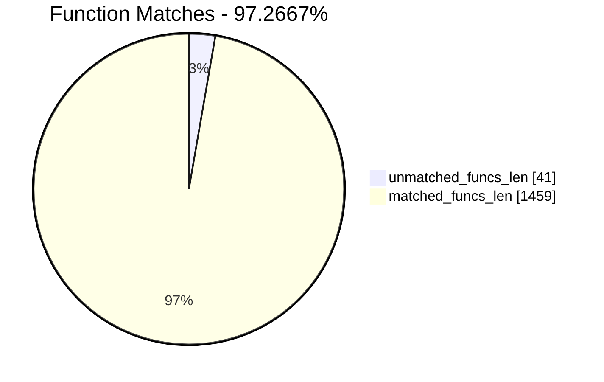
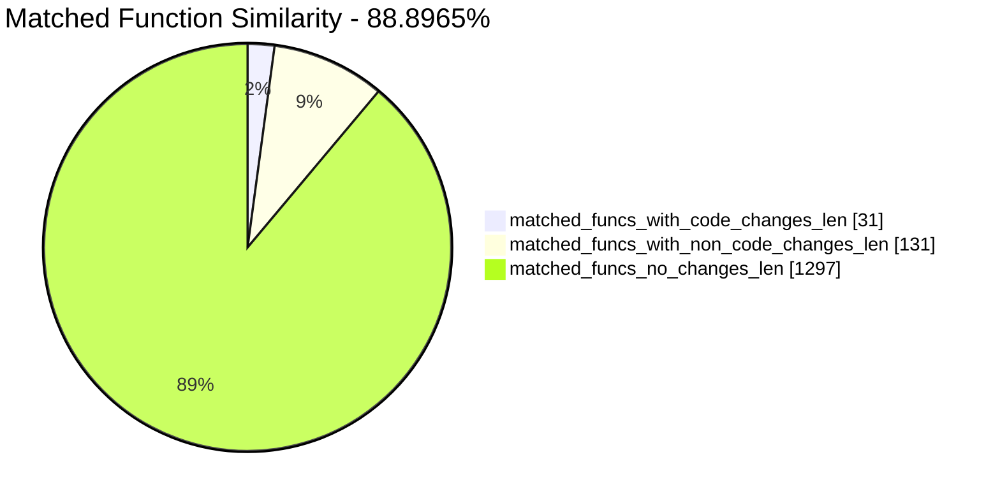
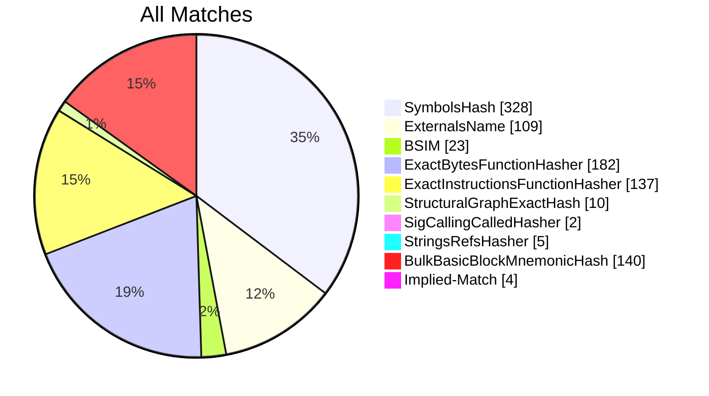
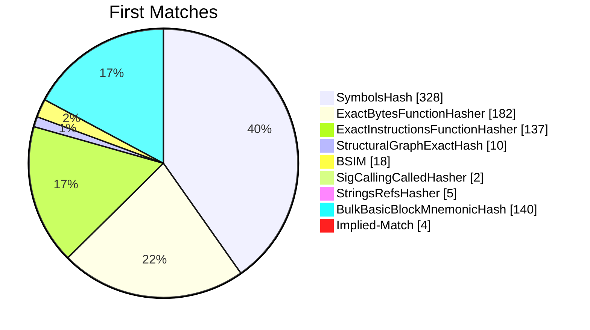
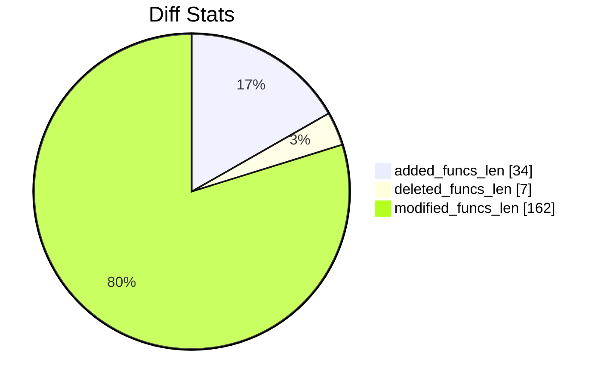
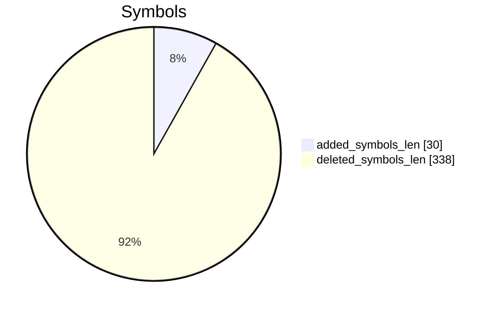
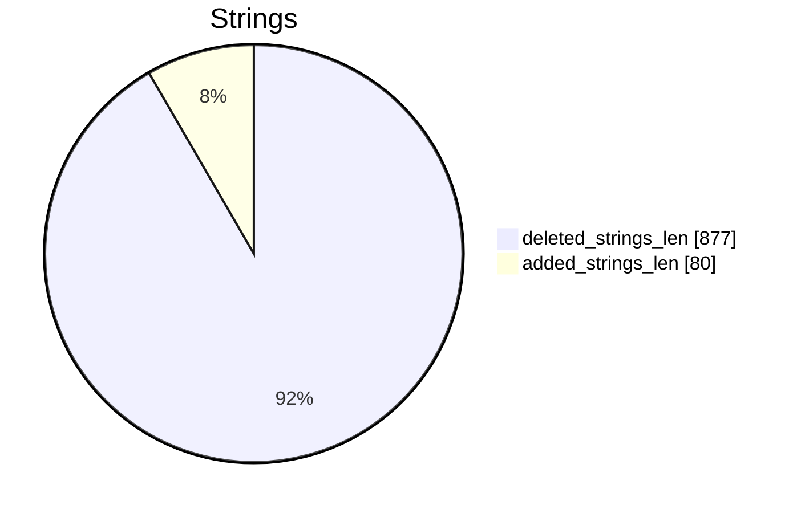

# CD_10_11_11_sixth_figs_review-CD_11_16_11_final Diff

# TOC

* [Visual Chart Diff](#visual-chart-diff)
* [Metadata](#metadata)
	* [Ghidra Diff Engine](#ghidra-diff-engine)
		* [Command Line](#command-line)
	* [Binary Metadata Diff](#binary-metadata-diff)
	* [Program Options](#program-options)
	* [Diff Stats](#diff-stats)
	* [Strings](#strings)
* [Deleted](#deleted)
	* [_FinishVideoPlayback](#_finishvideoplayback)
	* [_ResumeVideoPlayback](#_resumevideoplayback)
	* [<EXTERNAL>::dyld_stub_binder](#externaldyld_stub_binder)
	* [/System/Library/Frameworks/AudioToolbox.framework/AudioToolbox::_AudioSessionSetActive](#systemlibraryframeworksaudiotoolboxframeworkaudiotoolbox_audiosessionsetactive)
	* [/System/Library/Frameworks/OpenAL.framework/OpenAL::_alcProcessContext](#systemlibraryframeworksopenalframeworkopenal_alcprocesscontext)
	* [/usr/lib/libSystem.B.dylib::_dispatch_async](#usrliblibsystembdylib_dispatch_async)
	* [/System/Library/Frameworks/OpenAL.framework/OpenAL::_alcSuspendContext](#systemlibraryframeworksopenalframeworkopenal_alcsuspendcontext)
* [Added](#added)
	* [Sonic_CDViewController::mpPlayer](#sonic_cdviewcontrollermpplayer)
	* [Sonic_CDViewController::setMpPlayer:](#sonic_cdviewcontrollersetmpplayer)
	* [Sonic_CDViewController::mpViewController](#sonic_cdviewcontrollermpviewcontroller)
	* [FUN_0003a7f4](#fun_0003a7f4)
	* [FUN_0003b84c](#fun_0003b84c)
	* [Sonic_CDViewController::viewNetworkCheck](#sonic_cdviewcontrollerviewnetworkcheck)
	* [FUN_0003ce34](#fun_0003ce34)
	* [Sonic_CDViewController::setMpViewController:](#sonic_cdviewcontrollersetmpviewcontroller)
	* [FUN_000406bc](#fun_000406bc)
	* [FUN_00040880](#fun_00040880)
	* [Reachability::startNotifier](#reachabilitystartnotifier)
	* [FUN_0004233c](#fun_0004233c)
	* [Reachability::stopNotifier](#reachabilitystopnotifier)
	* [Reachability::dealloc](#reachabilitydealloc)
	* [FUN_00042618](#fun_00042618)
	* [Reachability::networkStatusForFlags:](#reachabilitynetworkstatusforflags)
	* [Reachability::currentReachabilityStatus](#reachabilitycurrentreachabilitystatus)
	* [Reachability::reachabilityWithHostName:](#reachabilityreachabilitywithhostname)
	* [Reachability::reachabilityWithAddress:](#reachabilityreachabilitywithaddress)
	* [Reachability::reachabilityForLocalWiFi](#reachabilityreachabilityforlocalwifi)
	* [Reachability::reachabilityForInternetConnection](#reachabilityreachabilityforinternetconnection)
	* [/System/Library/Frameworks/SystemConfiguration.framework/SystemConfiguration::_SCNetworkReachabilitySetCallback](#systemlibraryframeworkssystemconfigurationframeworksystemconfiguration_scnetworkreachabilitysetcallback)
	* [/usr/lib/libSystem.B.dylib::_sleep](#usrliblibsystembdylib_sleep)
	* [/System/Library/Frameworks/CoreFoundation.framework/CoreFoundation::_CFRunLoopGetCurrent](#systemlibraryframeworkscorefoundationframeworkcorefoundation_cfrunloopgetcurrent)
	* [/System/Library/Frameworks/SystemConfiguration.framework/SystemConfiguration::_SCNetworkReachabilityCreateWithName](#systemlibraryframeworkssystemconfigurationframeworksystemconfiguration_scnetworkreachabilitycreatewithname)
	* [/System/Library/Frameworks/CoreFoundation.framework/CoreFoundation::_CFRelease](#systemlibraryframeworkscorefoundationframeworkcorefoundation_cfrelease)
	* [/System/Library/Frameworks/SystemConfiguration.framework/SystemConfiguration::_SCNetworkReachabilityUnscheduleFromRunLoop](#systemlibraryframeworkssystemconfigurationframeworksystemconfiguration_scnetworkreachabilityunschedulefromrunloop)
	* [/System/Library/Frameworks/SystemConfiguration.framework/SystemConfiguration::_SCNetworkReachabilityGetFlags](#systemlibraryframeworkssystemconfigurationframeworksystemconfiguration_scnetworkreachabilitygetflags)
	* [<EXTERNAL>::_dispatch_async](#external_dispatch_async)
	* [/System/Library/Frameworks/OpenAL.framework/OpenAL::_alcGetCurrentContext](#systemlibraryframeworksopenalframeworkopenal_alcgetcurrentcontext)
	* [/System/Library/Frameworks/SystemConfiguration.framework/SystemConfiguration::_SCNetworkReachabilityCreateWithAddress](#systemlibraryframeworkssystemconfigurationframeworksystemconfiguration_scnetworkreachabilitycreatewithaddress)
	* [/usr/lib/libSystem.B.dylib::_bzero](#usrliblibsystembdylib_bzero)
	* [/System/Library/Frameworks/OpenAL.framework/OpenAL::_alcGetContextsDevice](#systemlibraryframeworksopenalframeworkopenal_alcgetcontextsdevice)
	* [/System/Library/Frameworks/SystemConfiguration.framework/SystemConfiguration::_SCNetworkReachabilityScheduleWithRunLoop](#systemlibraryframeworkssystemconfigurationframeworksystemconfiguration_scnetworkreachabilityschedulewithrunloop)
* [Modified](#modified)
	* [Sonic_CDViewController::authenticationChanged](#sonic_cdviewcontrollerauthenticationchanged)
	* [Sonic_CDAppDelegate::applicationDidBecomeActive:](#sonic_cdappdelegateapplicationdidbecomeactive)
	* [Sonic_CDViewController::alertView:didDismissWithButtonIndex:](#sonic_cdviewcontrolleralertviewdiddismisswithbuttonindex)
	* [GameCenterManager::callDelegateOnMainThread:withArg:error:](#gamecentermanagercalldelegateonmainthreadwithargerror)
	* [Sonic_CDAppDelegate::applicationWillTerminate:](#sonic_cdappdelegateapplicationwillterminate)
	* [Sonic_CDAppDelegate::application:didFinishLaunchingWithOptions:](#sonic_cdappdelegateapplicationdidfinishlaunchingwithoptions)
	* [GameCenterManager::preloadAchievements](#gamecentermanagerpreloadachievements)
	* [Sonic_CDAppDelegate::applicationWillResignActive:](#sonic_cdappdelegateapplicationwillresignactive)
	* [Sonic_CDViewController::startAnimation](#sonic_cdviewcontrollerstartanimation)
	* [Sonic_CDViewController::viewDidLoad](#sonic_cdviewcontrollerviewdidload)
	* [_DrawHLineScrollLayer8](#_drawhlinescrolllayer8)
	* [_PauseVideoPlayback](#_pausevideoplayback)
	* [___-[GameCenterManager_preloadAchievements]_block_invoke_1](#___-gamecentermanager_preloadachievements_block_invoke_1)
	* [___-[GameCenterManager_submitAchievement:percentComplete:]_block_invoke_1](#___-gamecentermanager_submitachievementpercentcomplete_block_invoke_1)
	* [-[MPMoviePlayerViewController(LandscapeOnly)_moviePlayerLoadStateChanged:]](#-mpmovieplayerviewcontrollerlandscapeonly_movieplayerloadstatechanged)
	* [_LoadSfx](#_loadsfx)
	* [_ProcessMainLoop](#_processmainloop)
	* [_OnlineSetLeaderboard](#_onlinesetleaderboard)
	* [_InitAudioPlayback](#_initaudioplayback)
	* [_ReleaseAudioPlayback](#_releaseaudioplayback)
	* [_ResumeSoundiOS](#_resumesoundios)
	* [_InitOpenAL](#_initopenal)
	* [_OnlineSetAchievement](#_onlinesetachievement)
	* [_OnlineLoadLeaderboardsMenu](#_onlineloadleaderboardsmenu)
	* [_OnlineLoadAchievementsMenu](#_onlineloadachievementsmenu)
	* [_PauseSoundiOS](#_pausesoundios)
	* [_PlayVideoFile](#_playvideofile)
	* [_interruptionListenerCallback](#_interruptionlistenercallback)
	* [_SuspendOpenAL](#_suspendopenal)
	* [_SuspendOpenAL](#_suspendopenal)
	* [_ResumeOpenAL](#_resumeopenal)
* [Modified (No Code Changes)](#modified-no-code-changes)
	* [_alSourceStop](#_alsourcestop)
	* [_alcOpenDevice](#_alcopendevice)
	* [_objc_copyStruct](#_objc_copystruct)
	* [_AudioSessionSetProperty](#_audiosessionsetproperty)
	* [_glBindRenderbuffer](#_glbindrenderbuffer)
	* [_fseek](#_fseek)
	* [_alcGetProcAddress](#_alcgetprocaddress)
	* [_glMultMatrixf](#_glmultmatrixf)
	* [_atan2f](#_atan2f)
	* [_memset](#_memset)
	* [_objc_setProperty](#_objc_setproperty)
	* [_glFramebufferTexture2DOES](#_glframebuffertexture2does)
	* [_glBindTexture](#_glbindtexture)
	* [_glRotatef](#_glrotatef)
	* [_objc_msgSend](#_objc_msgsend)
	* [___error](#___error)
	* [_memcmp](#_memcmp)
	* [_glTexParameteri](#_gltexparameteri)
	* [_glTexParameterf](#_gltexparameterf)
	* [_alGenBuffers](#_algenbuffers)
	* [___umodsi3](#___umodsi3)
	* [_memcpy](#_memcpy)
	* [_pthread_attr_init](#_pthread_attr_init)
	* [_cosf](#_cosf)
	* [_CGAffineTransformMakeRotation](#_cgaffinetransformmakerotation)
	* [_alSourcePlay](#_alsourceplay)
	* [_memchr](#_memchr)
	* [_glViewport](#_glviewport)
	* [_alcMakeContextCurrent](#_alcmakecontextcurrent)
	* [_glCheckFramebufferStatus](#_glcheckframebufferstatus)
	* [_glLoadIdentity](#_glloadidentity)
	* [__Block_object_assign](#__block_object_assign)
	* [_fwrite](#_fwrite)
	* [_UIApplicationMain](#_uiapplicationmain)
	* [_exit](#_exit)
	* [_alSourcefv](#_alsourcefv)
	* [_fopen](#_fopen)
	* [_alDeleteBuffers](#_aldeletebuffers)
	* [_objc_enumerationMutation](#_objc_enumerationmutation)
	* [_glColorPointer](#_glcolorpointer)
	* [_NSLog](#_nslog)
	* [_alGetError](#_algeterror)
	* [_alDeleteSources](#_aldeletesources)
	* [_glGenRenderbuffers](#_glgenrenderbuffers)
	* [_glPopMatrix](#_glpopmatrix)
	* [_tanf](#_tanf)
	* [_strcmp](#_strcmp)
	* [_glGenFramebuffers](#_glgenframebuffers)
	* [__Block_object_dispose](#__block_object_dispose)
	* [_objc_msgSend_stret](#_objc_msgsend_stret)
	* [_glDisable](#_gldisable)
	* [_alcCloseDevice](#_alcclosedevice)
	* [_calloc](#_calloc)
	* [_pthread_attr_setdetachstate](#_pthread_attr_setdetachstate)
	* [_free](#_free)
	* [_alListenerfv](#_allistenerfv)
	* [_glTexSubImage2D](#_gltexsubimage2d)
	* [_fclose](#_fclose)
	* [_glScalef](#_glscalef)
	* [_glClearColor](#_glclearcolor)
	* [_pthread_create](#_pthread_create)
	* [_glFramebufferRenderbuffer](#_glframebufferrenderbuffer)
	* [_glTexCoordPointer](#_gltexcoordpointer)
	* [_alGetSourcei](#_algetsourcei)
	* [viewController](#viewcontroller)
	* [_glClear](#_glclear)
	* [_realloc](#_realloc)
	* [_glDeleteRenderbuffers](#_gldeleterenderbuffers)
	* [_alSourcei](#_alsourcei)
	* [_alSourcef](#_alsourcef)
	* [_glEnable](#_glenable)
	* [_alcCreateContext](#_alccreatecontext)
	* [_malloc](#_malloc)
	* [_glOrthof](#_glorthof)
	* [_objc_getProperty](#_objc_getproperty)
	* [___divsi3](#___divsi3)
	* [_ftell](#_ftell)
	* [_glTranslatef](#_gltranslatef)
	* [_sinf](#_sinf)
	* [_alGenSources](#_algensources)
	* [_glGenTextures](#_glgentextures)
	* [_alcDestroyContext](#_alcdestroycontext)
	* [_glDeleteFramebuffersOES](#_gldeleteframebuffersoes)
	* [_glDeleteTextures](#_gldeletetextures)
	* [_glDrawElements](#_gldrawelements)
	* [_objc_msgSendSuper2](#_objc_msgsendsuper2)
	* [___assert_rtn](#___assert_rtn)
	* [_glDeleteFramebuffers](#_gldeleteframebuffers)
	* [_glVertexPointer](#_glvertexpointer)
	* [_glBlendFunc](#_glblendfunc)
	* [_rand](#_rand)
	* [_alSourcePause](#_alsourcepause)
	* [_qsort](#_qsort)
	* [_AudioSessionInitialize](#_audiosessioninitialize)
	* [_glEnableClientState](#_glenableclientstate)
	* [_glGenFramebuffersOES](#_glgenframebuffersoes)
	* [_glDisableClientState](#_gldisableclientstate)
	* [_fread](#_fread)
	* [_glBindFramebuffer](#_glbindframebuffer)
	* [___modsi3](#___modsi3)
	* [_NSSearchPathForDirectoriesInDomains](#_nssearchpathfordirectoriesindomains)
	* [_glPushMatrix](#_glpushmatrix)
	* [_sysctlbyname](#_sysctlbyname)
	* [_pthread_attr_destroy](#_pthread_attr_destroy)
	* [___divdi3](#___divdi3)
	* [_glMatrixMode](#_glmatrixmode)
	* [_glBindFramebufferOES](#_glbindframebufferoes)
	* [_NSClassFromString](#_nsclassfromstring)
	* [_glTexImage2D](#_glteximage2d)
	* [_glGetRenderbufferParameteriv](#_glgetrenderbufferparameteriv)

# Visual Chart Diff

```mermaid

flowchart LR

Sonic_CDViewControllerauthenticationChanged-2-old<--Match 67%-->Sonic_CDViewControllerauthenticationChanged-2-new
Sonic_CDAppDelegateapplicationDidBecomeActive-3-old<--Match 66%-->Sonic_CDAppDelegateapplicationDidBecomeActive-3-new
Sonic_CDViewControlleralertViewdidDismissWithButtonIndex-4-old<--Match 97%-->Sonic_CDViewControlleralertViewdidDismissWithButtonIndex-4-new
GameCenterManagercallDelegateOnMainThreadwithArgerror-5-old<--Match 93%-->GameCenterManagercallDelegateOnMainThreadwithArgerror-5-new
Sonic_CDAppDelegateapplicationWillTerminate-3-old<--Match 77%-->Sonic_CDAppDelegateapplicationWillTerminate-3-new
Sonic_CDAppDelegateapplicationdidFinishLaunchingWithOptions-4-old<--Match 76%-->Sonic_CDAppDelegateapplicationdidFinishLaunchingWithOptions-4-new
GameCenterManagerpreloadAchievements-2-old<--Match 76%-->GameCenterManagerpreloadAchievements-2-new
Sonic_CDAppDelegateapplicationWillResignActive-3-old<--Match 76%-->Sonic_CDAppDelegateapplicationWillResignActive-3-new
Sonic_CDViewControllerstartAnimation-2-old<--Match 83%-->Sonic_CDViewControllerstartAnimation-2-new
Sonic_CDViewControllerviewDidLoad-2-old<--Match 9%-->Sonic_CDViewControllerviewDidLoad-2-new
_DrawHLineScrollLayer8-0-old<--Match 99%-->FUN_0002ac28-0-new
_PauseVideoPlayback-0-old<--Match 57%-->ReachabilityconnectionRequired-0-new
___-GameCenterManager_preloadAchievements_block_invoke_1-0-old<--Match 91%-->FUN_0003fe1c-0-new
___-GameCenterManager_submitAchievementpercentComplete_block_invoke_1-0-old<--Match 92%-->FUN_0003ff9c-0-new
-MPMoviePlayerViewControllerLandscapeOnly_moviePlayerLoadStateChanged-0-old<--Match 59%-->FUN_0003a974-0-new
_LoadSfx-0-old<--Match 98%-->FUN_00029d8c-0-new
_ProcessMainLoop-0-old<--Match 93%-->FUN_0000a930-0-new
_OnlineSetLeaderboard-0-old<--Match 99%-->FUN_0003aa50-0-new
_InitAudioPlayback-0-old<--Match 80%-->FUN_0002a1fc-0-new
_ReleaseAudioPlayback-0-old<--Match 95%-->FUN_00029bf4-0-new
_ResumeSoundiOS-0-old<--Match 95%-->FUN_000295c8-0-new
_InitOpenAL-0-old<--Match 77%-->FUN_0002a100-0-new
_OnlineSetAchievement-0-old<--Match 99%-->FUN_0003b060-0-new
_OnlineLoadLeaderboardsMenu-0-old<--Match 50%-->FUN_0003e130-0-new
_OnlineLoadAchievementsMenu-0-old<--Match 48%-->FUN_0003e700-0-new
_PauseSoundiOS-0-old<--Match 68%-->FUN_00029628-0-new
CD_10_11_11_sixth_figs_review<--6ommited-->CD_11_16_11_final

subgraph CD_11_16_11_final
    Sonic_CDViewControllerauthenticationChanged-2-new
Sonic_CDAppDelegateapplicationDidBecomeActive-3-new
Sonic_CDViewControlleralertViewdidDismissWithButtonIndex-4-new
GameCenterManagercallDelegateOnMainThreadwithArgerror-5-new
Sonic_CDAppDelegateapplicationWillTerminate-3-new
Sonic_CDAppDelegateapplicationdidFinishLaunchingWithOptions-4-new
GameCenterManagerpreloadAchievements-2-new
Sonic_CDAppDelegateapplicationWillResignActive-3-new
Sonic_CDViewControllerstartAnimation-2-new
Sonic_CDViewControllerviewDidLoad-2-new
FUN_0002ac28-0-new
ReachabilityconnectionRequired-0-new
FUN_0003fe1c-0-new
FUN_0003ff9c-0-new
FUN_0003a974-0-new
FUN_00029d8c-0-new
FUN_0000a930-0-new
FUN_0003aa50-0-new
FUN_0002a1fc-0-new
FUN_00029bf4-0-new
FUN_000295c8-0-new
FUN_0002a100-0-new
FUN_0003b060-0-new
FUN_0003e130-0-new
FUN_0003e700-0-new
FUN_00029628-0-new
    subgraph Added
direction LR
Sonic_CDViewController-mpPlayer
    Sonic_CDViewController-setMpPlayer
    Sonic_CDViewController-mpViewController
    FUN_0003a7f4
    FUN_0003b84c
    Sonic_CDViewController-viewNetworkCheck
    FUN_0003ce34
    Sonic_CDViewController-setMpViewController
    FUN_000406bc
    FUN_00040880
    Reachability-startNotifier
    FUN_0004233c
    Reachability-stopNotifier
    Reachability-dealloc
    FUN_00042618
    Reachability-networkStatusForFlags
    Reachability-currentReachabilityStatus
    Reachability-reachabilityWithHostName
    Reachability-reachabilityWithAddress
    Reachability-reachabilityForLocalWiFi
    Reachability-reachabilityForInternetConnection
    SystemLibraryFrameworksSystemConfigurationframeworkSystemConfiguration-_SCNetworkReachabilitySetCallback
    usrliblibSystemBdylib-_sleep
    SystemLibraryFrameworksCoreFoundationframeworkCoreFoundation-_CFRunLoopGetCurrent
    SystemLibraryFrameworksSystemConfigurationframeworkSystemConfiguration-_SCNetworkReachabilityCreateWithName
    SystemLibraryFrameworksCoreFoundationframeworkCoreFoundation-_CFRelease
    SystemLibraryFrameworksSystemConfigurationframeworkSystemConfiguration-_SCNetworkReachabilityUnscheduleFromRunLoop
    9_more_added_funcs_omitted
end
end

subgraph CD_10_11_11_sixth_figs_review
    Sonic_CDViewControllerauthenticationChanged-2-old
Sonic_CDAppDelegateapplicationDidBecomeActive-3-old
Sonic_CDViewControlleralertViewdidDismissWithButtonIndex-4-old
GameCenterManagercallDelegateOnMainThreadwithArgerror-5-old
Sonic_CDAppDelegateapplicationWillTerminate-3-old
Sonic_CDAppDelegateapplicationdidFinishLaunchingWithOptions-4-old
GameCenterManagerpreloadAchievements-2-old
Sonic_CDAppDelegateapplicationWillResignActive-3-old
Sonic_CDViewControllerstartAnimation-2-old
Sonic_CDViewControllerviewDidLoad-2-old
_DrawHLineScrollLayer8-0-old
_PauseVideoPlayback-0-old
___-GameCenterManager_preloadAchievements_block_invoke_1-0-old
___-GameCenterManager_submitAchievementpercentComplete_block_invoke_1-0-old
-MPMoviePlayerViewControllerLandscapeOnly_moviePlayerLoadStateChanged-0-old
_LoadSfx-0-old
_ProcessMainLoop-0-old
_OnlineSetLeaderboard-0-old
_InitAudioPlayback-0-old
_ReleaseAudioPlayback-0-old
_ResumeSoundiOS-0-old
_InitOpenAL-0-old
_OnlineSetAchievement-0-old
_OnlineLoadLeaderboardsMenu-0-old
_OnlineLoadAchievementsMenu-0-old
_PauseSoundiOS-0-old
    subgraph Deleted
direction LR
_FinishVideoPlayback
    _ResumeVideoPlayback
    EXTERNAL-dyld_stub_binder
    SystemLibraryFrameworksAudioToolboxframeworkAudioToolbox-_AudioSessionSetActive
    SystemLibraryFrameworksOpenALframeworkOpenAL-_alcProcessContext
    usrliblibSystemBdylib-_dispatch_async
    SystemLibraryFrameworksOpenALframeworkOpenAL-_alcSuspendContext
end
end

```










# Metadata

## Ghidra Diff Engine

### Command Line

#### Captured Command Line


```
ghidriff --project-location ghidra_projects --project-name ghidriff --symbols-path symbols --threaded --log-level INFO --file-log-level INFO --log-path ghidriff.log --min-func-len 2 --gdt [] --bsim --max-ram-percent 60.0 --max-section-funcs 200 CD_10_11_11_sixth_figs_review CD_11_16_11_final
```


#### Verbose Args


<details>

```
--old ['CD_10_11_11_sixth_figs_review'] --new [['CD_11_16_11_final']] --engine VersionTrackingDiff --output-path CD_10_11_11_sixth_figs_review-CD_11_16_11_final --summary False --project-location ghidra_projects --project-name ghidriff --symbols-path symbols --threaded True --force-analysis False --force-diff False --no-symbols False --log-level INFO --file-log-level INFO --log-path ghidriff.log --va False --min-func-len 2 --use-calling-counts False --gdt [] --bsim True --bsim-full False --max-ram-percent 60.0 --print-flags False --jvm-args None --side-by-side False --max-section-funcs 200 --md-title None
```


</details>

## Binary Metadata Diff


```diff
--- CD_10_11_11_sixth_figs_review Meta
+++ CD_11_16_11_final Meta
@@ -1,45 +1,46 @@
-Program Name: CD_10_11_11_sixth_figs_review
+Program Name: CD_11_16_11_final
 Language ID: ARM:LE:32:v6 (1.107)
 Compiler ID: default
 Processor: ARM
 Endian: Little
 Address Size: 32
 Minimum Address: 00001000
-Maximum Address: 012d4003
-# of Bytes: 19734756
-# of Memory Blocks: 32
-# of Instructions: 59074
-# of Defined Data: 16138
-# of Functions: 732
-# of Symbols: 4615
-# of Data Types: 157
+Maximum Address: 012bf0ef
+# of Bytes: 19652848
+# of Memory Blocks: 28
+# of Instructions: 60722
+# of Defined Data: 11631
+# of Functions: 768
+# of Symbols: 4323
+# of Data Types: 167
 # of Data Type Categories: 10
 Analyzed: true
 Created With Ghidra Version: 11.0.3
-Date Created: Thu Jan 09 19:29:13 CET 2025
+Date Created: Thu Jan 09 19:29:15 CET 2025
 Executable Format: Mac OS X Mach-O
-Executable Location: /home/user/CD_10_11_11_sixth_figs_review
-Executable MD5: 07a034aded8eca7a1bbbc87c26a6eab1
-Executable SHA256: d7cbf4f0650e7d749321804b494ecc039748999100628929d1805ae743b89372
-FSRL: file:///home/user/CD_10_11_11_sixth_figs_review?MD5=07a034aded8eca7a1bbbc87c26a6eab1
+Executable Location: /home/user/CD_11_16_11_final
+Executable MD5: a3bf7d6599f94183321b7facf58acb5d
+Executable SHA256: 43e7605bdd709628187ae4238713048270eb089b7f334c0d0221af743c5d8ab7
+FSRL: file:///home/user/CD_11_16_11_final?MD5=a3bf7d6599f94183321b7facf58acb5d
 Mach-O File Type: EXECUTE
 Mach-O File Type Description: Demand Paged Executable File
 Mach-O Flag 0: NOUNDEFS
 Mach-O Flag 1: DYLDLINK
 Mach-O Flag 2: TWOLEVEL
 Preferred Root Namespace Category: 
 Relocatable: false
-Required Library [    0]: /System/Library/Frameworks/MediaPlayer.framework/MediaPlayer
-Required Library [    1]: /System/Library/Frameworks/CoreGraphics.framework/CoreGraphics
-Required Library [    2]: /System/Library/Frameworks/GameKit.framework/GameKit
-Required Library [    3]: /System/Library/Frameworks/AudioToolbox.framework/AudioToolbox
-Required Library [    4]: /System/Library/Frameworks/Foundation.framework/Foundation
-Required Library [    5]: /System/Library/Frameworks/UIKit.framework/UIKit
-Required Library [    6]: /System/Library/Frameworks/OpenGLES.framework/OpenGLES
-Required Library [    7]: /System/Library/Frameworks/QuartzCore.framework/QuartzCore
-Required Library [    8]: /System/Library/Frameworks/OpenAL.framework/OpenAL
-Required Library [    9]: /usr/lib/libgcc_s.1.dylib
-Required Library [   10]: /usr/lib/libSystem.B.dylib
-Required Library [   11]: /usr/lib/libobjc.A.dylib
-Required Library [   12]: /System/Library/Frameworks/CoreFoundation.framework/CoreFoundation
+Required Library [    0]: /System/Library/Frameworks/SystemConfiguration.framework/SystemConfiguration
+Required Library [    1]: /System/Library/Frameworks/MediaPlayer.framework/MediaPlayer
+Required Library [    2]: /System/Library/Frameworks/CoreGraphics.framework/CoreGraphics
+Required Library [    3]: /System/Library/Frameworks/GameKit.framework/GameKit
+Required Library [    4]: /System/Library/Frameworks/AudioToolbox.framework/AudioToolbox
+Required Library [    5]: /System/Library/Frameworks/Foundation.framework/Foundation
+Required Library [    6]: /System/Library/Frameworks/UIKit.framework/UIKit
+Required Library [    7]: /System/Library/Frameworks/OpenGLES.framework/OpenGLES
+Required Library [    8]: /System/Library/Frameworks/QuartzCore.framework/QuartzCore
+Required Library [    9]: /System/Library/Frameworks/OpenAL.framework/OpenAL
+Required Library [   10]: /usr/lib/libgcc_s.1.dylib
+Required Library [   11]: /usr/lib/libSystem.B.dylib
+Required Library [   12]: /usr/lib/libobjc.A.dylib
+Required Library [   13]: /System/Library/Frameworks/CoreFoundation.framework/CoreFoundation
 Should Ask To Analyze: false

```


## Program Options


<details>
<summary>Ghidra CD_10_11_11_sixth_figs_review Decompiler Options</summary>


|Decompiler Option|Value|
| :---: | :---: |
|Prototype Evaluation|__stdcall|

</details>


<details>
<summary>Ghidra CD_10_11_11_sixth_figs_review Specification extensions Options</summary>


|Specification extensions Option|Value|
| :---: | :---: |
|FormatVersion|0|
|VersionCounter|0|

</details>


<details>
<summary>Ghidra CD_10_11_11_sixth_figs_review Analyzers Options</summary>


|Analyzers Option|Value|
| :---: | :---: |
|ARM Aggressive Instruction Finder|false|
|ARM Constant Reference Analyzer|true|
|ARM Constant Reference Analyzer.Create Data from pointer|false|
|ARM Constant Reference Analyzer.Function parameter/return Pointer analysis|true|
|ARM Constant Reference Analyzer.Max Threads|2|
|ARM Constant Reference Analyzer.Min absolute reference|4|
|ARM Constant Reference Analyzer.Require pointer param data type|false|
|ARM Constant Reference Analyzer.Speculative reference max|256|
|ARM Constant Reference Analyzer.Speculative reference min|512|
|ARM Constant Reference Analyzer.Stored Value Pointer analysis|true|
|ARM Constant Reference Analyzer.Switch Table Recovery|false|
|ARM Constant Reference Analyzer.Trust values read from writable memory|true|
|ARM Symbol|true|
|ASCII Strings|true|
|ASCII Strings.Create Strings Containing Existing Strings|true|
|ASCII Strings.Create Strings Containing References|true|
|ASCII Strings.Force Model Reload|false|
|ASCII Strings.Minimum String Length|LEN_5|
|ASCII Strings.Model File|StringModel.sng|
|ASCII Strings.Require Null Termination for String|true|
|ASCII Strings.Search Only in Accessible Memory Blocks|true|
|ASCII Strings.String Start Alignment|ALIGN_1|
|ASCII Strings.String end alignment|4|
|Aggressive Instruction Finder|false|
|Aggressive Instruction Finder.Create Analysis Bookmarks|true|
|Apply Data Archives|true|
|Apply Data Archives.Archive Chooser|[Auto-Detect]|
|Apply Data Archives.Create Analysis Bookmarks|true|
|Apply Data Archives.GDT User File Archive Path|None|
|Apply Data Archives.User Project Archive Path|None|
|CFStrings|true|
|Call Convention ID|true|
|Call Convention ID.Analysis Decompiler Timeout (sec)|60|
|Call-Fixup Installer|true|
|Condense Filler Bytes|false|
|Condense Filler Bytes.Filler Value|Auto|
|Condense Filler Bytes.Minimum number of sequential bytes|1|
|Create Address Tables|true|
|Create Address Tables.Allow Offcut References|false|
|Create Address Tables.Auto Label Table|false|
|Create Address Tables.Create Analysis Bookmarks|true|
|Create Address Tables.Maxmimum Pointer Distance|16777215|
|Create Address Tables.Minimum Pointer Address|4132|
|Create Address Tables.Minimum Table Size|4|
|Create Address Tables.Pointer Alignment|1|
|Create Address Tables.Relocation Table Guide|true|
|Create Address Tables.Table Alignment|4|
|DWARF Line Number|false|
|Data Reference|true|
|Data Reference.Address Table Alignment|1|
|Data Reference.Address Table Minimum Size|4|
|Data Reference.Align End of Strings|false|
|Data Reference.Ascii String References|true|
|Data Reference.Create Address Tables|false|
|Data Reference.Minimum String Length|5|
|Data Reference.References to Pointers|false|
|Data Reference.Relocation Table Guide|true|
|Data Reference.Respect Execute Flag|true|
|Data Reference.Subroutine References|true|
|Data Reference.Switch Table References|false|
|Data Reference.Unicode String References|true|
|Decompiler Parameter ID|false|
|Decompiler Parameter ID.Analysis Clear Level|ANALYSIS|
|Decompiler Parameter ID.Analysis Decompiler Timeout (sec)|60|
|Decompiler Parameter ID.Commit Data Types|true|
|Decompiler Parameter ID.Commit Void Return Values|false|
|Decompiler Parameter ID.Prototype Evaluation|__stdcall|
|Decompiler Switch Analysis|true|
|Decompiler Switch Analysis.Analysis Decompiler Timeout (sec)|60|
|Demangler GNU|true|
|Demangler GNU.Apply Function Calling Conventions|true|
|Demangler GNU.Apply Function Signatures|true|
|Demangler GNU.Demangle Only Known Mangled Symbols|false|
|Demangler GNU.Demangler Format|AUTO|
|Demangler GNU.Use Deprecated Demangler|false|
|Disassemble Entry Points|true|
|Disassemble Entry Points.Respect Execute Flag|true|
|Embedded Media|true|
|Embedded Media.Create Analysis Bookmarks|true|
|External Entry References|true|
|External Symbol Resolver|true|
|Function Start Pre Search|true|
|Function Start Pre Search.Bookmark Functions|false|
|Function Start Pre Search.Search Data Blocks|false|
|Function Start Search|true|
|Function Start Search After Code|true|
|Function Start Search After Code.Bookmark Functions|false|
|Function Start Search After Code.Search Data Blocks|false|
|Function Start Search After Data|true|
|Function Start Search After Data.Bookmark Functions|false|
|Function Start Search After Data.Search Data Blocks|false|
|Function Start Search.Bookmark Functions|false|
|Function Start Search.Search Data Blocks|false|
|Mach-O Function Starts|true|
|Mach-O Function Starts.Bookmark failed functions|false|
|Mach-O Function Starts.Bookmark new functions|false|
|Mach-O Function Starts.Bookmark skipped functions|false|
|Mach-O Function Starts.Use PseudoDisassembler|true|
|Non-Returning Functions - Discovered|true|
|Non-Returning Functions - Discovered.Create Analysis Bookmarks|true|
|Non-Returning Functions - Discovered.Function Non-return Threshold|3|
|Non-Returning Functions - Discovered.Repair Flow Damage|true|
|Non-Returning Functions - Known|true|
|Non-Returning Functions - Known.Create Analysis Bookmarks|true|
|Objective-C 2 Class|true|
|Objective-C 2 Decompiler Message|true|
|Objective-C 2 Message|false|
|Reference|true|
|Reference.Address Table Alignment|1|
|Reference.Address Table Minimum Size|4|
|Reference.Align End of Strings|false|
|Reference.Ascii String References|true|
|Reference.Create Address Tables|false|
|Reference.Minimum String Length|5|
|Reference.References to Pointers|false|
|Reference.Relocation Table Guide|true|
|Reference.Respect Execute Flag|true|
|Reference.Subroutine References|true|
|Reference.Switch Table References|false|
|Reference.Unicode String References|true|
|Scalar Operand References|false|
|Scalar Operand References.Relocation Table Guide|true|
|Shared Return Calls|true|
|Shared Return Calls.Allow Conditional Jumps|false|
|Shared Return Calls.Assume Contiguous Functions Only|false|
|Stack|true|
|Stack.Create Local Variables|true|
|Stack.Create Param Variables|true|
|Stack.useNewFunctionStackAnalysis|true|
|Subroutine References|true|
|Subroutine References.Create Thunks Early|true|
|Variadic Function Signature Override|false|
|Variadic Function Signature Override.Create Analysis Bookmarks|false|

</details>


<details>
<summary>Ghidra CD_11_16_11_final Decompiler Options</summary>


|Decompiler Option|Value|
| :---: | :---: |
|Prototype Evaluation|__stdcall|

</details>


<details>
<summary>Ghidra CD_11_16_11_final Specification extensions Options</summary>


|Specification extensions Option|Value|
| :---: | :---: |
|FormatVersion|0|
|VersionCounter|0|

</details>


<details>
<summary>Ghidra CD_11_16_11_final Analyzers Options</summary>


|Analyzers Option|Value|
| :---: | :---: |
|ARM Aggressive Instruction Finder|false|
|ARM Constant Reference Analyzer|true|
|ARM Constant Reference Analyzer.Create Data from pointer|false|
|ARM Constant Reference Analyzer.Function parameter/return Pointer analysis|true|
|ARM Constant Reference Analyzer.Max Threads|2|
|ARM Constant Reference Analyzer.Min absolute reference|4|
|ARM Constant Reference Analyzer.Require pointer param data type|false|
|ARM Constant Reference Analyzer.Speculative reference max|256|
|ARM Constant Reference Analyzer.Speculative reference min|512|
|ARM Constant Reference Analyzer.Stored Value Pointer analysis|true|
|ARM Constant Reference Analyzer.Switch Table Recovery|false|
|ARM Constant Reference Analyzer.Trust values read from writable memory|true|
|ARM Symbol|true|
|ASCII Strings|true|
|ASCII Strings.Create Strings Containing Existing Strings|true|
|ASCII Strings.Create Strings Containing References|true|
|ASCII Strings.Force Model Reload|false|
|ASCII Strings.Minimum String Length|LEN_5|
|ASCII Strings.Model File|StringModel.sng|
|ASCII Strings.Require Null Termination for String|true|
|ASCII Strings.Search Only in Accessible Memory Blocks|true|
|ASCII Strings.String Start Alignment|ALIGN_1|
|ASCII Strings.String end alignment|4|
|Aggressive Instruction Finder|false|
|Aggressive Instruction Finder.Create Analysis Bookmarks|true|
|Apply Data Archives|true|
|Apply Data Archives.Archive Chooser|[Auto-Detect]|
|Apply Data Archives.Create Analysis Bookmarks|true|
|Apply Data Archives.GDT User File Archive Path|None|
|Apply Data Archives.User Project Archive Path|None|
|CFStrings|true|
|Call Convention ID|true|
|Call Convention ID.Analysis Decompiler Timeout (sec)|60|
|Call-Fixup Installer|true|
|Condense Filler Bytes|false|
|Condense Filler Bytes.Filler Value|Auto|
|Condense Filler Bytes.Minimum number of sequential bytes|1|
|Create Address Tables|true|
|Create Address Tables.Allow Offcut References|false|
|Create Address Tables.Auto Label Table|false|
|Create Address Tables.Create Analysis Bookmarks|true|
|Create Address Tables.Maxmimum Pointer Distance|16777215|
|Create Address Tables.Minimum Pointer Address|4132|
|Create Address Tables.Minimum Table Size|4|
|Create Address Tables.Pointer Alignment|1|
|Create Address Tables.Relocation Table Guide|true|
|Create Address Tables.Table Alignment|4|
|DWARF Line Number|false|
|Data Reference|true|
|Data Reference.Address Table Alignment|1|
|Data Reference.Address Table Minimum Size|4|
|Data Reference.Align End of Strings|false|
|Data Reference.Ascii String References|true|
|Data Reference.Create Address Tables|false|
|Data Reference.Minimum String Length|5|
|Data Reference.References to Pointers|false|
|Data Reference.Relocation Table Guide|true|
|Data Reference.Respect Execute Flag|true|
|Data Reference.Subroutine References|true|
|Data Reference.Switch Table References|false|
|Data Reference.Unicode String References|true|
|Decompiler Parameter ID|false|
|Decompiler Parameter ID.Analysis Clear Level|ANALYSIS|
|Decompiler Parameter ID.Analysis Decompiler Timeout (sec)|60|
|Decompiler Parameter ID.Commit Data Types|true|
|Decompiler Parameter ID.Commit Void Return Values|false|
|Decompiler Parameter ID.Prototype Evaluation|__stdcall|
|Decompiler Switch Analysis|true|
|Decompiler Switch Analysis.Analysis Decompiler Timeout (sec)|60|
|Demangler GNU|true|
|Demangler GNU.Apply Function Calling Conventions|true|
|Demangler GNU.Apply Function Signatures|true|
|Demangler GNU.Demangle Only Known Mangled Symbols|false|
|Demangler GNU.Demangler Format|AUTO|
|Demangler GNU.Use Deprecated Demangler|false|
|Disassemble Entry Points|true|
|Disassemble Entry Points.Respect Execute Flag|true|
|Embedded Media|true|
|Embedded Media.Create Analysis Bookmarks|true|
|External Entry References|true|
|External Symbol Resolver|true|
|Function Start Pre Search|true|
|Function Start Pre Search.Bookmark Functions|false|
|Function Start Pre Search.Search Data Blocks|false|
|Function Start Search|true|
|Function Start Search After Code|true|
|Function Start Search After Code.Bookmark Functions|false|
|Function Start Search After Code.Search Data Blocks|false|
|Function Start Search After Data|true|
|Function Start Search After Data.Bookmark Functions|false|
|Function Start Search After Data.Search Data Blocks|false|
|Function Start Search.Bookmark Functions|false|
|Function Start Search.Search Data Blocks|false|
|Mach-O Function Starts|true|
|Mach-O Function Starts.Bookmark failed functions|false|
|Mach-O Function Starts.Bookmark new functions|false|
|Mach-O Function Starts.Bookmark skipped functions|false|
|Mach-O Function Starts.Use PseudoDisassembler|true|
|Non-Returning Functions - Discovered|true|
|Non-Returning Functions - Discovered.Create Analysis Bookmarks|true|
|Non-Returning Functions - Discovered.Function Non-return Threshold|3|
|Non-Returning Functions - Discovered.Repair Flow Damage|true|
|Non-Returning Functions - Known|true|
|Non-Returning Functions - Known.Create Analysis Bookmarks|true|
|Objective-C 2 Class|true|
|Objective-C 2 Decompiler Message|true|
|Objective-C 2 Message|false|
|Reference|true|
|Reference.Address Table Alignment|1|
|Reference.Address Table Minimum Size|4|
|Reference.Align End of Strings|false|
|Reference.Ascii String References|true|
|Reference.Create Address Tables|false|
|Reference.Minimum String Length|5|
|Reference.References to Pointers|false|
|Reference.Relocation Table Guide|true|
|Reference.Respect Execute Flag|true|
|Reference.Subroutine References|true|
|Reference.Switch Table References|false|
|Reference.Unicode String References|true|
|Scalar Operand References|false|
|Scalar Operand References.Relocation Table Guide|true|
|Shared Return Calls|true|
|Shared Return Calls.Allow Conditional Jumps|false|
|Shared Return Calls.Assume Contiguous Functions Only|false|
|Stack|true|
|Stack.Create Local Variables|true|
|Stack.Create Param Variables|true|
|Stack.useNewFunctionStackAnalysis|true|
|Subroutine References|true|
|Subroutine References.Create Thunks Early|true|
|Variadic Function Signature Override|false|
|Variadic Function Signature Override.Create Analysis Bookmarks|false|

</details>

## Diff Stats


|Stat|Value|
| :---: | :---: |
|added_funcs_len|34|
|deleted_funcs_len|7|
|modified_funcs_len|162|
|added_symbols_len|30|
|deleted_symbols_len|338|
|diff_time|8.777228355407715|
|deleted_strings_len|877|
|added_strings_len|80|
|match_types|Counter({'SymbolsHash': 328, 'ExactBytesFunctionHasher': 182, 'BulkBasicBlockMnemonicHash': 140, 'ExactInstructionsFunctionHasher': 137, 'ExternalsName': 109, 'BSIM': 23, 'StructuralGraphExactHash': 10, 'StringsRefsHasher': 5, 'Implied Match': 4, 'SigCallingCalledHasher': 2})|
|items_to_process|571|
|diff_types|Counter({'address': 162, 'length': 142, 'calling': 128, 'name': 42, 'fullname': 42, 'sig': 42, 'refcount': 40, 'code': 31, 'called': 27, 'parent': 2})|
|unmatched_funcs_len|41|
|total_funcs_len|1500|
|matched_funcs_len|1459|
|matched_funcs_with_code_changes_len|31|
|matched_funcs_with_non_code_changes_len|131|
|matched_funcs_no_changes_len|1297|
|match_func_similarity_percent|88.8965%|
|func_match_overall_percent|97.2667%|
|first_matches|Counter({'SymbolsHash': 328, 'ExactBytesFunctionHasher': 182, 'BulkBasicBlockMnemonicHash': 140, 'ExactInstructionsFunctionHasher': 137, 'BSIM': 18, 'StructuralGraphExactHash': 10, 'StringsRefsHasher': 5, 'Implied Match': 4, 'SigCallingCalledHasher': 2})|













## Strings




### Strings Diff


```diff
--- deleted strings
+++ added strings
@@ -1,877 +1,80 @@
-___func__.29369
-___func__.4689
-_encryptionStringA
-_encryptionStringB
-_gamePlatform
-_gameRenderType
-_gameVersion
-_gameWindowText
-_scriptVariableNames
-s_+[EAGLView_layerClass]
-s_+[GKNotificationQueue_defaultQue
-s_+[GameCenterManager_isGameCenter
-s_-[EAGLView_context]
-s_-[EAGLView_createFramebuffer]
-s_-[EAGLView_dealloc]
-s_-[EAGLView_deleteFramebuffer]
-s_-[EAGLView_handleTouches:withEve
-s_-[EAGLView_initWithCoder:]
-s_-[EAGLView_layoutSubviews]
-s_-[EAGLView_presentFramebuffer]
-s_-[EAGLView_setContext:]
-s_-[EAGLView_setFramebuffer]
-s_-[EAGLView_touchesBegan:withEven
-s_-[EAGLView_touchesCancelled:with
-s_-[EAGLView_touchesEnded:withEven
-s_-[EAGLView_touchesMoved:withEven
-s_-[GKAchievementViewController(La
-s_-[GKLeaderboardViewController(La
-s_-[GKNotificationQueue(private)_D
-s_-[GKNotificationQueue_AddAchieve
-s_-[GKNotificationQueue_dealloc]
-s_-[GKNotificationQueue_didHideAch
-s_-[GKNotificationQueue_image]
-s_-[GKNotificationQueue_init]
-s_-[GKNotificationQueue_setImage:]
-s_-[GKNotificationView(private)
-s_-[GKNotificationView(private)_De
-s_-[GKNotificationView(private)_No
-s_-[GKNotificationView(private)_Ti
-s_-[GKNotificationView_DefaultSize
-s_-[GKNotificationView_EndFrame]
-s_-[GKNotificationView_InitAchieve
-s_-[GKNotificationView_MoveNotific
-s_-[GKNotificationView_SetNotifica
-s_-[GKNotificationView_StartFrame]
-s_-[GKNotificationView_achievement
-s_-[GKNotificationView_background]
-s_-[GKNotificationView_dealloc]
-s_-[GKNotificationView_descLabel]
-s_-[GKNotificationView_icon]
-s_-[GKNotificationView_initWithFra
-s_-[GKNotificationView_queueDelega
-s_-[GKNotificationView_setAchievem
-s_-[GKNotificationView_setBackgrou
-s_-[GKNotificationView_setDescLabe
-s_-[GKNotificationView_setIcon:]
-s_-[GKNotificationView_setQueueDel
-s_-[GKNotificationView_setTitleLab
-s_-[GKNotificationView_titleLabel]
-s_-[GameCenterManager_achievementD
-s_-[GameCenterManager_authenticate
-s_-[GameCenterManager_dealloc]
-s_-[GameCenterManager_delegate]
-s_-[GameCenterManager_earnedAchiev
-s_-[GameCenterManager_init]
-s_-[GameCenterManager_loadAchievem
-s_-[GameCenterManager_mapPlayerIDt
-s_-[GameCenterManager_preloadAchie
-s_-[GameCenterManager_reloadHighSc
-s_-[GameCenterManager_reportScore:
-s_-[GameCenterManager_resetAchieve
-s_-[GameCenterManager_setAchieveme
-s_-[GameCenterManager_setDelegate:
-s_-[GameCenterManager_setEarnedAch
-s_-[GameCenterManager_submitAchiev
-s_-[MPMoviePlayerViewController(La
-s_-[Sonic_CDAppDelegate_applicatio
-s_-[Sonic_CDAppDelegate_dealloc]
-s_-[Sonic_CDAppDelegate_setViewCon
-s_-[Sonic_CDAppDelegate_setWindow:
-s_-[Sonic_CDAppDelegate_viewContro
-s_-[Sonic_CDAppDelegate_window]
-s_-[Sonic_CDViewController_PauseVi
-s_-[Sonic_CDViewController_ResumeV
-s_-[Sonic_CDViewController_achieve
-s_-[Sonic_CDViewController_alertVi
-s_-[Sonic_CDViewController_animati
-s_-[Sonic_CDViewController_authent
-s_-[Sonic_CDViewController_awakeFr
-s_-[Sonic_CDViewController_context
-s_-[Sonic_CDViewController_dealloc
-s_-[Sonic_CDViewController_didRece
-s_-[Sonic_CDViewController_display
-s_-[Sonic_CDViewController_drawFra
-s_-[Sonic_CDViewController_gameCen
-s_-[Sonic_CDViewController_isAnima
-s_-[Sonic_CDViewController_leaderb
-s_-[Sonic_CDViewController_playbac
-s_-[Sonic_CDViewController_setAnim
-s_-[Sonic_CDViewController_setCont
-s_-[Sonic_CDViewController_setDisp
-s_-[Sonic_CDViewController_setGame
-s_-[Sonic_CDViewController_shouldA
-s_-[Sonic_CDViewController_startAn
-s_-[Sonic_CDViewController_stopAni
-s_-[Sonic_CDViewController_videoWi
-s_-[Sonic_CDViewController_viewDid
-s_-[Sonic_CDViewController_viewWil
-s_/Developer/Platforms/iPhoneOS.pl
-s_/Users/Ethan/Projects/sonic_cd/S
-s_Are_you_sure_you_want_to_quit?
-s_You_are_not_currently_logged_in.
-s__ADJUST_SQRT2
-s__ATanValue256
-s__AddAnimationFile
-s__AddGraphicsFile
-s__AddTextMenuEntry
-s__AppendIntegerToString
-s__ArcTanLookup
-s__AudioSessionSetActive
-s__BasicCollision
-s__BoxCollision
-s__C.14.2934
-s__C.15.2935
-s__C.23.3977
-s__C.25.4040
-s__C.26.4041
-s__C.27.4076
-s__C.29.4118
-s__C.30.4162
-s__C.31.4208
-s__C.32.4209
-s__C.51.4628
-s__C.52.4629
-s__C.54.4710
-s__C.55.4711
-s__C.57.4799
-s__C.58.4800
-s__COS_LOOKUP_I
-s__CalcPerspective
-s__CalculateTrigAngles
-s__CheckAliasText
-s__CheckCaseNumber
-s__CheckCurrentStageFolder
-s__CheckKeyDown
-s__CheckKeyPress
-s__CheckRSDKFile
-s__CheckSurfaceSize
-s__ClearAnimationData
-s__ClearGraphicsData
-s__ClearScreen
-s__ClearScriptData
-s__ClearTouches
-s__CloseFile
-s__ConvertArithmeticSyntax
-s__ConvertFunctionText
-s__ConvertIfWhileStatement
-s__ConvertStringToInteger
-s__ConvertSwitchStatement
-s__Copy16x16Tile
-s__CopyAliasStr
-s__CopyPalette
-s__CosValue256
-s__CosValue512
-s__Draw3DFloorLayer
-s__Draw3DScene
-s__DrawAdditiveBlendedSprite
-s__DrawAlphaBlendedSprite
-s__DrawBitmapText
-s__DrawBlendedSprite
-s__DrawHLineScrollLayer8
-s__DrawObjectAnimation
-s__DrawObjectList
-s__DrawQuad
-s__DrawRectangle
-s__DrawRotatedSprite
-s__DrawRotoZoomSprite
-s__DrawScaledChar
-s__DrawScaledSprite
-s__DrawScaledTintMask
-s__DrawSprite
-s__DrawSpriteFlipped
-s__DrawStageGfx
-s__DrawStageTextEntry
-s__DrawSubtractiveBlendedSprite
-s__DrawTextMenu
-s__DrawTextMenuEntry
-s__DrawTexturedQuad
-s__DrawTintRectangle
-s__DrawVLineScrollLayer
-s__EditTextMenuEntry
-s__ExitGameConfirmation
-s__FLOOR_fromdB_LOOKUP
-s__FROMdB2_LOOKUP
-s__FROMdB_LOOKUP
-s__FileRead
-s__FillFileBuffer
-s__FindFloorPosition
-s__FindLWallPosition
-s__FindRWallPosition
-s__FindRoofPosition
-s__FindStringToken
-s__FinishVideoPlayback
-s__FlipScreen
-s__FlipScreenHRes
-s__FloorCollision
-s__GetDefaultAnimationRef
-s__GetFileInfo
-s__GetFilePosition
-s__HQ3DFloorEnabled
-s__INVSQ_LOOKUP_I
-s__INVSQ_LOOKUP_IDel
-s__InitAudioPlayback
-s__InitErrorMessage
-s__InitFirstStage
-s__InitGifDecoder
-s__InitOpenAL
-s__InitRenderDevice
-s__InitStageSelectMenu
-s__LWallCollision
-s__ListenerOri
-s__ListenerPos
-s__ListenerVel
-s__Load128x128Mappings
-s__LoadActFile
-s__LoadActLayout
-s__LoadAnimationFile
-s__LoadBMPFile
-s__LoadByteCodeFile
-s__LoadConfigListText
-s__LoadFile
-s__LoadFontFile
-s__LoadGFXFile
-s__LoadGIFFile
-s__LoadGameConfig
-s__LoadMusicData
-s__LoadPalette
-s__LoadRSVFile
-s__LoadSfx
-s__LoadStageBackground
-s__LoadStageCollisions
-s__LoadStageFile
-s__LoadStageFiles
-s__LoadStageGIFFile
-s__LoadTextFile
-s__MLOOP
-s__MLOOP
-s__MLOOP
-s__MatrixMultiply
-s__MatrixRotateX
-s__MatrixRotateXYZ
-s__MatrixRotateY
-s__MatrixRotateZ
-s__MatrixScaleXYZ
-s__MatrixTranslateXYZ
-s__MenuKeyDown
-s__NO_GLOBALVARIABLES
-s__NUM_ALIASES
-s__NUM_FUNCTIONS
-s__NXArgc
-s__NXArgv
-s__OBJC_CLASS_$_EAGLView
-s__OBJC_CLASS_$_GKNotificationQueu
-s__OBJC_CLASS_$_GKNotificationView
-s__OBJC_CLASS_$_GameCenterManager
-s__OBJC_CLASS_$_Sonic_CDAppDelegat
-s__OBJC_CLASS_$_Sonic_CDViewContro
-s__OBJC_IVAR_$_EAGLView.colorRende
-s__OBJC_IVAR_$_EAGLView.context
-s__OBJC_IVAR_$_EAGLView.defaultFra
-s__OBJC_IVAR_$_EAGLView.framebuffe
-s__OBJC_IVAR_$_GKNotificationQueue
-s__OBJC_IVAR_$_GKNotificationView.
-s__OBJC_IVAR_$_GameCenterManager.a
-s__OBJC_IVAR_$_GameCenterManager.d
-s__OBJC_IVAR_$_GameCenterManager.e
-s__OBJC_IVAR_$_Sonic_CDAppDelegate
-s__OBJC_IVAR_$_Sonic_CDViewControl
-s__OBJC_METACLASS_$_EAGLView
-s__OBJC_METACLASS_$_GKNotification
-s__OBJC_METACLASS_$_GameCenterMana
-s__OBJC_METACLASS_$_Sonic_CDAppDel
-s__OBJC_METACLASS_$_Sonic_CDViewCo
-s__OBJECT_BORDER_X1
-s__OBJECT_BORDER_X2
-s__ObjectFloorCollision
-s__ObjectFloorGrip
-s__ObjectLWallCollision
-s__ObjectLWallGrip
-s__ObjectRWallCollision
-s__ObjectRWallGrip
-s__ObjectRoofCollision
-s__ObjectRoofGrip
-s__OnlineLoadAchievementsMenu
-s__OnlineLoadLeaderboardsMenu
-s__OnlineSetAchievement
-s__OnlineSetLeaderboard
-s__ParseScriptFile
-s__ParseVirtualFileSystem
-s__PauseSound
-s__PauseSoundiOS
-s__PauseVideoPlayback
-s__PlatformCollision
-s__PlayMusic
-s__PlaySfx
-s__PlayVideoFile
-s__ProcessAirCollision
-s__ProcessMainLoop
-s__ProcessMusicPlayback
-s__ProcessMusicStream
-s__ProcessObjectAnimation
-s__ProcessObjects
-s__ProcessPathGrip
-s__ProcessPausedObjects
-s__ProcessPlayerControl
-s__ProcessPlayerTileCollisions
-s__ProcessScript
-s__ProcessStage
-s__ProcessStageSelectMenu
-s__ProcessStartupScripts
-s__RWallCollision
-s__ReachedEndOfFile
-s__ReadGifCode
-s__ReadGifLine
-s__ReadGifPictureData
-s__ReadSaveRAMData
-s__ReadSwitchCase
-s__ReleaseAudioPlayback
-s__ReleaseGlobalSFX
-s__ReleaseRenderDevice
-s__ReleaseStageSFX
-s__RemoveGraphicsFile
-s__RenderFromTexture
-s__ResetBackgroundSettings
-s__ResetCurrentStageFolder
-s__RestartGameConfirmation
-s__ResumeOpenAL
-s__ResumeSound
-s__ResumeSoundiOS
-s__ResumeVideoPlayback
-s__RetroEngineCallback
-s__RoofCollision
-s__RotatePalette
-s__SCREEN_CENTER
-s__SCREEN_SCROLL_LEFT
-s__SCREEN_SCROLL_RIGHT
-s__SCREEN_XSIZE
-s__SetActivePalette
-s__SetDisplaySizes
-s__SetFade
-s__SetFileInfo
-s__SetFilePosition
-s__SetGameVolumes
-s__SetIdentityMatrix
-s__SetLayerDeformation
-s__SetLimitedFade
-s__SetMusicTrack
-s__SetMusicVolume
-s__SetObjectTypeName
-s__SetPaletteEntry
-s__SetPathGripSensors
-s__SetPlayerHLockedScreenPosition
-s__SetPlayerLockedScreenPosition
-s__SetPlayerScreenPosition
-s__SetPlayerScreenPositionCDStyle
-s__SetScreenRenderSize
-s__SetSfxAttributes
-s__SetupPolygonLists
-s__SetupTextMenu
-s__ShutdownRetroEngine
-s__SinValue256
-s__SinValue512
-s__Sort3DDrawList
-s__SourcePos
-s__SourceVel
-s__StartupRetroEngine
-s__StopAllSFX
-s__StopMusic
-s__StopSfx
-s__StrAdd
-s__StrCopy
-s__StringComp
-s__StringLength
-s__SuspendOpenAL
-s__TracePrefix
-s__TransformVertexBuffer
-s__TransformVertices
-s__UpdateHardwareTextures
-s__UpdateTextureBufferWithSortedSp
-s__UpdateTextureBufferWithSprites
-s__UpdateTextureBufferWithTiles
-s__UpdateTouches
-s__UpdateVideoFrame
-s__VFLOAT_ADD
-s__VFLOAT_MULTI
-s__VorbisClose
-s__VorbisRead
-s__VorbisSeek
-s__VorbisTell
-s__WriteSaveRAMData
-s__XNPROD31
-s__XPROD31
-s__XPROD32
-s___01inverse
-s____-[GameCenterManager_authentic
-s____-[GameCenterManager_callDeleg
-s____-[GameCenterManager_loadAchie
-s____-[GameCenterManager_mapPlayer
-s____-[GameCenterManager_preloadAc
-s____-[GameCenterManager_reloadHig
-s____-[GameCenterManager_reportSco
-s____-[GameCenterManager_resetAchi
-s____-[GameCenterManager_submitAch
-s____-[Sonic_CDViewController_view
-s____block_descriptor_tmp_1.130
-s____block_descriptor_tmp_1.81
-s____block_descriptor_tmp_10.283
-s____block_descriptor_tmp_2.92
-s____block_descriptor_tmp_3.105
-s____block_descriptor_tmp_4.126
-s____block_descriptor_tmp_5.147
-s____block_descriptor_tmp_6.149
-s____block_descriptor_tmp_7.210
-s____block_descriptor_tmp_8.226
-s____block_descriptor_tmp_9.256
-s____copy_helper_block
-s____copy_helper_block
-s____copy_helper_block
-s____copy_helper_block
-s____copy_helper_block
-s____copy_helper_block
-s____copy_helper_block
-s____copy_helper_block
-s____copy_helper_block
-s____copy_helper_block
-s____destroy_helper_block
-s____destroy_helper_block
-s____destroy_helper_block
-s____destroy_helper_block
-s____destroy_helper_block
-s____destroy_helper_block
-s____destroy_helper_block
-s____destroy_helper_block
-s____destroy_helper_block
-s____destroy_helper_block
-s____func__.29369
-s____func__.4689
-s____progname
-s___adv_halt
-s___bisect_forward_serialno
-s___book_maptype1_quantvals
-s___book_unquantize
-s___decode_clear
-s___fetch_and_process_packet
-s___fetch_headers
-s___fetch_ref
-s___float32_unpack
-s___floor_P
-s___get_next_page
-s___get_prev_page
-s___halt_one
-s___ilog
-s___make_decode_ready
-s___make_words
-s___mapping_P
-s___next_lace
-s___ogg_buffer_destroy
-s___ov_open1
-s___ov_open2
-s___packetout
-s___positionB
-s___positionF
-s___residue_P
-s___seek_helper
-s___span
-s___span_one
-s___v_readstring
-s___vorbis_apply_window
-s___vorbis_block_alloc
-s___vorbis_block_ripcord
-s___vorbis_window
-s__actNumber
-s__activeStageList
-s__activeTileLayers
-s__alBufferDataStaticProc
-s__alcProcessContext
-s__alcSuspendContext
-s__alertVisible
-s__aliasNames
-s__aliasVariables
-s__animationFile
-s__animationFileNo
-s__animationFrames
-s__animationFramesNo
-s__animationList
-s__animationListNo
-s__bStageList
-s__barklook
-s__bgDeformationData0
-s__bgDeformationData1
-s__bgDeformationData2
-s__bgDeformationData3
-s__binFileName
-s__bitrev
-s__bitreverse
-s__blendLookupTable
-s__bufferHeight
-s__bufferPosition
-s__bufferWidth
-s__cFileHandle
-s__cameraAdjustY
-s__cameraEnabled
-s__cameraShift
-s__cameraStyle
-s__cameraTarget
-s__channelSampleNo
-s__codeMasks
-s__collisionBottom
-s__collisionBoxList
-s__collisionBoxNo
-s__collisionLeft
-s__collisionRight
-s__collisionTop
-s__crc_lookup
-s__currentMusicTrack
-s__currentStageFolder
-s__currentVideoFrame
-s__dataFileName
-s__debugMode
-s__decode_packed_entry_number
-s__defaultQueue
-s__delayDown
-s__delayJumpHold
-s__delayJumpPress
-s__delayLeft
-s__delayRight
-s__delayUp
-s__deviPad
-s__drawList
-s__eNybbleSwap
-s__eStringNo
-s__eStringPosA
-s__eStringPosB
-s__encryptionStringA
-s__encryptionStringB
-s__environ
-s__fadeA
-s__fadeB
-s__fadeG
-s__fadeMode
-s__fadeR
-s__fileBuffer
-s__fileSize
-s__floor0_exportbundle
-s__floor0_free_info
-s__floor0_free_look
-s__floor0_inverse1
-s__floor0_inverse2
-s__floor0_look
-s__floor0_unpack
-s__floor1_exportbundle
-s__floor1_free_info
-s__floor1_free_look
-s__floor1_inverse1
-s__floor1_inverse2
-s__floor1_look
-s__floor1_unpack
-s__floor3DAngle
-s__floor3DBottom
-s__floor3DTop
-s__floor3DXPos
-s__floor3DYPos
-s__floor3DZPos
-s__fontCharacterList
-s__frameCounter
-s__frameSkipSetting
-s__frameSkipTimer
-s__functionNames
-s__functionScriptList
-s__functionStack
-s__functionStackPos
-s__gKeyDown
-s__gKeyPress
-s__gameBGMVolume
-s__gameCenterOpen
-s__gameDescriptionText
-s__gameLanguage
-s__gameMenu
-s__gameMessage
-s__gameMode
-s__gameOnlineActive
-s__gamePlatform
-s__gamePlatformID
-s__gameRenderType
-s__gameSFXVolume
-s__gameTrialMode
-s__gameVersion
-s__gameWindowText
-s__gfxDataPosition
-s__gfxIndexSize
-s__gfxIndexSizeOpaque
-s__gfxPolyList
-s__gfxPolyListIndex
-s__gfxSurface
-s__gfxTextureID
-s__gfxVertexSize
-s__gfxVertexSizeOpaque
-s__gifDecoder
-s__globalVariableNames
-s__globalVariables
-s__graphicData
-s__hParallax
-s__highResMode
-s__icomp
-s__ilog
-s__indexBuffer
-s__indexSize3D
-s__interruptionListenerCallback
-s__iphoneAppDirectory
-s__iphoneDocDirectory
-s__jumpTableData
-s__jumpTableDataPos
-s__jumpTableOffset
-s__jumpTableStack
-s__jumpTableStackPos
-s__lastXSize
-s__lastYSize
-s__localPlayer
-s__main
-s__mapping0_exportbundle
-s__mapping0_free_info
-s__mapping0_free_look
-s__mapping0_inverse
-s__mapping0_look
-s__mapping0_unpack
-s__mask
-s__matFinal
-s__matTemp
-s__matView
-s__matWorld
-s__mdct_backward
-s__mdct_butterfly
-s__mdct_butterfly
-s__milliSeconds
-s__minutes
-s__moviePlaying
-s__mpPlayer
-s__mpViewController
-s__musicBuffer
-s__musicBufferData
-s__musicBytePos
-s__musicChannel
-s__musicEnabled
-s__musicSource
-s__musicStatus
-s__musicTracks
-s__musicVolume
-s__newXBoundary1
-s__newXBoundary2
-s__newYBoundary1
-s__newYBoundary2
-s__nextChannelPos
-s__noBonusStages
-s__noPresentationStages
-s__noSpecialStages
-s__noZoneStages
-s__numActivePlayers
-s__numFaces
-s__numGlobalSFX
-s__numStageSFX
-s__numVertices
-s__oalContext
-s__objectDrawOrderList
-s__objectEntityList
-s__objectLoop
-s__objectScriptList
-s__oggFile
-s__oggStream
-s__ogg_buffer_alloc
-s__ogg_buffer_cat
-s__ogg_buffer_dup
-s__ogg_buffer_mark
-s__ogg_buffer_pretruncate
-s__ogg_buffer_release
-s__ogg_buffer_release_one
-s__ogg_buffer_split
-s__ogg_buffer_walk
-s__ogg_packet_release
-s__ogg_page_bos
-s__ogg_page_continued
-s__ogg_page_dup
-s__ogg_page_eos
-s__ogg_page_granulepos
-s__ogg_page_pageno
-s__ogg_page_release
-s__ogg_page_serialno
-s__ogg_page_version
-s__ogg_stream_create
-s__ogg_stream_destroy
-s__ogg_stream_packetout
-s__ogg_stream_packetpeek
-s__ogg_stream_pagein
-s__ogg_stream_reset
-s__ogg_stream_reset_serialno
-s__ogg_sync_bufferin
-s__ogg_sync_create
-s__ogg_sync_destroy
-s__ogg_sync_pageseek
-s__ogg_sync_reset
-s__ogg_sync_wrote
-s__oggbyte_init
-s__oggbyte_read1
-s__oggbyte_read4
-s__oggbyte_set4
-s__oggpack_adv
-s__oggpack_look
-s__oggpack_read
-s__oggpack_readinit
-s__orthWidth
-s__ov_clear
-s__ov_info
-s__ov_open_callbacks
-s__ov_pcm_seek
-s__ov_pcm_seek_page
-s__ov_pcm_total
-s__ov_raw_seek
-s__ov_read
-s__pStageList
-s__paletteMode
-s__pauseEnabled
-s__pauseWait
-s__playerList
-s__playerMenuNum
-s__playerNum
-s__polyList3D
-s__previousTouchCount.31257
-s__proc.4447
-s__projectionX
-s__projectionY
-s__ptrViewController
-s__pvars
-s__readPos
-s__readSize
-s__render3DEnabled
-s__res0_free_info
-s__res0_free_look
-s__res0_inverse
-s__res0_look
-s__res0_unpack
-s__res1_inverse
-s__res2_inverse
-s__residue0_exportbundle
-s__residue1_exportbundle
-s__residue2_exportbundle
-s__sStageList
-s__saveRAM
-s__screenRect
-s__screenShakeX
-s__screenShakeY
-s__scriptArithmeticTokens
-s__scriptData
-s__scriptDataOffset
-s__scriptDataPos
-s__scriptEng
-s__scriptEvaluationTokens
-s__scriptFrames
-s__scriptFramesNo
-s__scriptLineNumber
-s__scriptOpcodeNames
-s__scriptOpcodeSizes
-s__scriptText
-s__scriptVariableNames
-s__seconds
-s__seq
-s__sfxChannels
-s__sfxData
-s__sfxDataPos
-s__sfxDataPosStage
-s__sfxSamples
-s__sincos_lookup0
-s__sincos_lookup1
-s__sort32a
-s__stageLayouts
-s__stageListPosition
-s__stageMode
-s__stub_helpers
-s__subtractiveLookupTable
-s__tLayerMidPoint
-s__texBuffer
-s__texBufferMode
-s__texPaletteNum
-s__textMenuSurfaceNo
-s__tile128x128
-s__tileCollisions
-s__tileGfx
-s__tilePalette
-s__tilePalette16
-s__tilePalette16_Data
-s__tileUVArray
-s__timeEnabled
-s__titleCardText
-s__titleCardWord2
-s__toBARK
-s__touchData
-s__touchHeight
-s__touchWidth
-s__typeNames
-s__useByteCode
-s__useRSDKFile
-s__useRetinaDisplay
-s__vFileSize
-s__vParallax
-s__vertexBuffer
-s__vertexBufferT
-s__vertexSize3D
-s__videoInfo
-s__videoPlaying
-s__viewAngle
-s__viewAnglePos
-s__viewAspect
-s__viewHeight
-s__viewWidth
-s__virtualFileOffset
-s__vorbisCallbacks
-s__vorbis_block_clear
-s__vorbis_block_init
-s__vorbis_book_clear
-s__vorbis_book_decode
-s__vorbis_book_decodev
-s__vorbis_book_decodev_set
-s__vorbis_book_decodevs
-s__vorbis_book_decodevv
-s__vorbis_book_init_decode
-s__vorbis_comment_clear
-s__vorbis_comment_init
-s__vorbis_dsp_clear
-s__vorbis_info_blocksize
-s__vorbis_info_clear
-s__vorbis_info_init
-s__vorbis_lsp_to_curve
-s__vorbis_packet_blocksize
-s__vorbis_staticbook_clear
-s__vorbis_staticbook_destroy
-s__vorbis_staticbook_unpack
-s__vorbis_synthesis
-s__vorbis_synthesis_blockin
-s__vorbis_synthesis_headerin
-s__vorbis_synthesis_init
-s__vorbis_synthesis_pcmout
-s__vorbis_synthesis_read
-s__vorbis_synthesis_restart
-s__vwin1024
-s__vwin128
-s__vwin2048
-s__vwin256
-s__vwin4096
-s__vwin512
-s__vwin64
-s__vwin8192
-s__waterDrawPos
-s__waterLevel
-s__xBoundary1
-s__xBoundary2
-s__xScrollA
-s__xScrollB
-s__xScrollMove
-s__xScrollOffset
-s__yBoundary1
-s__yBoundary2
-s__yScrollA
-s__yScrollB
-s__yScrollMove
-s__yScrollOffset
-s__zStageList
-s_beginIgnoringInteractionEvents
-s_endIgnoringInteractionEvents
-s_start
+s_/Users/christianwhitehead/Docume
+s_3tRaUxLmEaSn
+s_4RaS9D7KaEbxcp2o5r6t
+s_@"MPMoviePlayerController"
+s_@"MPMoviePlayerViewController"
+s_@12@0:4r^{sockaddr_in=CCS{in
+s_Access_Not_Available
+s_Are_you_sure_you_want_to_exit?
+s_C
+s_CADisplayLink
+s_DrawActName
+s_HW_Rendering
+s_Impossibile_trovare_una_connessi
+s_K
+s_Mobile
+s_N
+s_Network_connection_not_found._Ac
+s_Network_connection_not_found._Ga
+s_Network_connection_not_found._Le
+s_PlayMusic
+s_Reachability
+s_ReachabilityCallback
+s_Reachability_Flag_Status:_%c%c_%
+s_Reachable_WWAN
+s_Reachable_WiFi
+s_Released_MoviePlayer
+s_Retro-Engine
+s_T@"MPMoviePlayerController",N,Vm
+s_T@"MPMoviePlayerViewController",
+s_TempValue0
+s_UTF8String
+s_X.X.X
+s_^{__SCNetworkReachability=}
+s__CFRelease
+s__CFRunLoopGetCurrent
+s__OBJC_CLASS_$_NSAssertionHandler
+s__SCNetworkReachabilityCreateWith
+s__SCNetworkReachabilityGetFlags
+s__SCNetworkReachabilityScheduleWi
+s__SCNetworkReachabilitySetCallbac
+s__SCNetworkReachabilityUnschedule
+s__alcGetContextsDevice
+s__alcGetCurrentContext
+s__bzero
+s__kCFAllocatorDefault
+s__kCFRunLoopDefaultMode
+s__sleep
+s_connectionRequired
+s_connectionRequired_called_with_N
+s_currentHandler
+s_currentNetworkStatus_called_with
+s_currentReachabilityStatus
+s_dismissMoviePlayerViewController
+s_handleFailureInFunction:file:lin
+s_handleFailureInMethod:object:fil
+s_i12@0:4I8
+s_info_was_NULL_in_ReachabilityCal
+s_info_was_wrong_class_in_Reachabi
+s_kNetworkReachabilityChangedNotif
+s_localWiFiRef
+s_localWiFiStatusForFlags
+s_localWiFiStatusForFlags:
+s_mpPlayer
+s_mpViewController
+s_networkStatusForFlags
+s_networkStatusForFlags:
+s_postNotificationName:object:
+s_radr://5614542
+s_reachabilityForInternetConnectio
+s_reachabilityForLocalWiFi
+s_reachabilityRef
+s_reachabilityWithAddress:
+s_reachabilityWithHostName:
+s_setMpPlayer:
+s_setMpViewController:
+s_setStatusBarHidden:withAnimation
+s_setStatusBarStyle:
+s_startNotifier
+s_stopNotifier
+s_viewNetworkCheck

```


### String References

#### Old


|String|Ref Count|Ref Func|
| :---: | :---: | :---: |
|s___halt_one_012ccec9|1||
|s___adv_halt_012cce91|1||
|s__jumpTableDataPos_012cb7bd|1||
|s__OBJC_METACLASS_$_GKNotification_012d0a2a|1||
|s____block_descriptor_tmp_4.126_012cfa21|1||
|s__jumpTableData_012cb88c|1||
|s__titleCardWord2_012cc4f7|1||
|s____copy_helper_block_5_012cf684|1||
|s__oggpack_readinit_012ccee2|1||
|s_-[Sonic_CDViewController_didRece_012ceb54|1||
|s__ogg_page_version_012cd736|1||
|s__highResMode_012cbdcb|1||
|s___vorbis_apply_window_012ce502|1||
|s__ogg_buffer_mark_012cd62d|1||
|s__waterDrawPos_012cb0f1|1||
|s__videoInfo_012cb216|1||
|s__globalVariableNames_012cb866|1||
|s__OBJC_CLASS_$_GKNotificationQueu_012d0a50|1||
|s__objectDrawOrderList_012cb8bc|1||
|s____destroy_helper_block_3_012cf5c2|1||
|s__InitAudioPlayback_012cc937|1||
|s__OBJC_IVAR_$_GameCenterManager.a_012cf8f0|1||
|s__vorbis_comment_clear_012cda0d|1||
|s__vwin64_012ce518|1||
|s__currentVideoFrame_012cb11f|1||
|s__fadeG_012cb041|1||
|s__ReleaseRenderDevice_012cbd56|1||
|s____copy_helper_block_8_012cf63f|1||
|s__LoadFontFile_012cc698|1||
|s__OBJECT_BORDER_X2_012cac12|1||
|s__mdct_butterfly_8_012cdc79|1||
|s__oggbyte_init_012cd6bf|1||
|s__StartupRetroEngine_012cb421|1||
|s__Copy16x16Tile_012cadca|1||
|s__OBJC_METACLASS_$_EAGLView_012ca46a|1||
|s__oggbyte_set4_012cd677|1||
|s__vorbis_block_clear_012cd05d|1||
|s_-[EAGLView_presentFramebuffer]_012ca32c|1||
|s__MLOOP_3_012cd3a8|1||
|s__ParseVirtualFileSystem_012ca69a|1||
|s__newXBoundary1_012cc2a9|1||
|s__xBoundary1_012cc291|1||
|s__vertexBuffer_012cc06e|1||
|s__playerList_012cbc47|1||
|s__newYBoundary2_012cc45c|1||
|s__CheckKeyPress_012cb31a|1||
|s__numActivePlayers_012cbb9e|1||
|s__C.14.2934_012ca9b5|1||
|s__functionNames_012cb834|1||
|s__hParallax_012cc415|1||
|s__ConvertIfWhileStatement_012cb6c1|1||
|s__vorbis_synthesis_read_012cd003|1||
|s__delayJumpPress_012cbc17|1||
|s__DrawSubtractiveBlendedSprite_012cae4b|1||
|s__bgDeformationData2_012cc3a2|1||
|s___next_lace_012cd6b3|1||
|s__numStageSFX_012cc9dd|1||
|s__typeNames_012cb961|1||
|s__LoadPalette_012cb012|1||
|s__musicBuffer_012cca34|1||
|s__ProcessStageSelectMenu_012cc165|1||
|s__AudioSessionSetActive_012c9060|3||
|s__fileSize_012ca714|1||
|s__ov_open_callbacks_012ce387|1||
|s__xBoundary2_012cc51e|1||
|s__OBJC_METACLASS_$_Sonic_CDViewCo_012ceef5|1||
|s__C.51.4628_012ce3fd|1||
|s__residue1_exportbundle_012cdefc|1||
|s__ogg_page_continued_012cd722|1||
|s__collisionRight_012cbbdf|1||
|s__ResumeSound_012cc82c|1||
|s__ObjectRWallGrip_012cb5e6|1||
|s__MatrixRotateY_012cbf8a|1||
|s___decode_clear_012ce2ac|1||
|s_-[Sonic_CDAppDelegate_window]_012c9ed9|1||
|s__waterLevel_012cc512|1||
|s__vwin4096_012ce54f|1||
|s____copy_helper_block_10_012cf610|1||
|s__FillFileBuffer_012ca66f|1||
|s_-[GameCenterManager_achievementD_012cf827|1||
|s_-[Sonic_CDViewController_shouldA_012ce8c3|1||
|s_-[GKNotificationView_descLabel]_012d01a5|1||
|s__activeTileLayers_012cc368|1||
|s__floor0_inverse2_012cd36d|1||
|s__objectLoop_012cb8e3|1||
|s__bufferHeight_012cbdd8|1||
|s__OBJC_CLASS_$_Sonic_CDAppDelegat_012ca0da|1||
|s__bitrev_012cdccd|1||
|s__xScrollMove_012cc327|1||
|s__gameSFXVolume_012cab7b|1||
|s__cameraTarget_012cc3e8|1||
|s__C.55.4711_012ce3dc|1||
|s_-[Sonic_CDAppDelegate_dealloc]_012c9fd1|1||
|s____block_descriptor_tmp_2.92_012cf9e6|1||
|s__scriptFrames_012cb935|1||
|s_-[GameCenterManager_delegate]_012cf09e|1||
|s__ParseScriptFile_012cb705|1||
|s__NXArgv_012c9011|1||
|s_-[GKNotificationView_background]_012d01e9|1||
|_scriptVariableNames|1|_ConvertFunctionText|
|s__delayRight_012cbc32|1||
|s__CheckKeyDown_012cb2ff|1||
|s__ProcessMusicPlayback_012cc8c1|1||
|s__cameraAdjustY_012cc3ca|1||
|s__ov_clear_012ce367|1||
|s__globalVariables_012cb87b|1||
|s__ov_pcm_seek_page_012ce32e|1||
|s__AddGraphicsFile_012cb001|1||
|s__OBJC_CLASS_$_Sonic_CDViewContro_012cef1e|1||
|s__useRetinaDisplay_012ca49c|1||
|s____destroy_helper_block_10_012cf50b|1||
|s__stageMode_012cc4a3|1||
|s__stageListPosition_012cc490|1||
|s__LoadAnimationFile_012ccd26|1||
|s__ExitGameConfirmation_012ce78d|1||
|s__gfxDataPosition_012cb167|1||
|s__PauseSound_012cc892|1||
|s__ProcessPlayerControl_012cbaa7|1||
|s__TransformVertexBuffer_012cbfb9|1||
|s__RoofCollision_012cbb3a|1||
|s__VorbisRead_012cc7e5|1||
|s__tile128x128_012cc4be|1||
|s__vorbisCallbacks_012ccacb|1||
|s__ogg_buffer_alloc_012cd8b1|1||
|s_-[GameCenterManager_authenticate_012cf3c9|1||
|s__ConvertArithmeticSyntax_012cb6da|1||
|s___01inverse_012cde85|1||
|s__LoadStageFile_012ca6e6|1||
|s__ProcessPathGrip_012cbb5b|1||
|s__DrawBitmapText_012cc67a|1||
|s_-[GKNotificationView(private)_de_012d022c|1||
|s__scriptDataPos_012cb7ae|1||
|s__texBufferMode_012cb063|1||
|s__tLayerMidPoint_012cc4ae|1||
|s__scriptLineNumber_012cb943|1||
|s__SCREEN_SCROLL_LEFT_012cac33|1||
|s_-[EAGLView_deleteFramebuffer]_012ca369|1||
|s__aliasVariables_012cb733|1||
|s__InitOpenAL_012cc92b|1||
|s__ResumeVideoPlayback_012ce7d1|1||
|s__INVSQ_LOOKUP_IDel_012cd3c1|1||
|s__playerMenuNum_012cbbb0|1||
|s__collisionBottom_012cbbbf|1||
|s__ogg_page_eos_012cd706|1||
|s__channelSampleNo_012cca10|1||
|s__MatrixMultiply_012cbf47|1||
|s_-[GKNotificationView(private)_No_012d02b1|1||
|s__OBJC_IVAR_$_EAGLView.colorRende_012ca424|1||
|s__ProcessObjects_012cb64c|1||
|s__LoadStageGIFFile_012caf5c|1||
|s__indexBuffer_012cc03b|1||
|s__ogg_stream_packetpeek_012cd85e|1||
|s____block_descriptor_tmp_5.147_012cfa3f|1||
|s__ObjectFloorCollision_012cb56d|1||
|s__ogg_sync_bufferin_012cd8c3|1||
|s_-[Sonic_CDAppDelegate_setWindow:_012c9ff0|1||
|s__PlayMusic_012cc848|1||
|s__defaultQueue_012d0a72|1||
|s__ObjectLWallCollision_012cb583|1||
|s__LoadTextFile_012cc68a|1||
|s__noPresentationStages_012ca826|1||
|s__DrawTextMenuEntry_012cc659|1||
|s_-[GameCenterManager_earnedAchiev_012cf7fb|1||
|s__delayLeft_012cbc27|1||
|s__DrawTextMenu_012cc66c|1||
|s____block_descriptor_tmp_8.226_012cfa99|1||
|s__SetFileInfo_012ca6b2|1||
|s__FROMdB_LOOKUP_012cd3e2|1||
|s_-[Sonic_CDViewController_achieve_012cea0e|1||
|s__ogg_page_granulepos_012cd6f1|1||
|s__GetFileInfo_012ca611|1||
|s_-[GameCenterManager_mapPlayerIDt_012cf0f8|1||
|s__C.26.4041_012ce3b0|1||
|s__TransformVertices_012cbfd0|1||
|s__vFileSize_012ca731|1||
|s___get_next_page_012ce29c|1||
|s__OBJC_IVAR_$_EAGLView.context_012ca44c|1||
|s__fadeB_012cb048|1||
|s_-[GKNotificationView(private)_Ti_012d04bb|1||
|s__vertexSize3D_012cb0b8|1||
|s__MatrixRotateZ_012cbf99|1||
|s_-[GKAchievementViewController(La_012cfc47|1||
|s___positionB_012cd65f|1||
|s__eStringPosA_012ca7f1|1||
|s__yBoundary1_012cc29d|1||
|s__musicTracks_012cca7b|1||
|s__vorbis_synthesis_pcmout_012ccfea|1||
|s__res0_look_012cdead|1||
|s__vorbis_book_init_decode_012ce0b7|1||
|s__zStageList_012ca896|1||
|s__collisionBoxNo_012ccd80|1||
|s__ProcessStartupScripts_012cb65c|1||
|s__C.27.4076_012ce429|1||
|s__res0_unpack_012cdec8|1||
|s__blendLookupTable_012cb10d|1||
|s__sfxDataPos_012cc9a2|1||
|s__InitGifDecoder_012ca986|1||
|s___ogg_buffer_destroy_012cd748|1||
|s__OBJC_IVAR_$_Sonic_CDViewControl_012ceebf|1||
|s_-[GKNotificationQueue_AddAchieve_012d08c8|1||
|s__vorbis_book_decodev_add_012cd1a7|1||
|s__PauseSoundiOS_012cc883|1||
|_gamePlatform|2|_ParseScriptFile|
|s__OBJECT_BORDER_X1_012cac00|1||
|s__C.31.4208_012ce3a5|1||
|s__collisionTop_012cbbef|1||
|s___packetout_012cd852|1||
|s__sfxChannels_012ccaa9|1||
|s__functionScriptList_012cb843|1||
|s_-[Sonic_CDViewController_isAnima_012ce767|1||
|s__gameMessage_012cab2c|1||
|s__ogg_page_pageno_012cd6cd|1||
|s___ov_open1_012ce37c|1||
|s__icomp_012cd4da|1||
|s__UpdateVideoFrame_012caf6e|1||
|s__sfxSamples_012ccabf|1||
|s__FlipScreen_012cbda6|1||
|s__bufferPosition_012ca704|1||
|s__pStageList_012ca85b|1||
|s__CopyPalette_012caf40|1||
|s__DrawAdditiveBlendedSprite_012cae30|1||
|s__StopSfx_012cc7f1|1||
|s__DrawObjectAnimation_012cccfd|1||
|s__ogg_page_dup_012cd844|1||
|s__mapping0_unpack_012cdb50|1||
|s__CheckAliasText_012cb607|1||
|s__AddTextMenuEntry_012cc60c|1||
|s__LoadStageBackground_012cc1c2|1||
|s__ProcessAirCollision_012cbb6c|1||
|s__DrawVLineScrollLayer_012ccbdc|1||
|s__ogg_sync_wrote_012cd6a3|1||
|s___span_one_012ccebe|1||
|s__RotatePalette_012caf4d|1||
|s__OBJC_CLASS_$_EAGLView_012ca485|1||
|s__barklook_012cd37e|1||
|s_-[Sonic_CDViewController_videoWi_012ce895|1||
|s__LWallCollision_012cbaf4|1||
|s__SetPlayerHLockedScreenPosition_012cba87|1||
|s_start_012c9042|1||
|s__deviPad_012ca0fc|1||
|s__functionStack_012cb857|1||
|s__playerNum_012cb901|1||
|s__collisionBoxList_012ccdbf|1||
|s_-[GKNotificationView_DefaultSize_012d059b|1||
|s__XPROD32_012cdc5d|1||
|s__SCREEN_CENTER_012cac24|1||
|s_-[Sonic_CDViewController_viewDid_012cead7|1||
|s____-[GameCenterManager_reloadHig_012cf385|1||
|s__OBJC_IVAR_$_EAGLView.defaultFra_012ca3fb|1||
|s__res0_inverse_012cde9f|1||
|s__FindLWallPosition_012cbb04|1||
|s____block_descriptor_tmp_1.130_012cef6f|1||
|s__OBJC_IVAR_$_EAGLView.framebuffe_012ca3d3|1||
|s_-[EAGLView_touchesCancelled:with_012ca228|1||
|s____-[GameCenterManager_authentic_012cf3f4|1||
|s_-[GKNotificationView_StartFrame]_012d057a|1||
|s__texPaletteNum_012cb0e2|1||
|s__actNumber_012ca789|1||
|s__SetLimitedFade_012caf1e|1||
|s__musicBufferData_012cca41|1||
|s__InitErrorMessage_012cc18d|1||
|s__musicVolume_012cca88|1||
|s__yScrollA_012cc2ff|1||
|s__SetPathGripSensors_012cbabd|1||
|s__fileBuffer_012ca80b|1||
|s__alBufferDataStaticProc_012cc8ed|1||
|s__FROMdB2_LOOKUP_012cd3f1|1||
|s__ConvertStringToInteger_012ca5c7|1||
|s__SetMusicTrack_012cc839|1||
|s__CheckSurfaceSize_012cad67|1||
|s_-[GKNotificationView_initWithFra_012d03bb|1||
|s_-[Sonic_CDViewController_viewWil_012ceb2a|1||
|s__objectScriptList_012cb8ef|1||
|s___get_prev_page_012ce311|1||
|s____copy_helper_block_4_012cf69b|1||
|s_-[GKNotificationQueue_init]_012d0973|1||
|s_-[EAGLView_context]_012ca1f0|1||
|s__previousTouchCount.31257_012ca4ae|1||
|s__cameraEnabled_012cc3d9|1||
|s__LoadFile_012ca6bf|1||
|s__eStringNo_012ca7e6|1||
|s_-[GameCenterManager_init]_012cf0de|1||
|s__oggFile_012cca95|1||
|s__vorbis_book_decodevv_add_012cd174|1||
|s__gameLanguage_012cab1e|1||
|s__floor1_exportbundle_012cd558|1||
|s__Sort3DDrawList_012cbfe3|1||
|s__vwin512_012ce532|1||
|s_-[EAGLView_handleTouches:withEve_012ca387|1||
|s__vwin8192_012ce559|1||
|s__animationListNo_012ccd5e|1||
|s__DrawHLineScrollLayer8_012ccbc5|1||
|s__seq_012cdb9e|1||
|s_-[GKNotificationView_InitAchieve_012d036b|1||
|s__delayUp_012cbc3e|1||
|s__jumpTableStackPos_012cb7cf|1||
|s__residue2_exportbundle_012cdf13|1||
|s__OnlineSetAchievement_012ce810|1||
|s__UpdateTextureBufferWithSortedSp_012cafc7|1||
|s__drawList_012cc031|1||
|s__vorbis_synthesis_blockin_012ccfd0|1||
|s_-[GKNotificationView_SetNotifica_012d05bd|1||
|s__gameDescriptionText_012cac76|1||
|s__MLOOP_1_012cd396|1||
|s__textMenuSurfaceNo_012cc6b9|1||
|s__VFLOAT_MULTI_012ce003|1||
|s__tilePalette16_Data_012cb1f5|1||
|s__gKeyDown_012cc3f6|1||
|s__mask_012ccef4|1||
|s__ATanValue256_012cabd8|1||
|s__matTemp_012cc052|1||
|s__SetActivePalette_012caf2e|1||
|s__LoadGameConfig_012ca6c9|1||
|s__SinValue256_012cac5c|1||
|s__SetPlayerLockedScreenPosition_012cba68|1||
|s__viewWidth_012cbe64|1||
|s__oggpack_look_012ccea3|1||
|s__bgDeformationData3_012cc3b6|1||
|s____block_descriptor_tmp_6.149_012cfa5d|1||
|s__proc.4447_012ccadc|1||
|s__fontCharacterList_012cc6a6|1||
|s__musicBytePos_012cca52|1||
|s__LoadByteCodeFile_012cb6f3|1||
|s__collisionLeft_012cbbd0|1||
|s__FileRead_012ca67f|1||
|s____copy_helper_block_9_012cf628|1||
|s__matWorld_012cc064|1||
|s__lastYSize_012cc42b|1||
|s__screenShakeY_012cc34f|1||
|s__viewAngle_012cbdb2|1||
|s__ogg_stream_reset_serialno_012cd7d9|1||
|s__mapping0_free_info_012cdb2d|1||
|s__timeEnabled_012cc4db|1||
|s__C.29.4118_012ce41e|1||
|s__newXBoundary2_012cc44d|1||
|s__DrawStageTextEntry_012cc645|1||
|s__tilePalette_012cb1e8|1||
|s__floor1_inverse1_012cd4e1|1||
|s__CheckRSDKFile_012ca6f5|1||
|s____copy_helper_block_3_012cf6b2|1||
|s_-[GKNotificationView_MoveNotific_012d0323|1||
|s__AppendIntegerToString_012cb517|1||
|s__sfxDataPosStage_012cc9ae|1||
|s__gfxTextureID_012cbe0e|1||
|s_-[Sonic_CDAppDelegate_setViewCon_012ca012|1||
|s__touchData_012cb329|1||
|s__musicSource_012cca6e|1||
|s__PauseVideoPlayback_012ce7e6|1||
|s__SetIdentityMatrix_012cbf34|1||
|s__FinishVideoPlayback_012ce7bc|1||
|s__tilePalette16_012cb0d3|1||
|s__seconds_012cc479|1||
|s____block_descriptor_tmp_1.81_012cf9c9|1||
|s__ArcTanLookup_012caab6|1||
|s__xScrollOffset_012cc2e1|1||
|s___ilog_012cdffc|1||
|s__sStageList_012ca867|1||
|s__Draw3DFloorLayer_012ccbf2|1||
|s__BoxCollision_012cb54c|1||
|s____-[Sonic_CDViewController_view_012ce98b|1||
|s__readPos_012ca728|1||
|s__VorbisSeek_012cc7c0|1||
|s__codeMasks_012ca9c0|1||
|s__gameOnlineActive_012cab39|1||
|s__gameRenderType_012cab04|1||
|s__ProcessPausedObjects_012cb636|1||
|s__fadeA_012cb04f|1||
|s__ResetCurrentStageFolder_012ca5f8|1||
|s__animationFile_012ccd90|1||
|s__StopAllSFX_012cc805|1||
|s__SinValue512_012cac69|1||
|s____-[GameCenterManager_preloadAc_012cf776|1||
|s__ogg_page_release_012cd7a1|1||
|s__ogg_buffer_split_012cd822|1||
|s__mpPlayer_012cef9a|1||
|s__MenuKeyDown_012cb30d|1||
|s__noSpecialStages_012ca83c|1||
|s__MatrixScaleXYZ_012cbf6b|1||
|s__numGlobalSFX_012cc9cf|1||
|s__cameraStyle_012cc2d4|1||
|s__ReadSwitchCase_012cb673|1||
|s__musicEnabled_012cc9ea|1||
|s__iphoneAppDirectory_012ca105|1||
|s__ClearGraphicsData_012cafa7|1||
|s__readSize_012ca71e|1||
|s__yScrollB_012cc309|1||
|s__tileUVArray_012cb209|1||
|s__ogg_sync_create_012cd8d6|1||
|s__texBuffer_012cb1d4|1||
|s__stub_helpers_012c77d6|1||
|s____block_descriptor_tmp_3.105_012cfa03|1||
|s__alcProcessContext_012c9809|3||
|s__FindFloorPosition_012cbae1|1||
|s_-[GKNotificationQueue_image]_012d0874|1||
|s__debugMode_012cc35d|1||
|s__yScrollMove_012cc334|1||
|s__floor0_unpack_012cd310|1||
|s__DrawScaledTintMask_012cae8b|1||
|s__DrawAlphaBlendedSprite_012cae18|1||
|s__saveRAM_012ca873|1||
|s__vorbis_lsp_to_curve_012cd31f|1||
|s__MatrixTranslateXYZ_012cbf57|1||
|s___floor_P_012cdd97|1||
|s__animationFramesNo_012ccd4b|1||
|s__vorbis_synthesis_init_012cd01a|1||
|s__vorbis_info_blocksize_012cd9d4|1||
|s__mdct_backward_012cdc9e|1||
|s__ReleaseAudioPlayback_012cc8d7|1||
|s__ReleaseStageSFX_012cc7af|1||
|s__jumpTableOffset_012cb89b|1||
|s__vorbis_book_clear_012ce051|1||
|s__C.32.4209_012ce39a|1||
|s__oggpack_read_012cced4|1||
|s_-[GameCenterManager_loadAchievem_012cf122|1||
|s__viewAspect_012cbe4c|1||
|s__gfxPolyListIndex_012cb185|1||
|s__decode_packed_entry_number_012cd158|1||
|s__FindStringToken_012ca5b6|1||
|s__StrAdd_012ca594|1||
|s__floor3DXPos_012cb140|1||
|s_-[GameCenterManager_setEarnedAch_012cf854|1||
|s_-[EAGLView_createFramebuffer]_012ca34b|1||
|s__animationFrames_012ccd9f|1||
|s__videoPlaying_012cb0ff|1||
|s__ListenerOri_012cc995|1||
|s__ogg_packet_release_012cd7b3|1||
|s__SuspendOpenAL_012cc91c|1||
|s__gameMenu_012cc40b|1||
|s__CalculateTrigAngles_012caac4|1||
|s__gameBGMVolume_012cab8a|1||
|s__RenderFromTexture_012cbd22|1||
|s__WriteSaveRAMData_012ca641|1||
|s__LoadMusicData_012cc8b2|1||
|s___seek_helper_012ce303|1||
|s__OBJC_METACLASS_$_Sonic_CDAppDel_012ca0b4|1||
|s__vorbis_packet_blocksize_012ce194|1||
|s_+[GameCenterManager_isGameCenter_012cf8b5|1||
|s__ObjectRWallCollision_012cb599|1||
|s_-[GKNotificationQueue_didHideAch_012d0891|1||
|s__bufferWidth_012cbde6|1||
|s_-[EAGLView_layoutSubviews]_012ca298|1||
|s__mdct_butterfly_16_012cdc8b|1||
|s__numFaces_012cc00d|1||
|s___book_unquantize_012ce098|1||
|s__viewHeight_012cbe58|1||
|s__ReadGifCode_012ca96c|1||
|s__StringComp_012ca59c|1||
|s__oalContext_012cc959|1||
|s__ogg_buffer_dup_012cd834|1||
|s____destroy_helper_block_6_012cf574|1||
|s__animationList_012ccdb0|1||
|s__projectionY_012cc024|1||
|s__SetDisplaySizes_012cbd45|1||
|s__vorbis_synthesis_restart_012ccfb6|1||
|s__iphoneDocDirectory_012ca119|1||
|s__UpdateHardwareTextures_012cbd6b|1||
|_encryptionStringB|1|_FileRead|
|s_-[GKNotificationView_achievement_012d020a|1||
|s__subtractiveLookupTable_012cb1bc|1||
|s__SCREEN_SCROLL_RIGHT_012cac47|1||
|s__fadeMode_012cb030|1||
|s____copy_helper_block_6_012cf66d|1||
|s__InitRenderDevice_012cbd83|1||
|s__alcSuspendContext_012c981c|3||
|s_-[Sonic_CDViewController_alertVi_012ce856|1||
|s__ListenerPos_012cc97b|1||
|s__screenRect_012cbe27|1||
|_gameRenderType|2|_ParseScriptFile|
|s__ov_raw_seek_012ce321|1||
|s__pvars_012c77e4|1||
|s_-[Sonic_CDAppDelegate_viewContro_012c9eb3|1||
|s__XNPROD31_012cdc6f|1||
|s__tileCollisions_012cc4cb|1||
|s__dataFileName_012ca7cb|1||
|s__floor0_exportbundle_012cd401|1||
|s__vorbis_staticbook_destroy_012ce07d|1||
|s___fetch_ref_012cd816|1||
|s__DrawStageGfx_012cc1b4|1||
|s__ResumeSoundiOS_012cc873|1||
|s___make_words_012ce0aa|1||
|s_-[Sonic_CDViewController_leaderb_012cea4c|1||
|s__screenShakeX_012cc341|1||
|s_-[GKNotificationQueue_setImage:]_012d098f|1||
|s__virtualFileOffset_012ca73c|1||
|s__floor3DYPos_012cb14d|1||
|s__OBJC_IVAR_$_Sonic_CDAppDelegate_012ca08b|1||
|s__milliSeconds_012cc436|1||
|s__VorbisClose_012cc7cc|1||
|s__matFinal_012cc048|1||
|s__projectionX_012cc017|1||
|s__scriptArithmeticTokens_012cb743|1||
|s__FLOOR_fromdB_LOOKUP_012cd543|1||
|s__gameVersion_012caae9|1||
|s__gameMode_012cab14|1||
|s____destroy_helper_block_7_012cf55a|1||
|s__SetObjectTypeName_012cb504|1||
|s__res0_free_look_012cded5|1||
|s__indexSize3D_012cb0c6|1||
|s__DrawSprite_012cade6|1||
|s__ClearScreen_012cadd9|1||
|s__ogg_stream_create_012cd88b|1||
|s__ReleaseGlobalSFX_012cc79d|1||
|s__DrawTintRectangle_012cae78|1||
|s__floor1_free_look_012cd520|1||
|s__ResumeOpenAL_012cc90e|1||
|s__MatrixRotateX_012cbf7b|1||
|s__StopMusic_012cc7fa|1||
|s__mapping0_look_012cdb41|1||
|s__fadeR_012cb03a|1||
|s__DrawBlendedSprite_012cae05|1||
|s__functionStackPos_012cb7e2|1||
|s__moviePlaying_012cef53|1||
|s__C.23.3977_012ce413|1||
|s__sincos_lookup0_012cdcad|1||
|s__frameSkipTimer_012cab59|1||
|s__polyList3D_012cb1b0|1||
|s__vorbis_block_init_012cd071|1||
|s__gameCenterOpen_012cef43|1||
|s__DrawRectangle_012cae69|1||
|s___vorbis_block_ripcord_012cd046|1||
|s__DrawRotoZoomSprite_012caed4|1||
|s__encryptionStringA_012ca74f|1||
|s__vorbis_staticbook_unpack_012cd1ee|1||
|s__LoadStageFiles_012cc273|1||
|s__OBJC_CLASS_$_GKNotificationView_012d077a|1||
|s_-[Sonic_CDViewController_playbac_012cebfd|1||
|s__res1_inverse_012cde91|1||
|s__floor0_free_info_012cd2f1|1||
|s__bgDeformationData1_012cc38e|1||
|s_Are_you_sure_you_want_to_quit?_00043bdc|1||
|s__ogg_buffer_walk_012cd63e|1||
|s__ov_pcm_total_012ce285|1||
|s____block_descriptor_tmp_7.210_012cfa7b|1||
|s__vorbis_comment_init_012cda50|1||
|s__encryptionStringB_012ca762|1||
|s__ClearScriptData_012cb716|1||
|s__gfxSurface_012cb197|1||
|s__binFileName_012ca7b1|1||
|s__OBJC_IVAR_$_GameCenterManager.e_012cf927|1||
|s__sort32a_012ce048|1||
|s_-[GKNotificationView_dealloc]_012d039d|1||
|s__ReadGifPictureData_012ca996|1||
|s__oggbyte_read1_012cd685|1||
|s__touchHeight_012cbe33|1||
|s__orthWidth_012cbe1c|1||
|s__DrawScaledSprite_012cae9f|1||
|s__animationFileNo_012ccd6f|1||
|s__SetGameVolumes_012cc863|1||
|s__pauseEnabled_012cc46b|1||
|s_-[GKNotificationView_titleLabel]_012d0169|1||
|s__ConvertSwitchStatement_012cb6a9|1||
|s__gKeyPress_012cc400|1||
|s__toBARK_012cd2c6|1||
|s__floor0_free_look_012cd2df|1||
|s__cameraShift_012cc2c7|1||
|s__oggStream_012cca9e|1||
|_gameVersion|11|_InitStageSelectMenu,_ProcessScript,application:didFinishLaunchingWithOptions:|
|s_-[EAGLView_initWithCoder:]_012ca2f6|1||
|s__C.25.4040_012ce3bb|1||
|s__SetPaletteEntry_012caf04|1||
|s__LoadRSVFile_012cafba|1||
|s_-[Sonic_CDViewController_animati_012cec61|1||
|s_-[GKNotificationView_setDescLabe_012d0453|1||
|s__vwin2048_012ce545|1||
|s__LoadActLayout_012cc264|1||
|s__C.15.2935_012ca9aa|1||
|s__StrCopy_012ca58b|1||
|s____-[GameCenterManager_mapPlayer_012cf6f7|1||
|s__gfxVertexSizeOpaque_012cb081|1||
|s__FlipScreenHRes_012cbd35|1||
|s___positionF_012cd66b|1||
|s_-[Sonic_CDViewController_startAn_012ce92d|1||
|s__ObjectRoofGrip_012cb5f7|1||
|s__useRSDKFile_012ca889|1||
|s___vorbis_window_012ce4f2|1||
|s__eNybbleSwap_012ca7d9|1||
|s__minutes_012cc444|1||
|s__LoadActFile_012ca6d9|1||
|s__yScrollOffset_012cc2f0|1||
|s__NUM_FUNCTIONS_012cb825|1||
|s____-[GameCenterManager_loadAchie_012cf733|1||
|s__vParallax_012cc507|1||
|s__CosValue256_012cabe6|1||
|s__SetScreenRenderSize_012cad52|1||
|s____-[GameCenterManager_submitAch_012cf7b1|1||
|s_-[GameCenterManager_reportScore:_012cf25e|1||
|s__currentStageFolder_012ca775|1||
|s__res0_free_info_012cdeb8|1||
|s__yBoundary2_012cc52a|1||
|s__scriptOpcodeSizes_012cb786|1||
|s__DrawScaledChar_012caeb1|1||
|s__ogg_sync_pageseek_012cd89e|1||
|s__RestartGameConfirmation_012ce7a3|1||
|s__OnlineLoadLeaderboardsMenu_012cecf2|1||
|s_-[Sonic_CDViewController_display_012ce6f5|1||
|s__noZoneStages_012ca84d|1||
|s__C.58.4800_012ce3c6|1||
|s____destroy_helper_block_2_012cf5dc|1||
|s__gamePlatformID_012caba8|1||
|s__activeStageList_012ca794|1||
|s__ogg_stream_pagein_012cd8e7|1||
|s__gifDecoder_012ca9cb|1||
|s_-[EAGLView_touchesMoved:withEven_012ca204|1||
|s__stageLayouts_012cc482|1||
|s__gfxPolyList_012cb178|1||
|s__vwin1024_012ce53b|1||
|s__DrawSpriteFlipped_012cadf2|1||
|s__scriptFramesNo_012cb7f4|1||
|s__UpdateTextureBufferWithTiles_012cad8c|1||
|s__PlayVideoFile_012cece3|1||
|s__vorbis_info_init_012cda3e|1||
|s__alertVisible_012cef61|1||
|s__ogg_sync_reset_012cd7f4|1||
|s__sincos_lookup1_012cdcbd|1||
|s____copy_helper_block_7_012cf656|1||
|s__SetupPolygonLists_012cad79|1||
|s__pauseWait_012cca05|1||
|s_-[Sonic_CDViewController_gameCen_012ce6c9|1||
|s__RetroEngineCallback_012d0b55|1||
|s__frameSkipSetting_012cab69|1||
|s__scriptOpcodeNames_012cb773|1||
|s___fetch_and_process_packet_012ce2df|1||
|s__vorbis_book_decodevs_add_012cd1d4|1||
|s__mapping0_inverse_012cdb75|1||
|___func__.29369|1|callDelegate:withArg:error:|
|s_-[GKNotificationView_icon]_012d018a|1||
|s__VorbisTell_012cc7d9|1||
|s__matView_012cc05b|1||
|s__mpViewController_012cefa4|1||
|s_beginIgnoringInteractionEvents_00041e39|3|applicationWillResignActive:,applicationWillTerminate:|
|s__ObjectLWallGrip_012cb5d5|1||
|s__HQ3DFloorEnabled_012cabb8|1||
|s__vorbis_book_decode_012cd1c0|1||
|s__nextChannelPos_012cc9bf|1||
|s__ProcessPlayerTileCollisions_012cbb81|1||
|s____progname_012c9019|1||
|s__jumpTableStack_012cb8ac|1||
|s__OnlineLoadAchievementsMenu_012ced0e|1||
|s__ReadSaveRAMData_012ca65e|1||
|s__res2_inverse_012cde77|1||
|s__OnlineSetLeaderboard_012ce7fa|1||
|s__LoadGFXFile_012caf8d|1||
|s____destroy_helper_block_9_012cf526|1||
|s___v_readstring_012cd9eb|1||
|s__LoadGIFFile_012caf80|1||
|s__ConvertFunctionText_012cb694|1||
|s__viewAnglePos_012cbdbd|1||
|s____-[GameCenterManager_resetAchi_012cf1a3|1||
|s__ObjectFloorGrip_012cb5c4|1||
|s__ogg_stream_reset_012cd7c7|1||
|s__eStringPosB_012ca7fe|1||
|s__CheckCaseNumber_012cb683|1||
|s__ogg_buffer_release_one_012cd75d|1||
|s_-[Sonic_CDViewController_awakeFr_012ce9c3|1||
|s__useByteCode_012ca87c|1||
|s_-[Sonic_CDAppDelegate_applicatio_012c9f9e|1||
|s__C.54.4710_012ce3e7|1||
|s_+[EAGLView_layerClass]_012ca2df|1||
|s__main_012c9dd4|1||
|s__NXArgc_012c9009|1||
|s__ADJUST_SQRT2_012cd3d4|1||
|s_-[GKNotificationView_setAchievem_012d03e0|1||
|s_-[GKNotificationView_queueDelega_012d01c5|1||
|s__CopyAliasStr_012cb52e|1||
|s_-[GameCenterManager_setAchieveme_012cf884|1||
|s__InitStageSelectMenu_012cc19f|1||
|s_-[Sonic_CDViewController_setAnim_012cec31|1||
|s__floor3DAngle_012cb132|1||
|s_-[GKNotificationQueue_dealloc]_012d0954|1||
|s__bStageList_012ca7a5|1||
|s__ogg_page_bos_012cd714|1||
|s____func__.29369_012cf8e0|1||
|s_-[Sonic_CDViewController_setGame_012cecb3|1||
|s__interruptionListenerCallback_012ca03c|1||
|s__SetFilePosition_012ca689|1||
|s__Load128x128Mappings_012cc24f|1||
|s_-[Sonic_CDViewController_drawFra_012cebd9|1||
|s_-[GKNotificationView_setBackgrou_012d0406|1||
|s__OBJC_IVAR_$_GameCenterManager.d_012cf95d|1||
|s__xScrollB_012cc31d|1||
|s__OBJC_CLASS_$_GameCenterManager_012cf9a9|1||
|s__InitFirstStage_012cc17d|1||
|s__INVSQ_LOOKUP_I_012cd3b1|1||
|s__AddAnimationFile_012ccd39|1||
|s__delayJumpHold_012cbc08|1||
|s_-[EAGLView_touchesEnded:withEven_012ca250|1||
|s___bisect_forward_serialno_012ce34d|1||
|s_-[Sonic_CDViewController_PauseVi_012ce9ea|1||
|s__CheckCurrentStageFolder_012ca5df|1||
|s_-[EAGLView_setFramebuffer]_012ca311|1||
|s_-[Sonic_CDViewController_setCont_012cec8d|1||
|s_-[Sonic_CDViewController_authent_012ce826|1||
|s__floor3DTop_012cbe02|1||
|s__ogg_sync_destroy_012cd804|1||
|s_-[GKNotificationView_setTitleLab_012d0496|1||
|s__scriptEng_012cb92a|1||
|s_-[Sonic_CDViewController_context_012ce745|1||
|s__floor1_look_012cd513|1||
|s___book_maptype1_quantvals_012ce022|1||
|s__ogg_buffer_pretruncate_012cd775|1||
|s__ProcessMusicStream_012cc89e|1||
|s__titleCardText_012cc4e8|1||
|s__floor3DBottom_012cbdf3|1||
|s_-[Sonic_CDViewController_stopAni_012ce905|1||
|s__RemoveGraphicsFile_012cafed|1||
|s__floor0_look_012cd303|1||
|s__render3DEnabled_012cb01f|1||
|s__graphicData_012cb1a3|1||
|s__DrawQuad_012caee8|1||
|s__scriptData_012cb90c|1||
|s_-[EAGLView_dealloc]_012ca2cb|1||
|s_-[GKNotificationView_setQueueDel_012d042b|1||
|s__SetSfxAttributes_012cc811|1||
|s__ClearTouches_012cb2f1|1||
|s__gfxIndexSizeOpaque_012cb0a4|1||
|s__UpdateTextureBufferWithSprites_012cadaa|1||
|s__ShutdownRetroEngine_012cb40c|1||
|s_-[Sonic_CDViewController_dealloc_012ceb86|1||
|s____func__.4689_012cc94a|1||
|s__touchWidth_012cbe40|1||
|s__crc_lookup_012cd90e|1||
|s__LoadConfigListText_012cc631|1||
|s__FloorCollision_012cbad1|1||
|s_/Developer/Platforms/iPhoneOS.pl_012d04ee|1||
|s_endIgnoringInteractionEvents_00041e0d|2|applicationDidBecomeActive:|
|s____copy_helper_block_1_012cf6e0|1||
|s__scriptText_012cb955|1||
|s__NUM_ALIASES_012cb818|1||
|s__delayDown_012cbbfd|1||
|s__DrawTexturedQuad_012caef2|1||
|s__oggpack_adv_012cceb1|1||
|s_-[GameCenterManager_submitAchiev_012cf226|1||
|s__ProcessScript_012cb617|1||
|s____copy_helper_block_2_012cf6c9|1||
|s_-[MPMoviePlayerViewController(La_012d004c|1||
|s__gamePlatform_012caaf6|1||
|s__GetDefaultAnimationRef_012ccccd|1||
|s__ogg_page_serialno_012cd6de|1||
|s__ObjectRoofCollision_012cb5af|1||
|s__ptrViewController_012cefb6|1||
|s__ogg_buffer_cat_012cd64f|1||
|s__xScrollA_012cc313|1||
|s__VFLOAT_ADD_012cdff0|1||
|s___span_012cce9c|1||
|s__cFileHandle_012ca7be|1||
|s__currentMusicTrack_012cca21|1||
|s__SetPlayerScreenPositionCDStyle_012cba48|1||
|s__ResetBackgroundSettings_012cc14c|1||
|s__PlatformCollision_012cb55a|1||
|s__frameCounter_012cab4b|1||
|s__MLOOP_2_012cd39f|1||
|s__ReadGifLine_012ca979|1||
|s__scriptDataOffset_012cb918|1||
|s__CloseFile_012ca653|1||
|s__floor1_free_info_012cd4f2|1||
|s__gfxVertexSize_012cb072|1||
|s___mapping_P_012cddad|1||
|s__ClearAnimationData_012ccd12|1||
|s_-[GameCenterManager_preloadAchie_012cf153|1||
|s__vwin128_012ce520|1||
|s__FindRWallPosition_012cbb27|1||
|s__PlaySfx_012cc823|1||
|s__OBJC_IVAR_$_GKNotificationQueue_012d0a02|1||
|s__FindRoofPosition_012cbb49|1||
|s__C.30.4162_012ce408|1||
|s__ov_info_012ce293|1||
|s__GetFilePosition_012ca61e|1||
|s__musicStatus_012cc9f8|1||
|s__oggbyte_read4_012cd694|1||
|s__COS_LOOKUP_I_012cd388|1||
|s__LoadStageCollisions_012cc23a|1||
|s_-[GameCenterManager_reloadHighSc_012cf2cc|1||
|s__SetupTextMenu_012cc5fd|1||
|s__ProcessObjectAnimation_012ccce5|1||
|s__scriptEvaluationTokens_012cb75b|1||
|s___residue_P_012cdda1|1||
|s____destroy_helper_block_8_012cf540|1||
|s__C.57.4799_012ce3d1|1||
|s__BasicCollision_012cb53c|1||
|___func__.4689|2|_PlayMusic|
|s__ogg_stream_destroy_012cd8fa|1||
|s__ov_pcm_seek_012ce340|1||
|s__SCREEN_XSIZE_012cabca|1||
|s__noBonusStages_012ca817|1||
|s__OBJC_METACLASS_$_GameCenterMana_012cf985|1||
|s_-[GameCenterManager_setDelegate:_012cf0bc|1||
|s__ReachedEndOfFile_012ca62f|1||
|s__CalcPerspective_012cbd95|1||
|s___fetch_headers_012ce2bb|1||
|s__OBJC_IVAR_$_GKNotificationView._012d0726|1||
|s____block_descriptor_tmp_9.256_012cfab7|1||
|s__EditTextMenuEntry_012cc61e|1||
|s_You_are_not_currently_logged_in._00043ea8|1||
|s__MatrixRotateXYZ_012cbfa8|1||
|s__UpdateTouches_012cb2e2|1||
|s__vorbis_info_clear_012cd9fa|1||
|s__ProcessMainLoop_012cb3fb|1||
|s__lastXSize_012cc420|1||
|s_-[GKNotificationQueue(private)_D_012d091f|1||
|s__C.52.4629_012ce3f2|1||
|s__ProcessStage_012cc283|1||
|s__ogg_buffer_release_012cd78d|1||
|s__LoadBMPFile_012caf9a|1||
|s_-[GKNotificationView_EndFrame]_012d034c|1||
|s__vertexBufferT_012cc07c|1||
|s__mapping0_free_look_012cdb61|1||
|s____destroy_helper_block_4_012cf5a8|1||
|s__CosValue512_012cabf3|1||
|s____-[GameCenterManager_callDeleg_012cf431|1||
|s__floor1_unpack_012cd504|1||
|s__XPROD31_012cdc66|1||
|s__NO_GLOBALVARIABLES_012cb804|1||
|s__environ_012c9039|1||
|s___vorbis_block_alloc_012cd031|1||
|s__vorbis_synthesis_012ce1ad|1||
|_encryptionStringA|1|_FileRead|
|s_-[EAGLView_setContext:]_012ca2b3|1||
|s____-[GameCenterManager_reportSco_012cf28c|1||
|s___ov_open2_012ce371|1||
|s__bitreverse_012ce03c|1||
|s__floor3DZPos_012cb15a|1||
|s__SetFade_012caf15|1||
|s_-[GKLeaderboardViewController(La_012cfddb|1||
|s___make_decode_ready_012ce2cb|1||
|s__objectEntityList_012cb8d1|1||
|s__aliasNames_012cb727|1||
|s__SourceVel_012cc970|1||
|s__gameTrialMode_012cab99|1||
|s__vwin256_012ce529|1||
|s__gfxIndexSize_012cb096|1||
|s_-[GameCenterManager_dealloc]_012cf480|1||
|s__sfxData_012ccab6|1||
|s____destroy_helper_block_5_012cf58e|1||
|s__StringLength_012ca5a8|1||
|s__RWallCollision_012cbb17|1||
|s__SetPlayerScreenPosition_012cba2f|1||
|s__vorbis_staticbook_clear_012ce064|1||
|s_+[GKNotificationQueue_defaultQue_012d08fb|1||
|s__DrawRotatedSprite_012caec1|1||
|s__vorbis_book_decodev_set_012cd18e|1||
|s__musicChannel_012cca60|1||
|s__scriptVariableNames_012cb799|1||
|s__localPlayer_012cef8d|1||
|s__SetLayerDeformation_012ccbb0|1||
|s____destroy_helper_block_1_012cf5f6|1||
|s__floor1_inverse2_012cd532|1||
|s__ListenerVel_012cc988|1||
|s__paletteMode_012cb056|1||
|s__LoadSfx_012cc905|1||
|s__vorbis_dsp_clear_012cd084|1||
|s_-[EAGLView_touchesBegan:withEven_012ca274|1||
|s__SetMusicVolume_012cc853|1||
|s__DrawObjectList_012cb626|1||
|s__ogg_stream_packetout_012cd875|1||
|s__Draw3DScene_012cbff3|1||
|s__TracePrefix_012ca95f|1||
|s__floor0_inverse1_012cd2ce|1||
|s_-[GKNotificationView(private)_De_012d05e8|1||
|s__tileGfx_012cb1df|1||
|s__vorbis_synthesis_headerin_012cda23|1||
|s_-[GameCenterManager_resetAchieve_012cf17c|1||
|s__gameWindowText_012caad9|1||
|_gameWindowText|3|_LoadGameConfig|
|s__SourcePos_012cc965|1||
|s___float32_unpack_012ce011|1||
|s_/Users/Ethan/Projects/sonic_cd/S_012d0ac9|1||
|s_-[GKNotificationView_setIcon:]_012d0477|1||
|s__ov_read_012ce2fa|1||
|s_-[Sonic_CDViewController_setDisp_012ce71b|1||
|s__numVertices_012cc000|1||
|s__bgDeformationData0_012cc37a|1||
|s__residue0_exportbundle_012cdee5|1||
|s____block_descriptor_tmp_10.283_012cfad5|1||
|s__mapping0_exportbundle_012cdb87|1||
|s__newYBoundary1_012cc2b8|1||
|s_-[Sonic_CDViewController_ResumeV_012cea8a|1||
|s__ilog_012cdb27|1||

#### New


|String|Ref Count|Ref Func|
| :---: | :---: | :---: |
|s_mpPlayer_00044c98|20|FUN_0003a974,playbackFinishedCallback:,FUN_0003a7f4,FUN_0003db44,FUN_0003ce34|
|s_^{__SCNetworkReachability=}_0004663b|1||
|s_HW_Rendering_00053d98|2|FUN_0001c154|
|s_i12@0:4I8_00046707|2||
|s_C_00051c82|1||
|s_ReachabilityCallback_00046810|2|FUN_0004233c|
|s__kCFRunLoopDefaultMode_012bcf99|2||
|s_info_was_wrong_class_in_Reachabi_000464f4|1||
|s_localWiFiRef_0004661c|1||
|s_setStatusBarStyle:_00045b1c|2|FUN_00040880|
|s_T@"MPMoviePlayerViewController",_00044cca|1||
|s_T@"MPMoviePlayerController",N,Vm_00044ca1|1||
|s_@12@0:4r^{sockaddr_in=CCS{in_add_00046692|1||
|s_localWiFiStatusForFlags_00046598|1|localWiFiStatusForFlags:|
|s_postNotificationName:object:_0004679a|2|FUN_0004233c|
|s_Are_you_sure_you_want_to_exit?_00044704|1||
|s_setMpPlayer:_00044acf|5|FUN_0003db44,FUN_0003a7f4|
|s_reachabilityWithAddress:_00046679|4|reachabilityForLocalWiFi,reachabilityForInternetConnection|
|s__SCNetworkReachabilitySetCallbac_012bc988|3||
|s__SCNetworkReachabilityGetFlags_012bc93f|3||
|s__kCFAllocatorDefault_012bcf64|2||
|s_viewNetworkCheck_00043868|3|applicationDidBecomeActive:|
|s_connectionRequired_called_with_N_000465e8|1||
|s__SCNetworkReachabilityScheduleWi_012bc95e|3||
|s_dismissMoviePlayerViewController_00044e02|2|FUN_0003ce34|
|s_N_00051df2|1||
|s_setStatusBarHidden:withAnimation_00045afa|2|FUN_00040880|
|s__CFRelease_012bc36d|3||
|s_networkStatusForFlags_00046580|1|networkStatusForFlags:|
|s__alcGetContextsDevice_012bcbd2|3||
|s_currentHandler_00046800|5|FUN_0004233c,currentReachabilityStatus,connectionRequired|
|s_Retro-Engine_00053d18|3|FUN_00004954|
|s_handleFailureInFunction:file:lin_000467c9|3|FUN_0004233c|
|s_Reachable_WWAN_00044608|1||
|s_@"MPMoviePlayerController"_00044a33|1||
|s_Reachable_WiFi_00044618|1||
|s_reachabilityForInternetConnectio_00045223|3|FUN_0003b84c|
|s_4RaS9D7KaEbxcp2o5r6t_00053c5c|1|FUN_00003b14|
|s_connectionRequired_000466da|1||
|s_mpViewController_00044a02|10|FUN_0003db44,FUN_0003a974,FUN_0003a7f4|
|s_currentNetworkStatus_called_with_000465b0|1||
|s_@"MPMoviePlayerViewController"_00044a13|1||
|s_currentReachabilityStatus_00045209|3|FUN_0003b84c|
|s_Mobile_00053d78|2|FUN_0001c154|
|s__CFRunLoopGetCurrent_012bc378|3||
|s_reachabilityForLocalWiFi_00046657|1||
|s__OBJC_CLASS_$_NSAssertionHandler_012bc5f0|1||
|s_stopNotifier_0004672d|3|dealloc|
|s_networkStatusForFlags:_000466f0|3|currentReachabilityStatus|
|s__SCNetworkReachabilityCreateWith_012bc91a|3||
|s_setMpViewController:_00044aba|3|FUN_0003db44|
|s_reachabilityRef_0004662b|1||
|s__alcGetCurrentContext_012bcbe8|3||
|s_Reachability_00046748|2||
|s_startNotifier_0004673a|1||
|s_handleFailureInMethod:object:fil_00046755|3|currentReachabilityStatus,connectionRequired|
|s_Released_MoviePlayer_00045ab0|1||
|s_Network_connection_not_found._Ac_000448c8|1||
|s_TempValue0_00058fe2|1|FUN_0001a5ec|
|s_Impossibile_trovare_una_connessi_00044918|1||
|s_/Users/christianwhitehead/Docume_0004647c|4|FUN_0004233c,currentReachabilityStatus,connectionRequired|
|s__SCNetworkReachabilityUnschedule_012bc9aa|3||
|s_reachabilityWithHostName:_000466bd|1||
|s_Network_connection_not_found._Le_00044810|1||
|s_CADisplayLink_000446f4|1||
|s_radr://5614542_012bd163|1||
|s_K_00051d44|1||
|s__sleep_012bd12f|3||
|s_PlayMusic_00044454|2|FUN_000292b0|
|s__bzero_012bcc3f|3||
|s_kNetworkReachabilityChangedNotif_00046524|1||
|s_localWiFiStatusForFlags:_00046711|3|currentReachabilityStatus|
|s_X.X.X_00053d58|11|FUN_0000d9c4,FUN_000251e0,application:didFinishLaunchingWithOptions:|
|s_Access_Not_Available_000445f0|1||
|s_DrawActName_0005855c|1||
|s_UTF8String_0004678f|2|reachabilityWithHostName:|
|s_3tRaUxLmEaSn_00053c74|1|FUN_00003b14|
|s_Network_connection_not_found._Ga_00044634|1||
|s_info_was_NULL_in_ReachabilityCal_000464cc|1||
|s_Reachability_Flag_Status:_%c%c_%_0004654c|1||

# Deleted

## _FinishVideoPlayback

### Function Meta


|Key|CD_10_11_11_sixth_figs_review|
| :---: | :---: |
|name|_FinishVideoPlayback|
|fullname|_FinishVideoPlayback|
|refcount|1|
|length|36|
|called|_objc_msgSend|
|calling||
|paramcount|0|
|address|0003bd78|
|sig|undefined _FinishVideoPlayback(void)|
|sym_type|Function|
|sym_source|IMPORTED|
|external|False|


```diff
--- _FinishVideoPlayback
+++ _FinishVideoPlayback
@@ -1,8 +0,0 @@
-
-void _FinishVideoPlayback(void)
-
-{
-  _objc_msgSend(*DAT_000591e0,"stop");
-  return;
-}
-

```


## _ResumeVideoPlayback

### Function Meta


|Key|CD_10_11_11_sixth_figs_review|
| :---: | :---: |
|name|_ResumeVideoPlayback|
|fullname|_ResumeVideoPlayback|
|refcount|1|
|length|236|
|called|_objc_msgSend|
|calling|Sonic_CDAppDelegate::applicationDidBecomeActive:|
|paramcount|0|
|address|0003bda4|
|sig|undefined _ResumeVideoPlayback(void)|
|sym_type|Function|
|sym_source|IMPORTED|
|external|False|


```diff
--- _ResumeVideoPlayback
+++ _ResumeVideoPlayback
@@ -1,27 +0,0 @@
-
-void _ResumeVideoPlayback(void)
-
-{
-  undefined4 *puVar1;
-  undefined4 *puVar2;
-  undefined4 uVar3;
-  
-  if (*(double *)PTR__kCFCoreFoundationVersionNumber_000501e4 < 478.61 ==
-      NAN(*(double *)PTR__kCFCoreFoundationVersionNumber_000501e4)) {
-    uVar3 = _objc_msgSend(&_OBJC_CLASS___NSNotificationCenter,"defaultCenter");
-    puVar1 = DAT_000591e4;
-    _objc_msgSend(uVar3,"addObserver:selector:name:object:",*DAT_000591e4,
-                  "playbackFinishedCallback:",
-                  *(undefined4 *)PTR__MPMoviePlayerPlaybackDidFinishNotification_00050450,0);
-    puVar2 = DAT_000591e8;
-    _objc_msgSend(*puVar1,"presentModalViewController:animated:",*DAT_000591e8,0);
-    uVar3 = _objc_msgSend(*puVar2,"moviePlayer");
-    puVar1 = DAT_000591e0;
-    *DAT_000591e0 = uVar3;
-    _objc_msgSend(uVar3,"setScalingMode:",2);
-    _objc_msgSend(*puVar1,"setControlStyle:",0);
-    _objc_msgSend(*puVar1,"play");
-  }
-  return;
-}
-

```


## <EXTERNAL>::dyld_stub_binder

### Function Meta


|Key|CD_10_11_11_sixth_figs_review|
| :---: | :---: |
|name|dyld_stub_binder|
|fullname|<EXTERNAL>::dyld_stub_binder|
|refcount|1|
|length|0|
|called||
|calling||
|paramcount|0|
|address|EXTERNAL:000000aa|
|sig|undefined dyld_stub_binder(void)|
|sym_type|Function|
|sym_source|IMPORTED|
|external|True|


*No code available for <EXTERNAL>::dyld_stub_binder*
## /System/Library/Frameworks/AudioToolbox.framework/AudioToolbox::_AudioSessionSetActive

### Function Meta


|Key|CD_10_11_11_sixth_figs_review|
| :---: | :---: |
|name|_AudioSessionSetActive|
|fullname|/System/Library/Frameworks/AudioToolbox.framework/AudioToolbox::_AudioSessionSetActive|
|refcount|1|
|length|0|
|called||
|calling||
|paramcount|0|
|address|EXTERNAL:00000002|
|sig|undefined _AudioSessionSetActive(void)|
|sym_type|Function|
|sym_source|IMPORTED|
|external|True|


*No code available for /System/Library/Frameworks/AudioToolbox.framework/AudioToolbox::_AudioSessionSetActive*
## /System/Library/Frameworks/OpenAL.framework/OpenAL::_alcProcessContext

### Function Meta


|Key|CD_10_11_11_sixth_figs_review|
| :---: | :---: |
|name|_alcProcessContext|
|fullname|/System/Library/Frameworks/OpenAL.framework/OpenAL::_alcProcessContext|
|refcount|1|
|length|0|
|called||
|calling||
|paramcount|0|
|address|EXTERNAL:00000024|
|sig|undefined _alcProcessContext(void)|
|sym_type|Function|
|sym_source|IMPORTED|
|external|True|


*No code available for /System/Library/Frameworks/OpenAL.framework/OpenAL::_alcProcessContext*
## /usr/lib/libSystem.B.dylib::_dispatch_async

### Function Meta


|Key|CD_10_11_11_sixth_figs_review|
| :---: | :---: |
|name|_dispatch_async|
|fullname|/usr/lib/libSystem.B.dylib::_dispatch_async|
|refcount|1|
|length|0|
|called||
|calling||
|paramcount|0|
|address|EXTERNAL:00000029|
|sig|undefined _dispatch_async(void)|
|sym_type|Function|
|sym_source|IMPORTED|
|external|True|


*No code available for /usr/lib/libSystem.B.dylib::_dispatch_async*
## /System/Library/Frameworks/OpenAL.framework/OpenAL::_alcSuspendContext

### Function Meta


|Key|CD_10_11_11_sixth_figs_review|
| :---: | :---: |
|name|_alcSuspendContext|
|fullname|/System/Library/Frameworks/OpenAL.framework/OpenAL::_alcSuspendContext|
|refcount|1|
|length|0|
|called||
|calling||
|paramcount|0|
|address|EXTERNAL:00000025|
|sig|undefined _alcSuspendContext(void)|
|sym_type|Function|
|sym_source|IMPORTED|
|external|True|


*No code available for /System/Library/Frameworks/OpenAL.framework/OpenAL::_alcSuspendContext*
# Added

## Sonic_CDViewController::mpPlayer

### Function Meta


|Key|CD_11_16_11_final|
| :---: | :---: |
|name|mpPlayer|
|fullname|Sonic_CDViewController::mpPlayer|
|refcount|1|
|length|16|
|called||
|calling||
|paramcount|2|
|address|0003a72c|
|sig|ID __stdcall mpPlayer(ID param_1, SEL param_2)|
|sym_type|Function|
|sym_source|IMPORTED|
|external|False|


```diff
--- Sonic_CDViewController::mpPlayer
+++ Sonic_CDViewController::mpPlayer
@@ -0,0 +1,9 @@
+
+/* Function Stack Size: 0x8 bytes */
+
+ID Sonic_CDViewController::mpPlayer(ID param_1,SEL param_2)
+
+{
+  return *(ID *)(param_1 + mpPlayer);
+}
+

```


## Sonic_CDViewController::setMpPlayer:

### Function Meta


|Key|CD_11_16_11_final|
| :---: | :---: |
|name|setMpPlayer:|
|fullname|Sonic_CDViewController::setMpPlayer:|
|refcount|1|
|length|16|
|called||
|calling||
|paramcount|3|
|address|0003a740|
|sig|void __stdcall setMpPlayer:(ID param_1, SEL param_2, ID param_3)|
|sym_type|Function|
|sym_source|IMPORTED|
|external|False|


```diff
--- Sonic_CDViewController::setMpPlayer:
+++ Sonic_CDViewController::setMpPlayer:
@@ -0,0 +1,10 @@
+
+/* Function Stack Size: 0xc bytes */
+
+void Sonic_CDViewController::setMpPlayer_(ID param_1,SEL param_2,ID param_3)
+
+{
+  *(ID *)(param_1 + mpPlayer) = param_3;
+  return;
+}
+

```


## Sonic_CDViewController::mpViewController

### Function Meta


|Key|CD_11_16_11_final|
| :---: | :---: |
|name|mpViewController|
|fullname|Sonic_CDViewController::mpViewController|
|refcount|1|
|length|16|
|called||
|calling||
|paramcount|2|
|address|0003a754|
|sig|ID __stdcall mpViewController(ID param_1, SEL param_2)|
|sym_type|Function|
|sym_source|IMPORTED|
|external|False|


```diff
--- Sonic_CDViewController::mpViewController
+++ Sonic_CDViewController::mpViewController
@@ -0,0 +1,9 @@
+
+/* Function Stack Size: 0x8 bytes */
+
+ID Sonic_CDViewController::mpViewController(ID param_1,SEL param_2)
+
+{
+  return *(ID *)(param_1 + mpViewController);
+}
+

```


## FUN_0003a7f4

### Function Meta


|Key|CD_11_16_11_final|
| :---: | :---: |
|name|FUN_0003a7f4|
|fullname|FUN_0003a7f4|
|refcount|1|
|length|316|
|called|_objc_msgSend|
|calling|Sonic_CDAppDelegate::applicationDidBecomeActive:|
|paramcount|0|
|address|0003a7f4|
|sig|undefined FUN_0003a7f4(void)|
|sym_type|Function|
|sym_source|DEFAULT|
|external|False|


```diff
--- FUN_0003a7f4
+++ FUN_0003a7f4
@@ -0,0 +1,31 @@
+
+void FUN_0003a7f4(void)
+
+{
+  undefined4 *puVar1;
+  undefined4 uVar2;
+  undefined4 uVar3;
+  
+  if (*(double *)PTR__kCFCoreFoundationVersionNumber_000521c0 < 478.61 ==
+      NAN(*(double *)PTR__kCFCoreFoundationVersionNumber_000521c0)) {
+    uVar2 = _objc_msgSend(&_OBJC_CLASS___NSNotificationCenter,"defaultCenter");
+    puVar1 = DAT_0005af90;
+    _objc_msgSend(uVar2,"addObserver:selector:name:object:",*DAT_0005af90,
+                  "playbackFinishedCallback:",
+                  *(undefined4 *)PTR__MPMoviePlayerPlaybackDidFinishNotification_000520e4,0);
+    uVar3 = *puVar1;
+    uVar2 = _objc_msgSend(uVar3,"mpViewController");
+    _objc_msgSend(uVar3,"presentModalViewController:animated:",uVar2,0);
+    uVar2 = _objc_msgSend(*puVar1,"mpViewController");
+    uVar2 = _objc_msgSend(uVar2,"moviePlayer");
+    _objc_msgSend(*puVar1,"setMpPlayer:",uVar2);
+    uVar2 = _objc_msgSend(*puVar1,"mpPlayer");
+    _objc_msgSend(uVar2,"setScalingMode:",2);
+    uVar2 = _objc_msgSend(*puVar1,"mpPlayer");
+    _objc_msgSend(uVar2,"setControlStyle:",0);
+    uVar2 = _objc_msgSend(*puVar1,"mpPlayer");
+    _objc_msgSend(uVar2,"play");
+  }
+  return;
+}
+

```


## FUN_0003b84c

### Function Meta


|Key|CD_11_16_11_final|
| :---: | :---: |
|name|FUN_0003b84c|
|fullname|FUN_0003b84c|
|refcount|2|
|length|172|
|called|_NSLog<br>_objc_msgSend|
|calling|Sonic_CDViewController::viewDidLoad<br>Sonic_CDViewController::viewNetworkCheck|
|paramcount|0|
|address|0003b84c|
|sig|undefined FUN_0003b84c(void)|
|sym_type|Function|
|sym_source|DEFAULT|
|external|False|


```diff
--- FUN_0003b84c
+++ FUN_0003b84c
@@ -0,0 +1,26 @@
+
+undefined4 FUN_0003b84c(void)
+
+{
+  undefined4 uVar1;
+  int iVar2;
+  
+  uVar1 = _objc_msgSend(&objc::class_t::Reachability,"reachabilityForInternetConnection");
+  iVar2 = _objc_msgSend(uVar1,"currentReachabilityStatus");
+  if (iVar2 == 1) {
+    _NSLog(&cf_ReachableWiFi);
+    DAT_0005af7f = 0;
+    return 2;
+  }
+  if (iVar2 == 0) {
+    _NSLog(&cf_AccessNotAvailable);
+    DAT_0005af7f = 1;
+  }
+  else if (iVar2 == 2) {
+    _NSLog(&cf_ReachableWWAN);
+    DAT_0005af7f = 0;
+    return 1;
+  }
+  return 0;
+}
+

```


## Sonic_CDViewController::viewNetworkCheck

### Function Meta


|Key|CD_11_16_11_final|
| :---: | :---: |
|name|viewNetworkCheck|
|fullname|Sonic_CDViewController::viewNetworkCheck|
|refcount|1|
|length|756|
|called|FUN_0003b84c<br>_objc_msgSend|
|calling||
|paramcount|2|
|address|0003b91c|
|sig|void __stdcall viewNetworkCheck(ID param_1, SEL param_2)|
|sym_type|Function|
|sym_source|IMPORTED|
|external|False|


```diff
--- Sonic_CDViewController::viewNetworkCheck
+++ Sonic_CDViewController::viewNetworkCheck
@@ -0,0 +1,91 @@
+
+/* Function Stack Size: 0x8 bytes */
+
+void Sonic_CDViewController::viewNetworkCheck(ID param_1,SEL param_2)
+
+{
+  undefined *puVar1;
+  char cVar2;
+  int iVar3;
+  undefined4 uVar4;
+  undefined4 uVar5;
+  undefined4 uVar6;
+  float fVar7;
+  
+  if (*(double *)PTR__kCFCoreFoundationVersionNumber_000521c0 < 550.38 !=
+      NAN(*(double *)PTR__kCFCoreFoundationVersionNumber_000521c0)) {
+    return;
+  }
+  cVar2 = _objc_msgSend(&objc::class_t::GameCenterManager,"isGameCenterAvailable");
+  puVar1 = PTR_DAT_0005229c;
+  if (cVar2 != '\x01') {
+    return;
+  }
+  cVar2 = *PTR_DAT_0005229c;
+  if (cVar2 != '\x01') {
+    return;
+  }
+  iVar3 = FUN_0003b84c();
+  if (iVar3 != 0) {
+    return;
+  }
+  *puVar1 = 0;
+  DAT_0005af7e = cVar2;
+  _objc_msgSend(*DAT_0005af90,"stopAnimation");
+  switch(*PTR_DAT_000521bc) {
+  case 0:
+    goto LAB_0003b9e0;
+  case 1:
+    uVar4 = _objc_msgSend(&_OBJC_CLASS___UIAlertView,"alloc");
+    uVar4 = _objc_msgSend(uVar4,
+                          "initWithTitle:message:delegate:cancelButtonTitle:otherButtonTitles:",
+                          &cf_GameCenter,&cf_C,param_1,&cf_OK,0);
+    break;
+  case 2:
+    uVar4 = _objc_msgSend(&_OBJC_CLASS___UIAlertView,"alloc");
+    uVar4 = _objc_msgSend(uVar4,
+                          "initWithTitle:message:delegate:cancelButtonTitle:otherButtonTitles:",
+                          &cf_GameCenter,&cf_I,param_1,&cf_OK,0);
+    break;
+  case 3:
+    uVar4 = _objc_msgSend(&_OBJC_CLASS___UIAlertView,"alloc");
+    uVar4 = _objc_msgSend(uVar4,
+                          "initWithTitle:message:delegate:cancelButtonTitle:otherButtonTitles:",
+                          &cf_GameCenter,&cf_K,param_1,&cf_OK,0);
+    break;
+  case 4:
+    uVar4 = _objc_msgSend(&_OBJC_CLASS___UIAlertView,"alloc");
+    uVar4 = _objc_msgSend(uVar4,
+                          "initWithTitle:message:delegate:cancelButtonTitle:otherButtonTitles:",
+                          &cf_GameCenter,&cf_N,param_1,&cf_OK,0);
+    break;
+  case 5:
+LAB_0003b9e0:
+    uVar4 = _objc_msgSend(&_OBJC_CLASS___UIAlertView,"alloc");
+    uVar4 = _objc_msgSend(uVar4,
+                          "initWithTitle:message:delegate:cancelButtonTitle:otherButtonTitles:",
+                          &cf_GameCenter,
+                          &cf_Networkconnectionnotfound_GameCenterwillbedisabledforthissession_,
+                          param_1,&cf_OK,0);
+    break;
+  default:
+    uVar4 = 1;
+    goto LAB_0003bb88;
+  }
+  uVar4 = _objc_msgSend(uVar4,"autorelease");
+LAB_0003bb88:
+  fVar7 = *(float *)PTR_DAT_00052178;
+  if (fVar7 == 0.0 || fVar7 < 0.0 != NAN(fVar7)) {
+    uVar5 = _objc_msgSend(&_OBJC_CLASS___UIApplication,"sharedApplication");
+    uVar6 = 3;
+  }
+  else {
+    uVar5 = _objc_msgSend(&_OBJC_CLASS___UIApplication,"sharedApplication");
+    uVar6 = 4;
+  }
+  _objc_msgSend(uVar5,"setStatusBarOrientation:",uVar6);
+  *PTR_DAT_00052184 = 7;
+  _objc_msgSend(uVar4,"show");
+  return;
+}
+

```


## FUN_0003ce34

### Function Meta


|Key|CD_11_16_11_final|
| :---: | :---: |
|name|FUN_0003ce34|
|fullname|FUN_0003ce34|
|refcount|1|
|length|248|
|called|FUN_000295c8<br>FUN_0002a764<br>_objc_msgSend|
|calling||
|paramcount|0|
|address|0003ce34|
|sig|undefined FUN_0003ce34(void)|
|sym_type|Function|
|sym_source|DEFAULT|
|external|False|


```diff
--- FUN_0003ce34
+++ FUN_0003ce34
@@ -0,0 +1,29 @@
+
+void FUN_0003ce34(void)
+
+{
+  undefined4 *puVar1;
+  undefined4 uVar2;
+  
+  if (*(double *)PTR__kCFCoreFoundationVersionNumber_000521c0 < 478.61 ==
+      NAN(*(double *)PTR__kCFCoreFoundationVersionNumber_000521c0)) {
+    uVar2 = _objc_msgSend(&_OBJC_CLASS___NSNotificationCenter,"defaultCenter");
+    puVar1 = DAT_0005af90;
+    _objc_msgSend(uVar2,"removeObserver:name:object:",*DAT_0005af90,
+                  *(undefined4 *)PTR__MPMoviePlayerPlaybackDidFinishNotification_000520e4,0);
+    uVar2 = _objc_msgSend(*puVar1,"mpPlayer");
+    _objc_msgSend(uVar2,"stop");
+    _objc_msgSend(*puVar1,"dismissMoviePlayerViewControllerAnimated");
+    FUN_0002a764();
+    FUN_000295c8();
+    DAT_0005af7d = 0;
+    _objc_msgSend(*puVar1,"startAnimation");
+    *PTR_DAT_00052184 = 1;
+  }
+  else {
+    uVar2 = _objc_msgSend(*DAT_0005af90,"mpPlayer");
+    _objc_msgSend(uVar2,"stop");
+  }
+  return;
+}
+

```


## Sonic_CDViewController::setMpViewController:

### Function Meta


|Key|CD_11_16_11_final|
| :---: | :---: |
|name|setMpViewController:|
|fullname|Sonic_CDViewController::setMpViewController:|
|refcount|1|
|length|48|
|called|_objc_setProperty|
|calling||
|paramcount|3|
|address|0003d1d0|
|sig|void __stdcall setMpViewController:(ID param_1, SEL param_2, ID param_3)|
|sym_type|Function|
|sym_source|IMPORTED|
|external|False|


```diff
--- Sonic_CDViewController::setMpViewController:
+++ Sonic_CDViewController::setMpViewController:
@@ -0,0 +1,10 @@
+
+/* Function Stack Size: 0xc bytes */
+
+void Sonic_CDViewController::setMpViewController_(ID param_1,SEL param_2,ID param_3)
+
+{
+  _objc_setProperty(param_1,param_2,mpViewController,param_3,0,0);
+  return;
+}
+

```


## FUN_000406bc

### Function Meta


|Key|CD_11_16_11_final|
| :---: | :---: |
|name|FUN_000406bc|
|fullname|FUN_000406bc|
|refcount|1|
|length|68|
|called|_NSLog<br>_objc_msgSendSuper2|
|calling||
|paramcount|0|
|address|000406bc|
|sig|undefined FUN_000406bc(void)|
|sym_type|Function|
|sym_source|DEFAULT|
|external|False|


```diff
--- FUN_000406bc
+++ FUN_000406bc
@@ -0,0 +1,14 @@
+
+void FUN_000406bc(undefined4 param_1)
+
+{
+  undefined4 local_14;
+  undefined *local_10;
+  
+  _NSLog(&cf_ReleasedMoviePlayer);
+  local_10 = &_OBJC_CLASS___MPMoviePlayerViewController;
+  local_14 = param_1;
+  _objc_msgSendSuper2(&local_14,"dealloc");
+  return;
+}
+

```


## FUN_00040880

### Function Meta


|Key|CD_11_16_11_final|
| :---: | :---: |
|name|FUN_00040880|
|fullname|FUN_00040880|
|refcount|1|
|length|224|
|called|_objc_msgSend<br>_sleep|
|calling||
|paramcount|0|
|address|00040880|
|sig|undefined FUN_00040880(void)|
|sym_type|Function|
|sym_source|DEFAULT|
|external|False|


```diff
--- FUN_00040880
+++ FUN_00040880
@@ -0,0 +1,24 @@
+
+void FUN_00040880(undefined4 param_1)
+
+{
+  undefined4 uVar1;
+  int iVar2;
+  
+  uVar1 = _objc_msgSend(param_1,"moviePlayer");
+  iVar2 = _objc_msgSend(uVar1,"loadState");
+  if (iVar2 != 0) {
+    uVar1 = _objc_msgSend(&_OBJC_CLASS___NSNotificationCenter,"defaultCenter");
+    _objc_msgSend(uVar1,"removeObserver:name:object:",param_1,
+                  *(undefined4 *)PTR__MPMoviePlayerLoadStateDidChangeNotification_000520f8,0);
+    _sleep(1);
+    uVar1 = _objc_msgSend(param_1,"moviePlayer");
+    _objc_msgSend(uVar1,"play");
+    uVar1 = _objc_msgSend(&_OBJC_CLASS___UIApplication,"sharedApplication");
+    _objc_msgSend(uVar1,"setStatusBarStyle:",0);
+    uVar1 = _objc_msgSend(&_OBJC_CLASS___UIApplication,"sharedApplication");
+    _objc_msgSend(uVar1,"setStatusBarHidden:withAnimation:",1,0);
+  }
+  return;
+}
+

```


## Reachability::startNotifier

### Function Meta


|Key|CD_11_16_11_final|
| :---: | :---: |
|name|startNotifier|
|fullname|Reachability::startNotifier|
|refcount|1|
|length|136|
|called|FUN_0004233c<br>_CFRunLoopGetCurrent<br>_SCNetworkReachabilityScheduleWithRunLoop<br>_SCNetworkReachabilitySetCallback|
|calling||
|paramcount|2|
|address|000422a8|
|sig|char __stdcall startNotifier(ID param_1, SEL param_2)|
|sym_type|Function|
|sym_source|IMPORTED|
|external|False|


```diff
--- Reachability::startNotifier
+++ Reachability::startNotifier
@@ -0,0 +1,34 @@
+
+/* Function Stack Size: 0x8 bytes */
+
+char Reachability::startNotifier(ID param_1,SEL param_2)
+
+{
+  int iVar1;
+  undefined4 uVar2;
+  undefined4 uVar3;
+  undefined4 local_24;
+  ID local_20;
+  undefined4 local_1c;
+  undefined4 local_18;
+  undefined4 local_14;
+  
+  local_24 = 0;
+  local_1c = 0;
+  local_18 = 0;
+  local_14 = 0;
+  local_20 = param_1;
+  iVar1 = _SCNetworkReachabilitySetCallback
+                    (*(undefined4 *)(param_1 + reachabilityRef),FUN_0004233c,&local_24);
+  if (iVar1 != 0) {
+    uVar3 = *(undefined4 *)(param_1 + reachabilityRef);
+    uVar2 = _CFRunLoopGetCurrent();
+    iVar1 = _SCNetworkReachabilityScheduleWithRunLoop
+                      (uVar3,uVar2,*(undefined4 *)PTR__kCFRunLoopDefaultMode_0005210c);
+    if (iVar1 != 0) {
+      iVar1 = 1;
+    }
+  }
+  return (char)iVar1;
+}
+

```


## FUN_0004233c

### Function Meta


|Key|CD_11_16_11_final|
| :---: | :---: |
|name|FUN_0004233c|
|fullname|FUN_0004233c|
|refcount|1|
|length|448|
|called|_objc_msgSend|
|calling|Reachability::startNotifier|
|paramcount|0|
|address|0004233c|
|sig|undefined FUN_0004233c(void)|
|sym_type|Function|
|sym_source|DEFAULT|
|external|False|


```diff
--- FUN_0004233c
+++ FUN_0004233c
@@ -0,0 +1,38 @@
+
+void FUN_0004233c(undefined4 param_1,undefined4 param_2,int param_3)
+
+{
+  char cVar1;
+  undefined4 uVar2;
+  undefined4 uVar3;
+  undefined4 uVar4;
+  
+  if (param_3 == 0) {
+    uVar2 = _objc_msgSend(&_OBJC_CLASS___NSAssertionHandler,"currentHandler");
+    uVar3 = _objc_msgSend(&_OBJC_CLASS___NSString,"stringWithUTF8String:","ReachabilityCallback");
+    uVar4 = _objc_msgSend(&_OBJC_CLASS___NSString,"stringWithUTF8String:",
+                          "/Users/christianwhitehead/Documents/Sonic CD/SCD_iOS_src/Classes/Reachability.m"
+                         );
+    _objc_msgSend(uVar2,"handleFailureInFunction:file:lineNumber:description:",uVar3,uVar4,0x56,
+                  &cf_infowasNULLinReachabilityCallback);
+  }
+  uVar2 = _objc_msgSend(&objc::class_t::Reachability,"class");
+  cVar1 = _objc_msgSend(param_3,"isKindOfClass:",uVar2);
+  if (cVar1 == '\0') {
+    uVar2 = _objc_msgSend(&_OBJC_CLASS___NSAssertionHandler,"currentHandler");
+    uVar3 = _objc_msgSend(&_OBJC_CLASS___NSString,"stringWithUTF8String:","ReachabilityCallback");
+    uVar4 = _objc_msgSend(&_OBJC_CLASS___NSString,"stringWithUTF8String:",
+                          "/Users/christianwhitehead/Documents/Sonic CD/SCD_iOS_src/Classes/Reachability.m"
+                         );
+    _objc_msgSend(uVar2,"handleFailureInFunction:file:lineNumber:description:",uVar3,uVar4,0x57,
+                  &cf_infowaswrongclassinReachabilityCallback);
+  }
+  uVar2 = _objc_msgSend(&_OBJC_CLASS___NSAutoreleasePool,"alloc");
+  uVar2 = _objc_msgSend(uVar2,"init");
+  uVar3 = _objc_msgSend(&_OBJC_CLASS___NSNotificationCenter,"defaultCenter");
+  _objc_msgSend(uVar3,"postNotificationName:object:",&cf_kNetworkReachabilityChangedNotification,
+                param_3);
+  _objc_msgSend(uVar2,"release");
+  return;
+}
+

```


## Reachability::stopNotifier

### Function Meta


|Key|CD_11_16_11_final|
| :---: | :---: |
|name|stopNotifier|
|fullname|Reachability::stopNotifier|
|refcount|2|
|length|60|
|called|_CFRunLoopGetCurrent<br>_SCNetworkReachabilityUnscheduleFromRunLoop|
|calling|Reachability::dealloc|
|paramcount|2|
|address|00042568|
|sig|void __stdcall stopNotifier(ID param_1, SEL param_2)|
|sym_type|Function|
|sym_source|IMPORTED|
|external|False|


```diff
--- Reachability::stopNotifier
+++ Reachability::stopNotifier
@@ -0,0 +1,19 @@
+
+/* Function Stack Size: 0x8 bytes */
+
+void Reachability::stopNotifier(ID param_1,SEL param_2)
+
+{
+  undefined4 uVar1;
+  int iVar2;
+  
+  iVar2 = *(int *)(param_1 + reachabilityRef);
+  if (iVar2 == 0) {
+    return;
+  }
+  uVar1 = _CFRunLoopGetCurrent();
+  _SCNetworkReachabilityUnscheduleFromRunLoop
+            (iVar2,uVar1,*(undefined4 *)PTR__kCFRunLoopDefaultMode_0005210c);
+  return;
+}
+

```


## Reachability::dealloc

### Function Meta


|Key|CD_11_16_11_final|
| :---: | :---: |
|name|dealloc|
|fullname|Reachability::dealloc|
|refcount|1|
|length|92|
|called|Reachability::stopNotifier<br>_CFRelease<br>_objc_msgSend<br>_objc_msgSendSuper2|
|calling||
|paramcount|2|
|address|000425ac|
|sig|void __stdcall dealloc(ID param_1, SEL param_2)|
|sym_type|Function|
|sym_source|IMPORTED|
|external|False|


```diff
--- Reachability::dealloc
+++ Reachability::dealloc
@@ -0,0 +1,19 @@
+
+/* Function Stack Size: 0x8 bytes */
+
+void Reachability::dealloc(ID param_1,SEL param_2)
+
+{
+  ID local_14;
+  class_t *local_10;
+  
+  stopNotifier(param_1,(SEL)"stopNotifier");
+  if (*(int *)(param_1 + reachabilityRef) != 0) {
+    _CFRelease();
+  }
+  local_10 = &objc::class_t::Reachability;
+  local_14 = param_1;
+  _objc_msgSendSuper2(&local_14,"dealloc");
+  return;
+}
+

```


## FUN_00042618

### Function Meta


|Key|CD_11_16_11_final|
| :---: | :---: |
|name|FUN_00042618|
|fullname|FUN_00042618|
|refcount|2|
|length|164|
|called|_NSLog|
|calling|Reachability::localWiFiStatusForFlags:<br>Reachability::networkStatusForFlags:|
|paramcount|0|
|address|00042618|
|sig|undefined FUN_00042618(void)|
|sym_type|Function|
|sym_source|DEFAULT|
|external|False|


```diff
--- FUN_00042618
+++ FUN_00042618
@@ -0,0 +1,73 @@
+
+void FUN_00042618(uint param_1,undefined4 param_2)
+
+{
+  undefined4 uVar1;
+  undefined4 uVar2;
+  undefined4 uVar3;
+  undefined4 uVar4;
+  undefined4 uVar5;
+  undefined4 uVar6;
+  undefined4 uVar7;
+  undefined4 uVar8;
+  undefined4 uVar9;
+  
+  if ((param_1 & 0x40000) == 0) {
+    uVar6 = 0x2d;
+  }
+  else {
+    uVar6 = 0x57;
+  }
+  if ((param_1 & 2) == 0) {
+    uVar2 = 0x2d;
+  }
+  else {
+    uVar2 = 0x52;
+  }
+  if ((param_1 & 1) == 0) {
+    uVar3 = 0x2d;
+  }
+  else {
+    uVar3 = 0x74;
+  }
+  if ((param_1 & 4) == 0) {
+    uVar5 = 0x2d;
+  }
+  else {
+    uVar5 = 99;
+  }
+  if ((param_1 & 8) == 0) {
+    uVar4 = 0x2d;
+  }
+  else {
+    uVar4 = 0x43;
+  }
+  if ((param_1 & 0x10) == 0) {
+    uVar7 = 0x2d;
+  }
+  else {
+    uVar7 = 0x69;
+  }
+  if ((param_1 & 0x20) == 0) {
+    uVar9 = 0x2d;
+  }
+  else {
+    uVar9 = 0x44;
+  }
+  if ((param_1 & 0x10000) == 0) {
+    uVar8 = 0x2d;
+  }
+  else {
+    uVar8 = 0x6c;
+  }
+  if ((param_1 & 0x20000) == 0) {
+    uVar1 = 0x2d;
+  }
+  else {
+    uVar1 = 100;
+  }
+  _NSLog(&cf_ReachabilityFlagStatus__c_c_c_c_c_c_c_c_c_s,uVar6,uVar2,uVar3,uVar5,uVar4,uVar7,uVar9,
+         uVar8,uVar1,param_2);
+  return;
+}
+

```


## Reachability::networkStatusForFlags:

### Function Meta


|Key|CD_11_16_11_final|
| :---: | :---: |
|name|networkStatusForFlags:|
|fullname|Reachability::networkStatusForFlags:|
|refcount|1|
|length|80|
|called|FUN_00042618|
|calling||
|paramcount|3|
|address|000426c0|
|sig|int __stdcall networkStatusForFlags:(ID param_1, SEL param_2, unsigned int param_3)|
|sym_type|Function|
|sym_source|IMPORTED|
|external|False|


```diff
--- Reachability::networkStatusForFlags:
+++ Reachability::networkStatusForFlags:
@@ -0,0 +1,22 @@
+
+/* Function Stack Size: 0xc bytes */
+
+int Reachability::networkStatusForFlags_(ID param_1,SEL param_2,unsigned_int param_3)
+
+{
+  byte bVar1;
+  
+  FUN_00042618(param_3,"networkStatusForFlags");
+  if ((param_3 & 2) == 0) {
+    return 0;
+  }
+  bVar1 = ((byte)(param_3 >> 2) ^ 1) & 1;
+  if (((param_3 & 0x28) != 0) && ((param_3 & 0x10) == 0)) {
+    bVar1 = 1;
+  }
+  if ((param_3 & 0x40000) != 0) {
+    bVar1 = 2;
+  }
+  return (int)(char)bVar1;
+}
+

```


## Reachability::currentReachabilityStatus

### Function Meta


|Key|CD_11_16_11_final|
| :---: | :---: |
|name|currentReachabilityStatus|
|fullname|Reachability::currentReachabilityStatus|
|refcount|1|
|length|240|
|called|Reachability::localWiFiStatusForFlags:<br>_SCNetworkReachabilityGetFlags<br>_objc_msgSend|
|calling||
|paramcount|2|
|address|00042750|
|sig|int __stdcall currentReachabilityStatus(ID param_1, SEL param_2)|
|sym_type|Function|
|sym_source|IMPORTED|
|external|False|


```diff
--- Reachability::currentReachabilityStatus
+++ Reachability::currentReachabilityStatus
@@ -0,0 +1,33 @@
+
+/* Function Stack Size: 0x8 bytes */
+
+int Reachability::currentReachabilityStatus(ID param_1,SEL param_2)
+
+{
+  undefined4 uVar1;
+  undefined4 uVar2;
+  int iVar3;
+  char *pcVar4;
+  unsigned_int local_20;
+  
+  if (*(int *)(param_1 + reachabilityRef) == 0) {
+    uVar1 = _objc_msgSend(&_OBJC_CLASS___NSAssertionHandler,"currentHandler");
+    uVar2 = _objc_msgSend(&_OBJC_CLASS___NSString,"stringWithUTF8String:",
+                          "/Users/christianwhitehead/Documents/Sonic CD/SCD_iOS_src/Classes/Reachability.m"
+                         );
+    _objc_msgSend(uVar1,"handleFailureInMethod:object:file:lineNumber:description:",param_2,param_1,
+                  uVar2,0x101,&cf_currentNetworkStatuscalledwithNULLreachabilityRef);
+  }
+  iVar3 = _SCNetworkReachabilityGetFlags(*(undefined4 *)(param_1 + reachabilityRef),&local_20);
+  if (iVar3 != 0) {
+    if (*(char *)(param_1 + localWiFiRef) == '\0') {
+      pcVar4 = "networkStatusForFlags:";
+    }
+    else {
+      pcVar4 = "localWiFiStatusForFlags:";
+    }
+    iVar3 = localWiFiStatusForFlags_(param_1,(SEL)pcVar4,local_20);
+  }
+  return iVar3;
+}
+

```


## Reachability::reachabilityWithHostName:

### Function Meta


|Key|CD_11_16_11_final|
| :---: | :---: |
|name|reachabilityWithHostName:|
|fullname|Reachability::reachabilityWithHostName:|
|refcount|1|
|length|132|
|called|_SCNetworkReachabilityCreateWithName<br>_objc_msgSend|
|calling||
|paramcount|3|
|address|00042954|
|sig|ID __stdcall reachabilityWithHostName:(ID param_1, SEL param_2, ID param_3)|
|sym_type|Function|
|sym_source|IMPORTED|
|external|False|


```diff
--- Reachability::reachabilityWithHostName:
+++ Reachability::reachabilityWithHostName:
@@ -0,0 +1,26 @@
+
+/* Function Stack Size: 0xc bytes */
+
+ID Reachability::reachabilityWithHostName_(ID param_1,SEL param_2,ID param_3)
+
+{
+  undefined4 uVar1;
+  int iVar2;
+  ID IVar3;
+  
+  uVar1 = _objc_msgSend(param_3,"UTF8String");
+  iVar2 = _SCNetworkReachabilityCreateWithName(0,uVar1);
+  if (iVar2 == 0) {
+    return 0;
+  }
+  uVar1 = _objc_msgSend(param_1,"alloc");
+  uVar1 = _objc_msgSend(uVar1,"init");
+  IVar3 = _objc_msgSend(uVar1,"autorelease");
+  if (IVar3 != 0) {
+    *(int *)(IVar3 + reachabilityRef) = iVar2;
+    *(undefined *)(IVar3 + localWiFiRef) = 0;
+    return IVar3;
+  }
+  return 0;
+}
+

```


## Reachability::reachabilityWithAddress:

### Function Meta


|Key|CD_11_16_11_final|
| :---: | :---: |
|name|reachabilityWithAddress:|
|fullname|Reachability::reachabilityWithAddress:|
|refcount|3|
|length|124|
|called|_SCNetworkReachabilityCreateWithAddress<br>_objc_msgSend|
|calling|Reachability::reachabilityForInternetConnection<br>Reachability::reachabilityForLocalWiFi|
|paramcount|3|
|address|000429f0|
|sig|ID __stdcall reachabilityWithAddress:(ID param_1, SEL param_2, const sockaddr_in * param_3)|
|sym_type|Function|
|sym_source|IMPORTED|
|external|False|


```diff
--- Reachability::reachabilityWithAddress:
+++ Reachability::reachabilityWithAddress:
@@ -0,0 +1,26 @@
+
+/* Function Stack Size: 0xc bytes */
+
+ID Reachability::reachabilityWithAddress_(ID param_1,SEL param_2,const_sockaddr_in__ param_3)
+
+{
+  int iVar1;
+  undefined4 uVar2;
+  ID IVar3;
+  
+  iVar1 = _SCNetworkReachabilityCreateWithAddress
+                    (*(undefined4 *)PTR__kCFAllocatorDefault_00052110,param_3);
+  if (iVar1 == 0) {
+    return 0;
+  }
+  uVar2 = _objc_msgSend(param_1,"alloc");
+  uVar2 = _objc_msgSend(uVar2,"init");
+  IVar3 = _objc_msgSend(uVar2,"autorelease");
+  if (IVar3 != 0) {
+    *(int *)(IVar3 + reachabilityRef) = iVar1;
+    *(undefined *)(IVar3 + localWiFiRef) = 0;
+    return IVar3;
+  }
+  return 0;
+}
+

```


## Reachability::reachabilityForLocalWiFi

### Function Meta


|Key|CD_11_16_11_final|
| :---: | :---: |
|name|reachabilityForLocalWiFi|
|fullname|Reachability::reachabilityForLocalWiFi|
|refcount|1|
|length|104|
|called|Reachability::reachabilityWithAddress:<br>_bzero<br>_objc_msgSend|
|calling||
|paramcount|2|
|address|00042a84|
|sig|ID __stdcall reachabilityForLocalWiFi(ID param_1, SEL param_2)|
|sym_type|Function|
|sym_source|IMPORTED|
|external|False|


```diff
--- Reachability::reachabilityForLocalWiFi
+++ Reachability::reachabilityForLocalWiFi
@@ -0,0 +1,20 @@
+
+/* Function Stack Size: 0x8 bytes */
+
+ID Reachability::reachabilityForLocalWiFi(ID param_1,SEL param_2)
+
+{
+  ID IVar1;
+  sockaddr_in local_1c;
+  
+  _bzero(&local_1c,0x10);
+  local_1c.field0_0x0 = '\x10';
+  local_1c.field1_0x1 = '\x02';
+  local_1c.field3_0x4.field0_0x0 = 0xfea9;
+  IVar1 = reachabilityWithAddress_(param_1,(SEL)"reachabilityWithAddress:",&local_1c);
+  if (IVar1 != 0) {
+    *(undefined *)(IVar1 + localWiFiRef) = 1;
+  }
+  return IVar1;
+}
+

```


## Reachability::reachabilityForInternetConnection

### Function Meta


|Key|CD_11_16_11_final|
| :---: | :---: |
|name|reachabilityForInternetConnection|
|fullname|Reachability::reachabilityForInternetConnection|
|refcount|1|
|length|72|
|called|Reachability::reachabilityWithAddress:<br>_bzero<br>_objc_msgSend|
|calling||
|paramcount|2|
|address|00042af8|
|sig|ID __stdcall reachabilityForInternetConnection(ID param_1, SEL param_2)|
|sym_type|Function|
|sym_source|IMPORTED|
|external|False|


```diff
--- Reachability::reachabilityForInternetConnection
+++ Reachability::reachabilityForInternetConnection
@@ -0,0 +1,16 @@
+
+/* Function Stack Size: 0x8 bytes */
+
+ID Reachability::reachabilityForInternetConnection(ID param_1,SEL param_2)
+
+{
+  ID IVar1;
+  sockaddr_in local_1c;
+  
+  _bzero(&local_1c,0x10);
+  local_1c.field0_0x0 = '\x10';
+  local_1c.field1_0x1 = '\x02';
+  IVar1 = reachabilityWithAddress_(param_1,(SEL)"reachabilityWithAddress:",&local_1c);
+  return IVar1;
+}
+

```


## /System/Library/Frameworks/SystemConfiguration.framework/SystemConfiguration::_SCNetworkReachabilitySetCallback

### Function Meta


|Key|CD_11_16_11_final|
| :---: | :---: |
|name|_SCNetworkReachabilitySetCallback|
|fullname|/System/Library/Frameworks/SystemConfiguration.framework/SystemConfiguration::_SCNetworkReachabilitySetCallback|
|refcount|1|
|length|0|
|called||
|calling||
|paramcount|0|
|address|EXTERNAL:0000000d|
|sig|undefined _SCNetworkReachabilitySetCallback(void)|
|sym_type|Function|
|sym_source|IMPORTED|
|external|True|


*No code available for /System/Library/Frameworks/SystemConfiguration.framework/SystemConfiguration::_SCNetworkReachabilitySetCallback*
## /usr/lib/libSystem.B.dylib::_sleep

### Function Meta


|Key|CD_11_16_11_final|
| :---: | :---: |
|name|_sleep|
|fullname|/usr/lib/libSystem.B.dylib::_sleep|
|refcount|1|
|length|0|
|called||
|calling||
|paramcount|1|
|address|EXTERNAL:00000076|
|sig|uint _sleep(uint param_1)|
|sym_type|Function|
|sym_source|IMPORTED|
|external|True|


*No code available for /usr/lib/libSystem.B.dylib::_sleep*
## /System/Library/Frameworks/CoreFoundation.framework/CoreFoundation::_CFRunLoopGetCurrent

### Function Meta


|Key|CD_11_16_11_final|
| :---: | :---: |
|name|_CFRunLoopGetCurrent|
|fullname|/System/Library/Frameworks/CoreFoundation.framework/CoreFoundation::_CFRunLoopGetCurrent|
|refcount|1|
|length|0|
|called||
|calling||
|paramcount|0|
|address|EXTERNAL:00000004|
|sig|undefined _CFRunLoopGetCurrent(void)|
|sym_type|Function|
|sym_source|IMPORTED|
|external|True|


*No code available for /System/Library/Frameworks/CoreFoundation.framework/CoreFoundation::_CFRunLoopGetCurrent*
## /System/Library/Frameworks/SystemConfiguration.framework/SystemConfiguration::_SCNetworkReachabilityCreateWithName

### Function Meta


|Key|CD_11_16_11_final|
| :---: | :---: |
|name|_SCNetworkReachabilityCreateWithName|
|fullname|/System/Library/Frameworks/SystemConfiguration.framework/SystemConfiguration::_SCNetworkReachabilityCreateWithName|
|refcount|1|
|length|0|
|called||
|calling||
|paramcount|0|
|address|EXTERNAL:0000000a|
|sig|undefined _SCNetworkReachabilityCreateWithName(void)|
|sym_type|Function|
|sym_source|IMPORTED|
|external|True|


*No code available for /System/Library/Frameworks/SystemConfiguration.framework/SystemConfiguration::_SCNetworkReachabilityCreateWithName*
## /System/Library/Frameworks/CoreFoundation.framework/CoreFoundation::_CFRelease

### Function Meta


|Key|CD_11_16_11_final|
| :---: | :---: |
|name|_CFRelease|
|fullname|/System/Library/Frameworks/CoreFoundation.framework/CoreFoundation::_CFRelease|
|refcount|1|
|length|0|
|called||
|calling||
|paramcount|0|
|address|EXTERNAL:00000003|
|sig|undefined _CFRelease(void)|
|sym_type|Function|
|sym_source|IMPORTED|
|external|True|


*No code available for /System/Library/Frameworks/CoreFoundation.framework/CoreFoundation::_CFRelease*
## /System/Library/Frameworks/SystemConfiguration.framework/SystemConfiguration::_SCNetworkReachabilityUnscheduleFromRunLoop

### Function Meta


|Key|CD_11_16_11_final|
| :---: | :---: |
|name|_SCNetworkReachabilityUnscheduleFromRunLoop|
|fullname|/System/Library/Frameworks/SystemConfiguration.framework/SystemConfiguration::_SCNetworkReachabilityUnscheduleFromRunLoop|
|refcount|1|
|length|0|
|called||
|calling||
|paramcount|0|
|address|EXTERNAL:0000000e|
|sig|undefined _SCNetworkReachabilityUnscheduleFromRunLoop(void)|
|sym_type|Function|
|sym_source|IMPORTED|
|external|True|


*No code available for /System/Library/Frameworks/SystemConfiguration.framework/SystemConfiguration::_SCNetworkReachabilityUnscheduleFromRunLoop*
## /System/Library/Frameworks/SystemConfiguration.framework/SystemConfiguration::_SCNetworkReachabilityGetFlags

### Function Meta


|Key|CD_11_16_11_final|
| :---: | :---: |
|name|_SCNetworkReachabilityGetFlags|
|fullname|/System/Library/Frameworks/SystemConfiguration.framework/SystemConfiguration::_SCNetworkReachabilityGetFlags|
|refcount|1|
|length|0|
|called||
|calling||
|paramcount|0|
|address|EXTERNAL:0000000b|
|sig|undefined _SCNetworkReachabilityGetFlags(void)|
|sym_type|Function|
|sym_source|IMPORTED|
|external|True|


*No code available for /System/Library/Frameworks/SystemConfiguration.framework/SystemConfiguration::_SCNetworkReachabilityGetFlags*
## <EXTERNAL>::_dispatch_async

### Function Meta


|Key|CD_11_16_11_final|
| :---: | :---: |
|name|_dispatch_async|
|fullname|<EXTERNAL>::_dispatch_async|
|refcount|1|
|length|0|
|called||
|calling||
|paramcount|0|
|address|EXTERNAL:000000b6|
|sig|undefined _dispatch_async(void)|
|sym_type|Function|
|sym_source|IMPORTED|
|external|True|


*No code available for <EXTERNAL>::_dispatch_async*
## /System/Library/Frameworks/OpenAL.framework/OpenAL::_alcGetCurrentContext

### Function Meta


|Key|CD_11_16_11_final|
| :---: | :---: |
|name|_alcGetCurrentContext|
|fullname|/System/Library/Frameworks/OpenAL.framework/OpenAL::_alcGetCurrentContext|
|refcount|1|
|length|0|
|called||
|calling||
|paramcount|0|
|address|EXTERNAL:00000029|
|sig|undefined _alcGetCurrentContext(void)|
|sym_type|Function|
|sym_source|IMPORTED|
|external|True|


*No code available for /System/Library/Frameworks/OpenAL.framework/OpenAL::_alcGetCurrentContext*
## /System/Library/Frameworks/SystemConfiguration.framework/SystemConfiguration::_SCNetworkReachabilityCreateWithAddress

### Function Meta


|Key|CD_11_16_11_final|
| :---: | :---: |
|name|_SCNetworkReachabilityCreateWithAddress|
|fullname|/System/Library/Frameworks/SystemConfiguration.framework/SystemConfiguration::_SCNetworkReachabilityCreateWithAddress|
|refcount|1|
|length|0|
|called||
|calling||
|paramcount|0|
|address|EXTERNAL:00000009|
|sig|undefined _SCNetworkReachabilityCreateWithAddress(void)|
|sym_type|Function|
|sym_source|IMPORTED|
|external|True|


*No code available for /System/Library/Frameworks/SystemConfiguration.framework/SystemConfiguration::_SCNetworkReachabilityCreateWithAddress*
## /usr/lib/libSystem.B.dylib::_bzero

### Function Meta


|Key|CD_11_16_11_final|
| :---: | :---: |
|name|_bzero|
|fullname|/usr/lib/libSystem.B.dylib::_bzero|
|refcount|1|
|length|0|
|called||
|calling||
|paramcount|2|
|address|EXTERNAL:0000002e|
|sig|void _bzero(void * param_1, size_t param_2)|
|sym_type|Function|
|sym_source|IMPORTED|
|external|True|


*No code available for /usr/lib/libSystem.B.dylib::_bzero*
## /System/Library/Frameworks/OpenAL.framework/OpenAL::_alcGetContextsDevice

### Function Meta


|Key|CD_11_16_11_final|
| :---: | :---: |
|name|_alcGetContextsDevice|
|fullname|/System/Library/Frameworks/OpenAL.framework/OpenAL::_alcGetContextsDevice|
|refcount|1|
|length|0|
|called||
|calling||
|paramcount|0|
|address|EXTERNAL:00000028|
|sig|undefined _alcGetContextsDevice(void)|
|sym_type|Function|
|sym_source|IMPORTED|
|external|True|


*No code available for /System/Library/Frameworks/OpenAL.framework/OpenAL::_alcGetContextsDevice*
## /System/Library/Frameworks/SystemConfiguration.framework/SystemConfiguration::_SCNetworkReachabilityScheduleWithRunLoop

### Function Meta


|Key|CD_11_16_11_final|
| :---: | :---: |
|name|_SCNetworkReachabilityScheduleWithRunLoop|
|fullname|/System/Library/Frameworks/SystemConfiguration.framework/SystemConfiguration::_SCNetworkReachabilityScheduleWithRunLoop|
|refcount|1|
|length|0|
|called||
|calling||
|paramcount|0|
|address|EXTERNAL:0000000c|
|sig|undefined _SCNetworkReachabilityScheduleWithRunLoop(void)|
|sym_type|Function|
|sym_source|IMPORTED|
|external|True|


*No code available for /System/Library/Frameworks/SystemConfiguration.framework/SystemConfiguration::_SCNetworkReachabilityScheduleWithRunLoop*
# Modified


*Modified functions contain code changes*
## Sonic_CDViewController::authenticationChanged

### Match Info


|Key|CD_10_11_11_sixth_figs_review - CD_11_16_11_final|
| :---: | :---: |
|diff_type|code,length,address|
|ratio|0.62|
|i_ratio|0.33|
|m_ratio|0.67|
|b_ratio|0.67|
|match_types|SymbolsHash|

### Function Meta Diff


|Key|CD_10_11_11_sixth_figs_review|CD_11_16_11_final|
| :---: | :---: | :---: |
|name|authenticationChanged|authenticationChanged|
|fullname|Sonic_CDViewController::authenticationChanged|Sonic_CDViewController::authenticationChanged|
|refcount|1|1|
|`length`|80|160|
|called|_objc_msgSend|_objc_msgSend|
|calling|||
|paramcount|2|2|
|`address`|0003c9c8|0003b4a4|
|sig|void __stdcall authenticationChanged(ID param_1, SEL param_2)|void __stdcall authenticationChanged(ID param_1, SEL param_2)|
|sym_type|Function|Function|
|sym_source|IMPORTED|IMPORTED|
|external|False|False|

### Sonic_CDViewController::authenticationChanged Diff


```diff
--- Sonic_CDViewController::authenticationChanged
+++ Sonic_CDViewController::authenticationChanged
@@ -1,17 +1,22 @@
 
 /* Function Stack Size: 0x8 bytes */
 
 void Sonic_CDViewController::authenticationChanged(ID param_1,SEL param_2)
 
 {
   char cVar1;
+  undefined4 uVar2;
   
   cVar1 = _objc_msgSend(*DAT_0,"isAuthenticated");
-  if (cVar1 == '\x01') {
-    *PTR__gameOnlineActive_000501f0 = 1;
+  if ((cVar1 == '\x01') && (DAT_1 == '\0')) {
+    *PTR_DAT_2 = 1;
+    uVar2 = _objc_msgSend(param_1,"gameCenterManager");
+    _objc_msgSend(uVar2,"preloadAchievements");
+    uVar2 = _objc_msgSend(param_1,"gameCenterManager");
+    _objc_msgSend(uVar2,"loadAchievementDescriptions");
     return;
   }
-  *PTR__gameOnlineActive_000501f0 = 0;
+  *PTR_DAT_2 = 0;
   return;
 }
 

```


## Sonic_CDAppDelegate::applicationDidBecomeActive:

### Match Info


|Key|CD_10_11_11_sixth_figs_review - CD_11_16_11_final|
| :---: | :---: |
|diff_type|code,length,address,called|
|ratio|0.39|
|i_ratio|0.34|
|m_ratio|0.71|
|b_ratio|0.66|
|match_types|SymbolsHash|

### Function Meta Diff


|Key|CD_10_11_11_sixth_figs_review|CD_11_16_11_final|
| :---: | :---: | :---: |
|name|applicationDidBecomeActive:|applicationDidBecomeActive:|
|fullname|Sonic_CDAppDelegate::applicationDidBecomeActive:|Sonic_CDAppDelegate::applicationDidBecomeActive:|
|refcount|1|1|
|`length`|156|172|
|`called`|Sonic_CDAppDelegate::viewController<br>_ResumeSoundiOS<br>_ResumeVideoPlayback<br>_objc_msgSend|FUN_000295c8<br>FUN_0002a764<br>FUN_0003a7f4<br>Sonic_CDAppDelegate::viewController<br>_objc_msgSend<br>_sleep|
|calling|||
|paramcount|3|3|
|`address`|00003794|0000275c|
|sig|void __stdcall applicationDidBecomeActive:(ID param_1, SEL param_2, ID param_3)|void __stdcall applicationDidBecomeActive:(ID param_1, SEL param_2, ID param_3)|
|sym_type|Function|Function|
|sym_source|IMPORTED|IMPORTED|
|external|False|False|

### Sonic_CDAppDelegate::applicationDidBecomeActive: Called Diff


```diff
--- Sonic_CDAppDelegate::applicationDidBecomeActive: called
+++ Sonic_CDAppDelegate::applicationDidBecomeActive: called
@@ -0,0 +1,3 @@
+FUN_000295c8
+FUN_0002a764
+FUN_0003a7f4
@@ -2,2 +4,0 @@
-_ResumeSoundiOS
-_ResumeVideoPlayback
@@ -4,0 +6 @@
+_sleep
```


### Sonic_CDAppDelegate::applicationDidBecomeActive: Diff


```diff
--- Sonic_CDAppDelegate::applicationDidBecomeActive:
+++ Sonic_CDAppDelegate::applicationDidBecomeActive:
@@ -1,24 +1,32 @@
 
 /* Function Stack Size: 0xc bytes */
 
 void Sonic_CDAppDelegate::applicationDidBecomeActive_(ID param_1,SEL param_2,ID param_3)
 
 {
   ID IVar1;
-  undefined4 uVar2;
   
-  if (*PTR__moviePlaying_000501e8 == '\0') {
-    if ((*PTR__gameCenterOpen_00050204 == '\0') && (*PTR__alertVisible_00050200 == '\0')) {
-      _ResumeSoundiOS();
-      IVar1 = viewController(param_1,(SEL)"viewController");
-      _objc_msgSend(IVar1,"startAnimation");
+  if (*PTR_DAT_0 != '\0') {
+    if (*PTR_DAT_0 != '\x01') {
+      return;
     }
+    FUN_0003a7f4();
+    return;
   }
-  else if (*PTR__moviePlaying_000501e8 == '\x01') {
-    _ResumeVideoPlayback();
+  if (*PTR_DAT_1 != '\0') {
+    return;
   }
-  uVar2 = _objc_msgSend(&_OBJC_CLASS___UIApplication,"sharedApplication");
-  _objc_msgSend(uVar2,"endIgnoringInteractionEvents");
+  if (*PTR_DAT_2 != '\0') {
+    return;
+  }
+  _sleep(1);
+  FUN_0002a764();
+  _sleep(1);
+  FUN_000295c8();
+  IVar1 = viewController(param_1,(SEL)"viewController");
+  _objc_msgSend(IVar1,"viewNetworkCheck");
+  IVar1 = viewController(param_1,(SEL)"viewController");
+  _objc_msgSend(IVar1,"startAnimation");
   return;
 }
 

```


## Sonic_CDViewController::alertView:didDismissWithButtonIndex:

### Match Info


|Key|CD_10_11_11_sixth_figs_review - CD_11_16_11_final|
| :---: | :---: |
|diff_type|code,length,address,called|
|ratio|0.81|
|i_ratio|0.65|
|m_ratio|0.97|
|b_ratio|0.97|
|match_types|SymbolsHash|

### Function Meta Diff


|Key|CD_10_11_11_sixth_figs_review|CD_11_16_11_final|
| :---: | :---: | :---: |
|name|alertView:didDismissWithButtonIndex:|alertView:didDismissWithButtonIndex:|
|fullname|Sonic_CDViewController::alertView:didDismissWithButtonIndex:|Sonic_CDViewController::alertView:didDismissWithButtonIndex:|
|refcount|1|1|
|`length`|132|140|
|`called`|Sonic_CDViewController::startAnimation<br>_objc_msgSend|FUN_000295c8<br>FUN_0002a764<br>Sonic_CDViewController::startAnimation<br>_objc_msgSend|
|calling|||
|paramcount|4|4|
|`address`|0003ca28|0003cf70|
|sig|void __stdcall alertView:didDismissWithButtonIndex:(ID param_1, SEL param_2, ID param_3, int param_4)|void __stdcall alertView:didDismissWithButtonIndex:(ID param_1, SEL param_2, ID param_3, int param_4)|
|sym_type|Function|Function|
|sym_source|IMPORTED|IMPORTED|
|external|False|False|

### Sonic_CDViewController::alertView:didDismissWithButtonIndex: Called Diff


```diff
--- Sonic_CDViewController::alertView:didDismissWithButtonIndex: called
+++ Sonic_CDViewController::alertView:didDismissWithButtonIndex: called
@@ -0,0 +1,2 @@
+FUN_000295c8
+FUN_0002a764
```


### Sonic_CDViewController::alertView:didDismissWithButtonIndex: Diff


```diff
--- Sonic_CDViewController::alertView:didDismissWithButtonIndex:
+++ Sonic_CDViewController::alertView:didDismissWithButtonIndex:
@@ -1,26 +1,28 @@
 
 /* Function Stack Size: 0x10 bytes */
 
 void Sonic_CDViewController::alertView_didDismissWithButtonIndex_
                (ID param_1,SEL param_2,ID param_3,int param_4)
 
 {
   int iVar1;
   undefined4 uVar2;
   
   iVar1 = _objc_msgSend(param_3,"tag");
   if (iVar1 == 2) {
     if (param_4 == 0) {
       uVar2 = 3;
     }
     else {
       uVar2 = 4;
     }
-    *(undefined4 *)PTR__gameMessage_000501fc = uVar2;
+    *(undefined4 *)PTR_DAT_0 = uVar2;
   }
+  FUN_0002a764();
+  FUN_000295c8();
   startAnimation(param_1,(SEL)"startAnimation");
-  _alertVisible = 0;
-  *PTR__gameMode_0005025c = 1;
+  DAT_1 = 0;
+  *PTR_DAT_2 = 1;
   return;
 }
 

```


## GameCenterManager::callDelegateOnMainThread:withArg:error:

### Match Info


|Key|CD_10_11_11_sixth_figs_review - CD_11_16_11_final|
| :---: | :---: |
|diff_type|code,length,address,called|
|ratio|0.83|
|i_ratio|0.71|
|m_ratio|0.86|
|b_ratio|0.93|
|match_types|SymbolsHash|

### Function Meta Diff


|Key|CD_10_11_11_sixth_figs_review|CD_11_16_11_final|
| :---: | :---: | :---: |
|name|callDelegateOnMainThread:withArg:error:|callDelegateOnMainThread:withArg:error:|
|fullname|GameCenterManager::callDelegateOnMainThread:withArg:error:|GameCenterManager::callDelegateOnMainThread:withArg:error:|
|refcount|1|1|
|`length`|108|116|
|`called`|___-[GameCenterManager_callDelegateOnMainThread:withArg:error:]_block_invoke_1<br>_dispatch_async|<EXTERNAL>::_dispatch_async<br>FUN_0003f634|
|calling|||
|paramcount|5|5|
|`address`|0003f324|0003f7ec|
|sig|void __stdcall callDelegateOnMainThread:withArg:error:(ID param_1, SEL param_2, SEL param_3, ID param_4, ID param_5)|void __stdcall callDelegateOnMainThread:withArg:error:(ID param_1, SEL param_2, SEL param_3, ID param_4, ID param_5)|
|sym_type|Function|Function|
|sym_source|IMPORTED|IMPORTED|
|external|False|False|

### GameCenterManager::callDelegateOnMainThread:withArg:error: Called Diff


```diff
--- GameCenterManager::callDelegateOnMainThread:withArg:error: called
+++ GameCenterManager::callDelegateOnMainThread:withArg:error: called
@@ -1,2 +1,2 @@
-___-[GameCenterManager_callDelegateOnMainThread:withArg:error:]_block_invoke_1
-_dispatch_async
+<EXTERNAL>::_dispatch_async
+FUN_0003f634
```


### GameCenterManager::callDelegateOnMainThread:withArg:error: Diff


```diff
--- GameCenterManager::callDelegateOnMainThread:withArg:error:
+++ GameCenterManager::callDelegateOnMainThread:withArg:error:
@@ -1,30 +1,30 @@
 
 /* Function Stack Size: 0x14 bytes */
 
 void GameCenterManager::callDelegateOnMainThread_withArg_error_
                (ID param_1,SEL param_2,SEL param_3,ID param_4,ID param_5)
 
 {
   undefined *local_2c;
   undefined4 local_28;
   undefined4 local_24;
   code *local_20;
   undefined *local_1c;
   ID local_18;
   ID local_14;
   SEL local_10;
   ID local_c;
   
-  local_2c = PTR___NSConcreteStackBlock_00050464;
+  local_2c = PTR___NSConcreteStackBlock_000520f4;
   local_28 = 0x2000000;
   local_24 = 0;
-  local_20 = _____GameCenterManager_callDelegateOnMainThread_withArg_error___block_invoke_1;
-  local_1c = &___block_descriptor_tmp_1_81;
+  local_20 = FUN_0003f634;
+  local_1c = &DAT_0;
   local_18 = param_5;
   local_14 = param_4;
   local_10 = param_3;
   local_c = param_1;
-  _dispatch_async(PTR___dispatch_main_q_0005046c,&local_2c);
+  (*(code *)PTR__dispatch_async_00052104)(PTR___dispatch_main_q_00052100,&local_2c);
   return;
 }
 

```


## Sonic_CDAppDelegate::applicationWillTerminate:

### Match Info


|Key|CD_10_11_11_sixth_figs_review - CD_11_16_11_final|
| :---: | :---: |
|diff_type|code,length,address,called|
|ratio|0.37|
|i_ratio|0.52|
|m_ratio|0.79|
|b_ratio|0.77|
|match_types|SymbolsHash|

### Function Meta Diff


|Key|CD_10_11_11_sixth_figs_review|CD_11_16_11_final|
| :---: | :---: | :---: |
|name|applicationWillTerminate:|applicationWillTerminate:|
|fullname|Sonic_CDAppDelegate::applicationWillTerminate:|Sonic_CDAppDelegate::applicationWillTerminate:|
|refcount|1|1|
|`length`|164|128|
|`called`|Sonic_CDAppDelegate::viewController<br>_ClearTouches<br>_PauseSoundiOS<br>_WriteSaveRAMData<br>_objc_msgSend|FUN_0000a728<br>FUN_00029628<br>Sonic_CDAppDelegate::viewController<br>_objc_msgSend|
|calling|||
|paramcount|3|3|
|`address`|000036cc|000025e4|
|sig|void __stdcall applicationWillTerminate:(ID param_1, SEL param_2, ID param_3)|void __stdcall applicationWillTerminate:(ID param_1, SEL param_2, ID param_3)|
|sym_type|Function|Function|
|sym_source|IMPORTED|IMPORTED|
|external|False|False|

### Sonic_CDAppDelegate::applicationWillTerminate: Called Diff


```diff
--- Sonic_CDAppDelegate::applicationWillTerminate: called
+++ Sonic_CDAppDelegate::applicationWillTerminate: called
@@ -0,0 +1,2 @@
+FUN_0000a728
+FUN_00029628
@@ -2,3 +3,0 @@
-_ClearTouches
-_PauseSoundiOS
-_WriteSaveRAMData
```


### Sonic_CDAppDelegate::applicationWillTerminate: Diff


```diff
--- Sonic_CDAppDelegate::applicationWillTerminate:
+++ Sonic_CDAppDelegate::applicationWillTerminate:
@@ -1,23 +1,25 @@
 
 /* Function Stack Size: 0xc bytes */
 
 void Sonic_CDAppDelegate::applicationWillTerminate_(ID param_1,SEL param_2,ID param_3)
 
 {
   ID IVar1;
-  undefined4 uVar2;
   
-  if (((*PTR__moviePlaying_000501e8 == '\0') && (*PTR__gameCenterOpen_00050204 == '\0')) &&
-     (*PTR__alertVisible_00050200 == '\0')) {
-    _WriteSaveRAMData();
-    IVar1 = viewController(param_1,(SEL)"viewController");
-    _objc_msgSend(IVar1,"stopAnimation");
-    _PauseSoundiOS();
-    *(undefined4 *)PTR__gameMessage_000501fc = 2;
-    _ClearTouches();
+  if (*PTR_DAT_0 != '\0') {
+    return;
   }
-  uVar2 = _objc_msgSend(&_OBJC_CLASS___UIApplication,"sharedApplication");
-  _objc_msgSend(uVar2,"beginIgnoringInteractionEvents");
+  if (*PTR_DAT_1 != '\0') {
+    return;
+  }
+  if (*PTR_DAT_2 != '\0') {
+    return;
+  }
+  FUN_00029628();
+  IVar1 = viewController(param_1,(SEL)"viewController");
+  _objc_msgSend(IVar1,"stopAnimation");
+  *(undefined4 *)PTR_DAT_3 = 2;
+  FUN_0000a728();
   return;
 }
 

```


## Sonic_CDAppDelegate::application:didFinishLaunchingWithOptions:

### Match Info


|Key|CD_10_11_11_sixth_figs_review - CD_11_16_11_final|
| :---: | :---: |
|diff_type|code,length,address,called|
|ratio|0.6|
|i_ratio|0.35|
|m_ratio|0.74|
|b_ratio|0.76|
|match_types|SymbolsHash|

### Function Meta Diff


|Key|CD_10_11_11_sixth_figs_review|CD_11_16_11_final|
| :---: | :---: | :---: |
|name|application:didFinishLaunchingWithOptions:|application:didFinishLaunchingWithOptions:|
|fullname|Sonic_CDAppDelegate::application:didFinishLaunchingWithOptions:|Sonic_CDAppDelegate::application:didFinishLaunchingWithOptions:|
|refcount|1|1|
|`length`|1212|940|
|`called`|<details><summary>Expand for full list:<br>Sonic_CDAppDelegate::viewController<br>Sonic_CDAppDelegate::window<br>_AudioSessionInitialize<br>_AudioSessionSetProperty<br>_NSSearchPathForDirectoriesInDomains<br>_StartupRetroEngine<br>_free<br>_interruptionListenerCallback<br>_malloc<br>_objc_msgSend<br>_strcmp</summary>_sysctlbyname</details>|FUN_00002728<br>FUN_0000aac8<br>Sonic_CDAppDelegate::viewController<br>Sonic_CDAppDelegate::window<br>_AudioSessionInitialize<br>_AudioSessionSetProperty<br>_NSSearchPathForDirectoriesInDomains<br>_objc_msgSend<br>_strcmp|
|calling|||
|paramcount|4|4|
|`address`|00003044|0000216c|
|sig|char __stdcall application:didFinishLaunchingWithOptions:(ID param_1, SEL param_2, ID param_3, ID param_4)|char __stdcall application:didFinishLaunchingWithOptions:(ID param_1, SEL param_2, ID param_3, ID param_4)|
|sym_type|Function|Function|
|sym_source|IMPORTED|IMPORTED|
|external|False|False|

### Sonic_CDAppDelegate::application:didFinishLaunchingWithOptions: Called Diff


```diff
--- Sonic_CDAppDelegate::application:didFinishLaunchingWithOptions: called
+++ Sonic_CDAppDelegate::application:didFinishLaunchingWithOptions: called
@@ -0,0 +1,2 @@
+FUN_00002728
+FUN_0000aac8
@@ -6,4 +7,0 @@
-_StartupRetroEngine
-_free
-_interruptionListenerCallback
-_malloc
@@ -12 +9,0 @@
-_sysctlbyname
```


### Sonic_CDAppDelegate::application:didFinishLaunchingWithOptions: Diff


```diff
--- Sonic_CDAppDelegate::application:didFinishLaunchingWithOptions:
+++ Sonic_CDAppDelegate::application:didFinishLaunchingWithOptions:
@@ -1,129 +1,100 @@
 
 /* Function Stack Size: 0x10 bytes */
 
 char Sonic_CDAppDelegate::application_didFinishLaunchingWithOptions_
                (ID param_1,SEL param_2,ID param_3,ID param_4)
 
 {
   undefined *puVar1;
   char cVar2;
   undefined4 uVar3;
   int iVar4;
-  char *pcVar5;
+  ID IVar5;
   ID IVar6;
-  ID IVar7;
+  char *pcVar7;
   undefined uVar8;
-  undefined4 local_28;
-  size_t local_24;
   
   uVar3 = _NSSearchPathForDirectoriesInDomains(9,1,1);
   uVar3 = _objc_msgSend(uVar3,"objectAtIndex:",0);
   _objc_msgSend(uVar3,"getCString:maxLength:encoding:",DAT_0,0x3ff,1);
   uVar3 = _objc_msgSend(&_OBJC_CLASS___NSBundle,"mainBundle");
   uVar3 = _objc_msgSend(uVar3,"pathForResource:ofType:",&cf_Data,&cf_rsdk);
   _objc_msgSend(uVar3,"getCString:maxLength:encoding:",DAT_1,0x3ff,1);
   uVar3 = _objc_msgSend(&_OBJC_CLASS___NSLocale,"preferredLanguages");
   uVar3 = _objc_msgSend(uVar3,"objectAtIndex:",0);
-  puVar1 = PTR__gameVersion_000501ec;
-  _objc_msgSend(uVar3,"getCString:maxLength:encoding:",PTR__gameVersion_000501ec,0x1f,1);
+  puVar1 = PTR_s_X_X_X_000521c8;
+  _objc_msgSend(uVar3,"getCString:maxLength:encoding:",PTR_s_X_X_X_000521c8,0x1f,1);
   iVar4 = _strcmp(puVar1,"en");
   if (iVar4 == 0) {
-    *PTR__gameLanguage_000501e0 = 0;
+    *PTR_DAT_2 = 0;
   }
   else {
     iVar4 = _strcmp(puVar1,"fr");
     if (iVar4 == 0) {
-      *PTR__gameLanguage_000501e0 = 1;
+      *PTR_DAT_2 = 1;
     }
     else {
       iVar4 = _strcmp(puVar1,"it");
       if (iVar4 == 0) {
         uVar8 = 2;
       }
       else {
         iVar4 = _strcmp(puVar1,"de");
         if (iVar4 == 0) {
           uVar8 = 3;
         }
         else {
           iVar4 = _strcmp(puVar1,"es");
           if (iVar4 == 0) {
             uVar8 = 4;
           }
           else {
             iVar4 = _strcmp(puVar1,"ja");
             if (iVar4 == 0) {
               uVar8 = 5;
             }
             else {
               uVar8 = 0;
             }
           }
         }
       }
-      *PTR__gameLanguage_000501e0 = uVar8;
+      *PTR_DAT_2 = uVar8;
     }
   }
   uVar3 = _objc_msgSend(&_OBJC_CLASS___UIDevice,"currentDevice");
   cVar2 = _objc_msgSend(uVar3,"respondsToSelector:","userInterfaceIdiom");
-  if (cVar2 == '\0') {
-LAB_2:
-    iVar4 = 0;
-  }
-  else {
+  if (cVar2 != '\0') {
     uVar3 = _objc_msgSend(&_OBJC_CLASS___UIDevice,"currentDevice");
     iVar4 = _objc_msgSend(uVar3,"userInterfaceIdiom");
-    if (iVar4 != 1) goto LAB_2;
+    if (iVar4 == 1) goto LAB_3;
   }
-  _deviPad = (undefined)iVar4;
+  iVar4 = 0;
+LAB_3:
+  DAT_4 = (undefined)iVar4;
   uVar3 = _objc_msgSend(&_OBJC_CLASS___NSBundle,"mainBundle");
   uVar3 = _objc_msgSend(uVar3,"infoDictionary");
   uVar3 = _objc_msgSend(uVar3,"objectForKey:",&cf_CFBundleVersion);
-  _objc_msgSend(uVar3,"getCString:maxLength:encoding:",PTR__gameVersion_000501ec,0x1f,1);
-  _sysctlbyname("hw.machine",(void *)0x0,&local_24,(void *)0x0,0);
-  pcVar5 = (char *)_malloc(local_24);
-  _sysctlbyname("hw.machine",pcVar5,&local_24,(void *)0x0,0);
-  iVar4 = _strcmp(pcVar5,"iPhone1,1");
-  if (iVar4 == 0) {
-    *(undefined4 *)PTR__frameSkipTimer_000501f4 = 0;
-    *(undefined4 *)PTR__frameSkipSetting_000501f8 = 2;
+  _objc_msgSend(uVar3,"getCString:maxLength:encoding:",PTR_s_X_X_X_000521c8,0x1f,1);
+  _objc_msgSend(param_3,"setStatusBarHidden:",1);
+  FUN_0000aac8();
+  _AudioSessionInitialize(0,0,FUN_00002728,param_1);
+  _AudioSessionSetProperty(0x61636174,4);
+  if (*(double *)PTR__kCFCoreFoundationVersionNumber_000521c0 < 550.3200000000001 ==
+      NAN(*(double *)PTR__kCFCoreFoundationVersionNumber_000521c0)) {
+    IVar5 = viewController(param_1,(SEL)"viewController");
+    IVar6 = window(param_1,(SEL)"window");
+    pcVar7 = "setRootViewController:";
   }
   else {
-    iVar4 = _strcmp(pcVar5,"iPhone1,2");
-    if (iVar4 == 0) {
-      *(undefined4 *)PTR__frameSkipTimer_000501f4 = 0;
-      *(undefined4 *)PTR__frameSkipSetting_000501f8 = 2;
-    }
-    else {
-      iVar4 = _strcmp(pcVar5,"iPod1,1");
-      if (iVar4 != 0) goto LAB_3;
-      *(undefined4 *)PTR__frameSkipTimer_000501f4 = 0;
-      *(undefined4 *)PTR__frameSkipSetting_000501f8 = 2;
-    }
+    IVar6 = window(param_1,(SEL)"window");
+    pcVar7 = "addSubview:";
+    IVar5 = viewController(param_1,(SEL)"viewController");
+    IVar5 = _objc_msgSend(IVar5,"view");
   }
-  *PTR__gameOnlineActive_000501f0 = 0;
-LAB_3:
-  _free(pcVar5);
-  _AudioSessionInitialize(0,0,_interruptionListenerCallback,param_1);
-  local_28 = 0x736f6c6f;
-  _AudioSessionSetProperty(0x61636174,4,&local_28);
-  _objc_msgSend(param_3,"setStatusBarHidden:",1);
-  if (*(double *)PTR__kCFCoreFoundationVersionNumber_000501e4 < 550.3200000000001 ==
-      NAN(*(double *)PTR__kCFCoreFoundationVersionNumber_000501e4)) {
-    IVar6 = viewController(param_1,(SEL)"viewController");
-    IVar7 = window(param_1,(SEL)"window");
-    pcVar5 = "setRootViewController:";
-  }
-  else {
-    IVar7 = window(param_1,(SEL)"window");
-    pcVar5 = "addSubview:";
-    IVar6 = viewController(param_1,(SEL)"viewController");
-    IVar6 = _objc_msgSend(IVar6,"view");
-  }
-  _objc_msgSend(IVar7,pcVar5,IVar6);
-  IVar6 = window(param_1,(SEL)"window");
-  _objc_msgSend(IVar6,"setExclusiveTouch:",1);
-  _StartupRetroEngine();
+  _objc_msgSend(IVar6,pcVar7,IVar5);
+  IVar5 = window(param_1,(SEL)"window");
+  _objc_msgSend(IVar5,"setExclusiveTouch:",1);
   return '\x01';
 }
 

```


## GameCenterManager::preloadAchievements

### Match Info


|Key|CD_10_11_11_sixth_figs_review - CD_11_16_11_final|
| :---: | :---: |
|diff_type|code,length,address,called|
|ratio|0.26|
|i_ratio|0.44|
|m_ratio|0.84|
|b_ratio|0.76|
|match_types|SymbolsHash|

### Function Meta Diff


|Key|CD_10_11_11_sixth_figs_review|CD_11_16_11_final|
| :---: | :---: | :---: |
|name|preloadAchievements|preloadAchievements|
|fullname|GameCenterManager::preloadAchievements|GameCenterManager::preloadAchievements|
|refcount|1|1|
|`length`|120|100|
|`called`|___-[GameCenterManager_preloadAchievements]_block_invoke_1<br>_objc_msgSend|FUN_0003fe1c<br>_objc_msgSend|
|calling|||
|paramcount|2|2|
|`address`|0003e9a4|0003ee84|
|sig|void __stdcall preloadAchievements(ID param_1, SEL param_2)|void __stdcall preloadAchievements(ID param_1, SEL param_2)|
|sym_type|Function|Function|
|sym_source|IMPORTED|IMPORTED|
|external|False|False|

### GameCenterManager::preloadAchievements Called Diff


```diff
--- GameCenterManager::preloadAchievements called
+++ GameCenterManager::preloadAchievements called
@@ -1 +1 @@
-___-[GameCenterManager_preloadAchievements]_block_invoke_1
+FUN_0003fe1c
```


### GameCenterManager::preloadAchievements Diff


```diff
--- GameCenterManager::preloadAchievements
+++ GameCenterManager::preloadAchievements
@@ -1,25 +1,23 @@
 
 /* Function Stack Size: 0x8 bytes */
 
 void GameCenterManager::preloadAchievements(ID param_1,SEL param_2)
 
 {
-  undefined *local_24;
-  undefined4 local_20;
-  int local_1c;
-  code *local_18;
-  undefined *local_14;
-  ID local_10;
+  undefined *local_20;
+  undefined4 local_1c;
+  undefined4 local_18;
+  code *local_14;
+  undefined *local_10;
+  ID local_c;
   
-  local_1c = _objc_msgSend(param_1,"earnedAchievementCache");
-  if (local_1c == 0) {
-    local_24 = PTR___NSConcreteStackBlock_00050464;
-    local_20 = 0x2000000;
-    local_18 = _____GameCenterManager_preloadAchievements__block_invoke_1;
-    local_14 = &___block_descriptor_tmp_8_226;
-    local_10 = param_1;
-    _objc_msgSend(&_OBJC_CLASS___GKAchievement,"loadAchievementsWithCompletionHandler:",&local_24);
-  }
+  local_20 = PTR___NSConcreteStackBlock_000520f4;
+  local_1c = 0x2000000;
+  local_18 = 0;
+  local_14 = FUN_0003fe1c;
+  local_10 = &DAT_0;
+  local_c = param_1;
+  _objc_msgSend(&_OBJC_CLASS___GKAchievement,"loadAchievementsWithCompletionHandler:",&local_20);
   return;
 }
 

```


## Sonic_CDAppDelegate::applicationWillResignActive:

### Match Info


|Key|CD_10_11_11_sixth_figs_review - CD_11_16_11_final|
| :---: | :---: |
|diff_type|code,length,address,called|
|ratio|0.39|
|i_ratio|0.38|
|m_ratio|0.73|
|b_ratio|0.76|
|match_types|SymbolsHash|

### Function Meta Diff


|Key|CD_10_11_11_sixth_figs_review|CD_11_16_11_final|
| :---: | :---: | :---: |
|name|applicationWillResignActive:|applicationWillResignActive:|
|fullname|Sonic_CDAppDelegate::applicationWillResignActive:|Sonic_CDAppDelegate::applicationWillResignActive:|
|refcount|1|1|
|`length`|168|148|
|`called`|Sonic_CDAppDelegate::viewController<br>_ClearTouches<br>_PauseSoundiOS<br>_PauseVideoPlayback<br>_objc_msgSend|FUN_0000a728<br>FUN_00029628<br>FUN_0002a09c<br>FUN_0003a974<br>Sonic_CDAppDelegate::viewController<br>_objc_msgSend|
|calling|||
|paramcount|3|3|
|`address`|00003600|0000267c|
|sig|void __stdcall applicationWillResignActive:(ID param_1, SEL param_2, ID param_3)|void __stdcall applicationWillResignActive:(ID param_1, SEL param_2, ID param_3)|
|sym_type|Function|Function|
|sym_source|IMPORTED|IMPORTED|
|external|False|False|

### Sonic_CDAppDelegate::applicationWillResignActive: Called Diff


```diff
--- Sonic_CDAppDelegate::applicationWillResignActive: called
+++ Sonic_CDAppDelegate::applicationWillResignActive: called
@@ -0,0 +1,4 @@
+FUN_0000a728
+FUN_00029628
+FUN_0002a09c
+FUN_0003a974
@@ -2,3 +5,0 @@
-_ClearTouches
-_PauseSoundiOS
-_PauseVideoPlayback
```


### Sonic_CDAppDelegate::applicationWillResignActive: Diff


```diff
--- Sonic_CDAppDelegate::applicationWillResignActive:
+++ Sonic_CDAppDelegate::applicationWillResignActive:
@@ -1,26 +1,30 @@
 
 /* Function Stack Size: 0xc bytes */
 
 void Sonic_CDAppDelegate::applicationWillResignActive_(ID param_1,SEL param_2,ID param_3)
 
 {
   ID IVar1;
-  undefined4 uVar2;
   
-  if (*PTR__moviePlaying_000501e8 == '\0') {
-    if ((*PTR__gameCenterOpen_00050204 == '\0') && (*PTR__alertVisible_00050200 == '\0')) {
-      IVar1 = viewController(param_1,(SEL)"viewController");
-      _objc_msgSend(IVar1,"stopAnimation");
-      _PauseSoundiOS();
-      *(undefined4 *)PTR__gameMessage_000501fc = 2;
-      _ClearTouches();
+  if (*PTR_DAT_0 != '\0') {
+    if (*PTR_DAT_0 != '\x01') {
+      return;
     }
+    FUN_0003a974();
+    return;
   }
-  else if (*PTR__moviePlaying_000501e8 == '\x01') {
-    _PauseVideoPlayback();
+  if (*PTR_DAT_1 != '\0') {
+    return;
   }
-  uVar2 = _objc_msgSend(&_OBJC_CLASS___UIApplication,"sharedApplication");
-  _objc_msgSend(uVar2,"beginIgnoringInteractionEvents");
+  if (*PTR_DAT_2 != '\0') {
+    return;
+  }
+  FUN_00029628();
+  FUN_0002a09c();
+  IVar1 = viewController(param_1,(SEL)"viewController");
+  _objc_msgSend(IVar1,"stopAnimation");
+  *(undefined4 *)PTR_DAT_3 = 2;
+  FUN_0000a728();
   return;
 }
 

```


## Sonic_CDViewController::startAnimation

### Match Info


|Key|CD_10_11_11_sixth_figs_review - CD_11_16_11_final|
| :---: | :---: |
|diff_type|code,length,address,called|
|ratio|0.6|
|i_ratio|0.49|
|m_ratio|0.92|
|b_ratio|0.83|
|match_types|SymbolsHash|

### Function Meta Diff


|Key|CD_10_11_11_sixth_figs_review|CD_11_16_11_final|
| :---: | :---: | :---: |
|name|startAnimation|startAnimation|
|fullname|Sonic_CDViewController::startAnimation|Sonic_CDViewController::startAnimation|
|refcount|7|7|
|`length`|384|444|
|`called`|Sonic_CDViewController::setAnimationInterval:<br>Sonic_CDViewController::setDisplayLink:<br>_objc_msgSend|Sonic_CDViewController::setAnimationInterval:<br>Sonic_CDViewController::setDisplayLink:<br>_NSClassFromString<br>_objc_msgSend|
|calling|Sonic_CDViewController::ResumeView<br>Sonic_CDViewController::achievementViewControllerDidFinish:<br>Sonic_CDViewController::alertView:didDismissWithButtonIndex:<br>Sonic_CDViewController::leaderboardViewControllerDidFinish:<br>Sonic_CDViewController::playbackFinishedCallback:<br>Sonic_CDViewController::setAnimationFrameInterval:|Sonic_CDViewController::ResumeView<br>Sonic_CDViewController::achievementViewControllerDidFinish:<br>Sonic_CDViewController::alertView:didDismissWithButtonIndex:<br>Sonic_CDViewController::leaderboardViewControllerDidFinish:<br>Sonic_CDViewController::playbackFinishedCallback:<br>Sonic_CDViewController::setAnimationFrameInterval:|
|paramcount|2|2|
|`address`|0003cc50|0003cb08|
|sig|void __stdcall startAnimation(ID param_1, SEL param_2)|void __stdcall startAnimation(ID param_1, SEL param_2)|
|sym_type|Function|Function|
|sym_source|IMPORTED|IMPORTED|
|external|False|False|

### Sonic_CDViewController::startAnimation Called Diff


```diff
--- Sonic_CDViewController::startAnimation called
+++ Sonic_CDViewController::startAnimation called
@@ -2,0 +3 @@
+_NSClassFromString
```


### Sonic_CDViewController::startAnimation Diff


```diff
--- Sonic_CDViewController::startAnimation
+++ Sonic_CDViewController::startAnimation
@@ -1,47 +1,53 @@
 
 /* Function Stack Size: 0x8 bytes */
 
 void Sonic_CDViewController::startAnimation(ID param_1,SEL param_2)
 
 {
   undefined4 uVar1;
   ID IVar2;
   char *pcVar3;
   SEL SVar4;
   undefined4 in_stack_ffffffdc;
   undefined4 in_stack_ffffffe0;
   
-  if (*(char *)(param_1 + animating) == '\0') {
-    if (*(double *)PTR__kCFCoreFoundationVersionNumber_000501e4 < 550.3200000000001 ==
-        NAN(*(double *)PTR__kCFCoreFoundationVersionNumber_000501e4)) {
-      uVar1 = _objc_msgSend(&_OBJC_CLASS___UIScreen,"mainScreen");
-      IVar2 = _objc_msgSend(uVar1,"displayLinkWithTarget:selector:",param_1,"drawFrame");
-      _objc_msgSend(IVar2,"setFrameInterval:",*(undefined4 *)(param_1 + animationFrameInterval));
-      uVar1 = _objc_msgSend(&_OBJC_CLASS___NSRunLoop,"currentRunLoop");
-      _objc_msgSend(IVar2,"addToRunLoop:forMode:",uVar1,
-                    *(undefined4 *)PTR__NSDefaultRunLoopMode_00050458);
-      pcVar3 = "setDisplayLink:";
-    }
-    else {
-      if (*(int *)PTR__frameSkipSetting_000501f8 < 1) {
+  if (*(char *)(param_1 + animating) != '\0') {
+    return;
+  }
+  if (*(double *)PTR__kCFCoreFoundationVersionNumber_000521c0 < 550.3200000000001 ==
+      NAN(*(double *)PTR__kCFCoreFoundationVersionNumber_000521c0)) {
+    uVar1 = _objc_msgSend(&_OBJC_CLASS___UIScreen,"mainScreen");
+  }
+  else {
+    if (*PTR_DAT_0 != '\x01') {
+      if (*(int *)PTR_DAT_1 < 1) {
         SVar4 = 0x11111111;
       }
       else {
         SVar4 = 0x9999999a;
       }
       setAnimationInterval_
                 ((Sonic_CDViewController *)param_1,(ID)"setAnimationInterval:",SVar4,
                  (double)CONCAT44(in_stack_ffffffe0,in_stack_ffffffdc));
       IVar2 = _objc_msgSend(&_OBJC_CLASS___NSTimer,
                             "scheduledTimerWithTimeInterval:target:selector:userInfo:repeats:",
                             *(undefined4 *)(param_1 + animationInterval),
                             ((undefined4 *)(param_1 + animationInterval))[1],param_1,"drawFrame",0,1
                            );
       pcVar3 = "setAnimationTimer:";
+      goto LAB_2;
     }
-    setDisplayLink_(param_1,(SEL)pcVar3,IVar2);
-    *(undefined *)(param_1 + animating) = 1;
+    uVar1 = _NSClassFromString(&cf_CADisplayLink);
   }
+  IVar2 = _objc_msgSend(uVar1,"displayLinkWithTarget:selector:",param_1,"drawFrame");
+  _objc_msgSend(IVar2,"setFrameInterval:",*(undefined4 *)(param_1 + animationFrameInterval));
+  uVar1 = _objc_msgSend(&_OBJC_CLASS___NSRunLoop,"currentRunLoop");
+  _objc_msgSend(IVar2,"addToRunLoop:forMode:",uVar1,
+                *(undefined4 *)PTR__NSDefaultRunLoopMode_000520ec);
+  pcVar3 = "setDisplayLink:";
+LAB_2:
+  setDisplayLink_(param_1,(SEL)pcVar3,IVar2);
+  *(undefined *)(param_1 + animating) = 1;
   return;
 }
 

```


## Sonic_CDViewController::viewDidLoad

### Match Info


|Key|CD_10_11_11_sixth_figs_review - CD_11_16_11_final|
| :---: | :---: |
|diff_type|code,length,address,called|
|ratio|0.11|
|i_ratio|0.09|
|m_ratio|0.17|
|b_ratio|0.09|
|match_types|SymbolsHash|

### Function Meta Diff


|Key|CD_10_11_11_sixth_figs_review|CD_11_16_11_final|
| :---: | :---: | :---: |
|name|viewDidLoad|viewDidLoad|
|fullname|Sonic_CDViewController::viewDidLoad|Sonic_CDViewController::viewDidLoad|
|refcount|1|1|
|`length`|352|1340|
|`called`|Sonic_CDViewController::setGameCenterManager:<br>___-[Sonic_CDViewController_viewDidLoad]_block_invoke_1<br>_objc_msgSend<br>_objc_msgSendSuper2|FUN_0003b754<br>FUN_0003b84c<br>Sonic_CDViewController::setGameCenterManager:<br>_free<br>_malloc<br>_objc_msgSend<br>_objc_msgSendSuper2<br>_strcmp<br>_sysctlbyname|
|calling|||
|paramcount|2|2|
|`address`|0003d53c|0003c450|
|sig|void __stdcall viewDidLoad(ID param_1, SEL param_2)|void __stdcall viewDidLoad(ID param_1, SEL param_2)|
|sym_type|Function|Function|
|sym_source|IMPORTED|IMPORTED|
|external|False|False|

### Sonic_CDViewController::viewDidLoad Called Diff


```diff
--- Sonic_CDViewController::viewDidLoad called
+++ Sonic_CDViewController::viewDidLoad called
@@ -0,0 +1,2 @@
+FUN_0003b754
+FUN_0003b84c
@@ -2 +4,2 @@
-___-[Sonic_CDViewController_viewDidLoad]_block_invoke_1
+_free
+_malloc
@@ -4,0 +8,2 @@
+_strcmp
+_sysctlbyname
```


### Sonic_CDViewController::viewDidLoad Diff


```diff
--- Sonic_CDViewController::viewDidLoad
+++ Sonic_CDViewController::viewDidLoad
@@ -1,47 +1,138 @@
 
 /* Function Stack Size: 0x8 bytes */
 
 void Sonic_CDViewController::viewDidLoad(ID param_1,SEL param_2)
 
 {
   char cVar1;
-  undefined4 uVar2;
-  ID IVar3;
+  char *pcVar2;
+  int iVar3;
+  undefined4 uVar4;
+  ID IVar5;
+  undefined4 uVar6;
+  cfstringStruct *pcVar7;
+  float fVar8;
+  undefined *local_40;
+  undefined4 local_3c;
+  int local_38;
+  code *local_34;
   undefined *local_30;
-  undefined4 local_2c;
-  undefined4 local_28;
-  code *local_24;
-  undefined *local_20;
-  ID local_1c;
-  ID local_18;
-  class_t *local_14;
+  ID local_2c;
+  ID local_28;
+  class_t *local_24;
+  size_t local_20;
   
-  local_14 = &objc::class_t::Sonic_CDViewController;
-  local_18 = param_1;
-  _objc_msgSendSuper2(&local_18,"viewDidLoad");
-  if ((*(double *)PTR__kCFCoreFoundationVersionNumber_000501e4 < 550.38 ==
-       NAN(*(double *)PTR__kCFCoreFoundationVersionNumber_000501e4)) &&
-     (cVar1 = _objc_msgSend(&objc::class_t::GameCenterManager,"isGameCenterAvailable"),
-     cVar1 == '\x01')) {
-    uVar2 = _objc_msgSend(&objc::class_t::GameCenterManager,"alloc");
-    uVar2 = _objc_msgSend(uVar2,"init");
-    IVar3 = _objc_msgSend(uVar2,"autorelease");
-    setGameCenterManager_(param_1,(SEL)"setGameCenterManager:",IVar3);
-    uVar2 = _objc_msgSend(param_1,"gameCenterManager");
-    _objc_msgSend(uVar2,"setDelegate:",param_1);
-    uVar2 = _objc_msgSend(&_OBJC_CLASS___GKLocalPlayer,"localPlayer");
-    *DAT_0 = uVar2;
-    local_30 = PTR___NSConcreteStackBlock_00050464;
-    local_2c = 0x2000000;
-    local_28 = 0;
-    local_24 = _____Sonic_CDViewController_viewDidLoad__block_invoke_1;
-    local_20 = &___block_descriptor_tmp_1_130;
-    local_1c = param_1;
-    _objc_msgSend(uVar2,"authenticateWithCompletionHandler:",&local_30);
+  local_24 = &objc::class_t::Sonic_CDViewController;
+  local_28 = param_1;
+  _objc_msgSendSuper2(&local_28,"viewDidLoad");
+  _sysctlbyname("hw.machine",(void *)0x0,&local_20,(void *)0x0,0);
+  pcVar2 = (char *)_malloc(local_20);
+  _sysctlbyname("hw.machine",pcVar2,&local_20,(void *)0x0,0);
+  iVar3 = _strcmp(pcVar2,"iPhone1,1");
+  if (iVar3 == 0) {
+    *(undefined4 *)PTR_DAT_0 = 0;
+    *(undefined4 *)PTR_DAT_1 = 2;
+LAB_2:
+    *PTR_DAT_3 = 0;
   }
   else {
-    *PTR__gameOnlineActive_000501f0 = 0;
+    iVar3 = _strcmp(pcVar2,"iPhone1,2");
+    if (iVar3 == 0) {
+      *(undefined4 *)PTR_DAT_0 = 0;
+      *(undefined4 *)PTR_DAT_1 = 2;
+      goto LAB_2;
+    }
+    iVar3 = _strcmp(pcVar2,"iPod1,1");
+    if (iVar3 == 0) {
+      *(undefined4 *)PTR_DAT_0 = 0;
+      *(undefined4 *)PTR_DAT_1 = 2;
+      goto LAB_2;
+    }
   }
+  _free(pcVar2);
+  fVar8 = *(float *)PTR_DAT_4;
+  if (fVar8 == 0.0 || fVar8 < 0.0 != NAN(fVar8)) {
+    uVar4 = _objc_msgSend(&_OBJC_CLASS___UIApplication,"sharedApplication");
+    uVar6 = 3;
+  }
+  else {
+    uVar4 = _objc_msgSend(&_OBJC_CLASS___UIApplication,"sharedApplication");
+    uVar6 = 4;
+  }
+  _objc_msgSend(uVar4,"setStatusBarOrientation:",uVar6);
+  if (((*(double *)PTR__kCFCoreFoundationVersionNumber_000521c0 < 550.38 !=
+        NAN(*(double *)PTR__kCFCoreFoundationVersionNumber_000521c0)) ||
+      (cVar1 = _objc_msgSend(&objc::class_t::GameCenterManager,"isGameCenterAvailable"),
+      cVar1 != '\x01')) || (iVar3 = *(int *)PTR_DAT_1, iVar3 != 0)) {
+    *PTR_DAT_3 = 0;
+    return;
+  }
+  uVar4 = _objc_msgSend(&objc::class_t::GameCenterManager,"alloc");
+  uVar4 = _objc_msgSend(uVar4,"init");
+  pcVar2 = "autorelease";
+  IVar5 = _objc_msgSend(uVar4,"autorelease");
+  setGameCenterManager_(param_1,(SEL)"setGameCenterManager:",IVar5);
+  uVar4 = _objc_msgSend(param_1,"gameCenterManager");
+  _objc_msgSend(uVar4,"setDelegate:",param_1);
+  uVar4 = _objc_msgSend(&_OBJC_CLASS___GKLocalPlayer,"localPlayer");
+  *DAT_5 = uVar4;
+  local_40 = PTR___NSConcreteStackBlock_000520f4;
+  local_3c = 0x2000000;
+  local_34 = FUN_0003b754;
+  local_30 = &DAT_6;
+  local_38 = iVar3;
+  local_2c = param_1;
+  _objc_msgSend(uVar4,"authenticateWithCompletionHandler:",&local_40);
+  iVar3 = FUN_0003b84c();
+  if (iVar3 != 0) {
+    return;
+  }
+  *PTR_DAT_3 = 0;
+  DAT_7 = 1;
+  _objc_msgSend(*DAT_8,"stopAnimation");
+  switch(*PTR_DAT_9) {
+  case 0:
+    goto LAB_10;
+  case 1:
+    uVar4 = _objc_msgSend(&_OBJC_CLASS___UIAlertView,"alloc");
+    pcVar7 = &cf_C;
+    break;
+  case 2:
+    uVar4 = _objc_msgSend(&_OBJC_CLASS___UIAlertView,"alloc");
+    pcVar7 = &cf_I;
+    break;
+  case 3:
+    uVar4 = _objc_msgSend(&_OBJC_CLASS___UIAlertView,"alloc");
+    pcVar7 = &cf_K;
+    break;
+  case 4:
+    uVar4 = _objc_msgSend(&_OBJC_CLASS___UIAlertView,"alloc");
+    pcVar7 = &cf_N;
+    break;
+  case 5:
+LAB_10:
+    uVar4 = _objc_msgSend(&_OBJC_CLASS___UIAlertView,"alloc");
+    pcVar7 = &cf_Networkconnectionnotfound_GameCenterwillbedisabledforthissession_;
+    break;
+  default:
+    goto switchD_0003c75c_caseD_6;
+  }
+  uVar4 = _objc_msgSend(uVar4,"initWithTitle:message:delegate:cancelButtonTitle:otherButtonTitles:",
+                        &cf_GameCenter,pcVar7,param_1,&cf_OK,0);
+  pcVar2 = (char *)_objc_msgSend(uVar4,"autorelease");
+switchD_0003c75c_caseD_6:
+  fVar8 = *(float *)PTR_DAT_4;
+  if (fVar8 == 0.0 || fVar8 < 0.0 != NAN(fVar8)) {
+    uVar4 = _objc_msgSend(&_OBJC_CLASS___UIApplication,"sharedApplication");
+    uVar6 = 3;
+  }
+  else {
+    uVar4 = _objc_msgSend(&_OBJC_CLASS___UIApplication,"sharedApplication");
+    uVar6 = 4;
+  }
+  _objc_msgSend(uVar4,"setStatusBarOrientation:",uVar6);
+  *PTR_DAT_11 = 7;
+  _objc_msgSend(pcVar2,"show");
   return;
 }
 

```


## _DrawHLineScrollLayer8

### Match Info


|Key|CD_10_11_11_sixth_figs_review - CD_11_16_11_final|
| :---: | :---: |
|diff_type|code,name,fullname,length,sig,address,calling|
|ratio|0.13|
|i_ratio|0.85|
|m_ratio|0.95|
|b_ratio|0.99|
|match_types|StructuralGraphExactHash|

### Function Meta Diff


|Key|CD_10_11_11_sixth_figs_review|CD_11_16_11_final|
| :---: | :---: | :---: |
|`name`|_DrawHLineScrollLayer8|FUN_0002ac28|
|`fullname`|_DrawHLineScrollLayer8|FUN_0002ac28|
|refcount|4|4|
|`length`|11440|11428|
|called|___modsi3|___modsi3|
|`calling`|_DrawStageGfx|FUN_000253b8|
|paramcount|0|0|
|`address`|0002b92c|0002ac28|
|`sig`|undefined _DrawHLineScrollLayer8(void)|undefined FUN_0002ac28(void)|
|sym_type|Function|Function|
|sym_source|IMPORTED|DEFAULT|
|external|False|False|

### _DrawHLineScrollLayer8 Calling Diff


```diff
--- _DrawHLineScrollLayer8 calling
+++ FUN_0002ac28 calling
@@ -1 +1 @@
-_DrawStageGfx
+FUN_000253b8
```


### _DrawHLineScrollLayer8 Diff


```diff
--- _DrawHLineScrollLayer8
+++ FUN_0002ac28
@@ -1,981 +1,978 @@
 
-void _DrawHLineScrollLayer8(uint param_1)
+void FUN_0002ac28(uint param_1)
 
 {
   bool bVar1;
   int iVar2;
-  short sVar3;
+  ushort uVar3;
   short sVar4;
   short sVar5;
-  ushort uVar6;
-  short sVar7;
+  short sVar6;
+  uint uVar7;
   uint uVar8;
   short sVar9;
   short sVar10;
-  undefined *puVar11;
-  int iVar12;
-  uint uVar13;
-  uint uVar14;
+  short sVar11;
+  int *piVar12;
+  undefined *puVar13;
+  undefined *puVar14;
   int iVar15;
-  int iVar16;
+  uint uVar16;
   uint uVar17;
-  int *piVar18;
-  undefined2 *puVar19;
-  int iVar20;
-  undefined *puVar21;
-  int iVar22;
-  byte *pbVar23;
-  int iVar24;
-  undefined *puVar25;
-  uint uVar26;
-  bool bVar27;
-  bool bVar28;
-  bool bVar29;
+  int iVar18;
+  int *piVar19;
+  undefined2 *puVar20;
+  int iVar21;
+  undefined *puVar22;
+  int iVar23;
+  byte *pbVar24;
+  int iVar25;
+  undefined *puVar26;
+  uint uVar27;
   uint in_fpscr;
-  float fVar30;
+  float fVar28;
   int local_90;
   undefined *local_7c;
   undefined *local_78;
   uint local_74;
-  int local_70;
+  int *local_70;
   uint local_6c;
   int local_68;
   undefined *local_60;
   int local_5c;
+  int *local_58;
   int local_48;
   int local_44;
   int local_40;
   int *local_34;
   int *local_30;
   int *local_2c;
   int *local_28;
   uint local_24;
   
-  local_78 = PTR__stageLayouts_00050320;
-  uVar26 = (uint)(byte)PTR__activeTileLayers_00050298[param_1 & 0xff];
-  puVar21 = PTR__stageLayouts_00050320;
-  local_7c = PTR__stageLayouts_00050320 + uVar26 * 0x28028;
-  uVar14 = (uint)(byte)local_7c[0x28025];
+  puVar22 = PTR_DAT_0;
+  uVar27 = (uint)(byte)PTR_DAT_1[param_1 & 0xff];
+  local_7c = PTR_DAT_0 + uVar27 * 0x28028;
+  uVar17 = (uint)(byte)local_7c[0x28025];
   local_6c = (uint)(byte)local_7c[0x28026];
-  bVar1 = (uint)(byte)*PTR__tLayerMidPoint_0005033c <= (param_1 & 0xff);
-  if (uVar26 == 0) {
-    *(uint *)PTR__lastXSize_00050438 = uVar14;
-    iVar12 = *(int *)PTR__yScrollOffset_0005039c;
-    *(undefined4 *)(PTR__hParallax_000502ac + 0xc00) = *(undefined4 *)PTR__xScrollOffset_00050344;
-    local_60 = PTR__bgDeformationData0_000502cc +
-               (iVar12 + *(int *)(local_78 + 0x2801c) & 0xffU) * 4;
-    puVar25 = PTR__bgDeformationData1_000502a0 + (iVar12 + *(int *)(local_78 + 0x28020) & 0xffU) * 4
-    ;
-    uVar13 = ___modsi3(iVar12,local_6c << 7);
-    local_78 = local_78 + 0x20000;
-    local_7c = puVar21;
+  bVar1 = (uint)(byte)*PTR_DAT_2 <= (param_1 & 0xff);
+  if (uVar27 == 0) {
+    *(uint *)PTR_DAT_3 = uVar17;
+    iVar15 = *(int *)PTR_DAT_4;
+    *(undefined4 *)(PTR_DAT_5 + 0xc00) = *(undefined4 *)PTR_DAT_0005207c;
+    local_60 = PTR_DAT_6 + (iVar15 + *(int *)(puVar22 + 0x2801c) & 0xffU) * 4;
+    puVar26 = PTR_DAT_7 + (iVar15 + *(int *)(puVar22 + 0x28020) & 0xffU) * 4;
+    uVar16 = ___modsi3(iVar15,local_6c << 7);
+    local_78 = puVar22 + 0x20000;
+    local_7c = puVar22;
   }
   else {
-    iVar16 = *(int *)PTR__yScrollOffset_0005039c;
+    iVar18 = *(int *)PTR_DAT_4;
     iVar15 = *(int *)(local_7c + 0x28008) + *(int *)(local_7c + 0x28004);
-    iVar12 = local_6c * 0x800000;
-    bVar29 = SBORROW4(iVar15,iVar12);
-    bVar27 = (int)(iVar15 + local_6c * -0x800000) < 0;
-    bVar28 = iVar15 != iVar12;
-    if (bVar28 && bVar27 == bVar29) {
-      iVar12 = iVar15 + local_6c * -0x800000;
+    *(int *)(local_7c + 0x28008) = iVar15;
+    if (iVar15 != local_6c * 0x800000 &&
+        (int)(iVar15 + local_6c * -0x800000) < 0 == SBORROW4(iVar15,local_6c * 0x800000)) {
+      *(uint *)(local_7c + 0x28008) = iVar15 + local_6c * -0x800000;
     }
-    *(int *)(local_7c + 0x28008) = iVar15;
-    if (bVar28 && bVar27 == bVar29) {
-      *(int *)(local_7c + 0x28008) = iVar12;
+    uVar16 = ___modsi3((*(int *)(local_7c + 0x28008) >> 0x10) +
+                       (*(int *)(local_7c + 0x28000) * iVar18 >> 8),local_6c << 7);
+    local_78 = puVar22 + uVar27 * 0x28028 + 0x20000;
+    local_6c = (int)(local_6c << 7) >> 7;
+    local_60 = PTR_DAT_8 + (uVar16 + *(int *)(local_7c + 0x2801c) & 0xff) * 4;
+    puVar26 = PTR_DAT_9 + (uVar16 + *(int *)(local_7c + 0x28020) & 0xff) * 4;
+  }
+  local_24 = uVar17;
+  if (PTR_DAT_0[uVar27 * 0x28028 + 0x28024] == '\x01') {
+    local_24 = *(uint *)PTR_DAT_3;
+    if (local_24 != uVar17) {
+      puVar22 = (undefined *)0x0;
+      piVar19 = (int *)(PTR_DAT_5 + 0x400);
+      pbVar24 = PTR_DAT_5 + 0x1100;
+      while ((int)puVar22 < (int)(uint)*pbVar24) {
+        puVar22 = puVar22 + 1;
+        piVar19[0x200] = piVar19[-0x100] * *(int *)PTR_DAT_10 >> 8;
+        iVar15 = piVar19[0x100] + *piVar19;
+        piVar19[0x100] = iVar15;
+        if (iVar15 != uVar17 * 0x800000 &&
+            (int)(iVar15 + uVar17 * -0x800000) < 0 == SBORROW4(iVar15,uVar17 * 0x800000)) {
+          iVar15 = iVar15 + uVar17 * -0x800000;
+          piVar19[0x100] = iVar15;
+        }
+        iVar15 = piVar19[0x200] + (iVar15 >> 0x10);
+        piVar19[0x200] = iVar15;
+        iVar15 = ___modsi3(iVar15,uVar17 << 7);
+        piVar19[0x200] = iVar15;
+        piVar19 = piVar19 + 1;
+      }
+      local_24 = (int)(uVar17 << 7) >> 7;
     }
-    uVar13 = ___modsi3((*(int *)(local_7c + 0x28008) >> 0x10) +
-                       (*(int *)(local_7c + 0x28000) * iVar16 >> 8),local_6c << 7);
-    local_78 = local_78 + uVar26 * 0x28028 + 0x20000;
-    local_6c = (int)(local_6c << 7) >> 7;
-    local_60 = PTR__bgDeformationData2_00050268 + (uVar13 + *(int *)(local_7c + 0x2801c) & 0xff) * 4
-    ;
-    puVar25 = PTR__bgDeformationData3_0005037c + (uVar13 + *(int *)(local_7c + 0x28020) & 0xff) * 4;
+    *(uint *)PTR_DAT_3 = local_24;
   }
-  local_24 = uVar14;
-  if (PTR__stageLayouts_00050320[uVar26 * 0x28028 + 0x28024] == '\x01') {
-    local_24 = *(uint *)PTR__lastXSize_00050438;
-    if (local_24 != uVar14) {
-      iVar12 = 0;
-      piVar18 = (int *)(PTR__hParallax_000502ac + 0x400);
-      pbVar23 = PTR__hParallax_000502ac + 0x1100;
-      while (iVar12 < (int)(uint)*pbVar23) {
-        iVar12 = iVar12 + 1;
-        piVar18[0x200] = piVar18[-0x100] * *(int *)PTR__xScrollOffset_00050344 >> 8;
-        iVar15 = piVar18[0x100] + *piVar18;
-        piVar18[0x100] = iVar15;
-        if (iVar15 != uVar14 * 0x800000 &&
-            (int)(iVar15 + uVar14 * -0x800000) < 0 == SBORROW4(iVar15,uVar14 * 0x800000)) {
-          iVar15 = iVar15 + uVar14 * -0x800000;
-          piVar18[0x100] = iVar15;
-        }
-        iVar15 = piVar18[0x200] + (iVar15 >> 0x10);
-        piVar18[0x200] = iVar15;
-        iVar15 = ___modsi3(iVar15,uVar14 << 7);
-        piVar18[0x200] = iVar15;
-        piVar18 = piVar18 + 1;
-      }
-      local_24 = (int)(uVar14 << 7) >> 7;
-    }
-    *(uint *)PTR__lastXSize_00050438 = local_24;
+  if ((int)uVar16 < 0) {
+    uVar16 = uVar16 + local_6c * 0x80;
   }
-  if ((int)uVar13 < 0) {
-    uVar13 = uVar13 + local_6c * 0x80;
-  }
-  iVar12 = ((uVar13 & 0xfffffff0) - uVar13) * 4;
-  local_30 = (int *)(puVar25 + iVar12);
-  pbVar23 = local_78 + (uVar13 & 0xfffffff0);
-  local_74 = (int)uVar13 >> 7;
-  local_28 = (int *)(local_60 + iVar12);
-  local_5c = (uVar13 & 0xf) * -0x10;
-  local_70 = (int)(uVar13 & 0x7f) >> 4;
-  iVar12 = local_5c + 0x80;
-  if ((uVar13 & 0xf) == 0) {
+  iVar15 = ((uVar16 & 0xfffffff0) - uVar16) * 4;
+  local_30 = (int *)(puVar26 + iVar15);
+  pbVar24 = local_78 + (uVar16 & 0xfffffff0);
+  local_74 = (int)uVar16 >> 7;
+  local_28 = (int *)(local_60 + iVar15);
+  local_5c = (uVar16 & 0xf) * -0x10;
+  piVar19 = (int *)((int)(uVar16 & 0x7f) >> 4);
+  if ((uVar16 & 0xf) == 0) {
     local_68 = 0x100;
   }
   else {
     local_68 = 0x110;
   }
-  *(int *)PTR__waterDrawPos_00050404 = *(int *)PTR__waterDrawPos_00050404 << 4;
+  *(int *)PTR_DAT_11 = *(int *)PTR_DAT_11 << 4;
+  local_70 = piVar19;
+  local_58 = (int *)(local_5c + 0x80);
   do {
-    puVar21 = PTR__tile128x128_00050338;
+    puVar26 = PTR_DAT_12;
     local_68 = local_68 + -0x10;
     if (local_68 == 0) {
-      *(int *)PTR__waterDrawPos_00050404 = *(int *)PTR__waterDrawPos_00050404 >> 4;
+      *(int *)PTR_DAT_11 = *(int *)PTR_DAT_11 >> 4;
       return;
     }
-    uVar14 = *(uint *)(PTR__hParallax_000502ac + (uint)*pbVar23 * 4 + 0xc00);
+    uVar17 = *(int *)(PTR_DAT_5 + (uint)*pbVar24 * 4 + 0xc00) - 0x10;
     sVar9 = (short)local_5c;
-    if (*(uint *)(PTR__hParallax_000502ac + (uint)pbVar23[8] * 4 + 0xc00) == uVar14) {
-      if (PTR__hParallax_000502ac[pbVar23[8] + 0x1000] == '\x01') {
-        if (local_5c < *(int *)PTR__waterDrawPos_00050404) {
-          sVar3 = *(short *)local_28;
+    if (*(uint *)(PTR_DAT_5 + (uint)pbVar24[8] * 4 + 0xc00) == uVar17) {
+      if (PTR_DAT_5[pbVar24[8] + 0x1000] == '\x01') {
+        iVar15 = *(int *)PTR_DAT_11;
+        piVar12 = local_30;
+        if (local_5c < iVar15) {
+          puVar22 = (undefined *)(uint)*(ushort *)local_28;
+          piVar12 = piVar19;
+        }
+        if (iVar15 <= local_5c) {
+          puVar22 = (undefined *)(uint)*(ushort *)piVar12;
+        }
+        if (iVar15 < local_5c + 0x40) {
+          uVar3 = *(ushort *)(local_30 + 8);
         }
         else {
-          sVar3 = *(short *)local_30;
-        }
-        if (*(int *)PTR__waterDrawPos_00050404 < local_5c + 0x40) {
-          sVar4 = *(short *)(local_30 + 8);
+          uVar3 = *(ushort *)(local_28 + 8);
+        }
+        if ((undefined *)(uint)uVar3 != puVar22) goto LAB_13;
+      }
+      if ((int)*(uint *)(PTR_DAT_5 + (uint)pbVar24[8] * 4 + 0xc00) < 0) {
+        uVar17 = uVar17 + local_24 * 0x80;
+      }
+      if ((int)(uVar17 + local_24 * -0x80) < 0 == SBORROW4(uVar17,local_24 * 0x80)) {
+        uVar17 = uVar17 + local_24 * -0x80;
+      }
+      uVar27 = (int)uVar17 >> 7;
+      iVar15 = (int)(uVar17 & 0x7f) >> 4;
+      uVar17 = (uVar17 & 0xf) * -0x10 - 0x100 & 0xffff;
+      uVar16 = uVar17;
+      if (PTR_DAT_5[*pbVar24 + 0x1000] == '\x01') {
+        if (local_5c < *(int *)PTR_DAT_11) {
+          iVar18 = *local_28;
         }
         else {
-          sVar4 = *(short *)(local_28 + 8);
-        }
-        if (sVar4 != sVar3) goto LAB_0;
-      }
-      if ((int)*(uint *)(PTR__hParallax_000502ac + (uint)pbVar23[8] * 4 + 0xc00) < 0) {
-        uVar14 = uVar14 + local_24 * 0x80;
-      }
-      if ((int)(uVar14 + local_24 * -0x80) < 0 == SBORROW4(uVar14,local_24 * 0x80)) {
-        uVar14 = uVar14 + local_24 * -0x80;
-      }
-      uVar26 = (int)uVar14 >> 7;
-      iVar15 = (int)(uVar14 & 0x7f) >> 4;
-      uVar14 = (uVar14 & 0xf) * -0x10 & 0xffff;
-      uVar13 = uVar14;
-      if (PTR__hParallax_000502ac[*pbVar23 + 0x1000] == '\x01') {
-        if (local_5c < *(int *)PTR__waterDrawPos_00050404) {
-          iVar16 = *local_28;
+          iVar18 = *local_30;
+        }
+        uVar16 = uVar17 - iVar18;
+        if (*(int *)PTR_DAT_11 < (int)local_58) {
+          iVar18 = local_30[0x10];
         }
         else {
-          iVar16 = *local_30;
-        }
-        uVar13 = uVar14 - iVar16;
-        if (*(int *)PTR__waterDrawPos_00050404 < iVar12) {
-          iVar16 = local_30[0x10];
-        }
-        else {
-          iVar16 = local_28[0x10];
-        }
-        uVar14 = uVar14 - iVar16 & 0xffff;
-        uVar13 = uVar13 & 0xffff;
+          iVar18 = local_28[0x10];
+        }
+        uVar17 = uVar17 - iVar18 & 0xffff;
+        uVar16 = uVar16 & 0xffff;
       }
       local_40 = 0x18;
-      iVar16 = iVar15 + local_70 * 8 +
-               (uint)*(ushort *)(local_7c + (uVar26 + local_74 * 0x100) * 2) * 0x40;
-      sVar3 = sVar9 + 0x100;
+      sVar6 = sVar9 + 0x100;
+      iVar18 = iVar15 + (int)local_70 * 8 +
+               (uint)*(ushort *)(local_7c + (uVar27 + local_74 * 0x100) * 2) * 0x40;
+      puVar22 = (undefined *)(uVar16 + 0x100 & 0xffff);
       do {
-        puVar11 = PTR__gfxPolyList_000503cc;
-        puVar25 = PTR__gfxVertexSize_000503bc;
-        uVar17 = uVar13 + 0x100;
-        uVar13 = uVar17 & 0xffff;
-        uVar8 = uVar14 + 0x100;
-        uVar14 = uVar8 & 0xffff;
-        sVar7 = (short)uVar8;
-        sVar10 = sVar7 + -0x100;
-        sVar5 = (short)uVar17;
-        sVar4 = sVar5 + -0x100;
-        if (((bool)puVar21[iVar16 + 0x38000] == bVar1) && (0 < *(int *)(puVar21 + iVar16 * 4))) {
-          puVar19 = (undefined2 *)(PTR__tileUVArray_000503fc + *(int *)(puVar21 + iVar16 * 4) * 2);
-          switch(puVar21[iVar16 + 0x30000]) {
+        puVar14 = PTR_DAT_14;
+        puVar13 = PTR_DAT_15;
+        uVar16 = uVar17 + 0x100;
+        uVar17 = uVar16 & 0xffff;
+        sVar5 = (short)uVar16;
+        sVar11 = sVar5 + -0x100;
+        sVar4 = (short)puVar22;
+        sVar10 = sVar4 + -0x100;
+        if (((bool)puVar26[iVar18 + 0x38000] == bVar1) && (0 < *(int *)(puVar26 + iVar18 * 4))) {
+          puVar20 = (undefined2 *)(PTR_DAT_16 + *(int *)(puVar26 + iVar18 * 4) * 2);
+          switch(puVar26[iVar18 + 0x30000]) {
           case 0:
-            uVar6 = *(ushort *)PTR__gfxVertexSize_000503bc;
-            *(short *)(PTR__gfxPolyList_000503cc + (uint)uVar6 * 0xc) = sVar4;
-            *(short *)(puVar11 + (uint)uVar6 * 0xc + 2) = sVar9;
-            *(undefined2 *)(puVar11 + (uint)*(ushort *)puVar25 * 0xc + 4) = *puVar19;
-            *(undefined2 *)(puVar11 + (uint)*(ushort *)puVar25 * 0xc + 6) = puVar19[1];
-            puVar11[(uint)*(ushort *)puVar25 * 0xc + 8] = 0xff;
-            puVar11[(uint)*(ushort *)puVar25 * 0xc + 9] = 0xff;
-            puVar11[(uint)*(ushort *)puVar25 * 0xc + 10] = 0xff;
-            puVar11[(uint)*(ushort *)puVar25 * 0xc + 0xb] = 0xff;
-            sVar4 = *(short *)puVar25;
-            *(ushort *)puVar25 = sVar4 + 1U;
-            iVar24 = (uint)(ushort)(sVar4 + 1U) * 0xc;
-            *(short *)(puVar11 + iVar24) = sVar5;
-            *(short *)(puVar11 + iVar24 + 2) = sVar9;
-            *(undefined2 *)(puVar11 + (uint)*(ushort *)puVar25 * 0xc + 4) = puVar19[2];
-            *(undefined2 *)(puVar11 + (uint)*(ushort *)puVar25 * 0xc + 6) =
-                 *(undefined2 *)(puVar11 + (uint)*(ushort *)puVar25 * 0xc + -6);
-            puVar11[(uint)*(ushort *)puVar25 * 0xc + 8] = 0xff;
-            puVar11[(uint)*(ushort *)puVar25 * 0xc + 9] = 0xff;
-            puVar11[(uint)*(ushort *)puVar25 * 0xc + 10] = 0xff;
-            puVar11[(uint)*(ushort *)puVar25 * 0xc + 0xb] = 0xff;
-            sVar4 = *(short *)puVar25;
-            *(ushort *)puVar25 = sVar4 + 1U;
-            iVar24 = (uint)(ushort)(sVar4 + 1U) * 0xc;
-            *(short *)(puVar11 + iVar24) = sVar10;
-            *(short *)(puVar11 + iVar24 + 2) = sVar3;
-            *(undefined2 *)(puVar11 + (uint)*(ushort *)puVar25 * 0xc + 4) =
-                 *(undefined2 *)(puVar11 + (uint)*(ushort *)puVar25 * 0xc + -0x14);
-            *(undefined2 *)(puVar11 + (uint)*(ushort *)puVar25 * 0xc + 6) = puVar19[3];
-            puVar11[(uint)*(ushort *)puVar25 * 0xc + 8] = 0xff;
-            puVar11[(uint)*(ushort *)puVar25 * 0xc + 9] = 0xff;
-            puVar11[(uint)*(ushort *)puVar25 * 0xc + 10] = 0xff;
-            puVar11[(uint)*(ushort *)puVar25 * 0xc + 0xb] = 0xff;
-            sVar4 = *(short *)puVar25;
-            *(ushort *)puVar25 = sVar4 + 1U;
-            iVar24 = (uint)(ushort)(sVar4 + 1U) * 0xc;
-            *(short *)(puVar11 + iVar24) = sVar7;
-            *(undefined2 *)(puVar11 + iVar24 + 2) = *(undefined2 *)(puVar11 + iVar24 + -10);
-            *(undefined2 *)(puVar11 + (uint)*(ushort *)puVar25 * 0xc + 4) =
-                 *(undefined2 *)(puVar11 + (uint)*(ushort *)puVar25 * 0xc + -0x14);
-            *(undefined2 *)(puVar11 + (uint)*(ushort *)puVar25 * 0xc + 6) =
-                 *(undefined2 *)(puVar11 + (uint)*(ushort *)puVar25 * 0xc + -6);
-            puVar11[(uint)*(ushort *)puVar25 * 0xc + 8] = 0xff;
-            puVar11[(uint)*(ushort *)puVar25 * 0xc + 9] = 0xff;
-            puVar11[(uint)*(ushort *)puVar25 * 0xc + 10] = 0xff;
-            puVar11[(uint)*(ushort *)puVar25 * 0xc + 0xb] = 0xff;
-            *(short *)puVar25 = *(short *)puVar25 + 1;
+            uVar3 = *(ushort *)PTR_DAT_15;
+            *(short *)(PTR_DAT_14 + (uint)uVar3 * 0xc) = sVar10;
+            *(short *)(puVar14 + (uint)uVar3 * 0xc + 2) = sVar9;
+            *(undefined2 *)(puVar14 + (uint)*(ushort *)puVar13 * 0xc + 4) = *puVar20;
+            *(undefined2 *)(puVar14 + (uint)*(ushort *)puVar13 * 0xc + 6) = puVar20[1];
+            puVar14[(uint)*(ushort *)puVar13 * 0xc + 8] = 0xff;
+            puVar14[(uint)*(ushort *)puVar13 * 0xc + 9] = 0xff;
+            puVar14[(uint)*(ushort *)puVar13 * 0xc + 10] = 0xff;
+            puVar14[(uint)*(ushort *)puVar13 * 0xc + 0xb] = 0xff;
+            sVar10 = *(short *)puVar13;
+            *(ushort *)puVar13 = sVar10 + 1U;
+            iVar25 = (uint)(ushort)(sVar10 + 1U) * 0xc;
+            *(short *)(puVar14 + iVar25) = sVar4;
+            *(short *)(puVar14 + iVar25 + 2) = sVar9;
+            *(undefined2 *)(puVar14 + (uint)*(ushort *)puVar13 * 0xc + 4) = puVar20[2];
+            *(undefined2 *)(puVar14 + (uint)*(ushort *)puVar13 * 0xc + 6) =
+                 *(undefined2 *)(puVar14 + (uint)*(ushort *)puVar13 * 0xc + -6);
+            puVar14[(uint)*(ushort *)puVar13 * 0xc + 8] = 0xff;
+            puVar14[(uint)*(ushort *)puVar13 * 0xc + 9] = 0xff;
+            puVar14[(uint)*(ushort *)puVar13 * 0xc + 10] = 0xff;
+            puVar14[(uint)*(ushort *)puVar13 * 0xc + 0xb] = 0xff;
+            sVar10 = *(short *)puVar13;
+            *(ushort *)puVar13 = sVar10 + 1U;
+            iVar25 = (uint)(ushort)(sVar10 + 1U) * 0xc;
+            *(short *)(puVar14 + iVar25) = sVar11;
+            *(short *)(puVar14 + iVar25 + 2) = sVar6;
+            *(undefined2 *)(puVar14 + (uint)*(ushort *)puVar13 * 0xc + 4) =
+                 *(undefined2 *)(puVar14 + (uint)*(ushort *)puVar13 * 0xc + -0x14);
+            *(undefined2 *)(puVar14 + (uint)*(ushort *)puVar13 * 0xc + 6) = puVar20[3];
+            puVar14[(uint)*(ushort *)puVar13 * 0xc + 8] = 0xff;
+            puVar14[(uint)*(ushort *)puVar13 * 0xc + 9] = 0xff;
+            puVar14[(uint)*(ushort *)puVar13 * 0xc + 10] = 0xff;
+            puVar14[(uint)*(ushort *)puVar13 * 0xc + 0xb] = 0xff;
+            sVar10 = *(short *)puVar13;
+            *(ushort *)puVar13 = sVar10 + 1U;
+            iVar25 = (uint)(ushort)(sVar10 + 1U) * 0xc;
+            *(short *)(puVar14 + iVar25) = sVar5;
+            *(undefined2 *)(puVar14 + iVar25 + 2) = *(undefined2 *)(puVar14 + iVar25 + -10);
+            *(undefined2 *)(puVar14 + (uint)*(ushort *)puVar13 * 0xc + 4) =
+                 *(undefined2 *)(puVar14 + (uint)*(ushort *)puVar13 * 0xc + -0x14);
+            *(undefined2 *)(puVar14 + (uint)*(ushort *)puVar13 * 0xc + 6) =
+                 *(undefined2 *)(puVar14 + (uint)*(ushort *)puVar13 * 0xc + -6);
+            puVar14[(uint)*(ushort *)puVar13 * 0xc + 8] = 0xff;
+            puVar14[(uint)*(ushort *)puVar13 * 0xc + 9] = 0xff;
+            puVar14[(uint)*(ushort *)puVar13 * 0xc + 10] = 0xff;
+            puVar14[(uint)*(ushort *)puVar13 * 0xc + 0xb] = 0xff;
+            *(short *)puVar13 = *(short *)puVar13 + 1;
             break;
           case 1:
-            uVar6 = *(ushort *)PTR__gfxVertexSize_000503bc;
-            *(short *)(PTR__gfxPolyList_000503cc + (uint)uVar6 * 0xc) = sVar5;
-            *(short *)(puVar11 + (uint)uVar6 * 0xc + 2) = sVar9;
-            *(undefined2 *)(puVar11 + (uint)*(ushort *)puVar25 * 0xc + 4) = *puVar19;
-            *(undefined2 *)(puVar11 + (uint)*(ushort *)puVar25 * 0xc + 6) = puVar19[1];
-            puVar11[(uint)*(ushort *)puVar25 * 0xc + 8] = 0xff;
-            puVar11[(uint)*(ushort *)puVar25 * 0xc + 9] = 0xff;
-            puVar11[(uint)*(ushort *)puVar25 * 0xc + 10] = 0xff;
-            puVar11[(uint)*(ushort *)puVar25 * 0xc + 0xb] = 0xff;
-            sVar5 = *(short *)puVar25;
-            *(ushort *)puVar25 = sVar5 + 1U;
-            iVar24 = (uint)(ushort)(sVar5 + 1U) * 0xc;
-            *(short *)(puVar11 + iVar24) = sVar4;
-            *(short *)(puVar11 + iVar24 + 2) = sVar9;
-            *(undefined2 *)(puVar11 + (uint)*(ushort *)puVar25 * 0xc + 4) = puVar19[2];
-            *(undefined2 *)(puVar11 + (uint)*(ushort *)puVar25 * 0xc + 6) =
-                 *(undefined2 *)(puVar11 + (uint)*(ushort *)puVar25 * 0xc + -6);
-            puVar11[(uint)*(ushort *)puVar25 * 0xc + 8] = 0xff;
-            puVar11[(uint)*(ushort *)puVar25 * 0xc + 9] = 0xff;
-            puVar11[(uint)*(ushort *)puVar25 * 0xc + 10] = 0xff;
-            puVar11[(uint)*(ushort *)puVar25 * 0xc + 0xb] = 0xff;
-            sVar4 = *(short *)puVar25;
-            *(ushort *)puVar25 = sVar4 + 1U;
-            iVar24 = (uint)(ushort)(sVar4 + 1U) * 0xc;
-            *(short *)(puVar11 + iVar24) = sVar7;
-            *(short *)(puVar11 + iVar24 + 2) = sVar3;
-            *(undefined2 *)(puVar11 + (uint)*(ushort *)puVar25 * 0xc + 4) =
-                 *(undefined2 *)(puVar11 + (uint)*(ushort *)puVar25 * 0xc + -0x14);
-            *(undefined2 *)(puVar11 + (uint)*(ushort *)puVar25 * 0xc + 6) = puVar19[3];
-            puVar11[(uint)*(ushort *)puVar25 * 0xc + 8] = 0xff;
-            puVar11[(uint)*(ushort *)puVar25 * 0xc + 9] = 0xff;
-            puVar11[(uint)*(ushort *)puVar25 * 0xc + 10] = 0xff;
-            puVar11[(uint)*(ushort *)puVar25 * 0xc + 0xb] = 0xff;
-            sVar4 = *(short *)puVar25;
-            *(ushort *)puVar25 = sVar4 + 1U;
-            iVar24 = (uint)(ushort)(sVar4 + 1U) * 0xc;
-            *(short *)(puVar11 + iVar24) = sVar10;
-            *(undefined2 *)(puVar11 + iVar24 + 2) = *(undefined2 *)(puVar11 + iVar24 + -10);
-            *(undefined2 *)(puVar11 + (uint)*(ushort *)puVar25 * 0xc + 4) =
-                 *(undefined2 *)(puVar11 + (uint)*(ushort *)puVar25 * 0xc + -0x14);
-            *(undefined2 *)(puVar11 + (uint)*(ushort *)puVar25 * 0xc + 6) =
-                 *(undefined2 *)(puVar11 + (uint)*(ushort *)puVar25 * 0xc + -6);
-            puVar11[(uint)*(ushort *)puVar25 * 0xc + 8] = 0xff;
-            puVar11[(uint)*(ushort *)puVar25 * 0xc + 9] = 0xff;
-            puVar11[(uint)*(ushort *)puVar25 * 0xc + 10] = 0xff;
-            puVar11[(uint)*(ushort *)puVar25 * 0xc + 0xb] = 0xff;
-            *(short *)puVar25 = *(short *)puVar25 + 1;
+            uVar3 = *(ushort *)PTR_DAT_15;
+            *(short *)(PTR_DAT_14 + (uint)uVar3 * 0xc) = sVar4;
+            *(short *)(puVar14 + (uint)uVar3 * 0xc + 2) = sVar9;
+            *(undefined2 *)(puVar14 + (uint)*(ushort *)puVar13 * 0xc + 4) = *puVar20;
+            *(undefined2 *)(puVar14 + (uint)*(ushort *)puVar13 * 0xc + 6) = puVar20[1];
+            puVar14[(uint)*(ushort *)puVar13 * 0xc + 8] = 0xff;
+            puVar14[(uint)*(ushort *)puVar13 * 0xc + 9] = 0xff;
+            puVar14[(uint)*(ushort *)puVar13 * 0xc + 10] = 0xff;
+            puVar14[(uint)*(ushort *)puVar13 * 0xc + 0xb] = 0xff;
+            sVar4 = *(short *)puVar13;
+            *(ushort *)puVar13 = sVar4 + 1U;
+            iVar25 = (uint)(ushort)(sVar4 + 1U) * 0xc;
+            *(short *)(puVar14 + iVar25) = sVar10;
+            *(short *)(puVar14 + iVar25 + 2) = sVar9;
+            *(undefined2 *)(puVar14 + (uint)*(ushort *)puVar13 * 0xc + 4) = puVar20[2];
+            *(undefined2 *)(puVar14 + (uint)*(ushort *)puVar13 * 0xc + 6) =
+                 *(undefined2 *)(puVar14 + (uint)*(ushort *)puVar13 * 0xc + -6);
+            puVar14[(uint)*(ushort *)puVar13 * 0xc + 8] = 0xff;
+            puVar14[(uint)*(ushort *)puVar13 * 0xc + 9] = 0xff;
+            puVar14[(uint)*(ushort *)puVar13 * 0xc + 10] = 0xff;
+            puVar14[(uint)*(ushort *)puVar13 * 0xc + 0xb] = 0xff;
+            sVar10 = *(short *)puVar13;
+            *(ushort *)puVar13 = sVar10 + 1U;
+            iVar25 = (uint)(ushort)(sVar10 + 1U) * 0xc;
+            *(short *)(puVar14 + iVar25) = sVar5;
+            *(short *)(puVar14 + iVar25 + 2) = sVar6;
+            *(undefined2 *)(puVar14 + (uint)*(ushort *)puVar13 * 0xc + 4) =
+                 *(undefined2 *)(puVar14 + (uint)*(ushort *)puVar13 * 0xc + -0x14);
+            *(undefined2 *)(puVar14 + (uint)*(ushort *)puVar13 * 0xc + 6) = puVar20[3];
+            puVar14[(uint)*(ushort *)puVar13 * 0xc + 8] = 0xff;
+            puVar14[(uint)*(ushort *)puVar13 * 0xc + 9] = 0xff;
+            puVar14[(uint)*(ushort *)puVar13 * 0xc + 10] = 0xff;
+            puVar14[(uint)*(ushort *)puVar13 * 0xc + 0xb] = 0xff;
+            sVar10 = *(short *)puVar13;
+            *(ushort *)puVar13 = sVar10 + 1U;
+            iVar25 = (uint)(ushort)(sVar10 + 1U) * 0xc;
+            *(short *)(puVar14 + iVar25) = sVar11;
+            *(undefined2 *)(puVar14 + iVar25 + 2) = *(undefined2 *)(puVar14 + iVar25 + -10);
+            *(undefined2 *)(puVar14 + (uint)*(ushort *)puVar13 * 0xc + 4) =
+                 *(undefined2 *)(puVar14 + (uint)*(ushort *)puVar13 * 0xc + -0x14);
+            *(undefined2 *)(puVar14 + (uint)*(ushort *)puVar13 * 0xc + 6) =
+                 *(undefined2 *)(puVar14 + (uint)*(ushort *)puVar13 * 0xc + -6);
+            puVar14[(uint)*(ushort *)puVar13 * 0xc + 8] = 0xff;
+            puVar14[(uint)*(ushort *)puVar13 * 0xc + 9] = 0xff;
+            puVar14[(uint)*(ushort *)puVar13 * 0xc + 10] = 0xff;
+            puVar14[(uint)*(ushort *)puVar13 * 0xc + 0xb] = 0xff;
+            *(short *)puVar13 = *(short *)puVar13 + 1;
             break;
           case 2:
-            uVar6 = *(ushort *)PTR__gfxVertexSize_000503bc;
-            *(short *)(PTR__gfxPolyList_000503cc + (uint)uVar6 * 0xc) = sVar10;
-            *(short *)(puVar11 + (uint)uVar6 * 0xc + 2) = sVar3;
-            *(undefined2 *)(puVar11 + (uint)*(ushort *)puVar25 * 0xc + 4) = *puVar19;
-            *(undefined2 *)(puVar11 + (uint)*(ushort *)puVar25 * 0xc + 6) = puVar19[1];
-            puVar11[(uint)*(ushort *)puVar25 * 0xc + 8] = 0xff;
-            puVar11[(uint)*(ushort *)puVar25 * 0xc + 9] = 0xff;
-            puVar11[(uint)*(ushort *)puVar25 * 0xc + 10] = 0xff;
-            puVar11[(uint)*(ushort *)puVar25 * 0xc + 0xb] = 0xff;
-            sVar10 = *(short *)puVar25;
-            *(ushort *)puVar25 = sVar10 + 1U;
-            iVar24 = (uint)(ushort)(sVar10 + 1U) * 0xc;
-            *(short *)(puVar11 + iVar24) = sVar7;
-            *(short *)(puVar11 + iVar24 + 2) = sVar3;
-            *(undefined2 *)(puVar11 + (uint)*(ushort *)puVar25 * 0xc + 4) = puVar19[2];
-            *(undefined2 *)(puVar11 + (uint)*(ushort *)puVar25 * 0xc + 6) =
-                 *(undefined2 *)(puVar11 + (uint)*(ushort *)puVar25 * 0xc + -6);
-            puVar11[(uint)*(ushort *)puVar25 * 0xc + 8] = 0xff;
-            puVar11[(uint)*(ushort *)puVar25 * 0xc + 9] = 0xff;
-            puVar11[(uint)*(ushort *)puVar25 * 0xc + 10] = 0xff;
-            puVar11[(uint)*(ushort *)puVar25 * 0xc + 0xb] = 0xff;
-            sVar10 = *(short *)puVar25;
-            *(ushort *)puVar25 = sVar10 + 1U;
-            iVar24 = (uint)(ushort)(sVar10 + 1U) * 0xc;
-            *(short *)(puVar11 + iVar24) = sVar4;
-            *(short *)(puVar11 + iVar24 + 2) = sVar9;
-            *(undefined2 *)(puVar11 + (uint)*(ushort *)puVar25 * 0xc + 4) =
-                 *(undefined2 *)(puVar11 + (uint)*(ushort *)puVar25 * 0xc + -0x14);
-            *(undefined2 *)(puVar11 + (uint)*(ushort *)puVar25 * 0xc + 6) = puVar19[3];
-            puVar11[(uint)*(ushort *)puVar25 * 0xc + 8] = 0xff;
-            puVar11[(uint)*(ushort *)puVar25 * 0xc + 9] = 0xff;
-            puVar11[(uint)*(ushort *)puVar25 * 0xc + 10] = 0xff;
-            puVar11[(uint)*(ushort *)puVar25 * 0xc + 0xb] = 0xff;
-            sVar4 = *(short *)puVar25;
-            *(ushort *)puVar25 = sVar4 + 1U;
-            iVar24 = (uint)(ushort)(sVar4 + 1U) * 0xc;
-            *(short *)(puVar11 + iVar24) = sVar5;
-            *(undefined2 *)(puVar11 + iVar24 + 2) = *(undefined2 *)(puVar11 + iVar24 + -10);
-            *(undefined2 *)(puVar11 + (uint)*(ushort *)puVar25 * 0xc + 4) =
-                 *(undefined2 *)(puVar11 + (uint)*(ushort *)puVar25 * 0xc + -0x14);
-            *(undefined2 *)(puVar11 + (uint)*(ushort *)puVar25 * 0xc + 6) =
-                 *(undefined2 *)(puVar11 + (uint)*(ushort *)puVar25 * 0xc + -6);
-            puVar11[(uint)*(ushort *)puVar25 * 0xc + 8] = 0xff;
-            puVar11[(uint)*(ushort *)puVar25 * 0xc + 9] = 0xff;
-            puVar11[(uint)*(ushort *)puVar25 * 0xc + 10] = 0xff;
-            puVar11[(uint)*(ushort *)puVar25 * 0xc + 0xb] = 0xff;
-            *(short *)puVar25 = *(short *)puVar25 + 1;
+            uVar3 = *(ushort *)PTR_DAT_15;
+            *(short *)(PTR_DAT_14 + (uint)uVar3 * 0xc) = sVar11;
+            *(short *)(puVar14 + (uint)uVar3 * 0xc + 2) = sVar6;
+            *(undefined2 *)(puVar14 + (uint)*(ushort *)puVar13 * 0xc + 4) = *puVar20;
+            *(undefined2 *)(puVar14 + (uint)*(ushort *)puVar13 * 0xc + 6) = puVar20[1];
+            puVar14[(uint)*(ushort *)puVar13 * 0xc + 8] = 0xff;
+            puVar14[(uint)*(ushort *)puVar13 * 0xc + 9] = 0xff;
+            puVar14[(uint)*(ushort *)puVar13 * 0xc + 10] = 0xff;
+            puVar14[(uint)*(ushort *)puVar13 * 0xc + 0xb] = 0xff;
+            sVar11 = *(short *)puVar13;
+            *(ushort *)puVar13 = sVar11 + 1U;
+            iVar25 = (uint)(ushort)(sVar11 + 1U) * 0xc;
+            *(short *)(puVar14 + iVar25) = sVar5;
+            *(short *)(puVar14 + iVar25 + 2) = sVar6;
+            *(undefined2 *)(puVar14 + (uint)*(ushort *)puVar13 * 0xc + 4) = puVar20[2];
+            *(undefined2 *)(puVar14 + (uint)*(ushort *)puVar13 * 0xc + 6) =
+                 *(undefined2 *)(puVar14 + (uint)*(ushort *)puVar13 * 0xc + -6);
+            puVar14[(uint)*(ushort *)puVar13 * 0xc + 8] = 0xff;
+            puVar14[(uint)*(ushort *)puVar13 * 0xc + 9] = 0xff;
+            puVar14[(uint)*(ushort *)puVar13 * 0xc + 10] = 0xff;
+            puVar14[(uint)*(ushort *)puVar13 * 0xc + 0xb] = 0xff;
+            sVar11 = *(short *)puVar13;
+            *(ushort *)puVar13 = sVar11 + 1U;
+            iVar25 = (uint)(ushort)(sVar11 + 1U) * 0xc;
+            *(short *)(puVar14 + iVar25) = sVar10;
+            *(short *)(puVar14 + iVar25 + 2) = sVar9;
+            *(undefined2 *)(puVar14 + (uint)*(ushort *)puVar13 * 0xc + 4) =
+                 *(undefined2 *)(puVar14 + (uint)*(ushort *)puVar13 * 0xc + -0x14);
+            *(undefined2 *)(puVar14 + (uint)*(ushort *)puVar13 * 0xc + 6) = puVar20[3];
+            puVar14[(uint)*(ushort *)puVar13 * 0xc + 8] = 0xff;
+            puVar14[(uint)*(ushort *)puVar13 * 0xc + 9] = 0xff;
+            puVar14[(uint)*(ushort *)puVar13 * 0xc + 10] = 0xff;
+            puVar14[(uint)*(ushort *)puVar13 * 0xc + 0xb] = 0xff;
+            sVar10 = *(short *)puVar13;
+            *(ushort *)puVar13 = sVar10 + 1U;
+            iVar25 = (uint)(ushort)(sVar10 + 1U) * 0xc;
+            *(short *)(puVar14 + iVar25) = sVar4;
+            *(undefined2 *)(puVar14 + iVar25 + 2) = *(undefined2 *)(puVar14 + iVar25 + -10);
+            *(undefined2 *)(puVar14 + (uint)*(ushort *)puVar13 * 0xc + 4) =
+                 *(undefined2 *)(puVar14 + (uint)*(ushort *)puVar13 * 0xc + -0x14);
+            *(undefined2 *)(puVar14 + (uint)*(ushort *)puVar13 * 0xc + 6) =
+                 *(undefined2 *)(puVar14 + (uint)*(ushort *)puVar13 * 0xc + -6);
+            puVar14[(uint)*(ushort *)puVar13 * 0xc + 8] = 0xff;
+            puVar14[(uint)*(ushort *)puVar13 * 0xc + 9] = 0xff;
+            puVar14[(uint)*(ushort *)puVar13 * 0xc + 10] = 0xff;
+            puVar14[(uint)*(ushort *)puVar13 * 0xc + 0xb] = 0xff;
+            *(short *)puVar13 = *(short *)puVar13 + 1;
             break;
           case 3:
-            uVar6 = *(ushort *)PTR__gfxVertexSize_000503bc;
-            *(short *)(PTR__gfxPolyList_000503cc + (uint)uVar6 * 0xc) = sVar7;
-            *(short *)(puVar11 + (uint)uVar6 * 0xc + 2) = sVar3;
-            *(undefined2 *)(puVar11 + (uint)*(ushort *)puVar25 * 0xc + 4) = *puVar19;
-            *(undefined2 *)(puVar11 + (uint)*(ushort *)puVar25 * 0xc + 6) = puVar19[1];
-            puVar11[(uint)*(ushort *)puVar25 * 0xc + 8] = 0xff;
-            puVar11[(uint)*(ushort *)puVar25 * 0xc + 9] = 0xff;
-            puVar11[(uint)*(ushort *)puVar25 * 0xc + 10] = 0xff;
-            puVar11[(uint)*(ushort *)puVar25 * 0xc + 0xb] = 0xff;
-            sVar7 = *(short *)puVar25;
-            *(ushort *)puVar25 = sVar7 + 1U;
-            iVar24 = (uint)(ushort)(sVar7 + 1U) * 0xc;
-            *(short *)(puVar11 + iVar24) = sVar10;
-            *(short *)(puVar11 + iVar24 + 2) = sVar3;
-            *(undefined2 *)(puVar11 + (uint)*(ushort *)puVar25 * 0xc + 4) = puVar19[2];
-            *(undefined2 *)(puVar11 + (uint)*(ushort *)puVar25 * 0xc + 6) =
-                 *(undefined2 *)(puVar11 + (uint)*(ushort *)puVar25 * 0xc + -6);
-            puVar11[(uint)*(ushort *)puVar25 * 0xc + 8] = 0xff;
-            puVar11[(uint)*(ushort *)puVar25 * 0xc + 9] = 0xff;
-            puVar11[(uint)*(ushort *)puVar25 * 0xc + 10] = 0xff;
-            puVar11[(uint)*(ushort *)puVar25 * 0xc + 0xb] = 0xff;
-            sVar10 = *(short *)puVar25;
-            *(ushort *)puVar25 = sVar10 + 1U;
-            iVar24 = (uint)(ushort)(sVar10 + 1U) * 0xc;
-            *(short *)(puVar11 + iVar24) = sVar5;
-            fVar30 = (float)VectorSignedToFloat(local_5c,(byte)(in_fpscr >> 0x15) & 3);
-            *(short *)(puVar11 + iVar24 + 2) = (short)(int)fVar30;
-            *(undefined2 *)(puVar11 + (uint)*(ushort *)puVar25 * 0xc + 4) =
-                 *(undefined2 *)(puVar11 + (uint)*(ushort *)puVar25 * 0xc + -0x14);
-            *(undefined2 *)(puVar11 + (uint)*(ushort *)puVar25 * 0xc + 6) = puVar19[3];
-            puVar11[(uint)*(ushort *)puVar25 * 0xc + 8] = 0xff;
-            puVar11[(uint)*(ushort *)puVar25 * 0xc + 9] = 0xff;
-            puVar11[(uint)*(ushort *)puVar25 * 0xc + 10] = 0xff;
-            puVar11[(uint)*(ushort *)puVar25 * 0xc + 0xb] = 0xff;
-            sVar10 = *(short *)puVar25;
-            *(ushort *)puVar25 = sVar10 + 1U;
-            iVar24 = (uint)(ushort)(sVar10 + 1U) * 0xc;
-            *(short *)(puVar11 + iVar24) = sVar4;
-            *(undefined2 *)(puVar11 + iVar24 + 2) = *(undefined2 *)(puVar11 + iVar24 + -10);
-            *(undefined2 *)(puVar11 + (uint)*(ushort *)puVar25 * 0xc + 4) =
-                 *(undefined2 *)(puVar11 + (uint)*(ushort *)puVar25 * 0xc + -0x14);
-            *(undefined2 *)(puVar11 + (uint)*(ushort *)puVar25 * 0xc + 6) =
-                 *(undefined2 *)(puVar11 + (uint)*(ushort *)puVar25 * 0xc + -6);
-            puVar11[(uint)*(ushort *)puVar25 * 0xc + 8] = 0xff;
-            puVar11[(uint)*(ushort *)puVar25 * 0xc + 9] = 0xff;
-            puVar11[(uint)*(ushort *)puVar25 * 0xc + 10] = 0xff;
-            puVar11[(uint)*(ushort *)puVar25 * 0xc + 0xb] = 0xff;
-            *(short *)puVar25 = *(short *)puVar25 + 1;
+            uVar3 = *(ushort *)PTR_DAT_15;
+            *(short *)(PTR_DAT_14 + (uint)uVar3 * 0xc) = sVar5;
+            *(short *)(puVar14 + (uint)uVar3 * 0xc + 2) = sVar6;
+            *(undefined2 *)(puVar14 + (uint)*(ushort *)puVar13 * 0xc + 4) = *puVar20;
+            *(undefined2 *)(puVar14 + (uint)*(ushort *)puVar13 * 0xc + 6) = puVar20[1];
+            puVar14[(uint)*(ushort *)puVar13 * 0xc + 8] = 0xff;
+            puVar14[(uint)*(ushort *)puVar13 * 0xc + 9] = 0xff;
+            puVar14[(uint)*(ushort *)puVar13 * 0xc + 10] = 0xff;
+            puVar14[(uint)*(ushort *)puVar13 * 0xc + 0xb] = 0xff;
+            sVar5 = *(short *)puVar13;
+            *(ushort *)puVar13 = sVar5 + 1U;
+            iVar25 = (uint)(ushort)(sVar5 + 1U) * 0xc;
+            *(short *)(puVar14 + iVar25) = sVar11;
+            *(short *)(puVar14 + iVar25 + 2) = sVar6;
+            *(undefined2 *)(puVar14 + (uint)*(ushort *)puVar13 * 0xc + 4) = puVar20[2];
+            *(undefined2 *)(puVar14 + (uint)*(ushort *)puVar13 * 0xc + 6) =
+                 *(undefined2 *)(puVar14 + (uint)*(ushort *)puVar13 * 0xc + -6);
+            puVar14[(uint)*(ushort *)puVar13 * 0xc + 8] = 0xff;
+            puVar14[(uint)*(ushort *)puVar13 * 0xc + 9] = 0xff;
+            puVar14[(uint)*(ushort *)puVar13 * 0xc + 10] = 0xff;
+            puVar14[(uint)*(ushort *)puVar13 * 0xc + 0xb] = 0xff;
+            sVar11 = *(short *)puVar13;
+            *(ushort *)puVar13 = sVar11 + 1U;
+            iVar25 = (uint)(ushort)(sVar11 + 1U) * 0xc;
+            *(short *)(puVar14 + iVar25) = sVar4;
+            fVar28 = (float)VectorSignedToFloat(local_5c,(byte)(in_fpscr >> 0x15) & 3);
+            *(short *)(puVar14 + iVar25 + 2) = (short)(int)fVar28;
+            *(undefined2 *)(puVar14 + (uint)*(ushort *)puVar13 * 0xc + 4) =
+                 *(undefined2 *)(puVar14 + (uint)*(ushort *)puVar13 * 0xc + -0x14);
+            *(undefined2 *)(puVar14 + (uint)*(ushort *)puVar13 * 0xc + 6) = puVar20[3];
+            puVar14[(uint)*(ushort *)puVar13 * 0xc + 8] = 0xff;
+            puVar14[(uint)*(ushort *)puVar13 * 0xc + 9] = 0xff;
+            puVar14[(uint)*(ushort *)puVar13 * 0xc + 10] = 0xff;
+            puVar14[(uint)*(ushort *)puVar13 * 0xc + 0xb] = 0xff;
+            sVar11 = *(short *)puVar13;
+            *(ushort *)puVar13 = sVar11 + 1U;
+            iVar25 = (uint)(ushort)(sVar11 + 1U) * 0xc;
+            *(short *)(puVar14 + iVar25) = sVar10;
+            *(undefined2 *)(puVar14 + iVar25 + 2) = *(undefined2 *)(puVar14 + iVar25 + -10);
+            *(undefined2 *)(puVar14 + (uint)*(ushort *)puVar13 * 0xc + 4) =
+                 *(undefined2 *)(puVar14 + (uint)*(ushort *)puVar13 * 0xc + -0x14);
+            *(undefined2 *)(puVar14 + (uint)*(ushort *)puVar13 * 0xc + 6) =
+                 *(undefined2 *)(puVar14 + (uint)*(ushort *)puVar13 * 0xc + -6);
+            puVar14[(uint)*(ushort *)puVar13 * 0xc + 8] = 0xff;
+            puVar14[(uint)*(ushort *)puVar13 * 0xc + 9] = 0xff;
+            puVar14[(uint)*(ushort *)puVar13 * 0xc + 10] = 0xff;
+            puVar14[(uint)*(ushort *)puVar13 * 0xc + 0xb] = 0xff;
+            *(short *)puVar13 = *(short *)puVar13 + 1;
             break;
           default:
-            goto switchD_0002da6c_caseD_4;
+            goto switchD_0002cd60_caseD_4;
           }
-          *(short *)PTR__gfxIndexSize_000503c8 = *(short *)PTR__gfxIndexSize_000503c8 + 6;
-        }
-switchD_0002da6c_caseD_4:
-        iVar24 = iVar15 + 1;
-        if (iVar24 < 8) {
-          iVar16 = iVar16 + 1;
-        }
-        if (iVar24 != 7 && iVar15 + -6 < 0 == SBORROW4(iVar24,7)) {
-          uVar26 = uVar26 + 1;
-          if (uVar26 == local_24) {
-            uVar26 = 0;
+          *(short *)PTR_DAT_17 = *(short *)PTR_DAT_17 + 6;
+        }
+switchD_0002cd60_caseD_4:
+        iVar25 = iVar15 + 1;
+        if (iVar25 < 8) {
+          iVar18 = iVar18 + 1;
+        }
+        if (iVar25 != 7 && iVar15 + -6 < 0 == SBORROW4(iVar25,7)) {
+          uVar27 = uVar27 + 1;
+          if (uVar27 == local_24) {
+            uVar27 = 0;
           }
-          iVar24 = 0;
-          iVar16 = (uint)*(ushort *)(local_7c + (uVar26 + local_74 * 0x100) * 2) * 0x40 +
-                   local_70 * 8;
+          iVar25 = 0;
+          iVar18 = (uint)*(ushort *)(local_7c + (uVar27 + local_74 * 0x100) * 2) * 0x40 +
+                   (int)local_70 * 8;
         }
         local_40 = local_40 + -1;
-        iVar15 = iVar24;
+        puVar22 = (undefined *)((uint)(puVar22 + 0x100) & 0xffff);
+        iVar15 = iVar25;
       } while (local_40 != -1);
     }
     else {
-LAB_0:
+LAB_13:
       iVar15 = local_24 * 0x80;
-      if ((int)uVar14 < 0) {
-        uVar14 = uVar14 + iVar15;
-      }
-      if (iVar15 <= (int)uVar14) {
-        uVar14 = uVar14 + local_24 * -0x80;
-      }
-      uVar26 = (int)uVar14 >> 7;
-      iVar16 = (int)(uVar14 & 0x7f) >> 4;
-      uVar13 = (uVar14 & 0xf) * -0x10 & 0xffff;
-      uVar14 = uVar13;
-      if (PTR__hParallax_000502ac[*pbVar23 + 0x1000] == '\x01') {
-        if (local_5c < *(int *)PTR__waterDrawPos_00050404) {
-          iVar24 = *local_28;
+      if ((int)uVar17 < 0) {
+        uVar17 = uVar17 + iVar15;
+      }
+      if (iVar15 <= (int)uVar17) {
+        uVar17 = uVar17 + local_24 * -0x80;
+      }
+      uVar27 = (int)uVar17 >> 7;
+      iVar18 = (int)(uVar17 & 0x7f) >> 4;
+      uVar16 = (uVar17 & 0xf) * -0x10 - 0x100 & 0xffff;
+      uVar17 = uVar16;
+      if (PTR_DAT_5[*pbVar24 + 0x1000] == '\x01') {
+        if (local_5c < *(int *)PTR_DAT_11) {
+          iVar25 = *local_28;
         }
         else {
-          iVar24 = *local_30;
-        }
-        uVar14 = uVar13 - iVar24;
-        if (*(int *)PTR__waterDrawPos_00050404 < local_5c + 0x40) {
-          iVar24 = local_30[8];
+          iVar25 = *local_30;
+        }
+        uVar17 = uVar16 - iVar25;
+        if (*(int *)PTR_DAT_11 < local_5c + 0x40) {
+          iVar25 = local_30[8];
         }
         else {
-          iVar24 = local_28[8];
-        }
-        uVar13 = uVar13 - iVar24 & 0xffff;
-        uVar14 = uVar14 & 0xffff;
+          iVar25 = local_28[8];
+        }
+        uVar16 = uVar16 - iVar25 & 0xffff;
+        uVar17 = uVar17 & 0xffff;
       }
       local_2c = local_28 + 8;
       local_34 = local_30 + 8;
-      iVar24 = local_74 * 0x100;
-      iVar2 = local_70 * 8;
-      iVar22 = iVar16 + iVar2 + (uint)*(ushort *)(local_7c + (uVar26 + iVar24) * 2) * 0x40;
+      iVar25 = local_74 * 0x100;
+      iVar2 = (int)local_70 * 8;
+      iVar23 = iVar18 + iVar2 + (uint)*(ushort *)(local_7c + (uVar27 + iVar25) * 2) * 0x40;
       local_48 = 0x18;
       do {
-        puVar11 = PTR__gfxPolyList_000503cc;
-        puVar25 = PTR__gfxVertexSize_000503bc;
-        uVar17 = uVar14 + 0x100;
-        uVar8 = uVar13 + 0x100;
-        uVar14 = uVar17 & 0xffff;
-        uVar13 = uVar8 & 0xffff;
-        sVar5 = (short)uVar8;
-        sVar4 = sVar5 + -0x100;
-        sVar10 = (short)uVar17;
-        sVar3 = sVar10 + -0x100;
-        if (((bool)puVar21[iVar22 + 0x38000] == bVar1) && (0 < *(int *)(puVar21 + iVar22 * 4))) {
-          puVar19 = (undefined2 *)(PTR__tileUVArray_000503fc + *(int *)(puVar21 + iVar22 * 4) * 2);
-          switch(puVar21[iVar22 + 0x30000]) {
+        puVar13 = PTR_DAT_14;
+        puVar22 = PTR_DAT_15;
+        uVar8 = uVar17 + 0x100;
+        uVar7 = uVar16 + 0x100;
+        uVar17 = uVar8 & 0xffff;
+        uVar16 = uVar7 & 0xffff;
+        sVar11 = (short)uVar7;
+        sVar10 = sVar11 + -0x100;
+        sVar4 = (short)uVar8;
+        sVar6 = sVar4 + -0x100;
+        if (((bool)puVar26[iVar23 + 0x38000] == bVar1) && (0 < *(int *)(puVar26 + iVar23 * 4))) {
+          puVar20 = (undefined2 *)(PTR_DAT_16 + *(int *)(puVar26 + iVar23 * 4) * 2);
+          switch(puVar26[iVar23 + 0x30000]) {
           case 0:
-            uVar6 = *(ushort *)PTR__gfxVertexSize_000503bc;
-            *(short *)(PTR__gfxPolyList_000503cc + (uint)uVar6 * 0xc) = sVar3;
-            *(short *)(puVar11 + (uint)uVar6 * 0xc + 2) = sVar9;
-            *(undefined2 *)(puVar11 + (uint)*(ushort *)puVar25 * 0xc + 4) = *puVar19;
-            *(undefined2 *)(puVar11 + (uint)*(ushort *)puVar25 * 0xc + 6) = puVar19[1];
-            puVar11[(uint)*(ushort *)puVar25 * 0xc + 8] = 0xff;
-            puVar11[(uint)*(ushort *)puVar25 * 0xc + 9] = 0xff;
-            puVar11[(uint)*(ushort *)puVar25 * 0xc + 10] = 0xff;
-            puVar11[(uint)*(ushort *)puVar25 * 0xc + 0xb] = 0xff;
-            sVar3 = *(short *)puVar25;
-            *(ushort *)puVar25 = sVar3 + 1U;
-            iVar20 = (uint)(ushort)(sVar3 + 1U) * 0xc;
-            *(short *)(puVar11 + iVar20) = sVar10;
-            *(short *)(puVar11 + iVar20 + 2) = sVar9;
-            *(undefined2 *)(puVar11 + (uint)*(ushort *)puVar25 * 0xc + 4) = puVar19[2];
-            *(undefined2 *)(puVar11 + (uint)*(ushort *)puVar25 * 0xc + 6) =
-                 *(undefined2 *)(puVar11 + (uint)*(ushort *)puVar25 * 0xc + -6);
-            puVar11[(uint)*(ushort *)puVar25 * 0xc + 8] = 0xff;
-            puVar11[(uint)*(ushort *)puVar25 * 0xc + 9] = 0xff;
-            puVar11[(uint)*(ushort *)puVar25 * 0xc + 10] = 0xff;
-            puVar11[(uint)*(ushort *)puVar25 * 0xc + 0xb] = 0xff;
-            sVar3 = *(short *)puVar25;
-            *(ushort *)puVar25 = sVar3 + 1U;
-            iVar20 = (uint)(ushort)(sVar3 + 1U) * 0xc;
-            *(short *)(puVar11 + iVar20) = sVar4;
-            *(short *)(puVar11 + iVar20 + 2) = sVar9 + 0x80;
-            *(undefined2 *)(puVar11 + (uint)*(ushort *)puVar25 * 0xc + 4) =
-                 *(undefined2 *)(puVar11 + (uint)*(ushort *)puVar25 * 0xc + -0x14);
-            *(short *)(puVar11 + (uint)*(ushort *)puVar25 * 0xc + 6) = puVar19[3] + -8;
-            puVar11[(uint)*(ushort *)puVar25 * 0xc + 8] = 0xff;
-            puVar11[(uint)*(ushort *)puVar25 * 0xc + 9] = 0xff;
-            puVar11[(uint)*(ushort *)puVar25 * 0xc + 10] = 0xff;
-            puVar11[(uint)*(ushort *)puVar25 * 0xc + 0xb] = 0xff;
-            sVar3 = *(short *)puVar25;
-            *(ushort *)puVar25 = sVar3 + 1U;
-            iVar20 = (uint)(ushort)(sVar3 + 1U) * 0xc;
-            *(short *)(puVar11 + iVar20) = sVar5;
-            *(undefined2 *)(puVar11 + iVar20 + 2) = *(undefined2 *)(puVar11 + iVar20 + -10);
-            *(undefined2 *)(puVar11 + (uint)*(ushort *)puVar25 * 0xc + 4) =
-                 *(undefined2 *)(puVar11 + (uint)*(ushort *)puVar25 * 0xc + -0x14);
-            *(undefined2 *)(puVar11 + (uint)*(ushort *)puVar25 * 0xc + 6) =
-                 *(undefined2 *)(puVar11 + (uint)*(ushort *)puVar25 * 0xc + -6);
-            puVar11[(uint)*(ushort *)puVar25 * 0xc + 8] = 0xff;
-            puVar11[(uint)*(ushort *)puVar25 * 0xc + 9] = 0xff;
-            puVar11[(uint)*(ushort *)puVar25 * 0xc + 10] = 0xff;
-            puVar11[(uint)*(ushort *)puVar25 * 0xc + 0xb] = 0xff;
-            *(short *)puVar25 = *(short *)puVar25 + 1;
+            uVar3 = *(ushort *)PTR_DAT_15;
+            *(short *)(PTR_DAT_14 + (uint)uVar3 * 0xc) = sVar6;
+            *(short *)(puVar13 + (uint)uVar3 * 0xc + 2) = sVar9;
+            *(undefined2 *)(puVar13 + (uint)*(ushort *)puVar22 * 0xc + 4) = *puVar20;
+            *(undefined2 *)(puVar13 + (uint)*(ushort *)puVar22 * 0xc + 6) = puVar20[1];
+            puVar13[(uint)*(ushort *)puVar22 * 0xc + 8] = 0xff;
+            puVar13[(uint)*(ushort *)puVar22 * 0xc + 9] = 0xff;
+            puVar13[(uint)*(ushort *)puVar22 * 0xc + 10] = 0xff;
+            puVar13[(uint)*(ushort *)puVar22 * 0xc + 0xb] = 0xff;
+            sVar6 = *(short *)puVar22;
+            *(ushort *)puVar22 = sVar6 + 1U;
+            iVar21 = (uint)(ushort)(sVar6 + 1U) * 0xc;
+            *(short *)(puVar13 + iVar21) = sVar4;
+            *(short *)(puVar13 + iVar21 + 2) = sVar9;
+            *(undefined2 *)(puVar13 + (uint)*(ushort *)puVar22 * 0xc + 4) = puVar20[2];
+            *(undefined2 *)(puVar13 + (uint)*(ushort *)puVar22 * 0xc + 6) =
+                 *(undefined2 *)(puVar13 + (uint)*(ushort *)puVar22 * 0xc + -6);
+            puVar13[(uint)*(ushort *)puVar22 * 0xc + 8] = 0xff;
+            puVar13[(uint)*(ushort *)puVar22 * 0xc + 9] = 0xff;
+            puVar13[(uint)*(ushort *)puVar22 * 0xc + 10] = 0xff;
+            puVar13[(uint)*(ushort *)puVar22 * 0xc + 0xb] = 0xff;
+            sVar6 = *(short *)puVar22;
+            *(ushort *)puVar22 = sVar6 + 1U;
+            iVar21 = (uint)(ushort)(sVar6 + 1U) * 0xc;
+            *(short *)(puVar13 + iVar21) = sVar10;
+            *(short *)(puVar13 + iVar21 + 2) = sVar9 + 0x80;
+            *(undefined2 *)(puVar13 + (uint)*(ushort *)puVar22 * 0xc + 4) =
+                 *(undefined2 *)(puVar13 + (uint)*(ushort *)puVar22 * 0xc + -0x14);
+            *(short *)(puVar13 + (uint)*(ushort *)puVar22 * 0xc + 6) = puVar20[3] + -8;
+            puVar13[(uint)*(ushort *)puVar22 * 0xc + 8] = 0xff;
+            puVar13[(uint)*(ushort *)puVar22 * 0xc + 9] = 0xff;
+            puVar13[(uint)*(ushort *)puVar22 * 0xc + 10] = 0xff;
+            puVar13[(uint)*(ushort *)puVar22 * 0xc + 0xb] = 0xff;
+            sVar6 = *(short *)puVar22;
+            *(ushort *)puVar22 = sVar6 + 1U;
+            iVar21 = (uint)(ushort)(sVar6 + 1U) * 0xc;
+            *(short *)(puVar13 + iVar21) = sVar11;
+            *(undefined2 *)(puVar13 + iVar21 + 2) = *(undefined2 *)(puVar13 + iVar21 + -10);
+            *(undefined2 *)(puVar13 + (uint)*(ushort *)puVar22 * 0xc + 4) =
+                 *(undefined2 *)(puVar13 + (uint)*(ushort *)puVar22 * 0xc + -0x14);
+            *(undefined2 *)(puVar13 + (uint)*(ushort *)puVar22 * 0xc + 6) =
+                 *(undefined2 *)(puVar13 + (uint)*(ushort *)puVar22 * 0xc + -6);
+            puVar13[(uint)*(ushort *)puVar22 * 0xc + 8] = 0xff;
+            puVar13[(uint)*(ushort *)puVar22 * 0xc + 9] = 0xff;
+            puVar13[(uint)*(ushort *)puVar22 * 0xc + 10] = 0xff;
+            puVar13[(uint)*(ushort *)puVar22 * 0xc + 0xb] = 0xff;
+            *(short *)puVar22 = *(short *)puVar22 + 1;
             break;
           case 1:
-            uVar6 = *(ushort *)PTR__gfxVertexSize_000503bc;
-            *(short *)(PTR__gfxPolyList_000503cc + (uint)uVar6 * 0xc) = sVar10;
-            *(short *)(puVar11 + (uint)uVar6 * 0xc + 2) = sVar9;
-            *(undefined2 *)(puVar11 + (uint)*(ushort *)puVar25 * 0xc + 4) = *puVar19;
-            *(undefined2 *)(puVar11 + (uint)*(ushort *)puVar25 * 0xc + 6) = puVar19[1];
-            puVar11[(uint)*(ushort *)puVar25 * 0xc + 8] = 0xff;
-            puVar11[(uint)*(ushort *)puVar25 * 0xc + 9] = 0xff;
-            puVar11[(uint)*(ushort *)puVar25 * 0xc + 10] = 0xff;
-            puVar11[(uint)*(ushort *)puVar25 * 0xc + 0xb] = 0xff;
-            sVar10 = *(short *)puVar25;
-            *(ushort *)puVar25 = sVar10 + 1U;
-            iVar20 = (uint)(ushort)(sVar10 + 1U) * 0xc;
-            *(short *)(puVar11 + iVar20) = sVar3;
-            *(short *)(puVar11 + iVar20 + 2) = sVar9;
-            *(undefined2 *)(puVar11 + (uint)*(ushort *)puVar25 * 0xc + 4) = puVar19[2];
-            *(undefined2 *)(puVar11 + (uint)*(ushort *)puVar25 * 0xc + 6) =
-                 *(undefined2 *)(puVar11 + (uint)*(ushort *)puVar25 * 0xc + -6);
-            puVar11[(uint)*(ushort *)puVar25 * 0xc + 8] = 0xff;
-            puVar11[(uint)*(ushort *)puVar25 * 0xc + 9] = 0xff;
-            puVar11[(uint)*(ushort *)puVar25 * 0xc + 10] = 0xff;
-            puVar11[(uint)*(ushort *)puVar25 * 0xc + 0xb] = 0xff;
-            sVar3 = *(short *)puVar25;
-            *(ushort *)puVar25 = sVar3 + 1U;
-            iVar20 = (uint)(ushort)(sVar3 + 1U) * 0xc;
-            *(short *)(puVar11 + iVar20) = sVar5;
-            *(short *)(puVar11 + iVar20 + 2) = sVar9 + 0x80;
-            *(undefined2 *)(puVar11 + (uint)*(ushort *)puVar25 * 0xc + 4) =
-                 *(undefined2 *)(puVar11 + (uint)*(ushort *)puVar25 * 0xc + -0x14);
-            *(short *)(puVar11 + (uint)*(ushort *)puVar25 * 0xc + 6) = puVar19[3] + -8;
-            puVar11[(uint)*(ushort *)puVar25 * 0xc + 8] = 0xff;
-            puVar11[(uint)*(ushort *)puVar25 * 0xc + 9] = 0xff;
-            puVar11[(uint)*(ushort *)puVar25 * 0xc + 10] = 0xff;
-            puVar11[(uint)*(ushort *)puVar25 * 0xc + 0xb] = 0xff;
-            sVar3 = *(short *)puVar25;
-            *(ushort *)puVar25 = sVar3 + 1U;
-            iVar20 = (uint)(ushort)(sVar3 + 1U) * 0xc;
-            *(short *)(puVar11 + iVar20) = sVar4;
-            *(undefined2 *)(puVar11 + iVar20 + 2) = *(undefined2 *)(puVar11 + iVar20 + -10);
-            *(undefined2 *)(puVar11 + (uint)*(ushort *)puVar25 * 0xc + 4) =
-                 *(undefined2 *)(puVar11 + (uint)*(ushort *)puVar25 * 0xc + -0x14);
-            *(undefined2 *)(puVar11 + (uint)*(ushort *)puVar25 * 0xc + 6) =
-                 *(undefined2 *)(puVar11 + (uint)*(ushort *)puVar25 * 0xc + -6);
-            puVar11[(uint)*(ushort *)puVar25 * 0xc + 8] = 0xff;
-            puVar11[(uint)*(ushort *)puVar25 * 0xc + 9] = 0xff;
-            puVar11[(uint)*(ushort *)puVar25 * 0xc + 10] = 0xff;
-            puVar11[(uint)*(ushort *)puVar25 * 0xc + 0xb] = 0xff;
-            *(short *)puVar25 = *(short *)puVar25 + 1;
+            uVar3 = *(ushort *)PTR_DAT_15;
+            *(short *)(PTR_DAT_14 + (uint)uVar3 * 0xc) = sVar4;
+            *(short *)(puVar13 + (uint)uVar3 * 0xc + 2) = sVar9;
+            *(undefined2 *)(puVar13 + (uint)*(ushort *)puVar22 * 0xc + 4) = *puVar20;
+            *(undefined2 *)(puVar13 + (uint)*(ushort *)puVar22 * 0xc + 6) = puVar20[1];
+            puVar13[(uint)*(ushort *)puVar22 * 0xc + 8] = 0xff;
+            puVar13[(uint)*(ushort *)puVar22 * 0xc + 9] = 0xff;
+            puVar13[(uint)*(ushort *)puVar22 * 0xc + 10] = 0xff;
+            puVar13[(uint)*(ushort *)puVar22 * 0xc + 0xb] = 0xff;
+            sVar4 = *(short *)puVar22;
+            *(ushort *)puVar22 = sVar4 + 1U;
+            iVar21 = (uint)(ushort)(sVar4 + 1U) * 0xc;
+            *(short *)(puVar13 + iVar21) = sVar6;
+            *(short *)(puVar13 + iVar21 + 2) = sVar9;
+            *(undefined2 *)(puVar13 + (uint)*(ushort *)puVar22 * 0xc + 4) = puVar20[2];
+            *(undefined2 *)(puVar13 + (uint)*(ushort *)puVar22 * 0xc + 6) =
+                 *(undefined2 *)(puVar13 + (uint)*(ushort *)puVar22 * 0xc + -6);
+            puVar13[(uint)*(ushort *)puVar22 * 0xc + 8] = 0xff;
+            puVar13[(uint)*(ushort *)puVar22 * 0xc + 9] = 0xff;
+            puVar13[(uint)*(ushort *)puVar22 * 0xc + 10] = 0xff;
+            puVar13[(uint)*(ushort *)puVar22 * 0xc + 0xb] = 0xff;
+            sVar6 = *(short *)puVar22;
+            *(ushort *)puVar22 = sVar6 + 1U;
+            iVar21 = (uint)(ushort)(sVar6 + 1U) * 0xc;
+            *(short *)(puVar13 + iVar21) = sVar11;
+            *(short *)(puVar13 + iVar21 + 2) = sVar9 + 0x80;
+            *(undefined2 *)(puVar13 + (uint)*(ushort *)puVar22 * 0xc + 4) =
+                 *(undefined2 *)(puVar13 + (uint)*(ushort *)puVar22 * 0xc + -0x14);
+            *(short *)(puVar13 + (uint)*(ushort *)puVar22 * 0xc + 6) = puVar20[3] + -8;
+            puVar13[(uint)*(ushort *)puVar22 * 0xc + 8] = 0xff;
+            puVar13[(uint)*(ushort *)puVar22 * 0xc + 9] = 0xff;
+            puVar13[(uint)*(ushort *)puVar22 * 0xc + 10] = 0xff;
+            puVar13[(uint)*(ushort *)puVar22 * 0xc + 0xb] = 0xff;
+            sVar6 = *(short *)puVar22;
+            *(ushort *)puVar22 = sVar6 + 1U;
+            iVar21 = (uint)(ushort)(sVar6 + 1U) * 0xc;
+            *(short *)(puVar13 + iVar21) = sVar10;
+            *(undefined2 *)(puVar13 + iVar21 + 2) = *(undefined2 *)(puVar13 + iVar21 + -10);
+            *(undefined2 *)(puVar13 + (uint)*(ushort *)puVar22 * 0xc + 4) =
+                 *(undefined2 *)(puVar13 + (uint)*(ushort *)puVar22 * 0xc + -0x14);
+            *(undefined2 *)(puVar13 + (uint)*(ushort *)puVar22 * 0xc + 6) =
+                 *(undefined2 *)(puVar13 + (uint)*(ushort *)puVar22 * 0xc + -6);
+            puVar13[(uint)*(ushort *)puVar22 * 0xc + 8] = 0xff;
+            puVar13[(uint)*(ushort *)puVar22 * 0xc + 9] = 0xff;
+            puVar13[(uint)*(ushort *)puVar22 * 0xc + 10] = 0xff;
+            puVar13[(uint)*(ushort *)puVar22 * 0xc + 0xb] = 0xff;
+            *(short *)puVar22 = *(short *)puVar22 + 1;
             break;
           case 2:
-            uVar6 = *(ushort *)PTR__gfxVertexSize_000503bc;
-            *(short *)(PTR__gfxPolyList_000503cc + (uint)uVar6 * 0xc) = sVar4;
-            *(short *)(puVar11 + (uint)uVar6 * 0xc + 2) = sVar9 + 0x80;
-            *(undefined2 *)(puVar11 + (uint)*(ushort *)puVar25 * 0xc + 4) = *puVar19;
-            *(short *)(puVar11 + (uint)*(ushort *)puVar25 * 0xc + 6) = puVar19[1] + 8;
-            puVar11[(uint)*(ushort *)puVar25 * 0xc + 8] = 0xff;
-            puVar11[(uint)*(ushort *)puVar25 * 0xc + 9] = 0xff;
-            puVar11[(uint)*(ushort *)puVar25 * 0xc + 10] = 0xff;
-            puVar11[(uint)*(ushort *)puVar25 * 0xc + 0xb] = 0xff;
-            sVar4 = *(short *)puVar25;
-            *(ushort *)puVar25 = sVar4 + 1U;
-            iVar20 = (uint)(ushort)(sVar4 + 1U) * 0xc;
-            *(short *)(puVar11 + iVar20) = sVar5;
-            *(short *)(puVar11 + iVar20 + 2) = sVar9 + 0x80;
-            *(undefined2 *)(puVar11 + (uint)*(ushort *)puVar25 * 0xc + 4) = puVar19[2];
-            *(undefined2 *)(puVar11 + (uint)*(ushort *)puVar25 * 0xc + 6) =
-                 *(undefined2 *)(puVar11 + (uint)*(ushort *)puVar25 * 0xc + -6);
-            puVar11[(uint)*(ushort *)puVar25 * 0xc + 8] = 0xff;
-            puVar11[(uint)*(ushort *)puVar25 * 0xc + 9] = 0xff;
-            puVar11[(uint)*(ushort *)puVar25 * 0xc + 10] = 0xff;
-            puVar11[(uint)*(ushort *)puVar25 * 0xc + 0xb] = 0xff;
-            sVar4 = *(short *)puVar25;
-            *(ushort *)puVar25 = sVar4 + 1U;
-            iVar20 = (uint)(ushort)(sVar4 + 1U) * 0xc;
-            *(short *)(puVar11 + iVar20) = sVar3;
-            *(short *)(puVar11 + iVar20 + 2) = sVar9;
-            *(undefined2 *)(puVar11 + (uint)*(ushort *)puVar25 * 0xc + 4) =
-                 *(undefined2 *)(puVar11 + (uint)*(ushort *)puVar25 * 0xc + -0x14);
-            *(undefined2 *)(puVar11 + (uint)*(ushort *)puVar25 * 0xc + 6) = puVar19[3];
-            puVar11[(uint)*(ushort *)puVar25 * 0xc + 8] = 0xff;
-            puVar11[(uint)*(ushort *)puVar25 * 0xc + 9] = 0xff;
-            puVar11[(uint)*(ushort *)puVar25 * 0xc + 10] = 0xff;
-            puVar11[(uint)*(ushort *)puVar25 * 0xc + 0xb] = 0xff;
-            sVar3 = *(short *)puVar25;
-            *(ushort *)puVar25 = sVar3 + 1U;
-            iVar20 = (uint)(ushort)(sVar3 + 1U) * 0xc;
-            *(short *)(puVar11 + iVar20) = sVar10;
-            *(undefined2 *)(puVar11 + iVar20 + 2) = *(undefined2 *)(puVar11 + iVar20 + -10);
-            *(undefined2 *)(puVar11 + (uint)*(ushort *)puVar25 * 0xc + 4) =
-                 *(undefined2 *)(puVar11 + (uint)*(ushort *)puVar25 * 0xc + -0x14);
-            *(undefined2 *)(puVar11 + (uint)*(ushort *)puVar25 * 0xc + 6) =
-                 *(undefined2 *)(puVar11 + (uint)*(ushort *)puVar25 * 0xc + -6);
-            puVar11[(uint)*(ushort *)puVar25 * 0xc + 8] = 0xff;
-            puVar11[(uint)*(ushort *)puVar25 * 0xc + 9] = 0xff;
-            puVar11[(uint)*(ushort *)puVar25 * 0xc + 10] = 0xff;
-            puVar11[(uint)*(ushort *)puVar25 * 0xc + 0xb] = 0xff;
-            *(short *)puVar25 = *(short *)puVar25 + 1;
+            uVar3 = *(ushort *)PTR_DAT_15;
+            *(short *)(PTR_DAT_14 + (uint)uVar3 * 0xc) = sVar10;
+            *(short *)(puVar13 + (uint)uVar3 * 0xc + 2) = sVar9 + 0x80;
+            *(undefined2 *)(puVar13 + (uint)*(ushort *)puVar22 * 0xc + 4) = *puVar20;
+            *(short *)(puVar13 + (uint)*(ushort *)puVar22 * 0xc + 6) = puVar20[1] + 8;
+            puVar13[(uint)*(ushort *)puVar22 * 0xc + 8] = 0xff;
+            puVar13[(uint)*(ushort *)puVar22 * 0xc + 9] = 0xff;
+            puVar13[(uint)*(ushort *)puVar22 * 0xc + 10] = 0xff;
+            puVar13[(uint)*(ushort *)puVar22 * 0xc + 0xb] = 0xff;
+            sVar10 = *(short *)puVar22;
+            *(ushort *)puVar22 = sVar10 + 1U;
+            iVar21 = (uint)(ushort)(sVar10 + 1U) * 0xc;
+            *(short *)(puVar13 + iVar21) = sVar11;
+            *(short *)(puVar13 + iVar21 + 2) = sVar9 + 0x80;
+            *(undefined2 *)(puVar13 + (uint)*(ushort *)puVar22 * 0xc + 4) = puVar20[2];
+            *(undefined2 *)(puVar13 + (uint)*(ushort *)puVar22 * 0xc + 6) =
+                 *(undefined2 *)(puVar13 + (uint)*(ushort *)puVar22 * 0xc + -6);
+            puVar13[(uint)*(ushort *)puVar22 * 0xc + 8] = 0xff;
+            puVar13[(uint)*(ushort *)puVar22 * 0xc + 9] = 0xff;
+            puVar13[(uint)*(ushort *)puVar22 * 0xc + 10] = 0xff;
+            puVar13[(uint)*(ushort *)puVar22 * 0xc + 0xb] = 0xff;
+            sVar10 = *(short *)puVar22;
+            *(ushort *)puVar22 = sVar10 + 1U;
+            iVar21 = (uint)(ushort)(sVar10 + 1U) * 0xc;
+            *(short *)(puVar13 + iVar21) = sVar6;
+            *(short *)(puVar13 + iVar21 + 2) = sVar9;
+            *(undefined2 *)(puVar13 + (uint)*(ushort *)puVar22 * 0xc + 4) =
+                 *(undefined2 *)(puVar13 + (uint)*(ushort *)puVar22 * 0xc + -0x14);
+            *(undefined2 *)(puVar13 + (uint)*(ushort *)puVar22 * 0xc + 6) = puVar20[3];
+            puVar13[(uint)*(ushort *)puVar22 * 0xc + 8] = 0xff;
+            puVar13[(uint)*(ushort *)puVar22 * 0xc + 9] = 0xff;
+            puVar13[(uint)*(ushort *)puVar22 * 0xc + 10] = 0xff;
+            puVar13[(uint)*(ushort *)puVar22 * 0xc + 0xb] = 0xff;
+            sVar6 = *(short *)puVar22;
+            *(ushort *)puVar22 = sVar6 + 1U;
+            iVar21 = (uint)(ushort)(sVar6 + 1U) * 0xc;
+            *(short *)(puVar13 + iVar21) = sVar4;
+            *(undefined2 *)(puVar13 + iVar21 + 2) = *(undefined2 *)(puVar13 + iVar21 + -10);
+            *(undefined2 *)(puVar13 + (uint)*(ushort *)puVar22 * 0xc + 4) =
+                 *(undefined2 *)(puVar13 + (uint)*(ushort *)puVar22 * 0xc + -0x14);
+            *(undefined2 *)(puVar13 + (uint)*(ushort *)puVar22 * 0xc + 6) =
+                 *(undefined2 *)(puVar13 + (uint)*(ushort *)puVar22 * 0xc + -6);
+            puVar13[(uint)*(ushort *)puVar22 * 0xc + 8] = 0xff;
+            puVar13[(uint)*(ushort *)puVar22 * 0xc + 9] = 0xff;
+            puVar13[(uint)*(ushort *)puVar22 * 0xc + 10] = 0xff;
+            puVar13[(uint)*(ushort *)puVar22 * 0xc + 0xb] = 0xff;
+            *(short *)puVar22 = *(short *)puVar22 + 1;
             break;
           case 3:
-            uVar6 = *(ushort *)PTR__gfxVertexSize_000503bc;
-            *(short *)(PTR__gfxPolyList_000503cc + (uint)uVar6 * 0xc) = sVar5;
-            *(short *)(puVar11 + (uint)uVar6 * 0xc + 2) = sVar9 + 0x80;
-            *(undefined2 *)(puVar11 + (uint)*(ushort *)puVar25 * 0xc + 4) = *puVar19;
-            *(short *)(puVar11 + (uint)*(ushort *)puVar25 * 0xc + 6) = puVar19[1] + 8;
-            puVar11[(uint)*(ushort *)puVar25 * 0xc + 8] = 0xff;
-            puVar11[(uint)*(ushort *)puVar25 * 0xc + 9] = 0xff;
-            puVar11[(uint)*(ushort *)puVar25 * 0xc + 10] = 0xff;
-            puVar11[(uint)*(ushort *)puVar25 * 0xc + 0xb] = 0xff;
-            sVar5 = *(short *)puVar25;
-            *(ushort *)puVar25 = sVar5 + 1U;
-            iVar20 = (uint)(ushort)(sVar5 + 1U) * 0xc;
-            *(short *)(puVar11 + iVar20) = sVar4;
-            *(short *)(puVar11 + iVar20 + 2) = sVar9 + 0x80;
-            *(undefined2 *)(puVar11 + (uint)*(ushort *)puVar25 * 0xc + 4) = puVar19[2];
-            *(undefined2 *)(puVar11 + (uint)*(ushort *)puVar25 * 0xc + 6) =
-                 *(undefined2 *)(puVar11 + (uint)*(ushort *)puVar25 * 0xc + -6);
-            puVar11[(uint)*(ushort *)puVar25 * 0xc + 8] = 0xff;
-            puVar11[(uint)*(ushort *)puVar25 * 0xc + 9] = 0xff;
-            puVar11[(uint)*(ushort *)puVar25 * 0xc + 10] = 0xff;
-            puVar11[(uint)*(ushort *)puVar25 * 0xc + 0xb] = 0xff;
-            sVar4 = *(short *)puVar25;
-            *(ushort *)puVar25 = sVar4 + 1U;
-            iVar20 = (uint)(ushort)(sVar4 + 1U) * 0xc;
-            *(short *)(puVar11 + iVar20) = sVar10;
-            fVar30 = (float)VectorSignedToFloat(local_5c,(byte)(in_fpscr >> 0x15) & 3);
-            *(short *)(puVar11 + iVar20 + 2) = (short)(int)fVar30;
-            *(undefined2 *)(puVar11 + (uint)*(ushort *)puVar25 * 0xc + 4) =
-                 *(undefined2 *)(puVar11 + (uint)*(ushort *)puVar25 * 0xc + -0x14);
-            *(undefined2 *)(puVar11 + (uint)*(ushort *)puVar25 * 0xc + 6) = puVar19[3];
-            puVar11[(uint)*(ushort *)puVar25 * 0xc + 8] = 0xff;
-            puVar11[(uint)*(ushort *)puVar25 * 0xc + 9] = 0xff;
-            puVar11[(uint)*(ushort *)puVar25 * 0xc + 10] = 0xff;
-            puVar11[(uint)*(ushort *)puVar25 * 0xc + 0xb] = 0xff;
-            sVar4 = *(short *)puVar25;
-            *(ushort *)puVar25 = sVar4 + 1U;
-            iVar20 = (uint)(ushort)(sVar4 + 1U) * 0xc;
-            *(short *)(puVar11 + iVar20) = sVar3;
-            *(undefined2 *)(puVar11 + iVar20 + 2) = *(undefined2 *)(puVar11 + iVar20 + -10);
-            *(undefined2 *)(puVar11 + (uint)*(ushort *)puVar25 * 0xc + 4) =
-                 *(undefined2 *)(puVar11 + (uint)*(ushort *)puVar25 * 0xc + -0x14);
-            *(undefined2 *)(puVar11 + (uint)*(ushort *)puVar25 * 0xc + 6) =
-                 *(undefined2 *)(puVar11 + (uint)*(ushort *)puVar25 * 0xc + -6);
-            puVar11[(uint)*(ushort *)puVar25 * 0xc + 8] = 0xff;
-            puVar11[(uint)*(ushort *)puVar25 * 0xc + 9] = 0xff;
-            puVar11[(uint)*(ushort *)puVar25 * 0xc + 10] = 0xff;
-            puVar11[(uint)*(ushort *)puVar25 * 0xc + 0xb] = 0xff;
-            *(short *)puVar25 = *(short *)puVar25 + 1;
+            uVar3 = *(ushort *)PTR_DAT_15;
+            *(short *)(PTR_DAT_14 + (uint)uVar3 * 0xc) = sVar11;
+            *(short *)(puVar13 + (uint)uVar3 * 0xc + 2) = sVar9 + 0x80;
+            *(undefined2 *)(puVar13 + (uint)*(ushort *)puVar22 * 0xc + 4) = *puVar20;
+            *(short *)(puVar13 + (uint)*(ushort *)puVar22 * 0xc + 6) = puVar20[1] + 8;
+            puVar13[(uint)*(ushort *)puVar22 * 0xc + 8] = 0xff;
+            puVar13[(uint)*(ushort *)puVar22 * 0xc + 9] = 0xff;
+            puVar13[(uint)*(ushort *)puVar22 * 0xc + 10] = 0xff;
+            puVar13[(uint)*(ushort *)puVar22 * 0xc + 0xb] = 0xff;
+            sVar11 = *(short *)puVar22;
+            *(ushort *)puVar22 = sVar11 + 1U;
+            iVar21 = (uint)(ushort)(sVar11 + 1U) * 0xc;
+            *(short *)(puVar13 + iVar21) = sVar10;
+            *(short *)(puVar13 + iVar21 + 2) = sVar9 + 0x80;
+            *(undefined2 *)(puVar13 + (uint)*(ushort *)puVar22 * 0xc + 4) = puVar20[2];
+            *(undefined2 *)(puVar13 + (uint)*(ushort *)puVar22 * 0xc + 6) =
+                 *(undefined2 *)(puVar13 + (uint)*(ushort *)puVar22 * 0xc + -6);
+            puVar13[(uint)*(ushort *)puVar22 * 0xc + 8] = 0xff;
+            puVar13[(uint)*(ushort *)puVar22 * 0xc + 9] = 0xff;
+            puVar13[(uint)*(ushort *)puVar22 * 0xc + 10] = 0xff;
+            puVar13[(uint)*(ushort *)puVar22 * 0xc + 0xb] = 0xff;
+            sVar10 = *(short *)puVar22;
+            *(ushort *)puVar22 = sVar10 + 1U;
+            iVar21 = (uint)(ushort)(sVar10 + 1U) * 0xc;
+            *(short *)(puVar13 + iVar21) = sVar4;
+            fVar28 = (float)VectorSignedToFloat(local_5c,(byte)(in_fpscr >> 0x15) & 3);
+            *(short *)(puVar13 + iVar21 + 2) = (short)(int)fVar28;
+            *(undefined2 *)(puVar13 + (uint)*(ushort *)puVar22 * 0xc + 4) =
+                 *(undefined2 *)(puVar13 + (uint)*(ushort *)puVar22 * 0xc + -0x14);
+            *(undefined2 *)(puVar13 + (uint)*(ushort *)puVar22 * 0xc + 6) = puVar20[3];
+            puVar13[(uint)*(ushort *)puVar22 * 0xc + 8] = 0xff;
+            puVar13[(uint)*(ushort *)puVar22 * 0xc + 9] = 0xff;
+            puVar13[(uint)*(ushort *)puVar22 * 0xc + 10] = 0xff;
+            puVar13[(uint)*(ushort *)puVar22 * 0xc + 0xb] = 0xff;
+            sVar10 = *(short *)puVar22;
+            *(ushort *)puVar22 = sVar10 + 1U;
+            iVar21 = (uint)(ushort)(sVar10 + 1U) * 0xc;
+            *(short *)(puVar13 + iVar21) = sVar6;
+            *(undefined2 *)(puVar13 + iVar21 + 2) = *(undefined2 *)(puVar13 + iVar21 + -10);
+            *(undefined2 *)(puVar13 + (uint)*(ushort *)puVar22 * 0xc + 4) =
+                 *(undefined2 *)(puVar13 + (uint)*(ushort *)puVar22 * 0xc + -0x14);
+            *(undefined2 *)(puVar13 + (uint)*(ushort *)puVar22 * 0xc + 6) =
+                 *(undefined2 *)(puVar13 + (uint)*(ushort *)puVar22 * 0xc + -6);
+            puVar13[(uint)*(ushort *)puVar22 * 0xc + 8] = 0xff;
+            puVar13[(uint)*(ushort *)puVar22 * 0xc + 9] = 0xff;
+            puVar13[(uint)*(ushort *)puVar22 * 0xc + 10] = 0xff;
+            puVar13[(uint)*(ushort *)puVar22 * 0xc + 0xb] = 0xff;
+            *(short *)puVar22 = *(short *)puVar22 + 1;
             break;
           default:
-            goto switchD_0002bec4_caseD_4;
+            goto switchD_0002b1c8_caseD_4;
           }
-          *(short *)PTR__gfxIndexSize_000503c8 = *(short *)PTR__gfxIndexSize_000503c8 + 6;
-        }
-switchD_0002bec4_caseD_4:
-        puVar25 = PTR__tile128x128_00050338;
-        iVar20 = iVar16 + 1;
-        if (iVar20 < 8) {
-          iVar22 = iVar22 + 1;
-        }
-        if (iVar20 != 7 && iVar16 + -6 < 0 == SBORROW4(iVar20,7)) {
-          uVar26 = uVar26 + 1;
-          if (uVar26 == local_24) {
-            uVar26 = 0;
+          *(short *)PTR_DAT_17 = *(short *)PTR_DAT_17 + 6;
+        }
+switchD_0002b1c8_caseD_4:
+        puVar13 = PTR_DAT_12;
+        iVar21 = iVar18 + 1;
+        if (iVar21 < 8) {
+          iVar23 = iVar23 + 1;
+        }
+        if (iVar21 != 7 && iVar18 + -6 < 0 == SBORROW4(iVar21,7)) {
+          uVar27 = uVar27 + 1;
+          if (uVar27 == local_24) {
+            uVar27 = 0;
           }
-          iVar20 = 0;
-          iVar22 = (uint)*(ushort *)(local_7c + (uVar26 + iVar24) * 2) * 0x40 + iVar2;
+          iVar21 = 0;
+          iVar23 = (uint)*(ushort *)(local_7c + (uVar27 + iVar25) * 2) * 0x40 + iVar2;
         }
         local_48 = local_48 + -1;
-        iVar16 = iVar20;
+        iVar18 = iVar21;
       } while (local_48 != -1);
-      uVar14 = *(uint *)(PTR__hParallax_000502ac + (uint)pbVar23[8] * 4 + 0xc00);
-      if ((int)uVar14 < 0) {
-        uVar14 = uVar14 + iVar15;
-      }
-      if (iVar15 <= (int)uVar14) {
-        uVar14 = uVar14 + local_24 * -0x80;
-      }
-      uVar26 = (int)uVar14 >> 7;
-      iVar15 = (int)(uVar14 & 0x7f) >> 4;
-      uVar13 = (uVar14 & 0xf) * -0x10 & 0xffff;
-      uVar14 = uVar13;
-      if (PTR__hParallax_000502ac[pbVar23[8] + 0x1000] == '\x01') {
-        if (iVar12 < *(int *)PTR__waterDrawPos_00050404) {
-          iVar16 = *local_2c;
+      uVar17 = *(int *)(PTR_DAT_5 + (uint)pbVar24[8] * 4 + 0xc00) - 0x10;
+      if ((int)uVar17 < 0) {
+        uVar17 = uVar17 + iVar15;
+      }
+      if (iVar15 <= (int)uVar17) {
+        uVar17 = uVar17 + local_24 * -0x80;
+      }
+      uVar27 = (int)uVar17 >> 7;
+      iVar15 = (int)(uVar17 & 0x7f) >> 4;
+      uVar16 = (uVar17 & 0xf) * -0x10 - 0x100 & 0xffff;
+      uVar17 = uVar16;
+      if (PTR_DAT_5[pbVar24[8] + 0x1000] == '\x01') {
+        if ((int)local_58 < *(int *)PTR_DAT_11) {
+          iVar18 = *local_2c;
         }
         else {
-          iVar16 = *local_34;
-        }
-        uVar14 = uVar13 - iVar16;
-        if (*(int *)PTR__waterDrawPos_00050404 < local_5c + 0xc0) {
-          iVar16 = local_30[0x10];
+          iVar18 = *local_34;
+        }
+        uVar17 = uVar16 - iVar18;
+        if (*(int *)PTR_DAT_11 < local_5c + 0xc0) {
+          iVar18 = local_30[0x10];
         }
         else {
-          iVar16 = local_28[0x10];
-        }
-        uVar13 = uVar13 - iVar16 & 0xffff;
-        uVar14 = uVar14 & 0xffff;
-      }
-      iVar16 = iVar15 + iVar2 + (uint)*(ushort *)(local_7c + (uVar26 + iVar24) * 2) * 0x40;
+          iVar18 = local_28[0x10];
+        }
+        uVar16 = uVar16 - iVar18 & 0xffff;
+        uVar17 = uVar17 & 0xffff;
+      }
+      puVar22 = (undefined *)
+                (iVar15 + iVar2 + (uint)*(ushort *)(local_7c + (uVar27 + iVar25) * 2) * 0x40);
       local_44 = 0x18;
       do {
-        puVar11 = PTR__gfxPolyList_000503cc;
-        puVar21 = PTR__gfxVertexSize_000503bc;
-        uVar17 = uVar13 + 0x100;
-        uVar8 = uVar14 + 0x100;
-        uVar13 = uVar17 & 0xffff;
-        uVar14 = uVar8 & 0xffff;
-        sVar10 = (short)uVar17;
-        sVar3 = sVar10 + -0x100;
-        sVar4 = (short)uVar8;
-        sVar9 = sVar4 + -0x100;
-        if (((bool)puVar25[iVar16 + 0x38000] == bVar1) && (0 < *(int *)(puVar25 + iVar16 * 4))) {
-          puVar19 = (undefined2 *)(PTR__tileUVArray_000503fc + *(int *)(puVar25 + iVar16 * 4) * 2);
-          if ((byte)puVar25[iVar16 + 0x30000] < 4) {
-            sVar5 = (short)iVar12;
-            switch(puVar25[iVar16 + 0x30000]) {
+        puVar14 = PTR_DAT_14;
+        puVar26 = PTR_DAT_15;
+        uVar8 = uVar16 + 0x100;
+        uVar7 = uVar17 + 0x100;
+        uVar16 = uVar8 & 0xffff;
+        uVar17 = uVar7 & 0xffff;
+        sVar11 = (short)uVar8;
+        sVar6 = sVar11 + -0x100;
+        sVar10 = (short)uVar7;
+        sVar9 = sVar10 + -0x100;
+        if (((bool)puVar22[(int)(puVar13 + 0x38000)] == bVar1) &&
+           (0 < *(int *)(puVar13 + (int)puVar22 * 4))) {
+          puVar20 = (undefined2 *)(PTR_DAT_16 + *(int *)(puVar13 + (int)puVar22 * 4) * 2);
+          if ((byte)puVar22[(int)(puVar13 + 0x30000)] < 4) {
+            sVar4 = (short)local_58;
+            switch(puVar22[(int)(puVar13 + 0x30000)]) {
             case 0:
-              uVar6 = *(ushort *)PTR__gfxVertexSize_000503bc;
-              *(short *)(PTR__gfxPolyList_000503cc + (uint)uVar6 * 0xc) = sVar9;
-              *(short *)(puVar11 + (uint)uVar6 * 0xc + 2) = sVar5;
-              *(undefined2 *)(puVar11 + (uint)*(ushort *)puVar21 * 0xc + 4) = *puVar19;
-              *(short *)(puVar11 + (uint)*(ushort *)puVar21 * 0xc + 6) = puVar19[1] + 8;
-              puVar11[(uint)*(ushort *)puVar21 * 0xc + 8] = 0xff;
-              puVar11[(uint)*(ushort *)puVar21 * 0xc + 9] = 0xff;
-              puVar11[(uint)*(ushort *)puVar21 * 0xc + 10] = 0xff;
-              puVar11[(uint)*(ushort *)puVar21 * 0xc + 0xb] = 0xff;
-              sVar9 = *(short *)puVar21;
-              *(ushort *)puVar21 = sVar9 + 1U;
-              iVar22 = (uint)(ushort)(sVar9 + 1U) * 0xc;
-              *(short *)(puVar11 + iVar22) = sVar4;
-              *(short *)(puVar11 + iVar22 + 2) = sVar5;
-              *(undefined2 *)(puVar11 + (uint)*(ushort *)puVar21 * 0xc + 4) = puVar19[2];
-              *(undefined2 *)(puVar11 + (uint)*(ushort *)puVar21 * 0xc + 6) =
-                   *(undefined2 *)(puVar11 + (uint)*(ushort *)puVar21 * 0xc + -6);
-              puVar11[(uint)*(ushort *)puVar21 * 0xc + 8] = 0xff;
-              puVar11[(uint)*(ushort *)puVar21 * 0xc + 9] = 0xff;
-              puVar11[(uint)*(ushort *)puVar21 * 0xc + 10] = 0xff;
-              puVar11[(uint)*(ushort *)puVar21 * 0xc + 0xb] = 0xff;
-              sVar9 = *(short *)puVar21;
-              *(ushort *)puVar21 = sVar9 + 1U;
-              iVar22 = (uint)(ushort)(sVar9 + 1U) * 0xc;
-              *(short *)(puVar11 + iVar22) = sVar3;
-              *(short *)(puVar11 + iVar22 + 2) = sVar5 + 0x80;
-              *(undefined2 *)(puVar11 + (uint)*(ushort *)puVar21 * 0xc + 4) =
-                   *(undefined2 *)(puVar11 + (uint)*(ushort *)puVar21 * 0xc + -0x14);
-              *(undefined2 *)(puVar11 + (uint)*(ushort *)puVar21 * 0xc + 6) = puVar19[3];
-              puVar11[(uint)*(ushort *)puVar21 * 0xc + 8] = 0xff;
-              puVar11[(uint)*(ushort *)puVar21 * 0xc + 9] = 0xff;
-              puVar11[(uint)*(ushort *)puVar21 * 0xc + 10] = 0xff;
-              puVar11[(uint)*(ushort *)puVar21 * 0xc + 0xb] = 0xff;
-              sVar9 = *(short *)puVar21;
-              *(ushort *)puVar21 = sVar9 + 1U;
-              iVar22 = (uint)(ushort)(sVar9 + 1U) * 0xc;
-              *(short *)(puVar11 + iVar22) = sVar10;
-              *(undefined2 *)(puVar11 + iVar22 + 2) = *(undefined2 *)(puVar11 + iVar22 + -10);
-              *(undefined2 *)(puVar11 + (uint)*(ushort *)puVar21 * 0xc + 4) =
-                   *(undefined2 *)(puVar11 + (uint)*(ushort *)puVar21 * 0xc + -0x14);
-              *(undefined2 *)(puVar11 + (uint)*(ushort *)puVar21 * 0xc + 6) =
-                   *(undefined2 *)(puVar11 + (uint)*(ushort *)puVar21 * 0xc + -6);
-              puVar11[(uint)*(ushort *)puVar21 * 0xc + 8] = 0xff;
-              puVar11[(uint)*(ushort *)puVar21 * 0xc + 9] = 0xff;
-              puVar11[(uint)*(ushort *)puVar21 * 0xc + 10] = 0xff;
-              puVar11[(uint)*(ushort *)puVar21 * 0xc + 0xb] = 0xff;
-              *(short *)puVar21 = *(short *)puVar21 + 1;
+              uVar3 = *(ushort *)PTR_DAT_15;
+              *(short *)(PTR_DAT_14 + (uint)uVar3 * 0xc) = sVar9;
+              *(short *)(puVar14 + (uint)uVar3 * 0xc + 2) = sVar4;
+              *(undefined2 *)(puVar14 + (uint)*(ushort *)puVar26 * 0xc + 4) = *puVar20;
+              *(short *)(puVar14 + (uint)*(ushort *)puVar26 * 0xc + 6) = puVar20[1] + 8;
+              puVar14[(uint)*(ushort *)puVar26 * 0xc + 8] = 0xff;
+              puVar14[(uint)*(ushort *)puVar26 * 0xc + 9] = 0xff;
+              puVar14[(uint)*(ushort *)puVar26 * 0xc + 10] = 0xff;
+              puVar14[(uint)*(ushort *)puVar26 * 0xc + 0xb] = 0xff;
+              sVar9 = *(short *)puVar26;
+              *(ushort *)puVar26 = sVar9 + 1U;
+              iVar18 = (uint)(ushort)(sVar9 + 1U) * 0xc;
+              *(short *)(puVar14 + iVar18) = sVar10;
+              *(short *)(puVar14 + iVar18 + 2) = sVar4;
+              *(undefined2 *)(puVar14 + (uint)*(ushort *)puVar26 * 0xc + 4) = puVar20[2];
+              *(undefined2 *)(puVar14 + (uint)*(ushort *)puVar26 * 0xc + 6) =
+                   *(undefined2 *)(puVar14 + (uint)*(ushort *)puVar26 * 0xc + -6);
+              puVar14[(uint)*(ushort *)puVar26 * 0xc + 8] = 0xff;
+              puVar14[(uint)*(ushort *)puVar26 * 0xc + 9] = 0xff;
+              puVar14[(uint)*(ushort *)puVar26 * 0xc + 10] = 0xff;
+              puVar14[(uint)*(ushort *)puVar26 * 0xc + 0xb] = 0xff;
+              sVar9 = *(short *)puVar26;
+              *(ushort *)puVar26 = sVar9 + 1U;
+              iVar18 = (uint)(ushort)(sVar9 + 1U) * 0xc;
+              *(short *)(puVar14 + iVar18) = sVar6;
+              *(short *)(puVar14 + iVar18 + 2) = sVar4 + 0x80;
+              *(undefined2 *)(puVar14 + (uint)*(ushort *)puVar26 * 0xc + 4) =
+                   *(undefined2 *)(puVar14 + (uint)*(ushort *)puVar26 * 0xc + -0x14);
+              *(undefined2 *)(puVar14 + (uint)*(ushort *)puVar26 * 0xc + 6) = puVar20[3];
+              puVar14[(uint)*(ushort *)puVar26 * 0xc + 8] = 0xff;
+              puVar14[(uint)*(ushort *)puVar26 * 0xc + 9] = 0xff;
+              puVar14[(uint)*(ushort *)puVar26 * 0xc + 10] = 0xff;
+              puVar14[(uint)*(ushort *)puVar26 * 0xc + 0xb] = 0xff;
+              sVar9 = *(short *)puVar26;
+              *(ushort *)puVar26 = sVar9 + 1U;
+              iVar18 = (uint)(ushort)(sVar9 + 1U) * 0xc;
+              *(short *)(puVar14 + iVar18) = sVar11;
+              *(undefined2 *)(puVar14 + iVar18 + 2) = *(undefined2 *)(puVar14 + iVar18 + -10);
+              *(undefined2 *)(puVar14 + (uint)*(ushort *)puVar26 * 0xc + 4) =
+                   *(undefined2 *)(puVar14 + (uint)*(ushort *)puVar26 * 0xc + -0x14);
+              *(undefined2 *)(puVar14 + (uint)*(ushort *)puVar26 * 0xc + 6) =
+                   *(undefined2 *)(puVar14 + (uint)*(ushort *)puVar26 * 0xc + -6);
+              puVar14[(uint)*(ushort *)puVar26 * 0xc + 8] = 0xff;
+              puVar14[(uint)*(ushort *)puVar26 * 0xc + 9] = 0xff;
+              puVar14[(uint)*(ushort *)puVar26 * 0xc + 10] = 0xff;
+              puVar14[(uint)*(ushort *)puVar26 * 0xc + 0xb] = 0xff;
+              *(short *)puVar26 = *(short *)puVar26 + 1;
               break;
             case 1:
-              uVar6 = *(ushort *)PTR__gfxVertexSize_000503bc;
-              *(short *)(PTR__gfxPolyList_000503cc + (uint)uVar6 * 0xc) = sVar4;
-              *(short *)(puVar11 + (uint)uVar6 * 0xc + 2) = sVar5;
-              *(undefined2 *)(puVar11 + (uint)*(ushort *)puVar21 * 0xc + 4) = *puVar19;
-              *(short *)(puVar11 + (uint)*(ushort *)puVar21 * 0xc + 6) = puVar19[1] + 8;
-              puVar11[(uint)*(ushort *)puVar21 * 0xc + 8] = 0xff;
-              puVar11[(uint)*(ushort *)puVar21 * 0xc + 9] = 0xff;
-              puVar11[(uint)*(ushort *)puVar21 * 0xc + 10] = 0xff;
-              puVar11[(uint)*(ushort *)puVar21 * 0xc + 0xb] = 0xff;
-              sVar4 = *(short *)puVar21;
-              *(ushort *)puVar21 = sVar4 + 1U;
-              iVar22 = (uint)(ushort)(sVar4 + 1U) * 0xc;
-              *(short *)(puVar11 + iVar22) = sVar9;
-              *(short *)(puVar11 + iVar22 + 2) = sVar5;
-              *(undefined2 *)(puVar11 + (uint)*(ushort *)puVar21 * 0xc + 4) = puVar19[2];
-              *(undefined2 *)(puVar11 + (uint)*(ushort *)puVar21 * 0xc + 6) =
-                   *(undefined2 *)(puVar11 + (uint)*(ushort *)puVar21 * 0xc + -6);
-              puVar11[(uint)*(ushort *)puVar21 * 0xc + 8] = 0xff;
-              puVar11[(uint)*(ushort *)puVar21 * 0xc + 9] = 0xff;
-              puVar11[(uint)*(ushort *)puVar21 * 0xc + 10] = 0xff;
-              puVar11[(uint)*(ushort *)puVar21 * 0xc + 0xb] = 0xff;
-              sVar9 = *(short *)puVar21;
-              *(ushort *)puVar21 = sVar9 + 1U;
-              iVar22 = (uint)(ushort)(sVar9 + 1U) * 0xc;
-              *(short *)(puVar11 + iVar22) = sVar10;
-              *(short *)(puVar11 + iVar22 + 2) = sVar5 + 0x80;
-              *(undefined2 *)(puVar11 + (uint)*(ushort *)puVar21 * 0xc + 4) =
-                   *(undefined2 *)(puVar11 + (uint)*(ushort *)puVar21 * 0xc + -0x14);
-              *(undefined2 *)(puVar11 + (uint)*(ushort *)puVar21 * 0xc + 6) = puVar19[3];
-              puVar11[(uint)*(ushort *)puVar21 * 0xc + 8] = 0xff;
-              puVar11[(uint)*(ushort *)puVar21 * 0xc + 9] = 0xff;
-              puVar11[(uint)*(ushort *)puVar21 * 0xc + 10] = 0xff;
-              puVar11[(uint)*(ushort *)puVar21 * 0xc + 0xb] = 0xff;
-              sVar9 = *(short *)puVar21;
-              *(ushort *)puVar21 = sVar9 + 1U;
-              iVar22 = (uint)(ushort)(sVar9 + 1U) * 0xc;
-              *(short *)(puVar11 + iVar22) = sVar3;
-              *(undefined2 *)(puVar11 + iVar22 + 2) = *(undefined2 *)(puVar11 + iVar22 + -10);
-              *(undefined2 *)(puVar11 + (uint)*(ushort *)puVar21 * 0xc + 4) =
-                   *(undefined2 *)(puVar11 + (uint)*(ushort *)puVar21 * 0xc + -0x14);
-              *(undefined2 *)(puVar11 + (uint)*(ushort *)puVar21 * 0xc + 6) =
-                   *(undefined2 *)(puVar11 + (uint)*(ushort *)puVar21 * 0xc + -6);
-              puVar11[(uint)*(ushort *)puVar21 * 0xc + 8] = 0xff;
-              puVar11[(uint)*(ushort *)puVar21 * 0xc + 9] = 0xff;
-              puVar11[(uint)*(ushort *)puVar21 * 0xc + 10] = 0xff;
-              puVar11[(uint)*(ushort *)puVar21 * 0xc + 0xb] = 0xff;
-              *(short *)puVar21 = *(short *)puVar21 + 1;
+              uVar3 = *(ushort *)PTR_DAT_15;
+              *(short *)(PTR_DAT_14 + (uint)uVar3 * 0xc) = sVar10;
+              *(short *)(puVar14 + (uint)uVar3 * 0xc + 2) = sVar4;
+              *(undefined2 *)(puVar14 + (uint)*(ushort *)puVar26 * 0xc + 4) = *puVar20;
+              *(short *)(puVar14 + (uint)*(ushort *)puVar26 * 0xc + 6) = puVar20[1] + 8;
+              puVar14[(uint)*(ushort *)puVar26 * 0xc + 8] = 0xff;
+              puVar14[(uint)*(ushort *)puVar26 * 0xc + 9] = 0xff;
+              puVar14[(uint)*(ushort *)puVar26 * 0xc + 10] = 0xff;
+              puVar14[(uint)*(ushort *)puVar26 * 0xc + 0xb] = 0xff;
+              sVar10 = *(short *)puVar26;
+              *(ushort *)puVar26 = sVar10 + 1U;
+              iVar18 = (uint)(ushort)(sVar10 + 1U) * 0xc;
+              *(short *)(puVar14 + iVar18) = sVar9;
+              *(short *)(puVar14 + iVar18 + 2) = sVar4;
+              *(undefined2 *)(puVar14 + (uint)*(ushort *)puVar26 * 0xc + 4) = puVar20[2];
+              *(undefined2 *)(puVar14 + (uint)*(ushort *)puVar26 * 0xc + 6) =
+                   *(undefined2 *)(puVar14 + (uint)*(ushort *)puVar26 * 0xc + -6);
+              puVar14[(uint)*(ushort *)puVar26 * 0xc + 8] = 0xff;
+              puVar14[(uint)*(ushort *)puVar26 * 0xc + 9] = 0xff;
+              puVar14[(uint)*(ushort *)puVar26 * 0xc + 10] = 0xff;
+              puVar14[(uint)*(ushort *)puVar26 * 0xc + 0xb] = 0xff;
+              sVar9 = *(short *)puVar26;
+              *(ushort *)puVar26 = sVar9 + 1U;
+              iVar18 = (uint)(ushort)(sVar9 + 1U) * 0xc;
+              *(short *)(puVar14 + iVar18) = sVar11;
+              *(short *)(puVar14 + iVar18 + 2) = sVar4 + 0x80;
+              *(undefined2 *)(puVar14 + (uint)*(ushort *)puVar26 * 0xc + 4) =
+                   *(undefined2 *)(puVar14 + (uint)*(ushort *)puVar26 * 0xc + -0x14);
+              *(undefined2 *)(puVar14 + (uint)*(ushort *)puVar26 * 0xc + 6) = puVar20[3];
+              puVar14[(uint)*(ushort *)puVar26 * 0xc + 8] = 0xff;
+              puVar14[(uint)*(ushort *)puVar26 * 0xc + 9] = 0xff;
+              puVar14[(uint)*(ushort *)puVar26 * 0xc + 10] = 0xff;
+              puVar14[(uint)*(ushort *)puVar26 * 0xc + 0xb] = 0xff;
+              sVar9 = *(short *)puVar26;
+              *(ushort *)puVar26 = sVar9 + 1U;
+              iVar18 = (uint)(ushort)(sVar9 + 1U) * 0xc;
+              *(short *)(puVar14 + iVar18) = sVar6;
+              *(undefined2 *)(puVar14 + iVar18 + 2) = *(undefined2 *)(puVar14 + iVar18 + -10);
+              *(undefined2 *)(puVar14 + (uint)*(ushort *)puVar26 * 0xc + 4) =
+                   *(undefined2 *)(puVar14 + (uint)*(ushort *)puVar26 * 0xc + -0x14);
+              *(undefined2 *)(puVar14 + (uint)*(ushort *)puVar26 * 0xc + 6) =
+                   *(undefined2 *)(puVar14 + (uint)*(ushort *)puVar26 * 0xc + -6);
+              puVar14[(uint)*(ushort *)puVar26 * 0xc + 8] = 0xff;
+              puVar14[(uint)*(ushort *)puVar26 * 0xc + 9] = 0xff;
+              puVar14[(uint)*(ushort *)puVar26 * 0xc + 10] = 0xff;
+              puVar14[(uint)*(ushort *)puVar26 * 0xc + 0xb] = 0xff;
+              *(short *)puVar26 = *(short *)puVar26 + 1;
               break;
             case 2:
-              uVar6 = *(ushort *)PTR__gfxVertexSize_000503bc;
-              *(short *)(PTR__gfxPolyList_000503cc + (uint)uVar6 * 0xc) = sVar3;
-              *(short *)(puVar11 + (uint)uVar6 * 0xc + 2) = sVar5 + 0x80;
-              *(undefined2 *)(puVar11 + (uint)*(ushort *)puVar21 * 0xc + 4) = *puVar19;
-              *(undefined2 *)(puVar11 + (uint)*(ushort *)puVar21 * 0xc + 6) = puVar19[1];
-              puVar11[(uint)*(ushort *)puVar21 * 0xc + 8] = 0xff;
-              puVar11[(uint)*(ushort *)puVar21 * 0xc + 9] = 0xff;
-              puVar11[(uint)*(ushort *)puVar21 * 0xc + 10] = 0xff;
-              puVar11[(uint)*(ushort *)puVar21 * 0xc + 0xb] = 0xff;
-              sVar3 = *(short *)puVar21;
-              *(ushort *)puVar21 = sVar3 + 1U;
-              iVar22 = (uint)(ushort)(sVar3 + 1U) * 0xc;
-              *(short *)(puVar11 + iVar22) = sVar10;
-              *(short *)(puVar11 + iVar22 + 2) = sVar5 + 0x80;
-              *(undefined2 *)(puVar11 + (uint)*(ushort *)puVar21 * 0xc + 4) = puVar19[2];
-              *(undefined2 *)(puVar11 + (uint)*(ushort *)puVar21 * 0xc + 6) =
-                   *(undefined2 *)(puVar11 + (uint)*(ushort *)puVar21 * 0xc + -6);
-              puVar11[(uint)*(ushort *)puVar21 * 0xc + 8] = 0xff;
-              puVar11[(uint)*(ushort *)puVar21 * 0xc + 9] = 0xff;
-              puVar11[(uint)*(ushort *)puVar21 * 0xc + 10] = 0xff;
-              puVar11[(uint)*(ushort *)puVar21 * 0xc + 0xb] = 0xff;
-              sVar3 = *(short *)puVar21;
-              *(ushort *)puVar21 = sVar3 + 1U;
-              iVar22 = (uint)(ushort)(sVar3 + 1U) * 0xc;
-              *(short *)(puVar11 + iVar22) = sVar9;
-              *(short *)(puVar11 + iVar22 + 2) = sVar5;
-              *(undefined2 *)(puVar11 + (uint)*(ushort *)puVar21 * 0xc + 4) =
-                   *(undefined2 *)(puVar11 + (uint)*(ushort *)puVar21 * 0xc + -0x14);
-              *(short *)(puVar11 + (uint)*(ushort *)puVar21 * 0xc + 6) = puVar19[3] + -8;
-              puVar11[(uint)*(ushort *)puVar21 * 0xc + 8] = 0xff;
-              puVar11[(uint)*(ushort *)puVar21 * 0xc + 9] = 0xff;
-              puVar11[(uint)*(ushort *)puVar21 * 0xc + 10] = 0xff;
-              puVar11[(uint)*(ushort *)puVar21 * 0xc + 0xb] = 0xff;
-              sVar9 = *(short *)puVar21;
-              *(ushort *)puVar21 = sVar9 + 1U;
-              iVar22 = (uint)(ushort)(sVar9 + 1U) * 0xc;
-              *(short *)(puVar11 + iVar22) = sVar4;
-              *(undefined2 *)(puVar11 + iVar22 + 2) = *(undefined2 *)(puVar11 + iVar22 + -10);
-              *(undefined2 *)(puVar11 + (uint)*(ushort *)puVar21 * 0xc + 4) =
-                   *(undefined2 *)(puVar11 + (uint)*(ushort *)puVar21 * 0xc + -0x14);
-              *(undefined2 *)(puVar11 + (uint)*(ushort *)puVar21 * 0xc + 6) =
-                   *(undefined2 *)(puVar11 + (uint)*(ushort *)puVar21 * 0xc + -6);
-              puVar11[(uint)*(ushort *)puVar21 * 0xc + 8] = 0xff;
-              puVar11[(uint)*(ushort *)puVar21 * 0xc + 9] = 0xff;
-              puVar11[(uint)*(ushort *)puVar21 * 0xc + 10] = 0xff;
-              puVar11[(uint)*(ushort *)puVar21 * 0xc + 0xb] = 0xff;
-              *(short *)puVar21 = *(short *)puVar21 + 1;
+              uVar3 = *(ushort *)PTR_DAT_15;
+              *(short *)(PTR_DAT_14 + (uint)uVar3 * 0xc) = sVar6;
+              *(short *)(puVar14 + (uint)uVar3 * 0xc + 2) = sVar4 + 0x80;
+              *(undefined2 *)(puVar14 + (uint)*(ushort *)puVar26 * 0xc + 4) = *puVar20;
+              *(undefined2 *)(puVar14 + (uint)*(ushort *)puVar26 * 0xc + 6) = puVar20[1];
+              puVar14[(uint)*(ushort *)puVar26 * 0xc + 8] = 0xff;
+              puVar14[(uint)*(ushort *)puVar26 * 0xc + 9] = 0xff;
+              puVar14[(uint)*(ushort *)puVar26 * 0xc + 10] = 0xff;
+              puVar14[(uint)*(ushort *)puVar26 * 0xc + 0xb] = 0xff;
+              sVar6 = *(short *)puVar26;
+              *(ushort *)puVar26 = sVar6 + 1U;
+              iVar18 = (uint)(ushort)(sVar6 + 1U) * 0xc;
+              *(short *)(puVar14 + iVar18) = sVar11;
+              *(short *)(puVar14 + iVar18 + 2) = sVar4 + 0x80;
+              *(undefined2 *)(puVar14 + (uint)*(ushort *)puVar26 * 0xc + 4) = puVar20[2];
+              *(undefined2 *)(puVar14 + (uint)*(ushort *)puVar26 * 0xc + 6) =
+                   *(undefined2 *)(puVar14 + (uint)*(ushort *)puVar26 * 0xc + -6);
+              puVar14[(uint)*(ushort *)puVar26 * 0xc + 8] = 0xff;
+              puVar14[(uint)*(ushort *)puVar26 * 0xc + 9] = 0xff;
+              puVar14[(uint)*(ushort *)puVar26 * 0xc + 10] = 0xff;
+              puVar14[(uint)*(ushort *)puVar26 * 0xc + 0xb] = 0xff;
+              sVar6 = *(short *)puVar26;
+              *(ushort *)puVar26 = sVar6 + 1U;
+              iVar18 = (uint)(ushort)(sVar6 + 1U) * 0xc;
+              *(short *)(puVar14 + iVar18) = sVar9;
+              *(short *)(puVar14 + iVar18 + 2) = sVar4;
+              *(undefined2 *)(puVar14 + (uint)*(ushort *)puVar26 * 0xc + 4) =
+                   *(undefined2 *)(puVar14 + (uint)*(ushort *)puVar26 * 0xc + -0x14);
+              *(short *)(puVar14 + (uint)*(ushort *)puVar26 * 0xc + 6) = puVar20[3] + -8;
+              puVar14[(uint)*(ushort *)puVar26 * 0xc + 8] = 0xff;
+              puVar14[(uint)*(ushort *)puVar26 * 0xc + 9] = 0xff;
+              puVar14[(uint)*(ushort *)puVar26 * 0xc + 10] = 0xff;
+              puVar14[(uint)*(ushort *)puVar26 * 0xc + 0xb] = 0xff;
+              sVar9 = *(short *)puVar26;
+              *(ushort *)puVar26 = sVar9 + 1U;
+              iVar18 = (uint)(ushort)(sVar9 + 1U) * 0xc;
+              *(short *)(puVar14 + iVar18) = sVar10;
+              *(undefined2 *)(puVar14 + iVar18 + 2) = *(undefined2 *)(puVar14 + iVar18 + -10);
+              *(undefined2 *)(puVar14 + (uint)*(ushort *)puVar26 * 0xc + 4) =
+                   *(undefined2 *)(puVar14 + (uint)*(ushort *)puVar26 * 0xc + -0x14);
+              *(undefined2 *)(puVar14 + (uint)*(ushort *)puVar26 * 0xc + 6) =
+                   *(undefined2 *)(puVar14 + (uint)*(ushort *)puVar26 * 0xc + -6);
+              puVar14[(uint)*(ushort *)puVar26 * 0xc + 8] = 0xff;
+              puVar14[(uint)*(ushort *)puVar26 * 0xc + 9] = 0xff;
+              puVar14[(uint)*(ushort *)puVar26 * 0xc + 10] = 0xff;
+              puVar14[(uint)*(ushort *)puVar26 * 0xc + 0xb] = 0xff;
+              *(short *)puVar26 = *(short *)puVar26 + 1;
               break;
             case 3:
-              uVar6 = *(ushort *)PTR__gfxVertexSize_000503bc;
-              *(short *)(PTR__gfxPolyList_000503cc + (uint)uVar6 * 0xc) = sVar10;
-              *(short *)(puVar11 + (uint)uVar6 * 0xc + 2) = sVar5 + 0x80;
-              *(undefined2 *)(puVar11 + (uint)*(ushort *)puVar21 * 0xc + 4) = *puVar19;
-              *(undefined2 *)(puVar11 + (uint)*(ushort *)puVar21 * 0xc + 6) = puVar19[1];
-              puVar11[(uint)*(ushort *)puVar21 * 0xc + 8] = 0xff;
-              puVar11[(uint)*(ushort *)puVar21 * 0xc + 9] = 0xff;
-              puVar11[(uint)*(ushort *)puVar21 * 0xc + 10] = 0xff;
-              puVar11[(uint)*(ushort *)puVar21 * 0xc + 0xb] = 0xff;
-              sVar10 = *(short *)puVar21;
-              *(ushort *)puVar21 = sVar10 + 1U;
-              iVar22 = (uint)(ushort)(sVar10 + 1U) * 0xc;
-              *(short *)(puVar11 + iVar22) = sVar3;
-              *(short *)(puVar11 + iVar22 + 2) = sVar5 + 0x80;
-              *(undefined2 *)(puVar11 + (uint)*(ushort *)puVar21 * 0xc + 4) = puVar19[2];
-              *(undefined2 *)(puVar11 + (uint)*(ushort *)puVar21 * 0xc + 6) =
-                   *(undefined2 *)(puVar11 + (uint)*(ushort *)puVar21 * 0xc + -6);
-              puVar11[(uint)*(ushort *)puVar21 * 0xc + 8] = 0xff;
-              puVar11[(uint)*(ushort *)puVar21 * 0xc + 9] = 0xff;
-              puVar11[(uint)*(ushort *)puVar21 * 0xc + 10] = 0xff;
-              puVar11[(uint)*(ushort *)puVar21 * 0xc + 0xb] = 0xff;
-              sVar3 = *(short *)puVar21;
-              *(ushort *)puVar21 = sVar3 + 1U;
-              iVar22 = (uint)(ushort)(sVar3 + 1U) * 0xc;
-              *(short *)(puVar11 + iVar22) = sVar4;
-              fVar30 = (float)VectorSignedToFloat(iVar12,(byte)(in_fpscr >> 0x15) & 3);
-              *(short *)(puVar11 + iVar22 + 2) = (short)(int)fVar30;
-              *(undefined2 *)(puVar11 + (uint)*(ushort *)puVar21 * 0xc + 4) =
-                   *(undefined2 *)(puVar11 + (uint)*(ushort *)puVar21 * 0xc + -0x14);
-              *(short *)(puVar11 + (uint)*(ushort *)puVar21 * 0xc + 6) = puVar19[3] + -8;
-              puVar11[(uint)*(ushort *)puVar21 * 0xc + 8] = 0xff;
-              puVar11[(uint)*(ushort *)puVar21 * 0xc + 9] = 0xff;
-              puVar11[(uint)*(ushort *)puVar21 * 0xc + 10] = 0xff;
-              puVar11[(uint)*(ushort *)puVar21 * 0xc + 0xb] = 0xff;
-              sVar3 = *(short *)puVar21;
-              *(ushort *)puVar21 = sVar3 + 1U;
-              iVar22 = (uint)(ushort)(sVar3 + 1U) * 0xc;
-              *(short *)(puVar11 + iVar22) = sVar9;
-              *(undefined2 *)(puVar11 + iVar22 + 2) = *(undefined2 *)(puVar11 + iVar22 + -10);
-              *(undefined2 *)(puVar11 + (uint)*(ushort *)puVar21 * 0xc + 4) =
-                   *(undefined2 *)(puVar11 + (uint)*(ushort *)puVar21 * 0xc + -0x14);
-              *(undefined2 *)(puVar11 + (uint)*(ushort *)puVar21 * 0xc + 6) =
-                   *(undefined2 *)(puVar11 + (uint)*(ushort *)puVar21 * 0xc + -6);
-              puVar11[(uint)*(ushort *)puVar21 * 0xc + 8] = 0xff;
-              puVar11[(uint)*(ushort *)puVar21 * 0xc + 9] = 0xff;
-              puVar11[(uint)*(ushort *)puVar21 * 0xc + 10] = 0xff;
-              puVar11[(uint)*(ushort *)puVar21 * 0xc + 0xb] = 0xff;
-              *(short *)puVar21 = *(short *)puVar21 + 1;
+              uVar3 = *(ushort *)PTR_DAT_15;
+              *(short *)(PTR_DAT_14 + (uint)uVar3 * 0xc) = sVar11;
+              *(short *)(puVar14 + (uint)uVar3 * 0xc + 2) = sVar4 + 0x80;
+              *(undefined2 *)(puVar14 + (uint)*(ushort *)puVar26 * 0xc + 4) = *puVar20;
+              *(undefined2 *)(puVar14 + (uint)*(ushort *)puVar26 * 0xc + 6) = puVar20[1];
+              puVar14[(uint)*(ushort *)puVar26 * 0xc + 8] = 0xff;
+              puVar14[(uint)*(ushort *)puVar26 * 0xc + 9] = 0xff;
+              puVar14[(uint)*(ushort *)puVar26 * 0xc + 10] = 0xff;
+              puVar14[(uint)*(ushort *)puVar26 * 0xc + 0xb] = 0xff;
+              sVar11 = *(short *)puVar26;
+              *(ushort *)puVar26 = sVar11 + 1U;
+              iVar18 = (uint)(ushort)(sVar11 + 1U) * 0xc;
+              *(short *)(puVar14 + iVar18) = sVar6;
+              *(short *)(puVar14 + iVar18 + 2) = sVar4 + 0x80;
+              *(undefined2 *)(puVar14 + (uint)*(ushort *)puVar26 * 0xc + 4) = puVar20[2];
+              *(undefined2 *)(puVar14 + (uint)*(ushort *)puVar26 * 0xc + 6) =
+                   *(undefined2 *)(puVar14 + (uint)*(ushort *)puVar26 * 0xc + -6);
+              puVar14[(uint)*(ushort *)puVar26 * 0xc + 8] = 0xff;
+              puVar14[(uint)*(ushort *)puVar26 * 0xc + 9] = 0xff;
+              puVar14[(uint)*(ushort *)puVar26 * 0xc + 10] = 0xff;
+              puVar14[(uint)*(ushort *)puVar26 * 0xc + 0xb] = 0xff;
+              sVar6 = *(short *)puVar26;
+              *(ushort *)puVar26 = sVar6 + 1U;
+              iVar18 = (uint)(ushort)(sVar6 + 1U) * 0xc;
+              *(short *)(puVar14 + iVar18) = sVar10;
+              fVar28 = (float)VectorSignedToFloat(local_58,(byte)(in_fpscr >> 0x15) & 3);
+              *(short *)(puVar14 + iVar18 + 2) = (short)(int)fVar28;
+              *(undefined2 *)(puVar14 + (uint)*(ushort *)puVar26 * 0xc + 4) =
+                   *(undefined2 *)(puVar14 + (uint)*(ushort *)puVar26 * 0xc + -0x14);
+              *(short *)(puVar14 + (uint)*(ushort *)puVar26 * 0xc + 6) = puVar20[3] + -8;
+              puVar14[(uint)*(ushort *)puVar26 * 0xc + 8] = 0xff;
+              puVar14[(uint)*(ushort *)puVar26 * 0xc + 9] = 0xff;
+              puVar14[(uint)*(ushort *)puVar26 * 0xc + 10] = 0xff;
+              puVar14[(uint)*(ushort *)puVar26 * 0xc + 0xb] = 0xff;
+              sVar6 = *(short *)puVar26;
+              *(ushort *)puVar26 = sVar6 + 1U;
+              iVar18 = (uint)(ushort)(sVar6 + 1U) * 0xc;
+              *(short *)(puVar14 + iVar18) = sVar9;
+              *(undefined2 *)(puVar14 + iVar18 + 2) = *(undefined2 *)(puVar14 + iVar18 + -10);
+              *(undefined2 *)(puVar14 + (uint)*(ushort *)puVar26 * 0xc + 4) =
+                   *(undefined2 *)(puVar14 + (uint)*(ushort *)puVar26 * 0xc + -0x14);
+              *(undefined2 *)(puVar14 + (uint)*(ushort *)puVar26 * 0xc + 6) =
+                   *(undefined2 *)(puVar14 + (uint)*(ushort *)puVar26 * 0xc + -6);
+              puVar14[(uint)*(ushort *)puVar26 * 0xc + 8] = 0xff;
+              puVar14[(uint)*(ushort *)puVar26 * 0xc + 9] = 0xff;
+              puVar14[(uint)*(ushort *)puVar26 * 0xc + 10] = 0xff;
+              puVar14[(uint)*(ushort *)puVar26 * 0xc + 0xb] = 0xff;
+              *(short *)puVar26 = *(short *)puVar26 + 1;
             }
-            *(short *)PTR__gfxIndexSize_000503c8 = *(short *)PTR__gfxIndexSize_000503c8 + 6;
+            *(short *)PTR_DAT_17 = *(short *)PTR_DAT_17 + 6;
           }
         }
-        iVar22 = iVar15 + 1;
-        if (iVar22 < 8) {
-          iVar16 = iVar16 + 1;
-        }
-        if (iVar22 != 7 && iVar15 + -6 < 0 == SBORROW4(iVar22,7)) {
-          uVar26 = uVar26 + 1;
-          if (uVar26 == local_24) {
-            uVar26 = 0;
+        iVar18 = iVar15 + 1;
+        if (iVar18 < 8) {
+          puVar22 = puVar22 + 1;
+        }
+        if (iVar18 != 7 && iVar15 + -6 < 0 == SBORROW4(iVar18,7)) {
+          uVar27 = uVar27 + 1;
+          if (uVar27 == local_24) {
+            uVar27 = 0;
           }
-          iVar22 = 0;
-          iVar16 = (uint)*(ushort *)(local_7c + (uVar26 + iVar24) * 2) * 0x40 + iVar2;
+          iVar18 = 0;
+          puVar22 = (undefined *)
+                    ((uint)*(ushort *)(local_7c + (uVar27 + iVar25) * 2) * 0x40 + iVar2);
         }
         local_44 = local_44 + -1;
-        iVar15 = iVar22;
+        iVar15 = iVar18;
       } while (local_44 != -1);
     }
     local_28 = local_28 + 0x10;
     local_30 = local_30 + 0x10;
     local_90 = local_5c + 0x100;
-    pbVar23 = pbVar23 + 0x10;
-    local_70 = local_70 + 1;
-    if (7 < local_70) {
+    pbVar24 = pbVar24 + 0x10;
+    local_70 = (int *)((int)local_70 + 1);
+    if (7 < (int)local_70) {
       local_74 = local_74 + 1;
       if (local_74 == local_6c) {
-        pbVar23 = pbVar23 + local_74 * -0x80;
-        local_70 = 0;
+        pbVar24 = pbVar24 + local_74 * -0x80;
+        local_70 = (int *)0x0;
         local_74 = 0;
       }
       else {
-        local_70 = 0;
+        local_70 = (int *)0x0;
       }
     }
-    iVar12 = iVar12 + 0x100;
+    piVar19 = local_58 + 0x40;
     local_5c = local_90;
+    local_58 = piVar19;
   } while( true );
 }
 

```


## _PauseVideoPlayback

### Match Info


|Key|CD_10_11_11_sixth_figs_review - CD_11_16_11_final|
| :---: | :---: |
|diff_type|code,name,fullname,length,sig,address,calling,called,parent|
|ratio|0.24|
|i_ratio|0.09|
|m_ratio|0.53|
|b_ratio|0.58|
|match_types|StructuralGraphExactHash|

### Function Meta Diff


|Key|CD_10_11_11_sixth_figs_review|CD_11_16_11_final|
| :---: | :---: | :---: |
|`name`|_PauseVideoPlayback|connectionRequired|
|`fullname`|_PauseVideoPlayback|Reachability::connectionRequired|
|refcount|1|1|
|`length`|164|196|
|`called`|_objc_msgSend|_SCNetworkReachabilityGetFlags<br>_objc_msgSend|
|`calling`|Sonic_CDAppDelegate::applicationWillResignActive:||
|paramcount|0|2|
|`address`|0003bed0|00042870|
|`sig`|undefined _PauseVideoPlayback(void)|char __stdcall connectionRequired(ID param_1, SEL param_2)|
|sym_type|Function|Function|
|sym_source|IMPORTED|IMPORTED|
|external|False|False|

### _PauseVideoPlayback Called Diff


```diff
--- _PauseVideoPlayback called
+++ Reachability::connectionRequired called
@@ -0,0 +1 @@
+_SCNetworkReachabilityGetFlags
```


### _PauseVideoPlayback Calling Diff


```diff
--- _PauseVideoPlayback calling
+++ Reachability::connectionRequired calling
@@ -1 +0,0 @@
-Sonic_CDAppDelegate::applicationWillResignActive:
```


### _PauseVideoPlayback Diff


```diff
--- _PauseVideoPlayback
+++ Reachability::connectionRequired
@@ -1,17 +1,33 @@
 
-void _PauseVideoPlayback(void)
+/* Function Stack Size: 0x8 bytes */
+
+char Reachability::connectionRequired(ID param_1,SEL param_2)
 
 {
-  undefined4 uVar1;
+  byte bVar1;
+  undefined4 uVar2;
+  undefined4 uVar3;
+  uint uVar4;
+  bool bVar5;
+  byte abStack_20 [4];
   
-  if (*(double *)PTR__kCFCoreFoundationVersionNumber_000501e4 < 478.61 ==
-      NAN(*(double *)PTR__kCFCoreFoundationVersionNumber_000501e4)) {
-    uVar1 = _objc_msgSend(&_OBJC_CLASS___NSNotificationCenter,"defaultCenter");
-    _objc_msgSend(uVar1,"removeObserver:name:object:",*DAT_0,
-                  *(undefined4 *)PTR__MPMoviePlayerPlaybackDidFinishNotification_00050450,0);
-    _objc_msgSend(*DAT_1,"pause");
-    _objc_msgSend(*DAT_2,"dismissModalViewControllerAnimated:",0);
+  if (*(int *)(param_1 + reachabilityRef) == 0) {
+    uVar2 = _objc_msgSend(&_OBJC_CLASS___NSAssertionHandler,"currentHandler");
+    uVar3 = _objc_msgSend(&_OBJC_CLASS___NSString,"stringWithUTF8String:",
+                          "/Users/christianwhitehead/Documents/Sonic CD/SCD_iOS_src/Classes/Reachability.m"
+                         );
+    _objc_msgSend(uVar2,"handleFailureInMethod:object:file:lineNumber:description:",param_2,param_1,
+                  uVar3,0xf6,&cf_connectionRequiredcalledwithNULLreachabilityRef);
   }
-  return;
+  uVar4 = _SCNetworkReachabilityGetFlags(*(undefined4 *)(param_1 + reachabilityRef),abStack_20);
+  bVar5 = uVar4 != 0;
+  if (bVar5) {
+    uVar4 = (uint)abStack_20[0];
+  }
+  bVar1 = (byte)uVar4;
+  if (bVar5) {
+    bVar1 = bVar1 & 4;
+  }
+  return bVar1;
 }
 

```


## ___-[GameCenterManager_preloadAchievements]_block_invoke_1

### Match Info


|Key|CD_10_11_11_sixth_figs_review - CD_11_16_11_final|
| :---: | :---: |
|diff_type|code,name,fullname,length,sig,address|
|ratio|0.76|
|i_ratio|0.45|
|m_ratio|0.91|
|b_ratio|0.91|
|match_types|StructuralGraphExactHash|

### Function Meta Diff


|Key|CD_10_11_11_sixth_figs_review|CD_11_16_11_final|
| :---: | :---: | :---: |
|`name`|___-[GameCenterManager_preloadAchievements]_block_invoke_1|FUN_0003fe1c|
|`fullname`|___-[GameCenterManager_preloadAchievements]_block_invoke_1|FUN_0003fe1c|
|refcount|1|1|
|`length`|360|356|
|called|_objc_enumerationMutation<br>_objc_msgSend|_objc_enumerationMutation<br>_objc_msgSend|
|calling|GameCenterManager::preloadAchievements|GameCenterManager::preloadAchievements|
|paramcount|0|0|
|`address`|0003f948|0003fe1c|
|`sig`|undefined ___-[GameCenterManager_preloadAchievements]_block_invoke_1(void)|undefined FUN_0003fe1c(void)|
|sym_type|Function|Function|
|sym_source|IMPORTED|DEFAULT|
|external|False|False|

### ___-[GameCenterManager_preloadAchievements]_block_invoke_1 Diff


```diff
--- ___-[GameCenterManager_preloadAchievements]_block_invoke_1
+++ FUN_0003fe1c
@@ -1,58 +1,57 @@
 
-void _____GameCenterManager_preloadAchievements__block_invoke_1
-               (int param_1,undefined4 param_2,int *param_3)
+void FUN_0003fe1c(int param_1,undefined4 param_2,int *param_3)
 
 {
   undefined4 uVar1;
   undefined4 uVar2;
   uint uVar3;
   undefined4 uVar4;
   int iVar5;
-  int iVar6;
-  uint uVar7;
+  uint uVar6;
+  int iVar7;
   undefined auStack_80 [64];
   int *local_40;
   int *local_3c;
   int *local_38;
   int *local_34;
   int *local_30;
   int *local_2c;
   int *local_28;
   int *local_24;
   
   uVar1 = *(undefined4 *)(param_1 + 0x14);
   if (param_3 == (int *)0x0) {
     uVar2 = _objc_msgSend(param_2,"count");
     uVar2 = _objc_msgSend(&_OBJC_CLASS___NSMutableDictionary,"dictionaryWithCapacity:",uVar2);
     local_40 = param_3;
     local_3c = param_3;
     local_38 = param_3;
     local_34 = param_3;
     local_30 = param_3;
     local_2c = param_3;
     local_28 = param_3;
     local_24 = param_3;
-    uVar3 = _objc_msgSend(uVar2,"countByEnumeratingWithState:objects:count:",&local_40,auStack_80,
+    uVar3 = _objc_msgSend(param_2,"countByEnumeratingWithState:objects:count:",&local_40,auStack_80,
                           0x10);
     if (uVar3 != 0) {
-      iVar5 = *local_38;
+      iVar7 = *local_38;
       do {
-        uVar7 = 0;
+        uVar6 = 0;
         do {
-          if (*local_38 != iVar5) {
-            _objc_enumerationMutation(uVar2);
+          if (*local_38 != iVar7) {
+            _objc_enumerationMutation(param_2);
           }
-          iVar6 = local_3c[uVar7];
-          uVar7 = uVar7 + 1;
-          uVar4 = _objc_msgSend(iVar6,"identifier");
-          _objc_msgSend(uVar2,"setObject:forKey:",iVar6,uVar4);
-        } while (uVar7 < uVar3);
-        uVar3 = _objc_msgSend(uVar2,"countByEnumeratingWithState:objects:count:",&local_40,
+          iVar5 = local_3c[uVar6];
+          uVar6 = uVar6 + 1;
+          uVar4 = _objc_msgSend(iVar5,"identifier");
+          _objc_msgSend(uVar2,"setObject:forKey:",iVar5,uVar4);
+        } while (uVar6 < uVar3);
+        uVar3 = _objc_msgSend(param_2,"countByEnumeratingWithState:objects:count:",&local_40,
                               auStack_80,0x10);
       } while (uVar3 != 0);
     }
     _objc_msgSend(uVar1,"setEarnedAchievementCache:",uVar2);
   }
   return;
 }
 

```


## ___-[GameCenterManager_submitAchievement:percentComplete:]_block_invoke_1

### Match Info


|Key|CD_10_11_11_sixth_figs_review - CD_11_16_11_final|
| :---: | :---: |
|diff_type|code,name,fullname,length,sig,address|
|ratio|0.57|
|i_ratio|0.41|
|m_ratio|0.91|
|b_ratio|0.92|
|match_types|StructuralGraphExactHash|

### Function Meta Diff


|Key|CD_10_11_11_sixth_figs_review|CD_11_16_11_final|
| :---: | :---: | :---: |
|`name`|___-[GameCenterManager_submitAchievement:percentComplete:]_block_invoke_1|FUN_0003ff9c|
|`fullname`|___-[GameCenterManager_submitAchievement:percentComplete:]_block_invoke_1|FUN_0003ff9c|
|refcount|1|1|
|`length`|448|444|
|called|_objc_enumerationMutation<br>_objc_msgSend|_objc_enumerationMutation<br>_objc_msgSend|
|calling|GameCenterManager::submitAchievement:percentComplete:|GameCenterManager::submitAchievement:percentComplete:|
|paramcount|0|0|
|`address`|0003facc|0003ff9c|
|`sig`|undefined ___-[GameCenterManager_submitAchievement:percentComplete:]_block_invoke_1(void)|undefined FUN_0003ff9c(void)|
|sym_type|Function|Function|
|sym_source|IMPORTED|DEFAULT|
|external|False|False|

### ___-[GameCenterManager_submitAchievement:percentComplete:]_block_invoke_1 Diff


```diff
--- ___-[GameCenterManager_submitAchievement:percentComplete:]_block_invoke_1
+++ FUN_0003ff9c
@@ -1,73 +1,72 @@
 
-void _____GameCenterManager_submitAchievement_percentComplete___block_invoke_1
-               (int param_1,undefined4 param_2,int *param_3)
+void FUN_0003ff9c(int param_1,undefined4 param_2,int *param_3)
 
 {
   undefined4 uVar1;
   uint uVar2;
   undefined4 uVar3;
-  undefined4 uVar4;
-  char *pcVar5;
-  char *pcVar6;
-  undefined4 uVar7;
-  int iVar8;
-  int *piVar9;
-  int iVar10;
-  uint uVar11;
+  char *pcVar4;
+  undefined4 uVar5;
+  undefined4 uVar6;
+  char *pcVar7;
+  int *piVar8;
+  int iVar9;
+  uint uVar10;
+  int iVar11;
   undefined auStack_80 [64];
   int *local_40;
   int *local_3c;
   int *local_38;
   int *local_34;
   int *local_30;
   int *local_2c;
   int *local_28;
   int *local_24;
   
-  pcVar6 = *(char **)(param_1 + 0x1c);
-  uVar4 = *(undefined4 *)(param_1 + 0x20);
-  uVar7 = *(undefined4 *)(param_1 + 0x14);
-  piVar9 = *(int **)(param_1 + 0x18);
+  uVar5 = *(undefined4 *)(param_1 + 0x20);
+  pcVar7 = *(char **)(param_1 + 0x1c);
+  uVar6 = *(undefined4 *)(param_1 + 0x14);
+  piVar8 = *(int **)(param_1 + 0x18);
   if (param_3 == (int *)0x0) {
     uVar1 = _objc_msgSend(param_2,"count");
     uVar1 = _objc_msgSend(&_OBJC_CLASS___NSMutableDictionary,"dictionaryWithCapacity:",uVar1);
     local_40 = param_3;
     local_3c = param_3;
     local_38 = param_3;
     local_34 = param_3;
     local_30 = param_3;
     local_2c = param_3;
     local_28 = param_3;
     local_24 = param_3;
-    uVar2 = _objc_msgSend(uVar1,"countByEnumeratingWithState:objects:count:",&local_40,auStack_80,
+    uVar2 = _objc_msgSend(param_2,"countByEnumeratingWithState:objects:count:",&local_40,auStack_80,
                           0x10);
     if (uVar2 != 0) {
-      iVar10 = *local_38;
+      iVar11 = *local_38;
       do {
-        uVar11 = 0;
+        uVar10 = 0;
         do {
-          if (*local_38 != iVar10) {
-            _objc_enumerationMutation(uVar1);
+          if (*local_38 != iVar11) {
+            _objc_enumerationMutation(param_2);
           }
-          iVar8 = local_3c[uVar11];
-          uVar11 = uVar11 + 1;
-          uVar3 = _objc_msgSend(iVar8,"identifier");
-          _objc_msgSend(uVar1,"setObject:forKey:",iVar8,uVar3);
-        } while (uVar11 < uVar2);
-        uVar2 = _objc_msgSend(uVar1,"countByEnumeratingWithState:objects:count:",&local_40,
+          iVar9 = local_3c[uVar10];
+          uVar10 = uVar10 + 1;
+          uVar3 = _objc_msgSend(iVar9,"identifier");
+          _objc_msgSend(uVar1,"setObject:forKey:",iVar9,uVar3);
+        } while (uVar10 < uVar2);
+        uVar2 = _objc_msgSend(param_2,"countByEnumeratingWithState:objects:count:",&local_40,
                               auStack_80,0x10);
       } while (uVar2 != 0);
     }
-    _objc_msgSend(uVar4,"setEarnedAchievementCache:",uVar1);
-    pcVar5 = "submitAchievement:percentComplete:";
-    param_3 = piVar9;
+    _objc_msgSend(uVar5,"setEarnedAchievementCache:",uVar1);
+    pcVar4 = "submitAchievement:percentComplete:";
+    param_3 = piVar8;
   }
   else {
-    pcVar5 = "callDelegateOnMainThread:withArg:error:";
-    pcVar6 = "achievementSubmitted:error:";
-    uVar7 = 0;
+    pcVar4 = "callDelegateOnMainThread:withArg:error:";
+    pcVar7 = "achievementSubmitted:error:";
+    uVar6 = 0;
   }
-  _objc_msgSend(uVar4,pcVar5,pcVar6,uVar7,param_3);
+  _objc_msgSend(uVar5,pcVar4,pcVar7,uVar6,param_3);
   return;
 }
 

```


## -[MPMoviePlayerViewController(LandscapeOnly)_moviePlayerLoadStateChanged:]

### Match Info


|Key|CD_10_11_11_sixth_figs_review - CD_11_16_11_final|
| :---: | :---: |
|diff_type|code,name,fullname,length,sig,address,calling|
|ratio|0.35|
|i_ratio|0.28|
|m_ratio|0.62|
|b_ratio|0.59|
|match_types|StructuralGraphExactHash|

### Function Meta Diff


|Key|CD_10_11_11_sixth_figs_review|CD_11_16_11_final|
| :---: | :---: | :---: |
|`name`|-[MPMoviePlayerViewController(LandscapeOnly)_moviePlayerLoadStateChanged:]|FUN_0003a974|
|`fullname`|-[MPMoviePlayerViewController(LandscapeOnly)_moviePlayerLoadStateChanged:]|FUN_0003a974|
|refcount|1|1|
|`length`|140|172|
|called|_objc_msgSend|_objc_msgSend|
|`calling`||Sonic_CDAppDelegate::applicationWillResignActive:|
|paramcount|0|0|
|`address`|000401f0|0003a974|
|`sig`|undefined -[MPMoviePlayerViewController(LandscapeOnly)_moviePlayerLoadStateChanged:](void)|undefined FUN_0003a974(void)|
|sym_type|Function|Function|
|sym_source|IMPORTED|DEFAULT|
|external|False|False|

### -[MPMoviePlayerViewController(LandscapeOnly)_moviePlayerLoadStateChanged:] Calling Diff


```diff
--- -[MPMoviePlayerViewController(LandscapeOnly)_moviePlayerLoadStateChanged:] calling
+++ FUN_0003a974 calling
@@ -0,0 +1 @@
+Sonic_CDAppDelegate::applicationWillResignActive:
```


### -[MPMoviePlayerViewController(LandscapeOnly)_moviePlayerLoadStateChanged:] Diff


```diff
--- -[MPMoviePlayerViewController(LandscapeOnly)_moviePlayerLoadStateChanged:]
+++ FUN_0003a974
@@ -1,19 +1,21 @@
 
-void __MPMoviePlayerViewController_LandscapeOnly__moviePlayerLoadStateChanged__(undefined4 param_1)
+void FUN_0003a974(void)
 
 {
-  undefined4 uVar1;
-  int iVar2;
+  undefined4 *puVar1;
+  undefined4 uVar2;
   
-  uVar1 = _objc_msgSend(param_1,"moviePlayer");
-  iVar2 = _objc_msgSend(uVar1,"loadState");
-  if (iVar2 != 0) {
-    uVar1 = _objc_msgSend(&_OBJC_CLASS___NSNotificationCenter,"defaultCenter");
-    _objc_msgSend(uVar1,"removeObserver:name:object:",param_1,
-                  *(undefined4 *)PTR__MPMoviePlayerLoadStateDidChangeNotification_00050460,0);
-    uVar1 = _objc_msgSend(param_1,"moviePlayer");
-    _objc_msgSend(uVar1,"play");
+  if (*(double *)PTR__kCFCoreFoundationVersionNumber_000521c0 < 478.61 ==
+      NAN(*(double *)PTR__kCFCoreFoundationVersionNumber_000521c0)) {
+    uVar2 = _objc_msgSend(&_OBJC_CLASS___NSNotificationCenter,"defaultCenter");
+    puVar1 = DAT_0;
+    _objc_msgSend(uVar2,"removeObserver:name:object:",*DAT_0,
+                  *(undefined4 *)PTR__MPMoviePlayerPlaybackDidFinishNotification_000520e4,0);
+    uVar2 = _objc_msgSend(*puVar1,"mpPlayer");
+    _objc_msgSend(uVar2,"pause");
+    uVar2 = _objc_msgSend(*puVar1,"mpViewController");
+    _objc_msgSend(uVar2,"dismissModalViewControllerAnimated:",0);
   }
   return;
 }
 

```


## _LoadSfx

### Match Info


|Key|CD_10_11_11_sixth_figs_review - CD_11_16_11_final|
| :---: | :---: |
|diff_type|code,name,fullname,length,sig,address,calling,called|
|ratio|0.73|
|i_ratio|0.7|
|m_ratio|0.95|
|b_ratio|0.98|
|match_types|StructuralGraphExactHash|

### Function Meta Diff


|Key|CD_10_11_11_sixth_figs_review|CD_11_16_11_final|
| :---: | :---: | :---: |
|`name`|_LoadSfx|FUN_00029d8c|
|`fullname`|_LoadSfx|FUN_00029d8c|
|refcount|2|2|
|`length`|716|744|
|`called`|_CloseFile<br>_FileRead<br>_LoadFile<br>_StrAdd<br>_StrCopy<br>_alBufferDataStaticProc|FUN_00003430<br>FUN_00003454<br>FUN_000039dc<br>FUN_00003b14<br>FUN_00004768<br>FUN_0000ac44<br>FUN_00029d0c|
|`calling`|_InitAudioPlayback<br>_LoadStageFiles|FUN_000266dc<br>FUN_0002a1fc|
|paramcount|0|0|
|`address`|0002adb4|00029d8c|
|`sig`|undefined _LoadSfx(void)|undefined FUN_00029d8c(void)|
|sym_type|Function|Function|
|sym_source|IMPORTED|DEFAULT|
|external|False|False|

### _LoadSfx Called Diff


```diff
--- _LoadSfx called
+++ FUN_00029d8c called
@@ -1,6 +1,7 @@
-_CloseFile
-_FileRead
-_LoadFile
-_StrAdd
-_StrCopy
-_alBufferDataStaticProc
+FUN_00003430
+FUN_00003454
+FUN_000039dc
+FUN_00003b14
+FUN_00004768
+FUN_0000ac44
+FUN_00029d0c
```


### _LoadSfx Calling Diff


```diff
--- _LoadSfx calling
+++ FUN_00029d8c calling
@@ -1,2 +1,2 @@
-_InitAudioPlayback
-_LoadStageFiles
+FUN_000266dc
+FUN_0002a1fc
```


### _LoadSfx Diff


```diff
--- _LoadSfx
+++ FUN_00029d8c
@@ -1,98 +1,99 @@
 
-void _LoadSfx(undefined4 param_1,int param_2)
+void FUN_00029d8c(undefined4 param_1,int param_2)
 
 {
   int iVar1;
   short *psVar2;
   uint uVar3;
   bool bVar4;
   undefined auStack_b8 [84];
   undefined auStack_64 [64];
   uint local_24;
   undefined4 local_20;
   uint local_1c;
   byte local_15;
   
   if (-1 < param_2) {
     local_15 = 0;
     local_24 = 0;
     local_20 = 0;
     local_1c = 0;
-    _StrCopy(auStack_64,"Data/SoundFX/");
-    _StrAdd(auStack_64,param_1);
-    iVar1 = _LoadFile(auStack_64,auStack_b8);
+    FUN_00003430(auStack_64,"Data/SoundFX/");
+    FUN_00003454(auStack_64,param_1);
+    iVar1 = FUN_00004768(auStack_64,auStack_b8);
     if (iVar1 == 1) {
-      _FileRead(&local_1c,4);
-      _FileRead(&local_24,4);
-      _FileRead(&local_20,4);
+      FUN_00003b14(&local_1c,4);
+      FUN_00003b14(&local_24,4);
+      FUN_00003b14(&local_20,4);
       local_1c = 0;
       local_24 = 1;
       do {
         switch(local_24) {
         case 1:
-          _FileRead(&local_15,1);
+          FUN_00003b14(&local_15,1);
           bVar4 = local_15 == 100;
           break;
         case 2:
-          _FileRead(&local_15,1);
+          FUN_00003b14(&local_15,1);
           bVar4 = local_15 == 0x61;
           break;
         case 3:
-          _FileRead(&local_15,1);
+          FUN_00003b14(&local_15,1);
           bVar4 = local_15 == 0x74;
           break;
         case 4:
-          _FileRead(&local_15,1);
+          FUN_00003b14(&local_15,1);
           if (local_15 != 0x61) goto LAB_0;
           local_24 = 0;
           goto LAB_1;
         default:
-          goto switchD_0002ae50_caseD_4;
+          goto switchD_00029e28_caseD_4;
         }
         if (bVar4) {
           local_24 = local_24 + 1;
-switchD_0002ae50_caseD_4:
+switchD_00029e28_caseD_4:
           if (local_24 == 0) break;
         }
         else {
 LAB_0:
           local_24 = 1;
         }
         local_1c = local_1c + 1;
       } while (local_1c < 400);
 LAB_1:
       local_1c = 0;
-      _FileRead(&local_15,1);
+      FUN_00003b14(&local_15,1);
       local_24 = (uint)local_15;
-      _FileRead(&local_15,1);
+      FUN_00003b14(&local_15,1);
       local_24 = local_24 + (uint)local_15 * 0x100;
-      _FileRead(&local_15,1);
+      FUN_00003b14(&local_15,1);
       local_24 = local_24 + (uint)local_15 * 0x10000;
-      _FileRead(&local_15,1);
+      FUN_00003b14(&local_15,1);
       local_1c = 0;
       local_24 = local_24 + (uint)local_15 * 0x1000000;
       while (iVar1 = DAT_2, local_1c < local_24) {
-        _FileRead(&local_15,1);
-        iVar1 = local_1c + _sfxDataPos;
+        FUN_00003b14(&local_15,1);
+        iVar1 = local_1c + DAT_3;
         local_1c = local_1c + 1;
         *(ushort *)(iVar1 * 2 + DAT_2) = (local_15 - 0x80) * 0x100;
       }
-      _alBufferDataStaticProc
-                (*(undefined4 *)(DAT_3 + param_2 * 4),0x1101,_sfxDataPos * 2 + DAT_000590dc,
-                 local_24 << 1,0xac44);
-      _sfxDataPos = local_24 + _sfxDataPos;
-      psVar2 = (short *)(_sfxDataPos * 2 + iVar1);
-      *(undefined2 *)(_sfxDataPos * 2 + iVar1) = 0;
+      FUN_00029d0c(*(undefined4 *)(DAT_4 + param_2 * 4),0x1101,
+                   DAT_3 * 2 + DAT_0005ae84,local_24 << 1,FUN_0000ac44);
+      *(int *)(DAT_5 + param_2 * 4) = DAT_0005ae60;
+      *(uint *)(DAT_6 + param_2 * 4) = local_24 << 1;
+      DAT_3 = local_24 + DAT_3;
+      psVar2 = (short *)(DAT_3 * 2 + iVar1);
+      *(undefined2 *)(DAT_3 * 2 + iVar1) = 0;
       local_1c = 1;
       do {
         psVar2 = psVar2 + -1;
         uVar3 = local_1c * (int)*psVar2;
         local_1c = local_1c + 1;
         *psVar2 = (short)(uVar3 >> 10);
       } while (local_1c != 0x200);
-      _CloseFile();
+      FUN_000039dc();
     }
   }
   return;
 }
 

```


## _ProcessMainLoop

### Match Info


|Key|CD_10_11_11_sixth_figs_review - CD_11_16_11_final|
| :---: | :---: |
|diff_type|code,name,fullname,length,sig,address,called|
|ratio|0.44|
|i_ratio|0.45|
|m_ratio|0.93|
|b_ratio|0.93|
|match_types|StructuralGraphExactHash|

### Function Meta Diff


|Key|CD_10_11_11_sixth_figs_review|CD_11_16_11_final|
| :---: | :---: | :---: |
|`name`|_ProcessMainLoop|FUN_0000a930|
|`fullname`|_ProcessMainLoop|FUN_0000a930|
|refcount|2|2|
|`length`|312|340|
|`called`|_FlipScreen<br>_FlipScreenHRes<br>_InitErrorMessage<br>_InitStageSelectMenu<br>_LoadGameConfig<br>_ProcessMusicPlayback<br>_ProcessStage<br>_ProcessStageSelectMenu<br>_ResetCurrentStageFolder|FUN_000037a0<br>FUN_00004954<br>FUN_0002245c<br>FUN_00022df8<br>FUN_000243f8<br>FUN_000250c4<br>FUN_000251e0<br>FUN_00026d7c<br>FUN_00029a24|
|calling|Sonic_CDViewController::drawFrame|Sonic_CDViewController::drawFrame|
|paramcount|0|0|
|`address`|0000b9c0|0000a930|
|`sig`|undefined _ProcessMainLoop(void)|undefined FUN_0000a930(void)|
|sym_type|Function|Function|
|sym_source|IMPORTED|DEFAULT|
|external|False|False|

### _ProcessMainLoop Called Diff


```diff
--- _ProcessMainLoop called
+++ FUN_0000a930 called
@@ -1,9 +1,9 @@
-_FlipScreen
-_FlipScreenHRes
-_InitErrorMessage
-_InitStageSelectMenu
-_LoadGameConfig
-_ProcessMusicPlayback
-_ProcessStage
-_ProcessStageSelectMenu
-_ResetCurrentStageFolder
+FUN_000037a0
+FUN_00004954
+FUN_0002245c
+FUN_00022df8
+FUN_000243f8
+FUN_000250c4
+FUN_000251e0
+FUN_00026d7c
+FUN_00029a24
```


### _ProcessMainLoop Diff


```diff
--- _ProcessMainLoop
+++ FUN_0000a930
@@ -1,57 +1,63 @@
 
-void _ProcessMainLoop(void)
+void FUN_0000a930(void)
 
 {
   undefined *puVar1;
+  bool bVar2;
   
-  puVar1 = PTR__frameSkipTimer_000501f4;
-  switch(*PTR__gameMode_0005025c) {
+  puVar1 = PTR_DAT_0;
+  switch(*PTR_DAT_1) {
   case 0:
-    _ProcessStageSelectMenu();
-    goto LAB_0;
+    FUN_000243f8();
+    goto LAB_2;
   case 1:
-    if (*(int *)PTR__frameSkipTimer_000501f4 == -1) {
-      _ProcessMusicPlayback();
-LAB_1:
-      _ProcessStage();
+    if (*(int *)PTR_DAT_0 == -1) {
+      FUN_00029a24();
+LAB_3:
+      FUN_00026d7c();
     }
     else {
-      *(int *)PTR__frameSkipTimer_000501f4 = *(int *)PTR__frameSkipTimer_000501f4 + 1;
-      _ProcessMusicPlayback();
-      _ProcessStage();
-      if (*(int *)PTR__frameSkipSetting_000501f8 <= *(int *)puVar1) {
+      *(int *)PTR_DAT_0 = *(int *)PTR_DAT_0 + 1;
+      FUN_00029a24();
+      FUN_00026d7c();
+      if (*(int *)PTR_DAT_4 <= *(int *)puVar1) {
         *(undefined4 *)puVar1 = 0;
-        goto LAB_1;
+        goto LAB_3;
       }
     }
-    *(undefined4 *)PTR__gameMessage_000501fc = 0;
-    if (*(int *)PTR__highResMode_00050260 != 0) {
-      _FlipScreenHRes();
+    bVar2 = DAT_5 == *(int *)PTR_DAT_000521cc;
+    DAT_5 = *(int *)PTR_DAT_000521cc;
+    if (bVar2) {
+      DAT_5 = 0;
+      *(undefined4 *)PTR_DAT_6 = 0;
+    }
+    if (*(int *)PTR_DAT_7 != 0) {
+      FUN_0002245c();
       return;
     }
-LAB_0:
-    _FlipScreen();
+LAB_2:
+    FUN_00022df8();
     return;
   case 2:
-    _LoadGameConfig("Data/Game/GameConfig.bin");
-    _InitStageSelectMenu();
-    goto LAB_2;
+    FUN_00004954("Data/Game/GameConfig.bin");
+    FUN_000251e0();
+    goto LAB_8;
   case 3:
     break;
   case 4:
-    _LoadGameConfig("Data/Game/GameConfig.bin");
-    _InitErrorMessage();
-LAB_2:
-    _ResetCurrentStageFolder();
+    FUN_00004954("Data/Game/GameConfig.bin");
+    FUN_000250c4();
+LAB_8:
+    FUN_000037a0();
     return;
   case 5:
-    *PTR__gameMode_0005025c = 1;
-    *(undefined4 *)PTR__highResMode_00050260 = 1;
+    *PTR_DAT_1 = 1;
+    *(undefined4 *)PTR_DAT_7 = 1;
     return;
   case 6:
-    *PTR__gameMode_0005025c = 1;
-    *(undefined4 *)PTR__highResMode_00050260 = 0;
+    *PTR_DAT_1 = 1;
+    *(undefined4 *)PTR_DAT_7 = 0;
   }
   return;
 }
 

```


## _OnlineSetLeaderboard

### Match Info


|Key|CD_10_11_11_sixth_figs_review - CD_11_16_11_final|
| :---: | :---: |
|diff_type|code,name,fullname,length,sig,address,calling|
|ratio|0.75|
|i_ratio|0.06|
|m_ratio|0.99|
|b_ratio|0.99|
|match_types|BSIM|

### Function Meta Diff


|Key|CD_10_11_11_sixth_figs_review|CD_11_16_11_final|
| :---: | :---: | :---: |
|`name`|_OnlineSetLeaderboard|FUN_0003aa50|
|`fullname`|_OnlineSetLeaderboard|FUN_0003aa50|
|refcount|1|1|
|`length`|1164|1184|
|called|_objc_msgSend|_objc_msgSend|
|`calling`|_ProcessScript|FUN_0000d9c4|
|paramcount|0|0|
|`address`|0003bfa4|0003aa50|
|`sig`|undefined _OnlineSetLeaderboard(void)|undefined FUN_0003aa50(void)|
|sym_type|Function|Function|
|sym_source|IMPORTED|DEFAULT|
|external|False|False|

### _OnlineSetLeaderboard Calling Diff


```diff
--- _OnlineSetLeaderboard calling
+++ FUN_0003aa50 calling
@@ -1 +1 @@
-_ProcessScript
+FUN_0000d9c4
```


### _OnlineSetLeaderboard Diff


```diff
--- _OnlineSetLeaderboard
+++ FUN_0003aa50
@@ -1,108 +1,109 @@
 
-void _OnlineSetLeaderboard(undefined4 param_1,int param_2)
+void FUN_0003aa50(undefined4 param_1,int param_2)
 
 {
   char cVar1;
   undefined4 uVar2;
   cfstringStruct *pcVar3;
   
-  if ((*PTR__gameOnlineActive_000501f0 == '\x01') &&
-     (cVar1 = _objc_msgSend(*DAT_0,"isAuthenticated"), cVar1 == '\x01')) {
+  if (((*PTR_DAT_0 == '\x01') &&
+      (cVar1 = _objc_msgSend(*DAT_1,"isAuthenticated"), cVar1 == '\x01')) &&
+     (DAT_2 == '\0')) {
     switch(param_1) {
     case 0:
-      uVar2 = _objc_msgSend(*DAT_1,"gameCenterManager");
+      uVar2 = _objc_msgSend(*DAT_3,"gameCenterManager");
       pcVar3 = &cf_LB_SCORE;
       break;
     case 1:
-      uVar2 = _objc_msgSend(*DAT_1,"gameCenterManager");
+      uVar2 = _objc_msgSend(*DAT_3,"gameCenterManager");
       pcVar3 = &cf_LB_PPZ1;
       break;
     case 2:
-      uVar2 = _objc_msgSend(*DAT_1,"gameCenterManager");
+      uVar2 = _objc_msgSend(*DAT_3,"gameCenterManager");
       pcVar3 = &cf_LB_PPZ2;
       break;
     case 3:
-      uVar2 = _objc_msgSend(*DAT_1,"gameCenterManager");
+      uVar2 = _objc_msgSend(*DAT_3,"gameCenterManager");
       pcVar3 = &cf_LB_PPZ3;
       break;
     case 4:
-      uVar2 = _objc_msgSend(*DAT_1,"gameCenterManager");
+      uVar2 = _objc_msgSend(*DAT_3,"gameCenterManager");
       pcVar3 = &cf_LB_CCZ1;
       break;
     case 5:
-      uVar2 = _objc_msgSend(*DAT_1,"gameCenterManager");
+      uVar2 = _objc_msgSend(*DAT_3,"gameCenterManager");
       pcVar3 = &cf_LB_CCZ2;
       break;
     case 6:
-      uVar2 = _objc_msgSend(*DAT_1,"gameCenterManager");
+      uVar2 = _objc_msgSend(*DAT_3,"gameCenterManager");
       pcVar3 = &cf_LB_CCZ3;
       break;
     case 7:
-      uVar2 = _objc_msgSend(*DAT_1,"gameCenterManager");
+      uVar2 = _objc_msgSend(*DAT_3,"gameCenterManager");
       pcVar3 = &cf_LB_TTZ1;
       break;
     case 8:
-      uVar2 = _objc_msgSend(*DAT_1,"gameCenterManager");
+      uVar2 = _objc_msgSend(*DAT_3,"gameCenterManager");
       pcVar3 = &cf_LB_TTZ2;
       break;
     case 9:
-      uVar2 = _objc_msgSend(*DAT_1,"gameCenterManager");
+      uVar2 = _objc_msgSend(*DAT_3,"gameCenterManager");
       pcVar3 = &cf_LB_TTZ3;
       break;
     case 10:
-      uVar2 = _objc_msgSend(*DAT_1,"gameCenterManager");
+      uVar2 = _objc_msgSend(*DAT_3,"gameCenterManager");
       pcVar3 = &cf_LB_QQZ1;
       break;
     case 0xb:
-      uVar2 = _objc_msgSend(*DAT_1,"gameCenterManager");
+      uVar2 = _objc_msgSend(*DAT_3,"gameCenterManager");
       pcVar3 = &cf_LB_QQZ2;
       break;
     case 0xc:
-      uVar2 = _objc_msgSend(*DAT_1,"gameCenterManager");
+      uVar2 = _objc_msgSend(*DAT_3,"gameCenterManager");
       pcVar3 = &cf_LB_QQZ3;
       break;
     case 0xd:
-      uVar2 = _objc_msgSend(*DAT_1,"gameCenterManager");
+      uVar2 = _objc_msgSend(*DAT_3,"gameCenterManager");
       pcVar3 = &cf_LB_WWZ1;
       break;
     case 0xe:
-      uVar2 = _objc_msgSend(*DAT_1,"gameCenterManager");
+      uVar2 = _objc_msgSend(*DAT_3,"gameCenterManager");
       pcVar3 = &cf_LB_WWZ2;
       break;
     case 0xf:
-      uVar2 = _objc_msgSend(*DAT_1,"gameCenterManager");
+      uVar2 = _objc_msgSend(*DAT_3,"gameCenterManager");
       pcVar3 = &cf_LB_WWZ3;
       break;
     case 0x10:
-      uVar2 = _objc_msgSend(*DAT_1,"gameCenterManager");
+      uVar2 = _objc_msgSend(*DAT_3,"gameCenterManager");
       pcVar3 = &cf_LB_SSZ1;
       break;
     case 0x11:
-      uVar2 = _objc_msgSend(*DAT_1,"gameCenterManager");
+      uVar2 = _objc_msgSend(*DAT_3,"gameCenterManager");
       pcVar3 = &cf_LB_SSZ2;
       break;
     case 0x12:
-      uVar2 = _objc_msgSend(*DAT_1,"gameCenterManager");
+      uVar2 = _objc_msgSend(*DAT_3,"gameCenterManager");
       pcVar3 = &cf_LB_SSZ3;
       break;
     case 0x13:
-      uVar2 = _objc_msgSend(*DAT_1,"gameCenterManager");
+      uVar2 = _objc_msgSend(*DAT_3,"gameCenterManager");
       pcVar3 = &cf_LB_MMZ1;
       break;
     case 0x14:
-      uVar2 = _objc_msgSend(*DAT_1,"gameCenterManager");
+      uVar2 = _objc_msgSend(*DAT_3,"gameCenterManager");
       pcVar3 = &cf_LB_MMZ2;
       break;
     case 0x15:
-      uVar2 = _objc_msgSend(*DAT_1,"gameCenterManager");
+      uVar2 = _objc_msgSend(*DAT_3,"gameCenterManager");
       pcVar3 = &cf_LB_MMZ3;
       break;
     default:
-      goto switchD_0003bff4_caseD_16;
+      goto switchD_0003aab4_caseD_16;
     }
     _objc_msgSend(uVar2,"reportScore:forCategory:",param_2,param_2 >> 0x1f,pcVar3);
   }
-switchD_0003bff4_caseD_16:
+switchD_0003aab4_caseD_16:
   return;
 }
 

```


## _InitAudioPlayback

### Match Info


|Key|CD_10_11_11_sixth_figs_review - CD_11_16_11_final|
| :---: | :---: |
|diff_type|code,name,fullname,length,sig,address,calling,called|
|ratio|0.22|
|i_ratio|0.35|
|m_ratio|0.45|
|b_ratio|0.8|
|match_types|BSIM|

### Function Meta Diff


|Key|CD_10_11_11_sixth_figs_review|CD_11_16_11_final|
| :---: | :---: | :---: |
|`name`|_InitAudioPlayback|FUN_0002a1fc|
|`fullname`|_InitAudioPlayback|FUN_0002a1fc|
|refcount|1|1|
|`length`|1108|1244|
|`called`|<details><summary>Expand for full list:<br>_CloseFile<br>_FileRead<br>_GetFileInfo<br>_InitOpenAL<br>_LoadFile<br>_LoadSfx<br>_SetFileInfo<br>_StrCopy<br>_alBufferDataStaticProc<br>_alListenerfv<br>_alSourcef</summary>_alSourcefv<br>_alSourcei</details>|<details><summary>Expand for full list:<br>FUN_00003430<br>FUN_000037bc<br>FUN_000039dc<br>FUN_00003b14<br>FUN_000045e8<br>FUN_00004768<br>FUN_0000ac44<br>FUN_00028df8<br>FUN_00029d0c<br>FUN_00029d8c<br>FUN_0002a100</summary>_alListenerfv<br>_alSourcef<br>_alSourcefv<br>_alSourcei</details>|
|`calling`|_StartupRetroEngine|FUN_0000aac8|
|paramcount|0|0|
|`address`|0002b280|0002a1fc|
|`sig`|undefined _InitAudioPlayback(void)|undefined FUN_0002a1fc(void)|
|sym_type|Function|Function|
|sym_source|IMPORTED|DEFAULT|
|external|False|False|

### _InitAudioPlayback Called Diff


```diff
--- _InitAudioPlayback called
+++ FUN_0002a1fc called
@@ -1,9 +1,11 @@
-_CloseFile
-_FileRead
-_GetFileInfo
-_InitOpenAL
-_LoadFile
-_LoadSfx
-_SetFileInfo
-_StrCopy
-_alBufferDataStaticProc
+FUN_00003430
+FUN_000037bc
+FUN_000039dc
+FUN_00003b14
+FUN_000045e8
+FUN_00004768
+FUN_0000ac44
+FUN_00028df8
+FUN_00029d0c
+FUN_00029d8c
+FUN_0002a100
```


### _InitAudioPlayback Calling Diff


```diff
--- _InitAudioPlayback calling
+++ FUN_0002a1fc calling
@@ -1 +1 @@
-_StartupRetroEngine
+FUN_0000aac8
```


### _InitAudioPlayback Diff


```diff
--- _InitAudioPlayback
+++ FUN_0002a1fc
@@ -1,115 +1,138 @@
 
-int _InitAudioPlayback(void)
+undefined4 FUN_0002a1fc(void)
 
 {
   undefined4 *puVar1;
   int iVar2;
-  undefined4 *puVar3;
-  int iVar4;
-  uint uVar5;
-  int iVar6;
+  undefined2 *puVar3;
+  undefined4 *puVar4;
+  code **ppcVar5;
+  undefined4 uVar6;
+  int iVar7;
+  uint uVar8;
+  int iVar9;
   undefined auStack_94 [85];
   undefined local_3f [32];
   undefined local_1f;
   byte local_1e;
   byte local_1d;
   
-  iVar4 = DAT_0;
-  iVar6 = 1;
-  _StrCopy(DAT_0,"");
+  iVar7 = DAT_0;
+  iVar9 = 1;
+  FUN_00003430(DAT_0,"");
   do {
-    iVar2 = iVar6 * 0x48;
-    iVar6 = iVar6 + 1;
-    _StrCopy(iVar2 + iVar4,"");
-  } while (iVar6 != 0x10);
-  iVar4 = _InitOpenAL();
-  if (iVar4 != 0) {
-    iVar4 = _LoadFile("Data/Game/GameConfig.bin",auStack_94);
-    if (iVar4 == 1) {
-      _FileRead(&local_1e,1);
-      for (iVar4 = 0; iVar4 < (int)(uint)local_1e; iVar4 = iVar4 + 1) {
-        _FileRead(&local_1f,1);
+    iVar2 = iVar9 * 0x48;
+    iVar9 = iVar9 + 1;
+    FUN_00003430(iVar2 + iVar7,"");
+    puVar3 = DAT_1;
+  } while (iVar9 != 0x10);
+  iVar7 = 2;
+  *DAT_1 = 0;
+  do {
+    *(undefined2 *)(iVar7 + (int)puVar3) = 0;
+    iVar7 = iVar7 + 2;
+    iVar9 = 0;
+  } while (iVar7 != 0x800000);
+  iVar7 = FUN_0002a100();
+  ppcVar5 = DAT_2;
+  if (iVar7 == 0) {
+    uVar6 = 0;
+  }
+  else {
+    *DAT_2 = FUN_00028df8;
+    ppcVar5[2] = (code *)&LAB_3;
+    ppcVar5[1] = (code *)&LAB_4;
+    ppcVar5[3] = (code *)&LAB_5;
+    iVar7 = DAT_6;
+    *(undefined4 *)(&DAT_7 + DAT_0005aebc) = 0;
+    *(undefined4 *)(iVar7 + 0x200000) = 0;
+    iVar7 = FUN_00004768("Data/Game/GameConfig.bin",auStack_94);
+    if (iVar7 == 1) {
+      FUN_00003b14(&local_1e,1);
+      for (; iVar9 < (int)(uint)local_1e; iVar9 = iVar9 + 1) {
+        FUN_00003b14(&local_1f,1);
       }
-      _FileRead(&local_1e,1);
-      for (iVar4 = 0; iVar4 < (int)(uint)local_1e; iVar4 = iVar4 + 1) {
-        _FileRead(&local_1f,1);
+      FUN_00003b14(&local_1e,1);
+      for (iVar7 = 0; iVar7 < (int)(uint)local_1e; iVar7 = iVar7 + 1) {
+        FUN_00003b14(&local_1f,1);
       }
-      _FileRead(&local_1e,1);
-      for (iVar4 = 0; iVar4 < (int)(uint)local_1e; iVar4 = iVar4 + 1) {
-        _FileRead(&local_1f,1);
+      FUN_00003b14(&local_1e,1);
+      for (iVar7 = 0; iVar7 < (int)(uint)local_1e; iVar7 = iVar7 + 1) {
+        FUN_00003b14(&local_1f,1);
       }
-      _FileRead(&local_1d,1);
-      for (iVar4 = 0; uVar5 = (uint)local_1d, iVar4 < (int)uVar5; iVar4 = iVar4 + 1) {
-        _FileRead(&local_1e,1);
-        for (iVar6 = 0; iVar6 < (int)(uint)local_1e; iVar6 = iVar6 + 1) {
-          _FileRead(&local_1f,1);
+      FUN_00003b14(&local_1d,1);
+      for (iVar7 = 0; uVar8 = (uint)local_1d, iVar7 < (int)uVar8; iVar7 = iVar7 + 1) {
+        FUN_00003b14(&local_1e,1);
+        for (iVar9 = 0; iVar9 < (int)(uint)local_1e; iVar9 = iVar9 + 1) {
+          FUN_00003b14(&local_1f,1);
         }
       }
-      for (iVar4 = 0; iVar4 < (int)uVar5; iVar4 = iVar4 + 1) {
-        _FileRead(&local_1e,1);
-        for (iVar6 = 0; iVar6 < (int)(uint)local_1e; iVar6 = iVar6 + 1) {
-          _FileRead(&local_1f,1);
+      for (iVar7 = 0; iVar7 < (int)uVar8; iVar7 = iVar7 + 1) {
+        FUN_00003b14(&local_1e,1);
+        for (iVar9 = 0; iVar9 < (int)(uint)local_1e; iVar9 = iVar9 + 1) {
+          FUN_00003b14(&local_1f,1);
         }
-        uVar5 = (uint)local_1d;
+        uVar8 = (uint)local_1d;
       }
-      _FileRead(&local_1d,1);
-      for (iVar4 = 0; iVar4 < (int)(uint)local_1d; iVar4 = iVar4 + 1) {
-        _FileRead(&local_1e,1);
-        for (iVar6 = 0; iVar6 < (int)(uint)local_1e; iVar6 = iVar6 + 1) {
-          _FileRead(&local_1f,1);
-          local_3f[iVar6] = local_1f;
+      FUN_00003b14(&local_1d,1);
+      for (iVar7 = 0; iVar7 < (int)(uint)local_1d; iVar7 = iVar7 + 1) {
+        FUN_00003b14(&local_1e,1);
+        for (iVar9 = 0; iVar9 < (int)(uint)local_1e; iVar9 = iVar9 + 1) {
+          FUN_00003b14(&local_1f,1);
+          local_3f[iVar9] = local_1f;
         }
-        local_3f[iVar6] = 0;
-        _FileRead(&local_1f,1);
-        _FileRead(&local_1f,1);
-        _FileRead(&local_1f,1);
-        _FileRead(&local_1f,1);
+        local_3f[iVar9] = 0;
+        FUN_00003b14(&local_1f,1);
+        FUN_00003b14(&local_1f,1);
+        FUN_00003b14(&local_1f,1);
+        FUN_00003b14(&local_1f,1);
       }
-      _FileRead(&local_1d,1);
-      uVar5 = (uint)local_1d;
-      _numGlobalSFX = uVar5;
-      for (iVar4 = 0; iVar4 < (int)uVar5; iVar4 = iVar4 + 1) {
-        _FileRead(&local_1e,1);
-        for (iVar6 = 0; iVar6 < (int)(uint)local_1e; iVar6 = iVar6 + 1) {
-          _FileRead(&local_1f,1);
-          local_3f[iVar6] = local_1f;
+      FUN_00003b14(&local_1d,1);
+      uVar8 = (uint)local_1d;
+      DAT_8 = uVar8;
+      for (iVar7 = 0; iVar7 < (int)uVar8; iVar7 = iVar7 + 1) {
+        FUN_00003b14(&local_1e,1);
+        for (iVar9 = 0; iVar9 < (int)(uint)local_1e; iVar9 = iVar9 + 1) {
+          FUN_00003b14(&local_1f,1);
+          local_3f[iVar9] = local_1f;
         }
-        local_3f[iVar6] = 0;
-        _GetFileInfo(auStack_94);
-        _CloseFile();
-        _LoadSfx(local_3f,iVar4);
-        _SetFileInfo(auStack_94);
-        uVar5 = (uint)local_1d;
+        local_3f[iVar9] = 0;
+        FUN_000037bc(auStack_94);
+        FUN_000039dc();
+        FUN_00029d8c(local_3f,iVar7);
+        FUN_000045e8(auStack_94);
+        uVar8 = (uint)local_1d;
       }
     }
-    iVar6 = 0;
-    _sfxDataPosStage = _sfxDataPos;
-    _alListenerfv(0x1004,&_ListenerPos);
-    _alListenerfv(0x1006,&_ListenerVel);
-    _alListenerfv(0x100f,&_ListenerOri);
-    puVar3 = DAT_1;
-    iVar4 = DAT_2;
+    iVar9 = 0;
+    DAT_9 = DAT_0005ae60;
+    _alListenerfv(0x1004,&DAT_10);
+    _alListenerfv(0x1006,&DAT_11);
+    _alListenerfv(0x100f,&DAT_12);
+    puVar4 = DAT_13;
+    iVar7 = DAT_14;
     do {
-      _alSourcei(*(undefined4 *)(iVar6 + iVar4),0x1009,*puVar3);
-      _alSourcef(*(undefined4 *)(iVar6 + iVar4),0x1003,0x3f800000);
-      _alSourcef(*(undefined4 *)(iVar6 + iVar4),0x100a,0x3f800000);
-      _alSourcefv(*(undefined4 *)(iVar6 + iVar4),0x1004,&_SourcePos);
-      _alSourcefv(*(undefined4 *)(iVar6 + iVar4),0x1006,&_SourceVel);
-      puVar1 = (undefined4 *)(iVar6 + iVar4);
-      iVar6 = iVar6 + 4;
+      _alSourcei(*(undefined4 *)(iVar9 + iVar7),0x1009,*puVar4);
+      _alSourcef(*(undefined4 *)(iVar9 + iVar7),0x1003,0x3f800000);
+      _alSourcef(*(undefined4 *)(iVar9 + iVar7),0x100a,0x3f800000);
+      _alSourcefv(*(undefined4 *)(iVar9 + iVar7),0x1004,&DAT_15);
+      _alSourcefv(*(undefined4 *)(iVar9 + iVar7),0x1006,&DAT_16);
+      puVar1 = (undefined4 *)(iVar9 + iVar7);
+      iVar9 = iVar9 + 4;
       _alSourcei(*puVar1,0x1007,0);
-      puVar1 = DAT_3;
-    } while (iVar6 != 0xc);
-    _alBufferDataStaticProc(*DAT_3,0x1103,DAT_00059100,0x8000,0xac44);
-    puVar3 = DAT_4;
-    _alSourcei(*DAT_4,0x1009,*puVar1);
-    _alSourcef(*puVar3,0x1003,0x3f800000);
-    _alSourcef(*puVar3,0x100a,0x3f800000);
-    _alSourcefv(*puVar3,0x1004,&_SourcePos);
-    _alSourcefv(*puVar3,0x1006,&_SourceVel);
-    _alSourcei(*puVar3,0x1007,0);
-    iVar4 = 1;
+      puVar1 = DAT_17;
+    } while (iVar9 != 0xc);
+    FUN_00029d0c(*DAT_17,0x1103,DAT_0005aeac,0x8000,FUN_0000ac44);
+    puVar4 = DAT_18;
+    _alSourcei(*DAT_18,0x1009,*puVar1);
+    _alSourcef(*puVar4,0x1003,0x3f800000);
+    _alSourcef(*puVar4,0x100a,0x3f800000);
+    _alSourcefv(*puVar4,0x1004,&DAT_15);
+    _alSourcefv(*puVar4,0x1006,&DAT_16);
+    _alSourcei(*puVar4,0x1007,0);
+    uVar6 = 1;
+    DAT_19 = 1;
   }
-  return iVar4;
+  return uVar6;
 }
 

```


## _ReleaseAudioPlayback

### Match Info


|Key|CD_10_11_11_sixth_figs_review - CD_11_16_11_final|
| :---: | :---: |
|diff_type|code,name,fullname,length,sig,address,calling,called|
|ratio|0.39|
|i_ratio|0.53|
|m_ratio|0.95|
|b_ratio|0.95|
|match_types|BSIM|

### Function Meta Diff


|Key|CD_10_11_11_sixth_figs_review|CD_11_16_11_final|
| :---: | :---: | :---: |
|`name`|_ReleaseAudioPlayback|FUN_00029bf4|
|`fullname`|_ReleaseAudioPlayback|FUN_00029bf4|
|refcount|1|1|
|`length`|220|244|
|`called`|_ReleaseGlobalSFX<br>_ReleaseStageSFX<br>_StopAllSFX<br>_StopMusic<br>_alDeleteBuffers<br>_alDeleteSources<br>_alcCloseDevice<br>_alcDestroyContext<br>_ov_clear|<details><summary>Expand for full list:<br>FUN_00028cc0<br>FUN_00028cf4<br>FUN_00028ecc<br>FUN_00028f0c<br>FUN_00039d4c<br>_alDeleteBuffers<br>_alDeleteSources<br>_alcCloseDevice<br>_alcDestroyContext<br>_alcGetContextsDevice<br>_alcMakeContextCurrent</summary></details>|
|`calling`|_ShutdownRetroEngine|FUN_0000aab4|
|paramcount|0|0|
|`address`|0002ac34|00029bf4|
|`sig`|undefined _ReleaseAudioPlayback(void)|undefined FUN_00029bf4(void)|
|sym_type|Function|Function|
|sym_source|IMPORTED|DEFAULT|
|external|False|False|

### _ReleaseAudioPlayback Called Diff


```diff
--- _ReleaseAudioPlayback called
+++ FUN_00029bf4 called
@@ -1,4 +1,5 @@
-_ReleaseGlobalSFX
-_ReleaseStageSFX
-_StopAllSFX
-_StopMusic
+FUN_00028cc0
+FUN_00028cf4
+FUN_00028ecc
+FUN_00028f0c
+FUN_00039d4c
@@ -9 +10,2 @@
-_ov_clear
+_alcGetContextsDevice
+_alcMakeContextCurrent
```


### _ReleaseAudioPlayback Calling Diff


```diff
--- _ReleaseAudioPlayback calling
+++ FUN_00029bf4 calling
@@ -1 +1 @@
-_ShutdownRetroEngine
+FUN_0000aab4
```


### _ReleaseAudioPlayback Diff


```diff
--- _ReleaseAudioPlayback
+++ FUN_00029bf4
@@ -1,30 +1,33 @@
 
-void _ReleaseAudioPlayback(void)
+void FUN_00029bf4(void)
 
 {
-  int iVar1;
+  undefined4 uVar1;
+  int iVar2;
   
-  _StopMusic();
-  _StopAllSFX();
-  _ReleaseStageSFX();
-  _ReleaseGlobalSFX();
+  FUN_00028ecc();
+  FUN_00028f0c();
+  FUN_00028cf4();
+  FUN_00028cc0();
   if (0 < *(int *)(DAT_0 + 0x200000)) {
-    _ov_clear(DAT_1);
+    FUN_00039d4c(DAT_1);
   }
   _alDeleteSources(1,DAT_2);
   _alDeleteBuffers(1,DAT_3);
-  iVar1 = DAT_4 + 8;
+  iVar2 = DAT_4 + 8;
   do {
-    _alDeleteSources(1,iVar1);
-    iVar1 = iVar1 + -4;
-  } while (iVar1 != DAT_4 + -4);
-  iVar1 = DAT_5 + 0x3fc;
+    _alDeleteSources(1,iVar2);
+    iVar2 = iVar2 + -4;
+  } while (iVar2 != DAT_4 + -4);
+  iVar2 = DAT_5 + 0x3fc;
   do {
-    _alDeleteBuffers(1,iVar1);
-    iVar1 = iVar1 + -4;
-  } while (iVar1 != DAT_5 + -4);
-  _alcDestroyContext(_oalContext);
-  _alcCloseDevice(0);
+    _alDeleteBuffers(1,iVar2);
+    iVar2 = iVar2 + -4;
+  } while (iVar2 != DAT_5 + -4);
+  uVar1 = _alcGetContextsDevice(DAT_6);
+  _alcMakeContextCurrent(0);
+  _alcDestroyContext(DAT_6);
+  _alcCloseDevice(uVar1);
   return;
 }
 

```


## _ResumeSoundiOS

### Match Info


|Key|CD_10_11_11_sixth_figs_review - CD_11_16_11_final|
| :---: | :---: |
|diff_type|code,name,fullname,refcount,length,sig,address,calling,called|
|ratio|0.48|
|i_ratio|0.32|
|m_ratio|0.95|
|b_ratio|0.95|
|match_types|BSIM|

### Function Meta Diff


|Key|CD_10_11_11_sixth_figs_review|CD_11_16_11_final|
| :---: | :---: | :---: |
|`name`|_ResumeSoundiOS|FUN_000295c8|
|`fullname`|_ResumeSoundiOS|FUN_000295c8|
|`refcount`|5|8|
|`length`|72|80|
|`called`|_SetGameVolumes<br>_alSourcePlay|FUN_00029508<br>_alSourcePlay<br>_alSourceStop|
|`calling`|Sonic_CDAppDelegate::applicationDidBecomeActive:<br>Sonic_CDViewController::ResumeView<br>Sonic_CDViewController::achievementViewControllerDidFinish:<br>Sonic_CDViewController::leaderboardViewControllerDidFinish:<br>Sonic_CDViewController::playbackFinishedCallback:|FUN_00002728<br>FUN_0003ce34<br>Sonic_CDAppDelegate::applicationDidBecomeActive:<br>Sonic_CDViewController::ResumeView<br>Sonic_CDViewController::achievementViewControllerDidFinish:<br>Sonic_CDViewController::alertView:didDismissWithButtonIndex:<br>Sonic_CDViewController::leaderboardViewControllerDidFinish:<br>Sonic_CDViewController::playbackFinishedCallback:|
|paramcount|0|0|
|`address`|0002a63c|000295c8|
|`sig`|undefined _ResumeSoundiOS(void)|undefined FUN_000295c8(void)|
|sym_type|Function|Function|
|sym_source|IMPORTED|DEFAULT|
|external|False|False|

### _ResumeSoundiOS Called Diff


```diff
--- _ResumeSoundiOS called
+++ FUN_000295c8 called
@@ -1 +1 @@
-_SetGameVolumes
+FUN_00029508
@@ -2,0 +3 @@
+_alSourceStop
```


### _ResumeSoundiOS Calling Diff


```diff
--- _ResumeSoundiOS calling
+++ FUN_000295c8 calling
@@ -0,0 +1,2 @@
+FUN_00002728
+FUN_0003ce34
@@ -3,0 +6 @@
+Sonic_CDViewController::alertView:didDismissWithButtonIndex:
```


### _ResumeSoundiOS Diff


```diff
--- _ResumeSoundiOS
+++ FUN_000295c8
@@ -1,12 +1,15 @@
 
-void _ResumeSoundiOS(void)
+void FUN_000295c8(void)
 
 {
-  if (_musicStatus == 1) {
-    _alSourcePlay(*DAT_0);
+  undefined4 *puVar1;
+  
+  puVar1 = DAT_0;
+  if (DAT_1 == 1) {
+    _alSourceStop(*DAT_0);
+    _alSourcePlay(*puVar1);
   }
-  _SetGameVolumes(*(undefined4 *)PTR__gameBGMVolume_00050324,
-                  *(undefined4 *)PTR__gameSFXVolume_000502f4);
+  FUN_00029508(*(undefined4 *)PTR_DAT_2,*(undefined4 *)PTR_DAT_00052224);
   return;
 }
 

```


## _InitOpenAL

### Match Info


|Key|CD_10_11_11_sixth_figs_review - CD_11_16_11_final|
| :---: | :---: |
|diff_type|code,name,fullname,refcount,length,sig,address,calling,called|
|ratio|0.39|
|i_ratio|0.41|
|m_ratio|0.78|
|b_ratio|0.77|
|match_types|BSIM|

### Function Meta Diff


|Key|CD_10_11_11_sixth_figs_review|CD_11_16_11_final|
| :---: | :---: | :---: |
|`name`|_InitOpenAL|FUN_0002a100|
|`fullname`|_InitOpenAL|FUN_0002a100|
|`refcount`|1|2|
|`length`|352|232|
|`called`|_VorbisRead<br>_alGenBuffers<br>_alGenSources<br>_alGetError<br>_alcCreateContext<br>_alcMakeContextCurrent<br>_alcOpenDevice|_alGenBuffers<br>_alGenSources<br>_alGetError<br>_alcCreateContext<br>_alcMakeContextCurrent<br>_alcOpenDevice|
|`calling`|_InitAudioPlayback|FUN_0002a1fc<br>FUN_0002a764|
|paramcount|0|0|
|`address`|0002b0ec|0002a100|
|`sig`|undefined _InitOpenAL(void)|undefined FUN_0002a100(void)|
|sym_type|Function|Function|
|sym_source|IMPORTED|DEFAULT|
|external|False|False|

### _InitOpenAL Called Diff


```diff
--- _InitOpenAL called
+++ FUN_0002a100 called
@@ -1 +0,0 @@
-_VorbisRead
```


### _InitOpenAL Calling Diff


```diff
--- _InitOpenAL calling
+++ FUN_0002a100 calling
@@ -1 +1,2 @@
-_InitAudioPlayback
+FUN_0002a1fc
+FUN_0002a764
```


### _InitOpenAL Diff


```diff
--- _InitOpenAL
+++ FUN_0002a100
@@ -1,63 +1,46 @@
 
-undefined4 _InitOpenAL(void)
+undefined4 FUN_0002a100(void)
 
 {
   int iVar1;
-  undefined2 *puVar2;
-  code **ppcVar3;
+  int iVar2;
+  int iVar3;
   int iVar4;
-  int iVar5;
-  int iVar6;
   
-  puVar2 = DAT_0;
-  iVar5 = 2;
-  *DAT_0 = 0;
-  do {
-    *(undefined2 *)(iVar5 + (int)puVar2) = 0;
-    iVar5 = iVar5 + 2;
-  } while (iVar5 != 0x800000);
-  iVar5 = _alcOpenDevice(0);
-  if ((iVar5 != 0) && (_oalContext = _alcCreateContext(iVar5,0), _oalContext != 0)) {
+  iVar2 = _alcOpenDevice(0);
+  if ((iVar2 != 0) && (DAT_0 = _alcCreateContext(iVar2,0), DAT_0 != 0)) {
     _alcMakeContextCurrent();
-    iVar5 = DAT_1;
-    iVar6 = DAT_1;
+    iVar2 = DAT_1;
+    iVar4 = DAT_1;
     do {
-      _alGenBuffers(1,iVar6);
-      iVar4 = _alGetError();
+      _alGenBuffers(1,iVar4);
+      iVar3 = _alGetError();
       iVar1 = DAT_2;
-      if (iVar4 != 0) {
-        return 0;
-      }
-      iVar6 = iVar6 + 4;
-      iVar4 = DAT_2;
-    } while (iVar6 != iVar5 + 0x400);
-    do {
-      _alGenSources(1,iVar4);
-      iVar5 = _alGetError();
-      if (iVar5 != 0) {
+      if (iVar3 != 0) {
         return 0;
       }
       iVar4 = iVar4 + 4;
-    } while (iVar4 != iVar1 + 0xc);
+      iVar3 = DAT_2;
+    } while (iVar4 != iVar2 + 0x400);
+    do {
+      _alGenSources(1,iVar3);
+      iVar2 = _alGetError();
+      if (iVar2 != 0) {
+        return 0;
+      }
+      iVar3 = iVar3 + 4;
+    } while (iVar3 != iVar1 + 0xc);
   }
   _alGenBuffers(1,DAT_3);
-  iVar5 = _alGetError();
-  if (iVar5 == 0) {
+  iVar2 = _alGetError();
+  if (iVar2 == 0) {
     _alGenSources(1,DAT_4);
-    iVar5 = _alGetError();
-    if (iVar5 == 0) {
+    iVar2 = _alGetError();
+    if (iVar2 == 0) {
       _alGetError();
-      ppcVar3 = DAT_5;
-      *DAT_5 = _VorbisRead;
-      ppcVar3[2] = (code *)&_VorbisClose;
-      ppcVar3[1] = (code *)&_VorbisSeek;
-      ppcVar3[3] = (code *)&_VorbisTell;
-      iVar5 = DAT_6;
-      *(undefined4 *)(&DAT_7 + DAT_0005910c) = 0;
-      *(undefined4 *)(iVar5 + 0x200000) = 0;
       return 1;
     }
   }
   return 0;
 }
 

```


## _OnlineSetAchievement

### Match Info


|Key|CD_10_11_11_sixth_figs_review - CD_11_16_11_final|
| :---: | :---: |
|diff_type|code,name,fullname,length,sig,address,calling|
|ratio|0.84|
|i_ratio|0.06|
|m_ratio|0.99|
|b_ratio|0.99|
|match_types|BSIM|

### Function Meta Diff


|Key|CD_10_11_11_sixth_figs_review|CD_11_16_11_final|
| :---: | :---: | :---: |
|`name`|_OnlineSetAchievement|FUN_0003b060|
|`fullname`|_OnlineSetAchievement|FUN_0003b060|
|refcount|1|1|
|`length`|864|884|
|called|_objc_msgSend|_objc_msgSend|
|`calling`|_ProcessScript|FUN_0000d9c4|
|paramcount|0|0|
|`address`|0003c59c|0003b060|
|`sig`|undefined _OnlineSetAchievement(void)|undefined FUN_0003b060(void)|
|sym_type|Function|Function|
|sym_source|IMPORTED|DEFAULT|
|external|False|False|

### _OnlineSetAchievement Calling Diff


```diff
--- _OnlineSetAchievement calling
+++ FUN_0003b060 calling
@@ -1 +1 @@
-_ProcessScript
+FUN_0000d9c4
```


### _OnlineSetAchievement Diff


```diff
--- _OnlineSetAchievement
+++ FUN_0003b060
@@ -1,108 +1,109 @@
 
-void _OnlineSetAchievement(undefined4 param_1,undefined4 param_2)
+void FUN_0003b060(undefined4 param_1,undefined4 param_2)
 
 {
   char cVar1;
   undefined4 uVar2;
   cfstringStruct *pcVar3;
   undefined4 uVar4;
   undefined4 uVar5;
   uint in_fpscr;
   undefined8 uVar6;
   
-  if ((*PTR__gameOnlineActive_000501f0 == '\x01') &&
-     (cVar1 = _objc_msgSend(*DAT_0,"isAuthenticated"), cVar1 == '\x01')) {
+  if (((*PTR_DAT_0 == '\x01') &&
+      (cVar1 = _objc_msgSend(*DAT_1,"isAuthenticated"), cVar1 == '\x01')) &&
+     (DAT_2 == '\0')) {
     switch(param_1) {
     case 0:
-      uVar2 = _objc_msgSend(*DAT_1,"gameCenterManager");
+      uVar2 = _objc_msgSend(*DAT_3,"gameCenterManager");
       uVar6 = VectorSignedToFloat(param_2,(byte)(in_fpscr >> 0x15) & 3);
       pcVar3 = &cf_Achievement_1;
       uVar5 = (undefined4)((ulonglong)uVar6 >> 0x20);
       uVar4 = (undefined4)uVar6;
       break;
     case 1:
-      uVar2 = _objc_msgSend(*DAT_1,"gameCenterManager");
+      uVar2 = _objc_msgSend(*DAT_3,"gameCenterManager");
       uVar6 = VectorSignedToFloat(param_2,(byte)(in_fpscr >> 0x15) & 3);
       pcVar3 = &cf_Achievement_2;
       uVar5 = (undefined4)((ulonglong)uVar6 >> 0x20);
       uVar4 = (undefined4)uVar6;
       break;
     case 2:
-      uVar2 = _objc_msgSend(*DAT_1,"gameCenterManager");
+      uVar2 = _objc_msgSend(*DAT_3,"gameCenterManager");
       uVar6 = VectorSignedToFloat(param_2,(byte)(in_fpscr >> 0x15) & 3);
       pcVar3 = &cf_Achievement_3;
       uVar5 = (undefined4)((ulonglong)uVar6 >> 0x20);
       uVar4 = (undefined4)uVar6;
       break;
     case 3:
-      uVar2 = _objc_msgSend(*DAT_1,"gameCenterManager");
+      uVar2 = _objc_msgSend(*DAT_3,"gameCenterManager");
       uVar6 = VectorSignedToFloat(param_2,(byte)(in_fpscr >> 0x15) & 3);
       pcVar3 = &cf_Achievement_4;
       uVar5 = (undefined4)((ulonglong)uVar6 >> 0x20);
       uVar4 = (undefined4)uVar6;
       break;
     case 4:
-      uVar2 = _objc_msgSend(*DAT_1,"gameCenterManager");
+      uVar2 = _objc_msgSend(*DAT_3,"gameCenterManager");
       uVar6 = VectorSignedToFloat(param_2,(byte)(in_fpscr >> 0x15) & 3);
       pcVar3 = &cf_Achievement_5;
       uVar5 = (undefined4)((ulonglong)uVar6 >> 0x20);
       uVar4 = (undefined4)uVar6;
       break;
     case 5:
-      uVar2 = _objc_msgSend(*DAT_1,"gameCenterManager");
+      uVar2 = _objc_msgSend(*DAT_3,"gameCenterManager");
       uVar6 = VectorSignedToFloat(param_2,(byte)(in_fpscr >> 0x15) & 3);
       pcVar3 = &cf_Achievement_6;
       uVar5 = (undefined4)((ulonglong)uVar6 >> 0x20);
       uVar4 = (undefined4)uVar6;
       break;
     case 6:
-      uVar2 = _objc_msgSend(*DAT_1,"gameCenterManager");
+      uVar2 = _objc_msgSend(*DAT_3,"gameCenterManager");
       uVar6 = VectorSignedToFloat(param_2,(byte)(in_fpscr >> 0x15) & 3);
       pcVar3 = &cf_Achievement_7;
       uVar5 = (undefined4)((ulonglong)uVar6 >> 0x20);
       uVar4 = (undefined4)uVar6;
       break;
     case 7:
-      uVar2 = _objc_msgSend(*DAT_1,"gameCenterManager");
+      uVar2 = _objc_msgSend(*DAT_3,"gameCenterManager");
       uVar6 = VectorSignedToFloat(param_2,(byte)(in_fpscr >> 0x15) & 3);
       pcVar3 = &cf_Achievement_8;
       uVar5 = (undefined4)((ulonglong)uVar6 >> 0x20);
       uVar4 = (undefined4)uVar6;
       break;
     case 8:
-      uVar2 = _objc_msgSend(*DAT_1,"gameCenterManager");
+      uVar2 = _objc_msgSend(*DAT_3,"gameCenterManager");
       uVar6 = VectorSignedToFloat(param_2,(byte)(in_fpscr >> 0x15) & 3);
       pcVar3 = &cf_Achievement_9;
       uVar5 = (undefined4)((ulonglong)uVar6 >> 0x20);
       uVar4 = (undefined4)uVar6;
       break;
     case 9:
-      uVar2 = _objc_msgSend(*DAT_1,"gameCenterManager");
+      uVar2 = _objc_msgSend(*DAT_3,"gameCenterManager");
       uVar6 = VectorSignedToFloat(param_2,(byte)(in_fpscr >> 0x15) & 3);
       pcVar3 = &cf_Achievement_10;
       uVar5 = (undefined4)((ulonglong)uVar6 >> 0x20);
       uVar4 = (undefined4)uVar6;
       break;
     case 10:
-      uVar2 = _objc_msgSend(*DAT_1,"gameCenterManager");
+      uVar2 = _objc_msgSend(*DAT_3,"gameCenterManager");
       uVar6 = VectorSignedToFloat(param_2,(byte)(in_fpscr >> 0x15) & 3);
       pcVar3 = &cf_Achievement_11;
       uVar5 = (undefined4)((ulonglong)uVar6 >> 0x20);
       uVar4 = (undefined4)uVar6;
       break;
     case 0xb:
-      uVar2 = _objc_msgSend(*DAT_1,"gameCenterManager");
+      uVar2 = _objc_msgSend(*DAT_3,"gameCenterManager");
       uVar6 = VectorSignedToFloat(param_2,(byte)(in_fpscr >> 0x15) & 3);
       pcVar3 = &cf_Achievement_12;
       uVar5 = (undefined4)((ulonglong)uVar6 >> 0x20);
       uVar4 = (undefined4)uVar6;
       break;
     default:
-      goto switchD_0003c5ec_caseD_c;
+      goto switchD_0003b0c4_caseD_c;
     }
     _objc_msgSend(uVar2,"submitAchievement:percentComplete:",pcVar3,uVar4,uVar5);
   }
-switchD_0003c5ec_caseD_c:
+switchD_0003b0c4_caseD_c:
   return;
 }
 

```


## _OnlineLoadLeaderboardsMenu

### Match Info


|Key|CD_10_11_11_sixth_figs_review - CD_11_16_11_final|
| :---: | :---: |
|diff_type|code,name,fullname,length,sig,address,calling,called|
|ratio|0.11|
|i_ratio|0.24|
|m_ratio|0.57|
|b_ratio|0.5|
|match_types|BSIM|

### Function Meta Diff


|Key|CD_10_11_11_sixth_figs_review|CD_11_16_11_final|
| :---: | :---: | :---: |
|`name`|_OnlineLoadLeaderboardsMenu|FUN_0003e130|
|`fullname`|_OnlineLoadLeaderboardsMenu|FUN_0003e130|
|refcount|1|1|
|`length`|684|1184|
|`called`|_CGAffineTransformMakeRotation<br>_PauseSoundiOS<br>_objc_msgSend|FUN_00029628<br>FUN_0002a09c<br>_CGAffineTransformMakeRotation<br>_objc_msgSend|
|`calling`|_ProcessScript|FUN_0000d9c4|
|paramcount|0|0|
|`address`|0003e148|0003e130|
|`sig`|undefined _OnlineLoadLeaderboardsMenu(void)|undefined FUN_0003e130(void)|
|sym_type|Function|Function|
|sym_source|IMPORTED|DEFAULT|
|external|False|False|

### _OnlineLoadLeaderboardsMenu Called Diff


```diff
--- _OnlineLoadLeaderboardsMenu called
+++ FUN_0003e130 called
@@ -0,0 +1,2 @@
+FUN_00029628
+FUN_0002a09c
@@ -2 +3,0 @@
-_PauseSoundiOS
```


### _OnlineLoadLeaderboardsMenu Calling Diff


```diff
--- _OnlineLoadLeaderboardsMenu calling
+++ FUN_0003e130 calling
@@ -1 +1 @@
-_ProcessScript
+FUN_0000d9c4
```


### _OnlineLoadLeaderboardsMenu Diff


```diff
--- _OnlineLoadLeaderboardsMenu
+++ FUN_0003e130
@@ -1,75 +1,128 @@
 
-void _OnlineLoadLeaderboardsMenu(void)
+void FUN_0003e130(void)
 
 {
-  char cVar1;
-  undefined4 uVar2;
-  int iVar3;
-  undefined4 *puVar4;
+  undefined4 *puVar1;
+  char cVar2;
+  undefined4 uVar3;
+  int iVar4;
   undefined4 uVar5;
-  undefined4 uVar6;
-  undefined4 *puVar7;
-  float fVar8;
-  undefined4 auStack_44 [2];
-  undefined4 auStack_3c [4];
-  undefined4 local_2c [2];
-  undefined4 local_24 [4];
+  int unaff_r4;
+  float fVar6;
+  undefined4 local_48;
+  undefined4 uStack_44;
+  undefined4 local_40;
+  undefined4 uStack_3c;
+  undefined4 uStack_38;
+  undefined4 uStack_34;
+  undefined4 local_30;
+  undefined4 uStack_2c;
+  undefined4 local_28;
+  undefined4 uStack_24;
+  undefined4 uStack_20;
+  undefined4 uStack_1c;
   
-  if ((*PTR__gameOnlineActive_000501f0 != '\x01') ||
-     (cVar1 = _objc_msgSend(*DAT_0,"isAuthenticated"), puVar4 = DAT_000591e4, cVar1 != '\x01'
-     )) {
-    puVar4 = DAT_1;
-    _alertVisible = 1;
-    _objc_msgSend(*DAT_1,"stopAnimation");
-    uVar2 = _objc_msgSend(&_OBJC_CLASS___UIAlertView,"alloc");
-    uVar2 = _objc_msgSend(uVar2,
+  if (*PTR_DAT_0 == '\x01') {
+    cVar2 = _objc_msgSend(*DAT_1,"isAuthenticated");
+    puVar1 = DAT_2;
+    unaff_r4 = (int)cVar2;
+    if ((unaff_r4 == 1) && (DAT_3 == '\0')) {
+      _objc_msgSend(*DAT_2,"stopAnimation");
+      FUN_00029628();
+      DAT_4 = cVar2;
+      uVar3 = _objc_msgSend(&_OBJC_CLASS___GKLeaderboardViewController,"alloc");
+      iVar4 = _objc_msgSend(uVar3,"init");
+      if (iVar4 == 0) {
+        return;
+      }
+      _objc_msgSend(iVar4,"setCategory:",0);
+      _objc_msgSend(iVar4,"setTimeScope:",1);
+      _objc_msgSend(iVar4,"setLeaderboardDelegate:",*puVar1);
+      _objc_msgSend(iVar4,"setModalTransitionStyle:",1);
+      _objc_msgSend(*puVar1,"presentModalViewController:animated:",iVar4,1);
+      if (*PTR_DAT_5 != '\x01') {
+        return;
+      }
+      fVar6 = *(float *)PTR_DAT_6;
+      if (fVar6 == 0.0 || fVar6 < 0.0 != NAN(fVar6)) {
+        _CGAffineTransformMakeRotation(&local_48,0x3fc90fdb);
+        uVar3 = _objc_msgSend(iVar4,"view");
+        local_30 = local_48;
+        uStack_2c = uStack_44;
+        local_28 = local_40;
+        uStack_24 = uStack_3c;
+        uStack_20 = uStack_38;
+        uStack_1c = uStack_34;
+      }
+      else {
+        _CGAffineTransformMakeRotation(&local_30,0xbfc90fdb);
+        uVar3 = _objc_msgSend(iVar4,"view");
+      }
+      _objc_msgSend(uVar3,"setTransform:",local_30,uStack_2c,local_28,uStack_24,uStack_20,uStack_1c)
+      ;
+      return;
+    }
+  }
+  DAT_7 = 1;
+  _objc_msgSend(*DAT_2,"stopAnimation");
+  switch(*PTR_DAT_8) {
+  case 0:
+    goto LAB_9;
+  case 1:
+    uVar3 = _objc_msgSend(&_OBJC_CLASS___UIAlertView,"alloc");
+    uVar3 = _objc_msgSend(uVar3,
                           "initWithTitle:message:delegate:cancelButtonTitle:otherButtonTitles:",
-                          &cf_GameCenter,&cf_Youarenotcurrentlyloggedin_,*puVar4,&cf_OK,0);
-    uVar2 = _objc_msgSend(uVar2,"autorelease");
-    fVar8 = *(float *)PTR__viewAngle_00050250;
-    if (fVar8 == 0.0 || fVar8 < 0.0 != NAN(fVar8)) {
-      uVar5 = _objc_msgSend(&_OBJC_CLASS___UIApplication,"sharedApplication");
-      uVar6 = 3;
-    }
-    else {
-      uVar5 = _objc_msgSend(&_OBJC_CLASS___UIApplication,"sharedApplication");
-      uVar6 = 4;
-    }
-    _objc_msgSend(uVar5,"setStatusBarOrientation:",uVar6);
-    *PTR__gameMode_0005025c = 7;
-    _objc_msgSend(uVar2,"show");
-    return;
+                          &cf_GameCenter,&cf_C,*DAT_2,&cf_OK,0);
+    break;
+  case 2:
+    uVar3 = _objc_msgSend(&_OBJC_CLASS___UIAlertView,"alloc");
+    uVar3 = _objc_msgSend(uVar3,
+                          "initWithTitle:message:delegate:cancelButtonTitle:otherButtonTitles:",
+                          &cf_GameCenter,
+                          &
+                          cf_Impossibiletrovareunaconnessionedirete_Leclassifichenonsarannodisponibiliperquestapartita_
+                          ,*DAT_2,&cf_OK,0);
+    break;
+  case 3:
+    uVar3 = _objc_msgSend(&_OBJC_CLASS___UIAlertView,"alloc");
+    uVar3 = _objc_msgSend(uVar3,
+                          "initWithTitle:message:delegate:cancelButtonTitle:otherButtonTitles:",
+                          &cf_GameCenter,&cf_K,*DAT_2,&cf_OK,0);
+    break;
+  case 4:
+    uVar3 = _objc_msgSend(&_OBJC_CLASS___UIAlertView,"alloc");
+    uVar3 = _objc_msgSend(uVar3,
+                          "initWithTitle:message:delegate:cancelButtonTitle:otherButtonTitles:",
+                          &cf_GameCenter,&cf_N,*DAT_2,&cf_OK,0);
+    break;
+  case 5:
+LAB_9:
+    uVar3 = _objc_msgSend(&_OBJC_CLASS___UIAlertView,"alloc");
+    uVar3 = _objc_msgSend(uVar3,
+                          "initWithTitle:message:delegate:cancelButtonTitle:otherButtonTitles:",
+                          &cf_GameCenter,
+                          &cf_Networkconnectionnotfound_Leaderboardsarenotavailableforthissession_,
+                          *DAT_2,&cf_OK,0);
+    break;
+  default:
+    goto switchD_0003e338_caseD_6;
   }
-  _objc_msgSend(*DAT_1,"stopAnimation");
-  _PauseSoundiOS();
-  _gameCenterOpen = cVar1;
-  uVar2 = _objc_msgSend(&_OBJC_CLASS___GKLeaderboardViewController,"alloc");
-  iVar3 = _objc_msgSend(uVar2,"init");
-  if (iVar3 == 0) {
-    return;
-  }
-  _objc_msgSend(iVar3,"setCategory:",0);
-  _objc_msgSend(iVar3,"setTimeScope:",1);
-  _objc_msgSend(iVar3,"setLeaderboardDelegate:",*puVar4);
-  _objc_msgSend(iVar3,"setModalTransitionStyle:",1);
-  _objc_msgSend(*puVar4,"presentModalViewController:animated:",iVar3,1);
-  if (*PTR__deviPad_00050468 != '\x01') {
-    return;
-  }
-  fVar8 = *(float *)PTR__viewAngle_00050250;
-  if (fVar8 == 0.0 || fVar8 < 0.0 != NAN(fVar8)) {
-    _CGAffineTransformMakeRotation(auStack_44,0x3fc90fdb);
-    puVar7 = auStack_44;
-    uVar2 = _objc_msgSend(iVar3,"view");
-    puVar4 = auStack_3c;
+  unaff_r4 = _objc_msgSend(uVar3,"autorelease");
+switchD_0003e338_caseD_6:
+  fVar6 = *(float *)PTR_DAT_6;
+  if (fVar6 == 0.0 || fVar6 < 0.0 != NAN(fVar6)) {
+    uVar3 = _objc_msgSend(&_OBJC_CLASS___UIApplication,"sharedApplication");
+    uVar5 = 3;
   }
   else {
-    _CGAffineTransformMakeRotation(local_2c,0xbfc90fdb);
-    puVar7 = local_2c;
-    uVar2 = _objc_msgSend(iVar3,"view");
-    puVar4 = local_24;
+    uVar3 = _objc_msgSend(&_OBJC_CLASS___UIApplication,"sharedApplication");
+    uVar5 = 4;
   }
-  _objc_msgSend(uVar2,"setTransform:",*puVar7,puVar7[1],*puVar4,puVar4[1],puVar4[2],puVar4[3]);
+  _objc_msgSend(uVar3,"setStatusBarOrientation:",uVar5);
+  *PTR_DAT_10 = 7;
+  FUN_00029628();
+  FUN_0002a09c();
+  _objc_msgSend(unaff_r4,"show");
   return;
 }
 

```


## _OnlineLoadAchievementsMenu

### Match Info


|Key|CD_10_11_11_sixth_figs_review - CD_11_16_11_final|
| :---: | :---: |
|diff_type|code,name,fullname,length,sig,address,calling,called|
|ratio|0.11|
|i_ratio|0.29|
|m_ratio|0.56|
|b_ratio|0.48|
|match_types|BSIM|

### Function Meta Diff


|Key|CD_10_11_11_sixth_figs_review|CD_11_16_11_final|
| :---: | :---: | :---: |
|`name`|_OnlineLoadAchievementsMenu|FUN_0003e700|
|`fullname`|_OnlineLoadAchievementsMenu|FUN_0003e700|
|refcount|1|1|
|`length`|644|1136|
|`called`|_CGAffineTransformMakeRotation<br>_PauseSoundiOS<br>_objc_msgSend|FUN_00029628<br>FUN_0002a09c<br>_CGAffineTransformMakeRotation<br>_objc_msgSend|
|`calling`|_ProcessScript|FUN_0000d9c4|
|paramcount|0|0|
|`address`|0003e498|0003e700|
|`sig`|undefined _OnlineLoadAchievementsMenu(void)|undefined FUN_0003e700(void)|
|sym_type|Function|Function|
|sym_source|IMPORTED|DEFAULT|
|external|False|False|

### _OnlineLoadAchievementsMenu Called Diff


```diff
--- _OnlineLoadAchievementsMenu called
+++ FUN_0003e700 called
@@ -0,0 +1,2 @@
+FUN_00029628
+FUN_0002a09c
@@ -2 +3,0 @@
-_PauseSoundiOS
```


### _OnlineLoadAchievementsMenu Calling Diff


```diff
--- _OnlineLoadAchievementsMenu calling
+++ FUN_0003e700 calling
@@ -1 +1 @@
-_ProcessScript
+FUN_0000d9c4
```


### _OnlineLoadAchievementsMenu Diff


```diff
--- _OnlineLoadAchievementsMenu
+++ FUN_0003e700
@@ -1,73 +1,126 @@
 
-void _OnlineLoadAchievementsMenu(void)
+void FUN_0003e700(void)
 
 {
-  char cVar1;
-  undefined4 uVar2;
-  int iVar3;
-  undefined4 *puVar4;
+  undefined4 *puVar1;
+  char cVar2;
+  undefined4 uVar3;
+  int iVar4;
   undefined4 uVar5;
-  undefined4 uVar6;
-  undefined4 *puVar7;
-  float fVar8;
-  undefined4 auStack_44 [2];
-  undefined4 auStack_3c [4];
-  undefined4 local_2c [2];
-  undefined4 local_24 [4];
+  int unaff_r4;
+  float fVar6;
+  undefined4 local_44;
+  undefined4 uStack_40;
+  undefined4 local_3c;
+  undefined4 uStack_38;
+  undefined4 uStack_34;
+  undefined4 uStack_30;
+  undefined4 local_2c;
+  undefined4 uStack_28;
+  undefined4 local_24;
+  undefined4 uStack_20;
+  undefined4 uStack_1c;
+  undefined4 uStack_18;
   
-  if ((*PTR__gameOnlineActive_000501f0 != '\x01') ||
-     (cVar1 = _objc_msgSend(*DAT_0,"isAuthenticated"), puVar4 = DAT_000591e4, cVar1 != '\x01'
-     )) {
-    puVar4 = DAT_1;
-    _alertVisible = 1;
-    _objc_msgSend(*DAT_1,"stopAnimation");
-    uVar2 = _objc_msgSend(&_OBJC_CLASS___UIAlertView,"alloc");
-    uVar2 = _objc_msgSend(uVar2,
+  if (*PTR_DAT_0 == '\x01') {
+    cVar2 = _objc_msgSend(*DAT_1,"isAuthenticated");
+    puVar1 = DAT_2;
+    unaff_r4 = (int)cVar2;
+    if ((unaff_r4 == 1) && (DAT_3 == '\0')) {
+      _objc_msgSend(*DAT_2,"stopAnimation");
+      FUN_00029628();
+      DAT_4 = cVar2;
+      uVar3 = _objc_msgSend(&_OBJC_CLASS___GKAchievementViewController,"alloc");
+      iVar4 = _objc_msgSend(uVar3,"init");
+      if (iVar4 == 0) {
+        return;
+      }
+      _objc_msgSend(iVar4,"setAchievementDelegate:",*puVar1);
+      _objc_msgSend(iVar4,"setModalTransitionStyle:",1);
+      _objc_msgSend(*puVar1,"presentModalViewController:animated:",iVar4,1);
+      if (*PTR_DAT_5 != '\x01') {
+        return;
+      }
+      fVar6 = *(float *)PTR_DAT_6;
+      if (fVar6 == 0.0 || fVar6 < 0.0 != NAN(fVar6)) {
+        _CGAffineTransformMakeRotation(&local_44,0x3fc90fdb);
+        uVar3 = _objc_msgSend(iVar4,"view");
+        local_2c = local_44;
+        uStack_28 = uStack_40;
+        local_24 = local_3c;
+        uStack_20 = uStack_38;
+        uStack_1c = uStack_34;
+        uStack_18 = uStack_30;
+      }
+      else {
+        _CGAffineTransformMakeRotation(&local_2c,0xbfc90fdb);
+        uVar3 = _objc_msgSend(iVar4,"view");
+      }
+      _objc_msgSend(uVar3,"setTransform:",local_2c,uStack_28,local_24,uStack_20,uStack_1c,uStack_18)
+      ;
+      return;
+    }
+  }
+  DAT_7 = 1;
+  _objc_msgSend(*DAT_2,"stopAnimation");
+  switch(*PTR_DAT_8) {
+  case 0:
+    goto LAB_9;
+  case 1:
+    uVar3 = _objc_msgSend(&_OBJC_CLASS___UIAlertView,"alloc");
+    uVar3 = _objc_msgSend(uVar3,
                           "initWithTitle:message:delegate:cancelButtonTitle:otherButtonTitles:",
-                          &cf_GameCenter,&cf_Youarenotcurrentlyloggedin_,*puVar4,&cf_OK,0);
-    uVar2 = _objc_msgSend(uVar2,"autorelease");
-    fVar8 = *(float *)PTR__viewAngle_00050250;
-    if (fVar8 == 0.0 || fVar8 < 0.0 != NAN(fVar8)) {
-      uVar5 = _objc_msgSend(&_OBJC_CLASS___UIApplication,"sharedApplication");
-      uVar6 = 3;
-    }
-    else {
-      uVar5 = _objc_msgSend(&_OBJC_CLASS___UIApplication,"sharedApplication");
-      uVar6 = 4;
-    }
-    _objc_msgSend(uVar5,"setStatusBarOrientation:",uVar6);
-    *PTR__gameMode_0005025c = 7;
-    _objc_msgSend(uVar2,"show");
-    return;
+                          &cf_GameCenter,&cf_C,*DAT_2,&cf_OK,0);
+    break;
+  case 2:
+    uVar3 = _objc_msgSend(&_OBJC_CLASS___UIAlertView,"alloc");
+    uVar3 = _objc_msgSend(uVar3,
+                          "initWithTitle:message:delegate:cancelButtonTitle:otherButtonTitles:",
+                          &cf_GameCenter,
+                          &
+                          cf_Impossibiletrovareunaconnessionedirete_Gliobiettivinonsarannodisponibiliperquestapartita_
+                          ,*DAT_2,&cf_OK,0);
+    break;
+  case 3:
+    uVar3 = _objc_msgSend(&_OBJC_CLASS___UIAlertView,"alloc");
+    uVar3 = _objc_msgSend(uVar3,
+                          "initWithTitle:message:delegate:cancelButtonTitle:otherButtonTitles:",
+                          &cf_GameCenter,&cf_K,*DAT_2,&cf_OK,0);
+    break;
+  case 4:
+    uVar3 = _objc_msgSend(&_OBJC_CLASS___UIAlertView,"alloc");
+    uVar3 = _objc_msgSend(uVar3,
+                          "initWithTitle:message:delegate:cancelButtonTitle:otherButtonTitles:",
+                          &cf_GameCenter,&cf_N,*DAT_2,&cf_OK,0);
+    break;
+  case 5:
+LAB_9:
+    uVar3 = _objc_msgSend(&_OBJC_CLASS___UIAlertView,"alloc");
+    uVar3 = _objc_msgSend(uVar3,
+                          "initWithTitle:message:delegate:cancelButtonTitle:otherButtonTitles:",
+                          &cf_GameCenter,
+                          &cf_Networkconnectionnotfound_Achievementsarenotavailableforthissession_,
+                          *DAT_2,&cf_OK,0);
+    break;
+  default:
+    goto switchD_0003e8dc_caseD_6;
   }
-  _objc_msgSend(*DAT_1,"stopAnimation");
-  _PauseSoundiOS();
-  _gameCenterOpen = cVar1;
-  uVar2 = _objc_msgSend(&_OBJC_CLASS___GKAchievementViewController,"alloc");
-  iVar3 = _objc_msgSend(uVar2,"init");
-  if (iVar3 == 0) {
-    return;
-  }
-  _objc_msgSend(iVar3,"setAchievementDelegate:",*puVar4);
-  _objc_msgSend(iVar3,"setModalTransitionStyle:",1);
-  _objc_msgSend(*puVar4,"presentModalViewController:animated:",iVar3,1);
-  if (*PTR__deviPad_00050468 != '\x01') {
-    return;
-  }
-  fVar8 = *(float *)PTR__viewAngle_00050250;
-  if (fVar8 == 0.0 || fVar8 < 0.0 != NAN(fVar8)) {
-    _CGAffineTransformMakeRotation(auStack_44,0x3fc90fdb);
-    puVar7 = auStack_44;
-    uVar2 = _objc_msgSend(iVar3,"view");
-    puVar4 = auStack_3c;
+  unaff_r4 = _objc_msgSend(uVar3,"autorelease");
+switchD_0003e8dc_caseD_6:
+  fVar6 = *(float *)PTR_DAT_6;
+  if (fVar6 == 0.0 || fVar6 < 0.0 != NAN(fVar6)) {
+    uVar3 = _objc_msgSend(&_OBJC_CLASS___UIApplication,"sharedApplication");
+    uVar5 = 3;
   }
   else {
-    _CGAffineTransformMakeRotation(local_2c,0xbfc90fdb);
-    puVar7 = local_2c;
-    uVar2 = _objc_msgSend(iVar3,"view");
-    puVar4 = local_24;
+    uVar3 = _objc_msgSend(&_OBJC_CLASS___UIApplication,"sharedApplication");
+    uVar5 = 4;
   }
-  _objc_msgSend(uVar2,"setTransform:",*puVar7,puVar7[1],*puVar4,puVar4[1],puVar4[2],puVar4[3]);
+  _objc_msgSend(uVar3,"setStatusBarOrientation:",uVar5);
+  *PTR_DAT_10 = 7;
+  FUN_00029628();
+  FUN_0002a09c();
+  _objc_msgSend(unaff_r4,"show");
   return;
 }
 

```


## _PauseSoundiOS

### Match Info


|Key|CD_10_11_11_sixth_figs_review - CD_11_16_11_final|
| :---: | :---: |
|diff_type|code,name,fullname,refcount,length,sig,address,calling,called|
|ratio|0.43|
|i_ratio|0.53|
|m_ratio|0.74|
|b_ratio|0.68|
|match_types|BSIM|

### Function Meta Diff


|Key|CD_10_11_11_sixth_figs_review|CD_11_16_11_final|
| :---: | :---: | :---: |
|`name`|_PauseSoundiOS|FUN_00029628|
|`fullname`|_PauseSoundiOS|FUN_00029628|
|`refcount`|6|10|
|`length`|56|96|
|`called`|_SetGameVolumes<br>_alSourcePause|FUN_00029508<br>_alSourceStop|
|`calling`|Sonic_CDAppDelegate::applicationWillResignActive:<br>Sonic_CDAppDelegate::applicationWillTerminate:<br>Sonic_CDViewController::PauseView<br>_OnlineLoadAchievementsMenu<br>_OnlineLoadLeaderboardsMenu<br>_PlayVideoFile|FUN_0003d284<br>FUN_0003d6e4<br>FUN_0003db44<br>FUN_0003e130<br>FUN_0003e700<br>Sonic_CDAppDelegate::applicationWillResignActive:<br>Sonic_CDAppDelegate::applicationWillTerminate:<br>Sonic_CDViewController::PauseView|
|paramcount|0|0|
|`address`|0002a694|00029628|
|`sig`|undefined _PauseSoundiOS(void)|undefined FUN_00029628(void)|
|sym_type|Function|Function|
|sym_source|IMPORTED|DEFAULT|
|external|False|False|

### _PauseSoundiOS Called Diff


```diff
--- _PauseSoundiOS called
+++ FUN_00029628 called
@@ -1,2 +1,2 @@
-_SetGameVolumes
-_alSourcePause
+FUN_00029508
+_alSourceStop
```


### _PauseSoundiOS Calling Diff


```diff
--- _PauseSoundiOS calling
+++ FUN_00029628 calling
@@ -0,0 +1,5 @@
+FUN_0003d284
+FUN_0003d6e4
+FUN_0003db44
+FUN_0003e130
+FUN_0003e700
@@ -4,3 +8,0 @@
-_OnlineLoadAchievementsMenu
-_OnlineLoadLeaderboardsMenu
-_PlayVideoFile
```


### _PauseSoundiOS Diff


```diff
--- _PauseSoundiOS
+++ FUN_00029628
@@ -1,12 +1,22 @@
 
-void _PauseSoundiOS(void)
+void FUN_00029628(void)
 
 {
-  _SetGameVolumes(0,0);
-  if (_musicStatus != 1) {
+  undefined2 *puVar1;
+  int iVar2;
+  
+  puVar1 = DAT_0;
+  iVar2 = 2;
+  *DAT_0 = 0;
+  do {
+    *(undefined2 *)(iVar2 + (int)puVar1) = 0;
+    iVar2 = iVar2 + 2;
+  } while (iVar2 != 0x8000);
+  FUN_00029508(0,0);
+  if (DAT_1 != 1) {
     return;
   }
-  _alSourcePause(*DAT_0);
+  _alSourceStop(*DAT_2);
   return;
 }
 

```


## _PlayVideoFile

### Match Info


|Key|CD_10_11_11_sixth_figs_review - CD_11_16_11_final|
| :---: | :---: |
|diff_type|code,name,fullname,length,sig,address,calling,called|
|ratio|0.23|
|i_ratio|0.23|
|m_ratio|0.51|
|b_ratio|0.51|
|match_types|BSIM|

### Function Meta Diff


|Key|CD_10_11_11_sixth_figs_review|CD_11_16_11_final|
| :---: | :---: | :---: |
|`name`|_PlayVideoFile|FUN_0003db44|
|`fullname`|_PlayVideoFile|FUN_0003db44|
|refcount|1|1|
|`length`|1068|1252|
|`called`|_PauseSoundiOS<br>_SuspendOpenAL<br>_objc_msgSend<br>_objc_msgSend_stret|FUN_00029628<br>FUN_0002a09c<br>_objc_msgSend<br>_objc_msgSend_stret|
|`calling`|_ProcessScript|FUN_0000d9c4|
|paramcount|0|0|
|`address`|0003dc20|0003db44|
|`sig`|undefined _PlayVideoFile(void)|undefined FUN_0003db44(void)|
|sym_type|Function|Function|
|sym_source|IMPORTED|DEFAULT|
|external|False|False|

### _PlayVideoFile Called Diff


```diff
--- _PlayVideoFile called
+++ FUN_0003db44 called
@@ -1,2 +1,2 @@
-_PauseSoundiOS
-_SuspendOpenAL
+FUN_00029628
+FUN_0002a09c
```


### _PlayVideoFile Calling Diff


```diff
--- _PlayVideoFile calling
+++ FUN_0003db44 calling
@@ -1 +1 @@
-_ProcessScript
+FUN_0000d9c4
```


### _PlayVideoFile Diff


```diff
--- _PlayVideoFile
+++ FUN_0003db44
@@ -1,89 +1,93 @@
 
-void _PlayVideoFile(undefined4 param_1)
+void FUN_0003db44(undefined4 param_1)
 
 {
   undefined4 *puVar1;
-  undefined4 *puVar2;
+  undefined4 uVar2;
   undefined4 uVar3;
-  undefined4 uVar4;
-  uint uVar5;
-  undefined4 uVar6;
-  float fVar7;
-  undefined4 uVar8;
+  uint uVar4;
+  float fVar5;
   undefined4 local_30;
   undefined4 uStack_2c;
   undefined4 local_28;
   undefined4 uStack_24;
   
-  uVar3 = _objc_msgSend(&_OBJC_CLASS___NSBundle,"mainBundle");
-  uVar4 = _objc_msgSend(&_OBJC_CLASS___NSString,"stringWithUTF8String:",param_1);
-  uVar3 = _objc_msgSend(uVar3,"pathForResource:ofType:",uVar4,&cf_mp4);
+  uVar2 = _objc_msgSend(&_OBJC_CLASS___NSBundle,"mainBundle");
+  uVar3 = _objc_msgSend(&_OBJC_CLASS___NSString,"stringWithUTF8String:",param_1);
+  uVar2 = _objc_msgSend(uVar2,"pathForResource:ofType:",uVar3,&cf_mp4);
   puVar1 = DAT_0;
   _objc_msgSend(*DAT_0,"stopAnimation");
-  _PauseSoundiOS();
-  _SuspendOpenAL();
-  _moviePlaying = 1;
-  if (*(double *)PTR__kCFCoreFoundationVersionNumber_000501e4 < 478.61 ==
-      NAN(*(double *)PTR__kCFCoreFoundationVersionNumber_000501e4)) {
-    uVar4 = _objc_msgSend(&_OBJC_CLASS___MPMoviePlayerViewController,"alloc");
-    uVar3 = _objc_msgSend(&_OBJC_CLASS___NSURL,"fileURLWithPath:",uVar3);
-    uVar3 = _objc_msgSend(uVar4,"initWithContentURL:",uVar3);
-    puVar2 = DAT_1;
-    *DAT_1 = uVar3;
-    uVar3 = _objc_msgSend(&_OBJC_CLASS___NSNotificationCenter,"defaultCenter");
-    _objc_msgSend(uVar3,"addObserver:selector:name:object:",*puVar1,"playbackFinishedCallback:",
-                  *(undefined4 *)PTR__MPMoviePlayerPlaybackDidFinishNotification_00050450,0);
-    _objc_msgSend(*puVar1,"presentModalViewController:animated:",*puVar2,0);
-    uVar3 = _objc_msgSend(*puVar2,"moviePlayer");
-    puVar1 = DAT_2;
-    *DAT_2 = uVar3;
-    _objc_msgSend(uVar3,"setScalingMode:",2);
-    _objc_msgSend(*puVar1,"setControlStyle:",0);
-    _objc_msgSend(*puVar1,"setUseApplicationAudioSession:",1);
-    _objc_msgSend(*puVar1,"prepareToPlay");
-    uVar3 = _objc_msgSend(&_OBJC_CLASS___NSNotificationCenter,"defaultCenter");
-    _objc_msgSend(uVar3,"addObserver:selector:name:object:",*puVar2,"moviePlayerLoadStateChanged:",
-                  *(undefined4 *)PTR__MPMoviePlayerLoadStateDidChangeNotification_00050460,0);
+  FUN_00029628();
+  FUN_0002a09c();
+  DAT_1 = 1;
+  *PTR_DAT_2 = 7;
+  if (*(double *)PTR__kCFCoreFoundationVersionNumber_000521c0 < 478.61 ==
+      NAN(*(double *)PTR__kCFCoreFoundationVersionNumber_000521c0)) {
+    uVar3 = _objc_msgSend(&_OBJC_CLASS___MPMoviePlayerViewController,"alloc");
+    uVar2 = _objc_msgSend(&_OBJC_CLASS___NSURL,"fileURLWithPath:",uVar2);
+    uVar2 = _objc_msgSend(uVar3,"initWithContentURL:",uVar2);
+    _objc_msgSend(*puVar1,"setMpViewController:",uVar2);
+    uVar2 = _objc_msgSend(&_OBJC_CLASS___NSNotificationCenter,"defaultCenter");
+    _objc_msgSend(uVar2,"addObserver:selector:name:object:",*puVar1,"playbackFinishedCallback:",
+                  *(undefined4 *)PTR__MPMoviePlayerPlaybackDidFinishNotification_000520e4,0);
+    uVar3 = *puVar1;
+    uVar2 = _objc_msgSend(uVar3,"mpViewController");
+    _objc_msgSend(uVar3,"presentModalViewController:animated:",uVar2,0);
+    uVar2 = _objc_msgSend(*puVar1,"mpViewController");
+    uVar2 = _objc_msgSend(uVar2,"moviePlayer");
+    _objc_msgSend(*puVar1,"setMpPlayer:",uVar2);
+    uVar2 = _objc_msgSend(*puVar1,"mpPlayer");
+    _objc_msgSend(uVar2,"setScalingMode:",2);
+    uVar2 = _objc_msgSend(*puVar1,"mpPlayer");
+    _objc_msgSend(uVar2,"setUseApplicationAudioSession:",1);
+    uVar2 = _objc_msgSend(*puVar1,"mpPlayer");
+    _objc_msgSend(uVar2,"setControlStyle:",0);
+    uVar2 = _objc_msgSend(*puVar1,"mpPlayer");
+    _objc_msgSend(uVar2,"prepareToPlay");
+    uVar2 = _objc_msgSend(&_OBJC_CLASS___NSNotificationCenter,"defaultCenter");
+    uVar3 = _objc_msgSend(*puVar1,"mpViewController");
+    _objc_msgSend(uVar2,"addObserver:selector:name:object:",uVar3,"moviePlayerLoadStateChanged:",
+                  *(undefined4 *)PTR__MPMoviePlayerLoadStateDidChangeNotification_000520f8,0);
   }
   else {
-    uVar4 = _objc_msgSend(&_OBJC_CLASS___MPMoviePlayerController,"alloc");
-    uVar3 = _objc_msgSend(&_OBJC_CLASS___NSURL,"fileURLWithPath:",uVar3);
-    uVar3 = _objc_msgSend(uVar4,"initWithContentURL:",uVar3);
-    puVar2 = DAT_2;
-    *DAT_2 = uVar3;
-    uVar3 = _objc_msgSend(&_OBJC_CLASS___NSNotificationCenter,"defaultCenter");
-    uVar4 = *(undefined4 *)PTR__MPMoviePlayerPlaybackDidFinishNotification_00050450;
-    uVar8 = 0;
-    _objc_msgSend(uVar3,"addObserver:selector:name:object:",*puVar1,"playbackFinishedCallback:",
-                  uVar4,0);
-    _objc_msgSend(*puVar2,"setScalingMode:",2);
-    _objc_msgSend(*puVar2,"setMovieControlMode:",2);
-    fVar7 = *(float *)PTR__viewAngle_00050250;
-    if (fVar7 == 0.0 || fVar7 < 0.0 != NAN(fVar7)) {
-      uVar3 = *puVar2;
-      uVar6 = 3;
+    uVar3 = _objc_msgSend(&_OBJC_CLASS___MPMoviePlayerController,"alloc");
+    uVar2 = _objc_msgSend(&_OBJC_CLASS___NSURL,"fileURLWithPath:",uVar2);
+    uVar2 = _objc_msgSend(uVar3,"initWithContentURL:",uVar2);
+    _objc_msgSend(*puVar1,"setMpPlayer:",uVar2);
+    uVar2 = _objc_msgSend(&_OBJC_CLASS___NSNotificationCenter,"defaultCenter");
+    _objc_msgSend(uVar2,"addObserver:selector:name:object:",*puVar1,"playbackFinishedCallback:",
+                  *(undefined4 *)PTR__MPMoviePlayerPlaybackDidFinishNotification_000520e4,0);
+    uVar2 = _objc_msgSend(*puVar1,"mpPlayer");
+    _objc_msgSend(uVar2,"setScalingMode:",2);
+    uVar2 = _objc_msgSend(*puVar1,"mpPlayer");
+    _objc_msgSend(uVar2,"setMovieControlMode:",2);
+    fVar5 = *(float *)PTR_DAT_3;
+    if (fVar5 == 0.0 || fVar5 < 0.0 != NAN(fVar5)) {
+      uVar2 = _objc_msgSend(*puVar1,"mpPlayer");
+      uVar3 = 3;
     }
     else {
-      uVar3 = *puVar2;
-      uVar6 = 4;
+      uVar2 = _objc_msgSend(*puVar1,"mpPlayer");
+      uVar3 = 4;
     }
-    _objc_msgSend(uVar3,"setOrientation:animated:",uVar6,0,uVar4,uVar8);
-    _objc_msgSend(*DAT_2,"play");
-    uVar3 = _objc_msgSend(&_OBJC_CLASS___UIApplication,"sharedApplication");
-    uVar3 = _objc_msgSend(uVar3,"windows");
-    uVar5 = _objc_msgSend(uVar3,"count");
-    if (1 < uVar5) {
-      uVar3 = _objc_msgSend(&_OBJC_CLASS___UIApplication,"sharedApplication");
-      uVar3 = _objc_msgSend(uVar3,"keyWindow");
-      uVar4 = _objc_msgSend(&_OBJC_CLASS___UIControl,"alloc");
-      _objc_msgSend_stret(&local_30,uVar3,"frame");
-      uVar4 = _objc_msgSend(uVar4,"initWithFrame:",local_30,uStack_2c,local_28,uStack_24);
-      uVar4 = _objc_msgSend(uVar4,"autorelease");
-      _objc_msgSend(uVar4,"addTarget:action:forControlEvents:",*DAT_0,"videoWindowTouched:",1
-                   );
-      _objc_msgSend(uVar3,"addSubview:",uVar4);
+    _objc_msgSend(uVar2,"setOrientation:animated:",uVar3,0);
+    puVar1 = DAT_0;
+    uVar2 = _objc_msgSend(*DAT_0,"mpPlayer");
+    _objc_msgSend(uVar2,"play");
+    uVar2 = _objc_msgSend(&_OBJC_CLASS___UIApplication,"sharedApplication");
+    uVar2 = _objc_msgSend(uVar2,"windows");
+    uVar4 = _objc_msgSend(uVar2,"count");
+    if (1 < uVar4) {
+      uVar2 = _objc_msgSend(&_OBJC_CLASS___UIApplication,"sharedApplication");
+      uVar2 = _objc_msgSend(uVar2,"keyWindow");
+      uVar3 = _objc_msgSend(&_OBJC_CLASS___UIControl,"alloc");
+      _objc_msgSend_stret(&local_30,uVar2,"frame");
+      uVar3 = _objc_msgSend(uVar3,"initWithFrame:",local_30,uStack_2c,local_28,uStack_24);
+      uVar3 = _objc_msgSend(uVar3,"autorelease");
+      _objc_msgSend(uVar3,"addTarget:action:forControlEvents:",*puVar1,"videoWindowTouched:",1);
+      _objc_msgSend(uVar2,"addSubview:",uVar3);
     }
   }
   return;
 }
 

```


## _interruptionListenerCallback

### Match Info


|Key|CD_10_11_11_sixth_figs_review - CD_11_16_11_final|
| :---: | :---: |
|diff_type|code,name,fullname,length,sig,address,called|
|ratio|0.52|
|i_ratio|0.34|
|m_ratio|0.51|
|b_ratio|0.57|
|match_types|BSIM|

### Function Meta Diff


|Key|CD_10_11_11_sixth_figs_review|CD_11_16_11_final|
| :---: | :---: | :---: |
|`name`|_interruptionListenerCallback|FUN_00002728|
|`fullname`|_interruptionListenerCallback|FUN_00002728|
|refcount|1|1|
|`length`|88|52|
|`called`|_AudioSessionSetActive<br>_AudioSessionSetProperty<br>_ResumeOpenAL<br>_SuspendOpenAL|FUN_000295c8<br>FUN_0002a09c<br>FUN_0002a764<br>_sleep|
|calling|Sonic_CDAppDelegate::application:didFinishLaunchingWithOptions:|Sonic_CDAppDelegate::application:didFinishLaunchingWithOptions:|
|paramcount|0|0|
|`address`|00003938|00002728|
|`sig`|undefined _interruptionListenerCallback(void)|undefined FUN_00002728(void)|
|sym_type|Function|Function|
|sym_source|IMPORTED|DEFAULT|
|external|False|False|

### _interruptionListenerCallback Called Diff


```diff
--- _interruptionListenerCallback called
+++ FUN_00002728 called
@@ -1,4 +1,4 @@
-_AudioSessionSetActive
-_AudioSessionSetProperty
-_ResumeOpenAL
-_SuspendOpenAL
+FUN_000295c8
+FUN_0002a09c
+FUN_0002a764
+_sleep
```


### _interruptionListenerCallback Diff


```diff
--- _interruptionListenerCallback
+++ FUN_00002728
@@ -1,16 +1,17 @@
 
-void _interruptionListenerCallback(undefined4 param_1,int param_2)
+void FUN_00002728(undefined4 param_1,int param_2)
 
 {
   if (param_2 == 1) {
-    _AudioSessionSetActive(0);
-    _SuspendOpenAL();
+    FUN_0002a09c();
+    return;
   }
-  else if (param_2 == 0) {
-    _AudioSessionSetProperty(0x61636174,4);
-    _AudioSessionSetActive(1);
-    _ResumeOpenAL();
+  if (param_2 != 0) {
+    return;
   }
+  _sleep(1);
+  FUN_0002a764();
+  FUN_000295c8();
   return;
 }
 

```


## _SuspendOpenAL

### Match Info


|Key|CD_10_11_11_sixth_figs_review - CD_11_16_11_final|
| :---: | :---: |
|diff_type|code,name,fullname,length,sig,address,calling,called,parent|
|ratio|0.55|
|i_ratio|0.0|
|m_ratio|0.48|
|b_ratio|0.57|
|match_types|BSIM|

### Function Meta Diff


|Key|CD_10_11_11_sixth_figs_review|CD_11_16_11_final|
| :---: | :---: | :---: |
|`name`|_SuspendOpenAL|localWiFiStatusForFlags:|
|`fullname`|_SuspendOpenAL|Reachability::localWiFiStatusForFlags:|
|refcount|2|2|
|`length`|32|52|
|`called`|_alcMakeContextCurrent<br>_alcSuspendContext|FUN_00042618|
|`calling`|_PlayVideoFile<br>_interruptionListenerCallback|Reachability::currentReachabilityStatus|
|paramcount|0|3|
|`address`|0002b0c8|00042714|
|`sig`|undefined _SuspendOpenAL(void)|int __stdcall localWiFiStatusForFlags:(ID param_1, SEL param_2, unsigned int param_3)|
|sym_type|Function|Function|
|sym_source|IMPORTED|IMPORTED|
|external|False|False|

### _SuspendOpenAL Called Diff


```diff
--- _SuspendOpenAL called
+++ Reachability::localWiFiStatusForFlags: called
@@ -1,2 +1 @@
-_alcMakeContextCurrent
-_alcSuspendContext
+FUN_00042618
```


### _SuspendOpenAL Calling Diff


```diff
--- _SuspendOpenAL calling
+++ Reachability::localWiFiStatusForFlags: calling
@@ -1,2 +1 @@
-_PlayVideoFile
-_interruptionListenerCallback
+Reachability::currentReachabilityStatus
```


### _SuspendOpenAL Diff


```diff
--- _SuspendOpenAL
+++ Reachability::localWiFiStatusForFlags:
@@ -1,9 +1,10 @@
 
-void _SuspendOpenAL(void)
+/* Function Stack Size: 0xc bytes */
+
+int Reachability::localWiFiStatusForFlags_(ID param_1,SEL param_2,unsigned_int param_3)
 
 {
-  _alcMakeContextCurrent(0);
-  _alcSuspendContext(_oalContext);
-  return;
+  FUN_00042618(param_3,"localWiFiStatusForFlags");
+  return (uint)((param_3 & 0x20002) == 0x20002);
 }
 

```


## _SuspendOpenAL

### Match Info


|Key|CD_10_11_11_sixth_figs_review - CD_11_16_11_final|
| :---: | :---: |
|diff_type|code,name,fullname,refcount,length,sig,address,calling,called|
|ratio|0.13|
|i_ratio|0.01|
|m_ratio|0.1|
|b_ratio|0.09|
|match_types|Implied Match|

### Function Meta Diff


|Key|CD_10_11_11_sixth_figs_review|CD_11_16_11_final|
| :---: | :---: | :---: |
|`name`|_SuspendOpenAL|FUN_0002a764|
|`fullname`|_SuspendOpenAL|FUN_0002a764|
|`refcount`|2|5|
|`length`|32|596|
|`called`|_alcMakeContextCurrent<br>_alcSuspendContext|FUN_0000ac44<br>FUN_00029508<br>FUN_00029d0c<br>FUN_0002a100<br>_alListenerfv<br>_alSourcef<br>_alSourcefv<br>_alSourcei<br>_alcGetCurrentContext<br>_alcMakeContextCurrent|
|`calling`|_PlayVideoFile<br>_interruptionListenerCallback|FUN_00002728<br>FUN_0003ce34<br>Sonic_CDAppDelegate::applicationDidBecomeActive:<br>Sonic_CDViewController::alertView:didDismissWithButtonIndex:<br>Sonic_CDViewController::playbackFinishedCallback:|
|paramcount|0|0|
|`address`|0002b0c8|0002a764|
|`sig`|undefined _SuspendOpenAL(void)|undefined FUN_0002a764(void)|
|sym_type|Function|Function|
|sym_source|IMPORTED|DEFAULT|
|external|False|False|

### _SuspendOpenAL Called Diff


```diff
--- _SuspendOpenAL called
+++ FUN_0002a764 called
@@ -0,0 +1,9 @@
+FUN_0000ac44
+FUN_00029508
+FUN_00029d0c
+FUN_0002a100
+_alListenerfv
+_alSourcef
+_alSourcefv
+_alSourcei
+_alcGetCurrentContext
@@ -2 +10,0 @@
-_alcSuspendContext
```


### _SuspendOpenAL Calling Diff


```diff
--- _SuspendOpenAL calling
+++ FUN_0002a764 calling
@@ -1,2 +1,5 @@
-_PlayVideoFile
-_interruptionListenerCallback
+FUN_00002728
+FUN_0003ce34
+Sonic_CDAppDelegate::applicationDidBecomeActive:
+Sonic_CDViewController::alertView:didDismissWithButtonIndex:
+Sonic_CDViewController::playbackFinishedCallback:
```


### _SuspendOpenAL Diff


```diff
--- _SuspendOpenAL
+++ FUN_0002a764
@@ -1,9 +1,58 @@
 
-void _SuspendOpenAL(void)
+void FUN_0002a764(void)
 
 {
-  _alcMakeContextCurrent(0);
-  _alcSuspendContext(_oalContext);
+  undefined4 *puVar1;
+  undefined4 *puVar2;
+  int *piVar3;
+  int iVar4;
+  int iVar5;
+  
+  if (DAT_0 == '\0') {
+    DAT_0 = 1;
+    iVar4 = FUN_0002a100();
+    if (iVar4 == 0) {
+      DAT_0 = 0;
+    }
+    _alListenerfv(0x1004,&DAT_1);
+    _alListenerfv(0x1006,&DAT_2);
+    _alListenerfv(0x100f,&DAT_3);
+    puVar2 = DAT_4;
+    iVar5 = DAT_5;
+    iVar4 = 0;
+    do {
+      _alSourcei(*(undefined4 *)(iVar4 + iVar5),0x1009,*puVar2);
+      _alSourcef(*(undefined4 *)(iVar4 + iVar5),0x1003,0x3f800000);
+      _alSourcef(*(undefined4 *)(iVar4 + iVar5),0x100a,0x3f800000);
+      _alSourcefv(*(undefined4 *)(iVar4 + iVar5),0x1004,&DAT_6);
+      _alSourcefv(*(undefined4 *)(iVar4 + iVar5),0x1006,&DAT_7);
+      puVar1 = (undefined4 *)(iVar4 + iVar5);
+      iVar4 = iVar4 + 4;
+      _alSourcei(*puVar1,0x1007,0);
+    } while (iVar4 != 0xc);
+    iVar4 = 0;
+    for (iVar5 = 0; puVar2 = DAT_8, iVar5 < DAT_0005ae70 + DAT_0005ae6c; iVar5 = iVar5 + 1) {
+      puVar2 = (undefined4 *)(iVar4 + (int)DAT_4);
+      piVar3 = (int *)(iVar4 + DAT_9);
+      puVar1 = (undefined4 *)(iVar4 + DAT_10);
+      iVar4 = iVar4 + 4;
+      FUN_00029d0c(*puVar2,0x1101,*piVar3 * 2 + DAT_11,*puVar1,FUN_0000ac44);
+    }
+    FUN_00029d0c(*DAT_8,0x1103,DAT_0005aeac,0x8000,FUN_0000ac44);
+    puVar1 = DAT_12;
+    _alSourcei(*DAT_12,0x1009,*puVar2);
+    _alSourcef(*puVar1,0x1003,0x3f800000);
+    _alSourcef(*puVar1,0x100a,0x3f800000);
+    _alSourcefv(*puVar1,0x1004,&DAT_6);
+    _alSourcefv(*puVar1,0x1006,&DAT_7);
+    _alSourcei(*puVar1,0x1007,0);
+    FUN_00029508(*(undefined4 *)PTR_DAT_13,*(undefined4 *)PTR_DAT_00052224);
+    return;
+  }
+  iVar4 = _alcGetCurrentContext();
+  if (iVar4 == 0) {
+    _alcMakeContextCurrent(DAT_14);
+  }
   return;
 }
 

```


## _ResumeOpenAL

### Match Info


|Key|CD_10_11_11_sixth_figs_review - CD_11_16_11_final|
| :---: | :---: |
|diff_type|code,name,fullname,refcount,length,sig,address,calling,called|
|ratio|0.13|
|i_ratio|0.03|
|m_ratio|0.11|
|b_ratio|0.1|
|match_types|Implied Match|

### Function Meta Diff


|Key|CD_10_11_11_sixth_figs_review|CD_11_16_11_final|
| :---: | :---: | :---: |
|`name`|_ResumeOpenAL|FUN_0002a764|
|`fullname`|_ResumeOpenAL|FUN_0002a764|
|`refcount`|2|5|
|`length`|36|596|
|`called`|_alcMakeContextCurrent<br>_alcProcessContext|FUN_0000ac44<br>FUN_00029508<br>FUN_00029d0c<br>FUN_0002a100<br>_alListenerfv<br>_alSourcef<br>_alSourcefv<br>_alSourcei<br>_alcGetCurrentContext<br>_alcMakeContextCurrent|
|`calling`|Sonic_CDViewController::playbackFinishedCallback:<br>_interruptionListenerCallback|FUN_00002728<br>FUN_0003ce34<br>Sonic_CDAppDelegate::applicationDidBecomeActive:<br>Sonic_CDViewController::alertView:didDismissWithButtonIndex:<br>Sonic_CDViewController::playbackFinishedCallback:|
|paramcount|0|0|
|`address`|0002b0a0|0002a764|
|`sig`|undefined _ResumeOpenAL(void)|undefined FUN_0002a764(void)|
|sym_type|Function|Function|
|sym_source|IMPORTED|DEFAULT|
|external|False|False|

### _ResumeOpenAL Called Diff


```diff
--- _ResumeOpenAL called
+++ FUN_0002a764 called
@@ -0,0 +1,9 @@
+FUN_0000ac44
+FUN_00029508
+FUN_00029d0c
+FUN_0002a100
+_alListenerfv
+_alSourcef
+_alSourcefv
+_alSourcei
+_alcGetCurrentContext
@@ -2 +10,0 @@
-_alcProcessContext
```


### _ResumeOpenAL Calling Diff


```diff
--- _ResumeOpenAL calling
+++ FUN_0002a764 calling
@@ -0,0 +1,4 @@
+FUN_00002728
+FUN_0003ce34
+Sonic_CDAppDelegate::applicationDidBecomeActive:
+Sonic_CDViewController::alertView:didDismissWithButtonIndex:
@@ -2 +5,0 @@
-_interruptionListenerCallback
```


### _ResumeOpenAL Diff


```diff
--- _ResumeOpenAL
+++ FUN_0002a764
@@ -1,9 +1,58 @@
 
-void _ResumeOpenAL(void)
+void FUN_0002a764(void)
 
 {
-  _alcMakeContextCurrent(_oalContext);
-  _alcProcessContext(_oalContext);
+  undefined4 *puVar1;
+  undefined4 *puVar2;
+  int *piVar3;
+  int iVar4;
+  int iVar5;
+  
+  if (DAT_0 == '\0') {
+    DAT_0 = 1;
+    iVar4 = FUN_0002a100();
+    if (iVar4 == 0) {
+      DAT_0 = 0;
+    }
+    _alListenerfv(0x1004,&DAT_1);
+    _alListenerfv(0x1006,&DAT_2);
+    _alListenerfv(0x100f,&DAT_3);
+    puVar2 = DAT_4;
+    iVar5 = DAT_5;
+    iVar4 = 0;
+    do {
+      _alSourcei(*(undefined4 *)(iVar4 + iVar5),0x1009,*puVar2);
+      _alSourcef(*(undefined4 *)(iVar4 + iVar5),0x1003,0x3f800000);
+      _alSourcef(*(undefined4 *)(iVar4 + iVar5),0x100a,0x3f800000);
+      _alSourcefv(*(undefined4 *)(iVar4 + iVar5),0x1004,&DAT_6);
+      _alSourcefv(*(undefined4 *)(iVar4 + iVar5),0x1006,&DAT_7);
+      puVar1 = (undefined4 *)(iVar4 + iVar5);
+      iVar4 = iVar4 + 4;
+      _alSourcei(*puVar1,0x1007,0);
+    } while (iVar4 != 0xc);
+    iVar4 = 0;
+    for (iVar5 = 0; puVar2 = DAT_8, iVar5 < DAT_0005ae70 + DAT_0005ae6c; iVar5 = iVar5 + 1) {
+      puVar2 = (undefined4 *)(iVar4 + (int)DAT_4);
+      piVar3 = (int *)(iVar4 + DAT_9);
+      puVar1 = (undefined4 *)(iVar4 + DAT_10);
+      iVar4 = iVar4 + 4;
+      FUN_00029d0c(*puVar2,0x1101,*piVar3 * 2 + DAT_11,*puVar1,FUN_0000ac44);
+    }
+    FUN_00029d0c(*DAT_8,0x1103,DAT_0005aeac,0x8000,FUN_0000ac44);
+    puVar1 = DAT_12;
+    _alSourcei(*DAT_12,0x1009,*puVar2);
+    _alSourcef(*puVar1,0x1003,0x3f800000);
+    _alSourcef(*puVar1,0x100a,0x3f800000);
+    _alSourcefv(*puVar1,0x1004,&DAT_6);
+    _alSourcefv(*puVar1,0x1006,&DAT_7);
+    _alSourcei(*puVar1,0x1007,0);
+    FUN_00029508(*(undefined4 *)PTR_DAT_13,*(undefined4 *)PTR_DAT_00052224);
+    return;
+  }
+  iVar4 = _alcGetCurrentContext();
+  if (iVar4 == 0) {
+    _alcMakeContextCurrent(DAT_14);
+  }
   return;
 }
 

```


# Modified (No Code Changes)


*Slightly modified functions have no code changes, rather differnces in:*
- refcount
- length
- called
- calling
- name
- fullname

## _alSourceStop

### Match Info


|Key|CD_10_11_11_sixth_figs_review - CD_11_16_11_final|
| :---: | :---: |
|diff_type|refcount,length,address,calling|
|ratio|0.71|
|i_ratio|0.0|
|m_ratio|0.67|
|b_ratio|0.67|
|match_types|SymbolsHash|

### Function Meta Diff


|Key|CD_10_11_11_sixth_figs_review|CD_11_16_11_final|
| :---: | :---: | :---: |
|name|_alSourceStop|_alSourceStop|
|fullname|_alSourceStop|_alSourceStop|
|`refcount`|11|13|
|`length`|4|8|
|called|_alSourceStop|_alSourceStop|
|`calling`|_PlaySfx<br>_SetSfxAttributes<br>_StopAllSFX<br>_StopMusic<br>_StopSfx<br>_alSourceStop|FUN_00028e50<br>FUN_00028ecc<br>FUN_00028f0c<br>FUN_00028f74<br>FUN_000290a8<br>FUN_000295c8<br>FUN_00029628<br>_alSourceStop|
|paramcount|0|0|
|`address`|0004fea0|00042cc4|
|sig|undefined _alSourceStop(void)|undefined _alSourceStop(void)|
|sym_type|Function|Function|
|sym_source|IMPORTED|IMPORTED|
|external|False|False|

### _alSourceStop Calling Diff


```diff
--- _alSourceStop calling
+++ _alSourceStop calling
@@ -1,5 +1,7 @@
-_PlaySfx
-_SetSfxAttributes
-_StopAllSFX
-_StopMusic
-_StopSfx
+FUN_00028e50
+FUN_00028ecc
+FUN_00028f0c
+FUN_00028f74
+FUN_000290a8
+FUN_000295c8
+FUN_00029628
```


## _alcOpenDevice

### Match Info


|Key|CD_10_11_11_sixth_figs_review - CD_11_16_11_final|
| :---: | :---: |
|diff_type|length,address,calling|
|ratio|0.71|
|i_ratio|0.0|
|m_ratio|0.67|
|b_ratio|0.67|
|match_types|SymbolsHash|

### Function Meta Diff


|Key|CD_10_11_11_sixth_figs_review|CD_11_16_11_final|
| :---: | :---: | :---: |
|name|_alcOpenDevice|_alcOpenDevice|
|fullname|_alcOpenDevice|_alcOpenDevice|
|refcount|3|3|
|`length`|4|8|
|called|_alcOpenDevice|_alcOpenDevice|
|`calling`|_InitOpenAL<br>_alcOpenDevice|FUN_0002a100<br>_alcOpenDevice|
|paramcount|0|0|
|`address`|0004fec4|00042d48|
|sig|undefined _alcOpenDevice(void)|undefined _alcOpenDevice(void)|
|sym_type|Function|Function|
|sym_source|IMPORTED|IMPORTED|
|external|False|False|

### _alcOpenDevice Calling Diff


```diff
--- _alcOpenDevice calling
+++ _alcOpenDevice calling
@@ -1 +1 @@
-_InitOpenAL
+FUN_0002a100
```


## _objc_copyStruct

### Match Info


|Key|CD_10_11_11_sixth_figs_review - CD_11_16_11_final|
| :---: | :---: |
|diff_type|length,address|
|ratio|0.71|
|i_ratio|0.0|
|m_ratio|0.67|
|b_ratio|0.67|
|match_types|SymbolsHash|

### Function Meta Diff


|Key|CD_10_11_11_sixth_figs_review|CD_11_16_11_final|
| :---: | :---: | :---: |
|name|_objc_copyStruct|_objc_copyStruct|
|fullname|_objc_copyStruct|_objc_copyStruct|
|refcount|4|4|
|`length`|4|8|
|called|_objc_copyStruct|_objc_copyStruct|
|calling|Sonic_CDViewController::animationInterval<br>Sonic_CDViewController::setAnimationInterval:<br>_objc_copyStruct|Sonic_CDViewController::animationInterval<br>Sonic_CDViewController::setAnimationInterval:<br>_objc_copyStruct|
|paramcount|0|0|
|`address`|0004ffb8|0004300c|
|sig|undefined _objc_copyStruct(void)|undefined _objc_copyStruct(void)|
|sym_type|Function|Function|
|sym_source|IMPORTED|IMPORTED|
|external|False|False|

## _AudioSessionSetProperty

### Match Info


|Key|CD_10_11_11_sixth_figs_review - CD_11_16_11_final|
| :---: | :---: |
|diff_type|refcount,length,address,calling|
|ratio|0.71|
|i_ratio|0.0|
|m_ratio|0.67|
|b_ratio|0.67|
|match_types|SymbolsHash|

### Function Meta Diff


|Key|CD_10_11_11_sixth_figs_review|CD_11_16_11_final|
| :---: | :---: | :---: |
|name|_AudioSessionSetProperty|_AudioSessionSetProperty|
|fullname|_AudioSessionSetProperty|_AudioSessionSetProperty|
|`refcount`|4|3|
|`length`|4|8|
|called|_AudioSessionSetProperty|_AudioSessionSetProperty|
|`calling`|Sonic_CDAppDelegate::application:didFinishLaunchingWithOptions:<br>_AudioSessionSetProperty<br>_interruptionListenerCallback|Sonic_CDAppDelegate::application:didFinishLaunchingWithOptions:<br>_AudioSessionSetProperty|
|paramcount|0|0|
|`address`|0004fe44|00042b50|
|sig|undefined _AudioSessionSetProperty(void)|undefined _AudioSessionSetProperty(void)|
|sym_type|Function|Function|
|sym_source|IMPORTED|IMPORTED|
|external|False|False|

### _AudioSessionSetProperty Calling Diff


```diff
--- _AudioSessionSetProperty calling
+++ _AudioSessionSetProperty calling
@@ -3 +2,0 @@
-_interruptionListenerCallback
```


## _glBindRenderbuffer

### Match Info


|Key|CD_10_11_11_sixth_figs_review - CD_11_16_11_final|
| :---: | :---: |
|diff_type|length,address|
|ratio|0.71|
|i_ratio|0.0|
|m_ratio|0.67|
|b_ratio|0.67|
|match_types|SymbolsHash|

### Function Meta Diff


|Key|CD_10_11_11_sixth_figs_review|CD_11_16_11_final|
| :---: | :---: | :---: |
|name|_glBindRenderbuffer|_glBindRenderbuffer|
|fullname|_glBindRenderbuffer|_glBindRenderbuffer|
|refcount|4|4|
|`length`|4|8|
|called|_glBindRenderbuffer|_glBindRenderbuffer|
|calling|EAGLView::createFramebuffer<br>EAGLView::presentFramebuffer<br>_glBindRenderbuffer|EAGLView::createFramebuffer<br>EAGLView::presentFramebuffer<br>_glBindRenderbuffer|
|paramcount|0|0|
|`address`|0004ff08|00042dfc|
|sig|undefined _glBindRenderbuffer(void)|undefined _glBindRenderbuffer(void)|
|sym_type|Function|Function|
|sym_source|IMPORTED|IMPORTED|
|external|False|False|

## _fseek

### Match Info


|Key|CD_10_11_11_sixth_figs_review - CD_11_16_11_final|
| :---: | :---: |
|diff_type|length,address,calling|
|ratio|0.78|
|i_ratio|0.0|
|m_ratio|0.67|
|b_ratio|0.67|
|match_types|SymbolsHash|

### Function Meta Diff


|Key|CD_10_11_11_sixth_figs_review|CD_11_16_11_final|
| :---: | :---: | :---: |
|name|_fseek|_fseek|
|fullname|_fseek|_fseek|
|refcount|13|13|
|`length`|4|8|
|called|_fseek|_fseek|
|`calling`|_LoadFile<br>_ParseVirtualFileSystem<br>_SetFileInfo<br>_SetFilePosition<br>_fseek|FUN_00003dc8<br>FUN_0000400c<br>FUN_000045e8<br>FUN_00004768<br>_fseek|
|paramcount|3|3|
|`address`|0004fef4|00042dc0|
|sig|int _fseek(FILE * param_1, long param_2, int param_3)|int _fseek(FILE * param_1, long param_2, int param_3)|
|sym_type|Function|Function|
|sym_source|IMPORTED|IMPORTED|
|external|False|False|

### _fseek Calling Diff


```diff
--- _fseek calling
+++ _fseek calling
@@ -1,4 +1,4 @@
-_LoadFile
-_ParseVirtualFileSystem
-_SetFileInfo
-_SetFilePosition
+FUN_00003dc8
+FUN_0000400c
+FUN_000045e8
+FUN_00004768
```


## _alcGetProcAddress

### Match Info


|Key|CD_10_11_11_sixth_figs_review - CD_11_16_11_final|
| :---: | :---: |
|diff_type|length,address,calling|
|ratio|0.71|
|i_ratio|0.0|
|m_ratio|0.67|
|b_ratio|0.67|
|match_types|SymbolsHash|

### Function Meta Diff


|Key|CD_10_11_11_sixth_figs_review|CD_11_16_11_final|
| :---: | :---: | :---: |
|name|_alcGetProcAddress|_alcGetProcAddress|
|fullname|_alcGetProcAddress|_alcGetProcAddress|
|refcount|3|3|
|`length`|4|8|
|called|_alcGetProcAddress|_alcGetProcAddress|
|`calling`|_alBufferDataStaticProc<br>_alcGetProcAddress|FUN_00029d0c<br>_alcGetProcAddress|
|paramcount|0|0|
|`address`|0004febc|00042d30|
|sig|undefined _alcGetProcAddress(void)|undefined _alcGetProcAddress(void)|
|sym_type|Function|Function|
|sym_source|IMPORTED|IMPORTED|
|external|False|False|

### _alcGetProcAddress Calling Diff


```diff
--- _alcGetProcAddress calling
+++ _alcGetProcAddress calling
@@ -1 +1 @@
-_alBufferDataStaticProc
+FUN_00029d0c
```


## _glMultMatrixf

### Match Info


|Key|CD_10_11_11_sixth_figs_review - CD_11_16_11_final|
| :---: | :---: |
|diff_type|length,address,calling|
|ratio|0.71|
|i_ratio|0.0|
|m_ratio|0.67|
|b_ratio|0.67|
|match_types|SymbolsHash|

### Function Meta Diff


|Key|CD_10_11_11_sixth_figs_review|CD_11_16_11_final|
| :---: | :---: | :---: |
|name|_glMultMatrixf|_glMultMatrixf|
|fullname|_glMultMatrixf|_glMultMatrixf|
|refcount|3|3|
|`length`|4|8|
|called|_glMultMatrixf|_glMultMatrixf|
|`calling`|_CalcPerspective<br>_glMultMatrixf|FUN_00022d30<br>_glMultMatrixf|
|paramcount|0|0|
|`address`|0004ff6c|00042f28|
|sig|undefined _glMultMatrixf(void)|undefined _glMultMatrixf(void)|
|sym_type|Function|Function|
|sym_source|IMPORTED|IMPORTED|
|external|False|False|

### _glMultMatrixf Calling Diff


```diff
--- _glMultMatrixf calling
+++ _glMultMatrixf calling
@@ -1 +1 @@
-_CalcPerspective
+FUN_00022d30
```


## _atan2f

### Match Info


|Key|CD_10_11_11_sixth_figs_review - CD_11_16_11_final|
| :---: | :---: |
|diff_type|length,address,calling|
|ratio|0.71|
|i_ratio|0.0|
|m_ratio|0.67|
|b_ratio|0.67|
|match_types|SymbolsHash|

### Function Meta Diff


|Key|CD_10_11_11_sixth_figs_review|CD_11_16_11_final|
| :---: | :---: | :---: |
|name|_atan2f|_atan2f|
|fullname|_atan2f|_atan2f|
|refcount|4|4|
|`length`|4|8|
|called|_atan2f|_atan2f|
|`calling`|_CalculateTrigAngles<br>_atan2f|FUN_00005ccc<br>_atan2f|
|paramcount|0|0|
|`address`|0004fed0|00042d54|
|sig|undefined _atan2f(void)|undefined _atan2f(void)|
|sym_type|Function|Function|
|sym_source|IMPORTED|IMPORTED|
|external|False|False|

### _atan2f Calling Diff


```diff
--- _atan2f calling
+++ _atan2f calling
@@ -1 +1 @@
-_CalculateTrigAngles
+FUN_00005ccc
```


## _memset

### Match Info


|Key|CD_10_11_11_sixth_figs_review - CD_11_16_11_final|
| :---: | :---: |
|diff_type|length,address,calling|
|ratio|0.78|
|i_ratio|0.0|
|m_ratio|0.67|
|b_ratio|0.67|
|match_types|SymbolsHash|

### Function Meta Diff


|Key|CD_10_11_11_sixth_figs_review|CD_11_16_11_final|
| :---: | :---: | :---: |
|name|_memset|_memset|
|fullname|_memset|_memset|
|refcount|22|22|
|`length`|4|8|
|called|_memset|_memset|
|`calling`|<details><summary>Expand for full list:<br>_LoadStageBackground<br>__make_words<br>__ov_open1<br>_floor0_free_info<br>_floor0_inverse2<br>_floor1_free_info<br>_floor1_free_look<br>_floor1_inverse2<br>_mapping0_free_info<br>_mapping0_inverse<br>_mapping0_unpack</summary>_memset<br>_ogg_stream_destroy<br>_ov_clear<br>_res0_free_info<br>_vorbis_block_clear<br>_vorbis_block_init<br>_vorbis_dsp_clear<br>_vorbis_lsp_to_curve<br>_vorbis_synthesis_init</details>|<details><summary>Expand for full list:<br>FUN_000256c0<br>FUN_000305b8<br>FUN_000308a4<br>FUN_000308dc<br>FUN_00030910<br>FUN_0003172c<br>FUN_000319cc<br>FUN_00031e68<br>FUN_00032240<br>FUN_000326a0<br>FUN_000326c8</summary>FUN_00033d74<br>FUN_000346b4<br>FUN_00034844<br>FUN_00034b00<br>FUN_00036e64<br>FUN_00037858<br>FUN_00039d4c<br>FUN_0003a350<br>_memset</details>|
|paramcount|3|3|
|`address`|0004ffb4|00043000|
|sig|void * _memset(void * param_1, int param_2, size_t param_3)|void * _memset(void * param_1, int param_2, size_t param_3)|
|sym_type|Function|Function|
|sym_source|IMPORTED|IMPORTED|
|external|False|False|

### _memset Calling Diff


```diff
--- _memset calling
+++ _memset calling
@@ -1,11 +1,19 @@
-_LoadStageBackground
-__make_words
-__ov_open1
-_floor0_free_info
-_floor0_inverse2
-_floor1_free_info
-_floor1_free_look
-_floor1_inverse2
-_mapping0_free_info
-_mapping0_inverse
-_mapping0_unpack
+FUN_000256c0
+FUN_000305b8
+FUN_000308a4
+FUN_000308dc
+FUN_00030910
+FUN_0003172c
+FUN_000319cc
+FUN_00031e68
+FUN_00032240
+FUN_000326a0
+FUN_000326c8
+FUN_00033d74
+FUN_000346b4
+FUN_00034844
+FUN_00034b00
+FUN_00036e64
+FUN_00037858
+FUN_00039d4c
+FUN_0003a350
@@ -13,8 +20,0 @@
-_ogg_stream_destroy
-_ov_clear
-_res0_free_info
-_vorbis_block_clear
-_vorbis_block_init
-_vorbis_dsp_clear
-_vorbis_lsp_to_curve
-_vorbis_synthesis_init
```


## _objc_setProperty

### Match Info


|Key|CD_10_11_11_sixth_figs_review - CD_11_16_11_final|
| :---: | :---: |
|diff_type|refcount,length,address,calling|
|ratio|0.71|
|i_ratio|0.0|
|m_ratio|0.67|
|b_ratio|0.67|
|match_types|SymbolsHash|

### Function Meta Diff


|Key|CD_10_11_11_sixth_figs_review|CD_11_16_11_final|
| :---: | :---: | :---: |
|name|_objc_setProperty|_objc_setProperty|
|fullname|_objc_setProperty|_objc_setProperty|
|`refcount`|15|16|
|`length`|4|8|
|called|_objc_setProperty|_objc_setProperty|
|`calling`|<details><summary>Expand for full list:<br>GKNotificationQueue::setImage:<br>GKNotificationView::setAchievement:<br>GKNotificationView::setBackground:<br>GKNotificationView::setDescLabel:<br>GKNotificationView::setIcon:<br>GKNotificationView::setQueueDelegate:<br>GKNotificationView::setTitleLabel:<br>GameCenterManager::setAchievementDescriptions:<br>GameCenterManager::setEarnedAchievementCache:<br>Sonic_CDAppDelegate::setViewController:<br>Sonic_CDAppDelegate::setWindow:</summary>Sonic_CDViewController::setContext:<br>Sonic_CDViewController::setGameCenterManager:<br>_objc_setProperty</details>|<details><summary>Expand for full list:<br>GKNotificationQueue::setImage:<br>GKNotificationView::setAchievement:<br>GKNotificationView::setBackground:<br>GKNotificationView::setDescLabel:<br>GKNotificationView::setIcon:<br>GKNotificationView::setQueueDelegate:<br>GKNotificationView::setTitleLabel:<br>GameCenterManager::setAchievementDescriptions:<br>GameCenterManager::setEarnedAchievementCache:<br>Sonic_CDAppDelegate::setViewController:<br>Sonic_CDAppDelegate::setWindow:</summary>Sonic_CDViewController::setContext:<br>Sonic_CDViewController::setGameCenterManager:<br>Sonic_CDViewController::setMpViewController:<br>_objc_setProperty</details>|
|paramcount|0|0|
|`address`|0004ffd0|00043054|
|sig|undefined _objc_setProperty(void)|undefined _objc_setProperty(void)|
|sym_type|Function|Function|
|sym_source|IMPORTED|IMPORTED|
|external|False|False|

### _objc_setProperty Calling Diff


```diff
--- _objc_setProperty calling
+++ _objc_setProperty calling
@@ -13,0 +14 @@
+Sonic_CDViewController::setMpViewController:
```


## _glFramebufferTexture2DOES

### Match Info


|Key|CD_10_11_11_sixth_figs_review - CD_11_16_11_final|
| :---: | :---: |
|diff_type|length,address|
|ratio|0.71|
|i_ratio|0.0|
|m_ratio|0.67|
|b_ratio|0.67|
|match_types|SymbolsHash|

### Function Meta Diff


|Key|CD_10_11_11_sixth_figs_review|CD_11_16_11_final|
| :---: | :---: | :---: |
|name|_glFramebufferTexture2DOES|_glFramebufferTexture2DOES|
|fullname|_glFramebufferTexture2DOES|_glFramebufferTexture2DOES|
|refcount|3|3|
|`length`|4|8|
|called|_glFramebufferTexture2DOES|_glFramebufferTexture2DOES|
|calling|Sonic_CDViewController::awakeFromNib<br>_glFramebufferTexture2DOES|Sonic_CDViewController::awakeFromNib<br>_glFramebufferTexture2DOES|
|paramcount|0|0|
|`address`|0004ff4c|00042ec8|
|sig|undefined _glFramebufferTexture2DOES(void)|undefined _glFramebufferTexture2DOES(void)|
|sym_type|Function|Function|
|sym_source|IMPORTED|IMPORTED|
|external|False|False|

## _glBindTexture

### Match Info


|Key|CD_10_11_11_sixth_figs_review - CD_11_16_11_final|
| :---: | :---: |
|diff_type|length,address,calling|
|ratio|0.71|
|i_ratio|0.0|
|m_ratio|0.67|
|b_ratio|0.67|
|match_types|SymbolsHash|

### Function Meta Diff


|Key|CD_10_11_11_sixth_figs_review|CD_11_16_11_final|
| :---: | :---: | :---: |
|name|_glBindTexture|_glBindTexture|
|fullname|_glBindTexture|_glBindTexture|
|refcount|10|10|
|`length`|4|8|
|called|_glBindTexture|_glBindTexture|
|`calling`|Sonic_CDViewController::awakeFromNib<br>Sonic_CDViewController::drawFrame<br>_FlipScreen<br>_FlipScreenHRes<br>_InitRenderDevice<br>_UpdateHardwareTextures<br>_glBindTexture|FUN_0002245c<br>FUN_00022934<br>FUN_00022ab0<br>FUN_00022df8<br>Sonic_CDViewController::awakeFromNib<br>Sonic_CDViewController::drawFrame<br>_glBindTexture|
|paramcount|0|0|
|`address`|0004ff0c|00042e08|
|sig|undefined _glBindTexture(void)|undefined _glBindTexture(void)|
|sym_type|Function|Function|
|sym_source|IMPORTED|IMPORTED|
|external|False|False|

### _glBindTexture Calling Diff


```diff
--- _glBindTexture calling
+++ _glBindTexture calling
@@ -0,0 +1,4 @@
+FUN_0002245c
+FUN_00022934
+FUN_00022ab0
+FUN_00022df8
@@ -3,4 +6,0 @@
-_FlipScreen
-_FlipScreenHRes
-_InitRenderDevice
-_UpdateHardwareTextures
```


## _glRotatef

### Match Info


|Key|CD_10_11_11_sixth_figs_review - CD_11_16_11_final|
| :---: | :---: |
|diff_type|length,address,calling|
|ratio|0.71|
|i_ratio|0.0|
|m_ratio|0.67|
|b_ratio|0.67|
|match_types|SymbolsHash|

### Function Meta Diff


|Key|CD_10_11_11_sixth_figs_review|CD_11_16_11_final|
| :---: | :---: | :---: |
|name|_glRotatef|_glRotatef|
|fullname|_glRotatef|_glRotatef|
|refcount|8|8|
|`length`|4|8|
|called|_glRotatef|_glRotatef|
|`calling`|_FlipScreen<br>_FlipScreenHRes<br>_InitRenderDevice<br>_RenderFromTexture<br>_glRotatef|FUN_000222d8<br>FUN_0002245c<br>FUN_00022ab0<br>FUN_00022df8<br>_glRotatef|
|paramcount|0|0|
|`address`|0004ff7c|00042f58|
|sig|undefined _glRotatef(void)|undefined _glRotatef(void)|
|sym_type|Function|Function|
|sym_source|IMPORTED|IMPORTED|
|external|False|False|

### _glRotatef Calling Diff


```diff
--- _glRotatef calling
+++ _glRotatef calling
@@ -1,4 +1,4 @@
-_FlipScreen
-_FlipScreenHRes
-_InitRenderDevice
-_RenderFromTexture
+FUN_000222d8
+FUN_0002245c
+FUN_00022ab0
+FUN_00022df8
```


## _objc_msgSend

### Match Info


|Key|CD_10_11_11_sixth_figs_review - CD_11_16_11_final|
| :---: | :---: |
|diff_type|refcount,length,address,calling|
|ratio|0.71|
|i_ratio|0.0|
|m_ratio|0.67|
|b_ratio|0.67|
|match_types|SymbolsHash|

### Function Meta Diff


|Key|CD_10_11_11_sixth_figs_review|CD_11_16_11_final|
| :---: | :---: | :---: |
|name|_objc_msgSend|_objc_msgSend|
|fullname|_objc_msgSend|_objc_msgSend|
|`refcount`|583|699|
|`length`|4|8|
|called|_objc_msgSend|_objc_msgSend|
|`calling`|<details><summary>Expand for full list:<br>-[GKAchievementViewController(LandscapeOnly)_shouldAutorotateToInterfaceOrientation:]<br>-[GKAchievementViewController(LandscapeOnly)_viewWillDisappear:]<br>-[GKLeaderboardViewController(LandscapeOnly)_shouldAutorotateToInterfaceOrientation:]<br>-[GKLeaderboardViewController(LandscapeOnly)_viewWillDisappear:]<br>-[MPMoviePlayerViewController(LandscapeOnly)_didRotateFromInterfaceOrientation:]<br>-[MPMoviePlayerViewController(LandscapeOnly)_moviePlayerLoadStateChanged:]<br>-[MPMoviePlayerViewController(LandscapeOnly)_viewWillDisappear:]<br>EAGLView::createFramebuffer<br>EAGLView::dealloc<br>EAGLView::deleteFramebuffer<br>EAGLView::handleTouches:withEvent:</summary>EAGLView::initWithCoder:<br>EAGLView::layerClass<br>EAGLView::layoutSubviews<br>EAGLView::presentFramebuffer<br>EAGLView::setContext:<br>EAGLView::setFramebuffer<br>EAGLView::touchesBegan:withEvent:<br>EAGLView::touchesCancelled:withEvent:<br>EAGLView::touchesEnded:withEvent:<br>EAGLView::touchesMoved:withEvent:<br>GKNotificationQueue::AddAchievementNotification:<br>GKNotificationQueue::dealloc<br>GKNotificationQueue::defaultQueue<br>GKNotificationQueue::didHideAchievementNotification:<br>GKNotificationQueue::init<br>GKNotificationView::EndFrame<br>GKNotificationView::InitAchievementDescription:<br>GKNotificationView::MoveNotificationIn<br>GKNotificationView::MoveNotificationOut<br>GKNotificationView::SetNotificationIcon:<br>GKNotificationView::StartFrame<br>GKNotificationView::dealloc<br>GKNotificationView::initWithFrame:<br>GameCenterManager::authenticateLocalUser<br>GameCenterManager::callDelegate:withArg:error:<br>GameCenterManager::dealloc<br>GameCenterManager::isGameCenterAvailable<br>GameCenterManager::loadAchievementDescriptions<br>GameCenterManager::mapPlayerIDtoPlayer:<br>GameCenterManager::preloadAchievements<br>GameCenterManager::reloadHighScoresForCategory:<br>GameCenterManager::reportScore:forCategory:<br>GameCenterManager::resetAchievements<br>GameCenterManager::submitAchievement:percentComplete:<br>Sonic_CDAppDelegate::application:didFinishLaunchingWithOptions:<br>Sonic_CDAppDelegate::applicationDidBecomeActive:<br>Sonic_CDAppDelegate::applicationWillResignActive:<br>Sonic_CDAppDelegate::applicationWillTerminate:<br>Sonic_CDAppDelegate::dealloc<br>Sonic_CDViewController::PauseView<br>Sonic_CDViewController::ResumeView<br>Sonic_CDViewController::achievementViewControllerDidFinish:<br>Sonic_CDViewController::alertView:didDismissWithButtonIndex:<br>Sonic_CDViewController::authenticationChanged<br>Sonic_CDViewController::awakeFromNib<br>Sonic_CDViewController::dealloc<br>Sonic_CDViewController::drawFrame<br>Sonic_CDViewController::leaderboardViewControllerDidFinish:<br>Sonic_CDViewController::playbackFinishedCallback:<br>Sonic_CDViewController::setAnimationFrameInterval:<br>Sonic_CDViewController::shouldAutorotateToInterfaceOrientation:<br>Sonic_CDViewController::startAnimation<br>Sonic_CDViewController::stopAnimation<br>Sonic_CDViewController::videoWindowTouched:<br>Sonic_CDViewController::viewDidLoad<br>Sonic_CDViewController::viewDidUnload<br>_ExitGameConfirmation<br>_FinishVideoPlayback<br>_OnlineLoadAchievementsMenu<br>_OnlineLoadLeaderboardsMenu<br>_OnlineSetAchievement<br>_OnlineSetLeaderboard<br>_PauseVideoPlayback<br>_PlayVideoFile<br>_RestartGameConfirmation<br>_ResumeVideoPlayback<br>___-[GameCenterManager_authenticateLocalUser]_block_invoke_1<br>___-[GameCenterManager_callDelegateOnMainThread:withArg:error:]_block_invoke_1<br>___-[GameCenterManager_loadAchievementDescriptions]_block_invoke_1<br>___-[GameCenterManager_mapPlayerIDtoPlayer:]_block_invoke_1<br>___-[GameCenterManager_preloadAchievements]_block_invoke_1<br>___-[GameCenterManager_reloadHighScoresForCategory:]_block_invoke_1<br>___-[GameCenterManager_reportScore:forCategory:]_block_invoke_1<br>___-[GameCenterManager_resetAchievements]_block_invoke_1<br>___-[GameCenterManager_submitAchievement:percentComplete:]_block_invoke_1<br>___-[GameCenterManager_submitAchievement:percentComplete:]_block_invoke_2<br>___-[Sonic_CDViewController_viewDidLoad]_block_invoke_1<br>_main<br>_objc_msgSend<br>objc::Categories::GKNotificationQueue_private_::DisplayNotification:<br>objc::Categories::GKNotificationView_private_::NotificationInFinished:finished:context:<br>objc::Categories::GKNotificationView_private_::NotificationOutFinished:finished:context:<br>objc::Categories::GKNotificationView_private_::delegateCallback:withObject:</details>|<details><summary>Expand for full list:<br>EAGLView::createFramebuffer<br>EAGLView::dealloc<br>EAGLView::deleteFramebuffer<br>EAGLView::handleTouches:withEvent:<br>EAGLView::initWithCoder:<br>EAGLView::layerClass<br>EAGLView::layoutSubviews<br>EAGLView::presentFramebuffer<br>EAGLView::setContext:<br>EAGLView::setFramebuffer<br>EAGLView::touchesBegan:withEvent:</summary>EAGLView::touchesCancelled:withEvent:<br>EAGLView::touchesEnded:withEvent:<br>EAGLView::touchesMoved:withEvent:<br>FUN_000020d0<br>FUN_0003a7f4<br>FUN_0003a974<br>FUN_0003aa50<br>FUN_0003b060<br>FUN_0003b754<br>FUN_0003b84c<br>FUN_0003ce34<br>FUN_0003d284<br>FUN_0003d6e4<br>FUN_0003db44<br>FUN_0003e130<br>FUN_0003e700<br>FUN_0003ef8c<br>FUN_0003efcc<br>FUN_0003f3a4<br>FUN_0003f4f8<br>FUN_0003f5f4<br>FUN_0003f634<br>FUN_0003fb60<br>FUN_0003fcc0<br>FUN_0003fe1c<br>FUN_0003ff9c<br>FUN_000402b0<br>FUN_00040398<br>FUN_000404ac<br>FUN_00040594<br>FUN_0004070c<br>FUN_00040850<br>FUN_00040880<br>FUN_0004233c<br>GKNotificationQueue::AddAchievementNotification:<br>GKNotificationQueue::dealloc<br>GKNotificationQueue::defaultQueue<br>GKNotificationQueue::didHideAchievementNotification:<br>GKNotificationQueue::init<br>GKNotificationView::EndFrame<br>GKNotificationView::InitAchievementDescription:<br>GKNotificationView::MoveNotificationIn<br>GKNotificationView::MoveNotificationOut<br>GKNotificationView::SetNotificationIcon:<br>GKNotificationView::StartFrame<br>GKNotificationView::dealloc<br>GKNotificationView::initWithFrame:<br>GameCenterManager::authenticateLocalUser<br>GameCenterManager::callDelegate:withArg:error:<br>GameCenterManager::dealloc<br>GameCenterManager::isGameCenterAvailable<br>GameCenterManager::loadAchievementDescriptions<br>GameCenterManager::mapPlayerIDtoPlayer:<br>GameCenterManager::preloadAchievements<br>GameCenterManager::reloadHighScoresForCategory:<br>GameCenterManager::reportScore:forCategory:<br>GameCenterManager::resetAchievements<br>GameCenterManager::submitAchievement:percentComplete:<br>Reachability::connectionRequired<br>Reachability::currentReachabilityStatus<br>Reachability::dealloc<br>Reachability::reachabilityForInternetConnection<br>Reachability::reachabilityForLocalWiFi<br>Reachability::reachabilityWithAddress:<br>Reachability::reachabilityWithHostName:<br>Sonic_CDAppDelegate::application:didFinishLaunchingWithOptions:<br>Sonic_CDAppDelegate::applicationDidBecomeActive:<br>Sonic_CDAppDelegate::applicationWillResignActive:<br>Sonic_CDAppDelegate::applicationWillTerminate:<br>Sonic_CDAppDelegate::dealloc<br>Sonic_CDViewController::PauseView<br>Sonic_CDViewController::ResumeView<br>Sonic_CDViewController::achievementViewControllerDidFinish:<br>Sonic_CDViewController::alertView:didDismissWithButtonIndex:<br>Sonic_CDViewController::authenticationChanged<br>Sonic_CDViewController::awakeFromNib<br>Sonic_CDViewController::dealloc<br>Sonic_CDViewController::drawFrame<br>Sonic_CDViewController::leaderboardViewControllerDidFinish:<br>Sonic_CDViewController::playbackFinishedCallback:<br>Sonic_CDViewController::setAnimationFrameInterval:<br>Sonic_CDViewController::shouldAutorotateToInterfaceOrientation:<br>Sonic_CDViewController::startAnimation<br>Sonic_CDViewController::stopAnimation<br>Sonic_CDViewController::videoWindowTouched:<br>Sonic_CDViewController::viewDidLoad<br>Sonic_CDViewController::viewDidUnload<br>Sonic_CDViewController::viewNetworkCheck<br>_objc_msgSend<br>objc::Categories::GKNotificationQueue_private_::DisplayNotification:<br>objc::Categories::GKNotificationView_private_::NotificationInFinished:finished:context:<br>objc::Categories::GKNotificationView_private_::NotificationOutFinished:finished:context:<br>objc::Categories::GKNotificationView_private_::delegateCallback:withObject:</details>|
|paramcount|0|0|
|`address`|0004ffc4|00043030|
|sig|undefined _objc_msgSend(void)|undefined _objc_msgSend(void)|
|sym_type|Function|Function|
|sym_source|IMPORTED|IMPORTED|
|external|False|False|

### _objc_msgSend Calling Diff


```diff
--- _objc_msgSend calling
+++ _objc_msgSend calling
@@ -1,7 +0,0 @@
--[GKAchievementViewController(LandscapeOnly)_shouldAutorotateToInterfaceOrientation:]
--[GKAchievementViewController(LandscapeOnly)_viewWillDisappear:]
--[GKLeaderboardViewController(LandscapeOnly)_shouldAutorotateToInterfaceOrientation:]
--[GKLeaderboardViewController(LandscapeOnly)_viewWillDisappear:]
--[MPMoviePlayerViewController(LandscapeOnly)_didRotateFromInterfaceOrientation:]
--[MPMoviePlayerViewController(LandscapeOnly)_moviePlayerLoadStateChanged:]
--[MPMoviePlayerViewController(LandscapeOnly)_viewWillDisappear:]
@@ -21,0 +15,31 @@
+FUN_000020d0
+FUN_0003a7f4
+FUN_0003a974
+FUN_0003aa50
+FUN_0003b060
+FUN_0003b754
+FUN_0003b84c
+FUN_0003ce34
+FUN_0003d284
+FUN_0003d6e4
+FUN_0003db44
+FUN_0003e130
+FUN_0003e700
+FUN_0003ef8c
+FUN_0003efcc
+FUN_0003f3a4
+FUN_0003f4f8
+FUN_0003f5f4
+FUN_0003f634
+FUN_0003fb60
+FUN_0003fcc0
+FUN_0003fe1c
+FUN_0003ff9c
+FUN_000402b0
+FUN_00040398
+FUN_000404ac
+FUN_00040594
+FUN_0004070c
+FUN_00040850
+FUN_00040880
+FUN_0004233c
@@ -45,0 +70,7 @@
+Reachability::connectionRequired
+Reachability::currentReachabilityStatus
+Reachability::dealloc
+Reachability::reachabilityForInternetConnection
+Reachability::reachabilityForLocalWiFi
+Reachability::reachabilityWithAddress:
+Reachability::reachabilityWithHostName:
@@ -68,22 +99 @@
-_ExitGameConfirmation
-_FinishVideoPlayback
-_OnlineLoadAchievementsMenu
-_OnlineLoadLeaderboardsMenu
-_OnlineSetAchievement
-_OnlineSetLeaderboard
-_PauseVideoPlayback
-_PlayVideoFile
-_RestartGameConfirmation
-_ResumeVideoPlayback
-___-[GameCenterManager_authenticateLocalUser]_block_invoke_1
-___-[GameCenterManager_callDelegateOnMainThread:withArg:error:]_block_invoke_1
-___-[GameCenterManager_loadAchievementDescriptions]_block_invoke_1
-___-[GameCenterManager_mapPlayerIDtoPlayer:]_block_invoke_1
-___-[GameCenterManager_preloadAchievements]_block_invoke_1
-___-[GameCenterManager_reloadHighScoresForCategory:]_block_invoke_1
-___-[GameCenterManager_reportScore:forCategory:]_block_invoke_1
-___-[GameCenterManager_resetAchievements]_block_invoke_1
-___-[GameCenterManager_submitAchievement:percentComplete:]_block_invoke_1
-___-[GameCenterManager_submitAchievement:percentComplete:]_block_invoke_2
-___-[Sonic_CDViewController_viewDidLoad]_block_invoke_1
-_main
+Sonic_CDViewController::viewNetworkCheck
```


## ___error

### Match Info


|Key|CD_10_11_11_sixth_figs_review - CD_11_16_11_final|
| :---: | :---: |
|diff_type|length,address,calling|
|ratio|0.78|
|i_ratio|0.0|
|m_ratio|0.67|
|b_ratio|0.67|
|match_types|SymbolsHash|

### Function Meta Diff


|Key|CD_10_11_11_sixth_figs_review|CD_11_16_11_final|
| :---: | :---: | :---: |
|name|___error|___error|
|fullname|___error|___error|
|refcount|4|4|
|`length`|4|8|
|called|___error|___error|
|`calling`|___error<br>__get_next_page|FUN_00038144<br>___error|
|paramcount|0|0|
|`address`|0004fe70|00042c34|
|sig|int * ___error(void)|int * ___error(void)|
|sym_type|Function|Function|
|sym_source|IMPORTED|IMPORTED|
|external|False|False|

### ___error Calling Diff


```diff
--- ___error calling
+++ ___error calling
@@ -0,0 +1 @@
+FUN_00038144
@@ -2 +2,0 @@
-__get_next_page
```


## _memcmp

### Match Info


|Key|CD_10_11_11_sixth_figs_review - CD_11_16_11_final|
| :---: | :---: |
|diff_type|length,address,calling|
|ratio|0.78|
|i_ratio|0.0|
|m_ratio|0.67|
|b_ratio|0.67|
|match_types|SymbolsHash|

### Function Meta Diff


|Key|CD_10_11_11_sixth_figs_review|CD_11_16_11_final|
| :---: | :---: | :---: |
|name|_memcmp|_memcmp|
|fullname|_memcmp|_memcmp|
|refcount|3|3|
|`length`|4|8|
|called|_memcmp|_memcmp|
|`calling`|_memcmp<br>_vorbis_synthesis_headerin|FUN_00034064<br>_memcmp|
|paramcount|3|3|
|`address`|0004ffac|00042fe8|
|sig|int _memcmp(void * param_1, void * param_2, size_t param_3)|int _memcmp(void * param_1, void * param_2, size_t param_3)|
|sym_type|Function|Function|
|sym_source|IMPORTED|IMPORTED|
|external|False|False|

### _memcmp Calling Diff


```diff
--- _memcmp calling
+++ _memcmp calling
@@ -0,0 +1 @@
+FUN_00034064
@@ -2 +2,0 @@
-_vorbis_synthesis_headerin
```


## _glTexParameteri

### Match Info


|Key|CD_10_11_11_sixth_figs_review - CD_11_16_11_final|
| :---: | :---: |
|diff_type|length,address|
|ratio|0.71|
|i_ratio|0.0|
|m_ratio|0.67|
|b_ratio|0.67|
|match_types|SymbolsHash|

### Function Meta Diff


|Key|CD_10_11_11_sixth_figs_review|CD_11_16_11_final|
| :---: | :---: | :---: |
|name|_glTexParameteri|_glTexParameteri|
|fullname|_glTexParameteri|_glTexParameteri|
|refcount|4|4|
|`length`|4|8|
|called|_glTexParameteri|_glTexParameteri|
|calling|Sonic_CDViewController::awakeFromNib<br>_glTexParameteri|Sonic_CDViewController::awakeFromNib<br>_glTexParameteri|
|paramcount|0|0|
|`address`|0004ff90|00042f94|
|sig|undefined _glTexParameteri(void)|undefined _glTexParameteri(void)|
|sym_type|Function|Function|
|sym_source|IMPORTED|IMPORTED|
|external|False|False|

## _glTexParameterf

### Match Info


|Key|CD_10_11_11_sixth_figs_review - CD_11_16_11_final|
| :---: | :---: |
|diff_type|length,address,calling|
|ratio|0.71|
|i_ratio|0.0|
|m_ratio|0.67|
|b_ratio|0.67|
|match_types|SymbolsHash|

### Function Meta Diff


|Key|CD_10_11_11_sixth_figs_review|CD_11_16_11_final|
| :---: | :---: | :---: |
|name|_glTexParameterf|_glTexParameterf|
|fullname|_glTexParameterf|_glTexParameterf|
|refcount|12|12|
|`length`|4|8|
|called|_glTexParameterf|_glTexParameterf|
|`calling`|Sonic_CDViewController::awakeFromNib<br>_FlipScreenHRes<br>_InitRenderDevice<br>_glTexParameterf|FUN_0002245c<br>FUN_00022ab0<br>Sonic_CDViewController::awakeFromNib<br>_glTexParameterf|
|paramcount|0|0|
|`address`|0004ff8c|00042f88|
|sig|undefined _glTexParameterf(void)|undefined _glTexParameterf(void)|
|sym_type|Function|Function|
|sym_source|IMPORTED|IMPORTED|
|external|False|False|

### _glTexParameterf Calling Diff


```diff
--- _glTexParameterf calling
+++ _glTexParameterf calling
@@ -0,0 +1,2 @@
+FUN_0002245c
+FUN_00022ab0
@@ -2,2 +3,0 @@
-_FlipScreenHRes
-_InitRenderDevice
```


## _alGenBuffers

### Match Info


|Key|CD_10_11_11_sixth_figs_review - CD_11_16_11_final|
| :---: | :---: |
|diff_type|length,address,calling|
|ratio|0.71|
|i_ratio|0.0|
|m_ratio|0.67|
|b_ratio|0.67|
|match_types|SymbolsHash|

### Function Meta Diff


|Key|CD_10_11_11_sixth_figs_review|CD_11_16_11_final|
| :---: | :---: | :---: |
|name|_alGenBuffers|_alGenBuffers|
|fullname|_alGenBuffers|_alGenBuffers|
|refcount|4|4|
|`length`|4|8|
|called|_alGenBuffers|_alGenBuffers|
|`calling`|_InitOpenAL<br>_alGenBuffers|FUN_0002a100<br>_alGenBuffers|
|paramcount|0|0|
|`address`|0004fe84|00042c70|
|sig|undefined _alGenBuffers(void)|undefined _alGenBuffers(void)|
|sym_type|Function|Function|
|sym_source|IMPORTED|IMPORTED|
|external|False|False|

### _alGenBuffers Calling Diff


```diff
--- _alGenBuffers calling
+++ _alGenBuffers calling
@@ -1 +1 @@
-_InitOpenAL
+FUN_0002a100
```


## ___umodsi3

### Match Info


|Key|CD_10_11_11_sixth_figs_review - CD_11_16_11_final|
| :---: | :---: |
|diff_type|length,address,calling|
|ratio|0.71|
|i_ratio|0.0|
|m_ratio|0.67|
|b_ratio|0.67|
|match_types|SymbolsHash|

### Function Meta Diff


|Key|CD_10_11_11_sixth_figs_review|CD_11_16_11_final|
| :---: | :---: | :---: |
|name|___umodsi3|___umodsi3|
|fullname|___umodsi3|___umodsi3|
|refcount|4|4|
|`length`|4|8|
|called|___umodsi3|___umodsi3|
|`calling`|_ParseVirtualFileSystem<br>_SetFilePosition<br>___umodsi3|FUN_00003dc8<br>FUN_0000400c<br>___umodsi3|
|paramcount|0|0|
|`address`|0004fe78|00042c4c|
|sig|undefined ___umodsi3(void)|undefined ___umodsi3(void)|
|sym_type|Function|Function|
|sym_source|IMPORTED|IMPORTED|
|external|False|False|

### ___umodsi3 Calling Diff


```diff
--- ___umodsi3 calling
+++ ___umodsi3 calling
@@ -1,2 +1,2 @@
-_ParseVirtualFileSystem
-_SetFilePosition
+FUN_00003dc8
+FUN_0000400c
```


## _memcpy

### Match Info


|Key|CD_10_11_11_sixth_figs_review - CD_11_16_11_final|
| :---: | :---: |
|diff_type|length,address,calling|
|ratio|0.78|
|i_ratio|0.0|
|m_ratio|0.67|
|b_ratio|0.67|
|match_types|SymbolsHash|

### Function Meta Diff


|Key|CD_10_11_11_sixth_figs_review|CD_11_16_11_final|
| :---: | :---: | :---: |
|name|_memcpy|_memcpy|
|fullname|_memcpy|_memcpy|
|refcount|4|4|
|`length`|4|8|
|called|_memcpy|_memcpy|
|`calling`|_VorbisRead<br>__ov_open1<br>_memcpy|FUN_00028df8<br>FUN_0003a350<br>_memcpy|
|paramcount|3|3|
|`address`|0004ffb0|00042ff4|
|sig|void * _memcpy(void * param_1, void * param_2, size_t param_3)|void * _memcpy(void * param_1, void * param_2, size_t param_3)|
|sym_type|Function|Function|
|sym_source|IMPORTED|IMPORTED|
|external|False|False|

### _memcpy Calling Diff


```diff
--- _memcpy calling
+++ _memcpy calling
@@ -1,2 +1,2 @@
-_VorbisRead
-__ov_open1
+FUN_00028df8
+FUN_0003a350
```


## _pthread_attr_init

### Match Info


|Key|CD_10_11_11_sixth_figs_review - CD_11_16_11_final|
| :---: | :---: |
|diff_type|length,address,calling|
|ratio|0.78|
|i_ratio|0.0|
|m_ratio|0.67|
|b_ratio|0.67|
|match_types|SymbolsHash|

### Function Meta Diff


|Key|CD_10_11_11_sixth_figs_review|CD_11_16_11_final|
| :---: | :---: | :---: |
|name|_pthread_attr_init|_pthread_attr_init|
|fullname|_pthread_attr_init|_pthread_attr_init|
|refcount|3|3|
|`length`|4|8|
|called|_pthread_attr_init|_pthread_attr_init|
|`calling`|_PlayMusic<br>_pthread_attr_init|FUN_000292b0<br>_pthread_attr_init|
|paramcount|1|1|
|`address`|0004ffd8|0004306c|
|sig|int _pthread_attr_init(pthread_attr_t * param_1)|int _pthread_attr_init(pthread_attr_t * param_1)|
|sym_type|Function|Function|
|sym_source|IMPORTED|IMPORTED|
|external|False|False|

### _pthread_attr_init Calling Diff


```diff
--- _pthread_attr_init calling
+++ _pthread_attr_init calling
@@ -1 +1 @@
-_PlayMusic
+FUN_000292b0
```


## _cosf

### Match Info


|Key|CD_10_11_11_sixth_figs_review - CD_11_16_11_final|
| :---: | :---: |
|diff_type|length,address,calling|
|ratio|0.71|
|i_ratio|0.0|
|m_ratio|0.67|
|b_ratio|0.67|
|match_types|SymbolsHash|

### Function Meta Diff


|Key|CD_10_11_11_sixth_figs_review|CD_11_16_11_final|
| :---: | :---: | :---: |
|name|_cosf|_cosf|
|fullname|_cosf|_cosf|
|refcount|3|3|
|`length`|4|8|
|called|_cosf|_cosf|
|`calling`|_CalculateTrigAngles<br>_cosf|FUN_00005ccc<br>_cosf|
|paramcount|0|0|
|`address`|0004fed8|00042d78|
|sig|undefined _cosf(void)|undefined _cosf(void)|
|sym_type|Function|Function|
|sym_source|IMPORTED|IMPORTED|
|external|False|False|

### _cosf Calling Diff


```diff
--- _cosf calling
+++ _cosf calling
@@ -1 +1 @@
-_CalculateTrigAngles
+FUN_00005ccc
```


## _CGAffineTransformMakeRotation

### Match Info


|Key|CD_10_11_11_sixth_figs_review - CD_11_16_11_final|
| :---: | :---: |
|diff_type|length,address,calling|
|ratio|0.71|
|i_ratio|0.0|
|m_ratio|0.67|
|b_ratio|0.67|
|match_types|SymbolsHash|

### Function Meta Diff


|Key|CD_10_11_11_sixth_figs_review|CD_11_16_11_final|
| :---: | :---: | :---: |
|name|_CGAffineTransformMakeRotation|_CGAffineTransformMakeRotation|
|fullname|_CGAffineTransformMakeRotation|_CGAffineTransformMakeRotation|
|refcount|12|12|
|`length`|4|8|
|called|_CGAffineTransformMakeRotation|_CGAffineTransformMakeRotation|
|`calling`|-[GKAchievementViewController(LandscapeOnly)_shouldAutorotateToInterfaceOrientation:]<br>-[GKLeaderboardViewController(LandscapeOnly)_shouldAutorotateToInterfaceOrientation:]<br>GKNotificationView::initWithFrame:<br>_CGAffineTransformMakeRotation<br>_OnlineLoadAchievementsMenu<br>_OnlineLoadLeaderboardsMenu|FUN_0003e130<br>FUN_0003e700<br>FUN_000402b0<br>FUN_000404ac<br>GKNotificationView::initWithFrame:<br>_CGAffineTransformMakeRotation|
|paramcount|0|0|
|`address`|0004fe48|00042b74|
|sig|undefined _CGAffineTransformMakeRotation(void)|undefined _CGAffineTransformMakeRotation(void)|
|sym_type|Function|Function|
|sym_source|IMPORTED|IMPORTED|
|external|False|False|

### _CGAffineTransformMakeRotation Calling Diff


```diff
--- _CGAffineTransformMakeRotation calling
+++ _CGAffineTransformMakeRotation calling
@@ -1,2 +1,4 @@
--[GKAchievementViewController(LandscapeOnly)_shouldAutorotateToInterfaceOrientation:]
--[GKLeaderboardViewController(LandscapeOnly)_shouldAutorotateToInterfaceOrientation:]
+FUN_0003e130
+FUN_0003e700
+FUN_000402b0
+FUN_000404ac
@@ -5,2 +6,0 @@
-_OnlineLoadAchievementsMenu
-_OnlineLoadLeaderboardsMenu
```


## _alSourcePlay

### Match Info


|Key|CD_10_11_11_sixth_figs_review - CD_11_16_11_final|
| :---: | :---: |
|diff_type|length,address,calling|
|ratio|0.71|
|i_ratio|0.0|
|m_ratio|0.67|
|b_ratio|0.67|
|match_types|SymbolsHash|

### Function Meta Diff


|Key|CD_10_11_11_sixth_figs_review|CD_11_16_11_final|
| :---: | :---: | :---: |
|name|_alSourcePlay|_alSourcePlay|
|fullname|_alSourcePlay|_alSourcePlay|
|refcount|7|7|
|`length`|4|8|
|called|_alSourcePlay|_alSourcePlay|
|`calling`|_PlaySfx<br>_ProcessMusicPlayback<br>_ResumeSound<br>_ResumeSoundiOS<br>_SetSfxAttributes<br>_alSourcePlay|FUN_00028f74<br>FUN_000290a8<br>FUN_000291f8<br>FUN_000295c8<br>FUN_00029a24<br>_alSourcePlay|
|paramcount|0|0|
|`address`|0004fe9c|00042cb8|
|sig|undefined _alSourcePlay(void)|undefined _alSourcePlay(void)|
|sym_type|Function|Function|
|sym_source|IMPORTED|IMPORTED|
|external|False|False|

### _alSourcePlay Calling Diff


```diff
--- _alSourcePlay calling
+++ _alSourcePlay calling
@@ -1,5 +1,5 @@
-_PlaySfx
-_ProcessMusicPlayback
-_ResumeSound
-_ResumeSoundiOS
-_SetSfxAttributes
+FUN_00028f74
+FUN_000290a8
+FUN_000291f8
+FUN_000295c8
+FUN_00029a24
```


## _memchr

### Match Info


|Key|CD_10_11_11_sixth_figs_review - CD_11_16_11_final|
| :---: | :---: |
|diff_type|length,address,calling|
|ratio|0.78|
|i_ratio|0.0|
|m_ratio|0.67|
|b_ratio|0.67|
|match_types|SymbolsHash|

### Function Meta Diff


|Key|CD_10_11_11_sixth_figs_review|CD_11_16_11_final|
| :---: | :---: | :---: |
|name|_memchr|_memchr|
|fullname|_memchr|_memchr|
|refcount|3|3|
|`length`|4|8|
|called|_memchr|_memchr|
|`calling`|_memchr<br>_ogg_sync_pageseek|FUN_000337f4<br>_memchr|
|paramcount|3|3|
|`address`|0004ffa8|00042fdc|
|sig|void * _memchr(void * param_1, int param_2, size_t param_3)|void * _memchr(void * param_1, int param_2, size_t param_3)|
|sym_type|Function|Function|
|sym_source|IMPORTED|IMPORTED|
|external|False|False|

### _memchr Calling Diff


```diff
--- _memchr calling
+++ _memchr calling
@@ -0,0 +1 @@
+FUN_000337f4
@@ -2 +2,0 @@
-_ogg_sync_pageseek
```


## _glViewport

### Match Info


|Key|CD_10_11_11_sixth_figs_review - CD_11_16_11_final|
| :---: | :---: |
|diff_type|length,address,calling|
|ratio|0.71|
|i_ratio|0.0|
|m_ratio|0.67|
|b_ratio|0.67|
|match_types|SymbolsHash|

### Function Meta Diff


|Key|CD_10_11_11_sixth_figs_review|CD_11_16_11_final|
| :---: | :---: | :---: |
|name|_glViewport|_glViewport|
|fullname|_glViewport|_glViewport|
|refcount|8|8|
|`length`|4|8|
|called|_glViewport|_glViewport|
|`calling`|_FlipScreen<br>_FlipScreenHRes<br>_InitRenderDevice<br>_RenderFromTexture<br>_glViewport|FUN_000222d8<br>FUN_0002245c<br>FUN_00022ab0<br>FUN_00022df8<br>_glViewport|
|paramcount|0|0|
|`address`|0004ffa0|00042fc4|
|sig|undefined _glViewport(void)|undefined _glViewport(void)|
|sym_type|Function|Function|
|sym_source|IMPORTED|IMPORTED|
|external|False|False|

### _glViewport Calling Diff


```diff
--- _glViewport calling
+++ _glViewport calling
@@ -1,4 +1,4 @@
-_FlipScreen
-_FlipScreenHRes
-_InitRenderDevice
-_RenderFromTexture
+FUN_000222d8
+FUN_0002245c
+FUN_00022ab0
+FUN_00022df8
```


## _alcMakeContextCurrent

### Match Info


|Key|CD_10_11_11_sixth_figs_review - CD_11_16_11_final|
| :---: | :---: |
|diff_type|refcount,length,address,calling|
|ratio|0.71|
|i_ratio|0.0|
|m_ratio|0.67|
|b_ratio|0.67|
|match_types|SymbolsHash|

### Function Meta Diff


|Key|CD_10_11_11_sixth_figs_review|CD_11_16_11_final|
| :---: | :---: | :---: |
|name|_alcMakeContextCurrent|_alcMakeContextCurrent|
|fullname|_alcMakeContextCurrent|_alcMakeContextCurrent|
|`refcount`|5|6|
|`length`|4|8|
|called|_alcMakeContextCurrent|_alcMakeContextCurrent|
|`calling`|_InitOpenAL<br>_ResumeOpenAL<br>_SuspendOpenAL<br>_alcMakeContextCurrent|FUN_00029bf4<br>FUN_0002a09c<br>FUN_0002a100<br>FUN_0002a764<br>_alcMakeContextCurrent|
|paramcount|0|0|
|`address`|0004fec0|00042d3c|
|sig|undefined _alcMakeContextCurrent(void)|undefined _alcMakeContextCurrent(void)|
|sym_type|Function|Function|
|sym_source|IMPORTED|IMPORTED|
|external|False|False|

### _alcMakeContextCurrent Calling Diff


```diff
--- _alcMakeContextCurrent calling
+++ _alcMakeContextCurrent calling
@@ -1,3 +1,4 @@
-_InitOpenAL
-_ResumeOpenAL
-_SuspendOpenAL
+FUN_00029bf4
+FUN_0002a09c
+FUN_0002a100
+FUN_0002a764
```


## _glCheckFramebufferStatus

### Match Info


|Key|CD_10_11_11_sixth_figs_review - CD_11_16_11_final|
| :---: | :---: |
|diff_type|length,address|
|ratio|0.71|
|i_ratio|0.0|
|m_ratio|0.67|
|b_ratio|0.67|
|match_types|SymbolsHash|

### Function Meta Diff


|Key|CD_10_11_11_sixth_figs_review|CD_11_16_11_final|
| :---: | :---: | :---: |
|name|_glCheckFramebufferStatus|_glCheckFramebufferStatus|
|fullname|_glCheckFramebufferStatus|_glCheckFramebufferStatus|
|refcount|4|4|
|`length`|4|8|
|called|_glCheckFramebufferStatus|_glCheckFramebufferStatus|
|calling|EAGLView::createFramebuffer<br>_glCheckFramebufferStatus|EAGLView::createFramebuffer<br>_glCheckFramebufferStatus|
|paramcount|0|0|
|`address`|0004ff14|00042e20|
|sig|undefined _glCheckFramebufferStatus(void)|undefined _glCheckFramebufferStatus(void)|
|sym_type|Function|Function|
|sym_source|IMPORTED|IMPORTED|
|external|False|False|

## _glLoadIdentity

### Match Info


|Key|CD_10_11_11_sixth_figs_review - CD_11_16_11_final|
| :---: | :---: |
|diff_type|length,address,calling|
|ratio|0.71|
|i_ratio|0.0|
|m_ratio|0.67|
|b_ratio|0.67|
|match_types|SymbolsHash|

### Function Meta Diff


|Key|CD_10_11_11_sixth_figs_review|CD_11_16_11_final|
| :---: | :---: | :---: |
|name|_glLoadIdentity|_glLoadIdentity|
|fullname|_glLoadIdentity|_glLoadIdentity|
|refcount|11|11|
|`length`|4|8|
|called|_glLoadIdentity|_glLoadIdentity|
|`calling`|_FlipScreen<br>_FlipScreenHRes<br>_InitRenderDevice<br>_RenderFromTexture<br>_glLoadIdentity|FUN_000222d8<br>FUN_0002245c<br>FUN_00022ab0<br>FUN_00022df8<br>_glLoadIdentity|
|paramcount|0|0|
|`address`|0004ff64|00042f10|
|sig|undefined _glLoadIdentity(void)|undefined _glLoadIdentity(void)|
|sym_type|Function|Function|
|sym_source|IMPORTED|IMPORTED|
|external|False|False|

### _glLoadIdentity Calling Diff


```diff
--- _glLoadIdentity calling
+++ _glLoadIdentity calling
@@ -1,4 +1,4 @@
-_FlipScreen
-_FlipScreenHRes
-_InitRenderDevice
-_RenderFromTexture
+FUN_000222d8
+FUN_0002245c
+FUN_00022ab0
+FUN_00022df8
```


## __Block_object_assign

### Match Info


|Key|CD_10_11_11_sixth_figs_review - CD_11_16_11_final|
| :---: | :---: |
|diff_type|length,address,calling|
|ratio|0.71|
|i_ratio|0.0|
|m_ratio|0.67|
|b_ratio|0.67|
|match_types|SymbolsHash|

### Function Meta Diff


|Key|CD_10_11_11_sixth_figs_review|CD_11_16_11_final|
| :---: | :---: | :---: |
|name|__Block_object_assign|__Block_object_assign|
|fullname|__Block_object_assign|__Block_object_assign|
|refcount|19|19|
|`length`|4|8|
|called|__Block_object_assign|__Block_object_assign|
|`calling`|<details><summary>Expand for full list:<br>__Block_object_assign<br>___copy_helper_block_1<br>___copy_helper_block_1<br>___copy_helper_block_10<br>___copy_helper_block_2<br>___copy_helper_block_3<br>___copy_helper_block_4<br>___copy_helper_block_5<br>___copy_helper_block_6<br>___copy_helper_block_7<br>___copy_helper_block_8</summary>___copy_helper_block_9</details>|<details><summary>Expand for full list:<br>FUN_0003caec<br>FUN_0003f9c0<br>FUN_0003f9f4<br>FUN_0003fa10<br>FUN_0003fa2c<br>FUN_0003fa48<br>FUN_0003fa7c<br>FUN_0003fab0<br>FUN_0003facc<br>FUN_0003fb00<br>FUN_0003fb1c</summary>__Block_object_assign</details>|
|paramcount|3|3|
|`address`|0004fe5c|00042bf8|
|sig|void __Block_object_assign(void * param_1, void * param_2, int param_3)|void __Block_object_assign(void * param_1, void * param_2, int param_3)|
|sym_type|Function|Function|
|sym_source|IMPORTED|IMPORTED|
|external|False|False|

### __Block_object_assign Calling Diff


```diff
--- __Block_object_assign calling
+++ __Block_object_assign calling
@@ -0,0 +1,11 @@
+FUN_0003caec
+FUN_0003f9c0
+FUN_0003f9f4
+FUN_0003fa10
+FUN_0003fa2c
+FUN_0003fa48
+FUN_0003fa7c
+FUN_0003fab0
+FUN_0003facc
+FUN_0003fb00
+FUN_0003fb1c
@@ -2,11 +12,0 @@
-___copy_helper_block_1
-___copy_helper_block_1
-___copy_helper_block_10
-___copy_helper_block_2
-___copy_helper_block_3
-___copy_helper_block_4
-___copy_helper_block_5
-___copy_helper_block_6
-___copy_helper_block_7
-___copy_helper_block_8
-___copy_helper_block_9
```


## _fwrite

### Match Info


|Key|CD_10_11_11_sixth_figs_review - CD_11_16_11_final|
| :---: | :---: |
|diff_type|length,address,calling|
|ratio|0.78|
|i_ratio|0.0|
|m_ratio|0.67|
|b_ratio|0.67|
|match_types|SymbolsHash|

### Function Meta Diff


|Key|CD_10_11_11_sixth_figs_review|CD_11_16_11_final|
| :---: | :---: | :---: |
|name|_fwrite|_fwrite|
|fullname|_fwrite|_fwrite|
|refcount|3|3|
|`length`|4|8|
|called|_fwrite|_fwrite|
|`calling`|_WriteSaveRAMData<br>_fwrite|FUN_00003980<br>_fwrite|
|paramcount|4|4|
|`address`|0004fefc|00042dd8|
|sig|size_t _fwrite(void * param_1, size_t param_2, size_t param_3, FILE * param_4)|size_t _fwrite(void * param_1, size_t param_2, size_t param_3, FILE * param_4)|
|sym_type|Function|Function|
|sym_source|IMPORTED|IMPORTED|
|external|False|False|

### _fwrite Calling Diff


```diff
--- _fwrite calling
+++ _fwrite calling
@@ -1 +1 @@
-_WriteSaveRAMData
+FUN_00003980
```


## _UIApplicationMain

### Match Info


|Key|CD_10_11_11_sixth_figs_review - CD_11_16_11_final|
| :---: | :---: |
|diff_type|length,address,calling|
|ratio|0.71|
|i_ratio|0.0|
|m_ratio|0.67|
|b_ratio|0.67|
|match_types|SymbolsHash|

### Function Meta Diff


|Key|CD_10_11_11_sixth_figs_review|CD_11_16_11_final|
| :---: | :---: | :---: |
|name|_UIApplicationMain|_UIApplicationMain|
|fullname|_UIApplicationMain|_UIApplicationMain|
|refcount|3|3|
|`length`|4|8|
|called|_UIApplicationMain|_UIApplicationMain|
|`calling`|_UIApplicationMain<br>_main|FUN_000020d0<br>_UIApplicationMain|
|paramcount|0|0|
|`address`|0004fe58|00042bec|
|sig|undefined _UIApplicationMain(void)|undefined _UIApplicationMain(void)|
|sym_type|Function|Function|
|sym_source|IMPORTED|IMPORTED|
|external|False|False|

### _UIApplicationMain Calling Diff


```diff
--- _UIApplicationMain calling
+++ _UIApplicationMain calling
@@ -0,0 +1 @@
+FUN_000020d0
@@ -2 +2,0 @@
-_main
```


## _exit

### Match Info


|Key|CD_10_11_11_sixth_figs_review - CD_11_16_11_final|
| :---: | :---: |
|diff_type|length,address|
|ratio|0.71|
|i_ratio|0.0|
|m_ratio|0.67|
|b_ratio|0.67|
|match_types|SymbolsHash|

### Function Meta Diff


|Key|CD_10_11_11_sixth_figs_review|CD_11_16_11_final|
| :---: | :---: | :---: |
|name|_exit|_exit|
|fullname|_exit|_exit|
|refcount|3|3|
|`length`|4|8|
|called|_exit|_exit|
|calling|_exit<br>entry|_exit<br>entry|
|paramcount|1|1|
|`address`|0004fee0|00042d84|
|sig|noreturn void _exit(int param_1)|noreturn void _exit(int param_1)|
|sym_type|Function|Function|
|sym_source|IMPORTED|IMPORTED|
|external|False|False|

## _alSourcefv

### Match Info


|Key|CD_10_11_11_sixth_figs_review - CD_11_16_11_final|
| :---: | :---: |
|diff_type|refcount,length,address,calling|
|ratio|0.71|
|i_ratio|0.0|
|m_ratio|0.67|
|b_ratio|0.67|
|match_types|SymbolsHash|

### Function Meta Diff


|Key|CD_10_11_11_sixth_figs_review|CD_11_16_11_final|
| :---: | :---: | :---: |
|name|_alSourcefv|_alSourcefv|
|fullname|_alSourcefv|_alSourcefv|
|`refcount`|9|13|
|`length`|4|8|
|called|_alSourcefv|_alSourcefv|
|`calling`|_InitAudioPlayback<br>_PlaySfx<br>_ProcessMusicPlayback<br>_SetSfxAttributes<br>_alSourcefv|FUN_00028f74<br>FUN_000290a8<br>FUN_00029a24<br>FUN_0002a1fc<br>FUN_0002a764<br>_alSourcefv|
|paramcount|0|0|
|`address`|0004fea8|00042cdc|
|sig|undefined _alSourcefv(void)|undefined _alSourcefv(void)|
|sym_type|Function|Function|
|sym_source|IMPORTED|IMPORTED|
|external|False|False|

### _alSourcefv Calling Diff


```diff
--- _alSourcefv calling
+++ _alSourcefv calling
@@ -1,4 +1,5 @@
-_InitAudioPlayback
-_PlaySfx
-_ProcessMusicPlayback
-_SetSfxAttributes
+FUN_00028f74
+FUN_000290a8
+FUN_00029a24
+FUN_0002a1fc
+FUN_0002a764
```


## _fopen

### Match Info


|Key|CD_10_11_11_sixth_figs_review - CD_11_16_11_final|
| :---: | :---: |
|diff_type|length,address,calling|
|ratio|0.78|
|i_ratio|0.0|
|m_ratio|0.67|
|b_ratio|0.67|
|match_types|SymbolsHash|

### Function Meta Diff


|Key|CD_10_11_11_sixth_figs_review|CD_11_16_11_final|
| :---: | :---: | :---: |
|name|_fopen|_fopen|
|fullname|_fopen|_fopen|
|refcount|9|9|
|`length`|4|8|
|called|_fopen|_fopen|
|`calling`|_CheckRSDKFile<br>_LoadFile<br>_ReadSaveRAMData<br>_SetFileInfo<br>_WriteSaveRAMData<br>_fopen|FUN_00003980<br>FUN_00003a04<br>FUN_000045e8<br>FUN_00004768<br>FUN_000054d8<br>_fopen|
|paramcount|2|2|
|`address`|0004fee8|00042d9c|
|sig|FILE * _fopen(char * param_1, char * param_2)|FILE * _fopen(char * param_1, char * param_2)|
|sym_type|Function|Function|
|sym_source|IMPORTED|IMPORTED|
|external|False|False|

### _fopen Calling Diff


```diff
--- _fopen calling
+++ _fopen calling
@@ -1,5 +1,5 @@
-_CheckRSDKFile
-_LoadFile
-_ReadSaveRAMData
-_SetFileInfo
-_WriteSaveRAMData
+FUN_00003980
+FUN_00003a04
+FUN_000045e8
+FUN_00004768
+FUN_000054d8
```


## _alDeleteBuffers

### Match Info


|Key|CD_10_11_11_sixth_figs_review - CD_11_16_11_final|
| :---: | :---: |
|diff_type|length,address,calling|
|ratio|0.71|
|i_ratio|0.0|
|m_ratio|0.67|
|b_ratio|0.67|
|match_types|SymbolsHash|

### Function Meta Diff


|Key|CD_10_11_11_sixth_figs_review|CD_11_16_11_final|
| :---: | :---: | :---: |
|name|_alDeleteBuffers|_alDeleteBuffers|
|fullname|_alDeleteBuffers|_alDeleteBuffers|
|refcount|4|4|
|`length`|4|8|
|called|_alDeleteBuffers|_alDeleteBuffers|
|`calling`|_ReleaseAudioPlayback<br>_alDeleteBuffers|FUN_00029bf4<br>_alDeleteBuffers|
|paramcount|0|0|
|`address`|0004fe7c|00042c58|
|sig|undefined _alDeleteBuffers(void)|undefined _alDeleteBuffers(void)|
|sym_type|Function|Function|
|sym_source|IMPORTED|IMPORTED|
|external|False|False|

### _alDeleteBuffers Calling Diff


```diff
--- _alDeleteBuffers calling
+++ _alDeleteBuffers calling
@@ -1 +1 @@
-_ReleaseAudioPlayback
+FUN_00029bf4
```


## _objc_enumerationMutation

### Match Info


|Key|CD_10_11_11_sixth_figs_review - CD_11_16_11_final|
| :---: | :---: |
|diff_type|length,address,calling|
|ratio|0.71|
|i_ratio|0.0|
|m_ratio|0.67|
|b_ratio|0.67|
|match_types|SymbolsHash|

### Function Meta Diff


|Key|CD_10_11_11_sixth_figs_review|CD_11_16_11_final|
| :---: | :---: | :---: |
|name|_objc_enumerationMutation|_objc_enumerationMutation|
|fullname|_objc_enumerationMutation|_objc_enumerationMutation|
|refcount|7|7|
|`length`|4|8|
|called|_objc_enumerationMutation|_objc_enumerationMutation|
|`calling`|EAGLView::handleTouches:withEvent:<br>___-[GameCenterManager_loadAchievementDescriptions]_block_invoke_1<br>___-[GameCenterManager_mapPlayerIDtoPlayer:]_block_invoke_1<br>___-[GameCenterManager_preloadAchievements]_block_invoke_1<br>___-[GameCenterManager_submitAchievement:percentComplete:]_block_invoke_1<br>_objc_enumerationMutation|EAGLView::handleTouches:withEvent:<br>FUN_0003fb60<br>FUN_0003fcc0<br>FUN_0003fe1c<br>FUN_0003ff9c<br>_objc_enumerationMutation|
|paramcount|0|0|
|`address`|0004ffbc|00043018|
|sig|undefined _objc_enumerationMutation(void)|undefined _objc_enumerationMutation(void)|
|sym_type|Function|Function|
|sym_source|IMPORTED|IMPORTED|
|external|False|False|

### _objc_enumerationMutation Calling Diff


```diff
--- _objc_enumerationMutation calling
+++ _objc_enumerationMutation calling
@@ -2,4 +2,4 @@
-___-[GameCenterManager_loadAchievementDescriptions]_block_invoke_1
-___-[GameCenterManager_mapPlayerIDtoPlayer:]_block_invoke_1
-___-[GameCenterManager_preloadAchievements]_block_invoke_1
-___-[GameCenterManager_submitAchievement:percentComplete:]_block_invoke_1
+FUN_0003fb60
+FUN_0003fcc0
+FUN_0003fe1c
+FUN_0003ff9c
```


## _glColorPointer

### Match Info


|Key|CD_10_11_11_sixth_figs_review - CD_11_16_11_final|
| :---: | :---: |
|diff_type|length,address,calling|
|ratio|0.71|
|i_ratio|0.0|
|m_ratio|0.67|
|b_ratio|0.67|
|match_types|SymbolsHash|

### Function Meta Diff


|Key|CD_10_11_11_sixth_figs_review|CD_11_16_11_final|
| :---: | :---: | :---: |
|name|_glColorPointer|_glColorPointer|
|fullname|_glColorPointer|_glColorPointer|
|refcount|9|9|
|`length`|4|8|
|called|_glColorPointer|_glColorPointer|
|`calling`|_FlipScreen<br>_FlipScreenHRes<br>_glColorPointer|FUN_0002245c<br>FUN_00022df8<br>_glColorPointer|
|paramcount|0|0|
|`address`|0004ff20|00042e44|
|sig|undefined _glColorPointer(void)|undefined _glColorPointer(void)|
|sym_type|Function|Function|
|sym_source|IMPORTED|IMPORTED|
|external|False|False|

### _glColorPointer Calling Diff


```diff
--- _glColorPointer calling
+++ _glColorPointer calling
@@ -1,2 +1,2 @@
-_FlipScreen
-_FlipScreenHRes
+FUN_0002245c
+FUN_00022df8
```


## _NSLog

### Match Info


|Key|CD_10_11_11_sixth_figs_review - CD_11_16_11_final|
| :---: | :---: |
|diff_type|refcount,length,address,calling|
|ratio|0.71|
|i_ratio|0.0|
|m_ratio|0.67|
|b_ratio|0.67|
|match_types|SymbolsHash|

### Function Meta Diff


|Key|CD_10_11_11_sixth_figs_review|CD_11_16_11_final|
| :---: | :---: | :---: |
|name|_NSLog|_NSLog|
|fullname|_NSLog|_NSLog|
|`refcount`|6|11|
|`length`|4|8|
|called|_NSLog|_NSLog|
|`calling`|EAGLView::createFramebuffer<br>GameCenterManager::callDelegate:withArg:error:<br>Sonic_CDViewController::awakeFromNib<br>_NSLog<br>___-[GameCenterManager_loadAchievementDescriptions]_block_invoke_1|EAGLView::createFramebuffer<br>FUN_0003b84c<br>FUN_0003fcc0<br>FUN_000406bc<br>FUN_00042618<br>GameCenterManager::callDelegate:withArg:error:<br>Sonic_CDViewController::awakeFromNib<br>_NSLog|
|paramcount|0|0|
|`address`|0004fe50|00042b8c|
|sig|undefined _NSLog(void)|undefined _NSLog(void)|
|sym_type|Function|Function|
|sym_source|IMPORTED|IMPORTED|
|external|False|False|

### _NSLog Calling Diff


```diff
--- _NSLog calling
+++ _NSLog calling
@@ -1,0 +2,4 @@
+FUN_0003b84c
+FUN_0003fcc0
+FUN_000406bc
+FUN_00042618
@@ -5 +8,0 @@
-___-[GameCenterManager_loadAchievementDescriptions]_block_invoke_1
```


## _alGetError

### Match Info


|Key|CD_10_11_11_sixth_figs_review - CD_11_16_11_final|
| :---: | :---: |
|diff_type|length,address,calling|
|ratio|0.71|
|i_ratio|0.0|
|m_ratio|0.67|
|b_ratio|0.67|
|match_types|SymbolsHash|

### Function Meta Diff


|Key|CD_10_11_11_sixth_figs_review|CD_11_16_11_final|
| :---: | :---: | :---: |
|name|_alGetError|_alGetError|
|fullname|_alGetError|_alGetError|
|refcount|7|7|
|`length`|4|8|
|called|_alGetError|_alGetError|
|`calling`|_InitOpenAL<br>_alGetError|FUN_0002a100<br>_alGetError|
|paramcount|0|0|
|`address`|0004fe8c|00042c88|
|sig|undefined _alGetError(void)|undefined _alGetError(void)|
|sym_type|Function|Function|
|sym_source|IMPORTED|IMPORTED|
|external|False|False|

### _alGetError Calling Diff


```diff
--- _alGetError calling
+++ _alGetError calling
@@ -1 +1 @@
-_InitOpenAL
+FUN_0002a100
```


## _alDeleteSources

### Match Info


|Key|CD_10_11_11_sixth_figs_review - CD_11_16_11_final|
| :---: | :---: |
|diff_type|length,address,calling|
|ratio|0.71|
|i_ratio|0.0|
|m_ratio|0.67|
|b_ratio|0.67|
|match_types|SymbolsHash|

### Function Meta Diff


|Key|CD_10_11_11_sixth_figs_review|CD_11_16_11_final|
| :---: | :---: | :---: |
|name|_alDeleteSources|_alDeleteSources|
|fullname|_alDeleteSources|_alDeleteSources|
|refcount|4|4|
|`length`|4|8|
|called|_alDeleteSources|_alDeleteSources|
|`calling`|_ReleaseAudioPlayback<br>_alDeleteSources|FUN_00029bf4<br>_alDeleteSources|
|paramcount|0|0|
|`address`|0004fe80|00042c64|
|sig|undefined _alDeleteSources(void)|undefined _alDeleteSources(void)|
|sym_type|Function|Function|
|sym_source|IMPORTED|IMPORTED|
|external|False|False|

### _alDeleteSources Calling Diff


```diff
--- _alDeleteSources calling
+++ _alDeleteSources calling
@@ -1 +1 @@
-_ReleaseAudioPlayback
+FUN_00029bf4
```


## _glGenRenderbuffers

### Match Info


|Key|CD_10_11_11_sixth_figs_review - CD_11_16_11_final|
| :---: | :---: |
|diff_type|length,address|
|ratio|0.71|
|i_ratio|0.0|
|m_ratio|0.67|
|b_ratio|0.67|
|match_types|SymbolsHash|

### Function Meta Diff


|Key|CD_10_11_11_sixth_figs_review|CD_11_16_11_final|
| :---: | :---: | :---: |
|name|_glGenRenderbuffers|_glGenRenderbuffers|
|fullname|_glGenRenderbuffers|_glGenRenderbuffers|
|refcount|3|3|
|`length`|4|8|
|called|_glGenRenderbuffers|_glGenRenderbuffers|
|calling|EAGLView::createFramebuffer<br>_glGenRenderbuffers|EAGLView::createFramebuffer<br>_glGenRenderbuffers|
|paramcount|0|0|
|`address`|0004ff58|00042eec|
|sig|undefined _glGenRenderbuffers(void)|undefined _glGenRenderbuffers(void)|
|sym_type|Function|Function|
|sym_source|IMPORTED|IMPORTED|
|external|False|False|

## _glPopMatrix

### Match Info


|Key|CD_10_11_11_sixth_figs_review - CD_11_16_11_final|
| :---: | :---: |
|diff_type|length,address,calling|
|ratio|0.71|
|i_ratio|0.0|
|m_ratio|0.67|
|b_ratio|0.67|
|match_types|SymbolsHash|

### Function Meta Diff


|Key|CD_10_11_11_sixth_figs_review|CD_11_16_11_final|
| :---: | :---: | :---: |
|name|_glPopMatrix|_glPopMatrix|
|fullname|_glPopMatrix|_glPopMatrix|
|refcount|3|3|
|`length`|4|8|
|called|_glPopMatrix|_glPopMatrix|
|`calling`|_FlipScreen<br>_glPopMatrix|FUN_00022df8<br>_glPopMatrix|
|paramcount|0|0|
|`address`|0004ff74|00042f40|
|sig|undefined _glPopMatrix(void)|undefined _glPopMatrix(void)|
|sym_type|Function|Function|
|sym_source|IMPORTED|IMPORTED|
|external|False|False|

### _glPopMatrix Calling Diff


```diff
--- _glPopMatrix calling
+++ _glPopMatrix calling
@@ -1 +1 @@
-_FlipScreen
+FUN_00022df8
```


## _tanf

### Match Info


|Key|CD_10_11_11_sixth_figs_review - CD_11_16_11_final|
| :---: | :---: |
|diff_type|length,address,calling|
|ratio|0.71|
|i_ratio|0.0|
|m_ratio|0.67|
|b_ratio|0.67|
|match_types|SymbolsHash|

### Function Meta Diff


|Key|CD_10_11_11_sixth_figs_review|CD_11_16_11_final|
| :---: | :---: | :---: |
|name|_tanf|_tanf|
|fullname|_tanf|_tanf|
|refcount|3|3|
|`length`|4|8|
|called|_tanf|_tanf|
|`calling`|_CalcPerspective<br>_tanf|FUN_00022d30<br>_tanf|
|paramcount|0|0|
|`address`|0004fffc|000430e4|
|sig|undefined _tanf(void)|undefined _tanf(void)|
|sym_type|Function|Function|
|sym_source|IMPORTED|IMPORTED|
|external|False|False|

### _tanf Calling Diff


```diff
--- _tanf calling
+++ _tanf calling
@@ -1 +1 @@
-_CalcPerspective
+FUN_00022d30
```


## _strcmp

### Match Info


|Key|CD_10_11_11_sixth_figs_review - CD_11_16_11_final|
| :---: | :---: |
|diff_type|length,address,calling|
|ratio|0.78|
|i_ratio|0.0|
|m_ratio|0.67|
|b_ratio|0.67|
|match_types|SymbolsHash|

### Function Meta Diff


|Key|CD_10_11_11_sixth_figs_review|CD_11_16_11_final|
| :---: | :---: | :---: |
|name|_strcmp|_strcmp|
|fullname|_strcmp|_strcmp|
|refcount|11|11|
|`length`|4|8|
|called|_strcmp|_strcmp|
|`calling`|Sonic_CDAppDelegate::application:didFinishLaunchingWithOptions:<br>_strcmp|Sonic_CDAppDelegate::application:didFinishLaunchingWithOptions:<br>Sonic_CDViewController::viewDidLoad<br>_strcmp|
|paramcount|2|2|
|`address`|0004fff4|000430cc|
|sig|int _strcmp(char * param_1, char * param_2)|int _strcmp(char * param_1, char * param_2)|
|sym_type|Function|Function|
|sym_source|IMPORTED|IMPORTED|
|external|False|False|

### _strcmp Calling Diff


```diff
--- _strcmp calling
+++ _strcmp calling
@@ -1,0 +2 @@
+Sonic_CDViewController::viewDidLoad
```


## _glGenFramebuffers

### Match Info


|Key|CD_10_11_11_sixth_figs_review - CD_11_16_11_final|
| :---: | :---: |
|diff_type|length,address|
|ratio|0.71|
|i_ratio|0.0|
|m_ratio|0.67|
|b_ratio|0.67|
|match_types|SymbolsHash|

### Function Meta Diff


|Key|CD_10_11_11_sixth_figs_review|CD_11_16_11_final|
| :---: | :---: | :---: |
|name|_glGenFramebuffers|_glGenFramebuffers|
|fullname|_glGenFramebuffers|_glGenFramebuffers|
|refcount|3|3|
|`length`|4|8|
|called|_glGenFramebuffers|_glGenFramebuffers|
|calling|EAGLView::createFramebuffer<br>_glGenFramebuffers|EAGLView::createFramebuffer<br>_glGenFramebuffers|
|paramcount|0|0|
|`address`|0004ff50|00042ed4|
|sig|undefined _glGenFramebuffers(void)|undefined _glGenFramebuffers(void)|
|sym_type|Function|Function|
|sym_source|IMPORTED|IMPORTED|
|external|False|False|

## __Block_object_dispose

### Match Info


|Key|CD_10_11_11_sixth_figs_review - CD_11_16_11_final|
| :---: | :---: |
|diff_type|refcount,length,address,calling|
|ratio|0.71|
|i_ratio|0.0|
|m_ratio|0.67|
|b_ratio|0.67|
|match_types|SymbolsHash|

### Function Meta Diff


|Key|CD_10_11_11_sixth_figs_review|CD_11_16_11_final|
| :---: | :---: | :---: |
|name|__Block_object_dispose|__Block_object_dispose|
|fullname|__Block_object_dispose|__Block_object_dispose|
|`refcount`|19|18|
|`length`|4|8|
|called|__Block_object_dispose|__Block_object_dispose|
|`calling`|<details><summary>Expand for full list:<br>__Block_object_dispose<br>___destroy_helper_block_1<br>___destroy_helper_block_10<br>___destroy_helper_block_2<br>___destroy_helper_block_3<br>___destroy_helper_block_4<br>___destroy_helper_block_5<br>___destroy_helper_block_6<br>___destroy_helper_block_7<br>___destroy_helper_block_8<br>___destroy_helper_block_9</summary></details>|<details><summary>Expand for full list:<br>FUN_0003f874<br>FUN_0003f89c<br>FUN_0003f8b4<br>FUN_0003f8cc<br>FUN_0003f8e4<br>FUN_0003f90c<br>FUN_0003f934<br>FUN_0003f94c<br>FUN_0003f974<br>FUN_0003f98c<br>__Block_object_dispose</summary></details>|
|paramcount|2|2|
|`address`|0004fe60|00042c04|
|sig|void __Block_object_dispose(void * param_1, int param_2)|void __Block_object_dispose(void * param_1, int param_2)|
|sym_type|Function|Function|
|sym_source|IMPORTED|IMPORTED|
|external|False|False|

### __Block_object_dispose Calling Diff


```diff
--- __Block_object_dispose calling
+++ __Block_object_dispose calling
@@ -0,0 +1,10 @@
+FUN_0003f874
+FUN_0003f89c
+FUN_0003f8b4
+FUN_0003f8cc
+FUN_0003f8e4
+FUN_0003f90c
+FUN_0003f934
+FUN_0003f94c
+FUN_0003f974
+FUN_0003f98c
@@ -2,10 +11,0 @@
-___destroy_helper_block_1
-___destroy_helper_block_10
-___destroy_helper_block_2
-___destroy_helper_block_3
-___destroy_helper_block_4
-___destroy_helper_block_5
-___destroy_helper_block_6
-___destroy_helper_block_7
-___destroy_helper_block_8
-___destroy_helper_block_9
```


## _objc_msgSend_stret

### Match Info


|Key|CD_10_11_11_sixth_figs_review - CD_11_16_11_final|
| :---: | :---: |
|diff_type|length,address,calling|
|ratio|0.71|
|i_ratio|0.0|
|m_ratio|0.67|
|b_ratio|0.67|
|match_types|SymbolsHash|

### Function Meta Diff


|Key|CD_10_11_11_sixth_figs_review|CD_11_16_11_final|
| :---: | :---: | :---: |
|name|_objc_msgSend_stret|_objc_msgSend_stret|
|fullname|_objc_msgSend_stret|_objc_msgSend_stret|
|refcount|30|30|
|`length`|4|8|
|called|_objc_msgSend_stret|_objc_msgSend_stret|
|`calling`|<details><summary>Expand for full list:<br>EAGLView::handleTouches:withEvent:<br>EAGLView::initWithCoder:<br>GKNotificationView::EndFrame<br>GKNotificationView::InitAchievementDescription:<br>GKNotificationView::MoveNotificationIn<br>GKNotificationView::MoveNotificationOut<br>GKNotificationView::SetNotificationIcon:<br>GKNotificationView::StartFrame<br>GKNotificationView::initWithFrame:<br>_PlayVideoFile<br>_objc_msgSend_stret</summary></details>|<details><summary>Expand for full list:<br>EAGLView::handleTouches:withEvent:<br>EAGLView::initWithCoder:<br>FUN_0003db44<br>GKNotificationView::EndFrame<br>GKNotificationView::InitAchievementDescription:<br>GKNotificationView::MoveNotificationIn<br>GKNotificationView::MoveNotificationOut<br>GKNotificationView::SetNotificationIcon:<br>GKNotificationView::StartFrame<br>GKNotificationView::initWithFrame:<br>_objc_msgSend_stret</summary></details>|
|paramcount|0|0|
|`address`|0004ffcc|00043048|
|sig|undefined _objc_msgSend_stret(void)|undefined _objc_msgSend_stret(void)|
|sym_type|Function|Function|
|sym_source|IMPORTED|IMPORTED|
|external|False|False|

### _objc_msgSend_stret Calling Diff


```diff
--- _objc_msgSend_stret calling
+++ _objc_msgSend_stret calling
@@ -2,0 +3 @@
+FUN_0003db44
@@ -10 +10,0 @@
-_PlayVideoFile
```


## _glDisable

### Match Info


|Key|CD_10_11_11_sixth_figs_review - CD_11_16_11_final|
| :---: | :---: |
|diff_type|length,address,calling|
|ratio|0.71|
|i_ratio|0.0|
|m_ratio|0.67|
|b_ratio|0.67|
|match_types|SymbolsHash|

### Function Meta Diff


|Key|CD_10_11_11_sixth_figs_review|CD_11_16_11_final|
| :---: | :---: | :---: |
|name|_glDisable|_glDisable|
|fullname|_glDisable|_glDisable|
|refcount|7|7|
|`length`|4|8|
|called|_glDisable|_glDisable|
|`calling`|_FlipScreenHRes<br>_InitRenderDevice<br>_RenderFromTexture<br>_glDisable|FUN_000222d8<br>FUN_0002245c<br>FUN_00022ab0<br>_glDisable|
|paramcount|0|0|
|`address`|0004ff34|00042e80|
|sig|undefined _glDisable(void)|undefined _glDisable(void)|
|sym_type|Function|Function|
|sym_source|IMPORTED|IMPORTED|
|external|False|False|

### _glDisable Calling Diff


```diff
--- _glDisable calling
+++ _glDisable calling
@@ -1,3 +1,3 @@
-_FlipScreenHRes
-_InitRenderDevice
-_RenderFromTexture
+FUN_000222d8
+FUN_0002245c
+FUN_00022ab0
```


## _alcCloseDevice

### Match Info


|Key|CD_10_11_11_sixth_figs_review - CD_11_16_11_final|
| :---: | :---: |
|diff_type|length,address,calling|
|ratio|0.71|
|i_ratio|0.0|
|m_ratio|0.67|
|b_ratio|0.67|
|match_types|SymbolsHash|

### Function Meta Diff


|Key|CD_10_11_11_sixth_figs_review|CD_11_16_11_final|
| :---: | :---: | :---: |
|name|_alcCloseDevice|_alcCloseDevice|
|fullname|_alcCloseDevice|_alcCloseDevice|
|refcount|3|3|
|`length`|4|8|
|called|_alcCloseDevice|_alcCloseDevice|
|`calling`|_ReleaseAudioPlayback<br>_alcCloseDevice|FUN_00029bf4<br>_alcCloseDevice|
|paramcount|0|0|
|`address`|0004feb0|00042cf4|
|sig|undefined _alcCloseDevice(void)|undefined _alcCloseDevice(void)|
|sym_type|Function|Function|
|sym_source|IMPORTED|IMPORTED|
|external|False|False|

### _alcCloseDevice Calling Diff


```diff
--- _alcCloseDevice calling
+++ _alcCloseDevice calling
@@ -1 +1 @@
-_ReleaseAudioPlayback
+FUN_00029bf4
```


## _calloc

### Match Info


|Key|CD_10_11_11_sixth_figs_review - CD_11_16_11_final|
| :---: | :---: |
|diff_type|length,address,calling|
|ratio|0.78|
|i_ratio|0.0|
|m_ratio|0.67|
|b_ratio|0.67|
|match_types|SymbolsHash|

### Function Meta Diff


|Key|CD_10_11_11_sixth_figs_review|CD_11_16_11_final|
| :---: | :---: | :---: |
|name|_calloc|_calloc|
|fullname|_calloc|_calloc|
|refcount|34|34|
|`length`|4|8|
|called|_calloc|_calloc|
|`calling`|<details><summary>Expand for full list:<br>__book_unquantize<br>__ov_open1<br>_calloc<br>_floor0_look<br>_floor1_look<br>_floor1_unpack<br>_mapping0_look<br>_mapping0_unpack<br>_ogg_stream_create<br>_ogg_sync_create<br>_res0_look</summary>_res0_unpack<br>_vorbis_book_init_decode<br>_vorbis_info_init<br>_vorbis_synthesis_headerin<br>_vorbis_synthesis_init</details>|<details><summary>Expand for full list:<br>FUN_000305b8<br>FUN_00031754<br>FUN_0003226c<br>FUN_000324a8<br>FUN_000337cc<br>FUN_00033c38<br>FUN_00034064<br>FUN_0003461c<br>FUN_000346dc<br>FUN_00034844<br>FUN_00036bf4</summary>FUN_00036e90<br>FUN_00037480<br>FUN_000379f4<br>FUN_0003a350<br>_calloc</details>|
|paramcount|2|2|
|`address`|0004fed4|00042d6c|
|sig|void * _calloc(size_t param_1, size_t param_2)|void * _calloc(size_t param_1, size_t param_2)|
|sym_type|Function|Function|
|sym_source|IMPORTED|IMPORTED|
|external|False|False|

### _calloc Calling Diff


```diff
--- _calloc calling
+++ _calloc calling
@@ -1,2 +1,15 @@
-__book_unquantize
-__ov_open1
+FUN_000305b8
+FUN_00031754
+FUN_0003226c
+FUN_000324a8
+FUN_000337cc
+FUN_00033c38
+FUN_00034064
+FUN_0003461c
+FUN_000346dc
+FUN_00034844
+FUN_00036bf4
+FUN_00036e90
+FUN_00037480
+FUN_000379f4
+FUN_0003a350
@@ -4,13 +16,0 @@
-_floor0_look
-_floor1_look
-_floor1_unpack
-_mapping0_look
-_mapping0_unpack
-_ogg_stream_create
-_ogg_sync_create
-_res0_look
-_res0_unpack
-_vorbis_book_init_decode
-_vorbis_info_init
-_vorbis_synthesis_headerin
-_vorbis_synthesis_init
```


## _pthread_attr_setdetachstate

### Match Info


|Key|CD_10_11_11_sixth_figs_review - CD_11_16_11_final|
| :---: | :---: |
|diff_type|length,address,calling|
|ratio|0.78|
|i_ratio|0.0|
|m_ratio|0.67|
|b_ratio|0.67|
|match_types|SymbolsHash|

### Function Meta Diff


|Key|CD_10_11_11_sixth_figs_review|CD_11_16_11_final|
| :---: | :---: | :---: |
|name|_pthread_attr_setdetachstate|_pthread_attr_setdetachstate|
|fullname|_pthread_attr_setdetachstate|_pthread_attr_setdetachstate|
|refcount|3|3|
|`length`|4|8|
|called|_pthread_attr_setdetachstate|_pthread_attr_setdetachstate|
|`calling`|_PlayMusic<br>_pthread_attr_setdetachstate|FUN_000292b0<br>_pthread_attr_setdetachstate|
|paramcount|2|2|
|`address`|0004ffdc|00043078|
|sig|int _pthread_attr_setdetachstate(pthread_attr_t * param_1, int param_2)|int _pthread_attr_setdetachstate(pthread_attr_t * param_1, int param_2)|
|sym_type|Function|Function|
|sym_source|IMPORTED|IMPORTED|
|external|False|False|

### _pthread_attr_setdetachstate Calling Diff


```diff
--- _pthread_attr_setdetachstate calling
+++ _pthread_attr_setdetachstate calling
@@ -1 +1 @@
-_PlayMusic
+FUN_000292b0
```


## _free

### Match Info


|Key|CD_10_11_11_sixth_figs_review - CD_11_16_11_final|
| :---: | :---: |
|diff_type|length,address,calling|
|ratio|0.71|
|i_ratio|0.0|
|m_ratio|0.67|
|b_ratio|0.67|
|match_types|SymbolsHash|

### Function Meta Diff


|Key|CD_10_11_11_sixth_figs_review|CD_11_16_11_final|
| :---: | :---: | :---: |
|name|_free|_free|
|fullname|_free|_free|
|refcount|59|59|
|`length`|4|8|
|called|_free|_free|
|`calling`|<details><summary>Expand for full list:<br>Sonic_CDAppDelegate::application:didFinishLaunchingWithOptions:<br>__book_unquantize<br>__make_words<br>__ogg_buffer_destroy<br>__vorbis_block_ripcord<br>_floor0_free_info<br>_floor0_free_look<br>_floor1_free_info<br>_floor1_free_look<br>_free<br>_mapping0_free_info</summary>_mapping0_free_look<br>_ogg_stream_destroy<br>_ogg_sync_destroy<br>_ov_clear<br>_res0_free_info<br>_vorbis_block_clear<br>_vorbis_book_clear<br>_vorbis_book_init_decode<br>_vorbis_comment_clear<br>_vorbis_dsp_clear<br>_vorbis_info_clear<br>_vorbis_staticbook_clear<br>_vorbis_staticbook_destroy</details>|<details><summary>Expand for full list:<br>FUN_00030828<br>FUN_000308a4<br>FUN_00030910<br>FUN_000316cc<br>FUN_0003172c<br>FUN_00032240<br>FUN_000326a0<br>FUN_00032e68<br>FUN_00033114<br>FUN_00033d74<br>FUN_00033e04</summary>FUN_00033fd0<br>FUN_000346b4<br>FUN_00034a44<br>FUN_00036e64<br>FUN_00037364<br>FUN_00037404<br>FUN_00037464<br>FUN_00037480<br>FUN_00037858<br>FUN_000379f4<br>FUN_00039d4c<br>Sonic_CDViewController::viewDidLoad<br>_free</details>|
|paramcount|1|1|
|`address`|0004fef0|00042db4|
|sig|void _free(void * param_1)|void _free(void * param_1)|
|sym_type|Function|Function|
|sym_source|IMPORTED|IMPORTED|
|external|False|False|

### _free Calling Diff


```diff
--- _free calling
+++ _free calling
@@ -1,9 +1,23 @@
-Sonic_CDAppDelegate::application:didFinishLaunchingWithOptions:
-__book_unquantize
-__make_words
-__ogg_buffer_destroy
-__vorbis_block_ripcord
-_floor0_free_info
-_floor0_free_look
-_floor1_free_info
-_floor1_free_look
+FUN_00030828
+FUN_000308a4
+FUN_00030910
+FUN_000316cc
+FUN_0003172c
+FUN_00032240
+FUN_000326a0
+FUN_00032e68
+FUN_00033114
+FUN_00033d74
+FUN_00033e04
+FUN_00033fd0
+FUN_000346b4
+FUN_00034a44
+FUN_00036e64
+FUN_00037364
+FUN_00037404
+FUN_00037464
+FUN_00037480
+FUN_00037858
+FUN_000379f4
+FUN_00039d4c
+Sonic_CDViewController::viewDidLoad
@@ -11,14 +24,0 @@
-_mapping0_free_info
-_mapping0_free_look
-_ogg_stream_destroy
-_ogg_sync_destroy
-_ov_clear
-_res0_free_info
-_vorbis_block_clear
-_vorbis_book_clear
-_vorbis_book_init_decode
-_vorbis_comment_clear
-_vorbis_dsp_clear
-_vorbis_info_clear
-_vorbis_staticbook_clear
-_vorbis_staticbook_destroy
```


## _alListenerfv

### Match Info


|Key|CD_10_11_11_sixth_figs_review - CD_11_16_11_final|
| :---: | :---: |
|diff_type|refcount,length,address,calling|
|ratio|0.71|
|i_ratio|0.0|
|m_ratio|0.67|
|b_ratio|0.67|
|match_types|SymbolsHash|

### Function Meta Diff


|Key|CD_10_11_11_sixth_figs_review|CD_11_16_11_final|
| :---: | :---: | :---: |
|name|_alListenerfv|_alListenerfv|
|fullname|_alListenerfv|_alListenerfv|
|`refcount`|5|8|
|`length`|4|8|
|called|_alListenerfv|_alListenerfv|
|`calling`|_InitAudioPlayback<br>_alListenerfv|FUN_0002a1fc<br>FUN_0002a764<br>_alListenerfv|
|paramcount|0|0|
|`address`|0004fe94|00042ca0|
|sig|undefined _alListenerfv(void)|undefined _alListenerfv(void)|
|sym_type|Function|Function|
|sym_source|IMPORTED|IMPORTED|
|external|False|False|

### _alListenerfv Calling Diff


```diff
--- _alListenerfv calling
+++ _alListenerfv calling
@@ -1 +1,2 @@
-_InitAudioPlayback
+FUN_0002a1fc
+FUN_0002a764
```


## _glTexSubImage2D

### Match Info


|Key|CD_10_11_11_sixth_figs_review - CD_11_16_11_final|
| :---: | :---: |
|diff_type|length,address,calling|
|ratio|0.71|
|i_ratio|0.0|
|m_ratio|0.67|
|b_ratio|0.67|
|match_types|SymbolsHash|

### Function Meta Diff


|Key|CD_10_11_11_sixth_figs_review|CD_11_16_11_final|
| :---: | :---: | :---: |
|name|_glTexSubImage2D|_glTexSubImage2D|
|fullname|_glTexSubImage2D|_glTexSubImage2D|
|refcount|5|5|
|`length`|4|8|
|called|_glTexSubImage2D|_glTexSubImage2D|
|`calling`|_UpdateHardwareTextures<br>_glTexSubImage2D|FUN_00022934<br>_glTexSubImage2D|
|paramcount|0|0|
|`address`|0004ff94|00042fa0|
|sig|undefined _glTexSubImage2D(void)|undefined _glTexSubImage2D(void)|
|sym_type|Function|Function|
|sym_source|IMPORTED|IMPORTED|
|external|False|False|

### _glTexSubImage2D Calling Diff


```diff
--- _glTexSubImage2D calling
+++ _glTexSubImage2D calling
@@ -1 +1 @@
-_UpdateHardwareTextures
+FUN_00022934
```


## _fclose

### Match Info


|Key|CD_10_11_11_sixth_figs_review - CD_11_16_11_final|
| :---: | :---: |
|diff_type|length,address,calling|
|ratio|0.78|
|i_ratio|0.0|
|m_ratio|0.67|
|b_ratio|0.67|
|match_types|SymbolsHash|

### Function Meta Diff


|Key|CD_10_11_11_sixth_figs_review|CD_11_16_11_final|
| :---: | :---: | :---: |
|name|_fclose|_fclose|
|fullname|_fclose|_fclose|
|refcount|8|8|
|`length`|4|8|
|called|_fclose|_fclose|
|`calling`|_CheckRSDKFile<br>_CloseFile<br>_LoadFile<br>_ReadSaveRAMData<br>_WriteSaveRAMData<br>_fclose|FUN_00003980<br>FUN_000039dc<br>FUN_00003a04<br>FUN_00004768<br>FUN_000054d8<br>_fclose|
|paramcount|1|1|
|`address`|0004fee4|00042d90|
|sig|int _fclose(FILE * param_1)|int _fclose(FILE * param_1)|
|sym_type|Function|Function|
|sym_source|IMPORTED|IMPORTED|
|external|False|False|

### _fclose Calling Diff


```diff
--- _fclose calling
+++ _fclose calling
@@ -1,5 +1,5 @@
-_CheckRSDKFile
-_CloseFile
-_LoadFile
-_ReadSaveRAMData
-_WriteSaveRAMData
+FUN_00003980
+FUN_000039dc
+FUN_00003a04
+FUN_00004768
+FUN_000054d8
```


## _glScalef

### Match Info


|Key|CD_10_11_11_sixth_figs_review - CD_11_16_11_final|
| :---: | :---: |
|diff_type|length,address,calling|
|ratio|0.71|
|i_ratio|0.0|
|m_ratio|0.67|
|b_ratio|0.67|
|match_types|SymbolsHash|

### Function Meta Diff


|Key|CD_10_11_11_sixth_figs_review|CD_11_16_11_final|
| :---: | :---: | :---: |
|name|_glScalef|_glScalef|
|fullname|_glScalef|_glScalef|
|refcount|4|4|
|`length`|4|8|
|called|_glScalef|_glScalef|
|`calling`|_FlipScreen<br>_InitRenderDevice<br>_glScalef|FUN_00022ab0<br>FUN_00022df8<br>_glScalef|
|paramcount|0|0|
|`address`|0004ff80|00042f64|
|sig|undefined _glScalef(void)|undefined _glScalef(void)|
|sym_type|Function|Function|
|sym_source|IMPORTED|IMPORTED|
|external|False|False|

### _glScalef Calling Diff


```diff
--- _glScalef calling
+++ _glScalef calling
@@ -1,2 +1,2 @@
-_FlipScreen
-_InitRenderDevice
+FUN_00022ab0
+FUN_00022df8
```


## _glClearColor

### Match Info


|Key|CD_10_11_11_sixth_figs_review - CD_11_16_11_final|
| :---: | :---: |
|diff_type|length,address,calling|
|ratio|0.71|
|i_ratio|0.0|
|m_ratio|0.67|
|b_ratio|0.67|
|match_types|SymbolsHash|

### Function Meta Diff


|Key|CD_10_11_11_sixth_figs_review|CD_11_16_11_final|
| :---: | :---: | :---: |
|name|_glClearColor|_glClearColor|
|fullname|_glClearColor|_glClearColor|
|refcount|3|3|
|`length`|4|8|
|called|_glClearColor|_glClearColor|
|`calling`|_InitRenderDevice<br>_glClearColor|FUN_00022ab0<br>_glClearColor|
|paramcount|0|0|
|`address`|0004ff1c|00042e38|
|sig|undefined _glClearColor(void)|undefined _glClearColor(void)|
|sym_type|Function|Function|
|sym_source|IMPORTED|IMPORTED|
|external|False|False|

### _glClearColor Calling Diff


```diff
--- _glClearColor calling
+++ _glClearColor calling
@@ -1 +1 @@
-_InitRenderDevice
+FUN_00022ab0
```


## _pthread_create

### Match Info


|Key|CD_10_11_11_sixth_figs_review - CD_11_16_11_final|
| :---: | :---: |
|diff_type|length,address,calling|
|ratio|0.78|
|i_ratio|0.0|
|m_ratio|0.67|
|b_ratio|0.67|
|match_types|SymbolsHash|

### Function Meta Diff


|Key|CD_10_11_11_sixth_figs_review|CD_11_16_11_final|
| :---: | :---: | :---: |
|name|_pthread_create|_pthread_create|
|fullname|_pthread_create|_pthread_create|
|refcount|3|3|
|`length`|4|8|
|called|_pthread_create|_pthread_create|
|`calling`|_PlayMusic<br>_pthread_create|FUN_000292b0<br>_pthread_create|
|paramcount|4|4|
|`address`|0004ffe0|00043084|
|sig|int _pthread_create(pthread_t * param_1, pthread_attr_t * param_2, void * * param_3, void * param_4)|int _pthread_create(pthread_t * param_1, pthread_attr_t * param_2, void * * param_3, void * param_4)|
|sym_type|Function|Function|
|sym_source|IMPORTED|IMPORTED|
|external|False|False|

### _pthread_create Calling Diff


```diff
--- _pthread_create calling
+++ _pthread_create calling
@@ -1 +1 @@
-_PlayMusic
+FUN_000292b0
```


## _glFramebufferRenderbuffer

### Match Info


|Key|CD_10_11_11_sixth_figs_review - CD_11_16_11_final|
| :---: | :---: |
|diff_type|length,address|
|ratio|0.71|
|i_ratio|0.0|
|m_ratio|0.67|
|b_ratio|0.67|
|match_types|SymbolsHash|

### Function Meta Diff


|Key|CD_10_11_11_sixth_figs_review|CD_11_16_11_final|
| :---: | :---: | :---: |
|name|_glFramebufferRenderbuffer|_glFramebufferRenderbuffer|
|fullname|_glFramebufferRenderbuffer|_glFramebufferRenderbuffer|
|refcount|3|3|
|`length`|4|8|
|called|_glFramebufferRenderbuffer|_glFramebufferRenderbuffer|
|calling|EAGLView::createFramebuffer<br>_glFramebufferRenderbuffer|EAGLView::createFramebuffer<br>_glFramebufferRenderbuffer|
|paramcount|0|0|
|`address`|0004ff48|00042ebc|
|sig|undefined _glFramebufferRenderbuffer(void)|undefined _glFramebufferRenderbuffer(void)|
|sym_type|Function|Function|
|sym_source|IMPORTED|IMPORTED|
|external|False|False|

## _glTexCoordPointer

### Match Info


|Key|CD_10_11_11_sixth_figs_review - CD_11_16_11_final|
| :---: | :---: |
|diff_type|length,address,calling|
|ratio|0.71|
|i_ratio|0.0|
|m_ratio|0.67|
|b_ratio|0.67|
|match_types|SymbolsHash|

### Function Meta Diff


|Key|CD_10_11_11_sixth_figs_review|CD_11_16_11_final|
| :---: | :---: | :---: |
|name|_glTexCoordPointer|_glTexCoordPointer|
|fullname|_glTexCoordPointer|_glTexCoordPointer|
|refcount|10|10|
|`length`|4|8|
|called|_glTexCoordPointer|_glTexCoordPointer|
|`calling`|_FlipScreen<br>_FlipScreenHRes<br>_RenderFromTexture<br>_glTexCoordPointer|FUN_000222d8<br>FUN_0002245c<br>FUN_00022df8<br>_glTexCoordPointer|
|paramcount|0|0|
|`address`|0004ff84|00042f70|
|sig|undefined _glTexCoordPointer(void)|undefined _glTexCoordPointer(void)|
|sym_type|Function|Function|
|sym_source|IMPORTED|IMPORTED|
|external|False|False|

### _glTexCoordPointer Calling Diff


```diff
--- _glTexCoordPointer calling
+++ _glTexCoordPointer calling
@@ -1,3 +1,3 @@
-_FlipScreen
-_FlipScreenHRes
-_RenderFromTexture
+FUN_000222d8
+FUN_0002245c
+FUN_00022df8
```


## _alGetSourcei

### Match Info


|Key|CD_10_11_11_sixth_figs_review - CD_11_16_11_final|
| :---: | :---: |
|diff_type|length,address,calling|
|ratio|0.71|
|i_ratio|0.0|
|m_ratio|0.67|
|b_ratio|0.67|
|match_types|SymbolsHash|

### Function Meta Diff


|Key|CD_10_11_11_sixth_figs_review|CD_11_16_11_final|
| :---: | :---: | :---: |
|name|_alGetSourcei|_alGetSourcei|
|fullname|_alGetSourcei|_alGetSourcei|
|refcount|3|3|
|`length`|4|8|
|called|_alGetSourcei|_alGetSourcei|
|`calling`|_ProcessMusicPlayback<br>_alGetSourcei|FUN_00029a24<br>_alGetSourcei|
|paramcount|0|0|
|`address`|0004fe90|00042c94|
|sig|undefined _alGetSourcei(void)|undefined _alGetSourcei(void)|
|sym_type|Function|Function|
|sym_source|IMPORTED|IMPORTED|
|external|False|False|

### _alGetSourcei Calling Diff


```diff
--- _alGetSourcei calling
+++ _alGetSourcei calling
@@ -1 +1 @@
-_ProcessMusicPlayback
+FUN_00029a24
```


## viewController

### Match Info


|Key|CD_10_11_11_sixth_figs_review - CD_11_16_11_final|
| :---: | :---: |
|diff_type|refcount,address|
|ratio|1.0|
|i_ratio|0.75|
|m_ratio|1.0|
|b_ratio|1.0|
|match_types|SymbolsHash|

### Function Meta Diff


|Key|CD_10_11_11_sixth_figs_review|CD_11_16_11_final|
| :---: | :---: | :---: |
|name|viewController|viewController|
|fullname|Sonic_CDAppDelegate::viewController|Sonic_CDAppDelegate::viewController|
|`refcount`|6|7|
|length|16|16|
|called|||
|calling|Sonic_CDAppDelegate::application:didFinishLaunchingWithOptions:<br>Sonic_CDAppDelegate::applicationDidBecomeActive:<br>Sonic_CDAppDelegate::applicationWillResignActive:<br>Sonic_CDAppDelegate::applicationWillTerminate:|Sonic_CDAppDelegate::application:didFinishLaunchingWithOptions:<br>Sonic_CDAppDelegate::applicationDidBecomeActive:<br>Sonic_CDAppDelegate::applicationWillResignActive:<br>Sonic_CDAppDelegate::applicationWillTerminate:|
|paramcount|2|2|
|`address`|0000301c|00002144|
|sig|ID __stdcall viewController(ID param_1, SEL param_2)|ID __stdcall viewController(ID param_1, SEL param_2)|
|sym_type|Function|Function|
|sym_source|IMPORTED|IMPORTED|
|external|False|False|

## _glClear

### Match Info


|Key|CD_10_11_11_sixth_figs_review - CD_11_16_11_final|
| :---: | :---: |
|diff_type|refcount,length,address,calling|
|ratio|0.71|
|i_ratio|0.0|
|m_ratio|0.67|
|b_ratio|0.67|
|match_types|SymbolsHash|

### Function Meta Diff


|Key|CD_10_11_11_sixth_figs_review|CD_11_16_11_final|
| :---: | :---: | :---: |
|name|_glClear|_glClear|
|fullname|_glClear|_glClear|
|`refcount`|5|6|
|`length`|4|8|
|called|_glClear|_glClear|
|`calling`|Sonic_CDViewController::awakeFromNib<br>_FlipScreenHRes<br>_RenderFromTexture<br>_glClear|FUN_000222d8<br>FUN_0002245c<br>Sonic_CDViewController::awakeFromNib<br>_glClear|
|paramcount|0|0|
|`address`|0004ff18|00042e2c|
|sig|undefined _glClear(void)|undefined _glClear(void)|
|sym_type|Function|Function|
|sym_source|IMPORTED|IMPORTED|
|external|False|False|

### _glClear Calling Diff


```diff
--- _glClear calling
+++ _glClear calling
@@ -0,0 +1,2 @@
+FUN_000222d8
+FUN_0002245c
@@ -2,2 +3,0 @@
-_FlipScreenHRes
-_RenderFromTexture
```


## _realloc

### Match Info


|Key|CD_10_11_11_sixth_figs_review - CD_11_16_11_final|
| :---: | :---: |
|diff_type|length,address,calling|
|ratio|0.78|
|i_ratio|0.0|
|m_ratio|0.67|
|b_ratio|0.67|
|match_types|SymbolsHash|

### Function Meta Diff


|Key|CD_10_11_11_sixth_figs_review|CD_11_16_11_final|
| :---: | :---: | :---: |
|name|_realloc|_realloc|
|fullname|_realloc|_realloc|
|refcount|7|7|
|`length`|4|8|
|called|_realloc|_realloc|
|`calling`|__ov_open2<br>__vorbis_block_ripcord<br>_ogg_buffer_alloc<br>_ogg_sync_bufferin<br>_realloc|FUN_00030828<br>FUN_00033afc<br>FUN_00033b80<br>FUN_00039e44<br>_realloc|
|paramcount|2|2|
|`address`|0004ffec|000430a8|
|sig|void * _realloc(void * param_1, size_t param_2)|void * _realloc(void * param_1, size_t param_2)|
|sym_type|Function|Function|
|sym_source|IMPORTED|IMPORTED|
|external|False|False|

### _realloc Calling Diff


```diff
--- _realloc calling
+++ _realloc calling
@@ -1,4 +1,4 @@
-__ov_open2
-__vorbis_block_ripcord
-_ogg_buffer_alloc
-_ogg_sync_bufferin
+FUN_00030828
+FUN_00033afc
+FUN_00033b80
+FUN_00039e44
```


## _glDeleteRenderbuffers

### Match Info


|Key|CD_10_11_11_sixth_figs_review - CD_11_16_11_final|
| :---: | :---: |
|diff_type|length,address|
|ratio|0.71|
|i_ratio|0.0|
|m_ratio|0.67|
|b_ratio|0.67|
|match_types|SymbolsHash|

### Function Meta Diff


|Key|CD_10_11_11_sixth_figs_review|CD_11_16_11_final|
| :---: | :---: | :---: |
|name|_glDeleteRenderbuffers|_glDeleteRenderbuffers|
|fullname|_glDeleteRenderbuffers|_glDeleteRenderbuffers|
|refcount|3|3|
|`length`|4|8|
|called|_glDeleteRenderbuffers|_glDeleteRenderbuffers|
|calling|EAGLView::deleteFramebuffer<br>_glDeleteRenderbuffers|EAGLView::deleteFramebuffer<br>_glDeleteRenderbuffers|
|paramcount|0|0|
|`address`|0004ff2c|00042e68|
|sig|undefined _glDeleteRenderbuffers(void)|undefined _glDeleteRenderbuffers(void)|
|sym_type|Function|Function|
|sym_source|IMPORTED|IMPORTED|
|external|False|False|

## _alSourcei

### Match Info


|Key|CD_10_11_11_sixth_figs_review - CD_11_16_11_final|
| :---: | :---: |
|diff_type|refcount,length,address,calling|
|ratio|0.71|
|i_ratio|0.0|
|m_ratio|0.67|
|b_ratio|0.67|
|match_types|SymbolsHash|

### Function Meta Diff


|Key|CD_10_11_11_sixth_figs_review|CD_11_16_11_final|
| :---: | :---: | :---: |
|name|_alSourcei|_alSourcei|
|fullname|_alSourcei|_alSourcei|
|`refcount`|15|19|
|`length`|4|8|
|called|_alSourcei|_alSourcei|
|`calling`|_InitAudioPlayback<br>_PlaySfx<br>_ProcessMusicPlayback<br>_SetSfxAttributes<br>_StopAllSFX<br>_alSourcei|FUN_00028f0c<br>FUN_00028f74<br>FUN_000290a8<br>FUN_00029a24<br>FUN_0002a1fc<br>FUN_0002a764<br>_alSourcei|
|paramcount|0|0|
|`address`|0004feac|00042ce8|
|sig|undefined _alSourcei(void)|undefined _alSourcei(void)|
|sym_type|Function|Function|
|sym_source|IMPORTED|IMPORTED|
|external|False|False|

### _alSourcei Calling Diff


```diff
--- _alSourcei calling
+++ _alSourcei calling
@@ -1,5 +1,6 @@
-_InitAudioPlayback
-_PlaySfx
-_ProcessMusicPlayback
-_SetSfxAttributes
-_StopAllSFX
+FUN_00028f0c
+FUN_00028f74
+FUN_000290a8
+FUN_00029a24
+FUN_0002a1fc
+FUN_0002a764
```


## _alSourcef

### Match Info


|Key|CD_10_11_11_sixth_figs_review - CD_11_16_11_final|
| :---: | :---: |
|diff_type|refcount,length,address,calling|
|ratio|0.71|
|i_ratio|0.0|
|m_ratio|0.67|
|b_ratio|0.67|
|match_types|SymbolsHash|

### Function Meta Diff


|Key|CD_10_11_11_sixth_figs_review|CD_11_16_11_final|
| :---: | :---: | :---: |
|name|_alSourcef|_alSourcef|
|fullname|_alSourcef|_alSourcef|
|`refcount`|12|16|
|`length`|4|8|
|called|_alSourcef|_alSourcef|
|`calling`|_InitAudioPlayback<br>_ProcessMusicPlayback<br>_SetGameVolumes<br>_SetMusicVolume<br>_alSourcef|FUN_00029484<br>FUN_00029508<br>FUN_00029a24<br>FUN_0002a1fc<br>FUN_0002a764<br>_alSourcef|
|paramcount|0|0|
|`address`|0004fea4|00042cd0|
|sig|undefined _alSourcef(void)|undefined _alSourcef(void)|
|sym_type|Function|Function|
|sym_source|IMPORTED|IMPORTED|
|external|False|False|

### _alSourcef Calling Diff


```diff
--- _alSourcef calling
+++ _alSourcef calling
@@ -1,4 +1,5 @@
-_InitAudioPlayback
-_ProcessMusicPlayback
-_SetGameVolumes
-_SetMusicVolume
+FUN_00029484
+FUN_00029508
+FUN_00029a24
+FUN_0002a1fc
+FUN_0002a764
```


## _glEnable

### Match Info


|Key|CD_10_11_11_sixth_figs_review - CD_11_16_11_final|
| :---: | :---: |
|diff_type|length,address,calling|
|ratio|0.71|
|i_ratio|0.0|
|m_ratio|0.67|
|b_ratio|0.67|
|match_types|SymbolsHash|

### Function Meta Diff


|Key|CD_10_11_11_sixth_figs_review|CD_11_16_11_final|
| :---: | :---: | :---: |
|name|_glEnable|_glEnable|
|fullname|_glEnable|_glEnable|
|refcount|6|6|
|`length`|4|8|
|called|_glEnable|_glEnable|
|`calling`|_FlipScreen<br>_FlipScreenHRes<br>_InitRenderDevice<br>_glEnable|FUN_0002245c<br>FUN_00022ab0<br>FUN_00022df8<br>_glEnable|
|paramcount|0|0|
|`address`|0004ff40|00042ea4|
|sig|undefined _glEnable(void)|undefined _glEnable(void)|
|sym_type|Function|Function|
|sym_source|IMPORTED|IMPORTED|
|external|False|False|

### _glEnable Calling Diff


```diff
--- _glEnable calling
+++ _glEnable calling
@@ -1,3 +1,3 @@
-_FlipScreen
-_FlipScreenHRes
-_InitRenderDevice
+FUN_0002245c
+FUN_00022ab0
+FUN_00022df8
```


## _alcCreateContext

### Match Info


|Key|CD_10_11_11_sixth_figs_review - CD_11_16_11_final|
| :---: | :---: |
|diff_type|length,address,calling|
|ratio|0.71|
|i_ratio|0.0|
|m_ratio|0.67|
|b_ratio|0.67|
|match_types|SymbolsHash|

### Function Meta Diff


|Key|CD_10_11_11_sixth_figs_review|CD_11_16_11_final|
| :---: | :---: | :---: |
|name|_alcCreateContext|_alcCreateContext|
|fullname|_alcCreateContext|_alcCreateContext|
|refcount|3|3|
|`length`|4|8|
|called|_alcCreateContext|_alcCreateContext|
|`calling`|_InitOpenAL<br>_alcCreateContext|FUN_0002a100<br>_alcCreateContext|
|paramcount|0|0|
|`address`|0004feb4|00042d00|
|sig|undefined _alcCreateContext(void)|undefined _alcCreateContext(void)|
|sym_type|Function|Function|
|sym_source|IMPORTED|IMPORTED|
|external|False|False|

### _alcCreateContext Calling Diff


```diff
--- _alcCreateContext calling
+++ _alcCreateContext calling
@@ -1 +1 @@
-_InitOpenAL
+FUN_0002a100
```


## _malloc

### Match Info


|Key|CD_10_11_11_sixth_figs_review - CD_11_16_11_final|
| :---: | :---: |
|diff_type|length,address,calling|
|ratio|0.78|
|i_ratio|0.0|
|m_ratio|0.67|
|b_ratio|0.67|
|match_types|SymbolsHash|

### Function Meta Diff


|Key|CD_10_11_11_sixth_figs_review|CD_11_16_11_final|
| :---: | :---: | :---: |
|name|_malloc|_malloc|
|fullname|_malloc|_malloc|
|refcount|26|26|
|`length`|4|8|
|called|_malloc|_malloc|
|`calling`|<details><summary>Expand for full list:<br>Sonic_CDAppDelegate::application:didFinishLaunchingWithOptions:<br>__bisect_forward_serialno<br>__fetch_ref<br>__make_words<br>__ov_open2<br>__vorbis_block_alloc<br>_floor0_look<br>_floor0_unpack<br>_malloc<br>_ogg_buffer_alloc<br>_res0_look</summary>_vorbis_book_init_decode<br>_vorbis_staticbook_unpack<br>_vorbis_synthesis_init</details>|<details><summary>Expand for full list:<br>FUN_000305b8<br>FUN_0003079c<br>FUN_000311c4<br>FUN_00031754<br>FUN_000318c8<br>FUN_00033170<br>FUN_00033afc<br>FUN_00036bf4<br>FUN_00037858<br>FUN_000379f4<br>FUN_00039a38</summary>FUN_00039e44<br>Sonic_CDViewController::viewDidLoad<br>_malloc</details>|
|paramcount|1|1|
|`address`|0004ffa4|00042fd0|
|sig|void * _malloc(size_t param_1)|void * _malloc(size_t param_1)|
|sym_type|Function|Function|
|sym_source|IMPORTED|IMPORTED|
|external|False|False|

### _malloc Calling Diff


```diff
--- _malloc calling
+++ _malloc calling
@@ -1,8 +1,13 @@
-Sonic_CDAppDelegate::application:didFinishLaunchingWithOptions:
-__bisect_forward_serialno
-__fetch_ref
-__make_words
-__ov_open2
-__vorbis_block_alloc
-_floor0_look
-_floor0_unpack
+FUN_000305b8
+FUN_0003079c
+FUN_000311c4
+FUN_00031754
+FUN_000318c8
+FUN_00033170
+FUN_00033afc
+FUN_00036bf4
+FUN_00037858
+FUN_000379f4
+FUN_00039a38
+FUN_00039e44
+Sonic_CDViewController::viewDidLoad
@@ -10,5 +14,0 @@
-_ogg_buffer_alloc
-_res0_look
-_vorbis_book_init_decode
-_vorbis_staticbook_unpack
-_vorbis_synthesis_init
```


## _glOrthof

### Match Info


|Key|CD_10_11_11_sixth_figs_review - CD_11_16_11_final|
| :---: | :---: |
|diff_type|length,address,calling|
|ratio|0.71|
|i_ratio|0.0|
|m_ratio|0.67|
|b_ratio|0.67|
|match_types|SymbolsHash|

### Function Meta Diff


|Key|CD_10_11_11_sixth_figs_review|CD_11_16_11_final|
| :---: | :---: | :---: |
|name|_glOrthof|_glOrthof|
|fullname|_glOrthof|_glOrthof|
|refcount|5|5|
|`length`|4|8|
|called|_glOrthof|_glOrthof|
|`calling`|_FlipScreen<br>_FlipScreenHRes<br>_InitRenderDevice<br>_glOrthof|FUN_0002245c<br>FUN_00022ab0<br>FUN_00022df8<br>_glOrthof|
|paramcount|0|0|
|`address`|0004ff70|00042f34|
|sig|undefined _glOrthof(void)|undefined _glOrthof(void)|
|sym_type|Function|Function|
|sym_source|IMPORTED|IMPORTED|
|external|False|False|

### _glOrthof Calling Diff


```diff
--- _glOrthof calling
+++ _glOrthof calling
@@ -1,3 +1,3 @@
-_FlipScreen
-_FlipScreenHRes
-_InitRenderDevice
+FUN_0002245c
+FUN_00022ab0
+FUN_00022df8
```


## _objc_getProperty

### Match Info


|Key|CD_10_11_11_sixth_figs_review - CD_11_16_11_final|
| :---: | :---: |
|diff_type|length,address|
|ratio|0.71|
|i_ratio|0.0|
|m_ratio|0.67|
|b_ratio|0.67|
|match_types|SymbolsHash|

### Function Meta Diff


|Key|CD_10_11_11_sixth_figs_review|CD_11_16_11_final|
| :---: | :---: | :---: |
|name|_objc_getProperty|_objc_getProperty|
|fullname|_objc_getProperty|_objc_getProperty|
|refcount|4|4|
|`length`|4|8|
|called|_objc_getProperty|_objc_getProperty|
|calling|GameCenterManager::achievementDescriptions<br>GameCenterManager::earnedAchievementCache<br>_objc_getProperty|GameCenterManager::achievementDescriptions<br>GameCenterManager::earnedAchievementCache<br>_objc_getProperty|
|paramcount|0|0|
|`address`|0004ffc0|00043024|
|sig|undefined _objc_getProperty(void)|undefined _objc_getProperty(void)|
|sym_type|Function|Function|
|sym_source|IMPORTED|IMPORTED|
|external|False|False|

## ___divsi3

### Match Info


|Key|CD_10_11_11_sixth_figs_review - CD_11_16_11_final|
| :---: | :---: |
|diff_type|length,address,calling|
|ratio|0.71|
|i_ratio|0.0|
|m_ratio|0.67|
|b_ratio|0.67|
|match_types|SymbolsHash|

### Function Meta Diff


|Key|CD_10_11_11_sixth_figs_review|CD_11_16_11_final|
| :---: | :---: | :---: |
|name|___divsi3|___divsi3|
|fullname|___divsi3|___divsi3|
|refcount|53|53|
|`length`|4|8|
|called|___divsi3|___divsi3|
|`calling`|<details><summary>Expand for full list:<br>_AppendIntegerToString<br>_CheckKeyDown<br>_Draw3DScene<br>_MenuKeyDown<br>_ProcessPlayerTileCollisions<br>_ProcessScript<br>_SetLayerDeformation<br>__01inverse<br>___divsi3<br>__book_maptype1_quantvals<br>__book_unquantize</summary>_floor0_inverse1<br>_floor0_look<br>_floor1_inverse1<br>_floor1_inverse2<br>_ov_read<br>_res0_look<br>_res2_inverse<br>_toBARK<br>_vorbis_book_decodevs_add</details>|<details><summary>Expand for full list:<br>FUN_0000a74c<br>FUN_0000a83c<br>FUN_0000ab8c<br>FUN_0000d9c4<br>FUN_000222a4<br>FUN_00023b4c<br>FUN_0002aa38<br>FUN_00031008<br>FUN_000314b4<br>FUN_00031530<br>FUN_00031754</summary>FUN_00031f10<br>FUN_000326c8<br>FUN_00036690<br>FUN_000368b4<br>FUN_00036bf4<br>FUN_0003725c<br>FUN_00037480<br>FUN_00038860<br>___divsi3</details>|
|paramcount|0|0|
|`address`|0004fe6c|00042c28|
|sig|undefined ___divsi3(void)|undefined ___divsi3(void)|
|sym_type|Function|Function|
|sym_source|IMPORTED|IMPORTED|
|external|False|False|

### ___divsi3 Calling Diff


```diff
--- ___divsi3 calling
+++ ___divsi3 calling
@@ -1,8 +1,19 @@
-_AppendIntegerToString
-_CheckKeyDown
-_Draw3DScene
-_MenuKeyDown
-_ProcessPlayerTileCollisions
-_ProcessScript
-_SetLayerDeformation
-__01inverse
+FUN_0000a74c
+FUN_0000a83c
+FUN_0000ab8c
+FUN_0000d9c4
+FUN_000222a4
+FUN_00023b4c
+FUN_0002aa38
+FUN_00031008
+FUN_000314b4
+FUN_00031530
+FUN_00031754
+FUN_00031f10
+FUN_000326c8
+FUN_00036690
+FUN_000368b4
+FUN_00036bf4
+FUN_0003725c
+FUN_00037480
+FUN_00038860
@@ -10,11 +20,0 @@
-__book_maptype1_quantvals
-__book_unquantize
-_floor0_inverse1
-_floor0_look
-_floor1_inverse1
-_floor1_inverse2
-_ov_read
-_res0_look
-_res2_inverse
-_toBARK
-_vorbis_book_decodevs_add
```


## _ftell

### Match Info


|Key|CD_10_11_11_sixth_figs_review - CD_11_16_11_final|
| :---: | :---: |
|diff_type|length,address,calling|
|ratio|0.78|
|i_ratio|0.0|
|m_ratio|0.67|
|b_ratio|0.67|
|match_types|SymbolsHash|

### Function Meta Diff


|Key|CD_10_11_11_sixth_figs_review|CD_11_16_11_final|
| :---: | :---: | :---: |
|name|_ftell|_ftell|
|fullname|_ftell|_ftell|
|refcount|6|6|
|`length`|4|8|
|called|_ftell|_ftell|
|`calling`|_LoadFile<br>_SetFileInfo<br>_ftell|FUN_000045e8<br>FUN_00004768<br>_ftell|
|paramcount|1|1|
|`address`|0004fef8|00042dcc|
|sig|long _ftell(FILE * param_1)|long _ftell(FILE * param_1)|
|sym_type|Function|Function|
|sym_source|IMPORTED|IMPORTED|
|external|False|False|

### _ftell Calling Diff


```diff
--- _ftell calling
+++ _ftell calling
@@ -1,2 +1,2 @@
-_LoadFile
-_SetFileInfo
+FUN_000045e8
+FUN_00004768
```


## _glTranslatef

### Match Info


|Key|CD_10_11_11_sixth_figs_review - CD_11_16_11_final|
| :---: | :---: |
|diff_type|length,address,calling|
|ratio|0.71|
|i_ratio|0.0|
|m_ratio|0.67|
|b_ratio|0.67|
|match_types|SymbolsHash|

### Function Meta Diff


|Key|CD_10_11_11_sixth_figs_review|CD_11_16_11_final|
| :---: | :---: | :---: |
|name|_glTranslatef|_glTranslatef|
|fullname|_glTranslatef|_glTranslatef|
|refcount|3|3|
|`length`|4|8|
|called|_glTranslatef|_glTranslatef|
|`calling`|_FlipScreen<br>_glTranslatef|FUN_00022df8<br>_glTranslatef|
|paramcount|0|0|
|`address`|0004ff98|00042fac|
|sig|undefined _glTranslatef(void)|undefined _glTranslatef(void)|
|sym_type|Function|Function|
|sym_source|IMPORTED|IMPORTED|
|external|False|False|

### _glTranslatef Calling Diff


```diff
--- _glTranslatef calling
+++ _glTranslatef calling
@@ -1 +1 @@
-_FlipScreen
+FUN_00022df8
```


## _sinf

### Match Info


|Key|CD_10_11_11_sixth_figs_review - CD_11_16_11_final|
| :---: | :---: |
|diff_type|length,address,calling|
|ratio|0.71|
|i_ratio|0.0|
|m_ratio|0.67|
|b_ratio|0.67|
|match_types|SymbolsHash|

### Function Meta Diff


|Key|CD_10_11_11_sixth_figs_review|CD_11_16_11_final|
| :---: | :---: | :---: |
|name|_sinf|_sinf|
|fullname|_sinf|_sinf|
|refcount|3|3|
|`length`|4|8|
|called|_sinf|_sinf|
|`calling`|_CalculateTrigAngles<br>_sinf|FUN_00005ccc<br>_sinf|
|paramcount|0|0|
|`address`|0004fff0|000430b4|
|sig|undefined _sinf(void)|undefined _sinf(void)|
|sym_type|Function|Function|
|sym_source|IMPORTED|IMPORTED|
|external|False|False|

### _sinf Calling Diff


```diff
--- _sinf calling
+++ _sinf calling
@@ -1 +1 @@
-_CalculateTrigAngles
+FUN_00005ccc
```


## _alGenSources

### Match Info


|Key|CD_10_11_11_sixth_figs_review - CD_11_16_11_final|
| :---: | :---: |
|diff_type|length,address,calling|
|ratio|0.71|
|i_ratio|0.0|
|m_ratio|0.67|
|b_ratio|0.67|
|match_types|SymbolsHash|

### Function Meta Diff


|Key|CD_10_11_11_sixth_figs_review|CD_11_16_11_final|
| :---: | :---: | :---: |
|name|_alGenSources|_alGenSources|
|fullname|_alGenSources|_alGenSources|
|refcount|4|4|
|`length`|4|8|
|called|_alGenSources|_alGenSources|
|`calling`|_InitOpenAL<br>_alGenSources|FUN_0002a100<br>_alGenSources|
|paramcount|0|0|
|`address`|0004fe88|00042c7c|
|sig|undefined _alGenSources(void)|undefined _alGenSources(void)|
|sym_type|Function|Function|
|sym_source|IMPORTED|IMPORTED|
|external|False|False|

### _alGenSources Calling Diff


```diff
--- _alGenSources calling
+++ _alGenSources calling
@@ -1 +1 @@
-_InitOpenAL
+FUN_0002a100
```


## _glGenTextures

### Match Info


|Key|CD_10_11_11_sixth_figs_review - CD_11_16_11_final|
| :---: | :---: |
|diff_type|length,address,calling|
|ratio|0.71|
|i_ratio|0.0|
|m_ratio|0.67|
|b_ratio|0.67|
|match_types|SymbolsHash|

### Function Meta Diff


|Key|CD_10_11_11_sixth_figs_review|CD_11_16_11_final|
| :---: | :---: | :---: |
|name|_glGenTextures|_glGenTextures|
|fullname|_glGenTextures|_glGenTextures|
|refcount|4|4|
|`length`|4|8|
|called|_glGenTextures|_glGenTextures|
|`calling`|Sonic_CDViewController::awakeFromNib<br>_InitRenderDevice<br>_glGenTextures|FUN_00022ab0<br>Sonic_CDViewController::awakeFromNib<br>_glGenTextures|
|paramcount|0|0|
|`address`|0004ff5c|00042ef8|
|sig|undefined _glGenTextures(void)|undefined _glGenTextures(void)|
|sym_type|Function|Function|
|sym_source|IMPORTED|IMPORTED|
|external|False|False|

### _glGenTextures Calling Diff


```diff
--- _glGenTextures calling
+++ _glGenTextures calling
@@ -0,0 +1 @@
+FUN_00022ab0
@@ -2 +2,0 @@
-_InitRenderDevice
```


## _alcDestroyContext

### Match Info


|Key|CD_10_11_11_sixth_figs_review - CD_11_16_11_final|
| :---: | :---: |
|diff_type|length,address,calling|
|ratio|0.71|
|i_ratio|0.0|
|m_ratio|0.67|
|b_ratio|0.67|
|match_types|SymbolsHash|

### Function Meta Diff


|Key|CD_10_11_11_sixth_figs_review|CD_11_16_11_final|
| :---: | :---: | :---: |
|name|_alcDestroyContext|_alcDestroyContext|
|fullname|_alcDestroyContext|_alcDestroyContext|
|refcount|3|3|
|`length`|4|8|
|called|_alcDestroyContext|_alcDestroyContext|
|`calling`|_ReleaseAudioPlayback<br>_alcDestroyContext|FUN_00029bf4<br>_alcDestroyContext|
|paramcount|0|0|
|`address`|0004feb8|00042d0c|
|sig|undefined _alcDestroyContext(void)|undefined _alcDestroyContext(void)|
|sym_type|Function|Function|
|sym_source|IMPORTED|IMPORTED|
|external|False|False|

### _alcDestroyContext Calling Diff


```diff
--- _alcDestroyContext calling
+++ _alcDestroyContext calling
@@ -1 +1 @@
-_ReleaseAudioPlayback
+FUN_00029bf4
```


## _glDeleteFramebuffersOES

### Match Info


|Key|CD_10_11_11_sixth_figs_review - CD_11_16_11_final|
| :---: | :---: |
|diff_type|length,address|
|ratio|0.71|
|i_ratio|0.0|
|m_ratio|0.67|
|b_ratio|0.67|
|match_types|SymbolsHash|

### Function Meta Diff


|Key|CD_10_11_11_sixth_figs_review|CD_11_16_11_final|
| :---: | :---: | :---: |
|name|_glDeleteFramebuffersOES|_glDeleteFramebuffersOES|
|fullname|_glDeleteFramebuffersOES|_glDeleteFramebuffersOES|
|refcount|3|3|
|`length`|4|8|
|called|_glDeleteFramebuffersOES|_glDeleteFramebuffersOES|
|calling|Sonic_CDViewController::dealloc<br>_glDeleteFramebuffersOES|Sonic_CDViewController::dealloc<br>_glDeleteFramebuffersOES|
|paramcount|0|0|
|`address`|0004ff28|00042e5c|
|sig|undefined _glDeleteFramebuffersOES(void)|undefined _glDeleteFramebuffersOES(void)|
|sym_type|Function|Function|
|sym_source|IMPORTED|IMPORTED|
|external|False|False|

## _glDeleteTextures

### Match Info


|Key|CD_10_11_11_sixth_figs_review - CD_11_16_11_final|
| :---: | :---: |
|diff_type|length,address,calling|
|ratio|0.71|
|i_ratio|0.0|
|m_ratio|0.67|
|b_ratio|0.67|
|match_types|SymbolsHash|

### Function Meta Diff


|Key|CD_10_11_11_sixth_figs_review|CD_11_16_11_final|
| :---: | :---: | :---: |
|name|_glDeleteTextures|_glDeleteTextures|
|fullname|_glDeleteTextures|_glDeleteTextures|
|refcount|9|9|
|`length`|4|8|
|called|_glDeleteTextures|_glDeleteTextures|
|`calling`|Sonic_CDViewController::dealloc<br>_ReleaseRenderDevice<br>_glDeleteTextures|FUN_000228d4<br>Sonic_CDViewController::dealloc<br>_glDeleteTextures|
|paramcount|0|0|
|`address`|0004ff30|00042e74|
|sig|undefined _glDeleteTextures(void)|undefined _glDeleteTextures(void)|
|sym_type|Function|Function|
|sym_source|IMPORTED|IMPORTED|
|external|False|False|

### _glDeleteTextures Calling Diff


```diff
--- _glDeleteTextures calling
+++ _glDeleteTextures calling
@@ -0,0 +1 @@
+FUN_000228d4
@@ -2 +2,0 @@
-_ReleaseRenderDevice
```


## _glDrawElements

### Match Info


|Key|CD_10_11_11_sixth_figs_review - CD_11_16_11_final|
| :---: | :---: |
|diff_type|length,address,calling|
|ratio|0.71|
|i_ratio|0.0|
|m_ratio|0.67|
|b_ratio|0.67|
|match_types|SymbolsHash|

### Function Meta Diff


|Key|CD_10_11_11_sixth_figs_review|CD_11_16_11_final|
| :---: | :---: | :---: |
|name|_glDrawElements|_glDrawElements|
|fullname|_glDrawElements|_glDrawElements|
|refcount|10|10|
|`length`|4|8|
|called|_glDrawElements|_glDrawElements|
|`calling`|_FlipScreen<br>_FlipScreenHRes<br>_RenderFromTexture<br>_glDrawElements|FUN_000222d8<br>FUN_0002245c<br>FUN_00022df8<br>_glDrawElements|
|paramcount|0|0|
|`address`|0004ff3c|00042e98|
|sig|undefined _glDrawElements(void)|undefined _glDrawElements(void)|
|sym_type|Function|Function|
|sym_source|IMPORTED|IMPORTED|
|external|False|False|

### _glDrawElements Calling Diff


```diff
--- _glDrawElements calling
+++ _glDrawElements calling
@@ -1,3 +1,3 @@
-_FlipScreen
-_FlipScreenHRes
-_RenderFromTexture
+FUN_000222d8
+FUN_0002245c
+FUN_00022df8
```


## _objc_msgSendSuper2

### Match Info


|Key|CD_10_11_11_sixth_figs_review - CD_11_16_11_final|
| :---: | :---: |
|diff_type|refcount,length,address,calling|
|ratio|0.71|
|i_ratio|0.0|
|m_ratio|0.67|
|b_ratio|0.67|
|match_types|SymbolsHash|

### Function Meta Diff


|Key|CD_10_11_11_sixth_figs_review|CD_11_16_11_final|
| :---: | :---: | :---: |
|name|_objc_msgSendSuper2|_objc_msgSendSuper2|
|fullname|_objc_msgSendSuper2|_objc_msgSendSuper2|
|`refcount`|20|22|
|`length`|4|8|
|called|_objc_msgSendSuper2|_objc_msgSendSuper2|
|`calling`|<details><summary>Expand for full list:<br>-[GKAchievementViewController(LandscapeOnly)_viewWillDisappear:]<br>-[GKLeaderboardViewController(LandscapeOnly)_viewWillDisappear:]<br>-[MPMoviePlayerViewController(LandscapeOnly)_viewWillDisappear:]<br>EAGLView::dealloc<br>EAGLView::initWithCoder:<br>GKNotificationQueue::dealloc<br>GKNotificationQueue::init<br>GKNotificationView::dealloc<br>GKNotificationView::initWithFrame:<br>GameCenterManager::dealloc<br>GameCenterManager::init</summary>Sonic_CDAppDelegate::dealloc<br>Sonic_CDViewController::dealloc<br>Sonic_CDViewController::didReceiveMemoryWarning<br>Sonic_CDViewController::viewDidLoad<br>Sonic_CDViewController::viewDidUnload<br>Sonic_CDViewController::viewWillAppear:<br>Sonic_CDViewController::viewWillDisappear:<br>_objc_msgSendSuper2</details>|<details><summary>Expand for full list:<br>EAGLView::dealloc<br>EAGLView::initWithCoder:<br>FUN_00040398<br>FUN_00040594<br>FUN_000406bc<br>FUN_0004070c<br>GKNotificationQueue::dealloc<br>GKNotificationQueue::init<br>GKNotificationView::dealloc<br>GKNotificationView::initWithFrame:<br>GameCenterManager::dealloc</summary>GameCenterManager::init<br>Reachability::dealloc<br>Sonic_CDAppDelegate::dealloc<br>Sonic_CDViewController::dealloc<br>Sonic_CDViewController::didReceiveMemoryWarning<br>Sonic_CDViewController::viewDidLoad<br>Sonic_CDViewController::viewDidUnload<br>Sonic_CDViewController::viewWillAppear:<br>Sonic_CDViewController::viewWillDisappear:<br>_objc_msgSendSuper2</details>|
|paramcount|0|0|
|`address`|0004ffc8|0004303c|
|sig|undefined _objc_msgSendSuper2(void)|undefined _objc_msgSendSuper2(void)|
|sym_type|Function|Function|
|sym_source|IMPORTED|IMPORTED|
|external|False|False|

### _objc_msgSendSuper2 Calling Diff


```diff
--- _objc_msgSendSuper2 calling
+++ _objc_msgSendSuper2 calling
@@ -1,3 +0,0 @@
--[GKAchievementViewController(LandscapeOnly)_viewWillDisappear:]
--[GKLeaderboardViewController(LandscapeOnly)_viewWillDisappear:]
--[MPMoviePlayerViewController(LandscapeOnly)_viewWillDisappear:]
@@ -5,0 +3,4 @@
+FUN_00040398
+FUN_00040594
+FUN_000406bc
+FUN_0004070c
@@ -11,0 +13 @@
+Reachability::dealloc
```


## ___assert_rtn

### Match Info


|Key|CD_10_11_11_sixth_figs_review - CD_11_16_11_final|
| :---: | :---: |
|diff_type|length,address,calling|
|ratio|0.71|
|i_ratio|0.0|
|m_ratio|0.67|
|b_ratio|0.67|
|match_types|SymbolsHash|

### Function Meta Diff


|Key|CD_10_11_11_sixth_figs_review|CD_11_16_11_final|
| :---: | :---: | :---: |
|name|___assert_rtn|___assert_rtn|
|fullname|___assert_rtn|___assert_rtn|
|refcount|4|4|
|`length`|4|8|
|called|___assert_rtn|___assert_rtn|
|`calling`|GameCenterManager::callDelegate:withArg:error:<br>_PlayMusic<br>___assert_rtn|FUN_000292b0<br>GameCenterManager::callDelegate:withArg:error:<br>___assert_rtn|
|paramcount|4|4|
|`address`|0004fe64|00042c10|
|sig|noreturn void ___assert_rtn(char * param_1, char * param_2, int param_3, char * param_4)|noreturn void ___assert_rtn(char * param_1, char * param_2, int param_3, char * param_4)|
|sym_type|Function|Function|
|sym_source|IMPORTED|IMPORTED|
|external|False|False|

### ___assert_rtn Calling Diff


```diff
--- ___assert_rtn calling
+++ ___assert_rtn calling
@@ -0,0 +1 @@
+FUN_000292b0
@@ -2 +2,0 @@
-_PlayMusic
```


## _glDeleteFramebuffers

### Match Info


|Key|CD_10_11_11_sixth_figs_review - CD_11_16_11_final|
| :---: | :---: |
|diff_type|length,address|
|ratio|0.71|
|i_ratio|0.0|
|m_ratio|0.67|
|b_ratio|0.67|
|match_types|SymbolsHash|

### Function Meta Diff


|Key|CD_10_11_11_sixth_figs_review|CD_11_16_11_final|
| :---: | :---: | :---: |
|name|_glDeleteFramebuffers|_glDeleteFramebuffers|
|fullname|_glDeleteFramebuffers|_glDeleteFramebuffers|
|refcount|3|3|
|`length`|4|8|
|called|_glDeleteFramebuffers|_glDeleteFramebuffers|
|calling|EAGLView::deleteFramebuffer<br>_glDeleteFramebuffers|EAGLView::deleteFramebuffer<br>_glDeleteFramebuffers|
|paramcount|0|0|
|`address`|0004ff24|00042e50|
|sig|undefined _glDeleteFramebuffers(void)|undefined _glDeleteFramebuffers(void)|
|sym_type|Function|Function|
|sym_source|IMPORTED|IMPORTED|
|external|False|False|

## _glVertexPointer

### Match Info


|Key|CD_10_11_11_sixth_figs_review - CD_11_16_11_final|
| :---: | :---: |
|diff_type|length,address,calling|
|ratio|0.71|
|i_ratio|0.0|
|m_ratio|0.67|
|b_ratio|0.67|
|match_types|SymbolsHash|

### Function Meta Diff


|Key|CD_10_11_11_sixth_figs_review|CD_11_16_11_final|
| :---: | :---: | :---: |
|name|_glVertexPointer|_glVertexPointer|
|fullname|_glVertexPointer|_glVertexPointer|
|refcount|10|10|
|`length`|4|8|
|called|_glVertexPointer|_glVertexPointer|
|`calling`|_FlipScreen<br>_FlipScreenHRes<br>_RenderFromTexture<br>_glVertexPointer|FUN_000222d8<br>FUN_0002245c<br>FUN_00022df8<br>_glVertexPointer|
|paramcount|0|0|
|`address`|0004ff9c|00042fb8|
|sig|undefined _glVertexPointer(void)|undefined _glVertexPointer(void)|
|sym_type|Function|Function|
|sym_source|IMPORTED|IMPORTED|
|external|False|False|

### _glVertexPointer Calling Diff


```diff
--- _glVertexPointer calling
+++ _glVertexPointer calling
@@ -1,3 +1,3 @@
-_FlipScreen
-_FlipScreenHRes
-_RenderFromTexture
+FUN_000222d8
+FUN_0002245c
+FUN_00022df8
```


## _glBlendFunc

### Match Info


|Key|CD_10_11_11_sixth_figs_review - CD_11_16_11_final|
| :---: | :---: |
|diff_type|length,address,calling|
|ratio|0.71|
|i_ratio|0.0|
|m_ratio|0.67|
|b_ratio|0.67|
|match_types|SymbolsHash|

### Function Meta Diff


|Key|CD_10_11_11_sixth_figs_review|CD_11_16_11_final|
| :---: | :---: | :---: |
|name|_glBlendFunc|_glBlendFunc|
|fullname|_glBlendFunc|_glBlendFunc|
|refcount|3|3|
|`length`|4|8|
|called|_glBlendFunc|_glBlendFunc|
|`calling`|_InitRenderDevice<br>_glBlendFunc|FUN_00022ab0<br>_glBlendFunc|
|paramcount|0|0|
|`address`|0004ff10|00042e14|
|sig|undefined _glBlendFunc(void)|undefined _glBlendFunc(void)|
|sym_type|Function|Function|
|sym_source|IMPORTED|IMPORTED|
|external|False|False|

### _glBlendFunc Calling Diff


```diff
--- _glBlendFunc calling
+++ _glBlendFunc calling
@@ -1 +1 @@
-_InitRenderDevice
+FUN_00022ab0
```


## _rand

### Match Info


|Key|CD_10_11_11_sixth_figs_review - CD_11_16_11_final|
| :---: | :---: |
|diff_type|length,address,calling|
|ratio|0.78|
|i_ratio|0.0|
|m_ratio|0.67|
|b_ratio|0.67|
|match_types|SymbolsHash|

### Function Meta Diff


|Key|CD_10_11_11_sixth_figs_review|CD_11_16_11_final|
| :---: | :---: | :---: |
|name|_rand|_rand|
|fullname|_rand|_rand|
|refcount|3|3|
|`length`|4|8|
|called|_rand|_rand|
|`calling`|_ProcessScript<br>_rand|FUN_0000d9c4<br>_rand|
|paramcount|0|0|
|`address`|0004ffe8|0004309c|
|sig|int _rand(void)|int _rand(void)|
|sym_type|Function|Function|
|sym_source|IMPORTED|IMPORTED|
|external|False|False|

### _rand Calling Diff


```diff
--- _rand calling
+++ _rand calling
@@ -1 +1 @@
-_ProcessScript
+FUN_0000d9c4
```


## _alSourcePause

### Match Info


|Key|CD_10_11_11_sixth_figs_review - CD_11_16_11_final|
| :---: | :---: |
|diff_type|refcount,length,address,calling|
|ratio|0.71|
|i_ratio|0.0|
|m_ratio|0.67|
|b_ratio|0.67|
|match_types|SymbolsHash|

### Function Meta Diff


|Key|CD_10_11_11_sixth_figs_review|CD_11_16_11_final|
| :---: | :---: | :---: |
|name|_alSourcePause|_alSourcePause|
|fullname|_alSourcePause|_alSourcePause|
|`refcount`|4|3|
|`length`|4|8|
|called|_alSourcePause|_alSourcePause|
|`calling`|_PauseSound<br>_PauseSoundiOS<br>_alSourcePause|FUN_00029694<br>_alSourcePause|
|paramcount|0|0|
|`address`|0004fe98|00042cac|
|sig|undefined _alSourcePause(void)|undefined _alSourcePause(void)|
|sym_type|Function|Function|
|sym_source|IMPORTED|IMPORTED|
|external|False|False|

### _alSourcePause Calling Diff


```diff
--- _alSourcePause calling
+++ _alSourcePause calling
@@ -1,2 +1 @@
-_PauseSound
-_PauseSoundiOS
+FUN_00029694
```


## _qsort

### Match Info


|Key|CD_10_11_11_sixth_figs_review - CD_11_16_11_final|
| :---: | :---: |
|diff_type|length,address,calling|
|ratio|0.71|
|i_ratio|0.0|
|m_ratio|0.67|
|b_ratio|0.67|
|match_types|SymbolsHash|

### Function Meta Diff


|Key|CD_10_11_11_sixth_figs_review|CD_11_16_11_final|
| :---: | :---: | :---: |
|name|_qsort|_qsort|
|fullname|_qsort|_qsort|
|refcount|4|4|
|`length`|4|8|
|called|_qsort|_qsort|
|`calling`|_floor1_look<br>_qsort<br>_vorbis_book_init_decode|FUN_000324a8<br>FUN_000379f4<br>_qsort|
|paramcount|4|4|
|`address`|0004ffe4|00043090|
|sig|void _qsort(void * param_1, size_t param_2, size_t param_3, int * param_4)|void _qsort(void * param_1, size_t param_2, size_t param_3, int * param_4)|
|sym_type|Function|Function|
|sym_source|IMPORTED|IMPORTED|
|external|False|False|

### _qsort Calling Diff


```diff
--- _qsort calling
+++ _qsort calling
@@ -1 +1,2 @@
-_floor1_look
+FUN_000324a8
+FUN_000379f4
@@ -3 +3,0 @@
-_vorbis_book_init_decode
```


## _AudioSessionInitialize

### Match Info


|Key|CD_10_11_11_sixth_figs_review - CD_11_16_11_final|
| :---: | :---: |
|diff_type|length,address|
|ratio|0.71|
|i_ratio|0.0|
|m_ratio|0.67|
|b_ratio|0.67|
|match_types|SymbolsHash|

### Function Meta Diff


|Key|CD_10_11_11_sixth_figs_review|CD_11_16_11_final|
| :---: | :---: | :---: |
|name|_AudioSessionInitialize|_AudioSessionInitialize|
|fullname|_AudioSessionInitialize|_AudioSessionInitialize|
|refcount|3|3|
|`length`|4|8|
|called|_AudioSessionInitialize|_AudioSessionInitialize|
|calling|Sonic_CDAppDelegate::application:didFinishLaunchingWithOptions:<br>_AudioSessionInitialize|Sonic_CDAppDelegate::application:didFinishLaunchingWithOptions:<br>_AudioSessionInitialize|
|paramcount|0|0|
|`address`|0004fe3c|00042b44|
|sig|undefined _AudioSessionInitialize(void)|undefined _AudioSessionInitialize(void)|
|sym_type|Function|Function|
|sym_source|IMPORTED|IMPORTED|
|external|False|False|

## _glEnableClientState

### Match Info


|Key|CD_10_11_11_sixth_figs_review - CD_11_16_11_final|
| :---: | :---: |
|diff_type|length,address,calling|
|ratio|0.71|
|i_ratio|0.0|
|m_ratio|0.67|
|b_ratio|0.67|
|match_types|SymbolsHash|

### Function Meta Diff


|Key|CD_10_11_11_sixth_figs_review|CD_11_16_11_final|
| :---: | :---: | :---: |
|name|_glEnableClientState|_glEnableClientState|
|fullname|_glEnableClientState|_glEnableClientState|
|refcount|6|6|
|`length`|4|8|
|called|_glEnableClientState|_glEnableClientState|
|`calling`|_FlipScreen<br>_FlipScreenHRes<br>_InitRenderDevice<br>_glEnableClientState|FUN_0002245c<br>FUN_00022ab0<br>FUN_00022df8<br>_glEnableClientState|
|paramcount|0|0|
|`address`|0004ff44|00042eb0|
|sig|undefined _glEnableClientState(void)|undefined _glEnableClientState(void)|
|sym_type|Function|Function|
|sym_source|IMPORTED|IMPORTED|
|external|False|False|

### _glEnableClientState Calling Diff


```diff
--- _glEnableClientState calling
+++ _glEnableClientState calling
@@ -1,3 +1,3 @@
-_FlipScreen
-_FlipScreenHRes
-_InitRenderDevice
+FUN_0002245c
+FUN_00022ab0
+FUN_00022df8
```


## _glGenFramebuffersOES

### Match Info


|Key|CD_10_11_11_sixth_figs_review - CD_11_16_11_final|
| :---: | :---: |
|diff_type|length,address|
|ratio|0.71|
|i_ratio|0.0|
|m_ratio|0.67|
|b_ratio|0.67|
|match_types|SymbolsHash|

### Function Meta Diff


|Key|CD_10_11_11_sixth_figs_review|CD_11_16_11_final|
| :---: | :---: | :---: |
|name|_glGenFramebuffersOES|_glGenFramebuffersOES|
|fullname|_glGenFramebuffersOES|_glGenFramebuffersOES|
|refcount|3|3|
|`length`|4|8|
|called|_glGenFramebuffersOES|_glGenFramebuffersOES|
|calling|Sonic_CDViewController::awakeFromNib<br>_glGenFramebuffersOES|Sonic_CDViewController::awakeFromNib<br>_glGenFramebuffersOES|
|paramcount|0|0|
|`address`|0004ff54|00042ee0|
|sig|undefined _glGenFramebuffersOES(void)|undefined _glGenFramebuffersOES(void)|
|sym_type|Function|Function|
|sym_source|IMPORTED|IMPORTED|
|external|False|False|

## _glDisableClientState

### Match Info


|Key|CD_10_11_11_sixth_figs_review - CD_11_16_11_final|
| :---: | :---: |
|diff_type|length,address,calling|
|ratio|0.71|
|i_ratio|0.0|
|m_ratio|0.67|
|b_ratio|0.67|
|match_types|SymbolsHash|

### Function Meta Diff


|Key|CD_10_11_11_sixth_figs_review|CD_11_16_11_final|
| :---: | :---: | :---: |
|name|_glDisableClientState|_glDisableClientState|
|fullname|_glDisableClientState|_glDisableClientState|
|refcount|4|4|
|`length`|4|8|
|called|_glDisableClientState|_glDisableClientState|
|`calling`|_FlipScreen<br>_FlipScreenHRes<br>_glDisableClientState|FUN_0002245c<br>FUN_00022df8<br>_glDisableClientState|
|paramcount|0|0|
|`address`|0004ff38|00042e8c|
|sig|undefined _glDisableClientState(void)|undefined _glDisableClientState(void)|
|sym_type|Function|Function|
|sym_source|IMPORTED|IMPORTED|
|external|False|False|

### _glDisableClientState Calling Diff


```diff
--- _glDisableClientState calling
+++ _glDisableClientState calling
@@ -1,2 +1,2 @@
-_FlipScreen
-_FlipScreenHRes
+FUN_0002245c
+FUN_00022df8
```


## _fread

### Match Info


|Key|CD_10_11_11_sixth_figs_review - CD_11_16_11_final|
| :---: | :---: |
|diff_type|length,address,calling|
|ratio|0.78|
|i_ratio|0.0|
|m_ratio|0.67|
|b_ratio|0.67|
|match_types|SymbolsHash|

### Function Meta Diff


|Key|CD_10_11_11_sixth_figs_review|CD_11_16_11_final|
| :---: | :---: | :---: |
|name|_fread|_fread|
|fullname|_fread|_fread|
|refcount|4|4|
|`length`|4|8|
|called|_fread|_fread|
|`calling`|_FillFileBuffer<br>_ReadSaveRAMData<br>_fread|FUN_00003a04<br>FUN_00003a60<br>_fread|
|paramcount|4|4|
|`address`|0004feec|00042da8|
|sig|size_t _fread(void * param_1, size_t param_2, size_t param_3, FILE * param_4)|size_t _fread(void * param_1, size_t param_2, size_t param_3, FILE * param_4)|
|sym_type|Function|Function|
|sym_source|IMPORTED|IMPORTED|
|external|False|False|

### _fread Calling Diff


```diff
--- _fread calling
+++ _fread calling
@@ -1,2 +1,2 @@
-_FillFileBuffer
-_ReadSaveRAMData
+FUN_00003a04
+FUN_00003a60
```


## _glBindFramebuffer

### Match Info


|Key|CD_10_11_11_sixth_figs_review - CD_11_16_11_final|
| :---: | :---: |
|diff_type|length,address|
|ratio|0.71|
|i_ratio|0.0|
|m_ratio|0.67|
|b_ratio|0.67|
|match_types|SymbolsHash|

### Function Meta Diff


|Key|CD_10_11_11_sixth_figs_review|CD_11_16_11_final|
| :---: | :---: | :---: |
|name|_glBindFramebuffer|_glBindFramebuffer|
|fullname|_glBindFramebuffer|_glBindFramebuffer|
|refcount|4|4|
|`length`|4|8|
|called|_glBindFramebuffer|_glBindFramebuffer|
|calling|EAGLView::createFramebuffer<br>EAGLView::setFramebuffer<br>_glBindFramebuffer|EAGLView::createFramebuffer<br>EAGLView::setFramebuffer<br>_glBindFramebuffer|
|paramcount|0|0|
|`address`|0004ff00|00042de4|
|sig|undefined _glBindFramebuffer(void)|undefined _glBindFramebuffer(void)|
|sym_type|Function|Function|
|sym_source|IMPORTED|IMPORTED|
|external|False|False|

## ___modsi3

### Match Info


|Key|CD_10_11_11_sixth_figs_review - CD_11_16_11_final|
| :---: | :---: |
|diff_type|length,address,calling|
|ratio|0.71|
|i_ratio|0.0|
|m_ratio|0.67|
|b_ratio|0.67|
|match_types|SymbolsHash|

### Function Meta Diff


|Key|CD_10_11_11_sixth_figs_review|CD_11_16_11_final|
| :---: | :---: | :---: |
|name|___modsi3|___modsi3|
|fullname|___modsi3|___modsi3|
|refcount|7|7|
|`length`|4|8|
|called|___modsi3|___modsi3|
|`calling`|_DrawHLineScrollLayer8<br>_ProcessScript<br>___modsi3<br>__book_unquantize|FUN_0000d9c4<br>FUN_0002ac28<br>FUN_00037480<br>___modsi3|
|paramcount|0|0|
|`address`|0004fe74|00042c40|
|sig|undefined ___modsi3(void)|undefined ___modsi3(void)|
|sym_type|Function|Function|
|sym_source|IMPORTED|IMPORTED|
|external|False|False|

### ___modsi3 Calling Diff


```diff
--- ___modsi3 calling
+++ ___modsi3 calling
@@ -1,2 +1,3 @@
-_DrawHLineScrollLayer8
-_ProcessScript
+FUN_0000d9c4
+FUN_0002ac28
+FUN_00037480
@@ -4 +4,0 @@
-__book_unquantize
```


## _NSSearchPathForDirectoriesInDomains

### Match Info


|Key|CD_10_11_11_sixth_figs_review - CD_11_16_11_final|
| :---: | :---: |
|diff_type|length,address|
|ratio|0.71|
|i_ratio|0.0|
|m_ratio|0.67|
|b_ratio|0.67|
|match_types|SymbolsHash|

### Function Meta Diff


|Key|CD_10_11_11_sixth_figs_review|CD_11_16_11_final|
| :---: | :---: | :---: |
|name|_NSSearchPathForDirectoriesInDomains|_NSSearchPathForDirectoriesInDomains|
|fullname|_NSSearchPathForDirectoriesInDomains|_NSSearchPathForDirectoriesInDomains|
|refcount|3|3|
|`length`|4|8|
|called|_NSSearchPathForDirectoriesInDomains|_NSSearchPathForDirectoriesInDomains|
|calling|Sonic_CDAppDelegate::application:didFinishLaunchingWithOptions:<br>_NSSearchPathForDirectoriesInDomains|Sonic_CDAppDelegate::application:didFinishLaunchingWithOptions:<br>_NSSearchPathForDirectoriesInDomains|
|paramcount|0|0|
|`address`|0004fe54|00042b98|
|sig|undefined _NSSearchPathForDirectoriesInDomains(void)|undefined _NSSearchPathForDirectoriesInDomains(void)|
|sym_type|Function|Function|
|sym_source|IMPORTED|IMPORTED|
|external|False|False|

## _glPushMatrix

### Match Info


|Key|CD_10_11_11_sixth_figs_review - CD_11_16_11_final|
| :---: | :---: |
|diff_type|length,address,calling|
|ratio|0.71|
|i_ratio|0.0|
|m_ratio|0.67|
|b_ratio|0.67|
|match_types|SymbolsHash|

### Function Meta Diff


|Key|CD_10_11_11_sixth_figs_review|CD_11_16_11_final|
| :---: | :---: | :---: |
|name|_glPushMatrix|_glPushMatrix|
|fullname|_glPushMatrix|_glPushMatrix|
|refcount|3|3|
|`length`|4|8|
|called|_glPushMatrix|_glPushMatrix|
|`calling`|_FlipScreen<br>_glPushMatrix|FUN_00022df8<br>_glPushMatrix|
|paramcount|0|0|
|`address`|0004ff78|00042f4c|
|sig|undefined _glPushMatrix(void)|undefined _glPushMatrix(void)|
|sym_type|Function|Function|
|sym_source|IMPORTED|IMPORTED|
|external|False|False|

### _glPushMatrix Calling Diff


```diff
--- _glPushMatrix calling
+++ _glPushMatrix calling
@@ -1 +1 @@
-_FlipScreen
+FUN_00022df8
```


## _sysctlbyname

### Match Info


|Key|CD_10_11_11_sixth_figs_review - CD_11_16_11_final|
| :---: | :---: |
|diff_type|length,address,calling|
|ratio|0.78|
|i_ratio|0.0|
|m_ratio|0.67|
|b_ratio|0.67|
|match_types|SymbolsHash|

### Function Meta Diff


|Key|CD_10_11_11_sixth_figs_review|CD_11_16_11_final|
| :---: | :---: | :---: |
|name|_sysctlbyname|_sysctlbyname|
|fullname|_sysctlbyname|_sysctlbyname|
|refcount|4|4|
|`length`|4|8|
|called|_sysctlbyname|_sysctlbyname|
|`calling`|Sonic_CDAppDelegate::application:didFinishLaunchingWithOptions:<br>_sysctlbyname|Sonic_CDViewController::viewDidLoad<br>_sysctlbyname|
|paramcount|5|5|
|`address`|0004fff8|000430d8|
|sig|int _sysctlbyname(char * param_1, void * param_2, size_t * param_3, void * param_4, size_t param_5)|int _sysctlbyname(char * param_1, void * param_2, size_t * param_3, void * param_4, size_t param_5)|
|sym_type|Function|Function|
|sym_source|IMPORTED|IMPORTED|
|external|False|False|

### _sysctlbyname Calling Diff


```diff
--- _sysctlbyname calling
+++ _sysctlbyname calling
@@ -1 +1 @@
-Sonic_CDAppDelegate::application:didFinishLaunchingWithOptions:
+Sonic_CDViewController::viewDidLoad
```


## _pthread_attr_destroy

### Match Info


|Key|CD_10_11_11_sixth_figs_review - CD_11_16_11_final|
| :---: | :---: |
|diff_type|length,address,calling|
|ratio|0.78|
|i_ratio|0.0|
|m_ratio|0.67|
|b_ratio|0.67|
|match_types|SymbolsHash|

### Function Meta Diff


|Key|CD_10_11_11_sixth_figs_review|CD_11_16_11_final|
| :---: | :---: | :---: |
|name|_pthread_attr_destroy|_pthread_attr_destroy|
|fullname|_pthread_attr_destroy|_pthread_attr_destroy|
|refcount|3|3|
|`length`|4|8|
|called|_pthread_attr_destroy|_pthread_attr_destroy|
|`calling`|_PlayMusic<br>_pthread_attr_destroy|FUN_000292b0<br>_pthread_attr_destroy|
|paramcount|1|1|
|`address`|0004ffd4|00043060|
|sig|int _pthread_attr_destroy(pthread_attr_t * param_1)|int _pthread_attr_destroy(pthread_attr_t * param_1)|
|sym_type|Function|Function|
|sym_source|IMPORTED|IMPORTED|
|external|False|False|

### _pthread_attr_destroy Calling Diff


```diff
--- _pthread_attr_destroy calling
+++ _pthread_attr_destroy calling
@@ -1 +1 @@
-_PlayMusic
+FUN_000292b0
```


## ___divdi3

### Match Info


|Key|CD_10_11_11_sixth_figs_review - CD_11_16_11_final|
| :---: | :---: |
|diff_type|length,address,calling|
|ratio|0.71|
|i_ratio|0.0|
|m_ratio|0.67|
|b_ratio|0.67|
|match_types|SymbolsHash|

### Function Meta Diff


|Key|CD_10_11_11_sixth_figs_review|CD_11_16_11_final|
| :---: | :---: | :---: |
|name|___divdi3|___divdi3|
|fullname|___divdi3|___divdi3|
|refcount|3|3|
|`length`|4|8|
|called|___divdi3|___divdi3|
|`calling`|___divdi3<br>_ov_pcm_seek_page|FUN_00038ecc<br>___divdi3|
|paramcount|0|0|
|`address`|0004fe68|00042c1c|
|sig|undefined ___divdi3(void)|undefined ___divdi3(void)|
|sym_type|Function|Function|
|sym_source|IMPORTED|IMPORTED|
|external|False|False|

### ___divdi3 Calling Diff


```diff
--- ___divdi3 calling
+++ ___divdi3 calling
@@ -0,0 +1 @@
+FUN_00038ecc
@@ -2 +2,0 @@
-_ov_pcm_seek_page
```


## _glMatrixMode

### Match Info


|Key|CD_10_11_11_sixth_figs_review - CD_11_16_11_final|
| :---: | :---: |
|diff_type|length,address,calling|
|ratio|0.71|
|i_ratio|0.0|
|m_ratio|0.67|
|b_ratio|0.67|
|match_types|SymbolsHash|

### Function Meta Diff


|Key|CD_10_11_11_sixth_figs_review|CD_11_16_11_final|
| :---: | :---: | :---: |
|name|_glMatrixMode|_glMatrixMode|
|fullname|_glMatrixMode|_glMatrixMode|
|refcount|8|8|
|`length`|4|8|
|called|_glMatrixMode|_glMatrixMode|
|`calling`|_FlipScreen<br>_InitRenderDevice<br>_glMatrixMode|FUN_00022ab0<br>FUN_00022df8<br>_glMatrixMode|
|paramcount|0|0|
|`address`|0004ff68|00042f1c|
|sig|undefined _glMatrixMode(void)|undefined _glMatrixMode(void)|
|sym_type|Function|Function|
|sym_source|IMPORTED|IMPORTED|
|external|False|False|

### _glMatrixMode Calling Diff


```diff
--- _glMatrixMode calling
+++ _glMatrixMode calling
@@ -1,2 +1,2 @@
-_FlipScreen
-_InitRenderDevice
+FUN_00022ab0
+FUN_00022df8
```


## _glBindFramebufferOES

### Match Info


|Key|CD_10_11_11_sixth_figs_review - CD_11_16_11_final|
| :---: | :---: |
|diff_type|length,address|
|ratio|0.71|
|i_ratio|0.0|
|m_ratio|0.67|
|b_ratio|0.67|
|match_types|SymbolsHash|

### Function Meta Diff


|Key|CD_10_11_11_sixth_figs_review|CD_11_16_11_final|
| :---: | :---: | :---: |
|name|_glBindFramebufferOES|_glBindFramebufferOES|
|fullname|_glBindFramebufferOES|_glBindFramebufferOES|
|refcount|4|4|
|`length`|4|8|
|called|_glBindFramebufferOES|_glBindFramebufferOES|
|calling|Sonic_CDViewController::awakeFromNib<br>Sonic_CDViewController::drawFrame<br>_glBindFramebufferOES|Sonic_CDViewController::awakeFromNib<br>Sonic_CDViewController::drawFrame<br>_glBindFramebufferOES|
|paramcount|0|0|
|`address`|0004ff04|00042df0|
|sig|undefined _glBindFramebufferOES(void)|undefined _glBindFramebufferOES(void)|
|sym_type|Function|Function|
|sym_source|IMPORTED|IMPORTED|
|external|False|False|

## _NSClassFromString

### Match Info


|Key|CD_10_11_11_sixth_figs_review - CD_11_16_11_final|
| :---: | :---: |
|diff_type|refcount,length,address,calling|
|ratio|0.71|
|i_ratio|0.0|
|m_ratio|0.67|
|b_ratio|0.67|
|match_types|SymbolsHash|

### Function Meta Diff


|Key|CD_10_11_11_sixth_figs_review|CD_11_16_11_final|
| :---: | :---: | :---: |
|name|_NSClassFromString|_NSClassFromString|
|fullname|_NSClassFromString|_NSClassFromString|
|`refcount`|3|4|
|`length`|4|8|
|called|_NSClassFromString|_NSClassFromString|
|`calling`|GameCenterManager::isGameCenterAvailable<br>_NSClassFromString|GameCenterManager::isGameCenterAvailable<br>Sonic_CDViewController::startAnimation<br>_NSClassFromString|
|paramcount|0|0|
|`address`|0004fe4c|00042b80|
|sig|undefined _NSClassFromString(void)|undefined _NSClassFromString(void)|
|sym_type|Function|Function|
|sym_source|IMPORTED|IMPORTED|
|external|False|False|

### _NSClassFromString Calling Diff


```diff
--- _NSClassFromString calling
+++ _NSClassFromString calling
@@ -1,0 +2 @@
+Sonic_CDViewController::startAnimation
```


## _glTexImage2D

### Match Info


|Key|CD_10_11_11_sixth_figs_review - CD_11_16_11_final|
| :---: | :---: |
|diff_type|length,address,calling|
|ratio|0.71|
|i_ratio|0.0|
|m_ratio|0.67|
|b_ratio|0.67|
|match_types|SymbolsHash|

### Function Meta Diff


|Key|CD_10_11_11_sixth_figs_review|CD_11_16_11_final|
| :---: | :---: | :---: |
|name|_glTexImage2D|_glTexImage2D|
|fullname|_glTexImage2D|_glTexImage2D|
|refcount|5|5|
|`length`|4|8|
|called|_glTexImage2D|_glTexImage2D|
|`calling`|Sonic_CDViewController::awakeFromNib<br>_InitRenderDevice<br>_glTexImage2D|FUN_00022ab0<br>Sonic_CDViewController::awakeFromNib<br>_glTexImage2D|
|paramcount|0|0|
|`address`|0004ff88|00042f7c|
|sig|undefined _glTexImage2D(void)|undefined _glTexImage2D(void)|
|sym_type|Function|Function|
|sym_source|IMPORTED|IMPORTED|
|external|False|False|

### _glTexImage2D Calling Diff


```diff
--- _glTexImage2D calling
+++ _glTexImage2D calling
@@ -0,0 +1 @@
+FUN_00022ab0
@@ -2 +2,0 @@
-_InitRenderDevice
```


## _glGetRenderbufferParameteriv

### Match Info


|Key|CD_10_11_11_sixth_figs_review - CD_11_16_11_final|
| :---: | :---: |
|diff_type|length,address|
|ratio|0.71|
|i_ratio|0.0|
|m_ratio|0.67|
|b_ratio|0.67|
|match_types|SymbolsHash|

### Function Meta Diff


|Key|CD_10_11_11_sixth_figs_review|CD_11_16_11_final|
| :---: | :---: | :---: |
|name|_glGetRenderbufferParameteriv|_glGetRenderbufferParameteriv|
|fullname|_glGetRenderbufferParameteriv|_glGetRenderbufferParameteriv|
|refcount|4|4|
|`length`|4|8|
|called|_glGetRenderbufferParameteriv|_glGetRenderbufferParameteriv|
|calling|EAGLView::createFramebuffer<br>_glGetRenderbufferParameteriv|EAGLView::createFramebuffer<br>_glGetRenderbufferParameteriv|
|paramcount|0|0|
|`address`|0004ff60|00042f04|
|sig|undefined _glGetRenderbufferParameteriv(void)|undefined _glGetRenderbufferParameteriv(void)|
|sym_type|Function|Function|
|sym_source|IMPORTED|IMPORTED|
|external|False|False|


<sub>Generated with `ghidriff` version: 0.7.3 on 2025-01-09T19:32:53</sub>